# HUG-VIS: A Multimodal Benchmark for Human-centered Understanding and Generation in Visual Intelligence

Fei Ma1, Zebang Cheng1,2, Minghui Li1, Hongbo Xu1, Yuyong Tan1,2, Yihua Shao3, Hanling Wang4, Zhou Liu1, Yuqing Gao5, Dong Wang6, Long Ma7\*, Laizhong Cui2, Nicu Sebe8, Qi Tian1,9\*

1Guangdong Laboratory of Artificial Intelligence and Digital Economy (SZ), Shenzhen, China.

2Shenzhen University, Shenzhen, China. 3Institute of Automation, Chinese Academy of Sciences, Beijing, China. 4Pengcheng Laboratory, Shenzhen, China. 5Tongji University, Shanghai, China. 6Tsinghua University, Beijing, China. 7The Chinese University of Hong Kong, Hong Kong, China. 8University of Trento, Trento, Italy. 9Huawei, Shenzhen, China.

\*Corresponding author(s). E-mail(s): longma@cuhk.edu.hk; tian.qi1@huawei.com;

## Abstract

Visual intelligence aims to perceive, interpret, and synthesize the visual world, and it has become a central pursuit of modern computer vision. A particularly demanding branch of this field is humancentered visual intelligence, which studies people as expressive and socially situated subjects. Because human meaning is rarely carried by appearance alone, this branch increasingly analyzes people by coupling vision with audio and language, and its representative understanding and generation tasks span human emotion recognition, human video generation, human voice cloning, and human video matting. Despite rapid advancements in various tasks, existing data resources remain task-specific. They primarily provide the modalities and annotations needed to solve a single problem. Therefore, the community still lacks a data foundation that coordinates and aligns diferent understanding and generation tasks. This hinders the full utilization of multimodal signals and impedes more comprehensive research into human-centered understanding and generation. To address this gap, we present HUG-VIS, a unified benchmark for Human-centered Understanding and Generation in VISual intelligence. We first build a controlled dataset of 8,400 seated half-body videos performed by 30 professional actors, each completing the same 280 emotion–action–prompt assignments under a controlled Mandarin studio protocol, with synchronized video, audio, text, and alpha mattes. Building on this resource, we evaluate diverse open- and closed-source models across the four tasks under a unified zero-shot protocol, pairing automatic metrics with criterion-specific mean opinion scores, and introduce multiple cross-task analyses. The experiments show that (i) linguistic content dominates current emotion recognition, whereas purely visual afect recognition remains the weakest setting; (ii) in both generation tasks (video generation and voice cloning), automatic metrics and human judgment agree

in overall trend yet diverge in their top rankings, so the two dimensions must be reported jointly; (iii) boundary fidelity under motion is the principal remaining obstacle for human matting; and (iv) task dificulty varies with emotions, models, and metrics, with notable cross-task correlations. The dataset and reported results are made available at https://github.com/GML-MMGroup/HUG-VIS.

Keywords: Human-centered Visual Intelligence, Multimodal Benchmark, Human Emotion Recognition, Human Video Generation, Human Voice Cloning, Human Video Matting

## 1 Introduction

Visual intelligence has progressed remarkably from recognizing objects, scenes, and actions toward reasoning about and generating rich visual content, propelled by large-scale data and, more recently, multimodal foundation models (C. Li, Gan, et al., 2024; Ramesh et al., 2021). A particularly demanding frontier concerns people: understanding what a person expresses and intends, and generating human appearance, motion, and voice in a controllable way. This human-centered visual intelligence is inherently multimodal, because facial expression, body motion, vocal prosody, and linguistic content provide complementary cues that are generally better interpreted jointly than in isolation (B¨anziger, Mortillaro, & Scherer, 2012; Zadeh, Liang, Poria, Cambria, & Morency, 2018).

Along the path from understanding to generation, four capabilities have become representative. On the understanding side, multimodal emotion recognition infers afective and social states from visual, acoustic, and textual evidence (Ma et al., 2025). On the generation side, human video generation animates a subject driven by audio signals or visual signals (Bounareli, Tzelepis, Argyriou, Patras, & Tzimiropoulos, 2024; Vougioukas, Petridis, & Pantic, 2020), while voice cloning reproduces a target speaker’s timbre and prosody from a limited enrollment sample (Ju et al., 2024). Bridging the two ends, human video matting recovers temporally coherent alpha mattes that make captured foregrounds recomposable (Lin, Yang, Saleemi, & Sengupta, 2022; Yang, Zhou, Zhao, Tao, & Loy, 2025).

Despite rapid progress, these capabilities are built and evaluated in isolation. Emotion recognition relies on corpora such as IEMOCAP and CMU-MOSEI (Busso et al., 2008; Zadeh et al., 2018), video generation on MEAD and BEAT (H. Liu et al., 2022; K. Wang et al., 2020), voice cloning on VCTK (Yamagishi, Veaux, & Mac-Donald, 2019), and matting on VideoMatte240K (Lin et al., 2022). Each dataset provides only the modalities and annotations required by its target task, and difers in identity, behavior, and acquisition conditions.

This fragmentation has two consequences. First, no corpus jointly ofers emotion annotations, body-motion information, alpha supervision, and synchronized audio–video–text over the same subjects, which constrains progress along both directions (Lin et al., 2022; H. Liu et al., 2022). Second, comparisons across disparate benchmarks conflate model capability with confounds such as sample population and evaluation protocol, so the connections among tasks cannot be reliably established (Tang et al., 2025). These limitations point to the need for a human-centered data foundation that places understanding and generation on a common and aligned basis. Such a foundation can ensure that each task retains its own input, output, and metrics, while also supporting analysis across diferent tasks, thereby enabling more comprehensive research on humancentered understanding and generation.

To fill this gap in existing works, we introduce HUG-VIS, a condition-aligned benchmark for Human-centered Understanding and Generation in VISual intelligence, as shown in Fig. 1. It is the first benchmark to place multimodal emotion recognition, human video generation, voice cloning, and human video matting in a unified evaluation system. The resource follows a complete actor-by-assignment design: 30 genderbalanced professional actors each perform an identical inventory of 280 emotion–action–prompt assignments, yielding 8,400 seated half-body clips captured under a controlled Mandarin studio protocol. The assignment space is organized as seven instructed emotions, including Happy, Angry, Sad, Afraid, Disgusted, Surprised, and Neutral, crossed with four emotion-consistent action templates per condition and ten scenario-based Mandarin utterances per action. Every clip is packaged as a self-contained unit bundling synchronized RGB video, noise-suppressed audio, an assigned prompt and its verbatim transcript, and a sequence-level alpha matte.

Building on this resource, we conduct a comprehensive evaluation of diverse open- and closedsource systems across all four tasks under a unified zero-shot protocol. The unified evaluation yields four findings. First, current multimodal emotion recognition is dominated by linguistic content, whereas purely visual afect recognition remains by far the weakest setting. Second, in both generation tasks (video generation and voice cloning), the automatic metrics and human judgments agree in overall trend, but difer at the top. Third, the principal remaining obstacle for video matting is maintaining boundary fidelity under motion, which is most evident along thin and rapidly deforming structures such as extended fingers and changing hand contours. Fourth, the cross-task analysis reveals that task dificulty is not an intrinsic property but emerges jointly from the emotion, the model, and the metric. For example, recognition and matting errors show a negative correlation, the two voice-quality predictors are highly consistent, both audio-driven and vision-driven generation place equal emphasis on the quality of the generated video, and expansive emotions such as Happy, Angry, and Disgusted are the hardest for motion matting. Collectively, by quantifying the dificulty of diferent understanding and generation tasks within a unified and condition-aligned coordinate system, these results provide a solid empirical basis for weighing the trade-ofs among these tasks.

To sum up, this work makes three contributions:

• We construct HUG-VIS, the first conditionaligned human-centered dataset that jointly ofers emotion annotation, half-body capture, alpha supervision, and synchronized audio–video–text streams, comprising 8,400 clips from 30 actors spanning seven emotions, four actions per emotion, and ten utterances per action.

• We evaluate the four understanding and generation tasks under a common zero-shot protocol and introduce a series of cross-task analyses, from which the above findings are derived.

• We provide a detailed discussion of the insights and promising future research directions surrounding human-centered visual intelligence.

## 2 Related Work

Our benchmark is situated within the broader trajectory of human-centered visual intelligence and, more specifically, within the data resources that this field has relied upon.

The scope of human-centered visual intelligence. Human-centered visual intelligence studies people as structured, expressive, and socially situated subjects, connecting appearance, identity, motion, speech, and afect within a single object of study (Tang et al., 2025). Early research concentrated on body-centered perception—reidentification, pose estimation, human parsing, attribute recognition, and crowd counting, exploiting the strong geometric priors that these tasks share, and increasingly unifying them under shared backbones and pretraining objectives (Ci et al., 2023). However, this perceptual foundation treats the person largely as a visual configuration to be localized and categorized, and stops short of the expressive and communicative dimensions that make human behavior meaningful.

Two developments have since broadened the field along orthogonal axes. Along the modeling axis, compact task-specific networks have given way to broadly pretrained, instruction-tuned models capable of recognizing temporally situated behavior and afect and of generating controllable human content (C. Li, Gan, et al., 2024; Stergiou & Poppe, 2025; Tang et al., 2025; Xing et al., 2026). Along the signal axis, the field has moved from vision alone toward the joint exploitation of vision, speech, language, and motion, since human meaning rarely resides in pixels in isolation and often depends on what is said, how it is said, and how it is enacted (Baltruˇsaitis, Ahuja, & Morency, 2019; Georgakis, Panagakis, & Pantic, 2018; Mago, Mettes, & Rudinac, 2026). Under these two shifts, understanding and generation cease to be separate agendas: a model that can infer a person’s afective state from multimodal evidence draws on representations closely related to those needed to synthesize expressive appearance, motion, and voice. It is this convergence that motivates studying the two directions on a common footing rather than in isolation.

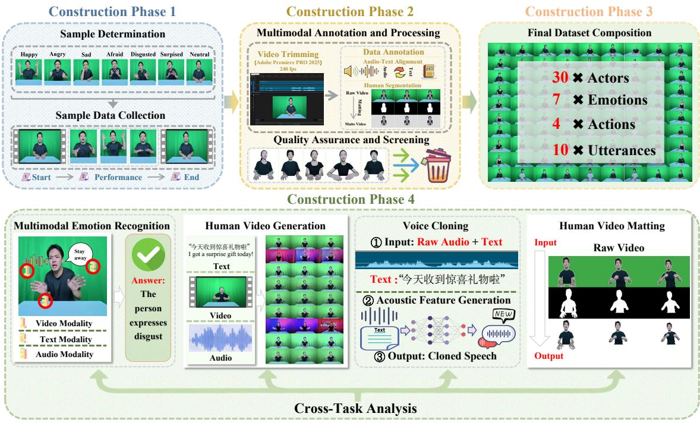  
Fig. 1 Overview of the HUG-VIS construction and evaluation pipeline. Phases 1–3 establish the shared grid and package temporally synchronized multimodal assets (RGB video, noise-suppressed audio, prompt and transcript, and alpha mattes), while Phase 4 conducts the evaluation of the four understanding and generation tasks together with the cross-task analysis.

Data resources and their fragmentation. The empirical progress of the field has been tightly coupled to the resources that define its tasks, and this coupling is precisely where the field remains fragmented. On the understanding side, afective corpora such as IEMOCAP and CMU-MOSEI supply multimodal emotional data but ofer no alpha supervision or controlled bodymotion inventory (Busso et al., 2008; Zadeh et al., 2018). On the generation side, datasets such as MEAD and BEAT provide synchronized audiovisual material for animation, but they vary in their emotion annotations and in the extent of body coverage, and none is designed to support reuse across tasks (H. Liu et al., 2022; K. Wang et al., 2020). Voice cloning has developed on multispeaker corpora such as VCTK (Yamagishi et al., 2019), and video matting on large syntheticcomposite collections such as VideoMatte240K (Lin et al., 2022), each optimized for its own reference signal. More recent eforts to raise evaluation standards, including HumanVBench, sharpen the field’s vocabulary but remain oriented toward a single capability or modality family (T. Zhou et al., 2026).

The impact is twofold. First, because each resource captures diferent identities under diferent conditions, comparisons drawn across them conflate genuine model capability with confounds of population, behavior, and acquisition. Second, and more fundamentally, no existing corpus supports the consistent evaluation of understanding and generation capabilities within a unified setting, and as a result, the relationships among these capabilities, such as whether their dificulty is consistent and whether their errors are correlated, remain entirely unestablished. HUG-VIS is designed to remove exactly this obstacle: by having the same actors perform an identical emotion–action–prompt grid and by packaging synchronized video, audio, text, and alpha mattes for every performance, it places the four representative tasks on a shared and condition-aligned foundation, as detailed in the following Section.

## 3 The Dataset

Based on the aforementioned motivation, the organizational approach of HUG-VIS enables human performances to serve as evidence for both understanding and generation. Here, we introduce the dataset design principle, recording protocol, annotation specification, and final dataset composition.

## 3.1 Design Principle: A Condition-Aligned Performance Grid

HUG-VIS is built on a complete actor-byassignment grid. Every actor performs an identical set of emotion–action–prompt assignments, so that visual behavior, speech, text, and foreground observations are aligned not only within a clip but also across actors and, later, across model outputs. This design deliberately trades environmental diversity for controlled correspondence: because the same assignment recurs for every actor, any diference we observe downstream can be attributed to the actor, the model, or the evaluation metric rather than to a mismatch in the underlying material. The evaluation unit is a single actor’s performance of a single assignment. Each performance is linked to a synchronized set of modalities, comprising the RGB video and its accompanying audio, the assigned prompt together with its verbatim transcript, and the alpha matte. Retaining all 30 actors across all 280 assignments produces a complete grid of 8,400 performances.

## 3.2 Emotion, Action, and Utterance Design

The grid pairs six categories from the basicemotion taxonomy (Ekman, 1992), namely Happy, Angry, Sad, Afraid, Disgusted, and Surprised, together with Neutral in which actors are instructed to perform with minimal expressivity, giving seven conditions in total. For each emotion, the intended movement style, action templates, and an illustrative prompt are specified, as shown in Table 1. The action templates draw on established accounts of bodily emotion, movement dynamics, and action readiness (Atkinson, Dittrich, Gemmell, & Young, 2004; de Meijer, 1989;

Frijda, Kuipers, & ter Schure, 1989; Wallbott, 1998), and the Mandarin prompts are drawn from acted-afect corpora following scenario-based emotion elicitation (B¨anziger et al., 2012). For each actor, the four action templates are crossed with ten textual prompts, yielding 40 assignments per emotion and thus 280 assignments across the seven conditions.

## 3.3 Acquisition: Actors, Studio, and Recording Protocol

Table 2 (a) summarizes the recording configuration. Every performance is captured with a fixed frontal green-screen setup under controlled lighting and a seated half-body framing, which keeps the subject, viewpoint, and background constant across the entire grid. Video is recorded at 1920 × 1080 and 240 FPS (released at 30 FPS), and accompanied by synchronized denoised audio. 30 professional actors completed the full grid and passed the retention criteria. This cohort is gender balanced, has a mean age of roughly 20 years, and contributed about four hours of recording per actor.

Each performance follows a canonical protocol with three phases. The actor begins at rest, delivers the assigned prompt together with its action template, and then returns to the same resting pose. Because every clip shares these start, expression, and return phases, the protocol imposes consistent temporal boundaries that facilitate downstream processing and evaluation. Fig. 3 illustrates the studio environment, the instruction display, and the synchronized capture of gesture and speech, and a side-view photograph documents the physical layout of the setup.

## 3.4 Annotation and Quality Assurance

Each evaluation unit comprises paired RGB video, audio, and text, together with the corresponding alpha mattes. The mattes are produced using the professional software Adobe Premiere Pro through a two-stage process: chroma-key initialization followed by sequence-level refinement. During refinement, particular attention is paid to hair, fingers, and clothing, as well as to regions afected by selfocclusion and motion blur. All modalities are subsequently converted into a unified format, ensuring that the RGB, audio, text, and alpha channels of every unit follow consistent conventions.

Table 1 Emotion-conditioned performance design in HUG-VIS, showing the intended movement style, action templates, and an illustrative prompt for each emotion. The example prompts are English translations of the Mandarin prompts.
<table><tr><td>Condition</td><td>Movement style</td><td>Action templates</td><td>Illustrative prompt</td></tr><tr><td>Happy</td><td>expansive, with open posture</td><td>Light, relaxed, and Two-handed open-palmed welcome; an one-handed open-palmed welcome; concert! &#x27;I&#x27;m thrilled!&quot; outward arm extension; two-handed thumbs-up gesture</td><td>“I finally got a ticket to the</td></tr><tr><td>Angry</td><td>oriented posture</td><td>Fast, forceful, and sus- Table strike; forceful arm sweep; sharp “Enough! I don&#x27;t want to hear tained, with a forward- pointing gesture; clenched-fist raise and another excuse.&quot; drop</td><td></td></tr><tr><td>Sad</td><td>oriented posture</td><td>Slow or paused, with a Head or neck support with one or both “Everything I&#x27;d hoped for has contracted, downward- hands; hand on head; self-embrace with fallen apart, and now I&#x27;m all hands on upper arms</td><td>alone.&quot;</td></tr><tr><td>Afraid</td><td>slight trembling</td><td>Contracted, guarded, One- or two-handed guarding gesture; “Stay back! Please don&#x27;t hurt and withdrawing, with recoil; hands clasped close to the body me!&quot; while leaning backward</td><td></td></tr><tr><td>Disgusted</td><td>a backward lean</td><td>Restrained and out- Two-handed push-away; one-handed “Get this away from me! I wardly rejecting, with wave or push-away; dismissive wave; can&#x27;t stand looking at it.&quot; shooing gesture</td><td></td></tr><tr><td>Surprised</td><td>an abrupt freeze</td><td>expansive, ending in brought behind the head; sudden torso curtain. So why is that shadow lean; one-hand raise followed by a freeze moving?&quot;</td><td>Rapid and moderately Sudden raising of both hands; hands “There was nothing behind the</td></tr><tr><td>Neutral</td><td>ble, relaxed posture</td><td>Gentle, even, and low- Hands at rest with subtle finger or wrist “The meeting is at 3 p.m. amplitude, with a sta- movements; natural seated posture with Remember to bring the mate- minor head or hand adjustments</td><td>rials.&quot;</td></tr></table>

Table 2 HUG-VIS acquisition setup and dataset composition.  
(a) Acquisition setup
<table><tr><td>Item</td><td>Specification</td></tr><tr><td>RGB camera</td><td>DJI Action 5 Pro, fixed frontal mount</td></tr><tr><td>Background</td><td>Uniform green screen for chroma-key mat- ting</td></tr><tr><td>Lighting</td><td>JHC-2000S LED, fixed color temperature and intensity</td></tr><tr><td>Framing</td><td>Seated half-body, constant subject-camera distance</td></tr><tr><td>Resolution</td><td>1920 × 1080</td></tr><tr><td>Frame rate</td><td>Captured at 240 FPS, released at 30 FPS</td></tr><tr><td>Microphone</td><td>DJI Mic Mini transmitter</td></tr><tr><td>Audio stream</td><td>Synchronized with video and noise- suppressed</td></tr></table>

To ensure the accuracy of the retained data, eight professional volunteers conduct a quality assessment. Each video clip is reviewed to verify strict alignment among the RGB, audio, text, and alpha mattes. In addition, the volunteers check audio-visual synchronization, the accuracy of the textual descriptions, and the presence of any segmentation errors caused by motion blur or selfocclusion. Any clip that fails to meet these criteria is either discarded or returned for reprocessing, thereby ensuring the overall quality and consistency of the final dataset. Fig. 2 shows example videos covering diferent actors, emotions, and actions.

(b) Dataset composition
<table><tr><td>Property</td><td>Value</td></tr><tr><td>Actors</td><td>30, gender-balanced, aged approxi- mately 20 years</td></tr><tr><td>Instructed conditions</td><td>7 in total (6 basic emotions and Neu- tral)</td></tr><tr><td>Action templates</td><td>4 per emotion</td></tr><tr><td>Canonical utterances</td><td>10 per action, yielding 40 per emotion and 280 per actor</td></tr><tr><td>Performance clips</td><td>8,400 in total</td></tr><tr><td>Text fields</td><td>Assigned Mandarin prompt and veri- fied transcript</td></tr><tr><td>Per-clip assets</td><td>RGB video, audio, text, and alpha matte</td></tr></table>

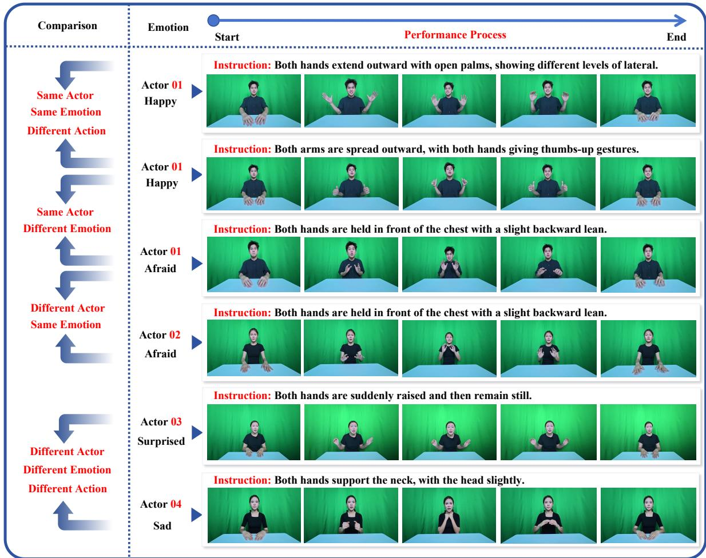  
Fig. 2 Samples illustrating the controlled correspondence of the actor-by-assignment grid, with each row showing ordered frames of the rest–expression–rest protocol. The indicated row pairs vary a factor at a time (actor, emotion, action, or al three), so that downstream diferences are attributable to the actor, model, or criterion rather than mismatched material.

## 3.5 Dataset Composition and Comparison

As illustrated in Table 2 (b), the released dataset comprises 8,400 seated half-body clips that are evenly distributed across the seven emotions, with 1,200 clips per condition. Every clip is packaged as a self-contained evaluation unit that bundles the RGB video, the synchronized audio, the assigned text together with its transcript, and alpha mattes. Because these assets are temporally synchronized and share consistent conventions, a clip can be used directly for understanding and generation tasks.

Table 3 compares HUG-VIS with representative existing resources (Busso et al., 2008; Lin et al., 2021; H. Liu et al., 2022; K. Wang et al., 2020; Yamagishi et al., 2019; Z. Zhang et al., 2021) under the five binary criteria defined in the caption. These criteria characterize released assets and analysis protocols rather than the overall quality or scope of each resource. MEAD and IEMOCAP provide emotion-labeled A/V/T data; HDTF provides audio-visual talking-face clips but lacks paired transcripts; BEAT provides emotionlabeled body-motion data but not standardized upper-body RGB video; VCTK provides speech and utterance transcripts but lacks paired video; and VideoMatte240K provides human foreground sequences with per-frame alpha mattes but uses heterogeneous footage rather than a standardized half-body capture protocol. Among the resources compared, and under these criteria, HUG-VIS is the only resource that satisfies all five. Its complete actor-by-assignment grid and shared actor,

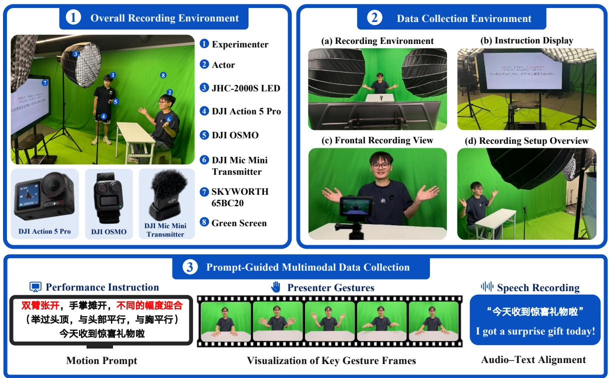  
Fig. 3 Acquisition setup of HUG-VIS: Region 1 shows the green-screen environment and equipment, Region 2 the front view configuration and instruction display, and Region 3 the prompt-guided recording with ordered key-gesture frames and synchronized speech. All clips are captured at 1920 × 1080 and 240 FPS (released at 30 FPS) with synchronized audio.

Table 3 Comparison of HUG-VIS with representative datasets along five properties: emotion annotation, half-body capture, alpha supervision, audio–video–text (A-V-T) alignment, and condition-aligned cross-task analysis. ✓ denotes that the released resource satisfies the stated criterion, while ✗ denotes that it does not.
<table><tr><td>Resource</td><td>Emotion annotation</td><td>Half-body capture</td><td>Alpha supervision</td><td>A/V/T alignment</td><td>Condition-aligned cross-task analysis</td></tr><tr><td>MEAD (K. Wang et al., 2020)</td><td>√</td><td>X</td><td>X</td><td>√</td><td>X</td></tr><tr><td>HDTF (Z. Zhang et al., 2021)</td><td>X</td><td>X</td><td>X</td><td>X</td><td>X</td></tr><tr><td>BEAT (H. Liu et al., 2022)</td><td>√</td><td>√</td><td>X</td><td>X</td><td>X</td></tr><tr><td>IEMOCAP (Busso et al., 2008)</td><td>√</td><td>S</td><td>X</td><td>√</td><td>X</td></tr><tr><td>VCTK (Yamagishi et al., 2019)</td><td>X</td><td>X</td><td>X</td><td>X</td><td>X</td></tr><tr><td>VideoMatte240K (Lin et al., 2021)</td><td>X</td><td>V</td><td>√</td><td>X</td><td>X</td></tr><tr><td>HUG-VIS</td><td></td><td>V</td><td></td><td>V</td><td>√</td></tr></table>

source, and condition identifiers allow task-specific results to be analyzed on matched identities and instructed conditions.

## 4 Benchmark Protocols and Metrics

## 4.1 Tasks and Comparison Populations

HUG-VIS defines four tasks, each with its own input, target, reference, comparison population, and evaluation metrics. All tasks follow a zero-shot evaluation protocol, so no benchmark samples are used for training, fine-tuning, calibration, or model selection. Multimodal emotion recognition asks systems to predict the assigned emotion label from image frames, video, audio, text, or diferent combinations thereof, and results are reported separately. Human video generation is organized by driving signal into audio-driven and vision-driven regimes, and both are included in our evaluation. Audio-driven generation synthesizes performances from the recorded audio, whereas vision-driven generation is conditioned on visual references, with each system evaluated according to its reported output scope. Voice cloning reproduces the vocal identity of a target speaker in synthesized speech, and each output is tied to its actor so that it can be compared directly with the recorded reference audio of the same performance. Human video matting recovers the alpha matte from the RGB frames and is evaluated against the reference alpha, which measures both spatial accuracy and temporal stability.

## 4.2 Objective and Subjective Evaluation Metrics

Each task is evaluated with metrics matched to its output representation and reference signal. Emotion recognition is measured by seven-class classification accuracy. Audio-driven generation reports identity similarity via ArcFace cosine similarity (Deng, Guo, Xue, & Zafeiriou, 2019) (CSIM) and lip-synchronization quality via SyncNet-derived confidence and distance measures (denoted Sync-C and Sync-D) (Chung & Zisserman, 2016; Ji et al., 2025; Prajwal, Mukhopadhyay, Namboodiri, & Jawahar, 2020; Tu, Pan, et al., 2025), whereas vision-driven generation reports LPIPS (R. Zhang, Isola, Efros, Shechtman, & Wang, 2018), CSIM, PSNR, SSIM (Z. Wang, Bovik, Sheikh, & Simoncelli, 2004), and FID (Heusel, Ramsauer, Unterthiner, Nessler, & Hochreiter,

2017). Voice cloning is evaluated using UTMOS (Saeki et al., 2022) and DNSMOS (Reddy, Gopal, & Cutler, 2021) as reference-free speechquality predictors, together with Resemblyzerbased speaker similarity (Resemble AI, 2026; Wan, Wang, Papir, & Lopez Moreno, 2018) as a measure of identity preservation. Matting reports spatial MAD, MSE, gradient, and connectivity errors against the reference alpha, together with the temporal dtSSD (Erofeev, Gitman, Vatolin, Fedorov, & Wang, 2015).

Beyond these objective metrics, we conduct subjective studies that report criterion-specific mean opinion score (MOS) on a 1–5 scale. For video generation, human raters assess identity preservation, emotion naturalness, and either lip synchronization for the audio-driven setting or motion naturalness for the vision-driven setting. For voice cloning, raters listen to each generated utterance alongside its reference audio and score their similarity, as well as the emotion naturalness of the generated speech. Ratings are averaged within each clip to yield the MOS.

## 4.3 Cross-Task Analysis Setup

The four benchmark tasks share the same actor and source, which allows us to study how dificulty varies across tasks rather than within a single one. However, because the metrics of Section 4.2 differ in unit and optimization direction, their raw values cannot be compared directly. Therefore, we propose four cross-task analysis metrics, whose corresponding results are presented in Section 5.5.

Emotion dificulty across metrics. This analysis compares the results of diferent emotions within the same evaluation metric to demonstrate the role of emotions in the final outcome. Let $\mathcal { E }$ represent the set of seven emotions. For each emotion $e \in { \mathcal { E } }$ , task metric $k ,$ and model $m \in \mathcal { M } _ { k }$ (the set of models evaluated under metric $k )$ , let $g _ { m , e , k }$ denote the sample-averaged value of model m under condition e with respect to the metric $k ,$ oriented so that a larger value indicates greater dificulty. Then, we average the models:

$$
g _ { e , k } = \frac { 1 } { | \mathcal { M } _ { k } | } \sum _ { m \in \mathcal { M } _ { k } } g _ { m , e , k }\tag{1}
$$

Then, each $g _ { e , k }$ is min-max normalized over $\mathcal { E } ,$

$$
D _ { e , k } = \frac { g _ { e , k } - g _ { k } ^ { \operatorname* { m i n } } } { g _ { k } ^ { \operatorname* { m a x } } - g _ { k } ^ { \operatorname* { m i n } } } \in [ 0 , 1 ]\tag{2}
$$

so that 0 and 1 mark the easiest and hardest condition under metric $k .$ , respectively. The results are visualized in Fig. 8.

Agreement between dificulty profiles. This analysis computes the metric agreement of the emotion dificulty described above. For metric $k ,$ the normalized values form a profile $D _ { k } =$ $( D _ { e , k } ) _ { e \in \mathcal { E } }$ , and the agreement between metrics k and ℓ can be computed as Spearman rank correlation:

$$
\rho _ { k , \ell } = \mathrm { S p e a r m a n } ( D _ { k } , D _ { \ell } )\tag{3}
$$

where positive, negative, and near-zero values indicate positive correlation, negative correlation, and no correlation, respectively. The agreement matrix is reported in Fig. 9.

Source-level dificulty across generation regimes. This analysis aims to explore whether audio-driven video generation (AD) and visiondriven video generation (VD) impose similar relative dificulty on the same source clips. For model m, clip s, and metric q, each metric value $z _ { m , s } ^ { ( q ) }$ is first min–max normalized across all selected clips, yielding a higher-is-harder score. Then, the mean of these normalized values across diferent metrics gives the dificulty $z _ { m , s }$ that model m assigns to clip s. By averaging diferent models within each regime of AD and VD, we can obtain

$$
Z _ { s } ^ { p } = \frac { 1 } { | \mathcal { M } _ { p } | } \sum _ { m \in \mathcal { M } _ { p } } z _ { m , s } , \qquad p \in \{ \mathrm { A D } , \mathrm { V D } \}\tag{4}
$$

Then, we plot $Z _ { s } ^ { \mathrm { A D } }$ against $Z _ { s } ^ { \mathrm { V D } }$ for each sample in a single coordinate system and fit the resulting distribution, as shown in Fig. 10.

Motion dificulty in the matting task and its relationship with emotions. This analysis aims to explore the motion challenges in video matting tasks and analyze the motion dificulty of diferent emotions by fitting the results to a matting evaluation metric. Specifically, inspired by previous matting works (Erofeev et al., 2015; Johnson, Shahrian Varnousfaderani, Cholakkal, & Rajan, 2016; Perazzi et al., 2016), we define a motion dificulty that combines frame-toframe alpha variation with normalized foreground displacement. In the formalization, we first let $\alpha _ { s , t } ( x , y ) ~ \in ~ [ 0 , 1 ]$ be the alpha value at spatial coordinate $( x , y ) , 1 \leq x \leq W , 1 \leq y \leq H$ , in the t-th of the $T _ { s }$ sampled frames of clip $s ,$ each of size $H \times W$ . Then, we summarize local variation by the mean absolute inter-frame alpha change $U _ { s }$ and global displacement by the mean inter-frame shift $V _ { s }$ of the normalized foreground centroid,

$$
\begin{array} { r } { U _ { s } = \frac { 1 } { ( T _ { s } - 1 ) H W } \sum _ { t = 1 } ^ { T _ { s } - 1 } \sum _ { x , y } | \alpha _ { s , t + 1 } ( x , y ) - \alpha _ { s , t } ( x , y ) | } \end{array}\tag{5}
$$

$$
V _ { s } = \frac { 1 } { T _ { s } - 1 } \sum _ { t = 1 } ^ { T _ { s } - 1 } \| c _ { s , t + 1 } - c _ { s , t } \| _ { 2 }\tag{6}
$$

where the centroid $c _ { s , t }$ is computed from the thresholded foreground mask. Because $U _ { s }$ and $V _ { s }$ difer in scale, each is converted to a percentile rank and their mean defines the motion dificulty $D _ { \mathrm { m o t i o n } } ( s )$ , a quantity that depends on the reference alpha values. Next, we average the matting metric dtSSD over the diferent models for each clip s, yielding dtSSDs. We fit the relationship between $D _ { \mathrm { m o t i o n } } ( s )$ and dtSSD in a coordinate system, annotating the samples according to their instructed emotion, as shown in Fig. 11.

These four cross-task analyses characterize difficulty in terms of instructed emotion, source clip, and video motion. In Section 5.5, they ofer a principled basis for diagnosing where current models break down and for comparing methods along axes that single-task metrics fail to capture.

## 5 Experimental Results

Following the zero-shot protocol of Section 4, we report evaluation results for each individual task and across tasks.

## 5.1 Multimodal Emotion Recognition

Table 4 reports seven-class recognition accuracy across the image, video, audio, text, and multimodal input settings, from which two findings emerge. First, under the zero-shot protocol, the compact task-specific baselines transfer poorly to this regime, while broadly pretrained and instruction-tuned models prove substantially more capable. For text-only input, accuracy ranges from 19.35% with EmoBERTa to 82.93% with DeepSeek-V3.2, whereas for audio-only input, it ranges from 64.64% with Kimi-Audio-7B-Instruct to 74.38% with Audio-Reasoner-7B. Second, and most consequential for a human-centered benchmark, purely visual recognition remains the weakest setting by a wide margin. The strongest image-frame and video systems reach only 37.05% and 48.52%, respectively, and although the temporal cues available in video yield an 11.47% gain over single frames, the best video result still trails the best audio result by 25.86% and the best text result by 34.41%. Consequently, the principal bottleneck on our dataset lies in inferring the emotion information from visual evidence alone, which demands sensitivity to subtle facial cues and their temporal dynamics.

Table 4 Seven-class emotion recognition accuracy. Bold and underlined values indicate the best and second-best results.
<table><tr><td>Model</td><td>Input</td><td>Acc. (%)↑</td></tr><tr><td colspan="3">Image frame</td></tr><tr><td> $\mathrm { F o r m e r - D F E R \ ( Z . \ Z h a o \ \& \ L i u , 2 0 2 1 ) }$ </td><td>Image frame</td><td>11.42</td></tr><tr><td> $\mathrm { E m o t i o n \mathrm { - } F A N \ ( \mathrm { D } . \mathrm { \ M e n g , \ P e n g , \ W a n g , \ \& \ Q i a o , \ 2 0 1 9 ) } }$ </td><td>Image frame</td><td>13.90</td></tr><tr><td>EmotiEffLib (Savchenko, 2023; Sber AI Lab, 2025) MMA-DFER (Chumachenko, Íosifidis, &amp; Gabbouj, 2024)</td><td>Image frame Image frame</td><td>33.37 37.05</td></tr><tr><td>Video</td><td></td><td></td></tr><tr><td> $\mathrm { Q w e n 2 . 5 - O m n i - 7 B ~ ( J . ~ X u ~ e t ~ a l . , ~ 2 0 2 5 ) }$   $\mathrm { \check { H u m a n O m n i - 7 B } \ ( J . \ Z h a o \ e t \ a l . , \ 2 0 2 5 ) }$   $\mathrm { V i d e o L L a M A 3  – 7 B ~ ( B . ~ Z h a n g ~ e t ~ a l . , ~ 2 0 2 5 ) }$   $\mathrm { M i n i C P M  – V ~ 4 . 5 ~ ( Y u ~ e t ~ a l . , ~ \breve { 2 } 0 2 6 ) }$   $\mathrm { M o l m o 2 - 8 B ~ ( C l a r k ~ e t ~ a l . , ~ 2 0 2 6 ) }$   $\mathrm { I n t e r n V i d e o 2 . 5 - C h a t - 8 B \ ( Y . \ W a n g \ e t \ a l . , 2 0 2 5 ) }$ </td><td>Video Video Video Video Video Video</td><td>27.77 41.90 43.12 45.88 46.34 46.42</td></tr><tr><td> $\mathrm { M i n i C P M \mathrm { - } o 4 . 5 ~ ( C u i ~ e t ~ a l . , 2 0 2 6 ) } ^ { \sim }$  Audio  $\mathrm { K i m i - A u d i o \mathrm { - } 7 B \mathrm { - } I n s t r u c t ~ ( K i m i ~ T e a m , } 2 0 2 5 )$ </td><td>Video Audio</td><td>48.52 64.64</td></tr><tr><td>Qwen2-Audio-7B-Instruct (Chu et al., 2024)  $\check { \mathrm { E m o t i o n T h i n k e r } } ( \mathrm { D . ~ W a n g ~ e t ~ a l . , ~ 2 0 2 6 } )$   $\mathrm { A u d i o { - } R e a s o n e r { - } \mathrm { { 7 B } ~ ( X i e ~ e t ~ a l . , ~ 2 0 2 5 ) } }$ </td><td>Audio Audio Audio</td><td>69.85 72.98 74.38</td></tr><tr><td>Text EmoBERTa (Kim &amp; Vossen, 2021)  $\mathrm { S t r u c t B E R T } \mathrm { \tilde { ( W .  W a n g e t a l . , 2 0 2 0 ) } }$ </td><td>Text</td><td>19.35</td></tr><tr><td> $\mathrm { Q w e n 2 . 5 – 7 B – I n s t r u c t \ ( \check { Q } w e n \ T e a m , \dot { 2 } 0 2 4 ) }$ </td><td>Text Text</td><td>38.28 78.32</td></tr><tr><td>Qwen3-32B (Qwen Team, 2025)</td><td>Text</td><td>82.45</td></tr><tr><td> $\breve { \mathrm { D e e p S e e k - V 3 . \bar { 2 } \ ( D e e p S e e k - A I , \ 2 0 2 5 ) } }$ </td><td>Text</td><td></td></tr><tr><td></td><td></td><td>82.93</td></tr><tr><td>Video + Audio</td><td></td><td></td></tr><tr><td></td><td></td><td></td></tr><tr><td> $\mathrm { M i n i C P M { \mathrm { - } } ~ } 4 . 5 ~ ( \mathrm { C u i ~ e t ~ a l . , ~ } 2 0 2 6 )$ </td><td></td><td></td></tr><tr><td></td><td> $\mathrm { V i d e o } + \mathrm { A u d i o }$ </td><td>47.07</td></tr><tr><td>HumanOmni-7B (J. Zhao et al., 2025)</td><td> $\mathrm { V i d e o } + \mathrm { A u d i o }$ </td><td></td></tr><tr><td> $\mathrm { Q w e n 2 . 5 - O m n i - 7 B ~ ( J . ~ X u ~ e t ~ a l . , ~ 2 0 2 5 ) }$ </td><td></td><td>70.16</td></tr><tr><td> $\mathbf { \hat { V } i d e o } + \mathbf { T e x t }$ </td><td> $\mathrm { V i d e o } + \mathrm { A u d i o }$ </td><td>73.70</td></tr><tr><td></td><td></td><td></td></tr><tr><td> $\mathrm { V i d e o L L a M A 3  – 7 B ~ ( B . ~ Z h a n g ~ e t ~ a l . , ~ 2 0 2 5 ) }$ </td><td> $\mathrm { V i d e o } + \mathrm { T e x t }$ </td><td>54.34</td></tr><tr><td> $\mathrm { H u m a n O m n i \mathrm { - } 7 B \ ( J . \ Z h a o \ e t a l . , 2 0 2 5 ) }$ </td><td> $\mathrm { V i d e o } + \mathrm { T e x t }$ </td><td>72.41</td></tr><tr><td>Molmo2-8B (Clark et al., 2026)</td><td> $\mathrm { V i d e o } + \mathrm { T e x t }$ </td><td>75.23</td></tr><tr><td> $\mathrm { M i n i C P M  – V \ 4 . 5 \ ( Y u \ e t \ a l . , 2 0 \dot { 2 } 6 ) }$ </td><td> $\mathrm { V i d e o } + \mathrm { T e x t }$ </td><td>76.52</td></tr><tr><td> $\mathrm { M i n i C P M { \mathrm { - } } o 4 . 5 ~ ( \dot { C } u i ~ e t ~ a l . , ~ 2 0 2 6 ) }$ </td><td> $\mathrm { V i d e o } + \mathrm { T e x t }$ </td><td></td></tr><tr><td> $\mathrm { I n t e r n V i d e o 2 . 5 - C h a t - 8 B \ ( Y . \ W a n g \ e t \ a l . , 2 0 2 5 ) }$ </td><td></td><td>77.12</td></tr><tr><td></td><td> $\mathrm { V i d e o } + \mathrm { T e x t }$ </td><td>78.77</td></tr><tr><td> $\mathrm { Q w e n 2 . 5 - O m n i - 7 B ~ ( J . ~ X u ~ e t ~ a l . , ~ 2 0 2 5 ) }$ </td><td> $\mathrm { V i d e o } + \mathrm { T e x t }$ </td><td>83.74</td></tr><tr><td> $\mathbf { V i d e o } + \mathbf { A u d i o } + \mathbf { T e x t }$ </td><td></td><td></td></tr><tr><td> $\mathrm { Q w e n 2 . 5 - O m n i - 3 B \ ( J . \ X u \ e t \ a l . , \ 2 0 2 5 ) }$ </td><td> $\mathrm { V i d e o } + \mathrm { A u d i o } + \mathrm { T e x t }$ </td><td>58.41</td></tr><tr><td> $\mathrm { \check { H u m a n O m n i - 7 B } \ ( J . \ Z h a o \ e t \ a l . , \ 2 0 2 5 ) }$ </td><td> $\mathrm { V i d e o } + \mathrm { A u d i o } + \mathrm { T e x t }$ </td><td>73.15</td></tr><tr><td> $\mathrm { M i n i C P M { - } o 4 . 5 ~ ( C u i ~ e t ~ a l . , 2 0 2 6 ) }$ </td><td> $\mathrm { V i d e o } + \mathrm { A u d i o } + \mathrm { T e x t }$ </td><td>77.30</td></tr><tr><td></td><td></td><td></td></tr><tr><td> $\mathrm { Q w e n 2 . 5 \mathrm { - O m n i \mathrm { - } 7 B \ ( J . \ X u \ e t \ a l . , \dot { 2 } 0 2 5 ) } }$ </td><td> $\mathrm { V i d e o } + \mathrm { A u d i o } + \mathrm { T e x t }$ </td><td>83.79</td></tr></table>

The multimodal settings further illuminate how current models combine evidence across modalities. For Qwen2.5-Omni-7B, augmenting video with text lifts accuracy from 27.77% to 83.74%, yet the subsequent addition of audio to the video–text input contributes a mere 0.05 point. HumanOmni-7B and MiniCPM-o 4.5 follow the same trajectory, gaining 30.51% and 28.60% from text but only 0.74% and 0.18% from the further inclusion of audio. Particularly, for MiniCPM-o 4.5, accuracy even declines from 48.52% with video alone to 47.07% once audio is added. Collectively, these results establish linguistic content as the dominant source of evidence for current multimodal models on this dataset and reveal that the remaining modalities are not yet integrated into complementary gains. Continued progress on human-centered understanding will thus demand both more discriminative and fine-grained visual representations of afect and cross-modal fusion mechanisms capable of extracting genuinely complementary information from the audio and visual channels.

Table 5 Objective results of the task of audio-driven video generation. Bold and underlined values indicate the best and second-best results.
<table><tr><td>Model</td><td>CSIM↑</td><td>Sync-C↑</td><td>Sync-D↓</td></tr><tr><td>EDTalk (Tan, Ji, Bi, &amp; Pan, 2024)</td><td>0.710</td><td>3.67</td><td>8.90</td></tr><tr><td>V-Express (C. Wang et al., 2024)</td><td>0.786</td><td>4.95</td><td>8.10</td></tr><tr><td>EchoMimicV3 (R. Meng et al., 2026)</td><td>0.771</td><td>3.15</td><td>10.30</td></tr><tr><td>AniTalker (T. Liu et al., 2024)</td><td>0.744</td><td>3.51</td><td>9.93</td></tr><tr><td>Hallo2 (Cui et al., 2025)</td><td>0.868</td><td>4.65</td><td>8.43</td></tr><tr><td>Ditto (T. Li, Zheng, Yang, Chen, &amp; Yang, 2025)</td><td>0.904</td><td>3.47</td><td>9.31</td></tr><tr><td>Sonic (Ji et al., 2025)</td><td>0.736</td><td>5.42</td><td>7.73</td></tr><tr><td>LatentSync (C. Li, Zhang, et al., 2024)</td><td>0.798</td><td>5.43</td><td>7.73</td></tr></table>

Table 6 Subjective results of the task of audio-driven video generation. Bold and underlined values indicate the best and second-best results.
<table><tr><td>Model</td><td>ID Similarity ↑</td><td>Emotion Naturalness ↑</td><td>Lip Synchronization ↑</td></tr><tr><td>EDTalk (Tan et al., 2024)</td><td>1.22</td><td>1.24</td><td>1.33</td></tr><tr><td>V-Express (C. Wang et al., 2024)</td><td>1.36</td><td>1.33</td><td>3.40</td></tr><tr><td>EchoMimicV3 (R. Meng et al., 2026)</td><td>2.93</td><td>2.07</td><td>2.24</td></tr><tr><td>AniTalker (T. Liu et al., 2024)</td><td>3.74</td><td>2.89</td><td>2.78</td></tr><tr><td>Hallo2 (Cui et al., 2025)</td><td>3.69</td><td>2.91</td><td>2.96</td></tr><tr><td>Ditto (T. Li et al., 2025)</td><td>4.13</td><td>3.02</td><td>2.94</td></tr><tr><td>Sonic (Ji et al., 2025)</td><td>4.44</td><td>4.16</td><td>4.43</td></tr><tr><td>LatentSync (C. Li, Zhang, et al., 2024)</td><td>4.29</td><td>4.13</td><td>4.47</td></tr></table>

## 5.2 Human Video Generation

We evaluate human video generation under two driving regimes. Audio-driven generation animates a portrait from recorded audio and is assessed for identity preservation and audio–visual synchronization, whereas vision-driven generation transfers motion from a driving video and is assessed for appearance reconstruction, identity consistency, and motion naturalness. In addition, following the vision-driven generation results reported in the original papers of each method, we organize the open-source models into two paradigms according to the spatial extent they are designed to animate: Head Animation systems reconstruct a driven portrait and concentrate on facial geometry and identity, whereas Body Animation systems render the body and should additionally coordinate torso and hand motion.

Audio-driven generation. The automatic results in Table 5 show that the models distribute their strengths across identity and synchronization rather than excelling on both at once. Ditto attains the highest identity similarity, with a CSIM of 0.904, while LatentSync records the best Sync-C at 5.43 and shares the best Sync-D of 7.73 with Sonic. The subjective study in Table 6 is broadly consistent with these measurements while refining their ordering. LatentSync obtains the highest lip-synchronization score of 4.47, in line with its leading Sync-C, so the two evaluations agree on synchronization quality. On the identity dimension, the rankings shift. Sonic leads both identity similarity and emotion naturalness, at 4.44 and 4.16, even though its CSIM reaches 0.736, whereas Ditto, the CSIM leader, falls to third in perceived identity. This pattern suggests that CSIM captures one aspect of identity, while human raters may also consider other factors such as stability and expressiveness. The qualitative comparison in Fig. 4 makes this concrete. EDTalk exhibits severe facial deformation and unstable geometry, Hallo2 retains the source identity but introduces visible background and texture artifacts, and Sonic and LatentSync produce the most stable identities and expression dynamics.

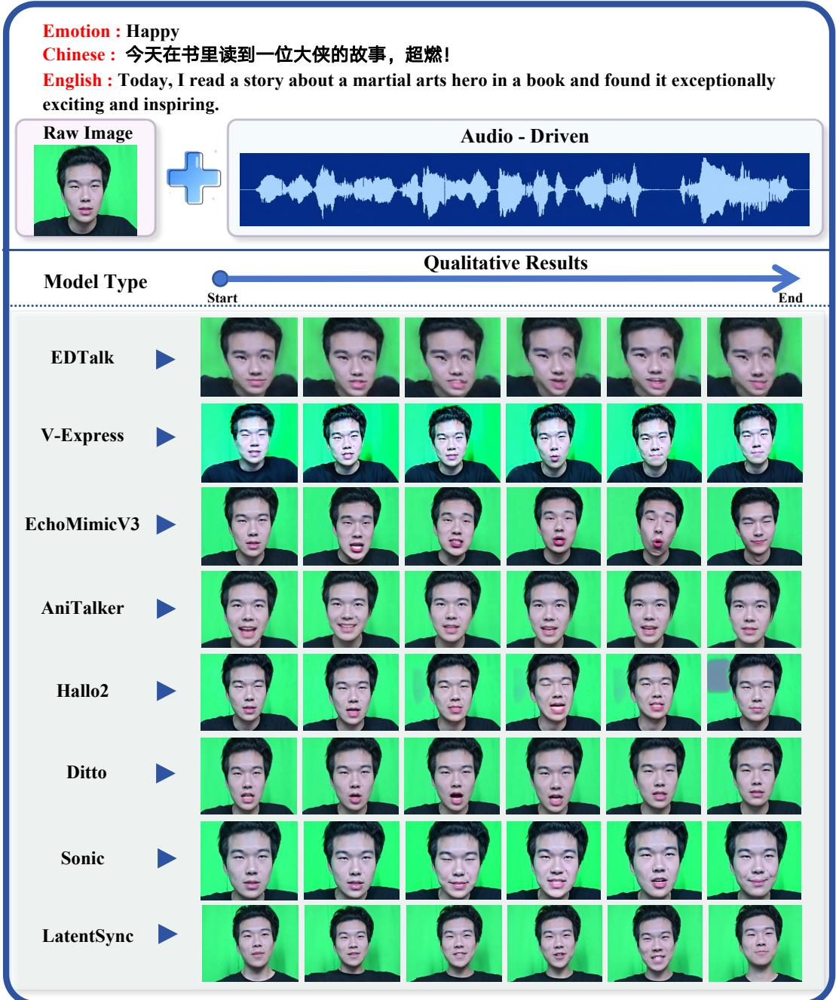  
Fig. 4 Qualitative comparison of audio-driven video generation for one Happy utterance, sampled at six ordered time points. The top panel shows the source portrait, transcript, and driving audio waveform, and each row shows the temporally aligned outputs of one model.

Vision-driven generation. Table 7 reports the vision-driven generation results across the two open-source paradigms and the closed-source group. Among the Head Animation systems, X-NeMo leads LPIPS (0.520), PSNR (10.15), and FID (150.57), whereas AniPortrait leads CSIM (0.884) and SSIM (0.383), indicating that no single system dominates both the reconstruction and the identity criteria. Among the Body Animation systems, Animate-X leads LPIPS (0.139), PSNR (18.81), and SSIM (0.755), while Wan2.2 leads CSIM (0.783) and FID (20.24). Within the closedsource group, Kling leads PSNR (16.41) and SSIM (0.721), whereas Vidu leads LPIPS (0.195), CSIM (0.786), and FID (20.05).

Table 7 Objective results of the task of vision-driven video generation. Bold and underlined values indicate the best and second-best results.
<table><tr><td>Model</td><td>LPIPS↓</td><td>CSIM↑</td><td>PSNR↑</td><td>SSIM↑</td><td>FID↓</td></tr><tr><td colspan="6">Open-source</td></tr><tr><td>Head Animation</td><td></td><td></td><td></td><td></td><td></td></tr><tr><td>HunyuanPortrait (Z. Xu et al., 2025)</td><td>0.568</td><td>0.868</td><td>9.11</td><td>0.375</td><td>175.71</td></tr><tr><td>X-NeMo (X. Zhao et al., 2025)</td><td>0.520</td><td>0.678</td><td>10.15</td><td>0.368</td><td>150.57</td></tr><tr><td>PersonaLive! (Z. Li et al., 2026)</td><td>0.565</td><td>0.834</td><td>9.43</td><td>0.382</td><td>164.94</td></tr><tr><td>AniPortrait (Wei, Yang, &amp; Wang, 2024) Body Animation</td><td>0.565</td><td>0.884</td><td>9.43</td><td>0.383</td><td>167.49</td></tr><tr><td>MimicMotion (Y. Zhang et al., 2025)</td><td>0.606</td><td>0.627</td><td>9.24</td><td>0.557</td><td>59.56</td></tr><tr><td>StableAnimator (Tu, Xing, et al., 2025)</td><td>0.280</td><td>0.695</td><td>14.52</td><td>0.601</td><td>55.99</td></tr><tr><td>Animate-X (Tan et al., 2025)</td><td>0.139</td><td>0.733</td><td>18.81</td><td>0.755</td><td>31.46</td></tr><tr><td>Wan2.2 (Wan Team, 2025)</td><td>0.195</td><td>0.783</td><td>16.08</td><td>0.714</td><td>20.24</td></tr><tr><td>Closed-source</td><td></td><td></td><td></td><td></td><td></td></tr><tr><td colspan="6"></td></tr><tr><td>Vidu (Bao et al., 2024)</td><td>0.195</td><td>0.786</td><td>15.96</td><td>0.714</td><td>20.05</td></tr><tr><td>Kling (Kling Team, 2026)</td><td>0.197</td><td>0.777</td><td>16.41</td><td>0.721</td><td>23.14</td></tr></table>

Table 8 Subjective results of the task of vision-driven video generation. Bold and underlined values indicate the best and second-best results.
<table><tr><td>Model</td><td>ID Similarity ↑</td><td>Emotion Naturalness ↑</td><td>Motion Naturalness ↑</td></tr><tr><td colspan="4">Open-source</td></tr><tr><td colspan="4">Head Animation</td></tr><tr><td>HunyuanPortrait (Z. Xu et al., 2025)</td><td>4.15</td><td>3.55</td><td>3.66</td></tr><tr><td>X-NeMo (X. Zhao et al., 2025)</td><td>4.16</td><td>3.68</td><td>3.82</td></tr><tr><td>PersonaLive! (Z. Li et al., 2026)</td><td>4.41</td><td>3.67</td><td>3.63</td></tr><tr><td>AniPortrait (Wei et al., 2024)</td><td>4.04</td><td>3.11</td><td>3.22</td></tr><tr><td colspan="4">Body Animation</td></tr><tr><td>MimicMotion (Y. Zhang et al., 2025)</td><td>1.36</td><td>1.48</td><td>2.05</td></tr><tr><td>StableAnimator (Tu, Xing, et al., 2025)</td><td>1.70</td><td>1.56</td><td>2.21</td></tr><tr><td>Animate-X (Tan et al., 2025)</td><td>1.90</td><td>1.60</td><td>1.95</td></tr><tr><td>Wan2.2 (Wan Team, 2025)</td><td>4.82</td><td>4.61</td><td>4.72</td></tr><tr><td colspan="4">Closed-source</td></tr><tr><td>Vidu (Bao et al., 2024)</td><td>4.73</td><td>4.60</td><td>4.61</td></tr><tr><td>Kling (Kling Team, 2026)</td><td>4.76</td><td>4.59</td><td>4.64</td></tr></table>

The subjective study in Table 8 ofers a complementary view that largely reinforces the automatic results. Within the open-source Head Animation group, PersonaLive! attains the highest identity mean of 4.41, whereas X-NeMo leads both emotion naturalness (3.68) and motion naturalness (3.82), mirroring the automatic metrics in that identity preservation and motion quality separate across systems. Among the open-source Body Animation systems, Wan2.2 leads all three criteria, with means of 4.82 for identity similarity, 4.61 for emotion naturalness, and 4.72 for motion naturalness. Within the closed-source group, Kling leads identity similarity and motion naturalness while Vidu leads emotion naturalness, echoing the split observed for the appearance-level metrics. Notably, although Wan2.2 is an opensource model, its subjective scores exceed those of both Vidu and Kling, demonstrating its superior performance on our dataset.

Moreover, the aligned sequence from the Angry clip in Fig. 5 shows that the models differ in when the arm trajectory develops, whether the requested gesture is ultimately completed, and whether appearance and background remain stable across the sampled sequence. Fig. 6 isolates a complementary local axis by focusing on the hand region. Such structural errors occupy small image areas and are easily diluted by frame-averaged metrics. In these aspects, closed-source models are generally superior to open-source models. Overall, these two figures demonstrate that a model may have a high average objective score but still exhibit deficiencies in the temporal or fine spatial dimensions, further highlighting the value of combining automated metrics with subjective analysis in this study.

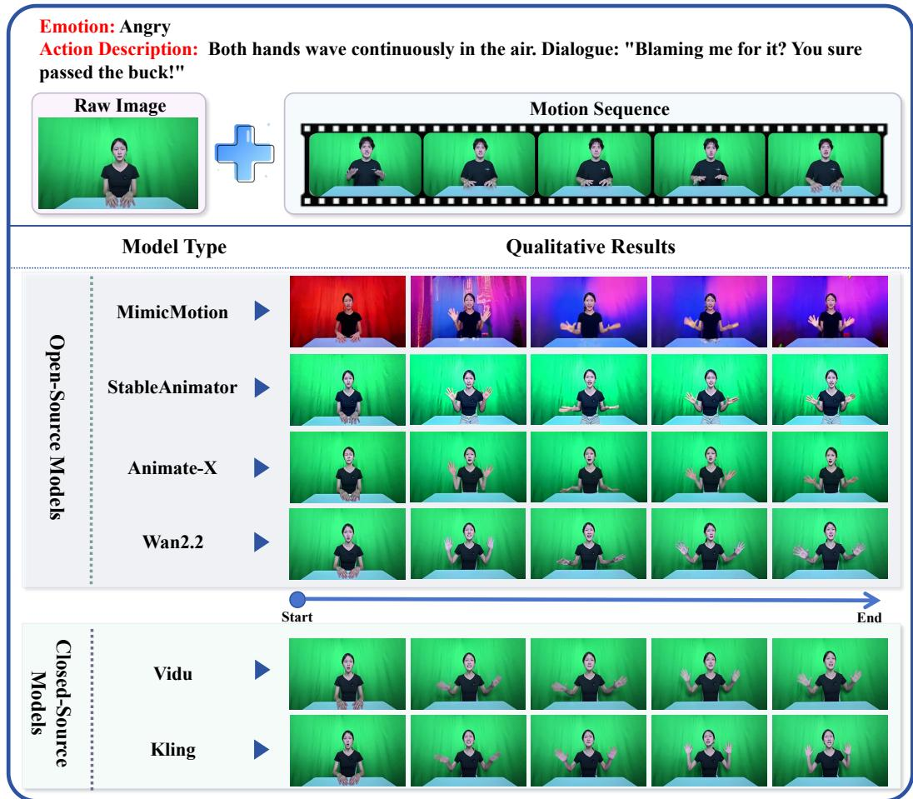  
Fig. 5 Qualitative comparison of vision-driven video generation for one Angry clip, with the source frame and driving motion sequence on top and temporally aligned outputs of each model below, grouped into open-source and closed-source.

## 5.3 Voice Cloning

Table 9 reports automatic voice-cloning results for six models, with real audio included as the speaker-similarity reference at 0.990.

The automatic measures capture two complementary properties: the reference-free quality predictors UTMOS and DNSMOS, and speaker similarity for identity preservation. Among the open-source systems, OpenAudio S1 attains the highest UTMOS (2.32) and DNSMOS (3.01), whereas CosyVoice 3 achieves the highest speaker similarity (0.856). Within the closed-source pair, Inworld TTS-1.5 leads UTMOS (2.69) and DNS-MOS (3.22), while Eleven Multilingual v2 better preserves speaker identity (0.779).

The subjective analysis in Table 10 provides another result: IndexTTS2 leads both open-source criteria, with a similarity mean of 4.24 and an emotion-naturalness mean of 4.40. Within the closed-source group, Eleven Multilingual v2 obtains the higher means of 3.73 and 4.23 and surpasses Inworld TTS-1.5 despite the latter’s advantage on the reference-free predictors. Moreover, IndexTTS2 remains close to the best speaker similarity among the open-source models, whereas Eleven Multilingual v2 attains the highest speaker similarity among the closed-source models. This suggests that the subjective-study leaders align more closely with speaker-identity preservation than with UTMOS or DNSMOS. Conversely, the models that lead the reference-free predictors, OpenAudio S1 and Inworld TTS-1.5, do not lead subjectively. Therefore, perceived voicecloning quality appears to depend more strongly on speaker preservation than on the estimated signal, which helps explain the diference in ordering between Tables 9 and 10.

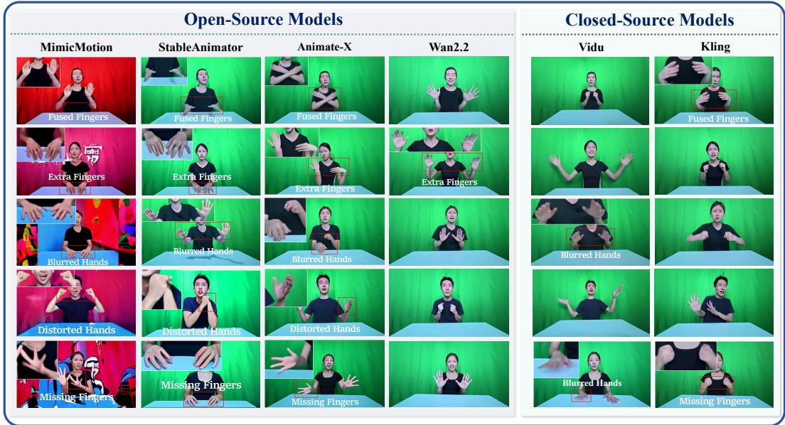  
Fig. 6 Fine-grained hand-region failures in vision-driven synthesis, highlighting fused, extra, blurred, distorted, and missing fingers or hands across six systems via enlarged insets.

## 5.4 Human Video Matting

Table 11 reports the video-level performance of nine matting systems under the adapted greenscreen protocol. BiRefNet attains the best value on every criterion, reaching a MAD of 2.30, MSE of 0.82, dtSSD of 2.04, gradient error of 10.43, and connectivity error of 4.31. MatAnyone 2 ranks second throughout, with an MSE of 0.91 and dtSSD of 2.12 that trail BiRefNet only narrowly. The stability of this ordering across both spatial and temporal criteria indicates that the leading methods couple accurate boundary estimation with reliable temporal propagation rather than improving one at the expense of the other.

Fig. 7 localizes the residual errors and clarifies where they concentrate. The errors arise primarily from fine hand boundaries, transient motion contours, and foreground leakage. Even the most efective methods remain sensitive to slender fingers and rapidly changing hand shapes. These qualitative deficiencies are consistent with the quantitative gaps in gradient and connectivity error, which precisely penalize the boundary regions exposed by the sampled frames. Together, they indicate that boundary fidelity under motion is the primary challenge for human matting on this benchmark.

## 5.5 Cross-Task Analysis

Following the setup in Section 4.3, we present the cross-task analyses in the same order as their definitions.

Emotion dificulty. We instantiate the emotionby-metric dificulty with eight task-specific evaluation metrics, one or two per task, and we abbreviate each as a capability prefix followed by its underlying criterion. From multimodal emotion recognition, we take MER-RE, the recognitionerror dificulty derived from seven-class accuracy. From audio-driven video generation, we take AD-CSIM (identity similarity) and AD-Sync-C (lipsynchronization confidence). From vision-driven video generation, we take VD-CSIM (identity similarity) and VD-LPIPS (perceptual reconstruction). From voice cloning, we take VC-UTMOS and VC-DNSMOS, the two referencefree speech-quality predictors. From video matting, we take VM-MAD, the mean absolute diference against the reference alpha. Then, these metrics are either retained, negated, or complemented to align with the direction of $D _ { e , k }$ in Eq. (2) (larger values denote greater dificulty).

Table 9 Objective results of voice cloning. Bold and underlined values indicate the best and second-best results.
<table><tr><td>Model</td><td>UTMOS↑</td><td>DNSMOS↑</td><td>Speaker Sim.↑</td></tr><tr><td colspan="4">Reference</td></tr><tr><td>Real audio</td><td>1.90</td><td>2.84</td><td>0.990</td></tr><tr><td>Open-source models</td><td></td><td></td><td></td></tr><tr><td>GPT-SoVITS v2 (RVC-Boss, 2024) IndexTTS2 (S. Zhou et al., 2026)</td><td>2.26 2.00</td><td>2.76 2.94</td><td>0.770 0.846</td></tr><tr><td>CosyVoice 3 (Du et al., 2025)</td><td>2.30</td><td>2.94</td><td>0.856</td></tr><tr><td>OpenAudio S1 (Fish Audio, 2025)</td><td>2.32</td><td>3.01</td><td>0.848</td></tr><tr><td>Closed-source models</td><td></td><td></td><td></td></tr><tr><td></td><td></td><td></td><td></td></tr><tr><td>Eleven Multilingual v2 (ElevenLabs, 2023) Inworld TTS-1.5 (Inworìd AI, 2026)</td><td>2.12 2.69</td><td>2.67 3.22</td><td>0.779</td></tr><tr><td></td><td></td><td></td><td>0.767</td></tr></table>

Table 10 Subjective results for voice cloning. Bold and underlined values indicate the best and second-best results.
<table><tr><td>Model</td><td>ID Similarity ↑</td><td>Emotion Naturalness ↑</td></tr><tr><td colspan="3">Open-source models</td></tr><tr><td>GPT-SoVITS v2 (RVC-Boss, 2024)</td><td>2.99</td><td>3.12</td></tr><tr><td>IndexTTS2 (S. Zhou et al., 2026)</td><td>4.24</td><td>4.40</td></tr><tr><td>CosyVoice 3 (Du et al., 2025)</td><td>3.81</td><td>4.29</td></tr><tr><td>OpenAudio S1 (Fish Audio, 2025)</td><td>3.64</td><td>4.04</td></tr><tr><td colspan="3">Closed-source models</td></tr><tr><td>Eleven Multilingual v2 (ElevenLabs, 2023)</td><td>3.73</td><td>4.23</td></tr><tr><td>Inworld TTS-1.5 (Inworid AI, 2026)</td><td>3.08</td><td>3.67</td></tr></table>

Table 11 Objective results of video matting. Bold and underlined values indicate the best and second-best results.
<table><tr><td>Model</td><td>MAD↓</td><td>MSE↓</td><td>dtSSD↓</td><td>Grad↓</td><td>Conn↓</td></tr><tr><td>VideoMaMa (Lim et al., 2026)</td><td>34.09</td><td>20.43</td><td>3.53</td><td>26.14</td><td>64.38</td></tr><tr><td>MODNet (Ke, Sun, Li, Yan, &amp; Lau, 2022)</td><td>24.98</td><td>20.27</td><td>3.84</td><td>26.75</td><td>47.84</td></tr><tr><td>SparseMat (Sun, Tang, &amp; Tai, 2023)</td><td>9.14</td><td>4.27</td><td>3.19</td><td>28.83</td><td>14.79</td></tr><tr><td>U2-Net (Qin et al., 2020)</td><td>6.78</td><td>2.49</td><td>2.76</td><td>33.11</td><td>10.33</td></tr><tr><td>InSPyReNet (Kim et al., 2022)</td><td>4.33</td><td>2.52</td><td>3.58</td><td>31.79</td><td>5.77</td></tr><tr><td>SAM 3 (Carion et al., 2026)</td><td>3.92</td><td>2.13</td><td>3.40</td><td>28.01</td><td>4.88</td></tr><tr><td>RVM (Lin et al., 2022)</td><td>4.80</td><td>1.65</td><td>2.38</td><td>16.55</td><td>6.64</td></tr><tr><td>MatAnyone 2 (Yang, Żhou, Hao, &amp; Tao, 2026)</td><td>3.86</td><td>0.91</td><td>2.12</td><td>11.45</td><td>4.53</td></tr><tr><td>BiRefNet (Zheng et al., 2024)</td><td>2.30</td><td>0.82</td><td>2.04</td><td>10.43</td><td>4.31</td></tr></table>

Fig. 8 shows that the hardest condition depends strongly on both the capability and the criterion. Afraid is hardest for MER-RE, with Disgusted also dificult to recognize, consistent with the subtle or heterogeneous visual cues discussed in Section 5.1. Sad is hardest for AD-CSIM, AD-Sync-C, and VD-LPIPS, whereas Disgusted is hardest for VD-CSIM. Both voice-cloning dimensions, VC-UTMOS and VC-DNSMOS, identify Angry as the most dificult condition, since its forceful expressive delivery may be less favored by reference-free speech-quality predictors. Instead, VM-MAD peaks for Happy, whose expansive motion and open posture create larger foreground and boundary changes.

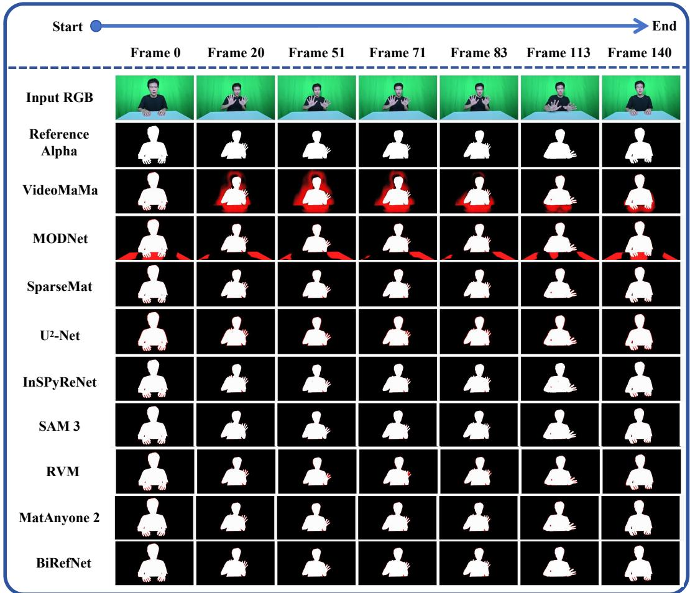  
Fig. 7 Qualitative comparison of human video matting on one green-screen sequence at seven time points, with rows showing the RGB input, the reference alpha, and the nine model predictions. Red visualization highlights boundary discrepancies relative to the reference alpha.

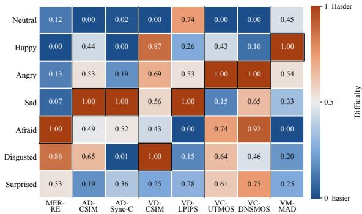  
Fig. 8 Emotion dificulty across eight metrics, each averaged over models, oriented so that larger values indicate greater dificulty, and independently min–max normalized over the seven emotions. Values of 0 and 1 denote the easiest and hardest conditions, respectively, and boxes mark column maxima.

Metric agreement. Applying the Spearman rank correlation of Eq. (3) to the emotion dificulty profiles of the eight metrics, Fig. 9 shows that agreement is selective rather than universal. The two voice-quality profiles, VC-UTMOS and VC-DNSMOS, are strongly aligned $( \rho = 0 . 8 2 )$ , and AD-CSIM and VD-CSIM share a broadly similar condition ordering, indicating within-family consistency. By contrast, MER-RE and VM-MAD are strongly opposed $( \rho = - 0 . 8 6 )$ , while most remaining pairs show weak or mixed agreement. These patterns reinforce that an emotion-level dificulty ranking must be read with respect to its capability and criterion rather than as a global property of the dataset.

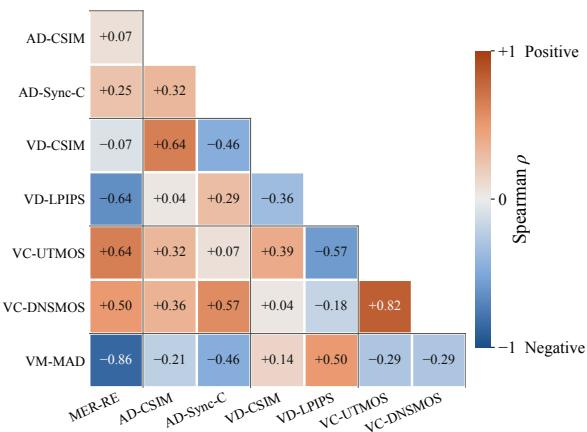

Fig. 9 Pairwise Spearman rank correlations between the emotion dificulty profiles of the eight metrics. Positive and negative values indicate positive and negative correlations, respectively.  
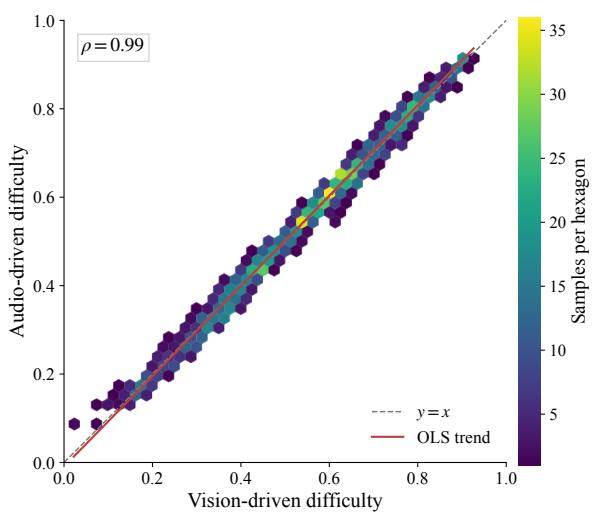  
Fig. 10 Source-level dificulty of the audio-driven and vision-driven methods on the the common set of valid clips. Hexagon color encodes the number of samples per bin, the dashed line denotes equality, and the red line shows the ordinary least-squares (OLS) fit.

Source-level dificulty. Following Eq. (4), we aggregate the metric values within the audiodriven (AD) and vision-driven (VD) regimes and compare the resulting clip-level dificulty on the common-valid intersection. Fig. 10 reveals nearly identical orderings for the two regimes (Spearman $\rho = 0 . 9 9 )$ . Although the two paradigms use diferent driving signals, their dificulty is built from the same appearance-fidelity and perceptualreconstruction criteria on matched source clips. Therefore, the agreement reflects a shared sensitivity to the visual content and reconstruction demands of each source.

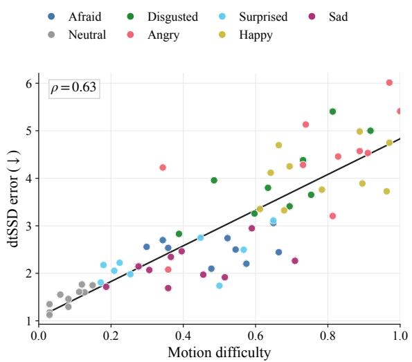  
Fig. 11 Relationship between motion dificulty and dtSSD, with the line denoting the ordinary least-squares (OLS) fit.

Motion dificulty. Finally, based on Eq. (5) and Eq. (6), we analyze the motion dificulty $D _ { \mathrm { m o t i o n } } ( s )$ and its relationship with the dtSSD error. Fig. 11 shows a clear positive association $( \rho = 0 . 6 3 )$ . Neutral samples cluster at low motion dificulty and low temporal error, consistent with the gentle, stable and low-amplitude actions specified in Table 1, whereas Happy, Angry, and Disgusted involve more expansive, forceful, or outward-moving actions and thus exhibit larger alpha and centroid changes together with higher dtSSD error. In addition, this trend echoes the temporal boundary artifacts reported in Section 5.4, as larger foreground changes place greater demands on maintaining accurate alpha transitions over time. Through this analysis, we characterize the motion dificulty across emotions efectively and validate the soundness of our dataset design.

Overall, these analyses establish cross-task connections that cannot be achieved through single-task evaluation and yield important insights from quantitative comparisons, including (1) significant diferences between emotion recognition and matting, (2) a consistent emphasis on generation quality in audio- and vision-driven video generation, (3) agreement between the two voicecloning criteria, and (4) greater matting dificulty for emotions such as Happy, Angry, and Disgusted. They ofer a useful preliminary attempt at jointly analyzing multiple understanding and generation tasks.

## 6 Discussion

Based on the above series of analyses, we distill deeper insights into how human-centered understanding and generation relate, and outline the future research directions.

## 6.1 Insights

The first insight concerns an asymmetry in how afect is handled across understanding and generation. In understanding, linguistic content is strongly predictive whereas visual evidence forms the weakest cue, in line with prior observations (Y. Li, Wang, & Cui, 2023; Ma et al., 2025). In generation, the burden shifts almost entirely onto pixels and motion, so that identity, expression, and gesture must be synthesized rather than inferred. Consequently, current models can recognize emotions through linguistic shortcuts, but cannot rely solely on language when rendering emotions. This reveals a representational gap between how afect is read and how it is produced. Closing this gap is central to human-centered intelligence, where meaning resides jointly in what is said and how it is enacted.

The second insight is that evaluation itself remains a bottleneck. In both generative tasks (video generation and voice cloning), task-specific quantitative and qualitative evaluations show a consistent overall trend, but diverge in the top rankings. Furthermore, our survey has revealed a lack of metrics for cross-task analysis, which motivates us to design a suite of such metrics that build upon task-specific measures and incorporate statistical analysis, as presented in Section 4.3. The cross-task analyses in Section 5.5 show that their outcomes accord with prior empirical intuitions, thereby confirming their soundness. Therefore, to further advance the research on understanding and generation, it is necessary to refine both task-specific and cross-task evaluation metrics.

The third insight is that cross-task analyses of understanding and generation within a coordinated system can ofer valuable guidance for the emerging frontier of unified multimodal understanding and generation models (Tang et al., 2025; X. Wang et al., 2026). These analyses show that dificulty is relational rather than intrinsic, arising jointly from the emotion, the model, and the evaluation criterion. By quantifying how errors correlate or oppose across tasks, such as the negative coupling between recognition and matting and the close agreement between the two voice-quality predictors, these metrics reveal which capabilities share representational demands and which compete (Wu et al., 2025). This provides a principled basis for deciding how perception and synthesis should be coupled within a single architecture.

## 6.2 Outlook

These insights point to three promising directions. First, understanding calls for efective models and fusion mechanisms that better exploit visual cues, turning them from the weak link into a reliable source of afective evidence. Second, evaluation should couple automatic metrics with MOS so that the information can be jointly integrated into more principled measures, while extending such measures further across tasks. Third, multitask architectures that explicitly regularize these correlations can treat the constituent understanding and generation tasks as mutually constraining objectives, thereby transforming the current benchmark from a diagnostic tool into a training substrate for more coherent human-centered visual intelligence systems.

## 7 Conclusion

We present HUG-VIS, the first unified multimodal benchmark that places human-centered understanding and generation tasks on a shared actorby-assignment grid. The dataset contains 8,400 seated half-body performances from 30 actors on an identical 280-assignment grid, with synchronized video, audio, text, and alpha mattes. A series of analyses yields four consistent findings:

(1) linguistic content dominates present-day emotion recognition while purely visual afect remains the weakest setting, (2) automatic metrics and human judgment agree in overall trend yet diverge at the top, so the two must be reported jointly for both generation tasks, (3) boundary fidelity under motion is the principal obstacle for human matting, and (4) task dificulty is not an intrinsic property of a condition but emerges jointly from the emotion, the capability, and the criterion. By enabling understanding and generation on a shared and aligned foundation, we anticipate that HUG-VIS will serve as an important reference for human-centered visual intelligence.

## Statements and Declarations

Consent to participate. Before recording, all actors provided written informed consent for research capture and for the authorized use of their identifiable likeness, voice, and performed behavior.

Consent for publication. Publication and demonstration of identifiable examples are allowed for research purposes covered by the participating actors’ written authorizations.

Data availability. The dataset, including its synchronized audio, video, text, and alpha assets, is released through the project page at https:// github.com/GML-MMGroup/HUG-VIS. Access is granted after application review and is limited to non-commercial academic research under the recipient data-use agreement.

Code availability. The associated evaluation code is released through the same project page. Competing interests. The authors declare that they have no competing interests.

## References

Atkinson, A. P., Dittrich, W. H., Gemmell, A. J., & Young, A. W. (2004). Emotion perception from dynamic and static body expressions in point-light and full-light displays. Perception, 33 (6).

Baltruˇsaitis, T., Ahuja, C., & Morency, L.-P. (2019). Multimodal machine learning: A survey and taxonomy. IEEE TPAMI, 41 (2).

B¨anziger, T., Mortillaro, M., & Scherer, K. R. (2012). Introducing the Geneva Multimodal Expression Corpus for experimental research on emotion perception. Emotion, 12 (5).

Bao, F., Xiang, C., Yue, G., He, G., Zhu, H., Zheng, K., . . . Zhu, J. (2024). Vidu: A highly consistent, dynamic and skilled textto-video generator with difusion models. arXiv preprint arXiv:2405.04233.

Bounareli, S., Tzelepis, C., Argyriou, V., Patras, I., & Tzimiropoulos, G. (2024). One-shot neural face reenactment via finding directions in GAN’s latent space. IJCV , 132 (8).

Busso, C., Bulut, M., Lee, C.-C., Kazemzadeh, A., Mower, E., Kim, S., . . . Narayanan, S. S. (2008). IEMOCAP: Interactive emotional dyadic motion capture database. Lang. Resour. Eval., 42(4).

Carion, N., Gustafson, L., Hu, Y.-T., Debnath, S., Hu, R., Suris Coll-Vinent, D., . . . Feichtenhofer, C. (2026). SAM 3: Segment anything with concepts. In ICLR.

Chu, Y., Xu, J., Yang, Q., Wei, H., Wei, X., Guo, Z., . . . Zhou, J. (2024). Qwen2- Audio technical report. arXiv preprint arXiv:2407.10759.

Chumachenko, K., Iosifidis, A., & Gabbouj, M. (2024). MMA-DFER: Multimodal adaptation of unimodal models for dynamic facial expression recognition in-the-wild. In CVPR Workshops.

Chung, J. S., & Zisserman, A. (2016). Out of time: Automated lip sync in the wild. In ACCV Workshops.

Ci, Y., Wang, Y., Chen, M., Tang, S., Bai, L., Zhu, F., . . . Ouyang, W. (2023). UniHCP: A unified model for human-centric perceptions. In CVPR.

Clark, C., Zhang, J., Ma, Z., Park, J. S., Tripathi, R., Lee, S., . . . Krishna, R. (2026). Molmo2: Open weights and data for visionlanguage models with video understanding and grounding. In CVPR.

Cui, J., Li, H., Yao, Y., Zhu, H., Shang, H., Cheng, K., . . . Wang, J. (2025). Hallo2: Longduration and high-resolution audio-driven portrait image animation. In ICLR.

Cui, J., Xu, B., Wang, C., Yu, T., Sun, W., Xu, Y., . . . Yao, Y. (2026). MiniCPM-o 4.5: Towards real-time fullduplex omni-modal interaction. arXiv preprint arXiv:2604.27393.

DeepSeek-AI. (2025). DeepSeek-V3.2: Pushing the frontier of open large language models. arXiv preprint arXiv:2512.02556.

de Meijer, M. (1989). The contribution of general features of body movement to the attribution of emotions. J. Nonverbal Behav., 13 (4).

Deng, J., Guo, J., Xue, N., & Zafeiriou, S. (2019). ArcFace: Additive angular margin loss for deep face recognition. In CVPR.

Du, Z., Gao, C., Wang, Y., Yu, F., Zhao, T., Wang, H., . . . Ye, J. (2025). CosyVoice 3: Towards in-the-wild speech generation via scaling-up and post-training. arXiv preprint arXiv:2505.17589.

Ekman, P. (1992). An argument for basic emotions. Cogn. Emot., 6(3–4).

ElevenLabs. (2023). Eleven multilingual v2.

Erofeev, M., Gitman, Y., Vatolin, D., Fedorov, A., & Wang, J. (2015). Perceptually motivated benchmark for video matting. In BMVC.

Fish Audio. (2025). OpenAudio S1.

Frijda, N. H., Kuipers, P., & ter Schure, E. (1989). Relations among emotion, appraisal, and emotional action readiness. J. Pers. Soc. Psychol., 57 (2).

Georgakis, C., Panagakis, Y., & Pantic, M. (2018). Dynamic behavior analysis via structured rank minimization. IJCV, 126.

Heusel, M., Ramsauer, H., Unterthiner, T., Nessler, B., & Hochreiter, S. (2017). GANs trained by a two time-scale update rule

converge to a local Nash equilibrium. In NeurIPS.

Inworld AI. (2026). Inworld TTS-1.5: Upgrading the #1 ranked TTS model with productiongrade latency, expression, and stability.

Ji, X., Hu, X., Xu, Z., Zhu, J., Lin, C., He, Q., . . . Wang, C. (2025). Sonic: Shifting focus to global audio perception in portrait animation. In CVPR.

Johnson, J., Shahrian Varnousfaderani, E., Cholakkal, H., & Rajan, D. (2016). Sparse coding for alpha matting. IEEE TIP, 25(7).

Ju, Z., Wang, Y., Shen, K., Tan, X., Xin, D., Yang, D., . . . Zhao, S. (2024). NaturalSpeech 3: Zero-shot speech synthesis with factorized codec and difusion models. In ICML.

Ke, Z., Sun, J., Li, K., Yan, Q., & Lau, R. W. H. (2022). MODNet: Real-time trimap-free portrait matting via objective decomposition. In AAAI.

Kim, T., Kim, K., Lee, J., Cha, D., Lee, J., & Kim, D. (2022). Revisiting image pyramid structure for high resolution salient object detection. In ACCV.

Kim, T., & Vossen, P. (2021). EmoBERTa: Speaker-aware emotion recognition in conversation with RoBERTa. arXiv preprint arXiv:2108.12009.

Kimi Team. (2025). Kimi-Audio technical report. arXiv preprint arXiv:2504.18425.

Kling Team. (2026). Kling-MotionControl technical report. arXiv preprint arXiv:2603.03160.

Li, C., Gan, Z., Yang, Z., Yang, J., Li, L., Wang, L., & Gao, J. (2024). Multimodal foundation models: From specialists to general-purpose assistants. Found. Trends Comput. Graph. Vis., 16 (1–2).

Li, C., Zhang, C., Xu, W., Lin, J., Xie, J., Feng,

W., . . . Xing, W. (2024). LatentSync: Taming audio-conditioned latent difusion models for lip sync with SyncNet supervision. arXiv preprint arXiv:2412.09262.

Li, T., Zheng, R., Yang, M., Chen, J., & Yang, M. (2025). Ditto: Motion-space difusion for controllable realtime talking head synthesis. In ACM MM.

Li, Y., Wang, Y., & Cui, Z. (2023). Decoupled multimodal distilling for emotion recognition. In CVPR.

Li, Z., Pun, C.-M., Fang, C., Wang, J., & Cun, X. (2026). PersonaLive!: Expressive portrait image animation for live streaming. In CVPR.

Lim, S., Oh, S. W., Huang, J., Yoon, H., Kim, S., & Lee, J.-Y. (2026). VideoMaMa: Maskguided video matting via generative prior. In CVPR.

Lin, S., Ryabtsev, A., Sengupta, S., Curless, B., Seitz, S. M., & Kemelmacher-Shlizerman, I. (2021). Real-time high-resolution background matting. In CVPR.

Lin, S., Yang, L., Saleemi, I., & Sengupta, S. (2022). Robust high-resolution video matting with temporal guidance. In WACV.

Liu, H., Zhu, Z., Iwamoto, N., Peng, Y., Li, Z., Zhou, Y., . . . Zheng, B. (2022). BEAT: A large-scale semantic and emotional multimodal dataset for conversational gestures synthesis. In ECCV.

Liu, T., Chen, F., Fan, S., Du, C., Chen, Q., Chen, X., & Yu, K. (2024). AniTalker: Animate vivid and diverse talking faces through identity-decoupled facial motion encoding. In ACM MM.

Ma, F., Yuan, Y., Xie, Y., Ren, H., Liu, I., He, Y., . . . Ni, S. (2025). Generative technology for human emotion recognition: A scoping review. Information Fusion, 115.

Mago, G., Mettes, P., & Rudinac, S. (2026). Looking beyond the obvious: A survey

on abstract concept recognition for video understanding. IJCV, 134 .

Meng, D., Peng, X., Wang, K., & Qiao, Y. (2019). Frame attention networks for facial expression recognition in videos. In ICIP.

Meng, R., Wang, Y., Wu, W., Zheng, R., Li, Y., & Ma, C. (2026). EchoMimicV3: 1.3b parameters are all you need for unified multi-modal and multi-task human animation. In AAAI.

Perazzi, F., Pont-Tuset, J., McWilliams, B., Van Gool, L., Gross, M., & Sorkine-Hornung, A. (2016). A benchmark dataset and evaluation methodology for video object segmentation. In CVPR.

Prajwal, K. R., Mukhopadhyay, R., Namboodiri, V. P., & Jawahar, C. V. (2020). A lip sync expert is all you need for speech to lip generation in the wild. In ACM MM.

Qin, X., Zhang, Z., Huang, C., Dehghan, M., Zaiane, O. R., & Jagersand, M. (2020). U2- Net: Going deeper with nested u-structure for salient object detection. Pattern Recognit., 106.

Qwen Team. (2024). Qwen2.5 technical report. arXiv preprint arXiv:2412.15115.

Qwen Team. (2025). Qwen3 technical report. arXiv preprint arXiv:2505.09388.

Ramesh, A., Pavlov, M., Goh, G., Gray, S., Voss, C., Radford, A., . . . Sutskever, I. (2021). Zero-shot text-to-image generation. In ICML.

Reddy, C. K. A., Gopal, V., & Cutler, R. (2021). DNSMOS: A non-intrusive perceptual objective speech quality metric to evaluate noise suppressors. In ICASSP.

Resemble AI. (2026). Resemblyzer: A python package to analyze and compare voices with deep learning.

RVC-Boss. (2024). GPT-SoVITS v2.

Saeki, T., Xin, D., Nakata, W., Koriyama, T., Takamichi, S., & Saruwatari, H.

(2022). UTMOS: UTokyo-SaruLab system for VoiceMOS challenge 2022. In INTER-SPEECH.

Savchenko, A. (2023). Facial expression recognition with adaptive frame rate based on multiple testing correction. In ICML.

Sber AI Lab. (2025). EmotiEfLib: Eficient face emotion recognition in photos and videos.

Stergiou, A., & Poppe, R. (2025). About time: Advances, challenges, and outlooks of action understanding. IJCV, 133(9).

Sun, Y., Tang, C.-K., & Tai, Y.-W. (2023). Ultrahigh resolution image/video matting with spatio-temporal sparsity. In CVPR.

Tan, S., Gong, B., Wang, X., Zhang, S., Zheng, D., Zheng, R., . . . Yang, M. (2025). Animate-X: Universal character image animation with enhanced motion representation. In ICLR.

Tan, S., Ji, B., Bi, M., & Pan, Y. (2024). EDTalk: Eficient disentanglement for emotional talking head synthesis. In ECCV.

Tang, S., Wang, Y., Chen, L., Wang, Y., Peng, S., Xu, D., & Ouyang, W. (2025). Humancentric foundation models: Perception, generation and agentic modeling. In IJCAI.

Tu, S., Pan, Y., Huang, Y., Han, X., Xing, Z., Dai, Q., . . . Jiang, Y.-G. (2025). StableAvatar: Infinite-length audio-driven avatar video generation. arXiv preprint arXiv:2508.08248.

Tu, S., Xing, Z., Han, X., Cheng, Z.-Q., Dai, Q., Luo, C., & Wu, Z. (2025). StableAnimator: High-quality identity-preserving human image animation. In CVPR.

Vougioukas, K., Petridis, S., & Pantic, M. (2020). Realistic speech-driven facial animation with GANs. IJCV, 128(5).

Wallbott, H. G. (1998). Bodily expression of emotion. Eur. J. Soc. Psychol., 28(6).

Wan, L., Wang, Q., Papir, A., & Lopez Moreno, I. (2018). Generalized end-to-end loss for

speaker verification. In ICASSP.

Wan Team. (2025). Wan2.2: Wan open and advanced large-scale video generative models.

Wang, C., Tian, K., Zhang, J., Guan, Y., Luo, F., Shen, F., . . . Yang, W. (2024). V-Express: Conditional dropout for progressive training of portrait video generation. arXiv preprint arXiv:2406.02511 .

Wang, D., Liu, S., Zhang, T., Chen, Y., Li, J., & Meng, H. M. (2026). EmotionThinker: Prosody-aware reinforcement learning for explainable speech emotion reasoning. In ICLR.

Wang, K., Wu, Q., Song, L., Yang, Z., Wu, W., Qian, C., . . . Loy, C. C. (2020). MEAD: A large-scale audio-visual dataset for emotional talking-face generation. In ECCV.

Wang, W., Bi, B., Yan, M., Wu, C., Xia, J., Bao, Z., . . . Si, L. (2020). StructBERT: Incorporating language structures into pre-training for deep language understanding. In ICLR.

Wang, X., Cui, Y., Wang, J., Zhang, F., Wang, Y., Zhang, X., . . . Huang, T. (2026). Multimodal learning with next-token prediction for large multimodal models. Nature, 650.

Wang, Y., Li, X., Yan, Z., He, Y., Yu, J., Zeng, X., . . . Wang, L. (2025). Intern-Video2.5: Empowering video MLLMs with long and rich context modeling. arXiv preprint arXiv:2501.12386.

Wang, Z., Bovik, A. C., Sheikh, H. R., & Simoncelli, E. P. (2004). Image quality assessment: From error visibility to structural similarity. IEEE TIP, 13(4).

Wei, H., Yang, Z., & Wang, Z. (2024). Ani-Portrait: Audio-driven synthesis of photorealistic portrait animations. arXiv preprint arXiv:2403.17694 .

Wu, C., Chen, X., Wu, Z., Ma, Y., Liu, X., Pan, Z., . . . Luo, P. (2025). Janus: Decoupling visual encoding for unified multimodal

understanding and generation. In CVPR.

Xie, Z., Lin, M., Liu, Z., Wu, P., Yan, S., & Miao, C. (2025). Audio-Reasoner: Improving reasoning capability in large audio language models. In EMNLP.

Xing, B., Yu, Z., Liu, X., Yuan, K., Ye, Q., Xie, W., . . . K¨alvi¨ainen, H. (2026). EMO-LLaMA: Enhancing facial emotion understanding with instruction tuning. IJCV , 134 .

Xu, J., Guo, Z., He, J., Hu, H., He, T., Bai, S., . . . Lin, J. (2025). Qwen2.5-Omni technical report. arXiv preprint arXiv:2503.20215.

Xu, Z., Yu, Z., Zhou, Z., Zhou, J., Jin, X., Hong, F.-T., . . . Lu, Q. (2025). HunyuanPortrait: Implicit condition control for enhanced portrait animation. In CVPR.

Yamagishi, J., Veaux, C., & MacDonald, K. (2019). CSTR VCTK Corpus: English multi-speaker corpus for CSTR voice cloning toolkit (version 0.92).

Yang, P., Zhou, S., Hao, K., & Tao, Q. (2026). MatAnyone 2: Scaling video matting via a learned quality evaluator. In CVPR.

Yang, P., Zhou, S., Zhao, J., Tao, Q., & Loy, C. C. (2025). MatAnyone: Stable video matting with consistent memory propagation. In CVPR.

Yu, T., Wang, Z., Wang, C., Huang, F., Ma, W., He, Z., . . . Sun, M. (2026). MiniCPM-V 4.5: Cooking eficient MLLMs via architecture, data, and training recipe. In CVPR.

Zadeh, A. B., Liang, P. P., Poria, S., Cambria, E., & Morency, L.-P. (2018). Multimodal language analysis in the wild: CMU-MOSEI dataset and interpretable dynamic fusion graph. In ACL.

Zhang, B., Li, K., Cheng, Z., Hu, Z., Yuan, Y., Chen, G., . . . Zhao, D. (2025). VideoL-LaMA 3: Frontier multimodal foundation models for image and video understanding. arXiv preprint arXiv:2501.13106.

Zhang, R., Isola, P., Efros, A. A., Shechtman, E., & Wang, O. (2018). The unreasonable efectiveness of deep features as a perceptual metric. In CVPR.

Zhang, Y., Gu, J., Wang, L.-W., Wang, H., Cheng, J., Zhu, Y., & Zou, F. (2025). MimicMotion: High-quality human motion video generation with confidence-aware pose guidance. In ICML.

Zhang, Z., Li, L., Ding, Y., & Fan, C. (2021). Flow-guided one-shot talking face generation with a high-resolution audio-visual dataset. In CVPR.

Zhao, J., Yang, Q., Peng, Y., Bai, D., Yao, S., Sun, B., . . . Bo, L. (2025). HumanOmni: A large vision-speech language model for human-centric video understanding. arXiv preprint arXiv:2501.15111 .

Zhao, X., Xu, H., Song, G., Xie, Y., Zhang, C., Li, X., . . . Liu, Y. (2025). X-NeMo: Expressive neural motion reenactment via disentangled latent attention. In ICLR.

Zhao, Z., & Liu, Q. (2021). Former-DFER: Dynamic facial expression recognition transformer. In ACM MM.

Zheng, P., Gao, D., Fan, D.-P., Liu, L., Laaksonen, J., Ouyang, W., & Sebe, N. (2024). Bilateral reference for high-resolution dichotomous image segmentation. CAAI AIR, 3 .

Zhou, S., Zhou, Y., He, Y., Zhou, X., Wang, J., Deng, W., & Shu, J. (2026). IndexTTS2: A breakthrough in emotionally expressive and duration-controlled auto-regressive zero-shot text-to-speech. In AAAI.

Zhou, T., Chen, D., Jiao, Q., Ding, B., Li, Y., & Shen, Y. (2026). HumanVBench: Probing human-centric video understanding in MLLMs with automatically synthesized benchmarks. In CVPR.