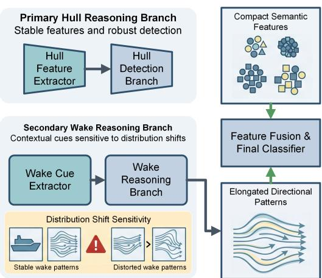
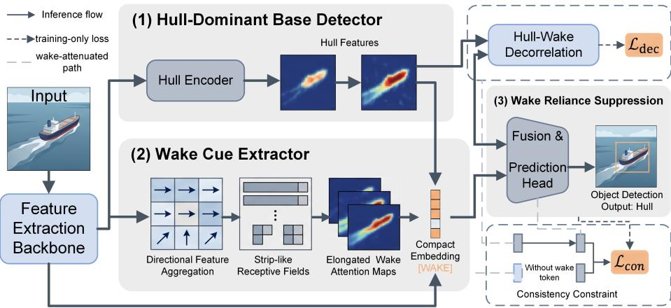
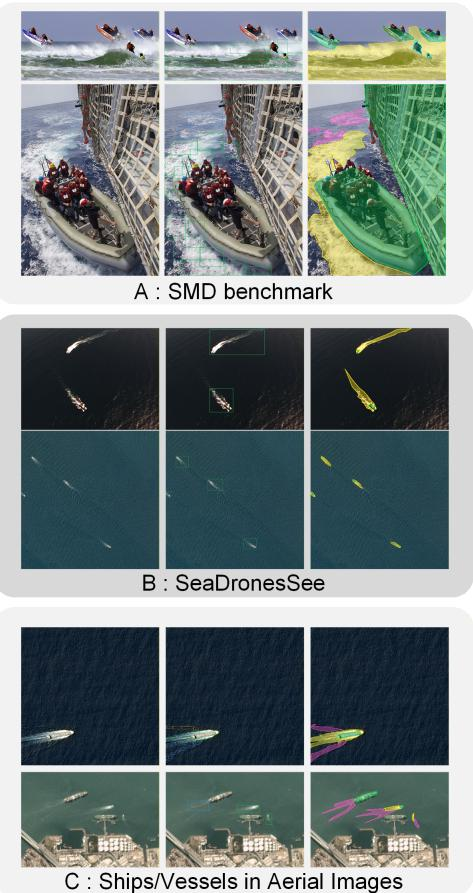
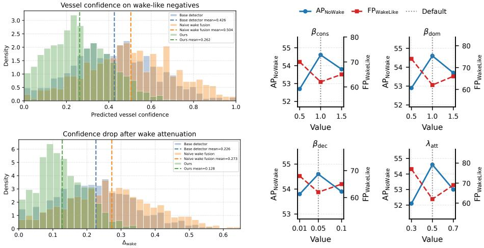
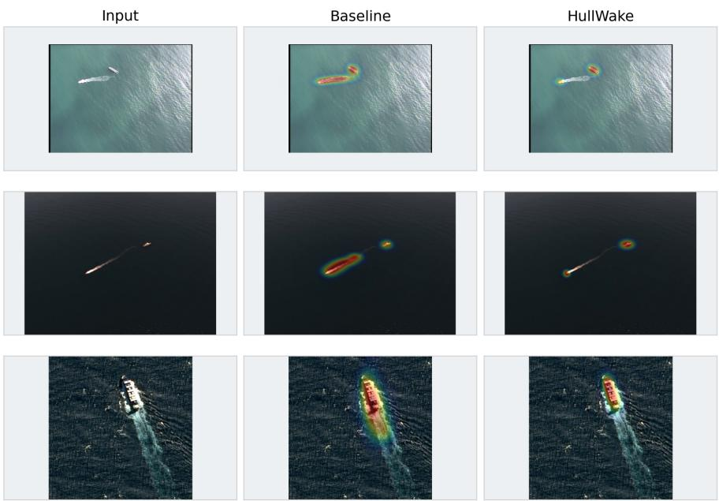

# Hull First, Wake Second: Wake-Reliance Suppression for Robust Maritime Vessel Detection

Yefan Wang1‡, Xingyu Wang2‡, Ruibiao Zhu3, and Yusen Wu4

1 University of Shanghai for Science and Technology, Shanghai, China

2 University of Science and Technology Liaoning, Liaoning, China 120243502084@stu.ustl.edu.cn

3 School of Computing, College of Systems and Society, The Australian National University, ACT, Australia

ruibiao.zhu@anu.edu.au

4 Fujian University of Technology, Fujian, China 3231319130@smail.fjut.edu.cn

Abstract. Maritime vessel detectors often face scenes where hulls are small, low-contrast, or blurred, while wakes are longer and easier to detect. This creates a wake-reliance problem: detectors may miss slow or stationary vessels with weak wakes, or produce false positives on wake-like water clutter. We propose HullWake, a hull-first wake-second framework for robust maritime vessel detection. HullWake separates proposal-centered hull evidence from directional wake context, extracts wake cues with bidirectional proposal-anchored corridors, and suppresses wake-dominant predictions through wake response supervision, wakeattenuated consistency, wake-only confidence suppression, and hull–wake decorrelation. We also introduce a wake-oriented evaluation protocol covering weak/no-wake vessels, wake-like hard negatives, worst-group AP, and confidence drop after wake attenuation. Experiments are conducted on Curated-Wake, a wake-oriented maritime dataset of about 10,000 images curated from Ships/Vessels in Aerial Images, the SMD benchmark, and SeaDronesSee, with newly added detection- and segmentation-level wake annotations. Compared with box-only detectors and mask-supervised segmentation baselines, HullWake improves overall AP, weak/no-wake robustness, wake-like false positives, worst-group AP, and confidence stability after wake attenuation.

Keywords: Maritime vessel detection · Ship wake · Robust detection · Shortcut learning · Context modeling

## 1 Introduction

Maritime vessel detection supports coastal surveillance, waterway monitoring, autonomous surface navigation, and remote observation. Unlike generic object detection, water-surface scenes contain unstable context such as waves, reflections, glitter, shoreline clutter, low contrast, scale changes, and motion-induced wakes. Existing maritime datasets and benchmarks have advanced ship and obstacle detection under these conditions [7,13,15,16,21]. However, average precision (AP) does not reveal whether a detector verifies the vessel hull or relies on correlated water context. This paper studies wake reliance. A moving vessel may leave an elongated wake that is larger and easier to detect than the hull. Wakes are useful because they encode motion and heading, and have long been studied in maritime monitoring and synthetic aperture radar (SAR) imagery [12,14]. Yet they can also become a shortcut: a detector may treat elongated trailing patterns as evidence of a vessel. This fails for slow, stationary, or weak-wake vessels, and can produce false positives on waves, residual trails, turbulence, reflections, or shoreline traces. Fig. 1 summarizes our design premise. Hull evidence is direct and should dominate vessel verification, while wake evidence is contextual and sensitive to speed, sea state, viewpoint, and imaging conditions. We therefore propose HullWake, a hull-first wake-second framework. HullWake extracts proposal-centered hull features for the main detection path, samples directional wake context with bidirectional proposal-anchored corridors, and controls how wake cues enter the final prediction. Wake-dominant decisions are suppressed by wake response supervision, wake-attenuated consistency, wake-only confidence suppression, and hull–wake decorrelation.

We also evaluate the failure mode directly. We build Curated-Wake, a wake-oriented maritime dataset of about 10,000 images curated from Ships/Vessels in Aerial Images [7], the SMD benchmark [13,15,16], and SeaDronesSee [21]. In addition to vessel boxes, we add detection-level wake attributes and segmentationlevel masks for hull, wake region, wake-like negative, and water clutter. The evaluation reports standard AP together with weak/nowake AP, wake-like false positives, worst-group AP, and confidence drop after wake attenuation, and compares box-only detectors with the same protocol. the same protocol

  
Fig. 1: Hull-first and wake-second reasoning.

mask-supervised segmentation baselines under

The contributions are: (1) we formulate wake reliance as a measurable shortcut in maritime vessel detection; (2) we propose a hull-first wake-second detector with an explicit oriented wake cue extractor; (3) we introduce wake response supervision and three wake-reliance suppression objectives to keep wake auxiliary rather than dominant; and (4) we provide a wake-oriented evaluation protocol beyond overall AP.

## 2 Related Work

## 2.1 Maritime Vessel and Water-Surface Detection

Vision-based maritime perception covers ship detection, obstacle detection, and water-surface scene understanding. Ships/Vessels in Aerial Images provides a publicly accessible aerial ship detection dataset with box annotations [7]. Maritime video surveys and benchmarks summarize detection and tracking challenges caused by reflections, waves, small targets, and moving cameras [13,15,16]. SeaDronesSee provides maritime scenes for detecting humans and objects in open water [21]. These datasets mainly report object-level detection or tracking performance. Our work uses them from a diferent angle: whether vessel confidence comes from the hull or from correlated wake context.

## 2.2 Ship Wake Modeling and Baselines

Ship wake is a useful maritime cue because it reflects vessel motion, direction, and sometimes speed. Classical SAR studies use wakes for ship detection and motion analysis [14]. Recent reviews show that wake detection remains relevant in satellite maritime monitoring, especially for small or non-cooperative vessels [12]. These works usually treat wake as positive evidence. In this paper, the target is still the vessel hull: wake is modeled explicitly, but its influence is regularized to avoid wake-only decisions.

We use two baseline groups. The first group contains box-level detectors: Faster R-CNN with FPN [10,17], Cascade R-CNN [2], RetinaNet [11], FCOS [20], YOLO11-m [8], and LSKNet [9]. The second group contains mask-supervised segmentation models, Mask2Former [3] and PIDNet [22]. These baselines test whether stronger box-level detectors or generic mask supervision can reduce wake reliance without explicit hull–wake separation.

## 2.3 Shortcut Learning and Context Bias

Context often helps recognition, but it can become a shortcut when it correlates with labels in training and changes at test time. Shortcut learning has been studied in deep networks [4], and related work on invariant learning and rightfor-the-right-reasons training argues against relying only on the easiest predictive cue [1,18]. Wake reliance is a concrete instance of this problem in maritime detection: the cue is physical, visible, and can be intervened on. This allows us to design a targeted wake representation, suppression objective, and diagnostic evaluation protocol.

  
Fig. 2: Overview of the proposed HullWake framework. The model follows a hullfirst, wake-second design, where wake cues are explicitly extracted and regularized to support rather than dominate vessel detection.

## 3 Method

## 3.1 Problem Formulation and Framework Overview

Following the hull-first, wake-second principle in Fig. 1, we decompose proposal evidence into hull and wake components. Given a maritime image $\bar { x } \in \mathbb { R } ^ { \bar { H } \times \bar { W } \times 3 }$ and vessel annotations $\mathcal { Y } = \{ ( b _ { j } ^ { \mathrm { g t } } , \bar { y } _ { j } ) \} _ { j = 1 } ^ { N }$ , where $b _ { j } ^ { \mathrm { g t } }$ and $y _ { j }$ denote the ground-truth box and class label, a detector predicts candidate boxes $\{ b _ { i } \} _ { i = 1 } ^ { M }$ , classification scores $\{ s _ { i } \}$ , and refined boxes $\{ \hat { b } _ { i } \}$ . In our curated wake-oriented dataset, vessel boxes are inherited from the source datasets when available and manually added otherwise. Each vessel instance is further assigned a wake attribute, and segmentation masks are annotated for hull, wake region, wake-like negative, and water clutter regions. For each proposal $b _ { i } ,$ we use a hull-oriented representation $z _ { i } ^ { \mathrm { h } }$ and a wake-oriented representation $z _ { i } ^ { \mathrm { w } }$ . The hull feature provides the main evidence for vessel existence and localization, while the wake feature is used as auxiliary context. We define wake reliance as a conditional shortcut. A detector is wake-reliant if its prediction changes sharply when wake evidence is weakened, or if it assigns high vessel confidence to wake-like water patterns without a visible hull. Ideally, vessel verification should satisfy $p ( y _ { i } = 1 \mid z _ { i } ^ { \mathrm { h } } , z _ { i } ^ { \mathrm { w } } ) \approx p ( y _ { i } = 1 \mid z _ { i } ^ { \mathrm { h } } , \mathrm { A t t } ( z _ { i } ^ { \mathrm { w } } ) )$ ), where $\mathrm { A t t } ( \cdot )$ denotes wake attenuation or removal. The goal is not to remove wake cues, but to prevent them from becoming the main evidence.

Fig. 2 shows the architecture of HullWake. Solid arrows denote the inference path, and dashed arrows denote training-only regularization. The framework contains four parts: a hull-dominant detector for proposal-centered evidence, an oriented wake cue extractor for directional trailing context, a controlled fusion head for bounded wake use, and wake-reliance losses for consistency, wake-only suppression, and hull–wake decorrelation.

## 3.2 Hull-Dominant Base Detector

A backbone–neck network extracts a feature pyramid ${ \mathcal { F } } = \{ F ^ { ( l ) } \} _ { l = 1 } ^ { L } , F ^ { ( l ) } \in$ $\mathbb { R } ^ { H _ { l } \times W _ { l } \times C _ { l } }$ . For each proposal $b _ { i }$ , we obtain a proposal-centered feature by RoIAlign [5]: $\pmb { r } _ { i } = \mathrm { R o I A l i g n } ( \mathcal { F } , b _ { i } ) \in \mathbb { R } ^ { K \times K \times C }$ . The hull encoder maps it to $z _ { i } ^ { \mathrm { h } } = \phi _ { \mathrm { h } } ( \pmb { r } _ { i } ) \in \mathbb { R } ^ { d }$ . The hull branch predicts $s _ { i } ^ { \mathrm { h } } = g _ { \mathrm { c l s } } ( z _ { i } ^ { \mathrm { h } } )$ and $\hat { b } _ { i } = g _ { \mathrm { r e g } } ( z _ { i } ^ { \mathrm { h } } )$ , where $g _ { \mathrm { c l s } }$ and $g _ { \mathrm { r e g } }$ denote the classification and box-regression heads, respectively. Box regression is kept on the hull feature so that localization is tied to the vessel body rather than trailing water patterns.

## 3.3 Oriented Wake Cue Extractor

For proposal $b _ { i } ,$ let $\mathbf { { c } } _ { i } = ( u _ { i } , v _ { i } )$ be its center and $a _ { i }$ its long-side scale. We predict a coarse hull orientation from the hull feature: $\theta _ { i } = g _ { \theta } ( z _ { i } ^ { \mathrm { h } } ) , \theta _ { i } \in [ - \pi , \pi )$ The parallel and perpendicular directions are $\pmb { e } _ { \parallel } ( \theta _ { i } ) = [ \cos \theta _ { i } , \sin \theta _ { i } ] ^ { \top } , \pmb { e } _ { \perp } ( \theta _ { i } ) =$ $[ - \sin \theta _ { i } , \cos \theta _ { i } ] ^ { \top }$ . Since monocular hull appearance may have bow–stern ambigu-${ \mathrm { i t y } } ,$ we use two candidate trailing corridors:

$$
\begin{array} { r l } & { \Omega _ { i } ^ { + } = \{ p = c _ { i } - \alpha e _ { \parallel } ( \theta _ { i } ) + \beta e _ { \perp } ( \theta _ { i } ) \mid 0 \leq \alpha \leq \ell _ { i } , \ | \beta | \leq w _ { i } / 2 \} , } \\ & { \Omega _ { i } ^ { - } = \{ p = c _ { i } + \alpha e _ { \parallel } ( \theta _ { i } ) + \beta e _ { \perp } ( \theta _ { i } ) \mid 0 \leq \alpha \leq \ell _ { i } , \ | \beta | \leq w _ { i } / 2 \} , } \end{array}\tag{1}
$$

$$
\ell _ { i } = a _ { i } \sigma ( g _ { \ell } ( z _ { i } ^ { \mathrm { h } } ) ) \ell _ { \mathrm { m a x } } , w _ { i } = a _ { i } \sigma ( g _ { w } ( z _ { i } ^ { \mathrm { h } } ) ) w _ { \mathrm { m a x } }
$$

For each corridor $\Omega _ { i } ^ { d } , d \in \{ + , - \}$ , feature points are sampled by bilinear interpolation and aggregated by directional attention:

$$
z _ { i , d } ^ { \mathrm { w } } = \sum _ { \pmb { p } \in \Omega _ { i } ^ { d } } A _ { i , d } ( \pmb { p } ) \psi ( F ( \pmb { p } ) ) .\tag{2}
$$

The attention weight is

$$
A _ { i , d } ( \pmb { p } ) = \frac { \exp ( q _ { i } ^ { \top } k ( \pmb { p } ) + \rho _ { d } ( \pmb { p } ) ) } { \sum _ { \pmb { p ^ { \prime } } \in \varOmega _ { i } ^ { d } } \exp ( q _ { i } ^ { \top } k ( \pmb { p ^ { \prime } } ) + \rho _ { d } ( \pmb { p ^ { \prime } } ) ) } ,\tag{3}
$$

where $q _ { i } = W _ { q } z _ { i } ^ { \mathrm { h } } , k ( \pmb { p } ) = W _ { k } F ( \pmb { p } )$ , and $\rho _ { d } ( \pmb { p } )$ is a directional position bias:

$$
\rho _ { d } ( \pmb { p } ) = - \eta _ { \bot } \frac { \vert \langle \pmb { p } - \pmb { c } _ { i } , \pmb { e } _ { \bot } \rangle \vert } { w _ { i } + \epsilon } + \eta _ { \parallel } \frac { \langle \pmb { p } - \pmb { c } _ { i } , \pmb { e } _ { d } \rangle } { \ell _ { i } + \epsilon } ,\tag{4}
$$

where $e _ { + } = - e _ { \| }$ and $e _ { - } = e _ { \parallel }$ . The bias favors elongated trailing structures and suppresses of-axis texture.

The two directional descriptors are fused as $\begin{array} { r } { \gamma _ { i } = \sigma ( g _ { \gamma } ( [ z _ { i , + } ^ { \mathrm { w } } , z _ { i , - } ^ { \mathrm { w } } , z _ { i } ^ { \mathrm { h } } ] ) ) , z _ { i } ^ { \mathrm { w } } = } \end{array}$ $\gamma _ { i } z _ { i , + } ^ { \mathrm { w } } + ( 1 - \gamma _ { i } ) z _ { i , - } ^ { \mathrm { w } }$ . The extractor also predicts a soft wake response map $M _ { i } ^ { \mathrm { w } } ( \pmb { p } ) = \sigma ( h _ { \mathrm { w } } ( F ( \pmb { p } ) ) ) , \pmb { p } \in \varOmega _ { i } ^ { + } \cup \varOmega _ { i } ^ { - }$ . In the curated dataset, annotated wakeregion masks are used to supervise this response map, while wake-like negative and water-clutter masks are treated as non-wake regions for hard-negative analysis.

## 3.4 Controlled Hull–Wake Fusion

Consistent with Fig. 1, wake is not used as an independent decision source. As shown in Fig. 2, the wake token enters the detector through a bounded fusion head. We use $\alpha _ { i } = \sigma ( g _ { \alpha } ( [ z _ { i } ^ { \mathrm { h } } , z _ { i } ^ { \mathrm { w } } ] ) ) , z _ { i } ^ { \mathrm { f } } = z _ { i } ^ { \mathrm { h } } + \alpha _ { i } W _ { \mathrm { w } } z _ { i } ^ { \mathrm { w } }$ . The final classification score is $s _ { i } = g _ { \mathrm { f } } ( z _ { i } ^ { \mathrm { f } } )$ , while box regression remains predicted from $z _ { i } ^ { \mathrm { h } }$ . Thus wake can adjust confidence, but not replace hull-based localization.

## 3.5 Wake-Attenuated Consistency

To test whether a prediction depends on wake evidence, we construct a wakeattenuated proposal feature: $\tilde { r } _ { i } = r _ { i } \odot \left( 1 - \lambda _ { \mathrm { a t t } } \uparrow M _ { i } ^ { \mathrm { w } } \right)$ , where ↑ resizes the wake response to the RoI resolution and $\lambda _ { \mathrm { a t t } } ~ \in ~ [ 0 , 1 ]$ controls attenuation strength. The attenuated hull descriptor is $\tilde { z } _ { i } ^ { \mathrm { h } } = \phi _ { \mathrm { h } } ( \tilde { r } _ { i } )$ . The attenuated fused feature is $\tilde { z } _ { i } ^ { \mathrm { f } } = \tilde { z } _ { i } ^ { \mathrm { h } } + \mathrm { s g } ( \alpha _ { i } ) W _ { \mathrm { w } } \mathrm { s g } ( z _ { i } ^ { \mathrm { w } } )$ , where $\operatorname { s g } ( \cdot )$ stops gradients. For positive proposals, predictions before and after attenuation should remain close: $\begin{array} { r } { \mathcal { L } _ { \mathrm { c o n s } } = \frac { 1 } { \vert \mathcal { P } \vert } \sum _ { i \in \mathcal { P } } D _ { \mathrm { K L } } \left( p _ { i } \parallel \tilde { p } _ { i } \right) } \end{array}$ , where $D _ { \mathrm { K L } }$ is the Kullback–Leibler divergence, $p _ { i } = \mathrm { s o f t m a x } ( g _ { \mathrm { f } } ( z _ { i } ^ { \mathrm { f } } ) )$ ), and $\tilde { p } _ { i } = \mathrm { s o f t m a x } ( g _ { \mathrm { f } } ( \tilde { z } _ { i } ^ { \mathrm { f } } ) )$ . See lower path in Fig. 2.

## 3.6 Wake-Only Confidence Suppression

We use two auxiliary verifiers to measure hull-only and wake-only confidence: $s _ { i } ^ { \mathrm { h - o n l y } } = g _ { \mathrm { h } } ( z _ { i } ^ { \mathrm { h } } ) , s _ { i } ^ { \mathrm { w - o n l y } } = g _ { \mathrm { w } } ( z _ { i } ^ { \mathrm { w } } )$ . For positive proposals, hull-only confidence should exceed wake-only confidence by margin m:

$$
\mathcal { L } _ { \mathrm { d o m } } ^ { + } = \frac { 1 } { | \mathcal { P } | } \sum _ { i \in \mathcal { P } } \operatorname* { m a x } ( 0 , m + s _ { i } ^ { \mathrm { w - o n l y } } - s _ { i } ^ { \mathrm { h - o n l y } } ) .\tag{5}
$$

For negative proposals, especially proposals overlapping wake-like negative or water-clutter regions, wake-only confidence should be low:

$$
\mathcal { L } _ { \mathrm { d o m } } ^ { - } = \frac { 1 } { | \mathcal { N } | } \sum _ { i \in \mathcal { N } } \mathrm { B C E } ( s _ { i } ^ { \mathrm { w - o n l y } } , 0 ) ,\tag{6}
$$

where BCE is binary cross-entropy, and P and $\mathcal { N }$ are positive and negative proposals. The dominance loss is $\mathcal { L } _ { \mathrm { d o m } } = \mathcal { L } _ { \mathrm { d o m } } ^ { + } + \lambda _ { \mathrm { n e g } } \mathcal { L } _ { \mathrm { d o m } } ^ { - }$ . This prevents wakeonly evidence from becoming suficient for vessel verification.

## 3.7 Hull–Wake Decorrelation

The dominance loss acts on scores. To separate the feature spaces, we add a normalized hull–wake decorrelation loss. Let $\mu _ { \mathrm { h } }$ and $\pmb { \mu } _ { \mathrm { w } }$ be the mini-batch means of hull and wake descriptors. For N proposals in the batch,

$$
\mathcal { L } _ { \mathrm { d e c } } = \frac { 1 } { N } \sum _ { i = 1 } ^ { N } \left( \frac { ( z _ { i } ^ { \mathrm { h } } - \pmb { \mu } _ { \mathrm { h } } ) ^ { \top } ( z _ { i } ^ { \mathrm { w } } - \pmb { \mu } _ { \mathrm { w } } ) } { \| z _ { i } ^ { \mathrm { h } } - \pmb { \mu } _ { \mathrm { h } } \| _ { 2 } \| z _ { i } ^ { \mathrm { w } } - \pmb { \mu } _ { \mathrm { w } } \| _ { 2 } + \epsilon } \right) ^ { 2 } .\tag{7}
$$

This term penalizes linear dependence between hull and wake descriptors without forcing wake to be ignored. It corresponds to the upper dashed path in Fig. 2.

Table 1: Source datasets and added annotations.
<table><tr><td>Source dataset</td><td>Role</td><td>Selected images</td><td>Original annotation</td><td>Added labels</td></tr><tr><td>Ships/Vessels in Aerial Images [7]</td><td>Main source</td><td>&gt;3k</td><td>Ship boxes</td><td>Wake attr., masks</td></tr><tr><td>SMD benchmark [13,15,16]</td><td>Maritime source</td><td>&gt;3k</td><td>Object boxes</td><td>Wake attr., masks</td></tr><tr><td>SeaDronesSee [21]</td><td>Cross-view source</td><td>&gt;3k</td><td>Boxes / tracks</td><td>Wake attr., masks</td></tr><tr><td>Curated dataset</td><td>Evaluation set</td><td>~10k</td><td>Reused or added hull boxes Detection + segmentation</td><td></td></tr></table>

Table 2: Main results on Curated-Wake.
<table><tr><td>Method</td><td>Backbone</td><td>AP</td><td> $\mathrm { A P _ { 5 0 } }$ </td><td> $\mathrm { A P _ { 5 0 : 9 5 } }$ </td><td> $\mathrm { A P _ { N o W a k e } }$ </td><td> $\mathrm { F P } _ { \mathrm { W a k e L i k e } } \downarrow$ </td><td>WG-AP</td><td> $\varDelta _ { \mathrm { w a k e } } \downarrow$ </td></tr><tr><td>Faster R-CNN [17]</td><td>R50-FPN</td><td>54.6±0.3</td><td>79.8±0.4</td><td>51.2±0.3</td><td>43.2±0.5</td><td>118±4</td><td>41.7±0.4</td><td>0.226±0.011</td></tr><tr><td>Cascade R-CNN [2]</td><td>R50-FPN</td><td>56.1±0.4</td><td>81.0±0.3</td><td>52.7±0.4</td><td>44.8±0.6</td><td>112±5</td><td>43.0±0.5</td><td>0.214±0.010</td></tr><tr><td>RetinaNet [11]</td><td>R50-FPN</td><td>51.9±0.5</td><td>77.2±0.5</td><td>48.5±0.4</td><td>40.6±0.7</td><td>131±6</td><td>39.4±0.6</td><td>0.239±0.013</td></tr><tr><td>FCOS [20]</td><td>R50-FPN</td><td>53.4±0.4</td><td>78.5±0.4</td><td>50.0±0.4</td><td>42.1±0.6</td><td>124±5</td><td> $4 0 . 8 { \pm } 0 . 5 $ </td><td>0.231±0.012</td></tr><tr><td>YOLOi1-m [8]</td><td>Default</td><td>57.3±0.3</td><td>82.5±0.4</td><td>53.8±0.3</td><td>45.5±0.5</td><td>109±4</td><td> $4 4 . 1 { \pm } 0 . 4 $ </td><td>0.207±0.010</td></tr><tr><td>LSKNet [9]</td><td>LSKNet-S</td><td>58.1±0.4</td><td>83.3±0.5</td><td>54.6±0.4</td><td>46.7±0.6</td><td>102±5</td><td>45.4±0.5</td><td>0.198±0.010</td></tr><tr><td>Mask2Former [3]</td><td>R50</td><td>58.9±0.4</td><td>84.0±0.3</td><td>55.7±0.4</td><td>48.6±0.6</td><td>90±5</td><td>47.0±0.5</td><td>0.178±0.009</td></tr><tr><td>PIDNet [22]</td><td>PIDNet-M 58.2±0.5</td><td></td><td>83.5±0.4</td><td>55.0±0.5</td><td>47.9±0.7</td><td>94±5</td><td>46.3±0.6</td><td>0.186±0.011</td></tr><tr><td>HullWake</td><td>R50-FPN</td><td></td><td></td><td>61.8±0.3 86.1±0.3 58.7±0.3 54.6±0.4</td><td></td><td>62±3</td><td></td><td>52.7±0.4 0.128±0.007</td></tr></table>

## 3.8 Wake Response Supervision and Overall Objective

Using the annotated segmentation masks in the curated dataset, the soft wake response map is supervised by the wake-region mask:

$$
\mathcal { L } _ { \mathrm { w a k e } } = \frac { 1 } { | \varOmega | } \sum _ { p \in \varOmega } \mathrm { B C E } ( M _ { i } ^ { \mathrm { w } } ( \pmb { p } ) , M _ { i } ^ { \ast } ( \pmb { p } ) ) ,\tag{8}
$$

where $\Omega = \varOmega _ { i } ^ { + } \cup \varOmega _ { i } ^ { - }$ and $M _ { i } ^ { * }$ is the annotated wake-region mask restricted to the sampled corridors. Wake-like negative and water-clutter masks are not treated as wake positives; they are used to sample hard-negative regions and to evaluate false wake reliance. This supervision encourages the wake branch to localize actual wake evidence explicitly rather than absorbing unrelated water clutter into the vessel representation. The final training objective is $\mathcal { L } = \mathcal { L } _ { \mathrm { d e t } } +$ $\beta _ { \mathrm { w a k e } } \mathcal { L } _ { \mathrm { w a k e } } + \beta _ { \mathrm { c o n s } } \mathcal { L } _ { \mathrm { c o n s } } + \beta _ { \mathrm { d o m } } \mathcal { L } _ { \mathrm { d o m } } + \beta _ { \mathrm { d e c } } \mathcal { L } _ { \mathrm { d e c } }$ . Here $\mathcal { L } _ { \mathrm { d e t } }$ is the base detector loss. In the main setting, $\beta _ { \mathrm { w a k e } } > 0$ because wake-region masks are available in the curated dataset. The remaining terms enforce wake-attenuated consistency, suppress wake-only confidence, and decorrelate hull and wake descriptors.

## 4 Experiments

## 4.1 Datasets and Diagnostic Protocol

We curate a new wake-oriented maritime dataset from three public sources: Ships/Vessels in Aerial Images [7], the SMD benchmark [13,15,16], and SeaDronesSee [21]. From each source, we select more than 3,000 images, resulting in about 10,000 images in total. Existing vessel or hull annotations are reused when available, and missing hull annotations are added manually. On this curated dataset, we add two types of diagnostic labels.

For detection, each vessel instance is assigned one wake attribute: clear wake, weak/no wake, or ambiguous. Ambiguous cases are kept for standard AP but excluded from group-wise AP. For segmentation, we annotate hull, wake region, wake-like negative, and water clutter regions.

Fig. 3 shows examples of the added labels. Group A is sampled from the SMD benchmark, group B from SeaDronesSee, and group C from Ships/Vessels in Aerial Images. In the detection examples, green boxes denote clear-wake vessels, blue boxes denote weak/no-wake vessels, and yellow boxes denote ambiguous cases. In the segmentation examples, green masks denote hulls, yellow masks denote wake regions, magenta masks denote wake-like negatives, and cyan masks denote water clutter. Water clutter denotes confusing non-wake water patterns, such as the person mixed with wave clutter in the third image of the first row in group A. Table 1 summarizes the source datasets and the added annotations; these labels make it possible to test whether vessel predictions rely on hull evidence or correlated wake and clutter cues. More

  
Fig. 3: Examples of detection- and segmentation-level wake annotations.

importantly, the annotations support condition-wise evaluation across clear-wake, weak/no-wake, and ambiguous cases.

## 4.2 Implementation, Evaluation Metrics, and Results

Metrics. We report $\mathrm { A P , \ A P _ { 5 0 } }$ , and ${ \mathrm { A P } } _ { 5 0 : 9 5 }$ following the standard precision– recall definition $\begin{array} { r } { \mathrm { A P } = \int _ { 0 } ^ { 1 } p ( r ) d r } \end{array}$ . To measure wake reliance, we use $\mathrm { A P _ { N o W a k e } , }$ $\mathrm { F P } _ { \mathrm { W a k e L i k e } }$ , WG-AP, and $\varDelta _ { \mathrm { w a k e } }$ , where $\begin{array} { r } { \mathrm { W G - A P } = \operatorname* { m i n } _ { g \in { \mathcal { G } } } \mathrm { A P } _ { g } } \end{array}$ and $\varDelta _ { \mathrm { w a k e } } =$ $\begin{array} { r } { \frac { 1 } { | \mathcal { P } | } \sum _ { i \in \mathcal { P } } \left( s _ { i } - \tilde { s } _ { i } \right) } \end{array}$ $\mathrm { A P _ { N o W a k e } }$ is evaluated on weak/no-wake vessels, $\mathrm { F P } _ { \mathrm { W a k e L i k e } }$ counts false positives on wake-like water patterns, and ambiguous cases are excluded from group-wise AP.

Unless otherwise stated, HullWake is built on Faster R-CNN with ResNet-50- FPN [6]. All results are measured on Curated-Wake, whose sources and added annotations are summarized in Table 1. Box-level detectors, including Faster

  
Fig. 4: Wake reliance distributions.  
Fig. 5: Hyperparameter sensitivity.

R-CNN [17], Cascade R-CNN [2], RetinaNet [11], FCOS [20], YOLO11-m [8], and LSKNet [9], are trained with the reused or newly added vessel/hull boxes.

Faster R-CNN, Cascade R-CNN, RetinaNet, and FCOS use images resized with short side 800 and maximum side 1333, and are trained with SGD, momentum 0.9, and weight decay $1 0 ^ { - 4 }$ . YOLO11-m follows the oficial Ultralytics setting, and LSKNet follows its remote-sensing detection setting. Mask2Former [3] is trained with the available vessel/hull masks, and its predicted masks are converted to boxes for detection evaluation. PIDNet [22] is a semantic segmentation model; we train it with hull/wake masks, convert connected vessel/hull components to boxes, assign each box the mean foreground probability, and evaluate these boxes under the same detection protocol. Main and ablation results are reported as mean±std over three random seeds on a single NVIDIA A100 80GB GPU.

For HullWake, the detection loss uses vessel/hull boxes, while the wake branch uses the segmentation labels for wake response supervision and hard-negative analysis. We sample $K = 6 4$ points per direction. The maximum length and width ratios are $\ell _ { \mathrm { m a x } } = 3 . 0$ and $w _ { \mathrm { m a x } } = 1 . 0$ , the embedding dimension is $d = 2 5 6$ , and the wake branch uses FPN levels P2–P5. Since wake-region masks are annotated, wake response supervision is enabled in the main setting. We set $\beta _ { \mathrm { c o n s } } = 1 . 0$ $\beta _ { \mathrm { d o m } } = 1 . 0 , \beta _ { \mathrm { d e c } } = 0 . 0 5 , \lambda _ { \mathrm { n e g } } = 1 . 0 , \lambda _ { \mathrm { a t t } } = 0 . 5 , m = 0 . 2$ , and $\epsilon = 0 . 0 1$ on the validation split, and vary selected hyperparameters locally around these defaults in Fig. 5 to test stability. Fig. 5 varies these selected hyperparameters around their default values and shows that the robustness trend is stable under moderate changes.

Table 2 reports the main Curated-Wake results under the same wake-oriented evaluation protocol. Compared with the strongest non-HullWake baseline Mask2Former, HullWake improves AP by 2.9 points and $\mathrm { A P _ { N o W a k e } }$ by 6.0 points, reduces $\mathrm { F P } _ { \mathrm { W a k e L i k e } }$ from 90 to 62, increases WG-AP by 5.7 points, and lowers $\varDelta _ { \mathrm { w a k e } }$ from 0.178 to 0.128.

  
Fig. 6: Grad-CAM diagnosis of wake reliance.

The box-level and mask-supervised baselines improve ordinary AP over earlier detectors, but they still produce more wake-like false positives and larger confidence drops. Table 3 further reports gains over Faster R-CNN on the three source-specific subsets,

Table 3: Source-wise robustness gains.
<table><tr><td>Source</td><td colspan="3"> $\mathrm { A P _ { N o W a k e } }$  gain FP red. WG-AP gain</td></tr><tr><td>SMD</td><td>+10.2</td><td>46.8%</td><td>+9.3</td></tr><tr><td>SeaDronesSee</td><td>+8.7</td><td>43.5%</td><td>+7.8</td></tr><tr><td>Ships/Vessels</td><td>+10.5</td><td>48.1%</td><td>+9.6</td></tr></table>

showing that the robustness improvement is consistent across sources rather than dominated by one subset.

Fig. 4 provides distribution-level evidence for the wake-reliance metrics. Table 4 uses the same Curated-Wake split and the same Faster R-CNN R50-FPN backbone as the full model. The base detector uses only vessel/hull boxes, while the wake-response rows additionally use the annotated wake-region masks; wakelike negative and water-clutter masks are used for hard-negative analysis and wake-reliance evaluation. Each $" + "$ row enables the wake extractor with only the named supervision or regularizer, while Full HullWake enables all components. Naive wake fusion confirms that unconstrained wake context can hurt weak/no-wake robustness and increase wake-like false positives. Wake response supervision gives the strongest single-component gain, wake-only suppression directly reduces $\mathrm { F P } _ { \mathrm { W a k e L i k e } } ,$ and the full model gives the best trade-of across $\mathrm { A P _ { N o W a k e } , F P _ { W a k e L i k e } , }$ WG-AP, and $\varDelta _ { \mathrm { w a k e } }$

Table 4: Component ablation on Curated-Wake.
<table><tr><td>Variant</td><td>Wake Ext. Wake Sup. Cons. Dom. Dec.</td><td></td><td></td><td></td><td></td><td> $\mathrm { A P _ { N o W a k e } }$ </td><td> $\mathrm { F P } _ { \mathrm { W a k e L i k e } } \downarrow$ </td><td>WG-AP</td><td> $\varDelta _ { \mathrm { w a k e } } \downarrow$ </td></tr><tr><td>Base detector</td><td>x</td><td>x</td><td>x</td><td>x</td><td>x</td><td>43.2±0.5</td><td>118±4</td><td>41.7±0.4</td><td>0.226±0.011</td></tr><tr><td>Naive wake fusion</td><td>√</td><td>x</td><td>x</td><td>x</td><td>x</td><td>41.9±0.6</td><td>137±6</td><td>40.5±0.5</td><td>0.273±0.014</td></tr><tr><td>+ wake response supervision</td><td>√</td><td>√</td><td>x</td><td>x</td><td>x</td><td>50.6±0.5</td><td>76±4</td><td>48.9±0.4</td><td>0.152±0.009</td></tr><tr><td>+ wake-attenuated consistency</td><td>√</td><td>x</td><td>√</td><td>x</td><td>x</td><td>48.4±0.6</td><td>98±5</td><td>46.7±0.5</td><td>0.181±0.010</td></tr><tr><td>+ wake-only suppression</td><td>√</td><td>x</td><td>x</td><td>√</td><td>x</td><td>49.7±0.5</td><td>82±4</td><td>47.9±0.4</td><td>0.166±0.009</td></tr><tr><td>+ hull-wake decorrelation</td><td>√</td><td>x</td><td>x</td><td>x</td><td>√</td><td>49.1±0.5</td><td>91±5</td><td>47.2±0.5</td><td>0.158±0.008</td></tr><tr><td>Full HullWake</td><td>√</td><td>√</td><td>√</td><td>√</td><td>√</td><td>54.6±0.4</td><td>62±3</td><td></td><td>52.7±0.4 0.128±0.007</td></tr></table>

HullWake assigns lower vessel confidence to wake-like negatives and shows a smaller confidence drop after wake attenuation, indicating fewer clutter-induced false positives and weaker dependence on wake evidence. Together with Fig. 5, the results suggest that the gains come from suppressing wake-dominant evidence rather than from a fragile parameter choice. We further visualize Grad-CAM [19] in Fig. 6. For a controlled comparison, Grad-CAM is computed on the same Curated-Wake images for the Faster R-CNN R50-FPN baseline and HullWake. The baseline responses tend to extend to wake or wake-like water patterns, while HullWake produces more hull-centered activations. This qualitative diagnosis is consistent with the lower $\mathrm { F P } _ { \mathrm { W a k e L i k e } }$ and smaller $\varDelta _ { \mathrm { w a k e } }$ in Table 2.

## 5 Conclusion

This work contributes to safer maritime perception for coastal surveillance, waterway monitoring, and autonomous surface navigation by reducing wakedriven detection failures. HullWake extracts directional wake context through proposal-anchored corridors, but regularizes the detector so that wake supports rather than dominates vessel verification. The method combines wake response supervision, wake-attenuated consistency, wake-only confidence suppression, and hull–wake decorrelation. We also introduced Curated-Wake, a wake-oriented maritime dataset of about 10,000 images curated from three public sources with added detection- and segmentation-level wake annotations. Experiments against box-level detectors and mask-supervised segmentation baselines show that HullWake improves overall AP, strengthens weak/no-wake robustness, reduces wake-like false positives, increases worst-group AP, and lowers confidence drop after wake attenuation. These results indicate that generic detection or mask supervision alone is not suficient to remove wake reliance; wake evidence is useful only when its shortcut efect is constrained by hull-centered verification. Future work will extend the wake-reliance analysis to broader maritime conditions.

Competing Interests The authors declare no competing interests relevant to this work.

## References

1. Arjovsky, M., Bottou, L., Gulrajani, I., Lopez-Paz, D.: Invariant risk minimization (2020), https://arxiv.org/abs/1907.02893

2. Cai, Z., Vasconcelos, N.: Cascade r-cnn: Delving into high quality object detection. In: Proceedings of the IEEE Conference on Computer Vision and Pattern Recognition (CVPR) (June 2018)

3. Cheng, B., Misra, I., Schwing, A.G., Kirillov, A., Girdhar, R.: Masked-attention mask transformer for universal image segmentation. In: 2022 IEEE/CVF Conference on Computer Vision and Pattern Recognition (CVPR). pp. 1280–1289 (2022). https://doi.org/10.1109/CVPR52688.2022.00135

4. Geirhos, R., Jacobsen, J., Michaelis, C., Zemel, R.S., Brendel, W., Bethge, M., Wichmann, F.A.: Shortcut learning in deep neural networks. Nat. Mach. Intell. 2(11), 665–673 (2020). https://doi.org/10.1038/S42256-020-00257-Z, https: //doi.org/10.1038/s42256-020-00257-z

5. He, K., Gkioxari, G., Doll´ar, P., Girshick, R.: Mask r-cnn. In: 2017 IEEE International Conference on Computer Vision (ICCV). pp. 2980–2988 (2017). https://doi.org/10.1109/ICCV.2017.322

6. He, K., Zhang, X., Ren, S., Sun, J.: Deep residual learning for image recognition. In: 2016 IEEE Conference on Computer Vision and Pattern Recognition (CVPR). pp. 770–778 (2016). https://doi.org/10.1109/CVPR.2016.90

7. inversion, Faudi, J., Martin: Airbus ship detection challenge. https://kaggle.com/ competitions/airbus-ship-detection (2018), kaggle

8. Khanam, R., Hussain, M.: Yolov11: An overview of the key architectural enhancements (2024), https://arxiv.org/abs/2410.17725

9. Li, Y., Hou, Q., Zheng, Z., Cheng, M.M., Yang, J., Li, X.: Large selective kernel network for remote sensing object detection. In: 2023 IEEE/CVF International Conference on Computer Vision (ICCV). pp. 16748–16759 (2023). https://doi. org/10.1109/ICCV51070.2023.01540

10. Lin, T.Y., Doll´ar, P., Girshick, R., He, K., Hariharan, B., Belongie, S.: Feature pyramid networks for object detection. In: 2017 IEEE Conference on Computer Vision and Pattern Recognition (CVPR). pp. 936–944 (2017). https://doi.org/ 10.1109/CVPR.2017.106

11. Lin, T.Y., Goyal, P., Girshick, R., He, K., Doll´ar, P.: Focal loss for dense object detection. In: 2017 IEEE International Conference on Computer Vision (ICCV). pp. 2999–3007 (2017). https://doi.org/10.1109/ICCV.2017.324

12. Mazzeo, A., Renga, A., Graziano, M.D.: A systematic review of ship wake detection methods in satellite imagery. Remote Sensing 16(20) (2024). https://doi.org/10. 3390/rs16203775, https://www.mdpi.com/2072-4292/16/20/3775

13. Moosbauer, S., Konig, D., Jakel, J., Teutsch, M.: A benchmark for deep learning based object detection in maritime environments. In: Proceedings of the IEEE/CVF Conference on Computer Vision and Pattern Recognition (CVPR) Workshops (June 2019)

14. Pichel, W.G., Clemente-Col´on, P., Wackerman, C.C., Friedman, K.S.: Ship and wake detection. In: Jackson, C.R., Apel, J.R. (eds.) Synthetic Aperture Radar Marine User’s Manual, pp. 277–303. National Oceanic and Atmospheric Administration, Washington, DC, USA (2004)

15. Prasad, D.K., Rajan, D., Rachmawati, L., Rajabally, E., Quek, C.: Video processing from electro-optical sensors for object detection and tracking in a maritime environment: A survey. IEEE Transactions on Intelligent Transportation Systems 18(8), 1993–2016 (2017). https://doi.org/10.1109/TITS.2016.2634580

16. Prasad, D.K., Rajan, D., Rachmawati, L., Rajabally, E., Quek, C.: Video processing from electro-optical sensors for object detection and tracking in a maritime environment: A survey. IEEE Transactions on Intelligent Transportation Systems 18(8), 1993–2016 (2017). https://doi.org/10.1109/TITS.2016.2634580

17. Ren, S., He, K., Girshick, R., Sun, J.: Faster r-cnn: Towards real-time object detection with region proposal networks. In: Cortes, C., Lawrence, N., Lee, D., Sugiyama, M., Garnett, R. (eds.) Advances in Neural Information Processing Systems. vol. 28. Curran Associates, Inc. (2015), https://proceedings.neurips.cc/paper\_files/ paper/2015/file/14bfa6bb14875e45bba028a21ed38046-Paper.pdf

18. Ross, A.S., Hughes, M.C., Doshi-Velez, F.: Right for the right reasons: Training diferentiable models by constraining their explanations. In: Proceedings of the Twenty-Sixth International Joint Conference on Artificial Intelligence, IJCAI-17. pp. 2662–2670 (2017). https://doi.org/10.24963/ijcai.2017/371, https: //doi.org/10.24963/ijcai.2017/371

19. Selvaraju, R.R., Cogswell, M., Das, A., Vedantam, R., Parikh, D., Batra, D.: Gradcam: Visual explanations from deep networks via gradient-based localization. In: 2017 IEEE International Conference on Computer Vision (ICCV). pp. 618–626 (2017). https://doi.org/10.1109/ICCV.2017.74

20. Tian, Z., Shen, C., Chen, H., He, T.: Fcos: Fully convolutional one-stage object detection. In: 2019 IEEE/CVF International Conference on Computer Vision (ICCV). pp. 9626–9635 (2019). https://doi.org/10.1109/ICCV.2019.00972

21. Varga, L.A., Kiefer, B., Messmer, M., Zell, A.: Seadronessee: A maritime benchmark for detecting humans in open water. In: 2022 IEEE/CVF Winter Conference on Applications of Computer Vision (WACV). pp. 3686–3696 (2022). https://doi. org/10.1109/WACV51458.2022.00374

22. Xu, J., Xiong, Z., Bhattacharyya, S.P.: Pidnet: A real-time semantic segmentation network inspired by pid controllers. In: 2023 IEEE/CVF Conference on Computer Vision and Pattern Recognition (CVPR). pp. 19529–19539 (2023). https://doi. org/10.1109/CVPR52729.2023.01871