# KnockGS: Interaction-Grounded Calibration of Physical Gaussian Representations

Chenchen Ge1,2,∗, Hanwen Shen3,∗, Bowen Jing1, Jiyuan Cai7, Xiaofeng Wang4,8, Hongsen Lei9, Weitao Zhou4,5, Dandan Zhang6, Haibao Yu1,10,†

1Tuojing Intelligence, 2Southeast University, 3Stevens Institute of Technology, 4Tsinghua University, 5Simple AI, 6Imperial College London, 7Shanghai Jiao Tong University, 8GigaAI, 9Sun Yat-sen University, 10The University of Hong Kong

∗Equal contribution, †Corresponding author

Physics-integrated 3D Gaussian representations now allow reconstructed deformable objects to be simulated and rendered under explicit material models. Existing pipelines, however, assume that material parameters are known or manually specified, limiting their applicability when these parameters must be inferred from observed object dynamics. We propose KnockGS, an interaction-response PhysicalGS framework that estimates the elasticity and density scales of a 3D Gaussian object from its dynamics under a known applied force. Rather than treating physical simulation only as a forward process, we turn the force-induced response into a calibration signal: temporal response features are extracted from the observed dynamics, the two material scales are estimated from those features, and the estimate is then frozen and written back into the same simulator so that it can be tested on an interaction it was never fitted to.

We evaluate the framework on both parameter recovery and response-level fidelity. The estimated scales are compared against hidden ground truth, and the re-simulated object is measured against the target using 3D particle trajectories, response-curve statistics, and rendered-frame quality. Across five held-out material targets, our method recovers the scales substantially more accurately than response retrieval, global regression, or a fixed default material, and the frozen estimate remains predictive under interactions that difer in direction and in magnitude. Interaction response therefore carries enough information to calibrate material scales in physically grounded 3D Gaussian representations. Our study is a first step toward interactive PhysicalGS systems that calibrate a Gaussian asset whose rendered appearance and simulated response are consistent.

Code: https://github.com/TuojingAI/KnockGS

TuojingAl

## 1 Introduction

Three-dimensional visual reconstruction can now recover the geometry and appearance of real objects with high fidelity, yet it cannot answer a basic question: what happens to the object when a force is applied to it? When PhysicalGS is to serve as foundational digital asset, i.e., the underlying representation in robotic manipulation, then its simulated physical behavior and its rendered appearance must agree. Robotic manipulation, Physica AI, digital twins, and interactive simulation all require this predictive capability, motivating a step beyond visual reconstruction toward 3D physical reconstruction. On the visual side, neural radiance fields and their accelerations have reshaped novel-view synthesis Mildenhall et al. (2020); Müller et al. (2022); Barron et al. (2022), while 3D Gaussian Splatting (3DGS) provides an explicit representation with real-time rendering Kerbl et al. (2023). Physics-integrated extensions such as PhysGaussian Xie et al. (2024) make Gaussian primitives simulatable by associating them with material points evolved by the Material Point Method (MPM) Sulsky et al. (1994); Stomakhin et al. (2013); Jiang et al. (2015); Hu et al. (2018). Separate visual and physical representations must be converted into one another, kept in correspondence, and rendered consistently; a physics-integrated Gaussian asset avoids all three by unifying appearance and mechanical state. However, such pipelines are predominantly forward: the material model and its parameters must be specified before simulation can predict the resulting dynamics.

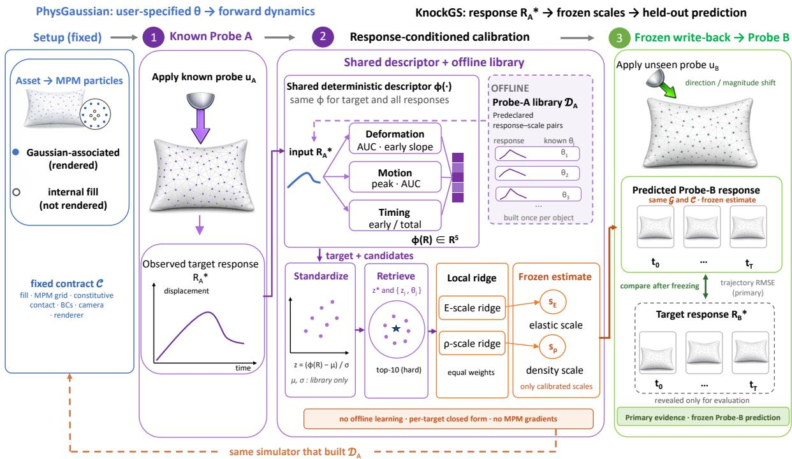  
Figure 1 Overview of KnockGS and its frozen-prediction protocol. The unnumbered setup fixes the simulatable Gaussian asset $\mathcal { G }$ and simulator contract C. (1) A known Probe A, uA, produces the observed target response $R _ { A } ^ { \star }$ (2) The same deterministic five-dimensional descriptor ϕ encodes that response and all responses in the precomputed object-specific library $\mathcal { D } _ { A } ;$ library-only standardization, hard top-10 retrieval, and an equal-weight local ridge fit yield continuous elasticity and density scales $\left( s _ { E } , s _ { \rho } \right)$ . (3) The estimate is frozen and written back into the same simulator to predict $\widehat { R } _ { B }$ under the held-out Probe B, $u _ { B }$ . The target $R _ { B } ^ { \star }$ is revealed only after freezing, and trajectory RMSE is the primary evidence. Purple dashed paths denote once-per-object ofline construction and reuse; the orange dashed return identifies the same simulator contract that built $\mathcal { D } _ { A }$

Gaussians are a natural carrier of physical state. Their particle-like structure maps directly onto MPM dynamics without requiring an explicit mesh, while retaining appearance and mechanical state within a unified representation. Established 3DGS reconstruction pipelines can therefore provide the geometric and visual basis for simulatable assets; what remains unresolved is how to determine their physical parameters. Specifically, visual reconstruction alone does not determine elasticity, density, damping, friction, or internal structure. Two objects with very diferent mass and stifness can fall and appear similarly under gravity. Objects with nearly identical appearance can exhibit substantially diferent responses to the same physical interaction. Static appearance and passive observation are therefore fundamentally limited in disambiguating such objects, whereas an actively applied, known interaction together with its observed response provides direct physical evidence about the object. Appearance-based physical-property methods Xu et al. (2025); Shuai et al. (2025); Chopra et al. (2026); Lv et al. (2026) and video-based inverse or dynamics-learning methods Li et al. (2023); Cai et al. (2024); Zhong et al. (2024); Jiang et al. (2025); Rho et al. (2025); Wang et al. (2026) provide useful alternatives, but they do not directly answer whether a parameter estimate obtained from one known controlled interaction predicts a diferent, unseen interaction.

The target research problem is interaction-grounded physical representation: from an initial observation $O _ { 0 }$ a known interaction $u _ { A }$ , and a physically observable response $Y _ { A }$ , infer a representation $z _ { \mathrm { p h y s } }$ that predicts the response $Y _ { B }$ to a disjoint interaction $u _ { B }$ . The decisive criterion is therefore not parameter proximity alone, but whether the frozen representation predicts motion, deformation, contact, and ultimately visual response under $u _ { B }$ . Real systems would instantiate $Y _ { A }$ with RGB/RGB-D video, surface tracks, silhouettes, or force/tactile measurements.

This paper studies a controlled version of interaction-grounded physical inference (Fig. 1): rather than supplying material parameters for forward simulation, can the physical parameters inferred from one known interaction predict the response to a diferent, unseen interaction? The unnumbered setup in Fig. 1 fixes the simulatable Gaussian asset (following PhysGaussian Xie et al. (2024)), MPM solver, particle fill, grid, constitutive family, boundary conditions, and rendering. Within this fixed contract, we estimate only two dimensionless material scales, a Young’s modulus scale and a density scale $\pmb { \theta } = ( s _ { E } , s _ { \rho } )$ . The observed response is simulator-exported and therefore privileged, with both parameter and response ground truth known.

We separate calibration from prediction using two interactions. Probe A is a known controlled interaction used to estimate θ; Probe B difers in direction, magnitude, or both and is never used during estimation. The estimated parameters are frozen before Probe B is applied. Thus, Probe A measures whether the method can recover a physically useful state, while Probe B tests whether that state predicts beyond the interaction it was fitted to.

KnockGS, an interaction-response PhysicalGS performs this calibration with an object-specific library of 54 Probe-A responses, precomputed once under the same simulator contract. A shared deterministic fivedimensional descriptor encodes both the target and every candidate response; after library-only standardization and hard top-10 retrieval, an equal-weight local ridge fit predicts continuous $( s _ { E } , s _ { \rho } )$ values without diferenti ating through MPM. The estimate is then frozen and written back into the same simulator. We use held-out Probe-B trajectory RMSE as the primary evidence, with rendered PSNR/SSIM and response-curve statistics as complementary measures.

On held-out Pillow targets, the local estimator outperforms response-nearest, response-kNN, and global ridge given identical evidence, and remains predictive under direction- and magnitude-shifted Probe B. The protocol also succeeds on Ficus and Vasedeck. At the same time, observation degradation, fill mismatch, grid mismatch, and cross-object transfer expose clear failure boundaries. These results position the method not as a universal material representation, but as an object- and discretization-conditioned calibration mechanism whose validity is tested by cross-interaction prediction.

## Our contributions are:

1. We formulate material-scale inference for physics-integrated Gaussians as a Probe-A-to-Probe-B problem, where the estimate from one known interaction is frozen and judged by its prediction of an unseen one, unlike forward-only PhysGaussian pipelines and passive-video inverse methods.

2. We propose a library-based local estimator that yields continuous $( s _ { E } , s _ { \rho } )$ without per-target simulation or gradients through MPM. Under the same evidence it reduces joint scale error from 2.4% (KNN, global ridge) to 1.1% and lowers held-out Probe-B trajectory error by about 3×, while also outperforming per-target CMA-ES video optimization.

3. We show that a known probe resolves the stifness-to-mass ambiguity inherent to passive observation: our estimates track the full 162% spread of the held-out targets, whereas exceed the performance of baseline models. We further give an explicit account of where the method fails.

## 2 Related Work

## 2.1 Physics-Integrated Gaussian Representations

PhysGaussian Xie et al. (2024) demonstrated that 3D Gaussians Kerbl et al. (2023) can serve as a unified representation for physics-based simulation and rendering, extending neural scene representations Mildenhall et al. (2020) with MPM-based dynamics Sulsky et al. (1994); Jiang et al. (2015). However, its breadth does not imply that follow-up works address efective material-scale calibration: in our manual survey of PhysGaussian-related follow-up work, forward simulation, interactive editing, dynamic 4D reconstruction, general reconstruction, and generative content account for the overwhelming majority, while only a small fraction directly addresses physical property estimation, inverse problems, or calibration. We target this under-explored setting, with a distinct evidence chain: controlled interaction-response probing, particle-leve 3D response features, response-space calibration, and re-simulation fidelity as the primary evaluation.

Table 1 Comparison with representative related work in the PhysGaussian ecosystem.
<table><tr><td>Category</td><td>Representative works</td><td>GS/ particle repr.</td><td>Material estima- tion</td><td>Interaction- Response probing</td><td>3D response features</td><td>Re- simulation fidelity</td></tr><tr><td>PhysGaussian base</td><td>PhysGaussian Xie et al. (2024)</td><td>√</td><td>x</td><td>x</td><td>x</td><td>x</td></tr><tr><td>Solver / forward enhancement</td><td>i-PhysGaussian Cao et al. (2026), FastPhysGS Ma et al. (2026), GaussianFluent Huang et al. (2026)</td><td>√</td><td>x</td><td>x</td><td>x</td><td>x</td></tr><tr><td>Multi-material scene physics</td><td>OmniPhysGS Lin et al. (2025), PhysSplat Zhao et al. (2025)</td><td>√</td><td>(√)</td><td>x</td><td>x</td><td>x</td></tr><tr><td>Visual / VLM property assignment</td><td>GaussianProperty Xu et al. (2025), PUGS Shuai et al. (2025), PhysGS Chopra et al. (2026), PhysGM Lv et al. (2026)</td><td>√</td><td>√</td><td>x</td><td>x</td><td>x</td></tr><tr><td>Inverse problem/ digital twin</td><td>GIC Cai et al. (2024), Spring-Gaus Zhong et al. (2024), PhysTwin Jiang et al. (2025), ReconPhys Wang et al. (2026), PAC-NeRF Li et al. (2023)</td><td>(S)</td><td>√</td><td>x</td><td>(S)</td><td>(√)</td></tr><tr><td>Dynamics / world models</td><td>NGFF Li et al. (2026), Dynamic 3D Gaussian tracking Luiten et al. (2024), DiffWind Lei et al. (2026)</td><td>(S)</td><td>x</td><td>x</td><td>(S)</td><td>x</td></tr><tr><td>Robot online adaptation</td><td>AdaptiGraph Zhang et al. (2024), ManiGaussian Lu et al. (2024), SplatSim Qureshi et al. (2025)</td><td>(√)</td><td>(S)</td><td>x</td><td>x</td><td>x</td></tr><tr><td>Response- conditioned calibration</td><td>KnockGS (ours)</td><td>√</td><td>√</td><td>√</td><td>√</td><td>√</td></tr></table>

Note: ✓: satisfied; ✗: not addressed; (✓): partially satisfied

## 2.2 Physical System Identification from Visual Dynamics

The ecosystem can be organized into three adjacent routes. Forward PhysicalGS methods assume material parameters and improve simulation or rendering Xie et al. (2024); Lin et al. (2025); Cao et al. (2026); Ma et al. (2026). Visual-prior approaches infer or assign attributes from static appearance Xu et al. (2025); Shua et al. (2025); Chopra et al. (2026); Lv et al. (2026). Passive-video inverse methods use observed dynamics, often through diferentiable optimization or learned prediction Li et al. (2023); Cai et al. (2024); Zhong et al. (2024); Wang et al. (2026). PhysTwin Jiang et al. (2025) explicitly takes sparse videos of deformable objects under interaction and evaluates simulation under novel interactions. Our controlled route difers in the information source and validation axis: the excitation is known, repeatable, and actively specified, and parameters estimated from Probe A are frozen before a diferent Probe B is evaluated. Table 1 summarizes these distinctions.

## 3 Method

Given a fixed PhysicalGS asset G and simulator contract C, our method uses the observed response to a known Calibration Probe $A \ u _ { A }$ to estimate two dimensionless material scales, $\pmb { \theta } = ( s _ { E } , s _ { \rho } )$ . The estimate is then frozen, written back into the same PhysicalGS simulator, and used to predict the response to a disjoint Held-out Prediction Probe $B \ u _ { B }$ . The asset, particle fill, MPM solver and grid, constitutive family, boundary conditions, camera, and renderer are built on the PhysGaussian backbone Xie et al. (2024) and remain fixed within $\mathcal { C } ;$ only the two scales are calibrated. In the terminology of Sec. 1, the fixed asset G represents the initial observation $O _ { 0 } .$ , the target response $R _ { A } ^ { \star }$ instantiates $Y _ { A }$ , the calibrated asset $( { \mathcal { G } } , { \widehat { \pmb { \theta } } } )$ under C instantiates $z _ { \mathrm { p h y s } } ,$ , and $\widehat { R } _ { B }$ is the predicted instantiation of $Y _ { B }$

The design is motivated by the high cost of repeated MPM simulation. Rather than diferentiating through the simulator or repeatedly optimizing each target, we precompute a small response library that can be reused for calibration. Sec. 3.2 precomputes an object-specific response library and maps both library responses and target responses to the same deterministic five-dimensional descriptor. This enables response comparison in a compact feature space and allows a target to be matched against precomputed simulations. Figure 1 therefore separates the unnumbered fixed setup from a three-stage per-target closed loop: (1) apply the known Probe A and record the target response; (2) calibrate continuous material scales using the shared descriptor and a local closed-form fit; and (3) freeze the estimate, write it back into the same simulator, and predict the held-out Probe B.

## 3.1 Problem Setting and Controlled Scope

We study efective material-scale calibration within a declared simulation contract. A PhysicalGS asset G contains renderable Gaussian kernels and a simulator particle set

$$
X ^ { 0 } = X _ { \mathrm { G S } } ^ { 0 } \cup X _ { \mathrm { f i l l } } ^ { 0 } ,\tag{1}
$$

where Gaussian centers are mapped to Gaussian-associated MPM particles and additional particles fill the interior. The contract C fixes the asset, coordinate transform, fill construction, MPM grid, constitutive family, contact model, boundary conditions, damping, friction, Poisson ratio, camera, and renderer. The only unknown quantities are

$$
\pmb \theta = ( s _ { E } , s _ { \rho } ) \in \Theta ,\tag{2}
$$

where, $s _ { E }$ and $s _ { \rho }$ are efective calibration scales defined relative to the fixed object-specific simulator template, rather than direct estimates of intrinsic material constants.

An interaction protocol u specifies the force vector, contact region, start time, and duration under the fixed support and boundary configuration. The simulator S produces a rollout under u. At predeclared export times $t \in \mathcal { T } _ { \mathrm { o u t } }$ (31 frames in the main benchmark, including the initial state), the main observation operator exports particle positions,

$$
R _ { u } ( \pmb \theta ) = \mathcal { O } _ { \mathrm { p a r t } } ( S ( \mathcal { G } , \mathcal { C } , \pmb \theta , u ) ) = \{ \mathbf { x } _ { i } ^ { t } \} _ { i = 1 , t \in \mathcal { T } _ { \mathrm { o u t } } } ^ { N } .\tag{3}
$$

The target response to Calibration Probe A is $R _ { A } ^ { \star } = R _ { u _ { A } } ( \pmb { \theta } ^ { \star } )$ , while $\pmb { \theta } ^ { \star }$ remains hidden from every deployable estimator. Given the object-specific Probe-A library $\mathcal { D } _ { A }$ , the instantiated objective is

$$
\begin{array} { r } { \widehat { \pmb { \theta } } = h ( R _ { A } ^ { \star } ; \mathcal { D } _ { A } ) , \qquad \widehat { R } _ { B } = R _ { u _ { B } } ( \widehat { \pmb { \theta } } ) . } \end{array}\tag{4}
$$

The held-out target response $R _ { B } ^ { \star }$ is used only to evaluate $\widehat { R } _ { B }$ after calibration has been frozen. The main estimator therefore uses privileged simulator-exported state rather than captured real RGB/RGB-D; Sec. 4.4. evaluates progressively less privileged synthetic observations.

## 3.2 Object-Specific Response Library

Ofline response bank. The response map $\pmb { \theta } \mapsto R _ { A } ( \pmb { \theta } )$ is available only through simulation. We therefore evaluate it in advance on a fixed candidate set and reuse those responses for every target governed by the same C and $u _ { A }$ . For each asset, the resulting library is

$$
\mathcal { D } _ { A } = \{ ( R _ { A } ( \pmb \theta _ { j } ) , \pmb \theta _ { j } ) \} _ { j = 1 } ^ { J }\tag{5}
$$

, where J is the number of candidates. The candidates form a predeclared, non-Cartesian set of parameter pairs rather than a regular grid. They provide finite coverage of the declared two-scale domain at a reusable ofline cost. Appendix Sec. B reports the exact support and target split, and Appendix Sec. F measures how candidate count afects accuracy and coverage stability. All held-out targets are excluded from $\mathcal { D } _ { A }$ and neither their hidden scales nor any Probe-B response contributes to library construction. We need a lightweight interpolation mechanism that converts a finite response library into continuous material estimates without additional simulator calls. Hard-neighborhood local ridge is the simplest mechanism we found that satisfies this requirement while outperforming retrieval and global regression under the same evidence.

Shared response descriptor. Raw particle trajectories are high-dimensional and object-dependent, so the same deterministic map compresses every candidate and target response before comparison. Let $D _ { \mathrm { b b o x } }$ be the diagonal of the initial particle bounding box. We first compute normalized RMS displacement and frame-diference velocity curves,

$$
r ^ { t } = \frac { 1 } { D _ { \mathrm { b b o x } } } \sqrt { \frac { 1 } { N } \sum _ { i } \| { \bf x } _ { i } ^ { t } - { \bf x } _ { i } ^ { 0 } \| _ { 2 } ^ { 2 } } , \quad v ^ { t } = \frac { 1 } { D _ { \mathrm { b b o x } } } \sqrt { \frac { 1 } { N } \sum _ { i } \| { \bf x } _ { i } ^ { t } - { \bf x } _ { i } ^ { t - 1 } \| _ { 2 } ^ { 2 } } .\tag{6}
$$

One five-dimensional descriptor then summarizes complementary response-amplitude and timing cues,

$$
\phi ( R ) = \left[ \mathrm { A U C } ( r ) , \mathrm { ~ } s _ { \mathrm { e a r l y } } ( r ) , \mathrm { ~ m a x ~ } v ^ { t } , \mathrm { ~ A U C } ( v ) , \frac { \sum _ { t \leq t _ { e } } v ^ { t } } { \sum _ { t } v ^ { t } } \right] ^ { \top } ,\tag{7}
$$

with $t _ { e } = 5 .$ . Its entries measure cumulative deformation, early deformation rate, peak frame-to-frame motion, cumulative motion, and the fraction of motion concentrated early in the rollout, respectively. Every feature dimension is standardized using candidate-library statistics only. The descriptor has no learned encoder and is not assumed to make the two scales globally identifiable; it supplies compact local evidence for the calibration stage below.

## 3.3 Response-Conditioned Continuous Calibration

Returning the nearest response can only select an existing candidate, so it cannot represent a target whose scales are absent from the finite library. A continuous interpolator is therefore required. Because a single linear map need not approximate the descriptor-to-scale relation across the full domain, we instead assume that it is better approximated within a small response-space neighborhood. A hard neighborhood provides this locality, while weak ridge regularization stabilizes the resulting few-sample fit. This design relaxes the quantization limitation of retrieval and produces a continuous estimate without a new MPM rollout or diferentiation through the simulator. Sec. 4.2 evaluates the resulting local closed-form interpolation against response retrieval and global ridge under the same response library and descriptor evidence.

Let $\mathbf { z } _ { j }$ and $\mathbf { z } ^ { \star }$ be the standardized descriptors of candidate $j$ and the target response. Euclidean distance is used only to select the hard neighborhood $\mathcal { N } _ { 1 0 }$ containing the ten nearest candidates. Samples within that neighborhood have equal weight, and we solve

$$
\operatorname* { m i n } _ { \mathbf { A } , \mathbf { b } } \sum _ { j \in \mathcal { N } _ { 1 0 } } \| \mathbf { A } \mathbf { z } _ { j } + \mathbf { b } - \pmb { \theta } _ { j } \| _ { 2 } ^ { 2 } + 1 0 ^ { - 3 } \| \mathbf { A } \| _ { F } ^ { 2 } , \qquad \widehat { \pmb { \theta } } = \mathbf { A } \mathbf { z } ^ { \star } + \mathbf { b } .\tag{8}
$$

The intercept is not regularized, and the two material scales are regressed independently. Predictions are clipped to the candidate-set bounds. Inverse-distance KNN is used only if fewer than three neighbors are available or a numerical exception prevents the ridge solve; the main estimator is not a distance-weighted ridge regression. The configuration $k = 1 0 , \alpha = 1 0 ^ { - 3 }$ is fixed before held-out evaluation. Probe B and all held-out target statistics remain unavailable during standardization, neighborhood retrieval, fitting, and configuration selection.

## 3.4 Frozen Write-Back and Held-out Prediction

Parameter proximity alone does not establish a useful PhysicalGS representation: an estimate may be numerically close to the hidden scales yet reproduce the wrong motion, or it may reconstruct Probe A without carrying information that transfers to a diferent interaction. We therefore close the loop in response space. Immediately after observing Calibration Probe A, θb is frozen and written back into the same simulator that generated $\mathcal { D } _ { A }$ . We then distinguish calibration reconstruction from held-out prediction,

$$
\widehat { R } _ { A } = R _ { u _ { A } } ( \widehat { \pmb { \theta } } ) , \qquad \widehat { R } _ { B } = R _ { u _ { B } } ( \widehat { \pmb { \theta } } ) .\tag{9}
$$

Probe-A reconstruction is a diagnostic of consistency with the observed response. Held-out Prediction Probe B is the primary evidence: its protocol is predeclared, may change force direction, magnitude, duration, or contact location, and contributes no frames, trajectories, descriptors, or statistics to estimator design or fitting. Its target response $R _ { B } ^ { \star }$ is revealed only for final comparison with $\widehat { R } _ { B }$

The primary dynamics comparison uses Gaussian-associated particles with stable identity,

$$
\mathrm { R M S E } _ { \mathrm { t r a j } } = \sqrt { \frac { 1 } { | \mathcal { Z } _ { \mathrm { G S } } | | \mathcal { T } _ { \mathrm { o u t } } | } \sum _ { i \in \mathcal { T } _ { \mathrm { G S } } } \sum _ { t \in \mathcal { T } _ { \mathrm { o u t } } } \| \widehat { \mathbf { x } } _ { i } ^ { t } - \mathbf { x } _ { i } ^ { \star , t } \| _ { 2 } ^ { 2 } } .\tag{10}
$$

Sec. 4 complements this spatiotemporal metric with response-curve and rendered-frame measures. Accordingly, Probe-B evaluation measures cross-interaction prediction within the fixed object-specific simulator contract and should not be interpreted as arbitrary-interaction or real-material generalization.

## 4 Experiments

This section tests the two claims made in Sec. 3 and then maps their limits. The claims are that a local fit on a hard neighborhood extracts more from a response library than retrieval or global regression does (Sec. 3.3), and that the resulting frozen estimate predicts an excitation it was never fitted to (Sec. 3.4). Sec. 4.1 first fixes the experimental contract; the experiments then follow the order in which the claims can fail. We ask three questions: (1) under identical Probe-A evidence, does local calibration improve over deployable baselines; (2) after the estimate is frozen, does it predict held-out Probe $\operatorname { B } ;$ and (3) can the object-specific loop be repeated across assets, and which observation, object, discretization, and identifiability boundaries limit it? Questions (1) and (2) test the claims directly, while question (3) separates procedural repeatability from the scope that Sec. 6 states explicitly.

## 4.1 Experimental Contract

Input and output. At estimation time a deployable method receives exactly three inputs: the frozen Gaussian asset and its simulation contract, the specification of the calibration probe u , and the response $R _ { A } ^ { \star }$ that the hidden target produced under that probe. It outputs a single pair $\widehat { \pmb { \theta } } = ( \hat { s } _ { E } , \hat { s } _ { \rho } )$ . During calibration, the estimator has no access to the target scales, any Probe-B observation, or aggregate statistics computed across held-out targets. The output is then consumed in one way only: it is written into the same simulator and re-simulated, first under $u _ { A }$ and then under $u _ { B }$ , and all reported numbers are computed from those rollouts and their renders. The response used by the main estimator is simulator-exported particle state and is therefore privileged; Sec. 4.4.1 replaces it with progressively less privileged synthetic observations.

Baselines. All deployable in-domain methods receive no information beyond the same Probe-A evidence. Response-nearest, inverse-distance response KNN, global ridge, and our local ridge use the same predeclared object-specific response library and five-dimensional descriptor; fixed default ignores that evidence by construction. They difer only in how neighborhood evidence is converted into an estimate, which isolates the contribution of Sec. 3.3. KNN neighborhood size and global-ridge regularization are selected by candidate-only validation. Parameter-nearest reads the hidden target location and is reported only as an oracle diagnostic. Sec. 4.4.2 separately evaluates direct video optimization, PhysGM, and ReconPhys. Because these methods difer in both input evidence and native parameterization, we report them as diagnostic external comparisons rather than include them in the same-information ranking.

Computing resources. The cost of the method is concentrated ofline and paid once per object. Building a library requires 54 MPM rollouts, each covering 0.60 s of simulated time at a $\mathrm { 1 0 ^ { - 4 } s }$ substep and exporting 31 states; the Pillow asset carries 695,984 particles on a background grid with $n _ { \mathrm { g r i d } } = 1 0 0$ . Calibrating a new target adds no rollout: the estimator standardizes a five-dimensional vector, selects ten neighbors, and solves two ten-sample ridge systems in closed form — no training, no gradients through MPM, no learned weights. Evaluation is the dominant remaining cost, since every reported estimate is re-simulated under Probe A and each Probe B protocol. The CMA-ES baseline in Sec. 4.4.2 is the one method whose cost scales with the number of targets: it spends 30 forward simulator calls per target per seed, i.e. 450 rollouts across five targets and three predeclared seeds.

Evaluation metrics. We report the joint relative error

$$
e _ { \theta } = \frac { 1 } { 2 } \left( \frac { \left| \hat { s } _ { E } - s _ { E } ^ { \star } \right| } { s _ { E } ^ { \star } } + \frac { \left| \hat { s } _ { \rho } - s _ { \rho } ^ { \star } \right| } { s _ { \rho } ^ { \star } } \right) \times 1 0 0 \% ,\tag{11}
$$

and the Gaussian-associated-particle trajectory RMSE in $\operatorname { E q . }$ equation 10. Curve RMSE, peak/AUC/final errors, foreground PSNR, and object-crop SSIM are secondary. Trajectories are compared at the same exported times with fixed particle correspondence. The in-domain estimators and MPM evaluations are deterministic under frozen seeds; Appendix Sec. C therefore reports every held-out target and mean ± sample standard deviation across targets, rather than pseudo-replicating frames or particles. The stochastic CMA-ES baseline is additionally reported per target as mean ± standard deviation over its three predeclared seeds. Completion, leakage, missing-frame, NaN, and duplicate-output audits accompany the experiment packages.

Table 2 Pillow benchmark with identical information for all deployable methods. Probe A is used for estimation; both Probe B protocols are unseen during estimation and tuning. Lower is better. Parameter-nearest accesses hidden target parameters and is an oracle diagnostic, not a deployable baseline.
<table><tr><td>Method</td><td>Joint parameter error (%)</td><td>Probe A traj. RMSE</td><td>Probe B direction</td><td>Probe B magnitude</td></tr><tr><td>Fixed default</td><td>27.31</td><td> $3 . 6 8 2 \times 1 0 ^ { - 3 }$ </td><td> $3 . 5 0 2 \times 1 0 ^ { - 3 }$ </td><td> $4 . 4 0 7 \times 1 0 ^ { - 3 }$ </td></tr><tr><td>Response nearest</td><td>6.75</td><td> $3 . 7 2 2 \times 1 0 ^ { - 4 }$ </td><td> $3 . 5 3 3 \times 1 0 ^ { - 4 }$ </td><td> $5 . 1 8 8 \times 1 0 ^ { - 4 }$ </td></tr><tr><td>Response KNN</td><td>2.37</td><td> $1 . 4 4 9 \times 1 0 ^ { - 4 }$ </td><td> $1 . 4 1 2 \times 1 0 ^ { - 4 }$ </td><td> $2 . 0 2 0 \times 1 0 ^ { - 4 }$ </td></tr><tr><td>Global ridge</td><td>2.45</td><td> $1 . 7 4 8 \times 1 0 ^ { - 4 }$ </td><td> $1 . 6 8 7 \times 1 0 ^ { - 4 }$ </td><td> $2 . 4 6 6 \times 1 0 ^ { - 4 }$ </td></tr><tr><td>Local ridge (ours)</td><td>1.13</td><td> $\mathbf { 4 . 4 9 8 \times 1 0 ^ { - 5 } }$  </td><td> $\mathbf { 4 . 4 2 4 \times 1 0 ^ { - 5 } }$ </td><td> $\mathbf { 7 . 7 8 6 \times 1 0 ^ { - 5 } }$ </td></tr><tr><td>Parameter-nearest oracle</td><td>4.45</td><td> $6 . 2 8 3 \times 1 0 ^ { - 4 }$ </td><td> $5 . 9 8 4 \times 1 0 ^ { - 4 }$ </td><td> $7 . 1 4 4 \times 1 0 ^ { - 4 }$ </td></tr></table>

Assets, candidates, and targets. The main benchmark uses a reconstructed pillow/sofa Gaussian asset and a candidate set formed by combining a broad sweep over the declared two-scale domain with a denser sweep that supplies local interpolation support. Removing duplicate parameter pairs yields 54 unique $\left( \boldsymbol { s } _ { E } , \boldsymbol { s } _ { \rho } \right)$ candidates. This set was fixed before any held-out evaluation; Appendix Sec. F reports post-hoc sensitivity to smaller candidate subsets without retuning the main result. The five held-out scale pairs lie within the covered domain but do not coincide with any library candidate, so the evaluation tests continuous scale estimation rather than exact table lookup. The same five target locations are used for object-specific Ficus and Vasedeck experiments. Candidate and target responses are generated by the same PhysicalGS/MPM implementation. Their parameters are preset by the experimenter and hidden from deployable estimators; they are simulator-defined ground truth, not measured real-material properties. Appendix Tables 3–4 give the exact split, material bases, timing, forces, contact regions, and particle populations.

Probe separation. The calibration interaction is Probe A (standard\_x). Pillow prediction uses Probe B with a new direction (standard\_y) and a larger magnitude (strong\_x); Vasedeck uses held-out standard\_z. Direction and magnitude are varied separately so that a failure to transfer can be attributed to one or the other. Fine-resolution duration and contact-shift diagnostics are reported quantitatively in Appendix Sec. D. Probe B never participates in descriptor design, hyperparameter selection, neighborhood retrieval, or parameter estimation.

## 4.2 Same-Information Calibration and Frozen Probe-B Prediction

This experiment answers questions (1) and (2) together, and it is the only place where all deployable methods are guaranteed to see identical information. Parameter recovery tests whether the local fit extracts more from the library than its alternatives; frozen Probe-B prediction is the primary evidence that the estimate survives a change of excitation.

Table 2 and Fig. 2 give the central result. Local ridge achieves 1.13% mean parameter error, improving over response KNN (2.37%), global ridge (2.45%), and response-nearest (6.75%); this establishes better calibration under matched evidence. The primary evidence is the held-out prediction made by the same frozen estimate. On standard\_y, its Probe-B trajectory RMSE is $4 . 4 2 \times 1 0 ^ { - 5 }$ , versus $1 . 4 1 \times 1 0 ^ { - 4 }$ for KNN and $1 . 6 9 \times 1 0 ^ { - 4 }$ for global ridge. On strong\_x, it obtains $7 . 7 9 \times 1 0 ^ { - 5 }$ , versus $2 . 0 2 \times 1 0 ^ { - 4 }$ and $2 . 4 7 \times 1 0 ^ { - 4 }$ . These results show that scales calibrated from Probe A remain predictive under held-out changes in force direction and magnitude within the same simulation contract.

Fig. 3 makes the same held-out-probe result visible in image space, showing a mid and a final exported frame of target 002 under unseen standard\_y; no frame or Probe-B signal is used for fitting. Local ridge reaches 41.20 dB foreground PSNR and 0.998 object-crop SSIM, compared with 32.93 dB/0.977 for global ridge, 31.75 dB/0.974 for response KNN, 26.54 dB/0.929 for the fixed CMA-ES seed shown, and 19.41 dB/0.892 for the default material. Because the deformation is small relative to the static basket, the renders are visually close; the shared-scale error maps localize the mismatch to the deforming seat cushion and reproduce the same method ordering as the quantitative table.

Across three predeclared alternative target splits, local ridge has lower mean parameter error than the strongest non-oracle method in all three. A stricter target-wise non-inferiority gate passes two of three splits: the failed split has only $3 / 5$ non-inferior targets, while the others have $4 / 5$ and $5 / 5$ . All six split–protocol Probe-B response gates pass. We therefore claim a stable mean advantage, not universal target-wise dominance. Appendix Fig. 10 further evaluates candidate-library size and local-ridge $( k , \alpha )$ sensitivity using only the frozen response features, without additional MPM or rendering.

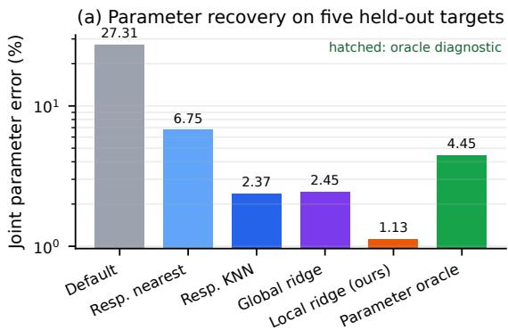

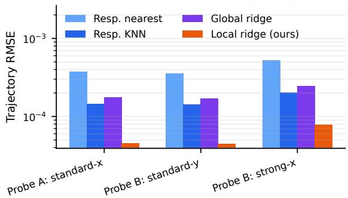

Figure 2 Fair baseline comparison. (a) Local ridge gives the lowest mean joint error among deployable methods; the hatched oracle accesses hidden target parameters. (b) The primary prediction evidence: Probe-A reconstruction and held-out Probe-B trajectories are generated with the same frozen estimates.  
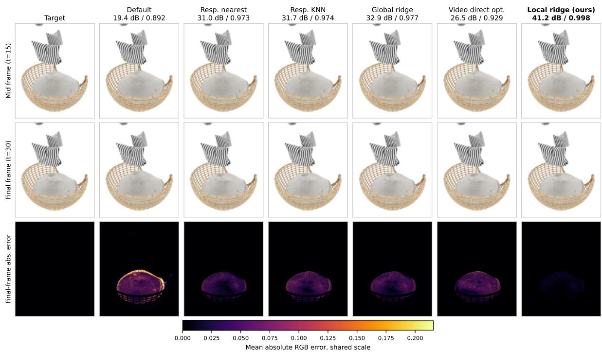  
Figure 3 Qualitative held-out Probe-B prediction on Pillow (target 002, standard\_y). Rows: mid frame, final frame, and per-pixel mean absolute RGB error at the final frame under one shared color scale, clipped at the 99.9th percentile so mid-range diferences stay visible. Panels are cropped to the region that moves. Headers report target-specific sequence-level metrics over all 31 exported frames: foreground PSNR in dB / object-crop SSIM. CMA-ES uses predeclared seed 6401; aggregate direct-optimization results average all three seeds.

## 4.3 Object-Specific Repeatability

Results on a single deformable asset may conflate estimator behavior with asset-specific geometry and contact dynamics. We therefore repeat the complete calibration-and-prediction protocol on two additional assets, keeping the response descriptor and local-ridge configuration fixed while constructing an independent response library for each asset. This experiment evaluates whether the object-specific procedure remains efective across distinct assets; it is not a cross-object transfer setting.

Object-specific calibration across three Gaussian assets  
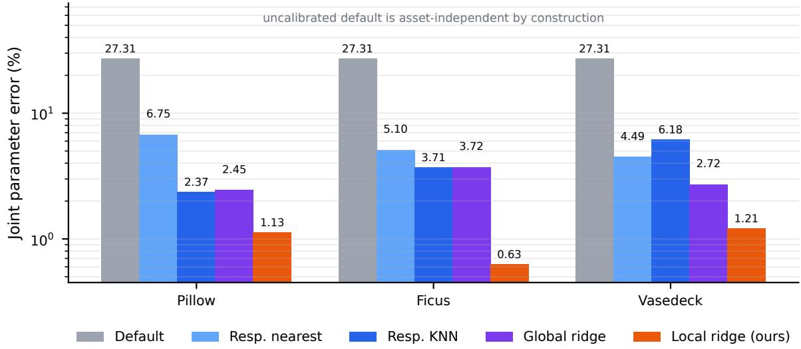  
Figure 4 Object-specific material calibration. The same estimator form is used, but each Gaussian asset has its own response library. Local ridge remains the best deployable method on Pillow, Ficus, and Vasedeck.

Fig. 4 repeats calibration independently for three geometrically distinct assets. Local ridge obtains 1.13% error on Pillow, 0.63% on Ficus, and 1.21% on Vasedeck. On the Vasedeck standard\_x→standard\_z test, its Probe-B trajectory RMSE is $1 . 3 7 \times 1 0 ^ { - 5 }$ , versus $3 . 1 1 \times 1 0 ^ { - 5 }$ for the strongest non-oracle response-nearest result, and it is non-inferior on all five targets. Ficus yields 0.63% scale error versus 3.71% for KNN/global ridge and 27.31% for the default material. Across the three evaluated assets, the same calibration procedure remains efective when instantiated with an object-specific response library.

Rendered response follows the dynamics metrics. Across six pillow protocols, local ridge improves mean foreground PSNR from 55.50 dB (global ridge) to 59.53 dB and object-crop SSIM from 0.9968 to 0.9982. On Ficus, its mean foreground PSNR is 41.87 dB versus 26.80 dB for global ridge. All reported PSNR and SSIM values compare simulator-rendered predictions with simulator-rendered targets and therefore do not measure agreement with real video.

Fig. 5 visualizes the objectively selected median Ficus case: we sort the five held-out targets by localridge Probe-B trajectory RMSE and show the middle one, $( s _ { E } , s _ { \rho } ) = ( 1 . 0 5 , 1 . 1 0 )$ . This rule does not inspect PSNR/SSIM or baseline ordering. Averaged over exported frames, local ridge reaches 41.78 dB/0.997 foreground PSNR/SSIM, versus 22.99 dB/0.846 for global ridge, 22.65 dB/0.775 for response KNN, 21.14 dB/0.722 for response nearest, and 21.33 dB/0.817 for the default material. The residual maps show that the remaining disagreement is concentrated on leaf boundaries and thin branches, where small trajectory errors cause large image-space diferences.

## 4.4 Diagnostic Boundaries

## 4.4.1 Observation Ladder

Everything above uses simulator-exported particle state, which no camera can provide. This diagnostic addresses the observation component of question (3): by removing one privilege at a time we locate which property of the observation the method actually depends on, so that the distance to a deployable visual front end is a measured quantity rather than a guess.

The main estimator receives all exported particles, which is privileged state. To localize the gap to deployable vision, we progressively replace it with Gaussian surface particles, persistently visible Gaussians, clean synthetic RGB-D depth, and ID-free LK trajectories. Fig. 6 reports the result under the same simulator and target split. Local-ridge error is 1.13% with all particles, 0.77% with Gaussian surface or persistently visible Gaussians, and 0.21% with clean synthetic depth. These values show that the selected descriptors can be recovered from clean surface observations in this controlled setting; they do not establish real RGB-D performance.

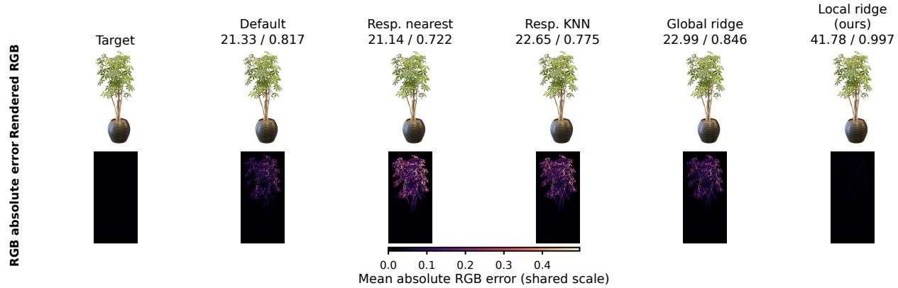  
Figure 5 Qualitative held-out Probe-B prediction on the median-error Ficus target $\big ( s _ { E } = 1 . 0 5 , s _ { \rho } = 1 . 1 0 ,$ standard\_- y). Rows show the final rendered frame and its mean absolute RGB error on one shared scale. Headers report target-specific foreground PSNR in dB / foreground SSIM averaged over all 30 non-initial exported frames. The target is selected only by the median local-ridge trajectory RMSE among all five held-out targets, before inspecting these visual scores. This is an independently calibrated object-specific loop, not cross-object transfer.

Observation ladder under same-simulator synthetic data  
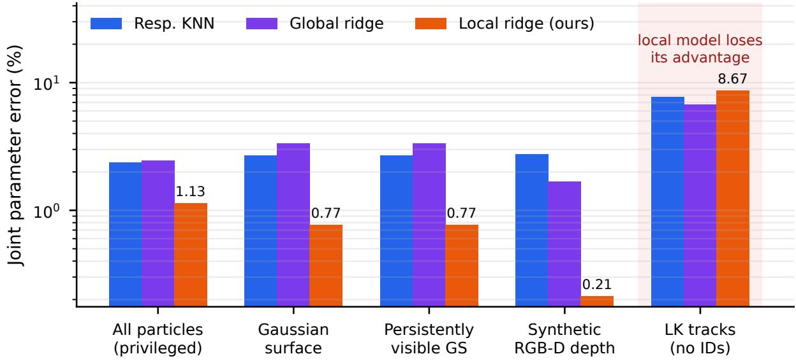  
Figure 6 Synthetic observation ladder. Clean surface and depth observations preserve useful calibration evidence under the same simulator, but the local estimator loses its advantage with ID-free LK tracks. The apparently lowe clean-depth error is an empirical result for this split and feature construction, not a general claim that less information is intrinsically better.

The conclusion changes at the final step. With LK tracks and no persistent particle identity, local-ridge error rises to 8.67%, worse than global ridge (6.73%) and KNN (7.76%). The current bottleneck is therefore not simply whether internal fill particles are observed; robust correspondence and observation noise are unresolved. Synthetic-depth perturbations reinforce this boundary: local error grows from 0.21% clean to 2.65% at noise level 0.001, 16.25% at 0.005, and 28.26% at 0.01.

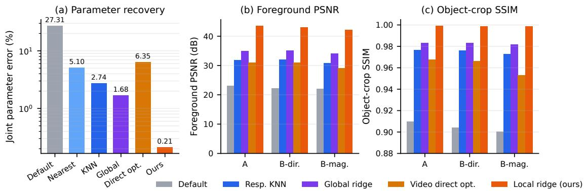  
Figure 7 Diagnostic comparison with fixed-budget per-scene video optimization. (a) Parameter recovery; (b) foreground PSNR; (c) object-crop SSIM. Both routes use simulator-generated RGB-D Probe-A evidence, and Probe B is excluded from fitting. The response-library estimator is more accurate under this budget, while requiring an ofline object-specific library.

## 4.4.2 Alternative Inverse Routes and External Diagnostics

The previous experiments compare estimators that share our library. This diagnostic tests the library route against two families that solve the inverse problem from diferent information—per-scene optimization against a video, and learned prediction from appearance or passive dynamics—and then explains, structurally, why the passive route loses information that a prescribed probe retains. Because their evidence and parameter semantics difer, these routes define boundaries rather than an additional same-information ranking.

Direct optimization from one Probe-A video. To test whether the response library is necessary, we optimize $\left( { \boldsymbol { s } } _ { E } , { \boldsymbol { s } } _ { \rho } \right)$ directly against a single simulator-rendered RGB-D Probe-A video using CMA-ES. The optimizer receives no particle IDs and uses 30 forward calls per target with three predeclared seeds. Parameters are then frozen and evaluated on standard\_y and strong\_x. Fig. 7 shows that fixed-budget direct optimization improves substantially over default parameters (6.35% versus 27.31% joint error), but remains behind response-library local calibration (0.21% on the same synthetic-depth observation track). On Probe A, local calibration achieves 43.49 dB PSNR versus 31.10 dB for CMA-ES; the ordering persists on both Probe B protocols. This comparison has complementary computational costs: our method amortizes a 54-simulation object-specific library, whereas direct optimization incurs per-target simulator calls.

Visual-prior and passive-video systems. We additionally run PhysGM and ReconPhys as diagnostic external comparisons. Their native physical parameterizations, training distributions, and solvers difer from our MPM scales, so their outputs are adapted to the same initial asset and common downstream MPM rather than treated as same-information baselines. PhysGM observes four static views of the pillow scene and returns one material prediction for five visually identical targets; its common-adapter Probe-A response error is 11.42× ours and worse than the uncalibrated default on all five targets. ReconPhys observes passive video and is calibrated to our candidate range; it improves joint parameter error from the default’s 34.99% to 20.29% and beats default response on 4/5 targets, but its Probe-A and unseen-Probe-B video errors remain approximately 2.6× and 2.9× ours. Appendix Fig. 11 shows the corresponding common-adapter motion on a representative dificult target. These results support the value of known dynamic excitation in this controlled scene.

Why passive observation under-discriminates here. This discrepancy reflects an identifiability limitation of the passive observation model, rather than only a diference in estimator accuracy; it has a structural cause that we can state and then check. In the spring–mass formulation used by ReconPhys, the released implementation computes spring and damping forces that are linear in k and d, adds gravity as mg, and integrates $\mathbf { v } \gets \mathbf { v } + \mathbf { F } \Delta t / m ;$ the released configuration resolves ground contact by a mass-independent kinematic projection. The rescaling $( m , k , d ) \mapsto ( \alpha m , \alpha k , \alpha d )$ therefore leaves every particle trajectory—and hence every rendered frame—unchanged. Under a passive drop, only ratios such as $k / m$ are identifiable, and absolute mass is not observable at all. This invariance arises from the observation setting and parameterization rather than from an implementation error. A mass-dependent penalty contact model, for example, could break this scaling invariance.

(a)  
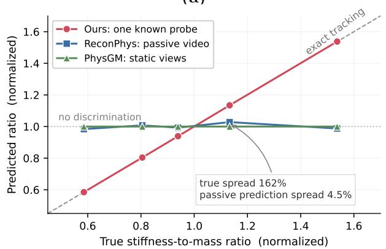

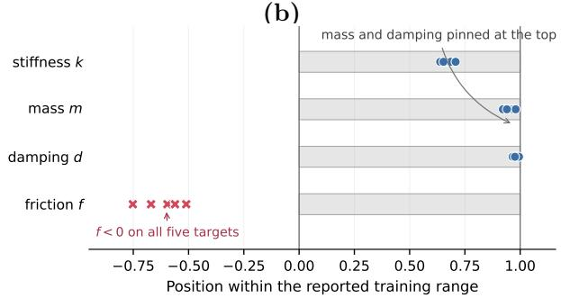  
Figure 8 Passive-observation diagnostics on five held-out targets. (a) Discriminative range after per-series mean normalization. (b) Released ReconPhys native outputs relative to its reported training ranges; crosses are inadmissible. These panels diagnose range and saturation under diferent parameterizations, not like-for-like parameter accuracy.

Fig. 8 checks the consequence on our five held-out targets. Panel (a) shows that the true ratio $s _ { E } / s _ { \rho }$ spans 162% and our estimates span 163%, whereas the released ReconPhys predictions span only 4.5% in $k / m$ and PhysGM returns a single prediction because its four static views are identical across targets. Panel (b) adds the per-parameter view: the released outputs sit at the top of the reported training range for mass (5.55–5.88 within [0.2, 6.0]) and damping (4.83–4.97 within [0.1, 5.0]), and friction is negative on all five targets although the method defines $f \geq 0 .$ These observations are consistent with predictions dominated by the training prior rather than by target-specific evidence, and they are the concrete reason a known applied probe helps: the excitation is prescribed rather than inferred, so the scale direction that passive observation cannot resolve is fixed by construction.

## 4.4.3 Discretization, Object, and Identifiability Boundaries

Sec. 3.2 constructs each response library under a fixed object-specific simulation contract. To characterize the estimator’s dependence on this contract, we vary one component at a time, evaluate the resulting mismatch using the original library, and, where applicable, rebuild a contract-matched library. These controlled comparisons distinguish variations tolerated by the frozen library from those that require library reconstruction.

Fig. 9 summarizes these controlled stress tests. Changing fill density while retaining the original library increases local-ridge error to 42.61%; normalizing the total applied force does not resolve it (43.30%). Rebuilding a fill-matched library restores 0.99%. Changing MPM grid resolution gives 38.30% error, while a grid-matched library restores 0.75%. In contrast, random fill seeds at the same specification remain stable (1.19% mean, 2.45% maximum). Finally, leave-one-object-out use of a shared estimator fails with 38–45% error. The method is therefore robust to stochastic fill realization but conditioned on the object and numerical discretization used to construct the library.

The five-dimensional descriptor is also not globally identifiable. Among 54 candidates (1,431 pairs), some distinct parameter pairs are close after descriptor compression, and local-neighborhood condition numbers have median 1,244 and maximum 6,539. Several compressed-space ambiguities become separable when the full trajectory is considered, showing that feature compression contributes additional ambiguity; this does not rule out physical non-identifiability under a fixed probe.

Calibration is stable to fill seeds but conditioned on discretization and object  
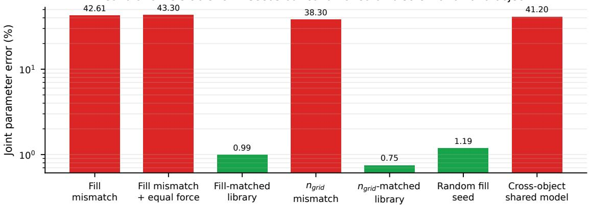  
Figure 9 Calibration boundaries for local ridge. Red bars violate the library contract; green bars preserve or rebuild it. Equalizing total force does not fix fill mismatch, while fill- and grid-matched libraries restore accuracy.

## 5 Conclusion

We presented KnockGS, a controlled study of response-conditioned calibration for physics-integrated Gaussian assets. An object-specific library and a simple hard-neighborhood local ridge estimator recover two MPM material scales from a known Probe-A response; after write-back, the frozen estimate predicts held-out direction and magnitude probes more accurately than response retrieval, KNN, global ridge, and fixed default materials. The result repeats in object-specific loops on Pillow, Ficus, and Vasedeck, and is supported by Gaussian-associated-particle trajectories and rendered visual fidelity.

Equally important, the stress tests delimit the result. Clean synthetic surface and depth observations retain useful evidence, but ID-free visual tracks and depth perturbations degrade calibration. Fill or grid mismatch and cross-object sharing fail unless the response library is rebuilt under matching conditions. Closing that gap requires stable visual correspondence, uncertainty-aware identification, broader physical states, and validation with measured force and object-level deformation.

## 6 Discussion

The supported claim is controlled, object-specific, discretization-conditioned calibration of two MPM material scales from a known interaction, followed by unseen-interaction prediction in the same simulator family. The experiments do not establish real RGB/RGB-D input, real force feedback, measured material ground truth, sim-to-real transfer, a cross-object shared estimator, fill-unknown inversion, full multi-parameter material identification, damage prediction, or active-probe optimality. The observation ladder uses synthetic observations, the external routes use diferent native parameterizations, and the passive-identifiability result applies to the analyzed spring–mass/contact formulation; none should be read as a broader real-world or like-for-like accuracy claim.

The measured failures point to concrete future work. The degradation with ID-free tracks motivates robust visual correspondence, while sensitivity to synthetic-depth perturbations calls for uncertainty-aware estimation. Descriptor ambiguity under a fixed Probe A motivates active interaction selection and richer response representations, and the current two-scale state should be extended to richer physical parameterizations. Finally, closing the simulation-to-reality gap requires validation with measured interactions and real object deformation. These are future directions rather than capabilities of the current system.

## References

Jonathan T Barron, Ben Mildenhall, Dor Verbin, Pratul P Srinivasan, and Peter Hedman. Mip-NeRF 360: Unbounded anti-aliased neural radiance fields. In Proceedings of the IEEE/CVF Conference on Computer Vision and Pattern Recognition, pp. 5470–5479, 2022.

Junhao Cai, Yuji Yang, Weihao Yuan, Yisheng He, Zilong Dong, Liefeng Bo, Hui Cheng, and Qifeng Chen. Gaussianinformed continuum for physical property identification and simulation. In Advances in Neural Information Processing Systems (NeurIPS), 2024.

Yicheng Cao, Zhuo Huang, Yu Yao, Yiming Ying, Daoyi Dong, and Tongliang Liu. i-physgaussian: Implicit physical simulation for 3d gaussian splatting. arXiv preprint arXiv:2602.17117, 2026.

Samarth Chopra, Jing Liang, Gershom Seneviratne, and Dinesh Manocha. Physgs: Bayesian-inferred gaussian splatting for physical property estimation. In Proceedings of the IEEE/CVF Conference on Computer Vision and Pattern Recognition, pp. 18980–18990, 2026.

Yuanming Hu, Yu Fang, Ziheng Ge, Ziyin Qu, Yixin Zhu, Andre Pradhana, and Chenfanfu Jiang. A moving least squares material point method with displacement discontinuity and two-way rigid body coupling. ACM Transactions on Graphics, 37(4):1–14, 2018.

Bei Huang, Yixin Chen, Ruijie Lu, Gang Zeng, Hongbin Zha, Yuru Pei, and Siyuan Huang. Gaussianfluent: Gaussian simulation for dynamic scenes with mixed materials. arXiv preprint arXiv:2601.09265, 2026.

Chenfanfu Jiang, Craig Schroeder, Andrew Selle, Joseph Teran, and Alexey Stomakhin. The afine particle-in-cell method. ACM Transactions on Graphics, 34(4), 2015.

Hanxiao Jiang, Hao-Yu Hsu, Kaifeng Zhang, Hsin-Ni Yu, Shenlong Wang, and Yunzhu Li. Phystwin: Physics-informed reconstruction and simulation of deformable objects from videos. In 2025 IEEE/CVF International Conference on Computer Vision (ICCV), pp. 7219–7230. IEEE, 2025.

Bernhard Kerbl, Georgios Kopanas, Thomas Leimkühler, and George Drettakis. 3D Gaussian splatting for real-time radiance field rendering. ACM Transactions on Graphics, 42(4), 2023.

Yuanhang Lei, Boming Zhao, Zesong Yang, Xingxuan Li, Tao Cheng, Haocheng Peng, Ru Zhang, Siyuan Huang, Yujun Shen, Ruizhen Hu, et al. Difwind: Physics-informed diferentiable modeling of wind-driven object dynamics. In International Conference on Learning Representations, volume 2026, pp. 23469–23494, 2026.

Shiqian Li, Ruihong Shen, Junfeng Ni, Chang Pan, Chi Zhang, and Yixin Zhu. Learning physics-grounded 4d dynamics with neural gaussian force fields. In International Conference on Learning Representations, volume 2026, pp. 81165–81207, 2026.

Xuan Li, Yi-Ling Qiao, Peter Yichen Chen, Krishna Murthy Jatavallabhula, Ming Lin, Chenfanfu Jiang, and Chuang Gan. PAC-NeRF: Physics augmented continuum neural radiance fields for geometry-agnostic system identification. In Proc. International Conference on Learning Representations (ICLR), 2023.

Yuchen Lin, Chenguo Lin, Jianjin Xu, and Yadong Mu. OmniPhysGS: 3D constitutive Gaussians for general physics-based dynamics generation. In Proc. International Conference on Learning Representations (ICLR), 2025.

Guanxing Lu, Shiyi Zhang, Ziwei Wang, Changliu Liu, Jiwen Lu, and Yansong Tang. ManiGaussian: Dynamic Gaussian splatting for multi-task robotic manipulation. In Proc. European Conference on Computer Vision (ECCV), 2024.

Jonathon Luiten, Georgios Kopanas, Bastian Leibe, and Deva Ramanan. Dynamic 3D Gaussians: Tracking by persistent dynamic view synthesis. In Proc. International Conference on 3D Vision (3DV), 2024.

Chunji Lv, Zequn Chen, Donglin Di, Weinan Zhang, Hao Li, Chen Wei, Yinjie Lei, and Changsheng Li. Physgm: Large physical gaussian model for feed-forward 4d synthesis. In Proceedings of the IEEE/CVF Conference on Computer Vision and Pattern Recognition, pp. 29855–29865, 2026.

Yikun Ma, Yiqing Li, Jingwen Ye, Zhongkai Wu, Weidong Zhang, Lin Gao, and Zhi Jin. Fastphysgs: Accelerating physicsbased dynamic 3dgs simulation via interior completion and adaptive optimization. arXiv preprint arXiv:2602.01723, 2026.

Ben Mildenhall, Pratul P Srinivasan, Matthew Tancik, Jonathan T Barron, Ravi Ramamoorthi, and Ren Ng. Nerf: Representing scenes as neural radiance fields for view synthesis. In European conference on computer vision, pp. 405–421. Springer, 2020.

Thomas Müller, Alex Evans, Christoph Schied, and Alexander Keller. Instant neural graphics primitives with a multiresolution hash encoding. ACM Transactions on Graphics, 41(4):1–15, 2022.

M Nomaan Qureshi, Sparsh Garg, Francisco Yandun, David Held, George Kantor, and Abhisesh Silwal. Splatsim: Zero-shot sim2real transfer of rgb manipulation policies using gaussian splatting. In 2025 IEEE International Conference on Robotics and Automation (ICRA), pp. 6502–6509. IEEE, 2025.

Daniel Rho, Jun Myeong Choi, Biswadip Dey, and Roni Sengupta. Projo4d: Progressive joint optimization for sparse-view inverse physics estimation. arXiv preprint arXiv:2506.05317, 2025.

Yinghao Shuai, Ran Yu, Yuantao Chen, Zijian Jiang, Xiaowei Song, Nan Wang, Jv Zheng, Jianzhu Ma, Meng Yang, Zhicheng Wang, et al. Pugs: Zero-shot physical understanding with gaussian splatting. In 2025 IEEE International Conference on Robotics and Automation (ICRA), pp. 4478–4485. IEEE, 2025.

Alexey Stomakhin, Craig Schroeder, Lawrence Chai, Joseph Teran, and Andrew Selle. A material point method for snow simulation. ACM Transactions on Graphics, 32(4):1–10, 2013.

Deborah Sulsky, Zhen Chen, and Howard L. Schreyer. A particle method for history-dependent materials. Computer Methods in Applied Mechanics and Engineering, 118(1–2):179–196, 1994.

Boyuan Wang, Xiaofeng Wang, Yongkang Li, Zheng Zhu, Yifan Chang, Angen Ye, Guosheng Zhao, Chaojun Ni, Guan Huang, Yijie Ren, Yueqi Duan, and Xingang Wang. ReconPhys: Reconstruct appearance and physical attributes from single video, 2026. arXiv:2604.07882.

Tianyi Xie, Zeshun Zong, Yuxing Qiu, Xuan Li, Yutao Feng, Yin Yang, and Chenfanfu Jiang. PhysGaussian: Physicsintegrated 3D Gaussians for generative dynamics. In Proc. IEEE/CVF Conference on Computer Vision and Pattern Recognition (CVPR), 2024.

Xinli Xu, Wenhang Ge, Dicong Qiu, ZhiFei Chen, Dongyu Yan, Zhuoyun Liu, Haoyu Zhao, Hanfeng Zhao, Shunsi Zhang, Junwei Liang, et al. Gaussianproperty: Integrating physical properties to 3d gaussians with lmms. In 2025 IEEE/CVF International Conference on Computer Vision (ICCV), pp. 7231–7240. IEEE, 2025.

Kaifeng Zhang, Baoyu Li, Kris Hauser, and Yunzhu Li. AdaptiGraph: Material-adaptive graph-based neural dynamics for robotic manipulation. In Proc. Robotics: Science and Systems (RSS), 2024.

Haoyu Zhao, Hao Wang, Xingyue Zhao, Hao Fei, Hongqiu Wang, Chengjiang Long, and Hua Zou. Physsplat: Eficient physics simulation for 3d scenes via mllm-guided gaussian splatting. In 2025 IEEE/CVF International Conference on Computer Vision (ICCV), pp. 5242–5252. IEEE, 2025.

Licheng Zhong, Hong-Xing Yu, Jiajun Wu, and Yunzhu Li. Reconstruction and simulation of elastic objects with spring-mass 3D Gaussians. In Proc. European Conference on Computer Vision (ECCV), 2024.

## Appendix

## A Response and Metric Details

Let $\boldsymbol { \mathcal { T } } _ { \mathrm { G S } }$ denote Gaussian-associated particles with stable identity and $\mathcal { T } _ { \mathrm { f i l l } }$ internal fill particles. The estimator’s privileged input may use all exported particles, while the primary trajectory evaluation is restricted to $\boldsymbol { \mathcal { T } } _ { \mathrm { G S } }$ This avoids two confounds: internal fill particles are not directly renderable, and changing fill construction can change their count and correspondence. Exported states are recorded only at the configured output times, not at every internal MPM integration step.

For secondary curve metrics, normalized particle displacement is

$$
\tilde { d } _ { i } ^ { t } = \| \mathbf { x } _ { i } ^ { t } - \mathbf { x } _ { i } ^ { 0 } \| _ { 2 } / D _ { \mathrm { b b o x } } ,\tag{12}
$$

and the RMS curve is $\begin{array} { r } { r ^ { t } = ( | \mathcal { I } | ^ { - 1 } \sum _ { i \in \mathcal { I } } ( \tilde { d } _ { i } ^ { t } ) ^ { 2 } ) ^ { 1 / 2 } } \end{array}$ . We report

$$
\mathrm { R M S E } _ { \mathrm { c u r v e } } = \sqrt { \frac { 1 } { | T _ { \mathrm { o u t } } | } \sum _ { t } ( \hat { r } ^ { t } - r ^ { \star , t } ) ^ { 2 } } ,\tag{13}
$$

plus $\begin{array} { r } { \vert \operatorname* { m a x } _ { t } \hat { r } ^ { t } - \operatorname* { m a x } _ { t } r ^ { \star , t } \vert } \end{array}$ , the absolute diference of discrete AUC sums, and final-frame error. Curve metrics summarize temporal magnitude but do not replace the spatial trajectory metric.

Foreground PSNR is computed over the union of the target and predicted foreground masks, pooling RGB squared error and sample count over all 31 exported frames before conversion to dB. Object-crop SSIM is computed per frame within the bounding box of the same mask union, padded by five pixels, and then averaged across frames. Both target and prediction are rendered by the same Gaussian renderer and camera. They quantify same-simulator visual response fidelity and must not be interpreted as performance on captured real video.

Table 3 Frozen object-specific simulation contract. Counts are physical-state particles used by the estimator; Pillow contains 624,324 Gaussian-associated particles and 71,660 internal fill particles. Primary Pillow trajectory evaluation samples at most 100,000 Gaussian-associated particles with seed 42. “Exports” includes the initial state.
<table><tr><td>Object</td><td>Base E</td><td>Base ρ</td><td>ν</td><td>Physical-state population</td><td>Exports / horizon</td></tr><tr><td>Pillow</td><td>10,000</td><td>2,000</td><td>0.30</td><td>695,984 (GS + fixed-seed fill)</td><td>31 / 0.60 s</td></tr><tr><td>Ficus</td><td>2×10⁶6</td><td>200</td><td>0.40</td><td>171,553 Gaussian-associated</td><td>31 / 1.20 s</td></tr><tr><td>Vasedeck</td><td>10,000</td><td>40</td><td>0.30</td><td>55,364 Gaussian-associated</td><td>31 / 0.60 s</td></tr></table>

Table 4 Exact probe values. f is the force vector per selected particle; contact boxes are reported as center c / half-extent h. One MPM step is 0.1 ms. Global Pillow and Ficus probes select the full physical-state population. The duration row preserves the nominal force–time integral of standard\_x; the two local-contact rows preserve total force and impulse relative to each other.
<table><tr><td>Protocol</td><td>Object / role</td><td>f</td><td>Contact c/h</td><td>Steps /duration</td><td>Selected N</td><td>Exports</td></tr><tr><td>standard_x</td><td>Pillow A</td><td>(−0.18,0,0)</td><td>global</td><td>1 / 0.1 ms</td><td>695,984</td><td>31 at 20 ms</td></tr><tr><td>standard_y</td><td>Pillow B-direction</td><td>(0,−0.18,0)</td><td>global</td><td>1 / 0.1 ms</td><td>695,984</td><td>31 at 20 ms</td></tr><tr><td>strong_x</td><td>Pillow B-magnitude</td><td>(−0.36, 0, 0)</td><td>global</td><td>1 / 0.1 ms</td><td>695,984</td><td>31 at 20 ms</td></tr><tr><td>duration_x_fine</td><td>Pillow B-duration</td><td>(−0.0009, 0, 0)</td><td>global</td><td>200 / 20 ms</td><td></td><td>695,984 121 at 5 ms</td></tr><tr><td>local_center_x</td><td>Pillow contact ref.</td><td>(−0.18, 0,0)</td><td>(1, 1, 1.28)/(0.16, 0.16, 0.16)</td><td>1 / 0.1 ms</td><td>94,657</td><td>31 at 20 ms</td></tr><tr><td>shifted_contact_x</td><td>Pillow B-location</td><td>(−0.226245, 0,0)</td><td>(1,1.12,1.28)/(0.16,0.16,0.16)</td><td>1 / 0.1 ms</td><td></td><td>75,309 31 at 20 ms</td></tr><tr><td>standard_x/y</td><td>Ficus A / B-direction</td><td>(−0.18, 0, 0)/(0, −0.18, 0)</td><td>global</td><td>1 / 0.1 ms</td><td>171,553</td><td>31 at 40 ms</td></tr><tr><td>standard_x/z</td><td>Vasedeck A / B-direction</td><td> $( - 0 . 0 9 , 0 , 0 ) / ( 0 , 0 , - 0 . 0 9 )$ </td><td>(1.05, 0.9, 0.92)/(0.2, 0.14,0.2)</td><td>1 / 0.1 ms</td><td></td><td>4,464 31 at 20 ms</td></tr></table>

## B Probe Definitions and Separation

The candidate set comprises 54 predeclared pairs, not a Cartesian grid. Its coordinate levels are $s _ { E } \in$ {0.50, 0.55, 0.65, 0.75, 0.85, 0.95, 1.00, 1.05, 1.15} and $s _ { \rho } \in \{ 0 . 7 5 , 1 . 0 0 , 1 . 1 0 , 1 . 2 0 , 1 . 2 5 , 1 . 3 5 , 1 . 5 0 , 1 . 6 5 , 1 . 7 5 \} _ { | \mathrm { ~ } }$ . The five targets are (0.60, 1.65), (0.70, 1.20), (0.80, 1.60), (0.95, 1.35), and (1.05, 1.10); none is one of the 54 candidate pairs. Material scales multiply the frozen object-specific base values in Table 3. Candidate-only standardization and validation never use these targets.

All three objects use an internal MPM substep of $\mathrm { 1 0 ^ { - 4 } s }$ . Pillow uses $n _ { \mathrm { g r i d } } = 1 0 0$ and a $1 2 8 ^ { 3 }$ fill grid with at most four particles per cell and frozen fill seed 60042. Ficus scales both its global material and its configured branch/leaf material region by the same $( s _ { E } , s _ { \rho } )$ pair. Vasedeck uses $n _ { \mathrm { g r i d } } = 1 2 0$ . Geometry, coordinate transforms, support constraints, gravity, damping, friction, camera, and renderer remain fixed within each object-specific library.

All parameters are estimated using only standard\_x. Probe-B responses are generated only after the estimate, descriptor definition, neighborhood size, and regularization have been frozen. The candidate library contains Probe-B rollouts for eficient evaluation, but no Probe-B feature participates in the estimator.

## C Target-wise Results and Variability

Table 5 reports sample standard deviation across the five held-out targets. This quantifies target-to-target variation, not simulator noise: fixed default, retrieval, KNN, and both ridge estimators are deterministic once the library, fill seed, and evaluation sample are frozen. We do not treat 31 frames or up to 100,000 particles as independent replicates.

The per-target table exposes the only primary-protocol exception: on (0.70, 1.20), global ridge has lower parameter and B-magnitude errors, while local ridge remains lower on Probe A and B-direction. This is why the paper claims the best mean and reports target-wise gates rather than universal dominance.

Table 5 Pillow mean ± sample standard deviation across five held-out targets. Trajectory columns are in units of $1 0 ^ { - 5 }$ ; lower is better.
<table><tr><td>Method</td><td>Joint error (%)</td><td>Probe A</td><td>B-direction</td><td>B-magnitude</td></tr><tr><td>Fixed default</td><td> $2 7 . 3 1 3 \pm 1 7 . 5 7 7$ </td><td> $3 6 8 . 1 9 5 \pm 2 4 8 . 0 7 9$ </td><td> $3 5 0 . 1 7 2 \pm 2 4 0 . 8 0 6$ </td><td> $4 4 0 . 7 3 0 \pm 2 7 3 . 5 4 7$ </td></tr><tr><td>Response nearest</td><td> $6 . 7 4 6 \pm 2 . 5 5 0$ </td><td> $3 7 . 2 1 9 \pm 1 1 . 9 1 9$ </td><td> $3 5 . 3 2 8 \pm 1 1 . 0 0 8$ </td><td> $5 1 . 8 7 6 \pm 1 4 . 6 6 0$ </td></tr><tr><td>Response KNN</td><td> $2 . 3 7 4 \pm 1 . 0 6 5$ </td><td> $1 4 . 4 9 1 \pm 8 . 8 4 2$ </td><td> $1 4 . 1 1 9 \pm 8 . 7 9 1$ </td><td> $2 0 . 2 0 3 \pm 9 . 0 8 6$ </td></tr><tr><td>Global ridge</td><td> $2 . 4 4 9 \pm 1 . 5 9 4$ </td><td> $1 7 . 4 7 6 \pm 1 1 . 5 2 8$ </td><td> $1 6 . 8 7 4 \pm 1 0 . 9 0 5$ </td><td> $2 4 . 6 6 0 \pm 1 6 . 2 9 0$ </td></tr><tr><td>Local ridge (ours)</td><td> $\mathbf { 1 . 1 3 0 \pm 0 . 6 0 5 }$ </td><td> $\mathbf { 4 . 4 9 8 \pm 1 . 9 6 5 }$ </td><td> $\mathbf { 4 . 4 2 4 \pm 1 . 8 9 2 }$ </td><td> ${ \bf 7 . 7 8 6 \pm 3 . 8 5 8 }$ </td></tr><tr><td>Parameter-nearest oracle</td><td> $4 . 4 4 7 \pm 0 . 6 2 8$ </td><td> $6 2 . 8 2 7 \pm 2 4 . 3 3 7$ </td><td> $5 9 . 8 3 7 \pm 2 4 . 3 1 3$ </td><td> $7 1 . 4 3 8 \pm 2 4 . 8 8 4$ </td></tr></table>

Table 6 All Pillow held-out targets and methods. eθ is joint parameter error in percent; trajectory columns are in units of $1 0 ^ { - 5 }$ . No target or method outcome is omitted.
<table><tr><td>Target  $( s _ { E } , s _ { \rho } )$ </td><td>Method</td><td>eθ</td><td>Probe A</td><td>B-direction</td><td>B-magnitude</td></tr><tr><td>(0.60, 1.65)</td><td>Fixed default</td><td>53.030</td><td>715.049</td><td>690.177</td><td>814.549</td></tr><tr><td></td><td>Resp. nearest</td><td>7.197</td><td>28.205</td><td>27.441</td><td>40.864</td></tr><tr><td></td><td>Resp. KNN</td><td>1.417</td><td>28.593</td><td>28.326</td><td>29.045</td></tr><tr><td></td><td>Global ridge</td><td>1.496</td><td>28.680</td><td>28.274</td><td>29.257</td></tr><tr><td></td><td>Local ridge</td><td>0.224</td><td>1.618</td><td>1.574</td><td>1.846</td></tr><tr><td></td><td>Param.-nearest oracle</td><td>4.167</td><td>91.944</td><td>90.996</td><td>93.126</td></tr><tr><td>(0.70,1.20)</td><td>Fixed default</td><td>29.762</td><td>349.973</td><td>325.707</td><td>401.730</td></tr><tr><td></td><td>Resp. nearest</td><td>3.571</td><td>56.453</td><td>53.032</td><td>62.402</td></tr><tr><td></td><td>Resp. KNN</td><td>2.113</td><td>9.326</td><td>9.476</td><td>16.547</td></tr><tr><td></td><td>Global ridge</td><td>0.657</td><td>6.695</td><td>6.233</td><td>7.580</td></tr><tr><td></td><td>Local ridge</td><td>1.371</td><td>5.592</td><td>5.647</td><td>10.026</td></tr><tr><td></td><td>Param.-nearest oracle</td><td>3.571</td><td>56.453</td><td>53.032</td><td>62.402</td></tr><tr><td>(0.80, 1.60)</td><td>Fixed default</td><td>31.250</td><td>475.247</td><td>454.395</td><td>577.379</td></tr><tr><td></td><td>Resp. nearest</td><td>4.687</td><td>26.407</td><td>24.899</td><td>32.067</td></tr><tr><td></td><td>Resp. KNN</td><td>1.812</td><td>6.405</td><td>6.076</td><td>10.026</td></tr><tr><td></td><td>Global ridge</td><td>3.354</td><td>11.735</td><td>12.082</td><td>21.260</td></tr><tr><td></td><td>Local ridge</td><td>0.993</td><td>3.457</td><td>3.576</td><td>6.191</td></tr><tr><td></td><td>Param.-nearest oracle</td><td>4.687</td><td>26.407</td><td>24.899</td><td>32.067</td></tr><tr><td>(0.95, 1.35)</td><td>Fixed default</td><td>15.595</td><td>248.238</td><td>231.909</td><td>323.815</td></tr><tr><td></td><td>Resp. nearest</td><td>8.967</td><td>37.628</td><td>35.814</td><td>58.202</td></tr><tr><td></td><td>Resp. KNN</td><td>2.353</td><td>10.792</td><td>10.203</td><td>14.869</td></tr><tr><td></td><td>Global ridge</td><td>2.039</td><td>9.118</td><td>8.857</td><td>15.126</td></tr><tr><td></td><td>Local ridge</td><td>1.881</td><td>6.573</td><td>6.340</td><td>11.588</td></tr><tr><td></td><td>Param.-nearest oracle</td><td>5.263</td><td>75.183</td><td>71.076</td><td>81.811</td></tr><tr><td>(1.05, 1.10)</td><td>Fixed default</td><td>6.926</td><td>52.467</td><td>48.675</td><td>86.176</td></tr><tr><td></td><td>Resp. nearest</td><td>9.307</td><td>37.403</td><td>35.456</td><td>65.846</td></tr><tr><td></td><td>Resp. KNN</td><td>4.173</td><td>17.339</td><td>16.512</td><td>30.530</td></tr><tr><td></td><td>Global ridge</td><td>4.697</td><td>31.152</td><td>28.924</td><td>50.079</td></tr><tr><td></td><td>Local ridge</td><td>1.178</td><td>5.249</td><td>4.982</td><td>9.279</td></tr><tr><td></td><td>Param.-nearest oracle</td><td>4.545</td><td>64.145</td><td>59.183</td><td>87.783</td></tr></table>

## D Duration and Contact-Shift Diagnostics

The fine duration experiment reuses the five frozen standard\_x estimates and changes only the force time profile. It resolves the 20 ms actuation with 5 ms exports (121 states over 0.6 s), rather than the 20 ms exports used by the main benchmark. The 0.0009-per-particle force is applied for 200 internal steps, giving the same nominal force–time integral as the 0.18 force applied for one step. The two target protocols are measurably distinct (mean target-to-target protocol trajectory RMSE $8 . 9 9 8 \times 1 0 ^ { - 5 } )$ .

Table 7 Five-target duration-shift result, mean ± sample standard deviation; values are $\times 1 0 ^ { - 5 }$ . Parameters are estimated only from standard\_x.
<table><tr><td>Method</td><td>Trajectory RMSE</td><td>Curve RMSE</td></tr><tr><td>Response KNN</td><td> $8 . 2 2 4 \pm 5 . 1 2 7$ </td><td> $7 . 8 8 6 \pm 9 . 4 8 4$ </td></tr><tr><td>Global ridge</td><td> $9 . 8 9 5 \pm 6 . 5 4 1$ </td><td> $9 . 8 8 2 \pm 9 . 2 3 0$ </td></tr><tr><td>Local ridge</td><td> $\mathbf { 2 . 5 0 3 \pm 1 . 0 7 4 }$ </td><td> $\mathbf { 0 . 9 7 8 \pm 0 . 2 7 0 }$ </td></tr></table>

For contact location, the existing completed experiment is deliberately reported as a single-target diagnostic, not as five-target evidence. On the predeclared (0.95, 1.35) target, local\_center\_x and shifted\_contact\_x use equal total force and impulse; the latter shifts the contact-box center by 0.12 along y and raises per-particle force to compensate for the smaller selected set. This is a location-only comparison against the local-center reference, not against global standard\_x.

Table 9 Three independent five-target splits. The strict gate requires a lower mean than the strongest non-oracle method and at least four of five target-wise non-inferior results.
<table><tr><td>Split</td><td>Local (%)</td><td>Strongest non-oracle (%)</td><td>Non-inferior</td><td>Gate</td></tr><tr><td>1</td><td>1.39</td><td>2.60</td><td>3/5</td><td>fail</td></tr><tr><td>2</td><td>1.28</td><td>3.47</td><td>4/5</td><td>pass</td></tr><tr><td>3</td><td>0.76</td><td>4.30</td><td>5/5</td><td>pass</td></tr></table>

Table 8 Single-target contact-location diagnostic; values are $\times 1 0 ^ { - 5 }$ . The same Probe-A parameter estimate is frozen for both contacts.
<table><tr><td>Contact</td><td>Method</td><td>Trajectory RMSE</td><td>Curve RMSE</td></tr><tr><td>Local center</td><td>Global ridge</td><td>4.115</td><td>3.254</td></tr><tr><td>Local center</td><td>Local ridge</td><td>0.281</td><td>0.221</td></tr><tr><td>Shifted</td><td>Global ridge</td><td>4.115</td><td>3.255</td></tr><tr><td>Shifted</td><td>Local ridge</td><td>0.281</td><td>0.221</td></tr></table>

Local ridge wins on all five duration targets and on both contact locations for the diagnostic target. The duration result supports a five-target protocol-shift claim; the contact result supports only a controlled representative demonstration and is retained with that limitation to avoid selective overstatement.

## E Multiple Splits and Numerical Tests

Local ridge has the lower mean on every split, while the strict target-wise gate passes only two. Probe-B resimulation passes all six split–protocol gates. We retain both facts to distinguish average performance from universal dominance.

The fill and grid experiments separate random realization from a changed numerical model. Random fill seeds preserve the same fill specification and give 1.19% mean error. Changing fill density or $n _ { \mathrm { g r i d } }$ changes the response distribution and produces 42.61% and 38.30% error with the original library. Rebuilding matched libraries restores 0.99% and 0.75%, respectively. Equal-total-force normalization alone leaves fill mismatch at 43.30%, so the failure cannot be attributed only to the number of selected particles or total impulse.

## F Ofline Estimator Sensitivity

We test two estimator design choices using only the frozen response-feature tables; no MPM rollout, rendering, or new response generation is performed. The audit covers 2,375 ofline predictions: 605 library-size trials, 150 held-out $( k , \alpha )$ trials, and 1,620 candidate-only leave-one-out trials. Every result is finite, no estimator fallback is triggered, and the 54 candidates have zero parameter-pair overlap with the five held-out targets.

Increasing the library from 18 to 54 candidates reduces mean joint error from 2.078% to 1.130%; the standard deviation caused by subset selection contracts from 0.757% at 18 candidates to 0.151% at 45 candidates and vanishes for the unique full library. Thus the larger library improves both accuracy and coverage stability. Even the 18-candidate mean remains below the 2.374% full-library response-KNN baseline, indicating that the local model’s advantage is not confined to the densest library.

The frozen $k = 1 0 , \alpha = 1 0 ^ { - 3 }$ configuration exactly reproduces the reported 1.130% held-out mean. Weak regularization is consistently more accurate in these nearly noise-free synthetic features: candidate-only leave-one-out is lowest at $k = 1 2 , \alpha = 1 0 ^ { - 5 } \ ( 0 . 4 2 6 \% )$ , while the held-out diagnostic is lowest at $k = 1 0$ $\alpha = 1 0 ^ { - 5 } ~ ( 0 . 2 4 9 \% )$ . We retain the predeclared main configuration rather than retrospectively replacing it. Across all 30 held-out grid cells, mean error remains below the 2.374% response-KNN result, supporting a method-family advantage while also revealing sensitivity to regularization strength.

(a) Candidate-library size  
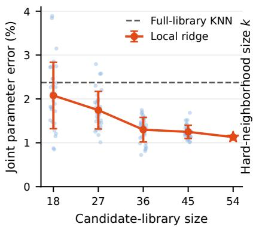

(b) Candidate-only LOO  
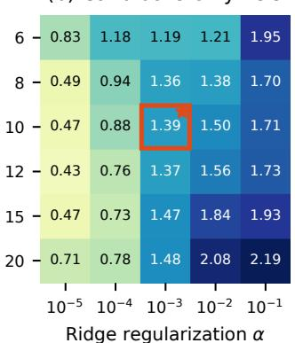

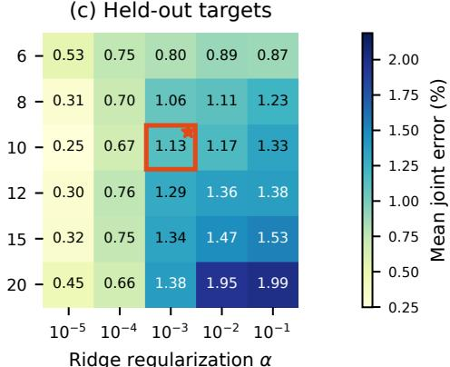  
Figure 10 Ofline estimator sensitivity; lower is better. (a) Candidate-library size with the local-ridge configuration frozen at $k = 1 0 , \alpha = 1 0 ^ { - 3 }$ . For 18/27/36/45 candidates, dots are the five-target mean from each of 30 predeclared nested random subsets and error bars show standard deviation across subset means; the full 54-candidate library is unique. The dashed line is the full-library response-KNN error. (b) Candidate-only leave-one-out sensitivity over all 54 candidates. (c) Sensitivity on the five held-out targets, used only as a post-hoc diagnostic. The red box and star mark the frozen paper configuration; neither heatmap is used to retune the reported main result.

Table 10 Diagnostic comparisons with methods using diferent information or parameter semantics. These rows are not a same-information leaderboard. “Ratio to ours” uses the corresponding common-adapter response/video metric.
<table><tr><td>Route</td><td>Input</td><td>Joint parameter error</td><td>to ours</td><td>Response ratio Interpretation boundary</td></tr><tr><td>PhysGM</td><td>four static views</td><td>5279.88%</td><td>11.42× (Probe A)</td><td>predicted Fabric/high stiffness; scene and parameter semantics may be out of distribution</td></tr><tr><td>ReconPhys adapter passive video</td><td></td><td>20.29%</td><td>2.6× A; 2.9× B</td><td>improves over default on 4/5 tar- gets; native solver/parameteriza- tion differs</td></tr><tr><td>CMA-ES opt.</td><td>direct synthetic RGB-D Probe A 6.35%</td><td></td><td>PSNR 31.10 vs. 43.49 dB</td><td>30 calls per target, three seeds; fixed-budget, not exhaustive op- timization</td></tr><tr><td>Local ridge (ours)</td><td>synthetic depth descriptor 0.21% + library</td><td></td><td>1.0×</td><td>requires a 54-candidate offline li- brary for the same object/dis- cretization</td></tr></table>

## G Observation Ladder Details

The observation ladder holds the asset, target split, simulator, and Probe A fixed. Its five stages are:

1. all simulator particles (privileged state);

2. Gaussian-associated surface particles;

3. Gaussian-associated particles that remain visible;

4. clean synthetic RGB-D depth projected into 3D;

5. LK optical-flow tracks without persistent simulator IDs.

The first four maintain exact or clean geometric correspondence supplied by the synthetic pipeline. The last is closer to a practical image tracker and breaks that correspondence. Consequently, the ladder identifies a likely bottleneck but is not a substitute for a captured RGB-D benchmark.

Table 11 Target-wise CMA-ES direct-video optimization, mean ± sample standard deviation over predeclared seeds 6401, 6402, and 6403. Joint error is in percent and trajectory errors are $\times 1 0 ^ { - 3 }$ . Each seed uses 30 Probe-A simulator calls; Probe B is evaluation-only.
<table><tr><td>Target  $\left( s _ { E } , s _ { \rho } \right)$ </td><td>Joint error</td><td>Probe A</td><td>B-direction</td><td>B-magnitude</td></tr><tr><td>(0.95, 1.35)</td><td> $7 . 5 8 \pm 6 . 8 0$ </td><td> $0 . 3 7 1 \pm 0 . 2 2 2$ </td><td> $0 . 3 5 7 \pm 0 . 2 1 8$ </td><td> $0 . 5 8 0 \pm 0 . 4 3 7$ </td></tr><tr><td>(0.60, 1.65)</td><td> $8 . 0 6 \pm 6 . 4 0$ </td><td> $0 . 4 2 0 \pm 0 . 3 1 0$ </td><td> $0 . 4 3 3 \pm 0 . 3 2 2$ </td><td> $0 . 6 3 7 \pm 0 . 4 7 1$ </td></tr><tr><td>(1.05, 1.10)</td><td> $5 . 1 0 \pm 3 . 7 4$ </td><td> $0 . 2 9 3 \pm 0 . 1 7 3$ </td><td> $0 . 2 7 7 \pm 0 . 1 6 5$ </td><td> $0 . 4 1 1 \pm 0 . 2 2 5$ </td></tr><tr><td>(0.80, 1.60)</td><td> $8 . 4 9 \pm 5 . 6 2$ </td><td> $0 . 2 8 9 \pm 0 . 1 9 8$ </td><td> $0 . 2 9 1 \pm 0 . 2 0 0$ </td><td> $0 . 5 3 2 \pm 0 . 3 6 5$ </td></tr><tr><td>(0.70,1.20)</td><td> $2 . 5 0 \pm 1 . 9 3$ </td><td> $0 . 1 6 5 \pm 0 . 1 5 0$ </td><td> $0 . 1 5 7 \pm 0 . 1 3 6$ </td><td> $0 . 2 2 3 \pm 0 . 1 7 0$ </td></tr></table>

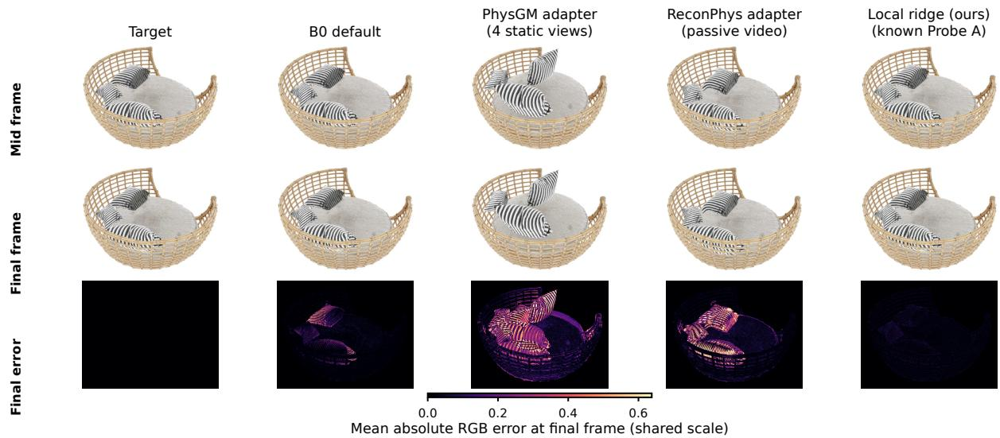  
Figure 11 External-route qualitative diagnostic on the representative held-out target $( s _ { E } = 1 . 0 5 , s _ { \rho } = 1 . 1 )$ under unseen direction Probe B1. Columns share the same initial asset, downstream MPM implementation, probe, camera, and exported times, but difer in the evidence used to assign material parameters. We show synchronized mid/final frames and final-frame absolute RGB error with one shared scale. PhysGM and ReconPhys remain diagnostic adapters with diferent native parameter semantics and training distributions; this is not a same-information leaderboard.

## H Alternative-Route Diagnostics

PhysGM outputs a single parameter set for the five visually identical pillow targets; ReconPhys is calibrated into the available candidate range before common-adapter evaluation. These adaptations are useful for testing the proposition that known dynamic excitation carries information missing from appearance or passive input, but they do not establish across-paper superiority. The CMA-ES experiment is closer to the current target protocol because it directly fits Probe-A synthetic video and freezes parameters before Probe B; it therefore serves as the main alternative inverse baseline.

Fig. 11 supplies the visual evidence corresponding to the PhysGM and ReconPhys rows of Table 10; the CMA-ES route is visualized separately in Fig. 3. The displayed held-out target is selected as a representative dificult case, while all aggregate claims continue to use all five targets.

## I Reproducibility and Claim Boundaries

The released experiment contracts record the asset, 54 candidates, held-out targets, force definitions, contact regions, export times, particle subset, data split, feature standardization, neighborhood size, regularization, simulator configuration, and metric implementation. Result packages contain per-case CSV/JSON outputs and completion, leakage, missing-frame, NaN, and duplicate audits. No result is interpreted as real-material accuracy because target parameters and responses are generated by the same simulator.

The current evidence supports: (i) same-information local-calibration gain; (ii) object-specific Probe-A-to-B transfer; (iii) same-simulator visual-response fidelity; and (iv) an explicit characterization of observation and numerical-conditioning failures. It does not support real RGB/RGB-D identification, real force-feedback closure, sim-to-real transfer, a cross-object shared estimator, unknown-fill inversion, or a complete physica representation.