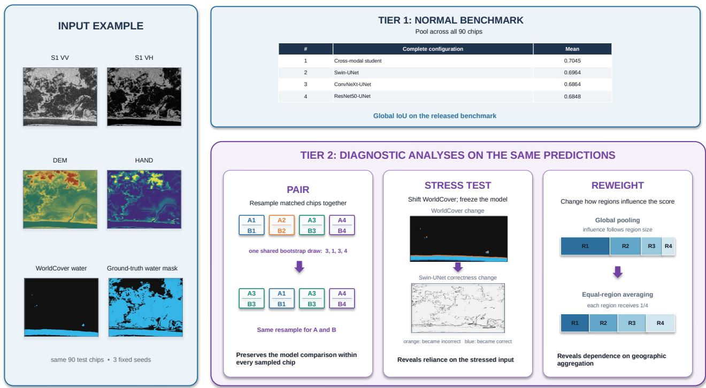
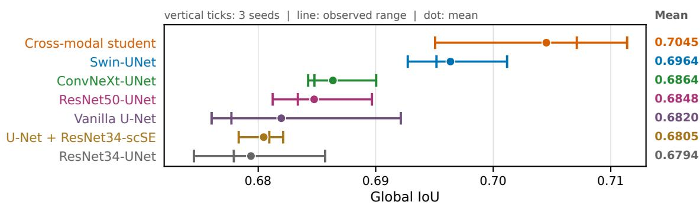
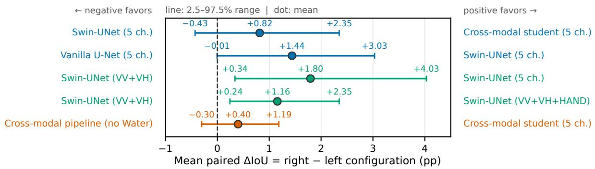
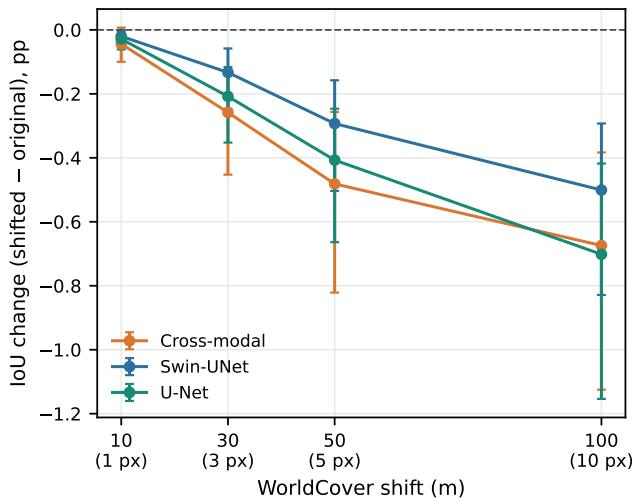
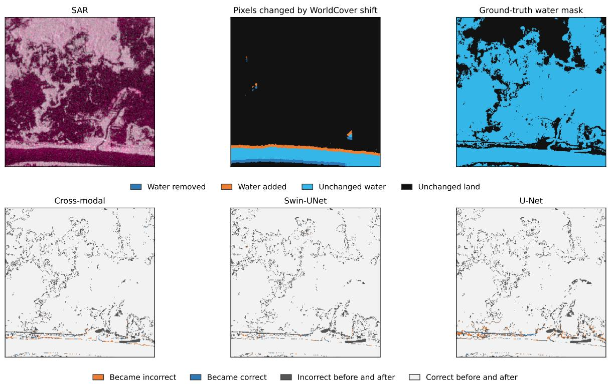

# A Controlled Evaluation of Model Rankings and Input Reliance in Surface Water Segmentation

Kittipat Phunjanna1,2, Kristof Karacs ´ 2, Chayut Ngamkhanong3

1Erasmus Mundus Joint Master in Image Processing and Computer Vision (IPCV),

2Pazm´ any P ´ eter Catholic University´

3Chulalongkorn University

Preprint.

## Abstract

Performance evaluationfor surface-water segmentation commonly uses an aggregate metric such as global intersectionover-union (IoU) to rank model configurations. However, a configuration ranking does not by itself establish why one system performs better, whether a close ordering is stable, or how strongly predictions rely on individual inputs. We examine these distinctions primarily on Sen1Floods11 through repeated configuration comparisons, paired test-chip analysis, fixed-checkpoint input stress tests, and geographic reweighting, with a targeted secondary evaluation ofsupervised input configurations on GEOID-Flood. The cross-modal student achieves the highest three-seed mean IoU on Sen1Floods11, but close orderings vary across seeds and geographic weighting, while ancillary-input rankings differ between Swin-UNet and U-Net. The GEOID-Flood evaluation shows substantial agreement in supervised ancillary-input effects, although the exact architecture ordering remains configuration dependent. Fixed-checkpoint tests further establish reliance on terrain and WorldCover without establishing a clean-input performance benefit, while target semantics and the later WorldCover prior restrict the evaluation to retrospective allwater segmentation. These results show that aggregate metrics remain useful for ranking complete configurations, but ranking stability, component attribution, input reliance, and deployment scope require distinct evidence. Performance evaluation should therefore match the evidence reported to the claim being made.

## 1. Introduction

Synthetic Aperture Radar (SAR) observes floods through cloud and at night, making Sentinel-1 useful when rapid optical mapping is unavailable [34, 36]. Yet low radar return is not a water label: radar shadow and smooth dry surfaces can also produce low backscatter [34]. Modern flood mapping pipelines therefore combine SAR with terrain, hydrology, land cover, weak labels, or optical information available only during training [5, 13, 14]. Their benchmark score is the outcome of all these choices, not an explanation of their individual contributions.

Sen1Floods11 creates a particularly useful setting for this question [5]. Its released HandLabeled foreground is an all-water target on flood-event chips, combining permanent and non-permanent water. Prior work improves this benchmark by bundling several choices: the dataset supplies optical-index-derived weak labels, semi-supervised methods exploit additional unlabeled or weakly labeled samples, and cross-modal distillation combines a multimodal teacher with ancillary geophysical inputs and a deployable SAR student [5, 13, 14]. These results establish the value of complete pipelines, but do not by themselves identify whether a gain comes from architecture, ancillary priors, privileged supervision, or their interactions, nor whether a close ordering is stable across training seeds and geographic composition. This gap motivates an evaluation focused on attribution rather than another architecture. Figure 1 summarizes the claims supported by each analysis. The input examples include Sentinel-1 (S1) vertical transmit–vertical receive (VV), vertical transmit–horizontal receive (VH), a digital elevation model (DEM), and Height Above Nearest Drainage (HAND).

These distinctions matter for both architecture and ancillary inputs. Comparing two end-to-end systems can show which complete configuration performs better, but not which changed component caused the difference, because initialization, parameterization, and optimization may also change [6, 8]. Likewise, training a model with an ancillary input does not show that its predictions actually depend on that input. Fixed-checkpoint input stress tests change one input while holding the model fixed [12], while geographic reweighting tests whether close rankings persist when different parts of the benchmark receive different influence

  
Figure 1. The same matched evidence supports different claims. Pooling ranks complete configurations; paired test-chip resampling diagnoses composition sensitivity; fixed-checkpoint input stress tests establish reliance under a declared input change; and geographic reweighting tests aggregation dependence. None alone identifies component causality or deployment performance.

[35, 37].

The evaluation addresses three research questions:

• RQ1: To what extent do close global-IoU rankings remain stable across the evaluated training seeds and test composition?

• RQ2: Which conclusions about component attribution and input reliance are supported by configuration comparisons and fixed-checkpoint input stress tests?

• RQ3: How do geographic reweighting, target semantics, and data provenance constrain the evaluation scope of the reported scores?

The evidence progresses from configuration ranking through ranking stability, component attribution, and input reliance to evaluation scope. The ranking remains valid for the evaluated configurations, but each additional analysis supports a different class of claim. The central principle is therefore to match the evaluation evidence to the claim being made, rather than treating an aggregate ranking as evidence for component or deployment conclusions.

## 2. Related Work

SAR water mapping and ancillary information. Reviews of deep-learning flood mapping identify generalization to unseen cases and uncertainty treatment as open problems [2]. Sen1Floods11 provides geographically distributed

Sentinel-1 imagery with manual and automatically generated surface-water labels [5]. This study evaluates the released HandLabeled all-water mask using the directly comparable 10 m protocol [14]. U-Net and encoder–decoder descendants are common segmentation baselines [17, 31], while attention, convolutional, and transformer variants modify their representations [7, 23, 32]. Digital Elevation Model (DEM) and Height Above Nearest Drainage (HAND) encode terrain and drainage position [26]; European Space Agency (ESA) WorldCover supplies a global 10 m land-cover map [38]. Such inputs can help resolve SAR ambiguities [34], but a high all-water IoU alone does not reveal whether predictions use event-time SAR, recover static water aligned with a prior, or combine both. Related Sen1Floods11 work separates permanent from temporary water [1], while a direct benchmark comparison reports qualitative limitations that complicate event-level interpretation [3].

Training-only optical supervision. Cross-modal distillation can use a Sentinel-1/Sentinel-2 teacher to supervise a deployable Sentinel-1 student that does not receive optical imagery at inference [14]. Related remote-sensing work studies semi-supervised learning [13], multimodal pretraining [22], sensor fusion [24], and larger multisensor corpora [16]. Sen1Floods11 fusion studies compare inference-time

Sentinel-1, Sentinel-2, and elevation inputs [19], whereas optical-teacher distillation has also been used to train SARonly segmentation students [25]. These regimes vary in training data and optimization as well as supervision. The practical pipeline comparison preserves those differences; the narrower fixed-teacher block holds teacher outputs constant while varying deployable inputs. Sentinel-2 is used only during training.

Evidence beyond aggregate scores. Benchmark reevaluations test competing explanations of apparent rankings by separating distribution shift from alternative causes [28], testing reliance on image cues [15], and controlling pipeline details to improve method comparability [8]. Scores also vary with initialization, sampling, and pipeline choices [6, 29]; benchmark design guidance therefore emphasizes significance and replicability [30]. In flood mapping, high intra-dataset scores need not transfer across datasets [27]. Dataset-level IoU weights regions through their foreground unions [37], while changing the spatial assessment unit can change the summary [35], and fine-grained error decompositions expose boundary, extent, and segment errors hidden by IoU [4]. The present evaluation combines paired test-chip analysis [10], matched input stress tests, and geographic reweighting to distinguish a valid configuration ranking from unsupported component and population claims.

## 3. Evaluation Design

## 3.1. Benchmark and evaluated configurations

Experiments use Sen1Floods11 v1.1 at 512 × 512 pixels and 10 m ground sampling. The HandLabeled split used here contains 252 training, 89 validation, and 90 test chips; a separate 15-chip Bolivia set is not part of that split. Each of the ten named geographic groups occurs in train, validation, and test, so they are composition strata rather than held-out domains. The WeaklyLabeled pool contains 4,384 chips whose hard targets were generated from co-registered Sentinel-2 indices [5].

The binary target is the released LabelHand all-water mask. Invalid SAR pixels are ignored, probabilities are thresholded at 0.5, and the primary outcome pools true positives (TP), false positives (FP), and false negatives (FN) over all valid test pixels before computing foreground IoU. This matches Garg et al.’s benchmark calculation [14] and differs from an equal-chip mean. The secondary metrics are the $\mathrm { F _ { 1 } }$ score, precision, and recall.

The input channels are vertical transmit–vertical receive (VV), vertical transmit–horizontal receive (VH), a digital elevation model (DEM), Height Above Nearest Drainage (HAND), and a binary permanent-water prior (Water). DEM records absolute ground elevation; HAND records elevation relative to connected drainage and therefore describes local drainage position [26]. Both originate from the nominal 30 m Copernicus GLO-30 DEM, with HAND derived using eight-direction (D8) flow routing. Bilinear alignment to the model’s 10 m grid does not create new 10 m terrain detail. For comparability with the benchmark SAR setup [14], VV and VH backscatter values are clipped to [−30, 0] dB to bound extreme returns and then linearly mapped to [0, 1]. DEM is clipped to [−50, 3000] m and HAND to [0, 100] m before the same scaling. Categorical WorldCover is nearestneighbor resampled to preserve its class codes, and class 80 becomes Water [38]. WorldCover v200 represents 2021 [38], whereas the evaluated SAR acquisitions span 2016– 2019 [5]. Consequently, this evaluation treats Water as a retrospective static prior with temporal look-ahead, not as a contemporaneous operational input.

Within the standard supervised training recipe, two complementary comparisons are evaluated. Hereafter, Swin-UNet refers to the Swin-UNet configuration trained with this recipe; the teacher–student pipeline is identified separately as the cross-modal student. First, six complete architecture configurations are compared under the same fivechannel input recipe: vanilla U-Net, U-Net with a ResNet34 encoder and concurrent spatial and channel squeeze-andexcitation (scSE) attention, ResNet34-UNet, ResNet50- UNet, ConvNeXt-UNet, and Swin-UNet [7, 17, 23, 31, 32]. Four configurations contain 31.0–32.5M parameters; the two ResNet34 variants contain 24.4M and 24.6M. Only vanilla U-Net uses random initialization; the other five use ImageNet initialization. Accordingly, this experiment compares complete configurations with broadly comparable parameter counts rather than isolating architecture.

Second, ancillary-input configurations are compared for Swin-UNet and vanilla U-Net. Each model uses all eight subsets formed by VV+VH plus any combination of DEM, HAND, and Water. Because changing the subset also changes the input stem, these runs compare complete input configurations rather than isolate the effect of a single channel. Each configuration is trained with seeds 42, 1337, and 2026, balancing repeated training against coverage of the complete matrix within the available computational budget [18, 20, 21, 33]. Full training configurations and model parameter counts are provided in the supplementary material.

As a secondary evaluation, the U-Net/Swin-UNet input matrix is repeated on GEOID-Flood using post-event VV/VH and the same ancillary inputs [9], with permanent and flooded labels merged into an all-water target. The 100- epoch cap makes the design matched rather than identical; preprocessing and paired source-tile analyses are detailed in the supplement.

## 3.2. Cross-modal and fixed-teacher comparisons

The cross-modal pipeline follows the teacher–student design of Garg et al. [14]. A nine-channel Swin-UNet teacher receives the five inputs and Sentinel-2 blue (B2), green (B3), red (B4), and near-infrared (B8) bands. Trained on the 252 HandLabeled chips, it supplies frozen soft targets for paired HandLabeled and WeaklyLabeled samples. The ImageNetinitialized student uses only its declared inputs; hard opticalindex weak labels are replaced by teacher probabilities. Supervised training uses no augmentation, a $1 0 ^ { - 3 }$ learning rate, and an early-stopped 200-epoch cap. Cross-modal teacher and student training uses flips and right-angle rotations, a $3 \times 1 0 ^ { - 4 }$ learning rate, and a 100-epoch cap. It also adds a teacher-training stage and replaces weak hard-label loss with soft-target loss. Because the two pipelines also differ in augmentation, learning rate, epoch cap, and teacher training, their comparison evaluates complete training pipelines rather than isolating the effect of supervision.

The primary cross-modal student uses all five non-optical inputs. A separate end-to-end no-Water pipeline retrains both teacher and student without WorldCover. For the fixed-teacher analysis, six student configurations within each seed share the same full-input teacher cache. This removes teacher-output variation while retaining differences in student input width and training trajectory.

## 3.3. Fixed-checkpoint tests of input reliance

Receiving an input and relying on it are distinct. The World-Cover stress test holds the checkpoint, SAR, other inputs, labels, and test chips fixed while changing only Water: the prior is zeroed, circularly translated by a random nonzero offset, or replaced by another chip’s mask. A separate localization test translates the original mask by 10, 30, 50, or 100 m in a deterministic chip-specific cardinal direction with nearest-edge extension. Water interior, boundary, and exterior strata are computed once from the clean prior. This identifies whether prediction changes are concentrated where the prior itself changes. Because translating a binary mask changes values mainly near its boundaries, such concentration does not by itself indicate a learned boundary-specific mechanism.

The terrain stress test similarly changes DEM and HAND for the five-channel cross-modal, Swin-UNet, and U-Net checkpoints at all three seeds, together with the three Swin-UNet VV+VH+HAND checkpoints. Each terrain input is replaced by a constant train-split median, translated locally by 10–100 m, replaced by a deterministic cross-chip donor surface, or modified within a local clipped patch by ± one interquartile range (IQR). These tests measure the sensitivity of fixed checkpoints to specific out-of-distribution changes; they do not estimate clean-input benefits or naturally occurring failure rates. A 30 m translation corresponds to three pixels on the aligned 10 m model grid, not to the source resolution of the terrain data.

## 3.4. Paired comparisons and test-composition sensitivity

Let i index chips, $\textit { m } \in \textit { M }$ configurations, and $s \in$ {42, 1337, 2026} evaluated seeds. For a multiset I of chip indices, the pooled IoU of configuration m at seed s is

$$
J _ { m s } ( \mathbb { Z } ) = \frac { \sum _ { i \in \mathbb { Z } } \mathrm { T P } _ { i m s } } { \sum _ { i \in \mathbb { Z } } ( \mathrm { T P } _ { i m s } + \mathrm { F P } _ { i m s } + \mathrm { F N } _ { i m s } ) } .\tag{1}
$$

For configurations $A , B \in \mathcal { M } , D _ { s } ( A , B )$ is their seedspecific paired IoU difference in percentage points, and $\bar { D } ( A , B )$ averages that difference over the three evaluated seeds:

$$
\begin{array} { l } { { \displaystyle D _ { s } ( A , B ) = 1 0 0 [ J _ { A s } ( \mathbb { Z } ) - J _ { B s } ( \mathbb { Z } ) ] , } } \\ { { \displaystyle \bar { D } ( A , B ) = \frac { 1 } { 3 } \sum _ { s } D _ { s } ( A , B ) . } } \end{array}\tag{2}
$$

Thus $D _ { s }$ preserves seed-specific direction, whereas $\bar { D }$ is an arithmetic summary of three fixed runs, not inference to a population of possible retraining runs.

Close pooled-IoU differences may depend on which test chips compose the benchmark. To measure that sensitivity while preserving model pairing, each bootstrap replicate samples 90 chip indices with replacement and applies the same multiset to both models [11]. For $\bar { D } ,$ , the multiset is also shared across seeds. IoU is recomputed from pooled chip counts, not pixel-level resampling, to retain within-chip spatial dependence. The reported $q . 0 2 5 , q . 9 7 5$ therefore describe sensitivity to changes in the observed test composition; they do not estimate retraining variability.

Before using these ranges for categorical claims, candidate percentile, bias-corrected and accelerated (BCa), studentized, and max-|t| intervals were checked on empirical known-null and known-effect cases. Their calibration did not support labels of separation, equality, or equivalence. The validation and Holm-adjusted randomization analysis is supplementary; the main analysis instead uses effect magnitude, cross-seed direction, and matched input stress tests.

Using the same m and $s ,$ let c index an input stress condition applied to a fixed checkpoint, with $c = 0$ denoting its clean-input baseline. The stress effect is

$$
R _ { m s c } = 1 0 0 [ J _ { m s c } ( \overline { { \cal { Z } } } ) - J _ { m s 0 } ( \overline { { \cal { Z } } } ) ] ,\tag{3}
$$

Three-seed stress summaries average $R _ { m s c }$ within each common-chip replicate. Main comparison and stress summaries use 50,000 resamples to reduce Monte Carlo variation in the reported quantiles [11]. This increases numerical precision but not the amount of independent test information; all summaries condition on the evaluated checkpoints and fixed test population.

## 3.5. Geographic composition sensitivity

Global IoU gives greater influence to regions with larger foreground unions. Counts are therefore also pooled within each named group g, and the ten group-level IoUs receive equal weight:

$$
J _ { m s } ^ { \mathrm { m a c r o } } = \frac { 1 } { 1 0 } \sum _ { g = 1 } ^ { 1 0 } J _ { m s } ( \mathcal { T } _ { g } ) .\tag{4}
$$

Region-cluster resampling and leave-one-region-out recomputation diagnose dependence on the released composition. Because groups contain only 4–14 chips, occur in every split, and are not verified event identities, these are not estimates of new-country or new-event performance [35, 37].

## 4. Results

## 4.1. Configuration ranking and ranking stability

Figure 2 begins with the conventional configuration ranking. The cross-modal student has the highest three-seed mean, 0.7045, and the seed-42 IoU of 0.7114 is the best individual run. Swin-UNet is the highest supervised configuration at every seed, with mean 0.6964. The deterministic VH-Otsu S1OtsuLabelHand rasters distributed with Sen1Floods11 [5] reach 0.5458 IoU on the same test chips. The learned configurations therefore remain clearly separated from this training-free reference.

The close cross-modal–Swin-UNet ordering is less stable. Relative to Swin-UNet, the cross-modal student’s IoU changes by (+1.87), (-0.01), and (+0.59) percentage points across the three seeds. The descriptive paired test-chip resampling range spans zero at every seed. The mean ranking identifies the cross-modal student as the leading candidate on the archived runs, while the seed-specific results do not establish the same ordering after retraining.

Geographic reweighting produces the same interpretive boundary. At seed 1337, pooled IoU ranks Swin-UNet, crossmodal, full U-Net, then two-channel U-Net; equal-region IoU instead ranks full U-Net, Swin-UNet, two-channel U-Net, then cross-modal. Cross-modal–Swin-UNet test-chip and region-cluster ranges span zero at every seed, and leaveone-region-out recomputation crosses zero in two rows. The average lead therefore ranks the released benchmark composition without establishing the ordering for another geographic population.

## 4.2. Configuration comparisons and component attribution

The supervised architecture comparison ranks complete configurations rather than isolated architectural changes. The six five-channel mean IoUs occupy a 1.70-point band. Swin-UNet changes IoU relative to vanilla U-Net by (+1.67), (+0.30), and (+2.35) points across seeds, but the descriptive paired ranges span zero. Initialization, parameterization, encoder design, and optimization also differ across rows. Swin-UNet is therefore the highest-ranked member of the narrow controlled architecture group, not evidence of an isolated transformer advantage.

Table 1. Cross-dataset ancillary-input comparisons. Each cell lists the Sen1Floods11/GEOID-Flood change in three-seed mean global IoU (pp) from the corresponding VV+VH baseline. Seven subsets for each architecture yield 14 comparisons; † marks the three direction disagreements.
<table><tr><td>Ancillaries added to VV+VH</td><td>U-Net ∆IoU Swin-UNet ∆IoU S11 / GEOID-Flood S11 / GEOID-Flood</td></tr><tr><td>DEM</td><td>-0.20 / -5.68 -0.06 / -1.34</td></tr><tr><td>HAND</td><td>+0.47 / +0.02 +1.16/+2.49</td></tr><tr><td>Water</td><td>-0.24 / +3.04†</td></tr><tr><td>DEM+HAND</td><td>+1.12/+2.50 +0.61 / -1.17† +1.24/+0.33</td></tr><tr><td>DEM+Water</td><td>-0.01 / +3.42† +0.33 / +3.24</td></tr><tr><td>HAND+Water +0.66 /+3.14</td><td>+1.24/+4.12</td></tr><tr><td>DEM+HAND+Water</td><td>+0.15 /+3.48 +1.80 /+3.57</td></tr></table>

The complete Swin-UNet and U-Net ancillary-input matrices likewise do not support a universal channel prescription. Full input has the highest Swin-UNet mean, 1.80 points above VV+VH, while adding Water alone gives the highest U-Net mean, 1.12 points above the U-Net VV+VH reference. For U-Net, the full five-channel configuration is lower than VV+VH+Water. VV+VH+HAND is the most consistent Swin-UNet candidate, with a positive difference from VV+VH at all three seeds, but the same consistency is not reproduced by U-Net. The result supports an architecturedependent configuration rather than a universal HAND effect.

The cross-modal comparison also supports a complete training pipeline rather than an isolated training-only optical supervision effect. Both the cross-modal pipeline and Swin-UNet use optical-derived training targets, and the recipes differ beyond target softness. Relative to retraining the teacher and student without Water, the full pipeline changes direction across seeds. Holding teacher outputs fixed removes teacheroutput variation, but student input width and training trajectory still change, and no stable student-input leader emerges. DEM+Water has the highest observed fixed-teacher mean, followed by DEM and Water; the complete seed results are reported in the supplementary material.

Together, the architecture, ancillary-input, and crossmodal comparisons rank the evaluated complete configurations. Component attribution requires a more tightly matched comparison than the available configuration rows provide.

Secondary evaluation on GEOID-Flood. Eleven of the 14 changes in Table 1 have the same direction on Sen1Floods11 and GEOID-Flood. Full-input Swin-

(a) Configuration ranking  

(b) Paired test-composition sensitivity for select configurations  
  
Figure 2. Configuration ranking and paired test-composition sensitivity. (a) Three-seed means and observed ranges. (b) Select comparisons grouped by color: matched five-channel inputs (blue), matched supervised Swin-UNet architecture/training with varied inputs (green), and cross-modal pipelines with/without Water (orange). Differences average paired chip resamples across seeds; positive favors right. Bars are descriptive 2.5th–97.5th ranges conditional on fixed seeds. Five channels are VV, VH, DEM, HAND, and Water.

UNet exceeds full-input U-Net by 1.19 percentage points, with a descriptive paired source-tile resampling range of [+0.90, +1.50] points; however, the VV+VH architecture difference changes sign across seeds. This evaluation does not cover cross-modal supervision, fixed-checkpoint input reliance, or unseen-event performance.

## 4.3. Fixed-checkpoint input reliance

Fixed-checkpoint input stress tests address a different question from the clean-input configuration comparisons. Table 2 reports the mean ancillary-channel effects. Crosschip HAND donor substitution reduces mean IoU by 8.67, 8.11, and 5.03 points for the five-channel cross-modal, Swin-UNet, and U-Net checkpoints; the corresponding DEM losses are 2.17, 1.15, and 3.06 points. For Swin-UNet VV+VH+HAND, HAND donor substitution causes a 17.24-point loss. Median replacement produces smaller HAND losses, while 100 m terrain translations produce much smaller changes. Fixed predictions therefore depend on chip-assigned terrain under the declared input changes, especially HAND, without establishing a clean-input performance benefit.

WorldCover has a strong relationship with the released target. Water occupies 6.50% of valid pixels but contains 46.0% of reference-water positives. All 27 combinations of three stress conditions, three model families, and three seeds reduce IoU. Donor mask substitution produces the largest mean loss in each family: 1.65 points for Swin-UNet, 2.98 for the cross-modal student, and 3.11 for U-Net. Because only the declared input changes at a fixed checkpoint, the result establishes WorldCover reliance under the tested conditions. The result does not distinguish copying from contextual use or establish a clean-input benefit.

Figure 3 shows that the global IoU loss increases with the WorldCover shift distance for all three model families. Figure 4 shows where the 100 m shift changes WorldCover and prediction correctness in a representative chip. Across all test chips at 30 m, the shift changes Water on only 0.64% of valid pixels. Prediction-flip rates on this changed support are 10.74%, 13.24%, and 14.66% for cross-modal, Swin-UNet, and U-Net, compared with at most 0.12% elsewhere. Prediction changes are therefore concentrated where World-Cover changes. However, shifting a binary mask changes values mainly near its boundary, so this concentration does not establish a learned boundary-specific mechanism.

Table 2. Inference-time ancillary-channel stress averaged over three seeds. Entries are ∆IoU (stress − clean), in percentage points. The final column uses Swin-UNet VV+VH+HAND; all others use five-channel checkpoints. Translations move the complete ancillary surface (100 m is 10 model-grid pixels). Water’s median and interquartile range (IQR) are zero, so median replacement equals zeroing and the ±IQR patch is omitted. Paired descriptive ranges are reported in the supplement.
<table><tr><td rowspan="2">Stress condition</td><td colspan="3">Cross-modal</td><td colspan="3">Swin-UNet</td><td colspan="3">U-Net</td><td rowspan="2">Swin-UNet 3-ch. HAND</td></tr><tr><td>DEM HAND</td><td></td><td>Water</td><td>DEM HAND</td><td></td><td>Water</td><td>DEM</td><td>HAND</td><td>Water</td></tr><tr><td>constant median (zero for Water)</td><td>-0.86</td><td>-4.00</td><td>-1.85</td><td>-0.36</td><td>-2.33</td><td>-0.80</td><td>-1.31</td><td>-0.81</td><td>-2.27</td><td>-4.87</td></tr><tr><td>edge shift 10 m (1 px)</td><td>+0.00</td><td>-0.08</td><td>-0.04</td><td>+0.00</td><td>+0.00</td><td>-0.02</td><td>-0.00</td><td>-0.01</td><td>-0.03</td><td>+0.00</td></tr><tr><td>edge shift 30 m (3 px)</td><td>+0.00</td><td>-0.03</td><td>-0.26</td><td>-0.00</td><td>-0.06</td><td>-0.13</td><td>-0.00</td><td>-0.06</td><td>-0.21</td><td>-0.06</td></tr><tr><td>edge shift 50 m (5 px)</td><td>+0.00</td><td>-0.05</td><td>-0.48</td><td>-0.00</td><td>-0.17</td><td>-0.29</td><td>-0.00</td><td>-0.12</td><td>-0.41</td><td>-0.18</td></tr><tr><td>edge shift 100 m (10 px)</td><td>+0.01</td><td>-0.32</td><td>-0.67</td><td>-0.00</td><td>-0.41</td><td>-0.50</td><td>-0.01</td><td>-0.25</td><td>-0.70</td><td>-0.45</td></tr><tr><td>donor substitution</td><td>-2.17</td><td>-8.67</td><td>-2.98</td><td>-1.15</td><td>-8.11</td><td>-1.65</td><td>-3.06</td><td>-5.03</td><td>-3.11</td><td>-17.24</td></tr><tr><td>local 100× 100 patch ±IQR</td><td>-0.17</td><td>-0.62</td><td></td><td>-0.11</td><td>-0.38</td><td></td><td>-0.14</td><td>-0.21</td><td></td><td>-0.57</td></tr></table>

  
Figure 3. Effect of inference-time WorldCover shifts. Curves show three-seed mean ∆IoU (shifted − original), with descriptive paired quantiles; checkpoints and all other inputs remain fixed.

## 4.4. Evaluation scope

The input-reliance results must be interpreted together with target semantics and data provenance. The released target combines permanent and non-permanent water, so global IoU rewards recovery of both. WorldCover represents 2021, whereas the evaluated SAR acquisitions span 2016–2019. WorldCover is therefore a retrospective static prior with temporal look-ahead rather than a contemporaneous operational input.

The geographic analysis provides a second scope boundary. The ten named groups occur in every split, contain few test chips, and are not verified event identities. Geographic reweighting measures dependence on the released test composition, not performance in an unseen event, country, sensor condition, or acquisition geometry.

The global-IoU ranking remains valid for the evaluated complete configurations on the released test split. The supported interpretation is narrower than a component explanation or deployment claim: the results characterize retrospective all-water segmentation under the archived training runs and released benchmark composition.

## 5. Discussion, Implications, and Limitations

Interpretation of the ranking. The evaluation does not invalidate the global-IoU ranking; it narrows its interpretation. The cross-modal student’s highest three-seed mean identifies a candidate system for further validation, while Swin-UNet remains a credible alternative. However, the close difference does not isolate training-only optical supervision because the pipelines also differ in other training choices. Likewise, the architecture and ancillary-input comparisons rank complete configurations rather than individual components, and the different channel rankings for Swin-UNet and U-Net prevent a universal channel prescription. A high score therefore supports selection of a tested configuration, not attribution of its performance to one architectural or input component. Global IoU can also conceal boundary, extent, or segment errors [4]; prediction agreement and representation similarity were not measured.

Configuration performance and input reliance. Cleaninput configuration comparisons and fixed-checkpoint stress tests answer different questions: the former identify useful input configurations under the tested training recipes, whereas the latter establish that predictions depend on terrain and WorldCover under the declared input changes. Such dependence does not establish a clean-input performance benefit or a naturally occurring failure rate. Practically, static ancillary inputs should therefore be treated as system dependencies, and validation should consider missing, stale, misregistered, or incorrectly assigned inputs when relevant to the intended operating population.

  
Figure 4. Prediction-correctness changes after a 100 m WorldCover shift. Top: SAR, changed Water pixels, and ground truth; bottom: three model families. The large shift aids visibility; Figure 3 reports all distances.

Target semantics and data provenance. Because the target combines permanent and event-specific water and World-Cover postdates the evaluated SAR acquisitions, the reported scores describe retrospective all-water segmentation with temporal look-ahead rather than transient-inundation or deployment performance. The WorldCover stress tests establish prediction responses to the declared input changes, but do not distinguish beneficial context, copying, input-stem interactions, or brittle reliance.

Uncertainty and population scope. Three seeds reveal changes in close orderings but do not characterize the full distribution of retraining outcomes. Paired test-chip resampling measures sensitivity to the observed test composition at fixed checkpoints, not optimization uncertainty. The reported ranges remain descriptive because the candidate interval procedures did not pass every empirical coverage check; spanning zero establishes neither equality nor equivalence.

Implications for benchmark evaluation. Global IoU ranks configurations; repeated and paired analyses assess stability; fixed-checkpoint stresses assess input reliance; and target semantics, provenance, and geographic reweighting define scope. This separation avoids unsupported component or deployment interpretations [28–30].

Future evaluation should separate transient and permanent water, use temporally valid priors, match training choices in component comparisons, test more seeds on held-out events, and specify intended-use metrics, calibration, and costs. The supplement details complete configuration matrices, GEOID-Flood preprocessing, and source-tile and activation-label composition-sensitivity analyses.

## 6. Conclusion

Performance evaluation should carefully distinguish between the construct captured by a benchmark metric and the substantive claims subsequently inferred from the resulting rankings. In this study, global IoU measures overlap with the Sen1Floods11 all-water target; a secondary evaluation on GEOID-Flood repeats the supervised ancillary-input comparisons. The cross-modal student has the highest Sen1Floods11 three-seed mean, but this ranking alone does not establish stability across retraining or test composition, isolate architecture or input contributions, or demonstrate input reliance. On GEOID-Flood, most supervised ancillary-input changes agree in direction, but cross-modal, reliance, and deployment claims are not evaluated.

The broader lesson is to match evidence to claims. Aggregate metrics rank systems; paired analyses test stability; interventions test reliance; semantics, provenance, and geography define scope. A higher score aids model selection but neither explains why a system performs better nor establishes performance in another setting.

## References

[1] Yanbing Bai, Wenqi Wu, Zhengxin Yang, Jinze Yu, Bo Zhao, Xing Liu, Hanfang Yang, Erick Mas, and Shunichi Koshimura. Enhancement of detecting permanent water and temporary water in flood disasters by fusing Sentinel-1 and Sentinel-2 imagery using deep learning algorithms: Demonstration of Sen1Floods11 benchmark datasets. Remote Sensing, 13(11): 2220, 2021.

[2] Roberto Bentivoglio, Elvin Isufi, Sebastian Nicolaas Jonkman, and Riccardo Taormina. Deep learning methods for flood mapping: A review of existing applications and future research directions. Hydrology and Earth System Sciences, 26(16): 4345–4378, 2022.

[3] Max Bereczky, Marc Wieland, Christian Krullikowski, Sandro Martinis, and Simon Manuel Plank. Sentinel-1-based water and flood mapping: Benchmarking convolutional neural networks against an operational rule-based processing chain. IEEE Journal of Selected Topics in Applied Earth Observations and Remote Sensing, 15:2023–2036, 2022.

[4] Maximilian Bernhard, Roberto Amoroso, Yannic Kindermann, Lorenzo Baraldi, Rita Cucchiara, Volker Tresp, and Matthias Schubert. What’s outside the intersection? finegrained error analysis for semantic segmentation beyond IoU. In IEEE/CVF Winter Conference on Applications of Computer Vision, pages 968–977, 2024.

[5] Derrick Bonafilia, Beth Tellman, Tyler Anderson, and Erica Issenberg. Sen1Floods11: A georeferenced dataset to train and test deep learning flood algorithms for Sentinel-1. In IEEE/CVF Conference on Computer Vision and Pattern Recognition Workshops, pages 210–211, 2020.

[6] Xavier Bouthillier, Pierre Delaunay, Mirko Bronzi, Assya Trofimov, Brennan Nichyporuk, Justin Szeto, Nazanin Mohammadi Sepahvand, Edward Raff, Kanika Madan, Vikram Voleti, Samira Ebrahimi Kahou, Vincent Michalski, Tal Arbel, Chris Pal, Gael Varoquaux, and Pascal Vincent. Accounting for variance in machine learning benchmarks. In Proceedings ofMachine Learning and Systems, 2021.

[7] Hu Cao, Yueyue Wang, Joy Chen, Dongsheng Jiang, Xiaopeng Zhang, Qi Tian, and Manning Wang. Swin-Unet: Unet-like pure transformer for medical image segmentation. arXiv:2105.05537, 2021.

[8] Wei-Yu Chen, Yen-Cheng Liu, Zsolt Kira, Yu-Chiang Frank Wang, and Jia-Bin Huang. A closer look at few-shot classification. In International Conference on Learning Representations, 2019.

[9] Gaetano Chiriaco, Luca Barco, Andrea Bragagnolo, Claudio Rossi, and Edoardo Arnaudo. GEOID-Flood: A large-scale multi-modal benchmark dataset for flood segmentation. arXiv preprint arXiv:2608.02315, 2026.

[10] Rotem Dror, Gili Baumer, Segev Shlomov, and Roi Reichart. The hitchhiker’s guide to testing statistical significance in natural language processing. In Proceedings ofthe 56th Annual Meeting of the Association for Computational Linguistics, pages 1383–1392, 2018.

[11] Bradley Efron and Robert J. Tibshirani. An Introduction to the Bootstrap. Chapman and Hall/CRC, 1994.

[12] Ruth Fong, Mandela Patrick, and Andrea Vedaldi. Understanding deep networks via extremal perturbations and smooth masks. In IEEE/CVF International Conference on Computer Vision, pages 2950–2958, 2019.

[13] Siddha Ganju and Sayak Paul. Flood segmentation on Sentinel-1 SAR imagery with semi-supervised learning. In NeurIPS 2021 Workshop on Tackling Climate Change with Machine Learning, 2021.

[14] Shubhika Garg, Ben Feinstein, Shahar Timnat, Vishal Batchu, Gideon Dror, Adi Gerzi Rosenthal, and Varun Gulshan. Crossmodal distillation for flood extent mapping. Environmental Data Science, 2:e37, 2023.

[15] Robert Geirhos, Patricia Rubisch, Claudio Michaelis, Matthias Bethge, Felix A. Wichmann, and Wieland Brendel. ImageNet-trained CNNs are biased towards texture; increasing shape bias improves accuracy and robustness. In International Conference on Learning Representations, 2019.

[16] Xin Guo, Jiangwei Lao, Bo Dang, Yingying Zhang, Lei Yu, Lixiang Ru, Liheng Zhong, Ziyuan Huang, Kang Wu, Dingxiang Hu, Huimei He, Jian Wang, Jingdong Chen, Ming Yang, Yongjun Zhang, and Yansheng Li. SkySense: A multi-modal remote sensing foundation model towards universal interpretation for earth observation imagery. In IEEE/CVF Conference on Computer Vision and Pattern Recognition, pages 27672– 27683, 2024.

[17] Kaiming He, Xiangyu Zhang, Shaoqing Ren, and Jian Sun. Deep residual learning for image recognition. In IEEE Conference on Computer Vision and Pattern Recognition, pages 770–778, 2016.

[18] Henry Herzog, Favyen Bastani, Yawen Zhang, Gabriel Tseng, Joseph Redmon, Hadrien Sablon, Ryan Park, Jacob Morrison, Alexandra Buraczynski, Karen Farley, Josh Hansen, Andrew Howe, Patrick Alan Johnson, Mark Otterlee, Ted Schmitt, Hunter Pitelka, Stephen Daspit, Rachel Ratner, Christopher Wilhelm, Sebastian Wood, Mike Jacobi, Hannah Kerner, Evan Shelhamer, Ali Farhadi, Ranjay Krishna, and Patrick Beukema. OlmoEarth: Stable latent image modeling for multimodal earth observation. In IEEE/CVF Conference on Computer Vision and Pattern Recognition, pages 34806–34817, 2026.

[19] Goutam Konapala, Sujay V. Kumar, and Shahryar Khalique Ahmad. Exploring Sentinel-1 and Sentinel-2 di-

versity for flood inundation mapping using deep learning. ISPRS Journal of Photogrammetry and Remote Sensing, 180: 163–173, 2021.

[20] Abhinav Kumar, Yuliang Guo, Xinyu Huang, Liu Ren, and Xiaoming Liu. SeaBird: Segmentation in bird’s view with dice loss improves monocular 3d detection of large objects. In IEEE/CVF Conference on Computer Vision and Pattern Recognition, pages 10269–10280, 2024.

[21] Daniel Lakens. Sample size justification. ¨ Collabra: Psychology, 8(1):33267, 2022.

[22] Ori Linial, George Leifman, Yochai Blau, Nadav Sherman, Yotam Gigi, Wojciech Sirko, and Genady Beryozkin. Enhancing remote sensing representations through mixed-modality masked autoencoding. In IEEE/CVF Winter Conference on Applications of Computer Vision Workshops, pages 507–516, 2025.

[23] Zhuang Liu, Hanzi Mao, Chao-Yuan Wu, Christoph Feichtenhofer, Trevor Darrell, and Saining Xie. A ConvNet for the 2020s. In IEEE/CVF Conference on Computer Vision and Pattern Recognition, pages 11976–11986, 2022.

[24] Justin McMillen and Yasin Yilmaz. FuseForm: Multimodal transformer for semantic segmentation. In IEEE/CVF Winter Conference on Applications ofComputer Vision Workshops, pages 618–627, 2025.

[25] Rudhishna Narayanan Nair and Ronny Hansch. Let me show¨ you how it’s done—cross-modal knowledge distillation as pretext task for semantic segmentation. In IEEE/CVF Conference on Computer Vision and Pattern Recognition Workshops, pages 595–603, 2024.

[26] Antonio Donato Nobre, Luz Adriana Cuartas, Martin Hodnett, Camilo Daleles Renno, Gilvan Rodrigues, Antonio Silveira,´ Maarten Waterloo, and Scott Saleska. Height above the nearest drainage—a hydrologically relevant new terrain model. Journal ofHydrology, 404(1–2):13–29, 2011.

[27] Enrique Portales-Juli´ a, Gonzalo Mateo-Garc\` ´ıa, and Luis Gomez-Chova. Understanding flood detection models across´ Sentinel-1 and Sentinel-2 modalities and benchmark datasets. Remote Sensing ofEnvironment, 328:114882, 2025.

[28] Benjamin Recht, Rebecca Roelofs, Ludwig Schmidt, and Vaishaal Shankar. Do ImageNet classifiers generalize to ImageNet? In Proceedings ofthe 36th International Conference on Machine Learning, pages 5389–5400, 2019.

[29] Nils Reimers and Iryna Gurevych. Reporting score distributions makes a difference: Performance study of LSTMnetworks for sequence tagging. In Proceedings ofthe 2017 Conference on Empirical Methods in Natural Language Processing, pages 338–348, 2017.

[30] Anka Reuel, Amelia Hardy, Chandler Smith, Max Lamparth, Malcolm Hardy, and Mykel J. Kochenderfer. BetterBench: Assessing AI benchmarks, uncovering issues, and establishing best practices. In Advances in Neural Information Processing Systems, 2024. Datasets and Benchmarks Track.

[31] Olaf Ronneberger, Philipp Fischer, and Thomas Brox. U-Net: Convolutional networks for biomedical image segmentation. In Medical Image Computing and Computer-Assisted Intervention, pages 234–241, 2015.

[32] Abhijit Guha Roy, Nassir Navab, and Christian Wachinger. Concurrent spatial and channel squeeze & excitation in fully

convolutional networks. In Medical Image Computing and Computer Assisted Intervention, pages 421–429, 2018.

[33] Suman Saha, Lukas Hoyer, Anton Obukhov, Dengxin Dai, and Luc Van Gool. EDAPS: Enhanced domain-adaptive panoptic segmentation. In IEEE/CVF International Conference on Computer Vision, pages 19234–19245, 2023.

[34] Xinyi Shen, Dacheng Wang, Kebiao Mao, Emmanouil Anagnostou, and Yang Hong. Inundation extent mapping by synthetic aperture radar: A review. Remote Sensing, 11(7):879, 2019.

[35] Stephen V. Stehman and James D. Wickham. Pixels, blocks of pixels, and polygons: Choosing a spatial unit for thematic accuracy assessment. Remote Sensing of Environment, 115 (12):3044–3055, 2011.

[36] Ramon Torres, Paul Snoeij, Dirk Geudtner, et al. GMES Sentinel-1 mission. Remote Sensing of Environment, 120: 9–24, 2012.

[37] Zifu Wang, Maxim Berman, Amal Rannen-Triki, Philip H. S. Torr, Devis Tuia, Tinne Tuytelaars, Luc Van Gool, Jiaqian Yu, and Matthew B. Blaschko. Revisiting evaluation metrics for semantic segmentation: Optimization and evaluation of fine-grained intersection over union. In Advances in Neural Information Processing Systems, 2023. Datasets and Benchmarks Track.

[38] Daniele Zanaga, Ruben Van De Kerchove, Dirk Daems, et al. ESA WorldCover 10 m 2021 v200. Zenodo dataset, 2022.