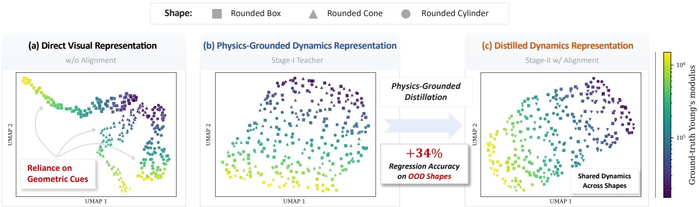
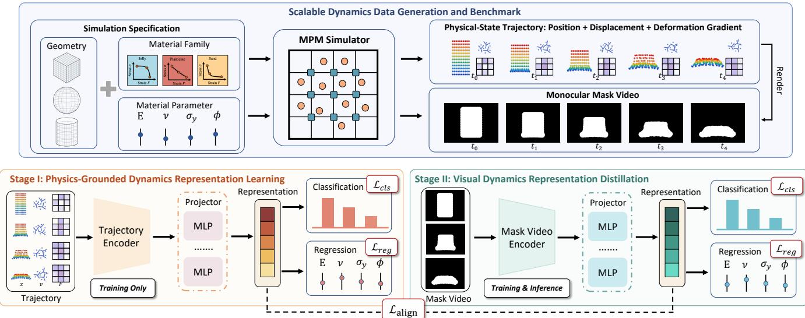
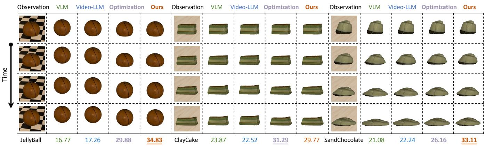
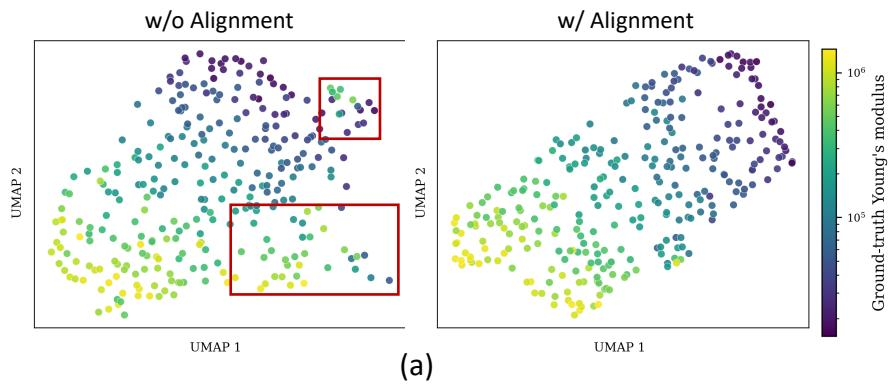
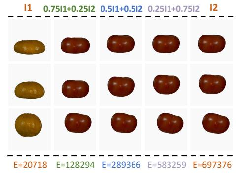
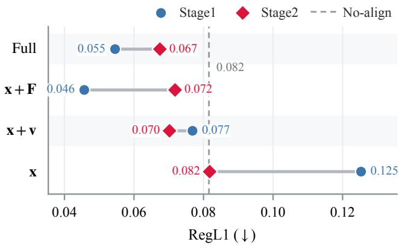
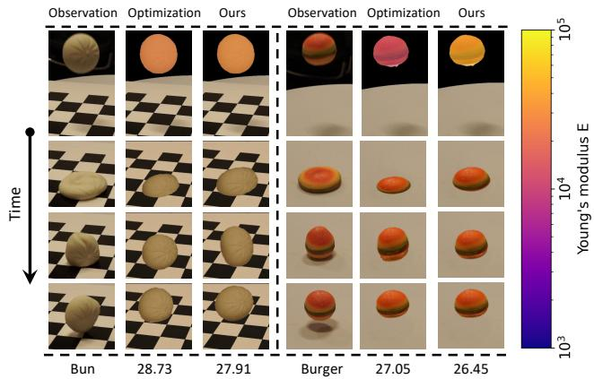
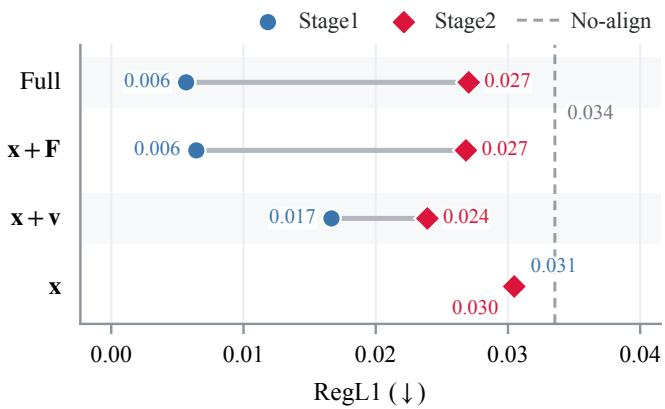
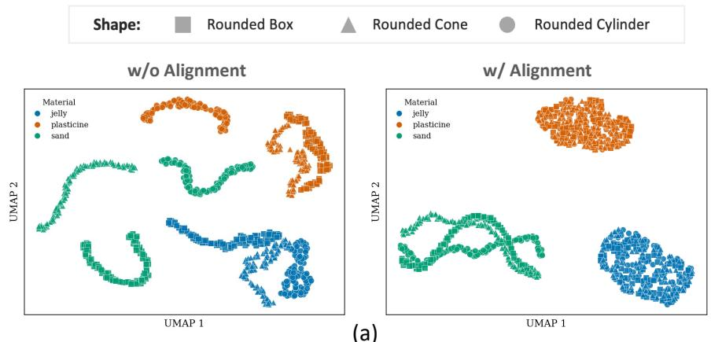
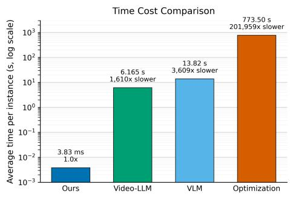

# Analytic Dynamics: Learning Physics-Grounded Representation for Fast Intrinsic Dynamics Inference from Monocular Videos

Jiajing Lin<sup>∗</sup>, Jikuan Zhange<sup>∗</sup>, Jianhua Sun<sup>†</sup>

S<sub>c</sub>h<sub>oo</sub>l <sub>o</sub>f A<sub>r</sub>tifi<sub>c</sub>i<sub>a</sub>l I<sub>n</sub>t<sub>e</sub>lli<sub>gence,</sub> Sh<sub>ang</sub>h<sub>a</sub>i Ji<sub>ao</sub> T<sub>ong</sub> U<sub>n</sub>i<sub>vers</sub>it<sub>y</sub> {jiajinglin, k-u-a-n\_as, gothic}@sjtu.edu.cn

## Abstract

Inferring object dynamics from visual observations is essenti<sub>a</sub>l f<sub>or</sub> i<sub>n</sub>t<sub>e</sub>lli<sub>gen</sub>t <sub>agen</sub>t<sub>s</sub> t<sub>o reason a</sub>b<sub>ou</sub>t <sub>an</sub>d i<sub>n</sub>t<sub>erac</sub>t <sub>w</sub>ith th<sub>e p</sub>h<sub>ys</sub>i<sub>ca</sub>l <sub>wor</sub>ld<sub>, ye</sub>t <sub>rema</sub>i<sub>ns c</sub>h<sub>a</sub>ll<sub>eng</sub>i<sub>ng</sub> d<sub>ue</sub> t<sub>o</sub> th<sub>e</sub> f<sub>un</sub>d<sub>a-</sub> <sub>men</sub>t<sub>a</sub>l <sub>gap</sub> b<sub>e</sub>t<sub>ween v</sub>i<sub>sua</sub>l <sub>ev</sub>id<sub>ence an</sub>d i<sub>n</sub>t<sub>r</sub>i<sub>ns</sub>i<sub>c</sub> d<sub>ynam</sub>i<sub>cs.</sub> E<sub>x</sub>i<sub>s</sub>ti<sub>ng me</sub>th<sub>o</sub>d<sub>s e</sub>ith<sub>er re</sub>l<sub>y on cos</sub>tl<sub>y per-scene op</sub>ti<sub>m</sub>i<sub>za-</sub> ti<sub>on,</sub> li<sub>m</sub>iti<sub>ng e</sub>fi<sub>c</sub>i<sub>ency an</sub>d <sub>sca</sub>l<sub>a</sub>bilit<sub>y, or</sub> di<sub>rec</sub>tl<sub>y map v</sub>i<sub>sua</sub>l <sub>ev</sub>id<sub>ence</sub> t<sub>o</sub> i<sub>n</sub>t<sub>r</sub>i<sub>ns</sub>i<sub>c</sub> d<sub>ynam</sub>i<sub>cs</sub> <sub>w</sub>ith<sub>ou</sub>t i<sub>n</sub>t<sub>erme</sub>di<sub>a</sub>t<sub>e</sub> <sub>p</sub>h<sub>ys</sub>i<sub>ca</sub>l <sub>a</sub>b<sub>s</sub>t<sub>rac</sub>ti<sub>ons,</sub> <sub>ma</sub>ki<sub>ng</sub> th<sub>em</sub> <sub>prone</sub> t<sub>o</sub> <sub>appearance</sub> <sub>an</sub>d <sub>geome-</sub> tr<sub>y s</sub>h<sub>o</sub>rt<sub>cu</sub>t<sub>s.</sub> T<sub>o</sub> brid<sub>ge</sub> thi<sub>s gap, we p</sub>r<sub>opose</sub> An<sub>a</sub>l<sub>y</sub>ti<sub>c</sub> D<sub>y-</sub> <sub>nam</sub>i<sub>cs, a</sub> f<sub>ee</sub>d<sub>-</sub>f<sub>orwar</sub>d d<sub>ynam</sub>i<sub>cs</sub> i<sub>n</sub>f<sub>erence</sub> f<sub>ramewor</sub>k th<sub>a</sub>t i<sub>n</sub>t<sub>ro</sub>d<sub>uces</sub> <sub>an</sub> i<sub>n</sub>t<sub>erme</sub>di<sub>a</sub>t<sub>e</sub> <sub>p</sub>h<sub>ys</sub>i<sub>cs-groun</sub>d<sub>e</sub>d d<sub>ynam</sub>i<sub>cs</sub> <sub>repre-</sub> <sub>sen</sub>t<sub>a</sub>ti<sub>on</sub> b<sub>e</sub>t<sub>ween v</sub>i<sub>sua</sub>l <sub>o</sub>b<sub>serva</sub>ti<sub>ons an</sub>d i<sub>n</sub>t<sub>r</sub>i<sub>ns</sub>i<sub>c</sub> d<sub>ynam</sub>i<sub>cs.</sub> S<sub>pec</sub>ifi<sub>ca</sub>ll<sub>y,</sub> <sub>we</sub> l<sub>everage</sub> <sub>pr</sub>i<sub>v</sub>il<sub>ege</sub>d <sub>p</sub>h<sub>ys</sub>i<sub>ca</sub>l <sub>s</sub>t<sub>a</sub>t<sub>es,</sub> i<sub>nc</sub>l<sub>u</sub>d<sub>-</sub> i<sub>ng pos</sub>iti<sub>on,</sub> di<sub>sp</sub>l<sub>acemen</sub>t<sub>, an</sub>d d<sub>e</sub>f<sub>orma</sub>ti<sub>on gra</sub>di<sub>en</sub>t fi<sub>e</sub>ld<sub>s,</sub> <sub>w</sub>hi<sub>c</sub>h <sub>are ava</sub>il<sub>a</sub>bl<sub>e</sub> i<sub>n s</sub>i<sub>mu</sub>l<sub>a</sub>ti<sub>on,</sub> t<sub>o</sub> l<sub>earn a s</sub>t<sub>ruc</sub>t<sub>ure</sub>d d<sub>ynam-</sub> i<sub>cs represen</sub>t<sub>a</sub>ti<sub>on</sub> th<sub>a</sub>t i<sub>s</sub> difi<sub>cu</sub>lt t<sub>o</sub> di<sub>scover</sub> f<sub>rom v</sub>i<sub>sua</sub>l <sub>o</sub>b<sub>-</sub> <sub>serva</sub>ti<sub>ons a</sub>l<sub>one.</sub> B<sub>y a</sub>li<sub>gn</sub>i<sub>ng v</sub>i<sub>sua</sub>l <sub>represen</sub>t<sub>a</sub>ti<sub>ons w</sub>ith thi<sub>s</sub> <sub>space, we equ</sub>i<sub>p v</sub>i<sub>sua</sub>l <sub>mo</sub>d<sub>e</sub>l<sub>s w</sub>ith <sub>a p</sub>h<sub>ys</sub>i<sub>cs-groun</sub>d<sub>e</sub>d i<sub>n</sub>d<sub>uc-</sub> ti<sub>ve</sub> bi<sub>as, gu</sub>idi<sub>ng</sub> th<sub>em</sub> t<sub>o cap</sub>t<sub>ure</sub> d<sub>ynam</sub>i<sub>cs-re</sub>l<sub>evan</sub>t <sub>pa</sub>tt<sub>erns</sub> f<sub>or ma</sub>t<sub>er</sub>i<sub>a</sub>l <sub>mo</sub>d<sub>e</sub>l <sub>c</sub>l<sub>ass</sub>ifi<sub>ca</sub>ti<sub>on an</sub>d <sub>parame</sub>t<sub>er regress</sub>i<sub>on.</sub> T<sub>o</sub> f<sub>ac</sub>ilit<sub>a</sub>t<sub>e</sub> thi<sub>s researc</sub>h<sub>, we</sub> d<sub>eve</sub>l<sub>op a</sub> d<sub>ynam</sub>i<sub>cs</sub> d<sub>a</sub>t<sub>a genera</sub>ti<sub>on</sub> <sub>p</sub>i<sub>pe</sub>li<sub>ne an</sub>d b<sub>enc</sub>h<sub>mar</sub>k <sub>con</sub>t<sub>a</sub>i<sub>n</sub>i<sub>ng pa</sub>i<sub>re</sub>d <sub>p</sub>h<sub>ys</sub>i<sub>ca</sub>l <sub>s</sub>t<sub>a</sub>t<sub>e</sub> t<sub>ra-</sub> jectories, rendered videos, and ground-truth material models <sub>an</sub>d <sub>parame</sub>t<sub>ers.</sub> E<sub>x</sub>t<sub>ens</sub>i<sub>ve exper</sub>i<sub>men</sub>t<sub>s</sub> d<sub>emons</sub>t<sub>ra</sub>t<sub>e</sub> th<sub>a</sub>t A<sub>na-</sub> l<sub>y</sub>ti<sub>c</sub> D<sub>ynam</sub>i<sub>cs ac</sub>hi<sub>eves e</sub>fi<sub>c</sub>i<sub>en</sub>t<sub>, accura</sub>t<sub>e, an</sub>d <sub>genera</sub>li<sub>za</sub>bl<sub>e</sub> d<sub>ynam</sub>i<sub>cs</sub> i<sub>n</sub>f<sub>erence</sub> f<sub>rom monocu</sub>l<sub>ar v</sub>id<sub>eos.</sub>

## Introduction

Embodied a<sub>g</sub>ents (Duan et al. 2022b; Lon<sub>g</sub> et al. 2025) need to reason about how objects respond to physical interactions t<sub>o ma</sub>k<sub>e re</sub>li<sub>a</sub>bl<sub>e</sub> d<sub>ec</sub>i<sub>s</sub>i<sub>ons.</sub> Thi<sub>s capa</sub>bilit<sub>y re</sub>li<sub>es on un</sub>d<sub>er-</sub> standing the intrinsic dynamics of objects, including the und<sub>er</sub>l<sub>y</sub>i<sub>ng ma</sub>t<sub>er</sub>i<sub>a</sub>l <sub>mo</sub>d<sub>e</sub>l<sub>s an</sub>d <sub>ma</sub>t<sub>er</sub>i<sub>a</sub>l <sub>parame</sub>t<sub>ers.</sub> H<sub>umans</sub> <sub>e</sub>f<sub>or</sub>tl<sub>ess</sub>l<sub>y</sub> i<sub>n</sub>f<sub>er suc</sub>h d<sub>ynam</sub>i<sub>cs</sub> f<sub>rom o</sub>b<sub>serve</sub>d <sub>mo</sub>ti<sub>ons, en-</sub> <sub>a</sub>bli<sub>ng</sub> th<sub>em</sub> t<sub>o</sub> <sub>an</sub>ti<sub>c</sub>i<sub>pa</sub>t<sub>e</sub> f<sub>u</sub>t<sub>ure</sub> b<sub>e</sub>h<sub>av</sub>i<sub>ors</sub> <sub>an</sub>d i<sub>n</sub>t<sub>erac</sub>t <sub>e</sub>f<sub>-</sub> f<sub>ec</sub>ti<sub>ve</sub>l<sub>y w</sub>ith th<sub>e p</sub>h<sub>ys</sub>i<sub>ca</sub>l <sub>wor</sub>ld<sub>.</sub> E<sub>n</sub>d<sub>ow</sub>i<sub>ng mac</sub>hi<sub>nes w</sub>ith similar intuitive <sub>p</sub>h<sub>y</sub>sics (Duan et al. 2022a) is a fundamental <sub>g</sub>oal of embodied intelli<sub>g</sub>ence (Sun and Lu 2025).

With advances in diferentiable renderin<sub>g</sub> (Mildenhall et al. 2021; Kerbl et al. 2023) and simulation (Jian<sub>g</sub> et al. 2016), a line of work (Li et al. 2023; Cai et al. 2024; Lin et al. 2026) formulates d<sub>y</sub>namics inference as inverse <sub>p</sub>h<sub>y</sub>sics <sub>pro</sub>bl<sub>ems,</sub> <sub>op</sub>ti<sub>m</sub>i<sub>z</sub>i<sub>ng</sub> <sub>ma</sub>t<sub>er</sub>i<sub>a</sub>l <sub>parame</sub>t<sub>ers</sub> t<sub>o</sub> <sub>ma</sub>t<sub>c</sub>h <sub>s</sub>i<sub>mu-</sub> l<sub>a</sub>t<sub>e</sub>d b<sub>e</sub>h<sub>av</sub>i<sub>ors</sub> <sub>w</sub>ith <sub>mu</sub>lti<sub>-v</sub>i<sub>ew</sub> <sub>v</sub>id<sub>eos.</sub> Whil<sub>e</sub> <sub>ac</sub>hi<sub>ev</sub>i<sub>ng</sub> <sub>accura</sub>t<sub>e es</sub>ti<sub>ma</sub>ti<sub>on,</sub> th<sub>ese me</sub>th<sub>o</sub>d<sub>s requ</sub>i<sub>re ex</sub>t<sub>ens</sub>i<sub>ve s</sub>i<sub>m-</sub> <sub>u</sub>l<sub>a</sub>ti<sub>on–op</sub>ti<sub>m</sub>i<sub>za</sub>ti<sub>on</sub> it<sub>era</sub>ti<sub>ons</sub> f<sub>rom scra</sub>t<sub>c</sub>h f<sub>or eac</sub>h <sub>scene,</sub> <sub>resu</sub>lti<sub>ng</sub> i<sub>n</sub> hi<sub>g</sub>h <sub>compu</sub>t<sub>a</sub>ti<sub>ona</sub>l <sub>cos</sub>t <sub>an</sub>d li<sub>m</sub>it<sub>e</sub>d <sub>sca</sub>l<sub>a</sub>bilit<sub>y</sub> to unseen objects. Alternatively, another line of work (Zhai et al. 2024; Shuai et al. 2025; Cho<sub>p</sub>ra et al. 2025) ex<sub>p</sub>lores <sub>promp</sub>ti<sub>ng</sub> l<sub>arge v</sub>i<sub>s</sub>i<sub>on-</sub>l<sub>anguage mo</sub>d<sub>e</sub>l<sub>s</sub> t<sub>o reason a</sub>b<sub>ou</sub>t i<sub>n-</sub> t<sub>r</sub>i<sub>ns</sub>i<sub>c</sub> d<sub>ynam</sub>i<sub>cs</sub> f<sub>rom v</sub>i<sub>sua</sub>l <sub>o</sub>b<sub>serva</sub>ti<sub>ons.</sub> Whil<sub>e o</sub>f<sub>er</sub>i<sub>ng</sub> <sub>e</sub>fi<sub>c</sub>i<sub>en</sub>t <sub>an</sub>d <sub>versa</sub>til<sub>e</sub> i<sub>n</sub>f<sub>erence,</sub> th<sub>ese approac</sub>h<sub>es pr</sub>i<sub>mar</sub>il<sub>y</sub> <sub>re</sub>l<sub>y on commonsense</sub> k<sub>now</sub>l<sub>e</sub>d<sub>ge acqu</sub>i<sub>re</sub>d f<sub>rom</sub> l<sub>arge-sca</sub>l<sub>e</sub> <sub>corpora, resu</sub>lti<sub>ng</sub> i<sub>n no</sub>i<sub>sy an</sub>d <sub>coarse-gra</sub>i<sub>ne</sub>d <sub>pre</sub>di<sub>c</sub>ti<sub>ons.</sub>

T<sub>o exp</sub>l<sub>ore a</sub> b<sub>e</sub>tt<sub>er</sub> b<sub>a</sub>l<sub>ance</sub> b<sub>e</sub>t<sub>ween</sub> i<sub>n</sub>f<sub>erence e</sub>fi<sub>c</sub>i<sub>ency</sub> and <sub>p</sub>h<sub>y</sub>sical accurac<sub>y</sub>, recent works (Le et al. 2025; Huan<sub>g</sub> et al. 2026; Das and Manocha 2026) levera<sub>g</sub>e lar<sub>g</sub>e-scale s<sub>y</sub>nth<sub>e</sub>ti<sub>c</sub> 3D <sub>asse</sub>t<sub>–</sub>d<sub>ynam</sub>i<sub>cs pa</sub>i<sub>rs</sub> t<sub>o</sub> t<sub>ra</sub>i<sub>n</sub> f<sub>ee</sub>d<sub>-</sub>f<sub>orwar</sub>d <sub>mo</sub>d<sub>e</sub>l<sub>s.</sub> H<sub>oweve</sub>r<sub>,</sub> <sub>s</sub>t<sub>a</sub>ti<sub>c</sub> 3D <sub>asse</sub>t<sub>s</sub> <sub>o</sub>nl<sub>y</sub> <sub>p</sub>r<sub>ov</sub>id<sub>e</sub> <sub>appea</sub>r<sub>a</sub>n<sub>ce</sub> <sub>a</sub>nd <sub>geo</sub>m<sub>-</sub> <sub>e</sub>t<sub>ry, w</sub>hi<sub>c</sub>h <sub>are</sub> i<sub>n</sub>h<sub>eren</sub>tl<sub>y am</sub>bi<sub>guous</sub> f<sub>or</sub> i<sub>n</sub>f<sub>err</sub>i<sub>ng</sub> i<sub>n</sub>t<sub>r</sub>i<sub>ns</sub>i<sub>c</sub> dynamics: visually identical objects may correspond to diff<sub>eren</sub>t <sub>ma</sub>t<sub>er</sub>i<sub>a</sub>l <sub>mo</sub>d<sub>e</sub>l<sub>s or parame</sub>t<sub>ers.</sub> I<sub>n con</sub>t<sub>ras</sub>t<sub>, monocu</sub>l<sub>ar</sub> videos capture how objects move and deform under physical i<sub>n</sub>t<sub>erac</sub>ti<sub>ons, prov</sub>idi<sub>ng</sub> b<sub>e</sub>h<sub>av</sub>i<sub>ora</sub>l <sub>ev</sub>id<sub>ence</sub> i<sub>n</sub>d<sub>uce</sub>d b<sub>y</sub> th<sub>e</sub>i<sub>r</sub> i<sub>n</sub>t<sub>r</sub>i<sub>ns</sub>i<sub>c</sub> d<sub>ynam</sub>i<sub>cs.</sub> H<sub>owever,</sub> i<sub>n</sub>f<sub>err</sub>i<sub>ng</sub> i<sub>n</sub>t<sub>r</sub>i<sub>ns</sub>i<sub>c</sub> d<sub>ynam</sub>i<sub>cs</sub> f<sub>rom monocu</sub>l<sub>ar v</sub>id<sub>eos rema</sub>i<sub>ns c</sub>h<sub>a</sub>ll<sub>eng</sub>i<sub>ng, as v</sub>id<sub>eos on</sub>l<sub>y</sub> capture 2D projections of physical responses induced by int<sub>r</sub>i<sub>ns</sub>i<sub>c</sub> d<sub>ynam</sub>i<sub>cs, w</sub>hi<sub>c</sub>h <sub>are m</sub>i<sub>xe</sub>d <sub>w</sub>ith f<sub>ac</sub>t<sub>ors unre</sub>l<sub>a</sub>t<sub>e</sub>d to <sup>d</sup><sub>y</sub>nam<sup>i</sup>cs, suc<sup>h</sup> as v<sup>i</sup>ew<sub>p</sub>o<sup>i</sup>nt, <sub>g</sub>eometr<sub>y</sub>, an<sup>d</sup> a<sub>pp</sub>earance. With<sub>ou</sub>t <sub>exp</sub>li<sub>c</sub>it <sub>p</sub>h<sub>ys</sub>i<sub>ca</sub>l <sub>gu</sub>id<sub>ance, mo</sub>d<sub>e</sub>l<sub>s can eas</sub>il<sub>y exp</sub>l<sub>o</sub>it <sub>spur</sub>i<sub>ous</sub> <sub>corre</sub>l<sub>a</sub>ti<sub>ons</sub> <sub>ra</sub>th<sub>er</sub> th<sub>an</sub> l<sub>earn</sub>i<sub>ng</sub> d<sub>ynam</sub>i<sub>cs-re</sub>l<sub>evan</sub>t <sub>pa</sub>tt<sub>erns,</sub> l<sub>ea</sub>di<sub>ng</sub> t<sub>o poor genera</sub>li<sub>za</sub>ti<sub>on.</sub>

To address the aforementioned challenges, we propose Analytic Dynamics, a feed-forward framework for eficiently i<sub>n</sub>f<sub>err</sub>i<sub>ng cons</sub>tit<sub>u</sub>ti<sub>ve ma</sub>t<sub>er</sub>i<sub>a</sub>l <sub>mo</sub>d<sub>e</sub>l<sub>s an</sub>d <sub>parame</sub>t<sub>ers</sub> f<sub>rom</sub> <sub>monocu</sub>l<sub>ar v</sub>id<sub>eos.</sub> O<sub>ur</sub> k<sub>ey</sub> i<sub>ns</sub>i<sub>g</sub>ht i<sub>s</sub> t<sub>o</sub> i<sub>n</sub>t<sub>ro</sub>d<sub>uce a p</sub>h<sub>ys</sub>i<sub>cs-</sub> <sub>groun</sub>d<sub>e</sub>d d<sub>ynam</sub>i<sub>cs represen</sub>t<sub>a</sub>ti<sub>on</sub> b<sub>e</sub>t<sub>ween v</sub>i<sub>sua</sub>l <sub>o</sub>b<sub>serva-</sub> ti<sub>ons</sub> <sub>an</sub>d i<sub>n</sub>t<sub>r</sub>i<sub>ns</sub>i<sub>c</sub> d<sub>ynam</sub>i<sub>cs,</sub> <sub>prov</sub>idi<sub>ng</sub> <sub>v</sub>i<sub>sua</sub>l <sub>mo</sub>d<sub>e</sub>l<sub>s</sub> <sub>w</sub>ith <sub>a p</sub>h<sub>ys</sub>i<sub>ca</sub>ll<sub>y mean</sub>i<sub>ng</sub>f<sub>u</sub>l l<sub>earn</sub>i<sub>ng</sub> t<sub>arge</sub>t<sub>.</sub> S<sub>pec</sub>ifi<sub>ca</sub>ll<sub>y, we</sub> d<sub>e-</sub> <sub>ve</sub>l<sub>op a</sub> t<sub>wo-s</sub>t<sub>age pr</sub>i<sub>v</sub>il<sub>ege</sub>d d<sub>ynam</sub>i<sub>cs</sub> di<sub>s</sub>till<sub>a</sub>ti<sub>on</sub> f<sub>rame-</sub> <sub>wor</sub>k<sub>.</sub> Fi<sub>rs</sub>t<sub>, we</sub> l<sub>everage pr</sub>i<sub>v</sub>il<sub>ege</sub>d <sub>p</sub>h<sub>ys</sub>i<sub>ca</sub>l <sub>s</sub>t<sub>a</sub>t<sub>es as</sub> i<sub>n-</sub> <sub>pu</sub>t<sub>,</sub> i<sub>nc</sub>l<sub>u</sub>di<sub>ng</sub> <sub>pos</sub>iti<sub>on,</sub> di<sub>sp</sub>l<sub>acemen</sub>t<sub>,</sub> <sub>an</sub>d d<sub>e</sub>f<sub>orma</sub>ti<sub>on</sub> <sub>gra-</sub> di<sub>en</sub>t fi<sub>e</sub>ld<sub>s,</sub> <sub>w</sub>hi<sub>c</sub>h <sub>are</sub> <sub>on</sub>l<sub>y</sub> <sub>access</sub>ibl<sub>e</sub> i<sub>n</sub> <sub>s</sub>i<sub>mu</sub>l<sub>a</sub>ti<sub>on,</sub> t<sub>o</sub> l<sub>earn</sub> <sub>a</sub> <sub>s</sub>t<sub>ruc</sub>t<sub>ure</sub>d d<sub>ynam</sub>i<sub>cs</sub> <sub>represen</sub>t<sub>a</sub>ti<sub>on</sub> <sub>space</sub> f<sub>or</sub> <sub>ma-</sub> t<sub>er</sub>i<sub>a</sub>l <sub>mo</sub>d<sub>e</sub>l <sub>c</sub>l<sub>ass</sub>ifi<sub>ca</sub>ti<sub>on an</sub>d <sub>parame</sub>t<sub>er regress</sub>i<sub>on.</sub> Si<sub>nce</sub> th<sub>ese</sub> <sub>s</sub>t<sub>a</sub>t<sub>es</sub> di<sub>rec</sub>tl<sub>y</sub> d<sub>escr</sub>ib<sub>e</sub> <sub>p</sub>h<sub>ys</sub>i<sub>ca</sub>l <sub>responses</sub> <sub>governe</sub>d b<sub>y</sub> i<sub>n</sub>t<sub>r</sub>i<sub>ns</sub>i<sub>c</sub> d<sub>ynam</sub>i<sub>cs,</sub> th<sub>e</sub> l<sub>earne</sub>d <sub>represen</sub>t<sub>a</sub>ti<sub>on na</sub>t<sub>ura</sub>ll<sub>y en-</sub> <sub>co</sub>d<sub>es</sub> d<sub>ynam</sub>i<sub>cs-re</sub>l<sub>a</sub>t<sub>e</sub>d i<sub>n</sub>f<sub>orma</sub>ti<sub>on, resu</sub>lti<sub>ng</sub> i<sub>n a p</sub>h<sub>ys</sub>i<sub>cs-</sub> <sub>groun</sub>d<sub>e</sub>d <sub>represen</sub>t<sub>a</sub>ti<sub>on space.</sub> S<sub>econ</sub>d<sub>, we a</sub>li<sub>gn monocu</sub>l<sub>ar</sub> <sub>v</sub>id<sub>eo w</sub>ith thi<sub>s</sub> l<sub>earne</sub>d d<sub>ynam</sub>i<sub>cs space.</sub> Thi<sub>s a</sub>li<sub>gnmen</sub>t i<sub>n</sub>t<sub>ro-</sub> d<sub>uces a p</sub>h<sub>ys</sub>i<sub>cs-groun</sub>d<sub>e</sub>d i<sub>n</sub>d<sub>uc</sub>ti<sub>ve</sub> bi<sub>as, gu</sub>idi<sub>ng v</sub>i<sub>sua</sub>l <sub>rep-</sub> <sub>resen</sub>t<sub>a</sub>ti<sub>ons</sub> t<sub>owar</sub>d d<sub>ynam</sub>i<sub>cs-re</sub>l<sub>a</sub>t<sub>e</sub>d i<sub>n</sub>f<sub>orma</sub>ti<sub>on re</sub>fl<sub>ec</sub>t<sub>e</sub>d in object motion and deformation, and enabling more accu-<sub>ra</sub>t<sub>e an</sub>d <sub>genera</sub>li<sub>za</sub>bl<sub>e</sub> i<sub>n</sub>f<sub>erence o</sub>f <sub>ma</sub>t<sub>er</sub>i<sub>a</sub>l <sub>mo</sub>d<sub>e</sub>l<sub>s an</sub>d <sub>pa-</sub> <sub>rame</sub>t<sub>ers.</sub> T<sub>o suppor</sub>t thi<sub>s researc</sub>h<sub>, we</sub> b<sub>u</sub>ild <sub>a s</sub>i<sub>mu</sub>l<sub>a</sub>t<sub>or-</sub>b<sub>ase</sub>d benchmark of 9,000 dynamics instances across 60 objects, <sub>cover</sub>i<sub>ng</sub> di<sub>verse ma</sub>t<sub>er</sub>i<sub>a</sub>l <sub>mo</sub>d<sub>e</sub>l<sub>s, parame</sub>t<sub>ers, an</sub>d <sub>v</sub>i<sub>ews.</sub> E<sub>ac</sub>h i<sub>ns</sub>t<sub>ance pa</sub>i<sub>rs monocu</sub>l<sub>ar v</sub>id<sub>eos w</sub>ith <sub>p</sub>h<sub>ys</sub>i<sub>ca</sub>l<sub>-s</sub>t<sub>a</sub>t<sub>e</sub> t<sub>ra-</sub> jectories and ground-truth material labels. Our contributions <sub>are summar</sub>i<sub>ze</sub>d <sub>as</sub> f<sub>o</sub>ll<sub>ows:</sub>

  
Figure 1: Physics-grounded distillation reduces shape dependence. We use UMAP to visualize representations of elastic samples from three training shapes: Box, Cone, and Cylinder. Marker types denote object shapes, while colors indicate the round-truth Youn ’s modulus E. Without ali nment, direct visual re resentations form three sha e-s ecific branches, revealin strong reliance on geometric cues. In contrast, the Stage I teacher organizes samples into a smooth continuum according to E, f<sub>orm</sub>i<sub>ng a s</sub>h<sub>are</sub>d d<sub>ynam</sub>i<sub>cs s</sub>t<sub>ruc</sub>t<sub>ure across geome</sub>t<sub>r</sub>i<sub>es.</sub> Di<sub>s</sub>till<sub>a</sub>ti<sub>on</sub> t<sub>rans</sub>f<sub>ers</sub> thi<sub>s organ</sub>i<sub>za</sub>ti<sub>on</sub> t<sub>o</sub> St<sub>age</sub> II<sub>, ena</sub>bli<sub>ng</sub> th<sub>e v</sub>i<sub>sua</sub> model to capture dynamics-relevant patterns across shapes and improving E regression accuracy by 34% on unseen shapes.

• We <sub>p</sub>ro<sub>p</sub>ose a feed-forward d<sub>y</sub>namics inference frame-<sub>wor</sub>k th<sub>a</sub>t i<sub>s</sub> th<sub>e</sub> fi<sub>rs</sub>t t<sub>o e</sub>fi<sub>c</sub>i<sub>en</sub>tl <sub>recover cons</sub>tit<sub>u</sub>ti<sub>ve</sub> <sub>ma</sub>t<sub>er</sub>i<sub>a</sub>l <sub>mo</sub>d<sub>e</sub>l<sub>s an</sub>d <sub>parame</sub>t<sub>ers</sub> f<sub>rom monocu</sub>l<sub>ar v</sub>id<sub>eos.</sub>

• We introduce a two-sta<sub>g</sub>e <sub>p</sub>rivile<sub>g</sub>ed d<sub>y</sub>namics distillati<sub>on</sub> f<sub>ramewor</sub>k th<sub>a</sub>t l<sub>earns a p</sub>h<sub>ys</sub>i<sub>cs-groun</sub>d<sub>e</sub>d d<sub>ynam-</sub> i<sub>cs represen</sub>t<sub>a</sub>ti<sub>on</sub> f<sub>rom p</sub>h<sub>ys</sub>i<sub>ca</sub>l <sub>s</sub>t<sub>a</sub>t<sub>es an</sub>d t<sub>rans</sub>f<sub>ers</sub> it t<sub>o</sub> th<sub>e v</sub>i<sub>sua</sub>l <sub>mo</sub>d<sub>e</sub>l<sub>, encourag</sub>i<sub>ng</sub> th<sub>e mo</sub>d<sub>e</sub>l t<sub>o cap</sub>t<sub>ure</sub> d<sub>ynam</sub>i<sub>cs-re</sub>l<sub>evan</sub>t <sub>pa</sub>tt<sub>erns</sub> f<sub>or</sub> i<sub>mprove</sub>d <sub>genera</sub>li<sub>za</sub>ti<sub>on.</sub>

• We develo<sub>p</sub> a d<sub>y</sub>namics data <sub>g</sub>eneration <sub>p</sub>i<sub>p</sub>eline and b<sub>enc</sub>h<sub>mar</sub>k f<sub>or</sub> i<sub>n</sub>t<sub>r</sub>i<sub>ns</sub>i<sub>c</sub> d<sub>ynam</sub>i<sub>cs</sub> i<sub>n</sub>f<sub>erence.</sub> E<sub>x</sub>t<sub>ens</sub>i<sub>ve</sub> experiments demonstrate that Analytic Dynamics out-<sub>per</sub>f<sub>orms ex</sub>i<sub>s</sub>ti<sub>ng</sub> b<sub>ase</sub>li<sub>nes, ena</sub>bli<sub>ng e</sub>fi<sub>c</sub>i<sub>en</sub>t i<sub>n</sub>f<sub>erence</sub> <sub>w</sub>ithi<sub>n</sub> 3<sub>.</sub>83 <sub>m</sub>illi<sub>secon</sub>d<sub>s w</sub>hil<sub>e ma</sub>i<sub>n</sub>t<sub>a</sub>i<sub>n</sub>i<sub>ng s</sub>t<sub>rong ou</sub>t<sub>-</sub> <sub>o</sub>f<sub>-</sub>di<sub>s</sub>t<sub>r</sub>ib<sub>u</sub>ti<sub>on genera</sub>li<sub>za</sub>ti<sub>on.</sub>

## Related Work

## Per-Scene Dynamics Optimization

Per-scene inverse-physics methods identify object dynami<sub>cs</sub> f<sub>rom</sub> <sub>v</sub>id<sub>eos</sub> b<sub>y</sub> <sub>op</sub>ti<sub>m</sub>i<sub>z</sub>i<sub>ng</sub> <sub>p</sub>h<sub>ys</sub>i<sub>ca</sub>l <sub>parame</sub>t<sub>ers</sub> th<sub>roug</sub>h dif<sub>eren</sub>ti<sub>a</sub>bl<sub>e</sub> <sub>ren</sub>d<sub>er</sub>i<sub>ng</sub> <sub>an</sub>d <sub>s</sub>i<sub>mu</sub>l<sub>a</sub>ti<sub>on.</sub> PAC<sub>-</sub>N<sub>e</sub>RF<sub>,</sub> GIC<sub>,</sub> S<sub>p</sub>rin<sub>g</sub>-Gaus, and M-Ph<sub>y</sub>Gs (Li et al. 2023; Cai et al. 2024; Zhon<sub>g</sub> et al. 2024; Wada et al. 2025) o<sub>p</sub>erate under <sub>p</sub>rescribed <sub>ma</sub>t<sub>er</sub>i<sub>a</sub>l <sub>mo</sub>d<sub>e</sub>l<sub>s,</sub> <sub>progress</sub>i<sub>ve</sub>l<sub>y</sub> <sub>suppor</sub>ti<sub>ng</sub> <sub>exp</sub>li<sub>c</sub>it <sub>geome</sub>t<sub>ry,</sub> heterogeneous elasticity, and multi-material objects. NeuMA and MASIV (Cao et al. 2024; Zhao et al. 2025b) relax fixed <sub>cons</sub>tit<sub>u</sub>ti<sub>ve assump</sub>ti<sub>ons</sub> th<sub>roug</sub>h <sub>neura</sub>l <sub>cons</sub>tit<sub>u</sub>ti<sub>ve mo</sub>d<sub>-</sub> elin<sub>g</sub>, whereas VisionLaw (Lin et al. 2026) searches for i<sub>n</sub>t<sub>erpre</sub>t<sub>a</sub>bl<sub>e sym</sub>b<sub>o</sub>li<sub>c</sub> l<sub>aws.</sub> Ph<sub>ys</sub>D<sub>reamer,</sub> D<sub>ream</sub>Ph<sub>ys</sub>i<sub>cs,</sub> Ph<sub>y</sub>sics3D, Ph<sub>y</sub>sFlow, and OmniPh<sub>y</sub>sGS (Zhan<sub>g</sub> et al. 2024; Huan<sub>g</sub> et al. 2024; Liu et al. 2024, 2025; Lin et al. 2025b) i<sub>ns</sub>t<sub>ea</sub>d <sub>use v</sub>id<sub>eo</sub> dif<sub>us</sub>i<sub>on pr</sub>i<sub>ors</sub> t<sub>o op</sub>ti<sub>m</sub>i<sub>ze p</sub>h<sub>ys</sub>i<sub>ca</sub>l <sub>prop-</sub> <sub>er</sub>ti<sub>es w</sub>ith<sub>ou</sub>t <sub>cap</sub>t<sub>ure</sub>d <sub>mo</sub>ti<sub>on.</sub> Vid2Si<sub>m com</sub>bi<sub>nes</sub> f<sub>ee</sub>d<sub>-</sub> f<sub>orwar</sub>d <sub>pre</sub>di<sub>c</sub>ti<sub>on w</sub>ith li<sub>g</sub>ht<sub>we</sub>i<sub>g</sub>ht <sub>per-scene re</sub>fi<sub>nemen</sub>t (Chen et al. 2025). Des<sub>p</sub>ite these advances, o<sub>p</sub>timizationb<sub>ase</sub>d <sub>me</sub>th<sub>o</sub>d<sub>s rema</sub>i<sub>n compu</sub>t<sub>a</sub>ti<sub>ona</sub>ll<sub>y expens</sub>i<sub>ve an</sub>d <sub>re-</sub> <sub>qu</sub>i<sub>re scene-spec</sub>ifi<sub>c</sub> fitti<sub>ng,</sub> li<sub>m</sub>iti<sub>ng</sub> th<sub>e</sub>i<sub>r sca</sub>l<sub>a</sub>bilit<sub>y.</sub>

## Feed-Forward Dynamics Inference

T<sub>o avo</sub>id <sub>expens</sub>i<sub>ve scene-spec</sub>ifi<sub>c sys</sub>t<sub>em</sub> id<sub>en</sub>tifi<sub>ca</sub>ti<sub>on,</sub> f<sub>ee</sub>d<sub>-</sub> f<sub>orwar</sub>d <sub>me</sub>th<sub>o</sub>d<sub>s</sub> di<sub>rec</sub>tl<sub>y</sub> <sub>pre</sub>di<sub>c</sub>t <sub>p</sub>h<sub>ys</sub>i<sub>ca</sub>l <sub>proper</sub>ti<sub>es</sub> f<sub>rom</sub> <sub>v</sub>i<sub>-</sub> <sub>sua</sub>l <sub>o</sub>b<sub>se</sub>r<sub>va</sub>ti<sub>o</sub>n<sub>s.</sub> N<sub>e</sub>RF2Ph<sub>ys</sub>i<sub>cs,</sub> G<sub>auss</sub>i<sub>a</sub>nPr<sub>ope</sub>rt<sub>y,</sub> PUGS<sub>,</sub> and Ph sGS (Zhai et al. 2024; Xu et al. 2025; Shuai et al. 2025) transfer material semantics and <sub>p</sub>h<sub>y</sub>sical <sub>p</sub>riors from <sub>p</sub>retrained vision-lan<sub>g</sub>ua<sub>g</sub>e models (VLMs) to 3D scene re<sub>p</sub>- <sub>resen</sub>t<sub>a</sub>ti<sub>ons</sub> f<sub>or zero-s</sub>h<sub>o</sub>t <sub>proper</sub>t<sub>y es</sub>ti<sub>ma</sub>ti<sub>on; among</sub> th<sub>em,</sub> PUGS im<sub>p</sub>r<sub>oves p</sub>r<sub>ope</sub>rt<sub>y p</sub>r<sub>opaga</sub>ti<sub>o</sub>n <sub>ove</sub>r 3D G<sub>auss</sub>i<sub>a</sub>n<sub>s,</sub> while Ph<sub>y</sub>sGS (Cho<sub>p</sub>ra et al. 2025) ex<sub>p</sub>licitl<sub>y</sub> models <sub>p</sub>rediction uncertaint<sub>y</sub>. Ph<sub>y</sub>s4DGen and Ph<sub>y</sub>sS<sub>p</sub>lat (Lin et al. 2025a; Zhao et al. 2025a) extend this strate<sub>gy</sub> to <sub>p</sub>h<sub>y</sub>sics-driven 4D <sub>genera</sub>ti<sub>on</sub> th<sub>roug</sub>h <sub>exp</sub>li<sub>c</sub>it <sub>s</sub>i<sub>mu</sub>l<sub>a</sub>ti<sub>on.</sub> Whil<sub>e e</sub>fi<sub>c</sub>i<sub>en</sub>t <sub>an</sub>d b<sub>roa</sub>dl<sub>y app</sub>li<sub>ca</sub>bl<sub>e,</sub> th<sub>ese me</sub>th<sub>o</sub>d<sub>s are cons</sub>t<sub>ra</sub>i<sub>ne</sub>d b<sub>y</sub> VLM <sub>commonsense</sub> <sub>pr</sub>i<sub>ors</sub> <sub>an</sub>d <sub>may</sub> <sub>pro</sub>d<sub>uce</sub> <sub>coarse</sub> <sub>es</sub>ti<sub>ma</sub>t<sub>es.</sub> A<sub>n-</sub> other line, exem<sub>p</sub>lified b<sub>y</sub> PIXIE (Le et al. 2025), learns f<sub>ee</sub>d<sub>-</sub>f<sub>orwar</sub>d <sub>ma</sub>t<sub>er</sub>i<sub>a</sub>l i<sub>n</sub>f<sub>erence</sub> f<sub>rom</sub> l<sub>arge-sca</sub>l<sub>e anno</sub>t<sub>a</sub>t<sub>e</sub>d 3D <sub>asse</sub>t<sub>s.</sub> B<sub>u</sub>ildi<sub>ng on</sub> thi<sub>s para</sub>di<sub>gm,</sub> SLAT<sub>-</sub>Ph<sub>ys ena</sub>bl<sub>es</sub> eficient sin<sub>g</sub>le-ima<sub>g</sub>e <sub>p</sub>rediction, while UniPixie (Das and Manocha 2026; Huan<sub>g</sub> et al. 2026) extends deterministic <sub>es</sub>ti<sub>ma</sub>ti<sub>on</sub> t<sub>o con</sub>t<sub>ro</sub>ll<sub>a</sub>bl<sub>e ma</sub>t<sub>er</sub>i<sub>a</sub>l di<sub>s</sub>t<sub>r</sub>ib<sub>u</sub>ti<sub>ons.</sub> H<sub>owever,</sub> th<sub>ese</sub> <sub>me</sub>th<sub>o</sub>d<sub>s</sub> <sub>may</sub> <sub>exp</sub>l<sub>o</sub>it <sub>appearance</sub> <sub>an</sub>d <sub>geome</sub>t<sub>ry</sub> <sub>s</sub>h<sub>or</sub>t<sub>-</sub> <sub>cu</sub>t<sub>s</sub> <sub>ra</sub>th<sub>er</sub> th<sub>an</sub> l<sub>earn</sub> <sub>genera</sub>li<sub>za</sub>bl<sub>e</sub> <sub>p</sub>h<sub>ys</sub>i<sub>ca</sub>l <sub>regu</sub>l<sub>ar</sub>iti<sub>es.</sub>

  
Figure 2: Overview of Analytic Dynamics. Given sampled geometry, material family, material parameters, and external excitation, an MPM simulator generates paired tracked particle trajectories and synchronized monocular mask videos. The trajectories contain particle positions, displacements, and deformation gradients. In Stage I, a trajectory teacher learns a d<sub>ynam</sub>i<sub>cs-re</sub>l<sub>evan</sub>t <sub>represen</sub>t<sub>a</sub>ti<sub>on</sub> f<sub>rom</sub> th<sub>ese s</sub>i<sub>mu</sub>l<sub>a</sub>t<sub>or-on</sub>l<sub>y s</sub>t<sub>a</sub>t<sub>es us</sub>i<sub>ng c</sub>l<sub>ass</sub>ifi<sub>ca</sub>ti<sub>on an</sub>d <sub>parame</sub>t<sub>er-regress</sub>i<sub>on superv</sub>i<sub>s</sub>i<sub>on.</sub> I<sub>n</sub> St<sub>age</sub> II<sub>, a v</sub>id<sub>eo s</sub>t<sub>u</sub>d<sub>en</sub>t l<sub>earns</sub> th<sub>e same</sub> i<sub>n</sub>f<sub>erence</sub> t<sub>as</sub>k f<sub>rom mas</sub>k <sub>v</sub>id<sub>eos w</sub>hil<sub>e a</sub>li<sub>gn</sub>i<sub>ng</sub> it<sub>s represen</sub>t<sub>a</sub>ti<sub>on w</sub>ith th<sub>e</sub> f<sub>rozen</sub> t<sub>eac</sub>h<sub>er.</sub> At t<sub>es</sub>t ti<sub>me, on</sub>l<sub>y</sub> th<sub>e v</sub>id<sub>eo s</sub>t<sub>u</sub>d<sub>en</sub>t i<sub>s re</sub>t<sub>a</sub>i<sub>ne</sub>d t<sub>o pre</sub>di<sub>c</sub>t i<sub>n</sub>t<sub>r</sub>i<sub>ns</sub>i<sub>c</sub> d<sub>ynam</sub>i<sub>cs</sub> f<sub>rom rea</sub>dil<sub>y cap</sub>t<sub>ure</sub>d <sub>monocu</sub>l<sub>ar v</sub>id<sub>eos.</sub>

## Methodology

## Problem Formulation and Overview

For a dynamics instance i, let $\mathcal { V } _ { i } ^ { ( r ) }$ d<sub>eno</sub>t<sub>e a monocu</sub>l<sub>ar mas</sub>k video of a moving object observed from viewpoint r. Our objective is to learn a feed-forward video model $\mathcal { M } _ { \Phi }$ th<sub>a</sub>t <sub>pre</sub>di<sub>c</sub>t<sub>s</sub> th<sub>e</sub> <sub>ma</sub>t<sub>er</sub>i<sub>a</sub>l f<sub>am</sub>il<sub>y</sub> $y _ { i } \in \mathcal { C }$ <sub>an</sub>d it<sub>s</sub> <sub>correspon</sub>di<sub>ng</sub> <sub>ma</sub>t<sub>er</sub>i<sub>a</sub>l <sub>parame</sub>t<sub>ers</sub> $\theta _ { i }$ :

$$
\left( \hat { y } _ { i } , \hat { \pmb { \theta } } _ { i } \right) = \mathcal { M } _ { \Phi } \left( \mathcal { V } _ { i } ^ { ( r ) } \right) .\tag{1}
$$

Di<sub>rec</sub>tl<sub>y</sub> l<sub>earn</sub>i<sub>ng</sub> thi<sub>s mapp</sub>i<sub>ng</sub> f<sub>rom v</sub>id<sub>eos</sub> i<sub>s c</sub>h<sub>a</sub>ll<sub>eng</sub>i<sub>ng,</sub> <sub>as a monocu</sub>l<sub>ar v</sub>id<sub>eo prov</sub>id<sub>es on</sub>l<sub>y an</sub> i<sub>n</sub>di<sub>rec</sub>t 2D <sub>o</sub>b<sub>serva-</sub> ti<sub>on o</sub>f th<sub>e p</sub>h<sub>ys</sub>i<sub>ca</sub>l <sub>response.</sub> I<sub>n s</sub>i<sub>mu</sub>l<sub>a</sub>ti<sub>on, eac</sub>h d<sub>ynam</sub>i<sub>cs</sub> instance additionally provides a tracked physical-state trajec-<sup>tor</sup>y $\textstyle S _ { i } .$ <sub>, o</sub>f<sub>er</sub>i<sub>ng a more</sub> di<sub>rec</sub>t <sub>o</sub>b<sub>serva</sub>ti<sub>on o</sub>f th<sub>e un</sub>d<sub>er</sub>l<sub>y</sub>i<sub>ng</sub> <sub>p</sub>h<sub>ys</sub>i<sub>ca</sub>l <sub>response.</sub> W<sub>e</sub> th<sub>ere</sub>f<sub>ore</sub> <sub>use</sub> th<sub>ese</sub> t<sub>ra</sub>i<sub>n</sub>i<sub>ng-on</sub>l<sub>y</sub> <sub>p</sub>h<sub>ys-</sub> i<sub>ca</sub>l <sub>s</sub>t<sub>a</sub>t<sub>es</sub> t<sub>o gu</sub>id<sub>e</sub> th<sub>e</sub> l<sub>earn</sub>i<sub>ng o</sub>f $\mathcal { M } _ { \Phi }$ <sub>,</sub> <sub>w</sub>hil<sub>e</sub> <sub>re</sub>l<sub>y</sub>i<sub>ng</sub> <sub>on</sub>l<sub>y</sub> <sub>on v</sub>id<sub>eo</sub> i<sub>npu</sub>t<sub>s a</sub>t i<sub>n</sub>f<sub>erence.</sub>

T<sub>o</sub> thi<sub>s en</sub>d<sub>, we propose a</sub> t<sub>wo-s</sub>t<sub>age pr</sub>i<sub>v</sub>il<sub>ege</sub>d d<sub>ynam-</sub> i<sub>cs</sub> di<sub>s</sub>till<sub>a</sub>ti<sub>on</sub> f<sub>ramewor</sub>k<sub>.</sub> W<sub>e</sub> fi<sub>rs</sub>t d<sub>eve</sub>l<sub>op a</sub> d<sub>a</sub>t<sub>a genera-</sub> tion pipeline that produces paired physical-state trajectories <sub>an</sub>d <sub>monocu</sub>l<sub>ar mas</sub>k <sub>v</sub>id<sub>eos</sub> f<sub>or eac</sub>h <sub>s</sub>i<sub>mu</sub>l<sub>a</sub>t<sub>e</sub>d d<sub>ynam</sub>i<sub>cs</sub> instance. In Stage I, a trajectory teacher learns a physics-<sub>groun</sub>d<sub>e</sub>d <sub>represen</sub>t<sub>a</sub>ti<sub>on</sub> <sub>pre</sub>di<sub>c</sub>ti<sub>ve</sub> <sub>o</sub>f th<sub>e</sub> <sub>ma</sub>t<sub>er</sub>i<sub>a</sub>l f<sub>am</sub>il<sub>y</sub> <sub>an</sub>d it<sub>s</sub> <sub>parame</sub>t<sub>ers.</sub> I<sub>n</sub> St<sub>age</sub> II<sub>,</sub> thi<sub>s</sub> <sub>represen</sub>t<sub>a</sub>ti<sub>on</sub> i<sub>s</sub> di<sub>s</sub>till<sub>e</sub>d i<sub>n</sub>t<sub>o a v</sub>id<sub>eo s</sub>t<sub>u</sub>d<sub>en</sub>t th<sub>roug</sub>h <sub>represen</sub>t<sub>a</sub>ti<sub>on a</sub>li<sub>gnmen</sub>t <sub>an</sub>d direct task supervision. The overall framework of Analytic Dynamics is illustrated in Fig. 2.

## Dynamics Data Generation and Benchmark

T<sub>o suppor</sub>t <sub>pr</sub>i<sub>v</sub>il<sub>ege</sub>d d<sub>ynam</sub>i<sub>cs</sub> di<sub>s</sub>till<sub>a</sub>ti<sub>on, we cons</sub>t<sub>ruc</sub>t paired physical-state trajectories and monocular videos from th<sub>e same s</sub>i<sub>mu</sub>l<sub>a</sub>t<sub>e</sub>d d<sub>ynam</sub>i<sub>cs</sub> i<sub>ns</sub>t<sub>ance.</sub> E<sub>ac</sub>h i<sub>ns</sub>t<sub>ance</sub> i<sub>s</sub> d<sub>e-</sub> fined by an object geometry, a material family, material pa-<sub>rame</sub>t<sub>ers, an</sub>d <sub>an ex</sub>t<sub>erna</sub>l <sub>exc</sub>it<sub>a</sub>ti<sub>on.</sub> Gi<sub>ven</sub> th<sub>ese con</sub>fi<sub>gu-</sub> rations, we use the Material Point Method (MPM) (Jian<sub>g</sub> et al. 2016; Ma et al. 2023) to simulate the object response, <sub>pro</sub>d<sub>uc</sub>i<sub>ng</sub> t<sub>empora</sub>ll<sub>y evo</sub>l<sub>v</sub>i<sub>ng par</sub>ti<sub>c</sub>l<sub>e s</sub>t<sub>a</sub>t<sub>es</sub> t<sub>oge</sub>th<sub>er w</sub>ith <sub>a sync</sub>h<sub>ron</sub>i<sub>ze</sub>d d<sub>e</sub>f<sub>orm</sub>i<sub>ng sur</sub>f<sub>ace.</sub>

To construct the physical-state trajectory, we perform farthest-<sub>p</sub>oint sam<sub>p</sub>lin<sub>g</sub> (FPS) onl<sub>y</sub> on the initial <sub>p</sub>article set <sub>an</sub>d t<sub>rac</sub>k th<sub>e same par</sub>ti<sub>c</sub>l<sub>es</sub> th<sub>roug</sub>h<sub>ou</sub>t th<sub>e s</sub>i<sub>mu</sub>l<sub>a</sub>ti<sub>on.</sub> Thi<sub>s</sub> <sub>preserves</sub> <sub>par</sub>ti<sub>c</sub>l<sub>e</sub> id<sub>en</sub>tit<sub>y</sub> <sub>over</sub> ti<sub>me</sub> <sub>an</sub>d <sub>conver</sub>t<sub>s</sub> i<sub>n</sub>d<sub>epen-</sub> dent state snapshots into Lagrangian trajectories. For the k-th t<sub>rac</sub>k<sub>e</sub>d <sub>par</sub>ti<sub>c</sub>l<sub>e,</sub> <sub>we</sub> <sub>compu</sub>t<sub>e</sub> it<sub>s</sub> f<sub>rame</sub> di<sub>sp</sub>l<sub>acemen</sub>t <sub>as</sub>

$$
\begin{array} { r } { \Delta \mathbf { x } _ { i , t , k } = \left\{ \begin{array} { l l } { 0 , \quad } & { t = 0 , } \\ { \mathbf { x } _ { i , t , k } - \mathbf { x } _ { i , t - 1 , k } , } & { t \geq 1 . } \end{array} \right. } \end{array}\tag{2}
$$

T<sub>o</sub> <sub>encourage</sub> th<sub>e</sub> <sub>mo</sub>d<sub>e</sub>l t<sub>o</sub> f<sub>ocus</sub> <sub>on</sub> <sub>re</sub>l<sub>a</sub>ti<sub>ve</sub> <sub>mo</sub>ti<sub>on</sub> <sub>pa</sub>tt<sub>erns</sub> <sub>ra</sub>th<sub>er</sub> th<sub>an a</sub>b<sub>so</sub>l<sub>u</sub>t<sub>e</sub> di<sub>sp</sub>l<sub>acemen</sub>t <sub>magn</sub>it<sub>u</sub>d<sub>es, we norma</sub>l<sub>-</sub> i<sub>ze</sub> th<sub>e</sub> di<sub>sp</sub>l<sub>acemen</sub>t<sub>s us</sub>i<sub>ng</sub> th<sub>e</sub>i<sub>r me</sub>di<sub>an magn</sub>it<sub>u</sub>d<sub>e over a</sub>ll t<sub>rac</sub>k<sub>e</sub>d <sub>par</sub>ti<sub>c</sub>l<sub>es an</sub>d <sub>non-</sub>i<sub>n</sub>iti<sub>a</sub>l f<sub>rames:</sub>

$$
s _ { i } = \mathrm { m e d i a n } _ { t = 1 , \dots , T - 1 } \left( \| \Delta \mathbf { x } _ { i , t , k } \| _ { 2 } \right) ,\tag{3}
$$

$$
\mathbf { v } _ { i , t , k } = \frac { \Delta \mathbf { x } _ { i , t , k } } { s _ { i } } .\tag{4}
$$

The resulting physical-state trajectory $s _ { i }$ <sub>cons</sub>i<sub>s</sub>t<sub>s o</sub>f t<sub>rac</sub>k<sub>e</sub>d <sub>par</sub>ti<sub>c</sub>l<sub>e</sub> <sub>pos</sub>iti<sub>ons</sub> $\mathbf { x } _ { i } ,$ <sub>norma</sub>li<sub>ze</sub>d f<sub>rame</sub> di<sub>sp</sub>l<sub>acemen</sub>t<sub>s</sub> $\mathbf { v } _ { i } ,$ <sub>an</sub>d d<sub>e</sub>f<sub>orma</sub>ti<sub>on gra</sub>di<sub>en</sub>t<sub>s</sub> $\mathbf { F } _ { i }$

T<sub>o genera</sub>t<sub>e</sub> th<sub>e correspon</sub>di<sub>ng v</sub>i<sub>sua</sub>l <sub>o</sub>b<sub>serva</sub>ti<sub>ons, we</sub> bi<sub>n</sub>d <sub>eac</sub>h <sub>sur</sub>f<sub>ace-mes</sub>h <sub>ver</sub>t<sub>ex</sub> t<sub>o</sub> <sub>near</sub>b<sub>y</sub> <sub>ma</sub>t<sub>er</sub>i<sub>a</sub>l <sub>par</sub>ti<sub>c</sub>l<sub>es</sub> i<sub>n</sub> th<sub>e</sub> i<sub>n</sub>iti<sub>a</sub>l <sub>con</sub>fi<sub>gura</sub>ti<sub>on.</sub> D<sub>ur</sub>i<sub>ng s</sub>i<sub>mu</sub>l<sub>a</sub>ti<sub>on,</sub> th<sub>e mes</sub>h <sub>ver-</sub> ti<sub>ces are a</sub>d<sub>vec</sub>t<sub>e</sub>d b<sub>y</sub> i<sub>n</sub>t<sub>erpo</sub>l<sub>a</sub>ti<sub>ng</sub> th<sub>e mo</sub>ti<sub>on o</sub>f th<sub>e</sub>i<sub>r asso-</sub> <sub>c</sub>i<sub>a</sub>t<sub>e</sub>d <sub>par</sub>ti<sub>c</sub>l<sub>es, y</sub>i<sub>e</sub>ldi<sub>ng a</sub> d<sub>e</sub>f<sub>orm</sub>i<sub>ng sur</sub>f<sub>ace sync</sub>h<sub>ron</sub>i<sub>ze</sub>d with the particle trajectory. We render this surface from multi<sub>p</sub>l<sub>e v</sub>i<sub>ewpo</sub>i<sub>n</sub>t<sub>s</sub> i<sub>n</sub>t<sub>o a monocu</sub>l<sub>ar mas</sub>k <sub>v</sub>id<sub>eo</sub> $\{ \mathcal { V } _ { i } ^ { r } \} _ { r = 1 } ^ { R }$ 二

E<sub>ac</sub>h <sub>s</sub>i<sub>mu</sub>l<sub>a</sub>t<sub>e</sub>d i<sub>ns</sub>t<sub>ance</sub> th<sub>ere</sub>f<sub>ore prov</sub>id<sub>es one p</sub>h<sub>ys</sub>i<sub>ca</sub>l<sub>-</sub> state trajectory, multiple synchronized monocular videos, <sub>an</sub>d th<sub>e</sub>i<sub>r s</sub>h<sub>are</sub>d <sub>ma</sub>t<sub>er</sub>i<sub>a</sub>l <sub>anno</sub>t<sub>a</sub>ti<sub>ons:</sub>

$$
\mathcal { D } _ { i } = \left( { S } _ { i } , \{ { \mathcal { V } } _ { i } ^ { ( r ) } \} _ { r = 1 } ^ { R } , y _ { i } , \theta _ { i } \right) .\tag{5}
$$

The trajectory is used to train the Stage-I teacher, while the <sub>pa</sub>i<sub>re</sub>d <sub>v</sub>id<sub>eos suppor</sub>t St<sub>age-</sub>II <sub>represen</sub>t<sub>a</sub>ti<sub>on</sub> di<sub>s</sub>till<sub>a</sub>ti<sub>on an</sub>d t<sub>as</sub>k <sub>superv</sub>i<sub>s</sub>i<sub>on.</sub>

## Privileged Dynamics Representation Learning

St<sub>age</sub> I <sub>a</sub>i<sub>ms</sub> t<sub>o</sub> l<sub>earn a</sub> t<sub>eac</sub>h<sub>er represen</sub>t<sub>a</sub>ti<sub>on</sub> f<sub>rom pr</sub>i<sub>v</sub>i<sub>-</sub> leged physical-state trajectories. Unlike monocular videos, these trajectories directly capture 3D particle motion and def<sub>orma</sub>ti<sub>on, encourag</sub>i<sub>ng</sub> th<sub>e mo</sub>d<sub>e</sub>l t<sub>o</sub> l<sub>earn</sub> d<sub>ynam</sub>i<sub>cs-re</sub>l<sub>evan</sub>t p<sup>atterns</sup>.

Given a physical-state trajectory $S _ { i } .$ , P4Transformer (Fan, Yan<sub>g</sub>, and Kankanhalli 2021) models local and lon<sub>g</sub>-ran<sub>g</sub>e <sub>spa</sub>ti<sub>o</sub>t<sub>empora</sub>l i<sub>n</sub>t<sub>erac</sub>ti<sub>ons among</sub> th<sub>e</sub> t<sub>rac</sub>k<sub>e</sub>d <sub>par</sub>ti<sub>c</sub>l<sub>es.</sub> A projector then maps the pooled trajectory feature to a teacher re<sub>p</sub>resentat<sup>i</sup>on $\mathbf { z } _ { i } ^ { T ^ { \star } } \in \mathbb { R } ^ { \dot { d } }$ <sub>, w</sub>hi<sub>c</sub>h d<sub>e</sub>fi<sub>nes</sub> th<sub>e represen</sub>t<sub>a</sub>ti<sub>on</sub> <sub>space use</sub>d f<sub>or su</sub>b<sub>sequen</sub>t <sub>v</sub>i<sub>sua</sub>l di<sub>s</sub>till<sub>a</sub>ti<sub>on.</sub>

T<sub>o ma</sub>k<sub>e</sub> thi<sub>s represen</sub>t<sub>a</sub>ti<sub>on pre</sub>di<sub>c</sub>ti<sub>ve o</sub>f i<sub>n</sub>t<sub>r</sub>i<sub>ns</sub>i<sub>c</sub> d<sub>ynam-</sub> i<sub>cs, we</sub> t<sub>ra</sub>i<sub>n</sub> th<sub>e</sub> t<sub>eac</sub>h<sub>er w</sub>ith <sub>ma</sub>t<sub>er</sub>i<sub>a</sub>l<sub>-</sub>f<sub>am</sub>il<sub>y c</sub>l<sub>ass</sub>ifi<sub>ca</sub>ti<sub>on</sub> <sub>an</sub>d <sub>parame</sub>t<sub>er regress</sub>i<sub>on.</sub> Cl<sub>ass</sub>ifi<sub>ca</sub>ti<sub>on</sub> di<sub>s</sub>ti<sub>ngu</sub>i<sub>s</sub>h<sub>es</sub> di<sub>s-</sub> <sub>cre</sub>t<sub>e ma</sub>t<sub>er</sub>i<sub>a</sub>l f<sub>am</sub>ili<sub>es, w</sub>hil<sub>e regress</sub>i<sub>on preserves con</sub>ti<sub>nu-</sub> <sub>ous parame</sub>t<sub>er var</sub>i<sub>a</sub>ti<sub>ons w</sub>ithi<sub>n eac</sub>h f<sub>am</sub>il<sub>y.</sub> Si<sub>nce</sub> dif<sub>eren</sub>t <sub>ma</sub>t<sub>er</sub>i<sub>a</sub>l f<sub>am</sub>ili<sub>es</sub> i<sub>nvo</sub>l<sub>ve</sub> di<sub>s</sub>ti<sub>nc</sub>t <sub>parame</sub>t<sub>er</sub> <sub>se</sub>t<sub>s</sub> <sub>an</sub>d <sub>numer</sub>i<sub>-</sub> <sub>ca</sub>l <sub>sca</sub>l<sub>es,</sub> <sub>we</sub> <sub>norma</sub>li<sub>ze</sub> <sub>eac</sub>h <sub>parame</sub>t<sub>er</sub> <sub>an</sub>d <sub>compu</sub>t<sub>e</sub> R<sub>eg</sub>L1 <sub>as</sub> th<sub>e mean</sub> L1 <sub>error over</sub> th<sub>e parame</sub>t<sub>ers</sub> d<sub>e</sub>fi<sub>ne</sub>d f<sub>or</sub> th<sub>e</sub> <sub>groun</sub>d<sub>-</sub>t<sub>ru</sub>th f<sub>am</sub>il<sub>y:</sub>

$$
\mathcal { L } _ { \mathrm { R e g L 1 } } = \frac { \sum _ { i = 1 } ^ { B } \sum _ { j = 1 } ^ { d _ { \operatorname* { m a x } } } m _ { i , j } \left| \hat { \overline { { \theta } } } _ { i , j } - \overline { { \theta } } _ { i , j } \right| } { \sum _ { i = 1 } ^ { B } \sum _ { j = 1 } ^ { d _ { \operatorname* { m a x } } } m _ { i , j } } .\tag{6}
$$

H<sub>ere,</sub> $\overline { { \theta } } _ { i , j }$ <sub>an</sub>d $\widehat { \overline { { \theta } } } _ { i , j }$ d<sub>eno</sub>t<sub>e</sub> th<sub>e norma</sub>li<sub>ze</sub>d <sub>groun</sub>d<sub>-</sub>t<sub>ru</sub>th <sub>an</sub>d <sub>pre</sub>di<sub>c</sub>t<sub>e</sub>d <sub>parame</sub>t<sub>ers, respec</sub>ti<sub>ve</sub>l<sub>y, an</sub>d $m _ { i , j }$ i<sub>n</sub>di<sub>ca</sub>t<sub>es</sub> whether the j-th parameter is defined for sample i. Param-<sub>e</sub>t<sub>er</sub> <sub>norma</sub>li<sub>za</sub>ti<sub>on</sub> <sub>p</sub>l<sub>aces</sub> dif<sub>eren</sub>t <sub>p</sub>h<sub>ys</sub>i<sub>ca</sub>l <sub>quan</sub>titi<sub>es</sub> <sub>on</sub> <sub>a compara</sub>bl<sub>e sca</sub>l<sub>e, w</sub>hil<sub>e</sub> th<sub>e va</sub>lidit<sub>y mas</sub>k <sub>ena</sub>bl<sub>es un</sub>i<sub>-</sub> fi<sub>e</sub>d <sub>op</sub>ti<sub>m</sub>i<sub>za</sub>ti<sub>on</sub> <sub>across</sub> <sub>ma</sub>t<sub>er</sub>i<sub>a</sub>l f<sub>am</sub>ili<sub>es.</sub> Th<sub>e</sub> <sub>c</sub>l<sub>ass</sub>ifi<sub>ca</sub>ti<sub>on</sub> b<sub>ranc</sub>h i<sub>s</sub> t<sub>ra</sub>i<sub>ne</sub>d <sub>w</sub>ith <sub>s</sub>t<sub>an</sub>d<sub>ar</sub>d <sub>cross-en</sub>t<sub>ropy</sub> $\mathcal { L } _ { c l s }$ <sub>.</sub> Th<sub>e over-</sub> all Stage-I objective is:

$$
{ \mathcal { L } } _ { \mathrm { S t a g e - I } } = \lambda _ { c l s } { \mathcal { L } } _ { c l s } + \lambda _ { r e g } { \mathcal { L } } _ { \mathrm { R e g L 1 } }\tag{7}
$$

B<sub>y com</sub>bi<sub>n</sub>i<sub>ng</sub> di<sub>rec</sub>t 3D <sub>p</sub>h<sub>ys</sub>i<sub>ca</sub>l <sub>o</sub>b<sub>serva</sub>ti<sub>ons w</sub>ith <sub>ma-</sub> t<sub>er</sub>i<sub>a</sub>l <sub>superv</sub>i<sub>s</sub>i<sub>on,</sub> St<sub>age</sub> I l<sub>earns a p</sub>h<sub>ys</sub>i<sub>cs-groun</sub>d<sub>e</sub>d <sub>repre-</sub> <sub>sen</sub>t<sub>a</sub>ti<sub>on pre</sub>di<sub>c</sub>ti<sub>ve o</sub>f th<sub>e ma</sub>t<sub>er</sub>i<sub>a</sub>l f<sub>am</sub>il<sub>y an</sub>d it<sub>s parame-</sub> ters. After training, the trajectory encoder and projector are f<sub>rozen,</sub> <sub>an</sub>d ${ \mathbf z } ^ { T }$ <sub>serves</sub> <sub>as</sub> th<sub>e</sub> <sub>represen</sub>t<sub>a</sub>ti<sub>on</sub> t<sub>arge</sub>t f<sub>or</sub> th<sub>e</sub> <sub>pa</sub>i<sub>re</sub>d <sub>monocu</sub>l<sub>ar v</sub>id<sub>eos</sub> i<sub>n</sub> St<sub>age</sub> II<sub>.</sub>

## Visual Dynamics Representation Distillation

St<sub>age</sub> II di<sub>s</sub>till<sub>s</sub> th<sub>e p</sub>h<sub>ys</sub>i<sub>cs-groun</sub>d<sub>e</sub>d <sub>represen</sub>t<sub>a</sub>ti<sub>on</sub> l<sub>earne</sub>d i<sub>n</sub> St<sub>age</sub> I i<sub>n</sub>t<sub>o</sub> <sub>a</sub> d<sub>ep</sub>l<sub>oya</sub>bl<sub>e</sub> <sub>v</sub>id<sub>eo</sub> <sub>mo</sub>d<sub>e</sub>l<sub>.</sub> Gi<sub>ven</sub> <sub>a</sub> <sub>monocu-</sub> l<sub>ar mas</sub>k <sub>v</sub>id<sub>eo</sub> $\mathcal { V } _ { i } ^ { ( r ) }$ , a UniFormer encoder (Li et al. 2022) followed by a projector produces a visual representation $\mathbf { z } _ { i , r } ^ { V } \in \mathbb { R } ^ { d }$ <sub>.</sub> W<sub>e use mas</sub>k <sub>v</sub>id<sub>eos</sub> t<sub>o re</sub>t<sub>a</sub>i<sub>n s</sub>ilh<sub>oue</sub>tt<sub>e mo-</sub> ti<sub>on</sub> <sub>an</sub>d d<sub>e</sub>f<sub>orma</sub>ti<sub>on</sub> <sub>w</sub>hil<sub>e</sub> <sub>remov</sub>i<sub>ng</sub> <sub>var</sub>i<sub>a</sub>ti<sub>ons</sub> i<sub>n</sub> t<sub>ex</sub>t<sub>ure</sub> <sub>an</sub>d <sub>co</sub>l<sub>or.</sub> M<sub>eanw</sub>hil<sub>e,</sub> th<sub>e</sub> f<sub>rozen</sub> t<sub>eac</sub>h<sub>er ex</sub>t<sub>rac</sub>t<sub>s</sub> th<sub>e</sub> t<sub>arge</sub>t re<sub>p</sub>resentat<sup>i</sup>on ${ \mathbf z } _ { i } ^ { T }$ from the paired physical-state trajectory $s _ { i }$ <sub>.</sub> Dif<sub>eren</sub>t <sub>v</sub>i<sub>ews o</sub>f th<sub>e same</sub> d<sub>ynam</sub>i<sub>cs</sub> i<sub>ns</sub>t<sub>ance s</sub>h<sub>are</sub> th<sub>e</sub> <sub>same</sub> t<sub>eac</sub>h<sub>er</sub> t<sub>arge</sub>t<sub>,</sub> <sub>encourag</sub>i<sub>ng</sub> <sub>v</sub>i<sub>ew-cons</sub>i<sub>s</sub>t<sub>en</sub>t <sub>v</sub>i<sub>sua</sub>l <sub>rep-</sub> <sub>resen</sub>t<sub>a</sub>ti<sub>ons.</sub>

W<sub>e</sub> <sub>a</sub>li<sub>gn</sub> th<sub>e</sub> <sub>v</sub>i<sub>sua</sub>l <sub>an</sub>d t<sub>eac</sub>h<sub>er</sub> <sub>represen</sub>t<sub>a</sub>ti<sub>ons</sub> <sub>us</sub>i<sub>ng</sub> <sub>co-</sub> <sub>s</sub>i<sub>ne an</sub>d $\ell _ { 1 }$ di<sub>s</sub>t<sub>ances:</sub>

$$
\mathcal { L } _ { \mathrm { a l i g n } } = \frac { 1 } { B } \sum _ { i = 1 } ^ { B } \left[ 1 - \left( \widetilde { \mathbf { z } } _ { i , r } ^ { V } \right) ^ { \top } \widetilde { \mathbf { z } } _ { i } ^ { T } + \alpha \left. \mathbf { z } _ { i , r } ^ { V } - \mathbf { z } _ { i } ^ { T } \right. _ { 1 } \right] ,\tag{8}
$$

<sub>w</sub>h<sub>ere</sub> $\widetilde { \mathbf { z } } = \mathbf { z } / ( \| \mathbf { z } \| _ { 2 } + \varepsilon )$ , and α balances the two terms. The <sub>cos</sub>i<sub>ne</sub> t<sub>erm a</sub>li<sub>gns</sub> th<sub>e overa</sub>ll f<sub>ea</sub>t<sub>ure</sub> di<sub>rec</sub>ti<sub>on, w</sub>hil<sub>e</sub> th<sub>e</sub> $\ell _ { 1 }$ t<sub>erm re</sub>d<sub>uces</sub> th<sub>e</sub>i<sub>r e</sub>l<sub>emen</sub>t<sub>-w</sub>i<sub>se</sub> di<sub>screpancy.</sub> Th<sub>e</sub> t<sub>eac</sub>h<sub>er</sub> <sub>rema</sub>i<sub>ns</sub> f<sub>rozen</sub> th<sub>roug</sub>h<sub>ou</sub>t St<sub>age</sub> $\mathrm { I I } ,$ <sub>so</sub> th<sub>e a</sub>li<sub>gnmen</sub>t l<sub>oss up-</sub> d<sub>a</sub>t<sub>es on</sub>l<sub>y</sub> th<sub>e v</sub>id<sub>eo</sub> b<sub>ranc</sub>h<sub>.</sub> Th<sub>e v</sub>id<sub>eo mo</sub>d<sub>e</sub>l <sub>uses</sub> th<sub>e same</sub> <sub>ma</sub>t<sub>er</sub>i<sub>a</sub>l<sub>-</sub>f<sub>am</sub>il<sub>y</sub> <sub>c</sub>l<sub>ass</sub>ifi<sub>ca</sub>ti<sub>on</sub> <sub>an</sub>d <sub>parame</sub>t<sub>er-regress</sub>i<sub>on</sub> d<sub>e-</sub> <sub>s</sub>i<sub>gn</sub> <sub>as</sub> th<sub>e</sub> t<sub>eac</sub>h<sub>er,</sub> <sub>superv</sub>i<sub>se</sub>d b<sub>y</sub> <sub>cross-en</sub>t<sub>ropy</sub> <sub>an</sub>d R<sub>eg</sub>L1<sub>,</sub> respectively. The overall Stage-II objective is

$$
{ \mathcal { L } } _ { \mathrm { S t a g e - I I } } = \lambda _ { \mathrm { a l i g n } } { \mathcal { L } } _ { \mathrm { a l i g n } } + \lambda _ { \mathrm { c l s } } { \mathcal { L } } _ { \mathrm { c l s } } + \lambda _ { \mathrm { r e g } } { \mathcal { L } } _ { \mathrm { R e g L 1 } } .\tag{9}
$$

R<sub>epresen</sub>t<sub>a</sub>ti<sub>on</sub> <sub>a</sub>li<sub>gnmen</sub>t <sub>gu</sub>id<sub>es</sub> th<sub>e</sub> <sub>v</sub>id<sub>eo</sub> <sub>mo</sub>d<sub>e</sub>l t<sub>owar</sub>d f<sub>ea</sub>t<sub>ures</sub> l<sub>earne</sub>d f<sub>rom</sub> di<sub>rec</sub>t 3D <sub>mo</sub>ti<sub>on an</sub>d d<sub>e</sub>f<sub>orma</sub>ti<sub>on,</sub> <sub>w</sub>hil<sub>e</sub> t<sub>as</sub>k <sub>superv</sub>i<sub>s</sub>i<sub>on</sub> k<sub>eeps</sub> th<sub>e v</sub>i<sub>sua</sub>l <sub>represen</sub>t<sub>a</sub>ti<sub>on pre-</sub> di<sub>c</sub>ti<sub>ve o</sub>f <sub>ma</sub>t<sub>er</sub>i<sub>a</sub>l f<sub>am</sub>ili<sub>es an</sub>d <sub>parame</sub>t<sub>ers.</sub> At i<sub>n</sub>f<sub>erence,</sub> th<sub>e</sub> t<sub>eac</sub>h<sub>er</sub> i<sub>s</sub> di<sub>scar</sub>d<sub>e</sub>d<sub>, an</sub>d th<sub>e v</sub>id<sub>eo mo</sub>d<sub>e</sub>l di<sub>rec</sub>tl<sub>y pre</sub>di<sub>c</sub>t<sub>s</sub> i<sub>n</sub>t<sub>r</sub>i<sub>ns</sub>i<sub>c</sub> d<sub>ynam</sub>i<sub>cs</sub> f<sub>rom a monocu</sub>l<sub>ar mas</sub>k <sub>v</sub>id<sub>eo.</sub>

## Experiments

## Experimental Setup

Implementation Details For the Shape-OOD experiments, the Stage-I teacher receives 25-frame state trajectories <sub>o</sub>f 1<sub>,</sub>024 t<sub>rac</sub>k<sub>e</sub>d <sub>par</sub>ti<sub>c</sub>l<sub>es.</sub> It<sub>s</sub> i<sub>npu</sub>t <sub>com</sub>bi<sub>nes</sub> <sub>par</sub>ti<sub>c</sub>l<sub>e</sub> <sub>pos</sub>i<sub>-</sub> tions x, displacement v, and deformation gradients F. We use a P4Transformer (Fan, Yan<sub>g</sub>, and Kankanhalli 2021) en-<sub>co</sub>d<sub>er w</sub>ith <sub>a</sub> 256<sub>-</sub>di<sub>mens</sub>i<sub>ona</sub>l l<sub>a</sub>t<sub>en</sub>t <sub>space,</sub> f<sub>our</sub> T<sub>rans</sub>f<sub>ormer</sub> l<sub>ayers, an</sub>d <sub>e</sub>i<sub>g</sub>ht <sub>a</sub>tt<sub>en</sub>ti<sub>on</sub> h<sub>ea</sub>d<sub>s.</sub> Th<sub>e</sub> t<sub>eac</sub>h<sub>er</sub> i<sub>s</sub> t<sub>ra</sub>i<sub>ne</sub>d f<sub>or</sub> 300 e<sub>p</sub>ochs. In Sta<sub>g</sub>e II, UniFormer-XXS (Li et al. 2022) encodes 25-frame, 128×128, single-channel mask videos. The <sub>comp</sub>l<sub>e</sub>t<sub>e</sub> St<sub>age-</sub>I t<sub>eac</sub>h<sub>er</sub> i<sub>s</sub> f<sub>rozen, w</sub>hil<sub>e</sub> th<sub>e v</sub>id<sub>eo enco</sub>d<sub>er,</sub> projection head, classifier, and material-specific regression h<sub>ea</sub>d<sub>s are op</sub>ti<sub>m</sub>i<sub>ze</sub>d f<sub>or</sub> 20 <sub>epoc</sub>h<sub>s w</sub>ith <sub>a</sub> b<sub>a</sub>t<sub>c</sub>h <sub>s</sub>i<sub>ze o</sub>f 32<sub>.</sub> B<sub>o</sub>th <sub>s</sub>t<sub>ages are op</sub>ti<sub>m</sub>i<sub>ze</sub>d <sub>us</sub>i<sub>ng</sub> Ad<sub>am</sub>W <sub>w</sub>ith <sub>an</sub> i<sub>n</sub>iti<sub>a</sub>l l<sub>earn-</sub> i<sub>ng ra</sub>t<sub>e o</sub>f $1 0 ^ { - 4 }$ <sub>, we</sub>i<sub>g</sub>ht d<sub>ecay o</sub>f $1 0 ^ { - 4 }$ <sub>, an</sub>d <sub>cos</sub>i<sub>ne</sub> d<sub>ecay</sub> t<sub>o</sub> $1 0 ^ { - 6 }$ <sub>.</sub> Th<sub>e</sub> St<sub>age-</sub>II l<sub>oss we</sub>i<sub>g</sub>ht<sub>s a</sub>r<sub>e</sub> $\lambda _ { \mathrm { c l s } } = 1 . 0 , \lambda _ { \mathrm { r e g } } = 0 . 2$ <sub>an</sub>d $\lambda _ { \mathrm { a l i g n } } = 0 . 1$ <sub>.</sub> All <sub>exper</sub>i<sub>men</sub>t<sub>s are con</sub>d<sub>uc</sub>t<sub>e</sub>d <sub>on a s</sub>i<sub>ng</sub>l<sub>e</sub> NVIDIA RTX 4090 GPU<sub>.</sub>

Baselines We compare against three representative baseli<sub>nes</sub> <sub>spann</sub>i<sub>ng</sub> t<sub>wo</sub> <sub>para</sub>di<sub>gms.</sub> Fi<sub>rs</sub>t<sub>,</sub> f<sub>o</sub>ll<sub>ow</sub>i<sub>ng</sub> <sub>recen</sub>t <sub>s</sub>t<sub>u</sub>d<sub>-</sub> ies (Zhai et al. 2024; Shuai et al. 2025) that levera<sub>g</sub>e multi-<sub>mo</sub>d<sub>a</sub>l l<sub>arge</sub> l<sub>anguage</sub> <sub>mo</sub>d<sub>e</sub>l<sub>s</sub> f<sub>or</sub> <sub>p</sub>h<sub>ys</sub>i<sub>ca</sub>l <sub>proper</sub>t<sub>y</sub> <sub>reason</sub>i<sub>ng,</sub> <sub>we cons</sub>t<sub>ruc</sub>t <sub>a</sub> VLM b<sub>ase</sub>li<sub>ne an</sub>d <sub>a</sub> Vid<sub>eo-</sub>LLM b<sub>ase</sub>li<sub>ne.</sub> Th<sub>ey per</sub>f<sub>orm</sub> f<sub>ee</sub>d<sub>-</sub>f<sub>orwar</sub>d i<sub>n</sub>f<sub>erence o</sub>f <sub>ma</sub>t<sub>er</sub>i<sub>a</sub>l <sub>mo</sub>d<sub>e</sub>l<sub>s an</sub>d <sub>parame</sub>t<sub>ers</sub> f<sub>rom an</sub> i<sub>npu</sub>t i<sub>mage an</sub>d <sub>v</sub>id<sub>eo, respec</sub>ti<sub>ve</sub>l<sub>y, us-</sub> i<sub>ng</sub> th<sub>e ma</sub>t<sub>er</sub>i<sub>a</sub>l <sub>commonsense pr</sub>i<sub>ors enco</sub>d<sub>e</sub>d i<sub>n pre</sub>t<sub>ra</sub>i<sub>ne</sub>d <sub>mo</sub>d<sub>e</sub>l<sub>s.</sub> Th<sub>e promp</sub>t<sub>s are prov</sub>id<sub>e</sub>d i<sub>n</sub> th<sub>e appen</sub>di<sub>x.</sub> S<sub>econ</sub>d<sub>,</sub> we consider <sub>p</sub>er-scene inverse-<sub>p</sub>h<sub>y</sub>sics o<sub>p</sub>timization (Cai et al. 2024; Li et al. 2023), which iterativel<sub>y</sub> estimates the material <sub>parame</sub>t<sub>ers</sub> <sub>o</sub>f <sub>an</sub> MPM <sub>s</sub>i<sub>mu</sub>l<sub>a</sub>t<sub>or</sub> b<sub>y</sub> <sub>ma</sub>t<sub>c</sub>hi<sub>ng</sub> th<sub>e</sub> <sub>s</sub>i<sub>mu</sub>l<sub>a</sub>t<sub>e</sub>d d<sub>ynam</sub>i<sub>cs</sub> t<sub>o</sub> th<sub>e o</sub>b<sub>serve</sub>d <sub>v</sub>id<sub>eo.</sub> W<sub>e a</sub>d<sub>op</sub>t th<sub>e</sub> i<sub>mp</sub>l<sub>emen</sub>t<sub>a-</sub> tion of VisionLaw (Lin et al. 2026) for this baseline.

<table><tr><td rowspan="2">Method</td><td colspan="3">Jelly</td><td colspan="4">Plasticine</td><td colspan="2">Sand</td></tr><tr><td>Acc. ↑</td><td>E↓</td><td> $\nu \downarrow$ </td><td> $A c c . \uparrow$ </td><td>E↓</td><td> $\nu \downarrow$ </td><td>Yield↓</td><td>Acc. ↑</td><td>φ↓</td></tr><tr><td>Per-scene Optimization</td><td></td><td>0.179</td><td>0.104</td><td></td><td>0.752</td><td>0.101</td><td>0.065</td><td></td><td>3.209</td></tr><tr><td>VLM baseline</td><td>0.633</td><td>2.163</td><td>0.134</td><td>0.367</td><td>2.007</td><td>0.052</td><td>1.115</td><td>0.000</td><td></td></tr><tr><td>Video-LLM baseline</td><td>0.847</td><td>1.376</td><td>0.118</td><td>0.833</td><td>0.756</td><td>0.045</td><td>0.785</td><td>0.327</td><td>7.803</td></tr><tr><td>Ours (w/o alignment)</td><td>0.997</td><td>0.265</td><td>0.043</td><td>1.000</td><td>0.223</td><td>0.024</td><td>0.115</td><td>0.943</td><td>1.991</td></tr><tr><td>Ours (alignment only)</td><td>1.000</td><td>0.188</td><td>0.036</td><td>1.000</td><td>0.146</td><td>0.021</td><td>0.106</td><td>0.973</td><td>1.927</td></tr><tr><td>Ours (Full)</td><td>1.000</td><td>0.175</td><td>0.037</td><td>1.000</td><td>0.141</td><td>0.021</td><td>0.101</td><td>0.970</td><td>1.777</td></tr></table>

Table 1: Quantitative comparison on objects unseen during training. We report material classification accuracy (↑) and <sub>ma</sub>t<sub>er</sub>i<sub>a</sub>l<sub>-spec</sub>ifi<sub>c parame</sub>t<sub>er errors</sub> $( \downarrow )$ for elasticity, plasticity, and sand. Young’s modulus E and yield stress $\sigma _ { y }$ <sub>are eva</sub>l<sub>ua</sub>t<sub>e</sub>d using log-MAE, while Poisson’s ratio ν and friction angle ϕ are evaluated using MAE.

  
Figure 3: Visual dynamics reconstruction on unseen objects. We re-simulate each object using the intrinsic dynamics inferred b<sub>y</sub> diferent methods. PSNR (↑) between the reconstructed and observed frames is re<sub>p</sub>orted below each sequence.

Datasets and Metrics We construct an MPM-based paired d<sub>ynam</sub>i<sub>cs</sub> d<sub>a</sub>t<sub>ase</sub>t <sub>compr</sub>i<sub>s</sub>i<sub>ng</sub> 9<sub>,</sub>000 d<sub>ynam</sub>i<sub>cs</sub> i<sub>ns</sub>t<sub>ances</sub> across three material families: jelly, plasticine, and sand, with their constitutive formulations <sub>p</sub>rovided in the a<sub>pp</sub>endix. For jelly, we var<sub>y</sub> Youn<sub>g</sub>’s modulus (E) and Poisson’s ratio (ν); for plasticine, we additionall<sub>y</sub> var<sub>y</sub> th<sub>e</sub> <sub>y</sub>i<sub>e</sub>ld <sub>s</sub>t<sub>ress</sub> $( \sigma _ { y } ) ;$ and for sand, we var<sub>y</sub> onl<sub>y</sub> the friction an<sub>g</sub>le (ϕ), the dominant material <sub>p</sub>arameter <sub>g</sub>overnin<sub>g</sub> its dynamics. The benchmark covers 60 object shapes, including hand-crafted primitives and common real-world objects from OmniObject3D (Wu et al. 2023), evenl<sub>y</sub> s<sub>p</sub>lit into 30 t<sub>ra</sub>i<sub>n</sub>i<sub>ng</sub> <sub>an</sub>d 30 t<sub>es</sub>t <sub>s</sub>h<sub>apes.</sub> F<sub>or</sub> <sub>eac</sub>h d<sub>ynam</sub>i<sub>cs</sub> i<sub>ns</sub>t<sub>ance,</sub> <sub>we</sub> sample an object shape, material parameters, and external excitation, and generate synchronized particle-state traject<sub>or</sub>i<sub>es an</sub>d <sub>monocu</sub>l<sub>ar mas</sub>k <sub>v</sub>id<sub>eos</sub> f<sub>rom mu</sub>lti<sub>p</sub>l<sub>e v</sub>i<sub>ews.</sub> T<sub>o</sub> <sub>m</sub>iti<sub>ga</sub>t<sub>e v</sub>i<sub>ewpo</sub>i<sub>n</sub>t bi<sub>as, we ran</sub>d<sub>om</sub>l<sub>y samp</sub>l<sub>e a</sub> fi<sub>xe</sub>d <sub>num</sub>b<sub>er</sub> <sub>o</sub>f <sub>v</sub>i<sub>ews per</sub> i<sub>ns</sub>t<sub>ance</sub> d<sub>ur</sub>i<sub>ng</sub> t<sub>ra</sub>i<sub>n</sub>i<sub>ng.</sub>

W<sub>e repor</sub>t <sub>ma</sub>t<sub>er</sub>i<sub>a</sub>l <sub>c</sub>l<sub>ass</sub>ifi<sub>ca</sub>ti<sub>on accuracy an</sub>d <sub>ma</sub>t<sub>er</sub>i<sub>a</sub>l<sub>-</sub> specific parameter regression errors. Young’s modulus E and <sub>y</sub>i<sub>e</sub>ld <sub>s</sub>t<sub>ress</sub> $\sigma _ { y }$ <sub>are eva</sub>l<sub>ua</sub>t<sub>e</sub>d <sub>us</sub>i<sub>ng</sub> l<sub>og-</sub>MAE<sub>, w</sub>hil<sub>e</sub> P<sub>o</sub>i<sub>sson</sub>’<sub>s</sub> ratio ν and the friction angle ϕ are evaluated using MAE. For <sub>an aggrega</sub>t<sub>e eva</sub>l<sub>ua</sub>ti<sub>on o</sub>f <sub>parame</sub>t<sub>er</sub> i<sub>n</sub>f<sub>erence across ma-</sub> t<sub>er</sub>i<sub>a</sub>l f<sub>am</sub>ili<sub>es an</sub>d <sub>parame</sub>t<sub>ers, we use</sub> R<sub>eg</sub>L1 d<sub>escr</sub>ib<sub>e</sub>d i<sub>n</sub> E<sub>q.</sub> 6<sub>.</sub> L<sub>owe</sub>r R<sub>eg</sub>L1 indi<sub>ca</sub>t<sub>es</sub> m<sub>o</sub>r<sub>e accu</sub>r<sub>a</sub>t<sub>e pa</sub>r<sub>a</sub>m<sub>e</sub>t<sub>e</sub>r in<sub>-</sub> ference. Finally, we re-simulate each object using its inferred <sub>ma</sub>t<sub>er</sub>i<sub>a</sub>l <sub>parame</sub>t<sub>ers an</sub>d <sub>repor</sub>t PSNR b<sub>e</sub>t<sub>ween</sub> th<sub>e ren</sub>d<sub>ere</sub>d <sub>recons</sub>t<sub>ruc</sub>ti<sub>on an</sub>d th<sub>e o</sub>b<sub>serve</sub>d f<sub>rames</sub> t<sub>o assess v</sub>i<sub>sua</sub>l d<sub>y-</sub> <sub>nam</sub>i<sub>cs recons</sub>t<sub>ruc</sub>ti<sub>on qua</sub>lit<sub>y.</sub>

## Comparison on Unseen Objects

W<sub>e</sub> fi<sub>rs</sub>t <sub>eva</sub>l<sub>ua</sub>t<sub>e ma</sub>t<sub>er</sub>i<sub>a</sub>l <sub>mo</sub>d<sub>e</sub>l <sub>c</sub>l<sub>ass</sub>ifi<sub>ca</sub>ti<sub>on an</sub>d <sub>parame</sub>t<sub>er</sub> regression on objects unseen during training. As shown in T<sub>a</sub>b<sub>.</sub> 1<sub>,</sub> th<sub>e</sub> f<sub>u</sub>ll <sub>mo</sub>d<sub>e</sub>l <sub>ac</sub>hi<sub>eves</sub> th<sub>e</sub> b<sub>es</sub>t <sub>overa</sub>ll <sub>per</sub>f<sub>ormance.</sub> VLM<sub>s</sub> <sub>an</sub>d Vid<sub>eo-</sub>LLM<sub>s</sub> <sub>ac</sub>hi<sub>eve</sub> <sub>reasona</sub>bl<sub>e</sub> <sub>c</sub>l<sub>ass</sub>ifi<sub>ca</sub>ti<sub>on</sub> <sub>accuracy</sub> b<sub>u</sub>t <sub>pro</sub>d<sub>uce su</sub>b<sub>s</sub>t<sub>an</sub>ti<sub>a</sub>ll<sub>y</sub> l<sub>arger errors</sub> i<sub>n ma</sub>t<sub>er</sub>i<sub>a</sub>l <sub>parame</sub>t<sub>ers.</sub> Thi<sub>s</sub> <sub>sugges</sub>t<sub>s</sub> th<sub>a</sub>t <sub>v</sub>i<sub>s</sub>i<sub>on-</sub>l<sub>anguage</sub> <sub>mo</sub>d<sub>e</sub>l<sub>s</sub> <sub>pos-</sub> <sub>sess coarse-gra</sub>i<sub>ne</sub>d k<sub>now</sub>l<sub>e</sub>d<sub>ge o</sub>f <sub>ma</sub>t<sub>er</sub>i<sub>a</sub>l<sub>s an</sub>d d<sub>ynam</sub>i<sub>cs</sub> b<sub>u</sub>t <sub>s</sub>t<sub>rugg</sub>l<sub>e</sub> t<sub>o</sub> <sub>prec</sub>i<sub>se</sub>l<sub>y</sub> <sub>map</sub> <sub>v</sub>i<sub>sua</sub>l d<sub>ynam</sub>i<sub>cs</sub> t<sub>o</sub> <sub>con</sub>ti<sub>nuous</sub> <sub>cons</sub>tit<sub>u</sub>ti<sub>ve parame</sub>t<sub>ers.</sub> D<sub>esp</sub>it<sub>e</sub> it<sub>s</sub> hi<sub>g</sub>h <sub>compu</sub>t<sub>a</sub>ti<sub>ona</sub>l <sub>cos</sub>t<sub>,</sub> <sub>per-scene op</sub>ti<sub>m</sub>i<sub>za</sub>ti<sub>on rema</sub>i<sub>ns compe</sub>titi<sub>ve on severa</sub>l <sub>me</sub>t<sub>-</sub> <sub>r</sub>i<sub>cs.</sub> H<sub>owever, ma</sub>t<sub>er</sub>i<sub>a</sub>l <sub>parame</sub>t<sub>ers are on</sub>l<sub>y</sub> i<sub>n</sub>di<sub>rec</sub>tl<sub>y con-</sub> <sub>s</sub>t<sub>ra</sub>i<sub>ne</sub>d b<sub>y</sub> th<sub>e</sub> fi<sub>na</sub>l <sub>ren</sub>d<sub>er</sub>i<sub>ng</sub> l<sub>oss, w</sub>hi<sub>c</sub>h <sub>en</sub>t<sub>ang</sub>l<sub>es errors</sub> f<sub>rom p</sub>h<sub>ys</sub>i<sub>ca</sub>l <sub>s</sub>i<sub>mu</sub>l<sub>a</sub>ti<sub>on,</sub> 3D <sub>represen</sub>t<sub>a</sub>ti<sub>on, an</sub>d <sub>ren</sub>d<sub>er</sub>i<sub>ng.</sub> Thi<sub>s ma</sub>k<sub>es</sub> it difi<sub>cu</sub>lt t<sub>o a</sub>tt<sub>r</sub>ib<sub>u</sub>t<sub>e v</sub>i<sub>sua</sub>l di<sub>screpanc</sub>i<sub>es</sub> t<sub>o ma-</sub> t<sub>er</sub>i<sub>a</sub>l <sub>parame</sub>t<sub>ers.</sub> U<sub>n</sub>d<sub>er</sub> l<sub>arge</sub> d<sub>e</sub>f<sub>orma</sub>ti<sub>ons,</sub> th<sub>e</sub> d<sub>egra</sub>d<sub>a</sub>ti<sub>on</sub> <sub>an</sub>d <sub>ren</sub>d<sub>er</sub>i<sub>ng</sub> <sub>ar</sub>tif<sub>ac</sub>t<sub>s</sub> <sub>o</sub>f 3DGS f<sub>ur</sub>th<sub>er</sub> <sub>amp</sub>lif<sub>y</sub> thi<sub>s</sub> i<sub>ssue.</sub>



  
Figure 4: Analysis of learned dynamics representations on unseen objects. (a) UMAP visualizations of Stage II representations without and with ali<sub>g</sub>nment, colored b<sub>y</sub> the <sub>g</sub>round-truth Youn<sub>g</sub>’s modulus. (b) Linear inter<sub>p</sub>olation between two jell<sub>y</sub> representations from diferent objects with diferent stifnesses. The top row shows the interpolation coeficients, and the bottom <sub>row s</sub>h<sub>ows</sub> th<sub>e</sub> Y<sub>oung</sub>’<sub>s mo</sub>d<sub>u</sub>li d<sub>eco</sub>d<sub>e</sub>d f<sub>rom</sub> th<sub>e</sub> i<sub>n</sub>t<sub>erpo</sub>l<sub>a</sub>t<sub>e</sub>d f<sub>ea</sub>t<sub>ures.</sub>

Th<sub>e resu</sub>lt<sub>s across mo</sub>d<sub>e</sub>l <sub>var</sub>i<sub>an</sub>t<sub>s</sub> f<sub>ur</sub>th<sub>er va</sub>lid<sub>a</sub>t<sub>e pr</sub>i<sub>v-</sub> il<sub>ege</sub>d d<sub>ynam</sub>i<sub>cs</sub> di<sub>s</sub>till<sub>a</sub>ti<sub>on.</sub> Ali<sub>gnmen</sub>t <sub>a</sub>l<sub>one ou</sub>t<sub>per</sub>f<sub>orms</sub> di<sub>rec</sub>t l<sub>a</sub>b<sub>e</sub>l <sub>superv</sub>i<sub>s</sub>i<sub>on,</sub> i<sub>n</sub>di<sub>ca</sub>ti<sub>ng</sub> th<sub>a</sub>t th<sub>e</sub> d<sub>ynam</sub>i<sub>cs</sub> <sub>repre-</sub> <sub>sen</sub>t<sub>a</sub>ti<sub>on</sub> l<sub>earne</sub>d i<sub>n</sub> St<sub>age</sub> I <sub>prov</sub>id<sub>es</sub> th<sub>e v</sub>id<sub>eo mo</sub>d<sub>e</sub>l <sub>w</sub>ith <sub>a more p</sub>h<sub>ys</sub>i<sub>ca</sub>ll<sub>y mean</sub>i<sub>ng</sub>f<sub>u</sub>l l<sub>earn</sub>i<sub>ng</sub> t<sub>arge</sub>t th<sub>an ma</sub>t<sub>er</sub>i<sub>a</sub>l l<sub>a</sub>b<sub>e</sub>l<sub>s a</sub>l<sub>one.</sub> Addi<sub>ng</sub> t<sub>as</sub>k <sub>superv</sub>i<sub>s</sub>i<sub>on y</sub>i<sub>e</sub>ld<sub>s</sub> f<sub>ur</sub>th<sub>er ga</sub>i<sub>ns:</sub> <sub>a</sub>li<sub>gnmen</sub>t <sub>cap</sub>t<sub>ures</sub> d<sub>ynam</sub>i<sub>cs-re</sub>l<sub>evan</sub>t i<sub>n</sub>f<sub>orma</sub>ti<sub>on, w</sub>hil<sub>e</sub> t<sub>as</sub>k <sub>superv</sub>i<sub>s</sub>i<sub>on ma</sub>k<sub>es</sub> it <sub>pre</sub>di<sub>c</sub>ti<sub>ve o</sub>f <sub>ma</sub>t<sub>er</sub>i<sub>a</sub>l <sub>c</sub>l<sub>asses an</sub>d p<sup>arameters</sup>.

Fi<sub>g.</sub> 3 f<sub>ur</sub>th<sub>er exam</sub>i<sub>nes w</sub>h<sub>e</sub>th<sub>er</sub> th<sub>e pre</sub>di<sub>c</sub>t<sub>e</sub>d <sub>parame-</sub> t<sub>ers can repro</sub>d<sub>uce</sub> th<sub>e o</sub>b<sub>serve</sub>d d<sub>ynam</sub>i<sub>cs.</sub> S<sub>pec</sub>ifi<sub>ca</sub>ll<sub>y, we</sub> fix the object geometry and initial conditions, simulate the object using the material model and parameters predicted b<sub>y eac</sub>h <sub>me</sub>th<sub>o</sub>d<sub>, an</sub>d <sub>compare</sub> th<sub>e resu</sub>lti<sub>ng sequence w</sub>ith th<sub>e o</sub>b<sub>serve</sub>d <sub>v</sub>id<sub>eo.</sub> Th<sub>e</sub> VLM <sub>an</sub>d Vid<sub>eo-</sub>LLM <sub>resu</sub>lt<sub>s are</sub> <sub>seman</sub>ti<sub>ca</sub>ll<sub>y p</sub>l<sub>aus</sub>ibl<sub>e,</sub> b<sub>u</sub>t th<sub>e</sub>i<sub>r</sub> d<sub>e</sub>f<sub>orma</sub>ti<sub>on magn</sub>it<sub>u</sub>d<sub>es</sub> <sub>an</sub>d d<sub>ynam</sub>i<sub>c evo</sub>l<sub>u</sub>ti<sub>on</sub> d<sub>ev</sub>i<sub>a</sub>t<sub>e</sub> f<sub>rom</sub> th<sub>e o</sub>b<sub>serva</sub>ti<sub>ons.</sub> O<sub>ur</sub> <sub>me</sub>th<sub>o</sub>d <sub>more accura</sub>t<sub>e</sub>l<sub>y repro</sub>d<sub>uces</sub> th<sub>e e</sub>l<sub>as</sub>ti<sub>c</sub> d<sub>e</sub>f<sub>orma</sub>ti<sub>on</sub> <sub>o</sub>f J<sub>e</sub>ll<sub>y</sub>B<sub>a</sub>ll <sub>an</sub>d th<sub>e</sub> fl<sub>ow an</sub>d <sub>accumu</sub>l<sub>a</sub>ti<sub>on o</sub>f S<sub>an</sub>dCh<sub>oco-</sub> l<sub>a</sub>t<sub>e.</sub> O<sub>n</sub> Cl<sub>ay</sub>C<sub>a</sub>k<sub>e, per-scene op</sub>ti<sub>m</sub>i<sub>za</sub>ti<sub>on ac</sub>hi<sub>eves</sub> hi<sub>g</sub>h<sub>er</sub> <sub>recons</sub>t<sub>ruc</sub>ti<sub>on accuracy, w</sub>hil<sub>e our me</sub>th<sub>o</sub>d <sub>pro</sub>d<sub>uces v</sub>i<sub>sua</sub>ll<sub>y</sub> <sub>compara</sub>bl<sub>e</sub> d<sub>e</sub>f<sub>orma</sub>ti<sub>on w</sub>ith<sub>ou</sub>t <sub>any</sub> t<sub>es</sub>t<sub>-</sub>ti<sub>me op</sub>ti<sub>m</sub>i<sub>za</sub>ti<sub>on.</sub>

O<sub>vera</sub>ll<sub>,</sub> th<sub>e quan</sub>tit<sub>a</sub>ti<sub>ve resu</sub>lt<sub>s an</sub>d <sub>v</sub>i<sub>sua</sub>l d<sub>ynam</sub>i<sub>cs re-</sub> constructions demonstrate that Analytic Dynamics efecti<sub>ve</sub>l<sub>y</sub> i<sub>n</sub>f<sub>ers ma</sub>t<sub>er</sub>i<sub>a</sub>l <sub>mo</sub>d<sub>e</sub>l<sub>s an</sub>d <sub>parame</sub>t<sub>ers</sub> f<sub>rom monocu</sub>l<sub>ar</sub> videos in 3.83 ms and generalizes to unseen objects.

## Analysis of Learned Dynamics Representations

T<sub>o exam</sub>i<sub>ne w</sub>h<sub>e</sub>th<sub>er</sub> di<sub>s</sub>till<sub>a</sub>ti<sub>on re</sub>d<sub>uces</sub> th<sub>e</sub> d<sub>epen</sub>d<sub>ence o</sub>f visual representations on object geometry and organizes th<sub>em</sub> b<sub>y</sub> i<sub>n</sub>t<sub>r</sub>i<sub>ns</sub>i<sub>c</sub> d<sub>ynam</sub>i<sub>cs,</sub> <sub>we</sub> <sub>v</sub>i<sub>sua</sub>li<sub>ze</sub> th<sub>e</sub> <sub>represen</sub>t<sub>a</sub>ti<sub>on</sub> space on unseen objects. If a model relies on geometric cor-<sub>re</sub>l<sub>a</sub>ti<sub>ons</sub> i<sub>n</sub> th<sub>e</sub> t<sub>ra</sub>i<sub>n</sub>i<sub>ng</sub> d<sub>a</sub>t<sub>a,</sub> it<sub>s s</sub>t<sub>ruc</sub>t<sub>ure s</sub>h<sub>ou</sub>ld b<sub>rea</sub>k <sub>un</sub>d<sub>er</sub> <sub>s</sub>h<sub>ape</sub> <sub>c</sub>h<sub>anges.</sub> I<sub>n</sub> <sub>con</sub>t<sub>ras</sub>t<sub>,</sub> <sub>a</sub> d<sub>ynam</sub>i<sub>cs-aware</sub> <sub>represen</sub>t<sub>a</sub>ti<sub>on</sub> <sub>s</sub>h<sub>ou</sub>ld <sub>preserve smoo</sub>th <sub>ne</sub>i<sub>g</sub>hb<sub>or</sub>h<sub>oo</sub>d<sub>s organ</sub>i<sub>ze</sub>d b<sub>y ma</sub>t<sub>e-</sub> <sub>r</sub>i<sub>a</sub>l <sub>parame</sub>t<sub>ers across</sub> dif<sub>eren</sub>t <sub>s</sub>h<sub>apes.</sub>

As shown in Fi<sub>g</sub>ure 4(a), the unali<sub>g</sub>ned model exhibits lo-<sub>ca</sub>l <sub>m</sub>i<sub>x</sub>i<sub>ng an</sub>d <sub>space</sub> f<sub>o</sub>ldi<sub>ng: samp</sub>l<sub>es w</sub>ith <sub>s</sub>i<sub>m</sub>il<sub>ar</sub> Y<sub>oung</sub>’<sub>s</sub> <sub>mo</sub>d<sub>u</sub>l<sub>us</sub> <sub>are</sub> <sub>sca</sub>tt<sub>ere</sub>d<sub>,</sub> <sub>w</sub>hil<sub>e</sub> <sub>near</sub>b<sub>y</sub> <sub>po</sub>i<sub>n</sub>t<sub>s</sub> <sub>can</sub> h<sub>ave</sub> <sub>very</sub> dif<sub>eren</sub>t <sub>s</sub>tif<sub>ness.</sub> It<sub>s represen</sub>t<sub>a</sub>ti<sub>on</sub> i<sub>s</sub> th<sub>ere</sub>f<sub>ore no</sub>t <sub>cons</sub>i<sub>s-</sub> t<sub>en</sub>tl<sub>y organ</sub>i<sub>ze</sub>d b<sub>y</sub> d<sub>ynam</sub>i<sub>cs an</sub>d <sub>rema</sub>i<sub>ns en</sub>t<sub>ang</sub>l<sub>e</sub>d <sub>w</sub>ith d<sub>ynam</sub>i<sub>cs-</sub>i<sub>rre</sub>l<sub>evan</sub>t f<sub>ac</sub>t<sub>ors</sub> <sub>suc</sub>h <sub>as</sub> <sub>s</sub>h<sub>ape</sub> <sub>an</sub>d <sub>v</sub>i<sub>ewpo</sub>i<sub>n</sub>t<sub>,</sub> li<sub>m</sub>iti<sub>ng cross-s</sub>h<sub>ape genera</sub>li<sub>za</sub>ti<sub>on.</sub> I<sub>n con</sub>t<sub>ras</sub>t<sub>,</sub> th<sub>e a</sub>li<sub>gne</sub>d <sub>represen</sub>t<sub>a</sub>ti<sub>on var</sub>i<sub>es more smoo</sub>thl<sub>y w</sub>ith Y<sub>oung</sub>’<sub>s mo</sub>d<sub>u</sub>l<sub>us,</sub> <sub>an</sub>d <sub>samp</sub>l<sub>es w</sub>ith <sub>s</sub>i<sub>m</sub>il<sub>ar s</sub>tif<sub>ness rema</sub>i<sub>n c</sub>l<sub>ose even across</sub> unseen objects. This indicates that Stage I distillation introd<sub>uces a</sub> t<sub>rans</sub>f<sub>era</sub>bl<sub>e</sub> d<sub>ynam</sub>i<sub>cs s</sub>t<sub>ruc</sub>t<sub>ure an</sub>d <sub>re</sub>d<sub>uces re</sub>li<sub>ance</sub> on object-specific geometric cues.

Fi<sub>g</sub>ure 4(b) further evaluates whether the s<sub>p</sub>ace continuously encodes material variation. We select two unseen jelly <sub>samp</sub>l<sub>es w</sub>ith dif<sub>eren</sub>t <sub>s</sub>tif<sub>ness,</sub> li<sub>near</sub>l<sub>y</sub> i<sub>n</sub>t<sub>erpo</sub>l<sub>a</sub>t<sub>e</sub> th<sub>e</sub>i<sub>r</sub> d<sub>y-</sub> <sub>nam</sub>i<sub>cs represen</sub>t<sub>a</sub>ti<sub>ons, an</sub>d f<sub>ee</sub>d th<sub>em</sub> i<sub>n</sub>t<sub>o</sub> th<sub>e regress</sub>i<sub>on</sub> h<sub>ea</sub>d<sub>.</sub> A<sub>s</sub> th<sub>e</sub> i<sub>n</sub>t<sub>erpo</sub>l<sub>a</sub>ti<sub>on coe</sub>fi<sub>c</sub>i<sub>en</sub>t <sub>c</sub>h<sub>anges,</sub> th<sub>e pre</sub>di<sub>c</sub>t<sub>e</sub>d E increases monotonically from 20718 to 697376, while the <sub>s</sub>i<sub>mu</sub>l<sub>a</sub>t<sub>e</sub>d d<sub>e</sub>f<sub>orma</sub>ti<sub>on</sub> t<sub>rans</sub>iti<sub>ons</sub> f<sub>rom</sub> l<sub>arge</sub> t<sub>o sma</sub>ll<sub>.</sub> Thi<sub>s</sub> <sub>s</sub>h<sub>ows</sub> th<sub>a</sub>t th<sub>e</sub> l<sub>earne</sub>d <sub>space</sub> f<sub>orms a con</sub>ti<sub>nuous an</sub>d <sub>or</sub>d<sub>ere</sub>d <sub>s</sub>t<sub>ruc</sub>t<sub>ure over ma</sub>t<sub>er</sub>i<sub>a</sub>l <sub>parame</sub>t<sub>ers.</sub> O<sub>vera</sub>ll<sub>,</sub> St<sub>age</sub> I l<sub>earns a</sub> <sub>represen</sub>t<sub>a</sub>ti<sub>on organ</sub>i<sub>ze</sub>d b<sub>y</sub> d<sub>ynam</sub>i<sub>cs, an</sub>d di<sub>s</sub>till<sub>a</sub>ti<sub>on e</sub>f<sub>ec-</sub> ti<sub>ve</sub>l<sub>y</sub> t<sub>rans</sub>f<sub>ers</sub> thi<sub>s s</sub>t<sub>ruc</sub>t<sub>ure</sub> t<sub>o</sub> th<sub>e v</sub>i<sub>sua</sub>l <sub>mo</sub>d<sub>e</sub>l<sub>.</sub>

## Efect of Privileged Physical States

T<sub>o s</sub>t<sub>u</sub>d<sub>y</sub> h<sub>ow pr</sub>i<sub>v</sub>il<sub>ege</sub>d <sub>p</sub>h<sub>ys</sub>i<sub>ca</sub>l <sub>s</sub>t<sub>a</sub>t<sub>es a</sub>f<sub>ec</sub>t <sub>represen</sub>t<sub>a</sub>ti<sub>on</sub> l<sub>earn</sub>i<sub>ng an</sub>d <sub>cross-mo</sub>d<sub>a</sub>l di<sub>s</sub>till<sub>a</sub>ti<sub>on, we</sub> t<sub>ra</sub>i<sub>n</sub> St<sub>age</sub> I t<sub>eac</sub>h<sub>-</sub> ers with <sub>p</sub>osition (x), <sub>p</sub>osition and dis<sub>p</sub>lacement (v), <sub>p</sub>osition and displacement (x + v), position and deformation gradient (x+F) and the full state (x+v+F), and distill each represent<sub>a</sub>ti<sub>on</sub> i<sub>n</sub>t<sub>o</sub> th<sub>e</sub> St<sub>age</sub> II <sub>v</sub>id<sub>eo</sub> <sub>mo</sub>d<sub>e</sub>l<sub>.</sub> Fi<sub>g.</sub> 5 <sub>repor</sub>t<sub>s</sub> th<sub>e</sub> R<sub>eg</sub>L1 <sub>errors o</sub>f <sub>parame</sub>t<sub>er regress</sub>i<sub>on</sub> f<sub>or</sub> b<sub>o</sub>th <sub>s</sub>t<sub>ages.</sub> Th<sub>e resu</sub>lt<sub>s</sub> <sub>s</sub>h<sub>ow</sub> th<sub>a</sub>t d<sub>ynam</sub>i<sub>cs</sub> di<sub>scr</sub>i<sub>m</sub>i<sub>na</sub>bilit<sub>y</sub> d<sub>oes</sub> <sub>no</sub>t <sub>a</sub>l<sub>ways</sub> t<sub>rans-</sub> l<sub>a</sub>t<sub>e</sub> i<sub>n</sub>t<sub>o v</sub>i<sub>sua</sub>l t<sub>rans</sub>f<sub>era</sub>bilit<sub>y.</sub> U<sub>s</sub>i<sub>ng pos</sub>iti<sub>on a</sub>l<sub>one y</sub>i<sub>e</sub>ld<sub>s</sub> the worst Stage I performance. Position trajectories mainly preserve object geometry, making the learned representation <sub>more sens</sub>iti<sub>ve</sub> t<sub>o s</sub>h<sub>ape</sub> th<sub>an</sub> t<sub>o</sub> d<sub>ynam</sub>i<sub>cs-re</sub>l<sub>evan</sub>t i<sub>n</sub>f<sub>orma-</sub> ti<sub>on an</sub>d th<sub>us</sub> l<sub>ess e</sub>f<sub>ec</sub>ti<sub>ve</sub> f<sub>or gu</sub>idi<sub>ng</sub> St<sub>age</sub> II<sub>.</sub> Wh<sub>en</sub> th<sub>e</sub> deformation <sub>g</sub>radient (F) is added, the Sta<sub>g</sub>e I error dro<sub>p</sub>s <sub>s</sub>i<sub>gn</sub>ifi<sub>can</sub>tl<sub>y</sub> t<sub>o</sub> 0<sub>.</sub>046<sub>,</sub> i<sub>n</sub>di<sub>ca</sub>ti<sub>ng</sub> th<sub>a</sub>t th<sub>e</sub> d<sub>e</sub>f<sub>orma</sub>ti<sub>on gra-</sub> di<sub>en</sub>t <sub>prov</sub>id<sub>es s</sub>t<sub>rong cues</sub> f<sub>or</sub> i<sub>n</sub>t<sub>r</sub>i<sub>ns</sub>i<sub>c</sub> d<sub>ynam</sub>i<sub>cs.</sub> H<sub>owever,</sub> th<sub>e mos</sub>t <sub>accura</sub>t<sub>e</sub> t<sub>eac</sub>h<sub>er</sub> d<sub>oes no</sub>t <sub>pro</sub>d<sub>uce</sub> th<sub>e</sub> b<sub>es</sub>t <sub>s</sub>t<sub>u</sub>d<sub>en</sub>t<sub>.</sub> Although (x+F) performs best in Stage I, it is outperformed by (x + v + F) in Stage II. This suggests that a useful teacher <sub>represen</sub>t<sub>a</sub>ti<sub>on mus</sub>t <sub>no</sub>t <sub>on</sub>l<sub>y</sub> di<sub>s</sub>ti<sub>ngu</sub>i<sub>s</sub>h i<sub>n</sub>t<sub>r</sub>i<sub>ns</sub>i<sub>c</sub> d<sub>ynam</sub>i<sub>cs,</sub> b<sub>u</sub>t <sub>a</sub>l<sub>so con</sub>t<sub>a</sub>i<sub>n cues</sub> th<sub>a</sub>t th<sub>e v</sub>id<sub>eo mo</sub>d<sub>e</sub>l <sub>can o</sub>b<sub>serve an</sub>d <sub>ma</sub>t<sub>c</sub>h<sub>.</sub> Di<sub>sp</sub>l<sub>acemen</sub>t <sub>prov</sub>id<sub>es</sub> i<sub>n</sub>t<sub>er-</sub>f<sub>rame mo</sub>ti<sub>on cues</sub> th<sub>a</sub>t <sub>are</sub> di<sub>rec</sub>tl<sub>y v</sub>i<sub>s</sub>ibl<sub>e</sub> i<sub>n v</sub>id<sub>eos, w</sub>hil<sub>e</sub> th<sub>e</sub> d<sub>e</sub>f<sub>orma</sub>ti<sub>on gra</sub>di<sub>en</sub>t <sub>cap</sub>t<sub>ures</sub> fi<sub>ne-gra</sub>i<sub>ne</sub>d <sub>ma</sub>t<sub>er</sub>i<sub>a</sub>l <sub>responses.</sub> Th<sub>e</sub>i<sub>r</sub> <sub>com</sub>bi<sub>na</sub>ti<sub>on</sub> b<sub>a</sub>l<sub>ances</sub> d<sub>ynam</sub>i<sub>cs</sub> di<sub>scr</sub>i<sub>m</sub>i<sub>na</sub>ti<sub>on an</sub>d <sub>v</sub>i<sub>sua</sub>l t<sub>rans</sub>f<sub>er, y</sub>i<sub>e</sub>ld<sub>-</sub> i<sub>ng</sub> th<sub>e</sub> b<sub>es</sub>t St<sub>age</sub> II <sub>per</sub>f<sub>ormance.</sub> A<sub>ccor</sub>di<sub>ng</sub>l<sub>y, we use</sub>d th<sub>e</sub> f<sub>u</sub>ll <sub>s</sub>t<sub>a</sub>t<sub>e</sub> i<sub>n</sub> <sub>a</sub>ll <sub>exper</sub>i<sub>men</sub>t<sub>s.</sub>

  
Figure 5: Ablation of privileged physical states. We compare position x, displacement v, and deformation gradient F as inputs to the Stage I teacher, and report the RegL1 (↓) <sub>errors</sub> <sub>o</sub>f b<sub>o</sub>th th<sub>e</sub> t<sub>eac</sub>h<sub>er</sub> <sub>an</sub>d it<sub>s</sub> <sub>correspon</sub>di<sub>ng</sub> St<sub>age</sub> II <sub>s</sub>t<sub>u-</sub> d<sub>en</sub>t<sub>.</sub> G<sub>ray</sub> li<sub>nes connec</sub>t <sub>eac</sub>h t<sub>eac</sub>h<sub>er–s</sub>t<sub>u</sub>d<sub>en</sub>t <sub>pa</sub>i<sub>r, w</sub>hil<sub>e</sub> th<sub>e</sub> d<sub>as</sub>h<sub>e</sub>d li<sub>ne</sub> d<sub>eno</sub>t<sub>es</sub> th<sub>e</sub> St<sub>age</sub> II b<sub>ase</sub>li<sub>ne w</sub>ith<sub>ou</sub>t di<sub>s</sub>till<sub>a</sub>ti<sub>on.</sub>

## Real-World Generalization

W<sub>e</sub> f<sub>ur</sub>th<sub>er</sub> t<sub>es</sub>t <sub>w</sub>h<sub>e</sub>th<sub>er a mo</sub>d<sub>e</sub>l t<sub>ra</sub>i<sub>ne</sub>d <sub>on</sub>l<sub>y on syn</sub>th<sub>e</sub>ti<sub>c</sub> d<sub>a</sub>t<sub>a</sub> <sub>can</sub> di<sub>rec</sub>tl<sub>y genera</sub>li<sub>ze</sub> t<sub>o rea</sub>l<sub>-wor</sub>ld <sub>scenes.</sub> W<sub>e eva</sub>l<sub>ua</sub>t<sub>e on</sub> two real scenes, Bun and Bur<sub>g</sub>er, from S<sub>p</sub>rin<sub>g</sub>-Gaus (Zhon<sub>g</sub> et al. 2024). Since the <sub>g</sub>round-truth material <sub>p</sub>arameters are <sub>un</sub>k<sub>nown, we re</sub>l<sub>y on</sub> PSNR <sub>as an</sub> i<sub>n</sub>di<sub>rec</sub>t <sub>measure o</sub>f th<sub>e ac-</sub> <sub>curacy o</sub>f <sub>ma</sub>t<sub>er</sub>i<sub>a</sub>l <sub>parame</sub>t<sub>er</sub> i<sub>n</sub>f<sub>erence.</sub> A<sub>s s</sub>h<sub>own</sub> i<sub>n</sub> Fi<sub>g.</sub> 6<sub>,</sub> <sub>our mo</sub>d<sub>e</sub>l <sub>pre</sub>di<sub>c</sub>t<sub>s ma</sub>t<sub>er</sub>i<sub>a</sub>l <sub>parame</sub>t<sub>ers an</sub>d <sub>s</sub>i<sub>mu</sub>l<sub>a</sub>t<sub>es</sub> th<sub>e</sub> d<sub>ynam</sub>i<sub>cs w</sub>ith<sub>ou</sub>t <sub>any</sub> fi<sub>ne-</sub>t<sub>un</sub>i<sub>ng on rea</sub>l <sub>v</sub>id<sub>eos.</sub> I<sub>n con</sub>t<sub>ras</sub>t<sub>,</sub> per-scene optimization iteratively adjusts the parameters for <sub>eac</sub>h t<sub>es</sub>t <sub>sce</sub>n<sub>e.</sub> D<sub>esp</sub>it<sub>e</sub> thi<sub>s asy</sub>mm<sub>e</sub>tri<sub>c se</sub>ttin<sub>g, ou</sub>r PSNR i<sub>s</sub> <sub>o</sub>nl<sub>y</sub> 0<sub>.</sub>82 dB <sub>a</sub>nd 0<sub>.</sub>60 dB l<sub>owe</sub>r <sub>o</sub>n B<sub>u</sub>n <sub>a</sub>nd B<sub>u</sub>r<sub>ge</sub>r<sub>,</sub> r<sub>espec-</sub> ti<sub>ve</sub>l<sub>y,</sub> <sub>w</sub>hil<sub>e</sub> <sub>recover</sub>i<sub>ng</sub> d<sub>e</sub>f<sub>orma</sub>ti<sub>on</sub> <sub>processes</sub> <sub>c</sub>l<sub>ose</sub> t<sub>o</sub> th<sub>e</sub> <sub>o</sub>b<sub>serva</sub>ti<sub>ons.</sub> Th<sub>ese</sub> <sub>resu</sub>lt<sub>s</sub> <sub>s</sub>h<sub>ow</sub> th<sub>a</sub>t th<sub>e</sub> d<sub>ynam</sub>i<sub>cs</sub> l<sub>earne</sub>d f<sub>rom</sub> <sub>syn</sub>th<sub>e</sub>ti<sub>c</sub> d<sub>a</sub>t<sub>a</sub> <sub>can</sub> t<sub>rans</sub>f<sub>er</sub> t<sub>o</sub> <sub>rea</sub>l <sub>o</sub>b<sub>serva</sub>ti<sub>ons,</sub> <sub>pro-</sub> <sub>v</sub>idi<sub>ng</sub> i<sub>n</sub>iti<sub>a</sub>l <sub>ev</sub>id<sub>ence</sub> <sub>o</sub>f th<sub>e</sub> f<sub>ramewor</sub>k’<sub>s</sub> <sub>app</sub>li<sub>ca</sub>bilit<sub>y</sub> t<sub>o</sub> <sub>rea</sub>l<sub>-wor</sub>ld <sub>scenes.</sub>

W<sub>e</sub> <sub>a</sub>tt<sub>r</sub>ib<sub>u</sub>t<sub>e</sub> th<sub>e</sub> <sub>rema</sub>i<sub>n</sub>i<sub>ng</sub> <sub>gap</sub> <sub>ma</sub>i<sub>n</sub>l<sub>y</sub> t<sub>o</sub> th<sub>e</sub> <sub>m</sub>i<sub>sma</sub>t<sub>c</sub>h b<sub>e</sub>t<sub>ween</sub> th<sub>e s</sub>i<sub>mu</sub>l<sub>a</sub>t<sub>or an</sub>d <sub>rea</sub>l<sub>-wor</sub>ld <sub>p</sub>h<sub>ys</sub>i<sub>cs.</sub> O<sub>ur curren</sub>t <sub>s</sub>i<sub>mu</sub>l<sub>a</sub>t<sub>or uses a</sub> li<sub>m</sub>it<sub>e</sub>d <sub>se</sub>t <sub>o</sub>f id<sub>ea</sub>li<sub>ze</sub>d <sub>cons</sub>tit<sub>u</sub>ti<sub>ve mo</sub>d<sub>-</sub> els (Chaves 2013), while real objects ma<sub>y</sub> also exhibit dam<sub>p</sub>- i<sub>ng, v</sub>i<sub>scoe</sub>l<sub>as</sub>ti<sub>c</sub>it<sub>y, ma</sub>t<sub>er</sub>i<sub>a</sub>l h<sub>e</sub>t<sub>erogene</sub>it<sub>y, an</sub>d <sub>comp</sub>l<sub>ex con-</sub> tact behavior. Per-scene optimization can repeatedly adjust th<sub>e ava</sub>il<sub>a</sub>bl<sub>e parame</sub>t<sub>ers</sub> f<sub>or eac</sub>h <sub>v</sub>id<sub>eo, par</sub>tl<sub>y compensa</sub>ti<sub>ng</sub> f<sub>or</sub> th<sub>ese unmo</sub>d<sub>e</sub>l<sub>e</sub>d <sub>e</sub>f<sub>ec</sub>t<sub>s an</sub>d <sub>pro</sub>d<sub>uc</sub>i<sub>ng s</sub>i<sub>mu</sub>l<sub>a</sub>ti<sub>ons c</sub>l<sub>oser</sub> t<sub>o</sub> th<sub>e o</sub>b<sub>serva</sub>ti<sub>ons.</sub> H<sub>owever,</sub> th<sub>e op</sub>ti<sub>m</sub>i<sub>ze</sub>d <sub>parame</sub>t<sub>ers may</sub> not reflect the object’s true physical properties. In contrast, <sub>our</sub> f<sub>ee</sub>d<sub>-</sub>f<sub>orwar</sub>d <sub>mo</sub>d<sub>e</sub>l <sub>pre</sub>di<sub>c</sub>t<sub>s</sub> di<sub>rec</sub>tl<sub>y</sub> f<sub>rom</sub> th<sub>e syn</sub>th<sub>e</sub>ti<sub>c</sub> t<sub>ra</sub>i<sub>n</sub>i<sub>ng</sub> di<sub>s</sub>t<sub>r</sub>ib<sub>u</sub>ti<sub>on w</sub>ith<sub>ou</sub>t <sub>any a</sub>dditi<sub>ona</sub>l <sub>per-scene re</sub>fi<sub>ne-</sub> <sub>men</sub>t<sub>.</sub> I<sub>ncorpora</sub>ti<sub>ng r</sub>i<sub>c</sub>h<sub>er cons</sub>tit<sub>u</sub>ti<sub>ve mo</sub>d<sub>e</sub>l<sub>s an</sub>d <sub>more ac-</sub> <sub>cura</sub>t<sub>e</sub> <sub>p</sub>h<sub>ys</sub>i<sub>ca</sub>l <sub>mo</sub>d<sub>e</sub>li<sub>ng</sub> i<sub>s</sub> th<sub>ere</sub>f<sub>ore</sub> <sub>an</sub> i<sub>mpor</sub>t<sub>an</sub>t di<sub>rec</sub>ti<sub>on</sub> f<sub>or</sub> i<sub>mprov</sub>i<sub>ng rea</sub>l<sub>-wor</sub>ld <sub>genera</sub>li<sub>za</sub>ti<sub>on.</sub>

  
Figure 6: Real-world dynamics reconstruction. The mask color denotes the <sub>p</sub>redicted Youn<sub>g</sub>’s modulus (E), followi<sub>ng</sub> th<sub>e r</sub>i<sub>g</sub>ht <sub>co</sub>l<sub>or</sub> b<sub>ar.</sub> With<sub>ou</sub>t <sub>any</sub> fi<sub>ne-</sub>t<sub>un</sub>i<sub>ng, our me</sub>th<sub>o</sub>d <sub>ac</sub>hi<sub>eves</sub> <sub>per</sub>f<sub>ormance</sub> <sub>compara</sub>bl<sub>e</sub> t<sub>o</sub> <sub>per-scene</sub> <sub>op</sub>ti<sub>m</sub>i<sub>za</sub>ti<sub>on</sub> <sub>an</sub>d <sub>recons</sub>t<sub>ruc</sub>t<sub>s</sub> d<sub>ynam</sub>i<sub>cs c</sub>l<sub>ose</sub> t<sub>o</sub> th<sub>e o</sub>b<sub>serva</sub>ti<sub>ons.</sub>

## Conclusion

We presented Analytic Dynamics, a feed-forward framework f<sub>or e</sub>fi<sub>c</sub>i<sub>en</sub>tl<sub>y</sub> i<sub>n</sub>f<sub>err</sub>i<sub>ng cons</sub>tit<sub>u</sub>ti<sub>ve ma</sub>t<sub>er</sub>i<sub>a</sub>l <sub>mo</sub>d<sub>e</sub>l<sub>s an</sub>d <sub>pa-</sub> <sub>rame</sub>t<sub>ers</sub> f<sub>rom monocu</sub>l<sub>ar v</sub>id<sub>eos.</sub> O<sub>ur</sub> k<sub>ey</sub> id<sub>ea</sub> i<sub>s</sub> t<sub>o exp</sub>l<sub>o</sub>it <sub>pr</sub>i<sub>v</sub>il<sub>ege</sub>d <sub>par</sub>ti<sub>c</sub>l<sub>e s</sub>t<sub>a</sub>t<sub>es ava</sub>il<sub>a</sub>bl<sub>e</sub> i<sub>n s</sub>i<sub>mu</sub>l<sub>a</sub>ti<sub>on</sub> t<sub>o</sub> l<sub>earn a</sub> <sub>p</sub>h<sub>ys</sub>i<sub>cs-groun</sub>d<sub>e</sub>d d<sub>ynam</sub>i<sub>cs represen</sub>t<sub>a</sub>ti<sub>on an</sub>d th<sub>en</sub> di<sub>s</sub>till it i<sub>n</sub>t<sub>o a v</sub>id<sub>eo mo</sub>d<sub>e</sub>l<sub>.</sub> B<sub>y prov</sub>idi<sub>ng</sub> th<sub>e v</sub>i<sub>sua</sub>l b<sub>ranc</sub>h <sub>w</sub>ith <sub>a</sub> l<sub>earn</sub>i<sub>ng</sub> t<sub>arge</sub>t d<sub>er</sub>i<sub>ve</sub>d f<sub>rom</sub> di<sub>rec</sub>t <sub>p</sub>h<sub>ys</sub>i<sub>ca</sub>l <sub>responses,</sub> <sub>our</sub> f<sub>ramewor</sub>k <sub>encourages v</sub>id<sub>eo represen</sub>t<sub>a</sub>ti<sub>ons</sub> t<sub>o cap</sub>t<sub>ure</sub> dynamics-relevant patterns beyond object-specific visual cor-<sub>re</sub>l<sub>a</sub>ti<sub>ons.</sub> T<sub>o</sub> <sub>ena</sub>bl<sub>e</sub> <sub>sys</sub>t<sub>ema</sub>ti<sub>c</sub> t<sub>ra</sub>i<sub>n</sub>i<sub>ng</sub> <sub>an</sub>d <sub>eva</sub>l<sub>ua</sub>ti<sub>on,</sub> <sub>we</sub> f<sub>ur</sub>th<sub>er</sub> d<sub>eve</sub>l<sub>ope</sub>d <sub>an</sub> MPM<sub>-</sub>b<sub>ase</sub>d d<sub>a</sub>t<sub>a genera</sub>ti<sub>on p</sub>i<sub>pe</sub>li<sub>ne</sub> <sub>an</sub>d b<sub>enc</sub>h<sub>mar</sub>k th<sub>a</sub>t <sub>pa</sub>i<sub>r monocu</sub>l<sub>ar mas</sub>k <sub>v</sub>id<sub>eos w</sub>ith t<sub>rac</sub>k<sub>e</sub>d physical-state trajectories and material annotations. Exten-<sub>s</sub>i<sub>ve exper</sub>i<sub>men</sub>t<sub>s</sub> d<sub>emons</sub>t<sub>ra</sub>t<sub>e accura</sub>t<sub>e ma</sub>t<sub>er</sub>i<sub>a</sub>l i<sub>n</sub>f<sub>erence,</sub> strong generalization to unseen objects, and efective transf<sub>er</sub> t<sub>o rea</sub>l<sub>-wor</sub>ld <sub>o</sub>b<sub>serva</sub>ti<sub>ons, w</sub>ith <sub>an</sub> i<sub>n</sub>f<sub>erence</sub> ti<sub>me o</sub>f <sub>on</sub>l<sub>y</sub> 3<sub>.</sub>83 <sub>ms.</sub> N<sub>ever</sub>th<sub>e</sub>l<sub>ess,</sub> th<sub>e curren</sub>t f<sub>ramewor</sub>k i<sub>s</sub> t<sub>ra</sub>i<sub>ne</sub>d <sub>on</sub> <sub>a</sub> li<sub>m</sub>it<sub>e</sub>d <sub>se</sub>t <sub>o</sub>f id<sub>ea</sub>li<sub>ze</sub>d <sub>cons</sub>tit<sub>u</sub>ti<sub>ve mo</sub>d<sub>e</sub>l<sub>s.</sub> E<sub>x</sub>t<sub>en</sub>di<sub>ng</sub> it t<sub>o</sub> <sub>r</sub>i<sub>c</sub>h<sub>er</sub> <sub>ma</sub>t<sub>er</sub>i<sub>a</sub>l b<sub>e</sub>h<sub>av</sub>i<sub>ors</sub> <sub>an</sub>d i<sub>n</sub>t<sub>erac</sub>ti<sub>ons</sub> i<sub>s</sub> <sub>a</sub> <sub>prom</sub>i<sub>s</sub>i<sub>ng</sub> di<sub>rec</sub>ti<sub>on</sub> f<sub>or</sub> f<sub>u</sub>t<sub>ure wor</sub>k<sub>.</sub>

## References

C<sub>a</sub>i<sub>,</sub> J<sub>.;</sub> Y<sub>ang,</sub> Y<sub>.;</sub> Y<sub>uan,</sub> W<sub>.;</sub> H<sub>e,</sub> Y<sub>.;</sub> D<sub>ong,</sub> Z<sub>.;</sub> B<sub>o,</sub> L<sub>.;</sub> Chen<sub>g</sub>, H.; and Chen, Q. 2024. Gic: Gaussian-informed <sub>con</sub>ti<sub>nuum</sub> f<sub>or p</sub>h<sub>ys</sub>i<sub>ca</sub>l <sub>proper</sub>t<sub>y</sub> id<sub>en</sub>tifi<sub>ca</sub>ti<sub>on an</sub>d <sub>s</sub>i<sub>mu</sub>l<sub>a-</sub> tion. Advances in Neural Information Processing Systems, 37<sub>:</sub> 75035<sub>–</sub>75063<sub>.</sub>

C<sub>ao,</sub> J<sub>.;</sub> G<sub>ua</sub>n<sub>,</sub> S<sub>.;</sub> G<sub>e,</sub> Y<sub>.;</sub> Li<sub>,</sub> W<sub>.;</sub> Y<sub>a</sub>n<sub>g,</sub> X<sub>.; a</sub>nd M<sub>a,</sub> C<sub>.</sub> 2024<sub>.</sub> N<sub>euma:</sub> N<sub>eura</sub>l <sub>ma</sub>t<sub>er</sub>i<sub>a</sub>l <sub>a</sub>d<sub>ap</sub>t<sub>or</sub> f<sub>or</sub> <sub>v</sub>i<sub>sua</sub>l <sub>groun</sub>d<sub>-</sub> ing of intrinsic dynamics. Advances in Neural Information Processing Systems, 37: 65643–65669.

Chaves, E. W. 2013. Notes on continuum mechanics. S<sub>p</sub>rin<sub>ge</sub>r S<sub>c</sub>i<sub>e</sub>n<sub>ce</sub> & B<sub>us</sub>in<sub>ess</sub> M<sub>e</sub>di<sub>a.</sub>

Ch<sub>e</sub>n<sub>,</sub> C<sub>.;</sub> D<sub>ou,</sub> Z<sub>.;</sub> W<sub>a</sub>n<sub>g,</sub> C<sub>.;</sub> H<sub>ua</sub>n<sub>g,</sub> Y<sub>.;</sub> Ch<sub>e</sub>n<sub>,</sub> A<sub>.;</sub> F<sub>e</sub>n<sub>g,</sub> Q.; Gu, J.; and Liu, L. 2025. Vid2sim: Generalizable, videob<sub>ase</sub>d <sub>recons</sub>t<sub>ruc</sub>ti<sub>on</sub> <sub>o</sub>f <sub>appearance,</sub> <sub>geome</sub>t<sub>ry</sub> <sub>an</sub>d <sub>p</sub>h<sub>ys</sub>i<sub>cs</sub> for mesh-free simulation. In Proceedings of the Computer Vision and Pattern Recognition Conference, 26545–26555.

Ch<sub>op</sub>r<sub>a,</sub> S<sub>.;</sub> Li<sub>a</sub>n<sub>g,</sub> J<sub>.;</sub> S<sub>e</sub>n<sub>ev</sub>ir<sub>a</sub>tn<sub>e,</sub> G<sub>.; a</sub>nd M<sub>a</sub>n<sub>oc</sub>h<sub>a,</sub> D<sub>.</sub> 2025<sub>.</sub> Ph<sub>ys</sub>GS<sub>:</sub> B<sub>ayes</sub>i<sub>a</sub>n<sub>-</sub>Inf<sub>e</sub>rr<sub>e</sub>d G<sub>auss</sub>i<sub>a</sub>n S<sub>p</sub>l<sub>a</sub>t<sub>-</sub> ting for Physical Property Estimation. arXiv preprint arXiv:2511.18570.

D<sub>as,</sub> R<sub>.</sub> J<sub>.; an</sub>d M<sub>anoc</sub>h<sub>a,</sub> D<sub>.</sub> 2026<sub>.</sub> SLAT<sub>-</sub>Ph<sub>ys:</sub> F<sub>as</sub>t M<sub>a</sub>t<sub>er</sub>i<sub>a</sub>l Property Field Prediction from Structured 3D Latents. arXiv preprint arXiv:2603.23973.

D<sub>uan,</sub> J<sub>.;</sub> D<sub>asgup</sub>t<sub>a,</sub> A<sub>.;</sub> Fi<sub>sc</sub>h<sub>er,</sub> J<sub>.; an</sub>d T<sub>an,</sub> C<sub>.</sub> 2022<sub>a.</sub> A <sub>sur-</sub> <sub>vey</sub> <sub>on</sub> <sub>mac</sub>hi<sub>ne</sub> l<sub>earn</sub>i<sub>ng</sub> <sub>approac</sub>h<sub>es</sub> f<sub>or</sub> <sub>mo</sub>d<sub>e</sub>lli<sub>ng</sub> i<sub>n</sub>t<sub>u</sub>iti<sub>ve</sub> physics. arXiv preprint arXiv:2202.06481.

D<sub>uan,</sub> J<sub>.;</sub> Y<sub>u,</sub> S<sub>.;</sub> T<sub>an,</sub> H<sub>.</sub> L<sub>.;</sub> Zh<sub>u,</sub> H<sub>.; an</sub>d T<sub>an,</sub> C<sub>.</sub> 2022b<sub>.</sub> A <sub>survey o</sub>f <sub>em</sub>b<sub>o</sub>di<sub>e</sub>d <sub>a</sub>i<sub>:</sub> F<sub>rom s</sub>i<sub>mu</sub>l<sub>a</sub>t<sub>ors</sub> t<sub>o researc</sub>h t<sub>as</sub>k<sub>s.</sub> IEEE Transactions on Emerging Topics in Computational Intelligence, 6(2): 230–244.

F<sub>an,</sub> H<sub>.;</sub> Y<sub>ang,</sub> Y<sub>.; an</sub>d K<sub>an</sub>k<sub>an</sub>h<sub>a</sub>lli<sub>,</sub> M<sub>.</sub> 2021<sub>.</sub> P<sub>o</sub>i<sub>n</sub>t 4d t<sub>rans</sub>f<sub>ormer ne</sub>t<sub>wor</sub>k<sub>s</sub> f<sub>or spa</sub>ti<sub>o-</sub>t<sub>empora</sub>l <sub>mo</sub>d<sub>e</sub>li<sub>ng</sub> i<sub>n po</sub>i<sub>n</sub>t cloud videos. In Proceedings of the IEEE/CVF conference on computer vision and pattern recognition, 14204–14213.

Huan<sub>g</sub>, Q.; Hu<sub>y</sub>nh, Q. A.; Le, L.; Wan<sub>g</sub>, C.; Chen, C.; Lu-<sub>cas,</sub> R<sub>.;</sub> E<sub>a</sub>t<sub>on,</sub> E<sub>.; an</sub>d Li<sub>u,</sub> L<sub>.</sub> 2026<sub>.</sub> U<sub>n</sub>iPi<sub>x</sub>i<sub>e:</sub> U<sub>n</sub>ifi<sub>e</sub>d <sub>an</sub>d Probabilistic 3D Physics Learning via Flow Matching. arXiv preprint arXiv:2606.05399.

H<sub>uang,</sub> T<sub>.;</sub> Zh<sub>ang,</sub> H<sub>.;</sub> Z<sub>eng,</sub> Y<sub>.;</sub> Zh<sub>ang,</sub> Z<sub>.;</sub> Li<sub>,</sub> H<sub>.;</sub> Z<sub>uo,</sub> W<sub>.;</sub> <sub>an</sub>d L<sub>au,</sub> R<sub>.</sub> W<sub>.</sub> 2024<sub>.</sub> D<sub>ream</sub>Ph<sub>ys</sub>i<sub>cs:</sub> L<sub>earn</sub>i<sub>ng p</sub>h<sub>ys</sub>i<sub>cs-</sub>b<sub>ase</sub>d 3D dynamics with video difusion priors. arXiv preprint arXiv:2406.01476.

Ji<sub>ang,</sub> C<sub>.;</sub> S<sub>c</sub>h<sub>roe</sub>d<sub>er,</sub> C<sub>.;</sub> T<sub>eran,</sub> J<sub>.;</sub> St<sub>oma</sub>khi<sub>n,</sub> A<sub>.; an</sub>d S<sub>e</sub>ll<sub>e,</sub> A<sub>.</sub> 2016<sub>.</sub> Th<sub>e</sub> <sub>ma</sub>t<sub>er</sub>i<sub>a</sub>l <sub>po</sub>i<sub>n</sub>t <sub>me</sub>th<sub>o</sub>d f<sub>or</sub> <sub>s</sub>i<sub>mu</sub>l<sub>a</sub>ti<sub>ng</sub> <sub>con</sub>ti<sub>n-</sub> uum materials. In Acm siggraph 2016 courses, 1–52.

K<sub>e</sub>rbl<sub>,</sub> B<sub>.;</sub> K<sub>opa</sub>n<sub>as,</sub> G<sub>.;</sub> L<sub>e</sub>imkühl<sub>e</sub>r<sub>,</sub> T<sub>.;</sub> <sub>a</sub>nd Dr<sub>e</sub>tt<sub>a</sub>ki<sub>s,</sub> G<sub>.</sub> 2023<sub>.</sub> 3D G<sub>auss</sub>i<sub>an sp</sub>l<sub>a</sub>tti<sub>ng</sub> f<sub>or rea</sub>l<sub>-</sub>ti<sub>me ra</sub>di<sub>ance</sub> fi<sub>e</sub>ld rendering. ACM Transactions on Graphics (TOG), 42(4): 139<sub>–</sub>1<sub>.</sub>

L<sub>e,</sub> L<sub>.;</sub> L<sub>ucas,</sub> R<sub>.;</sub> W<sub>ang,</sub> C<sub>.;</sub> Ch<sub>en,</sub> C<sub>.;</sub> J<sub>ayaraman,</sub> D<sub>.;</sub> E<sub>a</sub>t<sub>on,</sub> E<sub>.;</sub> <sub>an</sub>d Li<sub>u,</sub> L<sub>.</sub> 2025<sub>.</sub> Pi<sub>x</sub>i<sub>e:</sub> F<sub>as</sub>t <sub>an</sub>d <sub>genera</sub>li<sub>za</sub>bl<sub>e</sub> <sub>super-</sub> vised learning of 3d physics from pixels. arXiv preprint arXiv:2508.17437.

Li<sub>,</sub> K<sub>.;</sub> W<sub>a</sub>n<sub>g,</sub> Y<sub>.;</sub> G<sub>ao,</sub> P<sub>.;</sub> S<sub>o</sub>n<sub>g,</sub> G<sub>.;</sub> Li<sub>u,</sub> Y<sub>.;</sub> Li<sub>,</sub> H<sub>.; a</sub>nd Qiao, Y. 2022. Uniformer: Unified transformer for eficient spatiotemporal representation learning. arXiv preprint arXiv:2201.04676.

Li, X.; Qiao, Y.-L.; Chen, P. Y.; Jatavallabhula, K. M.; Lin<sub>,</sub> M<sub>.;</sub> Ji<sub>a</sub>n<sub>g,</sub> C<sub>.; a</sub>nd G<sub>a</sub>n<sub>,</sub> C<sub>.</sub> 2023<sub>.</sub> P<sub>ac-</sub>n<sub>e</sub>rf<sub>:</sub> Ph<sub>ys</sub>i<sub>cs augmen</sub>t<sub>e</sub>d <sub>con</sub>ti<sub>nuum neura</sub>l <sub>ra</sub>di<sub>ance</sub> fi<sub>e</sub>ld<sub>s</sub> f<sub>or</sub> geometry-agnostic system identification. arXiv preprint arXiv:2303.05512.

Lin, J.; Jian<sub>g</sub>, S.; Zen<sub>g</sub>, Q.; Wan<sub>g</sub>, Z.; and Jian<sub>g</sub>, M. 2026. Vi<sub>s</sub>i<sub>on</sub>l<sub>aw:</sub> I<sub>n</sub>f<sub>err</sub>i<sub>ng</sub> i<sub>n</sub>t<sub>erpre</sub>t<sub>a</sub>bl<sub>e</sub> i<sub>n</sub>t<sub>r</sub>i<sub>ns</sub>i<sub>c</sub> d<sub>ynam</sub>i<sub>cs</sub> f<sub>rom</sub> visual observations via bilevel optimization. In International Conference on Learning Representations, volume 2026<sub>,</sub> 96128<sub>–</sub>96165<sub>.</sub>

Lin<sub>,</sub> J<sub>.;</sub> W<sub>a</sub>n<sub>g,</sub> Z<sub>.;</sub> X<sub>u,</sub> D<sub>.;</sub> Ji<sub>a</sub>n<sub>g,</sub> S<sub>.;</sub> G<sub>o</sub>n<sub>g,</sub> Y<sub>.;</sub> <sub>a</sub>nd Ji<sub>a</sub>n<sub>g,</sub> M<sub>.</sub> 2025<sub>a.</sub> Ph<sub>ys</sub>4d<sub>gen:</sub> Ph<sub>ys</sub>i<sub>cs-comp</sub>li<sub>an</sub>t 4d <sub>genera</sub>ti<sub>on w</sub>ith multi-material composition perception. In Proceedings ofthe 33rd ACM International Conference on Multimedia, 10398– 10407<sub>.</sub>

Lin<sub>,</sub> Y<sub>.;</sub> Lin<sub>,</sub> C<sub>.;</sub> X<sub>u,</sub> J<sub>.;</sub> <sub>a</sub>nd M<sub>u,</sub> Y<sub>.</sub> 2025b<sub>.</sub> Omni<sub>p</sub>h<sub>ysgs:</sub> 3d <sub>cons</sub>tit<sub>u</sub>ti<sub>ve gauss</sub>i<sub>ans</sub> f<sub>or genera</sub>l <sub>p</sub>h<sub>ys</sub>i<sub>cs-</sub>b<sub>ase</sub>d d<sub>ynam</sub>i<sub>cs</sub> generation. arXiv preprint arXiv:2501.18982.

Li<sub>u,</sub> F<sub>.;</sub> W<sub>a</sub>n<sub>g,</sub> H<sub>.;</sub> Y<sub>ao,</sub> S<sub>.;</sub> Zh<sub>a</sub>n<sub>g,</sub> S<sub>.;</sub> Zh<sub>ou,</sub> J<sub>.; a</sub>nd D<sub>ua</sub>n<sub>,</sub> Y<sub>.</sub> 2024<sub>.</sub> Ph<sub>ys</sub>i<sub>cs</sub>3d<sub>:</sub> L<sub>earn</sub>i<sub>ng</sub> <sub>p</sub>h<sub>ys</sub>i<sub>ca</sub>l <sub>proper</sub>ti<sub>es</sub> <sub>o</sub>f 3d <sub>gaus-</sub> sians via video difusion. arXiv preprint arXiv:2406.04338.

Li<sub>u,</sub> Z<sub>.;</sub> Y<sub>e,</sub> W<sub>.;</sub> L<sub>ux</sub>i<sub>mon,</sub> Y<sub>.;</sub> W<sub>an,</sub> P<sub>.; an</sub>d Zh<sub>ang,</sub> D<sub>.</sub> 2025<sub>.</sub> U<sub>n</sub>l<sub>eas</sub>hi<sub>ng</sub> th<sub>e po</sub>t<sub>en</sub>ti<sub>a</sub>l <sub>o</sub>f <sub>mu</sub>lti<sub>-mo</sub>d<sub>a</sub>l f<sub>oun</sub>d<sub>a</sub>ti<sub>on mo</sub>d<sub>e</sub>l<sub>s</sub> <sub>an</sub>d <sub>v</sub>id<sub>eo</sub> dif<sub>us</sub>i<sub>on</sub> f<sub>or</sub> 4d d<sub>ynam</sub>i<sub>c p</sub>h<sub>ys</sub>i<sub>ca</sub>l <sub>scene s</sub>i<sub>mu</sub>l<sub>a-</sub> tion. In Proceedings of the Computer Vision and Pattern Recognition Conference, 11016–11025.

Lon<sub>g</sub>, X.; Zhao, Q.; Zhan<sub>g</sub>, K.; Zhan<sub>g</sub>, Z.; Wan<sub>g</sub>, D.; Liu, Y<sub>.;</sub> Sh<sub>u,</sub> Z<sub>.;</sub> L<sub>u,</sub> Y<sub>.;</sub> W<sub>ang,</sub> S<sub>.;</sub> W<sub>e</sub>i<sub>,</sub> X<sub>.; e</sub>t <sub>a</sub>l<sub>.</sub> 2025<sub>.</sub> A <sub>sur-</sub> <sub>vey:</sub> L<sub>earn</sub>i<sub>ng</sub> <sub>em</sub>b<sub>o</sub>di<sub>e</sub>d i<sub>n</sub>t<sub>e</sub>lli<sub>gence</sub> f<sub>rom</sub> <sub>p</sub>h<sub>ys</sub>i<sub>ca</sub>l <sub>s</sub>i<sub>mu</sub>l<sub>a-</sub> tors and world models. arXiv preprint arXiv:2507.00917.

M<sub>a,</sub> P<sub>.;</sub> Ch<sub>en,</sub> P<sub>.</sub> Y<sub>.;</sub> D<sub>eng,</sub> B<sub>.;</sub> T<sub>enen</sub>b<sub>aum,</sub> J<sub>.</sub> B<sub>.;</sub> D<sub>u,</sub> T<sub>.;</sub> G<sub>an,</sub> C<sub>.; an</sub>d M<sub>a</sub>t<sub>us</sub>ik<sub>,</sub> W<sub>.</sub> 2023<sub>.</sub> L<sub>earn</sub>i<sub>ng neura</sub>l <sub>cons</sub>tit<sub>u</sub>ti<sub>ve</sub> l<sub>aws</sub> f<sub>rom mo</sub>ti<sub>on o</sub>b<sub>serva</sub>ti<sub>ons</sub> f<sub>or genera</sub>li<sub>za</sub>bl<sub>e p</sub>d<sub>e</sub> d<sub>ynam</sub>i<sub>cs.</sub> In International Conference on Machine Learning, 23279– 23300<sub>.</sub> PMLR<sub>.</sub>

Mild<sub>en</sub>h<sub>a</sub>ll<sub>,</sub> B<sub>.;</sub> S<sub>r</sub>i<sub>n</sub>i<sub>vasan,</sub> P<sub>.</sub> P<sub>.;</sub> T<sub>anc</sub>ik<sub>,</sub> M<sub>.;</sub> B<sub>arron,</sub> J<sub>.</sub> T<sub>.;</sub> R<sub>a</sub>m<sub>a</sub>m<sub>oo</sub>rthi<sub>,</sub> R<sub>.; a</sub>nd N<sub>g,</sub> R<sub>.</sub> 2021<sub>.</sub> N<sub>e</sub>rf<sub>:</sub> R<sub>ep</sub>r<sub>ese</sub>ntin<sub>g</sub> scenes as neural radiance fields for view synthesis. Communications ofthe ACM, 65(1): 99–106.

Sh<sub>ua</sub>i<sub>,</sub> Y<sub>.;</sub> Y<sub>u,</sub> R<sub>.;</sub> Ch<sub>e</sub>n<sub>,</sub> Y<sub>.;</sub> Ji<sub>a</sub>n<sub>g,</sub> Z<sub>.;</sub> S<sub>o</sub>n<sub>g,</sub> X<sub>.;</sub> W<sub>a</sub>n<sub>g,</sub> N<sub>.;</sub> Zh<sub>e</sub>n<sub>g,</sub> J<sub>.;</sub> M<sub>a,</sub> J<sub>.;</sub> Y<sub>a</sub>n<sub>g,</sub> M<sub>.;</sub> W<sub>a</sub>n<sub>g,</sub> Z<sub>.;</sub> <sub>e</sub>t <sub>a</sub>l<sub>.</sub> 2025<sub>.</sub> P<sub>ugs:</sub> Z<sub>e</sub>r<sub>o-</sub> shot physical understanding with gaussian splatting. In 2025 IEEE International Conference on Robotics and Automation (ICRA), 4478–4485. IEEE.

S<sub>un,</sub> J<sub>.;</sub> <sub>an</sub>d L<sub>u,</sub> C<sub>.</sub> 2025<sub>.</sub> Di<sub>g</sub>it<sub>a</sub>l G<sub>ene:</sub> L<sub>earn</sub>i<sub>ng</sub> <sub>a</sub>b<sub>ou</sub>t th<sub>e</sub> Physical World through Analytic Concepts. arXiv preprint arXiv:2504.04170.

W<sub>a</sub>d<sub>a,</sub> N<sub>.;</sub> Y<sub>amas</sub>hit<sub>a,</sub> K<sub>.;</sub> K<sub>awa</sub>h<sub>ara,</sub> R<sub>.; an</sub>d Ni<sub>s</sub>hi<sub>no,</sub> K<sub>.</sub> 2025. M-PhyGs: Multi-Material Object Dynamics from Video. arXiv preprint arXiv:2512.16885.

W<sub>u,</sub> T<sub>.;</sub> Zh<sub>ang,</sub> J<sub>.;</sub> F<sub>u,</sub> X<sub>.;</sub> W<sub>ang,</sub> Y<sub>.;</sub> R<sub>en,</sub> J<sub>.;</sub> P<sub>an,</sub> L<sub>.;</sub> W<sub>u,</sub> W.; Yan<sub>g</sub>, L.; Wan<sub>g</sub>, J.; Qian, C.; et al. 2023. Omniobject3d: Large-vocabulary 3d object dataset for realistic perception, reconstruction and generation. In Proceedings of the IEEE/CVF conference on computer vision and pattern recognition, 803–814.

Xu, X.; Ge, W.; Qiu, D.; Chen, Z.; Yan, D.; Liu, Z.; Zhao, H.; Zh<sub>ao,</sub> H<sub>.;</sub> Zh<sub>a</sub>n<sub>g,</sub> S<sub>.;</sub> Li<sub>a</sub>n<sub>g,</sub> J<sub>.;</sub> <sub>e</sub>t <sub>a</sub>l<sub>.</sub> 2025<sub>.</sub> G<sub>auss</sub>i<sub>a</sub>n<sub>p</sub>r<sub>ope</sub>rt<sub>y:</sub> I<sub>n</sub>t<sub>egra</sub>ti<sub>ng</sub> <sub>p</sub>h<sub>ys</sub>i<sub>ca</sub>l <sub>proper</sub>ti<sub>es</sub> t<sub>o</sub> 3d <sub>gauss</sub>i<sub>ans</sub> <sub>w</sub>ith l<sub>mms.</sub> In Proceedings of the IEEE/CVF International Conference on Computer Vision, 7231–7240.

Zh<sub>a</sub>i<sub>,</sub> A<sub>.</sub> J<sub>.;</sub> Sh<sub>e</sub>n<sub>,</sub> Y<sub>.;</sub> Ch<sub>e</sub>n<sub>,</sub> E<sub>.</sub> Y<sub>.;</sub> W<sub>a</sub>n<sub>g,</sub> G<sub>.</sub> X<sub>.;</sub> W<sub>a</sub>n<sub>g,</sub> X<sub>.;</sub> W<sub>ang,</sub> S<sub>.;</sub> G<sub>uan,</sub> K<sub>.; an</sub>d W<sub>ang,</sub> S<sub>.</sub> 2024<sub>.</sub> Ph<sub>ys</sub>i<sub>ca</sub>l <sub>prop-</sub> <sub>er</sub>t<sub>y un</sub>d<sub>ers</sub>t<sub>an</sub>di<sub>ng</sub> f<sub>rom</sub> l<sub>anguage-em</sub>b<sub>e</sub>dd<sub>e</sub>d f<sub>ea</sub>t<sub>ure</sub> fi<sub>e</sub>ld<sub>s.</sub> In Proceedings of the IEEE/CVF Conference on Computer Vision and Pattern Recognition, 28296–28305.

Zh<sub>ang,</sub> T<sub>.;</sub> Y<sub>u,</sub> H<sub>.-</sub>X<sub>.;</sub> W<sub>u,</sub> R<sub>.;</sub> F<sub>eng,</sub> B<sub>.</sub> Y<sub>.;</sub> Zh<sub>eng,</sub> C<sub>.;</sub> S<sub>nave</sub>l<sub>y,</sub> N<sub>.;</sub> W<sub>u,</sub> J<sub>.; a</sub>nd Fr<sub>ee</sub>m<sub>a</sub>n<sub>,</sub> W<sub>.</sub> T<sub>.</sub> 2024<sub>.</sub> Ph<sub>ys</sub>dr<sub>ea</sub>m<sub>e</sub>r<sub>:</sub> Ph<sub>ys</sub>i<sub>cs-</sub> based interaction with 3d objects via video generation. In European Conference on Computer Vision, 388–406. Springer.

Zh<sub>ao,</sub> H<sub>.;</sub> W<sub>ang,</sub> H<sub>.;</sub> Zh<sub>ao,</sub> X<sub>.;</sub> F<sub>e</sub>i<sub>,</sub> H<sub>.;</sub> W<sub>ang,</sub> H<sub>.;</sub> L<sub>ong,</sub> C<sub>.;</sub> <sub>an</sub>d Z<sub>ou,</sub> H<sub>.</sub> 2025<sub>a.</sub> Ph<sub>ys</sub>S<sub>p</sub>l<sub>a</sub>t<sub>:</sub> Efi<sub>c</sub>i<sub>en</sub>t Ph<sub>ys</sub>i<sub>cs</sub> Si<sub>mu</sub>l<sub>a</sub>ti<sub>on</sub> f<sub>o</sub>r 3D S<sub>ce</sub>n<sub>es v</sub>i<sub>a</sub> MLLM<sub>-</sub>G<sub>u</sub>id<sub>e</sub>d G<sub>auss</sub>i<sub>a</sub>n S<sub>p</sub>l<sub>a</sub>ttin<sub>g.</sub> In Proceedings of the IEEE/CVF International Conference on Computer Vision, 5242–5252.

Zh<sub>ao,</sub> Y<sub>.;</sub> Ch<sub>en,</sub> H<sub>.;</sub> Li<sub>u,</sub> C<sub>.;</sub> Li<sub>,</sub> Z<sub>.;</sub> H<sub>errmann,</sub> C<sub>.;</sub> H<sub>ur,</sub> J<sub>.;</sub> Li<sub>,</sub> Y.; Yang, M.-H.; Raj, B.; and Xu, M. 2025b. Masiv: Toward material-agnostic system identification from videos. arXiv preprint arXiv:2508.01112.

Zh<sub>o</sub>n<sub>g,</sub> L<sub>.;</sub> Y<sub>u,</sub> H<sub>.-</sub>X<sub>.;</sub> W<sub>u,</sub> J<sub>.; a</sub>nd Li<sub>,</sub> Y<sub>.</sub> 2024<sub>.</sub> R<sub>eco</sub>n<sub>s</sub>tr<sub>uc-</sub> tion and simulation of elastic objects with spring-mass 3d gaussians. In European Conference on Computer Vision, 407<sub>–</sub>423<sub>.</sub> S<sub>pr</sub>i<sub>nger.</sub>

## Overview

This a<sub>pp</sub>endix <sub>p</sub>rovides: i) additional details on dataset <sub>g</sub>eneration im<sub>p</sub>lementation; ii) extended ex<sub>p</sub>erimental results and anal<sub>y</sub>ses; iii) the details of the MPM al<sub>g</sub>orithm; iv) the <sub>promp</sub>t<sub>s</sub> <sub>use</sub>d f<sub>or</sub> <sub>v</sub>i<sub>s</sub>i<sub>on-</sub>l<sub>anguage</sub> b<sub>ase</sub>li<sub>nes.</sub>

## Additional Dataset and Benchmark Details Simulation and Rendering Settings

We use the Material Point Method (MPM) (Jian<sub>g</sub> et al. 2016) to generate dynamics trajectories. Each normalized mesh is fi<sub>rs</sub>t <sub>conver</sub>t<sub>e</sub>d i<sub>n</sub>t<sub>o vo</sub>l<sub>ume</sub>t<sub>r</sub>i<sub>c par</sub>ti<sub>c</sub>l<sub>es a</sub>t <sub>a samp</sub>li<sub>ng reso</sub>l<sub>u-</sub> tion of 20. During volume sampling, we establish correspond<sub>ences</sub> b<sub>e</sub>t<sub>ween</sub> th<sub>e samp</sub>l<sub>e</sub>d <sub>par</sub>ti<sub>c</sub>l<sub>es an</sub>d th<sub>e mes</sub>h <sub>ver</sub>ti<sub>ces,</sub> <sub>a</sub>ll<sub>ow</sub>i<sub>ng</sub> th<sub>e s</sub>i<sub>mu</sub>l<sub>a</sub>t<sub>e</sub>d <sub>par</sub>ti<sub>c</sub>l<sub>e mo</sub>ti<sub>on</sub> t<sub>o</sub> b<sub>e</sub> t<sub>rans</sub>f<sub>erre</sub>d b<sub>ac</sub>k t<sub>o</sub> th<sub>e sur</sub>f<sub>ace mes</sub>h f<sub>or ren</sub>d<sub>er</sub>i<sub>ng.</sub> Th<sub>e samp</sub>l<sub>e</sub>d <sub>par</sub>ti<sub>c</sub>l<sub>es are</sub> then translated into the unit simulation domain [0, 1]<sup>3</sup>.

Th<sub>e s</sub>i<sub>mu</sub>l<sub>a</sub>ti<sub>on</sub> d<sub>oma</sub>i<sub>n</sub> i<sub>s</sub> di<sub>scre</sub>ti<sub>ze</sub>d <sub>us</sub>i<sub>ng an</sub> MPM <sub>gr</sub>id of resolution 32. We use a time step of $5 \times \mathrm { \breve { 1 0 } ^ { - 4 } }$ <sup>and</sup> <sup>a</sup>pp<sup>l</sup>y g<sup>ra</sup>v<sup>it</sup>y $\mathbf { g } = 9 . 8 m / s ^ { 2 }$ <sub>as</sub> th<sub>e ex</sub>t<sub>erna</sub>l <sub>exc</sub>it<sub>a</sub>ti<sub>on.</sub> All i<sub>ns</sub>t<sub>ances</sub> <sub>s</sub>h<sub>are</sub> th<sub>e same groun</sub>d b<sub>oun</sub>d<sub>ary an</sub>d <sub>con</sub>t<sub>ac</sub>t <sub>se</sub>tti<sub>ngs.</sub> E<sub>ac</sub>h trajectory is simulated for 1,200 steps. We record the particle positions x, displacements v, and deformation gradients F th<sub>roug</sub>h<sub>ou</sub>t th<sub>e s</sub>i<sub>mu</sub>l<sub>a</sub>ti<sub>on.</sub>

W<sub>e ren</sub>d<sub>er one</sub> f<sub>rame every</sub> 50 <sub>s</sub>i<sub>mu</sub>l<sub>a</sub>ti<sub>on s</sub>t<sub>eps,</sub> i<sub>nc</sub>l<sub>u</sub>d<sub>-</sub> i<sub>ng</sub> th<sub>e</sub> i<sub>n</sub>iti<sub>a</sub>l <sub>s</sub>t<sub>a</sub>t<sub>e,</sub> <sub>resu</sub>lti<sub>ng</sub> i<sub>n</sub> 25 f<sub>rames</sub> <sub>per</sub> <sub>sequence.</sub> All <sub>o</sub>b<sub>serva</sub>ti<sub>ons are ren</sub>d<sub>ere</sub>d <sub>as monocu</sub>l<sub>ar mas</sub>k <sub>v</sub>id<sub>eos a</sub>t <sub>a</sub> <sub>reso</sub>l<sub>u</sub>ti<sub>on</sub> <sub>o</sub>f $5 1 2 \times 5 1 2$ <sub>.</sub> D<sub>ur</sub>i<sub>ng</sub> t<sub>ra</sub>i<sub>n</sub>i<sub>ng,</sub> <sub>we</sub> <sub>ran</sub>d<sub>om</sub>l<sub>y</sub> <sub>sam-</sub> <sub>p</sub>l<sub>e</sub> f<sub>our</sub> <sub>v</sub>i<sub>ews</sub> f<sub>or</sub> <sub>eac</sub>h d<sub>ynam</sub>i<sub>cs</sub> i<sub>ns</sub>t<sub>ance</sub> t<sub>o</sub> <sub>re</sub>d<sub>uce</sub> <sub>v</sub>i<sub>ew-</sub> point bias. These views share the same underlying trajectory, <sub>p</sub>h<sub>ys</sub>i<sub>ca</sub>l <sub>s</sub>t<sub>a</sub>t<sub>es,</sub> <sub>an</sub>d <sub>ma</sub>t<sub>er</sub>i<sub>a</sub>l <sub>anno</sub>t<sub>a</sub>ti<sub>ons.</sub> D<sub>ur</sub>i<sub>ng</sub> <sub>eva</sub>l<sub>ua</sub>ti<sub>on,</sub> <sub>we ran</sub>d<sub>om</sub>l<sub>y se</sub>l<sub>ec</sub>t <sub>one v</sub>i<sub>ew as</sub> i<sub>npu</sub>t<sub>.</sub> Th<sub>e comp</sub>l<sub>e</sub>t<sub>e</sub> d<sub>a</sub>t<sub>a-</sub> <sub>genera</sub>ti<sub>on proce</sub>d<sub>ure</sub> i<sub>s summar</sub>i<sub>ze</sub>d i<sub>n</sub> Al<sub>gor</sub>ith<sub>m</sub> 1<sub>.</sub>

## Object Geometries and Data Splits

Our benchmark contains 60 object geometries, including 25 synthetic shapes and 35 everyday objects selected from OmniObject3D (Wu et al. 2023). The s<sub>y</sub>nthetic set consists of b<sub>as</sub>i<sub>c pr</sub>i<sub>m</sub>iti<sub>ves an</sub>d <sub>manua</sub>ll<sub>y cons</sub>t<sub>ruc</sub>t<sub>e</sub>d <sub>s</sub>h<sub>apes, w</sub>hil<sub>e</sub> th<sub>e</sub> OmniObject3D objects provide more diverse and geometri-<sub>ca</sub>ll<sub>y comp</sub>l<sub>ex s</sub>t<sub>ruc</sub>t<sub>ures.</sub> W<sub>e cons</sub>id<sub>er</sub> th<sub>ree ma</sub>t<sub>er</sub>i<sub>a</sub>l f<sub>am</sub>i<sub>-</sub> li<sub>es:</sub> ${ \dot { \big ] } } \in { \underline { { 1 } } } \mathrm { 1 y } .$ , plasticine, and sand. Their constitutive f<sub>ormu</sub>l<sub>a</sub>ti<sub>ons,</sub> <sub>var</sub>i<sub>e</sub>d <sub>parame</sub>t<sub>ers,</sub> <sub>an</sub>d <sub>samp</sub>li<sub>ng</sub> <sub>ranges</sub> <sub>are</sub> <sub>summar</sub>i<sub>ze</sub>d i<sub>n</sub> T<sub>a</sub>b<sub>.</sub> 4<sub>.</sub> B<sub>e</sub>f<sub>ore par</sub>ti<sub>c</sub>l<sub>e samp</sub>li<sub>ng, eac</sub>h <sub>mes</sub>h i<sub>s cen</sub>t<sub>ere</sub>d <sub>an</sub>d <sub>un</sub>if<sub>orm</sub>l<sub>y sca</sub>l<sub>e</sub>d t<sub>o</sub> fit <sub>w</sub>ithi<sub>n</sub> th<sub>e norma</sub>li<sub>ze</sub>d <sup>s</sup>p<sup>ace</sup> $[ - 0 . 5 , 0 . 5 ] ^ { 3 }$

Th<sub>e</sub> t<sub>ra</sub>i<sub>n</sub>i<sub>ng</sub> <sub>se</sub>t <sub>con</sub>t<sub>a</sub>i<sub>ns</sub> 30 <sub>geome</sub>t<sub>r</sub>i<sub>es,</sub> <sub>compr</sub>i<sub>s</sub>i<sub>ng</sub> 10 synthetic shapes and 20 OmniObject3D objects. For each <sub>geome</sub>t<sub>ry</sub> <sub>an</sub>d <sub>eac</sub>h <sub>o</sub>f th<sub>e</sub> th<sub>ree</sub> <sub>ma</sub>t<sub>er</sub>i<sub>a</sub>l f<sub>am</sub>ili<sub>es,</sub> <sub>we</sub> <sub>sam-</sub> <sub>p</sub>l<sub>e</sub> 100 <sub>ma</sub>t<sub>er</sub>i<sub>a</sub>l<sub>-parame</sub>t<sub>er con</sub>fi<sub>gura</sub>ti<sub>ons.</sub> Y<sub>oung</sub>’<sub>s mo</sub>d<sub>u-</sub> l<sub>us an</sub>d <sub>y</sub>i<sub>e</sub>ld <sub>s</sub>t<sub>ress are samp</sub>l<sub>e</sub>d <sub>un</sub>if<sub>orm</sub>l<sub>y</sub> i<sub>n</sub> th<sub>e</sub> l<sub>ogar</sub>ith<sub>-</sub> <sub>m</sub>i<sub>c</sub> d<sub>oma</sub>i<sub>n, w</sub>hil<sub>e</sub> P<sub>o</sub>i<sub>sson</sub>’<sub>s ra</sub>ti<sub>o an</sub>d f<sub>r</sub>i<sub>c</sub>ti<sub>on ang</sub>l<sub>e are</sub> <sub>samp</sub>l<sub>e</sub>d <sub>un</sub>if<sub>orm</sub>l<sub>y</sub> i<sub>n</sub> th<sub>e</sub>i<sub>r or</sub>i<sub>g</sub>i<sub>na</sub>l d<sub>oma</sub>i<sub>ns.</sub> Thi<sub>s pro</sub>d<sub>uces</sub> $3 0 \times 3 \times 1 0 0 = 9 , 0 0 0$ t<sub>ra</sub>i<sub>n</sub>i<sub>ng</sub> i<sub>ns</sub>t<sub>ances</sub> i<sub>n</sub> t<sub>o</sub>t<sub>a</sub>l<sub>.</sub>

We construct two evaluation splits. The seen-object split <sub>uses</sub> th<sub>e same</sub> 30 <sub>geome</sub>t<sub>r</sub>i<sub>es as</sub> th<sub>e</sub> t<sub>ra</sub>i<sub>n</sub>i<sub>ng se</sub>t b<sub>u</sub>t <sub>con</sub>t<sub>a</sub>i<sub>ns</sub> <sub>new</sub>l<sub>y</sub> <sub>samp</sub>l<sub>e</sub>d <sub>ma</sub>t<sub>er</sub>i<sub>a</sub>l <sub>parame</sub>t<sub>ers</sub> th<sub>a</sub>t <sub>are</sub> <sub>no</sub>t <sub>use</sub>d d<sub>ur</sub>i<sub>ng</sub> t<sub>ra</sub>i<sub>n</sub>i<sub>ng.</sub> W<sub>e samp</sub>l<sub>e</sub> 10 <sub>parame</sub>t<sub>er con</sub>fi<sub>gura</sub>ti<sub>ons</sub> f<sub>or eac</sub>h <sub>geome</sub>t<sub>ry</sub> <sub>an</sub>d <sub>eac</sub>h <sub>ma</sub>t<sub>er</sub>i<sub>a</sub>l f<sub>am</sub>il<sub>y,</sub> <sub>resu</sub>lti<sub>ng</sub> i<sub>n</sub> $3 0 \times 3 \times 1 0 =$ 900 instances.

Al<sub>gor</sub>ith<sub>m</sub> 1<sub>:</sub> P<sub>a</sub>i<sub>re</sub>d D<sub>ynam</sub>i<sub>cs</sub> D<sub>a</sub>t<sub>a</sub> G<sub>enera</sub>ti<sub>on</sub>   
Require: Object mesh M, material model Φ, parameters θ,   
and simulation configuration Ω   
Ensure: Ph sical trajector S and multi-view videos V   
1<sub>:</sub> $\mathbf { x } ^ { 0 }  \dot { \mathbf { S } _ { \mathbf { A M P L E P A } } }$ rticles $( \mathcal { M } )$   
2<sub>:</sub> $\mathbf { W }  \mathrm { B I N D M E S H } ( \mathcal { M } , \mathbf { x } ^ { \mathrm { 0 } } )$   
3<sub>:</sub> $( \mathbf { v } ^ { 0 } , \mathbf { F } ^ { 0 } )$ ← InitializeState   
4<sub>:</sub> $\dot { \boldsymbol { S } } , \boldsymbol { \mathcal { V } } \gets \boldsymbol { \emptyset }$   
5: for t = 1 to T do   
6<sub>:</sub> $( \mathbf { x } ^ { t } , \mathbf { v } ^ { t } , \mathbf { F } ^ { t } ) \gets \mathrm { M P M S } _ { \mathrm { T E P } } ( \mathbf { x } ^ { t - 1 } , \mathbf { v } ^ { t - 1 } , \mathbf { F } ^ { t - 1 } , \Phi , \pmb { \theta } , \Omega )$   
7<sub>:</sub> if t is an output frame then   
8<sub>:</sub> $\mathcal { S }  \mathcal { S } \bar { \cup } \{ ( \mathbf { x } ^ { t } , \mathbf { v } ^ { t } , \mathbf { F } ^ { t } ) \}$   
9: V<sup>t</sup> ← UpdateMesh(M, x<sup>t</sup>, W)   
10<sub>:</sub> ${ \mathcal { V } } \gets { \mathcal { V } } \cup \mathrm { R e N D E R M U L T I } \mathbf { V } _ { \mathrm { I E W } } ( \mathbf { \dot { V } } ^ { t } )$   
11<sub>:</sub> end if   
12: end for   
13: return S, V

The unseen-object split contains the remaining 30 geometries, comprising 15 synthetic shapes and 15 OmniObject3D objects. None of these geometries appears during training. W<sub>e aga</sub>i<sub>n samp</sub>l<sub>e</sub> 10 <sub>parame</sub>t<sub>er con</sub>fi<sub>gura</sub>ti<sub>ons</sub> f<sub>or eac</sub>h <sub>geom-</sub> <sub>e</sub>t<sub>ry an</sub>d <sub>eac</sub>h <sub>ma</sub>t<sub>er</sub>i<sub>a</sub>l f<sub>am</sub>il<sub>y, resu</sub>lti<sub>ng</sub> i<sub>n</sub> $3 0 \times 3 \times 1 0 \stackrel { \textstyle - } { = } 9 0 0$ i<sub>ns</sub>t<sub>ances.</sub>

## Additional Experimental Results

## Evaluation on Seen Objects

W<sub>e</sub> f<sub>ur</sub>th<sub>er</sub> i<sub>so</sub>l<sub>a</sub>t<sub>e ma</sub>t<sub>er</sub>i<sub>a</sub>l<sub>-parame</sub>t<sub>er</sub> i<sub>n</sub>f<sub>erence</sub> f<sub>rom ge-</sub> <sub>ome</sub>t<sub>r</sub>i<sub>c genera</sub>li<sub>za</sub>ti<sub>on.</sub> S<sub>pec</sub>ifi<sub>ca</sub>ll<sub>y, we eva</sub>l<sub>ua</sub>t<sub>e on</sub> th<sub>e</sub> <sub>same</sub> 30 <sub>geome</sub>t<sub>r</sub>i<sub>es use</sub>d f<sub>or</sub> t<sub>ra</sub>i<sub>n</sub>i<sub>ng, w</sub>hil<sub>e samp</sub>li<sub>ng new</sub> <sub>ma</sub>t<sub>er</sub>i<sub>a</sub>l<sub>-parame</sub>t<sub>er con</sub>fi<sub>gura</sub>ti<sub>ons</sub> th<sub>a</sub>t <sub>are no</sub>t <sub>o</sub>b<sub>serve</sub>d d<sub>ur-</sub> i<sub>ng</sub> t<sub>ra</sub>i<sub>n</sub>i<sub>ng.</sub> A<sub>s s</sub>h<sub>own</sub> i<sub>n</sub> T<sub>a</sub>bl<sub>e</sub> 2<sub>, a</sub>ll <sub>var</sub>i<sub>an</sub>t<sub>s ac</sub>hi<sub>eve near</sub>l<sub>y</sub> <sub>per</sub>f<sub>ec</sub>t <sub>ma</sub>t<sub>er</sub>i<sub>a</sub>l <sub>c</sub>l<sub>ass</sub>ifi<sub>ca</sub>ti<sub>on,</sub> i<sub>n</sub>di<sub>ca</sub>ti<sub>ng</sub> th<sub>a</sub>t <sub>ma</sub>t<sub>er</sub>i<sub>a</sub>l f<sub>am-</sub> ili<sub>es can</sub> b<sub>e re</sub>li<sub>a</sub>bl<sub>y</sub> di<sub>s</sub>ti<sub>ngu</sub>i<sub>s</sub>h<sub>e</sub>d <sub>w</sub>h<sub>en</sub> th<sub>e geome</sub>t<sub>ry</sub> i<sub>s</sub> f<sub>a-</sub> <sub>m</sub>ili<sub>ar.</sub> O<sub>ur</sub> f<sub>u</sub>ll <sub>mo</sub>d<sub>e</sub>l <sub>prov</sub>id<sub>es</sub> th<sub>e</sub> b<sub>es</sub>t <sub>overa</sub>ll <sub>regress</sub>i<sub>on</sub> performance, achieving the lowest errors for E and ν on both jelly and plasticine, while substantially outperforming <sub>per-scene op</sub>ti<sub>m</sub>i<sub>za</sub>ti<sub>on across a</sub>ll th<sub>ree ma</sub>t<sub>er</sub>i<sub>a</sub>l f<sub>am</sub>ili<sub>es.</sub>

Th<sub>e ga</sub>i<sub>ns</sub> f<sub>rom a</sub>li<sub>gnmen</sub>t <sub>are sma</sub>ll<sub>er</sub> th<sub>an</sub> th<sub>ose o</sub>b<sub>serve</sub>d on unseen objects, and the unaligned model remains slightly b<sub>e</sub>tt<sub>er</sub> f<sub>or p</sub>l<sub>as</sub>ti<sub>c y</sub>i<sub>e</sub>ld <sub>s</sub>t<sub>ress an</sub>d <sub>san</sub>d f<sub>r</sub>i<sub>c</sub>ti<sub>on ang</sub>l<sub>e.</sub> Thi<sub>s</sub> i<sub>s</sub> <sub>expec</sub>t<sub>e</sub>d<sub>:</sub> <sub>w</sub>h<sub>en</sub> t<sub>es</sub>t <sub>geome</sub>t<sub>r</sub>i<sub>es</sub> h<sub>ave</sub> <sub>a</sub>l<sub>rea</sub>d<sub>y</sub> b<sub>een</sub> <sub>o</sub>b<sub>-</sub> <sub>serve</sub>d d<sub>ur</sub>i<sub>ng</sub> t<sub>ra</sub>i<sub>n</sub>i<sub>ng,</sub> di<sub>rec</sub>t <sub>superv</sub>i<sub>s</sub>i<sub>on can par</sub>ti<sub>a</sub>ll<sub>y ex-</sub> <sub>p</sub>l<sub>o</sub>it <sub>geome</sub>t<sub>ry-corre</sub>l<sub>a</sub>t<sub>e</sub>d <sub>cues.</sub> U<sub>n</sub>d<sub>er</sub> <sub>cross-s</sub>h<sub>ape</sub> <sub>genera</sub>l<sub>-</sub> i<sub>za</sub>ti<sub>on,</sub> h<sub>owever,</sub> th<sub>ese s</sub>h<sub>or</sub>t<sub>cu</sub>t<sub>s</sub> b<sub>ecome unre</sub>li<sub>a</sub>bl<sub>e, ma</sub>k<sub>-</sub> i<sub>ng</sub> th<sub>e</sub> <sub>s</sub>h<sub>ape-</sub>i<sub>n</sub>d<sub>epen</sub>d<sub>en</sub>t d<sub>ynam</sub>i<sub>cs</sub> <sub>s</sub>t<sub>ruc</sub>t<sub>ure</sub> i<sub>n</sub>t<sub>ro</sub>d<sub>uce</sub>d b<sub>y</sub> <sub>a</sub>li<sub>gnmen</sub>t <sub>more</sub> i<sub>mpor</sub>t<sub>an</sub>t<sub>.</sub> Th<sub>ese</sub> <sub>resu</sub>lt<sub>s</sub> <sub>s</sub>h<sub>ow</sub> th<sub>a</sub>t <sub>our</sub> met<sup>h</sup>o<sup>d</sup> <sub>p</sub>reserves stron<sub>g p</sub>arameter <sup>i</sup>nter<sub>p</sub>o<sup>l</sup>at<sup>i</sup>on on seen <sub>g</sub>e-<sub>ome</sub>t<sub>r</sub>i<sub>es,</sub> <sub>w</sub>hil<sub>e</sub> it <sub>a</sub>l<sub>so</sub> i<sub>mproves</sub> <sub>genera</sub>li<sub>za</sub>ti<sub>on</sub> t<sub>o</sub> <sub>unseen</sub> objects.

## Privileged-State Ablation on Seen Objects

Th<sub>e</sub> <sub>ma</sub>i<sub>n</sub> <sub>a</sub>bl<sub>a</sub>ti<sub>on</sub> <sub>eva</sub>l<sub>ua</sub>t<sub>es</sub> <sub>pr</sub>i<sub>v</sub>il<sub>ege</sub>d <sub>p</sub>h<sub>ys</sub>i<sub>ca</sub>l <sub>s</sub>t<sub>a</sub>t<sub>es</sub> <sub>on</sub> <sub>unseen geome</sub>t<sub>r</sub>i<sub>es, w</sub>h<sub>ere</sub> th<sub>e</sub> f<sub>u</sub>ll <sub>s</sub>t<sub>a</sub>t<sub>e ac</sub>hi<sub>eves</sub> th<sub>e</sub> b<sub>es</sub>t <sub>pr</sub>i<sub>mar</sub>il<sub>y</sub> b<sub>ene</sub>fit<sub>s</sub> <sub>cross-s</sub>h<sub>ape</sub> <sub>genera</sub>li<sub>za</sub>ti<sub>on.</sub>

<table><tr><td rowspan="2">Method</td><td colspan="3">Jelly</td><td colspan="4">Plasticine</td><td colspan="2">Sand</td></tr><tr><td>Acc. ↑</td><td>E↓</td><td> $\nu \downarrow$ </td><td> $A c c . \uparrow$ </td><td>E↓</td><td> $\nu \downarrow$ </td><td> $Y i e l d \downarrow$ </td><td>Acc. ↑</td><td>φ↓</td></tr><tr><td>Per-scene Optimization</td><td>–</td><td>0.184</td><td>0.089</td><td></td><td>0.501</td><td>0.092</td><td>0.069</td><td>-</td><td>3.086</td></tr><tr><td>Ours (w/o alignment)</td><td>1.000</td><td>0.058</td><td>0.017</td><td>1.000</td><td>0.105</td><td>0.025</td><td>0.032</td><td>1.000</td><td>0.203</td></tr><tr><td>Ours (alignment only)</td><td>1.000</td><td>0.073</td><td>0.009</td><td>1.000</td><td>0.071</td><td>0.019</td><td>0.049</td><td>1.000</td><td>0.728</td></tr><tr><td>Ours (Full)</td><td>1.000</td><td>0.053</td><td>0.008</td><td>1.000</td><td>0.062</td><td>0.018</td><td>0.035</td><td>1.000</td><td>0.327</td></tr></table>

Table 2: Quantitative comparison on seen geometries with newly sampled material parameters. The test split uses the same 30 geometries as training but contains disjoint material-parameter configurations. We report material classification accuracy (↑) and material-s<sub>p</sub>ecific <sub>p</sub>arameter errors (↓). Youn<sub>g</sub>’s modulus E and <sub>y</sub>ield stress $\sigma _ { y }$ <sub>are</sub> <sub>eva</sub>l<sub>ua</sub>t<sub>e</sub>d <sub>us</sub>i<sub>ng</sub> l<sub>og-</sub>MAE<sub>,</sub> <sub>w</sub>hil<sub>e</sub> Poisson’s ratio ν and friction angle ϕ are evaluated using MAE.

  
Figure 7: Ablation of privileged physical states on seen objects with newly sampled material parameters. We com-<sub>p</sub>are <sub>p</sub>os<sup>i</sup>t<sup>i</sup>on $x ,$ displacement v, and deformation gradient F as inputs to the Stage I teacher, and report the RegL1 (↓) <sub>errors o</sub>f b<sub>o</sub>th th<sub>e</sub> t<sub>eac</sub>h<sub>er an</sub>d it<sub>s correspon</sub>di<sub>ng</sub> St<sub>age</sub> II <sub>s</sub>t<sub>u-</sub> d<sub>en</sub>t<sub>.</sub> G<sub>ray</sub> li<sub>nes connec</sub>t <sub>eac</sub>h t<sub>eac</sub>h<sub>er–s</sub>t<sub>u</sub>d<sub>en</sub>t <sub>pa</sub>i<sub>r, w</sub>hil<sub>e</sub> th<sub>e</sub> d<sub>as</sub>h<sub>e</sub>d li<sub>ne</sub> d<sub>eno</sub>t<sub>es</sub> th<sub>e</sub> St<sub>age</sub> II b<sub>ase</sub>li<sub>ne w</sub>ith<sub>ou</sub>t di<sub>s</sub>till<sub>a</sub>ti<sub>on.</sub>

St<sub>age-</sub>II <sub>per</sub>f<sub>ormance.</sub> T<sub>o</sub> d<sub>e</sub>t<sub>erm</sub>i<sub>ne w</sub>h<sub>e</sub>th<sub>er</sub> thi<sub>s a</sub>d<sub>van</sub>t<sub>age</sub> <sub>ma</sub>i<sub>n</sub>l<sub>y</sub> <sub>ar</sub>i<sub>ses</sub> f<sub>rom</sub> <sub>cross-geome</sub>t<sub>ry</sub> <sub>genera</sub>li<sub>za</sub>ti<sub>on,</sub> <sub>we</sub> <sub>repea</sub>t th<sub>e</sub> <sub>same</sub> <sub>a</sub>bl<sub>a</sub>ti<sub>on</sub> <sub>on</sub> <sub>seen</sub> <sub>geome</sub>t<sub>r</sub>i<sub>es</sub> <sub>w</sub>ith <sub>new</sub>l<sub>y</sub> <sub>samp</sub>l<sub>e</sub>d <sub>ma</sub>t<sub>er</sub>i<sub>a</sub>l <sub>parame</sub>t<sub>ers.</sub>

A<sub>s s</sub>h<sub>own</sub> i<sub>n</sub> Fi<sub>g.</sub> 7<sub>, a</sub>ll di<sub>s</sub>till<sub>e</sub>d <sub>s</sub>t<sub>u</sub>d<sub>en</sub>t<sub>s ou</sub>t<sub>per</sub>f<sub>orm</sub> th<sub>e</sub> St<sub>age-</sub>II b<sub>ase</sub>li<sub>ne w</sub>ith<sub>ou</sub>t <sub>a</sub>li<sub>gnmen</sub>t<sub>, con</sub>fi<sub>rm</sub>i<sub>ng</sub> th<sub>a</sub>t <sub>pr</sub>i<sub>v-</sub> il<sub>ege</sub>d <sub>p</sub>h<sub>ys</sub>i<sub>ca</sub>l <sub>s</sub>t<sub>a</sub>t<sub>es prov</sub>id<sub>e a more</sub> i<sub>n</sub>f<sub>orma</sub>ti<sub>ve</sub> l<sub>earn</sub>i<sub>ng</sub> t<sub>arge</sub>t th<sub>an ma</sub>t<sub>er</sub>i<sub>a</sub>l <sub>superv</sub>i<sub>s</sub>i<sub>on a</sub>l<sub>one.</sub> F<sub>or</sub> St<sub>age</sub> I<sub>, a</sub>ddi<sub>ng</sub> the deformation gradient reduces RegL1 from 0.031 with position alone to 0.006, demonstrating its strong dynamics discriminability. For Stage II, however, x + v achieves the lowest error of 0.024, slightly outperforming x + F and the full state, both at 0.027. When geometry is familiar, displace-<sub>men</sub>t <sub>prov</sub>id<sub>es</sub> di<sub>rec</sub>tl<sub>y</sub> <sub>o</sub>b<sub>serva</sub>bl<sub>e</sub> <sub>mo</sub>ti<sub>on</sub> <sub>cues</sub> th<sub>a</sub>t th<sub>e</sub> <sub>v</sub>id<sub>eo</sub> <sub>mo</sub>d<sub>e</sub>l <sub>can rea</sub>dil<sub>y ma</sub>t<sub>c</sub>h<sub>, re</sub>d<sub>uc</sub>i<sub>ng</sub> th<sub>e</sub> b<sub>ene</sub>fit <sub>o</sub>f <sub>a</sub>dditi<sub>ona</sub>l d<sub>e</sub>f<sub>orma</sub>ti<sub>on</sub> i<sub>n</sub>f<sub>orma</sub>ti<sub>on.</sub> I<sub>n</sub> <sub>con</sub>t<sub>ras</sub>t<sub>,</sub> th<sub>e</sub> f<sub>u</sub>ll <sub>s</sub>t<sub>a</sub>t<sub>e</sub> <sub>per</sub>f<sub>orms</sub> b<sub>es</sub>t <sub>on unseen geome</sub>t<sub>r</sub>i<sub>es, w</sub>h<sub>ere com</sub>bi<sub>n</sub>i<sub>ng v</sub>i<sub>s</sub>ibl<sub>e mo</sub>ti<sub>on</sub> <sub>w</sub>ith fi<sub>ne-gra</sub>i<sub>ne</sub>d d<sub>e</sub>f<sub>orma</sub>ti<sub>on</sub> <sub>responses</sub> i<sub>s</sub> <sub>more</sub> i<sub>mpor</sub>t<sub>an</sub>t f<sub>or re</sub>d<sub>uc</sub>i<sub>ng s</sub>h<sub>ape</sub> d<sub>epen</sub>d<sub>ence.</sub> Th<sub>ese resu</sub>lt<sub>s</sub> f<sub>ur</sub>th<sub>er s</sub>h<sub>ow</sub> th<sub>a</sub>t <sub>pr</sub>i<sub>v</sub>il<sub>ege</sub>d<sub>-s</sub>t<sub>a</sub>t<sub>e</sub> d<sub>es</sub>i<sub>gn mus</sub>t b<sub>a</sub>l<sub>ance</sub> d<sub>ynam</sub>i<sub>cs</sub> di<sub>scr</sub>i<sub>m-</sub> i<sub>na</sub>bilit<sub>y w</sub>ith <sub>v</sub>i<sub>sua</sub>l t<sub>rans</sub>f<sub>era</sub>bilit<sub>y, an</sub>d th<sub>a</sub>t th<sub>e</sub> f<sub>u</sub>ll <sub>s</sub>t<sub>a</sub>t<sub>e</sub>

## Temporal OOD Generalization on Unseen Objects

W<sub>e</sub> f<sub>ur</sub>th<sub>er exam</sub>i<sub>ne w</sub>h<sub>e</sub>th<sub>er</sub> th<sub>e mo</sub>d<sub>e</sub>l <sub>rema</sub>i<sub>ns re</sub>li<sub>a</sub>bl<sub>e</sub> <sub>w</sub>h<sub>en on</sub>l<sub>y s</sub>h<sub>or</sub>t<sub>er, unseen</sub> t<sub>empora</sub>l <sub>o</sub>b<sub>serva</sub>ti<sub>ons are ava</sub>il<sub>-</sub> able. Keeping the unseen-object split fixed, we evaluate th<sub>e mo</sub>d<sub>e</sub>l<sub>s</sub> t<sub>ra</sub>i<sub>ne</sub>d <sub>w</sub>ith 25<sub>-</sub>f<sub>rame v</sub>id<sub>eos us</sub>i<sub>ng</sub> th<sub>e</sub> fi<sub>rs</sub>t $K \in \{ 2 4 , 2 2 , 1 8 , 1 5 \}$ <sub>consecu</sub>ti<sub>ve</sub> f<sub>rames, an</sub>d di<sub>rec</sub>tl<sub>y</sub> f<sub>ee</sub>d th<sub>e resu</sub>lti<sub>ng var</sub>i<sub>a</sub>bl<sub>e-</sub>l<sub>eng</sub>th <sub>sequence</sub> t<sub>o</sub> th<sub>e v</sub>id<sub>eo enco</sub>d<sub>er.</sub> W<sub>e</sub> <sub>compare</sub> th<sub>e</sub> f<sub>u</sub>ll <sub>mo</sub>d<sub>e</sub>l <sub>w</sub>ith it<sub>s</sub> <sub>una</sub>li<sub>gne</sub>d <sub>coun</sub>t<sub>erpar</sub>t<sub>.</sub>

A<sub>s s</sub>h<sub>own</sub> i<sub>n</sub> T<sub>a</sub>bl<sub>e</sub> 3<sub>, per</sub>f<sub>ormance rema</sub>i<sub>ns near</sub>l<sub>y un-</sub> <sub>c</sub>h<sub>ange</sub>d <sub>w</sub>ith 24 f<sub>rames</sub> b<sub>u</sub>t <sub>gra</sub>d<sub>ua</sub>ll<sub>y</sub> d<sub>egra</sub>d<sub>es as</sub> th<sub>e o</sub>b<sub>-</sub> <sub>serva</sub>ti<sub>on</sub> b<sub>ecomes s</sub>h<sub>or</sub>t<sub>er, s</sub>i<sub>nce</sub> l<sub>ess mo</sub>ti<sub>on an</sub>d d<sub>e</sub>f<sub>orma-</sub> ti<sub>on ev</sub>id<sub>ence</sub> i<sub>s ava</sub>il<sub>a</sub>bl<sub>e</sub> f<sub>or</sub> d<sub>ynam</sub>i<sub>cs</sub> i<sub>n</sub>f<sub>erence.</sub> Th<sub>e</sub> f<sub>u</sub>ll <sub>mo</sub>d<sub>e</sub>l <sub>cons</sub>i<sub>s</sub>t<sub>en</sub>tl<sub>y ou</sub>t<sub>per</sub>f<sub>orms</sub> th<sub>e una</sub>li<sub>gne</sub>d b<sub>ase</sub>li<sub>ne, w</sub>ith <sub>a</sub> l<sub>arger a</sub>d<sub>van</sub>t<sub>age un</sub>d<sub>er s</sub>h<sub>or</sub>t<sub>er o</sub>b<sub>serva</sub>ti<sub>ons.</sub> At 15 f<sub>rames,</sub> it reduces the overall RegL1 from 0.224 to 0.138. This sug-<sub>ges</sub>t<sub>s</sub> th<sub>a</sub>t <sub>p</sub>h<sub>ys</sub>i<sub>cs-groun</sub>d<sub>e</sub>d <sub>a</sub>li<sub>gnmen</sub>t h<sub>e</sub>l<sub>ps</sub> th<sub>e v</sub>id<sub>eo mo</sub>d<sub>e</sub>l <sub>ex</sub>t<sub>rac</sub>t <sub>more</sub> <sub>s</sub>t<sub>a</sub>bl<sub>e</sub> d<sub>ynam</sub>i<sub>cs</sub> <sub>cues</sub> f<sub>rom</sub> i<sub>ncomp</sub>l<sub>e</sub>t<sub>e</sub> t<sub>empora</sub>l <sub>ev</sub>id<sub>ence.</sub> Th<sub>e rema</sub>i<sub>n</sub>i<sub>ng</sub> d<sub>egra</sub>d<sub>a</sub>ti<sub>on un</sub>d<sub>er very s</sub>h<sub>or</sub>t <sub>o</sub>b<sub>-</sub> <sub>serva</sub>ti<sub>ons a</sub>l<sub>so</sub> i<sub>n</sub>di<sub>ca</sub>t<sub>es</sub> th<sub>a</sub>t <sub>su</sub>fi<sub>c</sub>i<sub>en</sub>tl<sub>y</sub> i<sub>n</sub>f<sub>orma</sub>ti<sub>ve mo</sub>ti<sub>on</sub> i<sub>s s</sub>till <sub>necessary</sub> f<sub>or accura</sub>t<sub>e ma</sub>t<sub>er</sub>i<sub>a</sub>l i<sub>n</sub>f<sub>erence.</sub>

## Efect of Alignment and Inference Eficiency

Fi<sub>g</sub>ure 8(a) <sub>p</sub>rovides additional visual evidence for the cent<sub>ra</sub>l fi<sub>n</sub>di<sub>ng</sub> i<sub>n</sub> th<sub>e ma</sub>i<sub>n paper: p</sub>h<sub>ys</sub>i<sub>cs-groun</sub>d<sub>e</sub>d <sub>a</sub>li<sub>gnmen</sub>t reduces the dependence of visual representations on object <sub>geome</sub>t<sub>ry.</sub> With<sub>ou</sub>t <sub>a</sub>li<sub>gnmen</sub>t<sub>, samp</sub>l<sub>es o</sub>f th<sub>e same ma</sub>t<sub>e-</sub> <sub>r</sub>i<sub>a</sub>l <sub>rema</sub>i<sub>n separa</sub>t<sub>e</sub>d b<sub>y geome</sub>t<sub>ry,</sub> f<sub>orm</sub>i<sub>ng s</sub>h<sub>ape-spec</sub>ifi<sub>c</sub> b<sub>ranc</sub>h<sub>es.</sub> Aft<sub>er a</sub>li<sub>gnmen</sub>t<sub>, represen</sub>t<sub>a</sub>ti<sub>ons</sub> f<sub>rom</sub> dif<sub>eren</sub>t <sub>ge-</sub> <sub>ome</sub>t<sub>r</sub>i<sub>es c</sub>l<sub>us</sub>t<sub>er more compac</sub>tl<sub>y accor</sub>di<sub>ng</sub> t<sub>o ma</sub>t<sub>er</sub>i<sub>a</sub>l f<sub>am-</sub> il<sub>y.</sub> Thi<sub>s comp</sub>l<sub>emen</sub>t<sub>ary v</sub>i<sub>sua</sub>li<sub>za</sub>ti<sub>on</sub> f<sub>ur</sub>th<sub>er con</sub>fi<sub>rms</sub> th<sub>a</sub>t di<sub>s</sub>till<sub>a</sub>ti<sub>on s</sub>hift<sub>s</sub> th<sub>e organ</sub>i<sub>za</sub>ti<sub>on o</sub>f th<sub>e v</sub>i<sub>sua</sub>l <sub>space</sub> f<sub>rom</sub> <sub>geome</sub>t<sub>r</sub>i<sub>c cues</sub> t<sub>owar</sub>d i<sub>n</sub>t<sub>r</sub>i<sub>ns</sub>i<sub>c</sub> d<sub>ynam</sub>i<sub>cs, cons</sub>i<sub>s</sub>t<sub>en</sub>t <sub>w</sub>ith th<sub>e</sub> i<sub>mprove</sub>d Sh<sub>ape-</sub>OOD <sub>per</sub>f<sub>ormance repor</sub>t<sub>e</sub>d i<sub>n</sub> th<sub>e ma</sub>i<sub>n</sub> ex<sub>p</sub>er<sup>i</sup>ments.

Fi<sub>g</sub>ure 8(b) further com<sub>p</sub>ares the avera<sub>g</sub>e inference time per instance. Our method requires only 3.83 ms, achievi<sub>ng or</sub>d<sub>ers-o</sub>f<sub>-magn</sub>it<sub>u</sub>d<sub>e</sub> f<sub>as</sub>t<sub>er</sub> i<sub>n</sub>f<sub>erence</sub> th<sub>an</sub> VLM<sub>,</sub> Vid<sub>eo-</sub> LLM<sub>, an</sub>d <sub>per-scene op</sub>ti<sub>m</sub>i<sub>za</sub>ti<sub>on.</sub> Thi<sub>s e</sub>fi<sub>c</sub>i<sub>ency comes</sub> f<sub>rom pre</sub>di<sub>c</sub>ti<sub>ng</sub> th<sub>e ma</sub>t<sub>er</sub>i<sub>a</sub>l <sub>mo</sub>d<sub>e</sub>l <sub>an</sub>d <sub>parame</sub>t<sub>ers</sub> i<sub>n a s</sub>i<sub>n-</sub> <sub>g</sub>l<sub>e</sub> f<sub>orwar</sub>d <sub>pass,</sub> <sub>w</sub>ith<sub>ou</sub>t it<sub>era</sub>ti<sub>ve</sub> <sub>s</sub>i<sub>mu</sub>l<sub>a</sub>ti<sub>on</sub> <sub>or</sub> t<sub>es</sub>t<sub>-</sub>ti<sub>me</sub> <sub>op</sub>ti<sub>m</sub>i<sub>za</sub>ti<sub>on.</sub> T<sub>oge</sub>th<sub>er,</sub> th<sub>ese resu</sub>lt<sub>s s</sub>h<sub>ow</sub> th<sub>a</sub>t <sub>our me</sub>th<sub>o</sub>d l<sub>earns a more</sub> d<sub>ynam</sub>i<sub>cs-cen</sub>t<sub>ere</sub>d <sub>v</sub>i<sub>sua</sub>l <sub>represen</sub>t<sub>a</sub>ti<sub>on w</sub>hil<sub>e</sub> <sub>re</sub>t<sub>a</sub>i<sub>n</sub>i<sub>ng</sub> th<sub>e e</sub>fi<sub>c</sub>i<sub>ency o</sub>f f<sub>ee</sub>d<sub>-</sub>f<sub>orwar</sub>d i<sub>n</sub>f<sub>erence.</sub>

<table><tr><td rowspan="2">Variant</td><td rowspan="2">Frames</td><td colspan="3"> $\mathrm { J e l l y }$ </td><td colspan="4">Plasticine</td><td colspan="2">Sand</td><td rowspan="2">Overall RegL1↓</td></tr><tr><td>Acc. ↑</td><td> $E \downarrow$ </td><td> $\nu \downarrow$ </td><td> $A c c .$  ←</td><td> $E \downarrow$ </td><td> $\nu \downarrow$ </td><td>Yield↓</td><td>Acc. ↑</td><td>φ↓</td></tr><tr><td rowspan="5">Ours (w/o alignment)</td><td>25†</td><td>0.997</td><td>0.265</td><td>0.043</td><td>1.000</td><td>0.223</td><td>0.024</td><td>0.115</td><td>0.943</td><td>1.991</td><td>0.082</td></tr><tr><td>24</td><td>0.997</td><td>0.286</td><td>0.042</td><td>1.000</td><td>0.230</td><td>0.024</td><td>0.114</td><td>0.943</td><td>2.004</td><td>0.082</td></tr><tr><td>22</td><td>1.000</td><td>0.451</td><td>0.041</td><td>1.000</td><td>0.325</td><td>0.024</td><td>0.195</td><td>0.963</td><td>3.548</td><td>0.109</td></tr><tr><td>18</td><td>1.000</td><td>0.776</td><td>0.057</td><td>0.993</td><td>0.792</td><td>0.025</td><td>0.657</td><td>0.867</td><td>7.217</td><td>0.185</td></tr><tr><td>15</td><td>0.940</td><td>0.712</td><td>0.063</td><td>0.870</td><td>0.936</td><td>0.042</td><td>1.220</td><td>0.037</td><td>8.136</td><td>0.224</td></tr><tr><td rowspan="5">Ours (Full)</td><td>25†</td><td>1.000</td><td>0.175</td><td>0.037</td><td>1.000</td><td>0.141</td><td>0.021</td><td>0.101</td><td>0.970</td><td>1.777</td><td>0.067</td></tr><tr><td>24</td><td>1.000</td><td>0.180</td><td>0.035</td><td>1.000</td><td>0.146</td><td>0.021</td><td>0.099</td><td>0.970</td><td>1.803</td><td>0.068</td></tr><tr><td>22</td><td>1.000</td><td>0.282</td><td>0.038</td><td>0.997</td><td>0.150</td><td>0.022</td><td>0.115</td><td>0.987</td><td>2.380</td><td>0.080</td></tr><tr><td>18</td><td>0.993</td><td>0.519</td><td>0.047</td><td>0.973</td><td>0.296</td><td>0.025</td><td>0.283</td><td>0.963</td><td>3.550</td><td>0.117</td></tr><tr><td>15</td><td>0.787</td><td>0.678</td><td>0.047</td><td>0.940</td><td>0.381</td><td>0.027</td><td>0.243</td><td>0.550</td><td>4.663</td><td>0.138</td></tr></table>

Table 3: Temporal OOD generalization on unseen objects under varying observation lengths. We evaluate the models using diferent numbers of observed frames and re<sub>p</sub>ort material classification accurac<sub>y</sub> (↑), material-s<sub>p</sub>ecific <sub>p</sub>arameter errors (↓), and the overall Re<sub>g</sub>L1 error (↓). The 25-frame settin<sub>g</sub>, marked b<sub>y</sub> <sup>†</sup> and shaded in <sub>g</sub>ra<sub>y</sub>, is used durin<sub>g</sub> trainin<sub>g</sub>, while the remainin<sub>g</sub> <sub>o</sub>b<sub>serva</sub>ti<sub>on</sub> l<sub>eng</sub>th<sub>s are unseen</sub> d<sub>ur</sub>i<sub>ng</sub> t<sub>ra</sub>i<sub>n</sub>i<sub>ng.</sub>



  
(b)  
Fi<sub>g</sub>ure 8: (a) UMAP visualizations of Sta<sub>g</sub>e-II re<sub>p</sub>resentations without and with ali<sub>g</sub>nment. Colors denote material families, while markers denote object geometries. Without alignment, samples form geometry-dependent branches; alignment brings diferent <sub>g</sub>eometries of the same material closer, <sub>p</sub>roducin<sub>g</sub> more com<sub>p</sub>act and material-discriminative clusters. (b) Avera<sub>g</sub>e inference time per instance on a logarithmic scale. Our feed-forward method requires only 3.83 ms, achieving orders-of-magnitude faster i<sub>n</sub>f<sub>erence</sub> th<sub>an</sub> Vid<sub>eo-</sub>LLM<sub>,</sub> VLM<sub>, an</sub>d <sub>per-scene op</sub>ti<sub>m</sub>i<sub>za</sub>ti<sub>on w</sub>hil<sub>e ma</sub>i<sub>n</sub>t<sub>a</sub>i<sub>n</sub>i<sub>ng accura</sub>t<sub>e</sub> d<sub>ynam</sub>i<sub>cs pre</sub>di<sub>c</sub>ti<sub>on.</sub>

## Constitutive Material Families and Parameters

Withi<sub>n</sub> th<sub>e</sub> MPM f<sub>ramewor</sub>k<sub>, eac</sub>h <sub>ma</sub>t<sub>er</sub>i<sub>a</sub>l f<sub>am</sub>il<sub>y</sub> i<sub>s</sub> d<sub>e</sub>fi<sub>ne</sub>d by an elastic constitutive law and a plastic projection. Given <sub>a</sub> t<sub>r</sub>i<sub>a</sub>l d<sub>e</sub>f<sub>orma</sub>ti<sub>on</sub> <sub>gra</sub>di<sub>en</sub>t $\mathbf { F } ^ { \mathrm { t r i a l } }$ <sub>,</sub> th<sub>e</sub> <sub>p</sub>l<sub>as</sub>ti<sub>c</sub> <sub>mo</sub>d<sub>e</sub>l $\varphi _ { P }$ fi<sub>rs</sub>t projects it onto the admissible elastic domain, after which th<sub>e e</sub>l<sub>as</sub>ti<sub>c mo</sub>d<sub>e</sub>l $\varphi _ { E }$ computes the Kirchhof stress τ:

$$
{ \bf F } = \varphi _ { P } \left( { \bf F } ^ { \mathrm { t r i a l } } \right) , \qquad \tau = \varphi _ { E } ( { \bf F } ) .\tag{10}
$$

F<sub>or a</sub> d<sub>e</sub>f<sub>orma</sub>ti<sub>on gra</sub>di<sub>en</sub>t $\mathbf { F } = \mathbf { U } \pmb { \Sigma } \mathbf { V } ^ { T }$ <sub>,</sub> <sub>we</sub> d<sub>e</sub>fi<sub>ne</sub>

$$
{ \cal J } = \operatorname * { d e t } ( { \bf F } ) , \qquad \epsilon = \log ( { \Sigma } ) , \qquad \hat { \epsilon } = \epsilon - \frac { { \mathrm { t r } } ( \epsilon ) } { d } { \bf I } ,\tag{11}
$$

<sub>w</sub>h<sub>ere</sub> $d = 3$ i<sub>s</sub> th<sub>e</sub> <sub>spa</sub>ti<sub>a</sub>l di<sub>mens</sub>i<sub>on.</sub> Th<sub>e</sub> L<sub>am</sub>é <sub>parame</sub>t<sub>ers</sub> are computed from Young’s modulus E and Poisson’s ratio

ν as

$$
\mu = \frac E { 2 ( 1 + \nu ) } , \qquad \lambda = \frac { E \nu } { ( 1 + \nu ) ( 1 - 2 \nu ) } .\tag{12}
$$

## Jelly Material

We model jelly usin<sub>g</sub> CorotatedElasticity to-<sub>g</sub>ether with IdentityPlasticity. This combination d<sub>escr</sub>ib<sub>es</sub> <sub>a</sub> <sub>pure</sub>l<sub>y</sub> <sub>e</sub>l<sub>as</sub>ti<sub>c</sub> <sub>ma</sub>t<sub>er</sub>i<sub>a</sub>l <sub>w</sub>ith<sub>ou</sub>t i<sub>rrevers</sub>ibl<sub>e</sub> d<sub>e-</sub> f<sub>orma</sub>ti<sub>on.</sub>

Identity plasticity. The identity projection leaves the trial d<sub>e</sub>f<sub>orma</sub>ti<sub>on gra</sub>di<sub>en</sub>t <sub>unc</sub>h<sub>ange</sub>d<sub>:</sub>

$$
\mathbf { F } = \mathbf { F } ^ { \mathrm { t r i a l } } .\tag{13}
$$

Corotated elasticity. Given the polar rotation

$$
\mathbf { R } = \mathbf { U } \mathbf { V } ^ { T } ,\tag{14}
$$

<table><tr><td>Material</td><td>Elastic model</td><td>Plastic model</td><td>Sampled parameters and ranges</td></tr><tr><td>Jelly</td><td>Corotated</td><td>Identity</td><td> $E \in [ 1 . 5 \times 1 0 ^ { 4 } , 1 . 5 \times 1 0 ^ { 6 } ] , \nu \in [ 0 . 2 0 , 0 . 4 0 ]$ </td></tr><tr><td>Plasticine</td><td>Sigma</td><td>von Mises</td><td> $E \in [ 5 \times 1 0 _ { - } ^ { 4 } , 5 \times 1 0 ^ { 5 } ] , \nu \stackrel { \cdot } { \in } [ 0 . 3 \dot { 5 } , 0 . 4 8 ] , \sigma _ { y } ^ { - } \in [ 5 0 0 , 2 5 0 0 0 ]$ </td></tr><tr><td>Sand</td><td>Sigma</td><td>Drucker-Prager</td><td> $E = 1 \times 1 0 ^ { 5 } , \nu = 0 . 3 0 , \phi _ { f } \in [ 1 0 ^ { \circ } , 4 5 ^ { \circ } ]$ </td></tr></table>

T<sub>a</sub>bl<sub>e</sub> 4<sub>:</sub> C<sub>ons</sub>tit<sub>u</sub>ti<sub>ve mo</sub>d<sub>e</sub>l<sub>s an</sub>d <sub>parame</sub>t<sub>er ranges use</sub>d f<sub>or eac</sub>h <sub>ma</sub>t<sub>er</sub>i<sub>a</sub>l f<sub>am</sub>il<sub>y.</sub> Th<sub>e se</sub>l<sub>ec</sub>t<sub>e</sub>d <sub>parame</sub>t<sub>er ranges span a</sub> b<sub>roa</sub>d spectrum of mechanical behaviors commonly observed within these material families. Here, E and ν denote Young’s modulus <sub>an</sub>d P<sub>o</sub>i<sub>sson</sub>’<sub>s ra</sub>ti<sub>o, respec</sub>ti<sub>ve</sub>l<sub>y;</sub> $\phi _ { f }$ d<sub>eno</sub>t<sub>es</sub> th<sub>e</sub> f<sub>r</sub>i<sub>c</sub>ti<sub>on ang</sub>l<sub>e; an</sub>d $\sigma _ { y }$ is the <sub>y</sub>ield stress. For sand, onl<sub>y</sub> $\phi _ { f }$ i<sub>s var</sub>i<sub>e</sub>d b<sub>ecause</sub> it i<sub>s</sub> th<sub>e</sub> d<sub>om</sub>i<sub>nan</sub>t <sub>parame</sub>t<sub>er govern</sub>i<sub>ng</sub> th<sub>e o</sub>b<sub>serve</sub>d f<sub>r</sub>i<sub>c</sub>ti<sub>ona</sub>l d<sub>ynam</sub>i<sub>cs, w</sub>hil<sub>e</sub> th<sub>e rema</sub>i<sub>n</sub>i<sub>ng e</sub>l<sub>as</sub>ti<sub>c parame</sub>t<sub>ers are</sub> fi<sub>xe</sub>d<sub>.</sub>

th<sub>e</sub> Ki<sub>rc</sub>hh<sub>o</sub>f <sub>s</sub>t<sub>ress</sub> i<sub>s</sub>

$$
\boldsymbol { \tau } = 2 \mu \left( \mathbf { F } - \mathbf { R } \right) \mathbf { F } ^ { T } + \lambda J ( J - 1 ) \mathbf { I } .\tag{15}
$$

The mechanical behavior of jelly is therefore controlled by Young’s modulus E and Poisson’s ratio ν. Young’s mod-<sub>u</sub>l<sub>us</sub> d<sub>e</sub>t<sub>erm</sub>i<sub>nes ma</sub>t<sub>er</sub>i<sub>a</sub>l <sub>s</sub>tif<sub>ness, w</sub>hil<sub>e</sub> P<sub>o</sub>i<sub>sson</sub>’<sub>s ra</sub>ti<sub>o con-</sub> t<sub>ro</sub>l<sub>s vo</sub>l<sub>ume</sub>t<sub>r</sub>i<sub>c</sub> d<sub>e</sub>f<sub>orma</sub>ti<sub>on.</sub>

## Plasticine Material

We model plasticine usin<sub>g</sub> SigmaElasticity to-<sub>g</sub>ether with VonMisesPlasticity. The elastic model d<sub>escr</sub>ib<sub>es</sub> th<sub>e recovera</sub>bl<sub>e response, w</sub>hil<sub>e</sub> th<sub>e von</sub> Mi<sub>ses pro-</sub> jection introduces irreversible deformation once the yield li<sub>m</sub>it i<sub>s excee</sub>d<sub>e</sub>d<sub>.</sub>

Von Mises plasticity. Let

$$
{ \bf F } ^ { \mathrm { t r i a l } } = { \bf U } { \boldsymbol \Sigma } { \bf V } ^ { T } , \qquad \epsilon = \log ( { \boldsymbol \Sigma } ) .\tag{16}
$$

Th<sub>e</sub> <sub>p</sub>l<sub>as</sub>ti<sub>c</sub> <sub>mu</sub>lti<sub>p</sub>li<sub>er</sub> i<sub>s</sub> d<sub>e</sub>fi<sub>ne</sub>d <sub>as</sub>

$$
\delta \gamma = \lVert \hat { \epsilon } \rVert - \frac { \sigma _ { y } } { 2 \mu } ,\tag{17}
$$

<sub>w</sub>h<sub>ere</sub> $\sigma _ { y }$ i<sub>s</sub> th<sub>e y</sub>i<sub>e</sub>ld <sub>s</sub>t<sub>ress.</sub> Th<sub>e correc</sub>t<sub>e</sub>d <sub>s</sub>i<sub>ngu</sub>l<sub>ar va</sub>l<sub>ues</sub> are

$$
\mathcal { Z } _ { \mathrm { V M } } ( \Sigma ) = \left\{ \begin{array} { l l } { \Sigma , } & { \delta \gamma \leq 0 , } \\ { \exp \left( \epsilon - \delta \gamma \displaystyle \frac { \hat { \epsilon } } { \| \hat { \epsilon } \| } \right) , } & { \delta \gamma > 0 . } \end{array} \right.\tag{18}
$$

Th<sub>e</sub> <sub>correc</sub>t<sub>e</sub>d d<sub>e</sub>f<sub>orma</sub>ti<sub>on</sub> <sub>gra</sub>di<sub>en</sub>t i<sub>s</sub> th<sub>en</sub>

$$
\mathbf { F } = \mathbf { U } \mathcal { Z } _ { \mathrm { V M } } ( \boldsymbol { \Sigma } ) \mathbf { V } ^ { T } .\tag{19}
$$

Sigma elasticity. For the corrected deformation gradient $\mathbf { F } = \mathbf { U } \pmb { \Sigma } \mathbf { V } ^ { T }$ <sub>,</sub> th<sub>e</sub> Ki<sub>rc</sub>hh<sub>o</sub>f <sub>s</sub>t<sub>ress</sub> i<sub>s compu</sub>t<sub>e</sub>d i<sub>n</sub> th<sub>e</sub> l<sub>oga-</sub> <sub>r</sub>ith<sub>m</sub>i<sub>c</sub> <sub>pr</sub>i<sub>nc</sub>i<sub>pa</sub>l<sub>-s</sub>t<sub>ra</sub>i<sub>n</sub> <sub>space:</sub>

$$
{ \boldsymbol { \tau } } = \mathbf { U } \left( 2 \mu { \boldsymbol { \epsilon } } + \lambda \operatorname { t r } ( { \boldsymbol { \epsilon } } ) \mathbf { I } \right) \mathbf { U } ^ { T } .\tag{20}
$$

The behavior of plasticine is controlled b<sub>y</sub> Youn<sub>g</sub>’s <sub>mo</sub>d<sub>u</sub>l<sub>us</sub> $E ,$ P<sub>o</sub>i<sub>sson</sub>’<sub>s ra</sub>ti<sub>o</sub> $\nu ,$ <sub>an</sub>d <sub>y</sub>i<sub>e</sub>ld <sub>s</sub>t<sub>ress</sub> $\sigma _ { y } .$ Th<sub>e</sub> fi<sub>rs</sub>t t<sub>wo</sub> <sub>parame</sub>t<sub>ers</sub> d<sub>e</sub>t<sub>erm</sub>i<sub>ne</sub> it<sub>s</sub> <sub>e</sub>l<sub>as</sub>ti<sub>c</sub> <sub>response,</sub> <sub>w</sub>hil<sub>e</sub> $\sigma _ { y }$ d<sub>e-</sub> t<sub>erm</sub>i<sub>nes</sub> th<sub>e</sub> <sub>onse</sub>t <sub>o</sub>f <sub>permanen</sub>t d<sub>e</sub>f<sub>orma</sub>ti<sub>on.</sub>

## Sand Material

We model sand usin<sub>g</sub> SigmaElasticity to<sub>g</sub>ether with DruckerPragerPlasticity. The elastic res<sub>p</sub>onse follows Eq. (20), while the Drucker–Pra<sub>g</sub>er <sub>p</sub>rojection models <sub>pressure-</sub>d<sub>epen</sub>d<sub>en</sub>t <sub>y</sub>i<sub>e</sub>ldi<sub>ng an</sub>d f<sub>r</sub>i<sub>c</sub>ti<sub>ona</sub>l fl<sub>ow.</sub>

Drucker–Prager plasticity. Let

$$
{ \bf F } ^ { \mathrm { t r i a l } } = { \bf U } { \boldsymbol \Sigma } { \bf V } ^ { T } , \qquad \epsilon = \log ( { \boldsymbol \Sigma } ) .\tag{21}
$$

W<sub>e</sub> d<sub>e</sub>fi<sub>ne</sub>

$$
\alpha = \sqrt { \frac { 2 } { 3 } } \frac { 2 \sin { \phi _ { f } } } { 3 - \sin { \phi _ { f } } } ,\tag{22}
$$

<sub>w</sub>h<sub>ere</sub> $\phi _ { f }$ i<sub>s</sub> th<sub>e</sub> f<sub>r</sub>i<sub>c</sub>ti<sub>on ang</sub>l<sub>e.</sub> Th<sub>e p</sub>l<sub>as</sub>ti<sub>c mu</sub>lti<sub>p</sub>li<sub>er</sub> i<sub>s</sub>

$$
\delta \gamma = \| \hat { \epsilon } \| + \alpha \frac { ( d \lambda + 2 \mu ) \operatorname { t r } ( \epsilon ) } { 2 \mu } .\tag{23}
$$

Th<sub>e correc</sub>t<sub>e</sub>d <sub>s</sub>i<sub>ngu</sub>l<sub>ar va</sub>l<sub>ues are</sub> d<sub>e</sub>fi<sub>ne</sub>d <sub>as</sub>

$$
\mathcal { Z } _ { \mathrm { D P } } ( \Sigma ) = \left\{ \begin{array} { l l } { \mathbf { I } , } & { \mathrm { t r } ( \epsilon ) > 0 , } \\ { \Sigma , } & { \delta \gamma \leq 0 \mathrm { a n d } \mathrm { t r } ( \epsilon ) \leq 0 , } \\ { \exp \left( \epsilon - \delta \gamma \displaystyle \frac { \hat { \epsilon } } { \lVert \hat { \epsilon } \rVert } \right) , } & { \mathrm { o t h e r w i s e } . } \end{array} \right.
$$

Th<sub>e correc</sub>t<sub>e</sub>d d<sub>e</sub>f<sub>orma</sub>ti<sub>on gra</sub>di<sub>en</sub>t i<sub>s</sub>

(24)

$$
\mathbf { F } = \mathbf { U } \mathcal { Z } _ { \mathrm { D P } } ( \boldsymbol { \Sigma } ) \mathbf { V } ^ { T } .\tag{25}
$$

Th<sub>e</sub> f<sub>r</sub>i<sub>c</sub>ti<sub>on ang</sub>l<sub>e</sub> $\phi _ { f }$ <sub>con</sub>t<sub>ro</sub>l<sub>s</sub> th<sub>e s</sub>h<sub>ear res</sub>i<sub>s</sub>t<sub>ance an</sub>d flow behavior of sand. In our benchmark, we var<sub>y</sub> onl<sub>y</sub> $\phi _ { f }$ <sub>w</sub>hi<sub>c</sub>h i<sub>s</sub> th<sub>e</sub> d<sub>om</sub>i<sub>nan</sub>t f<sub>ac</sub>t<sub>or govern</sub>i<sub>ng</sub> th<sub>e o</sub>b<sub>serve</sub>d <sub>san</sub>d dynamics, while keeping E and ν fixed.

## Material Point Method Formulation

In continuum mechanics (Chaves 2013), material motion is <sub>governe</sub>d b<sub>y</sub> th<sub>e conserva</sub>ti<sub>on o</sub>f <sub>mass an</sub>d li<sub>near momen</sub>t<sub>um:</sub>

$$
\frac { D \rho } { D t } + \rho \nabla \cdot \mathbf { v } = 0 , \qquad \rho \frac { D \mathbf { v } } { D t } = \nabla \cdot \pmb { \sigma } + \rho \mathbf { g } ,\tag{26}
$$

where ρ is the density, v is the velocity field, g is the gravitational acceleration, and σ is the Cauchy stress. The stress is d<sub>e</sub>t<sub>erm</sub>i<sub>ne</sub>d b<sub>y</sub> th<sub>e cons</sub>tit<sub>u</sub>ti<sub>ve</sub> l<sub>aw, w</sub>hi<sub>c</sub>h <sub>c</sub>h<sub>arac</sub>t<sub>er</sub>i<sub>zes</sub> th<sub>e</sub> <sub>ma</sub>t<sub>er</sub>i<sub>a</sub>l <sub>response</sub> t<sub>o</sub> d<sub>e</sub>f<sub>orma</sub>ti<sub>on.</sub>

W<sub>e so</sub>l<sub>ve</sub> th<sub>ese equa</sub>ti<sub>ons us</sub>i<sub>ng an exp</sub>li<sub>c</sub>it M<sub>a</sub>t<sub>er</sub>i<sub>a</sub>l P<sub>o</sub>i<sub>n</sub>t Method (MPM) solver with afine <sub>p</sub>article-in-cell transfers (Jian<sub>g</sub> et al. 2016). MPM re<sub>p</sub>resents the material usin<sub>g</sub> L<sub>agrang</sub>i<sub>an par</sub>ti<sub>c</sub>l<sub>es an</sub>d <sub>eva</sub>l<sub>ua</sub>t<sub>es p</sub>h<sub>ys</sub>i<sub>ca</sub>l i<sub>n</sub>t<sub>erac</sub>ti<sub>ons on a</sub> background Eulerian grid. Each particle p stores its position $\mathbf { x } _ { p } ,$ mass $m _ { p } .$ <sub>,</sub> <sub>re</sub>f<sub>erence</sub> <sub>vo</sub>l<sub>ume</sub> $\dot { V } _ { p } ^ { 0 }$ <sub>,</sub> <sub>ve</sub>l<sub>oc</sub>it<sub>y</sub> $\mathbf { v } _ { p } ,$ d<sub>e</sub>f<sub>orma</sub>ti<sub>on</sub> <sub>gra</sub>di<sub>en</sub>t $\mathbf { F } _ { p } ,$ <sub>an</sub>d <sub>a</sub>fi<sub>ne ve</sub>l<sub>oc</sub>it<sub>y ma</sub>t<sub>r</sub>i<sub>x</sub> $\mathbf { C } _ { p } .$ E<sub>ac</sub>h <sub>s</sub>i<sub>mu</sub>l<sub>a</sub>ti<sub>on</sub> <sub>s</sub>t<sub>ep</sub> <sub>cons</sub>i<sub>s</sub>t<sub>s</sub> <sub>o</sub>f <sub>par</sub>ti<sub>c</sub>l<sub>e-</sub>t<sub>o-gr</sub>id t<sub>rans</sub>f<sub>er,</sub> <sub>gr</sub>id <sub>up</sub>d<sub>a</sub>t<sub>e,</sub> <sub>an</sub>d <sub>gr</sub>id<sub>-</sub>t<sub>o-par</sub>ti<sub>c</sub>l<sub>e</sub> t<sub>rans</sub>f<sub>er.</sub>

L<sub>e</sub>t

$$
w _ { i p } ^ { t } = N _ { i } ( \mathbf { x } _ { p } ^ { t } ) , \qquad \nabla w _ { i p } ^ { t } = \nabla N _ { i } ( \mathbf { x } _ { p } ^ { t } ) ,\tag{27}
$$

d<sub>eno</sub>t<sub>e</sub> th<sub>e</sub> i<sub>n</sub>t<sub>erpo</sub>l<sub>a</sub>ti<sub>on we</sub>i<sub>g</sub>ht <sub>an</sub>d it<sub>s spa</sub>ti<sub>a</sub>l <sub>gra</sub>di<sub>en</sub>t b<sub>e-</sub> tween particle p and grid node i. During particle-to-grid t<sub>rans</sub>f<sub>er, par</sub>ti<sub>c</sub>l<sub>e mass an</sub>d <sub>momen</sub>t<sub>um are accumu</sub>l<sub>a</sub>t<sub>e</sub>d <sub>on</sub> th<sub>e</sub> <sub>gr</sub>id<sub>:</sub>

$$
m _ { i } ^ { t } = \sum _ { p } w _ { i p } ^ { t } m _ { p } ,\tag{28}
$$

$$
{ \bf p } _ { i } ^ { t } = \sum _ { p } w _ { i p } ^ { t } m _ { p } \left[ { \bf v } _ { p } ^ { t } + { \bf C } _ { p } ^ { t } \left( { \bf x } _ { i } - { \bf x } _ { p } ^ { t } \right) \right] .\tag{29}
$$

Th<sub>e</sub> i<sub>n</sub>t<sub>erna</sub>l f<sub>orce</sub> <sub>a</sub>t <sub>eac</sub>h <sub>gr</sub>id <sub>no</sub>d<sub>e</sub> i<sub>s</sub> <sub>compu</sub>t<sub>e</sub>d <sub>as</sub>

$$
\mathbf { f } _ { i } ^ { \mathrm { i n t } , t } = - \sum _ { p } V _ { p } ^ { 0 } \pmb { \tau } _ { p } ^ { t } \nabla w _ { i p } ^ { t } ,\tag{30}
$$

<sub>w</sub>h<sub>ere</sub> $\boldsymbol { \tau } _ { p } ^ { t }$ d<sub>eno</sub>t<sub>es</sub> th<sub>e par</sub>ti<sub>c</sub>l<sub>e s</sub>t<sub>ress measure use</sub>d b<sub>y</sub> th<sub>e</sub> di<sub>scre</sub>t<sub>e</sub> MPM <sub>so</sub>l<sub>ver.</sub>

F<sub>or</sub> <sub>gr</sub>id <sub>no</sub>d<sub>es</sub> <sub>w</sub>ith <sub>nonzero</sub> <sub>mass,</sub> th<sub>e</sub> <sub>ve</sub>l<sub>oc</sub>it<sub>y</sub> i<sub>s</sub> <sub>up</sub>d<sub>a</sub>t<sub>e</sub>d <sub>accor</sub>di<sub>ng</sub> t<sub>o</sub>

$$
\mathbf { v } _ { i } ^ { t } = \frac { \mathbf { p } _ { i } ^ { t } } { m _ { i } ^ { t } } ,\tag{31}
$$

$$
\widetilde { \mathbf { v } } _ { i } ^ { t + 1 } = \mathbf { v } _ { i } ^ { t } + \Delta t \left( \frac { \mathbf { f } _ { i } ^ { \mathrm { i n t } , t } } { m _ { i } ^ { t } } + \mathbf { g } \right) ,\tag{32}
$$

$$
\begin{array} { r } { \mathbf { v } _ { i } ^ { t + 1 } = \boldsymbol { B } \left( \widetilde { \mathbf { v } } _ { i } ^ { t + 1 } \right) , } \end{array}\tag{33}
$$

where B a<sub>pp</sub>lies the <sub>p</sub>rescribed boundar<sub>y</sub> conditions and colli<sub>s</sub>i<sub>on</sub> <sub>responses.</sub>

Th<sub>e</sub> <sub>up</sub>d<sub>a</sub>t<sub>e</sub>d <sub>gr</sub>id <sub>ve</sub>l<sub>oc</sub>iti<sub>es</sub> <sub>are</sub> th<sub>en</sub> i<sub>n</sub>t<sub>erpo</sub>l<sub>a</sub>t<sub>e</sub>d b<sub>ac</sub>k t<sub>o</sub> th<sub>e</sub> <sub>par</sub>ti<sub>c</sub>l<sub>es:</sub>

$$
\mathbf { v } _ { p } ^ { t + 1 } = \sum _ { i } w _ { i p } ^ { t } \mathbf { v } _ { i } ^ { t + 1 } ,\tag{34}
$$

$$
\begin{array} { r } { \mathbf { x } _ { p } ^ { t + 1 } = \mathbf { x } _ { p } ^ { t } + \Delta t \mathbf { v } _ { p } ^ { t + 1 } . } \end{array}\tag{35}
$$

U<sub>s</sub>i<sub>ng</sub> <sub>qua</sub>d<sub>ra</sub>ti<sub>c</sub> B<sub>-sp</sub>li<sub>ne</sub> i<sub>n</sub>t<sub>erpo</sub>l<sub>a</sub>ti<sub>on,</sub> th<sub>e</sub> <sub>a</sub>fi<sub>ne</sub> <sub>ve</sub>l<sub>oc</sub>it<sub>y</sub> <sub>ma</sub>t<sub>r</sub>i<sub>x</sub> i<sub>s</sub> <sub>up</sub>d<sub>a</sub>t<sub>e</sub>d <sub>as</sub>

$$
\mathbf { C } _ { p } ^ { t + 1 } = \frac { 4 } { \Delta x ^ { 2 } } \sum _ { i } w _ { i p } ^ { t } \mathbf { v } _ { i } ^ { t + 1 } \left( \mathbf { x } _ { i } - \mathbf { x } _ { p } ^ { t } \right) ^ { T } ,\tag{36}
$$

<sub>w</sub>h<sub>ere</sub> $\Delta x$ i<sub>s</sub> th<sub>e</sub> <sub>gr</sub>id <sub>spac</sub>i<sub>ng.</sub>

Th<sub>e</sub> t<sub>r</sub>i<sub>a</sub>l d<sub>e</sub>f<sub>orma</sub>ti<sub>on</sub> <sub>gra</sub>di<sub>en</sub>t i<sub>s</sub> <sub>su</sub>b<sub>sequen</sub>tl<sub>y</sub> <sub>compu</sub>t<sub>e</sub>d <sup>b</sup><sub>y</sub>

$$
\mathbf { F } _ { p } ^ { \mathrm { t r } } = \left( \mathbf { I } + \Delta t \mathbf { C } _ { p } ^ { t + 1 } \right) \mathbf { F } _ { p } ^ { t } .\tag{37}
$$

We then apply the plastic projection and elastic stress mapp<sup>in</sup>g<sup>:</sup>

$$
\mathbf { F } _ { p } ^ { t + 1 } = \varphi _ { P } \left( \mathbf { F } _ { p } ^ { \mathrm { t r } } ; \pmb { \theta } _ { P } \right) ,\tag{38}
$$

$$
\begin{array} { r } { \tau _ { p } ^ { t + 1 } = \varphi _ { E } \left( \mathbf { F } _ { p } ^ { t + 1 } ; \pmb { \theta } _ { E } \right) , } \end{array}\tag{39}
$$

<sub>w</sub>h<sub>ere</sub> $\varphi _ { P }$ denotes the plastic projection, $\varphi _ { E }$ d<sub>eno</sub>t<sub>es</sub> th<sub>e</sub> <sub>e</sub>l<sub>as-</sub> ti<sub>c</sub> <sub>cons</sub>tit<sub>u</sub>ti<sub>ve</sub> <sub>mo</sub>d<sub>e</sub>l<sub>,</sub> <sub>an</sub>d $\theta _ { P }$ <sub>an</sub>d $\theta _ { E }$ <sub>are</sub> th<sub>e</sub>i<sub>r</sub> <sub>correspon</sub>di<sub>ng</sub> <sub>ma</sub>t<sub>er</sub>i<sub>a</sub>l <sub>parame</sub>t<sub>ers.</sub> H<sub>ere,</sub> $\mathbf { F } _ { p } ^ { t + 1 }$ denotes the projected defor-<sub>ma</sub>ti<sub>on gra</sub>di<sub>en</sub>t <sub>use</sub>d f<sub>or s</sub>t<sub>ress eva</sub>l<sub>ua</sub>ti<sub>on.</sub> F<sub>or pure</sub>l<sub>y e</sub>l<sub>as</sub>ti<sub>c</sub> <sub>ma</sub>t<sub>er</sub>i<sub>a</sub>l<sub>s,</sub> $\varphi _ { P }$ <sub>re</sub>d<sub>uces</sub> t<sub>o</sub> th<sub>e</sub> id<sub>en</sub>tit<sub>y</sub> <sub>mapp</sub>i<sub>ng.</sub>

All <sub>ma</sub>t<sub>er</sub>i<sub>a</sub>l f<sub>am</sub>ili<sub>es</sub> <sub>s</sub>h<sub>are</sub> th<sub>e</sub> <sub>same</sub> MPM <sub>up</sub>d<sub>a</sub>t<sub>e</sub> <sub>proce-</sub> d<sub>ure</sub> <sub>an</sub>d dif<sub>er</sub> <sub>on</sub>l<sub>y</sub> i<sub>n</sub> th<sub>e</sub>i<sub>r</sub> <sub>e</sub>l<sub>as</sub>ti<sub>c</sub> <sub>mo</sub>d<sub>e</sub>l<sub>,</sub> <sub>p</sub>l<sub>as</sub>ti<sub>c</sub> <sub>mo</sub>d<sub>e</sub>l<sub>,</sub> <sub>an</sub>d <sub>assoc</sub>i<sub>a</sub>t<sub>e</sub>d <sub>ma</sub>t<sub>er</sub>i<sub>a</sub>l <sub>parame</sub>t<sub>ers.</sub>

# Prompts for Vision-Language Baselines

W<sub>e use</sub> GPT<sub>-</sub>5<sub>.</sub>5 <sub>as</sub> th<sub>e</sub> VLM b<sub>ase</sub>li<sub>ne an</sub>d G<sub>em</sub>i<sub>n</sub>i 3<sub>.</sub>5 Fl<sub>as</sub>h <sub>as</sub> th<sub>e</sub> Vid<sub>eo-</sub>LLM b<sub>ase</sub>li<sub>ne.</sub> GPT<sub>-</sub>5<sub>.</sub>5 <sub>rece</sub>i<sub>ves mu</sub>lti<sub>-v</sub>i<sub>ew</sub> RGB images of the target object, whereas Gemini 3.5 Flash <sub>rece</sub>i<sub>ves a monocu</sub>l<sub>ar</sub> RGB <sub>v</sub>id<sub>eo cap</sub>t<sub>ure</sub>d f<sub>rom a s</sub>i<sub>ng</sub>l<sub>e v</sub>i<sub>ew.</sub>

Th<sub>e</sub> <sub>sys</sub>t<sub>em</sub> <sub>promp</sub>t f<sub>or</sub> b<sub>o</sub>th <sub>mo</sub>d<sub>e</sub>l<sub>s</sub> i<sub>s</sub> <sub>se</sub>t <sub>as:</sub>

F<sub>or</sub> th<sub>e</sub> VLM<sub>,</sub> th<sub>e</sub> <sub>user</sub> <sub>promp</sub>t i<sub>s</sub> d<sub>es</sub>i<sub>gne</sub>d f<sub>or</sub> <sub>s</sub>t<sub>a</sub>ti<sub>c</sub> <sub>spa</sub>ti<sub>a</sub>l <sub>ana</sub>l<sub>ys</sub>i<sub>s:</sub>

\### TASK OVERVIEW Given multi-view RGB images of a single 3D object, your task is to infer its physically plausible material model and material parameters for MPM simulation.

1. First, infer the most appropriate global material model for the whole object based on its visual appearance and expected physical behavior.

Treat the object as a single material body. Do not decompose it into parts.

Multi-view RGB images of the target object.

### Material Model Candidates   
The material model must be selected from the following list:   
elastic   
plasticine   
sand

### Material Parameters   
The required material parameters depend on the selected   
material model: ### Parameter meaning   
Young’s Modulus controls stiffness. A larger value means the object is harder to deform, while a smaller value means it is softer or more flexible.

Poisson’s Ratio controls lateral expansion under compression. For most solid materials, it should be between 0 and 0.5.

Yield stress controls when a plastic material starts to undergo irreversible deformation. A larger value means the material resists plastic flow more strongly.

Friction angle controls the internal friction of granular material. A larger value means the material forms steeper piles and resists flow more strongly.

```markdown
### REQUIRED OUTPUT (JSON)
You MUST output a JSON object containing:
{
"material": {
"material_model": "elastic | plasticine | sand",
"material_parameters": {
"...": value
}
},
"reasoning": "Brief explanation of the visual cues and
physical intuition used to select the material model and
parameter values."
```

```markdown
### Important Rules
1. Select exactly one material model.
2. Only output the parameters required by the selected
material model.
3. Do not output parameters for unselected material models.
4. All continuous parameters must be output as single
scalar values, not ranges.
```

5. The parameter values should be physically plausible for MPM simulation.   
6. If the visual evidence is ambiguous, choose the most likely material model and output conservative parameter values.   
7. Output only valid JSON. Do not include markdown,   
comments, or any extra text outside the JSON object.

## F<sub>or</sub> th<sub>e</sub> Vid<sub>eo-</sub>LLM<sub>,</sub> th<sub>e</sub> <sub>user</sub> <sub>promp</sub>t i<sub>s</sub> d<sub>es</sub>i<sub>gne</sub>d f<sub>or</sub> t<sub>empora</sub>l <sub>evo</sub>l<sub>u</sub>ti<sub>on ana</sub>l<sub>ys</sub>i<sub>s:</sub>

Given a motion video of a single object, your task is to infer its physically plausible material model and material parameters for MPM simulation.

You should perform the inference in two steps:

1. First, infer the most appropriate global material model for the whole object based on its observed motion, deformation behavior, and visual appearance. 2. Then, infer the most likely continuous material parameter values required by the selected material model.

Treat the object as a single material body. Do not decompose it into parts.

The video contain object motion caused by gravity, collision, compression. You should use the dynamic cues in the video as the primary evidence, and use visual appearance as secondary evidence when the motion is ambiguous.

## ### INPUTS

<sub>\*</sub> A motion video of the target object.

## ### MATERIAL MODEL CANDIDATES

The material model must be selected from the following list: elastic

\- sand

## ### MATERIAL PARAMETERS

The required material parameters depend on the selected material model:

elastic: Young’s Modulus - Poisson’s Ratio

plasticine: - Young’s Modulus - Poisson’s Ratio - yield stress

\- sand: - friction angle

## ### PARAMETER MEANING

Young’s Modulus controls stiffness. A larger value means the object is harder to deform, while a smaller value means it is softer or more flexible.

## Poisson’s Ratio controls lateral expansion under

compression. For most solid materials, it should be between 0 and 0.5.

Yield stress controls when a plastic material starts to undergo irreversible deformation. A larger value means the material resists plastic flow more strongly.

Friction angle controls the internal friction of granular material. A larger value means the material forms steeper piles and resists flow more strongly.

## ### DYNAMIC CUES TO CONSIDER

Use the object’s motion and deformation behavior in the video to guide your inference:

\- If the object deforms under force but recovers its original shape, bounces, oscillates, or shows reversible deformation, it is likely elastic.

\- If the object deforms and does not fully recover, keeps a dent, flattens, spreads, or undergoes permanent shape change, it is likely plasticine.

\- If the object consists of many small grains, flows, piles up, collapses, avalanches, or forms a slope under gravity, it is likely sand.

## For elastic materials:

Larger Young’s Modulus should be assigned when the object appears stiff, deforms only slightly, rebounds quickly, or preserves its shape.

\- Smaller Young’s Modulus should be assigned when the object appears soft, bends strongly, compresses visibly, or oscillates slowly.

\- Poisson’s Ratio should be higher for nearly incompressible soft materials such as rubber-like objects.

## For plasticine materials:

\- Larger Young’s Modulus should be assigned when the object resists deformation before yielding. - Smaller Young’s Modulus should be assigned when the object is easily compressed or reshaped. - Larger yield stress should be assigned when permanent deformation starts only under strong force. - Smaller yield stress should be assigned when the object yields easily and retains deformation under weak force.

For sand materials:   
- Larger friction angle should be assigned when the   
granular material forms a steep stable pile and resists flow.   
- Smaller friction angle should be assigned when it flows easily, spreads widely, or forms a shallow pile.

## ### REQUIRED OUTPUT (JSON)

"material": { "material\_model": "elastic | plasticine | sand", "material\_parameters": { "...": value }   
},   
"reasoning": "Brief explanation of the observed   
motion/deformation cues and physical intuition used to   
select the material model and parameter values."

## ### IMPORTANT RULES

1. Select exactly one material model. 2. Only output the parameters required by the selected material model.

3. Do not output parameters for unselected material models.   
4. All continuous parameters must be output as single

## scalar values, not ranges.

5. The parameter values should be physically plausible for MPM simulation.

6. Use dynamic cues from the video as the primary evidence. 7. Use visual appearance only as secondary evidence when motion cues are insufficient or ambiguous.

8. If the video does not clearly show deformation or interaction, choose the most likely material model based on appearance and output conservative parameter values. 9. Output only valid JSON. Do not include markdown, comments, or any extra text outside the JSON object.