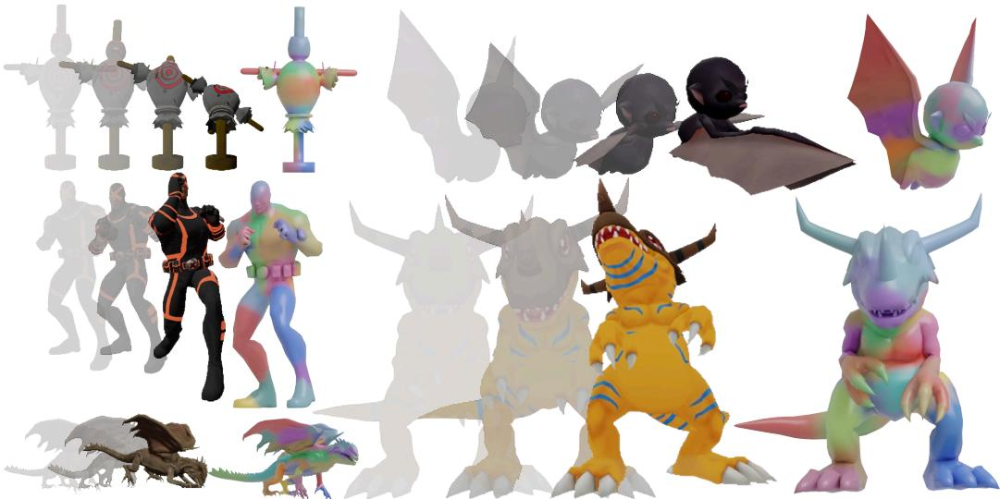
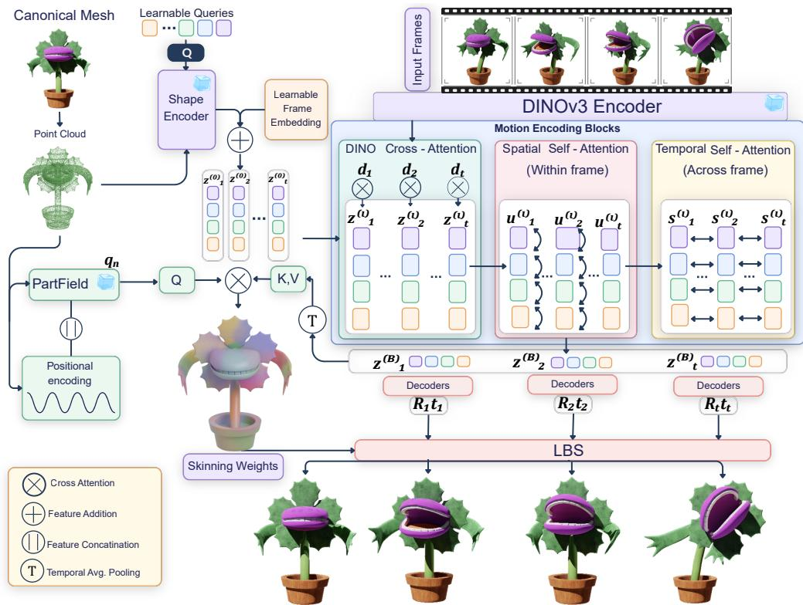
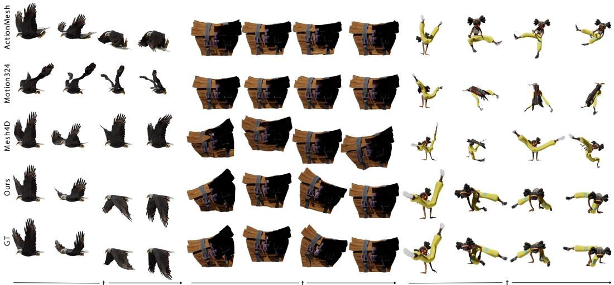
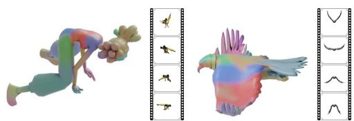
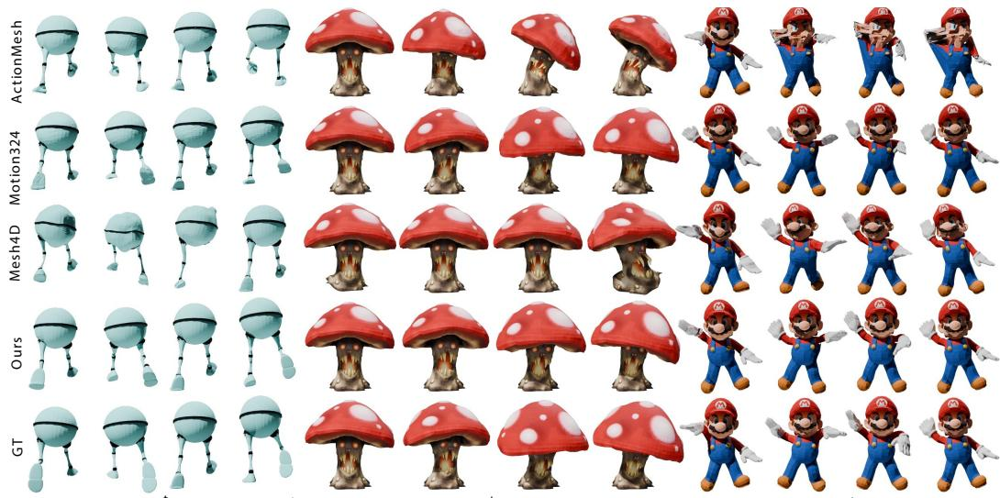
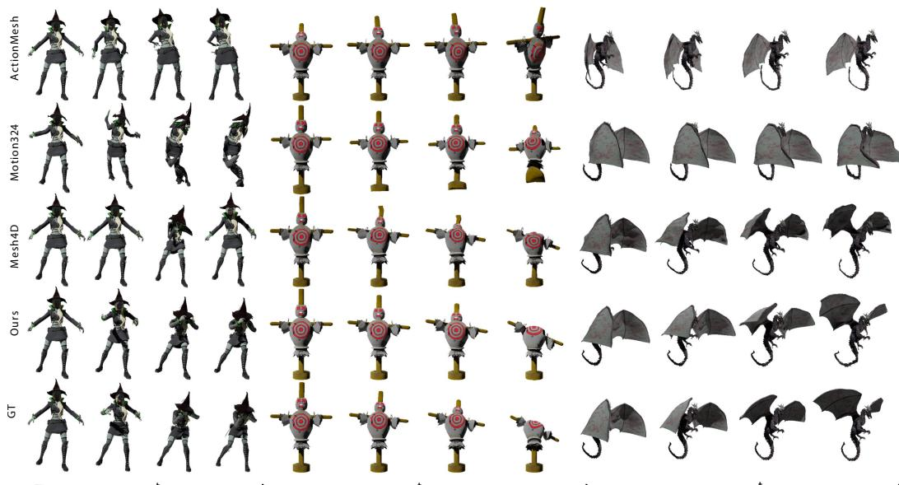
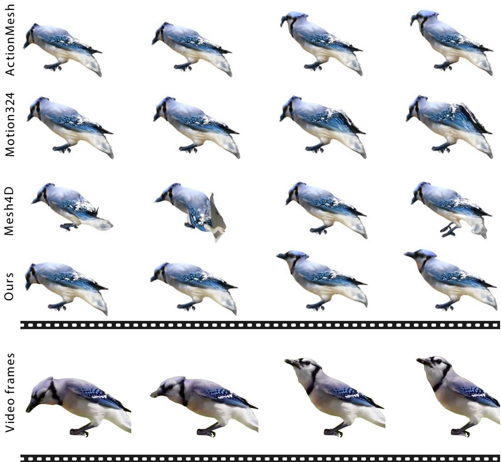
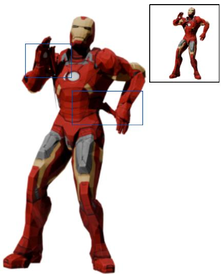
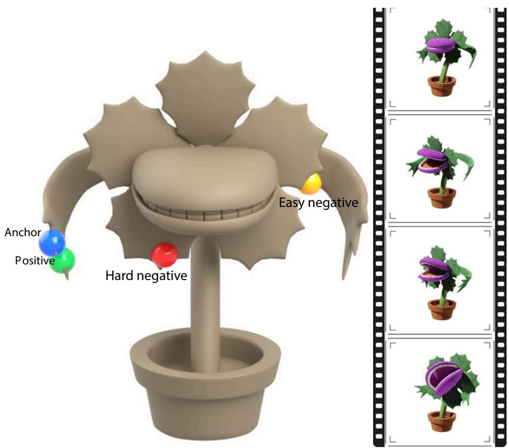

# BLARM: Animating 3D Objects from Video via Blending LAtent Rigid Motion Primitives

Pradyumn Goyal1,2∗ Yizhak Ben-Shabat1 Hsueh-Ti Derek Liu1 Haomiao Jiang1 Snehasish Mukherjee1 Kyle Spence1 Mark Stauber1 Evangelos Kalogerakis2,3 Yunze Zeng1†

1Roblox 2UMass Amherst 3TU Crete

BLARM animates static 3D meshes from monocular videos using compact, time-varying latent rigid motions and time-invariant vertex-to-component skinning weights, visualized right of the textured animations. Our representation produces temporally coherent, rig-free mesh animations across diverse objects.

## Abstract

We introduce BLARM, a feed-forward method for video-driven 3D mesh animation. Given a monocular video and a static object mesh, BLARM predicts a temporally coherent animated mesh whose motion follows the video. Rather than relying on explicit rigs or directly regressing high-dimensional vertex motion, we represent animation using a compact set of learned, time-varying rigid motion components and time-invariant vertex-to-component skinning weights. This yields a low-dimensional deformation space without requiring skeletons, cages, skinning weights, or rig annotations. Our architecture conditions geometry-derived deformation latents on video features through factorized spatial-temporal attention, then decodes rigid transformations blended by predicted skinning weights. Trained with trajectory reconstruction, entropy regularization, and motion-aware contrastive learning, BLARM produces accurate and temporally stable animations while recovering compact, interpretable motion structure from monocular video.

## 1 Introduction

Creating dynamic 4D assets is central to graphics, vision, and digital content creation. While recent generative models produce high-quality static 3D objects, animation remains challenging:

the representation must preserve geometry and appearance while being temporally coherent and remaining easy to edit and use. Meshes remain a dominant representation in graphics pipelines because they are compact, editable, and broadly supported by tools for rendering, simulation, and animation. Traditional mesh animation systems rely on structured deformation models such as skeletons and cages [Magnenat-Thalmann et al., 1988, Lewis et al., 2000, Ju et al., 2005]. These representations provide low-dimensional control over high-resolution geometry: instead of moving every vertex independently, animators control a small set of handles whose motions are blended across the mesh. This subspace view of animation is powerful because many object motions are intrinsically low-dimensional, with large groups of vertices moving coherently as deformable parts.

Driving these compact representations, however, requires a source of motion. Monocular video is a natural and widely available choice: it captures rich dynamics and is far less laborious to obtain than hand-authored keyframes. One family of recent learning-based methods predicts rigs or deformation structures for 3D assets [Xu et al., 2020, Zhang et al., 2025b, Song et al., 2025b], but these structures are typically inferred primarily from geometry and may not adapt to the target motion observed in a particular video. As a result, they can fail to represent the sequence-specific deformations needed to match the observed motion. A separate line of work avoids explicit rigging and directly predicts vertex offsets or per-frame deformed meshes from video [Sabathier et al., 2026, Jiang et al., 2026, Chen et al., 2026b]. These approaches can model complex deformations without committing to a fixed kinematic template. However, operating directly in vertex space is high-dimensional and poorly aligned with standard animation workflows. We propose an intermediate representation that is more structured than vertex offsets, but more motion-adaptive than a fixed or geometry-only rig.

We introduce BLARM, a feed-forward framework for animating a mesh from a monocular video. The core idea is to represent motion using a compact set of learned, time-varying rigid motion components along with time-invariant vertex-to-component skinning weights. Each latent component is decoded into a rigid transformation over time, while each vertex learns how to blend the motion components. This yields a low-dimensional deformation space without requiring predefined skeletons, cages, or rig annotations during training or inference. To encourage meaningful decompositions, we train the model with trajectory reconstruction, entropy regularization for sparse per-vertex skinning, and a motion-aware contrastive objective that encourages vertices with similar motion to share similar skinning weights. Experiments show that BLARM improves geometric accuracy and temporal consistency compared to several animation baselines. We summarize our contributions as follows:

• We introduce a compact latent deformation representation in which learned time-varying motion components are blended by time-invariant vertex-to-component skinning weights. This provides a low-dimensional animation space without requiring explicit skeletons, cages, or rig annotations.

• We design a feed-forward transformer architecture that combines geometry-conditioned deformation latents with video features using factorized attention, capturing interactions among motion components within each frame and temporal consistency across frames.

• We introduce training losses that favor accurate trajectory reconstruction, sparse per-vertex skinning, and motion-consistent vertex-to-component assignments, yielding coherent mesh animations.

## 2 Related Work

4D asset generation. 4D generation extends 3D content creation to dynamic assets whose geometry, appearance, or motion evolves over time. Recent methods have explored a variety of dynamic representations, including Gaussian Splat models [Ren et al., 2023, Zeng et al., 2024, Ren et al., 2024, Zhang et al., 2025a, Li et al., 2024a] and dynamic mesh generation methods [Jiang et al., 2024, Wu et al., 2025, Chen et al., 2025, Yenphraphai et al., 2025]. Gaussian representations can produce compelling rendered videos, but they are less directly compatible with standard mesh-based animation and simulation, which remain attractive because they preserve explicit surfaces, vertex correspondences, and compatibility with existing graphics pipelines. We therefore focus on videodriven 4D mesh animation. We refer readers to Miao et al. [2025] for a survey of 4D generation.

Video-driven mesh animation. Recent methods animate meshes from video by predicting vertex displacements or per-frame deformed meshes in a feed-forward manner [Sabathier et al., 2026, Jiang et al., 2026, Chen et al., 2026b]. These methods are related to our setting because they take a video and a static mesh as input and output an animated mesh without requiring a predefined rig. Their strength is expressivity: by operating directly in vertex space, they can model complex deformations without committing to an explicit kinematic structure. However, direct vertex-space prediction is high-dimensional, difficult to interpret, and provides limited inductive bias for coherent part motion. In contrast, our method predicts a compact set of rigid transformations and time-invariant vertexto-component skinning weights. This intermediate representation constrains the deformation space while retaining the feed-forward, video-conditioned nature of these approaches. Other dynamic mesh methods generate a separate 3D shape for each frame, then rely on registration or post-processing to establish temporal correspondences [Chen et al., 2025, Yenphraphai et al., 2025]. Such pipelines produce per-frame geometry, but correspondence recovery is expensive and introduces temporal inconsistencies. Our method instead maintains a fixed mesh and animates it through predicted transformations and skinning weights, preserving vertex correspondences by construction.

Rigging. Classical animation pipelines use low-dimensional deformation primitives such as skeletons, bones, cages, handles, and skinning weights [Magnenat-Thalmann et al., 1988, Lewis et al., 2000, Jacobson et al., 2014, Ju et al., 2005, Joshi et al., 2007, Jacobson et al., 2011]. These methods exploit the observation that many mesh motions are locally coherent: groups of vertices move according to shared transformations rather than independent trajectories. Linear Blend Skinning (LBS) is widely used because it animates high-resolution meshes by blending a small set of rigid transformations, making the resulting representation compact, editable, and compatible with production tools. Learning-based rigging methods infer skeletons, joints, skinning weights, or deformation handles for static 3D assets [Xu et al., 2019, 2020, Zhang et al., 2025b, Song et al., 2025b, Liu et al., 2025a, Guo et al., 2025, Liu et al., 2021, Jakab et al., 2021, He et al., 2025]. These methods provide structured and reusable deformation spaces, but the inferred structure is driven by geometry or category-level priors alone. Thus it may poorly match to the specific motion observed in a target video, especially for generic objects whose functional articulation depends on both shape and motion. Our method differs by learning a motion-conditioned deformation representation: the latent rigid components and their transformations are inferred from the input video, while the skinning weights remain attached to the mesh. Several works also learn skeleton-free deformation representations for pose transfer and dynamic shape modeling from posed 3D meshes, mesh sequences, or vertex trajectories [Liao et al., 2022, Chen et al., 2023, Song et al., 2023, Han et al., 2024, Zhang et al., 2026]; in contrast, we infer the deformation representation directly from monocular video given a single static target mesh. Other works also model articulated objects by estimating part decompositions and mechanical joints, such as revolute or prismatic joints [Goyal et al., 2025]; see Liu et al. [2025b] for a survey. These approaches provide interpretable physical structure when the object can be explained as a rigid-body system with explicit joints, but often rely on assumptions about part segmentation, articulation type, or category-specific structure. Our formulation does not require discrete part annotations or a fixed joint model. Instead, it represents motion with a fixed-capacity set of learned rigid components that can approximate diverse articulated or deformable motions through blending.

Motion subspaces for dynamic meshes. Our work is also related to methods that reduce mesh animation to a lower-dimensional motion subspace. Prior work has parameterized motion using continuous deformation fields [Niemeyer et al., 2019, Xie et al., 2022], time-varying Jacobian fields [Aigerman et al., 2022], spatial deformation handles [Liu et al., 2021, Jakab et al., 2021, He et al., 2025], temporal bases such as splines [Wang et al., 2026], or subspace transformations predicted over time [Xu et al., 2022, Wu et al., 2023, Li et al., 2024b, Song et al., 2025a, Jiang et al., 2026, Chen et al., 2026a]. These methods demonstrate the value of compact motion representations for scalability and temporal regularity. However, many either rely on predefined deformation structures or optimize sequence-specific models. BLARM combines the advantages of subspace-based animation and video-conditioned feed-forward prediction. It learns a compact set of latent rigid motion components, predicts their time-varying transformations from video, and assigns vertices to those components with time-invariant skinning weights. The representation is adapted to the observed motion; unlike direct vertex-space methods, it remains compact and interpretable; and unlike explicit articulated-object models, it does not require skeletons, part labels, or predefined joint types.

## 3 Method

Overview. Given a monocular video depicting the motion of an articulated object, the goal of our method is to produce an animated 3D model whose motion is consistent with the video. We assume access to a canonical mesh of the object, optionally with texture, either provided or reconstructed from the first video frame using a state-of-the-art image-to-3D model. In experiments that evaluate animation independently of reconstruction quality, we use the ground-truth canonical mesh when available; otherwise, we use Trellis2 [Xiang et al., 2025]. We refer to this mesh as the canonical mesh, and denote its vertex positions by ${ \pmb X } = \{ { \pmb x } _ { n } \} _ { n = 1 } ^ { N _ { v } }$ , where $N _ { v }$ is the number of vertices. Our method then estimates a temporally coherent animation of this mesh, denoted by $\hat { X } _ { 1 : T } = \{ \hat { x } _ { t , n } \} _ { t = 1 , \eta } ^ { T , N _ { v } }$ n=1. The key idea of our method is to represent object motion using a compact set of time-varying 3D rigid motion components, together with a time-invariant assignment from vertices to those components. This factorization separates how the object moves from which parts of the object are affected by each motion. We first describe this motion representation, and then the test-time architecture (Figure 1) used to infer the rigid motion components and vertex-to-component assignments (Section 3.2). Finally, we describe our training procedure used to learn the model (Section 3.3).

  
Figure 1: Method overview. BLARM takes a canonical mesh and a monocular video as input and represents the animation using a compact set of latent rigid motion components. Geometry-aware latents are conditioned on frame-wise DINOv3 features to predict time-varying rigid transformations, while time-invariant vertex-to-component skinning weights are learned without explicit skinning supervision. The final animated sequence is obtained by blending the predicted transformations through linear blend skinning.

## 3.1 Motion Representation

Latent motion components. Classical animation systems often represent shape motion using a sparse set of deformation primitives, such as skeletal joints, bones, cage handles, or sparse simulation particles [Magnenat-Thalmann et al., 1988, Lewis et al., 2000, Joshi et al., 2007, Müller and Chentanez, 2011].

These representations are effective because many object motions are intrinsically low-dimensional: neighboring surface points often follow similar trajectories, and large articulated regions may share a rigid motion induced by a nearby joint or part. Predicting an independent trajectory for every mesh vertex would therefore be highly overparameterized and would make temporal consistency difficul to enforce.

We adopt the same principle, but replace hand-engineered deformation structures with learned latent motion components. This choice is important in our setting because the input is a monocular video and a canonical mesh; we assume no skeletons, cages, or rigging annotations are available for training. Moreover, the objects of interest may not conform to a human-designed kinematic template. Learned latents allow the model to infer a compact object-specific motion basis directly from geometry and video evidence, while still retaining the efficiency and flexibility of primitive-based animation models.

Specifically, for each frame $t ,$ the model predicts a set of J motion latents $\{ \boldsymbol { z } _ { t , i } \} _ { i = 1 } ^ { J }$ , each of which is decoded into a rigid transformation $( \bar { R } _ { t , i } , t _ { t , i } ) \in S E ( 3 )$ for $i = 1 , \dots , \bar { J } ,$ , where $ { R _ { t , i } } \in S O ( 3 )$ and $\pmb { t } _ { t , i } \in \mathbb { R } ^ { 3 }$ denote the rotation and translation associated with the i-th latent motion component at frame t. These transformations vary over time and define the motion basis used to animate the canonical mesh. We reserve the first component as a special “root” component for global object motion, while the remaining components represent local motion relative to the root frame.

Vertex-to-component weights. Our representation is inspired by skinning-based animation, where surface points inherit motion from a small number of joints or handles [Magnenat-Thalmann et al., 1988, Lewis et al., 2000]. For each canonical vertex ${ \mathbf { \mathcal { x } } } _ { n }$ , we predict a $\pmb { w } _ { n } = \bar { \{ { w _ { n , i } \} } } _ { i = 2 } ^ { J }$ over the nonroot latent motion components. The scalar $w _ { n , i }$ measures the association between vertex n and latent component i, determining how strongly the corresponding rigid transformation contributes to the motion of the vertex. These weights are predicted on the canonical mesh and remain fixed across time. Thus, the temporal variation of the animation is captured by the latent rigid transformations, while the spatial structure of the deformation is captured by the vertex-to-component assignments. Following standard properties desired of skinning weights [Lewis et al., 2000, Jacobson et al., 2011], we design the predicted skinning weights to be non-negative, normalized over the non-root components, sparse at the per-vertex level, and spatially coherent. Non-negativity and normalized blending are enforced by a softmax parameterization. Entropy regularization encourages each vertex to depend on a few latent motion components, avoiding dense mixtures of many transformations. Locality and motion-consistent grouping are encouraged by a contrastive learning objective (Section 3.3).

This factorization represents animation through time-varying latent rigid transformations describing how the object moves and time-invariant skinning weights describing where each component acts.

Blended motion. Given the latent rigid transformations and vertex-to-component weights, we animate the canonical mesh using linear blend skinning (LBS) [Magnenat-Thalmann et al., 1988, Lewis et al., 2000]. For each frame t and vertex ${ \pmb x } _ { n }$ , the predicted animated position is

$$
\hat { \pmb x } _ { t , n } = { \pmb R } _ { t , 1 } \left( \sum _ { i = 2 } ^ { J } w _ { n , i } \left( { \pmb R } _ { t , i } { \pmb x } _ { n } + { \pmb t } _ { t , i } \right) \right) + { \pmb t } _ { t , 1 } .\tag{1}
$$

The formulation blends the non-root transformations in the root-local frame and then applies the global root transformation. It is differentiable, and directly compatible with the predicted nonnegative normalized weights. It preserves the desired separation between time-varying motion and time-invariant structure: the transformations $( R _ { t , i } , t _ { t , i } )$ change across frames, while the weights ${ \pmb w } _ { n }$ remain attached to the canonical mesh. As a result, vertices with similar assignments undergo coherent motion over time, even though the latent components themselves are not tied to an explici skeleton or predefined rig. Note that we use LBS because it provides a minimal and widely used deformation model for blending rigid transformations. Other differentiable skinning formulations, such as dual quaternion skinning [Kavan et al., 2007, 2008], could also be used in place of Eq. (1). Our contribution is orthogonal to this choice: the central representation is the learned set of latent motion components and the time-invariant vertex-to-component assignment.

## 3.2 Architecture

We now describe the test-time architecture used to infer the motion representation introduced in Section 3.1. Given a monocular input video and the reconstructed canonical mesh, the network predicts two quantities: a sequence of time-varying latent rigid transformations and a set of timeinvariant vertex-to-component skinning weights. Geometry encoding. We first encode the canonical mesh into a compact set of geometry-conditioned deformation latents $\{ h _ { i } \} _ { i = 1 } ^ { J }$ , where J is much smaller than the number of mesh vertices $N _ { v }$ . These latents provide a low-dimensional shape representation from which the model will later infer the motion components. Following query-based shape encoders such as 3DShape2VecSet [Zhang et al., 2023], we uniformly sample N surface points from the input mesh together with their normals. The sampled points are processed by the frozen shape encoder of TripoSG [Li et al., 2025], producing dense geometric features $\{ g _ { k } \} _ { k = 1 } ^ { N }$ , where $\pmb { g } _ { k } \in \mathbb { R } ^ { D }$ . While these dense features preserve detailed geometric information, they are too numerous to use directly as motion components. We compress them into a smaller set of learned deformation latents. To this end, we introduce a fixed set of learnable queries $\{ q _ { i } \} _ { i = 1 } ^ { J }$ and let them attend to the dense geometric features through a stack of cross-attention blocks, following DETR’s query-based aggregation strategy [Carion et al., 2020]:

$$
\left\{ h _ { i } \right\} _ { i = 1 } ^ { J } = \mathrm { C r o s s A t t n } _ { \mathrm { g e o m } } \left( \left\{ q _ { i } \right\} _ { i = 1 } ^ { J } , \left\{ g _ { k } \right\} _ { k = 1 } ^ { N } \right) .\tag{2}
$$

The resulting representation $\{ h _ { i } \} _ { i = 1 } ^ { J }$ is a compact $J \times D$ set of geometry-aware deformation tokens. Intuitively, each token aggregates information from the canonical shape and acts as a candidate motion component before video conditioning. This compression encourages the subsequent motion encoder to reason over a small set of potential deformation regions rather than over all mesh vertices or sampled surface points.

Motion encoding. The geometry-conditioned deformation latents $\{ h _ { i } \} _ { i = 1 } ^ { J }$ encode the canonical shape, but they are not yet conditioned on the motion observed in the input video. We therefore introduce a stack of motion encoding blocks designed to transform these shape-dependent latents into time-varying motion latents. Each block consists of three operations: cross-attention to per-frame DINOv3 features [Siméoni et al., 2025], spatial self-attention across deformation latents within each frame, and temporal self-attention along the video sequence.

Temporal broadcasting of deformation latents. We first broadcast the deformation latents across time $z _ { t , i } ^ { ( 0 ) } = h _ { i } , t = 1 , . . . , T , i = 1 , . . . , J$ forming an initial tensor $Z ^ { ( 0 ) } ~ \in ~ \mathbb { R } ^ { T \times J \times D }$ . Since the latent index i is shared across frames, this broadcasting step allows each deformation latent to specialize to a consistent candidate motion region, while its state varies over time according to the video evidence. To encode frame identity, we add a learnable temporal embedding ${ \pmb \theta } _ { t } \in \mathbb { R } ^ { \breve { D } }$ to all deformation latents at frame $t \colon z _ { t , i } ^ { ( 0 ) } \gets z _ { t , i } ^ { ( 0 ) } + \pmb { \theta } _ { t } = \pmb { h } _ { i } + \pmb { \theta } _ { t }$ . The resulting tensor is used as input to our motion encoder.

Spatiotemporal encoding of visual tokens. Let $\{ d _ { t , k } \} _ { k = 1 } ^ { K }$ denote the DINOv3 patch tokens extracted from frame t. Because the same local image appearance may occur at different locations or times, we augment these tokens with a spatiotemporal positional encoding. For each patch index k in frame t, we compute $\boldsymbol { e } _ { t , k } = f _ { \mathrm { p o s } } ( t , k ) \in \mathbb { R } ^ { D }$ , and define $\tilde { d } _ { t , k } = d _ { t , k } + e _ { t , k }$ . These position-augmented visual tokens will be used to provide frame-specific evidence to the deformation latents.

Motion encoder block. Each motion encoding block refines the latent tensor through factorized visual, spatial, and temporal attention:

$$
\begin{array} { r } { \boldsymbol Z ^ { ( \ell ) } = \mathcal T ^ { ( \ell ) } \left( \mathcal S ^ { ( \ell ) } \left( \mathcal D ^ { ( \ell ) } \left( \boldsymbol Z ^ { ( \ell - 1 ) } , \tilde { \boldsymbol D } \right) \right) \right) , \qquad \ell = 1 , \dots , B , } \end{array}\tag{3}
$$

where $\mathcal { D } ^ { ( \ell ) }$ denotes cross-attention with $\mathrm { D I N O v } 3 , S ^ { ( \ell ) }$ denotes spatial self-attention, and $\tau ^ { \left( \ell \right) }$ denotes temporal self-attention, and ℓ indexes the motion encoding block. Specifically, within each block, we first condition the deformation latents on the frame-wise visual features to inject frame-specific visual evidence into them. For each frame $t ,$ the latents attend to the DINOv3 tokens extracted from the same frame:

$$
\begin{array} { r } { \{ \pmb { u } _ { t , i } ^ { ( \ell ) } \} _ { i = 1 } ^ { J } = \mathrm { C r o s s A t t n } _ { \mathrm { D I N O } } \left( \{ \pmb { z } _ { t , i } ^ { ( \ell - 1 ) } \} _ { i = 1 } ^ { J } , \{ \tilde { d } _ { t , k } \} _ { k = 1 } ^ { K } \right) . } \end{array}\tag{4}
$$

Although each latent maintains a persistent identity over time, object motion often involves dependencies between parts, e.g., the motion of one articulated component may constrain or co-vary with the motion of another. We therefore apply self-attention across the deformation latents within each frame to reason about interactions among candidate motion components while keeping computation restricted to the compact latent set:

$$
\begin{array} { r } { \{ s _ { t , i } ^ { ( \ell ) } \} _ { i = 1 } ^ { J } = \mathrm { S e l f A t t n } _ { \mathrm { s p a t i a l } } \left( \{ u _ { t , i } ^ { ( \ell ) } \} _ { i = 1 } ^ { J } \right) . } \end{array}\tag{5}
$$

Temporal self-attention. Finally, we model the evolution of each latent component over time. Since the same latent index i corresponds to the same candidate deformation component throughout the sequence, we apply temporal self-attention independently for each latent to aggregate information across frames and encourage temporally coherent motion estimates for each latent component:

$$
\begin{array} { r } { \{ \boldsymbol { z } _ { t , i } ^ { ( \ell ) } \} _ { t = 1 } ^ { T } = \mathrm { S e l f A t t n } _ { \mathrm { t e m p o r a l } } \left( \{ \boldsymbol { s } _ { t , i } ^ { ( \ell ) } \} _ { t = 1 } ^ { T } \right) , \qquad i = 1 , \dots , J . } \end{array}\tag{6}
$$

Complexity Analysis. Note that compared with full self-attention over all $T J$ spatiotemporal tokens, which scales as $\check { \mathcal { O } } ( ( T J ) ^ { 2 } )$ , the factorized spatial–temporal attention used in our motion encoder scales as $\mathcal { O } ( T J ^ { 2 } ) \dot { + } \mathcal { O } ( \overset { . } { J } \dot { T } ^ { 2 } )$ . This makes the motion encoder more efficient while preserving the two interactions needed for animation: coordination among motion components within a frame and temporal consistency of each component across frames. We report run time in Table 6 in the Appendix.

Rigid transformation decoding. The output of the motion encoder, ${ \cal Z } ^ { ( B ) } = \{ z _ { t . i } ^ { ( B ) } \}$ , contains one motion-aware latent for each frame t and each latent component i. We decode each latent into a rigid transformation that will be used by the skinning model to animate the canonical mesh. Specifically, each motion latent $\boldsymbol { z } _ { t , i } ^ { ( B ) }$ is passed to two lightweight MLP heads. The first head predicts a 6D continuous rotation representation [Zhou et al., 2019]: $r _ { t , i } = f _ { \mathrm { r o t } } \left( z _ { t , i } ^ { ( B ) } \right) \in \mathbb { R } ^ { 6 }$ . We convert this representation into a valid rotation matrix using the Gram–Schmidt orthogonalization procedure of Zhou et al. [2019]: $\pmb { R } _ { t , i } = \mathrm { G S } \left( \pmb { r } _ { t , i } \right) \in S O ( 3 )$ . The second head predicts the translation component: $\pmb { t } _ { t , i } = f _ { \mathrm { t r a n s } } \left( \pmb { z } _ { t , i } ^ { ( B ) } \right) \in \mathbb { R } ^ { 3 }$ . Together, $( R _ { t , i } , t _ { t , i } )$ define the rigid motion associated with latent component i at frame t. These decoded transformations are subsequently blended using the predicted skinning weights to produce the animated mesh.

Skinning weight prediction. For each canonical vertex ${ \mathbf { \mathcal { x } } } _ { n } .$ , our model predicts skinning weights only over the non-root components, i.e., $\pmb { w } _ { n } = \{ w _ { n , i } \} _ { i = 2 } ^ { J } ,$ , with $w _ { n , i } \geq 0$ and $\textstyle \sum _ { i = 2 } ^ { J } w _ { n , i } = 1$ . For each canonical vertex ${ \pmb x } _ { n }$ with normal $^ { n _ { n } , }$ we first compute a geometric descriptor using a sinusoidal encoding followed by an MLP: ${ \pmb p } _ { n } = f _ { \mathrm { p t } } \left( \gamma ( { \pmb x } _ { n } , { \pmb n } _ { n } ) \right)$ , where $\gamma ( \cdot )$ denotes the positional encoding of vertex coordinates and normals. Since semantic part structure is often correlated with kinematic structure, we additionally use a frozen PartField encoder [Liu et al., 2025c] to extract a semantic feature $s _ { n }$ for each vertex. We note that PartField is used solely to extract frozen semantic features; we do not use any discrete part labels or segmentations derived from its features. We concatenate the geometric and semantic descriptors to obtain ${ \pmb q } _ { n } = [ { \pmb p } _ { n } , { \pmb s } _ { n } ]$ . The skinning weights are defined on the canonical mesh and remain fixed, so we summarize each motion component across the video by temporal average pooling, $\bar { z } _ { i } = \frac { 1 } { T } \sum _ { t = 1 } ^ { T } z _ { t , i } ^ { ( B ) } \mathrm { f o r } i = 1 , \dots , J .$

The vertex descriptors then attend to these time-aggregated latents:

$$
\left\{ { \pmb { c } } _ { n } \right\} _ { n = 1 } ^ { N _ { v } } = \mathrm { C r o s s A t t n } _ { \mathrm { s k i n } } \left( \left\{ { \pmb q } _ { n } \right\} _ { n = 1 } ^ { N _ { v } } , \left\{ \bar { z } _ { i } \right\} _ { i = 1 } ^ { J } \right) .\tag{7}
$$

A lightweight MLP head predicts non-root logits from $c _ { n }$ , which are normalized with a softmax to obtain the skinning weights ${ \pmb w } _ { n }$ . Note that the root component is excluded from logits regression because it is applied globally to all mesh vertices.

## 3.3 Training

We train BLARM using supervision from point trajectories. Given ground-truth animated vertex positions $\boldsymbol { \mathbf { \mathit { x } } } _ { t , n } ^ { * }$ , our objective combines three complementary terms: a trajectory reconstruction loss for accurate animation, an entropy regularizer for sparse per-vertex skinning, and a motion-aware contrastive loss for spatially coherent skinning weights. We ablate entropy and contrastive loss terms in Appendix $\mathbf { A } .$ Trajectory reconstruction loss. The primary training signal encourages the predicted animated mesh to match the observed point trajectories. We measure the reconstruction error between the predicted position $\hat { \pmb x } _ { t , n }$ from $\mathrm { E q . } ( 1 )$ and the ground-truth position $\boldsymbol { \mathbf { \mathit { x } } } _ { t , n } ^ { * } .$ A uniform point-wise loss, however, can be dominated by static or weakly moving regions. We therefore use a focal-style reweighting [Lin et al., 2017] that emphasizes points with larger motion error:

$$
\mathcal { L } _ { \mathrm { r e c } } = \frac { 1 } { T N _ { v } } \sum _ { t = 1 } ^ { T } \sum _ { n = 1 } ^ { N _ { v } } \omega _ { t , n } \left\| \hat { { \boldsymbol x } } _ { t , n } - { \boldsymbol x } _ { t , n } ^ { * } \right\| _ { 1 } , \qquad \omega _ { t , n } = \frac { \left\| \hat { { \boldsymbol x } } _ { t , n } - { \boldsymbol x } _ { t , n } ^ { * } \right\| _ { 2 } } { \frac { 1 } { N _ { v } } \sum _ { m = 1 } ^ { N _ { v } } \left\| \hat { { \boldsymbol x } } _ { t , m } - { \boldsymbol x } _ { t , m } ^ { * } \right\| _ { 2 } + \epsilon } .\tag{8}
$$

This weighting encourages the model to explain articulated and deforming regions rather than minimizing the loss primarily through static parts of the mesh. Entropy regularization. Reconstruction

alone does not prevent a vertex from blending many latent transformations, so we regularize the predicted non-root skinning weights with an entropy penalty to encourage traditional rigging-like behavior, where each vertex is influenced by few bones:

$$
\mathcal { L } _ { \mathrm { e n t } } = - \frac { 1 } { N _ { v } } \sum _ { n = 1 } ^ { N _ { v } } \sum _ { i = 2 } ^ { J } w _ { n , i } \log ( w _ { n , i } + \epsilon ) .\tag{9}
$$

Motion-aware contrastive loss. While entropy promotes sparse per-vertex assignments, it does not by itself enforce spatial or kinematic coherence. We therefore add a contrastive loss that encourages vertices with similar motion to have similar skinning weights, and vertices with dissimilar motion to have distinct weights. We construct positive and negative pairs from ground-truth point trajectories. For each vertex, we compute a compact trajectory descriptor $\mathbf { \Delta } m _ { t , n }$ encoding translational direction, rotational direction, motion magnitude, and a static-point indicator. We then define motion similarity between vertices by averaging cosine similarity over time: $\begin{array} { r } { s _ { n , m } ^ { \mathrm { m o t } } = \frac { 1 } { T } \sum _ { t = 1 } ^ { T } \langle m _ { t , n } , m _ { t , m } \rangle } \end{array}$ . For an anchor vertex a, positives are sampled from vertices with high motion similarity, while negatives are sampled from vertices with low motion similarity. We additionally bias positive sampling toward nearby canonical vertices and include both spatially distant easy negatives and nearby hard negatives. Details of the trajectory descriptor and sampling procedure are provided in Appendix D. The contrastive loss is applied to the predicted non-root skinning weights. Given two vertices u and v, we measure similarity between their skinning weights using the Bhattacharyya coefficient: $\begin{array} { r } { s _ { u , v } ^ { \mathrm { s k i n } } = \sum _ { i = 2 } ^ { J } \sqrt { w _ { u , i } w _ { v , i } } } \end{array}$ . For an anchor a, a positive $b ,$ and sampled negatives ${ \mathcal { N } } ( a )$ , we use an InfoNCE-style objective:

$$
\mathcal { L } _ { \mathrm { c o n } } = - \frac { 1 } { 2 } \Bigg [ \log \frac { \exp ( s _ { a , b } ^ { \mathrm { s k i n } } / \tau ) } { \exp ( s _ { a , b } ^ { \mathrm { s k i n } } / \tau ) + \sum _ { c \in N ( a ) } \exp ( s _ { a , c } ^ { \mathrm { s k i n } } / \tau ) } + \log \frac { \exp ( s _ { b , a } ^ { \mathrm { s k i n } } / \tau ) } { \exp ( s _ { b , a } ^ { \mathrm { s k i n } } / \tau ) + \sum _ { c \in N ( b ) } \exp ( s _ { b , c } ^ { \mathrm { s k i n } } / \tau ) } \Bigg ]\tag{10}
$$

Here, τ is a temperature parameter. This objective encourages motion-consistent vertices to share similar vertex-to-component assignments while separating vertices that follow different motions. Final objective. The full training objective is

$$
\mathcal { L } = \lambda _ { \mathrm { r e c } } \mathcal { L } _ { \mathrm { r e c } } + \lambda _ { \mathrm { e n t } } \mathcal { L } _ { \mathrm { e n t } } + \lambda _ { \mathrm { c o n } } \mathcal { L } _ { \mathrm { c o n } } .\tag{11}
$$

In our implementation, we set $\lambda _ { \mathrm { r e c } } = 3 , \lambda _ { \mathrm { e n t } } = 0 . 0 0 1$ , and $\lambda _ { \mathrm { c o n } } = 0 . 3$ . Implementation details.   
More details on the architecture and training are provided in Appendix C.

## 4 Experiments

We now discuss our training and evaluation protocol, along with comparisons, results, and ablations.

Training dataset. We train on animated object sequences from the Objaverse-1.0 split curated by Liang et al. [2024]. We remove all objects and sequences that appear in our evaluation sets, resulting in approximately 10k shapes. For each sequence, we compute a canonical normalization transform from the first frame by scaling the object to fit inside a unit bounding box, and apply the same transform to all subsequent frames to preserve temporal consistency. We render each normalized sequence as a monocular video at resolution $5 1 \bar { 2 } \times 5 1 2$ , with uniform sampling of camera view points. The resulting canonical and animated mesh sequences, and rendered videos form our training data. Test datasets. We first evaluate on ActionBench [Sabathier et al., 2026] and Motion80 [Chen et al., 2026b], two benchmarks with textured canonical meshes and ground-truth mesh animations. ActionBench contains 128 16-frame sequences, while Motion80 contains 80 variable-length sequences. On both datasets, we evaluate geometric accuracy directly on the predicted mesh motion and appearance quality using rendered videos. Additional dataset details are provided in the Appendix B.2. We also report qualitative and quantitative results on the in-the-wild split of Consistent4D [Jiang et al., 2023], where canonical meshes are not provided. In this setting, we reconstruct the canonical textured mesh using an off-the-shelf image-to-3D model [Xiang et al., 2025], and then apply our animation model to the reconstructed mesh.

Baselines. We compare against three feed-forward mesh animation baselines: Action-Mesh [Sabathier et al., 2026], Mesh4D [Jiang et al., 2026], and Motion3-to-4 [Chen et al., 2026b]. These are the most direct comparisons for our setting because they take a video and a canonical mesh as input and predict an animated mesh without requiring a predefined rig. Unlike these methods, which directly regress vertex displacements or deformed vertex positions, BLARM predicts a compact set of root-relative rigid transformations and blends them with time-invariant skinning weights. This representation constrains the deformation space while remaining feed-forward and rig-free. Evaluation metrics. For geometric evaluation on ActionBench [Sabathier et al., 2026] and Motion80 [Chen et al., 2026b], we follow the ActionMesh protocol and report three complementary metrics CD-3D, CD-4D, CD-Motion; we refer readers to Sabathier et al. [2026] for implementation details. We also evaluate rendered appearance. We report LPIPS, CLIP similarity, FVD, and DreamSim, capturing complementary aspects of perceptual fidelity, semantic consistency, and temporal realism. We refer readers to Appendix B.1 for additional details.

Figure 2: Qualitative comparison on ActionBench. Across diverse shapes, BLARM preserves the canonical mesh structure better than baselines and yields temporally more coherent animations with fewer jittering or distorted parts.
<table><tr><td rowspan="2">Method</td><td colspan="3">Geometry</td><td colspan="4">Appearance</td></tr><tr><td>CD-3D↓</td><td>CD-4D↓</td><td>CD-Motion↓</td><td>LPIPS↓</td><td>CLIP↑</td><td>FVD↓</td><td>DreamSim↓</td></tr><tr><td>Mesh4D</td><td>2.57</td><td>5.01</td><td>9.24</td><td>0.06</td><td>0.95</td><td>787.38</td><td>0.08</td></tr><tr><td>Motion3-to-4</td><td>2.49</td><td>5.34</td><td>10.31</td><td>0.07</td><td>0.92</td><td>1270.80</td><td>0.12</td></tr><tr><td>ActionMesh</td><td>3.30</td><td>5.61</td><td>11.12</td><td>0.08</td><td>0.93</td><td>1126.90</td><td>0.11</td></tr><tr><td>Ours</td><td>1.71</td><td>3.07</td><td>7.15</td><td>0.05</td><td>0.96</td><td>426.72</td><td>0.05</td></tr></table>

Table 1: Quantitative evaluation on ActionBench. BLARM outperforms feed-forward mesh animation baselines across geometric and appearance based metrics, indicating more accurate and temporally stable mesh animation.
<table><tr><td rowspan="2">Method</td><td colspan="3">Geometry</td><td colspan="4">Appearance</td></tr><tr><td>CD-3D↓</td><td>CD-4D↓</td><td>CD-Motion↓</td><td>LPIPS↓</td><td>CLIP↑</td><td>FVD↓</td><td>DreamSim↓</td></tr><tr><td>Mesh4D</td><td>5.40</td><td>11.13</td><td>24.26</td><td>0.11</td><td>0.93</td><td>1517.45</td><td>0.11</td></tr><tr><td>Motion3-to-4</td><td>2.25</td><td>5.89</td><td>13.00</td><td>0.07</td><td>0.95</td><td>735.57</td><td>0.06</td></tr><tr><td>ActionMesh</td><td>2.44</td><td>5.48</td><td>12.78</td><td>0.08</td><td>0.94</td><td>791.80</td><td>0.08</td></tr><tr><td>Ours</td><td>1.93</td><td>3.46</td><td>8.72</td><td>0.06</td><td>0.97</td><td>482.50</td><td>0.05</td></tr></table>

Table 2: Quantitative evaluation on Motion80. BLARM achieves better performance across metrics, demonstrating accurate reconstruction and temporally consistent mesh motion on long animation sequences.

Quantitative results. Tables 1 and 2 report quantitative results on ActionBench and Motion80. We report results for Consistent4D in Appendix B.3. BLARM achieves the best performance on average on all three benchmarks. Lower CD-3D and CD-4D show that our predictions better match the target mesh sequence under frame level alignment, while the larger CD-M improvement reflects more stable, temporally consistent mesh motion. BLARM also improves appearance-based metrics, achieving the best LPIPS, CLIP similarity, FVD, and DreamSim scores on both datasets. The gain in FVD is particularly important because it is sensitive to temporal artifacts in rendered videos.

These results suggest that the proposed root-relative rigid components and time-invariant skinning weights improve not only geometric alignment, but also the visual stability of rendered animations.

Qualitative results. Figure 2 shows qualitative comparisons on ActionBench. We refer readers to Appendix B.3 for qualitative results on Motion80. Baseline methods often produce plausible shapes in individual frames, but can exhibit temporal jitter, part distortion, or inconsistent deformation over time. In contrast, BLARM better preserves the structure of the canonical mesh while producing stable motion across the sequence. Figure 3 visualizes the predicted skinning weights by assigning each latent component a distinct color and coloring vertices according to their vertex-tocomponent assignments. The resulting maps often

  
Figure 3: Predicted skinning weights. Learned vertex-to-component assignments align with coherent moving regions, showing that BLARM discovers structured, part-aware decompositions without rig or skinning supervision.

align with coherent moving regions, such as bending shoe parts and feather groups. Although these components are learned without explicit rig supervision, the visualizations suggest that the model often discovers structured, part-aware decompositions that support temporally coherent mesh animation.

## 5 Discussion and Limitations

Our results suggest that representing vertex motion through a compact subspace of learned rigid transformations provides an effective structure for generating geometrically plausible and temporally coherent animations. Limitations. First, the learned skinning weights may be suboptimal in challenging cases, causing nearby or visually similar regions to receive incorrect vertex-to-component assignments resulting in less coherent animation. Second, our approach assumes that the input canonical mesh has a topology that can reasonably support the target motion. When this assumption is violated, the predicted deformation may produce artifacts. We also refer readers to Appendix B.4.

## Acknowledgements

This project has received funding from the European Research Council (ERC) under the Horizon Research and Innovation Programme (Grant agreement No. 101124742).

## References

Noam Aigerman, Kunal Gupta, Vladimir G Kim, Siddhartha Chaudhuri, Jun Saito, and Thibault Groueix. Neural jacobian fields: Learning intrinsic mappings of arbitrary meshes. arXiv preprint arXiv:2205.02904, 2022.

Nicolas Carion, Francisco Massa, Gabriel Synnaeve, Nicolas Usunier, Alexander Kirillov, and Sergey Zagoruyko. End-to-end object detection with transformers. In European conference on computer vision, pages 213–229. Springer, 2020.

Honglin Chen, Karran Pandey, Rundi Wu, Matheus Gadelha, Yannick Hold-Geoffroy, Ayush Tewari, Niloy J Mitra, Changxi Zheng, and Paul Guerrero. Vips: Video-informed pose spaces for autorigged meshes. arXiv preprint arXiv:2604.17623, 2026a.

Hongyuan Chen, Xingyu Chen, Youjia Zhang, Zexiang Xu, and Anpei Chen. Motion 3-to-4: 3d motion reconstruction for 4d synthesis. arXiv preprint arXiv:2601.14253, 2026b.

Jianqi Chen, Biao Zhang, Xiangjun Tang, and Peter Wonka. V2m4: 4d mesh animation reconstruction from a single monocular video. In Proceedings of the IEEE/CVF International Conference on Computer Vision (ICCV), pages 11643–11653, October 2025.

Jinnan Chen, Chen Li, and Gim Hee Lee. Weakly-supervised 3d pose transfer with keypoints. In 2023 IEEE/CVF International Conference on Computer Vision (ICCV), pages 15110–15119. IEEE, 2023.

Matt Deitke, Dustin Schwenk, Jordi Salvador, Luca Weihs, Oscar Michel, Eli VanderBilt, Ludwig Schmidt, Kiana Ehsani, Aniruddha Kembhavi, and Ali Farhadi. Objaverse: A universe of annotated 3d objects. In CVPR, 2023.

Pradyumn Goyal, Dmitry Petrov, Sheldon Andrews, Yizhak Ben-Shabat, Hsueh-Ti Derek Liu, and Evangelos Kalogerakis. Geopard: Geometric pretraining for articulation prediction in 3d shapes. In Proceedings of the IEEE/CVF International Conference on Computer Vision, pages 9332–9341, 2025.

Zhiyang Guo, Jinxu Xiang, Kai Ma, Wengang Zhou, Houqiang Li, and Ran Zhang. Make-itanimatable: An efficient framework for authoring animation-ready 3d characters. In CVPR, 2025.

Gyojin Han, Jiwan Hur, Jaehyun Choi, and Junmo Kim. Learning neural deformation representation for 4d dynamic shape generation. In Computer Vision – ECCV 2024: 18th European Conference, Milan, Italy, September 29–October 4, 2024, Proceedings, Part LXXII, page 186–203, Berlin, Heidelberg, 2024. Springer-Verlag. ISBN 978-3-031-73219-5. doi: 10.1007/978-3-031-73220-1\_ 11. URL https://doi.org/10.1007/978-3-031-73220-1\_11.

Guangzhao He, Chen Geng, Shangzhe Wu, and Jiajun Wu. Category-agnostic neural object rigging. In Proceedings of the Computer Vision and Pattern Recognition Conference, pages 22078–22088, 2025.

Alec Jacobson, Ilya Baran, Jovan Popovic, and Olga Sorkine. Bounded biharmonic weights for´ real-time deformation. ACM Transactions on Graphics, 30(4):78, 2011.

Alec Jacobson, Zhigang Deng, Ladislav Kavan, and JP Lewis. Skinning: Real-time shape deformation. In ACM SIGGRAPH 2014 Courses, 2014.

Tomas Jakab, Richard Tucker, Ameesh Makadia, Jiajun Wu, Noah Snavely, and Angjoo Kanazawa. Keypointdeformer: Unsupervised 3d keypoint discovery for shape control. In Proceedings ofthe IEEE/CVF Conference on Computer Vision and Pattern Recognition, pages 12783–12792, 2021.

Yanqin Jiang, Li Zhang, Jin Gao, Weimin Hu, and Yao Yao. Consistent4d: Consistent 360 {\deg} dynamic object generation from monocular video. arXiv preprint arXiv:2311.02848, 2023.

Yanqin Jiang, Chaohui Yu, Chenjie Cao, Fan Wang, Weiming Hu, and Jin Gao. Animate3d: Animating any 3d model with multi-view video diffusion. NeurIPS, 2024.

Zeren Jiang, Chuanxia Zheng, Iro Laina, Diane Larlus, and Andrea Vedaldi. Mesh4d: 4d mesh reconstruction and tracking from monocular video. arXiv preprint arXiv:2601.05251, 2026.

Pushkar Joshi, Mark Meyer, Tony DeRose, Brian Green, and Tom Sanocki. Harmonic coordinates for character articulation. ACM Transactions on Graphics, 26(3):71, 2007.

Tao Ju, Scott Schaefer, and Joe Warren. Mean value coordinates for closed triangular meshes. ACM Transactions on Graphics, 24(3):561–566, 2005.

Ladislav Kavan, Steven Collins, Jiˇrí Žára, and Carol O’Sullivan. Skinning with dual quaternions. In Proceedings ofthe 2007 Symposium on Interactive 3D Graphics and Games, pages 39–46, 2007.

Ladislav Kavan, Steven Collins, Jiˇrí Žára, and Carol O’Sullivan. Geometric skinning with approximate dual quaternion blending. ACM Transactions on Graphics, 27(4):1–23, 2008.

J. P. Lewis, Matt Cordner, and Nickson Fong. Pose space deformation: A unified approach to shape interpolation and skeleton-driven deformation. In Proceedings ofSIGGRAPH, 2000.

Yangguang Li, Zi-Xin Zou, Zexiang Liu, Dehu Wang, Yuan Liang, Zhipeng Yu, Xingchao Liu, Yuan-Chen Guo, Ding Liang, Wanli Ouyang, et al. Triposg: High-fidelity 3d shape synthesis using large-scale rectified flow models. arXiv preprint arXiv:2502.06608, 2025.

Zhiqi Li, Yiming Chen, and Peidong Liu. Dreammesh4d: Video-to-4d generation with sparsecontrolled gaussian-mesh hybrid representation. NeurIPS, 2024a.

Zizhang Li, Dor Litvak, Ruining Li, Yunzhi Zhang, Tomas Jakab, Christian Rupprecht, Shangzhe Wu, Andrea Vedaldi, and Jiajun Wu. Learning the 3d fauna of the web. In CVPR, 2024b.

Hanwen Liang, Yuyang Yin, Dejia Xu, Hanxue Liang, Zhangyang Wang, Konstantinos N Plataniotis, Yao Zhao, and Yunchao Wei. Diffusion4d: Fast spatial-temporal consistent 4d generation via video diffusion models. arXiv preprint arXiv:2405.16645, 2024.

Zhouyingcheng Liao, Jimei Yang, Jun Saito, Gerard Pons-Moll, and Yang Zhou. Skeleton-free pose transfer for stylized 3d characters. In European Conference on Computer Vision, pages 640–656. Springer, 2022.

Tsung-Yi Lin, Priya Goyal, Ross Girshick, Kaiming He, and Piotr Dollár. Focal loss for dense object detection. In Proceedings ofthe IEEE international conference on computer vision, pages 2980–2988, 2017.

Isabella Liu, Zhan Xu, Wang Yifan, Hao Tan, Zexiang Xu, Xiaolong Wang, Hao Su, and Zifan Shi. Riganything: Template-free autoregressive rigging for diverse 3d assets. ACM TOG, 2025a.

Jiayi Liu, Manolis Savva, and Ali Mahdavi-Amiri. Survey on modeling of human-made articulated objects. In Computer Graphics Forum, volume 44, page e70092. Wiley Online Library, 2025b.

Minghua Liu, Minhyuk Sung, Radomir Mech, and Hao Su. Deepmetahandles: Learning deformation meta-handles of 3d meshes with biharmonic coordinates. In Proceedings of the IEEE/CVF Conference on Computer Vision and Pattern Recognition, pages 12–21, 2021.

Minghua Liu, Mikaela Angelina Uy, Donglai Xiang, Hao Su, Sanja Fidler, Nicholas Sharp, and Jun Gao. Partfield: Learning 3d feature fields for part segmentation and beyond. In Proceedings ofthe IEEE/CVF International Conference on Computer Vision, pages 9704–9715, 2025c.

Nadia Magnenat-Thalmann, Richard Laperriere, and Daniel Thalmann. Joint-dependent local deformations for hand animation and object grasping. Proceedings on Graphics Interface, 1988.

Qiaowei Miao, Kehan Li, Jinsheng Quan, Zhiyuan Min, Shaojie Ma, Yichao Xu, Yi Yang, Ping Liu, and Yawei Luo. Advances in 4d generation: A survey. arXiv preprint arXiv:2503.14501, 2025.

Matthias Müller and Nuttapong Chentanez. Solid simulation with oriented particles. In ACM SIGGRAPH 2011 Papers, SIGGRAPH ’11, New York, NY, USA, 2011. Association for Computing Machinery. ISBN 9781450309431. doi: 10.1145/1964921.1964987. URL https://doi.org/ 10.1145/1964921.1964987.

Michael Niemeyer, Lars Mescheder, Michael Oechsle, and Andreas Geiger. Occupancy flow: 4d reconstruction by learning particle dynamics. In Proceedings of the IEEE/CVF international conference on computer vision, pages 5379–5389, 2019.

Jiawei Ren, Liang Pan, Jiaxiang Tang, Chi Zhang, Ang Cao, Gang Zeng, and Ziwei Liu. Dreamgaussian4d: Generative 4d gaussian splatting. arXiv preprint arXiv:2312.17142, 2023.

Jiawei Ren, Cheng Xie, Ashkan Mirzaei, Karsten Kreis, Ziwei Liu, Antonio Torralba, Sanja Fidler, Seung Wook Kim, Huan Ling, et al. L4gm: Large 4d gaussian reconstruction model. Advances in Neural Information Processing Systems, 37:56828–56858, 2024.

Remy Sabathier, David Novotny, Niloy J Mitra, and Tom Monnier. Actionmesh: Animated 3d mesh generation with temporal 3d diffusion. arXiv preprint arXiv:2601.16148, 2026.

Oriane Siméoni, Huy V. Vo, Maximilian Seitzer, Federico Baldassarre, Maxime Oquab, Cijo Jose, Vasil Khalidov, Marc Szafraniec, Seungeun Yi, Michaël Ramamonjisoa, et al. Dinov3. arXiv preprint arXiv:2508.10104, 2025.

Chaoyue Song, Jiacheng Wei, Ruibo Li, Fayao Liu, and Guosheng Lin. Unsupervised 3d pose transfer with cross consistency and dual reconstruction. IEEE Transactions on Pattern Analysis and Machine Intelligence, 45(8):10488–10499, 2023. doi: 10.1109/TPAMI.2023.3259059.

Chaoyue Song, Xiu Li, Fan Yang, Zhongcong Xu, Jiacheng Wei, Fayao Liu, Jiashi Feng, Guosheng Lin, and Jianfeng Zhang. Puppeteer: Rig and animate your 3d models. NeurIPS, 2025a.

Chaoyue Song, Jianfeng Zhang, Xiu Li, Fan Yang, Yiwen Chen, Zhongcong Xu, Jun Hao Liew, Xiaoyang Guo, Fayao Liu, Jiashi Feng, et al. Magicarticulate: Make your 3d models articulationready. In CVPR, 2025b.

Miaowei Wang, Qingxuan Yan, Zhi Cao, Yayuan Li, Oisin Mac Aodha, Jason J. Corso, and Amir Vaxman. Bimotion: B-spline motion for text-guided dynamic 3d character generation. CoRR, abs/2602.18873, 2026. doi: 10.48550/ARXIV.2602.18873. URL https://doi.org/10.48550/ arXiv.2602.18873.

Shangzhe Wu, Ruining Li, Tomas Jakab, Christian Rupprecht, and Andrea Vedaldi. Magicpony: Learning articulated 3d animals in the wild. In CVPR, 2023.

Zijie Wu, Chaohui Yu, Fan Wang, and Xiang Bai. Animateanymesh: A feed-forward 4d foundation model for text-driven universal mesh animation. In ICCV, 2025.

Jianfeng Xiang, Xiaoxue Chen, Sicheng Xu, Ruicheng Wang, Zelong Lv, Yu Deng, Hongyuan Zhu, Yue Dong, Hao Zhao, Nicholas Jing Yuan, and Jiaolong Yang. Native and compact structured latents for 3d generation. Tech report, 2025.

Yiheng Xie, Towaki Takikawa, Shunsuke Saito, Or Litany, Shiqin Yan, Numair Khan, Federico Tombari, James Tompkin, Vincent Sitzmann, and Srinath Sridhar. Neural fields in visual computing and beyond. In Computer graphicsforum, volume 41, pages 641–676. Wiley Online Library, 2022.

Zhan Xu, Yang Zhou, Evangelos Kalogerakis, and Karan Singh. Predicting animation skeletons for 3d articulated models via volumetric nets. In Proc. 3DV, 2019.

Zhan Xu, Yang Zhou, Evangelos Kalogerakis, Chris Landreth, and Karan Singh. Rignet: Neural rigging for articulated characters. ACM TOG, 2020.

Zhan Xu, , Yang Zhou, Li Yi, and Evangelos Kalogerakis. Morig: Motion-aware rigging of character meshes from point clouds. In Proc. ACM SIGGRAPH ASIA, 2022.

Jiraphon Yenphraphai, Ashkan Mirzaei, Jianqi Chen, Jiaxu Zou, Sergey Tulyakov, Raymond A Yeh, Peter Wonka, and Chaoyang Wang. Shapegen4d: Towards high quality 4d shape generation from videos. arXiv preprint arXiv:2510.06208, 2025.

Yifei Zeng, Yanqin Jiang, Siyu Zhu, Yuanxun Lu, Youtian Lin, Hao Zhu, Weiming Hu, Xun Cao, and Yao Yao. Stag4d: Spatial-temporal anchored generative 4d gaussians. In European Conference on Computer Vision, pages 163–179. Springer, 2024.

Biao Zhang, Jiapeng Tang, Matthias Niessner, and Peter Wonka. 3dshape2vecset: A 3d shape representation for neural fields and generative diffusion models. ACM TOG, 2023.

Bowen Zhang, Sicheng Xu, Chuxin Wang, Jiaolong Yang, Feng Zhao, Dong Chen, and Baining Guo. Gaussian variation field diffusion for high-fidelity video-to-4d synthesis. In ICCV, 2025a.

Hao Zhang, Jiahao Luo, Bohui Wan, Yizhou Zhao, Zongrui Li, Michael Vasilkovsky, Chaoyang Wang, Jian Wang, Narendra Ahuja, and Bing Zhou. Rigmo: Unifying rig and motion learning for generative animation. arXiv preprint arXiv:2601.06378, 2026.

Jia-Peng Zhang, Cheng-Feng Pu, Meng-Hao Guo, Yan-Pei Cao, and Shi-Min Hu. One model to rig them all: Diverse skeleton rigging with unirig. ACM TOG, 2025b.

Yi Zhou, Connelly Barnes, Jingwan Lu, Jimei Yang, and Hao Li. On the continuity of rotation representations in neural networks. In Proceedings of the IEEE/CVF Conference on Computer Vision and Pattern Recognition, pages 5745–5753, 2019.

<table><tr><td>Model</td><td>CD-3D↓</td><td>CD-4D↓</td><td>CD-M↓</td><td>Lat./Vtx.</td><td>Lat./Shape</td></tr><tr><td>w/o PartField, ent., con.</td><td>2.95</td><td>5.78</td><td>13.53</td><td>1.00</td><td>1.00</td></tr><tr><td>w/o contrastive</td><td>2.95</td><td>5.88</td><td>12.90</td><td>1.00</td><td>1.00</td></tr><tr><td>Per-vertex direct prediction</td><td>2.47</td><td>4.33</td><td>10.96</td><td></td><td></td></tr><tr><td>w/o PartField</td><td>2.37</td><td>4.07</td><td>10.51</td><td>1.85</td><td>22.20</td></tr><tr><td>w/o entropy</td><td>2.22</td><td>4.05</td><td>9.71</td><td>1.97</td><td>27.98</td></tr><tr><td>Control</td><td>2.22</td><td>4.04</td><td>9.48</td><td>1.59</td><td>25.52</td></tr><tr><td>Final model</td><td>1.71</td><td>3.07</td><td>7.15</td><td>1.71</td><td>29.50</td></tr></table>

Table 3: Ablation study on ActionBench. Each component of BLARM contributes to performance: PartField features, entropy regularization, and motion-aware contrastive learning improve motion accuracy and sparsity while encouraging compact latent usage.

## Appendix

In the appendix, we provide additional details and experimental results:

• Appendix A presents ablation studies that analyze the contribution of each component.

• Appendix B provides experimental details, including evaluation metrics, datasets, additional results, and limitations.

• Appendix C describes implementation details, including preprocessing, architecture, decoders, training, and inference.

• Appendix D details the motion-aware contrastive loss.

• Appendix E discusses the broader societal impact of the proposed method.

## A Ablations

Table 3 analyzes the contribution of the main components of BLARM on ActionBench. Lat./Vtx. denotes the average number of active non-root components assigned to each vertex, i.e. vertex-tolatent weights above 0.01, and Lat./Shape denotes the average number of active non-root components used per shape. Removing PartField features, entropy regularization, and contrastive learning substantially degrades performance, increasing CD-3D, CD-4D, and CD-M to 2.95, 5.78, and 13.53, respectively. In this setting, the model effectively collapses to using very few non-root latent components, as reflected by the latent-count statistics. Removing only the contrastive loss causes a similar collapse, indicating that motion-aware contrastive supervision is critical for encouraging different latent components to specialize to different moving regions. We further compare against a direct per-vertex offset prediction baseline that removes our latent rigid-motion formulation. While it improves over collapsed latent variants, it remains notably worse than the full model, particularly on CD-M, supporting the benefit of structured latent motion for temporally coherent deformation.

Adding PartField features improves motion fidelity, reducing CD-M from 12.90 to 10.51, suggesting that semantic vertex representations help align the learned components with meaningful object parts. Entropy regularization further improves performance by encouraging sparse and confident vertex-to-component assignments, reducing CD-M to 9.48 in the controlled setting. Finally, the full model achieves the best reconstruction and motion accuracy, with CD-3D, CD-4D, and CD-M of 1.71, 3.07, and 7.15. These results show that semantic vertex features, sparse skinning weights, and motion-aware contrastive learning are complementary: together they prevent latent collapse, encourage part-level decomposition, and improve temporally coherent mesh animation.

Number of motion primitives. We further analyze the effect of the number of non-root latent motion primitives J in Table 4. With J = 15, the limited deformation capacity leads to worse reconstruction and denser vertex-to-latent assignments. Increasing to J = 63 gives comparable performance to J = 31, but uses substantially more active latents per shape, while J = 127 further increases fragmentation and degrades performance. Overall, J = 31 provides a good balance between deformation capacity, sparsity, and representation compactness.

<table><tr><td>Model</td><td>CD-3D↓</td><td>CD-4D↓</td><td>CD-M↓</td><td>Lat./Vtx.</td><td>Lat./Shape</td></tr><tr><td>J = 15</td><td>2.53</td><td>4.49</td><td>11.42</td><td>2.63</td><td>14.64</td></tr><tr><td>J = 31</td><td>2.22</td><td>4.04</td><td>9.48</td><td>1.59</td><td>25.52</td></tr><tr><td>J = 63</td><td>2.38</td><td>4.20</td><td>9.44</td><td>1.22</td><td>42.01</td></tr><tr><td>J = 127</td><td>2.44</td><td>5.11</td><td>11.88</td><td>1.24</td><td>96.27</td></tr></table>

Table 4: Number of latent motion primitives. Too few primitives restrict deformation capacity, while too many lead to less compact representations without clear performance gains; J = 31 provides the best overall balance.

  
Figure 4: Qualitative comparison on Motion80. Compared to the baselines, BLARM better maintains part structure and produces more stable deformations across time, yielding animations that closely match the ground-truth motion.

## B Experiments

## B.1 Metrics

Geometric Metrics We here explain how each Geometric metric is calculated and refer readers to Sabathier et al. [2026] for implementation details. CD-3D measures per-frame reconstruction accuracy by aligning each predicted mesh to the corresponding ground-truth frame with ICP and computing Chamfer Distance. CD-4D evaluates sequence-level consistency by estimating a single global rigid alignment from the first frame and averaging Chamfer Distance over the full sequence. CD-Motion measures motion fidelity by evaluating whether point correspondences are preserved over time: after global ICP alignment, nearest-neighbor correspondences are computed in the first frame and the bidirectional correspondence error is accumulated throughout the sequence. All geometric metrics are computed using 100,000 uniformly sampled surface points, with meshes centered at the origin and normalized to a unit bounding box.

Appearance Metrics For each predicted textured mesh sequence, we render four evenly spaced viewpoints around the object. When ground-truth textured mesh sequences are available, for Action-Bench and Motion80, we render them from the same viewpoints and compare predicted and reference videos.

## B.2 Evaluation Datasets

We provide additional details on the evaluation datasets used in Sec. 4.

ActionBench. ActionBench [Sabathier et al., 2026] provides object identifiers for animated assets, and not the textured mesh. Since these identifiers are publicly available, we retrieve the corresponding object glbs from Objaverse [Deitke et al., 2023]. We render each animation for 16 frames, matching the frame count used by ActionBench. For all methods, we use the ground-truth mesh from the first frame as the canonical input mesh. Since all evaluated baselines predict vertex offsets on the input mesh, we preserve the original textures and use them when rendering predicted animations for appearance metrics and qualitative comparisons.

  
Figure 5: Additional qualitative results on ActionBench. We show additional comparisons with feed-forward mesh animation baselines.

Motion80. Motion80 [Chen et al., 2026b] provides animated meshes together with their textures. As in ActionBench, the first-frame mesh is used as the canonical input for all methods, and the provided texture is retained for rendering both predicted and ground-truth animated sequences.

Consistent4D. We additionally evaluate on the in-the-wild split of Consistent4D [Jiang et al., 2023], which contains 12 video sequences. Since this dataset does not provide ground-truth meshes, we reconstruct the first-frame shape and material using TRELLIS2 [Xiang et al., 2025] and provide the same reconstructed canonical mesh to all baselines.

Since ground-truth meshes and camera parameters are not available, we render the reconstructed animated mesh from four uniformly spaced viewpoints and report appearance metrics against the input video after averaging over the rendered views.

## B.3 Additional Results

Figure 5 and Figure 4 show qualitative results on ActionBench, and Motion80, respectively. BLARM produces more temporally stable animations while better preserving the geometrical structure. Compared to baselines, it reduces visible distortions and part entanglement, leading to motion that more closely follows the ground-truth sequence. On Consistent4D, our method obtains favorable LPIPS, FVD, and DreamSim scores while performing comparably on CLIP in Table 5. The qualitative results in Figure 6 suggest that our animation maintains the reconstructed canonical structure over time.

## B.4 Limitations

Figure 7 showcases our limitation. Our method can produce imperfect mesh animation, when nearby regions have similar visual appearance but should move independently. In such cases, incorrect vertex-to-component assignments may entangle adjacent parts, leading to suboptimal animation.

<table><tr><td>Method</td><td>LPIPS↓</td><td>CLIP↑</td><td>FVD↓</td><td>DreamSim↓</td></tr><tr><td>Mesh4D</td><td>0.16</td><td>0.84</td><td>2216.33</td><td>0.23</td></tr><tr><td>Motion3-to-4</td><td>0.18</td><td>0.74</td><td>1915.69</td><td>0.25</td></tr><tr><td>ActionMesh</td><td>0.18</td><td>0.85</td><td>1410.61</td><td>0.22</td></tr><tr><td>Ours</td><td>0.12</td><td>0.84</td><td>890.96</td><td>0.18</td></tr></table>

Table 5: Quantitative evaluation on Consistent4D. BLARM achieves the best LPIPS, FVD, and DreamSim scores among feed-forward mesh animation baselines, indicating improved visual fidelity and temporal consistency on in-the-wild sequences.

<table><tr><td>Model</td><td>Runtime</td></tr><tr><td>ActionMesh</td><td>350 s</td></tr><tr><td>Motion324</td><td>4.50 s</td></tr><tr><td>Mesh4D</td><td>55.33 s</td></tr><tr><td>Ours</td><td>3.13 s</td></tr></table>

Table 6: We report inference runtime across methods for 16 frame video on rtx 4080

## C Implementation Details

Preprocessing. We normalize each training sequence with respect to its first frame. The first-frame shape is centered and uniformly scaled so that the maximum side length of its bounding box is one, and the same transformation is applied to all subsequent frames. During training, we sample 10,000 surface points from the canonical mesh and use their coordinates and surface normals as input to the positional encoding. We use the frozen Triposg shape encoder.

Architecture. Our model uses 31 non-root latent motion components and one additional root component for global object motion. The hidden dimension is set to 512 throughout the network. For visual conditioning, we extract frame-wise features from a frozen DINOv3 backbone at 512 × 512 resolution. The motion encoder contains 16 blocks, each consisting of cross-attention to DINOv3 visual tokens, spatial self-attention across latent motion components within each frame, and temporal self-attention across frames for each latent component. We use an attention head dimension of 64 and a dropout rate of 0.05.

Decoders. Rigid transformations are predicted from the output motion latents using two-layer MLP decoders, with separate heads for rotation and translation. The softmax temperature for both skinning-weight prediction and the contrastive loss is set to 1.

Training. We train the model with supervision on point offsets. For each frame, the groundtruth position of each sampled point is computed by applying its barycentric coordinates to the corresponding mesh vertices provided by the training data. We optimize the model using Adam with a learning rate of $2 \times 1 0 ^ { - 3 }$ and apply gradient clipping. The model is trained for 1000 epochs, taking approximately 1.5 days on 8 NVIDIA H200 GPUs. The TripoSG encoder, PartField encoder, and DINOv3 backbone are kept frozen throughout training, and only the newly introduced modules are optimized.

Inference. At inference time, our model processes 16 frames at once. For longer videos, we apply the model autoregressively to obtain animations over the full sequence. The factorized attention design also yields the fastest runtime among the compared methods, as shown in Table 6.

## D Motion-aware Contrastive Loss

We describe the implementation of the motion-aware contrastive loss used in Sec. 3.3. The purpose of this loss is to encourage points with similar ground-truth motion trajectories to have similar predicted non-root skinning-weights.

  
Figure 6: Qualitative comparison on Consistent4D. With reconstructed meshes, BLARM yields stable animations that better match the input video.

## D.1 Trajectory Descriptor.

For each point trajectory $\{ \boldsymbol { x } _ { t , n } ^ { * } \} _ { t = 1 } ^ { T }$ , we construct a compact motion descriptor from local temporal triplets $( \pmb { x } _ { t - 1 , n } ^ { * } , \pmb { x } _ { t , n } ^ { * } , \pmb { x } _ { t + 1 , n } ^ { * } )$ . Let

$$
u _ { t , n } ^ { - } = \frac { x _ { t , n } ^ { * } - x _ { t - 1 , n } ^ { * } } { \| x _ { t , n } ^ { * } - x _ { t - 1 , n } ^ { * } \| _ { 2 } + \epsilon } , \qquad u _ { t , n } ^ { + } = \frac { x _ { t + 1 , n } ^ { * } - x _ { t , n } ^ { * } } { \| x _ { t + 1 , n } ^ { * } - x _ { t , n } ^ { * } \| _ { 2 } + \epsilon } .\tag{12}
$$

We define a rotation-axis direction and a translation direction as

$$
{ r _ { t , n } } = \frac { { { u _ { t , n } ^ { - } } \times { { u _ { t , n } ^ { + } } } } } { { \| { { u _ { t , n } ^ { - } } \times { { u _ { t , n } ^ { + } } } } \| _ { 2 } } + \epsilon } , \qquad { h _ { t , n } } = \frac { { { u _ { t , n } ^ { - } } + { u _ { t , n } ^ { + } } } } { { \| { { u _ { t , n } ^ { - } } + { u _ { t , n } ^ { + } } } \| _ { 2 } } + \epsilon } .\tag{13}
$$

To distinguish static points, we define $b _ { t , n } = I [ s _ { t , n } < \delta ]$ . The final per-frame motion descriptor is

$$
\begin{array} { r } { \pmb { m } _ { t , n } = [ ( 1 - b _ { t , n } ) \pmb { r } _ { t , n } , ( 1 - b _ { t , n } ) \pmb { h } _ { t , n } , b _ { t , n } ] \in \mathbb { R } ^ { 7 } . } \end{array}\tag{14}
$$

We normalize $\mathbf { \Delta } m _ { t , n }$ before computing pairwise similarities.

  
Figure 7: Limitations. Incorrect vertex-to-component assignments in visually similar regions can entangle nearby parts, producing less coherent motion.

## D.2 Motion-based Pair Mining.

For two points n and $m ,$ , we compute their trajectory similarity by averaging cosine similarity over time:

$$
s _ { n , m } ^ { \mathrm { m o t } } = \frac { 1 } { T } \sum _ { t = 1 } ^ { T } \langle m _ { t , n } , m _ { t , m } \rangle .\tag{15}
$$

For an anchor point a, positives and negatives are selected using fixed motion similarity thresholds:

$$
{ \mathcal { P } } ( a ) = \{ m \mid s _ { a , m } ^ { \mathrm { m o t } } > \theta _ { + } \} , \qquad { \mathcal { N } } ( a ) = \{ m \mid s _ { a , m } ^ { \mathrm { m o t } } < \theta _ { - } \} .\tag{16}
$$

We use $\theta _ { + } = 0 . 9$ and $\theta _ { - } = 0 . 5$ . These values are a strong threshold for positives and negatives.

Motion similarity determines the candidate positive and negative sets, while canonical-space distance determines the sampling probabilities. Let

$$
d _ { a , m } = \lVert \pmb { x } _ { 1 , a } ^ { * } - \pmb { x } _ { 1 , m } ^ { * } \rVert _ { 2 }\tag{17}
$$

be the distance between points in the canonical frame. Positives are sampled preferentially from nearby motion-consistent points:

$$
q _ { a , m } ^ { + } \propto I [ m \in \mathcal { P } ( a ) ] \frac { 1 } { d _ { a , m } } .\tag{18}
$$

Negatives are sampled from two groups. Easy negatives are spatially distant points with dissimilar motion,

$$
q _ { a , m } ^ { \mathrm { e a s y } } \propto I [ m \in \mathcal { N } ( a ) ] d _ { a , m } ,\tag{19}
$$

while hard negatives are nearby points with dissimilar motion,

$$
q _ { a , m } ^ { \mathrm { h a r d } } \propto I [ m \in \mathcal { N } ( a ) ] \frac { 1 } { d _ { a , m } } .\tag{20}
$$

An example of this sampling is shown in Figure 8. This sampling strategy encourages both global separation between unrelated motions and sharp local transitions between neighboring parts that move differently.

## D.3 Contrastive Objective.

The contrastive loss is applied to the predicted non-root skinning weights ${ \pmb w } _ { n } = \{ { w } _ { n , i } \} _ { i = 2 } ^ { J }$ . For two points u and $v ,$ we measure similarity between their predicted distributions using the Bhattacharyya

  
Figure 8: Contrastive triplet construction. For each anchor vertex, we sample positive vertices with similar motion and hard negatives from nearby vertices with dissimilar motion, along with easy negatives from distant regions. This encourages motion-consistent vertices to learn similar skinning weights while separating vertices with different motion.

coefficient:

$$
s _ { u , v } ^ { \mathrm { s k i n } } = \sum _ { i = 2 } ^ { J } \sqrt { w _ { u , i } w _ { v , i } } .\tag{21}
$$

Given an anchor $^ { a , }$ a sampled positive $b \in \mathcal { P } ( a )$ , and sampled negatives $\mathcal { N } _ { s } ( a )$ , we use the symmetric InfoNCE loss

$$
\begin{array} { c l } { \mathcal { L } _ { \mathrm { c o n } } = - \displaystyle \frac { 1 } { 2 } \Bigg [ \log \frac { \exp ( s _ { a , b } ^ { \mathrm { s k i n } } / \tau ) } { \exp ( s _ { a , b } ^ { \mathrm { s k i n } } / \tau ) + \sum _ { c \in \mathcal { N } _ { s } ( a ) } \exp ( s _ { a , c } ^ { \mathrm { s k i n } } / \tau ) } } \\ { + \log \frac { \exp ( s _ { b , a } ^ { \mathrm { s k i n } } / \tau ) } { \exp ( s _ { b , a } ^ { \mathrm { s k i n } } / \tau ) + \sum _ { c \in \mathcal { N } _ { s } ( b ) } \exp ( s _ { b , c } ^ { \mathrm { s k i n } } / \tau ) } \Bigg ] . } \end{array}\tag{22}
$$

where $\tau$ is the temperature. This objective encourages vertices with similar trajectory descriptors to share similar latent skinning distributions, while separating vertices that exhibit different motion.

## E Broader Societal Impact.

This work focuses on object-level 3D animation and can reduce the manual effort required to create animated 3D assets. Since the method operates on object geometry and motion, it does not directly involve sensitive personal data or decision-making systems. Potential misuse is mainly limited to creating misleading animated 3D content.