# ChessQueries: Toward Better Chess Board Recognition

Joël Seytre

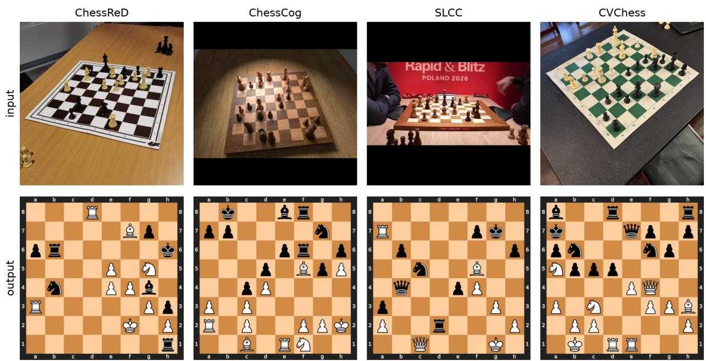  
Figure 1. ChessQueries can handle four datasets (ChessReD [26], ChessCog [33], SLCC [ours], CVChess [1]) with various challenges.

## Abstract

Chess board recognition is the task ofmapping the image of a chess board to the information ofwhich piece is on which square. So far this task has two established benchmarks: ChessCog is synthetic, and ChessReD comes from smartphone pictures ofa single chess board setup. We introduce ChessQueries, a new method combining a ViT encoder with a DETR-style decoder, which outperforms existing methods. On the ChessReD benchmark, we improve the state of the artfrom 15.3% to 99.2%, and demonstrate strong capabilities on out-of-distribution datasets. Our method saturates the task on the two datasets, with an average 0.01 wrong squares per board (vs. SotA: 3.4 / 0.15 respectively). We also share a new, harder public dataset, parsedfrom broadcasted top-level chess tournaments.

## 1. Introduction

Chess board recognition consists of mapping an image of a board to its per-square state, such as the Forsyth-Edwards Notation (FEN) standard text format, which is used widely in the chess world. This task has valuable applications for amateur play and analysis, and could be used to improve broadcasting of chess tournaments, during which technical difficulties from electronic sensory DGT [3, 8] boards are common [9, 12]. It also represents a computer vision challenge, as can be seen in Fig. 1, due to the varying camera angles, lighting, shadows, as well as partial occlusion.

The two main datasets used to date were either synthetic (ChessCog [33]) or created from smartphone pictures of games being played on a single physical chess board (ChessReD [26]). While methods for this task tend to focus on one of those datasets, we sought to establish a single architecture that would work across datasets, but also in rea chess broadcast conditions.

Our contributions are as follows: (1) we introduce a model called ChessQueries, which pairs a ViT encoder with a DETR-style decoder processing learned square queries, outperforming all existing methods, saturating the existing test sets, with real generalization strengths; (2) we demonstrate that our approach generalizes well to unseen datasets such as the single-game CVChess [1] dataset, and is wellsuited for training light-weight LoRAs on new domains; (3) we introduce a new, hard 2,174-image chess board recognition dataset based on the Saint Louis Chess Club YouTube broadcasts [14, 22, 31], with a new unique level of challenge (lighting, partial occlusions, hard viewpoints).

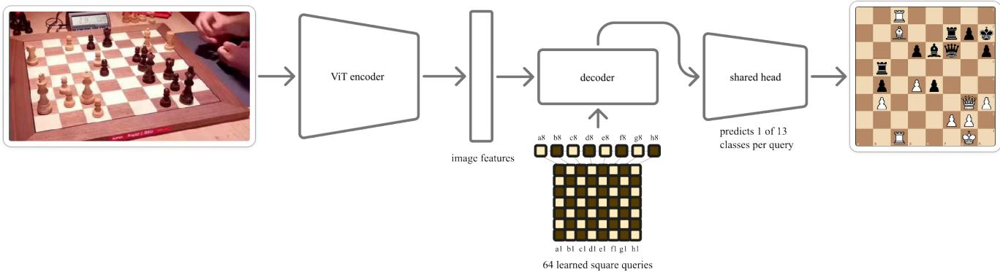  
Figure 2. ChessQueries architecture. A ViT-L encoder turns the input image into patch tokens. Sixty-four learned square queries — one per board square — cross-attend to those tokens, and a single shared linear head maps each decoded query to one of 13 classes (six piece types, times two colors, plus empty square), yielding the full 8 × 8 board in one forward pass.

## 2. Related Work

Multi-stage pipelines. A traditional approach to chess recognition is to leverage a multi-stage pipeline. It decomposes recognition into board detection, square localization, and per-square piece classification [6, 25, 27, 35, 36]. Specifically, chesscog [33] fits the board with a RANSAC-based projective transform and then runs separate CNNs for occupancy and piece prediction; the method comes with a synthetic, Blender-rendered dataset of 4,888 images, an idea already explored in [7]. The method requires knowing from which player’s perspective (white or black) the image was taken. CVChess [1] follows a similar approach, with Houghline board detection, projective warp to a top-down view, broken down into 64 squares, with an eventual CNN mapping each square crop to one of 13 states (six white pieces, six black, empty). Such pipelines are accurate when every successive stage succeeds, but errors compound: it has been established that ChessCog’s detector, tuned on synthetic imagery, localizes the real-life boards of ChessReD’s real photographs [26] only 34.4% of the time. Both systems depend on explicit geometric cues (e.g., detected corners, supplied orientation) that are unreliable on unconstrained or out-of-domain images.

End-to-end recognition. This motivated the authors of ChessReD [26] to remove the intermediate stages, predicting the full board configuration directly from the image, in an end-to-end fashion. They released ChessReD: 10,800 real smartphone photographs of 100 games across three cameras with varied angles and lighting. This constitutes the first large-scale non-synthetic benchmark, split game-wise to avoid leakage between train and test sets. Their model used a ResNeXt-101 [34] classifier, along with a prediction head for each of the 64 squares’ 13 possible outcomes. Interestingly, they also tried a set-prediction variant, drawing inspiration from DETR [4] to predict chess row and file coordinates of the pieces on the board. They reported that it failed to converge, and attributed this to the difficulty of small pieces. In this work, we will show that we also draw inspiration from DETR, but in a different way that focuses on the object queries introduced in the original paper. We draw inspiration from prior work on leveraging learned vectors for structured outputs [17, 21, 23].

Cross-domain generalization. Each original method described above was developed for a single domain, and the cross-domain experiments reported by ChessReD [26] are disappointing. ChessReD’s authors report that, after following ChessCog’s protocol to adapt the model to new chess pieces, ChessCog reached only 2% board accuracy on ChessReD (vs. their 15%). Conversely, when they trained their ResNeXt architecture on ChessCog, it reached only 40% (vs. their 94%). Neither method was able to be competitive out of its original domain.

In this work, we present a single model that can address the different domains of synthetic renders and real-world photographs (the ChessReD dataset as well as the 352 test images from the single-game released with CVChess [1]). We will also explore whether our model can easily be adapted to new, unseen domains.

<table><tr><td></td><td colspan="2">ChessReD n=2129</td><td colspan="2">ChessCog n=342</td><td colspan="2">SLCC n=373</td><td colspan="2">CVChess n=352</td></tr><tr><td>Method</td><td>Board↑</td><td>Wrong sq. ↓</td><td>Board↑</td><td>Wrong sq. ↓</td><td>Board↑</td><td>Wrong sq. ↓</td><td>Board↑</td><td>Wrong sq. ↓</td></tr><tr><td colspan="9">Trained on ChessCog + ChessReD + SLCC</td></tr><tr><td>ChessReD, original recipe</td><td>11.5%</td><td>5.0</td><td>0%</td><td>21.1</td><td>0%</td><td>20.1</td><td>0%</td><td>37.1</td></tr><tr><td>ChessReD, generalizing recipe</td><td>40.3%</td><td>1.3</td><td>60.5%</td><td>0.68</td><td>26.0%</td><td>2.4</td><td>8.8%</td><td>7.2</td></tr><tr><td>ChessQueries [ours]</td><td>99.5%</td><td>0.01</td><td>98.5%</td><td>0.01</td><td>87.1%</td><td>0.25</td><td>87.6%</td><td>0.50</td></tr><tr><td colspan="9">Trained on ChessReD only</td></tr><tr><td>ChessReD (published) [26]</td><td>15.3%</td><td>3.4</td><td>0%</td><td>47.9</td><td>0%</td><td>44.3</td><td>0%</td><td>54.6</td></tr><tr><td>ChessReD, generalizing recipe</td><td>12.2%</td><td>4.4</td><td>0%</td><td>42.9</td><td>0%</td><td>30.8</td><td>0.57%</td><td>11.5</td></tr><tr><td>ChessQueries [ours]</td><td>99.2%</td><td>0.01</td><td>0.29%</td><td>13.6</td><td>0.14%</td><td>16.5</td><td>56.0%</td><td>2.9</td></tr><tr><td colspan="9">Trained on ChessCog only</td></tr><tr><td>ChessCog [33]</td><td>2.3%§</td><td>42.9§</td><td>93.9%</td><td>0.15</td><td>0%⁸</td><td>34.0$</td><td>0%§</td><td>20.88</td></tr><tr><td>ChessReD (published) [26]</td><td></td><td></td><td>39.8%</td><td>1.2</td><td></td><td></td><td></td><td></td></tr><tr><td>ChessQueries [ours]</td><td>0.54%</td><td>21.7</td><td>98.2%</td><td>0.02</td><td>0%</td><td>29.6</td><td>0%</td><td>24.8</td></tr><tr><td colspan="9">Frontier LLM baseline</td></tr><tr><td>Claude Opus 5† [2]</td><td>1.5%</td><td>21.6</td><td>0%</td><td>21.7</td><td>0%</td><td>23.0</td><td>2.6%</td><td>18.9</td></tr><tr><td>GPT-5.6 Sol† [28]</td><td>0.50%÷</td><td>24.9</td><td>0.29%</td><td>23.9</td><td>0%</td><td>25.7</td><td>0.57%</td><td>24.9</td></tr></table>

Table 1. Overall performance. We report exact-board accuracy and the average number of wrong squares (out of 64) on the test sets. CVChess is purely a test set (only 1 game). ChessQueries achieves the best results across categories, and generalizes the best on unseen domains (highlighted in teal); top individual performances observed when training on all domains. §ChessCog board corner detection fails on 65.7% / 96.8% / 50.0% of ChessReD / SLCC / CVChess respectively, so the reported wrong squares numbers are averaged over the correctly localized boards. ChessReD performance is reported by [26], as they followed ChessCog’s protocol and fine-tuned it on two ChessReD starting-position images and took the best results of all possible board orientations. SLCC and CVChess numbers are our own zero-shot runs of their released pipeline.†For multi-modal LLMs: images square-resized to 644×644 (to match regular input conditions), 32k max output tokens, structured JSON output; Claude Opus 5 at its minimal effort=low, GPT-5.6 at effort=none. On a subset of 40 images, increased effort slightly improved per-square accuracy but per-board accuracy remained at 0%, so lowest effort was chosen to save on costs. A few-shot approach with example input/output from the training sets had no impact. 0.5–2% of outputs were invalid FEN chess positions, so the overall frontier LLM failure is indeed a visual understanding one. In a separate experiment, we observed that Qwen3-VL-8B fails the same way (0.5% board accuracy on ChessReD), yet a LoRA fine-tune of that same model reaches 87%: what the frontier models lack here is task-specific visual training. ‡ Using a subset of 400 / 2129 ChessReD test images to limit costs.

## 3. Method

We treat board recognition as structured per-square prediction over a fixed domain model: a board is exactly 64 squares, each labelled with one of 13 classes (six white pieces, six black, or empty). Fig. 2 shows the architecture. We use a ViT-L/14 [10] encoder (304M parameters), initialised from DINOv2 [29]. It maps the 644×644 input image to a set of patch tokens. The sixty-four square queries are embeddings that are learned for each individual square, taking as input its square ID as well as its rank, file and color.

The queries cross-attend to the image tokens through a 4-layer DETR-style decoder [4], and a single shared linear head maps each decoded query to its per-square class. Each square query is trained with a specific board square as its target, and as such there is no Hungarian matching needed.

Examining the attention maps of each square query across datasets shows that the attention is trained to focus accurately on each respective square (see Fig. 4).

The whole board is produced in one forward pass, with no required intermediate output such as board detection or corner estimation. Our approach also handles inputs of any orientation, whether seen from one of the players’ perspectives, or from the side.

Use of Large Language Models. Large language models assisted in this work in two distinct roles. First, use of Claude Code (with various usage of Fable / Opus 4.8 / Opus 5 / Sonnet 5 / GPT 5.6 Sol) assisted in writing the code and running the experiments. The coding assistant developed plans, which we reviewed, were implemented by the assistant and then reviewed by us as a GitHub pull request, similarly to how a standard developer would contribute to a repository. Tests and other good coding practices were enforced to maintain high code quality, as can be seen in the code shared alongside this project.

As for writing assistance, Claude Code was also used to structure and tweak the formatting in LATEX, the figures and tables, as well as grammar and spell-check, but the core of the content (structure, wording, messaging) was handwritten. The authors take full responsibility for all content, including all findings, numbers, and citations.

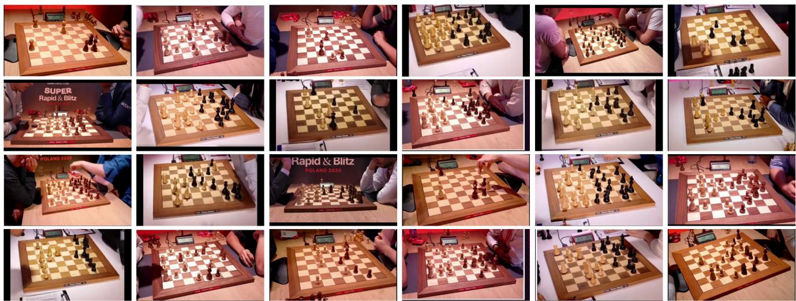  
Figure 3. Samples from the SLCC dataset: 24 frames drawn from the 20 different broadcasts. The camera angle, lighting, board and piece set, background clutter and player/hand occlusions all vary, making the task challenging.

## 4. Experiments

Datasets. For this work we use 4 key datasets: (1) ChessReD [26] is a real-life dataset based on photographs of 100 games using a single chess board; (2) ChessCog [33] consists of purely synthetic Blender renders; (3) CVChess [1] is similar to ChessReD, except that only a single game was recorded with multiple challenging camera angles of each position (thus we always use it as an out-of-domain test set); and finally (4) SLCC (Saint Louis Chess Club), a broadcast dataset we created (see Tab. 2).

The SLCC dataset. We built the 2,174 images of SLCC from 20 Saint Louis Chess Club [31] / Grand Chess Tour [14] broadcast videos, spanning three 2026 multi-day tournaments in Poland, Romania and Croatia: we parsed the YouTube videos automatically into templates whose layouts were hand-labeled, and verified all positions by seeking consensus from three sources: (1) the Lichess [22] relay of the games, where we automatically identified the correct ply by parsing the player names and remaining clock times with OCR [11]; (2) a fine-tuned LoRA [16] of our model after having annotated the first 20 SLCC images; (3) a human review of the outputs, as every retained sample was human-verified.

In practice, the model was used to rank multiple candidate relay positions from lichess (there often was a slight delay in the broadcast). No mistakes were found when the Lichess clock-time matching method and the model agreed. The images are particularly challenging due to partial obstruction, viewpoint, lighting and sometimes low resolution, due to only a small part of the broadcast showing the chess board. That said, during the human review we made sure that no image was kept where the task was impossible for the model due to full occlusion of pieces or squares (e.g., by a player’s hand). Fig. 3 shows a sample of the resulting frames, and more details can be found in Sec. D.

SLCC is obtained from publicly available YouTube broadcasts, and the dataset and labeling code used will be made openly available. Following established annotation-based dataset releases based on YouTube-sourced videos [5, 13, 15, 18, 30, 32, 37], we distribute video identifiers, timestamps, frame crop coordinates, extraction tooling, and chess position labels, but not the frames themselves. Individuals are occasionally visible in the frames; these are public figures, i.e., professional chess players appearing in publicly broadcast tournaments (e.g., Maxime Vachier-Lagrave and current world chess champion Gukesh Dommaraju in Fig. 5).

The release is licensed under CC BY-NC 4.0, for noncommercial research use only.

We have reached out to the SLCC to inform them of this work (we have received no reply to date). For future work, our approach could be scaled to more chess broadcast videos, leveraging our shared method and code.

Our results. We trained on a single GeForce RTX 4090 for 45 epochs. We noticed that starting with a frozen encoder for the first 5 epochs improved training stability. At inference, one forward pass reads the full board in 19 ms on the 4090 (∼52 images/s in bf16 at 644×644 resolution, with batch size one), i.e., compatible with real-time live broadcasting use.

We trained with batch size 6 in bf16 mixed precision, optimizing a simple per-square 13-way softmax cross-entropy loss (we tried adding auxiliary losses for piece colors and types, but they were not helpful). We used AdamW [24] (weight decay 0.05, gradient clipping at 1.0) with a cosine learning-rate schedule and a 3-epoch linear warmup, peaking at $1 . 4 \times 1 0 ^ { - 4 }$ for the decoder and readout and at $1 . 4 \times 1 0 ^ { - 5 }$ for the encoder; the same warmup was re-applied to the encoder when it was unfrozen at epoch 5. Inputs were augmented with mild geometric transforms (random rotation up to 45◦, perspective distortion, scaling in [0.85, 1.1] and small translations) together with light color jitter, and we kept the checkpoint with the best validation exact-board accuracy. Every number reported for our model in Tab. 1 is the mean over three independent seeds; the ablations in Tab. 3 and the head comparison in Tab. 4 used two seeds per configuration.

<table><tr><td>Split</td><td>Games</td><td>Shots</td><td>Frames</td></tr><tr><td>Train</td><td>106</td><td>768</td><td>1475</td></tr><tr><td>Val</td><td>23</td><td>128</td><td>326</td></tr><tr><td>Test</td><td>23</td><td>160</td><td>373</td></tr><tr><td>Total</td><td>152</td><td>1056</td><td>2174</td></tr></table>

Table 2. SLCC, the broadcast dataset we introduce: crops from 20 Saint Louis Chess Club / Grand Chess Tour broadcast videos on Youtube. Ground-truth positions are matched through the Lichess relay. Shots counts the distinct camera shots that contributed at least one annotated frame. Splits are game-wise (no game spans two splits) to avoid evaluation leakage.

Tab. 1 is the headline result: our model advances the state of the art in every setting. Our best results were from training on all training sets jointly, where we saturated the task on ChessReD & ChessCog, with 99.5% / 98.5% perfect board prediction, and 0.01 average wrong square per board (i.e., 1 wrong square predicted every ∼6400).

Under the same training data conditions as each corresponding published method, our model outperformed ChessReD and ChessCog as follows: on ChessReD, we achieved 99.2% exact board accuracy, compared to their 15.3%. On ChessCog, we achieved 98.2%, compared to their 93.9%.

Additionally, we reproduced the ChessReD model and trained two versions on the joint ChessReD + ChessCog + SLCC training set, one faithful to the original paper, and one recipe better suited for generalization and training on multiple datasets. The "generalizing recipe" transplants our own training setup onto the unchanged ResNeXt-101 (32×8d) architecture, changing five things relative to the original: (1) binary cross-entropy on one-hot targets → per-square 13-way softmax cross-entropy; (2) Adam [19] at $1 0 ^ { - 3 }$ with a ×0.1 step decay → AdamW $( 1 . 4 \times 1 0 ^ { - 4 }$ , weight decay 0.05) under a cosine schedule; (3) 1024×1024 ChessReD-normalized inputs → 644×644 ImageNet-normalized inputs; (4) no augmentation → the same geometric augmentation as our model, with gradient clipping at 1.0; (5) 200 epochs → 45 epochs.

This isolates the architecture as the single variable against our model. We outperform the generalizing recipe significantly, 40.3% → 99.5% on ChessReD.

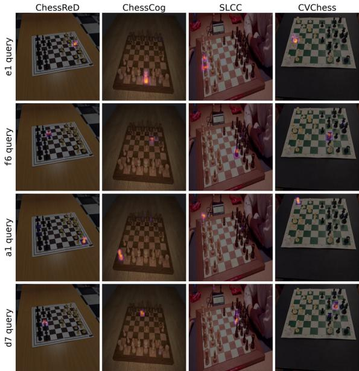  
Figure 4. Query attention for 4 separate square queries.

We also note the stark difference between the ChessReD and ChessCog data domain, as no model trained on one dataset performs well on the other.

## 5. Analysis

Query attention. The learned square queries give a direct interpretability handle: each query’s cross-attention can be visualized (Fig. 4). It localises to a single physical square and its piece, across domains and viewpoints. When the image features heavy occlusion, the attention focuses on the parts of the piece that appear in-between the surrounding pieces (see the e1 king from the SLCC sample). Reading across any row, the same query stays on its square as the board’s style, lighting, and perspective change from real photographs to synthetic renders and broadcast stills.

Ablations. Tab. 3 introduces one modification at a time to input resolution, encoder scale, and augmentation. ChessReD and ChessCog stay near-saturated under every variant (within 3 board points of the main model), so the performance impact of these changes is observed on the harder domains, especially out-of-distribution domains. Encoder scale is the largest factor for zero-shot generalization: swapping ViT-L for ViT-B barely moves the in-domain numbers but reduces zero-shot CVChess from 87.6% to 51.4% board accuracy. Removing geometric augmentation is similarly costly (41.2% board accuracy, 6.6 wrong squares), consistent with CVChess’s extreme camera angles. Lowering the resolution from 644 to 448 pixels impacts the two saturated benchmarks much less than the hard broadcast domain (SLCC 87.1% → 81.6%), where the board occupies a small, low-resolution part of the frame.

<table><tr><td></td><td colspan="3">Recipe</td><td colspan="2">ChessReD</td><td colspan="2">ChessCog</td><td colspan="2">SLCC</td><td colspan="2">CVChess</td></tr><tr><td>Model</td><td>Res.</td><td>Backbone</td><td>Aug.</td><td>Board↑</td><td>Wrong sq. ↓</td><td>Board↑</td><td>Wrong sq. ↓</td><td>Board↑</td><td>Wrong sq. ↓</td><td>Board↑</td><td>Wrong sq. ↓</td></tr><tr><td>ChessQueries (main)</td><td>644</td><td>ViT-L</td><td>√</td><td>99.5%</td><td>0.01</td><td>98.5%</td><td>0.01</td><td>87.1%</td><td>0.25</td><td>87.6%</td><td>0.50</td></tr><tr><td>Lower resolution</td><td>448</td><td>ViT-L</td><td>√</td><td>98.4%</td><td>0.02</td><td>98.1%</td><td>0.02</td><td>81.6%</td><td>0.39</td><td>74.0%</td><td>1.8</td></tr><tr><td>Smaller encoder</td><td>644</td><td>ViT-B</td><td>√</td><td>99.2%</td><td>0.01</td><td>97.5%</td><td>0.02</td><td>84.2%</td><td>0.34</td><td>51.4%</td><td>3.9</td></tr><tr><td>Smallest encoder</td><td>644</td><td>ViT-S</td><td>√</td><td>98.6%</td><td>0.01</td><td>97.7%</td><td>0.02</td><td>75.9%</td><td>0.51</td><td>49.4%</td><td>1.2</td></tr><tr><td>No augmentation</td><td>644</td><td>ViT-L</td><td>X</td><td>97.4%</td><td>0.03</td><td>95.9%</td><td>0.04</td><td>78.8%</td><td>0.48</td><td>41.2%</td><td>6.6</td></tr></table>

Table 3. Ablation study: changed parameters are in bold. Contributions are mainly observed on the hard domains (SLCC, CVChess), notably the backbone size; augmentations have the biggest impact, most of all on CVChess as that dataset presents extreme view angles. ChessReD/ChessCog stay near-saturated throughout, with less than 3 percentage points regression.

Query decoder vs. linear head. We seek to isolate the contribution of the square query + decoder head design by replacing it with a simple 8×8 grid-pooling of the encoder features, leading into a plain linear head. We show the results in Tab. 4, and the resulting architecture in the supplementary materials (Fig. 7). Trained on all three training sets, the two heads are near-identical in-domain, but we observe that the square query design is preferable for (1) out-of-domain performance, (2) ease of training, and (3) better localization capabilities.

Indeed, we observe that a performance gap opens under domain shift (see teal numbers in Tab. 4): with SLCC held out of training, the decoder gets 16.2 wrong squares per board on SLCC against the linear head’s 25.3, and reaches 77.1% zero-shot board accuracy on CVChess against 38.6%. The query decoder is therefore better for generalization and, as we show next, it also comes with interpretability.

Additionally, we compared the two approaches after freezing the ViT encoder at its DINOv2 [29] initialization, and we observed that the query decoder still manages to reach 92– 94% on ChessReD / ChessCog, and 53% on SLCC, whereas the linear head baseline is stuck at 0% (predicting only the majority class: empty squares), across all hyperparameters we tested. We can thus conclude that the fine-tuning of the encoder reorganizes the encoded features into a grid that percell readout can consume, whereas the square query decoder can compute the visual square correspondence itself (see Fig. 13 in the supplementary materials). We observe that freezing the encoder negatively impacts our square query approach, as CVChess performance decreases from 87.6% to 17.8%.

Finally, looking at the encoder attention maps, we can see that fine-tuning the ViT encoder with a linear head results in less precise localization of the squares and their associated pieces (comparing Fig. 4 and Fig. 12).

Where the model still fails. Our worst SLCC test set predictions are shown in Fig. 5 (up to seven squares mistaken out of 64). The mistakes cluster on areas under heavy occlusion, where pieces are barely visible. The equivalent worst cases for the other three datasets are shown in the supplementary materials Sec. A.

<table><tr><td></td><td colspan="2">ChessReD</td><td colspan="2">ChessCog</td><td colspan="2">SLCC</td><td colspan="2">CVChess</td></tr><tr><td>Method</td><td>Board↑</td><td>Wrong sq. ↓</td><td>Board↑</td><td>Wrong sq. ↓</td><td>Board↑</td><td>Wrong sq. ↓</td><td>Board↑</td><td>Wrong sq. ↓</td></tr><tr><td colspan="9"> Trained on ChessCog + ChessReD + SLCC</td></tr><tr><td>Query decoder</td><td>99.5%</td><td>0.01</td><td>98.5%</td><td>0.01</td><td>87.1%</td><td>0.25</td><td>87.6%</td><td>0.50</td></tr><tr><td>Linear head</td><td>99.0%</td><td>0.01</td><td>98.4%</td><td>0.02</td><td>83.9%</td><td>0.30</td><td>72.2%</td><td>2.1</td></tr><tr><td colspan="9"> Trained on ChessCog + ChessReD</td></tr><tr><td>Query decoder</td><td>99.3%</td><td>0.01</td><td>99.1%</td><td>0.01</td><td>0.27%</td><td>16.2</td><td>77.1%</td><td>1.2</td></tr><tr><td>Linear head</td><td>98.8%</td><td>0.03</td><td>98.7%</td><td>0.01</td><td>0%</td><td>25.3</td><td>38.6%</td><td>5.4</td></tr><tr><td colspan="9">Frozen encoder, trained on ChessCog + ChessReD + SLCC</td></tr><tr><td>Query decoder</td><td>92.4%</td><td>0.11</td><td>93.4%</td><td>0.07</td><td>53.0%</td><td>1.4</td><td>17.8%</td><td>7.1</td></tr><tr><td>Linear head</td><td>0%</td><td>20.2</td><td>0%</td><td>21.0</td><td>0%</td><td>19.9</td><td>0%</td><td>23.6</td></tr></table>

Table 4. Query decoder vs. linear head. The encoder is either fine-tuned ( ) or frozen at its DINOv2 initialization ( ). Out-of-domain numbers are highlighted in teal. At their best, the two heads are near-identical in-domain. The square query + decoder approach pulls ahead out of domain. On a frozen encoder (last 2 rows), the contrast is stark: the query decoder still manages to learn the task, whereas the linear head remains stuck at 0%.

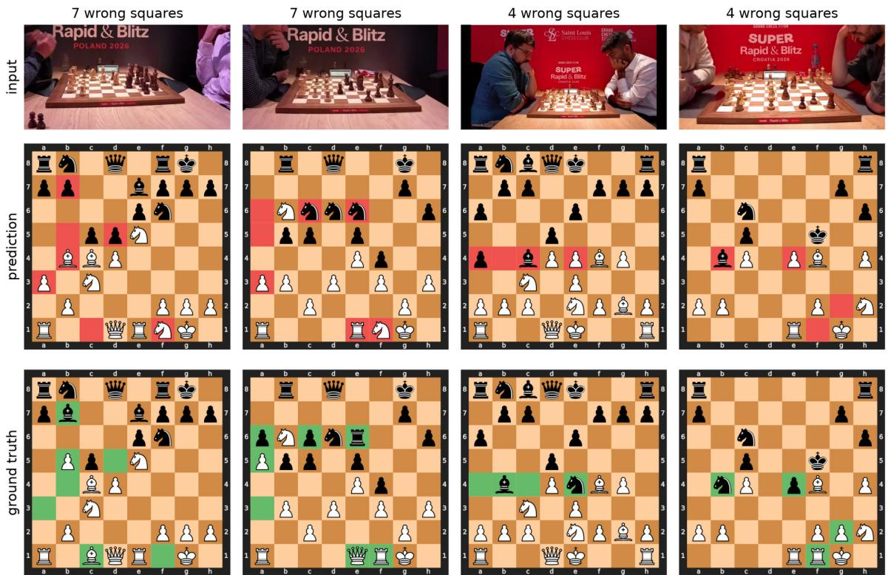  
Figure 5. The 4 SLCC test images where ChessQueries performs worst. Errors happen under heavy occlusion, and remain difficult for humans.

Few-shot experimentation protocol. We sought to explore few-shot experiments, to determine how many training images would be required to adapt our model to a new domain. We left SLCC out of training entirely, and trained on ChessReD & ChessCog only: we used a starting model with 0% board accuracy and 17.8 wrong squares per board on SLCC.

We then trained a low-rank adapter (LoRA) [16] on k SLCC training images and measured performance on the new domain (SLCC), as well as the source domain (ChessReD & ChessCog) to quantify forgetting. We compared four settings that differed in where the model may change and by how much: (1) low-rank adapters on the encoder’s attention and MLP projections (LoRA, rank 8, 3.1M trainable parameters), (2) the decoder alone (67.3M params), (3) the encoder alone (304.4M), and (4) the whole model (371.7M). Every mode was allotted the same 1,500-step budget, a learning rate tuned per mode on target validation data, and the same checkpoint selection procedure, probing every 100 steps, using per-square accuracy. We report the mean performances over three different support-set draws. Further protocol information is presented in the supplementary materials (Sec. C,

Tab. 5).

Few-shot results. As shown in Fig. 6: ten training images increase exact board accuracy from 0% to 24% (17.8 → 2.8 wrong squares), fifty images reach 38% board accuracy, and the full training set 69%. This falls short of the 87% that the full joint training reached (Tab. 1).

LoRA performance is similar to full fine-tuning (of either encoder or the whole model) at every k: the difference in performance lies within seed noise, whereas the LoRA trains only 3.1M parameters (∼ 1%) instead of the 371.7M of the full model, resulting in a 12 MB checkpoint in fp32. On the other hand, decoder-only finetuning heavily underperforms on the learning task, while catastrophically forgetting its source domain, a known pitfall to avoid [20].

Over the settings where the new domain is learned, we observe a negative correlation between worst-case retention (i.e., worst performance on ChessCog + ChessReD test sets across k values) of the source domain and the number of parameters trained: on ChessReD board accuracy we see 0.965 for LoRA, 0.948 encoder-only, 0.878 full fine-tuning.

We note that adaptation to the new domain primarily occurs through the encoder, not the decoder, which is consistent with the observations from the encoder feature pooling + linear head experiment. In conclusion, we find that a simple

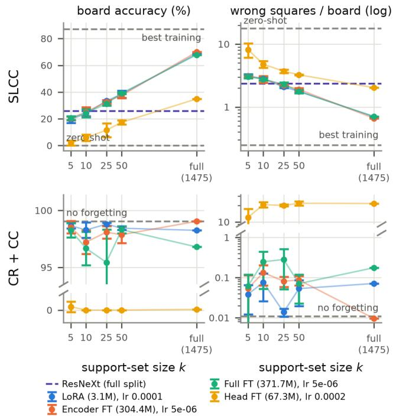  
Figure 6. Few-shot adaptation of ChessQueries from ChessReD + ChessCog to the SLCC domain. Top: accuracy on the target (SLCC), bounded by the zero-shot floor and our best training’s ceiling (87.1% board accuracy, see Tab. 1); the colored dashed line marks ChessReD’s ResNeXt baseline trained on thefull SLCC split (26.0%, Tab. 1), matched by a LoRA on 10 frames. Bottom: forgetting is measured via the mean performance retained on the source domains (ChessReD + ChessCog). Full protocol details: Sec. C.

LoRA trained on ten SLCC training images is on par with the ResNeXt baseline trained on thefull SLCC split (26.0% board accuracy, Tab. 1), and k=25 exceeds it.

## 6. Limitations

One limitation encountered in this work is the SLCC dataset itself. For starters, its size of 2,174 images is not as large as many image datasets, and it could be expanded using our labeling tool; this would require more hours of manual labor, without any suggestion that it would significantly change our findings. The new SLCC dataset is hard, sometimes maybe even too hard with heavy occlusions (Fig. 5), and in the sense of a real-world application, one could imagine that the tournament production team would place cameras at a better angle, providing less of a challenge to the vision model. Our approach was to push the models to their limits, and that resulted in a difficult task that might not be representative of real-world use cases. This also highlighted the difference between ∼ 99% exact-board accuracy on ChessReD / ChessCog, but only ∼ 87% on the introduced SLCC dataset.

ChessQueries does not handle fully side-agnostic boards, and failure cases from CVChess (in the famous Kasparov vs. Topalov game) show that in certain positions the model can be confused about the direction in which the white and black pawns move (see Fig. 10 in the supplementary materials). In a practical real-world setup, it would be helpful to train the model only on images where there is a clear signal, such as SLCC where the player with the white pieces is always on the left. Another interesting avenue for out-of-domain improvement would be to include an explicit modeling of the likelihood of the predicted chess positions, so that illegal chess positions (such as having 2 kings of the same color, Fig. 10) would be explicitly impossible.

Another signal that we do not exploit compared to a reallife product would be the temporal signal of the game of chess, where each position should only be separated from the previous one by a legal chess move. This is out-of-scope for our approach.

Finally, the ablation study showed that while the query decoder approach presents multiple advantages in out-ofdomain efficient representations and accurate square localization, a naive linear head nearly matches our best performance in-domain (ChessReD & ChessCog, Tab. 4). This indicates that a significant part of the in-domain performance improvement over the existing models might come from a better representation backbone, demonstrating that a ViT encoder will outperform a CNN-based representation such as ResNeXt or a multi-stage approach.

## 7. Conclusion

We introduced ChessQueries, a ViT encoder paired with a DETR-style decoder over 64 learned square queries that reads a full chess board in one forward pass, in 19 ms on a consumer GeForce RTX 4090 GPU (∼590ms with a MacBook M3 Pro’s MPS). A single architecture and training approach saturates the two established public benchmarks (99.5% exact-board accuracy on ChessReD, 98.5% on ChessCog), and transfers zero-shot to unseen domains (CVChess). We also released SLCC, a 2,174-frame dataset built from Saint Louis Chess Club professional tournament broadcast videos. With its occlusions, extreme viewpoints, and low-resolution boards, the SLCC dataset is the new frontier for chess board recognition. The task is genuinely challenging, and we reached 87.1% exact-board accuracy, compared to 26% for the ChessReD method. Our annotation pipeline is largely automatic, and the dataset could be expanded by applying the same method to additional chess broadcast videos.

## References

[1] Luthira Abeykoon, Ved Patel, Gawthaman Senthilvelan, and Darshan Kasundra. CVChess: A deep learning framework for converting chessboard images to Forsyth–Edwards notation.

arXiv preprint arXiv:2511.11522, 2025. Hough + projectivewarp pipeline, residual CNN per square; trained on ChessReD, plus a single-game real eval set (Kasparov–Topalov 1999) we repurpose as a target domain. The paper reports 445 images over 89 positions; its public release contains 352 images (88 positions, 4 viewpoints each), which we use. 1, 2, 4

[2] Anthropic. Claude opus 5 model release, 2026. Large language model released July 24, 2026. 3

[3] Bernard Johan Bulsink. Device for detecting playing pieces on a board. U.S. Patent US6168158B1, 2001. Filed June 30, 1999; granted Jan. 2, 2001. 1

[4] Nicolas Carion, Francisco Massa, Gabriel Synnaeve, Nicolas Usunier, Alexander Kirillov, and Sergey Zagoruyko. End-toend object detection with transformers. In Computer Vision – ECCV 2020, pages 213–229. Springer, 2020. 2, 3

[5] Honglie Chen, Weidi Xie, Andrea Vedaldi, and Andrew Zisserman. VGGSound: A large-scale audio-visual dataset. In 2020 IEEE International Conference on Acoustics, Speech and Signal Processing (ICASSP), pages 721–725, 2020. 4

[6] Maciej A. Czyzewski, Artur Laskowski, and Szymon Wasik. Chessboard and chess piece recognition with the support of neural networks. Foundations of Computing and Decision Sciences, 45(4):257–280, 2020. 2

[7] Afonso de Sá Delgado Neto and Rafael Mendes Campello. Chess position identification using pieces classification based on synthetic images generation and deep neural network finetuning. In 2019 21st Symposium on Virtual and Augmented Reality (SVR), pages 152–160, 2019. 2

[8] Digital Game Technology. Digital Game Technology, 2026. Company that patented and provides chess e-boards with live digital tracking of piece positions. Accessed Aug. 28, 2026. 1

[9] Peter Doggers. “We Will Improve Our Software,” Says CEO of DGT. Chess.com, 2009. Reports from the largest chess website on technical difficulties with DGT-based live broadcasts at several major chess tournaments and includes comments from DGT CEO Albert Vasse. 1

[10] Alexey Dosovitskiy, Lucas Beyer, Alexander Kolesnikov, Dirk Weissenborn, Xiaohua Zhai, Thomas Unterthiner, Mostafa Dehghani, Matthias Minderer, Georg Heigold, Sylvain Gelly, Jakob Uszkoreit, and Neil Houlsby. An image is worth 16x16 words: Transformers for image recognition at scale. In International Conference on Learning Representations (ICLR), 2021. 3

[11] Yuning Du, Chenxia Li, Ruoyu Guo, Xiaoting Yin, Weiwei Liu, Jun Zhou, Yifan Bai, Zilin Yu, Yehua Yang, Qingqing Dang, and Haoshuang Wang. PP-OCR: A practical ultra lightweight OCR system. arXiv preprint arXiv:2009.09941, 2020. 4

[12] FIDE Technical Commission. Technical commission report. Technical report, Fédération Internationale des Échecs (FIDE), 2023. Documents from the International Chess Federation, reporting issues with DGT LiveChess, including bugs in the software interfacing with DGT electronic boards. 1

[13] Jort F. Gemmeke, Daniel P. W. Ellis, Dylan Freedman, Aren Jansen, Wade Lawrence, R. Channing Moore, Manoj Plakal, and Marvin Ritter. Audio Set: An ontology and humanlabeled dataset for audio events. In 2017 IEEE Interna-

tional Conference on Acoustics, Speech and Signal Processing (ICASSP), pages 776–780, 2017. 4

[14] Grand Chess Tour. Grand Chess Tour, 2026. Professional chess tournament circuit, including the following 2026 tournaments: 2026 Super Rapid & Blitz Poland, 2026 Super Chess Classic Romania, and 2026 Super Rapid & Blitz Croatia. 2, 4, 17

[15] Chunhui Gu, Chen Sun, David A. Ross, Carl Vondrick, Caroline Pantofaru, Yeqing Li, Sudheendra Vijayanarasimhan, George Toderici, Susanna Ricco, Rahul Sukthankar, Cordelia Schmid, and Jitendra Malik. AVA: A video dataset of spatiotemporally localized atomic visual actions. In Proceedings of the IEEE Conference on Computer Vision and Pattern Recognition (CVPR), pages 6047–6056, 2018. 4

[16] Edward J. Hu, Yelong Shen, Phillip Wallis, Zeyuan Allen-Zhu, Yuanzhi Li, Shean Wang, Lu Wang, and Weizhu Chen. LoRA: Low-rank adaptation of large language models. In International Conference on Learning Representations (ICLR), 2022. 4, 7

[17] Andrew Jaegle, Sebastian Borgeaud, Jean-Baptiste Alayrac, Carl Doersch, Catalin Ionescu, David Ding, Skanda Koppula, Daniel Zoran, Andrew Brock, Evan Shelhamer, Olivier J. Hénaff, Matthew M. Botvinick, Andrew Zisserman, Oriol Vinyals, and João Carreira. Perceiver IO: A general architecture for structured inputs & outputs. In International Conference on Learning Representations (ICLR), 2022. 2

[18] Will Kay, João Carreira, Karen Simonyan, Brian Zhang, Chloe Hillier, Sudheendra Vijayanarasimhan, Fabio Viola, Tim Green, Trevor Back, Paul Natsev, Mustafa Suleyman, and Andrew Zisserman. The kinetics human action video dataset, 2017. 4

[19] Diederik P. Kingma and Jimmy Ba. Adam: A method for stochastic optimization. In International Conference on Learning Representations (ICLR), 2015. arXiv:1412.6980. 5

[20] James Kirkpatrick, Razvan Pascanu, Neil Rabinowitz, Joel Veness, Guillaume Desjardins, Andrei A. Rusu, Kieran Milan, John Quan, Tiago Ramalho, Agnieszka Grabska-Barwinska, Demis Hassabis, Claudia Clopath, Dharshan Kumaran, and Raia Hadsell. Overcoming catastrophic forgetting in neural networks. Proceedings of the National Academy of Sciences, 114(13):3521–3526, 2017. 7

[21] Juho Lee, Yoonho Lee, Jungtaek Kim, Adam Kosiorek, Seungjin Choi, and Yee Whye Teh. Set transformer: A framework for attention-based permutation-invariant neural networks. In Proceedings of the 36th International Conference on Machine Learning, pages 3744–3753. PMLR, 2019. 2

[22] Lichess. Lichess.org: Free online chess, 2026. Open-source chess platform with a PGN relay database for tournament games. Accessed Aug. 28, 2026. 2, 4, 16

[23] Francesco Locatello, Dirk Weissenborn, Thomas Unterthiner, Aravindh Mahendran, Georg Heigold, Jakob Uszkoreit, Alexey Dosovitskiy, and Thomas Kipf. Object-centric learning with slot attention. In Advances in Neural Information Processing Systems, pages 11525–11538, 2020. 2

[24] Ilya Loshchilov and Frank Hutter. Decoupled weight decay regularization. In International Conference on Learning Representations (ICLR), 2019. arXiv:1711.05101. Introduces AdamW. 4

[25] David Mallasén Quintana, Alberto Antonio del Barrio García, and Manuel Prieto Matías. LiveChess2FEN: A framework for classifying chess pieces based on CNNs. arXiv preprint arXiv:2012.06858, 2020. 2

[26] Athanasios Masouris and Jan C. van Gemert. End-to-end chess recognition. In Proceedings ofthe 19th International Joint Conference on Computer Vision, Imaging and Computer Graphics Theory and Applications (VISAPP), pages 393–403, 2024. arXiv:2310.04086. Introduces the ChessReD dataset (10,800 real smartphone photographs). 1, 2, 3, 4

[27] Jason E. Neufeld and Tyson S. Hall. Probabilistic location of a populated chessboard using computer vision. In 2010 53rd IEEE International Midwest Symposium on Circuits and Systems, pages 616–619, 2010. 2

[28] OpenAI. GPT-5.6 Sol model release, 2026. Large language model released July 9, 2026. 3

[29] Maxime Oquab, Timothée Darcet, Théo Moutakanni, Huy V. Vo, Marc Szafraniec, Vasil Khalidov, Pierre Fernandez, Daniel Haziza, Francisco Massa, Alaaeldin El-Nouby, Mido Assran, Nicolas Ballas, Wojciech Galuba, Russell Howes, Po-Yao Huang, Shang-Wen Li, Ishan Misra, Michael Rabbat, Vasu Sharma, Gabriel Synnaeve, Hu Xu, Hervé Jégou, Julien Mairal, Patrick Labatut, Armand Joulin, and Piotr Bojanowski. DINOv2: Learning robust visual features without supervision. Transactions on Machine Learning Research (TMLR), 2024. arXiv:2304.07193. 3, 6

[30] Esteban Real, Jonathon Shlens, Stefano Mazzocchi, Xin Pan, and Vincent Vanhoucke. YouTube-BoundingBoxes: A large high-precision human-annotated data set for object detection in video. In Proceedings ofthe IEEE Conference on Computer Vision and Pattern Recognition (CVPR), pages 7464–7473, 2017. 4

[31] Saint Louis Chess Club. Saint Louis Chess Club, 2026. Professional chess organization that broadcasts games online, archived on YouTube with PGN relays on Lichess. 2, 4, 17

[32] Yansong Tang, Dajun Ding, Yongming Rao, Yu Zheng, Danyang Zhang, Lili Zhao, Jiwen Lu, and Jie Zhou. COIN: A large-scale dataset for comprehensive instructional video analysis. In Proceedings of the IEEE/CVF Conference on Computer Vision and Pattern Recognition (CVPR), pages 1207–1216, 2019. 4

[33] Georg Wölflein and Ognjen Arandjelovic. Determining chess´ game state from an image. Journal of Imaging, 7(6):94, 2021. The chesscog system: RANSAC board localization + occupancy and piece CNNs on a synthetic 3D-rendered dataset. 1, 2, 3, 4

[34] Saining Xie, Ross Girshick, Piotr Dollár, Zhuowen Tu, and Kaiming He. Aggregated residual transformations for deep neural networks. In Proceedings of the IEEE Conference on Computer Vision and Pattern Recognition (CVPR), pages 5987–5995, 2017. 2

[35] Youye Xie, Gongguo Tang, and William A. Hoff. Chess piece recognition using oriented chamfer matching with a comparison to CNN. In 2018 IEEE Winter Conference on Applications ofComputer Vision (WACV), pages 2001–2009, 2018. 2

[36] Youye Xie, Gongguo Tang, and William A. Hoff. Geometrybased populated chessboard recognition. In Tenth Interna-

tional Conference on Machine Vision (ICMV 2017), page 1069603. SPIE, 2018. 2

[37] Luowei Zhou, Chenliang Xu, and Jason J. Corso. Towards automatic learning of procedures from web instructional videos. In Proceedings ofthe AAAI Conference on Artificial Intelligence, pages 7590–7598, 2018. 4

## Supplementary Materials

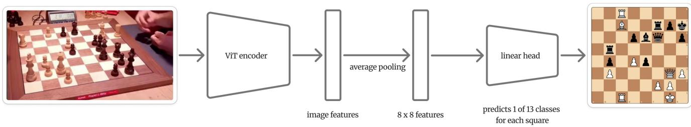  
Figure 7. Architecture of the linear-head baseline compared against in Tab. 4. The 64 square queries and the cross-attention decoder of Fig. 2 are removed, and replaced by average pooling and a simple linear head.

## A. Worst samples per dataset

Similarly to Fig. 5, we show our model’s predictions on the worst-performing samples of the other datasets. On the nearsaturated domains (ChessReD and ChessCog) the failures are on at most 2 / 64 squares, under strong perspective and off-board clutter (see Fig. 8 & Fig. 9).

The out-of-domain CVChess dataset shows another failure mode (see Fig. 10 and Fig. 11): on the unusual ending position of the famous Kasparov-Topalov game, with both kings on the first rank. Our model fails by reading the board upside down. As CVChess photographs each of the 88 positions from four camera positions, we show that our model surprisingly performs better in viewpoints that are harder for humans. This might be due to the fact that the SLCC training set is exclusively made of side-views with tilted camera angles.

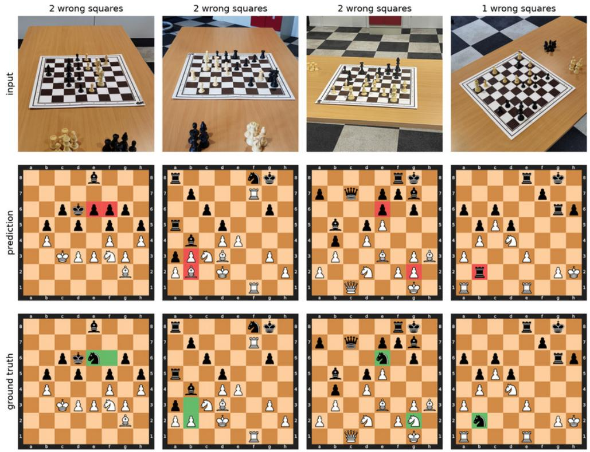  
Figure 8. The four ChessReD test images where our model performs worst: at most 2 / 64 squares are wrong, mostly due to occlusion.

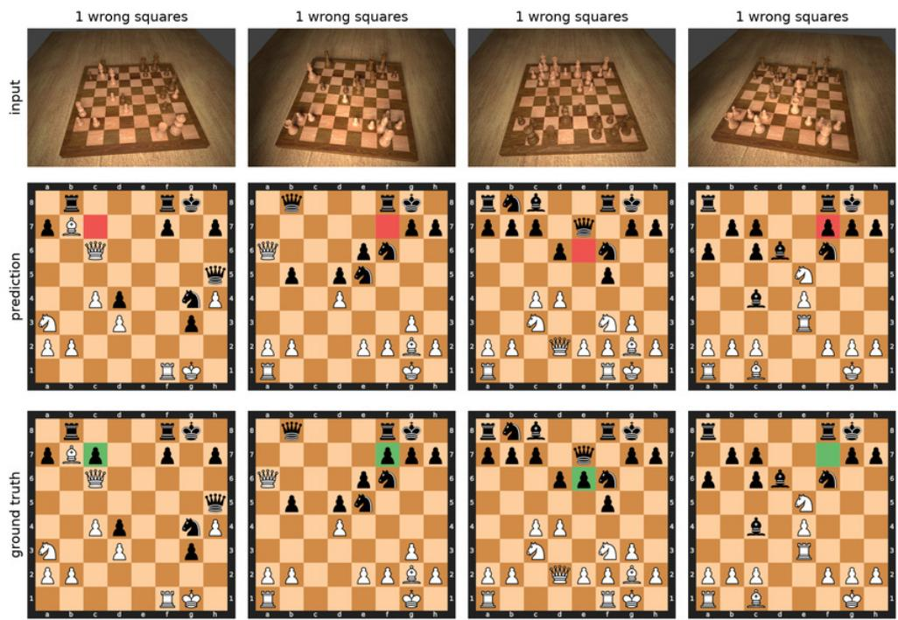  
Figure 9. The four ChessCog test images where our model performs worst: a single wrong square each on this near-saturated synthetic domain, with the mistaken piece heavily occluded.

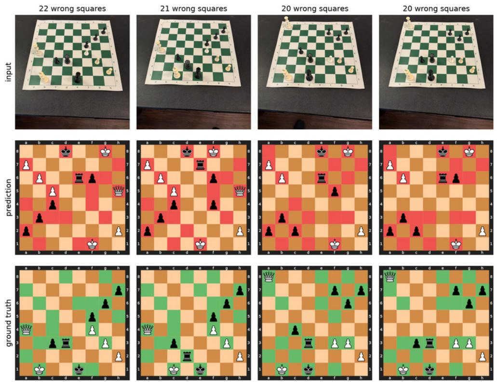

Figure 10. The four CVChess positions where our model performs worst. The failures appear from the default viewpoint, facing the white pieces: the model reads those boards essentially upside down – 2–4 wrong squares once the ground truth is turned 180◦. We also observe impossible outputs such as two white kings. Figure 11 shows the first 2 positions seen from different viewpoints and parsed correctly.  
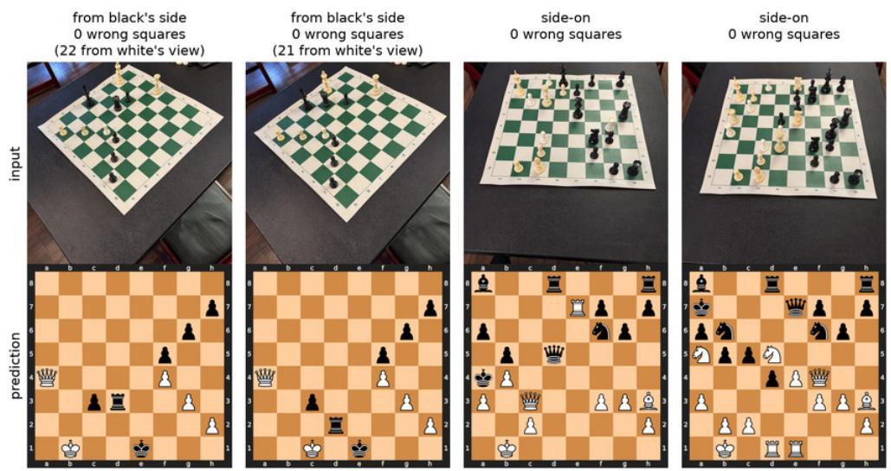  
Figure 11. On CVChess’ hard viewpoints (for a human): every board is exact. Columns 1–2 are from the same positions as Fig. 10, viewed from a different angle; columns 3–4 are shown for diversity. CVChess shows multiple angles for each position.

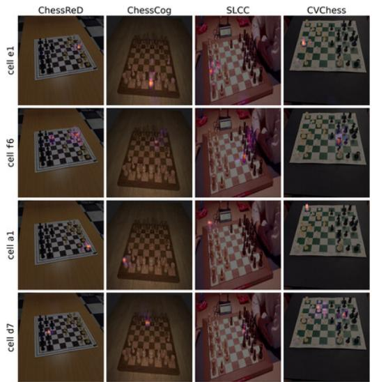  
Figure 12. Encoder self-attention of the fine-tuned linear-head model (Tab. 4, top block), for the token bin each 8×8 grid cell pools over. Rows are fixed cells, columns the four domains; the shared DINOv2 global-token hotspot is removed before display. Each cell attends to a distinct on-board region that follows its square across domains: joint fine-tuning has reorganized the encoder so a readout can localize squares without a decoder.

## B. Attention & training the encoder

Two views complement the frozen-encoder block of Tab. 4. The fine-tuned linear-head model has no decoder, yet its encoder attention is able to localize and track its square across all four domains (Fig. 12). That said we observe that it is less precise than the square query + decoder approach as seen on Fig. 4.

Fine-tuning therefore reorganizes the encoder into a per-square layout even with a simple linear head on top, and this is what makes the linear head competitive in-domain.

Second, Fig. 13 shows that on a frozen encoder the two heads differ exactly as shown by the numbers in Tab. 4: the query decoder’s cross-attention localizes each square on frozen features (although not as well as with a trained encoder), while the cell attention available to the linear readout is unable to do a similar job.

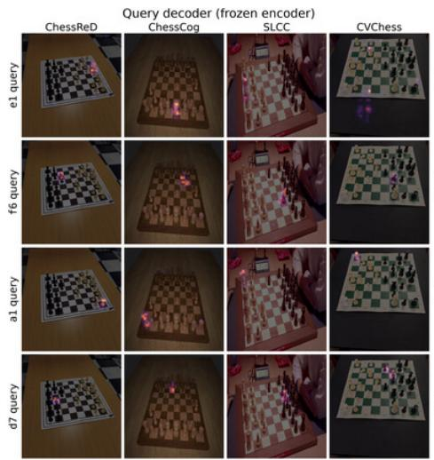

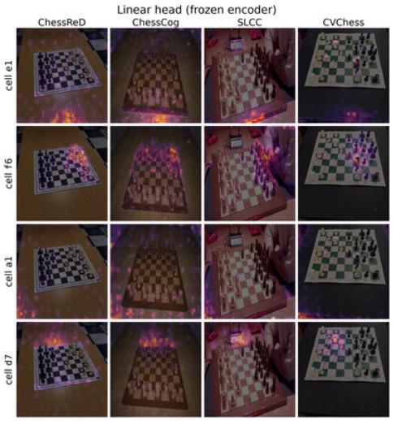  
Figure 13. Attention with afrozen encoder (Tab. 4, bottom block). Left: the query decoder’s cross-attention still localizes each square on frozen DINOv2 features — the decoder computes the image-to-board correspondence itself. Right: the encoder cell attention available to the linear head is diffuse and largely off-board, with no consistent per-square localization, matching its majority-class-floor accuracy.

<table><tr><td rowspan="2"></td><td rowspan="2">Trainable</td><td rowspan="2">LR</td><td colspan="5">SLCC Board ↑</td><td colspan="2">Retention min. ↑</td></tr><tr><td>k=5</td><td>k=10</td><td>k=25</td><td>k=50</td><td>k=full</td><td>ChessReD</td><td>ChessCog</td></tr><tr><td>LoRA (r=8)</td><td>3.1M</td><td> $1 \times 1 0 ^ { - 4 }$ </td><td> $1 9 . 4 \% _ { \pm 2 . 4 \% }$ </td><td> $2 3 . 9 \% _ { \pm 1 . 9 \% }$ </td><td> $3 3 . 3 \% _ { \pm 0 . 8 2 \% }$ </td><td> $3 8 . 4 \% _ { \pm 2 . 7 \% }$ </td><td>68.6%</td><td>96.5%</td><td>98.2%</td></tr><tr><td>Encoder-only FT</td><td>304.4M</td><td> $5 \times 1 0 ^ { - 6 }$ </td><td> $2 0 . 4 \% _ { \pm 1 . 4 \% }$ </td><td> $2 5 . 0 \% _ { \pm 3 . 6 \% }$ </td><td> $3 2 . 7 \% _ { \pm 1 . 4 \% }$ </td><td> $3 7 . 5 \% _ { \pm 2 . 1 \% }$ </td><td>70.0%</td><td>94.8%</td><td>97.7%</td></tr><tr><td>Full FT</td><td>371.7M</td><td> $5 \times 1 0 ^ { - 6 }$ </td><td> $2 0 . 6 \% _ { \pm 1 . 5 \% }$ </td><td> $2 4 . 2 \% _ { \pm 3 . 1 \% }$ </td><td> $3 1 . 3 \% _ { \pm 1 . 6 \% }$ </td><td> $3 9 . 1 \% _ { \pm 0 . 7 1 \% }$ </td><td>67.8%</td><td>87.8%</td><td>96.5%</td></tr><tr><td>Decoder-only FT</td><td>67.3M</td><td> $2 \times 1 0 ^ { - 4 }$ </td><td> $1 . 9 \% _ { \pm 1 . 8 \% }$ </td><td> $5 . 9 \% _ { \pm 2 . 4 \% }$ </td><td> $1 1 . 4 \% _ { \pm 5 . 3 \% }$ </td><td> $1 7 . 3 \% _ { \pm 1 . 6 \% }$ </td><td>34.9%</td><td>0%</td><td>0%</td></tr></table>

Table 5. Few-shot adaptation to SLCC of the base model trained on ChessReD + ChessCog (zero-shot on SLCC: 0% board accuracy, 17.8 wrong squares). Each run yields $\mathrm { m e a n } _ { \pm \mathrm { S D } }$ over three support-set draws (except k=full is the whole 1,475-frame train split, in a single run). Retention columns feature the minimum ChessReD / ChessCog board accuracy over all 13 runs of a mode.

## C. Few-shot adaptation: full results and protocol

Tab. 5 gives the full numbers behind Fig. 6: exact-board accuracy on SLCC for every set of (mode, k), with the trainableparameter count and tuned learning rate of each mode, and each mode’s worst-case source retention over all of its runs. Three observations are further shown here. First, LoRA, encoder-only and full fine-tuning are ties at every k: all pairwise gaps are at most 2.1 board points. Second, worst-case retention is negatively correlated to how many parameters are trained: LoRA 96.5/98.2, encoder-only 94.8/97.7, full fine-tune 87.8/96.5 (respectively on ChessReD/ChessCog board accuracy). It seems that unfreezing the decoder is where retention damage comes from. Finally, decoder-only fine-tuning fails to learn the task appropriately, while collapsing on the source domain: retention per-square accuracy falls to 0.73 (ChessReD) / 0.64 (ChessCog).

Learning rate selection. Each mode’s LR is tuned on validation data, so no tuning asymmetry favours the adapter. The encoder-only optimum lands at $5 \times 1 0 ^ { - 6 }$ , the same value the full fine-tune tunes to. Decoder-only fine-tuning has no usable window at all: six of the seven LRs probed end in near-total source domain collapse loss, and at the seventh, validation selection returns the base model. For the LoRA approach, a higher LR of $5 \times 1 0 ^ { - 4 }$ earned 5–7 board points at k≥25 but pays for it in source domain collapse, so we report LoRA at $1 \times 1 0 ^ { - 4 }$ throughout.

We select the final checkpoint for each run based on validation data per-square accuracy.

A couple comments on the approach. It is worth noting that all runs are based on a single starting checkpoint; we measure performance across three seeds with different samples of the training set, but we did not measure seed variance across multiple starting checkpoints. Compute remains modest throughout: under 8 GPU-hours on 2 RTX 4090s for the whole fine-tuning experiment including the LR sweeps, and the final best LoRA weights take up 12 MB, to be attached to a 1.5 GB checkpoint.

## D. SLCC annotation and reconstruction pipeline

We summarize the semi-automated process in Fig. 14. The YouTube broadcast (Fig. 15) comes in a layout that needs to be parsed into a proper chess board image and associated chess position. We manually annotate templates, which include bounding box information, to locate production elements within a given frame: (1) the main board image; (2) the players names; (3) their remaining clock times.

Through the YouTube video id, each frame is mapped to its tournament round, and a given pair of opponents plays only one game in each selected video, thus we obtain the correspondence between frame and chess game. Additionally, through the Lichess relay [22] we know the move sequence and clock state after each ply, providing candidate positions. Unfortunately, the clocks do not necessarily identify a unique ply: with increments, players gain time after making a move, so the same pair of displayed times may correspond to multiple positions. We also observed occasional delays in the broadcast between the camera feed and the clock overlay, creating further ambiguity. We therefore retain a list of candidate relay positions rather than a single identified position.

We resolved this ambiguity with a ChessQueries-based model. We first trained a version of ChessQueries (V0) only on ChessReD and ChessCog, and manually annotated the first 20 SLCC images without any model assistance. We then trained a LoRA of V0 on those 20 images, which were later assigned to the SLCC training split. From there on, the model is used to rank the candidate positions, and shows the annotator the most likely one. Note that the model does not generate the final FEN annotation, and that this model was then discarded; its weights are unrelated to those of the final ChessQueries model presented in the main section of the paper.

Finally, a human eye reviews the proposed match in the interface shown in Fig. 15. The reviewer can check the information, accept the candidate, manually choose a different ply, or discard it. Every retained sample is human-verified, and we observed no incorrect match when the OCR-derived position and visual ranker agreed (on fit and margin criteria shown in the figure).

Using a model to help us annotate allowed us to go much faster, and we needed to make very few edits. It would have been unfeasible to review and accept 2,174 images without model assistance.

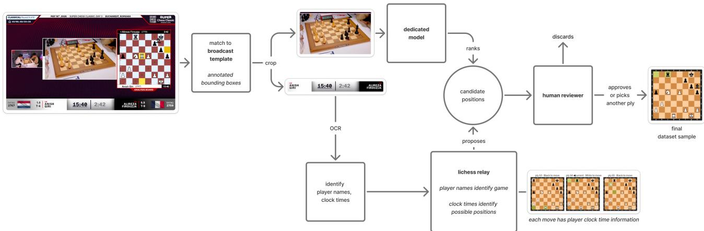  
Figure 14. Overview of the semi-automated SLCC annotation and reconstruction pipeline. Lichess [22] is an online platform that provides chess features such as online play, analysis, or information on current and past tournaments, including the results, the moves played, remaining time for each player after each move, etc.

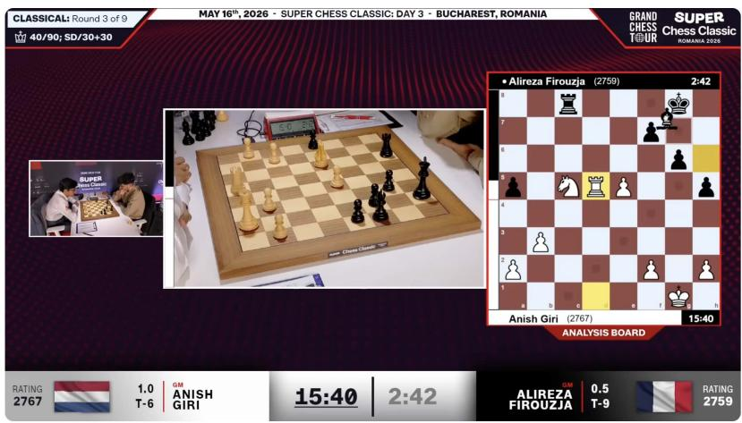

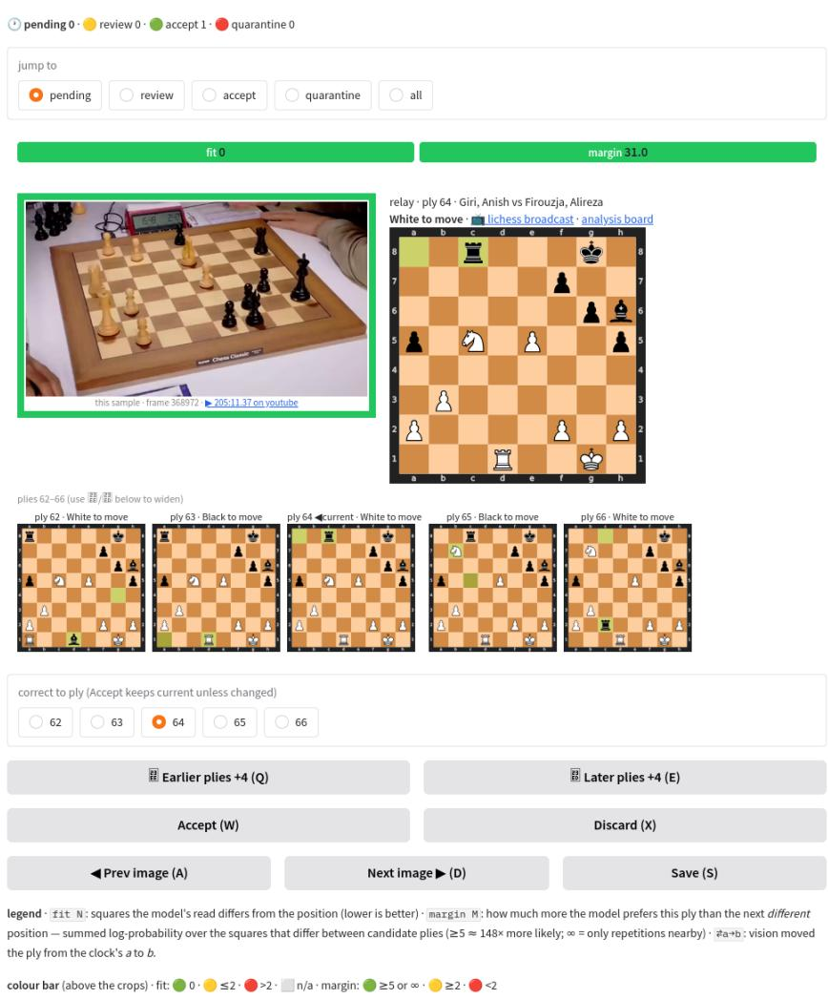  
Figure 15. Top: Example of a SLCC broadcast layout [14, 31]. We crop out the physical-board view as the main model input, while OCR reads (1) the player names and (2) their remaining clock times (here: 15 min 40 s vs. 2 min 42 s). We deliberately ignore the analysis board on the right because it often shows commentary positions rather than the live game. Bottom: The annotation interface to review the candidate annotation extracted from the broadcast. Here both the OCR → Lichess relay pipeline’s candidate and the LoRA model both select ply 64; the model agrees with the relay position on all 64 squares (fit 0), with a predicted log-probability margin of 31.0 over the next closest candidate. The human reviewer must now inspect the neighboring plies, and decide: accept, correct which ply of the game fits the image, or discard the sample. 17