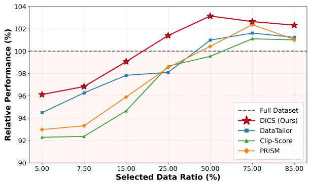
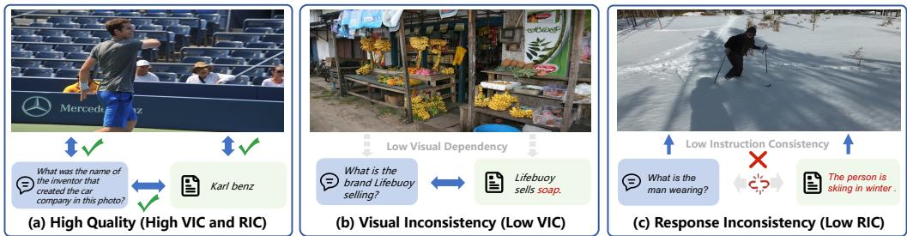
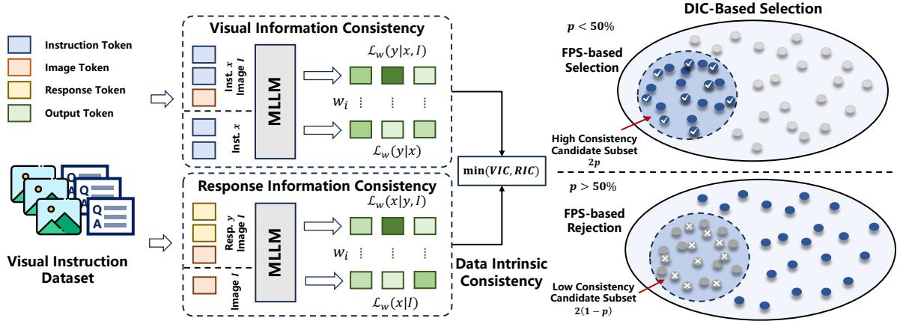
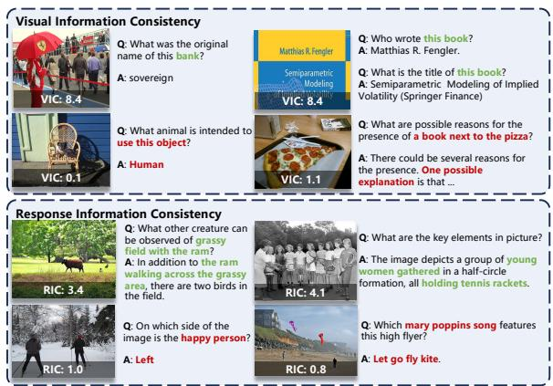
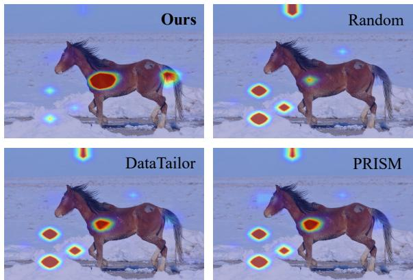
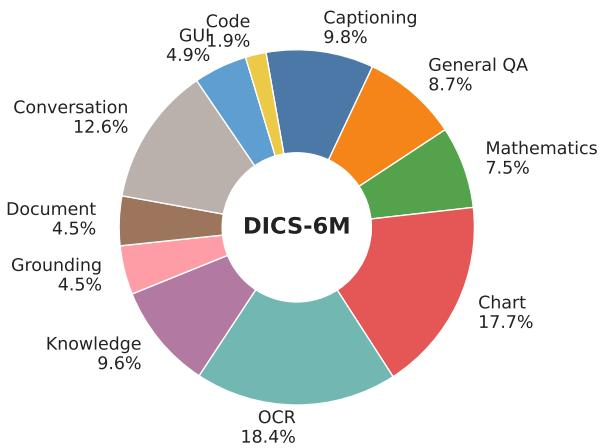
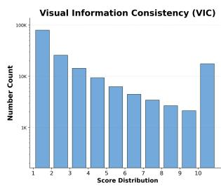
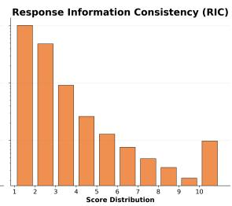
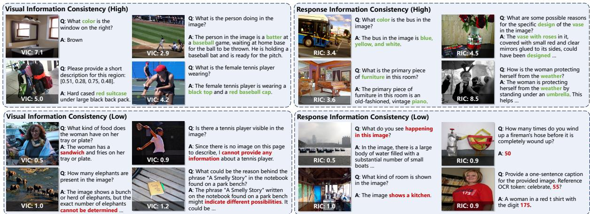
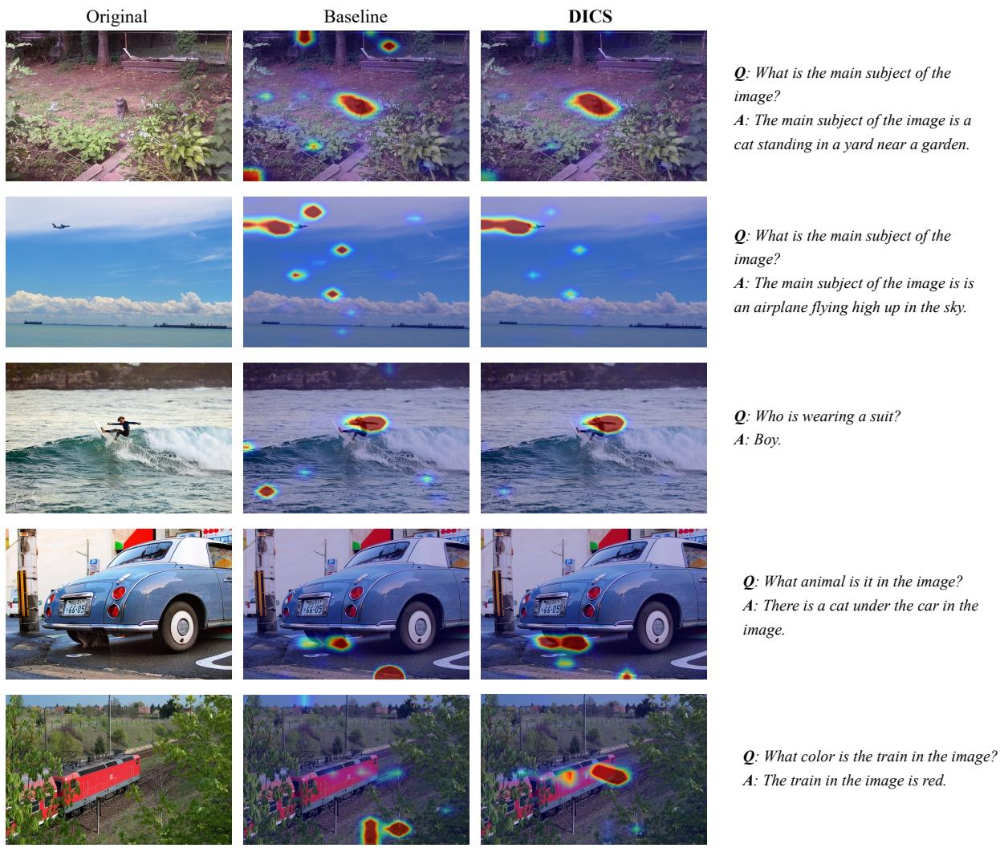

# DICS: Exploring Data Intrinsic Consistency for Visual Instruction Selection

Yuyang Hong1,2,3,∗ Jinhui Guo3∗ Jiaqi Gu3 Lubin Fan3,†

Ruixiang Wang1,2 Kun Ding1,2 Yue Wu3 Shiming Xiang1,2,† Jieping Ye3

1School of Artificial Intelligence, University of Chinese Academy of Sciences

2MAIS, Institute of Automation, Chinese Academy of Sciences

3Alibaba Token Hub, Alibaba Group

{hongyuyang2023@ia.ac.cn, lory.gjh@alibaba-inc.com, lubin.flb@alibaba-inc.com} ∗These authors contributed equally to this work. †Corresponding authors.

## Abstract

Visual instruction tuning is crucial for ad vancing the vision-language alignment and instruction-following capabilities of Vision Language Models (VLMs). However, identi fying optimal subsets under a fixed ratio constraint from rapidly expanding datasets remains a significant bottleneck. While existing meth ods largely depend on distribution diversity or heuristic filtering, they often overlook the in ternal coherence within individual samples. To bridge this gap, we propose Data Intrinsic Consistency (DIC), a self-scoring metric designed to quantify the sample-level inter-component consistency. DIC consists of two modules: Vi sual Information Consistency (VIC), evaluat ing the alignment between visual content and instructions, and Response Information Con sistency (RIC), assessing response coherence relative to the instruction. Building upon DIC, we introduce Data Intrinsic Consistency Selec tion (DICS), an adaptive data selection method that optimizes the trade-off between high intra sample consistency and global distributional diversity under varying data budgets. Exten sive experiments demonstrate that DICS con sistently outperforms state-of-the-art methods across diverse dataset scales and model ar chitectures, surpassing full-dataset fine-tuning while using only 25% of the LLaVA-1.5-665K data. We further curate DICS-6M, a 6M sample multi-modal instruction corpus that enables the largest-scale visual instruction selection study to date; remarkably, DICS reaches 94.52% of the official InternVL3-8B-Instruct performance using less than 25% of its re ported training data. Code can be seen at https://github.com/cqu-student/DICS.

## 1 Introduction

Visual instruction tuning (Ouyang et al., 2022; Cui et al., 2023; Chiang et al., 2023) is pivotal for

  
Figure 1: Performance of LLaVA-1.5-7B fine-tuned on subsets of LLaVA-1.5-665K selected by various methods. DICS-selected subsets outperform the full dataset at 25% and consistently surpass other methods.

VLM training, establishing foundational capabilities while enabling effective human instruction understanding and following. Given the massive scale of such data, rigorous evaluation and selection are critical.

Existing selection methods are mainly based on distribution diversity (Bi et al., 2025), sample relationships (Yu et al., 2025), importance (Wu et al., 2024), and heuristic quality rules (Saada et al., 2025; Li et al., 2023b) to identify compact subsets, removing redundancy to achieve superior VLM performance. However, these methods neglect the intrinsic relationships among images, instructions, and responses within individual samples. While similar efforts exist for language data (Li et al., 2024b), they are inapplicable to multimodal settings due to the lack of mechanisms to evaluate visual information’s impact on quality.

In this work, we propose Data Intrinsic Consistency (DIC), a sample-level self-scoring metric grounded in the hypothesis that high-quality visual instruction data must exhibit internal consistency among its image, instruction, and response components. DIC consists of two modules: Visual Information Consistency (VIC), which assesses whether the image is directly relevant to the instruction-response pair and provides critical context for generating the response; and Response Information Consistency (RIC), which evaluates whether the response is focused on the instruction, accurate, and logically coherent given the visual input. Fig. 2 illustrates examples of inconsistency between images, instructions, and responses in various visual instruction samples. Intuitively, low-VIC samples exhibit weak alignment between instructions and images, making them prone to hallucinations. Similarly, low-RIC samples provide responses clearly irrelevant to both the instruction and visual content, potentially disrupting the model’s vision-language alignment. To unify VIC and RIC, we introduce the DIC metric via a selfscoring framework that contrasts training losses under partial versus complete instruction scenarios. A larger loss discrepancy signifies a tighter cross-modal alignment and richer learning potential, effectively filtering high-quality samples to enhance accuracy and mitigate hallucinations.

  
Figure 2: Examples of Data Intrinsic Consistency in Visual Instruction Data. (a) High-quality samples exhibiting both high VIC and RIC. (b) Low-VIC samples showing low visual dependency between cross-modal inputs and responses. (c) Low-RIC samples showing weak alignment of the response with the image and instruction.

Correspondingly, we introduce Data Intrinsic Consistency Selection (DICS), a data selection method that jointly considers DIC scores, data diversity, and sampling efficiency under varying budget constraints. Its core principle involves an adaptive sampling strategy: when the selection ratio is low, it prioritizes high-DIC samples while maintaining data diversity. Conversely, when the selection ratio is high, it removes low-DIC samples exhibiting redundant features. This approach ensures the consistent selection of high-quality subsets across different data scales and resource limitations.

Extensive experiments demonstrate the significant efficacy of our DICS in visual instruction tuning. As shown in Fig. 1, on the widely adopted LLaVA-1.5-665K dataset, our method consistently outperforms state-of-the-art baselines across all sampling ratios. Notably, a mere 25% subset selected by our approach achieves performance comparable to full-data fine-tuning. Furthermore, as the sampling ratio increases, our method consistently surpasses full-data baselines. To validate effectiveness and practicality on large-scale datasets, we curated DICS-6M, a 6M-sample corpus assembled entirely from open-source datasets following the InternVL3 (Zhu et al., 2025) collection protocol, and conducted the largest data selection experiment to date

on the open-source InternVL3-8B (Zhu et al., 2025). Our results show that using only 25% of the data yields superior performance compared to fine-tuning on the full 6M dataset.

Compared against the more advanced official InternVL3-8B-Instruct, our model matches 94.52% of its performance with less than 25% of its training data (5.1M vs. 21.7M). We will open-source our trained models and datasets. In summary, our contributions are as follows:

• We propose Data Intrinsic Consistency, comprising Visual Information Consistency and Response Information Consistency, which leverages a unified evaluation paradigm to quantify sample-level intrinsic consistency among images, instructions, and responses.

• We design a unified DICS sampling strategy that integrates DIC scores, diversity, and sampling efficiency to achieve budget-aware optimal subset selection.

• Comprehensive experiments demonstrate that DICS-selected datasets achieve SOTA performance on various benchmarks, exhibiting superior robustness and scalability across varying data scales and model architectures.

## 2 Related Work

## 2.1 Visual Instruction Tuning

Visual instruction tuning (Ouyang et al., 2022; Cui et al., 2023; Chiang et al., 2023) is essential for aligning Large Language Models (LLMs) with visual modalities. Following the instruction-tuning in NLP (Lou et al., 2024; Tinn et al., 2023), seminal works like LLaVA (Liu et al., 2023) and MiniGPT-4 (Zhu et al., 2024) utilized GPT-4 generated data to bridge visual encoders with LLMs. The field has since evolved through two main trajectories: (1) Data Scaling, exemplified by ShareGPT4V (Chen et al., 2024a) and InstructBLIP (Dai et al., 2023), which emphasize expanding dataset scale and task variety; and (2) Architectural Refinement, where models like BLIP-2 (Li et al., 2023a) introduce novel bottleneck structures, and recent models like LLaVA-NeXT (Li et al., 2024a) and Qwen2- VL (Wang et al., 2024) adopt dynamic resolution mechanisms to capture fine-grained visual details across arbitrary scales.

## 2.2 Visual Instruction Selection

To mitigate the computational costs of training on massive datasets, recent works focus on identifying high-value subsets and generally fall into two categories: representation-based and gradient based methods. (1) Representation-based methods: These approaches involve filtering data based on global distributional properties to reduce redundancy. Methods like DataTailor (Yu et al., 2025) and PRISM (Bi et al., 2025) utilize embedding-based clustering to ensure concept coverage and select representative samples. Other approaches (Tang et al., 2025; Hong et al., 2025) further optimize for distinctiveness within the feature space. Additionally, ARDS (Yang et al., 2025) constructs robust training mixtures by prioritizing samples semantically close to worst-case evaluation subgroups through clustering and perturbations. These methods are effective at maintaining diversity and ensuring the selected subset covers the original distribution. (2) Gradient-based methods: These methods assess data value through training dynamics. LESS (Xia et al., 2024) computes low-rank gradient similarity to select data that benefits specific target tasks. Similarly, COIN-CIDE (Lee et al., 2024), ICONS (Wu et al., 2024) and TIVE (Liu et al., 2024b) employ influence functions to identify samples that consistently contribute to model generalization or task difficulty. These methods focus on the relational influence of each data sample to maximize transferability. Although the aforementioned methods effectively reduce dataset size, they share a common limitation: they primarily focus on global diversity or distributional coverage, while largely neglecting the intrinsic quality of individual samples. Furthermore, while recent works (Chen et al., 2024b; Lee and Hwang, 2026) emphasize image-text consistency, they either rely on expensive external LLMs for sample-level filtering, or only consider unidirectional alignment between modalities, both of which are unscalable for million-level training data selection.

In this paper, we propose Data Intrinsic Consistency (DIC) to assess sample-level alignment and integrate it into DICS, a unified framework that prunes inconsistent samples while preserving distributional diversity for robust training. Unlike text-only methods like IFD (Li et al., 2024b) that cannot evaluate visual contributions, our DICS explicitly quantifies visual information gain by contrasting image-conditioned and image-free scenarios. Furthermore, while relevance-based metrics like CLIP-Score (Hessel et al., 2021) conflate semantic correlation with necessity, DICS isolates the indispensable visual information, filtering out samples reliant on language priors.

## 3 Data Intrinsic Consistency

A visual instruction data sample $( I , x , y )$ consists of three components: image I, instruction x, and response y. It plays a pivotal role in fine-tuning VLMs by establishing alignment between vision and language, thereby enhancing visual instruction following capabilities. A high-quality instruction sample should exhibit semantic coherence and mutual information gain among I, x, and y. Specifically, instruction x and response y must be grounded in the visual content of the image I, ensuring that the generated response requires a substantive understanding of the visual input rather than relying solely on language priors. Furthermore, the response y should provide accurate and rich content in information while maintaining strong alignment with both the instruction x and the image I. To this end, we propose Data Intrinsic Consistency (DIC), which evaluates sample quality from two perspectives: Visual Information Consistency (VIC) and Response Information Consistency (RIC).

## 3.1 Visual Information Consistency

Since instructions and responses that are semantically inconsistent with visual content can disrupt the vision-language alignment established during pre-training, we draw inspiration from the principle of information gain (Shannon, 1948) and prior work (Li et al., 2024b). We quantify VIC by measuring the reduction in predictive uncertainty after observing the image. Specifically, we compute the difference in the model’s loss when predicting the response y with and without the image I:

  
Figure 3: Overview of Data Intrinsic Consistency Selection (DICS). First, we compute the Visual Information Consistency and Response Information Consistency for each sample to derive its Data Intrinsic Consistency (DIC) score. Subsequently, leveraging these DIC scores and a target sampling ratio, we employ a designed adaptive sampling strategy to construct a dataset characterized by high intrinsic consistency and preserved diversity.

$$
\begin{array} { r } { \mathrm { V I C } ( I , x , y ) = \exp ( \mathcal { L } _ { w } ( y \mid x ) - \mathcal { L } _ { w } ( y \mid x , I ) ) , } \end{array}\tag{1}
$$

where $\mathcal { L } _ { w } ( \cdot )$ denotes the cross-entropy loss weighted by token importance. The exp(·) maps the loss difference into the positive domain. A higher VIC score indicates that the image provides substantial information gain for response generation. To boost semantic sensitivity, we employ a POS-based token weighting strategy to suppress neutral tokens (e.g., prepositions). The weighted loss is defined as:

$$
\mathcal { L } _ { w } ( y \mid c ) = - \frac { \sum _ { i = 1 } ^ { N } w _ { i } \log p ( t _ { i } \mid c , t _ { < i } ) } { \sum _ { i = 1 } ^ { N } w _ { i } } ,\tag{2}
$$

where $N , t _ { i } , t _ { < i } .$ , and c denote the token count, current token, preceding context, and conditioning input (x or (x, I)), respectively; and $w _ { i }$ represents the POS-derived weight. Implementation details are in Appendix A.1. Then the VIC score can be expressed as:

$$
\begin{array} { l } { \displaystyle \mathrm { V I C } ( I , x , y ) = \exp \left( \frac { 1 } { \sum _ { i = 1 } ^ { N } w _ { i } } \sum _ { i = 1 } ^ { N } w _ { i } \Big [ - \log p ( t _ { i } \mid x , t _ { < i } ) } \\ { \quad \quad \quad + \log p ( t _ { i } \mid x , t _ { < i } , I ) \Big ] \right) . } \end{array}\tag{3}
$$

Samples with responses strongly grounded in visual content receive higher VIC scores, whereas

vision-irrelevant or hallucinatory samples score lower. For multi-turn dialogues, the VIC score is averaged across all turns.

## 3.2 Response Information Consistency

To evaluate the consistency between response y and instruction x, we introduce Response Information Consistency (RIC). It assesses if a response is specifically tailored to the query by framing it as an “inverse prediction” task: conditioned on visual context I, we measure how well y aids reconstructing the original instruction x. Specifically, we employ carefully designed prompts (Appendix A.3) to guide the model in inferring the original instruction from the response. For clarity, we omit the explicit prompt tokens and define the RIC as:

$$
\mathrm { R I C } ( I , x , y ) = \exp ( \mathcal { L } _ { w } ( x \mid I ) - \mathcal { L } _ { w } ( x \mid y , I ) ) ,\tag{4}
$$

where $\mathcal { L } _ { w } ( \cdot )$ is the token-weighted cross-entropy loss. The difference between $\mathcal { L } _ { w } ( x \mid I )$ (predicting the instruction from the image without response) and $\mathcal { L } _ { w } ( x \mid y , I )$ (with response) quantifies the information gain provided by y for reconstructing x. Following the same token-weighting strategy, RIC can be expressed as:

$$
\begin{array} { r l } & { { \mathrm { R I C } } ( I , x , y ) = \exp \left( \frac { 1 } { \sum _ { i = 1 } ^ { N } w _ { i } } \displaystyle \sum _ { i = 1 } ^ { N } w _ { i } \Big [ - \log p ( t _ { i } \mid I , t _ { < i } ) \Big . \right. } \\ & { ~ \left. ~ + \log p ( t _ { i } \mid y , I , t _ { < i } ) \Big ] \right) . } \end{array}\tag{5}
$$

Intuitively, if y aids predicting instruction tokens $( p ( t _ { i } \mid y , I , t _ { < i } ) > p ( t _ { i } \mid I , t _ { < i } ) )$ , it positively contributes to the RIC score. High scores identify samples with coherent semantics alignment.

For multi-turn dialogues, we average scores across turns to capture overall consistency.

Data Intrinsic Consistency. For each sample, we define its Data Intrinsic Consistency (DIC) score by taking the minimum of VIC and RIC:

$$
\begin{array} { r } { \mathrm { D I C } ( I , x , y ) = \operatorname* { m i n } ( \mathrm { V I C } ( I , x , y ) , \mathrm { R I C } ( I , x , y ) ) . } \end{array}\tag{6}
$$

Eq. 6 enforces that high-quality samples must exhibit strong consistency across both dimensions: the image must be informative for generating the response, and the response must be precisely aligned with the instruction.

## 4 Instruction Data Selection

Given a visual instruction dataset D, our goal is to select a subset $\mathcal { D } ^ { * }$ based on DIC scores and a sampling ratio $p .$ The selection process is guided by three key principles: (1) High DIC Score: Prioritize samples with high DIC scores to maximize information consistency during training. (2) Diversity Preservation: Maintain semantic coverage to prevent distribution shift in the selected subset. (3) Budget Adaptability: Balance DIC quality and semantic diversity across sampling ratio $p .$

To this end, we propose Data Intrinsic Consistency Selection (DICS), an adaptive data selection method based on DIC. Fig. 3 illustrates the data selection pipeline, while Algorithm 1 in appendix shows the algorithmic pseudocode. The selection process comprises two stages: (1) Scoring and Ranking: Compute the DIC score for each sample in D and rank them accordingly. (2) Adaptive Sampling: Perform an adaptive selection strategy based on the DIC ranking and the target ratio p using the Farthest Point Sampling (FPS) algorithm. Specifically, the adaptive selection strategy adapts to the sampling ratio p as follows:

• Low Ratio $( p \ < \ 5 0 \% )$ : A candidate pool is formed consisting of the top- $- 2 p$ fraction of the ranked samples. The FPS then selects the fraction $p$ from this pool to balance quality and diversity.

• Boundary $( p = 5 0 \% )$ : Top 50% samples are directly selected.

• High Ratio $( p > 5 0 \% ) $ The top-(2p−1) fraction forms the core set. Afterward, FPS selects an additional $( 1 - p )$ fraction from the remaining samples to fill the quota.

The core idea behind this selection strategy is twofold: when selecting a small proportion of data, the method prioritizes high-DIC samples while maintaining diversity; conversely, when selecting a large proportion, it removes redundant samples with low DIC scores from the pool. This strategy for large-scale selection mirrors practical filtering approaches, effectively striking a balance between selection efficiency and data quality.

## 5 Experiments

## 5.1 Experimental Settings

Datasets & Implementation Details. We conduct experiments on two widely adopted open-source visual instruction datasets: LLaVA-1.5-665K and Vision-FLAN-186K, utilizing the LLaVA-1.5- 7B-Base backbone initialized from LLaVA-1.5- Captions-558K. To further validate the efficacy of DICS at scale, we curate DICS-6M, a dataset comprising 6 million high-quality instruction samples collected according to the official InternVL3 open-source strategy (details in Appendix B.1), and fine-tune the InternVL3-8B-Pretrained model on it. Regarding training protocols, we fine-tune LLaVA-1.5 with LoRA on 8 NVIDIA A100 (40GB) GPUs, and fully fine-tune InternVL3 on 32 GPUs, both for one epoch. For DIC computation, the DIC score of text-only samples is fixed to 1.0, since no visual information is present. To ensure stability during feature extraction (initiated from the final token of the last layer), we briefly warm up the base model on a 5% random subset before scoring. The warmup checkpoint is used only for scoring and is then discarded; all final models are trained from the original pre-trained checkpoint. Unless otherwise specified, all reported results are obtained on 25% subsets of the respective full datasets.

Benchmarks. We assess the capabilities of finetuned models across 12 benchmarks spanning five distinct dimensions: (1) General Capability (MME (Fu et al., 2025), MMBench (Liu et al., 2024a)); (2) Knowledge and Reasoning (MMMU (Yue et al., 2024), SQA-I (Lu et al., 2022), VizWiz (Gurari et al., 2018)); (3) Document Understanding (AI2D (Kembhavi et al., 2016), DocVQA (Mathew et al., 2020), InfoVQA (Mathew et al., 2021)); (4) Hallucination Mitigation (POPE (Li et al., 2023c), Hallusion-Bench (Guan et al., 2024)); and (5) Open-ended Dialogue (MM-Vet (Yu et al., 2023)). Further details are provided in the Appendix B.2.

Baselines. We conduct a comparative analysis of DICS against four categories of baseline methods: (1) Stochastic Sampling via random selection to ensure uniform data diversity; (2) Heuristic Filtering based on data length (Zhao et al., 2024) and CLIP-Score (Radford et al., 2021); (3) LLM-based Selectors, such as Perplexity (Marion et al., 2023) and IFD (Li et al., 2024b), which assess data quality via loss differentials within LLMs; and (4) MLLMbased Selectors, including ARDS (Yang et al., 2025), COINCIDE (Lee et al., 2024), DataTailor (Yu et al., 2025), and PRISM (Bi et al., 2025). All baselines follow their official implementations. See Appendix B.3 for details.

Table 1: Performance comparison of data selection methods using 25% of the LLaVA-1.5-665K dataset. The best and second-best results are highlighted in bold and underlined, respectively.
<table><tr><td rowspan="2">Method</td><td rowspan="2"></td><td colspan="3">General Capability</td><td colspan="3">Knowledge &amp; Reasoning</td><td colspan="3">Document Understanding</td><td colspan="2">Hallucination</td><td rowspan="2">Dialogue MMVet</td><td rowspan="2">Rel. (%)</td></tr><tr><td>Scale MME</td><td>en</td><td>MMBench cn</td><td>MMMU</td><td>SQA-I</td><td>VizWiz</td><td>AI2D</td><td>DocVQA</td><td>InfoVQA</td><td>POPE</td><td>Hallusion Bench</td></tr><tr><td>Full Dataset</td><td>665K</td><td>59.92</td><td>60.22</td><td>51.93</td><td>35.89</td><td>68.32</td><td>31.79</td><td>47.83</td><td>23.82</td><td>22.30</td><td>84.49</td><td>27.80</td><td>41.01</td><td>100.00</td></tr><tr><td>Random Selection</td><td>166K</td><td>59.28</td><td>56.27</td><td>51.93</td><td>35.56</td><td>66.98</td><td>29.53</td><td>45.08</td><td>21.62</td><td>21.63</td><td>81.58</td><td>29.46</td><td>38.07</td><td>96.69</td></tr><tr><td>Length (Zhao et al., 2024)</td><td>166K</td><td>55.92</td><td>49.23</td><td>43.27</td><td>34.22</td><td>60.39</td><td>27.21</td><td>41.06</td><td>18.88</td><td>19.69</td><td>76.70</td><td>34.01</td><td>35.52</td><td>88.79</td></tr><tr><td>CLIP-Score (Hessel et al., 2021)</td><td>166K</td><td>58.52</td><td>58.20</td><td>51.93</td><td>34.33</td><td>66.98</td><td>30.32</td><td>51.59</td><td>22.26</td><td>21.34</td><td>83.46</td><td>26.24</td><td>42.80</td><td>98.66</td></tr><tr><td>Perplexity (Marion et al., 2023)</td><td>166K</td><td>54.64</td><td>43.19</td><td>41.95</td><td>33.78</td><td>57.91</td><td>29.68</td><td>46.31</td><td>21.64</td><td>22.50</td><td>84.04</td><td>26.07</td><td>37.34</td><td>89.85</td></tr><tr><td>IFD (Li et al., 2024b)</td><td>166K</td><td>64.81</td><td>34.83</td><td>33.82</td><td>32.78</td><td>57.76</td><td>29.27</td><td>44.85</td><td>19.84</td><td>22.19</td><td>84.10</td><td>26.70</td><td>35.46</td><td>87.58</td></tr><tr><td>ARDS (Yang et al., 2025)</td><td>166K</td><td>55.81</td><td>60.06</td><td>53.10</td><td>35.89</td><td>66.98</td><td>27.21</td><td>51.59</td><td>18.97</td><td>21.49</td><td>81.29</td><td>28.01</td><td>35.28</td><td>96.46</td></tr><tr><td>COINCIDE (Lee et al., 2024)</td><td>166K</td><td>58.38</td><td>52.55</td><td>48.14</td><td>34.44</td><td>66.73</td><td>31.32</td><td>51.04</td><td>23.05</td><td>22.46</td><td>84.24</td><td>28.06</td><td>37.66</td><td>96.88</td></tr><tr><td>DataTailor (Yu et al., 2025)</td><td>166K</td><td>59.75</td><td>56.42</td><td>51.01</td><td>34.22</td><td>65.59</td><td>31.25</td><td>46.05</td><td>22.64</td><td>21.42</td><td>80.24</td><td>28.92</td><td>42.16</td><td>97.17</td></tr><tr><td>PRISM (Bi et al., 2025)</td><td>166K</td><td>60.03</td><td>56.58</td><td>51.55</td><td>36.11</td><td>66.63</td><td>31.77</td><td>46.70</td><td>23.87</td><td>21.87</td><td>82.18</td><td>26.49</td><td>38.58</td><td>97.66</td></tr><tr><td>DICS (Ours)</td><td>166K</td><td>63.39</td><td>59.52</td><td>55.03</td><td>36.11</td><td>66.14</td><td>31.29</td><td>50.52</td><td>24.64</td><td>23.11</td><td>84.91</td><td>26.79</td><td>41.74</td><td>101.40</td></tr></table>

## 5.2 Main Results

Efficacy of DICS. Table 1 presents the results of various data selection methods on the LLaVA-1.5- 7B model. Remarkably, DICS achieves an average improvement of 1.40% across all 12 benchmarks compared to full-dataset training. This consistent gain across diverse task categories underscores that intrinsic data consistency outweighs mere scale. By leveraging DICS, we effectively filter out suboptimal samples characterized by low visual dependency or low instruction-response consistency. Specifically, our method attains state-ofthe-art performance on key benchmarks, including MMBench-CN (55.03), MMMU (36.11), DocVQA (24.64), InfoVQA (23.11), and POPE (84.91). In contrast, prior heuristic methods often trade generalization for peak performance on specific metrics. For instance, length-based selection maximizes HallusionBench scores by constraining response length, yet this reduces information density and reasoning depth, resulting in a significant drop in overall capability (88.79% relative performance). DICS overcomes these limitations by evaluating intrinsic consistency among images, instructions, and responses, thereby ensuring balanced and robust performance across all dimensions.

Performance across Sampling Ratios. As illustrated in Fig. 1, DICS consistently outperforms representative strong baselines across varying sampling ratios. Under low proportions $( p < 2 5 \% )$ DICS demonstrates a distinct advantage, validating that our consistency metrics effectively identify high-value samples. As p increases, performance initially peaks (reaching 103.15% at 50%) before gradually declining and saturating. This occurs because higher sampling ratios incorporate more low-DIC samples, compromising model alignment and instruction-following capabilities. Notably, even after peaking, DICS maintains a lead over competitors. In contrast, PRISM exhibits marked degradation due to the inclusion of low-quality samples. These curves indicate that DICS rapidly identifies beneficial samples while delaying the introduction of noise, thereby maximizing data efficiency. It is worth noting that the optimal sampling rate p is not fixed but depends on specific metrics and datasets. Similarly, other methods exhibit comparable peaks; for instance, both PRISM and DataTailor reach their optimal performance around 75%.

Table 2: Performance comparison of data selection methods using 25% of Vision-FLAN dataset.
<table><tr><td>Method (Sampling Ratio: 25%)</td><td>General</td><td>Know.</td><td>Doc.</td><td>Hall.</td><td>Dial.</td><td>Rel.</td></tr><tr><td>Full Dataset</td><td>Avg. 51.93</td><td>Avg. 42.07</td><td>Avg. 29.54</td><td>Avg. 58.21</td><td>Avg. 35.28</td><td>(%) 100.00</td></tr><tr><td>Random Selection</td><td>47.90</td><td>41.45</td><td>28.34</td><td>57.87</td><td>34.40</td><td>96.34</td></tr><tr><td>Length (Zhao et al., 2024)</td><td>45.27</td><td>38.90</td><td>24.55</td><td>57.75</td><td>36.10</td><td>91.47</td></tr><tr><td>CLIP-Score (Hessel et al., 2021)</td><td>44.46</td><td>41.73</td><td>33.42</td><td>57.74</td><td>37.06</td><td>97.90</td></tr><tr><td>Perplexity (Marion et al., 2023)</td><td>30.38</td><td>38.28</td><td>27.93</td><td>56.51</td><td>33.35</td><td>83.50</td></tr><tr><td>IFD (Li et al., 2024b)</td><td>44.13</td><td>39.63</td><td>28.92</td><td>55.95</td><td>36.38</td><td>93.11</td></tr><tr><td>DataTailor (Yu et al., 2025)</td><td>44.64</td><td>40.87</td><td>30.98</td><td>58.26</td><td>36.38</td><td>96.18</td></tr><tr><td>PRISM (Bi et al., 2025)</td><td>49.14</td><td>42.26</td><td>30.28</td><td>58.54</td><td>32.29</td><td>98.48</td></tr><tr><td>DICS (Ours)</td><td>47.95</td><td>42.25</td><td>32.53</td><td>58.30</td><td>37.06</td><td>99.91</td></tr></table>

## 5.3 Robustness and Scalability

Cross-Dataset Generalization. To demonstrate robustness across diverse domains, we evaluate DICS on Vision-Flan-186K, which features a distribution distinct from LLaVA-1.5-665K (see Table 2). Remarkably, DICS achieves the best overall relative performance: training on just a 25% subset yields a relative performance of 99.91%, outperforming all baselines and closely matching full-dataset finetuning. These results confirm that DICS generalizes beyond specific data patterns, serving as a robust indicator for selection. Detailed results are listed in Appendix Table 9.

Table 3: Generalization across architectures on LLaVA-1.5-665K. Average performances are reported.
<table><tr><td>Model</td><td>Selector</td><td>Avg. Score</td><td>Rel.(%)</td></tr><tr><td rowspan="4">LLaVA-1.5-7B</td><td>Full Dataset</td><td>46.28</td><td>100.00</td></tr><tr><td>Random Selection</td><td>45.24</td><td>97.74</td></tr><tr><td>DICS (LLaVA-1.5-7B)</td><td>46.93</td><td>101.40</td></tr><tr><td>DICS (Qwen2-VL-7B)</td><td>46.36</td><td>100.16</td></tr><tr><td rowspan="3">Qwen2-VL-7B</td><td>Full Dataset</td><td>70.46</td><td>100.00</td></tr><tr><td>Random Selection</td><td>70.61</td><td>100.21</td></tr><tr><td>DICS (LLaVA-1.5-7B) DICS (Qwen2-VL-7B)</td><td>71.35</td><td>101.25</td></tr><tr><td rowspan="4">LLaVA-1.5-13B</td><td></td><td>71.10</td><td>100.91</td></tr><tr><td>Full Dataset Random Selection</td><td>47.89 47.86</td><td>100.00 99.93</td></tr><tr><td>DICS (LLaVA-1.5-7B)</td><td></td><td></td></tr><tr><td></td><td>48.75</td><td>101.79</td></tr></table>

Cross-Architecture Generalization. To validate compatibility across diverse architectures, we extend evaluation to Qwen2-VL-7B under the same settings. As shown in Table 3, DICS-selected subsets (using Qwen2-VL as the selector) consistently outperform the full-dataset baseline, achieving a relative performance of 100.91%. This indicates that DICS prioritizes intrinsic data consistency independent of model structure. Beyond single-model generalization, we observe robust cross-architectural transferability: data selected by LLaVA-1.5-7B effectively enhances Qwen2-VL-7B (101.25%), while conversely, subsets selected by Qwen also boost the LLaVA model. This mutual improvement confirms that DIC targets universal sample characteristics rather than modelspecific patterns. Notably, the LLaVA-1.5-13B model achieves 101.79% performance using data selected by the smaller 7B variant. This suggests that DIC score computed by smaller models transfer to larger-scale training, allowing lightweight selectors to reduce the cost of larger data curation. Scalability across Model Architectures. To validate DICS under modern architectures and with large-scale data, we conducted experiments on DICS-6M , a 6M-sample corpus curated following InternVL3’s open-source data collection protocol (details in Appendix B.1). We evaluated DICS by comparing our results against models fine-tuned with varying sampling ratios as well as the official

Table 4: Performance comparison on the 6M largescale dataset using InternVL3-8B.
<table><tr><td rowspan="2">Method</td><td rowspan="2">Scale</td><td>General</td><td>Know.</td><td>Doc.</td><td>Hall.</td><td>Dial.</td><td rowspan="2">Rel. (%)</td></tr><tr><td>Avg.</td><td>Avg.</td><td>Avg.</td><td>Avg.</td><td>Avg.</td></tr><tr><td>InternVL3-8B-Instruct</td><td>21.7M</td><td>84.29</td><td>78.80</td><td>82.94</td><td>67.79</td><td>70.10</td><td>109.08</td></tr><tr><td>Full Dataset (100%)</td><td>6.0M</td><td>77.62</td><td>69.42</td><td>77.88</td><td>65.73</td><td>56.19</td><td>100.00</td></tr><tr><td>DICS (15%)</td><td>0.9M</td><td>75.16</td><td>68.87</td><td>77.29</td><td>67.58</td><td>56.88</td><td>99.26</td></tr><tr><td>DICS (25%)</td><td>1.5M</td><td>77.92</td><td>71.71</td><td>78.94</td><td>68.07</td><td>54.50</td><td>101.47</td></tr><tr><td>DICS (50%)</td><td>3.0M</td><td>75.97</td><td>70.64</td><td>78.01</td><td>67.57</td><td>57.16</td><td>100.32</td></tr><tr><td>DICS (75%)</td><td>4.5M</td><td>79.79</td><td>72.94</td><td>78.47</td><td>67.11</td><td>52.89</td><td>101.86</td></tr><tr><td>DICS (85%)</td><td>5.1M</td><td>80.53</td><td>72.59</td><td>78.76</td><td>67.70</td><td>59.13</td><td>103.10</td></tr></table>

Table 5: Ablation study on DICS.
<table><tr><td>Variant (Sampling Ratio: 25%)</td><td>General Avg.</td><td>Know. Avg.</td><td>Doc. Avg.</td><td>Hall. Avg.</td><td>Dial. Avg.</td><td>Rel. (%)</td></tr><tr><td>Baselines</td><td></td><td></td><td></td><td></td><td></td><td></td></tr><tr><td>Full Dataset (100%)</td><td>57.36</td><td>45.33</td><td>31.32</td><td>56.15</td><td>41.01</td><td>100.00</td></tr><tr><td>FPS (Diversity Only)</td><td>54.10</td><td>43.40</td><td>31.86</td><td>55.76</td><td>39.08</td><td>97.02</td></tr><tr><td>Single Consistency Metric</td><td></td><td></td><td></td><td></td><td></td><td></td></tr><tr><td>DICS w/ VIC only</td><td>59.03</td><td>44.86</td><td>32.73</td><td>55.82</td><td>39.54</td><td>101.02</td></tr><tr><td>DICS w/ RIC only</td><td>53.91</td><td>43.92</td><td>31.45</td><td>56.98</td><td>40.28</td><td>97.60</td></tr><tr><td>Metric Fusion Strategies</td><td></td><td></td><td></td><td></td><td></td><td></td></tr><tr><td>Sum (VIC+RIC)</td><td>56.43</td><td>43.80</td><td>31.50</td><td>55.40</td><td>41.56</td><td>98.61</td></tr><tr><td>Product (VIC×RIC)</td><td>56.24</td><td>44.53</td><td>31.72</td><td>56.20</td><td>39.17</td><td>98.84</td></tr><tr><td>Weighted Token Strategy</td><td></td><td></td><td></td><td></td><td></td><td></td></tr><tr><td>DICS w/o weighted token</td><td>58.19</td><td>43.93</td><td>32.85</td><td>55.92</td><td>40.05</td><td>100.25</td></tr><tr><td>DICS (Ours)</td><td>59.31</td><td>44.51</td><td>32.76</td><td>55.85</td><td>41.74</td><td>101.40</td></tr></table>

InternVL3-8B-Instruct with DICS-6M. As shown in Table 4, using the full 6M dataset as a baseline, DICS consistently outperforms across all sampling ratios. Notably, at sampling ratios exceeding 25%, the fine-tuned model surpasses the performance of the full dataset. Specifically, at an 85% sampling ratio, the model achieves optimal performance, outperforming the full-dataset baseline by 3.10%. Remarkably, despite utilizing less than 25% of the official data volume (5.1M vs. 21.7M), our model demonstrates performance comparable to the official InternVL3-8B-Instruct, achieving a relative score of 94.52% (our 103.10% vs. official 109.08%). These findings underscore two key insights: (1) the superior quality of DICS-6M and the significant redundancy inherent in the original visual instruction data; and (2) the robust scalability and practical utility of DICS.

## 5.4 Ablation Studies and Analysis

Ablation Studies on DICS. To assess individual contributions of our metrics, we conducted ablation studies on a 25% (166K) subset of LLaVA-1.5-665K (Table 5). Pure diversity-based sampling (FPS, 97.02%) underscores the necessity of qualityaware filtering. Among single metrics, VIC drives significant gains (101.02%) while RIC specifically mitigates hallucinations. However, simple fusions (Sum/Product) fail (∼98%) because high scores in one metric can compensate for low scores in the other, introducing noise. In contrast, our Minbased DICS requires both dimensions to be high. Additionally, removing our weighted token strategy causes a drop from 101.40% to 100.25%, validating its importance. Ultimately, our proposed DICS achieves the peak relative performance (101.40%) by combining visual alignment with logical coherence.

Table 6: Robustness across selection strategies and combinations. We evaluate different scoring metrics combined with various sampling methods at a 25% ratio.
<table><tr><td rowspan="2">Method &amp; Strategy (Sampling Ratio: 25%)</td><td>General</td><td>Know.</td><td>Doc.</td><td>Hall.</td><td>Dial.</td><td>Rel.</td></tr><tr><td>Avg.</td><td>Avg.</td><td>Avg.</td><td>Avg.</td><td>Avg.</td><td>(%)</td></tr><tr><td>Full Dataset</td><td>57.36</td><td>45.33</td><td>31.32</td><td>56.15</td><td>41.01</td><td>100.00</td></tr><tr><td>DataTailor (Top-K)</td><td>56.08</td><td>44.07</td><td>31.82</td><td>55.54</td><td>41.51</td><td>98.76</td></tr><tr><td>DataTailor (Hierarchical)</td><td>55.73</td><td>43.69</td><td>31.76</td><td>54.58</td><td>42.16</td><td>98.11</td></tr><tr><td>DataTailor (FPS)</td><td>54.37</td><td>43.86</td><td>32.23</td><td>53.92</td><td>41.51</td><td>97.37</td></tr><tr><td>PRISM (Top-K)</td><td>56.05</td><td>44.84</td><td>32.43</td><td>54.34</td><td>38.58</td><td>98.53</td></tr><tr><td>PRISM (FPS)</td><td>54.95</td><td>43.86</td><td>32.06</td><td>55.32</td><td>40.23</td><td>97.86</td></tr><tr><td>DICS (Top-K)</td><td>57.04</td><td>44.78</td><td>33.06</td><td>55.85</td><td>41.28</td><td>100.40</td></tr><tr><td>DICS (Hierarchical)</td><td>58.36</td><td>45.28</td><td>32.61</td><td>56.60</td><td>41.19</td><td>101.39</td></tr><tr><td>DICS (FPS, Ours)</td><td>59.31</td><td>44.51</td><td>32.76</td><td>55.85</td><td>41.74</td><td>101.40</td></tr></table>

Ablation Study on Selection Strategies. To evaluate sampler impacts, we compared Top-K, Hierarchical Clustering, and Farthest Point Selection (FPS). As shown in Table 6, FPS yielded the best relative performance (101.40%) at a sampling ratio of 25%; therefore, we adopt it as our default. In particular, DICS consistently outperforms across all strategies, whereas DataTailor and PRISM fail to match the full-dataset baseline. This shows that DICS more accurately captures the intrinsic learning value, reliably identifying high-quality samples regardless of the selection method employed.

Visualization of VIC and RIC. Fig. 4 illustrates visual instruction samples with varying VIC and RIC scores. High-VIC samples are characterized by the need to rely on explicit visual cues in the image (e.g., text on logos or book covers) to answer questions; in contrast, low-VIC samples tend to be vision-irrelevant (relying solely on linguistic information) or contain hallucinated content. Complementarily, high-RIC responses exhibit strong semantic consistency and logical coherence, while low-RIC responses often suffer from disconnection and fail to capture the intended meaning. Consequently, samples scoring high in both VIC and RIC represent the ideal core instructional data.

Qualitative Comparison. Fig. 5 visualizes textto-image attention maps (response tokens to visual patches) for different models. Compared to other methods, the DICS-trained model exhibits a more focused attention distribution that precisely localizes the queried object (e.g., the horse’s body), indicating superior visual grounding. More details can be seen in Appendix C.3.

  
Figure 4: Visualization of DIC. We contrast samples with high and low VIC/RIC scores.

  
Figure 5: Qualitative comparison on text-to-image attention maps for the query: “What color is the horse in the image?” (Answer: “Brown.”). DICS exhibits more precise visual grounding.

Computational Efficiency. DICS is highly efficient, requiring only inference-time forward passes without gradient updates. On the LLaVA-1.5-665K dataset using 8 A100 GPUs, data selection took ∼12 hours; selecting a 25% subset reduced total training time to 14 hours (a 1-hour saving vs. fulldataset training). In the DICS-6M experiment with 32 A100 GPUs, selection and training were completed in 85 hours, yielding a 5-hour savings over the baseline while achieving a 3.10% performance gain. Since DIC scores are computed per sample, computational cost scales linearly with data volume. This characteristic, combined with its inherent parallelizability, makes DICS increasingly advantageous for large-scale datasets. Detailed cost breakdowns are provided in Appendix C.4.

## 6 Conclusion

This paper introduces Data Intrinsic Consistency (DIC), a self-scoring metric quantifying samplelevel inter-component consistency. DIC comprises two modules: Visual Information Consistency (VIC), evaluating visual-instruction alignment, and Response Information Consistency (RIC), assessing response coherence relative to the instruction. Leveraging DIC, we propose Data Intrinsic Consistency Selection (DICS), an adaptive selection method balancing intra-sample consistency with distributional diversity across varying data budgets. Extensive experiments demonstrate that DICS consistently outperforms SoTA baselines across diverse dataset scales and model architectures, validating its robustness and scalability.

Limitations and Future Work. A primary limitation is that our consistency evaluation currently focuses on image-text data, excluding modalities like video or audio; we plan to extend this framework to broader multimodal contexts in future work. We identify two promising directions: (1) developing an adaptive strategy to automatically determine optimal subset size and composition, and (2) shifting from discarding low-DIC samples to actively repairing them to enhance model performance.

Ethical Statement. In this work, we utilize publicly available visual instruction tuning datasets for visual instruction selection to facilitate reproducibility. Concurrently, following the data curation protocols outlined in InternVL, we have compiled an additional set of data, which will be publicly released in the near future (see Appendix B.1). However, certain samples within these datasets contain erroneous answers regarding the images that lack a clear alignment with the provided instructions and responses. Fine-tuning Large Vision-Language Models (LVLMs) on such flawed data can cause the models to generate incorrect visual interpretations or suffer from hallucinations. To address this issue, our proposed method aims to effectively choose high-quality samples, thereby improving the efficacy of instruction tuning. Therefore, our work does not introduce any unforeseen ethical concerns.

## 7 Acknowledgements

This work was supported by the 2035 Innovation Mission Project of CASIA (No.E4J10102).

## References

Jinhe Bi, Yifan Wang, Danqi Yan, Wenke Huang, Zengjie Jin, Xiaowen Ma, Artur Hecker, Mang Ye, Xun Xiao, Hinrich Schuetze, et al. 2025. Prism: Self-pruning intrinsic selection method for trainingfree multimodal data selection. arXiv preprint arXiv:2502.12119.

Lin Chen, Jinsong Li, Xiaoyi Dong, Pan Zhang, Conghui He, Jiaqi Wang, Feng Zhao, and Dahua Lin. 2024a. Sharegpt4v: Improving large multi-modal models with better captions. In European Conference on Computer Vision (ECCV), pages 370–387. Springer.

Lin Chen, Jinsong Li, Xiaoyi Dong, Pan Zhang, Yuhang Zang, Zehui Chen, Haodong Duan, Jiaqi Wang, Yu Qiao, Dahua Lin, et al. 2024b. Are we on the right way for evaluating large vision-language models? Advances in Neural Information Processing Systems, 37:27056–27087.

Zhe Chen, Weiyun Wu, Yue Wang, Wenhai Liu, Xinghang Zhang, Huipeng Sun, Zehui Chen, Jianbo Yang, Pan Zhang, Jiaqi Li, et al. 2024c. Expanding performance boundaries of open-source multimodal models with model, data, and test-time scaling. arXiv preprint arXiv:2412.05271.

Wei-Lin Chiang, Zhuohan Li, Ziqing Lin, Ying Sheng, Zhanghao Wu, Hao Zhang, Lianmin Zheng, Siyuan Zhuang, Yonghao Zhuang, Joseph E Gonzalez, et al. 2023. Vicuna: An open-source chatbot impressing gpt-4 with 90%\* chatgpt quality. See https://vicuna. lmsys. org (accessed 14 April 2023), 2(3):6.

Yiming Cui, Ziqing Yang, and Xin Yao. 2023. Efficient and effective text encoding for chinese llama and alpaca. arXiv preprint arXiv:2304.08177.

Wenliang Dai, Junnan Li, Dongxu Li, Anthony Tiong, Junqi Zhao, Weisheng Wang, Boyang Li, Pascale N Fung, and Steven Hoi. 2023. Instructblip: Towards general-purpose vision-language models with instruction tuning. Advances in neural information processing systems (Neurlps), 36:49250–49267.

Haodong Duan, Junming Yang, Yuxuan Qiao, Xinyu Fang, Lin Chen, Yuan Liu, Xiaoyi Dong, Yuhang Zang, Pan Zhang, Jiaqi Wang, et al. 2024. Vlmevalkit: An open-source toolkit for evaluating large multi-modality models. In Proceedings ofthe 32nd ACM international conference on multimedia, pages 11198–11201.

Chaoyou Fu, Peixian Chen, Yunhang Shen, Yulei Qin, Mengdan Zhang, Xu Lin, Jinrui Yang, Xiawu Zheng, Ke Li, Xing Sun, et al. 2025. Mme: A comprehensive evaluation benchmark for multimodal large language models. In The Thirty-ninth Annual Conference on Neural Information Processing Systems Datasets and Benchmarks Track (Neurlps).

Tianrui Guan, Fuxiao Liu, Xiyang Wu, Ruiqi Xian, Zongxia Li, Xiaoyu Liu, Xijun Wang, Lichang Chen,

Furong Huang, Yaser Yacoob, et al. 2024. Hallusionbench: an advanced diagnostic suite for entangled language hallucination and visual illusion in large vision-language models. In Proceedings ofthe IEEE/CVF Conference on Computer Vision and Pattern Recognition (CVPR), pages 14375–14385.

Danna Gurari, Qing Li, Abigale J Stangl, Anhong Guo, Chi Lin, Kristen Grauman, Jiebo Luo, and Jeffrey P Bigham. 2018. Vizwiz grand challenge: Answering visual questions from blind people. In Proceedings of the IEEE conference on computer vision and pattern recognition (CVPR), pages 3608–3617.

Jack Hessel, Ari Holtzman, Maxwell Forbes, Ronan Le Bras, and Yejin Choi. 2021. Clipscore: A reference-free evaluation metric for image captioning. In Proceedings ofthe 2021 conference on empirical methods in natural language processing (EMNLP), pages 7514–7528.

Yuyang Hong, Qi Yang, Tao Zhang, Zili Wang, Zhaojin Fu, Kun Ding, Bin Fan, and Shiming Xiang. 2025. Taming modality entanglement in continual audio-visual segmentation. arXiv preprint arXiv:2510.17234.

Matthew Honnibal, Ines Montani, Sofie Van Landeghem, and Adriane Boyd. 2020. spaCy: Industrialstrength natural language processing in python.

Aniruddha Kembhavi, Michael Salvato, Eric Kolve, Minjoon Seo, Hannaneh Hajishirzi, and Ali Farhadi. 2016. A diagram is worth a dozen images. ArXiv, abs/1603.07396.

Jaewoo Lee, Boyang Li, and Sung Ju Hwang. 2024. Concept-skill transferability-based data selection for large vision-language models. In 2024 Conference on Empirical Methods in Natural Language Processing (EMNLP), pages 5060–5080. Association for Computational Linguistics.

Seulbi Lee and Sangheum Hwang. 2026. Selective training for large vision language models via visual information gain. arXiv preprint arXiv:2602.17186.

Feng Li, Renrui Zhang, Hao Zhang, Yuanhan Zhang, Bo Li, Wei Li, Zejun Ma, and Chunyuan Li. 2024a. Llava-next-interleave: Tackling multi-image, video, and 3d in large multimodal models. arXiv preprint arXiv:2407.07895.

Junnan Li, Dongxu Li, Silvio Savarese, and Steven Hoi. 2023a. Blip-2: Bootstrapping language-image pretraining with frozen image encoders and large language models. In International conference on machine learning (ICML), pages 19730–19742. PMLR.

Ming Li, Lichang Chen, Jiuhai Chen, Shwai He, Heng Huang, Jiuxiang Gu, and Tianyi Zhou. 2023b. Reflection-tuning: Data recycling improves llm instruction-tuning. arXiv preprint arXiv:2310.11716.

Ming Li, Yong Zhang, Zhitao Li, Jiuhai Chen, Lichang Chen, Ning Cheng, Jianzong Wang, Tianyi Zhou, and Jing Xiao. 2024b. From quantity to quality: Boosting llm performance with self-guided data selection for instruction tuning. In Proceedings of the 2024 Conference of the North American Chapter of the Associationfor Computational Linguistics: Human Language Technologies (Volume 1: Long Papers) (NAACL), pages 7602–7635.

Yifan Li, Yifan Du, Kun Zhou, Jinpeng Wang, Wayne Xin Zhao, and Ji-Rong Wen. 2023c. Evaluating object hallucination in large vision-language models. In Proceedings ofthe 2023 Conference on Empirical Methods in Natural Language Processing (EMNLP), pages 292–305.

Haotian Liu, Chunyuan Li, Qingyang Wu, and Yong Jae Lee. 2023. Visual instruction tuning. Advances in neural information processing systems (Neurlps), 36:34892–34916.

Yuan Liu, Haodong Duan, Yuanhan Zhang, Bo Li, Songyang Zhang, Wangbo Zhao, Yike Yuan, Jiaqi Wang, Conghui He, Ziwei Liu, et al. 2024a. Mmbench: Is your multi-modal model an all-around player? In European conference on computer vision (ECCV), pages 216–233. Springer.

Zikang Liu, Kun Zhou, Wayne Xin Zhao, Dawei Gao, Yaliang Li, and Ji-Rong Wen. 2024b. Less is more: Data value estimation for visual instruction tuning. CoRR.

Renze Lou, Kai Zhang, and Wenpeng Yin. 2024. Large language model instruction following: A survey of progresses and challenges. Computational Linguistics, 50(3):1053–1095.

Pan Lu, Swaroop Mishra, Tanglin Xia, Liang Qiu, Kai-Wei Chang, Song-Chun Zhu, Oyvind Tafjord, Peter Clark, and Ashwin Kalyan. 2022. Learn to explain: Multimodal reasoning via thought chains for science question answering. Advances in Neural Information Processing Systems (Neurlps), 35:2507–2521.

Max Marion, Ahmet Üstün, Luiza Pozzobon, Alex Wang, Marzieh Fadaee, and Sara Hooker. 2023. When less is more: Investigating data pruning for pretraining llms at scale. CoRR.

Minesh Mathew, Viraj Bagal, Rubèn Pérez Tito, Dimosthenis Karatzas, Ernest Valveny, and C.V. Jawahar. 2021. Infographicvqa. 2022 IEEE/CVF Winter Conference on Applications ofComputer Vision (WACV), pages 2582–2591.

Minesh Mathew, Dimosthenis Karatzas, R. Manmatha, and C. V. Jawahar. 2020. Docvqa: A dataset for vqa on document images. 2021 IEEE Winter Conference on Applications of Computer Vision (WACV), pages 2199–2208.

Long Ouyang, Jeffrey Wu, Xu Jiang, Diogo Almeida, Carroll Wainwright, Pamela Mishkin, Chong Zhang, Sandhini Agarwal, Katarina Slama, Alex Ray, et al.

2022. Training language models to follow instructions with human feedback. Advances in neural information processing systems (Neurlps), 35:27730– 27744.

Alec Radford, Jong Wook Kim, Chris Hallacy, Aditya Ramesh, Gabriel Goh, Sandhini Agarwal, Girish Sastry, Amanda Askell, Pamela Mishkin, Jack Clark, et al. 2021. Learning transferable visual models from natural language supervision. In International conference on machine learning (ICML), pages 8748–8763. PmLR.

Thiziri Nait Saada, Louis Bethune, Michal Klein, David Grangier, Marco Cuturi, and Pierre Ablin. 2025. The data-quality illusion: Rethinking classifier-based quality filtering for llm pretraining. arXiv preprint arXiv:2510.00866.

Claude E. Shannon. 1948. A mathematical theory of communication. Bell Syst. Tech. J., 27:623–656.

Zinan Tang, Xin Gao, Qizhi Pei, Zhuoshi Pan, Mengzhang Cai, Jiang Wu, Conghui He, and Lijun Wu. 2025. Middo: Model-informed dynamic data optimization for enhanced llm fine-tuning via closedloop learning. In Proceedings of the 2025 Conference on Empirical Methods in Natural Language Processing (EMNLP), pages 6882–6902.

Robert Tinn, Hao Cheng, Yu Gu, Naoto Usuyama, Xiaodong Liu, Tristan Naumann, Jianfeng Gao, and Hoifung Poon. 2023. Fine-tuning large neural language models for biomedical natural language processing. Patterns, 4(4).

Peng Wang, Shuai Bai, Sinan Tan, Shijie Wang, Zhihao Fan, Jinze Bai, Ke-Yang Chen, Xuejing Liu, Jialin Wang, Wenbin Ge, Yang Fan, Kai Dang, Mengfei Du, Xuancheng Ren, Rui Men, Dayiheng Liu, Chang Zhou, Jingren Zhou, and Junyang Lin. 2024. Qwen2- vl: Enhancing vision-language model’s perception of the world at any resolution. ArXiv, abs/2409.12191.

Xindi Wu, Mengzhou Xia, Rulin Shao, Zhiwei Deng, Pang Wei Koh, and Olga Russakovsky. 2024. Icons: Influence consensus for vision-language data selection. arXiv preprint arXiv:2501.00654.

Mengzhou Xia, Sadhika Malladi, Suchin Gururangan, Sanjeev Arora, and Danqi Chen. 2024. Less: selecting influential data for targeted instruction tuning. In Proceedings of the 41st International Conference on Machine Learning (ICML), pages 54104–54132.

Zhiyang Xu, Chao Feng, Rulin Shao, Trevor Ashby, Ying Shen, Di Jin, Yu Cheng, Qifan Wang, and Lifu Huang. 2024. Vision-flan: Scaling human-labeled tasks in visual instruction tuning. In Findings ofthe Associationfor Computational Linguistics ACL 2024 (ACL), pages 15271–15342.

Xu Yang, Chen Liu, and Ying Wei. 2025. Data selection matters: Towards robust instruction tuning of large multimodal models. In The Thirty-ninth Annual Conference on Neural Information Processing Systems (Neurlps).

Qifan Yu, Zhebei Shen, Zhongqi Yue, Yang Wu, Bosheng Qin, Wenqiao Zhang, Yunfei Li, Juncheng Li, Siliang Tang, and Yueting Zhuang. 2025. Mastering collaborative multi-modal data selection: A focus on informativeness, uniqueness, and representativeness. In Proceedings ofthe IEEE/CVF International Conference on Computer Vision (ICCV), pages 155– 165.

Weihao Yu, Zhengyuan Yang, Linjie Li, Jianfeng Wang, Kevin Lin, Zicheng Liu, Xinchao Wang, and Lijuan Wang. 2023. Mm-vet: Evaluating large multimodal models for integrated capabilities. arXiv preprint arXiv:2308.02490.

Xiang Yue, Yuansheng Ni, Kai Zhang, Tianyu Zheng, Ruoqi Liu, Ge Zhang, Samuel Stevens, Dongfu Jiang, Weiming Ren, Yuxuan Sun, et al. 2024. Mmmu: A massive multi-discipline multimodal understanding and reasoning benchmark for expert agi. In Proceedings of the IEEE/CVF Conference on Computer Vision and Pattern Recognition (CVPR), pages 9556– 9567.

Hao Zhao, Maksym Andriushchenko, Francesco Croce, and Nicolas Flammarion. 2024. Long is more for alignment: A simple but tough-to-beat baseline for instruction fine-tuning. arXiv preprint arXiv:2402.04833.

Deyao Zhu, Jun Chen, Xiaoqian Shen, Xiang Li, and Mohamed Elhoseiny. 2024. Minigpt-4: Enhancing vision-language understanding with advanced large language models. In 12th International Conference on Learning Representations, ICLR 2024.

Jinguo Zhu, Weiyun Wang, Zhe Chen, Zhaoyang Liu, Shenglong Ye, Lixin Gu, Hao Tian, Yuchen Duan, Weijie Su, Jie Shao, et al. 2025. Internvl3: Exploring advanced training and test-time recipes for open-source multimodal models. arXiv preprint arXiv:2504.10479.

## A Implementation Details

## A.1 Token Weighting Strategy

To enhance semantic sensitivity in both VIC (Sec. 3.1) and RIC (Sec. 3.2), we employ a heuristic-based token weighting strategy. Specifically, we assign a full weight of 1.0 to content words to prioritize semantics, and a reduced weight of 0.1 to functional words to prevent frequent but grammatically necessary tokens from dominating the calculation.

We utilize the spaCy library (Honnibal et al., 2020) to automatically identify the Part-of-Speech (POS) tag for each token and assign these weights accordingly. Formally, let POS(ti) denote the partof-speech tag of token $t _ { i }$ . We define the weight wi as:

$$
w _ { i } = \left\{ \begin{array} { l l } { 1 . 0 , } & { \mathrm { i f } \mathrm { P O S } ( t _ { i } ) \in \mathcal { C } , } \\ { 0 . 1 , } & { \mathrm { i f } \mathrm { P O S } ( t _ { i } ) \in \mathcal { F } , } \\ { 1 . 0 , } & { \mathrm { o t h e r w i s e } . } \end{array} \right.\tag{7}
$$

where C and $\mathcal { F }$ denote content words and functional words, respectively.

Content Words (C). These are semantically meaningful tokens that carry the core information of a sentence. To prioritize their impact, we assign full weight $( w _ { i } = 1 . 0 )$ to the following POS categories:

• Nouns (NN, NNS, NNP, NNPS): such as “dog”, “image”, and “building”;

• Verbs (VB, VBD, VBG, VBN, VBP, VBZ): such as “describe”, “show”, and “contains”;

• Adjectives (JJ, JJR, JJS): such as “red”, “large”, and “beautiful”;

• Adverbs (RB, RBR, RBS): such as “clearly”, “very”, and “quickly”;

• Numbers (CD): such as “three” and “2024”.

Functional Words (F). These tokens primarily serve grammatical purposes and contribute less to the semantic content. To prevent them from dominating the metric, we assign reduced weight $( w _ { i } = 0 . 1 )$ to:

• Determiners (DT): such as “the”, “a”, “an”, and “this”;

• Prepositions (IN): such as “in”, “on”, “at”, and “of”;

• Conjunctions (CC): such as “and”, “but”, and “or”;

• Pronouns (PRP, PRP\$, WP, WP\$): such as “it”, “they”, and “which”;

• Auxiliary Verbs (MD): such as “can”, “will”, and “should”;

• Punctuation : such as “.”, “,”, “:”, etc;

• Particles (RP, TO): such as “to” and “up”.

This rigorous weighting scheme ensures that our proposed metrics effectively capture semantically significant elements while filtering out noise from informationally sparse components.

## A.2 Implementation Details of VIC

Image Blocking. To compute the loss $\mathcal { L } _ { w } ( y \mid x )$ without visual information, we need to remove the influence of the image while preserving the input sequence structure. Our default approach is to mask out the image tokens from the input sequence, preventing any visual information from being attended to during response generation. This ensures a clean ablation of visual information without introducing distributional artifacts. We also explored an alternative approach: replacing the original image with an unrelated image randomly sampled from the dataset. This substitution strategy disrupts the semantic alignment between the image and the instruction-response pair while maintaining the natural distribution of visual features. Empirically, both approaches yield comparable results, suggesting that the VIC metric is robust to the specific implementation of visual information removal.

Text-only Samples. For samples without images (i.e., pure text instruction data), the VIC score is 1.0 according to Eq. 3, indicating neutral visual information gain.

Multi-image Samples. When multiple images are present, all images are processed together as the visual context I. The VIC metric measures the collective information gain from all images.

## A.3 Implementation Details of RIC

As discussed in Sec. 3.2, the inverse formulation is essential to explicitly penalize generic, lowinformation responses (e.g., “This is an image.”), which might achieve trivially low loss in standard forward prediction despite lacking specific relevance to the instruction. To compute the RIC score, we guide the model to generate the original instruction x and measure the cross-entropy loss on its output tokens under the following two prompt templates:

• Without Response (for computing $\mathcal { L } _ { w } ( x \mid $ I)): “Based on the image, what is the likely question $? ^ { \dag }$

• With Response (for computing $\mathcal { L } _ { w } ( x \mid y , I ) )$   
“Based on the image and answer, what   
is the likely question? Answer: $\{ \mathsf { y } \} ^ { \flat }$

This design ensures that only responses providing instruction-specific semantic cues attain high RIC scores.

## A.4 Implementation Details of DICS

In this section, we provide the detailed algorithmic procedures for our proposed Data Intrinsic Consistency Selection (DICS) method, which synergistically combines quality-based ranking with diversity-aware sampling.

Data Intrinsic Consistency Selection (DICS). As outlined in Section 4, DICS aims to select a highquality and diverse subset from the original dataset based on DIC scores. The complete procedure is detailed in Algorithm 1. First, we compute the DIC score for each sample, defined as the minimum of its VIC and RIC scores, and sort the dataset in descending order. Then, we apply an adaptive selection strategy based on the target selection ratio $p .$ For a low ratio $( p < 0 . 5 )$ , we construct a candidate pool of size $2 p \cdot | D |$ containing the top-ranked samples, and perform diversity-aware sampling to select the final subset. For a high ratio $( p > 0 . 5 )$ we directly retain the top $( 2 p - 1 ) \cdot | \mathcal { D } |$ samples as a core set, and apply diversity-aware sampling on the remaining samples to rescue the most diverse ones to meet the budget. At the boundary $( p = 0 . 5 )$ , we simply select the top 50% samples.

Farthest Point Sampling (FPS). To ensure diversity within the selected subsets, DICS utilizes Farthest Point Sampling (FPS) as a core subroutine, detailed in Algorithm 2. FPS is a greedy algorithm that iteratively selects the sample most distant from the currently selected set, thereby maximizing the coverage of the embedding space. By applying FPS on dynamically narrowed candidate pools (as dictated by Algorithm 1) rather than the full dataset, our approach effectively balances data quality (prioritizing high DIC scores) and semantic diversity.

Algorithm 1 Data Intrinsic Consistency Selection   
(DICS).   
Require: Dataset D, selection ratio $p \in ( 0 , 1 ]$   
Ensure: Selected subset $\mathcal { D } ^ { * }$ with $| \mathcal { D } ^ { * } | = p \cdot | \mathcal { D } |$   
1: Compute $s ( d ) \ =$ min $( \mathrm { V I C } ( d ) , \mathrm { R I C } ( d ) )$ for   
each $d \in \mathcal { D }$   
2: Sort D by $s ( d )$ descending $ \mathcal { D } _ { \mathrm { s o r t e d } }$   
3: $n  | { \mathcal { D } } | , \quad k  p \cdot n$   
4: $\mathbf { i f } \ p = 0 . 5$ then   
5: ${ \mathcal { D } } ^ { * } \gets$ top-k from $\mathcal { D } _ { \mathrm { s o r t e d } }$   
6: else if $p < 0 . 5$ then   
7: $\tilde { \mathcal { D } } \gets \mathrm { t o p } { - } 2 k$ from $\mathcal { D } _ { \mathrm { s o r t e d } }$   
8: $\mathcal { D } ^ { * } \gets \mathrm { F P S } ( \tilde { \mathcal { D } } , k )$   
9: else   
10: ${ \mathcal { D } } _ { \mathrm { c o r e } } \gets \mathrm { t o p } { - } ( 2 k - n )$ from $\mathcal { D } _ { \mathrm { s o r t e d } }$   
11: $\tilde { \mathcal { D } }  \mathcal { D } _ { \mathrm { s o r t e d } } \backslash \mathcal { D } _ { \mathrm { c o r e } }$   
12: $k _ { r }  k - | \mathcal { D } _ { \mathrm { c o r e } } |$   
13: $\mathcal { D } _ { \mathrm { r e s c u e } }  \mathrm { F P S } ( \tilde { \mathcal { D } } , k _ { r } )$   
14: $\mathcal { D } ^ { * }  \mathcal { D } _ { \mathrm { c o r e } } \cup \mathcal { D } _ { \mathrm { 1 } }$ escue   
15: end if   
16: return $\mathcal { D } ^ { * }$

Furthermore, this piecewise sampling strategy significantly reduces the computational overhead compared to running FPS on the entire dataset.

Algorithm 2 Farthest Point Sampling (FPS)   
Require: Candidate set $\tilde { \mathcal { D } }$ with embeddings   
$\{ { \mathbf { e } } _ { i } \} _ { i = 1 } ^ { M }$ , target size k   
Ensure: Selected indices $s$ with $| S | = k$   
1: Initialize $S \gets \{ \mathrm { a r g }$ maxi $\left\| \mathbf { e } _ { i } \right\| \}$   
2: Initialize distance array $d _ { i } \gets \| { \bf e } _ { i } - { \bf e } _ { S [ 0 ] } \| _ { 2 }$ for   
all i   
3: for $j = 2$ to k do   
4: $i ^ { * } \gets$ arg max $_ { i \notin { S } } d _ { i }$   
5: ${ \mathcal { S } } \gets { \mathcal { S } } \cup \{ i ^ { * } \}$   
6: for $i \not \in S$ do   
7: $d _ { i } \gets \operatorname* { m i n } ( d _ { i } , \| \mathbf { e } _ { i } - \mathbf { e } _ { i ^ { * } } \| _ { 2 } )$   
8: end for   
9: end for   
10: return $s$

Complexity Analysis. Let $M = | \tilde { \mathcal { D } } |$ denote the candidate pool size, k denote the target selection size, and d denote the embedding dimension. The time complexity of FPS is $O ( k \cdot M \cdot d )$ : each of the k iterations requires computing distances to all M candidates, with each distance computation taking $O ( d )$ time. The space complexity is $O ( M \cdot d )$ for storing embeddings plus $O ( M )$ for the distance array.

In practice, we leverage GPU-accelerated batched distance computation to significantly reduce the wall-clock time. For a dataset of one million samples with 4096-dimensional embeddings, selecting 100K samples typically completes in minutes on a single A100 GPU.

## B Experiment Details

## B.1 Datasets

To strictly validate the effectiveness, robustness, and scalability of our proposed DICS method, we utilize three datasets spanning different data scales, distributions, and task types. All data collection complies with license requirements.

LLaVA-1.5-665K (Liu et al., 2023) is a comprehensive large-scale visual instruction tuning dataset. It aggregates 665,298 samples from diverse sources to enhance the model’s multi-modal capabilities. Specifically, it consists of: (1) 158K GPT-generated multimodal instruction-following data from LLaVA-1.0-Instruct, (2) academic VQA datasets including VQAv2, GQA, and OK-VQA for visual reasoning, (3) OCR-related data from OCRVQA and TextCaps to bolster text-recognition abilities, and (4) 40K pure-language conversations from ShareGPT to maintain linguistic proficiency. Vision-FLAN-186K (Xu et al., 2024) is a largescale, multi-task visual instruction dataset specifically designed to address the limited task diversity in existing benchmarks. Unlike LLaVA-1.5-665K, which predominantly relies on conversational data generated by LLMs, Vision-FLAN is constructed by integrating 191 diverse vision-language tasks from various academic sources. It comprises 186,060 instances that cover a wide range of capabilities, including fine-grained recognition, spatial reasoning, and complex scene understanding.

DICS-6M is a large-scale visual instruction tuning corpus used to validate whether DICS remains effective in million-level data selection scenarios. Following the data collection protocol of InternVL (Chen et al., 2024c; Zhu et al., 2025), we collect 6M public high-quality visionlanguage SFT samples from widely used opensource datasets. As detailed in Table 7, the corpus covers a broad range of capabilities, including general vision, document understanding, mathematical reasoning, OCR, chart understanding, GUI, etc. The category distribution in Figure 6 further shows that the corpus is not dominated by a single narrow source, which supports a rigorous and reliable evaluation of large-scale data selection.

  
Figure 6: Task distribution of the DICS-6M instruction dataset. The collected corpus encompasses diverse tasks with a balanced distribution, facilitating a robust evaluation of large-scale data selection.

## B.2 Benchmarks

We conduct a comprehensive evaluation to assess the multi-dimensional capabilities of the trained models. Following the standard evaluation protocols of LLaVA (Liu et al., 2023), we extend the benchmark suite to include a broader range of domains. To the best of our knowledge, our evaluation covers the most extensive set of benchmarks among current multi-modal data selection studies, categorized into five distinct domains:

• General Capability: We use MME (Fu et al., 2025) and MMBench (Liu et al., 2024a) (both English and Chinese versions). MME evaluates perception and cognition across 14 subtasks, while MMBench employs a circular evaluation strategy to robustly test model capabilities. We normalize the scores on MME for computing average performance.

• Knowledge & Reasoning: We employ MMMU (Yue et al., 2024) for college-level multidisciplinary reasoning requiring domainspecific knowledge. SQA-I (ScienceQA-Image) (Lu et al., 2022) assesses scientific reasoning with multi-modal contexts, and VizWiz (Gurari et al., 2018) tests the model’s ability to answer visual questions originating from blind users, reflecting real-world applicability.

• Document Understanding: Recognizing the importance of fine-grained text perception, we include AI2D (Kembhavi et al., 2016) for diagram understanding, DocVQA (Mathew et al., 2020) for document comprehension, and InfoVQA (Mathew et al., 2021) for infographic reasoning.

Table 7: Composition of the DICS-6M instruction dataset.
<table><tr><td>Task</td><td>Datasets</td></tr><tr><td>Captioning</td><td>TextCap, LVIS-Instruct4V, ShareGPT4V, ShareGPT4o, InternVL, COCO, New Yorker, DenseFusion, OCR, chinesememe, GPT-4o, Memotion, Edraw, Clothes Caption, AIG Share GQA, OKVQA, VQAv2, Visual7W, VSR, Objects365, IconQA, VQAonBD, Hateful Memes, FSC147, K12 Printing, CLEVR,</td></tr><tr><td>General QA</td><td>LNQA, RobuT, COCO, Vision-FLAN, GPT-4o, Image Textualization, RAVEN, COCO-QA, VizWiz, Douban, Vision Oriented, CoSyn, LLRV, IDK, Ctrip, SketchyVQA, OODVQA, FinQA, VQA-AS, YesBut, SPARK, SVRD, Indoor QA, AIG Share, study_com, gpt4v</td></tr><tr><td>Mathematics</td><td>MAVIS, MapQA, GeoQA, Geometry3K, UniGeo, GEOS, CLEVR-Math, GeomVerse, LaTeX Formulas, SynthFormulaNet, Math- Writing, TallyQA, Geo170K, CoSyn, CLEVR, Gaokao, InterGPS, PicMath, Geo3K</td></tr><tr><td>Chart</td><td>ChartQA, PlotQA, FigureQA, LRV-Instruction, ArxivQA, MMC-Inst, TabMWP, DVQA, UniChart, SimChart9K, Chart2Text, FinTabNet, SciTSR, TinyChart, SynthChartNet, ECD, MMTab, Datik, CoSyn, SBT Chart, Wired Table, VisText, HiTab, Oroikon, TAT-QA, Charts2500</td></tr><tr><td>OCR</td><td>OCRVQA, InfoVQA, TextVQA, ArT, HME100K, COCO-Text, CTW, LSVT, RCTW-17, VCR, EST-VQA, ST-VQA, EATEN, LLaVAR, CASIA, Chinese-OCR, IAM, NAF, POIE, ReCTs, MTWI, TextOCR, SROIE, Synthetic ArXiv OCR, Synthetic Info- graphic2Markdown, Synthetic OCR, WIT, SynthDog, TAL-OCR, K12 Printing, olmOCR, OCR, Captcha, LaTeX-OCR, Cyril- licHandwriting, LaTeX Handwritten, ICDAR 2019, HW-SQuAD, Rendered Text, Chrome Writing, AIG Share, LaTeX QA, Invoices</td></tr><tr><td>Knowledge</td><td>&amp; Receipts, MTVQA, imgur5k, ORAND-CAR, IIIT5K, Handwriting Forms, Thai OCR, MapText KVQA, A-OKVQA, ViQuAE, iNaturalist2018, MovieNet, ART500K, KonIQ-10K, TQA, ChemVLM, ScienceQA, AI2D, VQA- RAD, Wikipedia, Google Landmarks, Chinese Culture, Face Emotion, Diagram, CoSyn, Gaokao, VisualMRC, BlockDiagram</td></tr><tr><td>Grounding</td><td>COCO-ReM, V3Det, All-Seeing-V2, TolokaVQA, GPT4Gen-RD-BoxCoT, VisualWebInstruct, Downstream Grounding, Localized Narratives, OpenApp, AIG Share, SpatialSense</td></tr><tr><td>Document</td><td>Sujet-Finance-QA-Vision, UReader, allenai_pixmo_docs, ArXiv Figures, CoSyn, InfographicVQA, Bentham, PDF-VQA, Om- niDocBench, Layout Extract, Schedule Extract, FUNSD</td></tr><tr><td>Conversation</td><td>ALLaVA, SVIT, Cambrian, LAION-GPT4V, WildVision, Viet-ShareGPT4o, llava_instruct, vflan, MMEvol, llava_cot_100k, llava_wild, RLAIF-V, Visual Chat, GPT-4o, AIG Share</td></tr><tr><td>GUI</td><td>Screen2Words, WebSight, Widget-Caption, RICOSCA, SeeClick, ScreenQA, AMEX, Android UI, UIBert, WaveUI, RootsAutoma- tion, AlfredPLPL, Phone Action, Web Collected, AlfWorldGPT, Home Screen, Taobao App, Airplane App, WeChat App</td></tr><tr><td>Code</td><td>SynthCodeNet, Datikz, Drawing2HTML</td></tr></table>

• Hallucination: We focus on model reliability using POPE (Li et al., 2023c), which evaluates object existence hallucination via polling, and HallusionBench (Guan et al., 2024), which focuses on visual illusions and reasoning consistency.

• Open-ended Dialogue: We utilize MM-Vet (Yu et al., 2023) to evaluate integrated capabilities in solving complex, open-ended problems that require reasoning, recognition, and generation.

Evaluation Protocol. For all evaluations, we utilize VLMEvalKit (Duan et al., 2024), a standardized and reproducible evaluation framework. To ensure deterministic and fair comparisons, we set the generation temperature to 0.0 for all benchmarks.

For benchmarks requiring an LLM-based judge (e.g., MM-Vet and open-ended responses in MM-Bench variants), we employ Qwen3-32B as the judge model. This choice ensures a high correlation with human judgment while maintaining evaluation efficiency.

## B.3 Implementation Details of Baselines

We compare our framework against a comprehensive set of data selection strategies, categorized into four groups: (1) Stochastic Sampling: Random Selection serves as the fundamental baseline, uniformly sampling a fixed proportion of data from the instruction set. (2) Heuristic Filtering: This category includes Length-based filtering, which prioritizes samples based on sequence length, and CLIP-Score (Radford et al., 2021), which selects data based on coarse-grained image-text alignment, where we utilize the clip-vit-large-patch14 model to retain samples with the highest image-question similarity. (3) LLM Selectors: We evaluate strategies relying on intrinsic language model properties, including Perplexity (Marion et al., 2023), which estimates sample probability to filter out abnormal or high-noise data (employing LLaVA-1.5-7B for midrange selection following prior work), and IFD (Li et al., 2024b), which assesses the instruction following difficulty by measuring the loss differential between instruction-conditioned and unconditioned responses. (4) MLLM Selectors: We compare against advanced strategies specifically designed for multimodal instruction tuning, including CO-INCIDE (Lee et al., 2024), DataTailor (Yu et al., 2025) and PRISM (Bi et al., 2025). We strictly follow the official implementations and default settings for all advanced baselines.

## B.4 Hyperparameter Settings

Table 8 summarizes the detailed hyperparameter settings and implementation specifics of our DICS framework. Unless otherwise specified, we adopt these default configurations across all experiments to ensure consistency. Notably, the POS-tag weighting scheme is designed to emphasize semantic content while suppressing syntactic noise, and the adaptive selection strategies ensure optimal data utilization across varying sampling ratios.

## C Experiments and Analysis

In this section, we provide a comprehensive analysis to complement the experimental results presented in Section 5. Specifically, we delineate performance across individual benchmarks to ensure full transparency. Furthermore, we present extended comparative experiments and ablation studies to corroborate the robustness and effectiveness of our proposed DICS framework.

## C.1 More Results

Superiority across Data Scales. As shown in Figure 1, DICS consistently outperforms all methods across varying sampling ratios. In low-data ratios (<25%), it establishes a distinct lead, validating that our consistency metrics effectively identify high-value samples. Notably, DICS achieves peak performance at the 50% ratio (103.15%). While extending to high-data regimes (>75%) leads to generic performance saturation or slight decline across all methods, DICS maintains significantly greater stability and resilience. In contrast, baselines like PRISM (Bi et al., 2025) experience sharper degradation due to the inclusion of low quality samples. This confirms DICS’s ability to maximize data efficiency while effectively filtering out inconsistent samples. Notably, p is not fixed but depends on the specific metric and dataset; other sample-level methods also exhibit such peaks (e.g., 75% for PRISM and DataTailor in Figure 1).

Distributions of DIC Scores. Figure 7 illustrates the distribution of VIC and RIC scores within the selected 25% subset of LLaVA-1.5-665K dataset. The samples are concentrated in the higher value ranges for both metrics, confirming that our method effectively prioritizes data with strong visual dependency and logical coherence. Simultaneously, the distribution exhibits a broad coverage across these high scores rather than collapsing into a narrow peak. This healthy variance indicates that samples of varying complexity are retained, effectively preventing homogeneity. This balance ensures that the final dataset achieves high intrinsic consistency without sacrificing the distributional diversity required for robust model generalization.

  
Figure 7: The distribution of DIC scores of 25% selected data of LLaVA-1.5-665K dataset.

Statistical Analysis. To further validate the statistical significance and robustness of our proposed framework, we report the mean scores and standard deviations over 5 independent runs for the main experiments corresponding to Table 1 and Table 2. The detailed results are summarized in Table 10. As shown in the table, the variances across all methods are extremely minimal (all standard deviations $\leq 0 . 1 3 )$ . Specifically, the performance gaps between our DICS framework and the strongest baseline, PRISM (e.g., +1.79 in Table 1 and +0.63 in Table 2), are substantially larger than the standard deviations. This confirms that our improvements are statistically significant and clearly exceed random fluctuations. This overall stability thoroughly demonstrates our method’s robustness and proves that the performance gains are intrinsic to our data selection strategy.

## C.2 Robustness and Scalability

Based on the granular results presented in Table 11, we provide a deeper analysis of the effectiveness of DICS across different model architectures and scales.

Architecture-Agnostic DIC Metrics. A key question in data selection is whether the filtered subset is biased towards the selector model’s specific preferences or if it captures intrinsic data quality. Observing the Qwen2-VL-7B target experiments, we find that data selected by the LLaVA-1.5-7B model achieves a relative performance of 101.25%, slightly outperforming the subset selected by Qwen2-VL-7B itself (100.91%) and significantly surpassing the full dataset baseline.

Table 8: Detailed hyperparameter settings and implementation specifics of DICS.
<table><tr><td>Parameter</td><td>Configuration</td><td>Parameter</td><td>Configuration</td><td></td></tr><tr><td>POS weights (con- tent)</td><td></td><td>1.0 (nouns, verbs, adj., adv., numbers) FPS feature source</td><td></td><td>Final-token hidden rep. from the last layer</td></tr><tr><td>POS weights (func- tional)</td><td>punct., particles)</td><td>0.1 (det., prep., conj., pron., aux., Low-ratio  $( \alpha < 0 . 5 )$ </td><td>strategy</td><td>Build top-k pool by DIC, select re- maining via FPS</td></tr><tr><td>POS weights (others)</td><td>1.0 (default)</td><td>Boundary (α = 0.5)</td><td>strategy</td><td>Directly select top 50% samples by DIC ranking</td></tr><tr><td>RIC prompt (w/o resp.)</td><td>question?&quot;</td><td>&quot;Based on the image, what is the likely High-ratio</td><td>strategy (α &gt; 0.5)</td><td>Keep top-k as core set, select addi- tional via FPS</td></tr><tr><td>RIĆ prompt (w/ resp.)</td><td>the likely question? Ans: {y}&quot;</td><td>Based on image and answer, what is Scoring warm-up sub- set</td><td></td><td>5% random subset</td></tr></table>

Table 9: Detailed performance comparison on Vision-FLAN dataset. All methods are evaluated by selecting a 25% subset of the training data.
<table><tr><td rowspan="2">Method</td><td colspan="3">General Capability</td><td colspan="3">Knowledge &amp; Reasoning</td><td colspan="3">Document Understanding</td><td colspan="2">Hallucination</td><td rowspan="2">Dialogue</td><td rowspan="2">Rel. (%)</td></tr><tr><td>MME</td><td>MMBench en</td><td>cn</td><td>MMMU</td><td>SQA-I</td><td>VizWiz</td><td>AI2D</td><td>DocVQA</td><td>InfoVQA</td><td>POPE Hallusion Bench</td><td>MMVet</td></tr><tr><td>Full Dataset</td><td>53.93</td><td>53.79</td><td>48.07</td><td>35.78</td><td>64.45</td><td>25.99</td><td>51.20</td><td>20.61</td><td>16.82</td><td>83.85</td><td>32.57</td><td>35.28</td><td>100.00</td></tr><tr><td>Random Selection</td><td>53.45</td><td>47.29</td><td>42.96</td><td>35.11</td><td>63.91</td><td>25.34</td><td>44.85</td><td>21.73</td><td>18.43</td><td>80.85</td><td>34.89</td><td>34.40</td><td>96.34</td></tr><tr><td>Length (Zhao et al., 2024)</td><td>53.07</td><td>43.81</td><td>38.93</td><td>34.22</td><td>58.50</td><td>23.99</td><td>39.54</td><td>16.22</td><td>17.90</td><td>81.93</td><td>33.57</td><td>36.10</td><td>91.47</td></tr><tr><td>CLIP-Score (Hessel et al., 2021)</td><td>51.58</td><td>42.96</td><td>38.85</td><td>33.78</td><td>65.94</td><td>25.46</td><td>52.04</td><td>25.11</td><td>23.10</td><td>82.56</td><td>32.91</td><td>37.06</td><td>97.90</td></tr><tr><td>Perplexity (Marion et al., 2023)</td><td>39.59</td><td>29.02</td><td>22.52</td><td>30.22</td><td>57.91</td><td>26.72</td><td>35.10</td><td>26.13</td><td>22.57</td><td>79.54</td><td>33.47</td><td>33.35</td><td>83.50</td></tr><tr><td>IFD (Li et al., 2024b)</td><td>51.97</td><td>40.09</td><td>40.33</td><td>33.56</td><td>65.15</td><td>20.18</td><td>49.74</td><td>16.08</td><td>20.95</td><td>82.26</td><td>29.63</td><td>36.38</td><td>93.11</td></tr><tr><td>DataTailor (Yu et al., 2025)</td><td>52.98</td><td>42.41</td><td>38.54</td><td>31.67</td><td>65.10</td><td>25.83</td><td>46.99</td><td>25.29</td><td>20.65</td><td>81.91</td><td>34.60</td><td>36.38</td><td>96.18</td></tr><tr><td>PRISM (Bi et al., 2025)</td><td>52.85</td><td>48.84</td><td>45.74</td><td>35.89</td><td>65.15</td><td>25.73</td><td>50.55</td><td>22.14</td><td>18.14</td><td>83.04</td><td>34.04</td><td>32.29</td><td>98.48</td></tr><tr><td>DICS (Ours)</td><td>50.67</td><td>48.22</td><td>44.97</td><td>34.78</td><td>65.05</td><td>26.93</td><td>50.55</td><td>26.63</td><td>20.41</td><td>84.44</td><td>32.15</td><td>37.06</td><td>99.91</td></tr></table>

Table 10: Mean scores and standard deviations over 5 independent runs. The results correspond to the overall performance in Table 1 and Table 2.

<table><tr><td rowspan="2">Method</td><td colspan="2">Score (Mean ± Std)</td></tr><tr><td>For Table 1</td><td>For Table 2</td></tr><tr><td>Full Dataset</td><td> $4 6 . 2 9 \pm 0 . 0 3$ </td><td> $4 3 . 4 7 \pm 0 . 0 6$ </td></tr><tr><td>Random Selection</td><td> $4 4 . 6 4 \pm 0 . 1 3$ </td><td> $4 1 . 8 5 \pm 0 . 0 7$ </td></tr><tr><td>DataTailor</td><td> $4 4 . 8 6 \pm 0 . 1 0$ </td><td> $4 1 . 9 4 \pm 0 . 0 7$ </td></tr><tr><td>PRISM</td><td> $4 5 . 1 8 \pm 0 . 0 5$ </td><td> $4 2 . 9 0 \pm 0 . 0 3$ </td></tr><tr><td>DICS (Ours)</td><td> ${ \bf 4 6 . 9 7 \pm 0 . 0 4 }$  </td><td> ${ \bf 4 3 . 5 3 \pm 0 . 0 5 }$ </td></tr></table>

This indicates that DICS captures universal consistency between visual and textual modalities rather than model-specific patterns. The high transferability implies that we can utilize a single, wellestablished model (like LLaVA) to curate data for different architectures without re-computing scores for each new target model.

Scalability via Weak-to-Strong Generalization. The results on the LLaVA-1.5-13B target model offer compelling evidence for the scalability of our approach. Training the 13B model using data selected by the much smaller 7B selector yields a relative performance of 101.79%, the highest improvement margin among all settings. This "Weakto-Strong" generalization capability is practically significant. It suggests that DICS enables a computationally efficient pipeline where lightweight models act as "data filters" for training large-scale models. This significantly reduces the computational overhead of the data selection phase, which is traditionally a bottleneck when processing massive datasets. Consequently, this transferability suggests that well-established models (like LLaVA) have the potential to serve as efficient data curators for diverse architectures, reducing the computational redundancy of re-calculating scores for every new target model.

Architectural Generalizability of DICS. To strictly validate the quality of our selected subsets, we compare our models (fine-tuned from Qwen2- VL-7B-Base) against the official checkpoints. As shown in the table 11, the Qwen2-VL-7B-Base model exhibits limited instruction-following capabilities (Score: 51.05), serving as a lower-bound baseline. However, by fine-tuning on just 25% of the LLaVA-665K dataset selected by DICS, our model achieves a substantial performance leap to 71.35. Remarkably, this result bridges the gap towards the official Qwen2-VL-7B-Instruct model (Score: 72.20) to within a 1% margin. This demonstrates that prioritizing data intrinsic consistency allows for highly efficient model training with minimal resource consumption.

Table 11: Detailed generalization analysis across architectures and scales. This table provides the granular results for the cross-architecture experiments for Table 3. Model indicates the backbone being trained, while Selector indicates the model used to calculate DIC scores for data filtering. All subset selection methods employ a 25% sampling ratio. The best results for each target model are highlighted in bold, and second-best are underlined.
<table><tr><td rowspan="2">Model</td><td rowspan="2">Selector</td><td colspan="3">General Capability</td><td colspan="3">Knowledge &amp; Reasoning</td><td colspan="3">Document Understanding</td><td colspan="2">Hallucination</td><td rowspan="2">Dialogue MMVet</td><td rowspan="2">Rel. (%)</td></tr><tr><td>MME</td><td>en</td><td>MMBench cn</td><td>MMMU</td><td>SQA-I</td><td>VizWiz</td><td>AI2D</td><td>DocVQA</td><td>InfoVQA</td><td>POPE Hallusion Bench</td><td></td></tr><tr><td rowspan="4">LLaVA-1.5-7B</td><td>Full Dataset</td><td>59.92</td><td>60.22</td><td>51.93</td><td>35.89</td><td>68.32</td><td>31.79</td><td>47.91</td><td>23.82</td><td>22.30</td><td>84.49</td><td>27.80</td><td>41.01</td><td>100.00</td></tr><tr><td>Random Selection</td><td>59.28</td><td>56.27</td><td>51.93</td><td>35.56</td><td>66.98</td><td>29.53</td><td>50.91</td><td>21.62</td><td>21.63</td><td>81.58</td><td>29.46</td><td>38.07</td><td>97.74</td></tr><tr><td>DICS (LLaVA-1.5-7B)</td><td>63.39</td><td>59.52</td><td>55.03</td><td>36.11</td><td>66.14</td><td>31.29</td><td>50.52</td><td>24.64</td><td>23.11</td><td>84.91</td><td>26.79</td><td>41.74</td><td>101.40</td></tr><tr><td>DICS (Qwen2-VL-7B)</td><td>62.27</td><td>58.98</td><td>54.57</td><td>36.00</td><td>65.54</td><td>31.22</td><td>48.87</td><td>24.24</td><td>23.17</td><td>83.78</td><td>25.19</td><td>42.48</td><td>100.16</td></tr><tr><td rowspan="4">Qwen2-VL-7B</td><td>Full Dataset</td><td>78.06</td><td>78.72</td><td>78.02</td><td>48.11</td><td>81.90</td><td>41.88</td><td>80.83</td><td>91.92</td><td>73.14</td><td>87.97</td><td>47.18</td><td>57.84</td><td>100.00</td></tr><tr><td>Random Selection</td><td>79.51</td><td>78.72</td><td>76.70</td><td>46.67</td><td>81.51</td><td>41.87</td><td>81.28</td><td>92.72</td><td>74.27</td><td>86.37</td><td>46.64</td><td>61.10</td><td>100.21</td></tr><tr><td>DICS (LLaVA-1.5-7B)</td><td>78.17</td><td>79.10</td><td>79.72</td><td>52.00</td><td>82.10</td><td>42.28</td><td>81.28</td><td>92.32</td><td>74.50</td><td>88.51</td><td>45.15</td><td>61.01</td><td>101.25</td></tr><tr><td>DICS (Qwen2-VL-7B)</td><td>77.39</td><td>78.64</td><td>78.25</td><td>52.00</td><td>83.09</td><td>41.73</td><td>81.02</td><td>92.37</td><td>73.79</td><td>87.68</td><td>46.64</td><td>60.64</td><td>100.91</td></tr><tr><td>Ref: Qwen2-VL-7B-Base</td><td></td><td>67.94</td><td>75.77</td><td>73.99</td><td>50.33</td><td>81.71</td><td>1.94</td><td>79.34</td><td>4.75</td><td>0.78</td><td>78.98</td><td>42.42</td><td>54.68</td><td>72.45</td></tr><tr><td>Ref: Qwen2-VL-7B-Instruct</td><td></td><td>81.80</td><td>79.18</td><td>79.49</td><td>47.00</td><td>84.23</td><td>42.46</td><td>82.51</td><td>93.83</td><td>75.51</td><td>85.82</td><td>50.58</td><td>63.94</td><td>102.46</td></tr><tr><td rowspan="3">LLaVA-1.5-13B</td><td>Full Dataset</td><td>54.06</td><td>62.93</td><td>56.81</td><td>37.33</td><td>69.16</td><td>32.83</td><td>58.13</td><td>26.39</td><td>26.16</td><td>81.96</td><td>24.80</td><td>44.17</td><td>100.00</td></tr><tr><td>Random Selection</td><td>62.44</td><td>60.68</td><td>53.25</td><td>36.56</td><td>71.84</td><td>30.97</td><td>55.99</td><td>24.21</td><td>25.19</td><td>85.16</td><td>23.44</td><td>44.59</td><td>99.93</td></tr><tr><td>DICS (LLaVA-1.5-7B)</td><td>63.62</td><td>61.76</td><td>58.05</td><td>37.11</td><td>70.10</td><td>32.06</td><td>56.02</td><td>26.04</td><td>25.90</td><td>85.93</td><td>24.92</td><td>43.49</td><td>101.79</td></tr></table>

Table 12: Ablation study on Data Intrinsic Consistency (DIC). We analyze the impact of individual consistency metrics, different fusion strategies, and token weighting. All methods use the LLaVA-1.5-665K dataset with a 25% sampling ratio on the LLaVA-1.5-7B model. The best results are highlighted in bold.
<table><tr><td></td><td colspan="3">General Capability</td><td colspan="3">Knowledge &amp; Reasoning</td><td colspan="3">Document Understanding</td><td colspan="2">Hallucination</td><td>Dialogue</td><td></td></tr><tr><td>Metric Variant</td><td>MME</td><td>en</td><td>MMBench cn</td><td>MMMU (val)</td><td>SQA-I</td><td>VizWiz</td><td>AI2D</td><td>DocVQA</td><td>InfoVQA</td><td>POPE</td><td>Hallusion Bench</td><td>MMVet</td><td>Rel. (%)</td></tr><tr><td>Baselines</td><td></td><td></td><td></td><td></td><td></td><td></td><td></td><td></td><td></td><td></td><td></td><td></td><td></td></tr><tr><td>Full Dataset</td><td>59.92</td><td>60.22</td><td>51.93</td><td>35.89</td><td>68.32</td><td>31.79</td><td>47.83</td><td>23.82</td><td>22.30</td><td>84.49</td><td>27.80</td><td>41.01</td><td>100.00%</td></tr><tr><td>FPS (Diversity Only)</td><td>58.51</td><td>54.72</td><td>49.23</td><td>33.67</td><td>66.58</td><td>29.94</td><td>50.45</td><td>22.78</td><td>22.35</td><td>84.08</td><td>27.44</td><td>39.08</td><td>97.02%</td></tr><tr><td>Single Consistency Metric</td><td></td><td></td><td></td><td></td><td></td><td></td><td></td><td></td><td></td><td></td><td></td><td></td><td></td></tr><tr><td>w/ VIC only</td><td>63.87</td><td>59.06</td><td>54.18</td><td>36.44</td><td>66.63</td><td>31.50</td><td>50.97</td><td>24.24</td><td>22.96</td><td>83.92</td><td>27.72</td><td>39.54</td><td>101.02%</td></tr><tr><td>w/ RIC only</td><td>59.63</td><td>53.17</td><td>48.92</td><td>35.44</td><td>66.09</td><td>30.22</td><td>49.68</td><td>22.38</td><td>22.29</td><td>85.83</td><td>28.13</td><td>40.28</td><td>97.60%</td></tr><tr><td>Metric Fusion Strategies</td><td></td><td></td><td></td><td></td><td></td><td></td><td></td><td></td><td></td><td></td><td></td><td></td><td></td></tr><tr><td>Sum (VIC + RIC)</td><td>59.01</td><td>57.12</td><td>53.17</td><td>33.33</td><td>66.78</td><td>31.31</td><td>48.64</td><td>24.10</td><td>21.75</td><td>84.67</td><td>26.22</td><td>41.56</td><td>98.61%</td></tr><tr><td>Product (VIC × RIC)</td><td>58.12</td><td>56.66</td><td>53.95</td><td>35.89</td><td>66.68</td><td>31.02</td><td>48.06</td><td>24.25</td><td>22.85</td><td>84.70</td><td>27.63</td><td>39.17</td><td>98.84%</td></tr><tr><td>Weighted Token Strategy</td><td></td><td></td><td></td><td></td><td></td><td></td><td></td><td></td><td></td><td></td><td></td><td></td><td></td></tr><tr><td>DIC w/o weighted token.</td><td>61.02</td><td>58.59</td><td>54.95</td><td>34.33</td><td>66.29</td><td>31.17</td><td>50.58</td><td>24.60</td><td>23.38</td><td>84.35</td><td>27.49</td><td>40.05</td><td>100.25%</td></tr><tr><td>DIC (ours)</td><td>63.39</td><td>59.52</td><td>55.03</td><td>36.11</td><td>66.14</td><td>31.29</td><td>50.52</td><td>24.64</td><td>23.11</td><td>84.91</td><td>26.79</td><td>41.74</td><td>101.40%</td></tr></table>

## C.3 Ablation Studies and Analysis

Effectiveness of DIC. We dissect the contribution of each DIC component to understand their roles in data selection in Table 12.

• Necessity of Quality Filtering: The "Diversity Only" baseline (selecting data solely based on feature embedding distance) yields the lowest performance (97.02%). This confirms that maximizing diversity without ensuring intrinsic quality introduces low-quality samples that degrade model capabilities.

• Complementarity of VIC and RIC: VIC serves as the primary driver for general capabilities, achieving a high relative score of 101.02%. In contrast, while RIC alone underperforms in general tasks (97.60%), it excels in hallucination benchmarks like POPE and HallusionBench. Consequently, VIC ensures the fidelity of visual and textual content, whereas RIC promotes structural and logical consistency, effectively reducing the incidence of hallucinations in complex multimodal tasks.

• Fusion Strategies: Simple fusion strategies like Sum or Product fail to outperform the single VIC metric. However, our proposed min(VIC, RIC) operator achieves the best overall performance (101.40%). The "min" operator acts as a strict gate, requiring samples to be high quality in both visual alignment and response logic, effectively filtering out partial outlier samples.

• Impact of Token Weighting: Removing the POS-based weighting leads to a performance drop (101.40% → 100.25%), validating that focusing on content-rich tokens (nouns, verbs, etc) provides a more accurate assessment of semantic consistency.

Impact of Selection Strategies. Once the highquality candidate set is identified, the choice of selecting strategy for the second stage is critical for maintaining distribution coverage. We detail the results in Table 13. As shown in Table 13, all diversity-aware strategies (Hierarchical, and FPS) consistently outperform the full dataset baseline (all >100%). This robustness confirms that the core contribution comes from the DIC-based quality filtering stage, which successfully identifies a highvalue data distribution regardless of the subsequent selection method.

Table 13: Ablation study on selection strategies. We compare different diversity-aware selection methods applied to the high-quality subset filtered by DIC. All methods use the LLaVA-1.5-665K dataset with a 25% sampling ratio on the LLaVA-1.5-7B model. The best results are highlighted in bold.
<table><tr><td rowspan="2">Sampling Strategy</td><td colspan="3">General Capability</td><td colspan="3">Knowledge &amp; Reasoning</td><td colspan="3">Document Understanding</td><td colspan="2">Hallucination</td><td>Dialogue MMVet</td><td rowspan="2">Rel. (%)</td></tr><tr><td>MME</td><td>MMBench en</td><td>cn</td><td>MMMU</td><td>SQA-I</td><td>VizWiz</td><td>AI2D</td><td>DocVQA</td><td>InfoVQA</td><td>POPE</td><td>Hallusion Bench</td><td></td></tr><tr><td>Full Dataset</td><td>59.92</td><td>60.22</td><td>51.93</td><td>35.89</td><td>68.32</td><td>31.79</td><td>47.83</td><td>23.82</td><td>22.30</td><td>84.49</td><td>27.80</td><td>41.01</td><td>100.00%</td></tr><tr><td>K-Means (K=5,000)</td><td>61.58</td><td>58.44</td><td>54.72</td><td>35.89</td><td>65.94</td><td>32.02</td><td>50.87</td><td>24.44</td><td>23.54</td><td>84.59</td><td>25.62</td><td>40.37</td><td>100.47%</td></tr><tr><td>Hierarchical</td><td>64.09</td><td>57.20</td><td>53.79</td><td>36.44</td><td>67.48</td><td>31.91</td><td>49.90</td><td>24.77</td><td>23.15</td><td>83.97</td><td>29.22</td><td>41.19</td><td>101.39%</td></tr><tr><td>FPS (Ours)</td><td>63.39</td><td>59.52</td><td>55.03</td><td>36.11</td><td>66.14</td><td>31.29</td><td>50.52</td><td>24.64</td><td>23.11</td><td>84.91</td><td>26.79</td><td>41.74</td><td>101.40%</td></tr></table>

To further validate the effectiveness of DIC, we introduce two direct validation experiments.

Controlled Corruption Analysis. We randomly sample 1k examples from LLaVA-1.5-665K and recompute the VIC/RIC scores after applying three types of controlled corruption to each sample. To quantitatively assess their sensitivity to data-quality degradation, we examine the proportion of samples whose scores decrease after corruption, the median relative change in scores, and the Area Under the ROC Curve (AUC). The AUC measures the separability between the score distributions of the original and corrupted samples; an AUC of 0.5 indicates that the two distributions are completely indistinguishable, while values closer to 1 indicate stronger separability. The three types of corruption are defined as follows:

• Image-text mismatch: We randomly replace the original image with an unrelated one.

• Injected factual errors / hallucinations: We use a strong VLM, Qwen3.5-397B-A17B, to modify the answer by deliberately injecting hallucinations or incorrect facts.

• Generic / irrelevant responses: We randomly replace the answer with a templated generic response or an irrelevant response.

As shown in Table 14, all three corruption types lead to a significant drop in the corresponding scores, demonstrating the high sensitivity of DIC to data-quality degradation.

Table 14: Evaluation metrics under controlled corruption analysis.
<table><tr><td>Corruption Type</td><td>Metric</td><td>Orig.</td><td>Corr.</td><td>Diff.</td><td>Rel. ∆</td><td>Decr. %</td><td>AUC</td></tr><tr><td>Image-text mismatch</td><td>VIC</td><td>1.827</td><td>0.985</td><td>-0.811</td><td>-43.0%</td><td>89.0%</td><td>0.816</td></tr><tr><td>Injected errors / halluc.</td><td>VIC</td><td>1.827</td><td>1.135</td><td>-0.607</td><td>-32.8%</td><td>77.7%</td><td>0.689</td></tr><tr><td>Generic / irrelevant</td><td>RIC</td><td>1.778</td><td>1.424</td><td>-0.225</td><td>-13.1%</td><td>75.6%</td><td>0.701</td></tr></table>

Human and VLM-as-Judge Quality Assessment. We sample 750 examples from LLaVA-1.5-665K, with 250 examples drawn from each of the low-, medium-, and high-DIC quantile groups. A strong VLM, Qwen3.5-397B-A17B, serving as the judge model, and human annotators independently rate the overall quality of each sample on a 1–5 scale, where 1 indicates the lowest quality and 5 indicates the highest quality. The ratings jointly consider visual dependency, instruction relevance, and the degree of hallucination.

As shown in Table 15, the quality scores from both evaluation protocols increase with DIC. The Spearman correlations between DIC and the quality scores are $\rho = 0 . 2 0$ for the VLM judge and ρ = 0.27 for human evaluation, with $p < 0 . 0 0 1$ . These results indicate that DIC is broadly aligned with both human and strong-model quality judgments, and can serve as an effective and scalable signal for data quality assessment. In the revised manuscript, we have incorporated the above experiments to further validate the effectiveness of DIC.

Table 15: Quality scores across different DIC quantiles evaluated by VLM-as-Judge and human annotators.
<table><tr><td>DIC Quantile</td><td>Samples</td><td>Median DIC</td><td>Mean VLM</td><td>Mean Human</td></tr><tr><td>Low</td><td>250</td><td>0.93</td><td>2.59</td><td>2.58</td></tr><tr><td>Medium</td><td>250</td><td>1.28</td><td>2.72</td><td>2.92</td></tr><tr><td>High</td><td>250</td><td>2.55</td><td>2.86</td><td>3.17</td></tr></table>

Visualization of VIC and RIC. To provide a more intuitive understanding of our proposed metric, we present representative samples with high and low DIC scores from the LLaVA-1.5-665K dataset in Figure 8. Samples with high Visual Information Consistency (VIC) scores are often characterized by distinct visual elements, well-defined questions and informative answers, demonstrating a strong cross-modal alignment between vision and language. Conversely, instances with low VIC scores often contain ambiguous or incorrect answers, where the visual input provides minimal information gain for the given question. Regarding Response Information Consistency (RIC), highscoring samples generally exhibit rich descriptive content, clear reasoning logic, and a strong semantic correlation between the question and the answer. In contrast, samples with low RIC scores tend to produce vague, generic responses that lack informative content.

  
Figure 8: More visualization of DIC scores.

Qualitative Comparison via Attention Map. To generate the text-to-image attention maps, we perform a complete forward pass of the LLaVA-1.5 model (which consists of 32 layers in total) and extract the attention weights from a specific layer of the language model (specifically, layer 21). We empirically select this intermediate-deep layer because it offers an optimal balance between spatial precision and semantic relevance. In previous studies and our observations, deeper layers tend to capture more abstract semantic information but lack fine-grained spatial localization, whereas shallower layers produce more diffuse and noisy attention patterns. We aggregate the attention weights from the generated response tokens to the visual patch tokens, yielding a 576-dimensional text-to-image attention distribution. This distribution is then reshaped into a 24 × 24 spatial grid, smoothed, and upsampled to the original image resolution using bilinear interpolation. Finally, we apply contrast enhancement and the JET colormap to generate the heatmap, which is overlaid onto the original image. The baseline for comparison is the model trained on a 15% randomly selected subset.

Table 16: Computational cost analysis on LLaVA-665K (N=665K) using 8×A100 GPUs. The pipeline is dominated by inference-time costs (O(NF)), while the selection overhead is minimal.
<table><tr><td>Stage</td><td>Complexity</td><td>Time</td><td>Type</td></tr><tr><td>Warmup Training</td><td>O(ENF)</td><td>&lt;1h</td><td>Gradient/Fwd</td></tr><tr><td>DIC &amp; Embedding</td><td>O(NF)</td><td>~10h</td><td>Inference Only</td></tr><tr><td>Data Selection</td><td>O(N log N + M ND)</td><td>&lt;1h</td><td>Vector Ops</td></tr></table>

As illustrated in Figure 9, the model trained with our DICS framework demonstrates highly concentrated and accurate attention on the core target objects. For instance, when answering questions about specific visual details, the DICS model precisely localizes the relevant entities. In contrast, the random selection baseline often distributes its attention diffusely across the image or focuses on irrelevant background regions. This qualitative evidence further substantiates that DICS effectively encourages the model to rely on critical visual evidence rather than language priors.

## C.4 Computational Efficiency

Table 17: Computational cost comparison (in hours) among different methods.
<table><tr><td>Method</td><td>Data Selection</td><td>Visual Instruction Tuning</td><td>Overall</td></tr><tr><td>Full-Finetuning</td><td></td><td>15.0</td><td>15.0</td></tr><tr><td>COINCIDE (EMNLP 2024)</td><td>16.3</td><td>2.0</td><td>18.3</td></tr><tr><td>DataTailor (ICCV 2025)</td><td>14.5</td><td>2.0</td><td>16.5</td></tr><tr><td>DICS (Ours)</td><td>12.0</td><td>2.0</td><td>14.0</td></tr></table>

We analyze the computational efficiency of our data selection pipeline. Let F denote the complexity of a single forward pass. Given a dataset of N samples, a target subset size M, and embedding dimension D, the pipeline’s computational cost scales linearly with N. As summarized in Table 16, this linear scaling ensures high scalability. The detailed breakdown is as follows:

  
Figure 9: Analysis of attention. Compared to the random selection baseline, DICS encourages the model to pay more attention to the core visual details, rather than irrelevant background information.

• Warmup Training: We perform parameterefficient LoRA fine-tuning for E epochs. Since LoRA updates only a fraction of parameters and the number of epochs is small, the complexity O(ENF) remains computationally lightweight.

• Metric & Embedding Computation: To maximize efficiency, we integrate embedding extraction with metric computation. The visual and text embeddings are retrieved from the hidden states during the same forward passes used for VIC/RIC scores. This concurrent execution eliminates redundant model inference, maintaining a linear complexity of O(NF) with negligible marginal cost for embedding storage.

• Data Selection: This stage involves scorebased filtering (O(N log N)) and Farthest Point Sampling (O(MND)). As M ≪ N and these operations involve only lightweight vector operations (e.g., matrix multiplication) without model invocation, the overhead here is negligible, allowing for rapid execution even on standard CPUs.