# DifSAC: Difusion-guided Sampling for Consensus-based Robust Estimation

Chang Nie1,2, Guangming Wang3, Zhe Liu1,2, Hesheng Wang1,2\*

1School of Automation and Intelligent Sensing, Shanghai Jiao Tong University, Shanghai, 200240, China.

2Key Laboratory of System Control and Information Processing, Ministry of Education of China, Shanghai, 200240, China.

3Department of Engineering, Cambridge University, Cambridge, CB2 1TN, UK.

\*Corresponding author(s). E-mail(s): wanghesheng@sjtu.edu.cn;

Contributing authors: changnie@sjtu.edu.cn; gw462@cam.ac.uk; liuzhesjtu@sjtu.edu.cn;

## Abstract

Robust estimation is a core computer vision task frequently tackled using sample consensus. However, traditional methods sufer from ineficient sampling as they struggle to identify efective minimum sets before hypothesis evaluation. To address these challenges, we propose a novel Difusion-guided Sampling for Consensus-based Robust Estimation (DifSAC) framework. DifSAC introduces a difusion model to learn the distribution of efective minimum sets. It refines the confidence for each data point, indicating whether it belongs to a good minimum set, rather than ranking the data points as in previous work. This significantly reduces the need to process numerous bad sets. To constrain the refinement direction, geometric features are incorporated as conditions within our difusion model. Consequently, DifSAC outputs a small number of high-quality minimum sets, enabling identification of the best hypothesis via consensus evaluation. Notably, compared to previous works requiring evaluating over ten thousand hypotheses, DifSAC achieves state-of-the-art performance with only dozens, significantly boosting eficiency. Extensive experiments across five classic computer vision tasks demonstrate the superiority of DifSAC. The difusion model’s sampling accelerators enable real-time operation, and DifSAC can be used as a plug-and-play module to improve existing sample consensus methods.

Keywords: Robust Estimation, Difusion Models, Line Fitting, Fundamental Matrix Estimation, Essentia Matrix Estimation

## 1 Introduction

Robust estimation is critical to computer vision, underpinning tasks such as simultaneous localization and mapping (SLAM) [1–7], motion segmentation [8–14], point cloud registration [15–21] and structure from motion (SfM) [10, 22–27].

Despite significant progress, accurately and eficiently estimating models from data contaminated by noise remains a persistent challenge. To address the challenges of noisy data, sample consensus algorithms, notably RANdom SAmple Consensus (RANSAC) [28], are a popular approach. RANSAC operates by iteratively hypothesizing models from randomly selected minimum sets of data. A minimum set contains the fewest data points required to define a model. For instance, two points sufice for a 2D line. By focusing on minimum sets rather than the entire dataset, RANSAC reduces the influence of outliers. After solving a hypothesis from a minimum set, RANSAC evaluates its consensus, which is quantified by the number of data points consistent with the hypothesis within a defined tolerance. Finding a hypothesis with maximal consensus necessitates repeating this hypothesize-and-test cycle many times.

While RANSAC exhibits robustness and generalizability, its inherent random sampling strategy introduces limitations. Firstly, RANSAC samples minimum sets without prior refinement, leading to considerable variability in their quality. Secondly, the number of iterations required to find a good model grows exponentially with increasing noise levels [29], significantly impacting eficiency. Thirdly, RANSAC employs uniform random sampling, neglecting potentially valuable geometric information that could guide sampling.

In response to these limitations, many methods focus on improving the sampling process [30–35]. Early methods prioritize sampling based on heuristics, such as PROSAC [31], aiming to favor outlier-free minimum sets. Recent neural network-guided methods, like NG-RANSAC [30], incorporate probabilistic preferences to enhance sampling. However, these preference-based strategies primarily refine sampling randomness but do not eliminate the risk of selecting bad minimum sets. Furthermore, guiding sampling towards a singular optimal solution can be dificult due to complex data distributions.

For these problems in previous work, the diffusion models [36] demonstrate the potential to solve them. It excels at capturing complex data patterns and generating diverse, high-quality outputs. For example, in text-to-image generation, difusion models [37] can create multiple plausible images from a single text prompt, allowing the selection of the most suitable result. We propose leveraging this generative power of difusion models to directly produce a small number of reliable and deterministic high-quality minimum sets. Such a deterministic generation strategy can avoid the problem of probabilistic sampling in previous methods that often sample numerous bad minimum sets, thereby enhancing the eficiency and robustness of estimation.

Consequently, we introduce Difusion-guided Sampling for Consensus-based Robust Estimation (DifSAC), a novel framework designed to enhance robust estimation tasks. DifSAC leverages the powerful distribution modeling capacity of difusion models to improve sample consensus. Specifically, as shown in Fig. 1, DifSAC uses a difusion model to learn the probability distribution p(c|χ), which represents assigning a confidence c to each data point in a dataset χ. This confidence c indicates a point belonging to a minimum set. By conditioning the difusion process on the geometric features of the data χ, the generation of confidence c is guided towards the desired direction. Trained on datasets comprising data points χ and corresponding optimal minimum sets, DifSAC can then estimate confidence c for unseen data by sampling from the learned distribution p(c|χ). This confidence estimation enables DifSAC to prioritize high-quality minimum sets, substantially improving eficiency by avoiding the exploration of less promising candidates. The inherent stochasticity of difusion sampling facilitates efective exploration of the probability landscape [36], making it particularly suitable for confidence prediction. To further enhance model accuracy, DifSAC generates multiple minimum sets during inference, which are subsequently evaluated using sample consensus to identify the hypothesis with the strongest consensus. This process ultimately selects the best hypothesis from a pool of highly promising candidates.

DifSAC achieves state-of-the-art performance in five classic robust estimation tasks. Moreover, DifSAC can be seamlessly integrated into existing robust estimation pipelines as a plug-and-play module. While difusion models are criticized for computational cost with high-dimensional data like images, the confidence c in DifSAC is lowdimensional, resulting in minimal overhead. Furthermore, with difusion model acceleration techniques, DifSAC can operate in real-time.

The main contributions of DifSAC are as follows:

• We present a novel framework of Difusionguided Sampling for Consensus-based Robust

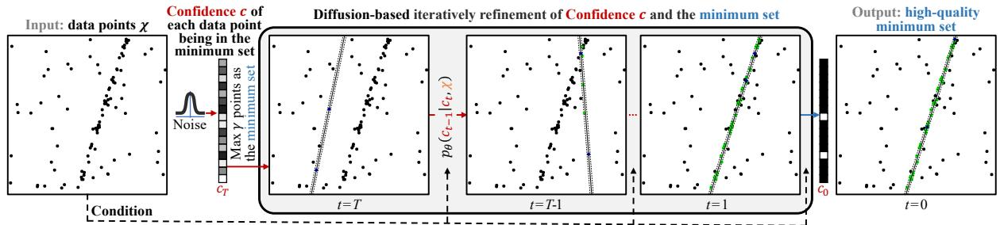  
Fig. 1 Robust estimation with DifSAC. The 2D line fitting task is used as an example. DifSAC predicts the confidence c of each data point being selected as the minimum set with the difusion model. DifSAC marries the power of sampling consensus with the strengths of the difusion model to iteratively refine the minimum set of data points χ. green, black respectively indicate inliers, and outliers.

Estimation (DifSAC), which integrates difusion models into sample consensus for robust estimation, efectively addressing limitations in minimum set refinement and sampling eficiency.

• DifSAC leverages geometric features to constrain the difusion process, iteratively refining confidences to output reliable and deterministic, high-quality minimum sets while minimizing the selection of bad sets, thus improving both eficiency and accuracy.

• Extensive experiments on 2D line fitting, 3D plane fitting, fundamental matrix estimation, essential matrix estimation, and homography estimation demonstrate that DifSAC achieves state-of-the-art performance and can be easily integrated into existing sampling consensus methods as a plug-and-play module for diverse robust estimation tasks.

## 2 Related Work

Sample Consensus. Robust estimation, essential for handling noisy data, is commonly addressed by sample consensus methods. The Random Sample Consensus (RANSAC) algorithm stands as a foundational approach in this category [28]. The strength of RANSAC lies in its simplicity and broad applicability, yet its random sampling process can be ineficient, particularly with high outlier ratios.

To improve the sampling eficiency of RANSAC, subsequent methods have introduced more strategic sampling techniques. PROSAC prioritizes data points more likely to support a valid model by sorting data based on a quality metric and sampling sequentially [31]. USAC takes a broader approach, integrating diverse sampling strategies to dynamically balance eficiency and robustness in various scenarios [38]. Neural networks are explored to guide sampling. Initial eforts use PointNet to directly classify data points as inliers or outliers [39]. This approach is further developed to incorporate local context through pooling and unpooling mechanisms, enhancing the classification accuracy [40]. Alternative sampling strategies include NAPSAC, which constrains sampling to local neighborhoods to improve performance in certain cases, though at the risk of overlooking global structure and becoming trapped in local optima [41]. Progressive NAPSAC mitigates this limitation by gradually expanding the sampling area from local to global, seeking a balance between focused and comprehensive search [42]. More recently, NG-RANSAC leverages neural networks to predict the probability of selecting efective samples, thus focusing the sampling process on more promising regions of the data space [30]. DGSAC [43] introduces the concept of Kernel Residual Density (KRD) to create a data-driven, automated pipeline that guides the sampling process and eliminates the need for user-specified parameters like a time budget. However, these methods based on preference sampling still have a higher probability of sampling bad minimum sets. This leads to a lot of unnecessary computing consumption. Utilizing advanced generative methods to directly produce reliable and deterministic high-quality minimum sets can greatly improve eficiency.

In addition to refining the sampling process, many methods focus on improving the quality of generated hypotheses through local refinement.

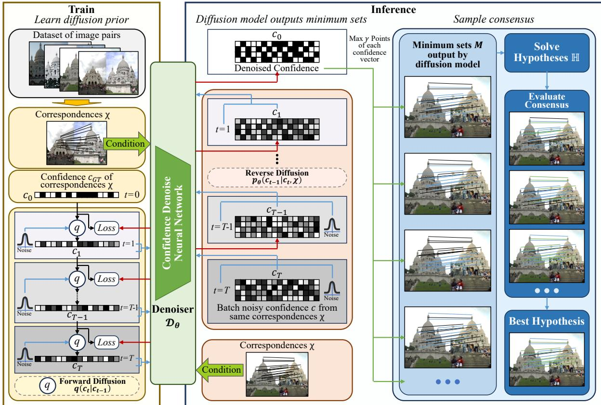  
Fig. 2 The pipeline of the proposed DifSAC. We use the fundamental matrix estimation task as an example. DifSAC uses correspondences χ as a condition to constrain the generation direction. During training, DifSAC takes the confidence c of each data point being part of the minimum set to learn the difusion prior with forward difusion (Sec. 4.2). For inference, DifSAC iteratively refines multiple confidence c simultaneously through reverse difusion to generate high-quality minimum sets. Then, the hypotheses solved by these minimum sets are evaluated for consensus to obtain the best hypothesis as the final result of robust estimation (Sec. 4.3)

LO-RANSAC refines initial hypotheses by concentrating on the inliers of the current best model, iteratively improving the solution within a local context [44]. GC-RANSAC, in contrast, considers the spatial relationships between data points, modeling data as a graph and utilizing graph-cut to achieve a more spatially coherent separation of inliers and outliers [45]. MAGSAC++ enhances robustness by employing adaptive thresholds that are less sensitive to variations in noise levels, leading to more reliable estimation in diverse noise conditions [46]. Deep learning techniques also enhance the sample consensus framework. DSAC replaces the deterministic sampling of RANSAC with a probabilistic approach, allowing for end-toend training and gradient-based optimization of the sampling process [47]. Similarly, other methods directly optimize the likelihood of selecting good hypotheses within a deep learning framework, aiming to learn more efective sampling distributions from data [48].

Difusion models, inspired by thermodynamics [49], learn data distributions through a process of iteratively adding and then removing noise. Difusion models have demonstrated remarkable success in generating high-quality samples across various data types, including images [50–54], videos [55–59], and 3D point clouds [60–64]. Recent work has begun to explore the application of difusion models in localization and pose estimation. For example, DifLoc combines difusion models with pose regression to improve LiDAR localization accuracy [65], and PoseDifusion utilizes them to enhance bundle adjustment in structure-from-motion pipelines [66]. PC2 leverages difusion models to reconstruct

3D point clouds from images, guided by camera pose [67]. Despite these advancements, the potential $o f$ difusion models as a core component within robust estimation frameworks remains largely unexplored. We believe that the difusion models are inherently suited to sampling consensus methods and can greatly improve eficiency and accuracy.

## 3 Preliminary

## 3.1 Sample Consensus Methods for Robust Estimation

Robust estimation addresses the challenge of determining a reliable hypothesis, denoted as $h ,$ from a dataset $\chi = \{ \mathrm { x } _ { i } \} _ { i = 1 } ^ { N }$ contaminated with noise. For example, in scenarios involving 2D points, h can represent the parameters of a line fitted to these points. Alternatively, when dealing with image correspondences, h might represent the fundamental matrix in epipolar geometry.

Sample consensus is a prevalent method in robust estimation. This approach operates by first selecting n minimum sets, denoted as M, from the dataset χ. The size γ of each minimum set is determined by the task. For instance, line estimation in 2D space requires a minimum set size of two points. A solver $s$ then processes each minimum set to generate a set of candidate hypotheses, H:

$$
\mathbb { H } = \left\{ S \left( m _ { j } \right) \vert m _ { j } \in M , j = 1 , 2 , . . . , n \right\} .\tag{1}
$$

Subsequently, each hypothesis within H undergoes evaluation using a scoring function f to assess its consensus with the data. A common metric for this evaluation is the inlier ratio, which quantifies the proportion of data points consistent with the hypothesis. The hypothesis achieving the highest score is then chosen as the optimal estimate, $h _ { B e s t } \colon$

$$
h _ { B e s t } = \underset { h \in \mathbb { H } } { \arg \operatorname* { m a x } } f \left( h , \chi \right) .\tag{2}
$$

This iterative process of sampling and evaluating multiple minimum sets confers robustness to outliers.

The classical RANSAC algorithm exemplifies this framework, employing random sampling to derive the minimum sets M. However, it is recognized that random sampling, particularly without incorporating geometric information, can be inefficient.

## 3.2 Difusion Models

Difusion models represent a category of generative models designed to learn intricate data distributions by simulating the reverse of a difusion process [36, 49, 68–71]. This process introduces noise gradually to data over $T ~ \in ~ \mathbb { N }$ discrete steps, transforming the original data into a noisy state. Training these models involves learning to reverse this noising process, efectively denoising data back to its original structure.

Given a variance schedule $\beta _ { 1 } , \dots \beta _ { T }$ across T steps, the transition from step t−1 to step t during the forward difusion (noising) process is described as:

$$
q ( c _ { t } | c _ { t - 1 } ) : = N ( c _ { t } ; \sqrt { 1 - \beta _ { t } } c _ { t - 1 } , \beta _ { t } E ) ,\tag{3}
$$

where E is the identity matrix. Through this forward process, as t approaches $T _ { : }$ , the data distribution $c _ { T }$ converges to an isotropic Gaussian distribution, cT. By defining $\alpha _ { t } \ : = \ 1 - \beta _ { t }$ and $\textstyle { \overline { { \alpha } } } _ { t } : = \prod _ { s = 1 } ^ { t } \alpha _ { s }$ , a closed-form expression allows for direct sampling of $c _ { t }$ from $c _ { 0 } { \mathrm { i } }$

$$
c _ { t } \sim q ( c _ { t } | c _ { 0 } ) = \mathcal { N } ( c _ { t } ; \sqrt { \overline { { \alpha } } _ { t } } c _ { 0 } , ( 1 - \overline { { \alpha } } _ { t } ) E ) .\tag{4}
$$

The reverse difusion process, $p _ { \theta } ( c _ { t - 1 } | c _ { t } )$ maintains a Gaussian form if $\beta _ { t }$ values are suficiently small. This property allows the reverse distribution to be efectively modeled by a denoiser ${ \mathfrak { D } } _ { \theta } { \mathrm { : } }$

$$
p _ { \theta } ( c _ { t - 1 } | c _ { t } ) : = \mathcal { N } ( c _ { t - 1 } ; \sqrt { \alpha _ { t } } \mathfrak { D } _ { \theta } ( c _ { t } , t ) , ( 1 - \alpha _ { t } ) E ) .\tag{5}
$$

Iteratively applying this denoising process allows the model to learn to reconstruct the original data distribution from noise, making difusion models a potent tool for generative tasks.

## 4 Methodology

## 4.1 Pipeline of DifSAC

DifSAC leverages difusion models to enhance sample consensus for robust estimation. The core idea is to use difusion models to improve both the eficiency of sampling and the quality of the minimum sets. As depicted in Fig. 2, DifSAC operates by estimating the conditional probability distribution $p ( c | \chi )$ of confidence c for each data point, given the entire dataset. This confidence c represents whether a data point belongs to a good minimum set. DifSAC approximates this conditional probability distribution using a denoising process inherent to difusion models.

To achieve this, DifSAC first trains a difusion model, denoted as ${ \mathfrak { D } } _ { \theta }$ , on a comprehensive dataset $\{ ( c _ { k } , \dot { \chi } _ { k } ) \} _ { k = 1 } ^ { \mathfrak { S } }$ . This dataset comprises pairs of ground truth data points $\chi _ { k }$ and their corresponding confidence $c _ { k }$ . During inference, as illustrated in Fig. 3, when presented with a new set of observed data points $\chi .$ , DifSAC iteratively refines the sampling from the learned conditional probability distribution $p ( c | \chi )$ . This iterative refinement estimates the confidence $c$ for each data point, aiming to identify high-quality minimum sets and eliminate bad sets. A key distinction from typical noise generation, which is independent of $\chi ,$ is that the denoising process of DifSAC is conditioned on the input data points, making it data-aware. This conditional probability is mathematically expressed as:

$$
p _ { \theta } ( c _ { t - 1 } | c _ { t } , \chi ) = \mathcal { N } ( c _ { t - 1 } ; \sqrt { \alpha _ { t } } \mathfrak { D } _ { \theta } ( c _ { t } , t , \chi ) , ( 1 - \alpha _ { t } ) E ) .\tag{6}
$$

Algorithm 1 Difusion Training Process   
Input:   
1: Timesteps $T ;$   
2: Ground truth confidence $c _ { \mathrm { 0 } } ;$   
3: Data points $\chi$ as condition;   
4: Approximate posterior $q ;$   
5: Initial denoiser ${ \mathfrak { D } } _ { \theta } .$   
Output:   
6: Trained denoiser ${ \mathfrak { D } } _ { \theta } .$   
7: repeat   
8: $c _ { 0 } \sim q ( c _ { 0 } ) ;$   
9: t ∼ Uniform $( 1 , \ldots , T )$   
10: Sample confidence $c _ { t }$ at timestamp t   
through sampling noise $\epsilon \sim \mathcal { N } ( 0 , E )$ in the   
forward process;   
11: Take gradient descent step on   
$\nabla _ { \boldsymbol { \theta } } \left\| \mathfrak { D } _ { \boldsymbol { \theta } } ( c _ { t } , t , \chi ) - c _ { 0 } \right\| ;$   
12: until convergence;   
13: return ${ \mathfrak { D } } _ { \theta } ;$

## 4.2 Learn Difusion Prior

During training, as in Algorithm 1, the denoiser ${ \mathfrak { D } } _ { \theta }$ is trained to associate input data points χ with corresponding confidence. This is achieved by constraining the denoiser to generate confidence that aligns with a designated direction learned from the training data. To establish ground truth confidence $c _ { G T }$ , DifSAC first determines the optimal minimum set mG using a ground truth model. Data points within this optimal set are assigned 1, while the remaining points are assigned 0. This initial confidence assignment, denoted as $c _ { 0 }$ , is then subjected to a forward difusion process through $\operatorname { E q } .$ . 3 until a predefined time step $t = T$ . In each step of forward difusion, the denoiser ${ \mathfrak { D } } _ { \theta }$ takes noisy confidence $c _ { t } ,$ the current time step $t ,$ and the input data points $\chi$ to predict a less noisy confidence $c _ { t - 1 }$ . These inputs are unordered data points.

The architecture of the denoiser ${ \mathfrak { D } } _ { \theta }$ is illustrated in Fig. 4. The use of a transformer-based attention mechanism without positional encodings ensures that our denoiser network is permutationinvariant and can naturally handle inputs with a variable number of points (N), as demonstrated in our experiments in Section 5.3. The network ψ consists of three primary modules: Feature Embedding, Attention Feature Extraction, and Denoising Module. In operation, both the noisy confidence $c _ { t }$ and the data points $\chi$ are initially transformed into feature vectors of identical dimensionality using fully connected (FC) layers. The time step t is also embedded into a feature vector using a multi-layer perceptron (MLP). These embedded features are then combined through addition. Subsequently, the combined features are processed by an attention feature extraction module, employing layer normalization followed by a standard transformer network [72]. The output of the transformer is again layer-normalized. Finally, a fully connected layer maps the processed features to a vector representing the denoised confidence, $\hat { c } _ { t - 1 }$ . For the MLP components, $1 \times 1$ convolutions with a stride of 1 are utilized. The operation of the denoiser can be summarized as:

$$
\mathfrak { D } _ { \theta } ( c _ { t } , t , \chi ) = \psi [ ( c _ { t } ^ { i } , t , \chi ^ { i } ) _ { i = 1 } ^ { N } ] = \hat { c } _ { t - 1 } ,\tag{7}
$$

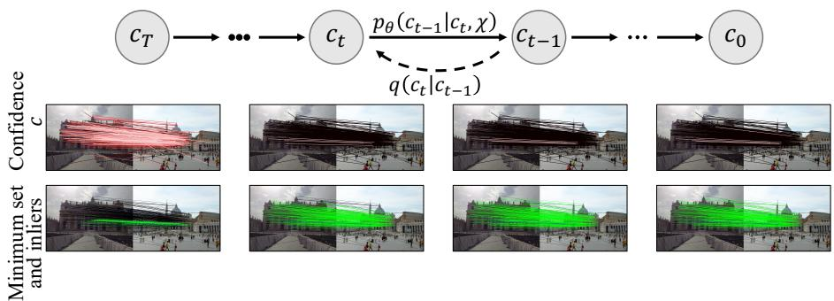  
Fig. 3 An illustration of the difusion process for essential matrix estimation. The brighter the lines in confidence $^ { c , }$ the higher the confidence value. Other colors are the same as Fig. 1. During forward process, DifSAC progressively adds Gaussian noise to the ground truth confidence c . In reverse difusion, DifSAC denoises noisy confidence c at time t with condition χ.

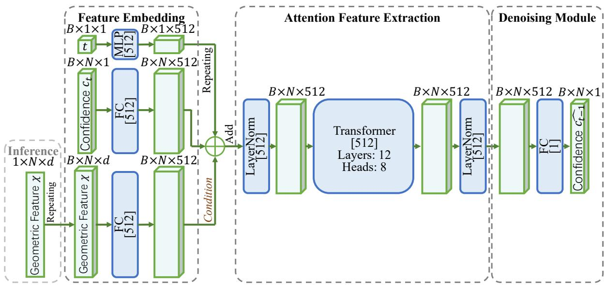  
Fig. 4 Architecture of the Confidence Denoise Neural Network in DifSAC. The raw data $\chi$ is represented as unordered $N \times d$ data points for conditioning. The network denoises the confidence $c _ { t }$ into $\hat { c } _ { t - 1 }$

where $\psi$ denotes the denoiser taking a sequence of noisy tuples $c _ { t } ^ { i } .$ , difusion time $t ,$ and geometric features $\chi ^ { i } \in \mathbb R ^ { d }$ . The training process optimizes the difusion model ${ \mathfrak { D } } _ { \theta }$ by minimizing a denoising loss, calculated as the diference between the predicted denoised confidence $\hat { c } _ { t - 1 }$ and the ground truth confidence $c _ { \mathrm { 0 } } \mathrm { : }$

$$
\begin{array} { r } { \mathcal { L } _ { d i f f } = E _ { t \sim [ 1 , T ] , c _ { t } \sim q ( c _ { t } | c _ { 0 } , \chi ) } [ \left| \left| \mathfrak { D } _ { \theta } ( c _ { t } , t , \chi ) - c _ { 0 } \right| \right| ^ { 2 } ] , } \\ { ( 8 ) } \end{array}
$$

where the expectation is computed over difusion timesteps t, difused samples $c _ { t }$ , and the training set $\big \{ ( c _ { 0 , j } , \chi _ { j } ) \big \} _ { j = 1 } ^ { \mathfrak { S } }$

Algorithm 2 Difusion Sampling Process   
Input:   
1: Timesteps $T ;$   
2: Data points χ as condition;   
3: Denoiser ${ \mathfrak { D } } _ { \theta } .$   
Output:   
4: Refined confidence $c _ { 0 } .$   
5: Sample initial confidence $c _ { T } \sim \mathcal { N } ( 0 , E )$   
6: for $t = T$ to 1 do   
7: $z \sim \mathcal { N } ( 0 , E )$ if $t > 1 ,$ else $z = 0 ;$   
8: $\begin{array} { r } { c _ { t - 1 } = \frac { 1 } { \sqrt { \alpha _ { t } } } \left( c _ { t } - \frac { 1 - \alpha _ { t } } { 1 - \overline { { \alpha } } _ { t } } \mathfrak { D } _ { \theta } ( c _ { t } , t , \chi ) \right) + \sigma _ { t } z ; } \end{array}$   
9: end for   
10: return $c _ { \mathrm { 0 } } ;$

## 4.3 Inference: Generating and Evaluating Minimum Sets

The inference process in DifSAC is designed to generate and evaluate multiple high-quality minimum sets to find the optimal model hypothesis, as in Algorithm 2. The procedure begins by taking the input data points χ. To eficiently explore the solution space and leverage the stochastic nature of the difusion model, the input χ is replicated to form a batch of size κ. For each of these parallel instances, the process is initiated with a unique, randomly sampled noise vector $c _ { T } ~ \sim ~ N ( 0 , E )$ 2 where E is the identity matrix. This strategy allows the model to generate a diverse pool of candidate solutions simultaneously, which can be eficiently handled using GPU parallelism.

With the batch of κ initial noise vectors, the core generation step involves running the reverse difusion process for T steps. Using the trained denoiser ${ \mathfrak { D } } _ { \theta }$ , the model iteratively refines each noise vector, conditioned on the input data χ, to produce κ final confidence vectors. At each step t in the reverse sequence $( T , \ldots , 0 )$ , the subsequent confidence vector $c _ { t - 1 }$ is sampled from the learned conditional distribution $p _ { \theta } ( c _ { t - 1 } | c _ { t } , \chi )$ as follows:

$$
c _ { t - 1 } = \mathcal { N } ( c _ { t - 1 } ; \sqrt { \overline { { \alpha } } _ { t - 1 } } \mathfrak { D } _ { \theta } ( c _ { t } , t , \chi ) , ( 1 - \overline { { \alpha } } _ { t - 1 } ) E ) .\tag{9}
$$

This iterative refinement process leverages the learned geometric features of the data to guide the generation, efectively pruning paths that would lead to poor minimum sets and steering the outcome towards high-quality confidence assignments.

Once the κ confidence vectors are generated, the next step is to form candidate minimum sets. For each confidence vector $c _ { 0 } ^ { ( i ) }$ , a corresponding minimum set is constructed by selecting the γ data points from χ that have the highest confidence values. From each of these κ minimum sets, a model hypothesis is solved. This results in a collection of κ distinct hypotheses, each derived from a promising minimum set identified by the difusion model.

Finally, these κ hypotheses are evaluated within a sample consensus framework. The consensus score for each hypothesis is calculated by evaluating its consistency with the entire input dataset χ using an appropriate metric. The hypothesis that garners the highest consensus score is ultimately selected as the final robust estimation result, $h _ { B e s t }$ . This comprehensive evaluation ensures that the chosen model is not only derived from a high-quality minimum set but is also the most consistent with the overall data distribution, enhancing the accuracy and robustness of the final estimation.

## 5 Experiments

DifSAC is evaluated through experiments on five classic tasks: 2D line fitting, 3D plane fitting, fundamental matrix estimation, essential matrix estimation, and homography estimation. The 2D line fitting and 3D plane fitting tasks serve to visualize the behavior of robust estimation across various noise levels. By manually adjusting noise ratios, these tasks elucidates the sampling process inherent in robust methods. For complex scenarios, fundamental and essential matrix estimation tasks assess the applicability of DifSAC to real-world camera pose estimation. The homography estimation task demonstrates the ability of DifSAC to handle quasi-convex problems. These tasks provide critical insights into DifSAC’s efectiveness in practical computer vision applications.

## 5.1 Experimental Setup

DifSAC is implemented based on the DDPM framework [36]. For eficient training with multiple data points, the system constructs batches by concatenating diverse point sets. The difusion inference process involves $T = 1 0 0$ iterative refinement steps. The models undergo training for 100 epochs, employing the Adam optimizer, configured $\beta _ { 1 } ~ = ~ 0 . 9$ and $\beta _ { 2 } ~ = ~ 0 . 9 9 9$ . The learning rate is initially set to 0.0001 and subsequently diminishes following a cosine annealing schedule. Notably, the noise in the data varies with the actual task, while the noise in the difusion model to generate confidence is sampled from a standard Gaussian distribution. During inference, each input dataset is replicated $\kappa = 2 0$ times to generate κ candidate minimum sets concurrently. These sets are then processed by a sample consensus module to identify the optimal hypothesis, with inlier count as the default consensus metric. The inliers of the best hypothesis are used for final model refinement. To accelerate inference,

DifSAC incorporates DPM-Solver++ [73] as a difusion model accelerator.

All experiments are conducted on a Linux server equipped with an Intel i7 5.0 GHz CPU and an RTX 4090 GPU. The implementation is developed using PyTorch.

## 5.2 2D Line Fitting Task

We first test DifSAC in 2D line fitting, a basic task in computer vision. We generate synthetic datasets of points in a 2D space, $\chi =$ $\{ [ x _ { i } , y _ { i } ] | i = 1 , 2 , . . . , N \} \in \mathbb { R } ^ { N \times 2 }$ , where N is the total number of points. For each dataset, we establish a ground truth line within a $1 0 \times 1 0$ picture. Inliers, representing points belonging to the ground truth line, are then positioned along this line. While outliers are randomly distributed across the picture to simulate realistic noise scenarios. The proportion of outliers is systematically varied to evaluate robustness at diferent contamination levels. Consistent with the definition of a line requiring a minimum of two points, DifSAC identifies sets of $\gamma = 2$ points as minimum sets. We configure DifSAC with an inlier distance threshold of $\varepsilon = 0 . 1$ , reflecting the perturbation range of inlier points around the ground truth line. In all experiments, we use datasets of $N = 1 0 0$ points for both training and testing phases.

Quantitative performance is evaluated using the mean Average Accuracy (mAA) metric [76]. This metric quantifies the angular diference between estimated and ground truth lines. An estimate is accurate if the angular error is within $0 . 5 ^ { \circ }$ . Table 1 summarizes the mAA scores achieved by DifSAC and comparative methods across varying outlier rates.

As shown in Table 1, DifSAC consistently achieves superior performance compared to other methods across all tested outlier rates. In scenarios with low outlier contamination, CLNet [75], RANSAC [28], and Theil-Sen [74] exhibit reasonable line estimation accuracy. However, DifSAC still demonstrates a slight performance advantage with competitive speed. Notably, in highoutlier scenarios, DifSAC is substantially ahead, maintaining significantly higher mAA scores and demonstrating robust performance. In contrast, the performance of other methods, particularly Theil-Sen, degrades considerably in the presence of increased noise. This indicates that DifSAC efectively identifies minimum sets that are closely aligned with the ground truth line, rendering it more resilient to high levels of noise. In addition, TABLE 2 quantitatively evaluates the performance of the various methods at diferent noise scales on 0.5 outlier rate. The results show that DifSAC exhibits better performance at diferent noise scales compared to other methods. This experiment demonstrates the robustness of Dif-SAC to noise scales. Furthermore, TABLE 3 shows the performance of each method under the interference of non-uniform point-aggregated noise. Due to the efective extraction of data semantics by DifSAC’s neural network, DifSAC still achieves better performance in this interference situation.

Complementing the quantitative analysis, Fig. 5 presents qualitative results, visually illustrating the lines estimated by DifSAC under varying noise levels. These visual results align with the quantitative findings, confirming the ability of DifSAC to accurately estimate lines even when substantial noise is present. Furthermore, Fig. 6 visualizes the iterative refinement process within DifSAC, specifically in a scenario with a 0.5 outlier rate. The visualization tracks the evolution of confidence c, demonstrating that DifSAC can efectively refine an initially noisy set of points to converge on a minimum set with high confidence. This rapid convergence highlights the capacity of DifSAC to leverage the generative power of difusion models for identifying highquality hypotheses. The progressive refinement also showcases the ability of DifSAC to perform local optimization, further enhancing the quality of the identified minimum set once a promising candidate is found. These qualitative observations emphasize the efectiveness of DifSAC in exploiting geometric properties to guide the generation of accurate confidence c for minimum sets, especially in challenging high-noise conditions.

## 5.3 3D Plane Fitting Task

We further assess the efectiveness of DifSAC on 3D plane fitting, a task with broader applicability. The experimental setup mirrors the 2D line fitting task, but now utilizes three-dimensional data points, $\chi \ = \ \{ [ x _ { i } , y _ { i } , z _ { i } ] \mid i = 1 , 2 , . . . , N \} \in$ $\mathbb { R } ^ { N \times 3 }$ . Consistent with the geometric definition of a plane, DifSAC selects minimum sets of $\gamma = 3$ points. We again use synthetic datasets with $N =$ 100 points for both training and testing, unless otherwise specified.

Table 1 2D line fitting. The mAA@0.5◦ and median error(◦) across outlier rates from 10% to 80% are reported.
<table><tr><td rowspan="2">Method</td><td colspan="2">0.1</td><td colspan="2"></td><td colspan="2"></td><td colspan="2">0.3</td><td colspan="2">0.5</td><td colspan="2">0.6</td><td colspan="2">0.7</td><td colspan="2">0.8</td><td rowspan="2">Speed (Hz) ↑</td></tr><tr><td>|mAA ↑Mid. ↓mAA ↑Mid. ↓mAA ↑Mid. ↓|mAA ↑Mid. ↓mAA ↑Mid. ↓mAA ↑Mid.</td><td></td><td></td><td></td><td></td><td></td><td></td><td></td><td></td><td></td><td></td><td></td><td>↓mAA ↑Mid.</td><td></td><td>↓mAA ↑Mid. ↓</td><td></td></tr><tr><td>Theil-Sen [74]</td><td>0.80</td><td></td><td>0.77</td><td></td><td></td><td>0.75</td><td></td><td>0.15</td><td>0.09</td><td></td><td>0.06</td><td></td><td>0.01</td><td>=</td><td>0.00</td><td></td><td>80</td></tr><tr><td>RANSAC [28]</td><td>0.86</td><td></td><td>0.05</td><td>0.83</td><td>0.06</td><td>0.81</td><td>0.06</td><td>0.80 0.07</td><td>0.78</td><td>0.07</td><td>0.76</td><td>0.09</td><td>0.57</td><td>0.24</td><td>0.30</td><td>0.31</td><td>100</td></tr><tr><td>DGSAC [43]</td><td>0.86</td><td>0.05</td><td>0.84</td><td>0.06</td><td>0.83</td><td>0.06</td><td>0.82</td><td>0.06</td><td>0.79</td><td>0.07</td><td>0.77</td><td>0.08</td><td>0.60</td><td>0.20</td><td>0.36</td><td>0.27</td><td>82</td></tr><tr><td>CLNet [75]</td><td>0.87</td><td>0.05</td><td>0.85</td><td>0.05</td><td>0.84</td><td>0.06</td><td>0.83</td><td>0.06</td><td>0.81</td><td>0.07</td><td>0.79</td><td>0.08</td><td>0.64</td><td>0.19</td><td>0.38</td><td>0.26</td><td>60(GPU) 33(CPU)</td></tr><tr><td>Ours (DiffSAC)</td><td>0.89</td><td>0.03</td><td>0.88</td><td>0.04</td><td>0.87</td><td>0.04</td><td>0.87</td><td>0.05</td><td>0.86</td><td>0.05</td><td>0.84</td><td>0.07</td><td>0.70</td><td>0.13</td><td>0.43</td><td>0.20</td><td>50(GPU) 30(CPU)</td></tr></table>

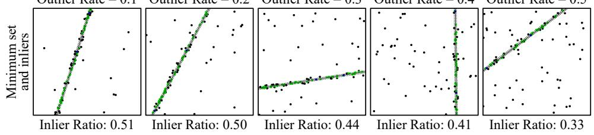  
Fig. 5 The qualitative results of DifSAC on 2D line fitting. green, black respectively indicate inliers, and outliers. DifSAC can fit the accurate 2D line at various outlier rates.

Table 2 2D line fitting on diferent outlier scales. The mAA@0.5◦ and median error(◦) with 0.5 outlier rates at various outlier scales are reported.
<table><tr><td rowspan="2">Method</td><td colspan="2">0.05</td><td colspan="2">0.1</td><td colspan="2">0.2</td></tr><tr><td>|mAA ↑Mid. ↓mAA ↑Mid. ↓|mAA ↑Mid. ↓</td><td></td><td></td><td></td><td></td><td></td></tr><tr><td>Theil-Sen [74]</td><td>0.21</td><td>-</td><td>0.09</td><td>-</td><td>0.03</td><td>=</td></tr><tr><td>RANSAC [28]</td><td>0.80</td><td>0.06</td><td>0.78</td><td>0.07</td><td>0.73</td><td>0.13</td></tr><tr><td>DGSAC [43]</td><td>0.88</td><td>0.04</td><td>0.79</td><td>0.07</td><td>0.74</td><td>0.12</td></tr><tr><td>CLNet [75]</td><td>0.88</td><td>0.05</td><td>0.81</td><td>0.07</td><td>0.75</td><td>0.10</td></tr><tr><td>Ours (DiffSAC)</td><td>0.93</td><td>0.02</td><td>0.86</td><td>0.05</td><td>0.81</td><td>0.08</td></tr></table>

Table 3 2D line fitting on point-aggregated outliers. The mAA@0.5◦ and median error(◦) with 0.5 outlier rates are reported.
<table><tr><td>Method</td><td>mAA ↑</td><td>Mid. ↓</td></tr><tr><td>Theil-Sen [74]</td><td>0.03</td><td></td></tr><tr><td>RANSAC [28]</td><td>0.68</td><td>0.18</td></tr><tr><td>DGSAC [43]</td><td>0.71</td><td>0.14</td></tr><tr><td>CLNet [75]</td><td>0.72</td><td>0.14</td></tr><tr><td>Ours (DiffSAC)</td><td>0.80</td><td>0.09</td></tr></table>

Quantitative evaluation of 3D plane fitting performance utilizes the mAA metric, adjusted for angular error between planes with 1◦ tolerance. Fig. 7 (a) presents the mAA results, demonstrating that DifSAC outperforms other methods across all outlier rates. To further examine the robustness and generalization capabilities of Dif-SAC, we evaluate its performance on datasets with doubled points (N=200), without any additional training. Fig. 7 (b) showcases the strong generalization of DifSAC, maintaining high performance with increased data point density. Qualitative visualizations of the fitted planes, presented in Fig. 8, further corroborate these quantitative findings. These visualizations demonstrate that DifSAC can accurately fit planes even under high levels of noise.

## 5.4 Fundamental Matrix Estimation Task

Fundamental matrix estimation is a crucial component in computer vision, which inputs correspondences between pairs of images and can be decomposed to obtain the camera pose. In this study, we use the dataset and experimental setup from the CVPR 2020 RANSAC tutorial [77]. Its training set comprises 12 scenes and over one million image pairs. The test set consists of 2 scenes with 4,950 image pairs per scene. These correspondences are extracted using RootSIFT [78] correspondences, which are matched using nearest neighbor search. For each correspondence, a 128-dimensional SIFT descriptor is extracted. The geometric feature is therefore defined as $\chi = \{ [ x _ { 1 } ^ { i } , y _ { 1 } ^ { i } , d e s _ { 1 } ^ { i } , x _ { 2 } ^ { i } , y _ { 2 } ^ { i } , d e s _ { 2 } ^ { i } ] | i = 1 , 2 , . . . , N \} \in$ RN×260. Hypotheses are solved using the 8-point algorithm [79], with an inlier threshold of ε = 4.

The quantitative performance of our method is summarized in Table 4. We use the mAA metric to evaluate the camera pose accuracy, specifically focusing on rotation and translation. Our method achieves improved results, exhibiting lower errors compared to other approaches. This enhanced performance can be attributed to the integration of a difusion model within our estimation process. This integration allows for a more efective evaluation of potential solutions, ultimately leading to the selection of a superior fundamental matrix.

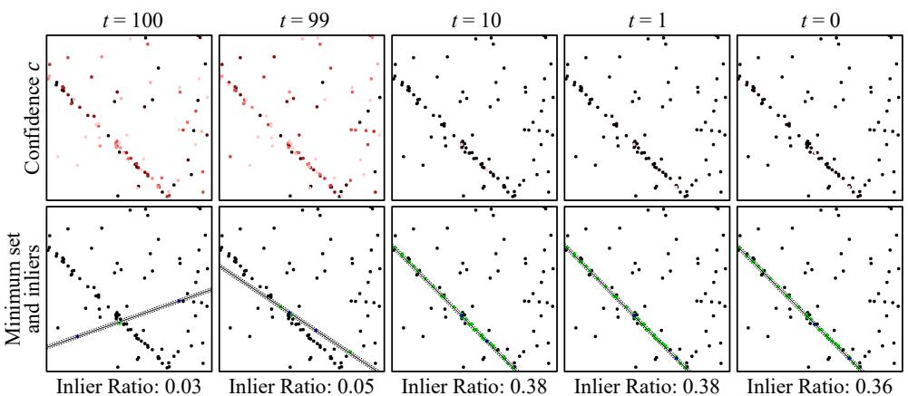  
Fig. 6 The step results of DifSAC on 2D line fitting. The brighter the points in confidence c, the higher their confidence value. The other colors are set the same as Fig. 5. DifSAC can iteratively refine the bad initial confidence c sampled from noise to a high-quality minimum set at the 0.5 outlier rate.

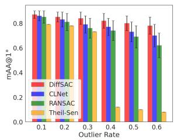  
(a) � = 100

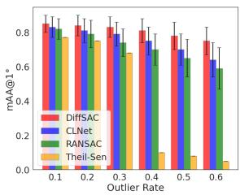  
(b) � = 200  
Fig. 7 3D Plane fitting on (a) 100 and (b) 200 synthetic data points with various outlier rates. The mAA@1◦ is reported, and higher is better. DifSAC achieves the best performance at outlier rates from 10% to 60%.

Qualitative results, visually demonstrating the efectiveness of our method, are presented in Fig. 9. These visualizations reveal that our approach efectively disregards inaccurate and structurally irrelevant correspondences, leading to a more precise fundamental matrix estimation. Furthermore, Fig. 10 illustrates the step-by-step refinement of the estimation process. This figure demonstrates a gradual reduction in both rotation and translation errors as the process progresses. This visual evidence suggests that our method iteratively improves the solution quality by generating and selecting high-quality sets of correspondences while discarding bad sets.

To further validate our findings and assess the robustness of DifSAC across diferent scenarios, we conduct experiments on the KITTI odometry dataset. Following standard practice, we use sequences 00-07 for training and sequences 08- 10 for testing. Feature points are computed and matched using the SIFT algorithm. The quantitative outcomes, depicted in Fig. 11, show that our method achieves superior performance in both rotation and translation accuracy metrics on this dataset. These results reinforce our earlier conclusions about the efectiveness of our approach and highlight its adaptability to diverse situations. Qualitative results presented in Fig. 12 demonstrate that our method successfully estimates accurate fundamental matrices on the KITTI dataset, enabling the derivation of reliable camera poses. These experiments demonstrate the robustness of DifSAC to correspondences from diferent scenarios. This can be attributed to the difusion model in DifSAC that can efectively utilize the pixel location and descriptor information of correspondences.

To provide a more granular comparison of fundamental matrix estimation algorithms, particularly in scenarios with varying levels of data corruption, we conduct a controlled experiment using a synthetic dataset. This dataset is generated from the ModelNet40 dataset. By virtually

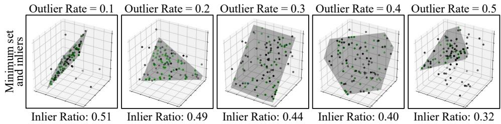  
Fig. 8 The qualitative results of DifSAC on 3D Plane fitting. green, black respectively indicate inliers, and outliers. DifSAC can fit the accurate 3D plane at various outlier rates.

Table 4 Fundamental matrix estimation. The mAA@10◦ and median error of rotation and direction of translation are reported.
<table><tr><td rowspan="2">Method</td><td colspan="2">mAA@10°↑</td><td colspan="2">Median (°)↓</td><td rowspan="2">Speed (Hz) ↑</td></tr><tr><td>R</td><td>t</td><td>€R</td><td>€t</td></tr><tr><td>RANSAC [28]</td><td>0.681</td><td>0.371</td><td>2.952</td><td>8.349</td><td>31</td></tr><tr><td>LO-RANSAC [44]</td><td>0.690</td><td>0.403</td><td>2.579</td><td>7.625</td><td>27</td></tr><tr><td>USAC [38]</td><td>0.698</td><td>0.439</td><td>2.014</td><td>6.415</td><td>28</td></tr><tr><td>DGSAĆ [43]</td><td>0.713</td><td>0.504</td><td>1.875</td><td>4.947</td><td>24</td></tr><tr><td>NG-RANSAC [30]</td><td>0.718</td><td>0.574</td><td>1.587</td><td>2.918</td><td>22(GPU) 8(CPU)</td></tr><tr><td>MAGSAC++ [46]</td><td>0.723</td><td>0.585</td><td>1.476</td><td>2.632</td><td>53</td></tr><tr><td>Ours (DiffSAC)</td><td>0.783</td><td>0.641</td><td>0.886</td><td>1.819</td><td>30(GPU) 13(CPU)</td></tr></table>

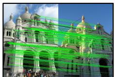  
(a) � : 0.002, � ∶ 0.008, Inlier Ratio: 0.90

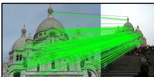  
(b) � : 0.001, � ∶ 0.004, Inlier Ratio: 0.98

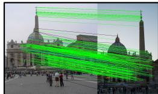  
(c) ��: 0.001, ��∶ 0.007, Inlier Ratio: 0.88

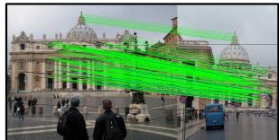  
(d) ��: 0.007, ��∶ 0.005, Inlier Ratio: 0.88

Fig. 9 The qualitative results of DifSAC on the fundamental matrix estimation task. The rotation, translation errors, and inlier rate are reported. green, black respectively indicate inliers, and outliers.

positioning a camera and rendering a chosen CAD model from diferent viewpoints, we synthesize pairs of images. Each image pair in this synthetic dataset is designed to contain N = 200 feature point correspondences, with random noise to simulate varying outlier contamination rates. The results of this experiment, detailed in Table 5, demonstrate a consistent trend. Our method, DifSAC, consistently achieves the most accurate rotation and translation estimation as the proportion of outlier correspondences increases. In simplified situations characterized by low outlier rates, all methods exhibit generally strong performance. However, as outlier rates become more substantial, the performance of other methods degrades noticeably, while DifSAC maintains a robust level of accuracy. This sustained performance is attributed to the ability of DifSAC to consistently identify high-quality minimum sets of correspondences, enabling the robust estimation of the fundamental matrix even in the presence of significant data corruption. This experiment further underscores the pronounced robustness of DifSAC when confronted with varying degrees of outlier contamination.

## 5.5 Essential Matrix Estimation Task

Essential matrix estimation is crucial for determining camera pose, utilizing intrinsic camera parameters and epipolar geometry to compute the relative rotation and translation between two images in normalized coordinates. Following the experimental protocol established for fundamental matrix estimation, we train and evaluate Dif-SAC on the same dataset and setup. The input to DifSAC consists of geometric features, defined as $\chi = \{ [ x _ { 1 } ^ { i } , y _ { 1 } ^ { i } , d e s _ { 1 } ^ { i } , \bar { x _ { 2 } ^ { i } } , y _ { 2 } ^ { i } , d e s _ { 2 } ^ { i } ] | i = 1 , 2 , . . . , N \} \in$ RN×260. These features encapsulate the coordinates and descriptors of matched feature points between image pairs. For hypothesis generation, DifSAC employs the eficient 5-point algorithm [80], a standard technique in essential matrix estimation. We set the inlier threshold to ε = 1 to distinguish between inlier and outlier correspondences.

Table 5 Fundamental matrix estimation on ModelNet40 dataset. The mAA@10◦ ↑ of rotation and direction of translation at outlier rates from 10% to 60% are reported.
<table><tr><td rowspan="2">Method</td><td colspan="2">0.1</td><td colspan="2">0.2</td><td colspan="2">0.3</td><td colspan="2">0.4</td><td colspan="2">0.5</td><td colspan="2">0.6</td></tr><tr><td>R</td><td>t</td><td>R</td><td>t</td><td>R</td><td>t</td><td>R</td><td>t</td><td>R</td><td>t</td><td>R</td><td>t</td></tr><tr><td>RANSAC 28</td><td>0.917</td><td>0.753</td><td>0.849</td><td>0.726</td><td>0.778</td><td>0.668</td><td>0.699</td><td>0.566</td><td>0.602</td><td>0.466</td><td>0.418</td><td>0.376</td></tr><tr><td>LO-RANSAC [44]</td><td>0.928</td><td>0.764</td><td>0.861</td><td>0.743</td><td>0.793</td><td>0.681</td><td>0.716</td><td>0.579</td><td>0.629</td><td>0.484</td><td>0.453</td><td>0.399</td></tr><tr><td>USAC [38]</td><td>0.937</td><td>0.776</td><td>0.872</td><td>0.759</td><td>0.804</td><td>0.694</td><td>0.728</td><td>0.593</td><td>0.643</td><td>0.502</td><td>0.487</td><td>0.414</td></tr><tr><td>DGSAĆ [43]</td><td>0.940</td><td>0.781</td><td>0.879</td><td>0.767</td><td>0.809</td><td>0.700</td><td>0.733</td><td>0.601</td><td>0.651</td><td>0.508</td><td>0.499</td><td>0.420</td></tr><tr><td>NG-RANSÁC [30]</td><td>0.942</td><td>0.785</td><td>0.880</td><td>0.772</td><td>0.812</td><td>0.702</td><td>0.742</td><td>0.605</td><td>0.658</td><td>0.514</td><td>0.508</td><td>0.427</td></tr><tr><td> $\mathrm { M A G S A C + + \Delta \dot { 7 } 4 6 ] }$ </td><td>0.950</td><td>0.799</td><td>0.891</td><td>0.781</td><td>0.820</td><td>0.712</td><td>0.750</td><td>0.615</td><td>0.670</td><td>0.522</td><td>0.524</td><td>0.438</td></tr><tr><td>Ours (DiffSAC)</td><td>0.965</td><td>0.813</td><td>0.909</td><td>0.790</td><td>0.835</td><td>0.724</td><td>0.763</td><td>0.628</td><td>0.684</td><td>0.537</td><td>0.547</td><td>0.453</td></tr></table>

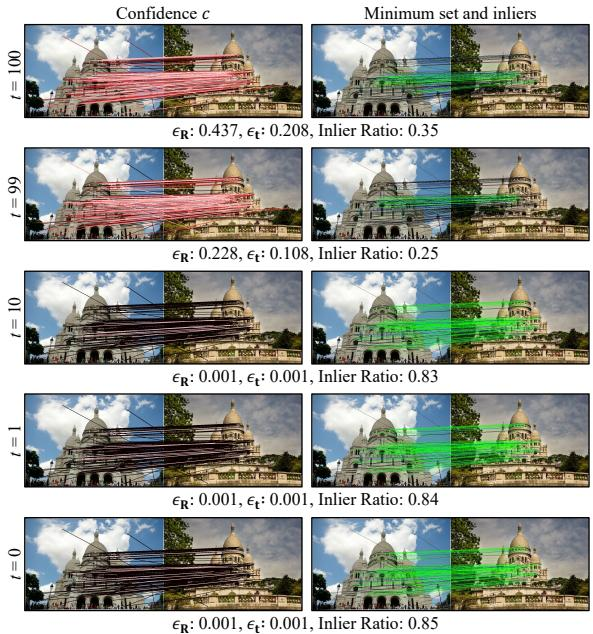  
Fig. 10 The step results of DifSAC on the fundamental matrix estimation task. The brighter the lines in confidence c, the higher confidence value. The other colors of the lines and the evaluation metrics are consistent with Fig. 9.

Quantitative results are summarized in Table 6. The data reveals that DifSAC achieves superior performance compared to other robust estimation methods in terms of accuracy. Qualitative results, visualized in Fig. 13, further illustrate the capability of DifSAC to estimate accurate essential matrices across diverse scenes and viewing angles. Moreover, Fig. 14, displaying multistep essential matrix estimation, demonstrates the ability of DifSAC to consistently generate highquality minimum sets of correspondences, crucial for robust estimation. These findings collectively highlight that DifSAC can estimate accurate essential matrices, efectively leveraging the generative power of difusion models to produce deterministic high-quality minimum sets for this task.

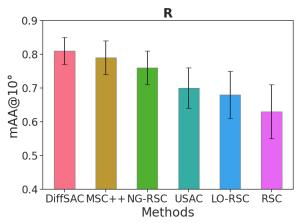

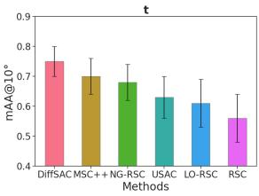  
Fig. 11 Fundamental matrix estimation on the KITTI dataset. The mAA@10◦ of of rotation and direction of translation are reported.

## 5.6 Homography Estimation Task

We further evaluate DifSAC on the homography estimation task. This task serves to assess the performance of DifSAC in handling quasi-convex residuals, which are a characteristic of many robust estimation problems. We utilize the KITTI dataset for training and evaluation, maintaining consistency with the experimental settings used in the fundamental matrix estimation experiments detailed in Section 5.4. The geometric feature input $\chi = \{ [ x _ { 1 } ^ { i } , y _ { 1 } ^ { i } , d e s _ { 1 } ^ { i } , x _ { 2 } ^ { i } , y _ { 2 } ^ { i } , d e s _ { 2 } ^ { i } ] | i = 1 , 2 , . . . , N \} \in$ $\dot { \mathbb { R } } ^ { N \times 2 \dot { 6 } \bar { 0 } }$ remains the same. To estimate the homography matrix H, DifSAC utilizes the Direct Linear Transform (DLT) algorithm [81], a widely adopted method for homography estimation. The inlier threshold for this task is set to $\varepsilon = 0 . 1$ . The residual, which quantifies the reprojection error of matched points under the estimated homography,

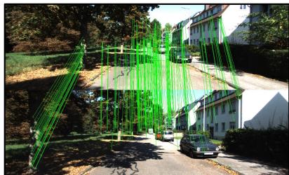  
(a) ��: 0.001, ��∶ 0.002 , Inlier Ratio: 0.99

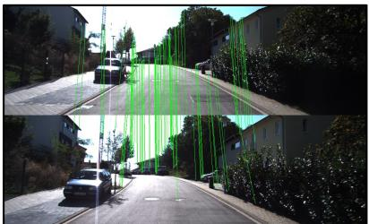  
(b) ��: 0.001, ��∶ 0.001, Inlier Ratio: 0.95

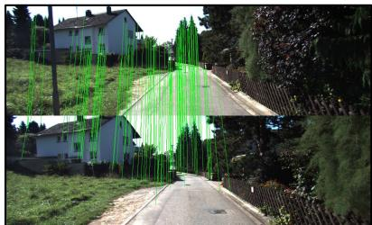  
(c) � : 0.001, � ∶ 0.001, Inlier Ratio: 0.93

Fig. 12 The DifSAC qualitative results of fundamental matrix estimation on the KITTI dataset. The inliers are indicated by the green line. DifSAC can estimate the accurate fundamental matrix on the KITTI dataset.  
Table 6 Essential matrix estimation. The mAA@10◦ and median error of rotation and direction of translation are reported.
<table><tr><td rowspan="2">Method</td><td colspan="2">mAA@10°↑</td><td colspan="2">Median (°) ↓</td><td rowspan="2">Speed (Hz) ↑</td></tr><tr><td>R</td><td>t</td><td>€R</td><td>€t</td></tr><tr><td>RANSAC [28]</td><td>0.701</td><td>0.415</td><td>1.651</td><td>6.374</td><td>50</td></tr><tr><td>LO-RANSAC [44]</td><td>0.716</td><td>0.422</td><td>1.421</td><td>6.106</td><td>46</td></tr><tr><td>USAC [38]</td><td>0.723</td><td>0.426</td><td>1.396</td><td>5.932</td><td>48</td></tr><tr><td>NG-RANŠAC [30]</td><td>0.753</td><td>0.530</td><td>1.287</td><td>2.792</td><td>38(GPU) 17(CPU)</td></tr><tr><td>MAGSAC++ [46]</td><td>0.778</td><td>0.553</td><td>1.195</td><td>2.284</td><td>86</td></tr><tr><td>Ours (DiffSAC)</td><td>0.798</td><td>0.651</td><td>0.863</td><td>1.779</td><td>48(GPU) 22(CPU)</td></tr></table>

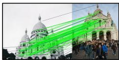

  
(b) ��: 0.001, ��∶ 0.002, Inlier Ratio: 0.72

(a) ��: 0.003, ��∶ 0.008, Inlier Ratio: 0.89  
  
(c) � : 0.001, � ∶ 0.001, Inlier Ratio: 0.89

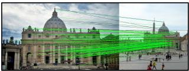  
(d) ��: 0.001, ��∶ 0.003, Inlier Ratio: 0.74

Fig. 13 The qualitative results of DifSAC on essential matrix estimation task. The rotation, translation errors, and inlier rate are reported. The colors of lines are set the same as in Fig. 9.

is computed as:

$$
r = \frac { \left\| ( H _ { r o w = 1 : 2 } - [ x _ { 2 } , y _ { 2 } ] ^ { T } H _ { r o w = 3 } ) [ x _ { 1 } , y _ { 1 } , 1 ] ^ { T } \right\| } { H _ { r o w = 3 } \cdot [ x _ { 1 } , y _ { 1 } , 1 ] ^ { T } } .\tag{10}
$$

The quantitative results, presented in Figure 15, demonstrate that DifSAC outperforms other methods in homography estimation on the KITTI dataset. This outcome underscores the broader applicability and efectiveness of DifSAC as a robust estimation technique. This experiment confirms the eficacy of DifSAC extends beyond specific problem instances like essential and fundamental matrix estimation, showcasing its potential for more general robust estimation challenges.

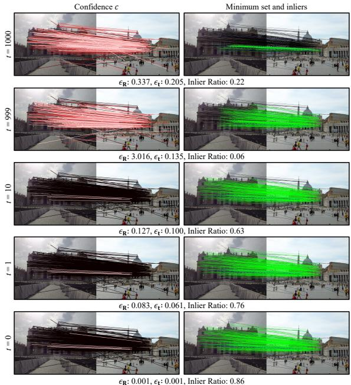  
Fig. 14 The step results of DifSAC on the essential matrix estimation task. The colors of lines and evaluation metrics are consistent with Fig. 13.

## 5.7 Ablation Study

To evaluate the contribution of each component within our DifSAC approach, we performed ablation studies. In these experiments, we systematically altered or removed specific modules of our method, while maintaining consistent experimental data and settings. This allowed us to isolate and understand impacts of elements on the overall performance.

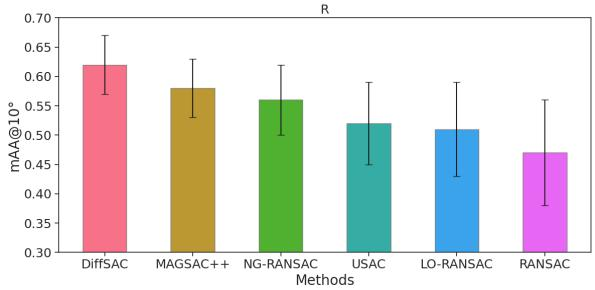  
Fig. 15 Homography estimation on the KITTI dataset. The mAA@10◦ of rotation is reported.

The Efect of the difusion model is tested in Table 7 (a). We attempt to directly train a neural network to predict confidence c from the input data points χ. However, this direct approach yields significantly lower performance and struggles to identify high-quality minimum sets efectively. In contrast, DifSAC leverages the iterative refinement process of difusion models to generate confidence c that closely approximates the true confidence. This continuous refinement of the minimum set is crucial for achieving robust performance.

The plug-and-play capability of DifSAC is demonstrated in Table 7 (b). We combined the minimum set estimation of DifSAC with the local hypothesis refinement of LO-RANSAC [44]. By substituting DifSAC for the standard RANSAC within this established framework, we observed a further performance increase. This improvement highlights the plug-and-play capability of Dif-SAC and its compatibility with existing sampling consensus methods. This versatility stems from DifSAC’s unique combination of deep learning and the principles of classical sample consensus.

The efect of descriptors is tested in Table 7 (c). Our findings indicate that DifSAC can accept various descriptors as input. These descriptors can provide rich image information to Dif-SAC, ofering the difusion model with crucial contextual understanding of the image content underlying the data points. Without descriptors, relying solely on coordinate information, DifSAC struggles to converge efectively. In addition, the SuperPoint descriptors are slightly better than the other methods, possibly because the learningbased SuperPoint output descriptors may be better suited for DifSAC to decode features. Notably, DifSAC does not specify the type of descriptors. We use the SIFT descriptors that from the public dataset for a fairer comparison of performance. If there is Gaussian noise in the descriptor of SIFT, the performance degradation will be drastically reduced. These results underscore the role of descriptors in guiding the difusion process towards meaningful solutions.

Diferent sampling approaches are compared in Table 7 (d). Our experiments show that maximum sampling of the minimum set performs marginally better than probabilistic sampling. This subtle advantage arises because the difusion model generates highly accurate and deterministic confidence c, as visualized in Figure 10. Probabilistic sampling, in contrast, introduces the possibility of selecting less optimal minimum sets, potentially hindering performance.

Diferent neural networks are tested in Table 7 (e). Compared to MLPs and DGCNNbased networks, the transformer-based network demonstrates superior feature extraction from the data points. The “attention” mechanism inherent in transformers proves particularly efective in discerning the complex relationships between confidence c and data points χ, ultimately leading to enhanced performance.

Sampling eficiency is compared in Table 7 (f) and Fig. 16. By employing DPM-Solver++ [73] to accelerate the inference of difusion models, DifSAC achieves rapid hypothesis generation under GPU parallel computing. It solves for high-quality hypotheses in just 33 milliseconds with 2000 iterations, encompassing both difusion sampling and evaluate consensus. The data preprocessing and feature embedding take 12% of the time, and difusion sampling takes 75% of the time. Benefiting from the small number of high-quality hypotheses to be evaluated, evaluate consensus only takes 13% of the time. The GPU memory usage is around 2GB for inference. Moreover, our results with varying iteration counts (Fig. 16) reveal that DifSAC consistently achieves superior performance with significantly fewer iterations than competing methods. For instance, with only 2,000 iterations, DifSAC surpasses the accuracy of methods like MAGSAC++ that use over 10,000 iterations. This eficiency gain stems from the difusion model’s ability to preemptively filter out bad minimum sets before hypothesis solving, focusing computational resources only on promising candidates. By efectively trading numerous random samples for a small batch of guided, high-quality ones, DifSAC provides a more eficient and robust estimation pipeline.

Table 7 The ablation study results of DifSAC on fundamental matrix estimation.
<table><tr><td rowspan="2">Exp.</td><td rowspan="2">Method</td><td colspan="2"> $\mathrm { m A A @ 1 0 ^ { \circ } ~ \uparrow ~ }$ </td><td colspan="2">Median (°) ↓</td></tr><tr><td>R</td><td>t</td><td>∈R</td><td>€t</td></tr><tr><td rowspan="2">(a)</td><td>Ours (w direct learning confidence)</td><td>0.687</td><td>0.393</td><td>2.761</td><td>7.835</td></tr><tr><td>Ours (full, w/ diffusion model)</td><td>0.783</td><td>0.641</td><td>0.886</td><td>1.819</td></tr><tr><td rowspan="2">(b)</td><td>Ours (w/ LO-RANSAC sample consensus)</td><td>0.794</td><td>0.657</td><td>0.874</td><td>1.763</td></tr><tr><td>Ours (full, w/ RANSAC sample consensus)</td><td>0.783</td><td>0.641</td><td>0.886</td><td>1.819</td></tr><tr><td rowspan="5">(c)</td><td>Ours (w/o descriptors)</td><td>0.725</td><td>0.603</td><td>1.271</td><td>2.193</td></tr><tr><td>Ours (w/ ORB descriptors)</td><td>0.751</td><td>0.623</td><td>0.997</td><td>2.002</td></tr><tr><td>Ours (w/ SuperPoint descriptors)</td><td>0.787</td><td>0.646</td><td>0.883</td><td>1.813</td></tr><tr><td>Ours (full, w/ SIFT descriptors + Gaussian)</td><td>0.738</td><td>0.615</td><td>1.147</td><td>2.026</td></tr><tr><td>Ours (full, w/ SIFT descriptors)</td><td>0.783</td><td>0.641</td><td>0.886</td><td>1.819</td></tr><tr><td rowspan="3">(d)</td><td>Ours (w/o probabilistic sampling)</td><td>0.761</td><td>0.627</td><td>0.989</td><td>1.958</td></tr><tr><td>Ours (full, w/ max sampling)</td><td>0.783</td><td>0.641</td><td>0.886</td><td>1.819</td></tr><tr><td>Ours (w/ MLPs)</td><td>0.713</td><td>0.569</td><td>1.613</td><td>2.987</td></tr><tr><td rowspan="3">(e)</td><td>Ours (w/ DGCNN [82]</td><td>0.726</td><td>0.592</td><td>1.325</td><td>2.074</td></tr><tr><td>Ours (full, w/ Point-e [69])</td><td>0.783</td><td>0.641</td><td>0.886</td><td>1.819</td></tr><tr><td>RANSAC (10k iterations)</td><td>0.681</td><td>0.371</td><td>2.952</td><td>8.349</td></tr><tr><td rowspan="3">(f)</td><td>NG-RANSAC (10k iterations)</td><td>0.718</td><td>0.574</td><td>1.587</td><td>2.918</td></tr><tr><td>MAGSAC++ (10k iterations)</td><td>0.723</td><td>0.585</td><td>1.476</td><td>2.632</td></tr><tr><td>Ours (2k iterations)</td><td>0.783</td><td>0.641</td><td>0.886</td><td>1.819</td></tr></table>

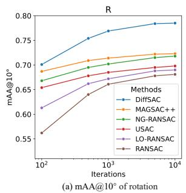

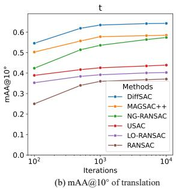  
Fig. 16 The mAA@10◦ ↑ of various methods at different iterations. The rotation and translation errors are reported. DifSAC achieves excellent performance with few iterations, which proves its high eficiency.

## 6 Discussion

The learning-based robust estimation methods directly in a one-shot manner [83] often function as black boxes. This characteristic obscures the process by which these methods arrive at their results, hindering interpretability. This limited interpretability raises concerns about the practicality of such approaches in engineering applications, where understanding the behavior of methods is often crucial. In contrast, traditional methods grounded in mathematical theory, such as optimization-based model fitting, ofer clear interpretability and well-defined application scopes. However, many of these traditional methods struggle to efectively incorporate geometric data features and can be ineficient in data sampling.

Recognizing these complementary strengths, integrating traditional and learning-based methods emerges as a promising direction to achieve both interpretability and high performance in robust estimation. DifSAC embodies this hybrid approach. By refining confidence c based on geometric features within a difusion model, DifSAC outputs high-quality minimum sets. This framework efectively merges the advantages of deep learning with the established principles of sample consensus processes. This integration enhances the interpretability of DifSAC by providing a clearer understanding of how geometric information contributes to the final estimation.

Furthermore, DifSAC can easily be applied to other robust estimation tasks due to the following reasons:

• DifSAC takes data points as input to predict a vector representing the confidence of each data point in the minimum set. This implies DifSAC can process various types of information beyond just coordinates and descriptors.

• DifSAC can be seamlessly applied to other robust estimation methods as a plug-and-play module, replacing their minimum set sampling module.

## 7 Limitations and Future Work

Despite the strong performance demonstrated, DifSAC has several limitations that open avenues for future research.

On the one hand, the current framework requires task-specific models. A separate difusion model must be trained for each distinct geometric estimation task, such as fundamental matrix estimation or homography. While efective, this approach lacks generality and requires a dedicated training process for every new problem type. A promising direction for future work is to explore the development of a single, more generalized model capable of handling multiple robust estimation tasks, which would significantly reduce training overhead and improve versatility.

On the other hand, there is a computational cost associated with the iterative nature of the difusion model. While we achieve real-time performance on a GPU by leveraging accelerators like DPM-Solver++, the inference process can be demanding for resource-constrained environments. The reliance on a GPU may limit the applicability of DifSAC on devices with only CPU capabilities or in embedded systems. Therefore, future research could focus on developing more lightweight and eficient difusion samplers to reduce the computational burden without sacrificing performance.

## 8 Conclusion

This paper presents DifSAC, a novel robust estimation method leveraging deep learning. To improve eficiency, DifSAC integrates the established sample consensus process with a difusion model. The difusion model serves to identify and discard bad minimum sets early in the process. This allows for iterative refinement of confidence, leading to more reliable and precise estimations. DifSAC then selects data points exhibiting high confidence to form minimum sets. Geometric features guide the generation of the difusion model, ensuring relevant solutions. To further enhance the quality of the estimated model, DifSAC generates and evaluates multiple high-quality minimum sets using sample consensus to identify the optimal hypothesis. The sampling approach allows DifSAC to function as a plug-and-play module that is readily integrable into other robust estimation methods based on sample consensus. Experiments demonstrate that DifSAC achieves state-of-the-art performance. Its design also facilitates straightforward application to diverse robust estimation tasks.

Acknowledgements. This work was supported in part by the Natural Science Foundation of China under Grant 62225309, U24A20278, 62361166632 and U21A20480.

Data Availability. Our implementation is available at https://github.com/IRMVLab/ DifSAC.

Competing interests. The authors declare no competing interests.

## Appendix A Network Architecture Details

The network structures are based on Point-e [84]. To maintain permutation invariance, no positional encoding is applied.

In the attention feature extraction module, the features are first layer-normalized and then passed through a standard transformer network [72]. The output is layer-normalized again. Finally, a fully connected layer maps the features into a vector to denoise the confidence $c _ { t }$ into $c _ { t - 1 }$ . The detailed network parameters are shown in Table A1. For the MLP, a $1 \times 1$ convolution with a stride of 1 is used.

## References

[1] Wenzel, P., Yang, N., Wang, R., Zeller, N., Cremers, D.: 4seasons: Benchmarking visual slam and long-term localization for autonomous driving in challenging conditions. International Journal of Computer Vision 133(4), 1564–1586 (2025)

Table A1 Detailed network parameters of the Confidence Denoise Neural Network. “Width” indicates the number of output channels.
<table><tr><td colspan="2">Module</td><td colspan="2">Layer Parameter</td></tr><tr><td rowspan="6">Feature Embedding</td><td>Confidence  $c _ { t }$ </td><td>Fully Connected</td><td> $W i d t h { = } [ 5 1 2 ]$ </td></tr><tr><td>t</td><td>MLP</td><td> $W i d t h { = } [ 5 1 2 ]$ </td></tr><tr><td></td><td>GELU</td><td></td></tr><tr><td></td><td>Repeating Repeating</td><td>- if inference</td></tr><tr><td>Data points X</td><td>Fully Connected</td><td> $W i d t h { = } [ 5 1 2 ]$ </td></tr><tr><td colspan="3">Add</td></tr><tr><td rowspan="3">Attention Feature Extraction</td><td colspan="2">LayerNorm</td><td> $W i d t h { = } [ 5 1 2 ]$ </td></tr><tr><td colspan="2">Transformer</td><td> $W i d t h { = } [ 5 1 2 ] , L a y e r s { = } [ 1 2 ] , H e a d s { = } [ 8 ]$ </td></tr><tr><td colspan="2">LayerNorm</td><td> $W i d t h { = } [ 5 1 2 ]$ </td></tr><tr><td>Denoising</td><td colspan="2">Fully Connected</td><td> $W i d t h { = } [ 5 1 2 ]$ </td></tr></table>

[2] Xu, W., Zhang, X., Pollefeys, M., Barath, D., Kneip, L.: Generalized relative pose and scale from afine correspondences. International Journal of Computer Vision, 1–17 (2025)

[3] Zhang, S., Wang, H., Wang, C., Wang, Y., Wang, S., Yang, Z.: An improved ransac-icp method for registration of slam and uav-lidar point cloud at plot scale. Forests 15(6), 893 (2024)

[4] Wu, W., Guo, L., Gao, H., You, Z., Liu, Y., Chen, Z.: Yolo-slam: A semantic slam system towards dynamic environment with geometric constraint. Neural Computing and Applications 34(8), 6011–6026 (2022)

[5] He, W., Lu, Z., Liu, X., Xu, Z., Zhang, J., Yang, C., Geng, L.: A real-time and high precision hardware implementation of ransac algorithm for visual slam achieving mismatched feature point pair elimination. IEEE Transactions on Circuits and Systems I: Regular Papers (2024)

[6] Zheng, S., Wang, J., Rizos, C., Ding, W., El-Mowafy, A.: Simultaneous localization and

mapping (slam) for autonomous driving: concept and analysis. Remote Sensing 15(4), 1156 (2023)

[7] Cheng, Q., Chen, W., Sun, R., Wang, J., Weng, D.: Ransac-based instantaneous realtime kinematic positioning with gnss triplefrequency signals in urban areas. Journal of Geodesy 98(4), 24 (2024)

[8] Barath, D., Cavalli, L., Pollefeys, M.: Learning to find good models in ransac. In: Proceedings of the IEEE/CVF Conference on Computer Vision and Pattern Recognition, pp. 15744–15753 (2022)

[9] Guo, J., Wang, G., Guan, W., Chen, Z., Liu, Z.: A feasible region detection method for vehicles in unstructured environments based on psmnet and improved ransac. Multimedia Tools and Applications 82(28), 43967–43989 (2023)

[10] Yang, J., Huang, Z., Quan, S., Zhang, Q., Zhang, Y., Cao, Z.: Toward eficient and robust metrics for ransac hypotheses and 3d rigid registration. IEEE Transactions on Circuits and Systems for Video Technology 32(2), 893–906 (2021)

[11] Yang, J., Huang, Z., Quan, S., Cao, Z., Zhang, Y.: Ransacs for 3d rigid registration: A comparative evaluation. IEEE/CAA Journal of Automatica Sinica 9(10), 1861–1878 (2022)

[12] Wei, T., Patel, Y., Shekhovtsov, A., Matas, J., Barath, D.: Generalized diferentiable ransac. In: Proceedings of the IEEE/CVF International Conference on Computer Vision, pp. 17649–17660 (2023)

[13] Wan, Z., Fan, B., Hui, L., Dai, Y., Lee, G.H.: Instance-level moving object segmentation from a single image with events. International Journal of Computer Vision, 1–22 (2025)

[14] Jiao, Y., Tran, T.D., Shi, G.: Efiscene: Eficient per-pixel rigidity inference for unsupervised joint learning of optical flow, depth, camera pose and motion segmentation. In: Proceedings of the IEEE/CVF Conference on Computer Vision and Pattern Recognition, pp. 5538–5547 (2021)

[15] Li, J., Hu, Q., Ai, M.: Point cloud registration based on one-point ransac and scaleannealing biweight estimation. IEEE Transactions on Geoscience and Remote Sensing 59(11), 9716–9729 (2021)

[16] Dai, W., Kan, H., Tan, R., Yang, B., Guan, Q., Zhu, N., Xiao, W., Dong, Z.: Multisource forest point cloud registration with semantic-guided keypoints and robust ransac mechanisms. International Journal of Applied Earth Observation and Geoinformation 115, 103105 (2022)

[17] Chung, K.-L., Chang, W.-T.: Centralized ransac-based point cloud registration with fast convergence and high accuracy. IEEE Journal of Selected Topics in Applied Earth Observations and Remote Sensing 17, 5431– 5442 (2024)

[18] Shi, P., Yan, S., Xiao, Y., Liu, X., Zhang, Y., Li, J.: Ransac back to sota: A two-stage consensus filtering for real-time 3d registration. IEEE Robotics and Automation Letters (2024)

[19] Sun, L.: Ransic: Fast and highly robust estimation for rotation search and point cloud registration using invariant compatibility. IEEE Robotics and Automation Letters 7(1), 143–150 (2021)

[20] Qin, Z., Yu, H., Wang, C., Guo, Y., Peng, Y., Xu, K.: Geometric transformer for fast and robust point cloud registration. In: Proceedings of the IEEE/CVF Conference on Computer Vision and Pattern Recognition, pp. 11143–11152 (2022)

[21] Mart´ınez-Otzeta, J.M., Rodr´ıguez-Moreno, I., Mendialdua, I., Sierra, B.: Ransac for robotic applications: A survey. Sensors 23(1), 327 (2022)

[22] Campos, C., Elvira, R., Rodr´ıguez, J.J.G., Montiel, J.M., Tard´os, J.D.: Orb-slam3: An accurate open-source library for visual, visual–inertial, and multimap slam. IEEE Transactions on Robotics 37(6), 1874–1890 (2021)

[23] Zhou, Y., Gallego, G., Lu, X., Liu, S., Shen, S.: Event-based motion segmentation with spatio-temporal graph cuts. IEEE transactions on neural networks and learning systems 34(8), 4868–4880 (2021)

[24] Cui, H., Gao, X., Shen, S.: Mcsfm: multicamera-based incremental structure-frommotion. IEEE Transactions on Image Processing 32, 6441–6456 (2023)

[25] Ghahremani, M., Williams, K., Corke, F., Tiddeman, B., Liu, Y., Wang, X., Doonan, J.H.: Direct and accurate feature extraction from 3d point clouds of plants using ransac. Computers and Electronics in Agriculture 187, 106240 (2021)

[26] Won, J., Park, J.-W., Song, M.-H., Kim, Y.- S., Moon, D.: Robust vision-based displacement measurement and acceleration estimation using ransac and kalman filter. Earthquake Engineering and Engineering Vibration 22(2), 347–358 (2023)

[27] Zhu, S., Liu, X.: Revisit self-supervised

depth estimation with local structure-frommotion. In: European Conference on Computer Vision, pp. 38–56 (2024). Springer

[28] Fischler, M.A., Bolles, R.C.: Random sample consensus: a paradigm for model fitting with applications to image analysis and automated cartography. Communications of the ACM 24(6), 381–395 (1981)

[29] Chum, O., Matas, J.: Optimal randomized ransac. IEEE Transactions on Pattern Analysis and Machine Intelligence 30(8), 1472– 1482 (2008)

[30] Brachmann, E., Rother, C.: Neural-guided RANSAC: Learning where to sample model hypotheses. In: Proceedings of the IEEE/CVF International Conference on Computer Vision (CVPR), pp. 4322–4331 (2019)

[31] Chum, O., Matas, J.: Matching with PROSAC-progressive sample consensus. In: 2005 IEEE Computer Society Conference on Computer Vision and Pattern Recognition (CVPR’05), vol. 1, pp. 220–226 (2005). IEEE

[32] Magri, L., Fusiello, A.: Multiple structure recovery via robust preference analysis. Image and Vision Computing 67, 1–15 (2017)

[33] Tiwari, L., Anand, S., Mittal, S.: Robust multi-model fitting using density and preference analysis. In: Asian Conference on Computer Vision, pp. 308–323 (2016). Springer

[34] Mateus, A., Ranade, S., Ramalingam, S., Miraldo, P.: Fast and accurate 3d registration from line intersection constraints. International Journal of Computer Vision 131(8), 2044–2069 (2023)

[35] Lu, Y., Ma, J.: Feature matching via graph clustering with local afine consensus. International Journal of Computer Vision, 1–28 (2024)

[36] Ho, J., Jain, A., Abbeel, P.: Denoising difusion probabilistic models. Advances in neural information processing systems (NeurIPS)

33, 6840–6851 (2020)

[37] Rombach, R., Blattmann, A., Lorenz, D., Esser, P., Ommer, B.: High-resolution image synthesis with latent difusion models. In: Proceedings of the IEEE/CVF Conference on Computer Vision and Pattern Recognition (CVPR), pp. 10684–10695 (2022)

[38] Raguram, R., Chum, O., Pollefeys, M., Matas, J., Frahm, J.-M.: USAC: A Universal Framework for Random Sample Consensus. IEEE Transactions on Pattern Analysis and Machine Intelligence 35(8), 2022–2038

[39] Yi, K.M., Trulls, E., Ono, Y., Lepetit, V., Salzmann, M., Fua, P.: Learning to find good correspondences. In: Proceedings of the IEEE Conference on Computer Vision and Pattern Recognition (CVPR), pp. 2666–2674 (2018)

[40] Zhang, J., Sun, D., Luo, Z., Yao, A., Zhou, L., Shen, T., Chen, Y., Quan, L., Liao, H.: Learning two-view correspondences and geometry using order-aware network. In: Proceedings of the IEEE/CVF International Conference on Computer Vision (ICCV), pp. 5845–5854 (2019)

[41] Torr, P.H., Nasuto, S.J., Bishop, J.M.: Napsac: High noise, high dimensional robust estimation-it’s in the bag. In: British Machine Vision Conference (BMVC), p. 3 (2002)

[42] Barath, D., Ivashechkin, M., Matas, J.: Progressive NAPSAC: sampling from gradually growing neighborhoods. arXiv preprint arXiv:1906.02295 (2019)

[43] Tiwari, L., Anand, S.: Dgsac: Density guided sampling and consensus. In: 2018 IEEE Winter Conference on Applications of Computer Vision (WACV), pp. 974–982 (2018). IEEE

[44] Chum, O., Matas, J., Kittler, J.: Locally optimized RANSAC. In: Joint Pattern Recognition Symposium, pp. 236–243 (2003)

[45] Barath, D., Matas, J.: Graph-cut RANSAC. In: Proceedings of the IEEE Conference on Computer Vision and Pattern Recognition (CVPR), pp. 6733–6741 (2018)

[46] Barath, D., Noskova, J., Matas, J.: Marginalizing Sample Consensus. IEEE Transactions on Pattern Analysis and Machine Intelligence 44(11), 8420–8432 (2022)

[47] Brachmann, E., Krull, A., Nowozin, S., Shotton, J., Michel, F., Gumhold, S., Rother, C.: DSAC — Diferentiable RANSAC for Camera Localization. In: 2017 IEEE Conference on Computer Vision and Pattern Recognition (CVPR), pp. 2492–2500 (2017)

[48] Wei, T., Patel, Y., Shekhovtsov, A., Matas, J., Barath, D.: Generalized diferentiable ransac. In: Proceedings of the IEEE/CVF International Conference on Computer Vision (ICCV), pp. 17649–17660 (2023)

[49] Sohl-Dickstein, J., Weiss, E., Maheswaranathan, N., Ganguli, S.: Deep unsupervised learning using nonequilibrium thermodynamics. In: International Conference on Machine Learning, pp. 2256–2265 (2015). PMLR

[50] Li, Y., Wang, H., Jin, Q., Hu, J., Chemerys, P., Fu, Y., Wang, Y., Tulyakov, S., Ren, J.: Snapfusion: Text-to-image difusion model on mobile devices within two seconds. Advances in Neural Information Processing Systems (NeurIPS) 36 (2024)

[51] Zhao, S., Chen, D., Chen, Y.-C., Bao, J., Hao, S., Yuan, L., Wong, K.-Y.K.: Uni-controlnet: All-in-one control to text-to-image difusion models. Advances in Neural Information Processing Systems (NeurIPS) 36 (2024)

[52] Wu, W., Li, Z., He, Y., Shou, M.Z., Shen, C., Cheng, L., Li, Y., Gao, T., Zhang, D.: Paragraph-to-image generation with information-enriched difusion model. International Journal of Computer Vision, 1–22 (2025)

[53] Zhu, J., Ma, H., Chen, J., Yuan, J.: Domainstudio: Fine-tuning difusion models for domain-driven image generation using limited data. International Journal of Computer Vision, 1–25 (2025)

[54] Huang, Y., Huang, J., Liu, Y., Yan, M., Lv,

J., Liu, J., Xiong, W., Zhang, H., Cao, L., Chen, S.: Difusion model-based image editing: A survey. IEEE Transactions on Pattern Analysis and Machine Intelligence (2025)

[55] Chen, H., Zhang, Y., Cun, X., Xia, M., Wang, X., Weng, C., Shan, Y.: Videocrafter2: Overcoming data limitations for high-quality video difusion models. In: Proceedings of the IEEE/CVF Conference on Computer Vision and Pattern Recognition (CVPR), pp. 7310– 7320 (2024)

[56] Zhou, S., Yang, P., Wang, J., Luo, Y., Loy, C.C.: Upscale-a-video: Temporal-consistent difusion model for real-world video superresolution. In: Proceedings of the IEEE/CVF Conference on Computer Vision and Pattern Recognition (CVPR), pp. 2535–2545 (2024)

[57] Hu, Y., Chen, Z., Luo, C.: Lamd: Latent motion difusion for image-conditional video generation. International Journal of Computer Vision, 1–17 (2025)

[58] Xing, Z., Feng, Q., Chen, H., Dai, Q., Hu, H., Xu, H., Wu, Z., Jiang, Y.-G.: A survey on video difusion models. ACM Computing Surveys 57(2), 1–42 (2024)

[59] Ho, J., Salimans, T., Gritsenko, A., Chan, W., Norouzi, M., Fleet, D.J.: Video difusion models. Advances in neural information processing systems 35, 8633–8646 (2022)

[60] Zheng, X., Huang, X., Mei, G., Hou, Y., Lyu, Z., Dai, B., Ouyang, W., Gong, Y.: Point cloud pre-training with difusion models. In: Proceedings of the IEEE/CVF Conference on Computer Vision and Pattern Recognition (CVPR), pp. 22935–22945 (2024)

[61] Kasten, Y., Rahamim, O., Chechik, G.: Point cloud completion with pretrained text-toimage difusion models. Advances in Neural Information Processing Systems (NeurIPS) 36 (2024)

[62] Ren, Z., Kim, M., Liu, F., Liu, X.: Tiger: Time-varying denoising model for 3d point cloud generation with difusion process. In: Proceedings of the IEEE/CVF Conference on

Computer Vision and Pattern Recognition (CVPR), pp. 9462–9471 (2024)

[63] Zhang, Q., Hou, J., Qian, Y., Chan, A.B., Zhang, J., He, Y.: Reggeonet: Learning regular representations for large-scale 3d point clouds. International Journal of Computer Vision 130(12), 3100–3122 (2022)

[64] Luo, S., Hu, W.: Difusion probabilistic models for 3d point cloud generation. In: Proceedings of the IEEE/CVF Conference on Computer Vision and Pattern Recognition, pp. 2837–2845 (2021)

[65] Li, W., Yang, Y., Yu, S., Hu, G., Wen, C., Cheng, M., Wang, C.: DifLoc: Difusion Model for Outdoor LiDAR Localization. In: Proceedings of the IEEE/CVF Conference on Computer Vision and Pattern Recognition (CVPR), pp. 15045–15054 (2024)

[66] Wang, J., Rupprecht, C., Novotny, D.: Posedifusion: Solving pose estimation via difusionaided bundle adjustment. In: Proceedings of the IEEE/CVF International Conference on Computer Vision (ICCV), pp. 9773–9783 (2023)

[67] Melas-Kyriazi, L., Rupprecht, C., Vedaldi, A.: Pc2: Projection-conditioned point cloud difusion for single-image 3d reconstruction. In: Proceedings of the IEEE/CVF Conference on Computer Vision and Pattern Recognition (CVPR), pp. 12923–12932 (2023)

[68] Song, Y., Ermon, S.: Generative modeling by estimating gradients of the data distribution. Advances in neural information processing systems (Ner) 32 (2019)

[69] Song, J., Meng, C., Ermon, S.: Denoising difusion implicit models. arXiv preprint arXiv:2010.02502 (2020)

[70] Zheng, D., Wu, X.-M., Liu, Z., Meng, J., Zheng, W.-s.: Difuvolume: Difusion model for volume based stereo matching. International Journal of Computer Vision 133(7), 3807–3821 (2025)

[71] Gao, S., Liu, X., Zeng, B., Xu, S., Li,

Y., Luo, X., Liu, J., Zhen, X., Zhang, B.: Implicit difusion models for continuous super-resolution. In: Proceedings of the IEEE/CVF Conference on Computer Vision and Pattern Recognition, pp. 10021–10030 (2023)

[72] Vaswani, A.: Attention is all you need. Advances in Neural Information Processing Systems (2017)

[73] Lu, C., Zhou, Y., Bao, F., Chen, J., Li, C., Zhu, J.: Dpm-solver++: Fast solver for guided sampling of difusion probabilistic models. arXiv preprint arXiv:2211.01095 (2022)

[74] Theil, H.: A rank-invariant method of linear and polynomial regression analysis. Indagationes mathematicae 12(85), 173 (1950)

[75] Ji, S., Li, M.: Clnet: Complex input lightweight neural network designed for massive mimo csi feedback. IEEE Wireless Communications Letters 10(10), 2318–2322 (2021)

[76] Barath, D., Cavalli, L., Pollefeys, M.: Learning to Find Good Models in RANSAC. In: 2022 IEEE/CVF Conference on Computer Vision and Pattern Recognition (CVPR), pp. 15723–15732 (2022)

[77] Barath, D., Chin, T., Chum, O., Mishkin, D., Ranftl, R., Matas, J.: RANSAC in 2020 tutorial. In IEEE Conference on Computer Vision and Pattern Recognition (CVPR) (2020)

[78] Arandjelovi´c, R., Zisserman, A.: Three things everyone should know to improve object retrieval. In: 2012 IEEE Conference on Computer Vision and Pattern Recognition (CVPR), pp. 2911–2918 (2012)

[79] Longuet-Higgins, H.C.: A computer algorithm for reconstructing a scene from two projections. Nature 293(5828), 133–135 (1981)

[80] Nist´er, D.: An eficient solution to the fivepoint relative pose problem. IEEE transactions on pattern analysis and machine intelligence 26(6), 756–770 (2004)

[81] Hartley, R.I., Sturm, P.: Triangulation. Computer vision and image understanding 68(2), 146–157 (1997)

[82] Wang, Y., Sun, Y., Liu, Z., Sarma, S.E., Bronstein, M.M., Solomon, J.M.: Dynamic graph cnn for learning on point clouds. ACM Transactions on Graphics (tog) 38(5), 1–12 (2019)

[83] Poursaeed, O., Yang, G., Prakash, A., Fang, Q., Jiang, H., Hariharan, B., Belongie, S.: Deep fundamental matrix estimation without correspondences. In: Proceedings of the European Conference on Computer Vision (ECCV) Workshops, pp. 485–497 (2018)

[84] Nichol, A., Jun, H., Dhariwal, P., Mishkin, P., Chen, M.: Point-e: A system for generating 3d point clouds from complex prompts. arXiv preprint arXiv:2212.08751 (2022)