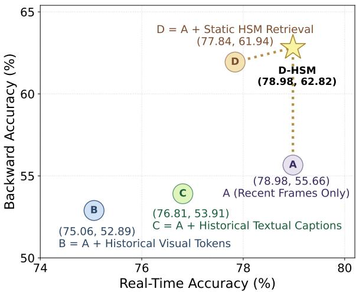
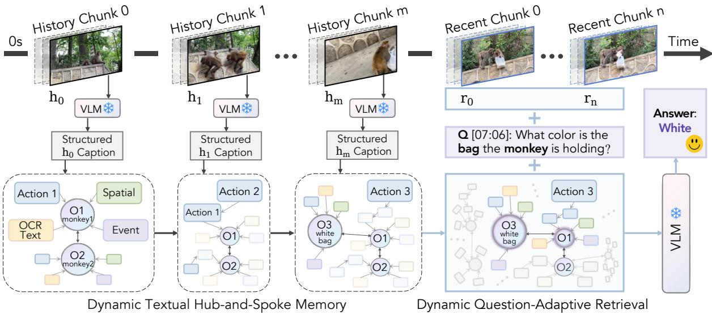
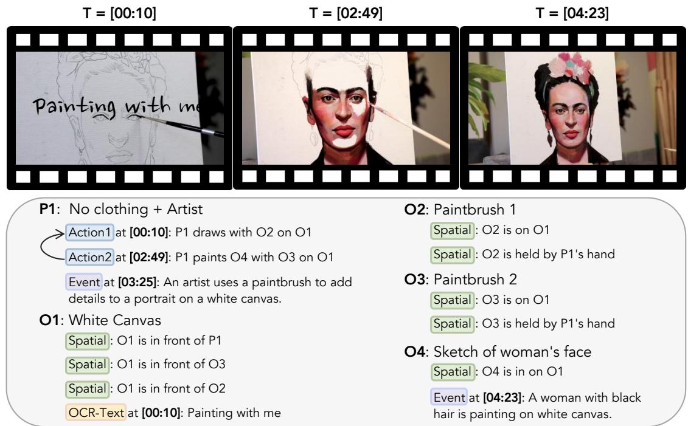
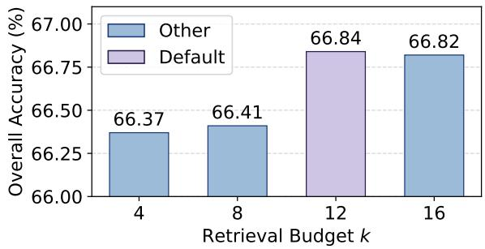
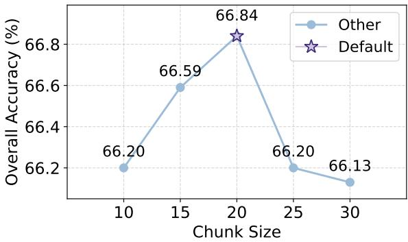
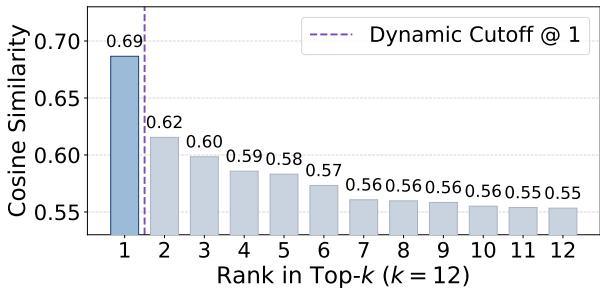
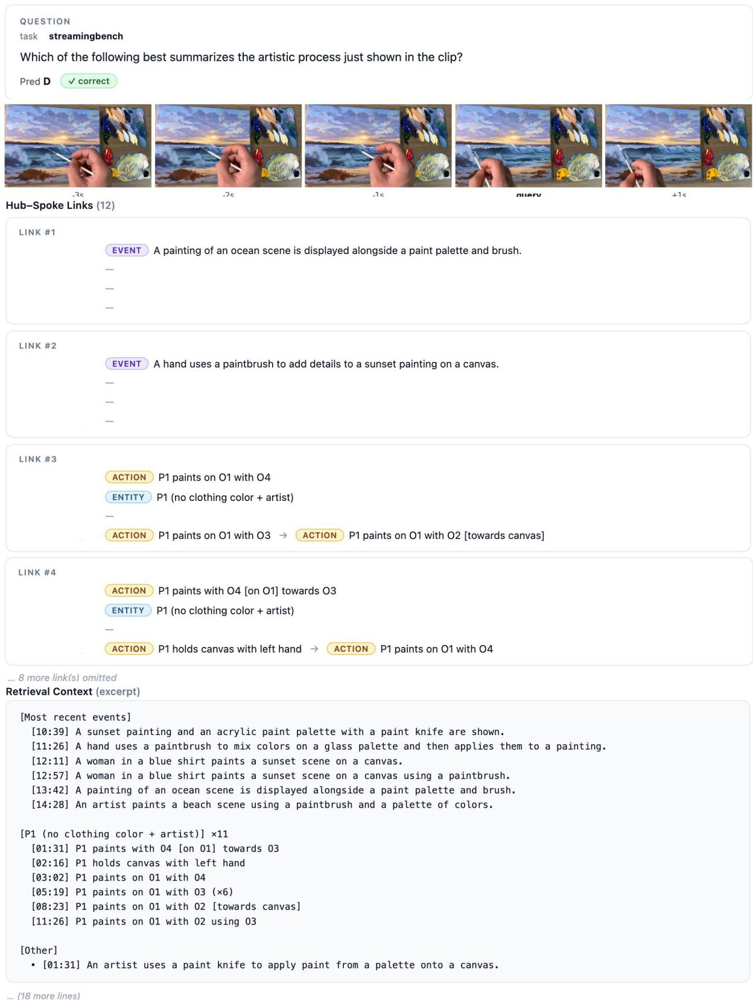
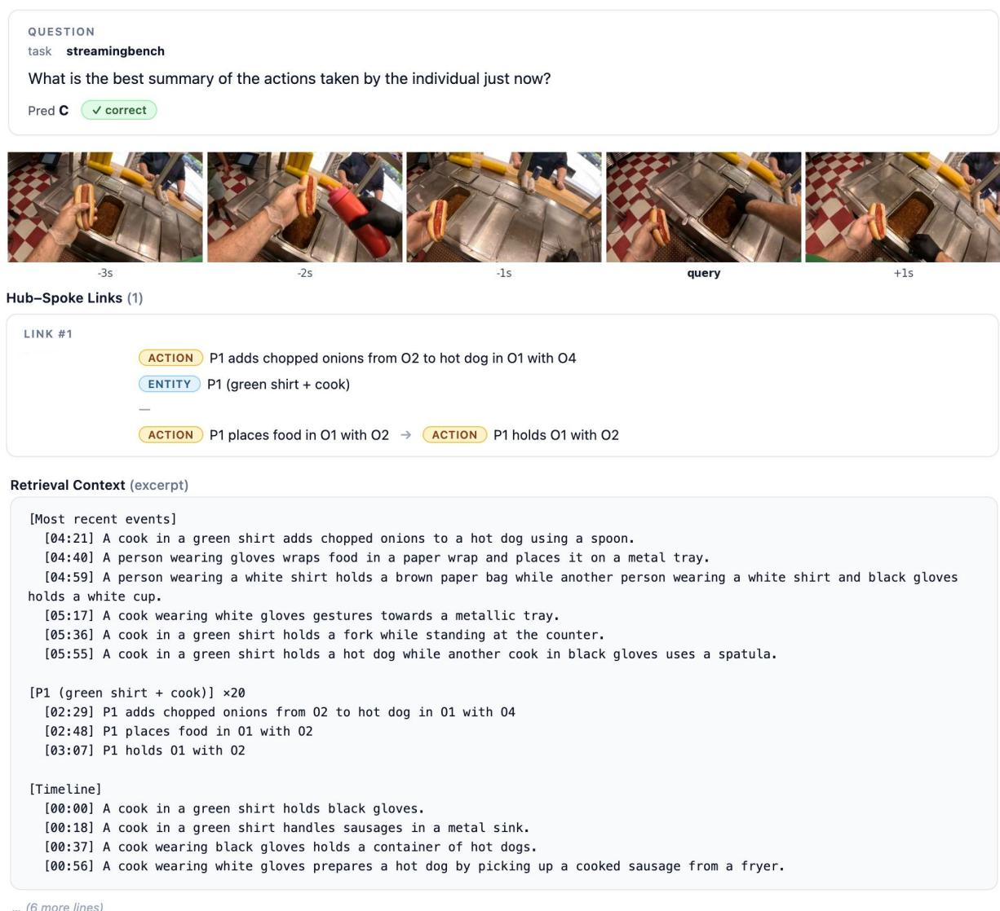
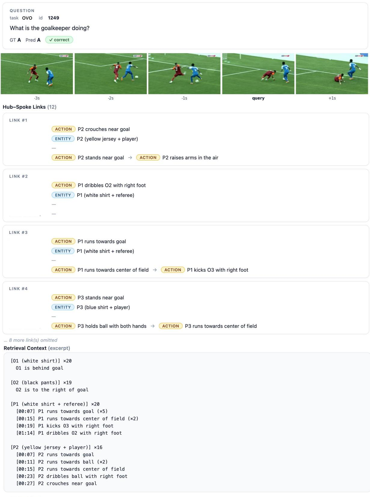
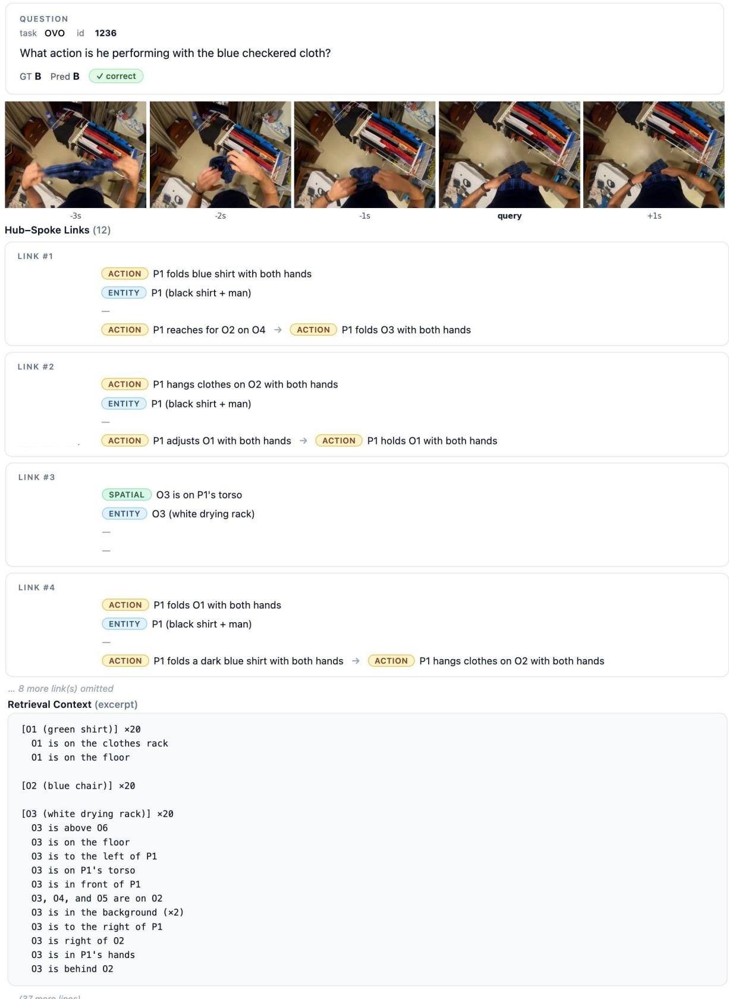

# Dynamic Hub-and-Spoke Memory for Streaming Video Understanding

Xinru Jiang1\*†, Lin Zhao1\*†, Xi Xiao2, Yunbei Zhang3,

Janet Wang3, Chenrui Ma4, Haolin Li1, Yanzhi Wang1, Yifan Gong5, Octavia Camps1

1Northeastern University, 2University of Alabama at Birmingham, 3Tulane University,

4University of Virginia, 5Adobe Research

Please direct correspondence to {jiang.xinru, zhao.lin1}@northeastern.edu. § Project page https://oshikaka.github.io/DHSM/.

## Abstract

Streaming video understanding requires answering questions at arbitrary times over a continuously growing visual stream. The central challenge is to compactly remember long-range history while effectively retrieving questionrelevant evidence. We propose Dynamic Huband-Spoke Memory (D-HSM), a training-free framework that represents distant history as structured textual memory while preserving the recent frames as visual tokens for fine-grained perception. Specifically, D-HSM turns selected historical video chunks into typed textual observations and stores them in an entity-centered hub-and-spoke memory, with entities as hubs and related evidence as spokes. When answering a question, D-HSM dynamically retrieves a compact question-aware memory subset, expands it through hub-and-spoke links, and combines it with the recent visual window for frozen-VLM answer prediction. Extensive experiments on both streaming and long video benchmarks show that D-HSM consistently and substantially improves VLM backbones and outperforms other state-of-the-art online and offline video understanding baselines.

## 1 Introduction

“Remembering is not the re-excitation of innumerable fixed, lifeless and fragmentary traces. It is an imaginative reconstruction, or construction.”

— Frederic C. Bartlett

Streaming video understanding faces a memory problem in Bartlett’s sense: the model must reconstruct question-relevant evidence rather than merely replay the past. The requirement arises because a vision-language model (VLM) needs access to long-range visual evidence, while the continuously growing video history makes it infeasible to preserve the entire stream in raw visual form. This raises a central question: how can a streaming model compactly remember the past while efficiently retrieving the evidence?

  
Figure 1: Comparison of different historical strategies on OVO-Bench (Li et al., 2025b), measured by accuracy on “Real-Time” and “Backward” tasks. The “Static HSM Retrieval” setting retrieves a fixed top-K budget of memory entries for each question.“Real-Time” means that the questions can be answered based on the recent video frames, while ‘Backward” questions require evidence from history video chunks.

Existing streaming video methods largely approach history from a token-budget perspective, reducing the past through sparse token selection (Yao et al., 2025; Shu et al., 2025; Wu et al., 2019), visual-token compression (Wu et al., 2024; Li et al., 2025a), bounded memory banks (Zhang et al., 2024; Wang et al., 2026), or retrieval over cached visual representations (Di et al., 2025; Yang et al., 2025). While these mechanisms improve online efficiency, they mainly ask which past visual units should be retained, but leave open how the retained history should be represented and organized for future questions. A simple diagnostic in Fig. 1 illustrates the representation gap: appending historical video tokens (B) is less effective than converting the same segments into textual captions (C). This suggests that converting distant history into textual semantic traces can provide a useful way to retain it under a limited context budget. Yet flat captions remain segment-level summaries and lack explicit links among recurring entities, actions, and relations across time. Therefore, the following question naturally arises: 1 How should a streaming model organize long-range history into structured semantic memory?

Besides, different streaming questions require different evidence. As shown in Fig. 1, questions about the current moment are often better answered from the recent visual window alone (A), while adding historical context (B, C, D) can introduce irrelevant entities or events and distract the VLM. In contrast, backward-looking or temporal questions require evidence from earlier segments, and cannot be answered reliably without retrieving history. A useful memory must therefore not only be well-organized, but also be queried adaptively. It should retrieve little or no history for real-time questions, and recover sufficient evidence for questions that depend on the past. Thus, along with question 1 , another question needs to be answered for streaming video understanding: 2 How should a streaming model dynamically retrieve questionrelevant history?

To address both questions, we propose D-HSM, a training-free Dynamic Hub-and-Spoke Memory framework for streaming video understanding. D-HSM handles the asymmetry between long history and the current moment by storing distant history as compact textual memory, while keeping the recent window as visual frames for fine-grained perception. For long-range history, D-HSM first converts selected historical video chunks into structured textual observations that describe visible entities and their associated evidence. It then organizes these observations into an entity-centered hub-and-spoke memory, where recurring entities serve as hubs and related evidence is attached as spokes. This design turns flat segment captions into structured memory traces, allowing evidence about the same entity to be accumulated, merged, and localized across time.

When answering a question, D-HSM does not replay history in temporal order. Instead, it dynamically retrieves and constructs the relevant evidence on demand. It first applies keyword-based gating to determine whether memory retrieval is needed. When retrieval is triggered, D-HSM selects a memory subset according to the similarity between the question and memory entries. Notably, rather than using a fixed top-K budget, D-HSM determines the retrieval size by detecting a salient cutoff. It then expands the selected subset through the huband-spoke structure. The retrieved textual evidence of the subset is then combined with the recent visual tokens and passed to a frozen VLM for answer prediction. As illustrated by Fig. 1, D-HSM reconstructs question-relevant evidence from structured history while avoiding distraction from unnecessary historical information.

Together, the structured hub-and-spoke memory and the question-adaptive retrieval give a frozen VLM a way to remember the past compactly and access it selectively, without any additional training. Extensive experiments show that D-HSM achieves state-of-the-art performance on streaming benchmarks such as StreamingBench (Lin et al., 2024b) and OVO-Bench (Li et al., 2025b), outperforming strong proprietary models, as well as opensource online and offline video understanding baselines. Meanwhile, D-HSM also retains strong performance on conventional offline long-video understanding benchmarks, including LongVideoBench (Wu et al., 2024), MLVU (Zhou et al., 2025), and VideoMME (Fu et al., 2025). These results demonstrate the robustness and generality of D-HSM for compactly remembering long video history and retrieval question-relevant evidence on demand.

## 2 Related Work

Long and Streaming Video Understanding. Recent methods address long-range temporal reasoning mainly by retaining or compressing visual tokens. Offline long-video models (Chen et al., 2025; Wang et al., 2024b; Shu et al., 2025; Song et al., 2024; Wang et al., 2024a; Corona et al., 2025; Lin et al., 2026) extend visual context by sampling more frames or scaling representations, but their computational costs grow rapidly with video length. Some methods organize events into graph memories, retrieving only query relevant subgraph to reduce the cost (Chu et al., 2025; Huang et al., 2026; Malik et al., 2026). They are primarily evaluated in offline settings rather than under streaming queries.

Online or streaming approaches (Chen et al., 2024; Huang et al., 2024; Zeng et al., 2026; Carreira and Zisserman, 2017; Feichtenhofer et al., 2019; Bertasius et al.; Arnab et al., 2021; Liu et al., 2026; Zhang et al.) instead process frames sequen-

  
Figure 2: Overview of D-HSM. Historical chunks are converted by a frozen VLM into structured textual observations and incrementally organized into a dynamic hub-and-spoke memory. When a question arrives, D-HSM dynamically retrieves a compact question-adaptive subset from memory and expands it through hub-and-spoke links. Then, it combines the retrieved textual evidence with the recent visual tokens for frozen-VLM answer prediction.

## 3 Method

tially. To manage history, sampling-based compression (Yao et al., 2025; Shu et al., 2025; Wu et al., 2019; Liu et al., 2025) reduces input tokens but discards fine-grained spatial or temporal details. Alternatively, storage-based compression (Zeng et al., 2026; Gu and Dao, 2024; De et al., 2024; Wang et al., 2025; Li et al., 2024; He et al., 2024; Zheng et al., 2026) maintains visual memory after encoding. These methods largely retain history as features without explicitly organizing the relationship between different entities. D-HSM instead maintains a persistent, entity-centric memory that is incrementally updated as chunks arrive, enabling compact and question adaptive retrieval.

Video Large Language Models. Video Large Language Models (Video-LLMs) map spatiotemporal visual features into LLM spaces to enable open-ended dialogue and reasoning (Maaz et al., 2024; Lin et al., 2024a; Wang et al., 2024c; Li et al., 2023; Liu et al., 2024; Achiam et al., 2023; Xiao et al., 2026b). Standard architectures establish modality alignment via abstractors (Li et al., 2023; Ye et al., 2023; Zhao et al., 2024), projection layers (Liu et al., 2024; Zhu et al., 2024; Li et al., 2026; Xiao et al., 2026a), or temporal pooling operators (Zhang et al., 2023) over established vision backbones (Radford et al., 2021; Sun et al., 2023; Zhao et al., 2026a,b). Recent variants optimize efficiency via dynamic resolution encoding (Wu et al., 2025) and parameter-efficient tuning (Hu et al.; Xiao et al., 2026c; Zhang et al., 2025).

## 3.1 Framework

For the streaming video understanding, we require balance two forms of evidence: long-range historical context and immediate perception (Zeng et al., 2026; Lin et al., 2024b; Qian et al., 2024). These two information streams are inherently asymmetric, as long-range history is too voluminous to retain in raw form, while the present moment demands finegrained visual detail that resists lossy abstraction. Building on this observation, we propose Dynamic Hub-and-Spoke Memory (D-HSM), a training-free framework that preserves recent video evidence as visual frames and consolidates longer-range history into a textual hub-and-spoke memory of compact semantic traces.

Specifically, as shown in Figure 2, D-HSM maintains a textual memory $M _ { t }$ for the historical stream. At each streaming step t, the historical chunk $h _ { t }$ is converted into a typed textual observation $z _ { t } ,$ which is incrementally integrated into the entity-centered hub-and-spoke memory:

$$
z _ { t } = \phi _ { \mathrm { o b s } } ( h _ { t } ) , \quad M _ { t } = \mathcal { U } ( M _ { t - 1 } , z _ { t } ) ,
$$

where $M _ { t }$ is the textual hub-and-spoke memory accumulated up to step t.

Questions may arrive at arbitrary streaming steps. When a question $q _ { t }$ arrives at step t, D-HSM dynamically selects a compact question-aware huband-spoke evidence subset $C _ { t }$ from the current memory $M _ { t }$ and combines it with the recent visual window $r _ { t } \mathbf { : }$

  
Figure 3: Example of the hub-and-spoke memory representation. Entities such as the “artist”, “canvas”, “paintbrushes”, and “sketch” are stored as hubs with consistent identifiers, while their associated actions, spatial relations, OCR text, and events are stored as timestamped spokes. Repeated or related evidence is attached to the corresponding entity hub, enabling D-HSM to localize and connect evidence across different moments in the video.

$$
C _ { t } = \mathcal { R } ( M _ { t } , q _ { t } ) , \quad a _ { t } = f _ { \mathrm { V L M } } ( C _ { t } , r _ { t } , q _ { t } ) ,
$$

where R denotes dynamic hub-and-spoke retrieval, $f _ { \mathrm { V L M } }$ is the frozen VLM used for answer prediction, and $a _ { t }$ is the predicted answer.

## 3.2 D-HSM Construction and Update

D-HSM constructs the historical textual memory $M _ { t }$ in three stages: (i) it dynamically selects a bounded set of historical video chunks, (ii) it converts the selected chunks into structured textual observations, and (iii) it integrates these observations into an entity-centered Hub-and-Spoke memory.

Dynamic Historical Observation Budget. Before constructing memory, D-HSM adapts the density of historical observations to the length of the available video prefix. We construct historical chunks by uniformly sampling frames from the video, with each sampled frame treated as the representative of one chunk. Let $\mathcal { H } _ { t } = \{ h _ { 1 } , \ldots , h _ { t } \}$ be the candidate historical chunks at step t. D-HSM selects an active observation set:

$$
{ S } _ { t } = \left\{ \begin{array} { l l } { \mathcal { H } _ { t } , } & { t \le B , } \\ { \Pi _ { B } ( \mathcal { H } _ { t } ) , } & { t > B , } \end{array} \right.
$$

where B is the history budget and $\Pi _ { B } ( \cdot )$ denotes approximately uniform selection of B chunks from Ht. As the video grows, the change in the active set is:

$$
{ \Delta } _ { t } ^ { + } = \boldsymbol { \mathcal { S } } _ { t } \setminus \boldsymbol { \mathcal { S } } _ { t - 1 } , \quad { \Delta } _ { t } ^ { - } = \boldsymbol { \mathcal { S } } _ { t - 1 } \setminus \boldsymbol { \mathcal { S } } _ { t } .
$$

D-HSM generates textual observations only for chunks in $\Delta _ { t } ^ { + }$ , and excludes evidence supported only by chunks in $\Delta _ { t } ^ { - }$ from the active memory. This allows short prefixes to be represented densely, while longer prefixes are represented by a sparser set of semantic traces.

Structured Textual Observations. For each selected historical chunk, D-HSM applies a fixedschema prompt (details in Appendix B) to instruct a frozen VLM, yielding a textual observation: OB-JECTS, PEOPLE, ACTIONS, OCR-TEXT, SPA-TIAL, and EVENT. OBJECTS and PEOPLE produce chunk-level entity mentions with local identifiers and concise visual descriptions. Across different chunks, D-HSM merges mentions of the same entity into a single persistent identity based on the similarity of their visual descriptions. ACTIONS describes interactions among these entities, OCR-TEXT captures screen text across optical character recognition, SPATIAL records positional relations, and EVENT summarizes the main event in the current chunk.

The schema converts each chunk into typed evidence rather than an unstructured caption. Persistent entity identifiers make it easier to track the same person or object across chunks by assigning each visible entity a unique symbol, such as $P _ { i }$ or $O _ { i } ,$ and reusing the same symbol whenever that entity reappears. The remaining fields preserve complementary evidence in separable forms. Together, these typed observations expose the information needed for later memory construction and retrieval. Entity Hub-Centered Memory Construction and Update. As shown in Fig. 3, D-HSM is organized around entity hubs instantiated from OB-JECTS and PEOPLE, which provide anchors for who or what is tracked across time. Other chunk-level evidence types are stored as spokes attached to the relevant entity hubs. These spokes answer what happened, where it happened, and when it was observed. Besides, each hub and spoke also stores its timestamps and occurrence count, allowing D-HSM to localize evidence in time.

As illustrated in Fig. 2, D-HSM updates the Huband-Spoke memory online. For each incoming observation at time $t ,$ it applies the following rules: (i) Entity linking and hub update. For each newly observed entity, D-HSM compares its description embedding with the embeddings of existing entity hubs using cosine similarity. If the similarity to the closest hub exceeds $\tau _ { \mathrm { l i n k } } .$ the entity is merged into that hub and reuses its persistent identifier. Otherwise, a new hub is created. The resulting hub then records the supporting chunk and timestamp. (ii) Spoke insertion and merging. For spokes that mention entity identifiers such as P1 or O2, D-HSM attaches the spoke to the corresponding entity hub. When the spoke text does not mention any entity identifier, D-HSM compares the spoke embedding with existing entity-hub embeddings, and links it to the most similar hub. Then, D-HSM updates existing spokes for repeated facts by refreshing their timestamps and occurrence count, while inserting novel facts as new spokes. (iii) Local relational update. Entities that appear in the same chunk are connected with co-occurrence edges. These edges record local entity context, so retrieving one entity can also surface other entities observed in the same chunk. (iv) Temporal action update. For each entity hub, D-HSM links action spokes according to their observation order. These edges record the local order of actions performed by the same entity, so a retrieved action can bring in neighboring actions performed by the same entity. (v) Support-based memory removal. D-HSM records the supporting chunks for each memory element and maintains an inverted index from chunks to their contributions. When a chunk in $\Delta _ { t } ^ { - }$ is removed, D-HSM deletes its support, recomputes the affected counts and timestamps, and removes elements with no remaining support. Spoke attachments and relational edges are then updated using the remaining observations, preventing stale evidence from remaining in memory.

## 3.3 Dynamic Hub-and-Spoke Retrieval

Given the current memory $M _ { t }$ and query $q _ { t } ,$ D-HSM retrieves a compact, question-aware subset of the Hub-and-Spoke memory rather than passing the entire memory to the VLM. Retrieval proceeds in two steps: query-adaptive evidence selection and hub-and-spoke evidence expansion.

Question-Adaptive Evidence Selection. D-HSM first uses a lightweight keyword-based gate to skip memory retrieval for explicitly current-state questions $( \mathrm { e . g . }$ , cues such as now, currently, or recent frame). For history-dependent questions, D-HSM embeds the query $q _ { t }$ and the memory entries, and computes cosine similarity scores. After applying a base threshold $\theta$ and a maximum budget $K$ , we obtain a ranked candidate list $\{ ( e _ { i } , s _ { i } ) \} _ { i = 1 } ^ { n }$ , where $s _ { i } \geq s _ { i + 1 }$ and $n \leq K$ . D-HSM truncates this list at the most prominent score gap, when such a gap is statistically distinguishable from the rest of the distribution. Specifically, we examine the gaps:

$$
\Delta _ { i } = s _ { i } - s _ { i + 1 } , \quad i = 1 , \ldots , n - 1 ,
$$

and locate the largest one, $\Delta ^ { \star } = \Delta _ { i }$ ⋆ with $i ^ { \star } =$ arg maxi $\Delta _ { i }$ . We accept $i ^ { \star }$ as the truncation point only if $\Delta ^ { \star }$ passes two tests. First, it must exceed a confidence-adaptive threshold:

$$
\gamma _ { t } = \mathrm { m a x } \big ( \lambda _ { 0 } , ~ \lambda _ { 1 } [ s _ { 1 } { - } \theta ] _ { + } \big ) , \quad [ x ] _ { + } = \mathrm { m a x } ( x , 0 ) ,
$$

where $\lambda _ { 0 }$ is an absolute floor and the second term tightens the threshold when the top score $s _ { 1 }$ is high, so that a sharper gap is required when the retriever is confident. Second, $\Delta ^ { \star }$ must be at least twice the median gap, $\Delta ^ { \star } \geq 2$ median( $\{ \Delta _ { i } \} )$ , which rules out cases where scores decay smoothly and no single gap is genuinely salient. When both tests pass, we set $k _ { t } ~ = ~ i ^ { \star } ;$ otherwise (including the degenerate case $n < 2 )$ we fall back to $k _ { t } = n$ D-HSM then retrieves $\mathcal { E } _ { t } = \{ e _ { i } \} _ { i = 1 } ^ { k _ { t } }$

Hub-and-Spoke Evidence Expansion. Given the selected evidence entries $\mathcal { E } _ { t } ,$ D-HSM expands them using the Hub-and-Spoke structure of the memory. For an entity hub, the expansion includes its attached spokes, together with entities that cooccurred in the same chunk as discussed in Section 3.2. Notably, when attaching action spokes, D-HSM follows a short next-action chain to recover neighboring actions performed by the same entity. For time-aware questions, it also retrieves timestamped events from the stored timeline.

Table 1: Comparison results of different methods on StreamingBench Real-Time understanding tasks (Lin et al., 2024b). D-HSM is evaluated with Qwen2.5-VL (Bai et al., 2025b) and Qwen3-VL (Bai et al., 2025a) using 4 or 8 recent frames, and compared with different proprietary, open-source offline, and open-source online video understanding models. “20+4” and “20+8” denote using 20 historical frames for memory construction and 4 or 8 recent frames for visual perception.
<table><tr><td>Model</td><td>Size</td><td>#Frames</td><td>OP</td><td>CR</td><td>CS</td><td>ATP</td><td>EU</td><td>TR</td><td>PR</td><td>SU</td><td>ACP</td><td>CT</td><td>Overall</td></tr><tr><td>Human</td><td></td><td></td><td>89.5</td><td>92.0</td><td>93.6</td><td>91.5</td><td>95.7</td><td>92.5</td><td>88.0</td><td>88.8</td><td>89.7</td><td>91.3</td><td>91.5</td></tr><tr><td colspan="14">PROPRIETARY MODELS</td></tr><tr><td>GPT-40</td><td></td><td>64</td><td>77.1</td><td>80.5</td><td>83.9</td><td>76.5</td><td>70.2</td><td>83.8</td><td>66.7</td><td>62.2</td><td>69.1</td><td>49.2</td><td>73.3</td></tr><tr><td>Claude 3.5 Sonnet</td><td></td><td>20</td><td>80.5</td><td>77.3</td><td>82.0</td><td>81.7</td><td>72.3</td><td>75.4</td><td>61.1</td><td>61.8</td><td>69.3</td><td>43.1</td><td>72.4</td></tr><tr><td>Gemini 1.5 pro</td><td></td><td>1 fps</td><td>79.0</td><td>80.5</td><td>83.5</td><td>79.7</td><td>80.0</td><td>84.7</td><td>77.8</td><td>64.2</td><td>72.0</td><td>48.7</td><td>75.7</td></tr><tr><td colspan="14">OPEN-SOURCE OFFLINE MODELS</td></tr><tr><td>VILA-1.5</td><td>8B</td><td>14</td><td>53.7</td><td>49.2</td><td>71.0</td><td>56.9</td><td>53.4</td><td>53.9</td><td>54.6</td><td>48.8</td><td>50.1</td><td>17.6</td><td>52.3</td></tr><tr><td>LongVA</td><td>7B</td><td>128</td><td>70.0</td><td>63.3</td><td>61.2</td><td>70.9</td><td>62.7</td><td>59.5</td><td>61.1</td><td>53.7</td><td>54.7</td><td>34.7</td><td>60.0</td></tr><tr><td>MiniCPM-v2.6</td><td>7B</td><td>32</td><td>71.9</td><td>71.1</td><td>77.9</td><td>75.8</td><td>64.6</td><td>65.7</td><td>70.4</td><td>56.1</td><td>62.3</td><td>53.4</td><td>67.4</td></tr><tr><td>LLaVA-OneVision</td><td>7B</td><td>32</td><td>80.4</td><td>74.2</td><td>76.0</td><td>80.7</td><td>72.7</td><td>71.7</td><td>67.6</td><td>65.5</td><td>65.7</td><td>45.1</td><td>71.1</td></tr><tr><td>Qwen2.5-VL</td><td>7B</td><td>1 fps</td><td>78.3</td><td>80.5</td><td>78.9</td><td>80.5</td><td>76.7</td><td>78.5</td><td>79.6</td><td>63.4</td><td>66.2</td><td>53.2</td><td>73.7</td></tr><tr><td colspan="14">OPEN-SOURCE ONLINE MODELS</td></tr><tr><td>Flash-VStream</td><td>7B</td><td>1 fps</td><td>25.9</td><td>43.6</td><td>24.9</td><td>23.9</td><td>27.3</td><td>13.1</td><td>18.5</td><td>25.2</td><td>23.9</td><td>48.7</td><td>23.2</td></tr><tr><td>VideoLLM-online</td><td>8B</td><td>2 fps</td><td>39.1</td><td>40.1</td><td>34.5</td><td>31.1</td><td>46.0</td><td>32.4</td><td>31.5</td><td>34.2</td><td>42.5</td><td>27.9</td><td>36.0</td></tr><tr><td>Dispider</td><td>8B</td><td>1 fps</td><td>74.9</td><td>75.5</td><td>74.1</td><td>73.1</td><td>74.4</td><td>59.9</td><td>76.1</td><td>62.9</td><td>62.2</td><td>45.8</td><td>67.6</td></tr><tr><td>TimeChatOnline</td><td>7B</td><td>1 fps</td><td>80.2</td><td>82.0</td><td>79.5</td><td>83.3</td><td>76.1</td><td>78.5</td><td>78.7</td><td>64.6</td><td>69.6</td><td>58.0</td><td>75.4</td></tr><tr><td>Streamforest</td><td>7B</td><td>1 fps</td><td>83.1</td><td>82.8</td><td>82.7</td><td>84.3</td><td>77.5</td><td>78.2</td><td>76.9</td><td>69.1</td><td>75.6</td><td>54.4</td><td>77.3</td></tr><tr><td>Qwen2.5-VL+D-HSM (4f)</td><td>7B</td><td>20+4</td><td>85.3</td><td>64.0</td><td>88.8</td><td>87.9</td><td>79.1</td><td>90.0</td><td>87.6</td><td>79.7</td><td>79.6</td><td>47.8</td><td>82.5</td></tr><tr><td>Qwen2.5-VL+D-HSM (8f)</td><td>7B</td><td>20+8</td><td>88.0</td><td>70.4</td><td>93.1</td><td>88.2</td><td>78.5</td><td>93.8</td><td>81.9</td><td>80.9</td><td>83.1</td><td>50.0</td><td>84.7</td></tr><tr><td>Qwen3-VL+D-HSM (4f)</td><td>8B</td><td>20+4</td><td>86.9</td><td>64.8</td><td>92.1</td><td>89.2</td><td>74.7</td><td>90.7</td><td>85.7</td><td>77.6</td><td>79.6</td><td>54.5</td><td>83.1</td></tr><tr><td>Qwen3-VL+D-HSM (8f)</td><td>8B</td><td>20+8</td><td>88.6</td><td>67.2</td><td>95.1</td><td>90.8</td><td>79.8</td><td>92.5</td><td>87.6</td><td>77.2</td><td>84.0</td><td>55.6</td><td>85.4</td></tr></table>

Then, the resulting evidence set is linearized into a textual context with entity-centered profiles, screen-text snippets, chronological event lines, and counting aggregates as illustrated in Table B1. This context is then combined with the recent visual frames and the query for frozen-VLM.

## 4 Experiments

## 4.1 Implementation Details.

D-HSM is training-free and keeps all VLM parameters frozen. We use Qwen2.5-VL-7B (Bai et al., 2025b) and Qwen3-VL-8B as backbone models (Bai et al., 2025a). For each video, we use 20 historical chunks by default to construct the huband-spoke memory. We set 4 recent frames and dynamic retrieval with a maximum budget of K = 12 as default setting. Memory entries and questions are embedded with a lightweight embedding encoder (bge-small-en-v1.5) (Xiao et al., 2023), and the dynamic cutoff gap λ0 = 0.05, λ1 = 0.12. All experiments are conducted on NVIDIA RTX A6000 GPUs without any task-specific fine-tuning.

## 4.2 Performance Comparison.

Streaming Video Understanding. Table 1 and Table 2 report results on StreamingBench (Lin et al., 2024b) and OVO-Bench (Li et al., 2025b). Across both benchmarks, all D-HSM variants consistently outperform other methods. On StreamingBench, D-HSM raises the overall score from 73.7 to 84.7 using Qwen2.5-VL, and further reaches 85.4 with Qwen3-VL. D-HSM surpasses the strongest proprietary model, Gemini 1.5 Pro, and the strongest open-source online model, Streamforest, by 9.7 and 8.1 points, respectively. The improvement suggests that the gains are not tied to a particular backbone, but are closely related to how D-HSM represents and retrieves long-range history.

On OVO-Bench, the improvement is not limited to a single question type: D-HSM achieves competitive results across Real-Time Visual Perception, Backward Tracing, and Forward Active

Table 2: Comparison results of different methods on OVO-Bench (Li et al., 2025b).
<table><tr><td rowspan="2">Model</td><td rowspan="2">Size #Frames</td><td rowspan="2"></td><td colspan="6">Real-Time</td><td colspan="4">Backward</td><td colspan="4">Forward</td><td>Overall</td></tr><tr><td>OCR</td><td>ACR</td><td>ATR</td><td>STU</td><td>FPD OJR</td><td></td><td>Avg.</td><td>EPM ASI</td><td>HLD</td><td>Avg.</td><td>REC</td><td>SSR</td><td>CRR</td><td>Avg.</td><td>Avg.</td></tr><tr><td>Human Agents</td><td></td><td></td><td>94.0</td><td>92.6</td><td>94.8</td><td>92.7</td><td>91.1</td><td>94.0 93.2</td><td>92.6</td><td>93.0</td><td>91.4</td><td>92.3</td><td>95.5</td><td>89.7</td><td>93.6</td><td>92.9</td><td>92.8</td></tr><tr><td></td><td></td><td></td><td></td><td></td><td></td><td>PROPRIETARY MODELS</td><td></td><td></td><td></td><td></td><td></td><td></td><td></td><td></td><td></td><td></td><td></td></tr><tr><td>GPT-40</td><td></td><td>64</td><td>69.8</td><td>64.2</td><td>71.6</td><td>51.1</td><td>70.3</td><td>59.8</td><td>64.5</td><td>57.9 75.7</td><td>48.7</td><td>60.8</td><td>27.6</td><td>73.2</td><td>59.4</td><td>53.4</td><td>59.5</td></tr><tr><td>Gemini 1.5 pro</td><td></td><td>1 fps</td><td>85.9</td><td>67.0</td><td>79.3</td><td>58.4</td><td>63.4</td><td>62.0</td><td>69.3</td><td>58.6 76.4</td><td>52.6</td><td>62.5</td><td>35.5</td><td>74.2</td><td>61.7</td><td>57.2</td><td>63.0</td></tr><tr><td></td><td></td><td></td><td></td><td></td><td>OPEN-SOURCE OFFLINE MODELS</td><td></td><td></td><td></td><td></td><td></td><td></td><td></td><td></td><td></td><td></td><td></td><td></td></tr><tr><td>LongVU</td><td>7B</td><td>1 fps</td><td>53.7</td><td>53.2</td><td>62.9</td><td>47.8</td><td>68.3</td><td>59.8</td><td>57.6 40.7</td><td>59.5</td><td>4.8</td><td>35.0</td><td>12.2</td><td>69.5</td><td>60.8</td><td>47.5</td><td>46.7</td></tr><tr><td>LLaVA-OV</td><td>7B</td><td>64</td><td>66.4</td><td>57.8</td><td>73.3</td><td>53.4</td><td>71.3</td><td>62.0 64.0</td><td>54.2</td><td>55.4</td><td>21.5</td><td>43.7</td><td>25.6</td><td>67.1</td><td>58.8</td><td>50.5</td><td>52.7</td></tr><tr><td>LLaVA-Video</td><td>7B</td><td>64</td><td>69.1</td><td>58.7</td><td>68.8</td><td>49.4</td><td>74.3</td><td>59.8 63.5</td><td>56.2</td><td>57.4</td><td>7.5</td><td>40.4</td><td>34.1</td><td>70.0</td><td>60.4</td><td>54.8</td><td>52.9</td></tr><tr><td>Qwen2-VL</td><td>72B</td><td>64</td><td>65.8</td><td>60.6</td><td>69.8</td><td>51.7</td><td>69.3</td><td>54.4 61.9</td><td>52.5</td><td>60.8</td><td>57.5</td><td>57.0</td><td>38.8</td><td>64.1</td><td>45.0</td><td>49.3</td><td>56.3</td></tr><tr><td>OPEN-SOURCE ONLINE MODELS</td><td></td><td colspan="10"></td><td></td><td></td><td></td><td></td><td></td><td></td></tr><tr><td>VideoLLM-online</td><td>8B</td><td>2 fps</td><td>8.1</td><td>23.9</td><td>12.1</td><td>14.0</td><td>45.5</td><td>21.2 20.8</td><td>22.2</td><td>18.8</td><td>12.2</td><td>17.7</td><td></td><td></td><td></td><td></td><td></td></tr><tr><td>Dispider</td><td>8B</td><td>1 fps</td><td>57.7</td><td>49.5</td><td>62.1</td><td>44.9</td><td>61.4</td><td>51.6 54.6</td><td>48.5</td><td>55.4</td><td>4.3</td><td>36.1</td><td>18.1</td><td>37.4</td><td>48.8</td><td>34.7</td><td>41.8</td></tr><tr><td>TimeChatOnline</td><td>7B</td><td>1 fps</td><td>75.2</td><td>46.8</td><td>70.7</td><td>47.8</td><td>69.3</td><td>61.4 61.9</td><td>55.9</td><td>59.5</td><td>9.7</td><td>41.7</td><td>31.6</td><td>38.5</td><td>40.0</td><td>36.7</td><td>46.7</td></tr><tr><td>Streamforest</td><td>7B</td><td>1 fps</td><td>68.5 77.2</td><td>53.2</td><td>71.6</td><td>47.8</td><td>65.4</td><td>60.9 61.2</td><td>58.9</td><td>64.9</td><td>32.3</td><td>52.0</td><td>32.8</td><td>70.6</td><td>57.1</td><td>52.5</td><td>55.6 57.9</td></tr><tr><td>Streamo</td><td>7B</td><td>1 fps</td><td></td><td>66.1</td><td>76.7</td><td>45.5</td><td>66.3</td><td>72.8 67.4</td><td>55.6</td><td>58.1</td><td>33.9</td><td>49.2</td><td>30.8</td><td>57.6</td><td>82.5</td><td>57.0</td><td></td></tr><tr><td>Qwen2.5-VL+ D-HSM (4f)</td><td>7B</td><td>20+4</td><td>94.0</td><td>70.7</td><td>86.2</td><td>66.9</td><td>75.3</td><td>81.0 79.0</td><td>52.9</td><td>63.5</td><td>72.0</td><td>62.8</td><td>36.4</td><td>71.9</td><td>67.1</td><td>58.5</td><td>66.8</td></tr><tr><td>Qwen2.5-VL+ D-HSM (8f) Qwen3-VL+ D-HSM (4f)</td><td>7B 8B</td><td>20+8 20+4</td><td>96.0</td><td>73.4</td><td>81.0</td><td>66.3</td><td>75.3</td><td>82.1 79.0</td><td>52.2</td><td>60.8</td><td>62.4</td><td>58.5</td><td>36.4</td><td>74.2</td><td>67.1</td><td>59.2</td><td>65.6</td></tr><tr><td>Qwen3-VL+ D-HSM (8f)</td><td>8B</td><td>20+8</td><td>95.0 94.0</td><td>82.6 81.7</td><td>84.5</td><td>72.5</td><td>71.3</td><td>83.7 81.6 81.5</td><td>54.6 55.2</td><td>62.2 65.5</td><td>67.2 62.4</td><td>61.3 61.1</td><td>25.0 24.9</td><td>61.9 64.7</td><td>74.6 74.6</td><td>53.8 54.7</td><td>65.6</td></tr><tr><td></td><td></td><td></td><td></td><td></td><td>80.2</td><td>67.4</td><td>72.3</td><td>79.5</td><td></td><td></td><td></td><td></td><td></td><td></td><td></td><td></td><td>65.1</td></tr></table>

Responding tasks. This indicates that D-HSM can dynamically adapt its evidence use, relying on the recent visual window for current-state questions while retrieving historical evidence for questions that require earlier moments.

Offline Long Video Understanding. Table 3 evaluates D-HSM on offline long-video understanding benchmarks, including LongVideoBench (Wu et al., 2024), MLVU (Zhou et al., 2025), and VideoMME (Fu et al., 2025). With Qwen2.5- VL as the backbone, D-HSM achieves 60.7 on LongVideoBench, 67.3 on MLVU, and 63.9 on VideoMME, outperforming the Qwen2.5-VL baseline and several open-source long-video models. This shows that, beyond the streaming setting, D-HSM can serve as an effective compact representation for long-range evidence in offline long-video understanding.

## 4.3 Ablation Study

Effect of Memory Sources. Table 4 compares the two evidence sources in D-HSM. Recent frames preserve real-time visual details, whereas HSM provides stronger historical evidence. Combining them yields the best backward score without sacrificing real-time accuracy, showing that recent perception and long-range memory are necessary.

Effect of Memory Organization. Table 5 ablates how historical observations are organized. Typed observations improve the quality over flat chronological captions, and entity-centered organization provides better results. Besides, the D-HSM organization provides further gains, with each component making a meaningful contribution. Removing co-occurrence edges, next-action chains, or spoke merging consistently reduces performance, confirming that these components provide complementary temporal and relational evidence.

Table 3: Evaluation results on offline long-video understanding benchmarks. We evaluate D-HSM on LongVideoBench (Wu et al., 2024), MLVU (Zhou et al., 2025), and VideoMME (Fu et al., 2025) against different methods. D-HSM results are reported with Qwen2.5- VL using 4 recent frames.
<table><tr><td>Model</td><td>Size</td><td>LongVideoBench (Val)</td><td>MLVU (M-Avg)</td><td>VideoMME (w/o subs)</td></tr><tr><td>Video Duration (Avg.)</td><td></td><td>473s</td><td>651s</td><td>1010s</td></tr><tr><td>Video Length</td><td></td><td>8s – 60min PROPRIETARY MODELS</td><td>3min – 120min</td><td>1min – 60min</td></tr><tr><td colspan="5"></td></tr><tr><td>GPT-40 Gemini 1.5 Pro</td><td>1</td><td>66.7</td><td>64.6</td><td>71.9</td></tr><tr><td></td><td>一</td><td>64.0</td><td>一</td><td>75.0</td></tr><tr><td colspan="5">OPEN-SOURCE OFFLINE MODELS</td></tr><tr><td>LongVA</td><td>7B</td><td></td><td>56.3</td><td>52.6</td></tr><tr><td>Kangaroo</td><td>8B</td><td>54.8</td><td>61.0</td><td>56.0</td></tr><tr><td>LongVU</td><td>7B</td><td></td><td>65.4</td><td>60.6</td></tr><tr><td>Apollo</td><td>7B</td><td>58.5</td><td>70.9</td><td>61.3</td></tr><tr><td>SF-LLaVA-1.5</td><td>7B</td><td>62.5</td><td>71.5</td><td>63.9</td></tr><tr><td>InternVL2.5</td><td>8B</td><td>60.0</td><td>68.9</td><td>64.2</td></tr><tr><td>NVILA</td><td>8B</td><td>57.7</td><td>70.1</td><td>64.2</td></tr><tr><td>VideoLLaMA3</td><td>7B</td><td>59.8</td><td>73.0</td><td>66.2</td></tr><tr><td colspan="5">OPEN-SOURCE ONLINE MODELS</td></tr><tr><td>Dispider</td><td>7B</td><td>1</td><td>61.7</td><td>57.2</td></tr><tr><td>Streamforest</td><td>7B</td><td>1</td><td>69.6</td><td>61.9</td></tr><tr><td>TimeChatOnline</td><td>7B</td><td>57.7</td><td>65.4</td><td>62.5</td></tr><tr><td>D-HSM</td><td>7B</td><td>60.7</td><td>67.3</td><td>63.9</td></tr></table>

Effect of Dynamic Retrieval. We compare the proposed dynamic retrieval strategy with a fixed top-K strategy that always retrieves the maximum number 12 of memory entries. As shown in Table 6, dynamic retrieval improves performance on both benchmarks, indicating that adapting retrieval to different question types is beneficial.

Effect of Retrieval Budget. We vary the maximum retrieval budget K to study how much memory evidence should be made available during retrieval. As shown in Fig. 4, performance improves as K increases from 4 to 12, suggesting that a larger budget helps recover supporting long-range evidence. However, further increasing K to 16 does not bring additional gains and slightly reduces performance. This suggests that retrieving more memory entries is not always beneficial, since weakly related evidence may introduce unnecessary tokens and distract the model. The result further supports the need for adapting the amount of retrieved evidence instead of always using a larger fixed budget.

Table 4: Ablation of memory sources on OVO-Bench. We compare HSM only, recent frames only, and the full D-HSM. All results use Qwen2.5-VL-7B; the recent visual window contains four frames when enabled.
<table><tr><td></td><td>Real-Time</td><td>Backward</td></tr><tr><td>HSM only</td><td>44.79</td><td>58.02</td></tr><tr><td>Recent frames only</td><td>78.98</td><td>55.66</td></tr><tr><td>Full D-HSM</td><td>78.98</td><td>62.82</td></tr></table>

Table 5: Ablation of memory organization on OVO-Bench. We progressively replace flat captions with typed and entity-centered memory, and remove individual D-HSM components. All results use Qwen2.5-VL-7B with four recent frames.
<table><tr><td></td><td>Overall</td><td>Backward</td></tr><tr><td>Flat captions (chronological)</td><td>58.97</td><td>53.91</td></tr><tr><td>Typed observations w/o entity organization</td><td>62.99</td><td>60.73</td></tr><tr><td>Entity-centered memory only</td><td>63.51</td><td>60.94</td></tr><tr><td>Full D-HSM</td><td>66.80</td><td>62.82</td></tr><tr><td>w/o co-occurrence edges</td><td>65.33</td><td>60.46</td></tr><tr><td>w/o next-action chains</td><td>65.48</td><td>60.69</td></tr><tr><td>w/o spoke merging</td><td>66.28</td><td>61.56</td></tr></table>

Effect of Historical Observation Budget. We vary the historical observation budget by changing the number of chunks used to construct memory. As shown in Fig. 5, performance first improves as the budget increases, reaching the top with 20 chunks. This indicates that a larger historical budget can provide broader temporal coverage and preserve more useful long-range evidence. However, further increasing the budget to 25 or 30 chunks reduces performance. We attribute this drop to redundant or weakly relevant historical observations, which can introduce noise into memory and make retrieval less focused. These results suggest that D-HSM benefits from a moderate historical budget that balances coverage and compactness.

Table 6: Ablation on dynamic retrieval. We compare fixed top-12 retrieval with the proposed dynamic retrieval strategy, whose maximum retrieval budget is also set to 12 (Qwen2.5-VL-7B, 4 recent frames).
<table><tr><td>Dataset</td><td>Fixed Top-k</td><td>Dynamic</td></tr><tr><td>OVO-Bench</td><td>64.71</td><td>66.84</td></tr><tr><td>StreamingBench</td><td>79.47</td><td>82.45</td></tr></table>

  
Figure 4: Ablation on the maximum retrieval budget K on OVO-Bench (Qwen2.5-VL-7B, 4 recent frames).

## 5 Analysis

## 5.1 Inference Efficiency Analysis

We measure the end-to-end cost of D-HSM on 50 StreamingBench samples using a single Nvidia A100 GPU. Table 7 separates background streaming ingestion from the latency after a question arrives. Observation generation dominates ingestion at 1.55 seconds per selected chunk, whereas the structural memory update takes 49 ms and removed-chunk handling takes only 0.6 ms per rotation. Video ingestion and memory processing are streamed, so subsequent chunks can arrive while the current selected chunk is being processed. Because the processing is much faster than it accumulates, preventing any long-term backlog. At question time, retrieval takes 11 ms and answer generation takes 0.74 seconds, giving a question-path latency of approximately 0.75 seconds. Thus, the hub-and-spoke memory operations add little overhead; most computation comes from the frozen VLM used for observation and answer generation.

## 5.2 Dynamic Cutoff Analysis

We analyze the top-12 question–memory similarities to explain the behavior of dynamic retrieval. As shown in Fig. 6, a short high-similarity prefix is followed by a much flatter score distribution. D-HSM cuts off retrieval at this gap instead of always retaining all 12 candidates, thereby filtering weakly related entries before hub-and-spoke expansion. This keeps the evidence compact, reduces distraction from marginal historical context, and lowers the average number of retrieved tokens by about 51% on OVO-Bench.

  
Figure 5: Ablation on the historical observation budget on OVO-Bench (Qwen2.5-VL-7B, 4 recent frames).

Table 7: End-to-end efficiency of D-HSM. Average wall-clock time over 50 StreamingBench samples on a single A100. Streaming costs are measured per selected chunk or memory rotation, whereas question-time costs are measured per question.
<table><tr><td>Stage</td><td>Average time</td></tr><tr><td>Observation generation</td><td>1.55 s</td></tr><tr><td>Memory update Removed-chunk handling</td><td>49 ms 0.6 ms</td></tr><tr><td>Retrieval</td><td></td></tr><tr><td>Answer generation</td><td>11 ms 0.74 s</td></tr></table>

## 5.3 Memory Quality Analysis

To evaluate the intermediate memory independently, we conduct a comprehensive quantitative evaluation of D-HSM’s key components using human annotations. We randomly sampled 30 videos from StreamingBench and manually annotated by human: (i) 100 pairs of temporally distinct entity mentions that D-HSM merged into the same hub, (ii) 170 entity hubs, and (iii) 96 spoke-to-hub attachments. The 100 mentioned pairs span 90 distinct hubs. As shown in Table 8, the accuracy are computed by comparing D-HSM outputs produced with Qwen2.5-VL against human judgments as ground truth. The results identify that the structured memory is reasonably reliable.

  
Figure 6: Dynamic cutoff analysis for the question “What does the person do after chopping the onion?”. The similarity scores quickly flatten after the highsimilarity prefix.

Table 8: Quality of the constructed memory. Human evaluation on 30 StreamingBench videos using Qwen2.5-VL-7B.
<table><tr><td>Metric</td><td>Score</td><td>Samples</td></tr><tr><td>Entity-linking pair accuracy ↑</td><td>77.0%</td><td>100 pairs</td></tr><tr><td>Hub purity ↑</td><td>84.4%</td><td>90 hubs</td></tr><tr><td>Duplicate-hub rate ↓</td><td>8.8%</td><td>170 hubs</td></tr><tr><td>Spoke-attachment precision ↑</td><td>87.1%</td><td>96 spokes</td></tr></table>

## 5.4 Failure Cases Analysis

We manually assign 100 incorrect predictions to mutually exclusive primary causes. The complete breakdown is reported in Table F1. The largest source is answer synthesis by the frozen VLM (31%), followed by observation generation (23%) and retrieval (19%). It shows that in D-HSM, the main bottleneck is evidence selection rather than graph expansion. Entity linking accounts for another 10% of failures, consistent with the memory quality evaluation above. We find that most of them are predictive questions, because such questions often contain weak entity-specific cues.

## 6 Conclusion

We presented D-HSM, a training-free framework that balances long-range memory and immediate perception for streaming video understanding. D-HSM stores distant history as entity-centered huband-spoke textual memory while keeping recent frames for fine-grained perception. Its dynamic retrieval selects and expands question-relevant evidence on demand, reducing unnecessary historical context. Experiments on streaming and offline long-video benchmarks show that D-HSM outperforms existing online and offline baselines. These results highlight the value of reconstructing the past through structured, question-aware memory.

## 7 Limitations

D-HSM relies on frozen VLMs to generate structured textual observations, so errors in entity recognition, OCR, or action descriptions may propagate into memory. Since long-range history is stored as text, fine-grained details from distant moments may also be lost. Future work can explore more robust entity linking.

## 8 Ethical Considerations

Our work uses publicly available datasets and opensource models. Potential risks include hallucinated or biased model outputs and possible misuse of streaming video understanding systems in sensitive applications. However, our work does not collect private user data or involve human subjects. We encourage responsible research and deployment practices. All datasets and open-source models used in this work are publicly available and are used in accordance with their respective licenses and terms of use.

## Acknowledgments

This research is supported in part by grants from ONR N00014-21-1-2431, NSF CMMI 2402438,

## References

Josh Achiam, Steven Adler, Sandhini Agarwal, Lama Ahmad, Ilge Akkaya, Florencia Leoni Aleman, Diogo Almeida, Janko Altenschmidt, Sam Altman, Shyamal Anadkat, and 1 others. 2023. Gpt-4 technical report. arXiv preprint arXiv:2303.08774.

Anurag Arnab, Mostafa Dehghani, Georg Heigold, Chen Sun, Mario Luciˇ c, and Cordelia Schmid. 2021. Vivit: A video´ vision transformer. In Proceedings of the IEEE/CVF international conference on computer vision, pages 6836–6846.

Shuai Bai, Yuxuan Cai, Ruizhe Chen, Keqin Chen, Xionghui Chen, Zesen Cheng, Lianghao Deng, Wei Ding, Chang Gao, Chunjiang Ge, Wenbin Ge, Zhifang Guo, Qidong Huang, Jie Huang, Fei Huang, Binyuan Hui, Shutong Jiang, Zhaohai Li, Mingsheng Li, and 45 others. 2025a. Qwen3- vl technical report. Preprint, arXiv:2511.21631.

Shuai Bai, Keqin Chen, Xuejing Liu, Jialin Wang, Wenbin Ge, Sibo Song, Kai Dang, Peng Wang, Shijie Wang, Jun Tang, Humen Zhong, Yuanzhi Zhu, Mingkun Yang, Zhaohai Li, Jianqiang Wan, Pengfei Wang, Wei Ding, Zheren Fu, Yiheng Xu, and 8 others. 2025b. Qwen2.5-vl technical report. Preprint, arXiv:2502.13923.

Gedas Bertasius, Heng Wang, and Lorenzo Torresani. Is space-time attention all you need for video understanding?

Joao Carreira and Andrew Zisserman. 2017. Quo vadis, action recognition? a new model and the kinetics dataset. In proceedings ofthe IEEE Conference on Computer Vision and Pattern Recognition, pages 6299–6308.

Joya Chen, Zhaoyang Lv, Shiwei Wu, Kevin Qinghong Lin, Chenan Song, Difei Gao, Jia-Wei Liu, Ziteng Gao, Dongxing Mao, and Mike Zheng Shou. 2024. Videollm-online: Online video large language model for streaming video. In Proceedings of the IEEE/CVF Conference on Computer Vision and Pattern Recognition, pages 18407–18418.

Yukang Chen, Fuzhao Xue, Dacheng Li, Qinghao Hu, Ligeng Zhu, Xiuyu Li, Yunhao Fang, Haotian Tang, Shang Yang, Zhijian Liu, and 1 others. 2025. Longvila: Scaling longcontext visual language models for long videos. In International Conference on Learning Representations, volume 2025, pages 18227–18246.

Meng Chu, Yicong Li, and Tat-Seng Chua. 2025. Understanding long videos via llm-powered entity relation graphs. arXiv preprint arXiv:2501.15953.

Enric Corona, Andrei Zanfir, Eduard Gabriel Bazavan, Nikos Kolotouros, Thiemo Alldieck, and Cristian Sminchisescu. 2025. Vlogger: Multimodal diffusion for embodied avatar synthesis. In Proceedings of the Computer Vision and Pattern Recognition Conference, pages 15896–15908.

Soham De, Samuel L Smith, Anushan Fernando, Aleksandar Botev, George Cristian-Muraru, Albert Gu, Ruba Haroun, Leonard Berrada, Yutian Chen, Srivatsan Srinivasan, and 1 others. 2024. Griffin: Mixing gated linear recurrences with local attention for efficient language models. arXiv preprint arXiv:2402.19427.

Shangzhe Di, Zhelun Yu, Guanghao Zhang, Haoyuan Li, Tao Zhong, Hao Cheng, Bolin Li, Wanggui He, Fangxun Shu, and Hao Jiang. 2025. Streaming video question-answering with in-context video kv-cache retrieval. Preprint, arXiv:2503.00540.

Christoph Feichtenhofer, Haoqi Fan, Jitendra Malik, and Kaiming He. 2019. Slowfast networks for video recognition. In Proceedings of the IEEE/CVF international conference on computer vision, pages 6202–6211.

Chaoyou Fu, Yuhan Dai, Yongdong Luo, Lei Li, Shuhuai Ren, Renrui Zhang, Zihan Wang, Chenyu Zhou, Yunhang Shen, Mengdan Zhang, Peixian Chen, Yanwei Li, Shaohui Lin, Sirui Zhao, Ke Li, Tong Xu, Xiawu Zheng, Enhong Chen, Caifeng Shan, and 2 others. 2025. Video-mme: The firstever comprehensive evaluation benchmark of multi-modal llms in video analysis. Preprint, arXiv:2405.21075.

Albert Gu and Tri Dao. 2024. Mamba: Linear-time sequence modeling with selective state spaces. In First Conference on Language Modeling.

Bo He, Hengduo Li, Young Kyun Jang, Menglin Jia, Xuefei Cao, Ashish Shah, Abhinav Shrivastava, and Ser-Nam Lim. 2024. Ma-lmm: Memory-augmented large multimodal model for long-term video understanding. In Proceedings of the IEEE/CVF conference on computer vision and pattern recognition, pages 13504–13514.

Edward J Hu, Phillip Wallis, Zeyuan Allen-Zhu, Yuanzhi Li, Shean Wang, Lu Wang, Weizhu Chen, and 1 others. Lora: Low-rank adaptation of large language models. In International Conference on Learning Representations.

Zeyi Huang, Yuyang Ji, Xiaofang Wang, Nikhil Mehta, Tong Xiao, Donghyun Lee, Sigmund Vanvalkenburgh, Shengxin Zha, Bolin Lai, Yiqiu Ren, Licheng Yu, Ning Zhang, Yong Jae Lee, and Miao Liu. 2026. Building a mind palace: Structuring environment-grounded semantic graphs for effective long video analysis with llms. Preprint, arXiv:2501.04336.

Zhenpeng Huang, Xinhao Li, Jiaqi Li, Jing Wang, Xiangyu Zeng, Cheng Liang, Tao Wu, Xi Chen, Liang Li, and Limin Wang. 2024. Online video understanding: A comprehensive benchmark and memory-augmented method. arXiv e-prints, pages arXiv–2501.

Junnan Li, Dongxu Li, Silvio Savarese, and Steven Hoi. 2023. Blip-2: Bootstrapping language-image pre-training with frozen image encoders and large language models. In International conference on machine learning, pages 19730– 19742. PMLR.

Kunchang Li, Xinhao Li, Yi Wang, Yinan He, Yali Wang, Limin Wang, and Yu Qiao. 2024. Videomamba: State space model for efficient video understanding. In European conference on computer vision, pages 237–255. Springer.

Ruanjun Li, Yuedong Tan, Yuanming Shi, and Jiawei Shao. 2025a. Videoscan: Enabling efficient streaming video understanding via frame-level semantic carriers. Preprint, arXiv:2503.09387.

Yifei Li, Junbo Niu, Ziyang Miao, Chunjiang Ge, Yuanhang Zhou, Qihao He, Xiaoyi Dong, Haodong Duan, Shuangrui Ding, Rui Qian, Pan Zhang, Yuhang Zang, Yuhang Cao, Conghui He, and Jiaqi Wang. 2025b. Ovo-bench: How far is your video-llms from real-world online video understanding? Preprint, arXiv:2501.05510.

Yuqi Li, Xi Xiao, Yunbei Zhang, Lin Zhao, Yu Li, Aiden Zhao, Tianyang Wang, Hao Xu, and Yingli Tian. 2026. Rethinking layer-wise information allocation for vision foundation model adaptation. arXiv preprint arXiv:2607.21973.

Bin Lin, Yang Ye, Bin Zhu, Jiaxi Cui, Munan Ning, Peng Jin, and Li Yuan. 2024a. Video-llava: Learning united visual representation by alignment before projection. In Proceedings of the 2024 conference on empirical methods in natural language processing, pages 5971–5984.

Jingyang Lin, Jialian Wu, Ximeng Sun, Ze Wang, Jiang Liu, Yusheng Su, Xiaodong Yu, Hao Chen, Jiebo Luo, Zicheng Liu, and 1 others. 2026. Unleashing hour-scale video training for long video-language understanding. Advances in Neural Information Processing Systems, 38:17523–17552.

Junming Lin, Zheng Fang, Chi Chen, Zihao Wan, Fuwen Luo, Peng Li, Yang Liu, and Maosong Sun. 2024b. Streamingbench: Assessing the gap for mllms to achieve streaming video understanding. Preprint, arXiv:2411.03628.

Haotian Liu, Chunyuan Li, Yuheng Li, and Yong Jae Lee. 2024. Improved baselines with visual instruction tuning. In Proceedings of the IEEE/CVF conference on computer vision and pattern recognition, pages 26296–26306.

Hua Liu, Yanbin Wei, Fei Xing, Tyler Derr, Haoyu Han, and Yu Zhang. 2026. Graph2video: Leveraging video models to model dynamic graph evolution. In Proceedings of the AAAI Conference on Artificial Intelligence, volume 40, pages 15315–15323.

Yudong Liu, Jingwei Sun, Yueqian Lin, Jianyi Zhang, Jingyang Zhang, Ming Yin, Qinsi Wang, Hai Li, and Yiran Chen. 2025. Keyframe-oriented vision token pruning: Enhancing efficiency of large vision language models on long-form video processing. In Proceedings of the IEEE/CVF International Conference on Computer Vision, pages 20802–20811.

Muhammad Maaz, Hanoona Rasheed, Salman Khan, and Fahad Khan. 2024. Video-chatgpt: Towards detailed video understanding via large vision and language models. In Proceedings ofthe 62nd Annual Meeting ofthe Association for Computational Linguistics (Volume 1: Long Papers), pages 12585–12602.

Sameer Malik, Ayush Singh, Moyuru Yamada, and Dishank Aggarwal. 2026. Ravu: Retrieval augmented video understanding with compositional reasoning over graph. In 2026 IEEE/CVF Winter Conference on Applications of Computer Vision (WACV), pages 2869–2878. IEEE.

Rui Qian, Xiaoyi Dong, Pan Zhang, Yuhang Zang, Shuangrui Ding, Dahua Lin, and Jiaqi Wang. 2024. Streaming long video understanding with large language models. Preprint, arXiv:2405.16009.

Alec Radford, Jong Wook Kim, Chris Hallacy, Aditya Ramesh, Gabriel Goh, Sandhini Agarwal, Girish Sastry, Amanda Askell, Pamela Mishkin, Jack Clark, and 1 others. 2021. Learning transferable visual models from natural language supervision. In International conference on machine learning, pages 8748–8763. PmLR.

Yan Shu, Zheng Liu, Peitian Zhang, Minghao Qin, Junjie Zhou, Zhengyang Liang, Tiejun Huang, and Bo Zhao. 2025. Video-xl: Extra-long vision language model for hour-scale video understanding. In Proceedings of the Computer Vision and Pattern Recognition Conference, pages 26160– 26169.

Enxin Song, Wenhao Chai, Guanhong Wang, Yucheng Zhang, Haoyang Zhou, Feiyang Wu, Haozhe Chi, Xun Guo, Tian Ye, Yanting Zhang, and 1 others. 2024. Moviechat: From dense token to sparse memory for long video understanding. In Proceedings ofthe IEEE/CVF Conference on Computer Vision and Pattern Recognition, pages 18221–18232.

Quan Sun, Yuxin Fang, Ledell Wu, Xinlong Wang, and Yue Cao. 2023. Eva-clip: Improved training techniques for clip at scale. arXiv preprint arXiv:2303.15389.

Junxi Wang, Te Sun, Jiayi Zhu, Junxian Li, Haowen Xu, Zichen Wen, Xuming Hu, Zhiyu Li, and Linfeng Zhang. 2026. Streammeco: Long-term agent memory compression for efficient streaming video understanding. Preprint, arXiv:2604.09000.

Xiaohan Wang, Yuhui Zhang, Orr Zohar, and Serena Yeung-Levy. 2024a. Videoagent: Long-form video understanding with large language model as agent. In European Conference on Computer Vision, pages 58–76. Springer.

Xidong Wang, Dingjie Song, Shunian Chen, Chen Zhang, and Benyou Wang. 2024b. Longllava: Scaling multi-modal llms to 1000 images efficiently via hybrid architecture. arXiv preprint arXiv:2409.02889, 2(5):6.

Yi Wang, Kunchang Li, Xinhao Li, Jiashuo Yu, Yinan He, Guo Chen, Baoqi Pei, Rongkun Zheng, Zun Wang, Yansong Shi, and 1 others. 2024c. Internvideo2: Scaling foundation models for multimodal video understanding. In European conference on computer vision, pages 396–416. Springer.

Yiyu Wang, Xuyang Liu, Xiyan Gui, Xinying Lin, Boxue Yang, Chenfei Liao, Tailai Chen, and Linfeng Zhang. 2025. Accelerating streaming video large language models via hierarchical token compression. arXiv preprint arXiv:2512.00891.

Chenfei Wu, Jiahao Li, Jingren Zhou, Junyang Lin, Kaiyuan Gao, Kun Yan, Sheng-ming Yin, Shuai Bai, Xiao Xu, Yilei Chen, and 1 others. 2025. Qwen-image technical report. arXiv preprint arXiv:2508.02324.

Haoning Wu, Dongxu Li, Bei Chen, and Junnan Li. 2024. Longvideobench: A benchmark for long-context interleaved video-language understanding. Preprint, arXiv:2407.15754.

Zuxuan Wu, Caiming Xiong, Chih-Yao Ma, Richard Socher, and Larry S Davis. 2019. Adaframe: Adaptive frame selection for fast video recognition. In Proceedings of the IEEE/CVF Conference on Computer Vision and Pattern Recognition, pages 1278–1287.

Shitao Xiao, Zheng Liu, Peitian Zhang, and Niklas Muennighoff. 2023. C-pack: Packaged resources to advance general chinese embedding. Preprint, arXiv:2309.07597.

Xi Xiao, Xingjian Li, Cheng Han, Tianyang Wang, Lin Zhao, Yunbei Zhang, Guosheng Hu, Runmin Jiang, Xi Li, Xiao Wang, and 1 others. 2026a. Adapting vision foundation models with cascaded semantics. arXiv preprint arXiv:2608.05393.

Xi Xiao, Chen Liu, Chih-Ting Liao, Yunbei Zhang, Qizhen Lan, Yuxiang Wei, Lin Zhao, Janet Wang, Jianyang Gu, Muchao Ye, and 1 others. 2026b. Staying vigilant: Mitigating visual laziness via counterfactual visual alignment in mllms. arXiv preprint arXiv:2606.26387.

Xi Xiao, Chenrui Ma, Yunbei Zhang, Chen Liu, Zhuxuanzi Wang, Yanshu Li, Lin Zhao, Guosheng Hu, Tianyang Wang, and Hao Xu. 2026c. Not all directions matter: Towards structured and task-aware low-rank model adaptation. In Proceedings ofthe 64th Annual Meeting ofthe Association for Computational Linguistics (Volume 1: Long Papers), pages 2132–2154.

Yanlai Yang, Zhuokai Zhao, Satya Narayan Shukla, Aashu Singh, Shlok Kumar Mishra, Lizhu Zhang, and Mengye Ren. 2025. Streammem: Query-agnostic kv cache memory for streaming video understanding. Preprint, arXiv:2508.15717.

Linli Yao, Yicheng Li, Yuancheng Wei, Lei Li, Shuhuai Ren, Yuanxin Liu, Kun Ouyang, Lean Wang, Shicheng Li, Sida Li, and 1 others. 2025. Timechat-online: 80% visual tokens are naturally redundant in streaming videos. In Proceedings of the 33rd ACM International Conference on Multimedia, pages 10807–10816.

Qinghao Ye, Haiyang Xu, Guohai Xu, Jiabo Ye, Ming Yan, Yiyang Zhou, Junyang Wang, Anwen Hu, Pengcheng Shi, Yaya Shi, and 1 others. 2023. mplug-owl: Modularization empowers large language models with multimodality. arXiv preprint arXiv:2304.14178.

Xiangyu Zeng, Kefan Qiu, Qingyu Zhang, Xinhao Li, Jing Wang, Jiaxin Li, Ziang Yan, Kun Tian, Meng Tian, Xinhai Zhao, and 1 others. 2026. Streamforest: Efficient online video understanding with persistent event memory. Advances in Neural Information Processing Systems, 38:75804–75835.

Hang Zhang, Xin Li, and Lidong Bing. 2023. Video-llama: An instruction-tuned audio-visual language model for video understanding. In Proceedings of the 2023 conference on empirical methods in natural language processing: system demonstrations, pages 543–553.

Hao Zhang, Bo Huang, Zhenjia Li, Xi Xiao, Hui Yi Leong, Zumeng Zhang, Xinwei Long, Tianyang Wang, and Hao Xu. 2025. Sensitivity-lora: Low-load sensitivity-based fine-tuning for large language models. arXiv preprint arXiv:2509.09119.

Haoji Zhang, Yiqin Wang, Yansong Tang, Yong Liu, Jiashi Feng, Jifeng Dai, and Xiaojie Jin. 2024. Flash-vstream: Memory-based real-time understanding for long video streams. Preprint, arXiv:2406.08085.

Kecheng Zhang, Zongxin Yang, Mingfei Han, Haihong Hao, Yunzhi Zhuge, Changlin Li, Zhihui Li, Xiaojun Chang, and 1 others. Progressive online video understanding with evidence-aligned timing and transparent decisions. In The Fourteenth International Conference on Learning Representations.

Lin Zhao, Xinru Jiang, Xi Xiao, Qihui Fan, Lei Lu, Yanzhi Wang, Xue Lin, Octavia Camps, Pu Zhao, and Jianyang Gu. 2026a. Hieramp: Coarse-to-fine autoregressive amplification for generative dataset distillation. arXiv preprint arXiv:2603.06932.

Lin Zhao, Hongxuan Li, Xuefei Ning, and Xinru Jiang. 2024. Thinimg: Cross-modal steganography for presenting talking heads in images. In 2024 IEEE/CVF Winter Conference on Applications ofComputer Vision (WACV), pages 5541–5550. IEEE.

Lin Zhao, Yushu Wu, Aleksei Lebedev, Dishani Lahiri, Meng Dong, Arpit Sahni, Michael Vasilkovsky, Hao Chen, Ju Hu, Aliaksandr Siarohin, and 1 others. 2026b. S2dit: Sandwich diffusion transformer for mobile streaming video generation. arXiv preprint arXiv:2601.12719.

Yuanhong Zheng, Ruichuan An, Xiaopeng Lin, Yuxing Liu, Sihan Yang, Huanyu Zhang, Haodong Li, Qintong Zhang, Renrui Zhang, Guopeng Li, and 1 others. 2026. Pearl: Personalized streaming video understanding model. arXiv preprint arXiv:2603.20422.

Junjie Zhou, Yan Shu, Bo Zhao, Boya Wu, Zhengyang Liang, Shitao Xiao, Minghao Qin, Xi Yang, Yongping Xiong, Bo Zhang, Tiejun Huang, and Zheng Liu. 2025. Mlvu: Benchmarking multi-task long video understanding. Preprint, arXiv:2406.04264.

Deyao Zhu, Xiaoqian Shen, Xiang Li, Mohamed Elhoseiny, and 1 others. 2024. Minigpt-4: Enhancing vision-language understanding with advanced large language models. In International Conference on Learning Representations, volume 2024, pages 18378–18394.

## Appendix

## A D-HSM Algorithm

This section provides the detailed algorithmic procedure of D-HSM. Algorithm 1 summarizes the overall streaming inference process. At each streaming step, D-HSM selects an active set of historical chunks, updates the hub-and-spoke memory with newly selected chunks, and answers a question when it arrives by combining retrieved textual evidence with the recent visual window. Algorithm 2 details the memory update procedure, including entity-hub creation, spoke insertion and merging, co-occurrence edge construction, and temporal action linking. Algorithm 3 describes the questionadaptive retrieval procedure, where D-HSM first skips memory retrieval for explicitly current-state questions and otherwise applies dynamic cutoff over the question-memory similarity distribution.

Algorithm 2 notation. $\mathcal { H } ( M )$ and ${ \mathcal { P } } ( M )$ are the hub and spoke sets; $\mathcal { E } ^ { \mathrm { c o } } ( M )$ and $\mathcal { E } ^ { \mathrm { t e m p } } ( M )$ are the co-occurrence and temporal-link sets, and $\mathcal { X } ( M )$ is their union. supp(x) is the set of chunks supporting memory element x, and $\mathcal { T } ( c )$ is the chunkto-memory inverted index. $n _ { x } , T _ { x } , t ( c )$ , and $a ( p )$ denote the occurrence count, timestamp set, chunk timestamp, and spoke-to-hub attachment, respectively. $\phi$ is the text encoder, $\phi _ { \mathrm { o b s } }$ is the chunkobservation extractor, and ${ \mathcal { N } } _ { j }$ and $\mathcal { P } _ { j }$ are the entity and spoke records extracted from chunk $h _ { j }$ . id and IDs denote an entity identity and the identities referenced by a spoke. NN returns the nearest hub and its similarity; NewHub and MergeOrInsert are insertion operators. $\Psi _ { \mathrm { r e l } }$ recomputes affected relations, while $\Psi _ { \mathrm { c o } }$ and $\Psi _ { \mathrm { t e m p } }$ add co-occurrence and temporal links.

## B Structured Observation Template

D-HSM does not store free-form captions as its historical memory. Each selected historical segment is a fixed-duration temporal chunk, optionally chosen by uniform subsampling under the memory budget. For each selected chunk, the frozen VLM is prompted to emit a fixed-schema textual observation. This observation acts as the segment summary used to update the hub-and-spoke memory.

The template contains six fields: OBJECTS, PEO-PLE, ACTIONS, OCR TEXT, SPATIAL, and EVENT. In the implementation, the prompt uses the header TEXT; we refer to this field as OCR TEXT in the paper because it is intended to record readable onscreen text rather than arbitrary generated prose. The VLM is instructed to output NONE when a field has no visible evidence.

Algorithm 1 Overall D-HSM Streaming Inference   
Require: Historical chunks $\{ h _ { t } \} _ { t = 1 } ^ { T } ;$ recent visual   
window $r _ { t } ;$ question $q _ { t }$   
Require: History budget $B ;$ retrieval budget $K ;$   
threshold $\theta ;$ gap parameters $\lambda _ { 0 } , \lambda _ { 1 }$   
Ensure: Answer $a _ { t }$ when question $q _ { t }$ arrives   
1: Initialize memory $M _ { 0 } ~  ~ \emptyset$ and active set   
$S _ { 0 }  \emptyset$   
2: for $t = 1 , \dots , T$ do   
3: $\mathcal { H } _ { t } \gets \{ h _ { 1 } , \ldots , h _ { t } \}$   
4: $S _ { t } \gets \mathcal { H } _ { t } \mathrm { i f } t \leq B ,$ otherwise $\Pi _ { B } ( \mathcal { H } _ { t } )$   
5: $\Delta _ { t } ^ { + } \gets S _ { t } \setminus S _ { t - 1 }$   
6: $\Delta _ { t } ^ { - }  S _ { t - 1 } \backslash S _ { t }$   
7: $M _ { t }$ ←   
UPDATEMEMORY $( M _ { t - 1 } , \Delta _ { t } ^ { + } , \Delta _ { t } ^ { - } )$ ▷ Alg. 2   
8: if question $q _ { t }$ arrives then   
9: $C _ { t }$ ←   
RETRIEVE $( M _ { t } , q _ { t } , K , \theta , \lambda _ { 0 } , \lambda _ { 1 } )$ ▷ Alg. 3   
10: $a _ { t } \gets f _ { \mathrm { V L M } } ( C _ { t } , r _ { t } , q _ { t } )$   
11: end if   
12: end for

OBJECTS: <semicolon-separated visible objects>   
PEOPLE: <semicolon-separated visible people>   
ACTIONS: <semicolon-separated actions>   
TEXT: <readable on-screen text>   
SPATIAL: <semicolon-separated spatial relations>   
EVENT: <one sentence summarizing the main event>

Objects and People. The object and person fields provide chunk-level entity mentions used to form entity hubs. Objects are written with local identifiers $O _ { 1 } , O _ { 2 } , . . .$ . and concise visual attributes such as color, size, material, or state. People are written with local identifiers $P _ { 1 } , P _ { 2 } , . . . ,$ visible clothing or role cues, and a brief action. Across segments, D-HSM merges mentions of the same entity into one persistent identity based on visual-description similarity.

Actions. The action field records interactions among visible entities, preferably using the stable identifiers. For example, an action may state that $P _ { 1 }$ holds $O _ { 2 } .$ , points toward $O _ { 3 } ,$ , or talks to $P _ { 2 }$ These entries become action spokes linked to the corresponding entity hubs.

OCR Text. The OCR text field records readable text visible in the frame sequence, including slide text, subtitles, signs, labels, charts, and interface text. The prompt asks the VLM to copy this text verbatim when readable. These entries are stored as screen-text nodes and are retrieved separately for questions that depend on visual text.

Table B1: Examples of textual evidence blocks rendered from D-HSM memory and provided to the VLM. The exact entries depend on the retrieved hubs, spokes, screen-text nodes, and timeline events.
<table><tr><td>Rendered block</td><td>Template shown to the VLM</td></tr><tr><td>Entity-centered profile</td><td>[P1 (blue-shirt woman)] [00:05] picks up 02 (red mug) [00:08] walks toward 03 (wooden table)</td></tr><tr><td>Screen text</td><td>[Screen Text] * &quot;EXIT&quot; * &quot;12:30&quot;</td></tr><tr><td>Most recent events</td><td>[Most recent events] [00:21] The person leaves the room. [00:24] The door closes.</td></tr><tr><td>Timeline</td><td>[Timeline]</td></tr><tr><td>Counting aggregate</td><td>[00:05] A woman picks up a red mug near the table. [Counting Aggregate - observed action occurrences across captioned chunks]</td></tr></table>

Table C1: Ablation on the recent visual window size.
<table><tr><td rowspan="2">Recent</td><td colspan="2">OVO-Bench</td><td colspan="2">StreamingBench</td></tr><tr><td>Qwen2.5 (VL-7B)</td><td>Qwen3 (VL-8B)</td><td>Qwen2.5 (VL-7B)</td><td>Qwen3 (VL-8B)</td></tr><tr><td>Frames 2f</td><td>64.93</td><td>64.01</td><td>80.46</td><td>81.18</td></tr><tr><td>4f</td><td>66.84</td><td>65.59</td><td>82.45</td><td>83.08</td></tr><tr><td>6f</td><td>66.53</td><td>64.69</td><td>83.42</td><td>84.86</td></tr><tr><td>8f</td><td>65.55</td><td>65.09</td><td>84.73</td><td>85.36</td></tr></table>

Spatial Relations. The spatial field records positional relations between named entities, such as left/right, above/below, behind, or in front of. These relations preserve local visual layout in a textual form.

Event. The event field is a single-sentence summary of the most important thing happening in the segment. Unlike the entity and relation fields, this field is intended to provide a compact chronological event trace for temporal retrieval.

## C More Ablation Experiments

Effect of Recent Visual Window Size. Table C1 studies the effect of the recent visual window. Increasing the number of recent frames consistently improves StreamingBench, confirming the importance of fine-grained current perception for realtime streaming questions. In contrast, OVO-Bench peaks at 4 frames, suggesting that more recent visual context is not always beneficial when questions also require backward or temporal evidence. Together, these results show that D-HSM benefits from balancing recent visual perception with retrieved historical memory.

We compare three historical processing strategies: using only the proposed Hub-and-Spoke Memory (HSM), using only recent frames, and the full Qwen2.5-VL+D-HSM (4f) (Ours) framework.

Effect of different historical processing strategies. As shown in Table C2, for OVO-Bench, the method that using HSM Only has better performance than the one using Only Recent 4 Frames on Backward Tasks. While the Recent 4 Frames Only baseline achieves strong real-time performance, it suffers from degraded backward reasoning capability. In contrast, our full method significantly improves backward understanding while preserving strong real-time performance, demonstrating that the proposed D-HSM architecture effectively balances long-term historical context retention and real-time responsiveness.

For StreamingBench, our ablation results demonstrate the importance of jointly modeling recent observations and long-term historical memory. Using only the proposed HSM mechanism leads to substantially degraded performance, indicating that relying solely on compressed historical memory is insufficient for fine-grained real-time understanding. In contrast, the “Recent 4 Frames Only” baseline achieves strong performance on real-time perception tasks but exhibits limited capability in tasks requiring longer temporal reasoning and contextual consistency. By integrating recent frame observations with the proposed Dynamic Hub-and-Spoke Memory (D-HSM) architecture, Qwen2.5-VL+D-HSM (4f) achieves the best overall performance, improving the overall score from 81.22 to 82.45 while yielding notable gains on temporally demanding tasks such as PR and CT. These results demonstrate that D-HSM effectively balances short-term responsiveness with long-term contextual retention in streaming video understanding.

Table C2: Ablation study of different historical processing strategies on OVO-Bench. HSM means Fixed Hub-and-Spoke Memory, and D-HSM means Dynamic Hub-and-Spoke Memory. The setting of HSM for Top-k is k = 12. For Ours and HSM Only, the chunk size = 20. Ours in this table is D-HSM with 4 recent frames, and the backbone is Qwen2.5-VL-7B.
<table><tr><td rowspan="2">Model</td><td colspan="8">Real-Time</td><td colspan="4">Backward</td></tr><tr><td>OCR</td><td>ACR</td><td>ATR</td><td>STU</td><td></td><td>FPD</td><td>OJR</td><td>Avg.</td><td>EPM ASI</td><td></td><td>HLD</td><td>Avg.</td></tr><tr><td>HSM Only</td><td>44.30</td><td>43.12</td><td>47.41</td><td>42.13</td><td>56.44</td><td>35.33</td><td>44.79</td><td></td><td>28.62</td><td>54.05</td><td>91.40</td><td>58.02</td></tr><tr><td>Recent 4 Frames Only</td><td>93.96</td><td>70.64</td><td>86.21</td><td>66.85</td><td>75.25</td><td>80.98</td><td>78.98</td><td></td><td>54.55</td><td>60.81</td><td>51.61</td><td>55.66</td></tr><tr><td>Ours Qwen2.5-VL+D-HSM (4f)</td><td>93.96</td><td>70.65</td><td>86.21</td><td>66.85</td><td>75.25</td><td>80.98</td><td>78.98</td><td></td><td>52.87</td><td>63.54</td><td>72.04</td><td>62.82</td></tr></table>

Table C3: Ablation study of different historical processing strategies on StreamingBench (Lin et al., 2024b). Our proposed method, Qwen2.5-VL+D-HSM (4f), significantly outperforms both the "HSM Only" and "Recent 4 Frames Only" baselines in overall performance, demonstrating that our Dynamic Hub-and-Spoke Memory (D-HSM) architecture achieves a superior balance between historical context retention and real-time responsiveness.
<table><tr><td>Model</td><td>OP</td><td>CR</td><td>CS</td><td>ATP</td><td>EU</td><td>TR</td><td>PR</td><td>SU</td><td>ACP</td><td>CT</td><td>Overall</td></tr><tr><td>HSM Only</td><td>54.50</td><td>47.20</td><td>68.75</td><td>60.00</td><td>59.49</td><td>53.58</td><td>64.76</td><td>38.62</td><td>46.06</td><td>35.56</td><td>53.72</td></tr><tr><td>Recent 4 Frames Only</td><td>85.29</td><td>64.00</td><td>90.79</td><td>88.20</td><td>73.42</td><td>90.03</td><td>76.19</td><td>79.27</td><td>78.72</td><td>36.56</td><td>81.22</td></tr><tr><td>Ours  $Q w e n 2 . 5 \cdot V L + D { \cdot } H S M \ ( 4 f )$ </td><td>85.29</td><td>64.00</td><td>88.82</td><td>87.87</td><td>79.11</td><td>90.03</td><td>87.62</td><td>79.67</td><td>79.59</td><td>47.78</td><td>82.45</td></tr></table>

## D Detailed Visualization of D-HSM

Figs. D1 and D2 visualize detailed examples of huband-spoke memory and integrated retrieval context by D-HSM for StreamingBench questions, while Figs. D3 and D4 show examples for OVO-Bench questions. Given the recent visual window and the question, D-HSM retrieves hub-and-spoke links from memory and renders them into a textual context for the frozen VLM. The retrieved links include event spokes, entity-centered action spokes, and short temporal action chains. The final retrieval context corresponds to the rendered evidence format shown in Table B1, but provides a more detailed example with concrete retrieved links and entity-specific evidence. It illustrates how D-HSM reconstructs question-relevant history instead of replaying all previous chunks.

Table F1: Primary causes of 100 manually analyzed failures. Indented rows decompose their parent categories and are not additional errors.
<table><tr><td colspan="2">Error source Percentage</td></tr><tr><td>Observation generation</td><td>23%</td></tr><tr><td>Recognition</td><td>21%</td></tr><tr><td>OCR</td><td>2%</td></tr><tr><td>Entity linking</td><td>10%</td></tr><tr><td>Retrieval</td><td>19%</td></tr><tr><td>Selection</td><td>19%</td></tr><tr><td>Expansion</td><td>0%</td></tr><tr><td>Answer synthesis</td><td>31%</td></tr><tr><td>Benchmark issues</td><td>17%</td></tr><tr><td>Ground-truth error</td><td>5%</td></tr><tr><td>Multiple valid answers</td><td>12%</td></tr></table>

## E Use of AI Assistants

AI assistants were used for language polishing and minor coding assistance. All technical content, experiments, and conclusions were verified by the authors.

## F Failure Analysis Breakdown

We label each incorrect prediction with one mutually exclusive primary cause. Observationgeneration errors cover incorrect visual recognition or OCR; entity-linking errors merge distinct entities or split one entity across hubs; retrieval errors arise when the required evidence is not selected or expanded; and answer-synthesis errors occur when the frozen VLM produces an incorrect answer despite the available context. The indented rows in Table F1 decompose their parent categories and therefore are not counted again in the total.

## G Model Size and Budget

The model sizes are 7B for Qwen2.5-VL, 8B for Qwen3-VL, and 33M for BGE-Small-EN-v1.5. Regarding inference time, since our method is training-free, there is no training GPU budget. For evaluation on StreamingBench, it takes approximately 1 hour and 20 minutes on 8 A6000 GPUs.

## H Dataset Statistics

We summarize the datasets used in our experiments, including StreamingBench (Lin et al., 2024b) and OVO-Bench (Li et al., 2025b), LongVideoBench (Wu et al., 2024), MLVU (Zhou et al., 2025), and and VideoMME (Fu et al., 2025). We used test only splits for evaluation since our method is trainingfree.

Algorithm 2 Hub-and-Spoke Memory Update   
Require: Previous memory $M _ { t - 1 } ;$ added chunks   
$\Delta _ { t } ^ { + } ;$ ; removed chunks $\Delta _ { t } ^ { - }$ ; entity-linking   
threshold $\tau _ { \mathrm { l i n k } }$   
Ensure: Updated memory $M _ { t }$   
$\begin{array} { l l l } { \mathcal { X } ( M ) } & { = } & { \mathcal { H } ( M ) \cup \mathcal { P } ( M ) \cup \mathcal { E } ^ { \mathrm { c o } } ( M ) } \end{array}$ ∪   
$\mathcal { E } ^ { \mathrm { t e m p } } ( M )$   
${ \mathcal { T } } ( c ) = \{ x \in { \mathcal { X } } ( M ) : c \in \operatorname { s u p p } ( x ) \}$   
1: $M _ { t } \gets M _ { t - 1 }$   
2: for all $c \in \Delta _ { t } ^ { - } , x \in \mathcal { T } ( c )$ do   
3: $\operatorname { s u p p } ( x )  \operatorname { s u p p } ( x ) \setminus \{ c \}$   
4: end for   
5: $M _ { t }  M _ { t } \setminus \{ x \in \mathcal { X } ( M _ { t } ) : \operatorname { s u p p } ( x ) = \emptyset \}$   
6: $\begin{array}{c}  \begin{array} { c c c c c c } { ( n _ { x } , T _ { x } ) } & { \gets } & { \left( | \mathrm { s u p p } ( x ) | , \{ t ( c ) \right.} & { : } & { c } & { \in } \end{array}   \end{array}$   
$\operatorname { s u p p } ( x ) \} ) , \forall x \in { \mathcal { X } } ( M _ { t } )$   
7: $a ( p ) \gets \arg \operatorname* { m a x } _ { v \in \mathcal { H } ( M _ { t } ) } \cos ( \phi ( p ) , \phi ( v ) ) , \forall p$ :   
$a ( p ) \notin \mathcal { H } ( M _ { t } )$   
8: $( { \mathcal { E } } ^ { \mathrm { c o } } , { \mathcal { E } } ^ { \mathrm { t e m p } } ) \gets \Psi _ { \mathrm { r e l } } ( M _ { t } )$   
9: for all $h _ { j } \in \Delta _ { t } ^ { + }$ do   
10: $z _ { j } \gets \phi _ { \mathrm { o b s } } ( h _ { j } )$   
11: $\mathcal { N } _ { j }  z _ { j } [ \mathrm { P E O P L E \cup O B J E C T S } ]$   
12: $\begin{array} { r c l } { \mathcal { P } _ { j } } & {  } & { z _ { j } \mathrm { [ A C T I O N S ~ \cup ~ O C R - T E X T ~ \cup ~ } } \end{array}$   
SPATIAL ∪ EVENT]   
13: for all u $\in \mathcal { N } _ { j }$ do   
14: $( v ^ { \star } , s ^ { \star } ) \longleftarrow \mathrm { N N } ( \phi ( u ) , \mathcal { H } ( M _ { t } ) )$   
15: if $s ^ { \star } \geq \tau _ { \mathrm { l i n k } }$ then   
16: $\operatorname { i d } ( u )  \operatorname { i d } ( v ^ { \star } )$   
17: else   
18: $v ^ { \star } \gets \mathrm { N e w H u b } ( u )$   
19: $M _ { t } \gets M _ { t } \cup \{ v ^ { \star } \}$   
20: end if   
21: supp $( v ^ { \star } )  \operatorname { s u p p } ( v ^ { \star } ) \cup \{ h _ { j } \}$   
22: end for   
23: for all $p \in \mathcal { P } _ { j }$ do   
24: if $\mathrm { I D s } ( p ) \neq \emptyset$ then   
25: $a ( p )  \{ v : \operatorname { i d } ( v ) \in \operatorname { I D s } ( p ) \}$   
26: else   
27: $a ( p )$ ←   
arg $\begin{array} { r } { \operatorname* { m a x } _ { v \in \mathcal { H } ( M _ { t } ) } \cos ( \phi ( p ) , \phi ( v ) ) } \end{array}$   
28: end if   
29: $p ^ { \star } \gets \mathrm { M e r g e O r I n s e r t } ( p , M _ { t } )$   
30: $\operatorname { s u p p } ( p ^ { \star } )  \operatorname { s u p p } ( p ^ { \star } ) \cup \{ h _ { j } \}$   
31: end for   
32: $\mathcal { E } ^ { \mathrm { c o } }  \mathcal { E } ^ { \mathrm { c o } } \cup \Psi _ { \mathrm { c o } } ( \mathcal { N } _ { j } , h _ { j } )$   
33: $\mathcal { E } ^ { \mathrm { t e m p } }  \mathcal { E } ^ { \mathrm { t e m p } } \cup \bar { \Psi } _ { \mathrm { t e m p } } ( \mathcal { P } _ { j } , h _ { j } )$   
34: ${ \mathcal { T } } ( h _ { j } ) \gets \{ x \in { \mathcal { X } } ( M _ { t } ) : h _ { j } \in \operatorname { s u p p } ( x ) \}$   
35: end for   
36: return $M _ { t }$

Algorithm 3 Dynamic Hub-and-Spoke Retrieval   
Require: Memory $M _ { t } ;$ question $q _ { t } ;$ retrieval bud  
get $K ;$ base threshold $\theta ;$ gap parameters $\lambda _ { 0 } , \lambda _ { 1 }$   
Ensure: Linearized textual context $C _ { t }$   
$\mathcal { X } _ { t } = \mathcal { H } ( M _ { t } ) \cup \mathcal { P } ( M _ { t } )$ : memory entries; $\phi \colon$   
text encoder   
χcur, $\chi _ { \mathrm { t i m e } } .$ current-state and time-aware   
query indicators   
$\operatorname { T o p K } _ { K } .$ top-K by score; sor $\mathrm { t } _ { \downarrow } \mathrm { : }$ descending   
score sort   
$\Gamma _ { \mathrm { s p } } , \Gamma _ { \mathrm { c o } } , \Gamma _ { \mathrm { t e m p } } \mathrm { : }$ spoke, co-occurrence, and   
temporal-link expansion   
$\tau { : }$ timestamp augmentation; Lin: textual lin  
earization   
1: if $\chi _ { \mathrm { c u r } } ( q _ { t } ) = 1$ then   
2: return $C _ { t } \gets \emptyset$   
3: end if   
4: $s ( e )  \cos ( \phi ( q _ { t } ) , \phi ( e ) ) , \forall e \in \mathcal { X } _ { t }$   
5: $\mathcal { A } _ { t }  \mathrm { T o p K } _ { K } \{ e \in \mathcal { X } _ { t } : s ( e ) \geq \theta \}$   
6: $\{ ( e _ { i } , s _ { i } ) \} _ { i = 1 } ^ { n }  \mathrm { s o r t } _ { \downarrow } \{ ( e , s ( e ) ) : e \in \mathcal { A } _ { t } \}$   
7: if $n < 2$ then   
8: $k _ { t } \gets n$   
9: else   
10: $\Delta _ { i }  s _ { i } - s _ { i + 1 } , \quad i \in \{ 1 , \ldots , n - 1 \}$   
11: $i ^ { \star } \gets \arg \operatorname* { m a x } _ { i } \Delta _ { i } , \quad \Delta ^ { \star } \gets \Delta _ { i ^ { \star } }$   
12: $\gamma _ { t } \gets \operatorname* { m a x } ( \lambda _ { 0 } , \lambda _ { 1 } [ s _ { 1 } - \theta ] _ { + } )$   
13: if $\Delta ^ { \star } \geq \gamma _ { t } \wedge \Delta ^ { \star } \geq 2$ mediani $( \Delta _ { i } )$ then   
14: $k _ { t } \gets i ^ { \star }$   
15: else   
16: $k _ { t } \gets n$   
17: end if   
18: end if   
19: $\mathcal { E } _ { t } \gets \{ e _ { i } \} _ { i = 1 } ^ { k _ { t } }$   
20: $\widehat { \mathcal { E } } _ { t } \gets \mathcal { E } _ { t } \cup \Gamma _ { \mathrm { s p } } ( \mathcal { E } _ { t } )$   
21: $\widehat { \mathcal { E } } _ { t } \gets \widehat { \mathcal { E } } _ { t } \cup \Gamma _ { \mathrm { c o } } ( \widehat { \mathcal { E } } _ { t } ) \cup \Gamma _ { \mathrm { t e m p } } ( \widehat { \mathcal { E } } _ { t } )$   
22: if $\chi _ { \mathrm { t i m e } } ( q _ { t } ) = 1$ then   
23: $\widehat { \mathcal { E } } _ { t } \gets \widehat { \mathcal { E } } _ { t } \cup \mathcal { T } ( \widehat { \mathcal { E } } _ { t } )$   
24: end if   
25: $C _ { t } \gets$ RenderText $( \widehat { \mathcal { E } } _ { t } )$   
26: return $C _ { t }$

  
Figure D1: Visualization of hub-and-spoke memory details and the integrated retrieval context for the question from StreamingBench.

  
Figure D2: Visualization of hub-and-spoke memory details and the integrated retrieval context for the question from StreamingBench.

  
Figure D3: Visualization of hub-and-spoke memory details and the integrated retrieval context for the question from OVO-Bench.

  
Figure D4: Visualization of hub-and-spoke memory details and the integrated retrieval context for the question from OVO-Bench.