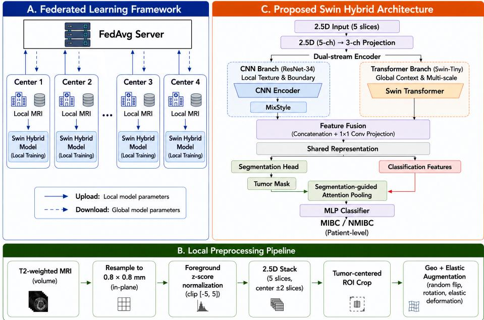

# Federated Multi-Task Learning for Bladder Tumor Segmentation and MIBC Classification Using a Hybrid CNN-Transformer Architecture

Malhar Udmale1\*, Divyanshu Dwivedi2\*, Aarohi Dhand2\*, Sachin Dudda Nagaraju3, Mayank Rai2, and Bagesh Kumar2

1 Indian Institute of Information Technology Allahabad, Prayagraj, India iib2024020@iiita.ac.in

2 Manipal University Jaipur, Jaipur, India

{divyanshu.2427010047, aarohi.2430040138,

mayank.2430040139}@muj.manipal.edu, bagesh.kumar@jaipur.manipal.edu 3 Norwegian University of Science and Technology, Trondheim, Norway sachin.d.nagaraju@ntnu.no

Abstract. Accurate bladder tumor segmentation and assessment of muscle invasion from T2-weighted MRI are important for treatment planning, but developing robust models across institutions is challenging because patient data cannot be centrally pooled and imaging characteristics vary across scanners and acquisition protocols. We propose a federated multi-task learning framework for joint bladder tumor segmentation and MIBC/NMIBC classification across four clinical centers. The proposed Swin Hybrid model combines a ResNet-34 branch for local texture and boundary information with a Swin-Tiny Transformer for global anatomical context. A segmentation-guided classification mechanism further uses tumor localization information to support MIBC prediction. We also investigate several augmentation strategies under both centralized and federated training to improve robustness to multi-center variability. Experiments on the FedBCa dataset show that the Swin Hybrid provides the best overall balance between segmentation and classification among the evaluated architectures. Under federated training, Geo+Elastic augmentation achieved a DSC of 0.8100 and a patient-level AUC of 0.8931, yielding the highest combined score of 0.8474. These results demonstrate that joint segmentation and classification can be efectively performed across multiple institutions using federated training without centralizing patient data.

Keywords: Bladder Cancer · Federated Learning · Multi-task learning.

## 1 Introduction

Bladder cancer is one of the most common urological malignancies, and accurate staging is essential for determining appropriate treatment [2]. In particular, distinguishing non-muscle-invasive bladder cancer (NMIBC) from muscle-invasive bladder cancer (MIBC) directly influences clinical management, as MIBC typically requires more aggressive treatment than localized therapies for NMIBC [18]. In addition to staging, accurate tumor segmentation provides valuable anatomical information for treatment planning, disease monitoring, and quantitative assessment [5]. T2-weighted Magnetic Resonance Imaging (MRI) is widely used for bladder cancer evaluation because of its excellent soft-tissue contrast, but manual tumor delineation and staging remain labor-intensive and are subject to inter-observer variability [18]. These challenges have motivated the development of automated deep learning methods for the analysis of bladder cancer.

Deep learning has achieved promising performance in medical image segmentation and classification, but its success depends on access to diverse datasets of multiple centers [10]. In clinical practice, patient data are distributed across hospitals and cannot be centrally shared due to privacy regulations [9]. Federated learning (FL) addresses this limitation by enabling collaborative model training without transferring patient data between institutions [14]. However, multi-center MRI datasets introduce substantial scanner heterogeneity due to diferences in scanner hardware and acquisition protocols [11]. These non-IID data distributions create domain shifts that reduce the robustness and generalizability of federated models across clinical sites [28]. Despite these challenges, few studies have explored federated multi-task learning that jointly addresses tumor segmentation and staging classification under scanner heterogeneity in bladder cancer MRI. Existing approaches commonly treat segmentation and classification as independent tasks [7], missing the complementary anatomical and pathological information shared between them. Jointly learning both tasks enables the network to learn shared feature representations that improve diagnostic performance while reducing overfitting [26]. Furthermore, a hybrid architecture combining convolutional neural networks with vision transformers can capture both fine local boundary information and long-range anatomical context, making it well suited to heterogeneous multi-center MRI data [22].

To address these challenges, we propose a privacy-preserving federated multitask learning framework for joint bladder tumor segmentation and MIBC classification using the multi-center FedBCa dataset [4]. Motivated by recent work on augmentation-driven domain generalization in federated medical imaging [15], we conduct a systematic study of augmentation strategies designed to harmonize appearance variability across heterogeneous MRI scanners, identifying the combination that best improves cross-center robustness under FL.

The main contributions of this work are as follows:

Federated Multi-Task Framework: We develop a federated learning framework using FedAvg that jointly optimizes bladder tumor segmentation and MIBC classification across four heterogeneous clinical centers without sharing patient data.

– Swin Hybrid Architecture: We propose a dual-stream encoder combining a pretrained ResNet-34 CNN branch for local texture and boundary features with a Swin-Tiny Transformer branch for global anatomical context, connected via segmentation-guided attention for classification.

– Augmentation Study for MRI Scanner Heterogeneity: We systematically evaluate six augmentation strategies under both centralized and federated training, identifying Geo+Elastic deformation as the optimal strategy, achieving DSC of 0.8100 and AUC of 0.8931 under FL.

## 2 Related Works

Medical image segmentation and classification are often formulated as independent single-task learning problems, with separate models optimized for each objective. Although such approaches can achieve strong task-specific performance, they do not explicitly exploit the complementary information shared between anatomically related tasks. Multi-task learning (MTL) addresses this limitation by jointly optimizing related objectives within a shared representation space, allowing information learned from one task to support the other. This shared learning process can also act as an implicit regularizer by discouraging the network from overfitting to task-specific noise and encouraging more generalizable feature representations [6].

The benefits of MTL have been demonstrated across several medical imaging applications. Xiao et al. [25], for example, introduced a Cross-Task Attention Network that explicitly models interactions between multiple prediction tasks and showed that cross-task feature exchange can improve task-specific representations. Similarly, multi-scale MTL architectures have shown that jointly learning spatially related objectives can improve the utilization of features across diferent levels of the network [3]. Zhao et al. [27] further demonstrated that multi-task feature interaction can integrate information across scales while maintaining an eficient shared inference framework.

This relationship is particularly relevant to bladder cancer MRI because tumor localization and assessment of muscle invasion are anatomically linked. Tumor segmentation requires accurate delineation of tumor extent and its boundary with surrounding bladder tissues, whereas MIBC assessment depends strongly on identifying whether the tumor disrupts or extends into the muscular layer of the bladder wall. The VI-RADS framework introduced by Panebianco et al. [17] specifically evaluates MRI characteristics associated with muscular invasion, highlighting the importance of the spatial relationship between the tumor and bladder wall. Subsequent clinical validation by Wang et al. [23] demonstrated that VI-RADS-derived MRI features can efectively discriminate muscle-invasive from non-muscle-invasive bladder cancer. Consequently, spatial features describing tumor location, extent, boundary characteristics, and interaction with the bladder wall are potentially informative for both segmentation and staging.

In our framework, this relationship is exploited through a shared multi-task representation and segmentation-guided feature interaction. The segmentation branch learns spatially precise tumor-related features, while the classification branch uses these features together with global anatomical context to predict MIBC status. Rather than treating segmentation and classification as two isolated prediction problems, the proposed formulation allows tumor localization to guide the staging decision. This design is particularly suitable for federated multicenter MRI, where learning task-shared and anatomically meaningful representations may improve robustness to scanner- and site-specific variations while reducing reliance on features that are specific to an individual institution.

## 3 Methodology

We formulate joint bladder tumor segmentation and muscle-invasive bladder cancer (MIBC) classification as a federated multi-task learning problem, as illustrated in Fig. 1. Each hospital preprocesses its local T2-weighted MRI scans into 2.5D inputs, applies the selected augmentation strategy, and trains the proposed Swin Hybrid network. Only updated model parameters are transmitted to the central server and aggregated using FedAvg [14], while patient data remain within their originating institutions.

Patient MRI data are distributed across $K = 4$ hospitals. The federated dataset is represented as

$$
\mathcal { D } = \{ \mathcal { D } _ { k } \} _ { k = 1 } ^ { K } , \qquad \mathcal { D } _ { k } = \{ ( \boldsymbol { x } _ { i } ^ { k } , \boldsymbol { y } _ { i } ^ { k } , \boldsymbol { c } _ { i } ^ { k } ) \} _ { i = 1 } ^ { n _ { k } } ,\tag{1}
$$

where $\mathcal { D } _ { k }$ denotes the private dataset of hospital k. Each sample contains a five-channel 2.5D MRI input $x _ { i } ^ { k } \ \in \ \mathbb { R } ^ { 5 \times H \times W }$ , a tumor segmentation mask $y _ { i } ^ { k } \in \{ 0 , 1 \} ^ { H \times W }$ , and a binary MIBC/NMIBC label $c _ { i } ^ { k } \in \{ 0 , 1 \}$

The objective is to learn a shared model $f _ { \theta } ( x ) = ( \hat { y } , \hat { c } )$ that jointly predicts the segmentation mask and classification label by minimizing the sample-sizeweighted loss

$$
\theta ^ { * } = \arg \operatorname* { m i n } _ { \theta } \sum _ { k = 1 } ^ { K } \frac { n _ { k } } { N } \mathcal { L } ( \theta ; \mathcal { D } _ { k } ) , \qquad N = \sum _ { k = 1 } ^ { K } n _ { k } .\tag{2}
$$

The distributed objective is optimized using the federated training procedure described below.

## 3.1 Federated Learning Framework

At communication round t, the server broadcasts the global model parameters $\theta _ { t }$ to all K hospitals. Each hospital initializes its local model as $\mathcal { \theta } _ { t , 0 } ^ { ( \bar { k } ) } = \mathcal { \theta } _ { t }$ and performs $E = 3$ local training epochs:

$$
\theta _ { t , e + 1 } ^ { ( k ) } = \theta _ { t , e } ^ { ( k ) } - \eta \nabla \mathcal { L } \Big ( \theta _ { t , e } ^ { ( k ) } ; \mathcal { D } _ { k } \Big ) , \qquad e = 0 , \ldots , E - 1 ,\tag{3}
$$

where η denotes the local learning rate. After local training, hospital k sends the updated parameters $\theta _ { t } ^ { ( k ) } = \theta _ { t , E } ^ { ( k ) }$ to the server. The server computes the sample-size-weighted global model using FedAvg:

$$
\theta _ { t + 1 } = \sum _ { k = 1 } ^ { K } \frac { n _ { k } } { N } \theta _ { t } ^ { ( k ) } .\tag{4}
$$

  
Fig. 1. Proposed federated multi-task framework with FedAvg aggregation and the local Swin Hybrid network for tumor segmentation and MIBC classification.

The aggregated model $\theta _ { t + 1 }$ is redistributed to all hospitals, and the procedure is repeated for $T = 5 0$ communication rounds. All four hospitals participate in every round and train the same multi-task Swin Hybrid model.

## 3.2 Data Pre-processing and Harmonization

To ensure the proposed federated multi-task framework remains resilient to the extensive variability introduced by multi-center data collection, a rigorous and standardized data preprocessing pipeline was deployed across all participating hospital clients. Multi-institutional T2-weighted MRI scans inherently exhibit profound intensity variations. These discrepancies arise from difering magnetic field strengths (e.g., 1.5 Tesla versus 3.0 Tesla scanners), varying manufacturer hardware, and diverse clinical acquisition protocols, which together introduce significant non-IID characteristics into the federated dataset.

To mitigate these domain shifts at the input level before model training, our pipeline first applies the N4 bias field correction algorithm to all raw MRI volumes. This step efectively removes low-frequency intensity non-uniformities caused by magnetic field inhomogeneities during image acquisition. Subsequently, to handle extreme intensity outliers and scanner-specific artifacts, we perform slice-wise intensity clipping, truncating voxel values at the 1st and 99th percentiles. Following outlier removal, the intensity distribution of each scan is normalized to a zero mean and unit variance using Z-score normalization.

To capture essential three-dimensional spatial context while circumventing the heavy computational burden and memory requirements of full 3D convolutional networks, we utilized a 2.5D input extraction strategy. For every target slice containing the bladder, we stack two adjacent slices from above and two from below along the z-axis. This process yields a robust five-channel input tensor $x _ { i } ^ { k } \in \mathbb { R } ^ { 5 \times H \times W }$ for the model. Furthermore, to ensure spatial consistency across the varying fields of view utilized by diferent clinical centers, all slices are resampled to a uniform in-plane spatial resolution of 0.5 mm $\times \ 0 . 5$ mm using B-spline interpolation. Finally, the slices are either center-cropped or zeropadded to achieve a fixed input dimension of $2 5 6 \times 2 5 6$ pixels. By standardizing the physical spacing and intensity distributions locally at each client node, the Swin Hybrid network can focus entirely on learning clinically relevant anatomical features rather than compensating for raw scanner variance.

## 3.3 Multi-task Hybrid CNN–Transformer Model

Each client trains the proposed Swin Hybrid network for joint tumor segmentation and MIBC classification. A lightweight adapter ϕ projects the five-channel 2.5D input into a three-channel representation, $x _ { 3 } = \phi ( x )$ , enabling the use of ImageNet-pretrained encoders.

Dual-stream encoder. The encoder combines a pretrained ResNet-34 [8] with a Swin-Tiny Transformer [12]. The CNN branch extracts local texture and boundary features $\{ l _ { 1 } , l _ { 2 } \}$ , while the Transformer branch captures multi-scale global contextual features $\{ s _ { 1 } , s _ { 2 } , s _ { 3 } \}$ . MixStyle [29] is applied to the CNN branch to improve robustness to scanner-dependent appearance variations.

Feature fusion. Intermediate CNN and Transformer features are fused as

$$
z _ { \mathrm { m i d } } = \psi ( [ s _ { 1 } ; l _ { 2 } ] ) ,\tag{5}
$$

where ψ denotes channel projection, normalization, and nonlinear activation. The resulting features $\{ s _ { 3 } , s _ { 2 } , z _ { \mathrm { m i d } } , l _ { 1 } \}$ are shared by the task-specific heads. Task-specific heads. An attention-gated decoder [16] with deep supervision produces the tumor mask yˆ. The predicted segmentation probability map is used to guide spatial pooling over the deepest Transformer feature:

$$
v = \sum _ { h , w } s _ { 3 } ( h , w ) \frac { \sigma ( \hat { y } ) ( h , w ) } { \sum _ { h ^ { \prime } , w ^ { \prime } } \sigma ( \hat { y } ) ( h ^ { \prime } , w ^ { \prime } ) } .\tag{6}
$$

The pooled representation v is passed to a lightweight classifier to predict the MIBC/NMIBC label cˆ. The segmentation map is detached before attention pooling, preventing classification gradients from propagating through the segmentation prediction.

Joint objective. The local model is optimized using

$$
\mathcal { L } = 0 . 8 0 \mathcal { L } _ { \mathrm { s e g } } + 0 . 2 0 \mathcal { L } _ { \mathrm { c l s } } ,\tag{7}
$$

Table 1. Center-wise distribution of the FedBCa dataset.
<table><tr><td></td><td colspan="2">Center Scans NMIBC MIBC</td></tr><tr><td>Center 1</td><td>160</td><td>130 30</td></tr><tr><td>Center 2</td><td>48 23 19</td><td>25</td></tr><tr><td>Center 3</td><td>32</td><td>13</td></tr><tr><td>Center 4</td><td>35</td><td>17</td></tr><tr><td>Total</td><td>275</td><td>190 85</td></tr></table>

where $\mathcal { L } _ { \mathrm { s e g } }$ combines Dice, binary cross-entropy, Focal Tversky, and boundary losses with auxiliary deep-supervision terms. The classification objective uses focal cross-entropy and is evaluated only for tumor-bearing slices. Its weight is gradually increased during the first 20 cumulative training epochs.

## 3.4 Augmentation Strategy

To improve robustness to inter-center variations, each client applies the Geo+Elastic augmentation strategy during local training. It combines random horizontal flipping $( p = 0 . 5 )$ , rotation within $\pm 1 5 ^ { \circ } ~ ( p = 0 . 7 0 )$ , and elastic deformation $( \sigma = 5 . 0 , \alpha = 1 8 . 0 , p = 0 . 2 0 )$ . The geometric transformations account for variations in patient positioning, while elastic deformation [20] models non-rigid variations in bladder and tumor morphology.

## 4 Experiments

## 4.1 Dataset and Data Partitioning

We evaluate the proposed framework using the FedBCa dataset [4], which contains 275 T2-weighted MRI scans acquired from four medical centers. Each scan is associated with a pixel-level bladder tumor segmentation mask and a pathological MIBC/NMIBC label. Variations in scanner hardware and acquisition protocols across centers introduce natural data heterogeneity, providing an appropriate setting for evaluating the proposed federated framework. Table 1 summarizes the center-wise distribution of the dataset.

A patient-level stratified split was performed independently within each center, preserving the MIBC/NMIBC class distribution as closely as possible. Approximately 71% of the patients were assigned to training, 10% to validation, and 19% to testing. The same center-wise partitions were used for both centralized and federated experiments, ensuring that no patient contributed data to more than one split.

## 4.2 Implementation and Training Details

All experiments were implemented in PyTorch (≥2.1) and conducted on an NVIDIA GeForce RTX 4070 GPU (12 GB VRAM). ImageNet-pretrained backbones were obtained using timm (v0.9.16), while federated training was coordinated using Flower [1]. Models were optimized using AdamW [13] with a warmup-cosine learning-rate schedule and gradient clipping with a maximum norm of 1.0.

For the proposed Swin Hybrid model, the base learning rate was set to $2 \times$ $1 0 ^ { - 5 }$ , with learning-rate multipliers of 0.15 and 0.30 for the ResNet-34 and Swin-Tiny branches, respectively. A weight decay of $1 \times 1 0 ^ { - 4 }$ and an efective batch size of 24 were used. The classification loss was gradually introduced during the first 20 cumulative training epochs, as described in Section 3.

For federated training, each medical center was treated as an independent client. All four clients participated in every communication round, with $E = 3$ local epochs per round and $T = 5 0$ communication rounds. Client parameters were aggregated using sample-size-weighted FedAvg (Eq. 4), and the global model with the highest validation combined score was retained for final evaluation.

## 4.3 Evaluation Metrics

Tumor segmentation performance was evaluated using the Dice Similarity Coefficient (DSC),

$$
\mathrm { D S C } = \frac { 2 | P \cap G | + \epsilon } { | P | + | G | + \epsilon } , \qquad \epsilon = 1 0 ^ { - 5 } ,\tag{8}
$$

where P and G denote the predicted and ground-truth tumor masks, respectively. DSC was computed only on slices containing a non-empty ground-truth tumor mask.

Classification performance was evaluated using the area under the receiver operating characteristic curve (AUC) at the patient level. For each patient, slicelevel MIBC probabilities were averaged to obtain a single patient-level prediction score.

For checkpoint and model selection, a combined validation score was defined as

$$
\begin{array} { r } { S _ { \mathrm { c o m b } } = 0 . 5 5 \mathrm { D S C } + 0 . 4 5 \mathrm { A U C } . } \end{array}\tag{9}
$$

The combined score was used only for model selection, while DSC and AUC were reported separately as the primary segmentation and classification metrics.

## 4.4 Experimental Protocol

The experimental evaluation was conducted in two stages. First, five candidate architectures were compared under centralized training: ResNet50 U-Net [8, 19], EficientNet-B0 U-Net [21, 19], ResNet50+CBAM [24], multi-task EficientNet-B0 [21], and the proposed Swin Hybrid model, which combines a ResNet-34 backbone [8] with a Swin-Tiny Transformer [12]. All architectures were evaluated using the same patient-level data partitions and evaluation metrics, and the model with the highest combined validation score was selected for the subsequent augmentation study.

Table 2. Centralized performance comparison of the candidate architectures. Best results are shown in bold.
<table><tr><td>Single-Task Models</td><td>DSC</td><td>AUC</td><td>Combined</td></tr><tr><td>ResNet50 U-Net</td><td>0.8181</td><td>0.8304</td><td>0.8236</td></tr><tr><td>EfficientNet-B0 U-Net</td><td>0.7669</td><td>0.7589</td><td>0.7633</td></tr><tr><td>Multi-Task Models</td><td>DSC</td><td>AUC</td><td>Combined</td></tr><tr><td>ResNet50+CBAM</td><td>0.7579</td><td>0.7232</td><td>0.7423</td></tr><tr><td>Multi-task EfficientNet-B0 0.7653</td><td></td><td>0.7679</td><td>0.7664</td></tr><tr><td>Swin Hybrid</td><td>0.8076 0.8214</td><td></td><td>0.8138</td></tr></table>

Using the selected Swin Hybrid model, we then evaluated seven augmentation configurations: No Augmentation, GIN Only, Augmentation Stack, Geo+Elastic, Geo+Bias, Geo+Gamma, and Geo+Noise. GIN follows the nonlinear intensity augmentation strategy introduced in FedGIN [15]. The augmentation study was performed under centralized training and then repeated under federated training using FedAvg across all four participating centers. The same architecture, patient-level data partitions, and evaluation protocol were maintained through out, enabling a direct comparison of the augmentation strategies under both training settings.

## 5 Results

## 5.1 Centralized Architecture Comparison

Table 2 compares the candidate architectures under centralized training. Among the single-task models, ResNet50 U-Net achieved the highest segmentation accuracy (DSC of 0.5708). The proposed multi-task Swin Hybrid provided the best overall balance between tasks, achieving the highest patient-level AUC (0.8214) and combined score (0.8138). Consequently, the Swin Hybrid was selected as the optimal architecture for the subsequent augmentation experiments.

## 5.2 Centralized and Federated Augmentation Comparison

Table 3 compares the seven augmentation strategies using the selected Swin Hybrid model under centralized and federated training.

Under centralized training, the Augmentation Stack achieved the highest DSC (0.8487), whereas "No Augmentation" setup achieved the highest AUC (0.9286) and Geo+Elastic had the highest combined score (0.8688). Although the Augmentation Stack produced the best segmentation accuracy, Geo+Elastic provided the best balance between segmentation and patient-level classification, making it the strongest augmentation strategy.

Table 3. Centralized and federated augmentation comparison using the Swin Hybrid model. Best results within each training setting are shown in bold.
<table><tr><td rowspan="2">Augmentation</td><td colspan="3">Centralized</td><td colspan="3">Federated</td></tr><tr><td>DSC</td><td>AUC</td><td>Comb.</td><td>DSC</td><td>AUC</td><td>Comb.</td></tr><tr><td>None</td><td>0.8076</td><td>0.8214</td><td>0.8138</td><td>0.7908</td><td>0.7716</td><td>0.7822</td></tr><tr><td>GIN Only</td><td>0.8161</td><td>0.8750</td><td>0.8426</td><td>0.7790</td><td>0.7270</td><td>0.7560</td></tr><tr><td>Aug. Stack</td><td>0.8487</td><td>0.8661</td><td>0.8565</td><td>0.8220</td><td>0.8230</td><td>0.8220</td></tr><tr><td>Geo+Elastic</td><td>0.8272</td><td>0.9196</td><td>0.8688</td><td>0.8100</td><td>0.8931</td><td>0.8474</td></tr><tr><td>Geo+Bias</td><td>0.8391</td><td>0.8661</td><td>0.8513</td><td>0.8094</td><td>0.8414</td><td>0.8238</td></tr><tr><td>Geo+Gamma</td><td>0.8417</td><td>0.8750</td><td>0.8567</td><td>0.7987</td><td>0.8575</td><td>0.825</td></tr><tr><td>Geo+Noise</td><td>0.8398</td><td>0.8750</td><td>0.8556</td><td>0.8108</td><td>0.8240</td><td>0.8167</td></tr></table>

Under federated training, Geo+Elastic again achieved the highest AUC (0.8931) and combined score (0.8474), with a DSC of 0.8100. Although the Augmentation Stack produced the highest DSC (0.8293), its lower AUC resulted in a lower combined score. Therefore, Geo+Elastic was selected as the augmentation strategy for the final federated Swin Hybrid model.

Overall, Geo+Elastic consistently achieved the highest combined performance under both centralized and federated training, with combined scores of 0.8688 and 0.8474, respectively. Although federated training showed modest reductions in DSC (0.8272 to 0.8100) and AUC (0.9196 to 0.8931), Geo+Elastic remained the most efective augmentation strategy across both training settings.

## 5.3 Discussion and Impact of Multi-Task Learning

Our experimental evaluation underscores the advantages of federated multi-task learning (MTL) over conventional single-task architectures. While single-task baselines like the ResNet50 U-Net achieved a high Dice Similarity Coeficient (DSC) for dense pixel-level predictions, they fundamentally lacked the global contextual awareness needed to maximize patient-level classification accuracy (AUC).

This reveals a critical trade-of in medical imaging: high-capacity CNNs excel at extracting localized boundaries but often struggle with the long-range spatial dependencies vital for cancer staging. The proposed Swin Hybrid architecture elegantly bridges this gap by delegating local feature extraction to the ResNet-34 branch and global anatomical modeling to the Swin-Tiny Transformer. Furthermore, our attention-gated spatial pooling mechanism restricts the classification head’s receptive field to predicted tumor regions, actively preventing the model from hallucinating MIBC predictions based on irrelevant background noise or benign variations in the bladder wall.

Finally, our augmentation analysis provided insights into handling multicenter heterogeneity. While the Augmentation Stack yielded the highest centralized DSC (0.8487), the Geo+Elastic strategy proved optimally balanced for federated settings, achieving the highest combined score (0.8474) and preserving an impressive AUC (0.8931). By simulating natural, non-rigid biomechanical variations of the bladder volume and irregular tumor morphologies, elastic deformation acted synergistically with the MTL objective as a powerful regularizer against non-IID client drift. Ultimately, these results validate that combining multi-task feature sharing with targeted elastic data augmentation allows federated models to achieve centralized-level robustness without compromising patient privacy.

## 6 Conclusion

This work introduced a federated multi-task learning framework for joint bladder tumor segmentation and MIBC classification from multi-center T2-weighted MRI. The proposed Swin Hybrid model combined CNN-based local feature extraction with Transformer-based global contextual modeling, achieving a strong balance between segmentation and classification performance. The augmentation analysis further showed that Geo+Elastic augmentation was the most efective strategy across centralized and federated settings, particularly under heterogeneous multi-center data. Overall, the results demonstrate that the proposed framework can support collaborative bladder cancer analysis across institutions without centralizing patient data, while maintaining competitive performance on both clinical tasks.

## References

1. Beutel, D.J., Topal, T., Mathur, A., Qiu, X., Fernandez-Marques, J., Gao, Y., Sani, L., Li, K.H., Parcollet, T., de Gusmão, P.P.B., et al.: Flower: a friendly federated learning research framework (2020). arXiv preprint arXiv:2007.14390 pp. 1–15 (2007)

2. Bray, F., Laversanne, M., Sung, H., Ferlay, J., Siegel, R.L., Soerjomataram, I., Jemal, A.: Global cancer statistics 2022: Globocan estimates of incidence and mortality worldwide for 36 cancers in 185 countries. CA: a cancer journal for clinicians 74(3), 229–263 (2024)

3. Bui, N., et al.: Multi-scale feature enhancement in multi-task learning for medical image analysis. arXiv preprint arXiv:2412.00351 (2024)

4. Cao, K., Zou, Y., Zhang, C., Zhang, W., Zhang, J., Wang, G., Zhang, C., Lyu, J., Sun, Y., Zhang, H., et al.: A multicenter bladder cancer mri dataset and baseline evaluation of federated learning in clinical application. Scientific Data 11(1), 1147 (2024)

5. Cha, K.H., Hadjiiski, L.M., Samala, R.K., Chan, H.P., Cohan, R.H., Caoili, E.M., Paramagul, C., Alva, A., Weizer, A.Z.: Bladder cancer segmentation in ct for treatment response assessment: application of deep-learning convolution neural network—a pilot study. Tomography 2(4), 421 (2016)

6. Cheng, J., Liu, J., Kuang, H., Wang, J.: A fully automated multimodal mri-based multi-task learning for glioma segmentation and idh genotyping. IEEE Transactions on Medical Imaging 41(6), 1520–1532 (2022)

7. Dolz, J., Gopinath, K., Yuan, J., Lombaert, H., Desrosiers, C., Ayed, I.B.: Hyperdense-net: A hyper-densely connected cnn for multi-modal image segmentation. IEEE transactions on medical imaging 38(5), 1116–1126 (2018)

8. He, K., Zhang, X., Ren, S., Sun, J.: Deep residual learning for image recognition. In: Proceedings of the IEEE conference on computer vision and pattern recognition. pp. 770–778 (2016)

9. Kaissis, G.A., Makowski, M.R., Rückert, D., Braren, R.F.: Secure, privacypreserving and federated machine learning in medical imaging. Nature Machine Intelligence 2(6), 305–311 (2020)

10. Litjens, G., Kooi, T., Bejnordi, B.E., Setio, A.A.A., Ciompi, F., Ghafoorian, M., Van Der Laak, J.A., Van Ginneken, B., Sánchez, C.I.: A survey on deep learning in medical image analysis. Medical image analysis 42, 60–88 (2017)

11. Liu, Q., Chen, C., Qin, J., Dou, Q., Heng, P.A.: Feddg: Federated domain generalization on medical image segmentation via episodic learning in continuous frequency space. In: Proceedings of the IEEE/CVF conference on computer vision and pattern recognition. pp. 1013–1023 (2021)

12. Liu, Z., Lin, Y., Cao, Y., Hu, H., Wei, Y., Zhang, Z., Lin, S., Guo, B.: Swin transformer: Hierarchical vision transformer using shifted windows. In: Proceedings of the IEEE/CVF international conference on computer vision. pp. 10012–10022 (2021)

13. Loshchilov, I., Hutter, F.: Decoupled weight decay regularization. arXiv preprint arXiv:1711.05101 (2017)

14. McMahan, B., Moore, E., Ramage, D., Das, S.: Communication-eficient learning of deep networks from decentralized data. In: AISTATS (2017)

15. Nagaraju, S.D., Moradi, A., Abrahamsen, B.S., Elschot, M.: Fedgin: Federated learning with dynamic global intensity non-linear augmentation for organ segmentation using multi-modal images. In: International Conference on Medical Image Computing and Computer-Assisted Intervention. pp. 111–120. Springer (2025)

16. Oktay, O., Schlemper, J., Folgoc, L.L., Lee, M., Heinrich, M., Misawa, K., Mori, K., McDonagh, S., Hammerla, N.Y., Kainz, B., et al.: Attention u-net: Learning where to look for the pancreas. arXiv preprint arXiv:1804.03999 (2018)

17. Panebianco, V., Briganti, A., Efstathiou, J.A., Galgano, S.J., Luk, L., Muglia, V.F., Redd, B., de Rooij, M., Takeuchi, M., Woo, S., et al.: Multiparametric magnetic resonance imaging and vesical imaging-reporting and data system (vi-rads) for bladder cancer diagnosis and staging: A guide for clinicians from the american college of radiology vi-rads steering committee. European Urology (2025)

18. Panebianco, V., Narumi, Y., Altun, E., Bochner, B.H., Efstathiou, J.A., Hafeez, S., Huddart, R., Kennish, S., Lerner, S., Montironi, R., et al.: Multiparametric magnetic resonance imaging for bladder cancer: development of vi-rads (vesical imaging-reporting and data system). European urology 74(3), 294–306 (2018)

19. Ronneberger, O., Fischer, P., Brox, T.: U-net: Convolutional networks for biomedical image segmentation. In: International Conference on Medical image computing and computer-assisted intervention. pp. 234–241. Springer (2015)

20. Simard, P.Y., Steinkraus, D., Platt, J.C., et al.: Best practices for convolutional neural networks applied to visual document analysis. In: Icdar. vol. 3. Edinburgh (2003)

21. Tan, M., Le, Q.: Eficientnet: Rethinking model scaling for convolutional neural networks. In: International conference on machine learning. pp. 6105–6114. PMLR (2019)

22. Wang, H., Xie, S., Lin, L., Iwamoto, Y., Han, X.H., Chen, Y.W., Tong, R.: Mixed transformer u-net for medical image segmentation. In: ICASSP 2022-2022 IEEE international conference on acoustics, speech and signal processing (ICASSP). pp. 2390–2394. IEEE (2022)

23. Wang, H., Luo, C., Zhang, F., Guan, J., Li, S., Yao, H., Chen, J., Luo, J., Chen, L., Guo, Y.: Multiparametric mri for bladder cancer: validation of vi-rads for the detection of detrusor muscle invasion. Radiology 291(3), 668–674 (2019)

24. Woo, S., Park, J., Lee, J.Y., Kweon, I.S.: Cbam: Convolutional block attention module. In: Proceedings of the European conference on computer vision (ECCV). pp. 3–19 (2018)

25. Xiao, J., et al.: Ctan: Improving multi-task learning for medical imaging applications. arXiv preprint arXiv:2309.03837 (2023)

26. Zhang, Y., Yang, Q.: A survey on multi-task learning. IEEE transactions on knowledge and data engineering 34(12), 5586–5609 (2021)

27. Zhao, Y., et al.: Yolo-med: Multi-task interaction network for biomedical images. arXiv preprint arXiv:2403.00245 (2024)

28. Zhao, Y., Li, M., Lai, L., Suda, N., Civin, D., Chandra, V.: Federated learning with non-iid data. arXiv preprint arXiv:1806.00582 (2018)

29. Zhou, K., Yang, Y., Qiao, Y., et al.: Domain generalization with mixstyle. In: ICLR (2021)