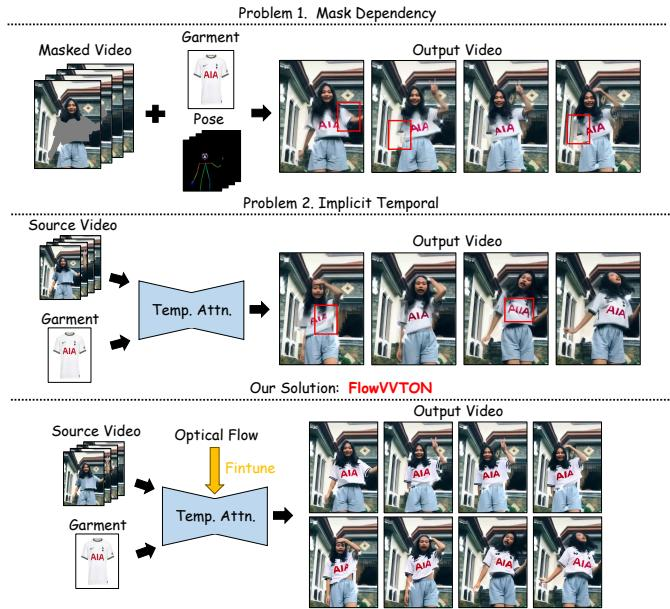
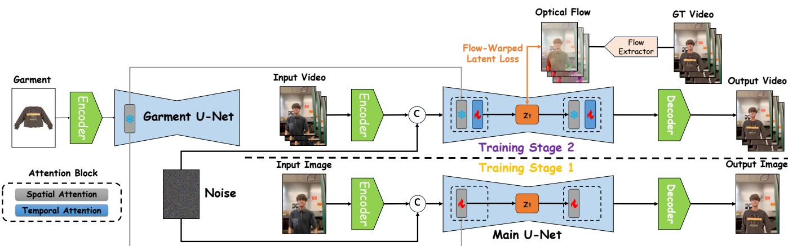
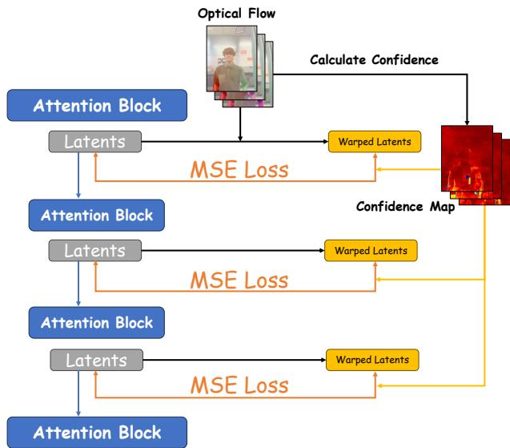
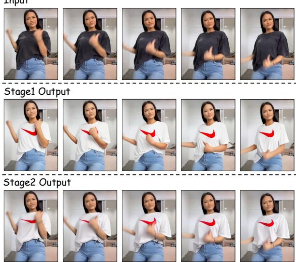
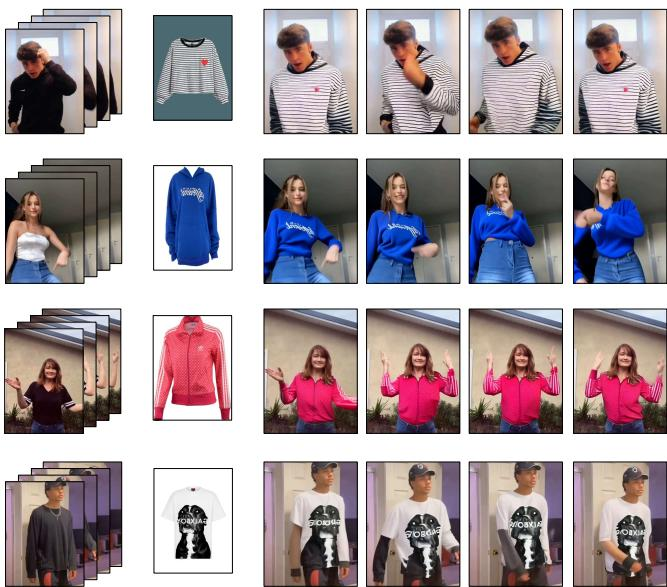
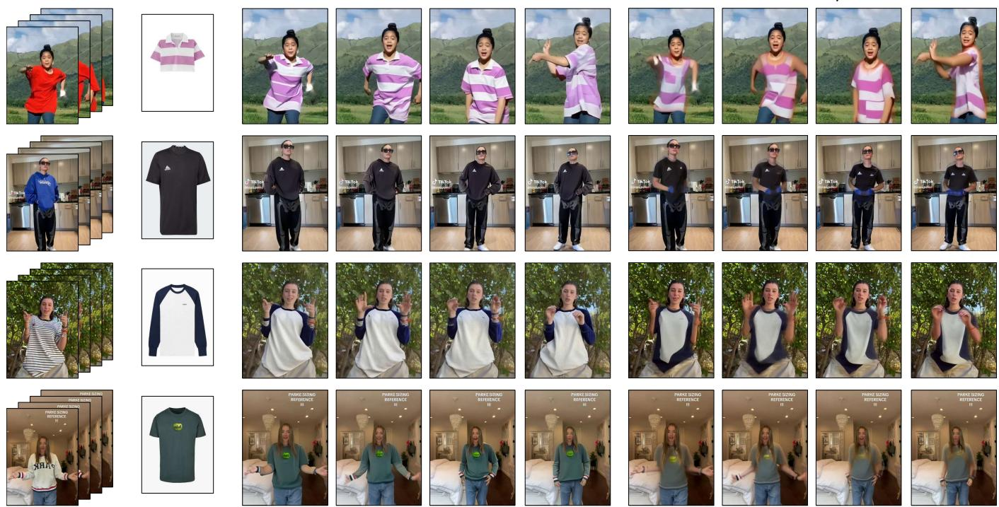
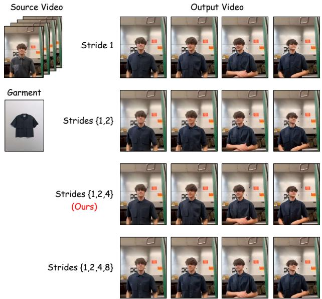
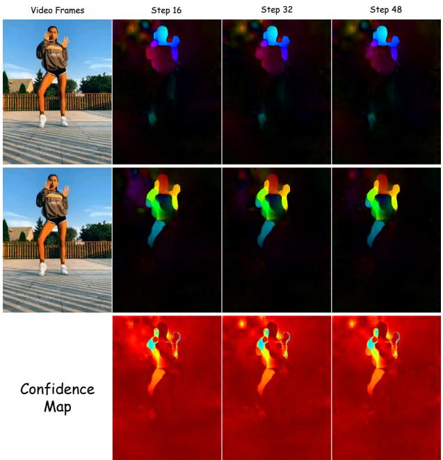

# FlowVVTON: Flow-Guided Mask-Free Video Virtual Try-On

Shengyao Chen, Xianbing Sun, Liqing Zhang, Jianfu Zhang

Shanghai Jiao Tong University, Shanghai, China sjtu15060022751@sjtu.edu.cn, c.sis@sjtu.edu.cn

## Abstract

Video virtual try-on aims to transfer a target garment onto a moving person across video frames. Current methods rely on human parsing masks or pose keypoints that frequently fail under large motions and occlusions, causing boundary artifacts and temporal inconsistency. A further limitation is that most approaches rely solely on attention mechanisms for temporal modeling, providing no explicit motion supervision. We propose FlowVVTON, a mask-free framework that eliminates parsing mask dependency entirely. Optical flow is used solely as a training-time supervision signal: a flow-warped latent loss, applied across all layers of the generation model, enforces multi-scale temporal consistency by aligning adjacent-frame features under explicit physical motion constraints. A twostage training strategy establishes mask-free spatial alignment before introducing flow-guided temporal supervision. Experiments on TikTokDress show that FlowVVTON outperforms baselines by substantial margins, particularly in temporal consistency (5.7× VFID-R improvement over SwiftTry), while requiring no segmentation masks, pose keypoints, or region annotations at any stage.

## Introduction

Video virtual try-on aims to realistically transfer a target garment onto a moving person across a video sequence. Unlike image-based try-on (Ho, Jain, and Abbeel 2020; Rombach et al. 2022), which operates on static frames, video try-on must satisfy temporal consistency: the transferred garment must remain stable across frames without flickering, texture drift, or boundary artifacts, even as the person moves, rotates, or crosses their limbs. This capability has significant commercial value for online shopping, where dynamic garment visualization can reduce return rates, as well as for virtual content creation.

The dominant paradigm in video try-on conditions generation on human parsing masks or pose keypoints obtained from of-the-shelf estimators such as OpenPose (Cao et al. 2021) or DensePose (Güler, Neverova, and Kokkinos 2018). These preprocessing tools segment the body into semantic regions (arms, torso, background) and provide spatial guidance for garment placement. However, they introduce a critical vulnerability: under fast motion, self-occlusion, or challenging lighting, mask and keypoint predictions become unreliable. Because mask extraction is the first stage of the pipeline, errors propagate and amplify through subsequent generation steps, manifesting as jagged garment edges, texture bleeding into the background, and temporal instability.

  
Figure 1: FlowVVTON performs mask-free video virtual tryon. Given only a source video and a target garment image, our method generates temporally consistent try-on results across all frames without any human parsing masks, pose keypoints, or region annotations. Temporal consistency is enforced during training via a flow-warped latent loss applied across all layers of the generation model.

A second, related limitation is that most methods rely solely on attention mechanisms to maintain spatiotemporal consistency. They insert 3D convolutions or temporal attention layers into the denoising network and depend entirely on data-driven learning to capture cross-frame correspondence. While efective for slow, predictable motions, these attention layers provide no explicit motion supervision — the model must infer how pixels move between frames purely from statistical patterns in the training data. Under rapid movements or large body rotations, this implicit approach breaks down: without direct knowledge ofpixel-level motion, textures drift,

flicker, or deform.

We observe that both challenges share a common root: the absence of explicit, pixel-level motion information. Optical flow ofers a natural solution. Optical flow is a dense, continuous field that describes precisely how each pixel moves from one frame to the next. Unlike discrete parsing masks, which classify each pixel into a fixed semantic category and are brittle to estimation errors, optical flow directly encodes the physical motion of every visible surface. This dual property — dense spatial correspondence and temporal motion encoding — makes optical flow a compelling alternative to masks for guiding video try-on. Our central question is therefore: can optical flow, used purely as a training-time supervision signal, enable efective and robust mask-free video try-on?

We answer this question afirmatively with FlowVVTON, a mask-free video try-on framework. FlowVVTON takes only raw video frames and a garment image as input — no parsing masks, pose keypoints, or region annotations. The key innovation is a flow-warped latent loss: during training, optical flow is computed between adjacent frames and used to warp features across the temporal dimension at every layer of the generation model. The L2 distance between warped and original features is minimized, providing explicit, multiscale supervision for temporal consistency. Crucially, optical flow is used only as a loss signal during training; at inference, the model generates temporally consistent video without any flow computation.

By removing mask dependency, FlowVVTON eliminates the dominant source of boundary artifacts in prior methods and handles large body motions more robustly. Training follows a two-stage pipeline: first, spatial alignment is established by fine-tuning on video frames; then, flowguided temporal training enforces cross-frame consistency. We prepare synthetic paired training data from TikTokDress (Nguyen et al. 2025) using of-the-shelf video try-on models, and demonstrate through extensive experiments that FlowVVTON significantly outperforms existing baselines in both reconstruction quality and temporal consistency, achieving a 5.7× VFID-R improvement over SwiftTry.

Our contributions are:

1. A mask-free video try-on framework for large-motion scenarios. FlowVVTON eliminates parsing mask dependency, avoiding mask-induced boundary artifacts and achieving robust performance under large body motions where mask-based methods typically fail. Optical flow is used only during training as a loss signal.

2. A per-layer flow-warped latent loss. Applied across all layers of the generation model, the loss enforces multiscale temporal consistency by aligning features between adjacent frames under physical motion.

3. A two-stage training strategy with flow-guided temporal supervision. We design a training pipeline that first establishes mask-free spatial alignment on video frames, then enforces multi-scale temporal consistency through the flow-warped latent loss, enabling the model to handle large motions and reduce artifacts without any preprocessing masks.

## Related Work

## Image Virtual Try-On

Image virtual try-on transfers a garment onto a person image. Early GAN-based methods (Han et al. 2018; Wang et al. 2018; Han et al. 2019; Ge et al. 2021; Choi et al. 2021) used warp-and-blend pipelines efective under controlled conditions. Difusion models (Ho, Jain, and Abbeel 2020; Rombach et al. 2022) now dominate, using iterative denoising with garment feature injection via textual inversion, crossattention fusion, or lightweight conditioning (Morelli et al. 2023; Kim et al. 2024; Xu et al. 2024a; Choi et al. 2024; Chong et al. 2025a; Zhou et al. 2025; Takemoto and Koshinaka 2026), with recent eforts targeting single-step generation (Fang et al. 2024a; Sun et al. 2026). Mask-free image methods eliminate parsing dependency through pseudo-data training or unified architectures (Zhang et al. 2025; Wan et al. 2025; Jo, Park, and Kang 2025; Guo et al. 2025; Sun et al. 2025). We adopt a pretrained mask-free image model as our base.

## Video Virtual Try-On

Video try-on adds temporal consistency: the garment must stay consistent across frames under motion. Early methods (Dong et al. 2019; Jiang et al. 2022) processed frames independently with post-hoc smoothing but lacked joint spatiotemporal modeling. Video difusion models enabled endto-end temporal generation, from SVD-based approaches with hierarchical attention and local refinement (Fang et al. 2024b; Xu et al. 2024b; He et al. 2024; Li et al. 2025a,c; Nguyen et al. 2025) to recent DiT-based architectures (Peebles and Xie 2023) with spatiotemporal encoding, stage-wise training, and keyframe-guided injection (Zheng et al. 2024; Chong et al. 2025b; Li et al. 2025b; Zuo et al. 2025; He et al. 2026; Zeng et al. 2025; Zheng et al. 2026). All of these, however, rely on human parsing masks or pose keypoints (Cao et al. 2021; Güler, Neverova, and Kokkinos 2018).

## Mask-Free Try-On

Mask-free methods avoid error propagation from imperfect upstream parsers. Image-domain works use pseudo-data training, teacher-student distillation, or unified architectures (Zhang et al. 2025; Wan et al. 2025; Jo, Park, and Kang 2025; Guo et al. 2025; Sun et al. 2025; Wang et al. 2025). Extending mask-free try-on to video is harder; recent methods replace dense masks with sparse keypoints, coarse bounding boxes, or pose-driven animation (Chang et al. 2025; Shao et al. 2026; Cha et al. 2026) but still require spatial annotations or mask-based teachers during training. FlowVVTON eliminates masks entirely, using only raw video frames and a garment image as input, with flow-warped latent loss for temporal consistency.

## Optical Flow for Video Generation

Optical flow has been used to improve video generation through flow-based losses (Wu, Ota, and Kanezaki 2025; Bhowmik et al. 2025), as a conditioning signal via latent warping or noise correlation (Wang et al. 2026; Nam et al. 2025; Liao et al. 2025; Liang et al. 2024; Burgert et al. 2025), or injected into model internals through frozen attention or warped embeddings (Guo et al. 2024; Xue et al. 2025; Koroglu et al. 2025; Gökmen et al. 2025). In FlowVVTON, a per-layer flow-warped latent loss aligns adjacent-frame UNet features under motion constraints, providing explicit geometric supervision for temporal consistency.

## Method

Our framework is built on a Latent Difusion Model (LDM) (Rombach et al. 2022) backbone. All operations are performed in the latent space of a pretrained VAE, which compresses input video frames $V \ { \stackrel { \bullet } { \in } } \ \mathbf { R } ^ { F \times H \times W \times 3 }$ and the garment image $I _ { g }$ into compact latent codes $z _ { v }$ and $z _ { g } .$

## Model Architecture

Overview. The architecture consists of two UNets with shared base weights: a reference UNet for the garment image $I _ { g } ,$ , and a main UNet for video generation. The reference UNet extracts multi-scale garment features from $z _ { g }$ and injects them into the main UNet via mutual self-attention: at each layer, the main UNet uses frame features as queries and garment features as keys and values. This WRITE-READ mechanism allows every spatial position to attend to garment texture without explicit warping.

The main UNet is a 2D UNet inflated to video by inserting temporal attention layers after each spatial block. Each residual block contains: (1) spatial self-attention with garment feature injection; and (2) temporal self-attention across $F$ frames to capture motion. Only temporal attention layers are trained; all spatial weights and the reference UNet remain frozen, preserving spatial quality from image pretraining.

Mask-free input. Instead of relying on parsing masks or pose keypoints, we feed raw video features directly. At each denoising step $t ,$ the main UNet receives the concatenation of the noisy latent $z _ { t }$ and the VAE-encoded source video $z _ { \mathrm { s r c } } \mathrm { : }$

$$
\mathrm { I n p u t } _ { \operatorname* { m a i n } } = \mathrm { C o n c a t } ( z _ { t } , z _ { \mathrm { s r c } } ) .\tag{1}
$$

${ \cal z } _ { \mathrm { s r c } }$ encodes the full original video — background, body contours, lighting, and motion — without any masking or region labeling. The model learns to distinguish garment areas from background purely through feature-level contrast, guided by strong semantic priors from large-scale image pretraining and garment features injected via mutual self-attention. This eliminates the error-prone mask extraction step entirely.

How optical flow is used. Optical flow serves two complementary roles during training, neither of which requires flow at inference. First, as a spatial alignment signal: warping features across frames provides dense pixel-level correspondence, ofering finer-grained supervision than the coarse region masks used by prior mask-based methods. Second, as a temporal regularizer: the flow-warped consistency loss penalizes feature-level deviations between frames, forcing the model to learn temporally stable internal representations. Crucially, optical flow is only used during training as a loss signal; at inference, the model generates temporally consistent video without any flow computation.

Confidence-weighted warping. Optical flow is unreliable at occlusion boundaries and disoccluded regions where pixels appear or disappear between frames. Using erroneous flow as supervision would inject noise into training. We use forward-backward consistency checking: given $F _ { t  t + 1 }$ and $F _ { t + 1  t }$ , we chain them and compute the forward-backward error $\begin{array} { r } { \mathrm { F B E } ( p ) = \| p - p ^ { \prime \prime } \| _ { 2 } } \end{array}$ . Pixels where forward and backward flows agree have low FBE and are reliable; large FBE indicates occlusion. We convert FBE into a confidence map $\mathbf { C } ( p ) \ = \ \exp ( - \mathrm { F B E } ( p ) / \tau )$ with $\tau = 3 . 0$ , which downweights unreliable pixels in the flow loss.

Why feature space? We apply warp consistency in UNet feature space rather than pixel space for three reasons. First, feature-space loss operates at the semantic level (texture, structure, garment identity), making it robust to lighting variations that would produce spurious pixel-space errors. Second, it directly supervises the features being trained rather than backpropagating through the VAE decoder. Third, features are available from the forward pass with no extra decoding cost.

Flow-warped latent loss. The loss operates within the main UNet on clean features: during training, a clean forward pass (noise-free latents at timestep 0) yields multi-scale features ${ \bf z } _ { l } ( t )$ for each frame t and layer l, free from difusion noise.

Given frames $x _ { t }$ and $x _ { t + 1 }$ , we compute backward flow $F _ { t + 1  t }$ via RAFT (Teed and Deng 2020) and downsample it to each UNet layer’s resolution — coarse layers capture large body movements, fine layers track subtle texture displacements. The per-layer loss warps frame t+1 backward and measures MSE consistency with frame t:

$$
\mathcal { L } _ { l } = \frac { \sum _ { p } \mathbf { C } _ { l } ( p ) \cdot \left. \mathbf { z } _ { l } ( t , p ) - \mathcal { W } \big ( \mathbf { z } _ { l } ( t + 1 ) , \mathbf { \nabla } F _ { l } \big ) ( p ) \right. _ { 2 } ^ { 2 } } { \sum _ { p } \mathbf { C } _ { l } ( p ) + \varepsilon } ,\tag{2}
$$

where W is bilinear warping, $F _ { l }$ is the flow downsampled to layer $l ,$ and $\mathbf { C } _ { l } ( \boldsymbol { p } )$ is the confidence map. The per-layer losses are aggregated with level weights $w _ { l }$ (2.0 for highestresolution, 1.5 mid, 1.0 coarse) and per-layer variance normalization to prevent domination by high-activation layers.

For long-range stability, we compute the loss at multiple strides $s \in \{ 1 , { \bar { 2 } } , 4 \}$ . Flow $F _ { t + s  t }$ is computed directly on sub-sampled frames, avoiding the compounding interpolation errors of accumulated stride-1 flows. The total flow loss is:

$$
\mathcal { L } _ { \mathrm { f l o w } } = \sum _ { s \in \{ 1 , 2 , 4 \} } \alpha _ { s } \cdot \sum _ { l } w _ { l } \mathcal { L } _ { l } ^ { ( s ) } ,\tag{3}
$$

with $\alpha _ { 1 } { = } 1 . 0 , \alpha _ { 2 } { = } 0 . 5 , \alpha _ { 4 } { = } 0 . 2 5$ . Stride-1 enforces adjacentframe smoothness, stride-2 provides medium-range continuity, and stride-4 prevents long-term color drift. The decreasing weights reflect the decreasing reliability of flow over longer temporal intervals. By design, the flow-warped latent loss only involves the main UNet; the reference UNet is frozen and handles garment feature injection independently. This clean separation — spatial garment transfer via the frozen reference UNet, temporal consistency via flowwarped main UNet training — allows each component to be optimized without interference.

  
Figure 2: Overview of FlowVVTON. A reference UNet extracts garment features and injects them into the main UNet via mutual self-attention. The main UNet with temporal attention generates video frames from concatenated noisy and source latents. At every layer of the main UNet, a flow-warped latent loss enforces temporal consistency by aligning features across adjacent frames under optical flow guidance.

  
Figure 3: Detail of the flow-warped latent loss. Optical flow is computed between adjacent frames and downsampled to each layer. At every layer, the main UNet’s clean features from frame t+1 are warped backward via optical flow and compared with frame t’s clean features via MSE loss. Confidence weights from forward-backward consistency suppress unreliable flow regions.

## Data Preparation

Paired video try-on data — the same person performing identical motion in diferent garments — is impractical to collect at scale. We prepare training data from TikTokDress (Nguyen et al. 2025) (693 training, 124 test videos), which contains diverse real-world motions, lighting, and backgrounds. An of-the-shelf video try-on model generates garment-transfer results for randomly sampled garments, producing largescale video-garment pairs for model training. The synthesized videos serve as training inputs, while the original Tik-

TokDress videos serve as ground truth for the denoising objective. An important practical benefit of this setup is that optical flow is computed on the clean ground-truth videos rather than on the synthesized results. Since GT videos are free from the minor artifacts and texture inconsistencies present in synthesized outputs, the resulting flow fields are substantially more reliable, providing cleaner motion supervision for the flow-warped latent loss.

## Training Strategy

We adopt a two-stage training pipeline.

Stage 1: Image-level spatial alignment. We fine-tune a mask-free image try-on model on individual frames sampled from TikTokDress for 50K steps. This establishes per-frame garment transfer on diverse in-the-wild video frames, teaching the model to handle varied poses, lighting, and backgrounds without masks. Temporal attention layers remain frozen.

Stage 2: Video-level temporal training with flow guidance. We activate temporal attention layers and freeze all spatial weights from Stage 1. Training on our synthetic dataset introduces ${ \mathcal { L } } _ { \mathrm { { f l o w } } }$ across all main UNet layers. The temporal attention layers learn cross-frame motion patterns; the flow loss directly enforces geometric feature consistency between frames. This dual mechanism — implicit temporal attention for global coherence plus explicit flow constraints for local alignment — is the key to achieving stable mask-free video generation.

Training objective. The total loss combines standard diffusion denoising with the flow-warped latent loss:

$$
\mathcal { L } _ { \mathrm { t o t a l } } = \mathcal { L } _ { \mathrm { d d p m } } + \lambda \mathcal { L } _ { \mathrm { f l o w } } ,\tag{4}
$$

where ${ \mathcal { L } } _ { \mathrm { d d p m } }$ is the noise prediction MSE with Min-SNR weighting (Hang et al. 2023) $( \gamma = 5 . 0 )$ and λ controls the flow loss weight. Zero-terminal SNR (Lin et al. 2024) is enabled for better noise scheduling at inference.

Source Video

Output Video

Garment

  
Figure 4: Stage 1 results. After image-level fine-tuning, the model achieves plausible per-frame garment transfer without masks, though temporal consistency is not yet enforced.

## Experiments

## Datasets and Metrics

Datasets. We use the training data described in the Data Preparation section and evaluate under paired (same garment as source) and unpaired (diferent garment) settings on the TikTokDress test set.

Metrics. For paired evaluation we report SSIM (Wang et al. 2004) (structural similarity), LPIPS (Zhang et al. 2018) (perceptual distance), and VFID (Parmar, Zhang, and Zhu 2022) (Video Fréchet Inception Distance) with I3D and ResNeXt backbones. VFIDI3D is sensitive to spatiotemporal dynamics, while VFIDRN captures spatial texture quality. For unpaired evaluation we report VFIDI3D and VFIDRN as distribution-level measures. ↑ = higher is better, ↓ = lower is better.

## Implementation Details

Architecture. We use the pretrained VAE (ft-mse) from Stable Difusion v1.5, frozen. The reference UNet is a frozen 2D UNet from a pretrained mask-free image try-on model. The main UNet is 3D-inflated with temporal attention layers after each spatial block; only these are trained.

Training. Stage 1 fine-tunes an image try-on model on TikTokDress frames for 50K steps. Stage 2 trains temporal attention layers on our synthetic dataset for 100K steps, with AdamW (8-bit, lr=1 × 10−5, constant schedule), batch size 1, 16-frame sequences at stride 4, resolution 384 × 512, fp16 mixed precision, gradient clipping at 1.0, and gradient checkpointing.

Flow computation. RAFT (Teed and Deng 2020) with 32 update iterations computes flow on the fly. Forwardbackward consistency filters unreliable regions (τ = 3.0). Flow loss weight λ = 1.0, level weights: down\_0/up\_3: 2.0;

  
Figure 5: Qualitative results of FlowVVTON across diverse garments and motion patterns. Our method preserves garment textures and maintains temporal stability under large body motions, without mask-induced boundary artifacts.

down\_1/up\_2: 1.5; down\_2/up\_1: 1.0. Multi-scale strides {1, 2, 4} with weights {1.0, 0.5, 0.25}.

Inference. DDIM with 25 steps, CFG scale 3.5, context windows of 24 frames with 4-frame overlap, on a single NVIDIA A6000 GPU.

## Qualitative Comparison

Figure 6 compares FlowVVTON with SwiftTry on representative test videos. FlowVVTON produces consistently sharper garment textures with significantly fewer boundary artifacts. The diference is most pronounced under large body motions: when the subject rotates rapidly or crosses their arms, SwiftTry’s mask-based pipeline produces misaligned garment edges and visible texture bleeding, as the upstream parsing model fails to provide accurate spatial guidance. In contrast, FlowVVTON maintains clean garment boundaries and stable texture adherence in these challenging scenarios, because the mask-free input strategy preserves full visual context and the flow-warped latent loss provides continuous geometric alignment without relying on discrete, error-prone mask boundaries. Figure 5 shows additional results across diverse garment types and motion patterns, confirming that the mask-free design generalizes across varying conditions.

## Quantitative Comparison

We evaluate under two settings: paired (same garment, same pose) and unpaired (diferent garment).

Table 1 reports paired metrics. FlowVVTON achieves the best results across all four, outperforming SwiftTry by substantial margins. The 6× VFID-R improvement (0.71 vs. 4.30) reflects the mask-free design’s sharper garment details.

  
Figure 6: Qualitative comparison with SwiftTry (Nguyen et al. 2025). FlowVVTON produces fewer boundary artifacts and sharper garment textures, particularly under large motions where mask-based methods degrade.

Table 1: Paired evaluation on TikTokDress test set. ↑/↓ = higher/lower is better. Bold = best, underline = second best.
<table><tr><td>Method</td><td>SSIM↑</td><td>LPIPS↓</td><td>VFID-I↓</td><td>VFID-R↓</td></tr><tr><td>SwiftTry</td><td>0.877</td><td>0.090</td><td>31.31</td><td>4.30</td></tr><tr><td>CatV2TON</td><td>0.673</td><td>0.264</td><td>50.13</td><td>7.30</td></tr><tr><td>MagicTryOn</td><td>0.765</td><td>0.144</td><td>37.05</td><td>4.62</td></tr><tr><td>FlowVVTON (Ours)</td><td>0.905</td><td>0.072</td><td>29.94</td><td>0.71</td></tr></table>

Table 2: Unpaired evaluation on TikTokDress test set. Bold = best, underline = second best.
<table><tr><td>Method</td><td>VFID-I↓</td><td>VFID-R↓</td></tr><tr><td>SwiftTry</td><td>32.06</td><td>3.42</td></tr><tr><td>CatV2TON</td><td>50.33</td><td>7.75</td></tr><tr><td>MagicTryOn</td><td>34.46</td><td>4.02</td></tr><tr><td>FlowVVTON (Ours)</td><td>30.99</td><td>0.60</td></tr></table>

In the unpaired setting (Table 2), FlowVVTON again leads with a 5.7× VFID-R gain over SwiftTry (0.60 vs. 3.42). These consistent gains confirm that the flow-warped latent loss provides fundamentally better temporal supervision than implicit temporal attention. Notably, CatV2TON and MagicTryOn perform worse than SwiftTry, suggesting that DiTbased architectures do not compensate for the absence of explicit temporal constraints.

Table 3: Ablation study (unpaired evaluation). Bold = best, underline = second best.
<table><tr><td>Configuration</td><td>VFID-I↓</td><td>VFID-R↓</td></tr><tr><td>Full FlowVVTON (strides {1, 2, 4})</td><td>30.99</td><td>0.60</td></tr><tr><td>Loss components</td><td></td><td></td></tr><tr><td>w/o Lfow (λ=0)</td><td>32.48</td><td>1.24</td></tr><tr><td>w/o confidence weighting</td><td>31.99</td><td>0.67</td></tr><tr><td>Multi-scale strides</td><td></td><td></td></tr><tr><td>w/o multi-scale (stride 1)</td><td>30.95</td><td>0.72</td></tr><tr><td>strides {1, 2}</td><td>31.19</td><td>0.68</td></tr><tr><td>strides {1, 2, 4}</td><td>30.99</td><td>0.60</td></tr><tr><td>strides {1, 2, 4, 8}</td><td>31.03</td><td>0.67</td></tr></table>

## Ablation Study

Table 3 and Figure 7 analyze each component’s contribution.

Loss components. Removing the flow-warped latent loss (λ=0) causes the most severe degradation: VFID-I rises from 30.99 to 32.48 and VFID-R from 0.60 to 1.24, more than doubling the temporal error. This confirms that the standard denoising objective alone, even with temporal attention layers, cannot enforce adequate temporal consistency — explicit flow-based supervision is essential. Removing confidence weighting degrades VFID-R to 0.67, a smaller but notable drop; the qualitative results show artifacts concentrated near occlusion boundaries, confirming that the forward-backward consistency check efectively suppresses noisy flow in these

  
Figure 7: Qualitative ablation. Removing the flow loss causes severe texture drift; removing confidence weighting introduces artifacts near occlusions; stride-1 only produces local flickering. The full model with strides {1, 2, 4} achieves the best temporal smoothness.

Table 4: RAFT iteration ablation (unpaired evaluation). Bold = best.
<table><tr><td>Configuration</td><td>VFID-I↓</td><td>VFID-R↓</td></tr><tr><td>RAFT iters = 16</td><td>31.46</td><td>0.61</td></tr><tr><td>RAFT iters = 32 (ours)</td><td>30.99</td><td>0.60</td></tr><tr><td>RAFT iters = 48</td><td>30.92</td><td>0.60</td></tr></table>

regions.

Multi-scale strides. Using only stride-1 flow achieves the best VFID-I (30.95) but a substantially worse VFID-R (0.72), indicating that adjacent-frame smoothness alone is insuficient for temporal stability. Adding stride-2 improves VFID-R to 0.68 by providing intermediate-range constraints. The best configuration, strides {1, 2, 4}, achieves VFID-R of 0.60 — a 17% improvement over stride-1 only — by combining short-range smoothness, mid-range alignment, and long-range temporal stability. Extending to stride-8 slightly degrades VFID-R to 0.67, as flow estimates over 8-frame intervals become less reliable due to accumulated motion changes and larger displacements. These results demonstrate that multi-scale flow supervision is critical for temporal consistency, and that the optimal stride range balances coverage against flow reliability.

Flow quality analysis. The quality of optical flow directly afects the efectiveness of the flow-warped latent loss. We ablate the number of RAFT update iterations.

Table 4 and Figure 8 analyze the sensitivity to optical flow quality. Reducing RAFT iterations from 32 to 16 causes a clear degradation across both metrics: VFID-I drops from

  
Figure 8: Flow quality analysis. The flow field at 16 iterations shows visible noise and misalignment at motion boundaries, while the 32-iteration result is substantially cleaner. The 48- iteration flow is nearly indistinguishable from 32, confirming diminishing returns.

30.99 to 31.46 and VFID-R from 0.60 to 0.61. The qualitative results reveal the cause: at 16 iterations, the flow field exhibits visible noise and misalignment at motion boundaries, introducing erroneous supervision precisely where accurate alignment is most critical. Increasing to 48 iterations yields only a marginal VFID-I improvement (30.92) with identical VFID-R. The 48-iteration flow field is visually indistinguishable from 32, confirming diminishing returns. However, per-iteration training time increases measurably with more RAFT iterations, as each additional iteration requires another round of correlation lookup and GRU updates. We therefore select 32 iterations as the optimal operating point, where flow quality is suficient for efective temporal supervision without unnecessary computational overhead.

## Conclusion

We presented FlowVVTON, a mask-free video virtual tryon framework that eliminates preprocessing mask dependencies. By using optical flow solely as a training-time loss via a per-layer flow-warped latent loss, FlowVVTON achieves robust temporal consistency and reduces boundary artifacts, particularly under large motions where mask-based methods degrade. Our experiments demonstrate the flow-warped loss and multi-scale strides are essential.

Limitations include dependency on optical flow quality during training, UNet-specific architecture, and current resolution constraints. The mask-free paradigm and flow-guided temporal loss generalize to other video editing tasks such as video inpainting and motion-guided stylization.

## References

Bhowmik, A.; Korzhenkov, D.; Snoek, C. G.; Habibian, A.; and Ghafoorian, M. 2025. MoAlign: Motion-centric Representation Alignment for Video Difusion Models. arXiv preprint arXiv:2510.19022.

Burgert, R.; Xu, Y.; Xian, W.; Pilarski, O.; Clausen, P.; He,M.; Ma, L.; Deng, Y.; Li, L.; and Mousavi, M. 2025. Go-with-the-Flow: Motion-Controllable Video Difusion Mod-els Using Real-Time Warped Noise. In CVPR.

Cao, Z.; Hidalgo Martinez, G.; Simon, T.; Wei, S.-E.; and Sheikh, Y. A. 2021. OpenPose: Realtime Multi-Person 2D Pose Estimation using Part Afinity Fields. IEEE Transactions on Pattern Analysis and Machine Intelligence, 43(1).

Cha, H.; Woo, W.; Kim, B.; and Joo, H. 2026. Vanast: Virtual Try-On with Human Image Animation via Synthetic Triplet Supervision. In CVPR.

Chang, T.; Chen, X.; Wei, Z.; Zhang, X.; Chen, Q.; Luo, W.; Song, P.; and Yang, X. 2025. PEMF-VTO: Point-Enhanced Video Virtual Try-on via Mask-free Paradigm. IEEE Transactions on Consumer Electronics.

Choi, S.; Park, S.; Lee, M.; and Choo, J. 2021. VITON-HD: High-Resolution Virtual Try-On via Misalignment-Aware Normalization. In CVPR.

Choi, Y.; Kwak, S.; Lee, K.; Choi, H.; and Shin, J. 2024. Improving Difusion Models for Authentic Virtual Try-on in the Wild. arXiv preprint arXiv:2403.05139.

Chong, Z.; Dong, X.; Li, H.; Zhang, W.; Zhao, H.; Jiang, D.; and Liang, X. 2025a. CatVTON: Concatenation is All You Need for Virtual Try-on with Difusion Models. In ICLR.

Chong, Z.; Zhang, W.; Zhang, S.; Zheng, J.; Dong, X.; Li, H.; Wu, Y.; Jiang, D.; and Liang, X. 2025b. CatV2TON: Taming Difusion Transformers for Vision-based Virtual Try-on with Temporal Concatenation. arXiv preprint arXiv:2501.11325.

Dong, H.; Liang, X.; Shen, X.; Wu, B.; Chen, B.-C.; and Yin, J. 2019. FW-GAN: Flow-Navigated Warping GAN for Video Virtual Try-On. In ICCV.

Fang, N.; Qiu, L.; Zhang, S.; Wang, Z.; and Hu, K. 2024a. PG-VTON: A Novel Image-based Virtual Try-on Method via Progressive Inference Paradigm. IEEE Transactions on Multimedia, 26.

Fang, Z.; Zhai, W.; Su, A.; Song, H.; Zhu, K.; Wang, M.; Chen, Y.; Liu, Z.; Cao, Y.; and Zha, Z.-J. 2024b. ViViD: Video Virtual Try-on using Difusion Models. arXivpreprint arXiv:2405.11794.

Ge, Y.; Song, Y.; Zhang, R.; Ge, C.; Liu, W.; and Luo, P. 2021. Parser-Free Virtual Try-on via Distilling Appearance Flows. arXiv preprint arXiv:2103.04559.

Gökmen, A. B.; Ekin, Y.; Bilecen, B. B.; and Dundar, A. 2025. RoPECraft: Training-Free Motion Transfer with Trajectory-Guided RoPE Optimization on Difusion Transformers. In NeurIPS.

Güler, R. A.; Neverova, N.; and Kokkinos, I. 2018. Dense-Pose: Dense Human Pose Estimation in the Wild. In CVPR.

Guo, H.; Zeng, B.; Song, Y.; Zhang, W.; Liu, J.; and Zhang, C. 2025. Any2AnyTryOn: Leveraging Adaptive Position Embeddings for Versatile Virtual Clothing Tasks. In ICCV.

Guo, Y.; Yang, C.; Rao, A.; Liang, Z.; Wang, Y.; Qiao, Y.; Agrawala, M.; Lin, D.; and Dai, B. 2024. AnimateDif: Animate Your Personalized Text-to-Image Difusion Models without Specific Tuning. In ICLR.

Han, X.; Hu, X.; Huang, W.; and Scott, M. R. 2019. Cloth-Flow: A Flow-based Model for Clothed Person Generation. In ICCV.

Han, X.; Wu, Z.; Wu, Z.; Yu, R.; and Davis, L. S. 2018. VITON: An Image-based Virtual Try-on Network. In CVPR.

Hang, T.; Gu, S.; Li, C.; Bao, J.; Chen, D.; Hu, H.; Geng, X.; and Guo, B. 2023. Eficient Difusion Training via Min-SNR Weighting Strategy. In ICCV.

He, Q.; Chen, X.; Pan, Y.; Tang, P.; Xu, P.; Gan, Z.; Wang, C.; Hu, X.; Zhang, J.; and Wang, Y. 2026. The Devil is in the Details: Enhancing Video Virtual Try-On via Keyframe-Driven Details Injection. In CVPR.

He, Z.; Chen, P.; Wang, G.; Li, G.; Torr, P. H.; and Lin, L. 2024. WildVidFit: Video Virtual Try-on in the Wild via Image-based Controlled Difusion Models. In ECCV.

Ho, J.; Jain, A.; and Abbeel, P. 2020. Denoising Difusion Probabilistic Models. NeurIPS, 33.

Jiang, J.; Wang, T.; Yan, H.; and Liu, J. 2022. ClothFormer: Taming Video Virtual Try-on in All Module. In CVPR.

Jo, Y.; Park, M.; and Kang, D.-o. 2025. UP-VTON: A Unified Virtual Try-On Framework Supporting Mask, Mask-Free, and Prompt-Driven Guidance. In ICCVW.

Kim, J.; Gu, G.; Park, M.; Park, S.; and Choo, J. 2024. StableVITON: Learning Semantic Correspondence with Latent Difusion Model for Virtual Try-on. In CVPR.

Koroglu, M.; Caselles-Dupré, H.; Jeanneret, G.; and Cord, M. 2025. OnlyFlow: Optical Flow based Motion Conditioning for Video Difusion Models. In CVPR.

Li, D.; Zhong, W.; Yu, W.; Pan, Y.; Zhang, D.; Yao, T.; Han, J.; and Mei, T. 2025a. Pursuing Temporal-Consistent Video Virtual Try-on via Dynamic Pose Interaction. In CVPR.

Li, G.; Zheng, S.; Zhang, H.; Chen, J.; Luan, J.; Ou, B.; Zhao, L.; Li, B.; and Jiang, P.-T. 2025b. MagicTryOn: Harnessing Difusion Transformer for Garment-Preserving Video Virtual Try-on. arXiv preprint arXiv:2505.21325.

Li, S.; Jiang, Z.; Zhou, J.; Liu, Z.; Chi, X.; and Wang, H. 2025c. RealVVT: Towards Photorealistic Video Virtual Try-on via Spatio-Temporal Consistency. arXiv preprint arXiv:2501.08682.

Liang, F.; Wu, B.; Wang, J.; Yu, L.; Li, K.; Zhao, Y.; Misra, I.; Huang, J.-B.; Zhang, P.; and Vajda, P. 2024. FlowVid: Taming Imperfect Optical Flows for Consistent Video-to-Video Synthesis. In CVPR.

Liao, X.; Zeng, X.; Wang, L.; Yu, G.; Lin, G.; and Zhang, C. 2025. MotionAgent: Fine-grained Controllable Video Generation via Motion Field Agent. In ICCV.

Lin, S.; Liu, B.; Li, J.; and Yang, X. 2024. Common Difusion Noise Schedules and Sample Steps are Flawed. In WACV.

Morelli, D.; Baldrati, A.; Cartella, G.; Cornia, M.; Bertini, M.; and Cucchiara, R. 2023. Ladi-VTON: Latent Difusion Textual-Inversion Enhanced Virtual Try-on. In ACM Multimedia.

Nam, H.; Kim, J.; Lee, D.; and Ye, J. C. 2025. Optical-Flow Guided Prompt Optimization for Coherent Video Generation. In CVPR.

Nguyen, H.; Nguyen, Q. Q.-V.; Nguyen, K.; and Nguyen, R. 2025. SwiftTry: Fast and Consistent Video Virtual Try-On with Difusion Models. In AAAI.

Parmar, G.; Zhang, R.; and Zhu, J.-Y. 2022. On Aliased Resizing and Surprising Subtleties in GAN Evaluation. In CVPR.

Peebles, W.; and Xie, S. 2023. Scalable Difusion Models with Transformers. In ICCV.

Rombach, R.; Blattmann, A.; Lorenz, D.; Esser, P.; and Ommer, B. 2022. High-Resolution Image Synthesis with Latent Difusion Models. In CVPR.

Shao, D.; Wu, S.; Wang, S.; Wang, Y.; Tang, Z.; Liu, F.; Lin, J.; Chen, X.; Wang, Q.; and Tai, Y. 2026. TripVVT: A Large-Scale Triplet Dataset and a Coarse-Mask Baseline for In-the-Wild Video Virtual Try-On. arXiv preprint arXiv:2604.27958.

Sun, X.; Hong, Y.; Zhan, J.; Lan, J.; Zhu, H.; Wang, W.; Zhang, L.; and Zhang, J. 2025. DS-VTON: An Enhanced Dual-Scale Coarse-to-Fine Framework for Virtual Try-On. arXiv preprint arXiv:2506.00908.

Sun, X.; Zhan, J.; Zhang, L.; and Zhang, J. 2026. Direct-TryOn: One-Step Virtual Try-On via Straightened Conditional Transport. arXiv preprint arXiv:2605.12939.

Takemoto, K.; and Koshinaka, T. 2026. SIFT-VTON: Geometric Correspondence Supervision on Cross-Attention for Virtual Try-On. arXiv preprint arXiv:2605.01296.

Teed, Z.; and Deng, J. 2020. RAFT: Recurrent All-Pairs Field Transforms for Optical Flow. In ECCV.

Wan, Z.; Hu, D.; Cheng, W.; Chen, T.; Wang, Z.; Liu, F.; Liu, T.; and Gong, M. 2025. MF-VITON: High-Fidelity Mask-Free Virtual Try-on with Minimal Input. arXiv preprint arXiv:2503.08650.

Wang, A.; Li, W.; Luo, H.; Ao, M.; Zhu, C.; Li, X.; and Wang, F. 2025. JCo-MVTON: Jointly Controllable Multi-Modal Difusion Transformer for Mask-Free Virtual Try-on. arXiv preprint arXiv:2508.17614.

Wang, B.; Zheng, H.; Liang, X.; Chen, Y.; Lin, L.; and Yang, M. 2018. Toward Characteristic-Preserving Imagebased Virtual Try-on Network. In ECCV.

Wang, G.; Fan, S.; Liu, H.; Song, Q.; Wang, H.; and Xu, J. 2026. Consistent Video Editing as Flow-Driven Image-to-Video Generation. In CVPR.

Wang, Z.; Bovik, A. C.; Sheikh, H. R.; and Simoncelli, E. P. 2004. Image Quality Assessment: From Error Visibility to Structural Similarity. IEEE Transactions on Image Processing, 13(4).

Wu, K.; Ota, K.; and Kanezaki, A. 2025. FlowLoss: Dynamic Flow-Conditioned Loss Strategy for Video Difusion Models. In MVA.

Xu, Y.; Gu, T.; Chen, W.; and Chen, C. 2024a. OOTDifusion: Outfitting Fusion based Latent Difusion for Controllable Virtual Try-on. arXiv preprint arXiv:2403.01779.

Xu, Z.; Chen, M.; Wang, Z.; Xing, L.; Zhai, Z.; Sang, N.; Lan, J.; Xiao, S.; and Gao, C. 2024b. Tunnel Try-on: Excavating Spatial-Temporal Tunnels for High-Quality Virtual Try-on in Videos. In ACM Multimedia.

Xue, H.; Chen, Q.; Wang, Z.; Huang, X.; Shechtman, E.; Xie, J.; and Chen, Y. 2025. MoGAN: Improving Motion Quality in Video Difusion via Few-Step Motion Adversarial Post-Training. arXiv preprint arXiv:2511.21592.

Zeng, J.; Bai, Y.; Chen, R.; Zhang, X.; Sun, L.; Jin, D.; Xu, R.; Zhang, N.; Song, D.; and Chu, X. 2025. Eevee: Towards Close-up High-Resolution Video-based Virtual Tryon. arXiv preprint arXiv:2511.18957.

Zhang, R.; Isola, P.; Efros, A. A.; Shechtman, E.; and Wang, O. 2018. The Unreasonable Efectiveness of Deep Features as a Perceptual Metric. In CVPR.

Zhang, X.; Song, D.; Zhan, P.; Chang, T.; Zeng, J.; Chen, Q.; Luo, W.; and Liu, A.-A. 2025. BooW-VTON: Boosting In-the-Wild Virtual Try-on via Mask-Free Pseudo Data Training. In CVPR.

Zheng, J.; Xu, Z.; Chen, M.; Wang, J.; Lan, J.; Zhu, X.; Zhang, K.; Zheng, B.; and Liang, X. 2026. iTryOn: Mastering Interactive Video Virtual Try-On with Spatial-Semantic Guidance. arXiv preprint arXiv:2605.21431.

Zheng, J.; Zhao, F.; Xu, Y.; Dong, X.; and Liang, X. 2024. VITON-DiT: Learning In-the-Wild Video Try-on from Human Dance Videos via Difusion Transformers. arXiv preprint arXiv:2405.18326.

Zhou, Z.; Liu, S.; Han, X.; Liu, H.; Ng, K. W.; Xie, T.; Cong, Y.; Li, H.; Xu, M.; and Pérez-Rúa, J.-M. 2025. Learning Flow Fields in Attention for Controllable Person Image Generation. In CVPR.

Zuo, T.; Huang, Z.; Ning, S.; Lin, E.; Liang, C.; Zheng, Z.; Jiang, J.; Zhang, Y.; Gao, M.; and Dong, X. 2025. DreamVVT: Mastering Realistic Video Virtual Try-on in the Wild via a Stage-wise Difusion Transformer Framework. arXiv preprint arXiv:2508.02807.