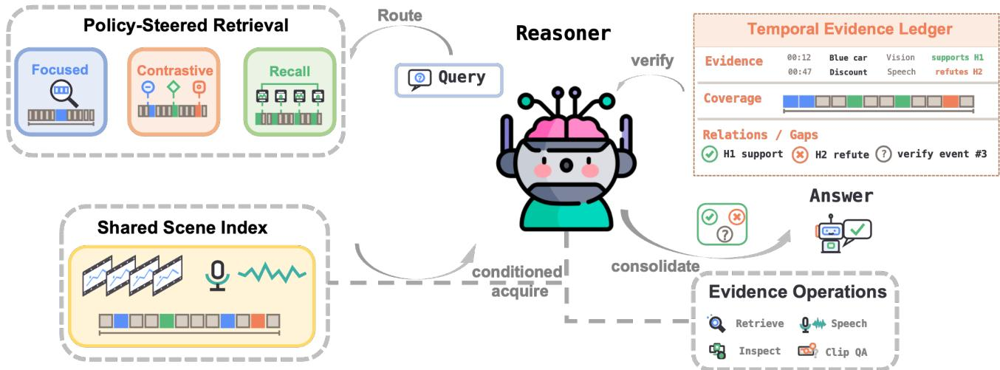
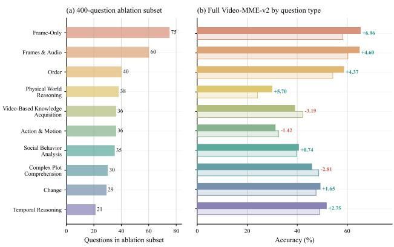
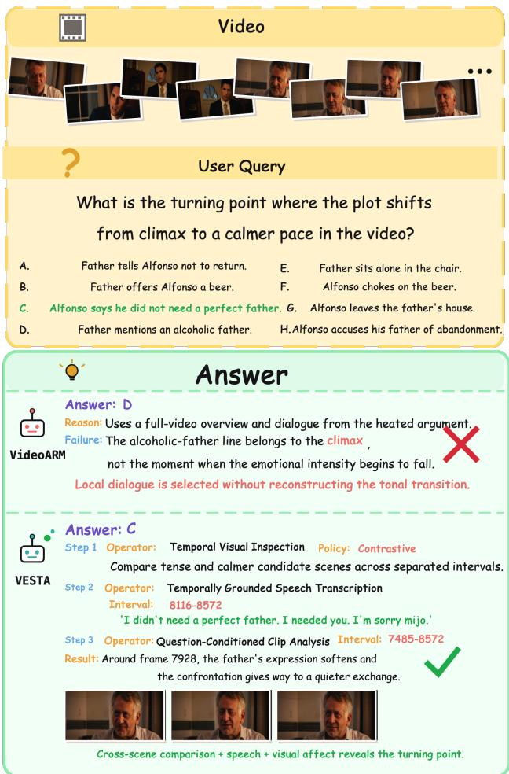
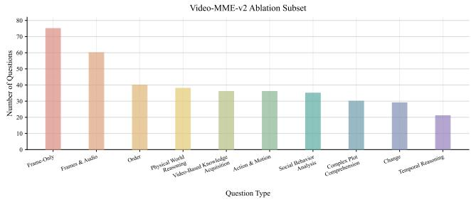
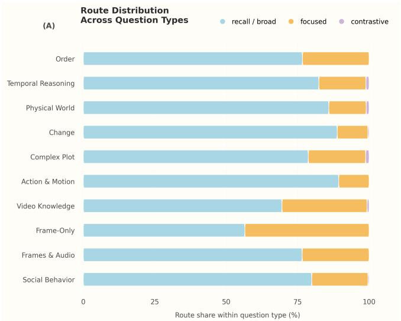
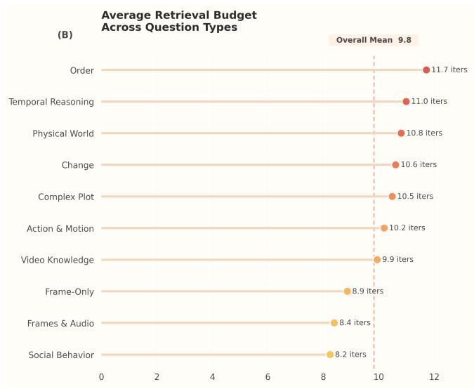

# From Intent to Evidence: Policy-Steered Multi-Strategy Retrieval for Long-Video Agents

Can Zhang1,2, Baofeng Zhang2, Xiaotian Han2∗, Junyuan Shang2, Yuchen Ding2, Shuohuan Wang2, Dianhai Yu2, Ruirui Li1†

1Beijing University of Chemical Technology

2Baidu, Inc.

alexlessend@gmail.com, boffinzhang@stu.pku.edu.cn, hanxiaotian@baidu.com,

shangjunyuan@baidu.com, dingyuchen@baidu.com, wangshuohuan@baidu.com, yudianhai@baidu.com,

ilydouble@gmail.com

## Abstract

Existing long-video agents acquire evidence through one uni- form behavior, ignoring whether the required evidence is con- centrated, requires broad occurrence coverage, or must dis- criminate competing hypotheses—which can cause failure be- fore substantive reasoning begins. Prescribing a fine-grained solution procedure for every question is not a satisfactory remedy, as it restricts autonomous exploration. We propose VESTA, a training-free long-video agent organized as a route- conditioned acquire–verify–consolidate loop. Before explo- ration, an intent router infers an evidence-acquisition policy— focused, recall, or contrastive retrieval over a shared visual– speech scene index—together with an evidence-accounting policy that configures the evidence view maintained during exploration. Policy-steered retrieval yields provisional refer- ences that multimodal evidence operations convert into ob- servations, while the Reasoner remains free to verify them, re-query using intermediate findings, or inspect regions out- side the retrieved set. A temporal evidence ledger consoli- dates observations into an adaptive, compressed view of tem- poral location, provenance, coverage, conflicts, verification outcomes, and hypothesis support, exposing missing and un- resolved evidence to guide subsequent acquisition; finalization prioritizes verified observations. On Video-MME-v2, VESTA improves average accuracy by 2.7 points over VideoARM and gains across all six reported metrics. On LongVideoBench, EgoSchema, and LVBench under shared query-time models, it improves by 6.9 points on the LongVideoBench long subset and 1.5 on LVBench, and matches VideoARM on EgoSchema.

## 1 Introduction

As video increasingly serves as a primary medium for record- ing real-world activity and communicating knowledge, long- video understanding has become a fundamental capability for multimodal intelligence. Unlike short clips, the meaning of a long video often emerges from evolving events, interactions, and state changes whose relationships cannot be explained by any single local segment. A capable system must there- fore recognize fine-grained visual and linguistic cues while connecting observations across extended temporal spans. Recent multimodal large language models (MLLMs) pro-vide increasingly strong unified perception, cross-modal in- tegration, and semantic reasoning capabilities, creating new opportunities for comprehensive long-video understanding (Gemini Team et al. 2023; Bai et al. 2025; Wang et al. 2025d).

Directly extending these capabilities to long videos, how- ever, remains constrained by input scale. As duration grows, visual events, speech, and on-screen text accumulate contin- uously, making exhaustive high-resolution processing pro- hibitively expensive (Shen et al. 2024). More importantly, evidence relevant to a particular question usually occupies only a small fraction of the timeline and may appear sparsely, recur at multiple moments, or be distributed across distant intervals. The central challenge is therefore not only whether a model can reason from evidence once it is available, but whether a system can first locate and acquire the required evidence under a limited computational budget. Efective evidence acquisition is thus a prerequisite for subsequent understanding and reasoning.

Early LLM/MLLM-based approaches address this chal- lenge through predefined pipelines that connect video pro- cessing, evidence selection, and language reasoning. LLoVi converts local clips into textual descriptions before answer- ing through a prescribed aggregation procedure (Zhang et al. 2024a), while VideoTree narrows the analysis through a fixed sequence of clustering, relevance estimation, and hierarchi- cal expansion (Wang et al. 2025f). These designs reduce the amount of video content exposed to the language model, but they also prescribe how evidence should be organized and how reasoning should proceed, limiting the ability of stronger foundation models to use tools autonomously, explore the video, and adapt their strategy in response to intermediate observations.

As MLLMs have gained stronger tool-use and decision- making abilities, video agents have begun to acquire ev- idence actively through external memories and tool calls. Memory-augmented VideoAgent constructs temporal and object memories that an LLM queries interactively (Fan et al. 2024); OmAgent combines a retrievable video store with task decomposition and tool use (Zhang et al. 2024b); and DVD enables autonomous search over a multi-granularity video database (Zhang et al. 2025a). Compared with fixed pipelines, these systems preserve substantially more free- dom for the model to decide where and how to investi- gate. Yet they generally rely on a uniform memory-access or search behavior across questions, without explicitly dis- tinguishing whether the required evidence is concentrated, whether broader temporal coverage is necessary, or whether evidence must be organized around competing hypotheses. Consequently, an otherwise capable agent may fail before substantive reasoning begins: its initial candidates may col- lapse onto one temporal region, omit relevant occurrences, or provide imbalanced evidence for competing answers.

This limitation creates a design tension. Evidence acqui- sition needs structure, but replacing a uniform behavior with a fine-grained, tutorial-style procedure for every question is not the answer. Such procedures would prescribe how rea- soning should unfold and reduce the agent’s ability to revise its search after intermediate observations, form new hypothe- ses, or inspect unanticipated regions. The desired guidance should therefore operate at the level of what evidence must be acquired, while leaving how the agent reasons and explores afterward open.

To resolve this tension, we propose VESTA (Video Evidence Steering and Trust Accounting), a training-free long-video agent for policy-driven evidence acquisition and verification. VESTA organizes exploration as a routeconditioned acquire–verify–consolidate loop. Before explo-ration, VESTA invokes the intent router once over the ques- tion and optional candidate answers to infer an evidence- acquisition policy and an evidence-accounting policy. The former selectsfocused acquisition when relevant evidence is expected to be concentrated, recall acquisition when broad coverage over potentially recurring evidence should be prior- itized, or contrastive acquisition when competing hypotheses must be distinguished; the latter specifies which evidence views the Reasoner should track. These policies structure what evidence is acquired and consolidated, not the subse- quent reasoning steps, and remain independent of question dificulty.

Conditioned on the routed policy, VESTA combines policy-steered retrieval with multimodal evidence operations inside a unified exploration loop. Every retrieved region re- mains a provisional reference: the Reasoner may inspect it visually, examine its speech, analyze a local clip against a targeted subquestion, re-query the scene index using inter- mediate observations, or explore intervals never returned by the retriever. As observations accumulate, the temporal evi- dence ledger consolidates them into an adaptive, compressed view that makes temporal location, provenance, coverage, conflicts, and verification outcomes explicit. Missing or un- resolved evidence exposed by this view drives the next ac- quisition step, while finalization prioritizes verified observa- tions. VESTA thereby provides question-matched structure at the evidence-acquisition level while preserving autonomous reasoning, exploration, and self-correction. Figure 3 illus- trates how this design combines cross-scene comparison with speech and local visual verification to recover a narrative transition missed by a uniform exploration baseline.

We evaluate VESTA on four benchmarks with comple- mentary temporal regimes. On Video-MME-v2 (Fu et al. 2026), VESTA improves overall accuracy by 2.7 points over VideoARM (50.3% vs. 47.6%) with gains across all six re-ported metrics. On the LongVideoBench long subset (Wu et al. 2024), EgoSchema (Mangalam, Akshulakov, and Malik 2023), and LVBench (Wang et al. 2025b) under shared query-time models, the margin scales with the temporal span over which evidence must be located: +6.9 on 15–60 minute videos, +1.5 on hour-long videos, and parity on three-minute clips, where long-range search is not the bottleneck.

Our contributions are threefold:

• We identify a structural mismatch in long-video agents: capable agents commonly use a uniform evidence- acquisition behavior despite diferent requirements for evidence concentration, comprehensive coverage, and hypothesis discrimination. We further articulate why tutorial-style workflows are not a satisfactory remedy, as they trade this mismatch for reduced exploration auton- omy.

• We propose VESTA, a training-free long-video agent organized as a route-conditioned acquire–verify– consolidate loop. Its intent router selects focused, recall, or contrastive evidence acquisition without prescribing the Reasoner’s subsequent tool use, hypothesis formation, or exploration beyond the initial candidates.

• We introduce a temporal evidence ledger that consolidates accumulated observations into an adaptive, com- pressed view of provenance, temporal coverage, evidence relations, conflicts, and hypothesis support. The ledger exposes unresolved evidence to guide subsequent acqui- sition and presents verification outcomes that inform fi- nalization. VESTA improves over VideoARM across all six Video-MME-v2 metrics and across four benchmarks that span 3-minute to hour-long videos.

## 2 Related Work

MLLMs for Long-Video Understanding. Model-centric approaches extend multimodal backbones to process longer videos, including LLaVA-Video-7B (Zhang et al. 2025b), Video-LLaMA (Zhang, Li, and Bing 2023), LongVU (Shen et al. 2024), VideoChat-Flash (Li et al. 2024), and Intern-Video2.5 (Wang et al. 2025d). They expand visual context windows, sample more frames uniformly or sparsely, com- press visual tokens, or integrate long-range information in- side the model (Gemini Team et al. 2023; Wei and Chen 2025; Zhang et al. 2024c; Yang et al. 2025a; Tao et al. 2025). Their ability to preserve evidence is nevertheless bounded by the visual-token and computational budgets available to the backbone: processing cost grows with video length, while aggressive compression can discard the fine-grained cues on which an answer depends. More fundamentally, representa- tion expansion and compression generally optimize what the backbone can ingest, rather than decide whether a particu- lar question requires concentrated evidence, comprehensive occurrence coverage, or hypothesis-discriminative evidence. VESTA does not modify the video backbone or increase its context budget; it determines what evidence should be acquired before that evidence is passed to the Reasoner.

Video Agents. Video agents combine ReAct-style control, task decomposition, and multi-round prompting with exter- nal evidence substrates, allowing an MLLM to decide what to inspect next, invoke tools, and revise its trajectory from intermediate observations (Yao et al. 2023; Yang et al. 2025b; Yin et al. 2026; Liu et al. 2026). Their evidence substrates include video databases and retrieval systems such as DVD (Zhang et al. 2025a) and VideoRAG (Jeong et al. 2025), as well as structured memories such as VideoAgent (Fan et al. 2024), MA-LMM (He et al. 2024), Video-EM (Wang et al. 2025e), WorldMM (Yeo et al. 2026), and VideoLucy (Zuo et al. 2025). These methods show that strong MLLMs can autonomously decompose questions, invoke tools, ac- cess external evidence, and revise their exploration trajectories. The remaining limitation is not a lack of reasoning or exploration capability: prompted loops commonly retain one general evidence-acquisition behavior across questions, while external stores primarily determine where evidence is kept, not how diferent questions should acquire it. Moreover, accumulative memories do not necessarily distinguish pro- visional retrievals from verified evidence or explicitly repre- sent coverage gaps and conflicts. Prescribing a detailed work- flow for each question would address this mismatch only by reducing exploration autonomy. VESTA instead intervenes at a coarser level: it makes access to a shared scene index question-conditioned without prescribing how the Reasoner must solve the question, and consolidates heterogeneous ob- servations into a temporal evidence ledger that exposes cov- erage, conflicts, and unresolved evidence.

  
Figure 1: Overview of VESTA’s route-conditioned acquire–verify–consolidate loop. The intent router selects focused, recall, or contrastive evidence acquisition over a shared visual–speech scene index. Retrieved scenes enter the Reasoner as provisional ref- erences, while shared evidence operations support autonomous re-retrieval and multimodal verification. The temporal evidence ledger consolidates observations into explicit evidence, coverage, and relation/gap views that guide subsequent exploration and inform answer finalization.

## 3 Method

## 3.1 Overview

Given a long video V , a question $Q ,$ and an optional candidate-answer set C, VESTA aims to produce an answer A by actively acquiring and integrating relevant video evidence within an interaction budget N. Rather than pre-scribing fine-grained solution procedures, VESTA provides strategy-level guidance over evidence acquisition while leav- ing the Reasoner free to adapt its reasoning, tool use, and exploration to intermediate observations.

VESTA organizes the complete evidence exploration pro- cess as a route-conditioned acquire–verify–consolidate loop. Before exploration, an intent router infers the question’s evidence-acquisition requirement and selects an evidence- acquisition policy. Conditioned on this policy, policy-steered retrieval produces provisional references, and multimodal ev- idence operations convert selected references into observa- tions; the Reasoner verifies, supplements, or corrects these observations, and the temporal evidence ledger adaptively consolidates them into a compressed, structured evidence view. By exposing evidence that remains uncovered or un- resolved, this view drives subsequent acquisition and verifi- cation until the evidence supports an answer or the budget is exhausted. As illustrated in Figure 1, this loop provides structured guidance over evidence acquisition while preserv- ing autonomous reasoning, exploration, and self-correction.

## 3.2 Intent Routing: From Question to Evidence-Acquisition Policy

Before exploring the video, VESTA invokes the intent router once over $Q$ and the optional candidate set C. The router neither accesses video content nor predicts the answer; it only determines the structure of evidence that subsequent exploration should acquire. Formally, it outputs a pair of policies

$$
( \pi , \mu ) = \mathcal { R } ( Q , C ) ,\tag{1}
$$

where π is an evidence-acquisition policy that selects how initial candidate evidence is obtained, and $\mu$ is an evidenceaccounting policy that specifies which evidence views the Reasoner should emphasize. The router’s role ends after pro- ducing $( \pi , \mu ) \colon$ it does not record observations, update evi- dence state, or participate in verification.

The evidence-acquisition policy is

$$
\pi \in \{ f o c u s e d , r e c a l l , c o n t r a s t i v e \} .\tag{2}
$$

Focused acquisition prioritizes precision when relevant ev- idence is expected to be concentrated in a small number of temporal regions. Recall acquisition prioritizes coverage when a reliable answer benefits from recovering relevant occurrences across the timeline. Contrastive acquisition pri- oritizes comparability when the answer requires distinguish- ing competing hypotheses. These policies describe evidence requirements rather than question types or dificulty: con- centrated evidence may require dificult reasoning, compre- hensive coverage need not imply complex reasoning, and hypothesis discrimination does not imply that evidence must be temporally dispersed.

Unlike intent signals used only as prompt annotations or score weights, VESTA’s routing result directly selects the retrieval strategy that is executed and configures the evi- dence view resented to the Reasoner. It chan es how candi- dates enter the agent, not the Reasoner’s available operations, search range, or reasoning procedure. All policies share one scene index, the same multimodal evidence operations, and a common interaction budget. The router requires no addi- tional training or dataset-specific supervision.

## 3.3 Policy-Steered Evidence Retrieval

To provide a shared and reusable retrieval basis for all evidence-acquisition policies, VESTA first constructs a query-independent scene cache for each video. It partitions the video into scenes ${ \cal { S } } = \{ s _ { i } \} _ { i = 1 } ^ { M }$ using visual transitions subject to minimum and maximum duration constraints, and stores the global frame and temporal interval of every scene. For each $s _ { i } ,$ , VESTA samples a small set of representative frames and collects speech transcripts that overlap its inter- val. The scene encoder $f _ { s }$ jointly encodes the visual frames and available speech into a scene representation, which is per- sisted with its temporal metadata in a shared vector index. Cache construction is query-independent, performed once per video, and reused by all questions, retrieval policies, and subsequent re-queries over that video.

For a text query q, the query encoder $f _ { q }$ maps it into the same representation space, and the retriever scores scene $s _ { i }$ as

$$
r _ { i } ( q ) = \sin ( f _ { q } ( q ) , f _ { s } ( s _ { i } ) ) .\tag{3}
$$

The routed policy π changes neither the scene cache, en-coders, nor similarity function; it selects how queries are constructed and how the relevance ranking forms a candi- date set $\mathcal { R } _ { \pi }$ . Thus, all three strategies share the same retrieval basis and downstream interface while producing diferently structured initial evidence.

Focused retrieval. Focused retrieval provides a precision-oriented starting point when relevant evidence is likely con- centrated in a small number of temporal regions. VESTA constructs a single query from $Q$ and returns the K highestscoring scenes:

$$
\mathcal { R } _ { \mathrm { f o c u s e d } } = \mathrm { T o p K } _ { s _ { i } \in \mathcal { S } } r _ { i } ( Q ) .\tag{4}
$$

This provides a high-precision starting point without assum- ing that subsequent reasoning is easy or short.

Recall retrieval. Coverage-oriented questions expose a diferent failure mode: neighboring scenes from one high- similarity interval can monopolize standard top-K results, leaving other relevant occurrences unretrieved. To broaden the initial evidence coverage, VESTA first obtains an en- larged pool

$$
\mathcal { P } = \mathrm { T o p } _ { \alpha K , s _ { i } \in \mathcal { S } } r _ { i } ( Q ) , \qquad \alpha > 1 ,\tag{5}
$$

and then greedily retains high-scoring scenes that are sufi- ciently separated in time. If fewer than $K$ scenes satisfy the separation condition, the remaining highest-scoring candi- dates backfill the set. The resulting $\bar { \mathcal { R } } _ { \mathrm { r e c a l l } }$ preserves seman- tic relevance while broadening temporal coverage over more potential occurrences. This is a bounded expansion over the same index, not an unbounded scan of the video, and it does not guarantee recovery of every relevant occurrence.

Contrastive retrieval. A third acquisition requirement arises when the answer depends on distinguishing compet- ing hypotheses $\mathcal { H } = \{ h _ { j } \} _ { j = 1 } ^ { \bar { \jmath } }$ . Because a single query can bias retrieval toward one lexically salient hypothesis, VESTA forms $q _ { j } ~ = ~ ( Q , h _ { j } )$ for each hypothesis, retrieves a small candidate set for each, and merges the results by temporal location:

$$
\begin{array} { c l c r } { { \mathcal { R } _ { \mathrm { c o n t r a s t i v e } } = \displaystyle \mathrm { D e d u p } _ { \mathrm { t i m e } } \left( \bigcup _ { j = 1 } ^ { J } \mathrm { T o p } _ { k _ { j } } r _ { i } ( q _ { j } ) \right) , } } \\ { { \displaystyle \sum _ { j = 1 } ^ { J } k _ { j } \approx K . } } \end{array}\tag{6}
$$

Each hypothesis therefore receives evidence that can support or refute it, while the total candidate scale remains compa- rable across policies.

Every strategy outputs temporally localized, scored scenes as provisional references. These strategies alter the structure of initial candidate evidence, not the range that the Reasoner may subsequently explore. Retrieval results are not verified evidence and cannot prevent re-retrieval or inspection outside $\mathcal { R } _ { \pi }$

## 3.4 Agentic Evidence Exploration and Verification

After policy-steered retrieval produces initial candidates, VESTA enters a multi-round evidence exploration process driven by the Reasoner. At step t, its decision context is

$$
H _ { t } = ( Q , \pi , \mathcal { R } _ { \pi } , \mathcal { L } _ { t } , \mathcal { M } _ { t } ) ,\tag{7}
$$

where $\mathcal { R } _ { \pi }$ comprises the initial candidates together with any references added by mid-exploration re-queries, $\mathcal { M } _ { t }$ is the accumulated structured tool memory containing observation details, and $\mathcal { L } _ { t }$ is the compact temporal evidence ledger that organizes those observations by relevance, coverage, con- flicts, and verification outcomes. The Reasoner selects the operation that best addresses the current evidence gap:

$$
\begin{array} { r l } & { a _ { t } = \mathcal { D } ( H _ { t } ) , \qquad a _ { t } \in \mathcal { A } , } \\ & { \mathcal { A } = \{ a ^ { \mathrm { r e t } } , a ^ { \mathrm { i n s p e c t } } , a ^ { \mathrm { s p e e c h } } , } \\ & { \qquad a ^ { \mathrm { c l i p } } , a ^ { \mathrm { f n a l } } \} . } \end{array}\tag{8}
$$

The acquisition policy supplies a starting structure but never replaces this dynamic decision process.

All policies expose the same complementary evidence op- erations. Semantic Scene Retrieval $\dot { \mathbf { \Omega } } _ { a } \mathrm { r e t } { }$ searches the shared scene index and allows refined queries based on newly observed information. Temporal Visual Inspection $a ^ { \mathrm i }$ inspect samples globally indexed frames from selected intervals to obtain coarse visual observations. Temporally Grounded Speech Transcription aspeech transcribes speech within specified intervals and aligns it to the global timeline. Question-Conditioned Clip Analysis $a ^ { \mathrm { c l i p } }$ asks a targeted subquestion over a local clip and returns a focused visual judgment with confidence information. Answer Finalization $a ^ { \tilde { \mathrm { f i n a l } } }$ termi- nates exploration once the evidence state supports an answer.

Initial and mid-ex loration retrievals remain unverified references rather than search-space constraints. Executing $a _ { t }$ produces an observation $o _ { t }$ with temporal and provenance information, after which VESTA updates the ledger:

$$
\mathcal { L } _ { t + 1 } = \mathcal { U } ( \mathcal { L } _ { t } , o _ { t } , a _ { t } ) .\tag{9}
$$

The updated ledger returns verification outcomes and un- met evidence requirements to the Reasoner, which may in- spect a candidate, re-query using new information, or explore an interval absent from the retrieved set. Exploration ends when the Reasoner selects $a ^ { \mathrm { f i n a l } }$ or the fixed budget $N$ is exhausted. At finalization, the Reasoner is instructed to rely on the strongest observations available and to prioritize those marked as verified in the ledger.

## 3.5 Temporal Evidence Ledger

VESTA retains accumulated observation details in the struc- tured tool memory $\mathcal { M } _ { t }$ and complements it with a tempo- ral evidence ledger that provides an adaptive, compressed, structured evidence view. The ledger reduces the need for the Reasoner to repeatedly reconstruct question-relevant re- lations from $\mathcal { M } _ { t }$ alone: it is organized around what the ob- servations establish, when they occur, whether they conflict, and whether the current evidence is suficient, rather than around the sequence of tool invocations.

VESTA first normalizes outputs from all evidence oper- ations into entries $\mathcal { E } _ { t } = \{ e _ { i } \} _ { i = 1 } ^ { n _ { t } }$ . Each entry is represented as

$$
e _ { i } = ( p _ { i } , f _ { i } , \tau _ { i } , q _ { i } , o _ { i } , c _ { i } ) ,\tag{10}
$$

where $p _ { i }$ identifies the evidence source and interaction step, $f _ { i }$ and $\tau _ { i }$ denote global frame and temporal intervals, $q _ { i }$ is the triggering query or subquestion, $o _ { i }$ is the observation content, and $c _ { i }$ is optional confidence information.

Above these normalized entries, the ledger derives cov- erage and evidence relations. It merges inspected intervals to estimate temporal coverage; groups neighboring event candidates to distinguish independent occurrences, duplicate descriptions, and unresolved instances; orders numeric ob- servations and state transitions over time; records conflicts explicitly; and links observations to the subquestions or hy- potheses they support or refute. This transforms dispersed observations into temporal, coverage, consistency, and hy- pothesis relations that the Reasoner can consume directly.

Alongside the accumulated tool memory, the ledger uses the evidence-accounting policy $\mu$ and current exploration state to produce a compact snapshot

$$
\mathcal { L } _ { t } = \mathrm { C o m p a c t } _ { \mu } ( \mathcal { E } _ { t } ) = \big ( \widetilde { \mathcal { E } } _ { t } , \mathcal { C } _ { t } , \mathcal { G } _ { t } \big ) ,\tag{11}
$$

where $\widetilde { \mathcal { E } } _ { t }$ preserves question-relevant evidence with tempo- ral location and provenance, $\mathcal { C } _ { t }$ summarizes inspected re- gions and coverage suficiency, and $\mathcal { G } _ { t }$ represents events, state transitions, conflicts, verification outcomes, and hypothesis- support relations. Compression prioritizes evidence that dis- tinguishes hypotheses, conflicts with other observations, or still requires verification. It exposes missing evidence and next-step constraints to the Reasoner, thereby guiding sub- sequent acquisition and presenting verification outcomes for use during finalization.

## 4 Experiments

## 4.1 Experimental Setup

Benchmarks. We evaluate on four benchmarks selected for complementary temporal regimes. Video-MME-v2 (Fu et al. 2026) contains 800 videos and 3,200 eight-choice questions, and scores not only per-question accuracy (Avg) but also Level 1–3 capability levels, Capability Consistency, and Reasoning Coherence across related questions.

LongVideoBench (Wu et al. 2024) contains 3,763 videos and $^ { 6 , 6 7 8 }$ multiple-choice questions with durations up to one hour, interleaving frames with subtitles; its referring reasoning questions require locating referred contexts in lengthy multimodal inputs before reasoning over local details. We evaluate the long subset of the validation set (564 questions from 188 videos, 15–60 minutes), where locating the right temporal region is the dominant dificulty.

EgoSchema (Mangalam, Akshulakov, and Malik 2023) contains more than 5,000 five-choice questions over 250 hours of egocentric video from Ego4D, each posed on a three-minute clip and emphasizing integration of temporally distant events. We use the public 500-question evaluation subset, hereafter EgoSchema-500; its compact evidence windows probe whether policy steering preserves performance when long-range search is not the bottleneck.

LVBench (Wang et al. 2025b) contains 1,549 four-choice questions over 103 videos averaging about 68 minutes (117 hours in total), requiring gathering dispersed evidence and tracking entities across distant intervals.

Ablation subset. Because full agent evaluation requires multiple Reasoner and evidence-operation calls, we stratify 400 Video-MME-v2 questions across the benchmark’s cat- egories and conduct all mechanism ablations on this fixed subset. Every ablation uses the same questions, videos, eval- uation script, model configuration, and interaction budget. Ablations are scored by per-question accuracy (the “Avg” metric), not the group-level weighted scores of Video-MME-${ \bf v } 2 .$

Baselines. We compare VESTA with five strong MLLMs and the agentic VideoARM baseline on Video-MME-v2. The commercial models are GPT-5 (OpenAI 2025) and Kimi-K2.5 (Kimi Team 2026); the open-source models are Qwen2.5-VL-72B (Bai et al. 2025), LLaVA-Video-72B (Zhang et al. 2025b), and InternVL3.5-241B (Wang et al. 2025a). Their results are the oficial without-subtitle/audio scores reported by Video-MME-v2 (Fu et al. 2026). VideoARM (Yin et al. 2026) is our most direct agentic baseline: both systems use OpenAI o3 as the Reasoner, GPT-4o for visual perception, and faster-whisper-large-v3 for speech transcription, although their interaction budgets dif- fer. This comparison therefore controls the principal query- time models but is not a controlled mechanism ablation. On LongVideoBench, EgoSchema, and LVBench, we re- run VideoARM with the same query-time Reasoner, visual- perception, and speech-transcription models as VESTA (re-placing its originally reported whisper-1 component with the same local ASR); we mark these reruns VideoARM∗.

Implementation details. VESTA uses OpenAI o3 for the intent router and the Reasoner, GPT-4o for visual evidence operations, and faster-whisper-large-v3 (Radford et al. 2023) for speech transcription. The router receives only the ques- tion and candidate answers and neither accesses the video nor participates in verification. We set the maximum num- ber of Reasoner decisions to $N \in \{ 1 5 , 2 0 \}$ ; because local retrieval decisions count toward N while consuming no re-mote API tokens, the number of remote-consuming steps remains on the same order as smaller agentic budgets such as VideoARM’s. Scene-cache construction, retrieval poli- cies, and remaining hyperparameters are described in Ap- pendix B.1.

## 4.2 Main Results

Primary comparison on Video-MME-v2. Table 1 presents our primary comparison. VESTA improves over the reported VideoARM result on all six metrics, raising average accuracy from 47.6% to 50.3% (+2.7). The largest gain ap- pears at Level 1 (+6.6), while Level 2 and Level 3 improve by 0.6 and 2.0 points; Capability Consistency increases by 3.5 points and Reasoning Coherence by 1.4. Because the latter metrics reward consistent success across grouped questions rather than isolated correct answers, their joint improvement suggests that VESTA’s gains extend beyond individual ev- idence hits to more stable evidence use across related rea- soning requirements. Attribution to individual mechanisms is provided by the fixed-configuration ablations in Table 5; the commercial and open-source rows are context only, as they follow the oficial without-subtitle/audio setting whereas both agentic systems use ASR during exploration.

Performance by question type. Figure 2(a) first verifies that the fixed ablation subset is not skewed toward categories favorable to VESTA: every category’s share difers by less than one percentage point from the full benchmark. On all 3,200 questions, Figure 2(b) shows that VESTA improves over VideoARM in seven of ten categories, covering 74.6% of the benchmark, with gains following a coherent evidence- demand pattern. The largest improvement is on Frame-Only questions (+7.0 points), showing that the benefit is not driven solely by speech transcription: focused localization and sub- sequent visual inspection help the Reasoner recover decisive appearance evidence without repeatedly searching unrelated intervals. Frames & Audio (+4.6) requires aligning what is said with what is visible at the corresponding time, and Order (+4.4) requires retaining and ordering observations from separated moments—precisely the settings in which temporally grounded evidence operations and the ledger’s cross-observation structure should help.

Table 1: Results (%) on Video-MME-v2. Level 1–3, CC, and RC are the benchmark’s group-level scores; Avg is per- question accuracy. External MLLM results use the oficial without-subtitle/audio setting (Fu et al. 2026).
<table><tr><td>Method</td><td>Level 1</td><td>Level 2</td><td>Level 3</td><td>CC</td><td>RC</td><td>Avg</td></tr><tr><td colspan="7">Commercial Models</td></tr><tr><td>GPT-5</td><td>32.2</td><td>28.6</td><td>21.3</td><td>28.1</td><td>23.2</td><td>44.7</td></tr><tr><td>Kimi-K2.5</td><td>30.5</td><td>32.8</td><td>21.6</td><td>28.7</td><td>24.9</td><td>46.0</td></tr><tr><td colspan="7">Open-source MLLMs</td></tr><tr><td>Qwen2.5-VL-72B</td><td>15.3</td><td>13.7</td><td>12.6</td><td>14.1</td><td>12.9</td><td>30.3</td></tr><tr><td>LLaVA-Video-72B</td><td>14.8</td><td>11.1</td><td>9.5</td><td>12.3</td><td>9.5</td><td>27.3</td></tr><tr><td>InternVL3.5-241B</td><td>18.1</td><td>16.3</td><td>14.1</td><td>17.2</td><td>13.2</td><td>32.9</td></tr><tr><td colspan="7">Video Agents</td></tr><tr><td>VideoARM</td><td>40.2</td><td>29.4</td><td></td><td>19.6 29.8</td><td>24.2</td><td>47.6</td></tr><tr><td>VESTA (Ours)</td><td>46.8</td><td>30.0</td><td>21.6</td><td>33.3</td><td>25.6</td><td>50.3</td></tr></table>

Physical World Reasoning also improves substantially (+5.7), but its absolute accuracy remains below 30%: better evidence acquisition exposes the relevant objects, actions, and state changes, yet cannot by itself eliminate the down- stream reasoning bottleneck. The smaller gains on Temporal Reasoning, Change, and Social Behavior Analysis, and the decreases on Video-Based Knowledge Acquisition, Com- plex Plot Comprehension, and Action & Motion, reinforce the same distinction. Overall, the category results support VESTA’s claim specifically where questions benefit from lo- cating, aligning, and relating dispersed evidence.

## 4.3 Results on Long-Video Benchmarks

Table 2 reports results on the LongVideoBench long subset. VESTA improves over the VideoARM∗ rerun by 6.9 points and also surpasses the strongest previously reported number in the table. The gain is consistent with a benchmark whose main dificulty is not only understanding local content but first finding the right temporal region in a long multimodal stream: policy-steered retrieval reduces the search space be- fore expensive visual inspection, and the ledger keeps the retrieved evidence organized as the reasoning context ex- pands.

On EgoSchema (Table 3), VESTA matches VideoARM∗ at 73.8%. The tie reflects benchmark structure: each ques- tion is posed over a single three-minute clip whose evidence window is compact and temporally well-posed, so retrieval steering has little long-range search to remove—and, im- portantly, routing does not degrade an already well-matched acquisition regime.

  
Figure 2: Question-type analysis on Video-MME-v2. (a) Distribution of the fixed 400-question subset used for all mechanism ablations. (b) Accuracy on all 3,200 questions grouped by the benchmark’s second\_head annotation. Within each pair, the upper solid bar is VESTA and the lower outlined bar is VideoARM; signed labels report VESTA mi- nus VideoARM in percentage points.

Table 2: Accuracy (%) on the LongVideoBench 15–60 minute subset. VideoARM∗ denotes our rerun with the same query-time models as VESTA.
<table><tr><td>Method</td><td>Accuracy</td></tr><tr><td>Commercial Models</td><td></td></tr><tr><td>Gemini-1.5-Pro</td><td>58.6</td></tr><tr><td>Gemini-2.0-Flash</td><td>45.7</td></tr><tr><td>GPT-40</td><td>60.9</td></tr><tr><td>OpenAI o3</td><td>60.6</td></tr><tr><td>Video Agents</td><td></td></tr><tr><td>DVD</td><td>68.6</td></tr><tr><td>VideoARM*</td><td>65.1</td></tr><tr><td>VESTA (Ours)</td><td>72.0</td></tr></table>

Table 3: Accuracy (%) on the public EgoSchema-500 subset.
<table><tr><td>Method</td><td>Accuracy</td></tr><tr><td>Commercial Models</td><td></td></tr><tr><td>Gemini-1.5-Pro</td><td>71.1</td></tr><tr><td>Gemini-2.0-Flash</td><td>71.2</td></tr><tr><td>GPT-40</td><td>72.2</td></tr><tr><td>OpenAI o3</td><td>63.2</td></tr><tr><td>Video Agents</td><td></td></tr><tr><td>VideoAgent</td><td>63.2</td></tr><tr><td>VideoTree</td><td>67.0</td></tr><tr><td>VideoARM*</td><td>73.8</td></tr><tr><td>VESTA (Ours)</td><td>73.8</td></tr></table>

On LVBench (Table 4), VESTA improves from 67.2% to 68.7%. This is consistent with LVBench’s requirement that evidence be gathered from distant intervals and maintained coherently across a reasoning trajectory that spans videos av-eraging over one hour: route-conditioned acquisition and the ledger preserve temporal provenance and organize dispersed evidence as the search unfolds.

Table 4: Accuracy (%) on LVBench.
<table><tr><td>Method</td><td>Accuracy</td></tr><tr><td>Commercial Models</td><td></td></tr><tr><td>Gemini-1.5-Pro</td><td>33.1</td></tr><tr><td>GPT-40</td><td>48.9</td></tr><tr><td>Open-Source Models</td><td></td></tr><tr><td>Qwen2-VL-72B (Wang et al. 2024)</td><td>41.3</td></tr><tr><td>AdaReTaKe (Wang et al. 2025c)</td><td>53.3</td></tr><tr><td>Video Agents</td><td></td></tr><tr><td>VideoLucy (Zuo et al. 2025)</td><td>58.8</td></tr><tr><td>VideoARM*</td><td>67.2</td></tr><tr><td>VESTA (Ours)</td><td>68.7</td></tr></table>

Taken together, the gain grows with the temporal span over which evidence must be located—largest on the 15– 60 minute LongVideoBench subset, present on hour-long LVBench videos, and absent-but-harmless on three-minute EgoSchema clips—supporting the claim that VESTA’s ben- efit lies in question-matched evidence acquisition over long timelines rather than in downstream reasoning itself.

Token cost. VESTA’s cost separates a local, queryindependent scene cache from per-question exploration. The cache is built once per video and reused across questions; retrieval against it is local, sub-second, and consumes no remote tokens—which is also why VESTA’s nominal step budget $( N \in \{ 1 5 , 2 0 \} )$ ) counts more decisions than agentic baselines whose budgets cover only remote calls (Yin et al. 2026). Since only remote decisions are paid, VESTA’s actual token consumption stays in the same range as such baselines rather than scalin with its nominal bud et. At question time, only Reasoner decisions and multimodal evi- dence operations are paid. Budgeting each Reasoner decision at a nominal 8K tokens of context, the reasoning side alone is bounded by $2 0 \times 8 , 0 0 0 = 0 . 1 6 \mathbf { M } ;$ ; the measured totals in Appendix A.5—which additionally include every remote visual and speech call, where a single vision inspection can itself carry over 10K image tokens—remain on the order of $1 0 ^ { 4 } – 1 0 ^ { 5 }$ tokens per question, so these measurements concern cost accounting only and do not afect the accuracy results above. Guidance pays for itself: retrieval-guided trajectories terminate in fewer iterations, whereas unguided exploration burns its budget re-inspecting overlapping intervals. By con- trast, dense preprocessing such as DVD pays ∼3.98M tokens to ingest a 30-minute video before seeing the question—one to two orders of magnitude more than VESTA’s entire explo- ration, spent largely on regions the question never touches.

## 4.4 Ablation Study

Ablation configurations. The three mechanisms form a dependency chain rather than three independent switches, so not all on/of combinations are meaningful. The router outputs a pair $( \pi , \mu ) \colon \pi$ selects the retrieval strategy, while $\mu$ is an evidence-accounting policy that tells the Temporal

  
Figure 3: Qualitative comparison on a narrative turning-point question.

Evidence Ledger which evidence views to maintain and pri- oritize under compression. The ledger therefore has nothing to follow ifrouting is disabled: the two combinations “routing of, ledger on” are undefined. Symmetrically, if both retrieval and the ledger are disabled, (π, µ) has no consumer and the configuration reduces exactly to the plain agent without any mechanism, so it adds no information beyond that baseline. This leaves five meaningful configurations, all reported in Table 5. In the table, “Routing –” fixes the retrieval strategy to a single question-level query with standard top-K ranking and leaves the ledger unconfigured; “Retrieval –” removes the shared scene index so the Reasoner must choose inspection intervals on its own; “Ledger –” lets the Reasoner keep the accumulated structured tool memory but hides the ledger’s consolidated evidence view.

We evaluate these configurations on the fixed 400-question Video-MME-v2 subset under identical model, input, eval- uation, and interaction-budget settings. Table 5 uses the full VESTA configuration as the reference, which outper- forms the variant without routing, retrieval, or ledger mech- anisms by 15.8 points. Retrieval alone improves over the no-mechanism variant by 9.3 points, establishing the value of evidence localization. Adding routing on top of re- trieval contributes a further 3.0-point gain, showing that question-conditioned acquisition helps beyond generic re- trieval. Adding the Temporal Evidence Ledger to route- conditioned retrieval yields another 3.5-point gain, demon- strating that structured evidence consolidation remains ben- eficial after policy-steered retrieval is present. Conversely, removing retrieval while retaining routing and the ledger produces a 10.0-point drop from the full reference, confirm- ing that evidence accounting cannot substitute for acquiring relevant candidates. Because these components interact, the diferences should be interpreted as controlled conditional ef- fects rather than context-independent additive contributions.

Table 5: Mechanism ablations on the Video-MME-v2 subset. The ledger is configured by the router’s policy µ, so disabling routing while keeping the ledger is undefined; the five mean- ingful configurations are reported in full.
<table><tr><td>Routing</td><td>Retrieval</td><td>Ledger</td><td>Accuracy vs. Full</td></tr><tr><td>一</td><td>一</td><td>一</td><td>37.5 ∆ - 15.8</td></tr><tr><td>√</td><td>一</td><td>√</td><td>43.3 ∆ - 10.0</td></tr><tr><td>一</td><td>√</td><td>一</td><td>46.8 ∆ - 6.5</td></tr><tr><td>√</td><td>√</td><td>一</td><td>49.8 ∆ − 3.5</td></tr><tr><td>√</td><td>√</td><td></td><td>53.3</td></tr></table>

## 5 Conclusion

We introduced VESTA, a training-free long-video agent that addresses a structural mismatch between question-specific evidence requirements and the uniform acquisition behavior common in existing agents. VESTA organizes exploration as a route-conditioned acquire–verify–consolidate loop: an intent router selects focused, recall, or contrastive acquisi- tion, retrieved scenes remain provisional references that pre- serve Reasoner autonomy, and a temporal evidence ledger maintains an adaptive, compressed view of observations, verification outcomes, coverage, conflicts, and unresolved requirements. Across Video-MME-v2 and three long-video benchmarks, gains scale with the temporal span over which evidence must be located, and controlled ablations attribute complementary benefits to policy-steered retrieval and struc- tured evidence accounting. The current instantiation uses a fixed policy set and proprietary models for query-time rea- soning and visual verification; extending the policy space and evaluating fully open-model configurations remain fu- ture work.

## References

Bai, S.; Chen, K.; Liu, X.; Wang, J.; Ge, W.; Song, S.; Dang, K.; Wang, P.; Wang, S.; Tang, J.; et al. 2025. Qwen2.5-VL Technical Report. arXiv:2502.13923.

Fan, Y.; Ma, X.; Wu, R.; Du, Y.; Li, J.; Gao, Z.; and Li, Q. 2024. VideoAgent: A Memory-Augmented Multimodal Agent for Video Understanding. In European Conference on Computer Vision, 75–92.

Fu, C.; Yuan, H.; Dong, Y.; Zhang, Y.-F.; Shen, Y.; Hu, X.; Li, X.; Su, J.; Long, C.; Xie, X.; Xie, Y.; Zheng, X.; Yang, X.; Cao, H.; Wu, Y.; Liu, Z.; Sun, X.; Shan, C.; and He, R. 2026. Video-MME-v2: Towards the Next Stage in Benchmarks for Comprehensive Video Understanding. arXiv:2604.05015.

Gemini Team; Anil, R.; Borgeaud, S.; Alayrac, J.-B.; Yu, J.; Soricut, R.; Schalkwyk, J.; Dai, A. M.; Hauth, A.; Milli- can, K.; et al. 2023. Gemini: A Family of Highly Capable Multimodal Models. arXiv:2312.11805.

He, B.; Li, H.; Jang, Y. K.; Jia, M.; Cao, X.; Shah, A.; Shrivastava, A.; and Lim, S.-N. 2024. MA-LMM: Memory- Augmented Large Multimodal Model for Long-Term Video Understanding. In Proceedings ofthe IEEE/CVF Conference on Computer Vision and Pattern Recognition, 13504–13514.

Jeong, S.; Kim, K.; Baek, J.; and Hwang, S. J. 2025. Vide- oRAG: Retrieval-Augmented Generation over Video Corpus. In Findings oftheAssociationfor Computational Linguistics: ACL 2025, 21278–21298.

Kimi Team. 2026. Kimi K2.5: Visual Agentic Intelligence. arXiv:2602.02276.

Li, M.; Zhang, Y.; Long, D.; Chen, K.; Song, S.; Bai, S.; Yang, Z.; Xie, P.; Yang, A.; Liu, D.; Zhou, J.; and Lin, J. 2026. Qwen3-VL-Embedding and Qwen3-VL-Reranker: A Unified Framework for State-of-the-Art Multimodal Retrieval and Ranking. arXiv preprint arXiv:2601.04720.

Li, X.; Wang, Y.; Yu, J.; Zeng, X.; Zhu, Y.; Huang, H.; Gao, J.; Li, K.; He, Y.; Wang, C.; Qiao, Y.; Wang, Y.; and Wang, L. 2024. VideoChat-Flash: Hierarchical Compression for Long-Context Video Modeling. arXiv:2501.00574.

Liu, R.; Liu, Z.; Tang, J.; Ma, Y.; Pi, R.; Zhang, J.; and Chen, Q. 2026. LongVideoAgent: Multi-Agent Reasoning with Long Videos. In Proceedings of the 64th Annual Meeting of the Association for Computational Linguistics, 40404– 40416.

Mangalam, K.; Akshulakov, R.; and Malik, J. 2023. EgoSchema: A Diagnostic Benchmark for Very Long-Form Video Language Understanding. In Advances in Neural Information Processing Systems, volume 36.

OpenAI. 2025. GPT-5 System Card. Technical report.

Radford, A.; Kim, J. W.; Xu, T.; Brockman, G.; McLeavey, C.; and Sutskever, I. 2023. Robust Speech Recognition via Large-Scale Weak Supervision. In Proceedings of the 40th International Conference on Machine Learning, 28492– 28518.

Shen, X.; Xiong, Y.; Zhao, C.; Wu, L.; Chen, J.; Zhu, C.; Liu, Z.; Xiao, F.; Varadarajan, B.; Bordes, F.; et al. 2024. LongVU: Spatiotemporal Adaptive Compression for Long Video-Language Understanding. arXiv:2410.17434.

Tao, K.; Qin, C.; You, H.; Sui, Y.; and Wang, H. 2025. DyCoke: Dynamic Compression of Tokens for Fast Video Large Language Models. In Proceedings of the IEEE/CVF Conference on Computer Vision and Pattern Recognition, 18992–19001.

Wang, P.; Bai, S.; Tan, S.; Wang, S.; Fan, Z.; Bai, J.; Chen, K.; Liu, X.; Wang, J.; Ge, W.; Fan, Y.; Dang, K.; Du, M.; Ren, X.; Men, R.; Liu, D.; Zhou, C.; Zhou, J.; and Lin, J. 2024. Qwen2-VL: Enhancing Vision-Language Model’s Perception of the World at Any Resolution. arXiv preprint arXiv:2409.12191.

Wang, W.; Gao, Z.; Gu, L.; Pu, H.; Cui, L.; Wei, X.; Liu, Z.; Jing, L.; Ye, S.; Shao, J.; et al. 2025a. InternVL3.5: Advancing Open-Source Multimodal Models in Versatility, Reasoning, and Eficiency. arXiv:2508.18265.

Wang, W.; He, Z.; Hong, W.; Cheng, Y.; Zhang, X.; Qi, J.; Ding, M.; Gu, X.; Huang, S.; Xu, B.; Dong, Y.; and Tang, J. 2025b. LVBench: An Extreme Long Video Understanding Benchmark. In Proceedings ofthe IEEE/CVF International Conference on Computer Vision, 22958–22967.

Wang, X.; Si, Q.; Zhu, S.; Wu, J.; Cao, L.; and Nie, L. 2025c. AdaReTaKe: Adaptive Redundancy Reduction to Perceive Longer for Video-Language Understanding. In Findings of the Association for Computational Linguistics: ACL 2025, 5417–5432.

Wang, Y.; Li, X.; Yan, Z.; He, Y.; Yu, J.; Zeng, X.; Wang, C.; Ma, C.; Huang, H.; Gao, J.; et al. 2025d. InternVideo2.5: Empowering Video MLLMs with Long and Rich Context Modeling. arXiv:2501.12386.

Wang, Y.; Zhang, L.; Liu, J.; Yan, J.; Zhang, Z.; Zheng, J.; Ma, A.; Ling, R.; Yang, X.; Wu, D.; Chen, X.; and Li, X. 2025e. Video-EM: Event-Centric Episodic Memory for Long-Form Video Understanding. arXiv:2508.09486.

Wang, Z.; Yu, S.; Stengel-Eskin, E.; Yoon, J.; Cheng, F.; Bertasius, G.; and Bansal, M. 2025f. VideoTree: Adaptive Tree-Based Video Representation for LLM Reasoning on Long Videos. In Proceedings of the IEEE/CVF Conference on Computer Vision and Pattern Recognition, 3272–3283.

Wei, H.; and Chen, Z. 2025. Visual Context Window Exten- sion: A New Perspective for Long Video Understanding. In Proceedings of the 33rd ACM International Conference on Multimedia, 4281–4289.

Wu, H.; Li, D.; Chen, B.; and Li, J. 2024. LongVideoBench: A Benchmark for Long-Context Interleaved Video-Language Understanding. In Advances in Neural Information Processing Systems, volume 37.

Yang, C.; Dong, X.; Zhu, X.; Su, W.; Wang, J.; Tian, H.; Chen, Z.; Wang, W.; Lu, L.; and Dai, J. 2025a. PVC: Pro- gressive Visual Token Compression for Unified Image and Video Processing in Large Vision-Language Models. In Proceedings of the IEEE/CVF Conference on Computer Vision and Pattern Recognition, 24939–24949.

Yang, Z.; Chen, D.; Yu, X.; Shen, M.; and Gan, C. 2025b. VCA: Video Curious Agent for Long Video Understanding. In Proceedings of the IEEE/CVF International Conference on Computer Vision, 20168–20179.

Yao, S.; Zhao, J.; Yu, D.; Du, N.; Shafran, I.; Narasimhan, K.; and Cao, Y. 2023. ReAct: Synergizing Reasoning and Acting in Language Models. In International Conference on Learning Representations.

Yeo, W.; Kim, K.; Yoon, J.; and Hwang, S. J. 2026. WorldMM: Dynamic Multimodal Memory Agent for Long Video Reasoning. In Proceedings ofthe IEEE/CVF Conference on Computer Vision and Pattern Recognition, 25599– 25609.

Yin, Y.; Meng, Q.; Chen, M.; Ding, J.; Shao, Z.; and Yu, Z. 2026. VideoARM: Agentic Reasoning over Hierarchical Memory for Long-Form Video Understanding. In Proceedings of the IEEE/CVF Conference on Computer Vision and Pattern Recognition.

Zhang, C.; Lu, T.; Islam, M. M.; Wang, Z.; Yu, S.; Bansal, M.; and Bertasius, G. 2024a. A Simple LLM Framework for Long-Range Video Question-Answering. In Proceedings of the 2024 Conference on Empirical Methods in Natural Language Processing, 21715–21737.

Zhang, H.; Li, X.; and Bing, L. 2023. Video-LLaMA: An Instruction-tuned Audio-Visual Language Model for Video Understanding. In Proceedings of the 2023 Conference on Empirical Methods in Natural Language Processing: System Demonstrations, 543–553.

Zhang, L.; Zhao, T.; Ying, H.; Ma, Y.; and Lee, K. 2024b. OmAgent: A Multi-modal Agent Framework for Complex Video Understanding with Task Divide-and-Conquer. In Proceedings of the 2024 Conference on Empirical Methods in Natural Language Processing, 10031–10045.

Zhang, P.; Zhang, K.; Li, B.; Zeng, G.; Yang, J.; Zhang, Y.;Wang, Z.; Tan, H.; Li, C.; and Liu, Z. 2024c. Long ContextTransfer from Language to Vision. arXiv:2406.16852.

Zhang, X.; Jia, Z.; Guo, Z.; Li, J.; Li, B.; Li, H.; and Lu, Y. 2025a. Deep Video Discovery: Agentic Search with Tool Use for Long-Form Video Understanding. arXiv:2505.18079.

Zhang, Y.; Wu, J.; Li, W.; Li, B.; Ma, Z.; Liu, Z.; and Li, C. 2025b. LLaVA-Video: Video Instruction Tuning With Syn- thetic Data. Transactions on Machine Learning Research.

Zuo, J.; Deng, Y.; Kong, L.; Yang, J.; Jin, R.; Zhang, Y.; Sang, N.; Pan, L.; Liu, Z.; and Gao, C. 2025. VideoLucy: Deep Memory Backtracking for Long Video Understanding. arXiv:2510.12422.

## A Additional Experiments

## A.1 Ablation Subset Composition

Figure 4 shows the question-type distribution of the fixed 400-question Video-MME-v2 subset used for all mechanism ablations. The subset covers all ten oficial question cate- gories and closely preserves the full benchmark’s compo- sition: the share of every category difers by less than one percentage point from its share among all 3,200 questions. This alignment reduces the risk that the ablation conclusions are driven by over-representing a small set of question types.

  
Figure 4: Question-type distribution of the fixed 400-question Video-MME-v2 ablation subset.

## A.2 Routing and Budget Trends

Figure 5 summarizes how VESTA’s acquisition routes and interaction budgets vary across Video-MME-v2 question cat- egories. The route distribution is broadly consistent with the intended localization–coverage trade-of. Categories that re- quire repeated-event coverage, temporal comparison, or ev- idence across separated regions predominantly use broad, recall-oriented exploration. Frame-Only questions exhibit a more balanced mixture of focused and broad routes, re- flecting the coexistence of localized visual-recognition ques- tions and questions that require comparison across multi- ple frames. Frames-and-Audio and Social Behavior Analy- sis tend toward more localized budgets, consistent with re- solving multimodal or interactional evidence within a lim- ited temporal context. Complex Plot Comprehension shows a comparatively larger role for focused and selective con- trastive exploration, suggesting that some narrative questions are better served by testing specific interpretations than by uniformly expanding temporal coverage.

The budget trend follows the same evidence-demand struc- ture. Order, temporal, physical-world, and other globally grounded categories tend to require longer interaction tra- jectories, whereas localized visual and social questions more often terminate after shorter exploration. Contrastive routing remains selective rather than becoming a default response to dificulty. Overall, these trends indicate that the router adapts both search breadth and evidence-accounting efort to the anticipated structure of the question. At the same time, larger budgets do not guarantee higher accuracy: additional evidence improves availability and organization, but does not eliminate downstream temporal or semantic reasoning bottlenecks.

## A.3 Additional Benchmark Evaluations

Dataset descriptions, the shared-model evaluation config- uration, and results on the LongVideoBench long subset, EgoSchema-500, and LVBench are reported in the main pa- per (Section 4.3). Appendix A.6 additionally provides two LVBench ledger case studies as mechanism examples.

## A.4 Qualitative Case Studies

Figure 3 in the main paper illustrates a narrative-turning- point question. The baseline selects dialogue from the cli- max but does not reconstruct the transition toward a calmer exchange. VESTA routes the question to contrastive acqui- sition, compares candidate scenes from separated intervals, and combines Temporally Grounded Speech Transcription with Question-Conditioned Clip Analysis to verify the tonal transition. This case shows how question-conditioned acqui- sition and cross-scene evidence consolidation can correct an initially plausible but locally grounded answer.

In a separate fixed- $N = 1 0$ diagnostic run, we exam- ine a focused question asking for the complete name on a circular golden sign in an 844.8-second video. Without re- trieval guidance, the baseline spends all ten iterations repeat- edly inspecting overlapping regions around 15–133 seconds, while the target appears near 540 seconds, and answers with- out readable textual evidence. VESTA routes the question to focused acquisition and retrieves frames 32,413–32,743 (approximately 540–546 seconds). Temporal Visual Inspection confirms the storefront, and Question-Conditioned Clip Analysis narrows the evidence to frames 32,413–32,435 and reads “TOOTHSOME CHOCOLATE EMPORIUM.” VESTA therefore answers correctly in its third iteration. Re- trieval does not replace multimodal evidence operations in this case; it provides an evidence-based location that converts unguided interval guessing into candidate localization, local observation, and fine-grained verification.

## A.5 Evidence-Acquisition Cost Analysis

Accuracy alone does not characterize where a long-video agent spends its budget, so we use Video-MME-v2 UID 015- 1 as a single-question diagnostic. The three configurations all answer correctly, but they distribute remote efort diferently across reasoning, retrieval, and visual inspection.

Table 6 shows that the main cost diferences come from the shape of the downstream Reasoner and visual-analysis calls, not from answer correctness itself. The configuration with Routing and the Temporal Evidence Ledger but without Retrieval spends the most, Retrieval only spends the least, and Routing with Retrieval but without the Temporal Evidence Ledger lies in between. This pattern suggests that Retrieval should not be interpreted as a standalone cost source; its cost efect depends on how the retrieved candidates are converted into verified observations and maintained in the reasoning context.

Table 7 separates local Semantic Scene Retrieval from the remote trajectory. Semantic Scene Retrieval adds little direct latency; the meaningful cost diference comes from how it changes the number of Temporal Visual Inspection calls and the amount of evidence that must be consolidated. In that sense, Retrieval and the Temporal Evidence Ledger afect cost indirectly by shaping the search trajectory rather than by making the retrieval operation itself expensive.

  
Figure 5: Routing and interaction-budget trends across Video-MME-v2 question categories. The left panel shows the distribution of focused, broad, and contrastive acquisition routes; the right panel shows the corresponding mean interaction budget.

Table 6: Provider usage for Video-MME-v2 UID 015-1. Al configurations answer correctly.
<table><tr><td>Configuration</td><td>Reasoner Remote Failed iter.</td><td>req.</td><td>req. tokens</td><td></td><td>Input Output tokens tokens</td><td>Total</td></tr><tr><td>Routing + Temporal</td><td></td><td></td><td></td><td></td><td></td><td></td></tr><tr><td>Evidence Ledger, no Retrieval Routing + Retrieval, no</td><td>4</td><td>8</td><td></td><td>0 80,766</td><td></td><td>1,832 82,598</td></tr><tr><td>Temporal Evidence Ledger</td><td>7</td><td>13</td><td></td><td>1 57,935</td><td></td><td>2,651 60,586</td></tr><tr><td>Retrieval only</td><td>5</td><td>8</td><td></td><td>0 25,136</td><td></td><td>1,766 26,902</td></tr></table>

Table 7: Evidence-operation usage for Video-MME-v2 UID 015-1. SSR, TVI, and QCCA denote Semantic Scene Retrieval, Temporal Visual Inspection, and Question-Conditioned Clip Analysis, respectively.
<table><tr><td>Configuration</td><td>SSR calls</td><td>TVI calls</td><td>QCCA calls</td><td>Frames</td><td>SSR time (s)</td></tr><tr><td>Routing + Temporal Evi- dence Ledger, no Retrieval</td><td>0</td><td>1</td><td>2</td><td>90</td><td></td></tr><tr><td>Routing + Retrieval, no Tem- poral Evidence Ledger</td><td>2</td><td>4</td><td>0</td><td>210</td><td>0.136</td></tr><tr><td>Retrieval only</td><td>1</td><td>3</td><td>0</td><td>90</td><td>0.077</td></tr></table>

For a rough baseline comparison, DVD’s fixed preprocess- ing pipeline imposes an order-of-magnitude larger visual- input burden than the on-demand VESTA trajectories. The relevant point is the scale separation: VESTA pays for evi- dence only when the question requires it, rather than front- loading a dense scan of the whole video.

## A.6 Ledger Case Studies

The following two LVBench examples illustrate how the ledger organizes retrieval references, verified observations, temporal coverage, and task-specific evidence relations. They are presented as mechanism examples rather than as addi- tional benchmark results.

These cases illustrate two complementary uses of the ledger. In UID 1964, it links provisional retrieval references to a narrowed visual interval and consolidates repeated nu- meric observations without confusing temporal deduplica- tion with the answer value. In UID 1426, it organizes sev- eral verified intervals into a compact coverage view while retaining a lightweight accounting structure appropriate to a non-counting question. In both cases, retrieval identifies where evidence may be found, perceptual operations estab- lish observations, and the ledger preserves their temporal provenance and task-relevant relations for the Reasoner.

## B Algorithmic Details

## B.1 Implementation Details

We construct the query-independent scene cache using PySceneDetect with threshold 27.0 and 5–60 second scenes, sampling at most four frames per scene and aligning over- lapping ASR. Qwen3-VL-Embedding (Li et al. 2026) en-codes each visual–speech scene and text query into a 2,048- dimensional space, and NanoVectorDB stores the scene rep- resentations and temporal metadata. Cache construction, en- coding, and retrieval run locally and incur no closed-model API calls.

All retrieval policies use an initial budget of $K \ = \ 6 :$ focused retrieval returns the top six scenes; recall retrieval expands to at most 15 candidates, favors scenes separated by at least 20 seconds, and backfills when needed; con- trastive retrieval distributes the six-scene budget across at most six candidate hypotheses and temporally de-duplicates the merged results. Visual inspection and local clip analysis process at most 150 and 50 frames per call, respectively.

Table 8: Representative LVBench ledger entries. Entry groups retain the ledger’s provenance dimensions while aggregating repeated or closely related records for readability; retrieval remains provisional and Reasoner synthesis is shown separately.
<table><tr><td>Evidence group</td><td>Stage</td><td></td><td>Evidence Operation / Temporal Provenance</td><td>Evidence Content</td><td>Ledger Representation</td></tr><tr><td colspan="6">UID 1964</td></tr><tr><td>E2-E7</td><td>Semantic Scene Retrieval</td><td></td><td>Multiple intervals</td><td>Query about hosts without chest badges; several candidate Provisional references regions are returned.</td><td></td></tr><tr><td>E8-E9</td><td>Temporal Visual Inspec- [21996, 22150] tion</td><td></td><td></td><td>A formal ceremony with front-row hosts is observed after Verified visual evidence narrowing the retrieved interval.</td><td></td></tr><tr><td>E10-E11</td><td>Question-Conditioned Clip [21996, 22150] Analysis</td><td></td><td></td><td>Two analyses return the count four on the same narrowed Repeated numeric observa- interval.</td><td>tions grouped into one tem- poral cluster; no conflict</td></tr><tr><td>Derived</td><td>Reasoner Synthesis</td><td></td><td>Cross-observation</td><td>The repeated count on the verified interval supports answer A. Derived from the numeric ev-</td><td>idence cluster</td></tr><tr><td colspan="6">UID 1426</td></tr><tr><td>E1-E6</td><td>Semantic Scene Retrieval</td><td>Multiple intervals</td><td>Query about people preparing food; several temporally sepa- Provisional references rated candidate regions are returned.</td><td></td><td></td></tr><tr><td>E7-E9</td><td>tion</td><td>Temporal Visual Inspec- Three related intervals</td><td>multiple inspected regions.</td><td>People prepare food in outdoor and communal settings across Verified observations merged</td><td>into a compact coverage view</td></tr><tr><td>Summary</td><td></td><td>Temporal Evidence Ledger Three merged ranges</td><td>ing, event, or audio-specific structure.</td><td>The question requires a visual commonality rather than count- Lightweight view</td><td>task- conditioned evidence</td></tr><tr><td>Derived</td><td>Reasoner Synthesis</td><td>Cross-observation</td><td>supports answer A.</td><td>The shared visual attribute across inspected cooking scenes Derived from multi-interval visual evidence</td><td></td></tr></table>

This section gives an implementation-oriented description of VESTA’s persistent state, route-conditioned agent loop, policy-steered retrieval, and ledger update. All temporal lo- cations use global video coordinates. Retrieval outputs re- main provisional references; only observations produced by multimodal evidence operations provide perceptual content for reasoning and finalization.

## B.2 Persistent State and Ledger Snapshot

At interaction step t, VESTA maintains accumulated structured tool memory $\mathcal { M } _ { t }$ together with the Temporal Ev- idence Ledger $\mathcal { L } _ { t } .$ The former preserves detailed opera- tion outputs. The latter normalizes observations as entries $\boldsymbol { e } _ { i } = \left( p _ { i } , f _ { i } , \tau _ { i } , q _ { i } , o _ { i } , c _ { i } \right)$ and exposes a compact relational view over temporal coverage, event and state relations, con- flicts, verification outcomes, and unresolved requirements. Compaction changes only the snapshot presented to the Rea- soner; it does not remove the detailed observations retained in $\mathcal { M } _ { t }$

## B.3 Intent Routing and Policy Projection

Before video exploration, VESTA invokes the intent router once using only the question Q and optional candidate answers $C .$ The router does not access video content, subti- tles, benchmark identity, question-type annotations, or the ground-truth answer. Its role is therefore limited to deter- mining how evidence should be acquired and organized; it neither performs video perception nor predicts the answer.

The router combines a text-based intent estimate with a deterministic prior derived from observable linguistic cues in the question and candidate answers. Let

$$
\rho = \mathcal { R } _ { \mathrm { m o d e l } } ( Q , C ) , \qquad b = \mathcal { R } _ { \mathrm { p r i o r } } ( Q , C ) ,\tag{12}
$$

where $\rho$ captures the model-estimated evidence demand and b encodes stable requirements associated with localized recog- nition, repeated-event coverage, ordering, quantitative com- parison, and cross-modal reasoning. The composite router used in the main paper is realized as

$$
( \pi , \mu ) = { \mathrm { P r o j e c t } } ( { \mathrm { M e r g e } } ( b , \rho ) ) .\tag{13}
$$

The merge preserves explicit evidence requirements while allowing the model estimate to refine ambiguous semantic or hypothesis-discriminative cases. If the model estimate is unavailable or insuficiently confident, VESTA retains the deterministic prior and continues with the corresponding conservative policy rather than terminating exploration.

Table 9: Projection from evidence demand to acquisition and accounting policies.
<table><tr><td>Evidence demand</td><td>π</td><td>Emphasis of  $\mu$ </td></tr><tr><td>Localized recognition or description</td><td>Focused</td><td>Compact local evidence</td></tr><tr><td>Repeated events, counting, or ordering</td><td>Recall</td><td>Temporal coverage and event relations</td></tr><tr><td>Competing answers or interpretations</td><td>Contrastive</td><td>Hypothesis support and conflicts</td></tr></table>

The projected acquisition policy π determines how the initial temporal references are constructed, while the ac- counting policy $\mu$ determines which coverage, relational, and unresolved-evidence information is emphasized in the led er sna shot. Both olicies are ex osed to the Reasoner as guidance, but neither prescribes a fixed reasoning pro- cedure or answer. Contrastive hypothesis decomposition is used for initial candidate construction; subsequent retrieval calls are formulated by the Reasoner according to its evolving evidence needs.

## B.4 Route-Conditioned Agent Loop

Algorithm 1 summarizes the complete inference loop. The intent router is invoked once before exploration and does not access the video. The selected policy structures the initial references and ledger view, while the Reasoner retains control over subsequent evidence operations and may re-query or inspect regions outside the initial candidate set.

Algorithm 1 Route-conditioned VESTA inference   
Require: video $V ,$ question $Q ,$ optional choices $C ,$ budget   
$\mathrm { ~ \textit ~ { ~ N ~ } ~ }$   
Ensure: answer A   
1: $( \pi , \mu )  \mathcal { R } ( Q , C )$   
2: $\mathcal { R } _ { \pi } \gets$ PolicyRetrieve $( Q , C , \pi )$   
3: initialize structured tool memory $\mathcal { M } _ { 0 }$ and ledger state   
${ \mathcal { E } } _ { 0 }$   
4: for $t = 0 , \ldots , N - 1$ do   
5: $\boldsymbol { \mathcal { L } } _ { t } \gets \mathbf { C }$ ompactLedger $( \mathcal E _ { t } , \mu )$   
6: $H _ { t } \gets ( Q , \pi , \mathcal { R } _ { \pi } , \mathcal { L } _ { t } , \mathcal { M } _ { t } )$   
7: $a _ { t } \gets { \sf R }$ easonerSelect $\cdot ( \dot { H } _ { t } )$   
8: if $a _ { t } = a ^ { \mathrm { f i n a l } }$ then   
9: return Finalize $( H _ { t } )$   
10: end if   
11: $o _ { t } \gets$ ExecuteEvidenceOperation $( a _ { t } , V )$   
12: $\mathcal { M } _ { t + 1 }  \mathrm { U p o a r z T o o L M e M o R Y } ( \mathcal { M } _ { t } , o _ { t } )$   
13: $\mathcal { E } _ { t + 1 } \gets \mathrm { U P D A T E L E D G E R } \left( \mathcal { E } _ { t } , o _ { t } , a _ { t } \right)$   
14: end for   
15: $\mathcal { L } _ { N } \gets $ CompactLedger $( \mathcal { E } _ { N } , \mu )$   
16: return Finalize $( Q , \pi , \mathcal { R } _ { \pi } , \dot { \mathcal { L } } _ { N } , \mathcal { M } _ { N } )$

## B.5 Evidence Operation Workflows

VESTA provides four complementary evidence operations that support localization, perception, multimodal alignment, and targeted verification. Retrieval returns provisional ref- erences, while the remaining operations convert selected temporal regions into observations. These observations are retained in structured tool memory and organized by the Temporal Evidence Ledger for subsequent reasoning.

Semantic Scene Retrieval. This operation locates video regions that are semantically relevant to the current evidence need. It searches the shared visual–speech scene index and returns ranked temporal references, allowing the Reasoner to begin from plausible locations rather than inspect the time- line uniformly. The returned regions remain unverified until a perceptual operation examines their content.

Temporal Visual Inspection. This operation examines selected temporal intervals and produces concise, temporally localized descriptions of their visual content. It serves as the general-purpose visual observation mechanism for iden- tifying objects, actions, settings, and state changes, and can verify or reject locations proposed by retrieval.

Algorithm 2 Policy-steered retrieval   
Require: question $Q ,$ optional choices $C ,$ policy π, scene   
index ${ \dot { S } } ,$ budget $K$   
Ensure: provisional reference set $\scriptstyle { \mathcal { R } } _ { \pi }$   
1: $\mathbf { i f } \ \pi = f o c u s e d$ then   
2: $\mathcal { Z }  \operatorname { S E A R C H } ( Q , S )$   
3: $\mathcal { R } _ { \pi }  \mathrm { T o p K } ( \dot { \mathcal { Z } } , K )$   
4: else $\mathbf { i f } \pi = r e c a l l$ then   
5: ${ \mathcal { Z } } \gets \operatorname { S E A R C H } ( Q , S )$   
6: $\mathcal { P }  \mathrm { T o r K } ( \mathcal { \vec { Z } } ,$ min(4K, 15))   
7: $\mathcal { R } _ { \pi } $ TemporalDisperse $( { \dot { \mathcal { P } } } , K )$   
8: if $| \mathcal { R } _ { \pi } | < K$ then   
9: backfill deferred candidates from P by relevance   
10: end if   
11: else   
12: $\mathcal { H }  \mathrm { P A }$ rseHypotheses $( C )$   
13: if $\mathcal { H } = \mathcal { O }$ then   
14: $\mathcal { Z }  \operatorname { S E A R C H } ( Q , S )$   
15: $\mathcal { R } _ { \pi }  \mathrm { T o p K } ( \dot { \mathcal { Z } } , K )$   
16: else   
17: $\mathcal { R } _ { \pi }  \mathcal { O }$   
18: for all $h _ { j } \in \mathcal { H }$ do   
19: $q _ { j } \gets \mathbf { C o u p o s e Q u E R Y } ( Q , h _ { j } )$   
20: $\mathcal { \bar { Z } } _ { j } \gets \mathrm { S E A R C H } ( q _ { j } , S )$   
21: $\bar { \mathcal { R } _ { j } }  \mathrm { T o p K } ( \bar { \mathcal { Z } _ { j } } , k _ { j } )$   
22: $\mathcal { R } _ { \pi }  \mathcal { R } _ { \pi } \cup \mathcal { R } _ { j }$   
23: end for   
24: $\mathcal { R } _ { \pi } $ TemporalDeduplicate $\left( \mathcal { R } _ { \pi } \right)$   
25: truncate $\scriptstyle { \mathcal { R } } _ { \pi }$ to at most K references   
26: end if   
27: end if   
28: mark every $r \in \mathcal { R } _ { \pi }$ as an unverified provisional refer-   
ence   
29: return $\mathcal { R } _ { \pi }$

Temporally Grounded Speech Transcription. This oper-ation recovers speech from selected intervals and aligns each utterance with the global video timeline. The resulting ob- servations allow the Reasoner to connect dialogue, narration, and other spoken information with visual events occurring at the same or nearby times.

Question-Conditioned Clip Analysis. This operation performs fine-grained analysis of a local interval in response to a specific unresolved evidence requirement. Rather than producing a general scene description, it answers a targeted sub-question about the selected clip and records the result together with its temporal provenance and confidence, sup- porting focused verification and conflict resolution.

Answer Finalization is not an evidence operation; it is the terminal Reasoner decision made from the accumulated observations and their structured evidence view.

Algorithm 3 Temporal Evidence Ledger update and com-  
paction   
Require: persistent ledger state $\mathcal { E } _ { t } ^ { { \mathrm { ~ ~ } } }$ , observation $o _ { t } .$ , operation   
$a _ { t } ,$ policy $\mu$   
Ensure: updated state $\mathcal { E } _ { t + 1 }$ and compact snapshot $\mathcal { L } _ { t + 1 }$   
1: $X _ { t } \gets$ NormalizeOperationOutput $( o _ { t } , a _ { t } )$   
2: for all $x \in X _ { t }$ do   
3: if x contains a valid observation then   
4: e ← MakeEntry(x.source, x.frames, x.time)   
5: attach query, content, and confidence fields from   
x to e   
6: append e to $\mathcal { E } _ { t }$   
7: update temporal coverage and provenance rela  
tions   
8: update event, state-transition, conflict, and hy-   
pothesis relations when supported   
9: end if   
10: end for   
11: $\mathcal { E } _ { t + 1 }  \mathcal { E } _ { t }$   
12: $\widetilde { \mathcal { E } } _ { t + 1 }$ ← SelectRelevantEntries $( \mathcal E _ { t + 1 } , \mu )$   
13: $\mathcal { C } _ { t + 1 }$ ← SummarizeCoverage $( \mathcal E _ { t + 1 } , \mu )$   
14: $\mathcal { G } _ { t + 1 }  \mathfrak { s }$ SummarizeRelationsAndGaps $( \mathcal E _ { t + 1 } , \mu )$   
15: $\mathcal { L } _ { t + 1 }  ( \widetilde { \mathcal { E } } _ { t + 1 } , \mathcal { C } _ { t + 1 } , \mathcal { G } _ { t + 1 } )$   
16: return $( \mathcal { E } _ { t + 1 } , \mathcal { L } _ { t + 1 } )$

## B.6 Policy-Steered Retrieval

Algorithm 2 makes explicit that all three policies share one scene index and difer only in query construction and candidate-set formation. Recall retrieval broadens temporal coverage within a bounded relevance pool; it does not guar- antee recovery of every relevant occurrence. Contrastive re- trieval uses parsed answer choices as hypotheses when avail- able and keeps the merged candidate scale bounded.

Three implementation details are worth noting. First, ev- ery branch begins with the same Search(·, S) primitive, so the policy afects only how the ranking is consumed, never the index or similarity computation; this guarantees that any accuracy diference in the retrieval-policy ablations is at- tributable to candidate-set structure rather than to a change of retrieval basis. Second, all candidate sets are bounded: focused and contrastive retrieval return at most K scenes, and recall retrieval never inspects more than min(4K, 15) candidates before dispersion, so the per-question retrieval cost of any policy difers from the others by at most a con- stant factor and remains local. Third, the fallback paths keep the algorithm total: when the candidate set cannot be parsed into hypotheses, contrastive retrieval degrades to focused re- trieval; when too few scenes satisfy the temporal-separation constraint, recall retrieval backfills from the deferred pool. In both cases the Reasoner still receives a well-formed pro- visional reference set and retains the freedom to re-query or explore outside it.

## B.7 Ledger Update and Compaction

After an evidence operation returns, VESTA normalizes the result into one or more observation entries, appends the de- tailed output to structured tool memory, and updates the ledger relations. Algorithm 3 separates this persistent update from policy-conditioned compaction. The snapshot empha- sizes question-relevant evidence, coverage gaps, conflicts, and observations that still require verification, while finaliza- tion remains a Reasoner decision rather than a programmatic verification gate.

The two phases play complementary roles. The persis- tent update (lines 2–8) is monotone and policy-free: every valid observation is appended to $\mathcal { E } _ { t }$ with its provenance, and relation updates are applied only “when supported,” so no ob- servation is ever discarded or reinterpreted by the accounting policy. Compaction (lines 10–14), by contrast, is a pure view computation over $\mathcal { E } _ { t + 1 } \colon \widetilde { \mathcal { E } } _ { t + 1 }$ selects which entries the Rea- soner sees, while $\mathcal { C } _ { t + 1 }$ and $\mathcal { G } _ { t + 1 }$ summarize coverage and relations. Because the snapshot is recomputed from the per- sistent state at every step, the Reasoner can always recover detail from $\mathcal { M } _ { t } ,$ , and a change of emphasis under $\mu$ cannot lose evidence—it can only change what is surfaced next. This separation is what allows the ablation that disables the ledger to retain the full structured tool memory without altering any observation.