# GarmentWeaver: Schema-Aware Structured Synthesis for Multimodal Sewing Paterns

Yinwen Lu∗   
Donghua University   
College of Textiles   
Shanghai, China   
1249003@mail.dhu.edu.cn   
Weihao Luo∗   
Ningbo University   
College of Science and Technology   
Ningbo, Zhejiang, China   
luoweihao@nbu.edu.cn

Yueqi Zhong✉ Donghua University College of Textiles Shanghai, China zhyq@dhu.edu.cn

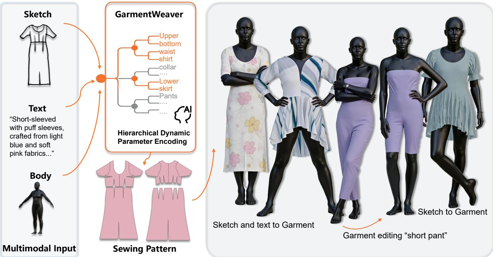  
Figure 1: GarmentWeaver generates structured sewing patterns under multimodal conditions, including garment sketches, textual descriptions, and body-related inputs. Through schema-aware hierarchical modeling, the generated patterns preserve structural validity and support downstream garment simulation and editing, enabling controllable digital garment creation from design concepts to simulation-ready outputs.

## Abstract

Multimodal Sewing pattern generation aims to infer executable sewing patterns from design cues such as sketches and textual descriptions. As an interpretable and simulation-compatible representation, sewing patterns are particularly valuable for digital garment creation. However, existing methods often model garment specifications as flat long sequences, which entangles garment structure with detailed parameters and leads to redundant components,

∗Both authors contributed equally to this research.

inaccurate local details, and poor simulation compatibility. In this paper, we present GarmentWeaver, a schema-aware framework for multimodal Sewing pattern generation. GarmentWeaver constructs compact hierarchical targets by activating garment-relevant structural branches and predicts executable Sewing patterns in a structured manner. Specifically, we introduce a schema-aware target construction strategy, build the generator on top of a pretrained vision-language model for multimodal garment understanding, and impose feasibility-aware regularization to encourage structurally valid and simulation-compatible outputs. Extensive experiments show that GarmentWeaver produces more accurate and more executable sewing patterns than strong baselines, while also yielding better simulation results. These findings demonstrate the efectiveness of schema-aware structured generation for reliable multimodal Sewing pattern prediction.

## CCS Concepts

• Computing methodologies → Computer vision.;

## Keywords

Multimodal Generation, Garment Generation, Sewing Pattern Synthesis

## ACM Reference Format:

Yinwen Lu, Weihao Luo, and Yueqi Zhong. 2026. GarmentWeaver: Schema-Aware Structured Synthesis for Multimodal Sewing Patterns. In Proceedings ofthe 34th ACM International Conference on Multimedia (MM ’26), November 10–14, 2026, Rio de Janeiro, Brazil. ACM, New York, NY, USA, 10 pages. https://doi.org/10.1145/3767308.3836148

## 1 Introduction

Garment digitalization has become increasingly important in multimedia applications such as virtual try-on, digital fashion design, gaming, and embodied content creation. Among these tasks, generating structured Sewing patterns from multimodal design inputs is particularly valuable, since sewing patterns provide an interpretable and executable representation that directly supports downstream garment simulation and editing. Compared with image-level or mesh-level generation, structured sewing patterns ofer a more practical route from design concepts to simulation-ready digital garments. Recent works have started to move from garment recon struction toward structured sewing-pattern prediction, while newer methods further incorporate text, sketches, and large multimodal models for more controllable garment generation.[3–9, 12–15, 17– 21, 25–29, 31, 39, 42, 48, 51]

Despite this progress, generating valid sewing patterns for complex garments remains challenging. A major reason is that garment specifications are inherently hierarchical: high-level structural choices determine which garment components are present, while lower-level parameters specify the detailed shape of those components. However, many existing methods still model garment outputs in a relatively flat prediction space [4, 9, 20, 21, 26, 27, 39, 51], which forces the model to predict garment structure and detailed parameters in a single long sequence. This often leads to redundant components, inaccurate local details, and poor simulation compatibility. Recent methods such as Design2Garment [51] and ChatGarment [4] have shown the value of program-like or language friendly garment representations, while AIpparel [27], SewingLDM [26], GarmageNet [20], and GarmentDifusion [21] demonstrate the promise of multimodal large-model and latent generative formulations. Still, more explicit structure-aware modeling for Sewing pattern generation remains underexplored.

This issue becomes even more evident in multimodal Sewing pattern generation. Sketches provide strong cues about silhouette and contour, while textual descriptions ofer complementary semantic information about garment type and design intent. A desirable model should jointly exploit these heterogeneous signals to recover not only the correct garment category, but also fine-grained structural details and executable sewing patterns. In practice, however, direct full-sequence generation often struggles to satisfy these requirements simultaneously, because structural decisions and detailed parameter prediction are tightly coupled. As a result, the model may generate outputs that look locally plausible but still contain redundant branches, mismatched parts, or unstable details that degrade downstream simulation.

To address this issue, we propose GarmentWeaver, a schemaaware framework for multimodal Sewing pattern generation. Instead of directly predicting a single long garment sequence, GarmentWeaver adopts a two-stage structured generation strategy: it first predicts a garment structure template and then fills in the corresponding design parameters. To support this process, we introduce a schema-aware target construction strategy that activates only garment-relevant branches and yields compact hierarchical supervision. We further introduce feasibility-aware regularization to suppress invalid branches and out-of-range parameters, improving the structural validity and simulation compatibility of the generated outputs. Built on top of a pretrained vision-language model, GarmentWeaver efectively integrates sketch, text, and body-related inputs and produces more accurate and more executable sewing patterns than strong baselines.

Extensive experiments demonstrate the efectiveness of GarmentWeaver. Qualitative results show that our method generates more accurate garment categories and finer structural details than representative baselines, while maintaining valid patterns for simulation. Quantitative comparisons further verify improvements in panel reconstruction accuracy, structural correctness, and simulation success rate. In addition, ablation studies confirm that sketch guidance, structured target construction, and feasibility-aware regularization are all important for reliable Sewing pattern generation.

Our contributions are summarized as follows:

• We reformulate multimodal Sewing pattern generation as a structure-aware prediction problem, where hierarchical garment structure is modeled explicitly instead of being implicitly entangled in a flat long sequence.

• We propose a schema-aware two-stage generation paradigm that first predicts a structure template and then instantiates its corresponding parameters, yielding compact hierarchical supervision and reducing the ambiguity of direct full-sequence generation.

• We introduce feasibility-aware regularization to constrain the predicted parameters within structure-valid branches and admissible ranges, improving the structural validity and simulation compatibility of the generated sewing patterns.

## 2 Related Work

## 2.1 Garment Reconstruction and Sewing Pattern Estimation

Garment modeling has long been studied in computer vision and graphics. Early works mainly focus on recovering garment geometry or clothed human shape from images, videos, or body-aware priors, such as DeepGarment [6], Multi-Garment Net [3], BCNet [12], TailorNet [28], and Physics-Inspired Garment Recovery [48]. Later methods further improve geometric reconstruction and draping quality through stronger deformation or implicit priors, including DrapeNet [7], DIG [19], ISP [18], Garment Recovery with Shape and Deformation Priors [17], and clothed-human reconstruction methods such as PIFu [33], PIFuHD [34], ICON [46], ECON [45], and Registering Explicit to Implicit [52]. More recent works continue to improve real-world garment reconstruction and simulation readiness through stronger geometry-aware or generative priors, such as CloSe [1], 4D-DRESS [43], SIFU [50], Difusion-FOF [22], Gaussian Garments [32], and reconstruction methods with guided shape and deformation priors [16]. These methods substantially advance garment geometry recovery, but their primary goal is reconstruction rather than executable sewing-pattern generation.

A related line of work moves toward sewing pattern estimation. NeuralTailor [14] reconstructs sewing pattern structures from 3D garment point clouds, while data-driven pattern estimation from 3D geometries [8], Computational Pattern Making from 3D Garment Models [29], and single-image sewing pattern reconstruction [25] further strengthen the connection between garment surfaces and their underlying patterns. Other methods such as MulayCap [36], SewFormer [25], and more recent in-the-wild sewing-pattern generation approaches [38] also highlight the importance of patternaware representations for garment understanding. However, these approaches still mainly treat pattern recovery as estimation from geometry or images, rather than structured multimodal generation from sketch and text. Moreover, they do not explicitly model the hierarchical dependency between garment structure and detailed parameters.

## 2.2 Structured Garment Representations and Program-Based Modeling

Another important direction is to represent garments in an executable structured form. GarmentCode [15] introduces a programmatic representation for parametric sewing patterns, and Garment-CodeData [13] provides a large-scale dataset of garments paired with sewing patterns, which has become a key benchmark for recent structured garment generation. Other works such as DressCode [9], Learning a Shared Shape Space for Multimodal Garment Design [42], GarmentImage [39], and AutoSew [31] further explore structured, topology-aware, or program-related garment modeling. Design2Garment [51] pushes this direction further by formulating garment creation as a program synthesis problem from multimodal design concepts, while latent flow matching based methods [5] further investigate structured generation in sewing-pattern space.

These works clearly show the value ofexecutable representations for garment generation. However, most existing approaches still model the target as a generic structured sequence, without explicitly accounting for the fact that many garment parameters are valid only under specific structural choices. In contrast, our method adopts a schema-aware formulation in which garment structure is predicted first and detailed parameters are generated only within the corresponding valid branches. This design better matches the hierarchical nature of garment specifications and leads to more compact and more executable outputs.

## 2.3 Multimodal Garment Generation with Structured Priors

Recent progress in multimodal generative modeling has pushed garment generation toward more controllable and practical settings. AIpparel [27] develops a multimodal foundation model for digital garments with a dedicated tokenization scheme for sewing patterns. ChatGarment [4] leverages large vision-language mod els for garment estimation, generation, and editing, and directly produces language-friendly garment code. Design2Garment [51] also benefits from multimodal design inputs for structured garment creation. In parallel, SewingLDM [26] explores multimodal latent difusion for complex sewing-pattern generation under text and sketch conditions, while GarmageNet [20] and GarmentDifusion [21] continue to improve controllability and quality in multimodal garment generation. Recent works such as flow matching based sewing-pattern generation [5], program-oriented structured synthesis [51], and topology-aware pattern modeling [31, 39] further suggest that structured representations can benefit from stronger multimodal priors.

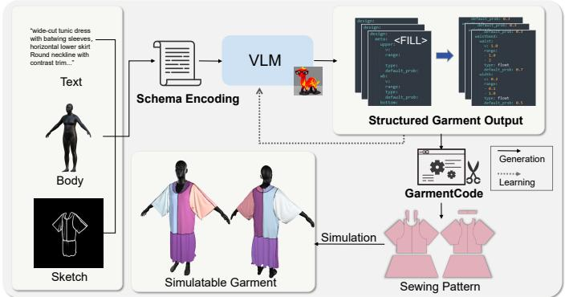  
Figure 2: Pipeline of GarmentWeaver. Given text, body, and sketch inputs, the proposed method first constructs a compact hierarchical target through schema-aware dynamic encoding. The VLM then predicts the structured garment output in two stages: it first generates a structure template and then fills in the corresponding design parameters. The predicted output is converted into GarmentCode, from which sewing patterns are constructed and further simulated to obtain a simulation-compatible garment.

Beyond garment-specific methods, pretrained multimodal models such as LLaVA [24], Llama2 [40], CLIP [30], and related largemodel paradigms for 3D perception and generation [11, 23, 37, 44, 47, 49] suggest that strong multimodal priors are useful for aligning visual and textual garment semantics. ChatGarment explicitly shows that a VLM can map multimodal inputs to garment programs by leveraging a language-friendly garment representation and simplified GarmentCode-style JSON configurations. However, current garment-generation methods still often rely on flat sequence prediction or latent generation pipelines, which couple structural decisions with detailed parameter prediction in a single output space. This makes them more vulnerable to structural hallucination, redundant components, and non-simulatable outputs. Diferent from these approaches, our method uses a pretrained vision-language model together with schema-aware structured generation, enabling more reliable prediction of executable Sewing patterns.

## 3 Method

We propose GarmentWeaver, a schema-aware framework for multimodal Sewing pattern generation. Given a garment sketch �, a textual description � , and optional body-related information �, the goal is to predict an executable garment representation that can be converted into sewing patterns and further simulated. Unlike conventional flat-sequence generation, GarmentWeaver models garment structure and detailed parameters in a more structured manner, so that the prediction process better matches the hierarchical nature of garment specifications.

## 3.1 Problem Formulation

Let $X = ( I , T , B )$ denote the multimodal input and � denote the target garment representation. Existing flat-sequence methods directly model

$$
p ( D \mid X )\tag{1}
$$

which entangles garment structure and detailed parameters in a single long sequence. However, garment representations naturally contain two diferent types of variables: a structural component $C ,$ which determines the active garment branches and component configurations, and a parameter component �, which specifies the detailed shape under the inferred structure. We therefore decompose the target as

$$
D = ( C , P )\tag{2}
$$

and factorize the conditional distribution as

$$
p ( D \mid X ) = p ( C , P \mid X ) = p ( C \mid X ) p ( P \mid C , X ) .\tag{3}
$$

This factorization separates structure prediction from parameter prediction, reducing long-sequence ambiguity and preventing the model from assigning probability mass to structurally invalid token combinations.

## 3.2 Schema-Aware Dynamic Encoding

A key property of garment representations is that the validity of many parameters depends on garment structure. To encode this dependency, we introduce a schema-aware dynamic encoding. Let $\tilde { P } \in \mathbb { R } ^ { m }$ denote the full parameter vector over the complete garment schema. Given a structural component �, we define a structuredependent activation mask

$$
M ( C ) \in \{ 0 , 1 \} ^ { m }\tag{4}
$$

and obtain the efective parameter component by

$$
P = M ( C ) \odot { \tilde { P } } ,\tag{5}
$$

where ⊙ denotes element-wise masking. Here, � denotes the number of parameter slots in the full garment schema. In this way, only structure-valid fields are preserved, while inactive branches are removed from the target space. Based on the active-branch representation, we further construct a coarse-to-fine target pair:

$$
D ^ { ( 1 ) } = \mathcal { T } ( C , P ) , \quad D ^ { ( 2 ) } = \mathrm { F i l l } \left( D ^ { ( 1 ) } , P \right) .\tag{6}
$$

Here, $D ^ { ( 1 ) }$ is a structure template, where valid numerical slots are replaced by placeholder tokens such as <FILL>, and $D ^ { ( 2 ) }$ is the filled garment representation, where the placeholders are instantiated with structure-compatible parameter values. This encoding reduces output redundancy and aligns supervision with the hierarchical structure of garment specifications. In practice, schemaaware pruning also produces substantially more compact targets by removing inactive branches and retaining only structure-valid slots. We provide a quantitative analysis of this compactness in Sec. 4.3.

## 3.3 Two-Stage Structured Generation

We build the generator on top of a pretrained LLaVA-style visionlanguage model. The pretrained backbone provides strong multimodal features for garment understanding, which help align sketch, text, and body cues during generation.

Given multimodal input �, GarmentWeaver performs autoregressive generation in two stages. In Stage I, the model predicts the structure template $D ^ { ( 1 ) }$ . This stage focuses on recovering the coarse garment structure, including active branches and placeholder positions. In Stage II, the model conditions on both � and the generated template to complete the parameter component:

$$
{ \mathfrak { p } } _ { \theta } \left( D ^ { ( 2 ) } \mid D ^ { ( 1 ) } , X \right) = \prod _ { t = 1 } ^ { L _ { 2 } } { \mathcal { P } } _ { \theta } \left( d _ { t } ^ { ( 2 ) } \mid d _ { < t } ^ { ( 2 ) } , D ^ { ( 1 ) } , X \right) .\tag{7}
$$

Compared with direct one-step generation, this two-stage design better reflects the dependency between garment structure and detailed parameters, resulting in more regular and executable outputs.

The weights $\lambda _ { \mathrm { i n v } }$ and $\lambda _ { \mathrm { { r a n g e } } }$ are empirically chosen to balance the autoregressive objective and the feasibility constraints.

## 3.4 Feasibility-Aware Regularization

The two generation stages are optimized with standard autoregressive objectives:

$$
\mathcal { L } _ { \mathrm { t e m p } } = - \sum _ { t = 1 } ^ { L _ { 1 } } \log p _ { \theta } \left( d _ { t } ^ { ( 1 ) } \mid d _ { < t } ^ { ( 1 ) } , X \right)\tag{8}
$$

$$
\mathcal { L } _ { \mathrm { f i l l } } = - \sum _ { t = 1 } ^ { L _ { 2 } } \log p _ { \theta } \left( d _ { t } ^ { ( 2 ) } \mid d _ { < t } ^ { ( 2 ) } , D ^ { ( 1 ) } , X \right)\tag{9}
$$

$L _ { 1 }$ and $L _ { 2 }$ denote the sequence lengths of the structure template and the filled garment representation, respectively. $d _ { t } ^ { ( 1 ) }$ and ${ d } _ { t } ^ { \left( 2 \right) }$ denote the token at step � in the two generation stages. To further improve executability, we introduce a feasibility-aware regularization that constrains the completed representation to remain within the structure-valid space. Specifically, we penalize predictions on inactive branches and out-of-range values on active branches:

$$
\mathcal { L } _ { \mathrm { i n v } } \mathit { \Theta } = \sum _ { j } \left( 1 - M _ { j } ( C ) \right) \left\| \hat { P } _ { j } \right\| _ { 2 } ^ { 2 }\tag{10}
$$

$$
\mathcal { L } _ { \mathrm { r a n g e } } = \sum _ { j } M _ { j } ( C ) \left[ \operatorname* { m a x } \left( 0 , l _ { j } - \hat { P } _ { j } \right) ^ { 2 } + \operatorname* { m a x } \left( 0 , \hat { P } _ { j } - u _ { j } \right) ^ { 2 } \right]\tag{11}
$$

where $\hat { P } _ { j }$ is the predicted value of the �-th parameter slot and $\left[ l _ { j } , u _ { j } \right]$ is its valid schema range. The final loss is

$$
\mathcal { L } = \mathcal { L } _ { \mathrm { t e m p } } + \mathcal { L } _ { \mathrm { f i l l } } + \lambda _ { \mathrm { i n v } } \mathcal { L } _ { \mathrm { i n v } } + \lambda _ { \mathrm { r a n g e } } \mathcal { L } _ { \mathrm { r a n g e } }\tag{12}
$$

We set $\lambda _ { \mathrm { i n v } } ~ = ~ 0 . 1$ and $\lambda _ { \mathrm { r a n g e } } ~ = ~ 0 . 0 5$ based on validation performance.By combining schema-aware target construction, twostage structured generation, and feasibility-aware regularization, GarmentWeaver adapts a pretrained multimodal generator into a structured garment synthesizer that is more controllable, more schema-consistent, and more suitable for downstream simulation.

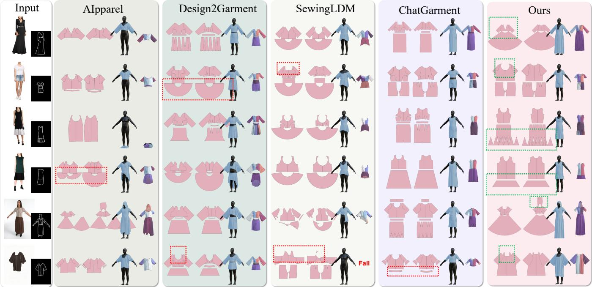  
Figure 3: Qualitative comparison of sketch-conditioned Sewing pattern generation. From left to right are the input image and sketch, results of AIpparel, Design2Garment, SewingLDM, ChatGarment, and our method. GarmentWeaver better recovers garment categories and fine structural details while maintaining valid patterns for simulation. Green boxes highlight representative improvements, while SewingLDM may produce invalid patterns and Design2Garment may predict incorrect garment types.

## 4 Experiment

## 4.1 Experimental Setup

Dataset. Experiments are conducted on a large-scale garment dataset derived from GarmentCodeData [13] and related multimodal garment design resources [2, 42, 53], containing approximately 120,000 samples spanning diverse garment categories and body-shape variations. Each sample is paired with a structured garment specification and two auxiliary modalities: a textual description generated by Qwen2-VL [41] and a sketch extracted from garment images using PiDiNet [35]. As a result, each sample is represented as a multimodal triplet of sketch, text, and structured garment target.

Implementation Details. GarmentWeaver is built on LLaVA-7B [24] and fine-tuned with LoRA [10]. Training is conducted on a single vGPU-32GB GPU for 3 epochs, using a learning rate of 2 × 10−5, a global batch size of 128, a maximum sequence length of 2048, and weight decay of 0. On the single-GPU setup, the efective batch size is maintained through gradient accumulation. During training, the model predicts executable garment programs in the proposed twostage manner. To improve robustness under incomplete inputs, we independently drop the textual description and sketch with probability 30%. The generated outputs can be converted into sewing patterns through GarmentCode [15]. The full training process requires only 32 GB of GPU memory, and inference is eficient since the model directly predicts a compact structured output without iterative sampling.

Evaluation Metrics. Following prior works [5, 8, 14, 25, 29, 51], we evaluate predicted Sewing patterns using four metrics: Panel IoU, Trans L2, #Panel, and #Edge. Panel IoU measures the IoU between predicted and ground-truth 2D garment panels, and Trans L2 measures the L2 distance between predicted and ground-truth panel translations. #Panel and #Edge evaluate whether the predicted numbers of panels and panel edges match the ground truth. Higher is better for Panel IoU, #Panel, and #Edge, while lower is better for Trans L2.Together, these metrics provide a comprehensive evaluation of the generated sewing patterns in terms of geometric accuracy, spatial alignment, and structural fidelity.

## 4.2 Qualitative Comparison

We compare GarmentWeaver with representative baselines, including AIpparel [27], Design2Garment [51], SewingLDM [26], and ChatGarment [4]. As shown in Fig. 3, GarmentWeaver generates sewing patterns that are more consistent with the input sketches in both garment category and fine-grained structural details. Our method better preserves key design elements such as sleeve shape, bodice structure, and skirt proportion, while also producing patterns that support stable downstream simulation.

By comparison, Design2Garment sometimes predicts mismatched garment types, leading to semantic inconsistency with the input design. SewingLDM is less stable and may generate geometrically irregular or incomplete panels that are unsuitable for simulation. AIpparel and ChatGarment can recover coarse garment layouts, but often miss local structural details or produce oversimplified results. Overall, GarmentWeaver achieves a better balance between struc tural correctness, detail preservation, and simulation feasibility.

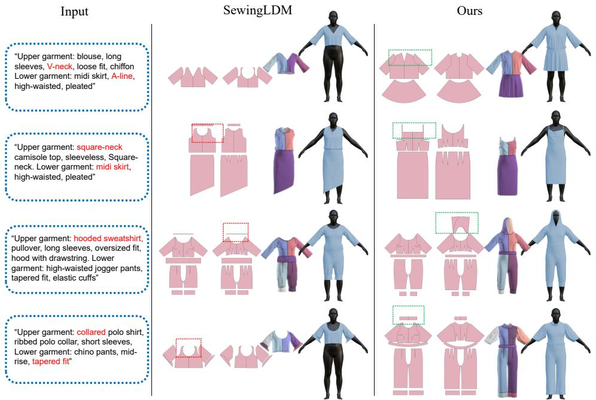  
Figure 4: Qualitative comparison of text-only Sewing pattern generation. From left to right are the input descriptions, the results of SewingLDM, and the results of our method. GarmentWeaver better recovers key structural details, such as V-necks, square necklines, hoods, and collars, while producing more complete and semantically consistent garment parts. Green boxes highlight representative improvements.

We also evaluate the text-only setting, where Sewing patterns are generated solely from natural-language descriptions. As shown in Fig. 4, compared with SewingLDM, GarmentWeaver more accurately recovers key text-specified components, especially distinctive structures such as V-necks, square necklines, hoods, and collars. It also produces pattern decompositions that better match the described garment structure, yielding more appropriate upper– lower combinations and more complete part layouts. In contrast, SewingLDM often captures only coarse garment appearance while missing important structural details or generating inconsistent component configurations.

Taken together, the qualitative results in both sketch-conditioned and text-only settings show that GarmentWeaver better preserves garment semantics, recovers finer structural components, and pro duces more executable sewing patterns than existing baselines.

## 4.3 Quantitative Comparison

Table 1 compares GarmentWeaver with AIpparel [27], Design2Garment [51], SewingLDM [26], and ChatGarment [4]. Our method achieves the best Panel IoU (0.869) and the lowest Trans L2 (1.130), demonstrating superior performance in both panel reconstruction and spatial alignment. In addition, GarmentWeaver obtains the highest #Edge accuracy (89.52%), indicating stronger capability in recovering fine-grained structural details of garment panels.

Table 1: Quantitative comparison with AIpparel, Design2Garment, SewingLDM, and ChatGarment on structured Sewing pattern generation. We report Panel IoU, Trans L2, #Panel, and #Edge. Higher is better for Panel IoU, #Panel, and #Edge, while lower is better for Trans L2. Our method achieves the best performance on Panel IoU, Trans L2, and #Edge, demonstrating superior accuracy in panel reconstruction, spatial alignment, and structural detail recovery.
<table><tr><td>Method</td><td>IoU↑</td><td>TransL2↓</td><td>#Panel↑</td><td>#Edge↑</td></tr><tr><td>AIpparel</td><td>0.834</td><td>1.783</td><td>91.3%</td><td>86.53%</td></tr><tr><td>Design2Garment</td><td>0.852</td><td>1.169</td><td>94.5%</td><td>88.36%</td></tr><tr><td>SewingLDM</td><td>0.793</td><td>1.200</td><td>97.8%</td><td>82.71%</td></tr><tr><td>ChatGarment</td><td>0.864</td><td>1.147</td><td>98.4%</td><td>89.03%</td></tr><tr><td>Ours</td><td>0.869</td><td>1.130</td><td>97.2%</td><td>89.52%</td></tr></table>

Although ChatGarment achieves the highest #Panel accuracy (98.4%), its geometric accuracy remains lower than ours, as reflected by inferior Panel IoU and Trans L2 values. Similarly, Design2Garment and SewingLDM show competitive performance on some structural metrics but remain less accurate in overall panel reconstruction. These results suggest that GarmentWeaver is more efective in generating structurally valid and geometrically accurate Sewing patterns. This observation is also consistent with the qualitative comparisons, where our generated patterns better preserve garment details and support stable simulation.

Sketch

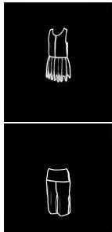

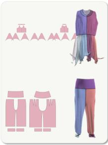  
（a）

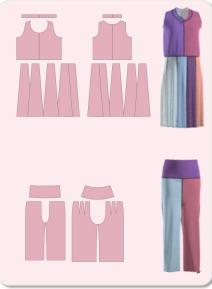  
（b）

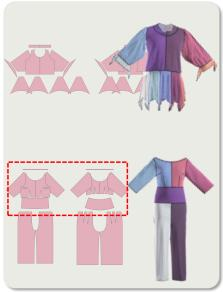  
（c）

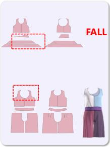  
（d）

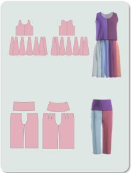  
（e）  
Figure 5: Qualitative ablation study of the proposed framework. From left to right: input sketch and the results of (a) w/o sketch guidance, (b) use LLaVA-13B backbone, (c) w/o feasibility-aware regularization, (d) direct full-sequence prediction, and (e) full model. Removing sketch guidance leads to correct garment categories but inaccurate shapes; removing feasibility aware regularization introduces redundant structures; direct full-sequence prediction produces distorted and non-simulatable patterns. In contrast, the full model generates more regular sewing patterns and more reliable simulation results.

Table 2: Compactness analysis of the proposed schema-aware dynamic encoding. We compare the full-schema target length with the efective target length after schema-aware pruning under diferent garment structures.
<table><tr><td>Garment Structure</td><td>Full Length</td><td>Effective Length</td><td>Reduction Ratio</td></tr><tr><td>Overall</td><td>118.24</td><td>59.75</td><td>49.53%</td></tr><tr><td>Upper only</td><td>117.72</td><td>72.08</td><td>38.76%</td></tr><tr><td>Bottom only</td><td>117.88</td><td>15.32</td><td>87.01%</td></tr><tr><td>Upper + Pants</td><td>118.75</td><td>83.05</td><td>29.37%</td></tr><tr><td>Upper + Skirt</td><td>118.76</td><td>82.87</td><td>30.01%</td></tr></table>

We further analyze the compactness of the proposed schemaaware dynamic encoding in Table 2. By removing inactive branches and preserving only structure-valid slots, the average target length is reduced from 118.24 to 59.75, corresponding to a 49.53% reduction in target size. This compactness is beneficial in several aspects. First, pruning inactive branches directly reduces the number of parameters that need to be predicted, making the target representation more eficient than full-schema supervision. Second, fullschema prediction forces the model to allocate probability mass to many structure-irrelevant slots, which increases output ambiguity and makes autoregressive generation more prone to redundant or hallucinated components. In contrast, by restricting prediction to structure-valid branches only, the proposed encoding narrows the search space and allows the model to focus on the parameters that are actually relevant to the current garment. This more compact formulation also leads to a cleaner supervision signal, since the model is no longer distracted by inactive fields that carry no valid semantic content. As a result, the proposed encoding improves not only representation eficiency but also the efectiveness of learning valid structural dependencies for garment generation.

The reduction is also structure-dependent: bottom-only garments show the largest compression ratio because most upper-body branches in the full schema remain inactive and can be removed entirely. By contrast, garments containing both upper and lower parts retain a larger portion of the schema and therefore exhibit smaller reductions. These results confirm that the proposed representation not only improves structural validity but also reduces output redundancy.

## 4.4 Ablation Study

To analyze the contribution ofeach component, we conduct ablation studies on four variants: (1) w/o sketch guidance, (2) LLaVA-13B backbone, (3) w/o feasibility-aware regularization, and (4) direct fullsequence prediction instead of the proposed two-stage structured generation. The qualitative results are shown in Fig. 5.

Removing sketch guidance mainly degrades the shape accuracy of the generated patterns. The model can still predict the correct garment category, but fails to recover the target silhouette and structural proportions, indicating that sketch input is crucial for recovering contour-sensitive garment geometry. Replacing LLaVA-7B with LLaVA-13B does not lead to clear qualitative improvement, suggesting that the gain of GarmentWeaver does not primarily come from increasing backbone size, but from the proposed schemaaware target construction and two-stage structured generation.

When feasibility-aware regularization is removed, the model tends to generate redundant garment structures that do not exist in the target design. This verifies that the regularization term is important for suppressing invalid branch activations and improving structural coherence. A more severe degradation is observed when the proposed two-stage structured generation is replaced with direct full-sequence prediction. In this setting, the generated panels become distorted and irregular, and some results cannot be successfully simulated. In contrast, the proposed two-stage formulation produces cleaner, more standardized sewing patterns that are structurally valid and better suited for downstream simulation.

Overall, the ablation results confirm that GarmentWeaver benefits from both schema-aware target construction and feasibilityaware regularization. Sketch guidance improves shape fidelity, feasibility-aware regularization suppresses redundant components, and two-stage structured generation is essential for producing regular and simulation-compatible Sewing patterns.

We additionally evaluate Simulation Success Rate to measure the executability of generated sewing patterns. For each method, we randomly sample 1,000 results and perform 3D simulation using the GarmentCode simulator. As shown in Table 3, GarmentWeaver achieves the highest success rate (98.3%), surpassing AIpparel (73.9%), Design2Garment (87.1%), SewingLDM (61.4%), and ChatGarment (97.9%). The relatively low success rates ofSewingLDM and AIpparel are mainly related to their difusion-based backbones. Methods built on difusion models generate garment patterns in a continuous denoising space without explicit structural feasibility constraints, making them more prone to distorted panels, invalid part configurations, and unstable geometric details that lead to simulation failure. While ChatGarment also attains a high success rate, its flattened JSON formulation tends to favor component recall through memorization of frequent structural patterns, at the expense of parameter precision and geometric accuracy. By contrast, GarmentWeaver explicitly enforces schema-consistent structure and parameter validity, resulting in more reliable simulationcompatible outputs.

Table 3: Comparison of Simulation Success Rate. For each method, the generated Sewing patterns are converted and simulated using the GarmentCode simulation pipeline. We report the percentage of samples that can be successfully simulated in 3D without failure.
<table><tr><td>Method</td><td>Simulation Success Rate (%) ↑</td></tr><tr><td>AIpparel</td><td>73.9</td></tr><tr><td>Design2Garment</td><td>87.1</td></tr><tr><td>SewingLDM</td><td>61.4</td></tr><tr><td>ChatGarment</td><td>97.9</td></tr><tr><td>Ours</td><td>98.3</td></tr></table>

## 5 Application

Beyond one-shot Sewing pattern generation, GarmentWeaver also supports instruction-based editing of sketch-generated patterns. Starting from an initial sewing pattern predicted from the design input, the model further refines the result according to a naturallanguage editing instruction. Thanks to the schema-aware structured representation, the editing process can be localized to the instruction-relevant components, so that only the afected structure or parameters are updated while unrelated garment parts remain unchanged. Fig. 6 shows several sequential editing examples, including adding a collar, changing long sleeves to short sleeves, and shortening the skirt length. These results demonstrate that GarmentWeaver enables controllable and localized refinement of generated sewing patterns, making it suitable for interactive garment design.

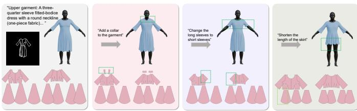  
Figure 6: Instruction-based editing of sketch-generated Sewing patterns. Starting from an initial sewing pattern generated from the design input, GarmentWeaver progressively refines the pattern according to natural-language editing instructions, including adding a collar, changing long sleeves to short sleeves, and shortening the skirt length.

## 6 Limitations and Future Work

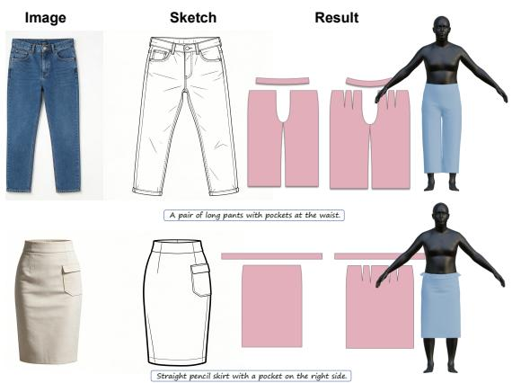  
Figure 7: Limitations. For garments with localized accessorylike details, such as pockets, GarmentWeaver may fail to reconstruct the desired structures and instead only recover the overall pants or skirt shape.

Despite the promising results, GarmentWeaver still has several limitations. The main limitation comes from the underlying structured garment representation. Since our method relies on GarmentCode-style garment specifications, it is currently restricted to the garment components and parametric structures supported by that representation. Consequently, GarmentWeaver can generate the major silhouette and main structural parts of common garments, but it still struggles with finer localized details and accessory-like components that are not explicitly defined in the current schema, such as pockets, belt loops, and related attachments. As shown in Fig. 7, even when pockets are clearly indicated in the reference image and sketch, the generated results mainly recover the overall garment shape while failing to reproduce the pocket structure. In future work, we plan to improve the bottom-level structure of GarmentCode by incorporating richer component definitions, especially for pockets and other localized attachments, so as to support more detailed multimodal garment generation.

## 7 Conclusion

We introduced GarmentWeaver, a schema-aware framework for multimodal sewing pattern generation. By modeling garment prediction in a more structured way, GarmentWeaver reduces the ambiguity of direct flat-sequence generation and improves the structural validity of the generated outputs. The proposed schema-aware target construction, structured generation process, and feasibilityaware regularization together enable more accurate, coherent, and simulation-compatible sewing patterns. Experimental results on both qualitative and quantitative evaluations demonstrate the effectiveness of our method over strong baselines.

## Acknowledgments

To Robert, for the bagels and explaining CMYK and color spaces.

## References

[1] Dimitrije Antić, Garvita Tiwari, Batuhan Ozcomlekci, Riccardo Marin, and Gerard Pons-Moll. 2024. CloSe: A 3D clothing segmentation dataset and model. In 2024 international conference on 3D vision (3DV). IEEE, 591–601.

[2] Hugo Bertiche, Meysam Madadi, and Sergio Escalera. 2020. Cloth3d: clothed 3d humans. In European Conference on Computer Vision. Springer, 344–359.

[3] Bharat Lal Bhatnagar, Garvita Tiwari, Christian Theobalt, and Gerard Pons-Moll. 2019. Multi-garment net: Learning to dress 3d people from images. In Proceedings ofthe IEEE/CVF international conference on computer vision. 5420–5430.

[4] Siyuan Bian, Chenghao Xu, Yuliang Xiu, Artur Grigorev, Zhen Liu, Cewu Lu, Michael J Black, and Yao Feng. 2025. Chatgarment: Garment estimation, generation and editing via large language models. In Proceedings ofthe IEEE/CVF Conference on Computer Vision and Pattern Recognition. 2924–2934.

[5] Cong Cao, Ren Li, Corentin Dumery, and Hao Li. 2026. Learning Sewing Patterns via Latent Flow Matching of Implicit Fields. arXiv preprint arXiv:2601.17740 (2026).

[6] R Daněřek, Endri Dibra, Cengiz Öztireli, Remo Ziegler, and Markus Gross. 2017. Deepgarment: 3d garment shape estimation from a single image. In Computer Graphics Forum, Vol. 36. Wiley Online Library, 269–280.

[7] Luca De Luigi, Ren Li, Benoit Guillard, Mathieu Salzmann, and Pascal Fua. 2023. Drapenet: Garment generation and self-supervised draping. In Proceedings of the IEEE/CVF Conference on Computer Vision and Pattern Recognition. 1451–1460.

[8] Chihiro Goto and Nobuyuki Umetani. 2021. Data-driven Garment Pattern Esti mation from 3D Geometries.. In Eurographics (Short Papers). 17–20.

[9] Kai He, Kaixin Yao, Qixuan Zhang, Jingyi Yu, Lingjie Liu, and Lan Xu. 2024. Dresscode: Autoregressively sewing and generating garments from text guidance. ACM Transactions on Graphics (TOG) 43, 4 (2024), 1–13.

[10] Edward J Hu, Yelong Shen, Phillip Wallis, Zeyuan Allen-Zhu, Yuanzhi Li, Shean Wang, Liang Wang, Weizhu Chen, et al. 2022. Lora: Low-rank adaptation of large language models. Iclr 1, 2 (2022), 3.

[11] Ziniu Hu, Ahmet Iscen, Aashi Jain, Thomas Kipf, Yisong Yue, David A Ross, Cordelia Schmid, and Alireza Fathi. 2024. Scenecraft: An llm agent for synthesizing 3d scenes as blender code. In Forty-first International Conference on Machine Learning.

[12] Boyi Jiang, Juyong Zhang, Yang Hong, Jinhao Luo, Ligang Liu, and Hujun Bao. 2020. Bcnet: Learning body and cloth shape from a single image. In European Conference on Computer Vision. Springer, 18–35.

[13] Maria Korosteleva, Timur Levent Kesdogan, Fabian Kemper, Stephan Wenninger, Jasmin Koller, Yuhan Zhang, Mario Botsch, and Olga Sorkine-Hornung. 2024. GarmentCodeData: A dataset of 3D made-to-measure garments with sewing patterns. In European Conference on Computer Vision. Springer, 110–127.

[14] Maria Korosteleva and Sung-Hee Lee. 2022. Neuraltailor: Reconstructing sewing pattern structures from 3d point clouds of garments. ACM Transactions on Graphics (TOG) 41, 4 (2022), 1–16.

[15] Maria Korosteleva and Olga Sorkine-Hornung. 2023. Garmentcode: Programming parametric sewing patterns. ACM Transactions on Graphics (TOG) 42, 6 (2023), 1–15.

[16] Ren Li, Corentin Dumery, Zhantao Deng, and Pascal Fua. 2024. Reconstruction of manipulated garment with guided deformation prior. Advances in Neural Information Processing Systems 37 (2024), 58637–58662.

[17] Ren Li, Corentin Dumery, Benoît Guillard, and Pascal Fua. 2024. Garment recovery with shape and deformation priors. In Proceedings ofthe IEEE/CVF Conference on Computer Vision and Pattern Recognition. 1586–1595.

[18] Ren Li, Benoît Guillard, and Pascal Fua. 2023. Isp: Multi-layered garment draping with implicit sewing patterns. Advances in Neural Information Processing Systems 36 (2023), 40294–40319.

[19] Ren Li, Benoit Guillard, Edoardo Remelli, and Pascal Fua. 2022. Dig: Draping implicit garment over the human body. In Proceedings of the Asian conference on computer vision. 2780–2795.

[20] Siran Li, Ruiyang Liu, Chen Liu, Zhendong Wang, Gaofeng He, Yong-Lu Li, Xiaogang Jin, and Huamin Wang. 2025. Garmagenet: A multimodal generative framework for sewing pattern design and generic garment modeling. ACM Transactions on Graphics (TOG) 44, 6 (2025), 1–23.

[21] Xinyu Li, Qi Yao, and Yuanda Wang. 2025. GarmentDifusion: 3D garment sewing pattern generation with multimodal difusion transformers. arXiv preprint arXiv:2504.21476 (2025).

[22] Yuanzhen Li, Fei Luo, and Chunxia Xiao. 2024. Difusion-fof: Single-view clothed human reconstruction via difusion-based fourier occupancy field. In Proceedings ofthe IEEE/CVF Conference on Computer Vision and Pattern Recognition. 9525– 9534.

[23] Dingning Liu, Xiaoshui Huang, Yuenan Hou, Zhihui Wang, Zhenfei Yin, Yongshun Gong, Peng Gao, and Wanli Ouyang. 2024. Uni3d-llm: Unifying point cloud perception, generation and editing with large language models. arXiv preprint

arXiv:2402.03327 (2024).

[24] Haotian Liu, Chunyuan Li, Qingyang Wu, and Yong Jae Lee. 2023. Visual instruction tuning. Advances in neural information processing systems 36 (2023), 34892–34916.

[25] Lijuan Liu, Xiangyu Xu, Zhijie Lin, Jiabin Liang, and Shuicheng Yan. 2023. Towards garment sewing pattern reconstruction from a single image. ACM Transactions on Graphics (TOG) 42, 6 (2023), 1–15.

[26] Shengqi Liu, Yuhao Cheng, Zhuo Chen, Xingyu Ren, Wenhan Zhu, Lincheng Li, Mengxiao Bi, Xiaokang Yang, and Yichao Yan. 2025. Multimodal latent difusion model for complex sewing pattern generation. In Proceedings of the IEEE/CVF International Conference on Computer Vision. 17640–17650.

[27] Kiyohiro Nakayama, Jan Ackermann, Timur Levent Kesdogan, Yang Zheng, Maria Korosteleva, Olga Sorkine-Hornung, Leonidas J Guibas, Guandao Yang, and Gordon Wetzstein. 2025. Aipparel: A multimodal foundation model for digital garments. In Proceedings of the Computer Vision and Pattern Recognition Conference. 8138–8149.

[28] Chaitanya Patel, Zhouyingcheng Liao, and Gerard Pons-Moll. 2020. Tailornet: Predicting clothing in 3d as a function ofhuman pose, shape and garment style. In Proceedings of the IEEE/CVF conference on computer vision and pattern recognition. 7365–7375.

[29] Nico Pietroni, Corentin Dumery, Raphael Falque, Mark Liu, Teresa A Vidal Calleja, and Olga Sorkine-Hornung. 2022. Computational pattern making from 3D garment models. ACM Trans. Graph. 41, 4 (2022), 157–1.

[30] Alec Radford, Jong Wook Kim, Chris Hallacy, Aditya Ramesh, Gabriel Goh, Sandhini Agarwal, Girish Sastry, Amanda Askell, Pamela Mishkin, Jack Clark, et al. 2021. Learning transferable visual models from natural language supervision. In International conference on machine learning. PmLR, 8748–8763.

[31] Pablo Ríos-Navarro, Elena Garces, and Jorge Lopez-Moreno. 2026. AutoSew: A Geometric Approach to Stitching Prediction with Graph Neural Networks. In Proceedings ofthe IEEE/CVF Winter Conference on Applications ofComputer Vision. 1374–1383.

[32] Boxiang Rong, Artur Grigorev, Wenbo Wang, Michael J Black, Bernhard Thomaszewski, Christina Tsalicoglou, and Otmar Hilliges. 2025. Gaussian garments: Reconstructing simulation-ready clothing with photorealistic appearance from multi-view video. In 2025 International Conference on 3D Vision (3DV). IEEE, 1054–1063.

[33] Shunsuke Saito, Zeng Huang, Ryota Natsume, Shigeo Morishima, Angjoo Kanazawa, and Hao Li. 2019. Pifu: Pixel-aligned implicit function for high resolution clothed human digitization. In Proceedings ofthe IEEE/CVFinternational conference on computer vision. 2304–2314.

[34] Shunsuke Saito, Tomas Simon, Jason Saragih, and Hanbyul Joo. 2020. Pifuhd: Multi-level pixel-aligned implicit function for high-resolution 3d human digitization. In Proceedings of the IEEE/CVF conference on computer vision and pattern recognition. 84–93.

[35] Zhuo Su, Wenzhe Liu, Zitong Yu, Dewen Hu, Qing Liao, Qi Tian, Matti Pietikäinen, and Li Liu. 2021. Pixel diference networks for eficient edge detection. In Proceedings ofthe IEEE/CVF international conference on computer vision. 5117– 5127.

[36] Zhaoqi Su, Weilin Wan, Tao Yu, Lingjie Liu, Lu Fang, Wenping Wang, and Yebin Liu. 2020. Mulaycap: Multi-layer human performance capture using a monocular video camera. IEEE Transactions on Visualization and Computer Graphics 28, 4 (2020), 1862–1879.

[37] Chunyi Sun, Junlin Han, Weijian Deng, Xinlong Wang, Zishan Qin, and Stephen Gould. 2025. 3d-gpt: Procedural 3d modeling with large language models. In 2025 International Conference on 3D Vision (3DV). IEEE, 1253–1263.

[38] Zeng Tao, Ying Jiang, Yunuo Chen, Tianyi Xie, Huamin Wang, Yingnian Wu, Yin Yang, Abishek Sampath Kumar, Kenji Tashiro, and Chenfanfu Jiang. 2026. DressWild: Feed-Forward Pose-Agnostic Garment Sewing Pattern Generation from In-the-Wild Images. arXiv preprint arXiv:2602.16502 (2026).

[39] Yuki Tatsukawa, Anran Qi, I-Chao Shen, and Takeo Igarashi. 2025. Garmentimage: Raster encoding of garment sewing patterns with diverse topologies. In Proceedings ofthe Special Interest Group on Computer Graphics and Interactive Techniques Conference Conference Papers. 1–11.

[40] Hugo Touvron, Louis Martin, Kevin Stone, Peter Albert, Amjad Almahairi, Yasmine Babaei, Nikolay Bashlykov, Soumya Batra, Prajjwal Bhargava, Shruti Bhosale, et al. 2023. Llama 2: Open foundation and fine-tuned chat models. arXiv preprint arXiv:2307.09288 (2023).

[41] Peng Wang, Shuai Bai, Sinan Tan, Shijie Wang, Zhihao Fan, Jinze Bai, Keqin Chen, Xuejing Liu, Jialin Wang, Wenbin Ge, et al. 2024. Qwen2-vl: Enhancing vision-language model’s perception of the world at any resolution. arXiv preprint arXiv:2409.12191 (2024).

[42] Tuanfeng Y Wang, Duygu Ceylan, Jovan Popovic, and Niloy J Mitra. 2018. Learning a shared shape space for multimodal garment design. arXiv preprint arXiv:1806.11335 (2018).

[43] Wenbo Wang, Hsuan-I Ho, Chen Guo, Boxiang Rong, Artur Grigorev, Jie Song, Juan Jose Zarate, and Otmar Hilliges. 2024. 4d-dress: A 4d dataset of real-world human clothing with semantic annotations. In Proceedings ofthe IEEE/CVF Conference on Computer Vision and Pattern Recognition. 550–560.

[44] Shuang Wu, Youtian Lin, Feihu Zhang, Yifei Zeng, Jingxi Xu, Philip Torr, Xun Cao, and Yao Yao. 2024. Direct3d: Scalable image-to-3d generation via 3d latent difusion transformer. Advances in Neural Information Processing Systems 37 (2024), 121859–121881.

[45] Yuliang Xiu, Jinlong Yang, Xu Cao, Dimitrios Tzionas, and Michael J Black. 2023. Econ: Explicit clothed humans optimized via normal integration. In Proceedings ofthe IEEE/CVF conference on computer vision and pattern recognition. 512–523.

[46] Yuliang Xiu, Jinlong Yang, Dimitrios Tzionas, and Michael J Black. 2022. Icon: Implicit clothed humans obtained from normals. In 2022 IEEE/CVF Conference on Computer Vision and Pattern Recognition (CVPR). IEEE, 13286–13296.

[47] Runsen Xu, Xiaolong Wang, Tai Wang, Yilun Chen, Jiangmiao Pang, and Dahua Lin. 2024. Pointllm: Empowering large language models to understand point clouds. In European Conference on Computer Vision. Springer, 131–147.

[48] Shan Yang, Zherong Pan, Tanya Amert, Ke Wang, Licheng Yu, Tamara Berg, and Ming C Lin. 2018. Physics-inspired garment recovery from a single-view image. ACM Transactions on Graphics (TOG) 37, 5 (2018), 1–14.

[49] Longwen Zhang, Ziyu Wang, Qixuan Zhang, Qiwei Qiu, Anqi Pang, Haoran Jiang, Wei Yang, Lan Xu, and Jingyi Yu. 2024. Clay: A controllable large-scale generative

model for creating high-quality 3d assets. ACM Transactions on Graphics (TOG) 43, 4 (2024), 1–20.

[50] Zechuan Zhang, Zongxin Yang, and Yi Yang. 2024. Sifu: Side-view conditioned implicit function for real-world usable clothed human reconstruction. In Proceedings of the IEEE/CVF conference on computer vision and pattern recognition. 9936–9947.

[51] Feng Zhou, Ruiyang Liu, Chen Liu, Gaofeng He, Yong-Lu Li, Xiaogang Jin, and Huamin Wang. 2025. Design2GarmentCode: Turning design concepts to tangible garments through program synthesis. In Proceedings of the Computer Vision and Pattern Recognition Conference. 23712–23722.

[52] Heming Zhu, Lingteng Qiu, Yuda Qiu, and Xiaoguang Han. 2022. Registering explicit to implicit: Towards high-fidelity garment mesh reconstruction from single images. In Proceedings ofthe IEEE/CVF Conference on Computer Vision and Pattern Recognition. 3845–3854.

[53] Xingxing Zou, Xintong Han, and Waikeung Wong. 2023. Cloth4d: A dataset for clothed human reconstruction. In Proceedings ofthe IEEE/CVF Conference on Computer Vision and Pattern Recognition. 12847–12857.