# A Closed-Loop Evaluation of Capability Loss and Recovery in Compressed Driving Policies

Ahmad Alfan Alfian Irfan1, Nur Ahmad Khatim2, Mansur Arief3

Abstract—Many automobile and mobility companies deploy learned driving policies on embedded computers with limited memory and power. Pruning, knowledge distillation, and quantization are the standard methods to reduce the size and the inference cost of these policies. However, these methods are commonly assessed by aggregate numerical scores, and such scores may not reflect the ability of the policy to drive safely when interacting with other road users. In this study, we propose a stage-wise closed-loop evaluation approach to follow a driving policy through a compression pipeline. We formulate the driving task as a partially observable Markov decision process (POMDP) and train a belief-state policy with proximal policy optimization (PPO) in Gym-Duckietown. We then extract the actor, compress it one stage at a time, and evaluate it on five driving curricula. We show that structured pruning is the stage at which the driving capability is first lost. Meanwhile, distillation improves the pruned actor, but the improvement is limited by its rehearsal data. Integer quantization of the improved actor loses some of the curricula that require the vehicle to stop and then resume. Interestingly, the same procedure on the unpruned actor preserves all five curricula. Our study thus provides an empirical analysis aiming to answer the currently active discussions on how to accept a compressed driving policy, so as to achieve a safe and statistically reliable deployment of automated driving functions.

Index Terms—Autonomous vehicles, edge computing, knowledge distillation, model compression, pruning, partially observable Markov decision process, quantization, visuomotor policy.

## I. INTRODUCTION

M ANY of the industrial leaders in automobiles and mo-bility providers now use learned policies for perception bility providers now use learned policies for perception and decision-making in their vehicles. These policies must run on embedded computers, whose memory, power, and thermal limits are set by vehicle cost. Thus, a trained network is commonly compressed before it is deployed, where pruning removes network capacity [1], [2], quantization reduces numerical precision [3], [4], and knowledge distillation is applied later to recover what compression has lost [5]. Progress in all three is normally measured by model size, inference latency, and test-set accuracy.

However, aggregate accuracy can conceal what compression removes, since models with very different parameter counts can agree on top-line metrics while differing a lot on a small subset of inputs [6]. For a driving policy the problem is more critical. The main reason is that a policy acts on its environment repeatedly, so that a small change in one action changes the next observation, which can carry the vehicle onto a different trajectory. Thus, a compressed policy may stay close to its original action mapping and still lose behaviors that were previously reliable, such as following the lane, stopping at a line, resuming later, or yielding to a crossing pedestrian. Compressing a driving policy is therefore a question of two parts, i.e. how far the network can be reduced, and which learned capabilities survive each stage of the optimization.

The interaction between these stages makes the problem harder, since pruning can remove useful capacity, distillation can bring back part of the lost behavior, and quantization may alter the improved policy again. It has been shown for supervised models that the order of these stages measurably changes the final accuracy [7], [8]. What those studies optimize, however, is an accuracy score on a static test set. A policy that must act raises four connected questions instead: (i) at which stage does the driving capability first break, (ii) can it be recovered after pruning, (iii) does the rehearsal data decide what is recovered, and (iv) does that recovery survive a later reduction in precision.

Addressing the above challenges, our contribution is predominantly to develop a stage-wise closed-loop evaluation approach for a driving policy under compression. We study this approach on a visuomotor driving policy in Gym-Duckietown [9], [10]. We formulate the driving task as a Partially Observable Markov Decision Process (POMDP) and learn the policy with belief-state Proximal Policy Optimization (PPO) [11], [12]. We then isolate the actor network and follow its behavior through a sequence of compression stages. Every stage is evaluated in the driving curricula against the same acceptance criteria.

As described more in later sections, our experiments reveal a clear loss-and-recovery pattern. Structured pruning reduces the machine learning-based actor size to less than 10% its original size, and the resulting 64-unit hidden layers lose the driving capability on all five curricula. Knowledge distillation improves the pruned actor, although how much it improves is decided by its rehearsal data, i.e. by the driving states on which the student imitates the teacher. While distilling on a limited task distribution recovers only part of the lost behavior, balanced rehearsal across the curricula recovers the complete tested behavior of the floating point (FP) 32 actor. Further compression changes the outcome again, since quantizing the pruned actor directly fails every curriculum, and posttraining quantization brings back the task-level failure even after a successful distillation. These results suggest that a compression pipeline for a learned driving policy should be studied as a sequence of behavioral transitions. A compressed actor can lose its capability, regain it through appropriate rehearsal, and lose part of it again at a later stage. Besides, we observe that action errors can stay well inside our tolerance for numerical agreement while the driving capability degrades. For this reason we judge a compressed policy by how it drives and not by how closely it reproduces recorded actions.

Our contributions are threefold. First, we characterize the capability loss across a sequential compression pipeline for a belief-based visuomotor driving policy. We trace the actor from structured pruning through distillation to reducedprecision deployment. We also formulate the evaluation as a scenario-based acceptance problem by varying the system under test. Second, we show that the recovery after pruning depends on the rehearsal coverage. Limited-task distillation recovers only part of the lost capability. Balanced rehearsal can recover the complete tested behavior of the compressed FP32 actor. Finally, we demonstrate that a successful recovery does not guarantee robustness to a later precision reduction. The tested INT8 routes bring back the task-level failures, while FP16 preserves the recovered behavior. Thus, actionlevel similarity alone is not sufficient to guarantee a preserved driving capability.

The rest of this work will be presented as follows. In Section II we position our study with respect to the compression literature and to the scenario-based evaluation of automated driving. In Section III we formulate the driving task and describe the belief-state policy model. In Section IV we specify the compression pipeline and the evaluation protocol. In Section V we present our numerical experiment and findings. In Section VI we discuss the value of the stage-wise view, its implications for deployment practice, and our limitations. We conclude in Section VII.

## II. RELATED WORK

In this section, we review the three compression methods we use, the evidence that their stages interact, the application of compression to driving systems, and the scenario-based evaluation literature.

## A. Pruning and Structured Sparsity

Pruning reduces a network by removing the parameters that contribute least to its output. The field is large enough that its benchmarking practices have themselves been surveyed and criticized [1]. While unstructured pruning zeroes individual weights and can reach high sparsity, the irregular pattern it leaves does not by itself reduce computation [2]. Structured pruning instead removes whole filters or units, so that the compressed network stays dense and runs faster on ordinary hardware [2], [13]. Criteria for deciding what to remove range from weight magnitude to Taylor-expansion estimates of the contribution of a unit to the loss [14]. This literature is developed largely on supervised classification, where the effect of pruning is evaluated on the test-set accuracy. When the same methods are carried into deep reinforcement learning, they have been reported to lose considerable performance [15]. This is one reason we aim to pinpoint the capability loss empirically in this study.

## B. Knowledge Distillation

Knowledge distillation (KD) trains a compact student to reproduce the outputs of a larger teacher [5], [16]. It is the usual way to close the gap that compression opens. For control policies the teacher supplies actions instead of class scores. It has been shown that policy distillation can compress an agent substantially while retaining expert-level play, and can fold several expert policies into one multi-task student [17]. That result establishes that the capability of a student depends on which experts and which states it rehearses on. In our case we isolate that dependence within a single task family. With the teacher, the loss, the optimizer, and the training budget all held fixed, the same distillation procedure recovers either part or all of the lost driving behavior, and the only difference is which driving curricula its rehearsal states are drawn from.

## C. Quantization and Reduced Precision

Quantization lowers the numeric precision of weights and activations. Integer schemes are designed so that inference can run in integer arithmetic alone [3]. Post-training quantization calibrates an already trained network, and it is usually sufficient to reach 8-bit accuracy close to floating point. Quantization-aware training instead simulates the reduced precision during optimization, and is normally reserved for lower bit widths [4]. Reduced floating-point formats are a separate route. FP16 storage with wider accumulation is standard practice, and the need for FP32 accumulation in reductions and dot products is documented [18], [19]. Quantization has also been studied for reinforcement learning, where policies were reported to tolerate six to eight bits without loss of reward, and where quantization-aware training consistently outperformed post-training quantization [20]. While our results agree with the first observation for an actor that has not been pruned, they diverge from both once the actor has been pruned and improved by distillation. To the best of our knowledge, the literature is missing a comparison in which an integer route and a reduced floating-point route start from the same fixed checkpoint. We study that comparison here and evaluate them against identical task-level criteria in the experiments.

## D. Compression Stages for Driving Systems

Compression stages are known not to be independent. For convolutional networks, a systematic ordering over distillation, pruning, quantization, and early exit has been derived, in which distillation is placed first and quantization near the end [7]. More recent work argues on theoretical grounds that weaker perturbations should precede stronger ones, and concludes that pruning before quantizing outperforms the reverse [8]. Both studies are conducted on vision and language models, where the quantity being ordered for is accuracy on a static test set. Our work follows the latter, since we prune before quantizing. Distillation is done after pruning, i.e. to improve a capability that has already been lost. We observe that the value of distillation in this position is decided by the data it rehearses on.

Compression has been applied to driving systems in order to meet onboard compute limits, and some pipelines prune first and then use distillation to recover the loss [21]. Such work typically targets perception models, and reports perception metrics, such as detection and segmentation scores, together with frame rate. Sensor and compute limits have likewise been treated as design variables, for instance in the optimal placement of onboard LiDARs under an explicit cost constraint [22]. In the compression case, the compressed model is evaluated only in its final form, which is suitable for a perception module whose outputs do not feed back into its own future inputs. A driving policy, in contrast, closes that loop. Thus, a score on the final model cannot show which stage removed a behavior, which stage brought it back, or whether a later stage reversed an earlier improvement.

## E. Scenario-Based Evaluation of Automated Driving

The question of how much testing is enough for an automated vehicle has been studied extensively. Kalra and Paddock estimated the driving distance required to demonstrate reliability at the population level, and concluded that the requirement is simply unaffordable by direct on-road accumulation [23]. Scenario-based assessment has since become the dominant response, and its variants have been surveyed and categorized in several complementary ways [24]–[26]. A parallel line of work accelerates the evaluation itself, either by skewing the sampling distribution toward safety-critical events and correcting the estimate later [27], [28], or by selecting the deployment environment adaptively, so that fewer and safer trials suffice [29]. The uncertainty of such data-driven testing has also been quantified explicitly [30]. Besides, generative models have been used to reconstruct the scenarios on which the assessment is carried out [31].

## III. PROBLEM FORMULATION

In this section, we describe the driving task, its formulation as a POMDP, the belief representation, and the actor that is compressed in the later stages.

## A. Driving Task and Evaluation Curricula

The task is visuomotor lane-following with pedestrian avoidance and stop-line compliance in Gym-Duckietown [9], [10]. Capability is organized as five driving curricula of increasing difficulty summarized in Table I with visual rendering in Fig. 1. These curricula serve two roles at once, since during training they are a curriculum in the ordinary sense, and during evaluation they are the fixed scenario set described in Section II-II-E. C0 is plain lane following on a small loop with domain randomization, C1 moves to a larger loop, and C2 adds crossing pedestrians. C3 removes pedestrians but adds a stop sign, which requires the policy to stop, hold, and then resume. C4 combines crossing pedestrians with the stop sign on the same loop and doubles the episode horizon. The two later curricula are the demanding ones, since they require the policy to interrupt its own driving and then establish it again, and it is exactly these two that reappear throughout our results.

TABLE I  
THE DRIVING CURRICULA FOR BOTH TRAINING AND EVALUATION.
<table><tr><td>ID</td><td>Map</td><td>Pedestrians</td><td>Stop</td><td>Random</td><td>Horizon</td></tr><tr><td>C0</td><td>small loop</td><td>no</td><td>no</td><td>yes</td><td>1,900</td></tr><tr><td>C1</td><td>large loop</td><td>no</td><td>no</td><td>yes</td><td>2,700</td></tr><tr><td>C2</td><td>large loop</td><td>crossing</td><td>no</td><td>no</td><td>2,700</td></tr><tr><td>C3</td><td>large loop</td><td>no</td><td>yes</td><td>no</td><td>2,700</td></tr><tr><td>C4</td><td>large loop</td><td>crossing</td><td>yes</td><td>no</td><td>4,200</td></tr></table>

## B. POMDP Formulation

Each curriculum defines a POMDP $( \mathcal { S } , \mathcal { A } , T , R , \Omega , O , \gamma )$ The state $s _ { t } ~ \in ~ S$ is the simulator state, comprising the vehicle pose and velocity, the lane geometry, and, where the curriculum activates them, the pedestrian and stop-sign configurations. The action

$$
a _ { t } = ( u _ { v } , u _ { \omega } ) \in \mathcal { A } = [ - 1 , 1 ] ^ { 2 }\tag{1}
$$

maps linearly to a linear velocity command of at most 0.4 m/s and a yaw-rate command spanning 8 rad/s. The transition kernel $T ( s _ { t + 1 } \mid \mathbf { \theta } s _ { t } , a _ { t } )$ is the differential-drive simulator dynamics together with pedestrian motion. The observation $o _ { t } \in \Omega$ is a monocular camera frame, from which a policy must infer the state $s _ { t }$ through its belief. Partial observability is well motivated here, since pedestrians leave the field of view mid-crossing, stop signs are visible long before the stop line and invisible at it, and the detector both misses and false-fires. The setting remains simplified, so that we can focus on how the belief-state representation is compressed and actuated by the learned policy.

The reward is a fixed weighted sum of six terms, combining forward progress, lane keeping, pedestrian proximity, stop compliance, action smoothness, and a terminal bonus or penalty, with weights set per curriculum. The objective is the usual discounted return. We emphasize that the reward is used only to train the original policy, since our acceptance criteria are defined on task outcomes directly.

## C. Perception and EKF-Based Belief

Instead of conditioning a recurrent policy on raw frames, the system factors the belief into interpretable components. The transformation from pixels to the policy input has three steps, where metric measurements are first extracted from the frame, the measurements are then fused over time by extended Kalman filters (EKFs), and the filter posteriors are finally assembled into a fixed 29-dimensional vector serving as the policy input.

1) From bounding boxes to metric measurements: A finetuned YOLO11n detector [32] returns bounding boxes with a class and a confidence score per frame. Detections first pass per-class confidence thresholds, which are 0.40 for pedestrians and 0.10 for stop signs, both fixed by our preliminary calibration study. The bottom-center pixel of the surviving box is cast as a ray through the calibrated camera model and intersected with the ground plane, giving a range

$$
r = \sqrt { x ^ { 2 } + y ^ { 2 } }\tag{2}
$$

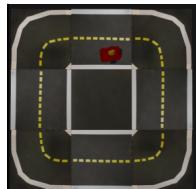  
C0 lane following

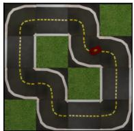  
C1 larger loop

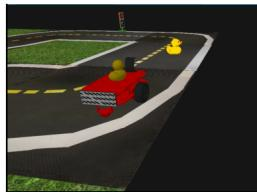  
C2 crossing pedestrian

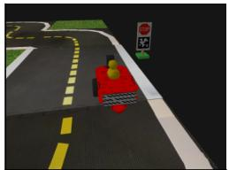  
C3 stop compliance

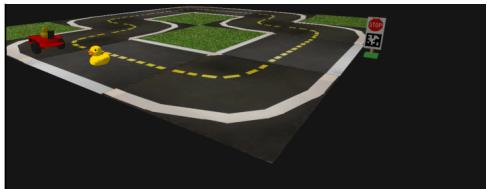  
C4 combined  
Fig. 1. The five driving curricula rendering through onboard camera frames taken from evaluation rollouts in Gym-Duckietown.

and a bearing

$$
\theta = \operatorname { a t a n 2 } ( x , y )\tag{3}
$$

in the robot frame. A linear range correction $r \mapsto a r + b ,$ fitted offline against calibration recordings, removes the systematic projection bias, and the resulting polar measurement carries a noise model that grows with range.

2) From pixels to lane measurements: A MobileNetV3- small regressor [33] takes the resized frame and outputs three numbers in normalized units, i.e. the lateral offset d in meters, the heading error φ in radians, and the curvature κ in 1/m. Its measurement noise is taken to be the residual spread of the regressor, measured offline on separate validation data.

3) Belief initialization, prediction, and correction: At episode reset the belief starts uncommitted, in the sense that the lane filter is uninitialized with validity zero, the existence probability of each object is set at its prior, and the stop mode is none. The lane EKF initializes on the first lane measurement, taking that measurement as its state $[ d , \varphi , \kappa ]$ with covariance set at preset initial values. Later it alternates kinematic prediction with the ego-motion estimate and standard EKF correction by each new measurement, with process noise growing in ∆t.

Each object runs its own EKF over planar position and velocity in the robot frame. Then, prediction re-expresses the state in the new robot frame using the ego-motion estimate, so that the tracked velocity stays consistent with the physical motion of the pedestrian. The track initializes on the first accepted detection with zero velocity and a wide velocity uncertainty, and corrections are applied directly in polar coordinates. Existence is tracked separately by a Bernoulli filter with survival and birth priors and a Bayes update using the calibrated detection and false-positive rates of the detector. The Bayes step is skipped whenever the predicted position lies outside the view of the camera. The ego-motion estimate itself is obtained by differencing consecutive poses. We note that no lane geometry, object position, or other privileged simulator state enters the belief.

4) From posteriors to the 29 policy inputs: The stopobligation state machine, driven by the stop-sign belief and a route prior, tracks whether a stop is currently not required, required, or already satisfied, and supplies the distance to the stop line. The filter posteriors are then read out into the fixed 29-dimensional vector, shown in Table II. The belief here is a factored parametric approximation, where each factor is represented by its sufficient statistics, so the policy conditions on a finite-dimensional vector without loss of the modeled distributional information. The policy $\pi ( a _ { t } \mid b _ { t } )$ is then trained on this vector with PPO [11]. We follow that model-free training over a sufficiently informative belief input is a strong baseline for POMDPs [12].

## D. Actor Extraction

The trained actor is a three-layer perceptron with tanh activations, mapping $b _ { t } \in \mathbb { R } ^ { 2 9 }$ through two hidden layers of 256 units to the 2-dimensional action, for 73,986 parameters. Evaluation uses the deterministic mean action, and everything downstream of this point compresses the actor alone. The perception and belief stages are never modified, which keeps the comparison interpretable but also bounds the system-level payoff, since perception dominates the end-to-end cost. The question throughout is thus whether the mapping from belief to action survives being made smaller.

## IV. COMPRESSION AND EVALUATION PIPELINES

In this section, we describe our compression and evaluation details.

## A. Pipeline Configurations

Fig. 2 gives an overview of the whole study. Table III lists the ten evaluated models. A0 is the original actor and serves as the reference on every curriculum. A1 through A8 realize every meaningful placement of pruning, distillation, and quantization that the framework supports. Two of them are controls, where A4 applies quantization without pruning, and A5 applies pruning and quantization without distillation. A9 is the reduced-floating-point control. A6 and A8 both descend from the byte-identical A3 checkpoint, and the difference between them is the quantization route alone.

## B. Compression Stages

The compression stages consist of pruning, distillation, and quantization (INT and FP16). To that end, structured pruning removes whole hidden units. Each unit is scored by the sum of its L2 incoming and outgoing connectivity plus its absolute bias, ties keep the lower index. Thus, the width-64 actor retains 6,210 of 73,986 parameters, yielding a 91.6 % reduction.

In terms of distillation, the original actor is kept fixed and serves as the teacher, while the student minimizes a Smooth-L1 loss between the deterministic actions of the teacher and of the student, normalized by the physical action ranges. We use phase-balanced sampling, so that nominal driving cannot dominate the batch, and no ground-truth simulator state enters training. The two rehearsal sets differ only in coverage, where the historical set is drawn from C4 development states, and the balanced set holds 62,176 public states drawn across all five curricula. Teacher, loss, optimizer, batch size, learning rate, and epoch budget are identical between the two.

TABLE II  
THE COMPONENTS OF THE BELIEF-STATE VECTOR bt.
<table><tr><td>#</td><td>Component</td><td>Unit</td><td>Group</td><td>Produced By</td></tr><tr><td>1</td><td>lane validity probability</td><td></td><td>lane belief</td><td>lane EKF, fed by MobileNetV3-small</td></tr><tr><td>2-3</td><td>lateral error, mean and std</td><td>m</td><td></td><td></td></tr><tr><td>4-5</td><td>heading error, mean and std</td><td>rad</td><td></td><td></td></tr><tr><td>6-7</td><td>curvature, mean and std</td><td>1/m</td><td></td><td></td></tr><tr><td>8</td><td>actual linear velocity</td><td>m/s</td><td>egomotion</td><td>pose differencing (odometry proxy)</td></tr><tr><td>9</td><td>actual yaw rate</td><td>rad/s</td><td></td><td></td></tr><tr><td>10</td><td>stop-line distance</td><td>m</td><td>stop geometry</td><td>stop-sign belief and route prior</td></tr><tr><td>11</td><td>pedestrian existence probability</td><td></td><td>pedestrian belief</td><td>pedestrian EKF + existence filter, fed by YOLO11n</td></tr><tr><td>12-13</td><td>range, mean and std</td><td>m</td><td></td><td></td></tr><tr><td>14-15</td><td>bearing, mean and std</td><td>rad</td><td></td><td></td></tr><tr><td>16-17</td><td>radial velocity, mean and std</td><td>m/s</td><td></td><td></td></tr><tr><td>18-19</td><td>bearing rate, mean and std</td><td>rad/s</td><td></td><td></td></tr><tr><td>20</td><td>stop-sign existence probability</td><td></td><td>stop-sign belief</td><td>stop-sign belief updater, fed by YOLO11n</td></tr><tr><td>21-22 23-24</td><td>range, mean and std</td><td>m</td><td></td><td></td></tr><tr><td></td><td>bearing, mean and std</td><td>rad</td><td></td><td></td></tr><tr><td>25-27 28</td><td>stop mode, one-hot: none / required / satisfied</td><td></td><td>obligation</td><td>stop state machine</td></tr><tr><td>29</td><td>previous linear velocity command</td><td>m/s</td><td>action feedback</td><td>policy output at t—1</td></tr><tr><td></td><td>previous angular velocity command</td><td>rad/s</td><td></td><td></td></tr></table>

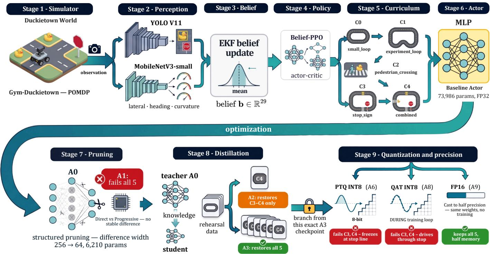  
Fig. 2. Overview of the study. Top: the driving policy is built in Gym-Duckietown, where YOLO and MobileNetV3-small measurements are fused b EKF-based belief updaters into a belief state, and a Belief-PPO actor-critic is trained through the five curricula. Bottom: the extracted actor moves throug structured pruning, two distillation branches that differ only in rehearsal data, and three precision routes from the same checkpoint.

Our post-training quantization approach uses eager static INT8 on the x86 backend, with per-channel symmetric weights and per-tensor affine activations, calibrated on development states only [3], [4].The A9 candidate casts the A3 weights to 16-bit floats and changes nothing else. Since a CPU backend can silently widen half-precision arithmetic back to FP32, A9 is admitted only after an explicit validity check, which confirms that the forward pass executes natively in half precision and that the outputs are FP16 and differ from the FP32 source [18].

## C. Closed-Loop Acceptance Criterion

Every candidate drives every curriculum on the same eight seeds, giving 40 episodes per candidate and 400 in total, and

TABLE III EVALUATED PIPELINE CANDIDATES.
<table><tr><td>ID</td><td>Construction</td><td>Width Precision</td><td></td></tr><tr><td></td><td>A0 original actor (reference)</td><td>256</td><td>FP32</td></tr><tr><td>A1</td><td>prune</td><td>64</td><td>FP32</td></tr><tr><td></td><td>A2 prune → KD(C4)</td><td>64</td><td>FP32</td></tr><tr><td></td><td>A3 prune → KD(bal)</td><td>64</td><td>FP32</td></tr><tr><td></td><td>A4 PTQ only, no pruning (control)</td><td>256</td><td>INT8</td></tr><tr><td></td><td>A5 prune → PTQ, no KD (control)</td><td>64</td><td>INT8</td></tr><tr><td></td><td>A6 prune → KD(bal) → PTQ</td><td>64</td><td>INT8</td></tr><tr><td></td><td>A7 prune → KD(C4) → PTQ → QAT(C4)</td><td>64</td><td>INT8</td></tr><tr><td></td><td>A8 prune → KD(bal) → QAT(bal)</td><td>64</td><td>INT8</td></tr><tr><td></td><td>A9 prune → KD(bal) → FP16 cast</td><td>64</td><td>FP16</td></tr></table>

acceptance is decided by checks that were fixed before any result existed. Let K denote that set of checks. A candidate m passes curriculum c if and only if

$$
\begin{array} { r l r } {  { \operatorname { P A S S } ( m , c ) = \bigwedge _ { k \in { \cal K } } \Big [ q _ { k } ( m , c ) \preceq \tau _ { k } } } \\ & { } & { \qquad \quad \wedge \Delta _ { k } \big ( q _ { k } ( m , c ) , q _ { k } ( A 0 , c ) \big ) \preceq \delta _ { k } \Big ] , } \end{array}\tag{4}
$$

where $q _ { k }$ is the measured quantity for check k and $\tau _ { k }$ is its absolute requirement. Here $\delta _ { k }$ is the largest regression tolerated relative to the reference actor A0 on the same seeds, and ⪯ denotes the direction in which each check is favorable. The checks cover completion, progress, collisions, unsafe proximity, stop violations, stop completion and restart, lane failures, invalid poses, and minimum pedestrian clearance.

We note two aspects of (4). First, a curriculum decision is PASS only if every check holds, so that a high completion count does not by itself imply acceptance. Second, the paired term $\Delta _ { k } ( \cdot , q _ { k } ( A 0 , c ) )$ means that a documented weakness of the original policy is not charged to compression unless it worsens beyond the preset margin $\delta _ { k } .$ . We note that no threshold was changed after the results were opened.

## V. NUMERICAL EXPERIMENTS AND RESULTS

In this section, we present the settings and findings from our numerical experiments. Figure 3 reports the decision per curriculum.

## A. Capability Loss under Pruning

The pruned actor A1 fails every curriculum. On C0 through C2 the dominant modes are invalid poses and lane failures, with completion falling to three, three, and zero episodes of eight. On C3 every episode ends in a stop violation. It is thus clear that the loss is neither partial nor specific to one curriculum. Structured pruning to width 64 is the first stage in this pipeline at which the task-level capability is lost. Table IV records the exact state and action at the first failure of each failing candidate.

## B. Effect of the Rehearsal Coverage

While distillation does improve the pruned actor, the extent of the improvement is determined by the student rehearsal data. A2 and A3 share the pruned source configuration, the teacher, the loss, and the training budget, and differ only in rehearsal coverage. A2, rehearsing on C4-focused states, completes every C3 and C4 episode and none of C0 through C2, where it shows total invalid-pose or lane-failure rates. A3, rehearsing on balanced C0-C4 states, passes all five curricula and also passes every action-fidelity check. In other words, expanding the coverage flipped three curricula from complete failure to full recovery.

<table><tr><td>A1 prune</td><td>fail</td><td>fail</td><td>fail</td><td>fail</td><td>fail</td></tr><tr><td>A2 prune+KD(C4)</td><td>fail</td><td>fail</td><td>fail</td><td>pass</td><td>pass</td></tr><tr><td>A3 prune+KD(bal)</td><td>pass</td><td>pass</td><td>pass</td><td>pass</td><td>pass</td></tr><tr><td>A4 PTQ only</td><td>pass</td><td>pass</td><td>pass</td><td>pass</td><td>pass</td></tr><tr><td>A5 prune+PTQ</td><td>fail</td><td>fail</td><td>fail</td><td>fail</td><td>fail</td></tr><tr><td>A6 KD(bal)+PTQ</td><td>pass</td><td>pass</td><td>pass</td><td>fail</td><td>fail</td></tr><tr><td>A7 KD(C4)+PTQ+QAT</td><td>fail</td><td>fail</td><td>fail</td><td>pass</td><td>pass</td></tr><tr><td>A8 KD(bal)+QAT</td><td>pass</td><td>pass</td><td>pass</td><td>fail</td><td>fail</td></tr><tr><td>A9 KD(bal)+FP16</td><td>pass</td><td>pass</td><td>pass</td><td>pass</td><td>pass</td></tr><tr><td></td><td>C0</td><td>C1</td><td>C2</td><td>C3</td><td>C4</td></tr></table>

Fig. 3. Cross-curriculum decisions across the compression pipeline.

## C. Placement of Distillation and Quantization

A5 quantizes the pruned actor directly. It fails all five curricula, with invalid-pose rates up to 100 % and every C3 episode ending in a stop violation. A6 differs from A5 in exactly one respect, i.e. balanced distillation inserted before PTQ, and it then retains C0 through C2 in full. Thus, under the tested pathways, distilling before quantizing preserved substantially more capability than quantizing the pruned actor directly. We remind the readers that this is a placement observation on fixed pathways, and not a factorial proof about operation ordering.

The most direct comparison in this study is A3 against A6, since the two share every byte of their FP32 source configuration, and no training separates them. While A3 passes all five curricula, its PTQ conversion A6 fails C3 and C4, completing on C3 three of eight episodes where the FP32 source completed all eight. The failure observed here is not an unsafe driving behavior, since A6 records zero stop violations. It stops correctly and then never issues a driving command again, remaining at the line until the episode times out. We note that the zero-velocity commands are the emitted actions of the network itself, reproduced bit for bit across repeats, and not a runtime fault.

The quantization-aware training approach appears to not bring back what post-training quantization has lost. This is because A8, obtained from the same A3 configuration with quantization-aware training and teacher guidance, also fails C3 and C4, and fails in the opposite direction. While A6 remains at the stop line, A8 drives through it, violating the stop in four of eight C3 episodes and seven of eight C4 episodes.

Furthermore, A8 never retrains the quantized graph of A6, so that this is a comparison of two quantization routes from one source configuration. Both quantized branches fail the two curricula that require the policy to interrupt and resume its own driving. They fail from opposite sides of that requirement. The failure rows of Table IV show the contrast directly, since A6 emits $v _ { \mathrm { c m d } } = 0 . 0 0 0$ while parked 0.2 m before the line, whereas A8 emits $v _ { \mathrm { c m d } } = 0 . 0 7 7$ while crossing it. In Fig. 4 we show the same contrast against their common source configuration.

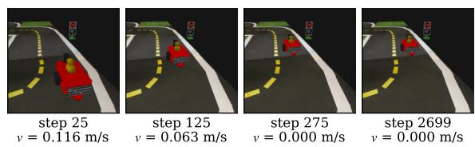

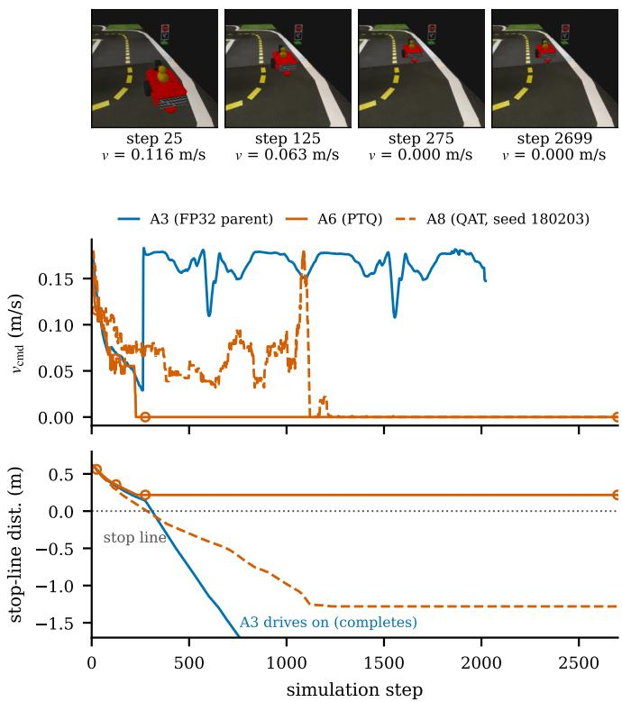  
Fig. 4. The two quantized branches fail the stop curriculum from opposite sides. Top: camera frames from the A6 episode itself. Below: commanded velocity and stop-line distance per step from the telemetry.

## D. Task Decision, Action Fidelity, and Cost

Figure 5 compares the two precision routes that start from the same A3 checkpoint. In terms of task decisions, the FP16 cast A9 passes all five curricula, exactly as its FP32 source does, whereas the INT8 conversion A6 fails C3 and C4. The action-fidelity panel shows the same separation, where the Spearman correlation of the yaw-rate channel for A9 lies on top of the FP32 curve on every curriculum. Meanwhile the A6 correlation stays above the acceptance threshold on C0 through C2 and drops below it on the stop curricula. In terms of cost, the FP16 cast halves the parameter memory but adds 26 % to the median actor latency over FP32 on this x86 backend, which is consistent with the absence of a native halfprecision compute path. The INT8 actor is the fastest of the three at 12.9 µs against 19.4 µs for FP32, about 1.5× faster than its FP32 source, although its serialized file is larger than the FP32 file, because the metadata of the traced quantized graph dominates the weight savings at 6,210 parameters. On this backend, therefore, the half-precision route preserves the driving capability at a latency penalty, while the integer route buys speed at the cost of the two stop curricula.

## VI. DISCUSSION AND LIMITATIONS

Our main results stem from three findings, which are a capability loss with a known location (pruning), an improvement with an identified operative factor (the rehearsal coverage), and a second and different failure with an identified trigger (integer quantization of the narrow actor). None of these findings is available from a report on the final configuration only. The stage-wise view also clarifies our position with respect to accuracy-ordered compression, since our pipeline agrees with the prune-before-quantize recommendation of [7], [8] but departs from the distill-first prescription, i.e., using distillation to improve a lost capability and not as an opening stage.

Furthermore, both quantized branches fail exactly the curricula that require the policy to interrupt and resume its own driving, and they fail from opposite sides. The stop task makes the policy traverse a sharp decision boundary, from driving to holding to driving again, under small input changes near the line. The behaviors of A6 and A8 are both consistent with small perturbations of that boundary having large task consequences, whereas lane keeping tolerates continuous small errors and survives. Our data locate this pattern but do not establish its mechanism, so we make no claim about the internal representation of the compressed networks.

Finally, the mismatch observed gives the fidelity-only acceptance test both false negatives and false positives on the same small model family. A8 would be accepted over A6 by fidelity, although A8 is the more dangerous driver, while A4 would be rejected although it drives every curriculum. We do not argue that fidelity metrics are useless, since they remain cheap, differentiable, and useful in training. We argue instead that closed-loop task acceptance cannot be inferred from them for a policy that must act, and has to be measured.

## A. Implications for Deployment Practice

Three practical consequences follow for researchers and engineers who aim to compress an automated driving function before deployment. First, the release-gate evidence should be produced at every intermediate stage and not only for the final configuration, since a final-only report cannot separate a stage that removed a behavior from a stage that failed to bring it back. Second, the rehearsal set used for any recovery step is a safety-relevant configuration item, which deserves the same coverage argument as the test set, since in our study it alone decided which behaviors returned. Third, scenarios that require the vehicle to interrupt and then resume its own driving should be treated as first-class acceptance scenarios for compressed policies, since both of our integer routes failed there while continuous lane keeping survived. All three consequences amount to importing standard scenariobased assessment practice [24], [25] into the interior of the compression pipeline.

TABLE IV  
STATE AND ACTION AT THE FIRST FAILURE. A DASH IN THE STOP-LINE COLUMN MEANS NO STOP LINE INVOLVED. STOP VIOLATIONS HIGHLIGHTED.
<table><tr><td>Candidate</td><td>Task</td><td>Step/Horizon</td><td>Failure</td><td> $\mathbf { v } _ { \mathrm { a c t } }$  (m/s)</td><td>Stop-line dist. (m)</td><td> $\mathbf { v } _ { \mathrm { c m d } }$  (m/s)</td></tr><tr><td>A1</td><td>C0</td><td>367/368</td><td>invalid pose</td><td>0.135</td><td></td><td>0.195</td></tr><tr><td>A1</td><td>C1</td><td>1312/1313</td><td>invalid pose</td><td>0.135</td><td></td><td>0.195</td></tr><tr><td>A1</td><td>C2</td><td>248/249</td><td>invalid pose</td><td>0.136</td><td></td><td>0.192</td></tr><tr><td>A1</td><td>C3</td><td>149/398</td><td>stop violation</td><td>0.148</td><td>-0.001</td><td>0.219</td></tr><tr><td>A1</td><td>C4</td><td>4199/4200</td><td>timeout</td><td>0.000</td><td>0.451</td><td>0.000</td></tr><tr><td>A2</td><td>C0</td><td>126/127</td><td>invalid pose</td><td>0.242</td><td></td><td>0.342</td></tr><tr><td>A2</td><td>C1</td><td>179/180</td><td>lane failure</td><td>0.228</td><td></td><td>0.327</td></tr><tr><td>A2</td><td>C2</td><td>315/316</td><td>lane failure</td><td>0.139</td><td></td><td>0.204</td></tr><tr><td>A5</td><td>C0</td><td>360/361</td><td>invalid pose</td><td>0.132</td><td></td><td>0.196</td></tr><tr><td>A5</td><td>C1</td><td>1314/1315</td><td>invalid pose</td><td>0.134</td><td></td><td>0.188</td></tr><tr><td>A5</td><td>C2</td><td>430/431</td><td>invalid pose</td><td>0.157</td><td></td><td>0.225</td></tr><tr><td>A5</td><td>C3</td><td>150/932</td><td>stop violation</td><td>0.145</td><td>-0.000</td><td>0.220</td></tr><tr><td>A5</td><td>C4</td><td>3227/3228</td><td>lane failure</td><td>0.022</td><td>-0.896</td><td>0.032</td></tr><tr><td>A6</td><td>C3</td><td>2699/2700</td><td>timeout (freeze)</td><td>0.000</td><td>0.217</td><td>0.000</td></tr><tr><td>A6</td><td>C4</td><td>4199/4200</td><td>timeout (freeze)</td><td>0.000</td><td>0.187</td><td>0.000</td></tr><tr><td>A7</td><td>CO</td><td>128/129</td><td>invalid pose</td><td>0.244</td><td></td><td>0.343</td></tr><tr><td>A7</td><td>C1</td><td>191/192</td><td>invalid pose</td><td>0.237</td><td></td><td>0.357</td></tr><tr><td>A7</td><td>C2</td><td>309/310</td><td>lane failure</td><td>0.135</td><td></td><td>0.203</td></tr><tr><td>A8</td><td>C3</td><td>284/2700</td><td>stop violation</td><td>0.051</td><td>0.001</td><td>0.077</td></tr><tr><td>A8</td><td>C4</td><td>1030/4200</td><td>stop violation</td><td>0.053</td><td>-0.009</td><td>0.077</td></tr></table>

(a) task verdicts  
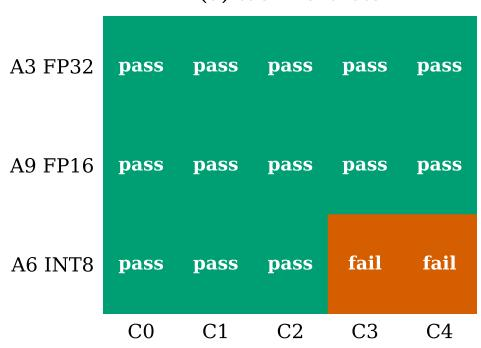

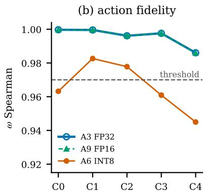

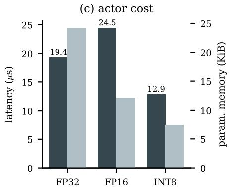  
Fig. 5. (a) Task decisions for the FP32 source, its FP16 cast, and its INT8 PTQ conversion. (b) Spearman correlation of the yaw-rate channel against the original actor. (c) Median single-thread actor latency and logical parameter memory.

## B. Limitations

We note a few limitations of our study. The acceptance checks in (4) are our operational definition of the driving capability, so that a different check set could move individual decision. We mitigated this by fixing every threshold before any result existed and by never relaxing the deployment criterion later, but the definition remains ad-hoc and not a standard. Furthermore, everything reported here also concerns one policy, one simulator, and one compression toolchain, and the actor is small. Conclusions about a 6,210 parameter perceptron need not transfer to larger policies, where quantization error could distribute differently. The integer-quantization procedure was also fixed by design, so that the observed interaction is a property of the tested procedure and not of INT8 as such, and the FP16 result carries its measured latency caveat on the evaluated CPU. Finally, Gym-Duckietown remains a smallscale platform, and the transfer of these findings to full-scale driving stacks is untested, whether in higher-fidelity simulation or on the road. We aim to integrate higher fidelity simulation and on-track testing in our future work.

## VII. CONCLUSION

In this study, we process a belief-state visuomotor driving policy through structured pruning, knowledge distillation, integer quantization, and reduced floating-point inference. We evaluate every stage in closed loop and find that pruning is the stage at which the capability first broke, and the break covered every curriculum. Meanwhile, distillation brings part of the driving capability back exactly as far as its rehearsal data reached. Integer quantization of the improved actor loses the two hardest curricula again, through two opposite failure modes. Meanwhile, the same procedure on the unpruned width-256 actor preserves every curriculum, and so does a half-precision cast of the same checkpoint. We emphasize that action-level similarity predicted none of this in either direction. Our main conclusion is therefore not that any one technique is unsafe, but that a compression pipeline for a control policy is a sequence of behavioral transitions, whose surviving capability can only be established by making every intermediate configuration drive. Put together with the current streams of research on the design and the evaluation of automated driving systems, this endeavor would be highly beneficial to increase the implementability and to statistically guarantee the trustworthiness of compressed driving policies.

## REFERENCES

[1] D. Blalock, J. J. Gonzalez Ortiz, J. Frankle, and J. Guttag, “What is the state of neural network pruning?” in Proceedings of Machine Learning and Systems (MLSys), 2020.

[2] H. Li, A. Kadav, I. Durdanovic, H. Samet, and H. P. Graf, “Pruning filters for efficient ConvNets,” in International Conference on Learning Representations (ICLR), 2017.

[3] B. Jacob, S. Kligys, B. Chen, M. Zhu, M. Tang, A. Howard, H. Adam, and D. Kalenichenko, “Quantization and training of neural networks for efficient integer-arithmetic-only inference,” in IEEE/CVF Conference on Computer Vision and Pattern Recognition (CVPR), 2018, pp. 2704– 2713.

[4] M. Nagel, M. Fournarakis, R. A. Amjad, Y. Bondarenko, M. van Baalen, and T. Blankevoort, “A white paper on neural network quantization,” arXiv preprint arXiv:2106.08295, 2021.

[5] J. Gou, B. Yu, S. J. Maybank, and D. Tao, “Knowledge distillation: A survey,” International Journal of Computer Vision, vol. 129, pp. 1789– 1819, 2021.

[6] S. Hooker, A. Courville, G. Clark, Y. Dauphin, and A. Frome, “What do compressed deep neural networks forget?” arXiv preprint arXiv:1911.05248, 2019.

[7] Y. Shen, M. Sun, J. Lin, J. Zhao, and A. Zou, “Order of compression: A systematic and optimal sequence to combinationally compress CNN,” arXiv preprint arXiv:2403.17447, 2024.

[8] M. Kim, J. Choi, H. Yang, J. Kim, J. Song, and U. Kang, “Prune-then-quantize or quantize-then-prune? understanding the impact of compression order in joint model compression,” arXiv preprint arXiv:2603.18426, 2026.

[9] L. Paull, J. Tani, H. Ahn, J. Alonso-Mora, L. Carlone, M. Cap et al., “Duckietown: An open, inexpensive and flexible platform for autonomy education and research,” in IEEE International Conference on Robotics and Automation (ICRA), 2017, pp. 1497–1504.

[10] M. Chevalier-Boisvert, F. Golemo, Y. Cao, B. Mehta, and L. Paull, “Duckietown environments for OpenAI gym,” https://github.com/ duckietown/gym-duckietown, 2018.

[11] J. Schulman, F. Wolski, P. Dhariwal, A. Radford, and O. Klimov, “Proximal policy optimization algorithms,” arXiv preprint arXiv:1707.06347, 2017.

[12] T. Ni, B. Eysenbach, and R. Salakhutdinov, “Recurrent model-free RL can be a strong baseline for many POMDPs,” in International Conference on Machine Learning (ICML), 2022.

[13] Y. He and L. Xiao, “Structured pruning for deep convolutional neural networks: A survey,” IEEE Transactions on Pattern Analysis and Machine Intelligence, vol. 46, no. 5, pp. 2900–2919, 2024.

[14] P. Molchanov, A. Mallya, S. Tyree, I. Frosio, and J. Kautz, “Importance estimation for neural network pruning,” in IEEE/CVF Conference on Computer Vision and Pattern Recognition (CVPR), 2019, pp. 11 264– 11 272.

[15] D. Livne and K. Cohen, “PoPS: Policy pruning and shrinking for deep reinforcement learning,” IEEE Journal of Selected Topics in Signal Processing, vol. 14, pp. 789–801, 2020.

[16] G. Li, Z. Ji, S. Li, X. Luo, and X. Qu, “Driver behavioral cloning for route following in autonomous vehicles using task knowledge distillation,” IEEE Transactions on Intelligent Vehicles, vol. 8, no. 2, pp. 1025–1033, 2023.

[17] A. A. Rusu, S. G. Colmenarejo, C¸ . Gulc¸ehre, G. Desjardins, J. Kirk-¨ patrick, R. Pascanu, V. Mnih, K. Kavukcuoglu, and R. Hadsell, “Policy distillation,” in International Conference on Learning Representations (ICLR), 2016.

[18] P. Micikevicius, S. Narang, J. Alben, G. Diamos, E. Elsen, D. Garcia, B. Ginsburg, M. Houston, O. Kuchaiev, G. Venkatesh, and H. Wu, “Mixed precision training,” in International Conference on Learning Representations (ICLR), 2018.

[19] M. van Baalen, A. Kuzmin, S. S. Nair, Y. Ren, E. Mahurin, C. Patel, S. Subramanian, S. Lee, M. Nagel, J. Soriaga, and T. Blankevoort, “FP8 versus INT8 for efficient deep learning inference,” arXiv preprint arXiv:2303.17951, 2023.

[20] S. Krishnan, S. Chitlangia, M. Lam, Z. Wan, A. Faust, and V. J. Reddi, “Quantized reinforcement learning (QuaRL),” arXiv preprint arXiv:1910.01055v1, 2019.

[21] J. Wang, Q. M. J. Wu, N. Zhang, K. Suto, and L. Zhong, “Compressing multi-task model for autonomous driving via pruning and knowledge distillation,” arXiv preprint arXiv:2511.05557, 2025.

[22] Z. Liu, M. Arief, and D. Zhao, “Where should we place LiDARs on the autonomous vehicle? an optimal design approach,” in International Conference on Robotics and Automation (ICRA). IEEE, 2019, pp. 2793–2799.

[23] N. Kalra and S. M. Paddock, “Driving to safety: How many miles of driving would it take to demonstrate autonomous vehicle reliability?” Transportation Research Part A: Policy and Practice, vol. 94, pp. 182– 193, 2016.

[24] S. Riedmaier, T. Ponn, D. Ludwig, B. Schick, and F. Diermeyer, “Survey on scenario-based safety assessment of automated vehicles,” IEEE Access, vol. 8, pp. 87 456–87 477, 2020.

[25] W. Ding, C. Xu, M. Arief, H. Lin, B. Li, and D. Zhao, “A survey on safety-critical driving scenario generation: A methodological perspective,” IEEE Transactions on Intelligent Transportation Systems, vol. 24, no. 7, pp. 6971–6988, 2023.

[26] H. Zhang, J. Sun, and Y. Tian, “Accelerated safety testing for highly automated vehicles: Application and capability comparison of surrogate models,” IEEE Transactions on Intelligent Vehicles, vol. 9, pp. 2409– 2418, 2024.

[27] D. Zhao, H. Lam, H. Peng, S. Bao, D. J. LeBlanc, K. Nobukawa, and C. S. Pan, “Accelerated evaluation of automated vehicles safety in lane-change scenarios based on importance sampling techniques,” IEEE Transactions on Intelligent Transportation Systems, vol. 18, no. 3, pp. 595–607, 2017.

[28] M. Arief, Z. Huang, G. K. S. Kumar, Y. Bai, S. He, W. Ding, H. Lam, and D. Zhao, “Deep probabilistic accelerated evaluation: A robust certifiable rare-event simulation methodology for black-box safety-critical systems,” in International Conference on Artificial Intelligence and Statistics (AISTATS), ser. PMLR, 2021, pp. 595–603.

[29] M. Arief, P. Glynn, and D. Zhao, “An accelerated approach to safely and efficiently test pre-production autonomous vehicles on public streets,” in 21st International Conference on Intelligent Transportation Systems (ITSC). IEEE, 2018, pp. 2006–2011.

[30] Z. Huang, M. Arief, H. Lam, and D. Zhao, “Evaluation uncertainty in data-driven self-driving testing,” in IEEE Intelligent Transportation Systems Conference (ITSC). IEEE, 2019, pp. 1902–1907.

[31] Y. Guo, V. V. Kalidindi, M. Arief, W. Wang, J. Zhu, H. Peng, and D. Zhao, “Modeling multi-vehicle interaction scenarios using gaussian random field,” in IEEE Intelligent Transportation Systems Conference (ITSC). IEEE, 2019, pp. 3974–3980.

[32] G. Jocher and J. Qiu, “Ultralytics YOLO11,” https://github.com/ ultralytics/ultralytics, 2024.

[33] A. Howard, M. Sandler, G. Chu, L.-C. Chen, B. Chen, M. Tan, W. Wang, Y. Zhu, R. Pang, V. Vasudevan, Q. V. Le, and H. Adam, “Searching for MobileNetV3,” in IEEE/CVF International Conference on Computer Vision (ICCV), 2019, pp. 1314–1324.