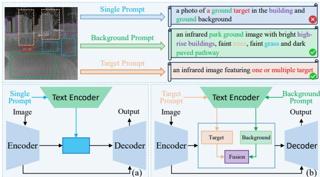
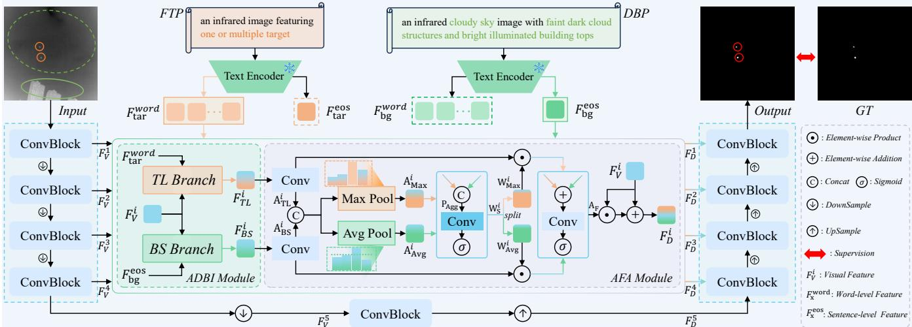
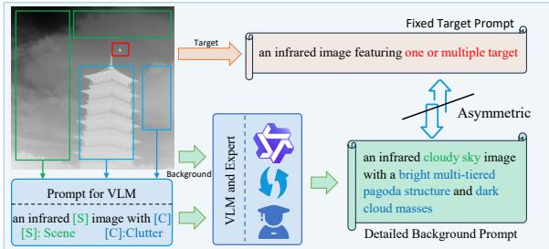
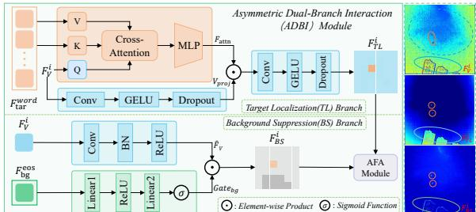
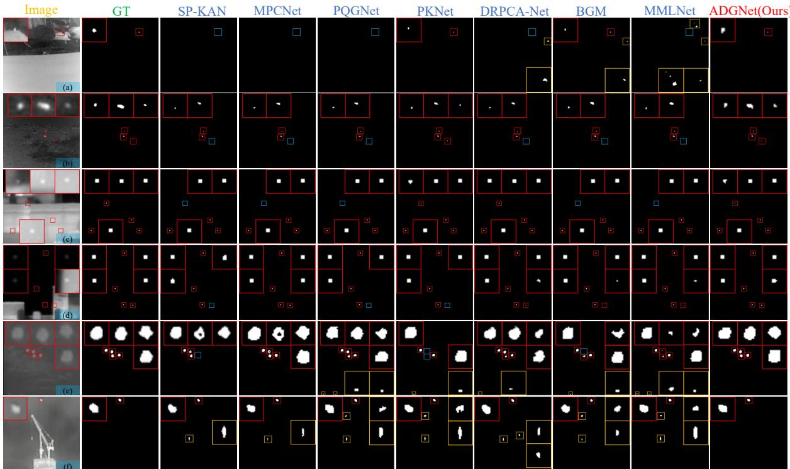
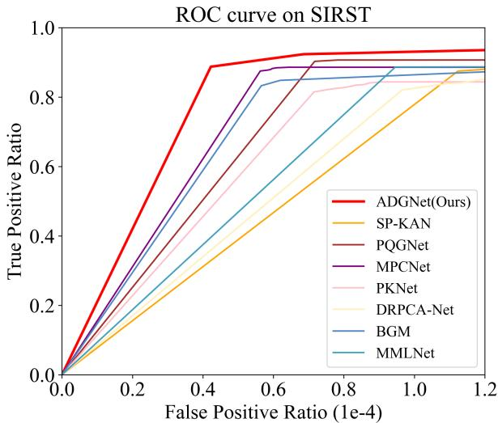
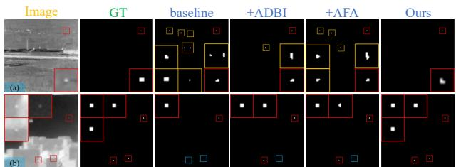
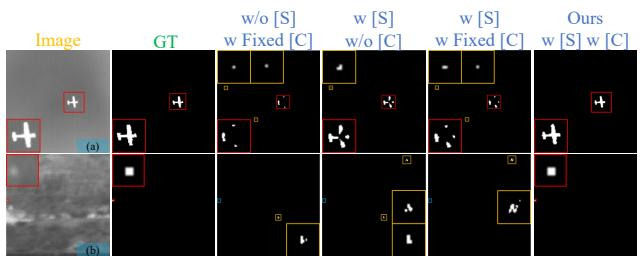
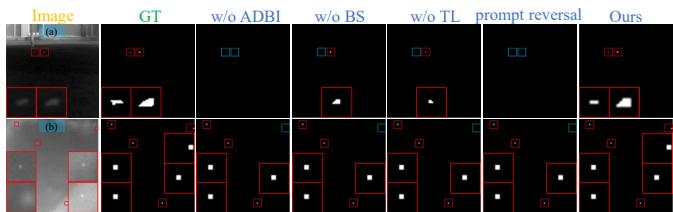
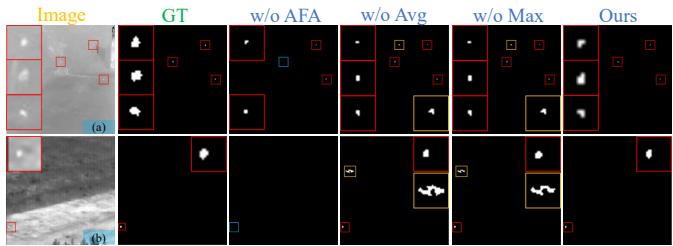

# ADGNet: Asymmetric Dual-text Guided Network for Infrared Small Target Detection

Tongtong Wang   
Shandong University   
Jinan, China   
wangttong@mail.sdu.edu.cn   
Jing Wang   
Shandong University   
Jinan, China   
202415291@mail.sdu.edu.cn   
Mingzhu Xu∗   
Shandong University   
Jinan, China   
xumingzhu@sdu.edu.cn   
Xiaohui Lin   
Shandong University   
Jinan, China   
202415286@mail.sdu.edu.cn

Chenglong Yu Shandong University Jinan, China yucl@mail.sdu.edu.cn

Weili Guan Harbin Institute of Technology, Shenzhen Shenzhen, China honeyguan@gmail.com

## Abstract

InfRared Small Target Detection (IRSTD) is a challenging task. Relying solely on pixel-level information, vision-only methods struggle to distinguish targets from clutter. Current multimodal methods typically describe both targets and backgrounds with a single textual prompt. Such an approach lacks dedicated regional guidance and ignores infrared semantic asymmetry. Consequently, it provides insuficient background suppression information and introduces severe feature optimization conflicts, overwhelming small targets with noise. To address these issues, we propose a novel Asymmetric Dual-text Guided Network (ADGNet). Specifically, accounting for the infrared semantic asymmetry, we first design the Asymmetric Dual-text Prompt (ADP), comprising an image-agnostic abstract target prompt and an image-specific detailed background prompt. To leverage these prompts, we introduce an Asymmetric Dual-Branch Interaction (ADBI) module to separately guide visual features with their respective text priors, protecting targets from noise while suppressing background clutter. Subsequently, we introduce an Adaptive Feature Aggregation (AFA) module to dynamically fuse features from the two branches. Furthermore, we construct a multimodal Asymmetric Image-Text Infrared (AITIR) dataset by providing asymmetric text annotations for three public datasets (IRSTD-1K, NUDT-SIRST, and SIRST). Extensive experiments demonstrate that ADGNet outperforms 21 state-of-the-art (SOTA) methods. Code is available at https://github.com/iLearn-Lab/MM26-ADGNet.

## CCS Concepts

• Computing methodologies → Image segmentation; Object detection.

## Keywords

Infrared small target detection; Asymmetric dual-text prompt; Asymmetric dual-branch interaction module; Adaptive feature aggregation module

ACM Reference Format:   
Tongtong Wang, Mingzhu Xu, Chenglong Yu, Jing Wang, Xiaohui Lin, and Weili Guan. 2026. ADGNet: Asymmetric Dual-text Guided Network for Infrared Small Target Detection. In Proceedings ofthe 34th ACM International Conference on Multimedia (MM ’26), November 10–14, 2026, Rio de Janeiro, Brazil. ACM, New York, NY, USA, 10 pages. https://doi.org/10.1145/3767308. 3836147

## 1 Introduction

InfRared Small Target Detection (IRSTD) aims to accurately segment weak targets from complex backgrounds [1, 2]. Benefiting from thermal radiation imaging, infrared technology possesses strong anti-interference capabilities in visually obstructed environments. Consequently, it plays an irreplaceable role in maritime monitoring, early warning systems, and autonomous navigation [3–6]. However, infrared images exhibit an inherent semantic asymmetry between targets and backgrounds. Infrared targets typically possess singular semantics and severely lack texture or structural priors. In contrast, background regions are rich in clutter and highly structured. This extreme semantic imbalance makes it highly challenging to extract weak thermal signals from clutter, causing severe false alarms and missed detections.

In the field of IRSTD, although early traditional methods (such as filtering [7–11], local contrast [12–15], and low-rank representation [16–20]) provided initial solutions, they relied heavily on hand-crafted features, sufering from limited semantic expression and poor robustness. Subsequently, deep learning methods [21–34] have improved detection accuracy by learning deep semantic features end-to-end. However, constrained by a single modality and relying solely on pixel-level information, existing vision-only networks struggle to extract highly discriminative features. Confronted with the semantic asymmetry of infrared images, they still fail to efectively separate textureless targets from complex backgrounds.

In recent years, Vision-Language Models (VLMs) [35–37], represented by CLIP [38], have demonstrated cross-modal representation and semantic interaction capabilities [39–44]. Inspired by this, existing IRSTD methods [45, 46] introduce text modality for high-level semantic guidance and cross-modal alignment [47–51]. However, as shown in Fig. 1(a), these methods typically describe both targets and backgrounds with a single textual prompt, completely ignoring the semantic asymmetry of infrared images. This paradigm has critical flaws: forcing detailed descriptions onto simple targets introduces semantic noise that leads to false alarms, while oversimplifying the description of complex backgrounds deprives the network of suficient clutter suppression priors. Furthermore, merging such distinct semantics into a single textual prompt inevitably triggers severe feature optimization conflicts.

  
Figure 1: Comparison of text-guided paradigms. (a) Existing method using a single textual prompt. (b) Our proposed ADGNet using two asymmetric textual prompts.

To address these challenges, we propose a novel Asymmetric Dual-text Guided Network (ADGNet), whose architectural paradigm is illustrated in Fig. 1(b). First, tailored to the semantic asymmetry of infrared images, we design the Asymmetric Dual-text Prompt (ADP). It employs a fixed abstract target prompt to avoid semantic noise, while utilizing a detailed background prompt to provide suficient priors for clutter suppression. Second, to resolve the feature optimization conflicts caused by a single textual prompt, we propose the Asymmetric Dual-Branch Interaction (ADBI) module. This module explicitly constructs target localization and background suppression branches, independently guiding visual features with their corresponding text priors. Finally, the Adaptive Feature Aggregation (AFA) module dynamically fuses features from both branches, efectively enhancing the target while suppressing background clutter for accurate segmentation in complex scenarios.

The main contributions of this paper are as follows:

• We propose a novel ADGNet. Its core ADP overcomes the inherent semantic asymmetry of infrared images. By employing abstract target and detailed background prompts, it avoids semantic noise while providing suppression priors.

• We propose a novel ADBI module, which uses corresponding text priors to independently localize targets and suppress clutter. Furthermore, the AFA module dynamically fuses these features, achieving precise target enhancement and efective clutter suppression.

• We construct the multimodal AITIR dataset by augmenting the original images of three mainstream public datasets with asymmetric text annotations. Extensive experiments show that ADGNet consistently outperforms 21 existing state-ofthe-art (SOTA) methods in complex scenarios.

## 2 Related Work

## 2.1 Vision-Only Infrared Small Target Detection

Traditional Infrared Small Target Detection (IRSTD) methods typically rely on hand-crafted features. Specifically, filter-based methods [8, 9] are fast but sensitive to edges and noise. Local contrastbased methods [12–15] highlight targets well but cause high false alarm rates given similar background clutter. Low-rank methods [16– 19] extract targets efectively via matrix separation but are computationally expensive and struggle with complex backgrounds. Overall, traditional methods lack a deep semantic understanding of images, making it dificult to handle real-world environments with complex macro-scenes and local interference. Conversely, deep learning methods extract hierarchical visual features in a data-driven manner, improving detection accuracy [52–54]. For example, HDNet [1] fuses spatial and frequency features, using frequency energy distributions to suppress background interference. To enhance target-background discrimination, SCTransNet [55] constructs a cross-transformer network for full-level semantic associations. PKNet [56] introduces a parallel CNN-KAN framework with cyclic interactive fusion for bidirectional local-global feature refinement. Similarly, PQGNet [57] leverages wavelet-enhanced reconstruction for improved edge preservation. Furthermore, MPC-Net [58] incorporates cross-attention feature fusion to enhance target perception, while SP-KAN [59] explores a sparse-sine perception KAN network with pattern complementarity modulation to improve nonlinear feature representation.

However, these vision-only methods share a common limitation. Infrared images feature asymmetric semantics: weak targets lack texture and have limited semantics, whereas complex backgrounds contain heavy clutter and rich semantics. Relying solely on pixellevel information, vision-only networks struggle to extract highly discriminative features. As a result, they often fail to distinguish true targets from morphologically similar background clutter.

## 2.2 Text-Guided Infrared Small Target Detection

In recent years, researchers have started to introduce the text modality into IRSTD to provide explicit semantic guidance [3, 4]. By utilizing vision-language models like CLIP [38], these methods use textual prompts to help networks understand complex scenes. For example, SAIST [45] combines CLIP and SAM, using scene-aware prompts to guide the network in extracting infrared small targets. Text-IRSTD [46] introduces fuzzy semantic textual prompts to help describe targets and scenes, achieving a preliminary fusion of text and image features via a cross-modal decoder. However, existing text-vision fusion methods usually describe the target and the background together. A detailed description of the target introduces noise and causes false alarms. Meanwhile, a simple description of the background cannot handle complex regions, causing the network to lack suficient background suppression priors.

To address these limitations, we propose the Asymmetric Dualtext Guided Network (ADGNet). Unlike existing methods that mix target and background semantics within a single prompt, ADGNet leverages an Asymmetric Dual-text Prompt (ADP) to explicitly separate them. Specifically, we employ abstract target prompts to prevent semantic noise and detailed background prompts to extract suficient clutter suppression priors. To efectively integrate these distinct modalities, we introduce the Asymmetric Dual-Branch Interaction (ADBI) module for independent text-vision guidance, followed by the Adaptive Feature Aggregation (AFA) module to dynamically fuse the interacted representations. This asymmetric paradigm ensures precise target segmentation while maintaining strong robustness against complex clutter.

  
Figure 2: Overall architecture of ADGNet. Within a hierarchical encoder-decoder framework, the ADBI and AFA modules are deployed at the skip connections. By leveraging semantic priors from the FTP and DBP, the ADBI module routes visual features into independent TL and BS branches for asymmetric processing. The AFA module then dynamically aggregates these separated features, efectively resolving semantic conflicts to output a high-precision segmentation mask.

  
Figure 3: Construction of the Asymmetric Dual-text Prompt.

## 3 Asymmetric Image-Text Infrared Dataset

Introducing the text modality provides explicit semantic guidance, compensating for the limitations of visual features alone in distinguishing tiny targets from complex clutter. However, existing methods ignore the inherent asymmetric semantics of infrared im ages and typically use a holistic description for both the target and the background. This approach has obvious flaws: over-describing the tiny target easily introduces semantic noise and causes false alarms, while simply summarizing the complex background leaves the network lacking suficient priors for clutter suppression.

To address these issues, we propose a novel Asymmetric Dualtext Prompt (ADP). Based on the asymmetry of infrared images, we design an image-independent abstract target prompt and an image-dependent detailed background prompt to separately guide visual features. Specifically, we use a fixed prompt to streamline the target description, avoiding the introduction ofnoise. We define this Fixed Target Prompt (FTP) simply as: ‘an infrared image featuring one or multiple target’. Conversely, to extract suficient priors for suppressing background clutter, we design a Detailed Background Prompt (DBP): ‘an infrared [S] image with [C]’. This accurately captures the macro scene [S] and local thermal clutter [C] (e.g., ‘an infrared forest image with bright tree canopies and dark sky’).

As shown in Fig. 3, keeping original images and masks un changed, we use Qwen3-VL-Plus [60] to generate template-guided background descriptions. Through VLM-expert collaborative refinement, we filter meaningless characters and restrict length to 18 words, finalizing the Detailed Background Prompt. Conversely, targets receive an abstract Fixed Target Prompt. This asymmetric process achieves explicit semantic separation, ultimately extending three existing datasets to construct the multimodal Asymmetric Image-Text Infrared (AITIR) dataset.

## 4 Method

## 4.1 Overall Architecture

The overall architecture of ADGNet is shown in Fig. 2. It employs a multimodal hierarchical encoder-decoder structure. For an input infrared image, the encoder performs feature extraction and downsampling to capture multiscale visual features �� . Relying solely on pixel-level information, vision-only models struggle to extract highly discriminative features to separate similar targets from complex clutter. To address this limitation, we propose the Asymmetric Dual-text Prompt (ADP) based on the semantic asymmetry of infrared images, utilizing two distinct and asymmetric prompts to provide clear semantic guidance. A text encoder initialized with the pre-trained CLIP model extracts word-level features �������� from the Fixed Target Prompt and sentence-level features ������ from the Detailed Background Prompt. To avoid semantic interference between target enhancement and background filtering in a single branch, we deploy the Asymmetric Dual-Branch Interaction (ADBI) module at the first four skip connections to guide visual features using the corresponding text features. To integrate these features and maximize the target-to-clutter ratio, we propose the Adaptive Feature Aggregation (AFA) module for dynamic feature fusion. The fused features are then concatenated with the upsampled representations from the previous decoder layer and passed to the subsequent decoder stage. Finally, the decoder restores spatial resolution and refines the features through progressive upsampling to output the final high-precision target prediction mask �.

  
Figure 4: Detailed structure of the ADBI module. The TL and BS branches leverage word-level priors and sentence-level semantics to highlight targets and filter clutter. The right heatmaps visualize the original and refined features.

## 4.2 ADBI Module

Existing multimodal methods typically process the holistic description of the infrared target and background within a single interaction process. However, in complex infrared scenarios, target enhancement and background suppression are mutually restrictive at the feature level. Excessive background filtering easily erases weak targets, while naive target enhancement often simultaneously amplifies similar thermal clutter. To break this feature-level trade-of and perform these two conflicting tasks separately, we propose the Asymmetric Dual-Branch Interaction (ADBI) module.

As shown in Fig. 4, the ADBI module designs two independent branches to separately guide visual features using specific text pri ors. Specifically, the Target Localization (TL) branch uses word-level features $F _ { t a r } ^ { w o r d } \in \mathbb { R } ^ { 5 1 2 \times 2 0 }$ from the FTP to locate the target. This ensures that weak targets are protected from noise interference. Meanwhile, the Background Suppression (BS) branch uses sentencelevel features $F _ { b q } ^ { e o s } \in \mathbb { R } ^ { 5 1 2 }$ from the DBP to suppress complex background clutter. By guiding visual features with specific text priors in independent pathways, this asymmetric design successfully avoids interference between target enhancement and background filtering.

TL branch. This branch aims to precisely locate weak targets. Taking the first-layer visual feature $F _ { V } ^ { 1 } \ \in \ \dot { \mathbb { R } } ^ { C \times H \times W }$ (where $C =$ $1 6 , H = 2 5 6 , W = 2 5 6 )$ as an example, it is first spatially flattened into $F _ { f l a t t e n } \in \mathbb { R } ^ { C \times H W }$ , and subsequently projected to obtain the local visual representation $V _ { p r o j } \in \mathbb { R } ^ { C \times H W }$ , as formulated in Eq. 1:

$$
V _ { p r o j } = \mathrm { D r o p o u t } ( \mathrm { G E L U } ( \mathrm { C o n v } ( F _ { f l a t t e n } ) ) ) ,\tag{1}
$$

where Dropout(·) prevents overfitting, and GELU(·) denotes the Gaussian Error Linear Unit. Unlike ReLU, GELU provides a smooth nonlinearity. This preserves near-zero feature variations, preventing the loss of faint thermal signatures during projection.

Infrared small targets are extremely tiny and sparse. Conventional global operations aggregate spatial dimensions, which dilutes the target signal and destroys its precise pixel-level coordinates. To overcome this, we employ a Cross-Attention mechanism to perform dense, pixel-level interactions between visual features and target semantics. This ensures accurate localization while strictly preserving high-resolution spatial details. First, the flattened feature $F _ { f l a t t e n }$ and the word-level feature $F _ { t a r } ^ { w o r d }$ are mapped to obtain the query �, key �, and value �, as formulated in Eq. 2 and Eq. 3:

$$
Q = \mathrm { I n s t a n c e N o r m } ( \mathrm { C o n v } _ { Q } ( F _ { f l a t t e n } ) ) ,\tag{2}
$$

$$
K = \mathrm { C o n v } _ { K } ( F _ { t a r } ^ { w o r d } ) , V = \mathrm { C o n v } _ { V } ( F _ { t a r } ^ { w o r d } ) ,\tag{3}
$$

where $\mathrm { C o n v } _ { Q } , \mathrm { C o n v } _ { K } , \mathrm { C o n v } _ { V }$ are distinct convolutional operations. InstanceNorm(·) normalizes spatial contrast to resist absolute intensity variations. This generates the visual query $Q \in \mathbb { R } ^ { C \times H W }$ and the text-derived key and value $K , V \in \mathbb { R } ^ { C \times \hat { 2 } 0 }$

Next, we compute the cross-modal similarity map and apply a convolutional projection to obtain the target-enhanced feature $F _ { a t t n } \in \mathbb { R } ^ { C \times H W }$ , as formulated in Eq. 4:

$$
F _ { a t t n } = P r o j ( [ ( \operatorname { S o f t m a x } \left( \frac { Q ^ { T } K } { \sqrt { d _ { k } } } \right) V ^ { T } ) ] ^ { T } ) ,\tag{4}
$$

where $d _ { k }$ is the scaling factor, $P r o j ( \cdot ) = \mathrm { I n s t a n c e N o r m } ( C o n v ( \cdot ) )$

Using the target prior, this mechanism computes pixel-level spatial responses to highlight the target without introducing noise. Finally, we modulate the visual feature $V _ { p r o j }$ with $F _ { a t t n }$ to obtain the target localization feature $F _ { T L } \in \mathbb { R } ^ { C \times H \mathrm { \hat { W } } }$ , as formulated in $\operatorname { E q . }$ 5:

$$
F _ { T L } = \mathrm { D r o p o u t } ( \mathrm { G E L U } ( \mathrm { C o n v } ( V _ { p r o j } \odot F _ { a t t n } ) ) ) ,\tag{5}
$$

where ⊙ denotes element-wise product, and the final $F _ { T L }$ is reshaped to $\mathbb { R } ^ { C \times H \times W }$ . As shown in the feature heatmaps on the right side of Fig. 4, this operation eficiently activates target pixels, preventing weak targets from being erased and ensuring that the localization process remains free from noise interference.

BS branch. This branch utilizes global semantic information to suppress complex clutter. The visual feature $F _ { V } ^ { 1 } \in \mathbb { R } ^ { C \times H \times W }$ is processed by a convolutional block to obtain the projected feature $\bar { \boldsymbol { F } } _ { V } \in \mathbb { R } ^ { C \times H \times W }$ , as formulated in Eq. 6:

$$
\begin{array} { r } { \hat { F } _ { V } = \mathrm { R e L U } ( \mathrm { B N } ( \mathrm { C o n v } ( F _ { V } ^ { 1 } ) ) ) , } \end{array}\tag{6}
$$

where BN is Batch Normalization and ReLU is activation function.

Since background clutter exhibits a global structure, we utilize a global channel-wise gating mechanism. The sentence-level feature $F _ { b g } ^ { e o s }$ captures the macro semantics of the scene. It is fed into a Text Gate to generate the modulation weight, as formulated in Eq. 7:

$$
G a t e _ { b g } = \mathrm { S i g m o i d } ( \operatorname { L i n e a r } _ { 2 } ( \operatorname { R e L U } ( \operatorname { L i n e a r } _ { 1 } ( F _ { b g } ^ { e o s } ) ) ) ) ,\tag{7}
$$

where Linear and Linear are fully connected layers. The resulting �-dimensional vector is reshaped into a tensor in $\mathbb { R } ^ { C \times 1 \times 1 }$ to form ��� $e _ { b g } \mathrm { . }$ , which is spatially broadcast to match the visual feature.

Projecting background prompt semantics into the channel dimension adaptively recalibrates feature maps by suppressing channels activated by thermal clutter while preserving spatial context. We then modulate $\hat { F } _ { V }$ with $G a t e _ { b g }$ to obtain the background-suppressed feature $F _ { B S } \in \mathbb { R } ^ { C \times H \times W }$ , as in Eq. 8:

$$
F _ { B S } = \hat { F } _ { V } \odot G a t e _ { b g } ,\tag{8}
$$

where ⊙ denotes element-wise product. As shown in the feature heatmaps on the right side of Fig. 4, this operation efectively suppresses complex clutter responses, yielding a clean feature representation that significantly reduces false alarms.

In summary, the ADBI module separately guides visual features via respective text priors to suppress global clutter and localize targets, achieving efective target-background separation.

## 4.3 AFA Module

As shown in Fig. 2, the AFA module evaluates spatial importance to dynamically fuse the two text-guided features, thereby simultaneously enhancing the target and suppressing background clutter.

Table 1: Quantitative comparisons of our ADGNet and 21 SOTA methods on the AITIR dataset (IRSTD-1K, NUDT-SIRST, and SIRST images with asymmetric text annotations) in terms of IoU(%), $\mathrm { P _ { d } } ( \% )$ and $\mathrm { F _ { a } } ( 1 0 ^ { - 6 } )$ . Best results are in bold.
<table><tr><td rowspan="2">Method</td><td rowspan="2">Publication</td><td rowspan="2">Modality</td><td colspan="3">IRSTD-1K</td><td colspan="3">NUDT-SIRST</td><td colspan="3">SIRST</td></tr><tr><td>IoU↑</td><td> $\mathrm { P _ { d } } \uparrow$ </td><td> $\mathrm { F _ { a } } \downarrow$ </td><td>IoU↑</td><td> $\mathrm { P _ { d } } \uparrow$ </td><td> $\mathrm { F _ { a } } \downarrow$ </td><td>IoU↑</td><td> $\mathrm { P _ { d } } \uparrow$ </td><td> $\mathrm { F _ { a } } \downarrow$ </td></tr><tr><td>RIPT [16]</td><td>JSTARS&#x27;17</td><td>Image</td><td>14.11</td><td>77.55</td><td>28.31</td><td>29.44</td><td>91.85</td><td>344.3</td><td>16.79</td><td>69.76</td><td>59.33</td></tr><tr><td>NRAM [20]</td><td>RS&#x27;18</td><td>Image</td><td>15.25</td><td>70.68</td><td>16.93</td><td>6.93</td><td>56.40</td><td>19.27</td><td>12.16</td><td>74.52</td><td>13.85</td></tr><tr><td>PSTNN [19]</td><td>RS&#x27;19</td><td>Image</td><td>24.57</td><td>71.99</td><td>35.26</td><td>14.85</td><td>66.13</td><td>44.17</td><td>30.30</td><td>72.80</td><td>48.99</td></tr><tr><td>WSLCM [13]</td><td>GRSL&#x27;20</td><td>Image</td><td>3.45</td><td>72.44</td><td>6619</td><td>2.28</td><td>56.82</td><td>1309</td><td>6.39</td><td>88.74</td><td>4462</td></tr><tr><td>MDvsFA[61]</td><td>ICCV&#x27;19</td><td>Image</td><td>37.34</td><td>83.71</td><td>88.52</td><td>35.86</td><td>85.22</td><td>95.37</td><td>60.30</td><td>89.35</td><td>56.35</td></tr><tr><td>ALCNet [25]</td><td>TGRS&#x27;21</td><td>Image</td><td>65.68</td><td>89.25</td><td>27.71</td><td>72.89</td><td>96.19</td><td>30.40</td><td>73.74</td><td>97.25</td><td>26.79</td></tr><tr><td>ISNet [23]</td><td>CVPR&#x27;22</td><td>Image</td><td>61.85</td><td>90.24</td><td>31.56</td><td>81.24</td><td>97.78</td><td>6.34</td><td>70.49</td><td>95.06</td><td>67.98</td></tr><tr><td>DNANet [22]</td><td>TIP&#x27;22</td><td>Image</td><td>65.71</td><td>91.84</td><td>17.61</td><td>88.19</td><td>98.62</td><td>9.00</td><td>77.76</td><td>96.33</td><td>10.29</td></tr><tr><td>UIU-Net [24]</td><td>TIP&#x27;23</td><td>Image</td><td>68.69</td><td>91.25</td><td>13.48</td><td>75.91</td><td>96.83</td><td>18.61</td><td>77.53</td><td>92.40</td><td>9.33</td></tr><tr><td>RDIAN [62]</td><td>TGRS&#x27;23</td><td>Image</td><td>59.94</td><td>87.21</td><td>33.31</td><td>82.42</td><td>96.72</td><td>14.85</td><td>70.74</td><td>95.06</td><td>48.16</td></tr><tr><td>MTU-Net [63]</td><td>TGRS&#x27;23</td><td>Image</td><td>64.09</td><td>90.48</td><td>12.15</td><td>77.98</td><td>96.08</td><td>17.51</td><td>74.85</td><td>99.08</td><td>7.09</td></tr><tr><td>MSHNet [21]</td><td>CVPR&#x27;24</td><td>Image</td><td>67.68</td><td>92.89</td><td>12.69</td><td>80.55</td><td>97.99</td><td>11.77</td><td>73.50</td><td>97.25</td><td>31.05</td></tr><tr><td>L2SKNet [64]</td><td>TGRS&#x27;25</td><td>Image</td><td>67.81</td><td>90.24</td><td>17.46</td><td>93.58</td><td>97.57</td><td>5.33</td><td>73.43</td><td>98.17</td><td>20.82</td></tr><tr><td>MMLNet [65]</td><td>TGRS&#x27;25</td><td>Image</td><td>67.75</td><td>90.82</td><td>14.68</td><td>86.79</td><td>98.52</td><td>12.78</td><td>78.94</td><td>95.41</td><td>8.16</td></tr><tr><td>BGM [66]</td><td>TGRS&#x27;25</td><td>Image</td><td>69.23</td><td>91.50</td><td>11.39</td><td>93.33</td><td>98.84</td><td>5.86</td><td>76.17</td><td>98.17</td><td>12.42</td></tr><tr><td>DRPCA-Net [67]</td><td>TGRS&#x27;25</td><td>Image</td><td>66.33</td><td>91.07</td><td>16.93</td><td>93.33</td><td>99.15</td><td>6.05</td><td>72.82</td><td>98.77</td><td>9.23</td></tr><tr><td>PKNet [56]</td><td>TGRS&#x27;25</td><td>Image</td><td>68.28</td><td>91.16</td><td>10.17</td><td>94.26</td><td>97.99</td><td>3.15</td><td>79.10</td><td>98.94</td><td>16.68</td></tr><tr><td>PQGNet [57]</td><td>TGRS&#x27;26</td><td>Image</td><td>69.88</td><td>92.78</td><td>6.68</td><td>93.67</td><td>98.41</td><td>7.35</td><td>80.61</td><td>99.08</td><td>13.72</td></tr><tr><td>MPCNet [58]</td><td>TGRS&#x27;26</td><td>Image</td><td>68.10</td><td>91.76</td><td>7.97</td><td>92.90</td><td>98.84</td><td>5.19</td><td>80.10</td><td>99.08</td><td>5.50</td></tr><tr><td>SP-KAN [59]</td><td>ISPRS&#x27;26</td><td>Image</td><td>69.36</td><td>92.52</td><td>12.30</td><td>93.33</td><td>98.10</td><td>8.25</td><td>78.19</td><td>97.25</td><td>9.76</td></tr><tr><td>SAIST[45]</td><td>CVPR&#x27;25</td><td>Image+Text</td><td>72.14</td><td>96.18</td><td>4.76</td><td>95.23</td><td>99.28</td><td>1.31</td><td>80.82</td><td>99.56</td><td>0.87</td></tr><tr><td>ADGNet (Ours)</td><td></td><td>Image+Text</td><td>72.38</td><td>93.20</td><td>4.10</td><td>95.53</td><td>99.47</td><td>2.64</td><td>83.08</td><td>100</td><td>4.97</td></tr></table>

clutter. Ultimately, this provides highly discriminative features for the decoder, achieving precise target segmentation.

Convolutional operations are applied to $F _ { T L }$ and $F _ { B S }$ to align channel dimensions, yielding $A _ { T L }$ and $A _ { B S } ,$ , as formulated in Eq. 9:

$$
A _ { T L } = \mathrm { C o n v } ( F _ { T L } ) , A _ { B S } = \mathrm { C o n v } ( F _ { B S } ) .\tag{9}
$$

Next, $A _ { T L } \in \mathbb { R } ^ { ( C / 2 ) \times H \times W }$ and $A _ { B S } \in \mathbb { R } ^ { ( C / 2 ) \times H \times W }$ are concatenated along the channel dimension. We separately apply max pooling and average pooling to the concatenated feature to extract spatial statistics. $\mathrm { ~ A ~ } 7 \times 7$ convolution processes the aggregated feature $P _ { A g g } \in \mathbb { R } ^ { 2 \times H \times W }$ to generate a two-channel dynamic spatial attention weight $W _ { S } \in \mathbb { R } ^ { 2 \times H \times W }$ , as formulated in $\operatorname { E q } .$ 10 and Eq. 11:

$$
P _ { A g g } = [ \mathrm { M a x P o o l } ( [ A _ { T L } ; A _ { B S } ] ) ; \mathrm { A v g P o o l } ( [ A _ { T L } ; A _ { B S } ] ) ] ,\tag{10}
$$

$$
W _ { S } = \sigma ( \mathrm { C o n v } _ { 7 \times 7 } ( P _ { A g g } ) ) ,\tag{11}
$$

where $[ \cdot ; \cdot ]$ denotes channel concatenation, and � is the Sigmoid function. The large receptive field of the $7 \times 7$ convolution helps the network capture broader spatial context to accurately distinguish targets from clutter.

Subsequently, �� is split along the channel dimension into two independent spatial weights, $W _ { M a x } \in \mathbb { R } ^ { 1 \times H \times W }$ and $W _ { A v g } \in \mathbb { R } ^ { 1 \times H \times W }$ These weights broadcast through the channel dimension to adaptively modulate $A _ { T L }$ and $A _ { B S }$ . The fused representation is then processed by a convolutional layer to yield the final attention map $A _ { F } ,$ , as formulated in $\operatorname { E q } .$ 12:

$$
{ \cal A } _ { F } = \sigma ( \mathrm { C o n v } ( { \cal A } _ { T L } \odot { \cal W } _ { M a x } + { \cal A } _ { B S } \odot { \cal W } _ { A v g } ) ) ,\tag{12}
$$

where $A _ { F } \in \mathbb { R } ^ { C \times H \times W }$ , and $\odot$ denotes element-wise product.

Finally, $A _ { F }$ modulates the original visual feature $F _ { V } ^ { 1 }$ in a residual manner, as formulated in Eq. 13:

$$
F _ { D } = F _ { V } ^ { 1 } \odot \big ( 1 + A _ { F } \big ) .\tag{13}
$$

This residual multiplication preserves the original visual representation. By dynamically fusing the two text-guided features, the AFA module enhances the target and suppresses background

## 4.4 Loss Function

To enhance the model’s sensitivity to small targets, we employ the SoftIoU loss [68]. It is defined in Eq. 14:

$$
{ \mathcal { L } } _ { \mathrm { S o f t I o U } } = 1 - { \mathrm { S o f t I o U } } ( P , Y ) ,\tag{14}
$$

where $P \in [ 0 , 1 ] ^ { H \times W }$ represents the predicted probability map, and $Y \in \{ 0 , 1 \} ^ { H \times W }$ is the ground-truth label mask.

## 5 Experiments

## 5.1 Experiment Settings

Datasets and Evaluation Metrics. All experiments are conducted on our newly constructed AITIR dataset, which builds upon three public datasets (IRSTD-1K [23], NUDT-SIRST [22], and SIRST [26]). Without altering any original images or labels, we exclusively con struct asymmetric textual prompts for each image. Following existing works [1], IRSTD-1K and SIRST are divided into training and testing sets in the ratio of 4:1, while NUDT-SIRST is equally divided in the ratio of 1:1. To quantitatively evaluate the proposed ADGNet, we employ Intersection over Union (��� ) for pixel-level segmentation accuracy, alongside Probability of Detection $( P _ { d } )$ and False Alarm Rate $\left( F _ { a } \right)$ for target-level localization. Furthermore, Receiver Operating Characteristic (ROC) curves are plotted to illustrate the overall dynamic performance.

Implementation Details. During experiments, all input images are resized to 256 × 256, and the pre-trained CLIP-ViT-B/16 is utilized for text encoding. We train ADGNet for 600 epochs using the Adam optimizer with a batch size of 16. The initial learning rate of $5 \times 1 0 ^ { - 4 }$ decays by 0.1 at epochs 200 and 400. All implementations are based on PyTorch and run on a single RTX 4090 GPU.

  
Figure 5: Visual results of diferent IRSTD methods on the IRSTD-1K (a-b), NUDT-SIRST (c-d), and SIRST (e-f). The boxes in red, yellow, and blue represent correct detections, false alarms, and missed targets, respectively. Enlarged views are in the corners.

## 5.2 Quantitative Comparison

  
Figure 6: ROC curve on the SIRST dataset.

Compared methods. We compare our method with 4 traditional methods (RIPT [16], NRAM [20], PSTNN [19], WSLCM [13]), 16 deep learning methods (MDvsFA [61], ALCNet [25], ISNet [23], DNANet [22], UIU-Net [24], RDIAN [62], MTU-Net [63], MSH-Net [21], L2SKNet [64], MMLNet [65], BGM [66], DRPCA-Net [67], PKNet [56], PQGNet [57], MPCNet [58], and SP-KAN [59]), and 1 multimodal method (SAIST [45]). Unlike vision-only methods that only use images, ADGNet utilizes the full image-text dataset. To ensure fairness, all reported results are either cited from original papers or reproduced via oficial codes under the same settings.

Table 1 presents the quantitative comparison of all methods. On the highly challenging IRSTD-1K dataset, ADGNet achieves the highest IoU (72.38%) and the lowest $F _ { a }$ (4.10). Vision-only methods generally exhibit poor metrics, as relying solely on pixel-level information deprives the network of the semantic priors needed to suppress severe clutter. Furthermore, on the NUDT-SIRST and SIRST datasets, ADGNet attains the highest IoU (95.53% and 83.08%) and $P _ { d }$ (99.47% and 100%). Although the multimodal method (SAIST) shows competitive $F _ { a }$ on these datasets, it relies exclusively on background descriptions and extracts targets via feature subtraction. Lacking explicit target guidance, this aggressive background suppression easily destroys weak target structures, leading to lower $P _ { d }$ and IoU. In contrast, our ADGNet leverages two asymmetric prompts. Specifically, the detailed background prompt provides suficient priors to filter clutter, while the simple target prompt ofers explicit guidance without introducing the semantic noise that easily causes false detections. Consequently, our model demonstrates superior detection performance and robustness in complex scenarios.

Furthermore, Fig. 6 illustrates the ROC curves evaluated on the SIRST dataset. As observed, ADGNet reliably secures a higher True Positive Rate (TPR) while strictly bounding the False Positive Rate (FPR). This exceptional TPR-FPR balance further highlights its robust detection capability against current leading methods.

## 5.3 Qualitative Comparison

Fig. 5 illustrates qualitative comparisons between our ADGNet and seven advanced methods. Existing vision-only models exhibit obvious limitations when facing the extreme semantic asymmetry of infrared images. For instance, in scenes with strong structural interference or bright clutter (e.g., scenes (a), (e) and (f)), these methods lack the necessary semantic priors for background suppression. This deficiency directly leads to severe false alarms. Furthermore, when detecting dim or multiple targets (e.g., scenes (b), (c) and (d)), the absence of explicit target guidance causes them to fail to capture sparse visual features, resulting in frequent missed detections. In contrast, our ADGNet specifically handles this semantic asymmetry. The detailed background prompt provides suficient priors to efectively filter out complex distractors and suppress severe background clutter. Simultaneously, the simple target prompt ofers explicit guidance to accurately localize all weak targets. As shown in the last column, ADGNet consistently achieves fully correct detections and efectively avoids both missed targets and false alarms. This performance demonstrates the robustness and segmentation accuracy of ADGNet in complex scenarios.

Table 2: Ablation study of the ADBI and AFA modules.
<table><tr><td rowspan="2">Variant</td><td colspan="3">IRSTD-1K</td><td colspan="3">NUDT-SIRST</td></tr><tr><td>IoU ↑</td><td> $\mathrm { P _ { d } } \uparrow$ </td><td> $\mathrm { F _ { a } } \downarrow$ </td><td>IoU ↑</td><td> $\mathrm { P _ { d } } \uparrow$ </td><td> $\mathrm { F _ { a } } \downarrow$ </td></tr><tr><td>baseline</td><td>64.52</td><td>86.73</td><td>22.09</td><td>86.72</td><td>93.33</td><td>18.89</td></tr><tr><td>+ADBI</td><td>70.82</td><td>90.14</td><td>9.49</td><td>93.13</td><td>96.19</td><td>8.94</td></tr><tr><td>+AFA</td><td>69.43</td><td>90.48</td><td>10.25</td><td>92.86</td><td>96.51</td><td>9.56</td></tr><tr><td>ADGNet (Ours)</td><td>72.38</td><td>93.20</td><td>4.10</td><td>95.53</td><td>99.47</td><td>2.64</td></tr></table>

  
Figure 7: Visual examples of diferent ADGNet variants.

## 5.4 Ablation Study

Efectiveness of Proposed Modules. To assess the individual contributions of the ADBI and AFA modules, we use a standard vision-only encoder-decoder as the baseline. As shown in Table 2, the baseline model is highly vulnerable to background interference without semantic priors. Specifically, on the IRSTD-1K dataset, it produces a high $F _ { a }$ of 22.09 and a low IoU of 64.52%. Adding the ADBI module alleviates this problem, where IoU increases by 6.30% and $F _ { a }$ decreases by 12.60. This confirms that the ADBI module can efectively use asymmetric textual prompts to isolate targets from heavy clutter. Similarly, adding the AFA module also brings significant gains. When both modules work together, the full ADGNet achieves the best results. Compared to the baseline on the IRSTD-1K dataset, IoU increases by 7.86% and $F _ { a }$ decreases by 17.99. Additionally, $P _ { d }$ increases to 99.47% on the NUDT-SIRST dataset. These quantitative improvements are visually confirmed by our qualitative results. As shown in Fig. 7, the vision-only baseline generates many false alarms in scene (a) and completely misses the dim target in scene (b). While adding the ADBI or AFA module alone reduces these errors, some artifacts and incomplete target shapes remain. In contrast, the full ADGNet eliminates false alarms and segments intact targets. This validates that the semantic guidance from the

Table 3: Ablation study of diferent background prompts.
<table><tr><td rowspan="2">Variant</td><td colspan="3">IRSTD-1K</td><td colspan="3">NUDT-SIRST</td></tr><tr><td>IoU↑</td><td> $\mathrm { P _ { d } } \uparrow$ </td><td> $\mathrm { F _ { a } } \downarrow$ </td><td>IoU↑</td><td> $\mathrm { P _ { d } } \uparrow$ </td><td> $\mathrm { F _ { a } } \downarrow$ </td></tr><tr><td>w/o [S], w Fixed [C]</td><td>69.93</td><td>90.82</td><td>9.19</td><td>90.79</td><td>95.66</td><td>9.35</td></tr><tr><td>w [S], w/o [C]</td><td>70.37</td><td>91.16</td><td>7.44</td><td>92.42</td><td>97.35</td><td>7.63</td></tr><tr><td>w [S], w Fixed [C]</td><td>71.25</td><td>92.18</td><td>6.15</td><td>93.12</td><td>98.31</td><td>5.45</td></tr><tr><td>w [S], w [C] (Ours)</td><td>72.38</td><td>93.20</td><td>4.10</td><td>95.53</td><td>99.47</td><td>2.64</td></tr></table>

  
Figure 8: Visual examples of diferent prompt variants.

ADBI module and the feature fusion provided by the AFA module improve detection accuracy and robustness in complex scenes.

Analysis of Detailed Background Prompt. To investigate the compositional impact of the DBP, we tested diferent prompt variants based on the standard template: ‘an infrared [S] image with [C]’. Here, [S] represents the specific macro scene, and [C] denotes the specific local clutter. We defined a general clutter description, Fixed [C]: ‘complex thermal background clutter and high-contrast distractors’. As shown in Table 3, the variant lacking specific scene context (‘w/o [S], w Fixed [C]’) struggles to handle diverse backgrounds, yielding the lowest IoU of 69.93% on the IRSTD-1K dataset. Introducing the scene description (‘w [S]’) improves performance, but missing specific clutter details or using a generic description (‘w/o [C]’ or ‘w Fixed [C]’) still fails to provide suficient priors for filtering specific local noise. Conversely, our complete template (‘w [S], w [C]’) achieves the highest IoU (72.38% and 95.53%) and the lowest $F _ { a }$ (4.10 and 2.64) across both datasets. As shown in Fig. 8, without precise background priors, the incomplete variants fail to efectively suppress clutter, which interferes with target feature extraction. As a result, the network severely fragments the targets in scene (a). Even worse, in the highly cluttered scene (b), the incomplete variants completely miss the true target and generate severe false alarms. In contrast, our complete template perfectly segments intact targets while entirely eliminating background noise. This confirms that our detailed, image-specific scene and clutter descriptions significantly enhance the robustness of the model.

Internal Design of ADBI Module. To verify the internal structure of the ADBI module, we evaluate variants by removing the entire module (‘w/o ADBI’), removing individual branches (‘w/o BS’ and ‘w/o TL’), and reversing the prompt fusion logic (‘Prompt Reversal’). As shown in Table 4, completely removing the module severely degrades performance, with IoU decreasing by 2.95% and $F _ { a }$ increasing by 6.15 on the IRSTD-1K dataset. Removing the BS branch weakens background suppression, where $F _ { a }$ increases by 5.09. Conversely, removing the TL branch harms target extraction, where IoU decreases by 1.42%. Furthermore, reversing the prompt logic severely confuses the network, causing $F _ { a }$ to increase by 5.47. The visual comparisons in Fig. 9 further validate these quantitative changes. Specifically, without the BS branch or with reversed prompts, the network fails to filter clutter. Conversely, without the TL branch, the model fails to capture sparse features, completely missing the dim targets. In contrast, the complete ADBI module perfectly segments targets while eliminating noise. This confirms that assigning specific text features to dedicated branches is highly efective for balancing accurate target localization and strict background suppression.

Table 4: Ablation study of the ADBI module.
<table><tr><td rowspan="2">Variant</td><td colspan="3">IRSTD-1K</td><td colspan="3">NUDT-SIRST</td></tr><tr><td>IoU ↑</td><td> $\mathrm { P _ { d } } ^ { \prime }$  ←</td><td> $\mathrm { F _ { a } } \downarrow$ </td><td>IoU ↑</td><td> $\mathrm { P _ { d } } ^ { \prime } { } ^ { * }$  ←</td><td> $\mathrm { F _ { a } } \downarrow$ </td></tr><tr><td>w/o ADBI</td><td>69.43</td><td>90.48</td><td>10.25</td><td>92.86</td><td>96.51</td><td>9.56</td></tr><tr><td>w/o BS</td><td>71.15</td><td>92.18</td><td>9.19</td><td>94.31</td><td>98.20</td><td>7.74</td></tr><tr><td>w/o TL</td><td>70.96</td><td>91.50</td><td>6.98</td><td>93.94</td><td>97.67</td><td>6.34</td></tr><tr><td>Prompt Reversal</td><td>70.43</td><td>91.16</td><td>9.57</td><td>93.03</td><td>97.04</td><td>8.16</td></tr><tr><td>ADGNet (Ours)</td><td>72.38</td><td>93.20</td><td>4.10</td><td>95.53</td><td>99.47</td><td>2.64</td></tr></table>

Figure 9: Visual examples of diferent ADBI module variants. Table 5: Ablation study of the AFA module.
<table><tr><td rowspan="2">Variant</td><td colspan="3">IRSTD-1K</td><td colspan="3">NUDT-SIRST</td></tr><tr><td>IoU ↑</td><td> $\mathrm { P _ { d } }$  ←</td><td> $\mathrm { F _ { a } } \downarrow$ </td><td>IoU ↑</td><td> $\mathrm { P _ { d } } \uparrow$ </td><td> $\mathrm { F _ { a } } \downarrow$ </td></tr><tr><td>w/o AFA</td><td>70.82</td><td>90.14</td><td>9.49</td><td>93.13</td><td>96.19</td><td>8.94</td></tr><tr><td>w/o Avg</td><td>71.50</td><td>92.52</td><td>8.42</td><td>94.41</td><td>98.31</td><td>7.68</td></tr><tr><td>w/o Max</td><td>71.25</td><td>91.84</td><td>6.76</td><td>94.25</td><td>97.88</td><td>5.49</td></tr><tr><td>ADGNet (Ours)</td><td>72.38</td><td>93.20</td><td>4.10</td><td>95.53</td><td>99.47</td><td>2.64</td></tr></table>

  
Figure 10: Visual examples of diferent AFA module variants.

Internal Design of AFA Module. To explore the fusion mechanism within the AFA module, we evaluate variants by removing the entire module (‘w/o AFA’), the average pooling branch (‘w/o Avg’), and the max pooling branch (‘w/o Max’). As shown in Table $^ { 5 , }$ removing the entire module significantly degrades performance, with IoU decreasing by 1.56% and $F _ { a }$ increasing by 5.39 on the IRSTD-1K dataset. Removing the average pooling branch limits global context modeling, increasing $F _ { a }$ by 4.32. Similarly, removing the max pooling branch discards salient local features, decreasing IoU by 1.13%. The visual comparisons in Fig. 10 further validate these quantitative changes. Specifically, without the entire module, the network sufers from severe false alarms in cluttered areas and completely misses dim targets. Furthermore, removing individual

Table 6: Comparison of model complexity between ADGNet and recent SOTA methods from the past two years. ‘-’ denotes that the code is unavailable for evaluation.
<table><tr><td>Method</td><td>Year</td><td>Params (M) ↓</td><td>FLOPs (G) ↓</td><td>FPS (f/s) ↑</td></tr><tr><td>L2SKNet [64]</td><td>2025</td><td>0.90</td><td>6.89</td><td>85.53</td></tr><tr><td>MMLNet [65]</td><td>2025</td><td>3.58</td><td>20.41</td><td>40.44</td></tr><tr><td>BGM [66]</td><td>2025</td><td>4.08</td><td>6.77</td><td>55.04</td></tr><tr><td>DRPCA-Net [67]</td><td>2025</td><td>1.17</td><td>73.84</td><td>38.86</td></tr><tr><td>PKNet [56]</td><td>2025</td><td>9.41</td><td>15.25</td><td>44.88</td></tr><tr><td>PQGNet [57]</td><td>2026</td><td>1.19</td><td>9.89</td><td>27.30</td></tr><tr><td>MPCNet [58]</td><td>2026</td><td>2.28</td><td>12.35</td><td>61.20</td></tr><tr><td>SP-KAN [59]</td><td>2026</td><td>4.40</td><td>4.71</td><td>63.84</td></tr><tr><td>SAIST [45]</td><td>2025</td><td>(383.28)+6.29</td><td></td><td></td></tr><tr><td>ADGNet (Ours)</td><td colspan="2">(37.83)+4.61</td><td>7.25</td><td>66.41</td></tr></table>

pooling branches leaves noticeable artifacts and incomplete target shapes. In contrast, the complete AFA module perfectly segments intact targets while eliminating background noise. This confirms that dynamically fusing features through both pooling branches provides robust feature calibration for precise segmentation.

## 5.5 Computational Eficiency

We evaluate model eficiency using parameters (Params), floatingpoint operations (FLOPs), and frames per second (FPS). As shown in Table 6, for multimodal methods, we separately report pre-trained model and core network parameters. First, compared to SAIST (whose Params are directly sourced from its original paper [45]), ADGNet requires fewer core network parameters (4.61 M vs. 6.29 M) and is substantially more lightweight overall (42.44 M vs. 389.57 M). Second, our core network (4.61 M) remains highly competitive even among vision-only methods. Although incorporating the pretrained CLIP text encoder (37.83 M) increases our total parameters, the actual computational overhead remains highly manageable. Specifically, ADGNet achieves 66.41 FPS with 7.25 G FLOPs, demonstrating competitive inference eficiency compared with lightweight models such as DRPCA-Net (38.86 FPS) and SP-KAN (63.84 FPS). While �2SKNet (85.53 FPS) exhibits higher throughput, ADGNet provides significantly better detection accuracy, striking an excellent balance between performance and eficiency.

## 6 Conclusion

In this paper, we propose ADGNet to solve the semantic bottlenecks of vision-only methods and the limitations of symmetric textguided methods. To handle the semantic asymmetry of infrared images, we design an Asymmetric Dual-text Prompt to achieve semantic separation by using fixed target and detailed background descriptions. This prevents noise while providing enough priors for background suppression. To resolve feature optimization conflicts, our ADBI module explicitly assigns the corresponding text priors to independent branches, separately guiding visual features for target localization and background suppression. Next, the AFA module dynamically fuses these features to completely filter clutter and enhance targets. Finally, we build the multimodal AITIR dataset with high-quality asymmetric text annotations. Extensive experiments show that ADGNet efectively eliminates severe false alarms and missed detections, achieving state-of-the-art (SOTA) performance.

## Acknowledgments

This work was supported in part by the National Natural Science Foundation of China (NSFC) under Grant 62576194, in part by the “Key R&D Program of Shandong Province, China” under Grant 2025CXGC020101, and in part by the project Youth Science Fund (B) supported by Shandong Provincial Natural Science Foundation under Grant ZR2026QB12.

## References

[1] Mingzhu Xu, Chenglong Yu, Zexuan Li, Haoyu Tang, Yupeng Hu, and Liqiang Nie. 2025. HDNet: A Hybrid Domain Network With Multiscale High-Frequency Information Enhancement for Infrared Small-Target Detection. IEEE Transactions on Geoscience and Remote Sensing 63 (2025), 1–15.

[2] Sijia Peng, Yanbin Liao, Yunfei Tong, Zhe Wang, and Hai Yang. 2026. Infrared Small Target Detection with Frequency Guidance and Aliasing Rectification. IEEE Transactions on Geoscience and Remote Sensing (2026).

[3] Shengjia Chen, Luping Ji, Weiwei Duan, Shuang Peng, and Mao Ye. 2025. Motion prior knowledge learning with homogeneous language descriptions for moving infrared small target detection. In AAAI Conference on Artificial Intelligence, Vol. 39. 2186–2194.

[4] Shengjia Chen, Luping Ji, Shuang Peng, Sicheng Zhu, Mao Ye, and Yongsheng Sang. 2025. Language-driven motion prior knowledge learning for moving infrared small target detection. IEEE Transactions on Geoscience and Remote Sensing (2025).

[5] Chao Sun, Xing Wu, Jia Sun, Changyin Sun, Mingzhu Xu, and Quanbo Ge. 2023. Saliency-Induced Moving Object Detection for Robust RGB-D Vision Navigation Under Complex Dynamic Environments. IEEE Transactions on Intelligent Transportation Systems 24, 10 (2023), 10716–10734.

[6] Michael Teutsch and Wolfgang Krüger. 2010. Classification of small boats in infrared images for maritime surveillance. In 2010 international WaterSide security conference. IEEE, 1–7.

[7] Lizhen Deng, Jieke Zhang, Guoxia Xu, and Hu Zhu. 2021. Infrared small target detection via adaptive M-estimator ring top-hat transformation. Pattern Recognition 112 (2021), 107729.

[8] Suyog D Deshpande, Meng Hwa Er, Ronda Venkateswarlu, and Philip Chan. 1999. Max-mean and max-median filters for detection of small targets. In Proc. SPIE Signal and Data Processing of Small Targets, Vol. 3809. 74–83.

[9] Jean-Francois Rivest and Roger Fortin. 1996. Detection of dim targets in digital infrared imagery by morphological image processing. Optical Engineering 35, 7 (1996), 1886–1893.

[10] Lizhen Deng, Guoxia Xu, Jieke Zhang, and Hu Zhu. 2021. Entropy-driven morphological top-hat transformation for infrared small target detection. IEEE Trans. Aerospace Electron. Systems 58, 2 (2021), 962–975.

[11] Xiangzhi Bai and Fugen Zhou. 2010. Analysis of new top-hat transformation and the application for infrared dim small target detection. Pattern Recognition 43, 6 (2010), 2145–2156.

[12] Jinhui Han, Saed Moradi, Iman Faramarzi, Chengyin Liu, Honghui Zhang, and Qian Zhao. 2019. A local contrast method for infrared small-target detection utilizing a tri-layer window. IEEE Geoscience and Remote Sensing Letters 17, 10 (2019), 1822–1826.

[13] Jinhui Han, Saed Moradi, Iman Faramarzi, Honghui Zhang, Qian Zhao, Xiaojian Zhang, and Nan Li. 2020. Infrared small target detection based on the weighted strengthened local contrast measure. IEEE Geoscience and Remote Sensing Letters 18, 9 (2020), 1670–1674.

[14] Jinyan Gao, Zaiping Lin, and Wei An. 2019. Infrared small target detection using a temporal variance and spatial patch contrast filter. IEEE Access 7 (2019), 32217–32226.

[15] Jinhui Han, Sibang Liu, Gang Qin, Qian Zhao, Honghui Zhang, and Nana Li. 2019. A local contrast method combined with adaptive background estimation for infrared small target detection. IEEE Geoscience and Remote Sensing Letters 16, 9 (2019), 1442–1446.

[16] Yimian Dai and Yiquan Wu. 2017. Reweighted infrared patch-tensor model with both nonlocal and local priors for single-frame small target detection. IEEE Journal of Selected Topics in Applied Earth Observations and Remote Sensing 10, 8 (2017), 3752–3767.

[17] Chenqiang Gao, Deyu Meng, Yi Yang, Yongtao Wang, Xiaofang Zhou, and Alexander G Hauptmann. 2013. Infrared patch-image model for small target detection in a single image. IEEE Transactions on Image Processing 22, 12 (2013), 4996–5009.

[18] Yang Sun, Jungang Yang, and Wei An. 2020. Infrared dim and small target detection via multiple subspace learning and spatial-temporal patch-tensor model. IEEE Transactions on Geoscience and Remote Sensing 59, 5 (2020), 3737–3752.

[19] Landan Zhang and Zhenming Peng. 2019. Infrared small target detection based on partial sum of the tensor nuclear norm. Remote Sensing 11, 4 (2019), 382.

[20] Landan Zhang, Lingbing Peng, Tianfang Zhang, Siying Cao, and Zhenming Peng. 2018. Infrared Small Target Detection via Non-Convex Rank Approximation Minimization Joint l2,1 Norm. Remote Sensing 10, 11 (2018), 1821.

[21] Qiankun Liu, Rui Liu, Bolun Zheng, Hongkui Wang, and Ying Fu. 2024. Infrared small target detection with scale and location sensitivity. In IEEE/CVF Computer Vision and Pattern Recognition Conference. 17490–17499.

[22] Boyang Li, Chao Xiao, Longguang Wang, Yingqian Wang, Zaiping Lin, Miao Li, Wei An, and Yulan Guo. 2022. Dense nested attention network for infrared small target detection. IEEE Transactions on Image Processing 32 (2022), 1745–1758.

[23] Mingjin Zhang, Rui Zhang, Yuxiang Yang, Haichen Bai, Jing Zhang, and Jie Guo. 2022. ISNet: Shape matters for infrared small target detection. In IEEE/CVF Computer Vision and Pattern Recognition Conference. 877–886.

[24] Xin Wu, Danfeng Hong, and Jocelyn Chanussot. 2023. UIU-Net: U-Net in U-Net for infrared small object detection. IEEE Transactions on Image Processing 32 (2023), 364–376.

[25] Yimian Dai, Yiquan Wu, Fei Zhou, and Kobus Barnard. 2021. Attentional local contrast networks for infrared small target detection. IEEE Transactions on Geoscience and Remote Sensing 59, 11 (2021), 9813–9824.

[26] Yimian Dai, Yiquan Wu, Fei Zhou, and Kobus Barnard. 2021. Asymmetric contextual modulation for infrared small target detection. In IEEE/CVFWinterConference on Applications ofComputer Vision. 950–959.

[27] Mingjin Zhang, Yuchun Wang, Jie Guo, Yunsong Li, Xinbo Gao, and Jing Zhang. 2024. IRSAM: Advancing segment anything model for infrared small target detection. In European Conference on Computer Vision. 233–249.

[28] Mingjin Zhang, Ke Yue, Boyang Li, Jie Guo, Yunsong Li, and Xinbo Gao. 2024. Single-frame infrared small target detection via gaussian curvature inspired network. IEEE Transactions on Geoscience and Remote Sensing 62 (2024), 1–13.

[29] Huoren Yang, Tingkui Mu, Ziyue Dong, Zicheng Zhang, Bin Wang, Wei Ke, Qiujie Yang, and Zhiping He. 2024. PBT: Progressive background-aware transformer for infrared small target detection. IEEE Transactions on Geoscience and Remote Sensing 62 (2024), 1–13.

[30] Mingjin Zhang, Haichen Bai, Jing Zhang, Rui Zhang, Chaoyue Wang, Jie Guo, and Xinbo Gao. 2022. RKFormer: Runge-Kutta transformer with random-connection attention for infrared small target detection. In ACM International Conference on Multimedia. 1730–1738.

[31] Peiwen Pan, Huan Wang, Chenyi Wang, and Chang Nie. 2023. ABC: Attention with bilinear correlation for infrared small target detection. In International Conference on Multimedia and Expo. 2381–2386.

[32] Yu Zhang, Yifan Xu, Juan Lyu, Guoliang Gong, Gang Chen, and Sai Ho Ling. 2025. DCONet: A Dual-Task Collaborative Optimization Network for Infrared Small Target Detection. IEEE Geoscience and Remote Sensing Letters 22 (2025), 1–5.

[33] Jingwen Ma, Xinpeng Zhang, Zhixia Yang, Fan Shi, Cheng Jiang, and Xu Cheng. 2025. Dual-Focus Residual Tensor Enhancement Network for Infrared Small Target Detection. IEEE Transactions on Geoscience and Remote Sensing (2025).

[34] Weijie Xu, Zhenglong Ding, Ziheng Wang, Zhiqing Cui, Yifan Hu, and Feng Jiang. 2025. Think Locally, Act Globally: A Frequency-Spatial Fusion Network for Infrared Small Target Detection. IEEE Transactions on Geoscience and Remote Sensing (2025).

[35] Liunian Harold Li, Pengchuan Zhang, Haotian Zhang, Jianwei Yang, Chunyuan Li, Yiwu Zhong, Lijuan Wang, Lu Yuan, Lei Zhang, Jenq-Neng Hwang, et al. 2022. Grounded Language-Image Pre-training. In IEEE/CVF Computer Vision and Pattern Recognition Conference. 10965–10975.

[36] Lewei Yao, Jianhua Han, Youpeng Wen, Xiaodan Liang, Dan Xu, Wei Zhang, Zhenguo Li, Chunjing Xu, and Hang Xu. 2022. DetCLIP: Dictionary-Enriched Visual-Concept Paralleled Pre-training for Open-world Detection. Conference on Neural Information Processing Systems 35 (2022), 9125–9138.

[37] Shilong Liu, Zhaoyang Zeng, Tianhe Ren, Feng Li, Hao Zhang, Jie Yang, Qing Jiang, Chunyuan Li, Jianwei Yang, Hang Su, et al. 2024. Grounding dino: Marrying dino with grounded pre-training for open-set object detection. In European Conference on Computer Vision. Springer, 38–55.

[38] Alec Radford, Jong Wook Kim, Chris Hallacy, Aditya Ramesh, Gabriel Goh, Sandhini Agarwal, Girish Sastry, Amanda Askell, Pamela Mishkin, Jack Clark, et al. 2021. Learning Transferable Visual Models From Natural Language Supervision. In International Conference on Machine Learning. PMLR, 8748–8763.

[39] Mingzhu Xu, Tianxiang Xiao, Yutong Liu, Haoyu Tang, Yupeng Hu, and Liqiang Nie. 2025. CMIRNet: Cross-Modal Interactive Reasoning Network for Refer ring Image Segmentation. IEEE Transactions on Circuits and Systems for Video Technology 35, 4 (2025), 3234–3249.

[40] Lina Gao, Ping Fu, Mingzhu Xu, Tiantian Wang, and Bing Liu. 2024. UMINet: A unified multi-modality interaction network for RGB-D and RGB-T salient object detection. The Visual Computer 40, 3 (2024), 1565–1582.

[41] Zixu Li, Yupeng Hu, Zhiwei Chen, Zhiheng Fu, Xiaowei Zhu, Weili Guan, and Liqiang Nie. 2026. TempRet: Temporal Enhancement and Two-Stage Reranking for CVPR 2026 EPIC-KITCHENS-100 Multi-Instance Retrieval Challenge. arXiv preprint arXiv:2605.24470 (2026).

[42] Xueliang Cui, Juncai Zhang, Jiacheng Hou, Dan Lu, Hao Zhang, and Ruxin Wang. 2026. BiomedCCPL: Causal Conditional Prompt Learning for Biomedical Vision Language Models. In Proceedings of the IEEE/CVF Conference on Computer Vision

and Pattern Recognition (CVPR). 40812–40821.

[43] Zixu Li, Zhiwei Chen, Haokun Wen, Zhiheng Fu, Yupeng Hu, and Weili Guan. 2025. Encoder: Entity mining and modification relation binding for composed image retrieval. In AAAI, Vol. 39. 5101–5109.

[44] Zixu Li, Yupeng Hu, Zhiwei Chen, Shiqi Zhang, Qinlei Huang, Zhiheng Fu, and Yinwei Wei. 2026. HABIT: Chrono-Synergia Robust Progressive Learning Framework for Composed Image Retrieval. In AAAI, Vol. 40. 6762–6770.

[45] Mingjin Zhang, Xiaolong Li, Fei Gao, Jie Guo, Xinbo Gao, and Jing Zhang. 2025. SAIST: Segment Any Infrared Small Target Model Guided by Contrastive Language-Image Pretraining. In IEEE/CVF Computer Vision and Pattern Recognition Conference. 9549–9558.

[46] Feng Huang, Shuyuan Zheng, Zhaobing Qiu, Huanxian Liu, Huanxin Bai, and Liqiong Chen. 2025. Text-IRSTD: Leveraging Semantic Text to Promote Infrared Small Target Detection in Complex Scenes. In International Conference on Computer Vision. 10635–10644.

[47] Zixu Li, Yupeng Hu, Zhiwei Chen, Qinlei Huang, Guozhi Qiu, Zhiheng Fu, and Meng Liu. 2026. ReTrack: Evidence-Driven Dual-Stream Directional Anchor Calibration Network for Composed Video Retrieval. In AAAI, Vol. 40. 23373– 23381.

[48] Zixu Li, Yupeng Hu, Zhiheng Fu, Zhiwei Chen, Yongqi Li, and Liqiang Nie. 2026. Tema: Anchor the image, follow the text for multi-modification composed image retrieval. In Proceedings ofthe 64th Annual Meeting ofthe Association for Computational Linguistics (Volume 1: Long Papers). 24421–24442.

[49] Meng Liu, Xiang Wang, Liqiang Nie, Xiangnan He, Baoquan Chen, and Tat-Seng Chua. 2018. Attentive moment retrieval in videos. In The 41st international ACM SIGIR conference on research & development in information retrieval. 15–24.

[50] Zixu Li, Yupeng Hu, Zhiwei Chen, Mingyu Zhang, Zhiheng Fu, and Liqiang Nie. 2026. Conesep: Cone-based robust noise-unlearning compositional network for composed image retrieval. In Proceedings ofthe IEEE/CVF Conference on Computer Vision and Pattern Recognition. 16897–16909.

[51] Zixu Li, Yupeng Hu, Zhiwei Chen, Haokun Wen, Xuemeng Song, and Liqiang Nie. 2026. COMBINER: Composed Image Retrieval Guided by Attribute-based Neighbor Relations. IEEE Transactions on Image Processing (2026).

[52] Mingzhu Xu, Zhengyu Sun, Yijun Hu, Haoyu Tang, Yupeng Hu, Xuemeng Song, and Liqiang Nie. 2025. Superpixel Segmentation With Edge Guided Local-Global Attention Network. IEEE Transactions on Circuits and Systems for Video Technology 35, 12 (2025), 11922–11934.

[53] Mingzhu Xu, Sen Wang, Yupeng Hu, Haoyu Tang, Runmin Cong, and Liqiang Nie. 2025. Cross-Model Nested Fusion Network for Salient Object Detection in Optical Remote Sensing Images. IEEE Transactions on Cybernetics 55, 11 (2025), 5332–5345.

[54] Jinqian Chen, Haoyu Tang, Junhao Cheng, Ming Yan, Ji Zhang, Mingzhu Xu, Yupeng Hu, and Liqiang Nie. 2024. Breaking barriers of system heterogeneity: straggler-tolerant multimodal federated learning via knowledge distillation. In Proceedings of the Thirty-Third International Joint Conference on Artificial Intelligence (Jeju, Korea) (IJCAI ’24). Article 419, 9 pages.

[55] Shuai Yuan, Hanlin Qin, Xiang Yan, Naveed Akhtar, and Ajmal Mian. 2024. SCTransNet: Spatial-channel cross transformer network for infrared small target

detection. IEEE Transactions on Geoscience and Remote Sensing 62 (2024), 1–15.

[56] Xiaomei Yan, Wang Ye, Chunfa Wang, Chaoqun Xia, Jiawei Xu, and Zhishe Wang. 2025. PKNet: Infrared small target detection via parallel interactive Kolmogorov– Arnold network. IEEE Transactions on Geoscience and Remote Sensing 63 (2025), 1–14.

[57] Pingping Liu, Aohua Li, Yubing Lu, Tongshun Zhang, Ming Yang, and Qiuzhan Zhou. 2026. PQGNet: Perceptual Query Guided Network for Infrared Small Target Detection. IEEE Transactions on Geoscience and Remote Sensing (2026).

[58] Yingmei Zhang, Wangtao Bao, Yong Yang, Weiguo Wan, Qin Xiao, and Xueting Zou. 2026. MPCNet: Multi-scale Perception and Cross-attention Feature Fusion Network for Infrared Small Target Detection. IEEE Transactions on Geoscience and Remote Sensing (2026).

[59] Shuai Yuan, Yu Liu, Xiaopei Zhang, Xiang Yan, Hanlin Qin, and Naveed Akhtar. 2026. SP-KAN: Sparse-sine perception Kolmogorov–Arnold networks for infrared small target detection. ISPRS Journal ofPhotogrammetry and Remote Sensing 234 (2026), 1–19.

[60] Shuai Bai, Yuxuan Cai, Ruizhe Chen, Keqin Chen, Xionghui Chen, Zesen Cheng, Lianghao Deng, Wei Ding, Chang Gao, Chunjiang Ge, et al. 2025. Qwen3-VL Technical Report. arXiv preprint arXiv:2511.21631 (2025).

[61] Huan Wang, Luping Zhou, and Lei Wang. 2019. Miss detection vs. false alarm: Adversarial learning for small object segmentation in infrared images. In International Conference on Computer Vision. 8509–8518.

[62] Heng Sun, Junxiang Bai, Fan Yang, and Xiangzhi Bai. 2023. Receptive-field and direction induced attention network for infrared dim small target detection with a large-scale dataset IRDST. IEEE Transactions on Geoscience and Remote Sensing 61 (2023), 1–13.

[63] Tianhao Wu, Boyang Li, Yihang Luo, Yingqian Wang, Chao Xiao, Ting Liu, Jungang Yang, Wei An, and Yulan Guo. 2023. MTU-Net: Multilevel TransUNet for space-based infrared tiny ship detection. IEEE Transactions on Geoscience and Remote Sensing 61 (2023), 1–15.

[64] Fengyi Wu, Anran Liu, Tianfang Zhang, Luping Zhang, Junhai Luo, and Zhenming Peng. 2025. Saliency at the Helm: Steering Infrared Small Target Detection with Learnable Kernels. IEEE Transactions on Geoscience and Remote Sensing 63 (2025), 1–14.

[65] Qiang Li, Wei Zhang, Wanxuan Lu, and Qi Wang. 2025. Multi-branch Mutualguiding Learning for Infrared Small Target Detection. IEEE Transactions on Geoscience and Remote Sensing 63 (2025), 1–10.

[66] Yongxu Liu, Zhihao Ma, Wenxiang Zhu, Na Li, Chuang Li, Kai Xiong, Zhenyu Wang, Wei Feng, Junzheng Jiang, and Yinghui Quan. 2025. Forgetting the Background: A Masking Approach for Enhanced Infrared Small-Target Detection. IEEE Transactions on Geoscience and Remote Sensing 63 (2025), 1–15.

[67] Zihao Xiong, Fei Zhou, Fengyi Wu, Shuai Yuan, Maixia Fu, Zhenming Peng, Jian Yang, and Yimian Dai. 2025. DRPCA-Net: Make Robust PCA Great Again for Infrared Small Target Detection. IEEE Transactions on Geoscience and Remote Sensing 63 (2025), 1–16.

[68] Yifeng Huang, Zhirong Tang, Dan Chen, Kaixiong Su, and Chengbin Chen. 2020. Batching Soft IoU for Training Semantic Segmentation Networks. IEEE Signal Processing Letters 27 (2020), 66–70.