# ASSERT: Adaptive Stochastic Sampling for Robust Difusion Models on Analog Compute-in-Memory Hardware

Yuannuo Feng   
School of Integrated Circuit Science   
and Engineering, Beihang University   
Beijing, China   
Zhicun Research Lab   
Beijing, China Yuxin Xie   
School of Integrated Circuit Science   
and Engineering, Beihang University Beijing, China   
Yizhe Chen   
School of Integrated Circuit Science   
and Engineering, Beihang University   
Beijing, China   
Zhicun Research Lab   
Beijing, China Ngai Wong   
Department of Electrical and   
Computer Engineering, The University of Hong Kong Hong Kong, China Wang Kang∗   
School of Integrated Circuit Science   
and Engineering, Beihang University Beijing, China   
Wenshuai Yao   
School of Integrated Circuits, Peking   
University   
Beijing, China   
Zhicun Research Lab   
Beijing, China   
Wenyong Zhou∗   
Department of Electrical and   
Computer Engineering, The   
University of Hong Kong   
Hong Kong, China   
Zhicun Research Lab   
Beijing, China

## Abstract

Difusion models achieve strong image generation quality but incur high iterative denoising costs. Analog compute-in-memory (CIM) can accelerate matrix-vector multiplications, yet spatial memory variations perturb weights and accumulate during sampling. Unlike conventional neural networks, difusion models’ temporal sensitiv- ity to hardware noise remains underexplored. We investigate difu-sion inference using a noise model calibrated and validated against measurements collected from multiple physical CIM chips. Our re-sults show that the early, high-noise denoising stage is substantially more vulnerable than the final refinement stage. A first-order trajectory analysis attributes this behavior to the repeated propagation of correlated prediction errors induced by a fixed hardware mapping. Based on this observation, we propose ASSERT, a training-free sam-pler that uses higher stochasticity early and smoothly transitions to deterministic denoising. The injected stochasticity changes sub sequent activation trajectories and thereby reduces their alignment with persistent spatial errors. Across the evaluated settings, AS-SERT achieves up to 2.58× lower FID than deterministic DDIM on

high-resolution datasets and 7.68× lower FID in the CIFAR-10 step- count study, without changing model parameters or the number of network evaluations.

## CCS Concepts

• Computing methodologies → Computer vision.

## Keywords

Difusion models, Compute-in-memory, Hardware noise, Noise- aware sampling

## ACM Reference Format:

Yuannuo Feng, Yizhe Chen, Wenshuai Yao, Yuxin Xie, Ngai Wong, Wenyong Zhou, and Wang Kang. 2026. ASSERT: Adaptive Stochastic Sampling for Robust Difusion Models on Analog Compute-in-Memory Hardware. In Proceedings of32nd Asia and South Pacific Design Automation Conference (ASP-DAC’27). ACM, New York, NY, USA, 7 pages. https://doi.org/10.1145/ nnnnnnn.nnnnnnn

## 1 Introduction

Difusion models achieve strong performance across visual synthesis tasks through iterative denoising [3, 5, 14, 17, 18]. However, sequential sampling can require hundreds of neural-network eval- uations, whose matrix-vector multiplications (MVMs) dominate the computational workload [8, 11, 23]. This cost hinders eficient deployment as models grow.

To address these computational challenges, compute-in-memory (CIM) architectures have emerged as a compelling acceleration alternative for difusion models. Recent advances demonstrate the compatibility between CIM hardware and difusion models, deliver- ing substantial improvements in energy eficiency and throughput by performing matrix-vector multiplications directly within memory arrays, thereby eliminating costly data movement between processing units and memory [13, 19].

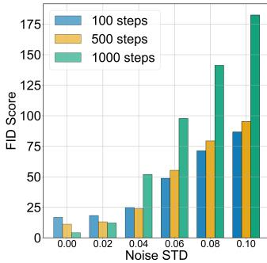

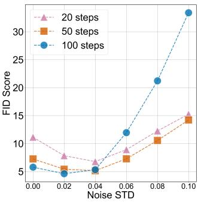  
Figure 1: CIFAR-10 FID under hardware noise for DDPM (left) and DDIM (right).

However, the inherent hardware imperfections in CIM architec- tures perturb stored weights, posing severe challenges for model performance [20, 22, 24, 26]. These imperfections stem from various sources including device variability, programming uncertainty, thermal fluctuations, and quantization noise, which collectively introduce weight perturbations that can significantly degrade generation quality.

As shown in Figure 1, FID increases rapidly as weight perturbations intensify, revealing the vulnerability of iterative difusion inference to hardware noise. Figure 2 provides a qualitative view: facial structure progressively degrades into blurred texture and incoherent artifacts as noise increases.

Previous works have examined the robustness of neural net- works under CIM-induced perturbations [12, 24], yet existing solutions rely heavily on retraining or fine-tuning procedures that require substantial computational and hardware resources. More- over, prior research primarily targets classification or language generation tasks and does not address the unique iterative charac- teristics of difusion sampling. The behavior of difusion models under analog hardware noise remains largely unexplored, limiting their practical integration into CIM-based systems.

To address this gap, we conduct an end-to-end difusion-inference study using a noise model calibrated and validated with measure- ments from multiple physical CIM chips. Our analysis identifies temporal sensitivity patterns and quantifies the benefit of stochas- tic sampling. Building on these findings, we introduce ASSERT, a training-free sampling method that adaptively interpolates between stochastic and deterministic DDIM updates. The contributions of this work are summarized as follows:

• We characterize difusion-model robustness with a multi-chip-calibrated noise model and show that the early, high noise denoising stage is more vulnerable than the final re- finement stage.

• We derive a first-order error recursion for persistent spatial weight noise and propose ASSERT, which reduces cross-step error alignment by combining early stochastic exploration with deterministic refinement.

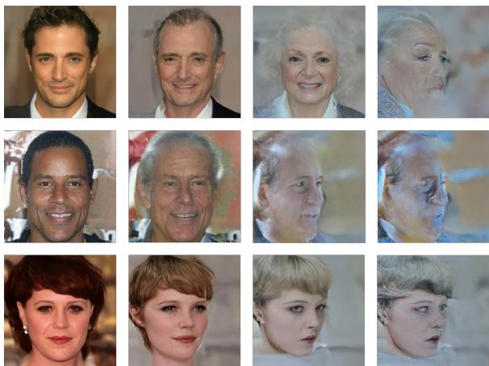  
Figure 2: CelebA-HQ samples from 100-step DDIM under increasing hardware noise.

• Experiments across multiple datasets show up to 2.58× and 7.68× lower FID in the high-resolution and CIFAR-10 step- count evaluations, respectively.

## 2 Preliminary

## 2.1 Difusion Models

Difusion models learn to reverse a gradual noising process to synthesize data. DDPM [5] formulates generation as the learned reverse of a fixed Markov chain, while DDIM [17] exposes a non-Markovian family whose stochasticity parameter interpolates between deterministic and stochastic trajectories. Fast solvers and distillation further reduce network evaluations [10, 11, 16]. ASSERT does not introduce a new difusion family; its novelty is a hardware- noise-aware temporal schedule for the existing DDIM stochasticity parameter, motivated by the propagation of persistent CIM errors.

Despite algorithmic eforts to reduce the computational burden of the iterative denoising process, intensive matrix-vector multiplications (MVMs) remain the primary bottleneck in difusion model computation. CIM architectures naturally provide energy-eficient solutions for these operations [11, 16, 21], as shown in Figure 3. Recent hardware advances have demonstrated the feasibility of CIM-based difusion model acceleration. AIG-CIM [6] introduces a heterogeneous CIM system to address the flexible data reuse de- mands in difusion models, demonstrating more than two orders of magnitude throughput improvement and energy eficiency im-provement compared to RTX 3090 GPU. Additionally, [4] presents a heterogeneous CIM chip that supports both integer (INT) and floating-point (FP) arithmetic for accelerating difusion models while maintaining model performance.

## 2.2 CIM Noise on Neural Network Robustness

While analog CIM architectures deliver remarkable gains in energy eficiency and computational throughput, their analog nature in-evitably introduces non-idealities and intrinsic noise sources. These factors cause perturbations in stored weights and computed activations, leading to accuracy degradation during inference [1, 2, 25].

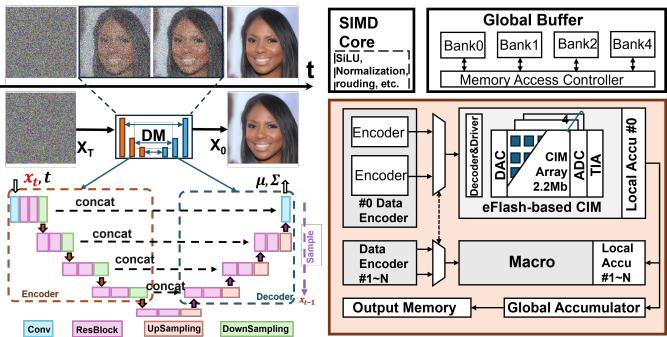  
Figure 3: Difusion inference (left) and its CIM acceleration architecture (right).

Therefore, ensuring model robustness under analog-induced noise has become a crucial challenge for reliable CIM deployment.

Recent works have explored various strategies to improve robustness when deploying large-scale DNNs, including vision transformers (ViTs), Mamba, and Transformer-based LLMs [7, 9, 15] on CIM hardware. Their methods either require fine-tuning or hardware modifications, which are impractical in the era of exponentially increasing model and dataset sizes. Fine-tuning billion-parameter models demands substantial computational resources and time, while hardware modifications introduce additional design complex- ity and manufacturing costs. Our training-free approach instead changes only sampler coeficients and random draws: it adds no model parameters, CIM arrays, or network evaluations, although it requires random-number generation and time-dependent sampler control.

## 3 Methodology

## 3.1 Motivation

To ensure realistic analysis, our noise modeling is grounded in measurements collected from multiple physical chips, as illustrated in Figure 7. We augment the standard matrix-vector multiplication $y \ = \ x W$ with weight perturbations $\epsilon _ { W } \sim { \cal N } ( 0 , \sigma _ { W } ^ { 2 } )$ applied to stored weights and computation noise $\epsilon _ { Y } \sim { \cal N } ( 0 , \sigma _ { Y } ^ { 2 } )$ applied to the output:

$$
y = x ( W + \epsilon _ { W } ) + \epsilon _ { Y }\tag{1}
$$

At a fixed operating point, the weight-noise variance depends on weight magnitude:

$$
\sigma _ { W } ^ { 2 } = \alpha _ { W } | W | + b _ { W }\tag{2}
$$

At each operating point, $( \alpha _ { W } , b _ { W } , \sigma _ { Y } )$ is fitted from several hun- dred measured chip MVM samples. The fitted weight term aggre-gates programming variation, leakage, thermal noise, and random telegraph noise; the output term captures ADC error and shorttimescale output fluctuation. Each mapped linear or convolutional layer receives an independently sampled weight-perturbation map. This map is fixed throughout one deployment realization and all of its denoising steps, while $\epsilon _ { Y }$ is redrawn for every MVM; repeated runs redraw the deployment realization. Prediction errors across denoising steps therefore share the same dominant spatial perturbation and are generally correlated rather than independently resampled.

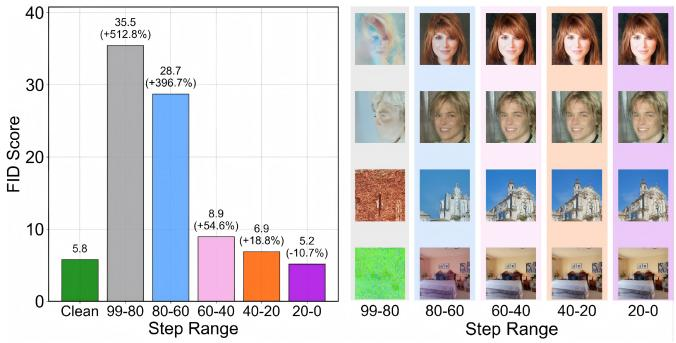  
Figure 4: Stage-wise FID (left) and samples (right) under fixed hardware noise.

Unlike VAEs and GANs, denoising difusion models repeatedly evaluate the same network. We therefore begin from a temporal perspective. Using the preceding fixed noise realization, we apply the noisy mapping to the linear and convolutional layers of a pretrained 100-step DDIM sampler over selected denoising intervals and measure the sensitivity of each stage.

As shown in Figure 4, applying the noisy mapping over the indicated intervals produces markedly diferent outcomes. Using it during the early high-noise stage (e.g., steps 99–80) gives the largest FID degradation. Applying the same mapping during final refinement (e.g., steps 20–0) has a much smaller efect in this experiment.

The right panel of Figure 4 presents samples corresponding to the bars in the left panel. This temporal pattern indicates that the early, high-noise stage is particularly important for robustness because perturbations introduced while global structure is formed propagate through all subsequent refinement steps.

DDIM accelerates DDPM sampling by permitting deterministic, timestep-skipping trajectories. We reintroduce controlled stochasticity during the early high-noise stage through �, where larger values indicate greater stochasticity.

Figure 5 is a diagnostic rather than the complete ASSERT schedule: it applies a constant � only inside the indicated early interval and sets $\eta = 0$ outside it. Consequently, the limited intervention leaves FID as high as 111 in dificult settings. Increasing � and extending the active interval nevertheless reduce FID, with diminishing returns between 100–70 and 100–60 at $\eta = 0 . 8$ . Full ASSERT subsequently applies cosine decay throughout the remaining trajectory, producing the much lower FID values in Table 2. The random update changes the states presented to the same noisy mapping and thereby reduces cross-step error alignment, as formalized in Section 3.2.

## 3.2 Persistent-Noise Error Analysis

Let $t _ { 0 } > t _ { 1 } > \cdot \cdot \cdot > t _ { S } = 0$ be the actual inference subsequence, and consider one transition from $t = t _ { i }$ to $s = t _ { i + 1 } < t$ . With $\alpha _ { t } = 1 - \beta _ { t }$ and $\begin{array} { r } { \bar { \alpha } _ { t } = \prod _ { r = 1 } ^ { t } \alpha _ { r } } \end{array}$ , DDIM predicts

$$
\hat { \mathbf { x } } _ { 0 } = \frac { \mathbf { x } _ { t } - \sqrt { 1 - \bar { \alpha } _ { t } } \epsilon _ { \theta } ( \mathbf { x } _ { t } , t ) } { \sqrt { \bar { \alpha } _ { t } } } .\tag{3}
$$

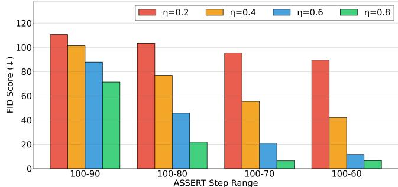  
Figure 5: FID when constant $\eta$ is active only over each early range.

For a dimensionless stochasticity parameter $\eta _ { i } \in \left[ 0 , 1 \right]$ , the standard deviation for the selected timestep pair is

$$
\sigma _ { t  s } ( \eta _ { i } ) = \eta _ { i } \sqrt { \frac { 1 - \bar { \alpha } _ { s } } { 1 - \bar { \alpha } _ { t } } } \sqrt { 1 - \frac { \bar { \alpha } _ { t } } { \bar { \alpha } _ { s } } } ,\tag{4}
$$

and the corresponding DDIM update is

$$
\mathbf { x } _ { s } = \sqrt { \bar { \alpha } _ { s } } \hat { \mathbf { x } } _ { 0 } + \sqrt { 1 - \bar { \alpha } _ { s } - \sigma _ { t  s } ^ { 2 } } \epsilon _ { \theta } ( \mathbf { x } _ { t } , t ) + \sigma _ { t  s } \mathbf { z } ,\tag{5}
$$

where $\mathbf { z } \sim { \mathcal { N } } ( 0 , \mathbf { I } )$ . Thus, $\eta _ { i } = 0$ gives deterministic DDIM, whereas $\eta _ { i } ~ = ~ 1$ uses the stochastic DDIM variance associated with the chosen pair (�, �). Importantly, $\eta _ { i }$ is not itself the injected standard deviation.

For fixed $\mathbf { x } _ { t }$ and z, a prediction perturbation ��� changes one update by $\delta \mathbf { x } _ { s } = c _ { i } \delta \pmb { \epsilon } _ { i }$ , where

$$
c _ { i } = \sqrt { 1 - \bar { \alpha } _ { s } - \sigma _ { t  s } ^ { 2 } } - \sqrt { \frac { \bar { \alpha } _ { s } } { \bar { \alpha } _ { t } } } \sqrt { 1 - \bar { \alpha } _ { t } } .\tag{6}
$$

This local coeficient depends on the actual inference subsequence and does not diverge merely because $\bar { \alpha } _ { t }$ is small. Nevertheless, the clean-sample estimate in Equation 3 has sensitivity

$$
\lVert \delta \hat { \mathbf { x } } _ { 0 } \rVert = \sqrt { \frac { 1 - \bar { \alpha } _ { t } } { \bar { \alpha } _ { t } } } \left. \delta \epsilon _ { i } \right. ,\tag{7}
$$

which increases toward the high-noise end. The cancellation cap- tured by $c _ { i }$ limits the immediate update error, so end-to-end sensi- tivity must additionally account for how a perturbed state changes all later network evaluations.

Let $f _ { i }$ denote Equation 5, let Δ� be the fixed spatial weight perturbation of one hardware mapping, and compare noisy and clean trajectories using the same $\mathbf { z } _ { i }$ . Let $a _ { i } \in \{ 0 , 1 \}$ } indicate whether the noisy mapping is active at step �; the end-to-end evaluation uses $a _ { i } = 1$ throughout, whereas Figure 4 activates it only in one interval. First-order linearization gives

$$
{ \bf e } _ { i + 1 } = { \bf J } _ { i } { \bf e } _ { i } + a _ { i } { \bf H } _ { i } \Delta \theta , \quad { \bf J } _ { i } = \frac { \partial f _ { i } } { \partial { \bf x } _ { t _ { i } } } , \quad { \bf H } _ { i } = \frac { \partial f _ { i } } { \partial \theta } .\tag{8}
$$

Unrolling to the final sample yields

$$
\mathbf { e } _ { S } = \sum _ { i = 0 } ^ { S - 1 } \mathbf { P } _ { S , i + 1 } \mathbf { d } _ { i } , \quad \mathbf { d } _ { i } = a _ { i } \mathbf { H } _ { i } \Delta \theta , \quad \mathbf { P } _ { S , i + 1 } = \mathbf { J } _ { S - 1 } \cdot \cdot \cdot \mathbf { J } _ { i + 1 } ,\tag{9}
$$

with an empty product defined as the identity. Writing $\mathbf { u } _ { i } = \mathbf { P } _ { S , i + 1 } \mathbf { d } _ { i }$ gives

$$
\| \mathbf { e } _ { S } \| ^ { 2 } = \sum _ { i } \| \mathbf { u } _ { i } \| ^ { 2 } + 2 \sum _ { i < j } \langle \mathbf { u } _ { i } , \mathbf { u } _ { j } \rangle .\tag{10}
$$

Suficient condition for early-stage vulnerability. Because the same � is reused, all ${ \bf d } _ { i }$ share one underlying spatial perturbation and their propagated versions can remain directionally aligned. Consider equal-length early and late activation windows with matched local perturbation magnitudes. If (i) the propagation gain $g _ { i } = \| \mathbf { P } _ { S , i + 1 } \mathbf { d } _ { i } \| / \| \mathbf { d } _ { i } \|$ is no smaller for the early window, as occurs when the additional Jacobians are non-contracting on the dominant error subspace, and (ii) $\langle \mathbf { u } _ { i } , \mathbf { u } _ { j } \rangle \geq 0$ within each window, then every marginal and cross term in Equation 10 is no smaller for the early window. Its terminal error is therefore no smaller. Equation 7 further shows why large local perturbations are likely at the high-noise end. These suficient conditions derive the stage ordering observed in Figure 4; they do not require or imply that the single-step coeficient |�� | diverges. We evaluate the resulting prediction through stage-wise FID, while direct Jacobian-gain and cross-step-cosine measurements are left for future work.

Stochastic decorrelation mechanism. Stochasticity addresses the persistent, directional component rather than directly canceling an additive bias. By changing $\mathbf { x } _ { t _ { i } } ,$ it changes $\mathbf { H } _ { i }$ and hence the direction of ${ \bf d } _ { i }$ for the same physical Δ�. If stochastic sampling reduces the expected positive cross-step alignment while leaving the marginal terms comparable, Equation 10 gives

$$
\mathbb { E } \| \mathbf { e } _ { S } \| _ { \mathrm { s t o c h } } ^ { 2 } - \mathbb { E } \| \mathbf { e } _ { S } \| _ { \mathrm { d e t } } ^ { 2 } \approx 2 \sum _ { i < j } \big ( \mathbb { E } \langle \mathbf { u } _ { i } , \mathbf { u } _ { j } \rangle _ { \mathrm { s t o c h } } - \mathbb { E } \langle \mathbf { u } _ { i } , \mathbf { u } _ { j } \rangle _ { \mathrm { d e t } } \big ) < 0 .\tag{11}
$$

This explains why stochastic updates can mitigate fixed spatial noise even though independent randomness cannot remove a fixed bias in a single step. Excess stochasticity can still increase marginal error, motivating a schedule that concentrates it in the vulnerable early stage. The stage and schedule experiments test this mechanism at the output-distribution level; direct internal-error correlation is not measured in the current study.

## 3.3 ASSERT Framework

ASSERT applies Equation 5 without retraining or additional net-work evaluations. As illustrated in Figure 6, the dimensionless $\eta _ { i }$ controls the transition from stochastic exploration to deterministic refinement, while Equation 4 converts it to a valid pair-dependent standard deviation.

For $S > 1$ sampling steps, define normalized denoising progress $r _ { i } = i / ( S - 1 )$ ), where $i = 0$ is the early high-noise step. ASSERT uses

$$
\eta _ { i } = \left\{ \begin{array} { l l } { \eta _ { \mathrm { m a x } } , } & { r _ { i } < \tau _ { \mathrm { t r a n s } } , } \\ { \eta _ { \mathrm { m a x } } \mathcal { D } \left( \frac { r _ { i } - \tau _ { \mathrm { t r a n s } } } { 1 - \tau _ { \mathrm { t r a n s } } } \right) , } & { r _ { i } \geq \tau _ { \mathrm { t r a n s } } , } \end{array} \right.\tag{12}
$$

where $\tau _ { \mathrm { { t r a n s } } } ~ \in ~ [ 0 , 1 )$ is the fraction of steps held at maximum stochasticity and

$$
\mathcal { D } ( \boldsymbol { p } ) = \frac { 1 + \cos ( \pi \boldsymbol { p } ) } { 2 } .\tag{13}
$$

The use of $S - 1$ ensures that the last update reaches $\eta _ { S - 1 } = 0 .$ . The two hyperparameters $\eta _ { \mathrm { m a x } }$ and $\tau _ { \mathrm { { t r a n s } } }$ therefore specify the stochas- ticity magnitude and its early plateau, respectively.

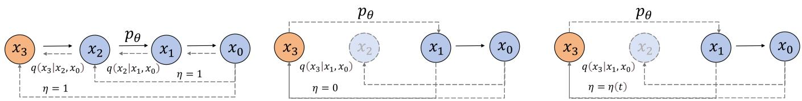  
Figure 6: Trajectories of stochastic DDIM, deterministic DDIM, and ASSERT.

## 4 Experiments

## 4.1 Experiment Setup

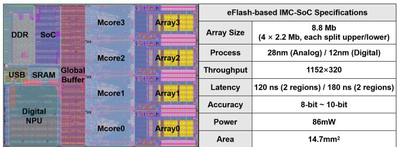  
Figure 7: Measured eFlash CIM chip and SoC specifications.

We evaluated public Hugging Face difusion checkpoints for CIFAR-10 (32×32), Butterfly (64×64), CelebA-HQ (256×256), LSUN-Church (256×256), and LSUN-Bedroom (256×256). All experiments use the released exponential-moving-average weights, BF16 inference, and each checkpoint’s native prediction parameterization and training noise schedule.

Following DDIM [17], an �-step run uniformly subsamples a training horizon of � steps as $\{ \lfloor j \bar { T } / S \rfloor \} _ { j = 0 } ^ { S - 1 }$ and traverses it in de- scending order. We select $\eta _ { \mathrm { m a x } } = 0 . 8$ and a 10% early plateau from the CIFAR-10 ablation, then keep both values fixed across datasets. The dimensionless schedule is shared, while $\sigma _ { t  s } ( \eta _ { i } )$ is recomputed for every selected timestep pair.

Our noise model was fitted to measurements collected across physical eFlash CIM chips and validated on measurements from 100 chips. Figure 7 shows the shared 28-nm platform, which integrates four 2.2-Mb CIM arrays with 8.8 Mb total capacity, 86 mW power, and 14.7 mm2 area. Linear and convolutional MVMs use independently sampled analog weight maps, with larger tensors tiled across arrays; normalization, nonlinear activation, residual addition, and sampler control remain digital. We evaluate the complete difusion trajectory end to end with this mapping, rather than claiming that the entire model executes on one physical chip.

Each FID value uses 50,000 generated images and the standard reference statistics associated with the corresponding public dataset. We report the mean over three seeds. Within each seed, all compared samplers share the same initial latents and fixed deployment-noise realization; diferent seeds redraw both. The reported hardware noise level is the equivalent weight-noise standard deviation, distinct from the sampler parameter � and from a direct temperature label.

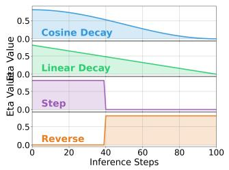

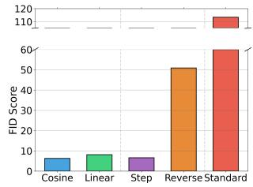  
Figure 8: Stochasticity schedules (left) and noisy CIFAR-10 FID (right).

## 4.2 Experiment Results

To comprehensively evaluate our adaptive sampling strategy, we compare ASSERT against several baseline sampling approaches with diferent stochasticity scheduling patterns. Linear decay gradually reduces stochasticity from maximum to minimum following

$$
\eta _ { i } = \eta _ { \mathrm { { m a x } } } - \frac { i } { S - 1 } \cdot \left( { \eta _ { \mathrm { { m a x } } } - \eta _ { \mathrm { { m i n } } } } \right)\tag{14}
$$

which simplifies to $\eta _ { i } = \eta _ { \operatorname* { m a x } } \left( 1 - i / ( S - 1 ) \right)$ when $\eta _ { \mathrm { m i n } } = 0 .$ . Step decay (left) and reverse step (right) represent two opposite schedul-ing patterns:

$$
\eta _ { i } = \left\{ \begin{array} { l l } { \eta _ { \mathrm { m a x } } , } & { \mathrm { i f } ~ r _ { i } < \tau _ { \mathrm { t r a n s } } } \\ { \eta _ { \mathrm { m i n } } , } & { \mathrm { i f } ~ r _ { i } \geq \tau _ { \mathrm { t r a n s } } } \end{array} \right. \quad \eta _ { i } = \left\{ \begin{array} { l l } { \eta _ { \mathrm { m i n } } , } & { \mathrm { i f } ~ r _ { i } < \tau _ { \mathrm { t r a n s } } } \\ { \eta _ { \mathrm { m a x } } , } & { \mathrm { i f } ~ r _ { i } \geq \tau _ { \mathrm { t r a n s } } } \end{array} \right.\tag{15}
$$

where $r _ { i } = i / ( S - 1 )$ and the evaluated setting uses $\tau _ { \mathrm { t r a n s } } = 0 . 4 .$ These schedules isolate whether stochasticity is most useful during early denoising or final refinement.

Decay Strategies Comparison. The left panel of Figure 8 visualizes the schedules, and the right panel reports their CIFAR-10 FID under the evaluated hardware-noise setting. Cosine decay obtains the lowest FID, followed by step and linear decay. Reverse step, which reserves stochasticity for final refinement, performs much worse than the early-stochastic schedules. Its small gain over deter- ministic DDIM indicates that stochasticity alone can help, while the large gap to ASSERT supports concentrating it in the vulnerable early stage.

Evaluation Across Datasets. Figure 9 extends the comparison to four datasets and several equivalent weight-noise levels. At noise level 0.08, ASSERT obtains 2.39×, 2.58×, and 2.54× lower mean FID than deterministic DDIM on CelebA-HQ, Church, and Bedroom, respectively. Relative to the step schedule, the corresponding reduction factors are 1.36×, 1.22×, and 1.51×. These ratios use the three-seed mean FID and are not absolute FID diferences.

Noise Model Validation. The left panel of Figure 10 compares model-predicted errors with measurements aggregated from 100 physical chips, obtaining $R ^ { 2 } = 0 . 9 9 3$ . We compute $D _ { \mathrm { K L } } ( p _ { \mathrm { c h i p } } | | p _ { \mathrm { m o d e l } } ) =$ 0.0198 from normalized measured and modeled error histograms with shared bin edges. The displayed polynomial is a goodness-of fit diagnostic, not an alternative to the variance model above. The right panel applies weight noise, output noise, and their combination throughout the complete difusion trajectory. ASSERT remains close to the clean baseline, whereas deterministic DDIM degrades most strongly under persistent weight noise, consistent with fixed spatial variations creating correlated errors across denoising steps.

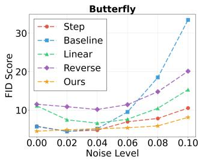

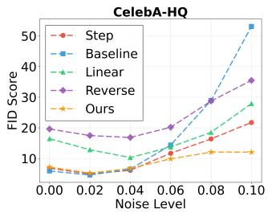

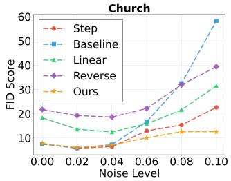

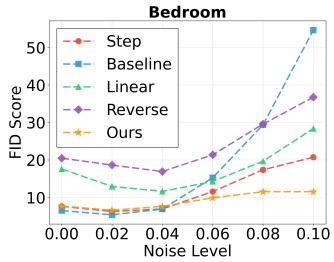  
Figure 9: FID across datasets, samplers, and weight-noise levels.

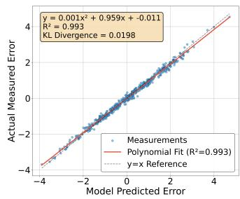

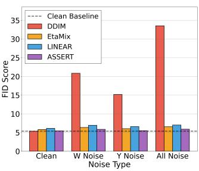  
Figure 10: Chip-error validation (left) and FID by noise source (right).

Sampling Strategy Comparison. Table 1 compares deterministic DDIM, STEP, and ASSERT across diferent step counts. ASSERT has the lowest noisy FID in every row. The largest ratio occurs at 500 steps, where FID decreases from 163.38 to 21.27, corresponding to 163.38/21.27 = 7.68× lower FID. At 100 steps, it decreases from 33.53 to 5.90 (5.68×). This robustness is not free of clean-quality tradeofs: for example, 20-step ASSERT has clean FID 13.98 versus 11.08 for DDIM. The noisy result is also non-monotonic in step count, indicating that repeated exposure to a fixed hardware per turbation competes with the benefit of additional denoising. The 20-step noisy ASSERT value (13.69) being slightly below its clean value requires repeated-seed validation before it can be interpreted as an improvement.

Table 1: CIFAR-10 FID across denoising step counts.
<table><tr><td rowspan="2">Steps</td><td colspan="2">DDIM</td><td colspan="2">STEP</td><td colspan="2">ASSERT</td></tr><tr><td>Clean</td><td>Noise</td><td>Clean</td><td>Noise</td><td>Clean</td><td>Noise</td></tr><tr><td>10</td><td>18.68</td><td>29.37</td><td>20.23</td><td>24.52</td><td>19.88</td><td>20.16</td></tr><tr><td>20</td><td>11.08</td><td>17.19</td><td>11.54</td><td>14.41</td><td>13.98</td><td>13.69</td></tr><tr><td>50</td><td>7.18</td><td>16.28</td><td>7.35</td><td>9.60</td><td>7.39</td><td>7.44</td></tr><tr><td>100</td><td>5.39</td><td>33.53</td><td>5.81</td><td>6.55</td><td>5.45</td><td>5.90</td></tr><tr><td>200</td><td>4.84</td><td>89.66</td><td>4.96</td><td>19.45</td><td>4.90</td><td>15.29</td></tr><tr><td>500</td><td>4.31</td><td>163.38</td><td>4.41</td><td>23.88</td><td>4.45</td><td>21.27</td></tr><tr><td>1000</td><td>4.12</td><td>182.61</td><td>4.15</td><td>96.11</td><td>4.20</td><td>80.39</td></tr></table>

  
Figure 11: Bedroom, CelebA-HQ, and Church samples under clean and noisy inference.

Visual Comparison. Figure 11 compares Bedroom, CelebA-HQ, and Church samples under the same four sampling settings. In these examples, noisy DDIM exhibits color distortion and detail loss, whereas ASSERT better preserves facial structure and scene texture. This qualitative comparison complements, but does not replace, the aggregate FID evaluation.

## 4.3 Ablation Study

Table 2 studies the maximum stochasticity and the denoising timestep at which cosine decay begins. Because sampling proceeds from 100 toward 0, onset 90 means that $\eta _ { \mathrm { m a x } }$ is held for the first 10 steps, whereas onset 60 holds it for the first 40 steps; onset 100 starts decay immediately. For this 100-step setting, the normalized param-eter in Equation 12 is $\tau _ { \mathrm { t r a n s } } = ( 1 0 0 - \mathrm { o n s e t } ) / 9 9 .$ . With $\eta _ { \mathrm { m a x } } = 0 . 6$ a longer plateau steadily lowers FID from 17.08 to 9.28. At larger $\eta _ { \mathrm { m a x } } ,$ , excessive exposure is counterproductive: the best observed value is 5.95 at $\eta _ { \mathrm { m a x } } = 0 . 8$ and onset 90. This interaction supports a short, strong stochastic phase followed by gradual deterministic refinement rather than maximizing either hyperparameter inde-pendently.

Table 2: CIFAR-10 FID versus $\eta _ { \mathrm { m a x } }$ and cosine-decay onset.
<table><tr><td rowspan="2">Onset</td><td colspan="5">FID (↓) by  $\eta _ { \mathrm { m a x } }$ </td></tr><tr><td>0.6</td><td>0.7</td><td>0.8</td><td>0.9</td><td>1.0</td></tr><tr><td>100</td><td>17.08</td><td>9.20</td><td>6.27</td><td>6.48</td><td>7.77</td></tr><tr><td>90</td><td>11.48</td><td>6.28</td><td>5.95</td><td>6.69</td><td>7.58</td></tr><tr><td>80</td><td>10.55</td><td>6.57</td><td>6.53</td><td>7.67</td><td>8.88</td></tr><tr><td>70</td><td>9.53</td><td>6.47</td><td>6.65</td><td>7.70</td><td>8.81</td></tr><tr><td>60</td><td>9.28</td><td>6.41</td><td>6.54</td><td>8.31</td><td>8.52</td></tr></table>

## 5 Conclusion

We investigated difusion inference under persistent spatial noise using a model calibrated and validated against measurements from multiple physical CIM chips. A first-order trajectory recursion shows that fixed hardware perturbations create correlated predic- tion errors whose early contributions propagate through more subsequent updates; stochastic updates can reduce the positive cross-step alignment by changing the activation trajectory. Based on this mechanism, ASSERT applies valid pair-dependent stochastic DDIM updates early and smoothly decays to deterministic refinement without retraining or additional network evaluations. ASSERT achieves up to 2.58× lower FID than deterministic DDIM on the evaluated high-resolution datasets and 7.68× lower FID in the CIFAR-10 step-count study. These results support adaptive stochasticity as an algorithmic robustness mechanism for difusion inference with measured CIM non-idealities.

## References

[1] Bai, T., et al. An end-to-end in-memory computing system based on a 40-nm eflash-based imc soc: Circuits, toolchains, and systems co-design framework. IEEE Transactions on Computer-Aided Design of Integrated Circuits and Systems 43, 6 (2024), 1729–1740.

[2] Feng, Y., Zhou, W., Lyu, Y., Liu, H., Liu, Z., Wong, N., and Kang, W. Hpd: Hybrid projection decomposition for robust state space models on analog cim hardware. In 2025 IEEE 16th International Conference on ASIC (ASICON) (2026).

[3] Goodfellow, I. J., Pouget-Abadie, J., Mirza, M., Xu, B., Warde-Farley, D., Ozair, S., Courville, A., and Bengio, Y. Generative adversarial nets. Advances in neural information processing systems 27 (2014).

[4] Guo, R., et al. 20.2 a 28nm 74.34 tflops/w bf16 heterogenous cim-based accelera tor ex loitin denoisin -similarit for difusion models. In 2024 IEEE International Solid-State Circuits Conference (ISSCC) (2024), vol. 67, IEEE, pp. 362–364.

[5] Ho,J.,Jain, A., and Abbeel, P. Denoising difusion probabilistic models. Advances in neural information processing systems 33 (2020), 6840–6851.

[6] Jing, Y., et al. Aig-cim: A scalable chiplet module with tri-gear heterogeneous compute-in-memory for difusion acceleration. In Proceedings ofthe 61st ACM/IEEE Design Automation Conference (2024), pp. 1–6.

[7] Joshi, V., Sebastian, A., Parihar, A., Giacomin, E., Boybat, I., Narayanan, S., Kurian, G., and Le Gallo, M. Accurate deep neural network inference using computational memory. Nature Communications 11, 1 (2020), 1–13.

[8] Li, X., Liu, Y., Lian, L., Yang, H., Dong, Z., Kang, D., Zhang, S., and Keutzer, K. Q-difusion: Quantizing Difusion Models. In Proceedings ofthe IEEE/CVF International Conference on Computer Vision (2023), pp. 17535–17545.

[9] Liang, X., Xu, C., Shen, X., and Wong, H.-S. P. Crossbar-aware neural network training: A hardware/algorithm co-optimization approach. IEEE Transactions on Computer-Aided Design ofIntegrated Circuits and Systems 40, 3 (2021), 520–533.

[10] Liu, L., Ren, Y., Lin, Z., and Zhao, Z. Pseudo numerical methods for difusion models on manifolds. In International Conference on Learning Representations.

[11] Lu, C., Zhou, Y., Bao, F., Chen, J., Li, C., and Zhu, J. Dpm-solver: A fast ode solver for difusion probabilistic model sampling in around 10 steps. Advances in neural information processing systems 35 (2022), 5775–5787.

[12] Mao, W., et al. Hyimc: Analog-digital hybrid in-memory computing soc for high-quality low-latency speech enhancement. In 2025 Design, Automation & Test in Europe Conference (DATE) (2025), IEEE, pp. 1–2.

[13] Pan, B., et al. A mini tutorial of processing in memory: From principles, devices to prototypes. IEEE Transactions on Circuits and Systems II: Express Briefs 69, 7 (2022), 3044–3050.

[14] Razavi, A., Van den Oord, A., and Vinyals, O. Generating diverse high-fidelity images with vq-vae-2. Advances in neural information processing systems 32 (2019).

[15] Reagen, B., Whatmough, P., Wei, R., Adolf, R., Rama, S., Lee, H.-H. S., Brooks, D., and Wei, G.-Y. Ares: A framework for quantifying the resilience of deep neural networks. In Proceedings ofthe 55th Annual Design Automation Conference (DAC) (2018), pp. 1–6.

[16] Salimans, T., and Ho, J. Progressive distillation for fast sampling of difusion models. arXiv preprint arXiv:2202.00512 (2022).

[17] Song, J., Meng, C., and Ermon, S. Denoising difusion implicit models. In International Conference on Learning Representations.

[18] Tran, L., Pantic, M., and Deisenroth, M. P. Cauchy–Schwarz Regularized Autoencoder. Journal ofMachine Learning Research 23, 115 (2022), 1–37.

[19] Verma, N., Jia, H., Valavi, H., Tang, Y., Ozatay, M., Chen, L.-Y., Zhang, B., and Deaville, P. In-memory computing: Advances and prospects. IEEE Solid-State Circuits Magazine 11, 3 (2019), 43–55

[20] Wang, G., et al. A 40nm 5-16tops/w@ int8 eflash in-memory computing soc chip with noise suppression and compensation techniques to improve the accuracy. In 2023 IEEE International Conference on Integrated Circuits, Technologies and Applications (ICTA) (2023), IEEE, pp. 128–129.

[21] Watson, D., Chan, W., Ho, J., and Norouzi, M. Learning fast samplers for difusion models by diferentiating through sample quality. In International Conference on Learning Representations.

[22] Yan, Z., et al. Computing-in-memory neural network accelerators for safety- critical systems: Can small device variations be disastrous? In 2022 IEEE/ACM International Conference On Computer Aided Design (ICCAD) (2022), pp. 1–9.

[23] Yang, X., Zhou, D., Feng, J., and Wang, X. Difusion probabilistic model made slim. In Proceedings ofthe IEEE/CVF Conference on computer vision and pattern recognition (2023), pp. 22552–22562

[24] Zhou, W., et al. A time- and energy-eficient cnn with dense connections on memristor-based chips. In 2023 IEEE 15th International Conference on ASIC (ASICON) (2023), pp. 1–4.

[25] Zhou, W., et al. Binary Weight Multi-Bit Activation Quantization for Computein-Memor CNN Accelerators. IEEE TCAD (2025)

[26] Zhou, W., et al. Enhancing robustness of implicit neural representations against weight perturbations. In ICASSP 2025 - 2025 IEEE International Conference on Acoustics, Speech and Signal Processing (ICASSP) (2025), pp. 1–5.