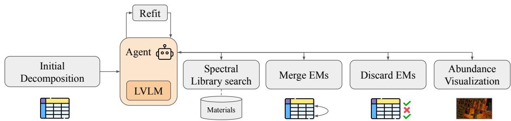
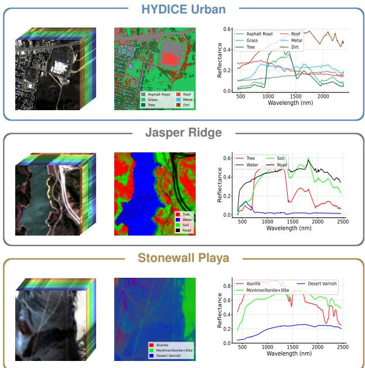
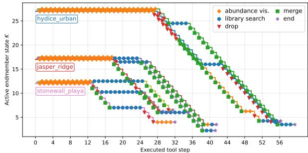
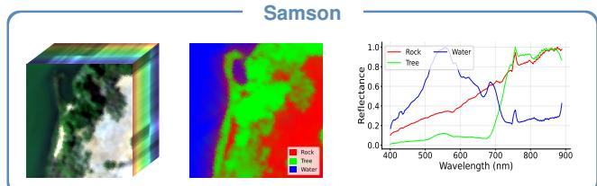
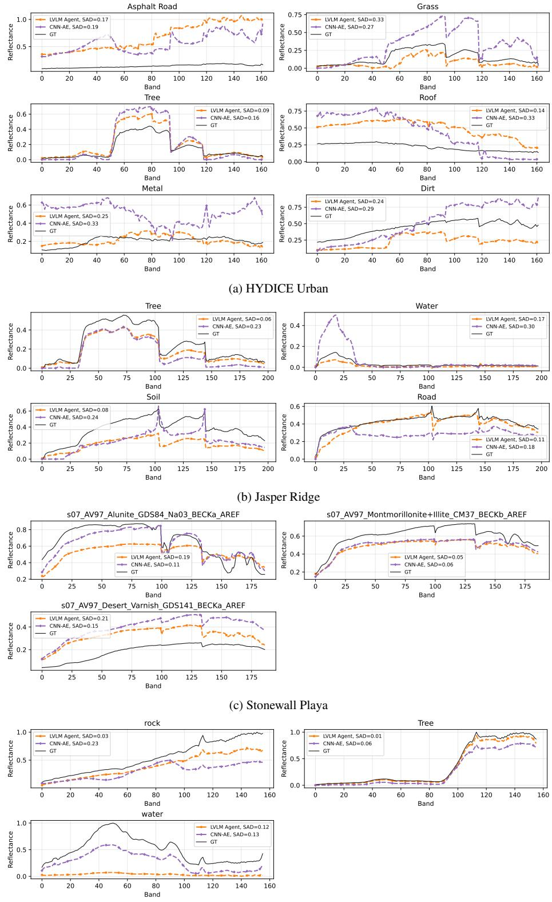
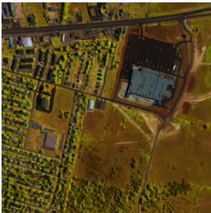
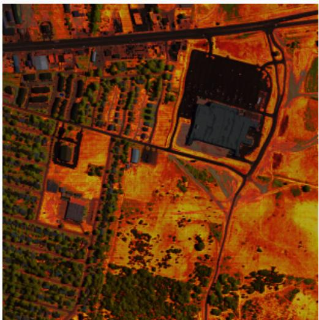
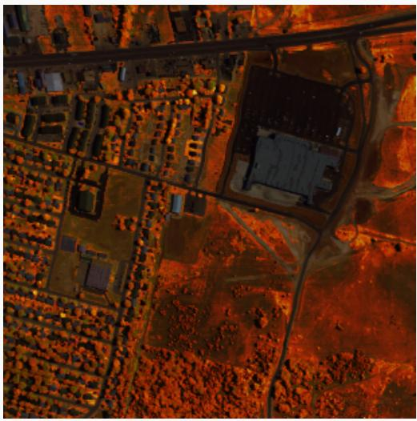
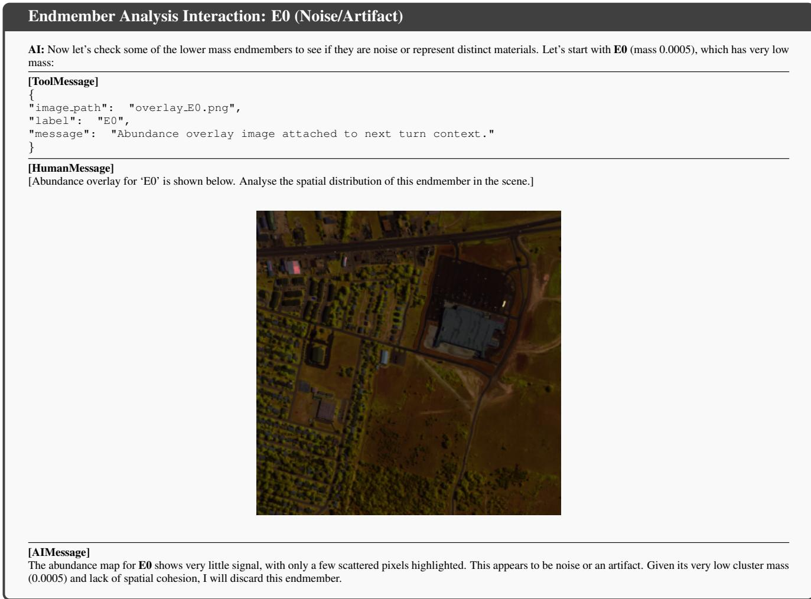
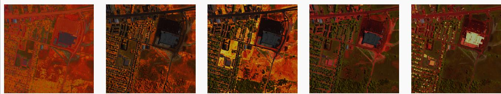

# Agentic Multimodal Models for Environmental Hyperspectral Unmixing

Michał Cholewa∗1, Luca Ciampi∗2, Nicola Messina2, Przemysław Głomb1, Giuseppe Amato2

1IITiS-PAS, Gliwice, Poland 2ISTI-CNR, Pisa, Italy ∗Equal contribution

mcholewa@iitis.pl, luca.ciampi@isti.cnr.it

## Abstract

Hyperspectral unmixing is a key task in remote sensing that aims to decompose mixed pixels in hyperspectral images into their constituent material signatures, or endmembers, and their fractional abundances. Conventional mod ular approaches estimate the scene composition through successive model-order estimation, endmember extraction, and abundance estimation stages, whose errors can lead to redundant or ambiguous candidate components and ultimately affect the recovered decomposition. We introduce an algorithm-agnostic, large vision-language model (LVLM)-driven agentic framework that refines the outputs of such pipelines rather than replacing their underlying numerical algorithms. Starting from an initial decomposition, the agent iteratively gathers complementary spectral and spatial evidence through dedicated tools, includ ing spectral-library retrieval and abundance-map visualization, and modifies the active endmember set through merge and discard operations followed by abundance reestimation. We apply the same refinement procedure to several modularpipelines combining different model-order, extraction, and abundance-estimation methods, and evaluate it on HYDICE Urban, Jasper Ridge, and Stonewall Playa. Experiments show that the proposed agent consistently improves endmember cardinality and generally improves the recovered spectral signatures and abundance maps across heterogeneous modular pipelines, while remaining competitive with integrated end-to-end unmixing methods, including CNN-AE, uDAS, and R-CoNMF. These results highlight the potential of tool-using LVLM agents to combine spec tral and spatial evidence for algorithm-agnostic refinement ofphysically grounded hyperspectral unmixing decompositions. Code is publicly available at https://anonymou s.4open.science/r/agentic-hu/.

## 1. Introduction

Remote sensing enables large-scale observation of natural and human-modified landscapes, supporting applications such as ecological degradation assessment, water-resource management, and land-cover mapping [10, 14, 23, 30]. Many of these applications require identifying the material composition and biophysical properties of observed surfaces rather than relying only on their visual appearance. However, conventional broadband optical imagery provides limited spectral information for distinguishing materials with similar appearance. Hyperspectral imaging (HSI) addresses this limitation by acquiring dense measurements across hundreds of narrow, contiguous spectral bands for each spatial pixel [13]. The resulting spectral signatures capture fine-grained absorption and reflectance patterns, enabling detailed material discrimination and quantitative analysis of observed scenes.

Despite their rich spectral information, hyperspectral images are often acquired at spatial resolutions at which individual pixels contain multiple materials [46]. Consequently, the measured spectrum of a pixel often does not represent a single material, but instead combines contributions from multiple surface components. Hyperspectral unmixing addresses this mixed-pixel problem by decomposing each observed spectrum into constituent spectral signatures, known as endmembers, and estimating their corresponding fractional abundances [7]. A substantial portion of the hyperspectral unmixing literature performs this decomposition under the assumption that the number of endmembers is known in advance. In operational scenarios, however, the endmember count is generally unavailable and must be inferred from the observed image, along with the endmember signatures and abundance maps. Comparatively fewer works formulate and evaluate unmixing as an end-to-end problem in which all three quantities are recovered without scene-specific reference information. This setting remains challenging because errors, ambiguities, and redundancies in the estimated endmember set directly affect the resulting abundance estimates [1, 3, 15].

In this work, we present an algorithm-agnostic, large vision-language model (LVLM)-driven agentic framework for refining hyperspectral unmixing decompositions in the challenging setting where the target-scene endmember count, spectral signatures, and abundance maps are unknown a priori. The framework refines an initial decomposition produced directly from the hyperspectral image by a modular unmixing pipeline, which may contain redundant or ambiguous candidate endmembers. It can operate with different combinations of model-order estimation, endmember extraction, and abundance estimation methods. Through a ReAct-style tool-using loop [44], the agent autonomously inspects the current decomposition and selects refinement actions. Specifically, it combines access to an external spectral library with visual inspection of abundance maps overlaid on an RGB composite derived from the hyperspectral image. Based on spectral-library matches and spatial abundance patterns, the agent merges redundant endmembers or discards unsupported candidates. After each update, the abundance maps are re-estimated using the method associated with the underlying pipeline. The resulting system returns the refined endmember set, its cardinality, and the corresponding abundance maps.

We evaluate the proposed framework on three publicly available hyperspectral unmixing benchmarks representing distinct land-cover scenarios: the complex urban landscape of HYDICE Urban [35, 46], the natural vegetated environment of Jasper Ridge [46, 47], and the arid, mineral-rich landscape of Stonewall Playa [12]. To assess its algorithmagnostic applicability, we apply the agent to initial decompositions produced by multiple conventional unmixing pipelines combining different model-order estimation, endmember extraction, and abundance estimation methods. We further compare the resulting systems with existing endto-end unmixing approaches that start from an initial upper bound on the number of components and progressively identify the active endmember set and estimate the corresponding spectral signatures and abundance maps without access to scene-specific ground truth. Our experiments show that the proposed framework effectively refines initial decompositions produced by different underlying pipelines, improving the estimated endmember sets and corresponding abundance maps. The refined systems are also competitive with existing end-to-end unmixing approaches, outperforming them on several datasets and evaluation metrics. These results highlight the potential of LVLM-driven agents as general-purpose refinement modules for hyperspectral unmixing.

The main contributions of this work are as follows:

• We introduce an algorithm-agnostic LVLM-driven agentic framework for hyperspectral unmixing without scenespecific knowledge of the endmember count, spectral signatures, or abundance maps. The framework refines decompositions produced by different conventional pipelines combining model-order estimation, endmember extraction, and abundance estimation methods, ultimately returning the refined endmember set, its cardinality, and the corresponding abundance maps.

• We design a ReAct-style tool-using agent [44] that autonomously drives this refinement process. The agent combines retrieval-augmented reasoning over an external spectral library with visual inspection of abundance maps overlaid on an RGB composite of the hyperspectral image. Based on this complementary spectral and spatial evidence, it executes merge and discard operations and triggers abundance re-estimation after each update.

• We conduct a systematic evaluation on HYDICE Urban [35, 46], Jasper Ridge [46, 47], and Stonewall Playa [12], applying the framework to multiple initial unmixing pipelines and comparing our approach with existing methods under the same unmixing setting. The results show that the proposed framework improves initial decompositions across different underlying pipelines and achieves competitive performance against end-to-end unmixing methods, outperforming them on several datasets and evaluation metrics.

## 2. Related Work

## 2.1. Hyperspectral unmixing for Earth observation

A standard formulation for hyperspectral unmixing in Earth observation is the linear mixing model, which represents each pixel spectrum as a combination of endmember signatures weighted by their abundances [7, 28]. A modular linear unmixing pipeline typically comprises three stages: model-order estimation, endmember extraction, and abundance estimation [7]. Representative model-order estimation methods include HySime [6], which estimates the signal subspace dimension, and NWHFC [8], which estimates the virtual dimensionality of hyperspectral data. Given this number, representative endmember extraction methods include pure-pixel algorithms such as N-FINDR [42] and VCA [29], as well as minimum-volume methods such as SISAL [5]. Abundances can then be estimated using FCLSU [16] or UnDIP [37]. These stage-specific algorithms can be combined into complete modular pipelines [4, 40]. Nevertheless, a substantial portion of the unmixing literature estimates endmember signatures and abundance maps while assuming that the number of endmembers is known beforehand [1, 15]. The act of providing the reference cardinality bypasses model-order estimation and therefore excludes a key stage of the complete unmixing problem. Although this assumption facilitates the development and evaluation of individual unmixing stages, it may be restrictive in operational settings where the endmember cardinality is not known in advance.

Integrated unmixing methods address a related end-toend unmixing setting within a single method-specific formulation rather than by combining separate stage-specific algorithms. These methods initialize an overcomplete model using a prescribed upper bound $K _ { \mathrm { m a x } }$ and progressively identify the active components while estimating their signatures and abundances. They therefore recover all three elements of the decomposition, but require $K _ { \mathrm { m a x } }$ to be specified a priori. Specifically, R-CoNMF [27] suppresses redundant components through collaborative regularization while estimating the mixing matrix and fractional abundances. uDAS [36] employs an untied denoising autoencoder with sparsity regularization to deactivate redundant hidden units while estimating the endmember signatures and abundances. More recently, Alshahrani et al. [1] combined autoencoder-based unmixing with competitive agglomerative clustering to identify the active endmember set and estimate the corresponding abundance maps.

A separate line of research considers sparse or librarybased unmixing, in which each pixel is represented using a small subset of spectra selected from an external dictionary [18, 19]. Large spectral libraries can be highly coherent, and their reference signatures may differ from those observed under the acquisition conditions of the target scene, motivating dictionary-pruning and mismatch-aware approaches [11, 20, 34]. Our framework also accesses an external spectral library, but for a different purpose: it is not used as the numerical endmember dictionary for the mixing model. Instead, retrieved reference spectra serve as auxiliary evidence for the LVLM agent and are neither incorporated into the active endmember set nor used to reconstruct the observed image. The decomposition being refined remains derived from the observed hyperspectral image.

## 2.2. Large Vision-Language Models and Agentic AI in Remote Sensing

Recent foundation models align remote sensing imagery with language for captioning, question answering, classification, and spatial grounding, as exemplified by GeoChat [25]. For hyperspectral imagery, SpectralGPT [17] and HyperSIGMA [41] learn transferable spatial–spectral representations, while HyperCap [9] and HM-Bench [45] respectively introduce textual annotations and evaluate multimodal spatial–spectral reasoning. Since general-purpose multimodal models cannot directly process raw hyperspectral cubes, these approaches rely on suitable visual or textual representations of the spectral data. Nevertheless, they focus on hyperspectral understanding rather than end-to-end unmixing.

Agentic AI extends language and vision-language models with iterative reasoning and external tool use, as formalized by ReAct [44]. In remote sensing, RS-Agent [43] combines an LLM controller, retrieval, and specialized image-processing tools, while GeoLLM-QA [39] and ThinkGeo [38] evaluate multi-step, tool-based geospatial reasoning. These systems primarily address conventional image-understanding and geospatial-analysis tasks. The use of tool-using LVLM agents for hyperspectral unmixing therefore remains largely unexplored. Our framework employs an LVLM as an algorithm-agnostic controller that iteratively refines decompositions produced by modular unmixing pipelines. The agent does not replace the numerical algorithms of the underlying unmixing pipeline; instead, it retrieves reference spectra from an external library, inspects abundance maps overlaid on an RGB composite derived from the hyperspectral image, updates the candidate endmember set through merge and discard operations, and triggers abundance re-estimation after each refinement. In this way, the proposed framework combines spectral and spatial evidence to refine initial decompositions generated by different modular unmixing pipelines.

## 3. Methodology

This section presents the proposed algorithm-agnostic, LVLM-driven agentic framework for refining hyperspectral unmixing decompositions. We consider the setting in which no scene-specific reference decomposition is provided: the true endmember count, spectral signatures, and abundance maps are all unknown a priori. Rather than replacing the numerical unmixing algorithms, the proposed framework operates on an initial decomposition $( K _ { 0 } , { \bf M } _ { 0 } , { \bf A } _ { 0 } )$ produced directly from the hyperspectral image by a modular pipeline. To assess its independence from the underlying numerical methods, we apply the same refinement process to initial decompositions generated by several representative combinations of well-established model-order estimation, endmember extraction, and abundance estimation algorithms.

## 3.1. Notation and Linear Mixing Model

Let $\mathbf { Y } \in \mathbb { R } ^ { L \times N }$ denote the hyperspectral data matrix, where L is the number of spectral bands and N is the number of pixels obtained after reshaping the spatial dimensions of the hyperspectral cube. Each column $\mathbf { y } _ { i } \in \mathbb { R } ^ { L }$ represents the observed spectrum of the i-th pixel. Under the Linear Mixing Model (LMM), each observed spectrum is represented as a linear combination of $K$ pure material spectra, referred to as endmembers:

$$
\mathbf { Y } = \mathbf { M } \mathbf { A } + \mathbf { E } ,\tag{1}
$$

where $\textbf { M } \in \mathbb { R } ^ { L \times K }$ is the endmember matrix containing the spectral signatures, $\mathbf { A } \in \mathbb { R } ^ { K \times N }$ is the abundance matrix containing the per-pixel proportions, and $\mathbf { E } \in \mathbb { R } ^ { L \times N }$ accounts for additive noise and modeling errors.

To retain physical meaning, the abundance coefficients satisfy the Abundance Non-negativity Constraint (ANC):

$$
a _ { k i } \geq 0 , \qquad \forall k \in \{ 1 , \ldots , K \} , \quad \forall i \in \{ 1 , \ldots , N \} .\tag{2}
$$

When each observed pixel is assumed to be fully explained by the selected endmembers, the coefficients also satisfy the

  
Figure 1. Overview of the proposed LVLM-driven agentic refinement framework. Starting from an initial decomposition $\left( K _ { 0 } , \mathbf { M } _ { 0 } , \mathbf { A } _ { 0 } \right)$ , the LVLM agent iteratively interacts with dedicated tools to gather complementary evidence and refine the candidate endmembers. Spectral-library search provides external material references, while abundance-map visualization supports their spatial inspection. Based on this evidence, the agent can merge redundant endmembers or discard unsupported candidates. Each state-changing action updates the active endmember set and is followed by abundance re-estimation $( R e \hat { h } t )$ using the method associated with the underly ing modular pipeline. The resulting decomposition becomes the current state for the next reasoning step.

Abundance Sum-to-one Constraint (ASC):

$$
\sum _ { k = 1 } ^ { K } a _ { k i } = 1 , \qquad \forall i \in \{ 1 , \dots , N \} .\tag{3}
$$

## 3.2. Initial Modular Unmixing Pipelines

We obtain the initial decompositions $( K _ { 0 } , { \bf M } _ { 0 } , { \bf A } _ { 0 } )$ by combining representative model-order estimation, endmember extraction, and abundance estimation methods into complete modular pipelines, as detailed below.

Model-order estimation. We consider HySime [6] and NWHFC [8] to estimate the initial number of candidate endmembers $K _ { 0 }$ directly from the observed hyperspectral image. HySime models each observed spectrum as $\mathbf { y } _ { i } =$ $\mathbf x _ { i } + \mathbf n _ { i }$ , where $\mathbf { x } _ { i }$ denotes the noise-free signal component and ${ \bf n } _ { i }$ additive noise. From estimates of the data and noise correlation matrices, $\mathbf { R } _ { y }$ and $\mathbf { R } _ { n } ,$ it obtains $\mathbf { R } _ { x } = \mathbf { R } _ { y } – \mathbf { R } _ { n } ,$ and selects the signal subspace that minimizes the expected projection error. Its dimension defines the corresponding estimate $K _ { 0 }$ . NWHFC follows a different criterion based on virtual dimensionality: after whitening the observations using the estimated noise statistics, it tests for spectrally distinct components, using the resulting dimensionality as $K _ { 0 } .$

Endmember extraction. Given the estimated cardinality $K _ { 0 } .$ , we employ either VCA [29] or SISAL [5] to obtain the initial endmember matrix $\mathbf { M } _ { 0 } ~ \in ~ \mathbb { R } ^ { L \times K _ { 0 } }$ . VCA is a geometric method based on the pure-pixel assumption and identifies candidate endmembers among extreme observations in the projected spectral space. SISAL instead follows a minimum-volume formulation and estimates a simplex whose vertices represent the endmembers, using soft constraints to accommodate noise and outliers.

Abundance estimation. Given $\mathbf { M } _ { 0 } ,$ we estimate the corresponding abundance matrix $\mathbf { A } _ { 0 } ~ \in ~ \mathbb { R } ^ { K _ { 0 } \times N }$ using either

FCLSU [16] or UnDIP [37]. FCLSU solves

$$
{ \bf A } _ { 0 } = \arg \operatorname* { m i n } _ { { \bf A } } \| { \bf Y } - { \bf M } _ { 0 } { \bf A } \| _ { F } ^ { 2 }\tag{4}
$$

subject to the ANC and ASC constraints. UnDIP instead estimates the abundance maps through a convolutional deep image prior, exploiting their spatial structure while keeping the extracted endmember matrix fixed.

Pipeline configurations. We consider all eight modular pipelines obtained by combining the two model-order estimators, two endmember-extraction methods, and two abundance-estimation methods. These configurations are not proposed as new unmixing methods; rather, they provide heterogeneous initial decompositions for evaluating the algorithm-agnostic applicability of the same refinement framework.

## 3.3. LVLM-driven Agentic Refinement

Starting from an initial decomposition $( K _ { 0 } , { \bf M } _ { 0 } , { \bf A } _ { 0 } )$ generated by one of the modular pipelines described in Section 3.2, the proposed LVLM agent iteratively refines the active endmember set through a ReAct-style tool-using loop [44], as shown in Figure 1. At iteration t, the current decomposition is denoted by

$$
( K ^ { ( t ) } , \mathbf { M } ^ { ( t ) } , \mathbf { A } ^ { ( t ) } ) ,\tag{5}
$$

with $( K ^ { ( 0 ) } , { \bf M } ^ { ( 0 ) } , { \bf A } ^ { ( 0 ) } ) = ( K _ { 0 } , { \bf M } _ { 0 } , { \bf A } _ { 0 } )$ . Rather than directly processing the hyperspectral vectors in its language context, the LVLM interacts with the numerical decomposition through specialized tools that provide spectral and spatial evidence or modify the active endmember set. Tool outputs are returned to the model as textual or visual observations and become part of the context used to select subsequent actions.

The agent maintains a structured state containing the currently active endmembers, their identifiers, candidate material labels obtained during spectral retrieval, and the information required to track refinement operations. At each reasoning step, the agent autonomously decides which candidate endmembers require further inspection, which tools should be invoked, and whether the current decomposition should be modified. The available tools comprise library\_search, compute\_abundance, merge\_endmembers, and discard\_endmember.

Spectral-library retrieval. The $1 \dot { 1 } \dot { \textrm { b r a r y \_ s e a r c h } }$ tool provides external spectral evidence for a selected active endmember. Given its current signature $\mathbf { m } _ { k } ^ { ( t ) }$ , the tool aligns the spectrum with the wavelength grid of an external spectral library and ranks the reference signatures according to the Spectral Angle Distance (SAD),

$$
\mathrm { S A D } ( \mathbf { m } , \mathbf { r } ) = \operatorname { a r c c o s } \left( { \frac { \mathbf { m } ^ { \top } \mathbf { r } } { \| \mathbf { m } \| _ { 2 } \| \mathbf { r } \| _ { 2 } } } \right) ,\tag{6}
$$

where r denotes a reference spectrum from the library. The retrieved matches, together with their material categories and spectral distances, are returned to the LVLM and can be associated with the active endmember as candidate semantic labels. This provides the agent with retrieval-augmented spectral knowledge while preserving the data-driven nature of the unmixing decomposition: retrieved library spectra are used only as auxiliary semantic evidence and are neither inserted into $\mathbf { M } ^ { ( t ) }$ nor directly used to reconstruct Y.

Spatial abundance inspection. The compute\_abun dance tool provides complementary spatial evidence about the active endmembers. For a selected component, the corresponding row of $\mathbf { A } ^ { ( t ) }$ is reshaped according to the spatial dimensions of the hyperspectral cube and rendered as a heatmap overlaid on an RGB composite derived from the same hyperspectral image. The resulting visualization is returned to the LVLM, allowing it to inspect the spatial support and distribution of the candidate material in the context of the observed scene. In particular, the agent can compare abundance patterns across different candidates and jointly reason about spectral-library compatibility and spatial evidence when determining whether two candidates are redundant or whether a component is insufficiently supported.

Agentic Endmember refinement. The tools for pruning the endmembers state table are merge\_endmembers and discard\_endmember. A merge operation combines active candidates judged to represent redundant components and replaces them with an abundance-weighted average of their signatures, assigning greater weight to components with higher total abundance mass. Alternative merge strategies are evaluated in the supplementary material. A discard operation instead removes a selected candidate from the active set. In either case, the operation produces an updated endmember matrix $\mathbf { M } ^ { ( t + 1 ) }$ and a corresponding reduced cardinality $K ^ { ( t + 1 ) }$ . The abundance maps are then re-estimated using the abundance-estimation method associated with the underlying modular pipeline:

$$
\mathbf { A } ^ { ( t + 1 ) } = \mathcal { U } _ { \pi } \Big ( \mathbf { Y } , \mathbf { M } ^ { ( t + 1 ) } \Big ) ,\tag{7}
$$

where $\mathcal { U } _ { \pi }$ denotes the abundance estimator employed by pipeline π. Consequently, every accepted merge or discard modifies the numerical decomposition itself, and all subsequent spectral and spatial observations are obtained from the updated state $( \boldsymbol { K } ^ { \left( t + 1 \right) } , \mathbf { M } ^ { ( t + 1 ) } , \mathbf { A } ^ { ( t + 1 ) } )$

The refinement proceeds iteratively as the LVLM alternates between gathering evidence and executing statechanging operations. Unlike a procedure based on a fixed sequence of diagnostic tests or predefined merge and discard proposals, the agent determines which endmembers to inspect, which spectral or spatial evidence to acquire, and whether a refinement action is warranted based on the observations accumulated during the interaction. After every state-changing operation, the updated decomposition is exposed to subsequent tool calls, allowing the agent to reconsider previous evidence in light of the new active endmember set. When the agent determines that no further refinement is required, the current state is returned as the final decomposition $( \widehat { K } , \widehat { \mathbf { M } } , \widehat { \mathbf { A } } )$

The current action space makes the refinement onesided: merge and discard operations can consolidate or remove components represented in the initial decomposition, but they cannot add new independent components or increase the endmember cardinality. Consequently, $\widehat { K } \le K _ { 0 }$ and the quality of the final decomposition remains partly dependent on the coverage provided by the initial candidate set. We evaluate the same refinement process under heterogeneous initializations to characterize this dependence and assess its applicability across different backbone models.

## 4. Experimental Setting

Setup and Implementation Details. For each experiment, an initial decomposition $( K _ { 0 } , { \bf M } _ { 0 } , { \bf A } _ { 0 } )$ is first generated from the hyperspectral image by one of the modular unmixing pipelines described in Section 3.2, and the same LVLM-driven refinement framework is then applied to it. The LVLM employed by the agent is Qwen-3.6 27B, with its native reasoning mode disabled, while additional models are considered in the ablation study of Section 4.2. The model temperature is set to 0 to improve reproducibility. The library\_search tool queries the USGS Spectral Library [24]. For spatial inspection, each abundance map is combined with the corresponding RGB composite using a 50/50 alpha blend, while the RGB composite is also provided independently to the agent as visual context.

  
Figure 2. Overview of the HYDICE Urban, Jasper Ridge, and Stonewall Playa datasets. Each row shows false-color images, abundance maps, and reference spectral signatures.

Because the initial decompositions may depend on stochastic components of the underlying pipelines, each experiment is repeated over 10 runs. Within each run, the agent is applied to exactly the same initial decomposition used for the corresponding unrefined baseline, yielding a paired comparison between the initial and refined solutions. Results are reported as the mean across runs.

Datasets. We evaluate the framework on three standard hyperspectral unmixing benchmarks representing different land-cover scenarios (Fig. 2); results on an additional dataset—Samson [46]—are in the supplementary material. All use approximately 400–2500 nm wavelength range.

HYDICE Urban [35, 46]. A 307 × 307 scene of Copperas Cove, Texas, with 210 bands (162 retained) and 2 m GSD. We use the standard 6-endmember reference (asphalt, grass, trees, roofs, dirt, and metal).

Jasper Ridge [46, 47]. An AVIRIS scene with 224 bands (198 retained) and 20 m GSD. We use the standard 100 × 100 ROI with 4 endmembers: road, soil, water, and trees.

Stonewall Playa [12]. An AVIRIS scene from the Cuprite mining district, Nevada. We use a 50 × 90 subset with 187 bands and 3 reference signatures: Alunite, Montmorillonite/Illite, and desert varnish.

Evaluation Metrics. We assess complementary aspects of the unmixing task using four widely adopted measures (formal definitions and implementation details are provided in the supplementary material): (i) Cardinality error (∆K):

measures the absolute difference between the estimated and reference numbers of endmembers; (ii) Mean spectral angle distance (mSAD): measures the angular discrepancy between estimated and reference endmembers [22]; (iii) Abundance RMSE (aRMSE): measures the discrepancy between estimated and reference abundance maps [32]; (iv) Reconstruction RMSE (rRMSE): measures how accurately the decomposition reconstructs the hyperspectral image [32].

## 4.1. Results and Discussion

To what extent does agent refinement improve the initial pipelines? The initial modular pipelines systematically overestimate the endmember cardinality, while the agent can only reduce the active set through merge and discard operations. The decrease in $\Delta K$ observed across all pipeline configurations is therefore partly favored by the one-sided action space and should not, by itself, be interpreted as evidence of a better decomposition. More importantly, the cardinality reductions are accompanied by lower mSAD in 22 of 24 comparisons, suggesting that the agent generally consolidates or removes redundant components while yielding more accurate spectral representatives. Improvements in aRMSE are less uniform, occurring in 16 of 24 comparisons, as the recovered abundance maps depend both on the refined endmember set and on the initial abundance estimation. Despite using substantially fewer components, the refinement better explains the observed data, with rRMSE decreasing in 23 of 24 comparisons. Thus, the improvements in cardinality and spectral agreement are typically not obtained at the expense of reconstruction fidelity. Nevertheless, rRMSE remains complementary to other metrics, since an overcomplete decomposition may achieve low reconstruction error by using additional components to fit the observations.

How does the proposed approach compare with end-toend unmixing methods? Table 2 compares the refined modular pipelines with representative integrated unmixing methods (CNN-AE [31], R-CoNMF [27], and uDAS [36]). These baselines are functionally comparable to the proposed approach, as they start from an initial upper bound $K _ { \mathrm { m a x } }$ and produce a complete unmixing solution comprising an active endmember set, its cardinality, and the corresponding abundance maps. To enable a direct comparison, the estimate by HySime or NWHFC is used as $K _ { 0 }$ for the modular pipelines and as $K _ { \mathrm { m a x } }$ for the integrated methods.

At the initialization-group level, taking the best refined configuration for each metric, the NWHFC-initialized pipelines achieve the best mSAD, aRMSE, and rRMSE on all three datasets, as well as the best $\Delta K$ on Jasper Ridge and Stonewall Playa. Collectively, they attain the best result in 11 of the 12 dataset–metric comparisons. Under HySime initialization, the refined pipelines attain the best result in 9 of the 12 comparisons. Within this group, CNN-AE achieves the lowest aRMSE on HYDICE Urban and Jasper Ridge; however, the refined pipelines obtain substantially lower mSAD and rRMSE in both cases, indicating better spectral fidelity and reconstruction despite CNN-AE’s advantage in abundance estimation. Although the metric-wise wins under NWHFC are distributed across multiple pipelines, HySime–VCA–UnDIP alone attains or shares the best result in 8 of the 12 comparisons, providing the strongest overall performance among the individual configurations. We therefore adopt HySime–VCA–UnDIP as the reference configuration for the subsequent ablations. These results complement the paired-pipeline analysis: the proposed agent not only improves on the initial decompositions but also produces unmixing solutions that are highly competitive with dedicated integrated approaches.

Table 1. Initial modular decompositions and their refinement by the LVLM-driven agent. For each modular pipeline, Initial carries its original performance, while +Agent carries the results obtained after agentic refinement. Best values in bold.
<table><tr><td></td><td></td><td colspan="4">HYDICE Urban</td><td colspan="4">Jasper Ridge</td><td colspan="4">Stonewall Playa</td></tr><tr><td>Pipeline</td><td>Stage</td><td>∆K↓</td><td>mSAD↓</td><td>aRMSE↓</td><td>rRMSE↓</td><td>∆K↓</td><td>mSAD↓</td><td>aRMSE↓</td><td>rRMSE↓</td><td>∆K↓</td><td>mSAD↓</td><td>aRMSE↓</td><td>rRMSE↓</td></tr><tr><td rowspan="2">HySime-VCA-FCLSU</td><td>Initial</td><td>21.0</td><td>0.466</td><td>0.373</td><td>0.123</td><td>13.0</td><td>0.513</td><td>0.505</td><td>0.078</td><td>9.0 2.3</td><td>0.204</td><td>0.440</td><td>0.166</td></tr><tr><td>+ Agent</td><td>6.6</td><td>0.448</td><td>0.363</td><td>0.097</td><td>3.1</td><td>0.524</td><td>0.503</td><td>0.049</td><td></td><td>0.199</td><td>0.378</td><td>0.064</td></tr><tr><td rowspan="2">HySime-VCA-UnDIP</td><td>Initial</td><td>21.0</td><td>0.466</td><td>0.387</td><td>0.123</td><td>13.0</td><td>0.513</td><td>0.498</td><td>0.046</td><td>9.0</td><td>0.204</td><td>0.458</td><td>0.059</td></tr><tr><td>+ Agent</td><td>2.1</td><td>0.441</td><td>0.376</td><td>0.077</td><td>2.5</td><td>0.502</td><td>0.505</td><td>0.049</td><td>1.1</td><td>0.197</td><td>0.291</td><td>0.033</td></tr><tr><td rowspan="2">HySime-SISAL-FCLSU</td><td>Initial</td><td>21.0</td><td>0.775</td><td>0.322</td><td>0.118</td><td>13.0</td><td>0.863</td><td>0.429</td><td>0.172</td><td>9.0</td><td>0.463</td><td>0.313</td><td>0.074</td></tr><tr><td>+ Agent</td><td>2.0</td><td>0.507</td><td>0.352</td><td>0.097</td><td>3.3</td><td>0.663</td><td>0.441</td><td>0.105</td><td>1.2</td><td>0.278</td><td>0.301</td><td>0.067</td></tr><tr><td rowspan="2">HySime-SISAL-UnDIP</td><td>Initial</td><td>21.0</td><td>0.814</td><td>0.404</td><td>0.321</td><td>13.0</td><td>0.863</td><td>0.445</td><td>0.145</td><td>9.0</td><td>0.463</td><td>0.323</td><td>0.075</td></tr><tr><td>+ Agent</td><td>3.4</td><td>0.731</td><td>0.371</td><td>0.289</td><td>2.2</td><td>0.699</td><td>0.481</td><td>0.098</td><td>1.1</td><td>0.428</td><td>0.348</td><td>0.069</td></tr><tr><td rowspan="2">NWHFC-VCA-FCLSU</td><td>Initial</td><td>31.0</td><td>0.455</td><td>0.383</td><td>0.138</td><td>9.0</td><td>0.515</td><td>0.489</td><td>0.063</td><td>5.0</td><td>0.207</td><td>0.367</td><td>0.076</td></tr><tr><td>+ Agent</td><td>6.2</td><td>0.451</td><td>0.376</td><td>0.090</td><td>1.3</td><td>0.508</td><td>0.484</td><td>0.050</td><td>2.0</td><td>0.199</td><td>0.332</td><td>0.068</td></tr><tr><td rowspan="2">NWHFC-VCA-UnDIP</td><td>Initial</td><td>31.0</td><td>0.455</td><td>0.378</td><td>0.123</td><td>9.0</td><td>0.515</td><td>0.498</td><td>0.058</td><td>5.0</td><td>0.207</td><td>0.434</td><td>0.072</td></tr><tr><td>+ Agent</td><td>9.7</td><td>0.482</td><td>0.382</td><td>0.089</td><td>1.3</td><td>0.510</td><td>0.499</td><td>0.042</td><td>2.2</td><td>0.202</td><td>0.396</td><td>0.045</td></tr><tr><td rowspan="2">NWHFC-SISAL-FCLSU</td><td>Initial</td><td>31.0</td><td>0.683</td><td>0.336</td><td>0.177</td><td>9.0</td><td>0.889</td><td>0.412</td><td>0.135</td><td>5.0</td><td>0.813</td><td>0.319</td><td>0.304</td></tr><tr><td>+ Agent</td><td>8.1</td><td>0.590</td><td>0.330</td><td>0.105</td><td>3.3</td><td>0.854</td><td>0.399</td><td>0.122</td><td>0.9</td><td>0.551</td><td>0.231</td><td>0.185</td></tr><tr><td rowspan="2">NWHFC-SISAL-UnDIP</td><td>Initial</td><td>31.0</td><td>0.683</td><td>0.335</td><td>0.158</td><td>9.0</td><td>0.889</td><td>0.449</td><td>0.115</td><td>5.0</td><td>0.813</td><td>0.301</td><td>0.275</td></tr><tr><td>+ Agent</td><td>11.0</td><td>0.608</td><td>0.352</td><td>0.086</td><td>2.5</td><td>0.806</td><td>0.421</td><td>0.099</td><td>0.8</td><td>0.569</td><td>0.273</td><td>0.149</td></tr></table>

Table 2. Comparison under HySime and NWHFC initialization. Agent-refined modular pipelines and state-of-the-art end-to-end unmixing methods (CNN-AE [31], uDAS [36], and R-CoNMF [27]) are evaluated using initial cardinalities estimated by HySime and NWHFC. Best and second-best values are bolded and underlined, respectively. Best counts the metric-wise wins.
<table><tr><td></td><td colspan="5">HYDICE Urban</td><td colspan="5">Jasper Ridge</td><td colspan="5">Stonewall Playa</td></tr><tr><td>Pipeline / method</td><td>∆K↓</td><td>mSAD↓</td><td>aRMSE↓</td><td>rRMSE↓</td><td>Best</td><td>∆K↓</td><td>mSAD↓</td><td>aRMSE↓</td><td>rRMSE↓</td><td>Best</td><td>∆K↓</td><td>mSAD ↓</td><td>aRMSE↓</td><td>rRMSE↓</td><td>Best</td></tr><tr><td>HySime initialization</td><td></td><td></td><td></td><td></td><td></td><td></td><td></td><td></td><td></td><td></td><td></td><td></td><td></td><td></td><td></td></tr><tr><td>CNN-AE [31]</td><td>1.9</td><td>0.622</td><td>0.334</td><td>0.182</td><td>2</td><td>4.6</td><td>0.754</td><td>0.429</td><td>0.089</td><td>1</td><td>7.0</td><td>0.221</td><td>0.370</td><td>0.105</td><td>0</td></tr><tr><td>R-CoNMF [27]</td><td>13.3</td><td>0.492</td><td>0.385</td><td>0.142</td><td>0</td><td>9.0</td><td>0.539</td><td>0.501</td><td>0.066</td><td>0</td><td>1.5</td><td>0.198</td><td>0.300</td><td>0.035</td><td>0</td></tr><tr><td>uDAS [36]</td><td>6.3</td><td>0.685</td><td>0.350</td><td>0.118</td><td>0</td><td>10.1</td><td>0.672</td><td>0.477</td><td>0.059</td><td>0</td><td>7.4</td><td>0.214</td><td>0.385</td><td>0.079</td><td>0</td></tr><tr><td>VCA-FCLSU</td><td>6.6</td><td>0.448</td><td>0.363</td><td>0.097</td><td>0</td><td>3.1</td><td>0.524</td><td>0.503</td><td>0.049</td><td>1</td><td>2.3</td><td>0.199</td><td>0.378</td><td>0.064</td><td>0</td></tr><tr><td>VCA-UnDIP</td><td>2.1</td><td>0.441</td><td>0.376</td><td>0.077</td><td>2</td><td>2.5</td><td>0.502</td><td>0.505</td><td>0.049</td><td>2</td><td>1.1</td><td>0.197</td><td>0.291</td><td>0.033</td><td>4</td></tr><tr><td>SISAL-FCLSU</td><td>2.0</td><td>0.507</td><td>0.352</td><td>0.097</td><td>0</td><td>3.3</td><td>0.663</td><td>0.441</td><td>0.105</td><td>0</td><td>1.2</td><td>0.278</td><td>0.301</td><td>0.067</td><td>0</td></tr><tr><td>SISAL-UnDIP</td><td>3.4</td><td>0.731</td><td>0.371</td><td>0.289</td><td>0</td><td>2.2</td><td>0.699</td><td>0.481</td><td>0.098</td><td>1</td><td>1.1</td><td>0.428</td><td>0.348</td><td>0.069</td><td>1</td></tr><tr><td>NWHFC initialization</td><td></td><td></td><td></td><td></td><td></td><td></td><td></td><td></td><td></td><td></td><td></td><td></td><td></td><td></td><td></td></tr><tr><td>CNN-AE [31]</td><td>2.1</td><td>0.577</td><td>0.344</td><td>0.172</td><td>1</td><td>5.6</td><td>0.734</td><td>0.435</td><td>0.084</td><td>0</td><td>3.9</td><td>0.222</td><td>0.332</td><td>0.099</td><td>0</td></tr><tr><td>R-CoNMF [27]</td><td>17.1</td><td>0.484</td><td>0.387</td><td>0.149</td><td>0</td><td>7.1</td><td>0.541</td><td>0.491</td><td>0.053</td><td>0</td><td>2.6</td><td>0.204</td><td>0.292</td><td>0.054</td><td>0</td></tr><tr><td>uDAS [36]</td><td>8.9</td><td>0.665</td><td>0.359</td><td>0.140</td><td>0</td><td>8.0</td><td>0.669</td><td>0.471</td><td>0.054</td><td>0</td><td>7.4</td><td>0.214</td><td>0.385</td><td>0.079</td><td>0</td></tr><tr><td>VCA-FCLSU</td><td>6.2</td><td>0.451</td><td>0.376</td><td>0.090</td><td>1</td><td>1.3</td><td>0.508</td><td>0.484</td><td>0.050</td><td>2</td><td>2.0</td><td>0.199</td><td>0.332</td><td>0.068</td><td>1</td></tr><tr><td>VCA-UnDIP</td><td>9.7</td><td>0.482</td><td>0.382</td><td>0.089</td><td>0</td><td>1.3</td><td>0.510</td><td>0.499</td><td>0.042</td><td>2</td><td>2.2</td><td>0.202</td><td>0.396</td><td>0.045</td><td>1</td></tr><tr><td>SISAL-FCLSU</td><td>8.1</td><td>0.590</td><td>0.330</td><td>0.105</td><td>1</td><td>3.3</td><td>0.854</td><td>0.399</td><td>0.122</td><td>1</td><td>0.9</td><td>0.551</td><td>0.231</td><td>0.185</td><td>1</td></tr><tr><td>SISAL-UnDIP</td><td>11.0</td><td>0.608</td><td>0.352</td><td>0.086</td><td>1</td><td>2.5</td><td>0.806</td><td>0.421</td><td>0.099</td><td>0</td><td>0.8</td><td>0.569</td><td>0.273</td><td>0.149</td><td>1</td></tr></table>

Computational demands and practical trade-offs. The proposed LVLM-driven framework is substantially more computationally demanding than conventional numerical unmixing pipelines because it requires repeated model inference, tool execution, and abundance re-estimation. For reference, on the more challenging HYDICE Urban dataset, Qwen 3.6 27B operating on a single H100 GPU needs around 25 minutes to complete the agentic inference, compared with, for instance, uDAS, which requires 15 minutes. The practical significance of this overhead, however, depends on the application. Our system provides a traceable unmixing process in which experts can inspect the acquired evidence, tool calls, and refinement actions, supporting human oversight in critical, non-latency-sensitive scenarios. In this sense, hyperspectral analysis can support resourceintensive activities such as geological prospecting and field surveys [2], cultural heritage characterization and conservation [33], and forest pest detection and management [21]. In such decision-support settings, computational cost may remain small relative to field operations, specialist labor, and interventions. The observed improvements in decomposition accuracy may therefore justify the additional computation in high-value offline analyses where traceability and expert oversight are more important than low latency.

  
Figure 3. Agent state trajectories. Evolution of endmember count over executed tool steps for Qwen-3.6 27B with the HySime–VCA–UnDIP backbone. For each dataset, we report three independent runs. Markers identify specific operations.

Table 3. Controller ablation. HYDICE Urban with HySime– VCA–UnDIP initialization.
<table><tr><td>Controller</td><td>△∆K ↓ mSAD↓ aRMSE↓ rRMSE↓</td><td></td><td></td></tr><tr><td>Deterministic</td><td>2.7 0.553</td><td>0.368</td><td>0.096</td></tr><tr><td>Ministral-3</td><td>8.2</td><td>0.389</td><td>0.096</td></tr><tr><td>Qwen-3.6 (adopted)</td><td>2.1 0.441</td><td>0.376</td><td>0.077</td></tr></table>

Agent Trajectories Visualized. Figure 3 illustrates representative state trajectories of the unmixing agent, reporting three different independent runs on each dataset. The horizontal segments show evidence-gathering steps that leave the active endmember count K unchanged, whereas downward transitions correspond to merge or discard operations. Across the displayed runs, the agent first acts by inspecting the abundance maps before modifying the decomposition. In several trajectories, it then consults the material library before the first state-changing action; in others, library retrieval is deferred until after an initial refinement phase. Additional library queries or abundance-map visualizations may also be interleaved with later merge and discard operations, allowing the agent to reassess spectral and spatial evidence as the active endmember set evolves.

Table 4. Agent-configuration ablation. HYDICE Urban with HySime–VCA–UnDIP initialization.
<table><tr><td>Agent configuration</td><td></td><td>∆K↓ mSAD↓</td><td>aRMSE↓ rRMSE ↓</td><td></td></tr><tr><td>Library only (no images)</td><td>5.0</td><td>0.443</td><td>0.365</td><td>0.085</td></tr><tr><td>Images only (no library)</td><td>1.7</td><td>0.420</td><td>0.392</td><td>0.102</td></tr><tr><td>Library + images (adopted)</td><td>2.1</td><td>0.441</td><td>0.376</td><td>0.077</td></tr></table>

## 4.2. Ablation Study

Effect of the underlying controller. Table 3 compares the adopted Qwen-3.6 strategy with Ministral-3 and a deterministic alternative, which drops and merges endmembers based on simple heuristics employing abundance support, dominant-pixel count, global abundance mass, and the reconstruction penalty induced by removing an endmember. Qwen-3.6 achieves the best ∆K, mSAD, and rRMSE, while ranking second in aRMSE. The deterministic strategy yields the lowest aRMSE but performs worse on the remaining metrics, whereas Ministral-3 is consistently less accurate than Qwen-3.6. performance.

Contribution of agent tools. Table 4 evaluates the spectral library and abundance-map visualizations as complementary sources of evidence. Using images alone yields the best cardinality and spectral accuracy, whereas using the library alone achieves the lowest abundance error. Combining both sources produces the best reconstruction accuracy and ranks second on all remaining metrics. Thus, although neither source dominates across all criteria, their combination provides the most balanced performance.

## 5. Conclusion

We introduced an algorithm-agnostic, LVLM-driven agentic framework for refining initial hyperspectral unmixing decompositions. Rather than replacing conventional unmixing algorithms, the proposed method operates on decompositions produced by modular pipelines and iteratively revises the active endmember set using complementary spectral and spatial evidence gathered through specialized tools. The results indicate that LVLM-guided refinement can improve the estimated endmember cardinality and the quality of the recovered spectral and abundance representations across different initializations, while remaining competitive with integrated end-to-end unmixing methods.

A current limitation is that refinement is restricted to merge and discard operations. Thus, the agent cannot add a new independent material component that is not represented in the initial decomposition. Extending the agent with mechanisms to propose new candidate endmembers, along with broader evaluation across scenes and underlying algorithms, is a promising direction for future work.

## References

[1] Atheer Abdullah Alshahrani, Ouiem Bchir, and Mohamed Maher Ben Ismail. Autoencoder-based hyperspectral unmixing with simultaneous number-of-endmembers estimation. Sensors, 25(8), 2025. 1, 2, 3

[2] Enton Bedini. The use of hyperspectral remote sensing for mineral exploration: A review. Journal of Hyperspectral Remote Sensing, 7(4):189–211, 2017. 8

[3] Mohamed Maher Ben Ismail and Ouiem Bchir. Survey on number of endmembers estimation techniques for hyperspectral data unmixing. In 2014 International Conference on Audio, Language and Image Processing, pages 651–655, 2014. 1

[4] Sergio Bernabe, Sergio S´ anchez, Antonio Plaza, Sebasti´ an´ Lopez, J ´ on Atli Benediktsson, and Roberto Sarmiento. Hy-´ perspectral unmixing on gpus and multi-core processors: A comparison. IEEE J. Sel. Top. Appl. Earth Obs. Remote. Sens., 6(3):1386–1398, 2013. 2

[5] Jose M. Bioucas-Dias. A variable splitting augmented la-´ grangian approach to linear spectral unmixing. In First Workshop on Hyperspectral Image and Signal Processing: Evolution in Remote Sensing, WHISPERS 2009, Grenoble, France, August 26-28, 2009, pages 1–4, 2009. 2, 4

[6] Jose M. Bioucas-Dias and Jos ´ e M. P. Nascimento. Hyper-´ spectral subspace identification. IEEE Transactions on Geoscience and Remote Sensing, 46(8):2435–2445, 2008. 2, 4

[7] Jose M. Bioucas-Dias, Antonio Plaza, Nicolas Dobigeon,´ Mario Parente, Qian Du, Paul Gader, and Jocelyn Chanussot. Hyperspectral unmixing overview: Geometrical, statistical, and sparse regression-based approaches. IEEE Journal of Selected Topics in Applied Earth Observations and Remote Sensing, 5(2):354–379, 2012. 1, 2

[8] C.-I. Chang and Q. Du. Estimation of number of spectrally distinct signal sources in hyperspectral imagery. IEEE Transactions on Geoscience and Remote Sensing, 42(3):608–619, 2004. 2, 4

[9] Aryan Das, Tanishq Rachamalla, Pravendra Singh, Koushik Biswas, Vinay Kumar Verma, Salvador Garcia, Antonio Plaza, and Swalpa Kumar Roy. Hypercap: A hyperspectral land-cover captioning dataset for vision–language models. IEEE Geoscience and Remote Sensing Magazine, page 2–18, 2026. 3

[10] Olena Dubovyk. The role of remote sensing in land degradation assessments: opportunities and challenges. European Journal ofRemote Sensing, 50(1):601–613, 2017. 1

[11] Xiao Fu, Wing-Kin Ma, Jose M. Bioucas-Dias, and Tsung-Han Chan. Semiblind hyperspectral unmixing in the presence of spectral library mismatches. IEEE Transactions on Geoscience and Remote Sensing, 54(9):5171–5184, 2016. 3

[12] Alexander F. H. Goetz and Bruce Kindel. Understanding unmixed AVIRIS images in cuprite, NV, using coincident HYDICE data. In AVIRIS Proceedings 1996, pages 97–103, 1996. 2, 6

[13] Alexander F. H. Goetz, Gregg Vane, Jerry E. Solomon, and Barrett N. Rock. Imaging spectrometry for earth remote sensing. Science, 228(4704):1147–1153, 1985. 1

[14] Noel Gorelick, Matt Hancher, Mike Dixon, Simon Ilyushchenko, David Thau, and Rebecca Moore. Google earth engine: Planetary-scale geospatial analysis for everyone. Remote Sensing ofEnvironment, 202:18–27, 2017. 1

[15] Jurgen T. Hahn and Abdelhak M. Zoubir. Bayesian non-¨ parametric unmixing of hyperspectral images. CoRR, abs/1702.08007, 2017. 1, 2

[16] D.C. Heinz and Chein-I-Chang. Fully constrained least squares linear spectral mixture analysis method for material quantification in hyperspectral imagery. IEEE Transactions on Geoscience and Remote Sensing, 39(3):529–545, 2001. 2, 4

[17] Danfeng Hong, Bing Zhang, Xuyang Li, Yuxuan Li, Chenyu Li, Jing Yao, Naoto Yokoya, Hao Li, Pedram Ghamisi, Xiuping Jia, Antonio Plaza, Paolo Gamba, Jon Atli Benediktsson,´ and Jocelyn Chanussot. Spectralgpt: Spectral remote sensing foundation model. IEEE Trans. Pattern Anal. Mach. Intell., 46(8):5227–5244, 2024. 3

[18] Marian-Daniel Iordache, Jose M. Bioucas-Dias, and Antonio´ Plaza. Sparse unmixing of hyperspectral data. IEEE Transactions on Geoscience and Remote Sensing, 49(6):2014– 2039, 2011. 3

[19] Marian-Daniel Iordache, Jose M. Bioucas-Dias, and Antonio´ Plaza. Total variation spatial regularization for sparse hyperspectral unmixing. IEEE Transactions on Geoscience and Remote Sensing, 50(11):4484–4502, 2012. 3

[20] Marian-Daniel Iordache, Jose M. Bioucas-Dias, Antonio Plaza, and Ben Somers. Music-csr: Hyperspectral unmixing via multiple signal classification and collaborative sparse regression. IEEE Transactions on Geoscience and Remote Sensing, 52(7):4364–4382, 2014. 3

[21] Markus Kautz, Joachim Feurer, and Petra Adler. Early detection of bark beetle (Ips typographus) infestations by remote sensing: A critical review of recent research. Forest Ecology and Management, 556:121595, 2024. 8

[22] Nirmal Keshava and John F. Mustard. Spectral unmixing. IEEE Signal Processing Magazine, 19(1):44–57, 2002. 6, 1

[23] Reza Khatami, Giorgos Mountrakis, and Stephen V. Stehman. A meta-analysis of remote sensing research on supervised pixel-based land-cover image classification processes: General guidelines for practitioners and future research. Remote Sensing of Environment, 177:89–100, 2016. 1

[24] Raymond F Kokaly, Roger N Clark, Gregg A Swayze, K Eric Livo, Todd M Hoefen, Neil C Pearson, Richard A Wise, William Benzel, Heather A Lowers, Rhonda L Driscoll, et al. Usgs spectral library version 7. Technical report, US Geological Survey, 2017. 5

[25] Kartik Kuckreja, Muhammad Sohail Danish, Muzammal Naseer, Abhijit Das, Salman Khan, and Fahad Shahbaz Khan. Geochat:grounded large vision-language model for remote sensing. In 2024 IEEE/CVF Conference on Computer Vision and Pattern Recognition (CVPR), page 27831–27840. IEEE, 2024. 3

[26] Harold W. Kuhn. The hungarian method for the assignment problem. Naval Research Logistics Quarterly, 2(1–2):83– 97, 1955. 1

[27] Jun Li, Jose M. Bioucas-Dias, Antonio J. Plaza, and Lin Liu.´ Robust collaborative nonnegative matrix factorization for hyperspectral unmixing. IEEE Trans. Geosci. Remote. Sens., 54(10):6076–6090, 2016. 3, 6, 7

[28] Wing-Kin Ma, Jose M. Bioucas-Dias, Tsung-Han Chan, Nicolas Gillis, Paul Gader, Antonio J. Plaza, ArulMurugan Ambikapathi, and Chong-Yung Chi. A signal processing perspective on hyperspectral unmixing: Insights from remote sensing. IEEE Signal Processing Magazine, 31(1):67–81, 2014. 2

[29] J.M.P. Nascimento and J.M.B. Dias. Vertex component analysis: a fast algorithm to unmix hyperspectral data. IEEE Transactions on Geoscience and Remote Sensing, 43(4): 898–910, 2005. 2, 4

[30] Stephanie C.J. Palmer, Tiit Kutser, and Peter D. Hunter. Remote sensing of inland waters: Challenges, progress and future directions. Remote Sensing of Environment, 157:1–8, 2015. 1

[31] Burkni Palsson, Magnus O. Ulfarsson, and Johannes R. Sveinsson. Convolutional autoencoder for spectral-spatial hyperspectral unmixing. IEEE Transactions on Geoscience and Remote Sensing, 59(1):535–549, 2021. 6, 7

[32] Vytautas Paura and Virginijus Marcinkevicius. Benchmarkˇ for hyperspectral unmixing algorithm evaluation. Informat ica, 34(2):285–315, 2023. 6, 1

[33] Marcello Picollo, Costanza Cucci, Andrea Casini, and Lorenzo Stefani. Hyper-spectral imaging technique in the cultural heritage field: New possible scenarios. Sensors, 20 (10):2843, 2020. 8

[34] Jade Preston and William Basener. Hyperspectral unmixing using iterative, sparse and ensambling approaches for large spectral libraries applied to soils and minerals. 2025. 3

[35] Yuntao Qian, Sen Jia, Jun Zhou, and Antonio Robles-Kelly. Hyperspectral unmixing via l1/2 sparsity-constrained nonnegative matrix factorization. IEEE Transactions on Geoscience and Remote Sensing, 49(11):4282–4297, 2011. 2, 6

[36] Ying Qu and Hairong Qi. uDAS: An untied denoising autoencoder with sparsity for spectral unmixing. IEEE Transactions on Geoscience and Remote Sensing, 57(3):1698– 1712, 2019. 3, 6, 7

[37] Behnood Rasti, Bikram Koirala, Paul Scheunders, and Pedram Ghamisi. Undip: Hyperspectral unmixing using deep image prior. IEEE Trans. Geosci. Remote. Sens., 60:1–15, 2022. 2, 4

[38] Akashah Shabbir, Muhammad Akhtar Munir, Akshay Dudhane, Muhammad Umer Sheikh, Muhammad Haris Khan, Paolo Fraccaro, Juan Bernabe-Moreno, Fahad Shahbaz´ Khan, and Salman Khan. Thinkgeo: Evaluating toolaugmented agents for remote sensing tasks. CoRR, abs/2505.23752, 2025. 3

[39] Simranjit Singh, Michael Fore, and Dimitrios Stamoulis. Evaluating tool-augmented agents in remote sensing platforms. CoRR, abs/2405.00709, 2024. 3

[40] Emanuele Torti, Giovanni Danese, Francesco Leporati, and Antonio Plaza. A hybrid CPU-GPU real-time hyperspectral unmixing chain. IEEE J. Sel. Top. Appl. Earth Obs. Remote. Sens., 9(2):945–951, 2016. 2

[41] Di Wang, Meiqi Hu, Yao Jin, Yuchun Miao, Jiaqi Yang, Yichu Xu, Xiaolei Qin, Jiaqi Ma, Lingyu Sun, Chenxing Li, Chuan Fu, Hongruixuan Chen, Chengxi Han, Naoto Yokoya, Jing Zhang, Minqiang Xu, Lin Liu, Lefei Zhang, Chen Wu, Bo Du, Dacheng Tao, and Liangpei Zhang. Hypersigma: Hyperspectral intelligence comprehension foundation model. IEEE Trans. Pattern Anal. Mach. Intell., 47(8):6427–6444, 2025. 3

[42] Michael E. Winter. N-FINDR: an algorithm for fast au tonomous spectral end-member determination in hyperspec tral data. In Imaging Spectrometry V, page 266–275. SPIE, 1999. 2

[43] Wenjia Xu, Zijian Yu, Yixu Wang, Jiuniu Wang, and Mugen Peng. Rs-agent: Automating remote sensing tasks through intelligent agents. CoRR, abs/2406.07089, 2024. 3

[44] Shunyu Yao, Jeffrey Zhao, Dian Yu, Nan Du, Izhak Shafran, Karthik R. Narasimhan, and Yuan Cao. React: Synergizing reasoning and acting in language models. In The Eleventh In ternational Conference on Learning Representations, ICLR 2023, Kigali, Rwanda, May 1-5, 2023. OpenReview.net, 2023. 2, 3, 4

[45] Xinyu Zhang, Zurong Mai, Qingmei Li, Zjin Liao, Yibin Wen, Yuhang Chen, Xiaoya Fan, Chan Tsz Ho, Bi Tianyuan, Haoyuan Liang, Ruifeng Su, Zihao Qian, Juepeng Zheng, Jianxi Huang, Yutong Lu, and Haohuan Fu. Hm-bench: A comprehensive benchmark for multimodal large lan guage models in hyperspectral remote sensing. CoRR, abs/2604.08884, 2026. 3

[46] Feiyun Zhu. Hyperspectral unmixing: Ground truth labeling, datasets, benchmark performances and survey. arXiv preprint arXiv:1708.05125, 2017. 1, 2, 6

[47] Feiyun Zhu, Ying Wang, Shiming Xiang, Bin Fan, and Chun hong Pan. Structured sparse method for hyperspectral un mixing. ISPRS Journal of Photogrammetry and Remote Sensing, 88:101–118, 2014. 2, 6

## Supplementary Material

## A. Evaluation Metrics

We evaluate complete unmixing outputs against a reference decomposition $( K _ { \mathrm { g t } } , \mathbf { M } _ { \mathrm { g t } } , \mathbf { A } _ { \mathrm { g t } } )$ , where $\mathbf { \bar { M } } _ { \mathrm { { g t } } } ~ \in ~ \mathbb { R } ^ { L \times K _ { \mathrm { { g t } } } }$ and $\mathbf { A } _ { \mathrm { g t } } ~ \in ~ \mathbb { R } ^ { \dot { K } _ { \mathrm { g t } } \times N }$ . For an estimated decomposition $( \widehat { K } , \widehat { \mathbf { M } } , \widehat { \mathbf { A } } )$ , the corresponding matrices have dimensions $L \times { \widehat { K } }$ and ${ \widehat K } \times N ,$ , respectively. We emphasize that these reference quantities are used only for post-hoc evaluation: no evaluated method receives the reference cardinality, spectral signatures, or abundance maps at inference time.

Cardinality error. For a run r, the endmember-count error is

$$
\Delta K ^ { ( r ) } = \Big | \widehat { K } ^ { ( r ) } - K _ { \mathrm { g t } } \Big | .\tag{8}
$$

We report its mean absolute error across R repeated runs,

$$
\Delta K = \frac { 1 } { R } \sum _ { r = 1 } ^ { R } \Big | \widehat { K } ^ { ( r ) } - K _ { \mathrm { g t } } \Big | .\tag{9}
$$

This measure penalizes both missed and spurious components, while allowing each method to infer its cardinality directly from the observed scene.

Set-level spectral agreement. Let

$$
C _ { i j } = \mathrm { S A D } \left( \mathbf { m } _ { i } ^ { \mathrm { g t } } , \widehat { \mathbf { m } } _ { j } \right)\tag{10}
$$

be the spectral angle distance between reference endmember i and estimate j [22]. We compute the mean SAD (mSAD) over the complete rectangular cost matrix,

$$
\mathrm { m S A D } = \frac { 1 } { K _ { \mathrm { g t } } \widehat { K } } \sum _ { i = 1 } ^ { K _ { \mathrm { g t } } } \sum _ { j = 1 } ^ { \widehat { K } } C _ { i j } .\tag{11}
$$

Unlike correspondence-based or best-subset scores, this assignment-free quantity averages all reference–estimate relations, preventing poorly compatible estimated components from being hidden by a favorable subset of matches, as done in [1]. It therefore provides a global measure of spectral compatibility when Kb is not fixed a priori.

Cardinality-aware abundance error. To compare estimated abundance maps with ground truth ones, we first compute a rectangular one-to-one Hungarian correspondence using C as the cost matrix [26]. With $q \quad =$ min $( K _ { \mathrm { g t } } , \widehat { K } )$ , let

$$
\mathcal { H } = \arg \operatorname* { m i n } _ { \mathcal { P \in } \Pi _ { q } } \sum _ { ( i , j ) \in \mathcal { P } } C _ { i j } ,\tag{12}
$$

where $\Pi _ { q }$ is the set of size-q one-to-one assignments. The unmatched reference and estimated indices are denoted by ${ \mathcal { U } } _ { \mathrm { g t } }$ and $\mathcal { U } _ { \mathrm { e s t } }$ , respectively. Writing $\mathbf { a } _ { i } ^ { \mathrm { g t } }$ and $\hat { \mathbf { a } } _ { j } \in \mathbb { R } ^ { N }$ for abundance-map rows, we define

$$
\begin{array} { r l } & { \mathrm { a R M S E } = \left[ \displaystyle \frac { 1 } { K _ { \mathrm { g t } } N } \left( \displaystyle \sum _ { ( i , j ) \in \mathcal { H } } \left\| \mathbf { a } _ { i } ^ { \mathrm { g t } } - \widehat { \mathbf { a } } _ { j } \right\| _ { 2 } ^ { 2 } + \displaystyle \sum _ { i \in \mathcal { U } _ { \mathrm { g t } } } \left\| \mathbf { a } _ { i } ^ { \mathrm { g t } } \right\| _ { 2 } ^ { 2 } \right. \right. } \\ & { \left. \left. + \displaystyle \sum _ { j \in \mathcal { U } _ { \mathrm { e s t } } } \left\| \widehat { \mathbf { a } } _ { j } \right\| _ { 2 } ^ { 2 } \right) \right] ^ { 1 / 2 } . } \end{array}\tag{13}
$$

Thus, unmatched components are compared with zero abundance maps. This construction (i) handles cardinality mismatch when $\widehat { K } \neq K _ { \mathrm { g t } }$ and (ii) penalizes missing reference components and additional estimated components through their unmatched abundance mass.

Correspondence-conditioned reconstruction error. Let $\mathcal { I } = \{ j : ( i , j ) \in \mathcal { H } \}$ be the estimated components selected by the Hungarian correspondence. We retain only their abundance rows and renormalize them at each pixel,

$$
\widetilde { \boldsymbol { a } } _ { j n } = \left\{ \begin{array} { l l } { \displaystyle \frac { \widehat { \boldsymbol { a } } _ { j n } } { \sum _ { \ell \in \mathcal { I } } \widehat { \boldsymbol { a } } _ { \ell n } } , } & { \displaystyle \sum _ { \ell \in \mathcal { I } } \widehat { \boldsymbol { a } } _ { \ell n } > 0 , } \\ { \displaystyle 0 , } & { \mathrm { o t h e r w i s e } , } \end{array} \right. \qquad j \in \mathcal { I } .\tag{14}
$$

The reconstruction RMSE is then

$$
\mathrm { r R M S E } = \sqrt { \frac { 1 } { L N } \left\| \mathbf { Y } - \widehat { \mathbf { M } } _ { \mathcal { I } } \widetilde { \mathbf { A } } _ { \mathcal { I } } \right\| _ { F } ^ { 2 } } .\tag{15}
$$

By reconstructing with only correspondence-selected components, rRMSE prevents unmatched extra endmembers from improving the score through a larger model; the perpixel renormalization evaluates the selected components as a complete mixture [32].

All four metrics are lower-is-better. Each metric is computed independently for every run, and the reported value is its mean across the R repeated runs. Together, they assess cardinality recovery, global spectral compatibility, abundance fidelity under cardinality mismatch, and reconstruction quality using the components selected by the reference correspondence.

## B. Tool-Call Statistics

We analyze how the agent uses its tools during refinement. Table 5 summarizes the runs of Qwen-3.6 27B using the adopted weighted-average merge strategy across all eight modular pipelines. The agent requires 18.12 iterations on average and performs 5.98 discard and 6.81 merge operations per run. HYDICE Urban produces substantially longer trajectories and more state changes than Jasper Ridge and Stonewall Playa, consistent with its larger initial candidate sets. Spectral-library retrieval remains frequent across all datasets, averaging 7.60 accesses per run.

  
Figure 4. Overview of the Samson dataset. Each row shows the false-color image, abundance maps, and reference spectral signatures, from left to right.

## C. Additional Results on Samson Dataset

We report additional results for the Samson [46] dataset. Acquired using the Samson sensor, the original hyperspectral image contains 952 × 952 pixels and 156 spectral bands spanning wavelengths from 0.401 to 0.889 µm. Most studies use a 95×95-pixel subscene, resulting in a hyperspectral cube of 95×95×156 (Figure 4). The scene comprises three endmembers—–soil, trees, and water.

Agentic refinement of the initial modular pipelines. Table 6 demonstrates that the proposed agent substantially improves the initial modular decompositions on Samson, particularly in endmember-count and abundance estimation. Under HySime, refinement reduces ∆K from 40 to 8.0– 17.4 and improves aRMSE for all four backbones. Under the more favorable NWHFC initialization, it further reduces ∆K from 5 to approximately one endmember and consistently lowers both aRMSE and rRMSE. The strongest results are obtained with VCA–UnDIP, which reaches ∆K = 0.7, aRMSE = 0.304, and rRMSE = 0.041. The agent also improves mSAD for all SISAL-based decompositions, confirming its ability to refine heterogeneous initial solutions rather than relying on a single numerical backbone.

Comparison with end-to-end unmixing methods. Table 7 shows that the refined pipelines remain competitive with dedicated end-to-end unmixing methods. Under HySime, the proposed approach achieves the best spectral and reconstruction results: VCA–FCLSU obtains the lowest mSAD (0.508), while VCA–UnDIP attains the lowest rRMSE (0.075). Its advantage becomes clearer under NWHFC, where the refined pipelines collectively win all four metrics. In particular, VCA–UnDIP achieves the best ∆K (0.7), aRMSE (0.304), and rRMSE (0.041), while

Table 5. Agent execution statistics by dataset. Iterations, discards, merges, and library accesses are averaged per run. The Overall row gives each dataset equal weight.
<table><tr><td>Dataset</td><td>Iter.</td><td>Drop</td><td>Merge</td><td>Library</td></tr><tr><td>Jasper Ridge</td><td>18.19</td><td>3.31</td><td>6.55</td><td>8.15</td></tr><tr><td>HYDICE Urban</td><td>25.43</td><td>12.33</td><td>10.54</td><td>6.91</td></tr><tr><td>Stonewall Playa</td><td>10.75</td><td>2.31</td><td>3.34</td><td>7.74</td></tr><tr><td>Overall</td><td>18.12</td><td>5.98</td><td>6.81</td><td>7.60</td></tr></table>

Table 6. Initial and agent-refined modular decompositions on Samson. For each pipeline, we report the initial decomposition and its agent-refined counterpart. The better value within each pair is bolded; lower is better for all metrics.
<table><tr><td>Pipeline</td><td>Stage</td><td></td><td></td><td>∆K↓ mSAD↓ aRMSE↓ rRMSE↓</td><td></td></tr><tr><td>HySime-VCA-FCLSU</td><td>Initial + Agent</td><td>40.0 8.0</td><td>0.498 0.508</td><td>0.505 0.433</td><td>0.190 0.130</td></tr><tr><td>HySime-VCA-UnDIP</td><td>Initial + Agent</td><td>40.0 13.5</td><td>0.498 0.527</td><td>0.506 0.414</td><td>0.079 0.075</td></tr><tr><td>HySime-SISAL-FCLSU</td><td>Initial + Agent</td><td>40.0 17.4</td><td>0.779 0.685</td><td>0.497 0.455</td><td>0.146 0.196</td></tr><tr><td>HySime-SISAL-UnDIP</td><td>Initial + Agent</td><td>40.0 12.4</td><td>0.779 0.703</td><td>0.537 0.508</td><td>0.183 0.206</td></tr><tr><td>NWHFC-VCA-FCLSU</td><td>Initial + Agent</td><td>5.0 1.0</td><td>0.534 0.536</td><td>0.455 0.320</td><td>0.135 0.066</td></tr><tr><td>NWHFC-VCA-UnDIP</td><td>Initial + Agent</td><td>5.0 0.7</td><td>0.534 0.557</td><td>0.475 0.304</td><td>0.089 0.041</td></tr><tr><td>NWHFC-SISAL-FCLSU</td><td>Initial + Agent</td><td>5.0 1.1</td><td>0.805 0.777</td><td>0.458 0.424</td><td>0.328 0.222</td></tr><tr><td>NWHFC-SISAL-UnDIP</td><td>Initial + Agent</td><td>5.0 1.0</td><td>0.805 0.771</td><td>0.499 0.469</td><td>0.326 0.175</td></tr></table>

VCA–FCLSU provides the best mSAD (0.536). Nevertheless, Samson also exposes two limitations. When HySime severely overestimates the model order, the agent substantially reduces but does not fully eliminate the cardinality error, and CNN-AE remains better in ∆K and aRMSE. Moreover, the weaker SISAL results show that refinement remains dependent on the quality of the initial candidate signatures and cannot fully recover from an unfavorable underlying decomposition.

## D. Additional Ablations

Effect of the merge strategy. The merge tool may highly depend on the merge algorithm used to fuse the endmembers. In this section, we therefore explore the effect of the employed merge strategy by considering three options: average, weighted average, and medoid. For each cluster of endmembers identified as mergeable, the average uses the arithmetic mean of all spectra in the cluster. Different from plain average, the weighted average weights each spectrum by its total estimated abundance across the image, giving greater influence to endmembers that explain more of the scene. Finally, the medoid approach selects the cluster member with the lowest spectrum with respect to the cluster mean. Table 8 compares the three strategies. Simple averaging achieves the lowest cardinality error, whereas the medoid yields the best abundance and reconstruction accuracy. Weighted averaging obtains the lowest spectral error and ranks second on both RMSE measures, although at the cost of a higher ∆K. We adopt weighted averaging because it prioritizes endmember fidelity while retaining competitive abundance and reconstruction accuracy.

Table 7. Comparison under HySime and NWHFC initialization on Samson. Agent-refined modular pipelines and competing methods are evaluated separately under each initialization. Within each group, best results are bolded, second-best results are underlined, and Best counts the metric-wise wins.
<table><tr><td>Pipeline / method</td><td>∆K↓ mSAD↓ aRMSE↓ rRMSE↓</td><td></td><td></td><td></td><td>Best</td></tr><tr><td colspan="6">HySime initialization</td></tr><tr><td>CNN-AE</td><td>0.0</td><td>0.648</td><td>0.179</td><td>0.147</td><td>2</td></tr><tr><td>R-CoNMF</td><td>4.9</td><td>0.549</td><td>0.385</td><td>0.100</td><td>0</td></tr><tr><td>UDAS</td><td>16.6</td><td>0.654</td><td>0.497</td><td>0.177</td><td>0</td></tr><tr><td>VCA-FCLSU</td><td>8.0</td><td>0.508</td><td>0.433</td><td>0.130</td><td>1</td></tr><tr><td>VCA-UnDIP</td><td>13.5</td><td>0.527</td><td>0.414</td><td>0.075</td><td>1</td></tr><tr><td>SISAL-FCLSU</td><td>17.4</td><td>0.685</td><td>0.455</td><td>0.196</td><td>0</td></tr><tr><td>SISAL-UnDIP</td><td>12.4</td><td>0.703</td><td>0.508</td><td>0.206</td><td>0</td></tr><tr><td colspan="6">NWHFC initialization</td></tr><tr><td>CNN-AE</td><td>3.8</td><td>0.658</td><td>0.391</td><td>0.175</td><td>0</td></tr><tr><td>R-CoNMF</td><td>2.9</td><td>0.543</td><td>0.421</td><td>0.089</td><td>0</td></tr><tr><td>UDAS</td><td>5.0</td><td>0.589</td><td>0.433</td><td>0.105</td><td>0</td></tr><tr><td>VCA-FCLSU</td><td>1.0</td><td>0.536</td><td>0.320</td><td>0.066</td><td>1</td></tr><tr><td>VCA-UnDIP</td><td>0.7</td><td>0.557</td><td>0.304</td><td>0.041</td><td>3</td></tr><tr><td>SISAL-FCLSU</td><td>1.1</td><td>0.777</td><td>0.424</td><td>0.222</td><td>0</td></tr><tr><td>SISAL-UnDIP</td><td>1.0</td><td>0.771</td><td>0.469</td><td>0.175</td><td>0</td></tr></table>

Table 8. Merge-strategy ablation. HYDICE Urban with HySime–VCA–UnDIP initialization.
<table><tr><td>Merge strategy</td><td>△K ↓ mSAD ↓ aRMSE↓ rRMSE↓</td><td></td><td></td><td></td></tr><tr><td>Average</td><td>1.4</td><td>0.464</td><td>0.392</td><td>0.087</td></tr><tr><td>Medoid</td><td>1.8</td><td>0.488</td><td>0.359</td><td>0.070</td></tr><tr><td>Weighted average (adopted)</td><td>2.1</td><td>0.441</td><td>0.376</td><td>0.077</td></tr></table>

## E. Qualitative Analysis of Recovered Endmembers

Figure 5 compares the final endmember signatures recovered by our reference HySime–VCA–UnDIP agentic configuration and CNN-AE with the corresponding groundtruth spectra. CNN-AE is selected as a representative strong end-to-end method. The LVLM agent achieves a lower spectral angle distance for 13 of the 16 reference endmembers: five of six on HYDICE Urban, all four on Jasper Ridge, one of three on Stonewall Playa, and all three on Samson. On HYDICE Urban, the improvements are particularly evident for tree, roof, and metal, while CNN-AE performs better only for grass. The agent also provides consistently closer signatures on Jasper Ridge and Samson. Stonewall Playa is more mixed: the agent performs better for Montmorillonite/Illite, whereas CNN-AE obtains lower errors for Alunite and desert varnish. Overall, the comparison indicates that the refined signatures generally preserve the shapes of the reference spectra more accurately, although the relative performance remains materialand dataset-dependent.

## F. Detailed System Prompt and Agent Outputs

In the following section, we illustrate the reasoning process of the proposed agentic pipeline when applied to the HY-DICE Urban dataset. To provide a transparent view of the agent’s decision-making behavior, we trace a single execution run from initialization to the final material classification, reporting output examples of the main tool calls.

First, Figure 6 details the initial system prompt, which establishes the agent’s role, provides the reasoning workflow, and outlines the available tools. Once initialized, the agent iteratively evaluates the spectral and spatial properties of the candidate endmembers. Figures 7,8,9 showcase examples of the agent’s abundance analysis, demonstrating how it leverages spatial cohesion and mass gatekeeping to validate reasonable materials (e.g., vegetation and soil) and discard noise artifacts.

Following the spatial validation, the agent queries the spectral library to form material hypotheses. Figures 10 and 11 show the library search process, demonstrating how the agent successfully grounds ambiguous spectral matches (e.g., mineral candidates and actual artificial surfaces) by cross-referencing them with the previously gathered spatial evidence. Finally, Figure 12 presents the agent’s concluding report, which summarizes the final set of active endmembers and their confidently identified physical materials.

  
(d) Samson  
Figure 5. Qualitative comparison of recovered endmember spectra on HYDICE Urban, Jasper Ridge, Stonewall Playa, and Samson. For each material, the reference spectrum is shown alongside the final signatures recovered by the adopted HySime–VCA–UnDIP LVLM agentic configuration and CNN-AE. The legends report the SAD to the corresponding reference signature; lower is better.

## System Message: Agent Instructions

## [SystemMessage]

You are an expert hyperspectral image analyst with deep knowledge of remote sensing materials, spectral reflectance physics, and geospatial interpretation. Your task is to identify the physical materials present in a hyperspectral image (HSI) by reasoning over the evidence available in this configured ablation run. AVAHABLE TOOLS

## AVAILABLE TOOLS

1. library search - Find the closest real-world materials (by SAD).

2. compute abundance - Visualise the abundance heatmap (image injected next turn).

3. merge endmembers - Merge two endmembers that represent the same material.

4. discard endmember - Remove a noisy or artifact endmember.

INTERNAL STATE TABLE (update your mental model after every tool call)

<table><tr><td rowspan=1 colspan=1>ID</td><td rowspan=1 colspan=1>Candidate Materials</td><td rowspan=1 colspan=1>Cluster Mass</td><td rowspan=1 colspan=1>Associated Image</td><td rowspan=1 colspan=1>Status</td></tr><tr><td rowspan=1 colspan=1>E0</td><td rowspan=1 colspan=1>[&quot;Unknown&quot;]</td><td rowspan=1 colspan=1>0.342</td><td rowspan=1 colspan=1>N/A</td><td rowspan=1 colspan=1>ACTIVE</td></tr><tr><td rowspan=1 colspan=1>…</td><td rowspan=1 colspan=1>…</td><td rowspan=1 colspan=1>…</td><td rowspan=1 colspan=1>…</td><td rowspan=1 colspan=1>…</td></tr></table>

## REASONING WORKFLOW

1. Initial decomposition has already been run before your first turn. Read the provided bootstrap JSON/table as the current endmember state.

2. Use compute abundance when spatial evidence is needed for an endmember. Analyse the overlay image injected after each call:

• SPATIAL COHESION: Does the heatmap highlight clean geometric shapes (roofs, roads) or contiguous organic zones (fields, canopies)? If the heatmap looks like salt-and-pepper noise uniformly spread across the image it is a strong candidate for discard or merge.

• MASS GATEKEEPING: If cluster mass ¡ 0.005, investigate carefully. Discard if it represents noise; keep if it has spatial cohesion.

• REDUNDANCY: If two endmembers produce highly overlapping heatmaps, merge them with merge endmembers.

3. Call library search for each surviving endmember to gather spectral material hypotheses. Treat library matches as evidence, not ground truth.

4. SEMANTIC ALIGNMENT: If library search returns a material that conflicts with the abundance overlay, reject or downgrade that identity hypothesis.

5. Apply merge endmembers or discard endmember to refine the endmember set.

6. Once no further merges or discards are warranted, produce a FINAL REPORT:

• List every ACTIVE endmember with its identified material or ‘Unknown’ and cluster mass.

• Summarise any notable scene observations supported by available evidence.

• Clearly state “ANALYSIS COMPLETE” at the end.

## CRITICAL RULES

• Base every decision on BOTH spectral evidence (library SAD) AND spatial evidence (abundance overlay).

• Do NOT discard endmembers solely because of low cluster mass if they show clear spatial cohesion.

• Stop only when no further merges or discards are warranted.

• When all reasonable actions have been exhausted, write the final report and end the response with the exact phrase “ANALYSIS COMPLETE”.

The original RGB image of the scene is shown below.

  
Figure 6

## Endmember Analysis Interaction: E23 (Vegetation)

[ToolMessage]   
{   
"image path": "overlay E23.png",   
"label": "E23",   
"message": "Abundance overlay image attached to next turn context."   
}   
[HumanMessage]   
[Abundance overlay for ‘E23’ is shown below. Analyse the spatial distribution of this endmember in the scene.]

age] The abundance map for E23 shows a strong signal on the vegetation (trees and grass) throughout the scene, particularly in the residential areas and open green spaces. The spectral vector for E23 shows low reflectance in the visible range and higher reflectance in the NIR/SWIR, which is characteristic of healthy vegetation. This appears to be a valid endmember representing vegetation.

Endmember Analysis Interaction: E18 (Soil/Ground)  
[ToolMessage]   
{   
"image path": "overlay E18.png",   
"label": "E18",   
"message": "Abundance overlay image attached to next turn context."   
}   
[HumanMessage]   
[Abundance overlay for ‘E18’ is shown below. Analyse the spatial distribution of this endmember in the scene.]

age] The abundance map for E18 shows a strong signal on the bare soil/ground areas, particularly in the open fields and around the buildings. The spectral vector for E18 shows low reflectance in the visible range and moderate reflectance in the NIR/SWIR, which is characteristic of dry soil or dirt. This appears to be a valid endmember representing soil/dirt.

  
Figure 9

Library Search Interaction: E11 (Dark Surfaces/Roofs)   
AI: The abundance map for E2 shows a strong signal on the vegetation areas, particularly in the residential zones and open fields. This appears to be similar to E23 and E6,   
representing vegetation. There might be redundancy between these endmembers.   
Let me now perform library searches on the key endmembers to identify their materials. I’ll start with the most abundant ones: 1. E11 (dark surfaces/roofs) 2. E23 (vegetation)   
3. E18 (soil/dirt) 4. E10 (roads/asphalt) 5. E3 (roofing materials)   
[ToolMessage]   
{   
"endmember id": "E11",   
"candidates":   
{"material": "Kieserite KIEDE1.a crse gr NIC4cc AREF", "category": "Minerals", ...},   
{"material": "Lichen Licedea-2 ASDFRb AREF", "category": "Vegetation", ...},   
{"material": "Verdigris GDS789 ASDFRa AREF", "category": "ArtificialMaterials", ...},   
{"material": "Sanidine+albite NMNH103200 NIC4bb RREF", "category": "SoilsAndMixtures", ...}   
// ... remaining candidates omitted for brevity   
]   
}   
[AIMessage]   
The library search for E11 shows poor matches (high spectral angles), with the closest being minerals like Kieserite and Sodium Bicarbonate. However, based on the spatia   
distribution (dark roofs and roads), this is likely representing dark asphalt or roofing materials. The library doesn’t have good matches for these artificial materials.  
Figure 10

Library Search Interaction: E23 (Vegetation)   
AI: Let me search for E23 (vegetation):   
[ToolMessage]   
{   
"endmember id": "E23",   
"candidates": [   
{"material": "Wollastonite HS348.3B NIC4ccc RREF", "category": "Minerals", ...},   
{"material": "Lichen Licedea-2 ASDFRb AREF", "category": "Vegetation", ...},   
{"material": "Italian nat sienna GDS805 ASDFRa AREF", "category": "ArtificialMaterials", ...},   
{"material": "Sanidine+albite NMNH103200 NIC4bb RREF", "category": "SoilsAndMixtures", ...}   
// ... remaining candidates omitted for brevity   
]}   
[AIMessage]   
The library search for E23 shows some vegetation matches (Lichen, S.altern., P.australis), but the closest matches are minerals. However, based on the spatial distribution   
(vegetation areas), this is clearly representing vegetation. The spectral vector shows low reflectance in visible and higher reflectance in NIR/SWIR, which is characteristic of   
healthy vegetation.

## Final Report Generation

[AIMessage]   
Now I have a clean set of active endmembers representing the main materials in the scene. Let me produce the final report. FINAL REPORT   
Active Endmembers and Identified Materials

<table><tr><td rowspan=1 colspan=1>ID</td><td rowspan=1 colspan=1>Cluster Mass</td><td rowspan=1 colspan=1>Identified Material</td><td rowspan=1 colspan=1>Description</td></tr><tr><td rowspan=1 colspan=1>E11</td><td rowspan=1 colspan=1>0.3747</td><td rowspan=1 colspan=1>Dark Surfaces (Asphalt/Roofing)</td><td rowspan=1 colspan=1>Represents dark man-made surfaces including the large building&#x27;s roof, roads, and park-ing areas. The spectral signature shows very low reflectance across most bands, char-acteristic of asphalt and dark roofing materials.</td></tr><tr><td rowspan=1 colspan=1>E18</td><td rowspan=1 colspan=1>0.1526</td><td rowspan=1 colspan=1>Soil/Dirt</td><td rowspan=1 colspan=1>Represents bare soil and dirt areas throughout the scene, particularly in open fields andaround buildings. The spectral signature shows low visible reflectance with moderateNIR/SWIR reflectance, consistent with dry soil.</td></tr><tr><td rowspan=1 colspan=1>E35</td><td rowspan=1 colspan=1>0.2349</td><td rowspan=1 colspan=1>Vegetation</td><td rowspan=1 colspan=1>Represents vegetation including trees, grass, and other green areas throughout the res-idential zones and open spaces. The spectral signature shows characteristic vegetationfeatures with low visible reflectance and high NIR/SWIR reflectance.</td></tr><tr><td rowspan=1 colspan=1>E36</td><td rowspan=1 colspan=1>0.1113</td><td rowspan=1 colspan=1>Roads/Asphalt</td><td rowspan=1 colspan=1>Represents paved surfaces including roads, parking lots, and driveways. The spectralsignature is consistent with asphalt materials.</td></tr><tr><td rowspan=1 colspan=1>E38</td><td rowspan=1 colspan=1>0.1264</td><td rowspan=1 colspan=1>Roofing Materials</td><td rowspan=1 colspan=1>Represents various roofing materials on buildings throughout the scene. The spectralsignature shows moderate reflectance across most bands, consistent with certain typesof roofing materials.</td></tr></table>

  
Figure 12