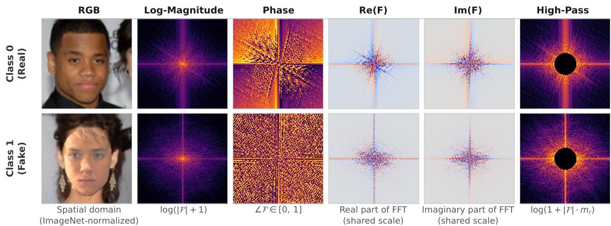
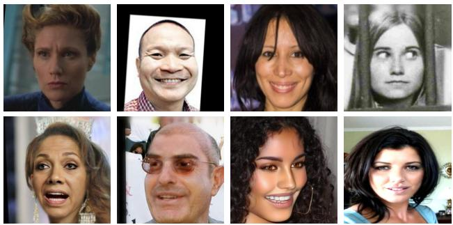
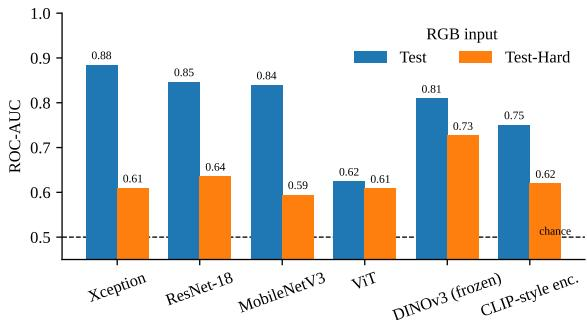
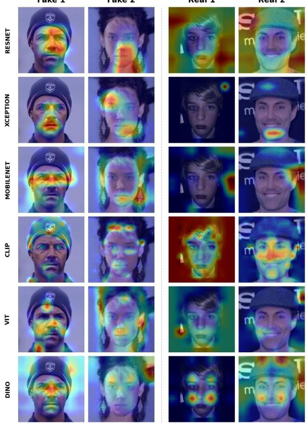

# Benchmarking Spatial, Spectral, and Self-Supervised Cues for Face Forgery Detection under Realistic Degradation

Lucas Cunha∗, Lucas Sotomaior∗, Lucas Gasperin∗, Beatriz Caldas∗, Eduardo Pianovski∗, and Rayson Laroca∗

∗Pontifical Catholic University of Paraná, Curitiba, Brazil

∗{c.oliveira25,lucas.sotomaior,lucas.gasperin,beatriz.caldas,eduardo.pianovski}@pucpr.edu.br ∗rayson@ppgia.pucpr.br

Abstract—Face forgery detectors often achieve strong results on controlled benchmarks, but their reliability under realistic image degradations remains limited. This paper presents a standardized benchmark for face forgery detection using the Multi-Dimensional Face Forgery Image (MFFI) dataset and evaluates performance on both clean and degraded test partitions. We compare six model families, including convolutional networks, transformer-based models, and a frozen self-supervised DINOv3 backbone, across spatial, spectral, and hybrid input representations. The results show that clean-set performance is not a reliable indicator of robustness under compression, resizing, and blurring. Xception with RGB obtains the best clean performance, reaching 0.884 mean ROC-AUC, but degrades substantially on the harder partition. In contrast, frozen DINOv3 achieves the strongest degraded-set result, with 0.726 mean ROC-AUC, while training only a linear classification head. The representation analysis indicates that Fourier-domain cues are most useful when combined with RGB information, whereas purely spectral inputs consistently underperform spatial representations. Qualitative attribution maps further suggest that convolutional detectors focus on localized artifacts, while DINOv3 relies on broader facial structure. These findings reinforce the need for degraded evaluation protocols and highlight self-supervised visual representations as a promising direction for robust face forgery detection. Our source code is publicly available at https://github.com/lucasdocunha/FaceForgery-Benchmark/.

## I. INTRODUCTION

The spread of Artificial Intelligence-Generated Content (AIGC) has made synthetic faces and identity manipulation increasingly realistic and accessible [1]–[3]. Generative Adversarial Networks (GANs) [4] and diffusion-based models, which are also used for high-fidelity facial reconstruction [5], can generate photorealistic facial content that threatens privacy, biometric security, and information integrity [6]. Automated face forgery detection is therefore essential, yet its practical reliability remains limited, motivating evaluations that go beyond classification performance [7], [8].

Most detectors are trained as binary classifiers that learn spatial artifacts, temporal inconsistencies, or frequency irregularities. On common benchmarks, Convolutional Neural Networks (CNNs) and Vision Transformers (ViTs) can reach Area Under the ROC Curve (ROC-AUC) values above

0.99 [9]. These results, however, often rely on controlled data distributions and can degrade sharply when test images differ from training images [10]. This gap is critical because images shared on online platforms are routinely compressed, resized, blurred, or re-encoded, which may suppress the subtle traces that forensic models rely on.

The Multi-Dimensional Face Forgery Image (MFFI) dataset [11] was recently introduced to study this gap through more than 50 forgery techniques, diverse authentic sources, and multi-level degradations designed to approximate realworld conditions. It enables evaluation on both a clean test partition and a degraded partition, making it well-suited for measuring whether performance under laboratory conditions transfers to realistic conditions. Rather than proposing a single new detector, this paper uses MFFI to establish a standardized benchmark across architectures and input representations.

We evaluate six model families that cover lightweight and residual convolutional models, attention-based models, and self-supervised foundation features. The benchmark includes MobileNetV3 [12], Xception [13], ResNet-18 [14], a ViT [15], a CLIP-style encoder [16], and a frozen DINOv3 backbone [17]. For compatible architectures, we additionally compare RGB, Fourier-based spectral representations, and hybrid spatial-spectral stacks. This design separates the contributions of the model family and the input representation while keeping the evaluation protocol fixed.

The contributions of this paper are threefold:

• We provide a standardized benchmark of six heterogeneous architectures on MFFI, reporting performance on both clean and degraded partitions under a common protocol. Our code is publicly available at https:// github. com/lucasdocunha/FaceForgery-Benchmark/, supporting reproducibility beyond the reported results;

• We quantify the effect of seven spatial, spectral, and hybrid input representations, showing when frequency cues help and when they fail;

• We compare our results with state-of-the-art results on MFFI and use attribution methods [18], [19] to analyze the evidence used by accurate and degraded detectors.

## II. RELATED WORK

## A. Detection of Synthetic and Manipulated Faces

Early face forgery detectors were commonly trained endto-end on curated benchmarks and reached near-perfect indistribution accuracy. Rössler et al. [20] introduced FaceForensics++ and showed that Xception [13] could identify several facial manipulations effectively. Wang et al. [9] showed that a single CNN trained on one generator can generalize to unseen generators when paired with appropriate augmentation, but also showed that performance decreases when the test distribution changes. Recent surveys reinforce this limitation, reporting that detectors often learn generator-specific or postprocessing-specific cues that transfer poorly across datasets and acquisition conditions [10]. Ivanovska and Štruc [6] further showed that denoising-diffusion attacks can suppress detector evidence without perceptually obvious changes. Our work follows this robustness-oriented view and evaluates how several detector families behave under the explicit degradation protocol available in MFFI.

## B. Frequency-Domain Forensics

Frequency-domain forensics is motivated by the observation that generative pipelines may leave structured spectral traces. Frank et al. [21] reported systematic Fourier artifacts in GANgenerated images, especially at high frequencies. Dzanic et al. [22] observed measurable spectrum discrepancies between deep network-generated images and natural photographs. Qian et al. [23] proposed a frequency-aware detector that mines clues from multiple frequency bands. These studies motivate our representation axis: instead of testing a single spectral input, we compare seven spatial, spectral, and hybrid encodings under the same training and evaluation protocol. Fig. 1 illustrates these encodings on authentic and forged faces.

## C. Foundation Models and Self-Supervised Learning

Large pre-trained encoders offer an alternative to learning forensic evidence solely from the target dataset. CLIP [16] learns transferable visual representations through image-text supervision, while DINOv2 [24] and DINOv3 [17] learn strong visual features through self-supervision. Recent robust deepfake detection systems follow this direction: the winning [25] and runner-up [26] solutions of the CVPR 2026 Robust DeepFake Detection Challenge both use adapted DINOv3 backbones. We include frozen DINOv3 features to assess how much robustness is available without backbone fine-tuning, ensembling, or additional task-specific data.

## III. EXPERIMENTAL SETUP

This section details the dataset partitions, input representations, model families, training procedure, and metrics used in the benchmark.

## A. Dataset and Partitions

All experiments use the MFFI dataset [11], which combines diverse forgery methods, facial scenes, authentic sources, and degradation operations. The task is binary image classification, with each sample labeled as authentic or forged, as illustrated in Fig. 2. We use the official splits with 524,429 training images, 147,363 validation images, and 181,947 test images. The test partition is moderately imbalanced, with approximately 57% forged samples. Robustness is evaluated on Test-Hard, the degraded version of the same test set, which corresponds to Test-D in the original MFFI benchmark [11]. This paired evaluation exposes the difference between clean benchmark performance and performance after compression, resizing, and blurring.

## B. Input Representations

Each image is decoded as RGB. For spectral modes, the image is converted to grayscale luminance, $Y = 0 . 2 9 9 R +$ $0 . 5 8 7 G + 0 . 1 1 4 B .$ , before a centered two-dimensional FFT. From the spectrum, we derive log-magnitude, phase, real and imaginary components, and a high-pass magnitude that suppresses the low-frequency disk. Table I summarizes the seven evaluated representations. When the number of channels differs from three, the first convolutional or patch-embedding layer is adapted by reinitializing the corresponding channel weights. Spatial augmentations are applied before computing the Fourier transforms, preserving alignment between image content and spectral channels.

TABLE I  
INPUT REPRESENTATIONS EVALUATED IN THE BENCHMARK.
<table><tr><td>Mode</td><td>Description</td><td>Ch.</td></tr><tr><td>RGB</td><td>spatial image</td><td>3</td></tr><tr><td>Log-Magnitude</td><td> $\log ( | \mathcal { F } | + \mathbf { \breve { 1 } } )$ </td><td>1</td></tr><tr><td>Phase</td><td>phase mapped to [0, 1]</td><td>1</td></tr><tr><td>Complex Spectrum</td><td>real and imaginary spectra</td><td>2</td></tr><tr><td> $R G \dot { B ^ { + } } M a g$ </td><td>RGB plus log-magnitude</td><td>4</td></tr><tr><td> $H i g h – P a s s \ S p e c t r u m$ </td><td>high-pass magnitude</td><td>1</td></tr><tr><td> $R G B \substack { + F r e q }$ </td><td>RGB plus magnitude, phase, and high-pass</td><td>6</td></tr></table>

The Log-Magnitude mode is normalized to [0, 1] and captures the energy distribution across spatial frequencies. The Phase mode maps angles from [−π, π] to [0, 1], preserving structural information. The Complex Spectrum mode keeps real and imaginary components, each normalized by the maximum absolute value. The High-Pass Spectrum mode removes a circular low-frequency region with radius $r =$ 0.12 min(H, W), emphasizing the high-frequency artifacts discussed in prior work [21]. The hybrid modes concatenate spatial and spectral channels.

## C. Architectures

We evaluate six model families spanning convolutional, attention-based, and self-supervised paradigms. Table II lists the input size and pre-training setting for each family. Xception, ResNet-18, MobileNetV3, the ViT, and the CLIP-style encoder are trained from scratch, so their results reflect what each architecture learns from MFFI alone. DINOv3 is the only pre-trained model, and its backbone remains frozen while a linear head is trained.

  
Fig. 1. Spatial and frequency-domain views of authentic and forged face images. Each row shows the RGB input, log-magnitude spectrum, phase, real and imaginary FFT components, and high-pass magnitude.

  
Fig. 2. Examples of authentic (top) and forged (bottom) face images from the MFFI benchmark [11].

TABLE II  
ARCHITECTURES EVALUATED IN THE BENCHMARK.
<table><tr><td>Model</td><td>Family</td><td>Input</td><td>Pre-training</td></tr><tr><td>Xception [13]</td><td>separable CNN</td><td>224 × 224</td><td>none</td></tr><tr><td>ResNet-18 [14]</td><td>residual CNN</td><td>224 × 224</td><td>none</td></tr><tr><td>MobileNetV3 [12]</td><td>lightweight CNN</td><td>224 × 224</td><td>none</td></tr><tr><td>ViT [15]</td><td>transformer</td><td>224 × 224</td><td>none</td></tr><tr><td>CLIP enc. [16]</td><td>transformer</td><td>224 × 224</td><td>none</td></tr><tr><td>DINOv3 [17]</td><td>self-supervised transformer</td><td>224 × 224</td><td>frozen</td></tr></table>

The ViT uses 16 × 16 patches, hidden dimension 128, three encoder layers, four attention heads, Mixup with α = 0.2, and dropout 0.25. The CLIP-style encoder follows the image-side design with hidden dimension 256, six encoder layers, eight attention heads, and projection dimension 128, but does not load CLIP weights. The DINOv3 classifier consists of LayerNorm, Dropout, and Linear layers on top of the frozen backbone.

## D. Training and Evaluation

All models are optimized with AdamW and a cross-entropy loss. We use weight decay $1 0 ^ { - 4 }$ , gradient clipping at norm 1.0, mixed precision, early stopping, and a ReduceLROnPlateau scheduler. Class imbalance is handled with a weighted random sampler. Data augmentation includes random resized crops, horizontal flips, and color jitter before FFT computation. Results are reported as the mean and standard deviation across three independent runs with different random seeds.

The decision threshold is selected on the validation set and fixed for Test and Test-Hard. We report ROC-AUC as the primary metric because it is threshold-independent and well suited to the class imbalance in MFFI. We also report accuracy (ACC) at this threshold. For qualitative analysis, we apply Grad-CAM [18] to the convolutional models and DINOv3, and Attention Rollout [19] to the ViT and CLIPstyle encoder.

## IV. RESULTS AND DISCUSSION

Table III reports ROC-AUC and ACC for every architecture and input representation on Test and Test-Hard, while Fig. 3 illustrates the performance gap between Test and Test-Hard across models. The benchmark reveals three main patterns: clean performance favors task-specific convolutional models, degradation changes the model ranking, and frequency information is useful mainly as an auxiliary signal.

## A. Clean and Degraded Performance

On the clean Test partition, convolutional detectors achieve the strongest results. Xception obtains the highest ROC-AUC (0.884 with RGB), followed by ResNet-18 (0.846 with RGB) and MobileNetV3 (0.839 with RGB). The ViT performs substantially worse, with ACC close to the majority-class rate and a maximum ROC-AUC of 0.645. Despite training only a linear head, the frozen DINOv3 backbone remains competitive, reaching an ROC-AUC of 0.809.

The ranking changes markedly under degradation. With RGB, Xception decreases from 0.884 to 0.609, while MobileNetV3 decreases from 0.839 to 0.594. The strongest convolutional result on Test-Hard is obtained by Xception with RGB+Mag (0.650), followed closely by ResNet-18 with RGB+Freq (0.648). In contrast, frozen DINOv3 decreases only from 0.809 to 0.726 and achieves the highest Test-Hard performance by a clear margin. This pattern suggests that representations learned exclusively for the target forgery task may overfit fragile generator- or acquisition-specific cues, whereas self-supervised features retain more useful information after compression, resizing, and blurring.

TABLE III  
ROC-AUC AND ACCURACY ON THE CLEAN TEST AND DEGRADED TEST-HARD PARTITIONS OF MFFI. BEST RESULTS ARE SHOWN IN BOLD.
<table><tr><td rowspan="2"></td><td rowspan="2"></td><td colspan="2">Test (clean)</td><td colspan="2">Test-Hard (degraded)</td></tr><tr><td>ROC-AUC</td><td>ACC</td><td>ROC-AUC</td><td>ACC</td></tr><tr><td rowspan="7">Xception [13]</td><td>RGB</td><td>0.884 ± 0.0091</td><td> $0 . 7 5 7 \pm 0 . 0 0 5 1$ </td><td>0.609 ± 0.0196</td><td>0.568 ± 0.0033</td></tr><tr><td>Log-Magnitude</td><td>0.686 ± 0.0125</td><td>0.638 ± 0.0090</td><td>0.517 ± 0.0200</td><td>0.535 ± 0.0292</td></tr><tr><td>Phase</td><td> $0 . 8 0 2 \pm 0 . 0 2 2 8$ </td><td> $0 . 7 3 1 \pm 0 . 0 1 7 4$ </td><td>0.573 ± 0.0031</td><td>0.571 ± 0.0030</td></tr><tr><td>Complex Spectrum</td><td>0.790 ± 0.0274</td><td> $0 . 7 2 0 \pm 0 . 0 2 6 6$ </td><td>0.608 ± 0.0282</td><td>0.577 ± 0.0238</td></tr><tr><td>RGB+Mag</td><td> $0 . 8 7 8 \pm 0 . 0 1 5 2$ </td><td> $0 . 7 6 8 \pm 0 . 0 1 1 5$ </td><td>0.650 ± 0.0231</td><td>0.603 ± 0.0189</td></tr><tr><td>High-Pass Spectrum</td><td> $0 . 6 7 4 \pm 0 . 0 1 9 6$ </td><td> $0 . 6 2 2 \pm 0 . 0 1 1 6$ </td><td>0.501 ± 0.0174</td><td>0.520 ± 0.0132</td></tr><tr><td>RGB+Freq</td><td> $0 . 8 6 5 \pm 0 . 0 0 3 8$ </td><td> $\mathbf { 0 . 7 7 7 \pm 0 . 0 1 0 5 }$ </td><td>0.609 ± 0.0536</td><td>0.580 ± 0.0329</td></tr><tr><td rowspan="7">ResNet-18 [14]</td><td>RGB</td><td>0.846 ± 0.0201</td><td> $0 . 7 2 5 \pm 0 . 0 2 3 8$ </td><td>0.635 ± 0.0001</td><td>0.573 ± 0.0001</td></tr><tr><td>Log-Magnitude</td><td>0.703 ± 0.0289</td><td> $\smash { 0 . 6 4 7 \pm 0 . 0 2 1 0 }$ </td><td>0.533 ± 0.0003</td><td>0.547 ± 0.0002</td></tr><tr><td>Phase</td><td>0.730 ± 0.0335</td><td> $0 . 6 7 6 \pm 0 . 0 2 5 3$ </td><td>0.583 ± 0.0002</td><td>0.579 ± 0.0003</td></tr><tr><td>Complex Spectrum</td><td>0.758 ± 0.0490</td><td>0.694 ± 0.0410</td><td>0.569 ± 0.0000</td><td>0.568 ± 0.0002</td></tr><tr><td>RGB+Mag</td><td>0.841 ± 0.0226</td><td>0.742 ± 0.0211</td><td>0.634 ± 0.0003</td><td>0.576 ± 0.0000</td></tr><tr><td>High-Pass Spectrum</td><td>0.685 ± 0.0135</td><td>0.633 ± 0.0150</td><td>0.519 ± 0.0000</td><td>0.538 ± 0.0000</td></tr><tr><td>RGB+Freq</td><td>0.831 ± 0.0310</td><td> $0 . 7 4 6 \pm 0 . 0 2 6 9$ </td><td>0.648 ± 0.0001</td><td>0.600 ± 0.0001</td></tr><tr><td rowspan="7">MobileNetV3 [12]</td><td>RGB</td><td> $0 . 8 3 9 \pm 0 . 0 3 1 3$ </td><td> $0 . 7 5 1 \pm 0 . 0 2 1 2$ </td><td>0.594 ± 0.0001</td><td>0.563 ± 0.0002</td></tr><tr><td>Log-Magnitude</td><td>0.669 ± 0.0294</td><td>0.628 ± 0.0271</td><td>0.503 ± 0.0002</td><td>0.511 ± 0.0001</td></tr><tr><td>Phase</td><td>0.689 ± 0.0252</td><td>0.646 ± 0.0215</td><td>0.561 ± 0.0002</td><td>0.572 ± 0.0000</td></tr><tr><td>Complex Spectrum</td><td>0.733 ± 0.0443  $0 . 8 2 8 \pm 0 . 0 2 4 4$ </td><td> $0 . 6 7 1 \stackrel { - } { \pm } 0 . 0 3 6 1$ </td><td>0.543 ± 0.0002</td><td>0.560 ± 0.0000</td></tr><tr><td>RGB+Mag</td><td></td><td> $0 . 7 4 6 \pm 0 . 0 1 8 1$ </td><td>0.612 ± 0.0000</td><td>0.587 ± 0.0000</td></tr><tr><td>High-Pass Spectrum</td><td> $0 . 6 5 3 \pm 0 . 0 2 4 5$ </td><td> $0 . 6 2 2 \pm 0 . 0 0 8 2$ </td><td>0.519 ± 0.0497</td><td>0.520 ± 0.0330</td></tr><tr><td>RGB+Freq</td><td> $0 . 7 9 8 \pm 0 . 0 2 3 1$ </td><td> $0 . 7 2 6 \pm 0 . 0 1 9 5$ </td><td>0.548 ± 0.0499</td><td>0.539 ± 0.0330</td></tr><tr><td rowspan="7">ViT [15]</td><td>RGB</td><td>0.624 ± 0.0412</td><td> $0 . 5 8 1 \pm 0 . 0 0 6 9$ </td><td>0.608 ± 0.0273</td><td>0.581 ± 0.0069</td></tr><tr><td>Log-Magnitude</td><td> $0 . 5 5 1 \stackrel { - } { \pm } 0 . 0 6 8 4$ </td><td> $0 . 5 7 7 \pm 0 . 0 2 1 5$ </td><td>0.550 ± 0.0692</td><td>0.577 ± 0.0215</td></tr><tr><td>Phase</td><td> $0 . 5 7 6 \pm 0 . 0 3 4 3$ </td><td> $0 . 5 7 8 \pm 0 . 0 0 8 8$ </td><td>0.567 ± 0.0278</td><td>0.577 ± 0.0088</td></tr><tr><td>Complex Spectrum</td><td> $0 . 6 0 8 \pm 0 . 0 1 8 1$ </td><td> $0 . 5 7 4 \pm 0 . 0 0 0 2$ </td><td>0.601 ± 0.0093</td><td>0.574 ± 0.0002</td></tr><tr><td>RGB+Mag</td><td> $0 . 6 4 5 \pm 0 . 0 6 2 9$ </td><td> $0 . 5 9 7 \pm 0 . 0 1 4 4$ </td><td>0.630 ± 0.0482</td><td>0.595 ± 0.0159</td></tr><tr><td>High-Pass Spectrum</td><td> $0 . 4 8 8 \pm 0 . 0 2 2 4$ </td><td>0.572 ± 0.0013</td><td>0.485 ± 0.0206</td><td> $0 . 5 7 2 \pm 0 . 0 0 1 3$ </td></tr><tr><td>RGB+Freq</td><td> $0 . 6 3 3 \pm 0 . 0 0 2 5$ </td><td> $0 . 5 9 6 \pm 0 . 0 0 7 4$ </td><td>0.582 ± 0.0477</td><td> $0 . 5 8 1 \pm 0 . 0 1 4 7$ </td></tr><tr><td>DINOv3 [17]</td><td>RGB</td><td> $0 . 8 0 9 \pm 0 . 0 0 4 6$ </td><td> $0 . 7 1 2 \pm 0 . 0 1 5 8$ </td><td>0.726 ± 0.0000</td><td> $\overline { { { \bf 0 . 6 6 3 \pm 0 . 0 0 2 2 } } }$ </td></tr><tr><td>CLIP-style enc. [16]</td><td>RGB</td><td> $0 . 7 5 0 \pm 0 . 0 0 4 3$ </td><td> $0 . 6 8 3 \pm 0 . 0 0 1 5$ </td><td>0.619 ± 0.0006</td><td>0.581 ± 0.0008</td></tr></table>

  
Fig. 3. RGB ROC-AUC on the clean Test and degraded Test-Hard partitions.

The ViT shows a small absolute drop, but this should not be interpreted as strong robustness. Its clean performance is already low, so the apparent stability mainly reflects a floor effect rather than invariance to degradation.

## B. Spatial, Spectral, and Hybrid Inputs

Frequency-domain information provides limited benefit on the clean Test set but becomes more useful under Test-Hard degradation. For every convolutional architecture, at least one hybrid representation, RGB+Mag or RGB+Freq, matches or outperforms RGB on Test-Hard. In contrast, purely spectral representations remain substantially weaker on both partitions. These results indicate that spectral cues do not replace spatial information, but can provide complementary evidence when degradation weakens RGB-based cues.

One plausible explanation lies in the inductive biases of convolutional architectures. Image-generation pipelines can leave systematic frequency-domain irregularities, including periodic patterns associated with upsampling and abnormal high-frequency statistics [21]–[23]. As CNNs rely on local shared filters and are sensitive to texture-like patterns [27], early concatenation may allow them to combine these spectral cues effectively with RGB information. The smaller gains obtained by the ViT suggest that this fusion strategy may be better aligned with convolutional models. DINOv3 and the CLIP-style encoder were evaluated only with RGB and are therefore excluded from this comparison.

## C. Comparison with Published MFFI Results

Table IV compares our results with image-level MFFI results reported in the literature. The official MFFI benchmark is the most comparable protocol because it trains on MFFI and reports both the clean and degraded partitions [11]. MAP-Mamba is evaluated in a cross-dataset setting, with training on FaceForensics++ and testing on MFFI, so it measures transfer rather than in-distribution learning [28]. DeFakerOne is trained on a 12.5M-sample multi-domain collection that includes MFFI itself, reflecting a substantially different supervision scale [29].

TABLE IV  
IMAGE-LEVEL ROC-AUC ON MFFI REPORTED IN THE LITERATURE AND IN THIS WORK. “TEST-HARD” DENOTES THE OFFICIAL DEGRADED TEST  
PARTITION, CALLED TEST-D IN [11]. BEST RESULTS WITHIN THE COMPARABLE MFFI-TRAINING PROTOCOL ARE IN BOLD, AND N/R MEANS NOT REPORTED.
<table><tr><td>Method</td><td>Training data</td><td>Test</td><td>Test-Hard</td></tr><tr><td>Xception (from [11])</td><td>MFFI</td><td>0.852</td><td>0.708</td></tr><tr><td>RFM (from [11])</td><td>MFFI</td><td>0.849</td><td>0.720</td></tr><tr><td>SRM (from [11])</td><td>MFFI</td><td>0.877</td><td>0.580</td></tr><tr><td>SPSL (from [11])</td><td>MFFI</td><td>0.846</td><td>0.714</td></tr><tr><td>MAP-Mamba [28]</td><td>FF++ cross-dataset</td><td>0.668†</td><td>n/r</td></tr><tr><td>DeFakerOne [29]</td><td>12.5M multi-domain</td><td>0.961†</td><td>n/r</td></tr><tr><td>Xception, RGB (ours)</td><td>MFFI</td><td>0.884</td><td>0.609</td></tr><tr><td>ResNet-18, RGB (ours)</td><td>MFFI</td><td>0.846</td><td>0.635</td></tr><tr><td>DINOv3 frozen, RGB (ours)</td><td>MFFI</td><td>0.809</td><td>0.726</td></tr></table>

†The original paper does not specify whether the evaluation partition is clean or degraded.

Within the comparable protocol, the best results in our benchmark match or improve the published MFFI baselines on both partitions. On the clean partition, Xception with RGB reaches an ROC-AUC of 0.884, exceeding the strongest official result (SRM, 0.877) and the official Xception baseline (0.852). On Test-Hard, frozen DINOv3 reaches 0.726, marginally exceeding the strongest published degraded-set result (RFM, 0.720), while training only a linear head on a frozen backbone. Although this margin is small, the result shows that a frozen self-supervised representation can match the strongest task-specific baseline with minimal training. More broadly, the comparison confirms that the methods leading on clean data are not necessarily those that remain strongest after degradation.

Recent challenge results are consistent with this finding. DINO-MAC [25] and LOGER [26], the first- and secondplace solutions of the CVPR 2026 Robust DeepFake Detection Challenge, both build on DINOv3 backbones and obtain strong results under degradation-heavy evaluation. Our benchmark shows that this advantage is already visible in the frozen representation itself, before fine-tuning, large ensembles, or additional training data are introduced.

The DeFakerOne result of 0.961 is the highest value in Table IV, but it is not directly comparable with the MFFIonly protocol. Its training mixture includes MFFI, contains approximately 24× as many samples, and incorporates proprietary data, while the evaluated partition is not specified. The result therefore illustrates the potential benefit of broader supervision, rather than providing a controlled comparison with models trained exclusively on MFFI.

## D. Qualitative Evidence from Attribution Maps

To inspect model evidence, we generate attribution maps for all RGB models on four common samples. We apply Grad-CAM [18] to the convolutional detectors and DINOv3, and Attention Rollout [19] to the from-scratch transformers. Fig. 4 shows two forged and two authentic examples.

Fake 1  
Fake 2  
Real 1  
Real 2  
  
Fig. 4. Attribution maps for the six RGB models on forged (left) and authentic (right) inputs. Grad-CAM [18] is applied to ResNet-18, Xception, MobileNetV3, and DINOv3, while Attention Rollout [19] is applied to the ViT and CLIP-style encoder. Convolutional detectors emphasize localized facial regions, from-scratch attention models produce weaker and more diffuse localization, and DINOv3 distributes evidence across broader facial landmarks.

These samples are illustrative and do not constitute a quantitative evaluation, but they reveal a consistent qualitative divergence. All six models classified both forged samples correctly. For the authentic samples, the convolutional detectors also classified both correctly, whereas the CLIP-style encoder,

ViT, and DINOv3 classified both as forged, consistent with their broader false-positive behavior.

The attribution maps help explain this divergence. Convolutional detectors tend to activate on localized facial regions in forged images, such as the nose, mouth, eyes, or blending boundaries. On authentic images, their maps are more diffuse, suggesting that decisions may rely on the absence of localized anomalies.

The from-scratch transformers show less consistent evidence. The ViT produces scattered activations that poorly align with common manipulation regions and activates broadly on authentic faces. The CLIP-style encoder similarly shows limited localization and high activation on authentic samples, consistent with its false-positive errors.

DINOv3 exhibits a different pattern: its evidence is distributed across multiple semantically meaningful facial landmarks rather than concentrated in a single region. This broader allocation is consistent with its robustness on Test-Hard, but may also reduce discrimination on clean authentic samples, contributing to the observed misclassifications.

## E. Limitations

Four limitations constrain the conclusions of this study. First, all experiments use a single dataset, so the benchmark measures robustness to the MFFI degradation protocol rather than cross-dataset generalization; the reported ranking should therefore be validated on additional forgery sources. Second, five of the six model families are trained from scratch. This isolates what each architecture learns from MFFI, but does not estimate the performance attainable with large-scale pretraining. Third, DINOv3 is evaluated only as a frozen feature extractor with a linear head, so the experiments do not establish whether its robustness advantage persists after fine-tuning. Finally, the attribution analysis is qualitative and correlational, and is based on only four samples. Moreover, applying Grad-CAM to a frozen transformer backbone requires reshaping tokens into a spatial grid, making the resulting maps approximate visualizations rather than exact gradient attributions. Accordingly, we use these maps only to support interpretation of Table III, not as independent evidence for the quantitative conclusions.

## V. CONCLUSIONS

This paper presented a standardized benchmark for face forgery detection under realistic image degradation using the clean and degraded partitions of MFFI. Across six architecture families and up to seven input representations, clean-set performance proved to be an unreliable proxy for performance under degradation. Xception achieved the strongest clean result (ROC-AUC = 0.884), but its performance decreased substantially after compression, resizing, and blurring. Frozen DINOv3 exhibited the opposite profile, obtaining the highest degraded-set result (0.726) while requiring only the training of a linear classification head.

The representation analysis showed that Fourier-domain information is most useful as an auxiliary cue. Hybrid spatialspectral inputs can improve convolutional models under degradation, whereas purely spectral representations consistently underperform RGB. The qualitative attribution analysis further suggests that convolutional detectors emphasize localized facial evidence, while DINOv3 distributes evidence across broader facial structure. Together, these findings demonstrate the importance of standardized degraded evaluation protocols and indicate that self-supervised visual representations are a promising basis for robust face forgery detection, subject to the limitations discussed in Section IV-E.

Future work should extend the evaluation to FaceForensics++ [20], Celeb-DF [30], and DFDC [31] to distinguish robustness to image degradation from generalization across forgery sources. Comparing frozen and fine-tuned pretrained backbones would clarify whether the observed robustness advantage persists after task-specific adaptation and provide a fairer comparison across model families. Reporting results separately for each degradation type would identify the transformations to which each representation is most sensitive. Finally, degradation-aware training and evaluation on diffusionbased forgeries would test whether the observed patterns hold for newer generative pipelines. The supervision-scale gap in Table IV also suggests that broader training distributions and ensembles of pretrained backbones may help narrow the remaining performance gap.

## ACKNOWLEDGMENTS

The authors thank the Pontifícia Universidade Católica do Paraná (PUCPR) for the financial support that made their participation in the conference possible.

## REFERENCES

[1] S. Lyu and The Conversation, “2026 will be the year you get fooled by a deepfake, researcher says. Voice cloning has crossed the “indistinguishable threshold”,” Dec 2025. [Online]. Available: https://fortune.com/2025/12/27/2026-deepfakes-outlook-forecast/

[2] D. Milmo, “Company worker in Hong Kong pays out £20m in deepfake video call scam,” The Guardian, Feb 2024. [Online]. Available: https://www.theguardian.com/world/2024/feb/05/hong-kongcompany-deepfake-video-conference-call-scam

[3] The Conversation, “Deepfakes drastically improved in 2025. They’re about to get even harder to detect,” Jan 2026. [Online]. Available: https: //www.fastcompany.com/91469337/deepfakes-surge-2026-detection

[4] I. Goodfellow, J. Pouget-Abadie, M. Mirza, B. Xu, D. Warde-Farley, S. Ozair, A. Courville, and Y. Bengio, “Generative adversarial networks,” Communications of the ACM, vol. 63, no. 11, pp. 139–144, 2020.

[5] M. dos Santos, R. Laroca, J. C. R. Neves, and D. Menotti, “Robust face super-resolution and recognition through multi-feature aggregation in diffusion models,” Journal of the Brazilian Computer Society, vol. 32, no. 1, pp. 1457–1470, 2026.

[6] M. Ivanovska and V. Štruc, “On the vulnerability of deepfake detectors to attacks generated by denoising diffusion models,” in IEEE/CVF Winter Conference on Applications of Computer Vision Workshops (WACVW), 2024, pp. 1051–1060.

[7] S. Anlen and R. Vázquez Llorente, “Spotting the deepfakes in this year of elections: how AI detection tools work and where they fail | reuters institute for the study of journalism,” Apr 2024. [Online]. Available: https://reutersinstitute.politics.ox.ac.uk/news/spotting-deepfakesyear-elections-how-ai-detection-tools-work-and-where-they-fail

[8] L. Lopes, R. Laroca, and A. Grégio, “Além do desempenho: Um estudo da confiabilidade de detectores de deepfakes,” in Simpósio Brasileiro de Cibersegurança (SBSeg), 2025, pp. 66–82.

[9] S.-Y. Wang, O. Wang, R. Zhang, A. Owens, and A. A. Efros, “CNNgenerated images are surprisingly easy to spot. . . for now,” in IEEE/CVF Conference on Computer Vision and Pattern Recognition (CVPR), 2020, pp. 8692–8701.

[10] L. Lin, N. Gupta, Y. Zhang, H. Ren, C.-H. Liu, F. Ding, X. Wang, X. Li, L. Verdoliva, and S. Hu, “Detecting multimedia generated by large AI models: A survey,” arXiv preprint arXiv:2402.00045, 2024.

[11] C. Miao et al., “MFFI: Multi-dimensional face forgery image dataset for real-world scenarios,” in ACM International Conference on Multimedia (MM), 2025, pp. 13 235–13 242.

[12] A. Howard et al., “Searching for MobileNetV3,” in IEEE/CVF International Conference on Computer Vision (ICCV), 2019, pp. 1314–1324.

[13] F. Chollet, “Xception: Deep learning with depthwise separable convolutions,” in IEEE Conference on Computer Vision and Pattern Recognition (CVPR), 2017, pp. 1251–1258.

[14] K. He, X. Zhang, S. Ren, and J. Sun, “Deep residual learning for image recognition,” in IEEE Conference on Computer Vision and Pattern Recognition (CVPR), 2016, pp. 770–778.

[15] A. Dosovitskiy, L. Beyer, A. Kolesnikov, D. Weissenborn, X. Zhai, T. Unterthiner, M. Dehghani, M. Minderer, G. Heigold, S. Gelly, J. Uszkoreit, and N. Houlsby, “An image is worth 16x16 words: Transformers for image recognition at scale,” in International Conference on Learning Representations (ICLR), 2021.

[16] A. Radford et al., “Learning transferable visual models from natural language supervision,” in International Conference on Machine Learning (ICML), 2021, pp. 8748–8763.

[17] O. Siméoni et al., “DINOv3,” Transactions on Machine Learning Research, 2026, featured Certification. [Online]. Available: https: //openreview.net/forum?id=2NlGyqNjns

[18] R. R. Selvaraju, M. Cogswell, A. Das, R. Vedantam, D. Parikh, and D. Batra, “Grad-CAM: Visual explanations from deep networks via gradient-based localization,” in IEEE International Conference on Computer Vision (ICCV), 2017, pp. 618–626.

[19] S. Abnar and W. Zuidema, “Quantifying attention flow in transformers,” in Proceedings of the Annual Meeting of the Association for Computational Linguistics (ACL), 2020.

[20] A. Rössler, D. Cozzolino, L. Verdoliva, C. Riess, J. Thies, and M. Niessner, “FaceForensics++: Learning to Detect Manipulated Facial Images,” in IEEE/CVF International Conference on Computer Vision (ICCV), 2019, pp. 1–11.

[21] J. Frank et al., “Leveraging frequency analysis for deep fake image recognition,” in International Conference on Machine Learning (ICML), 2020, pp. 3247–3258.

[22] T. Dzanic, K. Shah, and F. Witherden, “Fourier spectrum discrepancies in deep network generated images,” Advances in Neural Information Processing Systems (NeurIPS), vol. 33, pp. 3022–3032, 2020.

[23] Y. Qian, G. Yin, L. Sheng, Z. Chen, and J. Shao, “Thinking in frequency: Face forgery detection by mining frequency-aware clues,” in European Conference on Computer Vision (ECCV), 2020, pp. 86–103.

[24] M. Oquab et al., “DINOv2: Learning robust visual features without supervision,” Transactions on Machine Learning Research, 2024.

[25] C. Qu, L. Jin, J. Li, J. Liu, B. Yu, J. Xie, and J. Liu, “DINO-MAC: First-place winner solution of the CVPR2026 robust deepfake detection challenge,” in IEEE/CVF Conference on Computer Vision and Pattern Recognition (CVPR) Workshops, June 2026, pp. 2406–2415.

[26] F. Wu, D. Lu, M. Yao, X. Xu, and F. Guo, “LOGER: Local–global ensemble for robust deepfake detection in the wild,” arXiv preprint arXiv:2604.03558, pp. 1–11, 2026.

[27] R. Geirhos et al., “ImageNet-trained CNNs are biased towards texture; increasing shape bias improves accuracy and robustness,” in International Conference on Learning Representations (ICLR), 2019.

[28] C. Wang, Z. He, X. Hu, W. Guan, W. Wang, and Z. Fu, “MAP-Mamba: Multi-artifacts perception mamba for generalizable face forgery detection,” IEEE Transactions on Information Forensics and Security, vol. 21, pp. 1184–1197, 2026.

[29] GuangJian Team, “Venus-DeFakerOne: Unified fake image detection & localization,” arXiv preprint arXiv:2605.14091, 2026.

[30] Y. Li, P. Sun, H. Qi, and S. Lyu, “Celeb-DF: A large-scale challenging dataset for DeepFake forensics,” in CVPR, 2020.

[31] B. Dolhansky, J. Bitton, B. Pflaum, J. Lu, R. Howes, M. Wang, and C. C. Ferrer, “The DeepFake detection challenge (DFDC) dataset,” arXiv preprint arXiv:2006.07397, 2020.