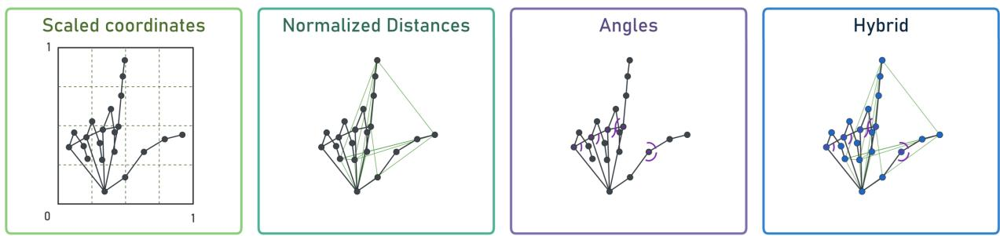
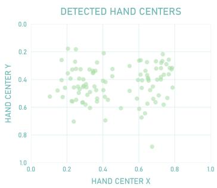
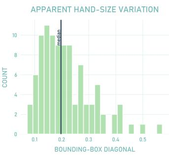
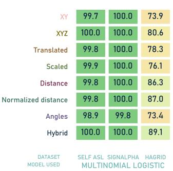
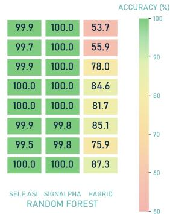
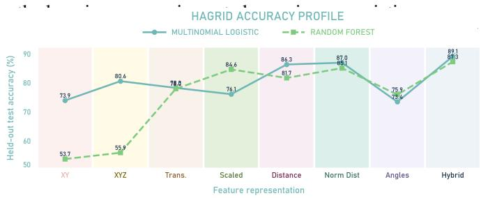
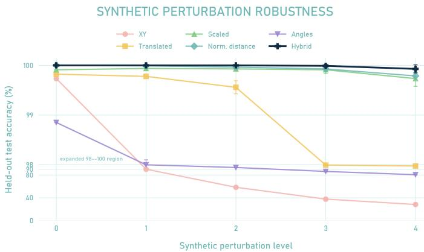
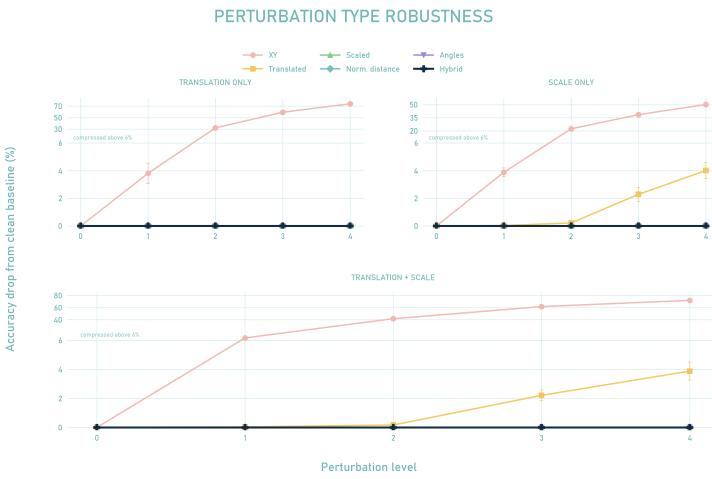
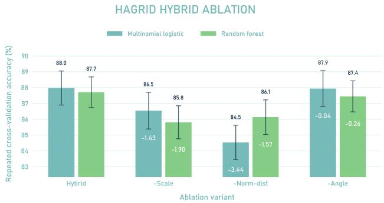
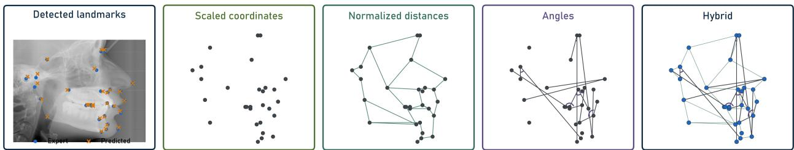

# Beyond Landmark Extraction: A Framework for Robust Geometric Feature Construction in Structured Image Classification

Saravana Maureea,∗, Sakshi Aryaa

aCase Western Reserve University, Department ofMathematics, Applied Mathematics, and Statistics, Cleveland, OH, USA

A R T I C L E I N F O

Keywords:   
Structured Image Classification   
Dimension Reduction   
Feature Construction   
Geometric Invariance   
Nuisance Variation   
Hybrid Feature Representation

## A BS T RA C T

Much of the literature on structured image recognition has disproportionately focused on the comparison of classification algorithms. Rather than investigating which classifier performs best, this paper instead asks: what should a classifier know before it ever makes a prediction? In structured vision problems such as gesture recognition, facial expression categorization, and medical image analysis, discriminative information lies less in individual pixels and more in spatial relationships between semantic parts. Raw pixel spaces are high-dimensional, sensitive to nuisance variation, and often obfuscate the geometric structures that make visual tasks interpretable. Landmark extraction provides one form of dimension reduction, but it does not by itself determine the information preserved. This paper studies the post-landmark feature map as the central object of analysis and proposes a systematic framework for constructing and interpreting landmark-derived representations as an, informed, feature-based “dimension reduction” step. Using static hand gesture recognition as a case study, we evaluate coordinate, distance, angle, and hybrid representations through perturbation and ablation experiments. The results show that visually variable data exposes substantial gaps between raw coordinate features and their geometrically invariant counterparts, while hybrid representations achieve the strongest overall performance by combining complementary geometric components. These findings frame feature construction as a fundamental modeling decision and ultimately suggests that the question of what representation should a classifier learn from is one worth asking. The code used for feature construction and evaluation is available at GitHub Repository

This manuscript is under consideration at Pattern Recognition Letters.

## 1. Introduction

Image classification is often formulated in its most direct form: building a map from raw pixel data to a discrete set of class labels. Images are represented through highdimensional arrays of unprocessed pixel intensities, and the classifier is tasked with inferring relevant geometric structures from these raw observations. Pixel-based methods, notably convolution neural networks, have driven momentous advances in computer vision [1, 2]. However, these seemingly irreproachable methods come with one caveat: raw pixel representations bear well-known limitations. They are high-dimensional, sensitive to nuisance variation including scale, illumination, and capture point, and are often dificult to interpret [3, 4].

For many structured vision tasks, the discriminative information intrinsic to classification is not uniformly distributed across the image. Instead, it is often concentrated within spatial configurations of visually perceptible features; a concept perfectly illustrated through static hand gesture recognition. Here the class label is determined less by the layout of the background or the lighting of the scene than by the relative positioning of the fingers, joints, and palm. Similar considerations arise with facial expression recognition where classes are defined through relationships amongst facial landmarks, and in pose-based activity recognition, where relevant class information is largely contained within body configuration. Landmark detectors provide a practical bridge between raw images and structured geometric representations. MediaPipe Hands estimates a 21-landmark hand skeleton from a single RGB camera input, producing a remarkably compact representation of hand shape and pose [5]. Moreover, these landmark-based pipelines:

Algorithm:Standard Classification Pipeline   
Require: Image dataset D = {(Ii, γi)} n=1   
1: for each image I; do   
Extract landmarks L(I)   
Apply fixed feature map x = φL (Ii)   
5: Train classifiers   
6: Compare accuracy

have shown varying levels of success in real time hand gesture recognition, through neural networks and other classifiers [6, 7]. Landmarks are extracted, engineered into descriptors, and passed down to a selection of classifiers that are compared for performance. Whilst this conventional pipeline illustrated in the Algorithm 1 has been efective, it overlooks a central modeling choice: what form of information should the classifier be exposed to? Should it see absolute landmark positions, distances between joints, normalized hand shape, local finger angles, or some combination of these structures? These choices are distinct and not interchangeable. Each feature map encodes a diferent modeling assumption that dictates the geometry preserved or the nuisance transformation removed. We refer to this postlandmark construction as problem-informed dimension reduction in the broader sense that the image is first condensed to semantic structure and then transformed to retain taskrelevant geometry whilst suppressing nuisance variability. In this sense, the reduction is defined through the efective variation carried forward from the original image representation, rather than strict feature-count reduction for every candidate map. The feature map therefore determines whether the classifier is guided toward gesture-discriminative geometry or left to model irrelevant variation. The framework developed in this paper treats the representation map itself as the primary modeling object, a shift formalized later in Algorithm 2.

This perspective is not unique to gesture recognition. In medical image analysis, diagnostically relevant data is often encoded in the shape, orientation, and relative positioning of anatomical structures rather than in the unprocessed pixel space or voxel fields [8, 9]. Once such structures are extracted through segmentations and contours, the modeling decision shifts from whether the structure is extractable to how it should be represented [10]. Distances, angles, coordinates, and hybrid geometric summaries may correspond to diferent anatomical assumptions, and their interpretability is crucial in a setting where the model’s "reasoning" must be explained [11]. The central claim of this paper is that, once semantic structure has been extracted from the image, the feature map should not be treated as a mere preprocessing step. Static gesture recognition is therefore not used as an endpoint, but as a controlled setting; in which, we isolate the efect of post landmark representation choice through the intentional exclusion of detector design, classifier comparison, and temporal sequence modeling. Under a common experimental protocol, we compare the geometrically relevant representations. Particular attention is given to the hybrid representation that combines scaled coordinates, normalized pairwise distances, and angle features to encode global hand layout, relative landmark spacing, and local finger geometry. Controlled perturbation and ablation experiments are then used to distinguish raw predictive performance from robustness and identify how standard geometric primitives contribute to representation quality.

The contributions of this work are fourfold. First, we formalize post-landmark feature construction as an interpretable, problem-informed dimension reduction step in which task geometry guides what information is preserved and what nuisance variation is suppressed. Second, we provide a systematic framework for evaluating landmarkderived representations. Third, through perturbation and ablation analyses, we explain performance in terms of robustness, invariance, and component-level contribution. Fourth, we show how these analyses can guide the principled construction of hybrid representations, which are especially advantageous under visually variable conditions.

## 2. Problem Formulation

## Let

$$
\boldsymbol { D } = \{ ( I _ { i } , \gamma _ { i } ) \} _ { i = 1 } ^ { n } ,
$$

denote a labeled image dataset, where $I _ { i }$ is the �-th image and $\gamma _ { i } \in \{ 1 , \ldots , K \}$ is its class label. A standard pixel-based classifier attempts to learn

$$
f : \mathbb { R } ^ { H \times W \times C } \to \{ 1 , \dots , K \} ,
$$

where �, �, and � denote image height, width, and number of color channels. Here, classification is separated into three stages:

$$
I _ { i } \longrightarrow L ( I _ { i } ) \longrightarrow \phi _ { r } ( L ( I _ { i } ) ) \longrightarrow g ( \phi _ { r } ( L ( I _ { i } ) ) ) ,
$$

where $L \ : \ \mathbb { R } ^ { H \times W \times C } \ \to \ \mathbb { R } ^ { 2 1 \times d }$ maps the raw image to 21 detected hand landmarks with � retained coordinate dimensions, and $\phi _ { r } : \mathbb { R } ^ { 2 1 \times d } \to \mathbb { R } ^ { q _ { r } }$ maps the landmark output to the �-th feature representation. Here, � is obtained using MediaPipe Hands, which provides a compact landmark-based hand skeleton suitable for real-time gesture applications [5, 6]. The transformed dataset associated with $\phi _ { r }$ is

$$
\mathcal { D } _ { \phi _ { r } } = \{ ( \phi _ { r } ( L ( I _ { i } ) ) , \gamma _ { i } ) \} _ { i = 1 } ^ { n }
$$

This formulation distinguishes the raw pixel, landmark, and feature representations. For each representation $\phi _ { r }$ , the classifiers $g \ : \ \mathbb { R } ^ { q _ { r } } \  \ \{ 1 , \dots , K \}$ are trained separately. This shifts the modeling emphasis from classifier comparison under a fixed representation, as in Algorithm 1, to the systematic study of the feature map $\phi _ { r }$ . Algorithm 2 makes this representation-centric perspective explicit within the conventional pipeline.

Require: Image dataset $D = \{ ( I _ { i } , \gamma _ { i } ) \} _ { i = 1 } ^ { n }$   
1: for each image $I _ { i }$ do   
Extract landmarks L(I;)   
$\zeta _ { i } ^ { ( r ) } = \phi _ { r } ( L ( I _ { i } ) )$   
$D _ { \phi _ { r } } = \{ ( \zeta _ { i } ^ { ( r ) } , \gamma _ { i } ) \} _ { i = 1 } ^ { n }$   
10: Train Classifiers   
11: Compare Accuracy

## 3. Landmark feature representations

  
Figure 1: Feature Visualisation-Summary And Justification of feature families considered

Formally, let $L ( I _ { i } ) = \{ ( x _ { j } , y _ { j } , z _ { j } ) \} _ { j = 0 } ^ { 2 0 }$ denote the $\mathrm { { \bf M e } } -$ diaPipe output for image $I _ { i } .$ We write $p _ { j } ~ = ~ ( x _ { j } , y _ { j } ) ~ \in$ $\mathbb { R } ^ { 2 }$ for the image-plane landmark coordinate. From these landmarks, we construct several feature maps $\phi _ { r } ( L ( I _ { i } ) )$ that encode diferent geometric assumptions about which information should be preserved. For each image, define

$$
b _ { i } = \left( \begin{array} { c } { { x _ { \operatorname* { m i n } } } } \\ { { y _ { \operatorname* { m i n } } } } \end{array} \right) , \qquad D _ { i } = \left( \begin{array} { c c } { { w } } & { { 0 } } \\ { { 0 } } & { { h } } \end{array} \right) , \qquad s _ { i } = \sqrt { w ^ { 2 } + h ^ { 2 } }
$$

where $\begin{array} { r } { x _ { \operatorname* { m i n } } = \operatorname* { m i n } _ { j } x _ { j } , \quad y _ { \operatorname* { m i n } } = \operatorname* { m i n } _ { j } y _ { j } , \quad w = \operatorname* { m a x } _ { j } x _ { j } - } \end{array}$ min� $\begin{array} { r } { x _ { j } , \quad h = \operatorname* { m a x } _ { j } y _ { j } - \operatorname* { m i n } _ { j } y _ { j } } \end{array}$ , with $w , h ~ > ~ \dot { 0 } .$ The translated and scaled coordinates are $p _ { j } ^ { \mathrm { t r a n s } } = p _ { j } - b _ { i }$ and $p _ { j } ^ { \mathrm { s c a l e } } = D _ { i } ^ { - 1 } ( p _ { j } - b _ { i } )$ . For $0 \leq a < b \leq 2 0 .$ pairwise and normalized distances are defined as $d _ { a b } = \| p _ { a } - p _ { b } \| _ { 2 }$ and $\begin{array} { r } { \hat { d _ { a b } } = \frac { d _ { a b } } { s _ { i } } } \end{array}$ , where $s _ { i }$ is the landmark bounding-box diagonal. For landmark indices $a , b , c ,$ , the angle at � is

$$
\theta _ { a b c } = \cos ^ { - 1 } \bigg ( \frac { ( p _ { a } - p _ { b } ) \cdot ( p _ { c } - p _ { b } ) } { \| p _ { a } - p _ { b } \| _ { 2 } \| p _ { c } - p _ { b } \| _ { 2 } } \bigg )\tag{1}
$$

Our hybrid representation $\phi _ { \mathrm { h y b r i d } }$ is then defined as the concatenation $\left[ \phi _ { \mathrm { s c a l e } } ( L ( I _ { i } ) ) , \phi _ { \mathrm { n o r m - d i s t } } ( L ( I _ { i } ) ) , \phi _ { \mathrm { a n g l e } } ( L ( I _ { i } ) ) \right]$ combining normalized global hand layout, relative landmark spacing, and local angular geometry in a single feature vector. Although derived from the same landmarks, these feature vectors preserve diferent geometry. Figure 2 provides an eficient summary of these invariances:

<table><tr><td>Representation</td><td> $\phi _ { r }$ </td><td>Translation Invariant</td><td>Scale Invariant</td><td>Primary Geometry</td></tr><tr><td>Image-plane coordinates</td><td> $\phi _ { x y }$ </td><td>No</td><td>No</td><td>Absolute landmark position</td></tr><tr><td>Translated coordinates</td><td> $\phi _ { \mathrm { t r a n s } }$ </td><td>Yes</td><td>No</td><td>Relative landmark position</td></tr><tr><td>Scaled coordinates</td><td> $\phi _ { \mathsf { s c a l e } }$ </td><td>Yes</td><td>Yes</td><td>Normalized hand shape</td></tr><tr><td>3D coordinates</td><td> $\phi _ { \mathsf { x y z } }$ </td><td>With z-shift</td><td>With z-scale</td><td>Image-plane position + relative depth</td></tr><tr><td>Pairwise distances</td><td> $\phi _ { \mathrm { d i s t } }$ </td><td>Yes</td><td>No</td><td>Relative landmark spacing</td></tr><tr><td>Normalized distances</td><td> $\phi _ { \mathrm { n o r m - d i s t } }$ </td><td>Yes</td><td>Yes</td><td>Scale-free spacing</td></tr><tr><td>Angles</td><td> $\phi _ { \mathsf { a n g l e } }$ </td><td>Yes</td><td>Yes</td><td>Fingertip bending/orientation</td></tr><tr><td>Hybrid features</td><td> $\phi _ { \mathrm { h y b r i d } }$ </td><td>Depends</td><td>Depends</td><td>Combined geometry</td></tr></table>

Figure 2: Invariance profile

The feature spaces above were curated around one simple principle: remove variation that is irrelevant to the classification task whilst retaining class discriminative geometry. This follows the broader computer vision principle of constructing descriptors around the reduction of sensitivity to irrelevant transformations [3]. Whilst the mapping from $\mathbb { R } ^ { H \times W \times C } \mathrm { \Delta t o } \mathbb { R } ^ { 2 1 \times d }$ , achieved through MediaPipe Hands, removes a substantial amount of visual nuisance, we do retain variation associated with scale and translation, both irrelevant to the classification task. Put diferently, the size and location of the hand are not informative for identifying a gesture. This becomes evident when we observe pragmatic data, collected under conditions that mirror the typical deployment environments these recognition systems are expected to operate in.

  
Figure 3: Realistic Variation.

Figure 3 illustrates this issue for a representative Ha-GRID [12] gesture class. With the left figure being the detected hand centers, and the right being apparent handsize variation. The hand appears in diferent regions of the frame and at diferent apparent sizes, even within a single isolated gesture class, implying that the variation shown here is not class discriminative. Therefore, within this space, any classifier � is asked to solve two problems at once: identify the gesture and account for the location and size of the hand. From a learning eficiency perspective, this is ineficient. � should, ideally, be encouraged to exclusively model gesture discriminative geometry rather than nuisance variation in image location or object scale. $\phi _ { \mathrm { t r a n s } }$ removes the location dependence by subtracting coordinate wise minima. If $a =$ $( a _ { x } , a _ { y } )$ , then $( x _ { j } + a _ { x } ) - \operatorname* { m i n } _ { r } ( x _ { r } + a _ { x } ) = x _ { j } - \operatorname* { m i n } _ { r } x _ { r } .$ The same argument holds for the �-coordinates. Hence, the translated coordinates are invariant to global translations in the image-plane. Similarly, $\phi _ { \mathrm { s c a l e } }$ reduces sensitivity to apparent hand size. If every landmark is scaled by $c > 0 ;$ s.t $\boldsymbol { p } _ { i } ^ { \prime } = c \boldsymbol { p } _ { j }$ then $\begin{array} { r } { w ^ { \prime } = \operatorname* { m a x } _ { r } x _ { r } ^ { \prime } - \operatorname* { m i n } _ { r } x _ { r } ^ { \prime } = c w } \end{array}$ . Hence both the scaled coordinates are unchanged under positive uniform scaling. Pairwise distances are translation invariant because $\| ( p _ { a } + a ) - ( p _ { b } + a ) \| _ { 2 } = \| p _ { a } - p _ { b } \| _ { 2 }$ . However, they are not scale invariant, since ${ d _ { a b } ^ { \prime } = c d _ { a b } . \phi _ { \mathrm { n o r m } } }$ −dist removes this dependence when the reference distance scales by the same factor, whilst angle features are invariant to translation and positive uniform scaling as they depend only on ratios of inner products and norms. Full algebraic derivations and implementation details are provided in the project repository.

Whilst it might be tempting to indiscriminately remove all afine variation, not every transformation is irrelevant to the classification task. In our setting, translation and scale are treated as primary nuisance efects, whereas rotation is deliberately preserved since hand orientation can itself be gesture-discriminative in sign language. Although $\phi _ { \mathrm { d i s t } }$ and $\phi _ { \mathrm { a n g l e } }$ provide rotation-invariant internal geometry, complete afine invariance is not explicitly imposed. The key implication is that diferent feature maps � encode specific assumptions regarding the relevance of any particular transformation to the classification task. The goal is therefore not simply to reduce the number of variables, but to construct feature spaces that preserve gesture-relevant geometry whilst reducing sensitivity to irrelevant efects.

## 4. Study Design and Evaluation Protocol

The representations are evaluated on three datasets chosen to reflect varying levels of visual variability. The first is a self collected dataset providing a control group of sorts where images are captured through a webcam-based pipeline under reasonably controlled settings. The second, SignAlphaSet [13] provides a highly controlled capture environment with consistently framed images cropped closely around the hands. The third is the more pragmatic HaGRID subset discussed in section 3.

For each dataset and representation, the data is divided into an 80∕20 stratified train-test split, a fixed evaluation convention rather than an optimality claim. The same seed is used across all representations to allow for assessment over the same training and testing observations. We use two standard classifiers. Multinomial logistic regression serves as a linear baseline. Strong performance under this model would suggest that representations organize gesture classes in a linearly separable way. Predictors are standardized before fitting as features inherently have difering scales. We use random forests to provide a foil model capable of capturing non-linear interactions amongst features without explicit specification [14]. The choice of classifiers is fairly discretionary as these were meant not to exhaust the space of possible models, but to provide a controlled setting in which diferences can be attributed primarily to the feature representation. Hyperparameters are selected using stratified fivefold cross-validation: a standard approach [15]. For logistic regression, the regularization parameter is chosen from C ∈ {0.001, 0.01, 0.1, 1, 10, 100}. As outlined in algorithm 2, these choices are held fixed across representations.

To unambiguously test whether the invariance properties translate to empirical robustness, we also perform a synthetic perturbation experiment on the controlled landmark data. A procedure that isolates nuisance variation where underlying gesture geometry is otherwise immutable. The primary evaluation metric is held-out classification accuracy:

$$
\begin{array} { r } { \mathrm { A c c u r a c y } = \frac { 1 } { N _ { \mathrm { t e s t } } } \sum _ { i = 1 } ^ { N _ { \mathrm { t e s t } } } { \bf 1 } \{ \widehat { \gamma } _ { i } = \gamma _ { i } \} } \end{array}
$$

Repeated stratified five-fold cross-validation is also used to produce paired accuracy measurements for statistical comparison. A Friedman test is used to test for overall diferences amongst feature representations [16]. When the Friedman test is significant, pairwise Wilcoxon signed-rank tests with Holm correction are used as post-hoc comparisons [17, 18].

## 5. Results and Discussion

The results reveal an apparently central pattern: feature spaces matter most when the capture conditions stop being curated. On the controlled datasets, representations achieve near perfect accuracy under either classifier. Because the hands are consistently framed, similarly scaled, and visually isolated enough to be devoid of background noise, even simple coordinate-based features retain suficient discriminative information. These datasets are too clean, exhibiting a ceiling efect that hinders distinction between competing representations. On HaGRID, however, coordinate-based representations deteriorate sharply whilst geometrically motivated feature spaces remain comparatively stable.

  
Figure 4: Accuracy heatmap.

Figure 4 summarizes this contrast quite eficiently across datasets, feature maps, and classifiers. HaGRID provides the more discriminative test. Raw coordinates perform substantially worse. In contrast, representations that suppress translation or scale variances, or encode internal hand geometry, remain remarkably stable. This pattern suggests that if visual conditions vary, the feature map plays a role in how much of

  
Figure 5: HaGRID accuracy profile.

Figure 5 isolates this efect through an observable accuracy hierarchy $\phi _ { \mathrm { d i s t } } ~ < ~ \phi _ { \mathrm { n o r m - d i s t } } ~ < ~ \phi _ { \mathrm { h y b r i d } } .$ . The results suggest some form of correlation between geometric abstraction and classification performance. As geometrically richer information is encoded, the gesture classes become more separable and accuracy improves accordingly. With $\phi _ { \mathrm { h y b r i d } }$ being the penultimate combination of normalized layouts, relative spacing, and local hand shape. $\phi _ { \mathrm { a n g l e } }$ provides an instructive foil. Although angles are invariant to translation and scale, they perform worse than other geometric alternatives, implying that local bending and orientation alone are not discriminative enough for classification. In gaining invariance, they discard spacing and broader hand shape information that are integral to certain gestures. HaGRID suggests that geometric representations are more robust. However, it difers from the controlled datasets along several axes simultaneously and can therefore not justify this claim. Thus, we perform a synthetic perturbation experiment, on the original landmarks from the controlled self-collected dataset, to evaluate whether the invariance of the feature maps actually translates to empirical robustness.

  
Figure 6: Synthetic Robustness Experiment.

For each landmark point $p _ { j } ,$ , perturbations are generated through $p _ { j } ^ { \prime } = c p _ { j } + a + \epsilon _ { j }$ where $a \in \mathbb { R } ^ { 2 } \quad \& \ c \in \mathbb { R } _ { > 0 }$ are a random translation vector and scale factor with $\epsilon _ { j }$ being independent noise. This experiment is not merely an additional accuracy test; it instead probes the task-dependent nature of feature construction by asking not which invariances can be imposed but rather which sources of variation are irrelevant to the problem. The perturbation level denoted on the �-axis controls the magnitude of nuisances, with 0 corresponding to the unaltered landmarks. At each level, the test landmarks are randomly perturbed over ten independent draws, and the reported accuracy is averaged over repetitions. Figure 6 shows a clear separation between raw coordinates and invariant features. $\phi _ { x y }$ degrades rapidly, falling from 99.7% on clean landmarks to 90.1% after the first level, 58.3% at level 2, and 28.2% at the strongest level. In contrast, $\phi _ { \mathrm { s c a l e } } ,$ �norm−dist , $\phi _ { \mathrm { h y b r i d } }$ remain stable throughout the experiment.

  
Figure 7: Synthetic Perturbation Types Experiment.

Figure 7 decomposes the aggregate robustness pattern by perturbation type. Whilst Figure 6 shows how accuracy changes as overall perturbation severity increases, this analysis identifies which transformations are responsible for each variant’s degradation. The �-axis is expanded near 0% and compressed above 6% to preserve the visibility of small differences amongst robust representations. Under translation only perturbations $\phi _ { \mathrm { x y } }$ drops by 74.0%, whereas the invariant feature spaces show no measurable loss. Under scale-only perturbations, $\phi _ { \mathrm { x y } }$ and $\phi _ { \mathrm { t r a n s } }$ drop by 50.2% and 4.0%, whilst $\phi _ { \mathrm { s c a l e } }$ remains stable. Under combined translation and scale perturbations, $\phi _ { \mathrm { x y } }$ drops by 71.9% and $\phi _ { \mathrm { t r a n s } }$ by 3.9%, whereas $\phi _ { \mathrm { s c a l e } } , \ \phi _ { \mathrm { n o r m - d i s t } } .$ , and $\phi _ { \mathrm { h y b r i d } }$ remain essentially unchanged. This decomposition therefore links the loss in empirical robustness of each representation to the nuisance transformations they fail to explicitly remove. Interestingly, $\phi _ { \mathrm { a n g l e } }$ is an outlier that distinguishes invariance from general robustness. Although it remains remarkably stable under the decomposed perturbations, a substantial decay is observed in Figure 6 where landmark noise is implicit. This sensitivity follows from the definition of $\theta _ { a b c }$ in Eq. 1. Minute perturbations of the landmarks can alter the directions of the vectors used to compute joint angles, especially for nearly aligned segments. Thus, invariance to translation and scale does not inherently guarantee robustness to landmark noise.

Now the HaGRID ranking is not an artifact of a single train-test split. Across 50 paired cross-validation measurements, the $\phi _ { \mathrm { h y b r i d } }$ achieves the highest mean accuracy, reaching 85.2% with multinomial and 87.8% with random forest. As one would expect, the closest competitors are also geometric: normalized and pairwise distances are within 2% for multinomial. $\phi _ { \mathrm { n o r m - d i s t } }$ still performs competitively under random forest with $\phi _ { \mathrm { s c a l e } }$ just edging out $\phi _ { \mathrm { d i s t } }$ by 2.4%. Raw coordinates remain the least robust. A gap exacerbated under random forest, where $\phi _ { x y }$ and $\phi _ { x y z }$ achieve only 53.9% and 55.3% mean repeated cross-validation accuracy. The statistical tests confirm that these diferences are systematic with strong statistical significance. A Friedman test rejects the null hypothesis of equal representation performance for both classifiers, with $\chi _ { f } ^ { 2 } = 3 3 3 . 4 0 1$ and $p = 5 . 2 4 5 \times 1 0 ^ { - 6 8 }$ for multinomial and $\chi _ { f } ^ { 2 } = 3 4 1 . 3 1 6$ and $p = 8 . 8 9 8 \times 1 0 ^ { - 6 8 }$ for random forest. Post-hoc Wilcoxon signed-rank tests with Holm correction indicate that all 28 pairwise representation comparisons are significant for both classifiers. Thus, representation choice is both statistically and functionally consequential.

## 6. Building A Hybrid Representation

A fair criticism, thus far, would be that the hybrid representation may appear to have been chosen heuristically. Whilst the choice of features was initially motivated by the complementary landmark geometry they preserved, this intuition becomes less dependable for problems where the relevant structure is not visually obvious. We therefore treat $\phi _ { \mathrm { h y b r i d } }$ not as an arbitrary concatenation of features, but as the outcome of an empirically tested construction procedure. To do so, we compare the full, intuitively built, hybrid representation $\phi _ { \mathrm { h y b r i d } }$ against three ablated variants formed by removing scaled coordinates, normalized distances, or angle features, using the same repeated stratified cross-validation protocol employed for the main HaGRID experiment. For each ablation, the change in performance relative to $\phi _ { \mathrm { h y b r i d } }$ estimates the contribution of the removed component under the same dataset and validation protocol. A substantial drop indicates that the omitted feature encoded information not adequately captured by the remaining components; and a negligible change suggests some form of redundancy or perhaps limited marginal value.

  
Figure 8: Accuracy Across Ablations.

Figure 8 shows that untouched $\phi _ { \mathrm { h y b r i d } }$ achieved the highest mean repeated cross-validation accuracy for both classifiers. The largest performance drops, across either model, occur when $\phi _ { \mathrm { s c a l e } } \ \mathrm { o r } \ \phi _ { \mathrm { n o r m - d i s t } }$ are excised, indicating that $\phi _ { \mathrm { h y b r i d } } \mathrm { ^ { * } s }$ predictive aptitude can be largely attributed to these features. For multinomial, removing $\phi _ { \mathrm { n o r m - d i s t } }$ reduces accuracy by 3.44%, whilst removing $\phi _ { \mathrm { s c a l e } }$ results in a 1.43% decrease. For random forest, the corresponding reductions are 1.90% and 1.57%, respectively. This similarity in behavior across two distinct families of classifiers suggests that the value of the components is indeed from the information they encode rather than their compatibility with a particular algorithm. Removing $\phi _ { \mathrm { a n g l e } }$ produces almost no loss, implying that whilst they provide an interpretable description of local finger articulation, this information is already recoverable through the coordinate and distance components.

Unsurprisingly, these findings are congruent with the earlier perturbation experiments. The ablation analysis shows that the properties responsible for the hybrid’s predictive advantage are the same ones that preserved robustness through the suppression of nuisance variation and the conservation of stable geometric relationships. We therefore have this complementary dynamic, where for each feature, perturbation identifies the response to controlled variation, whilst ablation determines whether the information encoded tangibly contributed to the performance.

This naturally suggests a general procedure for the construction of hybrid representations in other structured classification problems. First, candidate features can be derived from the available semantic structures like contours, segmentations, and anatomical regions. Whilst the initial set may be deliberately broad, inclusion in the final representation should be guided by the role each feature plays in the task. In some settings, rotation or shear may be nuisance variation, whilst in others, such as sign language, orientation may carry class discriminative information. Once these roles are identified, components with distinct geometric purposes can be combined into a provisional hybrid representation. Afterwards, perturbation and ablation experiments can be used to evaluate the composition. Where relevant geometry is less obvious, this procedure may be implemented incrementally. Candidate features can be added or removed one at a time according to cross-validation performance, robustness under perturbation, and the interpretability of the retained features. Hybrid construction thus becomes an empirical design procedure rather than an exercise in intuitive geometric perception.

## 7. Illustrative Transfer to Anatomical Landmarks

  
Figure 9: Cephalometric Feature Visualisation-Summary

To demonstrate that the framework is not specific to hand landmarks or to the MediaPipe extraction mechanism, we considered a lateral cephalometric radiograph dataset [19]. This is meant to illustrate the portability of the framework beyond hand landmarks, rather than to serve as a full benchmark in a second domain. For this extension, we implemented and trained a lightweight convolutional landmark detector to map each radiograph to 29 two-dimensional anatomical landmark coordinates. The detector was trained from the provided expert annotations, with landmark locations represented as spatial heatmaps during training and recovered as coordinate predictions at inference. Despite the substantial change in image domain and landmark-extraction mechanism, the detector output has the same mathematical form as the hand-landmark representation, $L ( I ) = \{ p _ { j } \} _ { j = 1 } ^ { 2 9 } ,$ $p _ { j } \in \mathbb { R } ^ { 2 }$ . Consequently, the same post-landmark geometric constructions considered throughout this work can be applied directly to the extracted anatomical landmarks. Figure 9 illustrates the resulting pipeline on a held-out radiograph.

## 8. Conclusion

This paper studied landmark-based feature construction as a problem-informed dimension reduction step for structured image classification. Arguing that the post-landmark reduction of an image to its semantic structure does not entirely solve the learning problem. Through further abstraction of the geometric information, diferent feature spaces can curate the information ultimately made available to the classifier. The experiments show why this distinction matters. Under controlled conditions, every representation appeared ostensibly efective, masking meaningful diferences behind an artificial ceiling efect. Under pragmatic conditions, those diferences grew apparent. Raw coordinates deteriorated sharply, whilst geometrically invariant feature spaces remained unflinchingly stable. Perturbation experiments linked this behavior directly to the nuisance variations each feature space failed to suppress, and ablation analyses showed that spaces combining hybrid representations succeeded not through holistic feature aggregation, but rather the complementary contribution of normalized hand layout and relative landmark spacing.

The overarching implication is that dimensionality or accuracy alone are not suficient criteria to comprehensively measure representation quality. It must also be assessed under the structure preserved, the variation suppressed, and the predictive contribution of each component. Perturbation and ablation consequently form a practical methodology for constructing and validating representations after semantic structure extraction. Future work can extend this framework beyond static representations in natural three directions. First, temporal sequence modeling could extend the framework beyond static representations to encode motion. Second, the present study focuses on explicit finite-dimensional Euclidean feature vectors. A natural extension is to kernelbased similarity learning, where observations are implicitly embedded into a Hilbert space and compared through inner products. Third, the present experiments treat extracted landmarks as the geometric input layer. A natural next step is to study structured landmark-extraction errors caused by occlusion, unusual viewpoints, low lighting, detector uncertainty, or temporal motion, since such errors may not behave like purely additive noise. As methods for semantic structure extraction become increasingly reliable across a more extensive range of classification problems, progress will gradually depend less on recovering the semantic structure and more on representing it efectively. The methodology proposed in this paper provides a systematic framework to address this nascent challenge.

## CRediT authorship contribution statement

Saravana Mauree: Conceptualization, Methodology, Software, Formal analysis, Investigation, Data curation, Visualization, Writing – original draft. Sakshi Arya: Conceptualization, Methodology, Supervision, Validation, Writing – review & editing.

## References

[1] A. Krizhevsky, I. Sutskever, G. E. Hinton, Imagenet classification with deep convolutional neural networks, in: Advances in Neural Information Processing Systems, Vol. 25, 2012.

[2] Y. LeCun, Y. Bengio, G. Hinton, Deep learning, Nature 521 (2015) 436–444. doi:10.1038/nature14539.

[3] D. G. Lowe, Distinctive image features from scale-invariant keypoints, International Journal of Computer Vision 60 (2) (2004) 91– 110. doi:10.1023/B:VISI.0000029664.99615.94.

[4] R. Guidotti, A. Monreale, S. Ruggieri, F. Turini, F. Giannotti, D. Pedreschi, A survey of methods for explaining black box models, ACM Computing Surveys 51 (5) (2018) 93:1–93:42. doi:10.1145/3236009.

[5] F. Zhang, V. Bazarevsky, A. Vakunov, A. Tkachenka, G. Sung, C.-L. Chang, M. Grundmann, Mediapipe hands: On-device real-time hand tracking, arXiv preprint arXiv:2006.10214 (2020).

[6] G. Sung, K. Sokal, E. Uboweja, V. Bazarevsky, J. Baccash, E. G. Bazavan, C.-L. Chang, M. Grundmann, On-device real-time hand gesture recognition, arXiv preprint arXiv:2111.00038 (2021).

[7] A. R. Verma, G. Singh, K. Meghwal, B. Ramji, P. K. Dadheech, Enhancing sign language detection through mediapipe and convolutional neural networks, arXiv preprint arXiv:2406.03729 (2024).

[8] H. J. W. L. Aerts, E. R. Velazquez, R. T. H. Leijenaar, C. Parmar, P. Grossmann, S. Carvalho, J. Bussink, R. Monshouwer, B. Haibe-Kains, D. Rietveld, F. Hoebers, M. M. Rietbergen, C. R. Leemans, A. Dekker, J. Quackenbush, R. J. Gillies, P. Lambin, Decoding tumour phenotype by noninvasive imaging using a quantitative radiomics approach, Nature Communications 5 (2014) 4006. doi:10.1038/ ncomms5006.

[9] R. J. Gillies, P. E. Kinahan, H. Hricak, Radiomics: Images are more than pictures, they are data, Radiology 278 (2) (2016) 563–577. doi: 10.1148/radiol.2015151169.

[10] P. Lambin, R. T. H. Leijenaar, T. M. Deist, J. Peerlings, E. E. C. de Jong, J. van Timmeren, S. Sanduleanu, R. T. H. M. Larue, A. J. G. Even, A. Jochems, Y. van Wijk, H. Woodruf, J. van Soest, T. Lustberg, E. Roelofs, W. van Elmpt, A. Dekker, F. M. Mottaghy, J. E. Wildberger, S. Walsh, Radiomics: The bridge between medical imaging and personalized medicine, Nature Reviews Clinical Oncology 14 (12) (2017) 749–762. doi:10.1038/nrclinonc.2017.141.

[11] E. Tjoa, C. Guan, A survey on explainable artificial intelligence (xai): Toward medical xai, IEEE Transactions on Neural Networks and Learning Systems 32 (11) (2021) 4793–4813. doi:10.1109/TNNLS. 2020.3027314.

[12] A. Kapitanov, K. Kvanchiani, A. Nagaev, R. Kraynov, A. Makhliarchuk, Hagrid – hand gesture recognition image dataset, in: Proceedings of the IEEE/CVF Winter Conference on Applications of Computer Vision (WACV), 2024, pp. 4572–4581. doi:10.1109/WACV57701.2024.00451.

[13] B. Garg, M. Kasar, A. Kashyap, A. Vats, G. Sharma, A. Hange, Signalphaset, Mendeley Data, version 1 (2025). doi:10.17632/ 8fmvr9m98w.1.

[14] G. Biau, E. Scornet, A random forest guided tour, TEST 25 (2016) 197–227. doi:10.1007/s11749-016-0481-7.

[15] R. Kohavi, A study of cross-validation and bootstrap for accuracy estimation and model selection, in: Proceedings of the 14th International Joint Conference on Artificial Intelligence, 1995, pp. 1137–1145.

[16] M. Friedman, The use of ranks to avoid the assumption of normality implicit in the analysis of variance, Journal of the American Statistical Association 32 (200) (1937) 675–701. doi:10.1080/01621459.1937. 10503522.

[17] F. Wilcoxon, Individual comparisons by ranking methods, Biometrics Bulletin 1 (6) (1945) 80–83. doi:10.2307/3001968.

[18] S. Holm, A simple sequentially rejective multiple test procedure, Scandinavian Journal of Statistics 6 (2) (1979) 65–70.

[19] M. A. Khalid, K. Zulfiqar, U. Bashir, A. Shaheen, R. Iqbal, Z. Rizwan, G. Rizwan, M. M. Fraz, A benchmark dataset for automatic cephalometric landmark detection and cvm stage classification, Scientific Data 12 (1) (2025) 1336.