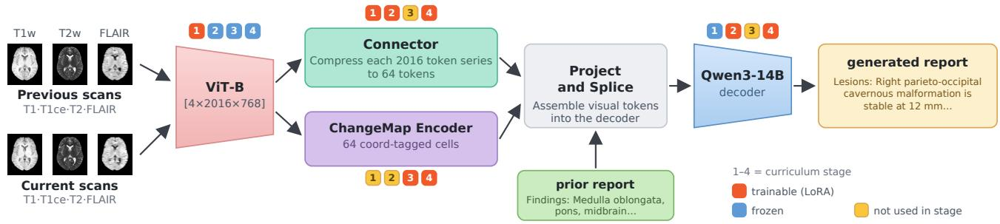
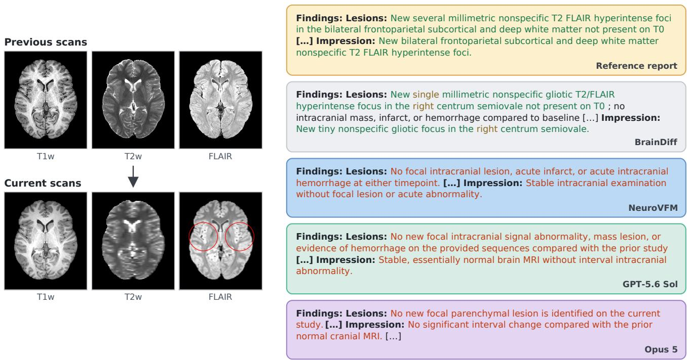
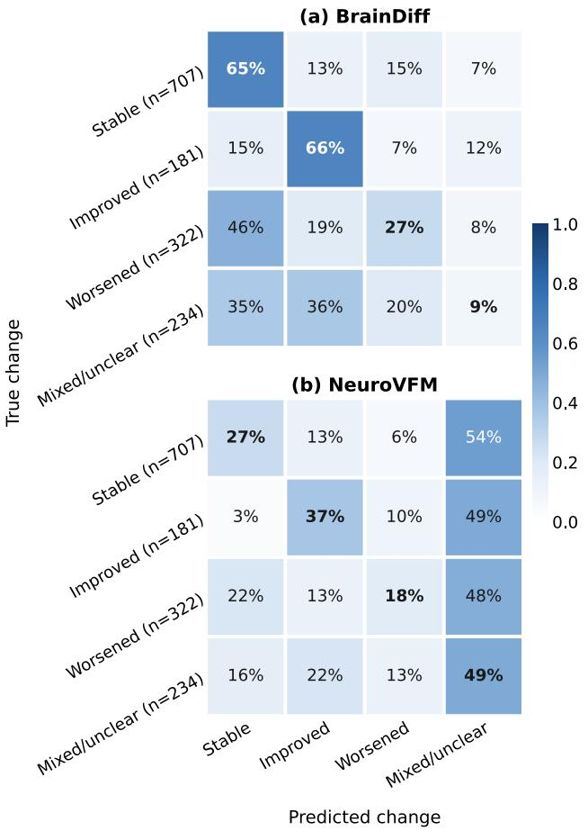

# BrainDiff: Longitudinal Report Generation for Multimodal Brain MRI

Krish Patel and Peirong Liu\*

Department of Electrical and Computer Engineering, Data Science and AI Institute, Johns Hopkins University {kpate156,pliu53}@jh.edu

## Abstract

Neuroradiologists rarely read a brain MRI in isolation, yet automated brain-MRI report generation has been built almost entirelyfor single studies. Temporal analysis has been explored on chest radiography and chest CT, but to our knowledge, longitudinal reportingfor brain MRI, where interval change is often subtle and spatially distributed, remains unaddressed. We present BrainDiff, the first longitudinal vision-language system for brain MRI. BrainDiff outperforms bothfrontier general-purpose and single-study neuroimaging models on the same patient pairs. Moreover, BrainDiff retains 91% of internal RadGraph-XL entity+relation F1 (rg er) on an external, cross-hospital cohort. Beyond the system, we contribute three analyses. First, we identify two independent grounding levers: a counterfactual objective with prior-report dropout, which increases measured image reliance by sim47%, and a staged curriculum. Together, these interventions raise image reliance 2.5-fold from the baseline. Second, we provide a factorial over prior-report availability and image identity, isolating a visual contribution of +0.0387 rg er, which grows when the prior report is withheld. Third, a cheap change-decodability test for candidate backbones shows that interval change is decodable far more weakly than single-study pathology (0.60 vs. 0.77 AUROC). Code is publicly available at https://github.com/ jhuldr/BrainDiff.

## 1. Introduction

Radiology report generation has advanced rapidly, from early CNN-RNN captioners and memory-augmented transformers [6] to grounded [32] and large multimodal language models [14, 21] that now approach clinical utility on chest X-ray. Concurrently, medical imaging foundation models have moved the field from task-specific training toward general-purpose visual backbones [2, 5, 34, 38]. For neuroimaging specifically, NeuroVFM [17], a volumetric foundation model self-supervised on 5.24M clinical MRI/CT volumes, sets the state of the art for radiologic diagnosis and single-study report generation.

Yet, a large fraction of brain MRI is follow-up imaging read comparatively against a prior. Thus, the value of the report lies precisely in the interval change it asserts. Longitudinal report generation is well developed in chest radiography, where systems learn temporal image representations [3], align current and prior studies before decoding [30, 33], and consume the prior report as grounding [4, 23]. CT2RepLong further extends this to 3D chest CT [12]. Despite the promising success in the chest settings, brain MRI raises unique and challenging problems — the delicate and highly complex structure of the human brain, missing modalities in routine care, interval-change signal that is subtle relative to surrounding anatomy, and the scarcity of true longitudinal brain MRI pairs due to privacy restrictions.

Adapting a single-study foundation model to longitudinal comparison is not simply a matter of feeding it two studies separately and comparing their outputs afterward. The target report is defined by the relation between two volumes, and clinical studies are missing sequences in quantities that break naive channel stacking. Moreover, a model given two studies and a prior report may preferentially rely on the textual prior rather than the images, and may even hallucinate comparisons to prior studies it was never shown [29]. This shortcut is rarely quantified: reported gains from “adding the prior” conflate genuine visual comparison with better text priors, and without an explicit control it is impossible to say how much a longitudinal model “sees”.

In this paper, we propose BrainDiff, to our knowledge the first longitudinal vision-language system for brain MRI. We validate it by ablating each of our grounding interventions, by external validation on the independent multi-site

BIND cohort, and by two diagnostics that apply to any longitudinal report generator, opening temporal neuroimaging as an avenue for further work. We summarize our main contributions as follows:

• Architecture. We extend a single-timepoint resampler to a pair by resolving presence per (block, modality). This enables the timepoints to carry different sequence sets. Temporal embeddings and a left-padded splice place both studies in the decoder context alongside the prior report (Sec. 3.2). Two architecture-agnostic grounding levers, a counterfactual objective with prior-report dropout and a staged curriculum, together increase image grounding 2.5-fold at no parameter cost (Sec. 3.4, 3.6).

• Performance. BrainDiff exceeds both frontier generalpurpose models and the strongest single-study neuroimaging model on the same patient pairs (Sec. 4.3), assigns the correct direction of interval change substantially more often (Fig. 3), and retains 91% of its internal performance on the independent BIND cohort with no sitespecific adaptation (Sec. 4.4).

• Analyses. A factorial over prior-report availability and image identity decomposes performance into metric floor, learned report prior, and the contribution of the correct scans, and shows the visual share grows when the prior report is withheld (Sec. 5.1). A change-decodability probe separates what the frozen encoder carries about single-study pathology from what it carries about interval change, explaining why our difference pathway is inert and bounding what any difference module can recover on this backbone (Sec. 5.2).

## 2. Related Work

Report generation. Automated reporting began with CNN-RNN captioning and was advanced by memoryaugmented and relational transformers [6], retrieval and knowledge-graph conditioning, and grounded generation that tied sentences to image regions [32]. In parallel, since n-gram overlap rewards surface phrasing and correlates poorly with clinical correctness, entity- and relationlevel metrics were developed that parse a report into a graph of findings and score those directly [8]. The current generation of medical VLMs couples a visual encoder to an LLM through a lightweight connector and visual instruction tuning [9, 14, 21]. These systems produce well-formatted reports; however hallucinated findings remain a persistent failure mode. A common mitigation for this is to tie generated sentences to image evidence [4, 32]. Until recently, the focus of this field has been on 2D medical image analysis; however, with the development of powerful 3D vision encoders, researchers have begun exploring report generation for 3D volumes.

3D medical foundation models. Extension to volumetric imaging is recent: CT2Rep introduced 3D chest-CT reporting [12], and RadFM, M3D-LaMed, Merlin, and Med3DVLM [2, 5, 34, 35] target 3D CT and general 3D medical imaging. Volumetric inputs are not simply larger 2D ones: a single study yields orders of magnitude more patch tokens than an X-ray, so these systems depend on aggressive pooling or learned resamplers to fit within a language decoder’s context [15]. Most also target chest CT, where large paired image-report corpora are publicly available, and treat each study as a single volume. Brain MRI instead presents several co-registered sequences per study whose availability varies with the clinical indication. Neuroimaging is conspicuously underrepresented, in part because facial features in brain MRI/CT constrain public data sharing. The few 3D neuro foundation models (HLIP; NeuroVFM [17, 20, 31, 39]) are trained from health-system data spanning hundreds of thousands of patients. NeuroVFM couples a 3D ViT-B encoder to a Qwen3-14B decoder [36] through a Perceiver-IO connector [15]. These backbones are trained and evaluated one study at a time, so what their representations retain across examinations of the same patient has not been established. To our knowledge, no prior 3D report-generation system targets interval change in brain MRI.

Longitudinal and temporal reporting. Temporal conditioning has been studied most in chest imaging. BioViL-T learns temporally-aware image-text representations [3] with subsequent CXR systems aligning current and prior studies before decoding [30, 33]. Later systems consumed the prior report directly [4]. CT2RepLong adds cross-attention fusion over longitudinal chest CT [12]. Two findings from the longitudinal radiography literature shape our design. First, models exploit the text prior strongly enough to hallucinate references to non-existent prior reports [29], and conditioning on a generated prior report performs comparably to the real one [28]. Second, comparison errors are a significant error source in radiology report evaluation [37]. The literature establishes prior-study conditioning as beneficial but treats the image-versus-language balance qualitatively. We, however, quantify it (Sec. 5.1) and improve it (Sec. 4.5) in a modality that is to our knowledge unaddressed.

## 3. Method

## 3.1. Setup

Given two studies from one patient at times $t _ { 1 }$ and $t _ { 2 } ,$ each with up to four unregistered skull-stripped structural sequences (T1w, T1ce, T2w, FLAIR), BrainDiff generates a free-text comparison report describing the interval change. All volumes are affinely registered to the standard MNI-152 brain anatomical template [26] using ANTs [1], such that token indices are spatially comparable across timepoints.

<table><tr><td>Module</td><td># of Params</td></tr><tr><td>connector.scan</td><td>42.5M</td></tr><tr><td>connector.proj</td><td>30.2M</td></tr><tr><td>embeddings</td><td>0.02 M</td></tr><tr><td>encoder LoRA (r=32)</td><td>1.77M</td></tr><tr><td>decoder LoRA (r=16)</td><td>20.97M</td></tr><tr><td>Total (production)</td><td>95.5M</td></tr><tr><td>ChangeMapEncoder (ablated)</td><td>34.5M</td></tr></table>

Table 1. Trainable parameters of BrainDiff. The ViT-B encoder and the Qwen3-14B decoder are frozen and adapted with LoRA. Each module’s role is given in Sec. 3.2 and Fig. 1. The ChangeMapEncoder difference path is ablated in Sec. 5.2 and is absent from the production configuration.

Training proceeds in four stages (S1–S4), each with its own objective (Sec. 3.6).

## 3.2. BrainDiff architecture

BrainDiff (Fig. 1) resamples each (block, modality) series independently so that visual token count tracks how much imaging a patient actually has and splices both timepoints into a long-context decoder. We adopt weights from NeuroVFM for our vision encoder, decoder, and Perceiver connector.

Paired visual prefix. We use NeuroVFM’s resampler weights, which already emit one call per acquired series. The longitudinal setting adds that presence must be resolved across a pair: the two studies need not carry the same sequences. Visual groups are arranged block-major over prior and current, plus a third delta block when the difference pathway in Sec. 5.2 is enabled. A group is emitted only if its sequence is present in that study, and a delta group only if present in both; per-block temporal embeddings distinguish prior from current, and the prefix is left-padded so the supervised caption is the contiguous tail. On the test split, a mean of 6.85 of 8 groups are present (438 visual tokens).

Difference pathway (ablated). We further introduce an explicit difference module (ChangeMapEncoder) on the dense 2016-token grid before resampling. Each currentstudy token attends over the prior study’s ±1 (27-token) neighborhood on the fixed template grid, producing a warped prior $\hat { A }$ whose residual $B { - } \hat { A }$ is interval change corrected for residual misregistration. A small MLP maps that residual and related difference features into a dense change field, which a per-token gate pools from the $1 2 \times 1 4 \times 1 2$ grid to a $4 \times 4 \times 4$ coordinate-tagged change map, each cell carrying a learned embedding of its normalized center so that positional information survives the pooling. The map is projected to the decoder width and spliced into the delta token groups. We pretrain it unsupervised on the 44.9k

Stage-3 pairs with reconstruction-contrastive, InfoNCE and saliency terms (§S3).

Prior-report conditioning and decoding. The prior study’s report is placed in the decoder context after the image placeholders and before the instruction. The model infers current findings and interval change from the images, using the prior report as the baseline to compare against. We interleave one image placeholder per present group and left-pad the visual prefix.

## 3.3. Training objectives

The captioning loss is per-token cross-entropy. In Stage 2 we add two terms. Weighted CE up-weights nonboilerplate tokens by $\lambda = 1 . 2 .$ since 45.1% of single-study report tokens are normality boilerplate, and uniform CE rewards reciting the template. Sentence-contrastive alignment $( w = 0 . 0 5 )$ contrasts each report sentence’s embedding against the study’s visual tokens with global-batch negatives. In S4, the weighted CE is set to $\lambda = 1 . 5$ and the sentence-contrastive alignment is disabled, and the counterfactual objective of Sec. 3.4 is set to $( w = 0 . 5 )$

## 3.4. Counterfactual grounding and prior-report dropout

Counterfactual grounding $( w = 0 . 5 ,$ margin 0.5) requires the correct prior study to yield lower caption NLL than a swapped one, relu $( 0 . 5 - ( \mathrm { n l l } _ { s w a p } - \mathrm { n l l } _ { t r u e } ) )$ , penalizing a model that ignores the baseline. Negatives are sampled uniformly at random from the training split, not classconditioned.

Prior-report dropout $( p = 0 . 3 )$ withholds the prior report on 30% of steps, regularizing against the text shortcut and making the no-prior condition in-distribution for Sec. 5.1. Because the counterfactual hinge and the prior-swap reliance measure are close relatives, Sec. 4.5 additionally reports a held-out reliance probe never optimized during training. However, this objective is not the only way to buy grounding. Sec. 4.5 shows that the curriculum (Sec. 3.6) further increases image reliance.

## 3.5. Grounding corpus construction (Stage 1)

Stage 1 requires paired (image, region, box, finding) supervision that no report corpus provides. We build it programmatically from four public lesion-segmentation datasets [ATLAS [22] (stroke), BraTS-MEN [18] (meningioma), BraTS-METS [24] (metastasis), ISLES-22 [13] (stroke)], generating up to 10 deterministic box-to-text pairs per subject. Lesion boxes come from connected-component labeling after a small morphological dilation to bridge subvoxel gaps. Each box is captioned from its overlap with FreeSurfer [10] regions (e.g. “There is a metastatic lesion in the left cerebellum.”); lesion-free regions are sampled with an “. . . is unremarkable.” caption, so the corpus teaches both presence and absence. Native-voxel boxes are mapped to integer 0–100 percentage coordinates using the same geometry function that builds the image tensor. Each boxcaption pair is then expanded into three grounding tasks sharing one coordinate specification: aref (finding to box), gcap (box to finding description) and caref (region name to finding + box), adapting the location-aware objectives of Musinguzi et al. [27] from 2D chest anatomy to 3D brain. A fourth task, pcls, attaches each study’s multi-label intracranial pathology (29 labels) from MR-RATE annotations.

  
Figure 1. BrainDiff architecture. Both studies pass through a ViT-B encoder with NeuroVFM weights. Each (block, modality) series is resampled independently, spliced into the decoder context alongside the prior report, and decoded into a comparison report. The icons above each module give its status in curriculum stages S1–S4 (Sec. 3.6). The ChangeMap Encoder is the ablated difference pathway (Sec. 5.2).

## 3.6. Curriculum

Training proceeds in four stages, each handing a checkpoint to the next by module group. S1 installs spatial grounding and pathology vocabulary with the decoder frozen; S2 learns single-study report writing and grounds it; S3 pretrains the difference path (present only in delta-on configurations); S4 installs temporal-comparison language with the decoder LoRA active. Grounding and single-study report writing are bought once on large single-study corpora so that the small longitudinal corpus only has to install temporal comparison. We ablate the curriculum in two arms, removing S1 and S2 together (nocurriculum, trained from the raw encoder) and removing S2 alone (nostage2, kept from S1), and find that although final report quality is essentially unchanged across all three (§S1), the model’s measured image reliance rises stage by stage (Sec. 4.5, Tab. 5).

## 4. Experiments

## 4.1. Data

S1: 109,253 task instances consisting of 23,448 anatomical bounding-box references (ATLAS, BraTS-MEN, BraTS-METS, ISLES-22) and 38,086 multi-label pathology studies from MR-RATE [11]. S2: 38,086 MR-RATE singlestudy reports. S3: 44,882 longitudinal pairs from MR-RATE, OASIS-3 [19], BraTS-METS, BraTS-GLI [7]. S4 (comparison): 14,642 MR-RATE pairs, patient-grouped

80/10/10, median inter-study interval 212 days; the change target has seven classes, which we group into four for reporting (Stable 46.0%, Worsened 22.7%, Mixed/unclear 17.2%, Improved 14.1%; mapping in §S4). Comparison reports and change labels are LLM-synthesized by GPT-5.4 from the two real radiologist reports. Adjudicating all 64 studies of the frontier-comparison subset against both source radiologist reports, 62 (97%) faithfully captured the intracranial interval change, and the two exceptions were omissions rather than fabricated change. Supplementary §S2 validates the BrainDiff-over-NeuroVFM ranking against real radiologist text (we used the second study’s Impression section), Tab. 2 includes the text-only control.

## 4.2. Setup

Checkpoint selection was based on RadGraph-XL [8] entity+relation F1 (rg er, per sample) on the validation set, over checkpoints saved every five epochs. Splits are patientgrouped and leakage-controlled at every stage. All stages use AdamW with a cosine schedule, gradient clip 1.0, 64 resampler latents per group. S1 runs 30 epochs at effective batch 256 with lr 3×10−4. S2 runs 40 epochs at effective batch 96 with lr $1 \times 1 0 ^ { - 4 }$ . S3 runs 50 epochs at batch 18 per rank with lr $3 \times 1 0 ^ { - 4 }$ and builds no decoder, so its InfoNCE negatives are per-rank rather than global. S4 runs at effective batch 48 with lr $1 \times 1 0 ^ { - 4 }$ for 20 epochs. Generation is greedy with repetition penalty=1.0.

Metrics. Our primary metric is rg er. Unlike n-gram overlap, RadGraph [16] parses each report into a graph of clinical entities and relations and scores extracted findings, so rg er rewards clinically correct content rather than surface phrasing. However, rg er is also an imperfect metric, since extracting entities solely from the prior report is a simple way to exploit the metric. Thus, we report vis roll, which is the difference in rg er, upon swapping a subject’s scans with another’s. We also provide BLEU-4 (calculates the geometric mean of modified precision scores for unigrams up to 4)

and METEOR (calculates a harmonic mean of unigram precision and recall, with a higher weight for recall) alongside rg er for fluency. Additionally, all rg er difference intervals are 95% paired bootstrap (10,000 resamples).

Interval-change classification. To score the direction a report asserts, we map each generated report to the fourway change label with a deterministic rule-based classifier applied to its “Impression” section. Entities are matched against a SNOMED-derived vocabulary and polarity against a 41-term change lexicon, with negation applied inside a 4- token window (§S5). The classifier is LLM-free and runs identically, so this comparison is not mediated by a second language model. When applied to the reference comparison reports, it recovers the assigned label at 81.1% balanced accuracy (82.9% on validation), which bounds the diagonal any model could reach in Fig. 3. We use this model twice — to build the interval-change confusion of Fig. 3, and to reduce each report to a signed direction for the timepointreversal probe of Tab. 4.

## 4.3. Model comparison

We compare against two frontier models (Opus 5 and GPT-5.6 Sol) and the best single-timepoint neuroimaging VLM, NeuroVFM [17]. However, since NeuroVFM cannot produce a comparison report, it generates a single-study report for the second timepoint, which is paired with the real prior report and passed through the same report-synthesis pipeline used to construct our targets, giving base NeuroVFM a structural advantage on every metric.

The separation is clearest on interval-change direction itself, where BrainDiff reaches 41.7% balanced accuracy against NeuroVFM’s 32.6% (Fig. 3): NeuroVFM assigns 48–54% of every true class to Mixed/unclear, while Brain-Diff’s predictions concentrate on the correct one. The same ordering holds on report content, where BrainDiff exceeds NeuroVFM by +0.0222 rg er, CI [+0.0157, +0.0288] (full test, n=1,444). That margin, obtained against a baseline granted the target report’s own generating procedure, shows that temporal conditioning adds something a single-study model reading the same patient does not have.

Moreover, the frontier general-purpose models trail much further. Given the same 64 studies as 8 axial 2D slices (both timepoints) and the identical prompt, Opus 5 reaches 0.2083 rg er and GPT-5.6 Sol 0.2920, against our 0.3870 on that subset, margins of +0.1787 (CI [+0.1441, +0.2133]) and +0.0950 (CI [+0.0647, +0.1250]).

Qualitative examples appear in Fig. 2, showing one case where the model correctly asserts interval progression not stated in the prior.

<table><tr><td>Model</td><td>rg-er</td><td>BLEU-4</td><td>METEOR</td></tr><tr><td>Text-only (prior report, no images)a,c</td><td>0.3217</td><td>0.1590</td><td>0.3947</td></tr><tr><td>Opus 5 (2D slices)b</td><td>0.2083</td><td>0.0436</td><td>0.3823</td></tr><tr><td>GPT-5.6 Sol (2D slices)b</td><td>0.2920</td><td>0.0958</td><td>0.3480</td></tr><tr><td>NeuroVFM + report pipelineª</td><td>0.3614</td><td>0.1907</td><td>0.4123</td></tr><tr><td>BrainDiff (ours, full volume)ª</td><td>0.3837</td><td>0.2281</td><td>0.4582</td></tr></table>

Table 2. Comparison against baselines, test split (n=1,444 usable). a Full held-out test set (n=1,444 usable). b Frontier rows are on a 64-study random subset (seed 1), 8 axial slices per available modality for both timepoints with the identical prompt; Brain-Diff/NeuroVFM on that same subset score 0.3870 / 0.3660. c The text-only row is BrainDiff conditioned on the prior report with the image tokens zeroed (no visual input).
<table><tr><td>Metric</td><td>Internal test</td><td>BIND (external)</td><td>∆ (BIND – internal)</td><td>retained</td></tr><tr><td>rg-er</td><td>0.3837</td><td>0.3506</td><td>-0.0331</td><td>91%</td></tr><tr><td>BLEU-4</td><td>0.2281</td><td>0.1801</td><td>-0.0480</td><td>79%</td></tr><tr><td>METEOR</td><td>0.4582</td><td>0.4059</td><td>-0.0523</td><td>89%</td></tr><tr><td>image contribution (vis_roll)</td><td>+0.0387</td><td>+0.0444</td><td>+0.0057</td><td></td></tr><tr><td>n</td><td>1,444</td><td>800</td><td></td><td></td></tr></table>

Table 3. External validation on the BIND cohort against the internal held-out test split. BIND is an independent multi-site cohort (n=800 usable pairs) processed through the identical pipeline with no site-specific adaptation. Retained is the BIND value as a percentage of the internal value.

## 4.4. External validation

On BIND [25], an independent multi-site cohort of longitudinal patients processed through the identical pipeline with no site-specific adaptation (n=800 usable pairs), performance holds within 0.0331 rg er of the internal test split (BIND 0.3506, CI [0.3424, 0.3588]; internal 0.3837), which is a ∼9% relative drop (Tab. 3). However, image reliance replicates and is if anything stronger externally: the image reliance is +0.0444 rg er on BIND, against +0.0387 internally. We think that this is because BIND’s prior reports differ in formatting, which would make the prior a less reliable shortcut, but we do not test this directly.

The larger relative drop in BLEU-4 than in rg er is consistent with surface phrasing being more site-specific than clinical content: the entities and relations rg er scores generalize better than exact n-grams.

## 4.5. Counterfactual and curriculum increase image reliance

The language-prior reliance is the same shortcut that makes chest-X-ray models hallucinate comparisons to absent priors [29]. We target it at training time with two interventions that remove the shortcut without adding parameters: the counterfactual grounding hinge and prior-report dropout (Sec. 3.4), and the staged curriculum (Sec. 3.6).

  
Figure 2. Qualitative comparison on a held-out follow-up study. The reference report records new bilateral frontoparietal subcortical and deep white matter T2/FLAIR hyperintense foci not present at T0. BrainDiff asserts a new lesion (green), while the single-study and frontie baselines all assert no interval change.

Image reliance rises ∼47% (image effect from +0.0263 to +0.0387 rg er, a paired difference of +0.0124, CI [+0.0056, +0.0194]) at a 1.5% cost to report quality (a −0.0059 rg er difference on the correct-scans condition), which is a trade of a +47% grounding gain for a 1.5% quality change. We measure image reliance with another patient’s scans (vis roll). As with Tab. 6, wrong-but-valid scans keep both models in distribution, so the comparison isolates grounding.

The swap measure is closely related to the training objective, so we verify the shift against an unoptimized probe. Timepoint reversal presents the two studies in reversed temporal order with the prior report unchanged; a model reading the images should invert or degrade its asserted change direction, a model reciting the prior report should be indifferent. On the held-out test set, the signed-flip rate rises from 0.225 to 0.273 under the grounding recipe, a difference of +0.0485 (95% CI [−0.0221, +0.1190]); the interval spans zero, so we read reversal as corroborating the rg er reliance result rather than as independent evidence.

The intervention ablations show how the counterfactual objective and dropout interact with the grounding curriculum. Image reliance rises monotonically as interventions are added, for a total increase of +0.0231 rg er with 95% CI of [+0.0160, +0.0301], indicating that each component contributes near independently to grounding. Both interventions are architecture-agnostic, which makes them applicable to any longitudinal report generator conditioned on a prior report, including the chest systems where this shortcut was first documented.

## 5. Further Analysis and Discussion

The two analyses in this section are tools rather than properties of our specific system. The factorial of Sec. 5.1 needs only a generator conditioned on a prior report and a way to substitute its images, and the decodability probe of Sec. 5.2 needs only access to a candidate encoder’s frozen features. Both can be run on any longitudinal report generator and backbone before an architecture is built on it.

## 5.1. What the model sees

We decompose what carries the report signal. rg er is ablated over a 2x2 of prior report (present / withheld, made in-distribution by the dropout of Sec. 3.4) and images (own scans / another patient’s scans), on one checkpoint over identical rows. We chose another patient’s scans instead of zeroing the scans, because zeroed inputs are unseen during training, while another patient’s scans are a valid input that isolates image identity alone. The configuration prior work would typically report — prior report present, own scans — scores 0.3837 rg er. Decomposing that total attributes 64% to the metric floor (0.2471, one patient’s reference report scored against another’s), 26% to the learned report prior (+0.0979, recovered from the prior report with the wrong scans), and 10% to the scans themselves (+0.0387). Because this floor is shared by every system scored on these references, raw rg er differences understate the relative separation between them. The image contribution is also larger when the prior report is absent than when present (+0.0544 vs +0.0387 rg er effect of seeing the correct scans). We report swap-based image reliance throughout because zeroed image tokens are unseen in training, so the resulting score confounds distribution shift with lost visual signal and is not comparable across models.

<table><tr><td>Model</td><td>own</td><td>other pt&#x27;s</td><td>effect of scans</td><td>reversal ∆</td></tr><tr><td>baseline (nocf)</td><td>0.3896</td><td>0.3633</td><td>+0.0263 [+0.0202,+0.0322]</td><td>0.2246 [0.1754,0.2737]</td></tr><tr><td>counterfactual and dropout (nodelta)</td><td>0.3837</td><td>0.3450</td><td>+0.0387 [+0.0324,+0.0449]</td><td>0.2730 [0.2234,0.3262]</td></tr></table>

Table 4. Effect of counterfactual grounding + prior-report dropout. The right-hand column is a held-out reliance probe, never optimized during training

<table><tr><td>Interventions</td><td>rg-er</td><td>95% CI</td></tr><tr><td>no curriculum, no cf, no dropout</td><td>+0.0156</td><td>[+0.0107, +0.0205]</td></tr><tr><td>no curriculum (with cf and dropout)</td><td>+0.0266</td><td>[+0.0202, +0.0329]</td></tr><tr><td>S1 only</td><td>+0.0299</td><td> $[ + 0 . 0 2 4 0 , + 0 . 0 3 6 0 ]$ </td></tr><tr><td>S1+S2</td><td>+0.0387</td><td>[+0.0324, +0.0449]</td></tr></table>

Table 5. Image reliance (rg er with the correct scans minus rg er with another patient’s scans) as grounding interventions are added, held-out test split (n=1,444).
<table><tr><td></td><td>own scans</td><td>another patient&#x27;s</td><td>effect of scans</td></tr><tr><td>prior report present</td><td>0.3837</td><td>0.3450</td><td>+0.0387</td></tr><tr><td>prior report withheld</td><td>0.2600</td><td>0.2057</td><td>[+0.0324, +0.0449] +0.0544</td></tr><tr><td>effect of prior report +0.1236 +0.1393</td><td></td><td></td><td>[+0.0480, +0.0610]</td></tr><tr><td></td><td></td><td></td><td>-0.0157</td></tr><tr><td>floor</td><td></td><td>0.2471 [0.2392, 0.2548]</td><td></td></tr></table>

Table 6. Prior-report × image factorial on the held-out test split. Cells are rg er under each combination of prior-report availability and image identity; effect of scans is the paired difference between the model’s own scans and another patient’s. Floor is the reference report scored against another patient’s reference. The effect of prior report intervals are [+0.1167, +0.1306] (own scans) and [+0.1323, +0.1464] (another patient’s), and the interaction is [−0.0231, −0.0083]. Intervals are 95% paired bootstrap.

## 5.2. What the backbone preserves

We test whether an explicit difference pathway has any benefit. We train two models under identical curriculum, data and prompt-consistent inputs, differing in whether the ChangeMapEncoder difference pathway is present.

<table><tr><td>Model</td><td>rg-er</td><td>BLEU-4</td><td>METEOR</td></tr><tr><td>BrainDiff (delta on)</td><td>0.3846</td><td>0.2231</td><td>0.4513</td></tr><tr><td>BrainDiff (delta off)</td><td>0.3837</td><td>0.2281</td><td>0.4582</td></tr><tr><td>BrainDiff (wrong patient&#x27;s scans)</td><td>0.3450</td><td>0.2067</td><td>0.4290</td></tr><tr><td>delta contribution</td><td>+0.0009</td><td>-0.0050</td><td>-0.0069</td></tr><tr><td>image contribution</td><td>[−0.0048, +0.0065] +0.0387 [+0.0324, +0.0449]</td><td>+0.0214</td><td>+0.0292</td></tr></table>

Table 7. Difference-pathway (ChangeMapEncoder) ablation, test split (n = 1,444 usable). Delta contribution is delta-on − delta-off; image contribution is delta-off − wrong patient’s scans. Brackets are 95% paired-bootstrap intervals over reports.

<table><tr><td>Probe target</td><td>AUROC</td></tr><tr><td>Positive control: single-study pathology (macro over 0.766 14 common labels)</td><td></td></tr><tr><td>Interval change, within-pair (BraTS paired masks, 0.601 n=500 pairs)</td><td></td></tr><tr><td>Interval change, pooled across patients (between- 0.702 patient confound)</td><td></td></tr><tr><td>Nuisance control: real change vs augmented duplicate 0.997 (separability)</td><td></td></tr></table>

Table 8. Linear-probe decodability from the frozen NeuroVFM features. The positive control establishes the probe recovers signal at this capacity, while the nuisance control confirms the withinpair result is not driven by augmentation-only feature distance.

The ChangeMapEncoder has no measurable benefit to report quality: the delta contribution is +0.0009 rg er, CI [−0.0048, +0.0065], an interval including zero, and BLEU-4 and METEOR both move slightly against the delta-on model (−0.0050 and −0.0069). We attribute this to the representation rather than the module. A difference encoder can only expose change that survives into the features it differences. We hypothesize the tokenization is a contributing factor: NeuroVFM patches volumes resampled to 1 × 1 × 4 mm into 4 × 16 × 16-voxel patches, so each token subtends roughly 16 mm isotropic, and clinically reportable change (a sub-millimeter metastasis, a marginal enhancement change, early volume loss) occupies a fraction of a single token. Tab. 8 tests this on the features themselves by bypassing generation.

  
Figure 3. Four-way interval-change confusion on the held-out test split (n=1,444). Rows are normalized to the true class, so diagonal cells are per-class recall. Balanced accuracy: BrainDiff 41.7%, NeuroVFM 32.6%, against a classifier ceiling of 81.1% (§S5). NeuroVFM assigns 48–54% of every true class to Mixed/unclear rather than committing to a direction; BrainDiff’s predictions concentrate on the correct one.

Interval change is much less decodable than single-study pathology. The probe confirms this gap (0.601 vs 0.766 AUROC). However, a naive difference probe inflates apparent decodability via between-patient magnitude, as pooling change tokens across patients inflates the number to 0.702. This is because a patient whose scans moved a lot has large feature deltas on every token, so the pooled probe can simply learn which patient moved rather than where within a patient the change occurred. Finally, when given augmented duplicate pairs the probe separates real change from the augmentation-only difference at 0.997 AUROC, showing that the weak signal is not an artifact.

The coarse spatial resolution of the backbone may explain the lower accuracy on the Worsened class relative to Stable and Improved (Fig. 3). Lesion growth often manifests as sub-millimeter differences, so a backbone that cannot resolve them will tend to read mildly worsening pathology as stable: BrainDiff assigns 46% of truly worsened studies to Stable, more often than it calls them Worsened (27%). This is the safety-critical direction of error, and it is the failure mode the resolution bound predicts.

This is a limitation of current volumetric neuroimaging backbones, not of difference modeling itself. The result therefore sets a concrete requirement for the next generation of image encoders: interval change should be as decodable from their features as single-study pathology already is. Change-decodability probing with the positive and nuisance controls is a cheap way to validate whether a backbone meets that bar before an architecture is built on it.

BrainDiff still improves interval-change classification under this constraint. Our model outperforms base NeuroVFM on interval-change direction without modifying the backbone (41.7% vs 32.6% balanced accuracy, Fig. 3). NeuroVFM’s higher recall on Mixed/unclear reflects nearconstant prediction of that class rather than discrimination, and the classifier ceiling on it is 0.548.

## 5.3. Limitations

Comparison targets are LLM-synthesized from two real radiologist reports, which favors text-to-text overlap and partially confounds the prior-report result. The text-only row of Tab. 2 bounds what is recoverable from the prior alone, and supplementary §S2 shows the BrainDiff-over-NeuroVFM ranking is preserved when the reference is real radiologist text (the second study’s Impression); main results nonetheless remain scored against a synthesis. Separately, the negative result of Sec. 5.2 is specific to the frozen NeuroVFM grid at 16 mm under affine-only normalization, and bounds what a difference module can do on this backbone. Finally, the baseline comparison in Sec. 4.3 requires each system to be adapted to a task it was not built for, harming the frontier models dimensionally while advantaging NeuroVFM procedurally.

## 6. Conclusion

In this work, we introduce BrainDiff, the first longitudinal report generator for brain MRI. Our system exceeds both frontier general-purpose models and the strongest available single-study neuroimaging model on the same patients, under an evaluation constructed in that baseline’s favor, and it retains 91% of its internal performance on an independent multi-site cohort. To force the model to rely on the images rather than the prior report, we introduce two independent levers, counterfactual grounding with prior-repor dropout and the staged curriculum, which together raise image reliance 2.5-fold. We pair the system with two diagnostics. First, a factorial shows that most of the model’s apparent performance is report structure and prior text, and that our interventions shift that balance toward the images.

Second, a bounded negative result: an explicit difference encoder does not close the interval-change bottleneck here, because the frozen backbone preserves interval change far more weakly than single-study pathology. Even under that bound, BrainDiff achieves satisfactory results in identifying the direction of interval change.

## References

[1] Brian B. Avants, Charles L. Epstein, Murray Grossman, and James C. Gee. Symmetric diffeomorphic image registration with cross-correlation: Evaluating automated labeling of elderly and neurodegenerative brain. Medical Image Analysis, 12(1):26–41, 2008. 2

[2] Fan Bai, Yuxin Du, Tiejun Huang, Max Q. H. Meng, and Bo Zhao. M3D: Advancing 3D Medical Image Analysis with Multi-Modal Large Language Models. arXiv preprint arXiv:2404.00578, 2024. 1, 2

[3] Shruthi Bannur, Stephanie Hyland, Qianchu Liu, Fernando Perez-Garc´ ´ıa, Maximilian Ilse, Daniel C. Castro, et al. Learning to exploit temporal structure for biomedical visionlanguage processing. In CVPR, 2023. 1, 2

[4] Shruthi Bannur, Kenza Bouzid, Daniel C. Castro, Anton Schwaighofer, Anja Thieme, Sam Bond-Taylor, et al. MAIRA-2: Grounded Radiology Report Generation. arXiv preprint arXiv:2406.04449, 2024. 1, 2

[5] Louis Blankemeier, Ashwin Kumar, Joseph Paul Cohen, Jiaming Liu, Longchao Liu, Dave Van Veen, et al. Merlin: a computed tomography vision–language foundation model and dataset. Nature, 652(8112):1318–1328, 2026. 1, 2

[6] Zhihong Chen, Yan Song, Tsung-Hui Chang, and Xiang Wan. Generating Radiology Reports via Memory-driven Transformer. In EMNLP, 2020. 1, 2

[7] Maria Correia de Verdier, Rachit Saluja, Louis Gagnon, Dominic LaBella, Ujjwall Baid, Nourel Hoda Tahon, et al. The 2024 Brain Tumor Segmentation (BraTS) Challenge: Glioma Segmentation on Post-treatment MRI. arXiv preprint arXiv:2405.18368, 2024. 4

[8] Jean-Benoit Delbrouck. RadGraph-XL: A Large-Scale Expert-Annotated Dataset for Entity and Relation Extraction from Radiology Reports. PhysioNet, 2025. 2, 4

[9] Nicolas Deperrois, Hidetoshi Matsuo, Samuel Ruiperez-´ Campillo, Moritz Vandenhirtz, Sonia Laguna, Alain Ryser, et al. RadVLM: A Multitask Conversational Vision-Language Model for Radiology. Nature Scientific Reports, 2026. 2

[10] Bruce Fischl, David H. Salat, Evelina Busa, Marilyn Albert, Megan Dieterich, Christian Haselgrove, et al. Whole brain segmentation: automated labeling of neuroanatomical structures in the human brain. Neuron, 33(3):341–355, 2002. 3

[11] Forithmus. MR-RATE: A vision-language foundation model and dataset for magnetic resonance imaging. huggingface.co/datasets/Forithmus/MR-RATE, 2026. 4

[12] Ibrahim Ethem Hamamci, Sezgin Er, and Bjoern Menze. CT2Rep: Automated Radiology Report Generation for 3D Medical Imaging. In MICCAI, 2024. 1, 2

[13] Moritz R. Hernandez Petzsche, Ezequiel de la Rosa, Uta Hanning, Roland Wiest, Waldo Valenzuela, Mauricio Reyes, et al. ISLES 2022: A multi-center magnetic resonance imaging stroke lesion segmentation dataset. Scientific Data, 9(1), 2022. 3

[14] Stephanie L. Hyland, Shruthi Bannur, Kenza Bouzid, Daniel C. Castro, Mercy Ranjit, Anton Schwaighofer, et al. MAIRA-1: A specialised large multimodal model for radi ology report generation. arXiv preprint arXiv:2311.13668, 2023. 1, 2

[15] Andrew Jaegle, Sebastian Borgeaud, Jean-Baptiste Alayrac, Carl Doersch, Catalin Ionescu, David Ding, et al. Perceiver IO: A General Architecture for Structured Inputs & Outputs. In ICLR, 2022. 2

[16] Saahil Jain, Ashwin Agrawal, Adriel Saporta, Steven QH Truong, Du Nguyen Duong, Tan Bui, et al. Radgraph: Ex tracting clinical entities and relations from radiology reports. arXiv preprint arXiv:2106.14463, 2021. 4

[17] Akhil Kondepudi, Akshay Rao, Chenhui Zhao, Yiwei Lyu, Samir Harake, et al. Health system learning enables generalist neuroimaging models. Nature Medicine, 2026. 1, 2, 5

[18] Dominic LaBella, Maruf Adewole, Michelle Alonso-Basanta, Talissa Altes, Syed Muhammad Anwar, Ujjwal Baid, et al. The asnr-miccai brain tumor segmentation (brats) challenge 2023: Intracranial meningioma. arXiv preprint arXiv:2305.07642, 2023. 3

[19] Pamela J. LaMontagne, Tammie L. S. Benzinger, John C. Morris, Sarah Keefe, Russ Hornbeck, Chengjie Xiong, et al. OASIS-3: Longitudinal Neuroimaging, Clinical, and Cognitive Dataset for Normal Aging and Alzheimer Disease. medRxiv, 2019. 4

[20] Jiayu Lei, Xiaoman Zhang, Chaoyi Wu, Lisong Dai, Ya Zhang, Yanyong Zhang, Yanfeng Wang, Weidi Xie, and Yue hua Li. AutoRG-Brain: Grounded Report Generation for Brain MRI. JBHI, 2025. 2

[21] Chunyuan Li, Cliff Wong, Sheng Zhang, Naoto Usuyama, Haotian Liu, Jianwei Yang, et al. LLaVA-Med: Training a Large Language-and-Vision Assistant for Biomedicine in One Day. In NIPS, 2023. 1, 2

[22] Sook-Lei Liew, Julia M. Anglin, Nick W. Banks, Matt Sondag, Kaori L. Ito, Hosung Kim, et al. A Large, Open Source Dataset of Stroke Anatomical Brain Images and Man ual Lesion Segmentations. Scientific Data, 2018. 3

[23] Kang Liu, Zhuoqi Ma, Xiaolu Kang, Yunan Li, Kun Xie, Zhicheng Jiao, and Qiguang Miao. Enhanced Contrastive Learning with Multi-view Longitudinal Data for Chest Xray Report Generation. In CVPR, page 10348–10359, 2025. 1

[24] Nazanin Maleki, Raisa Amiruddin, Ahmed W. Moawad, Nikolay Yordanov, Athanasios Gkampenis, Pascal Fehringer, et al. Analysis of the MICCAI Brain Tumor Segmentation – Metastases (BraTS-METS) 2025 Light house Challenge: Brain Metastasis Segmentation on Preand Post-treatment MRI. arXiv preprint arXiv:2504.12527, 2025. 3

[25] Charlotte Maschke, Peter Hadar, Yicheng Zhang, Jian Li, Gauri Ganjoo, Andrew Hoopes, et al. The Brain Imaging

and Neurophysiology Database: BINDing multimodal neural data into a large-scale repository. medRxiv, pages 2025– 10, 2025. 5

[26] John Mazziotta, Arthur Toga, Alan Evans, Peter Fox, Jack Lancaster, Karl Zilles, et al. A probabilistic atlas and reference system for the human brain: International Consortium for Brain Mapping (ICBM). Philosophical Transactions ofthe Royal Society ofLondon B: Biological Sciences, 356(1412):1293–1322, 2001. 2

[27] Denis Musinguzi, Caren Han, and Prasenjit Mitra. Location-Aware Pretraining for Medical Difference Visual Question Answering. arXiv preprint arXiv:2603.04950, 2026. 4

[28] Aaron Nicolson, Jason Dowling, Douglas Anderson, and Bevan Koopman. Longitudinal data and a semantic similarity reward for chest X-ray report generation. Informatics in Medicine Unlocked, 50:101585, 2024. 2

[29] Vignav Ramesh, Nathan Andrew Chi, and Pranav Rajpurkar. Improving Radiology Report Generation Systems by Removing Hallucinated References to Non-existent Priors. In NeurIPS, 2022. 1, 2, 5

[30] Francesco Dalla Serra, Chaoyang Wang, Fani Deligianni, Jeffrey Dalton, and Alison Q O’Neil. Controllable Chest X-Ray Report Generation from Longitudinal Representations. EMNLP, 2023. 1, 2

[31] Divyanshu Tak, Biniam A. Garomsa, Anna Zapaishchykova, et al. A generalizable foundation model for analysis of human brain MRI. Nature Neuroscience, 29(4):945–956, 2026. 2

[32] Tim Tanida, Philip Muller, Georgios Kaissis, and Daniel¨ Rueckert. Interactive and Explainable Region-guided Radiology Report Generation. In CVPR, 2023. 1, 2

[33] Fuying Wang, Shenghui Du, and Lequan Yu. HERGen: Elevating Radiology Report Generation with Longitudinal Data. In ECCV, 2024. 1, 2

[34] Chaoyi Wu, Xiaoman Zhang, Ya Zhang, Yanfeng Wang, and Weidi Xie. Towards Generalist Foundation Model for Radiology by Leveraging Web-scale 2D&3D Medical Data. Nature Communications, 2025. 1, 2

[35] Yu Xin, Gorkem Can Ates, Kuang Gong, and Wei Shao. Med3DVLM: An Efficient Vision-Language Model for 3D Medical Image Analysis. IEEE Journal of Biomedical and Health Informatics, 2026. 2

[36] An Yang, Anfeng Li, Baosong Yang, Beichen Zhang, Binyuan Hui, Bo Zheng, et al. Qwen3 Technical Report. arXiv preprint arXiv:2505.09388, 2025. 2

[37] Feiyang Yu, Mark Endo, Rayan Krishnan, Ian Pan, Andy Tsai, Eduardo Pontes Reis, et al. Evaluating Progress in Automatic Chest X-Ray Radiology Report Generation. medRxiv, 2022. 2

[38] Sheng Zhang, Yanbo Xu, Naoto Usuyama, Hanwen Xu, Jaspreet Bagga, Robert Tinn, et al. BiomedCLIP: a multimodal biomedical foundation model pretrained from fifteen million scientific image-text pairs. NEJM AI, 2024. 1

[39] Chenhui Zhao, Yiwei Lyu, Asadur Chowdury, Edward Harake, Akhil Kondepudi, Akshay Rao, et al. Towards Scalable Language-Image Pre-training for 3D Medical Imaging. TMLR, 2026. 2

# BrainDiff: Longitudinal Report Generation for Multimodal Brain MRI

Supplementary Material

This supplementary material includes:

S1: Analysis of the staged curriculum and its effect on grounding.

S2: Validation against real radiologist Impression text.

S3: Details of difference-pathway pretraining.

S4: Definition and distribution of interval-change labels.

S5: Details and validation of the interval-change classifier.

## S1. What the curriculum buys

We compare the full-curriculum model (S1+S2) against two arms: S1 only, which keeps S1 but removes S2, and none, trained directly on the S4 data from the raw NeuroVFM encoder with no S1 and no S2. Each arm is selected on validation rg er and evaluated on the held-out test split. All numbers below are rg er on n=1,444 held-out test pairs, greedy decoding, repetition penalty 1.0. On the headline metric the three arms are indistinguishable — their intervals with the report available overlap heavily — but the curriculum does change how the model earns that score.

Prior-report reliance. The full-curriculum arm’s score drops least when the report is withheld. Its prior-report reliance is 0.0288 below the S1 only arm and 0.0176 below the none arm, both intervals clearing zero. The effect is not monotonic in curriculum depth, indicating that S2 is responsible for reducing prior-report reliance. This result makes sense: S2 is single-report generation, a stage which forces the model to produce a report solely from the images.

Image reliance. Independently of the prior report, the curriculum also makes the model rely more on the images. The effect of the correct scans is +0.0266 for none, +0.0299 for S1 only, and +0.0387 for S1+S2. Because this is the imagegrounding counterpart to the counterfactual objective and is measured identically, it is reported in the main text alongside that objective (Sec. 4.5).

The curriculum’s value lies not in the final rg er but in a behavioral shift toward image grounding. This is also the property the counterfactual objective of Sec. 4.5 targets, which makes the curriculum an additional grounding lever rather than a data-efficiency tool.

## S2. Validation against real radiologist text

Our primary metric is computed against LLM-synthesized comparison reports, which raises the concern that a high score reflects agreement with the synthesis procedure rather than clinical correctness. We test whether the central result survives when the reference is real radiologist text. Followup radiology reports are typically written comparatively, so the current-study report (report2) contains the radiologist’s own interval-change assessment, and it is never shown to any model. BrainDiff conditions only on the prior report and the images. On the held-out studies whose second report carries an explicit Impression section, we extract that Impression as a real reference and re-score each system’s generated Impression against it with rg er. No regeneration is involved as the model outputs are unchanged.

The absolute values are low: a real radiologist Impression is short and stylistically unlike a generated comparison report, and rg er penalizes that mismatch. This is therefore a ranking-preservation test rather than an absolute-quality claim. Additionally, some of the comparisons in the Impression section may be derived from visits whose scans we do not have.

Nevertheless, BrainDiff exceeds NeuroVFM against real radiologist text by +0.0075 rg er with an interval clearing zero. This finding is the same direction and significance as the synthetic-reference margin. The advantage of temporal conditioning over the single-study backbone is therefore not an artifact of synthetic reports. It agrees with what the radiologist actually wrote.

## S3. Difference-pathway pretraining

Setup. The ChangeMapEncoder (34.5 M parameters: correspondence cross-attention 1.58 M, change MLP 2.36 M, per-token gate 0.15 M, coordinate embedding 0.30 M, output projection 30.16 M) is pretrained on its own with the vision encoder frozen during S3, and then trained further during S4. Three auxiliary heads — a reconstructor, a compression head, and a dense head — are trained alongside it and discarded afterwards, so only the change map enters S4. Data. 44,882 longitudinal pairs drawn from MR-RATE, OASIS-3, BraTS-METS, and BraTS-GLI. 15% of each batch is replaced by augmented duplicates, one scan augmented twice. These samples have non-zero feature distance but zero true interval change. They are the nuisance controls that separate features that differ because something changed from features that differ because of acquisition. They allow the saliency term to be trained without change labels.

Losses. We use three terms, which are each equally weighted:

• Reconstruction-contrastive requires the dense change field to encode enough information such that the reconstructor can rebuild $\mathrm { e m b e d } _ { B }$ from $\mathrm { { e m b e d } } _ { A }$ better than the same field with a spatial block overwritten by another pair’s, encouraging the field to carry which specific regions distinguish these two timepoints instead of a generic summary.

<table><tr><td>Curriculum</td><td>rg_er (report available)</td><td>rg_er (report withheld)</td><td>prior-report reliance</td><td>∆ vs S1+S2</td></tr><tr><td>none</td><td>0.3823 [0.3755, 0.3891]</td><td>0.2411 [0.2352, 0.2471]</td><td>+0.1412 [+0.1342, +0.1485]</td><td>+0.0176 [+0.0102, +0.0251]</td></tr><tr><td>S1 only</td><td>0.3867 [0.3800, 0.3936]</td><td>0.2343 [0.2281, 0.2407]</td><td>+0.1524 [+0.1453, +0.1595]</td><td>+0.0288 [+0.0215, +0.0361]</td></tr><tr><td> $\mathbf { S } 1 { + } \mathbf { S } 2$ </td><td>0.3837 [0.3769, 0.3902]</td><td>0.2600 [0.2541, 0.2661]</td><td>+0.1236 [+0.1167, +0.1306]</td><td></td></tr></table>

Table S1. Reliance on the prior report by curriculum arm (none, S1 only, S1+S2), held-out test split (n=1,444). Prior-report reliance is rg er with the prior report present minus rg er with it withheld, evaluated on identical studies. ∆ is each arm’s prior-report reliance minus that of the full curriculum, so a positive value means the arm leans more on the text prior. The three report-available intervals overlap heavily, which is the basis for the claim that the arms are indistinguishable on the headline metric. The no-prior condition is in-distribution for every arm, since all three were trained with prior-report dropout (Sec. 3.4). Intervals are 95% paired bootstrap over 10,000 resamples.

<table><tr><td>System vs real Impression</td><td>rg-er</td></tr><tr><td>BrainDiff</td><td>0.0961</td></tr><tr><td>NeuroVFM + report pipeline</td><td>0.0885</td></tr><tr><td>∆ (BrainDiff – NeuroVFM)</td><td>+0.0075</td></tr><tr><td></td><td>[+0.0015, +0.0134]</td></tr></table>

Table S2. BrainDiff and NeuroVFM scored against real radiologist Impression text (the held-out second report Impression section, which was never shown to either model; n=1,297) rather than the synthesized comparison target. Target reports lacking an Impression section were cut, reducing the set from 1,444 to 1,297. Interval is a 95% paired bootstrap.

• InfoNCE on the coarse map ensures that the $4 \times 4 \times 4$ map is pair-discriminative, matching each map to its own pooled dense change field with negatives drawn from other pairs in the batch.

• Saliency ties each token’s gate to the per-token cosine distance between the warped prior and the current study on the 12 × 14 × 12 grid, normalized within each study and sequence, with duplicate pairs driven to zero gate.

Supervision is deliberately not applied to the coarsened map, because a per-cell target is near-uniform and a gate trained against it fits the target while localizing at chance. Keeping supervision at the token grid, where the change signal is sparse, is what makes the gate informative. The gate then acts on the read path through gated pooling, so changed tokens dominate the cell they are pooled into.

Optimization. 50 epochs scheduled, lr $3 \times 1 0 ^ { - 4 }$ (AdamW, cosine schedule), bottleneck width 128, warm-started from the S2 checkpoint. Since no decoder is built at this stage, the InfoNCE negatives are per-rank rather than global.

Outcome. The pathway does not measurably improve report quality — the delta contribution is +0.0009 rg er, 95% CI [−0.0048, +0.0065] (Tab. 7 in the main paper). Sec. 5.2 suggests that this limitation arises largely from the backbone rather than the difference module itself.

<table><tr><td>Reported class</td><td>Source classes</td><td>Full Dataset</td><td>Test</td><td>n</td></tr><tr><td>Stable</td><td>Stable</td><td>46.0%</td><td>49.0%</td><td>707</td></tr><tr><td>Worsened</td><td>Progressed, New lesion</td><td>22.7%</td><td>22.3%</td><td>322</td></tr><tr><td>Mixed/unclear</td><td>Mixed interval change, Indeterminate</td><td>17.2%</td><td>16.2%</td><td>234</td></tr><tr><td>Improved</td><td>Improved, Resolved</td><td>14.1%</td><td>12.5%</td><td>181</td></tr></table>

Table S3. Seven-to-four-class grouping. Full Dataset gives the proportion over the full S4 set (14,642 pairs); Test is the held-out split (n=1,444 usable generations).

## S4. Interval-change labels

Each S4 pair carries a seven-way change label assigned by the same LLM pass that wrote the comparison target: Stable, Improved, Resolved, Progressed, New lesion, Mixed interval change, and Indeterminate.

Label grouping. We report four classes throughout the paper, grouping by clinical direction as in Table S3. The merged source classes are clinically equivalent within each group: a resolved lesion is an improvement, and a new lesion is progression. The Mixed/unclear group holds the two source classes for which no single direction of change can be reported: Mixed interval change, where change occurs in both directions within one study, and Indeterminate, where the direction cannot be established. This heterogeneous class is more difficult by construction, which is a plausible contributor to the model’s low recall on it in Fig. 3 in the main paper.

Test-set accounting. The held-out split contains 1,464 labeled pairs, of which 1,444 are usable: 20 do not have complete imaging at both timepoints and are dropped before generation. All generation results are therefore reported on n=1,444, while the classifier fidelity of Table S4, which scores reference reports rather than generations, is measured over all 1,464 labeled pairs.

## S5. Interval-change classification

Classifier. To place a generated report into the four-label space of §S4, we use a deterministic rule-based classifier applied to the generated report’s Impression. Radiology impressions state the interval verdict, whereas the findings body enumerates stable and changed items alike, so a classifier reading the whole report promotes any single incidental cue into an erroneous direction.

<table><tr><td>Split</td><td>Bal.</td><td>Overall</td><td>Stab.</td><td>Impr.</td><td>Wors.</td><td>Mix.</td></tr><tr><td>Test (n=1,464)</td><td>81.1%</td><td>84.4%</td><td>0.895</td><td>0.870</td><td>0.933</td><td>0.548</td></tr><tr><td>Val (n=1,464)</td><td>82.9%</td><td>85.0%</td><td>0.894</td><td>0.887</td><td>0.945</td><td>0.591</td></tr></table>

Table S4. Classifier fidelity against the reference comparison reports, over every labeled pair in each split (n=1,464; the 20 pairs without complete imaging are included here because no generation is required). Bal. is balanced accuracy; Overall is unweighted accuracy; the remaining columns are per-class recall. Binary changevs-stable on the test split is P 0.904 / R 0.937 / F1 0.920. Validation and test agree within 1.8 points.

Within that section, the report is parsed into (entity, polarity) pairs.

• Entities are matched against a curated vocabulary of 1,850 anatomical terms derived from SNOMED CT, the condensed MR-RATE pathology labels, their head nouns, and 59 hand-added report-language terms (lesion, mass, midline shift, mass effect, . . . ), longest match first.

• Polarity comes from a 41-term change lexicon mapping cues to {stable, progressed, improved}, deliberately excluding size adjectives such as small or large, which describe a lesion rather than an interval change.

• Negation is applied within a 4-token window and does not cross clause boundaries, so a negated progression cue asserts stability (“no new lesion” → stable) while “enlarged mass, no new lesion” retains both polarities.

The report’s class is then: Indeterminate if the impression states the change is indeterminate; otherwise Mixed interval change if more than one directional polarity is asserted; Progressed or Improved if exactly one; Stable if only stable cues appear; Indeterminate if no polarity is found. The explicit-indeterminacy rule is required because the label scheme uses that term for change present, direction unassignable, whereas the lexicon rule reaches it only when no cue is found at all. The classifier is LLM-free, deterministic, and runs on CPU in ∼5 ms per report, so the same procedure scores every system identically and is reproducible.

Empirical classifier ceiling. Applied to the reference comparison reports, the classifier recovers the assigned fourway label at the rates in Table S4. This bounds what Fig. 3 in the main paper can show (a model whose reports were perfect would still not reach 100% on the diagonal). The agreement is between a rule-based parser and LLMassigned labels, so it bounds internal fidelity rather than agreement with a radiologist.

Use 1: interval-change confusion. Both systems’ generated reports are classified with the identical procedure. The matrix is row-normalized so the diagonal is per-class recall (n=1,444, Fig. 3 in the main paper).

Use 2: timepoint-reversal probe. Each report is reduced to a direction via the same classifier: +1 for {Progressed, New lesion}, −1 for {Improved, Resolved}, 0 otherwise. The probe is run on a 503-study subset of the test split (Stable, Mixed, and Indeterminate cases were excluded) and is further restricted to studies whose true label asserts a direction and whose forward report asserts one $( d \neq 0 )$ , giving 285 and 282 evaluable cases for the two arms (Tab. 4 in the main paper). The signed-flip rate is the fraction of cases whose reversed-order report no longer asserts the same sign. A model that reads the images should flip its asserted direction when the study order is reversed, whereas one reciting the prior report will not.