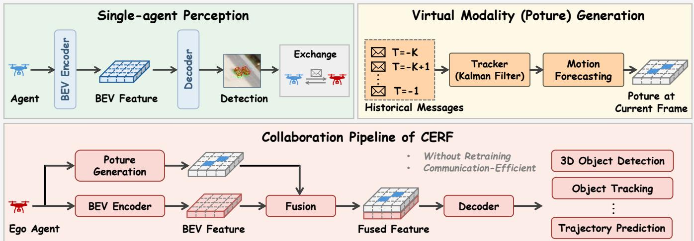
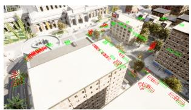
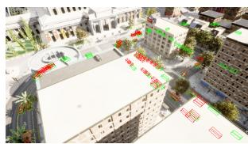
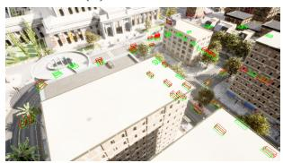
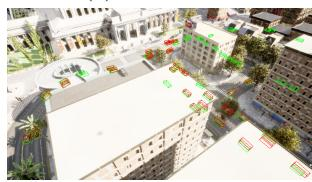

# CERF: Communication-Efficient and Retraining-Free Collaborative Perception

Jiuwu Hao1,2,∗, Ziyi Ni1,2,∗, Liguo Sun2, Yuting Wan1,2, Yueyang Wu1,2, Ti Xiang1,2, Haolin Song1,2, Pin Lv2,†

1School of Artificial Intelligence, University of Chinese Academy of Sciences 2Institute of Automation, Chinese Academy of Sciences

## ABSTRACT

Collaborative perception shares information among multiple agents to obtain a comprehensive scene representation, enhancing the perceptual capability of individual agents. However, most existing methods rely on transmitting and fusing dense feature maps for collaboration, which incurs inevitable communication overhead and heterogeneity challenges, limiting their practicality for real-world deployment. To address these challenges, we propose CERF, a novel Communication-Efficient and Retraining-Free framework for open heterogeneous collaborative perception. In CERF, we introduce a new virtual modality (termed Poture), which is generated from the perception outputs of other agents, to augment the extracted Bird’s Eye View (BEV) features of the ego agent. To mitigate transmission delays, we employ a Kalman-filter based tracker and a motion forecasting model to derive the current predictions from historical perception results. Extensive experiments demonstrate that CERF achieves performance comparable to mainstream intermediate-collaboration methods while reducing communication overhead by 95% across various downstream tasks. Furthermore, CERF enables seamless integration of unknown heterogeneous agents into the existing collaborative framework without additional retraining costs. Code is available at https://github.com/uestchjw/CERF.

Index Terms— Collaborative perception, multi-agent learning, communication, 3D object detection

## 1. INTRODUCTION

Collaborative perception has emerged as a promising paradigm for enhancing situational awareness of individual agents in complex scenarios [1]. It extends the perception range and mitigate the occlusion issue by exchanging perceptual information among connected agents. Recent studies have demonstrated that collaborative perception can be applied to various computer vision tasks based on Unmanned Aerial Vehicles (UAVs), including 3D object detection [2, 3], object tracking [4, 5], and trajectory prediction [1].

Communication strategy is a crucial concern in collaborative perception. Despite tremendous progress in model de-

sign and perception performance, most previous work focus on intermediate-collaboration strategy, which transmits and fuses implicit feature maps, posing significant challenges in real-world deployments. Firstly, intermediate features are inherently high-dimensional representations, which can lead to substantial memory costs and transmission overhead. Extensive efforts have been made to address this issue, including leveraging compressed features [6, 7, 8] or sparse queries [9, 10, 11]. However, compared to compact perception outputs, neural features remain a resource-intensive medium. Secondly, intermediate-collaboration is difficult to seamlessly accommodate unknown agents into the existing collaboration system due to the semantic gap between feature maps extracted by different agents. In the real world, agents often differ in input modalities, model architectures, and manufacturers, making it infeasible to encompass all agent types during the training stage. Most prior work use adapters to transform features into a unified space to address the heterogeneity issue [12, 13, 14]. However, this approach incurs additional retraining costs and raises privacy and security concerns.

To address these challenges, we propose CERF, a novel communication-efficient and retraining-free collaborative perception framework. Our core insight is that the perception results of other agents already contain sufficient complementary information for the ego agent, making it unnecessary to rely on high-dimensional and abstract neural features. In light of this, we construct a virtual modality, Poture, from the received perception outputs to augment the ego agent’s local BEV features. To mitigate transmission delays, we employ a Kalman-filter based tracker to associate historical detections and use motion forecasting to generate predictions for the current timestamp. Finally, a fused feature map of both Poture and BEV features is fed to various downstream tasks.

Extensive experiments on the UAV3D [4] and Air-Co-Pred [1] datasets demonstrate that i) CERF achieves competitive performance with a 95% reduction in communication bandwidth; ii) CERF can accommodate unknown heterogeneous agents without additional retraining costs. These results highlight the potential of a practical multi-agent collaborative perception system for real-world deployment.

  
Fig. 1: The overview of our proposed CERF framework. In CERF, agents exchange only compact perception results. The ego agent employs a Kalman filter–based tracker and a motion forecasting model to obtain the current prediction from historical messages. Then, the generated virtual modality Poture is fused with the local BEV features and fed to downstream tasks.

## 2. PROBLEM FORMULATION

Given N agents in the scene, each is equipped with onboard sensors and capable of both sending and receiving messages. They may differ in input modalities, model architectures, and downstream tasks. Notably, among all the N agents, only $N _ { k }$ agents are engaged in the collaborative training phase, with the remaining $N _ { u }$ agents, whose types are unknown, appearing only during the inference stage.

For the ith agent, let $O _ { i }$ and $u _ { i }$ represent the raw input and the ground-truth, respectively, and $M _ { j  i }$ is the message transmitted from agent j to agent i. The goal of a collaborative perception system is to optimize the perceptual performance under communication bandwidth constraints:

$$
\operatorname* { m a x } _ { \theta } \sum _ { i = 1 } ^ { N } g ( \Phi _ { \theta } ( O _ { i } , \{ M _ { j  i } \} _ { j = 1 } ^ { N _ { k } } , \{ M _ { j  i } \} _ { j = 1 } ^ { N _ { u } } ) , u _ { i } ) ,\tag{1}
$$

$$
\mathrm { s . t . } \sum _ { j = 1 } ^ { N } | M _ { j  i } | \leqslant B\tag{2}
$$

where $g \left( \cdot \right)$ represents the evaluation metric, $\Phi _ { \theta }$ is the collaboration model parametrized by θ, and B denotes the communication budget.

## 3. METHODOLOGY

## 3.1. Overview

The overall architecture of the proposed CERF is shown in Fig. 1. Each agent first takes its local observations as input and outputs the BEV feature maps, and then a decoder is used to obtain the individual perception outputs. These compact perception results, along with the pose information, will be transmitted to the connected agents. Upon receiving the message, each agent converts these detections into its own coordinate system through spatial transformation. To alleviate transmission delays, we use Kalman filtering and motion forecasting to obtain the current predictions from historical frames, generating the virtual modality Poture to enhance the local BEV features. Finally, the fused feature map is fed to the decoder for diverse downstream tasks.

## 3.2. Poture modality generation

Existing state-of-the-art collaborative perception methods focus on intermediate-fusion pipelines, which involves transmitting and merging dense feature maps. However, we observe that the compact perception results already contain sufficient complementary information. Thus, in CERF, the perception outputs serve as the medium to propagate scene information to the ego agent, which can significantly reduce communication overhead and alleviate heterogeneity issues.

Directly merging these detection results, i.e., late-fusion, leads to information loss and degraded performance. Motivated by MoDAR [15], we generate a virtual modality based on the received detections to enhance the raw BEV features. We name this new modality Poture, Perception outputs based feature map.

For the ith agent, the received perception results from agent j at timestamp t consist of a sequence of 3D bounding boxes, which are defined as:

$$
P _ { i j } ^ { t } = \left\{ b _ { k } | k \in \left\{ 1 , 2 , . . . , K \right\} \right\} ,\tag{3}
$$

$$
b = [ x , y , z , w , h , l , \phi , s ]\tag{4}
$$

where K is the total number of bounding boxes, [x, y, z] represents the center location, $[ w , h , l ]$ is the box size, ϕ denotes the heading angle, and the confidence score is expressed by s.

After applying the spatial transformation based on the relative pose, we utilize the perception outputs of the previous K frames to predict the detections at the current moment $t _ { c } ,$ which is:

$$
P _ { i j } ^ { t _ { c } } = \Phi _ { m f } \left( \Phi _ { k f } \left( \left\{ P _ { i j } ^ { t _ { c - n } } \right\} _ { n = 1 } ^ { K } \right) \right)\tag{5}
$$

where $\Phi _ { k f }$ represents a Kalman-filter based tracker [16] used to associate detection results from historical frames, and $\Phi _ { m f }$ is a motion forecasting model based on constant velocity. $\mathbf { A f } -$ ter obtaining the predicted outputs at the current timestamp, we derive the virtual modality Poture based on the attributes of the bounding boxes:

$$
P o t u r e _ { i j } ^ { t _ { c } } \left( x , y \right) = \left\{ \begin{array} { l l } { \left[ w , h , l , \varphi , s \right] , \mathrm { i f } \left( x , y \right) \mathrm { i n } P _ { i j } ^ { t _ { c } } } \\ { 0 , \mathrm { e l s e } } \end{array} \right.\tag{6}
$$

After BEV grid discretization (of size $H \times W )$ , the final virtual modality Poture $\in \mathbb { R } ^ { H \times W \times 5 }$ is used to fuse with the local BEV features, delivering complementary information to the ego agent.

## 3.3. Poture-BEV fusion

To accommodate an arbitrary number of collaborative agents, we first apply confidence-aware Non-Maximum Suppression (NMS) to the predicted outputs:

$$
\begin{array} { r } { P o t u r e _ { i } ^ { { t _ { c } } } = \mathbf { N M S } \left( P o t u r e _ { i j } ^ { { t _ { c } } } \left| j \in \{ 1 , 2 , . . . , N _ { { t _ { c } } } \} \right. \right) } \end{array}\tag{7}
$$

where $N _ { t _ { c } }$ is the number of connected agents at timestamp $t _ { c } .$ At the same location, we retain only the features with high confidence score. Then we concatenate the filtered virtual modality Poture with the original BEV feature $H _ { i } ^ { t _ { c } }$ along the channel dimension, which is:

$$
\widehat { H } _ { i } ^ { t _ { c } } = \mathrm { C o n c a t } \left( P o t u r e _ { i } ^ { t _ { c } } , H _ { i } ^ { t _ { c } } \right)\tag{8}
$$

where $\widehat { H } _ { i } ^ { t _ { c } }$ is the fused feature map.

## 4. EXPERIMENTS

## 4.1. Experimental settings

Datasets and implementation details. Our experiments utilize two open-source multi-UAV collaborative datasets, UAV3D [4] and Air-Co-Pred [1]. For a comprehensive evaluation, we conduct various downstream tasks, including 3D object detection and object tracking on the UAV3D dataset, and trajectory prediction on the Air-Co-Pred dataset. The perception area is set to 204.8m × 204.8m in UAV3D and 100m × 100m in Air-Co-Pred. To obtain the virtual modality Poture, we utilize three historical frames (i.e., K = 3). All the models are trained on four NVIDIA GeForce RTX A6000 GPUs.

Table 1: 3D object detection results on the UAV3D dataset.
<table><tr><td>Method</td><td>Bandwidth (Mbps) ↓</td><td>mAP↑</td><td>NDS ↑</td></tr><tr><td>No Collaboration Late Collaboration Early Collaboration</td><td>0.00 0.04 164.80</td><td>0.544 0.610</td><td>0.481 0.535</td></tr><tr><td>Who2com [17] When2com [18]</td><td>19.02 32.00</td><td>0.720 0.546 0.550</td><td>0.608 0.440 0.442</td></tr><tr><td>V2VNet [19]</td><td>11.31</td><td>0.647</td><td>0.508</td></tr><tr><td>Where2comm [7]</td><td>19.53</td><td>0.660</td><td>0.571</td></tr><tr><td>DiscoNet [20]</td><td>54.71</td><td>0.700</td><td>0.558</td></tr><tr><td>CERF (ours)</td><td>0.04</td><td>0.693</td><td>0.597</td></tr></table>

Table 2: Object tracking results on the UAV3D dataset.
<table><tr><td rowspan="2">Method</td><td>AMOTA↑</td><td>AMOTP↓</td><td>MOTA↑</td><td>MOTP↓</td><td>TID↓</td><td>LGD↓</td></tr><tr><td>(%)</td><td>(m)</td><td>(%)</td><td>(m)</td><td>(s)</td><td>(s)</td></tr><tr><td>No Collaboration</td><td>0.644</td><td>1.018</td><td>0.593</td><td>0.611</td><td>0.620</td><td>1.280</td></tr><tr><td>Early Collaboration</td><td>0.812</td><td>0.672</td><td>0.781</td><td>0.476</td><td>0.300</td><td>0.570</td></tr><tr><td>When2Com [18]</td><td>0.646</td><td>1.012</td><td>0.595</td><td>0.618</td><td>0.590</td><td>1.200</td></tr><tr><td>Who2Com [17]</td><td>0.648</td><td>1.012</td><td>0.602</td><td>0.623</td><td>0.580</td><td>1.200</td></tr><tr><td>V2VNet [19]</td><td>0.782</td><td>0.803</td><td>0.735</td><td>0.587</td><td>0.360</td><td>0.710</td></tr><tr><td>Where2comm [7]</td><td>0.793</td><td>0.745</td><td>0.751</td><td>0.532</td><td>0.340</td><td>0.640</td></tr><tr><td>DiscoNet [20]</td><td>0.809</td><td>0.703</td><td>0.766</td><td>0.516</td><td>0.300</td><td>0.590</td></tr><tr><td>CERF (ours)</td><td>0.744</td><td>0.743</td><td>0.678</td><td>0.471</td><td>0.436</td><td>0.867</td></tr></table>

Evaluation metrics. For the 3D object detection task, we use mean Average Precision (mAP) and nuScenes Detection Score (NDS) as evaluation metrics. We employ the object tracking metrics defined in UAV3D [4], including AMOTA, AMOTP, MOTA, MOTP, TID, and LGD. In the trajectory prediction task, we use Intersection-over-Union (IoU) and Video Panoptic Quality (VPQ) for frame-level and video-level evaluation, respectively.

(a) No-fusion  
  
(c) DiscoNet

(b) When2com  
  
(d) CERF (ours)  
Fig. 2: Visualization of 3D object detection results on the UAV3D dataset. Red and green boxes denote the predictions and ground truth, respectively.

Table 3: Trajectory prediction results on the Air-Co-Pred dataset. DHD denotes the official results, and \* denotes the results we reproduce.
<table><tr><td rowspan=1 colspan=2>Method</td><td rowspan=1 colspan=3>Shared data</td><td></td><td rowspan=1 colspan=2>Retraining-free</td><td rowspan=1 colspan=1>IoU ↑</td><td rowspan=1 colspan=1>VPQ ↑</td></tr><tr><td rowspan=3 colspan=2>No CollaborationEarly CollaborationLate Collaboration</td><td rowspan=1 colspan=3>1</td><td></td><td rowspan=1 colspan=2>1</td><td rowspan=1 colspan=1>0.326</td><td rowspan=1 colspan=1>0.278</td></tr><tr><td rowspan=1 colspan=1></td><td rowspan=1 colspan=2>RGB images</td><td rowspan=1 colspan=2></td><td rowspan=2 colspan=2>√</td><td rowspan=1 colspan=1>0.545</td><td rowspan=1 colspan=1>0.459</td></tr><tr><td rowspan=1 colspan=2>perce</td><td rowspan=1 colspan=2>perception outputs</td><td></td><td rowspan=1 colspan=1>0.514</td><td rowspan=1 colspan=1>0.436</td></tr><tr><td rowspan=10 colspan=2>V2X-ViT[21]V2VNet[19]Who2com[17]When2com[18]Where2comm[7]UMC[22]UMC (w/o GRU)DHD[1]DHD*</td><td rowspan=1 colspan=1></td><td rowspan=1 colspan=3>feature maps</td><td rowspan=1 colspan=2>x</td><td rowspan=1 colspan=1>0.533</td><td rowspan=1 colspan=1>0.457</td></tr><tr><td rowspan=1 colspan=2>fe</td><td rowspan=1 colspan=2>feature maps</td><td></td><td rowspan=1 colspan=2>x</td><td rowspan=1 colspan=1>0.538</td><td rowspan=1 colspan=1>0.469</td></tr><tr><td rowspan=1 colspan=1></td><td rowspan=1 colspan=3>feature maps</td><td></td><td rowspan=1 colspan=2>x</td><td rowspan=1 colspan=1>0.443</td><td rowspan=1 colspan=1>0.370</td></tr><tr><td rowspan=1 colspan=3>feature maps</td><td></td><td rowspan=1 colspan=2>x</td><td rowspan=1 colspan=1>0.458</td><td rowspan=1 colspan=1>0.404</td></tr><tr><td rowspan=1 colspan=3>feature maps</td><td></td><td rowspan=1 colspan=2>x</td><td rowspan=1 colspan=1>0.514</td><td rowspan=1 colspan=1>0.442</td></tr><tr><td rowspan=1 colspan=2></td><td rowspan=2 colspan=2>feature maps</td><td></td><td rowspan=2 colspan=2>x</td><td rowspan=2 colspan=1>0.523</td><td rowspan=2 colspan=1>0.443</td></tr><tr><td rowspan=1 colspan=1></td><td></td></tr><tr><td rowspan=1 colspan=1></td><td rowspan=1 colspan=2>feature maps</td><td></td><td rowspan=1 colspan=2>x</td><td rowspan=1 colspan=1>0.532</td><td rowspan=1 colspan=1>0.459</td></tr><tr><td rowspan=1 colspan=1></td><td rowspan=1 colspan=2>feature maps</td><td></td><td rowspan=1 colspan=2>X</td><td rowspan=1 colspan=1>0.540</td><td rowspan=1 colspan=1>0.462</td></tr><tr><td rowspan=1 colspan=3>feature maps</td><td></td><td rowspan=1 colspan=2>x</td><td rowspan=1 colspan=1>0.532</td><td rowspan=1 colspan=1>0.460</td></tr><tr><td rowspan=1 colspan=2>CERF (ours)</td><td rowspan=1 colspan=3>perception outputs</td><td></td><td rowspan=1 colspan=2>√</td><td rowspan=1 colspan=1>0.530</td><td rowspan=1 colspan=1>0.458</td></tr></table>

## 4.2. Quantitative evaluation

Performance comparison. Table 1 presents the performance comparison of 3D object detection on the UAV3D dataset. Experimental results show that our CERF outperforms most intermediate-collaboration methods while requiring only about 1/1000 of the communication bandwidth (comparable to late-fusion). Table 2 shows the object tracking performance of our framework and previous methods. It can be observed that, even by transmitting and fusing only compact perception results, our CERF still achieves acceptable tracking accuracy.

To evaluate the generalization ability of our method across various datasets and tasks, we show the trajectory prediction results on the Air-Co-Pred dataset in Table 3. We see that CERF achieves 0.530 in IoU and 0.458 in VPQ, which are on par with those of existing state-of-the-art methods. The effectiveness of the CERF framework can be attributed to its ability to extract sufficient complementary cues from perception results in a learnable fashion.

Open heterogeneity evaluation. Table 4 illustrates the performance of our CERF under open heterogeneous settings. Only Agent 2 participates in collaborative training with the ego agent, while Agent 1 and Agent 3 appear exclusively at the inference stage. The results indicate that CERF can incorporate informative data from unknown agents without retraining cost, independent of input resolution, backbone architecture, or detection threshold. The collaborative performance is primarily determined by the capability of individual perception. For example, since Agent 3 achieves the highest single-agent perception accuracy, the resulting collaborative network also delivers the strongest perceptual performance.

## 4.3. Qualitative evaluation

Fig. 2 presents the visualization of 3D object detection results on the UAV3D dataset. Our CERF achieves bounding box accuracy comparable to mainstream intermediate-collaboration methods, and even surpasses them in certain scenarios. This demonstrates that CERF can effectively aggregate complementary information from other agents’ perception outputs, enhancing practicality while maintaining performance.

Table 4: Collaborative performance of CERF under open heterogeneous settings. \* denotes participation in the training phase, and ⊛ denotes occurrence only in the inference phase.
<table><tr><td>Setting</td><td>Encoder</td><td>Input size</td><td>Threshold</td><td>mAP↑</td><td>NDS ↑</td></tr><tr><td>Ego agent</td><td>BEVFusion [23]</td><td> $8 0 0 \times 4 5 0$ </td><td>0.25</td><td>0.544</td><td>0.481</td></tr><tr><td>Agent 1</td><td>BEVFusion</td><td> $7 0 4 \times 2 5 6$ </td><td>0.25</td><td>0.487</td><td>0.458</td></tr><tr><td>Agent 2</td><td>PETR [24]</td><td> $8 0 0 \times 4 5 0$ </td><td>0.2</td><td>0.581</td><td>0.516</td></tr><tr><td>Agent 3</td><td>DETR3D [25]</td><td> $8 0 0 \times 4 5 0$ </td><td>0.3</td><td>0.618</td><td>0.547</td></tr><tr><td> ${ \mathrm { E g o } } + { \mathrm { A g e n t ~ } } 1 ^ { \circledast }$ </td><td>1</td><td>1</td><td>1</td><td>0.613</td><td>0.523</td></tr><tr><td> $\operatorname { E g o } + \operatorname { A g e n t } 2 ^ { * }$ </td><td>1</td><td>1</td><td>1</td><td>0.660</td><td>0.572</td></tr><tr><td> $\operatorname { E g o } + \operatorname { A g e n t } 3 ^ { \circledast }$ </td><td>1</td><td>1</td><td>1</td><td>0.693</td><td>0.597</td></tr></table>

Table 5: Effects of different object attributes in Poture.
<table><tr><td>Size</td><td>Heading angle</td><td>Confidence score</td><td>Location</td><td>mAP↑</td><td>NDS↑</td></tr><tr><td>x</td><td>x</td><td>x</td><td>x</td><td>0.544</td><td>0.450</td></tr><tr><td>√</td><td>x</td><td>x</td><td>x</td><td>0.628</td><td>0.551</td></tr><tr><td>√</td><td>√</td><td>x</td><td>x</td><td>0.644</td><td>0.565</td></tr><tr><td>√</td><td>√</td><td>√</td><td>x</td><td>0.693</td><td>0.597</td></tr><tr><td>√</td><td>√</td><td>√</td><td>√</td><td>0.650</td><td>0.568</td></tr></table>

## 4.4. Ablation studies

Table 5 shows the importance of different attributes in the proposed virtual modality Poture. Box size, heading angle, and confidence score help improve perception, whereas incorporating the center location in Poture leads to performance degradation. The reason is that the corresponding positions in Poture are represented by discretized BEV grids, making world-coordinate positions unnecessary.

## 5. CONCLUSION

This paper introduces CERF, a novel communication-efficient and retraining-free framework for multi-UAV collaboration. CERF generates the virtual modality Poture to enhance the local BEV features, sharing only compact perception results among connected agents. To mitigate transmission delays, we use a Kalman-filter based tracker and motion forecasting to derive current predictions from the historical messages. Experimental results show that CERF achieves competitive performance with minimal bandwidth, and seamlessly integrates unknown agents into collaboration.

## 6. ACKNOWLEDGMENT

This work was supported by the National Science and Technology Major Project under Grant 2022ZD0116409.

## 7. REFERENCES

[1] Zhechao Wang, Peirui Cheng, et al., “Drones help drones: A collaborative framework for multi-drone object trajectory prediction and beyond,” arXiv preprint arXiv:2405.14674, 2024.

[2] Jiahao Wang, Xiangyu Cao, et al., “Griffin: Aerialground cooperative detection and tracking dataset and benchmark,” arXiv preprint arXiv:2503.06983, 2025.

[3] Yunhao Hou, Bochao Zou, et al., “Agc-drive: A largescale dataset for real-world aerial-ground collaboration in driving scenarios,” arXiv preprint arXiv:2506.16371, 2025.

[4] Hui Ye, Rajshekhar Sunderraman, et al., “Uav3d: A large-scale 3d perception benchmark for unmanned aerial vehicles,” arXiv preprint arXiv:2410.11125, 2024.

[5] Tongtong Feng, Xin Wang, et al., “U2udata: A largescale cooperative perception dataset for swarm uavs autonomous flight,” in Proceedings of the 32nd ACM International Conference on Multimedia, 2024, pp. 7600– 7608.

[6] Runsheng Xu, Hao Xiang, et al., “Opv2v: An open benchmark dataset and fusion pipeline for perception with vehicle-to-vehicle communication,” in ICRA, 2022, pp. 2583–2589.

[7] Yue Hu, Shaoheng Fang, et al., “Where2comm: Communication-efficient collaborative perception via spatial confidence maps,” NIPS, pp. 4874–4886, 2022.

[8] Seth Z Zhao, Huizhi Zhang, et al., “Quantv2x: A fully quantized multi-agent system for cooperative perception,” arXiv preprint arXiv:2509.03704, 2025.

[9] Ziming Chen, Yifeng Shi, et al., “Transiff: An instancelevel feature fusion framework for vehicle-infrastructure cooperative 3d detection with transformers,” in ICCV, 2023, pp. 18205–18214.

[10] Kang Yang, Tianci Bu, et al., “Is discretization fusion all you need for collaborative perception?,” arXiv preprint arXiv:2503.13946, 2025.

[11] Shaohong Wang, Lu Bin, et al., “Iftr: An instance-level fusion transformer for visual collaborative perception,” in ECCV, 2024, pp. 124–141.

[12] Yifan Lu, Yue Hu, et al., “An extensible framework for open heterogeneous collaborative perception,” arXiv preprint arXiv:2401.13964, 2024.

[13] Congzhang Shao, Guiyang Luo, et al., “Hetecooper: Feature collaboration graph for heterogeneous collaborative perception,” in ECCV, 2024, pp. 162–178.

[14] Xiangbo Gao, Runsheng Xu, et al., “Stamp: Scalable task and model-agnostic collaborative perception,” arXiv preprint arXiv:2501.18616, 2025.

[15] Yingwei Li, Charles R Qi, et al., “Modar: Using motion forecasting for 3d object detection in point cloud sequences,” in CVPR, 2023, pp. 9329–9339.

[16] Xinshuo Weng and Kris Kitani, “A baseline for 3d multi-object tracking,” arXiv preprint arXiv:1907.03961, p. 6, 2019.

[17] Yen-Cheng Liu, Junjiao Tian, et al., “Who2com: Collaborative perception via learnable handshake communication,” in ICRA, 2020, pp. 6876–6883.

[18] Yen-Cheng Liu, Junjiao Tian, et al., “When2com: Multi-agent perception via communication graph grouping,” in CVPR, 2020, pp. 4106–4115.

[19] Tsun-Hsuan Wang, Sivabalan Manivasagam, et al., “V2vnet: Vehicle-to-vehicle communication for joint perception and prediction,” in ECCV, 2020, pp. 605– 621.

[20] Yiming Li, Shunli Ren, et al., “Learning distilled collaboration graph for multi-agent perception,” NIPS, pp. 29541–29552, 2021.

[21] Runsheng Xu, Hao Xiang, et al., “V2x-vit: Vehicleto-everything cooperative perception with vision transformer,” in ECCV, 2022, pp. 107–124.

[22] Tianhang Wang, Guang Chen, et al., “Umc: A unified bandwidth-efficient and multi-resolution based collaborative perception framework,” in ICCV, 2023, pp. 8187– 8196.

[23] Zhijian Liu, Haotian Tang, et al., “Bevfusion: Multitask multi-sensor fusion with unified bird’s-eye view representation,” in ICRA, 2023, pp. 2774–2781.

[24] Yingfei Liu, Tiancai Wang, et al., “Petr: Position embedding transformation for multi-view 3d object detection,” in ECCV, 2022, pp. 531–548.

[25] Yue Wang, Vitor Campagnolo Guizilini, et al., “Detr3d: 3d object detection from multi-view images via 3d-to-2d queries,” in CoRL, 2022, pp. 180–191.