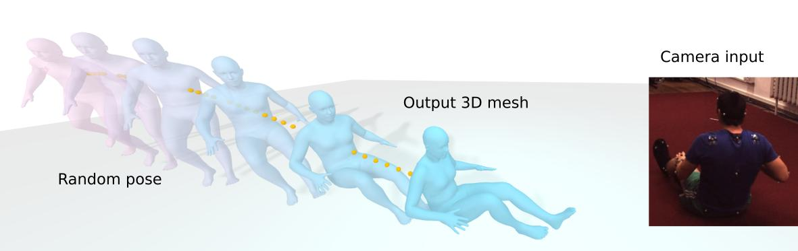
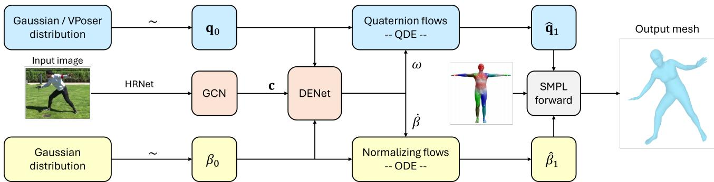
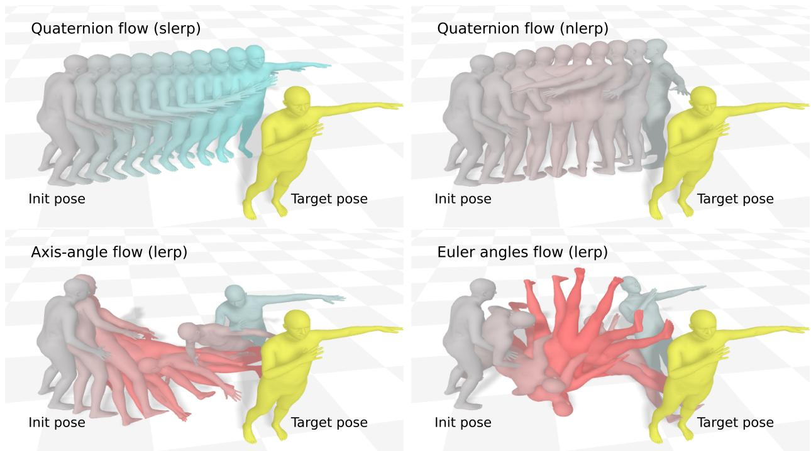
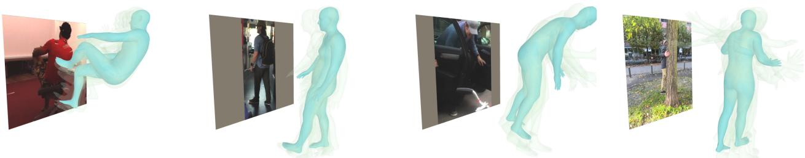

# CQF-HMR: Continuous Quaternion Flows for Probabilistic 3D Human Mesh Recovery from a Single Image

Cuong Le1, Bao-Long Tran1, Pavlo Melnyk1, Tahereh Dehdarirad1, Bastian Wandt2, Mårten Wadenbäck1 1 Linköping University, 2 Independent researcher. Email: {firstname}.{lastname}@liu.se

Figure 1. Conditioned on a 2D input estimated from a single image, our CQF-HMR maps a randomly sampled 3D human pose to a plausible one using the continuous normalizing flows under the quaternion constraint. Unlike other 3D rotation representations, quaternion flows provide smoother generation trajectories, leading to a more plausible 3D human mesh recovery.

## Abstract

Recovering 3D digital humans from a single 2D image is an ill-posed computer vision problem due to the loss of depth information. Probabilistic 3D human pose estimation compensatesfor this by estimating a set of3D hypotheses from a prior distribution via generative models. However, most prior work focuses only on 3D keypoints, which often leads to implausible poses that are difficult to apply to downstream tasks, e.g. animation or digital humans. SMPL-based methods are more scalable thanks to the explicit body priors, but it requires more complex modeling of the generation process due to the non-additive nature of the joint rotations. In this work, we propose a novel approach for probabilistic 3D humans using quaternion-constrained continuous normalizing flows conditioned on 2D pose estimations. Our proposed quaternion flows show significant advantages over approaches using other rotation representations. Experiments demonstrate state-of-the-art results of our method on Human3.6M, particularly in ambiguous settings, and comparable pose estimation accuracy on challenging 3DPW and EMDB benchmarks.

## 1. Introduction

The recovery of 3D human pose and shape from a single view remains a challenge in computer vision due to the depth ambiguity of the 2D input image. Multiple valid yet diverse 3D poses can project to the same 2D observation, resulting in a highly ill-pose problem. Therefore, recent work in single-view 3D human pose estimation (HPE) steers the focus to the estimation of the full 3D distribution or a set of pose hypotheses using generative models conditioned on 2D inputs [10, 12, 18, 22, 45, 46]. While traditional 3D-keypoint methods achieve lower errors on the training data, they often produce unnatural poses when encountering in-the-wild samples [3]. On the other hand, SMPL-based approaches, often called human mesh recovery (HMR), address the issue via explicit body kinematics constraints imposed by the SMPL mesh model [26]. Moreover, SMPL-based predictions are easily applied to multiple applications, such as AR/VR, simulation or biomechanics, making them the preferable approach for 3D HPE [35, 53].

Probabilistic 3D HPE approaches learn the mapping trajectory from a prior distribution, e.g. the Gaussian distribution, to the ground-truth 3D human pose distribution collected from motion capture systems. Previous work samples the set of 3D keypoints from the Gaussian distribution and learn the vector field to move these keypoints to the true 3D human body configuration based on the 2D condition, often via diffusion or flow-based models [10, 19, 45]. The same idea is also applied to SMPL-based methods, by sampling random joint 3D rotations, often in axis-angles and map them to the ground-truth data [1, 40, 51]. However, due to the non-additive nature of 3D rotations, applying vanilla flow-based generative models on SMPL’s joint rotations can introduce discontinuities and results in wrong 3D poses during the generation process [18]. On the other hand, the unit quaternion, with only one additional parameter, is free of singularities and its differential equation is globally defined, ensuring a smooth rotating trajectory for the generation of 3D rotations. To this end, we propose a novel framework for probabilistic 3D HMR using continuous quaternion normalizing flows, CQF-HMR, for learning the generation of SMPL 3D joint rotations conditioned on 2D inputs.

The underlying differential equation of CQF-HMR is learned via the flow matching framework [24], in which the optimal transport is designed to be the spherical linear interpolation between the randomly sampled quaternion and ground-truth. Because of the non-additive nature of 3D rotations, we formulate the quaternion integration for solving the differential equation via an operation based on the Hamilton product. This operation ensures the unit quaternion stays on the spherical constrain of $S ^ { 3 }$ without the need for re-normalization as other representations [9, 18]. The SMPL shape parameter is learned via the flow matching with straight OT path. The condition embedding is learned by a graph neural network on the estimated 2D heatmaps extracted from a 2D detector HRNet [42]. Beside the common Gaussian distribution as prior which could create highly implausible poses, we also investigate the learning from a more sophisticated human prior, VPoser [32], for sampling plausible initial poses. The proposed method is evaluated against related probabilistic approaches on the Human3.6M [11], 3DPW [27] and EMDB [13] datasets. In summary, our main contributions are:

• We show that using quaternion flows with a unit-sphere constraint produces smooth, continuous generative trajectories for probabilistic 3D human mesh recovery.

• We integrate the design of quaternion differential equation of SMPL body joints into the flow matching pipeline, utilizing 2D heatmaps as a condition.

• We set a new state-of-the-art result on the Human3.6M benchmark, including its ambiguous split.

## 2. Related work

## 2.1. Monocular 3D pose and mesh estimation

The field of monocular 3D HPE consists of two main directions: 1) direct estimation from images [29, 36], and 2) lifting from 2D cues [25, 28, 49]. Due to the maturity of the 2D

HPE, the 2D-3D lifting is the more popular approach and often produce more accurate 3D estimations. The famous work from [33] introduces the use of multiple 2D pose as input to leverage the temporal information for more accurate 3D HPE. Many follow-up studies use the same approach with better learning models, e.g. transformers [34, 52, 54]. However, these methods require synchronized video inputs and is not applicable to single-image captures that often occur in-the-wild.

The single-image approach is more suitable for in-thewild examples. The pioneer work from [28] predicts 3D human pose from a single 2D pose using a two-layer ResNet architecture. Using graph networks is also a popular approach by modeling the natural human body connection between joints [4]. The traditional 2D-3D lifting methods predict only 3D keypoints and bypass the human body constraints, i.e. bone-length plausibility along the camera depth axis. To impose the natural body constraints, recent work uses the SMPL mesh model as the prior [26] and only estimate the joint rotations based on the 2D/3D cues [14, 15]. Goel et al. [8] predict the SMPL parameters from a single image using the transformer with the cross-attention module. Li et al. [21] utilize the highly accurate 3D keypoint estimation model and solve the analytical inverse kinematics to recover plausible twist and swing angles for the SMPL model. A major issue of single-image approaches is their single prediction of the most likely 3D human pose, which can be overly confident and incorrect.

## 2.2. Probabilistic 3D pose and shape estimation

Recovering 3D from 2D is ill-posed because many 3D poses can project to the same 2D cue, thus requiring a full modeling of 3D pose distribution. The emerging field of probabilistic 3D HPE address the challenge via generative models that produce multiple 3D hypotheses for the approximation of the posterior distribution. Wehrbein et al. [45] use the normalizing flows conditioned on the 2D posed, extracted from HRNet [42], to map the source Gaussian distribution to the target 3D pose distribution. Similarly, DiffPose [10] learns the distribution mapping via the diffusion model, using the same 2D conditions. The diffusion models follow the stochastic trajectory, which results in sub-optimal mapping for the estimation of 3D pose hypotheses. Recent work [19, 44] instead learns the optimal-transport straight trajectory via the flow matching framework and achieve more accurate 3D poses. To enforce the body constraints, Kolotouros et al. [16] recovers the target distribution of the SMPL’s pose and shape parameters via normalizing flows. Also with the normalizing flows, Wehrbein et al. [46] utilizes the uncertainty from the 2D estimator heatmaps for more accurate 3D mesh estimation and penalize incorrect hypotheses via human segmentation masks.

  
Figure 2. Pipeline of CQF-HMR. The method consists of two differential equations: an QDE for the quaternion flows and an ODE for the shape normalizing flows. The initial pose ${ \bf q } _ { 0 }$ and shape $\beta _ { 0 }$ are sampled from source distributions, i.e. Gaussian distribution, while GCN encodes the 2D heatmaps extracted by HRNet to obtain the lifting condition c. DENet estimates the angular velocity ω and shape shifting rate $\dot { \boldsymbol { \beta } }$ for the predictions of quaternion pose $\hat { \mathbf { q } } _ { 1 }$ and shape $\hat { \beta } _ { 1 }$ under the $S ^ { 3 }$ constraint with OT transports. The 3D mesh is obtained by passing the predicted pose and shape to the SMPL transformation layer. The pipeline is executed in parallel for multiple hypotheses.

## 3. Method

We formulate the continuous normalizing flows (CNF) as a quaternion-based kinematics process and aim to recover the human 3D joint rotations based on 2D inputs. We first apply an off-the-shelf detector, HRNet [42], to extract the probability heatmaps of 2D joints and use these information as the condition for the generative process. With $\mathbf { q } \in \mathbb { R } ^ { 4 }$ denoting a quaternion that represents the 3D pose of a human joint, we learn the optimal transport angular velocity $\boldsymbol \omega \in \mathbb { R } ^ { 3 }$ to map the pose q sampled from a prior distribution to the ground-truth pose, and the trajectory traverses along the unit-sphere constraint $S ^ { 3 }$ of quaternions.

## 3.1. Quaternion differential equation

In the Hamilton set H, a quaternion $\mathbf { q } \in \mathbb { R } ^ { 4 }$ is represented by a 4D vector $\left( \mathbf { w } , v _ { 1 } , v _ { 2 } , v _ { 3 } \right)$ , also written as:

$$
\begin{array} { r } { \mathbf q = \mathbf w + v _ { 1 } i + v _ { 2 } j + v _ { 3 } k = ( \mathbf w , \mathbf v ) , } \end{array}\tag{1}
$$

where $i , j ,$ k are imaginary units satisfying $i ^ { 2 } = j ^ { 2 } = k ^ { 2 } =$ $i j k = - 1$ . To correctly represent 3D rotations, the quaternion is strictly unit, i.e. normalized to unit length, $\| \mathbf { q } \| = 1$ We refer to all quaternions in this paper as unit quaternions for convenience. The Hamilton product combines two quaternions, $\mathbf { q } = ( \mathbf { w } _ { 1 } , \mathbf { v } _ { 1 } )$ and ${ \bf q } _ { 2 } = ( { \bf w } _ { 2 } , { \bf v } _ { 2 } )$ , into a quaternion representing a combined pose, and is defined as $\mathbf { q } _ { 1 } \otimes \mathbf { q } _ { 2 } = \mathbf { w } _ { 1 } \mathbf { w } _ { 2 } - \mathbf { v } _ { 1 } ^ { \top } \mathbf { v } _ { 2 } , \mathbf { w } _ { 2 } \mathbf { v } _ { 1 } + \mathbf { w } _ { 1 } \mathbf { v } _ { 2 } + \mathbf { v } _ { 1 } \times \mathbf { v } _ { 2 }$ , with the crucial non-commutativity property of $\mathbf { q } _ { 1 } \otimes \mathbf { q } _ { 2 } \neq \mathbf { q } _ { 2 } \otimes \mathbf { q } _ { 1 }$

The quaternion flow is characterized by an ordinary differential equation (ODE) of the quaternion-valued variables, i.e. quaternion differential equation (QDE) [17, 19, 48], defined as:

$$
\dot { \mathbf { q } } = \frac { 1 } { 2 } \left[ - [ \omega ] _ { \times } \quad \omega \right] \mathbf { q } , \quad [ \omega ] _ { \times } = \left[ \begin{array} { c c c } { 0 } & { - \omega _ { 3 } } & { \omega _ { 2 } } \\ { \omega _ { 3 } } & { 0 } & { - \omega _ { 1 } } \\ { - \omega _ { 2 } } & { \omega _ { 1 } } & { 0 } \end{array} \right] ,\tag{2}
$$

where $\boldsymbol \omega \in \mathbb { R } ^ { 3 }$ is the angular velocity represented as a scaled axis vector. Unlike the vanilla ODE solvers [5, 43], the Hamilton product is required to solve the QDE numerically, since we require that the solution abide by the $S ^ { 3 }$ constraint, i.e. be of unit length, which is not preserved by addition. We implement the quaternion integration with as:

$$
\begin{array} { r l } & { \mathbf { q } _ { t + \Delta t } = \mathbf { q } _ { t } \otimes \mathbf { q } \mathbf { u } \mathbf { a } _ { \Delta t } \big ( \boldsymbol { \omega } _ { t + \Delta t } \big ) } \\ & { \qquad = \mathbf { q } _ { t } \otimes \Big ( \cos \big ( \frac \theta 2 \big ) , \sin \big ( \frac \theta 2 \big ) \frac { \boldsymbol { \omega } _ { t } } { \lVert \boldsymbol { \omega } _ { t } \rVert } \Big ) \ , } \end{array}\tag{3}
$$

where $\theta = \| \omega _ { t } \| \Delta t$ is the scalar magnitude of the rotation scaled by a time step $\Delta t , \omega _ { t }$ is normalized to a unit vector, and qua $\dot { \bf \Delta } _ { \Delta t } ( \omega _ { t + \Delta t } )$ is the quaternionized angular velocity. This integration scheme guarantees the unit-sphere $S ^ { 3 }$ requirement of unit quaternions, resulting in smooth and continuous generation trajectories of 3D joint rotations.

## 3.2. Quaternion flow matching

Consider the mapping bounded in $t = [ 0 , 1 ]$ from the pose q0 sampled from a prior distribution to the 3D joint pose $\mathbf { q } _ { 1 }$ , the diffeomorphic flow from ${ \bf q } _ { 0 }$ to $\mathbf { q } _ { 1 }$ is defined via the QDE in Eq. (3), and the angular velocity is estimated as:

$$
\omega _ { t } = f _ { \mathrm { Q D E } } ( \mathbf { q } _ { t } , t , \mathbf { c } ) ,\tag{4}
$$

where $f _ { \mathrm { Q D E } } ( \mathbf { q } _ { t } , t , \mathbf { c } )$ is a parameterized multi-layer perceptrons (MLP), $t \in [ 0 , 1 ]$ , and $\mathbf { c } \in \mathbb { R } ^ { d }$ is the d-dimensional conditioning vector extracted from 2D inputs.

Unlike the traditional CNF frameworks that learn the unstable normalizing flows by maximizing the likelihood of $\mathbf { q } _ { 1 }$ , the flow matching framework from [24] leverages the conditional flows between ${ \bf q } _ { 0 }$ and ${ \bf q } _ { 1 }$ via the optimal transport trajectory, resulting in a more stable and efficient learning process. As inspiration [50], we replace the vanilla OT flow matching path of linear interpolation (lerp) to the spherical linear interpolation (slerp) as the OT path for quaternions. The slerp between ${ \bf q } _ { 0 }$ and $\mathbf { q } _ { 1 }$ is defined as:

$$
\begin{array} { r l } & { \mathbf { q } _ { t } = \mathsf { s l e r p } ( \mathbf { q } _ { 0 } , \mathbf { q } _ { 1 } , t ) = \mathbf { q } _ { 0 } ( \mathbf { q } _ { 0 } ^ { - 1 } \mathbf { q } _ { 1 } ) ^ { t } , } \\ & { \Rightarrow \dot { \mathbf { q } } ^ { * } = \log ( \mathbf { q } _ { 0 } ^ { - 1 } \mathbf { q } _ { 1 } ) , } \end{array}\tag{5}
$$

where $\dot { \mathbf { q } } ^ { * }$ is the OT quaternion derivative, and the corresponding angular velocity $\omega ^ { * }$ can be approximated by only taking the vector part of $\dot { \mathbf { q } } ^ { * }$ . Note that, slerp is a linear interpolation with a constant derivative, thus the OT angular velocity $\omega ^ { * }$ is independent of time. The learning objective is a simple regression task minimizing the loss:

$$
\mathcal { L } _ { \omega } = \Vert f _ { \mathrm { Q D E } } ( \mathbf { q } _ { t } , t , \mathbf { c } ) - \omega ^ { * } \Vert _ { 2 } ^ { 2 } , \forall t \in [ 0 , 1 ] .\tag{6}
$$

To instantiate the pose ${ \bf q } _ { 0 }$ , we sample an axis-angle pose $\theta _ { 0 } \in \mathbb { R } ^ { 3 }$ from the source distribution, $e . g .$ . Gaussian distribution $\theta _ { 0 } \sim \mathcal { N } ( 0 , \mathbf { I } )$ , and convert the pose to quaternion. Due to the kinematics chain constraint of the human body, $i . e .$ parent pose affects the child pose, sampling from Gaussian distribution introduces highly implausible initial poses. To address this issue, we alternatively sample ${ \bf q } _ { 0 }$ from the human body prior D (VPoser [32]), expressed as:

$$
\boldsymbol { \theta } = \mathcal { D } ( z ) \mid \mathbf { z } \sim \mathcal { N } ( 0 , \mathbf { I } ) ,\tag{7}
$$

where $\textbf { z } \in \ \mathbb { R } ^ { 3 2 }$ is the VPoser latent embedding sampled from Gaussian distribution.

## 3.3. 2D conditioning

Similar to [10, 19], we pre-extract a set of 2D heatmaps for J joints in MPII format using the HRNet detector [42]. Top k arguments from the heatmaps are selected to form the input tensor of $\mathbf { x } \in \mathbb { R } ^ { J \times 2 k }$ , and the k arguments are randomly permuted during generation to prevent learning biases. The input x is projected to an embedding $\mathbf { h } \in \mathbb { R } ^ { \bar { J } \times m }$ and then processed by a graph neural network (GNN) that takes into account the inter-joint interactions via an learnable adjacency matrix $\mathbf { A } \in \mathbb { R } ^ { J \times J }$ . The condition $\mathbf { c } \in \mathbb { R } ^ { d }$ is computed as:

$$
\mathbf { c } = f _ { c } ( \mathrm { F l a t t e n } ( \sigma ( \mathbf { A } f _ { g } ( \mathbf { h } ) ) ) ,\tag{8}
$$

where $f _ { g } : \mathbb { R } ^ { J \times m }  \mathbb { R } ^ { J \times m }$ and $f _ { c } : \mathbb { R } ^ { J m }  \mathbb { R } ^ { d }$ are learnable linear projections, $\sigma$ is the SiLU activation function, and the Flatten function maps $\mathbb { R } ^ { J \times m }  \mathbb { R } ^ { J m }$ . The condition c is concatenated with q and t to construct the input tensor for the QDE function $f _ { \mathrm { Q D E } }$ in Eq. (4).

## 3.4. Shape estimation

The shape parameter $\beta \in \mathbb { R } ^ { 1 0 }$ controls the first 10 principle components (PC) of the SMPL mesh [26]. PC are linear variables, thus we apply the vanilla flow matching framework to the learning of β. From the initial shape sampled from the Gaussian distribution with zero mean and identity variance, i.e. $\beta _ { 0 } \sim \mathcal { N } ( 0 , \bf { I } )$ , we learn the velocity flow $\dot { \beta } , i . e .$ . shape shifting rate, that maps $\beta _ { 0 }$ to the ground-truth $\beta _ { 1 }$ . The estimation model is parameterized as the ODE: $\dot { \beta } _ { t } ~ = ~ f _ { \mathrm { O D E } } ( \beta _ { t } , t , { \bf c } )$ . The OT of shape generation is the lerp between $\beta _ { 0 }$ and $\beta _ { 1 }$ :

$$
\begin{array} { r c l } { { } } & { { } } & { { \beta _ { t } = 1 \mathrm { e r p } ( \beta _ { 0 } , \beta _ { 1 } , t ) = ( 1 - t ) \beta _ { 0 } + t \beta _ { 1 } , } } \\ { { } } & { { } } & { { } } \\ { { } } & { { } } & { { \Rightarrow \dot { \beta } ^ { \ast } = \beta _ { 1 } - \beta _ { 0 } , } } \end{array}\tag{9}
$$

where $\dot { \beta } ^ { * }$ is the OT velocity. The learning objective is the regression task to minimize the squared error:

$$
\mathcal { L } _ { \beta } = \| f ( \beta _ { t } , t , \mathbf { c } ) - \beta ^ { * } \| _ { 2 } ^ { 2 } , \forall t \in [ 0 , 1 ] .\tag{10}
$$

## 3.5. Solving the differential equations

Since the differential functions $f _ { \mathrm { Q D E } }$ and $f _ { \mathrm { O D E } }$ are parameterized by neural networks, analytical solutions are not available, and numerical solvers are required. The integration from Eq. (3) is also referred as the Euler method on a quaternion-valued ODE, $i . e .$ . the first-order solver following the Runge-Kutta scheme (RK). Higher-order solvers do not necessarily result in more accurate solutions, yet significantly increase the computation [19]. The best trade-off is often recorded with the $2 ^ { \mathrm { n d } }$ -order solver [18, 43], and we modify the integration scheme to handle the QDE as:

$$
\begin{array} { r l } & { \mathbf { q } _ { t + \frac { \Delta t } { 2 } } = \mathbf { q } _ { t } \otimes \mathbf { q } \mathbf { u } \mathbf { a } _ { \frac { \Delta t } { 2 } } ( f _ { \mathrm { Q D E } } ( \mathbf { q } _ { t } , t , \mathbf { c } ) ) , } \\ & { \mathbf { q } _ { t + \Delta t } = \mathbf { q } _ { t + \frac { \Delta t } { 2 } } \otimes \mathbf { q } \mathbf { u } \mathbf { a } _ { \Delta t } ( f _ { \mathrm { Q D E } } ( \mathbf { q } _ { t + \frac { \Delta t } { 2 } } , t + \frac { \Delta t } { 2 } , \mathbf { c } ) ) . } \end{array}\tag{11}
$$

To solve the ODE of the shape parameter $\beta ,$ we apply the vanilla RK2 solver [5]:

$$
\beta _ { t + \Delta t } = \beta _ { t } + f _ { \mathrm { O D E } } \left( \beta _ { t } + f _ { \mathrm { O D E } } ( \beta _ { t } , t , \mathbf { c } ) \frac { \Delta t } { 2 } , t + \frac { \Delta t } { 2 } , \mathbf { c } \right) \Delta t .\tag{12}
$$

The predicted pose ${ \bf q } _ { 1 }$ and shape $\beta _ { 1 }$ are iteratively solved from the initial ${ \bf q } _ { 0 }$ and $\beta _ { 0 }$ using Eqs. (11) and (12), which, as we show in Section $^ { 4 , }$ result in smooth CNFs following OT trajectories.

## 3.6. Learning objectives

To utilize the human kinematics constraint of the SMPL model, we obtain the predicted pose $\hat { \mathbf { q } } _ { 1 }$ and shape $\hat { \beta } _ { 1 }$ by linear interpolation with a constant-velocity assumption:

$$
\begin{array} { r l } & { \widehat { \mathbf { q } } _ { 1 } = \mathbf { q } _ { t } \otimes \left( \cos \frac { \| \omega _ { t } \| ( 1 - t ) } { 2 } , \sin \frac { \| \omega _ { t } \| ( 1 - t ) } { 2 } \frac { \omega _ { t } } { \| \omega _ { t } \| } \right) , } \\ & { \widehat { \beta } _ { 1 } = \beta _ { t } + ( 1 - t ) \beta _ { t } ^ { \prime } , \quad \mathrm { w i t h } t \sim \mathcal { U } ( 0 , 1 ) . } \end{array}\tag{13}
$$

We apply the predictions to the SMPL model via the forward function [26], obtaining the predicted mesh $V \in$ R6980×3. A linear joint regressor [6, 26] is used to project the 6980 vertices to the 3D skeleton with J body joints, i.e.

$\hat { V } \in \mathbb { R } ^ { 6 9 8 0 \times 3 }  [ \hat { y _ { j } } ] _ { j = 1 } ^ { J } \in \mathbb { R } ^ { J \times 3 }$ . The keypoint loss is the L1 distance between the prediction $\hat { y } \in \mathbb R ^ { 3 }$ and the groundtruth 3D keypoints $y ,$ i.e. $\mathcal { L } _ { \mathrm { y } } = | \hat { y } - y |$ . The total loss is the aggregation of all the objectives over all J joints:

$$
\mathcal { L } = \lambda _ { \mathrm { y } } \sum _ { j = 1 } ^ { J } \mathcal { L } _ { \mathrm { y } j } + \lambda _ { \omega } \sum _ { j = 1 } ^ { J } \mathcal { L } _ { \omega j } + \lambda _ { \beta } \mathcal { L } _ { \beta } \ : ,\tag{14}
$$

where $\lambda _ { \mathrm { y } } , \lambda _ { \omega } , \lambda _ { \beta }$ are hyperparameters that scale the contributions of the respective losses.

## 3.7. Implementation details

CQF-HMR is designed to be an end-to-end single-frame 3D human mesh recovery approach. The DENet, which predicts the angular velocity ω and shape flow ${ \dot { \boldsymbol { \beta } } } ,$ is a two-layer MLP with a hidden dimension of 1024, followed by Layer-Norms and SiLU activations [7]. To obtain pseudo-groundtruth SMPL parameters for the realization of the OT quaternion flows Eq. (5), we fit the SMPL model to the groundtruth 3D keypoints via an optimization process [32]. From the extracted 2D joint heatmaps from HRNet [42], we collect the top-k candidates by ranking their confidence scores, then normalize the top-k 2D poses to root-origin and identity standard deviation. We learn the 2D lifting condition c via a GCN module, with the skeleton adjacency initialized to zeros [19], using the top-k poses as input.

We train the CQF-HMR on the Human3.6M dataset for 100 epochs, with a batch size of 256, the AdamW optimizer, and a learning rate of $3 \times 1 0 ^ { - 4 }$ scheduled to reduce by a factor 0.1 at epoch 90. The loss weighting coefficients are chosen as $\lambda _ { \mathrm { y } } ~ = ~ \lambda _ { \omega } ~ = ~ 1 , \lambda _ { \beta } ~ = ~ 1 \times 1 0 ^ { - 2 }$ We finetune CQF-HMR on the 3DPW using the same hyperparameters with the one-cycle learning rate scheduler. At inference, we implement the RK2 solver for solving both the continuous quaternion and shape normalizing flows. The flows are bounded within the range of $t \in [ 0 , 1 ]$ with a total of 20 time steps, and the step size is correspondingly $\begin{array} { r } { \Delta t { } = \frac { 1 } { 2 0 } } \end{array}$ . All experiments are conducted on three random seeds 0, 1, 2, and we report the mean and standard deviations.

## 4. Experiments

## 4.1. Datasets

We evaluate CQF-HMR on three established datasets. The first dataset is the Human3.6M [11] containing 7 actors performing actions captured from 4 different camera views. Following prior work [10, 18, 45], we train on subjects S1, S5, S6, S7, S8 and evaluate on S9 and S11, across all camera views. For comparison with related methods, we consider two evaluation setups: 1) on every $6 4 ^ { \mathrm { t h } }$ of the regular test set; and 2) the highly ambiguous subset defined by Wehrbein et al. [45], where a pose is ambiguous if the fitted 2D Gaussian on the heatmaps has a width greater than

5 pixels. The second more challenging dataset is the 3DPW which contains complex outdoor scenes and heavy occlusions. We finetune the pre-trained CQF-HMR on the training split of 3DPW and evaluate on the test split. The last dataset is the EMDB [13], specifically the subset defined by Wehrbein et al. [46], which contains human poses captured from a moving camera with occlusion.

## 4.2. Evaluation metrics

We follow the standard 3D HPE evaluation protocols. The first protocol measures the mean Euclidean distance between the predicted 3D keypoints to the ground-truths, namely Mean Per Joint Position Error (MPJPE). The second protocol adopts MPJPE calculation with Procrustes Alignment procedure (PA-MPJPE) to eliminate the global translation, rotation, and scale differences, only focusing on the relative shape and pose discrepancy. The two MPJPE metrics are measured with 3D keypoints in mm. On the ambiguous set of Human3.6M, we also report: 1) the Percentage of Correct Keypoints (PCK) that measures the percentage (in %) of predicted keypoints that are within a distance of 150mm with respect to the corresponding ground-truths; and 2) the Correct Poses Score (CPS) that measures the area under the curve for a range of threshold from 0mm to 300mm. The CPS only counts a pose to be correct if all joint errors are lower than the threshold. On 3DPW, in addition to MPJPE and PA-MPJPE, we also compute the Per Vertex Error (PVE) between the predicted SMPL meshes and ground truths. As a probabilistic approach, we quantify the multi-hypothesis generation with the Diversity metric that computes the average distance from all joint hypotheses to their mean position, for visible and invisible joints.

## 4.3. Comparisons to related work

On Human3.6M, we first evaluate CQF-HMR on the action sequences of S9 and S11. Together with related work, the results are collected in Tab. 1. We group the methods based on three categories: 1) Using single-image input (Single), 2) SMPL-based mesh output (Mesh), and 3) Probabilistic approach that generates multiple hypotheses (Prob.). All Mesh methods predict the SMPL’s parameters and require the Human3.6M joint regressor to obtain the standard 17 joints for evaluation. The results of probabilistic approaches are recorded as the minimum error of 200 hypotheses. To make probabilistic methods deterministic, we sample the initial pose at zeros, i.e. origin for 3D-keypoint approaches [10, 19, 45] or neutral SMPL pose (CQF-HMR).

Overall, our CQF-HMR shows clear advantages over related work. Compared to the closest probabilistic baseline FMPose [19], $\mathbf { C Q F \mathrm { - H M R } } _ { ( \mathcal { N } ) }$ improves the MPJPE by 1.4% (0.6mm) and the PA-MPJPE by 6.8% (2.1mm) respectively, whereas CQF-HMR $( \mathcal { N } )$ improves the MPJPE by 5.7% (2.4mm) and the PA-MPJPE by 8.8% (2.7mm).

<table><tr><td colspan="5">Method Single Mesh Prob. MPJPE ↓ PA-MPJPE ↓</td></tr><tr><td>PoseFormerV2 [52]</td><td></td><td></td><td>45.2</td><td>35.6</td></tr><tr><td>MHFormer [22]</td><td></td><td></td><td>43.0</td><td>34.6</td></tr><tr><td>ManiPose [37]</td><td></td><td></td><td>39.1</td><td>34.1</td></tr><tr><td>VIBE [14]</td><td>一</td><td></td><td>65.9</td><td>41.5</td></tr><tr><td>SPIN [15]</td><td>√</td><td></td><td>62.5</td><td>41.1</td></tr><tr><td>HybrIK [21]</td><td>√ √</td><td></td><td>55.4</td><td>33.6</td></tr><tr><td>HMR2.0 [8]</td><td>√ √</td><td></td><td>44.8</td><td>33.6</td></tr><tr><td>Wehrbein et al. [45]</td><td>√</td><td></td><td>61.8</td><td>43.8</td></tr><tr><td>DiffPose [10]</td><td>√</td><td></td><td>64.5</td><td>45.2</td></tr><tr><td>FMPose [19]</td><td>V</td><td></td><td> $5 8 . 9 { \pm } 0 . 4 $ </td><td> $4 1 . 5 { \pm } 0 . 1 $ </td></tr><tr><td>CQF-HMR  $( \mathcal { N } )$ </td><td>√</td><td>一</td><td> $5 9 . 4 { \pm } 0 . 2 $ </td><td> $3 9 . 5 { \pm } 0 . 3 $ </td></tr><tr><td> $\mathrm { C Q F \mathrm { - } H M R } _ { \mathit { \left( \mathcal { D } \right) } }$ </td><td>√ √</td><td></td><td> $5 9 . 0 { \pm } 0 . 3 $ </td><td> $4 0 . 3 { \pm } 0 . 6 $ </td></tr><tr><td>FMPose3D [44]</td><td>√</td><td>一</td><td>47.3</td><td>38.3</td></tr><tr><td>GraphMDN [30]</td><td>√</td><td>√</td><td>46.2</td><td>36.3</td></tr><tr><td>Wehrbein et al. [45]</td><td>√</td><td>√</td><td>44.3</td><td>32.4</td></tr><tr><td>DiffPose [10]</td><td>√</td><td>√</td><td> $4 4 . 2 { \pm } 0 . 2 $ </td><td> $3 2 . 1 { \pm } 0 . 1 $ </td></tr><tr><td>FMPose [19]</td><td>√</td><td>√ 一</td><td> $4 1 . 7 { \pm } 0 . 3 $ </td><td> $3 0 . 6 { \pm } 0 . 1$ </td></tr><tr><td>CQF-HMR  $( \mathcal { N } )$ </td><td>√</td><td></td><td> $4 1 . 1 { \pm } 0 . 3 $ </td><td> $2 8 . 5 { \pm } 0 . 2 $ </td></tr><tr><td> $\mathrm { C Q F \mathrm { - } H M R } _ { \mathit { \left( \mathcal { D } \right) } }$ </td><td>√</td><td>√ √</td><td> $3 9 . 4 { \pm } 0 . 2 $ </td><td> $2 7 . 9 { \pm } 0 . 1 $ </td></tr></table>

Table 1. Quantitative comparisons to related work on the regular Human3.6M testing split. Single: methods that use a single input image. Mesh: SMPL-based method. Prob.: Probabilistic approach, i.e. multi-hypothesis generation. Our method . The subscripts $( \mathcal { N } )$ and $( \mathcal { D } )$ denote the sampling of initial pose from the Gaussian distribution or the human prior VPoser [32] respectively.

<table><tr><td>Method</td><td>MPJPE↓ PA-MPJPE↓</td><td>PCK↑</td><td>CPS ↑</td></tr><tr><td>Li and Lee [20]</td><td>81.1</td><td>66.0 85.7</td><td>119.9</td></tr><tr><td>Sharma et al. [41]</td><td>78.3 61.1</td><td>88.5</td><td>136.4</td></tr><tr><td>Wehrbein et al. [45]</td><td>71.0 54.2</td><td>93.4</td><td>171.0</td></tr><tr><td>DiffPose [10]</td><td> $6 6 . 5 { \pm } 1 . 4 $ </td><td> $4 8 . 5 { \pm } 0 . 2 $ </td><td> $9 4 . 3 { \scriptstyle \pm 0 . 1 1 9 4 . 2 { \scriptstyle \pm 2 . 2 } }$ </td></tr><tr><td>FMPose [19]</td><td> $6 0 . 0 { \pm } 0 . 3 $ </td><td> $4 7 . 5 { \pm } 0 . 3 $ </td><td> $9 6 . 0 { \pm } 0 . 1 1 8 7 . 6 { \pm } 1 . 6$ </td></tr><tr><td>FMPose† [19]</td><td> $5 8 . 9 { \pm } 0 . 1 $ </td><td> $4 6 . 7 { \pm } 0 . 2 $ </td><td> $9 6 . 6 { \scriptstyle \pm 0 . 1 1 9 4 . 7 \pm 0 . 9 }$ </td></tr><tr><td> $\mathrm { C Q F \mathrm { - } H M R } _ { ( \mathcal { N } ) }$ </td><td> $5 6 . 3 { \pm } 0 . 4 $ </td><td> $4 2 . 5 { \pm } 0 . 2 $ </td><td> $9 6 . 4 { \pm } 0 . 1 2 1 0 . 5 { \pm } 0 . 5$ </td></tr><tr><td> $\mathrm { C Q F \mathrm { - } H M R } _ { \mathit { \left( \mathcal { D } \right) } }$ </td><td> $5 4 . 4 { \pm } 0 . 3 $   $4 2 . 5 { \pm } 0 . 2 $ </td><td></td><td> $9 6 . 2 { \scriptstyle \pm 0 . 1 2 0 5 . 6 { \scriptstyle \pm 0 . 7 } }$ </td></tr></table>

Table 2. Quantitative comparisons on the Human3.6M ambiguous split defined by Wehrbein et al. [45]. † denotes the FMPose [19] version that uses random sampling strategy from DiffPose [10].

The performance boost of sampling from the human prior VPoser is resulted from the more plausible initial human poses, which significantly reduces the learning and inference of OT distribution mappings, compared to random and highly implausible initial poses sampled from the Gaussian distribution. Regarding the deterministic setting, both CQF-HMR models achieve on-par MPJPE as FMPose, but outperform on the PA-MPJPE with $\mathrm { C Q F \mathrm { - } H M R } _ { \mathit { \left( \mathcal { N } \right) } }$ decreases by 4.8% (2.0mm) and CQF-HMR $( \mathcal { D } )$ by 2.8% (1.2mm).

Following [10, 19, 45], we also evaluate CQF-HMR on the ambiguous subset that contains only challenging occluded poses, and the results are collected in Tab. 2. Compared to the alternative version of FMPose [19] that uses the random heatmap sampling strategy from DiffPose [10], CQF-HMR $( \mathcal { N } )$ improves the MPJPE by 4.4% (2.6mm), and the PA-MPJPE by 8.9% (4.2mm); while $\mathrm { C Q F \mathrm { - } H M R } _ { \mathit { \left( \mathcal { D } \right) } }$ further increase the performance with 7.6% (4.5mm) decrease in MPJPE. While having similar PCK with sub 1% differences to [10, 19], CQF-HMR achieving higher CPS demonstrates the better coverage of CQF-HMR’s predictions on the ambiguous poses.

<table><tr><td>Method</td><td>Prob.</td><td>MPJPE↓ PA-MPJPE ↓</td><td></td><td>PVE↓</td></tr><tr><td>SPIN [15]</td><td></td><td>96.9</td><td>59.0</td><td>116.4</td></tr><tr><td>HybrIk [21]</td><td></td><td>74.1</td><td>45.0</td><td>94.5</td></tr><tr><td>CLIFF [23]</td><td></td><td>69.0</td><td>43.0</td><td>81.2</td></tr><tr><td>HMR2.0 [8]</td><td></td><td>70.0</td><td>44.5</td><td></td></tr><tr><td>ProHMR [16]</td><td>V</td><td>81.5</td><td>48.2</td><td></td></tr><tr><td>HierProbHuman [38]</td><td>√</td><td>70.9</td><td>43.8</td><td></td></tr><tr><td>HuManiFlow [39]</td><td>√</td><td>65.1</td><td>39.9</td><td>75.5</td></tr><tr><td>ScoreHypo [47]</td><td>V</td><td>63.0</td><td>37.6</td><td>73.4</td></tr><tr><td>Wehrbein et al. [46]‡</td><td>√</td><td>46.2</td><td>29.8</td><td>54.4</td></tr><tr><td>CQF-HMR(N)  $\mathrm { C Q F \mathrm { - } H M R } _ { \mathit { \Phi } ( \mathcal { D } ) }$ </td><td>√ √</td><td> $6 1 . 5 { \pm } 0 . 3 $   $6 4 . 1 { \pm } 0 . 2 $ </td><td> $3 8 . 2 { \pm } 0 . 2 $  </td><td>78.8±0.4 82.7±0.4</td></tr></table>

Table 3. Quantitative results on the 3DPW dataset. ‡ The method from [46] was trained on different database, BEDLAM [2] + AGORA [31], which are significantly larger than the standard training protocol of Human3.6M [11].

<table><tr><td>Method</td><td></td><td>MPJPE ↓ PA-MPJPE ↓</td><td>PVE↓</td></tr><tr><td>HuManiFlow [39]</td><td>88.7</td><td>56.5</td><td>100.6</td></tr><tr><td>ScoreHypo [47]</td><td>87.4</td><td>58.5</td><td>99.6</td></tr><tr><td>Wehrbein et al. [46]‡</td><td>63.6</td><td>40.9</td><td>72.0</td></tr><tr><td>CQF-HMR  $( \mathcal { N } )$ </td><td></td><td>88.3±0.9 56.5±0.2</td><td> $1 1 2 . 1 { \pm } 0 . 8 $ </td></tr><tr><td> $\mathrm { C Q F \mathrm { - } H M R } _ { \mathit { \Phi } ( \mathcal { D } ) }$ </td><td> $9 2 . 4 { \pm } 0 . 2 $ </td><td> $6 0 . 9 { \pm } 0 . 2 $ </td><td> $1 1 9 . 0 { \scriptstyle \pm 0 . 6 }$ </td></tr></table>

Table 4. Quantitative results on the EMDB dataset. ‡ [45] does not follow the same training protocol.

On 3DPW, we finetune the trained models on training split from [27], and we collect the evaluations on the training split in Tab. 3. The results of the probabilistic methods are collected as the minimum errors out of 100 sampled hypotheses. In general, CQF-HMR performs on-par with the recent comparable baseline such as HuManiFlow or ScoreHypo. Compared to the closest baseline ScoreHypo, the CQF-HMR $( \mathcal { N } )$ has 2.3%(1.5mm) of improvement in MPJPE, but worse PA-MPJPE with 1.5%(0.6mm). The $\mathrm { C Q F \mathrm { - } H M R } _ { \mathit { \Phi } ( \mathcal { D } ) }$ achieves worse results in both metrics. This is due to the challenging examples of 3DPW that contain more occlusions and a higher level on uncertainty. Sampling from the random Gaussian distribution helps with uncertainty coverage, i.e. wider range of possible initial pose, compared to the VPoser prior that mostly produce up-right standing poses. The method from Wehrbein et al. [46] is trained on a much larger database, the BEDLAM [2] and AGORA [31] combined with the training set of 3DPW, thus the incomparable results. Due to computational limitation, we cannot afford to train on the same scale and only keep their results in Tab. 3 for referencing purposes. In Tab. 6, we additionally collect the Diversity metric that measures how spread the 3D joint hypotheses to their means.

  
Figure 3. The comparison between the OT flows of the 3D rotations: quaternion with slerp, quaternion with nlerp (normalized lerp), Euler angles with lerp, and Axis-angle with lerp. The yellow mesh is the ground-truth pose from the Human3.6M test split. Blue indicates low MPJPE, while red indicates high MPJPE. The init pose is sampled from the VPoser distribution [32], and the normalizing flow direction is from left to right. The trajectories are obtained by solving the ODEs with their respective OT derivatives.

<table><tr><td rowspan="3">Rotation</td><td rowspan="3"></td><td rowspan="3">Initial OT flow</td><td colspan="4">Deterministic (best of 1)</td><td colspan="4">Probabilistic (best of 100)</td></tr><tr><td colspan="2">H36M</td><td colspan="2">Ambiguous H36M</td><td colspan="2">H36M</td><td colspan="2">Ambiguous H36M</td></tr><tr><td>MPJPE↓ PA-MPJPE↓</td><td></td><td>MPJPE↓</td><td></td><td></td><td></td><td>PA-MPJPE↓ MPJPE ↓ PA-MPJPE ↓ MPJPE↓ PA-MPJPE↓</td><td></td></tr><tr><td>Axis-angle</td><td>N</td><td>lerp</td><td>113.4±9.1</td><td>43.3±0.5</td><td>151.3±10.0</td><td>64.9±0.3</td><td>45.4±0.3</td><td>30.6±0.1</td><td>61.6±0.1</td><td>45.1±0.3</td></tr><tr><td>Euler angles</td><td>N</td><td>lerp</td><td>64.9±0.5</td><td>40.9±0.1</td><td>90.6±2.3</td><td>61.1±0.3</td><td>43.9±0.2</td><td>30.1±0.1</td><td>60.1±0.1</td><td>44.5±0.2</td></tr><tr><td>Quaternion</td><td>N</td><td>lerp</td><td>74.7±4.4</td><td>41.6±0.1</td><td>91.8±1.9</td><td>61.8±0.8</td><td>45.7±0.4</td><td>31.9±0.2</td><td>61.5±0.2</td><td>46.5±0.4</td></tr><tr><td>Quaternion</td><td>N</td><td>nlerp</td><td>121.3±5.1</td><td>47.3±0.4</td><td>116.0±4.5</td><td>68.1±1.7</td><td>68.0±0.6</td><td>45.1±0.4</td><td>81.7±0.5</td><td>58.9±0.6</td></tr><tr><td>Quaternion</td><td>N</td><td>slerp</td><td>59.4±0.2</td><td>39.6±0.2</td><td>77.4±0.8</td><td>59.4±0.4</td><td>43.5±0.3</td><td>30.2±0.1</td><td>59.3±0.3</td><td>45.0±0.1</td></tr><tr><td>Axis-angle</td><td>D</td><td>lerp</td><td>89.3±2.6</td><td>46.1±0.2</td><td>116.6±6.6</td><td>67.0±0.5</td><td>48.1±0.3</td><td>33.5±0.1</td><td>64.9±0.2</td><td>49.6±0.2</td></tr><tr><td>Euler angles</td><td>D</td><td>lerp</td><td>64.5±0.3</td><td>42.3±0.2</td><td>92.1±3.3</td><td>64.4±1.7</td><td>42.6±0.2</td><td>30.4±0.1</td><td>59.9±0.3</td><td>45.9±0.1</td></tr><tr><td>Quaternion</td><td>D</td><td>lerp</td><td>72.4±1.9</td><td>42.5±0.3</td><td>92.7±3.2</td><td>61.5±0.8</td><td>46.1±0.3</td><td>32.7±0.1</td><td>62.0±0.2</td><td>47.8±0.2</td></tr><tr><td>Quaternion</td><td>D</td><td>nlerp</td><td>125.7±9.1</td><td>44.0±0.3</td><td>111.7±6.8</td><td>62.1±0.2</td><td>48.9±0.3</td><td>33.1±0.2</td><td>63.5±0.2</td><td>48.3±0.1</td></tr><tr><td>Quaternion</td><td>D</td><td>slerp</td><td>59.0±0.3</td><td>40.3±0.6</td><td>75.4±0.5</td><td>58.3±0.7</td><td>41.3±0.2</td><td>29.3±0.2</td><td>56.7±0.3</td><td>44.3±0.3</td></tr></table>

Table 5. Ablation study on different body joint 3D rotations. The models are trained with their respective OT flows, e.g. lerp, nlerp, slerp. Initial N means the initial poses are sampled from the Gaussian distribution, while D means sampling from VPoser [32].

On EMDB, we perform inference without extra finetuning on the subset proposed by [46] and report the results in Tab. 4. We observe a similar performance comparison as with 3DPW. The CQF-HMR (N) achieves on-par results to the comparable baselines, e.g. HuManiFlow [39] or Score-Hypo [47], with sub 1% difference on MPJPE and 3% on PA-MPJPE between methods, showing the competitiveness of CQF-HMR on unseen data compared to related work.

  
Figure 4. The qualitative results of CQF-HMR. We select some of the most challenging examples from the three datasets: Human3.6M (1st), 3DPW (2nd and 3rd), and EMDB (4th). The poses are visualized in camera coordinates with the view slightly rotated to the left for better visualization of the occluded body parts. The best hypothesis is shown in high contrast, whereas others are in lower intensity.

<table><tr><td rowspan="2">Method</td><td colspan="2">Diversity</td></tr><tr><td>Visible</td><td>Invisible</td></tr><tr><td>ProHMR [16]</td><td>35.1</td><td>60.8</td></tr><tr><td>HierProbHuman [38]</td><td>47.6</td><td>101.4</td></tr><tr><td>HuManiFlow [39]</td><td>42.8</td><td>116.0</td></tr><tr><td>Wehrbein et al. [46]</td><td>35.3</td><td>80.0</td></tr><tr><td>CQF-HMR (N)</td><td>55.2±0.1</td><td>89.5±0.5</td></tr><tr><td>CQF-HMR (D)</td><td>40.2±0.5</td><td>62.2±0.2</td></tr></table>

Table 6. The Diversity measurements on the 3DPW dataset.

## 4.4. Comparison to different 3D rotations

We conduct an ablation study on the usage of different 3D rotation representations for the probabilistic human mesh recovery. The experiments are evaluated on the Human3.6M’s regular test set and the ambiguous set defined by [45]. The 3D rotation representations in this study are: the 3D Euler angles, the 3D axis-angle, and the 4D quaternion. For quaternions, in addition to the OT mapping of slerp, we exanimate the performance with lerp and normalized lerp, i.e. nlerp. In Fig. 3, we visualize the integrated mapping of the 3D rotations with their respective OT flows. It can be seen that Euler angles and axis-angle with lerp produce highly complex trajectories, while quaternion with nlerp produce smooth but not optimal mapping, i.e. not reaching the target pose. The proposed solution of quaternion with slerp produces the smoothest trajectory.

We collect the corresponding quantitative results of different 3D rotations in Tab. 5. The advantage of quaternion with slerp OT flow is best described via the deterministic evaluations, where it outperforms other 3D rotations with the MPJPE improvement of 47.6% and 8.5% compared to axis-angle and Euler angles respectively when sampling from Gaussian (N ), or 33.9% and 8.5% when sampling from VPoser (D). The sub-par performance of 3D representations is due to their limitations during integration, e.g. discontinuity or gimbal lock, preventing the flows reaching their target. The probabilistic approach could help mitigate these issues by sampling a wider range of initial poses so that discontinuity or gimbal lock in 3D representation would not occur, but this approach contains randomness. The quaternion with slerp and initial sampling from VPoser yields the strongest performance across all metrics.

## 4.5. Qualitative results

We present some qualitative results of CQF-HMR in Fig. 4, with the challenging examples taken from the ambiguous split of Human3.6M, the 3DPW and the EMDB. Note that all the 3D poses are visualized in camera coordinates, and the view is slightly rotated from the original camera view for better visualization of the estimated depth information.

## 5. Conclusion

In this project, we study the quaternion flow matching for the task of probabilistic 3D human mesh recovery using the optimal transport slerp. Given heatmap inputs, we predict the smooth quaternion flows mapping a randomly sampled pose to a plausible hypothesis. The experimental results show the advantages of quaternions with slerp over traditional 3D rotation representations in generating 3D human mesh hypotheses. In comparison to related work, our CQF-HMR shows better performance on the Human3.6M dataset, while staying competitive to comparable methods in the more challenging settings of 3DWP and EMDB.

Limitations andfuture work. The quality of CQF-HMR is currently bounded by the performance of the 2D detector HRNet, especially on the ambiguity in human scale, i.e. a far big person and a close small person have similar scaling. Future work could extend CQF-HMR to consider the relationship between the human poses and the environment, e.g. contacts or body-scene interactions, to extract more explicit information that help correcting the human scale, and disambiguating heavy-occluded scenarios.

## References

[1] Sadegh Aliakbarian, Pashmina Cameron, Federica Bogo, Andrew Fitzgibbon, and Thomas J. Cashman. Flag: Flowbased 3d avatar generation from sparse observations. In CVPR, 2022. 2

[2] Michael J. Black, Priyanka Patel, Joachim Tesch, and Jinlong Yang. BEDLAM: A synthetic dataset of bodies exhibiting detailed lifelike animated motion. In CVPR, pages 8726– 8737, 2023. 6, 7

[3] Federica Bogo, Angjoo Kanazawa, Christoph Lassner, Peter Gehler, Javier Romero, and Michael J. Black. Keep it smpl: Automatic estimation of 3d human pose and shape from a single image. In ECCV, 2016. 1

[4] Yujun Cai, Liuhao Ge, Jun Liu, Jianfei Cai, Tat-Jen Cham, Junsong Yuan, and Nadia Magnenat Thalmann. Exploiting spatial-temporal relationships for 3d pose estimation via graph convolutional networks. In ICCV, 2019. 2

[5] Ricky T. Q. Chen, Yulia Rubanova, Jesse Bettencourt, and David Duvenaud. Neural ordinary differential equations. In NeurIPS, pages 6571–6583, 2018. 3, 4

[6] Hongsuk Choi, Gyeongsik Moon, and Kyoung Mu Lee. Pose2mesh: Graph convolutional network for 3d human pose and mesh recovery from a 2d human pose. In ECCV, 2020. 4

[7] Stefan Elfwing, Eiji Uchibe, and Kenji Doya. Sigmoidweighted linear units for neural network function approximation in reinforcement learning. Neural Networks, 107: 3–11, 2018. 5

[8] Shubham Goel, Georgios Pavlakos, Jathushan Rajasegaran, Angjoo Kanazawa, and Jitendra Malik. Humans in 4d: Reconstructing and tracking humans with transformers. In ICCV, pages 14783–14794, 2023. 2, 6

[9] Michał Goł ˛abek, Michał Welcer, Cezary Szczepanski, Mar-´ iusz Krawczyk, Albert Zajdel, and Krystian Borodacz. Quaternion attitude control system of highly maneuverable aircraft. Electronics, 11(22), 2022. 2

[10] Karl Holmquist and Bastian Wandt. Diffpose: Multihypothesis human pose estimation using diffusion models. In ICCV, 2023. 1, 2, 4, 5, 6

[11] Catalin Ionescu, Dragos Papava, Vlad Olaru, and Cristian Sminchisescu. Human3.6m: Large scale datasets and predictive methods for 3d human sensing in natural environments. IEEE TPAMI, 36(7):1325–1339, 2014. 2, 5, 6

[12] Ehsan Jahangiri and Alan L. Yuille. Generating multiple diverse hypotheses for human 3d pose consistent with 2d joint detections. In ICCVW, 2017. 1

[13] Manuel Kaufmann, Jie Song, Chen Guo, Kaiyue Shen, Tianjian Jiang, Chengcheng Tang, Juan José Zárate, and Otmar Hilliges. EMDB: The Electromagnetic Database of Global 3D Human Pose and Shape in the Wild. In ICCV, 2023. 2, 5

[14] Muhammed Kocabas, Nikos Athanasiou, and Michael J. Black. Vibe: Video inference for human body pose and shape estimation. In CVPR, pages 5253–5263, 2020. 2, 6

[15] Nikos Kolotouros, Georgios Pavlakos, Michael J Black, and Kostas Daniilidis. Learning to reconstruct 3d human pose and shape via model-fitting in the loop. In ICCV, 2019. 2, 6

[16] Nikos Kolotouros, Georgios Pavlakos, Dinesh Jayaraman, and Kostas Daniilidis. Probabilistic modeling for human mesh recovery. In ICCV, 2021. 2, 6, 8

[17] Jack B Kuipers. Quaternions and rotation sequences: a primer with applications to orbits, aerospace, and virtual reality. Princeton university press, 1999. 3

[18] Cuong Le, Pavlo Melnyk, Urs Waldmann, Mårten Wadenbäck, and Bastian Wandt. Quamo: Quaternion motions for vision-based 3d human kinematics capture. In ICLR, 2026. 1, 2, 4, 5

[19] Cuong Le, Pavlo Melnyk, Bastian Wandt, and Mårten Wadenbäck. Flow matching for probabilistic monocular 3d human pose estimation. TMLR, 2026. 2, 3, 4, 5, 6

[20] Chen Li and Gim Hee Lee. Generating multiple hypotheses for 3d human pose estimation with mixture density network. In CVPR, 2019. 6

[21] Jiefeng Li, Chao Xu, Zhicun Chen, Siyuan Bian, Lixin Yang, and Cewu Lu. Hybrik: A hybrid analytical-neural inverse kinematics solution for 3d human pose and shape estimation. In CVPR, pages 3383–3393, 2021. 2, 6

[22] Wenhao Li, Hong Liu, Hao Tang, Pichao Wang, and Luc Van Gool. Mhformer: Multi-hypothesis transformer for 3d human pose estimation. In CVPR, pages 13147–13156, 2022. 1, 6

[23] Zhihao Li, Jianzhuang Liu, Zhensong Zhang, Songcen Xu, and Youliang Yan. Cliff: Carrying location information in full frames into human pose and shape estimation. In ECCV, pages 590–606, 2022. 6

[24] Yaron Lipman, Ricky T. Q. Chen, Heli Ben-Hamu, Maximilian Nickel, and Matt Le. Flow matching for generative modeling. In ICLR, 2023. 2, 3

[25] Ruixu Liu, Ju Shen, He Wang, Chen Chen, Sen-ching Cheung, and Vijayan Asari. Attention mechanism exploits temporal contexts: Real-time 3d human pose reconstruction. In CVPR, pages 5064–5073, 2020. 2

[26] Matthew Loper, Naureen Mahmood, Javier Romero, Gerard Pons-Moll, and Michael J. Black. SMPL: A skinned multiperson linear model. ACM TOG, 34(6):248:1–248:16, 2015. 1, 2, 4

[27] Timo von Marcard, Roberto Henschel, Michael J. Black, Bodo Rosenhahn, and Gerard Pons-Moll. Recovering accurate 3d human pose in the wild using imus and a moving camera. In ECCV, 2018. 2, 6

[28] Julieta Martinez, Rayat Hossain, Javier Romero, and James J. Little. A simple yet effective baseline for 3d human pose estimation. In ICCV, 2017. 2

[29] Dushyant Mehta, Srinath Sridhar, Oleksandr Sotnychenko, Helge Rhodin, Mohammad Shafiei, Hans-Peter Seidel, Weipeng Xu, Dan Casas, and Christian Theobalt. VNect: real-time 3d human pose estimation with a single rgb cam era. ACM TOG, 36(4), 2017. 2

[30] Tuomas P. Oikarinen, Daniel C. Hannah, and Sohrob Kazerounian. Graphmdn: Leveraging graph structure and deep learning to solve inverse problems. In International Joint Conference on Neural Networks (IJCNN), pages 1–9. IEEE, 2021. 6

[31] Priyanka Patel, Chun-Hao P. Huang, Joachim Tesch, David T. Hoffmann, Shashank Tripathi, and Michael J. Black. AGORA: Avatars in geography optimized for regression analysis. In CVPR, 2021. 6, 7

[32] Georgios Pavlakos, Vasileios Choutas, Nima Ghorbani, Timo Bolkart, Ahmed A. A. Osman, Dimitrios Tzionas, and Michael J. Black. Expressive body capture: 3d hands, face, and body from a single image. In CVPR, 2019. 2, 4, 5, 6, 7

[33] Dario Pavllo, Christoph Feichtenhofer, David Grangier, and Michael Auli. 3d human pose estimation in video with temporal convolutions and semi-supervised training. In CVPR, 2019. 2

[34] Jihua Peng, Yanghong Zhou, and PY Mok. Ktpformer: Kinematics and trajectory prior knowledge-enhanced transformer for 3d human pose estimation. In CVPR, pages 1123–1132, 2024. 2

[35] Davis Rempe, Tolga Birdal, Aaron Hertzmann, Jimei Yang, Srinath Sridhar, and Leonidas J. Guibas. Humor: 3d human motion model for robust pose estimation. In ICCV, 2021. 1

[36] Grégory Rogez, Philippe Weinzaepfel, and Cordelia Schmid. Localization-classification-regression for whole-body human pose estimation. IEEE TPAMI, 2019. 2

[37] Cédric Rommel, Victor Letzelter, Nermin Samet, Renaud Marlet, Matthieu Cord, Patrick Pérez, and Eduardo Valle. Manipose: Manifold-constrained multi-hypothesis 3d human pose estimation. In NeurIPS, 2024. 6

[38] Akash Sengupta, Ignas Budvytis, and Roberto Cipolla. Hierarchical kinematic probability distributions for 3d human shape and pose estimation from images in the wild. In ICCV, 2021. 6, 8

[39] Akash Sengupta, Ignas Budvytis, and Roberto Cipolla. Humaniflow: Ancestor-conditioned normalising flows on so(3) manifolds for human pose and shape distribution estimation. In CVPR, 2023. 6, 7, 8

[40] Giorgos Sfikas, Konstantina Nikolaidou, Foteini Papadopoulou, George Retsinas, and Anastasios L. Kesidis. Are euler angles a useful rotation parameterisation for pose estimation with normalizing flows? In BMVC Workshop, 2025. 2

[41] Saurabh Sharma, Pavan Teja Varigonda, Prashast Bindal, Abhishek Sharma, and Arjun Jain. Monocular 3d human pose estimation by generation and ordinal ranking. In ICCV, 2019. 6

[42] Ke Sun, Bin Xiao, Dong Liu, and Jingdong Wang. Deep high-resolution representation learning for visual recognition. In CVPR, 2019. 2, 3, 4, 5

[43] Cornelis Vuik, F.J. Vermolen, M.B. van Gijzen, and Thea Vuik. Numerical Methods for Ordinary Differential Equations. TU Delft OPEN Publishing, 2023. 3, 4

[44] Ti Wang, Xiaohang Yu, and Mackenzie Weygandt Mathis. Fmpose3d: Monocular 3d pose estimation via flow matching. In CVPR, 2026. 2, 6

[45] Tom Wehrbein, Marco Rudolph, Bodo Rosenhahn, and Bastian Wandt. Probabilistic monocular 3d human pose estimation with normalizing flows. In ICCV, 2021. 1, 2, 5, 6, 8

[46] Tom Wehrbein, Marco Rudolph, Bodo Rosenhahn, and Bastian Wandt. Utilizing uncertainty in 2d pose detectors for

probabilistic 3d human mesh recovery. In WACV, 2025. 1, 2, 5, 6, 7, 8

[47] Yuan Xu, Xiaoxuan Ma, Jiajun Su, Wentao Zhu, Qiao Yu, and Yizhou Wang. Scorehypo: Probabilistic human mesh estimation with hypothesis scoring. In CVPR, 2024. 6, 7

[48] Yaguang Yang. Spacecraft modeling, attitude determination, and control: quaternion-based approach. CRC Press, 2019. 3

[49] Raymond A. Yeh, Yuan-Ting Hu, and Alexander G. Schwing. Chirality nets for human pose regression. In NeurIPS, 2019. 2

[50] Angxiao Yue, Zichong Wang, and Hongteng Xu. Reqflow: Rectified quaternion flow for efficient and high-quality pro tein backbone generation. In ICML, 2025. 3

[51] Andrei Zanfir, Eduard Gabriel Bazavan, Hongyi Xu, Bill Freeman, Rahul Sukthankar, and Cristian Sminchisescu. Weakly supervised 3d human pose and shape reconstruction with normalizing flows. In ECCV, 2020. 2

[52] Qitao Zhao, Ce Zheng, Mengyuan Liu, Pichao Wang, and Chen Chen. Poseformerv2: Exploring frequency domain for efficient and robust 3d human pose estimation. In CVPR, pages 8877–8886, 2023. 2, 6

[53] Yiwen Zhao, Ce Zheng, Yufu Wang, Hsueh-Han Daniel Yang, Liting Wen, and Jeni. Laszlo A. Onlinehmr: Videobased online world-grounded human mesh recovery. In CVPR, 2026. 1

[54] Ce Zheng, Sijie Zhu, Matias Mendieta, Taojiannan Yang, Chen Chen, and Zhengming Ding. 3d human pose estimation with spatial and temporal transformers. In ICCV, 2021. 2

# CQF-HMR: Continuous Quaternion Flows for Probabilistic 3D Human Mesh Recovery from a Single Image Supplementary Material

## 6. Additional experiments

## 6.1. Lifting condition

We additionally conduct an ablation in Tab. 7 for verifying the contribution of the selected conditioning network GCN. The architectures in comparison are multi-layer perceptron (MLP) and the transformer. We replace the GCN module in CQF-HMR with other architectures and keeping the number of training parameters comparable (Param.), approximately 4.6M → 4.9M. We report the processing time (Time), the minimum MPJPE and PA-MPJPE on the regular test set of the Human3.6M dataset, from a set of 100 hypotheses. The GCN achieves the best trade-off between complexity and pose prediction error. The transformer has slightly lower MPJPE (0.3mm, 0.6%) in the sampling from Gaussian (N) setting but has almost ×2 processing time for generating 100 hypotheses. The GCN with sampling from the prior VPoser (D) has the best results.

<table><tr><td>Condition</td><td>Initial</td><td>Param.</td><td>Time</td><td>MPJPE</td><td>PA-MPJPE</td></tr><tr><td>MLP</td><td>N</td><td>4.70M</td><td>236.54ms</td><td>44.1±0.1</td><td>30.8±0.1</td></tr><tr><td>Transformer</td><td>N</td><td>4.89M</td><td>302.62ms</td><td>43.2±0.1</td><td>30.1±0.2</td></tr><tr><td>GCN</td><td>N</td><td>4.65M</td><td>150.08ms</td><td>43.5±0.3</td><td>30.2±0.1</td></tr><tr><td>MLP</td><td>D</td><td>4.70M</td><td>237.21ms</td><td>41.9±0.1</td><td>30.0±0.2</td></tr><tr><td>Transformer</td><td>D</td><td>4.89M</td><td>304.72ms</td><td>41.7±0.3</td><td>29.9±0.3</td></tr><tr><td>GCN</td><td>D</td><td>4.65M</td><td>155.82ms</td><td>41.3±0.2</td><td>29.3±0.2</td></tr></table>

Table 7. Quantitative results of different learning architectures for the conditioning module.

## 6.2. Computational complexity

We provide the computational complexity and inference speed comparison between different 3D representations in Tab. 8. The inference speeds are averaged over 1000 runs on the NVIDIA A100 GPU device. From the Tab. 5 of the main paper, we record that using quaternion with slerp achieves the lowest pose error. The trade-off in speed is approximately 10 − 20ms longer than the linear quaternion (lerp) or other common 3D representations, e.g. axisangle, Euler angles. The bottleneck is mainly due to the conversions back-and-fourth between the SMPL’s original representation axis-angle to quaternion. This is an open challenge and we are actively working on a more optimized implementation.

<table><tr><td>Rotation</td><td>Initial</td><td>Param.</td><td>1 hypo</td><td>100 hypos</td></tr><tr><td>Axis-angle</td><td>N</td><td>4.60M</td><td>38.38ms</td><td>134.46ms</td></tr><tr><td>Euler angles</td><td>N</td><td>4.60M</td><td>40.49ms</td><td>135.87ms</td></tr><tr><td>Quaternion (lerp)</td><td>N</td><td>4.65M</td><td>38.28ms</td><td>130.23ms</td></tr><tr><td>Quaternion (slerp)</td><td>N</td><td>4.65M</td><td>55.29ms</td><td>150.08ms</td></tr><tr><td>Axis-angle</td><td>D</td><td>4.60M</td><td>40.03ms</td><td>135.56ms</td></tr><tr><td>Euler angles</td><td>D</td><td>4.60M</td><td>41.79ms</td><td>135.25ms</td></tr><tr><td>Quaternion (1erp)</td><td>D</td><td>4.65M</td><td>40.49ms</td><td>136.86ms</td></tr><tr><td>Quaternion (slerp)</td><td>D</td><td>4.65M</td><td>57.65ms</td><td>155.82ms</td></tr></table>

Table 8. Complexity comparison of human pose hypothesis generation between different 3D representations on a A100 device. Hypo means hypothesis.