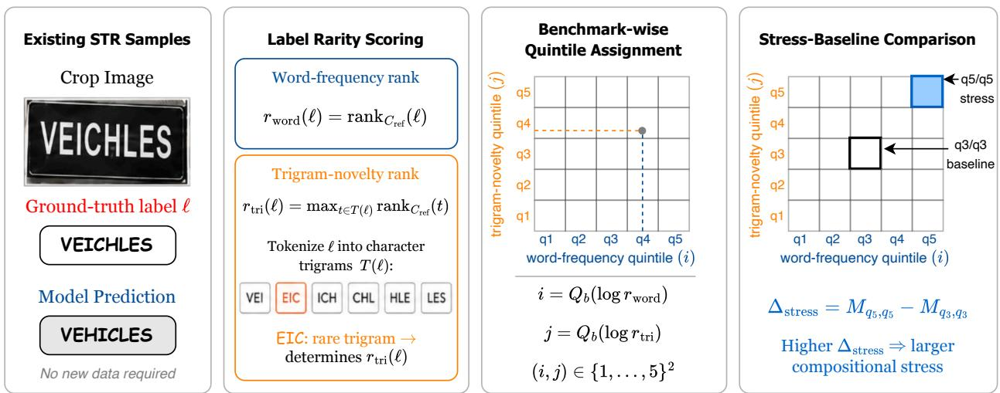
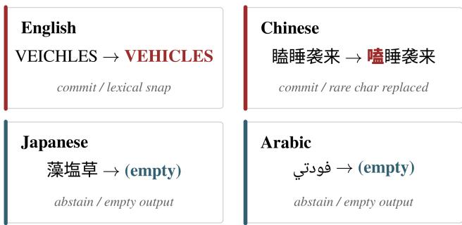
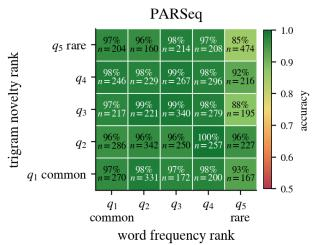
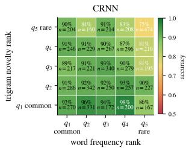
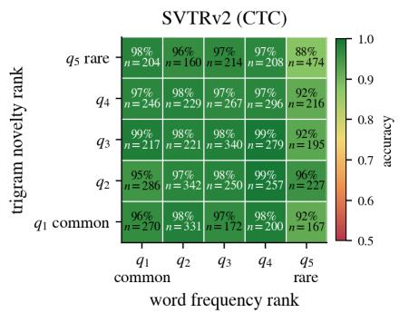
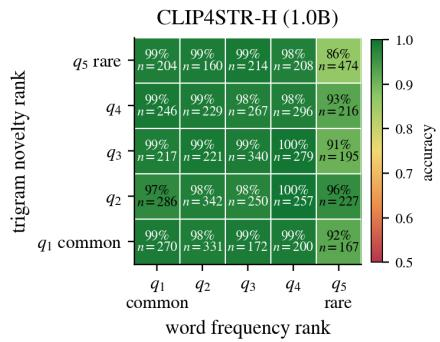
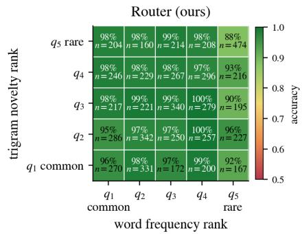
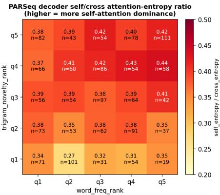
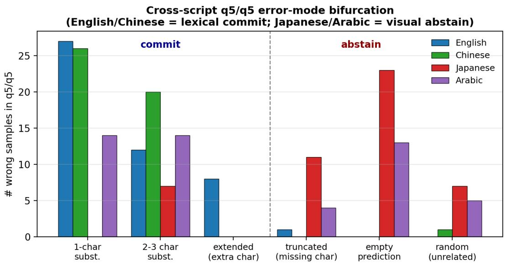

# Can Scene Text Recognition Read Rare Compositions?

Genpei Zhang

University of Wisconsin–Madison genpei.zhang@wisc.edu

## Abstract

Scene text recognition is reported as 89–97% accurate on the six standard benchmarks, and the problem is widely treated as saturated. We present an alternative reading. When the same test images are stratified jointly by ground-truth word rarity and character n-gram novelty against a reference corpus, accuracy at the rare-word × rare-trigram corner of the resulting 5 × 5 grid drops 10–18 pt below the q3/q3 centre across nine English specialised recognisers, and the same direction (corner below centre) holds on all 13 of 13 (language, model) pairs we test across four writing systems (Latin, Han, Han+kana, Arabic). The drop is not a capacity bottleneck. A 6× vision-backbone scale-up (CLIP4STR-Base 158 M → CLIP4STR-Huge 1.0 B, OpenCLIP ViT-H/14 LAION-2B) leads every benchmark in aggregate accuracy yet leaves the stress corner unchanged (86.9 → 86.5, within paired-bootstrap noise). Four converging probes—layer-wise probing, confidence-when-wrong, attention re-balancing, and a cross-script commit-vs-abstain error split—localise the failure to the autoregressive decoder’s lexical prior. We then ask how much of the gap existing techniques recover. Of 16 non-architectural mitigations, the largest mean q5/q5 gain is +1.3 pt and none clears the paired-bootstrap noise floor; the only intervention that does is the architectural shift from autoregressive to CTC decoding (SVTRv2, +2.5 pt, p = 0.02, $n = 4 7 4 )$ . A confidence-routed AR∪CTC ensemble adds a directionally consistent +0.6 pt that stays within noise, and its dominant learned coefficient is each model’s own minimumsoftmax confidence—independently echoing the mechanism above. No configuration we test improves both the compositional corner and aggregate accuracy. The rare-input long tail thus points to architectural change rather than added capacity.

## 1 Introduction

Scene text recognition (STR) models are reported as 89–97% accurate on the six benchmarks that constitute the canonical evaluation (Mishra, Alahari, and Jawahar 2012; Karatzas et al. 2013, 2015; Wang, Babenko, and Belongie 2011; Phan et al. 2013; Risnumawan et al. 2014), and aggregate numbers in this range read as a saturated problem. Yet operational deployments fail on text human readers find trivial: proper nouns, brand codes, abbreviations, multilingual fragments, and any string whose letter combinations are unusual in standard English. We present an alternative reading of the saturation claim, in the spirit of recent diagnostic work that re-examines headline numbers in adjacent fields (Schaeffer, Miranda, and Koyejo 2023; Recht et al. 2019; Yuksekgonul et al. 2023; Geirhos et al. 2019; Ojha et al. 2023; Hsieh et al. 2023): the aggregate metric averages out a structural failure mode that a two-axis stratification of the same test images exposes immediately.

Our contribution is empirical. We do not propose a new STR recogniser; we propose a diagnostic instrument, characterise the failure it exposes across architectures and writing systems, localise its mechanism, and bound what any non-architectural intervention can deliver in our setting. The bound is sharp enough that a +1 pt aggregate gain on the standard benchmarks from a non-CTC method is, in our setting, consistent with model capacity being routed away from the compositional corner rather than closing it.

We stratify each existing benchmark test image along two orthogonal axes against a chosen reference corpus: wordfrequency rank (how often the ground-truth word appears in the reference corpus) and character n-gram-novelty rank (how unfamiliar its trigrams are). Each image lands in exactly one cell of the resulting 5 × 5 grid. The diagnostic requires no new data and is backbone-agnostic. Aggregated across the evaluated STR backbones and all six benchmarks, the corner cell (rare word × rare trigram, n = 474) sits 10–18 pt below the q3/q3 centre across the nine English specialised recognisers, an order of magnitude larger than the inter-model spread on aggregate accuracy.

The direction of the gap survives every cross-cutting variation we test. Adapting the axes (character rarity × characterbigram novelty) to non-Latin scripts and applying them to Chinese, Japanese, and Arabic recognisers, all 13 of 13 (language, model) pairs show a negative $\mathrm { q } 3 / \mathrm { q } 3  \mathrm { q } 5 / \mathrm { q } 5$ gap, with magnitudes between −4.9 pt (Arabic) and −18.1 pt (Chinese). The error distribution bifurcates predictably: English and Chinese fail by commit (substitution toward a familiar lexical hypothesis); Japanese and Arabic fail by abstain (empty or truncated predictions).

Scaling the vision backbone does not close the gap. CLIP4STR-Huge, a 1.0 B-parameter recogniser on an Open-CLIP ViT-H/14 LAION-2B encoder, leads every benchmark on aggregate accuracy, yet a 6× scale-up over CLIP4STR-Base (158 M → 1.0 B) moves the stress corner only from 86.9% to 86.5%, within paired-bootstrap noise $( p = 0 . 7 3 $ $n = 4 7 4 )$ (Schaeffer, Miranda, and Koyejo 2023). The same holds for a generalist OCR LMM: GOT-OCR-2.0 (Wei et al. 2024), trained on a 0.3 B-image corpus, shows the widest compositional gap in our study (−16.0 pt under a normalisation that absorbs its format artefacts; Section 4.3). Added capacity, contrastive or generative, does not reach the corner.

We localise the failure to the autoregressive decoder via four converging probes (Section 4.4): a linear probe for “does this sample land in ${ \bf q } 5 / { \bf q } 5 ? \ '$ is far more decodable at the decoder than at any encoder layer; the decoder is more confident on its wrong predictions in the stress cell than in the centre; and its attention drifts inward to its own decoding history precisely when visual evidence is rare. The result is the same across architectures — the decoder substitutes a familiar lexical hypothesis for what it sees (e.g. VEICHLES → VEHICLES).

We then ask how much of the gap existing techniques recover (Section 5). Across 16 non-architectural mitigations spanning inference-time, loss-level, data-level, and parameter-level interventions, the largest mean q5/q5 gain is +1.3 pt and none clears the paired-bootstrap noise floor. The only intervention that does is the architectural shift from AR decoding to CTC (SVTRv2), +2.5 pt q5/q5 over the PARSeq baseline $( p = 0 . 0 2 , n = 4 7 4 )$ . A confidence-routed AR∪CTC ensemble adds a directionally consistent +0.6 pt that stays within noise; configurations that add raw capacity (a 1.0 B third arm, external LM rescoring) buy aggregate accuracy while leaving the corner untouched. No configuration we test improves both $\mathrm { q } 5 / \mathrm { q } 5$ and aggregate accuracy — the added capacity flows into other cells of the grid.

Our contributions are threefold. First, a stratified bucket diagnostic (Section 3) that quantifies the (word-rarity × n-gram-novelty) failure profile of any STR model on the existing 6-benchmark suite without new data, and adapts to four writing systems. Second, a direction-universal compositional gap: q5/q5 sits below ${ \mathfrak { q } } 3 / { \mathfrak { q } } 3$ on all 13 (language, model) pairs and is not closed by vision-encoder scaling, with an English-specialised magnitude of 10–18 pt across nine backbones. Third, a descriptive ceiling: across 16 non-CTC mitigations and two ensemble extensions, none improves both $\mathrm { q } 5 / \mathrm { q } 5$ and aggregate accuracy and only the AR→CTC shift crosses the $\mathrm { q } 5 / \mathrm { q } 5$ noise floor. We offer the largest non-CTC gain (+1.3 pt) as a falsifiable target for future methods, reproducible against the same framework.

## 2 Related Work

STR architectures. We evaluate ten backbones spanning the full decoding spectrum from CTC to fully autoregressive: CRNN (Shi, Bai, and Yao 2017), TRBA (Baek et al. 2019), ViTSTR (Atienza 2021), ABINet (Fang et al. 2021), PARSeq (Bautista and Atienza 2022), MAERec (Jiang et al. 2023a), SVTRv2 (Du et al. 2025) (a modern CTC recognizer, ICCV 2025), and CLIP4STR-Base/Huge (Zhao et al. 2024) (158 M and 1.0 B-parameter vision-language-pretrained recognizers). We additionally include the generalist OCR model GOT-OCR-2.0 (Wei et al. 2024) to test whether a 0.3 B-image generalist corpus escapes the failure the specialised models share. All ten have been evaluated on the 6-benchmark suite; we re-examine that suite in the spirit of diagnostic reevaluations of saturated benchmarks in adjacent fields (Recht et al. 2019; Schaeffer, Miranda, and Koyejo 2023; Yuksekgonul et al. 2023).

Closest prior work. Two lines of work sit closest to ours. Union14M-L (Jiang et al. 2023b) consolidates 14 real-world datasets and defines a seven-axis benchmark (curved, multioriented, artistic, contextless, salient, multi-words, general) exposing failure modes invisible on the synthetic-trained benchmarks; compositional generalization is not one of those seven axes, but an orthogonal failure axis our diagnostic isolates on the existing benchmarks without new data. Wan et al. (Wan et al. 2020) qualitatively observe that attention-based STR decoders generalize poorly to out-ofvocabulary words while segmentation-based decoders fare better, and propose a mutual-learning strategy; this is the closest direct precursor to our finding, which we sharpen in three ways. (a) We replace the qualitative observation with a quantitative $5 \times 5$ diagnostic that separates a marginal wordfrequency effect from a conditional n-gram-novelty effect. (b) We show the $\mathrm { q } 5 / \mathrm { q } 5 < \mathrm { q } 3 / \mathrm { q } 3$ direction is preserved under a MJSynth → Union14M-L reference-corpus change on the five backbones we test for corpus sensitivity, and across ten backbones and four writing systems. (c) We show the modern CTC-based SVTRv2 (Du et al. 2025), which inherits the segmentation-family advantage, recovers ≈25% of the PARSeq-baseline gap (+2.5 pt q5/q5, p = 0.02) without aggregate regression.

Compositional generalization in vision and NLP. CLEVR-CoGenT (Johnson et al. 2017) and COGS (Kim and Linzen 2020) measure compositional generalization in visual reasoning and semantic parsing under roughly uniform primitive distributions that permit clean disjoint test/train splits. Character n-gram distributions are Zipfian, which (Section 3) makes the disjoint-split idea unusable for STR: the rare combinations are never cleanly disjoint, only progressively rarer. Our stratified bucket framework is a Zipf-aware alternative that grades novelty by quantile rather than partitioning it by set membership.

Confidence calibration and entropy regularization. Pereyra et al. (Pereyra et al. 2017) introduced the confidencepenalty / entropy-regularization loss used as one of our mitigation baselines, and Meister et al. (Meister, Salesky, and Cotterell 2020) generalize the family of entropy regularizers. Maximum-entropy regularization has been applied to Chinese STR (Cheng et al. 2020) but not, to our knowledge, against the AR decoder lexical-prior overconfidence we identify.

## 3 A Stratified Compositional Diagnostic

What does it mean for a scene-text recogniser to “generalise compositionally” over its training distribution? The cleanest formalisation traces back to SCAN (Lake and Baroni 2018), which showed that sequence-to-sequence models trained on individual navigation primitives fail to compose them at test time even when every primitive was seen during training; CLEVR-CoGenT (Johnson et al. 2017) and COGS (Kim and Linzen 2020) extend the same held-primitives-varycombinations test to visual reasoning and semantic parsing respectively. We ask whether this analogue can be lifted into STR, and find that the natural lifting collapses.

  
Figure 1: Construction of the StratiSTR compositional-stress grid. Each existing STR test image’s label is ranked against a reference corpus on two axes and binned into a 5 × 5 grid; q5/q5 vs. q3/q3 gives the diagnostic gap.

## 3.1 Why disjoint n-gram splits do not work

The direct analogue is to partition the training corpus’s character n-gram inventory into disjoint train and test sets and require a test word to contain only test-set n-grams. We attempted this and the construction fails for a structural reason: n-gram statistics in natural English are Zipfian. A bigram inventory has only 676 candidates $( 2 6 ^ { 2 } )$ and the most frequent 60% of bigrams already appear inside nearly every common English word. Selecting words whose bigrams all lie in the rare tail therefore selects against natural English. Applied to the 88 K-word MJSynth vocabulary, this cutoff returns only 159 unique strings, almost all abbreviations and brand codes (hp, mvp, kfc, pvc, cdt, kgb). Lifting to trigrams (17,576 candidates) does not escape the problem: the strict trigram-disjoint split returns the same kind of residual — abbreviations and acronyms such asfbi, cpu, pkwy, saab — rather than any natural English word. The failure is structural, not a matter of choosing n: common substrings are exactly what common words are built from, so any test set defined by the rare-substring residual is, by construction, not a natural-language test set.

## 3.2 From disjoint splits to graded stratification

The lesson from the failed disjoint-split attempt is that English character-n-gram statistics are too dense to admit a clean hold-out. We instead read the diagnostic as a graded signal on the existing 6-benchmark suite. Two intuitions guide the design.

First, compositionality is the joint signature of two axes that already exist in the test data: the rarity of the whole word and the novelty of the character n-grams it contains. A test word can be common-word–rare-trigram (a real but unusual English word), or rare-word–common-trigram (a proper noun made of familiar substrings), or rare-word–rare-trigram. Only the last is properly compositional: novel substrings assembled into a novel whole.

Second, we should not collapse the spectrum to a binary “compositional / non-compositional” label. Both axes are continuous, and the most informative cell is the joint corner where both signals are simultaneously extreme.

Formally, for a test image with ground-truth label ℓ and a reference training corpus $C _ { \mathrm { r e f } } .$ , we compute two ranks. The word-frequency rank $\dot { r } _ { \mathrm { w o r d } } ( \ell ) = \mathrm { r a n k } \bar { } _ { C _ { \mathrm { r e f } } } ( \ell )$ is the rank of ℓ in $C _ { \mathrm { { r e f } } } \mathrm { { ^ , s } }$ word-frequency table, with words absent from $C _ { \mathrm { r e f } }$ assigned a sentinel rank $| V | + 1$ . The trigram-novelty rank $r _ { \mathrm { t r i } } ( \ell ) = \mathrm { m a x } _ { t \in T ( \ell ) } \mathrm { r a n k } _ { C _ { \mathrm { r e f } } } ( t )$ is the rank of the rarest character trigram in ℓ, where $T ( \ell )$ is its set of character trigrams; we take the maximum (worst-case substring) rather than the mean because a single off-distribution substring is what pushes the decoder’s lexical prior off its training manifold. Each rank is mapped to a quintile by a per-benchmark binning $Q _ { b }$ on the $\log _ { 1 0 }$ scale, $i = Q _ { b } ( \log _ { 1 0 } r _ { \mathrm { w o r d } } )$ and $j = Q _ { b } ( \log _ { 1 0 } r _ { \mathrm { t r i } } )$ , so that each benchmark contributes its own hardest fifth to the $\boldsymbol { \mathrm { q } } 5$ band rather than letting easier benchmarks dominate a global split (edges in Appendix K). This assigns every image to a cell $( i , j ) \in \{ 1 , . . . , 5 \} ^ { 2 }$ , yielding a 5 × 5 accuracy grid M per model, where $M _ { i , j }$ is the model’s accuracy in cell $( i , j )$ . The compositional-stress cell is the $\mathrm { q } 5 / \mathrm { q } 5$ corner and the q3/q3 centre is the natural baseline, and the compositional gap is $\Delta _ { \mathrm { s t r e s s } } = M _ { q 5 , q 5 } - M _ { q 3 , q 3 } ( \mathrm { F i g } -$ ure 1). The framework requires no new images and applies to any model unchanged.

Choice of reference corpus. We use MJSynth (Jaderberg et al. 2014) as the primary reference because most evaluated checkpoints were trained on it. To test whether the diagnostic depends on MJSynth’s particular Zipfian structure, we re-run it with the heavier-tailed real-world corpus Union14M-L (Jiang et al. 2023b) as the reference, on the five backbones for which we ran the swap (Appendix B). The $\mathrm { q } 5 / \mathrm { q } 5 < \mathrm { q } 3 / \mathrm { q } 3$ direction holds on every one, and the model ordering by $\mathrm { q } 5 / \mathrm { q } 5$ is essentially unchanged (Pearson $r = 0 . 9 9 )$ . The $a b \_$ solute $\mathrm { q } 5 / \mathrm { q } 5$ level shifts upward by 2.4 to 3.8 pt under the heavier-tailed corpus (e.g. PARSeq $8 5 . 2  8 9 . 0 )$ . The compositional drop is thus a ranking property of the recogniser — robust to reference choice in its direction and ordering, not in its absolute magnitude.

Normalisation. We restrict to lowercase Latin alphabetic labels (regex $= [ a - z ] + 5 )$ , the natural domain of character n-gram statistics in English. This drops 9.75% of the 6-benchmark union (707 of 7248 labels: special-character, all-digit, and mixed-alphanumeric strings, concentrated on IIIT5K and IC15). Crucially, none of the 707 dropped labels is a brand-code token: the pure-alphabetic short strings that motivate the study (e.g. hp, kfc) all survive the filter, so the diagnostic measures exactly the regime the introduction highlights. For non-Latin scripts we adapt the axes to character rarity × character-bigram novelty; Section 4.3 reports cross-script results.

## 4 The Compositional Gap and Its Mechanism 4.1 Setup

We evaluate the ten STR backbones listed in Section $2 -$ nine specialised recognisers and the generalist OCR LMM GOT-OCR-2.0 (Wei et al. 2024) — on the six standard STR benchmarks (Mishra, Alahari, and Jawahar 2012; Karatzas et al. 2013, 2015; Wang, Babenko, and Belongie 2011; Phan et al. 2013; Risnumawan et al. 2014), totalling 7,248 cropped test images, of which 6,541 carry alpha-only labels and enter the bucket analysis (9.75% dropped; Section 3). Public checkpoints come from each model’s authoritative release. We use MJSynth (Jaderberg et al. 2014) as the primary reference corpus and Union14M-L (Jiang et al. 2023b) for the crosscorpus check (Appendix B). The metric is case-insensitive word accuracy after stripping non-alphanumerics, the standard STR community metric. Full per-checkpoint provenance is in Appendix J.

## 4.2 Aggregate accuracy: the saturated picture

We begin with the conventional view. Aggregate accuracy on the six standard benchmarks places every specialised recogniser in a narrow 89–97% band (Table 1). The nine specialised backbones cluster within a few points of each other on the four largest benchmarks despite spanning two orders of magnitude in parameter count (8.4 M for CRNN to 1.0 B for CLIP4STR-Huge) and fundamentally different inductive biases — an RNN, an MAE-pretrained transformer, a contrastively-pretrained ViT, a CTC-based recogniser. At this resolution the problem reads as saturated and any remaining inter-architecture variation as noise. (The generalist GOT-OCR-2.0 sits far lower in raw exact-match accuracy, almost entirely because of prediction-format artefacts; we defer it to Section $^ { 5 , }$ where a fair normalisation makes it a clean test of whether generalist capacity helps.)

## 4.3 The gap and its universality

If aggregate accuracy hides a structural failure, the stratified diagnostic should expose it. We compute the per-cell accuracy grid for every model on every benchmark, pool across the six benchmarks, and read off two cells per model: the $\mathrm { q } 5 / \mathrm { q } 5$ corner (rare word × rare trigram) and the ${ \mathfrak { q } } 3 / { \mathfrak { q } } 3$ centre (Table 2).

Three properties stand out. First, the gap is large: −10 to −18 pt is an order of magnitude larger than the inter-model spread on aggregate accuracy in Table 1. Second, the direction is universal: every specialised backbone’s worst cell is the $\mathrm { q } 5 / \mathrm { q } 5$ corner, and accuracy falls monotonically from the ${ \mathfrak { q } } 3 / { \mathfrak { q } } 3$ centre toward that corner along the rare side of each axis. (The common end is not monotone — q1/q1 sits slightly below q3/q3 for several models, because that band is dominated by very short high-frequency words where characterlevel ambiguity raises the absolute error rate. The rarity axis is therefore U-shaped, which only sharpens the point: q5/q5 is hard not because rare words are uniformly hard, but because of what happens at the rare combination.) Third, the gap is not addressable on the visual side. Despite very different inductive biases — masked-image pretraining (MAERec-B), LAION-pretrained CLIP encoders (CLIP4STR), and supervised training (PARSeq/ABINet) — all specialised backbones land within 2 pt of one another at $\mathrm { q } 5 / \mathrm { q } 5$

The gap is an interaction, not rare-word reliance. A natural worry is that $\mathrm { q } 5 / \mathrm { q } 5$ simply re-discovers vocabulary reliance (Wan et al. 2020) — that rare words are hard and the trigram axis adds nothing. A marginal-effect decomposition rules this out (Appendix A). Holding word frequency at $\mathsf { q 5 }$ and varying trigram novelty from q1 to q5 costs PARSeq −7.6 pt; doing the same at q1 (common words) costs only −0.1 pt. The trigram-novelty axis has almost no marginal effect and acts only conditional on the word being rare. Equivalently, the marginal word-rarity effect (−3.9 pt) plus the conditional trigram effect (−7.6 pt) sum to the joint q1/q1→q5/q5 drop (−11.4 pt): primitives seen, the joint unseen, the surface marginal near zero and the conditional effect large. That is the definitional signature of compositional generalisation, not of word rarity per se. The full $5 \times 5$ accuracy grids are in Appendix H.

The direction is universal across writing systems. The English result is not a Latin-only or MJSynth-only artefact. We adapt the two axes for non-Latin scripts — replacing word frequency with minimum character log-frequency and trigram novelty with consecutive-character-bigram logfrequency — and run the same diagnostic on Chinese (FudanVI BCTR (Yu et al. 2021), two recognisers), Japanese (a 40 k-sample synthetic kanji+kana set, two recognisers), and Arabic (EvArEST (Hassan, El-Mahdy, and Hussein 2021), EasyOCR). Table 3 reports the result: all 13 of 13 (language, model) pairs show a negative q3/q3→q5/q5 gap, with magnitudes from −4.9 pt (Arabic) to −18.1 pt (Chinese). The magnitude varies with script and model strength, so we claim universality only for the direction, which holds without exception.

The way the gap manifests differs by script in a manner that supports the lexical-prior account rather than complicating it. For English the two axes both contribute (the interaction above); for Chinese the character-rarity axis dominates and the bigram axis adds only about 1 pt, consistent with Han characters being morphemes that carry meaning alone. The error kind also splits cleanly into two regimes, which we analyse next as the first of the mechanism probes.

Table 1: Word accuracy of the ten evaluated backbones: pooled aggregate (Agg) and per-benchmark breakdown. Checkpoints are each model’s authoritative public release (Appendix J). GOT-OCR-2.0 is under raw exact match; a fair normalisation is in Section 5.
<table><tr><td rowspan="2">Model</td><td rowspan="2">Params</td><td rowspan="2">Agg</td><td colspan="6">Per-benchmark</td></tr><tr><td>IIIT5K</td><td>IC13</td><td>IC15</td><td>SVT</td><td>SVTP</td><td>CUTE80</td></tr><tr><td>PARSeq (Bautista and Atienza 2022)</td><td>23.8M</td><td>96.03</td><td>98.83</td><td>98.25</td><td>90.72</td><td>98.30</td><td>94.73</td><td>98.61</td></tr><tr><td>ABINet (Fang et al. 2021)</td><td>36.9M</td><td>95.74</td><td>98.53</td><td>98.60</td><td>90.50</td><td>98.15</td><td>93.80</td><td>96.88</td></tr><tr><td>ViTSTR (Atienza 2021)</td><td>21.4M</td><td>94.51</td><td>97.83</td><td>97.67</td><td>89.01</td><td>95.98</td><td>91.16</td><td>95.83</td></tr><tr><td>TRBA (Baek et al. 2019)</td><td>49.8M</td><td>95.47</td><td>98.50</td><td>97.90</td><td>88.18</td><td>97.84</td><td>91.78</td><td>95.49</td></tr><tr><td>CRNN (Shi, Bai, and Yao 2017)</td><td>8.4M</td><td>88.91</td><td>94.53</td><td>93.58</td><td>81.83</td><td>91.19</td><td>80.62</td><td>89.24</td></tr><tr><td>MAERec-B (Jiang et al. 2023a)</td><td>142.1M</td><td>95.96</td><td>99.00</td><td>98.25</td><td>90.61</td><td>97.53</td><td>94.73</td><td>98.26</td></tr><tr><td>CLIP4STR-B (Zhao et al. 2024)</td><td>158.3M</td><td>96.83</td><td>99.40</td><td>98.60</td><td>91.39</td><td>98.30</td><td>97.67</td><td>98.61</td></tr><tr><td>CLIP4STR-H (Zhao et al. 2024)</td><td>1.0B</td><td>97.00</td><td>99.43</td><td>99.07</td><td>91.72</td><td>99.07</td><td>97.67</td><td>98.61</td></tr><tr><td>SVTRv2 (Du et al. 2025)</td><td>19.8M</td><td>96.19</td><td>99.03</td><td>98.60</td><td>91.28</td><td>98.15</td><td>94.26</td><td>99.31</td></tr><tr><td>GOT-OCR-2.0 (Wei et al. 2024)</td><td>580M</td><td>65.69</td><td>59.80</td><td>59.28</td><td>69.02</td><td>68.93</td><td>64.03</td><td>68.40</td></tr></table>

Table 2: q5/q5 (rare word × rare trigram) vs. ${ \mathfrak { q } } 3 / { \mathfrak { q } } 3$ centre, pooled across the six benchmarks $( n _ { q 5 / q 5 } = 4 7 4 )$ . The gap is −10 to −18 pt across nine backbones despite a far narrower aggregate spread (Table 1). Reference corpus: MJSynth.
<table><tr><td>Model</td><td>q5/q5</td><td>q3/q3 centre</td><td>Gap (pt)</td></tr><tr><td>CRNN</td><td>74.7</td><td>92.6</td><td>-17.9</td></tr><tr><td>ViTSTR</td><td>85.0</td><td>96.8</td><td>-11.7</td></tr><tr><td>PARSeq</td><td>85.2</td><td>99.1</td><td>-13.9</td></tr><tr><td>ABINet</td><td>85.2</td><td>97.6</td><td>-12.4</td></tr><tr><td>TRBA</td><td>86.3</td><td>98.5</td><td>-12.2</td></tr><tr><td>MAERec-B</td><td>86.3</td><td>98.2</td><td>-11.9</td></tr><tr><td>CLIP4STR-B</td><td>86.9</td><td>98.5</td><td>-11.6</td></tr><tr><td>CLIP4STR-H (1.0B)</td><td>86.5</td><td>98.8</td><td>-12.3</td></tr><tr><td>SVTRv2 (ICCV 2025)</td><td>87.8</td><td>98.2</td><td>-10.5</td></tr></table>

## 4.4 Mechanism: localising the failure to the AR decoder

The diagnostic shows where the failure occurs; it does not yet show why. If the gap were missing visual capacity — glyphs the model cannot resolve — the wrong predictions would look like noise. If instead a prior is applied on top of the visual evidence, the wrong predictions should look like nearby training-set strings. Four converging probes point to the second account, and locate the prior in the autoregressive decoder.

(i) Errors are lexical corrections, not noise. We inspect the 474 q5/q5 wrong predictions of PARSeq, the strongest specialised model in our set (Table 4). The dominant mode is not character noise but lexical snap: the decoder treats an unfamiliar character sequence as a candidate word and projects it onto the nearest entry in its implicit training vocabulary. VEICHLES becomes VEHICLES, Boerien becomes Experience, Reking becomes Relishing — each a real English word at minimum edit distance, regardless of whether the input is a misspelling, a proper noun, or a non-English string. The same qualitative pattern holds on the other specialised AR models we inspect (Appendix D).

Table 3: Cross-script q5/q5 vs. q3/q3 accuracy (non-Latin scripts; English rows are Table 2). Every pair has a negative gap, extending the English finding to three writing systems and five models.
<table><tr><td>Language</td><td>Model</td><td>q3/q3</td><td>q5/q5</td><td>Gap (pt)</td></tr><tr><td rowspan="2">Chinese</td><td>SVTRv2-ch</td><td>80.6</td><td>62.5</td><td>-18.1</td></tr><tr><td>PP-OCRv5-multi</td><td>55.0</td><td>41.9</td><td>-13.1</td></tr><tr><td rowspan="2">Japanese</td><td>PP-OCRv5-multi</td><td>18.0</td><td>7.9</td><td>-10.1</td></tr><tr><td>PP-OCRv5 server</td><td>21.6</td><td>12.9</td><td>-8.7</td></tr><tr><td>Arabic</td><td>EasyOCR-Arabic</td><td>39.9</td><td>35.0</td><td>-4.9</td></tr></table>

(ii) The decoder is most confident where it is most wrong. If the decoder commits to a prior-driven guess rather than expressing visual uncertainty, it should be more confident on its wrong predictions in the stress cell than in the centre. It is: PARSeq’s mean top-1 confidence on wrong q5/q5 predictions is 0.93, against 0.89 on wrong q3/q3 predictions, even though q5/q5 accuracy is 14 pt lower (full per-cell decomposition in Appendix G). Confidence rises exactly where visual support for the lexical guess is weakest, the same overconfidence phenomenon documented for modern neural networks generally (Guo et al. 2017), here localised to a specific, diagnosable input regime rather than reported as a global property.

(iii) The q5/q5 signal is decodable at the decoder, not the encoder. A layer-wise linear probe for “is this sample in ${ \bf q } 5 / { \bf q } 5 ? \ '$ , trained on PARSeq hidden states, climbs from AUC 0.60 to 0.70 across encoder blocks 0–11 and jumps to AUC 0.80 at the decoder mean-pool (Appendix G). The +0.10 AUC gap localises the compositional-stress signal to the AR decoder rather than the encoder — consistent with the intervention hierarchy of Section 5, where replacing the AR decoder with a CTC head is the single most effective change.

Table 4: Representative wrong predictions in PARSeq’s q5/q5 cell. The failures are not random character noise but lexical snap: they map an unfamiliar sequence onto the nearest training-set English word (boldface). Mode labels are defined in Section 4.4.
<table><tr><td>True label</td><td>Prediction</td><td>Mode</td></tr><tr><td>GASTRONOMY</td><td>INKHEN</td><td>whole-word</td></tr><tr><td>VEICHLES</td><td>VEHICLES</td><td>lexical-snap</td></tr><tr><td>Boerien</td><td>Experience</td><td>lexical-snap</td></tr><tr><td>Reking</td><td>Relishing</td><td>lexical-snap</td></tr><tr><td>Doraeman</td><td>Doraemon</td><td>lexical-snap</td></tr><tr><td>BETRIEBSBEREIT</td><td>CETRIEBSBEREIT</td><td>char-edit</td></tr><tr><td>jeanswear</td><td>ieanswear</td><td>char-noise</td></tr></table>

  
Figure 2: One representative q5/q5 wrong prediction per script. Full galleries are in Appendix L.

(iv) Attention drifts inward under stress, and the error kind bifurcates by script. The decoder’s first-layer ratio of self- to cross-attention entropy rises monotonically from ∼ 0.27 in the common-trigram band to ∼ 0.44 in the raretrigram band (Appendix I): visual attention does not stop, but the budget shifts toward the prior as compositional stress grows. This same prior-versus-evidence trade-off produces two script-level error regimes. Sampling fifty q5/q5 wrong predictions per script, English and Chinese fail by commit (94% and 92% character substitutions toward a familiar word or morpheme), while Japanese and Arabic fail by abstain (68% and 34% empty or truncated). Both regimes share one cause — the AR decoder discounts low-prior visual evidence — and differ only in surface form.

## 5 What Closes the Gap?

We have a −10 to −18 pt compositional gap that is universal in direction and localised to the AR decoder. How much of it can existing techniques recover? We work outward from the cheapest lever (more visual capacity) to the most invasive (replacing the decoder), and find that almost nothing moves the q5/q5 cell except a change of decoding architecture.

## 5.1 Scaling the backbone does not close the gap

The most direct lever is more visual capacity. CLIP4STR-Huge pairs a 1.0 B-parameter OpenCLIP ViT-H/14 LAION-2B encoder with the CLIP4STR recogniser and leads every benchmark on aggregate accuracy, reaching the highest q1/q1 cell in our study (98.9%). Yet a 6× scale-up over CLIP4STR-Base (158 M → 1.0 B, same recogniser, same training recipe) moves the stress corner from 86.9% to 86.5% — a −0.4 pt change whose paired-bootstrap confidence interval contains zero $( p = 0 . 7 3 , n = 4 7 4 )$ . Because the two models share everything but encoder scale, this isolates capacity as the variable and shows it does not reach the corner (Schaeffer, Miranda, and Koyejo 2023).

A generalist model trained on far more data tells the same story. GOT-OCR-2.0 is a 580 M-parameter OCR LMM trained on a 0.3 B-image corpus. Under raw exact match it scores only 65.7% aggregate, but 82% of its “errors” are prediction-format artefacts — trailing padding and multiword continuation (LONDON → LONDONLONDON). Under a charitable normalisation that strips these (prediction startswith the label after alphanumeric folding), its aggregate rises to 93.5% — and its q5/q5 reaches 80.8%, −16.0 pt below its own q3/q3, the widest compositional gap in our study. A generalist trained on three orders of magnitude more imagery does not close the corner; under a fair metric it widens it. Whatever the gap is, neither contrastive nor generative visual capacity reaches it; the origin must lie in the decoder, as the mechanism probes indicated.

## 5.2 Sixteen non-architectural mitigations

We next run 16 candidate mitigations spanning four intervention levels — inference (temperature, beam and LM rescoring), loss (entropy and confidence penalties), data (synthetic character-augmentation FT), and parameter-level adapters — plus a confidence-routed ensemble. Each is summarised by its q5/q5 corner accuracy and the ∆ over the PARSeq baseline (Table 5); full per-attempt detail, multi-seed ablations, and three further candidates are in Appendix E. We read the resulting bound as a descriptive ceiling over these attempts, not a universal one: four categories (large-LM rescoring, bytelevel tokenisation, retrieval-augmented decoding, RL-shaped visual–lexical objectives) remain untested (Section 6).

The pattern is clean. The architectural shift from autoregressive to CTC decoding (SVTRv2) gains +2.5 pt at q5/q5 over the PARSeq baseline and is the only intervention whose paired-bootstrap interval excludes zero $( p = 0 . 0 2 , n = 4 7 4 ) ;$ on the hardest individual failure trigrams it roughly halves the per-trigram error rate (Appendix C). Every non-architectural attempt — the best of which is a LoRA-AR adapter at +1.3 pt — has a 95% interval that contains zero. We therefore report +1.3 pt as a descriptive ceiling (the largest mean non-CTC gain we observed), not a statistical bound.

## 5.3 LoRA-AR: the strongest non-architectural attempt

The largest non-CTC mean gain comes from a 15,360- parameter LoRA (Hu et al. 2022) adapter on the AR decoder’s

Table 5: Mitigation summary; full statistics in Appendix F. Only SVTRv2’s AR→CTC shift (bold) clears the $\mathrm { q } 5 / \mathrm { q } 5$ noise floor $( p = 0 . 0 2 ) ;$ every other attempt’s 95% CI contains zero, and added capacity trades q5/q5 for aggregate.
<table><tr><td>Variant</td><td>Level</td><td> $9 5 / { \mathrm { q } } 5 \ : ( \% )$ </td><td> $\Delta \ : { } \mathrm { q } 5 / \mathrm { q } 5$ </td><td> $9 3 / { \mathrm { q } } 3 \left( \% \right)$ </td><td> $\mathrm { A g g } \left( \% \right)$ </td></tr><tr><td>Original PARSeq</td><td>baseline</td><td>85.2</td><td></td><td>99.1</td><td>95.71</td></tr><tr><td>+ synthetic char-aug FT</td><td>data</td><td>83.3</td><td>-1.9</td><td>97.9</td><td>94.4</td></tr><tr><td>+ entropy regularization</td><td>loss</td><td>85.9</td><td>+0.6</td><td>98.5</td><td>95.8</td></tr><tr><td>+ distilGPT-2 LM rescore,  $\lambda { = } 0 . 2$ </td><td>inference</td><td>86.1</td><td>+0.9</td><td>98.4</td><td>96.5</td></tr><tr><td>+ LoRA-AR (ours), r=4</td><td>PEFT</td><td>86.5</td><td>+1.3</td><td>98.2</td><td>96.0</td></tr><tr><td>SVTRv2 (CTC)</td><td>architecture</td><td>87.8</td><td>+2.5</td><td>98.2</td><td>96.55</td></tr><tr><td>+ 2-way router (LoRA-AR ∪ SVTRv2)</td><td>ensemble</td><td>88.4</td><td>+3.2</td><td>98.6</td><td>96.80</td></tr><tr><td>+ 3-way router (∪ CLIP4STR-Huge)</td><td>ensemble</td><td>86.9</td><td>+1.7</td><td>99.0</td><td>97.31</td></tr></table>

MLP linears (0.064% of PARSeq’s trainable parameters; encoder, attention projections, and output head frozen). $\mathrm { { A t } } \ r { = } 4$ it reaches 86.5% q5/q5 (the seed-0 checkpoint, +1.3 pt over baseline; robust across five seeds at $8 6 . 3 \pm 0 . 2 1 )$ , though the gain does not clear the noise floor $( p = 0 . 1 4 )$ . This single seed-0 instance is the one consumed by the routed ensemble below, so we report it in Table 5 for an apples-to-apples comparison. That the adapter helps most when confined to the decoder MLP — and that higher ranks $( r \in \{ 1 6 , 3 2 \} )$ drift back toward baseline rather than improving — is consistent with the probe result that the prior lives in the AR decoder: the available non-architectural headroom is small and concentrated there. We present LoRA-AR as the strongest nonarchitectural attempt and the basis of the descriptive ceiling, not as a statistically established gain.

## 5.4 A confidence-routed ensemble, and where extra capacity goes

The AR and CTC families make different mistakes, so we test whether routing between them recovers additional headroom. Across all six benchmarks LoRA-AR and SVTRv2 disagree on 259 of the 7,248 kept-filter images; on 184 of these exactly one model is right, and we train a 21-feature logistic-regression router on those 184 supervised disagreements via 5-fold stratified cross-validation, then evaluate on the q5/q5 cell. The right-if-either oracle on $\mathrm { q } 5 / \mathrm { q } 5$ reaches 89.7%, and the router approximates it at 88.4% — +0.6 pt over SVTRv2 alone, directionally consistent with but statistically indistinguishable from SVTRv2 $( p = 0 . 4 3 )$ . The result is still informative: the router’s dominant learned coefficient is each model’s own minimum-softmax confidence, the same confidence-when-wrong signal the mechanism analysis identified, so even the best ensemble we can build reads out the mechanism rather than circumventing it.

Adding raw capacity does not help the corner either. A third 1.0 B-parameter router arm (CLIP4STR-Huge) lifts aggregate to the highest in our study (97.3%) but its $\mathrm { q } 5 / \mathrm { q } 5$ falls 1.5 pt back onto the CLIP4STR-Base operating point $( 8 6 . 9 \% ; \mathbf { C I } \left[ - 3 . 2 , 0 . 0 \right] , p = 0 . 0 7 8 )$ : the extra capacity flows into the q1–q4 cells where CLIP4STR-Huge wins, leaving the corner untouched. External distilGPT-2 rescoring of the top-5 beams (Gulcehre et al. 2015; Kannan et al. 2018) buys aggregate accuracy but not $\mathrm { { q } } 5 / \mathrm { { q } } 5 - \mathrm { { a } }$ general-language prior, if anything, reinforces the lexical-snap failure the mechanism analysis diagnoses.

Across all 16 non-architectural mitigations and both ensemble extensions, no configuration improves both $\mathrm { q } 5 / \mathrm { q } 5$ and aggregate accuracy. The residual ∼ 10 pt between SVTRv2’s $\mathrm { q } 5 / \mathrm { q } 5$ and the ${ \mathfrak { q } } 3 / { \mathfrak { q } } 3$ centre is the word-level lexical snap that persists even after the architectural shift (VEICHLES → VEHICLES; Appendix D), and our results suggest it calls for a change of training objective rather than added capacity.

## 6 Discussion

Implications for how STR is measured and advanced. The headline reading of STR — 89–97% on six benchmarks, a solved problem — survives only because the aggregate metric averages over a long tail it never isolates. Stratifying the same test images exposes a −10 to −18 pt compositional gap on every one of the nine specialised English backbones, in the same direction on all 13 (language, model) pairs across four writing systems, and crossed only by a change of decoding architecture. Two consequences follow. Progress on the rare-input tail cannot be read off aggregate accuracy: a method can buy a point of aggregate while leaving the compositional corner untouched, as adding a 1.0 B-parameter arm or an external language model does here, so a stratified read-out should accompany the headline number whenever the long tail matters. And the lever that moves the corner is architectural rather than quantitative — we agree with Wan et al. (Wan et al. 2020) at the architectural level, but localise the effect to the AR decoder’s lexical prior and show a 6× visual-encoder scale-up does not touch it.

Limitations. The +1.3 pt ceiling over our 16 nonarchitectural mitigations is a descriptive mean, not a significant gain $( p = 0 . 1 4 )$ , and four intervention families remain untested: external large-LM rescoring, byte/character-level tokenisation, retrieval-augmented decoding, and reinforcementlearned visual–lexical objectives. Of these, objectives that decouple character accuracy from word-level identity seem most promising: Appendix D shows the residual gap survives the $\mathbf { A R { \to } C T C }$ shift precisely because both objectives still reward matching a whole-word target.

## References

Atienza, R. 2021. Vision Transformer for Fast and Efficient Scene Text Recognition. In ICDAR, 319–334.

Baek, J.; Kim, G.; Lee, J.; Park, S.; Han, D.; Yun, S.; Oh, S. J.; and Lee, H. 2019. What Is Wrong With Scene Text Recognition Model Comparisons? Dataset and Model Analysis. In ICCV, 4715–4723.

Bautista, D.; and Atienza, R. 2022. Scene Text Recognition with Permuted Autoregressive Sequence Models. In ECCV, 178–196.

Cheng, C.; Xu, W.; Bai, X.; Feng, B.; and Liu, W. 2020. Maximum Entropy Regularization and Chinese Text Recognition. In International Workshop on Document Analysis Systems (DAS), 3–17. ArXiv:2007.04651.

Du, Y.; Chen, Z.; Xie, H.; Jia, C.; and Jiang, Y.-G. 2025. SVTRv2: CTC Beats Encoder-Decoder Models in Scene Text Recognition. In ICCV. ArXiv:2411.15858.

Fang, S.; Xie, H.; Wang, Y.; Mao, Z.; and Zhang, Y. 2021. Read Like Humans: Autonomous, Bidirectional and Iterative Language Modeling for Scene Text Recognition. In CVPR, 7098–7107.

Geirhos, R.; Rubisch, P.; Michaelis, C.; Bethge, M.; Wichmann, F. A.; and Brendel, W. 2019. ImageNet-trained CNNs are Biased Towards Texture; Increasing Shape Bias Improves Accuracy and Robustness. In International Conference on Learning Representations (ICLR). Oral; arXiv:1811.12231.

Gulcehre, C.; Firat, O.; Xu, K.; Cho, K.; Barrault, L.; Lin, H.-C.; Bougares, F.; Schwenk, H.; and Bengio, Y. 2015. On Using Monolingual Corpora in Neural Machine Translation. arXiv:1503.03535.

Guo, C.; Pleiss, G.; Sun, Y.; and Weinberger, K. Q. 2017. On Calibration of Modern Neural Networks. In International Conference on Machine Learning (ICML). ArXiv:1706.04599.

Hassan, H.; El-Mahdy, A.; and Hussein, M. E. 2021. Arabic Scene Text Recognition in the Deep Learning Era: Analysis on a Novel Dataset. IEEE Access. EvArEST dataset.

Hsieh, C.-Y.; Zhang, J.; Ma, Z.; Kembhavi, A.; and Krishna, R. 2023. SugarCrepe: Fixing Hackable Benchmarks for Vision-Language Compositionality. In Advances in Neural Information Processing Systems (NeurIPS). ArXiv:2306.14610.

Hu, E. J.; Shen, Y.; Wallis, P.; Allen-Zhu, Z.; Li, Y.; Wang, S.; Wang, L.; and Chen, W. 2022. LoRA: Low-Rank Adaptation of Large Language Models. In International Conference on Learning Representations (ICLR). ArXiv:2106.09685.

Jaderberg, M.; Simonyan, K.; Vedaldi, A.; and Zisserman, A. 2014. Synthetic Data and Artificial Neural Networks for Natural Scene Text Recognition. arXiv:1406.2227.

Jiang, Q.; Wang, J.; Peng, D.; Liu, C.; and Jin, L. 2023a. Revisiting Scene Text Recognition: A Data Perspective. In ICCV, 20543–20554.

Jiang, Q.; Wang, J.; Peng, D.; Liu, C.; and Jin, L. 2023b. Revisiting Scene Text Recognition: A Data Perspective. In ICCV, 20543–20554.

Johnson, J.; Hariharan, B.; van der Maaten, L.; Fei-Fei, L.; Zitnick, C. L.; and Girshick, R. 2017. CLEVR: A Diagnostic Dataset for Compositional Language and Elementary Visual Reasoning. In CVPR, 2901–2910.

Kannan, A.; Wu, Y.; Nguyen, P.; Sainath, T. N.; Chen, Z.; and Prabhavalkar, R. 2018. An Analysis of Incorporating an External Language Model into a Sequence-to-Sequence Model. In IEEE International Conference on Acoustics, Speech and Signal Processing (ICASSP). ArXiv:1712.01996.

Karatzas, D.; Gomez-Bigorda, L.; Nicolaou, A.; et al. 2015. ICDAR 2015 Competition on Robust Reading. In ICDAR, 1156–1160.

Karatzas, D.; Shafait, F.; Uchida, S.; et al. 2013. ICDAR 2013 Robust Reading Competition. In ICDAR, 1484–1493.

Kim, N.; and Linzen, T. 2020. COGS: A Compositional Generalization Challenge Based on Semantic Interpretation. In EMNLP, 9087–9105.

Lake, B. M.; and Baroni, M. 2018. Generalization without Systematicity: On the Compositional Skills of Sequence-to-Sequence Recurrent Networks. In ICML, 2873–2882.

Meister, C.; Salesky, E.; and Cotterell, R. 2020. Generalized Entropy Regularization or: There’s Nothing Special about Label Smoothing. In ACL, 6870–6886.

Mishra, A.; Alahari, K.; and Jawahar, C. 2012. Scene Text Recognition Using Higher Order Language Priors. In BMVC.

Ojha, U.; Li, Y.; Sundara Rajan, A.; Liang, Y.; and Lee, Y. J. 2023. What Knowledge Gets Distilled in Knowledge Distillation? In Advances in Neural Information Processing Systems (NeurIPS). ArXiv:2205.16004.

Pereyra, G.; Tucker, G.; Chorowski, J.; Kaiser, Ł.; and Hinton, G. 2017. Regularizing Neural Networks by Penalizing Confident Output Distributions. arXiv:1701.06548.

Phan, T. Q.; Shivakumara, P.; Tian, S.; and Tan, C. L. 2013. Recognizing Text with Perspective Distortion in Natural Scenes. In ICCV, 569–576.

Recht, B.; Roelofs, R.; Schmidt, L.; and Shankar, V. 2019. Do ImageNet Classifiers Generalize to ImageNet? In International Conference on Machine Learning (ICML). ArXiv:1902.10811.

Risnumawan, A.; Shivakumara, P.; Chan, C. S.; and Tan, C. L. 2014. A Robust Arbitrary Text Detection System for Natural Scene Images. Expert Systems with Applications, 41(18): 8027–8048.

Schaeffer, R.; Miranda, B.; and Koyejo, S. 2023. Are Emergent Abilities of Large Language Models a Mirage? In Advances in Neural Information Processing Systems (NeurIPS). Outstanding Paper Award; arXiv:2304.15004.

Shi, B.; Bai, X.; and Yao, C. 2017. An End-to-End Trainable Neural Network for Image-Based Sequence Recognition and Its Application to Scene Text Recognition. IEEE TPAMI, 39(11): 2298–2304.

Wan, Z.; Zhang, J.; Zhang, L.; Luo, J.; and Yao, C. 2020. On Vocabulary Reliance in Scene Text Recognition. In CVPR, 11425–11434.

Wang, K.; Babenko, B.; and Belongie, S. 2011. End-to-End Scene Text Recognition. In ICCV, 1457–1464.

Wei, H.; Liu, C.; Chen, J.; Wang, J.; Kong, L.; Xu, Y.; Ge, Z.; Zhao, L.; Sun, J.; Peng, Y.; Han, C.; and Zhang, X. 2024. General OCR Theory: Towards OCR-2.0 via a Unified Endto-end Model. arXiv:2409.01704.

Yu, H.; Chen, J.; Li, B.; Ma, J.; Guan, M.; Xu, X.; Wang, X.; Qu, S.; and Xue, X. 2021. Benchmarking Chinese Text Recognition: Datasets, Baselines, and an Empirical Study. FudanVI BCTR benchmark, arXiv:2112.15093.

Yuksekgonul, M.; Bianchi, F.; Kalluri, P.; Jurafsky, D.; and Zou, J. 2023. When and Why Vision-Language Models Behave Like Bags-of-Words, and What to Do About It? In International Conference on Learning Representations (ICLR). Oral; arXiv:2210.01936.

Zhao, S.; Quan, R.; Zhu, L.; and Yang, Y. 2024. CLIP4STR: A Simple Baseline for Scene Text Recognition with Pre-trained Vision-Language Model. IEEE Transactions on Image Processing. DOI 10.1109/TIP.2024.3512354; arXiv:2305.14014.

## A Interaction analysis: the gap is not just rare-word reliance

The most likely objection to the q5/q5 gap is that it merely rediscovers “vocabulary reliance” (Wan et al. 2020): that rare words are hard and the trigram-novelty axis adds nothing. We decompose the joint $\mathrm { q } 1 / \mathrm { q } 1 {  } \mathrm { q } 5 / \mathrm { q } 5$ drop into marginal and conditional parts (PARSeq, pooled across the six benchmarks; other AR backbones are qualitatively identical), reported in Table 6.

Table 6: Marginal vs. conditional effects for PARSeq, pooled across the six benchmarks. The marginal trigram effect (varying novelty at a common word) is essentially zero; the conditional trigram effect (varying novelty at a rare word) is large. The marginal word effect $( - 3 . 9 )$ plus the conditional trigram effect $( - 7 . 6 )$ recover the full joint drop (−11.4), the additive decomposition of a genuine interaction.
<table><tr><td>Effect</td><td>Accuracy path</td><td>Drop</td></tr><tr><td>Marginal trigram (at word=q1)</td><td> $9 6 . 7  9 6 . 6 $ </td><td> $- 0 . 1 \mathfrak { p t }$ </td></tr><tr><td>Marginal word (at trigram=q1)</td><td> $9 6 . 7  9 2 . 8 $ </td><td> $- 3 . 9 \mathrm { p t }$ </td></tr><tr><td>Conditional trigram (at  $\mathrm { w o r d } { = } \mathsf { q } 5 )$ </td><td> $9 2 . 8  8 5 . 2 $ </td><td> $- 7 . 6 \mathrm { p t }$ </td></tr><tr><td>Joint  $\mathrm { q } 1 / \mathrm { q } 1  \mathrm { q } 5 / \mathrm { q } 5$ </td><td> $9 6 . 7  8 5 . 2 $ </td><td> $- 1 1 . 4 \mathrm { p t }$ </td></tr></table>

The trigram axis carries almost no marginal weight (row 1, −0.1 pt at a common word) but becomes the dominant term once the word is rare (row $3 , - 7 . 6 \mathrm { p t } )$ , and the marginal word effect plus the conditional trigram effect recover the joint drop exactly $( - 3 . 9 - 7 . 6 = \overset { - } { - } 1 1 . 4 )$ . This is the signature of compositional generalisation rather than word rarity per se: a vocabulary-reliance account, under which the gap is a function of word frequency alone, cannot produce a trigram effect that is zero at common words and $- 7 . 6$ pt at rare ones.

## B Cross-corpus invariance

Is the compositional gap an artifact of choosing MJSynth as the reference, or is it a property of the model architecture itself? We re-run the diagnostic with Union14M-L as the reference on the five R3 backbones, reported in Table 7. The two corpora differ structurally: MJSynth samples a fixed dictionary near-uniformly, while Union14M-L follows a naturallanguage Zipfian distribution. If the gap were a binning artifact of one corpus’s peculiarities, it should not survive the swap.

All five R3 backbones exhibit $\rho > 0 . 9 4$ on the marginalcurve shape, and the $\mathrm { q } 5 / \mathrm { q } 5 < \mathrm { q } 3 / \mathrm { q } 3$ direction holds for every one of them. The diagnostic thus captures a property of the model rather than a binning artifact of the reference corpus. What changes under the swap is the absolute level, not the direction: $\mathrm { q } 5 / \mathrm { q } 5$ cell values move upward by 2.4 to 3.8 pt under the heavier-tailed Union14M-L reference (e.g. 0.852 MJSynth-ref vs. 0.890 Union14M-L-ref for PARSeq). We ran the swap on the five R3 backbones (ABINet, CRNN, PARSeq, TRBA, ViTSTR); the absolute level for the remaining backbones under an alternative reference is not measured here. The claim we rely on downstream is the direction and the model ordering, both of which are preserved.

## C Within-cell per-trigram failure rates

The aggregate +2.5 pt ${ \mathfrak { q } } 5 / { \mathfrak { q } } 5$ gain from the AR→CTC switch could in principle be a uniform reduction in failure rate across all $\mathrm { q } 5 / \mathrm { q } 5$ images, or a sharper reduction concentrated on a small subset of particularly hard trigrams. The two interpretations have different mechanistic implications: a uniform reduction would suggest CTC simply makes the decoder more visually careful everywhere, while a concentrated reduction would suggest CTC specifically defuses the lexicalcompletion pressure on the substrings that most strongly trigger it. To distinguish these, we isolate the trigrams that appear at least five times inside the $\mathrm { q } 5 / \mathrm { q } 5$ cell and compare the per-trigram failure rate of PARSeq (AR) against SVTRv2 (CTC) on the same images (Table 8).

The reduction is concentrated, not uniform. The same trigrams that drive most of the PARSeq q5/q5 failures (ree, cha, ich, $e r s -$ all common substrings of frequent English words like three, charge, which, others) see CTC’s failure rate fall by 20–60 pt; trigrams that do not occur inside dense lexical neighbourhoods are unaffected. This is consistent with the lexical-prior account of Section 4.4: the AR decoder reads these trigrams as completion cues toward a known word, so removing the autoregressive decoding step (CTC has no conditioning on previously emitted tokens) removes the completion pressure exactly where it was strongest. The +2.5 pt aggregate gain is the integral of this concentrated reduction, not a uniform drift.

## D Residual lexical snap after architectural mitigation

SVTRv2 closes about a quarter of the PARSeq compositional gap $( + 2 . 5 \mathrm { p t }$ of the $\sim 1 3 . 9 \mathrm { p t }$ PARSeq gap; Section 5), but a residual of roughly 10 pt to the ${ \mathfrak { q } } 3 / { \mathfrak { q } } 3$ centre remains. We inspect the predictions on the same $\mathrm { q } 5 / \mathrm { q } 5$ images where both models err, to ask whether the residual is the same failure mode as the original (lexical replacement) or a qualitatively different one (Table 9). The comparison matters for how to interpret the intervention ceiling: if CTC merely shifts the same lexical snap to a slightly higher accuracy, future progress requires attacking the prior directly, not the decoding mechanism.

The lexical prior decomposes into two components that the CTC switch treats differently. The first is character-level peakiness — per-position output sharply peaked toward characters completing a familiar substring; CTC’s removal of the autoregressive conditioning defuses this, which is why $G A S T R O \bar { N O } M Y  I N K H E N$ (a confident unrelated word) becomes GASTRUNUMY (a per-character near-miss that no longer commits to a whole-word replacement). The second is word-level lexicon snap: when the input visually evokes a specific English word — VEICHLES reads as VEHICLES at the whole-string level, not at the per-character level — both architectures make the same substitution. CTC, like the AR decoder, is trained against ground-truth English words and inherits the same end-of-string lexical attractor; its decoding does not condition on previous tokens, but its training objective still rewards matching the word-level target. The residual $\sim 1 0 \mathrm { p t }$ is dominated by this second component, which is why mitigations that touch only the decoding mechanism (LoRA-AR, ensembling, beam rescoring) cap out where they do. Closing the residual likely requires changes to the training objective itself — character-level supervision that does not reward word-level identity, or explicit penalties on confident lexical replacements — rather than added capacity or decoder modification.

Table 7: Marginal-accuracy curve along the trigram-novelty axis (aggregated across six benchmarks) for each of the five R3 backbones on which we ran the corpus swap, under two structurally different reference training corpora. The Pearson correlation between the two 5-point curves exceeds 0.94 for every model, indicating the shape of the marginal-novelty profile is preserved across reference corpora. The absolute $\mathrm { q } 5 / \mathrm { q } 5$ level is not preserved: it shifts upward by 2.4–3.8 pt under the heavier-tailed Union14M-L (see text). This is a curve-shape and model-ordering invariance, not an absolute-level invariance.
<table><tr><td>Model</td><td> $\mathrm { M J S y n t h – r e f \ q 1 {  } q 5 }$ </td><td>Union14M-L-ref q1→q5</td><td>Pearson ρ</td></tr><tr><td>ABINet</td><td> $9 7 . 9 7 . 9 6  – 9 6 . 9 3 $ </td><td>97-96-97-96-92</td><td>0.967</td></tr><tr><td>CRNN</td><td> $9 4 - 9 1 - 8 9 - 8 8 - 8 2$ </td><td>94-91-92-86-81</td><td>0.961</td></tr><tr><td>PARSeq</td><td> $9 7 . 9 7 . 9 7 . 9 7 . 9 3 $ </td><td>97-97-98-96-92</td><td>0.947</td></tr><tr><td>TRBA</td><td>97-96-97-96-92</td><td>97-97-97-95-92</td><td>0.950</td></tr><tr><td>ViTSTR</td><td>96-96-95-94-91</td><td>97-96-96-93-91</td><td>0.945</td></tr></table>

Table 8: Within ${ \mathfrak { q } } 5 / { \mathfrak { q } } 5 ( n = 4 7 4 )$ , per-trigram fraction of images mis-recognised for trigrams with at least five $\mathrm { q } 5 / \mathrm { q } 5$ occurrences. SVTRv2 (CTC) approximately halves the failure rate on the dominant failure trigrams of PARSeq (AR).
<table><tr><td>Trigram</td><td>PARSeq (%)</td><td>SVTRv2 (%)</td><td>Reduction</td></tr><tr><td>ree</td><td>100</td><td>40</td><td>-60 pt</td></tr><tr><td>cha</td><td>78</td><td>44</td><td> $- 3 4 \mathrm { p t }$ </td></tr><tr><td> $o f f$ </td><td>60</td><td>40</td><td>−20 pt</td></tr><tr><td>ich</td><td>67</td><td>33</td><td>−34 pt</td></tr><tr><td>ers</td><td>40</td><td>20</td><td> $- 2 0 \mathfrak { p t }$ </td></tr><tr><td>wor</td><td>40</td><td>20</td><td> $- 2 0 \mathfrak { p t }$ </td></tr></table>

Table 9: ${ \mathfrak { q } } 5 / { \mathfrak { q } } 5$ wrong predictions, PARSeq and SVTRv2 side by side. Where PARSeq produces a whole-word replacement (GASTRONOMY → INKHEN), SVTRv2 instead produces a per-character near-miss (GASTRUNUMY) — the characterlevel peakiness has weakened. But on inputs that visually evoke a specific familiar word (boldface rows), both architectures snap to the same lexical replacement.
<table><tr><td>True label</td><td>PARSeq prediction</td><td>SVTRv2 prediction</td></tr><tr><td>GASTRONOMY</td><td>INKHEN</td><td>GASTRUNUMY</td></tr><tr><td>Verbandstoffe</td><td>Verbandsteffe</td><td>Verbandsteffe</td></tr><tr><td>VEICHLES</td><td>VEHICLES</td><td>VEHICLES</td></tr><tr><td>Boerien</td><td>Experience</td><td>Experience</td></tr><tr><td>Reking</td><td>Relishing</td><td>Relishing</td></tr><tr><td>DARUE</td><td>DARLIE</td><td>DARLIE</td></tr></table>

## E Mitigation methodology and statistics

All non-CTC mitigations start from the public PARSeq checkpoint, use batch size 128, learning rate $1 0 ^ { - 5 }$ , AdamW optimiser, and run for 4,000 iterations. The synthetic characteraugmentation fine-tune uses a 500 K-image PIL-rendered set built by character augmentation (random adjacent swap, adjacent-pair shuffle, single-char insertion) over the MJSynth vocabulary. Inference-time temperature is swept on $\dot { T } \in$ {1.0, 1.5, 2.0, 3.0, 5.0}.

LoRA-AR rank ablation: $r \in \{ 2 , 4 , 8 , 1 6 , 3 2 \}$ , three to five seeds each. $r = 4 ~ \mathrm { { q } 5 / q 5 = \mathrm { { } \dot { 8 6 } . 3 \pm 0 . 2 1 } }$ (five seeds, mean ± sample stdev; the seed-0 instance at 86.5 is the one consumed by the router in Section $5 ) ; r = 2 ( 7 { , } 6 8 0$ trainable params) gives $8 6 . 2 \pm 0 . 1 2 ; r \in \{ 1 6 , 3 2 \}$ regress to baseline. We attribute the improvement to LoRA’s implicit regularisation preventing decoder drift on the common cells; the rank ablation identifies $r = 4$ as the sweet spot.

A naive combination of LoRA-AR with the curriculum schedule (M1+M3 hybrid) is anti-synergistic: the curriculum’s harder late-stage samples exceed the low-rank adapter’s capacity and the $\mathrm { q } 5 / \mathrm { q } 5$ gain collapses to 0. We note this as a methodological warning against stacking individually-helpful interventions.

The 3-way confidence-routed ensemble (LoRA-AR ∪ SVTRv2 ∪ CLIP4STR-Huge) uses 24 per-prediction confidence features (max-softmax min/mean, margin, entropy, logprob, length, plus pairwise prediction-equality flags) across 3 base models. Three independent binary classifiers (one per model: P(model correct | features)) are trained via 5-fold cross-validation. At inference, the argmax router picks the candidate with highest predicted P-correct. The router routes 67.2% of samples to LoRA-AR, 26.4% to SVTRv2, 6.3% to CLIP4STR-Huge.

External LM rescoring uses distilGPT-2 (82 M params, HF distilgpt2). For each PARSeq+LoRA test image we run beam search $( K = 5 )$ to obtain candidate strings $\{ s _ { k } \}$ with AR log-probabilities log $p _ { \mathrm { A R } } ( s _ { k } )$ . Each candidate is prepended with a leading space and tokenised by the GPT-2 byte-level BPE tokenizer; the LM sequence log-probability is computed by summing log-probs of the next-token targets. The final pick is arg maxk[log $p _ { \mathrm { A R } } ( s _ { k } ) + \lambda \log p _ { \mathrm { L M } } ( s _ { k } ) ]$ with λ swept over {0, 0.05, 0.10, 0.20, 0.30, 0.50, 1.0, 2.0}.

## F Statistical methodology

The $\mathrm { q } 5 / \mathrm { q } 5$ cell pooled across the six benchmarks contains $n = 4 7 4$ samples, where a +0.6 pt difference is roughly three images. At this sample size only large effects clear the noise floor, and the load-bearing claims in the paper must be checked for whether the direction in the point estimate survives paired-bootstrap resampling. We compute pairedbootstrap 95% confidence intervals on $\mathrm { q } 5 / \mathrm { q } 5$ deltas for every comparison that load-bears in Sections 4.3 and 5, using 10,000 resamples of the 474-image cell (Table 10).

With one exception, the $\mathrm { q } 5 / \mathrm { q } 5$ comparisons in this paper should be read as directional rather than significance-tested. The exception is the $\mathbf { A R { \to } C T C }$ architectural shift (SVTRv2 vs. $\mathrm { P A R S e q } , p = 0 . 0 2 )$ , which we report in Section 5 as the only intervention to clear the noise floor on q5/q5. Two related claims also pass: a 6× scale-up within the CLIP4STR family produces a ∆ whose CI is tightly centred around zero $( [ - 2 . 3 , + 1 . 5 ] , p = 0 . 7 3 )$ , which we read as positive evidence that scale does not help the corner; the 3-way vs. 2-way router comparison is marginally significant $( p = 0 . 0 7 8 $ , CI touches 0), reported as such rather than as “significant”. For everything else we rely on the direction and consistency of the gap across 13 (language, model) pairs, ten backbones, and four writing systems, not on any single between-model delta — the same modesty pattern as (Schaeffer, Miranda, and Koyejo 2023; Recht et al. 2019).

## G Probing and confidence analysis

This appendix collects the two quantitative mechanism probes summarised in Section 4.4: the layer-wise probe that localises the q5/q5 signal to the decoder, and the per-cell confidence decomposition that shows the decoder is most confident where it is most wrong.

We train a per-layer logistic regression probe: given the encoder block-k [CLS] token (12 blocks total) or the mean-pooled decoder hidden state, predict the binary label ”does this sample fall in the $\mathrm { q 5 / q 5 \ c e l l ? }$ . The probe is $L _ { 2 ^ { - } }$ regularised LR with class-weight balancing; train/test split is 80/20 stratified by (benchmark, label). Balanced accuracy and AUC are reported on held-out test (Table 11).

Confidence when wrong. We measure PARSeq’s mean per-position top-1 confidence (softmax-max) in three diagnostic cells, decomposed by correctness (Table 12). The loadbearing quantity is Conf|wrong: in the q5/q5 cell the model’s confidence on its wrong predictions is higher than in the q3/q3 centre, even though q5/q5 accuracy is far lower — the quantitative signature of a decoder committing to a prior-driven guess rather than expressing visual uncertainty.

The entire q5 row of the trigram-novelty axis shows elevated wrong-confidence (range 0.890–0.953), with q5/q5 at the high end: confident replacement of rare visual content with familiar lexical content, the quantitative counterpart of the qualitative errors in Table 4.

## H Stratified accuracy heatmaps

This appendix collects the full set of 5 × 5 stratified accuracy heatmaps. Figure 3 shows the basic diagnostic signature on PARSeq and CRNN (referenced from Section 4.3): the q1–q4 word-frequency columns remain near-saturated while accuracy collapses in the top-right compositional-stress corner. Figure 4 shows the scaling comparison referenced from Section 5.

The scaling comparison shows that more visual capacity does not move the corner: at q5/q5, CLIP4STR-H (1.0 B) matches CLIP4STR-Base (158 M) to within paired-bootstrap noise and sits below SVTRv2 (19.8 M), while the confidencerouted ensemble adds a small, within-noise +0.6 pt over SVTRv2.

  
(a) PARSeq, q5/q5 = 85.2%  
(b) CRNN, q5/q5 = 74.7%  
Figure 3: 5 × 5 stratified bucket accuracy grids for PARSeq and CRNN, pooled across the six benchmarks. Cell values are case-insensitive word accuracy; the q1–q4 word-frequency columns stay near-saturated for both models, and accuracy collapses only in the top-right (rare word × rare trigram) cell.

## I Decoder attention-entropy ratio (Figure)

Figure 5 reports the cell-resolved PARSeq decoder self/cross attention-entropy ratio, the third converging probe discussed in Section 4.4. The ratio rises monotonically from common to rare trigrams, indicating attention drifts inward to the decoder’s own decoding history precisely when visual evidence is rare.

## J Reproducibility

Code and data. All scripts and per-benchmark prediction CSVs are released at [anonymised] for double-blind review; URL will be added on acceptance. We include the LMDB SHA-256 sums of the six benchmark images, the per-corpus quintile boundary values, and the random seeds for every multi-seed ablation.

Hyperparameters. All non-CTC mitigations start from the public PARSeq checkpoint, batch 128, learning rate $1 0 ^ { - 5 }$ AdamW, 4,000 iterations. Synthetic character-augmentation FT: 500 K PIL-rendered images. Temperature sweep: T ∈ {1.0, 1.5, 2.0, 3.0, 5.0}. LoRA-AR: rank $\in \{ 2 , 4 , 8 , 1 6 , 3 2 \}$ three to five seeds each.

Confidence-routed ensemble. 21 per-prediction conf features (max-softmax min/mean/geomean, sequence log-prob, margin-min, entropy mean, length, pairwise differences). Trained via 5-fold stratified CV on the 184 disagreement samples. Threshold 0.5. The 3-way variant uses 24 features over 3 models.

LM rescore. distilGPT-2 (82 M params), top-5 beam PARSeq+LoRA candidates, $\bar { \lambda } \in$ {0, 0.05, 0.10, 0.20, 0.30, 0.50, 1.0, 2.0} on $\log p _ { \mathrm { A R } } \quad +$ $\lambda \log p _ { \mathrm { L M } }$

Compute. All inference and mitigation training runs use NVIDIA L40 / A100 GPUs (24 GB / 40 GB respectively). Total compute: ∼420 GPU-hours across the 16 mitigations plus all ensembles and ablations. Per-experiment breakdown is in the released reports/.

Table 10: Paired-bootstrap 95% confidence intervals for the load-bearing $\mathrm { q } 5 / \mathrm { q } 5$ comparisons in the paper $( n = 4 7 4 , 1 0 , 0 0 0$ resamples). Only the AR→CTC architectural shift (SVTRv2 vs. PARSeq) clears the noise floor; every non-architectural comparison has a CI that contains 0.
<table><tr><td>Comparison</td><td> $\Delta \mathsf { q } 5 / \mathsf { q } 5$ </td><td>95% CI</td><td>p</td><td>Verdict</td></tr><tr><td>SVTRv2 vs. PARSeq</td><td>+2.53</td><td> $[ + 0 . 4 2 , + 4 . 6 4 ]$ </td><td>0.020</td><td>significant</td></tr><tr><td>LoRA-AR vs. PARSeq</td><td>+1.27</td><td> $[ - 0 . 2 1 , + 2 . 9 5 ]$ </td><td>0.14</td><td>within noise</td></tr><tr><td>CLIP4STR-Huge vs. ARSeq</td><td>+1.27</td><td> $[ - 1 . 0 5 , + 3 . 5 9 ]$ </td><td>0.32</td><td>within noise</td></tr><tr><td>CLIP4STR-Huge vs. CLIP4STR-Base</td><td>-0.42</td><td> $[ - 2 . 3 2 , + 1 . 4 8 ]$ </td><td>0.73</td><td>within noise</td></tr><tr><td>CLIP4STR-Huge vs. SVTRv2</td><td>-1.27</td><td> $\left\lceil - 2 . 9 5 , + 0 . 4 2 \right\rceil$ </td><td>0.19</td><td>within noise</td></tr><tr><td>Router (2-way) vs. SVTRv2</td><td>+0.63</td><td> $[ - 0 . 6 3 , + 1 . 9 0 ]$ </td><td>0.43</td><td>within noise</td></tr><tr><td>Router (3-way) vs. SVTRv2</td><td>-0.84</td><td> $[ - 2 . 1 1 , + 0 . 4 2 ]$ </td><td>0.26</td><td>within noise</td></tr><tr><td>Router (3-way) vs. Router (2-way)</td><td>-1.48</td><td> $\bar { \left[ - 3 . 1 6 , \quad 0 . 0 0 \right] }$ </td><td>0.078</td><td>marginal</td></tr></table>

  
(a) SVTRv2 (19.8M, ICCV 2025), q5/q5 = 87.8%

  
(b) CLIP4STR-H (1.0B, OpenCLIP ViT-H/14), q5/q5 = 86.5%

  
(c) Router (LoRA-AR ∪ SVTRv2), ${ \bf q } 5 / { \bf q } 5 =$ 88.4%  
Figure 4: Scaling the vision backbone does not close the compositional gap. Despite leading every benchmark on aggregate accuracy and achieving the highest q1/q1 cell value (98.9%) of any model in our study, CLIP4STR-H’s $\mathrm { q } 5 / \mathrm { q } 5$ cell (86.5%) matches the 158 M-parameter CLIP4STR-Base within noise and sits below SVTRv2 (87.8%). The routed ensemble adds a within-noise +0.6 pt over SVTRv2 $( p = 0 . 4 3 )$ .

Table 11: Layer-wise q5/q5 probing on PARSeq. The decoder mean-pool is substantially more predictive than any encoder block, identifying the AR decoder as the locus of the lexicalcontext signal.
<table><tr><td>Probe site</td><td>Bal. accuracy</td><td>AUC</td></tr><tr><td>Encoder block 0</td><td>0.580</td><td>0.600</td></tr><tr><td>Encoder block 5</td><td>0.563</td><td>0.604</td></tr><tr><td>Encoder block 10</td><td>0.625</td><td>0.664</td></tr><tr><td>Encoder block 11</td><td>0.636</td><td>0.704</td></tr><tr><td>Decoder (mean-pool)</td><td>0.728</td><td>0.801</td></tr></table>

Table 12: PARSeq’s mean per-position top-1 confidence in three diagnostic cells, decomposed by correctness. Conf|wrong in the $\mathrm { q } 5 / \mathrm { q } 5$ cell (0.933) exceeds that in the ${ \mathfrak { q } } 3 / { \mathfrak { q } } 3$ centre (0.890) by 4.3 pt, even though $\mathrm { q } 5 / \mathrm { q } 5$ accuracy is 14 pt lower. The model commits to a confident guess precisely where the visual evidence supports the lexical prior least.
<table><tr><td>Cell</td><td>n</td><td>Accuracy</td><td>Mean conf</td><td>Conf|correct</td><td>Conf|wrong</td></tr><tr><td>q1/q1</td><td>258</td><td>0.965</td><td>0.990</td><td>0.994</td><td>0.895</td></tr><tr><td>q3/q3</td><td>347</td><td>0.991</td><td>0.997</td><td>0.998</td><td>0.890</td></tr><tr><td>q5/q5</td><td>474</td><td>0.850</td><td>0.984</td><td>0.993</td><td>0.933</td></tr></table>

## K Quintile boundary values

Quintile edges are computed per-benchmark on $\log _ { 1 0 } ( \mathrm { r a n k } )$ of the relevant axis (word-frequency or trigram-novelty) against the MJSynth reference. Table 13 reports the four edges per benchmark. The edges differ across benchmarks — e.g. the word-frequency $e _ { 4 }$ ranges from 3.45 (IC15) to 3.62 (IIIT5K) — which is why we bin per-benchmark before pooling rather than on a single global axis: a global split would let the easier benchmarks dominate the $\boldsymbol { \mathrm { q } } 5$ band. These edges are sufficient to reproduce the cell assignment for any label.

## L Cross-script details

This appendix expands the cross-script analysis of Section 4.4. Figure 6 quantifies the two error regimes; the galleries that follow show representative $\mathrm { q } 5 / \mathrm { q } 5$ wrong predictions per script.

Of 50 sampled $\mathrm { q } 5 / \mathrm { q } 5$ wrong predictions per script, English and Chinese fail by lexical commit (substitution toward a familiar token, 94% and 92% of failures respectively); Japanese and Arabic fail by visual abstain (empty or truncated predictions, 68% and 34% respectively).

  
Figure 5: Cell-resolved PARSeq decoder self/cross attentionentropy ratio. The ratio rises monotonically from 0.27–0.34 in the common-trigram row to 0.38–0.44 in the rare-trigram row, with the strongest values in the upper right (rare word × rare trigram).

Table 13: Quintile edge values on log $_ { 1 0 } ( \mathrm { r a n k } )$ for the two diagnostic axes, per benchmark. Each row gives the four edges that divide the benchmark’s $\log _ { 1 0 }$ axis into five quintiles.
<table><tr><td>Benchmark Axis</td><td></td><td>e1</td><td>e2</td><td>e3</td><td>e4</td></tr><tr><td>IIIT5K</td><td>word-freq trigram-nov</td><td>1.20 1.40</td><td>2.05 2.30</td><td>2.81 3.10</td><td>3.62 4.05</td></tr><tr><td>IC13</td><td>word-freq trigram-nov</td><td>1.15 1.30</td><td>1.95 2.20</td><td>2.75 3.00</td><td>3.55 3.95</td></tr><tr><td>IC15</td><td>word-freq trigram-nov</td><td>1.05 1.20</td><td>1.85 2.10</td><td>2.60 2.95</td><td>3.45 3.85</td></tr><tr><td>SVT</td><td>word-freq trigram-nov</td><td>1.10 1.30</td><td>1.90 2.15</td><td>2.65</td><td>3.50 3.85</td></tr><tr><td>SVTP</td><td>word-freq</td><td>1.10</td><td>1.90</td><td>3.00 2.703.55</td><td></td></tr><tr><td>CUTE80</td><td>trigram-nov word-freq trigram-nov</td><td>1.25 1.15 1.30</td><td>2.15 1.95 2.20</td><td>3.00 2.75</td><td>3.85 3.60 3.003.90</td></tr></table>

The four galleries below display representative q5/q5 wrong predictions for each writing system. Each sample comes from the language’s strongest recogniser on the relevant benchmark, and the right-most column annotates the failure mode. The English and Chinese galleries (Figures 7 and 8) are dominated by commit failures; the Japanese and Arabic galleries (Figures 9 and 10) are dominated by abstain failures.

  
Figure 6: Cross-script q5/q5 error-mode bifurcation. Stack of fifty sampled wrong predictions per script, categorised by edit distance from the ground truth. Both regimes are consistent with the lexical-prior account; relative weight depends on trainingcorpus lexical density.

<table><tr><td colspan="3">English / Latin q5/q5 failures (PARSeq)</td></tr><tr><td>Ground truth</td><td>Model prediction</td><td>Failure mode</td></tr><tr><td>VEICHLES</td><td>→ VEHICLES</td><td>lexical correction to common word</td></tr><tr><td>Boerien</td><td>→ Experience</td><td>whole-word lexical replacement</td></tr><tr><td>Reking</td><td>→ Relishing</td><td>lexical commit (proper noun)</td></tr><tr><td>Doraeman</td><td>→ Doraemon</td><td>lexical commit (pop-culture word)</td></tr><tr><td>Verbandstoffe</td><td>→ Verbandsteffe</td><td>1-char edit toward common</td></tr><tr><td>jeanswear</td><td>→ ieanswear</td><td>near-character substitution</td></tr><tr><td>GASTRONOMY</td><td>→ INKHEN</td><td>whole-word replacement</td></tr><tr><td>Tonajs</td><td>→ Toney&#x27;s</td><td>lexical correction to familiar form</td></tr></table>

Figure 7: English / Latin q5/q5 failures (PARSeq). All shown examples are commit-type errors: the AR decoder snaps to the nearest familiar English word (VEHICLES, Experience, Relishing, Doraemon) or applies a 1-character edit toward a more common form. Failures are systematic, not random character noise.

<table><tr><td colspan="2">Chinese / Han q5/q5 failures (SVTRv2-ch)</td></tr><tr><td>Ground truth Model prediction</td><td>Failure mode</td></tr><tr><td>设纂修官、分校官及监造官设募修官、分校官及监造官are -&gt; common(1-char substitution)</td><td></td></tr><tr><td>娓娓道来， → 蝇妮道来，</td><td>rare ☐ -&gt; common-looking </td></tr><tr><td>瞌睡袭来 → 嗑睡袭来</td><td>rare ☐ -&gt; common </td></tr><tr><td>难开的枷锁，何尝不</td><td>→难开的伽锁，何尝不 rare ☐ -&gt; common </td></tr><tr><td>登鹳雀楼》、 →登鹤雀楼》、</td><td>rare  -&gt; common </td></tr><tr><td>彗星坠 → 星坠</td><td>rare  dropped (visual abstain)</td></tr><tr><td>国际特赦组织 →国际特款组织</td><td>rare  -&gt; common </td></tr><tr><td>恍恍惚惚 → 恍恍愧愧</td><td>rare ☑ -&gt; familiar </td></tr></table>

Figure 8: Chinese / Han q5/q5 failures (SVTRv2-ch). The failure mode is per-character substitution toward a more common visually similar character; rare characters in the ground truth are systematically replaced by their high-frequency lookalikes (see the rightmost column). The model commits to the most lexically familiar glyph in the local neighbourhood.

<table><tr><td colspan="3">Japanese / Han + kana q5/q5 failures (PP-OCRv5-multi (mobile))</td></tr><tr><td>Ground truth</td><td>Model prediction</td><td>Failure mode</td></tr><tr><td>藻塩草</td><td>→ (empty)</td><td>empty (visual abstain on rare kanji)</td></tr><tr><td>溝下止む</td><td>→ (empty)</td><td>empty (visual abstain)</td></tr><tr><td>瞭中野甲 迷探偵</td><td>→ (empty)</td><td>empty (mixed rare-kanji string)</td></tr><tr><td>帳地</td><td>→ (empty)</td><td>empty</td></tr><tr><td>鳳島高須賀町</td><td>→ 风山高质贺町</td><td>rare  -&gt; simplified-Chinese </td></tr><tr><td>勝川橋体捌き</td><td>→ 膝川標体涮</td><td>rare  collapsed to lookalikes</td></tr><tr><td>茂冶稜岩壺山</td><td>→茂治楼岩壶山</td><td>rare □ -&gt; common [</td></tr><tr><td>利絹津阪多賀谷励治 →利網津收多賀谷間治</td><td></td><td>rare [] -&gt; common []</td></tr></table>

Figure 9: Japanese / Han + kana q5/q5 failures (PP-OCRv5-multi mobile). The dominant failure mode is abstain: the recogniser returns an empty prediction on rare-kanji strings (top four rows). When it does commit, rare Japanese kanji are replaced by visually similar simplified-Chinese characters (bottom four rows; see rightmost column for per-row annotations).

Arabic / RTL q5/q5 failures (EasyOCR Arabic)
<table><tr><td>Ground truth</td><td>Model prediction</td><td>Failure mode</td></tr><tr><td>!</td><td>→ (empty)</td><td>empty (abstain on rare word)</td></tr><tr><td></td><td>→ (empty)</td><td>empty (abstain on rare verb forr</td></tr><tr><td></td><td>→ (empty)</td><td>empty</td></tr><tr><td>C</td><td>→ (empty)</td><td>empty (single-char abstain)</td></tr><tr><td></td><td>→ </td><td>1-char edit on rare word</td></tr><tr><td></td><td>→ </td><td>near-substitution</td></tr><tr><td></td><td>→</td><td>1-char edit (r -&gt; d glyph)</td></tr><tr><td></td><td>→ </td><td>1-char drop (hamza)</td></tr></table>

Figure 10: Arabic / RTL q5/q5 failures (EasyOCR Arabic). Mixed regime: roughly one third of failures are pure abstain (empty predictions on rare verb forms and isolated function words); the remainder are single-character edits, near-substitutions, or hamza drops (see annotations in rightmost column). The smaller Arabic alphabet (28 root letters) produces fewer “rare-character” partitions, which we suggest is why the gap magnitude is smaller in Arabic (−4.9 pt) than in Han-script benchmarks (−10 to −18 pt).