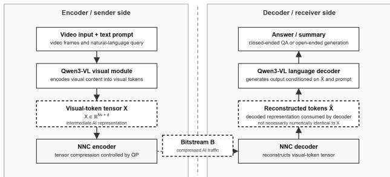
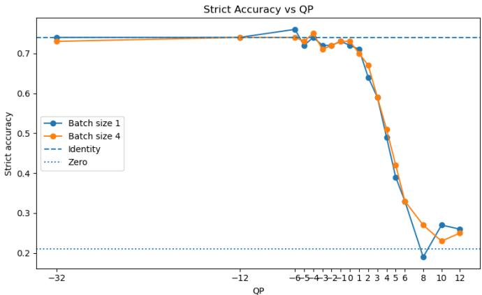
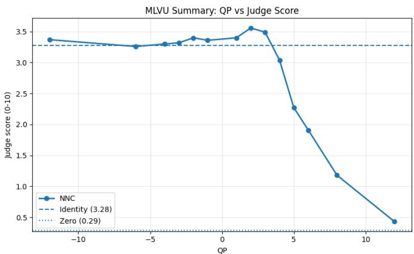
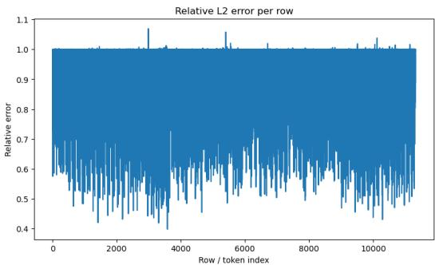
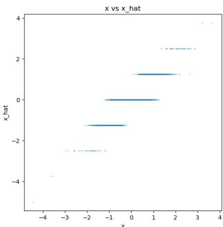
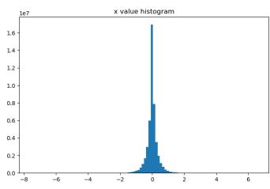
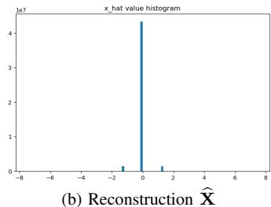
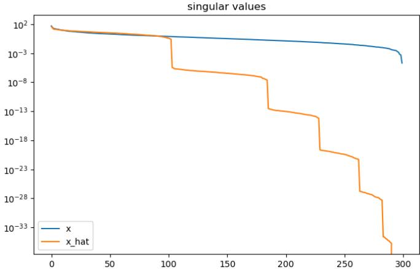

# Compressing AI Traffic: Standardized Neural Network Coding of Visual-Token Representations in Split Vision–Language Inference

Reza Heidari

Aalto University, Nokia Technologies

Juho Kannala

Espoo, Finland

Hamed R. Tavakoli

reza.heidari@aalto.fi

Nokia Technologies

Aalto University

Espoo, Finland

Espoo, Finland

hamed.rezazadegan tavakoli@nokia.com

juho.kannala@aalto.fi

Abstract—When the visual encoder and the language decoder of a vision–language model (VLM) run on different compute nodes, the intermediate visual-token embeddings become a communicated payload rather than an internal activation. We call such machine-consumed intermediate tensors AI traffic and ask how far they can be compressed with a standardized, trainingfree codec. We insert ISO/IEC 15938-17 Neural Network Coding (NNC) round trips on the complete visual interface of a Qwen3- VL-8B-Instruct video question answering pipeline, comprising the main visual-token representation and the DeepStack feature streams, while leaving weights, prompts, and generation untouched, and sweep the quantization parameter (QP) over a wide rate range. Closed-ended Video-MME accuracy remains close to the uncompressed reference up to a 98% reduction of the transmitted BF16 tensor and only then collapses; open-ended MLVU generation shows the same plateau-and-collapse profile under an LLM judge. This robustness is not due to near-lossless reconstruction: the decoded tensor is heavily discretized, carries substantial row-wise relative L2 error, and has a visibly steeper singular-value decay than its source. Downstream reasoning therefore depends on coarse structure and relative geometry rather than exact floating-point values, which argues for rate– task rather than rate–distortion optimization of AI traffic codecs.

Index Terms—AI traffic, feature compression, neural network coding, ISO/IEC 15938-17, split inference, vision–language models, coding for machines.

## I. INTRODUCTION

Large vision–language models (VLMs) pair a visual encoder with a language model: the encoder maps the visual input to a sequence of visual-token embeddings, and the language model consumes those tokens with a text prompt to produce an answer. Video inputs make this interface expensive, since a long token sequence must carry spatial content, temporal change, event ordering, and long-range context at once.

In edge and device–cloud deployments the encoder and decoder need not be co-located: a device may run the visual encoder near the sensor while a much larger decoder runs on a capable node [7]. Such a split pipeline need not transmit the raw video at all—it can transmit the intermediate visual tokens instead. The transmitted object is then not a video bitstream but an intermediate AI representation, which we call AI traffic: visual tokens, feature maps, latent embeddings, attention states, or any other tensor exchanged between AI modules. As models grow and spread over heterogeneous hardware, reducing AI traffic becomes relevant for bandwidth, latency, and system efficiency.

We ask how much visual-feature traffic in a VLM video question answering pipeline can be compressed before downstream task performance degrades. To answer this, we apply Neural Network Coding (NNC), standardized as ISO/IEC 15938-17 [2], to the complete visual interface of Qwen3- VL [1]. This interface comprises the primary visual-token representation together with the DeepStack feature streams injected into the language model. Each stream is independently encoded to a bitstream, decoded, and replaced by its reconstruction before language-model inference continues.

Two findings organize the paper. Visual-token embeddings are highly compressible—very aggressive rate reduction is tolerated before performance collapses. Yet the reconstructions are strongly discretized and substantially distorted, and the decoder still operates well, so exact floating-point reconstruction is unnecessary for downstream VLM reasoning provided enough task-relevant structure survives.

Our contributions are: (i) we formulate visual-token transport in split VLM inference as an AI traffic coding problem and instantiate it with a standardized codec rather than a bespoke or learned quantizer; (ii) we report a full rate– task sweep on closed-ended (Video-MME) and open-ended (MLVU) video understanding with identity and zero-token controls that bound the useful operating range from both sides; and (iii) we give a representation-level analysis explaining why strong compression is tolerated, showing that tensor-domain distortion is a poor proxy for task utility in this regime.

## II. RELATED WORK

Contemporary video question answering is built on large VLMs, in which the visual tokens form the interface between perception and generation. We use Qwen3-VL-8B-Instruct [1], a multimodal family supporting long interleaved contexts, with video-specific mechanisms for spatio-temporal modeling and temporal grounding.

  
Fig. 1. NNC-based compression of visual-feature AI traffic. The vision module emits a main visual-token representation together with DeepStack feature streams. Each stream is independently NNC encoded, transmitted, decoded, and substituted by its reconstruction before language-model inference.

Neural network compression—quantization, pruning, lowrank approximation, entropy coding, distillation, weight sharing—is most often applied to model parameters, but the same tools apply to intermediate tensors. NNC specifies a compressed representation and decoding process for neural-network data [2], with entropy coding based on Deep-CABAC [4]. We use the NNCodec reference software [3].

Compressing signals for machine rather than human consumption has been studied as video coding for machines [8] and collaborative intelligence, where deep features are compressed between device and server [9], [10]. That work generally trains the compression stage for a specific downstream network. Our setting differs: the payload is the visual-token interface of a general-purpose generative VLM rather than a convolutional feature map; the consumer is an autoregressive language decoder rather than a classifier; and the codec is a fixed, standardized, training-free tensor coder applied at inference time.

## III. COMPRESSING AI TRAFFIC

AI traffic compression differs from conventional media coding in its success criterion. Video compression targets a signal intended for human viewing, and the decoded output is judged by perceptual or signal-level resemblance to the original. AI traffic compression targets representations intended for machine reasoning; the decoded output need not be visually meaningful and only has to preserve what the receiving model requires.

Let the visual interface produced by the vision module be

$$
\mathcal { X } = \left\{ \mathbf { X } _ { \mathrm { m a i n } } , \mathbf { X } _ { \mathrm { D S , 1 } } , \dots , \mathbf { X } _ { \mathrm { D S , } K } \right\} ,
$$

where $\mathbf { X } _ { \mathrm { m a i n } }$ is the primary visual-token representation and ${ \bf X } _ { \mathrm { D S } , k }$ denotes the k-th DeepStack feature stream. In Qwen3- VL-8B-Instruct, $K = 3 .$ . Each tensor is independently coded using the same NNC operating point,

$$
B _ { i } = \mathrm { N N C } _ { \mathrm { e n c } } \left( \mathbf { X } _ { i } ; \mathrm { Q P } \right) , \qquad \widehat { \mathbf { X } } _ { i } = \mathrm { N N C } _ { \mathrm { d e c } } ( B _ { i } ) ,
$$

for $\mathbf { X } _ { i } \in { \mathcal { X } }$ . The reconstructed interface

$$
\widehat { \pmb { \chi } } = \left\{ \widehat { \mathbf { X } } _ { \mathrm { m a i n } } , \widehat { \mathbf { X } } _ { \mathrm { D S } , 1 } , \ldots , \widehat { \mathbf { X } } _ { \mathrm { D S } , K } \right\}
$$

replaces the original visual interface before language-model inference continues. QP governs compression strength and is shared across all streams.

The evaluation question is whether $\widehat { \mathcal X }$ retains enough taskrelevant information for downstream question answering. Because the reconstruction is consumed by a model rather than viewed by a human, downstream task performance is the primary measure of useful reconstruction quality—a reconstruction may have large mean squared error yet preserve the structure the decoder needs, and conversely numerical accuracy does not guarantee that task-relevant relations survive. We therefore report both task performance and representation-level properties.

## IV. EXPERIMENTAL SETUP

Model and intervention. We use Qwen3-VL-8B-Instruct in BF16 with batch size 1. The visual forward pass produces a primary visual-token representation together with three DeepStack feature streams. We intercept this complete visual interface and independently apply an NNC encode–decode round trip to each of the four tensors. The reconstructed tensors are then returned in place of their corresponding originals before language-model inference continues. Weights, tokenizer, prompt format, language decoder, and generation function are otherwise unmodified, so any change in output is attributable to compression of the visual interface.

Codec. Each source tensor is detached, cast to FP32, and made contiguous before encoding; each decoded tensor is cast back to the device and dtype expected by the pipeline. NNC is configured with uniform approximation, dependent quantization and row skipping enabled, quantize-only mode and TCA disabled, and sparsity 0.0; only QP varies across the sweep.

Conditions. Identity passes the visual interface through unchanged and gives the uncompressed reference. Zero-token replaces it with zeros and acts as a sanity check on how much the model depends on the visual representation. NNC substitutes the reconstruction.

Data and metrics. Closed-ended evaluation uses Video-MME [5]: the model is prompted with the question and options, the output is parsed into an option letter, and accuracy is computed by strict matching. We also report the valid rate, the fraction of generations parseable into a valid option, which separates task errors from format failures. Open-ended evaluation uses the summary subset of MLVU [6], scored by a GPT-4 judge that assigns completeness and reliability out of 5 each, summed to 10. For both benchmarks, 100 test samples are drawn after deterministic sorting, skipping samples whose video files cannot be resolved. Compression is reported relative to the aggregate BF16 size of the complete visual interface, i.e., the sum of the primary visual-token and all DeepStack feature tensors, which is the communication-relevant quantity in the split pipeline.

## V. RESULTS

Rate behavior. Increasing QP monotonically shrinks the encoded bitstream, confirming that QP is a usable rate control for visual-token tensors. Compression relative to the BF16 source spans 58.4% at $\mathrm { Q P = - 3 2 \ t o \ 9 9 . 9 9 \% }$ at $\mathrm { Q P = 1 2 }$ (Table I).

  
Fig. 2. Video-MME accuracy across QP. Accuracy tracks the identity baseline over a wide QP range and drops only at aggressive compression. The zerotoken baseline is a visual-information sanity check.

TABLE I  
VIDEO-MME RESULTS. COMPRESSION IS RELATIVE TO THE BF16 SOURCE TENSOR.
<table><tr><td>Codec</td><td>QP</td><td>Valid rate</td><td>Accuracy</td><td>Comp. (%)</td></tr><tr><td>Identity</td><td>一</td><td>1.00</td><td>0.74</td><td>一</td></tr><tr><td>Zero</td><td>一</td><td>0.55</td><td>0.21</td><td>一</td></tr><tr><td>NNC</td><td>-32</td><td>1.00</td><td>0.74</td><td>58.41</td></tr><tr><td>NNC</td><td>-12</td><td>1.00</td><td>0.74</td><td>87.41</td></tr><tr><td>NNC</td><td>-6</td><td>1.00</td><td>0.76</td><td>94.09</td></tr><tr><td>NNC</td><td>-3</td><td>1.00</td><td>0.72</td><td>96.45</td></tr><tr><td>NNC</td><td>0</td><td>1.00</td><td>0.72</td><td>98.09</td></tr><tr><td>NNC</td><td>1</td><td>1.00</td><td>0.71</td><td>98.68</td></tr><tr><td>NNC</td><td>2</td><td>1.00</td><td>0.64</td><td>99.08</td></tr><tr><td>NNC</td><td>3</td><td>1.00</td><td>0.59</td><td>99.35</td></tr><tr><td>NNC</td><td>4</td><td>1.00</td><td>0.49</td><td>99.54</td></tr><tr><td>NNC</td><td>6</td><td>0.86</td><td>0.33</td><td>99.87</td></tr><tr><td>NNC</td><td>12</td><td>0.70</td><td>0.26</td><td>99.99</td></tr></table>

Closed-ended accuracy. Table I and Fig. 2 show a clear rate–task trade-off. Across low, moderate, and even fairly high QP the NNC condition tracks the identity baseline, so Xb retains enough information for the decoder to answer many closed-ended questions correctly; at higher QP accuracy falls, so aggressive compression does eventually remove taskrelevant information.

This rules out two trivial explanations. The model is not insensitive to the visual representation: zeroing the tokens drops accuracy from 0.74 to 0.21. And the useful operating region is not confined to near-lossless coding: accuracy stays within a few points of the reference up to $\mathrm { Q P } = 0 .$ , where the bitstream is around 99% smaller than the BF16 tensor. The valid rate confirms that the high-QP drop is not a formatting artifact—parsing is perfect throughout the plateau and degrades only in the collapse region, where the model also begins emitting unparseable output.

Open-ended generation. MLVU requires free-form output and therefore tests whether compressed tokens support longer semantic generation. Fig. 3 shows the same pattern: moderate compression preserves most of the generation quality and only aggressive compression degrades it. Agreement between a strict discrete metric and a free-form judged metric indicates the plateau is not an artifact of multiple-choice answering, where a model might guess the right option from weak visual evidence.

  
Fig. 3. MLVU judge score across QP, against identity and zero-token references.

Plateau and collapse. Both benchmarks exhibit a plateauand-collapse profile: compression increases while performance holds near the identity baseline, then a small additional rate reduction causes a sharp drop. This is operationally useful, identifying a $\mathrm { Q P }$ range in which communication cost falls by one to two orders of magnitude at essentially no task cost, and it implies a deployed system should be configured conservatively relative to the knee rather than at it.

## VI. REPRESENTATION-LEVEL ANALYSIS

For the representation-level analysis, we focus on the primary visual-token stream and denote it by $\mathbf { X } = \mathbf { X } _ { \mathrm { m a i n } }$ and its reconstruction by $\widehat { \mathbf { X } } _ { \bullet } = \widehat { \mathbf { X } } _ { \mathrm { m a i n } }$

Comparing X with Xb shows that the reconstruction is not near-identical, particularly at stronger settings: row-wise relative $L _ { 2 }$ error is substantial (Fig. 4(a)). Downstream robustness is therefore not explained by near-lossless reconstruction.

Histogram analysis (Fig. 5) separates the two tensors clearly: the source has a comparatively smooth value distribution, whereas the reconstruction concentrates on discrete levels. Scatter analysis (Fig. 4(b)) reinforces this, showing continuous source ranges collapsing onto quantized reconstruction levels. Despite this substantial value-level distortion, downstream performance remains stable over a wide QP range.

Spectral analysis gives a third view. The reconstruction’s singular values decay more steeply than the source’s (Fig. 6), so compression suppresses or removes lower-energy directions and reduces the effective dimensionality of the representation. Since performance is stable in the plateau region, many of those suppressed components appear non-essential for the evaluated tasks.

  
(a) Row-wise relative $L _ { 2 }$ error

  
(b) X versus Xb  
Fig. 4. Distortion of the primary visual-token representation after NNC compression. (a) Row-wise relative $L _ { 2 }$ error shows substantial numerical distortion. (b) Continuous source values collapse onto discrete reconstruction levels, revealing strong quantization.

  
(a) Source X

  
Fig. 5. Value distributions of the primary visual-token representation before and after NNC compression. The reconstruction concentrates on a smaller set of discrete values, consistent with strong quantization.

  
Fig. 6. Singular-value spectra of $\mathbf { x }$ versus $\widehat { \mathbf { X } } .$ . The steeper decay is consistent with a reduction in effective rank.

## VII. DISCUSSION AND CONCLUSION

The visual interface of the tested pipeline contains a large amount of compressible redundancy, but also task-relevant information that cannot be discarded indefinitely, as the high-QP collapse shows. Because a heavily discretized and spectrally simplified reconstruction still supports high-quality output, tensor-domain distortion is a weak predictor of task utility here; AI traffic codecs should be evaluated on rate–task rather than rate–distortion curves. From a systems standpoint, compressing the visual-token interface reduces communication cost without architectural changes or retraining, and using

NNC supplies a standardized tensor-coding pipeline rather than an ad hoc quantizer—which matters for interoperability between components from different vendors.

The study is limited to one backbone and subsets of two benchmarks, so the observed behavior may depend on architecture, tokenization, task, and interception point. Open-ended evaluation also relies on an LLM judge. Future work should broaden models and tasks, measure encoding/decoding and end-to-end latency, and explore adaptive rather than uniform rate allocation.

In summary, visual-token AI traffic in a split vision– language pipeline can be reduced by well over an order of magnitude—up to 98% relative to the BF16 source tensor— with essentially no loss in downstream task performance, after which performance collapses sharply. The reconstructed tokens are not exact numerical copies, yet they retain enough task-relevant structure for the language decoder to operate effectively.

## REFERENCES

[1] S. Bai et al., “Qwen3-VL technical report,” arXiv:2511.21631, 2025.

[2] H. Kirchhoffer et al., “Overview of the neural network compression and representation (NNR) standard,” IEEE Trans. Circuits Syst. Video Technol., vol. 32, no. 5, pp. 3203–3216, 2022.

[3] D. Becking, P. Haase, H. Kirchhoffer, K. Muller, W. Samek, and¨ D. Marpe, “NNCodec: An open source software implementation of the neural network coding ISO/IEC standard,” in ICML Neural Compression Workshop, 2023.

[4] S. Wiedemann et al., “DeepCABAC: A universal compression algorithm for deep neural networks,” IEEE J. Sel. Topics Signal Process., vol. 14, no. 4, pp. 700–714, 2020.

[5] C. Fu et al., “Video-MME: The first-ever comprehensive evaluation benchmark of multi-modal LLMs in video analysis,” in CVPR, 2025.

[6] J. Zhou et al., “MLVU: Benchmarking multi-task long video understanding,” in CVPR, 2025.

[7] Y. Kang et al., “Neurosurgeon: Collaborative intelligence between the cloud and mobile edge,” in ACM ASPLOS, 2017, pp. 615–629.

[8] L.-Y. Duan, J. Liu, W. Yang, T. Huang, and W. Gao, “Video coding for machines: A paradigm of collaborative compression and intelligent analytics,” IEEE Trans. Image Process., vol. 29, pp. 8680–8695, 2020.

[9] H. Choi and I. V. Bajic, “Deep feature compression for collaborative´ object detection,” in IEEE ICIP, 2018, pp. 3743–3747.

[10] J. Shao and J. Zhang, “BottleNet++: An end-to-end approach for feature compression in device-edge co-inference systems,” in IEEE ICC Workshops, 2020.