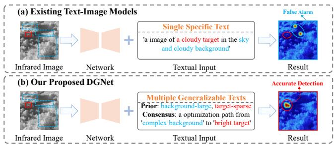
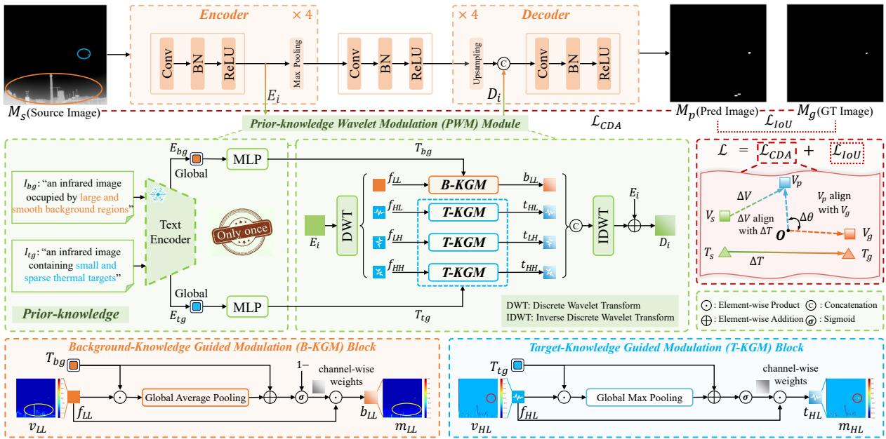
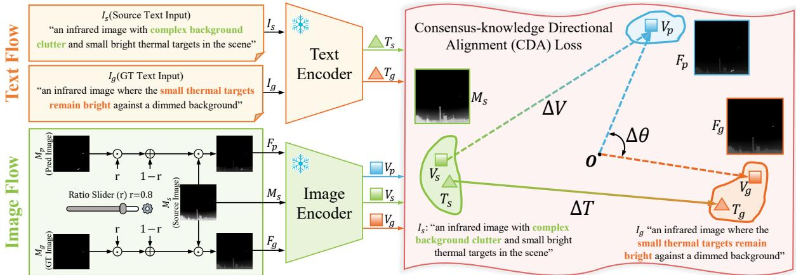
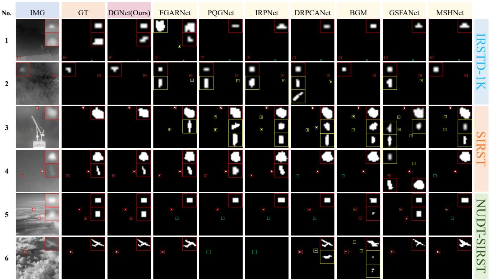
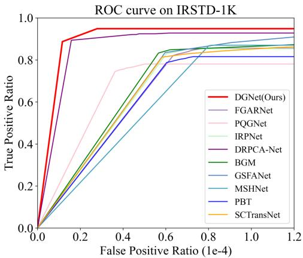
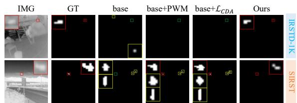
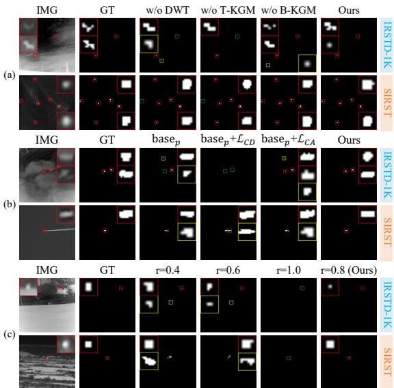

# DGNet: Dual-knowledge Guided Network for Infrared Small Target Detection

Chenglong Yu Shandong University Jinan, China yucl@mail.sdu.edu.cn

Tongtong Wang Shandong University Jinan, China wangtongtong0116@163.com

Mingzhu Xu∗   
Shandong University   
Jinan, China   
xumingzhu@sdu.edu.cn

Pingping Miao Shandong University Jinan, China miaopp@mail.sdu.edu.cn

Jing Wang   
Shandong University   
Jinan, China   
202415291@mail.sdu.edu.cn

Liqiang Nie∗ Harbin Institute of Technology, Shenzhen Shenzhen, China nieliqiang@gmail.com

## Abstract

InfRared Small Target Detection (IRSTD) is a prominent and challenging task in computer vision. In recent years, text-guided methods have significantly improved detection performance. However, they still sufer from two key limitations. First, a single text description simultaneously modeling both background and target leads to semantic entanglement, which contradicts the objective of background suppression and target enhancement. Second, reliance on image-specific textual prompts (requiring additional external models such as CLIP during inference) results in deployment constraints. To address these issues, we propose a novel Dual-knowledge Guided Network (DGNet) based on multiple generalizable texts. Specifically, we design a Prior-knowledge Wavelet Modulation (PWM) module, which leverages dual textual priors that separately characterize large-scale backgrounds and sparse targets to efectively disentangle and modulate entangled semantics in the frequency domain. Furthermore, we introduce a Consensus-knowledge Directional Alignment (CDA) loss, which models the initial state and the ideal target across samples as ‘complex background’ and ‘bright target’, respectively, thereby constructing a clear and unified directional optimization trajectory for the model. Extensive experiments on three public datasets demonstrate the superior performance of DGNet and the efectiveness of each component. The source code is available at https://github.com/iLearn-Lab/MM26-DGNet.

## CCS Concepts

• Computing methodologies → Image segmentation; Object detection.

## Keywords

Infrared small target detection; Prior-knowledge wavelet modulation; Consensus-knowledge directional alignment loss

ACM Reference Format: Chenglong Yu, Mingzhu Xu, Jing Wang, Tongtong Wang, Pingping Miao, and Liqiang Nie. 2026. DGNet: Dual-knowledge Guided Network for Infrared Small Target Detection. In Proceedings ofthe 34th ACM International Conference on Multimedia (MM ’26), November 10–14, 2026, Rio de Janeiro, Brazil. ACM, New York, NY, USA, 10 pages. https://doi.org/10.1145/3767308.3836149

## 1 Introduction

InfRared Small Target Detection (IRSTD) aims to accurately localize tiny targets with low signal-to-noise ratios, playing an irreplaceable role in both civil and military applications [1–7]. However, due to long-distance imaging and thermal radiation characteristics, infrared small targets typically occupy only a few pixels in the image and lack distinct color, shape, or texture features [8–11]. Moreover, complex background clutter in real-world scenarios makes robust target segmentation highly challenging[12–18].

Early traditional methods, including filter-based methods [19– 23], local contrast-based methods [24–27], and low-rank representation methods [28–32], have explored and partially alleviated the IRSTD problem. Deep learning (DL)-based methods [33–46] have significantly improved performance by learning hierarchical visual features. However, purely visual IRSTD methods rely solely on single-modal information, making it dificult for the model to extract discriminative features and leading to false alarms.

In recent years, some pioneering works [47, 48] have introduced the textual modality as an auxiliary to the visual modality, a strategy akin to the semantic guidance explored in multimodal learning [49– 51], significantly improving the accuracy of small target detection. However, as illustrated in Fig. 1(a), these methods typically adopt a single specific text as guidance. This paradigm sufers from two key limitations: 1) Semantic entanglement caused by a single text. Infrared images are structurally composed of large, smooth backgrounds and small, sparse targets. Existing textual descriptions often jointly characterize both objects, such as ‘sky target’ (sparse small targets) and ‘sky and cloudy background’ (large-scale background) in Fig. 1(a). Such a single textual prompt encourages the network to process background and target information simultaneously, resulting in semantic entanglement that is dificult to disentangle. This contradicts the fundamental objective of IRSTD, which requires efective background suppression and target enhancement. Therefore, designing multiple texts that guide the model to handle these entangled semantics separately becomes the first challenge. 2) Deployment limitations caused by image-specific texts.

Figure 1: Visual comparison of (a) Existing Text-Image Models and (b) Our Proposed DGNet on cluttered infrared image. Existing text-image models typically rely on image-specific textual prompts, where a dedicated description is generated for each image during both training and inference. However, this paradigm requires external models (e.g., CLIP [52]) during inference, leading to increased computational overhead and significantly limiting practical deployment. Therefore, designing generalizable texts that enable the model to learn consensus knowledge across samples becomes the second challenge.

To address these challenges, we propose a novel Dual-knowledge Guided Network (DGNet). As shown in Fig. 1(b), unlike conventional methods that rely on a single image-specific text, DGNet leverages multiple generalizable texts, constructed from both prior knowledge and consensus knowledge. Specifically, in the feature extraction stage, we design a Prior-knowledge Wavelet Modulation (PWM) module, which utilizes the dual textual prior of separat ing large-scale backgrounds and sparse small targets to achieve decoupled modulation of the two entangled semantics in the frequency domain. In the optimization stage, we propose a Consensusknowledge Directed Alignment (CDA) loss, which models the initial state of all samples as ‘complex background’ and the ideal optimiza tion endpoint as ‘bright targets’, forming cross-sample consensus knowledge. Guided by this consensus, the CDA loss establishes a directed optimization path from ‘complex background’ to ‘bright targets’, providing a unified trajectory for model learning.

In summary, the main contributions of this paper are as follows:

• We identify the limitations of existing text-image models, including semantic entanglement caused by single specific text guidance and deployment constraints introduced by imagespecific texts. Based on this, we propose a novel DGNet driven by multiple generalizable texts.

• We design a novel PWM module leveraging dual textual priors to decouple entangled semantics in the frequency domain. Furthermore, we propose a new CDA loss incorporating consensus knowledge to guide the model’s optimization path from ‘complex background’ to ‘bright targets’.

• Extensive ablation studies and comparative experiments on three public datasets demonstrate the superiority of DGNet and the efectiveness of its key components.

## 2 Related Work

## 2.1 Infrared Small Target Detection

IRSTD methods have evolved significantly over the years. Traditional approaches can be broadly categorized into three types. Filter-based methods [19–21] rely on handcrafted filters but struggle in complex scenarios. Local contrast-based methods [24–27] enhance target saliency via surrounding comparisons but often cause false alarms. Low-rank methods [28–31] perform well in smooth scenes but tend to miss targets in cluttered backgrounds. Overall, the heavy reliance on handcrafted priors limits their robustness in complex scenarios. In contrast, DL-based methods [53–55] adopt a data-driven paradigm to learn target features and have achieved significant progress in IRSTD. For example, HDNet [4] introduces a hybrid-domain framework combining spatial multiscale atrous contrast and dynamic high-pass filtering to enhance small-target detection and suppress background. IRPNet [56] introduce rich RGB knowledge into IRSTD, enhancing the model’s representation capability. DRPCA-Net [57] integrates sparse representation priors into a learnable architecture, enabling accurate estimation of low-rank features. Despite existing IRSTD methods have achieved significant progress, purely visual models struggle to extract discriminative features between targets and backgrounds, limiting detection performance. To address the limitations of single-modality methods, recent studies have explored text-guided IRSTD. Benefiting from the strong cross-modal semantic modeling capability of CLIP [52], as well as semantic interaction [58–60], semantic-guided visual learning [61–63], and robust representation learning [64–67] explored in related tasks, methods such as Text-IRSTD [47] and SAIST [48] incorporate textual descriptions to enhance detection performance.

However, these methods typically rely on a single textual prompt, which often jointly characterizes both backgrounds and targets. This unified textual modeling confounds heterogeneous semantics, forcing the network to process background and target information simultaneously. As a result, existing methods lack the ability to explicitly disentangle these entangled semantics under single-text guidance. To address this issue, we design the PWM module, which leverages dual textual priors that separately characterize largescale backgrounds and sparse targets to efectively disentangle and modulate entangled semantics in the frequency domain.

## 2.2 Loss Functions for IRSTD

In IRSTD, due to the extremely small target scale, detection performance is highly dependent on the employed loss function. Early methods, such as Binary Cross-Entropy (BCE) loss, supervise IRSTD in a pixel-wise manner by treating each pixel as an independent binary label. However, since targets occupy only a very small number of pixels, this loss fails to model target sparsity and often leads to missed targets. To enhance the model’s focus on target regions, IoU [68] and Dice loss [69] were introduced, which improve IRSTD performance by optimizing the overlap between predicted regions and ground truth. However, since large-scale targets contribute significantly more than small-scale ones, small targets tend to be neglected during optimization. Furthermore, SLS loss [70] enhances sensitivity to small targets by incorporating scale and location information, while FocalIoU [71] combines Focal loss [72] with IoU loss to suppress background responses and focus more on small targets. Nevertheless, these methods often sufer from instability and fail to generalize efectively across multi-scale target scenarios.

Essentially, these methods compute geometric discrepancies in the spatial domain, making them susceptible to gradient domination by large background regions. To address this, we design a CDA loss, which leverages cross-sample semantic consensus to construct a directed optimization path from the source state to the ideal state, significantly improving detection accuracy in complex scenarios.

  
Figure 2: Overview of our DGNet. DGNet adopts a four-stage encoder-decoder architecture, where each stage is equipped with a corresponding PWM module as the skip connection. In PWM module, the B-KGM block is designed to suppress background noise and the T-KGM block is designed to enhance target features, respectively. Finally, the network is jointly optimized using the Consensus-knowledge Directional Alignment (CDA) loss and the IoU loss.

## 3 Method

## 3.1 Overall Architecture

The overall architecture of DGNet is illustrated in Fig. 2. DGNet is an end-to-end multimodal framework that adopts a four-stage encoder-decoder structure with skip connections. Each encoder stage extracts features and performs downsampling to obtain a larger receptive field, while the final encoder stage serves as a transition layer through convolutional blocks. The decoder progressively upsamples and refines feature maps to restore spatial resolution. At these skip connections, we design a PWM module, which employs the Discrete Wavelet Transform (DWT) to decompose features into corresponding high/low-frequency subbands. Specifically, in the frequency domain, the PWM modulates the low-frequency components using a B-KGM block guided by back ground prior text, and modulates the high-frequency components using a T-KGM block guided by target prior text, thereby explicitly incorporating textual priors. This process efectively suppresses large-scale smooth background clutter while enhancing discrim inative target representations. Finally, during training, the final prediction map $M _ { p }$ is supervised by the CDA loss and IoU loss. The CDA loss introduces cross-sample consensus knowledge via textual guidance to construct a semantic optimization trajectory. Acting as a directional constraint in the feature space, it explicitly guides the network to evolve from a cluttered source state toward an ideal target-enhanced state, providing a unified evolution trajectory for model learning.

## 3.2 PWM Module

In complex IRSTD scenarios, severe background clutter makes it dificult for purely visual methods to efectively extract discriminative features between targets and backgrounds. The text-image fusion paradigm alleviates this issue by introducing semantic information. However, existing multi-modal methods typically rely on a single specific textual description. Due to the inherent structure of infrared images, which consists of large-scale smooth backgrounds and small-scale sparse targets, a single textual prompt often forces the network to process both background and target information simultaneously, leading to semantic entanglement that is dificult to disentangle. Moreover, reliance on image-specific textual prompts also limits practical deployment. To address this issue, we propose a Prior-knowledge Wavelet Modulation (PWM) module and embed it into the skip connections between the encoder and decoder. Specifically, in infrared images, targets usually exhibit small and sparse distributions, while background regions are typically large and smooth. The PWM module employs the DWT to decompose visual features into high/low-frequency subbands, and introduces fixed dual textual priors of targets and backgrounds in the frequency domain for explicit modulation, thereby enabling eficient separation of targets from complex background clutter.

As illustrated in Fig. 2, the PWM module connects the corresponding encoder and decoder layers. Taking the output feature of the first encoder layer $E _ { 1 } ~ \in ~ \hat { \mathbb { R } } ^ { 2 5 6 \times 2 5 6 \times 1 6 }$ as an example, it is first decomposed into one low-frequency subband and three highfrequency subbands via the DWT, as formulated in Eq. 1:

$$
f _ { L L } , f _ { H L } , f _ { L H } , f _ { H H } = D W T ( E _ { 1 } ) ,\tag{1}
$$

where $f _ { L L }$ represents the low-frequency approximation component containing coarse structural information, while ���, ���, and ��� capture texture details along diferent orientations.

  
Figure 3: Illustration of the Consensus-knowledge Directional Alignment (CDA) Loss. The CDA loss explicitly aligns the visual optimization path (Δ�) with the semantic trajectory (Δ�) derived from predefined consensus texts. By minimizing the angular deviation (Δ�), it efectively forces the network to optimize from the cluttered source state $( V _ { p } )$ toward the ideal target state $( V _ { g } )$

We introduce two fixed textual priors $I _ { b g }$ and $I _ { t g }$ based on the characteristics of infrared small-target images. These priors are mapped into global semantic embeddings $E _ { b g } , E _ { t g } \in \mathbb { R } ^ { D }$ through a text encoder, and further projected into channel-wise modulation weights via a multi-layer perceptron (MLP), using Eq. 2:

$$
T _ { b g } = M L P ( \mathcal { F } ( I _ { b g } ) ) , \quad T _ { t g } = M L P ( \mathcal { F } ( I _ { t g } ) ) ,\tag{2}
$$

where $T _ { b q } , T _ { t g } \in \mathbb { R } ^ { C \times 1 \times 1 } . \mathcal { F } ( . )$ is the pre-trained language model CLIP with frozen weights, and since we adopt fixed textual prompts, only a single feature extraction is required. $T _ { b g }$ inherently describes the low-frequency characteristics of the scene, while $T _ { t g }$ corresponds to high-frequency characteristics, we use these semantic embeddings to modulate diferent frequency subband features along the channel dimension. Specifically, the low-frequency visual com ponent is modulated with $T _ { b q }$ via the B-KGM block to suppress large and smooth background, while the high-frequency visual components are modulated with $T _ { t g }$ via the T-KGM block to emphasize sparse targets. Fig. 2 illustrates the detailed structure of the B-KGM and T-KGM blocks. In B-KGM block, the visual feature $f _ { L L }$ is modulated using the textual embedding $T _ { b g }$ to obtain the background-suppressed feature $b _ { L L } \mathrm { : }$

$$
b _ { L L } = \left( 1 - \sigma ( G A P ( T _ { b g } \odot f _ { L L } ) + T _ { b g } ) \right) \odot f _ { L L } ,\tag{3}
$$

where $G A P ( \cdot )$ denotes Global Average Pooling and $\sigma ( \cdot )$ is the sigmoid function. In the B-KGM module shown in Fig. $2 , f _ { L L }$ and $b _ { L L }$ are convolved and projected into a single channel, yielding the corresponding visual features $v _ { L L }$ and $m _ { L L }$ . It can be observed that the background regions are efectively suppressed. First, the $T _ { b g }$ is projected into the same channel dimension as $f _ { L L }$ and broadcast to match its spatial resolution. The term $( T _ { b g } \odot f _ { L L } )$ models the global correlation between the background prior and the visual feature. Subsequently, the aggregated term $G A P ( \cdot ) + T _ { b g }$ captures the global background response strength. Through the $1 - \sigma ( \cdot )$ gating mechanism, channel-wise weights correlated with the background prior are adaptively suppressed, efectively reducing the influence of large-scale smooth background regions. For the high-frequency visual feature, taking $f _ { H L }$ as an example, the corresponding target enhanced feature $t _ { H L }$ is obtained via:

$$
t _ { H L } = \sigma ( G M P ( T _ { t g } \odot f _ { H L } ) + T _ { t g } ) \odot f _ { H L } ,\tag{4}
$$

where ���(·) is the Global Max Pooling. In the T-KGM module shown in Fig. 2, by applying convolution operations to $f _ { H L }$ and $t _ { H L }$ the targets in $v _ { H L }$ are efectively enhanced in $m _ { H L } . G M P ( \cdot )$ captures globally salient responses, while $\sigma ( \cdot )$ serves as an enhancement gating mechanism. Therefore, the target-related prior $T _ { t g }$ highlights sparse and discriminative responses in high-frequency features, effectively enhancing target details. Similarly, we obtain the remaining high-frequency features $t _ { L H }$ and $t _ { H H }$ through T-KGM. These features are transformed back to the spatial domain via IDWT, and fused with the feature $E _ { 1 }$ through a residual operation to obtain the prior text-modulated feature map $D _ { 1 }$

$$
D _ { 1 } = E _ { 1 } + I D W T \big ( c a t ( b _ { L L } , t _ { H L } , t _ { L H } , t _ { H H } ) \big ) .\tag{5}
$$

By leveraging prior knowledge of targets and backgrounds, the PWM module explicitly guides the network to decouple targets from complex background clutter, providing highly discriminative features for subsequent decoding stages.

## 3.3 CDA Loss

3.3.1 Motivation and Semantic Consensus Formulation. In IRSTD, existing pixel-level losses, such as IoU losses, primarily enforce local geometric consistency in the spatial domain. However, they lack high-level semantic guidance, making the model sensitive to complex background noise and leading to unstable optimization and limited generalization. Meanwhile, existing test-image methods construct image-specific textual descriptions for each image, which introduces additional inference overhead.

To address this issue, we explore the consensus across the optimization processes of diferent images and attempt to model the optimization objective using natural language [80]. Specifically, we model the initial state of all samples as ‘complex background’ and the ideal optimization endpoint as ‘bright targets’, forming crosssample consensus knowledge. Based on this insight, we unify the initial state of all samples as a consensus source text prompt $I _ { s } { \mathrm { : } }$ ‘an infrared image with complex background clutter and small thermal targets’. Correspondingly, the ideal optimization endpoint is defined as a consensus target text prompt $I _ { g } \colon$ ‘an infrared image where small thermal targets remain bright against a dimmed background’.

Table 1: Quantitative comparisons between our DGNet and 21 state-of-the-art (SOTA) methods on the IRSTD-1K, SIRST, NUDT SIRST datasets in terms of $\mathbf { I o U } ( \% ) , \mathrm { P _ { d } } ( \% )$ and $\mathrm { F _ { a } } ( 1 0 ^ { - 6 } )$ . The best results are in bold. In the Type column, ‘Trad’ denotes traditional methods, ‘Purely-V’ denotes purely visual methods, and ‘Text-V’ denotes text-image fusion methods.
<table><tr><td rowspan="2">Method</td><td colspan="3">IRSTD-1K</td><td colspan="3">SIRST</td><td colspan="3">NUDT-SIRST</td><td rowspan="2"> $\mathrm { T y p e }$ </td></tr><tr><td>IoU↑</td><td> $\mathrm { P _ { d } } \uparrow$ </td><td> $\mathrm { F _ { a } } \downarrow$ </td><td>IoU↑</td><td> $\mathrm { P d } \ \uparrow$ </td><td> $\mathrm { F _ { a } } \downarrow$ </td><td>IoU↑</td><td> $\mathrm { P _ { d } } \uparrow$ </td><td> $\mathrm { F _ { a } } \downarrow$ </td></tr><tr><td>PSTNN [31] (RS&#x27;19)</td><td>24.57</td><td>71.99</td><td>35.26</td><td>30.30</td><td>72.80</td><td>48.99</td><td>14.85</td><td>66.13</td><td>44.17</td><td rowspan="3">Trad</td></tr><tr><td>TLLCM [24] (GRSL&#x27;19)</td><td>3.31</td><td>77.39</td><td>6738</td><td>4.24</td><td>88.37</td><td>6243</td><td>2.18</td><td>62.01</td><td>1608</td></tr><tr><td>MSLSTIPT [30] (TGRS&#x27;20)</td><td>11.43</td><td>79.03</td><td>1524</td><td>1.08</td><td>0.05</td><td>8.18</td><td>8.34</td><td>47.40</td><td>888.1</td></tr><tr><td>WSLCM [25] (GRSL&#x27;20)</td><td>3.45</td><td>72.44</td><td>6619</td><td>6.39</td><td>88.74</td><td>4462</td><td>2.28</td><td>56.82</td><td>1309</td><td rowspan="8"></td></tr><tr><td>MDvsFA [73] (ICCV&#x27;19)</td><td>37.34</td><td>83.71</td><td>88.52</td><td>60.30</td><td>89.35</td><td>56.35</td><td>35.86</td><td>85.22</td><td>95.37</td></tr><tr><td>ALCNet [37] (TGRS&#x27;21)</td><td>65.68</td><td>89.25</td><td>27.71</td><td>73.74</td><td>97.25</td><td>26.79</td><td>72.89</td><td>96.19</td><td>30.40</td></tr><tr><td>ACMNet [39] (WACV&#x27;21)</td><td>60.33</td><td>93.27</td><td>68.49</td><td>69.44</td><td>92.02</td><td>22.71</td><td>64.86</td><td>96.72</td><td>28.59</td></tr><tr><td>ISNet [34] (CVPR&#x27;22)</td><td>61.85</td><td>90.24</td><td>31.56</td><td>70.49</td><td>95.06</td><td>67.98</td><td>81.24</td><td>97.78</td><td>6.34</td></tr><tr><td>DNANet [33] (TIP&#x27;22)</td><td>65.71</td><td>91.84</td><td>17.61</td><td>77.76</td><td>96.33</td><td>10.29</td><td>88.19</td><td>98.62</td><td>9.00</td></tr><tr><td>UIU-Net [74] (TIP&#x27;23)</td><td>68.69</td><td>91.25</td><td>13.48</td><td>77.53</td><td>92.40</td><td>9.33</td><td>75.91</td><td>96.83</td><td>18.61</td></tr><tr><td>RPCANet [75] (WACV&#x27;23)</td><td>63.21</td><td>88.31</td><td>4.39</td><td>65.08</td><td>93.58</td><td>10.85</td><td>89.31</td><td>97.14</td><td>2.87</td></tr><tr><td>SCTransNet [40] (TGRS&#x27;24)</td><td>68.03</td><td>93.27</td><td>10.74</td><td>77.50</td><td>96.95</td><td>13.92</td><td>94.09</td><td>98.62</td><td>4.29</td></tr><tr><td>PBT [41] (TGRS’24)</td><td>68.49</td><td>92.52</td><td>8.88</td><td>78.39</td><td>99.08</td><td>2.13</td><td>83.89</td><td>97.23</td><td>4.23</td></tr><tr><td>MSHNet [70] (CVPR&#x27;24)</td><td>67.68</td><td>92.89</td><td>12.69</td><td>73.50</td><td>97.25</td><td>31.05</td><td>80.55</td><td>97.99</td><td>11.77</td></tr><tr><td>GSFANet [76] (TGRS&#x27;25)</td><td>68.60</td><td>91.84</td><td>11.01</td><td>73.58</td><td>98.17</td><td>11.71</td><td>93.96</td><td>99.05</td><td>4.07</td></tr><tr><td>BGM [77] (TGRS’25)</td><td>69.23</td><td>91.50</td><td>11.39</td><td>76.17</td><td>98.17</td><td>12.42</td><td>93.33</td><td>98.84</td><td>5.86</td></tr><tr><td>DRPCA-Net [57] (TGRS’25)</td><td>66.33</td><td>91.07</td><td>16.93</td><td>72.82</td><td>98.77</td><td>9.23</td><td>93.33</td><td>99.15</td><td>6.05</td></tr><tr><td>IRPNet [56] (TGRS&#x27;26)</td><td>68.97</td><td>91.84</td><td>7.52</td><td>79.19</td><td>99.08</td><td>6.74</td><td>93.65</td><td>98.31</td><td>3.65</td></tr><tr><td>PQGNet [78] (TGRS&#x27;26)</td><td>69.88</td><td>92.78</td><td>6.68</td><td>80.61</td><td>99.08</td><td>13.72</td><td>93.67</td><td>98.41</td><td>7.35</td></tr><tr><td>FGARNet [79] (TGRS&#x27;26)</td><td>70.30</td><td>91.16</td><td>14.42</td><td>78.47</td><td>98.15</td><td>3.37</td><td>93.52</td><td>98.72</td><td>1.97</td></tr><tr><td>SAIST [48] (CVPR&#x27;25)</td><td>72.14</td><td>96.18</td><td>4.76</td><td>80.82</td><td>99.56</td><td>0.87</td><td>95.23</td><td>99.28</td><td>1.31</td></tr><tr><td>DGNet(Ours)</td><td>72.72</td><td>93.88</td><td>4.25</td><td>82.68</td><td>100</td><td>1.24</td><td>95.78</td><td>99.37</td><td>1.19</td><td>Text-V</td></tr></table>

3.3.2 Semantic and Visual Trajectories in CLIP Space. To mathematically characterize the above semantic transition while avoiding complex analytical modeling, we introduce the pre-trained visionlanguage model CLIP, which aligns visual and textual modalities in a shared embedding space.

First, as illustrated in Fig. 3, we feed the fixed consensus texts $I _ { s }$ and $I _ { g }$ into the frozen CLIP text encoder to obtain their corresponding semantic embeddings: $T _ { s } , T _ { q }$ . Based on this, the semantic optimization direction in the embedding space is defined as:

$$
\Delta T = T _ { g } - T _ { s } ,\tag{6}
$$

this vector characterizes the semantic transition from ‘background clutter’ to ‘salient small targets’, thereby constructing a global semantic optimization trajectory that is independent of specific image content. Meanwhile, we need to map visual states into the CLIP embedding space. However, since CLIP struggles to encode prediction maps or ground-truth masks that lack structural information, we propose a mask-guided image fusion strategy. This strategy aims to provide CLIP with structurally informative visual inputs, compensating for its limitations in encoding sparse masks and enabling efective alignment between the predicted and ideal states in the semantic space. Specifically, we fuse the predicted map $M _ { p }$ and the ground-truth map $M _ { g }$ with the original infrared image $M _ { s }$ to generate the CLIP-encodable predicted visual state $F _ { p }$ and the ideal visual state $F _ { g } ,$ respectively, formulated as follows,

$$
F _ { p } = ( r \odot M _ { p } + 1 - r ) \odot M _ { s } , F _ { g } = ( r \odot M _ { g } + 1 - r ) \odot M _ { s } ,\tag{7}
$$

where ratio slider $r ~ = ~ 0 . 8$ is a hyperparameter controlling the degree of background suppression, and ⊙ denotes element-wise multiplication. Subsequently, the $F _ { p } , M _ { s } ,$ , and $F _ { g }$ are fed into the frozen CLIP image encoder to extract visual embeddings $V _ { p } , V _ { s } ,$ and $V _ { g } ,$ respectively. During the training phase, we define the transition from the source feature $V _ { s }$ to the predicted feature $V _ { p }$ as the visual feature evolution direction, formulated as:

$$
\Delta V = V _ { p } - V _ { s } ,\tag{8}
$$

3.3.3 Consensus-knowledge Directional Alignment Loss. To ensure that the model’s optimization follows the expected semantic objective, we constrain the visual change direction Δ� to be consistent with the semantic direction Δ�. Specifically, we enforce the visual feature evolution to be parallel to the semantic optimization direction. As illustrated in Fig. 3, the dashed arrow from $V _ { s }$ to $V _ { p }$ is constrained to align with the solid arrow from $T _ { s }$ to $T _ { g } .$ This alignment guides the detection process toward the language-defined trajectory, reaching the desired state in the embedding space. Therefore, we define the Consensus-knowledge Directional (CD) loss as:

$$
\mathcal { L } _ { C D } = \frac { 1 } { 2 } \big ( 1 - \frac { \Delta V \cdot \Delta T } { \| \Delta V \| \cdot \| \Delta T \| } \big ) ,\tag{9}
$$

where $\| \cdot \|$ denotes the �2 norm, which measures the length of a vector. Additionally, to directly constrain the alignment between the predicted visual feature and the ideal visual state, we define the Consensus-knowledge Alignment (CA) loss:

$$
\mathcal { L } _ { C A } = \frac { 1 } { 2 } \big ( 1 - c o s ( \angle \theta ) \big ) = \frac { 1 } { 2 } \big ( 1 - \frac { V _ { p } \cdot V _ { g } } { \| V _ { p } \| \cdot \| V _ { g } \| } \big )\tag{10}
$$

Combining both constraints, the final $\mathcal { L } _ { C D A }$ is defined as:

$$
\mathcal { L } _ { C D A } = \frac { 1 } { 2 } \mathcal { L } _ { C D } + \frac { 1 } { 2 } \mathcal { L } _ { C A } .\tag{11}
$$

The design of $\mathcal { L } _ { C D A }$ provides a high-level semantic optimization strategy for IRSTD. Finally, to further enhance model performance, the ultimate training loss is defined as $\mathcal { L } \colon$

$$
\mathcal { L } = \mathcal { L } _ { C D A } + \mathcal { L } _ { I o U } ,\tag{12}
$$

this design ensures robust pixel-level learning while guiding the model toward the desired high-level semantic state.

  
Figure 4: Visual results of diferent IRSTD methods. The boxes in red, yellow, and green represent correct, false alarms and missed targets, respectively. The enlarged views are shown in the corners.

  
Figure 5: ROC curve on the IRSTD-1K dataset.

## 4 Experiments

## 4.1 Datasets and Evaluation Metrics

Datasets: All experiments are conducted on three widely used datasets: IRSTD-1K [34], SIRST [39], and NUDT-SIRST [33], which contain 1001, 427, and 1327 infrared images, respectively. Following existing works [4, 34], the images in IRSTD-1K and SIRST are split into training and testing sets with a 4:1 ratio, while NUDT-SIRST is divided with 50% for training and 50% for testing.

Evaluation Metrics: We adopt several widely used metrics to evaluate our proposed DGNet and existing methods, including Intersection over Union (���) for pixel-level evaluation, as well as Probability of Detection $( P _ { d } )$ and False Alarm Rate $\left( F _ { a } \right)$ for objectlevel evaluation. In addition, we plot Receiver Operating Characteristic (ROC) curves based on diferent True Positive Rates (TPR) and False Positive Rates (FPR).

## 4.2 Implementation Details

Our DGNet is implemented with the PyTorch framework on a single NVIDIA GeForce RTX 4090 GPU. The model is trained for 600 epochs with a batch size of 16, utilizing the Adam optimizer. The initial learning rate is set to 5e-4 and decayed by a factor of 0.9 at epochs 300 and 450. The input images are resized to 256 × 256. During training, we adopt the CLIP-ViT-B/32 [52] as the text and image encoders, while it is not used during inference, incurring no additional overhead. For comparison, we evaluate our DGNet with 21 SOTA methods on three challenging datasets. For fairness, all quantitative and qualitative results are either taken from the authors’ public results or reproduced using their released code.

## 4.3 Quantitative Comparison

Table 1 presents the quantitative comparison of diferent methods on three public datasets, including IRSTD-1K, SIRST, and NUDT-SIRST. Our DGNet demonstrates significant performance improvements. Specifically, on the most challenging IRSTD-1K dataset, our method achieves the highest ��� of 72.72%, significantly outperforming existing approaches, while reducing the $F _ { a }$ to 4.25. Meanwhile, DGNet maintains a high ��, demonstrating its strong capability to efectively extract small targets in complex backgrounds. On the SIRST dataset, DGNet achieves a �� of 100%, along with an ��� of 82.68% and a low $F _ { a }$ of 1.24, which verifies that our method can achieve accurate and complete target segmentation in complex scenarios. Furthermore, by modulating visual features with prior knowledge and consensus knowledge, DGNet efectively suppresses background clutter and extracts complete small targets. On the NUDT-SIRST dataset, DGNet achieves an ��� as high as 95.78% and a �� of 99.37%. Although our method is slightly inferior to SAIST [48] in terms of �� on IRSTD-1K and $F _ { a }$ on SIRST, DGNet does not require complex image-specific text design. Instead, by leveraging dual knowledge to modulate visual features, our model exhibits stronger robustness and generalization ability.

Table 2: Ablation study of PWM module and CDA loss.
<table><tr><td rowspan="2">Variants</td><td colspan="3">IRSTD-1k</td><td colspan="3">SIRST</td></tr><tr><td>IoU↑</td><td> $\mathrm { P _ { d } } \uparrow$ </td><td> $\mathrm { F _ { a } } \downarrow$ </td><td>IoU↑</td><td> $\mathrm { P _ { d } } \uparrow$ </td><td> $\mathrm { F _ { a } } \downarrow$ </td></tr><tr><td>base</td><td>63.17</td><td>88.46</td><td>20.88</td><td>74.07</td><td>95.41</td><td>26.08</td></tr><tr><td>base+PWM</td><td>69.87</td><td>91.16</td><td>16.17</td><td>78.48</td><td>97.25</td><td>10.47</td></tr><tr><td>base +  $\mathcal { L } _ { C D A }$ </td><td>69.90</td><td>92.52</td><td>11.77</td><td>79.54</td><td>98.17</td><td>8.34</td></tr><tr><td>DGNet (Ours)</td><td>72.72</td><td>93.88</td><td>4.25</td><td>82.68</td><td>100</td><td>1.24</td></tr></table>

  
Figure 6: Visual examples of ablation experiments between PWM module and CDA loss.

In addition, we present the ROC curves of diferent IRSTD methods on the IRSTD-1K dataset in Fig. 5. The results show that DGNet achieves a higher TPR at lower FPR, demonstrating its strong competitiveness compared to other SOTA methods.

## 4.4 Qualitative Comparison

Fig. 4 presents qualitative comparisons between DGNet and seven representative methods under various challenging scenarios. It can be observed that purely vision-based detection methods (e.g., FGARNet) are afected by complex backgrounds, resulting in false alarms (rows 1-3, column 4). Under conditions such as dense cloud occlusion and extremely low signal-to-noise ratios, most detection methods struggle to extract discriminative features between targets and background, leading to missed targets. In contrast, DGNet benefits from precise modulation of the PWM module in the fre quency domain. By leveraging two textual priors that describe the background as ‘large and smooth’ and the targets as ‘small and sparse’, the model explicitly suppresses background clutter while enhancing target responses. Combined with the cross-sample consistent optimization direction provided by the CDA loss, DGNet efectively separate targets from the background, demonstrating strong generalization ability and robustness.

## 4.5 Ablation Study

4.5.1 Ablation Experiments Between PWM module and CDA loss. To verify the efectiveness of the PWM module and CDA loss in DGNet, we conduct comprehensive ablation studies on the IRSTD-1K and SIRST datasets. A standard encoder-decoder architecture is adopted as the baseline model (base), upon which the PWM module and CDA loss are progressively introduced. As shown in Table 2, without dual-knowledge guidance, the purely visual baseline exhibits extremely high $F _ { a }$ on both datasets and achieves the worst performance in terms of ��� and $P _ { d } .$ . When the PWM module is incorporated into the ‘base’, all performance metrics are significantly improved. Likewise, introducing the CDA loss brings substantial performance gains, particularly in suppressing $F _ { a } .$ When both the

Table 3: Ablation study of PWM module.
<table><tr><td rowspan="2">Variants</td><td colspan="3">IRSTD-1k</td><td colspan="3">SIRST</td></tr><tr><td>IoU↑</td><td> $\mathrm { P _ { d } } \uparrow$ </td><td> $\mathrm { F _ { a } } \downarrow$ </td><td>IoU↑</td><td> $\mathrm { P _ { d } } \uparrow$ </td><td> $\mathrm { F _ { a } } \downarrow$ </td></tr><tr><td>w/o wave</td><td>70.12</td><td>92.52</td><td>11.24</td><td>80.38</td><td>98.17</td><td>6.03</td></tr><tr><td>w/o T-KGM</td><td>71.04</td><td>91.50</td><td>7.74</td><td>81.08</td><td>98.17</td><td>7.45</td></tr><tr><td>w/o B-KGM</td><td>71.47</td><td>93.20</td><td>10.70</td><td>81.59</td><td>99.08</td><td>12.95</td></tr><tr><td>DGNet (Ours)</td><td>72.72</td><td>93.88</td><td>4.25</td><td>82.68</td><td>100</td><td>1.24</td></tr></table>

Table 4: Ablation study of CDA Loss.
<table><tr><td rowspan="2">Variants</td><td colspan="3">IRSTD-1k</td><td colspan="3">SIRST</td></tr><tr><td>IoU↑</td><td> $\mathrm { P _ { d } } \uparrow$ </td><td> $\mathrm { F _ { a } } \downarrow$ </td><td>IoU↑</td><td>Pd↑</td><td> $\mathrm { F _ { a } } \downarrow$ </td></tr><tr><td>basep</td><td>69.87</td><td>91.16</td><td>16.17</td><td>78.48</td><td>97.25</td><td>10.47</td></tr><tr><td> $\mathrm { b a s e } _ { p } ^ { \cdot } + \mathcal { L } _ { C D }$ </td><td>71.86</td><td>92.18</td><td>10.25</td><td>81.46</td><td>98.17</td><td>8.16</td></tr><tr><td>basep +  $\mathcal { L } _ { C A }$ </td><td>71.37</td><td>92.52</td><td>9.64</td><td>81.12</td><td>99.08</td><td>7.63</td></tr><tr><td>DGNet (Ours)</td><td>72.72</td><td>93.88</td><td>4.25</td><td>82.68</td><td>100</td><td>1.24</td></tr></table>

PWM module and CDA loss are integrated, the full DGNet achieves the best overall performance and significantly outperforms the ‘base’. Furthermore, as shown in Fig. 6, the ‘base’ model exhibits severe false alarms and missed targets. With the equipment of both the PWM module and CDA loss, the full DGNet efectively suppresses background interference, while accurately detecting small targets. These results clearly demonstrate that the PWM module efectively modulates target features against complex backgrounds, while the CDA loss constructs a cross-sample semantic optimization trajectory in the CLIP embedding space, providing a clear and reliable learning direction for the model.

4.5.2 Impact of the PWM module. To analyze the contributions of the key components within the PWM module, we conducted detailed internal ablation studies on the IRSTD-1K and SIRST datasets. As shown in Table 3, when the DWT is removed and feature modulation is performed only in the spatial domain (‘w/o wave’), the model performance drops noticeably. This is because the DWT separates high-frequency edges from low-frequency smooth components, providing a decoupled representation space for subsequent text-guided modulation. Removing the T-KGM block weakens the model’s ability to detect faint targets. On the other hand, the B-KGM block plays a critical role in controlling false alarms. In addition, Fig. 7(a) shows the visual results of several model variants. It is noteworthy that removing the T-KGM block leads to obvious missed targets (column 4). Similarly, removing the B-KGM block results in false alarms (row 1, column 5). Equipped with the full PWM module, DGNet efectively detects targets while suppressing background interference. In summary, the PWM module constructs a frequencydecoupled representation space via the wavelet transform, where the T-KGM branch enhances high-frequency target features and the B-KGM branch suppresses low-frequency background clutter.

4.5.3 Impact ofthe CDA Loss. To further investigate the roles of each constraint term in the $\mathcal { L } _ { C D A } ,$ , we conduct detailed ablation studies on the IRSTD-1K and SIRST datasets, and the quantitative results are shown in Table 4. We adopt the network with the PWM module as the baseline $( ^ { \circ } \mathrm { b a s e } _ { p } ^ { \circ } )$ and use $\mathcal { L } _ { I o U }$ as the optimization function. When $\mathcal { L } _ { C D }$ is introduced, this loss provides a semantic optimization trajectory for the model, and the directional constraint it ofers leads to steady performance improvements. Similarly, equipping the model with $\mathcal { L } _ { C D }$ aligns the predicted visual features with the ground-truth features in the CLIP space, enabling precise target detection. When the model is equipped with the full $\mathcal { L } _ { C D A }$ loss, DGNet achieves the best detection performance on both datasets. Fig. 7(b) shows the visualization results of diferent optimization strategies, where the ‘base ’ obtains the poorest detection results. With the inclusion of $\mathcal { L } _ { C D A } .$ , the model significantly reduces false alarms and missed targets, fully recognizing small targets in complex images. This further demonstrates that $\mathcal { L } _ { C D A }$ provides the model with a high-level semantic optimization path, leveraging cross-sample semantic consensus, significantly improving detection accuracy in complex scenarios.

Table 5: Ablation study of Ratio Slider.
<table><tr><td rowspan="2">Variants</td><td colspan="3">IRSTD-1k</td><td colspan="3">SIRST</td></tr><tr><td>IoU↑</td><td> $\mathrm { P _ { d } } \uparrow$ </td><td> $\mathrm { F _ { a } } \downarrow$ </td><td>IoU↑</td><td> $\mathrm { P _ { d } } \uparrow$ </td><td> $\mathrm { F _ { a } } \downarrow$ </td></tr><tr><td>r=0.4</td><td>70.75</td><td>90.14</td><td>13.82</td><td>80.38</td><td>97.25</td><td>8.88</td></tr><tr><td>r=0.6</td><td>71.66</td><td>92.86</td><td>9.72</td><td>82.09</td><td>99.08</td><td>5.68</td></tr><tr><td>r=1.0</td><td>71.16</td><td>93.54</td><td>8.96</td><td>81.64</td><td>98.16</td><td>4.97</td></tr><tr><td>r=0.8 (Ours)</td><td>72.72</td><td>93.88</td><td>4.25</td><td>82.68</td><td>100</td><td>1.24</td></tr></table>

  
Figure 7: Visual examples of ablation experiments inside PWM module, CDA loss and ratio slider (r) in CDA loss.

4.5.4 Impact ofthe Ratio Slider (r) in $\mathcal { L } _ { C D A }$ . In the CDA loss, the ratio slider � determines the fusion result between the predicted map, the ground-truth map, and the original image, directly afecting the prominence of the background in the optimization target. To analyze the impact of � on CLIP image encoding, we conduct com parative experiments with $r \in { 0 . 4 , 0 . 6 , 0 . 8 , 1 . 0 } .$ , and the quantitative results are summarized in Table 5. When � decreases from 0.8 to 0.4, the background in the optimization target remains overly prominent. The encoded features are more susceptible to background clutter, leading to false alarms. When �=1.0, the optimization target completely loses background structure, and the image degrades into an entirely dark scene with only sparse bright spots. This severely impairs the ability of CLIP to encode image features, resulting in suboptimal model performance. Experiments show that at �=0.8, the background is suficiently darkened to highlight small targets while

Table 6: Comparison of model complexity between our DGNet and SOTA methods from the past three years.
<table><tr><td>Method</td><td>Year</td><td>Params(M) ↓</td><td>FLOPs(G) ↓</td><td>FPS(f/s) ↑</td></tr><tr><td>SCTransNet [40]</td><td>2024</td><td>11.19</td><td>20.24</td><td>36.19</td></tr><tr><td>PBT [41]</td><td>2024</td><td>26.29</td><td>28.53</td><td>16.67</td></tr><tr><td>MSHNet [70]</td><td>2024</td><td>4.07</td><td>6.11</td><td>80.12</td></tr><tr><td>GSFANet [76]</td><td>2025</td><td>2.97</td><td>5.25</td><td>25.87</td></tr><tr><td>BGM [77]</td><td>2025</td><td>4.08</td><td>6.77</td><td>55.04</td></tr><tr><td>DRPCA-Net [57]</td><td>2025</td><td>1.17</td><td>73.84</td><td>38.86</td></tr><tr><td>IRPNet [56]</td><td>2026</td><td>32.34</td><td>26.63</td><td>50.14</td></tr><tr><td>PQGNet [78]</td><td>2026</td><td>1.19</td><td>9.89</td><td>27.30</td></tr><tr><td>FGARNet [79]</td><td>2026</td><td>8.40</td><td>11.80</td><td>53.95</td></tr><tr><td>SAIST [48]</td><td>2025</td><td>389.57</td><td></td><td></td></tr><tr><td>DGNet(Ours)</td><td></td><td>5.34</td><td>8.06</td><td>75.61</td></tr></table>

retaining weak global structural information. Under this configuration, DGNet achieves the best results on both datasets. Similarly, Fig. 7(c) shows consistent detection results, when �=0.4 and �=0.6, the predicted images exhibit obvious false alarms, whereas at �=1.0, noticeable missed targets occur. Overall, selecting an appropriate value for the ratio slider � provides the image encoder with necessary contextual cues, maintaining the stability of the feature space.

## 4.6 Computational Eficiency

During the training stage, DGNet introduces CLIP for feature modulation and alignment. It utilizes fixed prior knowledge to modulate visual features and leverages fixed consensus knowledge to guide the learning direction. However, during inference, the CLIP text/image encoder is not involved, and thus no additional computational overhead is introduced. Therefore, DGNet maintains a relatively eficient inference time. We evaluate the computational complexity of the models using the number of parameters (Params), floating-point operations (FLOPs), and frames per second (FPS). As shown in Table 6, DGNet achieves a high inference speed of 75.61 FPS while maintaining a relatively low parameter count (5.34M) and FLOPs (8.06G), demonstrating strong competitiveness among existing SOTA methods. Compared with computationally intensive models such as SAIST, SCTransNet, PBT, and IRPNet, DGNet significantly reduces computational cost while still achieving SOTA performance. Overall, the proposed DGNet not only delivers superior detection performance but also maintains an eficient and reasonable computational complexity.

## 5 Conclusion

In this work, we investigate the IRSTD task and identify two key challenges in existing text-guided methods: semantic entanglement caused by single specific text and deployment limitations introduced by image-specific prompts. To address these issues, we propose a novel Dual-knowledge Guided Network (DGNet) based on multiple generalizable texts. Specifically, we first design a PWM module, which leverages dual textual priors to precisely disentangle entangled semantics in the frequency domain. Next, we propose a CDA loss, which constrains the optimization process along a cross-sample consensus trajectory, forming a directed alignment path from ‘complex background’ to ‘salient target’, eliminating the reliance on external large models during inference. Extensive experiments on three public datasets demonstrate the efectiveness and superiority of the proposed DGNet and the designed loss function.

## 6 Acknowledgments

This work was supported in part by the National Natural Science Foundation of China (NSFC) under Grant 62576194, in part by the “Key R&D Program of Shandong Province, China” under Grant 2025CXGC020101, and in part by the project Youth Science Fund (B) supported by Shandong Provincial Natural Science Foundation under Grant ZR2026QB12.

## References

[1] Michael Teutsch and Wolfgang Krüger. 2010. Classification of small boats in infrared images for maritime surveillance. In 2010 international WaterSide security conference. IEEE, 1–7.

[2] Jing Zhang and Dacheng Tao. 2020. Empowering things with intelligence: a survey of the progress, challenges, and opportunities in artificial intelligence of things. IEEE Internet ofThings Journal 8, 10 (2020), 7789–7817.

[3] Xingpeng Li, Enwen Hu, Chen Xue, Baoding Zhou, and Zhongliang Deng. 2026. WCDMF-Net: Wavelet-based Cross-Domain Multistage Feature Fusion Network for Infrared Small Target Detection. IEEE Transactions on Geoscience and Remote Sensing (2026).

[4] Mingzhu Xu, Chenglong Yu, Zexuan Li, Haoyu Tang, Yupeng Hu, and Liqiang Nie. 2025. HDNet: A Hybrid Domain Network With Multiscale High-Frequency Information Enhancement for Infrared Small-Target Detection. IEEE Transactions on Geoscience and Remote Sensing 63 (2025), 1–15.

[5] Yingmei Zhang, Wangtao Bao, Yong Yang, Weiguo Wan, Qin Xiao, and Xueting Zou. 2026. MPCNet: Multi-scale Perception and Cross-attention Feature Fusion Network for Infrared Small Target Detection. IEEE Transactions on Geoscience and Remote Sensing (2026).

[6] Maoyong Li, Yingying Gao, Xuedong Guo, Zhixiang Chen, Lei Deng, Mingli Dong, and Lianqing Zhu. 2025. Edge-Semantic Synergy Network With Edge-Aware Attention for Infrared Small Target Detection. IEEE Transactions on Geoscience and Remote Sensing 64 (2025), 1–17.

[7] Jinfeng Fang, Zhixin Ma, Zhenwei Zhang, Guanglei Song, and Haiting Tan. 2026. ST-PINet: Spatiotemporal Physics-Informed Network for Moving Infrared Small Target Detection via Endogenous Decoupling. IEEE Transactions on Geoscience and Remote Sensing 64 (2026), 5008310–5008310.

[8] Qiang Li, Wei Zhang, Wanxuan Lu, and Qi Wang. 2025. Multibranch mutualguiding learning for infrared small target detection. IEEE Transactions on Geoscience and Remote Sensing 63 (2025), 1–10.

[9] Mingzhu Xu, Ping Fu, Bing Liu, andJunbao Li. 2021. Multi-stream attention-aware graph convolution network for video salient object detection. IEEE Transactions on Image Processing 30 (2021), 4183–4197.

[10] Yutong Liu, Mingzhu Xu, Tianxiang Xiao, Haoyu Tang, Yupeng Hu, and Liqiang Nie. 2024. Heterogeneous Feature Collaboration Network for Salient Object Detection in Optical Remote Sensing Images. IEEE Transactions on Geoscience and Remote Sensing 62 (2024), 1–14.

[11] Shengjia Chen, Luping Ji, Weiwei Duan, Shuang Peng, and Mao Ye. 2025. Motion prior knowledge learning with homogeneous language descriptions for moving infrared small target detection. In Proceedings ofthe AAAI Conference on Artificial Intelligence, Vol. 39. 2186–2194

[12] Fengyi Wu, Anran Liu, Tianfang Zhang, Luping Zhang, Junhai Luo, and Zhenming Peng. 2024. Saliency at the helm: Steering infrared small target detection with learnable kernels. IEEE Transactions on Geoscience and Remote Sensing 63 (2024), 1–14.

[13] Mingzhu Xu, Zhengyu Sun, Yijun Hu, Haoyu Tang, Yupeng Hu, Xuemeng Song, and Liqiang Nie. 2025. Superpixel Segmentation With Edge Guided Local-Global Attention Network. IEEE Transactions on Circuits and SystemsforVideo Technology 35, 12 (2025), 11922–11934.

[14] Mingzhu Xu, Sen Wang, Yupeng Hu, Haoyu Tang, Runmin Cong, and Liqiang Nie. 2025. Cross-Model Nested Fusion Network for Salient Object Detection in Optical Remote Sensing Images. IEEE Transactions on Cybernetics 55, 11 (2025), 5332–5345.

[15] Chen Hu, Mingyu Zhou, Shuai Yuan, Hongbo Hu, Zhenming Peng, Tian Pu, and Xiying Li. 2026. STGBD-Net: Spatio-temporal Gradient Basis Decomposition Network for Infrared Small Target Detection. IEEE Transactions on Geoscience and Remote Sensing (2026).

[16] Chao Sun, Xing Wu, Jia Sun, Changyin Sun, Mingzhu Xu, and Quanbo Ge. 2023. Saliency-Induced Moving Object Detection for Robust RGB-D Vision Navigation Under Complex Dynamic Environments. IEEE Transactions on Intelligent Transportation Systems 24, 10 (2023), 10716–10734.

[17] Jiayi Zuo, Songwei Pei, Qian Li, Yuanzhuo Huang, and Shangguang Wang. 2026. DENet: Dual-Path Edge Network with Global-Local Attention for Infrared Small Target Detection. IEEE Transactions on Geoscience and Remote Sensing (2026).

[18] Xueliang Cui, Juncai Zhang, Jiacheng Hou, Dan Lu, Hao Zhang, and Ruxin Wang. 2026. BiomedCCPL: Causal Conditional Prompt Learning for Biomedical

Vision-Language Models. In IEEE/CVF Computer Vision and Pattern Recognition Conference. 40812–40821.

[19] Suyog D Deshpande, Meng Hwa Er, Ronda Venkateswarlu, and Philip Chan. 1999. Max-mean and max-median filters for detection of small targets. In Signal and Data Processing ofSmall Targets 1999, Vol. 3809. SPIE, 74–83.

[20] Jean-Francois Rivest and Roger Fortin. 1996. Detection of dim targets in digital infrared imagery by morphological image processing. Optical Engineering 35, 7 (1996), 1886–1893.

[21] Ziling Lu, Zhenghua Huang, Qiong Song, Kun Bai, and Zhengtao Li. 2022. An enhanced image patch tensor decomposition for infrared small target detection. Remote Sensing 14, 23 (2022), 6044.

[22] Hong Li, Qiang Wang, Huan Wang, and WanKou Yang. 2021. Infrared small target detection using tensor based least mean square. Computers & electrical engineering 91 (2021), 106994.

[23] Xiangzhi Bai and Fugen Zhou. 2010. Analysis of new top-hat transformation and the application for infrared dim small target detection. Pattern Recognition 43, 6 (2010), 2145–2156.

[24] Jinhui Han, Saed Moradi, Iman Faramarzi, Chengyin Liu, Honghui Zhang, and Qian Zhao. 2019. A local contrast method for infrared small-target detection utilizing a tri-layer window. IEEE Geoscience and Remote Sensing Letters 17, 10 (2019), 1822–1826.

[25] Jinhui Han, Saed Moradi, Iman Faramarzi, Honghui Zhang, Qian Zhao, Xiaojian Zhang, and Nan Li. 2020. Infrared small target detection based on the weighted strengthened local contrast measure. IEEE Geoscience and Remote Sensing Letters 18, 9 (2020), 1670–1674.

[26] Jinyan Gao, Zaiping Lin, and Wei An. 2019. Infrared small target detection using a temporal variance and spatial patch contrast filter. IEEE Access 7 (2019), 32217–32226.

[27] Jinhui Han, Sibang Liu, Gang Qin, Qian Zhao, Honghui Zhang, and Nana Li. 2019. A local contrast method combined with adaptive background estimation for infrared small target detection. IEEE Geoscience and Remote Sensing Letters 16, 9 (2019), 1442–1446.

[28] Yimian Dai and Yiquan Wu. 2017. Reweighted infrared patch-tensor model with both nonlocal and local priors for single-frame small target detection. IEEE Journal of Selected Topics in Applied Earth Observations and Remote Sensing 10, 8 (2017), 3752–3767.

[29] Chenqiang Gao, Deyu Meng, Yi Yang, Yongtao Wang, Xiaofang Zhou, and Alexander G Hauptmann. 2013. Infrared patch-image model for small target detection in a single image. IEEE Transactions on Image Processing 22, 12 (2013), 4996–5009.

[30] Yang Sun, Jungang Yang, and Wei An. 2020. Infrared dim and small target detection via multiple subspace learning and spatial-temporal patch-tensor model. IEEE Transactions on Geoscience and Remote Sensing 59, 5 (2020), 3737–3752.

[31] Landan Zhang and Zhenming Peng. 2019. Infrared small target detection based on partial sum of the tensor nuclear norm. Remote Sensing 11, 4 (2019), 382.

[32] Landan Zhang, Lingbing Peng, Tianfang Zhang, Siying Cao, and Zhenming Peng. 2018. Infrared small target detection via non-convex rank approximation minimization joint l 2, 1 norm. Remote Sensing 10, 11 (2018), 1821.

[33] Boyang Li, Chao Xiao, Longguang Wang, Yingqian Wang, Zaiping Lin, Miao Li, Wei An, and Yulan Guo. 2022. Dense nested attention network for infrared small target detection. IEEE Transactions on Image Processing 32 (2022), 1745–1758.

[34] Mingjin Zhang, Rui Zhang, Yuxiang Yang, Haichen Bai, Jing Zhang, and Jie Guo. 2022. ISNet: Shape matters for infrared small target detection. In IEEE/CVF Computer Vision and Pattern Recognition Conference. 877–886.

[35] Weiwei Duan, Luping Ji, Jianghong Huang, Shengjia Chen, Shuang Peng, Sicheng Zhu, and Mao Ye. 2025. Semi-Supervised Multiview Prototype Learning With Motion Reconstruction for Moving Infrared Small Target Detection. IEEE Transactions on Geoscience and Remote Sensing 63 (2025), 1–15.

[36] Shengjia Chen, Luping Ji, Shuang Peng, Sicheng Zhu, Mao Ye, and Yongsheng Sang. 2025. Language-driven motion prior knowledge learning for moving infrared small target detection. IEEE Transactions on Geoscience and Remote Sensing (2025).

[37] Yimian Dai, Yiquan Wu, Fei Zhou, and Kobus Barnard. 2021. Attentional local contrast networks for infrared small target detection. IEEE Transactions on Geoscience and Remote Sensing 59, 11 (2021), 9813–9824.

[38] Xiaomei Yan, Wang Ye, Chunfa Wang, Chaoqun Xia, Jiawei Xu, and Zhishe Wang. 2025. PKNet: Infrared small target detection via parallel interactive Kolmogorov– Arnold network. IEEE Transactions on Geoscience and Remote Sensing 63 (2025), 1–14.

[39] Yimian Dai, Yiquan Wu, Fei Zhou, and Kobus Barnard. 2021. Asymmetric contextual modulation for infrared small target detection. In IEEE/CVF winter conference on applications ofcomputer vision. 950–959.

[40] Shuai Yuan, Hanlin Qin, Xiang Yan, Naveed Akhtar, and Ajmal Mian. 2024. SCTransNet: Spatial-channel cross transformer network for infrared small target detection. IEEE Transactions on Geoscience and Remote Sensing 62 (2024), 1–15.

[41] Huoren Yang, Tingkui Mu, Ziyue Dong, Zicheng Zhang, Bin Wang, Wei Ke, Qiujie Yang, and Zhiping He. 2024. PBT: Progressive background-aware transformer for infrared small target detection. IEEE Transactions on Geoscience and Remote Sensing 62 (2024), 1–13.

[42] Mingjin Zhang, Haichen Bai, Jing Zhang, Rui Zhang, Chaoyue Wang, Jie Guo, and Xinbo Gao. 2022. RKFormer: Runge-Kutta transformer with random-connection attention for infrared small target detection. In ACM International Conference on Multimedia. 1730–1738.

[43] Peiwen Pan, Huan Wang, Chenyi Wang, and Chang Nie. 2023. ABC: Attention with bilinear correlation for infrared small target detection. In International Conference on Multimedia and Expo. 2381–2386.

[44] Yu Zhang, Yifan Xu, Juan Lyu, Guoliang Gong, Gang Chen, and Sai Ho Ling. 2025. DCONet: A Dual-Task Collaborative Optimization Network for Infrared Small Target Detection. IEEE Geoscience and Remote Sensing Letters 22 (2025), 1–5.

[45] Jingwen Ma, Xinpeng Zhang, Zhixia Yang, Fan Shi, Cheng Jiang, and Xu Cheng. 2025. Dual-Focus Residual Tensor Enhancement Network for Infrared Small Target Detection. IEEE Transactions on Geoscience and Remote Sensing (2025).

[46] Weijie Xu, Zhenglong Ding, Ziheng Wang, Zhiqing Cui, Yifan Hu, and Feng Jiang. 2025. Think Locally, Act Globally: A Frequency-Spatial Fusion Network for Infrared Small Target Detection. IEEE Transactions on Geoscience and Remote Sensing (2025).

[47] Feng Huang, Shuyuan Zheng, Zhaobing Qiu, Huanxian Liu, Huanxin Bai, and Liqiong Chen. 2025. Text-IRSTD: Leveraging Semantic Text to Promote Infrared Small Target Detection in Complex Scenes. In International Conference on Computer Vision. 10635–10644.

[48] Mingjin Zhang, Xiaolong Li, Fei Gao, Jie Guo, Xinbo Gao, and Jing Zhang. 2025. SAIST: Segment Any Infrared Small Target Model Guided by Contrastive Language-Image Pretraining. In IEEE/CVF Computer Vision and Pattern Recognition Conference. 9549–9558.

[49] Mingzhu Xu, Tianxiang Xiao, Yutong Liu, Haoyu Tang, Yupeng Hu, and Liqiang Nie. 2025. CMIRNet: Cross-Modal Interactive Reasoning Network for Refer ring Image Segmentation. IEEE Transactions on Circuits and Systems for Video Technology 35, 4 (2025), 3234–3249.

[50] Lina Gao, Ping Fu, Mingzhu Xu, Tiantian Wang, and Bing Liu. 2024. UMINet: A unified multi-modality interaction network for RGB-D and RGB-T salient object detection. The Visual Computer 40, 3 (2024), 1565–1582.

[51] Jinqian Chen, Haoyu Tang, Junhao Cheng, Ming Yan, Ji Zhang, Mingzhu Xu, Yupeng Hu, and Liqiang Nie. 2024. Breaking barriers of system heterogeneity: straggler-tolerant multimodal federated learning via knowledge distillation. In Proceedings of the Thirty-Third International Joint Conference on Artificial Intelligence (IJCAI ’24). Article 419, 9 pages.

[52] Alec Radford, Jong Wook Kim, Chris Hallacy, Aditya Ramesh, Gabriel Goh, Sandhini Agarwal, Girish Sastry, Amanda Askell, Pamela Mishkin, Jack Clark, et al. 2021. Learning transferable visual models from natural language supervision. In International Conference on Machine Learning. PmLR, 8748–8763.

[53] Zhiheng Hu, Yongzhen Wang, Peng Li, Jie Qin, Haoran Xie, and Mingqiang Wei. 2023. ISmallNet: Densely nested network with label decoupling for infrared small target detection. In IEEE International Conference on Acoustics, Speech and Signal Processing. 1–5.

[54] Qingyu Hou, Zhipeng Wang, Fanjiao Tan, Ye Zhao, Haoliang Zheng, and Wei Zhang. 2021. RISTDnet: Robust infrared small target detection network. IEEE Geoscience and Remote Sensing Letters 19 (2021), 1–5.

[55] Shuai Yuan, Hanlin Qin, Xiang Yan, Shiqi Yang, Shuowen Yang, Naveed Akhtar, and Huixin Zhou. 2025. ASCNet: Asymmetric sampling correction network for infrared image destriping. IEEE Transactions on Geoscience and Remote Sensing 63 (2025).

[56] Rui Yao, Nana Guo, Hancheng Zhu, Kunyang Sun, Fuyuan Hu, Xixi Li, and Jiaqi Zhao. 2026. IRPNet: Infrared Small Target Detection via RGB Prior Guidance and Physics Feature Fusion. IEEE Transactions on Geoscience and Remote Sensing 64 (2026), 1–12.

[57] Zihao Xiong, Fei Zhou, Fengyi Wu, Shuai Yuan, Maixia Fu, Zhenming Peng, Jian Yang, and Yimian Dai. 2025. DRPCA-Net: Make Robust PCA Great Again for Infrared Small Target Detection. IEEE Transactions on Geoscience and Remote Sensing 63 (2025), 1–16.

[58] Zixu Li, Yupeng Hu, Zhiwei Chen, Haokun Wen, Xuemeng Song, and Liqiang Nie. 2026. COMBINER: Composed Image Retrieval Guided by Attribute-based Neighbor Relations. IEEE Transactions on Image Processing (2026).

[59] Zixu Li, Yupeng Hu, Zhiheng Fu, Zhiwei Chen, Yongqi Li, and Liqiang Nie. 2026. Tema: Anchor the image, follow the text for multi-modification composed image retrieval. In Proceedings of the 64th Annual Meeting of the Association for Computational Linguistics (Volume 1: Long Papers). 24421–24442.

[60] Zhiwei Chen, Yupeng Hu, Zixu Li, Zhiheng Fu, Xuemeng Song, and Liqiang Nie. 2025. OFFSET: Segmentation-based Focus Shift Revision for Composed Image Retrieval. In ACM International Conference on Multimedia. 6113–6122.

[61] Haoyu Zhang, Meng Liu, Zixin Liu, Xuemeng Song, Yaowei Wang, and Liqiang Nie. 2024. Multi-factor adaptive vision selection for egocentric video question answering. In Forty-first International Conference on Machine Learning, Vol. 235. 59310–59328.

[62] Meng Liu, Xiang Wang, Liqiang Nie, Xiangnan He, Baoquan Chen, and Tat-Seng Chua. 2018. Attentive moment retrieval in videos. In The 41st international ACM SIGIR conference on research & development in information retrieval. 15–24.

[63] Haoyu Zhang, Meng Liu, Yuhong Li, Ming Yan, Zan Gao, Xiaojun Chang, and Liqiang Nie. 2023. Attribute-guided collaborative learning for partial person re-identification. IEEE Transactions on Pattern Analysis and Machine Intelligence 45, 12 (2023), 14144–14160.

[64] Zixu Li, Yupeng Hu, Zhiwei Chen, Mingyu Zhang, Zhiheng Fu, and Liqiang Nie. 2026. Conesep: Cone-based robust noise-unlearning compositional network for composed image retrieval. In IEEE/CVF Computer Vision and Pattern Recognition Conference. 16897–16909.

[65] Zhiwei Chen, Yupeng Hu, Zhiheng Fu, Zixu Li, Jiale Huang, Qinlei Huang, and Yinwei Wei. 2026. INTENT: Invariance and Discrimination-aware Noise Miti gation for Robust Composed Image Retrieval. In AAAI Conference on Artificial Intelligence, Vol. 40. 20463–20471.

[66] Zixu Li, Yupeng Hu, Zhiwei Chen, Shiqi Zhang, Qinlei Huang, Zhiheng Fu, and Yinwei Wei. 2026. HABIT: Chrono-Synergia Robust Progressive Learning Framework for Composed Image Retrieval. In AAAI Conference on Artificial Intelligence, Vol. 40. 6762–6770.

[67] Zixu Li, Yupeng Hu, Zhiwei Chen, Qinlei Huang, Guozhi Qiu, Zhiheng Fu, and Meng Liu. 2026. ReTrack: Evidence-Driven Dual-Stream Directional Anchor Calibration Network for Composed Video Retrieval. In AAAI Conference on Artificial Intelligence, Vol. 40. 23373–23381

[68] Yifeng Huang, Zhirong Tang, Dan Chen, Kaixiong Su, and Chengbin Chen. 2020. Batching Soft IoU for Training Semantic Segmentation Networks. IEEE Signal Processing Letters 27 (2020), 66–70.

[69] Carole H Sudre, Wenqi Li, Tom Vercauteren, Sebastien Ourselin, and M Jorge Car doso. 2017. Generalised dice overlap as a deep learning loss function for highly unbalanced segmentations. In International Workshop on Deep Learning in Medical Image Analysis. Springer, 240–248.

[70] Qiankun Liu, Rui Liu, Bolun Zheng, Hongkui Wang, and Ying Fu. 2024. Infrared small target detection with scale and location sensitivity. In IEEE/CVF Computer Vision and Pattern Recognition Conference. 17490–17499.

[71] Tianhao Wu, Boyang Li, Yihang Luo, Yingqian Wang, Chao Xiao, Ting Liu, Jungang Yang, Wei An, and Yulan Guo. 2023. MTU-Net: Multilevel TransUNet for space-based infrared tiny ship detection. IEEE Transactions on Geoscience and Remote Sensing 61 (2023), 1–15.

[72] Tsung-Yi Lin, Priya Goyal, Ross Girshick, Kaiming He, and Piotr Dollár. 2020. Focal Loss for Dense Object Detection. IEEE Transactions on Pattern Analysis and Machine Intelligence 42, 2 (2020), 318–327.

[73] Huan Wang, Luping Zhou, and Lei Wang. 2019. Miss detection vs. false alarm: Adversarial learning for small object segmentation in infrared images. In International Conference on Computer Vision. 8509–8518.

[74] Xin Wu, Danfeng Hong, and Jocelyn Chanussot. 2023. UIU-Net: U-Net in U-Net for infrared small object detection. IEEE Transactions on Image Processing 32 (2023), 364–376.

[75] Fengyi Wu, Tianfang Zhang, Lei Li, Yian Huang, and Zhenming Peng. 2024. RP-CANet: Deep unfolding RPCA based infrared small target detection. In IEEE/CVF winter conference on applications ofcomputer vision. 4809–4818.

[76] Chuiyi Deng, Zhuoyi Zhao, Xiang Xu, Yixin Xia, Junwei Li, and Antonio Plaza. 2025. GSFANet: Global Spatial–Frequency Attention Network for Infrared Small Target Detection. IEEE Transactions on Geoscience and Remote Sensing 63 (2025), 1–17.

[77] Yongxu Liu, Zhihao Ma, Wenxiang Zhu, Na Li, Chuang Li, Kai Xiong, Zhenyu Wang, Wei Feng, Junzheng Jiang, and Yinghui Quan. 2025. Forgetting the Background: A Masking Approach for Enhanced Infrared Small-Target Detection. IEEE Transactions on Geoscience and Remote Sensing 63 (2025), 1–15.

[78] Pingping Liu, Aohua Li, Yubing Lu, Tongshun Zhang, Ming Yang, and Qiuzhan Zhou. 2026. PQGNet: Perceptual Query Guided Network for Infrared Small Target Detection. IEEE Transactions on Geoscience and Remote Sensing (2026).

[79] Sijia Peng, Yanbin Liao, Yunfei Tong, Zhe Wang, and Hai Yang. 2026. Infrared Small Target Detection with Frequency Guidance and Aliasing Rectification. IEEE Transactions on Geoscience and Remote Sensing (2026).

[80] Yuhao Wang, Lingjuan Miao, Zhiqiang Zhou, Lei Zhang, and Qiao Yajun. 2025. Infrared and Visible Image Fusion with Language-Driven Loss in CLIP Embedding Space. In ACM International Conference on Multimedia. 1443–1451.