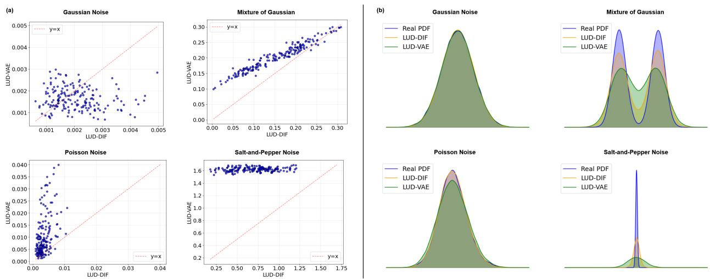
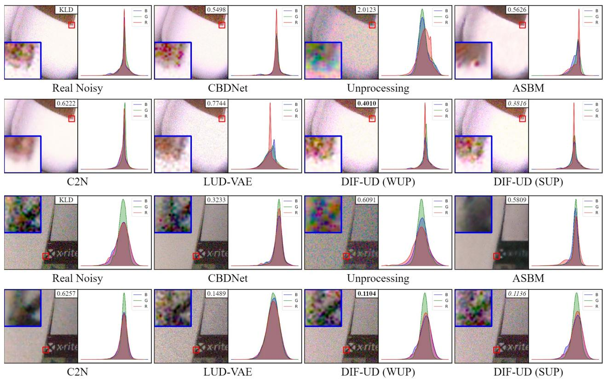
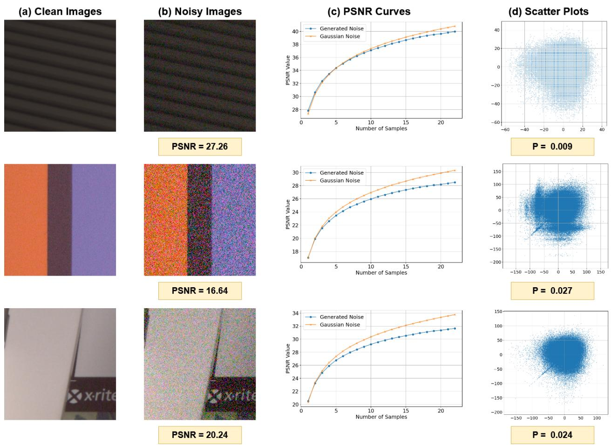
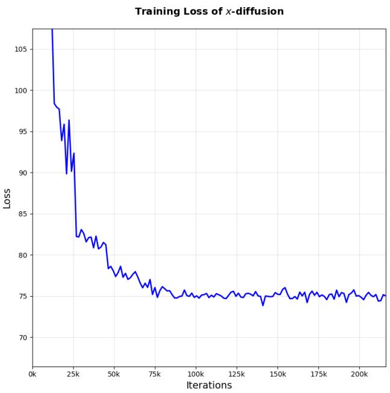
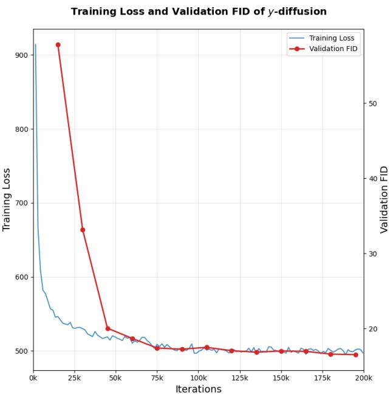
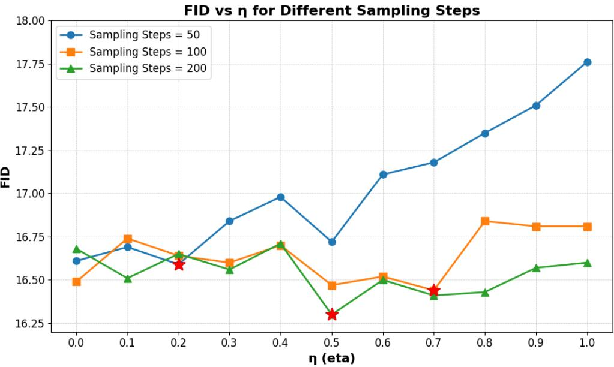
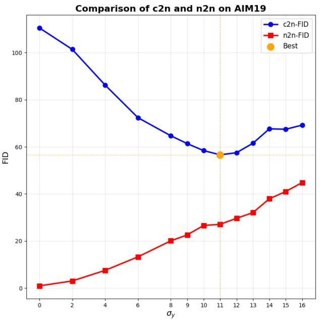
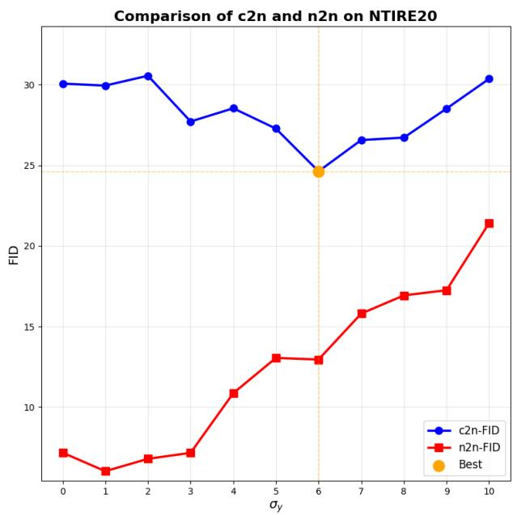
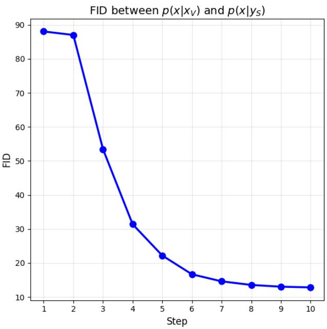
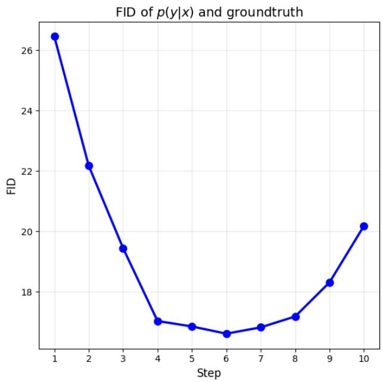

# Difusion Based Unpaired Data Learning for Inverse Problems

Chenglong Bao<sup>∗</sup> Yiming Dang<sup>†</sup> Chenguang Duan<sup>‡</sup> Yuling Jiao<sup>§</sup> Defeng Sun<sup>¶</sup>

## Abstract

Data is important in many deep learning-based inverse problem solvers. However, obtaining suficient paired data in many scenarios remains highly challenging, while unpaired data is cheap. To maximize data utilization, this paper proposes LUD-DIF, a difusion-based approach for solving inverse problems with unpaired data. Starting from the evidence lower bound (ELBO) of the joint distribution, we decouple it into two independent difusion processes under the weak-coupling assumption. The method provides theoretical support from a variational inference perspective, derives the loss function, quantitatively analyzes the error bound introduced by the assumption, and ofers a theorem-motivated heuristic for hyperparameter selection. Experimental results demonstrate that LUD-DIF achieves outstanding performance on multiple image inverse problems, validating its efectiveness and generalization capability in unpaired inverse problem settings.

Keywords: unpaired data, difusion, noise modeling, image restoration

2020 Mathematics Subject Classification: 65J22, 68T07, 94A08

## 1 Introduction

Inverse problems are widely encountered across numerous disciplines including computer vision [35], geophysical exploration [45], and biomedical imaging [6]. These problems share a classical mathematical framework:

$$
y = \mathcal { A } ( x ) + \Xi ,
$$

where A denotes the forward observation operator and Ξ represents the observation noise. The goal of solving inverse problems is to robustly recover the unknown state x from the observed data y. However, in real-world scenarios, the noise distribution is often unknown, and the observation operators typically exhibit highly nonlinear or low-rank characteristics, leading to the typical ill-posedness of inverse problems [19]. Traditional methods typically rely on certain prior assumptions (such as sparsity, smoothness, or low-rank structures) [40, 38] or employ maximum a posteriori (MAP) estimation and Bayesian inference under the assumption of Gaussian noise [39].

In recent years, deep learning techniques have brought a paradigm shift to solving inverse problems by training deep neural networks to learn complex mappings from observations to the underlying states directly from data [20]. These learning-based approaches have surpassed traditional model-based regularization methods in many fields. They are capable of implicitly capturing high-dimensional and nonlinear data distributions and have achieved remarkable success in classical inverse problems such as image processing [32], seismic wave inversion [2], and X-ray imaging [11].

Nevertheless, the exceptional performance of such end-to-end learning methods heavily relies on a prerequisite that is dificult to satisfy in practical applications: the availability of a large number of paired samples $\{ ( x _ { i } , y _ { i } ) \} \sim p ( x , y )$ for supervised training. In some real-world scenarios, such as medical or astronomical imaging, acquiring paired data is prohibitively expensive or entirely infeasible. Researchers are often restricted to accessing only independent ground-truth data $\{ x _ { i } \} _ { i = 1 } ^ { N } \sim p ( x )$ and observation data $\{ y _ { j } \} _ { j = 1 } ^ { M } \sim p ( y )$ . This limitation has emerged as the primary bottleneck restricting the widespread application of deep learning in complex inverse problems. To alleviate this issue, some studies have attempted to perform self-supervised or unsupervised learning relying exclusively on the observation data $\{ y _ { j } \} ~ [ 2 4 , 2 2 ]$ ; however, these approaches typically depend on strong heuristic priors. Another line of research utilizes only the ground-truth data $\{ x _ { i } \}$ to pre-train deep generative priors $p ( x )$ , which are subsequently combined with posterior sampling for problem resolution [8]. Yet, such methods generally require exact knowledge of both the forward observation operator and the noise model.

Unpaired learning attempts to simultaneously exploit information from the marginal distributions $p ( x )$ and $p ( y )$ but without paired samples. From a probabilistic perspective, the essence of unpaired learning lies in inferring and modeling the joint distribution $p ( x , y )$ under the constraint of these marginal distributions. Researchers often formulate unpaired learning as a generative problem, i.e., the generation of the corresponding y from a given x. Following this line, Generative Adversarial Networks (GANs) have been extensively applied due to their powerful cross-domain generation capabilities [25, 43, 3]. Nevertheless, these methods sufer from mode collapse and training instability, and they lack a rigorous probabilistic explanation. Variational Autoencoder (VAE)-based methods ofer enhanced interpretability by introducing latent variables and optimizing the Evidence Lower Bound (ELBO) [48]; however, constrained by strong assumptions regarding the latent space distribution, their generation quality is often significantly compromised. Recent difusionbased methods have begun to address conditional generation from unpaired data. OTCS constructs an optimal-transport coupling and trains a conditional score model using unpaired or partially paired data [12]. Difusion Distribution Matching learns an unknown forward operator from unpaired clean and degraded images through conditional flow matching [30], whereas RealDGen synthesizes paired super-resolution data from unpaired HR and LR images using a content–degradation-decoupled difusion model [34]. Schr¨odingerbridge methods provide another coupling-based approach to unpaired translation, with recent bridge-flow formulations reducing repeated difusion-model training [28, 14, 21, 9]. Relatedly, DRDD interprets Gaussian perturbation as a domain-harmonization mechanism for data-eficient image translation [27].

Despite this progress, a principled framework for deriving a likelihood-based conditional difusion objective from fully unpaired marginals and quantifying the bias induced by the surrogate coupling remains underexplored. To address this gap, we propose LUD-DIF (Learning from Unpaired Data via Diffusion Model) for inverse problems with unpaired data. LUD-DIF constructs proxy pairs through difusion alignment and derives a trainable dual-path conditional difusion objective from a marginal–conditional decomposition of the joint ELBO. This formulation relies solely on unpaired marginal samples and explicitly quantifies the bias induced by the weak-coupling approximation. The main contributions are summarized as follows:

• From the perspective of variational inference, we decouple the ELBO of the joint distribution under a reasonable data prior assumption. This provides a feasible training algorithm for solving inverse problems with unpaired data using difusion models.

• We quantitatively analyze the theoretical error bound introduced by our assumptions. Based on this analysis, we propose a theorem-motivated heuristic for selecting the hyperparameters $( S , V )$ establishing a theoretically grounded, practical strategy for model tuning.

• We validate the proposed method on natural image denoising and super-resolution datasets. Experimental results demonstrate that LUD-DIF achieves outstanding performance across these tasks.

## 2 Preliminaries

Difusion models [16, 37] learn to approximate an unknown data distribution $p _ { U _ { 0 } }$ by gradually adding noise to the data and then learning to reverse this process. We briefly introduce the main components of difusion models.

Forward process Let $T \in \mathbb { N } _ { + }$ . The forward process adds noise via a fixed Markovian chain:

$$
p _ { U _ { 1 : T } | U _ { 0 } } ( u _ { 1 : T } | u _ { 0 } ) : = \prod _ { t = 1 } ^ { T } p _ { U _ { t } | U _ { t - 1 } } ( u _ { t } | u _ { t - 1 } ) , p _ { U _ { t } | U _ { t - 1 } } ( \cdot | u _ { t - 1 } ) : = \mathcal { N } ( \sqrt { \alpha _ { t } } u _ { t - 1 } , ( 1 - \alpha _ { t } ) I _ { d } ) ,\tag{2.1}
$$

where $\{ \alpha _ { t } \} _ { t = 1 } ^ { T } \subset ( 0 , 1 )$ is a prescribed variance schedule [16]. Let $\bar { \alpha } _ { 0 } : = 1$ and $\textstyle { \bar { \alpha } } _ { t } : = \prod _ { i = 0 } ^ { t } \alpha _ { i }$ . Iterating this recursion yields the closed-form conditional marginal distribution for $U _ { t }$ given $U _ { 0 } = u _ { 0 } \colon$

$$
p _ { U _ { t } | U _ { 0 } } ( \cdot | u _ { 0 } ) = \mathcal N ( \sqrt { \bar { \alpha } _ { t } } u _ { 0 } , ( 1 - \bar { \alpha } _ { t } ) I _ { d } ) .\tag{2.2}
$$

As $\bar { \alpha } _ { T }  0 $ , the final distribution $p _ { U _ { T } | U _ { 0 } }$ converges to a standard Gaussian $\mathcal { N } ( 0 , I _ { d } )$

Reverse process To construct a generative model, the reverse process is parameterized as a Markovian chain with learned transition kernels starting from $p _ { U _ { T } } ( u _ { T } ) : = \mathcal { N } ( 0 , I _ { d } )$

$$
p _ { U _ { t - 1 } | U _ { t } } ^ { \theta } ( \cdot | u _ { t } ) : = \mathcal { N } ( \mu _ { t } ^ { \theta } ( u _ { t } ) , \sigma _ { t } ^ { 2 } I _ { d } ) ,\tag{2.3}
$$

where $\mu _ { t } ^ { \theta } : \mathbb { R } ^ { d }  \mathbb { R } ^ { d }$ is a neural network and $\sigma _ { t } ^ { 2 }$ is a prescribed variance schedule.

ELBO formulation Difusion models are trained by optimizing the Evidence Lower Bound (ELBO) of the log-likelihood. Through Markovian properties, the ELBO can be rewritten as a tractable decomposition [16, Appendix $\mathrm { A l }$

$$
\begin{array} { l } { { \displaystyle { \mathrm { E L B O } } ( \theta ; u _ { 0 } ) = - D _ { \mathrm { K L } } \big ( p _ { U _ { T } | U _ { 0 } } ( \cdot | u _ { 0 } ) \big | \big | p _ { U _ { T } } \big ) + \mathbb { E } \Big [ \log p _ { U _ { 0 } | U _ { 1 } } ^ { \theta } \big ( u _ { 0 } \vert U _ { 1 } \big ) \Big | U _ { 0 } = u _ { 0 } \Big ] } \ ~ } \\ { { \displaystyle ~ - \sum _ { t = 2 } ^ { T } } \mathbb { E } \big [ D _ { \mathrm { K L } } \big ( p _ { U _ { t - 1 } | U _ { t } , U _ { 0 } } \big ( \cdot | U _ { t } , u _ { 0 } ) \big | \big | p _ { U _ { t - 1 } | U _ { t } } ^ { \theta } \big ( \cdot | U _ { t } \big ) \big ) \Big | U _ { 0 } = u _ { 0 } \Big ] . } \end{array}\tag{2.4}
$$

The first term is constant due to the construction of the forward process, and the second term is the reconstruction term. Moreover, we have $p _ { U _ { t - 1 } | U _ { t } , U _ { 0 } } ( \cdot | u _ { t } , u _ { 0 } ) = \mathcal { N } ( \tilde { \mu } _ { t } ( u _ { t } , u _ { 0 } ) , \tilde { \beta } _ { t } I _ { d } )$ , where

$$
\tilde { \mu } _ { t } ( u _ { t } , u _ { 0 } ) = \frac { \sqrt { \bar { \alpha } _ { t - 1 } } \beta _ { t } } { 1 - \bar { \alpha } _ { t } } u _ { 0 } + \frac { \sqrt { \alpha _ { t } } ( 1 - \bar { \alpha } _ { t - 1 } ) } { 1 - \bar { \alpha } _ { t } } u _ { t } , \quad \tilde { \beta } _ { t } = \frac { ( 1 - \bar { \alpha } _ { t - 1 } ) \beta _ { t } } { 1 - \bar { \alpha } _ { t } } ,\tag{2.5}
$$

where $\beta _ { t } : = 1 - \alpha _ { t }$ . Substituting (2.5) into (2.4) yields the mean-squared error loss function:

$$
\mathcal { L } ( \theta ) = \mathbb { E } \left[ \sum _ { t = 1 } ^ { T } \frac { 1 } { 2 \sigma _ { t } ^ { 2 } } \lVert \mu _ { t } ^ { \theta } ( U _ { t } ) - \tilde { \mu } _ { t } ( U _ { t } , U _ { 0 } ) \rVert _ { 2 } ^ { 2 } \right] ,
$$

where $\tilde { \mu } _ { 1 } ( u _ { 1 } , u _ { 0 } ) : = u _ { 0 }$

## 3 The LUD-DIF method

## 3.1 Problem Formulation

Consider a general inverse problem modeled as

$$
\begin{array} { r } { Y _ { 0 } = \mathcal { A } ( X _ { 0 } ) + \Xi , } \end{array}\tag{3.1}
$$

where $\mathcal { A }$ is the forward operator and $\Xi$ denotes the noise. In the unpaired data setting, we are given samples from the marginal distributions

$$
X _ { 0 } ^ { 1 } , \ldots , X _ { 0 } ^ { N } \overset { \mathrm { i . i . d . } } { \sim } p _ { X _ { 0 } } , \qquad Y _ { 0 } ^ { 1 } , \ldots , Y _ { 0 } ^ { N } \overset { \mathrm { i . i . d . } } { \sim } p _ { Y _ { 0 } } ,
$$

and the goal is to recover the joint distribution $p _ { X _ { 0 } , Y _ { 0 } }$ . If the noise distribution were known, one could directly characterize the conditional distribution $p _ { Y _ { 0 } | X _ { 0 } }$ via the forward model (3.1), and thereby recover the joint distribution. However, in practice, the noise distribution is typically unknown and may be highly complex, which poses the main challenge in estimating $p _ { X _ { 0 } , Y _ { 0 } }$

In this work, we model the noise conditionally as $\Xi \sim p _ { \Xi | \mathcal { A } ( X _ { 0 } ) }$ . By treating $ { \mathcal { A } } ( X _ { 0 } )$ as an efective signal variable and relabeling it as $X _ { 0 } .$ , the forward model can be reduced to

$$
Y _ { 0 } = X _ { 0 } + \Xi , \Xi \sim p _ { \Xi | X _ { 0 } } .\tag{3.2}
$$

This reformulation reduces the problem to estimating the conditional noise distribution, which we refer to as the noise modeling problem.

Remark 3.1. If the forward operator is unknown, it can be replaced by an approximate unbiased operator ${ \widehat { A } } ,$ i.e., $\mathbb { E } [ \mathcal { A } ( X _ { 0 } ) ] = \mathbb { E } [ \widehat { \mathcal { A } } ( X _ { 0 } ) ]$ , that incorporates prior information. In this case, the model can be written as

$$
Y _ { 0 } = \widehat { \mathcal { A } } ( X _ { 0 } ) + \widetilde { \Xi } , \qquad \widetilde { \Xi } = \Xi + \mathcal { A } ( X _ { 0 } ) - \widehat { \mathcal { A } } ( X _ { 0 } ) .
$$

The residual term is absorbed into the efective noise $\widetilde { \Xi } ,$ and the model is again reduced to the form in (3.2) with $\mathbb { E } [ \widetilde { \Xi } ] = \mathbb { E } [ \Xi ]$

Accordingly, in the following, we focus on this noise modeling problem.

Data preprocessing. Let $\begin{array} { r } { \sigma _ { X } ^ { 2 } = \frac { 1 } { d } \mathbb { E } [ \| X _ { 0 } - \mu _ { X } \| _ { 2 } ^ { 2 } ] } \end{array}$ and $\begin{array} { r } { \sigma _ { Y } ^ { 2 } = \frac { 1 } { d } \mathbb { E } [ \| Y _ { 0 } - \mu _ { Y } \| _ { 2 } ^ { 2 } ] } \end{array}$ , where $\mu _ { X } = \operatorname { \mathbb { E } } [ X _ { 0 } ]$ and $\mu _ { Y } = \operatorname { \mathbb { E } } [ Y _ { 0 } ]$ ]. We normalize the data by

$$
\tilde { X } _ { 0 } = \frac { X _ { 0 } } { \sigma _ { X } } , \quad \tilde { Y } _ { 0 } = \frac { Y _ { 0 } } { \sigma _ { Y } } .\tag{3.3}
$$

This normalization aligns the scales of the two marginal distributions, making their amplitudes comparable when constructing a joint difusion process for $X _ { 0 }$ and $Y _ { 0 }$ . For notational simplicity, we assume that this preprocessing step has been applied and, in the remainder of the paper, use $X _ { 0 }$ and $Y _ { 0 }$ to denote the normalized variables $\tilde { X } _ { 0 }$ and $\tilde { Y } _ { 0 }$

## 3.2 Learning joint distribution via difusion models

Let $Z _ { 0 } : = ( X _ { 0 } , Y _ { 0 } ) \sim p _ { X _ { 0 } , Y _ { 0 } }$ denote the true but unobserved joint data distribution. We construct a difusion process on the joint variable $Z _ { 0 }$ by specifying an appropriate reverse process.

Forward process Treating the joint variable $Z _ { t } : = ( X _ { t } , Y _ { t } )$ as the counterpart of $U _ { t }$ in (2.1), we define the joint forward difusion process as

$$
X _ { t } : = \sqrt { \alpha _ { t } } X _ { t - 1 } + \sqrt { 1 - \alpha _ { t } } \varepsilon _ { t - 1 } ^ { X } , \quad Y _ { t } : = \sqrt { \alpha _ { t } } Y _ { t - 1 } + \sqrt { 1 - \alpha _ { t } } \varepsilon _ { t - 1 } ^ { Y } ,\tag{3.4}
$$

where $\varepsilon _ { t - 1 } ^ { X } , \varepsilon _ { t - 1 } ^ { Y } \sim { \mathcal { N } } ( 0 , I _ { d } )$ are independent standard Gaussian noise variables that are independent of $X _ { t - 1 }$ and $Y _ { t - 1 }$ . We establish the following factorization result that decouples across $X _ { 0 }$ and $Y _ { 0 }$

Proposition 3.2. Let $\boldsymbol { Z } _ { t } = \left( \boldsymbol { X } _ { t } , \boldsymbol { Y } _ { t } \right)$ follow the forward process (3.4). Then we have

$$
p _ { Z _ { t } | Z _ { 0 } } ( z _ { t } | z _ { 0 } ) = p _ { X _ { t } | X _ { 0 } } ( x _ { t } | x _ { 0 } ) p _ { Y _ { t } | Y _ { 0 } } ( y _ { t } | y _ { 0 } ) ,\tag{3.5a}
$$

$$
p _ { Z _ { t - 1 } | Z _ { t } , Z _ { 0 } } ( z _ { t - 1 } | z _ { t } , z _ { 0 } ) = p _ { X _ { t - 1 } | X _ { t } , X _ { 0 } } ( x _ { t - 1 } | x _ { t } , x _ { 0 } ) p _ { Y _ { t - 1 } | Y _ { t } , Y _ { 0 } } ( y _ { t - 1 } | y _ { t } , y _ { 0 } ) ,\tag{3.5b}
$$

where $z _ { t } : = ( x _ { t } , y _ { t } )$

Proof. See Appendix A.1.

Reverse process Since paired samples $( X _ { 0 } , Y _ { 0 } ) \sim p _ { X _ { 0 } , Y _ { 0 } }$ are unavailable in the unpaired setting, it is dificult to directly adopt the reverse process parameterization (2.3) used in classical difusion models. To construct a tractable variational reverse process, we first note that, for the X-first autoregressive ordering, the exact reverse transition kernel admits the chain-rule factorization

$$
p _ { Z _ { t - 1 } | Z _ { t } } ( z _ { t - 1 } ~ | ~ z _ { t } ) = p _ { X _ { t - 1 } | X _ { t } , Y _ { t } } ( x _ { t - 1 } ~ | ~ x _ { t } , y _ { t } ) p _ { Y _ { t - 1 } | X _ { t - 1 } , X _ { t } , Y _ { t } } ( y _ { t - 1 } ~ | ~ x _ { t - 1 } , x _ { t } , y _ { t } ) .
$$

This identity only motivates the autoregressive ordering. In the variational model, we do not attempt to represent the two exact conditionals above. Instead, we restrict the reverse model to a tractable factored Gaussian family:

$$
\begin{array} { r l } & { p _ { Z _ { t - 1 } | Z _ { t } } ^ { \theta } ( z _ { t - 1 } \mid z _ { t } ) : = p _ { X _ { t - 1 } | X _ { t } } ^ { \theta } ( x _ { t - 1 } \mid x _ { t } ) p _ { Y _ { t - 1 } | X _ { t - 1 } , Y _ { t } } ^ { \theta } ( y _ { t - 1 } \mid x _ { t - 1 } , y _ { t } ) } \\ & { \qquad = \mathcal { N } \big ( x _ { t - 1 } ; \mu _ { X , t } ^ { \theta } ( x _ { t } ) , \sigma _ { t } ^ { 2 } I _ { d } \big ) \mathcal { N } \big ( y _ { t - 1 } ; \mu _ { Y | X , t } ^ { \theta } ( y _ { t } , x _ { t - 1 } ) , \sigma _ { t } ^ { 2 } I _ { d } \big ) . } \end{array}\tag{3.6}
$$

The omission of $y _ { t }$ in the first factor and $x _ { t }$ in the second factor should be understood as a restriction of the variational family, rather than as a conditional-independence assumption on the true reverse process.

Intuitively, the X-reverse kernel is used to model the clean structural marginal, for which $x _ { t }$ is the most direct noisy observation, while the Y-reverse kernel is conditioned on the less difused structural state $x _ { t - 1 }$ together with the noisy observation $y _ { t }$ . This design keeps the conditional difusion model trainable from the weak-coupling samples introduced below. Since both factors in (3.6) are normalized conditional Gaussian densities, their product defines a valid conditional density over $( x _ { t - 1 } , y _ { t - 1 } )$ given $( x _ { t } , y _ { t } )$ ).

Based on the above parameterization, we show that the proposed reverse process admits a corresponding decomposition of the ELBO.

ELBO formulation Analogously to (2.4), we identify $Z _ { t }$ with $U _ { t }$ and define the objective function as the negative-ELBO loss function:

$$
\begin{array} { r } { \mathcal { L } _ { \mathrm { j o i n t } } ( \theta ) : = - \mathbb { E } _ { Z _ { 0 } } \left[ \mathrm { E L B O } _ { Z } ( \theta ; Z _ { 0 } ) \right] , } \end{array}\tag{3.7}
$$

where $\mathrm { E L B O } _ { Z }$ is given by

$$
\begin{array} { l } { \displaystyle \mathrm { E L B O } _ { Z } ( \theta ; z _ { 0 } ) : = - D _ { \mathrm { K L } } \big ( p _ { Z _ { T } | Z _ { 0 } } ( \cdot | z _ { 0 } ) \| p _ { Z _ { T } } \big ) + \mathbb { E } \left[ \log p _ { Z _ { 0 } | Z _ { 1 } } ^ { \theta } ( z _ { 0 } | Z _ { 1 } ) | Z _ { 0 } = z _ { 0 } \right] } \\ { \displaystyle \qquad - \sum _ { t = 2 } ^ { T } \mathbb { E } \left[ D _ { \mathrm { K L } } \big ( p _ { Z _ { t - 1 } | Z _ { t } , Z _ { 0 } } ( \cdot | Z _ { t } , z _ { 0 } ) \| p _ { Z _ { t - 1 } | Z _ { t } } ^ { \theta } ( \cdot | Z _ { t } ) \big ) | Z _ { 0 } = z _ { 0 } \right] . } \end{array}\tag{3.8}
$$

Since paired samples $z _ { 0 } = ( x _ { 0 } , y _ { 0 } ) \sim p _ { X _ { 0 } , Y _ { 0 } }$ are unavailable, we decompose the joint ELBO under the variational family in (3.6) into an X-marginal ELBO and a conditional $Y | X$ ELBO.

Proposition 3.3 (Decoupling of joint ELBO). Let the joint difusion process $\{ Z _ { t } \} _ { t = 0 } ^ { T }$ be defined by (3.4) and (3.6), and let EL ${ \mathrm { . B O } } _ { Z }$ be given by (3.8). Then the following decomposition holds:

$$
\mathrm { E L B O } _ { Z } ( \theta ; z _ { 0 } ) = \mathrm { E L B O } _ { X } ( \theta ; x _ { 0 } ) + \mathrm { E L B O } _ { Y | X } ( \theta ; z _ { 0 } ) + C ( z _ { 0 } ) ,
$$

where $C ( z _ { 0 } )$ is a constant independent of θ. The marginal $E L B O \mathrm { E L B O } _ { X }$ is

$$
\begin{array} { r l r } {  { \mathrm { E L B O } _ { X } ( \theta ; x _ { 0 } ) = \mathbb { E } [ \log p _ { X _ { 0 } | X _ { 1 } } ^ { \theta } ( x _ { 0 } | X _ { 1 } ) | X _ { 0 } = x _ { 0 } ] } } \\ & { } & { \displaystyle - \sum _ { t = 2 } ^ { T } \mathbb { E } [ D _ { \mathrm { K L } } ( p _ { X _ { t - 1 } | X _ { t } , X _ { 0 } } ( \cdot | X _ { t } , x _ { 0 } ) | | p _ { X _ { t - 1 } | X _ { t } } ^ { \theta } ( \cdot | X _ { t } ) ) \Big | X _ { 0 } = x _ { 0 } ] . } \end{array}\tag{3.9}
$$

The conditional ELBO $\operatorname { E L B O } _ { Y \mid X }$ is

$$
\begin{array} { l } { \displaystyle \mathrm { E L B O } _ { Y \mid X } ( \theta ; z _ { 0 } ) = \mathbb E \big [ \log p _ { Y _ { 0 } \mid X _ { 0 } , Y _ { 1 } } ^ { \theta } ( y _ { 0 } \mid x _ { 0 } , Y _ { 1 } ) \mid Z _ { 0 } = z _ { 0 } \big ] } \\ { \displaystyle - \sum _ { t = 2 } ^ { T } \mathbb E \Big [ D _ { \mathrm { K L } } \Big ( p _ { Y _ { t - 1 } \mid Y _ { t } , Y _ { 0 } } ( \cdot \mid Y _ { t } , y _ { 0 } ) \Big \parallel p _ { Y _ { t - 1 } \mid X _ { t - 1 } , Y _ { t } } ^ { \theta } ( \cdot \mid X _ { t - 1 } , Y _ { t } ) \Big ) \Big \mid Z _ { 0 } = z _ { 0 } \Big ] . } \end{array}\tag{3.10}
$$

Proof. See Appendix A.2.

Using the parameterizations in (3.6), we obtain, up to a constant,

$$
- \mathbb { E } [ \mathrm { E L B O } _ { X } ( \theta ; x _ { 0 } ) ] = \mathbb { E } \sum _ { t = 1 } ^ { T } \frac { 1 } { 2 \sigma _ { t } ^ { 2 } } \| \mu _ { X , t } ^ { \theta } ( X _ { t } ) - \tilde { \mu } _ { t } ( X _ { t } , X _ { 0 } ) \| _ { 2 } ^ { 2 } = : L _ { \operatorname* { m a r g } } ( \theta ) ,\tag{3.11}
$$

$$
- \mathbb { E } [ \mathrm { E L B O } _ { Y | X } ( \theta ; z _ { 0 } ) ] = \mathbb { E } \sum _ { t = 1 } ^ { T } \frac { 1 } { 2 \sigma _ { t } ^ { 2 } } \| \mu _ { Y | X , t } ^ { \theta } ( Y _ { t } , X _ { t - 1 } ) - \tilde { \mu } _ { t } ( Y _ { t } , Y _ { 0 } ) \| _ { 2 } ^ { 2 } = : L _ { \mathrm { c o n d } } ( \theta ) .\tag{3.12}
$$

Collecting $- \mathbb { E } [ C ( Z _ { 0 } ) ]$ and all other terms independent of $\theta$ into a constant $C ,$ the overall loss function becomes

$$
\begin{array} { r } { \mathcal { L } _ { \mathrm { j o i n t } } ( \theta ) : = - \mathbb { E } \left[ \mathrm { E L B O } _ { Z } ( \theta ; Z _ { 0 } ) \right] = L _ { \mathrm { m a r g } } ( \theta ) + L _ { \mathrm { c o n d } } ( \theta ) + C . } \end{array}\tag{3.13}
$$

This formulation serves as the ideal loss for learning the joint distribution. Notably, $L _ { \mathrm { m a r g } } ( \theta )$ can be estimated using samples from $p _ { X _ { 0 } }$ , whereas $L _ { \mathrm { c o n d } } ( \theta )$ requires samples from the joint distribution of $( X _ { t - 1 } , Y _ { t } , Y _ { 0 } )$ , which depends on

$$
p _ { X _ { t - 1 } , Y _ { t } , Y _ { 0 } } ( x _ { t - 1 } , y _ { t } , y _ { 0 } ) = \int p _ { X _ { t - 1 } | X _ { 0 } } ( x _ { t - 1 } | x _ { 0 } ) p _ { X _ { 0 } | Y _ { 0 } } ( x _ { 0 } | y _ { 0 } ) p _ { Y _ { t } , Y _ { 0 } } ( y _ { t } , y _ { 0 } ) \mathrm { d } x _ { 0 } .
$$

However, the available marginal distributions $p _ { X _ { 0 } }$ and $p _ { Y _ { 0 } }$ alone do not uniquely determine the joint distribution. As a result, the conditional distribution $p _ { X _ { 0 } | Y _ { 0 } }$ remains inaccessible in the unpaired setting. In many inverse problems, high-dimensional noisy signals are more easily obscured by additional Gaussian perturbations than are the underlying dominant structures. Motivated by this observation, we introduce the following weak-coupling assumption.

Assumption 3.4 (Weak coupling). There exist time steps $0 \leq V , S \leq T$ such that

$$
p _ { X _ { 0 } | Y _ { 0 } } ( \cdot | y _ { 0 } ) = p _ { X _ { 0 } | Y _ { 0 } } ^ { \mathrm { w e a k } } ( \cdot | y _ { 0 } ) , \quad y _ { 0 } \in \mathbb { R } ^ { d } ,
$$

where $p _ { X _ { 0 } | Y _ { 0 } } ^ { \mathrm { w e a k } }$ and $p _ { X _ { 0 } | Y _ { s } } ^ { \mathrm { w e a k } }$ are defined as

$$
p _ { X _ { 0 } | Y _ { 0 } } ^ { \mathrm { w e a k } } ( \cdot | y _ { 0 } ) : = \mathbb { E } _ { \xi \sim \mathcal { N } ( 0 , I _ { d } ) } \left[ p _ { X _ { 0 } | Y _ { S } } ^ { \mathrm { w e a k } } ( \cdot | \sqrt { \bar { \alpha } _ { S } } y _ { 0 } + \sqrt { 1 - \bar { \alpha } _ { S } } \xi ) \right] ,\tag{3.14}
$$

$$
p _ { X _ { 0 } | Y _ { S } } ^ { \mathrm { w e a k } } ( \cdot | w ) : = p _ { X _ { 0 } | X _ { V } } ( \cdot | w ) , \quad \forall w \in \mathbb { R } ^ { d } .\tag{3.15}
$$

Remark 3.5. For Gaussian white noise with variance $\sigma ^ { 2 }$ , this coupling assumption is exact when we set $S = 0$ and choose V such that $\begin{array} { r } { \bar { \alpha } _ { V } = \frac { \sigma _ { X } ^ { 2 } } { \sigma _ { X } ^ { 2 } + \sigma ^ { 2 } } } \end{array}$ , thereby matching the signal-to-noise ratio of the measurement.

Remark 3.6. For the general case, the assumption relies on two approximations: (i) Alignment approximation: $p _ { X _ { 0 } | Y _ { S } } ( \cdot \mid w ) \approx p _ { X _ { 0 } | X _ { V } } ( \cdot \mid w )$ , which assumes that the noisy representations of the two modalities become structurally indistinguishable at suitable noise levels; (ii) Perturbation approximation: $p _ { X _ { 0 } | Y _ { 0 } } ( \cdot \ | \ y _ { 0 } )$ ≈ $\mathbb { E } _ { \xi \sim \mathcal { N } ( 0 , I _ { d } ) } \left[ p _ { X _ { 0 } | Y _ { S } } \big ( \cdot \mid \sqrt { \bar { \alpha } _ { S } } y _ { 0 } + \sqrt { 1 - \bar { \alpha } _ { S } } \xi \big ) \right]$ , which assumes that the perturbation $Y _ { S }$ preserves suficient information about $X _ { 0 } .$ . These two approximations induce a trade-of in the choice of the time steps S and V. When S is small, the perturbation approximation is nearly exact, whereas the alignment approximation is dificult to satisfy. As S and V increase, the alignment approximation improves, but the perturbation approximation deteriorates due to information loss. Therefore, the practical efectiveness of the weak-coupling assumption depends on selecting S and V to balance these competing efects.

The weak-coupling distribution can be sampled using only marginal data:

1. Draw $( Y _ { 0 } , \xi ) \sim p _ { Y _ { 0 } } \otimes \mathcal { N } ( 0 , I _ { d } ) .$

2. Define $\bar { Y } _ { S } = \sqrt { \bar { \alpha } _ { S } } Y _ { 0 } + \sqrt { 1 - \bar { \alpha } _ { S } } \xi ;$

3. Draw $X _ { 0 } ^ { \mathrm { w e a k } } \sim p _ { X _ { 0 } | X _ { V } } ( \cdot \mid \bar { Y } _ { S } )$ via reverse process.

By replacing the inaccessible conditional distribution $p _ { X _ { 0 } | Y _ { 0 } }$ with the proxy conditional distribution $p _ { X _ { 0 } | Y _ { 0 } } ^ { \mathrm { w e a k } }$ in (3.12), we define the weak conditional loss as

$$
L _ { \mathrm { c o n d } } ^ { \mathrm { w e a k } } ( \theta ) : = \mathbb { E } \left[ \sum _ { t = 1 } ^ { T } \frac { 1 } { 2 \sigma _ { t } ^ { 2 } } \lVert \mu _ { Y | X , t } ^ { \theta } ( Y _ { t } , X _ { t - 1 } ^ { \mathrm { w e a k } } ) - \tilde { \mu } _ { t } ( Y _ { t } , Y _ { 0 } ) \rVert _ { 2 } ^ { 2 } \right] ,\tag{3.16}
$$

where

$$
X _ { t - 1 } ^ { \mathrm { w e a k } } : = \sqrt { \bar { \alpha } _ { t - 1 } } X _ { 0 } ^ { \mathrm { w e a k } } + \sqrt { 1 - \bar { \alpha } _ { t - 1 } } \varepsilon ^ { X } , \quad Y _ { t } : = \sqrt { \bar { \alpha } _ { t } } Y _ { 0 } + \sqrt { 1 - \bar { \alpha } _ { t } } \varepsilon ^ { Y } ,
$$

with $\varepsilon ^ { X } , \varepsilon ^ { Y } \sim \mathcal { N } ( 0 , I _ { d } )$ independent of each other and independent of $X _ { 0 } ^ { \mathrm { w e a k } }$ and $Y _ { 0 }$ . Therefore, $X _ { 0 } ^ { \mathrm { w e a k } }$ is conditionally independent of $Y _ { t }$ given $Y _ { 0 }$ . This modification avoids the need for paired data and makes the conditional loss computable. The next theorem shows the equivalence between $L _ { \mathrm { c o n d } } ^ { \mathrm { w e a k } } ( \theta )$ in (3.16) and $L _ { \mathrm { c o n d } } ( \theta )$ in (3.12) under Assumption 3.4. We define

$$
\begin{array} { r } { \mathcal { L } _ { \mathrm { w e a k } } ( \theta ) : = L _ { \mathrm { m a r g } } ( \theta ) + L _ { \mathrm { c o n d } } ^ { \mathrm { w e a k } } ( \theta ) + C , } \end{array}\tag{3.17}
$$

where $L _ { \mathrm { m a r g } } ( \theta )$ is defined in (3.11) and $L _ { \mathrm { c o n d } } ^ { \mathrm { w e a k } } ( \theta )$ is defined in (3.16).

Theorem 3.7. Suppose that Assumption $\ 3 . 4$ holds. Let $\mathcal { L } _ { \mathrm { j o i n t } } ( \theta )$ and $\mathcal { L } _ { \mathrm { w e a k } } ( \theta )$ be defined as (3.13) and (3.17),   
respectively. Then we have   
L<sub>cond</sub>(θ) = L<sup>weak</sup><sub>cond</sub> (θ).   
Thus, $\mathcal { L } _ { \mathrm { j o i n t } } ( \theta ) = \mathcal { L } _ { \mathrm { w e a k } } ( \theta )$   
Proof. See Appendix A.3. □

Theorem 3.7 provides a consistency result: when the weak-coupling construction matches the true posterior coupling, the computable weak objective coincides with the ideal paired-data objective. When the assumption is relaxed, Section 4 quantifies the resulting bias. Algorithm 1 summarizes the training procedure. Since the objective is decoupled into marginal and conditional terms, the two difusion models can be trained separately, improving the training eficiency of the conditional model.

```latex
Algorithm 1 LUD-DIF Algorithm: Training Process
1: Initialize parameters $\overline { { S , V , \alpha _ { t } } }$ of the model.
2: for each training iteration do
3: Sample $X _ { 0 } \sim p _ { X _ { 0 } } , Y _ { 0 } \sim p _ { Y _ { 0 } }$ and $t \sim$ Uniform $\{ 1 , \ldots , T \}$
4: Generate $X _ { t } \sim p _ { X _ { t } | X _ { 0 } } ( \cdot | X _ { 0 } )$ and $Y _ { t } \sim p _ { Y _ { t } | Y _ { 0 } } ( \cdot | Y _ { 0 } )$ via the forward process (3.4).
5: Generate proxy sample $X _ { 0 } ^ { \mathrm { w e a k } } \sim p _ { X _ { 0 } | Y _ { 0 } } ^ { \mathrm { w e a k } } ( \cdot | Y _ { 0 } )$ as defined in (3.14) and (3.15).
6: Construct $X _ { t - 1 } = \sqrt { \bar { \alpha } _ { t - 1 } } s g ( X _ { 0 } ^ { \mathrm { w e a k } } ) + \sqrt { 1 - \bar { \alpha } _ { t - 1 } } \xi$ where $\xi \sim \mathcal { N } ( 0 , I _ { d } )$
7: Compute $\begin{array} { r } { \mathscr { L } _ { X } = \frac { 1 } { 2 \sigma _ { t } ^ { 2 } } \| \mu _ { X , t } ^ { \theta } ( X _ { t } ) - \tilde { \mu } _ { t } ( X _ { t } , X _ { 0 } ) \| ^ { 2 } . } \end{array}$
8: Compute $\begin{array} { r } { \mathcal { L } _ { Y | X } = \frac { { \bf \tilde { \mu } } _ { 1 } } { 2 \sigma _ { t } ^ { 2 } } \| { \mu } _ { Y | X , t } ^ { \theta } ( Y _ { t } , X _ { t - 1 } ) - \tilde { \mu } _ { t } ( Y _ { t } , Y _ { 0 } ) \| ^ { 2 } . } \end{array}$
9: Update θ by minimizing $\mathcal { L } _ { \mathrm { w e a k } } = \mathcal { L } _ { X } + \mathcal { L } _ { Y | X } .$
10: end for
```

## 4 The Bias Analysis without Assumption 3.4

Theorem 3.7 establishes the equivalence between $\mathcal { L } _ { \mathrm { j o i n t } }$ and $\mathcal { L } _ { \mathrm { w e a k } }$ under Assumption 3.4. Here, we quantify their discrepancy when this assumption is relaxed:

$$
\Delta : = | { \mathcal { L } } _ { \mathrm { j o i n t } } - { \mathcal { L } } _ { \mathrm { w e a k } } | .\tag{4.1}
$$

Throughout this section, $p _ { X _ { 0 } | X _ { V } }$ denotes the exact conditional distribution, so learning and sampling errors are excluded. Following the normalization in (3.3), we consider

$$
Y _ { 0 } = \frac { \sigma _ { X } } { \sigma _ { Y } } X _ { 0 } + \frac { 1 } { \sigma _ { Y } } \Xi ,\tag{4.2}
$$

where $\Xi$ is assumed to be independent of $X _ { 0 }$ . A concise extension to signal-dependent conditional noise is given in Appendix A.7. The resulting bounds also guide the selection of the weak-coupling time steps $S$ and V. We first state the required technical assumptions.

Assumption 4.1 (Polynomial growth of networks). The expectation neural network $\mu _ { Y | X , t } ^ { \theta } : \mathbb { R } ^ { d } \times \mathbb { R } ^ { d }  \mathbb { R } ^ { d }$ defined in (3.6) is bounded by a polynomial uniformly over the parameter set $\Theta , \mathrm { i . e . }$ , there exist $C > 0$ and m $\geq 1$ such that for any $\theta \in \Theta$ and $y _ { t } , x \in \mathbb { R } ^ { d }$

$$
\| \mu _ { Y | X , t } ^ { \theta } ( y _ { t } , x ) \| _ { 2 } ^ { 2 } \leq C ( 1 + \| y _ { t } \| _ { 2 } ^ { m } + \| x \| _ { 2 } ^ { m } ) .
$$

The polynomial growth of the neural network in Assumption 4.1 can be ensured in practice by truncation or weight clipping. Note that the expectation $\tilde { \mu } _ { t } ( y _ { t } , y _ { 0 } )$ defined in (2.5) is a linear combination of $y _ { t }$ and $y _ { 0 } ;$ thus, under Assumption 4.1, there exists a constant $K > 0$ such that

$$
\begin{array} { r } { \| \mu _ { Y | X , t } ^ { \theta } ( y _ { t } , x ) - \widetilde { \mu } _ { t } ( y _ { t } , y _ { 0 } ) \| _ { 2 } ^ { 2 } \leq K ( 1 + \| y _ { t } \| _ { 2 } ^ { \operatorname* { m a x } \{ m , 2 \} } + \| x \| _ { 2 } ^ { m } + \| y _ { 0 } \| _ { 2 } ^ { 2 } ) . } \end{array}
$$

Here $K$ is a constant depending only on $C$ and the variance schedule of the difusion model.

Before proceeding with the data distributions, we note the necessary variable assumptions supporting the scaling properties.

Assumption 4.2 (Data and noise distribution). The normalized clean data $X _ { 0 }$ admits a probability density $p _ { X _ { 0 } }$ with respect to the Lebesgue measure on $\mathbb { R } ^ { d }$ and is supported on a compact set $\mathcal { X } \subset \mathbb { R } ^ { d }$ . The noise $\Xi$ is independent of $X _ { 0 }$ and is centered, i.e.,

$$
\mathbb { E } [ \Xi ] = \mathbf { 0 } .
$$

Moreover, Ξ admits a probability density $p _ { \Xi }$ satisfying

$$
\| p \equiv \| _ { L ^ { \infty } ( \mathbb { R } ^ { d } ) } \leq M _ { \Xi } ,
$$

and has a bounded 2 max $\{ m , 2 \}$ -th moment:

$$
\mathbb { E } \Big [ \| \Xi \| _ { 2 } ^ { 2 \operatorname* { m a x } \{ m , 2 \} } \Big ] \leq M _ { \Xi , m } ,
$$

for some finite constants $M _ { \Xi } , M _ { \Xi , m } > 0$

Since $Y _ { 0 }$ is a linear combination of the bounded $X _ { 0 }$ and the noise $\Xi ,$ it naturally follows that the noisy observation $Y _ { 0 }$ has finite 2 max $( m , 2 )$ -th order moments.

The Total Variation (TV) distance between two probability density functions $p _ { 1 }$ and $p _ { 2 }$ is defined as $\begin{array} { r } { \| p _ { 1 } - p _ { 2 } \| _ { \mathrm { T V } } : = \frac { 1 } { 2 } \int | p _ { 1 } ( x ) - p _ { 2 } ( x ) } \end{array}$ | dx. The following proposition shows that the error of the weakly coupled loss function can be controlled by the expected TV distance between the true posterior $p _ { X _ { 0 } | Y _ { 0 } } ( \cdot | Y _ { 0 } )$ and the weakly coupled posterior $p _ { X _ { 0 } | Y _ { 0 } } ^ { \mathrm { w e a k } } ( \cdot | Y _ { 0 } )$

Proposition 4.3. Suppose Assumptions $\it 4 . 1$ and $4 . 2$ are fulfilled. Then there exists a sequence of positive finite constants $\{ M _ { t } \} _ { t = 1 } ^ { T }$ such that the error function is bounded by

$$
\Delta \leq \sum _ { t = 1 } ^ { T } \frac { M _ { t } } { \sigma _ { t } ^ { 2 } } \mathbb { E } _ { Y _ { 0 } } ^ { \frac { 1 } { 2 } } \left[ \| p _ { X _ { 0 } | Y _ { 0 } } ( \cdot | Y _ { 0 } ) - p _ { X _ { 0 } | Y _ { 0 } } ^ { \mathrm { w e a k } } ( \cdot | Y _ { 0 } ) \| _ { \mathrm { T V } } \right] ,
$$

where $M _ { t }$ is a constant depending on C, $R x : = \operatorname* { s u p } _ { x \in \mathcal { X } } \| x \| _ { 2 }$ , dimension $d ,$ moment bound $M _ { \Xi , m }$ , scales $\sigma _ { X } , \sigma _ { Y }$ , and the variance schedule.

Proof. See Appendix A.4.

From Proposition 4.3, in order to estimate the error $\Delta$ of the weakly coupled loss function, it is suficient to bound the expected TV distance between the weakly coupled posterior and the true posterior:

$$
\Delta _ { p } : = \mathbb { E } _ { Y _ { 0 } } \left[ \| p _ { X _ { 0 } | Y _ { 0 } } ^ { \mathrm { w e a k } } ( \cdot | Y _ { 0 } ) - p _ { X _ { 0 } | Y _ { 0 } } ( \cdot | Y _ { 0 } ) \| _ { \mathrm { T V } } \right] .\tag{4.3}
$$

Recall that $p _ { X _ { 0 } | Y _ { 0 } } ^ { \mathrm { w e a k } } ( \cdot | Y _ { 0 } ) = \mathbb { E } _ { Y _ { S } | Y _ { 0 } } [ p _ { X _ { 0 } | X _ { V } } ( \cdot | Y _ { S } ) ]$ ]. By Jensen’s inequality, the expected TV distance $\Delta _ { p }$ between the weakly coupled posterior and the true posterior can be decomposed as

$$
\begin{array} { r l } & { \Delta _ { p } \leq \mathbb { E } _ { Y _ { 0 } } \mathbb { E } _ { Y _ { \mathcal { S } } | Y _ { 0 } } \left[ \| p _ { X _ { 0 } | X _ { V } } ( \cdot | Y _ { S } ) - p _ { X _ { 0 } | Y _ { 0 } } ( \cdot | Y _ { 0 } ) \| _ { \mathrm { T V } } \right] } \\ & { \quad \leq \underbrace { \mathbb { E } _ { Y _ { S } } \left[ \| p _ { X _ { 0 } | X _ { V } } ( \cdot | Y _ { S } ) - p _ { X _ { 0 } | Y _ { S } } ( \cdot | Y _ { S } ) \| _ { \mathrm { T V } } \right] } _ { \mathrm { a l j g m e n t ~ e r r o r } } + \underbrace { \mathbb { E } _ { Y _ { 0 } , Y _ { S } } \left[ \| p _ { X _ { 0 } | Y _ { S } } ( \cdot | Y _ { S } ) - p _ { X _ { 0 } | Y _ { 0 } } ( \cdot | Y _ { 0 } ) \| _ { \mathrm { T V } } \right] } _ { \mathrm { p e r t u r b a t i o n ~ e r r o r } } . } \end{array}\tag{4.4}
$$

The first summand in (4.4) represents the alignment error, arising from the structural discrepancy between the noisy signal $X _ { V }$ and the noisy measurement $Y _ { S }$ . This corresponds to the error introduced by the alignment approximation in (3.15). The second summand represents the perturbation error, which stems from the information loss in $Y _ { S }$ due to the perturbation to $Y _ { 0 }$

To establish rigorous bounds for these errors, we introduce the stability assumption on the posterior distribution with respect to the change of observation.

Assumption 4.4 (Posterior stability). There exists a constant $L _ { \mathrm { p o s t } } > 0$ such that

$$
\| p _ { X _ { 0 } | Y _ { 0 } } ( \cdot | y _ { 0 } ^ { 1 } ) - p _ { X _ { 0 } | Y _ { 0 } } ( \cdot | y _ { 0 } ^ { 2 } ) \| _ { \mathrm { T V } } \leq L _ { \mathrm { p o s t } } \| y _ { 0 } ^ { 1 } - y _ { 0 } ^ { 2 } \| _ { 2 } , \quad \forall y _ { 0 } ^ { 1 } , y _ { 0 } ^ { 2 } \in \mathbb { R } ^ { d } .
$$

The stability of the posterior distribution with respect to perturbations of the observations has been extensively studied in the context of Bayesian inverse problems [39]. We adopt it here as a mild regularity assumption. Appendix A.7 records a suficient condition: under Assumption 4.2, a positive noise density whose log-density has a bounded Hessian induces a TV-Lipschitz posterior map. This condition covers Gaussian noise and a broad class of non-Gaussian cases.

The following theorem provides explicit upper bounds for the perturbation error and the alignment error in terms of the difusion time steps $S , V$ and the noise $\Xi$ under the stated assumptions.

Theorem 4.5 (Error bound for the weakly coupled loss function). Suppose Assumptions $ 4 . 1 , \ 4 . 2 ,$ , and $4 . 4$ are fulfilled. Let $\begin{array} { r } { \sigma _ { \Xi } ^ { 2 } : = \frac { 1 } { d } \mathbb { E } [ \| \Xi \| _ { 2 } ^ { 2 } ] } \end{array}$ be the scalar variance of the noise $\Xi$ . Then

$$
\Delta _ { p } \leq \underbrace { L _ { \mathrm { p o s t } } \sqrt { 2 d \frac { 1 - \bar { \alpha } _ { S } } { \bar { \alpha } _ { S } } } } _ { p e r t u r b a t i o n \ e r r o r } + \underbrace { \zeta _ { S } \frac { \left| \sigma _ { Y } \sqrt { \bar { \alpha } _ { V } } - \sigma _ { X } \sqrt { \bar { \alpha } _ { S } } \right| } { \sqrt { 1 - \bar { \alpha } _ { V } } } + \eta _ { S } \sqrt { D _ { \mathrm { K L } } ( p \equiv \| \mathcal { N } ( 0 , \sigma _ { \Xi } ^ { 2 } I _ { d } ) ) } } _ { a l i g n m e n t \ e r r o r } ,
$$

where the constants $\zeta _ { S }$ and η<sub>S</sub> are defined as

$$
\zeta _ { S } : = \frac { R _ { \mathscr { X } } } { \sigma _ { Y } } + \sqrt { \frac { 8 d } { \sigma _ { Y } ^ { 2 } - \bar { \alpha } _ { S } \sigma _ { X } ^ { 2 } } } , \quad \eta _ { S } : = \sqrt { \frac { 2 \bar { \alpha } _ { S } \sigma _ { \Xi } ^ { 2 } } { \sigma _ { Y } ^ { 2 } - \bar { \alpha } _ { S } \sigma _ { X } ^ { 2 } } } .
$$

Moreover, the error function ∆ satisfies

$$
\Delta \leq \sum _ { t = 1 } ^ { T } \frac { M _ { t } } { \sigma _ { t } ^ { 2 } } \left( L _ { \mathrm { p o s t } } \sqrt { 2 d \frac { 1 - \bar { \alpha } _ { S } } { \bar { \alpha } _ { S } } } + \zeta _ { S } \frac { \left| \sigma _ { Y } \sqrt { \bar { \alpha } _ { V } } - \sigma _ { X } \sqrt { \bar { \alpha } _ { S } } \right| } { \sqrt { 1 - \bar { \alpha } _ { V } } } + \eta _ { S } \sqrt { D _ { \mathrm { K L } } ( p _ { \Xi } \| \mathcal { N } ( 0 , \sigma _ { \Xi } ^ { 2 } I _ { d } ) ) } \right) ^ { \frac { 1 } { 2 } } .
$$

Proof. See Appendix A.5.

We define a conditional distribution in (3.14), which induces a conditional distribution of $Y _ { 0 }$ given $X _ { 0 } ^ { \mathrm { w e a k } }$

$$
p _ { Y _ { 0 } | X _ { 0 } } ^ { \mathrm { w e a k } } ( \cdot | x _ { 0 } ) \propto p _ { X _ { 0 } | Y _ { 0 } } ^ { \mathrm { w e a k } } ( x _ { 0 } | \cdot ) p _ { Y _ { 0 } } , \quad x _ { 0 } \in \mathcal { X } .\tag{4.5}
$$

The following corollary provides an expected TV-bound.

Corollary 4.6 (Conditional generative error). Under the same assumptions as in Theorem $4 . 5 ,$ let $p _ { Y _ { 0 } | X _ { 0 } } ^ { \mathrm { w e a k } }$ be the weakly coupled conditional distribution defined in (4.5). Then we have

$$
\begin{array} { r l } & { \mathbb { E } _ { X _ { 0 } } \left[ \| p _ { Y _ { 0 } | X _ { 0 } } ( \cdot | X _ { 0 } ) - p _ { Y _ { 0 } | X _ { 0 } } ^ { \mathrm { w e a k } } ( \cdot | X _ { 0 } ) \| _ { \mathrm { T V } } \right] } \\ & { \leq 2 L _ { \mathrm { p o s t } } \sqrt { 2 d \frac { 1 - \bar { \alpha } _ { S } } { \bar { \alpha } _ { S } } } + 2 \zeta _ { S } \frac { \left| \sigma _ { Y } \sqrt { \bar { \alpha } _ { V } } - \sigma _ { X } \sqrt { \bar { \alpha } _ { S } } \right| } { \sqrt { 1 - \bar { \alpha } _ { V } } } + 2 \eta _ { S } \sqrt { D _ { \mathrm { K L } } ( p _ { \Xi } \| \mathcal { N } ( 0 , \sigma _ { \Xi } ^ { 2 } I _ { d } ) ) } . } \end{array}
$$

Proof. See Appendix A.6.

Remark 4.7 (Selection of time steps S and V). The bounds motivate the variance-alignment condition $\bar { \alpha } _ { V } \sigma _ { Y } ^ { 2 } = \bar { \alpha } _ { S } \sigma _ { X } ^ { 2 }$ , which eliminates the mean- and variance-mismatch terms. For additive Gaussian white noise, the non-Gaussianity term vanishes, while setting $S = 0$ eliminates the perturbation term, recovering the exact formulation in Remark 3.5.

For practical noise, bounding the exact discrepancy is challenging. We therefore propose a simplified heuristic objective for selecting a suitable S. Specifically, we use $\sigma _ { X }$ ≈ $\sigma _ { Y }$ to simplify $\begin{array} { r } { \eta _ { S } \approx \frac { \sqrt { 2 \bar { \alpha } _ { S } } \sigma _ { \Xi } } { \sigma _ { Y } \sqrt { 1 - \bar { \alpha } _ { S } } } } \end{array}$ and approximate the KL divergence as $D _ { \mathrm { K L } } ( p _ { \Xi } \| \mathcal { N } ( 0 , \sigma _ { \Xi } ^ { 2 } I _ { d } ) ) \approx \big | \kappa ( Y ) - \kappa ( X ) \big | ^ { 2 }$ , which gives

$$
\bar { \alpha } _ { S } ^ { * } = \underset { \bar { \alpha } _ { S } \in ( 0 , 1 ] } { \arg \operatorname* { m i n } } \left( \lambda \sqrt { \frac { 1 - \bar { \alpha } _ { S } } { \bar { \alpha } _ { S } } } + \sqrt { \frac { \bar { \alpha } _ { S } } { 1 - \bar { \alpha } _ { S } } } \left| \kappa ( Y ) - \kappa ( X ) \right| \right) = \frac { \lambda } { \lambda + \left| \kappa ( Y ) - \kappa ( X ) \right| } ,\tag{4.6}
$$

where the hyperparameter $\begin{array} { r } { \lambda : = \frac { L _ { \mathrm { p o s t } } \sigma _ { Y } \sqrt { d } } { \sigma - } } \end{array}$ theoretically aggregates the constants from the error bound to balance the two components, and $\kappa ( \cdot ) ^ { \cdot }$ denotes the standardized dimension-averaged excess kurtosis, defined by

$$
\kappa ( X ) : = \frac { 1 } { d \sigma _ { X } ^ { 4 } } \mathbb { E } \big [ \| X - \mathbb { E } [ X ] \| _ { 2 } ^ { 4 } \big ] - ( d + 2 ) .
$$

  
Figure 1: Comparison of the modeling capabilities of LUD-VAE and LUD-DIF for diferent simulated noises on the BSDS300 dataset. (a) Scatter plot of the KL divergence between the generated noise and the ground-truth noise for each image in the validation set. Points below the $y = x$ line indicate that LUD-DIF yields worse results on the corresponding sample. (b) Comparison of the generated noise distribution curves between the two methods. The selected sample points correspond to cases where both methods perform within the 25%–50% best range across all noise types.

Subsequently, the coupling step V is determined by the variance alignment constraint $\bar { \alpha } _ { V } = ( \sigma _ { X } ^ { 2 } / \sigma _ { Y } ^ { 2 } ) \bar { \alpha } _ { S } ^ { * }$ . In practice, λ can be empirically calibrated using synthetic noise data.

## 5 Experimental Results

In this section, we evaluate the performance of LUD-DIF on diferent tasks. First, we assess its ability to model various simulated noise distributions on natural images. Next, we evaluate the model’s capability in capturing complex real-world noise using a smartphone image denoising dataset (SIDD). Finally, we demonstrate the applicability of our method to image super-resolution.

Given a clean sample $x _ { 0 }$ , we first difuse it to the aligned state $x _ { V }$ , and then use the learned conditional reverse process to generate the corresponding noisy or degraded observation $y _ { 0 }$ . The generated pair $( x _ { 0 } , y _ { 0 } )$ is then used either for evaluating the learned degradation model or for training a downstream restoration network.

For implementation, we report the difusion levels by their equivalent additive noise scales $\tau _ { S }$ and $\tau _ { V }$ rather than directly listing $\bar { \alpha } _ { S }$ and $\bar { \alpha } _ { V }$ . On the original data scale, these quantities are related by

$$
\tau _ { S } = \sigma _ { Y } \sqrt { \frac { 1 - \bar { \alpha } _ { S } } { \bar { \alpha } _ { S } } } , \qquad \tau _ { V } = \sigma _ { X } \sqrt { \frac { 1 - \bar { \alpha } _ { V } } { \bar { \alpha } _ { V } } } .
$$

Under the variance-alignment condition $\bar { \alpha } _ { V } \sigma _ { Y } ^ { 2 } = \bar { \alpha } _ { S } \sigma _ { X } ^ { 2 }$ , this is equivalent to $\tau _ { V } ^ { 2 } = \tau _ { S } ^ { 2 } + \sigma ^ { 2 }$ , where σ denotes the standard deviation of the degradation noise.

## 5.1 Simulated Image Noise

Dataset: We evaluate the capability of LUD-DIF in simulating image noise distributions on the BSDS300 dataset [29]. The BSDS300 dataset contains 300 natural images, of which 200 images are used as the training set and the remaining 100 images as the test set. For images in the training set, we conduct training on 64 × 64 patches, while for images in the test set, we perform evaluation on 256 × 256 patches. The training set is evenly split into two halves. One half is used to create four noisy datasets by adding Gaussian noise, Poisson noise, salt-and-pepper noise, and a mixture of Gaussian noises to achieve a PSNR of 20 dB. The other half serves as the unpaired clean dataset.

Implementation Details: Our model consists of a difusion model for clean images and a conditional difusion model for noisy images, both employing a UNet architecture. It is trained for 100k iterations using the Adam optimizer with an initial learning rate of $1 \times 1 0 ^ { - 4 }$ , which is gradually decayed to $1 \times 1 0 ^ { - 6 }$ based on the loss reduction. The batch size is set to 8 during training. For sampling, we employ the DDIM sampler [36] with 50 steps and set the stochastic term η to 0.0. For Gaussian noise, we set $\tau _ { S } = 0$ . For Poisson noise and mixed Gaussian noise, we set $\tau _ { S } = 0 . 5 \sigma$ , where σ is the standard deviation of the added noise, and choose $\tau _ { V } = \sqrt { \tau _ { S } ^ { 2 } + \sigma ^ { 2 } }$ following the corresponding variance-matching rule in our implementation. For salt-and-pepper noise, we use the practical smoothing choice $\tau _ { V } = \tau _ { S } = \sigma$ . Furthermore, when constructing the weak reconstruction $p _ { X _ { 0 } | X _ { V } } ( \cdot | Y _ { S } )$ , we first smooth the input y by replacing all pixels with values of 0 or 255 with the mean value of their neighboring pixels.

Results: We visualize the generation results of LUD-DIF under diferent noise distributions, as shown in Fig. 1 and Table 1. It can be observed that for Gaussian noise, both methods demonstrate strong modeling capabilities. While LUD-VAE yields more stable generation, LUD-DIF exhibits larger errors on certain instances. For unimodal distributions such as Poisson noise, our method efectively captures the noise characteristics, generating noise images that closely approximate the real noise distribution. In contrast, LUD-VAE fails to capture the noise properties in a significant number of samples.

For multimodal structures like Gaussian mixture distributions, our method successfully captures the multimodal characteristics but fails to precisely reconstruct the true noise distribution. This is attributed to the stronger non-Gaussianity and higher-order moment discrepancy of multimodal distributions, which is qualitatively consistent with the non-Gaussianity term in Theorem 4.5. For discrete distributions such as salt-and-pepper noise, the smoothing technique described above improves the generation quality of the weak reconstruction $p _ { X _ { 0 } | X _ { V } } ( \cdot | Y _ { S } )$ , thereby achieving better visual performance. However, since salt-and-pepper noise is zero-valued at most pixel locations and difusion models struggle to guarantee identity mapping at these points, the KL divergence remains relatively high. Conversely, LUD-VAE is unable to efectively model such extreme noise patterns.

<table><tr><td>Noise Type</td><td>Gaussian</td><td>Mixture Gaussian</td><td>Poisson</td><td>Salt-and-Pepper</td></tr><tr><td>LUD-VAE</td><td>0.0017</td><td>0.2103</td><td>0.0147</td><td>1.6275</td></tr><tr><td>LUD-DIF</td><td>0.0023</td><td>0.1644</td><td>0.0043</td><td>0.7129</td></tr></table>

Table 1: Average KL divergence of LUD-VAE and LUD-DIF for diferent simulated noise types.

## 5.2 Real-world Noise Modeling

Dataset: We employ the Smartphone Image Denoising Dataset (SIDD) [1] to evaluate our method’s ability to model complex real-world noise. The SIDD dataset contains noisy images and their corresponding clean images captured by diferent smartphones under various lighting conditions. We use the SIDD-Medium subset, which consists of 320 pairs of noisy and clean images. For each pair, we randomly crop 300 patches of size $2 5 6 \times 2 5 6$ , resulting in a total of 96,000 paired patches. When training the model, we use all 96,000 images but do not utilize their pairing information, meaning that each iteration uses either clean or noisy images. We refer to this training setup, in which paired data exist in the training set but the pairing relationships are unknown, as Weak-Unpaired (WUP). To simulate a strict unpaired setting, we split these 96,000 images into two halves: 48,000 images serve as the clean image set, and the remaining 48,000 images serve as the noisy image set. We refer to this setting, in which no paired data are available during training, as Strong-Unpaired (SUP). We use the SIDD validation set, which contains 1,280 images of size $2 5 6 \times 2 5 6$ , for evaluation.

Evaluation Metrics: To assess the quality of the noise images generated by our method, we use the clean images from the SIDD validation set to generate their corresponding noisy images. We then evaluate the discrepancy between these generated noisy images and the real noisy images using the Fr´echet Inception Distance (FID) [15] and the Average KL Divergence (AKLD) between the synthesized and real noisy images. Motivated by the kurtosis-based heuristic in Remark 4.7, we also report the Average Fourth-order Moment Diference (AFMD) to measure the diference in fourth-order statistics between the generated noise

  
Figure 2: Comparison of diferent methods for unpaired noise modeling on the SIDD dataset.

distribution and the real noise distribution:

$$
\mathrm { A F M D } = \frac { 1 } { N } \sum _ { i = 1 } ^ { N } \Big | \kappa ( n _ { \mathrm { r e a l } } ^ { ( i ) } ) - \kappa ( n _ { \mathrm { f a k e } } ^ { ( i ) } ) \Big |
$$

where $n _ { \mathrm { r e a l } } ^ { ( i ) }$ and $n _ { \mathrm { f a k e } } ^ { ( i ) }$ represent the real noise and the generated noise of the i-th sample, respectively, and κ denotes the standardized excess kurtosis of the noise. Additionally, we generate noisy images on a portion of the training set to obtain several pairs of noisy and clean images. These paired data are then used to train a DnCNN denoising network<sup>1</sup>. The denoising performance is evaluated on the test set using Peak Signal-to-Noise Ratio (PSNR) and Structural Similarity Index Measure (SSIM) [42].

Implementation Details: The network architecture is the same as that described in Section 5.1. The model is trained for 300k iterations using the Adam optimizer, with the learning rate set to $1 \times 1 0 ^ { - 4 }$ and gradually decreased to $1 \times 1 0 ^ { - 6 }$ based on the decline of the loss. During training, the batch size is set to 64, and the model is trained on randomly cropped image patches of size $6 4 \times 6 4$ . For sampling, the DDIM sampler is employed. To achieve better generation quality when generating noise for the validation set, we use 200 sampling steps and set the stochastic term η to 0.5. For generating the training set for DnCNN, which prioritizes faster generation speed while ensuring noise randomness, we use 50 sampling steps and set η to 1.0. Due to the significant variation in noise distributions within the SIDD dataset, we select V and S separately for each image. Specifically, we first train a noise variance estimator on clean data using Gaussian-simulated noise. For a noisy image, this estimator is used to predict its noise variance $\hat { \sigma } ^ { 2 }$ . The values of V and S are then selected by an empirically calibrated rule motivated by the heuristic objective in Remark 4.7, with V chosen to match the corresponding variance level after S is fixed. Empirically, setting $\tau _ { S } = 0 . 5 \sigma$ yields favorable results. To enable the generation of noisy images with specified noise intensity, an additional channel is introduced in the input of the conditional difusion model to feed in the noise level information. When generating noise simulations on the validation set, we directly use the given corresponding variance to generate the noisy images. Conversely, when generating noisy images on the training set for DnCNN training, we randomly sample the noise standard deviation from the interval [5, 40] to produce the noisy images.

Table 2: Quantitative comparison of noise generation quality on the SIDD validation set and denoising performance on the SIDD benchmark. The best results are highlighted in bold, and the second-best results are underlined. Note that “Paired” refers to the UNet backbone performance using paired data.
<table><tr><td rowspan="2">Method</td><td colspan="2">Noise Generation Quality</td><td colspan="2">Downstream Performance</td></tr><tr><td>FID↓</td><td>AKLD↓</td><td>AFMD 7</td><td>PSNR ↑ SSIM ↑</td></tr><tr><td>CBDNet[13]</td><td>141.34</td><td>1.795</td><td>2.186</td><td>34.48 0.848</td></tr><tr><td>Unprocessing[7]</td><td>95.10</td><td>0.964</td><td>1.338</td><td>21.74 0.440</td></tr><tr><td>C2N[17]</td><td>33.97</td><td>0.169</td><td>1.141</td><td>34.12 0.818</td></tr><tr><td>DeFlow[46]</td><td>39.45</td><td>0.205</td><td></td><td>33.82 0.846</td></tr><tr><td>LUD-VAE[48]</td><td>35.31</td><td>0.108</td><td>0.780</td><td>34.91 0.892</td></tr><tr><td>ASBM[14]</td><td>68.93</td><td>0.552</td><td>0.848</td><td>34.32 0.866</td></tr><tr><td>LUD-DIF (Ours)</td><td>16.99</td><td>0.046</td><td>0.420</td><td>35.47 0.896</td></tr><tr><td rowspan="2">LUD-DIF(WUP) Paired</td><td>16.30</td><td>0.026</td><td>0.340</td><td>35.60 0.898</td></tr><tr><td>13.86</td><td>0.014</td><td>0.206</td><td>37.89 0.906</td></tr></table>

Table 3: Quantitative comparison on the SIDD Validation and SIDD Benchmark datasets.
<table><tr><td rowspan="2">Method</td><td colspan="2">SIDD Validation</td><td colspan="2">SIDD Benchmark</td></tr><tr><td>PSNR ↑</td><td>SSIM ↑</td><td>PSNR ↑</td><td>SSIM ↑</td></tr><tr><td>N2V [22]</td><td>29.35</td><td>0.651</td><td>27.68</td><td>0.668</td></tr><tr><td>N2S [5]</td><td>30.72</td><td>0.787</td><td>29.56</td><td>0.808</td></tr><tr><td>CVF-SID [31]</td><td>34.17</td><td>0.872</td><td>34.71</td><td>0.917</td></tr><tr><td>AP-BSN + R3 [23]</td><td>35.91</td><td>0.882</td><td>35.97</td><td>0.925</td></tr><tr><td>SCPGabNet [26]</td><td>36.53</td><td>0.886</td><td>36.53</td><td>0.925</td></tr><tr><td>SDAP(S)(E) [33]</td><td>37.55</td><td>0.894</td><td>37.53</td><td>0.936</td></tr><tr><td>LUD-DIF (Ours)</td><td>37.37</td><td>0.906</td><td>37.59</td><td>0.898</td></tr></table>

Compared Methods: We compare the LUD-DIF method with several unpaired noise modeling approaches, including C2N [17], DeFlow [46], and LUD-VAE [48]. These models are all trained using the hyperparameters specified in [48] and employ the SUP training data. We also compare against two modelbased noise modeling methods: CBDNet [13] and Unprocessing [7]. For EOT-based methods, we utilize ASBM [14], which achieves state-of-the-art generation speed and quality. The difusion term parameter for ASBM is set to 0.3 to match the overall noise intensity of the dataset. Furthermore, we evaluate the noise generation capability of the UNet backbone used in our method under a supervised setting labeled “Paired”. We also compare our method in the WUP case to several unsupervised denoising methods, including N2V [22], N2S [5], CVF-SID [31], AP-BSN + R3 [23], SCPGabNet [26], and SDAP(S)(E) [33]. Here, we use DRUNet [47] as the downstream denoising network to get better results.

Results: The results are presented in Table 2. Compared to other unpaired noise modeling methods, LUD-DIF achieves the best performance on most metrics. Notably, it shows substantial improvement across all three metrics for noisy image generation quality. The two model-based, non-learning noise modeling methods perform poorly in the noisy domain due to their inability to learn the underlying distributional characteristics of noise from data. The EOT-based ASBM method also yields subpar generation quality, which is attributed to error accumulation across diferent iteration steps. It is worth noting that the mode trained on WUP data slightly outperforms the one trained on SUP data, indicating that implicit pairing within the dataset enhances the model’s ability to capture data coupling. Furthermore, the performance gap between unpaired and paired training is qualitatively consistent with the weak-coupling analysis, since more accurate coupling information reduces the approximation error. Visual results, as shown in Figure 2, demonstrate that our method can more efectively characterize the spatial variation characteristics of noise.

Table 4: Quantitative comparison of pseudo-degraded image generation quality in the noisy domain on the AIM19 and NTIRE20 datasets.
<table><tr><td rowspan="2">Method</td><td colspan="2">AIM19</td><td colspan="2">NTIRE20</td></tr><tr><td>AKLD ↓</td><td>FID↓</td><td>AKLD ↓</td><td>FID↓</td></tr><tr><td>Bicubic</td><td>0.701</td><td>112.9</td><td>0.701</td><td>56.3</td></tr><tr><td>FSSR [10]</td><td>0.379</td><td>67.6</td><td>0.224</td><td>40.2</td></tr><tr><td>Impressionism [18]</td><td>0.549</td><td>87.3</td><td>0.275</td><td>26.5</td></tr><tr><td>DASR [44]</td><td>0.328</td><td>72.4</td><td>0.346</td><td>48.6</td></tr><tr><td>DeFlow [46]</td><td>0.356</td><td>119.8</td><td>0.156</td><td>34.7</td></tr><tr><td>LUD-VAE[48]</td><td>0.329</td><td>57.2</td><td>0.120</td><td>24.9</td></tr><tr><td>LUD-DIF (Ours)</td><td>0.271</td><td>56.6</td><td>0.106</td><td>24.2</td></tr></table>

Table 5: Quantitative comparison on the AIM19 and NTIRE20 datasets in terms of PSNR, SSIM, and LPIPS.
<table><tr><td rowspan="2">Method</td><td colspan="3">AIM19</td><td colspan="3">NTIRE20</td></tr><tr><td>PSNR ↑</td><td>SSIM↑</td><td>LPIPS↓</td><td>PSNR ↑</td><td>SSIM↑</td><td>LPIPS↓</td></tr><tr><td>Bicubic</td><td>21.69</td><td>0.5517</td><td>0.517</td><td>20.45</td><td>0.3241</td><td>0.675</td></tr><tr><td>FSSR [10]</td><td>20.81</td><td>0.5242</td><td>0.387</td><td>21.07</td><td>0.4356</td><td>0.414</td></tr><tr><td>Impressionism [18]</td><td>21.99</td><td>0.6060</td><td>0.420</td><td>25.27</td><td>0.6731</td><td>0.229</td></tr><tr><td>DASR [44]</td><td>21.06</td><td>0.5658</td><td>0.375</td><td>23.70</td><td>0.5748</td><td>0.328</td></tr><tr><td>DeFlow [46]</td><td>21.06</td><td>0.5842</td><td>0.346</td><td>24.81</td><td>0.6777</td><td>0.225</td></tr><tr><td>LUD-VAE[48]</td><td>22.32</td><td>0.6197</td><td>0.341</td><td>25.79</td><td>0.7178</td><td>0.219</td></tr><tr><td>LUD-DIF (Ours)</td><td>22.09</td><td>0.6046</td><td>0.332</td><td>25.77</td><td>0.7200</td><td>0.214</td></tr></table>

## 5.3 Image Super-Resolution

Dataset: We employ two unpaired super-resolution datasets, AIM19 and NTIRE20, to evaluate the applicability of LUD-DIF for image super-resolution tasks. Track 2 of AIM19 and Track 1 of NTIRE20 both contain several sets of unpaired high-resolution images and degraded images. We crop these into 128 × 128 patches for training. Both datasets include a test set consisting of 100 paired low-resolution and high-resolution images, which we use to evaluate our method.

Implementation Details: The network architecture is the same as described in Section 5.1. Since the exact forward downsampling operator for the super-resolution problem is unknown, we approximate it using bicubic interpolation. Specifically,

$$
y = D _ { \mathrm { b i c u b i c } } ( x ) + n + D _ { \mathrm { r e a l } } ( x ) - D _ { \mathrm { b i c u b i c } } ( x ) ,
$$

where $D _ { \mathrm { b i c u b i c } }$ denotes the bicubic interpolation downsampling operator, $D _ { \mathrm { r e a l } }$ represents the true downsampling operator, and n is the real noise. We combine the real noise with the approximation error of the downsampling operator as an efective composite noise to be learned by the noise model; this is a practical extension of the additive formulation used in the analysis. Due to the low noise intensity in the super-resolution task, we directly model the difusion process for $x , p _ { X _ { 0 } | X _ { V } }$ , as a single-step denoising model $\mathbb { E } [ X _ { 0 } | X _ { V } ]$ . In practice, for the AIM19 data, we set $\tau _ { V } = 1 5 , \tau _ { S } = 1 0 ;$ for the NTIRE20 data, we set $\tau _ { V } = 8 , \tau _ { S } = 3$ consistent with the settings in [48].

Results: Table 4 compares the generated degradations with real degraded images using AKLD and FID. LUD-DIF achieves the best results on both metrics for the AIM19 and NTIRE20 datasets. For downstream evaluation, we train ESRGAN [41] using the generated degraded images paired with their corresponding high-resolution images, and report PSNR, SSIM, and LPIPS in Table 5. LUD-DIF achieves competitive restoration performance, including the best LPIPS on both datasets and the best SSIM on NTIRE20.

## 5.4 Ablation Study

Appendix B.1 tests the independence of generated noise samples. Appendix B.2 studies training and sampling hyperparameters. Appendix B.3 examines the efect of the degradation level $\tau _ { S }$ , while Appendix B.4 analyzes the number of denoising steps used in the weak reconstruction. Finally, Appendix B.5 studies the role of the two-path difusion architecture in noise modeling. Overall, these results support the practical choices used in the main experiments and are consistent with the weak-coupling trade-of described in Section 4.

## 6 Conclusion and Future Work

This paper proposes LUD-DIF, a difusion-based method for unpaired data learning in inverse problems. Under the weak-coupling assumption, the joint ELBO is decoupled into two independently trainable difusion processes; without this assumption, we quantitatively analyze the error bound and provide a theoremmotivated heuristic for hyperparameter selection. Experiments on simulated and real-world image noise and image super-resolution demonstrate the efectiveness of the method.

Despite these results, LUD-DIF has two main limitations. First, it requires a known or approximate forward operator, limiting its use in blind inverse problems and semantic modality translation. Second, although we bound the error introduced by the weak-coupling assumption, how to reduce this error remains open. Future work may investigate transformed or latent representations, such as wavelet spaces and neuralnetwork embeddings, to tighten the bound, together with eficient sampling and model distillation to improve scalability.

## References

[1] Abdelrahman Abdelhamed, Stephen Lin, and Michael S. Brown. A high-quality denoising dataset for smartphone cameras. In 2018 IEEE/CVF Conference on Computer Vision and Pattern Recognition, pages 1692–1700, 2018.

[2] Amir Adler, Mauricio Araya-Polo, and Tomaso Poggio. Deep learning for seismic inverse problems: Toward the acceleration of geophysical analysis workflows. IEEE signal processing magazine, 38(2):89–119, 2021.

[3] Andrei Arhire and Radu Timofte. Learned lightweight smartphone ISP with unpaired data. In Proceedings of the Computer Vision and Pattern Recognition Conference (CVPR) Workshops, pages 1878–1887, 2025.

[4] Dominique Bakry and Michael Emery. Difusions hypercontractives. In Jacques Az´ema and Marc Yor,<sup>´</sup> editors, S´eminaire de Probabilit´es XIX 1983/84, pages 177–206. Springer Berlin Heidelberg, 1985.

[5] Joshua Batson and Loic Royer. Noise2self: Blind denoising by self-supervision. In International conference on machine learning, pages 524–533. PMLR, 2019.

[6] Mario Bertero and Michele Piana. Inverse problems in biomedical imaging: Modeling and methods of solution. In Alfio Quarteroni, Luca Formaggia, and Alessandro Veneziani, editors, Complex Systems in Biomedicine, pages 1–33. Springer Milan, 2006.

[7] Tim Brooks, Ben Mildenhall, Tianfan Xue, Jiawen Chen, Dillon Sharlet, and Jonathan T Barron. Unprocessing images for learned raw denoising. In Proceedings of the IEEE/CVF conference on computer vision and pattern recognition, pages 11036–11045, 2019.

[8] Giannis Daras, Hyungjin Chung, Chieh-Hsin Lai, Yuki Mitsufuji, Jong Chul Ye, Peyman Milanfar, Alexandros G Dimakis, and Mauricio Delbracio. A survey on difusion models for inverse problems. arXiv:2410.00083, 2024.

[9] Valentin De Bortoli, Iryna Korshunova, Andriy Mnih, and Arnaud Doucet. Schr¨odinger bridge flow for unpaired data translation. In Advances in Neural Information Processing Systems, volume 37, pages 103384–103441, 2024.

[10] Manuel Fritsche, Shuhang Gu, and Radu Timofte. Frequency separation for real-world super-resolution. In 2019 IEEE/CVF International Conference on Computer Vision Workshop (ICCVW), pages 3599–3608. IEEE, 2019.

[11] Martin Genzel, Ingo G¨uhring, Jan Macdonald, and Maximilian M¨arz. Near-exact recovery for tomographic inverse problems via deep learning. In International Conference on Machine Learning, pages 7368–7381. PMLR, 2022.

[12] Xiang Gu, Liwei Yang, Jian Sun, and Zongben Xu. Optimal transport-guided conditional score-based difusion model. In Advances in Neural Information Processing Systems, volume 36, 2023.

[13] Shi Guo, Zifei Yan, Kai Zhang, Wangmeng Zuo, and Lei Zhang. Toward convolutional blind denoising of real photographs. In Proceedings of the IEEE/CVF conference on computer vision and pattern recognition, pages 1712–1722, 2019.

[14] Nikita Gushchin, Daniil Selikhanovych, Sergei Kholkin, Evgeny Burnaev, and Alexander Korotin. Adversarial Schr¨odinger bridge matching. Advances in Neural Information Processing Systems, 37:89612– 89651, 2024.

[15] Martin Heusel, Hubert Ramsauer, Thomas Unterthiner, Bernhard Nessler, and Sepp Hochreiter. GANs trained by a two time-scale update rule converge to a local Nash equilibrium. Advances in neural information processing systems, 30, 2017.

[16] Jonathan Ho, Ajay Jain, and Pieter Abbeel. Denoising difusion probabilistic models. In Advances in Neural Information Processing Systems, volume 33, pages 6840–6851. Curran Associates, Inc., 2020.

[17] Geonwoon Jang, Wooseok Lee, Sanghyun Son, and Kyoung Mu Lee. C2N: Practical generative noise modeling for real-world denoising. In Proceedings of the IEEE/CVF International Conference on Computer Vision, pages 2350–2359, 2021.

[18] Xiaozhong Ji, Yun Cao, Ying Tai, Chengjie Wang, Jilin Li, and Feiyue Huang. Real-world superresolution via kernel estimation and noise injection. In proceedings of the IEEE/CVF conference on computer vision and pattern recognition workshops, pages 466–467, 2020.

[19] Sergey I Kabanikhin. Inverse and ill-posed problems: theory and applications. de Gruyter, 2011.

[20] Shima Kamyab, Zohreh Azimifar, Rasool Sabzi, and Paul Fieguth. Deep learning methods for inverse problems. PeerJ Computer Science, 8:e951, 2022.

[21] Beomsu Kim, Gihyun Kwon, Kwanyoung Kim, and Jong Chul Ye. Unpaired image-to-image translation via neural Schr¨odinger bridge. In The Twelfth International Conference on Learning Representations, 2024.

[22] Alexander Krull, Tim-Oliver Buchholz, and Florian Jug. Noise2void-learning denoising from single noisy images. In Proceedings of the IEEE/CVF conference on computer vision and pattern recognition, pages 2129–2137, 2019.

[23] Wooseok Lee, Sanghyun Son, and Kyoung Mu Lee. AP-BSN: Self-supervised denoising for real-world images via asymmetric pd and blind-spot network. In Proceedings of the IEEE/CVF Conference on Computer Vision and Pattern Recognition, pages 17725–17734, 2022.

[24] Jaakko Lehtinen, Jacob Munkberg, Jon Hasselgren, Samuli Laine, Tero Karras, Miika Aittala, and Timo Aila. Noise2Noise: Learning image restoration without clean data. In Jennifer Dy and Andreas Krause, editors, Proceedings of the 35th International Conference on Machine Learning, volume 80 of Proceedings of Machine Learning Research, pages 2965–2974. PMLR, 2018.

[25] Yu Li, Sheng Tang, Rui Zhang, Yongdong Zhang, Jintao Li, and Shuicheng Yan. Asymmetric GAN for unpaired image-to-image translation. IEEE Transactions on Image Processing, 28(12):5881–5896, 2019.

[26] Xin Lin, Chao Ren, Xiao Liu, Jie Huang, and Yinjie Lei. Unsupervised image denoising in real-world scenarios via self-collaboration parallel generative adversarial branches. In Proceedings of the IEEE/CVF International Conference on Computer Vision, pages 12642–12652, 2023.

[27] Ziyue Lin, Jiahe Hou, Hongyu Xia, Xinrui Xie, Feifei Wang, Yuyin Zhou, Wei Wang, Jiawei Liu, and Liangqiong Qu. Decoupled residual denoising difusion models for unified and data eficient imageto-image translation. In Proceedings of the IEEE/CVF Conference on Computer Vision and Pattern Recognition, pages 35967–35977, 2026.

[28] Guan-Horng Liu, Yaron Lipman, Maximilian Nickel, Brian Karrer, Evangelos Theodorou, and Ricky T. Q. Chen. Generalized Schr¨odinger bridge matching. In The Twelfth International Conference on Learning Representations, 2024.

[29] D. Martin, C. Fowlkes, D. Tal, and J. Malik. A database of human segmented natural images and its application to evaluating segmentation algorithms and measuring ecological statistics. In Proc. 8th Int’l Conf. Computer Vision, volume 2, pages 416–423, July 2001.

[30] Giacomo Meanti, Thomas Ryckeboer, Michael Arbel, and Julien Mairal. Unsupervised imaging inverse problems with difusion distribution matching. In Proceedings of the IEEE/CVF International Conference on Computer Vision, pages 28364–28374, 2025.

[31] Reyhaneh Neshatavar, Mohsen Yavartanoo, Sanghyun Son, and Kyoung Mu Lee. CVF-SID: Cyclic multivariate function for self-supervised image denoising by disentangling noise from image. In Proceedings of the IEEE/CVF Conference on Computer Vision and Pattern Recognition, pages 17583–17591, 2022.

[32] Gregory Ongie, Ajil Jalal, Christopher A Metzler, Richard G Baraniuk, Alexandros G Dimakis, and Rebecca Willett. Deep learning techniques for inverse problems in imaging. IEEE Journal on Selected Areas in Information Theory, 1(1):39–56, 2020.

[33] Yizhong Pan, Xiao Liu, Xiangyu Liao, Yuanzhouhan Cao, and Chao Ren. Random sub-samples generation for self-supervised real image denoising. In Proceedings of the IEEE/CVF international conference on computer vision, pages 12150–12159, 2023.

[34] Long Peng, Wenbo Li, Renjing Pei, Jingjing Ren, Jiaqi Xu, Yang Wang, Yang Cao, and Zheng-Jun Zha. Towards realistic data generation for real-world super-resolution. In The Thirteenth International Conference on Learning Representations, 2025.

[35] Alejandro Ribes and Francis Schmitt. Linear inverse problems in imaging. IEEE Signal Processing Magazine, 25(4):84–99, 2008.

[36] Jiaming Song, Chenlin Meng, and Stefano Ermon. Denoising difusion implicit models. In International Conference on Learning Representations, 2021.

[37] Yang Song, Jascha Sohl-Dickstein, Diederik P Kingma, Abhishek Kumar, Stefano Ermon, and Ben Poole. Score-based generative modeling through stochastic diferential equations. In International Conference on Learning Representations, 2021.

[38] Alessio Spantini, Antti Solonen, Tiangang Cui, James Martin, Luis Tenorio, and Youssef Marzouk. Optimal low-rank approximations of Bayesian linear inverse problems. SIAM Journal on Scientific Computing, 37(6):A2451–A2487, 2015.

[39] Andrew M Stuart. Inverse problems: a Bayesian perspective. Acta numerica, 19:451–559, 2010.

[40] Joel A Tropp and Stephen J Wright. Computational methods for sparse solution of linear inverse problems. Proceedings of the IEEE, 98(6):948–958, 2010.

[41] Xintao Wang, Ke Yu, Shixiang Wu, Jinjin Gu, Yihao Liu, Chao Dong, Yu Qiao, and Chen Change Loy. ESRGAN: Enhanced super-resolution generative adversarial networks. In Computer Vision – ECCV 2018 Workshops, pages 63–79. Springer, 2019.

[42] Zhou Wang, Alan C Bovik, Hamid R Sheikh, and Eero P Simoncelli. Image quality assessment: from error visibility to structural similarity. IEEE transactions on image processing, 13(4):600–612, 2004.

[43] Yanyan Wei, Zhao Zhang, Yang Wang, Haijun Zhang, Mingbo Zhao, Mingliang Xu, and Meng Wang. Semi-deraingan: A new semi-supervised single image deraining. In 2021 IEEE International Conference on Multimedia and Expo (ICME), pages 1–6, 2021.

[44] Yunxuan Wei, Shuhang Gu, Yawei Li, Radu Timofte, Longcun Jin, and Hengjie Song. Unsupervised real-world image super resolution via domain-distance aware training. In Proceedings of the IEEE/CVF conference on computer vision and pattern recognition, pages 13385–13394, 2021.

[45] Ralph A Wiggins. The general linear inverse problem: Implication of surface waves and free oscillations for earth structure. Reviews of Geophysics, 10(1):251–285, 1972.

[46] Valentin Wolf, Andreas Lugmayr, Martin Danelljan, Luc Van Gool, and Radu Timofte. DeFlow: Learning complex image degradations from unpaired data with conditional flows. In Proceedings of the IEEE/CVF Conference on Computer Vision and Pattern Recognition, pages 94–103, 2021.

[47] Kai Zhang, Yawei Li, Wangmeng Zuo, Lei Zhang, Luc Van Gool, and Radu Timofte. Plug-and-play image restoration with deep denoiser prior. IEEE Transactions on Pattern Analysis and Machine Intelligence, 44(10):6360–6376, 2021.

[48] Dihan Zheng, Xiaowen Zhang, Kaisheng Ma, and Chenglong Bao. Learn from unpaired data for image restoration: A variational Bayes approach. IEEE Transactions on Pattern Analysis and Machine Intelligence, 45(5):5889–5903, 2023.

## A Theoretical details in LUD-DIF

## A.1 Proof of Proposition 3.2

Since the noises in the forward processes are independent, $X _ { t }$ and $Y _ { t }$ are conditionally independent given $( X _ { 0 } , Y _ { 0 } )$ for any t. Hence, (3.5a) directly holds. Similarly, the transition probability factorizes as

$$
p _ { Z _ { t } | Z _ { t - 1 } } ( z _ { t } | z _ { t - 1 } ) = p _ { X _ { t } | X _ { t - 1 } } ( x _ { t } | x _ { t - 1 } ) p _ { Y _ { t } | Y _ { t - 1 } } ( y _ { t } | y _ { t - 1 } ) .\tag{A.1}
$$

Then it follows that

$$
\begin{array} { r l } & { p _ { Z _ { t - 1 } | Z _ { t } , Z _ { 0 } } ( z _ { t - 1 } | z _ { t } , z _ { 0 } ) = \frac { p _ { Z _ { t } | Z _ { t - 1 } , Z _ { 0 } } ( z _ { t } | z _ { t - 1 } , z _ { 0 } ) p _ { Z _ { t - 1 } | Z _ { 0 } } ( z _ { t - 1 } | z _ { 0 } ) } { p _ { Z _ { t } | Z _ { 0 } } ( z _ { t } | z _ { 0 } ) } } \\ & { \phantom { p _ { Z _ { t - 1 } | Z _ { t } , Z _ { 0 } } ( z _ { t - 1 } | z _ { t - 1 } ) p _ { Z _ { t - 1 } | Z _ { 0 } } ( z _ { t - 1 } | z _ { 0 } ) } } \\ & { \phantom { p _ { Z _ { t } | Z _ { t - 1 } | Z _ { t } , Z _ { 0 } } ( z _ { t } | z _ { t - 1 } ) p _ { Z _ { t - 1 } | Z _ { 0 } } ( z _ { t - 1 } | z _ { 0 } ) } } \\ & { \phantom { p _ { Z _ { t } | Z _ { t - 1 } | Z _ { t } , Z _ { 0 } } ( z _ { t } | z _ { t - 1 } | y _ { t - 1 } , | x _ { t - 1 } | X _ { 0 } } = \frac { p _ { X _ { t } | Y _ { t - 1 } } ( y _ { t } | y _ { t - 1 } ) p _ { Y _ { t - 1 } | Y _ { 0 } } ( y _ { t - 1 } | y _ { 0 } ) } { p _ { X _ { t } | X _ { 0 } } ( x _ { t } | x _ { 0 } ) } } \\ & { \phantom { p _ { Z _ { t } | Z _ { t } , Z _ { t } | Z _ { t } } ( z _ { t - 1 } | x _ { t } , x _ { 0 } ) p _ { Y _ { t - 1 } | Y _ { t } , Y _ { 0 } } ( y _ { t - 1 } | y _ { t } , y _ { 0 } ) } , p _ { Y _ { t } | Y _ { 0 } } ( y _ { t } | y _ { 0 } ) } \end{array}
$$

where the first equality is due to Bayes’ rule, the second equality invokes the Markov property of $Z _ { t }$ , the third equality follows from (3.5a) and (A.1), and the last equality follows from Bayes’ rule.

## A.2 Proof of Proposition 3.3

Using arguments similar to those in the marginal derivation in (2.4), we expand the joint ELBO:

$$
\begin{array} { r l r } {  { \mathrm { E L B O } _ { Z } ( \theta ; z _ { 0 } ) = - \overbrace { D _ { \mathrm { K L } } \big ( p _ { Z _ { T } | Z _ { 0 } } ( \cdot | z _ { 0 } ) \| p _ { Z _ { T } } \big ) } ^ { A _ { 1 } } + \mathbb { E } \bigg [ \overbrace { \log p _ { Z _ { 0 } | Z _ { 1 } } ^ { \theta } ( z _ { 0 } | Z _ { 1 } ) } ^ { A _ { 2 } } | Z _ { 0 } = z _ { 0 }  \bigg ] } } \\ & { } & { - \sum _ { t = 2 } ^ { T } \mathbb { E } \bigg [ \underbrace { D _ { \mathrm { K L } } \big ( p _ { Z _ { t - 1 } | Z _ { t } , Z _ { 0 } } ( \cdot | Z _ { t } , z _ { 0 } ) \| p _ { Z _ { t - 1 } | Z _ { t } } ^ { \theta } ( \cdot | Z _ { t } ) \big ) } _ { A _ { 3 } } | Z _ { 0 } = z _ { 0 }  \bigg ] . } \end{array}\tag{A.2}
$$

The term $A _ { 1 }$ in (A.2) is a constant independent of θ. For the term $A _ { 2 }$ , it follows directly from the reverse factorization (3.6) that

$$
\log p _ { Z _ { 0 } | Z _ { 1 } } ^ { \theta } ( z _ { 0 } | Z _ { 1 } ) = \log p _ { X _ { 0 } | X _ { 1 } } ^ { \theta } ( x _ { 0 } | X _ { 1 } ) + \log p _ { Y _ { 0 } | X _ { 0 } , Y _ { 1 } } ^ { \theta } ( y _ { 0 } | x _ { 0 } , Y _ { 1 } ) .\tag{A.3}
$$

For the KL divergence term $A _ { 3 }$ in (A.2), we apply both the forward posterior factorization (3.5b) and the reverse factorization (3.6):

$$
\begin{array} { r l } & { D _ { \mathrm { R H } , \mathrm { L } } [ p _ { x , \_ 1 } | Z _ { t , \_ 1 } | Z _ { t , \_ 2 } | \mathcal { R } _ { t , \_ 2 } | \mathcal { R } _ { t , \_ 1 } ^ { \otimes } , | Z _ { t , \_ 2 } | \mathcal { L } _ { t , \_ 2 } | ] } \\ & { = \mathrm { E } \Bigg [ \log \frac { p _ { x , \_ 1 } | Z _ { t , \_ 1 } | Z _ { t , \_ 2 } | Z _ { t , \_ 2 } | } { p _ { x , \_ 1 } ^ { 2 } | Z _ { t , \_ 1 } | Z _ { t , \_ 2 } | } \Bigg | Z _ { t , \_ 2 } | \ _ { \_ 2 } Z _ { 0 } = \zeta _ { 0 } \Bigg ] } \\ & { = \mathrm { E } \Bigg [ \log \frac { p _ { X , \_ 1 } | X _ { t , \_ 2 } | \mathcal { X } _ { t , \_ 1 } | Z _ { t , \_ 2 } | } { p _ { X , \_ 1 } ^ { 2 } | X _ { t , \_ 2 } | \mathcal { X } _ { t , \_ 1 } | \mathcal { X } _ { t , \_ 1 } | \mathcal { X } _ { t , \_ 1 } | \mathcal { X } _ { t , \_ 2 } | \mathcal { X } _ { t , \_ 1 } | \mathcal { X } _ { t , \_ 1 } | \mathcal { X } _ { t , \_ 2 } | } \Bigg | Z _ { t , \ \ } Z _ { 0 } = z _ { 0 } \Bigg ] } \\ &  = \mathrm { E } \Bigg [ \log \frac { p _ { X , \_ 1 } | X _ { t , \_ 1 } | X _ { t , \_ 2 } | \mathcal { X } _ { t , \_ 1 } | \mathcal { X } _ { t , \_ 1 } | \mathcal { X } _ { t , \_ 1 } | \mathcal { X } _ { t , \_ 1 } | \mathcal { X } _ { t , \_ 1 } | \mathcal { X } _ { t , \_ 1 } | \mathcal { X } _ { t , \_ 1 } | \mathcal { X } _ { t , \_ 1 } | \mathcal { X } _ { t , \_ 1 } | \mathcal { X } _ { t , \_ 2 } | }  p _ { X , \_ 1 } ^ { 2 } | X _  t , \_  \end{array}\tag{A.4}
$$

where the second equality follows from (3.5b) and (3.6). Substituting (A.3) and (A.4) into (A.2) yields

$$
\mathrm { E L B O } _ { Z } ( \theta ; z _ { 0 } ) = \mathrm { E L B O } _ { X } ( \theta ; x _ { 0 } ) + \mathrm { E L B O } _ { Y | X } ( \theta ; z _ { 0 } ) + C ( z _ { 0 } ) ,
$$

where $C ( z _ { 0 } ) : = - D _ { \mathrm { K L } } ( p _ { Z _ { T } | Z _ { 0 } } ( \cdot | z _ { 0 } ) | | p _ { Z _ { T } } )$ is independent of θ and can be evaluated using the standard Gaussian KL formula. This completes the proof.

## A.3 Proof of Theorem 3.7

Proof of Theorem 3.7. Comparing the objectives in (3.13) and (3.17), it sufices to show

$$
( X _ { t - 1 } ^ { \mathrm { w e a k } } | Y _ { t } , Y _ { 0 } ) \overset { \mathrm { d } } { = } ( X _ { t - 1 } | Y _ { t } , Y _ { 0 } ) ,
$$

where the weakly coupled variable is defined as

$$
X _ { t - 1 } ^ { \mathrm { w e a k } } : = \sqrt { \bar { \alpha } _ { t - 1 } } X _ { 0 } ^ { \mathrm { w e a k } } + \sqrt { 1 - \bar { \alpha } _ { t - 1 } } \xi .\tag{A.5}
$$

According to the Chapman–Kolmogorov equation, we have

$$
\begin{array} { r l } & { p _ { X _ { t - 1 } ^ { \mathrm { w e a k } } | Y _ { t } , Y _ { 0 } } ( x _ { t - 1 } | y _ { t } , y _ { 0 } ) } \\ & { \ = \int \underbrace { p _ { X _ { t - 1 } ^ { \mathrm { w e a k } } | X _ { 0 } ^ { \mathrm { w e a k } } , Y _ { t } , Y _ { 0 } } ( x _ { t - 1 } | x _ { 0 } , y _ { t } , y _ { 0 } ) } _ { A _ { 1 } } \underbrace { p _ { X _ { 0 } ^ { \mathrm { w e a k } } | Y _ { t } , Y _ { 0 } } ( x _ { 0 } | y _ { t } , y _ { 0 } ) } _ { A _ { 2 } } \mathrm { d } x _ { 0 } . } \end{array}\tag{A.6}
$$

We first focus on the term $A _ { 1 }$ in $\left( \mathrm { A . 6 } \right)$ . By the definition of the weakly coupled variable in $( \mathrm { A . 5 } ) , X _ { t - 1 } ^ { \mathrm { w e a k } }$ is determined by $X _ { 0 } ^ { \mathrm { w e a k } }$ and an independent variable $\xi .$ Therefore, $X _ { t - 1 } ^ { \mathrm { w e a k } }$ is conditionally independent of $( Y _ { t } , Y _ { 0 } )$ given $X _ { 0 } ^ { \mathrm { w e a k } }$ . Moreover, the definition in (A.5) shows that the process $X _ { 0 : T } ^ { \mathrm { w e a k } }$ shares the same forward process as $X _ { 0 : T }$ in (2.2), i.e., $p _ { X _ { t - 1 } ^ { \mathrm { w e a k } } | X _ { 0 } ^ { \mathrm { w e a k } } } = p _ { X _ { t - 1 } | X _ { 0 } } ,$ . Consequently, we have

$$
p _ { X _ { t - 1 } ^ { \mathrm { w e a k } } | X _ { 0 } ^ { \mathrm { w e a k } } , Y _ { t } , Y _ { 0 } } ( x _ { t - 1 } | x _ { 0 } , y _ { t } , y _ { 0 } ) = p _ { X _ { t - 1 } ^ { \mathrm { w e a k } } | X _ { 0 } ^ { \mathrm { w e a k } } } ( x _ { t - 1 } | x _ { 0 } ) = p _ { X _ { t - 1 } | X _ { 0 } } ( x _ { t - 1 } | x _ { 0 } ) .\tag{A.7}
$$

We next consider the term $A _ { 2 }$ in (A.6). From (3.4), conditioning on a fixed $Y _ { 0 } = y _ { 0 }$ , the variable $Y _ { t }$ is determined by $\varepsilon _ { 1 : t - 1 } ^ { Y }$ , which is independent of $X _ { 0 } ^ { \mathrm { w e a k } }$ . This implies

$$
p _ { X _ { 0 } ^ { \mathrm { w e a k } } | Y _ { t } , Y _ { 0 } } ( x _ { 0 } | y _ { t } , y _ { 0 } ) = p _ { X _ { 0 } ^ { \mathrm { w e a k } } | Y _ { 0 } } ( x _ { 0 } | y _ { 0 } ) = p _ { X _ { 0 } | Y _ { 0 } } ^ { \mathrm { w e a k } } ( x _ { 0 } | y _ { 0 } ) = p _ { X _ { 0 } | Y _ { 0 } } ( x _ { 0 } | y _ { 0 } ) ,\tag{A.8}
$$

where the second equality is owing to the definition of $X _ { 0 } ^ { \mathrm { w e a k } }$ in (3.14), and the last equality invokes Assumption 3.4. Substituting (A.7) and (A.8) into (A.6) yields

$$
\begin{array} { r l } & { p _ { X _ { t - 1 } ^ { \mathrm { w e a k } } | Y _ { t } , Y _ { 0 } } ( x _ { t - 1 } | y _ { t } , y _ { 0 } ) = \displaystyle \int p _ { X _ { t - 1 } | X _ { 0 } } ( x _ { t - 1 } | x _ { 0 } ) p _ { X _ { 0 } | Y _ { 0 } } ( x _ { 0 } | y _ { 0 } ) \mathrm { d } x _ { 0 } } \\ & { \qquad = \displaystyle \int p _ { X _ { t - 1 } | X _ { 0 } , Y _ { t } , Y _ { 0 } } ( x _ { t - 1 } | x _ { 0 } , y _ { t } , y _ { 0 } ) p _ { X _ { 0 } | Y _ { t } , Y _ { 0 } } ( x _ { 0 } | y _ { t } , y _ { 0 } ) \mathrm { d } x _ { 0 } } \\ & { \qquad = p _ { X _ { t - 1 } | Y _ { t } , Y _ { 0 } } ( x _ { t - 1 } | y _ { t } , y _ { 0 } ) , } \end{array}
$$

where the second equality uses the facts that $X _ { t - 1 }$ is conditionally independent of $( Y _ { t } , Y _ { 0 } )$ given $X _ { 0 }$ and that $X _ { 0 }$ is conditionally independent of Y given $Y _ { 0 }$ , while the last equality follows from the Chapman–Kolmogorov equation. This completes the proof. □

## A.4 Proof of Proposition 4.3

Proof of Proposition 4.3. Define an auxiliary function

$$
D _ { t } ( x _ { 0 } , Y _ { t } , Y _ { 0 } , \varepsilon ^ { X } ) : = \| \mu _ { Y | X , t } ^ { \theta } ( Y _ { t } , \sqrt { \bar { \alpha } _ { t - 1 } } x _ { 0 } + \sqrt { 1 - \bar { \alpha } _ { t - 1 } } \varepsilon ^ { X } ) - \tilde { \mu } _ { t } ( Y _ { t } , Y _ { 0 } ) \| _ { 2 } ^ { 2 } .
$$

Using (3.13) and (3.17), the triangle inequality yields

$$
\Delta \leq \sum _ { t = 1 } ^ { T } \frac { 1 } { 2 \sigma _ { t } ^ { 2 } } \left| \mathbb { E } \Big [ D _ { t } \big ( X _ { 0 } , Y _ { t } , Y _ { 0 } , \varepsilon ^ { X } \big ) \Big ] - \mathbb { E } \Big [ D _ { t } \big ( X _ { 0 } ^ { \mathrm { w e a k } } , Y _ { t } , Y _ { 0 } , \varepsilon ^ { X } \big ) \Big ] \right| ,\tag{A.9}
$$

where $( X _ { 0 } ^ { \mathrm { w e a k } } | Y _ { 0 } = y _ { 0 } ) \sim p _ { X _ { 0 } | Y _ { 0 } } ^ { \mathrm { w e a k } } ( \cdot | y _ { 0 } )$ and $\varepsilon ^ { X } \sim { \mathcal { N } } ( 0 , I _ { d } )$ . Using Jensen’s inequality, we have

$$
\begin{array} { r l } & { \left| \mathbb { E } \left[ D _ { t } ( X _ { 0 } , Y _ { t } , Y _ { 0 } , \varepsilon ^ { X } ) \left| Y _ { 0 } , Y _ { t } , \varepsilon ^ { X } \right. \right] - \mathbb { E } \left[ D _ { t } ( X _ { 0 } ^ { \mathrm { w e a k } } , Y _ { t } , Y _ { 0 } , \varepsilon ^ { X } ) \left| Y _ { 0 } , Y _ { t } , \varepsilon ^ { X } \right. \right] \right| } \\ & { \leq \displaystyle \int _ { \mathcal { X } } D _ { t } ( x _ { 0 } , Y _ { t } , Y _ { 0 } , \varepsilon ^ { X } ) | p _ { X _ { 0 } | Y _ { 0 } } ( x _ { 0 } | Y _ { 0 } ) - p _ { X _ { 0 } | Y _ { 0 } } ^ { \mathrm { w e a k } } ( x _ { 0 } | Y _ { 0 } ) | \mathrm { d } x _ { 0 } . } \end{array}
$$

It follows from Assumptions 4.2 and 4.1 that

$$
D _ { t } ( x _ { 0 } , Y _ { t } , Y _ { 0 } , \varepsilon ^ { X } ) \leq K ^ { \prime } ( 1 + \| Y _ { t } \| _ { 2 } ^ { \operatorname* { m a x } ( m , 2 ) } + \| \varepsilon ^ { X } \| _ { 2 } ^ { \operatorname* { m a x } ( m , 2 ) } + \| Y _ { 0 } \| _ { 2 } ^ { 2 } ) , \quad x _ { 0 } \in \mathcal { X } ,
$$

where $K ^ { \prime }$ is a constant depending on $C , R x , \sigma _ { X } , \sigma _ { Y }$ , and the variance schedule of the difusion model. As a consequence,

$$
\begin{array} { r l } & { \displaystyle \int _ { \mathcal { X } } D _ { t } ( x _ { 0 } , Y _ { t } , Y _ { 0 } , \varepsilon ^ { X } ) | p _ { X _ { 0 } | Y _ { 0 } } ( x _ { 0 } | Y _ { 0 } ) - p _ { X _ { 0 } | Y _ { 0 } } ^ { \mathrm { w e a k } } ( x _ { 0 } | Y _ { 0 } ) | \mathrm { d } x _ { 0 } } \\ & { \displaystyle \le 2 K ^ { \prime } ( 1 + \| Y _ { t } \| _ { 2 } ^ { \mathrm { m a x } ( m , 2 ) } + \| \varepsilon ^ { X } \| _ { 2 } ^ { \mathrm { m a x } ( m , 2 ) } + \| Y _ { 0 } \| _ { 2 } ^ { 2 } ) \| p _ { X _ { 0 } | Y _ { 0 } } ( \cdot | Y _ { 0 } ) - p _ { X _ { 0 } | Y _ { 0 } } ^ { \mathrm { w e a k } } ( \cdot | Y _ { 0 } ) \| _ { \mathrm { T V } } . } \end{array}
$$

Taking expectations on both sides of the inequality implies

$$
\begin{array} { r l } & { | \mathbb { E } [ D _ { t } ( X _ { 0 } , Y _ { t } , Y _ { 0 } , \varepsilon ^ { X } ) ] - \mathbb { E } [ D _ { t } ( X _ { 0 } ^ { \mathrm { w e a k } } , Y _ { t } , Y _ { 0 } , \varepsilon ^ { X } ) ] | } \\ & { \leq \mathbb { E } [ | \mathbb { E } [ D _ { t } ( X _ { 0 } , Y _ { t } , Y _ { 0 } , \varepsilon ^ { X } ) ] | Y _ { 0 } , Y _ { t } , \varepsilon ^ { X } ] - \mathbb { E } [ D _ { t } ( X _ { 0 } ^ { \mathrm { w e a k } } , Y _ { t } , Y _ { 0 } , \varepsilon ^ { X } ) | Y _ { 0 } , Y _ { t } , \varepsilon ^ { X } ] | ] } \\ & { \leq \mathbb { E } [ 2 K ^ { \prime } ( 1 + \| Y _ { t } \| _ { 2 } ^ { \mathrm { m a x } ( m , 2 ) } + \| \varepsilon ^ { X } \| _ { 2 } ^ { \mathrm { m a x } ( m , 2 ) } + \| Y _ { 0 } \| _ { 2 } ^ { 2 } ) \| p _ { X _ { 0 } | Y _ { 0 } } ( \cdot | Y _ { 0 } ) - p _ { X _ { 0 } | Y _ { 0 } } ^ { \mathrm { w e a k } } ( \cdot | Y _ { 0 } ) \| _ { \mathrm { T V } } ] } \\ & { \leq 2 K ^ { \prime } \mathbb { E } ^ { \frac { 1 } { 2 } } [ ( 1 + \| Y _ { t } \| _ { 2 } ^ { \mathrm { m a x } ( m , 2 ) } + \| \varepsilon ^ { X } \| _ { 2 } ^ { \mathrm { m a x } ( m , 2 ) } + \| Y _ { 0 } \| _ { 2 } ^ { 2 } ) ^ { 2 } ] \mathbb { E } ^ { \frac { 1 } { 2 } } [ \| p _ { X _ { 0 } | Y _ { 0 } } ( \cdot | Y _ { 0 } ) - p _ { X _ { 0 } | Y _ { 0 } } ^ { \mathrm { w e a k } } ( \cdot | Y _ { 0 } ) \| _ { \mathrm { T V } } ^ { 2 } ] } \\ &  \leq \end{array}\tag{A.10}
$$

where the third inequality is due to the Cauchy–Schwarz inequality, and the last inequality uses Assumption 4.2 and the property $\| p \| _ { \mathrm { T V } } \leq 1$ . Here $M _ { t }$ is a constant depending on $C , R _ { \mathcal { X } } , M _ { \Xi , m } , d , \sigma _ { X } , \sigma _ { Y }$ , and the variance schedule. Substituting (A.10) into (A.9) completes the proof. □

## A.5 Proof of Theorem 4.5

Before presenting the main proof of the theorem, we first establish the following lemmas.

Lemma A.1 (KL divergence between Gaussians). Let $\mu _ { 1 } , \mu _ { 2 } \in \mathbb { R } ^ { d }$ , and let $\sigma _ { 1 } , \sigma _ { 2 } > 0$ . Then

$$
D _ { \mathrm { K L } } ( \mathcal { N } ( \mu _ { 1 } , \sigma _ { 1 } ^ { 2 } I _ { d } ) \| \mathcal { N } ( \mu _ { 2 } , \sigma _ { 2 } ^ { 2 } I _ { d } ) ) = \frac { d } { 2 } \bigg ( \frac { \sigma _ { 1 } ^ { 2 } } { \sigma _ { 2 } ^ { 2 } } - 1 - \log \frac { \sigma _ { 1 } ^ { 2 } } { \sigma _ { 2 } ^ { 2 } } \bigg ) + \frac { \| \mu _ { 1 } - \mu _ { 2 } \| _ { 2 } ^ { 2 } } { 2 \sigma _ { 2 } ^ { 2 } } .
$$

Lemma A.2 (Gaussian-smoothed KL-divergence bound). Let $U \in \mathbb { R } ^ { d }$ be a random variable with a bounded density function $p _ { U } \le M _ { U }$ on $\mathbb { R } ^ { d }$ and a finite second moment $\mathbb { E } [ \| U \| _ { 2 } ^ { 2 } ] = d \sigma _ { U } ^ { 2 }$ . Let $G \sim \mathcal { N } ( 0 , \sigma _ { U } ^ { 2 } I _ { d } )$ be an independent Gaussian random variable. Then we have the following properties:

(i) The KL divergence of p<sub>U</sub> with respect to p<sub>G</sub> is finite, $i . e . , D _ { \mathrm { K L } } ( p _ { U } \| p _ { G } ) < \infty$

(ii) For any $\sigma _ { V } > 0$ , the KL divergence of the Gaussian-smoothed distributions satisfies the bound

$$
D _ { \mathrm { K L } } \left( p _ { U } * \gamma _ { \sigma _ { V } ^ { 2 } } \parallel p _ { G } * \gamma _ { \sigma _ { V } ^ { 2 } } \right) \leq \left( \frac { \sigma _ { U } ^ { 2 } } { \sigma _ { U } ^ { 2 } + \sigma _ { V } ^ { 2 } } \right) D _ { \mathrm { K L } } ( p _ { U } \parallel p _ { G } ) ,
$$

where ∗ denotes the convolution, and $\gamma _ { \sigma _ { V } ^ { 2 } }$ represents the density of $\mathcal { N } ( 0 , \sigma _ { V } ^ { 2 } I _ { d } )$

Proof. Part (i): We first prove that $D _ { \mathrm { K L } } ( p _ { U } \| p _ { G } ) < \infty$ . By the definition of KL divergence, we decompose it into negative diferential entropy and cross-entropy:

$$
D _ { \mathrm { K L } } ( U \parallel G ) = \int _ { { \mathbb { R } } ^ { d } } p _ { U } ( x ) \log p _ { U } ( x ) \mathrm { d } x - \int _ { { \mathbb { R } } ^ { d } } p _ { U } ( x ) \log p _ { G } ( x ) \mathrm { d } x .
$$

Since $p _ { U } \le M _ { U }$ , the negative diferential entropy is strictly bounded above:

$$
\int _ { \mathbb { R } ^ { d } } p _ { U } ( x ) \log p _ { U } ( x ) \mathrm { d } x \leq \int _ { \mathbb { R } ^ { d } } p _ { U } ( x ) \log ( M _ { U } ) \mathrm { d } x = \log M _ { U } .
$$

For the cross-entropy term, substituting the Gaussian density yields

$$
- \int _ { \mathbb { R } ^ { d } } p _ { U } ( x ) \log p _ { G } ( x ) { \mathrm { d } } x = \frac { d } { 2 } \log ( 2 \pi \sigma _ { U } ^ { 2 } ) + \frac { 1 } { 2 \sigma _ { U } ^ { 2 } } \int _ { \mathbb { R } ^ { d } } \| x \| _ { 2 } ^ { 2 } p _ { U } ( x ) { \mathrm { d } } x = \frac { d } { 2 } \log ( 2 \pi e \sigma _ { U } ^ { 2 } ) < \infty .
$$

Summing these two bounds guarantees $D _ { \mathrm { K L } } ( p _ { U } \| p _ { G } ) \leq$ log $\begin{array} { r } { M _ { U } + \frac { d } { 2 } \log ( 2 \pi e \sigma _ { U } ^ { 2 } ) < \infty } \end{array}$

Part (ii): Consider the Ornstein–Uhlenbeck (OU) processes

$$
\begin{array} { r l } & { \mathrm { d } U _ { t } = - U _ { t } \mathrm { d } t + \sqrt { 2 } \sigma _ { U } \mathrm { d } W _ { t } ^ { U } , \quad U _ { 0 } \sim p _ { U } , } \\ & { \mathrm { d } G _ { t } = - G _ { t } \mathrm { d } t + \sqrt { 2 } \sigma _ { U } \mathrm { d } W _ { t } ^ { G } , \quad G _ { 0 } \sim p _ { G } , } \end{array}\tag{A.11}
$$

where $W _ { t } ^ { U }$ and $W _ { t } ^ { G }$ are d-dimensional independent Wiener processes. The stationary distribution of these OU processes is $\mathcal { N } ( 0 , \sigma _ { U } ^ { 2 } I _ { d } )$ , which satisfies a log-Sobolev inequality. From $[ 4 ] , p _ { U _ { t } }$ converges to the stationary distribution $\mathcal { N } ( 0 , \sigma _ { U } ^ { 2 } I _ { d } )$ exponentially:

$$
D _ { \mathrm { K L } } \big ( p _ { U _ { t } } \| \gamma _ { \sigma _ { U } ^ { 2 } } \big ) \leq e ^ { - 2 t } D _ { \mathrm { K L } } \big ( p _ { U } \| \gamma _ { \sigma _ { U } ^ { 2 } } \big ) = e ^ { - 2 t } D _ { \mathrm { K L } } ( p _ { U } \| p _ { G } ) .\tag{A.12}
$$

On the other hand, since $G \sim \mathcal { N } ( 0 , \sigma _ { U } ^ { 2 } I _ { d } )$ , we have $G _ { t } \sim \mathcal { N } ( 0 , \sigma _ { U } ^ { 2 } I _ { d } )$ for any $t > 0$ . Combining this with (A.12) yields

$$
D _ { \mathrm { K L } } \bigl ( p _ { U _ { t } } \| p _ { G _ { t } } \bigr ) \leq e ^ { - 2 t } D _ { \mathrm { K L } } \bigl ( p _ { U } \| p _ { G } \bigr ) .\tag{A.13}
$$

Note that the two linear SDEs in (A.11) admit explicit solutions

$$
U _ { t } = e ^ { - t } U + \sqrt { 1 - e ^ { - 2 t } } \sigma _ { U } \varepsilon _ { U } , \quad G _ { t } = e ^ { - t } G + \sqrt { 1 - e ^ { - 2 t } } \sigma _ { U } \varepsilon _ { G } ,
$$

where $( \varepsilon _ { U } , \varepsilon _ { G } ) \sim \mathcal { N } ( 0 , I _ { d } ) \otimes \mathcal { N } ( 0 , I _ { d } )$ is independent of U and G. As a result, $e ^ { t } U _ { t } \sim p _ { U } * \gamma _ { \sigma _ { t } ^ { 2 } }$ and $e ^ { t } G _ { t } \sim p _ { G } * \gamma _ { \sigma _ { t } ^ { 2 } } $ , where $\sigma _ { t } : = \sqrt { e ^ { 2 t } - 1 } \sigma _ { U }$ . Then for any $t > 0$ , since the KL divergence is invariant under the afine map, we have

$$
D _ { \mathrm { K L } } \big ( p _ { U } * \gamma _ { \sigma _ { t } ^ { 2 } } \| p _ { G } * \gamma _ { \sigma _ { t } ^ { 2 } } \big ) = D _ { \mathrm { K L } } \big ( p _ { e ^ { t } U _ { t } } \| p _ { e ^ { t } G _ { t } } \big ) = D _ { \mathrm { K L } } \big ( p _ { U _ { t } } \| p _ { G _ { t } } \big ) .\tag{A.14}
$$

By combining (A.13) and (A.14), we have $D _ { \mathrm { K L } } \big ( p _ { U } * \gamma _ { \sigma _ { t } ^ { 2 } } \| p _ { G } * \gamma _ { \sigma _ { t } ^ { 2 } } \big ) \ \leq \ e ^ { - 2 t } D _ { \mathrm { K L } } \big ( p _ { U } \| p _ { G } \big )$ . Setting $t \ =$ $\begin{array} { r } { \frac { 1 } { 2 } \log ( \frac { \sigma _ { U } ^ { 2 } + \sigma _ { V } ^ { 2 } } { \sigma _ { U } ^ { 2 } } ) } \end{array}$ completes the proof. □

Proof of Theorem 4.5. Recall the forward processes (3.4) and the normalization (4.2):

$$
\begin{array} { l } { { { \cal X } _ { V } = \sqrt { \bar { \alpha } _ { V } } X _ { 0 } + \sqrt { 1 - \bar { \alpha } _ { V } } \varepsilon _ { X } , } } \\ { { { \cal Y } _ { S } = \sqrt { \bar { \alpha } _ { S } } Y _ { 0 } + \sqrt { 1 - \bar { \alpha } _ { S } } \varepsilon _ { Y } = \sqrt { \bar { \alpha } _ { S } } \displaystyle \frac { \sigma _ { X } } { \sigma _ { Y } } X _ { 0 } + \sqrt { \bar { \alpha } _ { S } } \displaystyle \frac { 1 } { \sigma _ { Y } } \Xi + \sqrt { 1 - \bar { \alpha } _ { S } } \varepsilon _ { Y } , } } \end{array}\tag{A.15}
$$

where $\varepsilon _ { X } , \varepsilon _ { Y } \sim \mathcal { N } ( 0 , I _ { d } )$ . The proof is divided into two steps.

Step 1. Perturbation error estimate. Since $X _ { 0 }$ and $Y _ { S }$ are conditionally independent given $Y _ { 0 }$ , for any $( x _ { 0 } , y _ { S } ) \in \mathcal { X } \times \mathbb { R } ^ { d }$ , we have

$$
p _ { X _ { 0 } | Y _ { S } } ( x _ { 0 } | y _ { S } ) = \int p _ { X _ { 0 } | Y _ { 0 } } ( x _ { 0 } | y _ { 0 } ^ { \prime } ) p _ { Y _ { 0 } | Y _ { S } } ( y _ { 0 } ^ { \prime } | y _ { S } ) \mathrm { d } y _ { 0 } ^ { \prime } = \mathbb { E } _ { Y _ { 0 } ^ { \prime } } \left[ p _ { X _ { 0 } | Y _ { 0 } } ( x _ { 0 } | Y _ { 0 } ^ { \prime } ) \mid Y _ { S } = y _ { S } \right] .
$$

As a result, using the law of total expectation and Jensen’s inequality, we obtain

$$
\begin{array} { r l } & { \mathcal { E } _ { \mathrm { p e r t } } : = \mathbb { E } _ { Y _ { 0 } , Y _ { S } } \left[ \| p _ { X _ { 0 } | Y _ { S } } ( \cdot | Y _ { S } ) - p _ { X _ { 0 } | Y _ { 0 } } ( \cdot | Y _ { 0 } ) \| _ { \mathrm { T V } } \right] } \\ & { \qquad \leq \mathbb { E } _ { Y _ { S } } \left[ \mathbb { E } _ { Y _ { 0 } , Y _ { 0 } ^ { \prime } } \left[ \| p _ { X _ { 0 } | Y _ { 0 } } ( \cdot | Y _ { 0 } ^ { \prime } ) - p _ { X _ { 0 } | Y _ { 0 } } ( \cdot | Y _ { 0 } ) \| _ { \mathrm { T V } } \mid Y _ { S } \right] \right] , } \end{array}
$$

where $Y _ { 0 }$ and $Y _ { 0 } ^ { \prime }$ are conditionally independent and identically distributed given $Y _ { S }$ . Further, under Assumption 4.4, we have

$$
\mathcal { E } _ { \mathrm { p e r t } } \leq L _ { \mathrm { p o s t } } \mathbb { E } _ { Y _ { S } } \big [ \mathbb { E } _ { Y _ { 0 } , Y _ { 0 } ^ { \prime } } \big [ \| Y _ { 0 } ^ { \prime } - Y _ { 0 } \| _ { 2 } \mid Y _ { S } \big ] \big ] ,\tag{A.16}
$$

where $Y _ { 0 } , Y _ { 0 } ^ { \prime }$ are conditionally independent and identically distributed given $Y _ { S }$ . Then

$$
\begin{array} { r l } & { \mathbb { E } _ { Y _ { 0 } , Y _ { 0 } ^ { \prime } } \big [ \| Y _ { 0 } ^ { \prime } - Y _ { 0 } \| _ { 2 } ^ { 2 } \mid Y _ { S } \big ] = \mathbb { E } _ { Y _ { 0 } , Y _ { 0 } ^ { \prime } } \big [ \| Y _ { 0 } ^ { \prime } - \mathbb { E } [ Y _ { 0 } ^ { \prime } \mid Y _ { S } ] + \mathbb { E } [ Y _ { 0 } \mid Y _ { S } ] - Y _ { 0 } \| _ { 2 } ^ { 2 } \mid Y _ { S } \big ] } \\ & { \phantom { = } = \mathbb { E } _ { Y _ { 0 } ^ { \prime } } \big [ \| Y _ { 0 } ^ { \prime } - \mathbb { E } [ Y _ { 0 } ^ { \prime } \mid Y _ { S } ] \| _ { 2 } ^ { 2 } \mid Y _ { S } \big ] + \mathbb { E } _ { Y _ { 0 } } \big [ \| \mathbb { E } [ Y _ { 0 } \mid Y _ { S } ] - Y _ { 0 } \| _ { 2 } ^ { 2 } \mid Y _ { S } \big ] } \\ & { \phantom { = } = 2 \mathbb { E } _ { Y _ { 0 } } \big [ \| \mathbb { E } [ Y _ { 0 } \mid Y _ { S } ] - Y _ { 0 } \| _ { 2 } ^ { 2 } \mid Y _ { S } \big ] . } \end{array}\tag{A.17}
$$

For any $z \in \mathbb { R } ^ { d }$ , we have

$$
\begin{array} { r l } & { \mathbb { E } _ { Y _ { 0 } } \left[ \| z - Y _ { 0 } \| _ { 2 } ^ { 2 } \mid Y _ { S } \right] = \mathbb { E } _ { Y _ { 0 } } \left[ \| z - \mathbb { E } [ Y _ { 0 } \mid Y _ { S } ] + \mathbb { E } [ Y _ { 0 } \mid Y _ { S } ] - Y _ { 0 } \| _ { 2 } ^ { 2 } \mid Y _ { S } \right] } \\ & { \phantom { \mathbb { E } _ { Y _ { 0 } } } = \mathbb { E } _ { Y _ { 0 } } \left[ \| z - \mathbb { E } [ Y _ { 0 } \mid Y _ { S } ] \| _ { 2 } ^ { 2 } \mid Y _ { S } \right] + \mathbb { E } _ { Y _ { 0 } } \left[ \| \mathbb { E } [ Y _ { 0 } \mid Y _ { S } ] - Y _ { 0 } \| _ { 2 } ^ { 2 } \mid Y _ { S } \right] } \\ & { \phantom { \mathbb { E } _ { Y _ { 0 } } } + 2 \mathbb { E } _ { Y _ { 0 } } \left[ \left. z - \mathbb { E } [ Y _ { 0 } \mid Y _ { S } ] , \mathbb { E } [ Y _ { 0 } \mid Y _ { S } ] - Y _ { 0 } \right. \mid Y _ { S } \right] } \\ & { \phantom { \mathbb { E } _ { Y _ { 0 } } } = \mathbb { E } _ { Y _ { 0 } } \left[ \| z - \mathbb { E } [ Y _ { 0 } \mid Y _ { S } ] \| _ { 2 } ^ { 2 } \mid Y _ { S } \right] + \mathbb { E } _ { Y _ { 0 } } \left[ \| \mathbb { E } [ Y _ { 0 } \mid Y _ { S } ] - Y _ { 0 } \| _ { 2 } ^ { 2 } \mid Y _ { S } \right] } \\ & { \phantom { \mathbb { E } _ { Y _ { 0 } } } \geq \mathbb { E } _ { Y _ { 0 } } \left[ \| \mathbb { E } [ Y _ { 0 } \mid Y _ { S } ] - Y _ { 0 } \| _ { 2 } ^ { 2 } \mid Y _ { S } \right] . } \end{array}
$$

Setting $\begin{array} { r } { z = \frac { 1 } { \sqrt { { \bar { \alpha } } _ { S } } } Y _ { S } } \end{array}$ in this inequality and using (A.15), we have

$$
\mathbb { E } _ { Y _ { 0 } } \left[ \| \mathbb { E } [ Y _ { 0 } \mid Y _ { S } ] - Y _ { 0 } \| _ { 2 } ^ { 2 } \mid Y _ { S } \right] \le \mathbb { E } _ { Y _ { 0 } } \left[ \| \sqrt { \frac { 1 - \bar { \alpha } _ { S } } { \bar { \alpha } _ { S } } } \varepsilon _ { Y } \| _ { 2 } ^ { 2 } \Big | Y _ { S } \right] ,\tag{A.18}
$$

where $\varepsilon _ { Y } \sim \mathcal { N } ( 0 , I _ { d } )$ is independent of $Y _ { 0 }$ . Combining (A.17) and (A.18) and taking the expectation with respect to $Y _ { S }$ yields

$$
\mathbb { E } _ { Y _ { S } } \left[ \mathbb { E } _ { Y _ { 0 } , Y _ { 0 } ^ { \prime } } \bigl [ \| Y _ { 0 } ^ { \prime } - Y _ { 0 } \| _ { 2 } ^ { 2 } \mid Y _ { S } \bigr ] \right] \le 2 \mathbb { E } _ { \varepsilon _ { Y } \sim \mathcal { N } ( 0 , I _ { d } ) } \left[ \| \sqrt { \frac { 1 - \bar { \alpha } _ { S } } { \bar { \alpha } _ { S } } } \varepsilon _ { Y } \| _ { 2 } ^ { 2 } \right] = 2 d \frac { 1 - \bar { \alpha } _ { S } } { \bar { \alpha } _ { S } } .\tag{A.19}
$$

Substituting (A.19) into (A.16) and using Jensen’s inequality, we obtain

$$
\mathcal { E } _ { \mathrm { p e r t } } \leq L _ { \mathrm { p o s t } } \sqrt { \mathbb { E } _ { Y _ { S } } \left[ \mathbb { E } _ { Y _ { 0 } , Y _ { 0 } ^ { \prime } } \left[ \Vert Y _ { 0 } ^ { \prime } - Y _ { 0 } \Vert _ { 2 } ^ { 2 } \mid Y _ { S } \right] \right] } \leq L _ { \mathrm { p o s t } } \sqrt { 2 d \frac { 1 - \bar { \alpha } _ { S } } { \bar { \alpha } _ { S } } } .\tag{A.20}
$$

Step 2. Alignment error estimate. Applying the triangle inequality, the alignment error can be decomposed as

$$
\begin{array} { l } { \displaystyle \mathcal { E } _ { \mathrm { a l i g n } } : = \mathbb { E } _ { Y _ { S } } [ \| p _ { X _ { 0 } | X _ { V } } ( \cdot | Y _ { S } ) - p _ { X _ { 0 } | Y _ { S } } ( \cdot | Y _ { S } ) \| _ { \mathrm { T V } } ] } \\ { \displaystyle = \frac { 1 } { 2 } \iint | p _ { X _ { 0 } | X _ { V } } ( x _ { 0 } | y _ { S } ) - p _ { X _ { 0 } | Y _ { S } } ( x _ { 0 } | y _ { S } ) \| p _ { Y _ { S } } ( y _ { S } ) \mathrm { d } x _ { 0 } \mathrm { d } y _ { S }  } \\ { \displaystyle {  \leq \frac { 1 } { 2 } \iint p _ { X _ { 0 } | X _ { V } } ( x _ { 0 } | y _ { S } ) | p _ { Y _ { S } } ( y _ { S } ) - p _ { X _ { V } } ( y _ { S } ) | \mathrm { d } x _ { 0 } \mathrm { d } y _ { S }  } } \\ { \displaystyle {  \quad + \frac { 1 } { 2 } \iint | p _ { X _ { 0 } | X _ { V } } ( x _ { 0 } | y _ { S } ) p _ { X _ { V } } ( y _ { S } ) - p _ { X _ { 0 } | Y _ { S } } ( x _ { 0 } | y _ { S } ) p _ { Y _ { S } } ( y _ { S } ) | \mathrm { d } x _ { 0 } \mathrm { d } y _ { S }  } } \\  \displaystyle {  = \| p _ { Y _ { S } } - p _ { X _ { V } } \| _ { \mathrm { T V } } + \mathbb { E } _ { X _ { 0 } } \big [ \| p _ { X _ { V } | X _ { 0 } } ( \cdot | X _ { 0 } ) - p _ { Y _ { S } | X _ { 0 } } ( \cdot | X _ { 0 } ) \| _ { \mathrm { T V } } \big ] , } \end{array}
$$

where the last equality is due to Bayes’ rule. For the first summand, it follows from Jensen’s inequality that

$$
\begin{array} { l } { \| p _ { Y _ { S } } - p _ { X _ { V } } \| _ { \mathrm { T V } } = \| \displaystyle \int p _ { Y _ { S } | X _ { 0 } } ( \cdot | x _ { 0 } ) p _ { X _ { 0 } } ( x _ { 0 } ) \mathrm { d } x _ { 0 } - \int p _ { X _ { V } | X _ { 0 } } ( \cdot | x _ { 0 } ) p _ { X _ { 0 } } ( x _ { 0 } ) \mathrm { d } x _ { 0 } \| _ { \mathrm { T V } } } \\ { \leq \mathbb { E } _ { X _ { 0 } } \left[ \| p _ { X _ { V } | X _ { 0 } } ( \cdot | X _ { 0 } ) - p _ { Y _ { S } | X _ { 0 } } ( \cdot | X _ { 0 } ) \| _ { \mathrm { T V } } \right] . } \end{array}
$$

As a consequence, we have

$$
\mathcal { E } _ { \mathrm { a l i g n } } \leq 2 \mathbb { E } _ { X _ { 0 } } \left[ \| p _ { X _ { V } | X _ { 0 } } ( \cdot | X _ { 0 } ) - p _ { Y _ { S } | X _ { 0 } } ( \cdot | X _ { 0 } ) \| _ { \mathrm { T V } } \right] .\tag{A.21}
$$

From (A.15), we have

$$
\begin{array} { l } { { \displaystyle \left( X _ { V } \mid X _ { 0 } = x _ { 0 } \right) \stackrel { \mathrm { d } } { = } \sqrt { \bar { \alpha } _ { V } } x _ { 0 } + \sqrt { 1 - \bar { \alpha } _ { V } } \varepsilon _ { X } , } } \\ { { \displaystyle \left( Y _ { S } \mid X _ { 0 } = x _ { 0 } \right) \stackrel { \mathrm { d } } { = } \sqrt { \bar { \alpha } _ { S } } \frac { \sigma _ { X } } { \sigma _ { Y } } x _ { 0 } + \sqrt { \bar { \alpha } _ { S } } \frac { 1 } { \sigma _ { Y } } \Xi + \sqrt { 1 - \bar { \alpha } _ { S } } \varepsilon _ { Y } . } } \end{array}
$$

Then we construct two auxiliary random variables

$$
\begin{array} { l } { { \displaystyle ( E \mid X _ { 0 } = x _ { 0 } ) \stackrel { \mathrm { d } } { = } \sqrt { \bar { \alpha } _ { S } } \frac { \sigma _ { X } } { \sigma _ { Y } } x _ { 0 } + \sqrt { 1 - \bar { \alpha } _ { V } } \varepsilon _ { X } } , }  \\ { { \displaystyle ( F \mid X _ { 0 } = x _ { 0 } ) \stackrel { \mathrm { d } } { = } \sqrt { \bar { \alpha } _ { S } } \frac { \sigma _ { X } } { \sigma _ { Y } } x _ { 0 } + \sqrt { \bar { \alpha } _ { S } } \frac { 1 } { \sigma _ { Y } } \varepsilon _ { \Xi } + \sqrt { 1 - \bar { \alpha } _ { S } } \varepsilon _ { Y } , } }  \end{array}
$$

where $\varepsilon _ { \Xi } \sim \mathcal { N } ( 0 , \sigma _ { \Xi } ^ { 2 } I _ { d } )$ . Applying the triangle inequality gives, for any $x _ { 0 } \in \mathcal { X }$

$$
\begin{array} { r l } & { \| p _ { X _ { V } | X _ { 0 } } ( \cdot | x _ { 0 } ) - p _ { Y _ { S } | X _ { 0 } } ( \cdot | x _ { 0 } ) \| _ { \mathrm { T V } } } \\ & { \leq \underbrace { \| p _ { X _ { V } | X _ { 0 } } ( \cdot | x _ { 0 } ) - p _ { E | X _ { 0 } } ( \cdot | x _ { 0 } ) \| _ { \mathrm { T V } } } _ { \mathrm { m e a n ~ s h i f t } } + \underbrace { \| p _ { E | X _ { 0 } } ( \cdot | x _ { 0 } ) - p _ { F | X _ { 0 } } ( \cdot | x _ { 0 } ) \| _ { \mathrm { T V } } } _ { \mathrm { v a r i a n c e ~ m i s m a t c h } } } \\ & { \quad + \underbrace { \| p _ { F | X _ { 0 } } ( \cdot | x _ { 0 } ) - p _ { Y _ { S } | X _ { 0 } } ( \cdot | x _ { 0 } ) \| _ { \mathrm { T V } } } _ { \mathrm { e r r o r ~ o f ~ G a u s s i a n ~ a p p r o x i m a t i o n } } , } \end{array}\tag{A.22}
$$

For the first summand in (A.22), using Pinsker’s inequality and Lemma A.1, we have

$$
\begin{array} { r l } & { \| p _ { X _ { V } | X _ { 0 } } ( \cdot | x _ { 0 } ) - p _ { E | X _ { 0 } } ( \cdot | x _ { 0 } ) \| _ { \mathrm { T V } } \leq \sqrt { \frac { 1 } { 2 } D _ { \mathrm { K L } } ( p _ { X _ { V } | X _ { 0 } } ( \cdot | x _ { 0 } ) \| p _ { E | X _ { 0 } } ( \cdot | x _ { 0 } ) ) } } \\ & { \qquad \leq \frac { | \sigma _ { Y } \sqrt { \bar { \alpha } _ { V } } - \sigma _ { X } \sqrt { \bar { \alpha } _ { S } } | \| x _ { 0 } \| _ { 2 } } { 2 \sigma _ { Y } \sqrt { 1 - \bar { \alpha } _ { V } } } . } \end{array}\tag{A.23}
$$

For the second summand in (A.22), Pinsker’s inequality and Lemma A.1 imply

$$
\begin{array} { r l } { \| p _ { E | X _ { 0 } } ( \cdot | x _ { 0 } ) - p _ { F | X _ { 0 } } ( \cdot | x _ { 0 } ) \| _ { \mathrm { T V } } \le \sqrt { \frac { 1 } { 2 } } D _ { \mathrm { K L } } \big ( p _ { E | X _ { 0 } } ( \cdot | x _ { 0 } ) \| p _ { F | X _ { 0 } } ( \cdot | x _ { 0 } ) \big ) } & { } \\ { \le \sqrt { \frac { d } { 2 } } \frac { | \sigma _ { X } ^ { 2 } \bar { \alpha } _ { S } - \sigma _ { Y } ^ { 2 } \bar { \alpha } _ { V } | } { \sigma _ { Y Y } \sqrt { 1 - \bar { \alpha } _ { V } } \sqrt { \sigma _ { Y } ^ { 2 } - \bar { \alpha } _ { S } \sigma _ { X } ^ { 2 } } } } \\ { \le \sqrt { \frac { d } { 2 } } \frac { ( \sigma _ { X } + \sigma _ { Y } ) | \sigma _ { X } \sqrt { \bar { \alpha } _ { S } } - \sigma _ { Y } \sqrt { \bar { \alpha } _ { V } } | } { \sigma _ { Y Y } \sqrt { 1 - \bar { \alpha } _ { V } } \sqrt { \sigma _ { Y } ^ { 2 } - \bar { \alpha } _ { S } \sigma _ { X } ^ { 2 } } } } \\ { \le \sqrt { \frac { 2 d } { \sigma _ { Y } ^ { 2 } - \bar { \alpha } _ { S } \sigma _ { X } ^ { 2 } } } \frac { | \sigma _ { X } \sqrt { \bar { \alpha } _ { S } } - \sigma _ { Y } \sqrt { \bar { \alpha } _ { V } } | } { \sqrt { 1 - \bar { \alpha } _ { V } } } , } \end{array}\tag{A.24}
$$

For the third summand in (A.22), it follows from Lemma A.2 that

$$
\begin{array} { r l } & { \| p _ { F | X _ { 0 } } ( \cdot | x _ { 0 } ) - p _ { Y _ { S } | X _ { 0 } } ( \cdot | x _ { 0 } ) \| _ { \mathrm { T V } } \leq \sqrt { \frac { 1 } { 2 } D _ { \mathrm { K L } } ( p _ { Y _ { S } | X _ { 0 } } ( \cdot | x _ { 0 } ) \| p _ { F | X _ { 0 } } ( \cdot | x _ { 0 } ) ) } } \\ & { \qquad \leq \sqrt { \frac { \bar { \alpha } _ { S } \sigma _ { \Xi } ^ { 2 } } { 2 ( \sigma _ { Y } ^ { 2 } - \bar { \alpha } _ { S } \sigma _ { X } ^ { 2 } ) } } \sqrt { D _ { \mathrm { K L } } ( p _ { \Xi } \| \mathcal { N } ( 0 , \sigma _ { \Xi } ^ { 2 } I _ { d } ) ) } . } \end{array}\tag{A.25}
$$

Substituting (A.23), (A.24) and (A.25) into (A.22) yields, for any $x _ { 0 } \in \mathcal { X }$

$$
\begin{array} { r l } & { \| p _ { X _ { V } | X _ { 0 } } ( \cdot | x _ { 0 } ) - p _ { Y _ { S } | X _ { 0 } } ( \cdot | x _ { 0 } ) \| _ { \mathrm { T V } } } \\ & { \le \bigg ( \frac { R _ { \mathcal { X } } } { 2 \sigma _ { Y } } + \sqrt { \frac { 2 d } { \sigma _ { Y } ^ { 2 } - \bar { \alpha } _ { S } \sigma _ { X } ^ { 2 } } } \bigg ) \frac { | \sigma _ { Y } \sqrt { \bar { \alpha } _ { V } } - \sigma _ { X } \sqrt { \bar { \alpha } _ { S } } | } { \sqrt { 1 - \bar { \alpha } _ { V } } } } \\ & { \quad + \sqrt { \frac { \bar { \alpha } _ { S } \sigma _ { \Xi } ^ { 2 } } { 2 \big ( \sigma _ { Y } ^ { 2 } - \bar { \alpha } _ { S } \sigma _ { X } ^ { 2 } \big ) } } \sqrt { D _ { \mathrm { K L } } \big ( p \Xi \| \mathcal { N } ( 0 , \sigma _ { \Xi } ^ { 2 } I _ { d } ) \big ) } . } \end{array}
$$

Substituting this into (A.21) implies

$$
\begin{array} { r l } & { \mathcal { E } _ { \mathrm { a l i g n } } \leq \Bigg ( \frac { R _ { \mathcal { X } } } { \sigma _ { Y } } + \sqrt { \frac { 8 d } { \sigma _ { Y } ^ { 2 } - \bar { \alpha } _ { S } \sigma _ { \bar { X } } ^ { 2 } } } \Bigg ) \frac { | \sigma _ { Y } \sqrt { \bar { \alpha } _ { V } } - \sigma _ { X } \sqrt { \bar { \alpha } _ { S } } | } { \sqrt { 1 - \bar { \alpha } _ { V } } } } \\ & { \quad \quad \quad + \sqrt { \frac { 2 \bar { \alpha } _ { S } \sigma _ { \Xi } ^ { 2 } } { \sigma _ { Y } ^ { 2 } - \bar { \alpha } _ { S } \sigma _ { \bar { X } } ^ { 2 } } } \sqrt { D _ { \mathrm { K L } } ( p \equiv \| \mathcal { N } ( 0 , \sigma _ { \Xi } ^ { 2 } I _ { d } ) ) } . } \end{array}\tag{A.26}
$$

Finally, combining (4.4), (A.20) and (A.26) completes the proof.

## A.6 Proof of Corollary 4.6

Proof of Corollary 4.6. By the same argument used to obtain (A.21), we have

$$
\begin{array} { r } { \mathbb { E } _ { X _ { 0 } } \left[ \| p _ { Y _ { 0 } | X _ { 0 } } ( \cdot | X _ { 0 } ) - p _ { Y _ { 0 } | X _ { 0 } } ^ { \mathrm { w e a k } } ( \cdot | X _ { 0 } ) \| _ { \mathrm { T V } } \right] \le 2 \mathbb { E } _ { Y _ { 0 } } \left[ \| p _ { X _ { 0 } | Y _ { 0 } } ( \cdot | Y _ { 0 } ) - p _ { X _ { 0 } | Y _ { 0 } } ^ { \mathrm { w e a k } } ( \cdot | Y _ { 0 } ) \| _ { \mathrm { T V } } \right] . } \end{array}
$$

Combining this with Theorem 4.5 completes the proof.

## A.7 Extension to signal-dependent noise

The analysis in Section 4 assumes that the additive noise is independent of the clean signal. Here we summarize how the same argument extends to signal-dependent noise. Consider the normalized observation model

$$
Y _ { 0 } = \frac { \sigma _ { X } } { \sigma _ { Y } } X _ { 0 } + \frac { 1 } { \sigma _ { Y } } \Xi ( X _ { 0 } ) ,\tag{A.27}
$$

where the conditional law of $\Xi ( X _ { 0 } )$ may depend on $X _ { 0 }$ . We assume that $X _ { 0 }$ is supported on the compact set $x ,$ and, for every $x \in \mathcal { X }$

$$
\mathbb { E } [ \Xi ( X _ { 0 } ) \mid X _ { 0 } = x ] = 0 , \qquad \operatorname { C o v } ( \Xi ( X _ { 0 } ) \mid X _ { 0 } = x ) = \Sigma _ { x } .
$$

The conditional densities are uniformly bounded, the traces $\operatorname { T r } ( \Sigma _ { x } )$ and the moments required by Assumption 4.1 are uniformly bounded, and the conditional noise field is independent of the Gaussian difusion noises. Define

$$
\sigma _ { \Xi } ^ { 2 } : = { \frac { 1 } { d } } \mathbb { E } _ { X _ { 0 } } [ \mathrm { T r } ( \Sigma _ { X _ { 0 } } ) ] .
$$

Conditional centering then gives the averaged variance identity $\sigma _ { X } ^ { 2 } + \sigma _ { \Xi } ^ { 2 } = \sigma _ { Y } ^ { 2 }$

Let

$$
\mathfrak { D } _ { \Xi | X } : = \mathbb { E } _ { X _ { 0 } } \left[ \sqrt { D _ { \mathrm { K L } } \left( p _ { \Xi | X _ { 0 } } ( \cdot \vert X _ { 0 } ) \vert \vert \mathcal { N } ( 0 , \sigma _ { \Xi } ^ { 2 } I _ { d } ) \right) } \right] .
$$

This quantity captures anisotropy, spatially varying conditional variance, and higher-order non-Gaussian structure through a single trace-matched Gaussian reference. Assume additionally that the posterior map is $L _ { \mathrm { p o s t } ^ { - } } [$ ipschitz in total variation, as in Assumption 4.4.

Proposition A.3 (Conditional-noise extension). Under the conditions above and Assumption $4 . 1 ,$ the loss gap is controlled by the posterior mismatch exactly as in Proposition $4 . 3 .$ If the difusion times satisfy the trace-averaged alignment condition

$$
\bar { \alpha } _ { V } \sigma _ { Y } ^ { 2 } = \bar { \alpha } _ { S } \sigma _ { X } ^ { 2 } ,
$$

then

$$
\begin{array} { r l } & { \Delta _ { p } \leq L _ { \mathrm { p o s t } } \sqrt { \frac { 2 d ( 1 - \bar { \alpha } _ { S } ) } { \bar { \alpha } _ { S } } } } \\ & { \qquad + \sqrt { 2 } \sqrt { \frac { \bar { \alpha } _ { S } \sigma _ { \Xi } ^ { 2 } } { \sigma _ { Y } ^ { 2 } - \bar { \alpha } _ { S } \sigma _ { X } ^ { 2 } } } \mathfrak { D } _ { \Xi | X } . } \end{array}\tag{A.28}
$$

Consequently,

$$
\Delta \leq \sum _ { t = 1 } ^ { T } \frac { M _ { t } } { \sigma _ { t } ^ { 2 } } \sqrt { \Delta _ { p } } ,
$$

for finite constants $M _ { t }$ depending on the difusion schedule, the network growth bound, and the stated moment bounds.

Proof sketch. Conditioning on $X _ { 0 } = x ,$ compare the forward laws of $X _ { V }$ and $Y _ { S }$ with a Gaussian having the global trace-matched variance. Pinsker’s inequality splits their total-variation discrepancy into mean, variance, and conditional non-Gaussianity terms. The alignment relation cancels the first two terms, leaving the second term in (A.28). The posterior Lipschitz property bounds the information loss incurred by difusing $Y _ { 0 }$ to $Y _ { S }$ , which gives the first term. The loss-gap estimate then follows by the same conditional-expectation and Cauchy–Schwarz argument used in Proposition 4.3. □

For completeness, the posterior stability assumption has a simple suficient condition in the independentnoise special case. If $p _ { \Xi } > 0$ , log $p _ { \Xi } \in C ^ { 2 } (  { \mathbb { R } } ^ { d } )$ , and $\begin{array} { r } { \operatorname* { s u p } _ { \xi } \| \nabla ^ { 2 } \log p _ { \Xi } ( \xi ) \| _ { \mathrm { o p } } \leq H _ { \Xi } } \end{array}$ , then

$$
\left\| p _ { X _ { 0 } | Y _ { 0 } } ( \cdot \mid y _ { 1 } ) - p _ { X _ { 0 } | Y _ { 0 } } ( \cdot \mid y _ { 2 } ) \right\| _ { \mathrm { T V } } \leq \frac { \sigma _ { X } \sigma _ { Y } H _ { \Xi } } { 4 } \operatorname { d i a m } ( \mathcal { X } ) \| y _ { 1 } - y _ { 2 } \| _ { 2 } .\tag{A.29}
$$

For Gaussian noise $\mathcal { N } ( 0 , \Sigma )$ , one may take $\begin{array} { r } { H \equiv \lVert \boldsymbol { \Sigma } ^ { - 1 } \rVert _ { \mathrm { o p } } . } \end{array}$

  
Figure 3: Independence test of the generated noise. (c) shows the change in PSNR of the averaged image as the number of noise samples increases. The curve closely follows the PSNR variation of simulated independent Gaussian noise, asymptotically approaching a theoretical logarithmic curve. (d) presents a scatter plot of the noise distribution between two generated noise images. The approximately circular shape of the distribution indicates that the two noise images exhibit weak correlation. The displayed P values in (d) denote Pearson correlation coeficients.

## B Additional Experiments

## B.1 Independence Test

To verify that our model can generate random noise rather than learning a fixed noise pattern for each image, we generate multiple noise samples for the same image on the SIDD validation set and analyze the independence among these noise samples. First, according to the law of large numbers, if the noise is independent, the average of multiple noise images should converge to the clean image. We compute the change in PSNR between the averaged image and the clean image as the number of noise samples used for averaging increases. For comparison, we also average independent Gaussian noise added to the clean image. The results are shown in Figure 3(c). It can be observed that the PSNR curve of the averaged generated noise closely aligns with that of the independent Gaussian noise, indicating strong independence in the generated noise.

Secondly, we randomly select two generated noise images and plot a scatter diagram of their pixel values, as shown in Figure 3(d). If the noise were highly correlated, the scatter plot would exhibit a distinct diagonal distribution; whereas if the noise is independent, the scatter plot should approximate a circular distribution. As shown in the figure, the scatter plot is nearly circular, with a few strongly correlated regions observed in high-noise images. This may be attributed to the increased dificulty in distinguishing between signal and noise under high-intensity noise conditions, leading the model to misinterpret certain noise as signal and thereby introducing some correlation. We also calculate the Pearson correlation coeficient between these two noise samples, which is consistently below 0.05, further confirming that the generated noise samples are independent of each other.



  
Figure 4: Curves of loss and FID versus the number of iteration steps. (a) shows the decreasing loss curve for the difusion network regarding $x ;$ (b) shows the loss and FID variation curves for the conditional difusion network regarding y.

## B.2 Training and Sampling Hyperparameters

To select the optimal number of iteration steps for training the two difusion networks, we recorded the variation curves of their losses with increasing iteration steps on the WUP-SIDD data. For the conditional difusion network, we also tracked the FID variation curve for validation set sampling at every 50 steps. The results are shown in Figure 4. It can be observed that the losses of both models stop decreasing after 100k iterations, and the FID on the validation set for the conditional difusion model no longer shows significant improvement. Therefore, 100k iteration steps already provide a stable validation trend in this setting. In the main experiments, we use task-dependent training budgets: 100k iterations for simulated image noise and a more conservative 300k iterations for SIDD, as reported in the main text.

To determine the optimal sampling steps and the random term $\eta ,$ we evaluated the generation quality on the SIDD validation set across diferent sampling steps and diferent values of $\eta .$ The results are shown in Figure 5. From the line graph, it can be seen that selecting 200 sampling steps with $\eta = 0 . 5$ yields the best generation quality. However, when sampling from the training set to generate simulated paired data, we prioritize faster sampling while preserving stochasticity; in the SIDD experiments, we use 50 sampling steps and set $\eta = 1 . 0$ , as stated in the main text.

## B.3 Analysis of Degradation Level

We investigate the influence of diferent efective difusion noise levels $\tau _ { S }$ on noise generation outcomes using the AIM19 and NTIRE20 datasets. For $\tau _ { V } .$ we consistently set

$$
\begin{array} { r } { \tau _ { V } ^ { 2 } = \tau _ { S } ^ { 2 } + \hat { \sigma } _ { n } ^ { 2 } , } \end{array}
$$

  
Figure 5: FID variation curves with respect to the number of sampling steps and the random term η.

where $\hat { \sigma } _ { n }$ denotes the average noise standard deviation in the dataset. In this ablation, the labels “c2n” and “n2n” indicate the source of the condition used by the conditional difusion model. The “c2n” curve uses a clean image as the condition to generate a noisy image, whereas “n2n” first obtains a weak reconstruction from a noisy image and then uses this reconstruction as the condition to generate a noisy image. The results are shown in Figure 6. It can be observed that on both datasets, the FID curve for $\mathrm { ^ { 6 } n 2 n ^ { \prime } }$ is nearly monotonically increasing. The “n2n” condition is already close to the weak-reconstruction condition used during training when $\tau _ { S }$ is small. Increasing $\tau _ { S }$ injects additional Gaussian perturbations into this condition and therefore disrupts structural details, leading to worse FID. The $\mathrm { \ddot { c } 2 n \mathrm { \ ' } }$ curves initially decline rapidly and then rise slowly. The decline corresponds to improved alignment between the corrupted clean and noisy states, while the subsequent rise reflects the increasing information loss caused by excessive perturbation. This illustrates the weak-coupling trade-of described in Section 4. Furthermore, note that the $\tau _ { S }$ required for the FID to reach its optimal value on AIM19 is significantly larger than that on NTIRE20, which is qualitatively consistent with the dataset-dependent noise statistics in the two test sets.

## B.4 Optimal Denoising Steps

Because the difusion model for x is applied only from the aligned state $x _ { V } ,$ the reconstruction distribution $p _ { X _ { 0 } | X _ { V } }$ is sharply concentrated around the clean image for datasets with relatively small noise variance, such as AIM19 and NTIRE20. Therefore, we choose one-step sampling to improve the eficiency of subsequent training for the conditional difusion model.

For the SIDD dataset, where the noise variance is larger, we investigated the impact of diferent sampling steps on both the weak reconstruction $p _ { X _ { 0 } | X _ { V } } ( \cdot | Y _ { S } )$ and the final generation results. The results are shown in Figure 7. It can be observed that the final generation FID improves rapidly within the first few steps and reaches a near-optimal range around 4–6 steps. Using more steps does not further improve generation quality and may even degrade it. We therefore set the number of sampling steps to 5 as an eficiency-quality trade-of.



  
Figure 6: Impact of diferent τ<sub>S</sub> values on the generated results for the AIM19 and NTIRE20 datasets.



  
Figure 7: Impact of diferent sampling steps on the generation results for the SIDD dataset.

## B.5 Role of the Two-Path Difusion Architecture

Note that the clean-domain difusion model in LUD-DIF can be used by itself to map a noisy observation to a clean reconstruction. Given a noisy observation $y _ { 0 }$ , one may first difuse it to $y _ { S }$ , identify the aligned state with $x _ { V }$ through the weak-coupling approximation $Y _ { S } \equiv X _ { V }$ , and then apply the reverse clean domain process $p _ { X _ { 0 } | X _ { V } } ( \cdot | y _ { S } )$ to obtain $x _ { 0 }$ . This direct weak-reconstruction baseline can be summarized as $y _ { 0 }  y _ { S } \equiv x _ { V }  x _ { 0 }$ , and we refer to it as the noise-to-clean (N2C) baseline in Table 6.

In contrast, the full two-path difusion architecture uses both the clean-domain difusion model and the learned conditional difusion model for Y |X. In the clean-to-noisy (C2N) generation mode, we synthesize noisy observations from clean images, and the generated clean–noisy pairs are used to train the same downstream DnCNN denoiser. The comparison in Table 6 evaluates whether explicitly modeling the noisy-domain conditional path provides useful information beyond direct weak reconstruction. The results show that the two-path C2N scheme achieves better downstream denoising performance.

Table 6: Efect of the Two-Path Difusion Architecture for Noise Modeling
<table><tr><td>Method</td><td>PSNR ↑</td><td>SSIM ↑</td></tr><tr><td>Direct weak reconstruction (N2C) Two-path C2N (Ours)</td><td>32.17 35.46</td><td>0.847 0.896</td></tr></table>