# Dotting the Eye: An Intent-Driven Image Retouching Agent for Visual Focus Enhancement

Chujie Qin1,2∗, Zilong Zhang1,2∗, Zewei Chang1,2, Chunle Guo1,2, Ruixing Wang4†, Tao Hu4, Ming-Ming Cheng1,2,3, and Chongyi Li1,2‡

VCIP,CS,Nankai University   
2 NKIARI, Shenzhen Futian   
AAIS, Nankai University   
{chujie.qin,zhangzilong}@mail.nankai.edu.cn   
{guochunle, cmm, lichongyi,}@nankai.edu.cn   
4 DJI Technology Co., Ltd   
ruixingw@hustunique.com   
hubert.hu@dji.com

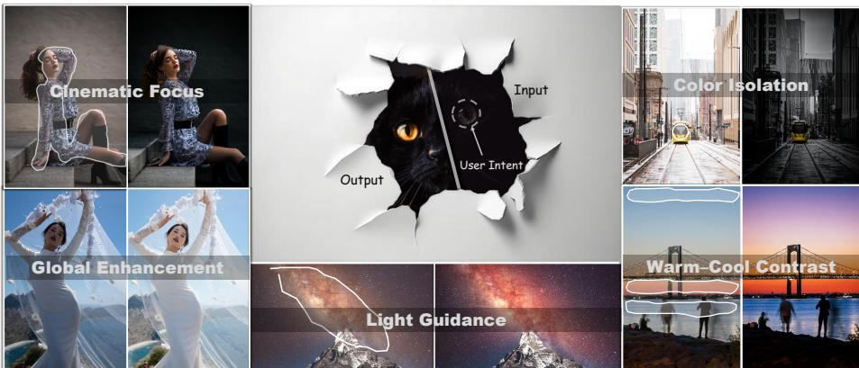  
Fig. 1: EyeControl focuses on highlighting the user-intended visual focus through image retouching. With just a few clicks or casual strokes, EyeControl can deliver professional retouching looks—Cinematic Focus, Color Isolation, Light Guidance,Warm–Cool Contrast, Global Enhancement—and, of course, please dot the eye to make the cat "break through" the background wall and pop forward as the new visual focus.

Abstract. Image retouching is commonly formulated as enhancing overall visual quality through color adjustment, but in practice, it also serves to emphasize visual focus by guiding viewers’ attention toward a specific subject or region. Achieving such focus-oriented retouching is inherently challenging, as it requires well-coordinated global and local adjustments to manipulate perceptual saliency while maintaining visual naturalness.

This intricate process typically demands substantial professional expertise. In this study, we propose EyeControl, a multi-modal large language model (MLLM)-driven agent with a difusion-based retouching executor that enables visual focus enhancement under weak user intent. With only a few clicks or coarse strokes, EyeControl directs visual attention to the intended region, efectively “dotting the eye” of the image. The core idea is to explicitly link the weak user intention with the target editing region and the corresponding tonal adjustment operations during retouching. To achieve this, the system first interprets the intent and image content to infer the visual focus and generate structured intent guidance for the retouching executor. Second, the retouching executor is encouraged to respond more strongly to the target region, explicitly aligning its attention map with a designed pseudo-intent map. We also introduce an operation-consistency constraint to improve coordination between global and local adjustments, achieving more natural and coherent retouching. Additionally, we contribute ControlArt-Bench, a high-quality evaluation dataset for visual focus enhancement. Extensive evaluations demonstrate that EyeControl yields perceptually appealing results with stronger intent alignment. Code will be released at https://github.com/DragonisCV/EyeControl.

Keywords: Image Retouching · Difusion Models · Saliency · Agent

## 1 Introduction

Image retouching has evolved from manual workflows to learning-based methods [11, 17, 26, 36] that enhance perceptual quality through tonal and color adjustments. Recent difusion- and VLM-based models [4,6,7,21] further automate such edits via textual prompts. However, retouching also serves to guide viewers’ attention toward a visual focus—a purposeful enhancement that current models fail to explicitly model, even though they support localized edits.

Building upon this observation, we study intent-driven visual focus retouching under weak spatial cues. Instead of relying solely on text prompts, we adopt sparse spatial interactions, such as clicks or coarse strokes, as intention signals. Text prompts often lack precise spatial grounding for subtle focus manipulation, while real-world editing workflows typically rely on lightweight spatial interactions to indicate regions of interest. Given an input image and a weak intention signal, the goal is to apply tonal and color adjustments that make the intended visual focus easier to notice, while preserving content and perceptual naturalness.

This problem introduces several inherent challenges. First, spatial intention signals are sparse and ambiguous. Spatial interactions such as clicks or coarse strokes provide only partial observations of user intention and do not directly specify the desired editing operations. Inferring the intended visual focus from such sparse signals, therefore, requires reasoning over both user interactions and image context. Second, visual focus lacks explicit control mechanisms in existing retouching models. While existing retouching models can apply local adjustments, they do not provide explicit ways to translate user intention into visual focus enhancement. Third, efective visual focus enhancement requires coordinated global and local adjustments. Enhancing the prominence of a region often requires coordinated adjustments between the focal area and its surrounding regions, rather than isolated local modifications.

To address the above challenges, we propose EyeControl, an intent-driven image retouching agent for visual focus enhancement. To enable controllable visual focus enhancement, we introduce Pseudo-Intention Attention Alignment (PAA), which explicitly supervises the model’s internal attention using pseudointention labels derived from saliency diference maps. This encourages the model to align its attention with intention-driven saliency shifts, allowing focus modulation to be learned during generation rather than relying on indirect color perturbations. Finally, we introduce an operation consistency constraint to improve coordination between global and local adjustments. Specifically, the guidance for visual focus enhancement is decomposed into global and local operations, and enforces consistency between the result of applying them jointly and the results obtained by applying them sequentially (e.g., global-then-local or localthen-global). This encourages the executor to produce more natural and coherent visual focus enhancement.

In summary, our contributions are threefold:

– We present a visual-focus-centric perspective on image retouching, enabling visual focus enhancement through retouching and producing more expressive and visually appealing results beyond existing methods, as shown in Fig. 1

– We propose EyeControl, an intent-driven image retouching framework that integrates intention reasoning, attention-level focus modulation, and crossscale coordination, enabling controllable and stable visual focus enhancement while preserving global coherence and perceptual naturalness.

We introduce ControlArt-Bench, the first image retouching benchmark for visual focus enhancement with paired spatial user-intent annotations and focus-oriented evaluation metrics. Extensive experiments show that our method achieves state-of-the-art performance in visual focus enhancement, while remaining competitive on global and local retouching tasks.

## 2 Related Work

## 2.1 Global Image Retouching

With the release of large-scale retouching datasets [3, 19], deep learning has become a dominant approach for image retouching. Some methods model the retouching process through interpretable adjustment operators, such as tone curves [15, 16, 24, 26], bilateral grid transformations [6, 8, 17], or lookup tables (LUTs) [28,34,36], aiming to mimic traditional editing pipelines. Another line of work learns image-to-image mappings directly using convolutional networks [5], Transformers [29], or difusion models [6]. However, most existing approaches treat retouching as a global enhancement problem. Moreover, widely used paired datasets mainly contain globally adjusted targets without explicit modeling of user intention or region-specific emphasis [3, 19]. As a result, the learned supervision often reflects an averaged color preference rather than an intention-driven objective, causing models to converge toward globally consistent but perceptually generic solutions. In contrast, practical editing is often guided by subjective intention, where adjustments aim to reshape perceptual focus rather than merely improve overall appearance.

## 2.2 VLM-Driven Image Retouching

Recent advances in vision-language models (VLMs) have enabled language-driven image retouching frameworks [4, 20, 21]. By leveraging multimodal understanding, these systems interpret user instructions, analyze image content, and generate editing plans. Some approaches further employ large language models to decompose complex requests into sequential operations or parameter adjustments [7, 32]. However, these methods primarily focus on semantic reasoning and instruction following. The connection between weak spatial intention signals (e.g., clicks or coarse masks) and controlled perceptual saliency redistribution remains indirect, as spatial cues are typically translated into textual instructions or heuristic editing steps. In contrast, our approach incorporates intention signals directly into the attention mechanism of a difusion backbone, enabling structured mask–image interaction and explicit supervision of saliency change.

## 2.3 Saliency Retargeting

Saliency retargeting [1, 23, 30] studies how image appearance can be modified to redirect visual attention. Early methods rely on computational saliency models and apply handcrafted adjustments—such as color, contrast, or luminance manipulation—to enhance target regions or suppress distractions [1, 10]. These works demonstrate that appearance modulation can alter perceptual ordering. However, existing saliency retargeting techniques are largely rule-based and operate outside modern generative editing frameworks. They typically assume explicit target regions and predefined transformations, and are not designed to handle weak or ambiguous intention signals. Moreover, aesthetic plausibility is rarely considered: aggressive color or contrast manipulation may increase saliency but distort object attributes and reduce perceptual realism. In contrast, we integrate saliency redistribution directly into a difusion-based editing backbone. By modeling mask-guided attention interactions and supervising the induced saliency diference, our approach enables retouching for visual focus enhancement.

## 3 Method

We begin by presenting the overall workflow of EyeControl (Sec. 3.1). We then describe the proposed data generation pipeline, which constructs a high-quality dataset containing diverse samples of weak, spatially specified user intent(Sec. 3.2). Finally, we introduce the core innovations of EyeControl, including VLM-based ambiguous intention understanding and guidance, as well as the training framework for the retouching executor(Sec. 3.3). Together, these components enable intention-driven image retouching that efectively enhances the user-specified visual center under weak or ambiguous inputs.

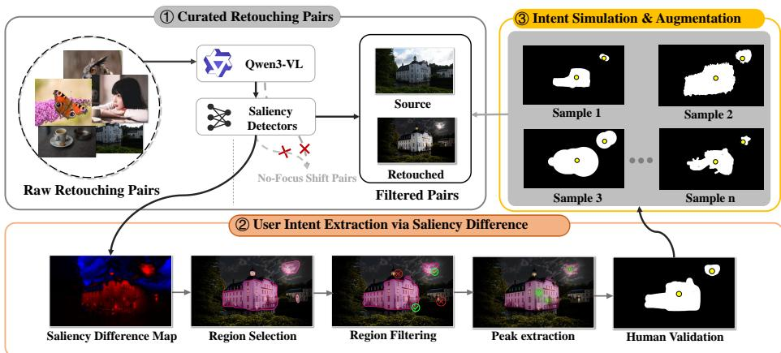  
Fig. 2: Pipeline for generating intent-driven retouching supervision: (1) curating retouching pairs, (2) deriving user intent via saliency diference, and (3) simulating and augmenting intent signals.

## 3.1 Overview

EyeControl is a user-intention-driven image retouching agent that supports not only global enhancement (Global Mode) and local adjustment (Local Mode), but also visual focus enhancement (Focus Mode) based on weak or ambiguous user inputs such as clicks or free-form brush strokes. The overall workflow of EyeControl is illustrated in Fig. 3.

The framework consists of three components: a user interaction interface, a VLM-based Planner A, and a Difusion Transformer-based retouching Executor E. Through the interaction interface, users indicate the desired visual focus using clicks, strokes, or region markings, optionally accompanied by textual guidance t describing their intention. The Planner A integrates and interprets these ambiguous signals, performs intention reasoning, determines the appropriate execution mode, and generates refined textual guidance for downstream processing.

Conditioned on the input image I, the inferred intention mask $M _ { u } ,$ and the generated text guidance G, the Executor performs the retouching operation and produces the updated result $I _ { r } { _ { \mathrm { : } } }$ which can then be fed back into the system for subsequent interaction rounds. Formally, EyeControl implements a function:

$$
\mathcal { F } _ { \theta } ( I , M _ { u } )  I _ { r } .\tag{1}
$$

## 3.2 Data Generation Pipeline

We design a three-stage data generation pipeline to construct training pairs, with a particular focus on extracting user-intended visual focus, as shown in Fig. 2. Further Details of our train set can be found in the supplemental materials.

Stage 1: Retouching Pairs Curation. Following the practice of JarvisArt [20], we curate a large-scale retouching corpus from PPR10K [19], Lightroom Community, and portfolios of professional retouchers. To ensure that the collected edits indeed induce visual focus enhancement, we apply a two-stage filtering procedure. First, Qwen3-VL-32B [33] is used to remove retouching pairs with negligible perceptual diferences or without a distinct visual focus before and after editing. Second, we estimate saliency diference between the pre- and post-retouch images using an ensemble of saliency detectors [9, 22], and discard samples whose saliency change falls below a predefined threshold. This procedure ensures that the retained image pairs present clear visual focus enhancement.

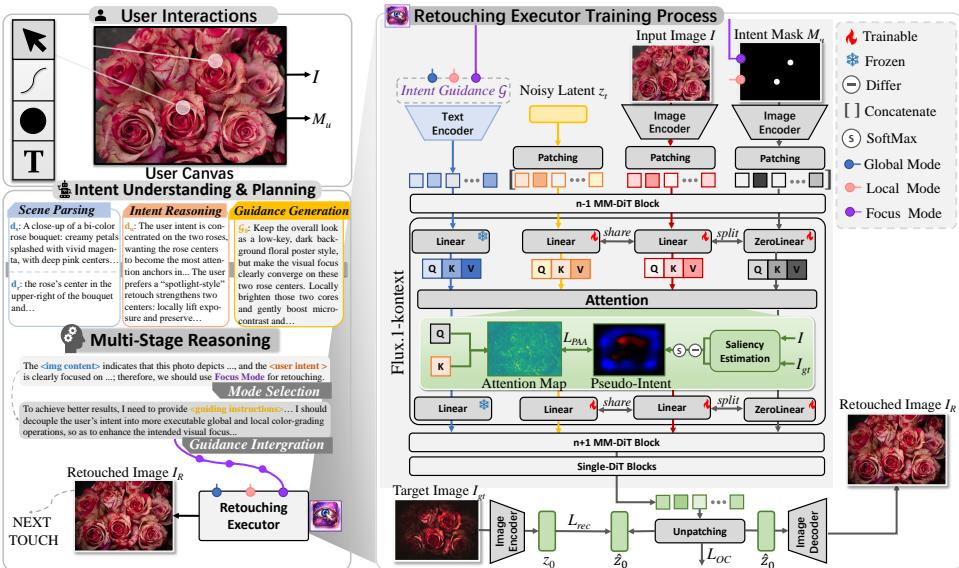  
Fig. 3: The overall workflow of EyeControl. Given an image to be retouched, the system first collects user interactions. The Planner then performs multi-stage reasoning to parse the image, infer user intent, and select an appropriate execution mode, producing decoupled guidance prompts. Subsequently, the Executor carries out the actual image retouching conditioned on the input image, the inferred intention representation, and the generated guidance. The result is then returned to support iterative refinement.

Stage 2: User-Intent Extraction via Saliency Diference. To construct structured supervision for visual focus enhancement, we derive user-intent signals from saliency diference maps computed between reference image pairs. Given a saliency diference map $\bar { D } \in \mathbb { R } ^ { \bar { H } \times W }$ , we extract polarity-specific responses and process them through the following steps. 1) Region Selection: Determine threshold τ such that the selected region covers a predefined proportion ρ of total saliency energy, producing an initial binary mask. 2) Region Filtering: Perform connected-component analysis, remove small regions, and retain dominant components based on accumulated energy and size constraints. 3) Peak Extraction: Extract top-K local maxima within the selected region using non-maximum suppression to obtain sparse intention anchors. 4) Human-in-the-loop validation: select valid intent regions and peaks for training.

Stage 3: Intent Simulation and Augmentation. We further introduce an online intent augmentation strategy to better simulate real-world user interaction patterns. Given the intent representation extracted in the previous stage—including coarse regions and salient peaks, we randomly generate diverse interaction masks to simulate typical user inputs, such as point clicks, free-form strokes, and regionbased painting. While preserving the original intent, this augmentation produces varied interaction patterns and spatial layouts, improving the model’s robustness to diferent user inputs in retouching.

## 3.3 EyeControl Framework

Intent Understanding and Planning User interactions in our setting are sparse, ambiguous, and often expressed in non-professional language. To bridge this gap, we introduce a collaborative multi-VLM agent A, designed as a Multi-Stage Reasoning planner that progressively reconstructs the desired visual focus from incomplete observations, as shown in Fig. 3.

Formally, the Planner is modeled as a structured reasoning operator:

$$
\mathcal { G } = \mathcal { A } ( I _ { r } , M _ { u } ) ,\tag{2}
$$

which internally decomposes intent understanding into scene parsing, intent reasoning, and guidance generation before execution planning.

Intent Understanding The agent first decomposes the scene into complementary semantic channels: a scene-level description $d _ { s } = \phi _ { s } ( I _ { r } )$ capturing global stylistic attributes, and a region-aware description $d _ { r } = \phi _ { r } ( I _ { r } , M _ { u } )$ focusing on the potential focal area. The user intent description $d _ { u }$ is inferred as:

$$
d _ { u } = \phi ( I , d _ { s } , d _ { r } ) ,\tag{3}
$$

Finally, the planner A generates an initial unified guidance $\mathcal { G } _ { 0 }$ based on the scene description $d _ { s }$ and the inferred user intention $d _ { u }$ :

$$
\mathcal { G } _ { 0 } = \psi ( d _ { s } , d _ { u } ) ,\tag{4}
$$

where ψ(·) denotes the guidance generation function.

Planning After completing intention understanding, the Planner determines the appropriate adjustment mode based on its joint interpretation of the inferred $\ddot { d } _ { u }$ and $d _ { s }$ . Specifically, it selects among Global Mode for overall tonal and color adjustments, Local Mode for region-specific refinement, or Focus Mode, often treated as the default setting, which coordinates both global and local adjustments to enhance the intended visual focus.

To implement this decision, the Planner first produces a unified guidance representation $\mathcal { G } _ { 0 }$ that captures scene context and inferred intention. This representation is then decoupled into executor-compatible instructions, consisting of a global edit instruction $\mathcal { G } _ { \mathrm { g l o b a l } }$ and a mask-aware local edit instruction $\mathcal { G } _ { \mathrm { l o c a l } }$

The final executor-compatible instruction is formulated as:

$$
\mathcal { G } = m _ { 1 } \cdot \{ \mathcal { G } _ { \mathrm { g l o b a l } } \} \cup m _ { 2 } \cdot \{ \mathcal { G } _ { \mathrm { l o c a l } } \} ,\tag{5}
$$

where $\mathbf { m } = ( m _ { 1 } , m _ { 2 } ) \in \{ ( 1 , 0 ) , ( 0 , 1 ) , ( 1 , 1 ) \}$ is a binary mode indicator controlling the activation of global and local instructions. Specifically,

$$
\begin{array} { r } { \mathbf { m } = \left\{ \begin{array} { l l } { ( 1 , 0 ) , } & { \mathrm { G l o b a l ~ M o d e } , } \\ { ( 0 , 1 ) , } & { \mathrm { L o c a l ~ M o d e } , } \\ { ( 1 , 1 ) , } & { \mathrm { F o c u s ~ M o d e } . } \end{array} \right. } \end{array}\tag{6}
$$

Under Focus Mode, both global and local instructions are activated to collaboratively enhance the intended visual focus. The assembled instruction $\mathcal { G }$ is then fed into the difusion executor together with the input image I and the intent mask $M _ { u }$ . In Global Mode, the mask is replaced by an all-zero mask, so that the retouching is driven purely by global guidance.

Retouching Executor Next, we describe the architecture and training process of the retouching executor.

Architecture The overall architecture is built upon Flux.1-Kontext [14] and augmented with intention-aware conditioning. Given an input image I, a userprovided intent mask $M _ { u } .$ , and structured intent guidance text ${ \mathcal { G } } ,$ , the image is first encoded into a latent representation via a VAE encoder. During training, the latent is perturbed according to the difusion process to obtain a noisy latent $z _ { t } . \ I , \ M _ { u } , \ z _ { t } ,$ and $\mathcal { G }$ are patchified into token sequences and jointly processed by stacked MM-DiT blocks. Within each block, latent tokens interact with image-condition, mask, and text tokens through multi-modal attention. To mitigate feature interference across modalities, the mask branch is equipped with dedicated projection parameters, enabling mask-aware modulation of latent representations. After passing through multiple MM-DiT layers followed by Single-DiT refinement blocks, the network predicts the denoised latent. Training is supervised in latent space using a standard Flow-Matching reconstruction loss:

$$
L _ { r e c } = \| \hat { z } _ { 0 } - z _ { 0 } \| _ { 2 } ^ { 2 } ,\tag{7}
$$

where $\hat { z } _ { 0 }$ is the predicted clean latent and $z _ { 0 }$ denotes the encoded latent of the ground-truth retouched image $I _ { g t }$ . The final retouched output $I _ { r }$ is obtained by decoding the predicted latent through the VAE decoder.

Pseudo-Intent Guided Attention Alignment(PAA) Although mask tokens participate in multi-modal conditioning, standard attention mechanisms do not explicitly regulate how spatial intention influences latent interactions. As a result, mask concatenation alone cannot guarantee that user interaction leads to consistent emphasis on the intended regions during denoising.

In the DiT, attention at timestep t follows the standard formulation:

$$
\mathbf { A } _ { t } = \operatorname { S o f t m a x } \left( \frac { \mathbf { Q } _ { t } \mathbf { K } _ { t } ^ { \top } } { \sqrt { d } } \right) ,\tag{8}
$$

where $\mathbf { Q } _ { t } = W _ { Q } \mathbf { X } _ { t }$ and $\mathbf { K } _ { t } = W _ { K } \mathbf { X } _ { t }$ are the query and key projections of the latent features $\mathbf { X } _ { t } .$ , and d denote the channel dimension.

When mask conditioning is incorporated, mask tokens derived from $M _ { u }$ are appended to the token sequence. Let $\mathbf { \bar { Q } } _ { t } ^ { ( M ) }$ denote queries originating from mask tokens, and ${ \bf K } _ { t } ^ { ( z ) }$ denote keys from noisy latent tokens $z _ { t }$ . The corresponding mask-to-latent attention map is:

$$
\mathbf { A } _ { t } ^ { ( M  z ) } = \mathrm { S o f t m a x } ( \frac { \mathbf { Q } _ { t } ^ { ( M ) } ( \mathbf { K } _ { t } ^ { ( z ) } ) ^ { \top } } { \sqrt { d } } ) .\tag{9}
$$

This sub-attention determines which spatial regions in the latent representation are influenced by the mask guidance. Supervising ${ \bf A } _ { t } ^ { ( M \to z ) }$ therefore directly constrains the efective region of mask-guided modulation.

We construct a pseudo-intent map A˜ from saliency diference between preand post-adjustment signals. Unlike a binary mask, A˜ encodes signed prominence variations, indicating both regions to be enhanced and regions to be suppressed.

Let $S ( \cdot ) : \mathbb { R } ^ { H \times W \times 3 } \to [ - 1 , 1 ] ^ { H \times W }$ denote a saliency estimation function that produces a normalized saliency map. The pseudo-intent map is defined as:

$$
\tilde { A } = S o f t M a x ( S ( I _ { g t } ) - S ( I ) ) ,\tag{10}
$$

where I and $I _ { g t }$ denote the input image and the ground-truth retouched image, respectively. Unlike a binary mask, $\tilde { A }$ encodes signed prominence variations, indicating both regions to be enhanced and regions to be suppressed. We align the normalized mask-to-latent attention with the pseudo-intent map:

$$
\mathcal { L } _ { \mathrm { P A A } } = \mathbb { E } _ { t } [ \frac { 1 } { L } \sum _ { \ell = 1 } ^ { L } \| \mathrm { N o r m } \big ( \mathbf { A } _ { t } ^ { ( M  z ) , \ell } \big ) - \mathrm { N o r m } ( \tilde { A } ) \| _ { 2 } ^ { 2 } ] ,\tag{11}
$$

where t denotes the difusion timestep, L is the number of attention layers, and ${ \bf A } _ { t } ^ { ( M  z ) , \ell }$ represents the mask-to-latent attention map at layer ℓ and timestep t. Norm(·) denotes spatial normalization applied to both maps to ensure comparable scales. Through this alignment, the model learns to associate spatial masks with consistent attention allocation, enabling intent-aware retouching.

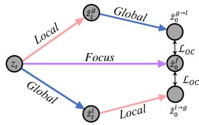

Operation-Consistensy Loss Global and local retouching operations form compositional transformations within a unified editing space. In particular, samples annotated under the focus mode simultaneously contain global and local editing instructions. This allows us to decompose a focus sample into two independent conditioning signals corresponding to the Global and Local modes.

Fig. 4: Illustration of Operation Consistency Loss.

Ideally, applying these operations sequentially should yield results consistent with applying them jointly under the focus condition. However, difusion models trained under mixed modes often exhibit order-sensitive behavior: dominant global adjustments may suppress local guidance, while local edits may disrupt overall visual coherence.

To address this issue, we introduce an operation-consistency objective using focus mode samples as supervision. For each focus sample, we construct one joint denoising path and two sequential paths with randomly sampled execution orders (Fig. 4).

For the focus path, the model performs a standard forward pass under the focus mode, producing the latent prediction $\hat { z } _ { t } ^ { f }$ at timestep t, which serves as the anchor target.

Global-to-Local Path. We first denoise under the global-only condition to obtain $\hat { z } _ { 0 } ^ { g }$ , then inject noise:

$$
\tilde { z } _ { t } ^ { g } = ( 1 - \sigma _ { t } ) \hat { z } _ { 0 } ^ { g } + \sigma _ { t } \epsilon ,\tag{12}
$$

where ϵ is Gaussian noise and $\sigma _ { t }$ controls the noise injection strength. The renoised latent $\tilde { z } _ { t } ^ { g }$ is refined under the local condition, producing $\hat { z } _ { 0 } ^ { g  \tilde { l } }$

Local-to-Global Path. Similarly, swapping the execution order yields $\hat { z } _ { 0 } ^ { l  g }$

Finally, we enforce operation-consistency by aligning the sequential prediction with the Focus anchor:

$$
\mathcal { L } _ { \mathrm { O C } } = \lambda \big | \big | ( \hat { z } _ { 0 } ^ { o } ) - \mathrm { s t o p g r a d } ( \hat { z } _ { 0 } ^ { f } ) \big | \big | _ { 2 } ^ { 2 } ,\tag{13}
$$

where $o \in \{ g \to l , ~ l \to g \}$ denotes the execution order sampled during training. In summary, the overall training objective is:

$$
\begin{array} { r } { \mathcal { L } = \mathcal { L } _ { r e c } + \lambda _ { 1 } \mathcal { L } _ { P A A } + \lambda _ { 2 } \mathcal { L } _ { O C } . } \end{array}\tag{14}
$$

## 4 Experiments

## 4.1 Implementation details

Training setting We utilize Flux-1.0-Kontext [14] as the base model. For finetuning, we apply LoRA (rank r = 128) and optimize the network using a learning rate of $2 \times 1 0 ^ { - 5 }$ . The training is conducted across 4×H20 for 10,000 steps with a batch size of 1 per GPU.

ControlArt-Bench To the best of our knowledge, there is currently no publicly available retouching benchmark designed to evaluate image editing quality under ambiguous user intentions, particularly for the assessment of visual focus enhancement. Therefore, we introduce ControlArt-Bench, a high-quality evaluation dataset specifically constructed for focus enhancement. ControlArt-Bench contains 200 groups of real-user retouching samples, each consisting of an IntentMask–Image pair. The dataset spans diverse categories, including portraits, natural landscapes, architecture, food, and animals. To further improve its usability and reproducibility, we additionally provide, for each sample, an editing instruction aligned with the corresponding retouching intention.

Input Intent Mask JarvisEvo Step1X-Edit GPT-Image-1.5 Nano-Banana 2 Ours

Table 1: Quantitative evaluation of retouching performance on ControlArt-Bench. The best and second-best results are highlighted. FA, PQ, and O denote the metrics evaluated by Qwen2.5-VL-72B [2].
<table><tr><td>Method</td><td>PSNR↑</td><td>SSIM↑</td><td>FA↑</td><td>PQ↑</td><td>0↑</td><td>KL↓</td><td>CC↑</td><td>SIM↑</td></tr><tr><td colspan="9">Advanced Retouching Agents</td></tr><tr><td>JarvisArt [20]</td><td>18.8169</td><td>0.7463</td><td>7.8350</td><td>8.7050</td><td>8.2087</td><td>0.2229</td><td>0.9548</td><td>0.8785</td></tr><tr><td>JarvisEvo [21]</td><td>20.9291</td><td>0.8293</td><td>7.9700</td><td>9.2000</td><td>8.4895</td><td>0.2928</td><td>0.9644</td><td>0.8913</td></tr><tr><td>PerTouch [4]</td><td>15.9370</td><td>0.5946</td><td>7.4650</td><td>8.4100</td><td>7.8240</td><td>0.2700</td><td>0.9621</td><td>0.8828</td></tr><tr><td colspan="9">Open-Source Editing Diffusion Models</td></tr><tr><td>UniWorld-v2 [18]</td><td>18.0759</td><td>0.6879</td><td>8.2850</td><td>8.5850</td><td>8.3832</td><td>0.7567</td><td>0.9363</td><td>0.8494</td></tr><tr><td>Step1X-Edit [35]</td><td>18.1433</td><td>0.7533</td><td>8.1950</td><td>8.8350</td><td>8.4632</td><td>0.2508</td><td>0.9564</td><td>0.8789</td></tr><tr><td>FLUX.1-Kontext [14]</td><td>18.0646</td><td>0.7471</td><td>8.2200</td><td>7.2150</td><td>7.4000</td><td>0.8231</td><td>0.9243</td><td>0.8362</td></tr><tr><td>Qwen-Image-Edit-2511 [31]</td><td>18.7092</td><td>0.7029</td><td>8.2550</td><td>8.6200</td><td>8.3530</td><td>0.2610</td><td>0.9577</td><td>0.8783</td></tr><tr><td colspan="9">Commercial Closed-Source Models</td></tr><tr><td>GPT-Image-1.5 [25]</td><td>16.7133</td><td>0.5659</td><td>8.3291</td><td>8.8101</td><td>8.5196</td><td>0.6651</td><td>0.9141</td><td>0.8269</td></tr><tr><td>Nano-Banana-2 [27]</td><td>21.1127</td><td>0.7633</td><td>8.1800</td><td>9.2900</td><td>8.6785</td><td>0.2389</td><td>0.9735</td><td>0.9085</td></tr><tr><td>EyeControl(Ours)</td><td>21.8845</td><td>0.8517</td><td>8.2100</td><td>9.3050</td><td>8.7054</td><td>0.2215</td><td>0.9743</td><td>0.9068</td></tr></table>

  
Fig. 5: Qualitative comparisons with other methods on ControlArt-Bench.

Metrics We report eight metrics: PSNR, SSIM, FA, PQ, O, KL, CC, and SIM. PSNR and SSIM measure the overall fidelity and structural similarity to the reference image. We introduce Focus Alignment (FA) to evaluate how well the visual focus in the retouched image aligns with the regions specified by the user intent (0–10 scale). PQ measures contextual coherence and artifacts (0–10 scale) [12]. The overall score $\mathrm { O } = { \sqrt { \mathrm { F A } \times \mathrm { P Q } } }$ . Furthermore, KL, CC, and SIM quantify visual-focus (saliency) discrepancies between the retouched and reference images [13]. See the supplementary material for details.

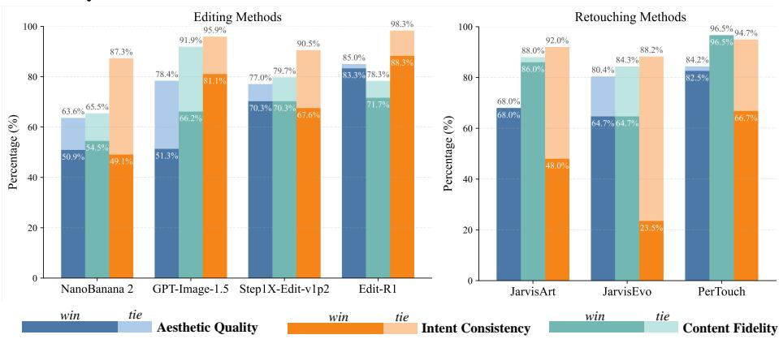  
Fig. 6: User Preference Study. Comparison across three criteria: aesthetic quality, intent consistency, and content fidelity. We report the percentages of win and tie outcomes of EyeControl against each competing method. Results are shown separately for image editing models (left) and agent-based retouching models (right).

## 4.2 Compared with other Methods

We compare EyeControl with open-source agent-based retouching models (Jarvis-Art [20], JarvisEvo [21], PerTouch [4]), generative editing models (UniWorldv2 [18], Step1X-Edit [35]1, FLUX.1-Kontext [14], Qwen-Image-Edit-2511 [31]), and commercial systems (GPT-Image-1.5 [25]2, Nano-Banana 2 [27]3). To ensure a fair comparison, we provide detailed long-form editing instructions that are carefully aligned with the underlying user intentions. In addition, based on the Intent Mask, we generate corresponding bounding-box location descriptions to accommodate the input formats required by diferent models. Further implementation details, along with additional qualitative results on global and local image retouching, are provided in the supplementary material.

Comparison on ControlArt-Bench As shown in Tab. 1, EyeControl outperforms existing image retouching models, open-source difusion-based editing models, and GPT-Image-1.5 on the majority of evaluation metrics. Moreover, our approach achieves performance comparable to NanoBanana 2, demonstrating its strong competitiveness against advanced commercial systems. We observe in-Fig. 5 that some editing models score well on the Focus Alignment metric mainly because they introduce large structural changes, rather than focus guidance via subtle retouching. In contrast, our method demonstrates clear advantages in visual focus enhancement. It combines the high content fidelity typically observed in retouching models with the broad editing flexibility characteristic of difusionbased editing approaches. More importantly, EyeControl substantially surpasses competing methods in intention alignment, achieving significantly stronger consistency with the specified user intent.

Table 2: Quantitative Ablation of EyeControl.
<table><tr><td rowspan="2">Variants</td><td rowspan="2">Methods</td><td colspan="3">Focus</td><td colspan="2">Global</td><td colspan="2">Local</td><td colspan="2">Multi-Round</td><td colspan="2">Average</td></tr><tr><td>|PSNR SSIM</td><td>0</td><td>KL</td><td>|PSNR</td><td>SSIM|PSNR</td><td></td><td></td><td>SSIM |PSNR</td><td></td><td>SSIM |PSNR SSIM</td><td></td></tr><tr><td>AB</td><td>baseline</td><td>21.62</td><td>0.8502</td><td>8.64 0.2006</td><td>18.54</td><td>0.7655</td><td>27.63</td><td>0.9428</td><td>19.03</td><td>0.8165</td><td>21.70</td><td>0.8438</td></tr><tr><td></td><td>A+Planner</td><td>21.71</td><td>0.8565</td><td>8.64 0.2199</td><td>18.07</td><td>0.7596</td><td>27.75</td><td>0.9433</td><td>19.48</td><td>0.8254</td><td>21.76</td><td>0.8462</td></tr><tr><td>C</td><td>B+PAA</td><td>21.92</td><td>0.8616 8.66</td><td>0.1655</td><td>17.75</td><td>0.7657</td><td>28.55</td><td>0.9569</td><td>20.33</td><td>0.8340</td><td>22.14</td><td>0.8546</td></tr><tr><td>D</td><td>C+OCLoss</td><td>21.88 0.8517</td><td></td><td>8.71 0.2215</td><td>23.34</td><td>0.800</td><td>28.37</td><td>0.9408</td><td>20.81</td><td>0.8353</td><td>24.17</td><td>0.8587</td></tr></table>

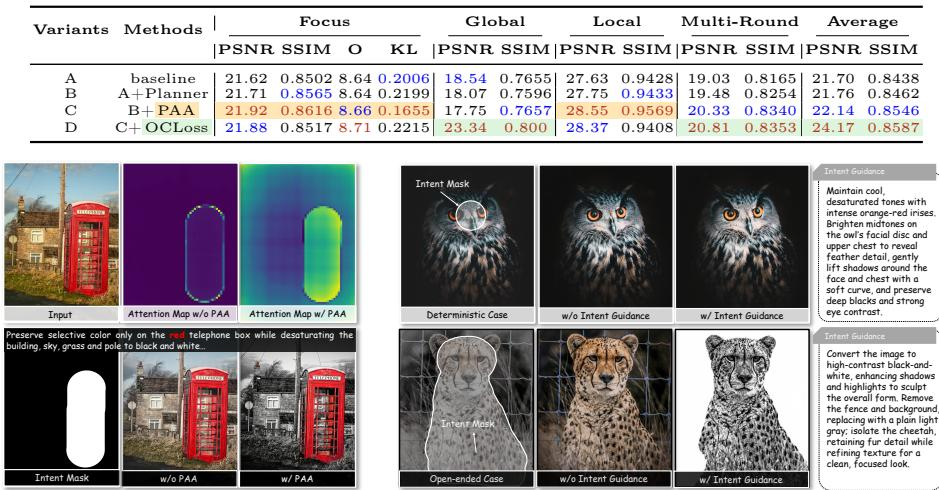  
Fig. 7: Efect of Pseudo-Intent Guided Attention Alignment.  
Fig. 8: Efect of intent guidance under diferent levels of user specificity.

User Preference Study Evaluating intent-driven image retouching is subjective, as aesthetic preference varies across individuals. To quantitatively assess this subjectivity, we conduct a large-scale user study on ControlArt-Bench. We recruit 50 participants to compare our method against seven state-of-the-art approaches, including four image editing methods and three image retouching methods.

The evaluation is conducted from three perspectives: (1) Aesthetic Quality, measuring whether the image is visually pleasing; (2) Intention Alignment, assessing whether the highlighted region aligns with the user’s intended focus; and (3) Image Fidelity, evaluating whether the edited result preserves the original content structure.

For each comparison, we randomly select one competing method and perform a blind pairwise comparison against our approach. Participants are asked to choose the better result under each metric (or indicate a tie). As shown in Fig. 6, EyeControl consistently outperforms all competing approaches across all three evaluation criteria.

## 4.3 Ablation Study and Discussion

We quantitatively ablate the major components of EyeControl in Tab. 2. The evaluation is conducted on the full test sets without sampling, covering four representative user scenarios: focus enhancement and multi-round retouching on ControlArt-Bench, global enhancement on MIT-FiveK [3], and local enhancement on MMArt-Bench [20]. Starting from a fine-tuned Flux.1-Kontext baseline, adding the planner improves the average performance, suggesting that explicit planning helps constrain the retouching direction. Introducing PAA further improves focus and local editing performance, achieving the best Focus

PSNR/SSIM and Local PSNR/SSIM among all variants. This indicates that attention-level supervision is particularly important when the edit needs to redistribute visual prominence within a localized or semantically intended region. Finally, adding operation-consistency loss leads to the best overall average performance across the four scenarios. Although it does not uniformly improve every individual metric, it substantially improves the Global setting, increasing PSNR/SSIM from 17.75/0.7657 to 23.34/0.800, and also yields the best Multiturn performance.

We further analyze the contribution of each component in EyeControl through focused discussions. We focus our discussion on three primary aspects:

Are spatial masks suficient for visual focus enhancement without explicit attention alignment? Fig. 7 suggests that spatial masks alone are insuficient to induce structured focus enhancement. In conventional conditioning designs, mask tokens share QKV projections with image conditions and noisy latent tokens. However, masks encode intention cues rather than visual appearance. When forced to share projections, attention responses remain difuse and concentrate along mask boundaries, indicating that the model treats the mask mainly as a spatial constraint rather than a driver of prominence redistribution. Consequently, the edits rely primarily on photometric adjustments, resulting in weak perceptual separation between focal and non-focal regions.

With dedicated mask projections and pseudo-intention attention alignment, the attention distribution becomes more concentrated within the intended region and less boundary-driven. The outputs show clearer structural separation between the preserved red telephone box and the desaturated background. These observations suggest that architectural decoupling and explicit attention supervision are necessary to transform spatial masks into efective mechanisms for visual focus modulation.

What role does VLM-driven visual guidance play in focus enhancement? Fig. 8 further reveals that the impact of VLM-driven guidance depends on the ambiguity of the editing intention. When the intended adjustment is explicit and the image ofers limited stylistic variation, the diference between using VLM guidance and omitting it is marginal. In such cases, the spatial mask alone provides suficient structural constraint for reasonable focus enhancement.

However, when multiple plausible adjustment directions exist—such as atmospheric tone balancing, selective desaturation, or contrast redistribution—the absence of VLM guidance leads to inconsistent or unstable edits. Without highlevel reasoning, the model may over-enhance local regions or fail to harmonize the global atmosphere with focal emphasis.

These results suggest that VLM-driven guidance mainly acts as a semantic disambiguation mechanism. Rather than amplifying enhancement strength, it constrains the space of plausible editing trajectories, enabling intention-consistent and scene-aware focus modulation in complex retouching scenarios.

How Does Operation-Consistency Loss Afect Retouching? Fig. 9 illustrates the efect of operation-consistency regularization on multi-round retouching. Without OC-loss, the interaction between global and local adjustments becomes path-dependent: diferent execution orders (Global→Local vs. Local→Global) produce noticeably diferent results. In particular, repeated local refinement may override the global atmosphere, while dominant global adjustments can suppress focal emphasis. This suggests that, without structural constraints, heterogeneous editing conditions interfere during difusion.

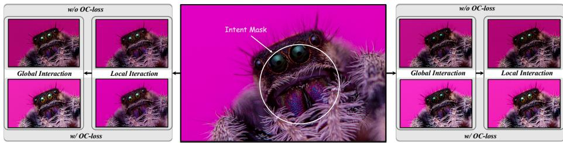  
Fig. 9: Efect of operation-consistency loss (OC-loss) on multi-round retouching.

With OC-loss enabled, editing trajectories across diferent execution orders become more consistent. The focal region maintains stable prominence, and the global color tone remains coherent across rounds. This indicates that operationconsistency regularization enforces path-invariant editing dynamics and stabilizes the interaction between global and local directives. Rather than merely aligning pixel outputs, OC-loss reshapes the difusion process to guide multiscale adjustments toward a coherent retouching trajectory.

## 5 Conclusion

In this work, we revisit image retouching from the perspective of visual focus enhancement, where the goal is not only to improve overall image quality but also to intentionally guide viewers’ attention toward desired regions. To address this problem under weak user intent signals, we propose EyeControl, an intentdriven retouching agent that explicitly links user intention, visual focus, and tonal adjustment operations during the retouching process.

The proposed framework combines intention understanding, attention-level focus modulation, and coordinated global–local adjustments to enable controllable visual focus enhancement while preserving perceptual naturalness. In addition, we introduce ControlArt-Bench, a dedicated benchmark with paired spatial intent annotations and focus-oriented evaluation metrics for systematic assessment of visual focus enhancement.

## 6 Acknowledgement

This work is supported in part by the Tianjin Natural Science Foundation Project (25ZXRGGX00290, 24JCJQJC00020, 25JCQNJC01390), the National Natural Science Foundation of China (62306153, 62225604), the Young Elite Scientists Sponsorship Program by CAST (YESS20240686), Shenzhen Science and Technology Program (JCYJ20240813114237048) and the Fundamental Research Funds for the Central Universities (Nankai University, 63253223, 63253219).

## References

1. Aberman, K., He, J., Gandelsman, Y., Mosseri, I., Jacobs, D.E., Kohlhof, K., Pritch, Y., Rubinstein, M.: Deep saliency prior for reducing visual distraction. In: Proceedings of the IEEE/CVF Conference on Computer Vision and Pattern Recognition. pp. 19851–19860 (2022)

2. Bai, S., Chen, K., Liu, X., Wang, J., Ge, W., Song, S., Dang, K., Wang, P., Wang, S., Tang, J., Zhong, H., Zhu, Y., Yang, M., Li, Z., Wan, J., Wang, P., Ding, W., Fu, Z., Xu, Y., Ye, J., Zhang, X., Xie, T., Cheng, Z., Zhang, H., Yang, Z., Xu, H., Lin, J.: Qwen2.5-vl technical report (2025), https://arxiv.org/abs/2502.13923

3. Bychkovsky, V., Paris, S., Chan, E., Durand, F.: Learning photographic global tonal adjustment with a database of input/output image pairs. In: Proceedings of the IEEE Conference on Computer Vision and Pattern Recognition. pp. 97–104. IEEE (2011)

4. Chang, Z., Duan, Z.P., Zhang, J., et al.: Pertouch: A unified difusion-based image retouching framework with vlm-driven agent. In: The 40th Annual AAAI Conference on Artificial Intelligence (2026)

5. Chen, Y.S., Wang, Y.C., Kao, M.H., Chuang, Y.Y.: Deep photo enhancer: Unpaired learning for image enhancement from photographs with gans. In: Proceedings of the IEEE Conference on Computer Vision and Pattern Recognition. pp. 6306–6314 (2018)

6. Duan, Z.P., Zhang, J., Lin, Z., Jin, X., Wang, X., Zou, D., Guo, C.L., Li, C.: Difretouch: Using difusion to retouch on the shoulder of experts. In: Proceedings of the AAAI Conference on Artificial Intelligence. vol. 39, pp. 2825–2833 (2025)

7. Dutt, N.S., Ceylan, D., Mitra, N.J.: Monetgpt: Solving puzzles enhances mllms’ image retouching skills. ACM Transactions on Graphics (TOG) 44(4), 1–12 (2025)

8. Gharbi, M., Chen, J., Barron, J.T., Hasinof, S.W., Durand, F.: Deep bilateral learning for real-time image enhancement. ACM Transactions on Graphics (TOG) 36(4), 1–12 (2017)

9. Itti, L., Koch, C., Niebur, E.: A model of saliency-based visual attention for rapid scene analysis. IEEE Transactions on Pattern Analysis and Machine Intelligence 20(11), 1254–1259 (1998)

10. Jiang, L., Xu, M., Wang, X., Sigal, L.: Saliency-guided image translation. In: 2021 IEEE/CVF Conference on Computer Vision and Pattern Recognition (CVPR). pp. 16504–16513 (2021)

11. Kim, H.U., Koh, Y.J., Kim, C.S.: Pienet: Personalized image enhancement network. In: European Conference on Computer Vision. pp. 374–390. Springer (2020)

12. Ku, M., Li, T., Zhang, K., Lu, Y., Fu, X., Zhuang, W., Chen, W.: Imagenhub: Standardizing the evaluation of conditional image generation models. In: The Twelfth International Conference on Learning Representations (2024)

13. Kümmerer, M., Wallis, T.S.A., Bethge, M.: Saliency benchmarking made easy: Separating models, maps and metrics. In: European Conference on Computer Vision. pp. 798–814 (2018)

14. Labs, B.F., Batifol, S., Blattmann, A., Boesel, F., Consul, S., Diagne, C., Dockhorn, T., English, J., English, Z., Esser, P., Kulal, S., Lacey, K., Levi, Y., Li, C., Lorenz, D., Müller, J., Podell, D., Rombach, R., Saini, H., Sauer, A., Smith, L.: Flux.1 kontext: Flow matching for in-context image generation and editing in latent space (2025), https://arxiv.org/abs/2506.15742

15. Li, C., Guo, C., Feng, R., Zhou, S., Loy, C.C.: Cudi: Curve distillation for efficient and controllable exposure adjustment (2022), https://arxiv.org/abs/ 2207.14273

16. Li, C., Guo, C., Loy, C.C.: Learning to enhance low-light image via zero-reference deep curve estimation. IEEE transactions on pattern analysis and machine intelligence 44(8), 4225–4238 (2021)

17. Li, J., Fang, P.: Hdrnet: Single-image-based hdr reconstruction using channel attention cnn. In: Proceedings of the 2019 4th International Conference on Multimedia Systems and Signal Processing. pp. 119–124 (2019)

18. Li, Z., Liu, Z., Zhang, Q., Lin, B., Wu, F., Yuan, S., Yan, Z., Ye, Y., Yu, W., Niu, Y., Wang, S., Cheng, X., Yuan, L.: Uniworld-v2: Reinforce image editing with difusion negative-aware finetuning and mllm implicit feedback (2025), https: //arxiv.org/abs/2510.16888

19. Liang, J., Zeng, H., Cui, M., Xie, X., Zhang, L.: Ppr10k: A large-scale portrait photo retouching dataset with human-region mask and group-level consistency. In: Proceedings of the IEEE/CVF Conference on Computer Vision and Pattern Recognition. pp. 653–661 (2021)

20. Lin, Y., Lin, Z., Lin, K., Bai, J., Pan, P., Li, C., Chen, H., Wang, Z., Ding, X., Li, W., YAN, S.: Jarvisart: Liberating human artistic creativity via an intelligent photo retouching agent. In: The Thirty-ninth Annual Conference on Neural Information Processing Systems (2025)

21. Lin, Y., Wang, L., Lin, K., Lin, Z., Gong, K., Li, W., Lin, B., Li, Z., Zhang, S., Peng, Y., Dai, W., Ding, X., Wang, C., Lu, Q.: Jarvisevo: Towards a selfevolving photo editing agent with synergistic editor-evaluator optimization (2025), https://arxiv.org/abs/2511.23002

22. Liu, N., Zhang, N., Wan, K., Shao, L., Han, J.: Visual saliency transformer. In: Proceedings of the IEEE/CVF International Conference on Computer Vision. pp. 4722–4732 (October 2021)

23. Miangoleh, S.M.H., Bylinskii, Z., Kee, E., Shechtman, E., Aksoy, Y.: Realistic saliency guided image enhancement. In: Proceedings of the IEEE/CVF Conference on Computer Vision and Pattern Recognition. pp. 186–194 (2023)

24. Moran, S., McDonagh, S., Slabaugh, G.: Curl: Neural curve layers for global image enhancement. In: 2020 25th International Conference on Pattern Recognition (ICPR). pp. 9796–9803. IEEE (2021)

25. OpenAI: Gpt-image-1.5. https://openai.com/zh-Hans-CN/index/new-chatgptimages-is-here/ (2025), accessed: 2026

26. Song, Y., Qian, H., Du, X.: Starenhancer: Learning real-time and style-aware image enhancement. In: Proceedings of the IEEE/CVF International Conference on Computer Vision. pp. 4126–4135 (2021)

27. Team, G., Anil, R., Borgeaud, S., Alayrac, J.B., Yu, J., Soricut, R., Schalkwyk, J., Dai, A.M., Hauth, A., Millican, K., Silver, D., Johnson, M., et al.: Gemini: A family of highly capable multimodal models (2025), https://arxiv.org/abs/2312.11805

28. Wang, T., Li, Y., Peng, J., Ma, Y., Wang, X., Song, F., Yan, Y.: Real-time image enhancer via learnable spatial-aware 3d lookup tables. In: Proceedings of the IEEE/CVF International Conference on Computer Vision. pp. 2471–2480 (2021)

29. Wen, X., Xie, L., Jiang, L., Chen, T., Wu, S., Liu, C., Wong, H.S.: Retouchformer: Semi-supervised high-quality face retouching transformer with prior-based selective self-attention. In: Proceedings of the AAAI Conference on Artificial Intelligence. vol. 38, pp. 5903–5911 (2024)

30. Wong, L.K., Low, K.L.: Saliency retargeting: An approach to enhance image aesthetics. In: 2011 IEEE Workshop on Applications of Computer Vision (WACV). pp. 73–80. IEEE (2011)

31. Wu, C., Li, J., Zhou, J., Lin, J., Gao, K., Yan, K., ming Yin, S., Bai, S., Xu, X., Chen, Y., Chen, Y., Tang, Z., Zhang, Z., Wang, Z., Yang, A., Yu, B., Cheng, C., Liu, D., Li, D., Zhang, H., Meng, H., Wei, H., Ni, J., Chen, K., Cao, K., Peng, L., Qu, L., Wu, M., Wang, P., Yu, S., Wen, T., Feng, W., Xu, X., Wang, Y., Zhang, Y., Zhu, Y., Wu, Y., Cai, Y., Liu, Z.: Qwen-image technical report (2025), https://arxiv.org/abs/2508.02324

32. Wu, Q., Shi, J., Jenni, S., Kafle, K., Wang, T., Chang, S., Zhao, H.: Retouchiq: Mllm agents for instruction-based image retouching with generalist reward (2026), https://arxiv.org/abs/2602.17558

33. Yang, A., Li, A., Yang, B., Zhang, B., Hui, B., Zheng, B., Yu, B., Gao, C., Huang, C., Lv, C., Zheng, C., Liu, D., Zhou, F., Huang, F., Hu, F., Ge, H., Wei, H., Lin, H., Tang, J., Yang, J., Tu, J., Zhang, J., Yang, J., Yang, J., Zhou, J., Zhou, J., Lin, J., Dang, K., Bao, K., Yang, K., Yu, L., Deng, L., Li, M., Xue, M., Li, M., Zhang, P., Wang, P., Zhu, Q., Men, R., Gao, R., Liu, S., Luo, S., Li, T., Tang, T., Yin, W., Ren, X., Wang, X., Zhang, X., Ren, X., Fan, Y., Su, Y., Zhang, Y., Zhang, Y., Wan, Y., Liu, Y., Wang, Z., Cui, Z., Zhang, Z., Zhou, Z., Qiu, Z.: Qwen3 technical report (2025), https://arxiv.org/abs/2505.09388

34. Yang, C., Jin, M., Jia, X., Xu, Y., Chen, Y.: Adaint: Learning adaptive intervals for 3d lookup tables on real-time image enhancement. In: Proceedings of the IEEE/CVF Conference on Computer Vision and Pattern Recognition. pp. 17522– 17531 (2022)

35. Yin, F., Liu, S., Han, Y., Wang, Z., Xing, P., Wang, R., Cheng, W., Wang, Y., Li, A., Yin, Z., Chen, P., Zhang, X., Jiang, D., Zeng, X., Yu, G.: Reasonedit: Towards reasoning-enhanced image editing models (2025), https://arxiv.org/abs/2511. 22625

36. Zeng, H., Cai, J., Li, L., Cao, Z., Zhang, L.: Learning image-adaptive 3d lookup tables for high performance photo enhancement in real-time. IEEE Transactions on Pattern Analysis and Machine Intelligence 44(4), 2058–2073 (2020)

## Appendices

Our supplemental materials include the following parts:

– Sec. A Training Details

• Sec. A.1 Composition of the Training Set.

• Sec. A.2 Intent Guidance during Training.

• Sec. A.3 Inputs for Retouching Executor.

– Sec. B Details of Metrics

• Sec. B.1 Limitations of Existing Metrics.

• Sec. B.2 Metrics for Visual Focus Enhancement.

• Sec. B.3 Metric Validity.

• Sec. B.4 Prompts for MLLM-Based Metrics.

– Sec. C Additional Experimental Results.

• Sec. C.1 Comparison on Global Image Retouching.

• Sec. C.2 Comparison on Local Image Retouching.

• Sec. C.3 Comparison on Local Image Retouching.

• Sec. C.4 More Visual Comparisons.

• Sec. C.5 Instruction for Compared Methods

– Sec. D Limitations.

## A Training Details

## A.1 Composition of the Training Set

The statistics of our training set (we called ControlArt) are shown in Fig. 10. The dataset consists of three types of samples corresponding to the execution modes in our framework: (1) focus retouching data, (2) global retouching data, and (3) local retouching data, which are used to train the Focus Mode, Global Mode, and Local Mode, respectively.

For category (1), we follow the data generation pipeline described in the main text to collect retouching pairs, extract user intention regions, and construct the final Intent Mask. To strengthen the model’s capability in global adjustments, local refinements, and their coordination, we additionally incorporate samples from global and local retouching datasets.

For global retouching data, we filter samples from PPR10k [19] by removing pairs that introduce noticeable saliency shifts, retaining only those with global adjustments but no explicit visual focus enhancement.

For local retouching data, we select pairs containing only local editing operations (i.e., mask-based adjustments). Based on the corresponding operations, we obtain high-quality Intent Masks through a combination of automatic generation and manual annotation to train the Local Mode.

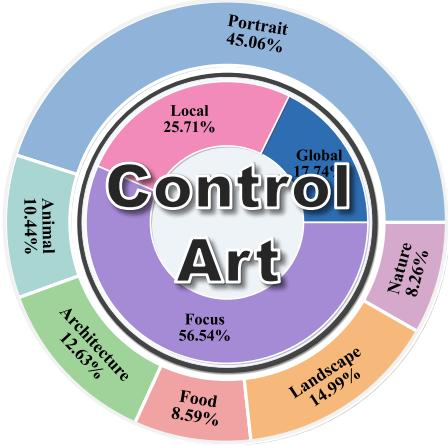  
(a)

  
(b)  
Fig. 10: Overview of ControlArt. (a) Category and editing-mode composition of the dataset: the outer ring shows semantic categories, while the inner ring summarizes edit modes (Global/Local/Focus). (b) Word clouds of instruction keywords for Global, Local, and Focus modes, highlighting mode-specific editing patterns and common retouching operations.

## A.2 Intent Guidance during Training

During training, we use the pre- and post-retouch images I and $I _ { g t }$ to derive intent guidance G for each sample. Specifically, we extract scene-level descriptions from I and $I _ { g t }$ , obtaining $d _ { s }$ and $d _ { s } ^ { g t }$ . By comparing the paired representations $\langle I , d _ { s } \rangle$ and $\langle \bar { I _ { g t } } , d _ { s } ^ { g t } \rangle$ , we infer the user intention $d _ { u }$ . The subsequent steps follow the pipeline described in the main text: the inferred intention is used to generate the initial guidance $\mathcal { G } _ { 0 }$ , which is further formatted into a global edit instruction $\mathcal { G } _ { \mathrm { g l o b a l } }$ and a local edit instruction $\mathcal { G } _ { \mathrm { l o c a l } }$

For training samples corresponding to diferent modes, the intent guidance is explicitly organized according to the target mode to form the actual model input. The detailed training input formats for diferent modes are provided in Sec. A.3.

## A.3 Inputs for Retouching Executor

As described in the main text, diferent modes use diferent input formats. Here, we provide a more detailed description of how the inputs to the retouching executor are organized during training for diferent types of samples:

– Global Mode. We use global retouching data to train. The input of the retouching executor is $\langle I , \mathcal { G } _ { g l o b a l } , M _ { 0 } \rangle$ where $M _ { 0 }$ is an all-zero mask so that the retouching is driven purely by $\mathcal { G } _ { g l o b a l }$   
– Local Mode. We use local retouching data to train. $\langle I , \mathcal { G } _ { l o c a l } , M _ { u } \rangle$ is the input.

– Focus Mode. We use visual focus enhancement retouching data to train. $\langle I , \mathcal { G } _ { g l o b a l } + \mathcal { G } _ { l o c a l } , M _ { u } \rangle$ is the input.

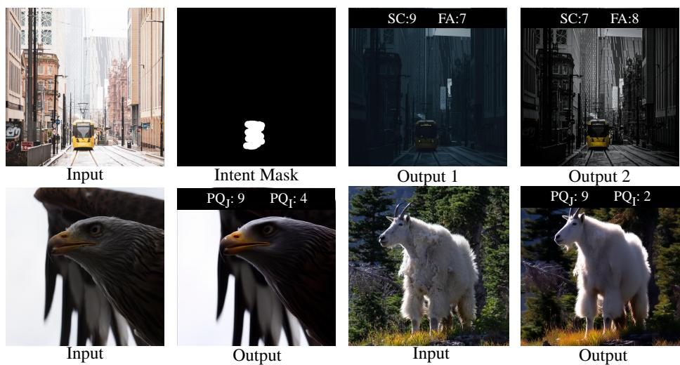  
Fig. 11: Top: Compared with SC, FA better reflects whether the visual focus aligns with the user intent. Bottom: $\mathrm { P Q } _ { \mathrm { I } } ,$ which evaluates perceptual quality independently, provides a more reliable measure of content consistency and artifacts than $\mathrm { P Q _ { J } }$ , which predicts perceptual quality jointly with SC.

## B.1 Limitations of Existing Metrics

Fig. 11 exposes two limitations of existing metrics for visual focus enhancement, particularly SC and PQ [12].

First, the commonly used SC metric does not explicitly measure whether the retouched image shifts visual attention toward the user-specified intent region. A higher SC score does not necessarily imply better alignment between the retouched result and the intended focus.

Second, existing VLM-based perceptual-quality evaluation can be afected by the way the metric is predicted. In our analysis, we distinguish two variants of Perceptual Quality $( \mathrm { P Q } ) \colon \mathrm { P Q } _ { \mathrm { J } }$ and $\mathrm { P Q } _ { \mathrm { I } } .$ . Here, $\mathrm { P Q _ { J } }$ denotes jointly predicted perceptual quality, where the VLM evaluates PQ together with SC in a single judgement ( [12] evaluates as this way). Although this setting is convenient, the PQ score may be influenced by other evaluation dimensions. In contrast, $\mathrm { P Q } _ { \mathrm { I } }$ denotes independently predicted perceptual quality, where the VLM is asked to evaluate only content preservation and visual artifacts, without jointly considering other metrics. This independent formulation reduces cross-metric interference and provides a cleaner estimate of content fidelity. As shown in the bottom row of Fig. 11, $\mathrm { P Q } _ { \mathrm { I } }$ better reflects content consistency and visual artifacts than $\mathrm { P Q _ { J } }$

## B.2 Metrics for Visual Focus Enhancement

To address the above limitation, we introduce Focus Alignment (FA), a metric designed to evaluate whether the visual focus of the retouched image is consistent with the user-intended focus region. FA directly measures the alignment between the retouched visual focus and the target region specified by the user, and is scored on a 0–10 scale. The evaluation considers: (1) the primary visual landing point of the viewer; (2) the clarity of the overall visual hierarchy; (3) the enhancement of the target region through contrast or saliency; (4) the use of attention-guidance mechanisms such as lighting, tonal shaping, or vignetting; and (5) the stability of the target region as the dominant perceptual anchor. In this way, FA complements existing metrics by capturing a core property of visual focus enhancement that SC does not directly reflect. In addition, we compute PQ independently rather than jointly with other metrics, as this provides a more reliable assessment of content consistency and artifact severity.

Table 3: Human-VLM preference correlation validation on metric validity (left) and quantitative ablation on intent coarseness level (right).
<table><tr><td>Metrics Correlation</td><td colspan="3">|IC-SC IC-FA|CF-PQJ CF-PQ1</td></tr><tr><td>Spearman  $\rho$ </td><td>0.260 0.370</td><td>0.331</td><td>0.390</td></tr><tr><td>Kendall τ</td><td>0.2360.348</td><td>0.301</td><td>0.357</td></tr><tr><td>Human tie rate</td><td>10.6% 10.6%</td><td>36.6%</td><td>36.6%</td></tr><tr><td>VLM tie rate</td><td>40.4% 74.5%</td><td>41.3%</td><td>56.1%</td></tr><tr><td>Winner judgement acc.|67.9% 87.6%</td><td></td><td>74.6%</td><td>83.42%</td></tr></table>

<table><tr><td>Mask Type|PSNR SSIM</td><td>O KL</td></tr><tr><td>Mixed</td><td>21.880.85178.71 0.2215</td></tr><tr><td>Click</td><td>21.950.85638.650.2005</td></tr><tr><td>Strike</td><td>22.080.85668.66 0.2144</td></tr><tr><td>Region</td><td>21.840.85158.66 0.2280</td></tr><tr><td>SAM</td><td>21.660.84328.62 0.2407</td></tr></table>

To ensure reproducibility, we use Qwen2.5-VL-72B [2] as the evaluator throughout all experiments. Although we observe that MLLM-based evaluation is not always fully accurate, it still provides a relatively consistent and reproducible protocol for large-scale assessment. We hope future evaluation methods can better align with human perception and user intent.

## B.3 Metric Validity

To further validate whether FA and $\mathrm { P Q } _ { \mathrm { I } }$ better agree with human judgement, we compare VLM-based metrics with human preferences on 2,000 user-study pairs. We evaluate two human-annotated dimensions: Intent Consistency (IC), which measures whether the retouched result follows the user intent, and Content Fidelity (CF), which measures whether the result preserves image content and avoids artifacts. For IC, we compare SC and FA. For CF, we compare $\mathrm { P Q _ { J } }$ and $\mathrm { P Q } _ { \mathrm { I } }$

As shown in Tab. 3 left, FA is more consistent with human-evaluated Intent Consistency than SC. It improves Spearman correlation from 0.260 to 0.370, Kendall correlation from 0.236 to 0.348, and winner judgement accuracy from 67.9% to 87.6%. These results support our claim that FA better measures whether the retouched visual focus follows the user intent.

For Content Fidelity, $\mathrm { P Q } _ { \mathrm { I } }$ also consistently outperforms $\mathrm { P Q } _ { \mathrm { J } } .$ . It improves Spearman correlation from 0.331 to 0.390, Kendall correlation from 0.301 to 0.357, and winner judgement accuracy from 74.6% to 83.42%. This confirms that independently evaluating perceptual quality reduces interference from other judgement dimensions and provides a more reliable measure of content preservation and visual artifacts.

Table 4: Quantitative evaluation of retouching performance on MIT-Adobe FiveK [3] and MMArt-Bench [20]. The best and second-best results are highlighted. PQ denotes the metrics evaluated by Qwen2.5-VL-72B [2].
<table><tr><td rowspan="3">Method</td><td colspan="3">Global</td><td colspan="3">Local</td></tr><tr><td>PSNR↑</td><td>SSIM↑</td><td>PQ↑</td><td> $\mathrm { P S N R } ^ { \mathrm { R C \ , } }$ </td><td> $\mathrm { S S I M ^ { R C } \ . }$  ←</td><td> $\mathrm { P Q ^ { R C } \uparrow }$ </td></tr><tr><td colspan="7">Advanced Retouching Agents</td></tr><tr><td>JarvisArt [20]</td><td>21.1125</td><td>0.8534</td><td>8.9340</td><td>27.8407</td><td>0.9504</td><td>8.6274</td></tr><tr><td>JarvisEvo [21]</td><td>19.2617</td><td>0.8541</td><td>9.3000</td><td>27.3724</td><td>0.9479</td><td>9.0392</td></tr><tr><td>PerTouch [4]</td><td>16.9114</td><td>0.6738</td><td>8.8860</td><td>23.7775</td><td>0.8948</td><td>8.1764</td></tr><tr><td colspan="7">Open-Source Editing Diffusion Models</td></tr><tr><td>UniWorld-v2 [18]</td><td>15.4035</td><td>0.6419</td><td>8.9820</td><td>20.6020</td><td>0.8713</td><td>7.1372</td></tr><tr><td>Step1X-Edit [35]</td><td>20.7495</td><td>0.7441</td><td>9.0560</td><td>23.2946</td><td>0.8907</td><td>7.6470</td></tr><tr><td>FLUX.1-Kontext [14]</td><td>20.1874</td><td>0.7656</td><td>8.9320</td><td>23.4590</td><td>0.9065</td><td>8.5098</td></tr><tr><td>Qwen-Image-Edit-2511 [31]</td><td>11.7672</td><td>0.5414</td><td>6.4900</td><td>25.6140</td><td>0.9169</td><td>8.3529</td></tr><tr><td colspan="7">Commercial Closed-Source Models</td></tr><tr><td>GPT-Image-1.5 [25]</td><td>14.0236</td><td>0.5374</td><td>8.9977</td><td>20.4887</td><td>0.8850</td><td>7.6976</td></tr><tr><td>Nano-Banana-2 [27]</td><td>21.3276</td><td>0.7140</td><td>9.0420</td><td>26.8019</td><td>0.9351</td><td>9.0600</td></tr><tr><td>EyeControl(Ours)</td><td>23.3407</td><td>0.8001</td><td>9.1240</td><td>28.3712</td><td>0.9408</td><td>9.5294</td></tr></table>

We also observe that VLM-based metrics are generally more conservative than human annotators and are more likely to predict ties. For example, the VLM tie rate of IC-FA is 74.5%, while the human tie rate is only 10.6%. This conservativeness explains why the average automatic metric scores in the main paper can appear close, whereas the user study reveals more pronounced pairwise preferences. Therefore, FA, $\mathrm { P Q } _ { \mathrm { I } }$ , and O are meaningful automatic metrics for large-scale evaluation, but they should be viewed as complementary to human studies rather than replacements for them.

## B.4 Prompts for MLLM-Based Metrics

Fig. 20 presents the prompts used to evaluate Focus Alignment (FA) and Perceptual Quality (PQ). In the local retouching setting, we use the foreground mask to isolate the portrait region and evaluate all metrics on the resulting masked portrait image. Accordingly, we denote the perceptual quality metric in this setting as $\mathrm { P Q ^ { \mathrm { R C } } }$ . The instance-level overall score is computed as the geometric mean of FA and PQ, i.e., $O = \sqrt { \mathrm { F A } \times \mathrm { P Q } }$

## C Additional Experimental Results

In this section, we provide additional experiments to further evaluate the effectiveness and generalizability of our framework. We perform evaluations on two representative image retouching benchmarks: MIT-Adobe FiveK [3] and

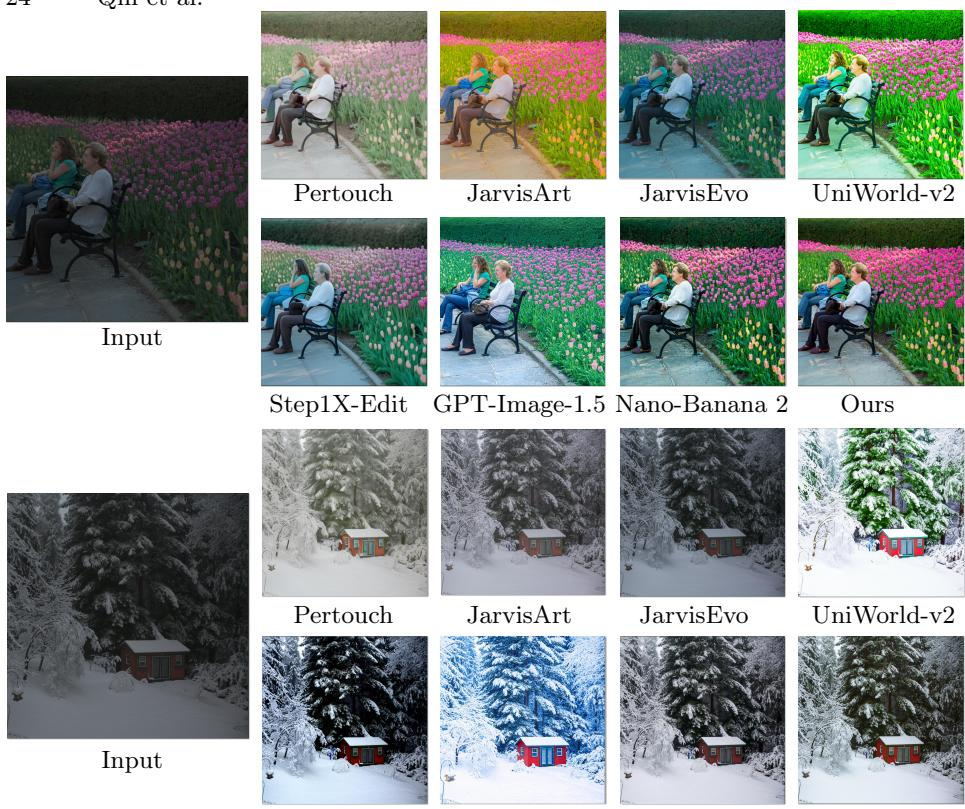  
Step1X-Edit GPT-Image-1.5 Nano-Banana 2 Ours  
Fig. 12: Visual comparison on MIT-Adobe FiveK [3].

MMArt-Bench [20]. These datasets allow us to assess the performance of our method under both global and local retouching settings.

Specifically, we present comparisons on global image retouching in Sec. C.1 and local image retouching in Sec. C.2. Importantly, our model is not trained on the training splits of these benchmarks, yet it still demonstrates strong generalization ability while preserving high content fidelity.

## C.1 Comparison on Global Image Retouching

We first evaluate the performance of our method on global image retouching using the MIT-Adobe FiveK dataset [3]. Tab. 4 reports the quantitative comparison with existing methods. Our method outperforms both open-source and proprietary image editing models, as well as retouching agents that employ diffusion models as retouching executors. Moreover, our model improves PSNR by 10.55% over JarvisArt [20] and 21.18% over JarvisEvo [21], and achieves an additional gain of 0.21 in PQ compared with JarvisArt [20]. These results indicate that our approach produces color adjustments that are closer to the preferences of human experts, while achieving substantially higher image quality compared with most difusion-based image editing models. On SSIM, our method is slightly inferior to tool-calling agents, suggesting that there is still room for improvement in structural fidelity. Visual comparisons are shown in Fig. 12.

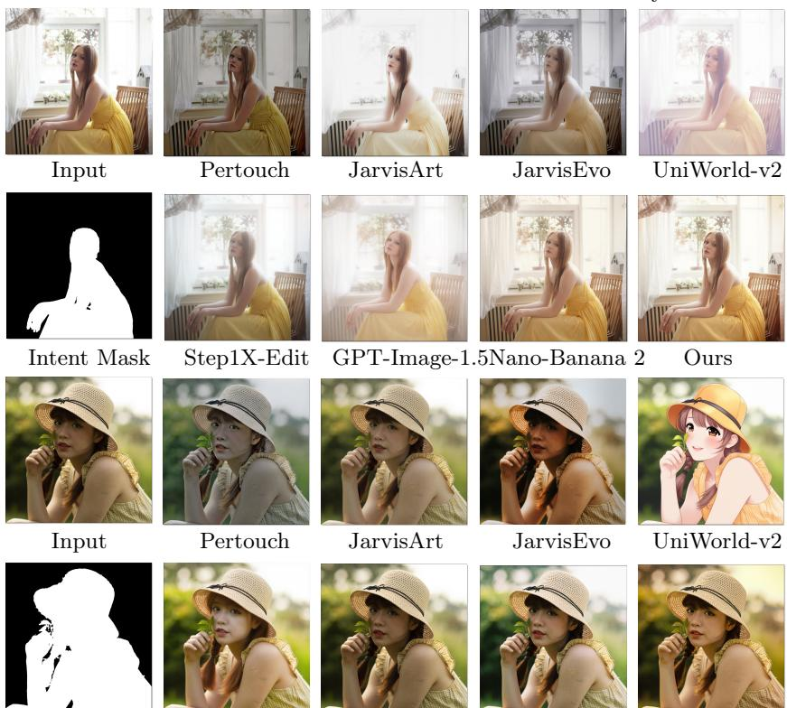  
Intent Mask Step1X-Edit GPT-Image-1.5Nano-Banana 2 Ours Fig. 13: Visual comparison on MMArt-Bench-Local [20].

## C.2 Comparison on Local Image Retouching

We further evaluate our method on local retouching using MMArt-Bench [20]. This dataset contains images with region-specific editing requirements and therefore provides a suitable benchmark for assessing the local editing capability of our framework. Following JarvisArt, we adopt Region-Calculated (RC) metrics to evaluate retouching performance within human-centric mask regions. Specifically, we report $\mathrm { P S N R } ^ { \mathrm { { \tiny { R C } } } }$ and $\mathrm { S S I M } ^ { R C }$ . We do not include $\operatorname { L 1 } ^ { R C }$ and $\mathrm { L 2 } ^ { \mathrm { \Delta \hat { R } C } }$ as JarvisArt [20] since these two metrics are essentially equivalent and less interpretable compared to PSNRRC and SSIMRC.

Tab. 4 and Fig. 13 present the quantitative and qualitative comparisons with other methods. Our method achieves clear improvements on both PSNRRC and $\mathrm { P Q } ^ { R C }$ . For $\mathrm { S S I M } ^ { R C }$ , it also outperforms the majority of competing approaches and achieves comparable performance to JarvisArt and JarvisEvo, which are trained and evaluated on the same data distribution. It is worth noting that,

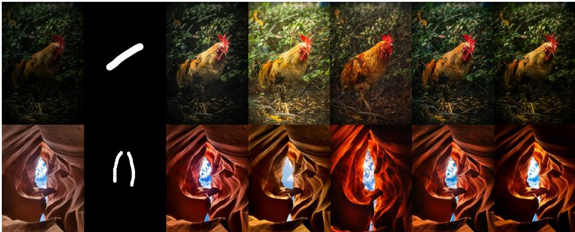  
Input Intent Mask JarvisEvo Step1X-Edit GPT-Image-1.5 Nano-Banana 2 Ours Fig. 14: More visual comparisons of ControlArt-Bench. Zoom in for details.

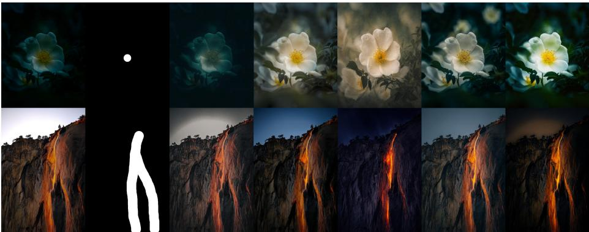  
Input Intent Mask JarvisEvo Step1X-Edit GPT-Image-1.5 Nano-Banana 2 Ours

Fig. 15: More visual comparisons of ControlArt-Bench. Zoom in for details.

as shown in Figure 4, most methods tend to degrade the overall realism of the image when retouching the portrait region in isolation. In contrast, our method preserves the overall visual realism of the image while enhancing the local region.

## C.3 Ablation on Intent Coarseness Level

We further evaluate the robustness of our method to diferent coarseness levels of the input intent mask.

In addition to the released masks, we annotate ControlArt with user-intentconsistent click, strike, and region masks, and compare them with SAM-generated masks that best match the intended regions. These masks represent the same user intent with diferent spatial granularities, ranging from sparse cues to precise semantic regions. Tab. 3 right shows that our method achieves comparable performance across diferent mask types in terms of PSNR, SSIM, O, and KL. This indicates that the model is not sensitive to a particular mask format and can robustly handle intent inputs with diferent coarseness levels. Notably, precise

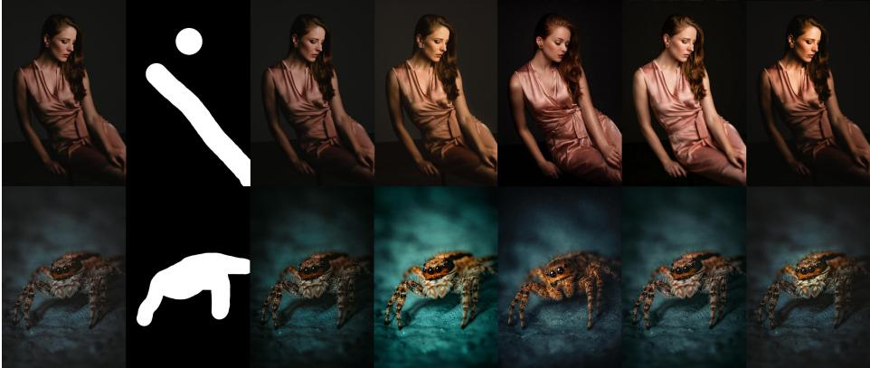  
Input Intent Mask JarvisEvo Step1X-Edit GPT-Image-1.5 Nano-Banana 2 Ours Fig. 16: More visual comparisons of ControlArt-Bench. Zoom in for details.

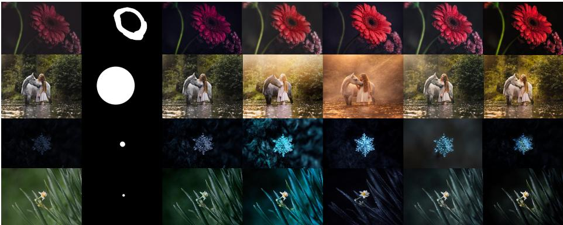  
Input Intent Mask JarvisEvo Step1X-Edit GPT-Image-1.5 Nano-Banana 2 Ours

Fig. 17: More visual comparisons of ControlArt-Bench. Zoom in for details.

semantic masks do not necessarily outperform coarse masks. One possible reason is that visual focus is often governed by saliency boundaries and perceptual attention rather than exact semantic object boundaries.

In addition, coarse-mask training encourages the model to infer the intended focus from flexible user cues, which can generalize well to more precise masks. By contrast, training only with precise masks may make the model less robust to sparse or coarse intent inputs. These results suggest that coarse intent annotations are suficient and efective for training intent-driven visual focus enhancement, while SAM can still serve as a useful tool for eficient mask annotation when precise masks are desired.

## C.4 More Visual Comparisons

Figs. 14 to 18 show additional qualitative comparisons to illustrate the visual efectiveness of our approach. These examples demonstrate how our method enhances the intended visual focus while maintaining overall image naturalness.

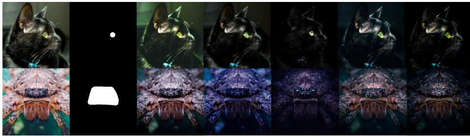  
Input Intent Mask JarvisEvo Step1X-Edit GPT-Image-1.5 Nano-Banana 2 Ours

Fig. 18: More visual comparisons of ControlArt-Bench. Zoom in for details.

## C.5 Instruction for Compared Methods

As described in the main paper, to ensure a fair comparison on ControlArt-Bench, we annotate each test sample with a long-form editing instruction $\mathcal { P } _ { r }$ that aligns with the underlying user intention, together with a mask instruction $\mathcal { P } _ { m }$ describing the spatial location of the intent mask. The final prompt provided to all methods is formulated as $\mathcal { P } = \mathcal { P } _ { r } + \mathcal { P } _ { m }$ . Fig. 21 shows the retouching instructions and mask instructions corresponding to the visual comparison examples presented in the main paper.

## D Limitation

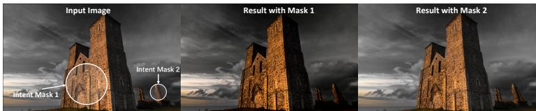  
Fig. 19: Failure case of EyeControl. Zoom in for details.

Although EyeControl can efectively enhance user-specified visual focus in most cases, it still struggles when the requested intent conflicts with the dominant composition of the input image. As shown in Fig. 19, when an image already contains a visually dominant subject, the model may fail to redirect attention to compositionally subordinate regions. This limitation mainly stems from our training data, which are primarily derived from professional retouching examples where retouchers tend to enhance plausible focus regions following natural composition, such as salient subjects or regions supported by lighting and scene layout. As a result, the model learns a strong prior toward natural focus enhancement rather than arbitrary attention redirection.

This limitation suggests an important direction for future work. A more controllable visual focus enhancement model would benefit from training data covering not only naturally preferred focus regions, but also counter-compositional or subordinate-region focus shifts. Extending intent-driven retouching beyond natural composition priors is a promising step toward more flexible and fine-grained visual attention control.

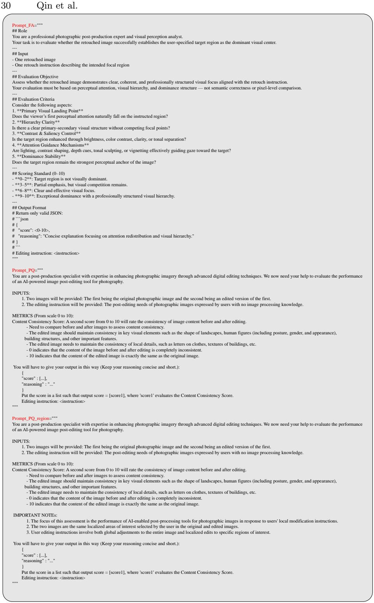  
Fig. 20: Evaluation prompts for MLLM-based metrics, including FA, PQ, and $\mathrm { P Q } ^ { \mathrm { R C } }$

  
Fig. 21: Retouching instructions and mask instructions corresponding to the qualitative examples in the main paper. For each visual comparison case, we report the long-form retouching instruction P that describes the intended edits, together with the mask instruction $\mathcal { P } _ { m }$ specifying the spatial location of the intent mask. These paired instructions are used to form the prompts for the compared methods in our experiments.