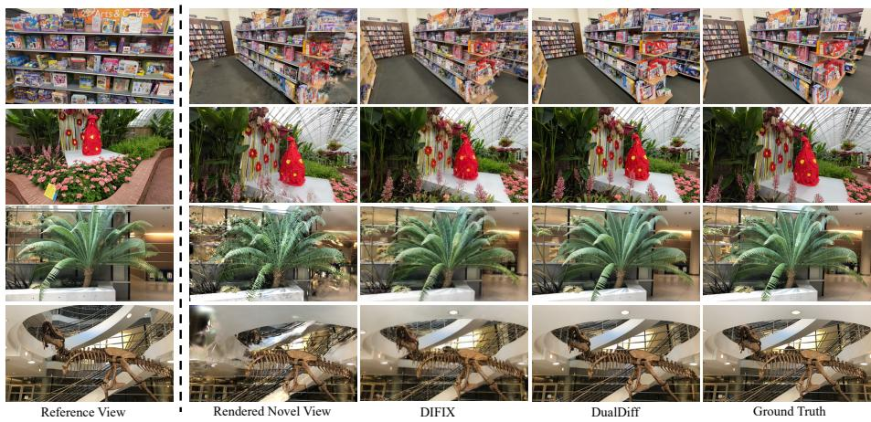
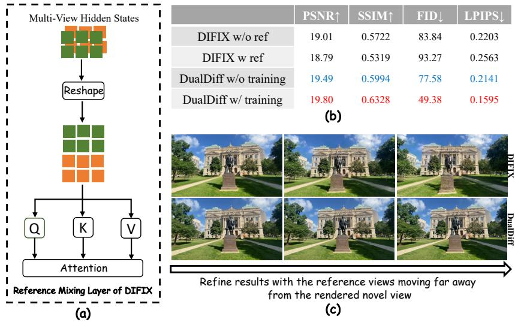
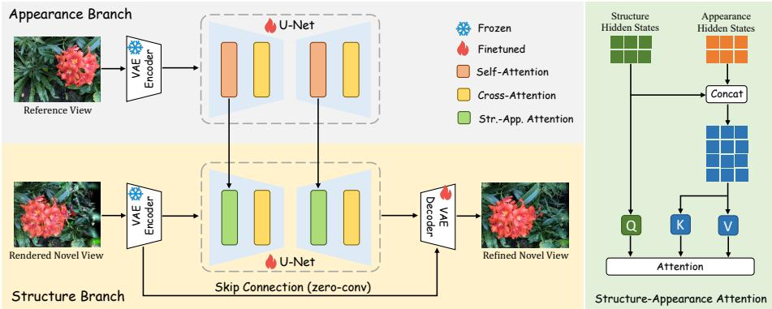
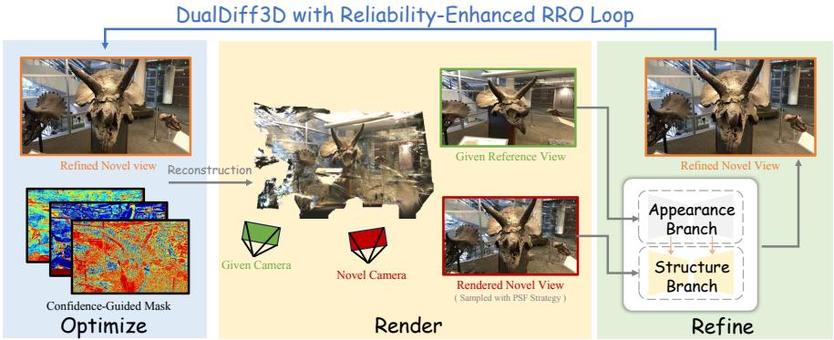
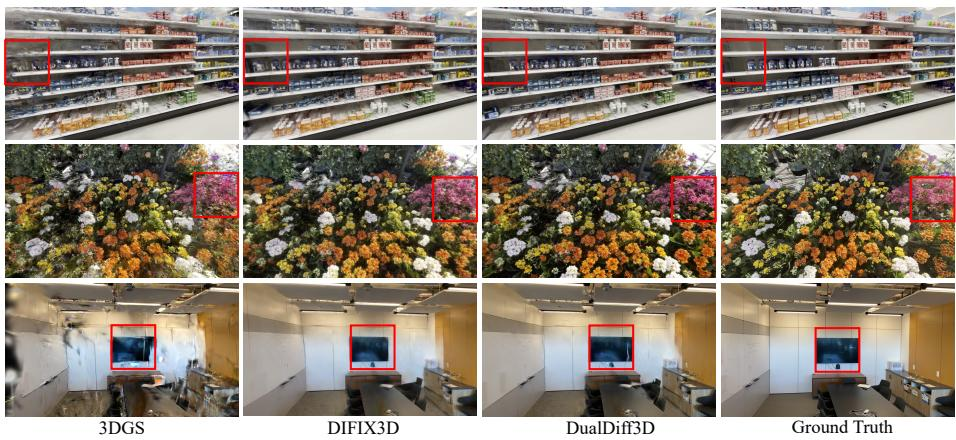
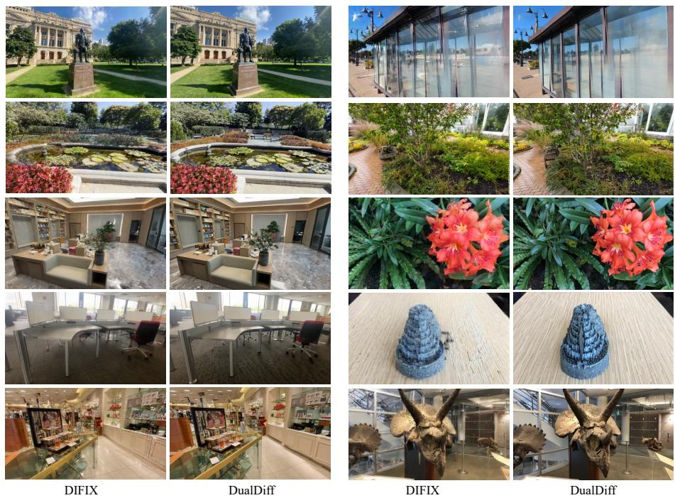
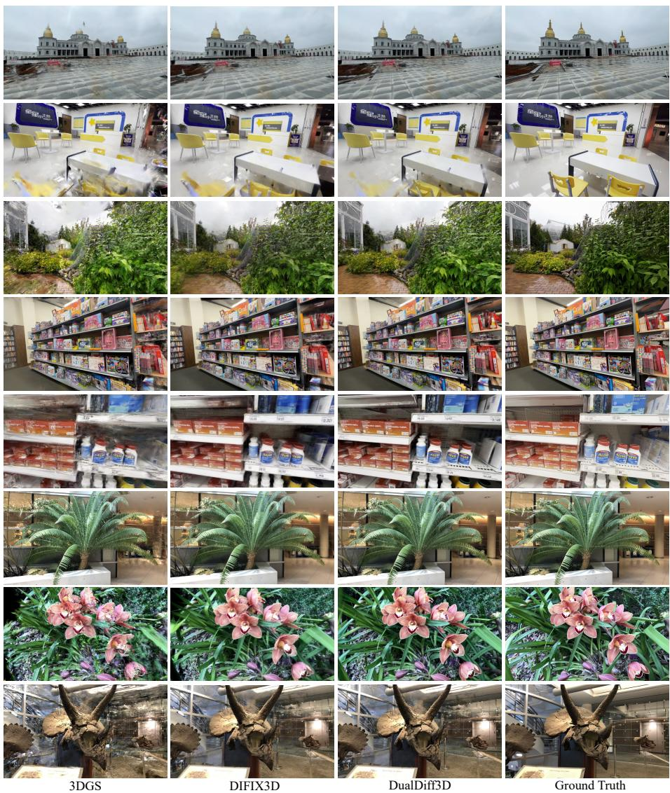

# DualDif3D: Dual Structure-Appearance Difusion Priors for Reliability-Enhanced 3D Gaussian Splatting

Qian Wang1,2,∗, Yu Wang1,∗, Weiqi Li1,2, Xinhua Cheng1, Xiandong Meng2, Ronggang Wang1,2,3, and Jian Zhang1,2,3,B

1 School of Electronic and Computer Engineering, Peking University, Shenzhen, China

2 Pengcheng Laboratory, Shenzhen, China 3 Guangdong Provincial Key Laboratory of Ultra High Definition Immersive Media Technology, Shenzhen, China https://akaneqwq.github.io/dualdiff3d

  
Fig. 1: Comparison of refined results for novel views with artifacts. DualDif maintains structural consistency with the rendered novel view while matching the appearance of the leftmost reference view, achieving better performance.

Abstract. While 3D Gaussian Splatting (3DGS) has revolutionized 3D reconstruction and novel-view synthesis, scenarios with limited input views often lead to poor reconstruction quality and artifacts in rendered novel views. Recent eforts attempt to utilize powerful difusion priors, yet they typically process rendered and reference views concatenated along an additional dimension in a single network. These methods overlook an inherent nature that diferent views should maintain appearance similarity but difer in structure due to view shifts, leading to blur caused by conflicts between the two properties. In this paper,

we propose DualDif, a novel pipeline that leverages dual difusion priors with a Structure-Appearance Attention (SAA) module to introduce reference guidance for refining low-quality novel views rendered from flawed 3D representations. Specifically, we retain one difusion branch to focus on extracting structural information from the low-quality novel views, while introducing another branch to ensure appearance consistency with reference views. Furthermore, we present a 3D reconstruction framework named DualDif3D, which integrates a reliability-enhanced Render-Refine-Optimize (RRO) loop to progressively and robustly incorporate the refined novel views, yielding more accurate 3DGS. Extensive experiments demonstrate that our approach outperforms state-of-theart methods even in the inference-only setting, with further performance gains achievable through training. Our code and pre-trained weights are available at https://github.com/Akaneqwq/DualDiff3D.

## 1 Introduction

3D reconstruction and novel-view synthesis (NVS) [2, 4, 5, 27, 59] are important tasks in computer vision that aim to generate realistic images of a scene from previously unseen viewpoints by giving a limited set of input images, which drives diverse applications such as virtual/augmented reality (VR/AR), autonomous driving, and digital content creation. In recent years, breakthroughs like 3D Gaussian Splatting (3DGS) [16,62] have demonstrated remarkable capability to produce photorealistic renderings. However, methods developed based on 3DGS encounter challenges in scenarios with sparse inputs for synthesizing novel views that are far from the input views, due to insuficient information and constraints provided by sparse viewpoints.

To address the limitations in scenes with sparse views, recent works [24, 45] have explored generative models, particularly difusion models, for enhancing 3D reconstruction and NVS. These methods typically construct an initial lowquality 3D representation from sparse views, render a series of novel views, and then take the original sparse views as references to refine these rendered novel views. The refined novel views are subsequently incorporated into the training set for subsequent 3DGS optimization. Based on the type of difusion prior adopted by the refinement model, these approaches can be categorized into two classes.

One class, exemplified by 3DGS-Enhancer [24], leverages video difusion priors for refinement. They sample sequentially along a trajectory containing both reference views and novel views, then concatenate sampled views along the temporal dimension and feed them into the video difusion model to achieve enhanced results. These works leverage the inherent temporal continuity of video models to introduce cross-view consistency constraints. However, high inference latency and computational cost make them impractical for online 3DGS optimization.

The other class, such as DIFIX3D+ [45], adopts image difusion priors for refinement, which reduces both inference latency and computational overhead. To enable 2D image difusion models to handle the additional view dimension, these methods directly embed the view dimension into the batch dimension. For supporting cross-view reference, they concatenate features from multiple views along the spatial dimension before the self-attention module, and restore the view dimension to the batch dimension after this module, as shown in Fig. 2(a). Although such a method is a straightforward strategy for introducing crossview information interaction into image difusion models, we identify notable drawbacks in this design, i.e., novel views and reference views provide distinct information in 3D reconstruction and NVS tasks. Given a rendered novel view with artifacts, we hope the refined result to maintain consistency with the original novel view in terms of perspective (referred to as structural consistency), while filling the artifact regions with appropriately warped content from corresponding parts of the reference views (referred to as appearance consistency). Thus, we clarify that handling both structural and appearance information using a single network is inappropriate. As illustrated in Fig. 2(b), the evaluation results of DIFIX3D+ verify our argument. Surprisingly, the refinement performance with reference views is inferior to that without references. Furthermore, as the angular distance between reference views and novel views increases, the blurriness caused by conflicts between structural and appearance information in refined results becomes increasingly pronounced.

<table><tr><td rowspan=1 colspan=1></td><td rowspan=1 colspan=1>PSNR↑</td><td rowspan=1 colspan=1>SSIM↑</td><td rowspan=1 colspan=1>FID↓</td><td rowspan=1 colspan=1>LPIPS↓</td></tr><tr><td rowspan=1 colspan=1>DIFIX w/o ref</td><td rowspan=1 colspan=1>19.01</td><td rowspan=1 colspan=1>0.5722</td><td rowspan=1 colspan=1>83.84</td><td rowspan=1 colspan=1>0.2203</td></tr><tr><td rowspan=1 colspan=1>DIFIX w ref</td><td rowspan=1 colspan=1>18.79</td><td rowspan=1 colspan=1>0.5319</td><td rowspan=1 colspan=1>93.27</td><td rowspan=1 colspan=1>0.2563</td></tr><tr><td rowspan=1 colspan=1>DualDiff w/o training</td><td rowspan=1 colspan=1>19.49</td><td rowspan=1 colspan=1>0.5994</td><td rowspan=1 colspan=1>77.58</td><td rowspan=1 colspan=1>0.2141</td></tr><tr><td rowspan=1 colspan=1>DualDiff w/ training</td><td rowspan=1 colspan=1>19.80</td><td rowspan=1 colspan=1>0.6328</td><td rowspan=1 colspan=1>49.38</td><td rowspan=1 colspan=1>0.1595</td></tr></table>

Fig. 2: Motivation of our method. (a) Illustrates the reference fusion adopted by DIFIX. (b) Shows that on the LLFF dataset, DIFIX achieves better performance in reference-free generation than in reference-based generation; in contrast, DualDif yields performance gains merely through structural modification without any additional training. (c) Presents the subjective results of DIFIX and DualDif as the reference view becomes increasingly distant, where DualDif can efectively avoid blurring.

Therefore, we propose DualDif, a novel pipeline that addresses these limitations by leveraging dual difusion priors with a Structure-Appearance Attention (SAA) module to introduce reference guidance as presented in Fig. 3. Specifically, we retain one difusion branch to focus on extracting structural information from the low-quality rendered novel views, and introduce another difusion branch to ensure appearance consistency with reference views. During refinement, we concatenate the hidden states from the self-attention module of the appearance branch to those from structure branch to produce new key and value, transforming the self-attention module of structure branch into SAA module to enable information interaction between dual branches. We also interestingly discover that the proposed DualDif pipeline can be regarded as a “free lunch” for existing reference-based novel view refinement models leveraging difusion priors. When using the DualDif pipeline, even if the weights of the U-Nets in both branches are only initialized with those from DIFIX3D+ without any additional training, it can still yield a 0.7 dB gain in PSNR, as shown in Fig. 2(b). This validates the rationality of our approach, decoupling structural and appearance processing while fusing information via attention mechanisms.

Furthermore, we present a 3D reconstruction framework named DualDif3D, which integrates a reliability-enhanced Render-Refine-Optimize (RRO) loop equipped with a Progressive Sampling and Filtering (PSF) strategy and a Confidence-Driven Weighting (CDW) process. This cyclic process iteratively strengthens the 3D representation by incorporating increasingly high-quality novel view constraints.

Finally, our contributions can be summarized as follows:

– We propose DualDif, a novel two-branch pipeline to refine low-quality rendered novel views, guided by reference views. We are the first to recognize the necessity of decoupling structure and appearance for this task. By fully leveraging dual difusion priors and introducing a Structure-Appearance Attention (SAA) module, our model independently ensures structural consistency and appearance consistency with distinct inputs.

We introduce DualDif3D, a 3D reconstruction framework based on a reliabilityenhanced Render-Refine-Optimize (RRO) loop, integrated with a Progressive Sampling and Filtering (PSF) strategy and a Confidence-Driven Weighting (CDW) process. We efectively address the critical instability issue caused by directly feeding refined outputs from difusion models into 3DGS optimization, achieving a logical and complete closed-loop solution.

– Extensive experiments on benchmark datasets demonstrate that DualDif3D improves the quality of 3D reconstruction and novel view synthesis (NVS) in both objective metrics and subjective quality even in the inference-only scenario, with further performance gains attainable via fine-tuning.

## 2 Related Works

## 2.1 Difusion Models

The Denoising Difusion Probabilistic Model [12, 41] has proven to be highly successful in generating high-quality images, outperforming previous approaches such as generative adversarial networks (GANs) [11,56], variational autoencoders (VAEs) [17,42], and flow-based methods [23]. With text guidance during training, users can generate images based on textual input. Noteworthy examples include GLIDE [31], which utilizes textual prompts as conditions and adopts classifierfree guidance [13]. DALLE-2 [35] leverages the latent space of CLIP [34] as a condition, and Imagen [38] injects features from a large language model into cascaded difusion models. To address the computational burden of the iterative denoising process, LDM [36] conducts the difusion process on a compressed latent space rather than the original pixel space, achieving success in reducing computational requirements. This accomplishment has prompted further exploration in customization [10,37], image guidance [47], precise control [28,58], video generation [21, 44, 49], and image restoration and quality assessment [19, 20].

## 2.2 3D Reconstruction and NVS Methods

3D reconstruction and NVS have evolved around balancing rendering fidelity, eficiency, and scalability. Traditional approaches relied on explicit primitives or early implicit functions [25, 33], which either sufered from high memory costs or failed to jointly model geometry and appearance, limiting realism and scalability. Typical works like KinectFusion [30] realized real-time dense surface mapping but were confined to small-scale scenes. Neural Radiance Fields (NeRF) [2,4–6,9,27,29] revolutionized the field by encoding scene geometry and appearance into a continuous implicit neural network. Despite generating photorealistic novel views, NeRF and its variants faced critical bottlenecks in inference speed and computational eficiency, hindering real-time applications. 3DGS [16] later emerged as a landmark explicit method that combines the advantages of implicit neural modeling and traditional point-based representations. It enables real-time photorealistic rendering but struggles with novel views far from input perspectives under sparse-view conditions. Recent studies have also investigated the security of 3DGS representations [60, 61].

## 2.3 Difusion Priors for NVS

Difusion priors have emerged as a transformative force in novel view synthesis, ofering robust solutions to challenges like sparse input views and geometric inconsistency. A key application lies in enhancing 3D representations with view consistency. 3DGS-Enhancer [24] integrates 2D video difusion priors into 3DGS, reformulating view consistency as temporal coherence in video generation. Similarly, GaussianSR [55] employs 2D difusion priors via score distillation sampling to super-resolve low-resolution inputs, addressing redundancy in 3D Gaussian primitives through timestep range shrinking and primitive pruning. Difusion priors have also been adopted for image-to-3D generation, including [7, 50, 57]. For dynamic scenes, DifusionPriors [43] fine-tunes an RGB-D diffusion model on monocular video frames, distilling knowledge into 4D neural radiance fields to disentangle motion and structure—even with unknown camera poses. [8, 48] similarly leverage video difusion for high-quality 4D content generation. Handling extreme sparsity, DreamSparse [54] combines a geometry module (capturing 3D spatial priors) with a spatial guidance model to convert rendered features, guiding 2D difusion models toward geometrically consistent novel views. DIFIX3D+ [45] trains a single-step difusion model to remove artifacts in rendered novel views caused by suboptimal 3D representation.

## 3 Preliminary

## 3.1 3D Gaussian Splatting

3DGS is an innovative and state-of-the-art approach in the field of 3D reconstruction and NVS. Distinguished from implicit representation methods such as NeRF [27], which utilize volume rendering, 3DGS leverages the splatting technique [52] to generate images, achieving remarkable real-time rendering speed. Specifically, 3DGS represents the scene through a set of anisotropic Gaussians, defined with its center position $\mu \in \mathbb { R } ^ { 3 }$ , covariance $ { \Sigma } \in \mathbb { R } ^ { 3 \times 3 }$ which can be decomposed into scaling factor $\boldsymbol { s } \in \mathbb { R } ^ { 3 }$ and rotation factor $\pmb q \in \mathbb { R } ^ { 4 }$ , color defined by spherical harmonic coeficients $\pmb { h } \in \mathbb { R } ^ { 3 \times ( k + 1 ) ^ { 2 } }$ (where k represents the order of spherical harmonics), and opacity $\boldsymbol { \alpha } \in \mathbb { R } ^ { 1 }$ . Then, the 3D Gaussian can be queried as follows:

$$
{ \mathcal G } ( { \mathbf x } ) = \mathrm { e } ^ { - \frac { 1 } { 2 } ( { \mathbf x } - { \pmb \mu } ) ^ { \top } { \pmb \Sigma } ^ { - 1 } ( { \mathbf x } - { \pmb \mu } ) } ,\tag{1}
$$

where x represents the position of the query point. Subsequently, an eficient 3D to 2D Gaussian mapping [63] is employed to project the Gaussian onto the image plane:

$$
\begin{array} { r } { \hat { \pmb { \mu } } = \mathbf { P } \mathbf { W } \pmb { \mu } , \quad \hat { \Sigma } = \mathbf { J } \mathbf { W } \pmb { \Sigma } \mathbf { W } ^ { \top } \mathbf { J } ^ { \top } , } \end{array}\tag{2}
$$

where $\hat { \pmb { \mu } }$ and $\hat { \Sigma }$ separately represent the 2D mean position and covariance of the projected 3D Gaussian. P, W and J denote the projective transformation, viewing transformation, and Jacobian of the afine approximation of $\mathbf { P }$ , respectively. The color of the pixel on the image plane, denoted by ${ \bf p } = ( u , v )$ , uses a typical neural point-based rendering [18]. Let $\mathbf { C } \in \mathbb { R } ^ { H \times W \times 3 }$ represent the color of the rendered image, where H and W represent the height and width of the image. The rendering process is outlined as follows:

$$
\begin{array} { l } { { \displaystyle { \bf C } [ { \bf p } ] = \sum _ { i = 1 } ^ { N } { \bf c } _ { i } \sigma _ { i } \prod _ { j = 1 } ^ { i - 1 } ( 1 - \sigma _ { j } ) } , \ ~ } \\ { { \displaystyle \sigma _ { i } = \alpha _ { i } \mathrm { e } ^ { - \frac 1 2 ( { \bf p } - \hat { \pmb { \mu } } ) ^ { \top } \hat { \pmb { \Sigma } } ^ { - 1 } ( { \bf p } - \hat { \pmb { \mu } } ) } } , } \end{array}\tag{3}
$$

where $N$ represents the number of Gaussians that overlap the pixel p. $\boldsymbol { c } _ { i } \in \mathbb { R } ^ { 3 }$   
and $\alpha _ { i } \in \mathbb { R } ^ { 1 }$ denote the color calculated from $\boldsymbol { h } _ { i }$ and opacity of the i-th Gaussian.

## 3.2 Difusion Model

Given an input signal $x _ { 0 }$ , a difusion forward process in DDPM [12] is defined as:

$$
q ( x _ { t } | x _ { t - 1 } ) = \mathcal { N } ( x _ { t } ; \sqrt { 1 - \beta _ { t } } x _ { t - 1 } , \beta _ { t } I ) ,\tag{4}
$$

  
Fig. 3: Pipeline of DualDif. DualDif leverages dual difusion branches integrated with a Structure-Appearance Attention (SAA) module to incorporate reference guidance, thereby refining low-quality novel views rendered from defective 3D representations.

for $t = 1 , . . . , T$ , where $T$ is the total timestep of the difusion process. A noise depending on the variance $\beta _ { t }$ is gradually added to $x _ { t - 1 }$ to obtain $x _ { t }$ at the next timestep and finally reach $x _ { T } \sim \mathcal { N } ( 0 , I )$ . The goal of the difusion model is to learn to reverse the difusion process (denoising). Given a random noise $x _ { t }$ , the model predicts the added noise at the next timestep $x _ { t - 1 }$ until the origin signa x0:

$$
p _ { \theta } ( x _ { t - 1 } | x _ { t } ) = \mathcal { N } ( x _ { t - 1 } ; \mu _ { \theta } ( x _ { t } , t ) , \varSigma _ { \theta } ( x _ { t } , t ) ) ,\tag{5}
$$

for $t = T , . . . , 1$ . We fix the variance $\textstyle \sum _ { \theta } ( x _ { t } , t )$ and utilize the difusion model with parameter θ to predict the mean of the inverse process $\mu _ { \theta } ( x _ { t } , t )$ . The model can be simplified as denoising models $\epsilon _ { \theta } ( x _ { t } , t )$ , which are trained to predict the noise of $x _ { t }$ with a noise prediction loss:

$$
\begin{array} { r } { \mathcal { L } = \mathbb { E } _ { x _ { 0 } , y , \epsilon \sim \mathcal { N } ( 0 , I ) , t } [ \| \epsilon - \epsilon _ { \theta } ( x _ { t } , t , \tau _ { \theta } ( y ) ) \| _ { 2 } ^ { 2 } ] , } \end{array}\tag{6}
$$

where ϵ is the added noise to the input image x0, y is the corresponding textual description, $\tau _ { \theta } ( \cdot )$ is a text encoder mapping the string to a sequence of vectors.

## 4 DualDif

## 4.1 Inspiration

The design of DualDif mainly draws inspiration from two sources. First, we are inspired by the latest dual difusion branch design in other image-to-image generation tasks such as virtual try-on and image animation [15]. For example, virtual try-on tasks commonly adopt a dual-branch architecture to separately ensure structural alignment with the model image and appearance alignment with the garment image, and this design logic closely parallels our novel view refinement task. The success in these fields demonstrates the unique advantages of dualbranch architectures in addressing tasks requiring the decoupling of appearance and structural information. Furthermore, it also validates that difusion models trained on large datasets are naturally efective feature extractors, which can be fine-tuned to focus on specific types of image characteristics. Second, we are inspired by analyzing two primary condition injection frameworks in difusion models. Methods like ControlNet [58] and T2I-Adapter [28] use feature addition to merge latent and conditional representations, excelling at pixel-aligned tasks (e.g., skeleton-guided generation) due to element-wise fusion at consistent spatial locations. In contrast, methods like IP-Adapter [51] inject conditional features into attention mechanisms, enabling semantic region focus that suits appearance-aligned tasks (e.g., style transfer). Leveraging this distinction, we adopt attention-based injection for appearance-aligned reference views.

## 4.2 Overview

An overview of the DualDif pipeline is presented in Fig. 3, which is composed of a structure branch and an appearance branch. The denoising U-Net in both branches adopts a structure identical to the single-step difusion model SD-Turbo [39] and weights initialized with DIFIX [45]. Following DIFIX, our model takes rendered novel views as input instead of Gaussian noise and sets a lower timestep t = 200, corresponding to a lower noise level. This design allows the refinement process to simulate a one-step denoising procedure under low-noise conditions. We utilize the same frozen VAE encoder to encode both rendered novel views and reference views into the latent space, which are then fed into the U-Net. Only the structure branch is equipped with a VAE decoder to decode the final refined novel views from the latent space to pixel space. To mitigate information loss caused by VAE encoding and decoding, we add zero-initialized skip connections between corresponding layers of the VAE encoder and decoder in the structure branch, and fine-tune the VAE decoder with LoRA [14].

## 4.3 Structure-Appearance Attention Module

To incorporate the appearance guidance from reference views into the structure branch, we replace the self-attention module in the denoising U-Net with our proposed Structure-Appearance Attention (SAA) module. As illustrated in Fig. 3, given the hidden states $\mathbf { H } _ { \mathrm { a p p } } \in \mathbb { R } ^ { n \times d }$ from the self-attention module of one U-Net block in the appearance branch, and the corresponding hidden states $\mathbf { H } _ { \mathrm { s t r } } \in \mathbb { R } ^ { m \times d }$ from the structure branch, we concatenate them along the sequence length dimension to obtain mixed hidden states that fuse structural and appearance features, denoted as $\mathbf { H } _ { \operatorname* { m i x } } \in \mathbb { R } ^ { ( m + n ) \times d }$ . Since our goal is to inject information from the reference view into the novel view, we set the queries $\mathbf { Q } \in \mathbb { R } ^ { m \times d }$ to be derived from $\mathbf { H } _ { \mathrm { s t r } }$ , while the keys $\mathbf { K } \in \mathbb { R } ^ { ( m + n ) \times d }$ and values $\mathbf { V } \in \mathbb { R } ^ { ( m + n ) \times d }$ are derived from $\mathbf { H } _ { \mathrm { m i x } }$ . This process can be formulated as:

$$
\begin{array} { r l } & { \mathbf { Q } = \mathbf { W } _ { q } \mathbf { H } _ { \mathrm { s t r } } , } \\ & { \mathbf { K } = \mathbf { W } _ { k } \mathbf { H } _ { \mathrm { m i x } } , } \\ & { \mathbf { V } = \mathbf { W } _ { v } \mathbf { H } _ { \mathrm { m i x } } , } \end{array}\tag{7}
$$

where $\mathbf { W } _ { q } , \mathbf { W } _ { k }$ and $\mathbf { W } _ { v }$ are learnable projection matrices. The structure-appearance attention is finally calculated as:

$$
{ \mathrm { A t t n } } ( \mathbf { Q } , \mathbf { K } , \mathbf { V } ) = { \mathrm { S o f t m a x } } \left( { \frac { \mathbf { Q } \mathbf { K } ^ { \mathrm { T } } } { \sqrt { d } } } \right) \mathbf { V } .\tag{8}
$$

## 4.4 Loss Function

Although our pipeline can achieve improvements in a training-free manner when initialized with the pre-trained weights of DIFIX, it can still benefit from training. We adopt the same loss function as DIFIX, which consists of an L2 reconstruction loss between the refined novel views and the ground truth, a perceptual LPIPS loss for better visual quality, and a Gram-Matrix loss based on features of VGG-16 [40] that encourages sharper details:

$$
\begin{array} { r } { \mathcal { L } = \mathcal { L } _ { \mathrm { R e c o n } } + \mathcal { L } _ { \mathrm { L P I P S } } + \lambda _ { 0 } \mathcal { L } _ { \mathrm { G r a m } } , } \end{array}\tag{9}
$$

where $\lambda _ { 0 }$ is a hyper-parameter set to 0.1 to weight Gram-Matrix loss.

## 5 DualDif3D

## 5.1 Reliability-Enhanced RRO Loop

In scenarios with limited available views, 3DGS often yields degraded reconstructions due to insuficient scene coverage and high sensitivity to geometric inconsistencies. To address this, we propose the Render-Refine-Optimize (RRO) loop, which leverages our DualDif pipeline to augment 3DGS’s training set with refined novel views—generated from renderings of the initial low-quality 3DGS scene representation. The RRO loop consists of three core steps: (1) Render Step: render batches of novel views from the currently reconstructed 3DGS; (2) Refine Step: utilize the DualDif pipeline to refine details and eliminate artifacts in sampled novel views; (3) Optimize Step: employ the refined novel views to further optimize the 3DGS model. However, direct incorporation of these refined images introduces three fundamental challenges: (1) Refined images inevitably exhibit minor geometric inconsistencies with ground-truth observations, which can destabilize 3DGS optimization; (2) 3DGS is highly sensitive to such geometric deviations, particularly when novel views are far from the training distribution; (3) Novel view selection is non-trivial, as arbitrary sampling may provide limited information gain while amplifying reconstruction errors. To build a more reliable and robust RRO loop, we integrate a Progressive Sampling and Filtering (PSF) strategy and a Confidence-Driven Weighting (CDW) process.

  
Fig. 4: Pipeline of DualDif3D. DualDif3D integrates a reliability-enhanced RRO loop to progressively and robustly incorporate the refined novel views, yielding more accurate 3DGS.

## 5.2 Progressive Sampling and Filtering Strategy

The PSF strategy progressively expands the training set while preserving geometric consistency. Instead of randomly sampling novel viewpoints, PSF interpolates and slightly extrapolates between existing training cameras, introducing small perturbations to enhance diversity. Each sampled novel view is evaluated using a composite confidence mask (defined in Sec. 5.3) at both pixel and image levels. Only high-confidence views exhibiting strong geometric and appearance consistency are admitted into the augmented training pool. The renderings of these sampled novel views, paired with their closest ground-truth observations, are then fed into the DualDif pipeline for refinement.

## 5.3 Confidence-Driven Weighting Process

The CDW process aims to evaluate refined novel views via a composite confidenceguided mask, ensuring only high-confidence regions are incorporated into the 3DGS training process. The confidence-guided mask $M \in [ 0 , \dot { 1 ] } ^ { H \times W }$ integrates three complementary confidence measures:

Refine Variance Confidence. Each novel view is refined K times by DualDif refinement model, producing $\{ I _ { \mathrm { r e f i n e } } ^ { ( k ) } \} _ { k = 1 } ^ { K }$ . The per-pixel variance is used to estimate uncertainty:

$$
\begin{array} { l } { { \displaystyle \sigma ^ { 2 } ( u ) = \frac { 1 } { K } \sum _ { k = 1 } ^ { K } \left( I _ { \mathrm { r e f i n e } } ^ { ( k ) } ( u ) - \bar { I } _ { \mathrm { r e p } } ( u ) \right) ^ { 2 } , } } \\ { { \displaystyle \bar { I } _ { \mathrm { r e p } } ( u ) = \frac { 1 } { K } \sum _ { k = 1 } ^ { K } I _ { \mathrm { r e f i n e } } ^ { ( k ) } ( u ) , } } \end{array}\tag{10}
$$

where u denotes a pixel coordinate. The corresponding confidence is defined as:

$$
C _ { \mathrm { v a r } } ( u ) = \exp ( - \alpha \cdot \sigma ^ { 2 } ( u ) ) ,\tag{11}
$$

where α controls sensitivity to variance.

Pixel Discrepancy Confidence. Given the original low-quality rendering $I _ { \mathrm { l o w } }$ , the absolute diference with the refined result provides another confidence cue:

$$
\begin{array} { c } { { d ( u ) = \| I _ { \mathrm { r e f i n e } } ( u ) - I _ { \mathrm { l o w } } ( u ) \| _ { 1 } , } } \\ { { C _ { \mathrm { d i f f } } ( u ) = \exp ( - \beta \cdot d ( u ) ) , } } \end{array}\tag{12}
$$

where $\beta$ scales the influence of discrepancies.

Reprojection Confidence. Using the rendered depth map $D _ { \mathrm { n o v e l } }$ , pixels in the refined novel views are reprojected into overlapping reference images $\{ I _ { \mathrm { r e f } } ^ { j } \}$ . For each valid projection, the reprojection error is:

$$
e _ { \mathrm { p r o j } } ( u ) = \frac { 1 } { N _ { u } } \sum _ { j = 1 } ^ { N _ { u } } \big \lVert I _ { \mathrm { r e f i n e } } ( u ) - I _ { \mathrm { r e f } } ^ { j } ( \pi _ { j } ( u , D _ { \mathrm { n o v e l } } ( u ) ) ) \big \rVert _ { 1 } ,\tag{13}
$$

where $\pi _ { j } ( \cdot )$ is the projection operator into reference views $j ,$ and $N _ { u }$ is the number of valid projections. The confidence is:

$$
C _ { \mathrm { p r o j } } ( u ) = \exp ( - \gamma \cdot e _ { \mathrm { p r o j } } ( u ) ) ,\tag{14}
$$

with $\gamma$ controlling sensitivity.

Training Process. The final composite confidence-guided mask is:

$$
\begin{array} { c } { { M ( u ) = \lambda _ { 1 } C _ { \mathrm { v a r } } ( u ) + \lambda _ { 2 } C _ { \mathrm { d i f f } } ( u ) + \lambda _ { 3 } C _ { \mathrm { p r o j } } ( u ) , } } \\ { { \lambda _ { 1 } + \lambda _ { 2 } + \lambda _ { 3 } = 1 . } } \end{array}\tag{15}
$$

During optimization, the loss for refined views is defined as

$$
\mathcal { L } _ { \mathrm { r e f i n e } } = \sum _ { u } M ( u ) \cdot \Vert I _ { \mathrm { r e f i n e } } ( u ) - I _ { \mathrm { r e n d } } ( u ) \Vert _ { 1 } + \eta \cdot \mathrm { L P I P S } ( I _ { \mathrm { r e f i n e } } , I _ { \mathrm { r e n d } } ) ,\tag{16}
$$

where $I _ { \mathrm { r e n d } }$ is the rendered image from the current 3DGS model and $\eta$ balances pixel-wise and perceptual losses. To ensure more stable training, each training batch always includes a certain ratio of original training views alongside novel views. Additional validation-and-rollback mechanism monitors the model’s performance on a held-out validation set, discarding newly added refined views if the 3D reconstruction quality deteriorates.

Table 1: Objective refinement results of DualDif on the DL3DV dataset.
<table><tr><td>Method</td><td>Setting</td><td>PSNR↑</td><td>SSIM↑</td><td>FID↓</td><td>LPIPS↓</td><td>Setting</td><td>PSNR↑</td><td>SSIM↑</td><td>FID↓</td><td>LPIPS↓</td></tr><tr><td>3DGS</td><td rowspan="4">3-View</td><td>10.70</td><td>0.2608</td><td>267.77</td><td>0.6001</td><td rowspan="4">6-View</td><td>12.72</td><td>0.3298</td><td>214.26</td><td>0.5419</td></tr><tr><td>DIFIX</td><td>13.11</td><td>0.3338</td><td>133.77</td><td>0.4966</td><td>13.99</td><td>0.3641</td><td>96.87</td><td>0.4620</td></tr><tr><td>DualDiff-m</td><td>13.89</td><td>0.3793</td><td>103.67</td><td>0.4407</td><td>14.67</td><td>0.4150</td><td>66.93</td><td>0.4020</td></tr><tr><td>DualDiff-s</td><td>13.49</td><td>0.3674</td><td>101.80</td><td>0.4522</td><td>14.48</td><td>0.4086 62.41</td><td>0.4060</td></tr><tr><td>3DGS</td><td rowspan="4">9-View</td><td>14.19</td><td>0.3886</td><td>192.17</td><td>0.4950</td><td rowspan="4">24-View</td><td>19.42</td><td>0.6209</td><td>98.71</td><td>0.3212</td></tr><tr><td>DIFIX</td><td>16.02</td><td>0.4399</td><td>86.55</td><td>0.3800</td><td>19.20</td><td>0.5612</td><td>46.52</td><td>0.2730</td></tr><tr><td>DualDiff-m</td><td>16.76</td><td>0.4973</td><td>60.72</td><td>0.3088</td><td>20.27</td><td>0.6329</td><td>26.62</td><td>0.1989</td></tr><tr><td>DualDiff-s</td><td>16.77</td><td>0.5001</td><td>58.19</td><td>0.3079</td><td>20.57</td><td>0.6456</td><td>24.77</td><td>0.1931</td></tr></table>

## 6 Experiments

## 6.1 Implementation Details

DualDif. DualDif is trained on 90% of randomly selected scenes from the DL3DV [22] benchmark dataset. For each scene, we conduct vanilla 3DGS with 3, 6, 9, and 24 views, respectively, for 30k iterations. Rendered novel views from the reconstructions, together with their corresponding ground truths and closest training views, form our training triplets. Specifically, DualDif / DualDif-s denotes weights trained on results from a single view count (24 views), while DualDif-m represents weights trained on results from multiple view counts (3, 6, 9, and 24 views). We adopt the Adam optimizer with a learning rate of $2 \times 1 0 ^ { - 5 }$ and a batch size of 8, training for 10k iterations.

DualDif3D. In the 3DGS reconstruction process, we initialize the model with a randomly distributed point cloud to ensure a fair comparison. Following the setup in DIFIX3D, the 3DGS is first trained on sparse input views for 30k iterations. After the initial 3DGS reconstruction, we run another 30k iterations with a refinement step every 2k iterations. For the validation and rollback mechanism, we cache the Gaussian scene state at each refinement step. During the 2k iterations of training after caching, we evaluate the model on a held-out validation set every 500 iterations. If performance fails to improve for 3 consecutive validations, we roll back to the cached state, discard the newly added refined views, and resume 3DGS training with only the original real image set until the next refinement step. In our experiments, we set the number of refinement steps K = 3, and loss weights $\lambda _ { 1 } = 0 . 2 , \lambda _ { 2 } = 0 . 3 , \lambda _ { 3 } = 0 . 5$ via grid parameter search.

## 6.2 Refinement Results

We evaluate the novel view refinement results of DualDif, guided by reference views on the remaining 10% of scenes from the DL3DV dataset, as well as the LLFF dataset, with comparisons against vanilla 3DGS and DIFIX (the refinement model of DIFIX3D+). Consistent with the training dataset construction process, we conduct tests on the DL3DV dataset by refining novel views rendered from 3D reconstructions using 3, 6, 9, and 24 sparse input views. As shown in

  
Fig. 5: Comparison of subjective results of DualDif3D and baselines on the DL3DV and LLFF datasets. Regions with significant diferences are highlighted by red boxes for easy comparison.

Table 2: Objective reconstruction results of DualDif3D on the DL3DV and LLFF datasets.
<table><tr><td rowspan="2">Method</td><td colspan="3">3-View</td><td colspan="3">6-View</td><td colspan="3">9-View</td><td colspan="3">24-View</td></tr><tr><td>PSNR↑</td><td>SSIM↑</td><td>LPIPS↓</td><td>PSNR↑</td><td>SSIM↑</td><td>LPIPS↓</td><td>PSNR↑</td><td>SSIM↑</td><td>LPIPS↓</td><td>PSNR↑</td><td>SSIM↑</td><td>LPIPS↓</td></tr><tr><td colspan="10">DL3DV</td><td colspan="3"></td></tr><tr><td>3DGS</td><td>10.70</td><td>0.2608</td><td>0.6001</td><td>12.72</td><td>0.3298</td><td>0.5419</td><td>14.19</td><td>0.3886</td><td>0.4950</td><td>19.42</td><td>0.6209</td><td>0.3212</td></tr><tr><td>DIFIX3D</td><td>11.36</td><td>0.3314</td><td>0.5759</td><td>13.35</td><td>0.3892</td><td>0.5084</td><td>14.96</td><td>0.4464</td><td>0.4617</td><td>20.17</td><td>0.6469</td><td>0.2971</td></tr><tr><td>DualDiff3D</td><td>12.56</td><td>0.3731</td><td>0.5473</td><td>14.11</td><td>0.4122</td><td>0.4837</td><td>15.60</td><td>0.4697</td><td>0.4436</td><td>20.49</td><td>0.6576</td><td>0.2745</td></tr><tr><td colspan="10">LLFF</td><td colspan="3"></td></tr><tr><td>3DGS</td><td>14.11</td><td>0.3819</td><td>0.4666</td><td>18.69</td><td>0.5687</td><td>0.3237</td><td>20.50</td><td>0.6508</td><td>0.2726</td><td>-</td><td>-</td><td>-</td></tr><tr><td>DIFIX3D</td><td>15.21</td><td>0.4645</td><td>0.4119</td><td>19.85</td><td>0.6159</td><td>0.2821</td><td>21.53</td><td>0.6807</td><td>0.2410</td><td>-</td><td>1</td><td></td></tr><tr><td>DualDiff3D</td><td>16.34</td><td>0.4981</td><td>0.3835</td><td>20.35</td><td>0.6709</td><td>0.2611</td><td>21.89</td><td>0.7106</td><td>0.2154</td><td>-</td><td>-</td><td></td></tr></table>

Tab. 1, DualDif outperforms both vanilla 3DGS and DIFIX by a large margin across all experimental settings. DualDif-m demonstrates superior performance in few-view test scenarios, as it has encountered more severe rendering degradations in the training phase. Although DualDif-s is only trained on 24-view reconstructions, its refinement capability remains efective across various test settings. The subjective results, as shown in Fig. 1, demonstrate that DualDif significantly reduces artifacts, restores finer details, and achieves the best appearance consistency with the reference view. Due to space constraints, additional results are provided in the supplementary material.

## 6.3 Reconstruction Results

We compare the 3D reconstruction performance of vanilla 3DGS, DIFIX3D, and DualDif3D on both the DL3DV dataset and the LLFF dataset. Tab. 2 summarizes the objective performance across key metrics, where DualDif3D achieves the highest metric values under all view count conditions. This not only validates the superior reconstruction capability of DualDif3D but also demonstrates its strong generalization ability considering it was not trained on the LLFF dataset for refinement. Fig. 5 visualizes the 3D reconstruction results of the mentioned methods. These visual results confirm that DualDif3D achieves an excellent balance between photorealism and geometric coherence.

Table 3: Ablation results for key components of DualDif3D.
<table><tr><td rowspan="2">Variants</td><td colspan="2">Components</td><td colspan="4">DualDiff</td><td colspan="4">DIFIX</td></tr><tr><td>PSF</td><td>CDW</td><td>PSNR↑</td><td>SSIM↑</td><td>LPIPS↓</td><td>FID↓</td><td>PSNR↑</td><td>SSIM↑</td><td>LPIPS↓</td><td>FID↓</td></tr><tr><td>(a)</td><td></td><td></td><td>15.43</td><td>0.4649</td><td>0.4031</td><td>107.50</td><td>15.21</td><td>0.4645</td><td>0.4119</td><td>115.23</td></tr><tr><td>(b)</td><td>√</td><td></td><td>15.71</td><td>0.4733</td><td>0.3910</td><td>105.02</td><td>15.44</td><td>0.4699</td><td>0.4100</td><td>111.36</td></tr><tr><td>(c)</td><td></td><td>√</td><td>16.04</td><td>0.4877</td><td>0.3881</td><td>103.71</td><td>15.79</td><td>0.4764</td><td>0.4012</td><td>108.56</td></tr><tr><td>(d)</td><td>√</td><td>√</td><td>16.34</td><td>0.4981</td><td>0.3835</td><td>101.25</td><td>15.96</td><td>0.4811</td><td>0.3903</td><td>106.77</td></tr></table>

Following the evaluation protocol of GenFusion [46] and GSFixer [53], we compare DualDif3D with more baselines on Mip-NeRF360 [3] (Tab. 4). Due to the lack of open-source code for 3DGS-Enhancer, we utilize the values reported in their paper.

Table 4: Comparison with baselines on the Mip-NeRF360 dataset. ∗ denotes values reported in the original paper.
<table><tr><td rowspan="3">Method</td><td colspan="3">3-View</td><td colspan="3">6-View</td><td colspan="3">9-View</td></tr><tr><td>PSNR↑</td><td>SSIM↑</td><td>LPIPS↓</td><td>PSNR↑</td><td>SSIM↑</td><td>LPIPS↓</td><td>PSNR↑</td><td>SSIM↑</td><td>LPIPS↓</td></tr><tr><td>3DGS</td><td>13.06</td><td>0.251</td><td>0.576</td><td>14.96</td><td>0.355</td><td>0.505</td><td>16.79</td><td>0.447</td><td>0.446</td></tr><tr><td>FSGS</td><td>14.17</td><td>0.318</td><td>0.578</td><td>16.12</td><td>0.415</td><td>0.517</td><td>17.94</td><td>0.492</td><td>0.468</td></tr><tr><td>GenFusion</td><td>15.29</td><td>0.369</td><td>0.585</td><td>17.16</td><td>0.447</td><td>0.500</td><td>18.36</td><td>0.496</td><td>0.465</td></tr><tr><td>3DGS-Enhancer*</td><td></td><td></td><td></td><td>13.96</td><td>0.260</td><td>0.570</td><td>16.22</td><td>0.399</td><td>0.454</td></tr><tr><td>DIFIX3D</td><td>14.32</td><td>0.313</td><td>0.571</td><td>16.07</td><td>0.408</td><td>0.459</td><td>17.82</td><td>0.477</td><td>0.418</td></tr><tr><td>GSFixer</td><td>15.61</td><td>0.370</td><td>0.559</td><td>17.27</td><td>0.426</td><td>0.478</td><td>18.63</td><td>0.481</td><td>0.420</td></tr><tr><td>Ours</td><td>15.70</td><td>0.373</td><td>0.554</td><td>17.22</td><td>0.439</td><td>0.451</td><td>18.45</td><td>0.486</td><td>0.405</td></tr></table>

## 6.4 Ablation Study

To validate the contributions of key components in DualDif3D, we conducted ablation studies on the LLFF dataset under the 3-view setting, with quantitative results summarized in Tab. 3. Specifically, we ablate three key components one by one: the refinement model (replacing DualDif with DIFIX), the Progressive Sampling and Filtering (PSF) strategy, and the Confidence-Driven Weighting (CDW) process. Here, the baseline refers to directly incorporating refined novel views into 3DGS reconstruction without additional optimization. The full DualDif3D model integrates all components and delivers the best performance. We also ablate K and each CDW term in Tab. 5. $K = 3$ achieves a quality/cost trade-of, and combining three terms yields the best performance.

Table 5: Ablation on K and individual CDW terms.
<table><tr><td>Variant</td><td>K</td><td> $C _ { \mathrm { v a r } }$ </td><td> $C _ { \mathrm { d i f f } }$ </td><td> $C _ { \mathrm { p r o j } }$ </td><td>PSNR↑</td><td>SSIM↑</td><td>LPIPS↓</td></tr><tr><td>w/o CDW</td><td>1</td><td></td><td></td><td></td><td>19.97</td><td>0.6213</td><td>0.2704</td></tr><tr><td>only  $C _ { \mathrm { v a r } }$ </td><td>3</td><td>√</td><td></td><td></td><td>20.06</td><td>0.6225</td><td>0.2715</td></tr><tr><td>only  $C _ { \mathrm { d i f f } }$ </td><td>3</td><td></td><td>√</td><td></td><td>20.11</td><td>0.6310</td><td>0.2696</td></tr><tr><td>only  $C _ { \mathrm { p r o j } }$ </td><td>3</td><td></td><td></td><td>√</td><td>20.26</td><td>0.6612</td><td>0.2633</td></tr><tr><td> $\mathbf { w } /$  full CDW (Ours)</td><td>3</td><td>√</td><td>√</td><td>√</td><td>20.35</td><td>0.6709</td><td>0.2611</td></tr><tr><td> $\mathrm { w } / $  full CDW</td><td>2</td><td>√</td><td>√</td><td>√</td><td>20.26</td><td>0.6633</td><td>0.2626</td></tr><tr><td>w/ full CDW</td><td>4</td><td>√</td><td>√</td><td>√</td><td>20.37</td><td>0.6701</td><td>0.2609</td></tr><tr><td>w/ full CDW</td><td>5</td><td>√</td><td>V</td><td>√</td><td>20.33</td><td>0.6689</td><td>0.2606</td></tr></table>

## 6.5 Computational Cost

We report the runtime parameters of three methods in Tab. 6. Despite having a larger backbone network, DualDif3D outperforms DIFIX3D in terms of average single refining runtime. This is primarily because DIFIX3D’s approach of placing reference views in the batch dimension restricts the refinement of only one input view at a time, whereas our method employs two separate networks to process input views and reference views, respectively. With refined times $k \mathit { \Theta } = 3 \mathit { \Theta }$ for reconstruction, our final runtime is slightly longer. However, considering the substantial performance gains and the fact that our method is not designed for real-time 3DGS reconstruction, we argue that this time overhead is justifiable.

Table 6: Runtime parameters on a single RTX 4090 GPU.
<table><tr><td></td><td>RefineTime</td><td>Recon. Time</td><td>RefineVRAM-Avg</td><td>RefineVRAM-Peak</td></tr><tr><td>3DGS</td><td>一</td><td>6min29s</td><td>一</td><td>1</td></tr><tr><td>DIFIX3D</td><td>950ms</td><td>8min52s</td><td>6048.2MB</td><td>9936.7MB</td></tr><tr><td>DualDiff3D</td><td>600ms</td><td>10min40s</td><td>9750.5MB</td><td>12574.6MB</td></tr></table>

## 7 Conclusion

In this paper, we present DualDif3D, a framework designed to advance 3D reconstruction and novel-view synthesis. At the core of our framework lies DualDif, a dual-branch difusion pipeline tailored to eliminate artifacts in novel views rendered from 3DGS. A proposed SAA mechanism connects the structure branch and appearance branch, enabling image quality improvement in a “free lunch” manner. DualDif3D leverages a Render-Refine-Optimize Loop, integrated with sampling strategy and confidence-guided masks, to progressively and robustly refine 3DGS. Extensive experiments validate the efectiveness of our approach, which delivers superior visual quality compared to baselines. We hope that DualDif3D ofers a more rational solution for difusion-based NVS and 3D reconstruction, and may inspire more efective designs.

## 7.1 Limitation and Future Work

Despite being a one-step difusion architecture with fast inference speed, DualDif3D still imposes overhead in computational resources. Furthermore, in extremely sparse-view scenarios, the model’s performance may sufer significant degradation. Thus, future work may focus on model distillation and extending it to extremely sparse input scenarios.

## 8 Acknowledgements

This work is financially supported in part by National Natural Science Foundation of China (62372016), National Science and Technology Major Project-Mobile Information Networks (2024ZD130060), Guangdong Provincial Key Laboratory of Ultra High Definition Immersive Media Technology (2024B1212010006), Shenzhen Science and Technology Program (SYSPG20241211173440004) and Outstanding Talents Training Fund in Shenzhen.

## References

1. Asim, M., Wewer, C., Wimmer, T., Schiele, B., Lenssen, J.E.: Met3r: Measuring multi-view consistency in generated images. In: 2025 IEEE/CVF Conference on Computer Vision and Pattern Recognition (CVPR). pp. 6034–6044. IEEE (2025)

2. Barron, J.T., Mildenhall, B., Tancik, M., Hedman, P., Martin-Brualla, R., Srinivasan, P.P.: Mip-nerf: A multiscale representation for anti-aliasing neural radiance fields. In: Proceedings of the IEEE/CVF international conference on computer vision. pp. 5855–5864 (2021)

3. Barron, J.T., Mildenhall, B., Verbin, D., Srinivasan, P.P., Hedman, P.: Mipnerf 360: Unbounded anti-aliased neural radiance fields. In: Proceedings of the IEEE/CVF conference on computer vision and pattern recognition. pp. 5470–5479 (2022)

4. Barron, J.T., Mildenhall, B., Verbin, D., Srinivasan, P.P., Hedman, P.: Zip-nerf: Anti-aliased grid-based neural radiance fields. In: Proceedings of the IEEE/CVF International Conference on Computer Vision. pp. 19697–19705 (2023)

5. Chen, A., Xu, Z., Geiger, A., Yu, J., Su, H.: Tensorf: Tensorial radiance fields. In: European conference on computer vision. pp. 333–350. Springer (2022)

6. Cheng, X., Wu, Y., Jia, M., Wang, Q., Zhang, J.: Panoptic compositional feature field for editable scene rendering with network-inferred labels via metric learning. In: 2023 IEEE/CVF Conference on Computer Vision and Pattern Recognition (CVPR). pp. 4947–4957. IEEE (2023)

7. Cheng, X., Yang, T., Wang, J., Li, Y., Zhang, L., Zhang, J., Yuan, L.: Progressive3d: Progressively local editing for text-to-3d content creation with complex semantic prompts. arXiv preprint arXiv:2310.11784 (2023)

8. Cheng, X., Zhou, H., Yu, W., Jia, T., Lin, B., Ge, Y., Li, W., Yuan, L.: 360explorer: Exploring 4d controllable world in panoramic videos. In: Proceedings of the AAAI Conference on Artificial Intelligence. vol. 40, pp. 3300–3308 (2026)

9. Fridovich-Keil, S., Yu, A., Tancik, M., Chen, Q., Recht, B., Kanazawa, A.: Plenoxels: Radiance fields without neural networks. In: Proceedings of the IEEE/CVF conference on computer vision and pattern recognition. pp. 5501–5510 (2022)

10. Gal, R., Alaluf, Y., Atzmon, Y., Patashnik, O., Bermano, A.H., Chechik, G., Cohen-Or, D.: An image is worth one word: Personalizing text-to-image generation using textual inversion. arXiv preprint arXiv:2208.01618 (2022)

11. Goodfellow, I.J., Pouget-Abadie, J., Mirza, M., Xu, B., Warde-Farley, D., Ozair, S., Courville, A., Bengio, Y.: Generative adversarial nets. Advances in neural information processing systems 27 (2014)

12. Ho, J., Jain, A., Abbeel, P.: Denoising difusion probabilistic models. Advances in neural information processing systems 33, 6840–6851 (2020)

13. Ho, J., Salimans, T.: Classifier-free difusion guidance. arXiv preprint arXiv:2207.12598 (2022)

14. Hu, E.J., Shen, Y., Wallis, P., Allen-Zhu, Z., Li, Y., Wang, S., Wang, L., Chen, W., et al.: Lora: Low-rank adaptation of large language models. ICLR 1(2), 3 (2022)

15. Hu, L.: Animate anyone: Consistent and controllable image-to-video synthesis for character animation. In: Proceedings of the IEEE/CVF Conference on Computer Vision and Pattern Recognition. pp. 8153–8163 (2024)

16. Kerbl, B., Kopanas, G., Leimkühler, T., Drettakis, G.: 3d gaussian splatting for real-time radiance field rendering. ACM Trans. Graph. 42(4), 139–1 (2023)

17. Kingma, D.P., Welling, M.: Auto-encoding variational bayes. arXiv preprint arXiv:1312.6114 (2013)

18. Kopanas, G., Leimkühler, T., Rainer, G., Jambon, C., Drettakis, G.: Neural point catacaustics for novel-view synthesis of reflections. ACM Transactions on Graphics (TOG) 41(6), 1–15 (2022)

19. Li, W., Zhang, X., Chen, B., Xie, J., Wang, Y., Zhang, K., Li, J., Zhang, J., Zhao, S., et al.: Uare: A unified vision-language model for image quality assessment, restoration, and enhancement. In: Proceedings of the IEEE/CVF Conference on Computer Vision and Pattern Recognition. pp. 22689–22702 (2026)

20. Li, W., Zhang, X., Zhao, S., Zhang, Y., Li, J., Zhang, J., et al.: Q-insight: Understanding image quality via visual reinforcement learning. Advances in Neural Information Processing Systems 38, 36802–36827 (2026)

21. Li, W., Zhao, S., Mou, C., Sheng, X., Zhang, Z., Wang, Q., Li, J., Zhang, L., Zhang, J.: Omnidrag: Enabling motion control for omnidirectional image-to-video generation. International Journal of Computer Vision 134(1), 44 (2026)

22. Ling, L., Sheng, Y., Tu, Z., Zhao, W., Xin, C., Wan, K., Yu, L., Guo, Q., Yu, Z., Lu, Y., et al.: Dl3dv-10k: A large-scale scene dataset for deep learning-based 3d vision. In: Proceedings of the IEEE/CVF Conference on Computer Vision and Pattern Recognition. pp. 22160–22169 (2024)

23. Lipman, Y., Chen, R.T., Ben-Hamu, H., Nickel, M., Le, M.: Flow matching for generative modeling. arXiv preprint arXiv:2210.02747 (2022)

24. Liu, X., Zhou, C., Huang, S.: 3dgs-enhancer: Enhancing unbounded 3d gaussian splatting with view-consistent 2d difusion priors. Advances in Neural Information Processing Systems 37, 133305–133327 (2024)

25. Mescheder, L., Oechsle, M., Niemeyer, M., Nowozin, S., Geiger, A.: Occupancy networks: Learning 3d reconstruction in function space. In: Proceedings of the IEEE/CVF conference on computer vision and pattern recognition. pp. 4460–4470 (2019)

26. Mildenhall, B., Srinivasan, P.P., Ortiz-Cayon, R., Kalantari, N.K., Ramamoorthi, R., Ng, R., Kar, A.: Local light field fusion: Practical view synthesis with prescriptive sampling guidelines. ACM Transactions on Graphics (ToG) 38(4), 1–14 (2019)

27. Mildenhall, B., Srinivasan, P.P., Tancik, M., Barron, J.T., Ramamoorthi, R., Ng, R.: Nerf: Representing scenes as neural radiance fields for view synthesis. Communications of the ACM 65(1), 99–106 (2021)

28. Mou, C., Wang, X., Xie, L., Wu, Y., Zhang, J., Qi, Z., Shan, Y.: T2i-adapter: Learning adapters to dig out more controllable ability for text-to-image difusion models. In: Proceedings of the AAAI conference on artificial intelligence. vol. 38, pp. 4296–4304 (2024)

29. Müller, T., Evans, A., Schied, C., Keller, A.: Instant neural graphics primitives with a multiresolution hash encoding. ACM transactions on graphics (TOG) 41(4), 1–15 (2022)

30. Newcombe, R.A., Izadi, S., Hilliges, O., Molyneaux, D., Kim, D., Davison, A.J., Kohi, P., Shotton, J., Hodges, S., Fitzgibbon, A.: Kinectfusion: Real-time dense surface mapping and tracking. In: 2011 10th IEEE international symposium on mixed and augmented reality. pp. 127–136. Ieee (2011)

31. Nichol, A., Dhariwal, P., Ramesh, A., Shyam, P., Mishkin, P., McGrew, B., Sutskever, I., Chen, M.: Glide: Towards photorealistic image generation and editing with text-guided difusion models. arXiv preprint arXiv:2112.10741 (2021)

32. Park, H., Ryu, G., Kim, W.: Dropgaussian: Structural regularization for sparseview gaussian splatting. In: Proceedings of the computer vision and pattern recognition conference. pp. 21600–21609 (2025)

33. Park, J.J., Florence, P., Straub, J., Newcombe, R., Lovegrove, S.: Deepsdf: Learning continuous signed distance functions for shape representation. In: Proceedings of the IEEE/CVF conference on computer vision and pattern recognition. pp. 165– 174 (2019)

34. Radford, A., Kim, J.W., Hallacy, C., Ramesh, A., Goh, G., Agarwal, S., Sastry, G., Askell, A., Mishkin, P., Clark, J., et al.: Learning transferable visual models from natural language supervision. In: International conference on machine learning. pp. 8748–8763. PmLR (2021)

35. Ramesh, A., Dhariwal, P., Nichol, A., Chu, C., Chen, M.: Hierarchical textconditional image generation with clip latents. arXiv preprint arXiv:2204.06125 1(2), 3 (2022)

36. Rombach, R., Blattmann, A., Lorenz, D., Esser, P., Ommer, B.: High-resolution image synthesis with latent difusion models. In: Proceedings of the IEEE/CVF conference on computer vision and pattern recognition. pp. 10684–10695 (2022)

37. Ruiz, N., Li, Y., Jampani, V., Pritch, Y., Rubinstein, M., Aberman, K.: Dreambooth: Fine tuning text-to-image difusion models for subject-driven generation. In: Proceedings of the IEEE/CVF conference on computer vision and pattern recognition. pp. 22500–22510 (2023)

38. Saharia, C., Chan, W., Saxena, S., Li, L., Whang, J., Denton, E.L., Ghasemipour, K., Gontijo Lopes, R., Karagol Ayan, B., Salimans, T., et al.: Photorealistic textto-image difusion models with deep language understanding. Advances in neural information processing systems 35, 36479–36494 (2022)

39. Sauer, A., Boesel, F., Dockhorn, T., Blattmann, A., Esser, P., Rombach, R.: Fast high-resolution image synthesis with latent adversarial difusion distillation. In: SIGGRAPH Asia 2024 Conference Papers. pp. 1–11 (2024)

40. Simonyan, K., Zisserman, A.: Very deep convolutional networks for large-scale image recognition. arXiv preprint arXiv:1409.1556 (2014)

41. Song, J., Meng, C., Ermon, S.: Denoising difusion implicit models. arXiv preprint arXiv:2010.02502 (2020)

42. Van Den Oord, A., Vinyals, O., et al.: Neural discrete representation learning. Advances in neural information processing systems 30 (2017)

43. Wang, C., Zhuang, P., Siarohin, A., Cao, J., Qian, G., Lee, H.Y., Tulyakov, S.: Difusion priors for dynamic view synthesis from monocular videos. arXiv preprint arXiv:2401.05583 (2024)

44. Wang, Q., Li, W., Mou, C., Cheng, X., Zhang, J.: 360dvd: Controllable panorama video generation with 360-degree video difusion model. In: 2024 IEEE/CVF Conference on Computer Vision and Pattern Recognition (CVPR). pp. 6913–6923. IEEE (2024)

45. Wu, J.Z., Zhang, Y., Turki, H., Ren, X., Gao, J., Shou, M.Z., Fidler, S., Gojcic, Z., Ling, H.: Difix3d+: Improving 3d reconstructions with single-step difusion models. In: Proceedings of the Computer Vision and Pattern Recognition Conference. pp. 26024–26035 (2025)

46. Wu, S., Xu, C., Huang, B., Geiger, A., Chen, A.: Genfusion: Closing the loop between reconstruction and generation via videos. In: Proceedings of the Computer Vision and Pattern Recognition Conference. pp. 6078–6088 (2025)

47. Yang, B., Gu, S., Zhang, B., Zhang, T., Chen, X., Sun, X., Chen, D., Wen, F.: Paint by example: Exemplar-based image editing with difusion models. In: Proceedings of the IEEE/CVF conference on computer vision and pattern recognition. pp. 18381–18391 (2023)

48. Yang, S., Cun, X., Li, X., Li, Y., Zhang, J.: 4dvd: cascaded dense-view video difusion model for high-quality 4d content generation. International Journal of Computer Vision 134(5), 233 (2026)

49. Yang, S., Li, X., Cun, X., Wang, G., Li, L., Shan, Y., Zhang, J.: Gencompositor: generative video compositing with difusion transformer. In: International Conference on Learning Representations. vol. 2026, pp. 65477–65501 (2026)

50. Yang, S., Wang, Y., Li, H., Meng, J., Wu, Y., Meng, X., Zhang, J.: Hybrid fourier score distillation for eficient one image to 3d object generation. Visual Intelligence 3(1), 17 (2025)

51. Ye, H., Zhang, J., Liu, S., Han, X., Yang, W.: Ip-adapter: Text compatible image prompt adapter for text-to-image difusion models. arXiv preprint arXiv:2308.06721 (2023)

52. Yifan, W., Serena, F., Wu, S., Öztireli, C., Sorkine-Hornung, O.: Diferentiable surface splatting for point-based geometry processing. ACM Transactions On Graphics (TOG) 38(6), 1–14 (2019)

53. Yin, X., Zhang, Q., Chang, J., Feng, Y., Fan, Q., Yang, X., Pun, C.M., Zhang, H., Cun, X.: Gsfixer: Improving 3d gaussian splatting with reference-guided video difusion priors. arXiv preprint arXiv:2508.09667 (2025)

54. Yoo, P., Guo, J., Matsuo, Y., Gu, S.S.: Dreamsparse: Escaping from plato’s cave with 2d difusion model given sparse views. Advances in Neural Information Processing Systems 36, 3307–3324 (2023)

55. Yu, X., Zhu, H., He, T., Chen, Z.: Gaussiansr: 3d gaussian super-resolution with 2d difusion priors. arXiv preprint arXiv:2406.10111 (2024)

56. Zhang, H., Xu, T., Li, H., Zhang, S., Wang, X., Huang, X., Metaxas, D.N.: Stackgan: Text to photo-realistic image synthesis with stacked generative adversarial networks. In: Proceedings of the IEEE international conference on computer vision. pp. 5907–5915 (2017)

57. Zhang, J., Tang, Z., Pang, Y., Cheng, X., Jin, P., Wei, Y., Zhou, X., Ning, M., Yuan, L.: Repaint123: Fast and high-quality one image to 3d generation with progressive controllable repainting. In: European Conference on Computer Vision. pp. 303–320. Springer (2024)

58. Zhang, L., Rao, A., Agrawala, M.: Adding conditional control to text-to-image difusion models. In: Proceedings of the IEEE/CVF international conference on computer vision. pp. 3836–3847 (2023)

59. Zhang, X., Srinivasan, P.P., Deng, B., Debevec, P., Freeman, W.T., Barron, J.T.: Nerfactor: Neural factorization of shape and reflectance under an unknown illumination. ACM Transactions on Graphics (ToG) 40(6), 1–18 (2021)

60. Zhang, X., Meng, J., Li, R., Xu, Z., Zhang, Y., Zhang, J.: Gs-hider: Hiding messages into 3d gaussian splatting. Advances in Neural Information Processing Systems 37, 49780–49805 (2024)

61. Zhang, X., Meng, J., Xu, Z., Yang, S., Wu, Y., Wang, R., Zhang, J.: Securegs: Boosting the security and fidelity of 3d gaussian splatting steganography. In: International Conference on Learning Representations. vol. 2025, pp. 31654–31673 (2025)

62. Zhu, Z., Fan, Z., Jiang, Y., Wang, Z.: Fsgs: Real-time few-shot view synthesis using gaussian splatting. In: European conference on computer vision. pp. 145– 163. Springer (2024)

63. Zwicker, M., Pfister, H., Van Baar, J., Gross, M.: Ewa splatting. IEEE Transactions on Visualization and Computer Graphics 8(3), 223–238 (2002)

## A More Subjective Results

As shown in Fig. A.1, DualDif outperforms DIFIX [45] in subjective image quality across various indoor and outdoor scenes in both the DL3DV [22] and LLFF [26] datasets. Fig. D.2 presents additional 3D reconstruction results of DualDif3D on the DL3DV and LLFF datasets, with comparisons to 3DGS [16], DIFIX, and the ground truth. It demonstrates that DualDif3D efectively enhances reconstruction quality both on the training dataset and out-of-distribution datasets, particularly in edge sharpness and artifact removal.

  
Fig. A.1: Comparison of the refinement results of DualDif and DIFIX [45] on the DL3DV [22] and LLFF [26] datasets.

## B Generalization Ability

To verify DualDif3D’s generalization ability, we conduct experiments on the LLFF dataset with 1/4 resolution and input views of 3, 6, and 9. We design three sets of comparative experiments to test its adaptability under diferent conditions, as follows:

Table A.1: Quantitative comparison of diferent combinations. We evaluate DIFIX3D and DualDif3D with random initialization, 3DGS [16], FSGS [62], and Drop-Gaussian [32] under sparse-view settings with 3, 6, and 9 input views, respectively.
<table><tr><td rowspan="2">Method</td><td colspan="3">3-View</td><td colspan="3">6-View</td><td colspan="3">9-View</td></tr><tr><td>PSNR↑</td><td>SSIM↑</td><td>LPIPS↓</td><td>PSNR↑</td><td>SSIM↑</td><td>LPIPS↓</td><td>PSNR↑</td><td>SSIM↑</td><td>LPIPS↓</td></tr><tr><td>3DGS</td><td>14.11</td><td>0.3819</td><td>0.4666</td><td>18.69</td><td>0.5687</td><td>0.3237</td><td>20.50</td><td>0.6508</td><td>0.2726</td></tr><tr><td>3DGS+DIFIX3D</td><td>15.21</td><td>0.4645</td><td>0.4119</td><td>19.85</td><td>0.6159</td><td>0.2821</td><td>21.53</td><td>0.6807</td><td>0.2410</td></tr><tr><td>3DGS+DualDiff3D</td><td>16.34</td><td>0.4981</td><td>0.3835</td><td>20.35</td><td>0.6709</td><td>0.2611</td><td>21.89</td><td>0.7106</td><td>0.2154</td></tr><tr><td>Random+DIFIX3D</td><td>17.85</td><td>0.5414</td><td>0.3217</td><td>21.09</td><td>0.6548</td><td>0.2410</td><td>22.26</td><td>0.7041</td><td>0.2128</td></tr><tr><td>Random+DualDiff3D</td><td>18.44</td><td>0.5610</td><td>0.3135</td><td>22.64</td><td>0.7220</td><td>0.2049</td><td>23.60</td><td>0.7971</td><td>0.1802</td></tr><tr><td>FSGS</td><td>19.78</td><td>0.6660</td><td>0.2667</td><td>23.21</td><td>0.7763</td><td>0.1908</td><td>24.58</td><td>0.8159</td><td>0.1581</td></tr><tr><td>FSGS+DIFIX3D</td><td>19.53</td><td>0.6365</td><td>0.2650</td><td>22.75</td><td>0.7522</td><td>0.1933</td><td>24.29</td><td>0.7984</td><td>0.1514</td></tr><tr><td>FSGS+DualDiff3D</td><td>21.34</td><td>0.6910</td><td>0.2504</td><td>23.93</td><td>0.7949</td><td>0.1742</td><td>24.90</td><td>0.8373</td><td>0.1437</td></tr><tr><td>DropGaussian</td><td>19.65</td><td>0.6733</td><td>0.2636</td><td>23.59</td><td>0.7873</td><td>0.1818</td><td>24.96</td><td>0.8242</td><td>0.1492</td></tr><tr><td>DropGaussian+DIFIX3D</td><td>22.28</td><td>0.7469</td><td>0.1959</td><td>23.81</td><td>0.7844</td><td>0.1796</td><td>24.89</td><td>0.8176</td><td>0.1447</td></tr><tr><td>DropGaussian+DualDiff3D</td><td>22.68</td><td>0.7654</td><td>0.1913</td><td>24.21</td><td>0.8154</td><td>0.1606</td><td>25.41</td><td>0.8607</td><td>0.1351</td></tr></table>

– Standard 3DGS Baseline: We first reconstruct a 3DGS scene with 30k iterations, then enhance it with DIFIX3D and DualDif3D for another 30k iterations each to test DualDif3D’s enhancement efect on 3DGS.

– Random Initialization: We skip 3DGS reconstruction, start from a random point cloud, and use DIFIX3D and DualDif3D for 30k iterations to evaluate DualDif3D’s adaptability to poor initialization.

– Integration with SOTA Methods: We use DIFIX3D and DualDif3D as plugand-play modules on FSGS [62] and DropGaussian [32]. Both methods first reconstruct with 10k iterations, then enhance with another 10k iterations to test DualDif3D’s adaptability to diferent base models.

## B.1 Impact of Initialization Quality on Generalization: Random vs. 3DGS

As shown in Tab. A.1, DualDif3D achieves strong performance even without reliable geometric initialization (i.e., random point cloud). Notably, using 3DGS for initialization yields worse final metrics than random initialization. This is because 3DGS is not designed for sparse-view settings, leading to severe misalignment and artifacts in its initial reconstruction, which severely constrain the subsequent optimization. When DualDif3D is initialized with 3DGS, the lower final metrics stem from the large “rectification cost” required to fix these inherent errors. Most of the 30k enhancement iterations are spent correcting these errors instead of improving quality, even when the total number of iterations is doubled.

## B.2 Plug-and-Play Enhancement: Cross-Model Generalization

When integrated into FSGS and DropGaussian, DualDif3D stably and significantly improves reconstruction quality, while DIFIX3D is unstable and even degrades performance in some cases. Difusion-based refinement models inevitably introduce hallucinations and misalignment. DIFIX3D directly uses these flawed refined views without filtering, polluting the 3DGS optimization. Our framework solves this by integrating the PSF strategy and CDW process as described in the DualDif3D section. These modules ensure only reliable information is used, suppressing hallucinations and misalignment. This makes DualDif3D a reliable plug-and-play module, confirming its good generalization ability.

## C User Study

We conducted a user study involving 30 participants to subjectively evaluate the performance of 10 sets of reference views and novel views from our method and baseline approaches. Specifically, the participants were tasked with assessing two key criteria: image quality and cross-view consistency. For each evaluation criterion, participants were asked to select the best image. We then calculated the proportion of each selected method. The results of refinement and reconstruction tasks are presented in Tab. C.2, demonstrating that both DualDif and DualDif3D are more preferred by participants than the compared methods in terms of both image quality and cross-view consistency.

Table C.2: User study of our method and baselines.
<table><tr><td rowspan="2">Method</td><td colspan="2">Refinement</td><td colspan="2">Reconstruction</td></tr><tr><td>Quality</td><td>Consistency</td><td>Quality</td><td>Consistency</td></tr><tr><td>3DGS</td><td>10.60%</td><td>21.00%</td><td>8.67%</td><td>15.00%</td></tr><tr><td>DIFIX3D</td><td>29.67%</td><td>32.33%</td><td>37.67%</td><td>33.00%</td></tr><tr><td>DualDiff3D</td><td>59.33%</td><td>46.67%</td><td>53.67%</td><td>52.00%</td></tr></table>

## D Multi-view Consistency

We further evaluate multi-view consistency of reconstructed novel views using the MEt3R [1] metric on LLFF [26] and DL3DV [22]. A lower MEt3R score indicates better geometric and appearance consistency across views. As shown in Tab. D.3, DualDif3D consistently outperforms 3DGS [16] and DIFIX3D under all view-count settings on both datasets.

Table D.3: Multi-view consistency (MEt3R↓) comparisons. Lower is better.
<table><tr><td rowspan="2">Method</td><td colspan="3">LLFF</td><td colspan="4">DL3DV</td></tr><tr><td>3-View</td><td>6-View</td><td>9-View</td><td>3-View</td><td>6-View</td><td>9-View</td><td>24-View</td></tr><tr><td>3DGS</td><td>0.3212</td><td>0.2252</td><td>0.2109</td><td>0.2755</td><td>0.3224</td><td>0.3249</td><td>0.2834</td></tr><tr><td>DIFIX3D</td><td>0.2801</td><td>0.2025</td><td>0.1951</td><td>0.2652</td><td>0.3179</td><td>0.3183</td><td>0.2776</td></tr><tr><td>DualDiff3D</td><td>0.2635</td><td>0.1764</td><td>0.1615</td><td>0.2615</td><td>0.2720</td><td>0.2535</td><td>0.2133</td></tr></table>

  
Fig. D.2: Comparison of subjective results of DualDif3D and baselines on DL3DV and LLFF datasets.