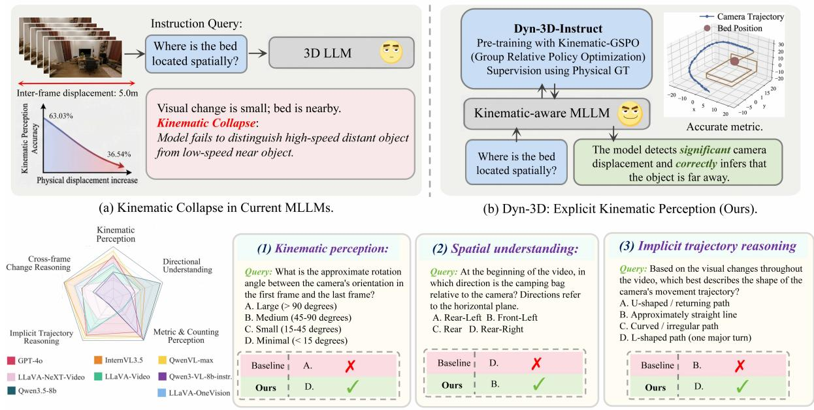
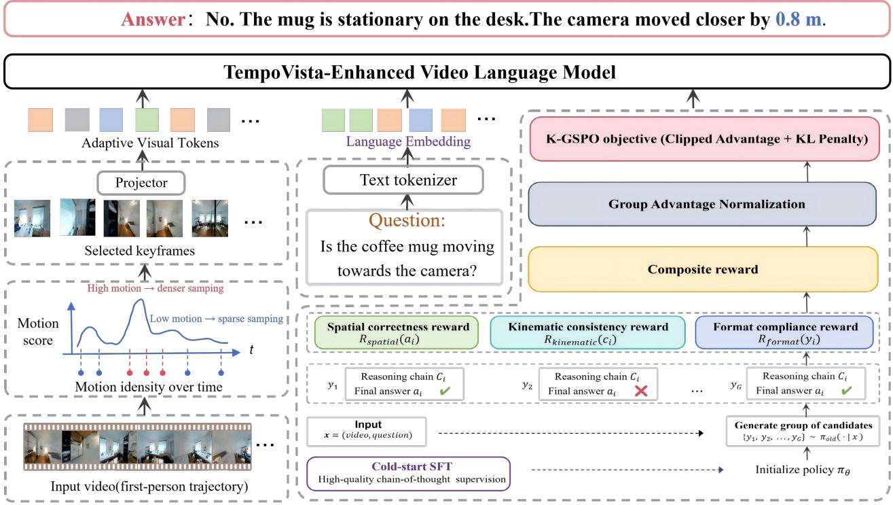

# Dyn-3D: Unveiling and Resolving Ego-Motion Ambiguity in Vision-Language Models

InkMind Team

## Abstract

As Vision-Language Models (VLMs) tackle dynamic 3D spatial reasoning, ego-motion perception becomes essential to resolve monocular scale ambiguity. However, current models often overfit to smooth trajectory priors rather than genuinely understanding physical motion. Consequently, their spatial reasoning degrades severely under large displacements, a phenomenon we term Kinematic Collapse. This failure stems from spurious visual-motion correlations in natural videos and a lack of explicit physical supervision. To evaluate this, we introduce Dyn-3D, a benchmark using counterfactual 3D rendering to rigorously decouple visual changes from true kinematic properties. Furthermore, we propose the TempoVista framework, featuring the Kinematic-GSPO algorithm. By embedding metric physical ground truth into policy optimization, TempoVista explicitly grounds visual representations in 3D space. Experiments demonstrate that our approach significantly improves both motion estimation and robust spatial reasoning by utilizing camera dynamics as an efective geometric calibration signal.

Date: September 1, 2026

Project Page: https://inkmind-ai.github.io/Dyn-3D/

GitHub: https://github.com/InkMind-AI/Dyn-3D

## Contents

Introduction 3   
Related Work 4   
3 Pilot Experiments 5   
3.1 Kinematic Collapse Under High Dynamics 5   
3.2 Visual-Kinematic Misalignment 5   
Dataset 6   
4.1 Data Acquisition and Generation 6   
4.2 Annotation Pipeline and Quality Control 7   
4.3 Dataset Statistics and Splits . 7   
4.4 Comparison with Existing Benchmarks 7   
5 Method . 8   
5.1 Kinematic-Adaptive Frame Selection 8   
5.1.1 Oracle Selection via SE(3) FPS 8   
5.2 Kinematic-GSPO: Physics-Guided Group Sequence Policy Optimization 9   
Experiments . 10   
6.1 Dyn-3D-Instruct Dataset . 10   
6.2 Experimental Setup 10   
6.3 Kinematic Perception Evaluation 11   
6.4 Spatial Understanding Evaluation . 11   
6.5 Ablation Study 12   
Conclusion . 12   
Dataset Construction Details 17   
B Benchmark Details 18   
C Method Details 19   
C.1 Implementation Details 19   
D Error Analysis . 20

## 1 Introduction

Multimodal Large Language Models (MLLMs) [34] are transitioning from static 2D image perception to dynamic 3D spatial understanding. In unstructured physical environments, intelligent agents must recognize object semantics and parse 3D spatial logic. This geometric cognition, which maps 2D pixels to metric depth in the 3D physical world, is essential for embodied intelligence [14] and complex physical interactions.

To achieve accurate video spatial understanding, models must first comprehend camera motion. In continuous video streams, pixel variations on the 2D image plane result from the coupling of 3D scene geometry and viewpoint changes. Without knowing the camera trajectory and motion magnitude, models cannot determine whether parallax and scaling are caused by the actual spatial depth of objects or by fast camera movement. Because monocular visual signals have inherent scale ambiguity, they cannot directly provide absolute depth. Therefore, ego-motion perception serves as a metric reference connecting the 2D visual stream with 3D space. Models can only obtain reliable geometric constraints by accurately parsing how parallax changes with their own displacement.

However, current models struggle to understand camera motion. Although some models demonstrate strong spatiotemporal capabilities on standard video benchmarks [12, 21], this largely stems from overfitting to smooth trajectory priors in training data. The dense sampling rates and slow motion characteristics of mainstream datasets cause models to learn spurious correlations between visual changes and physical displacements. Consequently, their spatial cognition fails when encountering large displacements or non-smooth trajectories, a phenomenon we term Kinematic Collapse. For instance, in our pilot evaluation of Qwen3.5-9B [28], increasing the inter-frame physical displacement from 0.1 to 5.0 meters drops overall accuracy by 25.30 percentage points (from 63.97% to 38.67%). More importantly, the capability to perceive camera motion plummets under high dynamics: kinematic perception accuracy falls from 69.71% to 9.66%, and implicit trajectory reasoning remains below the 25% chance level across all displacement magnitudes. This failure stems from kinematic ambiguity. Without explicitly modeling camera extrinsics or velocity, models easily confuse visual similarity with spatial proximity, thereby losing the metric anchor required for accurate 3D spatial decoding.

To systematically evaluate the ability of Vision-Language Models (VLMs) to understand real camera motion, we introduce the Dyn-3D Benchmark. To our knowledge, this is the first benchmark designed to assess ego-motion perception of VLMs within a 3D spatial understanding framework. In natural videos, visual and motion streams are highly coupled, as large motions usually accompany large optical flows, making models prone to relying on these spurious correlations. To address this, the Dyn-3D Benchmark utilizes the controllable re-rendering capabilities of 3D Gaussian Splatting [17] to synthesize counterfactual video pairs with identical visual paths but diferent kinematic characteristics. This dataset contains 16,063 test samples. Empirical results show that even advanced models exhibit near-chance accuracy when estimating camera motion magnitude under non-smooth or counter-intuitive trajectories, confirming a blind spot in kinematic perception.

To address these issues, we introduce the Dyn-3D-Instruct dataset (33.6K samples) and propose the Kinematic Group Sequence Policy Optimization (Kinematic-GSPO) algorithm. Since standard next-token prediction lacks explicit physical constraints, Kinematic-GSPO applies process-level supervision using physical ground truth. By penalizing unphysical motion inferences, it compels the model to decouple true kinematic features from visual appearances. Consequently, the model accurately perceives complex camera trajectories and physical displacements. Experiments demonstrate that this internalized physical prior directly enhances robust global spatial understanding, yielding strong performance in inferring depth, orientation, and occlusion across multiple 3D spatial benchmarks.

Our main contributions are as follows:

• We reveal model vulnerability in spatial understanding without smooth trajectory priors, attributing this failure to kinematic ambiguity.

• We propose Dyn-3D and Dyn-3D-Instruct via counterfactual re-rendering to train and evaluate VLM ego-motion perception.

  
(c) Performance on Dyn-3D Benchmark.  
Figure 1 Kinematic Collapse and the Dyn-3D Benchmark. (a) Kinematic Collapse: Current MLLMs rely on superficial visual changes rather than genuine physical displacement. (b) Dyn-3D: Supervised by physical ground truth via Kinematic-GSPO, our model achieves explicit kinematic perception for accurate spatial and trajectory reasoning. (c) Performance: Our approach significantly outperforms standard baselines across diverse spatiotemporal tasks on the Dyn-3D benchmark.

• We leverage physical ground-truth supervision to explicitly enhance the capability of foundation models in comprehending camera motion.

• Empirically, improved kinematic perception significantly boosts model accuracy on 3D spatial benchmarks like Dyn-3D and VSI-Bench.

## 2 Related Work

Video and spatial reasoning in MLLMs. Recent MLLMs have extended vision-language modeling from static images to videos and long-context inputs, achieving strong performance on broad video question-answering benchmarks such as MVBench, EgoSchema, and Video-MME [12, 21, 24, 34]. However, these benchmarks primarily assess event recognition, temporal localization, and commonsense reasoning, with limited emphasis on metric spatial inference. Spatially oriented benchmarks, including ScanQA [2], SpatialVLM [5], OpenEQA [23], and VSI-Bench [32], move closer to embodied 3D understanding by evaluating object-grounded question answering, metric distance estimation, and visual-spatial memory. More recent studies have further expanded this line of research to language-guided object grounding in 3D environments [9, 10, 16] and temporally object tracking in dynamic 4D scenes [19]. Collectively, these eforts establish spatial reasoning as a central bottleneck for MLLMs. Nevertheless, they typically evaluate spatial understanding through downstream task performance without explicitly isolating ego-motion as an independent factor [22]. In natural videos, camera displacement is tightly entangled with parallax, optical flow, and changes in object appearance. Consequently, high benchmark accuracy may still arise from exploiting dataset-level motion correlations rather than explicitl recovering and reasoning about the underlying camera dynamics.

Ego-motion and geometric ambiguity. Classical multiple-view geometry treats camera motion and scene structure as coupled variables, and monocular video is scale-ambiguous without additional metric cues or priors [15]. Structure-from-motion and SLAM systems address this ambiguity through explicit pose estimation, geometric verification, bundle adjustment, and map consistency [26, 29]. In contrast, VLMs are usually trained with visual-textual objectives and rarely receive direct supervision over camera extrinsics, velocity, or metric displacement. This creates a blind spot: large appearance changes can be mistaken for large translation, while stable appearance can hide substantial physical displacement. Dyn-3D targets this visual-kinematic ambiguity directly.

Controllable 3D rendering for diagnostic evaluation. Neural scene representations, from NeRF to 3D Gaussian Splatting, enable photorealistic novel-view synthesis from posed images [17, 25]. Their controllability makes them suitable for counterfactual evaluation: one can preserve scene content and the spatial path while changing trajectory dynamics, or decouple rotation from translation under the same reconstructed geometry. Built on high-fidelity ScanNet++ scenes and nerfstudio-based 3DGS rendering [30, 33], Dyn-3D converts ego-motion from an uncontrolled nuisance factor into an explicit intervention variable. This design prevents models from solving spatial questions through superficial visual-motion correlations.

Reasoning optimization for multimodal models. Chain-of-thought prompting and recent RL-based reasoning methods improve model behavior by optimizing intermediate reasoning traces in addition to final answers [8, 31]. Video-R1 extends this direction to video MLLMs [11]. Our setting requires a stricter form of process supervision: a reasoning trace is not suficient because it is fluent; it must also be physically consistent with the underlying camera trajectory. Kinematic-GSPO therefore augments answer-level reward with explicit motion-consistency supervision over path length, displacement, direction, rotation, and speed. This makes geometric correctness an optimization target rather than an emergent byproduct.

## 3 Pilot Experiments

We design two pilot experiments to investigate whether models genuinely understand physical motion or merely rely on superficial visual changes.

## 3.1 Kinematic Collapse Under High Dynamics

We evaluate Qwen3.5-9B [28] by increasing the inter-frame physical displacement ∆d from 0.1m to 5.0m. The evaluation contains 16,063 samples, covering spatial understanding, kinematic perception, and implicit trajectory reasoning. Table 1 reports both the sample composition and the corresponding accuracy under diferent displacement magnitudes. As ∆d increases, the overall accuracy drops by 25.30 percentage points (from 63.97% to 38.67%), and spatial understanding accuracy falls from 67.53% to 52.76%. Crucially, kinematic perception accuracy plunges from 69.71% to 9.66%, and implicit trajectory reasoning remains below the 25% chance level across all displacement magnitudes. This reveals that Vision-Language Models (VLMs) rely heavily on continuous visual cues common in smooth training data. When large displacements break local visual correspondences, their spatial reasoning fails. We define this systematic degradation caused by increased motion magnitude as Kinematic Collapse.

## 3.2 Visual-Kinematic Misalignment

To avoid option-position bias, we construct four option-shufled evaluations for each of the 835 B17 motion-type recognition video-question pairs, resulting in 3,340 evaluation instances with balanced answer positions. These instances are derived from the B17 subset of the 16,063-question Dyn-3D benchmark rather than treated as additional benchmark questions.

Results show all models struggle on these decoupled trajectories. Qwen3.5-9B [28] achieves 28.74% accuracy on pure rotation and 5.69% on pure translation, yielding a decoupled average of 17.22%. Qwen3-VL-8B-Instruct [3] and Qwen-VL-Max [1] obtain similarly low decoupled averages of 13.70% and 19.84%, respectively. The error distribution reveals a consistent bias: models classify pure rotation as translation plus rotation, with misclassification rates of 71.26%, 99.70%, and 100.00% for the three models, respectively. They also confuse pure translation with either translation plus rotation or pure rotation. Findings demonstrate current VLMs conflate viewpoint changes with physical displacement, confirming a severe Visual-Kinematic Misalignment.

Table 1 Pilot evaluation of Qwen3.5-9B under increasing inter-frame physical displacement ∆d. “#” denotes the number of samples in each bucket; the five buckets partition the 16,063-question Dyn-3D benchmark. Accuracy is reported in %. Chance level is 25.0% for all four-option questions.
<table><tr><td rowspan="2">Subset</td><td colspan="5">Inter-frame displacement ∆d</td></tr><tr><td>0.1m</td><td>0.5m</td><td>1.0m</td><td>2.0m</td><td>5.0m</td></tr><tr><td>All (#)</td><td>2969</td><td>1463</td><td>3845</td><td>5037</td><td>2749</td></tr><tr><td>All Acc.</td><td>63.97</td><td>51.59</td><td>48.58</td><td>42.56</td><td>38.67</td></tr><tr><td>Spatial (#)</td><td>2349</td><td>1051</td><td>2768</td><td>3576</td><td>1882</td></tr><tr><td>Spatial Acc.</td><td>67.53</td><td>62.90</td><td>57.08</td><td>51.84</td><td>52.76</td></tr><tr><td>Kinematic (#)</td><td>449</td><td>292</td><td>729</td><td>971</td><td>582</td></tr><tr><td>Kinematic Acc.</td><td>69.71</td><td>30.71</td><td>31.29</td><td>23.04</td><td>9.66</td></tr><tr><td>Trajectory (#)</td><td>171</td><td>120</td><td>348</td><td>490</td><td>285</td></tr><tr><td>Trajectory Acc.</td><td>0.00</td><td>3.33</td><td>17.24</td><td>13.47</td><td>4.91</td></tr></table>

## 4 Dataset

Existing spatial datasets entangle visual and motion streams, failing to isolate rotation, translation, and speed. Consequently, models exploit pixel biases rather than learning camera dynamics. We propose the Dyn-3D benchmark. By generating counterfactual videos with identical paths but varying dynamics, Dyn-3D isolates visual variables to assess causal spatial understanding.

## 4.1 Data Acquisition and Generation

Scene Acquisition and Reconstruction We filter 451 indoor scenes from ScanNet++ [33]. To meet the pinhole camera assumption of 3D Gaussian Splatting (3DGS) [17], we use OpenCV to undistort fisheye images, standardize resolution to 1752 × 1168, and convert COLMAP [29] poses into binary format. Each scene retains an average of 261 images. We train each scene for 30,000 iterations using the splatfacto implementation in nerfstudio [30] on dual RTX 4090 GPUs. After reconstruction and rendering quality inspection, we retain 447 scenes. A subsequent dataset-level validation yields 443 eligible scenes, comprising 263 training scenes, 167 held-out evaluation scenes, and 13 reserved scenes.

Multi-Trajectory Video Rendering We generate 30 FPS videos with 5 motion characteristics for each scene. First, we generate a smooth path via K-means clustering of camera poses and cubic spline interpolation. We construct a control group by varying the frame sampling rate along this path: fast (150 frames, 5 seconds), smooth (450 frames, 15 seconds), and slow (900 frames, 30 seconds). Additionally, we synthesize two decoupled trajectories: a rotation trajectory with zero physical displacement but visual changes (360-degree in-place rotation 0.1 meters above the scene center, 120 frames, 4 seconds), and a translation trajectory with a stable viewpoint but physical displacement (directional translation covering 35% of the spatial depth toward the scene center, 120 frames, 4 seconds).

3D Metadata Extraction For each video, we extract metadata of objects from the ScanNet++ meshes. To ensure geometric consistency against the scaling and translation operations applied during 3DGS training, we apply inverse transformations using the parameters to restore the 3DGS space to the world coordinate system. For frame-level visibility, we project the 8 vertices of each bounding box into the viewing frustum using camera extrinsics; an object is considered visible if at least one vertex is included. After removing 23 non-interactive background categories (e.g., walls), the system outputs a metadata file for each video. This file logs the scene ID, trajectory type, frame count, resolution, intrinsics, camera motion statistics (total path length, displacement magnitude, accumulated rotation angle, start/end positions), object lists (3D coordinates, bounding boxes, visible frames, distance and direction across keyframes), inter-object distance matrices, and frame-wise camera poses.

Table 2 Comprehensive comparison between the Dyn-3D Benchmark and mainstream spatial/video understanding benchmarks, including ScanQA [2], SpatialVLM [5], MVBench [21], EgoSchema [24], OpenEQA [23], and VSI-Bench [32]. “Counterfactual Render.” denotes the synthesis of identical spatial paths with distinct dynamic characteristics to mitigate shortcut learning.
<table><tr><td>Benchmark</td><td>Modality</td><td>Videos</td><td>QAs</td><td>3D Spatial</td><td>Ego-Motion</td><td>Counterfactual Rendering</td><td>Diagnostic Traps</td></tr><tr><td>ScanQA</td><td>Static 3D</td><td></td><td>41K</td><td>X</td><td>X</td><td>X</td><td>X</td></tr><tr><td>SpatialVLM</td><td>Static 2D</td><td></td><td>2B</td><td>√</td><td>X</td><td>X</td><td>X</td></tr><tr><td>MVBench</td><td>Video</td><td>4K</td><td>4K</td><td>X</td><td>×</td><td>X</td><td>X</td></tr><tr><td>EgoSchema</td><td>Video</td><td>5K</td><td>5K</td><td>X</td><td>X</td><td>X</td><td>X</td></tr><tr><td>OpenEQA</td><td>Video</td><td>~200</td><td>1.6K</td><td>√</td><td>X</td><td>X</td><td>X</td></tr><tr><td>VSI-Bench</td><td>Video</td><td>288</td><td>5K</td><td>√</td><td>Partial</td><td>X</td><td>X</td></tr><tr><td>Dyn-3D (ours)</td><td>Video</td><td>835</td><td>16K</td><td>√</td><td>√</td><td>√</td><td>√</td></tr></table>

## 4.2 Annotation Pipeline and Quality Control

Question Generation All questions in Dyn-3D are generated deterministically from 3D metadata. The benchmark contains 19 multiple-choice question types (B1 to B19), each with four options, across three dimensions. Kinematic perception (B1–B6 and B19) assesses displacement magnitude, camera-motion direction, rotation, speed, total path length, and the rotation/translation diagnostic traps. Spatial understanding (B7–B16) evaluates object directions, distance trends, nearest-object reasoning, coordinate re-anchoring, counting, size, cross-frame causal direction, and depth-subtraction visibility. Implicit trajectory reasoning (B17–B18) assesses motion type and trajectory shape. Distractors are generated using type-specific strategies, including range partitioning for continuous quantities and sampled alternative directions for directional questions. Classifications are provided in the supplementary material.

Quality Control We apply three quality-control stages to the evaluation set. First, automated cross-validation independently recomputes each answer from the 3D metadata; all 16,063 aligned questions are marked as geometry-recomputed and validation-passed. Second, physical-validity filtering excludes samples with invalid geometry, ambiguous object references, or out-of-range motion and spatial measurements. Third, representative samples are manually reviewed for question clarity, option validity, and agreement between the rendered evidence and the ground truth.

## 4.3 Dataset Statistics and Splits

The Dyn-3D benchmark consists of 16,063 four-option questions sourced from 167 scenes and 835 rendered videos. It evaluates three dimensions: kinematic perception (3,023 samples, 18.8%), spatial understanding (11,626 samples, 72.4%), and implicit trajectory reasoning (1,414 samples, 8.8%). The dataset is balanced across five trajectory types, with 2,911 to 3,477 questions per trajectory (a maximum-to-minimum ratio of 1.19). Additionally, it includes 168 diagnostic trap questions (147 for rotation and 21 for translation). Al benchmark answers are independently recomputed from the structured 3D metadata before evaluation.

## 4.4 Comparison with Existing Benchmarks

As shown in Table 2, existing benchmarks overlook ego-motion as an explicit variable in spatial cognition. ScanQA and SpatialVLM primarily focus on static spatial understanding, while OpenEQA and VSI-Bench introduce embodied or video-based spatial QA [2, 5, 23, 32]. However, these benchmarks do not explicitly decouple viewpoint rotation, translation, and speed under controlled 3D trajectories. To address this, we introduce the Dyn-3D benchmark to evaluate VLM ego-motion perception in 3D spaces. Using 3D Gaussian Splatting [17], we synthesize counterfactual videos with identical spatial paths but distinct dynamics, including pure rotation and translation traps. This prevents models from exploiting superficial pixel variations, rigorously assessing their kinematic perception and vulnerability to Kinematic Collapse.

  
Figure 2 Overview of the TempoVista framework. (Left) The kinematic-adaptive strategy samples keyframes in a motion-aware metric space, yielding denser temporal allocation in segments with larger kinematic variation while preserving critical geometric cues. (Right) The Kinematic-GSPO algorithm optimizes the VLM policy by generating candidate reasoning chains and evaluating them through a composite reward (spatial answer correctness, kinematic consistency, and format compliance), explicitly grounding visual cues in physical 3D space.

## 5 Method

Motivated by the findings from the Dyn-3D benchmark, we propose the TempoVista framework (illustrated in Figure 2). Rather than forcing Vision-Language Models (VLMs) to simply memorize 3D data, TempoVista introduces implicit kinematic perception through explicit policy optimization. The framework consists of two key components: a kinematic-adaptive frame selection strategy and the Kinematic-GSPO training algorithm.

## 5.1 Kinematic-Adaptive Frame Selection

Before feeding long videos into a VLM, keyframe selection determines the upper bound of available geometric information. Traditional uniform sampling assumes information is linearly distributed over time, which may underrepresent intervals where camera motion changes rapidly, such as sharp turns or fast translations. Therefore, we investigate a selection paradigm that allocates the frame budget according to kinematic variation rather than timestamp spacing.

## 5.1.1 Oracle Selection via SE(3) FPS

When reliable camera extrinsics are available (e.g., from odometry or our 3D Gaussian Splatting pipeline), we formulate keyframe selection as a maximum diversity subset selection problem on the Riemannian manifold SE(3).

Distance Metric. Let $T _ { i } = ( R _ { i } , \mathbf { t } _ { i } ) \in S E ( 3 )$ denote the camera-to-world pose of the i-th frame. We define a

normalized geodesic-inspired distance:

$$
\begin{array} { r l } & { \displaystyle { d ( T _ { i } , T _ { j } ) } = \alpha \operatorname* { m i n } \bigg ( \frac { \left\| \mathbf { t } _ { i } - \mathbf { t } _ { j } \right\| _ { 2 } } { D _ { \operatorname* { m a x } } } , 1 \bigg ) } \\ & { \quad \quad \quad \quad \quad + \left( 1 - \alpha \right) \frac { 1 } { \pi } \operatorname { a r c c o s } \bigg ( \frac { \mathrm { t r } ( R _ { i } ^ { \top } R _ { j } ) - 1 } { 2 } \bigg ) , } \end{array}\tag{1}
$$

where $D _ { \mathrm { m a x } }$ is a video-level translation normalization constant, the rotation term is the matrix geodesic angle normalized to [0, 1], and $\alpha \in ( 0 , 1 )$ balances translation and rotation.

Greedy FPS. Given N candidate frames $\{ T _ { i } \} _ { i = 1 } ^ { N }$ and a budget of k keyframes, we initialize the selected set with the first and last frames, $\mathcal { F } _ { 2 } = \{ 1 , N \}$ , to preserve temporal boundary conditions, and iteratively append:

$$
\begin{array} { c } { f _ { m + 1 } = \underset { j \not \in \mathcal { F } _ { m } } { \arg \operatorname* { m a x } } ~ \underset { f \in \mathcal { F } _ { m } } { \operatorname* { m i n } } d ( T _ { j } , T _ { f } ) , } \\ { m = 2 , \ldots , k - 1 . } \end{array}\tag{2}
$$

This algorithm selects the frame farthest from all currently selected frames. The resulting subset forms a geometric skeleton of the trajectory, maximizing the minimum pairwise physical distance in $S E ( 3 )$ . Since rapidly changing intervals span larger distances in the kinematic metric space, the selected frames are naturally allocated more densely in such regions, while near-static intervals receive fewer redundant samples. Unlike threshold-based kinematic methods that may over-cluster locally, FPS maintains global trajectory coverage and helps preserve multi-object visibility.

## 5.2 Kinematic-GSPO: Physics-Guided Group Sequence Policy Optimization

We initialize the policy with answer-supervised SFT. During reinforcement learning, the model is encouraged to produce a structured reasoning trace containing five camera-motion quantities—total path length, displacement magnitude, displacement vector, accumulated rotation angle, and average speed—together with the final answer. While answer-level supervision is necessary for spatial question answering, it cannot distinguish a correct answer supported by a kinematically consistent motion interpretation from one obtained through incidental correlations. We therefore introduce Kinematic-GSPO, which injects scene-derived kinematic annotations as process-level feedback during policy optimization.

Given a multi-frame video and a question $x = ( \nu , q )$ , we sample a group of $G$ candidate responses $\{ y _ { i } \} _ { i = 1 } ^ { G }$ from the policy $\pi _ { \theta }$ . Each response $y _ { i } = \left( c _ { i } , a _ { i } \right)$ consists of a structured kinematic reasoning trace $c _ { i }$ and a final answer $a _ { i }$ . We define the total reward as

$$
\begin{array} { r l r } {  { R ( y _ { i } ; x ) = R _ { \mathrm { a n s } } ( a _ { i } , a ^ { * } ) + \gamma R _ { \mathrm { f m t } } ( y _ { i } ) } } \\ & { } & { + ~ \lambda R _ { \mathrm { k i n } } ( c _ { i } , \mathbf { k } ^ { * } ) , } \end{array}\tag{3}
$$

where $R _ { \mathrm { a n s } }$ rewards answer correctness, $R _ { \mathrm { f m t } }$ is a lightweight structural reward that encourages the required XML-style response schema, and $\mathbf { k } ^ { * }$ denotes the scene-derived kinematic annotations.

Crucially, $R _ { \mathrm { k i n } }$ evaluates whether the kinematic quantities declared in $c _ { i }$ are consistent with $\mathbf { k } ^ { * }$ . For scalar quantities, we use range-consistent matching based on task-relevant motion intervals. For the displacement vector, we jointly evaluate magnitude consistency and directional consistency. The detailed definitions of the five kinematic rewards are provided in the Appendix. This design provides direct process-level supervision on the generated motion trace, encouraging the model to produce spatial answers that are consistent with the underlying camera motion.

We optimize the policy using group-relative advantages. For a sampled group, the advantage of response $y _ { i }$ is normalized by the group reward statistics:

$$
A _ { i } = \frac { R ( y _ { i } ; x ) - \mu _ { R } } { \sigma _ { R } + \epsilon } ,\tag{4}
$$

Table 3 Quantitative evaluation on the Dyn-3D Benchmark using eight frames selected per video.
<table><tr><td>Model</td><td>Kinematic</td><td>Spatial</td><td>Trajectory</td><td>Overall</td></tr><tr><td>Proprietary Models</td><td></td><td></td><td></td><td></td></tr><tr><td>GPT-40</td><td>45.3</td><td>36.1</td><td>40.2</td><td>38.2</td></tr><tr><td>Qwen-VL-Max</td><td>53.2</td><td>46.2</td><td>71.9</td><td>49.8</td></tr><tr><td>Open-Source Models</td><td></td><td></td><td></td><td></td></tr><tr><td>LLaVA-Video</td><td>40.7</td><td>28.4</td><td>61.8</td><td>33.7</td></tr><tr><td>LLaVA-NeXT-Video</td><td>19.1</td><td>30.5</td><td>34.3</td><td>28.7</td></tr><tr><td>LLaVA-OneVision</td><td>40.3</td><td>28.1</td><td>56.6</td><td>32.9</td></tr><tr><td>Qwen2.5-VL-7B-Instruct</td><td>30.7</td><td>37.4</td><td>44.3</td><td>36.7</td></tr><tr><td>InternVL-3.5-8B</td><td>52.0</td><td>47.8</td><td>70.4</td><td></td></tr><tr><td>InternVL-3.5-8B + TempoVista</td><td>64.5(+12.5↑)</td><td>52.7(+4.9↑)</td><td>77.7(+7.3个)</td><td>50.6</td></tr><tr><td>Qwen3-VL-8B-Instruct</td><td>51.0</td><td>47.6</td><td>71.4</td><td>57.1(+6.5↑) 50.3</td></tr><tr><td>Qwen3-VL-8B-Instruct + TempoVista</td><td> $6 2 . 6 \left( + 1 1 . 6 \uparrow \right)$ </td><td> ${ \pmb 5 } { \pmb 8 } . { \pmb 3 } \left( + 1 0 . 7 \uparrow \right)$ </td><td> ${ \pmb 8 1 . \pmb 8 } \left( + 1 0 . 4 \uparrow \right)$ </td><td> ${ \pmb 6 1 . 2 } \left( + 1 0 . 9 \uparrow \right)$ </td></tr></table>

where $\mu _ { R }$ and $\sigma _ { R }$ are the mean and standard deviation of rewards within the group, respectively. We then optimize a clipped GSPO surrogate objective:

$$
\begin{array} { r l r } {  { \mathcal { L } _ { \mathrm { K i n e m a t i c - G S P O } } = - \frac { 1 } { G } \sum _ { i = 1 } ^ { G } \operatorname* { m i n } \Big [ A _ { i } \rho _ { i } ^ { \mathrm { s e q } } , } } \\ & { } & { A _ { i } \ \mathrm { c l i p } ( \rho _ { i } ^ { \mathrm { s e q } } , 1 - \epsilon _ { \ell } , 1 + \epsilon _ { h } ) \Big ] } \\ & { } & { + \beta D _ { \mathrm { K L } } ^ { \mathrm { s e q } } ( \pi _ { \theta }  \pi _ { \mathrm { r e f } } ) , } \end{array}\tag{5}
$$

where $\rho _ { i } ^ { \mathrm { s e q } }$ is the sequence-level importance ratio, ϵℓ and $\epsilon _ { h }$ are the lower and upper clipping thresholds, and $\beta$ controls the KL regularization toward the reference policy $\pi _ { \mathrm { r e f } }$ . By combining answer-level supervision with kinematic process rewards, Kinematic-GSPO favors responses whose explicit motion interpretation is consistent with scene-derived physical annotations.

## 6 Experiments

## 6.1 Dyn-3D-Instruct Dataset

Dyn-3D-Instruct contains the Supervised Fine-Tuning (SFT) and Reinforcement Learning (RL) data used for training. SFT Dataset: The SFT set contains 9,600 multi-frame multiple-choice QA samples from 1,128 rendered videos. Each sample comprises eight video frames, a question with candidate options, and its ground-truth answer. The data comprises six multiple-choice task types: nearest-object identification based on relative distance; four-way, three-way, and binary object-relative direction reasoning; appearance-order tracking; and route-turn prediction. We remove samples with invalid object references, ambiguous geometry, repeated questions, or inconsistent answer-option mappings. RL Dataset: The RL set contains 24,000 training samples from 1,315 unique rendered videos, with eight frames per sample. The resulting training set covers 24 task types, including camera motion, displacement, rotation, speed, object direction, distance, counting, size, appearance order, coordinate transformation, and route reasoning. Each item is paired with the correct option and fixed five-field kinematic metadata used by Kinematic-GSPO: total path length $d _ { \mathrm { p a t h } }$ , displacement magnitude $d _ { \mathrm { d i s p } }$ , displacement vector $\Delta \mathbf { p }$ , accumulated rotation angle $\theta ,$ and average speed v. We verify media paths, answer-option consistency, object-reference validity, and geometric plausibility before training.

## 6.2 Experimental Setup

Evaluation Datasets. We evaluate the core spatiotemporal reasoning capabilities of the models on the Dyn-3D benchmark. Its test set contains scenes and counterfactual trajectories that are strictly unseen during training, allowing us to assess generalization beyond memorized visual patterns. In addition, we evaluate on selected multiple-choice spatial understanding tasks from VSI-Bench [32], including relative distance estimation, relative direction reasoning, appearance-order tracking, and route planning.

Table 4 Evaluation results on the selected VSI-Bench MCQ spatial understanding tasks using 32 frames per video.
<table><tr><td>Model</td><td>Overall</td><td>Rel. Distance</td><td>Rel. Direction</td><td>App. Order</td><td>Route Plan</td></tr><tr><td>Proprietary Models</td><td></td><td></td><td></td><td></td><td></td></tr><tr><td>GPT-40</td><td>36.1</td><td>37.0</td><td>41.3</td><td>28.5</td><td>31.5</td></tr><tr><td>Gemini-1.5-Flash</td><td>38.5</td><td>37.7</td><td>41.0</td><td>37.8</td><td>31.5</td></tr><tr><td>Gemini-1.5-Pro</td><td>44.0</td><td>51.3</td><td>46.3</td><td>34.6</td><td>36.0</td></tr><tr><td>Open-Source Models</td><td></td><td></td><td></td><td></td><td></td></tr><tr><td>Qwen2.5-VL-7B-Instruct</td><td>34.5</td><td>38.0</td><td>37.4</td><td>28.0</td><td>28.4</td></tr><tr><td>LLaVA-OneVision-7B</td><td>34.1</td><td>42.5</td><td>35.2</td><td>24.4</td><td>29.4</td></tr><tr><td>LLaVA-NeXT-Video-7B</td><td>39.1</td><td>43.5</td><td>42.4</td><td>30.6</td><td>34.0</td></tr><tr><td>InternVL-3.5-8B</td><td>50.1</td><td>52.4</td><td>48.6</td><td>55.1</td><td>32.9</td></tr><tr><td>InternVL-3.5-8B + TempoVista</td><td>50.7(+0.6↑)</td><td>54.4(+2.0↑)</td><td>48.1 (-0.5↓)</td><td>55.7(+0.6↑)</td><td>34.5(+1.6↑)</td></tr><tr><td>Qwen3-VL-8B-Instruct</td><td>51.3</td><td>53.5</td><td>47.9</td><td>60.2</td><td>32.0</td></tr><tr><td>Qwen3-VL-8B-Instruct + TempoVista</td><td>55.6(+4.3↑)</td><td>56.2(+2.7↑)</td><td>51.7(+3.8↑)</td><td>67.8(+7.6↑)</td><td>34.0(+2.0↑)</td></tr></table>

Baselines. We compare TempoVista with both proprietary and open-source Vision-Language Models (VLMs). The proprietary baselines include GPT-4o [27], Gemini-1.5-Flash, Gemini-1.5-Pro [13], and Qwen-VL-Max [1]. The open-source baselines include representative video understanding models from the LLaVA family [7, 18, 20], Qwen2.5-VL [4], InternVL-3.5 [6], and Qwen3-VL [3]. We instantiate TempoVista using two base models, InternVL-3.5-8B and Qwen3-VL-8B-Instruct, to examine whether the proposed framework generalizes across diferent VLM architectures.

## 6.3 Kinematic Perception Evaluation

Table 3 reports the Dyn-3D results using eight selected frames per video. Existing open-source video-language models, particularly the LLaVA series, achieve only 28.7%–33.7% overall accuracy, demonstrating the dificulty of fine-grained 3D motion reasoning. TempoVista consistently improves both evaluated base models. For InternVL-3.5-8B, it raises the Kinematic, Spatial, Trajectory, and Overall accuracies from 52.0%, 47.8%, 70.4%, and 50.6% to 64.5%, 52.7%, 77.7%, and 57.1%, respectively. This corresponds to gains of 12.5, 4.9, 7.3, and 6.5 percentage points, with the best open-source Kinematic result. When applied to Qwen3-VL-8B-Instruct, TempoVista improves the corresponding results from 51.0%, 47.6%, 71.4%, and 50.3% to 62.6%, 58.3%, 81.8%, and 61.2%, yielding gains of 11.6, 10.7, 10.4, and 10.9 points. This variant achieves the best open-source Spatial, Trajectory, and Overall results and surpasses Qwen-VL-Max by 11.4 points overall. The consistent gains across both model families indicate that TempoVista generalizes across VLM architectures, while their complementary strengths suggest that InternVL benefits more in direct kinematic perception and Qwen3-VL benefits more in broader spatial and trajectory reasoning.

## 6.4 Spatial Understanding Evaluation

Table 4 evaluates transfer to selected VSI-Bench spatial reasoning tasks. TempoVista improves InternVL-3.5-8B from 50.1% to 50.7% overall, with gains in relative distance, appearance order, and route planning, although relative-direction accuracy decreases slightly from 48.6% to 48.1%. For Qwen3-VL-8B-Instruct, it improves overall accuracy from 51.3% to 55.6%, including gains of 2.7, 3.8, 7.6, and 2.0 points in relative distance, relative direction, appearance order, and route planning, respectively. Qwen3-VL-8B-Instruct + TempoVista therefore obtains the best open-source results on all evaluated categories except route planning, where InternVL-3.5-8B + TempoVista reaches 34.5%. These results show that kinematic-aware optimization generally transfers to external spatial reasoning tasks, although the magnitude and consistency of the gains remain dependent on the base model and task category.

Table 5 Ablation on training strategies with InternVL-3.5-8B and Qwen3-VL-8B-Instruct as base models.
<table><tr><td>ID</td><td>Training Strategy</td><td>Accuracy (%)</td></tr><tr><td>(a)</td><td>Base model: InternVL-3.5-8B</td><td>50.6</td></tr><tr><td>(b)</td><td>SFT Only</td><td>51.6</td></tr><tr><td>(c)</td><td>Base GSPO</td><td>55.5</td></tr><tr><td>(d)</td><td>Kinematic-GSPO (Ours)</td><td>57.1</td></tr><tr><td>(a)</td><td>Base model: Qwen3-VL-8B-</td><td>50.3</td></tr><tr><td>(b)</td><td>Instruct SFT Only</td><td>52.6</td></tr><tr><td>(c)</td><td>Base GSPO</td><td>60.1</td></tr><tr><td>(d)</td><td>Kinematic-GSPO (Ours)</td><td>61.2</td></tr></table>

Table 6 Ablation on frame sampling strategies for InternVL-3.5-8B and Qwen3-VL-8B-Instruct under nonlinear trajectories.
<table><tr><td>ID</td><td>Sampling Strategy</td><td>Accuracy (%)</td></tr><tr><td colspan="3">InternVL-3.5-8B + TempoVista</td></tr><tr><td>(a)</td><td>Uniform</td><td>55.6</td></tr><tr><td>(b)</td><td>Flow Proxy</td><td>55.1</td></tr><tr><td>(c)</td><td>Oracle</td><td>57.1</td></tr><tr><td colspan="3">Qwen3-VL-8B-Instruct + TempoVista</td></tr><tr><td>(a)</td><td>Uniform</td><td>59.7</td></tr><tr><td>(b)</td><td>Flow Proxy</td><td>59.0</td></tr><tr><td>(c)</td><td>Oracle</td><td>61.2</td></tr></table>

## 6.5 Ablation Study

Training Strategy. Table 5 compares diferent training strategies on two base models. For InternVL-3.5-8B, SFT improves accuracy from 50.6% to 51.6%, while Base GSPO further increases it to 55.5%. Kinematic-GSPO achieves 57.1%, outperforming Base GSPO by 1.6 percentage points and the original base model by 6.5 points. For Qwen3-VL-8B-Instruct, SFT, Base GSPO, and Kinematic-GSPO achieve 52.6%, 60.1%, and 61.2%, respectively, compared with 50.3% for the base model. These results show that policy optimization provides the majority of the improvement, while the proposed kinematic reward consistently contributes an additional gain of 1.1–1.6 points across both model families.

Sampling Strategy. Table 6 compares the oracle SE(3)-based sampling strategy adopted by TempoVista with uniform sampling and a flow-proxy ablation under non-linear trajectories. For InternVL-3.5-8B + TempoVista, uniform, flow-proxy, and oracle sampling achieve 55.6%, 55.1%, and 57.1%, respectively. The corresponding results for Qwen3-VL-8B-Instruct + TempoVista are 59.7%, 59.0%, and 61.2%. The adopted oracle strategy consistently performs best, exceeding uniform sampling by 1.5 points for both models, whereas the flow-proxy variant underperforms uniform sampling by 0.5 and 0.7 points, respectively. These results confirm that frame selection based on accurate SE(3) camera trajectories is more efective than either uniform sampling or the visual-motion proxy.

## 7 Conclusion

We identify kinematic collapse in vision language models, a spatial cognition failure under nonsmooth trajectories caused by reliance on 2D visual shortcuts. To evaluate this, we introduce the Dyn-3D benchmark, which uses counterfactual rendering to decouple visual changes from physical motion. We further propose the TempoVista framework, featuring a kinematic-adaptive frame selection and the Kinematic-GSPO algorithm. By embedding metric motion constraints into policy optimization, Kinematic-GSPO grounds visual cues in 3D space. Experiments show TempoVista outperforms leading open and proprietary models on Dyn-3D and generalizes to diverse spatial tasks in VSI-Bench. These findings prove explicit kinematic perception is essential for robust 3D spatial understanding.

## References

[1] Alibaba Cloud. Qwen-vl-max model documentation, 2026. URL https://help.aliyun.com/en/model-studio/ qwen-vl-max.

[2] Daichi Azuma, Taiki Miyanishi, Shuhei Kurita, and Motoaki Kawanabe. Scanqa: 3d question answering for spatial scene understanding. In Proceedings of the IEEE/CVF Conference on Computer Vision and Pattern Recognition (CVPR), pages 19129–19139, June 2022.

[3] Shuai Bai, Yuxuan Cai, Ruizhe Chen, Keqin Chen, Xionghui Chen, Zesen Cheng, Lianghao Deng, Wei Ding, Chang Gao, Chunjiang Ge, Wenbin Ge, Zhifang Guo, Qidong Huang, Jie Huang, Fei Huang, Binyuan Hui, Shutong Jiang, Zhaohai Li, Mingsheng Li, Mei Li, Kaixin Li, Zicheng Lin, Junyang Lin, Xuejing Liu, Jiawei Liu, Chenglong Liu, Yang Liu, Dayiheng Liu, Shixuan Liu, Dunjie Lu, Ruilin Luo, Chenxu Lv, Rui Men, Lingchen Meng, Xuancheng Ren, Xingzhang Ren, Sibo Song, Yuchong Sun, Jun Tang, Jianhong Tu, Jianqiang Wan, Peng Wang, Pengfei Wang, Qiuyue Wang, Yuxuan Wang, Tianbao Xie, Yiheng Xu, Haiyang Xu, Jin Xu, Zhibo Yang, Mingkun Yang, Jianxin Yang, An Yang, Bowen Yu, Fei Zhang, Hang Zhang, Xi Zhang, Bo Zheng, Humen Zhong, Jingren Zhou, Fan Zhou, Jing Zhou, Yuanzhi Zhu, and Ke Zhu. Qwen3-VL technical report, 2025. URL https://arxiv.org/abs/2511.21631.

[4] Shuai Bai, Keqin Chen, Xuejing Liu, Jialin Wang, Wenbin Ge, Sibo Song, Kai Dang, Peng Wang, Shijie Wang, Jun Tang, Humen Zhong, Yuanzhi Zhu, Mingkun Yang, Zhaohai Li, Jianqiang Wan, Pengfei Wang, Wei Ding, Zheren Fu, Yiheng Xu, Jiabo Ye, Xi Zhang, Tianbao Xie, Zesen Cheng, Hang Zhang, Zhibo Yang, Haiyang Xu, and Junyang Lin. Qwen2.5-vl technical report, 2025. URL https://arxiv.org/abs/2502.13923.

[5] Boyuan Chen, Zhuo Xu, Sean Kirmani, Brian Ichter, Dorsa Sadigh, Leonidas Guibas, and Fei Xia. Spatialvlm: Endowing vision-language models with spatial reasoning capabilities. In Proceedings of the IEEE/CVF Conference on Computer Vision and Pattern Recognition (CVPR), pages 14455–14465, June 2024.

[6] Zhe Chen, Jiannan Wu, Wenhai Wang, Weijie Su, Guo Chen, Sen Xing, Muyan Zhong, Qinglong Zhang, Xizhou Zhu, Lewei Lu, Bin Li, Ping Luo, Tong Lu, Yu Qiao, and Jifeng Dai. Internvl: Scaling up vision foundation models and aligning for generic visual-linguistic tasks. arXiv preprint arXiv:2312.14238, 2024.

[7] Zesen Cheng, Sicong Leng, Hang Zhang, Yifei Xin, Xin Li, Guanzheng Chen, Yongxin Zhu, Wenqi Zhang, Ziyang Luo, Deli Zhao, and Lidong Bing. Videollama 2: Advancing spatial-temporal modeling and audio understanding in video-llms. arXiv preprint arXiv:2406.07476, 2024.

[8] DeepSeek-AI. Deepseek-r1: Incentivizing reasoning capability in llms via reinforcement learning, 2025. URL https://arxiv.org/abs/2501.12948.

[9] Jiayu Ding, Xinpeng Liu, Zhiyi Pan, Shiqiang Long, and Ge Li. Extrinsplat: Decoupling geometry and semantics for open-vocabulary understanding in 3d gaussian splatting. In Proceedings of the IEEE/CVF Conference on Computer Vision and Pattern Recognition, pages 31019–31028, 2026.

[10] Jiayu Ding, Meilu Song, Xiaoyi Zhang, Hongbo Jin, Yichen Jin, and Xiangtian Si. ZeroSplat: Generalized referring segmentation in 3D gaussian splatting. In European Conference on Computer Vision (ECCV), 2026. URL https://arxiv.org/abs/2607.18801. Accepted to ECCV 2026.

[11] Kaituo Feng, Kaixiong Gong, Bohao Li, Zonghao Guo, Yibing Wang, Tianshuo Peng, Benyou Wang, and Xiangyu Yue. Video-r1: Reinforcing video reasoning in mllms, 2025. URL https://arxiv.org/abs/2503.21776.

[12] Chaoyou Fu, Yuhan Dai, Yongdong Luo, Lei Li, Shuhuai Ren, Renrui Zhang, Zihan Wang, Chenyu Zhou, Yunhang Shen, Mengdan Zhang, et al. Video-mme: The first-ever comprehensive evaluation benchmark of multi-modal llms in video analysis. In Proceedings of the IEEE/CVF Conference on Computer Vision and Pattern Recognition (CVPR), pages 24108–24118, June 2025.

[13] Google. Gemini 1.5: Unlocking multimodal understanding across millions of tokens of context, 2024. URL https://arxiv.org/abs/2403.05530.

[14] Agrim Gupta, Silvio Savarese, Surya Ganguli, and Li Fei-Fei. Embodied intelligence via learning and evolution. Nature communications, 12(1):5721, 2021. Publisher: Nature Publishing Group UK London.

[15] Richard Hartley and Andrew Zisserman. Multiple View Geometry in Computer Vision. Cambridge University Press, 2 edition, 2004.

[16] Shuting He, Guangquan Jie, Changshuo Wang, Yun Zhou, Shuming Hu, Guanbin Li, and Henghui Ding. ReferSplat: Referring segmentation in 3d gaussian splatting. In Proceedings of the 42nd International Conference on Machine Learning, volume 267 of Proceedings of Machine Learning Research, pages 22456–22467. PMLR, 2025. URL https://proceedings.mlr.press/v267/he25h.html.

[17] Bernhard Kerbl, Georgios Kopanas, Thomas Leimkühler, and George Drettakis. 3D Gaussian Splatting for Real-Time Radiance Field Rendering. ACM Transactions on Graphics, 42(4):1–14, 2023. doi: 10.1145/3592433.

[18] Bo Li, Yuanhan Zhang, Dong Guo, Renrui Zhang, Feng Li, Hao Zhang, Kaichen Zhang, Peiyuan Zhang, Yanwei Li, Ziwei Liu, et al. Llava-onevision: Easy visual task transfer. arXiv preprint arXiv:2408.03326, 2024.

[19] Chaoyue Li, Yongxue Xu, Jie Feng, and Jiayu Ding. Lmm-track4d: Eliciting 4d dynamic reasoning in lmms via trajectory-grounded dialogue. arXiv preprint arXiv:2605.19390, 2026. URL https://arxiv.org/abs/2605.19390.

[20] Feng Li, Renrui Zhang, Hao Zhang, Yuanhan Zhang, Bo Li, Wei Li, Zejun MA, and Chunyuan Li. LLaVA-neXTinterleave: Tackling multi-image, video, and 3d in large multimodal models. In The Thirteenth International Conference on Learning Representations, 2025.

[21] Kunchang Li, Yali Wang, Yinan He, Yizhuo Li, Yi Wang, Yi Liu, Zun Wang, Jilan Xu, Guo Chen, Ping Luo, et al. Mvbench: A comprehensive multi-modal video understanding benchmark. In Proceedings of the IEEE/CVF Conference on Computer Vision and Pattern Recognition (CVPR), pages 22195–22206, June 2024.

[22] Lulin Liu, Dayou Li, Yiqing Liang, Sicong Jiang, Hitesh Vijay, Hezhen Hu, Xuhai Xu, Zirui Liu, Srinivas Shakkottai, Manling Li, et al. Egotl: Egocentric think-aloud chains for long-horizon tasks. In Proceedings of the IEEE/CVF Conference on Computer Vision and Pattern Recognition, pages 2017–2027, 2026. URL https://arxiv.org/abs/2604.09535.

[23] Arjun Majumdar, Anurag Ajay, Xiaohan Zhang, Pranav Putta, Sriram Yenamandra, Mikael Henaf, Sneha Silwal, Paul Mcvay, Oleksandr Maksymets, Sergio Arnaud, Karmesh Yadav, Qiyang Li, Ben Newman, Mohit Sharma, Vincent Berges, Shiqi Zhang, Pulkit Agrawal, Yonatan Bisk, Dhruv Batra, Mrinal Kalakrishnan, Franziska Meier, Chris Paxton, Alexander Sax, and Aravind Rajeswaran. Openeqa: Embodied question answering in the era of foundation models. In Proceedings of the IEEE/CVF Conference on Computer Vision and Pattern Recognition (CVPR), pages 16488–16498, June 2024.

[24] Karttikeya Mangalam, Raiymbek Akshulakov, and Jitendra Malik. Egoschema: A diagnostic benchmark for very long-form video language understanding. In NeurIPS, 2023.

[25] Ben Mildenhall, Pratul P. Srinivasan, Matthew Tancik, Jonathan T. Barron, Ravi Ramamoorthi, and Ren Ng. NeRF: Representing scenes as neural radiance fields for view synthesis. Communications of the ACM, 65(1): 99–106, 2022. ISSN 0001-0782, 1557-7317. doi: 10.1145/3503250.

[26] Raúl Mur-Artal and Juan D. Tardós. ORB-SLAM2: An open-source SLAM system for monocular, stereo, and RGB-D cameras. IEEE Transactions on Robotics, 33(5):1255–1262, 2017. doi: 10.1109/TRO.2017.2705103.

[27] OpenAI. Hello GPT-4o, May 2024. URL https://openai.com/index/hello-gpt-4o/.

[28] Qwen Team. Qwen3.5: Towards native multimodal agents, February 2026. URL https://qwen.ai/blog?id= qwen3.5.

[29] Johannes L. Schönberger and Jan-Michael Frahm. Structure-from-motion revisited. In Proceedings of the IEEE Conference on Computer Vision and Pattern Recognition (CVPR), pages 4104–4113, 2016.

[30] Matthew Tancik, Ethan Weber, Evonne Ng, Ruilong Li, Brent Yi, Justin Kerr, Terrance Wang, Alexander Kristofersen, Jake Austin, Kamyar Salahi, Abhik Ahuja, David McAllister, and Angjoo Kanazawa. Nerfstudio: A modular framework for neural radiance field development. In ACM SIGGRAPH 2023 Conference Proceedings, pages 1–12, 2023. doi: 10.1145/3588432.3591516.

[31] Jason Wei, Xuezhi Wang, Dale Schuurmans, Maarten Bosma, Brian Ichter, Fei Xia, Ed Chi, Quoc V Le, and Denny Zhou. Chain-of-thought prompting elicits reasoning in large language models. In S. Koyejo, S. Mohamed, A. Agarwal, D. Belgrave, K. Cho, and A. Oh, editors, Advances in Neural Information Processing Systems, volume 35, pages 24824–24837. Curran Associates, Inc., 2022.

[32] Jihan Yang, Shusheng Yang, Anjali W. Gupta, Rilyn Han, Li Fei-Fei, and Saining Xie. Thinking in space: How multimodal large language models see, remember, and recall spaces. In Proceedings of the IEEE/CVF Conference on Computer Vision and Pattern Recognition (CVPR), pages 10632–10643, June 2025.

[33] Chandan Yeshwanth, Yueh-Cheng Liu, Matthias Nießner, and Angela Dai. Scannet++: A high-fidelity dataset of 3d indoor scenes. In Proceedings of the IEEE/CVF International Conference on Computer Vision (ICCV), pages 12–22, 2023.

[34] Jingyi Zhang, Jiaxing Huang, Sheng Jin, and Shijian Lu. Vision-language models for vision tasks: A survey. IEEE Transactions on Pattern Analysis and Machine Intelligence, 46(8):5625–5644, 2024. doi: 10.1109/TPAMI.2024. 3369699.

## Authors

## Author List

Jiayu Ding∗, Zhuodong Liu∗, Lei Zhang∗, Manyu Xiong, Hongbo Jin, Haoran Tang, Hongbo Zhang, Changen Zhu, Wenbo Xing†

These authors contributed equally to this work.

† Project leader and corresponding author.

## Author Contributions

Jiayu Ding. Overall method design, model design and training, and paper writing. Co-first author. Zhuodong Liu. Construction and evaluation of the benchmark. Co-first author. Lei Zhang. Construction of the training data. Co-first author. Manyu Xiong. Participated in the evaluation of the benchmark. Hongbo Jin. Participated in the overall method design and discussion. Haoran Tang. Participated in the overall method design and discussion. Hongbo Zhang. Participated in dataset cleaning, verification, and annotation. Changen Zhu. Participated in dataset cleaning, verification, and annotation. Wenbo Xing. Overall method design, model design and training, and paper writing. Project leader and corresponding author.

## Appendix

## A Dataset Construction Details

Scene Filtering. Before using a scene for dataset construction, we apply a two-stage filtering process to ensure that both semantic annotations and rendered videos are reliable. In the first stage, we start from 499 raw ScanNet++ scenes and retain 451 scenes with complete segments\_anno.json annotations. These annotations provide the ground-truth source for extracting object semantics, 3D bounding boxes, visibility, and object-level spatial relations. Scenes without complete object annotations are discarded because their metadata cannot support deterministic question generation.

In the second stage, we train 3D Gaussian Splatting models and render multi-trajectory videos for all 451 candidate scenes. Each rendered scene is manually inspected to verify reconstruction and video quality. We remove 4 scenes that satisfy any of the following failure conditions: 3DGS training diverges or produces severe geometric distortion; one or more trajectory videos fail to render or contain broken geometry; the rendered frames fall below the quality required for evaluation, including severe floaters, holes, or strong motion blur. After this filtering, we retain 447 high-fidelity scenes as the final data source. A subsequent dataset-level QA, media, and geometry validation excludes four additional scenes, yielding 443 eligible scenes for the final experimental pool. Among them, 263 scenes are used for training and 167 scenes are held out for evaluation, with no scene overlap. The remaining 13 eligible scenes are held in reserve for potential future use.

Reconstruction and Rendering. For each retained scene, we first undistort the original fish-eye images using OpenCV to satisfy the pinhole camera assumption of 3D Gaussian Splatting [17]. We standardize image resolution to 1752 × 1168 and convert COLMAP [29] camera poses into the required binary format. Each scene keeps an average of 261 valid images. We then train each scene for 30,000 iterations using the splatfacto implementation in nerfstudio [30] on dual RTX 4090 GPUs. The trained 3DGS models are used to render videos under controlled camera trajectories.

Counterfactual Trajectory Design. Dyn-3D is designed to decouple visual change from physical camera motion. For each scene, we render five trajectory types at 30 FPS. First, we generate a shared smooth physical path by clustering camera poses and applying cubic spline interpolation. Based on this identical spatial path, we vary only the temporal sampling rate to obtain three counterfactual videos: fast, smooth, and slow. The fast trajectory contains 150 frames and lasts 5 seconds, the smooth trajectory contains 450 frames and lasts 15 seconds, and the slow trajectory contains 900 frames and lasts 30 seconds. This design keeps the spatial path unchanged while changing the motion dynamics.

We further synthesize two diagnostic trajectories. The rotation trajectory has almost zero physical displacement but strong visual changes caused by a 360-degree in-place rotation. The translation trajectory has clear physical displacement while keeping the viewpoint relatively stable. These two trajectories are used to test whether models confuse pixel-level visual variation with true metric motion.

3D Metadata Extraction. For every rendered video, we extract structured 3D metadata from the ScanNet++ meshes and object annotations. Since 3DGS training may apply scaling and translation, we use the recorded transformation parameters to map the reconstructed scene back to the original metric coordinate system. We compute camera motion statistics, including total path length, displacement magnitude, accumulated rotation angle, start and end positions, and speed. For object-level metadata, we record semantic labels, 3D bounding boxes, object centers, visible frames, keyframe distances, egocentric directions, inter-object distance matrices, and frame-wise camera poses. Frame-level visibility is estimated by projecting the eight vertices of each 3D bounding box into the camera frustum. An object is treated as visible if at least one projected vertex lies inside the valid view. We remove 23 non-interactive background categories, such as walls and ceilings, to focus the benchmark on objects that support spatial reasoning.

## B Benchmark Details

Dyn-3D contains 19 multiple-choice question types, denoted as B1 to B19. Each question has four options and is generated deterministically from the extracted 3D metadata. The benchmark covers three major dimensions: kinematic perception, spatial understanding, and implicit trajectory reasoning. The detailed definitions are listed below.

• B1: Displacement Magnitude Estimation. Given a video, the model estimates the straight-line displacement between the initial and final camera positions.

• B2: Camera Motion Direction. The model predicts the egocentric direction of camera displacement, such as front, rear, left, right, or diagonal directions.

• B3: Rotation Angle Estimation. The model estimates the accumulated camera rotation angle across the video.

• B4: Rotation Trap. The video contains strong visual changes caused mainly by in-place rotation. The model must avoid mistaking rotation-induced appearance changes for large physical displacement.

• B5: Translation Trap. The video contains clear physical translation with relatively stable visual appearance. The model must detect true displacement rather than relying only on pixel-level changes.

• B6: Camera Speed Estimation. The model estimates the average camera-speed category from the rendered trajectory.

• B7: Object Direction at the Initial Frame. The model predicts the egocentric direction of a queried object relative to the camera at the beginning of the video.

• B8: Object Direction at the Final Frame. The model predicts the egocentric direction of a queried object relative to the camera at the end of the video.

• B9: Object Distance Trend. The model determines whether a queried object becomes closer, farther, or remains at a similar distance as the camera moves.

• B10: Nearest Object Reasoning. The model identifies the nearest visible object from a candidate set under a specified frame or trajectory condition.

• B11: Coordinate Re-Anchoring. The coordinate system is redefined using a reference object and an orientation axis. The model must infer the new coordinate frame and transform object positions accordingly.

• B12: Relative Object Distance. The model compares two or more objects and determines which one is closer to the camera or to a reference object.

• B13: Object Counting. The model counts visible objects that satisfy a spatial or semantic condition.

• B14: Object Size Reasoning. The model compares the physical sizes of objects using 3D bounding-box metadata.

• B15: Cross-Frame Causal Direction. The model infers a spatial direction by comparing object or camera states across temporal positions.

• B16: Depth-Subtraction Visibility. The model reasons about whether an object remains visible after accounting for depth and occlusion relations.

• B17: Motion Type Recognition. The model infers whether the trajectory is dominated by rotation, translation, or mixed motion.

• B18: Trajectory Shape Reasoning. The model identifies the geometric pattern of the camera path, such as straight, curved, or circular motion.

• B19: Total Path-Length Estimation. The model estimates the total camera travel distance accumulated along the trajectory.

These question types separate physically grounded motion perception from superficial video recognition. B1–B6 and B19 test metric kinematic perception; B7–B16 evaluate object-level spatial understanding under egocentric motion; and B17–B18 require higher-level inference over trajectory patterns. B4 and B5 are diagnostic traps: B4 tests whether models overestimate displacement under large visual changes, while B5 tests whether models underestimate displacement when visual changes are weak. This design probes the failure mode we call Kinematic Collapse, in which models fail to maintain a consistent physical interpretation of camera motion.

## C Method Details

This section details the calculation of the kinematic reward $R _ { \mathrm { k i n } }$ used by the fixed-five-field Kinematic-GSPO configuration. It evaluates five ground-truth quantities: $\mathbf { k } ^ { * } = ( d _ { \mathrm { p a t h } } ^ { * } , d _ { \mathrm { d i s p } } ^ { * } , \Delta \mathbf { p } ^ { * } , \theta ^ { * } , v ^ { * } )$ , corresponding to total path length, displacement magnitude, displacement vector, accumulated rotation angle, and average speed. Unless otherwise stated, the total reward is

$$
R = R _ { \mathrm { a n s } } + \gamma R _ { \mathrm { f m t } } + \lambda R _ { \mathrm { k i n } } ,\tag{6}
$$

where $R _ { \mathrm { a n s } } \in \{ 0 , 1 \}$ is the option-answer reward, $\gamma = 0 . 1$ , and $\lambda = 0 . 1$ for Kinematic-GSPO. Base GSPO uses the same setting with $\lambda = 0 . ~ R _ { \mathrm { k i n } }$ is the unweighted average of all five field-level rewards, where a missing or unparsable field receives a reward of −1.

Scalar Metrics. Predicted and true scalars are quantized into four bins based on specific thresholds: {0.5, 4, 9}m for total path length $d _ { \mathrm { p a t h } } , \{ 0 . 5 , 1 . 5 , 3 \}$ m for displacement magnitude $d _ { \mathrm { d i s p } } , \{ 1 5 ^ { \circ } , 3 6 0 ^ { \circ } , 6 0 0 ^ { \circ } \}$ for accumulated rotation angle $\theta ,$ and $\{ 0 . 1 5 , 0 . 4 , 0 . 8 \} \mathrm { m / s }$ for average speed v. The scalar rewards assign +1 for an exact bin match, 0 for a one-bin error, and −1 for larger deviations or missing outputs.

Vector Metric. For the displacement vector $\Delta \mathbf { p } ,$ , we evaluate both magnitude and direction. Magnitude is scored using the same bin thresholds as $d _ { \mathrm { d i s p } }$ . For direction, we calculate the cosine similarity between the predicted and ground-truth vectors: $\cos \geq 0 . 8 6 6$ yields +1, $0 . 5 \leq \cos < 0 . 8 6 6$ yields 0, and $\mathrm { c o s } < 0 . 5$ yields −1. The vector reward averages the magnitude and direction scores. If either vector has a near-zero norm, the direction score is +1 only when both predicted and ground-truth vectors have norm below 0.5m; otherwise it is −1.

Formatting Weight. For the formatting reward $R _ { \mathrm { f m t } }$ used in the total reward formulation, we empirically set the scaling factor to $\gamma = 0 . 1$

## C.1 Implementation Details

Frame Selection and Input Budget. For Dyn-3D, each model receives $k = 8$ frames per rendered video selected by the oracle SE(3)-FPS procedure. We set the translation weight to $\alpha = 0 . 7$ . For each video, $D _ { \mathrm { m a x } }$ is the 95th percentile of all pairwise camera-center distances plus $1 0 ^ { - 6 }$ ; the translation term is subsequently clipped at one as in $\operatorname { E q . 1 }$ . The SFT and RL samples likewise contain eight frames per example. For VSI-MCQ, all reported results use 32 cached frames per video and the 2,490-question MCQ test set.

SFT and Parameter-Efficient Adaptation. Both model families are first adapted using answer-only SFT on 9,600 eight-frame multiple-choice examples. We train for one epoch with an efective batch size of 16 and learning rate $2 \times 1 0 ^ { - 5 }$ . We use LoRA with rank 32 and scaling factor 64 on the language-model projections $\{ q , k , v , o , \mathrm { g a t e } , \mathrm { u p } , \mathrm { d o w n } \}$ , while freezing the vision encoder. For InternVL, we additionally freeze the visual projector (mlp1). The SFT adapters are merged with their respective base models before RL. Both Base GSPO and Kinematic-GSPO are initialized from the same merged answer-only SFT checkpoint; they do not start directly from the unadapted base model. During RL, we attach a new LoRA adapter with the same rank, scaling factor, and language-model target projections; the vision encoder remains frozen, and the InternVL visual projector remains frozen.

GSPO Optimization. Each rollout batch contains 12 prompts, with $G = 4$ responses sampled per prompt, resulting in 48 generated responses per rollout batch. Rollouts use temperature $1 . 0 , \mathrm { t o p } – p = 0 . 9 5$ , no top-k truncation, and a maximum response length of 192 tokens. We use two GPUs and an update micro-batch size of one per GPU. We optimize with AdamW using learning rate $1 0 ^ { - 5 }$ , weight decay $1 0 ^ { - 2 }$ , a cosine schedule with 150 warmup steps, and one policy-update epoch per rollout batch. We set the maximum number of optimization steps to 3,000. The implementation uses the gspo\_token loss with sequence averaging (loss\_avg\_mode=seq). Its forward importance ratio is sequence-level, as represented in $\mathrm { E q . 5 , }$ while token-level gradient correction is used during optimization. We use asymmetric clipping thresholds $\epsilon _ { \ell } = 3 \times 1 0 ^ { - 4 }$ and $\epsilon _ { h } = 4 \times 1 0 ^ { - 4 }$ , and the KL coeficient is $\beta = 1 0 ^ { - 2 }$ . The RL prompt explicitly requests an XML response with a <reasoning> block containing truth, cot, and answer lines; the truth line lists total path length, displacement magnitude, displacement vector, accumulated rotation angle, and average speed with units, followed by an outer <answer> tag. Thus, the structured trace is an instructed training output rather than an unconstrained emergent format.

Reward and Missing Fields. $R _ { \mathrm { f m t } }$ is a format reward rather than a penalty. Its raw value is 1 when both the reasoning block and outer <answer> tag are present, 0 when only the outer answer tag is present, −0.5 when an answer is parsed without the outer tag, and −1 when no answer is parsed. If the reasoning block is absent, the kinematic reward is −1; a missing scalar or displacement vector is likewise assigned −1 for the corresponding field. The answer reward is one for a correct option and zero otherwise. We use $\gamma = 0 . 1$ and $\lambda = 0 . 1$ for Kinematic-GSPO, while Base GSPO sets λ = 0 and keeps all remaining settings unchanged.

Evaluation Prompt and Parsing. For Dyn-3D and VSI-MCQ evaluation, the question and options are followed by the instruction “Please answer with the option letter.” Generation is greedy. Answers are parsed in the following order: an <answer> tag, an Answer:/Option: letter, an exact standalone option letter, and finally the last standalone option letter in the response. VSI-MCQ additionally maps a normalized free-form response to a uniquely matching option text when no option letter is found. Reported Dyn-3D parse rates refer to this answer-letter parser and should not be interpreted as strict XML-format compliance rates.

## D Error Analysis

We analyze representative failure cases on Dyn-3D and VSI-Bench to characterize the remaining limitations of TempoVista. All Dyn-3D models included in our comparison achieve a 100% answer parse rate. Therefore, the failures discussed below arise from incorrect spatial or kinematic reasoning rather than invalid response formatting.

On Dyn-3D, TempoVista substantially improves both base models across all three evaluation dimensions. For Qwen3-VL-8B-Instruct, the accuracy increases from 51.0% to 62.6% on kinematic perception, from 47.6% to 58.3% on spatial understanding, and from 71.4% to 81.8% on trajectory reasoning. For InternVL-3.5-8B, the corresponding results improve from 52.0% to 64.5%, from 47.8% to 52.7%, and from 70.4% to 77.7%, respectively. Despite these consistent gains, systematic errors remain in egocentric alignment, coordinate transformation, and metric motion estimation.

Egocentric Depth-Axis Inversion. A recurring failure involves inversion of the egocentric depth axis. In one inspected example, the question asks for the direction of a suitcase relative to the camera in the initial frame. The model predicts Rear, whereas the ground-truth answer is Front. In another example, it predicts Rear-Left for a camping bag whose correct relation is Front-Left. Because the left–right component is preserved, the model appears to identify the queried object correctly but reverses the front–rear relation.

For questions referring to a single frame, this pattern is more appropriately interpreted as egocentric depth-axis confusion than as a temporal updating failure. In cross-frame settings, however, the same error may also result from incorrect propagation of the camera-centered coordinate frame over time.

Coordinate Re-Anchoring. Coordinate re-anchoring remains challenging. In one Dyn-3D example, the coordinate system is defined using the bed as the origin and the direction from the bed to the sofa as the positive Y -axis. The correct direction of the phone charger is Front-Right, whereas the model predicts Rear-Left. Solving this problem requires the model to first ground the referenced objects, construct the requested coordinate system, and then transform the queried object’s position into the newly defined frame.

The failure suggests that object grounding and explicit coordinate transformation are not yet reliably composed, even when the relevant objects are visually identifiable.

Fine-Grained Motion Estimation. Residual errors are also observed in fine-grained motion estimation. In one camera-motion example, the model predicts Rear instead of Rear-Right. It therefore recovers the dominant backward component but fails to identify the lateral displacement. In another example, a near-stationary trajectory is classified as having Moderate speed. These cases indicate that visible image variation can still be confused with actual camera displacement or physical speed. Although the kinematic supervision substantially improves aggregate performance, it does not completely resolve fine-grained metric estimation under subtle or compound motion.

Transfer to Real-World Spatial Reasoning. Similar reasoning failures occur on VSI-Bench. For example, when determining whether a sofa is front-left, front-right, back-left, or back-right from a stove while facing a television, the model predicts Front-Left instead of the correct answer, Front-Right. In a route-planning example, an incorrect initial turn propagates to the subsequent navigation decisions, leading to an incorrect final route.

For Qwen3-VL-8B-Instruct, TempoVista improves the VSI-Bench overall accuracy from 51.3% to 55.6%. Relative-distance accuracy increases from 53.5% to 56.2%, relative-direction accuracy from 47.9% to 51.7%, appearance-order accuracy from 60.2% to 67.8%, and route-planning accuracy from 32.0% to 34.0%. The largest gain is obtained on appearance-order reasoning, with an improvement of 7.6 percentage points.

For InternVL-3.5-8B, the overall accuracy increases more modestly from 50.1% to 50.7%. Relative-distance accuracy improves from 52.4% to 54.4%, appearance-order accuracy from 55.1% to 55.7%, and route-planning accuracy from 32.9% to 34.5%. In contrast, relative-direction accuracy decreases slightly from 48.6% to 48.1%. These results indicate that transfer to general spatial understanding is positive overall but remains dependent on both the underlying base model and the specific spatial reasoning task.

Overall, the qualitative failures and quantitative results show that improved motion grounding can co-occur with stronger spatial reasoning. However, kinematic supervision alone does not solve every spatial operation. In particular, explicit coordinate re-anchoring, egocentric depth disambiguation, and fine-grained metric motion estimation remain important directions for future improvement.