# EDITIKZ: SCIENTIFIC FIGURE EDITING FROM REVISION TRAJECTORIES

Christian Greisinger1, Zhixue Zhao2, Steffen Eger1

1University of Technology Nuremberg christian.greisinger,steffen.eger @utn.de

2University of Sheffield zhixue.zhao@sheffield.ac.uk

## ABSTRACT

Vision-language models (VLMs) have shown strong performance in generating scientific figures from text or images. However, producing publication-ready figures requires iterative refinement, making scientific figure editing an important yet largely unexplored task. Existing approaches rely on costly proprietary agentic systems, focus primarily on evaluation, or construct training supervision from synthetically generated edits. Instead, we leverage naturally occurring scientific revision and development trajectories as a scalable source of supervision. To this end, we introduce DaEdiTikZ, the first large-scale dataset of revision-derived scientific figure edits, constructed by mining 391K plausible TikZ edit pairs from arXiv, GitHub, and TeX SE and inferring 781K directed edit instructions with a VLM conditioned on rendered figures and TikZ code. We further introduce DaEdiTikZ-Bench, a human-refined benchmark with 790 instances, and train two compact Qwen3.5-based EdiTikZ models (4B and 9B) by jointly learning reconstruction and editing, followed by reinforcement learning (RL) with complementary rewards for rendered fidelity and edit application. Automatic evaluation places our 9B model above all tested baselines, while human evaluation with 9 annotators and 4,320 ratings places it above GPT-5.6-Sol and on par with Gemini-3.1-Pro. Under severe out-of-distribution shifts, it remains competitive with GPT-5.6-Sol near its 2K training sequence-length regime. Models and datasets will be released.

## 1 INTRODUCTION

VLMs are increasingly capable of assisting researchers in multimodal tasks (Eger et al., 2026), including understanding and generating figures (Li et al., 2024b; Wang et al., 2024), tables (Moosavi et al., 2021), slides (Ge et al., 2025), and posters (Pang et al., 2025). These advances are driven by improvements in multimodal alignment (Liu et al., 2023), reasoning (Zhang et al., 2024; Huang et al., 2026), and agentic systems (Koh et al., 2024) that combine planning and tool use to tackle complex scientific workflows (Sun et al., 2026). Despite this progress, producing publicationready scientific figures requires precise revisions, making the ability to modify existing figures from natural-language instructions an important yet underexplored capability.

Graphics programming languages such as TikZ are the de facto standard in academia due to their precision, interpretability, and seamless integration into the LAT X ecosystem. However, their diverse syntax and steep learning curve make them difficult for humans and VLMs to master (Belouadi et al., 2024a). Prior work has focused on generating TikZ from text (Greisinger and Eger, 2026) or images (Belouadi et al., 2024b), whereas editing requires a model to preserve large parts of a figure while selectively applying requested changes. Recent approaches rely on proprietary agentic systems (Lin et al., 2026b), target specialized domains such as charts (Zhao et al., 2025), or benchmark scientific figure editing (Rahman et al., 2026; Bo et al., 2026). Large-scale training supervision remains limited and predominantly synthetic (Wang et al., 2026; Bo et al., 2026).

In this work, we take a different perspective. Scientific figures naturally evolve through iterative human revisions during research, paper writing, and community discussions. These revisions capture rich but previously overlooked expert decisions about how figures should change, yet remain unused as supervision for multimodal models. Inspired by how early instruction-tuning methods leverage naturally occurring software revisions (Muennighoff et al., 2024; Wei et al., 2024; Li et al., 2024a), we introduce a scalable framework that recovers plausible scientific figure revision pairs from realworld repositories. Applied to TikZ figures from arXiv, GitHub, and TeX SE, this yields DaEdiTikZ, the first large-scale dataset of revision-derived scientific figure edits, containing 391K edit pairs. Since figures and their programs already exist, we synthesize only the missing edit instruction using a VLM conditioned on rendered figures and TikZ code, yielding 781K directed editing instances. We also introduce DaEdiTikZ-Bench, a human-refined benchmark with 790 editing instances.

Table 1: Scientific figure edits produced by GPT-5.6-Sol and our EdiTikZ-9B models before/after RL. Each model receives the source image and VLM-generated edit instruction. Human annotations provide scores for edit application (E), source preservation (P), and visual quality (Q). Overall: : very good, : good, : bad, : very bad. Ground-truth figures are shown for reference.  
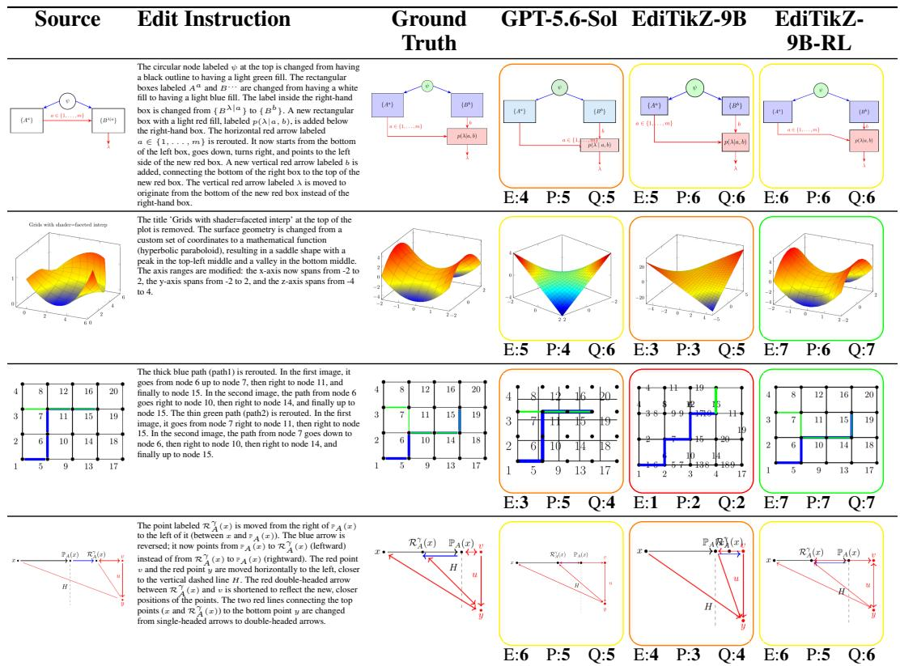

Building on DaEdiTikZ, we train two small Qwen3.5-based EdiTikZ models that jointly learn figure reconstruction and editing, followed by RL with complementary rewards for rendered fidelity and edit application. Across three human-evaluation criteria on DaEdiTikZ-Bench, our 9B model per forms above GPT-5.6-Sol and on par with Gemini-3.1-Pro. Post-training gains transfer even beyond the 2K-token training horizon to substantially more complex out-of-distribution figures from SPIQA and CharXiv. Table 1 shows representative editing results. Our key contributions are as follows:

• Revision-Derived Supervision: We introduce a scalable framework for recovering plausible edit pairs from naturally occurring collections of related scientific figures.

• Dataset and Benchmark: We release DaEdiTikZ with 391K plausible TikZ edit pairs (781K editing instances), and DaEdiTikZ-Bench with 790 human-refined instances.

• Editing-Specific Post-Training: We jointly train reconstruction and editing during SFT and use GDPO with complementary rewards for rendered fidelity and edit application.

• EdiTikZ Models: We train compact 4B and 9B EdiTikZ models. EdiTikZ-9B-RL outperforms all tested baselines automatically, exceeds GPT-5.6-Sol and matches Gemini-3.1-Pro in human evaluation. It also transfers to substantially more complex OOD figures.

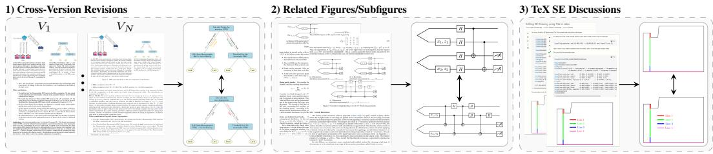  
Figure 1: Sources of figure editing supervision. We recover plausible edit pairs from cross-version revisions (left), related figures and subfigures within shared scientific contexts (middle), and iterative refinements in TeX SE discussions (right).

## 2 RELATED WORK

Generating Scientific Figures with Graphics Programs For TikZ, prior work generates code from text (Belouadi et al., 2024a; 2025; Greisinger and Eger, 2026), or reconstructs it from images (Belouadi et al., 2024b; ZENG et al., 2026; Lin et al., 2026a). Other work targets SVG (Rodriguez et al., 2025b; Wu et al., 2024; Zou et al., 2024), Python (Ni et al., 2025; Yang et al., 2024), multiple visualization languages (Zhang et al., 2025; Ni et al., 2026), or generates diagrams from documents (Zhu et al., 2026; Guan et al., 2026; Mondal et al., 2024). However, these methods generate figures from scratch instead of modifying them.

Scientific Figure Editing Prior work studies editing of charts (Zhao et al., 2025; Li et al., 2026a), SVGs (Kuchaˇr et al., 2025; Lin et al., 2026b), TikZ (Wei et al., 2025), and rasters (Zhao et al., 2026) using agentic systems. Recent concurrent work includes S1-Omni-Image (Li et al., 2026b), which unifies scientific-image understanding, generation, and editing, and DisciplineGen-1M (Wang et al., 2026), which constructs OCR-based synthetic editing supervision. Released during the final preparation of this manuscript, VisEditBench (Rahman et al., 2026) benchmarks Matplotlib/Vega-Lite code editing from multimodal feedback, while Diagram-MMU (Bo et al., 2026) benchmarks image-conditioned TikZ editing using template-constructed modifications across six diagram types. In contrast, we construct large-scale training supervision from plausible pairs of human-authored scientific figures and synthesize only the missing edit instruction.

RL from Rendering Feedback Rendered-feedback RL has been applied to SVG (Rodriguez et al., 2025a; ZENG et al., 2026; Rodriguez et al., 2026) and TikZ generation (Greisinger and Eger, 2026; Lin et al., 2026a), using perceptual, domain-specific, code-based, and self-consistency rewards. Recent methods use VLM feedback to compare charts (Tang et al., 2026) or answer instancespecific visual questions (Yang et al., 2026). Scientific figure editing instead requires preserving source content while applying localized changes. We therefore combine global rendered similarity with a source-conditioned, target-reference-free VLM verifier for individual requested edits.

## 3 DATASET AND BENCHMARK

Revision-Derived Editing Supervision Our key observation is that plausible scientific figure edits naturally arise throughout scientific revision and development processes, including (i) figures modified across arXiv or GitHub versions, (ii) related (sub-)figures in the same paper or repository, (iii) alternative TikZ programs retained in source files but not rendered in the document, and (iv) iterative refinements in TeX SE discussions (Figure 1). Exact figure lineage is difficult to recover reliably as figures may be added, removed, renamed, reordered, or moved across files, while surrounding anchors such as captions, references, and related text can also change. We therefore identify semantically similar pairs within shared scientific contexts and retain plausible editing transformations.

Collecting Scientific Revision Traces We extend DaTikZ-V4 (Greisinger and Eger, 2026) by recovering TikZ from all historical versions of arXiv submissions containing tikzpicture, circuitikz, or tikzcd. We apply the TikZilla preprocessing pipeline, including document expansion, subfigure extraction, code standardization, dynamic package inclusion, filtering, render ing, and deduplication on the standardized TikZ body. Across 91K arXiv submissions, 38K contain at least two versions with modified TikZ code. Historical versions contribute 0.77M additional figures, increasing the unique arXiv corpus from 1.47M to 2.38M. Combined with GitHub and TeX SE, this yields a candidate corpus of 2.91M unique TikZ figures.

Table 2: Examples of scientific-figure edit pairs across semantic-similarity intervals and the percentage of implausible editing transformations in each interval. Gray cells denote excluded intervals.  
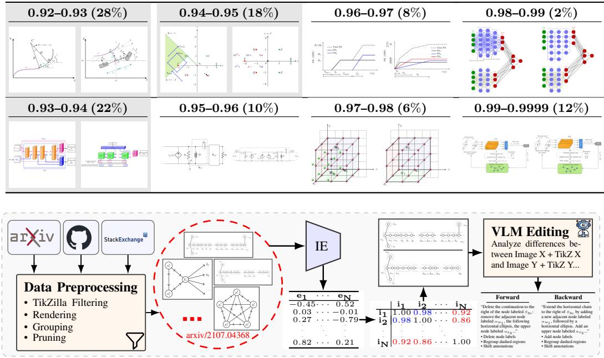  
Figure 2: Construction pipeline for DaEdiTikZ. Scientific figures are collected and standardized, grouped by their scientific context, embedded with a scientific image encoder, paired according to cosine similarity, and passed to a VLM to produce bidirectional editing instructions.

Recovering Plausible Edit Pairs We group figures by arXiv submission across versions, GitHub repository, and TeX SE discussion thread, yielding 222K groups, of which 123K contain at least two unique figures. We prune groups above the 90th size percentile and compute within-group cosine similarities using DeTikZify-V2’s image encoder. To determine the filtering threshold, we manually evaluate 50 pairs in each of eight similarity intervals (0.92–0.9999, width 0.01) and retain intervals containing fewer than 15% implausible transformations (Table 2). This produces 430,442 candidate pairs from 87,051 contributing groups, connecting 589,986 unique figures.

Inferring Edit Instructions Because both endpoint figures are human-authored, we synthesize only the missing edit instruction using Qwen3.6-27B conditioned jointly on their renders and TikZ code. For each of the 430,442 candidate pairs, we infer both directions (A→B and B →A), producing 860,884 candidate directional trajectories. The VLM classifies each direction as ok, invalid, or identical. For accepted transformations, it decomposes the transformation into atomic edits with an intent (add, remove, or modify), operation (text, annotation, geometry, data, style, or structure), and natural-language description. Requiring both directions to be accepted yields DaEdiTikZ with 390,516 figure pairs and 781,032 directional editing trajectories. Each trajectory contains 4.2 atomic edits on average, with descriptions averaging 22.3 words per atomic edit. Detailed analysis of DaEdiTikZ is in the Appendix A.1.

Dataset Quality Analysis To validate instruction inference, two annotators evaluate 125 revision pairs, including 35 overlapping samples for agreement (Figure 3). They identify edit plausibility, omissions, hallucinations, and attribute, numeric, or spatial misinterpretations (κ = 0.82), and rate overall quality on a 1–5 Likert scale (weighted $\kappa = 0 . 7 9 )$ . Overall, 98% of retained transformations are plausible and 82.9% of instructions are rated good (4) or very good (5). While 50% contain at least one error, these are predominantly omissions (34%) and misinterpretations (33%), whereas hallucinations are rare (10%). To quantify the benefit of code grounding, we repeat the analysis without TikZ code on 90 annotations. The error rate increases from 50% to 80%, with omissions increasing by 16 percentage points and numeric misinterpretations from 1% to 8.5%, indicating that code provides complementary grounding.

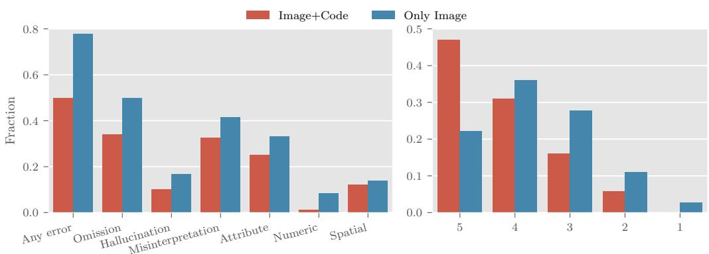

Figure 3: Human evaluation of inferred edit instructions. Left: error rates with and without TikZcode grounding, decomposed into omissions, hallucinations, and attribute, numeric, and spatial misinterpretations. Right: overall instruction quality rated on a 1–5 Likert scale.  
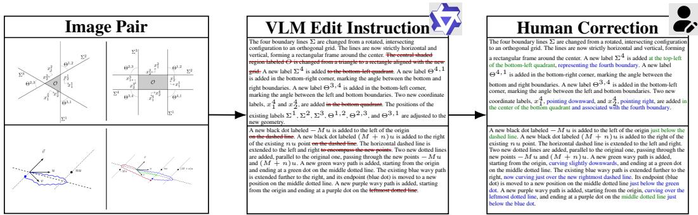  
Figure 4: Examples of human-refined benchmark instructions. Red strikethrough marks removed errors, green marks corrections, and blue marks added omissions.

DaEdiTikZ-Bench To reduce data contamination, we construct DaEdiTikZ-Bench from arXiv submissions published between March and June 2026. For diversity, one pair per submission is retained with 100 pairs sampled from each similarity interval (0.95–0.96, ..., 0.99–1.00), and 50 pairs spanning group sizes from one to ten. We manually inspect all 500 candidates and remove quality issues such as trivial edits and rendering artifacts, leaving 395 revision pairs and 790 editing instances. Six annotators manually correct every VLM-generated instruction by removing hallucinations, correcting misinterpretations, and adding omissions (Figure 4).

## 4 EDITING-SPECIFIC POST-TRAINING

Joint Reconstruction and Editing SFT DaEdiTikZ provides 752K source figure–instruction– TikZ target triplets $( I _ { s } , u , y )$ , where $y = ( y _ { 1 } , \dots , y _ { T } )$ and $I _ { t }$ denotes the rendered target figure. We minimize:

$$
\mathcal { L } _ { \mathrm { e d i t } } ( \theta ) = \mathbb { E } _ { ( I _ { s } , u , y ) \sim \mathcal { D } _ { \mathrm { e d i t } } } \left[ - \sum _ { t = 1 } ^ { T } \log p _ { \theta } ( y _ { t } \mid y _ { < t } , I _ { s } , u ) \right]\tag{1}
$$

Since editing requires reconstructing the source figure while selectively modifying it, we jointly train with 752K image-to-TikZ reconstruction samples from DaTikZ-V4. Reconstruction uses the same objective over $\begin{array} { r } { \left( I _ { t } , y \right) \sim \mathcal { D } _ { \mathrm { r e c } } , } \end{array}$ conditioned only on $I _ { t } ,$ , strengthening the shared image-to-TikZ mapping while exposing the model to a broader distribution of scientific figures and TikZ programs.

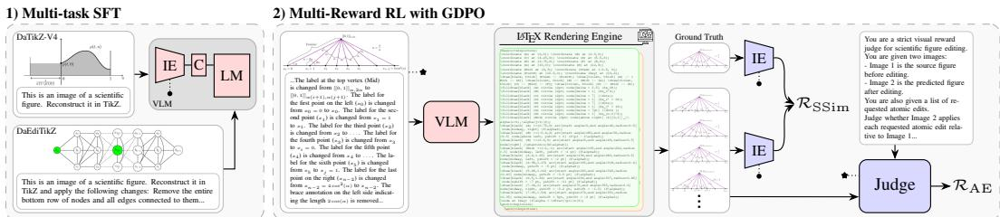  
Figure 5: Two-stage training pipeline. Left: Multi-task SFT jointly trains on equal amounts of editing (DaEdiTikZ) and reconstruction (DaTikZ-V4) data. Right: GDPO optimizes on a disjoint DaEdiTikZ subset using SelfSim from the frozen SFT vision encoder and instruction-following from a VLM judge.

Editing-Specific Rewards We further optimize the resulting SFT model using rewards computed from sampled TikZ rollouts yˆ and their renderings ˆI. Unlike TikZilla, which trains a separate scientific image encoder (Greisinger and Eger, 2026), we reuse a frozen copy of the SFT model’s vision encoder. SFT already adapts this encoder to scientific figures on 1.5M editing and reconstruction samples. We freeze it during RL to prevent reward hacking. Given patch embeddings $\mathbf { x } = \{ x _ { i } \} _ { i = 1 } ^ { N }$ 1 and $\mathbf { z } = \{ z _ { j } \} _ { j = 1 } ^ { M }$ of $I _ { t }$ and ${ \hat { I } } ,$ , respectively, we compute:

$$
D _ { i j } = 1 - \cos ( x _ { i } , z _ { j } ) , \qquad d _ { \mathrm { E M D } } ( \mathbf { x } , \mathbf { z } ) = \operatorname* { m i n } _ { F \geq 0 } \sum _ { i = 1 } ^ { N } \sum _ { j = 1 } ^ { M } F _ { i j } D _ { i j }\tag{2}
$$

subject to uniform marginals $\begin{array} { r } { \sum _ { j } F _ { i j } = 1 / N } \end{array}$ and $\textstyle \sum _ { i } F _ { i j } = 1 / M$ . The SelfSim reward is:

$$
\mathcal { R } _ { \mathrm { S S i m } } = \mathrm { c l i p } \left( 1 + 2 \operatorname { t a n h } [ - d _ { \mathrm { E M D } } ( \mathbf { x } , \mathbf { z } ) ] , 0 , 1 \right)\tag{3}
$$

However, target similarity alone is insufficient for editing. First, DaEdiTikZ contains similar source– target pairs, allowing high $\mathcal { R } _ { \mathrm { S S i m } }$ from preserving unchanged content without applying the requested edits. Second, VLM-inferred instructions may contain omissions or inaccuracies, such that the target may not exactly realize the instruction and can penalize valid instruction-following outputs. We therefore introduce a complementary reference-free instruction-following reward $\mathcal { R } _ { \mathrm { I F } }$ . A VLM judge (Qwen3.6-27B) receives $( I _ { s } , u , \hat { I } )$ and verifies each of the K atomic edits with a binary score $v _ { k } \in \{ 0 , 1 \}$ . We set $\begin{array} { r } { \mathcal { R } _ { \mathrm { I F } } = \frac { 1 } { K } \sum _ { k } v _ { k } ( I _ { s } , u , \hat { I } ) } \end{array}$ , giving proportional credit for partially applied instructions. Finally, we define compilation and format validity as $\mathcal { R } _ { \mathrm { C o m p } } = \mathbb { 1 } [ \mathrm { \bar { c } o m p i l e } ( \dot { y } ) ]$ and $\mathcal { R } _ { \mathrm { F m t } } = 1$ [valid format(ˆy)], where the latter requires the expected standalone TikZ structure (\documentclass $[ \ t \mathrm { i } \mathbf { k } z ]$ {standalone}, \begin{document}, ..., \end{document}). Compilation and format validity gate both rewards: $r _ { m } ~ = ~ \mathcal { R } _ { \mathrm { C o m p } } \mathcal { R } _ { \mathrm { F m t } } \mathcal { R } _ { m }$ for m $\in \mathcal { M } \ : =$ {SSim, IF}, assigning failed rollouts zero reward. Figure 5 summarizes the two-stage pipeline.

Multi-Reward Optimization with GDPO $\mathcal { R } _ { \mathrm { S S i m } }$ provides dense target-similarity feedback, whereas $\mathcal { R } _ { \mathrm { I F } }$ measures discrete atomic edit application. Since standard multi-reward GRPO aggregates rewards before group normalization, its learning signal is sensitive to their distributions. We instead use Group reward-Decoupled Normalization Policy Optimization (GDPO) (Liu et al., 2026), which normalizes each reward independently before aggregation. For G rollouts, GDPO computes:

$$
A _ { m } ^ { ( i , j ) } = \frac { r _ { m } ^ { ( i , j ) } - \mathrm { m e a n } _ { j ^ { \prime } } [ r _ { m } ^ { ( i , j ^ { \prime } ) } ] } { \mathrm { s t d } _ { j ^ { \prime } } [ r _ { m } ^ { ( i , j ^ { \prime } ) } ] + \varepsilon } , \qquad A _ { \mathrm { s u m } } ^ { ( i , j ) } = \sum _ { m \in \mathcal { M } } w _ { m } A _ { m } ^ { ( i , j ) }\tag{4}
$$

Following GDPO, we normalize the aggregated advantages across the batch and optimize the clipped policy objective:

$$
\begin{array} { l } { \mathcal { I } _ { \mathrm { G D P O } } ( \theta ) = \mathbb { E } _ { x _ { i } \sim \mathcal { D } _ { \mathrm { e d i t } } } \left[ \displaystyle \frac { 1 } { G } \sum _ { j = 1 } ^ { G } \frac { 1 } { L } \sum _ { t = 1 } ^ { | o _ { i , j } | } \operatorname* { m i n } \left( \frac { \pi _ { \theta } \left( \hat { y } _ { i , j , t } ~ | ~ x _ { i } , \hat { y } _ { i , j } ^ { < t } \right) } { \pi _ { \theta _ { \mathrm { o d d } } } \left( \hat { y } _ { i , j , t } ~ | ~ x _ { i } , \hat { y } _ { i , j } ^ { < t } \right) } \widehat { A } _ { \mathrm { s u m } } ^ { ( i , j ) } , \right. \right. } \\ { \left. \left. \mathrm { c l i p } \left( \frac { \pi _ { \theta } \left( \hat { y } _ { i , j , t } ~ | ~ x _ { i } , ~ \hat { y } _ { i , j } ^ { < t } \right) } { \pi _ { \theta _ { \mathrm { o d d } } } \left( \hat { y } _ { i , j , t } ~ | ~ x _ { i } , \hat { y } _ { i , j } ^ { < t } \right) } , 1 - \epsilon _ { \mathrm { l o w } } , 1 + \epsilon _ { \mathrm { h i g h } } \right) \widehat { A } _ { \mathrm { s u m } } ^ { ( i , j ) } \right) - \beta D _ { \mathrm { K L } } \left( p _ { \theta } ~ \| ~ p _ { \theta _ { \mathrm { s r } } } \right) \right] } \end{array}
$$

Implementation details are provided in the Appendix A.2.

## 5 EXPERIMENTS

Setup We use disjoint group-level splits, reserving 27K DaEdiTikZ trajectories for RL and using the remaining 754K editing trajectories together with 754K DaTikZ-V4 reconstruction samples for SFT (1.51M instances total). Thus, figures from the same group never occur across training stages. SFT updates all parameters, whereas RL updates only the language model while freezing the vision encoder and embeddings. Unless stated otherwise, evaluation uses the 790 human-refined DaEdiTikZ-Bench instances, which are disjoint from all training groups.

Models We evaluate six proprietary VLMs—GPT-5.6-Sol, GPT-5.5, GPT-5.4, Gemini-3.1-Pro, Gemini-3.6-Flash, and Gemini-3.5-Flash—and eight open-source VLMs: Qwen3.6-27B1, Qwen3.5 (27B, 9B, and 4B) (Qwen Team, 2026), Qwen3-VL (8B and 4B) (Bai et al., 2025a), and Qwen2.5- VL (7B and 3B) (Bai et al., 2025b). We apply SFT to all models up to 9B parameters except Qwen2.5-VL-7B, yielding our EdiTikZ family. Subscripts distinguish earlier Qwen generations. RL is applied to EdiTikZ-4B and EdiTikZ-9B, denoted EdiTikZ-4B-RL and EdiTikZ-9B-RL.

Metrics We evaluate code similarity with TeX Edit Distance (TED) (Kusner et al., 2015) and perceptual similarity with DreamSim (DSim) (Fu et al., 2023). Following VLM-based evaluation (Ku et al., 2024), GPT-5.5 scores three editing-specific criteria: (i) Edit Application (EA), measuring correct application of requested edits; (ii) Source Preservation (SP), measuring preservation of unaffected content; and (iii) Visual Quality (VQ), measuring legibility and publication readiness. Scores are produced on a 0–10 scale and normalized to [0, 1]. We also report compilation rate (CR) and average output tokens (AT). The aggregate score (Avg) averages 1 − TED, DSim, EA, SP, and VQ.

## 6 RESULTS

Automatic Evaluation Across all architectures, SFT improves Avg by 0.186–0.363 and compilation rate by 19.0–39.3 percentage points. RL further improves EdiTikZ-4B/9B to 0.674/0.726 Avg. EdiTikZ-4B-RL reaches proprietary-level performance, while EdiTikZ-9B-RL achieves the highest overall score (Table 3).

MODEL RANKINGS REVERSE AFTER SFT Qwen3.5-4B/9B initially underperform Qwen3-VL-4B/8B (0.249/0.345 vs. 0.314/0.354 Avg), but surpass them after SFT (0.612/0.643 vs. 0.538/0.540), showing that base editing performance does not necessarily reflect task-specific adaptation potential.

VISUAL CORRECTNESS VS. CODE SIMILARITY Unlike prior TikZ-generation RL, where TED improves after RL (Greisinger and Eger, 2026; ZENG et al., 2026), ours worsens despite consistent gains across rendered metrics. We hypothesize that editing weakens visual–code coupling, as visually equivalent edits may differ at the code level.

Human Evaluation We conduct a human evaluation with 9 qualified annotators, who rate predictions from eight models on EA, SP, and VQ using a 1–7 Likert scale (Figure 6). Each annotator evaluates 20 randomized figure groups with 10% overlap, yielding 4,320 ratings. Quadratic-weighted agreement is high $( \kappa _ { \mathrm { E A } } = 0 . 8 0 1 , \kappa _ { \mathrm { S P } } = 0 . 7 8 6 , \kappa _ { \mathrm { V Q } } = 0 . 8 3 2 )$ .

HUMAN EVALUATION CONFIRMS POST-TRAINING GAINS SFT raises the combined score of Qwen3.5-4B/9B from 6.40/8.78 to 14.71/15.18, with RL further improving it to 16.14/17.43, with gains across all three criteria. EdiTikZ-9B-RL nearly matches Gemini-3.1-Pro (17.43 vs. 17.72) and performs above GPT-5.6-Sol (16.75). SFT narrows the 4B–9B gap from 2.38 to 0.47 points, whereas RL widens it to 1.29 points.

AUTOMATIC METRICS ALIGN WITH HUMANS Our aggregate metric correlates strongly with combined human judgments $( \rho = 0 . 8 2 3 )$ . While TED correlates poorly $( \rho = 0 . 3 7 4 )$ , DSim and the criterion-specific EA, SP, and VQ metrics each reach $\rho \approx 0 . 7 7 . \ \mathcal { R } _ { \mathrm { { S S i m } } }$ correlates more strongly with human SP/VQ, whereas adding $\mathcal { R } _ { \mathrm { I F } }$ improves EA correlation by 0.045 and raises overall correlation from 0.812 to 0.827, showing the intended complementarity.

Table 3: Results on DaEdiTikZ-Bench. Bold is best while underline is second-best.
<table><tr><td>Model</td><td>TED↓</td><td>DSim↑</td><td>EA↑</td><td>SP↑</td><td>VQ↑</td><td>Avg↑</td><td>CR↑</td><td>AT↓</td></tr><tr><td>GPT-5.6-Sol</td><td>0.764</td><td>0.796</td><td>0.735</td><td>0.775</td><td>0.823</td><td>0.673</td><td>88.3%</td><td>485</td></tr><tr><td>GPT-5.5</td><td>0.765</td><td>0.829</td><td>0.744</td><td>0.790</td><td>0.849</td><td>0.689</td><td>92.2%</td><td>488</td></tr><tr><td>GPT-5.4</td><td>0.763</td><td>0.741</td><td>0.674</td><td>0.706</td><td>0.762</td><td>0.624</td><td>84.6%</td><td>487</td></tr><tr><td>Gemini-3.1-Pro</td><td>0.716</td><td>0.795</td><td>0.761</td><td>0.798</td><td>0.828</td><td>0.693</td><td>86.5%</td><td>384</td></tr><tr><td>Gemini-3.6-Flash</td><td>0.740</td><td>0.665</td><td>0.654</td><td>0.677</td><td>0.698</td><td>0.591</td><td>72.2%</td><td>399</td></tr><tr><td>Gemini-3.5-Flash</td><td>0.737</td><td>0.676</td><td>0.656</td><td>0.678</td><td>0.718</td><td>0.598</td><td>74.0%</td><td>427</td></tr><tr><td>Qwen3.6-27B</td><td>0.768</td><td>0.675</td><td>0.470</td><td>0.521</td><td>0.635</td><td>0.507</td><td>79.0%</td><td>547</td></tr><tr><td>Qwen3.5-27B</td><td>0.757</td><td>0.677</td><td>0.482</td><td>0.524</td><td>0.636</td><td>0.512</td><td>79.0%</td><td>490</td></tr><tr><td>Qwen2.5-VL-7B</td><td>0.797</td><td>0.388</td><td>0.139</td><td>0.158</td><td>0.296</td><td>0.237</td><td>50.6%</td><td>689</td></tr><tr><td>Qwen2.5-VL-3B</td><td>0.810</td><td>0.329</td><td>0.062</td><td>0.062</td><td>0.213</td><td>0.171</td><td>45.9%</td><td>747</td></tr><tr><td>EdiTikZ-3B</td><td>0.707</td><td>0.700</td><td>0.309</td><td>0.332</td><td>0.525</td><td>0.432</td><td>82.2%</td><td>623</td></tr><tr><td>Qwen3-VL-4B</td><td>0.788</td><td>0.494</td><td>0.232</td><td>0.245</td><td>0.386</td><td>0.314</td><td>61.9%</td><td>651</td></tr><tr><td>EdiTikZ-4BQwen3</td><td>0.644</td><td>0.790</td><td>0.445</td><td>0.474</td><td>0.627</td><td>0.538</td><td>89.3%</td><td>567</td></tr><tr><td>Qwen3-VL-8B EdiTikZ-8B</td><td>0.772</td><td>0.543</td><td>0.281</td><td>0.293</td><td>0.427</td><td>0.354</td><td>67.2%</td><td>509</td></tr><tr><td></td><td>0.676</td><td>0.765</td><td>0.462</td><td>0.509</td><td>0.639</td><td>0.540</td><td>86.2%</td><td>579</td></tr><tr><td>Qwen3.5-4B</td><td>0.806</td><td>0.411</td><td>0.146</td><td>0.188</td><td>0.304</td><td>0.249</td><td>51.4%</td><td>726</td></tr><tr><td>EdiTikZ-4B</td><td>0.629</td><td>0.813</td><td>0.552</td><td>0.609</td><td>0.714</td><td>0.612</td><td>90.7%</td><td>542</td></tr><tr><td>EdiTikZ-4B-RL</td><td>0.642</td><td>0.871</td><td>0.633</td><td>0.706</td><td>0.803</td><td>0.674</td><td>95.2%</td><td>494</td></tr><tr><td>Qwen3.5-9B</td><td>0.781</td><td>0.523</td><td>0.241</td><td>0.311</td><td>0.430</td><td>0.345</td><td>64.1%</td><td>599</td></tr><tr><td>EdiTikZ-9B</td><td>0.628</td><td>0.834</td><td>0.598</td><td>0.658</td><td>0.753</td><td>0.643</td><td>92.0%</td><td>545</td></tr><tr><td>EdiTikZ-9B-RL</td><td>0.676</td><td>0.893</td><td>0.734</td><td>0.815</td><td>0.865</td><td>0.726</td><td>96.8%</td><td>488</td></tr></table>

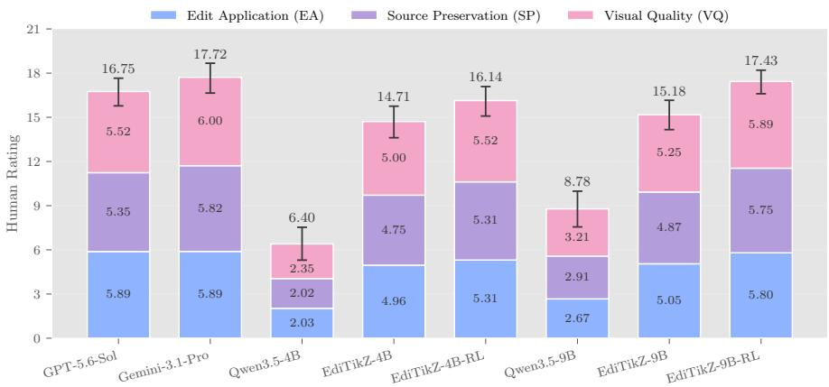  
Figure 6: Likert-scale (1-7) across three evaluation criteria (EA, SP, and VQ) with 95% confidence intervals for eight VLMs (4 baseline, 4 fine-tuned).

Ablations: Data Mixtures Table 4 compares reconstruction and editing mixtures on two VLMs. Joint training performs best for 3B (0.432 Avg vs. 0.392 editing-only) and matches sequential training for 8B (0.539/0.540), with both exceeding editing-only (0.531). Thus, reconstruction consistently improves editing, while joint training additionally retains both capabilities.

Ablations: Rewards and GDPO Table 5 ablates our rewards and optimization algorithm. R outperforms R , by +0.031 EA. Combining both with GRPO adds +0.009 Avg, while GDPO increases this gain to +0.038, supporting independent normalization of the complementary rewards.

Generalization under Severe Distribution Shift We stress-test EdiTikZ on SPIQA Pramanick et al. (2024) and CharXiv Wang et al. (2024), which contain complex architectural diagrams, multipanel plots, tables, schematics, and charts across diverse scientific domains, produced with tools such as Matplotlib, MATLAB, DrawIO, ggplot, and Plotly rather than TikZ. We sample 300 SPIQA and 600 CharXiv figures and manually remove those requiring external data, leaving 190 and 497 instances, respectively. Since neither dataset provides editing pairs, we use GPT-5.6-Sol to generate synthetic edit instructions. We then evaluate model predictions reference-free using EA, SP, VQ, CR, and AT. OOD generations require 3–5× more tokens than DaEdiTikZ-Bench and frequently exceed the 2K-token completion limit used during post-training. We stratify examples by mean generation length across all four models (Figure 7), ensuring identical examples within each bin.

Table 4: Ablation on DaEdiTikZ-Bench for datamixing strategies on two VLMs.
<table><tr><td></td><td>VLM Variant</td><td>TED↓</td><td>DSim↑</td><td>EA↑</td><td>SP↑</td><td>VQ↑</td><td>Avg↑</td><td>CR↑</td><td>AT↓</td></tr><tr><td></td><td>Base</td><td>0.810</td><td>0.329</td><td>0.062 0.062 0.213</td><td></td><td></td><td>0.171</td><td>45.9%</td><td>747</td></tr><tr><td></td><td>Only Recon</td><td>0.751</td><td>0.615</td><td>0.016 0.277 0.426 0.317</td><td></td><td></td><td></td><td>68.4%</td><td>800</td></tr><tr><td></td><td>Only Edit</td><td>0.741</td><td>0.626</td><td>0.296 0.309 0.472</td><td></td><td></td><td>0.392</td><td>73.9%</td><td>723</td></tr><tr><td>Ow-3B</td><td>Recon→Edit</td><td>0.720</td><td>0.647</td><td>0.272</td><td>0.297</td><td>0.480</td><td>0.395</td><td>76.2%</td><td>686</td></tr><tr><td></td><td>Recon+Edit</td><td>0.707</td><td>0.700</td><td>0.309 0.332</td><td></td><td>0.525</td><td>0.432</td><td>82.2%</td><td>623</td></tr><tr><td></td><td>Base</td><td>0.772</td><td>0.543</td><td>0.281 0.293 0.427</td><td></td><td></td><td>0.354</td><td>67.2%</td><td>509</td></tr><tr><td></td><td>Only Recon</td><td>0.709</td><td>0.737</td><td>0.157 0.495 0.592 0.45485.1%</td><td></td><td></td><td></td><td></td><td>646</td></tr><tr><td></td><td>Only Edit</td><td>0.713</td><td>0.785</td><td>0.451 0.493 0.6380.531 90.6%</td><td></td><td></td><td></td><td></td><td>557</td></tr><tr><td>Ow--88B</td><td>Recon→Edit</td><td>0.685</td><td>0.769</td><td>0.459 0.512</td><td></td><td></td><td>0.640 0.539</td><td>87.1%</td><td>593</td></tr><tr><td></td><td>Recon+Edit</td><td>0.676</td><td>0.765</td><td>0.462 0.509 0.639</td><td></td><td></td><td>0.540</td><td>86.2%</td><td>579</td></tr></table>

Table 5: Ablation on DaEdiTikZ-Bench for reward functions and algorithms using EdiTikZ-9B.
<table><tr><td>Variant</td><td>TED↓ DSim↑ EA↑ SP↑ VQ↑ Avg↑ CR↑ AT↓</td><td></td><td></td><td></td><td></td><td></td><td></td><td></td></tr><tr><td>Post-SFT</td><td>0.628</td><td>0.834</td><td></td><td></td><td></td><td></td><td></td><td>0.598 0.658 0.753 0.643 92.0% 545</td></tr><tr><td>RSSim</td><td>0.667</td><td>0.872</td><td></td><td></td><td></td><td></td><td></td><td>0.633 0.706 0.805 0.670 96.1% 489</td></tr><tr><td>RIF</td><td>0.671</td><td>0.8660.664 0.721 0.814 0.679 95.2% 488</td><td></td><td></td><td></td><td></td><td></td><td></td></tr><tr><td>Both (w. GRPO) 0.662</td><td></td><td>0.879</td><td></td><td></td><td></td><td></td><td>0.671 0.728 0.822 0.688 96.4%</td><td>476</td></tr><tr><td>Both (w. GDPO) 0.676</td><td></td><td>0.8930.734 0.815 0.865 0.726 96.8%488</td><td></td><td></td><td></td><td></td><td></td><td></td></tr></table>

RL GAINS INCREASE WITH DIFFICULTY For short generations (<1K), SFT provides most of the gain over Qwen3.5-9B. With increasing length, SFT gains diminish while the additional benefit from RL grows, dominating from 1.5–4K tokens. RL also maintains >80% compilation through 3–4K, consistently exceeding GPT-5.6-Sol, whereas SFT compilation degrades steadily.

COMPETITIVE WITHIN THE TRAINING HORIZON Within the trained ≤2K regime, EdiTikZ-9B-RL remains close to GPT-5.6-Sol, with <0.1 Avg difference across all bins. Beyond 2K, EdiTikZ degrades faster and the gap widens, although SFT and RL gains persist throughout the 2–8K regime.

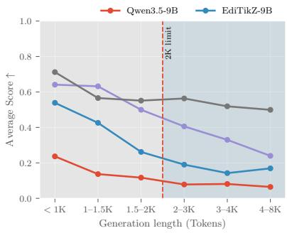

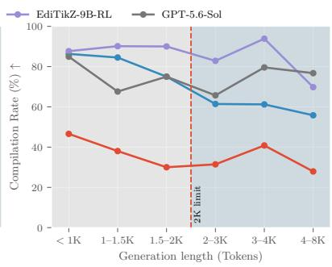  
Figure 7: OOD performance on SPIQA and CharXiv combined by generation length. Average score is $\mathrm { \bar { ( E A + S P + \bar { V } Q ) / 3 } }$ . The red dashed line marks the 2K-token post-training limit.

## 7 CONCLUSION, LIMITATIONS, AND FUTURE WORK

We introduced a scalable framework for recovering naturally occurring scientific-figure revisions from arXiv, GitHub, and TeX SE, instantiated as DaEdiTikZ, a large-scale real-world TikZ edit ing dataset. We further introduced the human-refined DaEdiTikZ-Bench and EdiTikZ, a family of 4–9B models trained with multi-task SFT and multi-reward RL. EdiTikZ-9B-RL leads automatic evaluation and reaches comparable human ratings to the strongest proprietary system. Post-training gains transfer to substantially more complex SPIQA and CharXiv figures, even beyond the 2K-token training horizon. Overall, naturally occurring revision trajectories provide effective supervision for small, open scientific-figure editing models competitive with much larger proprietary systems.

DaEdiTikZ inherits noise from automatically inferred instructions, including omissions and misinterpretations despite filtering and code grounding. Performance also degrades for long OOD generations, motivating post-training on more complex figures in the future. Evaluation in this regime is itself limited by synthetic instructions and potentially less reliable reference-free judging. Beyond these limitations, our visualization-language-agnostic revision-mining framework could extend to Matplotlib or LaTeX tables, while access to source programs could enable localized editing without full reconstruction. Revision trajectories could further support comparative VQA, retrieval, and representation learning, while helping to unify generation and editing within general-purpose scientific visualization models.

## REFERENCES

Shuai Bai, Yuxuan Cai, Ruizhe Chen, Keqin Chen, Xionghui Chen, Zesen Cheng, Lianghao Deng, Wei Ding, Chang Gao, Chunjiang Ge, Wenbin Ge, Zhifang Guo, Qidong Huang, Jie Huang, Fei Huang, Binyuan Hui, Shutong Jiang, Zhaohai Li, Mingsheng Li, Mei Li, Kaixin Li, Zicheng Lin, Junyang Lin, Xuejing Liu, Jiawei Liu, Chenglong Liu, Yang Liu, Dayiheng Liu, Shixuan Liu, Dunjie Lu, Ruilin Luo, Chenxu Lv, Rui Men, Lingchen Meng, Xuancheng Ren, Xingzhang Ren, Sibo Song, Yuchong Sun, Jun Tang, Jianhong Tu, Jianqiang Wan, Peng Wang, Pengfei Wang, Qiuyue Wang, Yuxuan Wang, Tianbao Xie, Yiheng Xu, Haiyang Xu, Jin Xu, Zhibo Yang, Mingkun Yang, Jianxin Yang, An Yang, Bowen Yu, Fei Zhang, Hang Zhang, Xi Zhang, Bo Zheng, Humen Zhong, Jingren Zhou, Fan Zhou, Jing Zhou, Yuanzhi Zhu, and Ke Zhu. Qwen3-vl technical report, 2025a. URL https://arxiv.org/abs/2511.21631.

Shuai Bai, Keqin Chen, Xuejing Liu, Jialin Wang, Wenbin Ge, Sibo Song, Kai Dang, Peng Wang, Shijie Wang, Jun Tang, Humen Zhong, Yuanzhi Zhu, Mingkun Yang, Zhaohai Li, Jianqiang Wan, Pengfei Wang, Wei Ding, Zheren Fu, Yiheng Xu, Jiabo Ye, Xi Zhang, Tianbao Xie, Zesen Cheng, Hang Zhang, Zhibo Yang, Haiyang Xu, and Junyang Lin. Qwen2.5-vl technical report, 2025b. URL https://arxiv.org/abs/2502.13923.

Jonas Belouadi, Anne Lauscher, and Steffen Eger. AutomaTikZ: Text-guided synthesis of scientific vector graphics with TikZ. In The Twelfth International Conference on Learning Representations, 2024a. URL https://openreview.net/forum?id=v3K5TVP8kZ.

Jonas Belouadi, Simone Paolo Ponzetto, and Steffen Eger. DeTikZify: Synthesizing graphics programs for scientific figures and sketches with TikZ. In The Thirty-eighth Annual Conference on Neural Information Processing Systems, 2024b. URL https://openreview.net/forum? id=bcVLFQCOjc.

Jonas Belouadi, Eddy Ilg, Margret Keuper, Hideki Tanaka, Masao Utiyama, Raj Dabre, Steffen Eger, and Simone Ponzetto. TikZero: Zero-shot text-guided graphics program synthesis. In Proceedings of the IEEE/CVF International Conference on Computer Vision (ICCV), pages 17793–17806, October 2025. URL https://openaccess.thecvf.com/content/ ICCV2025/html/Belouadi\_TikZero\_Zero-Shot\_Text-Guided\_Graphics\_ Program\_Synthesis\_ICCV\_2025\_paper.html.

Weihao Bo, Shan Zhang, Yanpeng Sun, Jie Liu, Yongke Yao, Jinhao Du, Wei He, Kai Zou, Zechao Li, and Jingdong Wang. Diagram-mmu: A multi-modal benchmark for scientific diagrams, 2026. URL https://arxiv.org/abs/2608.12262.

Mathilde Caron, Hugo Touvron, Ishan Misra, Herve J´ egou, Julien Mairal, Piotr Bojanowski, and´ Armand Joulin. Emerging properties in self-supervised vision transformers. In Proceedings of the International Conference on Computer Vision (ICCV), 2021.

Steffen Eger, Yong Cao, Jennifer D’Souza, Andreas Geiger, Christian Greisinger, Stephanie Gross, Yufang Hou, Brigitte Krenn, Anne Lauscher, Yizhi Li, Chenghua Lin, Nafise Sadat Moosavi, Wei Zhao, and Tristan Miller. Transforming science with large language models: A survey on ai-assisted scientific discovery, experimentation, content generation, and evaluation, 2026. URL https://arxiv.org/abs/2502.05151.

Stephanie Fu, Netanel Tamir, Shobhita Sundaram, Lucy Chai, Richard Zhang, Tali Dekel, and Phillip Isola. Dreamsim: Learning new dimensions of human visual similarity using synthetic data. In A. Oh, T. Naumann, A. Globerson, K. Saenko, M. Hardt, and S. Levine, editors, Advances in Neural Information Processing Systems, volume 36, pages 50742–50768. Curran Associates, Inc., 2023. URL https://proceedings.neurips.cc/paper\_files/paper/ 2023/file/9f09f316a3eaf59d9ced5ffaefe97e0f-Paper-Conference.pdf.

Jiaxin Ge, Zora Zhiruo Wang, Xuhui Zhou, Yi-Hao Peng, Sanjay Subramanian, Qinyue Tan, Maarten Sap, Alane Suhr, Daniel Fried, Graham Neubig, and Trevor Darrell. Autopresent: Designing structured visuals from scratch. In Proceedings of the IEEE/CVF Conference on Computer Vision and Pattern Recognition (CVPR), pages 2902–2911, June 2025.

Christian Greisinger and Steffen Eger. Tikzilla: Scaling text-to-tikz with high-quality data and reinforcement learning. In The Fourteenth International Conference on Learning Representations, 2026. URL https://openreview.net/forum?id=rJv2byEWA3.

Yaohan Guan, Pristina Wang, Najim Dehak, Alan L. Yuille, Jieneng Chen, and Daniel Khashabi. Genfig1: Visual summaries of scholarly work as a challenge for vision-language models. ArXiv, abs/2604.04172, 2026. URL https://api.semanticscholar.org/ CorpusID:287201464.

Wenxuan Huang, Bohan Jia, Zijie Zhai, Shaosheng Cao, Zheyu Ye, Fei Zhao, Zhe Xu, Xu Tang, Yao Hu, and Shaohui Lin. Vision-r1: Incentivizing reasoning capability in multimodal large language models, 2026. URL https://arxiv.org/abs/2503.06749.

Jing Yu Koh, Robert Lo, Lawrence Jang, Vikram Duvvur, Ming Lim, Po-Yu Huang, Graham Neubig, Shuyan Zhou, Russ Salakhutdinov, and Daniel Fried. VisualWebArena: Evaluating multimodal agents on realistic visual web tasks. In Lun-Wei Ku, Andre Martins, and Vivek Srikumar, editors, Proceedings of the 62nd Annual Meeting of the Association for Computational Linguistics (Volume 1: Long Papers), pages 881–905, Bangkok, Thailand, August 2024. Association for Computational Linguistics. doi: 10.18653/v1/2024.acl-long.50. URL https://aclanthology.org/2024.acl-long.50/.

Max Ku, Dongfu Jiang, Cong Wei, Xiang Yue, and Wenhu Chen. VIEScore: Towards explainable metrics for conditional image synthesis evaluation. In Lun-Wei Ku, Andre Martins, and Vivek Srikumar, editors, Proceedings ofthe 62nd Annual Meeting ofthe Associationfor Computational Linguistics (Volume 1: Long Papers), pages 12268–12290, Bangkok, Thailand, August 2024. Association for Computational Linguistics. doi: 10.18653/v1/2024.acl-long.663. URL https: //aclanthology.org/2024.acl-long.663/.

Josef Kuchaˇr, Marek Kadlcˇ´ık, Michal Spiegel, and Michal Stefˇ anik. Vectoredits: A dataset and´ benchmark for instruction-based editing of vector graphics, 2025. URL https://arxiv. org/abs/2506.15903.

Matt Kusner, Yu Sun, Nicholas Kolkin, and Kilian Weinberger. From Word Embeddings to Document Distances. In International Conference on Machine Learning, volume 37, pages 957–966, 2015. URL https://mlanthology.org/icml/2015/kusner2015icml-word/.

Woosuk Kwon, Zhuohan Li, Siyuan Zhuang, Ying Sheng, Lianmin Zheng, Cody Hao Yu, Joseph E. Gonzalez, Hao Zhang, and Ion Stoica. Efficient memory management for large language model serving with pagedattention. In Proceedings of the ACM SIGOPS 29th Symposium on Operating Systems Principles, 2023.

Kaixin Li, Qisheng Hu, James Xu Zhao, Hui Chen, Yuxi Xie, Tiedong Liu, Michael Shieh, and Junxian He. InstructCoder: Instruction tuning large language models for code editing. In Xiyan Fu and Eve Fleisig, editors, Proceedings ofthe 62nd Annual Meeting ofthe Associationfor Computational Linguistics (Volume 4: Student Research Workshop), pages 473–493, Bangkok, Thailand, August 2024a. Association for Computational Linguistics. ISBN 979-8-89176-097-4. URL https://aclanthology.org/2024.acl-srw.52/.

Lei Li, Yuqi Wang, Runxin Xu, Peiyi Wang, Xiachong Feng, Lingpeng Kong, and Qi Liu. Multimodal ArXiv: A dataset for improving scientific comprehension of large vision-language models. In Lun-Wei Ku, Andre Martins, and Vivek Srikumar, editors, Proceedings of the 62nd Annual Meeting of the Association for Computational Linguistics (Volume 1: Long Papers), pages 14369–14387, Bangkok, Thailand, August 2024b. Association for Computational Linguistics. doi: 10.18653/v1/2024.acl-long.775. URL https://aclanthology.org/2024. acl-long.775/.

Li Li, Ryan A. Rossi, Sungchul Kim, Sunav Choudhary, Franck Dernoncourt, Puneet Mathur, Zhengzhong Tu, and Yue Zhao. Charts are not images: On the challenges of scientific chart editing. In The Fourteenth International Conference on Learning Representations, 2026a. URL https://openreview.net/forum?id=259xBeNyDV.

Qingxiao Li, Zikai Wang, Qingli Wang, and Nan Xu. S1-omni-image: A unified model for scien tific image understanding, generation, and editing, 2026b. URL https://arxiv.org/abs/ 2606.24441.

Juekai Lin, Yun Zhu, Honglin Lin, Sijing Li, Tianwei Lin, Zheng Liu, Xiaoyang Wang, Wenqiao Zhang, and Lijun Wu. Scientific graphics program synthesis via dual self-consistency reinforcement learning, 2026a. URL https://arxiv.org/abs/2604.06079.

Zhen Lin, Qiujie Xie, Minjun Zhu, Shichen Li, Qiyao Sun, Enhao Gu, Yiran Ding, Ke Sun, Fang Guo, Panzhong Lu, Zhiyuan Ning, Yixuan Weng, and Yue Zhang. Autofigure-edit: Generating editable scientific illustration, 2026b. URL https://arxiv.org/abs/2603.06674.

Haotian Liu, Chunyuan Li, Qingyang Wu, and Yong Jae Lee. Visual instruction tuning. In A. Oh, T. Naumann, A. Globerson, K. Saenko, M. Hardt, and S. Levine, editors, Advances in Neural Information Processing Systems, volume 36, pages 34892–34916. Curran Associates, Inc., 2023. URL https://proceedings.neurips.cc/paper\_files/paper/2023/ file/6dcf277ea32ce3288914faf369fe6de0-Paper-Conference.pdf.

Shih-Yang Liu, Xin Dong, Ximing Lu, Shizhe Diao, Peter Belcak, Mingjie Liu, Min-Hung Chen, Hongxu Yin, Yu-Chiang Frank Wang, Kwang-Ting Cheng, Yejin Choi, Jan Kautz, and Pavlo Molchanov. Gdpo: Group reward-decoupled normalization policy optimization for multi-reward rl optimization, 2026. URL https://arxiv.org/abs/2601.05242.

Zichen Liu, Changyu Chen, Wenjun Li, Penghui Qi, Tianyu Pang, Chao Du, Wee Sun Lee, and Min Lin. Understanding r1-zero-like training: A critical perspective. In Second Conference on Language Modeling, 2025. URL https://openreview.net/forum?id=5PAF7PAY2Y.

Ilya Loshchilov and Frank Hutter. Decoupled weight decay regularization, 2019. URL https: //arxiv.org/abs/1711.05101.

Ishani Mondal, Zongxia Li, Yufang Hou, Anandhavelu Natarajan, Aparna Garimella, and Jordan Boyd-Graber. SciDoc2Diagrammer-MAF: Towards generation of scientific diagrams from documents guided by multi-aspect feedback refinement. In Yaser Al-Onaizan, Mohit Bansal, and Yun-Nung Chen, editors, Findings of the Association for Computational Linguistics: EMNLP 2024, pages 13342–13375, Miami, Florida, USA, November 2024. Association for Computational Linguistics. doi: 10.18653/v1/2024.findings-emnlp.780. URL https://aclanthology.org/ 2024.findings-emnlp.780/.

Nafise Moosavi, Andreas Ruckl¨ e, Dan Roth, and Iryna Gurevych.´ Scigen: a dataset for reasoning-aware text generation from scientific tables. In J. Vanschoren and S. Yeung, editors, Proceedings of the Neural Information Processing Systems Track on Datasets and Benchmarks, volume 1, 2021. URL https: //datasets-benchmarks-proceedings.neurips.cc/paper\_files/paper/ 2021/file/149e9677a5989fd342ae44213df68868-Paper-round2.pdf.

Niklas Muennighoff, Qian Liu, Armel Randy Zebaze, Qinkai Zheng, Binyuan Hui, Terry Yue Zhuo, Swayam Singh, Xiangru Tang, Leandro Von Werra, and Shayne Longpre. Octopack: Instruction tuning code large language models. In The Twelfth International Conference on Learning Representations, 2024. URL https://openreview.net/forum?id=mw1PWNSWZP.

Yuansheng Ni, Ping Nie, Kai Zou, Xiang Yue, and Wenhu Chen. VisCoder: Fine-tuning LLMs for executable python visualization code generation. In Christos Christodoulopoulos, Tanmoy Chakraborty, Carolyn Rose, and Violet Peng, editors, Findings of the Association for Computational Linguistics: EMNLP 2025, pages 2956–2983, Suzhou, China, November 2025. Association for Computational Linguistics. ISBN 979-8-89176-335-7. doi: 10.18653/v1/2025. findings-emnlp.160. URL https://aclanthology.org/2025.findings-emnlp. 160/.

Yuansheng Ni, Songcheng Cai, Xiangchao Chen, Jiarong Liang, Zhiheng Lyu, Jiaqi Deng, Kai Zou, Ping Nie, Fei Yuan, Xiang Yue, and Wenhu Chen. Viscoder2: Building multi-language visualization coding agents. In The Fourteenth International Conference on Learning Representations, 2026. URL https://openreview.net/forum?id=4zoMnmZzh4.

Wei Pang, Kevin Qinghong Lin, Xiangru Jian, Xi He, and Philip Torr. Paper2poster: Towards multimodal poster automation from scientific papers. In D. Belgrave, C. Zhang, H. Lin, R. Pascanu, P. Koniusz, M. Ghassemi, and N. Chen, editors, Advances in Neural Information Processing Systems, volume 38. Curran Associates, Inc., 2025. URL https://proceedings.neurips.cc/paper\_files/paper/2025/file/ 17337b1d5eeac8b59c80e025a552fa7a-Paper-Datasets\_and\_Benchmarks\_ Track.pdf.

Shraman Pramanick, Rama Chellappa, and Subhashini Venugopalan. Spiqa: A dataset for multimodal question answering on scientific papers. In A. Globerson, L. Mackey, D. Belgrave, A. Fan, U. Paquet, J. Tomczak, and C. Zhang, editors, Advances in Neural Information Processing Systems, volume 37, pages 118807–118833. Curran Associates, Inc., 2024. doi: 10.52202/079017-3773. URL https://proceedings.neurips.cc/paper\_files/ paper/2024/file/d74033a247989e8f6f3bf9e0c9629fb5-Paper-Datasets\_ and\_Benchmarks\_Track.pdf.

Qwen Team. Qwen3.5: Towards native multimodal agents, February 2026. URL https://qwen. ai/blog?id=qwen3.5.

Alec Radford, Jong Wook Kim, Chris Hallacy, Aditya Ramesh, Gabriel Goh, Sandhini Agarwal, Girish Sastry, Amanda Askell, Pamela Mishkin, Jack Clark, et al. Learning transferable visual models from natural language supervision. In International conference on machine learning, pages 8748–8763. PmLR, 2021.

Mizanur Rahman, Arshia Azimlu, Shadikur Rahman, Md Tahmid Rahman Laskar, Amran Bhuiyan, Shafiq Joty, and Enamul Hoque Prince. Viseditbench: Can vision-language models edit visual ization code from multimodal feedback?, 2026. URL https://arxiv.org/abs/2608. 10408.

Samyam Rajbhandari, Jeff Rasley, Olatunji Ruwase, and Yuxiong He. Zero: Memory optimizations toward training trillion parameter models. In SC20: international conference for high performance computing, networking, storage and analysis, pages 1–16. IEEE, 2020.

Juan Rodriguez, Haotian Zhang, Abhay Puri, Rishav Pramanik, Aarash Feizi, Pascal Wichmann, Arnab Mondal, Mohammad R. Samsami, Rabiul Awal, Perouz Taslakian, Spandana Gella, Sai Rajeswar Mudumba, David Vazquez, Chris Pal, and Marco Pedersoli. Renderingaware reinforcement learning for vector graphics generation. In D. Belgrave, C. Zhang, H. Lin, R. Pascanu, P. Koniusz, M. Ghassemi, and N. Chen, editors, Advances in Neural Information Processing Systems, volume 38, pages 60496–60534. Curran Associates, Inc., 2025a. URL https://proceedings.neurips.cc/paper\_files/paper/2025/ file/57126328c3b40cf618a34f1c5df24d8a-Paper-Conference.pdf.

Juan A. Rodriguez, Abhay Puri, Shubham Agarwal, Issam H. Laradji, Pau Rodriguez, Sai Rajeswar, David Vazquez, Christopher Pal, and Marco Pedersoli. StarVector: Generating Scalable Vector Graphics Code from Images and Text. In Conference on Computer Vision and Pattern Recognition, pages 16175–16186, 2025b. doi: 10.1109/CVPR52734.2025.01508. URL https://mlanthology.org/cvpr/2025/rodriguez2025cvpr-starvector/.

Juan A. Rodriguez, Haotian Zhang, Abhay Puri, Aly Shariff, Meng lin, Xiaoqing Xie, Tianyang Zhang, Rishav Pramanik, Sai Rajeswar, Perouz Taslakian, Spandana Gella, David Vazquez, Christopher Pal, and Marco Pedersoli. Vectorgym: A multi-task benchmark for SVG code generation and manipulation, 2026. URL https://openreview.net/forum?id= DBFbNT65xO.

Qiushi Sun, Zhoumianze Liu, Chang Ma, Zichen Ding, Fangzhi Xu, Zhangyue Yin, Haiteng Zhao, Zhenyu Wu, Kanzhi Cheng, Zhaoyang Liu, Jianing Wang, Qintong Li, Xiangru Tang, Tianbao Xie, Xiachong Feng, Xiang Li, Ben Kao, Wenhai Wang, Biqing Qi, Lingpeng Kong, and Zhiyong Wu. Scienceboard: Evaluating multimodal autonomous agents in realistic scientific workflows, 2026. URL https://arxiv.org/abs/2505.19897.

Zitian Tang, Xu Zhang, Jianbo Yuan, Yang Zou, Varad Gunjal, Songyao Jiang, and Davide Modolo. Mm-recoder: Advancing chart-to-code generation with reinforcement learning and selfcorrection. In Proceedings ofthe IEEE/CVF Conference on Computer Vision and Pattern Recognition (CVPR), pages 22164–22173, June 2026.

Zhaokai Wang, Mingxin Liu, Zirun Zhu, Ziqian Fan, Yiguo He, Mohan Zhang, Leyao Gu, Xiangyu Zhao, Ning Liao, Shaofeng Zhang, Xuanhe Zhou, Zhihang Zhong, Junchi Yan, and Xue Yang. Disciplinegen-1m: A large-scale dataset for multidisciplinary visual generation and editing, 2026. URL https://arxiv.org/abs/2607.02290.

Zirui Wang, Mengzhou Xia, Luxi He, Howard Chen, Yitao Liu, Richard Zhu, Kaiqu Liang, Xindi Wu, Haotian Liu, Sadhika Malladi, Alexis Chevalier, Sanjeev Arora, and Danqi Chen. Charxiv: Charting gaps in realistic chart understanding in multimodal llms. In A. Globerson, L. Mackey, D. Belgrave, A. Fan, U. Paquet, J. Tomczak, and C. Zhang, editors, Advances in Neural Information Processing Systems, volume 37, pages 113569–113697. Curran Associates, Inc., 2024. doi: 10.52202/079017-3609. URL https://proceedings.neurips.cc/paper\_files/ paper/2024/file/cdf6f8e9fd9aeaf79b6024caec24f15b-Paper-Datasets\_ and\_Benchmarks\_Track.pdf.

Jiayi Wei, Greg Durrett, and Isil Dillig. Coeditor: Leveraging repo-level diffs for code auto-editing. In The Twelfth International Conference on Learning Representations, 2024. URL https: //openreview.net/forum?id=ALVwQjZRS8.

Jingxuan Wei, Cheng Tan, Qi Chen, Gaowei Wu, Siyuan Li, Zhangyang Gao, Linzhuang Sun, Bihui Yu, and Ruifeng Guo. From words to structured visuals: A benchmark and framework for textto-diagram generation and editing. In Proceedings of the IEEE/CVF Conference on Computer Vision and Pattern Recognition (CVPR), pages 13315–13325, June 2025.

Rong Wu, Wanchao Su, and Jing Liao. Chat2svg: Vector graphics generation with large language models and image diffusion models. 2025 IEEE/CVF Conference on Computer Vision and Pattern Recognition (CVPR), pages 23690–23700, 2024. URL https://api.semanticscholar. org/CorpusID:274280554.

Haoyue Yang, Xuanle Zhao, Xuexin Liu, Feibing Jiang, and Yao Zhu. OmniDiagram: Advancing unified diagram code generation via visual interrogation reward. In Maria Liakata, Viviane P. Moreira, Jiajun Zhang, and David Jurgens, editors, Findings ofthe Associationfor Computational Linguistics: ACL 2026, pages 16430–16452, San Diego, California, United States, July 2026. Association for Computational Linguistics. ISBN 979-8-89176-395-1. doi: 10.18653/v1/2026. findings-acl.809. URL https://aclanthology.org/2026.findings-acl.809/.

Zhiyu Yang, Zihan Zhou, Shuo Wang, Xin Cong, Xu Han, Yukun Yan, Zhenghao Liu, Zhixing Tan, Pengyuan Liu, Dong Yu, Zhiyuan Liu, Xiaodong Shi, and Maosong Sun. MatPlotAgent: Method and evaluation for LLM-based agentic scientific data visualization. In Lun-Wei Ku, Andre Martins, and Vivek Srikumar, editors, Findings ofthe Associationfor Computational Linguistics: ACL 2024, pages 11789–11804, Bangkok, Thailand, August 2024. Association for Computational Linguistics. doi: 10.18653/v1/2024.findings-acl.701. URL https://aclanthology.org/ 2024.findings-acl.701/.

Qiying Yu, Zheng Zhang, Ruofei Zhu, Yufeng Yuan, Xiaochen Zuo, YuYue, Weinan Dai, Tiantian Fan, Gaohong Liu, Juncai Liu, LingJun Liu, Xin Liu, Haibin Lin, Zhiqi Lin, Bole Ma, Guangming Sheng, Yuxuan Tong, Chi Zhang, Mofan Zhang, Ru Zhang, Wang Zhang, Hang Zhu, Jinhua Zhu, Jiaze Chen, Jiangjie Chen, Chengyi Wang, Hongli Yu, Yuxuan Song, Xiangpeng Wei, Hao Zhou, Jingjing Liu, Wei-Ying Ma, Ya-Qin Zhang, Lin Yan, Yonghui Wu, and Mingxuan Wang. DAPO: An open-source LLM reinforcement learning system at scale. In The Thirty-ninth Annual Conference on Neural Information Processing Systems, 2025. URL https://openreview. net/forum?id=2a36EMSSTp.

Xingchen ZENG, Zhewei Su, Hengming Zhang, Juyong Jiang, Jiazhi Xia, and Wei Zeng. Davinci: Reinforcing visual-structural syntax in MLLMs for generalized scientific diagram parsing. In The Fourteenth International Conference on Learning Representations, 2026. URL https: //openreview.net/forum?id=OAXECnLxuk.

Leixin Zhang, Steffen Eger, Yinjie Cheng, WEIHE ZHAI, Jonas Belouadi, Fahimeh Moafian, and Zhixue Zhao. Scimage: How good are multimodal large language models at scientific text-toimage generation? In The Thirteenth International Conference on Learning Representations, 2025. URL https://openreview.net/forum?id=ugyqNEOjoU.

Zhuosheng Zhang, Aston Zhang, Mu Li, Hai Zhao, George Karypis, and Alex Smola. Multimodal chain-of-thought reasoning in language models, 2024. URL https://arxiv.org/abs/ 2302.00923.

Haozhe Zhao, Shuzheng Si, Zhenhailong Wang, Zheng Wang, Liang Chen, Xiaotong Li, Zhixiang Liang, Maosong Sun, and Minjia Zhang. Crafter: A multi-agent harness for editable scientific figure generation from diverse inputs, 2026. URL https://arxiv.org/abs/2605.30611.

Xuanle Zhao, Xuexin Liu, Yang Haoyue, Xianzhen Luo, Fanhu Zeng, Jianling Li, Qi Shi, and Chi Chen. ChartEdit: How far are MLLMs from automating chart analysis? evaluating MLLMs’ capability via chart editing. In Wanxiang Che, Joyce Nabende, Ekaterina Shutova, and Mohammad Taher Pilehvar, editors, Findings of the Association for Computational Linguistics: ACL 2025, pages 3616–3630, Vienna, Austria, July 2025. Association for Computational Linguistics. ISBN 979-8-89176-256-5. doi: 10.18653/v1/2025.findings-acl.185. URL https://aclanthology.org/2025.findings-acl.185/.

Dawei Zhu, Rui Meng, Yale Song, Xiyu Wei, Sujian Li, Tomas Pfister, and Jinsung Yoon. Paperbanana: Automating academic illustration for ai scientists. arXiv preprint arXiv:2601.23265, 2026.

Bocheng Zou, Mu Cai, Jianrui Zhang, and Yong Jae Lee. VGBench: Evaluating large language models on vector graphics understanding and generation. In Yaser Al-Onaizan, Mohit Bansal, and Yun-Nung Chen, editors, Proceedings of the 2024 Conference on Empirical Methods in Natural Language Processing, pages 3647–3659, Miami, Florida, USA, November 2024. Association for Computational Linguistics. doi: 10.18653/v1/2024.emnlp-main.213. URL https://aclanthology.org/2024.emnlp-main.213/.

## A APPENDIX

## A.1 DATASET AND BENCHMARK

## A.1.1 INFERRING EDIT INSTRUCTIONS

For large-scale edit instruction inference, we use Qwen3.6-27B (non-thinking) conditioned jointly on image pair and TikZ code. Temperature is 0.1, top p is 1.0, and output tokens are set to 1024. On 4× NVIDIA H100 (94 GB) GPUs with the vLLM (Kwon et al., 2023) framework, this took 11 days. The prompt is in Figure 8.

## VLM Instruction Generation

Your task is to analyze the differences between two scientific figures given as:   
Image 1 + TikZ Code 1   
Image 2 + TikZ Code 2   
Provide detailed descriptions of the edits needed to transform the first scientific   
figure into the second.   
Requirements:   
0) Pair quality: Before listing any edits, decide whether Image 2 is a plausible   
edited version of Image 1.   
"ok": same underlying figure or scene with a plausible edit path.   
"identical": no visible differences and no code changes implying visible   
differences.   
- "invalid": no plausible edit path or no shared figure identity (e.g., different   
figure type, different number of panels, different main subject, or no shared   
anchors).   
1) Code-first, render-grounded: Use the TikZ code to discover candidate differences   
between the figures. Only keep differences that produce a perceptible change in the   
rendered images. Describe edits using human-visible anchors from the images (rendered

text, mathematics, relative location, appearance, connectivity), not code-only   
identifiers or absolute coordinates.   
2) Atomic and reconstructable: Each edit must describe exactly one logical change and   
include enough concrete before→after detail that a human, given Image 1 alone, could   
plausibly recreate the corresponding part of Image 2. If many elements change in the   
same way, group them into one global edit, but enumerate the specific visible changes.   
Output requirements:   
- Report ONLY differences (no full image or code descriptions).   
- Output ONLY valid JSON (no extra text and no trailing commas).   
Return exactly the following JSON format:   
{   
"pair quality": "ok|identical|invalid",   
"edits": [   
{   
"intent": "add|remove|modify",   
"operation": "text|annotation|geometry|style|data|structure|other",   
"detailed change": "specific human-visible description"   
}   
]   
}   
If pair quality is "identical", return exactly:   
{ "pair quality": "identical", "edits": [] }   
If pair quality is "invalid", return exactly:   
{ "pair quality": "invalid", "edits": [] }   
Operation guidance:   
- text: visible strings or mathematics (labels, titles, tick labels, axis names,   
legend entries).   
- annotation: explanatory or highlighting elements (arrows, callouts, braces,   
highlight boxes, emphasis marks).   
- geometry: position, shape, size, orientation, alignment, or spacing of visible   
elements.   
- style: appearance changes that do not alter the encoded meaning (color, line style,   
thickness, opacity, font).   
- data: changes to plotted or encoded values, including new points, curves, colormap   
normalization, or category-to-color mappings.   
- structure: high-level organization while preserving the same underlying figure   
identity (e.g., added or removed panels, plot type changes of the same data, topology   
changes in the same diagram).   
- other: visible changes not covered above (e.g., clipping, layer ordering, global   
transforms).   
TikZ Code 1:   
{code 1}   
TikZ Code 2:   
{code 2}   
Your output JSON:

Table 6: Summary statistics for DaEdiTikZ. A retained pair has both directions with pair quality=ok. Each valid direction forms a separate editing trajectory.
<table><tr><td>Statistic</td><td>Value 87,051</td></tr><tr><td colspan="2">Total groups</td></tr><tr><td colspan="2">Unique figures 430,442 / 860,884</td></tr><tr><td colspan="2">Candidate figure pairs / trajectories</td></tr><tr><td colspan="2">Bidirectional valid pairs / trajectories</td></tr><tr><td colspan="2">Total atomic edits</td></tr><tr><td colspan="2">Mean atomic edits per trajectory (median; P95 / P99)</td></tr><tr><td>Mean atomic edit length</td><td>4.20 (4; 9 / 13)</td></tr><tr><td>Mean trajectory length</td><td>22.3 words (127.0 characters) 93.6 words (533.9 characters)</td></tr></table>

Table 7: Directional response quality and pair-level retention of all 430,442 candidate pairs.
<table><tr><td>Level</td><td>Outcome</td><td>Count</td><td>Percentage</td></tr><tr><td rowspan="4">Forward direction</td><td>OK</td><td>401,357</td><td>93.24%</td></tr><tr><td>Invalid</td><td>17,770</td><td>4.13%</td></tr><tr><td>Identical</td><td>4,151</td><td>0.96%</td></tr><tr><td>Missing</td><td>7,164</td><td>1.66%</td></tr><tr><td rowspan="4">Backward direction</td><td>OK</td><td>400,892</td><td>93.13%</td></tr><tr><td>Invalid</td><td>18,191</td><td>4.23%</td></tr><tr><td>Identical</td><td>4,243</td><td>0.99%</td></tr><tr><td>Missing</td><td>7,116</td><td>1.65%</td></tr><tr><td rowspan="2">Candidate pair</td><td>Both directions valid</td><td>390,516</td><td>90.72%</td></tr><tr><td>Excluded</td><td>39,926</td><td>9.28%</td></tr></table>

DaEdiTikZ connects 590K unique figures through 430K candidate pairs from 87K context groups. Pair validation retains 90.7% of candidates, yielding 781K directional trajectories and 3.28M atomic edits. Figure reuse is limited. 69.3% of figures occur in only one pair and 97.3% in at most three (Table 6).

Quality is nearly symmetric across directions, with 93.2% of both forward and backward responses accepted. 390.5K pairs support supervision in both directions (Table 7).

Table 8: Frequency and description length of atomic edits by intent and operation.
<table><tr><td>Dimension</td><td>Category</td><td>Atomic edits</td><td>Share</td><td>Words/edit</td><td>Characters/edit</td></tr><tr><td rowspan="3">Intent</td><td>Add</td><td>418,547</td><td>12.75%</td><td>19.31</td><td>107.47</td></tr><tr><td>Modify</td><td>2,515,332</td><td>76.64%</td><td>23.53</td><td>134.14</td></tr><tr><td>Remove</td><td>348,167</td><td>10.61%</td><td>16.65</td><td>99.19</td></tr><tr><td rowspan="6">Operation</td><td>Annotation</td><td>372,974</td><td>11.36%</td><td>20.24</td><td>117.69</td></tr><tr><td>Data</td><td>322,790</td><td>9.83%</td><td>32.33</td><td>174.08</td></tr><tr><td>Geometry</td><td>657,043</td><td>20.02%</td><td>25.90</td><td>147.39</td></tr><tr><td>Structure</td><td>246,587</td><td>7.51%</td><td>28.38</td><td>164.97</td></tr><tr><td>Style</td><td>302,560</td><td>9.22%</td><td>21.31</td><td>119.78</td></tr><tr><td>Text</td><td>1,380,250</td><td>42.05%</td><td>17.84</td><td>103.68</td></tr></table>

Table 9: Intent distribution conditioned on operation.
<table><tr><td>Operation</td><td>Add</td><td>Modify</td><td>Remove</td></tr><tr><td>Annotation</td><td>41.21%</td><td>27.94%</td><td>30.85%</td></tr><tr><td>Data</td><td>9.47%</td><td>81.18%</td><td>9.35%</td></tr><tr><td>Geometry</td><td>10.05%</td><td>81.08%</td><td>8.88%</td></tr><tr><td>Structure</td><td>23.52%</td><td>50.19%</td><td>26.28%</td></tr><tr><td>Style</td><td>0.70%</td><td>98.49%</td><td>0.81%</td></tr><tr><td>Text</td><td>7.84%</td><td>86.56%</td><td>5.61%</td></tr></table>

Most naturally occurring revisions modify existing content (76.6%), while additions and removals jointly account for 23.4% (Table 8). Text is the most frequent operation (42.1%), followed by geometry (20.0%), annotation (11.4%), data (9.8%), style (9.2%), and structure (7.5%). Description length also varies systematically with edit semantics. Data and structural changes require the longest descriptions, averaging 32.3 and 28.4 words per edit, whereas text edits average 17.8 words. Modifications are longer than additions and removals, consistent with the need to specify both an existing and a desired state.

Intent depends strongly on operation (Table 9). Text, geometry, data, and especially style edits predominantly modify existing content (>80%). In contrast, 50.2% of structure and 27.9% of annotation edits modify an element. Structure is balanced across additions and removals (23.5% vs. 26.3%), whereas annotations include more additions (41.2% vs. 30.9%).

Table 10: Intent and Operation distribution across semantic similarity intervals.
<table><tr><td rowspan="2">Similarity</td><td colspan="3">Intent</td><td colspan="6">Operation</td></tr><tr><td>Add</td><td>Modify</td><td>Remove</td><td>Annotation</td><td>Data</td><td>Geometry</td><td>Structure</td><td>Style</td><td>Text</td></tr><tr><td>[0.95, 0.96]</td><td>16.41</td><td>70.69</td><td>12.89</td><td>13.84</td><td>7.84</td><td>18.21</td><td>9.13</td><td>8.53</td><td>42.45</td></tr><tr><td>[0.96, 0.97)</td><td>14.97</td><td>72.94</td><td>12.09</td><td>12.79</td><td>8.60</td><td>19.06</td><td>8.82</td><td>8.55</td><td>42.17</td></tr><tr><td>[0.97, 0.98)</td><td>13.08</td><td>75.81</td><td>11.10</td><td>11.49</td><td>9.76</td><td>20.21</td><td>7.90</td><td>8.73</td><td>41.91</td></tr><tr><td>[0.98, 0.99)</td><td>10.04</td><td>80.90</td><td>9.06</td><td>9.37</td><td>11.75</td><td>21.82</td><td>6.19</td><td>9.29</td><td>41.58</td></tr><tr><td>[0.99, 1.00]</td><td>5.16</td><td>89.77</td><td>5.07</td><td>6.70</td><td>13.27</td><td>22.35</td><td>3.39</td><td>12.34</td><td>41.95</td></tr></table>

Table 11: Candidate distribution, quality, and edit magnitude across semantic similarity intervals.
<table><tr><td>Similarity</td><td>Pairs</td><td>Share</td><td>Retention</td><td>Invalid</td><td>Identical</td><td>Edits/traj.</td><td>Words/edit</td></tr><tr><td>[0.95,0.96)</td><td>95,641</td><td>22.22%</td><td>81.91%</td><td>12.09%</td><td>0.04%</td><td>5.29</td><td>20.86</td></tr><tr><td>[0.96, 0.97)</td><td>83,942</td><td>19.50%</td><td>90.05%</td><td>5.24%</td><td>0.08%</td><td>4.96</td><td>21.39</td></tr><tr><td>[0.97,0.98)</td><td>79,764</td><td>18.53%</td><td>94.47%</td><td>1.81%</td><td>0.12%</td><td>4.48</td><td>22.11</td></tr><tr><td>[0.98, 0.99)</td><td>80,295</td><td>18.65%</td><td>96.55%</td><td>0.47%</td><td>0.28%</td><td>3.82</td><td>23.23</td></tr><tr><td>[0.99, 1.00]</td><td>90,098</td><td>20.93%</td><td>92.91%</td><td>0.22%</td><td>4.19%</td><td>2.61</td><td>25.35</td></tr></table>

Lower-similarity pairs contain more additions and removals, whereas higher similarity pairs contain more modifications. Moreover, highly similar pairs primarily modify existing geometry, data, and style while annotation and structural changes correspond to lower similarity. Text remains stable at approximately 42% across all intervals (Table 10).

The five intervals each contain between 18.5% and 22.2% of candidates in Table 11. Mean edit count decreases monotonically from 5.29 to 2.61 as similarity increases, while description length rises from 20.9 to 25.4 words per edit. Bidirectional retention peaks at 96.6% in [0.98, 0.99). Lower similarities increasingly produce non-plausible edit pairs, whereas the highest interval contains more identical pairs that differ only at the code level (e.g., through refactoring).

Table 12: Source-specific characteristics.
<table><tr><td>Source</td><td>Pairs</td><td>Share</td><td>Groups</td><td>Retention</td><td>Edits/traj.</td><td>Words/edit</td><td>Intent</td><td>Operation</td></tr><tr><td>arXiv</td><td>402,411</td><td>93.49%</td><td>79,246</td><td>90.90%</td><td>4.23</td><td>22.26</td><td>Modify 76.66%, add 12.74%, remove 10.59%</td><td>Text 42.34%, geometry 20.02%, annotation 11.29%, data 9.78%, style 9.09%, structure 7.47%</td></tr><tr><td>GitHub</td><td>21,891</td><td>5.09%</td><td>3,032</td><td>87.98%</td><td>4.12</td><td>21.69</td><td>Modify 76.14%, add 13.09%, remove 10.77%</td><td>Text 40.38%, geometry 17.51%, annotation 12.64%, data 11.31%, style 9.49%, structure 8.66%</td></tr><tr><td>TeX SE</td><td>6,068</td><td>1.41%</td><td>4,761</td><td>89.26%</td><td>2.29</td><td>26.52</td><td>Modify 77.11%, add 11.49%, remove 11.40%</td><td>Geometry 36.04%, style 23.26%, text 16.73%, anno- tation 11.76%, data 6.98%, structure 5.23%</td></tr></table>

Table 13: Guidelines for annotating errors in VLM-generated edit instructions.
<table><tr><td>Category</td><td>Guideline</td></tr><tr><td>Error</td><td>The instruction contains at least one of omission, hallucination, or misinterpre- tation.</td></tr><tr><td>Omission Hallucination</td><td>A change is absent or only partially captured by the instruction. A change is specified for which no corresponding source-to-target change exists.</td></tr><tr><td>Attribute</td><td>Misinterpretation A change is identified but describes one or more of its properties incorrectly. An edited object&#x27;s identity, appearance, style, text, shape, or other non-numeric</td></tr><tr><td>Numeric</td><td>property is described incorrectly. A numerical value or quantitative change is described incorrectly (e.g., values,</td></tr><tr><td>Spatial</td><td>counts, dimensions, or magnitudes).</td></tr><tr><td></td><td>The spatial relation, position, orientation, direction, or arrangement of edited elements is described incorrectly.</td></tr></table>

ArXiv supplies most trajectories and is primarily text-centered, whereas GitHub contains more annotation and data edits. TeX SE provides a distinct form of supervision. Its trajectories contain fewer atomic edits (2.3 versus 4.2) but require the most detailed instructions (26.5 words per edit versus 22). It predominantly involves geometric and stylistic over textual refinements (Table 12).

## A.1.2 DATASET QUALITY ANALYSIS

Our dataset quality analysis involved one master’s student and one PhD student. Both annotators completed the evaluation sheet in Figure 9. The guidelines for completing our evaluation form are

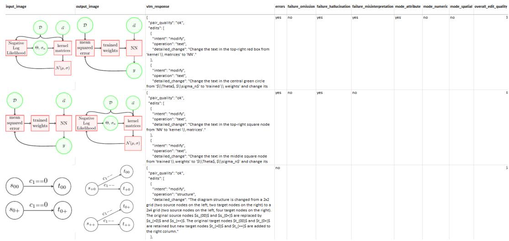  
Figure 9: Screenshot of our excel sheet for evaluating the directional VLM-generated edit instructions.

summarized in Table 13.

## A.1.3 DAEDITIKZ-BENCH

Six annotators (four master’s students, one PhD student, one assistant professor) manually correct all 790 VLM-generated instructions from our benchmark. Similar to the dataset quality analysis, they were provided with the source image, target image, and the raw VLM response in JSON objects/entries. For omissions, they append another part of the JSON object (with intent, operation, and detailed change), where the missed change is described. For hallucination, the corresponding part of the JSON object is removed and misinterpretation keeps it but corrects the error. The correction sheet is in Figure 10.

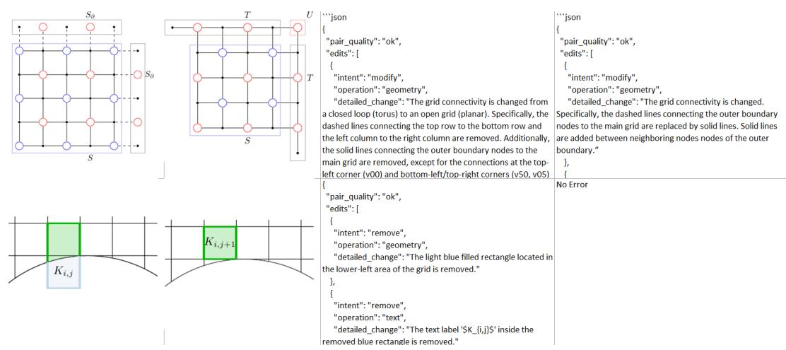  
Figure 10: Screenshot of our excel sheet for correcting the directional VLM-generated edit instructions.

## A.2 METHOD

## A.2.1 JOINT RECONSTRUCTION AND EDITING SFT

Figure 11 and 12 present the prompts for joint editing and reconstruction SFT. The editing prompt is used across all training stages and evaluation of all models.

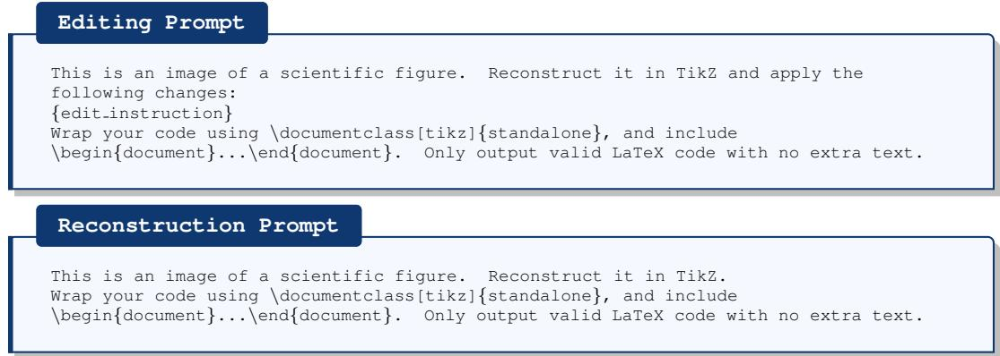

## A.2.2 EDITING-SPECIFIC REWARDS

The prompt template for our instruction-following reward $\mathcal { R } _ { \mathrm { I F } }$ is shown in Figure 13. As our VLM-as-a-judge backbone, we use Qwen3.6-27B (thinking disabled). It uses greedy decoding (temperature=0.0 and top p=1.0) and 128 output tokens. Judging is done with vLLM on 1 x Nvidia H100 (94 GB).

VLM-as-a-Judge ( IF)   
You are a strict visual reward judge for scientific figure editing.   
You are given TWO images:   
- Image 1 is the source figure before editing.   
- Image 2 is the predicted figure after editing.

You are also given a list of requested atomic edits.   
Judge whether Image 2 applies each requested atomic edit relative to Image 1.   
For each atomic edit, decide whether the rendered image visibly and fully applies that   
edit.   
Binary rating rubric:   
1 = APPLIED. All essential visible requirements are satisfied in the predicted   
figure, the correct target was modified, requested text or mathematics is legible,   
and conflicting old content is absent.   
0 = NOT APPLIED. The edit is absent, incomplete, incorrect, applied to the wrong   
target, contradicted by old content, insufficiently legible, or cannot be reliably   
verified.   
Important judging rules:   
- Score the predicted figure, not the source figure.   
- Use the source figure only to identify original objects, positions, labels, shapes,   
connections, and content that should be added, removed, or modified.   
- Judge only visible instruction faithfulness, not general similarity or visual   
beauty.   
- Do not give credit for incomplete or ambiguous attempts.   
- For an edit with multiple required parts, return 1 only if all essential parts are   
visibly satisfied.   
- For text and mathematical edits, return 1 only if the requested content is legible.   
- If an edit changes X to Y, return 1 only if Y is visible at the correct location and   
conflicting X is absent there.   
- For removals, return 1 only if the specified original content is absent from its   
original location.   
- Evaluate every edit independently and preserve the exact order.   
- Return exactly one integer per atomic edit.   
Return ONLY compact valid JSON in exactly this format:   
{   
"ratings": [0, 0, ..., 0]   
}   
The array length must exactly match the number of atomic edits.   
Atomic edits:   
{atomic edits}   
Your output JSON:

## A.2.3 MULTI-REWARD OPTIMIZATION WITH GDPO

GDPO independently normalizes the advantages induced by $\mathcal { R } _ { \mathrm { S S i m } }$ and $\mathcal { R } _ { \mathrm { I F } }$ across its rollout group before combining them with equal weights. For the policy loss, we adopt the constant-length normalization proposed by Dr.GRPO (Liu et al., 2025) where the summed token-level loss of each rollout is normalized by the fixed maximum completion length L which avoids introducing a response-lengthdependent optimization bias for TikZ programs. We further adopt DAPO’s Clip-Higher strategy (Yu et al., 2025), using asymmetric clipping with $\epsilon _ { \mathrm { l o w } } = 0 . 2$ and $\epsilon _ { \mathrm { h i g h } } = 0 . 2 8$ . The relaxed upper bound allows larger probability increases for low-probability exploratory tokens while the lower bound remains unchanged. Rollouts are sampled with temperature=1.0 and top p=0.99, with a maximum completion length of 2048 tokens. Completions truncated at this limit are excluded from the policy loss. We disable KL regularization (β = 0).

## A.3 EXPERIMENTS

## A.3.1 MODELS

We use separate hyperparameter configurations for models in the 3–4B (Small) and 8–9B (Large) parameter ranges during both SFT and RL. The configurations are summarized in Table 14. Input images are resized to 448 × 448. We exclude samples whose TikZ code exceeds 4,000 characters or whose instruction exceeds 2,000 characters. Optimization uses AdamW (Loshchilov and Hutter, 2019). We train with Deepspeed ZeRO-2 (Rajbhandari et al., 2020). All open-source baselines and trained models are evaluated on DaEdiTikZ-Bench with a maximum of 2,048 output tokens, temper ature 0.2, top-p 0.9, and top-k 50. Proprietary GPT and Gemini models use their default reasoning settings and a maximum output budget of 10K tokens. For the out-of-distribution evaluation on CharXiv and SPIQA, we use temperature 0.1 and a 10K-token output budget for both open-source and proprietary models to test extrapolation beyond the open models’ training output regime.

Table 14: Training hyperparameters for the small (3–4B) and large (8–9B) models.
<table><tr><td rowspan="2">Hyperparameter</td><td colspan="2">SFT</td><td colspan="2">RL</td></tr><tr><td>Small</td><td>Large</td><td>Small</td><td>Large</td></tr><tr><td>Training duration (days)</td><td>6</td><td>13</td><td>8</td><td>10</td></tr><tr><td>GPUs</td><td>4x H100</td><td>4x H100</td><td>3xH100</td><td>3x H100</td></tr><tr><td>Epochs</td><td>2</td><td>2</td><td>1</td><td>1</td></tr><tr><td>Per-device batch size</td><td>10</td><td>6</td><td>10</td><td>6</td></tr><tr><td>Gradient accumulation steps</td><td>4</td><td>7</td><td>6</td><td>10</td></tr><tr><td>Learning rate</td><td>1 × 10−4</td><td>2 × 10 -5</td><td>2 × 10−6</td><td>1 × 10 -6</td></tr><tr><td>Learning-rate scheduler</td><td>cosine</td><td>cosine</td><td>constant</td><td>constant</td></tr><tr><td>Weight decay</td><td>0.0</td><td>0.0</td><td>0.01</td><td>0.01</td></tr><tr><td>Generations per prompt</td><td>一</td><td></td><td>8</td><td>8</td></tr></table>

## A.3.2 METRICS

TeX Edit Distance (TED) uses Extended Edit Distance (Kusner et al., 2015) with TexLexer. DreamSim (DSim) uses an ensemble of CLIP (Radford et al., 2021), DINO (Caron et al., 2021), and OpenCLIP (ViT-B/16). Average tokens (AT) are measured with the o200k base tokenizer. Figure 14 presents our task specific VLM-as-a-Judge metric for Edit Application (EA), Source preservation (SP), and Visual Quality (VQ).

VLM-as-a-Judge (EA, SP, and VQ)   
You are evaluating whether a predicted edited scientific figure correctly follows an   
edit instruction.   
You are given:   
1. The edit instruction   
2. The original source figure image before editing   
3. The predicted edited figure image   
4. A reference target figure image showing one intended edited result   
Important:   
- The edit instruction is the primary specification.   
- The reference target image is a helpful guide for the intended result, but it may   
contain minor artifacts, imperfect alignment, or details not fully described in the   
instruction.   
- Do not require the prediction to copy harmless imperfections from the reference   
target.   
- Reward predictions that correctly apply the instruction, preserve unrelated source   
content/avoid extra changes, and remain visually clean.   
Score the prediction on three criteria from 0 to 10.   
Criterion 1: edit application score   
How completely and correctly are the requested edits applied?   
0 = no requested edits are applied or the prediction is unrelated/unusable   
1-2 = almost all requested edits are missing or wrong   
3-4 = a few requested edits are attempted, but most are missing/wrong   
5-6 = some requested edits are correct, but important edits are missing or inaccurate   
7-8 = most requested edits are correct, with minor omissions or inaccuracies   
9 = essentially all requested edits are correct, with only tiny issues   
10 = all requested edits are applied correctly and completely   
Criterion 2: source preservation score   
How well does the prediction preserve all source content not required to change, and   
avoid adding/removing unrelated elements?   
0 = unchanged source content is completely lost, corrupted, replaced, or dominated by   
unrelated additions   
1-2 = most unchanged content is badly altered, removed, or many unrelated elements are   
added   
3-4 = many unchanged elements are altered, missing, misplaced, or extra unrelated   
elements are present   
5-6 = major unchanged structure is preserved, but several details change unnecessarily   
or some unrelated elements appear   
7-8 = most unchanged content is preserved, with only minor/moderate unrelated changes   
9 = nearly all unchanged content is preserved, with only tiny unrelated differences   
10 = all unchanged source content is preserved very well and no unrelated elements are   
introduced

Table 15: Reconstruction performance on the 790 endpoint figures of DaEdiTikZ-Bench.
<table><tr><td>Model</td><td>TED↓</td><td>DSim↑</td><td>SPR↑</td><td>VQ↑</td><td>Avg↑</td><td>CR↑</td><td>AT↓</td></tr><tr><td>GPT-5.6-Sol</td><td>0.798</td><td>0.777</td><td>0.802</td><td>0.828</td><td>0.652</td><td>84.0%</td><td>568</td></tr><tr><td>GPT-5.5 Gemini-3.1-Pro</td><td>0.791 0.730</td><td>0.628 0.773</td><td>0.642 0.770</td><td>0.684 0.808</td><td>0.541 0.655</td><td>70.0% 82.0%</td><td>533 459</td></tr><tr><td>Gemini-3.6-Flash Qwen3.6-27B</td><td>0.742 0.782</td><td>0.573 0.581</td><td>0.598 0.470</td><td>0.614 0.590</td><td>0.511 0.465</td><td>62.0% 66.4%</td><td>340 583</td></tr><tr><td>Qwen3.5-27B Qwen2.5-VL-7B</td><td>0.769 0.778</td><td>0.673 0.482</td><td>0.561 0.237</td><td>0.700 0.495</td><td>0.541 0.359</td><td>76.8% 60.7%</td><td>525 516</td></tr><tr><td>Qwen2.5-VL-3B DeTikZify-3B</td><td>0.810 0.681</td><td>0.354 0.674</td><td>0.122 0.380</td><td>0.363 0.634</td><td>0.257 0.502</td><td>48.1% 76.1%</td><td>748 661</td></tr><tr><td>EdiTikZ-3B Qwen3-VL-4B</td><td>0.718 0.801</td><td>0.697 0.480</td><td>0.348 0.302</td><td>0.669 0.493</td><td>0.499 0.369</td><td>80.3% 58.6%</td><td>624 749</td></tr><tr><td>EdiTikZ-4BQwen3 Qwen3-VL-8B</td><td>0.651 0.784</td><td>0.810 0.555</td><td>0.538 0.360</td><td>0.782 0.559</td><td>0.620 0.423</td><td>89.3%</td><td>535</td></tr><tr><td></td><td></td><td></td><td></td><td></td><td></td><td></td><td></td></tr><tr><td></td><td></td><td></td><td></td><td></td><td></td><td></td><td></td></tr><tr><td></td><td></td><td></td><td></td><td></td><td></td><td>65.9%</td><td>625</td></tr><tr><td>DeTikZify-8B</td><td>0.640</td><td>0.843</td><td></td><td></td><td></td><td></td><td></td></tr><tr><td></td><td></td><td></td><td>0.661</td><td>0.822</td><td>0.672</td><td>91.9%</td><td>510</td></tr><tr><td>EdiTikZ-8B</td><td>0.690</td><td>0.795</td><td>0.609</td><td>0.780</td><td>0.624</td><td></td><td></td></tr><tr><td></td><td></td><td></td><td></td><td></td><td></td><td>87.1%</td><td>545</td></tr><tr><td>Qwen3.5-4B</td><td>0.826</td><td>0.352</td><td>0.220</td><td>0.338</td><td>0.271</td><td>42.6%</td><td>773</td></tr><tr><td>EdiTikZ-4B</td><td>0.618</td><td>0.850</td><td>0.727</td><td>0.843</td><td>0.701</td><td></td><td></td></tr><tr><td></td><td></td><td></td><td></td><td></td><td></td><td>91.6%</td><td>512</td></tr><tr><td>Qwen3.5-9B</td><td>0.810</td><td>0.480</td><td>0.344</td><td>0.481</td><td>0.374</td><td></td><td></td></tr><tr><td></td><td></td><td></td><td></td><td></td><td></td><td>56.2%</td><td>750</td></tr><tr><td>EdiTikZ-9B</td><td>0.590</td><td>0.894</td><td>0.795</td><td>0.892</td><td>0.748</td><td>94.5%</td><td>503</td></tr></table>

Criterion 3: visual quality score   
How visually clean, legible, and publication-ready is the predicted figure?   
0 = unusable rendering, blank image, or severe corruption   
1-2 = severe layout/rendering problems, mostly unreadable   
3-4 = many visual problems such as clipping, overlap, or unreadable labels   
5-6 = usable but visibly flawed or messy   
7-8 = mostly clean and legible, with minor/moderate visual issues   
9 = very clean, with only tiny visual issues   
10 = clean, legible, well-aligned, and publication-quality   
Return valid JSON only in exactly this format:   
{   
"edit application score": 0,   
"edit application reasoning": "",   
"source preservation score": 0,   
"source preservation reasoning": "   
"visual quality score": 0,   
"visual quality reasoning":   
}   
Use integer scores from 0 to 10. Keep each reasoning field to one concise sentence.   
Edit instruction:   
{edit instruction}   
Your output JSON:

## A.4 RESULTS

## A.4.1 AUTOMATIC EVALUATION

DaEdiTikZ-Bench enables evaluating inverse graphics by treating source and target figures of each editing pair as independent reconstruction examples. We evaluate all 790 figures using the same metrics where applicable, excluding EA and adapting SP (Table 15). Our EdiTikZ-4B and 9B models achieve 0.701 and 0.748 Avg, outperforming all evaluated baselines including GPT-5.6-Sol (0.652), Gemini-3.1-Pro (0.655), and improving substantially over their base models (+0.374/+0.430). Moreover, EdiTikZ-8B performs worse than DeTikZify-8B (0.624 vs. 0.672) suggesting that editing supervision does not improve reconstruction, whereas reconstruction supervision improves editing. We hypothesize that editing requires preserving large parts of the source figure while applying localized changes, so that additional reconstruction examples strengthen the capability needed for editing. Conversely, reconstruction does not require instruction following, and mixing its image-to-TikZ supervision with potentially noisy edit instructions may dilute its objective.

## A.4.2 HUMAN EVALUATION

Five master’s students, three PhD students, and one faculty member (5 male, 4 female) participate in the human evaluation. Each annotator receives detailed guidelines and an Excel sheet containing 20 benchmark examples, yielding 240 example-level annotations and 4,320 individual criterion ratings. Each row presents the source figure, edit instruction, and randomly ordered, anonymized outputs from Gemini-3.1-Pro, GPT-5.6-Sol, Qwen3.5-4B, EdiTikZ-4B, EdiTikZ-4B-RL, Qwen3.5-9B, EdiTikZ-9B, and EdiTikZ-9B-RL. Successfully compiled outputs are rated on 1–7 Likert scales for Edit Application (EA), Source Preservation (SP), and Visual Quality (VQ). Non-compilable outputs receive a score of 0. The complete rating criteria are provided below, and representative examples are shown in Figure 15, 16, and 17. Likert scale definitions are shown below:

• Edit Application (EA): 7) All requested edits are applied correctly and completely. 6) Essentially all requested edits are correct, with only tiny issues. 5) Most requested edits are correct, with minor omissions or inaccuracies. 4) Some requested edits are correct, but important edits are missing or inaccurate. 3) A few requested edits are attempted, but most are missing or wrong. 2) Almost all requested edits are missing or wrong. 1) No requested edits are applied, or the prediction is unrelated or unusable.

• Source Preservation (SP): 7) All unchanged source content is preserved very well, and no unrelated elements are introduced. 6) Nearly all unchanged content is preserved, with only tiny unrelated differences. 5) Most unchanged content is preserved, with only minor or moderate unrelated changes. 4) The major unchanged structure is preserved, but several details change unnecessarily or some unrelated elements appear. 3) Many unchanged elements are altered, missing, misplaced, or accompanied by extra unrelated elements. 2) Most unchanged content is badly altered or removed, or many unrelated elements are added. 1) Unchanged source content is completely lost, corrupted, replaced, or dominated by unrelated additions.

• Visual Quality (VQ): 7) Clean, legible, well-aligned, and publication-quality. 6) Very clean, with only tiny visual issues. 5) Mostly clean and legible, with minor or moderate visual issues. 4) Usable but visibly flawed or messy. 3) Many visual problems, such as clipping, overlap, or unreadable labels. 2) Severe layout or rendering problems; mostly unreadable. 1) Unusable rendering, blank image, or severe corruption.

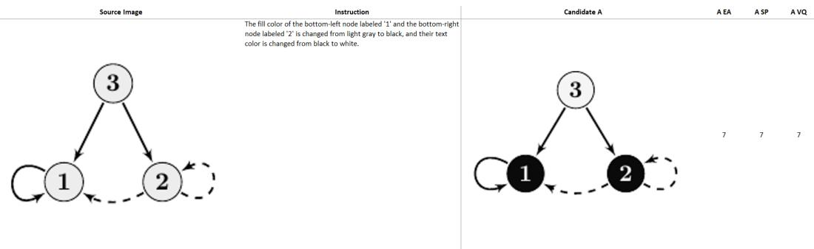  
Figure 15: Example with perfect scores for EA, SP, and VQ.

## A.4.3 GENERALIZATION UNDER SEVERE DISTRIBUTION SHIFT

During pilot generation, synthetic instructions frequently collapsed to repetitive edit types, specified only one or two shallow changes, or referred to elements that were not visibly grounded in the input figure. We therefore condition GPT-5.6-Sol on the desired number of atomic edits and the exact numbers of modify, add, and remove intents. The prompt additionally specifies admissible operation types, atomicity and visual-grounding constraints, and nine diverse human-written examples of plausible scientific-figure edits. To avoid a fixed synthetic edit profile, we sample the requested number of edits and intent composition for each figure from the empirical DaEdiTikZ distribution. The complete prompt for generating synthetic edit instructions for the SPIQA and CharXiv analyses is provided in Figure 18.

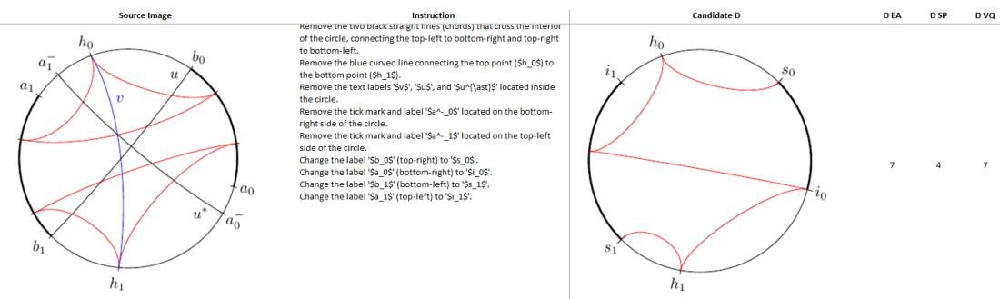

Figure 16: Example with lower source preservation but high edit application and visual quality.  
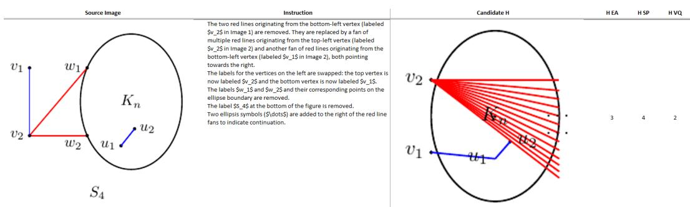  
Figure 17: Example with lower scores for all three.

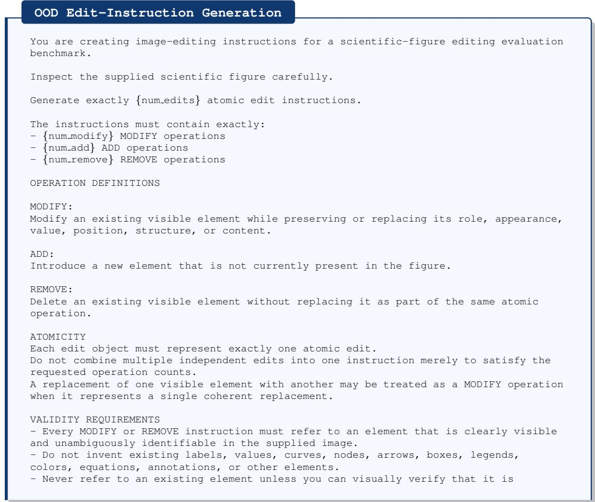

present.   
- For ADD instructions, describe the new element’s position or connection relative to   
clearly visible existing elements.   
- All requested edits must be visually executable from the supplied image alone.   
- Do not require information from the source paper, underlying numerical data, hidden   
metadata, or outside knowledge.   
The edits must be mutually compatible.   
Do not ask to modify, move, recolor, or relabel an element that another requested   
edit removes.   
- Do not produce redundant edits that accomplish essentially the same modification   
twice.   
DIVERSITY REQUIREMENTS   
Prefer meaningful textual, annotation-level, geometric, structural, stylistic,   
semantic, or data-level modifications.   
Possible edit targets include, but are not limited to:   
- labels, equations, symbols, and numerical values   
axes, ticks, legends, titles, and plotted data   
curves, bars, markers, arrows, and paths   
nodes, blocks, connections, and graph topology   
scientific diagrams, architectures, circuits, and geometry   
annotations, boxes, braces, loops, regions, and grids   
positions, dimensions, orientations, and spatial relationships   
colors. line styles, marker styles. and fills when visually meaningful   
Do not force any particular edit type if it does not naturally apply to the shown   
figure.   
When multiple edits are requested, prefer edits that affect different meaningful   
aspects of the figure rather than repeatedly modifying nearly identical elements.   
SPECIFICITY   
Refer to visible elements using enough identifying information to make the edit   
unambiguous.   
Good references include:   
- the upper-right node   
- the dashed rectangle around the encoder   
the blue curve labeled ’Method A’   
the y-axis tick at 0.5   
- the arrow connecting the first and second blocks   
Avoid vague references such as ’the line’, ’the box’, ’the node’, or ’the label’ when   
multiple such elements exist.   
STYLE EXAMPLES FROM REAL FIGURE-EDIT REQUESTS   
These examples demonstrate the desired specificity and variety only.   
Do not copy their content, entities, values, or sentence structures unless they   
naturally apply to the supplied figure.   
1. Change the input label from ’uˆsym’ to ’u’.   
2. Change the fill color of the ’Policy’ block from white to light red.   
3. Add a new block labeled ’R2C’ at the end of the chain, after the Policy block.   
4. Replace the rectangular block labeled ’CLK’ and ’MEM’ with a D-shaped AND gate   
symbol.   
5. Adjust the y-axis tick marks to 0, 5, and 10.   
6. Replace the current 3D surface with a Rosenbrock-style surface containing a long   
curved valley.   
7. Move the rectangular path from the right side of the y-axis to the left side, with   
its vertical segment at x = −1 and its horizontal segments at y = 1 and y = −1.   
8. Add a blue curly brace annotation to the right of the legend spanning the top two   
entries, accompanied by the label ’Grouped’.   
9. Remove the Greek letter labels ’α’, ’β’, ’γ’, and ’δ’ located above the first four   
nodes of the top horizontal line.   
OUTPUT FORMAT   
Return ONLY valid JSON.   
Do not use Markdown code fences.   
Do not include commentary before or after the JSON.   
Do not explain your reasoning.   
The JSON must have exactly this structure:   
"edits": [   
{   
"operation": "modify|add|remove",   
"instruction": "..."   
}

Table 16: Performance of our EdiTikZ models on SPIQA and CharXiv against baselines.
<table><tr><td></td><td colspan="5">SPIQA</td><td colspan="5">CharXiv</td></tr><tr><td>Model</td><td>EA↑</td><td>SP↑</td><td>VQ↑</td><td>CR↑</td><td>AT↓</td><td>EA↑</td><td>SP↑</td><td>VQ↑</td><td>CR↑</td><td>AT↓</td></tr><tr><td>GPT-5.6-Sol</td><td>0.634</td><td>0.598</td><td>0.659</td><td>80.6%</td><td>1352</td><td>0.524</td><td>0.488</td><td>0.552</td><td>68.3%</td><td>1594</td></tr><tr><td>Qwen3.5-27B</td><td>0.234</td><td>0.191</td><td>0.277</td><td>57.9%</td><td>1787</td><td>0.206</td><td>0.164</td><td>0.247</td><td>42.6%</td><td>2351</td></tr><tr><td>Qwen3.5-4B</td><td>0.063</td><td>0.037</td><td>0.083</td><td>24.2%</td><td>2872</td><td>0.076</td><td>0.051</td><td>0.127</td><td>26.8%</td><td>3164</td></tr><tr><td>EdiTikZ-4B</td><td>0.158</td><td>0.112</td><td>0.309</td><td>63.2%</td><td>2547</td><td>0.154</td><td>0.099</td><td>0.364</td><td>65.8%</td><td>2550</td></tr><tr><td>EdiTikZ-4B-RL</td><td>0.243</td><td>0.174</td><td>0.445</td><td>85.8%</td><td>1683</td><td>0.210</td><td>0.145</td><td>0.439</td><td>81.1%</td><td>1917</td></tr><tr><td>Qwen3.5-9B</td><td>0.088</td><td>0.066</td><td>0.152</td><td>34.2%</td><td>1888</td><td>0.140</td><td>0.092</td><td>0.196</td><td>37.9%</td><td>2428</td></tr><tr><td>EdiTikZ-9B</td><td>0.319</td><td>0.238</td><td>0.428</td><td>74.2%</td><td>2166</td><td>0.254</td><td>0.185</td><td>0.421</td><td>71.1%</td><td>2883</td></tr><tr><td>EdiTikZ-9B-RL</td><td>0.520</td><td>0.466</td><td>0.622</td><td>87.6%</td><td>1981</td><td>0.399</td><td>0.323</td><td>0.559</td><td>85.0%</td><td>2541</td></tr></table>

]   
}   
Requirements:   
- "operation" must be exactly one of: "modify", "add", "remove".   
- "instruction" must contain exactly one complete atomic edit instruction.   
- Every instruction must be one sentence.   
- The "edits" array must contain exactly {num edits} objects.   
- There must be exactly {num modify} objects with operation "modify".   
- There must be exactly {num add} objects with operation "add".   
- There must be exactly {num remove} objects with operation "remove".   
Now generate the edit instructions for the supplied scientific figure.

For the OOD evaluation, we adapt the prompt in Figure 14 to a reference free setting by omitting the target figure and all target-dependent instructions, and explicitly instructing the judge to evaluate the prediction from the source figure and edit instruction alone. The GPT-5.5 judge and decoding configuration remain unchanged. Table 16 provides the full results of our stress-tests on SPIQA and CharXiv. EdiTikZ generations are approximately 4–5× longer than on DaEdiTikZ-Bench and exhibit substantially lower scores and compilation rates. GPT-5.6-Sol achieves the strongest overall performance on both datasets, while EdiTikZ-9B-RL remains competitive with higher compilation rates and slightly higher VQ on CharXiv. The improvement from SFT to RL is substantially larger across the OOD metrics than on DaEdiTikZ-Bench. Despite RL using only a small in-domain subset of DaEdiTikZ, its benefits transfer strongly to substantially more complex figures outside the training distribution. Across models, SP degrades most strongly, indicating that preserving unchanged content becomes particularly challenging as figure complexity increases.