# EarthLD: Towards Unified Open-World Landslide Understanding via Vision-Language Guided Difusion Models

Yuanchao Su1, Lianru Gao2∗, Mengying Jiang1, Jiangyi Chen3, Jiaxin Cheng1, and Yicong Zhou1

1Department of Computer and Information Science, University of Macau, Macao 999078, China

of Sciences, Beijing 100094, China

3College of Geomatics, Xi’an University of Science and Technology, Xi’an 710054, China gaolr@aircas.ac.cn

## Abstract

Landslides are widespread geological hazards, yet their automated detection and mapping in remote sensing imagery remain challenging because of their irregular morphology, ambiguous spectral signatures, and substantial domain shifts across imaging platforms. To overcome these challenges, we propose EarthLD, a vision-language-guided difusion framework for open-world landslide understanding, enabling unified landslide recognition, mapping, and trigger interpretation. At its core, EarthLD formulates landslide understanding as a difusion process that progressively infers the presence, spatial extent, and pixel-level boundaries of landslides from noisy latent representations. This probabilistic formulation enables the model to jointly perform image-level landslide recognition and mapping while characterizing predictive uncertainty. By integrating visual observations with contextual knowledge in the denoising process, EarthLD distinguishes diverse landslides from backgrounds, produces confidenceaware predictions for suspected regions, and maps landslide ranges. We additionally construct a global-scale open-world landslide benchmark by systematically harmonizing multiple publicly available remote sensing data collected by diverse institutions. Extensive experiments across regions, sensors, and triggering events demonstrate that EarthLD consistently outperforms existing landslide detection methods, highlighting its potential as a unified and robust solution for global geological-hazard monitoring and emergency response.

## Introduction

Landslides are a gravity-driven geological hazard involving the partial or complete failure of slope materials, in which rock, soil, or their mixtures lose stability and move downslope along a defined or difuse failure surface (Zhou et al. 2025; Chen et al. 2024; Liu et al. 2024). The movement may occur in the form of sliding, toppling, falling, or flowing, and can range from slow, progressive deformation to rapid and catastrophic collapse. according to statistics, cause over one thousand deaths worldwide each year and economic losses of billions of US dollars, posing a serious threat to human life and property. Although synthetic aperture radar (SAR), interferometric SAR (InSAR), and ground vibration sensors are valuable for landslide detection, they face practical limitations for large-scale application worldwide. Their operational scale is hindered by fewer satellite platforms and higher data costs compared to optical senors, even when leveraging free data sources like Sentinel-1 and ALOS-2 satellites. Consequently, reliance solely on SAR/InSAR and ground-based sensors is insuficient to meet the demands of global landslide detection. At present, optical sensor-equipped satellites continue to serve as the essential data source for RS imagery in global-scale landslide detection.

① Lacking Distinguishable Morphological Characteristics  
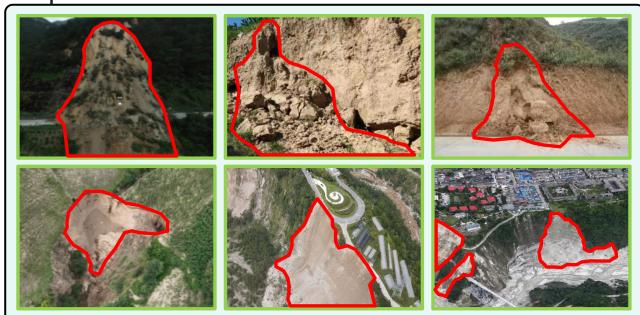  
② Imaging Discrepancies from Multi-Platform.

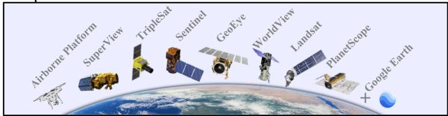  
③No Specific Spatial Scale in A Global Extent.

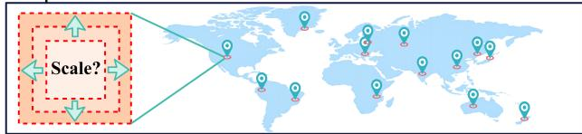  
Figure 1: Current challenges of global landslide detection.

Figure. 1 highlights the current main bottleneck for largescale landslide detection. The specific issues in Figure. 1 are explained as follows: 1) Unlike conventional object, such as vehicles, airplanes, or buildings, landslides are particularly challenging to identify in multi-platform RS imagery because they have no specific morphological characteristics and distinctive spectral information. 2) Another major dificulty is that imaging cross-sensor introducesfine-grained discrepancies among congeneric objects, including grayscale range, reflectance, and radiance, further compounding the risk of false identification. 3) Even when multispectral or hyperspectral images are adopted, the spectral signatures oflandslides are highly similar to those of bare soil, resulting in little to no advantage over common imageryfor landslide detection.

All the time, advances in deep learning and artificial intelligence (AI) have significantly promoted progress in remote sensing image analysis (Ho, Jain, and Abbeel 2020; Wyatt et al. 2022; Zhang, Xu, and Zhou 2024). More recently, many foundation models were developed to achieve strong contextual understanding and detailed feature representation (Yang et al. 2023; Li et al. 2019). They enable learn transferable priors from large-scale data to serve various downstream tasks. Current research on RS foundation models focuses mainly on spatial and spectral feature learning, such as masked autoencoders, SimCLR, SpectralGPT, and SatMAE. Furthermore, some studies have investigated unified interaction mechanisms across spectral, spatial, and frequency domains, such as Alliance. However, these RS foundation models are general-purpose models rather than vertical models specifically designed for landslide detection.

Difusion models are a specialized class of generative models that learn data distributions through a progressive noising and denoising process (Li et al. 2022). The most classic example is the Denoising Difusion Probabilistic Model (DDPM) (Ho, Jain, and Abbeel 2020). By iteratively transforming random noise into structured representations, they are able to restore missing information and generate highquality features (Li et al. 2022; Kim and Kim 2024). This iterative refinement endows difusion models with strong robustness to noise and degraded data, making them particularly efective for object detection in complex or low-quality imagery (Kim and Kim 2024). Recently, difusion models have been employed for constructing target detection and semantic segmentation, such as DifusionDet (Chen et al. 2023) and Seg4Dif (Kim et al. 2025). Nevertheless, existing methods still face challenges in accurately detecting landslides under conditions like boundary fuzziness, scale variations, or lighting changes (Ho et al. 2022; Yang et al. 2024). Moreover, existing difusion models are not specifically designed to handle the heterogeneity of cross-sensor and multi-resolution data. Their performance tends to degrade under varying radiometric characteristics, acquisition geometries, and resolutions. These limitations suggest that, despite their conceptual advantages, current difusion-based approaches have yet to fulfill the practical requirements for the robust detection ofamorphous and morphologically complex objects like landslides.

To address the aforementioned limitations of existing landslide detection methods, we propose EarthLD, a unified open-world landslide understanding framework based on vision-language guided difusion models. The main contributions of this work are summarized as follows:

1. Paradigm Shift: This work re-framed landslide detection as a step-by-step noise reduction process. This new approach makes it much easier to catch landslides with irregular and hard-to-define shapes.

2. Model Innovation: Developed EarthLD, a generative pre-trained foundation model leveraging multi-platform Earth observation data, capable of continuous reinforcement via transfer learning.

3. Benchmark Creation: We curated a global-scale landslide benchmark encompassing 6 continents, 17 countries, and 28 regions to establish a novel unified standard for detection models.

4. Practical Impact: Achieved unprecedented cross-sensor domain generalization, providing a scalable framework for continuous integration of new satellite constellations in large-scale disaster monitoring.

## Proposed EarthLD

Fig. 2 illustrates the overall pipeline of EarthLD, an allin-one framework for landslide recognition, range mapping, trigger estimation, landslide counting, geographic localization. EarthLD realizes landslide recognition as an object detection task and landslide mapping as a proposal-guided binary semantic segmentation task.

Specifically, the recognition branch predicts the bounding box and objectness score of each landslide instance, whereas the mapping branch classifies each pixel as landslide foreground or non-landslide background. Thus, a retained detection represents a recognized landslide, and the resulting foreground–background mask represents its mapped spatial extent. EarthLD formulates bounding-box prediction as a Variational Difusion Model (VDM) (Kingma et al. 2021) and employs Contrastive Language–Image Pretraining (CLIP) (Radford et al. 2021) to incorporate temporal, geographical, and trigger-related metadata. A bidirectional feature pyramid network (BiFPN) (Tan, Pang, and Le 2020) extracts and refines multi-scale visual representations. The detection branch progressively denoises random box latents into landslide proposals, and the detected boxes are subsequently rasterized as spatial priors for difusion-based binary segmentation. CLIP-derived metadata representations are fused with both branches to provide contextual guidance.

Given an input remote sensing image I $\mathbf { \Psi } : \in \mathbb { R } ^ { H \times \smile \times C }$ and its metadata $\dot { m } = ( m ^ { \mathrm { t m p } } , m ^ { \mathrm { g e o } } , m ^ { \mathrm { t r g } } )$ , EarthLD predicts a set of recognized landslide instances $\widehat { B } _ { \mathrm { L D } }$ , a binary landslide map Mf, and an event trigger cˆ:

$$
\mathcal { F } _ { \Theta } ( \mathbf { I } , m ) = \left( \widehat { B } _ { \mathrm { L D } } , \widetilde { \mathbf { M } } , \widehat { c } \right) .\tag{1}
$$

The recognition and binary mapping are defined as:

$$
\begin{array} { r l } & { \widehat { B } _ { \mathrm { L D } } = \left\{ ( \hat { \bf b } _ { i } , \hat { s } _ { i } ) \ : | \ : \hat { s } _ { i } \geq \delta _ { \mathrm { d e t } } \right\} , } \\ & { \widetilde { \bf M } = \mathbb { I } \Big [ \hat { \bf M } \geq \delta _ { m } \Big ] \in \{ 0 , 1 \} ^ { H \times W } , } \end{array}\tag{2}
$$

where $\hat { \mathbf { b } } _ { i } = ( x _ { i } , y _ { i } , w _ { i } , h _ { i } ) \in \mathbb { R } ^ { 4 }$ is the i-th predicted box, $\hat { s } _ { i } \in [ 0 , 1 ]$ is its landslide objectness score, and $\delta _ { \mathrm { d e t } }$ is the detection threshold. The matrix $\hat { \mathbf { M } } \in [ 0 , 1 ] ^ { H \times W }$ is the predicted landslide probability map, $\delta _ { m }$ is the segmentation threshold, and I[·] denotes the indicator function. Consequently, $| \widehat { B } _ { \mathrm { L D } } |$ gives the detected landslide count, while foreground pixels in Mf delineate the mapped landslide extent. The variable $\hat { c } \in \mathcal { C } _ { \mathrm { t r i g g e r } }$ denotes the estimated trigger event.

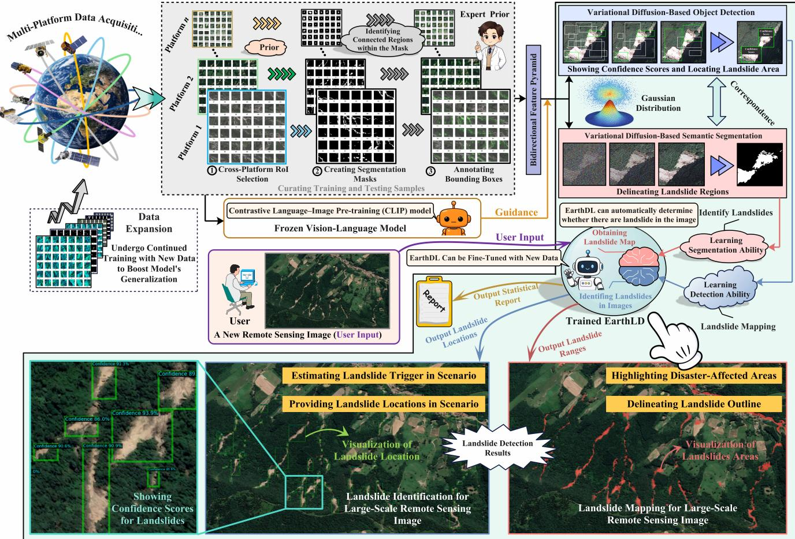  
Figure 2: Pipeline of EarthLD. Built on a variational difusion backbone, EarthLD provides unified landslide object detection and semantic segmentation. Once trained, EarthLD accepts a new remote sensing image from any geographic region, visualize detected landslides, and generates a report summarizing their triggers and total count.

Overall, this work contains three main components: 1) establishing an open-world benchmarkfor model training and evaluation; 2) developing a CLIP-guided variational difusion model that realizes landslide recognition through object detection; and 3) developing a proposal-guided variational difusion model that realizes landslide mapping through binary semantic segmentation.

## Establishing Open-World Data Benchmark

To support the training of EarthLD, this study constructs a comprehensive global-scale landslide dataset by systematically integrating multiple publicly available remote sensing datasets released by diferent institutions. Instead of relying on a single source, the integrated dataset incorporates heterogeneous remote sensing images from 28 geographically diverse regions across six continents, including Asia, Africa, North America, South America, Europe, and Oceania, covering the period from 2011 to 2022. Such global-scale integration is particularly beneficial for generative modeling because it combines imagery acquired by diferent sensors and orbital platforms, encompassing diverse imaging geometries, spatial resolutions, noise characteristics, and environmenta conditions. By harmonizing these heterogeneous sources into a unified 25.1 GB repository, the proposed dataset enables generative models to learn a comprehensive distribution of global landslide characteristics, ranging from earthquakeinduced failures to complex rainfall-triggered landslides.

This study integrates several public landslide datasets, including the GDCLD (Fang et al. 2024), Bijie (Ji et al. 2020), CAS (Xu et al. 2024), GVLM (Zhang et al. 2023), and Haiti (Lv et al. 2017; Antoine et al. 2024) datasets. The GDCLD dataset provides more than 15,000 landslide images collected from multiple sensors, including PlanetScope (3 m), GaoFen-6 (2 m), Map World (0.5 m), and UAV imagery (0.2 m). The Bijie dataset contains 2,773 images, including 770 landslide and 2,003 non-landslide samples, collected from TripleSat satellite imagery. The CAS dataset consists of 20,865 image patches acquired from nine study areas using multi-source satellite and UAV imagery. The GVLM dataset contains 2,895 landslide images collected from Google Earth. The Haiti dataset includes an optical subset with 165 landslide samples derived from post-event GeoEye-1 imagery and pre-event WorldView-2 and Google Earth imagery, as well as a multimodal subset containing

1,713 co-registered SAR–optical image pairs from Sentinel-  
1 and Sentinel-2.

The resulting benchmark contains more than 100,000 accurately annotated landslide instances. To ensure crosssensor consistency, the data were systematically processed through data organization, quality screening, spatial cropping, annotation verification, and conversion into unified detection and segmentation formats.

Let $\mathcal { D } _ { d }$ denote the d-th source domain, namely Bijie, Haiti, CAS, GDCLD, or GVLM. If $\mathcal { H } _ { d }$ denotes the corresponding data and annotation harmonization operator, the unified benchmark is

$$
\mathcal { D } = \bigcup _ { d = 1 } ^ { 5 } \mathcal { H } _ { d } ( \mathcal { D } _ { d } ) .\tag{3}
$$

## CLIP-Guided Causal Reasoning of Landslides

To mitigate the spatial ambiguity inherent in monocular landslide detection, we introduce a CLIP-based contextual reasoning module that incorporates auxiliary metadata $m = ( m ^ { \mathrm { t m p } } , m ^ { \mathrm { g e o } } , m ^ { \mathrm { t r g } } )$ , representing temporal, geographical, and trigger-related observations, respectively. Here, $m ^ { \mathrm { t r g } }$ contains only observations available at inference time, such as rainfall or seismic measurements and it never contains the ground-truth trigger label.

The metadata are encoded into structured text prompts Promptr $. ( m ^ { r } )$ for $r ~ \in ~ \{ \mathrm { t m p } , \mathrm { g e o } , \mathrm { t r g } \}$ . The prompt feature vectors $\mathbf { t } _ { r } \in \mathbb { R } ^ { D }$ , where $D$ is the embedding dimension, are computed by the CLIP text encoder $\bar { E _ { T } } ( \cdot )$ and $L _ { 2 }$ -normalized:

$$
\mathbf { t } _ { r } = \frac { E _ { T } ( \mathrm { P r o m p t } _ { r } ( m ^ { r } ) ) } { \Vert E _ { T } ( \mathrm { P r o m p t } _ { r } ( m ^ { r } ) ) \Vert _ { 2 } } .\tag{4}
$$

Let $\mathbf { e } _ { I } = E _ { I } ( \mathbf { I } ) / \| E _ { I } ( \mathbf { I } ) \| _ { 2 } \in \mathbb { R } ^ { D }$ denote the normalized global visual embedding produced by the CLIP image encoder $E _ { I } ( \cdot )$ . Cross-modal weights over the three metadata types are computed from cosine similarity:

$$
\alpha _ { r } = \frac { \exp ( \mathbf { e } _ { I } ^ { \top } \mathbf { t } _ { r } / \tau ) } { \sum _ { q \in \{ \mathrm { t m p , g e o , t r g } \} } \exp ( \mathbf { e } _ { I } ^ { \top } \mathbf { t } _ { q } / \tau ) } ,\tag{5}
$$

where $\tau \in \mathbb { R } ^ { + }$ is a learnable temperature. The aggregated metadata representation is

$$
{ \bf q } _ { m } = { \bf W } _ { m } \left( \sum _ { r } \alpha _ { r } { \bf t } _ { r } \right) ,\tag{6}
$$

where $\mathbf { W } _ { m } \in \mathbb { R } ^ { D \times D }$ is a learnable projection matrix.

## CLIP-Guided Variational Difusion Model for Landslide Recognition

EarthLD realizes landslide recognition through classagnostic object detection: every retained object corresponds to one recognized landslide instance. Therefore, the recognition branch predicts landslide bounding boxes and their objectness scores.

A backbone network extracts a multi-scale feature pyramid $\{ \mathbf { P } _ { k } \} _ { k = 1 } ^ { K }$ , where $\mathbf { P } _ { k } \in \mathbb { R } ^ { H _ { k } \times W _ { k } \times C _ { k } }$ . BiFPN aggregates adjacent feature levels into refined features $\mathbf { F } _ { k } \in \overset { \sim } { \mathbb { R } } ^ { H _ { k } \times W _ { k } \times C }$

$$
\begin{array} { r l } & { \mathbf { F } _ { k } = \mathrm { C o n v } \left( \displaystyle \sum _ { j \in \mathcal { N } ( k ) } \omega _ { k j } \mathrm { R e s i z e } ( \mathbf { P } _ { j } , k ) \right) , } \\ & { \omega _ { k j } = \displaystyle \frac { \mathrm { R e L U } ( w _ { k j } ) } { \varepsilon + \sum _ { r \in \mathcal { N } ( k ) } \mathrm { R e L U } \left( w _ { k r } \right) } , } \end{array}\tag{7}
$$

where $\mathcal { N } ( k )$ is the set of levels connected to level $k , w _ { k j } \in \mathbb { R }$ are learnable scalar weights, and $\varepsilon > 0$ prevents division by zero. The fused features are flattened into a multi-scale visual token matrix

$$
\mathbf { V } = \mathrm { F l a t t e n } ( \mathbf { F } _ { 1 } , \ldots , \mathbf { F } _ { K } ) , \quad L = \sum _ { k = 1 } ^ { K } H _ { k } W _ { k } .\tag{8}
$$

For detection query $i ,$ let $\mathbf { q } _ { i }$ be a learnable query vector. Its proposal-wise condition is defined by

$$
\mathbf { c } _ { i } = \mathbf { W } _ { c } \left[ \mathrm { A t t n } ( \mathbf { q } _ { i } , \mathbf { V } ) \left\| \mathbf { q } _ { m } \right\rfloor , \right.\tag{9}
$$

where Attn(·) retrieves query-specific visual evidence, ∥ denotes concatenation, and $\mathbf { W } _ { c }$ projects the fused visualmetadata representation.

Variational Difusion-Based Landslide Object Detection: For a ground-truth box b $\in \mathbb { R } ^ { 4 }$ , the variational encoder models the clean box latent $\mathbf { z } _ { 0 } ^ { \mathbf { b } }$ conditioned on ${ \bf { c } } _ { i } \mathbf { : }$

$$
\begin{array} { r } { q _ { \phi } ( \mathbf { z } _ { 0 } ^ { \mathbf { b } } \mid \mathbf { b } , \mathbf { c } _ { i } ) = \mathcal { N } \left( \mathbf { z } _ { 0 } ^ { \mathbf { b } } ; \pmb { \mu } _ { \phi } ( \mathbf { b } , \mathbf { c } _ { i } ) , \mathrm { d i a g } \left( ( \pmb { \sigma } _ { \phi } ( \mathbf { b } , \mathbf { c } _ { i } ) ) ^ { 2 } \right) \right) . } \end{array}\tag{10}
$$

where $\mu _ { \phi } ( \cdot ) , \sigma _ { \phi } ( \cdot )$ are the predicted mean and standard deviation vectors. For a continuous difusion time $t \in [ 0 , 1 ] ,$ a learnable log-SNR schedule $\gamma _ { \nu } ( t )$ parameterizes the forward transition:

$$
\begin{array} { r } { q _ { \nu } ( \mathbf { z } _ { t } ^ { \mathbf { b } } \mid \mathbf { z } _ { 0 } ^ { \mathbf { b } } ) = \mathcal { N } \left( \mathbf { z } _ { t } ^ { \mathbf { b } } ; \alpha _ { t } \mathbf { z } _ { 0 } ^ { \mathbf { b } } , \sigma _ { t } ^ { 2 } \mathbf { I } _ { 4 } \right) , } \end{array}\tag{11}
$$

where $\begin{array} { r l r } { \mathbf { I } _ { 4 } } & { { } \in } & { \mathbb { R } ^ { 4 \times 4 } } \end{array}$ is the identity matrix, $\begin{array} { r l } { \alpha _ { t } ^ { 2 } } & { { } = } \end{array}$ sigmoid $\mathsf { l } ( - \gamma _ { \nu } ( t ) )$ , and $\sigma _ { t } ^ { 2 } = \mathrm { s i g m o i d } ( \gamma _ { \nu } ( t ) )$

$$
0 \leq s < t \leq 1
$$

$$
p _ { \theta } ( \mathbf { z } _ { s } ^ { \mathbf { b } } \mid \mathbf { z } _ { t } ^ { \mathbf { b } } , \mathbf { c } _ { i } ) = \mathcal { N } \big ( \mathbf { z } _ { s } ^ { \mathbf { b } } ; \mu _ { \theta } ( \mathbf { z } _ { t } ^ { \mathbf { b } } , s , t , \mathbf { c } _ { i } ) , \boldsymbol { \Sigma } _ { \theta } ( \mathbf { z } _ { t } ^ { \mathbf { b } } , s , t , \mathbf { c } _ { i } ) \big ) .\tag{12}
$$

The Evidence Lower Bound (ELBO) objective for box difusion is

$$
\begin{array} { r l } & { \mathcal { L } _ { \mathrm { V D M } } ^ { \mathbf { b } } = D _ { \mathrm { K L } } \left( q _ { \phi , \nu } ( \mathbf { z } _ { 1 } ^ { \mathbf { b } } \mid \mathbf { b } , \mathbf { c } _ { i } ) \| p ( \mathbf { z } _ { 1 } ^ { \mathbf { b } } ) \right) } \\ & { \qquad - \mathbb { E } _ { q _ { \phi } } \left[ \log p _ { \kappa } ( \mathbf { b } \mid \mathbf { z } _ { 0 } ^ { \mathbf { b } } , \mathbf { c } _ { i } ) \right] + \displaystyle \int _ { 0 } ^ { 1 } \mathcal { L } _ { \mathrm { d i f f } } ^ { \mathbf { b } } ( t ) \mathrm { d } t , } \end{array}\tag{13}
$$

where $D _ { \mathrm { K L } } ( \cdot | | \cdot )$ is the KL divergence scalar, $q _ { \phi , \nu } ( \mathbf { z } _ { 1 } ^ { \mathbf { b } } \mid$ $\begin{array} { r } { { \bf b } , { \bf c } _ { i } ) = \int q _ { \nu } ( { \bf z _ { 1 } ^ { \bf b } } \mid \mathbf { z } _ { 0 } ^ { \bf b } ) q _ { \phi } ( \mathbf { z } _ { 0 } ^ { \bf b } \mid \mathbf { b } , { \bf c } _ { i } ) \mathrm { d } { \bf z _ { 0 } ^ { \bf b } } } \end{array}$ , and $p ( \mathbf { z } _ { 1 } ^ { \mathbf { b } } ) =$ $\mathcal { N } ( \mathbf { 0 } , \mathbf { I } _ { 4 } )$

The decoded clean latent yields a box and a landslide object score:

$$
\begin{array} { r } { ( \hat { \bf b } _ { i } , \hat { s } _ { i } ) = D _ { \kappa } ^ { b } ( \hat { \bf z } _ { 0 , i } ^ { \bf b } , { \bf c } _ { i } ) . } \end{array}\tag{14}
$$

As defined in Eq. (2), boxes satisfying $\hat { s } _ { i } ~ \geq ~ \delta _ { \mathrm { d e t } }$ form $\widehat { B } _ { \mathrm { L D } }$ . Hence, object detection directly produces the landslide recognition result, and the number of retained boxes gives the landslide count.

Algorithm 1 shows the pseudocode for variational difusion-based landslide object detection.

Algorithm 1: Variational Difusion-Based Landslide Object   
Detection   
Require: Image I, Metadata m, Query qi, Threshold $\delta _ { \mathrm { d e t } }$   
Ensure: Landslides $\widehat { B } _ { \mathrm { L D } }$   
1: $\mathbf q _ { m } \gets \mathrm { C L I P } ( m , \mathbf I ) , \quad \mathbf V \gets \mathrm { B i F P N } ( \mathbf I )$ using Eq. (4)–   
(8)   
2: $\mathbf { c } _ { i } \gets \mathbf { W } _ { c } [ \mathrm { A t t n } ( \mathbf { q } _ { i } , \mathbf { V } ) \parallel \mathbf { q } _ { m } ]$ using Eq. (9)   
3: $\mathbf { z } _ { 0 } ^ { \mathrm { b } } \sim q _ { \phi } ( \mathbf { z } _ { 0 } ^ { \mathrm { b } } \mid \mathbf { \bar { b } } , \mathbf { c } _ { i } ) , \mathbf { z } _ { t } ^ { \mathrm { b } } \sim q _ { \nu } ^ { \mathrm { b } } ( \mathbf { z } _ { t } ^ { \mathrm { b } } \mid \mathbf { z } _ { 0 } ^ { \mathrm { b } } )$ us  
ing Eq. (10)–(11)   
4: Optimize via $\mathcal { L } _ { \mathrm { V D M } } ^ { \mathbf { b } }$ using Eq. (13)   
5: $\mathbf { z } _ { 1 } ^ { \mathbf { b } } \sim \mathcal { N } ( \mathbf { 0 } , \mathbf { I } _ { 4 } )$   
6:   
7: for $t = 1$ down to 0 do   
8: $\mathbf { z } _ { s } ^ { \mathbf { b } } \sim p _ { \theta } ( \mathbf { z } _ { s } ^ { \mathbf { b } } \mid \mathbf { z } _ { t } ^ { \mathbf { b } } , \mathbf { c } _ { i } )$ ▷ Denoise via Eq. (12)   
9: $( \hat { \mathbf { b } } _ { i } , \hat { s } _ { i } ) \gets D _ { \kappa } ^ { b } ( \mathbf { z } _ { 0 } ^ { \mathbf { b } } , \mathbf { c } _ { i } )$ using Decode via Eq. (14)   
10: end for   
11: return $\widehat { B } _ { \mathrm { L D } } = \{ ( \hat { \bf b } _ { i } , \hat { s } _ { i } ) \ | \ \hat { s } _ { i } \geq \delta _ { \mathrm { d e t } } \}$ using Eq. (2)

Auxiliary Open-World and Trigger Interpretation: The preceding detection output is suficient to define landslide recognition. After detection, an auxiliary interpretation module may additionally assign semantic labels to recognized instances and estimate their likely trigger; these auxiliary predictions do not change the definition of recognition as object detection.

Let $\mathbf { h } _ { i } = \mathbf { f } _ { i } / \lVert \mathbf { f } _ { i } \rVert _ { 2 }$ denote the normalized embedding of detected proposal i, and let $\mathbf { p } _ { k }$ be the normalized text prototype for semantic category $\overline { { k } } \in \{ 1 , \ldots , K _ { c } \}$ . The posterior probability over known categories is

$$
\pi _ { i k } = \frac { \exp ( \mathbf { h } _ { i } ^ { \top } \mathbf { p } _ { k } / \tau _ { o } ) } { \sum _ { j = 1 } ^ { K _ { c } } \exp ( \mathbf { h } _ { i } ^ { \top } \mathbf { p } _ { j } / \tau _ { o } ) } ,\tag{15}
$$

where $\tau _ { o } \in \mathbb { R } ^ { + }$ is a temperature. The energy-based uncertainty score is

$$
u _ { i } = - \tau _ { o } \log \sum _ { k = 1 } ^ { K _ { c } } \exp \left( \frac { \mathbf { h } _ { i } ^ { \top } \mathbf { p } _ { k } } { \tau _ { o } } \right) .\tag{16}
$$

Open-world semantic assignment is then given by

$$
\begin{array} { r } { \hat { y } _ { i } = \left\{ \begin{array} { l l } { \mathrm { a r g } \operatorname* { m a x } _ { k } \pi _ { i k } , } & { \mathrm { i f } \operatorname* { m a x } _ { k } ( \mathbf { h } _ { i } ^ { \top } \mathbf { p } _ { k } ) \geq \delta _ { s } \mathrm { a n d } u _ { i } \leq \delta _ { u } , } \\ { \mathrm { U n k n o w n } , } & { \mathrm { o t h e r w i s e } . } \end{array} \right. } \end{array}\tag{17}
$$

For trigger estimation, each candidate trigger $c \in \mathcal { C } _ { \mathrm { t r i g g e r } }$ is mapped to a normalized text prototype $\mathbf { t } _ { c } .$ . Global image evidence and recognized-instance evidence are combined as:

$$
\rho _ { c } = \left\{ \lambda _ { I } ( \mathbf { e } _ { I } ^ { \top } \mathbf { t } _ { c } ) + ( 1 - \lambda _ { I } ) \frac { 1 } { N } \sum _ { i = 1 } ^ { N } ( \mathbf { h } _ { i } ^ { \top } \mathbf { t } _ { c } ) , ~ N > 0 , \right.\tag{18}
$$

where $\lambda _ { I } \in \ [ 0 , 1 ]$ balances global and instance-level evidence. The second branch avoids division by zero when no detection survives filtering. The predicted trigger is

$$
\hat { c } = \arg \operatorname* { m a x } _ { c \in \mathcal { C } _ { \mathrm { t r i g g e r } } } \rho _ { c } .\tag{19}
$$

## Proposal-Guided Variational Difusion for Binary Semantic Segmentation (Landslide Mapping)

EarthLD realizes landslide mapping as binary semantic segmentation. Each pixel is assigned to either the landslide foreground (1) or the non-landslide background (0), while the recognized bounding boxes provide spatial proposals that guide the delineation of irregular landslide boundaries.

Let M $\in \ \{ 0 , 1 \} ^ { H \times W }$ denote the ground-truth binary mask. Its variational encoder models a clean spatial latent $\mathbf { z } _ { 0 } ^ { \mathbf { M } } \in \mathbb { R } ^ { H ^ { \prime } \times W ^ { \prime } \times C _ { m } }$

$$
\begin{array} { r } { q _ { \varphi } ( \mathbf { z } _ { 0 } ^ { \mathbf { M } } \mid \mathbf { M } , \mathbf { I } ) = { \mathcal { N } } \big ( \mathbf { z } _ { 0 } ^ { \mathbf { M } } ; { \boldsymbol { \mu } } _ { \varphi } ^ { \mathbf { M } } ( \mathbf { M } , \mathbf { I } ) , \mathrm { d i a g } \left( ( { \boldsymbol { \sigma } } _ { \varphi } ^ { \mathbf { M } } ( \mathbf { M } , \mathbf { I } ) ) ^ { 2 } \right) \big ) . } \end{array}\tag{20}
$$

The mask latent follows the same log-SNR forward process as the box latent:

$$
q _ { \nu } ( \mathbf { z } _ { t } ^ { \mathbf { M } } \mid \mathbf { z } _ { 0 } ^ { \mathbf { M } } ) = \mathcal { N } \left( \mathbf { z } _ { t } ^ { \mathbf { M } } ; \alpha _ { t } \mathbf { z } _ { 0 } ^ { \mathbf { M } } , \sigma _ { t } ^ { 2 } \mathbf { I } _ { M } \right) ,\tag{21}
$$

where ${ \mathbf { I } } _ { M }$ is the identity operator over the mask latent.

The recognized boxes $\widehat { B } _ { \mathrm { L D } }$ are rasterized into a spatial proposal map $\mathbf { S } _ { B } \in [ 0 , 1 ] ^ { \overline { { H } } \times W }$ . The conditioning tensor fuses multi-scale spatial features, box proposals, and CLIPderived metadata:

$$
\mathbf { x } _ { M } = \operatorname { C o n v } \left( \left[ \operatorname { U p } ( \mathbf { F } _ { 1 : K } ) \parallel \mathbf { S } _ { B } \parallel \operatorname { T i l e } ( \mathbf { q } _ { m } ) \right] \right) ,\tag{22}
$$

where $\operatorname { U p } ( \mathbf { F } _ { 1 : K } )$ upsamples and concatenates the feature maps at resolution $\bar { H } \times \bar { W }$ , and $\mathrm { T i l e } ( \mathbf { q } _ { m } )$ spatially replicates $\mathbf { q } _ { m }$ over the same grid.

The segmentation denoiser estimates the clean mask latent, which is decoded into a landslide probability map:

$$
\hat { \mathbf { z } } _ { 0 } ^ { \mathbf { M } } = G _ { \psi } ( \mathbf { z } _ { t } ^ { \mathbf { M } } , t , \mathbf { x } _ { M } ) , \qquad \hat { \mathbf { M } } = \mathrm { s i g m o i d } \left( D _ { \kappa } ^ { M } ( \hat { \mathbf { z } } _ { 0 } ^ { \mathbf { M } } , \mathbf { x } _ { M } ) \right)
$$

The final binary landslide map is

(23)

$$
\widetilde { \mathbf { M } } _ { h , w } = \left\{ \begin{array} { l l } { 1 , } & { \hat { \mathbf { M } } _ { h , w } \ge \delta _ { m } , } \\ { 0 , } & { \hat { \mathbf { M } } _ { h , w } < \delta _ { m } . } \end{array} \right.\tag{24}
$$

Therefore, binary semantic segmentation directly produces the landslide mapping result: pixels labeled 1 delineate landslide regions, whereas pixels labeled 0 represent the background.

The mask difusion loss is

$$
\mathcal { L } _ { \mathrm { V D M } } ^ { \bf M } = \mathbb { E } _ { t , { \bf z } _ { 0 } ^ { \bf M } , \epsilon } [ w ( t ) | \vphantom { \frac { 1 } { 2 } } | \vphantom { \frac { 1 } { 2 } } | \epsilon - \epsilon _ { \psi } ( { \bf z } _ { t } ^ { \bf M } , t , { \bf x } _ { M } ) \vphantom { \frac { 1 } { 2 } } | \vphantom { \frac { 1 } { 2 } } ] ,\tag{25}
$$

where $\epsilon \sim \mathcal { N } ( \mathbf { 0 } , \mathbf { I } _ { M } )$ and $w ( t ) \geq 0$ is the weighting induced by the selected log-SNR parameterization.

Algorithm 2 provides the pseudocode of the binary semantic segmentation.

## Unified Learning

The landslide recognition branch is supervised as an object detector. Its loss combines box variational difusion, binary landslide objectness classification, and box regression:

$$
\mathcal { L } _ { \mathrm { d e t } } = \mathcal { L } _ { \mathrm { V D M } } ^ { \bf b } + \lambda _ { c } \mathcal { L } _ { \mathrm { f o c a l } } + \lambda _ { 1 } \mathcal { L } _ { 1 } + \lambda _ { g } \mathcal { L } _ { \mathrm { G I o U } } ,\tag{26}
$$

where $\mathcal { L } _ { \mathrm { f o c a l } }$ separates landslide objects from background, $\mathcal { L } _ { 1 }$ and ${ \mathcal { L } } _ { \mathrm { G I o U } }$ supervise box localization, and $\lambda _ { c } , \lambda _ { 1 } , \lambda _ { g } \in$ $\mathbb { R } ^ { + }$ are trade-of weights.

Algorithm 2: Proposal-Guided Difusion for Landslide Map  
ping   
Require: Features $\mathbf { F } _ { 1 : K }$ , detected boxes ${ \widehat { B } } ,$ metadata $\mathbf { q } _ { m } ,$   
GT mask M   
Ensure: Binary landslide mask $\widetilde { \mathbf { M } }$   
1: Rasterize $\widehat { B }$ into proposal prior $\mathbf { S } _ { B }$   
2: Construct mask condition x using (22)   
3: Encode and difuse M into $\mathbf { z } _ { t } ^ { \mathbf { \bar { M } } }$ using (20), (21)   
4: $\widehat { \mathbf { z } } _ { 0 } ^ { \mathbf { M } } \gets G _ { \psi } ( \mathbf { z } _ { t } ^ { \mathbf { M } } , t , \mathbf { x } _ { M } )$ using (23)   
5: $\widehat { \mathbf { M } } \gets \sigma ( D _ { \kappa } ^ { M } ( \widehat { \mathbf { z } } _ { 0 } ^ { \mathbf { M } } , \mathbf { x } _ { M } ) )$ using (23)   
6: Optimize ${ \mathcal { L } } _ { \mathrm { m a p } }$ using (23), (25), (27)   
7: return Mf

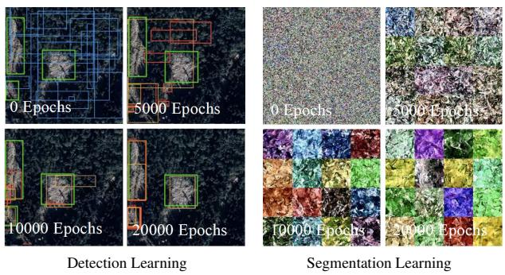  
Figure 3: The progressive improvement in feature representation for both object detection and semantic segmentation by the training, as observed from the qualitative outputs at corresponding epochs.

The landslide mapping branch is supervised as binary semantic segmentation. Its loss combines mask latent difusion, Binary Cross-Entropy (BCE), and Dice loss:

$$
\mathcal { L } _ { \mathrm { m a p } } = \mathcal { L } _ { \mathrm { V D M } } ^ { \bf M } + \lambda _ { b } \mathcal { L } _ { \mathrm { B C E } } + \lambda _ { d } \left( 1 - \frac { 2 \langle \hat { \bf M } , { \bf M } \rangle + \varepsilon } { \| \hat { \bf M } \| _ { 1 } + \| { \bf M } \| _ { 1 } + \varepsilon } \right) ,\tag{27}
$$

where $\begin{array} { r } { \langle \hat { \bf M } , { \bf M } \rangle = \sum _ { h = 1 } ^ { H } \sum _ { w = 1 } ^ { W } \hat { \bf M } _ { h , w } { \bf M } _ { h , w } , } \end{array}$ , and $\lambda _ { b } , \lambda _ { d } \in$ $\mathbb { R } ^ { + }$ are weighting coeficients. BCE performs foreground– background pixel classification, while Dice loss encourages overlap between the predicted and ground-truth landslide regions.

The complete EarthLD objective is

$$
\begin{array} { r } { \mathcal { L } = \mathcal { L } _ { \mathrm { d e t } } + \lambda _ { m } \mathcal { L } _ { \mathrm { m a p } } + \lambda _ { \mathrm { v l } } \mathcal { L } _ { \mathrm { N C E } } + \lambda _ { t } \mathcal { L } _ { \mathrm { t r g } } , } \end{array}\tag{28}
$$

where $\mathcal { L } _ { \mathrm { N C E } }$ aligns the image embedding $\mathbf { e } _ { I }$ with metadata prompt embeddings $\mathbf { t } _ { r } , \mathcal { L } _ { \mathrm { t r g } }$ supervises trigger estimation, and $\bar { \lambda _ { m } } , \bar { \lambda _ { \mathrm { v l } } } , \bar { \lambda _ { t } } \in \bar { \mathbb { R } ^ { + } }$ balance the objectives. These coefficients may be learned adaptively using GradNorm (Chen et al. 2018b).

## Experiments

The quantitative analysis employs several evaluation metrics, including Precision (P), Recall (R), and Average Precision (AP). Precision measures the proportion of correctly predicted positive instances or pixel regions, while Recall reflects the proportion of true landslide targets that are successfully detected and segmented.

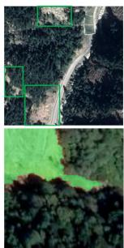  
GT

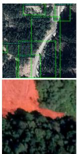  
No CLIP

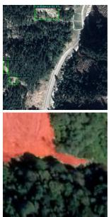  
No Pre-Train

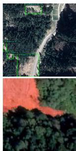  
EarthLD

Figure 4: Ablation study of CLIP guidance and pre-training on EarthLD. The full EarthLD model achieves the best performance, whereas removing CLIP guidance or pre-training leads to a noticeable degradation in landslide identification and mapping.  
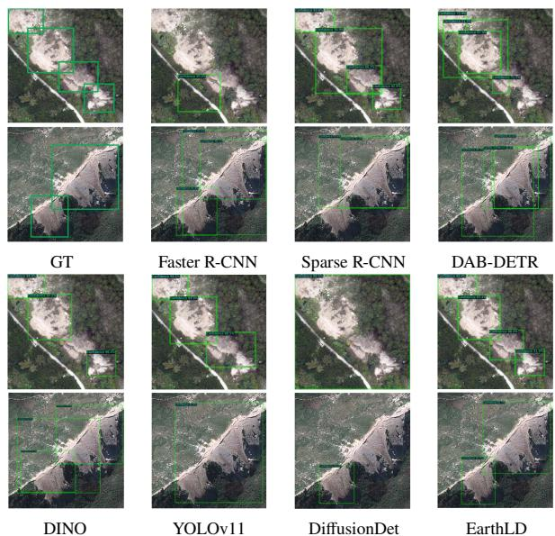  
Figure 5: Performance comparison of diferent detection methods in landslide recognition

## Training Visualization and Ablation Study

Figure 3 demonstrates the gradual enhancement of the model’s feature representation ability for both object detection and semantic segmentation over the course of training, as reflected by the performance at diferent epochs.

By incorporating pre-trained models trained on expanded datasets, EarthLD achieves stronger feature representations, thereby improving landslide detection and mapping results. Figure 4 illustrates the ablation study regarding CLIP guidance and pre-training. On unseen datasets, the ablated model without CLIP guidance and pre-training yields markedly lower detection accuracy than the full EarthLD.

EarthLD  
EarthLD  
YOLO11s-seg  
EarthLD  
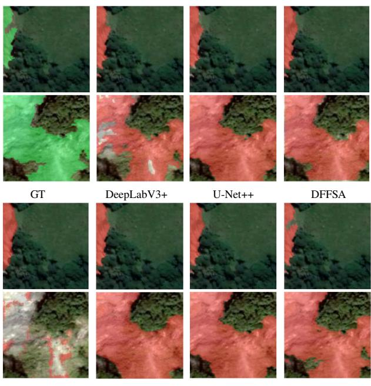

Figure 6: Performance comparison of diferent semantic segmentation approaches in landslide mapping.  
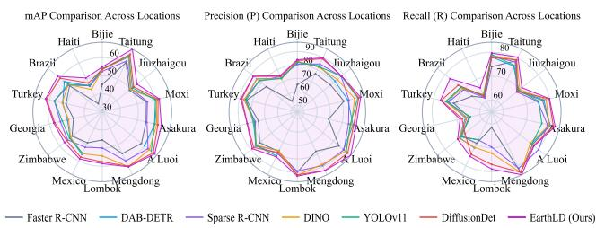  
Figure 7: Experiments are conducted to evaluate various detection methods using datasets from 10 distinct regions worldwide.  
Figure 9: EarthLD is applied to landslide detection across large-scale remote sensing imagery.

## Comparison with Baselines

Since EarthLD is an all-in-one model capable of simultaneously performing object detection and semantic segmentation, our comparative experiments incorporate two distinct sets of baselines. The first set, established to evaluate object detection performance, includes Faster R-CNN (Ren et al. 2016), Sparse R-CNN (Sun et al. 2021), DAB-DETR (Liu et al. 2022), DINO (Zhang et al. 2022), YOLOv11 (Khanam and Hussain 2024), and DifusionDet (Chen et al. 2023). The second set, designed to assess semantic segmentation capability, comprises DeepLabV3+ (Chen et al. 2018a), U-Net++ (Zhou et al. 2019), SegFormer (Xie et al. 2021), DI-NOv2 (Oquab et al. 2023), YOLO11s-seg (Jocher and Qiu 2024), and Seg-Difusion (Baranchuk et al. 2022).

We compare the landslide identification results obtained by diferent detection methods, as illustrated in Figure 5. Similarly, Figure 6 compares the performance of various segmentation methods for landslide mapping. As observed from

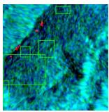  
GT

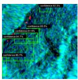

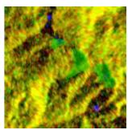  
GT

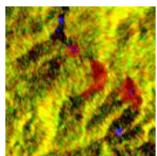

Figure 8: Landslide detection using SAR data via EarthLD. Left shows a result of landslide identification, and Right displays a result of landslide mapping.  
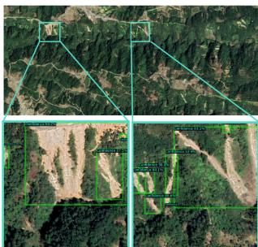  
Landslide Identification

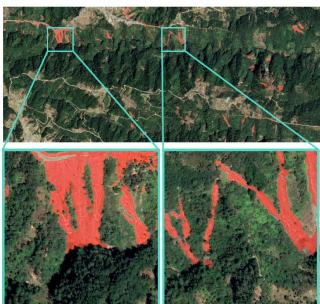  
Landslide Mapping

Figure 5 and Figure 6, our EarthLD consistently achieves the best performance in both landslide identification and landslide mapping. Figure 7 presents accuracy evaluations of diferent detection methods using benchmark datasets from 10 global regions.

## Multimodal and Large-Scale Imaging Applications

EarthLD is not only applicable to optical imagery but can also be transferred to SAR data for landslide recognition and detection. As illustrated in Figure 8, EarthLD demonstrates efective landslide detection performance on SAR imagery. Furthermore, EarthLD is not limited to small-scale scenes, and it is equally capable of handling landslide detection across large-scale remote sensing images, as shown in Figure 9. Ultimately, the proposed EarthLD generates a comprehensive landslide detection report, specifying the geographic location, spatial extent, and total count of identified landslide events.

## Conclusion

In this paper, we propose EarthLD, an all-in-one framework that unifies landslide recognition, range mapping, trigger estimation, counting, and localization. EarthLD integrates object detection and proposal-guided binary segmentation using VDM and BiFPN for refined denoising and multiscale feature extraction, complemented by CLIP-derived contextual guidance. Comprehensive evaluations demonstrate EarthLD’s superior performance, seamless crossmodal transferability (e.g., optical to SAR imagery), and high eficacy in large-scale remote sensing monitoring and automated statistical reporting.

Antoine, B.; Emmanuel, T.; Jocelyn, C.; and M., A. A. 2024. Multimodal Remote Sensing Dataset for Landslide Change Detection in Haiti.

Baranchuk, D.; Voynov, A.; Kollmannsberger, S.; and Babenko, A. 2022. Label-Eficient Semantic Segmentation with Difusion Models. In International Conference on Learning Representations (ICLR).

Chen, L.-C.; Zhu, Y.; Papandreou, G.; Schrof, F.; and Adam, H. 2018a. Encoder-Decoder with Atrous Separable Convolution for Semantic Image Segmentation. In Proceedings of the European Conference on Computer Vision (ECCV), 801–818.

Chen, S.; Sun, P.; Song, Y.; and Luo, P. 2023. Difusiondet: Difusion model for object detection. In Proceedings of the IEEE/CVF international conference on computer vision, 19830–19843.

Chen, X.; Zhao, C.; Liu, X.; Zhang, S.; Xi, J.; and Khan, B. A. 2024. An Embedding Swin Transformer Model for Automatic Slow-moving Landslides Detection based on InSAR Products. IEEE Transactions on Geoscience and Remote Sensing.

Chen, Z.; Badrinarayanan, V.; Lee, C.-Y.; and Rabinovich, A. 2018b. GradNorm: Gradient Normalization for Adaptive Loss Balancing in Deep Multitask Networks. In Proceedings of the 35th International Conference on Machine Learning (ICML), 794–803. PMLR.

Fang, C.; Fan, X.; Wang, X.; Nava, L.; Zhong, H.; Dong, X.; Qi, J.; and Catani, F. 2024. A globally distributed dataset of coseismic landslide mapping via multi-source high-resolution remote sensing images. Earth System Science Data, 16(10): 4817–4842.

Ho, J.; Jain, A.; and Abbeel, P. 2020. Denoising difusion probabilistic models. Advances in neural information processing systems, 33: 6840–6851.

Ho, J.; Salimans, T.; Gritsenko, A.; Chan, W.; Norouzi, M.; and Fleet, D. J. 2022. Video difusion models. Advances in neural information processing systems, 35: 8633–8646.

Ji, S.; Yu, D.; Shen, C.; Li, W.; and Xu, Q. 2020. Landslide detection from an open satellite imagery and digital elevation model dataset using attention boosted convolutional neural networks. Landslides, 17: 1337–1352.

Jocher, G.; and Qiu, J. 2024. Ultralytics YOLO11.

Khanam, R.; and Hussain, M. 2024. YOLOv11: An Overview of the Key Architectural Enhancements. arXiv preprint arXiv:2410.17725.

Kim, C.; Shin, H.; Hong, E.; Yoon, H.; Arnab, A.; Seo, P. H.; Hong, S.; and Kim, S. 2025. Seg4Dif: Unveiling Open-Vocabulary Segmentation in Text-to-Image Difusion Transformers. In Advances in Neural Information Processing Systems (NeurIPS), volume 38.

Kim, J.; and Kim, T.-K. 2024. Arbitrary-scale image generation and upsampling using latent difusion model and implicit neural decoder. In Proceedings ofthe IEEE/CVF Conference on Computer Vision and Pattern Recognition, 9202–9211.

Kingma, D.; Salimans, T.; Poole, B.; and Ho, J. 2021. Variational Difusion Models. In Advances in Neural Information Processing Systems (NeurIPS), volume 34, 21696–21707.

Li, H.; Yang, Y.; Chang, M.; Chen, S.; Feng, H.; Xu, Z.; Li, Q.; and Chen, Y. 2022. Srdif: Single image super-resolution with difusion probabilistic models. Neurocomputing, 479: 47–59.

Li, L. H.; Yatskar, M.; Yin, D.; Hsieh, C.-J.; and Chang, K.- W. 2019. Visualbert: A simple and performant baseline for vision and language. arXiv preprint arXiv:1908.03557.

Liu, S.; Li, F.; Zhang, H.; Yang, X.; Qi, X.; Su, H.; Zhu, J.; and Zhang, L. 2022. DAB-DETR: Dynamic Anchor Boxes are Better Queries for DETR. In International Conference on Learning Representations (ICLR).

Liu, Y.; Yao, X.; Gu, Z.; Li, R.; Zhou, Z.; Liu, X.; Jiang, S.; Yao, C.; and Wei, S. 2024. Research on automatic recognition of active landslides using InSAR deformation under digital morphology: A case study of the Baihetan reservoir, China. Remote Sensing ofEnvironment, 304: 114029.

Lv, T.; Liu, W.; Zhao, J.; Dai, L.; Wang, J.; and Gu, X. 2017. Landslide locations and types induced by the 2010 haiti earthquake in the frode river basin: Dataset. Journal of Global Change Data Discovery, 1(2): 188–195.

Oquab, M.; Darcet, T.; Moutakanni, T.; Vo, H.; Szafraniec, M.; Khalidov, V.; Fernandez, P.; Haziza, D.; Massa, F.; El-Nouby, A.; Howes, R.; Huang, P.-Y.; Xu, H. X.; Sharma, V.; Li, S.-W.; Galuba, W.; Elgin, M.; Xu, S.; Li, Z.; Chao, L.; Girdhar, R.; El-Nouby, A.; Joulin, A.; Bojanowski, P.; Douze, M.; Jégou, H.; Lopez-Paz, D.; and Drozdzal, M. 2023. DINOv2: Learning Robust Visual Features without Supervision. Transactions on Machine Learning Research.

Radford, A.; Kim, J. W.; Hallacy, C.; Ramesh, A.; Goh, G.; Agarwal, S.; Sastry, G.; Askell, A.; Mishkin, P.; Clark, J.; Krueger, G.; and Sutskever, I. 2021. Learning transferable visual models from natural language supervision. In International Conference on Machine Learning (ICML), 8748– 8763. PMLR.

Ren, S.; He, K.; Girshick, R.; and Sun, J. 2016. Faster R-CNN: Towards real-time object detection with region proposal networks. IEEE transactions on pattern analysis and machine intelligence, 39(6): 1137–1149.

Sun, P.; Zhang, R.; Jiang, Y.; Kong, T.; Xu, C.; Zhan, W.; Tomizuka, M.; Li, L.; Yuan, Z.; Wang, C.; et al. 2021. Sparse r-cnn: End-to-end object detection with learnable proposals. In Proceedings of the IEEE/CVF conference on computer vision and pattern recognition, 14454–14463.

Tan, M.; Pang, R.; and Le, Q. V. 2020. EficientDet: Scalable and Eficient Object Detection. In Proceedings of the IEEE/CVF Conference on Computer Vision and Pattern Recognition (CVPR), 10781–10790.

Wyatt, J.; Leach, A.; Schmon, S. M.; and Willcocks, C. G. 2022. Anoddpm: Anomaly detection with denoising difusion probabilistic models using simplex noise. In Proceedings of the IEEE/CVF conference on computer vision and pattern recognition, 650–656.

Xie, E.; Wang, W.; Yu, Z.; Anandkumar, A.; Alvarez, J. M.; and Luo, P. 2021. SegFormer: Simple and Eficient Design

for Semantic Segmentation with Transformers. In Advances in Neural Information Processing Systems (NeurIPS), volume 34, 12077–12090.

Xu, Y.; Ouyang, C.; Xu, Q.; Wang, D.; Zhao, B.; and Luo, Y. 2024. CAS Landslide Dataset: A Large-Scale and Multisensor Dataset for Deep Learning-Based Landslide Detection. Scientific Data, 11(1): 11.

Yang, S.; Zhou, Y.; Liu, Z.; and Loy, C. C. 2024. Fresco: Spatial-temporal correspondence for zero-shot video translation. In Proceedings ofthe IEEE/CVF Conference on Computer Vision and Pattern Recognition, 8703–8712.

Yang, Z.; Li, L.; Lin, K.; Wang, J.; Lin, C.-C.; Liu, Z.; and Wang, L. 2023. The dawn of lmms: Preliminary explorations with gpt-4v (ision). arXiv preprint arXiv:2309.17421.

Zhang, H.; Li, F.; Liu, S.; Zhang, L.; Su, H.; Zhu, J.; Ni, L. M.; and Shum, H.-Y. 2022. Dino: Detr with improved denoising anchor boxes for end-to-end object detection. arXiv preprint arXiv:2203.03605.

Zhang, X.; Xu, M.; and Zhou, X. 2024. Realnet: A feature selection network with realistic synthetic anomaly for anomaly detection. In Proceedings of the IEEE/CVF conference on computer vision and pattern recognition, 16699–16708.

Zhang, X.; Yu, W.; Pun, M.-O.; and Shi, W. 2023. Crossdomain landslide mapping from large-scale remote sensing images using prototype-guided domain-aware progressive representation learning. ISPRS Journal of Photogrammetry and Remote Sensing, 197: 1–17.

Zhou, C.; Ye, M.; Xia, Z.; Wang, W.; Luo, C.; and Muller, J.-P. 2025. An interpretable attention-based deep learning method for landslide prediction based on multi-temporal In-SAR time series: A case study of Xinpu landslide in the TGRA. Remote Sensing of Environment, 318: 114580.

Zhou, Z.; Siddiquee, M. M. R.; Tajbakhsh, N.; and Liang, J. 2019. UNet++: Redesigning Skip Connections to Exploit Multiscale Features in Image Segmentation. IEEE Transactions on Medical Imaging, 39(6): 1856–1867.