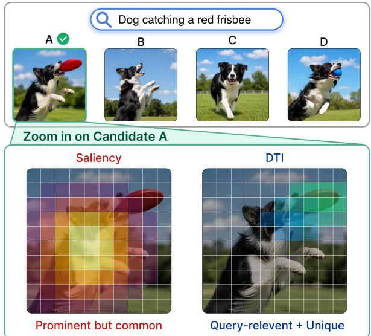
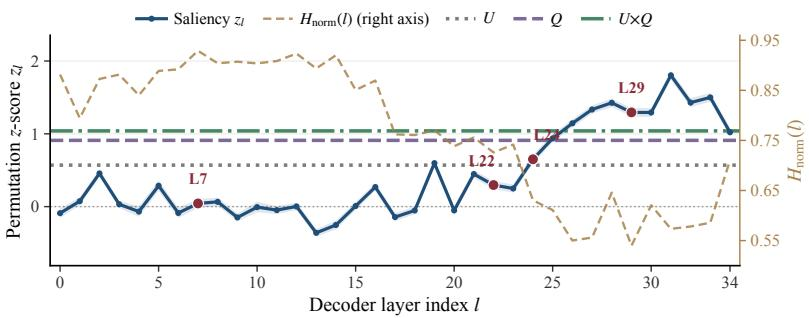
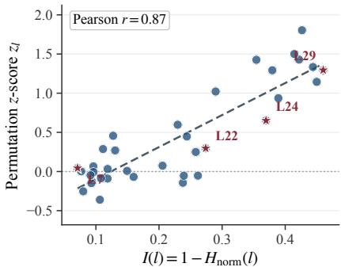
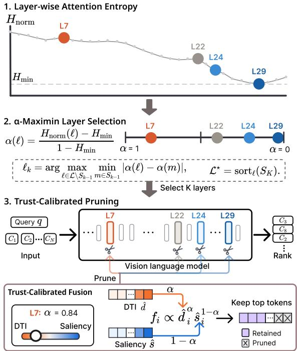
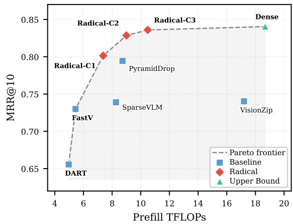
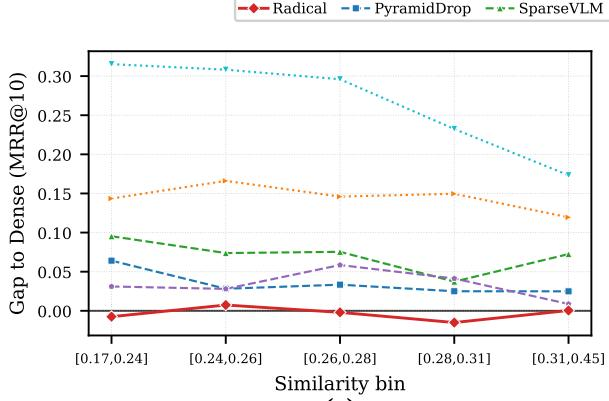
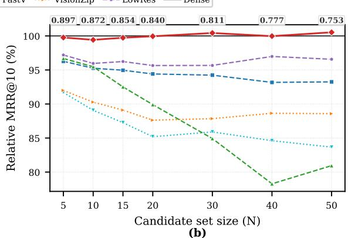
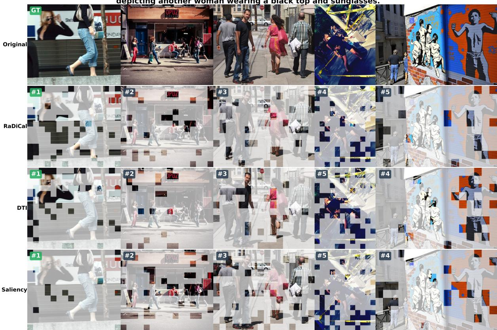
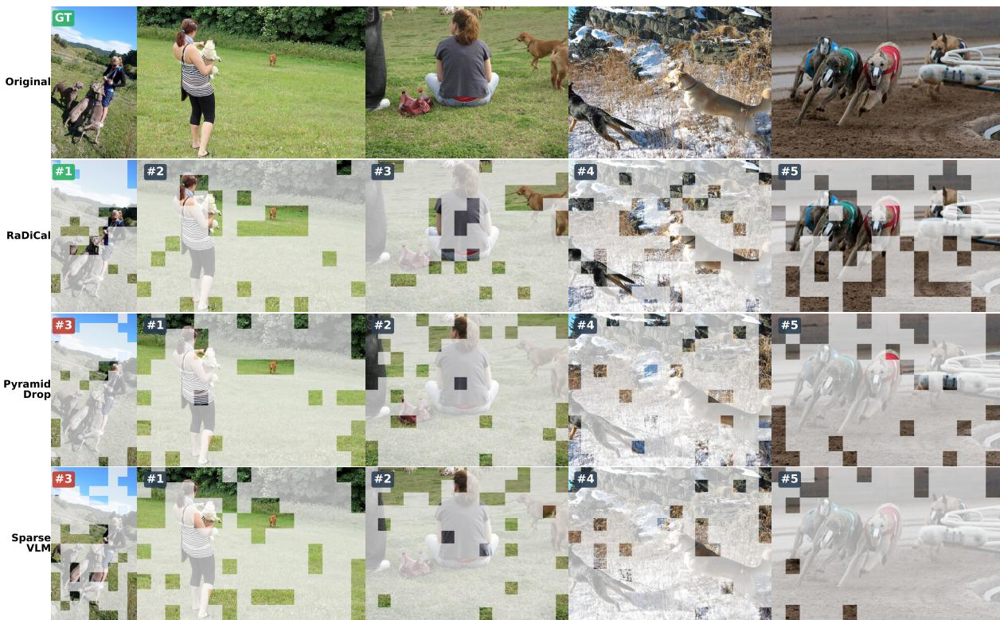
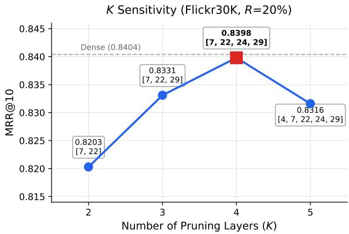

# From Saliency to Discriminability: Rank-Preserving Visual Token Pruning for VLM Rerankers

Siyi Liu1,† Hanjun Yang1,† Chenchen Zhang1 Xiaorong Zhu1 Xinyu Zuo2

Lisheng Duan2 Haijin Liang2 Jin Ma2 Junfu Pu3 Yongqi Zhang1,\*

1The Hong Kong University of Science and Technology (Guangzhou)

2Tencent Yuanbao 3ARC Lab, Tencent

ssui.liu1022@gmail.com hyang371@connect.hkust-gz.edu.cn yongqizhang@hkust-gz.edu.cn

## Abstract

Large vision-language models used as listwise rerankers must jointly process visual tokens from tens of candidates per query, making token pruning essential for practical deployment. Existing pruning methods retain tokens by attention saliency, yet we show that saliency is systematically misaligned with ranking contribution: visually prominent tokens often capture order-neutral patterns shared across candidates. This mismatch is layer-dependent: saliency becomes informative only where attention is concentrated, and normalized attention entropy diagnoses the reliability shift (Pearson r=0.87). We propose RaDiCal (Rank-Discriminative Calibration), a training-free framework that uses normalized attention entropy to decide when saliency can be trusted, fusing it with an attention-free rank-discriminative prior and selecting pruning layers from the same trust landscape. Across three retrieval benchmarks and multiple VLM architectures, RaDiCal matches Dense MRR@10 on Flickr30K and surpasses it on MSCOCO at a 20% token budget, ranks first among all pruning methods on FashionIQ, and holds within 1.2 pp on Flickr30K and MSCOCO at 10% retention. It cuts FLOPs by 39–45% and delivers 1.28–1.45× measured speedups across two VLM architectures without dataset-specific retuning.

## 1 Introduction

Following LLM-based listwise reranking (Sun et al., 2023; Chen et al., 2025a), large visionlanguage models increasingly serve as listwise rerankers (Liu et al., 2025b; Wu et al., 2025b; Gu et al., 2026; Cai, 2026), jointly scoring a query against tens of candidate images in one forward pass. This setting makes visual tokens a dominant inference bottleneck: each high-resolution image may contribute hundreds or thousands of visual tokens (Li et al., 2025; Zhang et al., 2025d; Yang et al., 2025c), and listwise reranking multiplies this cost by tens of candidates. Token pruning is therefore essential for practical VLM reranking, but compression here demands a different fidelity criterion: a reranker produces an ordered list rather than a complete image description, so the key question is whether pruning preserves query-conditioned candidate order.

  
Figure 1: Saliency highlights visually prominent but common regions, while rank-discriminative scoring identifies query-relevant, candidate-distinctive evidence for reranking.

Most visual token pruning methods follow a saliency-preservation view: they retain tokens appearing important within an image or a single multimodal input (Chen et al., 2024a; Shang et al., 2025; Xing et al., 2025; Zhang et al., 2025d; Yang et al., 2025c,a; Alvar et al., 2025). This criterion is natural for single-image understanding but misaligned with listwise reranking. Consider the query “a dog catching a red frisbee” (Figure 1): a saliencybased pruner may focus on the dog body, visually prominent and repeatedly attended to, yet if most candidates contain a dog, this region provides little evidence for ordering them (Zhang et al., 2025b). The rank-relevant evidence is instead the red frisbee and the catching interaction, both query-relevant and discriminative among visually similar candidates.

In our diagnostic study (§3), attention saliency is unreliable for ranking at multiple layers: saliency– ranking alignment is indistinguishable from a random-ordering null. Yet the failure is not uniform across layers (Wang et al., 2026; Jiang et al., 2025; Xing et al., 2025): saliency becomes informative where attention is concentrated but remains unreliable where it is diffuse, calling for calibration rather than wholesale discard.

A token is rank-critical only when it is relevant to the query and distinguishes its candidate from others. However, a ranking-specific prior alone is insufficient: saliency can still provide useful evidence when concentrated but is unreliable when diffuse. Rank-preserving pruning therefore requires three coupled decisions: which visual evidence should be preserved (what), how much attention saliency should be trusted at each layer (when), and which layers should perform pruning under this trust landscape (where).

We propose RaDiCal (Rank-Discriminative Calibration), a training-free visual token pruning framework for VLM rerankers. RaDiCal computes Discriminative Token Importance (DTI), an attention-free prior combining query relevance with cross-candidate distinctiveness. It fuses DTI with AttentionInfo, a layer-specific informationtheoretic saliency, through a trust coefficient derived from normalized attention entropy (Baek et al., 2026; Ma et al., 2026). α-Maximin selects pruning layers from the same entropy curve, spanning diverse trust regimes without dataset-specific sweeps.

Our contributions are as follows:

• Ranking-specific diagnosis. We identify a systematic mismatch between attention saliency and ranking contribution in VLM-based listwise reranking. This mismatch is layer-dependent: normalized attention entropy diagnoses where saliency becomes trustworthy, motivating calibrated rather than unconditional use of attention.

• Rank-discriminative token value. We introduce Discriminative Token Importance (DTI), an attention-free prior that scores each token by query relevance and cross-candidate distinctiveness, shifting pruning from saliency preservation to rank-critical evidence preservation.

• Trust-calibrated pruning. We propose RaDiCal, a training-free framework that calibrates saliency with normalized attention entropy and uses the resulting reliability signal for both tokenscore fusion and pruning-layer selection, eliminating dataset-specific sweeps.

• Empirical validation. Across three benchmarks and two VLM architectures, RaDiCal matches or exceeds Dense on Flickr30K and MSCOCO at a 20% token budget, ranks first among all pruning methods on FashionIQ, delivers measured wallclock speedups of up to 1.45×, and transfers across datasets, model scales, and architectures without retuning.

## 2 Related Work

## 2.1 VLM Reranking

VLMs serve as reranking modules in retrieval pipelines (Liu et al., 2025b; Lin et al., 2025; Gu et al., 2026), operating in pointwise (Gu et al., 2026; Chen et al., 2025b) or listwise mode (Liu et al., 2025b; Wu et al., 2025b; Cai, 2026); listwise methods evaluate candidates relationally within a shared context. Each image contributes hundreds to thousands of visual tokens, and visual-token pruning can substantially reduce this cost on singleimage benchmarks (Chen et al., 2024a; Zhang et al., 2025d; Xing et al., 2025; Yang et al., 2025c), with recent reranking work also exploiting input compression (Sun et al., 2026)—but token-value criteria remain designed for single-image fidelity, not candidate ordering.

## 2.2 Visual Token Pruning

Attention-based pruning is effective for singleimage tasks (Chen et al., 2024a; Zhang et al., 2025d; Xing et al., 2025), and layer-adaptive or complexity-adaptive schedules further improve it (Xing et al., 2025; Ye et al., 2025b; Zhang et al., 2025c; Wu et al., 2026). Yet attention does not equal contribution: low-attention tokens affect outputs (Yang et al., 2025b), high-attention tokens serve as probability dumps (Jha and Kim, 2026), and random pruning can match designed methods (Liao et al., 2026). These results reframe saliency as an empirical hypothesis whose validity depends on context.

Saliency reliability varies sharply across layers: an information horizon shifts with task complexity (Wang et al., 2026), middle layers show abrupt reliability changes (Jiang et al., 2025), and positional biases distort multi-image attention (Endo et al., 2025). Attention entropy indicates when saliency is informative (Baek et al., 2026; Ma et al., 2026), though it remains a weak correctness predictor in isolation (Mann et al., 2026) and has been applied only to single-image tasks; in text-only LLM QA, supervised head-entropy features do predict answer correctness (Ostmeier et al., 2026), but neither setting addresses unsupervised saliency calibration across competing images. In listwise reranking, the challenge compounds: token importance must be judged across both layers and competing candidates, where shared visual patterns inflate saliency for rank-irrelevant tokens.

## 2.3 Ranking-Aware Compression

Training-free pruning can transfer across datasets via attention-derived schedules (Ye et al., 2025a), but the token-value criterion remains single-input preservation. Multi-image approaches exploit interimage redundancy or diversity (Yang et al., 2025a; Pippi et al., 2025; Zhang et al., 2025a), with recent work balancing importance and diversity (Tan et al., 2026); prompt-level layouts enable comparison above the token-selection layer (Wu et al., 2025a); video methods leverage temporal continuity (Tao et al., 2025; Tang et al., 2026)—absent in listwise reranking with discrete, unordered candidates. Ranking-aware passage compression exists for text retrieval (Zhi et al., 2026; Liu et al., 2025a; Louis et al., 2025), but visual saliency introduces the conditional-reliability issues above.

## 2.4 Broader Efficiency Paradigms

Beyond the attention-saliency pruning (Chen et al., 2024a; Xing et al., 2025) and redundancy-aware merging (Zhang et al., 2025d; Yang et al., 2025c; Wen et al., 2025) methods discussed above, other work cuts visual cost upstream of token selection: CARES (Kimhi et al., 2026) and AwaRes (Shabtay et al., 2026) adapt input resolution per query via a trained classifier or tool-calling with RL; CROP (Guo et al., 2025) and ERGO (Lee et al., 2026) train localization modules for regionoriented selective pruning; and VisionThink (Yang et al., 2025d) trains an RL policy that decides at inference time whether to request the full-resolution image. All of these methods operate on singleimage inputs with task-specific training or learned policies; none targets cross-candidate rank preservation under a shared listwise context.

## 3 Problem Formulation and Diagnostics

## 3.1 Saliency Reliability Is Layer-Conditioned

Setup. Consider a text query q and a candidate set $\mathcal { C } = \{ c _ { 1 } , \ldots , c _ { N } \}$ , where candidate $c _ { k }$ is encoded by a vision encoder into $M _ { k }$ visual tokens, for a total of $\begin{array} { r } { V = \sum _ { k = 1 } ^ { N } M _ { k } } \end{array}$ visual tokens. A VLM processes the query and candidate visual tokens in a shared multimodal context to produce ranking scores. The pruning objective is ranking preservation: removing visual tokens while maintaining relative candidate order. We measure each layer’s saliency reliability via a permutationcorrected z-score zl: the extent to which saliency– ranking alignment exceeds a random-ordering null (protocol in Appendix C).

Per-layer reliability curve. Figure 2a plots zl across all decoder layers. At shallow layers (e.g., L7), $z _ { l } \approx 0 ,$ , but this global failure masks finer layer-dependent structure. The reliability profile is strongly non-monotonic: specific middle and deep layers (e.g., L22, L24, L29) recover substantially stronger alignment. This non-monotonicity reflects the listwise nature of the task: shared foreground patterns can attract attention without affecting relative order, while query-specific differences become useful only after text–visual alignment sharpens. Dashed lines mark attention-free reference baselines (U, Q, U×Q) from vision-encoder embeddings; U×Q exceeds saliency at several high- $H _ { \mathrm { n o r m } }$ layers, showing that embedding-space signals complement saliency where attention is uninformative (formalized in Definition 1).

A fixed pruning layer — the default in prior work (Chen et al., 2024a; Xing et al., 2025) — will either prune where saliency is unreliable or miss the window where it becomes informative (Zhang et al., 2025c).

## 3.2 Entropy as a Trust Signal

Normalized attention entropy. We define $H _ { \mathrm { n o r m } }$ to quantify how discriminative each layer’s attention is. Let $A ^ { ( l ) }$ denote the full attention weights at layer l. We first restrict each text row to the V visual-token columns and renormalize within those

  
(a) Layer-wise saliency reliability curve.  
(b) Information density scatter.  
Figure 2: Preliminary diagnostic of layer-conditioned saliency reliability. (a) z is layer-dependent; $H _ { \mathrm { n o r m } }$ overlaid on right axis, attention-free baselines (U, Q, U×Q) as dashed lines. (b) Reliability correlates with information density $I ( l ) { = } 1 { - } H _ { \mathrm { n o r m } } ( l )$ (Pearson r=0.87). See §3.1 for definitions.

columns:

$$
\begin{array} { r l } & { \bar { A } _ { r , i } ^ { ( l ) } = \frac { A _ { r , i } ^ { ( l ) } } { \sum _ { j = 1 } ^ { V } A _ { r , j } ^ { ( l ) } } , } \\ & { p _ { i } ^ { ( l ) } = \cfrac { 1 } { N _ { t } } \sum _ { r = 1 } ^ { N _ { t } } \bar { A } _ { r , i } ^ { ( l ) } , \quad \sum _ { i = 1 } ^ { V } p _ { i } ^ { ( l ) } = 1 . } \end{array}\tag{1}
$$

Its normalized Shannon entropy is:

$$
H _ { \mathrm { n o r m } } ( l ) = \frac { - \sum _ { i = 1 } ^ { V } p _ { i } ^ { ( l ) } \log p _ { i } ^ { ( l ) } } { \log V } .\tag{2}
$$

$H _ { \mathrm { n o r m } } \approx 1$ indicates near-uniform attention with little discriminative signal; $H _ { \mathrm { { n o r m } } } \approx 0$ indicates concentrated attention where saliency is informative (Baek et al., 2026). Equivalently, $1 - H _ { \mathrm { n o r m } } ( l )$ measures the normalized information gain over a uniform prior; we formalize this connection in $\ S 4$

Layer-wise entropy profile. Across decoder layers, $H _ { \mathrm { n o r m } }$ is non-monotonic—transitioning from a high-entropy shallow plateau through a descent ramp to a deep valley near L29, with a partial rebound in the final layers—and model-intrinsic: Flickr30K and MSCOCO yield Pearson $r \quad = { }$ 0.9993, requiring no per-dataset recalibration.

Reliability correlates with information density. Figure 2b plots $z _ { l }$ against information density $I ( l ) = 1 - H _ { \mathrm { n o r m } } ( l )$ . The strong positive relationship (Pearson $r = 0 . 8 7$ across 36 decoder layers) shows that layer-wise reliability is governed by attention concentration: more focused attention yields saliency better aligned with ranking contribution. This turns the layer-conditioned variation observed in Panel (a) into a reliable calibration signal: $H _ { \mathrm { n o r m } }$ serves as a lightweight, inference-time proxy for how much to trust saliency at each layer.

Design implications. These diagnostics motivate three requirements for rank-preserving pruning: an attention-free token prior for layers where saliency is unreliable, a calibration mechanism that adapts fusion to layer-wise trust, and a layer schedule spanning diverse reliability regimes—all addressed in §4.

## 4 Method: RaDiCal

## 4.1 Overview

RaDiCal (Rank-Discriminative Calibration) is a pruning framework in which $H _ { \mathrm { n o r m } }$ simultaneously governs signal fusion and layer selection through a single coordinate (Figure 3). Two complementary token scores—a layer-invariant DTI prior (§4.2.1) and a layer-specific AttentionInfo saliency (§4.2.2)—are geometrically fused via a trust coefficient $\alpha ( l )$ derived from $H _ { \mathrm { n o r m } } \left( \ S 4 . 3 \right)$ , which also drives α-Maximin layer scheduling (§4.4).

## 4.2 Complementary Token-Level Signals

We construct two complementary token-level signals: DTI captures query-conditioned crosscandidate discriminativeness (layer-invariant), and AttentionInfo captures layer-specific information content (layer-dependent).

## 4.2.1 Discriminative Token Importance

Let each candidate $c _ { k }$ be encoded by the vision encoder into visual tokens $\{ t _ { i } ^ { k } \} _ { i = 1 } ^ { M _ { k } }$ , where $M _ { k }$ may vary across candidates and $\begin{array} { r } { V = \sum _ { k = 1 } ^ { N } M _ { k } } \end{array}$ denotes the total number of visual tokens.

Definition 1 (Rank-discriminative score). Given a query q, a candidate set $\mathcal { C } = \{ c _ { 1 } , \ldots , c _ { N } \}$ , and visual tokens $\{ t _ { i } ^ { k } \} _ { i = 1 } ^ { M _ { k } }$ for each candidate $c _ { k } ,$ , the rankdiscriminative score of token $t _ { i } ^ { k }$ captures both crosscandidate distinctiveness and query relevance. We instantiate these as:

  
Figure 3: RaDiCal pipeline. (1) $H _ { \mathrm { n o r m } }$ profile across layers identifies attention concentration patterns. (2) α- Maximin maps $H _ { \mathrm { n o r m } }$ to trust $\alpha ( l )$ and selects K pruning layers spanning diverse trust regimes. (3) At each selected layer, DTI and saliency are geometrically fused via α to retain top tokens.

$$
\begin{array} { r l } & { \mathrm { C C U } ( t _ { i } ^ { k } , \mathcal { C } ) = 1 - \cos ( t _ { i } ^ { k } , \bar { v } ) , } \\ & { \mathrm { Q R e l } ( t _ { i } ^ { k } , q ) = \operatorname* { m a x } ( \cos ( t _ { i } ^ { k } , q _ { \mathrm { e m b } } ) , 0 ) , } \end{array}
$$

where v¯ is the L2-normalized mean ofall candidate visual tokens (global prototype) and $q _ { \mathrm { e m b } }$ is the query text embedding. The Discriminative Token Importance is then:

$$
\mathrm { D T I } ( t _ { i } ^ { k } ) \propto \mathrm { C C U } ( t _ { i } ^ { k } , \mathcal { C } ) \cdot \mathrm { Q R e l } ( t _ { i } ^ { k } , q ) .\tag{3}
$$

This definition separates ranking-relevant token value from within-image saliency: a token must be both query-relevant and cross-candidate distinctive to affect candidate ordering. DTI is computed once from ViT outputs before the LLM forward pass and reused across all selected layers; its runtime cost is discussed in §5.3 and Appendix I.

## 4.2.2 AttentionInfo Saliency

DTI is layer-invariant and does not capture how attention concentration varies across the LLM pipeline. From the information-gain view of $H _ { \mathrm { n o r m } }$ (§3.2), AttentionInfo decomposes the layer-level

KL gap to individual tokens (derivation in Appendix E). Let T denote the current active token set with $V _ { T } = \left| T \right|$ tokens, and $p ^ { ( l , T ) }$ the text-averaged attention distribution over active visual tokens at layer l. The token-level saliency is:

$$
\mathrm { A t t I n f { o } } _ { i } ^ { ( l , T ) } = \operatorname* { m a x } \bigl ( p _ { i } ^ { ( l , T ) } \cdot \log ( V _ { T } \cdot p _ { i } ^ { ( l , T ) } ) , 0 \bigr ) .\tag{4}
$$

Token i receives a positive score if and only if its attention weight exceeds the active-set uniform baseline $1 / V _ { T }$ . Normalizing along the active token dimension yields $\mathbf { S } \mathbf { a } \mathbf { l } _ { i } ^ { ( l , T ) } \in [ 0 , 1 ]$ , the saliency input to §4.3.

## 4.3 Trust-Calibrated Fusion

The trust trade-off between DTI and AttentionInfo varies with $H _ { \mathrm { n o r m } } { : }$ high entropy favors DTI, low entropy favors saliency.

α: from $H _ { \mathbf { n o r m } }$ to a per-layer trust weight. Let $H _ { \mathrm { m i n } }$ denote the model’s minimum $H _ { \mathrm { n o r m } }$ value, the normalized entropy at the layer where attention is most concentrated (established in §3.2). We define the per-layer trust coefficient:

$$
\alpha ( l ) = \frac { H _ { \mathrm { n o r m } } ( l ) - H _ { \mathrm { m i n } } } { 1 - H _ { \mathrm { m i n } } } \ \in \ [ 0 , 1 ] .\tag{5}
$$

At $\alpha ( l ) = 0 ( H _ { \mathrm { n o r m } } ( l ) = H _ { \mathrm { m i n } }$ , sharpest layer), saliency is most reliable and AttentionInfo fully governs token selection. At $\alpha ( l ) = 1 ( H _ { \mathrm { n o r m } } ( l ) =$ 1, uniform attention), saliency is uninformative and DTI, the attention-free prior, governs entirely. $H _ { \mathrm { m i n } }$ is read from the model’s own $H _ { \mathrm { n o r m } }$ curve (computed offline; see §4.5 and Figure 3, Step 1); no dataset-specific calibration is required.

## 4.3.1 Geometric Fusion

Given $\alpha ( l )$ , normalized DTI scores $\hat { d } _ { i } ~ \in ~ [ 0 , 1 ] .$ and normalized AttentionInfo scores $\hat { s } _ { i } ^ { ( l ) } \in [ 0 , 1 ]$ (§4.2.2), we compute:

$$
f _ { i } ^ { ( l ) } \propto \mathrm { m a x } ( \hat { d } _ { i } , \epsilon ) ^ { \alpha ( l ) } \cdot \mathrm { m a x } ( \hat { s } _ { i } ^ { ( l ) } , \epsilon ) ^ { 1 - \alpha ( l ) } .\tag{6}
$$

This log-linear form provides scale-invariance (DTI and Sal need not share a numerical scale) and, for $\alpha ( l ) \in ( 0 , 1 )$ , soft-veto behavior: a nearzero value in either channel suppresses $f _ { i } ^ { ( l ) }$ . At the endpoints the fusion degenerates to the surviving channel by design (α=0: pure saliency; α=1: pure DTI).

## 4.4 Layer Scheduling

The same α curve also selects which layers should prune, extending trust calibration from token scoring to layer scheduling. α-Maximin (§4.4) operates on the α curve defined in §4.3. Given a chosen schedule size $K ,$ , a fixed layer-gap guard $^ { g , }$ and a global keep ratio $R .$ , the scheduler produces an ordered layer set $\mathcal { L } ^ { \ast }$

α-Maximin layer selection. A schedule of $K$ pruning layers should span diverse trust regimes. Clustering selected layers near the same α value wastes the available trust spectrum, as adjacentα layers yield redundant pruning decisions (Xing et al., 2025). We therefore use greedy farthest-first selection in α-space, anchored at the most reliable saliency layer, with a minimum layer-gap guard $g$ (Figure 3, Step $2 ;$ tie-breaking and relaxation details in Algorithm 1).

Uniform budget realization. Given selected layers $\mathcal { L } ^ { * } = ( l _ { 1 } , \ldots , l _ { K } )$ and global keep ratio $R ,$ we use the same per-layer keep ratio at every selected layer:

$$
\begin{array} { r } { \ker ( l _ { h } ) = R ^ { 1 / K } , \qquad h = 1 , \dots , K . } \end{array}\tag{7}
$$

Sequential application yields realized retention $\begin{array} { r } { \prod _ { h = 1 } ^ { \tilde { K } } \ker ( \bar { l _ { h } } ) = R ; } \end{array}$ integer rounding applies conservatively at each layer.

## 4.5 Unified Pipeline

The framework separates into a one-time offline pass (per model and budget) and a per-inference online pass (per query × candidate set). The complete procedure is given in Figure 3 and Algorithm 1 (Appendix D), which makes the token state explicit across pruning layers.

The offline schedule $( \mathcal { L } ^ { * }$ , keep) is fixed for a given model and budget, matching the deployment profile of prior layer-selection methods (Chen et al., $2 0 2 4 \mathrm { a } ;$ Ma et al., 2026). The external keep ratio R controls the evaluation budget, while K and the layer-gap guard are fixed deployment choices and are not tuned per dataset.

## 5 Experimental Results

## 5.1 Experimental Setup

We evaluate RaDiCal on Qwen3-VL-4B-Instruct (Bai et al., 2025) as the listwise reranker, with candidates retrieved by Qwen3- VL-Embedding-2B (Li et al., 2026). Model generalization—to the 8B variant and to a different VLM architecture (InternVL2.5-8B (Chen et al., 2024b))—is examined in §5.6.

We use three benchmarks. Flickr30K (Young et al., 2014) and MSCOCO (Lin et al., 2014) follow the Karpathy test split (Karpathy and Fei-Fei, 2015) (1,000 queries × 20 candidates each). FashionIQ (Wu et al., 2021) is a composed image retrieval benchmark where each query combines a reference image with a textual modification (validation split; 6,016 queries × 20 candidates drawn from a top-50 retrieval pool). For FashionIQ, we report conditional metrics computed over the 1,599 queries whose ground-truth target appears in the first-stage retriever’s top-20 candidate set, isolating reranking quality from first-stage retrieval coverage. Appendix B details how DTI adapts to FashionIQ’s composed-query format.

We compare against six visual token reduction baselines—FastV (Chen et al., 2024a), Pyramid-Drop (Xing et al., 2025), SparseVLM (Zhang et al., 2025d), DART (Wen et al., 2025), VisionZip (Yang et al., 2025c), and LowRes (which simply reduces input image resolution)—all re-implemented within the same Qwen3-VL framework to ensure a fair comparison. Dense (no pruning) serves as the unpruned reference. Appendix B details baseline descriptions and hyper-parameter configurations.

We report MRR@10 and R@1/5/10 on Flickr30K and MSCOCO, and their conditional counterparts (cR@k, cMRR@10) on FashionIQ; Appendix L additionally reports unconditional metrics over all queries. We evaluate at two retention budgets: R=20% (primary) and R=10% (stress test); the global budget is realized by an equal perlayer keep ratio $R ^ { 1 / \subset }$ at each of the K=4 selected pruning layers (§4.4).

RaDiCal prunes at layers [7, 22, 24, 29], selected by α-Maximin (§4.4), using the AttentionInfo saliency channel.

## 5.2 Main Results

We evaluate whether RaDiCal preserves reranking quality under aggressive token pruning (Table 1).

At R=20%, RaDiCal matches Dense quality— exceeding Dense MRR@10 on MSCOCO and matching it on Flickr30K (within 0.1 pp). It ranks first in all 12 metric columns across all three benchmarks, with a clear margin on MRR@10.

Halving the budget to R=10% separates structurally robust methods from fragile ones. RaDiCal ranks first in all 12 columns, with MRR@10 within

<table><tr><td></td><td colspan="4">Flickr30K</td><td colspan="4">MSCOCO</td><td colspan="4">FashionIQ</td></tr><tr><td>Method</td><td>R@1</td><td>R@5</td><td>R@10</td><td>MRR@10</td><td>R@1</td><td>R@5</td><td>R@10</td><td>MRR@10</td><td>cR@1</td><td>cR@5</td><td>cR@10</td><td>cMRR@10</td></tr><tr><td>Dense</td><td>77.10</td><td>93.70</td><td>97.30</td><td>84.04</td><td>46.30</td><td>76.90</td><td>87.40</td><td>58.94</td><td>28.57</td><td>59.65</td><td>71.59</td><td>41.94</td></tr><tr><td colspan="9">Retention R = 20%</td><td></td><td></td><td></td><td></td></tr><tr><td>FastV</td><td>61.80</td><td>89.00</td><td>94.50</td><td>72.99</td><td></td><td>35.9070.10</td><td>83.70</td><td>49.84</td><td>11.48</td><td>34.20</td><td>48.97</td><td>21.84</td></tr><tr><td>PyramidDrop</td><td>70.70</td><td>92.00</td><td>96.00</td><td>79.43</td><td>42.70</td><td>73.70</td><td>85.00</td><td>55.41</td><td>22.93</td><td>52.75</td><td>66.61</td><td>36.12</td></tr><tr><td>SparseVLM</td><td>64.00</td><td>87.70</td><td>95.30</td><td>73.90</td><td>41.40</td><td>72.20</td><td>86.70</td><td>54.64</td><td>21.83</td><td>53.58</td><td>67.45</td><td>35.51</td></tr><tr><td>DART</td><td>53.50</td><td>82.30</td><td>90.60</td><td>65.56</td><td>32.80</td><td>59.30</td><td>77.60</td><td>45.08</td><td>15.00</td><td>47.28</td><td>61.97</td><td>28.97</td></tr><tr><td>VisionZip</td><td>63.50</td><td>89.10</td><td>94.30</td><td>74.03</td><td>38.10</td><td>68.20</td><td>81.10</td><td>51.07</td><td>17.01</td><td>45.03</td><td>59.44</td><td>29.41</td></tr><tr><td>LowRes</td><td>71.50</td><td>92.20</td><td>97.10</td><td>80.03</td><td>42.80</td><td>72.80</td><td>85.60</td><td>55.64</td><td>22.75</td><td>54.48</td><td>67.00</td><td>36.55</td></tr><tr><td>RaDiCal</td><td>77.10</td><td>93.70</td><td>97.30</td><td>83.98</td><td>46.00</td><td>75.80</td><td>87.60</td><td>59.09</td><td>26.21</td><td>58.50</td><td>71.13</td><td>39.79</td></tr><tr><td colspan="9">Retention R = 10%</td><td></td><td></td><td></td><td></td></tr><tr><td>FastV</td><td></td><td>39.70 75.10</td><td>85.40</td><td>54.40</td><td></td><td>25.5055.50</td><td>74.30</td><td>38.78</td><td>6.88</td><td>28.62</td><td>45.53</td><td>16.66</td></tr><tr><td>PyramidDrop</td><td>70.40</td><td>92.40</td><td>96.20</td><td>79.28</td><td>42.70</td><td>73.50</td><td>85.20</td><td>55.33</td><td>19.45</td><td>49.03</td><td>63.25</td><td>32.44</td></tr><tr><td>SparseVLM</td><td>51.90</td><td>80.30</td><td>89.30</td><td>64.03</td><td>34.80</td><td>65.30</td><td>80.80</td><td>47.71</td><td>19.70</td><td>48.55</td><td>61.68</td><td>32.22</td></tr><tr><td>DART</td><td>39.30</td><td>70.60</td><td>81.90</td><td>52.44</td><td>21.80</td><td>50.90</td><td>70.10</td><td>34.43</td><td>13.60</td><td>41.96</td><td>57.56</td><td>25.98</td></tr><tr><td>VisionZip</td><td>52.60</td><td>82.50</td><td>90.40</td><td>65.06</td><td>30.20 39.10</td><td>61.30 69.50</td><td>77.30 83.50</td><td>43.53 52.01</td><td>11.35 18.78</td><td>34.85</td><td>50.28</td><td>22.11</td></tr><tr><td>LowRes</td><td>63.90</td><td>88.50</td><td>95.70</td><td>74.50</td><td></td><td>45.10 76.10</td><td>88.50</td><td>58.00</td><td>24.78</td><td>48.96</td><td>62.62</td><td>31.92</td></tr><tr><td>RaDiCal</td><td></td><td>76.00 92.80</td><td>96.90</td><td>82.85</td><td></td><td></td><td></td><td></td><td></td><td>56.84</td><td>69.84</td><td>37.99</td></tr></table>

Table 1: Main reranking results across three benchmarks at two retention budgets. FashionIQ reports conditiona metrics (§5.1). Bold: best pruning method; underline: second-best. All values in %.

  
Figure 4: Quality–efficiency Pareto frontier (Flickr30K, R=20%).

1.2 pp of Dense on Flickr30K and MSCOCO, and still above every baseline’s R=20% score on all three benchmarks, while single-layer baselines (FastV, DART) degrade by an order of magnitude more. This stability shows that RaDiCal’s token selection captures ranking-relevant structure rather than exploiting visual redundancy.

On FashionIQ, RaDiCal again achieves the highest cMRR@10 among pruning methods at both retention budgets. The method ranking is consistent across all three benchmarks: RaDiCal leads while single-layer baselines degrade most, extending to composed retrieval.

<table><tr><td>Model</td><td>Method</td><td> $\mathbf { R e l } _ { \mathbf { D } } ( \% )$ </td><td>FLOPs↓ Speedup</td><td></td></tr><tr><td></td><td>Dense</td><td>100.0</td><td></td><td>1.00×</td></tr><tr><td rowspan="4">Qwen3-VL-4B</td><td>RaDiCal</td><td>99.9</td><td>43.8%</td><td>1.28×</td></tr><tr><td>PyramidDrop</td><td>94.5</td><td>53.3%</td><td>0.76×</td></tr><tr><td>SparseVLM FastV</td><td>87.9</td><td>55.7%</td><td>1.12×</td></tr><tr><td></td><td>86.9</td><td>70.8%</td><td>1.09×</td></tr><tr><td rowspan="5">InternVL2.5-8B</td><td>Dense</td><td>100.0</td><td></td><td>1.00×</td></tr><tr><td>RaDiCal</td><td>99.3</td><td>39.2%</td><td>1.45×</td></tr><tr><td>PyramidDrop</td><td>95.1</td><td>55.6%</td><td>1.68×</td></tr><tr><td>SparseVLM</td><td>94.3</td><td>60.7%</td><td>1.46×</td></tr><tr><td>FastV</td><td>86.1</td><td>71.1%</td><td>2.00×</td></tr></table>

Table 2: Quality and measured efficiency across two VLM architectures (Flickr30K, R=20%). Rel : MRR@10 relative to Dense. FLOPs↓ is analytical; speedup is measured end-to-end. Rows are ordered by RelD; the best pruning result per model and metric is bolded. Full metrics in Appendix I.

## 5.3 Efficiency Analysis

The quality advantage translates into a favorable quality–efficiency trade-off: RaDiCal lies on the Pareto frontier and dominates baselines in MRR@10 at comparable compute (Figure 4). At R=20% on Qwen3-VL-4B, RaDiCal saves over 40% of Dense FLOPs; reducing to R=10% pushes savings past 50% with minimal additional degradation (per-method TFLOPs in Table 9). RaDiCal variants span a wide band of the frontier, giving practitioners a continuous quality–efficiency operating range rather than a single operating point. RaDiCal is the only method above 99% of Dense MRR@10 on both backbones, delivering 1.28–

  
(a)

  
Figure 5: Analysis: (a) performance gap to Dense across five candidate-similarity quintiles; (b) relative MRR@10 $( \mathrm { D e n s e } = 1 0 0 \% )$ as candidate set size N varies from 5 to 50.

<table><tr><td>Variant</td><td>Flickr30K</td><td>MSCOCO</td></tr><tr><td>Full RaDiCal</td><td>83.98</td><td>59.09</td></tr><tr><td>w/o DTI (α=0)</td><td>82.98 (−1.00)</td><td>58.39(−0.70)</td></tr><tr><td>Fixed fusion (α=0.5)</td><td>82.65 (-1.33)</td><td>58.15 (−0.94)</td></tr><tr><td>w/o α-Maximin</td><td>82.01 (−1.97)</td><td>57.70(−1.39)</td></tr><tr><td>w/o Geometric</td><td>83.26(-0.72)</td><td>58.58 (−0.51)</td></tr><tr><td>DTI-only (α=1)</td><td>83.11 (−0.87)</td><td>58.48 (–0.61)</td></tr><tr><td>QRel-only (α-Maximin)</td><td>83.24(−0.74)</td><td>58.57 (−0.52)</td></tr><tr><td>CCU-only (α-Maximin)</td><td>81.86(-2.12)</td><td>57.60(-1.49)</td></tr><tr><td>w/o Token Scoring</td><td>82.00 (−1.98)</td><td>57.70(-1.39)</td></tr><tr><td>Dense</td><td> $8 4 . 0 4 ( + 0 . 0 6 )$ </td><td> $5 8 . 9 4 ( - 0 . 1 5 )$ </td></tr></table>

Table 3: Component removal ablation (MRR@10 (%), R=20%). Subscripts show the delta relative to Full RaDiCal (red: degradation; green: improvement).

1.45× measured end-to-end speedups (Table 2). Analytical compression does not predict wall-clock gain: PyramidDrop saves more FLOPs than RaDiCal on both backbones yet achieves only 0.76× speedup on Qwen3-VL-4B—slower than Dense— while FastV, despite removing the most FLOPs on both backbones, yields the lowest ranking quality. At the smallest analytical compression of any pruning method, rank-aware selection, not aggressive token removal, best preserves ranking under a latency budget. Appendix I reports full per-dataset and wall-clock metrics.

## 5.4 Ablation Study

We isolate each component’s contribution by removing it and measuring the resulting degradation. The component hierarchy is clear (Table 3): the three largest degradations on both datasets—CCUonly, w/o Token Scoring, and w/o α-Maximin— cluster tightly, confirming that how to score tokens and where to prune carry roughly equal weight. Notably, fixed-weight mixing (α=0.5) underperforms disabling DTI entirely (α=0) on both datasets, indicating that the benefit of DTI depends on when it is applied; adaptive trust calibration is necessary to realize the gain. Neither signal suffices alone: DTI-only and saliency-only both underperform the calibrated combination, confirming that the two channels are complementary rather than redundant.

Appendices G and H report design-choice justifications including alternative layer selection strategies and K sensitivity. Appendix F visualizes these signal differences on representative queries. Candidate-level resolution allocation—even guided by the same DTI signal—falls 3.70–4.43 pp short of RaDiCal on Flickr30K at matched total budget: token-level spatial selection is essential (Appendix K).

## 5.5 Analysis

## 5.5.1 Candidate Similarity Impact

Listwise reranking becomes most challenging when candidates are visually similar, because shared visual patterns are more likely to inflate saliency for order-neutral tokens; we now test whether token pruning selectively degrades on such hard cases. On raw MRR@10, RaDiCal follows the same decline pattern as Dense as candidate similarity increases; in the gap-to-Dense view (Figure 5 a), the gap remains near zero across all five similarity bins, indicating that pruning preserves the information needed to distinguish similar candidates. In other words, visual ambiguity lowers absolute ranking quality without magnifying the cost of pruning.

Together, these results support the rankdiscriminative criterion (Definition 1): the discriminative signal compensates for saliency degradation in hard candidate sets. Appendix F illustrates this on a high-similarity example.

<table><tr><td>Model</td><td>Method</td><td>MRR@10</td><td>R@1 R@10</td></tr><tr><td rowspan="3">Qwen3-VL-8B</td><td>Dense</td><td>86.93</td><td>80.30 98.10</td></tr><tr><td>RaDiCal PyramidDrop</td><td>87.14 84.39</td><td>80.40 98.30 77.00 97.00</td></tr><tr><td>SparseVLM FastV</td><td>85.51 61.76</td><td>75.80 97.50 50.30 87.60</td></tr><tr><td rowspan="4">InternVL2.5-8B</td><td>Dense</td><td>32.05</td><td>14.50 72.40</td></tr><tr><td>RaDiCal</td><td>31.81</td><td>13.40 73.80</td></tr><tr><td>PyramidDrop</td><td>30.49</td><td>12.20 74.10</td></tr><tr><td>SparseVLM</td><td>30.23</td><td>12.50 71.90</td></tr><tr><td rowspan="2"></td><td></td><td></td><td></td></tr><tr><td>FastV</td><td>27.59</td><td>10.10 69.30</td></tr></table>

Table 4: Model generalization (Flickr30K, R=20%). Qwen3-VL-8B uses layers [4, 7, 21, 29]; InternVL2.5- 8B uses layers [8, 22, 25, 27], both auto-selected by α- Maximin. Best pruning method per group is bolded. All values in %.

## 5.5.2 Candidate Set Size Sensitivity

Candidate list length varies widely across retrieval pipelines, making robustness to N a practical requirement. As candidate set size N varies from 5 to 50, RaDiCal’s relative MRR@10 remains virtually flat—spanning barely 1 pp around Dense even as Dense quality itself drops substantially—while baselines such as SparseVLM and FastV degrade by an order of magnitude more (Figure 5 b). Because DTI’s global prototype adapts naturally to the candidate pool size, the pruning criterion remains well-calibrated across deployment scales, eliminating the need for per-N retuning.

## 5.6 Model Generalization

We now test whether the advantage transfers to a larger model (Qwen3-VL-8B) and a different VLM architecture (InternVL2.5-8B). RaDiCal exceeds Dense MRR@10 on the larger Qwen3-VL-8B (Table 4), and retains over 99% of Dense quality on InternVL2.5-8B. α-Maximin automatically selects a distinct layer schedule for each model (see caption of Table 4) without manual tuning. The method ranking is stable across both architectures: RaDiCal leads on MRR@10 while FastV degrades most. The advantage also survives a change of first-stage retriever: RaDiCal matches or exceeds Dense across three substantially different candidate pools (Qwen, Jina, SigLIP2) over five seeds, with pairwise pool overlap below 40% (Appendix J).

## 6 Conclusion

We showed that attention saliency is systematically misaligned with ranking contribution in VLMbased listwise reranking, and that normalized attention entropy $( H _ { \mathrm { n o r m } } )$ diagnoses where saliency becomes trustworthy. RaDiCal exploits this insight to unify token scoring, trust calibration, and layer scheduling under a single entropy-derived coordinate—matching Dense on Flickr30K and exceeding it on MSCOCO at a 20% token budget with measured speedups of up to 1.45×, and transferring across datasets, model scales, and architectures without retuning. The ablation confirms that where to prune matters as much as how to score. Integrating DTI-style discriminative priors into the training loop is a promising direction for further improving calibration fidelity across diverse retrieval scenarios.

## Limitations

Our work has several limitations. First, RaDiCal is designed for listwise reranking, where multiple candidates provide the cross-candidate contrast that DTI exploits; its applicability to other multi-image tasks (e.g., visual comparison, multi-image VQA) has not been evaluated. Second, all components are training-free, and we do not investigate whether learning the calibration weight α or the DTI scoring weights in a task-specific manner could yield further gains. Third, the method assumes softmaxbased attention, so it may not generalize to architectures with alternative attention mechanisms such as linear attention or state-space models. Finally, although our evaluation spans three reranking benchmarks, six single-image benchmarks (Appendix M), three first-stage retrievers, and two VLM families, we have not validated on a wider range of retrieval domains or modalities.

## Ethical Considerations

This work collects no new data or human-subject annotations; experiments use public benchmarks and pretrained models subject to their original licenses. RaDiCal reduces computation, but we do not measure energy use or carbon emissions, nor mitigate inherited biases, privacy risks, or hallucinations. Because pruning may alter candidate exposure and affect underrepresented groups, subgroup evaluation and human oversight are recommended before high-stakes deployment.

Use of AI Assistants. We used a large language model (LLM) in our synthesis pipeline for caption editing and quality filtering. During manuscript preparation, we also used AI assistants for language editing and proofreading. All research ideas, experimental designs, analyses, interpretations, and claims are the authors’ own; the authors reviewed and take responsibility for the final manuscript.

## Acknowledgments

This work was sponsored by the CCF-Tencent Rhino-Bird Open Research Fund (No. CCF-Tencent RAGR20250119), and was also supported by the Guangdong Basic and Applied Basic Research Foundation (No. 2025A1515010304), the Guangdong Province Project (No. 2024QN11X088), and the Guangzhou Science and Technology Planning Project (No. 2025A03J4491).

## References

Saeed Ranjbar Alvar, Gursimran Singh, Mohammad Akbari, and Yong Zhang. 2025. DivPrune: Diversitybased visual token pruning for large multimodal models. In Proceedings ofthe IEEE/CVF Conference on Computer Vision and Pattern Recognition (CVPR), pages 9392–9401.

Changwoo Baek, Jouwon Song, Sohyeon Kim, and Kyeongbo Kong. 2026. AgilePruner: An empirical study of attention and diversity for adaptive visual token pruning in large vision-language models. In The Fourteenth International Conference on Learning Representations.

Shuai Bai, Yuxuan Cai, Ruizhe Chen, Keqin Chen, Xionghui Chen, Zesen Cheng, Lianghao Deng, Wei Ding, Chang Gao, Chunjiang Ge, et al. 2025. Qwen3-VL technical report. arXiv preprint arXiv:2511.21631.

Hongyi Cai. 2026. When vision meets texts in listwise reranking. In Proceedings ofthe 49th International ACM SIGIR Conference on Research and Development in Information Retrieval, pages 122–132.

Liang Chen, Haozhe Zhao, Tianyu Liu, Shuai Bai, Junyang Lin, Chang Zhou, and Baobao Chang. 2024a. An image is worth 1/2 tokens after layer 2: Plug-andplay inference acceleration for large vision-language models. In Computer Vision – ECCV 2024, pages 19–35. Springer.

Shijie Chen, Bernal Jiménez Gutiérrez, and Yu Su. 2025a. Attention in large language models yields efficient zero-shot re-rankers. In The Thirteenth International Conference on Learning Representations.

Zhanpeng Chen, Chengjin Xu, Yiyan Qi, Xuhui Jiang, and Jian Guo. 2025b. VLM is a strong reranker: Advancing multimodal retrieval-augmented generation via knowledge-enhanced reranking and noiseinjected training. In Findings of the Association for Computational Linguistics: EMNLP 2025, pages 8140–8158.

Zhe Chen, Weiyun Wang, Yue Cao, Yangzhou Liu, Zhangwei Gao, Erfei Cui, Jinguo Zhu, Shenglong Ye, Hao Tian, Zhaoyang Liu, et al. 2024b. Expanding performance boundaries of open-source multimodal models with model, data, and test-time scaling. arXiv preprint arXiv:2412.05271.

Mark Endo, Xiaohan Wang, and Serena Yeung-Levy. 2025. Feather the throttle: Revisiting visual token pruning for vision-language model acceleration. In Proceedings of the IEEE/CVF International Conference on Computer Vision (ICCV), pages 22826– 22835.

Tiancheng Gu, Kaicheng Yang, Kaichen Zhang, Xiang An, Ziyong Feng, Yueyi Zhang, Weidong Cai, Jiankang Deng, and Lidong Bing. 2026. UniME-V2: MLLM-as-a-Judge for universal multimodal embedding learning. In Proceedings ofthe AAAI Conference on Artificial Intelligence, volume 40, pages 21378–21386.

Jiawei Guo, Feifei Zhai, Pu Jian, Qianrun Wei, and Yu Zhou. 2025. CROP: Contextual region-oriented visual token pruning. In Proceedings of the 2025 Conference on Empirical Methods in Natural Language Processing, pages 9756–9772, Suzhou, China. Association for Computational Linguistics.

Samyak Jha and Junho Kim. 2026. CAPA: Contributionaware pruning and FFN approximation for efficient large vision-language models. In Findings of the Associationfor Computational Linguistics: ACL 2026, pages 27543–27558, San Diego, California, United States. Association for Computational Linguistics.

Zhangqi Jiang, Junkai Chen, Beier Zhu, Tingjin Luo, Yankun Shen, and Xu Yang. 2025. Devils in middle layers of large vision-language models: Interpreting, detecting and mitigating object hallucinations via attention lens. In Proceedings ofthe IEEE/CVF Conference on Computer Vision and Pattern Recognition (CVPR), pages 25004–25014.

Andrej Karpathy and Li Fei-Fei. 2015. Deep visualsemantic alignments for generating image descriptions. In Proceedings of the IEEE Conference on Computer Vision and Pattern Recognition (CVPR), pages 3128–3137.

Moshe Kimhi, Nimrod Shabtay, Raja Giryes, Chaim Baskin, and Eli Schwartz. 2026. CARES: Contextaware resolution selector for VLMs. In Proceedings of the 64th Annual Meeting of the Association for Computational Linguistics (Volume 1: Long Papers), pages 2243–2256, San Diego, California, United States. Association for Computational Linguistics.

Jewon Lee, Wooksu Shin, Seungmin Yang, Ki-Ung Song, DongUk Lim, Jaeyeon Kim, Tae-Ho Kim, and Bo-Kyeong Kim. 2026. ERGO: Efficient highresolution visual understanding for vision-language models. In The Fourteenth International Conference on Learning Representations.

Kevin Y. Li, Sachin Goyal, João D. Semedo, and J. Zico Kolter. 2025. Inference optimal VLMs need fewer visual tokens and more parameters. In The Thirteenth International Conference on Learning Representations.

Mingxin Li, Yanzhao Zhang, Dingkun Long, Keqin Chen, Sibo Song, Shuai Bai, Zhibo Yang, Pengjun Xie, An Yang, Dayiheng Liu, et al. 2026. Qwen3- VL-Embedding and Qwen3-VL-Reranker: A unified framework for state-of-the-art multimodal retrieval and ranking. arXiv preprint arXiv:2601.04720.

Chenfei Liao, Wensong Wang, Zichen Wen, Xu Zheng, Yiyu Wang, Haocong He, Yuanhuiyi Lyu, Lutao Jiang, Xin Zou, Yuqian Fu, Bin Ren, Linfeng Zhang, and Xuming Hu. 2026. Are we using the right benchmark: An evaluation framework for visual token compression methods. In Proceedings ofthe 64th Annual Meeting of the Association for Computational Linguistics (Volume 1: Long Papers), pages 4236–4253. Association for Computational Linguistics.

Sheng-Chieh Lin, Chankyu Lee, Mohammad Shoeybi, Jimmy Lin, Bryan Catanzaro, and Wei Ping. 2025. MM-Embed: Universal multimodal retrieval with multimodal LLMs. In The Thirteenth International Conference on Learning Representations.

Tsung-Yi Lin, Michael Maire, Serge Belongie, James Hays, Pietro Perona, Deva Ramanan, Piotr Dollár, and C. Lawrence Zitnick. 2014. Microsoft COCO: Common objects in context. In Computer Vision – ECCV 2014, pages 740–755, Cham. Springer International Publishing.

Qi Liu, Bo Wang, Nan Wang, and Jiaxin Mao. 2025a. Leveraging passage embeddings for efficient listwise reranking with large language models. In Proceedings of the ACM on Web Conference 2025, pages 4274–4283.

Yikun Liu, Yajie Zhang, Jiayin Cai, Xiaolong Jiang, Yao Hu, Jiangchao Yao, Yanfeng Wang, and Weidi Xie. 2025b. LamRA: Large multimodal model as your advanced retrieval assistant. In Proceedings of the IEEE/CVF Conference on Computer Vision and Pattern Recognition (CVPR), pages 4015–4025.

Maxime Louis, Thibault Formal, Hervé Dejean, and Stéphane Clinchant. 2025. OSCAR: Online soft compression and reranking. arXiv preprint arXiv:2504.07109.

Jie Ma, Yihang Liu, Zhike Qiu, Jiayi Ji, and Xiaoshuai Sun. 2026. Evading visual aphasia: Contrastive adaptive semantic token pruning for vision-language models. arXiv preprint arXiv:2605.09429.

Logan Mann, Ajit Saravanan, Ishan Dave, Shikhar Shiromani, Saadullah Ismail, Yi Xia, and Emily Huang. 2026. Where reliability lives in visionlanguage models: A mechanistic study of attention, hidden states, and causal circuits. arXiv preprint arXiv:2605.08200.

Sophie Ostmeier, Brian Axelrod, Maya Varma, Asad Aali, Yabin Zhang, Magdalini Paschali, Sanmi Koyejo, Curtis Langlotz, and Akshay Chaudhari. 2026. Attention head entropy of LLMs predicts answer correctness. arXiv preprint arXiv:2602.13699.

Vittorio Pippi, Matthieu Guillaumin, Silvia Cascianelli, Rita Cucchiara, Maximilian Jaritz, and Loris Bazzani. 2025. ToFu: Visual tokens reduction via fusion for multi-modal, multi-patch, multi-image task. arXiv preprint arXiv:2503.04444.

Nimrod Shabtay, Moshe Kimhi, Artem Spector, Sivan Haray, Ehud Rivlin, Chaim Baskin, Raja Giryes, and Eli Schwartz. 2026. Look where it matters: Highresolution crops retrieval for efficient VLMs. arXiv preprint arXiv:2603.16932.

Yuzhang Shang, Mu Cai, Bingxin Xu, Yong Jae Lee, and Yan Yan. 2025. LLaVA-PruMerge: Adaptive token reduction for efficient large multimodal models. In Proceedings ofthe IEEE/CVF International Conference on Computer Vision (ICCV), pages 22857– 22867.

Weiwei Sun, Lingyong Yan, Xinyu Ma, Shuaiqiang Wang, Pengjie Ren, Zhumin Chen, Dawei Yin, and Zhaochun Ren. 2023. Is ChatGPT good at search? investigating large language models as re-ranking agents. In Proceedings of the 2023 Conference on Empirical Methods in Natural Language Processing, pages 14918–14937.

Yiqun Sun, Pengfei Wei, and Lawrence B Hsieh. 2026. Very efficient listwise multimodal reranking for long documents. arXiv preprint arXiv:2605.11864.

Yifan Tan, Yifu Sun, Shirui Huang, Hong Liu, Guanghua Yu, Jianchen Zhu, and Yangdong Deng. 2026. IDPruner: Harmonizing importance and diversity in visual token pruning for MLLMs. arXiv preprint arXiv:2602.13315.

Chong Tang, Sannara Ek, Dirk Koch, Robert Mullins, Alex Weddell, and Jagmohan Chauhan. 2026. SURGE: Surprise-guided token reduction for efficient video understanding with VLMs. In The Fourteenth International Conference on Learning Representations.

Keda Tao, Can Qin, Haoxuan You, Yang Sui, and Huan Wang. 2025. DyCoke: Dynamic compression of tokens for fast video large language models. In Proceedings of the IEEE/CVF Conference on Computer Vision and Pattern Recognition (CVPR), pages 18992– 19001.

Yahong Wang, Juncheng Wu, Zhangkai Ni, Longzhen Yang, Yihang Liu, Chengmei Yang, Ying Wen,

Lianghua He, Xianfeng Tang, Hui Liu, and Yuyin Zhou. 2026. When token pruning is worse than random: Understanding visual token information in VLLMs. In Proceedings of the IEEE/CVF Conference on Computer Vision and Pattern Recognition (CVPR), pages 31910–31919.

Zichen Wen, Yifeng Gao, Shaobo Wang, Junyuan Zhang, Qintong Zhang, Weijia Li, Conghui He, and Linfeng Zhang. 2025. Stop looking for “Important Tokens” in multimodal language models: Duplication matters more. In Proceedings ofthe 2025 Conference on Empirical Methods in Natural Language Processing, pages 9961–9980.

Hao Wu, Yingqi Fan, Jinyang Dai, Junlong Tong, Yunpu Ma, and Xiaoyu Shen. 2026. HiDrop: Hierarchical vision token reduction in MLLMs via late injection, concave pyramid pruning, and early exit. In The Fourteenth International Conference on Learning Representations.

Hui Wu, Yupeng Gao, Xiaoxiao Guo, Ziad Al-Halah, Steven Rennie, Kristen Grauman, and Rogerio Feris. 2021. Fashion IQ: A new dataset towards retrieving images by natural language feedback. In Proceedings of the IEEE/CVF Conference on Computer Vision and Pattern Recognition (CVPR), pages 11307– 11317.

Ren-Di Wu, Yu-Yen Lin, and Huei-Fang Yang. 2025a. SQUARE: Semantic query-augmented fusion and efficient batch reranking for training-free zeroshot composed image retrieval. arXiv preprint arXiv:2509.26330.

Shangrong Wu, Yanghong Zhou, Yang Chen, Feng Zhang, and PY Mok. 2025b. Chain-of-thought reranking for image retrieval tasks. arXiv preprint arXiv:2509.14746.

Long Xing, Qidong Huang, Xiaoyi Dong, Jiajie Lu, Pan Zhang, Yuhang Zang, Yuhang Cao, Conghui He, Jiaqi Wang, Feng Wu, and Dahua Lin. 2025. Conical visual concentration for efficient large vision-language models. In Proceedings of the IEEE/CVF Conference on Computer Vision and Pattern Recognition (CVPR), pages 14593–14603.

Chenyu Yang, Xuan Dong, Xizhou Zhu, Weijie Su, Jiahao Wang, Hao Tian, Zhe Chen, Wenhai Wang, Lewei Lu, and Jifeng Dai. 2025a. PVC: Progressive visual token compression for unified image and video processing in large vision-language models. In Proceedings of the IEEE/CVF Conference on Computer Vision and Pattern Recognition (CVPR), pages 24939–24949.

Dingchen Yang, Bowen Cao, Anran Zhang, Weibo Gu, Winston Hu, and Guang Chen. 2025b. Beyond intermediate states: Explaining visual redundancy through language. arXiv preprint arXiv:2503.20540.

Senqiao Yang, Yukang Chen, Zhuotao Tian, Chengyao Wang, Jingyao Li, Bei Yu, and Jiaya Jia. 2025c. VisionZip: Longer is better but not necessary in vision

language models. In Proceedings ofthe IEEE/CVF Conference on Computer Vision and Pattern Recognition (CVPR), pages 19792–19802.

Senqiao Yang, Junyi Li, Xin Lai, Jinming Wu, Wei Li, Zejun MA, Bei Yu, Hengshuang Zhao, and Jiaya Jia. 2025d. VisionThink: Smart and efficient vision language model via reinforcement learning. In The Thirty-ninth Annual Conference on Neural Information Processing Systems.

Weihao Ye, Qiong Wu, Wenhao Lin, and Yiyi Zhou. 2025a. Fit and prune: Fast and training-free visual token pruning for multi-modal large language models. In Proceedings ofthe AAAI Conference on Artificial Intelligence, volume 39, pages 22128–22136.

Xubing Ye, Yukang Gan, Yixiao Ge, Xiao-Ping Zhang, and Yansong Tang. 2025b. ATP-LLaVA: Adaptive token pruning for large vision language models. In Proceedings ofthe IEEE/CVF Conference on Computer Vision and Pattern Recognition (CVPR), pages 24972–24982.

Peter Young, Alice Lai, Micah Hodosh, and Julia Hockenmaier. 2014. From image descriptions to visual denotations: New similarity metrics for semantic inference over event descriptions. Transactions ofthe Associationfor Computational Linguistics, 2:67–78.

Hao Zhang, Mengsi Lyu, Bo Huang, Yulong Ao, and Yonghua Lin. 2025a. TrimTokenator-LC: Towards adaptive visual token pruning for large multimodal models with long contexts. arXiv preprint arXiv:2512.22748.

Qizhe Zhang, Mengzhen Liu, Lichen Li, Ming Lu, Yuan Zhang, Junwen Pan, Qi She, and Shanghang Zhang. 2025b. Beyond attention or similarity: Maximizing conditional diversity for token pruning in MLLMs. Advances in Neural Information Processing Systems, 38:25438–25468.

Weichen Zhang, Zhui Zhu, Ningbo Li, Shilong Tao, Kebin Liu, and Yunhao Liu. 2025c. AdaptInfer: Adaptive token pruning for vision-language model inference with dynamical text guidance. arXiv preprint arXiv:2508.06084.

Yuan Zhang, Chun-Kai Fan, Junpeng Ma, Wenzhao Zheng, Tao Huang, Kuan Cheng, Denis A Gudovskiy, Tomoyuki Okuno, Yohei Nakata, Kurt Keutzer, and Shanghang Zhang. 2025d. SparseVLM: Visual token sparsification for efficient vision-language model inference. In Proceedings of the 42nd International Conference on Machine Learning, volume 267 of Proceedings of Machine Learning Research, pages 74840–74857. PMLR.

Zhewei Zhi, Yingyi Zhang, Yizhen Jing, Xianneng Li, Jianing Liu, Huajie Liu, and Yongliang Ding. 2026. Compress-then-rank: Faster and better listwise reranking with large language models via rankingaware passage compression. In Proceedings of the AAAI Conference on Artificial Intelligence, volume 40, pages 35059–35067.

## A Code Availability

The source code for RaDiCal, including the entropy-calibrated schedule construction and DTI scoring, is publicly available at https://github. com/ssui-liu/RaDiCal.

## B Implementation Details

Datasets. Table 5 summarizes the evaluation benchmarks. Candidates are retrieved by Qwen3- VL-Embedding-2B (Li et al., 2026): Flickr30K and MSCOCO use the top-20 from the full test index; FashionIQ draws the top-20 from a top-50 retrieval pool.

Baseline configurations. Table 6 lists all baseline configurations on Qwen3-VL-4B. All methods are training-free, evaluated on the same model with the same global retention budget R.

Efficiency measurement. All efficiency metrics are measured over 1,000 queries in batchsequential mode on a single GPU, extracted from per-run telemetry. TFLOPs (theoretical FLOPs derived from token counts and model architecture) is our primary efficiency metric because it is hardware-agnostic and consistent with prior work (Chen et al., 2024a; Xing et al., 2025; Zhang et al., 2025d). FLOPs Saved % is relative to the Dense baseline. KV Cache reports peak memory; latency is an end-to-end measurement including all online overhead.

FashionIQ conditional metrics. FashionIQ’s first-stage retrieval does not guarantee the groundtruth target in the top-20 candidate set: only 1,599 of 6,016 queries have the target present. Conditional metrics (cR@k, cMRR@10) are computed exclusively over these 1,599 queries, isolating reranking quality from retrieval coverage. Flickr30K and MSCOCO do not require this treatment.

FashionIQ DTI adaptation. In composed image retrieval, each query pairs a reference image with a textual modification describing the desired change. During listwise reranking, the reference image enters the VLM prompt as protected query context: its visual tokens are excluded from pruning and from the DTI candidate token pool. Token pruning operates exclusively on candidate visual tokens. For DTI scoring, $q _ { \mathrm { e m b } }$ is derived from the textual modification, so that cross-candidate uniqueness (CCU) and query relevance (QRel) reflect how well each candidate token matches the requested attribute change rather than the reference appearance.

Reproducibility. Every experiment is repeated five times (seeds 42, 123, 456, 789, 1024); we report the mean across runs. Generation uses max\_new\_tokens = 512. The framework is Py-Torch with Transformers; eager attention is used at the four selected pruning layers to materialize the attention distribution required by AttentionInfo.

DTI computation. Let $\begin{array} { r } { V = \sum _ { k = 1 } ^ { N } M _ { k } } \end{array}$ be the total number of visual tokens in the candidate set. The global prototype v¯ approximates crosscandidate uniqueness in $O ( V d )$ , avoiding the $O ( V ^ { 2 } d )$ cost of exact pairwise token comparison. An exact max-cosine variant is available as a transparent upper bound when candidate distributions are multimodal. DTI scores are min-max normalized within each query–candidate set before fusion.

## C Diagnostic Protocol

The permutation-corrected z-score zl used in §3.1 is constructed as follows. For each query q and layer l, let $S ^ { ( l ) }$ denote the saliency scores (attention weights) assigned to the visual tokens of all candidates. We compute a group-level rankingcontribution estimate ${ \mathrm { R C } } _ { g }$ by masking each candidate’s tokens in turn and measuring the resulting change in ranking score—this quantifies each token group’s contribution to the output ranking.

The observed Spearman correlation $\rho _ { \mathrm { o b s } }$ between $S ^ { ( l ) }$ and ${ \mathrm { R C } } _ { g }$ is then compared against a null distribution obtained by randomly permuting the candidate group assignments. The z-score is:

$$
z _ { l } = \frac { \rho _ { \mathrm { { o b s } } } - \mu _ { \mathrm { { n u l l } } } } { \sigma _ { \mathrm { { n u l l } } } } ,\tag{8}
$$

where $\mu _ { \mathrm { { n u l l } } }$ and $\sigma _ { \mathrm { n u l l } }$ are the mean and standard deviation of the null distribution, averaged across all queries.

The three attention-free reference baselines in Figure 2a are computed purely from vision-encoder embeddings:

• U (Uniqueness): Cross-candidate uniqueness score $1 - \cos ( t _ { i } ^ { k } , \bar { v } )$ , measuring each token’s deviation from the global visual prototype.

• Q (Query Relevance): max $( \cos ( t _ { i } ^ { k } , q _ { \mathrm { e m b } } ) , 0 )$ measuring semantic relevance to the query.

<table><tr><td>Dataset</td><td>Split</td><td>Queries</td><td>Cand/Q</td><td>Task</td><td>Metrics</td></tr><tr><td>Flickr30K (Young et al., 2014)</td><td>Karpathy test</td><td>1,000</td><td>20</td><td>Image-text reranking</td><td>R@k, MRR@10</td></tr><tr><td>MSCOCO (Lin et al., 2014)</td><td>Karpathy test</td><td>1,000</td><td>20</td><td>Image-text reranking</td><td>R@k, MRR@10</td></tr><tr><td>FashionIQ (Wu et al., 2021)</td><td>Validation</td><td>6,016</td><td>20</td><td>Composed reranking</td><td>cR@k, cMRR@10</td></tr></table>

Table 5: Dataset statistics for reranking evaluation.
<table><tr><td>Method</td><td>Pruning Layers</td><td>Keep Schedule</td><td>Notes</td></tr><tr><td>FastV (Chen et al., 2024a)</td><td>[2]</td><td>Single-layer, keep R</td><td>Early-layer attn. pruning</td></tr><tr><td>PyramidDrop (Xing et al., 2025)</td><td> $[ 7 , 1 5 , 2 3 ]$ </td><td>Cumul.  $[ . 5 , . 2 5 , \bar { R } ]$ </td><td>Progressive dropping</td></tr><tr><td>SparseVLM (Zhang et al., 2025d)</td><td>[3, 8, 18]</td><td>Per-method schedule</td><td>Text-cond. saliency</td></tr><tr><td>DART (Wen et al., 2025)</td><td>[1]</td><td>Single-layer, keep R</td><td>Duplication-aware (pivot dissimilarity)</td></tr><tr><td>VisionZip (Yang et al., 2025c)</td><td>Pre-LLM</td><td>keep_ratio = R</td><td>Encoder-side merging; FLOPs↓ only 4–8%</td></tr><tr><td>LowRes</td><td>N/A</td><td>max_pixels → R</td><td>Resolution reduction; TFLOPs not comparable</td></tr><tr><td>Dense</td><td>None</td><td>100%</td><td>Unpruned reference</td></tr></table>

Table 6: Baseline configurations on Qwen3-VL-4B. All methods are applied without task-specific training.

• U×Q: The product of U and Q, combining both factors—this corresponds to the DTI score defined in §4.2.1.

## D Complete Algorithm

Algorithm 1 details the full RaDiCal pipeline, separating the one-time offline schedule construction from the per-inference online token selection.

## E AttentionInfo Derivation

We derive the token-level AttentionInfo score from the layer-level normalized entropy. Let T denote the current active token set with $V _ { T } = \left| T \right|$ , and let $p ^ { ( l , T ) }$ be the text-averaged attention distribution over active visual tokens at layer l. The KL gap over T satisfies:

$$
1 - H _ { \mathrm { n o r m } } ( l , T ) = \frac { \mathrm { K L } ( p ^ { ( l , T ) } \| \mathcal { U } _ { T } ) } { \log V _ { T } } ,\tag{9}
$$

where $\boldsymbol { \mathcal { U } } _ { T }$ is the uniform distribution over T. We decompose this scalar into per-token signed contributions:

$$
\tilde { I } _ { i } ^ { ( l , T ) } = p _ { i } ^ { ( l , T ) } \cdot \log ( V _ { T } \cdot p _ { i } ^ { ( l , T ) } ) ,\tag{10}
$$

$$
\sum _ { i \in T } \tilde { I } _ { i } ^ { ( l , T ) } = \mathrm { K L } \big ( p ^ { ( l , T ) } \| \mathcal { U } _ { T } \big ) .\tag{11}
$$

Token i has $\tilde { I } _ { i } ^ { ( l , T ) } > 0$ if and only if $p _ { i } ^ { ( l , T ) } >$ $1 / V _ { T }$ —its attention weight exceeds the active-set uniform baseline, contributing positively to the layer’s information gain. Conversely, $\tilde { I } _ { i } ^ { ( \bar { l } , T ) } < 0$ when the token receives below-average attention. Taking the positive part isolates tokens that carry information above the uniform prior:

$$
\begin{array} { r l } & { \mathrm { A t t I n f o } _ { i } ^ { ( l , T ) } = \operatorname* { m a x } \ ( \tilde { I } _ { i } ^ { ( l , T ) } , \ 0 ) } \\ & { \qquad = \operatorname* { m a x } \bigl ( p _ { i } ^ { ( l , T ) } \cdot \log ( V _ { T } \cdot p _ { i } ^ { ( l , T ) } ) , \ 0 \bigr ) } \end{array}\tag{12}
$$

Normalizing along the active token dimension yields $\mathbf { S } \mathbf { a } \mathbf { l } _ { i } ^ { ( l , \overline { { T } } ) } \in \mathbf { \widetilde { \Gamma } } [ 0 , 1 ]$ . When no token exceeds the uniform baseline (all-zero AttInfo), Sal falls back to uniform—a natural graceful degradation that avoids degenerate pruning decisions at highentropy layers.

## F Qualitative Case Study

We complement the quantitative results with two case studies that visualize the token retention patterns produced by different scoring signals and pruning methods. Both examples use the Flickr30K test set at $R { = } 2 0 \%$

## F.1 Mechanism Retention Visualization

Figure 6 compares three token-scoring signals— Saliency-only, DTI-only, and RaDiCal—on a query whose ranking hinges on identifying a woman’s lower body wearing blue jeans.

Saliency bias. Saliency-only retains visually prominent regions such as storefronts, murals, and high-contrast background textures across all candidates. In candidates 4 and 5, strong colors and edges dominate the retention set despite being semantically irrelevant to the query. This directly illustrates the diagnostic in §3.1: attention saliency measures within-image prominence, not cross-candidate ranking evidence.

Algorithm 1 Trust-calibrated layer schedule and online token selection.   
Require: Model, candidate layer set ${ \mathcal { L } } ,$ global keep ratio $R ,$ schedule size $K ,$ , layer gap g, initial token   
set $T _ { 0 } = \{ 1 , \dots , V \}$ , ViT token embeddings, query embedding $q _ { \mathrm { e m b } }$   
Ensure: Ordered pruning layers $\mathcal { L } ^ { * } = ( l _ { 1 } , \ldots , l _ { K } )$ , per-layer keep ratios keep $( l _ { h } )$ for $h = 1 , \ldots , K .$   
final retained token set $T _ { K }$   
— Offline schedule construction (once per model and budget) —   
1: for each $l \in \mathcal L$ do   
2: Compute $H _ { \mathrm { n o r m } } ( l )$ and set $\alpha ( l )  ( H _ { \mathrm { n o r m } } ( l ) - H _ { \mathrm { m i n } } ) / ( 1 - H _ { \mathrm { m i n } } )$   
3: end for   
4: $\begin{array} { r } { \mathcal { L } ^ { * } \gets \left\{ \mathrm { T i e B r e a k } \big ( \arg \operatorname* { m i n } _ { l \in \mathcal { L } } \alpha ( l ) \big ) \right\} } \end{array}$ ▷ Anchor at most reliable layer   
5: while $| \dot { \mathcal { L } } ^ { * } | < K$ do   
6: ${ \mathcal { F } }  \{ l \in { \mathcal { L } } \setminus { \mathcal { L } } ^ { * } : \forall l ^ { \prime } \in { \mathcal { L } } ^ { * } , | l - l ^ { \prime } | \geq g \}$   
7: $\mathbf { i f } { \mathcal { F } } = \emptyset$ then   
8: $\mathcal { F }  \mathcal { L } \backslash \mathcal { L } ^ { * }$ ▷ Relax gap constraint   
9: end if   
10: $l ^ { * } $ TieBreakarg maxl∈F min $\iota \iota ^ { \prime } \in \mathcal { L } ^ { * } \left| \alpha \mathopen { } \mathclose \bgroup \left( l \aftergroup \egroup \right) - \alpha \mathopen { } \mathclose \bgroup \left( l ^ { \prime } \aftergroup \egroup \right) \right| \aftergroup \egroup )$ ▷ α-Maximin   
11: ${ \mathcal { L } } ^ { * } \gets { \mathcal { L } } ^ { * } \cup \{ l ^ { * } \}$   
12: end while   
13: Sort $\mathcal { L } ^ { \ast }$ by network depth, yielding $\mathcal { L } ^ { * } = ( l _ { 1 } , \ldots , l _ { K } )$   
14: keep $\ d ( l _ { h } ) \dot {  } R ^ { 1 / K }$ for $h = 1 , \ldots , K$   
— Online pruning (per query $\times$ candidate set) —   
15: Compute DTI scores $d _ { i } = \mathrm { D T I } ( t _ { i } ^ { k } )$ from ViT tokens and $q _ { \mathrm { e m b } }$   
16: $\hat { d } _ { i } \gets$ MinMaxNorm $\left( \{ d _ { i } \} _ { i \in T _ { 0 } } \right)$ ▷ Normalize DTI once   
17: for $h = 1 , \ldots , K$ do   
18: $l \gets l _ { h }$   
19: Continue pruned forward pass to layer l using active tokens $T _ { h - 1 }$   
20: Compute AttentionInfo saliency $s _ { i } ^ { ( \bar { l } , T _ { h - 1 } ) }$ from attention over $T _ { h - 1 }$   
21: $\hat { s } _ { i } ^ { ( l ) } \gets$ MinMaxNorm $( \{ s _ { i } ^ { ( l , T _ { h - 1 } ) } \} _ { i \in T _ { h - 1 } } )$ ; if maxi $s _ { i } = 0 \colon \hat { s } _ { i } ^ { ( l ) } \gets 1 / | T _ { h - 1 } |$   
22: $f _ { i } ^ { ( l ) } \gets \operatorname* { m a x } ( \hat { d } _ { i } , \epsilon ) ^ { \alpha ( l ) }$ · max $( \hat { s } _ { i } ^ { ( l ) } , \epsilon ) ^ { 1 }$ −α(l) for $i \in T _ { h - 1 }$ ▷ Geometric fusion   
23: $\dot { T _ { h } } \gets \mathrm { T o p K } \big ( T _ { h - 1 } , ~ f ^ { ( l ) } , ~ \lceil \ker ( l ) \cdot \lvert T _ { h - 1 } \rvert \rceil \big )$   
24: end for   
25: return ${ \mathcal { L } } ^ { * } .$ , keep, $T _ { K }$

DTI focus. DTI-only shifts retention toward the ground-truth candidate’s blue-jeans and lower-body regions—exactly the query-specified discriminative elements. On distractor candidates, DTI retains human-body tokens that could be query-relevant rather than entire background structures, consistent with Definition 1: a token must be both queryrelevant and cross-candidate distinctive to receive a high DTI score.

Calibrated fusion. RaDiCal inherits DTI’s discriminative focus while AttentionInfo supplies layer-specific contextual structure, producing a more spatially coherent retention pattern than DTIonly without the background-attraction bias of

Saliency-only. Notably, all three signals rank the ground truth first on this query; the value of the visualization is not a single-query outcome but the qualitative difference in what each signal preserves—explaining why the calibrated combination yields stronger aggregate performance (Table 3).

## F.2 Cross-Method Retention Comparison

Figure 7 compares RaDiCal against Pyramid-Drop and SparseVLM on a high-similarity query where all candidates share the visual pattern “person + dog + outdoor.”

Query difficulty. The query requires satisfying three simultaneous constraints—a woman, three

Query : A woman's lower body can be seen as she wears blue jeans and walks in front of a large sign depicting another woman wearing a black top and sunglasses.

  
Figure 6: Mechanism retention visualization on Flickr30K Query 270 (“A woman’s lower body can be seen as she wears blue jeans and walks infront . . . ”). Each row applies a different scoring signal to the same five candidates (ground truth in column 1). Retained tokens appear at original brightness; pruned tokens are grayed out (R=20%). Saliency-only retains visually prominent regions (signs, murals, high-contrast textures) regardless of query relevance. DTI-only focuses on query-relevant and cross-candidate distinctive evidence (blue jeans, lower body). RaDiCal combines both through entropy-calibrated fusion, preserving rank-discriminative cues with sufficient contextual evidence.

dogs, and a field—while lying in the hardest similarity quintile (sim\_bin=5). Shared foreground objects inflate saliency uniformly across candidates, leaving little cross-candidate discriminative signal for attention-based methods.

RaDiCal. RaDiCal precisely retains tokens covering the three dogs’ heads and bodies together with the woman’s head in the ground-truth candidate—the key evidence distinguishing it from distractors that contain only one or two dogs. For clearly mismatched candidates (e.g., a dog-racing scene), RaDiCal allocates almost no token budget, concentrating resources on near-miss candidates that require fine-grained distinction.

PyramidDrop. PyramidDrop’s retention forms a near-uniform grid, spreading tokens across undifferentiated grassland and keeping an approximately equal budget (∼19–20%) per candidate regardless of query relevance—unable to exploit cross-candidate differences.

SparseVLM. SparseVLM commits irreversible pruning at shallow layers (L3, L8) where $H _ { \mathrm { n o r m } } { \approx } 1$ and attention is nearly uniform. This removes critical woman-head tokens from the groundtruth candidate and produces a query-agnostic, position-biased retention pattern, consistent with the shallow-layer unreliability diagnosed in §3.1.

## G Layer Selection Strategy Comparison

The key advantage of α-Maximin is explicit diversity maximization in α-space (Table 7): the selected layers [7, 22, 24, 29] yield α values [0.84, 0.43, 0.22, 0.00], spanning the three phases of the $H _ { \mathrm { n o r m } }$ curve: DTI-dominant $( \alpha { = } 0 . 8 4$ , shallow plateau) through mixed (α=0.43, descending slope) and saliency-leaning (α=0.22, lower slope) to saliency-only (α=0.00, deep valley). Each pruning stage thus applies a qualitatively different scoring criterion, ensuring that the four budgetallocation decisions are complementary rather than redundant. The runner-up, Cumulative Information Equipartition (83.82), confirms that informationtheoretic guidance is valuable, but its α vector [0.83, 0.50, 0.03, 0.20] clusters two values near zero, yielding less uniform coverage than Maximin.

Query : The woman and three dogs are in a field.  
  
Figure 7: Cross-method token retention on Flickr30K Query 658 (“The woman and three dogs are in afield.”), a high-similarity case (sim\_bin=5). Rows compare RaDiCal, PyramidDrop, and SparseVLM at R=20%. RaDiCal correctly ranks the ground truth first, while PyramidDrop and SparseVLM both rank it third.

<table><tr><td>Strategy</td><td>Layers</td><td>α Vector</td><td>MRR@10</td></tr><tr><td>α-Maximin (Ours)</td><td>[7, 22, 24, 29]</td><td>[0.84, 0.43, 0.22, 0.00]</td><td>83.98</td></tr><tr><td>Cum. Info Equipart.</td><td>[12, 21, 26, 30]</td><td>[0.83, 0.50, 0.03, 0.20]</td><td>83.82</td></tr><tr><td>Max Gradient</td><td>[17, 24, 27, 33]</td><td>[0.50, 0.22, 0.04, 0.10]</td><td>83.40</td></tr><tr><td>Alpha Quantile</td><td>[15, 21, 25, 34]</td><td>[0.67, 0.50, 0.18, 0.39]</td><td>83.16</td></tr><tr><td>Deep-only</td><td>[22, 24, 29]</td><td>[0.43, 0.22, 0.00]</td><td>82.60</td></tr><tr><td>Random 4 layers</td><td>random</td><td>random</td><td>82.00</td></tr><tr><td>Local Extrema</td><td>[7, 14, 26, 29]</td><td>[0.84, 0.82, 0.03, 0.00]</td><td>81.97</td></tr></table>

Table 7: Layer selection strategy comparison (Flickr30K, R=20%, SparseVLM saliency channel, K=4). All MRR@10 values in %.

Conversely, Local Extrema selects layers whose α values cluster at the endpoints: [0.84, 0.82, 0.03, 0.00] places two layers in the DTI-dominant regime, producing redundant decisions and the lowest structured-strategy MRR@10 (81.97)—comparable to Random (82.00). Removing the sole shallow DTI-dominant layer (L7, α=0.84) from the Maximin set reduces MRR@10 by 1.38 pp (Deep-only: 82.60), confirming that the shallow high-α stage is essential for full α- space coverage. This gap is consistent in direction with the −1.97 pp ablation drop reported in Section 5.4 when replacing α-Maximin (as defined in Section 4) with a naïve layer assignment.

## H K Sensitivity

The MRR@10 trajectory across K=2, 3, 4, 5 forms a concave curve peaking at K=4 (Figure 8), confirming that four pruning stages is the empirical optimum rather than an arbitrary choice. Most of the gain is captured by K=3; K=4 supplies a further refinement that nearly closes the gap to Dense, while extending to K=5 introduces L4 (α=0.63), where attention has not yet specialized sufficiently, and quality reverses. All layers are selected by α-Maximin (§4).

  
Figure 8: K sensitivity: MRR@10 as a function of the number of pruning stages (Flickr30K, R=20%, AttentionInfo channel). Each point is annotated with the α-Maximin–selected layers. The optimal K=4 (red square) nearly matches Dense (dashed line).

Layer-gap sensitivity. Table 8 sweeps the minimum layer gap g in α-Maximin from 1 to 6 at $K { = } 4$

<table><tr><td>g</td><td>Selected Layers</td><td>Flickr30K</td><td>MSCOCO</td></tr><tr><td>1 or 2 (default) [7, 22, 24, 29]</td><td></td><td>83.98</td><td>59.09</td></tr><tr><td>3</td><td>[4, 7, 22, 29]</td><td>82.56 (−1.42) 57.70 (−1.39)</td><td></td></tr><tr><td>4-6</td><td>[7, 15, 22, 29]</td><td>81.82 (−2.16) 56.79 (−2.30)</td><td></td></tr></table>

Table 8: Layer-gap sensitivity (Qwen3-VL-4B, K=4, R=20%). MRR@10 (%).

$g \ \leq \ 2$ yields the highest mean MRR@10 on both datasets; over-spacing removes L24 from the schedule, breaking the dense coverage of the steep $H _ { \mathrm { n o r m } }$ descent between L22 and L29, and degrading performance by up to 2.30 pp.

## I Efficiency

RaDiCal variants in Figure 4. The three RaDiCal configurations on the Pareto frontier are generated by varying the schedule size K passed to α-Maximin (§4.4), which indirectly controls how deep the pruning schedule extends:

• RaDiCal-C1 (K=3, R=20%): α-Maximin selects layers [7, 22, 29]; per-layer keep ratio $R ^ { 1 / 3 } { \approx } 0 . 5 8 5$ , MRR@10=83.31.

• RaDiCal-C2 (K=4, R=10%): layers [7, 22, 24, 29]; extending to layer 29 with a tighter budget gives 9.00 TFLOPs.

• RaDiCal-C3 (K=4, R=20%): same layers [7, 22, 24, 29]; the standard budget yields 10.49 TFLOPs.

A larger K spreads the same global budget over more stages (per-layer keep $= \ R ^ { 1 / K }$ rises with K), so more tokens survive each layer; the deepest pruning layer is fixed by the anchor and does not move with K. With the layer schedule fixed, the global keep ratio R provides a second, orthogonal efficiency knob (C2 vs. C3).

Analytical metrics. Table 9 reports TFLOPs, FLOPs reduction, and KV-cache reduction for every method on both datasets at R=20% and $R { = } 1 0 \%$

Measurement protocol. We instrument perquery latency across all online components (DTI scoring, entropy-calibrated fusion, token selection) and compute speedup from total elapsed time, which also captures run-level overhead outside the timed regions. The $H _ { \mathrm { n o r m } }$ profile and pruning schedule are computed offline once per model (§4.4) and amortized over all queries, as in prior layer-selection methods (Chen et al., 2024a; Ma et al., 2026).

Scoring overhead. At matched budget on InternVL2.5-8B (39.2% FLOPs↓ for both), RaDi-Cal’s per-query latency is no higher than score-free random pruning (3.81 vs. 3.89 s/q), despite delivering meaningfully higher ranking quality (Table 10). Online DTI and entropy scoring therefore add no measurable runtime cost.

(b) MSCOCO  
(a) Flickr30K
<table><tr><td></td><td colspan="3">R=20%</td><td colspan="3">R=10%</td></tr><tr><td>Method</td><td>TFLOPs</td><td>FLOPs↓%</td><td>KV↓%</td><td>TFLOPs</td><td>FLOPs↓%</td><td>KV↓%</td></tr><tr><td>Dense</td><td>18.68</td><td></td><td>一</td><td>18.68</td><td></td><td></td></tr><tr><td>RaDiCal</td><td>10.49</td><td>43.8%</td><td>39.0%</td><td>9.00</td><td>51.8%</td><td>47.1%</td></tr><tr><td>PyramidDrop</td><td>8.73</td><td>53.3%</td><td>50.1%</td><td>8.22</td><td>56.0%</td><td>53.1%</td></tr><tr><td>SparseVLM</td><td>8.27</td><td>55.7%</td><td>51.9%</td><td>5.72</td><td>69.4%</td><td>66.4%</td></tr><tr><td>FastV</td><td>5.45</td><td>70.8%</td><td>67.4%</td><td>4.04</td><td>78.3%</td><td>75.9%</td></tr><tr><td>VisionZip</td><td>17.20</td><td>7.9%</td><td>6.8%</td><td>17.93</td><td>4.0%</td><td>3.4%</td></tr><tr><td>DART</td><td>4.97</td><td>73.4%</td><td>70.0%</td><td>3.51</td><td>81.2%</td><td>78.7%</td></tr></table>

<table><tr><td></td><td colspan="3">R=20%</td><td colspan="3">R=10%</td></tr><tr><td>Method</td><td>TFLOPs</td><td>FLOPs↓%</td><td>KV↓%</td><td>TFLOPs</td><td>FLOPs↓%</td><td>KV↓%</td></tr><tr><td>Dense</td><td>23.29</td><td></td><td>1</td><td>23.29</td><td>一</td><td></td></tr><tr><td>RaDiCal</td><td>12.82</td><td>44.9%</td><td>39.5%</td><td>10.96</td><td>52.9%</td><td>47.7%</td></tr><tr><td>PyramidDrop</td><td>10.67</td><td>54.2%</td><td>50.7%</td><td>10.03</td><td>56.9%</td><td>53.8%</td></tr><tr><td>SparseVLM</td><td>3.81</td><td>83.6%</td><td>81.8%</td><td>3.33</td><td>85.7%</td><td>84.2%</td></tr><tr><td>FastV</td><td>6.53</td><td>72.0%</td><td>68.3%</td><td>4.79</td><td>79.4%</td><td>76.8%</td></tr><tr><td>VisionZip</td><td>21.39</td><td>8.1%</td><td>6.8%</td><td>22.35</td><td>4.1%</td><td>3.4%</td></tr><tr><td>DART</td><td>5.93</td><td>74.5%</td><td>71.8%</td><td>4.13</td><td>82.3%</td><td>80.6%</td></tr></table>

Table 9: Analytical efficiency on Qwen3-VL-4B at $R { = } 2 0 \%$ and $R { = } 1 0 \%$ . LowRes excluded (resolution reduction, not token pruning).
<table><tr><td></td><td colspan="4">Qwen3-VL-4B</td><td colspan="4">InternVL2.5-8B</td></tr><tr><td>Method</td><td> $\mathbf { R e l } _ { \mathbf { D } } ( \% )$ </td><td>FLOPs↓</td><td>Lat. (s/q)</td><td>Speedup</td><td> $\mathbf { R e l } _ { \mathbf { D } } ( \% )$ </td><td>FLOPs↓</td><td>Lat. (s/q)</td><td>Speedup</td></tr><tr><td>Dense</td><td>100.0</td><td></td><td>4.477</td><td>1.00×</td><td>100.0</td><td></td><td>5.76</td><td>1.00×</td></tr><tr><td>RaDiCal</td><td>99.9</td><td>43.8%</td><td>3.472</td><td>1.28×</td><td>99.3</td><td>39.2%</td><td>3.81</td><td>1.45×</td></tr><tr><td>Random</td><td>97.6</td><td>40.1%</td><td>4.180</td><td>1.07×</td><td>96.1</td><td>39.2%</td><td>3.89</td><td>1.43×</td></tr><tr><td>PyramidDrop</td><td>94.5</td><td>53.3%</td><td>5.868</td><td>0.76×</td><td>95.1</td><td>55.6%</td><td>3.25</td><td>1.68×</td></tr><tr><td>SparseVLM</td><td>87.9</td><td>55.7%</td><td>3.974</td><td>1.12×</td><td>94.3</td><td>60.7%</td><td>3.80</td><td>1.46×</td></tr><tr><td> $\mathrm { F a s t V }$ </td><td>86.9</td><td>70.8%</td><td>4.085</td><td>1.09×</td><td>86.1</td><td>71.1%</td><td>2.65</td><td>2.00×</td></tr></table>

Table 10: Measured efficiency, including the random-pruning control (Flickr30K, R=20%, 1,000 queries × 20 candidates). Rel : MRR@10 relative to Dense. FLOPs↓ is analytical; latency and speedup are measured end-to-end from total elapsed time.

## J Retriever Robustness

We evaluate whether the advantage transfers across first-stage retrievers by testing three substantially different candidate pools—Qwen3-VL-Embedding-2B, Jina Embeddings v4, and SigLIP2- base-patch16-512 (pairwise Jaccard@20 = 0.34– 0.37; RBO at $p { = } 0 . 9 \ = \ 0 . 5 3 { - 0 . 5 6 } )$ . We report Flickr30K (R=20%) over five seeds; RelD denotes MRR@10 relative to Dense (Table 11).

<table><tr><td>Method</td><td>Qwen</td><td>Jina</td><td>SigLIP2</td></tr><tr><td>Dense</td><td>84.04</td><td>84.90</td><td>85.07</td></tr><tr><td>RaDiCal</td><td>83.98</td><td>85.38</td><td>85.03</td></tr><tr><td>PyramidDrop</td><td>79.43</td><td>80.66</td><td>80.77</td></tr><tr><td>SparseVLM</td><td>73.90</td><td>77.43</td><td>77.81</td></tr><tr><td>RelD (%)</td><td>99.93</td><td>100.57</td><td>99.95</td></tr></table>

Table 11: Retriever robustness (Flickr30K, $R { = } 2 0 \% , 5$ seeds). MRR@10 (%).

RaDiCal matches or exceeds Dense across all three retrievers (99.93–100.57% of Dense

MRR@10), consistently leading PyramidDrop by 4.26–4.72 pp. This follows from the design: DTI is pool-conditioned and recomputed per candidate set, while the pruning schedule stays model-specific and fixed.

## K Reranking-Aware Resolution Baselines

To test a reranking-aware compression strategy at coarser granularity, we design two DynRes baselines that allocate per-candidate image resolution (via max\_pixels) rather than performing tokenlevel pruning. Both match RaDiCal’s total visualtoken budget at R=20%.

• DynRes-QRel allocates higher resolution to candidates with higher ViT-level query– candidate relevance.

• DynRes-DTI allocates by the full DTI signal (QRel × CCU), giving more resolution to candidates that are both query-relevant and crosscandidate distinctive.

Each assigns a different max\_pixels per candidate via linear interpolation from a minimum to maximum resolution, calibrated so the total visual tokens match the RaDiCal budget. Neither baseline prunes tokens; all compression happens at the resolution level.

<table><tr><td>Method</td><td>Flickr30K</td><td>MSCOCO</td></tr><tr><td>Dense</td><td>84.04</td><td>58.94</td></tr><tr><td>RaDiCal (R=20%)</td><td>83.98</td><td>59.09</td></tr><tr><td>DynRes-QRel</td><td>80.28</td><td>56.65</td></tr><tr><td>LowRes (uniform)</td><td>80.03</td><td>55.64</td></tr><tr><td>DynRes-DTI</td><td>79.55</td><td>55.94</td></tr></table>

Table 12: DynRes resolution-allocation baselines vs. token-level pruning (MRR@10 (%), R=20%, Qwen3- VL-4B).

Token-level spatial selection proves essential (Table 12): RaDiCal leads the best DynRes variant by 2.4–3.7 pp across both datasets. Both DynRes variants perform comparably to uniform low-resolution (LowRes), confirming that candidate-level resolution allocation—even guided by the same DTI signal—cannot substitute for within-image token selection.

## L FashionIQ: Conditional and Unconditional Metrics

The main results (Table 1) report conditional metrics computed over the 1,599 queries whose groundtruth target appears in the first-stage retriever’s top-20 candidate set. Table 13 additionally reports unconditional metrics computed over all 6,016 queries; method ordering is identical under both protocols.

<table><tr><td>Method</td><td>cMRR@10</td><td>cR@10</td><td>uMRR@10</td><td>uR@10</td></tr><tr><td>Dense</td><td>41.94</td><td>71.59</td><td>11.17</td><td>19.13</td></tr><tr><td>RaDiCal (R=20%)</td><td>39.79</td><td>71.13</td><td>10.58</td><td>18.95</td></tr><tr><td>LowRes</td><td>36.55</td><td>67.00</td><td>9.86</td><td>17.98</td></tr><tr><td>PyramidDrop</td><td>36.12</td><td>66.61</td><td>9.62</td><td>17.69</td></tr><tr><td>SparseVLM</td><td>35.51</td><td>67.45</td><td>9.47</td><td>18.04</td></tr><tr><td>FastV</td><td>21.84</td><td>48.97</td><td>5.89</td><td>13.13</td></tr></table>

Table 13: FashionIQ conditional and unconditional metrics (R=20%, Qwen3-VL-4B). All values in %.

## M Single-Image Transfer: VQA and Captioning

CCU is inherently reranking-specific: without multiple candidates, cross-candidate uniqueness is undefined (Definition 1). The remaining components—AttentionInfo saliency, α calibration, and α-Maximin layer scheduling—are candidateindependent and can be applied to single-image tasks. To test whether these components transfer, we evaluate a −CCU variant (QRel × Attention-Info with the same α calibration and layer scheduling) on six single-image benchmarks at R=20% on Qwen3-VL-4B (Table 14).

<table><tr><td colspan="4">Benchmark Dense Ours PyrDrop Sparse FastV</td></tr><tr><td>GQA</td><td>54.29 53.88</td><td>53.90</td><td>48.06 46.68</td></tr><tr><td>MME</td><td>80.37 80.29</td><td>80.79</td><td>77.93 76.16</td></tr><tr><td>POPE-adv.</td><td>85.83 85.93</td><td>85.70</td><td>78.10 77.53</td></tr><tr><td>COCO-Cap.</td><td>37.2536.24</td><td>35.61</td><td>34.99 35.44</td></tr><tr><td>DocVQA</td><td>90.92 78.25</td><td>86.35</td><td>55.53 49.09</td></tr><tr><td>TextVQA</td><td>87.86 75.16</td><td>85.14</td><td>63.28 61.42</td></tr></table>

Table 14: Single-image transfer (−CCU variant, R=20%, Qwen3-VL-4B). Row metrics are exact match (GQA), overall accuracy (MME), accuracy (POPE-adv.), CIDEr×100 (COCO-Cap.), ANLS (DocVQA), and VQA accuracy (TextVQA). Best pruning method per row is bolded.

Even with its core cross-candidate term ablated, the −CCU variant leads on POPE-adv. and COCO-Caption, is within 0.02 pp of PyramidDrop on GQA and 0.50 pp on MME, and ranks above SparseVLM and FastV on all six tasks. PyramidDrop’s margin is negligible on GQA and MME (≤0.5 pp) but widens sharply on the two OCR-heavy benchmarks (DocVQA, TextVQA), where fine-grained text tokens dominate—a regime outside RaDiCal’s listwise target.