# From Terminology to Diagrams: Visual-Instruction Generation for Scientific Diagram Understanding

Raul Ortega & Jos´e Manuel G´omez-P´erez

Language Technology Research Laboratory

Expert.ai

17 Henri Dunant, 28036 Madrid, Spain

{rortega, jmgomez}@expert.ai

## Abstract

Vision–language models (VLMs) have demonstrated strong performance in visual question answering with natural images. However, they continue to struggle with scientific diagrams, which are designed to convey functional or relational meaning rather than literal scenes. We therefore introduce a framework for generating large-scale diagram-grounded instruction data by leveraging terminology derived from scientific curricula. Our approach systematically extracts domain concepts, synthesizes atomic facts, retrieves relevant diagrams from the web, and generates multimodal supervision in the form of diagram captions and multiple-choice questions. Using this pipeline, we construct SciGram, a dataset of over 194K diagrams and 1.4M visual instructions across life, earth, and physical sciences. Despite relying on noisy web data and synthetic annotations, models fine-tuned on SciGram achieve substantial improvements on diagram-centric benchmarks, including TQA, ScienceQA, and AI2D, outperforming or matching state-of-the-art VLMs while using fewer training instances. Furthermore, augmenting existing models such as LLaVA OneVision with SciGram establishes new state-of-the-art performance on diagram question answering. Our results highlight the effectiveness of terminology-grounded instruction generation as a general strategy for improving vision-language reasoning in scientific domains. To support future research in scientific diagram understanding, we release both the SciGram dataset and models.

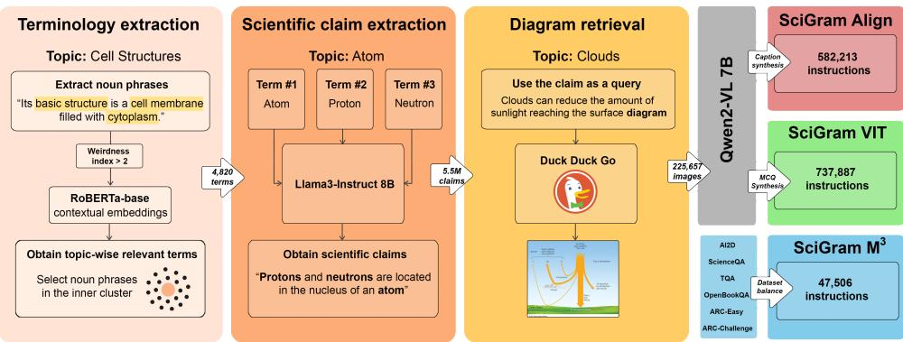  
Figure 1: Our six-stage dataset construction pipeline, comprising: terminology extraction, atomic fact generation, diagram retrieval, and SciGram subset generation (Align, VIT, M<sup>3</sup>).

## 1 Introduction

In his 1988 AAAI Presidential Address, Raj Reddy identified a core AI Grand Challenge: answering textbook-style questions requiring vision, language, reasoning, and learning (Reddy, 1988). Today, this challenge is still largely unsolved in the natural sciences, where concepts like photosynthesis, the water cycle, and energy transfer combine textual explanations and supporting diagrams. Benchmarks such as AI2D (Kembhavi et al., 2016), TQA (Kembhavi et al., 2017), and ScienceQA (Lu et al., 2022a) target this challenge by posing multimodal questions that require reasoning over scientific diagrams. However, despite advances in vision–language models (VLMs), scientific diagram understanding remains an open problem.

Scientific diagrams differ fundamentally from natural images: they are symbolic, abstract, and structurally diverse, conveying concepts, relationships, or processes rather than literal scenes (Kembhavi et al., 2016). Interpreting them requires grounding in scientific context, yet unlike natural images, scientific diagrams are scarce in existing training data for modern vision–language models. To address this gap, we propose a terminology-driven framework to create diagram-grounded instruction data for fine-tuning VLMs in scientific diagram understanding (see Figure 1). This framework encompasses the extraction of concepts from middle-school science curricula, the generation of atomic scientific facts, retrieving their corresponding diagrams from the web, and synthesizing vision-language instructions grounded in those diagrams. Following this approach, we construct SciGram, a dataset of 194,071 scientific diagrams paired with synthetic instruction data. The main contributions of this work include the following:

A terminology-driven framework for constructing visual instruction datasets from scientific curricula and web data. Grounded in curriculum-derived terminology, our approach enables a broad coverage of relevant scientific concepts and vision-language supervision.

The SciGram dataset: Text–diagram pairs including captions and multiple-choice questions (MCQs) in the natural sciences (Figure 2; additional examples in Appendix A), in instructionfollowing format. Following large-scale VLM training trends, SciGram prioritizes coverage over precision, comprising over 194K Web diagrams and 1.4M synthetic instructions.

The LLaVA-SciGram models: A suite of VLMs built on the LLaVA architecture (Liu et al., 2023; 2024) and fine-tuned on SciGram.

A comprehensive evaluation, showing that SciGram models outperform or match state-ofthe-art VLMs and frontier models across scientific diagram understanding benchmarks.

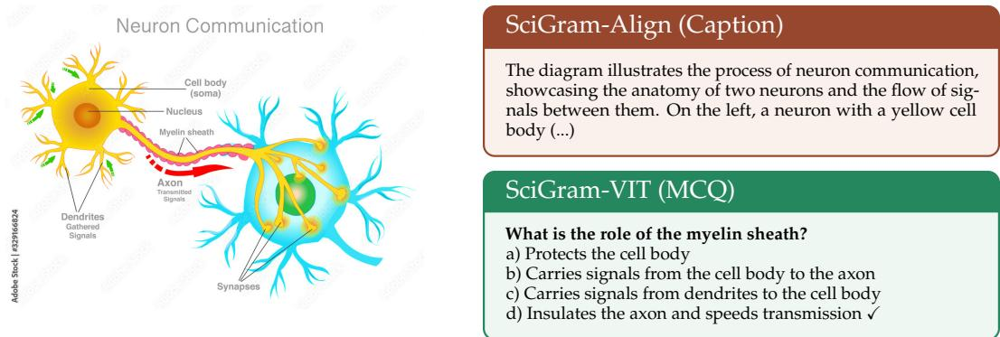  
Figure 2: Example of SciGram diagram caption and multiple-choice question.

## 2 Related work

Early work on scientific diagram understanding (Kembhavi et al., 2017) explored approaches from machine reading comprehension (Seo et al., 2017; Weston et al., 2014), visual question answering methods (Antol et al., 2015), and diagram-specific parsers (Kembhavi et al., 2016), highlighting challenges distinct from natural images. Subsequent approaches included reasoning-focused models (Li et al., 2018) and graph-based models (Kim et al., 2019; Ma et al., 2021; Wang et al., 2024b) to capture spatial and semantic relations. Transformer-based models, such as BERT (Devlin et al., 2018), RoBERTa (Liu et al., 2019), and PaLM (Chowdhery et al., 2022), were extended to multimodal tasks, producing models like VL-BERT (Su et al., 2019) and LXMERT (Tan & Bansal, 2019). However, those early approaches focused exclusively on natural images. ISAAQ (Gomez-Perez & Ortega, 2020) partially addressed this gap with cross-modal attention for diagram-based question answering.

Contrastive methods like CLIP (Radford et al., 2021) and SIGLIP (Zhai et al., 2023) advanced pretraining by aligning image–text embeddings, forming the backbone of modern VLMs like LLaVA and MOLMo (Deitke et al., 2024), which combine visual encoders with large language models (LLMs). However, they rely on general-purpose instruction datasets, such as LLaVA OneVision (Li et al., 2025) and PixMo (Deitke et al., 2024), with sparse coverage of scientific diagrams. In contrast, domain-specific VLMs like LLaVA-Med (Li et al., 2023), LLaVA-Chef (Mohbat & Zaki, 2024), and LLaVA-Ultra (Guo et al., 2024) show the benefits of fine-tuning on specialized datasets. While datasets such as MMMU (Yue et al., 2024), VQA Abstract Scenes (Antol et al., 2015), and SciVerse (Guo et al., 2025) contain diagrammatic images, they differ from the scientific diagrams represented in benchmarks such as AI2D, TQA, and ScienceQA (SQA), which visually illustrate specific scientific concepts. However, these benchmarks provide insufficient training data to effectively develop diagram reasoning, limiting current VLMs’ ability to understand scientific content.

## 3 Method

We propose a framework for generating multimodal instruction data for scientific diagram understanding, grounded in curriculum-derived scientific terminology to ensure broad domain coverage and semantic alignment between text and visual content. Unlike prior pipelines based primarily on free-form web data or captions, our approach follows a structured progression from terminology to instructions through four stages: i) terminology extraction, ii) atomic fact generation, iii) diagram retrieval, and iv) instruction generation. The resulting three complementary datasets align with VLM training pipelines such as LLaVA, which combine vision–language alignment with visual instruction tuning. Prompt templates and examples are provided in Appendices B and C.

## 3.1 Terminology extraction

We begin by extracting scientific terminology from structured educational sources to provide a compact yet comprehensive set of domain concepts. We construct a terminology set covering middle-school natural sciences by leveraging the textbook used in Kembhavi et al. (2017). Following its organization by topics, we analyze each section, including lessons, explanations, and instructional materials, to identify terms linked to distinct semantic concepts. This serves as the semantic backbone of our data generation process, ensuring that all downstream steps remain grounded in meaningful scientific concepts rather than arbitrary web content. This process consists of three steps:

Tokenization and noun-phrase identification. For each topic d, we tokenize the text, discard stop words, and extract noun phrases, capturing a broader set of scientific concepts than named entities only. These noun phrases constitute a first set of term candidates $\hat { T _ { d } }$

Selection of distinctive terms. To retain only domain-relevant noun phrases, we compute their weirdness index (Ahmad et al., 1999), which compares textbook term frequencies to a general corpus BNC<sup>1</sup>. This value identifies terms that are characteristic of the target domain while reducing the influence of general-purpose vocabulary. Terms whose score exceeds a threshold t are kept and lemmatized to merge morphological variants. We empirically set t = 2 to filter out general and non-scientific terms from $\overset { \smile } { T _ { d } }$

Embedding representation and clustering. To obtain a semantically coherent set of domain terms, we embed each $t _ { i } ~ \in ~ T _ { d }$ using RoBERTa-base (Liu et al., 2019), a model which provides a computationally efficient and well-established semantic representation baseline for clustering and similarity filtering. We average the contextual representations of each term $( e _ { i } )$ across all sentences in which it appears. We then compute the centroid $c _ { d }$ of these embeddings and measure Euclidean distances $\delta _ { i } = | \mathbf { e } _ { i } - \mathbf { c } _ { d } | _ { 2 }$ , discarding terms beyond one standard deviation. We use Euclidean distance instead of cosine similarity to better capture the absolute scale of variation in the embedding space.

This process yields a curated vocabulary of 4,820 distinct, semantically coherent scientific terms. Additional statistics on the selected terminology are provided in Appendix D.

## 3.2 Atomic fact generation

We generate atomic science facts for each textbook topic from its curated terminology to capture elementary scientific relationships. These facts serve as intermediate representations bridging concepts and visual grounding, providing fine-grained semantic anchors for retrieving relevant diagrams.

For each topic $d ,$ we consider all non-empty combinations of its terminology, $C _ { d } = \mathcal { P } ( T _ { d } ) \setminus \emptyset$ where $\mathcal { P } ( \hat { T _ { d } } )$ denotes the power set of $\quad \overline { { T _ { d } } } .$ . We instruct a LLaMA3-8B-Instruct (Grattafiori et al., 2024) to generate concise, factual, middle-school–level statements that include each combination $c \in C _ { d } ,$ such as “Protons and neutrons are located in the nucleus of an atom”. To ensure broad coverage of concept interactions, the model is asked to produce up to 50 such statements for every combination.

After deduplication, this process yields 5,508,218 unique facts across all topics.

## 3.3 Diagram retrieval

For each synthesized fact, we retrieve candidate images from the web and filter them to retain diagram-like content. We query DuckDuck $G \mathrm { o } ^ { 2 }$ using each atomic fact appended with the suffix ”diagram” (e.g., “pollution affects human health, cognitive development, and immune systems diagram”), and collect the top five image results with URLs and metadata. This process ran on two cloud instances (4 CPUs and 16 GB RAM each) for 21 days.

To mitigate potential noise from web retrieval, such as natural images, irrelevant visuals, and stylistic artifacts, we apply several filtering steps: we retain only images linked to at least five atomic facts, ensuring that each diagram has sufficient textual support; remove duplicates via perceptual hashing (National Institute of Standards and Technology, 2012); and discard invalid or unsupported files. Filtering is intentionally light to preserve scale. We accept residual noise as a trade-off for broad coverage, consistent with large-scale dataset construction practices (Radford et al., 2021; Li et al., 2025). While this does not guarantee perfect scientific correctness, our consistent improvements across multiple benchmarks suggest that the resulting supervision signal is nevertheless effective for improving scientific diagram understanding. This process yields 255,657 unique images.

## 3.4 Instruction-following data generation

Given the filtered list of diagrams, we generate multimodal instruction data consisting of captions (diagram descriptions) and MCQs grounded in visual content. This dual supervision enables both descriptive and reasoning capabilities of models (Liu et al., 2023). To this end, and given our hardware constraints, we use Qwen2-VL-7B (Yang et al., 2024), a VLM that we found capable of producing reasonably detailed and context-aware textual descriptions from images.

Caption synthesis. We generate descriptive captions for each diagram to align textual and visual features. The model is instructed to generate a paragraph-form caption emphasizing key components, their relationships, and relevant spatial, temporal, or dynamic aspects. To increase diversity and reduce potential bias, we repeat the captioning process three times for each diagram. Using normalized Levenshtein similarity (Levenshtein, 1966), the average similarity score between captions for the same diagram is 0.4196, indicating substantial variation. These image-caption pairs are formatted into instruction-following examples using a na¨ıve expansion strategy similar to the one proposed in Liu et al. (2023). The resulting dataset forms the alignment subset, which we refer to as SciGram-Align.

Multiple-choice question synthesis. We generate diagram-grounded MCQs to create instruction-following data for reasoning over scientific diagrams. For each diagram, we instruct the model to produce MCQs relying solely on visual elements, phrased at a middleschool level, and covering domains across natural sciences. Duplicated questions (5.7%) are discarded, and the distribution of correct answers is balanced across the four answer options. Questions are converted to a JSON instruction-following format, e.g., {”answer”: ”b”}, enabling consistent training and evaluation. This forms the SciGram-VIT subset.

Curation of existing datasets. To provide a final stage of high-quality, domain-focused training aligned with our target tasks, we build the SciGram-M<sup>3</sup> subset using diagram-based QA datasets (SQA, AI2D, TQA) present in the LLaVA OV training mixture, together with selected text-only QA sets (ARC-Easy/Challenge (Clark et al., 2018) and OpenBookQA (Mihaylov et al., 2018)). All questions are converted to instruction-following format, and answer choices are shuffled to reduce imbalance and overfitting (details in Appendix E).

## 4 The SciGram dataset

## 4.1 Dataset structure

The SciGram dataset consists of three subsets, SciGram-Align, SciGram-VIT and SciGram-M<sup>3</sup>, designed to be used at different stages of the training pipeline. Focused on scientific diagram understanding, SciGram is much more compact (1.4M instructions) than generalpurpose alternatives such as the LLaVA OV data (7.8M).<sup>3</sup>

SciGram-Align contains 582,213 instruction pairs designed to align visual and textual features during the initial training stage via a captioning task. Each diagram is associated with three one-paragraph captions that provide detailed descriptions of the entities and processes in the image.

SciGram-VIT consists of 737,887 instructions created to fine-tune the model on a multiplechoice question answering (MCQA) task involving diagrams. Each question has four answer options, with only one correct answer per question.

SciGram-M<sup>3</sup> consists of 47,506 instructions from the training sets of TQA (14,050 questions), SQA (12,726), OpenBookQA (4,957), and ARC-Easy/Challenge (3,370). Since AI2D does not provide official splits, we used the same 12,403 questions as in LLaVA OV data.

## 4.2 Human evaluation of dataset quality

To assess data quality, four domain experts independently reviewed a random sample of 600 SciGram items, evenly distributed across diagrams, diagram-caption pairs, and multimodal MCQs. While raw inter-rater agreement is relatively high (82.41%), Cohen’s κ is low (0.27), as expected under strong class prevalence imbalance (Derksen et al., 2024). We therefore report Gwet’s AC1 (Gwet, 2008) as a more robust measure, yielding an average AC1 score of 0.59, indicating moderate-to-substantial agreement. Detailed results are in Appendix F.

As expected for a web-crawled dataset, some noise is present, according to our annotators: 24% of the retrieved images are not actual diagrams but natural images, charts, and others. Despite this, 88% captions align with their diagrams, 82% cover key elements and relations, 82% match middle-school complexity, and 75% provide interpretative value, i.e., they help the reader understand or reason about the diagram, rather than just describe it. For MCQs, 89% are visually-grounded, 76% match domain and difficulty, and 93% are considered unambiguous and clearly phrased, with effective (89%) and distinctive (92%) distractors.

The evaluation reveals other limitations: 61% of MCQs may be answered using prior knowledge, potentially reducing diagram reliance, while 16% show labeling inconsistencies, e.g., correct options marked as incorrect and vice versa, calling for stronger future verification procedures such as diagram/non-diagram classifiers and automated consistency verification models. Nevertheless, as Section 6 shows, fine-tuning on SciGram reports considerable benefits over the baselines.

## 5 Experimental Setup

We evaluate the impact of SciGram on scientific diagram understanding using the LLaVA architecture, chosen for its modular vision–language alignment, instruction-tuning pipeline, and open-source availability. We consider two regimes: (i) training from scratch with SciGram data at each stage, and (ii) fine-tuning a pretrained LLaVA-OV 7B model. The resulting models, LLaVA-SciGram 7B and LLaVA-SciGram OV 7B, are trained on two NVIDIA A100 GPUs, requiring approximately 450 GPU-hours each.

LLaVA-SciGram 7B consists of a pretrained CLIP vision encoder and Qwen2-Instruct 7B (Yang et al., 2024) as the language backbone. For training, we follow the same pipeline as LLaVA OV. First, an alignment stage in which visual features are aligned with the pretrained LLM embedding space. We train the projection matrix on SciGram-Align, keeping both the visual encoder and LLM weights frozen, for one epoch with a learning rate of 1e-3. Then, an instruction tuning stage using LoRA (Hu et al., 2021) to train on SciGram-VIT for one epoch with a learning rate of 1e-5. After merging the LoRA adapter into the model, we fine-tune another LoRA adapter on SciGram-M<sup>3</sup> for 3 epochs with learning rate 1e-5. Additional details regarding hyperparameters are provided in Appendix G.

LLaVA-SciGram OV 7B follows the same fine-tuning but uses the pretrained weights of LLaVA OV trained on single images, with a SIGLIP vision encoder and Qwen2-Instruct 7B.

We evaluate LLaVA-based models fine-tuned on SciGram using three complementary diagram MCQA benchmarks: TQA, SQA, and AI2D. These datasets were selected to capture different aspects of scientific diagram understanding across grade levels, modalities, and reasoning types. To prevent data contamination from web-sourced images, all benchmark test diagrams are excluded from SciGram.

TQA contains text-only multiple-choice and true/false questions, as well as diagramgrounded questions. It covers physical, life, and earth sciences, using a text fragment or diagram as context; for questions without diagrams, the associated lesson serves as context.

SQA is collected from elementary and high school science curricula, and contains multimodal MCQs that can include diagram questions, text-only questions, and also questions with natural images, providing a broader coverage of modalities in the scientific domain.

AI2D contains grade-school science diagrams paired with MCQs. We use the most common split<sup>4</sup>, where diagrams have masked labels, requiring models to infer elements and processes visually. We also evaluate a variant with visible labels for a less challenging setting<sup>5</sup>.

## 6 Results

We first assess SciGram fine-tuning on three benchmarks, then compare against diverse baselines, including larger non-LLaVA architectures. We next ablate each SciGram subset. Finally, using 200 randomly sampled TQA diagram-question (DQ) items, we analyze performance by knowledge/reasoning type and test visual–language integration on questions requiring diagram understanding.

## 6.1 Effect of SciGram in LLaVA models

Table 1 compares the best-performing 7B LLaVA model (LLaVA OV) with LLaVA-SciGram 7B and LLaVA-SciGram OV 7B. Fine-tuning with SciGram consistently boosts performance, with gains up to 16 points. LLaVA-SciGram OV generally achieves the largest improvements, except on Language and No Support SQA questions, where LLaVA-SciGram 7B slightly outperforms. These results show that SciGram fine-tuning significantly enhances scientific QA, especially for questions involving visual understanding (TQA DQ, SQA IMG, AI2D).

<table><tr><td>Dataset</td><td>Question type</td><td>LLaVA OV (Acc.)</td><td>LLaVA-SciGram (∆)</td><td>LLaVA-SciGram OV (∆)</td></tr><tr><td rowspan="4">TQA</td><td>Text-only</td><td>89.09</td><td>+1.78</td><td>+1.85</td></tr><tr><td>True/False</td><td>88.49</td><td>+3.51</td><td>+3.94</td></tr><tr><td>Diagram</td><td>77.08</td><td>-0.40</td><td>+3.04</td></tr><tr><td>Overall</td><td>82.70</td><td>+0.96</td><td>+2.87</td></tr><tr><td rowspan="9">SQA</td><td>Natural Sciences</td><td>88.10</td><td>+8.17</td><td>+9.24</td></tr><tr><td>Social Sciences</td><td>88.98</td><td>+8.55</td><td>+10.12</td></tr><tr><td>Language</td><td>78.64</td><td>+13.00</td><td>+12.27</td></tr><tr><td>Text Support</td><td>92.40</td><td>+6.71</td><td>+6.71</td></tr><tr><td>Visual Šupport</td><td>87.31</td><td>+7.93</td><td>+10.31</td></tr><tr><td>No Support</td><td>80.14</td><td>+13.24</td><td>11.99</td></tr><tr><td>Grade 1-6</td><td>88.95</td><td>+6.54</td><td>+7.20</td></tr><tr><td>Grade 7-12</td><td>80.22</td><td>+14.84</td><td>+15.63</td></tr><tr><td>Overall</td><td>85.83</td><td>+9.50</td><td>+10.21</td></tr><tr><td rowspan="3">AI2D</td><td>Opaque labels</td><td>79.50</td><td>+0.71</td><td>+3.95</td></tr><tr><td>Transparent labels</td><td>89.90</td><td>+0.03</td><td>+2.52</td></tr><tr><td>Overall</td><td>84.70</td><td>+0.37</td><td>+3.24</td></tr></table>

Table 1: LLaVA variants performance with/without SciGram fine-tuning across benchmarks.

## 6.2 Comparison with other models

To contextualize SciGram’s improvements, we compare our models against: i) prior state-ofthe-art baselines; ii) recent multimodal models of similar size (Phi-3 Vision (Abdin et al., 2024), MOLMo 7B, Pixtral 12B (Agrawal et al., 2024), Qwen2-VL 7B); iii) frontier multimodal models (Gemini 2.0 Flash (Team et al., 2025), GPT4o (OpenAI, 2024)); and iv) other LLaVA variants. To reduce bias from potential pretraining-test overlap in frontier models, answer options are shuffled. Results are partly reproduced from prior work and partly obtained with our evaluation pipeline (see Appendix H).

<table><tr><td>Model</td><td>Text MC</td><td>True/False</td><td>Diagram MC</td><td>Overall</td></tr><tr><td>Random</td><td>22.88</td><td>50.10</td><td>24.96</td><td>29.08</td></tr><tr><td>MemN+VQA (Antol et al., 2015)</td><td>31.05</td><td>50.50</td><td>31.82</td><td>35.11</td></tr><tr><td>MemN+DPG (Kembhavi et al., 2017)</td><td>30.98</td><td>50.50</td><td>32.83</td><td>35.62</td></tr><tr><td>BiDAF+DPG (Seo et al., 2017)</td><td>30.46</td><td>50.40</td><td>32.72</td><td>35.39</td></tr><tr><td>FCC+Vecsigrafo (Gomez-Perez &amp; Ortega, 2019)</td><td>36.56</td><td></td><td>35.30</td><td></td></tr><tr><td>IGMN (Li et al., 2018)</td><td>40.00</td><td>57.41</td><td>36.35</td><td>41.36</td></tr><tr><td>f-GCN1+SSOC (Kim et al., 2019)</td><td>49.54</td><td>62.73</td><td>37.61</td><td>45.77</td></tr><tr><td>ISAAQ (Gomez-Perez &amp; Ortega, 2020)</td><td>72.06</td><td>78.83</td><td>55.12</td><td>64.66</td></tr><tr><td>Phi-3 Vision (Abdin et al., 2024)</td><td>81.19</td><td>74.01</td><td>72.91</td><td>75.52</td></tr><tr><td>MOLMo 7B-D (Deitke et al., 2024)</td><td>81.35</td><td>84.80</td><td>71.20</td><td>76.69</td></tr><tr><td>Pixtral 12B (Agrawal et al., 2024)</td><td>85.84</td><td>91.85</td><td>77.08</td><td>82.39</td></tr><tr><td>Qwen2-VL 7B (Yang et al., 2024)</td><td>87.69</td><td>91.63</td><td>78.08</td><td>83.41</td></tr><tr><td>Gemini 2.0 Flash (Team et al., 2025)</td><td>90.94</td><td>94.73</td><td>68.18</td><td>79.73</td></tr><tr><td>GPT4o (OpenAI, 2024)</td><td>94.20</td><td>96.16</td><td>77.32</td><td>85.74</td></tr><tr><td>LLaVa 1.5 (Liu et al., 2023)</td><td>67.03</td><td>60.02</td><td>39.85</td><td>51.47</td></tr><tr><td>LLaVA OneVision 7B (Li et al., 2025)</td><td>89.09</td><td>88.49</td><td>77.08</td><td>82.70</td></tr><tr><td>LLaVA-SciGram 7B</td><td>90.87</td><td>92.00</td><td>76.68</td><td>83.66</td></tr><tr><td>LLaVA-SciGram OneVision 7B</td><td>90.94</td><td>92.43</td><td>80.12</td><td>85.57</td></tr></table>

Table 2: Performance comparison on the TQA test set. Values denote accuracy (%). Bold indicates the best result; underlined indicates the second best.

As shown in Table 2, LLaVA-SciGram OV establishes a new state of the art on TQA diagram questions, outperforming all baselines on the Diagram Multiple Choice (DMC) subset. GPT4o achieves the highest overall accuracy, driven largely by text-only questions.
<table><tr><td>Model</td><td>NAT</td><td>SOC</td><td>LAN</td><td>TXT</td><td>IMG</td><td>NO</td><td>G1-6</td><td>G7-12</td><td>Overall</td></tr><tr><td>Human</td><td>90.23</td><td>84.97</td><td>87.48</td><td>89.60</td><td>87.50</td><td>88.10</td><td>91.59</td><td>82.42</td><td>88.40</td></tr><tr><td>MCAN (Yu et al., 2019)</td><td>56.08</td><td>46.23</td><td>58.09</td><td>59.43</td><td>51.17</td><td>55.40</td><td>51.65</td><td>59.72</td><td>54.54</td></tr><tr><td>Top-Down (Anderson et al., 2018)</td><td>59.50</td><td>54.33</td><td>61.82</td><td>62.90</td><td>54.88</td><td>59.79</td><td>57.27</td><td>62.16</td><td>59.02</td></tr><tr><td>BAN (Kim et al., 2018)</td><td>60.88</td><td>46.57</td><td>66.64</td><td>62.61</td><td>52.60</td><td>65.51</td><td>56.83</td><td>63.94</td><td>59.37</td></tr><tr><td>DFAF (Gao et al., 2018)</td><td>64.03</td><td>48.82</td><td>63.55</td><td>65.88</td><td>64.49</td><td>64.11</td><td>57.12</td><td>67.17</td><td>60.72</td></tr><tr><td>ViLT (Kim et al., 2021)1</td><td>60.48</td><td>63.89</td><td>60.27</td><td>63.20</td><td>61.38</td><td>57.00</td><td>60.72</td><td>61.90</td><td>61.14</td></tr><tr><td>Patch-TRM (Lu et al., 2022b)</td><td>65.19</td><td>46.79</td><td>65.55</td><td>66.96</td><td>55.28</td><td>64.95</td><td>58.04</td><td>67.50</td><td>61.42</td></tr><tr><td>VisualBERT (Li et al., 2019)</td><td>59.33</td><td>69.18</td><td>61.18</td><td>62.71</td><td>62.17</td><td>58.54</td><td>62.96</td><td>59.92</td><td>61.87</td></tr><tr><td>UnifiedQA Base (Khashabi et al., 2020)</td><td>68.16</td><td>69.18</td><td>74.91</td><td>63.78</td><td>61.38</td><td>77.84</td><td>72.98</td><td>65.00</td><td>70.12</td></tr><tr><td>GPT-4 w/ CoT (OpenAI, 2024)</td><td>85.48</td><td>72.44</td><td>90.27</td><td>82.65</td><td>71.49</td><td>92.89</td><td>86.66</td><td>79.04</td><td>83.99</td></tr><tr><td>GPT4o (ÓpenAI, 2024)</td><td>92.72</td><td>90.66</td><td>92.09</td><td>89.24</td><td>88.45</td><td>93.38</td><td>94.13</td><td>88.53</td><td>92.13</td></tr><tr><td>Chameleon (Lu et al., 2023)</td><td>89.83</td><td>74.13</td><td>89.82</td><td>88.27</td><td>77.64</td><td>92.13</td><td>88.03</td><td>83.72</td><td>86.54</td></tr><tr><td>LLaMA-Adapter (Zhang et al., 2024)</td><td>84.37</td><td>88.30</td><td>84.36</td><td>83.72</td><td>80.32</td><td>86.90</td><td>85.83</td><td>84.05</td><td>85.19</td></tr><tr><td>LaVIN-13B (Luo et al., 2023)</td><td>89.88</td><td>94.49</td><td>89.92</td><td>88.95</td><td>87.61</td><td>91.85</td><td>91.45</td><td>89.72</td><td>90.83</td></tr><tr><td>Phi-3 Vision (Abdin et al., 2024)</td><td>75.89</td><td>85.60</td><td>49.73</td><td>85.81</td><td>80.37</td><td>50.11</td><td>75.70</td><td>62.95</td><td>71.14</td></tr><tr><td>MOLMo 7B-D (Deitke et al., 2024)</td><td>85.66</td><td>90.33</td><td>69.00</td><td>88.09</td><td>87.95</td><td>71.22</td><td>85.24</td><td>77.06</td><td>82.32</td></tr><tr><td>Qwen2-VL 7B (Yang et al., 2024)</td><td>87.97</td><td>85.49</td><td>78.73</td><td>93.41</td><td>84.29</td><td>81.53</td><td>89.72</td><td>76.67</td><td>85.05</td></tr><tr><td>Pixtral 12B (Agrawal et al., 2024)</td><td>87.35</td><td>92.13</td><td>79.27</td><td>92.78</td><td>87.06</td><td>81.53</td><td>88.55</td><td>82.14</td><td>86.25</td></tr><tr><td>KAM-CoT (Mondal et al., 2024)</td><td>94.76</td><td>82.24</td><td>93.36</td><td>94.53</td><td>93.16</td><td>94.15</td><td>94.24</td><td>93.21</td><td>93.87</td></tr><tr><td>T-SciQ (Wang et al., 2024a)</td><td>96.89</td><td>95.16</td><td>95.55</td><td>96.53</td><td>94.70</td><td>96.79</td><td>96.44</td><td>95.72</td><td>96.18</td></tr><tr><td>LLaVA OneVision 7B (Li et al., 2025)</td><td>88.10</td><td>88.98</td><td>78.64</td><td>92.40</td><td>87.31</td><td>80.14</td><td>88.95</td><td>80.22</td><td>85.83</td></tr><tr><td>LLaVA-SciGram 7B</td><td>96.27</td><td>97.53</td><td>91.64</td><td>99.11</td><td>95.24</td><td>93.38</td><td>95.49</td><td>95.06</td><td>95.33</td></tr><tr><td>LLaVA-SciGram OneVision 7B</td><td>97.34</td><td>99.10</td><td>90.91</td><td>99.11</td><td>97.62</td><td>92.13</td><td>96.15</td><td>95.85</td><td>96.04</td></tr></table>

Table 3: Performance comparison on the SQA test set per question type and overall. Values denote accuracy (%). Bold indicates the best result; underlined the second best.

SQA results (Table 3) show that our models achieve a new state of the art on visual support questions (IMG), surpassing the previous best by 0.54% (LLaVA-SciGram) and 2.92% (LLaVA-SciGram OV). LLaVA-SciGram OV reaches accuracy comparable to the best model, T-SciQ (Wang et al., 2024a), specialized for SQA and using chain-of-thought reasoning.
<table><tr><td>Model</td><td>Opaque Labels</td><td>Transparent Labels</td><td>Overall</td></tr><tr><td>Phi-3 Vision (Abdin et al., 2024)</td><td>74.19</td><td>78.10</td><td>76.15</td></tr><tr><td>MOLMo 7B-D (Deitke et al., 2024)</td><td>82.40</td><td>93.20</td><td>87.80</td></tr><tr><td>Pixtral 12B (Agrawal et al., 2024)</td><td>76.46</td><td>79.00</td><td>77.73</td></tr><tr><td>Qwen2-VL 7B (Yang et al., 2024)</td><td>80.57</td><td>83.00</td><td>81.79</td></tr><tr><td>Gemini 2.0 Flash (Team et al., 2025)</td><td>73.01</td><td>83.50</td><td>78.26</td></tr><tr><td>GPT4o (OpenAI, 2024)</td><td>74.61</td><td>94.20</td><td>84.41</td></tr><tr><td>LLaVA OneVision 7B (Li et al., 2025)</td><td>79.50</td><td>89.90</td><td>84.70</td></tr><tr><td>LLaVA-SciGram 7B</td><td>80.21</td><td>89.93</td><td>85.07</td></tr><tr><td>LLaVA-SciGram OneVision 7B</td><td>83.45</td><td>92.42</td><td>87.94</td></tr></table>

Table 4: Performance comparison on the AI2D test set. Values denote accuracy (%). Bold indicates the best result; underlined indicates the second best.

On AI2D (Table 4), LLaVA-SciGram OV surpasses MOLMo, the previous SotA on the opaque-label split, by 1.05%, showing strong understanding of diagram elements and processes. On the less challenging transparent-label split, GPT4o leads, followed closely by MOLMo and our model. Overall, LLaVA-SciGram OV performs strongest across both splits.

## 6.3 Ablation study

To assess the impact of each SciGram subset within the OV training pipeline, we compare them against their corresponding OV counterparts. As shown in Table 5, using SciGram data consistently improves performance on SQA and AI2D. On TQA DQ, our model surpasses the baseline in the first two stages and remains on par in the final stage, despite using substantially fewer instructions.

<table><tr><td>Alignment</td><td>Instruction Tuning</td><td>Further Finetuning</td><td>TQA DQ</td><td>SQA IMG</td><td>AI2D Op.</td></tr><tr><td>BLIP Alignment (0.5M inst.)</td><td></td><td></td><td>36.86</td><td>64.80</td><td>45.43</td></tr><tr><td>SciGram-Align (0.5M inst.)</td><td></td><td></td><td>50.72</td><td>72.68</td><td>59.07</td></tr><tr><td>BLIP Alignment</td><td>Mid Stage Data (4M inst.)</td><td></td><td>60.49</td><td>74.57</td><td>61.66</td></tr><tr><td>SciGram-Align</td><td>SciGram-VIT (0.74M inst.)</td><td>-</td><td>72.06</td><td>81.91</td><td>74.61</td></tr><tr><td>BLIP Alignment</td><td>Mid Stage Data</td><td>OV Single-Img (3.2M inst.)</td><td>77.08</td><td>87.31</td><td>79.50</td></tr><tr><td>SciGram-Align</td><td>SciGram-VIT</td><td>SciGram-M³ (48K inst.)</td><td>76.68</td><td>95.24</td><td>80.21</td></tr></table>

Table 5: Performance of LLaVA trained on LLaVA OV vs. SciGram across fine-tuning stages. The numbers in parentheses denote the number of instructions contained in each subset.

To assess the contribution of each subset, Table 6 evaluates SciGram subset combinations when fine-tuning LLaVA OV 7B. The strongest results use the full pipeline (Align, VIT, M<sup>3</sup>), showing that all subsets contribute. We also show that adding text-only datasets (Open-BookQA, ARC) to SciGram-M<sup>3</sup> provides small but consistent gains across benchmarks.

<table><tr><td>Alignment</td><td>Instruction Tuning</td><td>Further Finetuning</td><td>TQA DQ</td><td>SQA IMG</td><td>AI2D Op.</td></tr><tr><td>SciGram-Align</td><td></td><td></td><td>70.99</td><td>82.10</td><td>70.56</td></tr><tr><td></td><td>SciGram-VIT</td><td></td><td>76.50</td><td>85.71</td><td>82.61</td></tr><tr><td></td><td></td><td>SciGram-M³</td><td>77.93</td><td>96.98</td><td>82.32</td></tr><tr><td>SciGram-Align</td><td>SciGram-VIT</td><td></td><td>76.65</td><td>86.47</td><td>81.83</td></tr><tr><td>SciGram-Align</td><td></td><td>SciGram-M³</td><td>77.47</td><td>94.40</td><td>81.32</td></tr><tr><td></td><td>SciGram-VIT</td><td>SciGram-M³</td><td>79.94</td><td>97.47</td><td>83.42</td></tr><tr><td>SciGram-Align</td><td>SciGram-VIT</td><td>SciGram-M³*</td><td>79.91</td><td>97.57</td><td>82.90</td></tr><tr><td>SciGram-Align</td><td>SciGram-VIT</td><td> $\mathbf { S c i G r a m - M } ^ { 3 }$ </td><td>80.12</td><td>97.62</td><td>83.45</td></tr></table>

Table 6: LLaVA OV results with SciGram subset combinations. \*excludes text-only datasets.

## 6.4 Diagram Comprehension Analysis

To better understand how SciGram improves diagram comprehension, we classify a random sample of 200 questions from the TQA DQ test set into eight knowledge types and nine reasoning types, following the ARC taxonomy proposed by Clark et al. (2018). We exclude the Experiments knowledge type and the Analogy reasoning type, as they are not represented in our sample. We also introduce an additional knowledge type, Visual Cue, to capture questions that require identifying visual properties such as colors or shapes in the diagram (e.g., ”What is the dark blue cell material called?”, ”How is the name of the star-like organelle inside the large central vacuole?”), and a new reasoning type, Visual Labeling, which captures questions where diagram labels are replaced with symbols or letters that must be mapped to the correct entities (e.g., ”Which letter represents the ribosome?”).

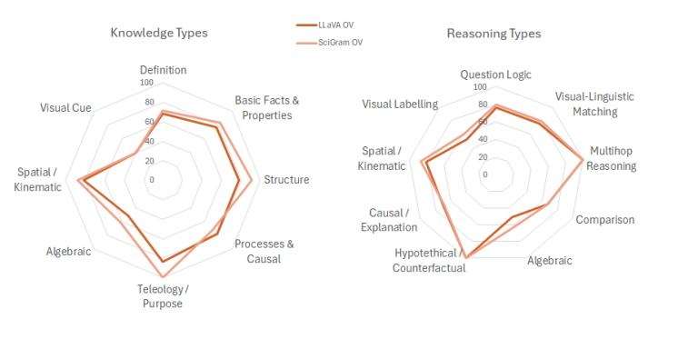  
Figure 3: LLaVA OV vs LLaVA-SciGram OV by knowledge and reasoning type.

Figure 3 shows that SciGram models match or surpass the baseline across most knowledge and reasoning types, except for Processes & Causal and Causal/Explanation. Notably, LLaVA-SciGram OV gains over five points on question types requiring deep diagram understanding, including Structure, Teleology/Purpose, Algebraic, Spatial/Kinematic, and Visual Labeling. These results demonstrate that SciGram fine-tuning strengthens multiple visual reasoning capabilities aligned with diagram comprehension, while leaving room for further improvement in process and causal-oriented questions.

## 6.5 Probing visual grounding

A central concern in multimodal QA is whether models genuinely leverage visual inputs or rely on language priors. Using the same 200 TQA questions from Section 6.4, we annotate whether each requires visual support to be correctly answered. For instance, a question such as ”How many phases of meiosis I are shown in the diagram?” requires analyzing the image, whereas a question such as ”What do you call the group of protozoans characterized by the presence of hair-like organelles called cilia?” can be answered through prior textual knowledge. From them, 94 questions were labeled visual support not required.

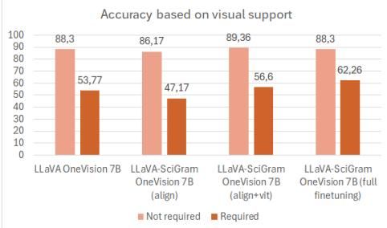  
Figure 4: LLaVA OV vs LLaVA-SciGram OV (and ablations) on questions requiring and not requiring visual support to be answered.

Figure 4 shows that LLaVA-SciGram OV outperforms LLaVA OV by nearly ten points on questions requiring visual reasoning, while matching it on questions that can be answered from language priors. Progressive fine-tuning across SciGram subsets further improves performance, with the full pipeline yielding the strongest results. While further qualitative evaluations, including image ablations and diagram swapping, are left for future work, these results suggest that SciGram’s gains stem from improved diagram understanding rather than purely textual cues.

## 7 Conclusions and future work

In this paper, we present a framework for generating large-scale visual instruction data for diagrams that leverages curriculum-derived scientific terminology. Using this framework, we created SciGram, a dataset containing over 194k diagrams and 1.4M visual instructions in the natural sciences. Our experiments demonstrate that models fine-tuned on SciGram achieve substantial improvements on diagram-centric benchmarks such as TQA, SQA, and AI2D, outperforming or matching existing state-of-the-art vision–language models while using substantially fewer training instances. Moreover, we show that further training of existing models like LLaVA OneVision with SciGram can establish new state-of-the-art performance in diagram-based question answering. This illustrates that, despite some noise and minor inconsistencies, SciGram provides a strong signal for learning visual instructions without costly manual curation. Beyond benchmark performance, our results also suggest that SciGram improves visual grounding and diagram-centric reasoning rather than merely textual knowledge, supporting its effectiveness as a source of multimodal supervision.

Future work will focus on improving dataset quality through more precise diagram filtering, better caption–diagram alignment, improved question generation, and enhanced factual accuracy of synthesized scientific claims. Additionally, our model-agnostic methodology can naturally benefit from stronger teacher models as they become available, enabling continued improvements in dataset quality. More broadly, we hope that the SciGram methodology will provide a practical foundation for developing future domain-specialized vision-language models beyond scientific diagram understanding. While demonstrated here for scientific diagrams, the same methodology could be extended to other structured visual knowledge sources, such as engineering schematics, medical illustrations, or educational graphics, offering a scalable approach for constructing domain-specific multimodal supervision without relying on costly manual annotation.

## Ethics Statement

Licensing and Data Usage. All datasets and pretrained models are subject to their respective licenses, and future users are responsible for complying with their terms. Improper use of copyrighted datasets or proprietary models may result in legal or ethical violations. As noted in our GitHub repository on the license and copyright of content linked from SciGram:

• Images linked from SciGram are copyrighted by their respective owners; the SciGram authors do not host or redistribute them.

• Image URLs are publicly available on the internet and were not scraped from private sources.

• We respected robots.txt rules and site Terms of Service (ToS) during URL collection.

• SciGram is intended for educational and research purposes only; its creators do not claim ownership of linked content.

• SciGram released under CC BY 4.0 (https://creativecommons.org/licenses/by/4.0).

Bias and Fairness. Pretrained models may reflect biases in their training data. Although our study focuses on diagram reasoning, such biases may affect downstream outputs, potentially disadvantaging certain groups or misrepresenting information. Users should consider these risks when deploying similar models.

Environmental Impact. Training and fine-tuning large models are computationally expensive and contribute to carbon emissions. We encourage efficient training strategies and consideration of environmental costs when developing similar systems.

Misuse Potential. Although intended for research and educational purposes, our approach could be misused for automated content generation or misinformation. Appropriate safeguards and ethical guidelines should be followed to minimize potential harm.

## Reproducibility Statement

We release the code used to generate SciGram, train the models, and replicate the evaluations: https://github.com/expertailab/scigram. Data and models are available at https://huggingface.co/collections/expertailab/scigram. Nevertheless, several factors may limit full reproducibility:

Link rot and variable availability. Due to licensing and copyright restrictions, we distribute only the URLs of images in SciGram. Consequently, some images may become inaccessible over time, as required by the terms of use of their original sources.

Hardware constraints. Our framework relies on large pre-trained models requiring substantial resources for fine-tuning and inference, which may limit accessibility for researchers with limited hardware. Scaling the architectures or models used to generate and train SciGram would require even greater resources.

Use of external APIs. Some evaluation metrics rely on proprietary APIs that may incur costs and change or be discontinued over time, making exact reproduction of evaluation results challenging and limiting long-term comparability.

## Acknowledgments

This work was supported by the Digital Europe Programme through LLMs4EU (Grant Agreement No. 101198470) and the Horizon Europe project FAIR2Adapt (Grant Agreement No. 101188256). GPU infrastructure was provided by IPCEI-CIS – Progetto Villanova (Prog. n. SA.102519 – CUP B29J24000850005) and INESData (Infrastructure to Investigate Data Spaces in Distributed Environments at UPM), funded under the UNICO I+D CLOUD call by the Ministry for Digital Transformation and the Civil Service within the PRTR recovery plan financed by the European Union (NextGenerationEU). We also thank Flavio Merenda for valuable feedback on successive manuscript versions.

## References

Marah Abdin, Jyoti Aneja, Hany Awadalla, Ahmed Awadallah, Ammar Ahmad Awan, Nguyen Bach, Amit Bahree, Arash Bakhtiari, Jianmin Bao, Harkirat Behl, Alon Benhaim, Misha Bilenko, Johan Bjorck, Sebastien Bubeck, Martin Cai, Qin Cai, Vishrav Chaudhary,´ Dong Chen, Dongdong Chen, Weizhu Chen, Yen-Chun Chen, Yi-Ling Chen, Hao Cheng, Parul Chopra, Xiyang Dai, Matthew Dixon, Ronen Eldan, Victor Fragoso, Jianfeng Gao, Mei Gao, Min Gao, Amit Garg, Allie Del Giorno, Abhishek Goswami, Suriya Gunasekar, Emman Haider, Junheng Hao, Russell J. Hewett, Wenxiang Hu, Jamie Huynh, Dan Iter, Sam Ade Jacobs, Mojan Javaheripi, Xin Jin, Nikos Karampatziakis, Piero Kauffmann, Mahoud Khademi, Dongwoo Kim, Young Jin Kim, Lev Kurilenko, James R. Lee, Yin Tat Lee, Yuanzhi Li, Yunsheng Li, Chen Liang, Lars Liden, Xihui Lin, Zeqi Lin, Ce Liu, Liyuan Liu, Mengchen Liu, Weishung Liu, Xiaodong Liu, Chong Luo, Piyush Madan, Ali Mahmoudzadeh, David Majercak, Matt Mazzola, Caio Cesar Teodoro Mendes, Arindam Mitra,´ Hardik Modi, Anh Nguyen, Brandon Norick, Barun Patra, Daniel Perez-Becker, Thomas Portet, Reid Pryzant, Heyang Qin, Marko Radmilac, Liliang Ren, Gustavo de Rosa, Corby Rosset, Sambudha Roy, Olatunji Ruwase, Olli Saarikivi, Amin Saied, Adil Salim, Michael Santacroce, Shital Shah, Ning Shang, Hiteshi Sharma, Yelong Shen, Swadheen Shukla, Xia Song, Masahiro Tanaka, Andrea Tupini, Praneetha Vaddamanu, Chunyu Wang, Guanhua Wang, Lijuan Wang, Shuohang Wang, Xin Wang, Yu Wang, Rachel Ward, Wen Wen, Philipp Witte, Haiping Wu, Xiaoxia Wu, Michael Wyatt, Bin Xiao, Can Xu, Jiahang Xu, Weijian Xu, Jilong Xue, Sonali Yadav, Fan Yang, Jianwei Yang, Yifan Yang, Ziyi Yang, Donghan Yu, Lu Yuan, Chenruidong Zhang, Cyril Zhang, Jianwen Zhang, Li Lyna Zhang, Yi Zhang, Yue Zhang, Yunan Zhang, and Xiren Zhou. Phi-3 technical report: A highly capable language model locally on your phone, 2024. URL https://arxiv.org/abs/2404.14219.

Pravesh Agrawal, Szymon Antoniak, Emma Bou Hanna, Baptiste Bout, Devendra Chaplot, Jessica Chudnovsky, Diogo Costa, Baudouin De Monicault, Saurabh Garg, Theophile Gervet, Soham Ghosh, Amelie H´ eliou, Paul Jacob, Albert Q. Jiang, Kartik Khandelwal,´ Timothee Lacroix, Guillaume Lample, Diego Las Casas, Thibaut Lavril, Teven Le Scao,´ Andy Lo, William Marshall, Louis Martin, Arthur Mensch, Pavankumar Muddireddy, Valera Nemychnikova, Marie Pellat, Patrick Von Platen, Nikhil Raghuraman, Baptiste Roziere, Alexandre Sablayrolles, Lucile Saulnier, Romain Sauvestre, Wendy Shang, Roman\` Soletskyi, Lawrence Stewart, Pierre Stock, Joachim Studnia, Sandeep Subramanian, Sagar Vaze, Thomas Wang, and Sophia Yang. Pixtral 12b, 2024. URL https://arxiv.org/abs/ 2410.07073.

Khurshid Ahmad, Lee Gillam, and Lena Tostevin. University of surrey participation in trec8: Weirdness indexing for logical document extrapolation and retrieval (wilder). In Ellen M. Voorhees and Donna K. Harman (eds.), TREC, volume 500-246 of NIST Special Publication. National Institute of Standards and Technology (NIST), 1999. URL http://dblp.uni-trier.de/db/conf/trec/trec1999.html#AhmadGT99.

Peter Anderson, Xiaodong He, Chris Buehler, Damien Teney, Mark Johnson, Stephen Gould, and Lei Zhang. Bottom-up and top-down attention for image captioning and visual question answering. In 2018 IEEE/CVF Conference on Computer Vision and Pattern Recognition, pp. 6077–6086, 2018. doi: 10.1109/CVPR.2018.00636.

Stanislaw Antol, Aishwarya Agrawal, Jiasen Lu, Margaret Mitchell, Dhruv Batra, C. Lawrence Zitnick, and Devi Parikh. Vqa: Visual question answering. 2015 IEEE International Conference on Computer Vision (ICCV), pp. 2425–2433, 2015.

Aakanksha Chowdhery, Sharan Narang, Jacob Devlin, Maarten Bosma, Gaurav Mishra, Adam Roberts, Paul Barham, Hyung Won Chung, Charles Sutton, Sebastian Gehrmann, Parker Schuh, Kensen Shi, Sasha Tsvyashchenko, Joshua Maynez, Abhishek Rao, Parker Barnes, Yi Tay, Noam Shazeer, Vinodkumar Prabhakaran, Emily Reif, Nan Du, Ben Hutchinson, Reiner Pope, James Bradbury, Jacob Austin, Michael Isard, Guy Gur-Ari, Pengcheng Yin, Toju Duke, Anselm Levskaya, Sanjay Ghemawat, Sunipa Dev, Henryk Michalewski, Xavier Garcia, Vedant Misra, Kevin Robinson, Liam Fedus, Denny Zhou, Daphne Ippolito, David Luan, Hyeontaek Lim, Barret Zoph, Alexander Spiridonov,

Ryan Sepassi, David Dohan, Shivani Agrawal, Mark Omernick, Andrew M. Dai, Thanumalayan Sankaranarayana Pillai, Marie Pellat, Aitor Lewkowycz, Erica Moreira, Rewon Child, Oleksandr Polozov, Katherine Lee, Zongwei Zhou, Xuezhi Wang, Brennan Saeta, Mark Diaz, Orhan Firat, Michele Catasta, Jason Wei, Kathy Meier-Hellstern, Douglas Eck, Jeff Dean, Slav Petrov, and Noah Fiedel. Palm: Scaling language modeling with pathways, 2022. URL https://arxiv.org/abs/2204.02311.

Peter Clark, Isaac Cowhey, Oren Etzioni, Tushar Khot, Ashish Sabharwal, Carissa Schoenick, and Oyvind Tafjord. Think you have solved question answering? try arc, the ai2 reasoning challenge. ArXiv, abs/1803.05457, 2018.

Matt Deitke, Christopher Clark, Sangho Lee, Rohun Tripathi, Yue Yang, Jae Sung Park, Mohammadreza Salehi, Niklas Muennighoff, Kyle Lo, Luca Soldaini, Jiasen Lu, Taira Anderson, Erin Bransom, Kiana Ehsani, Huong Ngo, YenSung Chen, Ajay Patel, Mark Yatskar, Chris Callison-Burch, Andrew Head, Rose Hendrix, Favyen Bastani, Eli VanderBilt, Nathan Lambert, Yvonne Chou, Arnavi Chheda, Jenna Sparks, Sam Skjonsberg, Michael Schmitz, Aaron Sarnat, Byron Bischoff, Pete Walsh, Chris Newell, Piper Wolters, Tanmay Gupta, Kuo-Hao Zeng, Jon Borchardt, Dirk Groeneveld, Crystal Nam, Sophie Lebrecht, Caitlin Wittlif, Carissa Schoenick, Oscar Michel, Ranjay Krishna, Luca Weihs, Noah A. Smith, Hannaneh Hajishirzi, Ross Girshick, Ali Farhadi, and Aniruddha Kembhavi. Molmo and pixmo: Open weights and open data for state-of-the-art vision-language models, 2024. URL https://arxiv.org/abs/2409.17146.

Bastiaan M. Derksen, Wendy Bruinsma, Johan Carel Goslings, and Niels W.L. Schep. The kappa paradox explained. The Journal ofHand Surgery, 49(5):482–485, 2024. ISSN 0363-5023. doi: https://doi.org/10.1016/j.jhsa.2024.01.006. URL https://www.sciencedirect.com/ science/article/pii/S0363502324000224.

Jacob Devlin, Ming-Wei Chang, Kenton Lee, and Kristina Toutanova. BERT: pre-training of deep bidirectional transformers for language understanding. CoRR, abs/1810.04805, 2018. URL http://arxiv.org/abs/1810.04805.

Peng Gao, Zhengkai Jiang, Haoxuan You, Pan Lu, Steven C. H. Hoi, Xiaogang Wang, and Hongsheng Li. Dynamic fusion with intra- and inter-modality attention flow for visual question answering. 2019 IEEE/CVF Conference on Computer Vision and Pattern Recognition (CVPR), pp. 6632–6641, 2018. URL https://api.semanticscholar.org/CorpusID: 54700454.

Jose Manuel Gomez-Perez and Raul Ortega. Look, read and enrich - learning from scientific figures and their captions. In Proceedings of the 10th International Conference on Knowledge Capture, K-CAP ’19, pp. 101–108, New York, NY, USA, 2019. Association for Computing Machinery. ISBN 9781450370080. doi: 10.1145/3360901.3364420. URL https://doi.org/ 10.1145/3360901.3364420.

Jose Manuel Gomez-Perez and Raul Ortega. ISAAQ - mastering textbook questions with ´ pre-trained transformers and bottom-up and top-down attention. In Proceedings of the 2020 Conference on Empirical Methods in Natural Language Processing (EMNLP), pp. 5469–5479, Online, November 2020. Association for Computational Linguistics. doi: 10.18653/v1/ 2020.emnlp-main.441. URL https://aclanthology.org/2020.emnlp-main.441.

Aaron Grattafiori, Abhimanyu Dubey, Abhinav Jauhri, Abhinav Pandey, Abhishek Kadian, Ahmad Al-Dahle, Aiesha Letman, Akhil Mathur, Alan Schelten, Alex Vaughan, Amy Yang, Angela Fan, Anirudh Goyal, Anthony Hartshorn, Aobo Yang, Archi Mitra, Archie Sravankumar, Artem Korenev, Arthur Hinsvark, Arun Rao, Aston Zhang, Aurelien Rodriguez, Austen Gregerson, Ava Spataru, Baptiste Roziere, Bethany Biron, Binh Tang, Bobbie Chern, Charlotte Caucheteux, Chaya Nayak, Chloe Bi, Chris Marra, Chris McConnell, Christian Keller, Christophe Touret, Chunyang Wu, Corinne Wong, Cristian Canton Ferrer, Cyrus Nikolaidis, Damien Allonsius, Daniel Song, Danielle Pintz, Danny Livshits, Danny Wyatt, David Esiobu, Dhruv Choudhary, Dhruv Mahajan, Diego Garcia-Olano, Diego Perino, Dieuwke Hupkes, Egor Lakomkin, Ehab AlBadawy, Elina Lobanova, Emily Dinan, Eric Michael Smith, Filip Radenovic, Francisco Guzman, Frank Zhang, Gabriel Synnaeve,´

Gabrielle Lee, Georgia Lewis Anderson, Govind Thattai, Graeme Nail, Gregoire Mialon, Guan Pang, Guillem Cucurell, Hailey Nguyen, Hannah Korevaar, Hu Xu, Hugo Touvron, Iliyan Zarov, Imanol Arrieta Ibarra, Isabel Kloumann, Ishan Misra, Ivan Evtimov, Jack Zhang, Jade Copet, Jaewon Lee, Jan Geffert, Jana Vranes, Jason Park, Jay Mahadeokar, Jeet Shah, Jelmer van der Linde, Jennifer Billock, Jenny Hong, Jenya Lee, Jeremy Fu, Jianfeng Chi, Jianyu Huang, Jiawen Liu, Jie Wang, Jiecao Yu, Joanna Bitton, Joe Spisak, Jongsoo Park, Joseph Rocca, Joshua Johnstun, Joshua Saxe, Junteng Jia, Kalyan Vasuden Alwala, Karthik Prasad, Kartikeya Upasani, Kate Plawiak, Ke Li, Kenneth Heafield, Kevin Stone, Khalid El-Arini, Krithika Iyer, Kshitiz Malik, Kuenley Chiu, Kunal Bhalla, Kusha Lakhotia, Lauren Rantala-Yeary, Laurens van der Maaten, Lawrence Chen, Liang Tan, Liz Jenkins, Louis Martin, Lovish Madaan, Lubo Malo, Lukas Blecher, Lukas Landzaat, Luke de Oliveira, Madeline Muzzi, Mahesh Pasupuleti, Mannat Singh, Manohar Paluri, Marcin Kardas, Maria Tsimpoukelli, Mathew Oldham, Mathieu Rita, Maya Pavlova, Melanie Kambadur, Mike Lewis, Min Si, Mitesh Kumar Singh, Mona Hassan, Naman Goyal, Narjes Torabi, Nikolay Bashlykov, Nikolay Bogoychev, Niladri Chatterji, Ning Zhang, Olivier Duchenne, Onur C¸ elebi, Patrick Alrassy, Pengchuan Zhang, Pengwei Li, Petar Vasic, Peter Weng, Prajjwal Bhargava, Pratik Dubal, Praveen Krishnan, Punit Singh Koura, Puxin Xu, Qing He, Qingxiao Dong, Ragavan Srinivasan, Raj Ganapathy, Ramon Calderer, Ricardo Silveira Cabral, Robert Stojnic, Roberta Raileanu, Rohan Maheswari, Rohit Girdhar, Rohit Patel, Romain Sauvestre, Ronnie Polidoro, Roshan Sumbaly, Ross Taylor, Ruan Silva, Rui Hou, Rui Wang, Saghar Hosseini, Sahana Chennabasappa, Sanjay Singh, Sean Bell, Seohyun Sonia Kim, Sergey Edunov, Shaoliang Nie, Sharan Narang, Sharath Raparthy, Sheng Shen, Shengye Wan, Shruti Bhosale, Shun Zhang, Simon Vandenhende, Soumya Batra, Spencer Whitman, Sten Sootla, Stephane Collot, Suchin Gururangan, Syd ney Borodinsky, Tamar Herman, Tara Fowler, Tarek Sheasha, Thomas Georgiou, Thomas Scialom, Tobias Speckbacher, Todor Mihaylov, Tong Xiao, Ujjwal Karn, Vedanuj Goswami, Vibhor Gupta, Vignesh Ramanathan, Viktor Kerkez, Vincent Gonguet, Virginie Do, Vish Vogeti, V´ıtor Albiero, Vladan Petrovic, Weiwei Chu, Wenhan Xiong, Wenyin Fu, Whitney Meers, Xavier Martinet, Xiaodong Wang, Xiaofang Wang, Xiaoqing Ellen Tan, Xide Xia Xinfeng Xie, Xuchao Jia, Xuewei Wang, Yaelle Goldschlag, Yashesh Gaur, Yasmine Babaei, Yi Wen, Yiwen Song, Yuchen Zhang, Yue Li, Yuning Mao, Zacharie Delpierre Coudert Zheng Yan, Zhengxing Chen, Zoe Papakipos, Aaditya Singh, Aayushi Srivastava, Abha Jain, Adam Kelsey, Adam Shajnfeld, Adithya Gangidi, Adolfo Victoria, Ahuva Goldstand, Ajay Menon, Ajay Sharma, Alex Boesenberg, Alexei Baevski, Allie Feinstein, Amanda Kallet, Amit Sangani, Amos Teo, Anam Yunus, Andrei Lupu, Andres Alvarado, Andrew Caples, Andrew Gu, Andrew Ho, Andrew Poulton, Andrew Ryan, Ankit Ramchandani, Annie Dong, Annie Franco, Anuj Goyal, Aparajita Saraf, Arkabandhu Chowdhury, Ashley Gabriel, Ashwin Bharambe, Assaf Eisenman, Azadeh Yazdan, Beau James, Ben Maurer, Benjamin Leonhardi, Bernie Huang, Beth Loyd, Beto De Paola, Bhargavi Paranjape, Bing Liu, Bo Wu, Boyu Ni, Braden Hancock, Bram Wasti, Brandon Spence, Brani Stojkovic, Brian Gamido, Britt Montalvo, Carl Parker, Carly Burton, Catalina Mejia, Ce Liu, Chang han Wang, Changkyu Kim, Chao Zhou, Chester Hu, Ching-Hsiang Chu, Chris Cai, Chris Tindal, Christoph Feichtenhofer, Cynthia Gao, Damon Civin, Dana Beaty, Daniel Kreymer, Daniel Li, David Adkins, David Xu, Davide Testuggine, Delia David, Devi Parikh, Diana Liskovich, Didem Foss, Dingkang Wang, Duc Le, Dustin Holland, Edward Dowling, Eissa Jamil, Elaine Montgomery, Eleonora Presani, Emily Hahn, Emily Wood, Eric-Tuan Le, Erik Brinkman, Esteban Arcaute, Evan Dunbar, Evan Smothers, Fei Sun, Felix Kreuk, Feng Tian, Filippos Kokkinos, Firat Ozgenel, Francesco Caggioni, Frank Kanayet, Frank Seide, Gabriela Medina Florez, Gabriella Schwarz, Gada Badeer, Georgia Swee, Gil Halpern, Grant Herman, Grigory Sizov, Guangyi, Zhang, Guna Lakshminarayanan, Hakan Inan, Hamid Shojanazeri, Han Zou, Hannah Wang, Hanwen Zha, Haroun Habeeb, Harrison Rudolph, Helen Suk, Henry Aspegren, Hunter Goldman, Hongyuan Zhan, Ibrahim Damlaj, Igor Molybog, Igor Tufanov, Ilias Leontiadis, Irina-Elena Veliche, Itai Gat, Jake Weissman, James Geboski, James Kohli, Janice Lam, Japhet Asher, Jean-Baptiste Gaya Jeff Marcus, Jeff Tang, Jennifer Chan, Jenny Zhen, Jeremy Reizenstein, Jeremy Teboul, Jessica Zhong, Jian Jin, Jingyi Yang, Joe Cummings, Jon Carvill, Jon Shepard, Jonathan McPhie, Jonathan Torres, Josh Ginsburg, Junjie Wang, Kai Wu, Kam Hou U, Karan Saxena, Kartikay Khandelwal, Katayoun Zand, Kathy Matosich, Kaushik Veeraraghavan, Kelly Michelena, Keqian Li, Kiran Jagadeesh, Kun Huang, Kunal Chawla, Kyle Huang, Lailin

Chen, Lakshya Garg, Lavender A, Leandro Silva, Lee Bell, Lei Zhang, Liangpeng Guo, Licheng Yu, Liron Moshkovich, Luca Wehrstedt, Madian Khabsa, Manav Avalani, Manish Bhatt, Martynas Mankus, Matan Hasson, Matthew Lennie, Matthias Reso, Maxim Groshev, Maxim Naumov, Maya Lathi, Meghan Keneally, Miao Liu, Michael L. Seltzer, Michal Valko, Michelle Restrepo, Mihir Patel, Mik Vyatskov, Mikayel Samvelyan, Mike Clark, Mike Macey, Mike Wang, Miquel Jubert Hermoso, Mo Metanat, Mohammad Rastegari, Munish Bansal, Nandhini Santhanam, Natascha Parks, Natasha White, Navyata Bawa, Nayan Singhal, Nick Egebo, Nicolas Usunier, Nikhil Mehta, Nikolay Pavlovich Laptev, Ning Dong, Norman Cheng, Oleg Chernoguz, Olivia Hart, Omkar Salpekar, Ozlem Kalinli, Parkin Kent, Parth Parekh, Paul Saab, Pavan Balaji, Pedro Rittner, Philip Bontrager, Pierre Roux, Piotr Dollar, Polina Zvyagina, Prashant Ratanchandani, Pritish Yuvraj, Qian Liang, Rachad Alao, Rachel Rodriguez, Rafi Ayub, Raghotham Murthy, Raghu Nayani, Rahul Mitra, Rangaprabhu Parthasarathy, Raymond Li, Rebekkah Hogan, Robin Battey, Rocky Wang, Russ Howes, Ruty Rinott, Sachin Mehta, Sachin Siby, Sai Jayesh Bondu, Samyak Datta, Sara Chugh, Sara Hunt, Sargun Dhillon, Sasha Sidorov, Satadru Pan, Saurabh Mahajan, Saurabh Verma, Seiji Yamamoto, Sharadh Ramaswamy, Shaun Lindsay, Shaun Lindsay, Sheng Feng, Shenghao Lin, Shengxin Cindy Zha, Shishir Patil, Shiva Shankar, Shuqiang Zhang, Shuqiang Zhang, Sinong Wang, Sneha Agarwal, Soji Sajuyigbe, Soumith Chintala, Stephanie Max, Stephen Chen, Steve Kehoe, Steve Satterfield, Sudarshan Govindaprasad, Sumit Gupta, Summer Deng, Sungmin Cho, Sunny Virk, Suraj Subramanian, Sy Choudhury, Sydney Goldman, Tal Remez, Tamar Glaser, Tamara Best, Thilo Koehler, Thomas Robinson, Tianhe Li, Tianjun Zhang, Tim Matthews, Timothy Chou, Tzook Shaked, Varun Vontimitta, Victoria Ajayi, Victoria Montanez, Vijai Mohan, Vinay Satish Kumar, Vishal Mangla, Vlad Ionescu, Vlad Poenaru, Vlad Tiberiu Mihailescu, Vladimir Ivanov, Wei Li, Wenchen Wang, Wenwen Jiang, Wes Bouaziz, Will Constable, Xiaocheng Tang, Xiaojian Wu, Xiaolan Wang, Xilun Wu, Xinbo Gao, Yaniv Kleinman, Yanjun Chen, Ye Hu, Ye Jia, Ye Qi, Yenda Li, Yilin Zhang, Ying Zhang, Yossi Adi, Youngjin Nam, Yu, Wang, Yu Zhao, Yuchen Hao, Yundi Qian, Yunlu Li, Yuzi He, Zach Rait, Zachary DeVito, Zef Rosnbrick, Zhaoduo Wen, Zhenyu Yang, Zhiwei Zhao, and Zhiyu Ma. The llama 3 herd of models, 2024. URL https://arxiv.org/abs/2407.21783.

Xuechen Guo, Wenhao Chai, Shi-Yan Li, and Gaoang Wang. Llava-ultra: Large chinese language and vision assistant for ultrasound. In Proceedings ofthe 32nd ACM International Conference on Multimedia (MM ’24). ACM, October 2024. doi: 10.1145/3664647.3681584.

Ziyu Guo, Ray Zhang, Hao Chen, Jialin Gao, Dongzhi Jiang, Jiaze Wang, and Pheng-Ann Heng. Sciverse: Unveiling the knowledge comprehension and visual reasoning of lmms on multi-modal scientific problems, 2025. URL https://arxiv.org/abs/2503.10627.

Kilem Li Gwet. Computing inter-rater reliability and its variance in the presence of high agreement. Br J Math Stat Psychol, 61(Pt 1):29–48, May 2008.

Edward J. Hu, Yelong Shen, Phillip Wallis, Zeyuan Allen-Zhu, Yuanzhi Li, Shean Wang, Lu Wang, and Weizhu Chen. Lora: Low-rank adaptation of large language models, 2021. URL https://arxiv.org/abs/2106.09685.

Aniruddha Kembhavi, Mike Salvato, Eric Kolve, Minjoon Seo, Hannaneh Hajishirzi, and Ali Farhadi. A diagram is worth a dozen images. In ECCV, 2016.

Aniruddha Kembhavi, Minjoon Seo, Dustin Schwenk, Jonghyun Choi, Ali Farhadi, and Hannaneh Hajishirzi. Are you smarter than a sixth grader? textbook question answering for multimodal machine comprehension. In Proceedings ofthe IEEE Conference on Computer Vision and Pattern Recognition (CVPR), July 2017.

Daniel Khashabi, Sewon Min, Tushar Khot, Ashish Sabharwal, Oyvind Tafjord, Peter Clark, and Hannaneh Hajishirzi. UNIFIEDQA: Crossing format boundaries with a single QA system. In Trevor Cohn, Yulan He, and Yang Liu (eds.), Findings of the Association for Computational Linguistics: EMNLP 2020, pp. 1896–1907, Online, November 2020. Association for Computational Linguistics. doi: 10.18653/v1/2020.findings-emnlp.171. URL https://aclanthology.org/2020.findings-emnlp.171/.

Daesik Kim, Seonhoon Kim, and Nojun Kwak. Textbook question answering with multimodal context graph understanding and self-supervised open-set comprehension. In Anna Korhonen, David Traum, and Llu´ıs Marquez (eds.),\` Proceedings ofthe 57th Annual Meeting of the Association for Computational Linguistics, pp. 3568–3584, Florence, Italy, July 2019. Association for Computational Linguistics. doi: 10.18653/v1/P19-1347. URL https://aclanthology.org/P19-1347/.

Jin-Hwa Kim, Jaehyun Jun, and Byoung-Tak Zhang. Bilinear attention networks. In Proceedings of the 32nd International Conference on Neural Information Processing Systems, NIPS’18, pp. 1571–1581, Red Hook, NY, USA, 2018. Curran Associates Inc.

Wonjae Kim, Bokyung Son, and Ildoo Kim. Vilt: Vision-and-language transformer without convolution or region supervision. In Marina Meila and Tong Zhang (eds.), Proceedings of the 38th International Conference on Machine Learning, volume 139 of Proceedings of Machine Learning Research, pp. 5583–5594. PMLR, 18–24 Jul 2021. URL https://proceedings.mlr. press/v139/kim21k.html.

Vladimir I. Levenshtein. Binary Codes Capable of Correcting Deletions, Insertions and Reversals. Soviet Physics Doklady, 10(8), 1966. URL https://nymity.ch/sybilhunting/ pdf/Levenshtein1966a.pdf.

Bo Li, Yuanhan Zhang, Dong Guo, Renrui Zhang, Feng Li, Hao Zhang, Kaichen Zhang, Peiyuan Zhang, Yanwei Li, Ziwei Liu, and Chunyuan Li. LLaVA-onevision: Easy visual task transfer. Transactions on Machine Learning Research, 2025. ISSN 2835-8856. URL https://openreview.net/forum?id=zKv8qULV6n.

Chunyuan Li, Cliff Wong, Sheng Zhang, Naoto Usuyama, Haotian Liu, Jianwei Yang, Tristan Naumann, Hoifung Poon, and Jianfeng Gao. Llava-med: Training a large language-andvision assistant for biomedicine in one day, 2023. URL https://arxiv.org/abs/2306. 00890.

Juzheng Li, Hang Su, Jun Zhu, Siyu Wang, and Bo Zhang. Textbook question answering under instructor guidance with memory networks. In 2018 IEEE/CVF Conference on Computer Vision and Pattern Recognition, pp. 3655–3663, 2018.

Liunian Harold Li, Mark Yatskar, Da Yin, Cho-Jui Hsieh, and Kai-Wei Chang. Visualbert: A simple and performant baseline for vision and language. arXiv preprint arXiv:1908.03557, 2019.

Haotian Liu, Chunyuan Li, Qingyang Wu, and Yong Jae Lee. Visual instruction tuning. In A. Oh, T. Naumann, A. Globerson, K. Saenko, M. Hardt, and S. Levine (eds.), Advances in Neural Information Processing Systems, volume 36, pp. 34892–34916. Curran Associates, Inc., 2023. URL https://proceedings.neurips.cc/paper files/paper/2023/ file/6dcf277ea32ce3288914faf369fe6de0-Paper-Conference.pdf.

Haotian Liu, Chunyuan Li, Yuheng Li, and Yong Jae Lee. Improved baselines with visual instruction tuning. In 2024 IEEE/CVF Conference on Computer Vision and Pattern Recognition (CVPR), pp. 26286–26296, 2024. doi: 10.1109/CVPR52733.2024.02484.

Yinhan Liu, Myle Ott, Naman Goyal, Jingfei Du, Mandar Joshi, Danqi Chen, Omer Levy, Mike Lewis, Luke Zettlemoyer, and Veselin Stoyanov. Roberta: A robustly optimized bert pretraining approach, 2019. URL https://arxiv.org/abs/1907.11692.

Pan Lu, Swaroop Mishra, Tony Xia, Liang Qiu, Kai-Wei Chang, Song-Chun Zhu, Oyvind Tafjord, Peter Clark, and Ashwin Kalyan. Learn to explain: Multimodal reasoning via thought chains for science question answering. In The 36th Conference on Neural Information Processing Systems (NeurIPS), 2022a.

Pan Lu, Liang Qiu, Jiaqi Chen, Tony Xia, Yizhou Zhao, Wei Zhang, Zhou Yu, Xiaodan Liang, and Song-Chun Zhu. Iconqa: A new benchmark for abstract diagram understanding and visual language reasoning, 2022b. URL https://arxiv.org/abs/2110.13214.

Pan Lu, Baolin Peng, Hao Cheng, Michel Galley, Kai-Wei Chang, Ying Nian Wu, Song-Chun Zhu, and Jianfeng Gao. Chameleon: plug-and-play compositional reasoning with large language models. In Proceedings of the 37th International Conference on Neural Information Processing Systems, NIPS ’23, Red Hook, NY, USA, 2023. Curran Associates Inc.

Gen Luo, Yiyi Zhou, Tianhe Ren, Shengxin Chen, Xiaoshuai Sun, and Rongrong Ji. Cheap and quick: efficient vision-language instruction tuning for large language models. In Proceedings of the 37th International Conference on Neural Information Processing Systems, NIPS ’23, Red Hook, NY, USA, 2023. Curran Associates Inc.

Jie Ma, Jun Liu, Yaxian Wang, Junjun Li, and Tongliang Liu. Relation-aware fine-grained reasoning network for textbook question answering. IEEE Transactions on Neural Networks and Learning Systems, pp. 1–13, 2021. doi: 10.1109/TNNLS.2021.3089140.

Todor Mihaylov, Peter Clark, Tushar Khot, and Ashish Sabharwal. Can a suit of armor conduct electricity? a new dataset for open book question answering. In Proceedings of the 2018 Conference on Empirical Methods in Natural Language Processing, pp. 2381–2391, Brussels, Belgium, October-November 2018. Association for Computational Linguistics. doi: 10.18653/v1/D18-1260. URL https://www.aclweb.org/anthology/D18-1260.

Fnu Mohbat and Mohammed J. Zaki. Llava-chef: A multi-modal generative model for food recipes. In Proceedings of the 33rd ACM International Conference on Information and Knowledge Management (CIKM ’24), pp. 1711–1721. ACM, October 2024. doi: 10.1145/ 3627673.3679562.

Debjyoti Mondal, Suraj Modi, Subhadarshi Panda, Rituraj Singh, and Godawari Sudhakar Rao. Kam-cot: Knowledge augmented multimodal chain-of-thoughts reasoning, 2024. URL https://arxiv.org/abs/2401.12863.

National Institute of Standards and Technology. Secure Hash Standard, 2012. URL https: //doi.org/10.6028/NIST.FIPS.180-4. FIPS Publication 180-4.

OpenAI. Gpt-4 technical report, 2024. URL https://arxiv.org/abs/2303.08774.

Alec Radford, Jong Wook Kim, Chris Hallacy, Aditya Ramesh, Gabriel Goh, Sandhini Agarwal, Girish Sastry, Amanda Askell, Pamela Mishkin, Jack Clark, Gretchen Krueger, and Ilya Sutskever. Learning transferable visual models from natural language supervision. In Marina Meila and Tong Zhang (eds.), Proceedings ofthe 38th International Conference on Machine Learning, volume 139 of Proceedings of Machine Learning Research, pp. 8748–8763. PMLR, 18–24 Jul 2021. URL https://proceedings.mlr.press/v139/radford21a.html.

Raj Reddy. Foundations and grand challenges of artificial intelligence: Aaai presidential address. AI Magazine, 9(4):9, Dec. 1988. doi: 10.1609/aimag.v9i4.950. URL https: //www.aaai.org/ojs/index.php/aimagazine/article/view/950.

Minjoon Seo, Aniruddha Kembhavi, Ali Farhadi, and Hannaneh Hajishirzi. Bidirectional attention flow for machine comprehension. CoRR, abs/1611.01603, 2017.

Weijie Su, Xizhou Zhu, Yue Cao, Bin Li, Lewei Lu, Furu Wei, and Jifeng Dai. Vl-bert: Pre-training of generic visual-linguistic representations. arXiv preprint arXiv:1908.08530, 2019.

Hao Tan and Mohit Bansal. LXMERT: Learning cross-modality encoder representations from transformers. In Proceedings of the 2019 Conference on Empirical Methods in Natural Language Processing and the 9th International Joint Conference on Natural Language Processing (EMNLP-IJCNLP), pp. 5100–5111, Hong Kong, China, November 2019. Association for Computational Linguistics. doi: 10.18653/v1/D19-1514. URL https://www.aclweb.org/ anthology/D19-1514.

Gemini Team, Rohan Anil, Sebastian Borgeaud, Jean-Baptiste Alayrac, Jiahui Yu, Radu Soricut, Johan Schalkwyk, Andrew M. Dai, Anja Hauth, Katie Millican, David Silver, Melvin Johnson, Ioannis Antonoglou, Julian Schrittwieser, Amelia Glaese, Jilin Chen, Emily Pitler, Timothy Lillicrap, Angeliki Lazaridou, Orhan Firat, James Molloy, Michael Isard, Paul R.

Barham, Tom Hennigan, Benjamin Lee, Fabio Viola, Malcolm Reynolds, Yuanzhong Xu, Ryan Doherty, Eli Collins, Clemens Meyer, Eliza Rutherford, Erica Moreira, Kareem Ayoub, Megha Goel, Jack Krawczyk, Cosmo Du, Ed Chi, Heng-Tze Cheng, Eric Ni, Purvi Shah, Patrick Kane, Betty Chan, Manaal Faruqui, Aliaksei Severyn, Hanzhao Lin, YaGuang Li, Yong Cheng, Abe Ittycheriah, Mahdis Mahdieh, Mia Chen, Pei Sun, Dustin Tran, Sumit Bagri, Balaji Lakshminarayanan, Jeremiah Liu, Andras Orban, Fabian Gura,¨ Hao Zhou, Xinying Song, Aurelien Boffy, Harish Ganapathy, Steven Zheng, HyunJeong Choe, Agoston Weisz, Tao Zhu, Yifeng Lu, Siddharth Gopal, Jarrod Kahn, Maciej Kula<sup>´</sup> Jeff Pitman, Rushin Shah, Emanuel Taropa, Majd Al Merey, Martin Baeuml, Zhifeng Chen, Laurent El Shafey, Yujing Zhang, Olcan Sercinoglu, George Tucker, Enrique Piqueras, Maxim Krikun, Iain Barr, Nikolay Savinov, Ivo Danihelka, Becca Roelofs, Ana¨ıs White, Anders Andreassen, Tamara von Glehn, Lakshman Yagati, Mehran Kazemi, Lucas Gonza lez, Misha Khalman, Jakub Sygnowski, Alexandre Frechette, Charlotte Smith, Laura Culp, Lev Proleev, Yi Luan, Xi Chen, James Lottes, Nathan Schucher, Federico Lebron, Alban Rrustemi, Natalie Clay, Phil Crone, Tomas Kocisky, Jeffrey Zhao, Bartek Perz, Dian Yu, Heidi Howard, Adam Bloniarz, Jack W. Rae, Han Lu, Laurent Sifre, Marcello Maggioni, Fred Alcober, Dan Garrette, Megan Barnes, Shantanu Thakoor, Jacob Austin, Gabriel Barth-Maron, William Wong, Rishabh Joshi, Rahma Chaabouni, Deeni Fatiha, Arun Ahuja, Gaurav Singh Tomar, Evan Senter, Martin Chadwick, Ilya Kornakov, Nithya Attaluri, Inaki Iturrate, Ruibo Liu, Yunxuan Li, Sarah Cogan, Jeremy Chen, Chao Jia, Chenjie Gu,˜ Qiao Zhang, Jordan Grimstad, Ale Jakse Hartman, Xavier Garcia, Thanumalayan Sankara narayana Pillai, Jacob Devlin, Michael Laskin, Diego de Las Casas, Dasha Valter, Connie Tao, Lorenzo Blanco, Adria Puigdom\` enech Badia, David Reitter, Mianna Chen, Jenny\` Brennan, Clara Rivera, Sergey Brin, Shariq Iqbal, Gabriela Surita, Jane Labanowski, Abhi Rao, Stephanie Winkler, Emilio Parisotto, Yiming Gu, Kate Olszewska, Ravi Addanki, Antoine Miech, Annie Louis, Denis Teplyashin, Geoff Brown, Elliot Catt, Jan Balaguer, Jackie Xiang, Pidong Wang, Zoe Ashwood, Anton Briukhov, Albert Webson, Sanjay Gana pathy, Smit Sanghavi, Ajay Kannan, Ming-Wei Chang, Axel Stjerngren, Josip Djolonga, Yuting Sun, Ankur Bapna, Matthew Aitchison, Pedram Pejman, Henryk Michalewski, Tianhe Yu, Cindy Wang, Juliette Love, Junwhan Ahn, Dawn Bloxwich, Kehang Han, Peter Humphreys, Thibault Sellam, James Bradbury, Varun Godbole, Sina Samangooei, Bogdan Damoc, Alex Kaskasoli, Sebastien M. R. Arnold, Vijay Vasudevan, Shubham Agrawal,´ Jason Riesa, Dmitry Lepikhin, Richard Tanburn, Srivatsan Srinivasan, Hyeontaek Lim, Sarah Hodkinson, Pranav Shyam, Johan Ferret, Steven Hand, Ankush Garg, Tom Le Paine, Jian Li, Yujia Li, Minh Giang, Alexander Neitz, Zaheer Abbas, Sarah York, Machel Reid, Elizabeth Cole, Aakanksha Chowdhery, Dipanjan Das, Dominika Rogozinska, Vi-´ taliy Nikolaev, Pablo Sprechmann, Zachary Nado, Lukas Zilka, Flavien Prost, Luheng He, Marianne Monteiro, Gaurav Mishra, Chris Welty, Josh Newlan, Dawei Jia, Miltiadis Allamanis, Clara Huiyi Hu, Raoul de Liedekerke, Justin Gilmer, Carl Saroufim, Shruti Rijhwani, Shaobo Hou, Disha Shrivastava, Anirudh Baddepudi, Alex Goldin, Adnan Ozturel, Albin Cassirer, Yunhan Xu, Daniel Sohn, Devendra Sachan, Reinald Kim Amplayo, Craig Swanson, Dessie Petrova, Shashi Narayan, Arthur Guez, Siddhartha Brahma, Jessica Landon, Miteyan Patel, Ruizhe Zhao, Kevin Villela, Luyu Wang, Wenhao Jia, Matthew Rahtz, Mai Gimenez, Legg Yeung, James Keeling, Petko Georgiev, Diana Mincu,´ Boxi Wu, Salem Haykal, Rachel Saputro, Kiran Vodrahalli, James Qin, Zeynep Cankara, Abhanshu Sharma, Nick Fernando, Will Hawkins, Behnam Neyshabur, Solomon Kim, Adrian Hutter, Priyanka Agrawal, Alex Castro-Ros, George van den Driessche, Tao Wang, Fan Yang, Shuo yiin Chang, Paul Komarek, Ross McIlroy, Mario Luciˇ c, Guodong Zhang,´ Wael Farhan, Michael Sharman, Paul Natsev, Paul Michel, Yamini Bansal, Siyuan Qiao, Kris Cao, Siamak Shakeri, Christina Butterfield, Justin Chung, Paul Kishan Rubenstein, Shivani Agrawal, Arthur Mensch, Kedar Soparkar, Karel Lenc, Timothy Chung, Aedan Pope, Loren Maggiore, Jackie Kay, Priya Jhakra, Shibo Wang, Joshua Maynez, Mary Phuong, Taylor Tobin, Andrea Tacchetti, Maja Trebacz, Kevin Robinson, Yash Katariya, Sebastian Riedel, Paige Bailey, Kefan Xiao, Nimesh Ghelani, Lora Aroyo, Ambrose Slone, Neil Houlsby, Xuehan Xiong, Zhen Yang, Elena Gribovskaya, Jonas Adler, Mateo Wirth, Lisa Lee, Music Li, Thais Kagohara, Jay Pavagadhi, Sophie Bridgers, Anna Bortsova, Sanjay Ghemawat, Zafarali Ahmed, Tianqi Liu, Richard Powell, Vijay Bolina, Mariko Iinuma, Polina Zablotskaia, James Besley, Da-Woon Chung, Timothy Dozat, Ramona Co manescu, Xiance Si, Jeremy Greer, Guolong Su, Martin Polacek, Raphael Lopez Kaufman,¨

Simon Tokumine, Hexiang Hu, Elena Buchatskaya, Yingjie Miao, Mohamed Elhawaty, Aditya Siddhant, Nenad Tomasev, Jinwei Xing, Christina Greer, Helen Miller, Shereen Ashraf, Aurko Roy, Zizhao Zhang, Ada Ma, Angelos Filos, Milos Besta, Rory Blevins, Ted Klimenko, Chih-Kuan Yeh, Soravit Changpinyo, Jiaqi Mu, Oscar Chang, Mantas Pajarskas, Carrie Muir, Vered Cohen, Charline Le Lan, Krishna Haridasan, Amit Marathe, Steven Hansen, Sholto Douglas, Rajkumar Samuel, Mingqiu Wang, Sophia Austin, Chang Lan, Jiepu Jiang, Justin Chiu, Jaime Alonso Lorenzo, Lars Lowe Sjosund, S¨ ebastien Cevey,´ Zach Gleicher, Thi Avrahami, Anudhyan Boral, Hansa Srinivasan, Vittorio Selo, Rhys May, Konstantinos Aisopos, Leonard Hussenot, Livio Baldini Soares, Kate Baumli, Michael B´ Chang, Adria Recasens, Ben Caine, Alexander Pritzel, Filip Pavetic, Fabio Pardo, Anita\` Gergely, Justin Frye, Vinay Ramasesh, Dan Horgan, Kartikeya Badola, Nora Kassner, Subhrajit Roy, Ethan Dyer, V´ıctor Campos Campos, Alex Tomala, Yunhao Tang, Dalia E Badawy, Elspeth White, Basil Mustafa, Oran Lang, Abhishek Jindal, Sharad Vikram, Zhitao Gong, Sergi Caelles, Ross Hemsley, Gregory Thornton, Fangxiaoyu Feng, Woj ciech Stokowiec, Ce Zheng, Phoebe Thacker, C¸ aglar˘ Unl<sup>¨</sup> u, Zhishuai Zhang, Mohammad¨ Saleh, James Svensson, Max Bileschi, Piyush Patil, Ankesh Anand, Roman Ring, Katerina Tsihlas, Arpi Vezer, Marco Selvi, Toby Shevlane, Mikel Rodriguez, Tom Kwiatkowski, Samira Daruki, Keran Rong, Allan Dafoe, Nicholas FitzGerald, Keren Gu-Lemberg, Mina Khan, Lisa Anne Hendricks, Marie Pellat, Vladimir Feinberg, James Cobon-Kerr, Tara Sainath, Maribeth Rauh, Sayed Hadi Hashemi, Richard Ives, Yana Hasson, Eric Noland, Yuan Cao, Nathan Byrd, Le Hou, Qingze Wang, Thibault Sottiaux, Michela Paganini, Jean-Baptiste Lespiau, Alexandre Moufarek, Samer Hassan, Kaushik Shivakumar, Joost van Amersfoort, Amol Mandhane, Pratik Joshi, Anirudh Goyal, Matthew Tung, An drew Brock, Hannah Sheahan, Vedant Misra, Cheng Li, Nemanja Rakicevi´ c, Mostafa´ Dehghani, Fangyu Liu, Sid Mittal, Junhyuk Oh, Seb Noury, Eren Sezener, Fantine Huot, Matthew Lamm, Nicola De Cao, Charlie Chen, Sidharth Mudgal, Romina Stella, Kevin Brooks, Gautam Vasudevan, Chenxi Liu, Mainak Chain, Nivedita Melinkeri, Aaron Cohen, Venus Wang, Kristie Seymore, Sergey Zubkov, Rahul Goel, Summer Yue, Sai Krishnakumaran, Brian Albert, Nate Hurley, Motoki Sano, Anhad Mohananey, Jonah Joughin, Egor Filonov, Tomasz Kepa, Yomna Eldawy, Jiawern Lim, Rahul Rishi, Shirin Badiezadegan, Taylor Bos, Jerry Chang, Sanil Jain, Sri Gayatri Sundara Padmanabhan, Subha Puttagunta, Kalpesh Krishna, Leslie Baker, Norbert Kalb, Vamsi Bedapudi, Adam Kurzrok, Shuntong Lei, Anthony Yu, Oren Litvin, Xiang Zhou, Zhichun Wu, Sam So bell, Andrea Siciliano, Alan Papir, Robby Neale, Jonas Bragagnolo, Tej Toor, Tina Chen, Valentin Anklin, Feiran Wang, Richie Feng, Milad Gholami, Kevin Ling, Lijuan Liu, Jules Walter, Hamid Moghaddam, Arun Kishore, Jakub Adamek, Tyler Mercado, Jonathan Mallinson, Siddhinita Wandekar, Stephen Cagle, Eran Ofek, Guillermo Garrido, Clemens Lombriser, Maksim Mukha, Botu Sun, Hafeezul Rahman Mohammad, Josip Matak, Yadi Qian, Vikas Peswani, Pawel Janus, Quan Yuan, Leif Schelin, Oana David, Ankur Garg, Yifan He, Oleksii Duzhyi, Anton Algmyr, Timoth<sup>¨</sup> ee Lottaz, Qi Li, Vikas Yadav, Luyao Xu,´ Alex Chinien, Rakesh Shivanna, Aleksandr Chuklin, Josie Li, Carrie Spadine, Travis Wolfe Kareem Mohamed, Subhabrata Das, Zihang Dai, Kyle He, Daniel von Dincklage, Shyam Upadhyay, Akanksha Maurya, Luyan Chi, Sebastian Krause, Khalid Salama, Pam G Rabi novitch, Pavan Kumar Reddy M, Aarush Selvan, Mikhail Dektiarev, Golnaz Ghiasi, Erdem Guven, Himanshu Gupta, Boyi Liu, Deepak Sharma, Idan Heimlich Shtacher, Shachi Paul, Oscar Akerlund, Franc¸ois-Xavier Aubet, Terry Huang, Chen Zhu, Eric Zhu, Elico Teixeira, Matthew Fritze, Francesco Bertolini, Liana-Eleonora Marinescu, Martin Bolle, Dominik¨ Paulus, Khyatti Gupta, Tejasi Latkar, Max Chang, Jason Sanders, Roopa Wilson, Xuewei Wu, Yi-Xuan Tan, Lam Nguyen Thiet, Tulsee Doshi, Sid Lall, Swaroop Mishra, Wanming Chen, Thang Luong, Seth Benjamin, Jasmine Lee, Ewa Andrejczuk, Dominik Rabiej Vipul Ranjan, Krzysztof Styrc, Pengcheng Yin, Jon Simon, Malcolm Rose Harriott, Mudit Bansal, Alexei Robsky, Geoff Bacon, David Greene, Daniil Mirylenka, Chen Zhou, Obaid Sarvana, Abhimanyu Goyal, Samuel Andermatt, Patrick Siegler, Ben Horn, Assaf Israel, Francesco Pongetti, Chih-Wei ”Louis” Chen, Marco Selvatici, Pedro Silva, Kathie Wang, Jackson Tolins, Kelvin Guu, Roey Yogev, Xiaochen Cai, Alessandro Agostini, Maulik Shah, Hung Nguyen, Noah O Donnaile, S<sup>´</sup> ebastien Pereira, Linda Friso, Adam Stambler, Adam´ Kurzrok, Chenkai Kuang, Yan Romanikhin, Mark Geller, ZJ Yan, Kane Jang, Cheng-Chun Lee, Wojciech Fica, Eric Malmi, Qijun Tan, Dan Banica, Daniel Balle, Ryan Pham, Yanping

Huang, Diana Avram, Hongzhi Shi, Jasjot Singh, Chris Hidey, Niharika Ahuja, Pranab Saxena, Dan Dooley, Srividya Pranavi Potharaju, Eileen O’Neill, Anand Gokulchandran, Ryan Foley, Kai Zhao, Mike Dusenberry, Yuan Liu, Pulkit Mehta, Ragha Kotikalapudi, Chalence Safranek-Shrader, Andrew Goodman, Joshua Kessinger, Eran Globen, Prateek Kolhar, Chris Gorgolewski, Ali Ibrahim, Yang Song, Ali Eichenbaum, Thomas Brovelli, Sahitya Potluri, Preethi Lahoti, Cip Baetu, Ali Ghorbani, Charles Chen, Andy Crawford, Shalini Pal, Mukund Sridhar, Petru Gurita, Asier Mujika, Igor Petrovski, Pierre-Louis Cedoz, Chenmei Li, Shiyuan Chen, Niccolo Dal Santo, Siddharth Goyal, Jitesh Punjabi,\` Karthik Kappaganthu, Chester Kwak, Pallavi LV, Sarmishta Velury, Himadri Choudhury, Jamie Hall, Premal Shah, Ricardo Figueira, Matt Thomas, Minjie Lu, Ting Zhou, Chintu Kumar, Thomas Jurdi, Sharat Chikkerur, Yenai Ma, Adams Yu, Soo Kwak, Victor Ahdel,<sup>¨</sup> Sujeevan Rajayogam, Travis Choma, Fei Liu, Aditya Barua, Colin Ji, Ji Ho Park, Vincent Hellendoorn, Alex Bailey, Taylan Bilal, Huanjie Zhou, Mehrdad Khatir, Charles Sutton, Wojciech Rzadkowski, Fiona Macintosh, Roopali Vij, Konstantin Shagin, Paul Medina, Chen Liang, Jinjing Zhou, Pararth Shah, Yingying Bi, Attila Dankovics, Shipra Banga, Sabine Lehmann, Marissa Bredesen, Zifan Lin, John Eric Hoffmann, Jonathan Lai, Raynald Chung, Kai Yang, Nihal Balani, Arthur Brazinskas, Andrei Sozanschi, Matthewˇ Hayes, Hector Fern´ andez Alcalde, Peter Makarov, Will Chen, Antonio Stella, Liselotte´ Snijders, Michael Mandl, Ante Karrman, Paweł Nowak, Xinyi Wu, Alex Dyck, Krishnan¨ Vaidyanathan, Raghavender R, Jessica Mallet, Mitch Rudominer, Eric Johnston, Sushil Mittal, Akhil Udathu, Janara Christensen, Vishal Verma, Zach Irving, Andreas Santucci, Gamaleldin Elsayed, Elnaz Davoodi, Marin Georgiev, Ian Tenney, Nan Hua, Geoffrey Cideron, Edouard Leurent, Mahmoud Alnahlawi, Ionut Georgescu, Nan Wei, Ivy Zheng, Dylan Scandinaro, Heinrich Jiang, Jasper Snoek, Mukund Sundararajan, Xuezhi Wang, Zack Ontiveros, Itay Karo, Jeremy Cole, Vinu Rajashekhar, Lara Tumeh, Eyal Ben-David, Rishub Jain, Jonathan Uesato, Romina Datta, Oskar Bunyan, Shimu Wu, John Zhang, Piotr Stanczyk, Ye Zhang, David Steiner, Subhajit Naskar, Michael Azzam, Matthew Johnson, Adam Paszke, Chung-Cheng Chiu, Jaume Sanchez Elias, Afroz Mohiuddin, Faizan Muhammad, Jin Miao, Andrew Lee, Nino Vieillard, Jane Park, Jiageng Zhang, Jeff Stanway, Drew Garmon, Abhijit Karmarkar, Zhe Dong, Jong Lee, Aviral Kumar, Luowei Zhou, Jonathan Evens, William Isaac, Geoffrey Irving, Edward Loper, Michael Fink, Isha Arkatkar, Nanxin Chen, Izhak Shafran, Ivan Petrychenko, Zhe Chen, Johnson Jia, Anselm Levskaya, Zhenkai Zhu, Peter Grabowski, Yu Mao, Alberto Magni, Kaisheng Yao, Javier Snaider, Norman Casagrande, Evan Palmer, Paul Suganthan, Alfonso Castano,˜ Irene Giannoumis, Wooyeol Kim, Mikołaj Rybinski, Ashwin Sreevatsa, Jennifer Prendki,´ David Soergel, Adrian Goedeckemeyer, Willi Gierke, Mohsen Jafari, Meenu Gaba, Jeremy Wiesner, Diana Gage Wright, Yawen Wei, Harsha Vashisht, Yana Kulizhskaya, Jay Hoover, Maigo Le, Lu Li, Chimezie Iwuanyanwu, Lu Liu, Kevin Ramirez, Andrey Khorlin, Albert Cui, Tian LIN, Marcus Wu, Ricardo Aguilar, Keith Pallo, Abhishek Chakladar, Ginger Perng, Elena Allica Abellan, Mingyang Zhang, Ishita Dasgupta, Nate Kushman, Ivo Penchev, Alena Repina, Xihui Wu, Tom van der Weide, Priya Ponnapalli, Caroline Kaplan, Jiri Simsa, Shuangfeng Li, Olivier Dousse, Fan Yang, Jeff Piper, Nathan Ie, Rama Pasumarthi, Nathan Lintz, Anitha Vijayakumar, Daniel Andor, Pedro Valenzuela, Minnie Lui, Cosmin Paduraru, Daiyi Peng, Katherine Lee, Shuyuan Zhang, Somer Greene, Duc Dung Nguyen, Paula Kurylowicz, Cassidy Hardin, Lucas Dixon, Lili Janzer, Kiam Choo, Ziqiang Feng, Biao Zhang, Achintya Singhal, Dayou Du, Dan McKinnon, Natasha Antropova, Tolga Bolukbasi, Orgad Keller, David Reid, Daniel Finchelstein, Maria Abi Raad, Remi Crocker, Peter Hawkins, Robert Dadashi, Colin Gaffney, Ken Franko, Anna Bulanova, Remi Leblond, Shirley Chung, Harry Askham, Luis C. Cobo, Kelvin Xu, Felix´ Fischer, Jun Xu, Christina Sorokin, Chris Alberti, Chu-Cheng Lin, Colin Evans, Alek Dimitriev, Hannah Forbes, Dylan Banarse, Zora Tung, Mark Omernick, Colton Bishop, Rachel Sterneck, Rohan Jain, Jiawei Xia, Ehsan Amid, Francesco Piccinno, Xingyu Wang, Praseem Banzal, Daniel J. Mankowitz, Alex Polozov, Victoria Krakovna, Sasha Brown, MohammadHossein Bateni, Dennis Duan, Vlad Firoiu, Meghana Thotakuri, Tom Natan, Matthieu Geist, Ser tan Girgin, Hui Li, Jiayu Ye, Ofir Roval, Reiko Tojo, Michael Kwong, James Lee-Thorp, Christopher Yew, Danila Sinopalnikov, Sabela Ramos, John Mellor, Abhishek Sharma, Kathy Wu, David Miller, Nicolas Sonnerat, Denis Vnukov, Rory Greig, Jennifer Beattie, Emily Caveness, Libin Bai, Julian Eisenschlos, Alex Korchemniy, Tomy Tsai, Mimi Jasarevic, Weize Kong, Phuong Dao, Zeyu Zheng, Frederick Liu, Fan Yang,

Rui Zhu, Tian Huey Teh, Jason Sanmiya, Evgeny Gladchenko, Nejc Trdin, Daniel Toyama, Evan Rosen, Sasan Tavakkol, Linting Xue, Chen Elkind, Oliver Woodman, John Carpenter, George Papamakarios, Rupert Kemp, Sushant Kafle, Tanya Grunina, Rishika Sinha, Alice Talbert, Diane Wu, Denese Owusu-Afriyie, Cosmo Du, Chloe Thornton, Jordi Pont-Tuset, Pradyumna Narayana, Jing Li, Saaber Fatehi, John Wieting, Omar Ajmeri, Be nigno Uria, Yeongil Ko, Laura Knight, Amelie H´ eliou, Ning Niu, Shane Gu, Chenxi Pang,´ Yeqing Li, Nir Levine, Ariel Stolovich, Rebeca Santamaria-Fernandez, Sonam Goenka, Wenny Yustalim, Robin Strudel, Ali Elqursh, Charlie Deck, Hyo Lee, Zonglin Li, Kyle Levin, Raphael Hoffmann, Dan Holtmann-Rice, Olivier Bachem, Sho Arora, Christy Koh, Soheil Hassas Yeganeh, Siim Poder, Mukarram Tariq, Yanhua Sun, Lucian Ionita,˜ Mojtaba Seyedhosseini, Pouya Tafti, Zhiyu Liu, Anmol Gulati, Jasmine Liu, Xinyu Ye, Bart Chrzaszcz, Lily Wang, Nikhil Sethi, Tianrun Li, Ben Brown, Shreya Singh, Wei Fan, Aaron Parisi, Joe Stanton, Vinod Koverkathu, Christopher A. Choquette-Choo, Yunjie Li, TJ Lu, Abe Ittycheriah, Prakash Shroff, Mani Varadarajan, Sanaz Bahargam, Rob Willoughby, David Gaddy, Guillaume Desjardins, Marco Cornero, Brona Robenek, Bhav ishya Mittal, Ben Albrecht, Ashish Shenoy, Fedor Moiseev, Henrik Jacobsson, Alireza Ghaffarkhah, Morgane Riviere, Alanna Walton, Cl\` ement Crepy, Alicia Parrish, Zongwei´ Zhou, Clement Farabet, Carey Radebaugh, Praveen Srinivasan, Claudia van der Salm, Andreas Fidjeland, Salvatore Scellato, Eri Latorre-Chimoto, Hanna Klimczak-Plucinska,´ David Bridson, Dario de Cesare, Tom Hudson, Piermaria Mendolicchio, Lexi Walker, Alex Morris, Matthew Mauger, Alexey Guseynov, Alison Reid, Seth Odoom, Lucia Loher, Victor Cotruta, Madhavi Yenugula, Dominik Grewe, Anastasia Petrushkina, Tom Duerig, Antonio Sanchez, Steve Yadlowsky, Amy Shen, Amir Globerson, Lynette Webb, Sahil Dua, Dong Li, Surya Bhupatiraju, Dan Hurt, Haroon Qureshi, Ananth Agarwal, Tomer Shani, Matan Eyal, Anuj Khare, Shreyas Rammohan Belle, Lei Wang, Chetan Tekur, Mihir Sanjay Kale, Jinliang Wei, Ruoxin Sang, Brennan Saeta, Tyler Liechty, Yi Sun, Yao Zhao, Stephan Lee, Pandu Nayak, Doug Fritz, Manish Reddy Vuyyuru, John Aslanides, Nidhi Vyas, Martin Wicke, Xiao Ma, Evgenii Eltyshev, Nina Martin, Hardie Cate, James Manyika, Keyvan Amiri, Yelin Kim, Xi Xiong, Kai Kang, Florian Luisier, Nilesh Tripuraneni, David Madras, Mandy Guo, Austin Waters, Oliver Wang, Joshua Ainslie, Jason Baldridge, Han Zhang, Garima Pruthi, Jakob Bauer, Feng Yang, Riham Mansour, Jason Gelman, Yang Xu, George Polovets, Ji Liu, Honglong Cai, Warren Chen, XiangHai Sheng, Emily Xue, Sherji Ozair, Christof Angermueller, Xiaowei Li, Anoop Sinha, Weiren Wang, Julia Wiesinger, Emmanouil Koukoumidis, Yuan Tian, Anand Iyer, Madhu Gurumurthy, Mark Goldenson, Parashar Shah, MK Blake, Hongkun Yu, Anthony Urbanowicz, Jennimaria Palomaki, Chrisantha Fernando, Ken Durden, Harsh Mehta, Nikola Momchev, Elahe Rahimtoroghi, Maria Georgaki, Amit Raul, Sebastian Ruder, Morgan Redshaw, Jinhyuk Lee, Denny Zhou, Komal Jalan, Dinghua Li, Blake Hechtman, Parker Schuh, Milad Nasr, Kieran Milan, Vladimir Mikulik, Juliana Franco, Tim Green, Nam Nguyen, Joe Kelley, Aroma Mahendru, Andrea Hu, Joshua Howland, Ben Vargas, Jeffrey Hui, Kshitij Bansal, Vikram Rao, Rakesh Ghiya, Emma Wang, Ke Ye, Jean Michel Sarr, Melanie Moranski Preston, Madeleine Elish, Steve Li, Aakash Kaku, Jigar Gupta, Ice Pasupat, Da-Cheng Juan, Milan Someswar, Tejvi M., Xinyun Chen, Aida Amini, Alex Fabrikant, Eric Chu, Xuanyi Dong, Amruta Muthal, Senaka Buthpitiya, Sarthak Jauhari, Nan Hua, Urvashi Khandelwal Ayal Hitron, Jie Ren, Larissa Rinaldi, Shahar Drath, Avigail Dabush, Nan-Jiang Jiang, Harshal Godhia, Uli Sachs, Anthony Chen, Yicheng Fan, Hagai Taitelbaum, Hila Noga, Zhuyun Dai, James Wang, Chen Liang, Jenny Hamer, Chun-Sung Ferng, Chenel Elkind, Aviel Atias, Paulina Lee, V´ıt List´ık, Mathias Carlen, Jan van de Kerkhof, Marcin Pikus, Krunoslav Zaher, Paul Muller, Sasha Zykova, Richard Stefanec, Vitaly Gatsko, Christoph¨ Hirnschall, Ashwin Sethi, Xingyu Federico Xu, Chetan Ahuja, Beth Tsai, Anca Stefanoiu, Bo Feng, Keshav Dhandhania, Manish Katyal, Akshay Gupta, Atharva Parulekar, Divya Pitta, Jing Zhao, Vivaan Bhatia, Yashodha Bhavnani, Omar Alhadlaq, Xiaolin Li, Peter Danenberg, Dennis Tu, Alex Pine, Vera Filippova, Abhipso Ghosh, Ben Limonchik, Bhar gava Urala, Chaitanya Krishna Lanka, Derik Clive, Yi Sun, Edward Li, Hao Wu, Kevin Hongtongsak, Ianna Li, Kalind Thakkar, Kuanysh Omarov, Kushal Majmundar, Michael Alverson, Michael Kucharski, Mohak Patel, Mudit Jain, Maksim Zabelin, Paolo Pela gatti, Rohan Kohli, Saurabh Kumar, Joseph Kim, Swetha Sankar, Vineet Shah, Lakshmi Ramachandruni, Xiangkai Zeng, Ben Bariach, Laura Weidinger, Tu Vu, Alek Andreev, Antoine He, Kevin Hui, Sheleem Kashem, Amar Subramanya, Sissie Hsiao, Demis Hass

abis, Koray Kavukcuoglu, Adam Sadovsky, Quoc Le, Trevor Strohman, Yonghui Wu, Slav Petrov, Jeffrey Dean, and Oriol Vinyals. Gemini: A family of highly capable multimodal models, 2025. URL https://arxiv.org/abs/2312.11805.

Lei Wang, Yi Hu, Jiabang He, Xing Xu, Ning Liu, Hui Liu, and Heng Tao Shen. Tsciq: teaching multimodal chain-of-thought reasoning via large language model signals for science question answering. In Proceedings of the Thirty-Eighth AAAI Conference on Artificial Intelligence and Thirty-Sixth Conference on Innovative Applications of Artificial Intelligence and Fourteenth Symposium on Educational Advances in Artificial Intelligence, AAAI’24/IAAI’24/EAAI’24. AAAI Press, 2024a. ISBN 978-1-57735-887-9. doi: 10.1609/aaai.v38i17.29884. URL https://doi.org/10.1609/aaai.v38i17.29884.

Shaowei Wang, Lingling Zhang, Longji Zhu, Tao Qin, Kim-Hui Yap, Xinyu Zhang, and Jun Liu. Cog-dqa: Chain-of-guiding learning with large language models for diagram question answering. In 2024 IEEE/CVF Conference on Computer Vision and Pattern Recognition (CVPR), pp. 13969–13979, 2024b. doi: 10.1109/CVPR52733.2024.01325.

Jason Weston, Sumit Chopra, and Antoine Bordes. Memory networks. CoRR, abs/1410.3916, 2014.

An Yang, Baosong Yang, Binyuan Hui, Bo Zheng, Bowen Yu, Chang Zhou, Chengpeng Li, Chengyuan Li, Dayiheng Liu, Fei Huang, Guanting Dong, Haoran Wei, Huan Lin, Jialong Tang, Jialin Wang, Jian Yang, Jianhong Tu, Jianwei Zhang, Jianxin Ma, Jianxin Yang, Jin Xu, Jingren Zhou, Jinze Bai, Jinzheng He, Junyang Lin, Kai Dang, Keming Lu, Keqin Chen, Kexin Yang, Mei Li, Mingfeng Xue, Na Ni, Pei Zhang, Peng Wang, Ru Peng, Rui Men, Ruize Gao, Runji Lin, Shijie Wang, Shuai Bai, Sinan Tan, Tianhang Zhu, Tianhao Li, Tianyu Liu, Wenbin Ge, Xiaodong Deng, Xiaohuan Zhou, Xingzhang Ren, Xinyu Zhang, Xipin Wei, Xuancheng Ren, Xuejing Liu, Yang Fan, Yang Yao, Yichang Zhang, Yu Wan, Yunfei Chu, Yuqiong Liu, Zeyu Cui, Zhenru Zhang, Zhifang Guo, and Zhihao Fan. Qwen2 technical report, 2024. URL https://arxiv.org/abs/2407.10671.

Zhou Yu, Jun Yu, Yuhao Cui, Dacheng Tao, and Qi Tian. Deep modular co-attention networks for visual question answering, 2019. URL https://arxiv.org/abs/1906.10770.

Xiang Yue, Yuansheng Ni, Kai Zhang, Tianyu Zheng, Ruoqi Liu, Ge Zhang, Samuel Stevens, Dongfu Jiang, Weiming Ren, Yuxuan Sun, Cong Wei, Botao Yu, Ruibin Yuan, Renliang Sun, Ming Yin, Boyuan Zheng, Zhenzhu Yang, Yibo Liu, Wenhao Huang, Huan Sun, Yu Su, and Wenhu Chen. Mmmu: A massive multi-discipline multimodal understanding and reasoning benchmark for expert agi, 2024. URL https://arxiv.org/abs/2311.16502.

Xiaohua Zhai, Basil Mustafa, Alexander Kolesnikov, and Lucas Beyer. Sigmoid loss for language image pre-training, 2023. URL https://arxiv.org/abs/2303.15343.

Renrui Zhang, Jiaming Han, Chris Liu, Peng Gao, Aojun Zhou, Xiangfei Hu, Shilin Yan, Pan Lu, Hongsheng Li, and Yu Qiao. Llama-adapter: Efficient fine-tuning of language models with zero-init attention, 2024. URL https://arxiv.org/abs/2303.16199.

## A SciGram Examples

Figures 5-7 show examples of diagrams from the SciGram dataset, along with all the captions and MCQs generated using our methodology.

## B Prompts and model configurations

## B.1 Atomic fact generation

Prompt template for atomic fact generation   
<|begin of text|><|start header id|>system<|end header id|>   
Your task is to generate a list of 50 atomic facts that contain different combinations of the   
given terms.   
Please follow this criteria :   
− Limit yourself to the scientific domains of life sciences , earth sciences , and physical   
sciences at the middle school level.   
− Pay attention to commonsense.   
− Make the facts brief and concise yet easy to understand and meaningful.   
− Use different grammatical constructions and limit length to 12 tokens or less .   
Arrange your output as a jsonl file where each line is {{”atomic fact”: <fact>}}.   
<|begin of text|><|start header id|>user<|end header id|>   
TERMS: [”atom”, ”proton”, ”neutron”].   
OUTPUT: {{”output”: ”<INSERT OUTPUT HERE>”}}

Model Configuration   
Temperature : 0.7   
P value : 1.0   
Max length : 1024

## B.2 Caption Generation

Prompt template for caption generation   
<|im start|>user   
<|vision start|><|image pad|><|vision end|> Provide a paragraph with a brief description   
of the diagram. Pay special attention to the main components of the diagram and the   
relations between them. If visible, also reflect space and temporal information, linking it   
to the components and relations in the diagram.<|im end|>   
<|im start|>assistant

## Model Configuration

```yaml
Temperature : 0.7
P value : 0.7
Max length : 512
```

Model Configuration   
Temperature : 0.0   
P value : 0.0   
Max length : 1024

## B.3 Multiple Choice Question Generation

<|im start|>user   
<|vision start|><|image pad|><|vision end|>   
Formulate five multiple choice questions with 4 possible answers grounded in the diagram.   
The resulting questions must be middle school level questions in the subjects of life   
sciences , earth sciences or physical sciences . The questions should be answered using   
the elements from the image. For your output, follow this structure:   
[{”question”: <question>, ”answers”: {”a”: <answer a>, ”b”: <answer b>, ”c”: <answer c>,   
”d”: < answer d>}, ”correct answer”: <correct letter>}, ...].<|im end|>   
<|im start|>assistant

## B.4 Question Answering

Prompt template for multiple-choice question answering with diagrams   
<|im start|>user   
<|vision start|><|image pad|><|vision end|>   
Take a look at the diagram and answer the following question by choosing one of the possible   
answers.   
Question: What does igneous rock become when it is subjected to heat and pressure?   
Answer choices:   
a) Magma   
b) Sediments   
c) Metamorphic rock   
d) Sedimentary rock   
<|im end|>   
<|im start|>assistant

## Model Configuration

Prompt template for multiple-choice question answering only text without context   
paragraph   
<|im start|>user   
Answer the following question by choosing one of the possible answers.   
Question: What does igneous rock become when it is subjected to heat and pressure?   
Answer choices:   
a) Magma   
b) Sediments   
c) Metamorphic rock   
d) Sedimentary rock   
<|im end|>   
<|im start|>assistant

<|im start|>user   
<|vision start|><|image pad|><|vision end|>   
Lesson: The volcanoes (...)   
Take a look at the lesson and the diagram, and answer the following question by choosing   
one of the possible answers.   
Question: What does igneous rock become when it is subjected to heat and pressure?   
Answer choices:   
a) Magma   
b) Sediments   
c) Metamorphic rock   
d) Sedimentary rock   
<|im end|>   
<|im start|>assistant

Model Configuration   
Temperature : 0.0   
P value : 0.0   
Max length : 4096

## Prompt template for multiple-choice question answering only text with context paragraph

<|im start|>user   
Lesson: The volcanoes (...)   
Take a look at the lesson and answer the following question by choosing one of the possible   
answers.   
Question: What does igneous rock become when it is subjected to heat and pressure?   
Answer choices:   
a) Magma   
b) Sediments   
c) Metamorphic rock   
d) Sedimentary rock   
<|im end|>   
<|im start|>assistant

## Model Configuration

## Prompt template for multiple-choice question answering with diagrams and context paragraph

## Model Configuration

Temperature : 0.0

Max length : 4096

## C Instruction-Following Examples

## C.1 SciGram-Align instructions

## Example 1

Human: I need a detailed caption for this diagram—please include explanations of each section and their functions.

Assistant: The diagram consists of two main parts: a textual explanation and a visual representation of an ionic compound. The textual explanation provides a definition of ionic compounds as giant lattice structures of ions held together by strong electrostatic forces. Sodium chloride is used as an example. The visual shows a 3D lattice model with green spheres as chloride ions and purple as sodium ions, arranged in a cubic pattern.

## Example 2

Human: Please give a thorough caption for this diagram, covering all the important aspects and their significance.

Assistant: The diagram explains how cold dark matter forms galaxies, starting from the Big Bang, tracing dark matter halo collapse, gas cloud collapse, proto-spiral formation, and eventual spiral galaxies. Numerical simulations suggest galaxy growth via merging halos filled with cold, non-interacting dark matter.

## Example 3

Human: Could you elaborate on this diagram with a caption that explains the concepts and relationships shown?

Assistant: The diagram shows sand dune formation: embryo dune → fore dune → yellow dune → grey dune. It includes dune slack (vegetation area) and the water table. Progression from sea to land illustrates dune maturation and habitat development.

## Example 4

Human: Can you create a caption that not only labels but also explains the purpose of this diagram?

Assistant: The diagram illustrates the transition between states of matter: solid (dense spheres), liquid (suspended spheres in a beaker), and gas (freely moving spheres in a flask). Each stage shows differences in particle arrangement and movement.

## C.2 SciGram-VIT instructions

## Example 1

Human: What is the first visible sign of the embryo’s development in the diagram?

Answer choices:

a) Facial features

b) Visible elbows

c) Finger formation

d) Elongated arms and legs

Assistant: $\{ ^ { \prime \prime } { \mathrm { a n s w e r } } ^ { \prime \prime } \colon ^ { \prime \prime } { \mathrm { c } } ^ { \prime \prime } \}$

## Example 2

Human: What is the example of a contact force?

Answer choices:

a) Gravitational Force

<table><tr><td>b) Magnetic Force c) Spring Force d) Friction Force Assistant: {&quot;answer&quot;: &quot;d&quot;}</td></tr><tr><td>Example 3 Human: What is the name of the part of the trap that is located at the top of the U-shape? Answer choices: a) inlet</td></tr><tr><td>b) trap weir c tra dip d) trap arm Assistant: {&quot;answer&quot;: &quot;a&quot;}</td></tr><tr><td>Example 4 Human: Which planet is closest to the sun?</td></tr></table>

## C.3 SciGram-M3 instructions

## Example

<table><tr><td>Human: Take a look at the diagram and answer the following question by choosing one of the possible answers.</td></tr><tr><td>Question: What does igneous rock become when it is subjected to heat and pressure?</td></tr><tr><td>Answer choices:</td></tr><tr><td>a) Magma</td></tr><tr><td>b) Sediments c) Metamorphic rock</td></tr><tr><td>d) Sedimentary rock</td></tr><tr><td>Assistant: {&quot;answer&quot;: &quot;c&quot;}</td></tr></table>

## D Terminology stats

In this appendix we analyze the scientific terminology used to construct the SciGram dataset.

Table 7 presents the most and least frequent terms from our final set of 4,820 extracted terms, based on their occurrence in the TQA textbook. Among these, 1,295 terms appear only once, reflecting a long-tail distribution. This skew is mitigated by the weirdness index filter, which retains contextually important terms even if they are infrequent in the source text. In total, 15.09% of candidate noun phrases were eliminated by this filter.

Table 8 shows terms with the highest and lowest weirdness-index scores; terms with infinite weirdness-index (appearing in TQA but absent in the BNC corpus) are not included. Distinctive scientific terms such as “Cellular Respiration” and “Epicenter” score highly, as expected.

Figure 8 shows the subject-wise distribution of terminology across the TQA textbook. While Physical Sciences are slightly underrepresented compared to Earth and Life Sciences, there is substantial overlap between subjects: 399 terms are shared between Physical and Earth Sciences, and 432 between Earth and Life Sciences. In general, most terms are assigned to a single subject, but nearly 16% appear in two subjects, and 183 terms are shared across all three, highlighting both the specificity and the transversal nature of scientific terminology within the middle-school curricula.

<table><tr><td>Term</td><td>Frequency</td><td>Term</td><td>Frequency</td></tr><tr><td>1. Water</td><td>1,930</td><td>(other 1291 terms)</td><td>1</td></tr><tr><td>2. Energy</td><td>1,712</td><td>4817. Gas Increase</td><td>1</td></tr><tr><td>3. Air</td><td>770</td><td>4818. Temperature and Volume</td><td>1</td></tr><tr><td>4. Earth</td><td>630</td><td>4819. Total Spread</td><td>1</td></tr><tr><td>5. Body</td><td>586</td><td>4820. Typical Measurement</td><td>1</td></tr></table>

Table 7: Most/least frequent terms in our terminology.

<table><tr><td>Term</td><td>w-index</td><td>Term</td><td>w-index</td></tr><tr><td>1. Mechanical Advantage</td><td>20,380.0</td><td>4816. Invention</td><td>2.03</td></tr><tr><td>2. Cellular Respiration</td><td>18,391.7</td><td>4817. Shaft</td><td>2.02</td></tr><tr><td>3. Air Mass</td><td>5,799.2</td><td>4818. Valley</td><td>2.01</td></tr><tr><td>4. Epicenter</td><td>5,560.1</td><td>4819. Heavy Metal</td><td>2.01</td></tr><tr><td>5. Decomposers</td><td>4,604.5</td><td>4820. Rubbing</td><td>2.01</td></tr></table>

Table 8: Terms with the highest and lowest weirdness index in our terminology selection. Infinite weirdness index terms were excluded.

## E Balancing Datasets

Figure 9 shows how the distribution of correct answers is balanced in the SciGram-M<sup>3</sup> subsets. Originally, datasets such as AI2D or ARC-Challenge present a moderately high coefficient of variation of correct answers within the different answer choices. This can be a source of biases and overfitting while training a model using these datasets, but can be easily alleviated by shuffling these answer choices across the datasets, as showed in the final distribution.

## F Human evaluation of SciGram

In this appendix, we present the detailed quality assessment of SciGram conducted by four NLP experts. We aimed to evaluate the quality of the diagrams, captions and multiplechoice questions which are part of SciGram. Thus, we prepared a questionnaire that we think can define the quality of the mentioned elements from the dataset. Each annotator is provided with 200 diagrams, 200 captions-image pairs, and 200 multiple-choice questions with diagrams. We collected the results of the annotators and calculate the average results for each question. The questions and their corresponding results are presented below. All the annotations have a p-value < 0.0001.

## F.1 Diagram Quality Assessment

• Is this a diagram? Yes/No (Figure 10). Annotators agreement (Gwet AC1): 0.6769.

• Is this diagram suitable for a middle-school science textbook? Yes/No (Figure 11). Annotators agreement (Gwet AC1): 0.5194.

• How difficult is it to interpret this diagram? Very easy/easy/hard/very hard (Figure 12). Annotators agreement (Gwet AC1): 0,3714.

• How difficult is it to read the elements, relations, and processes in this diagram? Very easy/easy/hard/very hard (Figure 13). Annotators agreement (Gwet AC1): 0,3211.

## F.2 Caption Quality Assessment

• Does the caption provide a coherent description of the diagram? Very coherent/quite coherent/not too coherent/incoherent (Figure 14). Annotators agreement (Gwet AC1): 0,3535.

• Does the caption cover all the elements, relations and processes involved in the diagram? Yes, all of them/almost all of them; uncovered are not relevant/some of them are uncovered/most of them are uncovered (Figure 15). Annotators agreement (Gwet AC1): 0,8553.

• Are all the elements, relations and processes described in the caption present in the diagram? Yes, all of them/some of them are not present/most of them are not present (Figure 16). Annotators agreement (Gwet AC1): 0,4336.

• Does the caption use a clear, concise language at middle-school science level? Very clear and adapted to the domain/quite clear and adapted to the domain/not very good adapted/not adapted at all (Figure 17). Annotators agreement (Gwet AC1): 0,2227.

• Does the caption help the reader interpret the diagram, not just describe it? Very informative/quite informative/not very informative/not informative at all (Figure 18). Annotators agreement (Gwet AC1): 0,4004.

## F.3 MCQA Quality Assessment

• Is the question grounded in the diagram? Yes/No (Figure 19). Annotators agreement (Gwet AC1): 0.8485.

• Can the question be answered without the diagram, based on commonsense or through a related text passage? Yes/No (Figure 19). Annotators agreement (Gwet AC1): 0,5475.

• Is the question at the level of middle-school? Yes/No (Figure 19). Annotators agreement (Gwet AC1): 0,6466.

• Is the question wording precise and free from ambiguity? Yes/No (Figure 19). Annotators agreement (Gwet AC1): 0.8658.

• Do distractors reflect common misconceptions or errors, without being misleading? Yes/No (Figure 19). Annotators agreement (Gwet AC1): 0,784.

• Are the answer choices clearly distinct, without overlap? Yes/No (Figure 19). Annotators agreement (Gwet AC1): 0,8568.

• Is the correct answer actually correct? Yes/No (Figure 19). Annotators agreement (Gwet AC1): 0,787.

## G Training Hyperparameters

Table 9 shows the hyperparameters used to train LLaVA-SciGram OV in each step of the pipeline.

## H Evaluation details

During our evaluation on TQA, ScienceQA, and AI2D, we primarily used reported results from the literature for each model. However, some models did not have official results available, so we evaluated them ourselves using our custom prompts (Appendix B.4). The following list indicates which models were evaluated with our prompts and which relied on literature results:

• MemN+VQA (TQA): literature results.

• MemN+DPG (TQA): literature results.

<table><tr><td>Hyperparameter</td><td>Alignment (SciGram-Align)</td><td>Visual Instruction Tuning (SciGram-VIT)</td><td>Further finetuning (SciGram-M3)</td></tr><tr><td>Epochs</td><td>1</td><td>1</td><td>128</td></tr><tr><td>Lora R</td><td></td><td>128</td><td></td></tr><tr><td>Lora Alpha</td><td></td><td>256</td><td>256</td></tr><tr><td>Vision Tower</td><td>google/siglip-so400m-patch14-384</td><td>google/siglip-so400m-patch14-384</td><td>google/siglip-so400m-patch14-384</td></tr><tr><td>mm tunable parts mm projector type</td><td>mm mlp adapter mlp2x gelu</td><td></td><td></td></tr><tr><td>mm vision select layer</td><td>-2</td><td>-2</td><td></td></tr><tr><td>mm use im start end</td><td>False</td><td>False</td><td>-2 False</td></tr><tr><td>mm use im patch token</td><td>False</td><td>False</td><td>False</td></tr><tr><td>group by modality length</td><td></td><td></td><td>True</td></tr><tr><td>image aspect ratio</td><td></td><td>True anyres</td><td></td></tr><tr><td>mm projector lr</td><td></td><td>2e-5</td><td>anyres 2e-5</td></tr><tr><td>Image Grid Pinpoints</td><td></td><td>[(384, 768), (768, 384), (768, 768), (1152, 384),</td><td>[(384, 768), (768, 384), (768, 768), (1152, 384),</td></tr><tr><td>Batch Size</td><td></td><td>(384, 1152)] 1</td><td>(384, 1152)]</td></tr><tr><td>Gradient acc. Steps</td><td></td><td>16</td><td>1 16</td></tr><tr><td>Learning rate</td><td>1e-3</td><td>1e-5</td><td>1e-5</td></tr><tr><td>Weight Decay</td><td>0.</td><td>0.</td><td>0.</td></tr><tr><td>Warmup Ratio</td><td>0.03</td><td>0.03</td><td>0.03</td></tr><tr><td>Scheduler Rate Type</td><td>cosine</td><td>cosine</td><td>cosine</td></tr><tr><td>Model Max Length</td><td>32768</td><td>32768</td><td>32768</td></tr><tr><td>Attn Implementation</td><td>sdpa</td><td>sdpa</td><td>sdpa</td></tr></table>

Table 9: Hyperparameters of SciGram stages.

• BiDAF+DPG (TQA): literature results.

• FCC+Vecsigrafo (TQA): literature results.

• IGMN (TQA): literature results.

• f-GCN1+SSOC (TQA): literature results.

• ISAAQ (TQA): literature results.

• Phi-3 Vision (TQA, SQA, AI2D): our prompts for TQA, SQA, and AI2D Opaque; literature for AI2D Transparent.

• MOLMo 7B-D (TQA, SQA, AI2D): our prompts for TQA and SQA; literature for AI2D.

• Pixtral 12B (TQA, SQA, AI2D): our prompts for TQA, SQA, and AI2D Opaque; literature for AI2D Transparent.

• Qwen2-VL 7B (TQA, SQA, AI2D): our prompts for TQA, SQA, and AI2D Opaque; literature for AI2D Transparent.

• Gemini 2.0 Flash (TQA, SQA, AI2D): evaluated with our prompts.

• GPT4o (TQA, SQA, AI2D): our prompts for TQA, SQA, and AI2D Opaque; literature for AI2D Transparent.

• LLaVa 1.5 (TQA): evaluated with our prompts.

• LLaVA OV 7B (TQA, SQA, AI2D): our prompts for TQA, SQA, and AI2D Opaque; literature for AI2D Transparent.

• MCAN (SQA): literature results.

• Top-Down (SQA): literature results.

• BAN (SQA): literature results.

• DFAF (SQA): literature results.

• ViLT (SQA): literature results.

• Patch-TRM (SQA): literature results.

• VisualBERT (SQA): literature results.

• UnifiedQA Base (SQA): literature results.

• GPT-4 w/CoT (SQA): literature results.

• LLaMA-Adapter (SQA): literature results.

• Chameleon (SQA): literature results.

• LaVIN-13B (SQA): literature results.

• KAM-CoT (SQA): literature results.

• T-SciQ (SQA): literature results.

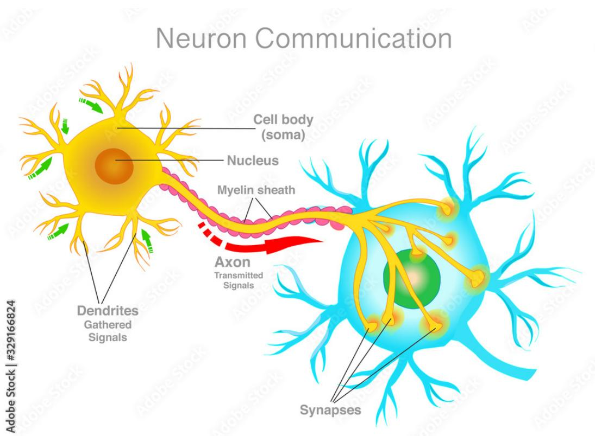

## SciGram-Align (captions)

C1. The diagram illustrates the process of neuron communication, showcasing the anatomy of two neurons and the flow of signals between them. On the left, a neuron with a yellow cell body (soma) and a green nucleus is depicted. This neuron has dendrites extending from its cell body, which are responsible for gathering signals from other neurons. The signals are then transmitted through the axon, a long, thin projection that extends from the cell body. The axon is covered by a myelin sheath, which helps to insulate the axon and speed up the transmission of signals. The axon terminates at the synapses, which are the points of contact between neurons. On the right, another neuron with a blue cell body (soma) and a green nucleus is shown. The signals from the first neuron are transmitted across the synapses to the second neuron, which then processes the signals and passes them on to other neurons. The diagram highlights the importance of the synapses in facilitating the communication between neurons and underscores the intricate network of connections that underlie neural function

C2. The diagram illustrates the process of neuron communication within the nervous system. It features two neurons, one with a yellow soma and the other with a blue soma, connected by an axon. The yellow neuron’s dendrites, which are the signal-gathering parts, are depicted with green arrows pointing towards the soma. These dendrites are responsible for receiving signals from other neurons. The axon, which is the signal-transmitting part, is shown extending from the soma of the yellow neuron and connecting to the blue neuron’s dendrites. The axon is surrounded by a myelin sheath, which is a protective layer that speeds up the transmission of signals. The signals are transmitted from the yellow neuron to the blue neuron through synapses, which are the points of contact between neurons. The blue neuron’s dendrites, which are the receiving parts, are shown with yellow arrows pointing towards the soma. The nucleus of each neuron is also labeled, indicating the control center of the cell.

C3. The diagram illustrates the process of neuron communication within the nervous system. It shows two neurons connected by an axon, which is the long, thin projection that transmits signals from the cell body to other neurons. The cell body, also known as the soma, contains the nucleus and is the central part of the neuron. Dendrites, which are the tree-like structures on the left neuron, gather signals from other neurons and transmit them to the cell body. The myelin sheath, a fatty coating around the axon, helps to speed up the transmission of signals. The axon then extends to the right neuron, where it synapses with the dendrites of the target neuron. The transmitted signals are indicated by the red arrow, showing the direction of signal propagation from one neuron to the next.

## SciGram-VIT (MCQs)

Q2. What is the role of the myelin sheath? a) Protects the cell body

b) Carries signals from the cell body to the axon

c) Carries signals from dendrites to the cell body

Q3. Which part transmits signals between neurons?

Figure 5: Example #1 of SciGram-Align and SciGram-VIT

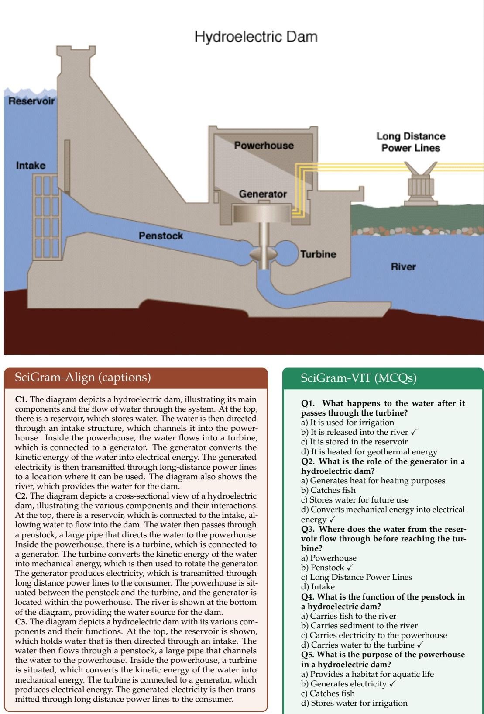  
Figure 6: Example #2 of SciGram-Align and SciGram-VIT

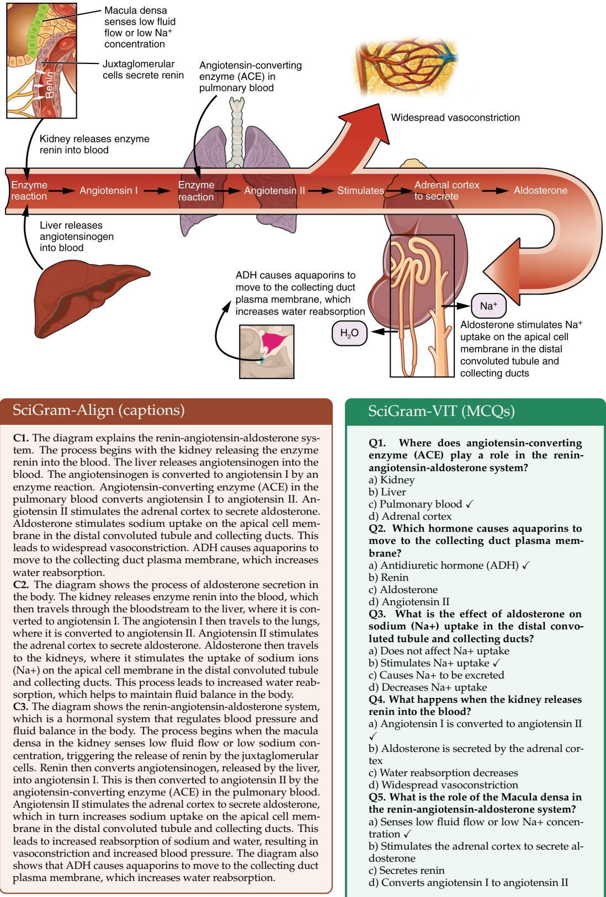  
Figure 7: Example #3 of SciGram-Align and SciGram-VIT

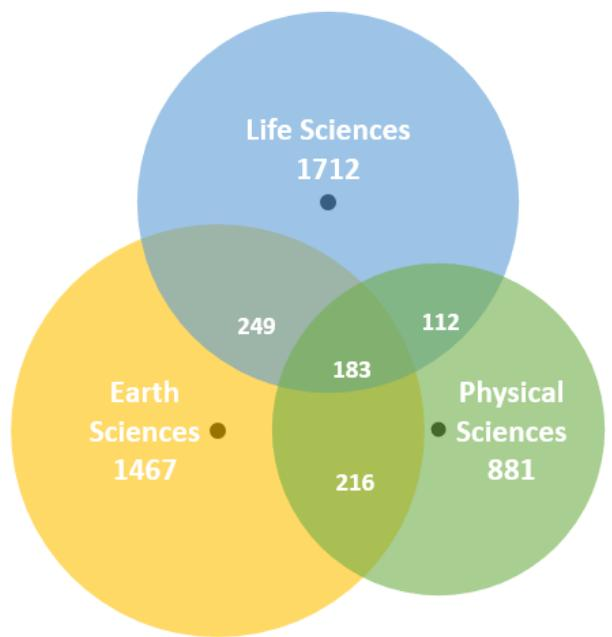

Figure 8: Terminology distribution by subjects. For each subject we include the number of terms that appear in lessons from that specific subject. In the intersections, we report the number of terms belonging to two or three matters at the same time. The total number is 4,820.  
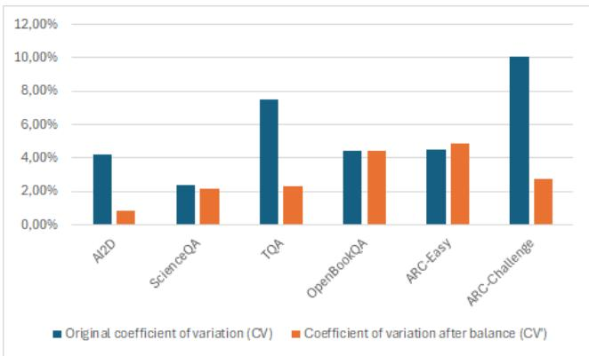  
Figure 9: Coefficient of variation of correct answers in the SciGram-M<sup>3</sup> subsets before (CV) and after (CV’) balancing.

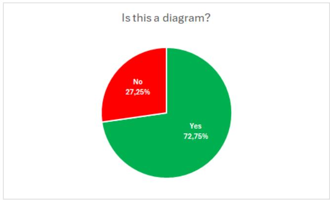  
Figure 10

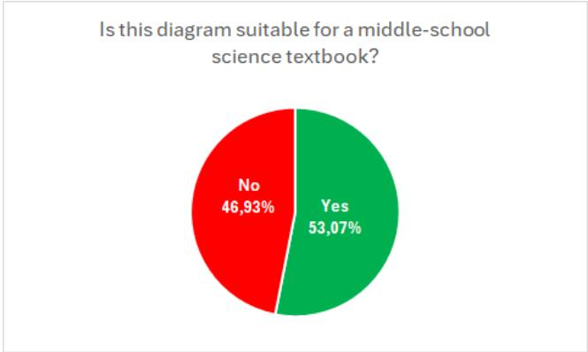  
Figure 11

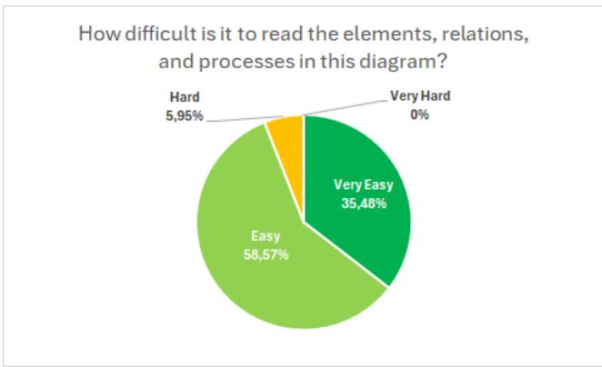  
Figure 12

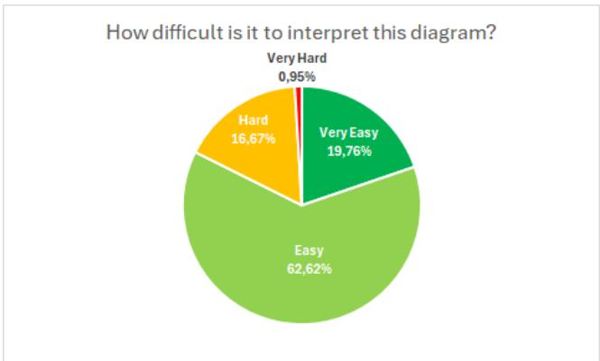  
Figure 13

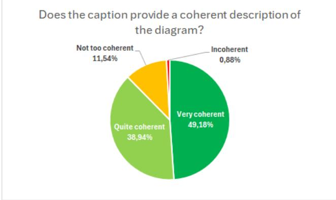  
Figure 14

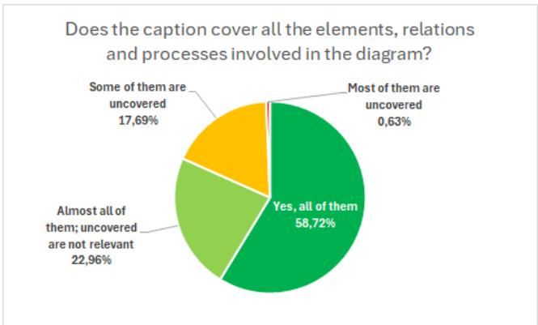  
Figure 15  
Are all the elements, relations and processes described in the caption present in the diagram?

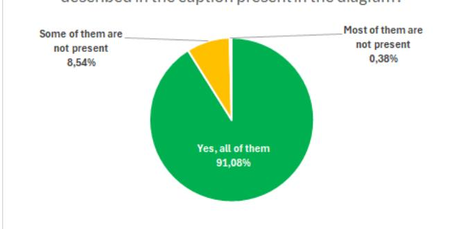  
Figure 16

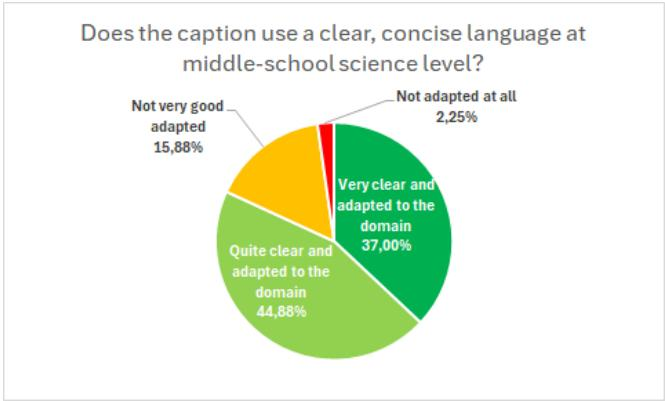  
Figure 17

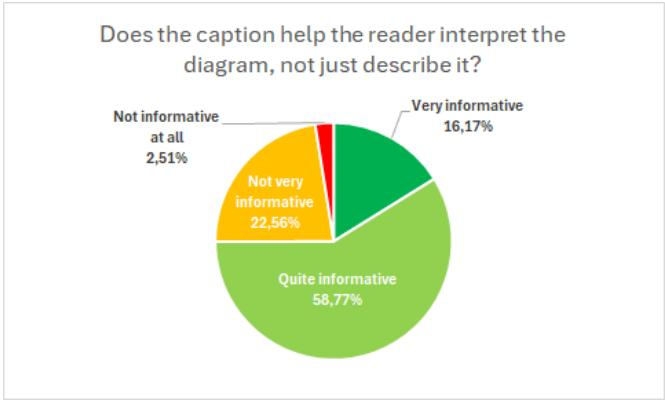  
Figure 18

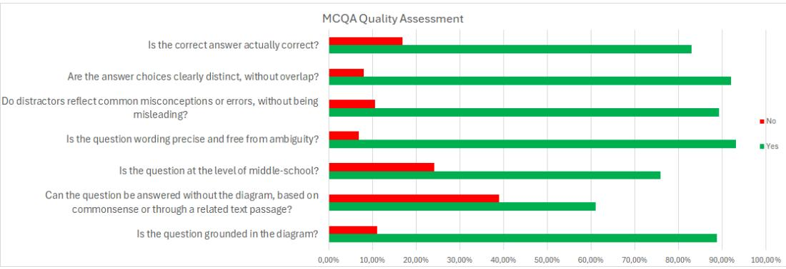  
Figure 19