# Gaussian Core LoRA: Distribution-Aware Dynamic Adaptation for Broad Concept Erasure

Qinghui Gong1 Xunlei Chen2, Yu-Xuan Zhang1, Hua Meng1, Zhengchun Zhou

1Southwest Jiaotong University 2University of Electronic Science and Technology of China

## Abstract

Concept erasure aims to suppress unsafe, privacy-sensitive, or undesirable generations in text-to-image difusion models while preserving benign semantics, visual quality, and deployment eficiency. Existing adapter-based methods, such as Low-Rank Adaptation (LoRA), typically freeze the difusion backbone and learn lightweight parameter updates to steer generation away from target semantics. However, these methods usually assign a static semantic erasure direction to each target concept. This assumption is overly coarse for broad and complex target concepts, since a concept often contains multiple latent semantic prototypes involving diferent objects, scenes, or relations, and requires diferent local erasure directions. A single LoRA update averages these heterogeneous erasure demands, leading to under-erasure on dificult prototypes and over-editing of nearby benign semantics. To address this limitation, we propose Gaussian Core LoRA, a distribution-aware low-rank adaptation framework. It fits a Gaussian mixture model in the prompt feature space to estimate latent semantic prototypes within the target concept. During inference, each input prompt is projected into this feature space to compute its Gaussian posterior responsibilities, which condition the core generator to produce a prompt-specific, norm-bounded residual reconfiguration of the shared LoRA rank space. This enables prototype-adaptive erasure with a single lightweight adapter. Compared with the strongest baseline on each metric, Gaussian Core LoRA reduces average Attack Success Rate (ASR) by 7.95%, lowers COCO Fréchet Inception Distance (FID) by 14.72%, and improves CLIP Score by 4.98%. Further experiments show robustness to adversarial prompts, scalability to multi-identity and multi-style erasure, and compatibility with SDXL and FLUX.

## 1 Introduction

Recent advances in text-to-image difusion models have substantially improved open-ended visual generation (Song, Meng, and Ermon 2020; Tu et al. 2025b; Ho, Jain, and Abbeel 2020). However, their large-scale training data inevitably contains undesirable concepts, such as sexual, violence, hate, sensitive identities, or copyrighted characters (Jiang et al. 2023; Wang et al. 2025; Lu et al. 2024), exposing deployed models to safety, privacy, and ethical risks. Therefore, how to suppress target concepts without retraining the entire model, while preserving benign semantics, visual quality, and deployment eficiency, has become an important problem in difusion model safety control.

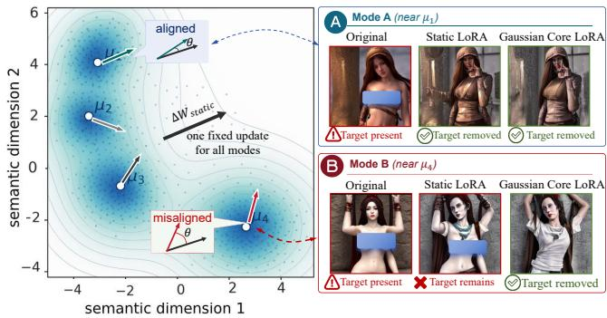  
Figure 1: Motivation of Gaussian Core LoRA. An unsafe concept may contain multiple latent modes requiring diferent erasure directions. Static LoRA uses a fixed update and may fail on misaligned modes, whereas Gaussian Core LoRA adapts the update to each prompt’s latent-mode position.

Existing concept erasure methods can be roughly categorized into inference-time intervention, model fine-tuning, and parameter-eficient adaptation. Inference-time methods require no training (Liu et al. 2024; Wu et al. 2024; Yoon et al. 2025; Wang et al. 2025) and are easy to deploy, but the model’s internal generative tendency is not truly modified, making them vulnerable to implicit prompts, prompt rewriting, or adversarial attacks (Zhang et al. 2024b; Chin et al. 2023; Tsai et al. 2024). Global or local fine-tuning methods can more directly change model behavior (Gandikota et al. 2023, 2024; Feng et al. 2025; Tu et al. 2025a; Fan et al. 2024), but they incur high training costs and may damage non-target semantics. In contrast, Low-Rank Adaptation (LoRA)-based adapters freeze the difusion backbone and perform concept erasure with only a small number of pluggable parameters (Kumari et al. 2023; Zhang et al. 2024a; Hu et al. 2022), providing a practical trade-of among training cost, storage overhead, and deployment flexibility. However, most LoRAstyle erasure methods still follow concept-level static modeling: given a human-defined target concept, they learn a fixed low-rank update and apply it to all prompts under that concept. Early methods train independent adapters for individual persons, styles, objects, or sensitive words (Zhao et al. 2024; Lyu et al. 2024; Liu, Zhang, and Yuan 2025), while recent multi-concept methods, such as MACE (Lu et al. 2024) and SuPLoRA (Tu et al. 2026), rely on adapter fusion or shared adaptation to improve scalability. Although these methods exploit shared structures among related concepts, they are still organized around manually defined concept boundaries rather than the actual distribution of target prompts in the model feature space.

This label-level formulation overlooks the internal diversity of how difusion models represent a target concept. A human label only specifies what should not be generated, but not how the model represents and composes that concept. A broad concept may contain multiple identity instances, visual modes, scene relations, or semantic subcategories, which occupy diferent regions in the prompt feature space and require diferent local erasure directions (Cassano et al. 2025; Cai et al. 2026; Yin, Tian, and Zhang 2025). As illustrated in Fig. 1, even a manually defined unsafe concept can form separated latent clusters, where a fixed LoRA correction may cover only part of the modes. As a result, static LoRA compresses a high-entropy target distribution into a single fixed update, causing mode averaging: weak updates fail on dificult modes, while strong updates may interfere with nearby benign semantics (Jiang et al. 2025). This motivates a new perspective: broad concept erasure should be viewed as learning a conditional low-rank editing operator over thepromptfeature distribution, rather than estimating a single parameter updatefor a human-defined label.

Based on this view, we propose Gaussian Core LoRA, a distribution-aware dynamic low-rank adaptation method for broad concept erasure. It learns a shared LoRA space for a broad target concept and dynamically reconfigures this space according to each prompt’s position in the feature distribution. Specifically, a Gaussian support gate suppresses adapter activation for prompts far from the target distribution, GMM responsibilities provide soft latent-mode routing, and a dynamic core produces prompt-conditioned rankspace reconfiguration. Empirically, Gaussian Core LoRA improves the erasure–preservation trade-of across seven unsafe prompt groups, reducing average ASR by 7.95% relative to the strongest average baseline while improving COCO FID and CLIP Score. Its adaptive rank-space reconfiguration also improves robustness to adversarial prompts, achieving 2.0%, 14.5%, and 10.0% ASR on Ring-A-Bell (Tsai et al. 2024), P4D (Chin et al. 2023), and UnDif (Zhang et al. 2024b), respectively, while remaining efective on both SDXL (Podell et al. 2024) and FLUX (Esser et al. 2024).

Our main contributions are summarized as follows:

• We formulate concept erasure from a feature-distribution perspective, showing that multimodal concept distributions make static LoRA prone to mode averaging, incomplete mode coverage, and semantic interference.

• We propose Gaussian Core LoRA, a gate-router-core dynamic low-rank adaptation framework. It uses a Gaussian support gate for coarse activation screening, GMM posterior responsibilities for soft latent-mode routing, and a dynamic core for prompt-conditioned reconfiguration in the shared LoRA rank space.

• We validate that Gaussian Core LoRA uses a single shared adapter to cover heterogeneous modes within each broad target concept without separate mode-specific training. The same design scales to joint erasure of up to 50 identities/styles and maintains favorable erasure– preservation trade-ofs under adversarial prompts and cross-architecture evaluation on SDXL and FLUX.

## 2 Related Work

## Inference-Time Intervention and Model Tuning

Concept erasure methods for text-to-image difusion models mainly include inference-time intervention and model tuning. Inference-time methods suppress undesired concepts by modifying denoising guidance, prompts, conditioning signals, attention responses, or semantic subspaces without updating model parameters (Schramowski et al. 2023; Wu et al. 2024; Yoon et al. 2025; Wang et al. 2025). Although eficient, they leave the underlying model unchanged and can be bypassed by prompt rewriting, module disabling, or adversarial prompts (Rando et al. 2022). Model tuning methods directly update model parameters to remove objects, styles, identities, or unsafe content (Gandikota et al. 2023; Heng and Soh 2023; Kumari et al. 2023; Fan et al. 2024), and have been extended to multi-concept or large-scale erasure (Gandikota et al. 2024; Zhao et al. 2024). These methods provide stronger behavioral modification but often incur higher training costs and may disturb non-target semantics.

## Adapter-Based Concept Erasure

Parameter-eficient adaptation ofers a practical trade-of by freezing the difusion backbone and learning lightweight modules (Hu et al. 2022; Kumari et al. 2023). Recent adapterbased methods improve scalability by training, merging, sharing, or dynamically composing LoRA-style modules. MACE merges concept-specific LoRA modules (Lu et al. 2024), while other methods explore separable, shared, dynamic, or hierarchical adapters to reduce interference across concepts (Lyu et al. 2024; Liu, Zhang, and Yuan 2025; Tu et al. 2026). These methods show that related concepts may share semantic directions, attention responses, or low-rank erasure structures.

However, most adapter-based methods still rely on predefined concept units and fixed adapter updates. For broad concepts with heterogeneous latent modes, this static formulation may average diferent editing demands. This motivates a distribution-aware perspective, where the erasure update should be dynamically adjusted according to the input prompt rather than solely determined by a human-defined concept label.

## 3 Method

## Overview

We formulate broad concept erasure as a distribution-aware parameter-eficient adaptation problem. Given a pretrained text-to-image difusion model $\epsilon _ { \theta }$ and a broad concept c, target prompts are treated as samples from an underlying promptfeature distribution. The goal is to learn a lightweight adapter $\Delta _ { \psi }$ that suppresses target prompts while preserving nontarget and semantically neighboring benign prompts.

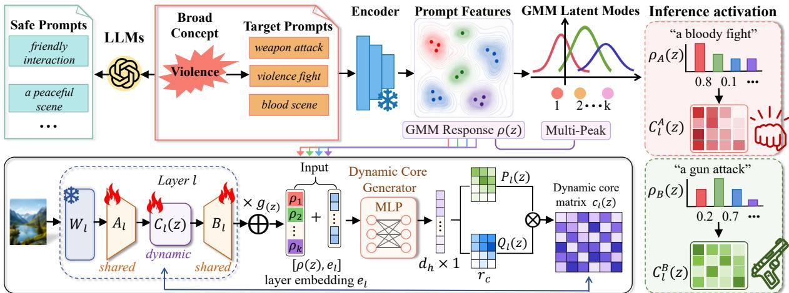  
Figure 2: Overview of Gaussian Core LoRA. Sensitive prompts and safe semantics are first constructed from a target concept. Prompt features are modeled by a GMM to obtain latent mode responsibilities and Gaussian support regions. The gate $g ( z )$ determines whether to activate the adapter branch, while the responsibility vector $\rho ( z )$ determines how to reconfigure the shared LoRA rank space. Safe semantics provide paired erasure and retention constraints during training. During inference, each prompt is projected into the same feature space to generate layer-aware dynamic cores $C _ { l } ( z )$ , producing prompt-dependent erasure directions across difusion layers.

As shown in Fig. 2, Gaussian Core LoRA follows a gate-router-core design. The Gaussian support gate provides coarse activation screening, GMM responsibilities perform soft mode routing, and a dynamic core reconfigures the shared LoRA rank space. For the l-th LoRA-injected layer, the efective update is

$$
\Delta W _ { l } ( z ) = g ( z ) B _ { l } C _ { l } ( z ) A _ { l } ,\tag{1}
$$

where z is the prompt feature, $g ( z ) \in [ 0 , 1 ]$ is the Gaussian support gate, $A _ { l }$ and $B _ { l }$ are shared LoRA bases, and $C _ { l } ( z )$ is a prompt-conditioned core matrix. This design reuses shared erasure structures while producing mode-adaptive updates.

## Task-Feature Space and Mode Modeling

Given a broad concept $c ,$ we construct a target prompt set

$$
\mathcal { D } _ { t } = \{ p _ { i } ^ { - } \} _ { i = 1 } ^ { N _ { t } } ,\tag{2}
$$

where $\boldsymbol { p } _ { i } ^ { - }$ is the i-th prompt containing the concept to be erased, and $N _ { t }$ is the number of target prompts.

For each prompt p, we extract token-level representations with the frozen text encoder:

$$
E ( p ) = [ e _ { 1 } , e _ { 2 } , \dots , e _ { T } ] ,\tag{3}
$$

where $e _ { t }$ is the feature of the t-th token. We then pool valid token features to obtain a prompt-level representation:

$$
h ( \boldsymbol { p } ) = \frac { 1 } { | \boldsymbol { \mathcal { M } } | } \sum _ { t \in \mathcal { M } } \boldsymbol { e } _ { t } ,\tag{4}
$$

where M is the set of valid token indices.

To obtain a compact task representation, we project the prompt-level feature into a low-dimensional space:

$$
z = P ^ { \top } ( h ( p ) - \bar { h } ) ,\tag{5}
$$

where $P$ is the PCA projection matrix and $\bar { h }$ is the mean feature of target prompts. Then we fit a diagonal-covariance GMM on the target task features $\{ z _ { i } \} _ { i = 1 } ^ { N _ { t } }$

$$
p _ { t } ( z ) = p ( z | c ) = \sum _ { k = 1 } ^ { K } \pi _ { k } \mathcal { N } ( z ; \mu _ { k } , \Sigma _ { k } ) ,\tag{6}
$$

where $K$ is the number of latent modes, $\pi _ { k }$ is the mixture weight, $\mu _ { k }$ is the mean, and $\Sigma _ { k }$ is the diagonal covariance of the k-th component:

$$
\begin{array} { r } { \Sigma _ { k } = \mathrm { d i a g } ( \sigma _ { k , 1 } ^ { 2 } , . . . , \sigma _ { k , d } ^ { 2 } ) . } \end{array}\tag{7}
$$

The fixed GMM parameters provide a reference distribution for target-mode routing.

For a prompt feature z, its posterior responsibility for the k-th target mode is

$$
\rho _ { k } ( z ) = \frac { \pi _ { k } \mathcal { N } ( z ; \mu _ { k } , \Sigma _ { k } ) } { \sum _ { j = 1 } ^ { K } \pi _ { j } \mathcal { N } ( z ; \mu _ { j } , \Sigma _ { j } ) } .\tag{8}
$$

The responsibility vector is $\rho ( z ) = [ \rho _ { 1 } ( z ) , \dots , \rho _ { K } ( z ) ]$ , with $\begin{array} { r } { \sum _ { k = 1 } ^ { K } \rho _ { k } ( z ) = 1 } \end{array}$ . It describes the soft position of the prompt among target latent modes.

## Gaussian Support Gate

The responsibility vector $\rho ( z )$ only describes the relative assignment of a prompt among target latent modes. Since it is normalized over the target Gaussian components, a benign or open-set prompt can still receive a confident mode assignment, causing unnecessary adapter activation on non-target content.

To address this issue, we introduce a Gaussian support gate derived from the fitted target GMM. For each target mode, we compute the Mahalanobis distance between the prompt feature z and the Gaussian center:

$$
d _ { k } ( z ) = ( z - \mu _ { k } ) ^ { \top } \Sigma _ { k } ^ { - 1 } ( z - \mu _ { k } ) .\tag{9}
$$

This distance measures whether z falls within the elliptical support of the k-th target mode.

For each mode, we estimate its support radius from target training prompts:

$$
\tau _ { k } = Q _ { \beta } ^ { w } \left( \{ d _ { k } ( z _ { i } ) \} _ { i = 1 } ^ { N _ { t } } , \{ \rho _ { k } ( z _ { i } ) \} _ { i = 1 } ^ { N _ { t } } \right) ,\tag{10}
$$

where $Q _ { \beta } ^ { w }$ denotes the responsibility-weighted β-percentile, and the selection of $\beta$ is detailed in App. B. The normalized distance to the target multi-mode support is then defined as

$$
r ( z ) = \operatorname* { m i n } _ { k } \frac { d _ { k } ( z ) } { \tau _ { k } } .\tag{11}
$$

A prompt is considered inside the target concept support if it is close to at least one Gaussian mode, $\mathrm { i } . \mathrm { e } . , r ( z ) \leq 1$

The final gate is computed as

$$
g ( z ) = \sigma \left( \frac { 1 - r ( z ) } { T _ { g } } \right) ,\tag{12}
$$

where $T _ { g } = 0 . 2$ controls the boundary softness. The gate strengthens the adapter update inside the target Gaussian support and suppresses it outside all target supports.

## Gaussian Core LoRA

We inject Gaussian Core LoRA into the query, key, value, and output projection layers of the cross-attention blocks. For the l-th injected projection layer, let the frozen original weight be $W _ { l } \doteq \mathbb { R } ^ { d _ { \mathrm { o u t } } \times \bar { d } _ { \mathrm { i n } } }$ . A standard LoRA update is

$$
\Delta W _ { l } = B _ { l } A _ { l } ,\tag{13}
$$

where $A _ { l } \in \mathbb { R } ^ { r \times d _ { \mathrm { i n } } } , B _ { l } \in \mathbb { R } ^ { d _ { \mathrm { o u t } } \times r }$ , and r is the LoRA rank. Gaussian Core LoRA gates the adapter update and inserts a dynamic core into the LoRA rank space:

$$
\Delta W _ { l } ( z ) = g ( z ) B _ { l } C _ { l } ( z ) A _ { l } ,\tag{14}
$$

where $g ( z ) \in [ 0 , 1 ]$ controls the intervention strength and $C _ { l } ( \boldsymbol { z } ) \in \mathrm { \mathbb { R } } ^ { r \times r }$ is a prompt-conditioned core matrix. Given the layer input $u _ { l } .$ , the layer output is $y _ { l } = W _ { l } u _ { l } + \Delta W _ { l } ( z ) u _ { l } .$ $A _ { l }$ and $B _ { l }$ define a shared erasure subspace, while $C _ { l } ( z )$ reconfigures this subspace according to the target-mode responsibility $\rho ( z )$

To make the core layer-aware, each injected layer is assigned a learnable embedding $e _ { l } \in \mathbb { R } ^ { d _ { \epsilon } }$ e. The core generator takes the target-mode responsibility and layer embedding as input: $q _ { l } ( z ) = [ \rho ( z ) ; e _ { l } ]$ , where [·; ·] denotes concatenation. A shared generator $G _ { \phi }$ outputs two low-rank core factors:

$$
[ P _ { l } ( z ) , Q _ { l } ( z ) ] = G _ { \phi } ( q _ { l } ( z ) ) ,\tag{15}
$$

where $P _ { l } ( z ) , Q _ { l } ( z ) \in \mathbb { R } ^ { r \times r _ { c } }$ , and $r _ { c }$ is the residual core rank. We then define the unnormalized residual core as

$$
R _ { l } ( z ) = \operatorname { t a n h } ( P _ { l } ( z ) ) \operatorname { t a n h } ( Q _ { l } ( z ) ) ^ { \top } .\tag{16}
$$

To explicitly control the core perturbation scale, we normalize it by its Frobenius norm:

$$
\widehat { R } _ { l } ( z ) = \frac { R _ { l } ( z ) } { \| R _ { l } ( z ) \| _ { F } + \varepsilon } .\tag{17}
$$

The dynamic core is then defined as

$$
C _ { l } ( z ) = I _ { r } + \eta \widehat { R } _ { l } ( z ) ,\tag{18}
$$

where η controls the maximum core reconfiguration strength, and $r _ { c }$ controls the rank capacity of the residual core. This normalized identity-residual form gives

$$
\Vert C _ { l } ( z ) - I _ { r } \Vert _ { F } = \eta \frac { \Vert R _ { l } ( z ) \Vert _ { F } } { \Vert R _ { l } ( z ) \Vert _ { F } + \varepsilon } \le \eta .\tag{19}
$$

The gate bounds the efective residual reconfiguration:

$$
\Vert g ( z ) ( C _ { l } ( z ) - I _ { r } ) \Vert _ { F } \leq g ( z ) \eta .\tag{20}
$$

Therefore, the gate controls the activation strength of the whole adapter, while the dynamic core provides a bounded prompt-conditioned reconfiguration inside the shared LoRA rank space. Details are provided in Appendix A.

## Joint Training Objective

We train Gaussian Core LoRA following the standard LoRAbased concept erasure paradigm. For each target prompt $\mathrm { \Pi } _ { p _ { i } ^ { - } } ^ { - }$ we construct a safe replacement prompt $p _ { i } ^ { + }$ with a large language model:

$$
\begin{array} { r } { p _ { i } ^ { + } = \mathrm { L L M } ( p _ { i } ^ { - } , c ) . } \end{array}\tag{21}
$$

The replacement prompt removes or substitutes the target concept $c ,$ while preserving the main non-target context. This gives a text-pair set

$$
\mathcal { P } = \{ ( p _ { i } ^ { - } , p _ { i } ^ { + } ) \} _ { i = 1 } ^ { N _ { t } } .\tag{22}
$$

For a text pair $( p _ { i } ^ { - } , p _ { i } ^ { + } )$ , we align the denoising prediction of the modified model under the target prompt with the prediction of the frozen model under the safe prompt:

$$
\begin{array} { r } { \mathcal { L } _ { \mathrm { p a i r } } = \mathbb { E } _ { ( p _ { i } ^ { - } , p _ { i } ^ { + } ) \in \mathcal { P } , t } \left[ \left\| \epsilon _ { \theta + \Delta _ { \psi } } ( x _ { t } , t , p _ { i } ^ { - } ) - \epsilon _ { \theta } ( x _ { t } , t , p _ { i } ^ { + } ) \right\| _ { 2 } ^ { 2 } \right] , } \end{array}\tag{23}
$$

where $x _ { t }$ is the noisy latent at timestep $t , \epsilon _ { \theta + \Delta _ { \psi } }$ is the model equipped with Gaussian Core LoRA, and $\epsilon _ { \theta }$ is the frozen original model.

Since $p _ { i } ^ { + }$ removes the target concept while preserving the main non-target context, it also serves as a natural retention prompt. We therefore constrain the edited model to match the frozen model on $p _ { i } ^ { + }$ :

$$
\mathcal { L } _ { \mathrm { r e t a i n } } = \mathbb { E } _ { p _ { i } ^ { + } , t } \left[ \left. \epsilon _ { \theta + \Delta _ { \psi } } ( x _ { t } , t , p _ { i } ^ { + } ) - \epsilon _ { \theta } ( x _ { t } , t , p _ { i } ^ { + } ) \right. _ { 2 } ^ { 2 } \right] .\tag{24}
$$

The final objective is

$$
\begin{array} { r } { \mathcal { L } = \mathcal { L } _ { \mathrm { p a i r } } + \lambda _ { r } \mathcal { L } _ { \mathrm { r e t a i n } } , } \end{array}\tag{25}
$$

where $\lambda _ { r } = 0 . 5$ in all experiments. The retention term preserves the frozen model behavior on safe prompts and limits non-target disturbance.

## 4 Experiment

We evaluate Gaussian Core LoRA on broad unsafeconcept erasure, adversarial robustness, scalability, and cross-architecture compatibility. We compare with methods including ESD (Gandikota et al. 2023), RECE (Gong et al. 2024), MACE (Lu et al. 2024), SAFREE (Yoon et al. 2025), AdaVD (Wang et al. 2025), and Prototype-Guided (Cai et al. 2026), and report the unedited model as a reference. SuPLoRA (Tu et al. 2026) is included only in the multi-identity and multi-style scalability experiments, as it is mainly designed for scalable multi-concept erasure. Beyond standard unsafe prompts, we evaluate robustness against Ring-A-Bell (Tsai et al. 2024), P4D (Chin et al. 2023), and UnDif (Zhang et al. 2024b), and test compatibility on SDXL (Podell et al. 2024) and FLUX (Esser et al. 2024).

Table 1: Broad unsafe-concept erasure on seven I2P prompt groups. We report Q16-based ASR (%) for erasure efectiveness, and COCO FID and CLIP Score for general-content preservation, averaged across the seven category-specific edited models.
<table><tr><td>Method</td><td>Hate↓</td><td>Harassment↓</td><td>Illegal Activity↓</td><td>Self-harm↓</td><td>Sexual↓</td><td>Shocking↓</td><td>Violence↓</td><td>COCO FID↓</td><td>COCO CLIP↑</td></tr><tr><td>SD v1.5</td><td>21.5%</td><td>19.3%</td><td>19.8%</td><td>35.0%</td><td>55.0%</td><td>41.8%</td><td>39.5%</td><td></td><td>28.6</td></tr><tr><td>ESD-X</td><td>3.8%</td><td>6.8%</td><td>16.3%</td><td>11.0%</td><td>16.0%</td><td>15.8%</td><td>6.8%</td><td>36.8</td><td>25.0</td></tr><tr><td>RECE</td><td>4.5%</td><td>6.3%</td><td>6.3%</td><td>8.8%</td><td>8.3%</td><td>9.5%</td><td>13.8%</td><td>39.2</td><td>24.6</td></tr><tr><td>MACE</td><td>4.0%</td><td>6.0%</td><td>6.0%</td><td>6.0%</td><td>3.0%</td><td>10.0%</td><td>8.0%</td><td>38.5</td><td>23.8</td></tr><tr><td>SAFREE</td><td>5.0%</td><td>9.5%</td><td>11.0%</td><td>7.0%</td><td>5.5%</td><td>13.5%</td><td>9.5%</td><td>34.6</td><td>26.1</td></tr><tr><td>AdaVD</td><td>10.0%</td><td>8.0%</td><td>8.5%</td><td>10.8%</td><td>2.8%</td><td>17.0%</td><td>12.5%</td><td>43.8</td><td>23.3</td></tr><tr><td>Proto-Guided</td><td>3.5%</td><td>5.8%</td><td>5.8%</td><td>4.5%</td><td>1.8%</td><td>7.5%</td><td>6.3%</td><td>26.5</td><td>25.7</td></tr><tr><td>Ours</td><td>4.0%</td><td>6.3%</td><td>5.0%</td><td>3.8%</td><td>0.0%</td><td>7.8%</td><td>5.5%</td><td>22.6</td><td>27.4</td></tr></table>

Datasets. We evaluate broad unsafe-concept erasure using the standard I2P prompt dataset (Schramowski et al. 2023). For adversarial evaluation, we consider Ring-A-Bell (Tsai et al. 2024), P4D (Chin et al. 2023), and UnDif (Zhang et al. 2024b). Each attack is independently optimized against every edited model under the same initialization, iteration, and query budgets, producing 100 adversarial prompts per attack. General-content preservation is evaluated on benign prompts sampled from MS-COCO (Lin et al. 2014). For each multi-identity and multi-style erasure setting, we use GPT-4o (Hurst et al. 2024) to construct 100 diverse prompts for the selected identities or styles. For all evaluation prompts, we generate four images using four random seeds. Detailed prompt sets, target lists, and complete training, attack, and inference configurations are provided in Appendix B.

Evaluation Metrics. We evaluate both erasure efectiveness and generation preservation. For broad unsafe-concept erasure and adversarial evaluation, we use the Q16 classifier (Schramowski et al. 2023) and report the attack success rate (ASR), defined as the percentage of generated images classified as unsafe; lower values indicate stronger erasure. General generation quality is evaluated on benign MS-COCO prompts using FID (Heusel et al. 2017) and CLIP Score (Radford et al. 2021), where lower FID indicates better distributional fidelity and higher CLIP Score indicates stronger text–image alignment. For multi-identity erasure, we use the GIPHY Celebrity Detector (GCD) (Hasty et al. 2019) to identify generated celebrities, and report Target ID-ASR for erased identities and Retained ID-Acc for non-target identities. Lower Target ID-ASR and higher Retained ID-Acc indicate more efective and selective identity erasure.

Broad Unsafe-Concept Erasure. As shown in Table 1, Gaussian Core LoRA achieves the lowest average ASR across seven I2P prompt groups and the best COCO FID and CLIP Score among the erasure methods. It performs best on illegal activity, self-harm, sexual, and violence, showing that prompt-conditioned core reconfiguration improves targetmode coverage while preserving general generation quality.

SDv1.5  
ESD  
RECE  
SAFREE  
AdaVD  
Prototype  
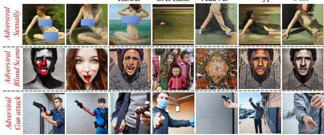  
Ours  
Figure 3: Qualitative comparison under adversarial prompts targeting sexual and violent concepts. Gaussian Core LoRA more efectively suppresses the target semantics while preserving the non-target scene content.

Table 2: Robustness against Ring-A-Bell, P4D, and UnDif attacks. We report the Q16-based attack success rate (ASR, %), where lower values indicate adversarial robustness.
<table><tr><td>Method</td><td>Ring↓</td><td>P4D↓</td><td>UnDiff↓</td></tr><tr><td>SD v1.5</td><td>71.5%</td><td>91.0%</td><td>64.3%</td></tr><tr><td>ESD-X</td><td>51.0%</td><td>78.5%</td><td>76.8%</td></tr><tr><td>RECE</td><td>6.5%</td><td>35.0%</td><td>15.5%</td></tr><tr><td>MACE</td><td>12.5%</td><td>17.0%</td><td>11.0%</td></tr><tr><td>SAFREE</td><td>22.0%</td><td>37.5%</td><td>27.8%</td></tr><tr><td>AdaVD</td><td>15.5%</td><td>25.0%</td><td>20.5%</td></tr><tr><td>Prototype-Guided</td><td>8.0%</td><td>19.3%</td><td>9.3%</td></tr><tr><td>Ours</td><td>2.0%</td><td>14.5%</td><td>10.0%</td></tr></table>

Robustness against Adversarial Prompts. As shown in Table 2, Gaussian Core LoRA remains robust under all three adversarial attacks, achieving the best performance on Ring-A-Bell and P4D and competitive performance on UnDif. Adversarial prompts often preserve the target semantics while substantially altering their surface expressions, making fixed erasure directions easier to bypass. In contrast, our promptconditioned core responds to the latent-mode position of each input and adaptively reconfigures the shared low-rank space, improving robustness to semantic rewriting and prompt optimization. The qualitative results in Fig. 3 further show that our method suppresses adversarially recovered unsafe content while retaining the surrounding benign scene structure.

Table 3: Compatibility on other difusion model architectures. We report ASR under Ring-A-Bell, P4D, and UnDif attacks on SDXL and FLUX.
<table><tr><td>Method</td><td>Ring↓</td><td>P4D↓</td><td>UnDiff↓</td></tr><tr><td>Original SDXL SDXL + SAFREE</td><td>57.8%</td><td>73.5%</td><td>38.3% 26.3%</td></tr><tr><td>SDXL + AdaVD</td><td>28.5% 22.3%</td><td>32.8% 27.5%</td><td>18.5%</td></tr><tr><td>SDXL + Prototype-Guided SDXL + Ours</td><td>24.0% 14.3%</td><td>24.3%</td><td>14.8%</td></tr><tr><td>Original FLUX</td><td></td><td>18.8%</td><td>16.5%</td></tr><tr><td>FLUX + SAFREE</td><td>44.8% 26.0%</td><td>68.3%</td><td>34.5%</td></tr><tr><td>FLUX + AdaVD</td><td></td><td>29.8%</td><td>22.5%</td></tr><tr><td></td><td>29.3%</td><td>35.0%</td><td>16.0%</td></tr><tr><td>FLUX + Prototype-Guided</td><td>16.5%</td><td>21.5%</td><td>13.8%</td></tr><tr><td>FLUX + Ours</td><td>9.8%</td><td>15.5%</td><td>18.0%</td></tr></table>

Table 4: BIC-selected number of Gaussian components for the seven I2P unsafe-concept groups.
<table><tr><td>Concept</td><td></td><td></td><td>Hate Harassment Illegal Activity Self-harm Sexual Shocking Violence</td><td></td><td></td><td></td><td></td></tr><tr><td>Selected K</td><td>3</td><td>3</td><td>4</td><td>4</td><td>4</td><td>4</td><td>5</td></tr></table>

Multi-Identity Erasure and Scalability. Figure 4 shows that Gaussian Core LoRA scales to erasure of up to 50 identities while preserving retained identities and generation quality. Instead of assigning one LoRA to each identity, our method uses a shared adapter whose K increases to capture additional identity modes, while the global LoRA rank grows slowly through shared low-rank structure. This avoids the near-linear training and storage growth of conceptspecific adapters. Figure 5 confirms target suppression and retained-identity preservation under the 50-identity setting. Results on 50-style erasure are provided in Appendix C.

Cross-Architecture Compatibility. Table 3 evaluates Gaussian Core LoRA on SDXL and FLUX, which employ substantially diferent difusion backbones. Our method achieves the lowest average ASR on both architectures, with the strongest performance under Ring-A-Bell and P4D and competitive results under UnDif. These results indicate that the proposed dynamic adaptation is not specific to the SD v1.5 architecture. Detailed implementation information and qualitative results are available in Appendix C.

Mode and Rank Scaling. Table 4 shows that unsafe concepts require diferent numbers of Gaussian components, indicating varying latent-mode complexity. Figure 6 further shows that K grows with target diversity, while the global LoRA rank increases much more slowly than the blockisolated baseline. This indicates that Gaussian Core LoRA models target diversity through latent modes while retaining a compact shared rank space.

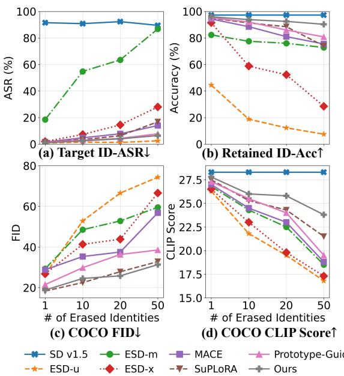  
Figure 4: Scalability of multi-identity erasure from 1 to 50 targets, evaluated by (a) Target ID-ASR, (b) Retained ID-Acc, (c) COCO FID, and (d) CLIP Score.

Table 5: Component ablation on concepts with diferent routing complexity.
<table><tr><td>Variant</td><td>Sexual ASR ↓ H = 0.41</td><td>Violence ASR ↓ H = 0.68</td></tr><tr><td>Standard LoRA</td><td>4.8%</td><td>15.3%</td></tr><tr><td>Hard-GMM Dynamic Core</td><td>2.3%</td><td>9.5%</td></tr><tr><td>Soft-GMM Diagonal Core</td><td>1.3%</td><td>7.3%</td></tr><tr><td>Ours</td><td>0.0%</td><td>5.5%</td></tr></table>

Prompt-Conditioned Dynamic Core. Figure 7 shows that diferent target prompts activate distinct core patterns in the shared rank space, confirming that Gaussian Core LoRA performs prompt-specific reconfiguration rather than applying a fixed update to all inputs.

Editing-Gradient Consistency. We test whether Gaussian modes are editing-relevant beyond semantic clustering. For each target prompt, we compute the pair-loss gradient with respect to injected LoRA weights and compare within- and across-mode cosine similarity. Table 6 shows higher withinmode similarity, indicating that prompts in the same mode share more consistent local editing directions.

Component Ablation. Table 5 shows that GMMconditioned dynamic cores substantially outperform standard LoRA, especially on the more heterogeneous Violence concept. Soft routing improves over hard routing by preserving mixed-mode information, while the non-diagonal core outperforms diagonal scaling through cross-channel rank-space reconfiguration. These results validate the importance of soft latent-mode conditioning and non-diagonal core modulation.

(b) Practical global LoRA rank  
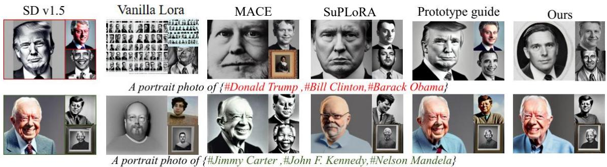  
Figure 5: Qualitative comparison under the 50-identity erasure setting. The target identities include Donald Trump, Bill Clinton, and Barack Obama, while the retained identities include Jimmy Carter, John F. Kennedy, and Nelson Mandela. Gaussian Core LoRA suppresses target identities while preserving retained identities.

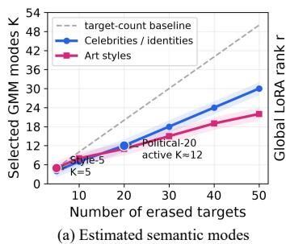

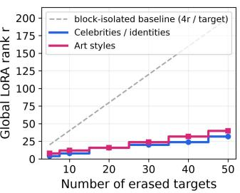  
Figure 6: Scaling behavior with increasing numbers of erased targets. (a) The selected number of Gaussian components K, reflecting the growth oflatent semantic modes. (b) The globa LoRA rank r, compared with a block-isolated baseline that allocates four independent rank channels to each target.

Table 6: Editing-gradient consistency across Gaussian modes. Values are mean cosine similarity ± standard deviation over prompt pairs.
<table><tr><td>Concept</td><td>K</td><td> $S _ { \mathrm { w i t h i n } }$ </td><td> $S _ { \mathrm { b e t w e e n } }$ </td><td>Gap</td></tr><tr><td>Sexual</td><td>4</td><td> $0 . 2 4 \pm 0 . 0 3$ </td><td> $0 . 1 2 \pm 0 . 0 4$ </td><td>0.12</td></tr><tr><td>Violence</td><td>5</td><td> $0 . 2 1 \pm 0 . 0 4$ </td><td> $0 . 0 6 \pm 0 . 0 2$ </td><td>0.15</td></tr></table>

Adapter Storage Scaling. Fig. 8 compares adapter storage under 50-target erasure. MACE and SuPLoRA require concept-specific adapter components, causing storage to grow with the target set. In contrast, Gaussian Core LoRA uses a single shared adapter with a dynamic core, making it more suitable for broad concepts and large-scale target sets.

## 5 Conclusion

This work revisits concept erasure from the distributional properties of target concepts in the prompt feature space. In practical broad-concept erasure, diferent latent semantic prototypes may require diferent erasure directions, while learning separate adapters or directions for each sub-concept would introduce additional training and storage costs. To address this challenge, we propose Gaussian Core LoRA, which models complex target concepts with a Gaussian mixture model and uses posterior responsibilities to condition a dynamic core for shared LoRA rank-space reconfiguration. This design balances adaptive erasure-direction selection with lightweight fine-tuning, enabling prototype-adaptive concept erasure within a single adapter. Experiments show consistent gains in erasure efectiveness, semantic preservation, and adaptability across difusion architectures, suggesting that distribution-aware LoRA design is a promising direction for scalable concept control. This distributional view can be further strengthened by more flexible prototype modeling. Although Gaussian mixtures provide a compact approximation, open-ended prompts may contain more fine-grained or entangled semantic patterns. Future work may therefore explore richer prototype discovery and boundary characterization to achieve more controllable erasure under open-set conditions.

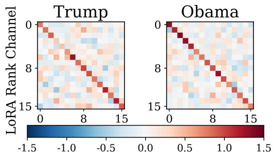  
Figure 7: Prompt-conditioned dynamic cores for diferent identity prompts. Target prompts induce distinct rank-space modulation patterns.

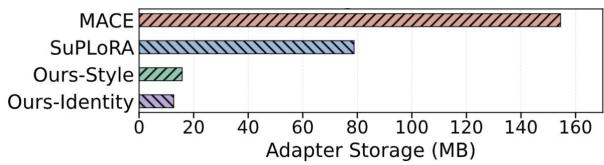  
Figure 8: Adapter storage under 50-target erasure, showing that Gaussian Core LoRA requires much less storage than MACE and SuPLoRA.

## References

Cai, Y.; Lu, J.; Shi, H.; Zhou, Y.; and Lu, H. 2026. Prototypeguided concept erasure in difusion models. In Proceedings of the IEEE/CVF Conference on Computer Vision and Pattern Recognition, 16509–16519.

Cassano, E.; Renzulli, R.; Nurisso, M.; Zafaroni, M.; Perotti, A.; and Grangetto, M. 2025. SAEmnesia: Erasing Concepts in Difusion Models with Sparse Autoencoders. CoRR, abs/2509.21379.

Chin, Z.-Y.; Jiang, C.-M.; Huang, C.-C.; Chen, P.-Y.; and Chiu, W.-C. 2023. Prompting4debugging: Red-teaming textto-image difusion models by finding problematic prompts. arXiv preprint arXiv:2309.06135.

Esser, P.; Kulal, S.; Blattmann, A.; Entezari, R.; Müller, J.; Saini, H.; Levi, Y.; Lorenz, D.; Sauer, A.; Boesel, F.; et al. 2024. Scaling rectified flow transformers for high-resolution image synthesis. In Forty-first international conference on machine learning.

Fan, C.; Liu, J.; Zhang, Y.; Wong, E.; Wei, D.; and Liu, S. 2024. SalUn: Empowering Machine Unlearning via Gradient-based Weight Saliency in Both Image Classification and Generation. In The Twelfth International Conference on Learning Representations, ICLR 2024, Vienna, Austria, May 7-11, 2024. OpenReview.net.

Feng, Q.; Tu, J.; Kang, M.; Zhao, H.; Zhang, C.; and Qian, H. 2025. FG-OrIU: Towards Better Forgetting via Feature-Gradient Orthogonality for Incremental Unlearning. In Proceedings of the IEEE/CVF International Conference on Computer Vision, 1957–1967.

Gandikota, R.; Materzynska, J.; Fiotto-Kaufman, J.; and Bau, D. 2023. Erasing concepts from difusion models. In Proceedings of the IEEE/CVF international conference on computer vision, 2426–2436.

Gandikota, R.; Orgad, H.; Belinkov, Y.; Materzyńska, J.; and Bau, D. 2024. Unified concept editing in difusion models. In Proceedings of the IEEE/CVF winter conference on applications ofcomputer vision, 5111–5120.

Gong, C.; Chen, K.; Wei, Z.; Chen, J.; and Jiang, Y.-G. 2024. Reliable and eficient concept erasure of text-to-image difusion models. In European Conference on Computer Vision, 73–88. Springer.

Hasty, N.; Kroosh, I.; Voitekh, D.; and Korduban, D. 2019. GIPHY Celebrity Detector. https://github.com/Giphy/celebdetection-oss. Open-source celebrity detection model.

Heng, A.; and Soh, H. 2023. Selective amnesia: A continual learning approach to forgetting in deep generative models. Advances in Neural Information Processing Systems, 36: 17170–17194.

Heusel, M.; Ramsauer, H.; Unterthiner, T.; Nessler, B.; and Hochreiter, S. 2017. GANs Trained by a Two Time-Scale Update Rule Converge to a Local Nash Equilibrium. In Advances in Neural Information Processing Systems, volume 30.

Ho, J.; Jain, A.; and Abbeel, P. 2020. Denoising difusion probabilistic models. Advances in neural information processing systems, 33: 6840–6851.

Hu, E. J.; Shen, Y.; Wallis, P.; Allen-Zhu, Z.; Li, Y.; Wang, S.; Wang, L.; and Chen, W. 2022. LoRA: Low-Rank Adaptation of Large Language Models. In The Tenth International Conference on Learning Representations, ICLR 2022, Virtual Event, April 25-29, 2022. OpenReview.net.

Hurst, A.; Lerer, A.; Goucher, A. P.; Perelman, A.; Ramesh, A.; Clark, A.; Ostrow, A.; Welihinda, A.; Hayes, A.; Radford, A.; et al. 2024. Gpt-4o system card. arXiv preprint arXiv:2410.21276.

Jiang, H. H.; Brown, L.; Cheng, J.; Khan, M.; Gupta, A.; Workman, D.; Hanna, A.; Flowers, J.; and Gebru, T. 2023. AI Art and its Impact on Artists. In Proceedings ofthe 2023 AAAI/ACM Conference on AI, Ethics, and Society, 363–374.

Jiang, Y.; Yan, X.; Ding, K.; Zhao, D.; Liang, L.; Zhang, Q.; and Chen, H. 2025. HiMoLE: Towards OOD-Robust LoRA via Hierarchical Mixture of Experts. In Advances in Neural Information Processing Systems 38: Annual Conference on Neural Information Processing Systems 2025, NeurIPS 2025, San Diego, CA, USA, December 2-7, 2025 / Mexico City, Mexico, November 30 - December 5, 2025.

Kumari, N.; Zhang, B.; Wang, S.-Y.; Shechtman, E.; Zhang, R.; and Zhu, J.-Y. 2023. Ablating concepts in text-to-image difusion models. In Proceedings of the IEEE/CVF international conference on computer vision, 22691–22702.

Lin, T.-Y.; Maire, M.; Belongie, S.; Hays, J.; Perona, P.; Ramanan, D.; Dollár, P.; and Zitnick, C. L. 2014. Microsoft coco: Common objects in context. In European conference on computer vision, 740–755. Springer.

Liu, J.; Zhang, L.; and Yuan, X. 2025. DyME: Dynamic Multi-Concept Erasure in Difusion Models with Bi-Level Orthogonal LoRA Adaptation. arXiv preprint arXiv:2509.21433.

Liu, R.; Khakzar, A.; Gu, J.; Chen, Q.; Torr, P.; and Pizzati, F. 2024. Latent guard: a safety framework for text-to-image generation. In European Conference on Computer Vision, 93–109. Springer.

Lu, S.; Wang, Z.; Li, L.; Liu, Y.; and Kong, A. W.-K. 2024. Mace: Mass concept erasure in difusion models. In Proceedings of the IEEE/CVF Conference on Computer Vision and Pattern Recognition, 6430–6440.

Lyu, M.; Yang, Y.; Hong, H.; Chen, H.; Jin, X.; He, Y.; Xue, H.; Han, J.; and Ding, G. 2024. One-dimensional adapter to rule them all: Concepts difusion models and erasing applications. In Proceedings of the IEEE/CVF Conference on Computer Vision and Pattern Recognition, 7559–7568.

Podell, D.; English, Z.; Lacey, K.; Blattmann, A.; Dockhorn, T.; Müller, J.; Penna, J.; and Rombach, R. 2024. SDXL: Improving Latent Difusion Models for High-Resolution Image Synthesis. In The Twelfth International Conference on Learning Representations, ICLR 2024, Vienna, Austria, May 7-11, 2024. OpenReview.net.

Radford, A.; Kim, J. W.; Hallacy, C.; Ramesh, A.; Goh, G.; Agarwal, S.; Sastry, G.; Askell, A.; Mishkin, P.; Clark, J.; et al. 2021. Learning transferable visual models from natural language supervision. In International conference on machine learning, 8748–8763. PmLR.

Rando, J.; Paleka, D.; Lindner, D.; Heim, L.; and Tramèr, F. 2022. Red-teaming the stable difusion safety filter. arXiv preprint arXiv:2210.04610.

Schramowski, P.; Brack, M.; Deiseroth, B.; and Kersting, K. 2023. Safe latent difusion: Mitigating inappropriate degeneration in difusion models. In Proceedings of the IEEE/CVF conference on computer vision and pattern recognition, 22522–22531.

Song, J.; Meng, C.; and Ermon, S. 2020. Denoising difusion implicit models. arXiv preprint arXiv:2010.02502.

Tsai, Y.; Hsu, C.; Xie, C.; Lin, C.; Chen, J.; Li, B.; Chen, P.; Yu, C.; and Huang, C. 2024. Ring-A-Bell! How Reliable are Concept Removal Methods For Difusion Models? In The Twelfth International Conference on Learning Representations, ICLR 2024, Vienna, Austria, May 7-11, 2024. OpenReview.net.

Tu, J.; Feng, Q.; Chen, C.; Dong, J.; Zhao, H.; Zhang, C.; and Qian, H. 2025a. CE-SDWV: Efective and Eficient Concept Erasure for Text-to-Image Difusion Models via a Semantic-Driven Word Vocabulary. CoRR, abs/2501.15562.

Tu, J.; Ji, W.; Zhao, H.; Zhang, C.; Zimmermann, R.; and Qian, H. 2025b. Driveditfit: Fine-tuning difusion transformers for autonomous driving data generation. ACM Transactions on Multimedia Computing, Communications and Applications, 21(3): 1–29.

Tu, J.; Li, Y.; Wu, Y.; Zhao, H.; Zhang, C.; and Qian, H. 2026. Mass Concept Erasure in Difusion Models with Concept Hierarchy. In Fortieth AAAI Conference on Artificial Intelligence, Thirty-Eighth Conference on Innovative Applications of Artificial Intelligence, Sixteenth Symposium on Educational Advances in Artificial Intelligence, AAAI 2026, Singapore, January 20–27, 2026, 9585–9593. AAAI Press.

Wang, Y.; Li, O.; Mu, T.; Hao, Y.; Liu, K.; Wang, X.; and He, X. 2025. Precise, fast, and low-cost concept erasure in value space: Orthogonal complement matters. In 2025 IEEE/CVF Conference on Computer Vision and Pattern Recognition (CVPR), 28759–28768. IEEE.

Wu, Z.; Gao, H.; Wang, Y.; Zhang, X.; and Wang, S. 2024. Universal prompt optimizer for safe text-to-image generation. In Proceedings of the 2024 Conference of the North American Chapter of the Association for Computational Linguistics: Human Language Technologies (Volume 1: Long Papers), 6340–6354.

Yin, Q.; Tian, Y.; and Zhang, Y. 2025. Rethinking Robust Adversarial Concept Erasure in Difusion Models. CoRR, abs/2510.27285.

Yoon, J.; Yu, S.; Patil, V.; Yao, H.; and Bansal, M. 2025. SAFREE: Training-Free and Adaptive Guard for Safe Textto-Image And Video Generation. In The Thirteenth International Conference on Learning Representations, ICLR 2025, Singapore, April 24-28, 2025. OpenReview.net.

Zhang, Y.; Fan, C.; Zhang, Y.; Yao, Y.; Jia, J.; Liu, J.; Zhang, G.; Liu, G.; Kompella, R. R.; Liu, X.; et al. 2024a. Unlearncanvas: Stylized image dataset for enhanced machine unlearning evaluation in difusion models. arXiv preprint arXiv:2402.11846.

Zhang, Y.; Jia, J.; Chen, X.; Chen, A.; Zhang, Y.; Liu, J.; Ding, K.; and Liu, S. 2024b. To generate or not? safety-driven unlearned difusion models are still easy to generate unsafe images... for now. In European Conference on Computer Vision, 385–403. Springer.

Zhao, M.; Zhang, L.; Zheng, T.; Kong, Y.; and Yin, B. 2024. Separable multi-concept erasure from difusion models. arXiv preprint arXiv:2402.05947.

## A Theoretical Analysis

This appendix provides a compact theoretical analysis of Gaussian Core LoRA.

Fixed LoRA Coupling and Dynamic Perturbation For a LoRA-injected projection layer, standard LoRA uses

$$
\Delta W ^ { \mathrm { L o R A } } = B A = B I _ { r } A ,\tag{26}
$$

where $I _ { r }$ is the identity matrix in the rank space. Equivalently, if $B = [ b _ { 1 } , \ldots , b _ { r } ]$ and the rows of A are $\{ a _ { i } ^ { \top } \} _ { i = 1 } ^ { r }$ , then

$$
\Delta W ^ { \mathrm { L o R A } } = \sum _ { i = 1 } ^ { r } b _ { i } a _ { i } ^ { \top } .\tag{27}
$$

Standard LoRA applies a fixed one-to-one coupling between input rank channels and output rank channels for all prompts.

Gaussian Core LoRA introduces a prompt-conditioned core:

$$
\Delta W ( z ) = g ( z ) B C ( z ) A ,\tag{28}
$$

where $g ( z ) \in [ 0 , 1 ]$ is the support-screening gate. The core is written as an identity-residual form:

$$
C ( z ) = I _ { r } + \delta C ( z ) .\tag{29}
$$

Therefore,

$$
\Delta W ( z ) = g ( z ) B A + g ( z ) B \delta C ( z ) A .\tag{30}
$$

The first term is the gated base LoRA update, and the second term is a gated prompt-conditioned residual correction.

This yields an exact identity–residual decomposition around the identity core, since ${ \dot { F } } ( C ) = B C A$ is linear in C, we have

$$
\mathcal { F } ( I _ { r } + \delta C ) = \mathcal { F } ( I _ { r } ) + D \mathcal { F } | _ { I _ { r } } [ \delta C ] ,\tag{31}
$$

with

$$
\begin{array} { r } { D \mathcal { F } | _ { I _ { r } } [ \delta C ] = B \delta C A . } \end{array}\tag{32}
$$

Gaussian Core LoRA can therefore be viewed as a gated, prompt-conditioned residual reconfiguration of the standard LoRA update.

## Static Mode Averaging Error

We next formalize why a single static core can sufer from mode averaging. Let $\dot { C } ^ { \star } ( Z )$ denote the locally optimal conditional core for prompt feature $Z .$ Assume the local excess loss is quadratic:

$$
\ell ( C ; Z ) - \ell ( C ^ { \star } ( Z ) ; Z ) = \| C - C ^ { \star } ( Z ) \| _ { F } ^ { 2 } .\tag{33}
$$

Among all static cores, the optimal solution is

$$
C _ { \mathrm { s t a t } } ^ { \star } = \mathbb { E } [ C ^ { \star } ( Z ) ] .\tag{34}
$$

The minimum static excess loss is

$$
E _ { \mathrm { s t a t } } = \mathbb { E } \left[ \| C ^ { \star } ( Z ) - \mathbb { E } [ C ^ { \star } ( Z ) ] \| _ { F } ^ { 2 } \right] .\tag{35}
$$

If M denotes the latent mode, this error decomposes as

$$
\begin{array} { r l } & { E _ { \mathrm { s t a t } } = \underbrace { \mathbb { E } \left[ \left. C ^ { \star } - \mathbb { E } [ C ^ { \star } \mid M ] \right. _ { F } ^ { 2 } \right] } _ { \mathrm { w i t h i n - m o d e ~ v a r i a t i o n } } } \\ & { + \underbrace { \mathbb { E } \left[ \left. \mathbb { E } [ C ^ { \star } \mid M ] - \mathbb { E } [ C ^ { \star } ] \right. _ { F } ^ { 2 } \right] } _ { \mathrm { b e t w e e n - m o d e ~ v a r i a t i o n } } . } \end{array}\tag{36}
$$

The second term gives a precise form of mode averaging error. If diferent modes require diferent average cores, a single static update cannot match all modes simultaneously. Dynamic routing is useful exactly when this between-mode variation is non-negligible.

## Gate and Routing Error Decomposition

The membership gate and the routing core address diferent errors. Let $Y _ { s } \in \{ 0 , 1 \}$ indicate whether a prompt lies within the ideal target-concept support. The ideal gated core is

$$
F ^ { \star } ( Z ) = Y _ { s } C ^ { \star } ( Z )\tag{37}
$$

while the learned gated core is

$$
F ( Z ) = g ( Z ) C ( Z ) .\tag{38}
$$

Then,

$$
F ( Z ) \mathrm { - } F ^ { \star } ( Z ) = g ( Z ) ( C ( Z ) \mathrm { - } C ^ { \star } ( Z ) ) + ( g ( Z ) \mathrm { - } Y _ { s } ) C ^ { \star } ( Z ) .
$$

Using $\begin{array} { r } { \| a + b \| _ { F } ^ { 2 } \leq 2 \| a \| _ { F } ^ { 2 } + 2 \| b \| _ { F } ^ { 2 } } \end{array}$ , we obtain

(39)

$$
\begin{array} { r l } & { \| F ( Z ) - F ^ { \star } ( Z ) \| _ { F } ^ { 2 } \le 2 | g ( Z ) - Y _ { s } | ^ { 2 } \| C ^ { \star } ( Z ) \| _ { F } ^ { 2 } } \\ & { \qquad + 2 g ( Z ) ^ { 2 } \| C ( Z ) - C ^ { \star } ( Z ) \| _ { F } ^ { 2 } . } \end{array}\tag{40}
$$

The first term is a support-screening error that determines whether the adapter branch is activated, while the second term is a conditional routing error that determines how the shared rank space is reconfigured. This explains why normalized GMM responsibilities alone are insuficient: they only afect the routing term and cannot suppress false activation on benign prompts.

For soft routing, let $\bar { C } _ { k } = \mathbb { E } [ C ^ { \star } \mid M = k ]$ and $C _ { \rho } ( Z ) =$ $\scriptstyle \sum _ { k = 1 } ^ { K } \rho _ { k } ( Z ) { \bar { C } } _ { k }$ . If the true mode is M and

$$
D _ { C } = \operatorname* { m a x } _ { j , k } \| \bar { C } _ { j } - \bar { C } _ { k } \| _ { F } ,\tag{41}
$$

then

$$
\| C _ { \rho } ( Z ) - \bar { C } _ { M } \| _ { F } \leq D _ { C } \| \rho ( Z ) - e _ { M } \| _ { 1 } .\tag{42}
$$

This analysis considers an idealized responsibility-weighted router to characterize the efect of posterior calibration. The implemented dynamic core generator generalizes this linear form through a bounded nonlinear mapping from $[ \rho ( z ) ; e _ { l } ]$

## Rank, Shared Subspace, and Benign Perturbation Bound

Let the residual core be parameterized by two factors $P ( z ) , Q ( z ) \in \mathbb { R } ^ { r \times r _ { c } }$ . Then the residual has rank at most $r _ { c } \mathrm { : }$

$$
\mathrm { r a n k } ( \delta C ( z ) ) \le r _ { c } .\tag{43}
$$

Thus, the dynamic residual update satisfies

$$
\operatorname { r a n k } ( B \delta C ( z ) A ) \leq r _ { c } .\tag{44}
$$

Meanwhile, the full update remains inside the shared LoRA subspace:

$$
\operatorname { r a n k } ( B C ( z ) A ) \leq r ,\tag{45}
$$

and

$$
\operatorname { c o l } ( B C ( z ) A ) \subseteq \operatorname { c o l } ( B ) , \qquad \operatorname { r o w } ( B C ( z ) A ) \subseteq \operatorname { r o w } ( A ) .\tag{46}
$$

All prompt-conditioned updates share the same input and output low-rank subspaces, and only their rank-space coordinates are reconfigured.

We further bound the perturbation on benign prompts. The gated layer output is

$$
y = W u + g ( z ) B C ( z ) A u .\tag{47}
$$

$$
\mathrm { I f } \ \| C ( z ) - I _ { r } \| _ { 2 } \leq \eta , \mathrm { t h e n } \ \| C ( z ) \| _ { 2 } \leq 1 + \eta , \mathrm { a n d }
$$

$$
\begin{array} { r } { \| y - W u \| _ { 2 } \leq g ( z ) ( 1 + \eta ) \| B \| _ { 2 } \| A \| _ { 2 } \| u \| _ { 2 } . } \end{array}\tag{48}
$$

This shows that preservation is controlled by three factors: small gate activation on benign prompts, bounded dynamic core strength, and the operator norms of the shared LoRA bases.

## Local Stability of Soft GMM Routing

Finally, we analyze the local stability of the soft GMM router. For the k-th Gaussian component, the unnormalized log posterior is

$$
a _ { k } ( z ) = \log \pi _ { k } - \frac { 1 } { 2 } ( z - \mu _ { k } ) ^ { \top } \Sigma _ { k } ^ { - 1 } ( z - \mu _ { k } ) - \frac { 1 } { 2 } \log | \Sigma _ { k } | .\tag{49}
$$

Assume the GMM covariances are uniformly bounded as

$$
0 < \sigma _ { \mathrm { m i n } } ^ { 2 } I \preceq \Sigma _ { k } \preceq \sigma _ { \mathrm { m a x } } ^ { 2 } I ,\tag{50}
$$

and z lies in a bounded feature region. Then $\nabla a _ { k } ( z )$ is uniformly bounded, so $a ( z )$ is Lipschitz continuous. Since the softmax function also has a bounded Jacobian, the posterior responsibility

$$
\rho ( z ) = \mathrm { s o f t m a x } ( a ( z ) )\tag{51}
$$

is locally Lipschitz.

If the core generator is Lipschitz, then the composed mapping $z \mapsto C _ { l } ( z )$ is also locally Lipschitz:

$$
\Vert C _ { l } ( z _ { 1 } ) - C _ { l } ( z _ { 2 } ) \Vert _ { F } \leq L _ { C , l } \Vert z _ { 1 } - z _ { 2 } \Vert _ { 2 } .\tag{52}
$$

Soft routing therefore avoids the discontinuous changes caused by hard mode assignment near GMM boundaries. This local stability supports smooth prompt-conditioned reconfiguration, although it does not by itself guarantee robustness to large adversarial prompt transformations.

## B Experimental Details

## Implementation Details

Unless otherwise specified, all experiments are conducted on Stable Difusion v1.5 with image resolution $5 1 2 \times 5 1 2$ . We freeze the difusion backbone and the text encoder, and only update the shared LoRA bases, the dynamic core generator, and the layer embeddings. Gaussian Core LoRA is inserted into the attention projection layers of the denoising UNet, including the query, key, value, and output projection layers. The PCA projection and GMM parameters are fitted once on the target prompt features before LoRA training and remain fixed during both training and inference. For each target concept, the PCA dimension d is selected as the minimum number of principal components explaining at least 95% of the variance in the target-prompt features. The resulting projection is fixed during training and inference.

The GMM uses diagonal covariance and is optimized by EM for at most 100 iterations. The layer embedding dimension is set to $d _ { e } ~ = ~ 1 6$ , and the hidden dimension of the dynamic core generator is set to 64. The dynamic-core residual scale is set to $\eta \ : = \ : 0 . 5 0$ . The pair-alignment loss has weight 1.0, and the retention loss weight is set to $\lambda _ { r } = 0 . 5 .$

We train each adapter using AdamW with $\beta _ { 1 } = 0 . 9 , \beta _ { 2 } =$ 0.999, weight decay 0.01, and $\epsilon = 1 0 ^ { - 8 }$ . The efective batch size is set to 64, implemented with gradient accumulation when necessary. The learning rate for the LoRA bases is $5 \times 1 0 ^ { - 5 }$ , while the dynamic core generator is optimized with learning rate $1 \times 1 0 ^ { - 4 }$ . Each adapter is trained for 20 epochs, where one epoch iterates over all target–safe prompt pairs once. During training, the difusion timestep is uniformly sampled from [250, 900].

The training seed is fixed to 42 for reproducibility. For evaluation, we use four fixed sampling seeds, {42, 43, 44, 45}. Each setting contains 100 prompts, and each prompt is sampled once under each seed, resulting in 100 images per seed and 400 generated images in total. All reported quantitative results are averaged over the 400 generated images.

Sensitive-1K Prompt Construction. For each target concept c, we define a subject set $\begin{array} { r } { \boldsymbol { { \cal S } } _ { c } , } \end{array}$ a modifier set $\mathcal { M } _ { c } .$ , and a shared template set T. Each unsafe prompt is constructed by filling a template t with a subject s and a concept-related modifier m:

$$
p ^ { - } = \mathrm { F i l l } ( t ; s , m ) , \quad s \in \mathcal { S } _ { c } , m \in \mathcal { M } _ { c } , t \in \mathcal { T } .\tag{53}
$$

After removing invalid and duplicate combinations, we sample 1,000 prompts to form the Sensitive-1K training set. For example, a subject phrase “two people” and a modifier phrase “in a violent confrontation” can be inserted into the template “A realistic image of {subject} {modifier}.” Evaluation prompts are excluded from the construction. For each unsafe prompt, an LLM generates a paired safe prompt by replacing the target semantics while preserving the main scene context.

Prompt Templates and Target Lists For multi-identity and multi-style erasure, we use template-based prompt construction to ensure diversity and reproducibility. For each identity, we generate portrait-oriented prompts using variants such as “a portrait photo of {identity}”, “a realistic headshot of {identity}”, “a studio portrait of {identity}”, and “a closeup portrait of {identity}”. These templates cover diferent portrait conditions while keeping the identity as the main target concept.

For style erasure, we combine each artist name with diverse content templates, such as “a painting of {content} in the style of {artist}”, “a landscape in the style of {artist}”, “a portrait in the style of {artist}”, “a city scene in the style of {artist}”, and “a still life painting in the style of {artist}”. The content placeholders include common scenes and objects, which allows us to evaluate whether the method removes the target style while preserving non-target semantic content.

The complete 50-identity and 50-style forget/retention lists are provided in Tables 11 and 12.

## Selection of Gaussian Components

Since diferent broad concepts may exhibit diferent degrees of multimodality, we do not use a fixed number of Gaussian components for all concepts. Instead, for each target concept,

we fit diagonal-covariance GMMs with candidate component numbers $\bar { \boldsymbol { K } } \in \kappa$ and select the final K using the Bayesian information criterion (BIC):

$$
\mathrm { B I C } ( K ) = - 2 \log p ( \mathcal { Z } \mid \hat { \Theta } _ { K } ) + m _ { K } \log | \mathcal { Z } | ,
$$

where Z denotes the target prompt features, $\hat { \Theta } _ { K }$ is the fitted GMM parameter set with K components, and $m _ { K }$ is the number of free parameters. The final number of Gaussian components is selected as

$$
K ^ { \star } = \arg \operatorname* { m i n } _ { K \in \mathcal { K } } \mathrm { B I C } ( K ) .
$$

This criterion balances data fitting and model complexity, allowing relatively concentrated concepts to use fewer latent modes while more diverse concepts can be represented by more Gaussian components. For the seven I2P unsafeconcept groups, we select K from a small candidate set. For large-scale identity and style erasure, we enlarge the candidate range because the target sets contain substantially more semantic modes.

## Residual Core Rank Settings

We further report the residual core rank settings used for diferent erasure tasks. The residual core rank is chosen according to the selected number of Gaussian components and the normalized GMM mode entropy $\bar { H } _ { c }$ , so that more heterogeneous tasks are assigned a larger prompt-conditioned core capacity.

We quantify the routing complexity of a concept by the normalized GMM mode entropy:

$$
\bar { H } _ { c } = - \frac { 1 } { \log K } \sum _ { k = 1 } ^ { K } \bar { \rho } _ { k } \log \bar { \rho } _ { k } , \quad \bar { \rho } _ { k } = \frac { 1 } { N _ { t } } \sum _ { i = 1 } ^ { N _ { t } } \rho _ { k } ( z _ { i } ) .
$$

A larger $\bar { H } _ { c }$ indicates that target prompts are more evenly distributed across multiple latent modes, and therefore require a larger prompt-conditioned core capacity.

Table 7 summarizes the global LoRA rank r and residual core rank $r _ { c }$ used for diferent erasure tasks. For the seven unsafe-concept groups, we fix $r = 8$ and allocate a larger $r _ { c }$ to concepts with more complex latent distributions, increasing from $r _ { c } = 2$ for Hate and Harassment to $r _ { c } = 6$ for Violence. For large-scale identity and style erasure, the global rank is increased to accommodate the larger target sets, while the dynamic core still operates within a compact shared rank space.

Table 8 shows that smaller K or $r _ { c }$ produces more conservative updates with better COCO preservation but weaker target suppression. The BIC-selected $K = 5$ achieves the lowest ASR, while increasing K to 7 does not further improve erasure and instead degrades preservation. Similarly, increasing $r _ { c }$ improves erasure on the high-complexity Violence concept with a mild preservation trade-of. These results indicate that our selected hyperparameters provide a reasonable balance between mode coverage and semantic preservation.

Table 7: Residual core rank settings for diferent erasure tasks. The distributional complexity is characterized by the BIC-selected number of Gaussian components and the normalized GMM mode entropy ${ \bar { H } } _ { c } .$ For each task, we set $r _ { c } = \lceil \rho _ { c } r \rceil$ , where r is the global LoRA rank.
<table><tr><td>Task / Concept</td><td>Selected K</td><td> $\bar { H } _ { c }$ </td><td>Global rank r</td><td>ρc</td><td>Core rank rc</td></tr><tr><td>Hate</td><td>3</td><td>0.34</td><td>8</td><td>25%</td><td>2</td></tr><tr><td>Harassment</td><td>3</td><td>0.37</td><td>8</td><td>25%</td><td>2</td></tr><tr><td>Illegal Activity</td><td>4</td><td>0.52</td><td>8</td><td>50%</td><td>4</td></tr><tr><td>Self-harm</td><td>4</td><td>0.55</td><td>8</td><td>50%</td><td>4</td></tr><tr><td>Sexual</td><td>4</td><td>0.41</td><td>8</td><td>50%</td><td>4</td></tr><tr><td>Shocking</td><td>4</td><td>0.56</td><td>8</td><td>50%</td><td>4</td></tr><tr><td>Violence</td><td>5</td><td>0.68</td><td>8</td><td>75%</td><td>6</td></tr><tr><td>50 Identities</td><td>30</td><td>0.73</td><td>32</td><td>50%</td><td>16</td></tr><tr><td>50 Artistic  $\mathrm { S t y l e s }$ </td><td>22</td><td>0.78</td><td>40</td><td>50%</td><td>20</td></tr></table>

Table 8: Sensitivity analysis of Gaussian Core LoRA hyperparameters on Violence. We vary the number of Gaussian components K and residual core rank $r _ { c } ,$ while keeping other training settings fixed. When varying K, we fix $r _ { c } = 6 ;$ when varying $r _ { c } ,$ we use the BIC-selected $K = 5 .$
<table><tr><td>Setting</td><td>ASR↓</td><td>COCO FID ↓</td><td>COCO CLIP ↑</td></tr><tr><td> $K = 3$ </td><td>7.8%</td><td>21.8</td><td>27.5</td></tr><tr><td>BIC-selected  $K = 5$ </td><td>5.5%</td><td>23.2</td><td>27.1</td></tr><tr><td> $K = 7$ </td><td>5.8%</td><td>25.1</td><td>26.8</td></tr><tr><td> $r _ { c } = 2$ </td><td>8.3%</td><td>20.9</td><td>27.7</td></tr><tr><td> $r _ { c } = 4$ </td><td>6.4%</td><td>21.7</td><td>27.5</td></tr><tr><td> $r _ { c } = 6$ </td><td>5.5%</td><td>23.2</td><td>27.1</td></tr></table>

Sensitivity to Gaussian Support Percentile. The percentile β controls the radius of each target Gaussian support. Smaller values yield tighter supports and better preservation, while larger values improve target coverage but may over-activate the adapter on non-target prompts. As shown in Table 10, we set $\beta$ according to concept dispersion: compact concepts use $\beta = 0 . 9 0$ , and medium- or high-dispersion concepts use the default $\beta = 0 . 9 5$ . Although Violence is the most dispersed category, its diversity is already modeled by the BIC-selected multi-mode GMM, so a larger $\beta$ is not necessary. Table 9 confirms this trend: increasing β beyond 0.95 brings limited ASR gains but degrades COCO preservation, while $\beta = 0 . 9 5$ gives the best erasure-preservation trade-of.

Table 9: Sensitivity analysis of the Gaussian support percentile β on Violence. We vary β while keeping $\overset { \cdot } { T _ { g } } = \overset { \cdot } { 0 . 2 }$ the BIC-selected $K = 5 ,$ , and $r _ { c } = 6$ fixed.
<table><tr><td>Setting</td><td>ASR↓</td><td>COCO FID ↓</td><td>COCO CLIP ↑</td></tr><tr><td> $\beta = 0 . 9 0$ </td><td>6.8%</td><td>21.7</td><td>27.9</td></tr><tr><td> $\beta = 0 . 9 5$ </td><td>5.5%</td><td>23.2</td><td>27.1</td></tr><tr><td> $\beta = 0 . 9 7 5$ </td><td>5.3%</td><td>23.3</td><td>26.6</td></tr><tr><td> $\beta = 1 . 0 0$ </td><td>5.5%</td><td>24.1</td><td>25.3</td></tr></table>

Table 10: Category-specific Gaussian support percentile $\beta$ for I2P unsafe-concept erasure. More compact concepts use tighter supports, while more dispersed concepts use slightly wider supports.
<table><tr><td>Concept</td><td>Dispersion Level</td><td> $\beta$ </td></tr><tr><td>Hate</td><td>Low</td><td>0.90</td></tr><tr><td>Harassment</td><td>Low</td><td>0.90</td></tr><tr><td>Sexual</td><td>Medium</td><td>0.95</td></tr><tr><td>Illegal Activity</td><td>Medium</td><td>0.95</td></tr><tr><td>Self-harm</td><td>Medium</td><td>0.95</td></tr><tr><td>Shocking</td><td>Medium</td><td>0.95</td></tr><tr><td>Violence</td><td>High</td><td>0.95</td></tr></table>

## C Additional Distribution-Aware Analysis and Generalization Results

## Feature-Space Density of Large-Scale Targets

To understand why a single Gaussian Core LoRA can handle large-scale identity or style erasure, we visualize the feature distribution of 50 target concepts in the CLIP prompt embedding space. We extract prompt-level embeddings, project them into two latent semantic dimensions, and fit a GMM to estimate the target density, as shown in Figure 9.

The visualization shows that the target concepts are not completely separated in the feature space. Many prompts overlap and form several high-density regions, indicating that large-scale identities or styles share common semantic structures. This supports the use of a shared low-rank erasure space, rather than assigning an independent LoRA adapter or isolated rank block to each target.

Meanwhile, the features do not collapse into a single compact cluster. Multiple local modes still exist, suggesting that diferent identities or styles may require diferent local erasure directions. A fixed LoRA update would average these modes and may lead to incomplete erasure or unnecessary disturbance to retained concepts. Gaussian Core LoRA addresses this by using GMM posterior responsibilities to dynamically reconfigure the shared LoRA rank space for each prompt. Therefore, Figure 9 empirically supports our design: large-scale targets contain shared structures that enable a single adapter, but their local mode diversity still requires distribution-aware dynamic adaptation.

## Additional Results on 50-Style Erasure

We further evaluate Gaussian Core LoRA in a large-scale multi-style erasure setting, where the model is required to erase up to 50 target artistic styles using a single adapter. Compared with unsafe concepts or identity concepts, artistic styles are mainly reflected in relatively concentrated visual appearance patterns, such as color distribution, brushstroke texture, composition preference, and local rendering statistics. This makes multi-style erasure a suitable setting for evaluating whether a shared low-rank erasure space can capture common style-removal structures. Meanwhile, diferent artists and style families still correspond to distinct visual modes, which makes a purely static LoRA update prone to mode averaging.

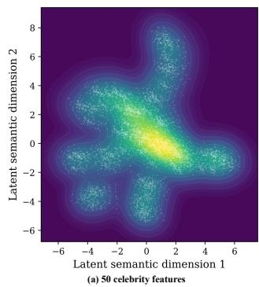

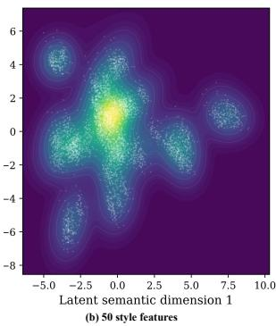  
Figure 9: Semantic density of 50 celebrity targets and 50 artistic-style targets in the CLIP prompt embedding space. Each point corresponds to one prompt, and the background shows the fitted GMM density after projection to two latent semantic dimensions.

Figure 10 reports the quantitative scalability results from 1 to 50 erased styles. We evaluate target-style removal using Target Style CLIP Score and Target Style FID, where lower Target Style CLIP Score and higher Target Style FID indicate stronger suppression of the erased styles. We evaluate preservation on retained styles and COCO prompts using CLIP Score and FID. As the number of target styles increases, static LoRA-based baselines tend to either leave visible target-style evidence or introduce larger distributional drift on retained styles and general COCO generations. In contrast, Gaussian Core LoRA maintains stronger target-style suppression while better preserving retained-style and COCO generation quality. This shows that the proposed dynamic core does not simply increase the overall erasure strength, but adaptively reconfigures the shared LoRA rank space according to the latent style mode of each prompt.

Figure 11 provides qualitative comparisons under the 50- style erasure setting. The target-style prompts include representative erased styles such as Van Gogh, Picasso, and Hokusai, while the retained prompts include non-target styles such as Rembrandt, Leonardo da Vinci, and Georgia O’Keefe, together with general COCO scene prompts. The original model and static LoRA variants often retain recognizable target-style patterns or distort the retained concepts after strong erasure. By contrast, Gaussian Core LoRA efectively weakens the target artistic styles while preserving the visual identity of retained styles and the semantic structure of COCO scenes. These visual results are consistent with the quantitative trends and further demonstrate that broad style erasure can benefit from distribution-aware dynamic adaptation within a single shared adapter.

## Adaptation to FLUX

FLUX replaces the UNet denoiser of Stable Difusion with a Transformer backbone containing multimodal and singlestream Transformer blocks. Gaussian Core LoRA retains the same distribution-aware gate–router–core formulation and only changes the backbone-specific injection locations.

Table 11: Evaluation setup for 50-identity erasure. The dataset contains an erasure set with 50 celebrities and a retention set with another 50 celebrities.
<table><tr><td>Group</td><td>Number</td><td>Celebrity List</td></tr><tr><td>Erase Set</td><td>50</td><td>Donald Trump; Bill Clinton; Barack Obama; George W. Bush; Joe Biden; Ronald Reagan; Hillary Clinton; Bernie Sanders; Vladimir Putin; Xi Jinping; Emmanuel Macron; Angela Merkel; Boris Johnson; Justin Trudeau; Volodymyr Zelenskyy; Elon Musk; Jeff Bezos; Mark Zuckerberg; Bill Gates; Steve Jobs; Tim Cook; Sundar Pichai; Satya Nadella; Warren Buffett; Oprah Winfrey; Taylor Swift; Beyonce; Lady Gaga; Madonna; Rihanna; Ariana Grande; Billie Eilish; Justin Bieber; Kanye West; Drake; Tom Cruise; Leonardo DiCaprio; Brad Pitt; Dwayne Johnson; Will Smith; Johnny Depp; Robert Downey Jr.; Scarlett Johansson; Angelina Jolie; Jennifer Lawrence; Emma Watson; Natalie Portman; Gal Gadot; Cristiano Ronaldo; Lionel Messi.</td></tr><tr><td>Retain Set 50</td><td></td><td>Jimmy Carter; John F. Kennedy; Nelson Mandela; Abraham Lincoln; Theodore Roosevelt; Franklin D. Roosevelt; Winston Churchill; Mahatma Gandhi; Martin Luther King Jr.; Queen Elizabeth II; Princess Diana; Mother Teresa; Albert Einstein; Isaac Newton; Charles Darwin; Nikola Tesla; Marie Curie; Stephen Hawking; Alan Turing; Ada Lovelace; Leonardo da Vinci; Vincent van Gogh; Pablo Picasso; Frida Kahlo; Salvador Dali; William Shakespeare; Jane Austen; Mark Twain; Ernest Hemingway; Charles Dickens; Mozart; Beethoven; Chopin; Michael Jackson; Freddie Mercury; Audrey Hepburn; Marilyn</td></tr></table>

Table 12: Evaluation setup for 50-style erasure. The dataset contains an erasure set with 50 artistic styles and a retention set with another 50 artistic styles.
<table><tr><td>Group</td><td>Number</td><td>Artist Style List</td></tr><tr><td>Erase Set</td><td>50</td><td>Vincent van Gogh; Pablo Picasso; Katsushika Hokusai; Claude Monet; Henri Matisse; Edvard Munch; Salvador Dali; Frida Kahlo; Paul Cezanne; Pierre- Auguste Renoir; Wassily Kandinsky; Piet Mondrian; Jackson Pollock; Andy Warhol; Roy Lichtenstein; Joan Miro; Paul Gauguin; Gustav Klimt; Egon Schiele; Amedeo Modigliani; Marc Chagall; Rene Magritte; Giorgio de Chirico; Max Ernst; Fernand Leger; Georges Braque; Kazimir Malevich; Paul Klee; Henri Rousseau; Edward Hopper; Mark Rothko; Willem de Kooning; Jean-Michel Basquiat; Keith Haring; Francis Bacon; Lucian Freud; David Hockney; Yayoi Kusama; Anselm Kiefer; Banksy; Takashi Murakami; Yoshitomo Nara;  $\mathrm { C y }$  Twombly; Jasper Johns; Robert Rauschenberg; Alexander Calder; James</td></tr><tr><td>Retain Set 50</td><td></td><td>Ensor; Tamara de Lempicka; Diego Rivera; Grant Wood. Rembrandt; Leonardo da Vinci; Georgia O&#x27;Keeffe; Michelangelo; Raphael; Sandro Botticelli; Caravaggio; Titian; Johannes Vermeer; Diego Velazquez; Francisco Goya; Eugene Delacroix; J. M. W. Turner; John Constable; Gustave Courbet; Jean-Auguste-Dominique Ingres; Jacques-Louis David; Camille Corot; Jean-Francois Millet; Thomas Gainsborough; Joshua Reynolds; Albrecht Durer; Hans Holbein the Younger; Jan van Eyck; Pieter Bruegel the Elder; El Greco; Paolo Veronese; Tintoretto; Fra Angelico; Masaccio; Piero della Francesca; Andrea Mantegna; Lucas Cranach the Elder; Rogier van der Weyden; Hieronymus Bosch; Nicolas Poussin; Claude Lorrain; Jean-Honore Fragonard; Elisabeth Vigee Le Brun; Artemisia Gentileschi; Mary Cassatt; Berthe</td></tr></table>

Specifically, we insert Gaussian Core LoRA into the jointattention modules of all multimodal Transformer blocks, where text-condition tokens and visual latent tokens are explicitly coupled. The subsequent single-stream Transformer blocks remain frozen and unmodified. This design localizes concept erasure to cross-modal semantic interactions and avoids unnecessary perturbations to the later visual generation process.

For each selected attention projection $W _ { j }$ , the efective weight is defined as

$$
W _ { j } ^ { \prime } ( z ) = W _ { j } + g ( z ) B _ { j } C _ { j } ( z ) A _ { j } ,\tag{54}
$$

where $W _ { j }$ is frozen, $A _ { j }$ and $B _ { j }$ are the shared LoRA bases of the corresponding projection, and $C _ { j } ( z )$ is its promptconditioned dynamic core. Each projection is assigned an individual learnable embedding $e _ { j } ,$ , and its core is generated from the concatenation of the GMM responsibility vector and the projection embedding:

$$
C _ { j } ( z ) = \mathcal { C } _ { \phi } \big ( [ \rho ( z ) ; e _ { j } ] \big ) .\tag{55}
$$

Within each multimodal Transformer block, the adapters are applied to both the visual-stream attention projections

$$
\{ \ t \circ _ { - } \mathrm  q , t \circ _ { - } k , t \circ _ { - } v , t \circ _ { - } \circ u t \cdot 0 \} ,\tag{56}
$$

## and the corresponding context-stream projections

$$
\{ \mathrm { a d d \_ q \mathrm { _ { - } \mathrm { \tt Q _ { - } \mathrm { p r o j , a d d \_ k \mathrm { \_ p r o j , a d d \mathrm { _ { - } \mathrm { \tt V r o j , i \mathrm { \tt Q d \mathrm { _ { - } \mathrm { \tt G r o j , t o \mathrm { _ { - } \mathrm { \tt G r o j , t o \mathrm { _ { - } \mathrm { \tt G r o u t } \mathrm { _ { - } \mathrm { \tt G u t } \mathrm { _ { - } \mathrm { \tt G u t } \mathrm { _ { - } \mathrm { \tt G u t } \mathrm \mathrm { _ { \tt G } \mathrm { _ { - } \mathrm { \tt G u t } \mathrm \mathrm { _ { \tt G } \mathrm { _ { - } \mathrm { \tt G r o j . } \mathrm } } } } } } } } } } } } } } } } } } } }\tag{57}
$$

The former reconfigure the update applied to visual latent tokens, whereas the latter modulate the text-context representations involved in joint attention. Applying the same gate– router–core mechanism to both streams enables promptdependent control over their semantic interaction without modifying the remaining Transformer components.

For FLUX, the target GMM and component-wise support radii $\{ \tau _ { k } \} _ { k = 1 } ^ { K }$ are estimated separately for each erasure task and remain fixed throughout adapter training and inference. The support percentile $\beta$ and gate temperature $T _ { g }$ follow the task-specific settings described in Appendix B.

Because FLUX adopts a flow-matching parameterization rather than the noise-prediction parameterization used by Stable Difusion v1.5, we replace the denoising prediction in the paired alignment objective with the native FLUX flow prediction. Given a target–safe prompt pair $( p _ { i } ^ { - } , p _ { i } ^ { + } )$ ), the FLUX pair loss is

$$
\begin{array} { r } { \mathcal { L } _ { \mathrm { p a i r } } ^ { \mathrm { F L U X } } = \mathbb { E } _ { ( p _ { i } ^ { - } , p _ { i } ^ { + } ) , t } \left[ \left. f _ { \theta + \Delta \psi } ( x _ { t } , t , p _ { i } ^ { - } ) - f _ { \theta } ( x _ { t } , t , p _ { i } ^ { + } ) \right. _ { 2 } ^ { 2 } \right] , } \end{array}\tag{58}
$$

SD v1.5 -- ESD-m — MACE Prototype-Guided-- ESD-u· ESD-x--SuPLoRA Ours  
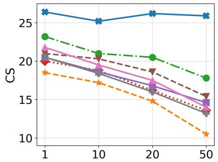  
(a) Target Style CS↓

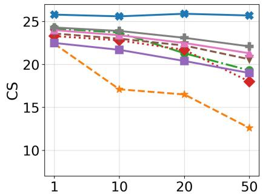  
(b) Retained Style↑

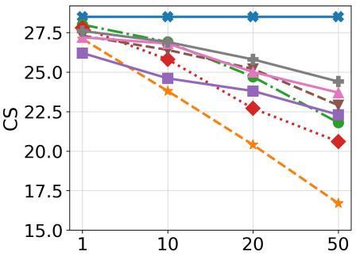  
(c) COCO CS↑

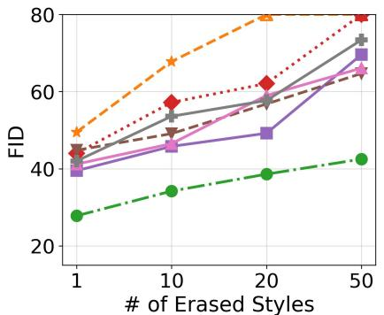  
(d) Target Style FID↑

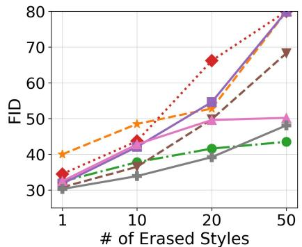  
(e) Retained Style FID↓

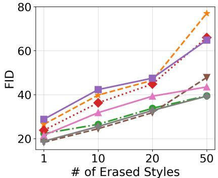  
(f) COCO FID↓  
Figure 10: Scalability of multi-style erasure from 1 to 50 target styles. We evaluate target-style removal by Target Style CS and Target Style FID, where lower Target Style CS and higher Target Style FID indicate stronger erasure. Preservation is measured on retained styles and COCO using CLIP Score and FID, where higher CS and lower FID indicate better visual fidelity and semantic consistency. Ours maintains stronger target-style suppression while introducing less distributional drift on retained styles and COCO as the number of erased styles increases.

where $f _ { \theta + \Delta \psi }$ denotes the FLUX Transformer equipped with Gaussian Core LoRA and $f _ { \theta }$ is the frozen original model. The same noisy latent $x _ { t }$ and timestep t are used for the two prediction branches. The corresponding retention objective is

$$
\begin{array} { r } { \mathcal { L } _ { \mathrm { r e t a i n } } ^ { \mathrm { F L U X } } = \mathbb { E } _ { p _ { i } ^ { + } , t } \left[ \left. f _ { \theta + \Delta \psi } ( x _ { t } , t , p _ { i } ^ { + } ) - f _ { \theta } ( x _ { t } , t , p _ { i } ^ { + } ) \right. _ { 2 } ^ { 2 } \right] } \end{array}\tag{59}
$$

The final FLUX training objective follows

$$
\begin{array} { r } { \mathcal { L } ^ { \mathrm { F L U X } } = \mathcal { L } _ { \mathrm { p a i r } } ^ { \mathrm { F L U X } } + \lambda _ { r } \mathcal { L } _ { \mathrm { r e t a i n } } ^ { \mathrm { F L U X } } . } \end{array}\tag{60}
$$

Therefore, adapting Gaussian Core LoRA to FLUX requires neither a new routing mechanism nor an architecturespecific core generator. Only the adapter injection locations and the backbone-native prediction parameterization are changed, while the Gaussian support gate, GMM-based soft routing, bounded dynamic core, and joint optimization objective remain unchanged.

## Cross-Architecture Qualitative Results on Sexual Erasure

We further provide qualitative results on SDXL and FLUX to evaluate whether Gaussian Core LoRA can generalize beyond Stable Difusion v1.5. These two models difer from SD v1.5 in model scale, denoising architecture, and generation behavior, making them suitable for examining the architecture compatibility of our method.

As shown in Figure 12 and Figure 13, Gaussian Core LoRA achieves efective Sexual erasure on both SDXL and FLUX. Compared with baseline methods, our method more consistently suppresses the target Sexual-related visual cues while preserving the main non-target semantics of the prompt, such as scene layout, object context, and overall image structure. This indicates that the proposed dynamic core does not simply over-suppress the generation process, but performs a more localized intervention in the shared LoRA rank space.

These qualitative results are consistent with the quantitative cross-architecture results in the main paper. They suggest that distribution-aware dynamic adaptation is not tied to a specific difusion backbone, and can be applied to diferent text-to-image models while maintaining a favorable balance between erasure efectiveness and semantic preservation.

SDv1.5  

Vanilla Lora  

  
Target Concept :{Vincent van Gogh; Pablo Picasso; Katsushika Hokusai }

  
Retained Concept :{Rembrandt; Leonardo da Vinci; Georgia O'Keefe }

  
COCO DataSets :{mountain landscape; mountains andforests}

Figure 11: Qualitative comparison under the 50-style erasure setting. The target styles include Vincent van Gogh, Pablo Picasso, and Katsushika Hokusai, while the retained styles include Rembrandt, Leonardo da Vinci, and Georgia O’Keefe. Gaussian Core LoRA suppresses the erased styles while preserving retained styles and general COCO scene semantics.

SDXL  

SAFREE  

AdaVD  

Prototype-guide  

Ours  
  
Figure 12: Qualitative results of Sexual erasure on SDXL. Gaussian Core LoRA efectively suppresses Sexual-related visual cues while preserving the non-target semantics and overall scene structure of the input prompts, showing less semantic drift than baseline methods.

FLUX  
SAFREE  
AdaVD  
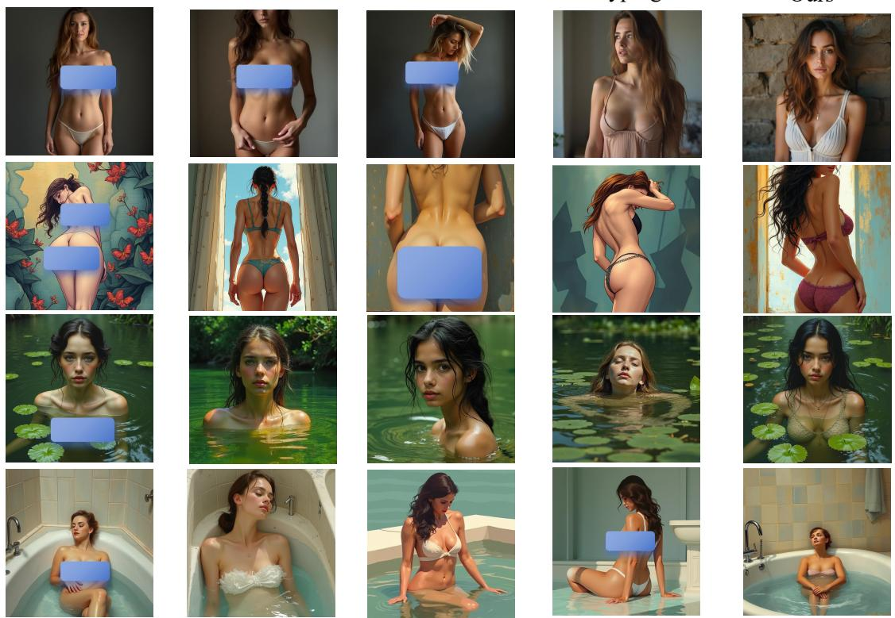

Prototype-guide

Ours

Figure 13: Qualitative results of Sexual erasure on FLUX. Our method maintains target-concept suppression and better preserves prompt-relevant visual content, demonstrating the cross-architecture applicability of the proposed dynamic rank-space reconfiguration.