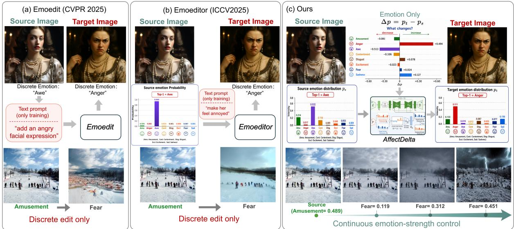
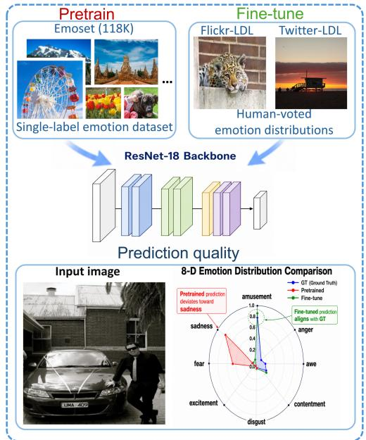
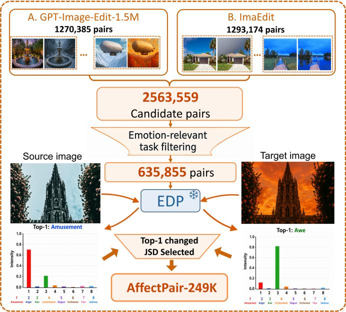
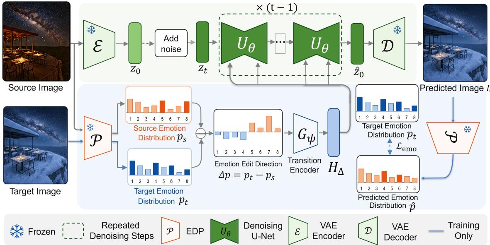
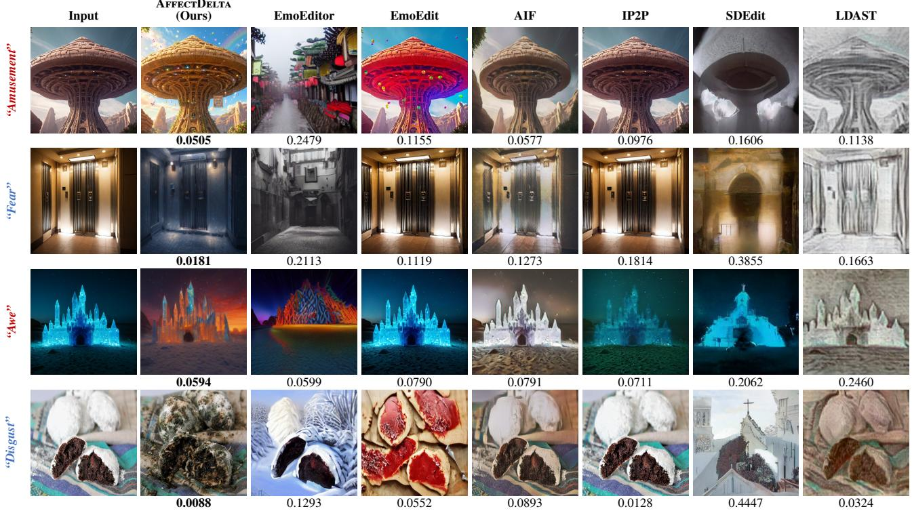
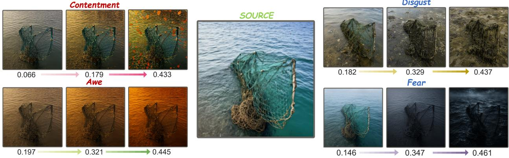
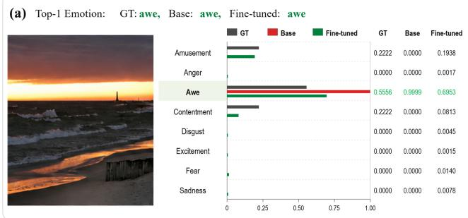
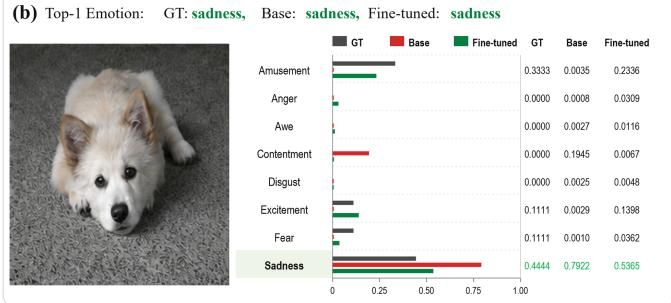
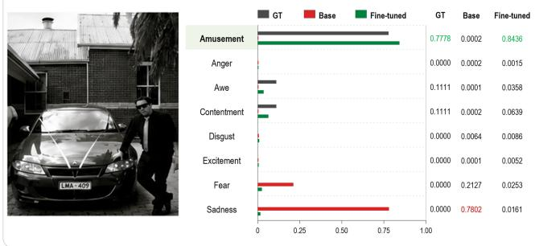
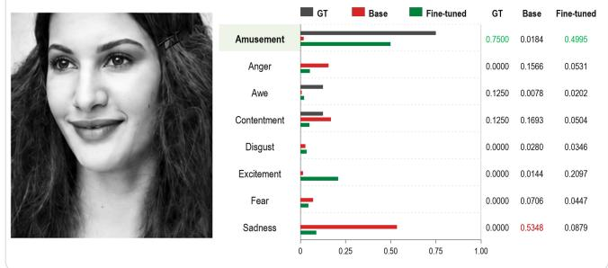

# AfectDelta: Beyond Emotion Labels for Image Editing

Xingzu Zhan, Lin Gu2, Ruogu Fang1

1Department of Biomedical Engineering, Vanderbilt University, Nashville, Tennessee, USA 2Research Institute of Electrical Communication, Tohoku University, Sendai, Japan xingzuz@andrew.cmu.edu, lin.gu@riken.jp, ruogu.fang@vanderbilt.edu

  
Fi ure 1: Motivation and conce tual com arison. (a) EmoEdit conditions its Emotion Ada ter on the source ima e and a sin le target-emotion label, but does not explicitly represent source afect; during training, its emotion embedding is aligned with a content-editin instruction. (b) EmoEditor a lies an ei ht-wa emotion classifier to the source and subtracts its class osterior from a one-hot target code. Trained for single-label classification rather than emotion-distribution learning, this predictor tend to yield sharply concentrated outputs; the derived editing direction is likewise aligned with instruction text during training. (c) AffectDelta instead represents both endpoints as full eight-dimensional emotion distributions and conditions the editor on their signed diference, while paired images supervise context-dependent visual realizations without editing-text alignment.

## Abstract

Emotion-driven image editing aims to evoke a specified tar- get emotion by modifying emotion-relevant visual cues in a source image, while preserving the overall composition and semantic–structural coherence of the original scene. Exist- ing scene-level editors typically specify the target with a sin- gle emotion category and often learn visual transformations from operation-level text instructions. A category collapses a mixed afective endpoint into one dominant label, while language cannot precisely quantify how coexisting emotions should increase, decrease, or remain stable. We introduce AffectDelta, a source-aware editor that treats editing as a transition between eight-dimensional emotion distributions. A frozen Emotion Distribution Predictor estimates the source state, and the signed source-to-target diference encodes the direction and magnitude of the requested transition. Within AffectDelta, an internal transition encoder and a source-

aware difusion backbone jointly translate this signal into context-dependent semantic and appearance changes. To train this formulation, we construct AffectPair-249K, comprising 248,841 source–target pairs with predicted eight-dimensional distributions and spanning both cross-category and within- category transitions. Experiments against six baselines, com- bining quantitative evaluation with qualitative comparisons, demonstrate improved afective alignment and content preser- vation, while ablations validate our design choices. Code and dataset will be made publicly available upon acceptance.

## Introduction

Psychological research has long used images as controlled afective stimuli, demonstrating that visual input produces measurable changes in valence and arousal (Bradley and Lang 2007). Yet these responses are not determined by image content alone: appraisal theory shows that emotion depends on how viewers interpret a situation (Smith and Ellsworth 1985), and mixed-emotion studies further show that positive and negative feelings can co-occur (Larsen, McGraw, and Cacioppo 2001). Consistent with this view, a single image may evoke several emotions in the same viewer rather than one dominant category (Peng et al. 2015), while large-scale visual-afect studies attribute such responses to the interac- tion of semantic content, visual attributes, and subjective interpretation (Achlioptas et al. 2021; Yang et al. 2023).

These findings motivate emotion-driven image editing: modifying emotion-relevant cues to steer the afect evoked by an image while preserving the scene identity and content unrelated to the intended change. Such control could support creative design, advertising, personalized visual communi- cation, and the construction of controlled afective stimuli for psychological research (Behnke et al. 2026; Chiu et al. 2026). Achieving it, however, requires an editor to represent not only the desired afective state but also the mixture of emotions already elicited by the source image.

Recent scene-level emotion editors have advanced from global color and style adjustment to semantic modifications of objects, actions, and scenes (Lin et al. 2025; Yang et al. 2025; Zhang and Fan 2026). These advances show that efective editing must select context-dependent visual cues, but the representative pipelines in Fig. 1(a–b) expose two unre-solved challenges. First, a single target label cannot represent the full afective transition from a source image that already evokes a mixture of emotions. EmoSet notes that one image may evoke several emotions even though its annotations as- sign one dominant category (Yang et al. 2023). EmoEditor estimates the source distribution but defines the destination as a one-hot category, while EmoEdit and EmoKGEdit are likewise driven by a target category or emotion word (Lin et al. 2025; Yang et al. 2025; Zhang and Fan 2026). A cate-gory therefore identifies only the dominant endpoint, leaving the source mixture and the component-wise direction and magnitude of change unspecified, particularly when source and target retain the same Top-1 emotion. Second, the vi- sual realization of an afective transition is often mediated by language during training or inference. Language-driven editors such as Afective Image Filter, InstructPix2Pix, and Language-Driven Artistic Style Transfer require textual con- trol at inference, whereas EmoEditor and EmoEdit use edit- ing or content instructions as language-alignment targets dur- ing training (Weng et al. 2023; Brooks, Holynski, and Efros 2023; Fu, Wan , and Wan 2022; Lin et al. 2025; Yan et al. 2025). Such instructions can name a mood or prescribe one plausible operation, but they do not explicitly encode how each emotion component should change. Moreover, the same afective transition may require diferent visual realizations across scenes (Sun et al. 2023).

The two challenges point to the same missing interface: an afective control signal that quantifies the source-to- target change without prescribing a visual operation. We therefore introduce AffectDelta, a unified editor that for- mulates emotional image editing as a transition between full distributions over eight emotion categories, as sum- marized in Fig. 1(c). Following the categorical model of

Mikels et al. (Mikels et al. 2005), the signed diference between the source and target distributions explicitly repre- sents which emotions should increase or decrease and by how much. A frozen Emotion Distribution Predictor (EDP) grounds images in this distribution space and, together with task-specific filtering, enables us to construct AffectPair- 249K, containing 248,841 source–target pairs that span both cross-category transitions and same-Top-1 distribution shifts. During adaptation, these paired visual outcomes supervise context-dependent realizations of each transition without editing-text conditioning or afect–text alignment. Within AffectDelta, an internal transition encoder maps the signed diference to conditioning tokens, which a source-aware dif- fusion backbone combines with the source-image represen- tation to generate semantic and appearance changes. The distribution diference thus specifies what afective change is requested, while the paired images teach the unified editor how to realize it in the current scene. Against six external baselines, AffectDelta ranks first on all six metrics; con- trolled ablations further support full-distribution targets and signed source-to-target conditioning, and show that the tested text-alignment pathway is not required in our setting.

Our contributions are threefold:

• We formulate scene-level emotional image editing as a signed transition between full distributions over eight emotion categories, preserving mixed source and target states while explicitly representing the direction and mag- nitude of the requested change beyond a single label.

• We construct AffectPair-249K, a distribution-aware dataset of 248,841 task-filtered source–target pairs that covers both cross-category transitions and same-Top-1 distribution shifts, and establish a paired visual learning setting without editing-text supervision during adapta- tion.

• We develop AffectDelta, a unified source-aware diffusion editor that jointly learns transition encoding and scene-dependent visual realization. Experiments against six external baselines show the best performance across all six metrics, while controlled ablations support the full- distribution target, signed source-to-target diference, and direct afective conditioning.

## Related Work

## Visual Emotion Representation

Visual emotion analysis has evolved from single-label cat- egorization to distributional modeling of afective ambigu- ity and subjectivity. Psychological norms defined categorical emotions (Mikels et al. 2005), while early methods linked them to low-level and semantic cues (Machajdik and Hanbury 2010; Borth et al. 2013); web benchmarks then scaled category recognition (You et al. 2016). Yet a dominant label discards observer disagreement and secondary emotions. Emotion6 introduced population-level distribu- tions (Peng et al. 2015), and Flickr-LDL and Twitter-LDL extended them to the eight-dimensional Mikels space (Yang, Sun, and Sun 2017), inspiring joint category–distribution and relation-aware models (Yang, She, and Sun 2017; Yang et al. 2021). Later datasets added afective explanations or interpretable attributes (Achlioptas et al. 2021; Yang et al. 2023). We instead condition semantic editing directly on the signed diference between source and target distributions.

## Afective Image Editing

Early afective editing primarily changed appearance. Distribution-driven methods transferred color and texture from exemplars or retrieved references, including control with a user-specified seven-dimensional distribution (Peng et al. 2015; Ali and Ali 2017). Afective Image Filter and AIF-D instead map emotional text to appearance transfor- mations (Weng et al. 2023; Zhang et al. 2026a). These ap- proaches enabled distribution- or language-guided control but largely preserved emotion-relevant scene semantics.

Scene-level generative editors instead modify objects and actions. EmoEditor is closest to our formulation: it subtracts a predicted source distribution from a target code, but uses a one-hot destination and learns edit embeddings from target- emotion-driven instructions despite text-free inference (Lin et al. 2025). EmoEdit and AIEdiT likewise derive editing semantics from constructed instructions or emotional de- scriptions (Yang et al. 2025; Zhang et al. 2026b). EmoA-gent, Moodifier, and EmoKGEdit translate target emotions into plans, prompts, or localized cues (Mao et al. 2026; Ye and Huang 2025; Zhang and Fan 2026), whereas MooD retrieves afective references for continuous valence–arousal control (Yin et al. 2026). Thus, fine-grained editing se-mantics still commonly come from language or references. Our editor instead adapts from paired images and their full eight-dimensional source and target distributions, without textual editing instructions. Their signed diference explic- itly encodes which emotions should increase or decrease and by how much, while the visual pairs supervise the scene- dependent realization.

## Instruction-Guided Image Editing

Difusion editors preserve source structure through noisy- guide denoising or cross-attention control (Meng et al. 2022; Hertz et al. 2023). Instruction-following models map an image and free-form command directly to an edit, with MGIE enriching terse commands using a multimodal lan- guage model (Brooks, Holynski, and Efros 2023; Sheynin et al. 2024; Fu et al. 2024). Training data evolved from Mag- icBrush’s manually annotated triplets to UltraEdit’s millions of real-image-anchored, region-annotated examples (Zhang et al. 2023; Zhao et al. 2024). ImageBrush instead specifies operations through visual exemplar pairs (Sun et al. 2023). Nevertheless, commands and exemplars specify content- or style-level operations, not calibrated multidimensional $\mathrm { { a f } - }$ fective transitions. We instead condition editing on a signed emotion-distribution change, leaving its visual realization to the source scene.

## Method

## Overview and Problem Formulation

We formulate emotional image editing as an afective tran- sition rather than category-conditioned generation. Let $I _ { s }$ be a source image and let $\mathbf { p } _ { t }$ be the desired distribution over $K = 8$ emotions: amusement, an er, awe, contentment, dis- gust, excitement, fear, and sadness, following the categorical space of Mikels et al. (Mikels et al. 2005). Each distribution lies on the probability simplex, so its entries are nonnegative and sum to one. A frozen Emotion Distribution Predictor (EDP) $P _ { \phi }$ estimates the afect already evoked by the source, $\mathbf { p } _ { s } = { \cal P } _ { \phi } \dot { ( \cal I _ { s } ) }$ . We denote AffectDelta by $F _ { \Theta }$ and represent the requested edit as

$$
\Delta \mathbf { p } = \mathbf { p } _ { t } - \mathbf { p } _ { s } , \qquad \widehat { I } = F _ { \Theta } ( I _ { s } , \Delta \mathbf { p } ) .\tag{1}
$$

Positive and negative entries specify which emotions should increase or decrease, while their magnitudes quantify the requested change. Because both endpoints are normalized, $\begin{array} { r } { \sum _ { k } ^ { - } \Delta p _ { k } = 0 } \end{array}$ . This representation retains the dominant and secondary emotions of both endpoints instead of reducing either endpoint to an isolated category.

The frozen EDP and AffectDelta play distinct roles. The EDP grounds images in the eight-dimensional afective space and annotates paired images for dataset construction. AffectDelta is the learnable editor: its internal transition encoder $G _ { \psi }$ maps $\Delta \mathbf { p }$ into transition tokens, and its source- aware difusion backbone $U _ { \theta }$ combines them with the source- image latent to learn a scene-dependent visual realization, where $\Theta = \{ \psi , \theta \}$ . During training, the paired target supplies $\mathbf { p } _ { t } ,$ and an auxiliary emotion loss regularizes a denoised image estimate toward this endpoint. At inference, $\mathbf { p } _ { t }$ is the desired endpoint supplied to the editor. No operation-level text instruction is used as an explicit conditioning signal.

## Emotion Distribution Predictor

The EDP converts an image into a complete afective distri- bution. We instantiate $P _ { \phi }$ with a ResNet-18 (He et al. 2016) whose classification head produces eight logits followed by a softmax. As illustrated in Fig. 2(a), training proceeds in two stages. We first pretrain the network on EmoSet (Yang et al. 2023) using its single-label annotations over the same eight emotion categories. We then fine-tune the final residual stage and prediction head on Flickr-LDL and Twitter-LDL, whose human-vote annotations form distributions in this emotion space (Yang, Sun, and Sun 2017). For an image $I _ { i }$ with label distribution $\mathbf { q } _ { i } ,$ the distribution-level fine-tuning objective is

$$
\mathcal { L } _ { \mathrm { E D P } } = \frac { 1 } { B } \sum _ { i = 1 } ^ { B } D _ { \mathrm { K L } } ( \mathbf { q } _ { i } \parallel P _ { \phi } ( I _ { i } ) ) .\tag{2}
$$

This second stage replaces hard-label supervision with distri- butional supervision, preserving the relative mass assigned by annotators to coexisting emotions. Consequently, this fine- tuning turns $P _ { \phi }$ from a single-label classifier of the emotion expressed by an image into an image-evoked emotion distri- bution predictor that estimates the relative intensities of the eight emotions elicited in human observers.

## Distribution-Aware Pair Construction

As summarized in Fig. 2(b), we construct AffectPair-249Kthrough task-specific emotion-relevance filtering fol- lowed by distribution-aware selection. We begin with

  
(a) Emotion Distribution Predictor (EDP)  
(b) AffectPair-249K Construction  
Figure 2: Emotion prediction and pair construction. (a) The EDP is pretrained on EmoSet with single-label supervision and fine-tuned on Flickr-LDL and Twitter-LDL with human-vote distributions. (b) Candidate edit pairs first undergo task-specific emotion-relevance filtering; EDP-based Top-1 and JSD selection then retains cross-category and within-category afective transitions for AffectPair-249K.

2,563,559 candidate source–target pairs: 1,270,385 from GPT-Image-Edit-1.5M (Wang et al. 2025) and 1,293,174 from ImgEdit (Ye et al. 2025). The task-specific filter re-moves pairs that are unsuitable for learning afective transi- tions, including emotion-irrelevant object substitutions and other edits that do not meaningfully change the scene’s af- fective content. This stage retains 635,855 emotion-relevant pairs.

For each remaining pair $( I _ { s } , I _ { t } )$ , the frozen EDP predicts $\mathbf { p } _ { s } = P _ { \phi } ( I _ { s } )$ and $\mathbf { p } _ { t } = P _ { \phi } ( I _ { t } )$ , from which we compute $\Delta \mathbf { p }$ using Eq. (1). We then retain two complementary transition types. Cross-category pairs have diferent predicted Top-1 emotions, capturing changes in the dominant afect. Within- category pairs preserve the Top-1 emotion but exhibit a large Jensen–Shannon divergence,

$$
\begin{array} { c } { { \mathbf { m } = \frac { 1 } { 2 } \big ( \mathbf { p } _ { s } + \mathbf { p } _ { t } \big ) , } } \\ { { \mathrm { J S D } ( \mathbf { p } _ { s } , \mathbf { p } _ { t } ) = \frac { 1 } { 2 } D _ { \mathrm { K L } } ( \mathbf { p } _ { s } \| \mathbf { m } ) + \frac { 1 } { 2 } D _ { \mathrm { K L } } ( \mathbf { p } _ { t } \| \mathbf { m } ) . } } \end{array}\tag{3}
$$

The within-category criterion retains afective changes that categorical supervision would discard, such as strengthening the dominant emotion or rebalancing secondary emotions without changing the dominant category. Together, these cri- teria produce AffectPair-249Kwith 248,841 pairs spanning cross-category transitions and within-category distribution shifts.

Each retained example is represented as $( I _ { s } , I _ { t } , \mathbf { p } _ { s } , \mathbf { p } _ { t } , \Delta \mathbf { p } )$ . Although the source corpora pro- vide editing instructions, we exclude them from editor optimization. Training uses only the paired images, $\Delta \mathbf { p } .$ and $\mathbf { p } _ { t } .$ , so the visual diference between source and target directly teaches the model how changes in objects, attributes, and scene context reshape the evoked emotion distribution. Rather than binding an afective transition to a particular linguistic description or predefined operation, the editor learns from visual outcomes how that transition should be realized in each source scene.

## AffectDelta Architecture

As illustrated in Fig. 3, AffectDelta is the complete editing model $F _ { \Theta }$ . Itjointly represents the requested afective change and realizes it in the source scene through an internal transi- tion encoder $G _ { \psi }$ and a source-aware difusion backbone $U _ { \theta }$ which are optimized end to end.

The transition encoder $G _ { \psi }$ uses a four-layer MLP to project the eight-dimensional transition vector $\Delta \mathbf { p }$ into a $7 7 \times$ 768 cross-attention representation. Its output comprises 77 tran-sition tokens of dimension 768:

$$
\mathbf { H } _ { \Delta } = G _ { \psi } ( \Delta \mathbf { p } ) , \qquad \mathrm { s h a p e } ( \mathbf { H } _ { \Delta } ) = 7 7 \times 7 6 8 .\tag{4}
$$

This shape matches the pretrained backbone’s text- conditioning interface, allowing the transition tokens to re- place text embeddings.

The source-aware difusion backbone retains the latent image-conditioning pathway of InstructPix2Pix (Brooks, Holynski, and Efros 2023), which is built on latent difusion (Rombach et al. 2022), and replaces language embeddings with $\mathbf { H } _ { \Delta }$ . Let E and D denote the frozen VAE encoder and decoder, and let s be the VAE scaling factor. For a training pair, the target image provides the clean denoising latent ${ \bf z } _ { 0 } = s \mathcal { E } ( 2 I _ { t } - 1 )$ , while the source image provides an un- scaled conditioning latent $\mathbf { c } _ { s } = \mathcal { E } ( 2 I _ { s } - \mathbf { \bar { 1 } } )$ . At a randomly sampled difusion step t, Gaussian noise ϵ is added as

  
Figure 3: Architecture of AffectDelta. The frozen EDP $P _ { \phi }$ (shown as P) estimates the source and target distributions $\mathbf { p } _ { s }$ and $\mathbf { p } _ { t } ;$ their signed diference $\Delta \mathbf { p }$ is encoded by $G _ { \psi }$ into transition tokens $\mathbf { H } _ { \Delta }$ that condition the denoising U-Net $U _ { \theta }$ . At inference, the source latent is noised, iteratively denoised under this condition, and decoded into the edited image. During training, the frozen EDP evaluates the reconstructed prediction, and $\mathcal { L } _ { \mathrm { e m o } }$ aligns its distribution $\widehat { \mathbf p }$ with $\mathbf { p } _ { t }$

$$
\mathbf { z } _ { t } = \sqrt { \bar { \alpha } _ { t } } \mathbf { z } _ { 0 } + \sqrt { 1 - \bar { \alpha } _ { t } } \epsilon .\tag{5}
$$

The denoising U-Net receives the channel-wise concatena- tion of the nois tar et latent and source condition, while its cross-attention layers receive the transition tokens:

$$
\begin{array} { r } { \widehat { \epsilon } = U _ { \theta } \big ( [ \mathbf { z } _ { t } ; \mathbf { c } _ { s } ] , t , \mathbf { H } _ { \Delta } \big ) . } \end{array}\tag{6}
$$

The VAE remains frozen, whereas the two trainable parts of AffectDelta, $G _ { \psi }$ and $U _ { \theta }$ , are adapted jointly. The source latent anchors scene structure, while the transition tokens specify where afect should move.

Notably, our editor adaptation introduces no text supervi- sion: training neither conditions on editing instructions nor aligns afect representations with text embeddings. Instead, the signed emotion-distribution transition directly conditions the editor, while the paired source–target images teach $\mathrm { A F ^ { - } }$ fectDelta how that transition should reshape scene content and appearance. AffectDelta therefore learns visual real- izations of afective transitions rather than binding emotions to specific editing instructions.

At inference, the source latent is noised and iteratively denoised under the same visual condition and $\mathbf { H } _ { \Delta }$ , so gener- ation requires only $I _ { s }$ and the desired afective endpoint.

## Training Objectives

We train AffectDelta with the standard difusion noise- prediction objective. Given a paired sample $( I _ { s } , I _ { t } )$ , a difu- sion timestep t, and Gaussian noise $\epsilon ,$ the objective is

$$
\mathcal { L } _ { \mathrm { d i f f } } = \mathrm { E } _ { I _ { s } , I _ { t } , t , \epsilon } \left[ \left| \left| \epsilon - \widehat { \epsilon } \right| \right| _ { 2 } ^ { 2 } \right] .\tag{7}
$$

This objective teaches the editor to reproduce the visual transformation represented by each source–target pair, but it does not explicitly require the edited image to match the target afect distribution. We therefore add an auxiliary emotion loss, $\mathcal { L } _ { \mathrm { e m o } } .$ evaluated by the frozen EDP. On an emotion- rebalanced subset $B _ { e }$ and a low-noise timestep $t _ { e }$ , the U-Net predicts $\widehat { \epsilon } _ { t _ { e } }$ , from which we reconstruct a diferentiable one- step estimate of the clean target latent,

$$
\widehat { \mathbf { z } } _ { 0 } = \frac { \mathbf { z } _ { t _ { e } } - \sqrt { 1 - \bar { \alpha } _ { t _ { e } } } \widehat { \epsilon } _ { t _ { e } } } { \sqrt { \bar { \alpha } _ { t _ { e } } } } .\tag{8}
$$

For numerical stability, we clip $\widehat { \mathbf { z } } _ { 0 }$ to $[ - c , c ]$ , with $c = 1 0$ in our implementation. We then divide the clipped latent by the VAE scaling factor s, decode it with the frozen VAE ${ \mathcal { D } } ,$ and rescale the decoder output to [0, 1] to obtain the image estimate $\widehat { I _ { 0 } }$ . The frozen EDP predicts the emotion distribu- tion of each reconstructed sample as $\widehat { \mathbf { p } } _ { i } = P _ { \phi } ( \widehat { I } _ { 0 , i } )$ . This auxiliary reconstruction is used only to construct $\mathcal { L } _ { \mathrm { e m o } }$ dur- ing training and is not the inference output of AffectDelta. We align each predicted distribution with its corresponding target distribution using

$$
\begin{array} { r c l } { { { \mathcal { L } } _ { \mathrm { e m o } } } } & { { = } } & { { \frac { 1 } { | \mathcal { B } _ { e } | K } \displaystyle \sum _ { i \in \mathcal { B } _ { e } } } } \\ { { } } & { { } } & { { } } \\ { { { \mathcal { L } } } } & { { = } } & { { { \mathcal { L } } _ { \mathrm { d i f f } } + { \lambda } _ { \mathrm { e m o } } { \mathcal { L } } _ { \mathrm { e m o } } . } } \end{array}\tag{9}
$$

The one-step estimate avoids running a complete sampling trajectory inside every training iteration. The difusion loss learns a plausible visual realization from the paired target, whereas $\mathcal { L } _ { \mathrm { e m o } }$ encourages its afective distribution to match the desired endpoint.

## Experiments

## Experimental Setup

Data split. AffectPair-249K contains 248,841 source– target image pairs. We select 4,977 pairs as a disjoint test set, approximately balancing the eight target-emotion categories and retaining both cross-category and same-Top-1 transi- tions. The remaining 243,864 pairs are used for training. All quantitative and qualitative comparisons are conducted on this test set.

  
Figure 4: Qualitative comparison on four test-set inputs. Each row shows a source input, its target emotion at left, and outputs from AffectDelta and six baselines. The reported values are the base-2 JSD ↓ between the distribution predicted by the independent evaluator and the target distribution; lower is better, and the best score in each row is bold. Across four target emotions, AffectDelta achieves the lowest JSD in every displayed case while realizing scene-dependent semantic and appearance changes.

Baselines. We compare AffectDelta with six representa- tive editors spanning generic, language-driven, and emotion- specific editing. Afective Image Filter (AIF) reflects emotional text through image appearance (Weng et al. 2023); InstructPix2Pix (IP2P) follows operation-level language instructions for semantic editing (Brooks, Holynski, and Efros 2023); and Language-Driven Artistic Style Transfer (LDAST) transfers language-specified artistic attributes (Fu, Wang, and Wang 2022). These three methods require lan-guage at inference. EmoEditor conditions a source-aware difusion editor on a target emotion category (Lin et al. 2025), while EmoEdit combines the source image with a target emotion word through an Emotion Adapter (Yang et al. 2025); neither requires an operation-level instruction at inference, but both use editing or content instructions as language-alignment targets during training. We further in- clude SDEdit as an image-guided difusion baseline (Meng et al. 2022). AIEdiT, EmoAgent, Moodifier, EmoKGEdit, and MooD (Zhang et al. 2026b; Mao et al. 2026; Ye and Huang 2025; Zhang and Fan 2026; Yin et al. 2026) are not compared because no runnable oficial implementations were publicly

available at submission.

Evaluation metrics. All afective metrics are computed using an independent emotion-distribution evaluator that is distinct from the EDP used for dataset construction and editor training. Target Top-1 measures whether an output reaches the target’s dominant emotion, whereas JSD mea- sures agreement with the complete target distribution. Nor- malized Afective Progress (NAP) quantifies how far editing advances from the source distribution toward the target, and ∆-Cos measures whether the realized eight-dimensional change follows the requested direction. CLIP-I and LPIPS as- sess semantic and perceptual preservation with respect to the source image. Together, these metrics distinguish categor- ical success from full-distribution alignment, source-aware transition fidelity, and content preservation.

## Comparison with Baselines

Quantitative comparison. Table 1 shows that Affect-Delta ranks first on all six metrics. Its Top-1 of 0.899 and JSD of 0.056 demonstrate accurate control of the dominant emotion and the complete target distribution, respectively, di- rectly supporting our full-distribution formulation. The pos- itive NAP (0.199) and high ∆-Cos (0.744) further show that the outputs follow the requested signed source-to-target tran- sition rather than merely matching a target category. Mean- while, the highest CLIP-I (0.778) and lowest LPIPS (0.382)

  
Figure 5: Multi-directional and graded afective control. Starting from the same source image, AffectDelta follows four target emotion directions—Contentment, Awe, Disgust, and Fear. Within each direction, varying the target-emotion strength specified by the input distribution generates diferent images with corresponding afective intensities. Numbers below the outputs denote the corresponding emotion’s proportion in the target distribution.

indicate that these afective gains are achieved while pre- serving source content. Together, the results support com- bining distribution-valued control with source-aware, scene- dependent visual realization.

Table 1: Quantitative comparison on the 4,977-pair test set. Bold and underline denote the best and second-best results, respectively.
<table><tr><td>Method</td><td>Top-1 ↑ JSD ↓</td><td></td><td>NAP↑</td><td>∆-Cos ↑</td><td>CLIP-I ↑ LPIPS ↓</td><td></td></tr><tr><td>LDAST</td><td>0.267</td><td>0.324</td><td>-5.568</td><td>0.266</td><td>0.670</td><td>0.627</td></tr><tr><td>SDEdit</td><td>0.381</td><td>0.248</td><td>-3.417</td><td>0.245</td><td>0.631</td><td>0.603</td></tr><tr><td>IP2P</td><td>0.516</td><td>0.117</td><td>-0.095</td><td>0.234</td><td>0.656</td><td>0.480</td></tr><tr><td>AIF</td><td>0.494</td><td>0.152</td><td>-1.163</td><td>0.237</td><td>0.618</td><td>0.668</td></tr><tr><td>EmoEdit</td><td>0.517</td><td>0.126</td><td>-0.511</td><td>0.316</td><td>0.687</td><td>0.513</td></tr><tr><td>EmoEditor</td><td>0.453</td><td>0.201</td><td>-2.003</td><td>0.260</td><td>0.597</td><td>0.570</td></tr><tr><td>AFFECTDELTA (Ours)</td><td>0.899</td><td>0.056</td><td>0.199</td><td>0.744</td><td>0.778</td><td>0.382</td></tr></table>

Qualitative comparison. Figure 4 shows that Affect-Delta obtains the lowest JSD in all four cases spanning Amusement, Fear, Awe, and Disgust. The edits adapt semantic and appearance changes to each source scene rather than applying a fixed text-linked operation.

## Multi-Directional and Graded Afective Control

Figure 5 examines whether a single source image can be steered toward diferent afective directions and intensi- ties. From the same source, AffectDelta produces distinct trajectories toward Contentment, Awe, Disgust, and Fear. Within each trajectory, increasing the target-emotion strength specified by the input distribution generates diferent images with progressively stronger afective expression while pre- serving the underlying scene. This shows that the complete target distribution provides both an afective direction and fine-grained control over its intensity.

## Ablation Study

Table 2 supports the central design choices of AffectDelta. Replacing the target distribution with a one-hot category de- grades Top-1 (0.899 to 0.642), JSD (0.056 to 0.122), and ∆-Cos (0.744 to 0.293), showing that category-level control loses information needed for distributional transitions. Target-only conditioning also trails the signed source-to- target diference in NAP (0.023 vs. 0.199) and ∆-Cos (0.694 vs. 0.744), confirming the importance of the source afective state. Removing $\mathcal { L } _ { \mathrm { e m o } }$ or adding text alignment low- ers ∆-Cos to 0.651 and 0.597, respectively, supporting di-rect distribution-transition supervision. The lower LPIPS of Target Only and w/o $\mathcal { L } _ { \mathrm { e m o } }$ coincides with weaker afec- tive scores, indicating more conservative rather than better- controlled edits.

Table 2: Ablation study on the 4,977-pair test set. The com- plete distribution diference yields the strongest afective alignment. Bold and underline denote the best and second- best results, respectively.
<table><tr><td>Variant</td><td colspan="6">Top-1 ↑ JSD ↓ NAP↑ Δ-Cos ↑ CLIP-I ↑ LPIPS ↓</td></tr><tr><td>One-hot Target</td><td>0.642</td><td>0.122</td><td>-0.121</td><td>0.293</td><td>0.653</td><td>0.519</td></tr><tr><td>Target Only</td><td>0.761</td><td>0.069</td><td>0.023</td><td>0.694</td><td>0.794</td><td>0.352</td></tr><tr><td>w/o Lemo</td><td>0.826</td><td>0.073</td><td>0.129</td><td>0.651</td><td>0.721</td><td>0.328</td></tr><tr><td>+ Text Alignment</td><td>0.768</td><td>0.094</td><td>0.086</td><td>0.597</td><td>0.743</td><td>0.435</td></tr><tr><td>AFFECTDELTA (Ours)</td><td>0.899</td><td>0.056</td><td>0.199</td><td>0.744</td><td>0.778</td><td>0.382</td></tr></table>

## Conclusion

We presented AffectDelta, a source-aware editor driven by signed transitions between complete eight-dimensional emo- tion distributions. Trained on the 248,841-pair AffectPair- 249K without editing-text supervision, it learns scene- dependent visual realizations of afective change. Compar- isons with six baselines, ablations, and graded-control results show improved afective alignment and content preservation, validating distribution-valued control for fine-grained emo- tional image editing.

## References

Achlioptas, P.; Ovsjanikov, M.; Haydarov, K.; Elhoseiny, M.; and Guibas, L. J. 2021. ArtEmis: Afective Language for Visual Art. In Proceedings ofthe IEEE/CVF Conference on Computer Vision and Pattern Recognition, 11569–11579.

Ali, A. R.; and Ali, M. 2017. Automatic Image Transfor- mation for Inducing Afect. In Proceedings of the British Machine Vision Conference.

Behnke, M.; Kłoskowski, M.; Klichowski, M.; Krzyża- niak, W.; Szymański, K.; Maciejewski, P.; Chwiłkowska, P.; Kowal, M.; Jończyk, R.; Nowak, J.; et al. 2026. Using Artifi- cial Intelligence to Generate Afective Images: Methodology and Initial Library. Advances in Methods and Practices in Psychological Science, 9(1): 25152459251415336.

Borth, D.; Ji, R.; Chen, T.; Breuel, T. M.; and Chang, S.-F. 2013. Large-Scale Visual Sentiment Ontology and Detectors Using Adjective Noun Pairs. In Proceedings of the 21st ACM International Conference on Multimedia, 223–232.

Bradley, M. M.; and Lang, P. J. 2007. The International Afective Picture System (IAPS) in the Study of Emotion and Attention. In Coan, J. A.; and Allen, J. J. B., eds., Handbook of Emotion Elicitation and Assessment, 29–46. Oxford University Press.

Brooks, T.; Holynski, A.; and Efros, A. A. 2023. Instruct- Pix2Pix: Learning to Follow Image Editing Instructions. In Proceedings ofthe IEEE/CVF Conference on Computer Vision and Pattern Recognition, 18392–18402.

Chiu, H. T.; Sou, H. I.; Lam, Y. W.; Ng, C. S. F.; and Wong, S. W. 2026. Beyond traditional stimuli: Validating AI-generated images for eliciting negative emotions in afect research. Plos one, 21(2): e0342434.

Fu, T.-J.; Hu, W.; Du, X.; Wang, W. Y.; Yang, Y.; and Gan, Z. 2024. Guiding Instruction-Based Image Editing via Multi- modal Large Language Models. In International Conference on Learning Representations.

Fu, T.-J.; Wang, X. E.; and Wang, W. Y. 2022. Language- Driven Artistic Style Transfer. In Computer Vision – ECCV 2022, volume 13696 of Lecture Notes in Computer Science, 717–734. Springer.

He, K.; Zhang, X.; Ren, S.; and Sun, J. 2016. Deep Residual Learning for Image Recognition. In Proceedings ofthe IEEE Conference on Computer Vision and Pattern Recognition, 770–778.

Hertz, A.; Mokady, R.; Tenenbaum, J.; Aberman, K.; Pritch, Y.; and Cohen-Or, D. 2023. Prompt-to-Prompt Image Editing with Cross-Attention Control. In International Conference on Learning Representations.

Larsen, J. T.; McGraw, A. P.; and Cacioppo, J. T. 2001. Can People Feel Happy and Sad at the Same Time? Journal of Personality and Social Psychology, 81(4): 684–696.

Lin, Q.; Zhang, J.; Ong, Y.-S.; and Zhang, M. 2025. Make Me Happier: Evoking Emotions Through Image Difusion Models. In Proceedings ofthe IEEE/CVF International Conference on Computer Vision, 16367–16376.

Machajdik, J.; and Hanbury, A. 2010. Afective Image Clas-sification Using Features Inspired by Psychology and Art

Theory. In Proceedings of the 18th ACM International Conference on Multimedia, 83–92.

Mao, Q.; Hu, H.; He, Y.; Gao, D.; Chen, H.; and Jin, L. 2026. EmoAgent: A Multi-Agent Framework for Diverse Afective Image Manipulation. IEEE Transactions on Afective Computing, 17(2): 1618–1635.

Meng, C.; He, Y.; Song, Y.; Song, J.; Wu, J.; Zhu, J.-Y.; and Ermon, S. 2022. SDEdit: Guided Image Synthesis and Edit- ing with Stochastic Diferential Equations. In International Conference on Learning Representations.

Mikels, J. A.; Fredrickson, B. L.; Larkin, G. R.; Lindberg, C. M.; Maglio, S. J.; and Reuter-Lorenz, P. A. 2005. Emo- tional Category Data on Images from the International Af- fective Picture System. Behavior Research Methods, 37(4): 626–630.

Peng, K.-C.; Chen, T.; Sadovnik, A.; and Gallagher, A. C. 2015. A Mixed Bag of Emotions: Model, Predict, and Trans- fer Emotion Distributions. In Proceedings ofthe IEEE Conference on Computer Vision and Pattern Recognition, 860– 868.

Rombach, R.; Blattmann, A.; Lorenz, D.; Esser, P.; and Om- mer, B. 2022. High-Resolution Image Synthesis with La- tent Difusion Models. In Proceedings of the IEEE/CVF Conference on Computer Vision and Pattern Recognition, 10684–10695.

Sheynin, S.; Polyak, A.; Singer, U.; Kirstain, Y.; Zohar, A.; Ashual, O.; Parikh, D.; and Taigman, Y. 2024. Emu Edit: Precise Image Editing via Recognition and Generation Tasks. In Proceedings of the IEEE/CVF Conference on Computer Vision and Pattern Recognition, 8871–8879.

Smith, C. A.; and Ellsworth, P. C. 1985. Patterns of Cognitive Appraisal in Emotion. Journal of Personality and Social Psychology, 48(4): 813–838.

Sun, Y.; Yang, Y.; Peng, H.; Shen, Y.; Yang, Y.; Hu, H.; Qiu, L.; and Koike, H. 2023. ImageBrush: Learning Visual In- Context Instructions for Exemplar-Based Image Manipula- tion. In Advances in Neural Information Processing Systems, volume 36.

Wang, Y.; Yang, S.; Zhao, B.; Zhang, L.; Liu, Q.; Zhou, Y.; and Xie, C. 2025. GPT-IMAGE-EDIT-1.5M: A Million- Scale, GPT-Generated Image Dataset. arXiv preprint arXiv:2507.21033.

Weng, S.; Zhang, P.; Chang, Z.; Wang, X.; Li, S.; and Shi, B. 2023. Afective Image Filter: Reflecting Emotions from Text to Images. In Proceedings of the IEEE/CVF International Conference on Computer Vision, 10810–10819.

Yang, J.; Feng, J.; Luo, W.; Lischinski, D.; Cohen-Or, D.; and Huang, H. 2025. EmoEdit: Evoking Emotions through Image Manipulation. In Proceedings ofthe IEEE/CVF Conference on Computer Vision and Pattern Recognition, 24690–24699.

Yang, J.; Huang, Q.; Ding, T.; Lischinski, D.; Cohen-Or, D.; and Huang, H. 2023. EmoSet: A Large-Scale Visual Emotion Dataset with Rich Attributes. In Proceedings of the IEEE/CVF International Conference on Computer Vision, 20383–20394.

Yang, J.; Li, J.; Li, L.; Wang, X.; and Gao, X. 2021. A Circular-Structured Representation for Visual Emotion Dis- tribution Learning. In Proceedings of the IEEE/CVF Conference on Computer Vision and Pattern Recognition, 4237– 4246.

Yang, J.; She, D.; and Sun, M. 2017. Joint Image Emotion Classification and Distribution Learning via Deep Convo- lutional Neural Network. In Proceedings of the Twenty-Sixth International Joint Conference on Artificial Intelligence, 3266–3272.

Yang, J.; Sun, M.; and Sun, X. 2017. Learning Visual Sen- timent Distributions via Augmented Conditional Probability Neural Network. In Proceedings ofthe AAAI Conference on Artificial Intelligence, volume 31, 224–230.

Ye, J.; and Huang, S. X. 2025. Moodifier: MLLM-Enhanced Emotion-Driven Image Editing. arXiv:2507.14024.

Ye, Y.; He, X.; Li, Z.; Lin, B.; Yuan, S.; Yan, Z.; Hou, B.; and Yuan, L. 2025. ImgEdit: A Unified Image Editing Dataset and Benchmark. In Advances in Neural Information Processing Systems, volume 38.

Yin, X.; Wang, Y.; Hu, T.; Si, M.; Shi, Y.; Chen, S.; Wang, H.; Xue, J.; and Wu, X. 2026. MooD: Perception-Enhanced Eficient Afective Image Editing via Continuous Valence- Arousal Modeling. arXiv:2605.02521.

You, Q.; Luo, J.; Jin, H.; and Yang, J. 2016. Building a Large Scale Dataset for Image Emotion Recognition: The Fine Print and the Benchmark. In Proceedings of the AAAI Conference on Artificial Intelligence, volume 30, 308–314.

Zhang, J.; and Fan, B. 2026. EmoKGEdit: Training-Free Afective Injection via Visual Cue Transformation. arXiv preprint arXiv:2601.12326.

Zhang, K.; Mo, L.; Chen, W.; Sun, H.; and Su, Y. 2023. MagicBrush: A Manually Annotated Dataset for Instruction- Guided Image Editing. In Advances in Neural Information Processing Systems, volume 36.

Zhang, P.; Weng, S.; Tang, J.; Li, S.; and Shi, B. 2026a. To- ward Deeper Emotional Reflection: Crafting Afective Image Filters With Generative Priors. IEEE Transactions on Pattern Analysis and Machine Intelligence, 48(4): 4303–4317.

Zhang, P.; Weng, S.; Zhu, C.; Tang, B.; Jia, Z.; Li, S.; and Shi, B. 2026b. Afective Image Editing: Shaping Emotional Factors via Text Descriptions. International Journal ofComputer Vision, 134(1): 16.

Zhao, H.; Ma, X.; Chen, L.; Si, S.; Wu, R.; An, K.; Yu, P.; Zhang, M.; Li, Q.; and Chang, B. 2024. UltraEdit: Instruction-Based Fine-Grained Image Editing at Scale. In Advances in Neural Information Processing Systems, vol-ume 37.

## Supplementary Material

## Evaluation Metrics

Let $\mathbf { q } _ { s } , \mathbf { q } _ { t } \in [ 0 , 1 ] ^ { 8 }$ denote the reference emotion distribu- tions stored in the evaluation metadata for the source and target images, and let $\widehat { \bf p } _ { s } , \widehat { \bf p } _ { e } \in [ 0 , 1 ] ^ { 8 }$ denote the distribu- tions predicted by the independent evaluator for the source and edited images. The evaluator rejects non-finite, negative, or zero-mass vectors and normalizes every accepted vec- tor to unit mass. We use $\epsilon = 1 0 ^ { - 1 2 }$ for numerical stability. Each metric is computed for every successfully evaluated test record, and the reported result is the arithmetic mean over these records. The implementation supports either CLIP-8 or EDP as the emotion backend; the selected backend and model identity are stored in the evaluation configuration.

## Afective Alignment

Target Top-1 accuracy. Target Top-1 measures whether the dominant emotion predicted for the edited image agrees with the dominant component of the target reference distri- bution:

$$
\mathrm { T o p - 1 } = \mathbf { 1 } \left[ \underset { k } { \operatorname { a r g m a x } } \ q _ { t , k } = \underset { k } { \operatorname { a r g m a x } } \ \widehat { p } _ { e , k } \right] .\tag{10}
$$

Higher is better.

Jensen–Shannon divergence (JSD). The code uses base-2 JSD to measure full-distribution discrepancy:

$$
\begin{array} { r } { { \bf m } = \frac { 1 } { 2 } ( { \bf q } _ { t } + \widehat { \bf p } _ { e } ) , } \end{array}\tag{11}
$$

$$
\begin{array} { r } { D _ { \mathrm { J S } } ^ { ( 2 ) } ( \mathbf { q } _ { t } , \widehat { \mathbf { p } } _ { e } ) = \frac { 1 } { 2 } D _ { \mathrm { K L } } ^ { ( 2 ) } ( \mathbf { q } _ { t } \Vert \mathbf { m } ) + \frac { 1 } { 2 } D _ { \mathrm { K L } } ^ { ( 2 ) } ( \widehat { \mathbf { p } } _ { e } \Vert \mathbf { m } ) , } \end{array}\tag{12}
$$

$$
D _ { \mathrm { K L } } ^ { ( 2 ) } ( \mathbf { p } \| \mathbf { q } ) = \sum _ { k : p _ { k } > 0 } p _ { k } \log _ { 2 } \frac { p _ { k } } { q _ { k } } .\tag{13}
$$

Zero-probability terms are omitted. The final JSD is clipped to [0, 1] only to suppress floating-point roundof; lower is better.

Normalized Afective Progress (NAP). NAP measures progress toward the target relative to the independently pre- dicted source state. We define

$$
d _ { s } = D _ { \mathrm { J S } } ^ { ( 2 ) } ( \widehat { \bf p } _ { s } , { \bf q } _ { t } ) , \qquad d _ { e } = D _ { \mathrm { J S } } ^ { ( 2 ) } ( \widehat { \bf p } _ { e } , { \bf q } _ { t } ) ,
$$

$$
\mathrm { N A P } = \frac { d _ { s } - d _ { e } } { d _ { s } + \epsilon } .\tag{14}
$$

(15)

NAP approaches 1 when the edited distribution reaches the target, equals 0 when editing makes no progress, and be-comes negative when the output moves away from the target. The metric is not clipped, so a small $d _ { s }$ can amplify negative values.

Transition-direction cosine (∆-Cos). This metric com-pares the requested transition between the stored reference distributions with the transition predicted by the independent

evaluator:

$$
\delta _ { r } = \mathbf { q } _ { t } - \mathbf { q } _ { s } ,\tag{16}
$$

$$
\begin{array} { r } { \pmb { \delta } _ { p } = \widehat { \bf p } _ { e } - \widehat { \bf p } _ { s } , } \end{array}\tag{17}
$$

$$
c _ { \Delta } = \frac { \delta _ { r } ^ { \top } \delta _ { p } } { \| \delta _ { r } \| _ { 2 } \| \delta _ { p } \| _ { 2 } + \epsilon } ,\tag{18}
$$

$$
\Delta { \cdot } { \mathrm { C o s } } = \mathrm { c l i p } ( c _ { \Delta } , - 1 , 1 ) .\tag{19}
$$

Higher is better. If either transition has zero norm, the nu- merator is zero and the implementation records 0 rather than excluding the instance.

## Content Preservation

CLIP image similarity (CLIP-I). Let $g ( \cdot )$ be the CLIP image encoder. The implementation $\ell _ { 2 }$ -normalizes its image features and computes

$$
\mathrm { C L I P \mathrm { - } I } = \mathrm { c l i p } \left( { \frac { g ( I _ { s } ) ^ { \top } g ( I _ { e } ) } { \| g ( I _ { s } ) \\| _ { 2 } \| g ( I _ { e } ) \| _ { 2 } } } , - 1 , 1 \right) ,\tag{20}
$$

where higher values indicate stronger semantic-content preservation. The default encoder is openai/clip-vit-large- patch14.

Learned perceptual image patch similarity (LPIPS). The evaluator uses the standard pretrained LPIPS model with an AlexNet backbone. Each RGB image is resized to $2 5 6 \times 2 5 6$ with Lanczos resampling and scaled from [0, 255] to $[ - 1 , 1 ]$ . For normalized feature maps $\widehat { f } _ { l }$ and learned chan- nel weights ω , the corresponding distance is

$$
\begin{array} { r } { \mathbf { r } _ { l , h , w } = \widehat { f } _ { l } ( I _ { s } ) _ { h , w } - \widehat { f } _ { l } ( I _ { e } ) _ { h , w } , } \end{array}\tag{21}
$$

$$
\mathrm { L P I P S } = \sum _ { l } \frac { 1 } { H _ { l } W _ { l } } \sum _ { h , w } \left\| \omega _ { l } \odot \mathbf { r } _ { l , h , w } \right\| _ { 2 } ^ { 2 } ,\tag{22}
$$

where lower is better. CLIP-I and LPIPS use identical model configurations and metric-specific preprocessing for every compared method.

## Implementation Details

## EDP

We implement EDP as an eight-output ResNet-18 initial- ized from the emotion classifier used by EmoEditor (Lin et al. 2025; He et al. 2016). We fine-tune its final residual stage and prediction head on the 16,957 training images from Flickr-LDL and Twitter-LDL and use their 4,238 held-out images for model selection (Yang, Sun, and Sun 2017; Yang, She, and Sun 2017). The LDL target vectors are remapped to the common eight-emotion order before training. Images are resized to $2 2 4 \times 2 2 4$ . We minimize batch-mean KL di- vergence to the vote-derived distribution with AdamW for 10 epochs using a learning rate and weight decay of $1 0 ^ { - 4 }$ and cosine annealing over all epochs. Training uses auto- matic mixed precision, eight data-loading workers, natural sampling without distillation, and seed 75863.

## AfectDelta

We train AffectDelta on 243,864 source-group-disjoint image pairs at 224 × 224 resolution. The four-layer tran-sition encoder maps each eight-dimensional signed emotion diference to 77 tokens of width 768, matching the cross- attention interface of the pretrained InstructPix2Pix back- bone (Brooks, Holynski, and Efros 2023). We jointly opti-mize the transition encoder and U-Net while freezing the VAE and EDP. AdamW uses a learning rate of $1 0 ^ { - 5 }$ , weight decay 0, $\beta = ( 0 . 9 , 0 . 9 9 9 )$ , and $\epsilon = \bar { 1 0 } ^ { - 8 }$ for 15 epochs, with batch size 32 per GPU, one gradient-accumulation step, no learning-rate scheduler, and gradient clipping at norm 1.0. Training uses distributed data parallelism, FP16 auto- matic mixed precision, channels-last tensors, 16 data-loading workers with prefetch factor 2, and seed 75863; thus, the ef- fective global batch size is 32 times the number of GPUs. The objective is $\mathcal { L } _ { \mathrm { d i f f } } + 0 . 1 \mathcal { L } _ { \mathrm { e m o } }$ . The difusion term is the standard noise-prediction MSE with timesteps sampled uni- formly over the pretrained scheduler. At every optimizer ste , the emotion term sam les four exam les with inverse target-class-frequency weights, draws low-noise timesteps uniformly from [0, 250], reconstructs a one-step clean latent clipped to [−10, 10], and minimizes MSE between the frozen EDP prediction and the target distribution.

## EDP Fine-Tuning Analysis

We evaluate the ori inal sin le-label initialization and the distribution-fine-tuned EDP on the same 4,238 held-out Flickr-LDL and Twitter-LDL images. Top-1 measures agree- ment between arg maxk $q _ { k }$ and arg maxk $\widehat { p } _ { k } ; \mathbf { K I }$ and MAE measure full-distribution error, with MA $\begin{array} { r } { \dot { \bf E } = \frac { 1 } { 8 } \| { \bf q } - \widehat { \bf p } \| _ { 1 } } \end{array}$ Mean max probability is $\begin{array} { r } { \frac { 1 } { N } \sum _ { i } \operatorname* { m a x } _ { k } \widehat { p _ { i , k } } } \end{array}$ and measures prediction sharpness rather than accuracy.

Metric analysis. Fine-tuning raises Top-1 agreement from 0.2298 to 0.7964 while reducing KL from 3.6682 to 0.3456 and MAE from 0.1745 to 0.0522. The initialization’s high mean maximum probability (0.7626) follows from its eightway single-label objective, which rewards concentrating probability mass on one category even when annotator votes support several emotions. Distribution-level supervision low- ers this value to 0.4532 while improving both dominant-class agreement and full-distribution fidelity. The joint improve-ment shows that the change is not indiscriminate smoothing; it instead indicates reduced single-label overconfidence to- gether with recovery of plausible non-dominant probability mass.

Visual analysis. Figure 6 complements the aggregate met- rics with example-level distributions. In panels (a) and (b), both predictors match the vote-derived Top-1 emotion, but the single-label initialization is sharply concentrated. It as- signs 0.9999 to awe in (a), although the target assigns 0.5556 to awe and 0.2222 to both amusement and contentment; in (b), it assigns 0.7922 to sadness, whereas the target as-signs 0.4444 to sadness together with 0.3333 amusement and 0.1111 each for excitement and fear. Fine-tuning preserves the correct Top-1 decisions while recovering much of this secondary mass. Panels (c) and (d) expose a complementary failure mode: the initialization predicts sadness (0.7802 and 0.5348) for two grayscale images whose vote-derived Top-1 emotion is amusement, whereas the fine-tuned EDP restores amusement as Top-1 (0.8436 and 0.4995) and suppresses the spurious sadness mass. These examples are consistent with sensitivity to low-level appearance rather than afective semantics. In afective editing, global darkening, red hue shifts, contrast amplification, or heavy stylization can exploit such sensitivity and raise a target score without a commensu- rate semantic change; cross-test analyses likewise report high automatic scores for color- or style-dominated edits, includ- ing broad overlays that obscure original content (Lin et al. 2025). Taken together, the quantitative gains and corrected examples show that distribution-level fine-tuning solves this shortcut-driven failure of the original classifier, reducing its reliance on low-level appearance cues and yielding emotion distributions that better reflect afective semantics.

## Dataset Construction and Splits

Source-grouped partition. Following the transition-wise organization of EmoEdit and EmoEditor (Yang et al. 2025; Lin et al. 2025), we perform source grouping before deter-mining the final retained dataset. We place candidate pairs in the same group whenever they share an original source iden- tifier, one pair’s target reappears as another pair’s source, their images have the same content hash, they are percep- tual near-duplicates produced by resizing, cropping, or com- pression, or they are alternative instructions or generated versions derived from the same source image. After taking the transitive closure of these relations and completing task- specific filtering, 248,841 pairs remain. We then assign each complete group wholly to either training or test, preventing source identities, edit chains, and near-duplicate images from crossing the split.

Balanced transition core. The test set contains a strictly balanced 4,960-pair core organized over all 64 directed Top- 1 transition units, as summarized in Table 4. The 56 of- diagonal units contain 60 pairs each, equally divided between GPT-Image-Edit-1.5M and ImgEdit, while each of the eight same-Top-1 units contains 200 pairs, with 100 from each source dataset. The core therefore contains 620 pairs for every source Top-1 emotion and 620 for every target Top-1 emotion; its 1,600 same-Top-1 pairs account for 32.3% of the core. Because source groups are indivisible, group-complete assignment contributes 17 additional audit pairs beyond these exact quotas, yielding the final 4,977-pair test set and leaving 243,864 pairs for training. Exact balance statements refer to the 4,960-pair core, whereas all reported evaluation metrics use all 4,977 test pairs.

Table 4: Strictly balanced core of the test split.
<table><tr><td>Transition type</td><td>Units</td><td>Per unit</td><td>Pairs</td></tr><tr><td>Cross-valence, different Top-1</td><td>32</td><td>60</td><td>1,920</td></tr><tr><td>Same-valence, different Top-1</td><td>24</td><td>60</td><td>1,440</td></tr><tr><td>Same Top-1, distribution shift</td><td>8</td><td>200</td><td>1,600</td></tr><tr><td>Total</td><td>64</td><td>一</td><td>4,960</td></tr></table>

Table 3: Held-out evaluation of EDP fine-tuning on 4,238 distribution-labeled images. Fine-tuning improves both dominant- emotion agreement and full-distribution fidelity; the lower mean maximum probability indicates reduced over-concentration rather than degraded accuracy.
<table><tr><td>Predictor</td><td>N</td><td>Top-1 ↑</td><td>KL↓</td><td>MAE↓</td><td>Mean max prob.</td></tr><tr><td>Before distribution fine-tuning</td><td>4,238</td><td>0.2298</td><td>3.6682</td><td>0.1745</td><td>0.7626</td></tr><tr><td>After distribution fine-tuning</td><td>4,238</td><td>0.7964</td><td>0.3456</td><td>0.0522</td><td>0.4532</td></tr></table>

Fine-tuning Results on Flickr-LDL and Twitter-LDL Test Sets  

(c) Top-1 Emotion: GT: amusement, Base: sadness, Fine-tuned: amusement  
(d) Top-1 Emotion: GT: amusement, Base: sadness, Fine-tuned: amusement  

  
Figure 6: Example-level verification of EDP fine-tuning on Flickr-LDL and Twitter-LDL. Gray bars denote vote-derived targets, red bars the single-label initialization, and green bars the fine-tuned EDP. In (a) and (b), both predictors match the target Top-1 emotion, but the initialization collapses most mass onto that class; fine-tunin better recovers secondar emotions. In (c) and (d), fine-tuning corrects the initialization’s spurious sadness predictions on grayscale amusement examples.

Within-unit stratification. Same-Top-1 candidates must satisfy the fixed base-2 criterion $D _ { \mathrm { J S } } ^ { ( 2 ) } ( \mathbf { p } _ { s } , \mathbf { p } _ { t } ) \ \geq$ τJSD. Within every transition unit, we then sample by empirical low, medium, and high strata of base-2 JSD or $\| \Delta \mathbf { p } \| _ { 1 }$ target-distribution entropy, and scene type, including people, animals, natural landscapes, indoor scenes, cities, and ob- jects. Same-Top-1 units additionally balance three transition patterns: strengthening the dominant emotion, weakening it while retaining the same Top-1 category, and approximately preserving it while redistributing secondary emotions. All random choices use the fixed split seed $s _ { \mathrm { s p l i t } }$