# Balancing Frequencies and Pixels in Flow Matching

Lucas Degeorge∗ 123 Paul Couairon∗ 1 Arijit Ghosh∗ 13 Alexei A. Efros 4 David Picard† 3 Vicky Kalogeiton† 1

1 LIX, École Polytechnique, CNRS, IP Paris, France 2 AMIAD

3 LIGM, École Nationale des Ponts et Chaussées, IP Paris, UGE, CNRS, France 4 UC Berkeley

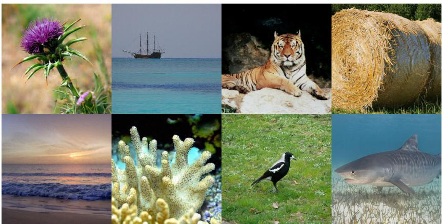

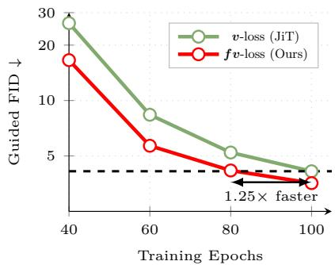  
Figure 1: (Left) Images generated with our XL model at 256 resolution. Beware, 2 impostors (real images from the ImageNet training set) are hiding in these images. Place your bet on which ones they are and check the solution on page 10. (Right) FID vs. training epoch for an XL model. Our fv-loss achieves faster convergence than JiT without requiring architectural modifications.

## Abstract

Natural images follow a $1 / f ^ { 2 }$ spectral distribution: most signal energy lies in the low spatial frequencies, while the perceptually important structures such as textures and edges occupy sparse high-frequency bands. Pixel-space reconstruction objectives, however, treat all spatial errors uniformly, causing low frequencies to dominate the optimization signal and delaying the learning of fine-scale details. In this work, we identify this objective-level spectral imbalance as a key ineficiency in training pixel-space flow models. To address it, we propose a Focal Log-Frequency Loss (f-loss), a spectrally balanced objective that equalizes the learning signal across frequencies, emphasizing high-frequency components that are otherwise underrepresented in pixel-space objectives. Building on this, we introduce a simple training strategy that combines frequency and pixel supervision: we first emphasize frequency-domain learning early to capture all frequencies, and then transition to standard pixel-space v-loss for spatial refinement. This balancing mitigates the low-frequency bias of pixel losses and aligns the training signal with the evolving needs of the model. Our approach is conceptually simple, requires no architectural changes, and acts as a drop-in replacement for flow matching losses. Across multiple model scales, it accelerates convergence by up to 40% while consistently improving FID and perceptual fidelity. We will release code and models.

## 1 Introduction

Images admit two complementary representations: the spatial domain, which captures local structure, and the frequency domain, which captures global patterns across scales. Consider an image of a tiger. Its global shape is defined by smooth, large-scale variations, while the stripes – thin, structured fine patterns – are encoded in high frequencies. Both are essential: the overall silhouette identifies the object, while the fine patterns make it visually realistic. This duality between pixels and frequencies is fundamental to how images are structured and perceived [12, 16, 59].

A key property of natural images is their spectral organization: their power spectrum approximately follows a $1 / f ^ { 2 }$ distribution [49, 61], meaning that most signal energy lies in low frequencies describing global structure, while high frequencies contain sparse but structured details. As a result, low-frequency components dominate the signal energy, even though they represent only part of the perceptual content of the image. In fact, perceptual studies consistently show that high-frequency content plays a disproportionately important role in visual quality [11, 29, 35, 62]. This suggests that image quality is highly sensitive to high-frequency components, such as edges and textures, despite their relatively low energy in the $1 / f ^ { 2 }$ spectrum.

Motivated by this discrepancy, we introduce a frequency-domain objective that equalizes the training signal across the spectrum. Specifically, we propose a Focal Log-Frequency Loss (f-loss), which applies focal weighting to logarithmically compressed spectral errors. In contrast to the $1 / f ^ { 2 }$ distribution of natural images, this formulation increases the influence of high-frequency components that are otherwise underrepresented in pixel-space training [34] (see Figure 2a).

Building on this objective, we study its efect on training dynamics in flow matching models. We empirically show that pixel-space losses [34, 65, 70] are dominated by large low-frequency residuals, biasing early optimization. Emphasizing frequency-domain supervision counteracts this efect, enabling the model to capture structured patterns and fine-scale details early in training. We therefore adopt a simple two-stage strategy: we begin with f-loss to learn spectral structure, and subsequently rely on the standard pixel v-loss [34] to refine spatial consistency. This simple strategy significantly improves both convergence speed and generation quality(see Figure 1 and 10). Importantly, our method acts as a drop-in replacement for standard flow matching objectives without requiring architectural changes [40], and achieves state-of-the-ar performance both quantitatively (FID) and qualitatively for pixel-space class-conditional generation.

Our contributions are threefold:

• We identify a fundamental mismatch between the spectral structure of natural images and pixel-space training objectives, showing that standard losses bias optimization toward low-frequency components despite the perceptual importance of high-frequency details;

• We introduce a spectrally balanced objective, the Focal Log-Frequency Loss (f-loss), which equalizes the learning of frequencies and enables models to capture both global structure and fine-scale patterns;

• We demonstrate that emphasizing frequencies during training significantly improves optimization eficiency, while accelerating convergence and consistently improving generation quality across model scales, while requiring no architectural modifications.

## 2 Related Work

Flow Matching and Pixel-Space Synthesis Denoising generative models including difusion [9, 20, 27, 28, 42, 54–56] and flow matching frameworks [1, 36, 37], typically frame the learning objective as a spatial-domain regression task, predicting either the noise (ϵ-prediction) or velocity field (v-prediction). These perform quite well in recent methods operating in compressed pre-trained latent space [4, 5, 10, 32, 39, 44, 45, 48, 66, 71]. However, when working directly on pixel space both v-prediction and ϵ-prediction fail [34]. This is mainly due to the model’s under-compute regime, which makes it dificult to separate the full-ranked noise components in its v- or ϵ-prediction. Interestingly, natural data lie on a low-dimensional manifold [3], as such, a direct denoised clean data prediction (x-prediction) ofers the best alternative [34]. This opens the door to adapt architectural modifications [6, 7, 21, 40, 63, 69] as well as additional loss terms [33, 41] for performance gains.

In this work, we look into the main training objective of such pixel space models without any architectural modifications and auxiliary losses and find that a frequency rebalancing loss helps in faster convergence and improved performance.

Spectral Bias and Frequency-Aware Generative Modeling Neural networks inherently exhibit a spectral bias, learning low-frequency structural components significantly faster than fine-grained, highfrequency details [46, 67]. Across generative paradigms, this bias yields models that excel at synthesizing global structure but struggle to preserve sharp textures [26, 48], often resulting in severe high-frequency artifacts [52]. To mitigate these limitations, prior works have explored various interventions. Some approaches balance frequency components post-hoc during sampling [22, 53]. Other works utilize temporal cascading to explicitly decouple frequencies across denoising timesteps [6, 60]. More recently, researchers have introduced structural modifications like multi-scale learning strategies [8, 14, 24, 25], dedicated frequency branches [47, 68], and explicit multi-scale or latent frequency decoupling within the architecture itself [23, 40, 64].

While these methods underscore the critical importance of frequency balancing, they rely on complex denoising schedules, post-hoc adjustments, or complex architectural changes. In contrast, our work targets the fundamental optimization dynamics. We directly correct the spectral bias during training without requiring any architectural modifications.

## 3 Method

## 3.1 Background

Flow Matching Models [1, 36, 37] define a regression objective to learn a velocity field ${ \pmb v } _ { \theta } ( { \pmb x } _ { t } , t )$ that transports noise $\mathbf { \boldsymbol { x } } _ { 0 } \sim \mathbf { \boldsymbol { p } } _ { 0 }$ to data $\pmb { x } _ { 1 } \sim p _ { 1 }$ via the ODE $\begin{array} { r } { \frac { d x _ { t } } { d t } = v _ { \theta } ( \pmb { x } _ { t } , t ) = \pmb { v } _ { \theta } } \end{array}$ . By employing a linear interpolant ${ \pmb x } _ { t } = ( 1 - t ) { \pmb \epsilon } + t { \pmb x } _ { 1 }$ , the model can be trained to directly predict the constant ground-truth velocity ${ \pmb v } ^ { * } = { \pmb x } _ { 1 } - { \pmb \epsilon }$ . This approach has been widely adopted by state-of-the-art architectures [10, 39] for its stability:

$$
\begin{array} { r } { \mathcal { L } _ { \pmb { v } } = \mathbb { E } \| \pmb { v } _ { \theta } - \pmb { v } ^ { * } \| ^ { 2 } . } \end{array}\tag{1}
$$

Prediction Parameterization The choice of prediction target is significantly influenced by the dimensionality of the data. While v-prediction is highly efective within compressed latent [10, 31], it often sufers from catastrophic failure when applied to high-dimensional pixel spaces [34]. To address this, the objective is reparameterized to focus the model on x-prediction rather than direct velocity regression. Under this framework, the ground-truth velocity is reformulated as: $\begin{array} { r } { \pmb { v } = \pmb { x } _ { 1 } - \pmb { \epsilon } = \frac { \pmb { x } _ { 1 } - \pmb { x } _ { t } } { 1 - t } } \end{array}$ while $\begin{array} { r } { \dot { \pmb { v } _ { \theta } } = \frac { \mathbf { \check { x } } _ { \theta } - \pmb { x } _ { t } } { 1 - t } } \end{array}$ . Consequently, the flow matching velocity loss in Equation 1 can be reformulated as a weighted x-regression loss, which we call v-loss:

$$
\mathcal { L } _ { v } = \mathbb { E } \left[ \frac { 1 } { ( 1 - t ) ^ { 2 } } \| \pmb { x } _ { \theta } ( \pmb { x } _ { t } , t ) - \pmb { x } _ { 1 } \| ^ { 2 } \right]\tag{2}
$$

By shifting to x-regression, the model is tasked with projecting directly onto the data manifold, a signal that is significantly more tractable than regressing high-variance velocity fields across the high-dimensional ambient space. This better aligns with the model’s capacity by focusing the learning process on recovering low dimensional geometric structure rather than modeling high-dimensional temporal transitions.

## 3.2 Spectral Diagnosis of Pixel-Space Flow Models

Neural networks are known to exhibit a spectral bias: they learn low-frequency components of a target function significantly faster than high-frequency ones, with the learning speed at frequency k decaying approximately as $1 / k$ . Prior works [46, 67] has studied theoretically the bias in the supervised learning setting. We investigate this question empirically through two complementary experiments: a quantitative analysis of the frequency signature of a fully trained model with v-loss, and a controlled toy experiment that tracks spectral learning dynamics over the course of training.

Frequency signature of v-loss models To directly measure the spectral distortion induced by v-loss, we compute the radially averaged power spectrum of images generated by a model trained with v-loss, and compare it to the power spectrum of real ImageNet images. Figure 2a reports the relative diference at each spatial frequency. v-loss model overestimates by 20% low and mid frequencies (below $1 0 ^ { - 1 }$ cycles/pixel). On the contrary, high frequencies (above $8 \times 1 0 ^ { - 1 }$ cycles/pixel) are underestimated, with the deficit growing monotonically toward the Nyquist limit and reaching nearly -60%.

Spectral learning dynamics To isolate the temporal dynamics of this bias, we train a small MLP to generate synthetic images composed of exactly two frequency components: one low and one high. We track the Fourier spectrum of the generated images throughout training. As shown in Figure 2b, the model rapidly learns the low-frequency pattern but struggles to learn the high-frequency one. This result confirms that v-loss imposes an implicit preference that puts more emphasis on low frequencies throughout training, making it slow to learn high frequencies associated with fine grain textures. Similarly, in Figure 2a, the model manages to recover the right amount of low frequencies at the end of training, but is still missing some high frequencies.

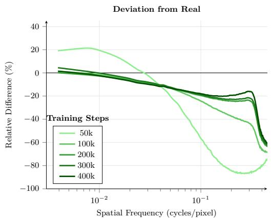  
(a) Relative deviation of the generated image power spectrum from real images throughout training. v-loss overestimates low frequencies and underestimates high frequencies.

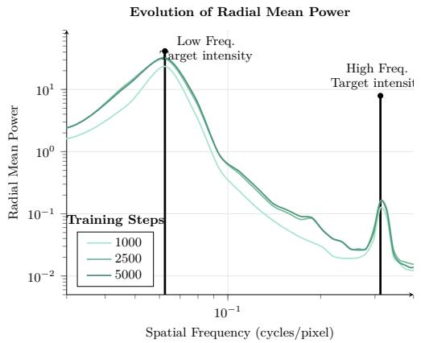  
(b) Spectral evolution of a MLP trained with v-loss on a twofrequency toy signal. The low-frequency pattern (left) is learned rapidly; the high-frequency pattern (right) remains absent throughout training.  
Figure 2: Spectral bias induced by v-loss: (a) Low frequencies are overrepresented in the radial power spectrum of generated images, (b) High frequencies not learned as well as low frequencies on a simple toy experiment with only 2 active frequencies.

This suggests that by focusing too much on the low frequencies during early training, the capacity of the model to generate high frequencies is irremediably lost and cannot be recovered at later stages.

## 3.3 A Joint Pixel-Frequency Objective

As mentioned in Section $3 . 2 ,$ supervising only pixel-space residuals creates a systematic spectral imbalance that persists throughout training. This motivates a training objective that operates on both domains jointly: pixel-space supervision to ensure spatial precision, and frequency-space supervision to ensure spectral balance.

Frequency-domain component To ensure such spectral balance, we introduce $f -$ -loss, a frequency-domain reconstruction objective that reweights the learning signal across the spectral hierarchy:

$$
\mathcal { L } _ { f } = \sum _ { u , v } \frac { 1 } { ( 1 - t ) ^ { 2 } } \cdot \frac { e _ { u , v } } { \operatorname* { m a x } e _ { u ^ { \prime } , v ^ { \prime } } } \cdot \log ( 1 + | \mathcal { F } _ { \mathrm { p r e d } } ( u , v ) - \mathcal { F } _ { \mathrm { t a r g e t } } ( u , v ) | )\tag{3}
$$

where $\mathcal { F }$ denotes the 2D Discrete Fourier Transform and $e _ { u , v } = | \mathcal { F } _ { \mathrm { p r e d } } ( u , v ) - \mathcal { F } _ { \mathrm { t a r g e t } } ( u , v ) |$ is the per-frequency residual.

The three components each serve a distinct role. First, the timestep weighting $\frac { 1 } { ( 1 - t ) ^ { 2 } }$ is inherited from v-loss and preserved unchanged, ensuring consistent timesteps dynamics. Then, the adaptive focal weight $\frac { e _ { u , v } } { \operatorname* { m a x } _ { u ^ { \prime } , v ^ { \prime } } e _ { u ^ { \prime } , v ^ { \prime } } }$ normalizes the per-frequency residuals by the maximum residual across the spectrum at each

training step. This is computed with a stop-gradient and acts as a purely data-dependent coeficient: it continuously normalizes each sample to avoid wide variations in magnitude between samples. Finally, the logarithmic compression $\log ( 1 + e _ { u , v } )$ prevents any single frequency from monopolizing the loss, and can be interpreted as a continuous generalization of Laplacian pyramid decomposition: just as the pyramid assigns equal structural importance to each octave, the logarithm linearizes the spectral hierarchy, granting every doubling of frequency equal weight in the total loss (see Appendix D).

Joint objective We combine the frequency-domain component with the standard pixel component v-loss into a single joint objective:

$$
\mathcal { L } = w _ { f } \cdot \mathcal { L } _ { f } + w _ { v } \cdot \mathcal { L } _ { v }\tag{4}
$$

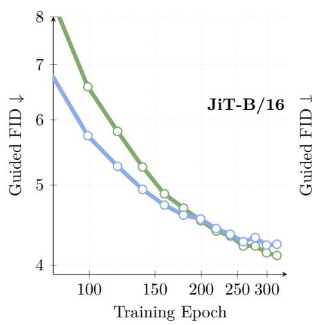

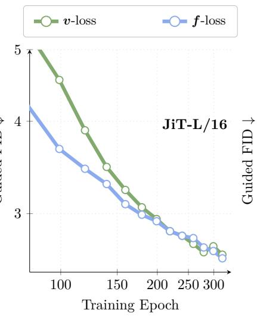

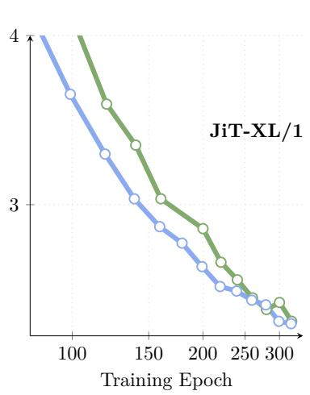  
Figure 3: Convergence of frequency- and pixel-space losses. The frequency-domain loss dominates early in training, while the spatial-domain loss gradually catches up in later stages.

where $w _ { f }$ and $w _ { v }$ are scalars that control the relative contribution of each domain throughout training. Empirically, we observe in Figure 3 that f-loss dominates early in training, converging significantly faster than v-loss. However, v-loss surpasses f-loss later in training. It suggests that the two components are not equally useful at all stages: frequency supervision is the binding constraint early on, while pixel supervision becomes more efective as training progresses. We set $w _ { f } = \lambda ( s )$ and $w _ { v } = 1 - \lambda ( s )$ where $\lambda ( s )$ follows a sigmoid schedule decaying from 1 to 0, centered at the observed crossover point $s ^ { \star }$ . The design choices for the combination schedule are ablated in Section 4.2. We call the resulting scheduled loss fv-loss.

## 3.4 Empirical Validation

Convergence speedup Figure 4 reports FID across training epochs for JiT-B/16, JiT-L/16, and JiT-XL/16, in both unguided and guided settings. The joint fv-loss objective outperforms the baseline v-loss across all model sizes from the earliest evaluations. The gap is largest in the early epochs and narrows as training progresses, consistent with our observation that frequency supervision is most valuable early in training.

Qualitative evidence Figure 5 compares images generated by v-loss and fv-loss at two stages of training: very early (left block) and early (right block). The diference is striking at very early training stages. f-loss produces images with significantly finer textures well before v-loss: the hay on the thatched roof is detailed, and the knitting pattern on the mittens is already visible. v-loss at the same stage appears to prioritize sharp object boundaries over surface texture. Later in training, v-loss recovers many of these textures, though they remain less defined than those produced by f-loss.

Frequency-Domain Error Analysis Figure 6 (right) measures the average magnitude error between generated and real images in the low- and high-frequency bands of the Fourier spectrum. In the earliest stages of training (50k-75k steps), f-loss achieves a lower error than v-loss in both bands, confirming that it corrects the spectral bias faster. As training progresses, f-loss plateaus and is eventually overtaken by f-loss. fv-loss combines the fast early spectral alignment of f-loss with the late-stage refinement of v-loss, reaching the lowest error in both bands by the end of training.

f-loss forces the model to escape this low-frequency bias by actively equalizing the learning signal across all frequency bands. But it is insensitive to phase, which carries the precise spatial location of edges and textures. v-loss directly supervises pixel values and is ultimately better suited for enforcing strict local spatial coherence and phase alignment $( \mathrm { e . g . }$ , locking sharp edges into exact pixel locations). We hypothesize that this fundamental diference explains why the f-loss eventually plateaus when used alone, making the transition back to the spatial-domain v-loss necessary for final refinement.

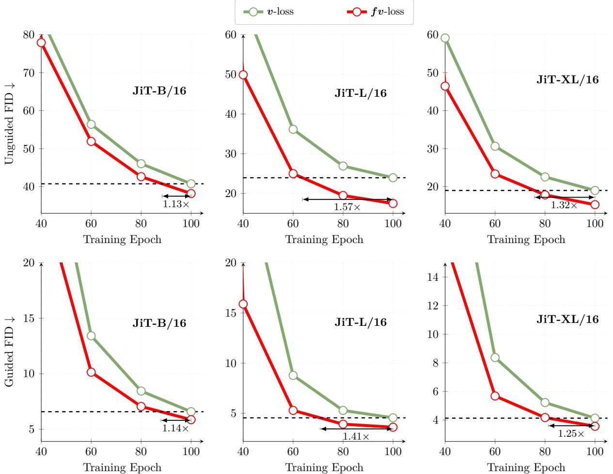  
Figure 4: Convergence speed comparison between v-loss and fv-loss for diferent model sizes. Top row: unguided FID. Bottom row: guided FID. fv-loss consistenly outperforms v-loss leading to significant speed-ups.

## 4 Experiments

In this section, we discuss the efectiveness of training an image generative model using our proposed fv-loss. In the following paragraphs, we detail our experimental setup and our evaluation metric to support our experiments. Based on these, we see how our proposed method performs against state-of-the-art models in Section 4.1. Following that, we show empirical analysis for specific components of our proposed fv-loss and compare it against the standard v-loss to study the convergence dynamics in Section 4.2.

Experimental setup. For fair and reproducible evaluations, we train our models using the ImageNet class conditional setup [50]; at 256×256 and 512×512 resolutions. We primarily focus on pixel-space flow matching framework following the JiT architecture [34] with x-pred and a reformulated loss. Unless we state otherwise, models are trained using identical training schedules and compute budgets (batch size: 1024; lr: constant at 2e-4 after 5 epochs of warmup; optim: AdamW [38] with β1, β2: 0.9, 0.95), allowing us to isolate the efect of the proposed loss. For evaluation, we generate 50K samples using 50 ODE steps of Heun sampler [17] and compute all metrics following the standard protocols used in recent generative modeling benchmarks [9]. We refer readers to Table 5 for more detailed information about experimental hyperparameters.

Evaluation Metrics. To evaluate the efectiveness of our proposed method, we primarily use the standard Fréchet Inception Distance (FID) [18] to quantify the quality of the generated samples. FID measures distance between the InceptionV3 [58] feature distributions of generated and real images, providing a standard measure of overall generation quality. Additionally, for our ablations we also evaluate using Fréchet

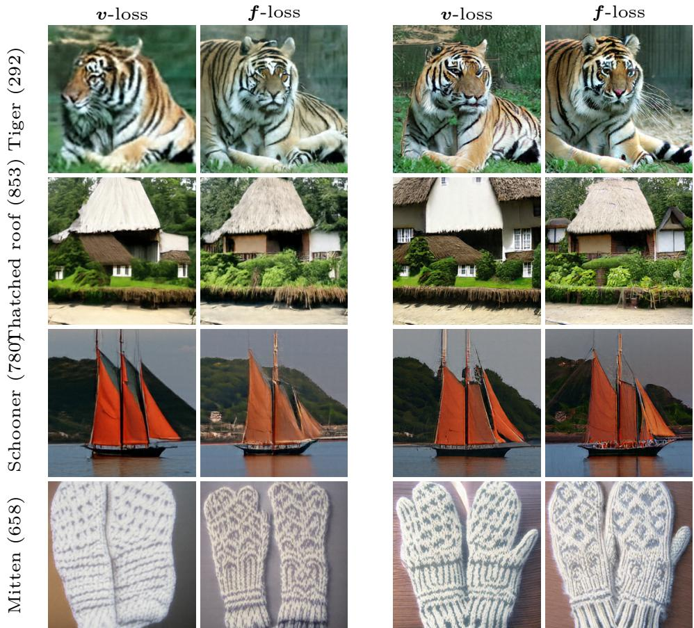  
Figure 5: Generated images depending on the loss at early training stages. (left) f-loss images have finer textures (e.g., the tiger’s stripes, the hay on the thatched roof) much earlier than v-loss that seems to focus more on sharp object boundaries (e.g., well defined sails of the boat) at such early stages. (right) These finer textures starts to appear with v-loss later during training, which may explain its slower start in FID. Please refer to Figure 9 for comparison with finer number of steps.

Dino Distance (FDD) [57], which calculates the Fréchet distance but based on DinoV2 [43] features. Finally, following prior works [9, 34], we also evaluate using Inception Score (IS) [51] to show that our proposed method does pick up on class-specific information.

## 4.1 State-of-the-art comparison

We compare our proposed fv-loss against the state-of-the-art pixel flow models in Table 1. Our proposed fv-loss improves upon the standard JiT framework w.r.t. the same model architecture (XL/16) and training settings (2.13 vs 2.21 after 750K steps). Following recent methods [6, 40] we also apply REPA alignment loss. Interestingly, with our proposed method we match DeCo performance in less than half the training steps. Finally, when adding perceptual losses similar to PixelGen, our proposed method improves on the current state-of-the-art performance and achieves the same FID of 1.83 in only 500k steps (compared to 800k for PixelGen) while significantly improving on IS, without any additional architectural changes.

## 4.2 Ablation Study

We begin by first ablating our proposed fv-loss (given in Equation 4). In the 2562 resolution setup for a B size model (see Table 2a), we see that using simple f-loss over v-loss is highly beneficial early in the training for both unguided (42.34 vs 46.02) and guided (6.82 vs 8.44) settings. As training progresses, the f-loss is still better than v-loss w.r.t unguided setup (27.51 vs 28.70). A similar trend can also be seen for bigger L size models too, where f-loss is better than the v-loss early in the training for unguided settings (20.24 vs 26.90 at 80 epochs) and remains on par at the end (13.26 vs 14.46 at 320 epochs). However, for the guided setup, the v-loss becomes better than the f-loss at later training stage, irrespective of the model size. We argue that this is because, as training progresses, it is more important for the model to learn from the pixels to improve upon the high-frequency details. Interestingly, with this in mind our proposed fv-loss setup with a switch from frequency to spatial domain shows improvement both in the early stages of training as well as in the later stages for both unguided and guided setups.

<table><tr><td>Method</td><td>Model size</td><td>REPA</td><td>Perceptual</td><td>Training steps</td><td>FID↓</td><td>IS ↑</td></tr><tr><td>JiT-H/16 [34]</td><td>H/16</td><td>X</td><td>X</td><td>750k</td><td>1.86</td><td>303.4</td></tr><tr><td>JiT-G/16 [34]</td><td>G/16</td><td>X</td><td>x</td><td>750k</td><td>1.82</td><td>292.6</td></tr><tr><td>JiT-XL/16 [34]</td><td>XL/16</td><td>x</td><td>x</td><td>750k</td><td>2.21</td><td>297.4</td></tr><tr><td>Ours</td><td>XL/16</td><td>x</td><td>x</td><td>750k</td><td>2.13</td><td>290.3</td></tr><tr><td>EPG [33] ICLR, 2026</td><td>XL/16</td><td></td><td></td><td>1M</td><td>2.04</td><td>283.2</td></tr><tr><td>PixelFlow [6] 2025</td><td> $\mathrm { { X L } / 4 }$ </td><td>VV</td><td>××</td><td>1.6M</td><td>1.98</td><td>282.1</td></tr><tr><td>DiP [7] CVPR, 2026</td><td> $\mathrm { X L } \dot { / } 1 6$ </td><td></td><td></td><td>1.6M</td><td>1.98</td><td>282.9</td></tr><tr><td>PixNerd [63] ICLR, 2026</td><td> $\mathrm { X L } / 1 6$ </td><td></td><td>××</td><td>1.6M</td><td>1.95</td><td>298.0</td></tr><tr><td>DeCo [40] CVPR, 2026</td><td> $\mathrm { { X L } / 1 6 }$ </td><td>v</td><td>x</td><td>1.6M</td><td>1.90</td><td>303.0</td></tr><tr><td>Ours</td><td>XL/16</td><td>√</td><td>x</td><td>750k</td><td>1.87</td><td>301.0</td></tr><tr><td>PixelGen [41] 2026</td><td> $\mathrm { X L } / 1 6$ </td><td>√</td><td>√</td><td>800k</td><td>1.83</td><td>293.6</td></tr><tr><td>Ours</td><td> $\mathrm { { X L } / 1 6 }$ </td><td>√</td><td>√</td><td>500k</td><td>1.83</td><td>323.4</td></tr></table>

Table 1: Comparison with state-of-the-art pixel-space methods. Our proposed loss is able to improve over all categories of models (standard, using alignment methods like REPA, using perceptual losses), either by achieving strictly better FIDs or by reaching the same FID faster.

<table><tr><td rowspan="2">Epochs</td><td rowspan="2">Loss</td><td rowspan="2"></td><td colspan="2">FID↓</td><td rowspan="2">FDD</td><td>IS↑</td></tr><tr><td>w/o cfg</td><td>cfg cfg</td><td>cfg</td></tr><tr><td rowspan="5">7-16</td><td rowspan="3">80</td><td>v-loss</td><td>46.02</td><td>8.44</td><td>369.3</td><td>162.8</td></tr><tr><td>f-loss</td><td>42.34</td><td>6.82</td><td>312.0</td><td>186.6</td></tr><tr><td>fv-loss</td><td>42.63</td><td>7.05</td><td>314.0</td><td>185.2</td></tr><tr><td rowspan="3">200</td><td>v-loss</td><td>31.23</td><td>4.52</td><td>219.8</td><td>252.1</td></tr><tr><td>f-loss</td><td>30.02</td><td>4.54</td><td>194.8</td><td>254.3</td></tr><tr><td>fv-loss</td><td>30.17</td><td>4.20</td><td>202.3</td><td>258.9</td></tr><tr><td rowspan="3">320</td><td>v-loss f-loss</td><td>28.70 27.51</td><td>4.11 4.23</td><td>192.2</td><td>273.9</td></tr><tr><td>fv-loss</td><td>26.86</td><td>3.95</td><td>170.4 178.8</td><td>275.2 282.6</td></tr><tr><td>v-loss</td><td></td><td></td><td></td><td></td></tr><tr><td rowspan="5">7-/6</td><td rowspan="3">80</td><td></td><td>26.90</td><td>5.40</td><td>264.2</td><td>200.0</td></tr><tr><td>f-loss</td><td>20.24</td><td>4.34</td><td>185.8</td><td>237.3</td></tr><tr><td>fv-loss</td><td>19.47</td><td>3.93</td><td>178.6</td><td>247.9</td></tr><tr><td rowspan="3">200</td><td>v-loss</td><td>16.54</td><td>2.98</td><td>155.4</td><td>274.3</td></tr><tr><td>f-loss</td><td>14.14</td><td>2.92</td><td>125.1</td><td>283.3</td></tr><tr><td>fv-loss</td><td>14.79</td><td>2.82</td><td>122.2</td><td>291.6</td></tr><tr><td rowspan="3">320</td><td>v-loss</td><td>14.46</td><td>2.63</td><td></td><td>133.7</td><td>292.7</td></tr><tr><td>f-loss</td><td>13.26</td><td>2.58</td><td>115.2</td><td></td><td>287.5</td></tr><tr><td>fv-loss</td><td>12.93</td><td>2.55</td><td>113.7</td><td></td><td>303.4</td></tr></table>

(a) Resolution 256 × 256

<table><tr><td colspan="2">Epochs</td><td rowspan="2">Loss</td><td colspan="2">FID</td><td>FDD↓</td><td>IS ↑</td></tr><tr><td colspan="2"></td><td>w/o cfg</td><td>cfg</td><td>cfg</td><td>cfg</td></tr><tr><td rowspan="5">J-32</td><td rowspan="3">80</td><td>v-loss</td><td>52.72</td><td>10.40</td><td>833.8</td><td>153.7</td></tr><tr><td>f-loss</td><td>50.54</td><td>9.48</td><td>792.3</td><td>159.0</td></tr><tr><td>fv-loss</td><td>45.90</td><td>8.33</td><td>775.1</td><td>175.2</td></tr><tr><td rowspan="3">200</td><td>v-loss</td><td>35.20</td><td>5.18</td><td>676.4</td><td>244.5</td></tr><tr><td>f-loss</td><td>36.54</td><td>5.19</td><td>664.1</td><td>231.9</td></tr><tr><td>fv-loss</td><td>33.12</td><td>4.74</td><td>653.7</td><td>254.3</td></tr><tr><td rowspan="3">320</td><td>v-loss</td><td>31.94</td><td>4.63</td><td>642.8</td><td></td><td>270.1</td></tr><tr><td>f-loss</td><td>32.93 29.12</td><td>4.64 4.47</td><td>634.5</td><td></td><td>254.9 281.9</td></tr><tr><td>fv-loss</td><td></td><td></td><td>626.9</td><td></td><td></td></tr><tr><td rowspan="6">J32</td><td rowspan="3">80</td><td>v-loss</td><td>29.04</td><td>6.41</td><td>746.4</td><td></td><td>228.2</td></tr><tr><td>f-loss</td><td>22.91</td><td>4.65</td><td>689.5</td><td></td><td>237.0</td></tr><tr><td>fv-loss</td><td>21.64</td><td>4.58</td><td></td><td>681.9</td><td>196.9</td></tr><tr><td rowspan="4">200</td><td>v-loss</td><td>17.80</td><td>3.22</td><td></td><td>650.6</td><td>288.8</td></tr><tr><td>f-loss</td><td>16.71</td><td>3.26</td><td>633.3</td><td></td><td>279.1</td></tr><tr><td>fv-loss</td><td>15.84</td><td>2.98</td><td>631.0</td><td></td><td>284.5</td></tr><tr><td>v-loss</td><td>15.85</td><td>2.90</td><td>639.8</td><td></td><td>294.6</td></tr><tr><td rowspan="3">320</td><td>f-loss</td><td></td><td>15.28</td><td>3.04</td><td>619.5</td><td></td><td>282.4</td></tr><tr><td>fv-loss</td><td>14.30</td><td></td><td>2.73</td><td>620.2</td><td></td><td>312.1</td></tr><tr><td></td><td></td><td></td><td></td><td></td><td></td><td></td></tr></table>

(b) Resolution 512 × 512  
Table 2: Comparison between v-loss, f-loss and fv-loss at resolutions (a) 256 × 256 and (b) $5 1 2 \times 5 1 2 .$ fv-loss combines the best of v-loss and f-loss, namely speed of convergence at early stages and final performances.

A similar trend can also be observed for $5 1 2 ^ { 2 }$ resolution experiments (see Table 2b). In the early stages of training f-loss is always better than v-loss irrespective of model sizes (for B: 9.48 vs 10.40; for L: 4.65 vs 6.41 at 80 epochs). However, with training progression, a switch using fv-loss is much better compared to v-los and f-loss alone.

This provides empirical evidence that, indeed, beginning with a much more balanced frequency-based objective is beneficial for better pixel space models. However, at the end, where there is much more need for fine-grained details, reverting back to a spatial loss is highly beneficial.

Adaptative weighting To understand the switch in f-loss as given in Equation 4, we also ablate the efect of wf and $w _ { v }$ . As reported in Table 4, clearly having a sigmoid weight performs the best throughout training, w.r.t. FID. Interestingly, a higher weight on v-loss also helps but is not as good as the proposed sigmoid switch. Crucially, a reversed sigmoid that emphasizes mostly pixel loss at the beginning and frequencies loss at later stage has among the worst performances. This clearly indicates that a stronger pixel flow mode requires some spectral balancing in the early training stage to set the stage for spatial high-detail learning.

Generalization across architectures. To test whether the benefits of fv-loss generalize beyond JiT, we train PixelDiT [69] with v-loss and fv-loss following the original PixelDiT setup. Table 3 shows that fv-loss reaches the same FID roughly $2 \times$ faster than v-loss. Moreover, PixelDiT is trained with the REPA alignment loss. REPA pushed the features toward rich high-frequencies DINO features. fv-loss is beneficia even when used alongside REPA.

<table><tr><td></td><td>Loss</td><td></td><td>Step 200k</td><td>Step 400k</td><td>Step 600k</td></tr><tr><td>PxDT</td><td></td><td>v-loss (reported from [69])</td><td>15</td><td>12</td><td>8</td></tr><tr><td></td><td></td><td>v-loss (reproduced)</td><td>15.09</td><td>10.60</td><td>10.25</td></tr><tr><td></td><td>fv-loss</td><td></td><td>10.18</td><td>6.88</td><td>5.92</td></tr></table>

Table 3: FID Comparison of v-loss and fv-loss using PixelDiT [69] architecture.

Wall-clock speedup. Figure 6 reports the guided FID reached by each loss at fixed wall-clock budgets, using the training step closest to each time mark. As f-loss requires computing a 2D FFT at every training step, it introduces a computational overhead. To verify that this does not negate the reported convergence speed-up, we measure the total wall-clock time for training JiT-B for 400k steps. Compared to the v-loss baseline (432.0min), f-loss incurs a +4% overhead (453.1min). fv-loss exhibits a +14% overhead (492.3min), as it computes and backpropagates both losses at each step. At the 100-minute mark, v-loss is temporarily ahead because fv-loss has completed fewer steps (90k vs. 78k steps). However, fv-loss overtakes v-loss by the 200-minute mark. From 300 minutes onward, its convergence speed-up more than compensates for the added computational cost.

<table><tr><td rowspan="2"> $_ { w _ { f } }$ </td><td rowspan="2"> $_ { w _ { v } }$ </td><td colspan="3">FID↓</td><td rowspan="2">IS ↑</td></tr><tr><td>Epoch 80</td><td>Epoch 200</td><td>Epoch 320</td></tr><tr><td>1</td><td>0</td><td>6.82</td><td>4.54</td><td>4.23</td><td>275.18</td></tr><tr><td>0</td><td>1</td><td>8.44</td><td>4.52</td><td>4.11</td><td>273.85</td></tr><tr><td rowspan="6">1</td><td>0.1</td><td>7.24</td><td>4.45</td><td>4.16</td><td>269.16</td></tr><tr><td>0.5</td><td>6.85</td><td>4.49</td><td>4.31</td><td>279.18</td></tr><tr><td>1</td><td>7.04</td><td>4.33</td><td>4.05</td><td>274.85</td></tr><tr><td>5</td><td>7.05</td><td>4.51</td><td>4.22</td><td>282.47</td></tr><tr><td>10</td><td>7.14</td><td>4.25</td><td>4.02</td><td>285.88</td></tr><tr><td></td><td></td><td></td><td></td><td></td></tr><tr><td>1 − λ(s) λ(s)</td><td>λ(s) 1 −λ(s)</td><td>8.52 7.05</td><td>4.48 4.20</td><td>4.30 3.95</td><td>265.9 282.58</td></tr></table>

Table 4: Ablation on the weights wf and $w _ { v }$ of fv-loss

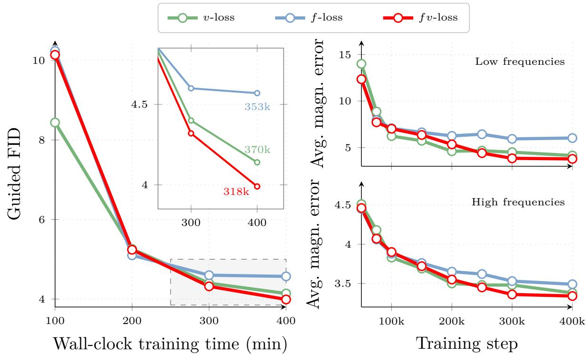  
Figure 6: Left: Guided FID against wall-clock training time; the number of training steps is given for the last point of each curve. Right: Average magnitude error in the low- and high-frequency bands. fv-loss consistently outperforms v-loss, leading to significant speed-ups.

## 5 Conclusion

In this paper, we investigate spectral bias in flow-matching models and show that the pixel-space velocity loss of JiT leads to overestimating low frequencies early during training, at the cost of underestimating higher frequencies. This can be explained by the natural $\mathrm { i } / f ^ { 2 }$ decay of the power spectrum of natural images that leads to imbalance in the training objective. This bias towards low frequencies at early training stages seems to be hurting early convergence. As such, we propose a new loss in the frequency domain that aims at mitigating such bias by equalizing frequencies. We experimentally show that such loss obtains better performances at early training stages. We propose to combine the early speed advantage of the frequency loss with the later training performances of the classical pixel-space velocity loss through a schedule. The resulting fv-loss significantly accelerate the convergence of flow-matching training and leads to state-of-the-art pixel-space image generation on class-conditional ImageNet.

Limitations Whereas the spectral bias of modern pixel space flow-matching models is clearly exposed and a mitigation strategy is successfully proposed, understanding its origin remains an open question. More specifically, future work should investigate why having a frequency objective at early training stages plateaus in performances when used alone, and why switching to pixel space losses performs better at later training stages.

Acknowledgements This work was supported by a Hi!Paris grant, two Hi!Paris chaires for A.A.Efros and V.Kalogeiton, ANR/France 2030 program (ANR-23-IACL-0005) and ANR project sharp ANR-23- PEIA-0008 in the context of the PEPR IA. It was granted access to the HPC resources of IDRIS under the allocations 2025-A0181016194, 2025-AD011015436, 2026-A0201017545 and 2026-AD011015594R2 made by GENCI. We would like to thank Nicolas Dufour, Julie Mordacq, Robin Courant, Yohann Perron and Adrien Ramanana Rahary for their helpful comments and proofreading.

## References

[1] Michael Samuel Albergo and Eric Vanden-Eijnden. Building normalizing flows with stochastic interpolants. In ICLR, 2022. 2, 3

[2] P. Burt and E. Adelson. The laplacian pyramid as a compact image code. IEEE Transactions on Communications, 31(4):532–540, 1983. doi: 10.1109/TCOM.1983.1095851. 17

[3] Olivier Chapelle, Bernhard Schölkopf, and Alexander Zien, editors. Semi-Supervised Learning. MIT Press, Cambridge, MA, USA, 2006. 2

[4] Junsong Chen, Jincheng Yu, Chongjian Ge, Lewei Yao, Enze Xie, Yue Wu, Zhongdao Wang, James Kwok, Ping Luo, Huchuan Lu, et al. Pixart-α: Fast training of difusion transformer for photorealistic text-to-image synthesis. ICLR, 2023. 2

[5] Junsong Chen, Chongjian Ge, Enze Xie, Yue Wu, Lewei Yao, Xiaozhe Ren, Zhongdao Wang, Ping Luo, Huchuan Lu, and Zhenguo Li. Pixart-σ: Weak-to-strong training of difusion transformer for 4k text-to-image generation. In ECCV, pages 74–91. Springer, 2024. 2

[6] Shoufa Chen, Chongjian Ge, Shilong Zhang, Peize Sun, and Ping Luo. Pixelflow: Pixel-space generative models with flow. arXiv preprint arXiv:2504.07963, 2025. 2, 7, 8

[7] Zhennan Chen, Junwei Zhu, Xu Chen, Jiangning Zhang, Xiaobin Hu, Hanzhen Zhao, Chengjie Wang, Jian Yang, and Ying Tai. Dip: Taming difusion models in pixel space. arXiv:2511.18822, 2025. 2, 8

[8] Emily L Denton, Soumith Chintala, arthur szlam, and Rob Fergus. Deep generative image models using a laplacian pyramid of adversarial networks. In C. Cortes, N. Lawrence, D. Lee, M. Sugiyama, and R. Garnett, editors, NeurIPS, volume 28. Curran Associates, Inc., 2015. URL https://proceedings. NEURIPS.cc/paper\_files/paper/2015/file/aa169b49b583a2b5af89203c2b78c67c-Paper.pdf. 3

[9] Prafulla Dhariwal and Alexander Nichol. Difusion models beat gans on image synthesis. NeurIPS, 2021. 2, 6, 7

[10] Patrick Esser, Sumith Kulal, Andreas Blattmann, Rahim Entezari, Jonas Müller, Harry Saini, Yam Levi, Dominik Lorenz, Axel Sauer, Frederic Boesel, Dustin Podell, Tim Dockhorn, Zion English, and Robin Rombach. Scaling rectified flow transformers for high-resolution image synthesis. In ICML, 2024. URL https://openreview.net/forum?id=FPnUhsQJ5B. 2, 3

[11] Rony Ferzli and Lina J. Karam. A no-reference objective image sharpness metric based on the notion of just noticeable blur (jnb). TIP, 2009. 2

[12] Robert Geirhos, Patricia Rubisch, Claudio Michaelis, Matthias Bethge, Felix A Wichmann, and Wieland Brendel. Imagenet-trained cnns are biased towards texture; increasing shape bias improves accuracy and robustness. In ICLR, 2018. 1

[13] Priya Goyal, Piotr Dollár, Ross Girshick, Pieter Noordhuis, Lukasz Wesolowski, Aapo Kyrola, Andrew Tulloch, Yangqing Jia, and Kaiming He. Accurate, large minibatch SGD: Training ImageNet in 1 hour. arXiv:1706.02677, 2017. 15

[14] Jiatao Gu, Shuangfei Zhai, Yizhe Zhang, Joshua M. Susskind, and Navdeep Jaitly. Matryoshka difusion models. In ICLR, 2024. URL https://openreview.net/forum?id=tOzCcDdH9O. 3

[15] David J Heeger and James R Bergen. Pyramid-based texture analysis/synthesis. In Proceedings of the 22nd annual conference on Computer graphics and interactive techniques, pages 229–238, 1995. 17

[16] Katherine Hermann, Ting Chen, and Simon Kornblith. The origins and prevalence of texture bias in convolutional neural networks. In NeurIPS, 2020. 1

[17] Karl Heun et al. Neue methoden zur approximativen integration der diferentialgleichungen einer unabhängigen veränderlichen. Z. Math. Phys, 45(23-38):7, 1900. 6, 15

[18] Martin Heusel, Hubert Ramsauer, Thomas Unterthiner, Bernhard Nessler, and Sepp Hochreiter. Gans trained by a two time-scale update rule converge to a local nash equilibrium. NeurIPS, 2017. 6

[19] Jonathan Ho and Tim Salimans. Classifier-free difusion guidance. In NeurIPS Workshops, 2021. 15

[20] Jonathan Ho, Ajay Jain, and Pieter Abbeel. Denoising difusion probabilistic models. NeurIPS, 33: 6840–6851, 2020. 2

[21] Emiel Hoogeboom, Thomas Mensink, Jonathan Heek, Kay Lamerigts, Ruiqi Gao, and Tim Salimans. Simpler difusion: 1.5 fid on imagenet512 with pixel-space difusion. In CVPR, pages 18062–18071, 2025. 2

[22] Linjiang Huang, Rongyao Fang, Aiping Zhang, Guanglu Song, Si Liu, Yu Liu, and Hongsheng Li. Fouriscale: A frequency perspective on training-free high-resolution image synthesis. In European conference on computer vision, pages 196–212. Springer, 2024. 2

[23] Liming Jiang, Bo Dai, Wayne Wu, and Chen Change Loy. Focal frequency loss for image reconstruction and synthesis. In ICCV, pages 13919–13929, 2021. 3, 15, 16, 17

[24] Minguk Kang, Jun-Yan Zhu, Richard Zhang, Jaesik Park, Eli Shechtman, Sylvain Paris, and Taesung Park. Scaling up gans for text-to-image synthesis. In CVPR, pages 10124–10134, 2023. 3

[25] Tero Karras, Timo Aila, Samuli Laine, and Jaakko Lehtinen. Progressive growing of GANs for improved quality, stability, and variation. In International Conference on Learning Representations, 2018. URL https://openreview.net/forum?id=Hk99zCeAb. 3

[26] Tero Karras, Miika Aittala, Samuli Laine, Erik Härkönen, Janne Hellsten, Jaakko Lehtinen, and Timo Aila. Alias-free generative adversarial networks. NeurIPS, 34:852–863, 2021. 2

[27] Tero Karras, Miika Aittala, Timo Aila, and Samuli Laine. Elucidating the design space of difusion-based generative models. NeurIPS, 2022. 2

[28] Tero Karras, Miika Aittala, Jaakko Lehtinen, Janne Hellsten, Timo Aila, and Samuli Laine. Analyzing and improving the training dynamics of difusion models. In CVPR, 2024. 2

[29] Vishwakumara Kayargadde and Jean-Bernard Martens. Perceptual characterization of images degraded by blur and noise: experiments. J. Opt. Soc. Am. A, 1996. 2

[30] Tuomas Kynkäänniemi, Miika Aittala, Tero Karras, Samuli Laine, Timo Aila, and Jaakko Lehtinen. Applying guidance in a limited interval improves sample and distribution quality in difusion models. In NeurIPS, 2024. 15

[31] Black Forest Labs, Stephen Batifol, Andreas Blattmann, Frederic Boesel, Saksham Consul, Cyril Diagne, Tim Dockhorn, Jack English, Zion English, Patrick Esser, Sumith Kulal, Kyle Lacey, Yam Levi, Cheng Li, Dominik Lorenz, Jonas Müller, Dustin Podell, Robin Rombach, Harry Saini, Axel Sauer, and Luke Smith. Flux.1 kontext: Flow matching for in-context image generation and editing in latent space, 2025. URL https://arxiv.org/abs/2506.15742. 3

[32] Black Forest Labs, Stephen Batifol, Andreas Blattmann, Frederic Boesel, Saksham Consul, Cyril Diagne, Tim Dockhorn, Jack English, Zion English, Patrick Esser, et al. Flux. 1 kontext: Flow matching for in-context image generation and editing in latent space. arXiv preprint arXiv:2506.15742, 2025. 2

[33] Jiachen Lei, Keli Liu, Julius Berner, Y HoiM, Hongkai Zheng, Jiahong Wu, and Xiangxiang Chu. There is no VAE: End-to-end pixel-space generative modeling via self-supervised pre-training. In ICLR, 2026. URL https://openreview.net/forum?id=HbUoKPIZmp. 2, 8

[34] Tianhong Li and Kaiming He. Back to basics: Let denoising generative models denoise. arXiv preprint arXiv:2511.13720, 2025. 2, 3, 6, 7, 8, 15

[35] Justin D Lieber, Gerick M Lee, Najib J Majaj, and J Anthony Movshon. Naturalistic texture perception relies preferentially on high spatial frequencies. Journal of Vision, 2020. 2

[36] Yaron Lipman, Ricky TQ Chen, Heli Ben-Hamu, Maximilian Nickel, and Matthew Le. Flow matching for generative modeling. In ICLR, 2022. 2, 3

[37] Xingchao Liu, Chengyue Gong, et al. Flow straight and fast: Learning to generate and transfer data with rectified flow. In ICLR, 2022. 2, 3

[38] Ilya Loshchilov and Frank Hutter. Decoupled weight decay regularization. arXiv preprint arXiv:1711.05101, 2017. 6, 15

[39] Nanye Ma, Mark Goldstein, Michael S Albergo, Nicholas M Bofi, Eric Vanden-Eijnden, and Saining Xie. Sit: Exploring flow and difusion-based generative models with scalable interpolant transformers. In European Conference on Computer Vision, pages 23–40. Springer, 2024. 2, 3, 16, 18

[40] Zehong Ma, Longhui Wei, Shuai Wang, Shiliang Zhang, and Qi Tian. Deco: Frequency-decoupled pixel difusion for end-to-end image generation. arXiv preprint arXiv:2511.19365, 2025. 2, 3, 7, 8

[41] Zehong Ma, Ruihan Xu, and Shiliang Zhang. Pixelgen: Pixel difusion beats latent difusion with perceptual loss. arXiv preprint arXiv:2602.02493, 2026. 2, 8

[42] Alexander Quinn Nichol and Prafulla Dhariwal. Improved denoising difusion probabilistic models. In International conference on machine learning, pages 8162–8171. Proceedings of Machine Learning Research, 2021. 2

[43] Maxime Oquab, Timothée Darcet, Théo Moutakanni, Huy V. Vo, Marc Szafraniec, Vasil Khalidov, Pierre Fernandez, Daniel HAZIZA, Francisco Massa, Alaaeldin El-Nouby, Mido Assran, Nicolas Ballas, Wojciech Galuba, Russell Howes, Po-Yao Huang, Shang-Wen Li, Ishan Misra, Michael Rabbat, Vasu Sharma, Gabriel Synnaeve, Hu Xu, Herve Jegou, Julien Mairal, Patrick Labatut, Armand Joulin, and Piotr Bojanowski. DINOv2: Learning robust visual features without supervision. TMLR, 2024. 7

[44] William Peebles and Saining Xie. Scalable difusion models with transformers. In ICCV, 2023. 2

[45] Dustin Podell, Zion English, Kyle Lacey, Andreas Blattmann, Tim Dockhorn, Jonas Müller, Joe Penna, and Robin Rombach. SDXL: Improving latent difusion models for high-resolution image synthesis. In ICLR, 2024. URL https://openreview.net/forum?id=di52zR8xgf. 2

[46] Nasim Rahaman, Aristide Baratin, Devansh Arpit, Felix Draxler, Min Lin, Fred Hamprecht, Yoshua Bengio, and Aaron Courville. On the spectral bias of neural networks. In ICML, pages 5301–5310. PMLR, 2019. 2, 3

[47] Sucheng Ren, Qihang Yu, Ju He, Xiaohui Shen, Alan Yuille, and Liang-Chieh Chen. Frequency-aware flow matching for high-quality image generation, 2026. URL https://arxiv.org/abs/2604.15521. 3

[48] Robin Rombach, Andreas Blattmann, Dominik Lorenz, Patrick Esser, and Björn Ommer. High-resolution image synthesis with latent difusion models. In CVPR, 2022. 2, 16

[49] Daniel Ruderman and William Bialek. Statistics of natural images: Scaling in the woods. In J. Cowan, G. Tesauro, and J. Alspector, editors, Advances in Neural Information Processing Systems, volume 6. Morgan-Kaufmann, 1993. URL https://proceedings.neurips.cc/paper\_files/paper/1993/file/ 4d5b995358e7798bc7e9d9db83c612a5-Paper.pdf. 2

[50] Olga Russakovsky, Jia Deng, Hao Su, Jonathan Krause, Sanjeev Satheesh, Sean Ma, Zhiheng Huang, Andrej Karpathy, Aditya Khosla, Michael Bernstein, Alexander C. Berg, and Li Fei-Fei. ImageNet Large Scale Visual Recognition Challenge. IJCV, 2015. 6

[51] Tim Salimans, Ian Goodfellow, Wojciech Zaremba, Vicki Cheung, Alec Radford, and Xi Chen. Improved techniques for training gans. Advances in neural information processing systems, 29, 2016. 7

[52] Katja Schwarz, Yiyi Liao, and Andreas Geiger. On the frequency bias of generative models. In Advances in Neural Information Processing Systems (NeurIPS), 2021. 2

[53] Chenyang Si, Ziqi Huang, Yuming Jiang, and Ziwei Liu. Freeu: Free lunch in difusion u-net. In CVPR, 2024. 2

[54] Jascha Sohl-Dickstein, Eric Weiss, Niru Maheswaranathan, and Surya Ganguli. Deep unsupervised learning using nonequilibrium thermodynamics. ICML, 2015. 2

[55] Jiaming Song, Chenlin Meng, and Stefano Ermon. Denoising difusion implicit models. In ICLR, 2021. URL https://openreview.net/forum?id=St1giarCHLP.

[56] Yang Song, Jascha Sohl-Dickstein, Diederik P Kingma, Abhishek Kumar, Stefano Ermon, and Ben Poole. Score-based generative modeling through stochastic diferential equations. ICLR, 2020. 2

[57] George Stein, Jesse Cresswell, Rasa Hosseinzadeh, Yi Sui, Brendan Ross, Valentin Villecroze, Zhaoyan Liu, Anthony L Caterini, Eric Taylor, and Gabriel Loaiza-Ganem. Exposing flaws of generative mode evaluation metrics and their unfair treatment of difusion models. Advances in Neural Information Processing Systems, 36:3732–3784, 2023. 7

[58] Christian Szegedy, Vincent Vanhoucke, Sergey Iofe, Jon Shlens, and Zbigniew Wojna. Rethinking the inception architecture for computer vision. In CVPR, 2016. 6

[59] Alexa R Tartaglini, Wai Keen Vong, and Brenden M Lake. A developmentally-inspired examination of shape versus texture bias in machines. arXiv preprint arXiv:2202.08340, 2022. 1

[60] Jiayan Teng, Wendi Zheng, Ming Ding, Wenyi Hong, Jianqiao Wangni, Zhuoyi Yang, and Jie Tang. Relay difusion: Unifying difusion process across resolutions for image synthesis. In ICLR, 2024. 2

[61] Antonio Torralba and Aude Oliva. Statistics of natural image categories. Network: computation in neural systems, 14(3):391, 2003. 2

[62] Ewout Vansteenkiste, Dietrich Van der Weken, Wilfried Philips, and Etienne Kerre. Perceived image quality measurement of state-of-the-art noise reduction schemes. In Advanced Concepts for Intelligent Vision Systems, 2006. 2

[63] Shuai Wang, Ziteng Gao, Chenhui Zhu, Weilin Huang, and Limin Wang. Pixnerd: Pixel neural field difusion. In The Fourteenth International Conference on Learning Representations, 2026. URL https://openreview.net/forum?id=BDnOrExHmt. 2, 8

[64] Shuai Wang, Zhi Tian, Weilin Huang, and Limin Wang. Ddt: Decoupled difusion transformer. In CVPR, 2026. 3

[65] Zhou Wang, A.C. Bovik, H.R. Sheikh, and E.P. Simoncelli. Image quality assessment: from error visibility to structural similarity. IEEE Transactions on Image Processing, 13(4):600–612, 2004. doi: 10.1109/TIP.2003.819861. 2

[66] Enze Xie, Junsong Chen, Junyu Chen, Han Cai, Haotian Tang, Yujun Lin, Zhekai Zhang, Muyang Li, Ligeng Zhu, Yao Lu, et al. Sana: Eficient high-resolution image synthesis with linear difusion transformers. arXiv preprint arXiv:2410.10629, 2024. 2

[67] Zhi-Qin John Xu, Yaoyu Zhang, and Yanyang Xiao. Training behavior of deep neural network in frequency domain. In International Conference on Neural Information Processing, pages 264–274. Springer, 2019. 2, 3

[68] Sunjae Yoon, Gwanhyeong Koo, Geonwoo Kim, and Chang D Yoo. Frag: Frequency adapting group for difusion video editing. In ICML, 2024. 3

[69] Yongsheng Yu, Wei Xiong, Weili Nie, Yichen Sheng, Shiqiu Liu, and Jiebo Luo. Pixeldit: Pixel difusion transformers for image generation. arXiv preprint arXiv:2511.20645, 2025. 2, 9

[70] Hang Zhao, Orazio Gallo, Iuri Frosio, and Jan Kautz. Loss functions for image restoration with neural networks. IEEE Transactions on Computational Imaging, 3:47–57, 2017. URL https://api. semanticscholar.org/CorpusID:5334482. 2

[71] Boyang Zheng, Nanye Ma, Shengbang Tong, and Saining Xie. Difusion transformers with representation autoencoders. In ICLR, 2026. URL https://openreview.net/forum?id=0u1LigJaab. 2

## A Implementation Details

Our implementation closely follows the public codebases of JiT [34]. Table 5 details the architecture, training, and sampling parameters. All experiments were run on 4 nodes of 4 H100 GPUs. The final XL models were trained on 4 nodes of 4 GB200 GPUs.

We select the switch point s⋆ of Equation 4 using a simple crossing-point rule: we identify where the f-loss and v-loss FID curves intersect on a held-out validation set (around 200k steps for the B and L models, and around 350k steps for the XL models), and do not perform a grid search over s⋆.

<table><tr><td></td><td>JiT-B</td><td>JiT-L</td><td>JiT-XL</td></tr><tr><td colspan="4">architecture</td></tr><tr><td>depth</td><td>12</td><td>24</td><td>28</td></tr><tr><td>hidden dim</td><td>768</td><td>1024</td><td>1152</td></tr><tr><td>heads</td><td>12</td><td>16</td><td>16</td></tr><tr><td>patch size bottleneck</td><td colspan="3">image_size / 16</td></tr><tr><td>in-context class tokens</td><td></td><td>128 32</td><td></td></tr><tr><td>in-context start block</td><td>4</td><td>8</td><td>8</td></tr><tr><td colspan="4">training</td></tr><tr><td>warmup epochs [13] optimizer batch size learning rate</td><td colspan="3">5 AdamW [38], β1, β2 = 0.9, 0.95 1024 2e-4</td></tr><tr><td>learning rate schedule weight decay ema decay</td><td></td><td>constant 0 0.9999</td><td></td></tr><tr><td colspan="4">time sampler logit(t)∼N(µ, σ2), µ = -0.8, σ = 0.8 noise scale 1.0 × image_size / 256 clip of (1 − t) in division</td></tr><tr><td colspan="4">class token drop (for CFG) 0.1 sampling</td></tr><tr><td colspan="4">ODE solver Heun [17]</td></tr><tr><td colspan="4">ODE steps 50</td></tr><tr><td colspan="4">time steps linear in [0.0, 1.0]</td></tr><tr><td colspan="4"></td></tr><tr><td colspan="4">CFG scale sweep range [19] [1.0, 4.0] CFG interval [30] [0.1, 1] (if used)</td></tr></table>

Table 5: Configurations of experiments.

## B Additional Results

## B.1 Design choice of f-loss and fv-loss

In this section, we ablate the design components of f-loss using a B-size model and report the results in Table 6. Note that those ablations have been done with cfg interval, RoPE and in-context tokens. First, we compare against the original focal frequency loss [23] (first row), which performs significantly worse than our formulation. The key diference between the two formulations is the logarithmic compression of the spectral residual: while the loss of [23] reweights the raw magnitude error, f-loss compresses it with log(1 + eu,v) before reweighting, which we ground as a continuous generalization of a Laplacian pyramid (Appendix D): it assigns comparable structural importance to each octave instead of letting the largest residuals dominate the loss. Introducing the logarithmic compression of spectral residuals already yields substantial improvements, confirming that the log transformation (as motivated by the scale hierarchy of Laplacian pyramids) plays a key role in stabilizing the spectral balancing.

We further observe that normalized weighting schemes consistently outperform their unnormalized counterparts. Without normalization, the loss magnitude becomes dominated by a subset of frequencies, preventing efective balancing across the spectrum. In contrast, normalizing the spectral weights ensures that the relative dificulty of diferent frequencies is preserved during optimization. Combining both components yields the best performance, achieving an FID of 41.78 (cfg=1.0) and 6.39 (cfg=3.5).

Frequency-term and scheduler ablation The frequency-to-pixel schedule of Equation 4 is agnostic to the specific frequency-domain loss used. To test the efectiveness of this schedule, we replace f-loss with alternative frequency objectives in the scheduled loss. Table 7 reports the results using JiT-B at 2562 resolution. We compare a discrete Focal Frequency Loss (row 2), the original loss of [23] (row 3), and a Laplacian pyramid loss (row 4). While the schedule proves beneficial across all variants by Epoch 320, the alternative frequency losses perform substantially worse than f-loss and v-loss early in training (Epoch 80), yielding FIDs of 21.22 and 23.93 for the loss of [23] and the Laplacian loss, respectively. Only the discrete Focal Frequency Loss is competitive with f-loss early on. However, only the continuous formulation fv-loss yields the best FID at every stage of training.

## B.2 Frequency-Domain Error Analysis

Figure 6 (right) and Figure 7 (full) measures the average magnitude error between generated and real images in the low- and high-frequency bands of the Fourier spectrum. In the earliest stages of training (50k-75k steps), f-loss achieves a lower error than v-loss in both bands, confirming that it corrects the spectral bias faster. As training progresses, f-loss plateaus and is eventually overtaken by f-loss. fv-loss combines the fast early spectral alignment of f-loss with the late-stage refinement of v-loss, reaching the lowest error in both bands by the end of training.

f-loss forces the model to escape this low-frequency bias by actively equalizing the learning signal across all frequency bands. But it is insensitive to phase, which carries the precise spatial location of edges and textures. v-loss directly supervises pixel values and is ultimately better suited for enforcing strict local spatial coherence and phase alignment (e.g., locking sharp edges into exact pixel locations). We hypothesize that this fundamental diference explains why the f-loss eventually plateaus when used alone, making the transition back to the spatial-domain v-loss necessary for final refinement.

## B.3 Generalization to Latent-Space Models

The spectral bias we address in this work is predominantly a pixel-space phenomenon. When operating in a compressed latent space, the data has already passed through a VAE, which by construction discards much of the high-frequency detail present in pixel space [48], so it is unclear whether – or how – the same bias manifests in latent space. To probe this empirically, we train an SiT-B [39] model with x-prediction (required to compute the Fourier spectrum) using v-loss and f-loss. Table 8 shows that f-loss still yields a lower FID than v-loss at epoch 80, though neither reaches the performance of the original SiT model trained with v-prediction (FID 33 at epoch 80). This suggests that while the mechanism we identify is chiefly a pixel-space one, some benefit of frequency-domain supervision may transfer to latent-space training, which we leave for future work.

<table><tr><td rowspan="2">Loss</td><td rowspan="2"> $w _ { u , v }$ </td><td rowspan="2"> $\log ( 1 + e _ { u , v } )$ </td><td colspan="2">FID↓</td><td rowspan="2">Prec. ↑</td><td rowspan="2">Rec. ↑</td><td rowspan="2">Den. ↑</td><td rowspan="2"> $\mathbf { C o v . } \ \mathrm { \uparrow }$ </td></tr><tr><td> $\mathrm { c f g } { = } 1 . 0$ </td><td> $\mathrm { c f g { = } 3 . 5 }$ </td></tr><tr><td>focal [23]</td><td>ek  $\overline { { \operatorname* { m a x } _ { k ^ { \prime } } { e _ { k ^ { \prime } } } } }$ </td><td>X</td><td>72.80</td><td>19.24</td><td>0.38</td><td>0.54</td><td>0.32</td><td>0.60</td></tr><tr><td rowspan="5">f-loss</td><td>1</td><td>x</td><td>50.12</td><td>12.67</td><td>0.49</td><td>0.63</td><td>0.48</td><td>0.77</td></tr><tr><td>1</td><td>√</td><td>57.17</td><td>17.01</td><td>0.43</td><td>0.61</td><td>0.39</td><td>0.72</td></tr><tr><td> $\frac { \log ( 1 + e _ { k } ) } { \operatorname* { m a x } _ { k ^ { \prime } } \log ( 1 + e _ { k } ^ { \prime } ) }$ </td><td>V</td><td>44.40</td><td>7.42</td><td>0.55</td><td>0.65</td><td>0.61</td><td>0.83</td></tr><tr><td> $\frac { e _ { k } } { \operatorname* { m a x } _ { k ^ { \prime } } e _ { k ^ { \prime } } }$ </td><td>√</td><td>41.78</td><td>6.39</td><td>0.56</td><td>0.66</td><td>0.62</td><td></td></tr><tr><td></td><td></td><td></td><td></td><td></td><td></td><td></td><td>0.85</td></tr></table>

Table 6: Ablation study of the f-loss components. (Note: The Precision, Recall, Density and Coverage are provided for unguided settings)

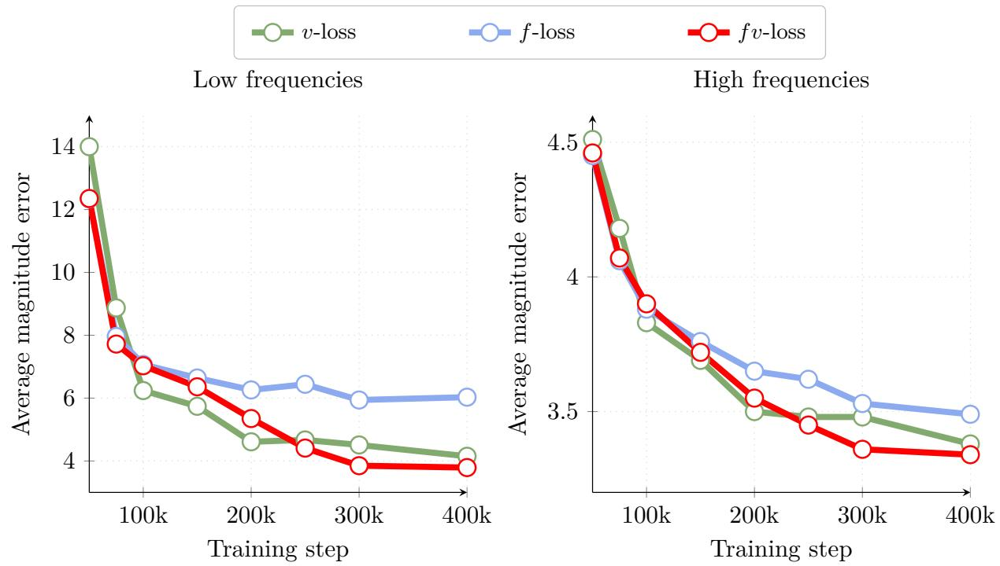

<table><tr><td>Loss</td><td>Epoch 80</td><td>Epoch 200</td><td>Epoch 320</td></tr><tr><td>v-loss</td><td>8.44</td><td>4.52</td><td>4.11</td></tr><tr><td>Discrete Focal Frequency Loss → v-loss</td><td>8.92</td><td>4.39</td><td>4.13</td></tr><tr><td>Focal Loss from [23] → v-loss</td><td>21.22</td><td>6.80</td><td>4.72</td></tr><tr><td>Laplacian loss → v-loss</td><td>23.93</td><td>5.04</td><td>4.12</td></tr><tr><td>fv-loss</td><td>7.05</td><td>4.20</td><td>3.95</td></tr></table>

Table 7: Frequency-to-pixel schedule with alternative frequency losses. Guided FID (B-size model, $2 5 6 ^ { 2 } )$ when the frequency-to-pixel schedule of Equation 4 is applied to diferent frequency-domain losses instead of f-loss.  
Figure 7: Convergence speed comparison between v-loss and fv-loss for diferent model sizes. Top row: unguided FID. Bottom row: guided FID. fv-loss consistenly outperforms v-loss leading to significant speed-ups.

## C Toy Example

In section 3.2, we isolate the temporal dynamics of the spectral bias. We train a small MLP to generate synthetic images composed of exactly two frequency components: one low and one high. In addition to the evolution of the magnitude of the Fourier spectrum in Figure 2, we provide the raw spectrum in Figure 8.

## D Focal Frequency Loss as a Continuous Laplacian Pyramid Loss

The Laplacian Pyramid [2] decomposes an image into bandpass residuals $\big \{ b _ { 0 } , . . . , b _ { K - 1 } \big \}$ and a low-pass base $l _ { K }$ . Each level captures spatial frequencies within a specific octave, treating scale-specific features as independent signals [15]. By performing recursive Gaussian blurring and subtraction, it isolates structural residuals at specific resolution scales, efectively partitioning the frequency spectrum into octave bands. By treating each octave (2n to 2n+1) as an independent signal, the pyramid elevates sparse, high-frequency details to the same structural importance as the low-frequency base — preventing high-energy components from numerically overwhelming fine textural details.

<table><tr><td>Loss</td><td>SiT output</td><td>FID @ Epoch 80</td></tr><tr><td>v-loss</td><td>x-pred</td><td>41.35</td></tr><tr><td>f-loss</td><td>x-pred</td><td>36.38</td></tr></table>

Table 8: Generalization to the latent-space SiT [39] backbone. FID comparison between v-loss and f-loss, both using x-prediction. Neither reaches the FID of the original SiT model trained with v-prediction (FID 33 at epoch 80).

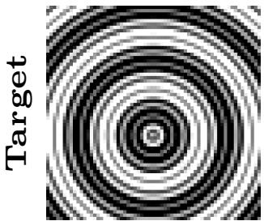

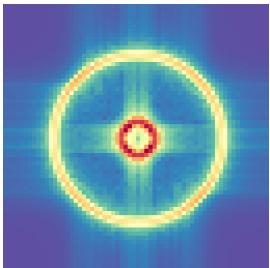

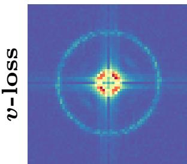  
500

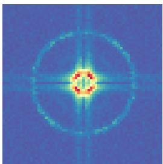  
1000

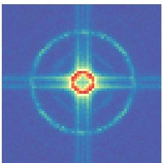  
2500

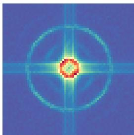  
5000  
Figure 8: Spectrum of the toy experiment of Section 3. (top) Real image and its corresponding spectrum. (bottom) Spectrum of images generated with the MLP at various training steps. The low frequencies (inner ring) are learned much faster than the high frequencies (outer ring).

Generalizing Laplacian Pyramids We propose f-loss as a continuous, infinite-band generalization of octave-based decomposition. By mapping images into the frequency domain via the DFT, we gain access to the full spectral hierarchy in a single pass. For a frequency at coordinate (u, v), we define:

$$
\mathcal { L } _ { u , v } = \log \left( 1 + \Vert { F _ { \theta } ( u , v ) - F ( u , v ) } \Vert _ { 2 } \right)\tag{5}
$$

The spectral diference $e _ { u , v } = \| F _ { \theta } ( u , v ) - F ( u , v ) \| _ { 2 }$ serves as the functional equivalent of a Laplacian residual. The logarithmic mapping linearizes the hierarchical scale of the frequency spectrum: every doubling of frequency is granted equal structural weight, preventing the loss from being dominated by high-energy, low-frequency components. Our approach thus inherits the perceptual benefits of the Laplacian pyramid without the burden of explicit hierarchical branching.

<table><tr><td rowspan=1 colspan=1>Loss</td><td rowspan=1 colspan=2>#Bands(Freq x Orient)</td><td rowspan=1 colspan=2>FIDcfg=1.0 cfg=3.5</td><td rowspan=1 colspan=4>Prec. ↑Rec. ↑Den. ↑  Cov. ↑</td></tr><tr><td rowspan=1 colspan=1>v-loss</td><td rowspan=1 colspan=2></td><td rowspan=1 colspan=1>49.63</td><td rowspan=1 colspan=1>7.70</td><td rowspan=1 colspan=1>0.52</td><td rowspan=1 colspan=1>0.64</td><td rowspan=1 colspan=1>0.53</td><td rowspan=1 colspan=1>0.79</td></tr><tr><td rowspan=5 colspan=1>f-loss</td><td rowspan=5 colspan=2>2 × 1 $2 \times 4$  $3 \times 4$  $4 \times 4$ </td><td rowspan=1 colspan=1>45.93</td><td rowspan=1 colspan=1>8.78</td><td rowspan=1 colspan=1>0.53</td><td rowspan=1 colspan=1>0.64</td><td rowspan=3 colspan=2>0.55      0.810.55</td></tr><tr><td rowspan=2 colspan=1></td><td rowspan=2 colspan=1>47.48</td><td rowspan=2 colspan=1>7.87</td><td rowspan=2 colspan=1>0.52</td><td rowspan=2 colspan=1>0.64</td><td rowspan=2 colspan=1>0.82</td></tr><tr><td rowspan=1 colspan=1></td></tr><tr><td rowspan=1 colspan=1>44.81</td><td rowspan=1 colspan=1>6.89</td><td rowspan=1 colspan=1>0.54</td><td rowspan=1 colspan=1>0.65</td><td rowspan=1 colspan=1>0.57</td><td rowspan=1 colspan=1>0.82</td></tr><tr><td rowspan=1 colspan=1>43.79</td><td rowspan=1 colspan=1>6.63</td><td rowspan=1 colspan=1>0.55</td><td rowspan=1 colspan=1>0.65</td><td rowspan=1 colspan=1>0.59</td><td rowspan=1 colspan=1>0.83</td></tr><tr><td rowspan=1 colspan=1></td><td rowspan=1 colspan=4>∞             41.78    6.39</td><td rowspan=1 colspan=4>0.56      0.66     0.62      0.85</td></tr></table>

Table 9: Comparison between discrete & continuous Focal Frequency loss. (Note: The Precision, Recall, Density and Coverage are provided for unguided settings)

Empirical study Table 9 reports results when transitioning from a discrete spectral decomposition to our continuous $\mathbf { \hat { \Pi } } f \mathbf { - } \mathrm { l o s s . }$ We partition the Fourier domain into a fixed number of frequency bands $( m = 2 , 3 , 4 )$ and orientations $( k = 1 , 4 )$ , computing the focal loss independently within each cell. Even a coarse discretization already improves over v-loss, and performance consistently improves as the number of spectral cells increases from FID 47.48 at $2 \times 4$ bands to 43.79 at $4 \times 4$ bands. Our continuous formulation achieves the best performance with FID 41.78, confirming that fine-grained spectral weighting provides the most efective way to balance the learning signal across the image spectrum.

## E Extended comparison in early stages of training

Figure 9 shows an extended quantitative comparison between f-loss and v-loss in the early stages of training, extanding Figure 5

## F Additional qualitative results at $5 1 2 \times 5 1 2$ resolution

Figure 10 shows $5 1 2 ^ { 2 }$ images generated by our model trained with fv-loss.

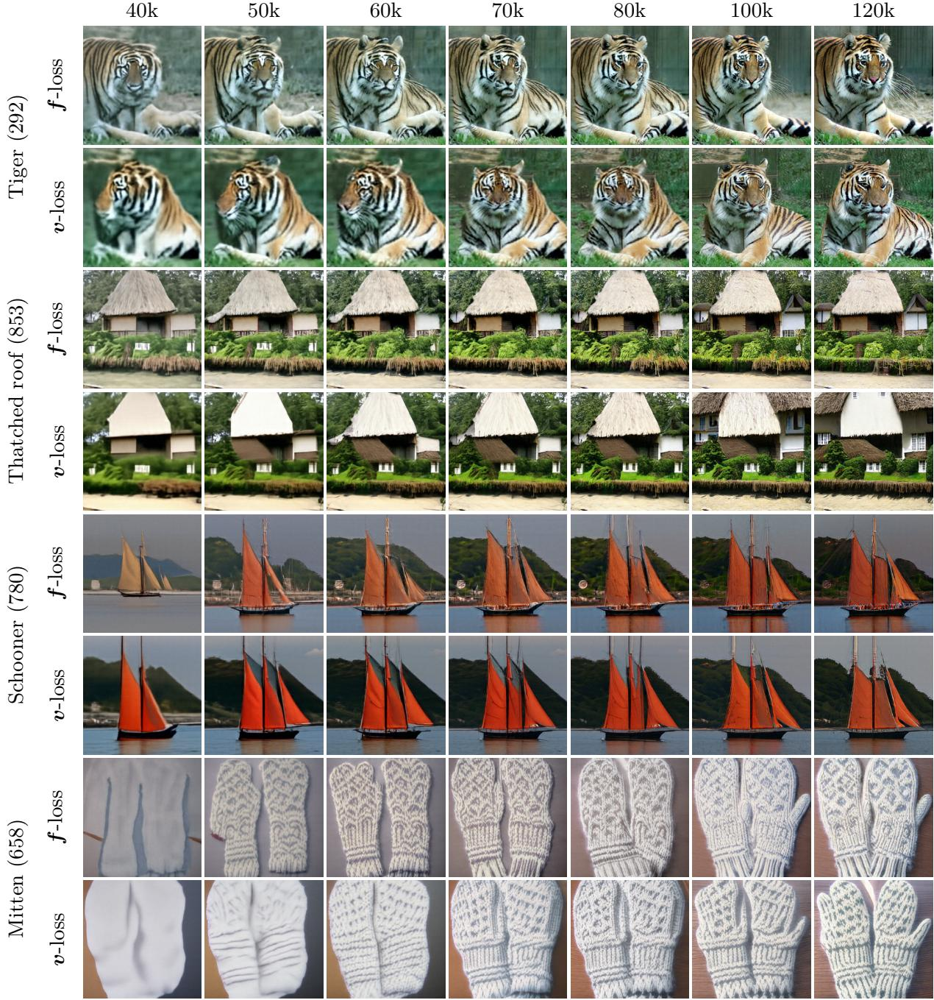  
Figure 9: Extended comparison between f-loss and v-loss in the early stages of training.

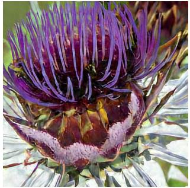

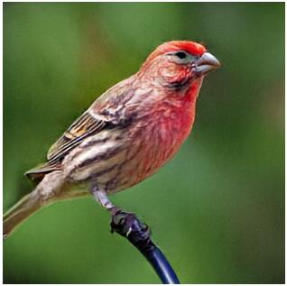

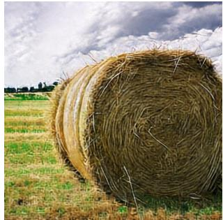

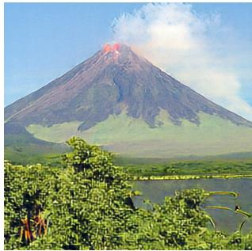

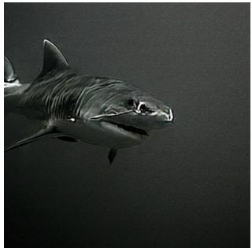

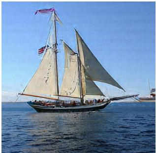

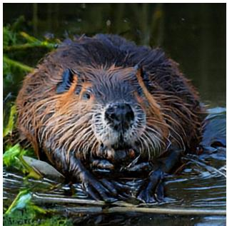

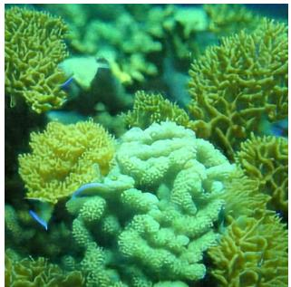

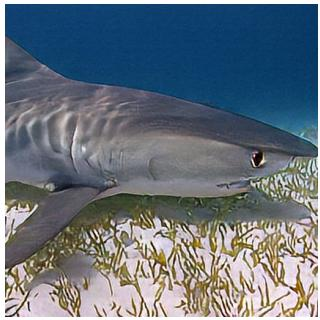  
Figure 10: Additional Qualitative Results at $5 1 2 ^ { 2 }$ resolution. Model trained with fv-loss for 400k steps.

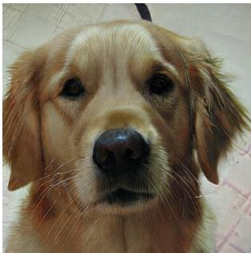