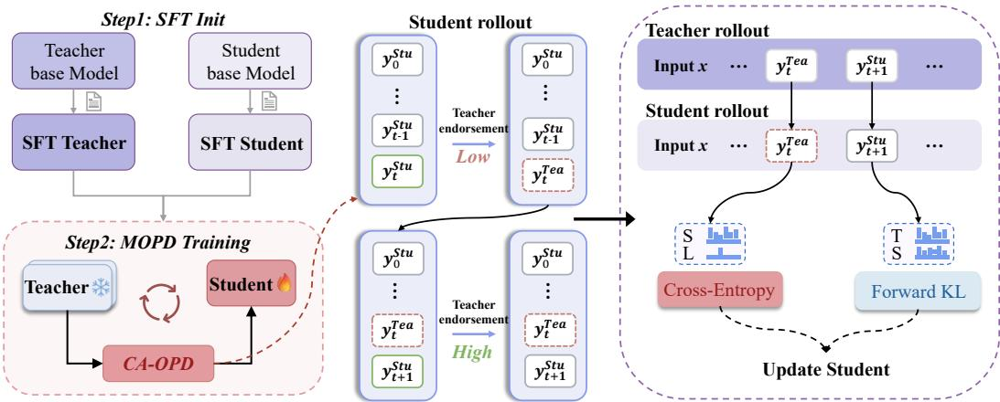
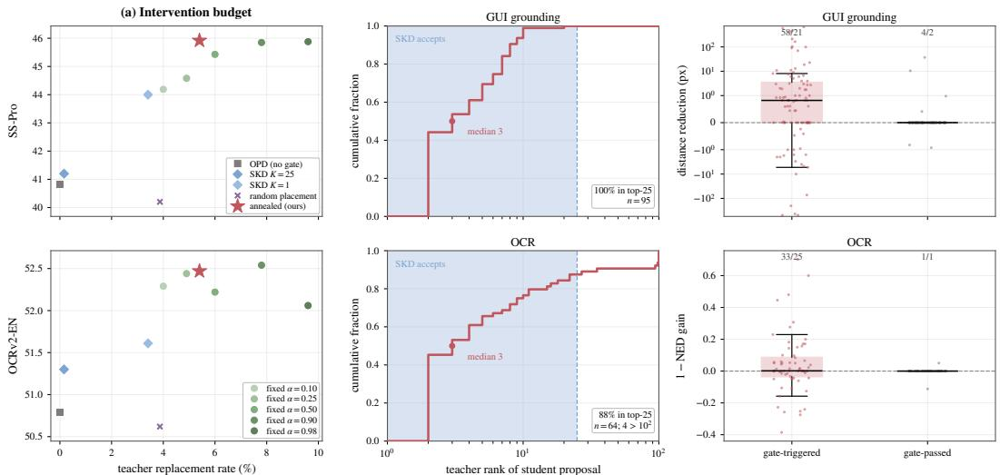
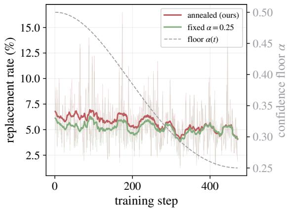
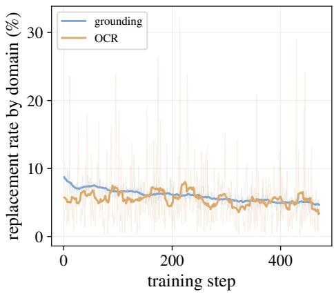

# CA-OPD: CONFIDENCE-AWARE ON-POLICY DISTILLATION FOR STRUCTURED VISUAL PREDICTION

Menghao Li1,\* Linjie Mu2,\* Yin Wang3,\* Haotian Hu3,\*,§

Yannian Gu2 Lujiayi Xue4 Fanyi Wang3,†

1Tianjin University 2Shanghai Jiao Tong University

3StepX 4University of Science and Technology of China

## ABSTRACT

Autoregressive vision language models unify heterogeneous perception tasks but are highly susceptible to compounding errors. On-policy distillation (OPD) bridges the training-inference mismatch by training students on their own rollouts. However, unreliable student predictions, especially early in training, can derail the trajectory and degrade the quality of teacher supervision. While recent interleaved distillation methods allow the teacher to verify and replace student tokens, they primarily rely on rigid ranking metrics rather than exact teacher confidence, and they overlook how intervention decisions can inform token-level supervision. To address this, we introduce Confidence-Aware On-Policy Distillation (CA-OPD), a framework that couples reliable rollout construction with adaptive supervision. CA-OPD utilizes teacher confidence to selectively correct unreliable student transitions, gradually transferring rollout control to the student via a strict-to-relaxed schedule. Crucially, CA-OPD aligns knowledge transfer with these intervention decisions: corrected positions receive direct cross-entropy supervision from the teacher’s prediction, while retained positions benefit from the teacher’s full predictive distribution. Evaluated in a multi-teacher setting for GUI grounding and optical character recognition, CA-OPD substantially improves the Qwen3.5-0.8B baseline across all six target benchmarks, including gains of 9.50 points on ScreenSpot-Pro and 6.72 points on OCRBench-v2 English. Controlled studies further show that the gains depend on intervention placement, progressive rollout control, and intervention-aligned supervision, rather than intervention frequency alone.

## 1 INTRODUCTION

Vision language models (VLMs) increasingly solve heterogeneous perception tasks through a unified autoregressive interface (Peng et al., 2023; Wang et al., 2026). For instance, optical character recognition (OCR) outputs are generated as text, while visual grounding and graphical user interface (GUI) interaction serialize locations or actions as token sequences (Kim et al., 2021; Chen et al., 2021; You et al., 2024). While this formulation provides a flexible, task-agnostic interface, it makes structured prediction inherently sequential: every generated token becomes part of the next input. Once an incorrect token is committed, subsequent predictions are conditioned on a corrupted prefix. A local error can therefore compound, degrading both the immediate prediction and the entire trajectory along which the remainder of the output is generated (Ranzato et al., 2015; Kim et al., 2022).

This autoregressive dependency poses a significant challenge for knowledge distillation (KD). Traditional offline and sequence-level distillation train the student on stable, reference- or teacher-generated trajectories (Hinton et al., 2015; Kim & Rush, 2016). However, during inference, the student is evalu ated on prefixes produced by its own policy. On-policy distillation (OPD) mitigates this mismatch by allowing the student to generate the rollout, querying the teacher for supervision on the states the student actually visits (Agarwal et al., 2024; Gu et al., 2024). Yet, the very property that aligns OPD with inference also introduces a critical vulnerability. When the student is unreliable, especially early in training, an incorrect prediction can enter the prefix and derail all subsequent states where teacher supervision is applied (Xu et al., 2025).

  
Figure 1: Confidence-aware on-policy distillation for structured visual prediction. CA-OPD evaluates each student proposal using teacher confidence. Low-support proposals are replaced by teacher tokens and receive direct corrective supervision, while supported proposals remain in the rollout and retain distributional supervision. The mixed prefix is used for subsequent autoregressive generation.

Recent interleaved distillation methods offer a natural remedy for this tension. Instead of blindly committing every student prediction to the rollout, the teacher can verify student proposals and intervene when necessary. Speculative Knowledge Distillation (SKD) (Xu et al., 2025), for example, uses the teacher’s ranking of a student proposal to decide whether the proposal should remain in the generated prefix. Such verification provides a useful middle ground between relying entirely on student generation during OPD and using trajectories dictated by the teacher. It protects the rollout from severe student errors while retaining substantial exposure to states induced by the student policy.

Nevertheless, two limitations remain. First, rank does not directly measure how strongly the teacher supports a student proposal. A token can rank highly even when the teacher distribution is uncertain, whereas proposals with the same rank can receive substantially different probability mass. The decision to trust a student transition is therefore better informed by the exact teacher confidence assigned to that proposal. Second, teacher intervention contains useful learning signals beyond simply repairing the rollout. When the teacher rejects a student proposal and commits its own prediction, it identifies a concrete local mistake. Treating this event solely as a rollout-correction mechanism leaves this corrective signal underutilized. Conversely, when the teacher already supports the student proposal, preserving the richer teacher distribution can provide informative supervision. These observations suggest that rollout control and token-level supervision should be jointly optimized.

To address this, we introduce CA-OPD, a confidence-aware on-policy distillation framework that couples reliable rollout construction with adaptive token-level supervision. CA-OPD leverages teacher confidence to assess student proposals and selectively correct unreliable transitions. Teacher intervention is stronger early in training when the student is less reliable and gradually decreases, allowing the rollout to smoothly move toward greater student control. Crucially, the outcome of this verification dictates how knowledge is transferred: corrected positions receive direct supervisionfrom the teacher’s prediction, while retained positions continue to benefit from the teacher’s full predictive distribution. As illustrated in Figure 1, CA-OPD preserves the on-policy character of training while selectively preventing poorly supported student transitions from being committed to the prefix. This same gate determines the supervision used at each position, elegantly connecting state visitation and knowledge transfer within a single autoregressive process.

We evaluate CA-OPD in a multi-teacher setting that distills complementary GUI grounding and OCR capabilities into Qwen3.5-0.8B. Relative to the Qwen3.5-0.8B baseline, CA-OPD improves all six target benchmarks, with gains of 9.08 points on ScreenSpot-v2, 9.50 points on ScreenSpot-Pro, 6.72 points on OCRBench-v2 English, and 9.77 points on OCRBench-v2 Chinese. It also outperforms Offline KD, standard OPD, and SKD on every target benchmark, indicating that the gains cannot be attributed to distillation alone. Furthermore, controlled studies demonstrate that our gains cannot be explained by intervention frequency alone. Specifically, we show that (1) where the teacher intervenes matters, as randomly placed interventions provide minimal benefit compared to confidence-based ones at identical budgets; (2) a strict-to-relaxed schedule outperforms both fixed and reversed alternatives; and (3) aligning the supervision objective with the intervention decision materially contributes to the overall improvement. Together, these results indicate that effective on-policy distillation depends not only on how often the teacher intervenes, but also on the strategic placement of interventions, the evolution of control over training, and the adaptive supervision of corrected versus retained positions.

Our contributions are summarized below:

• We identify a coupled challenge in on-policy distillation for structured autoregressive prediction: unreliable student transitions corrupt subsequent states conditioned for generation, and existing methods fail to utilize the teacher’s intervention decision as a signal for token-level supervision.

• We introduce CA-OPD, which uses teacher confidence to selectively repair student-generated prefixes, progressively transfers rollout control to the student, and applies intervention-aligned supervision: cross-entropy at replaced positions and distributional distillation at retained positions.

• We demonstrate consistent gains across GUI grounding and OCR in a multi-teacher distillation setting while preserving held-out capabilities. Controlled studies confirm that improvements stem from strategic intervention placement, the direction of the rollout-control schedule, and adaptive supervision, rather than sheer intervention frequency.

## 2 RELATED WORK

Autoregressive structured visual prediction. Representing structured visual outputs as token sequences is a prevailing paradigm for unifying heterogeneous perception tasks. For instance, Pix2Seq (Chen et al., 2021) and Donut (Kim et al., 2021) serialize bounding boxes and document texts, while Unified-IO models map diverse multimodal outputs into a shared autoregressive interface (Lu et al., 2022; 2024). Recent VLMs similarly express visual grounding and GUI interactions through language-like coordinate sequences or action tokens (Peng et al., 2023; Chen et al., 2023; You et al., 2024; Cheng et al., 2024; Lin et al., 2025). While this formulation provides a flexible, task-agnostic interface, it makes structured prediction inherently sequential. Because every committed token becomes part of the subsequent prefix, errors in OCR symbols, coordinates, or actions inevitably compound. Such error propagation is particularly consequential for structured outputs, where a small local deviation can change the semantic interpretation of the entire prediction or redirect subsequent generation toward incorrect states.

Knowledge distillation for autoregressive models. Traditional knowledge distillation (KD) transfers knowledge via teacher predictive distributions (Hinton et al., 2015), while sequence-level KD relies on complete teacher-generated trajectories (Kim & Rush, 2016). Recent advances in language and multimodal model distillation primarily broaden what knowledge is transferred or which divergence is minimized. For example, Distilling Step-by-Step leverages teacher rationales (Hsieh et al., 2023), MiniLLM optimizes reverse-KL divergence to better match generation distributions (Gu et al., 2024), and LLaVA-KD transfers complex multimodal relations (Cai et al., 2025). While these approaches enrich the available supervision, their effectiveness is bottlenecked by the autoregressive states where this supervision is applied. Because errors compound in structured prediction, static teacher-generated prefixes fail to reflect true inference trajectories. CA-OPD complements these representation-focused methods by jointly optimizing rollout construction and token-level supervision.

On-policy and interleaved distillation. The distribution shift between training and inference states is a classic challenge in sequential prediction, historically addressed by techniques like scheduled sampling (Bengio et al., 2015) and DAgger (Ross et al., 2011). In modern KD, Generalized Knowledge Distillation (GKD) addresses this by querying the teacher on student-generated rollouts, forcing the student to learn from its own inference-time errors (Agarwal et al., 2024). SKD refines this via interleaved trajectories, where the teacher replaces student proposals that rank poorly under its distribution (Xu et al., 2025). Although such interleaving improves the reliability of student-generated trajectories, a rank-based criterion only measures the relative ordering of a proposal and does not directly quantify how strongly the teacher supports it. CA-OPD refines this interleaved approach by replacing rigid ranking with the teacher’s confidence to guide interventions. It dynamically relaxes this intervention threshold as the student improves, and explicitly couples rollout control with adaptive token-level supervision, thereby unifying state visitation and knowledge transfer.

## 3 PROBLEM FORMULATION

## 3.1 STRUCTURED AUTOREGRESSIVE PREDICTION

Let $x = ( I , q )$ denote an input pair comprising an image I and a textual instruction q. An autoregressive model generates an output sequence $y = ( y _ { 1 } , \dots , y _ { L } )$ over a vocabulary V such that:

$$
\pi ( \boldsymbol { y } \mid \boldsymbol { x } ) = \prod _ { t = 1 } ^ { L } \pi ( y _ { t } \mid \boldsymbol { x } , \boldsymbol { y } _ { < t } ) .\tag{1}
$$

We define the autoregressive state at step t as $\boldsymbol { s } _ { t } = \left( x , y _ { < t } \right)$ . Given a shared tokenizer, the student network (parameterized by θ) and the frozen teacher network define the next-token predictive distributions $\pi _ { S } ( \cdot \mid s _ { t } ; \theta )$ and $\pi _ { T } ( \cdot \mid s _ { t } )$ , respectively.

In structured visual prediction, the generated tokens may encode diverse outputs such as text, spatial coordinates, or discrete actions. Because each committed token updates the subsequent state, an incorrect prediction corrupts not only the immediate output but also the future contexts upon which downstream predictions and supervision rely.

## 3.2 ON-POLICY DISTILLATION AND STATE VISITATION

OPD constructs training trajectories by sampling directly from the student policy,

$$
\hat { y } _ { t } \sim \pi _ { S } ( \cdot \mid \hat { s } _ { t } ; \theta ) ,\tag{2}
$$

and aligns the student with the teacher over these actively visited states:

$$
\mathcal { L } _ { \mathrm { O P D } } = \frac { 1 } { \sum _ { t } m _ { t } } \sum _ { t = 1 } ^ { L } m _ { t } D _ { \mathrm { K L } } \left( \pi _ { T } \big ( \cdot \mid \hat { s } _ { t } \big ) \big \| \pi _ { S } \big ( \cdot \mid \hat { s } _ { t } ; \theta \big ) \right) ,\tag{3}
$$

where $m _ { t }$ denotes the loss mask.

While this mitigates the distribution shift between training and free-running inference, unreliable student predictions, especially early in training, can severely degrade the quality of subsequent states. To address this, we explicitly decouple the token-level supervision objective from the behavior policy $\mu$ used to construct the rollout:

$$
y _ { t } \sim \mu ( \cdot \mid s _ { t } ) , \qquad s _ { t + 1 } = ( x , y _ { \leq t } ) .\tag{4}
$$

Standard OPD corresponds to $\mu = \pi _ { S }$ , which fully exposes the trajectory to student errors. Conversely, interleaved distillation permits teacher intervention during prefix construction. CA-OPD builds upon this generalized formulation by adaptively gating when a student proposal is retained. This dynamically balances the need for reliable, high-quality training trajectories with the necessity of gradually exposing the student to its own generated states.

## 4 CONFIDENCE-AWARE ON-POLICY DISTILLATION

Building on Section 3, CA-OPD constructs the rollout prefix dynamically. At each decoding step, the teacher evaluates the student’s proposed token. Highly supported proposals are retained and supervised via the teacher’s predictive distribution, whereas unreliable ones are replaced by the teacher’s prediction and supervised via direct cross-entropy. This single intervention decision elegantly aligns rollout control with adaptive token-level supervision.

## 4.1 CONFIDENCE-AWARE ROLLOUT CONTROL

At state $s _ { t } ,$ the student generates a candidate token $\hat { y } _ { t } \sim \pi _ { S } ( \cdot \mid s _ { t } ; \theta )$ . We measure the teacher’ support for this exact proposal using the negative log-likelihood (NLL) defined as

$$
\mathrm { N L L } _ { T , t } = - \log \pi _ { T } ( \hat { y } _ { t } \mid s _ { t } )\tag{5}
$$

A lower $\mathrm { N L L } _ { \mathrm { Z } , t }$ indicates stronger teacher support. Given an NLL threshold $\tau _ { \mathrm { n l l } , s }$ at optimization step s, we define a binary replacement indicator as

$$
r _ { t } = \mathbb { I } \left[ \mathrm { N L L } _ { T , t } > \tau _ { \mathrm { n l l } , s } \right]\tag{6}
$$

Here, $r _ { t } = 1$ indicates the proposal is rejected, and $r _ { t } = 0$ means it is retained. Equivalently, this corresponds to a teacher probability floor $\alpha _ { s } = \exp ( - \tau _ { \mathrm { n l l } , s } )$ . When a proposal is rejected, the teacher provides a deterministic correction $\tilde { y } _ { t } = \arg \operatorname* { m a x } _ { v \in \mathcal { V } } \pi _ { T } ( v \mid s _ { t } )$ ). The final token committed to the rollout is therefore

$$
y _ { t } = \left\{ { \begin{array} { l l } { \tilde { y } _ { t } , } & { r _ { t } = 1 , } \\ { \hat { y } _ { t } , } & { r _ { t } = 0 . } \end{array} } \right.\tag{7}
$$

Generation subsequently continues from $s _ { t + 1 } = ( x , y _ { \leq t } )$ . Because the prefix may contain both retained student tokens and teacher corrections, an intervention alters not only $y _ { t }$ but also the autoregressive state conditioning all future predictions. These are discrete rollout operations, and no gradients are propagated through them.

## 4.2 INTERVENTION-ALIGNED SUPERVISION

The replacement indicator $r _ { t }$ also dictates the token-level supervision applied at each position.

Supervision at replaced positions. For a replaced position $( r _ { t } = 1 )$ , the committed token is the teacher’s prediction $y _ { t } = \tilde { y } _ { t }$ . The student is directly supervised using standard cross-entropy as

$$
\mathcal { L } _ { t } ^ { \mathrm { R } } = - \log \pi _ { S } ( y _ { t } \mid s _ { t } ; \theta )\tag{8}
$$

Supervision at retained positions. For a retained position $( r _ { t } = 0 )$ , the student proposal remains. The student is then supervised by the teacher’s predictive distribution via the forward KL divergence formulated as

$$
\mathcal { L } _ { t } ^ { \mathrm { K } } = D _ { \mathrm { K L } } \left( \pi _ { T } ( \cdot  { \left| \ s _ { t } \right) \right| }  { \left\| \pi _ { S } ( \cdot  { \left| \ s _ { t } ; \theta ) \right) } \right) } .\tag{9}
$$

To mitigate the computational cost of transferring the full vocabulary distribution, we distill only the teacher’s top-k predictions $\mathcal { V } _ { T , t } ^ { ( k ) } = \mathrm { T o p K } _ { v } \pi _ { T } ( v \mid s _ { t } )$ . The truncated forward KL term is computed as

$$
\mathcal { L } _ { t } ^ { \mathrm { K \cdot t o p k } } = \sum _ { v \in \mathcal { V } _ { T , t } ^ { ( k ) } } \pi _ { T } ( v  { \left| \right. } s _ { t } ) \left[ \log \pi _ { T } ( v  { \left| \right. } s _ { t } ) - \log \pi _ { S } ( v  { \left| \right. } s _ { t } ; \theta ) \right]\tag{10}
$$

Because the retained probabilities are unnormalized, this truncated value can occasionally become negative. We therefore apply a zero lower bound where $\mathcal { L } _ { t } ^ { \mathrm { K - t o p k } }  \mathrm { m a x } ( \mathcal { L } _ { t } ^ { \mathrm { K - t o p k } } , 0 )$

## 4.3 CA-OPD OBJECTIVE

By unifying rollout construction and supervision under the same replacement indicator, the token-level CA-OPD objective becomes

$$
\mathcal { L } _ { t } ^ { \mathrm { C A - O P D } } = r _ { t } \mathcal { L } _ { t } ^ { \mathrm { R } } + ( 1 - r _ { t } ) \mathcal { L } _ { t } ^ { \mathrm { K - t o p k } }\tag{11}
$$

Let $m _ { t } \in \{ 0 , 1 \}$ denote the valid response token mask. The sequence-level objective is formulated as

$$
{ \mathcal { L } } _ { \mathrm { C A . O P D } } = { \frac { 1 } { \sum _ { t = 1 } ^ { L } m _ { t } } } \sum _ { t = 1 } ^ { L } m _ { t } \left[ r _ { t } \left( - \log \pi _ { S } ( y _ { t } \mid s _ { t } ; \theta ) \right) + ( 1 - r _ { t } ) { \mathcal { L } } _ { t } ^ { \mathrm { K . t o p k } } \right]\tag{12}
$$

To provide further flexibility, these two supervision terms can be weighted independently as

$$
{ \mathcal { L } } _ { \mathrm { C A - O P D } } = { \frac { 1 } { \sum _ { t = 1 } ^ { L } m _ { t } } } \sum _ { t = 1 } ^ { L } m _ { t } \left[ \lambda _ { \mathrm { C E } } r _ { t } { \mathcal { L } } _ { t } ^ { \mathrm { R } } + \lambda _ { \mathrm { K L } } ( 1 - r _ { t } ) { \mathcal { L } } _ { t } ^ { \mathrm { K + o p k } } \right]\tag{13}
$$

## 4.4 PROGRESSIVE TRANSFER OF ROLLOUT CONTROL

Early in training, aggressive teacher intervention prevents erratic student transitions from corrupting subsequent states. As the student matures, retaining more student-generated states becomes essential to preserve the on-policy nature of distillation. We therefore progressively relax the confidence requirement.

Let $p _ { s } = s / S$ denote the normalized training progress over $S$ total steps. We employ a cosine schedule to decay the intervention threshold according to

$$
\tau _ { \mathrm { n l l } , s } = \tau _ { \mathrm { s t a r t } } + \frac { \tau _ { \mathrm { e n d } } - \tau _ { \mathrm { s t a r t } } } { 2 } \left[ 1 - \cos ( \pi p _ { s } ) \right]\tag{14}
$$

where $\tau _ { \mathrm { s t a r t } } < \tau _ { \mathrm { e n d } }$ . The lower initial threshold enforces a strict acceptance criterion. As training progresses, the threshold increases, permitting more student proposals to remain. Importantly, this schedule governs the confidence criterion rather than dictating a fixed replacement rate. As the student aligns more closely with the teacher, fewer positions trigger corrections, facilitating a natural transfer of rollout control. The pseudocode for the experimental procedure is provided in Appendix A.

## 5 EXPERIMENTS

## 5.1 EXPERIMENTAL SETUP

Models. We employ an SFT-initialized Qwen3.5-0.8B (Qwen Team, 2026) as the student. For supervision, we utilize two separate Qwen3.5-9B models, fine-tuned on their respective domains, to serve as the grounding and OCR teachers. During training, examples are dynamically routed to the corresponding domain teacher.

Baselines. We compare CA-OPD against three representative distillation strategies: Offline KD, which trains the student on static teacher-generated trajectories (Kim & Rush, 2016); OPD, which performs standard on-policy distillation without teacher intervention (Agarwal et al., 2024); and SKD (Xu et al., 2025), which uses the teacher’s relative ranking of each student proposal to determine whether it is retained in the rollout. We additionally evaluate a CA-OPD variant with a fixed acceptance threshold to isolate the contribution of our progressive schedule. The SFT-initialized student backbone and the teachers are reported as upper and lower reference points rather than controlled baselines.

Evaluation. We evaluate GUI grounding on ScreenSpot-v2 (Wu et al., 2025) and ScreenSpot-Pro (Li et al., 2025), and OCR capabilities on OCRBench-v2 (Fu et al., 2026), CC-OCR (Yang et al., 2025), and OmniDocBench (Ouyang et al., 2025). Furthermore, we evaluate on RefCOCO/+/g (Yu et al., 2016; Nagaraja et al., 2016) and MMBench (Liu et al., 2024) to measure general capability retention. Beyond standard benchmarking, our evaluation includes extensive controlled studies to isolate the impact of individual CA-OPD components. Detailed protocols are provided in Appendix C.

Table 1: Main results across target and retention benchmarks. All controlled distillation methods use the same student initialization, training data, and optimization budget, and results are averaged over three independent training runs. For the teacher reference row, G denotes the grounding teacher and O denotes the OCR teacher. Best and second-best student results are shown in bold and underline, respectively.
<table><tr><td rowspan="2">Method Method</td><td colspan="2">GUI Grounding</td><td colspan="4">OCR</td><td colspan="2">Retention</td></tr><tr><td>SS-v2</td><td>SS-Pro</td><td>OCRv2-EN OCRv2-ZH</td><td></td><td>CC-OCR</td><td>OmniDoc</td><td></td><td>RefCOCO MMBench</td></tr><tr><td>Teacher (domain-routed, 9B)</td><td>93.88G</td><td>62.92G</td><td>66.030</td><td>63.870</td><td>78.520</td><td>81.180</td><td>84.56G</td><td>90.60G</td></tr><tr><td>Qwen3.5-0.8B</td><td>79.33</td><td>36.42</td><td>45.75</td><td>43.45</td><td>62.19</td><td>62.28</td><td>78.51</td><td>75.21</td></tr><tr><td>Student (SFT-init)</td><td>80.46</td><td>38.19</td><td>50.98</td><td>51.31</td><td>66.40</td><td>70.49</td><td>82.00</td><td>79.16</td></tr><tr><td>Offline KD (Kim &amp; Rush, 2016)</td><td>87.96</td><td>44.23</td><td>51.56</td><td>52.91</td><td>66.99</td><td>70.40</td><td>81.86</td><td>79.99</td></tr><tr><td>OPD (Agarwal et al., 2024)</td><td>87.34</td><td>40.82</td><td>50.79</td><td>52.45</td><td>63.93</td><td>68.57</td><td>81.78</td><td>80.00</td></tr><tr><td>SKD (Xu et al., 2025)</td><td>87.63</td><td>41.20</td><td>51.30</td><td>52.43</td><td>63.83</td><td>68.36</td><td>81.81</td><td>79.76</td></tr><tr><td>CA-OPD, fixed α = 0.25</td><td>87.81</td><td>44.58</td><td>52.44</td><td>52.76</td><td>66.95</td><td>70.64</td><td>81.82</td><td>79.73</td></tr><tr><td>CA-OPD, annealed α : 0.50 →0.25</td><td>88.41</td><td>45.92</td><td>52.47</td><td>53.22</td><td>67.32</td><td>70.43</td><td>81.90</td><td>80.16</td></tr></table>

Implementation Details. To ensure fair comparison, all evaluated methods share the exact same student initialization, training data, and optimization budget. Unless otherwise stated, all reported results are averaged over three independent training runs. Detailed SFT and distillation data compositions, hyperparameters, decoding settings, and specific CA-OPD configurations are deferred to Appendix B.

## 5.2 MAIN RESULTS

Table 1 summarizes the overall results. CA-OPD consistently outperforms standard OPD across all six target benchmarks spanning both GUI grounding and OCR. Crucially, the gains are substantial on complex tasks. For instance, ScreenSpot-Pro surges from 40.82 to 45.92 (+5.10 points), and CC-OCR increases from 63.93 to 67.32 (+3.39 points). Furthermore, CA-OPD surpasses both SKD and Offline KD across the board. This confirms that our improvements stem directly from the confidence-aware intervention mechanism, rather than the mere presence of on-policy supervision or teacher-generated trajectories.

Validating our dynamic intervention strategy, the annealed variant proves superior to a fixed confidence threshold. It improves five of the six target metrics, which supports the core hypothesis that progressively returning rollout control to the student as it matures is more effective than a static policy. Importantly, these target-task gains do not compromise generalization. When deliberately evaluated on held-out out-of-distribution (OOD) tasks such as RefCOCO and MMBench, CA-OPD maintains performance on par with the SFT initialization and competing baselines, successfully avoiding catastrophic forgetting. Detailed results are shown in Appendix D.

## 5.3 ABLATION STUDY

We ablate CA-OPD in two stages. We first examine whether the performance gains depend on both explicit prefix repair and intervention placement guided by confidence. We then retain these two core components to isolate the individual effects of rollout scheduling, teacher correction policies, and supervision aligned with intervention decisions. All variants maintain identical student initialization, training data, and optimization budgets.

Selective intervention and prefix repair are both essential. The first block of Table 2 separates the effect of where the teacher intervenes from whether the correction is actually written back into the autoregressive prefix. Randomly inserting teacher corrections at a comparable writeback rate performs similarly to standard OPD. This indicates that merely increasing teacher intervention is insufficient. Conversely, applying confidence gating without prefix writeback also yields performance close to standard OPD, despite preserving the intervention decision and the associated supervision. Only the combination of selective placement and actual prefix repair produces the full improvement. This result demonstrates that CA-OPD benefits heavily from selectively correcting unreliable student transitions and using those corrections to improve the subsequent states visited during training.

Table 2: Ablation study of CA-OPD. We separately examine selective prefix repair and the remaining design choices for rollout control and supervision. WB denotes the realized fraction of rollout tokens replaced by teacher predictions. Random intervention uses a comparable writeback budget.  
Selective Intervention and Prefix Repair
<table><tr><td>Variant</td><td>Placement</td><td>Prefix Repair</td><td>SS-Pro</td><td>OCRv2-EN</td><td>WB (%)</td></tr><tr><td>OPD</td><td>None</td><td>No</td><td>40.82</td><td>50.79</td><td>0.00</td></tr><tr><td>Random intervention</td><td>Random</td><td>Yes</td><td>40.20</td><td>50.62</td><td>3.87</td></tr><tr><td>No prefix writeback</td><td>Confidence</td><td>No</td><td>40.92</td><td>51.36</td><td>0.00</td></tr><tr><td>CA-OPD</td><td>Confidence</td><td>Yes</td><td>45.92</td><td>52.47</td><td>5.40</td></tr></table>

Rollout Control and Supervision
<table><tr><td>Variant</td><td>Schedule</td><td>Correction</td><td>Loss at Replaced</td><td>SS-Pro</td><td>OCRv2-EN</td><td>WB (%)</td></tr><tr><td>Fixed threshold</td><td>Fixed</td><td>Argmax</td><td>CE</td><td>44.58</td><td>52.44</td><td>4.90</td></tr><tr><td>Reversed schedule</td><td>Reversed</td><td>Argmax</td><td>CE</td><td>44.36</td><td>51.69</td><td>4.90</td></tr><tr><td>Sampled writeback</td><td>Annealed</td><td>Sample</td><td>CE</td><td>43.61</td><td>51.69</td><td>5.60</td></tr><tr><td>KL at replaced positions</td><td>Annealed</td><td>Argmax</td><td>KL</td><td>45.26</td><td>51.75</td><td>5.40</td></tr><tr><td>CA-OPD</td><td>Annealed</td><td>Argmax</td><td>CE</td><td>45.92</td><td>52.47</td><td>5.40</td></tr></table>

Figure 2: Analysis of the CA-OPD gating mechanism. (a) Increasing the intervention budget alone does not recover CA-OPD’s gains. (b) Most CA-OPD-triggered proposals remain within the teacher’s top-25 despite insufficient absolute support. (c) Teacher replacement benefits gate-triggered positions, while gate-passed positions provide a near-zero control.

Rollout control and supervision provide complementary gains. The second block evaluates the remaining design choices while retaining selective intervention and prefix repair. Replacing the annealed confidence schedule with a fixed threshold degrades performance, and reversing the schedule causes an even larger drop. This finding strongly supports the progressive transfer of rollout control from the teacher to the student. Furthermore, using sampled teacher corrections instead of deterministic argmax writeback reduces performance, suggesting that reliable prefix repair requires a stable correction policy. Finally, replacing direct corrective supervision at replaced positions with KL distillation underperforms the full objective.

## 5.4 ANALYSIS OF THE GATING MECHANISM

We examine whether CA-OPD’s gains arise simply from more frequent interventions, whether absolute teacher support identifies positions missed by rank-based gating, and whether these interventions improve the resulting trajectories. Together, these analyses isolate whether the benefit comes from the intervention budget itself or from selectively correcting particular rollout states.

Table 3: CA-OPD gains across different data regimes. Each cell reports the improvement of annealed CA-OPD over OPD. The gains remain positive across all strata rather than being confined to a particular output length, initial competence level, or teacher-rejection density.
<table><tr><td>Stratification</td><td>Low / Short</td><td>Medium</td><td>High / Long</td></tr><tr><td>Output length</td><td>Short +1.50</td><td>Medium +0.61</td><td>Long +1.16</td></tr><tr><td>Initial competence</td><td>All wrong +3.90</td><td>Mixed +10.60</td><td>All correct +3.65</td></tr><tr><td>Teacher-rejection density</td><td>Low ρ +4.95</td><td>Medium ρ +5.31</td><td>Highρ +5.05</td></tr></table>

Intervention frequency alone does not explain the gains. As shown in Figure 2(a), increasing the SKD replacement rate from 0.16% to 3.41% improves SS-Pro from 41.20 to 44.00, but still trails CA-OPD by 1.92 points on SS-Pro and 0.86 points on OCRv2-EN. CA-OPD performance is also non-monotonic in replacement rate, while random interventions at a comparable budget yield only marginal gains (Table 2). Thus, intervention placement matters beyond frequency alone. In particular, simply allocating more teacher tokens does not reproduce the benefit of selectively intervening at low-support states. The full budget sweep is provided in Appendix E.1.

Absolute support identifies positions missed by rank. Figure 2(b) shows that CA-OPD-triggered proposals have a median teacher rank of 3, with 100% of grounding and 88% of OCR proposals remaining within the teacher’s top-25. Thus, rank-based gating would retain most proposals rejected by CA-OPD due to insufficient absolute teacher support.

Gate-triggered positions are consequential. In the paired counterfactual analysis in Figure 2(c), teacher replacement improves grounding in 58 of 95 triggered instances and yields a net positive effect on OCR. In contrast, interventions at gate-passed positions have negligible impact, showing that CA-OPD targets consequential states.

Finally, teacher intervention frequency naturally decreases during training, keeping rollouts predominantly student-driven. This decay indicates that the method does not rely on persistently high levels of teacher correction as optimization proceeds. Detailed training dynamics are provided in Appendix E.3.

## 5.5 STRATIFIED PERFORMANCE ANALYSIS

We examine whether the gains of CA-OPD are concentrated in particular output-length, initialcompetence, or teacher-rejection regimes.

As shown in Table 3, CA-OPD improves over OPD in every stratum, indicating that its gains are not confined to long outputs, low-competence examples, or states with dense teacher rejection. In particular, the nearly constant margin across rejection-density terciles suggests that the benefit extends beyond examples requiring frequent intervention. Although the mixed-competence group exhibits the largest gain, we treat this as descriptive rather than evidence of a specific intermediate-difficulty effect. CA-OPD also better preserves behavior already acquired during SFT. On examples consistently solved by the initialization, OPD decreases performance from 96.03 to 90.18, whereas CA-OPD retains 93.83 (Appendix Table 11). Detailed scores and stratification protocols are provided in Appendix F and Appendix F.1.

## 6 CONCLUSION

We introduced CA-OPD, a confidence-aware on-policy distillation framework for structured visual prediction that uses teacher confidence to selectively repair student-generated trajectories and couples rollout intervention with token-level supervision. Across GUI grounding and OCR, CA-OPD consistently improves over standard OPD and competing distillation methods while preserving held-out capabilities. Controlled analyses further show that its gains depend on selective intervention placement, progressive rollout control, and intervention-aligned supervision, highlighting the importance of jointly considering trajectory construction and knowledge transfer in on-policy distillation.

## REFERENCES

Rishabh Agarwal, Nino Vieillard, Yongchao Zhou, Piotr Stanczyk, Sabela Ramos Garea, Matthieu Geist, and Olivier Bachem. On-policy distillation of language models: Learning from selfgenerated mistakes. In International Conference on Learning Representations, volume 2024, pp. 21246–21263, 2024.

Samy Bengio, Oriol Vinyals, Navdeep Jaitly, and Noam Shazeer. Scheduled sampling for sequence prediction with recurrent neural networks. Advances in neural information processing systems, 28, 2015.

Yuxuan Cai, Jiangning Zhang, Haoyang He, Xinwei He, Ao Tong, Zhenye Gan, Chengjie Wang, Zhucun Xue, Yong Liu, and Xiang Bai. LLaVA-KD: A framework of distilling multimodal large language models. In Proceedings of the IEEE/CVF International Conference on Computer Vision, pp. 239–249, 2025. doi: 10.1109/ICCV51701.2025.00030.

Keqin Chen, Zhao Zhang, Weili Zeng, Richong Zhang, Feng Zhu, and Rui Zhao. Shikra: Unleashing multimodal LLM’s referential dialogue magic. arXiv preprint arXiv:2306.15195, 2023.

Ting Chen, Saurabh Saxena, Lala Li, David J Fleet, and Geoffrey Hinton. Pix2seq: A language modeling framework for object detection. arXiv preprint arXiv:2109.10852, 2021.

Kanzhi Cheng, Qiushi Sun, Yougang Chu, Fangzhi Xu, Yantao Li, Jianbing Zhang, and Zhiyong Wu. SeeClick: Harnessing GUI grounding for advanced visual GUI agents. In Proceedings of the 62nd Annual Meeting of the Association for Computational Linguistics, pp. 9313–9332, 2024. doi: 10.18653/v1/2024.acl-long.505.

Ling Fu, Zhebin Kuang, Jiajun Song, Mingxin Huang, Biao Yang, Yuzhe Li, Linghao Zhu, Qidi Luo, Xinyu Wang, Hao Lu, et al. Ocrbench v2: An improved benchmark for evaluating large multimodal models on visual text localization and reasoning. Advances in Neural Information Processing Systems, 38, 2026.

Yuxian Gu, Li Dong, Furu Wei, and Minlie Huang. Minillm: Knowledge distillation of large language models. In International Conference on Learning Representations, volume 2024, pp. 32694–32717, 2024.

Geoffrey Hinton, Oriol Vinyals, and Jeff Dean. Distilling the knowledge in a neural network. arXiv preprint arXiv:1503.02531, 2015.

Cheng-Yu Hsieh, Chun-Liang Li, Chih-Kuan Yeh, Hootan Nakhost, Yasuhisa Fujii, Alex Ratner, Ranjay Krishna, Chen-Yu Lee, and Tomas Pfister. Distilling step-by-step! outperforming larger language models with less training data and smaller model sizes. In Findings ofthe Associationfor Computational Linguistics: ACL 2023, pp. 8003–8017, 2023. doi: 10.18653/v1/2023.findings-acl. 507.

Geewook Kim, Teakgyu Hong, Moonbin Yim, Jinyoung Park, Jinyeong Yim, Wonseok Hwang, Sangdoo Yun, Dongyoon Han, and Seunghyun Park. Donut: document understanding transformer without ocr. corr abs/2111.15664 (2021). arXiv preprint arXiv:2111.15664, 2021.

Geewook Kim, Teakgyu Hong, Moonbin Yim, JeongYeon Nam, Jinyoung Park, Jinyeong Yim, Wonseok Hwang, Sangdoo Yun, Dongyoon Han, and Seunghyun Park. Ocr-free document understanding transformer. In European Conference on Computer Vision, pp. 498–517. Springer, 2022.

Yoon Kim and Alexander M Rush. Sequence-level knowledge distillation. In Proceedings of the 2016 conference on empirical methods in natural language processing, pp. 1317–1327, 2016.

Kaixin Li, Ziyang Meng, Hongzhan Lin, Ziyang Luo, Yuchen Tian, Jing Ma, Zhiyong Huang, and Tat-Seng Chua. Screenspot-pro: Gui grounding for professional high-resolution computer use. In Proceedings of the 33rd ACM International Conference on Multimedia, pp. 8778–8786, 2025.

Kevin Qinghong Lin, Linjie Li, Difei Gao, Zhengyuan Yang, Shiwei Wu, Zechen Bai, Stan Weixian Lei, Lijuan Wang, and Mike Zheng Shou. ShowUI: One vision-language-action model for GUI visual agent. In Proceedings of the IEEE/CVF Conference on Computer Vision and Pattern Recognition, pp. 19498–19508, 2025. doi: 10.1109/CVPR52734.2025.01816.

Yuan Liu, Haodong Duan, Yuanhan Zhang, Bo Li, Songyang Zhang, Wangbo Zhao, Yike Yuan, Jiaqi Wang, Conghui He, Ziwei Liu, et al. Mmbench: Is your multi-modal model an all-around player? In European conference on computer vision, pp. 216–233. Springer, 2024.

Jiasen Lu, Christopher Clark, Rowan Zellers, Roozbeh Mottaghi, and Aniruddha Kembhavi. Unifiedio: A unified model for vision, language, and multi-modal tasks. arXiv preprint arXiv:2206.08916, 2022.

Jiasen Lu, Christopher Clark, Sangho Lee, Zichen Zhang, Savya Khosla, Ryan Marten, Derek Hoiem, and Aniruddha Kembhavi. Unified-io 2: Scaling autoregressive multimodal models with vision, language, audio, and action. In 2024 IEEE/CVF Conference on Computer Vision and Pattern Recognition (CVPR), pp. 26429–26445. IEEE, 2024.

Varun K Nagaraja, Vlad I Morariu, and Larry S Davis. Modeling context between objects for referring expression understanding. In European conference on computer vision, pp. 792–807. Springer, 2016.

Linke Ouyang, Yuan Qu, Hongbin Zhou, Jiawei Zhu, Rui Zhang, Qunshu Lin, Bin Wang, Zhiyuan Zhao, Man Jiang, Xiaomeng Zhao, et al. Omnidocbench: Benchmarking diverse pdf document parsing with comprehensive annotations. In 2025 IEEE/CVF Conference on Computer Vision and Pattern Recognition (CVPR), pp. 24838–24848. IEEE, 2025.

Zhiliang Peng, Wenhui Wang, Li Dong, Yaru Hao, Shaohan Huang, Shuming Ma, and Furu Wei. Kosmos-2: Grounding multimodal large language models to the world. arXiv preprint arXiv:2306.14824, 2023.

Qwen Team. Qwen3.5: Towards native multimodal agents, February 2026. URL https://qwen. ai/blog?id=qwen3.5.

Marc’Aurelio Ranzato, Sumit Chopra, Michael Auli, and Wojciech Zaremba. Sequence level training with recurrent neural networks. arXiv preprint arXiv:1511.06732, 2015.

Stephane Ross, Geoffrey Gordon, and Drew Bagnell. A reduction of imitation learning and structured´ prediction to no-regret online learning. In Proceedings of the fourteenth international conference on artificial intelligence and statistics, pp. 627–635. JMLR Workshop and Conference Proceedings, 2011.

Yin Wang, Haotian Hu, Jineng Han, Wentao Qiu, Zhenhua Ge, Liujian Tang, and Fanyi Wang. Stepxedge: An on-device ui vision-language model via architecture-training-deployment co-design. arXiv preprint arXiv:2607.22708, 2026.

Zhiyong Wu, Zhenyu Wu, Fangzhi Xu, Yian Wang, Qiushi Sun, Chengyou Jia, Kanzhi Cheng, Zichen Ding, Liheng Chen, Paul Pu Liang, et al. Os-atlas: Foundation action model for generalist gui agents. In International Conference on Learning Representations, volume 2025, pp. 5090–5108, 2025.

Wenda Xu, Rujun Han, Zifeng Wang, Long Le, Dhruv Madeka, Lei Li, William Wang, Rishabh Agarwal, Chen-Yu Lee, and Tomas Pfister. Speculative knowledge distillation: Bridging the teacher-student gap through interleaved sampling. In International Conference on Learning Representations, volume 2025, pp. 64616–64646, 2025.

Zhibo Yang, Jun Tang, Zhaohai Li, Pengfei Wang, Jianqiang Wan, Humen Zhong, Xuejing Liu, Mingkun Yang, Peng Wang, Shuai Bai, et al. Cc-ocr: A comprehensive and challenging ocr benchmark for evaluating large multimodal models in literacy. In 2025 IEEE/CVF International Conference on Computer Vision (ICCV), pp. 21744–21754. IEEE, 2025.

Haoxuan You, Haotian Zhang, Zhe Gan, Xianzhi Du, Bowen Zhang, Zirui Wang, Liangliang Cao, Shih-Fu Chang, and Yinfei Yang. Ferret: Refer and ground anything anywhere at any granularity. In International Conference on Learning Representations, volume 2024, pp. 57153–57180, 2024.

Licheng Yu, Patrick Poirson, Shan Yang, Alexander C Berg, and Tamara L Berg. Modeling context in referring expressions. In European conference on computer vision, pp. 69–85. Springer, 2016.

## A ADDITIONAL METHOD AND TRAINING DETAILS

Section 4 presents the core CA-OPD formulation. This section provides the surrounding objectives, the exact warm-up adjustment used by the annealing schedule, and a single consolidated training algorithm.

## A.1 OBJECTIVES AND ROLLOUT CONTEXT

Supervised fine-tuning conditions on an annotated prefix $y _ { < t } ^ { \star }$ and minimizes

$$
{ \mathcal { L } } _ { \mathrm { S F T } } = - { \frac { 1 } { \sum _ { t } m _ { t } } } \sum _ { t = 1 } ^ { L } m _ { t } \log \pi _ { S } ( y _ { t } ^ { \star } \mid x , y _ { < t } ^ { \star } ; \theta ) .\tag{15}
$$

Offline distillation instead uses teacher-generated prefixes $y _ { < t } ^ { \mathrm { o f f } }$ and matches the teacher distribution:

$$
\mathcal { L } _ { \mathrm { o f f } } = \frac { 1 } { \sum _ { t } m _ { t } } \sum _ { t = 1 } ^ { L } m _ { t } D _ { \mathrm { K L } } \left( \pi _ { T } ( \cdot \mid x , y _ { < t } ^ { \mathrm { o f f } } ) \parallel \pi _ { S } ( \cdot \mid x , y _ { < t } ^ { \mathrm { o f f } } ; \theta ) \right) .\tag{16}
$$

Thus, SFT and offline KD replay fixed prefixes, standard OPD delegates every transition to the student, and interleaved methods operate between these two endpoints. CA-OPD further couples this mixed state-visitation policy to the supervision rule: teacher-written positions receive cross-entropy, whereas retained student positions receive distributional distillation.

## A.2 WARM-UP-ADJUSTED ANNEALING SCHEDULE

The threshold schedule in Equation 14 is evaluated using a warm-up-adjusted progress variable. For warm-up fraction $\omega$ and total optimizer steps $S _ { ; }$

$$
p _ { s } = \left\{ \begin{array} { l l } { 0 , } & { s / S \le \omega , } \\ { \displaystyle \frac { s / S - \omega } { 1 - \omega } , } & { s / S > \omega . } \end{array} \right.\tag{17}
$$

The acceptance criterion is therefore held at its strictest setting during the first fraction $\omega$ of training, after which cosine relaxation begins. The main configuration uses $\omega = 0 . 1 , \tau _ { \mathrm { s t a r t } } = 0 . 6 9 3$ , and $\tau _ { \mathrm { e n d } } = 1 . 3 8 6$ , corresponding to a teacher-probability floor annealed from $\alpha = 0 . 5 0$ to $\alpha = 0 . 2 5$ over 471 optimizer steps. This warm-up concerns rollout control only; the optimizer learning-rate schedule has no warm-up.

## A.3 TRAINING ALGORITHM AND CHUNKED ROLLOUTS

Algorithm 1 gives the token-level semantics of rollout construction and intervention-aligned supervision. The algorithm is written token by token for clarity. In the implementation, the student proposes up to 32 tokens per chunk and a teacher query scores the proposed tokens under the shared prefix. If a replacement is triggered, generation restarts from the first replaced position, so every later chunk is conditioned on the updated mixed prefix. These chunked operations preserve the same sequentia semantics while reducing query overhead. Their measured cost is reported in Appendix H.

## B IMPLEMENTATION DETAILS

All controlled methods in Table 1 use the same student initialization, training data, batch size, and optimizer-step budget. Table 4 collects the resolved configuration of the main annealed CA-OPD run and makes explicit the distinction between optimizer scheduling and gate scheduling.

## B.1 TOP-k TEACHER TRANSFER

The two teacher truncation settings in Table 4 serve different purposes. During rollout construction, each gate query returns the teacher log-probabilities of the proposed tokens in the current chunk under the top-32 gate-scoring setting; the gate needs the probability of the exact student proposal and, on rejection, the teacher argmax. At retained positions, the distillation objective uses a forward KL restricted to the teacher’s top-64 tokens. The retained probabilities are not renormalized, the resulting per-token value is clamped below at zero, and the retained teacher mass has a training median above 0.999, making the truncation immaterial in practice.

Algorithm 1 Confidence-Aware On-Policy Distillation for one training example   
Require: input $x ,$ student $\pi _ { S } ,$ , frozen teacher $\pi _ { T }$   
Require: optimizer step s, total steps $S ,$ warm-up fraction $\omega$   
Require: $\tau _ { \mathrm { s t a r t } } , \tau _ { \mathrm { e n d } } ,$ , loss truncation k   
1: $y _ { < 1 } \gets \emptyset$   
2: compute $p _ { s }$ using Equation 17   
3: compute $\tau _ { \mathrm { n l l } , s }$ using Equation 14   
4: for $t = 1$ to L do   
5: $s _ { t } \gets ( x , y _ { < t } )$   
6: sample $\hat { y } _ { t } \sim \overset { \triangledown } { \pi } _ { S } ( \cdot \mid s _ { t } ; \theta )$   
7: evaluate $\pi _ { T } ( \cdot \mid s _ { t } )$ and $\mathrm { \ ` I L L } _ { T , t } \gets - \log \pi _ { T } ( \hat { y } _ { t } \mid s _ { t } )$   
8: $r _ { t } \gets \mathbb { I } [ \mathrm { N L L } _ { T , t } > \tau _ { \mathrm { n l l } , s } ]$   
9: if $r _ { t } = 1$ then   
10: $y _ { t } \gets \arg \operatorname* { m a x } _ { v \in \mathcal { V } } \pi _ { T } ( v \mid s _ { t } )$   
11: $\mathcal { L } _ { t }  - \log \pi _ { S } ( y _ { t } \mid s _ { t } ; \theta )$   
12: else   
13: $y _ { t } \gets \hat { y } _ { t }$   
14: compute $\mathcal { L } _ { t } ^ { \mathrm { K - t o p k } }$ using Equation 10 and clamp it below at zero   
15: $\mathcal { L } _ { t } \gets \mathcal { L } _ { t } ^ { \mathrm { K - t o p k } }$   
16: $y _ { < t + 1 } \gets ( y _ { < t } , y _ { t } )$   
17: return $\begin{array} { r l } { \left( \sum _ { t = 1 } ^ { L } m _ { t } \mathcal { L } _ { t } \right) / \left( \sum _ { t = 1 } ^ { L } m _ { t } \right) } & { { } } \end{array}$

Table 4: Training and implementation configuration. The optimizer settings are shared by every controlled method in Table 1; gate-specific settings apply to CA-OPD variants.  
Setting Value   
Models and data   
Student SFT-initialized Qwen3.5-0.8B   
Grounding teacher Grounding-fine-tuned Qwen3.5-9B   
OCR teacher OCR-fine-tuned Qwen3.5-9B   
SFT data 40K OCR examples and 6K RefCOCO examples   
Distillation data 15,100 examples: 11,184 grounding and 3,916 OCR   
Independent runs 3 for every controlled method in Table 1   
Optimization   
Batch size 32   
Optimizer steps 471   
Learning rate $1 \times 1 0 ^ { - 6 }$   
Optimizer AdamW, β = (0.9, 0.999)   
Weight decay 0.01   
Gradient clipping 1.0   
Learning-rate schedule Constant, with no optimizer warm-up   
Precision bfloat16 mixed precision with fp32 master weights   
Rollout and supervision   
Student rollout temperature 1.0   
Teacher correction and decoding Greedy teacher argmax   
Gate schedule Cosine α : 0.50→0.25 after a 0.1 hold fraction   
Teacher top k for gate scoring 32   
Teacher top k for retained-position loss 64   
Maximum prompt length 8,192 tokens   
Maximum response length 1,536 tokens   
Systems   
Parallelism FSDP, 4 GPUs for the student   
Hardware 8× NVIDIA A800: 4 student GPUs and 4 teacher replicas

## C BENCHMARK AND EVALUATION DETAILS

Common protocol. Within each benchmark column, every method uses an identical evaluation harness, prompt, preprocessing pipeline, and decoding configuration. Reported means and standard deviations are computed across the three independent training runs; decoding-trial variation within a run is not mixed into the run-level deviations.

GUI grounding. ScreenSpot-v2 and ScreenSpot-Pro use the official Qwen3.5 tool-call prompt, with the assistant turn prefilled up to the coordinate field and images resized by the official smart-resize rule. Each example is decoded eight times using the official sampling configuration: temperature 0.7, top-p 0.8, top-k 20, and presence penalty 1.5. The score is the fraction of trials whose predicted point lies inside the target box.

OCR. OCRBench-v2 is evaluated in English and Chinese with the official scorer. CC-OCR is the macro average over its four tracks, and OmniDocBench v1.5 is reported as full-page 1−NED. All OCR benchmarks use greedy decoding with thinking disabled for every model.

Retention. RefCOCO, RefCOCO+, and RefCOCOg comprise eight official splits in total and are evaluated with greedy decoding and ACC@0.5. Table 1 reports their mean over all eight splits, while Appendix D.2 reports each dataset separately. MMBench uses EN-dev-v1.1 accuracy.

## D DETAILED RESULTS AND RUN-LEVEL ROBUSTNESS

This section expands the main results in Table 1 with category-level target scores, dataset-level retention scores, and cross-run standard deviations.

## D.1 FINE-GRAINED TARGET-BENCHMARK RESULTS

Table 5: ScreenSpot-Pro results by application category. All distillation results are means over three runs. Best and second-best student results are shown in bold and underline, respectively; the principal CA-OPD row is shaded.
<table><tr><td>Method</td><td>CAD</td><td>Creative</td><td>Dev</td><td>OS</td><td>Office</td><td>Scientific</td><td>Overall</td></tr><tr><td>Student (SFT-init)</td><td>29.69</td><td>34.42</td><td>33.53</td><td>40.05</td><td>54.62</td><td>41.14</td><td>38.19</td></tr><tr><td>Offline KD</td><td>40.01</td><td>38.38</td><td>38.94</td><td>43.75</td><td>64.26</td><td>44.91</td><td>44.23</td></tr><tr><td>OPD</td><td>36.21</td><td>34.54</td><td>35.52</td><td>37.93</td><td>61.99</td><td>43.27</td><td>40.82</td></tr><tr><td>SKD</td><td>38.06</td><td>34.03</td><td>35.72</td><td>39.29</td><td>60.51</td><td>44.49</td><td>41.20</td></tr><tr><td>CA-OPD, annealed α</td><td>41.63</td><td>39.41</td><td>41.11</td><td>45.75</td><td>65.60</td><td>47.03</td><td>45.92</td></tr></table>

Table 6: OCRBench-v2 results by capability category. English and Chinese scores are macroaveraged where both are available; Referring, Spotting, and Calculation are English-only. All distillation results are means over three runs. Best and second-best student results are shown in bold and underline, respectively.
<table><tr><td>Method</td><td>Recog.</td><td>Referring</td><td>Spotting</td><td>Extract.</td><td>Parsing</td><td>Calc.</td><td></td><td>Underst. Reason.</td></tr><tr><td>Student (SFT-init)</td><td>70.06</td><td>41.06</td><td>18.30</td><td>72.27</td><td>47.09</td><td>38.03</td><td>54.99</td><td>39.07</td></tr><tr><td>Offline KD</td><td>69.02</td><td>46.93</td><td>22.34</td><td>75.48</td><td>49.21</td><td>36.33</td><td>54.46</td><td>37.55</td></tr><tr><td>OPD</td><td>67.95</td><td>46.96</td><td>19.42</td><td>74.30</td><td>48.87</td><td>36.05</td><td>54.51</td><td>37.43</td></tr><tr><td>SKD</td><td>68.16</td><td>47.63</td><td>22.17</td><td>75.66</td><td>47.59</td><td>35.10</td><td>54.28</td><td>38.14</td></tr><tr><td>CA-OPD, annealed α</td><td>69.42</td><td>48.32</td><td>24.63</td><td>76.16</td><td>49.30</td><td>36.59</td><td>55.29</td><td>38.00</td></tr></table>

Tables 5 and 6 show that the gains are not driven by a single subset. CA-OPD is best in all six ScreenSpot-Pro application categories. On OCRBench-v2, it exceeds OPD in all eight capability categories and attains the best listed score in five; the SFT initialization remains strongest in Recognition, Calculation, and Reasoning.

## D.2 HELD-OUT CAPABILITY RETENTION

Table 7 decomposes the aggregate RefCOCO entry in Table 1. Across the controlled distillation methods, the spread is at most 0.43 points in any column, and no method moves a dataset materially away from the SFT initialization. Thus, the target-task gains are not obtained at the expense of the held-out capabilities measured here.

Table 7: Retention results by dataset. RefCOCO/+/g are ACC@0.5 averaged over each dataset’s official splits; MMBench is EN-dev-v1.1 accuracy. Values are means over three runs. Best and second-best student results are shown in bold and underline.
<table><tr><td>Method</td><td>RefCOCO</td><td>RefCOCO+</td><td>RefCOCOg</td><td>MMBench</td></tr><tr><td>Student (SFT-init)</td><td>85.63</td><td>78.08</td><td>82.44</td><td>79.16</td></tr><tr><td>Offline KD</td><td>85.49</td><td>77.71</td><td>82.62</td><td>79.99</td></tr><tr><td>OPD</td><td>85.38</td><td>77.66</td><td>82.54</td><td>80.00</td></tr><tr><td>SKD</td><td>85.43</td><td>77.77</td><td>82.44</td><td>79.76</td></tr><tr><td>CA-OPD, fixed α = 0.25</td><td>85.54</td><td>77.60</td><td>82.55</td><td>79.73</td></tr><tr><td>CA-OPD, annealed α</td><td>85.53</td><td>77.77</td><td>82.64</td><td>80.16</td></tr></table>

## D.3 CROSS-RUN VARIABILITY

Table 8 reports standard deviations across the three independent runs behind each mean in Table 1. Runs share all hyperparameters and differ in data order and stochastic on-policy sampling, so the table captures run-to-run variability rather than decoding-trial variance. Ungated OPD is notably unstable on SS-Pro, CC-OCR, and OmniDoc; the annealed gate lowers those deviations from 1.46, 0.96, and 1.13 to 0.72, 0.51, and 0.33, respectively.

Table 8: Cross-run standard deviation. Lower is better. Best and second-best values are shown in bold and underline, respectively.
<table><tr><td>Method</td><td>SS-v2</td><td>SS-Pro</td><td>OCRv2-EN</td><td>OCRv2-ZH</td><td>CC-OCR</td><td>OmniDoc</td><td>RefCOCO</td><td>MMBench</td></tr><tr><td>Offline KD</td><td>0.29</td><td>0.40</td><td>0.57</td><td>0.17</td><td>0.33</td><td>0.07</td><td>0.07</td><td>0.18</td></tr><tr><td>OPD</td><td>0.74</td><td>1.46</td><td>0.25</td><td>0.59</td><td>0.96</td><td>1.13</td><td>0.13</td><td>0.06</td></tr><tr><td>SKD</td><td>0.25</td><td>0.41</td><td>0.71</td><td>0.35</td><td>0.30</td><td>0.48</td><td>0.04</td><td>0.12</td></tr><tr><td>CA-OPD, fixed α = 0.25</td><td>0.47</td><td>0.53</td><td>0.17</td><td>0.30</td><td>0.38</td><td>0.23</td><td>0.15</td><td>0.20</td></tr><tr><td>CA-OPD, annealed α</td><td>0.18</td><td>0.72</td><td>0.41</td><td>0.10</td><td>0.51</td><td>0.33</td><td>0.14</td><td>0.05</td></tr></table>

## E INTERVENTION BUDGET, SCHEDULE, AND GATING DYNAMICS

## E.1 FULL INTERVENTION BUDGET SWEEP

Table 9 lists the operating points behind Figure 2(a). The sweep shows that accuracy does not increase monotonically with replacement rate: random placement offers little benefit at a comparable budget, and high-frequency fixed floors do not consistently beat the annealed configuration. This supports the main-text conclusion that the location and timing of interventions matter in addition to their frequency.

## E.2 ANNEALING-SCHEDULE VARIANTS

Table 10 isolates the schedule. Both direction and terminal floor matter: relaxing to α = 0.10 loses part of the gain, linear relaxation is weaker than cosine relaxation at the same endpoints, and reversing the schedule loses more. An earlier and stricter start at $\alpha _ { \mathrm { s t a r t } } = 0 . 7 0$ is included as a single-run sensitivity check.

Table 9: Full intervention-budget sweep. Replace rate is the median fraction of rollout tokens replaced during training. Values are means over three runs except rows marked $^ { \dagger , }$ which are single runs. Bold and underlined values rank only the multi-run configurations.
<table><tr><td>Variant</td><td>Replace rate (%)</td><td>SS-Pro</td><td>OCRv2-EN</td></tr><tr><td>OPD (no gate)</td><td>0.00</td><td>40.82</td><td>50.79</td></tr><tr><td>Rank criterion  $( \mathrm { S K D } , K { = } 2 5 )$ </td><td>0.16</td><td>41.20</td><td>51.30</td></tr><tr><td>Rank criterion,  $\mathrm { c l o s e s t b u d g e t } \left( K { = } 1 \right)$ </td><td>3.41</td><td>44.00</td><td>51.61</td></tr><tr><td>Random placement†</td><td>3.87</td><td>40.20</td><td>50.62</td></tr><tr><td>Fixed floor  $\alpha = 0 . 1 0$ </td><td>4.0</td><td>44.19</td><td>52.29</td></tr><tr><td>Fixed floor  $\alpha = 0 . 2 5$ </td><td>4.9</td><td>44.58</td><td>52.44</td></tr><tr><td>Fixed floor  $\alpha = 0 . 5 0$ </td><td>6.0</td><td>45.43</td><td>52.22</td></tr><tr><td>Fixed floor  $\alpha = 0 . 9 0 ^ { \dag }$ </td><td>7.8</td><td>45.85</td><td>52.54</td></tr><tr><td>Fixed floor  $\alpha = 0 . 9 8 ^ { \dag }$ </td><td>9.6</td><td>45.88</td><td>52.06</td></tr><tr><td>CA-OPD, annealed α  $: 0 . 5 0  0 . 2 5$ </td><td>5.4</td><td>45.92</td><td>52.47</td></tr></table>

Table 10: Annealing-schedule variants. All rows share the confidence criterion, argmax writeback, and intervention-aligned supervision of the main method. Values are means over three runs except †. Bold and underlined values rank only multi-run configurations.
<table><tr><td>Schedule</td><td>SS-Pro</td><td>OCRv2-EN</td></tr><tr><td>Cosine  $\alpha : 0 . 5 0 {  } 0 . 2 5$  (main)</td><td>45.92</td><td>52.47</td></tr><tr><td>Cosine o  $_ { \ell } : 0 . 5 0 \to 0 . 1 0$ </td><td>45.06</td><td>52.27</td></tr><tr><td>Linear α  $: 0 . 5 0 {  } 0 . 1 0$ </td><td>44.54</td><td>51.61</td></tr><tr><td>Reversed cosine α :  $0 . 1 0  0 . 5 0$ </td><td>44.61</td><td>51.49</td></tr><tr><td>Reversed cosine α  $: 0 . 2 5  0 . 5 0$ </td><td>44.36</td><td>51.69</td></tr><tr><td>Cosine α :  $0 . 7 0  0 . 1 0 ^ { \dagger }$ </td><td>45.37</td><td>52.24</td></tr></table>

## E.3 GATING DYNAMICS OVER TRAINING

Figure 3 reports the replacement rate throughout training for the annealed and fixed-threshold variants. Under annealing, intervention is more frequent early and decreases as the criterion relaxes. The fixed-threshold run also declines, showing that increasing student reliability independently reduces the number of proposals requiring teacher correction.

  
Figure 3: Gating dynamics over training. Replacement rate decreases with optimization. For the annealed schedule, the trend reflects both threshold relaxation and increasing student reliability; the fixed-threshold curve isolates the latter effect.

## F STRATIFIED PROTOCOLS AND RESULTS

This section supplies the bucket definitions used in Section 5.5 before presenting the corresponding detailed results. All buckets are defined from the SFT initialization before any compared method is trained, so bucket membership is a pre-treatment covariate.

## F.1 STRATIFICATION PROTOCOLS

Output length. OCRBench-v2 examples, with English and Chinese pooled, are sorted by reference transcription length in characters and split into exact tertiles. Each cell in the output-length row of Table 3 reports the within-bucket mean of the official per-example scores, averaged over three training runs. Because task types are pooled, only within-bucket differences between methods are meaningful; the corresponding CA-OPD-over-OPD deltas are therefore summarized directly in the main table rather than repeated as absolute scores here.

Initial competence on SS-Pro. The eight evaluation rollouts of the SFT-initialized student are split in half: the first four define the bucket (all wrong, mixed, or all correct), and every reported score, including the SFT-init row, uses only the remaining four. This split avoids defining and evaluating the buckets on the same trials, which would otherwise force the all-correct initialization score to 100 and inflate selection effects.

Within-type OCR difficulty. OCRBench-v2 uses a single greedy output, so difficulty tertiles are computed within each task type by sorting examples on the SFT-init score. Within-type bucketing is necessary because continuous metrics place partially correct examples in the middle of the range, whereas binary metrics do not; a global split would therefore confound difficulty with metric type and output length.

Teacher-rejection density. For each SS-Pro example, the SFT-init greedy output is teacher-force scored by the grounding teacher. We define ρ as the fraction of output tokens whose teacher probability is below 0.25, the terminal floor of the main annealed schedule, and split examples into tertiles. Thus, low ρ corresponds to strong teacher endorsement and high ρ to frequent rejection. The tercile ordering and the flat CA-OPD-over-OPD margin are unchanged at thresholds 0.1 and 0.5. This statistic correlates with initial competence (r = −0.51) but not with output length (r = −0.10).

## F.2 SS-PRO BY INITIAL STUDENT COMPETENCE

Table 11 shows that CA-OPD improves on OPD in every initial-competence group. It also better preserves behavior already mastered by the SFT initialization: in the all-correct group, OPD falls from 96.03 to 90.18, whereas annealed CA-OPD retains 93.83.

Table 11: SS-Pro performance by initial student competence. Examples are grouped using four held-out SFT-init rollouts and evaluated using the remaining four. Bold and underlined values denote the best and second-best controlled distillation results; SFT-init is a reference row.
<table><tr><td>Method</td><td>All wrong (n=822)</td><td>Mixed (n=312)</td><td>All correct (n=447)</td></tr><tr><td>Student (SFT-init)</td><td>2.49</td><td>49.44</td><td>96.03</td></tr><tr><td>OPD</td><td>9.88</td><td>51.47</td><td>90.18</td></tr><tr><td>CA-OPD, fixed α = 0.25</td><td>13.39</td><td>58.60</td><td>92.04</td></tr><tr><td>CA-OPD, annealed α</td><td>13.79</td><td>62.07</td><td>93.83</td></tr></table>

## F.3 OCRBENCH-V2 BY WITHIN-TYPE DIFFICULTY

Table 12 reports bucket-level micro means. The annealed method improves over OPD in every stratum of both languages; the fixed floor falls below OPD only in the hardest Chinese tertile. The extreme SFT-init values are a consequence of defining the buckets on that same greedy output and should be read as a reference rather than a controlled comparison.

Table 12: OCRBench-v2 by within-type difficulty tertiles. Values are bucket-level micro means and are not directly comparable with the macro-averaged headline scores. Bold and underlined values denote the best and second-best controlled distillation results; SFT-init is a reference row.
<table><tr><td></td><td colspan="3">OCRv2-EN</td><td colspan="3">OCRv2-ZH</td></tr><tr><td>Method</td><td>Hard</td><td>Medium</td><td>Easy</td><td>Hard</td><td>Medium</td><td>Easy</td></tr><tr><td>Student (SFT-init)</td><td>18.04</td><td>59.74</td><td>90.52</td><td>15.91</td><td>45.05</td><td>78.86</td></tr><tr><td>OPD</td><td>26.26</td><td>58.34</td><td>81.65</td><td>25.82</td><td>45.39</td><td>72.43</td></tr><tr><td>CA-OPD, fixed α = 0.25</td><td>26.63</td><td>59.92</td><td>82.70</td><td>25.49</td><td>45.90</td><td>73.36</td></tr><tr><td>CA-OPD, annealed α</td><td>27.00</td><td>60.10</td><td>82.77</td><td>26.26</td><td>46.32</td><td>73.60</td></tr></table>

## F.4 SS-PRO BY TEACHER-REJECTION DENSITY

Table 13 shows an almost constant annealed-CA-OPD margin over OPD across rejection-density tertiles: +4.95, +5.31, and +5.05. In the low-ρ group, where the initialization is most strongly endorsed by the teacher, OPD falls below the initialization while both gated variants improve on it.

Table 13: SS-Pro by teacher-rejection-density tertiles. ρ is the fraction of SFT-init output tokens with teacher probability below 0.25; each tertile contains 527 examples. Scores average eight decoding trials and three training runs. Bold and underlined values denote the best and second-best controlled distillation results; SFT-init is a reference row.
<table><tr><td>Method</td><td>Low  $\rho$ </td><td>Medium ρ</td><td>Highρ</td></tr><tr><td>Student (SFT-init)</td><td>65.37</td><td>37.83</td><td>11.36</td></tr><tr><td>OPD</td><td>63.87</td><td>40.23</td><td>18.35</td></tr><tr><td>CA-OPD, fixed α = 0.25</td><td>67.61</td><td>44.25</td><td>21.88</td></tr><tr><td>CA-OPD, annealed α</td><td>68.82</td><td>45.53</td><td>23.40</td></tr><tr><td>∆ (annealed − OPD)</td><td>+4.95</td><td>+5.31</td><td>+5.05</td></tr></table>

## G ADDITIONAL COMPARISONS

## G.1 SINGLE-TEACHER GROUNDING COMPARISON

Table 14 checks that the benefit of confidence gating does not depend on multi-teacher routing or on the SFT initialization used in the main experiments. Here, the student is the raw pretrained Qwen3.5- 0.8B, a single grounding teacher supervises one domain, and the gate uses a fixed floor α = 0.25 for 699 optimizer steps. Because this is a single-run setting with a different initialization and training regime, its absolute values are not comparable to Table 1; only the within-table OPD–CA-OPD comparison is meaningful. CA-OPD improves SS-v2 by 1.74 points and SS-Pro by 5.48 points based on the displayed values.

Table 14: Single-teacher grounding comparison. The student is raw Qwen3.5-0.8B, the gate uses fixed $\alpha = 0 . 2 5$ , and results come from one run. Grounding follows the main-table protocol of eight sampled trials.
<table><tr><td>Method</td><td>SS-v2</td><td>SS-Pro</td></tr><tr><td>OPD</td><td>87.67</td><td>40.64</td></tr><tr><td>CA-OPD, fixed α = 0.25</td><td>89.41</td><td>46.12</td></tr></table>

## G.2 POLICY-GRADIENT BASELINE

For completeness, we also trained a policy-gradient variant using a reverse-KL objective with a REINFORCE-style estimator under the same initialization, data, and optimizer budget as the main comparison. In one run it reaches 88.61 on SS-v2, 45.56 on SS-Pro, 51.58 on OCRv2-EN, and 53.04 on OCRv2-ZH. Its SS-Pro score is close to CA-OPD, but it optimizes a different objective from the teacher-distribution matching studied in the main paper and was not repeated across runs. We therefore keep it outside the controlled main table.

## H TRAINING COST AND COMPUTE MATCHING

All methods run on the same 8×A800 node with identical data, batch size, and 471 optimizer steps. Table 15 reports median wall-clock seconds per optimizer step over a full run. Both CA-OPD and SKD cost about 1.5× ungated OPD because they perform interleaved teacher queries during generation; the gate arithmetic itself is not the dominant overhead.

Table 15: Measured training cost. Values are median seconds per optimizer step under matched hardware, data, and step count. Offline KD uses fixed teacher prefixes and therefore has no rollout replacement rate.
<table><tr><td>Method</td><td>Seconds/step</td><td>Relative to OPD</td><td>Median replace rate (%)</td></tr><tr><td>Offline KD</td><td>35.3</td><td>0.89</td><td></td></tr><tr><td>OPD</td><td>39.6</td><td>1.00</td><td>0.00</td></tr><tr><td>SKD  $\left( K { = } 2 5 \right)$ </td><td>58.6</td><td>1.48</td><td>0.16</td></tr><tr><td> $\mathrm { C A } { \cdot } \mathrm { O P D } , \mathrm { f i x e d } \alpha = 0 . 2 5$ </td><td>58.3</td><td>1.47</td><td>4.9</td></tr><tr><td>CA-OPD, annealed α</td><td>59.3</td><td>1.50</td><td>5.4</td></tr></table>

The fixed-α throughput is taken from the run using the final chunked gate implementation. Two earlier runs of that configuration used a per-token implementation at approximately 109 seconds per step; this changes throughput, not the reported final scores, whose SS-Pro cross-run deviation is 0.53.

## I LIMITATIONS AND SCOPE

CA-OPD assumes that teacher probabilities are sufficiently calibrated to identify unreliable student transitions; systematic teacher–student mismatch, such as domain shift, may require retuning the confidence floor. We validate structured visual prediction with shared teacher–student tokenizers, leaving mismatched tokenizers and open-ended generation untested.

Mixed-prefix rollout remains sequential in chunks and queries the teacher at every visited state, producing about 1.5× the wall-clock cost of ungated OPD (Appendix H). Gating also reduces rather than eliminates erosion of mastered behavior: on consistently solved SS-Pro examples, annealed CA-OPD reaches 93.83 versus the initialization’s 96.03.