# Deeply Interleaved Text-Image Contexts for Multimodal LLMs Assessment

Zihao Wang1, Xi Xiang1, Yuwen Sun1, Yingyu Li1, Yabo Zhang1, Yihan Zeng2, Fan Li2, \*, Wangmeng Zuo1, ∗

1Harbin Institute of Technology 2Huawei Noah’s Ark Lab

## Abstract

Current evaluations and training of multimodal models predominantly focus on multi-image tasks, largely overlooking interleaved text-image scenarios. In such multi-image tasks, text typically serves merely as task instructions, lacking deep semantic interaction with the visual content. In contrast, realworld applications like text-image co-creation, character tracking, and spatial reconstruction require constant interaction between text and images. Consequently, models must possess a deep understanding of these interleaved contexts. To bridge this gap, we introduce a novel benchmark, TIC-Bench (deeply interleaved Text-Image Contexts), designed to evaluate the capability of models to integrate text-image clues and recover the ground truth facts within deeply interleaved contexts. This benchmark encompasses three core domains: Logical, Temporal, and Spatial Association, which are further categorized into eight specific types, comprising a total of 2,280 questions. We evaluated 10 state-of-the-art MLLMs and observed a substantial performance gap compared to human experts, together with persistent dificulties in integrating evidence distributed across interleaved visual and textual inputs. Ultimately, this benchmark provides a valuable analytical tool for assessing and advancing the ability of multimodal models to efectively integrate text and image information in deeply interleaved contexts. TIC-Bench is publicly available at https://huggingface.co/datasets/pino10010/TIC-Bench.

## Introduction

In recent years, multimodal large language models (MLLMs) (Bai et al. 2023; Yang et al. 2025; Team et al. 2026a; Hong et al. 2025; Team et al. 2025, 2026b) have achieved remarkable progress in multimodal understanding and reasoning. Existing models have demonstrated substantial progress in processing single text-image pairs (Li et al. 2023) and traditional multi-image scenarios (Suhr et al. 2019; Huang et al. 2016). However, applying MLLMs to complex real-world scenarios imposes significantly more stringent demands. Typical applications, including multimodal document understanding (Yan et al. 2025; Hu et al. 2024), text-image collaborative creation (Cui et al. 2025; Wang et al. 2026a; Deng et al. 2025; Wang et al. 2026b; Li et al. 2026a,b; Wang et al. 2025), and multi-perspective event tracking (Tang et al. 2019; Feng, Ablavsky, and Sclarof 2021; Zhou et al. 2023), inherently present information in highly interleaved formats. Solving these tasks requires models to reason over interleaved text-image contexts rather than perceiving images and text in isolation. An efective benchmark should therefore assess whether models can continuously bind, integrate, and propagate fragmented visual and textual clues across extended interleaved sequences.

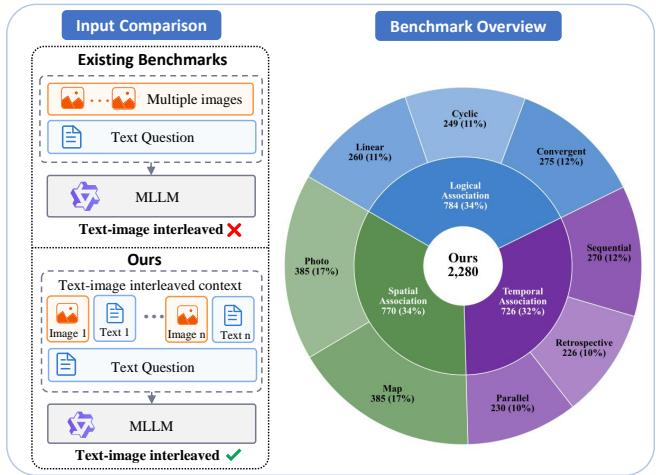  
Figure 1: Overview of TIC, including its interleaved formulation and task distribution.

Despite the critical need for such deep interleaved textimage reasoning, current evaluation paradigms exhibit fundamental limitations in fostering these capabilities. From a training perspective, mainstream pre-training corpora (Gadre et al. 2023; Schuhmann et al. 2022; Changpinyo et al. 2021) predominantly consist of isolated text-image pairs, depriving models of the high-density interleaved data necessary to learn how to extract and integrate cross-modal clues. Consequently, existing models often degenerate into shallow pattern matching, heavily relying on language priors rather than engaging in genuine cross-modal reasoning across interleaved contexts (Lee et al. 2025; Chen et al. 2024). Existing evaluation benchmarks (Yue et al. 2024) provide limited coverage of this capability, as they predominantly focus on single-image question answering or multi-image comprehension with images presented as a parallel collection, rather than requiring models to follow fine-grained text-image correspondences and integrate evidence across an interleaved sequence. Ultimately, this design reduces complex tasks to simple static perception, failing to evaluate how models process interleaved text-image inputs and perform dynamic reasoning.

<table><tr><td>Benchmark</td><td>Samples</td><td>Total References</td><td>References / Sample</td><td>Images</td><td>Images / Sample</td><td>References / Image</td><td>Avg. Words</td></tr><tr><td>MMMU (Yue et al. 2024)</td><td>11,550</td><td>11,821</td><td>1.02</td><td>13,281</td><td>1.15</td><td>0.89</td><td>38.2</td></tr><tr><td>MMIU (Meng et al. 2025)</td><td>11,698</td><td>66,973</td><td>5.73</td><td>79,259</td><td>6.78</td><td>0.84</td><td>127.7</td></tr><tr><td>MIRBench (Du et al. 2025)</td><td>10,397</td><td>68,159</td><td>6.56</td><td>43,301</td><td>4.16</td><td>1.57</td><td>119.6</td></tr><tr><td>MMRB (Cheng et al. 2025)</td><td>4,750</td><td>40,727</td><td>8.57</td><td>29,293</td><td>6.17</td><td>1.39</td><td>96.7</td></tr><tr><td>MIRACLE (Zhu et al. 2026)</td><td>1,001</td><td>8,502</td><td>8.49</td><td>6,726</td><td>6.72</td><td>1.26</td><td>39.0</td></tr><tr><td>MMR-Life (Li et al. 2026c)</td><td>2,646</td><td>1,694</td><td>0.64</td><td>19,108</td><td>7.22</td><td>0.09</td><td>65.1</td></tr><tr><td>VisReason (Guo et al. 2026)</td><td>1,505</td><td>1,278</td><td>0.85</td><td>1,605</td><td>1.07</td><td>0.80</td><td>33.9</td></tr><tr><td>MIMIC (Das et al. 2026)</td><td>5,168</td><td>34,344</td><td>6.65</td><td>34,443</td><td>6.66</td><td>1.00</td><td>15.0</td></tr><tr><td>TIC (Ours)</td><td>2,280</td><td>85,145</td><td>37.34</td><td>45,776</td><td>20.08</td><td>1.86</td><td>309.3</td></tr></table>

Table 1: Comparison with existing multi-image and interleaved text–image benchmarks. Despite a moderate overall sample size, TIC-Bench features the largest total number of image references and leads across all key context complexity metrics: references per sample, images per sample, references per image, and average textual context length. These statistics underscore the benchmark’s focus on evaluating long, densely interleaved multimodal contexts. Image counts are aggregated per sample, while image references encompass both structural image blocks and explicit in-text mentions. The highest values for context complexity in each column are highlighted in bold.

To bridge this critical gap, we introduce TIC-Bench, a novel benchmark specifically designed to break this decoupling and compel models to reason over continuously interleaved text-image contexts. By minimizing the extent to which questions can be answered using parametric knowledge alone, TIC-Bench emphasizes genuine cross-modal evidence integration. As illustrated in Figure 1,TIC-Bench encompasses three core dimensions: Logical Association, Temporal Association, and Spatial Association, which are further divided into eight task types with distinct reasoning structures. Logical Association comprises Linear, Cyclic, and Convergent logic, requiring models to ground textual references in visual objects and follow either a single chain, a chain that revisits previous scenes, or multiple chains whose results must be integrated. Temporal Association includes Sequential, Retrospective, and Parallel scenarios, evaluating whether models can track events and character states by following subsequent developments, retrieving evidence from earlier scenes, or coordinating multiple concurrent storylines. Spatial Association consists of Map and Photo reasoning, requiring models to combine fragmented visual patches with interleaved textual descriptions to infer relative positions in map-based or natural-image environments. Together, these tasks evaluate models’ ability to maintain cross-modal correspondences and integrate distributed evidence across diverse interleaved contexts.

Through extensive evaluations on TIC-Bench, we identify several systematic performance patterns and recurring failure modes of current MLLMs. First, a substantial gap remains between state-of-the-art models and human experts. The strongest evaluated model, GPT-5.5, achieves an overall accuracy of 59.9%, compared with 91.7% for the human baseline. Second, model performance varies considerably across reasoning structures. Within the Logical Association domain, models generally perform better on Cyclic and Linear logic than on Convergent logic. This result suggests that integrating the outcomes of multiple reasoning branches presents a more persistent challenge. A similar pattern emerges in the Temporal Association domain, where Parallel reasoning is the most dificult temporal category for most evaluated models. These results indicate that maintaining and merging concurrent evidence streams remains a major bottleneck for current MLLMs. Finally, our error analysis identifies abstraction and reasoning errors as major sources of failure, particularly in maintaining consistent entity mappings and integrating evidence distributed across multiple images and textual segments. Together, these findings demonstrate that the principal challenge of deeply interleaved multimodal reasoning lies not only in processing long contexts but also in coordinating, maintaining, and merging multiple cross-modal evidence streams. The main contributions of this work are summarized as follows:

• We introduce TIC-Bench, a novel benchmark for evaluating multimodal reasoning over deeply interleaved textimage contexts. TIC-Bench contains 2,280 questions across three complementary domains (Logical, Temporal, and Spatial Association) and eight task types with distinct reasoning structures.

• We conduct a comprehensive evaluation of 10 state-ofthe-art MLLMs across 15 inference settings, including thinking and standard variants for five open-source models, and compare their performance against a human baseline. The results reveal a substantial gap between the strongest evaluated model and human experts.

• Through detailed task-level and error-level analyses, we identify recurring limitations in coordinating multiple cross-modal evidence streams. Tasks involving Convergent logical and Parallel temporal scenarios are particularly challenging, while abstraction and reasoning errors reveal persistent dificulties in maintaining consistent entity mappings and integrating evidence distributed across multiple images and textual segments.

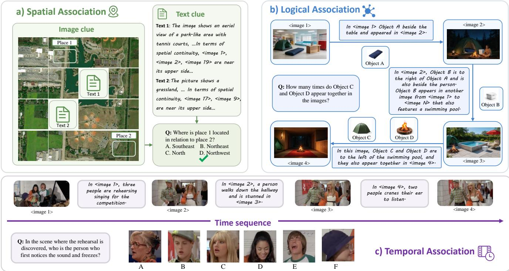  
Figure 2: Overview of our interleaved text-image benchmark, covering spatial, logical, and temporal association reasoning.

## Related Work

## Multimodal Large Language Models

Recent years have witnessed remarkable progress in Multimodal Large Language Models (MLLMs) across tasks such as visual question answering, image captioning, and visual reasoning. However, whether existing models truly reason based on visual evidence remains an open question. VisReason (Guo et al. 2026) proposes a vision-centric reasoning benchmark, revealing that current MLLMs still rely heavily on language priors rather than genuinely grounding their reasoning in visual evidence. Such findings pose even greater challenges for interleaved text-image scenarios, where deep cross-modal reasoning between images and text is required, rather than relying on clues from a single modality.

## Multimodal Evaluation Benchmarks

MMMU (Yue et al. 2024) collects 11.5K college-level multimodal questions spanning six disciplines, yet predominantly features single-image questions without involving relational reasoning across multiple images. MMIU (Meng et al. 2025) is the first to systematically propose multi-image understanding evaluation. MMRB (Cheng et al. 2025) evaluates spatial, temporal, and semantic reasoning across multiple images. However, in these benchmarks, text merely serves as question descriptions or instructions, without forming deeply interleaved contexts with images. MIRACLE (Zhu et al. 2026) designs multi-image reasoning questions emphasizing strong inter-image dependencies. MMR-Life (Li et al. 2026c) constructs multiple-choice questions based on real-life scenarios, covering 7 reasoning types. MIMIC (Das et al. 2026) diagnoses the failure modes of multi-image VLMs, revealing that models struggle to aggregate information across images and simultaneously track multiple concepts. The work most closely related to ours is MIR (Du et al. 2025), which explicitly introduces the concept of Multi-image Interleaved Reasoning without systematically categorize diferent types of associations within interleaved text-image contexts. Compared with these works, TIC-Bench systematically evaluates logical, temporal, and spatial associations in interleaved textimage contexts while introducing denser cross-modal references and longer multimodal contexts. Table 1 summarizes these diferences, showing that TIC-Bench contains substantially denser image references, more images per instance, and longer textual contexts than existing multimodal benchmarks.

## Benchmark

## Task Definition

In TIC-Bench, we formulate interleaved text-image reasoning as joint cross-modal reasoning over an interleaved multimodal context. Specifically, each task instance consists of a context sequence $\mathcal { C } = [ m _ { 1 } , m _ { 2 } , \ldots , m _ { N } ] ,$ , where each element is either visual or textual, i.e., $m _ { i } \in \mathcal { X } _ { \mathcal { V } } \cup \mathcal { X } _ { T }$ . We use $\tau ( m _ { i } ) \in \{ \mathcal { V } , \mathcal { T } \}$ to denote the modality of $m _ { i }$ . The sequence does not require strict alternation between modalities; instead, it may contain consecutive elements from the same modality while maintaining multiple modality transitions. Given the multimodal context C and a target query q, the objective of a model $f _ { \theta }$ is to predict the answer $a = f _ { \theta } ( \mathcal { C } , q )$

Unlike traditional visual question answering tasks, each

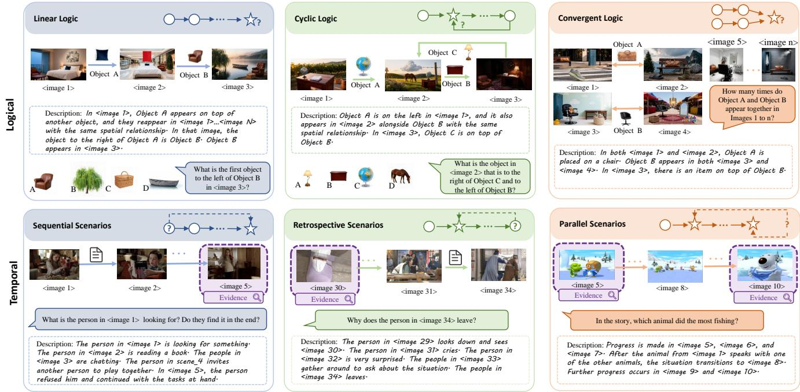  
Figure 3: Examples of logical and temporal association tasks. Logical association includes linear, cyclic, and convergent reasoning structures, while temporal association covers sequential, retrospective, and parallel scenarios.

TIC-Bench instance requires complementary evidence from both the textual subset $\mathcal { C } _ { \mathcal { T } } = \{ m _ { i } \in \mathcal { C } \mid \tau ( m _ { i } ) = \mathcal { T } \}$ and the visual subset $\mathcal { C } _ { \mathcal { V } } = \{ m _ { i } \in \stackrel { \cdot } { \mathcal { C } } \mid \tau ( m _ { i } ) = \mathcal { V } \}$ , rather than information from either modality alone. Therefore, solving these tasks requires models to align dispersed visual and textual clues, preserve cross-modal correspondence, and integrate distributed evidence through multi-step reasoning.

## Dataset Composition and Construction

As shown in Figure 2, TIC-Bench comprises three complementary subsets, which construct interleaved text-image evaluation scenarios from three dimensions: Logical Association, Spatial Association and Temporal Association.

Logical Association The Logical Association subset contains sequences of scenes connected by shared objects. Instead of naming a target object directly, each question identifies it through a chain of cross-image relations. For example, a narrative may refer to “an object beside the table that also appears in the camping scene.” It then relates this object to others through containment, proximity, or co-occurrence, extending the reasoning chain across scenes. Solving the question requires grounding implicit textual references in the corresponding images and tracking the target object to the end of the chain.

As illustrated in Figure 3, Logical Association comprises three reasoning structures. Linear Logic follows a single cross-image chain, Cyclic Logic revisits a previously accessed image during an intermediate reasoning step, and Convergent Logic integrates the results of multiple independent branches.

Temporal Association Temporal Association comprises comic-style stories constructed from movie, animation, and TV-series scenes with interleaved textual descriptions. Images and text provide complementary information: images convey character identities, scene states, and event details, while text describes actions, causal relations, and plot progression. To prevent text-only shortcuts, key character and event information is masked or generalized, such as by replacing character names with broad references like “person.” Consequently, models must integrate visual identity cues with textual plot information to track characters and events over time.

As illustrated in Figure 3, this subset is divided into Sequential, Retrospective, and Parallel Scenarios. Sequential Scenarios require following the story timeline to identify subsequent events or character states. Retrospective Scenarios require retrieving evidence from earlier parts of the story. Parallel Scenarios involve multiple concurrent or independent storylines whose results must be integrated to answer the final question.

Spatial Association Spatial Association is constructed by dividing a large image into multiple overlapping patches. Some patches are removed and replaced with textual descriptions of both their visual content and spatial relations to neighboring patches, creating an interleaved text-image context. Questions select objects or regions from visible patches, textual descriptions of missing patches, or entire patches, and ask about their relative spatial positions. Models must combine the visible content, descriptions of missing regions, and overlap relations among patches to locate the targets.

<table><tr><td rowspan="2">Model</td><td rowspan="2">Overall</td><td colspan="3">Logical Association</td><td colspan="3">Temporal Association</td><td colspan="2">Spatial Association</td></tr><tr><td>Linear</td><td>Cyclic</td><td>Convergent</td><td>Sequential</td><td>Retrospective</td><td>Parallel</td><td>Map</td><td>Photo</td></tr><tr><td>Human Expert</td><td>0.917</td><td>0.936</td><td>0.917</td><td>0.909</td><td>0.903</td><td>0.906</td><td>0.916</td><td>0.905</td><td>0.937</td></tr><tr><td colspan="10">Open-source models</td></tr><tr><td>Gemma-4-31B (Team et al. 2026a)</td><td>0.405</td><td>0.531</td><td>0.655</td><td>0.502</td><td>0.331</td><td>0.346</td><td>0.358</td><td>0.356</td><td>0.265</td></tr><tr><td>Gemma-4-31B-thinking</td><td>0.430</td><td>0.589</td><td>0.707</td><td>0.520</td><td>0.323</td><td>0.381</td><td>0.377</td><td>0.369</td><td>0.291</td></tr><tr><td>GLM-4.6V (Hong et al. 2025)</td><td>0.337</td><td>0.550</td><td>0.677</td><td>0.353</td><td>0.225</td><td>0.233</td><td>0.253</td><td>0.223</td><td>0.286</td></tr><tr><td>GLM-4.6V-thinking</td><td>0.368</td><td>0.523</td><td>0.590</td><td>0.436</td><td>0.331</td><td>0.335</td><td>0.333</td><td>0.221</td><td>0.294</td></tr><tr><td>Qwen3.6-35B-A3B (Yang et al. 2025)</td><td>0.402</td><td>0.589</td><td>0.735</td><td>0.484</td><td>0.414</td><td>0.363</td><td>0.285</td><td>0.281</td><td>0.223</td></tr><tr><td>Qwen3.6-35B-A3B-thinking</td><td>0.470</td><td>0.561</td><td>0.619</td><td>0.553</td><td>0.542</td><td>0.523</td><td>0.312</td><td>0.442</td><td>0.299</td></tr><tr><td>Kimi-K2.6 (Team et al. 2025)</td><td>0.448</td><td>0.519</td><td>0.676</td><td>0.513</td><td>0.521</td><td>0.511</td><td>0.396</td><td>0.377</td><td>0.335</td></tr><tr><td>Kimi-K2.6-thinking</td><td>0.474</td><td>0.586</td><td>0.666</td><td>0.555</td><td>0.610</td><td>0.558</td><td>0.409</td><td>0.296</td><td>0.343</td></tr><tr><td>MiMo-V2.5 (Team et al. 2026b)</td><td>0.380 0.430</td><td>0.600 0.585</td><td>0.707 0.651</td><td>0.375 0.527</td><td>0.407 0.479</td><td>0.420 0.429</td><td>0.256 0.287</td><td>0.229 0.340</td><td>0.216 0.262</td></tr><tr><td colspan="10">MiMo-V2.5-thinking</td></tr><tr><td>Claude Sonnet 4.6</td><td>0.474</td><td>0.620</td><td>0.733</td><td>Closed-source models 0.549</td><td>0.511</td><td>0.529</td><td>0.296</td><td>0.318</td><td>0.368</td></tr><tr><td>Gemini 3.1 Pro Preview</td><td>0.590</td><td>0.631</td><td>0.715</td><td>0.560</td><td>0.671</td><td>0.668</td><td>0.554</td><td>0.525</td><td>0.486</td></tr><tr><td>GPT-5.5</td><td>0.599</td><td>0.627</td><td>0.703</td><td>0.586</td><td>0.685</td><td>0.678</td><td>0.530</td><td>0.447</td><td>0.610</td></tr><tr><td>Doubao-Seed-2.0-Pro</td><td>0.503</td><td>0.600</td><td>0.622</td><td>0.584</td><td>0.592</td><td>0.648</td><td>0.461</td><td>0.361</td><td>0.317</td></tr><tr><td>GLM-5V-Turbo</td><td>0.407</td><td>0.515</td><td>0.682</td><td>0.521</td><td>0.411</td><td>0.361</td><td>0.341</td><td>0.260</td><td>0.294</td></tr><tr><td></td><td></td><td></td><td></td><td></td><td></td><td></td><td></td><td></td><td></td></tr></table>

Table 2: Main results on our benchmark. Open-source models are evaluated under both non-thinking and thinking modes, denoted by the model name without or with the “-thinking” sufix, respectively.The best and second-best results within each model group are shown in bold and underlined, respectively.

Based on the source images, this subset is divided into Map and Photo reasoning. Map reasoning primarily uses aerial images, emphasizing relations among roads, buildings, terrain, and other large-scale structures. Photo reasoning uses natural scenes and everyday photographs, focusing on spatial relations among objects, regions, and local visual content.

Further details of the dataset construction pipeline are provided in the supplementary material.

## Benchmarks Statistics

The entire dataset contains 2,280 questions and 45,776 image instances in total. On average, each question contains 20.08 images, and each image is referenced 1.86 times. The logical association subset contains 784 questions in total. Among them, 260 questions belong to linear logic, 275 to convergent logic, and 249 to cyclic logic. The temporal association subset contains 726 questions in total. Among them, 270 involve sequential scenarios, 226 involve retrospective scenarios, and 230 involve parallel scenarios. The spatial association subset contains 770 questions in total, including 385 map-type questions and 385 photo-type questions. Across the three domains of TIC-Bench, Logical and Spatial Association use multiple-choice questions, whereas Temporal Association includes 418 open-ended questions.

## Comparisons with Existing Benchmarks

As shown in Table 1, our dataset comprises 2,280 samples, with an average of 37.34 image references per sample— roughly 4.4× that of the next-best benchmark (MMRB, 8.57). The average number of images per sample is 20.08, approximately 2.8× that of the runner-up (MMR-Life, 7.22). Regarding reference density, the references-per-image ratio reaches 1.86, the highest among all benchmarks, indicating that images are frequently reused throughout the questions. Moreover, the average textual-context length reaches 309.3 words, about 2.4× that of the next-highest benchmark (MMIU, 127.7). These metrics demonstrate that our dataset features substantially higher text-image interleaving frequency and longer multimodal contexts, enabling a more thorough evaluation of models’ cross-modal integration and multi-step reasoning capabilities under densely interleaved text-image conditions.

## Experiments

## Experimental Setup

We evaluate five open-source MLLMs, including Gemma-4-31B, GLM-4.6V, Qwen3.6-35B-A3B, Kimi-K2.6, and MiMo-V2.5, as well as five closed-source MLLMs, including Claude Sonnet 4.6, Gemini 3.1 Pro Preview, GPT-5.5, Doubao-Seed-2.0-Pro, and GLM-5V-Turbo. For open-source models, we evaluate their performance under both thinking and non-thinking modes. For closed-source models, we use their default inference settings. In addition, we include human expert performance as a reference to illustrate the gap between current models and human capability on our benchmark. The human evaluation protocol is detailed in supplementary material.

To assess the correctness of model responses, we employ Qwen-3.7 Plus, DeepSeek V4 Pro, and Claude Opus 4.8 as automatic evaluators. For samples where the three evaluators produce inconsistent judgments, we conduct human evaluation to ensure the reliability of the final assessment. All models are evaluated using a unified task prompt and consistent input formatting within each benchmark domain. For models supporting both thinking and non-thinking modes, we follow the oficially supported inference controls to enable or disable explicit reasoning. Detailed experimental settings are provided in the supplementary material.

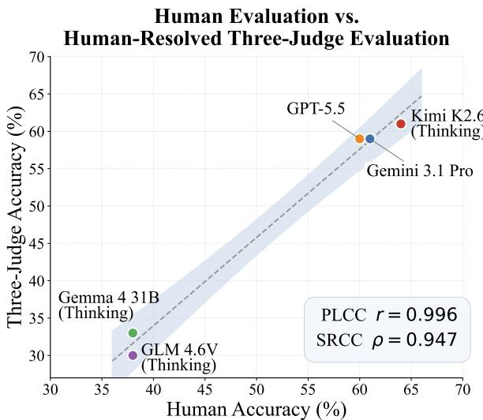  
(a)

Correlation Between Benchmark Subtasks  
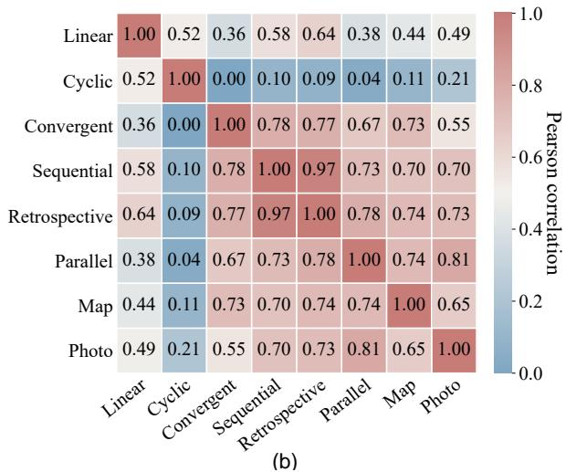  
Figure 4: (a) Agreement between human evaluation and the human-resolved three-judge evaluation. (b) Pearson correlation of model performance across eight benchmark subtasks.

## Main results

Overall human–model gap. Table 2 presents the overall performance of closed-source and open-source MLLMs on our benchmark. The results reveal a substantial gap between current models and human experts, demonstrating that the benchmark efectively evaluates the ability to process interleaved text-image contexts. Human experts achieve an overall accuracy of 91.7%, whereas the strongest models, GPT-5.5 and Gemini 3.1 Pro, reach 59.9% and 59.0%, respectively. This gap of more than 30 percentage points indicates that current models still struggle to sustain reasoning across distributed visual and textual evidence. Compared with the consistently strong human performance across task types, model performance varies substantially across association types, indicating deficiencies in reasoning over specific task categories.

Complementary strengths of closed-source models. Closed-source models generally outperform open-source models, although their strengths are complementary. GPT-5.5 performs particularly well on event ordering, retrospective reasoning, and spatial reasoning over natural images, achieving 68.5%, 67.8%, and 61.0% on Sequential, Retrospective, and Photo tasks, respectively. Gemini 3.1 Pro is stronger on parallel events and map-based spatial relations, reaching 55.4% on Parallel reasoning and 52.5% on Map reasoning. Claude Sonnet 4.6 obtains 73.3% on Cyclic reasoning, further showing that no single model dominates every task category.

Leading open-source models. Among open-source models, Kimi-K2.6-thinking and Qwen3.6-35B-A3B-thinking form the leading group, with overall accuracies of 47.4% and 47.0%, respectively. Kimi-K2.6-thinking achieves 61.0% on Sequential reasoning and 55.8% on Retrospective reasoning, demonstrating a relative strength in temporal inference. Qwen3.6-35B-A3B-thinking reaches 61.9% on Cyclic reasoning and 44.2% on Map reasoning, indicating stronger performance on cyclic logical structures and abstract spatial representations.

Impact of thinking mode. Thinking mode generally improves open-source model performance. For example, Qwen3.6-35B-A3B improves from 40.2% to 47.0% overall, while MiMo-V2.5 improves from 38.0% to 43.0%. However, these gains are not consistent across all subtasks. Explicit reasoning can help organize and extend inference chains, but it does not automatically eliminate visual recognition errors, irrelevant-context interference, or incorrect associations among multiple evidence chains.

Challenges across task structures and modalities. Convergent logical reasoning and Parallel temporal reasoning remain particularly challenging. Both require a model to maintain multiple information streams and subsequently merge or compare them. Relative to sequential inference along a single evidence chain, such multi-branch integration is more susceptible to omissions, confusion, and incorrect entity binding. The spatial results also exhibit a clear modality efect: most open-source models perform worse on Photo than on Map tasks, suggesting that visual clutter, object-recognition errors, and scale variation further increase the dificulty of spatial reasoning.

Correlation between tasks. As shown in Figure 4(b), the task correlation analysis reveals capabilities shared across tasks as well as capabilities specific to individual tasks. Sequential and Retrospective performance is highly correlated (r = 0.97), reflecting their shared reliance on temporal order modeling. More notably, Parallel temporal reasoning is strongly correlated with both spatial subtasks. The correlation between Parallel and Photo is the strongest among subtask pairs from diferent domains $( r ~ = ~ 0 . 8 1 )$ , while the correlation between Parallel and Map is also strong $( r = 0 . 7 4 )$ . This pattern suggests that coordinating concurrent event streams and reconstructing spatial relations from fragmented visual and textual observations share a common bottleneck, namely the need to maintain and integrate evidence distributed across multiple multimodal inputs. In contrast, Cyclic reasoning shows weak correlations with most other subtasks, indicating that its reasoning requirements are relatively distinct. Overall, these results identify temporal modeling and parallel multimodal reasoning as two key capabilities for efectively processing deeply interleaved text-image contexts.

Need for stronger multimodal context management. Current models require improvements not only in perception and multi-step inference but also in multimodal context management. A capable model must preserve key entities, scene states, and event relations throughout long interleaved textimage inputs, suppress irrelevant information, and maintain stable and consistent correspondences across multiple sources of visual and textual evidence.

## Modality Ablation

We conduct modality ablations on four representative models Gemma-4-31B-thinking, Qwen3.6-35B-A3B-thinking, GPT-5.5, and Gemini 3.1 Pro Preview under three settings: Full, Text-only, and Images-only. Full retains the original interleaved context, whereas Text-only and Images-only remove the visual and textual evidence, respectively. As shown in Table 3, Full achieves the highest overall accuracy for every model, while removing either modality causes a substantial performance drop. For example, GPT-5.5 and Gemini 3.1 Pro Preview decrease from 59.9% and 59.0% under Full to 31.0% and 31.4% under Text-only, respectively. Although Images-only consistently outperforms Text-only, it remains substantially below Full, demonstrating that TIC-Bench cannot be solved through single-modality shortcuts and requires the integration of complementary visual and textual evidence.

## Human Agreement Evaluation

Time QA contains 418 open-ended questions. We randomly sample 100 responses from each of five representative models, yielding 500 human-scored responses, with scores of at least 80 considered correct. Automatic evaluation uses three independent judges, namely Qwen 3.7 Plus, DeepSeek V4 Pro, and Claude Opus 4.8, with human adjudication when theirjudgments disagree. This pipeline achieves 88.6% sample-level agreement with human evaluation and a Cohen’s κ of 0.772. The regression analysis in Figure 4(a) further shows strong agreement at the model-accuracy level, with a PLCC of 0.996 and an SRCC of 0.947, indicating that the evaluation pipeline closely approximates human-assessed accuracy while largely preserving model rankings.

## Error Analysis

We analyze Qwen3.6-35B-A3B-thinking and Gemma-4- 31B-thinking because their relatively complete reasoning outputs facilitate identification of the earliest error stage. Each incorrect response is assigned one of seven mutually exclusive labels: perception, abstraction, reasoning, understanding, hallucination, knowledge, or other. As shown in Figure 5, Qwen is primarily afected by abstraction errors (36.6%), followed by hallucination (23.0%) and reasoning errors (21.9%). Gemma exhibits a more balanced distribution, with abstraction, reasoning, and hallucination errors accounting for 29.8%, 27.0%, and 22.3%, respectively. Abstraction errors mainly reflect inconsistent mappings between entities and symbolic references, while reasoning and hallucination errors involve failed multi-step relation composition or the introduction of unsupported information. Knowledge errors account for less than 0.2% for both models, indicating that the main challenges lie in entity binding, cross-scene tracking, and multi-step reasoning rather than insuficient external knowledge. This finding also provides indirect evidence that TIC-Bench places limited demands on external prior knowledge and primarily evaluates models’ ability to reason over the provided interleaved context.

<table><tr><td>Model</td><td></td><td>Logical</td><td>Temporal Association</td><td>Spatial</td><td></td></tr><tr><td rowspan="3">Gemma-4-31B-thinking (Team et al. 2026a)</td><td>Input</td><td>Association</td><td></td><td>Association</td><td>Overall</td></tr><tr><td>Full</td><td>0.602</td><td>0.358 0.221</td><td>0.330</td><td>0.430</td></tr><tr><td>Text-only Images-only</td><td>0.337 0.390</td><td>0.270</td><td>0.344 0.321</td><td>0.301 0.327</td></tr><tr><td rowspan="3">Qwen3.6-35B-A3B-thinking (Yang et al. 2025)</td><td>Full</td><td>0.577</td><td>0.463</td><td>0.371</td><td>0.470</td></tr><tr><td>Text-only</td><td>0.366</td><td>0.229</td><td>0.345</td><td>0.313</td></tr><tr><td>Images-only</td><td>0.424</td><td>0.330</td><td>0.332</td><td>0.362</td></tr><tr><td rowspan="3">GPT-5.5</td><td>Full</td><td>0.637</td><td>0.634</td><td>0.529</td><td>0.599</td></tr><tr><td>Text-only</td><td>0.302</td><td>0.256</td><td>0.373</td><td>0.310</td></tr><tr><td>Images-only</td><td>0.485</td><td>0.534</td><td>0.320</td><td>0.446</td></tr><tr><td rowspan="3">Gemini 3.1 Pro Preview</td><td>Full</td><td>0.633</td><td>0.633</td><td>0.506</td><td>0.590</td></tr><tr><td>Text-only</td><td>0.310</td><td>0.240</td><td>0.392</td><td>0.314</td></tr><tr><td>Images-only</td><td>0.336</td><td>0.501</td><td>0.428</td><td>0.422</td></tr></table>

Table 3: Modality ablation results. The best input setting for each model and metric is shown in bold.  
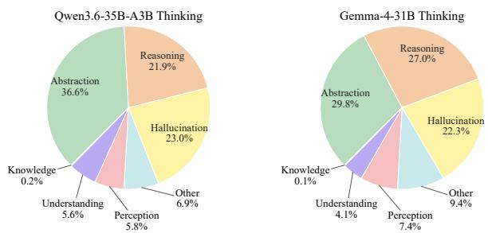  
Figure 5: Distribution of primary error types for Qwen3.6- 35B-A3B and Gemma-4-31B.

## Conclusion

We introduce a multimodal benchmark for association reasoning over interleaved text-image contexts, covering three domains and eight subtasks across logical, temporal, and spatial associations. Our results reveal a substantial gap between current models and human experts, with diferent models exhibiting complementary strengths across tasks. Although thinking mode improves performance in some cases, existing models still struggle to reliably connect evidence distributed across multiple images and text segments. Future models therefore need stronger capabilities for managing long interleaved multimodal contexts, preserving relevant information, suppressing distractions, and establishing consistent crossmodal associations.

## References

Bai, J.; Bai, S.; Chu, Y.; Cui, Z.; Dang, K.; Deng, X.; Fan, Y.; Ge, W.; Han, Y.; Huang, F.; et al. 2023. Qwen technical report. arXiv preprint arXiv:2309.16609.

Changpinyo, S.; Sharma, P.; Ding, N.; and Soricut, R. 2021. Conceptual 12m: Pushing web-scale image-text pre-training to recognize long-tail visual concepts. In Proceedings of the IEEE/CVF conference on computer vision and pattern recognition, 3558–3568.

Chen, L.; Li, J.; Dong, X.; Zhang, P.; Zang, Y.; Chen, Z.; Duan, H.; Wang, J.; Qiao, Y.; Lin, D.; et al. 2024. Are we on the right way for evaluating large vision-language models? Advances in Neural Information Processing Systems, 37: 27056–27087.

Cheng, Z.; Xu, B.; Gong, L.; Song, Z.; Zhou, T.; Zhong, S.; Ren, S.; Chen, M.; Meng, X.; Zhang, Y.; et al. 2025. Evaluating mllms with multimodal multi-image reasoning benchmark. arXiv preprint arXiv:2506.04280.

Cui, Y.; Chen, H.; Deng, H.; Huang, X.; Li, X.; Liu, J.; Liu, Y.; Luo, Z.; Wang, J.; Wang, W.; et al. 2025. Emu3. 5: Native multimodal models are world learners. arXiv preprint arXiv:2510.26583.

Das, A.; Bulat, A.; Baldrati, A.; Metaxas, I. M.; Schiele, B.; Tzimiropoulos, G.; and Martinez, B. 2026. More Images, More Problems? A Controlled Analysis of VLM Failure Modes. arXiv preprint arXiv:2601.07812.

DeepSeek-AI. 2026. DeepSeek-V4: Towards Highly Eficient Million-Token Context Intelligence.

Deng, C.; Zhu, D.; Li, K.; Gou, C.; Li, F.; Wang, Z.; Zhong, S.; Yu, W.; Nie, X.; Song, Z.; et al. 2025. Emerging properties in unified multimodal pretraining. arXiv preprint arXiv:2505.14683.

Du, H.; Zhang, J.; Nan, G.; Deng, W.; Chen, Z.; Zhang, C.; Xiao, W.; Huang, S.; Pan, Y.; Qi, T.; et al. 2025. From Easy to Hard: The MIR Benchmark for Progressive Interleaved Multi-Image Reasoning. In Proceedings of the IEEE/CVF International Conference on Computer Vision, 859–869.

Feng, Q.; Ablavsky, V.; and Sclarof, S. 2021. Cityflow-nl: Tracking and retrieval of vehicles at city scale by natural language descriptions. arXiv preprint arXiv:2101.04741.

Gadre, S. Y.; Ilharco, G.; Fang, A.; Hayase, J.; Smyrnis, G.; Nguyen, T.; Marten, R.; Wortsman, M.; Ghosh, D.; Zhang, J.; et al. 2023. Datacomp: In search of the next generation of multimodal datasets. Advances in Neural Information Processing Systems, 36: 27092–27112.

Guo, L.; Wang, Y.; Huo, P.; Chen, T.; Wu, Y.; Liu, J.; and Zhu, X. 2026. Can MLLMs Reason Beyond Language? Vis-Reason: A Comprehensive Benchmark for Vision-Centric Reasoning. In Findings ofthe Associationfor Computational Linguistics: ACL 2026, 40149–40192.

Hong, W.; Yu, W.; Gu, X.; Wang, G.; Gan, G.; Tang, H.; Cheng, J.; Qi, J.; Ji, J.; Pan, L.; et al. 2025. Glm-4.5 v and glm-4.1 v-thinking: Towards versatile multimodal reasoning with scalable reinforcement learning. arXiv preprint arXiv:2507.01006.

Hu, A.; Xu, H.; Ye, J.; Yan, M.; Zhang, L.; Zhang, B.; Zhang, J.; Jin, Q.; Huang, F.; and Zhou, J. 2024. mplug-docowl 1.5: Unified structure learning for ocr-free document understanding. In Findings of the Association for Computational Linguistics: EMNLP 2024, 3096–3120.

Huang, T.-H. K.; Ferraro, F.; Mostafazadeh, N.; Misra, I.; Agrawal, A.; Devlin, J.; Girshick, R.; He, X.; Kohli, P.; Batra, D.; et al. 2016. Visual storytelling. In Proceedings ofthe 2016 Conference of the North American Chapter of the Association for Computational Linguistics: Human Language Technologies (NAACL HLT), 2016.

Lee, K.-i.; Kim, M.; Yoon, S.; Kim, M.; Lee, D.; Koh, H.; and Jung, K. 2025. Vlind-bench: Measuring language priors in large vision-language models. In Findings ofthe Association for Computational Linguistics: NAACL 2025, 4129–4144.

Li, B.; Wang, Z.; Li, F.; Xu, J.; Guo, J.; Pei, R.; Li, X.; and Chen, Z. 2026a. ColorFLUX: A Structure-Color Decoupling Framework for Old Photo Colorization. In Proceedings of the IEEE/CVF Conference on Computer Vision and Pattern Recognition (CVPR).

Li, F.; Wang, C.; Lei, L.; Qiu, Y.; Xu, J.; Jiang, J.; Qin, X.; Chen, Z.; Song, F.; Wang, Z.; Pei, R.; and Zuo, W. 2026b. HP-Edit: A Human-Preference Post-Training Framework for Image Editing. In Proceedings of the IEEE/CVF Conference on Computer Vision and Pattern Recognition (CVPR).

Li, J.; Huang, S.; Jin, Z.; Zhang, C.; Cao, P.; Chen, Y.; Liu, K.; and Zhao, J. 2026c. Mmr-life: Piecing together real-life scenes for multimodal multi-image reasoning. arXiv preprint arXiv:2603.02024.

Li, J.; Li, D.; Savarese, S.; and Hoi, S. 2023. Blip-2: Bootstrapping language-image pre-training with frozen image encoders and large language models. In International conference on machine learning, 19730–19742. PMLR.

Lin, T.-Y.; Maire, M.; Belongie, S.; Hays, J.; Perona, P.; Ramanan, D.; Dollár, P.; and Zitnick, C. L. 2014. Microsoft coco: Common objects in context. In European conference on computer vision, 740–755. Springer.

Meng, F.; Wang, J.; Li, C.; Lu, Q.; Tian, H.; Yang, T.; Liao, J.; Zhu, X.; Dai, J.; Qiao, Y.; et al. 2025. Mmiu: Multimodal multi-image understanding for evaluating large visionlanguage models. In International Conference on Learning Representations, volume 2025, 38405–38453.

Redmon, J.; Divvala, S.; Girshick, R.; and Farhadi, A. 2016. You only look once: Unified, real-time object detection. In Proceedings of the IEEE conference on computer vision and pattern recognition, 779–788.

Schuhmann, C.; Beaumont, R.; Vencu, R.; Gordon, C.; Wightman, R.; Cherti, M.; Coombes, T.; Katta, A.; Mullis, C.; Wortsman, M.; et al. 2022. Laion-5b: An open largescale dataset for training next generation image-text models. Advances in neural information processing systems, 35: 25278–25294.

Suhr, A.; Zhou, S.; Zhang, A.; Zhang, I.; Bai, H.; and Artzi, Y. 2019. A corpus for reasoning about natural language grounded in photographs. In Proceedings of the 57th annual meeting of the association for computational linguistics, 6418–6428.

Sun, Y.; Ye, Y.; Kang, J.; Fernandez-Beltran, R.; Feng, S.; Li, X.; Luo, C.; Zhang, P.; and Plaza, A. 2023. Cross-view object geo-localization in a local region with satellite imagery. IEEE Transactions on Geoscience and Remote Sensing, 61: 1–16.

Tang, Z.; Naphade, M.; Liu, M.-Y.; Yang, X.; Birchfield, S.; Wang, S.; Kumar, R.; Anastasiu, D.; and Hwang, J.- N. 2019. Cityflow: A city-scale benchmark for multi-target multi-camera vehicle tracking and re-identification. In Proceedings of the IEEE/CVF conference on computer vision and pattern recognition, 8797–8806.

Team, G.; Abd, S. E.; Aggarwal, V.; Algayres, R.; Andreev, A.; Bachem, O.; Ballantyne, I.; Brick, C.; Cărbune, V.; Casbon, M.; et al. 2026a. Gemma 4 technical report. arXiv preprint arXiv:2607.02770.

Team, K.; Du, A.; Yin, B.; Xing, B.; Qu, B.; Wang, B.; Chen, C.; Zhang, C.; Du, C.; Wei, C.; et al. 2025. Kimi-vl technical report. arXiv preprint arXiv:2504.07491.

Team, X. M.; Liu, A.; Ma, A.; Chen, B.; Yang, B.; Wang, C.; Zhang, C.; Tang, C.; Wang, C.; Lou, C.; et al. 2026b. Full-Pipeline Inference Optimization for MiMo-V2. 5 Series: Pushing Hybrid SWA Eficiency to the Limit. arXiv preprint arXiv:2607.13095.

Wang, C.; Chen, Z.; Wang, C.; Wan, Y.; Yang, J.; Wang, Z.; Zhang, W.; Xu, J.; Pei, R.; Wu, X.; et al. 2026a. Illuminating Unified Multimodal Model for Free-form Interleaved Text-Image Generation. arXiv preprint arXiv:2606.30054.

Wang, Z.; Wei, Y.; Li, F.; Pei, R.; Xu, H.; and Zuo, W. 2025. Ace: Anti-editing concept erasure in text-to-image models. In 2025 IEEE/CVF Conference on Computer Vision and Pattern Recognition (CVPR), 23505–23515. IEEE.

Wang, Z.; Wei, Y.; Zhou, X.; Zhang, T.; Liang, T.; Bai, Y.; Zhang, H.; and Zuo, W. 2026b. Premier: Personalized Preference Modulation with Learnable User Embedding in Text-to-Image Generation. arXivpreprint arXiv:2603.20725.

Yan, H.; Tan, K.; Shen, Y.; Huang, X.; Ge, Z.; Zhang, X.; Li, S.; and Jiang, D. 2025. M-DocSum: Do LVLMs Genuinely Comprehend Interleaved Image-Text in Document Summarization? arXiv preprint arXiv:2503.21839.

Yang, A.; Li, A.; Yang, B.; Zhang, B.; Hui, B.; Zheng, B.; Yu, B.; Gao, C.; Huang, C.; Lv, C.; et al. 2025. Qwen3 technical report. arXiv preprint arXiv:2505.09388.

Yue, X.; Ni, Y.; Zhang, K.; Zheng, T.; Liu, R.; Zhang, G.; Stevens, S.; Jiang, D.; Ren, W.; Sun, Y.; et al. 2024. Mmmu: A massive multi-discipline multimodal understanding and reasoning benchmark for expert agi. In Proceedings of the IEEE/CVF conference on computer vision and pattern recognition, 9556–9567.

Zhou, L.; Zhou, Z.; Mao, K.; and He, Z. 2023. Joint visual grounding and tracking with natural language specification. In Proceedings of the IEEE/CVF conference on computer vision and pattern recognition, 23151–23160.

Zhu, Z.; Fan, Y.; Chen, Z.; Cao, Y.; Liu, Y.; and Lu, T. 2026. Will Multimodal Models Be Dazzled by Multi-Image Visual Puzzles? In Proceedings of the IEEE/CVF Conference on Computer Vision and Pattern Recognition, 11943–11953.

## Supplementary Material Overview

Detailed Dataset Construction. Describes the data sources and construction pipeline for the three benchmark domains. Prompts. Collects all prompts used for dataset construction, Temporal inference, and automatic evaluation.

Human Evaluation Protocol. Documents evaluator backgrounds, answering conditions, and accuracy computation. Model Inference and Evaluation Details. Reports input assembly, image processing, output parsing, andjudge settings. Additional Analysis Protocols. Presents the error taxonomy and three complete representative error cases.

Representative Benchmark Examples. Provides one complete text-image example for each of the eight task types.

## Detailed Dataset Construction

## Logical Association

Structured scene and object generation. The pipeline first samples a sequence of scene types and generates one structured visual node for each scene. Qwen 3.7 Plus generates the object names, object attributes, and scene content. Claude Opus 4.7 then organizes this information into a structured visual-node description that satisfies the required field constraints. Each node defines 5–10 objects and records the visual attributes and image-generation description of every object. The semantic attributes include category, color, size, shape, material, state, texture, temperature, position, pose, and interaction. The node also describes the overall scene, the spatial and action relations among objects, and its connections to earlier scenes. When the same object or relation appears across scenes, its identity and visual characteristics are kept consistent.

Object and relation reference generation. Before rendering a complete scene, GPT Image 2 generates a whitebackground reference image for each object from its objectlevel generation prompt. The same model generates spatialrelation and action-relation reference images from the corresponding relation prompts. These isolated references convert the object descriptions, attributes, and relations into concrete visual conditions for the final scene generator.

Final node rendering. The final node image is generated by Doubao Seedream 5.0 . When generating the final scene, the model jointly uses all object references, relation references, and the complete scene description. The object references preserve consistent appearances, while the scene description determines the environment, layout, lighting, and composition. Prompt 1 specifies the structured requirements for Logical scene generation, and an output is retained only after checks for field completeness and visual consistency.

Prompt 2 converts the question structure precomputed by code into a natural-language question.

Reasoning structures. After image generation, the code connects scenes through shared objects, attributes, and relations and uses these connections to construct three reasoning tasks. Linear Logic starts from one clue and follows a single chain from image to image until the target is identified. The chain does not split into multiple branches and does not require an intentional return to a previously visited image. Cyclic Logic requires the model to revisit an image seen earlier and continue reasoning with information from that image. Convergent Logic contains multiple independent clue paths whose results must be combined at a shared destination.

Question skeleton construction, language realization, and validation. Each Logical Association instance comprises three components: a description containing ordered crossimage clues, a question specifying the query target, and a reference answer determined by the preconstructed reasoning path. The code first samples a target reasoning structure from the scene connections and selects the scenes and clues to be visited in order. It then converts the scene connections along the selected path into an ordered sequence of naturallanguage clues, which together form the description, and calculates the reasoning depth from the number of relations traversed. Each clue guides the model from a relevant object in the current image to the next image or to a subsequent relation within the same image. The clues refer to images through visible objects and environmental features without exposing internal scene indices, node IDs, or other construction labels. The object or attribute reached at the end of the path defines the query target in the question, while its known value is fixed as the reference answer before language generation. Qwen 3.7 Plus only realizes the ordered clues in the description and the query skeleton in the question as coherent natural language and cannot select or alter the reasoning structure, query target, or reference answer. The system then checks the description, question, and reference answer for completeness and retries after an API failure, parsing failure, or an empty component. Each retained instance stores its description, question, and reference answer together with its dificulty and task type for subsequent evaluation and analysis. Human reviewers remove invalid or low-quality Logical images and reject questions whose answers are ambiguous, insuficiently supported, or not uniquely determined by the provided context. All retained Logical descriptions, questions, and reference answers are manually verified. At inference time, a Logical Association input consists of ordered scene images, relevant candidate-object images, a cross-image description, and a multiple-choice question; complete assembly details are provided in the Input Assembly subsection.

## Temporal Association

Frame acquisition. Temporal instances are constructed from publicly available clips drawn from six live-action productions and three animated series. The live-action productions are High School Musical, High School Musical 2, High School Musical 3: Senior Year, iPartment, Young Sheldon, and My Own Swordsman. The animated series are Pororo the Little Penguin, Boonie Bears, and My Little Pony: Friendship Is Magic. For a selected clip and timestamp, the acquisition code obtains the media stream without downloading the complete video and invokes FFmpeg to extract one JPEG frame. Following Prompt 3, Qwen 3.7 Plus receives the encoded frame and generates a preliminary caption that provides candidate visual evidence for subsequent story-sequence assembly.

Storyboard assembly. Human reviewers select the keyframes needed to preserve event transitions and characterstate changes, arrange them into a comic-strip-like storyboard, and revise the preliminary descriptions and scene references. Images retain directly observable evidence such as identity, appearance, scene state, and event outcomes. The interleaved text supplies complementary actions, causal links, and plot transitions that cannot be reliably recovered from isolated static frames.

Identity masking and interleaving. Character names and details that may directly expose the target event are masked or generalized, for example by replacing a name with a neutral reference such as “person.” Queried characters are specified through visual identity images, while the story description refers to numbered scenes. The final input alternates identity images, scene frames, and textual descriptions, requiring both visual identity matching and temporal evidence tracking.

Question construction. Sequential Scenarios require following the forward story order to infer a later event or state. Retrospective Scenarios require returning from the query point to evidence in an earlier scene. Parallel Scenarios contain two or more concurrent or independent evidence streams whose outcomes must be combined. Each retained sample records the story description, question, correct answer, reasoning-step count, task type, and human-verification status. Human reviewers remove invalid or low-quality Temporal frames and reject questions with insuficient event evidence, ambiguous answers, or answers that cannot be uniquely determined from the story. All retained Temporal story descriptions, questions, and reference answers are manually verified. At inference time, a Temporal Association input consists of visual identity images, temporally ordered story frames, interleaved textual descriptions, and a temporal question; complete assembly details are provided in Input Assembly Section.

## Spatial Association

Source images and cropping. Spatial instances are constructed from COCO (Lin et al. 2014) photographs and CVOGL (Sun et al. 2023) aerial imagery. For both source types, the top of the source image is defined as north, and the image is divided into a grid of square local crops without rotation or scale changes. The code then constructs a connectivity graph from crop overlaps, where the overlap ratio is defined as the intersection area divided by the area of the smaller crop, and two crops are connected only when this ratio is at least 5% by default. A question is retained only when an overlap path exists between its two target crops, ensuring that every Spatial instance can be solved through a sequence of overlapping local views. Each crop stores its position, preserving the exact relationship between the local view and the source image. The model can access only the local crops and does not receive the complete source image. Target detection and global normalization. A YOLO (Redmon et al. 2016) detector is run independently on every crop and can be restricted to an allowed class list. The bounding box and center of every detection are mapped back to the source-image coordinates. If no valid detected target is available in a crop, the entire crop is used as the target region. In this fallback case, the geometric center of the crop is used as the target coordinate for directional-relation computation. Class-wise non-maximum suppression is then applied in the global coordinate system to reduce duplicate landmarks across neighboring crops.

Target-pair sampling. Candidate target pairs are sampled from two diferent crops without repeatedly using the same crop combination. Target pairs that are too close or unsuitable for an unambiguous spatial question are rejected. For each retained pair, the code calculates one of eight directional relations from their positions in the source image. The two target views are marked as A and B, after which three incorrect directions are added and the four options are shufled.

Image-to-text replacement. Image replacement is performed over all crops in a question folder rather than only the two target views. Approximately 10% of the crops in each question are replaced with textual descriptions. The default sampling strategy favors crops with richer neighborhood information and less frequent use as targets. This strategy favors regions that can be recovered from surrounding evidence without always replacing the same positions. Qwen 3.7 Plus generates a factual content description for every selected crop and caches the result to avoid repeated calls.

The prompt restricts the model to locally visible content and permits within-crop layout descriptions, while prohibiting coordinates, geolocation, cross-crop directional inference, and answers to A/B spatial-relation questions. Qwen 3.7 Plus uses Prompt 4 to generate textual descriptions for selected crops. The code then uses source-image coordinates to determine whether surrounding visible crops lie to the left, right, above, or below the replaced crop or overlap with it. A crop is treated as overlapping only when the intersection covers at least 3% of the smaller crop, and at most three relevant visible crops are retained for each direction or the overlap category. The final textual substitute describes both the visible content of the replaced crop and its position relative to these surrounding visible crops. These positional statements allow the model to place the missing region within the local layout without revealing the target direction or correct answer. If a displayed target crop touches a replaced crop, an additional relation sentence is inserted after the target-image description.

Final assembly and storage. The final context first states the image-axis convention used for directional answers, under which the top of the image is treated as north, and summarizes the landmark categories in the complete region and the two target crops. It then presents the annotated A image and its description, the annotated B image and its description, and the four-choice direction question. The final version used for inference retains the interleaved sequence and the necessary construction metadata. Human reviewers finally verify target visibility, question clarity, and the reference direction. Spatial questions are rejected when their targets are not recognizable, crop relations are insuficient, or their answers are ambiguous or not uniquely determined by the provided text-image context. All retained Spatial descriptions, questions, and reference answers are manually verified. At inference time, a Spatial Association input consists of retained local crops, textual substitutes for selected crops, target views A and B, and a spatial question with candidate directions; complete assembly details are provided in Input Assembly Section.

## Prompt 1: System Prompt for Logical Scene Generation

You are a professional visual scene generation system.   
Generate a structured scene containing 5–10 objects and   
return only valid JSON.   
Requirements: Each object must contain an object ID,   
name, category, color, size, shape, material, state, tex  
ture, temperature, position, pose, interaction, and image   
generation prompt. Also provide scene-level lighting,   
background, time of day, weather, mood, framing, per  
spective, movement direction, and focus point. Relation  
ships must refer to objects using their object IDs.   
Input:   
Complexity: {complexity}   
Scene type: {scene type}   
Starting object ID: {start ID}   
Required cross-scene connections: {connection   
constraints}   
Output format:   
{"scene\_type": ..., "objects":   
[...],   
"scene\_attributes": {...},   
"image\_generation\_prompt": ...}

Figure 6 summarizes the dataset construction pipeline for all three domains, from source collection and structured construction to interleaved instance assembly and human quality control.

## Prompts

This section collects all prompts used for dataset construction, Temporal inference, and automatic answer evaluation. Prompt 1 specifies the structured requirements for Logical scene generation, while Prompt 2 converts precomputed question skeletons into fluent question–answer pairs. Prompt 3 is used to generate visually grounded descriptions of Temporal frames, and Prompt 5 provides the identity-reference instruction used during Temporal inference. Prompt 4 is used to generate textual descriptions of local aerial or photographic crops. Finally, Prompt 6 specifies the common instructions used for automatic answer evaluation.

## Human Evaluation Protocol

The human baseline is obtained from ten undergraduate computer science evaluators, all ofwhom have prior experience in multimodal research. Each evaluator independently answers all 2,280 benchmark questions, producing 22,800 responses in total. Evaluators receive the same question evidence available to the models, have no time limit, and are not allowed to use external tools. Their answers are assessed using the same answer-evaluation procedure as model outputs. For domain d, evaluator $j ,$ and question i, let $c _ { i j d } \in \{ 0 , 1 \}$ denote whether the response is judged correct. For domain d containing $N _ { d }$ questions, human accuracy is first computed over

## Prompt 2: System Prompt for Logical Question Generation

Skeleton fidelity: Every skeleton sentence is a necessary premise. Preserve every introduction, bridge, intraimage hop, and final query in the supplied order. Respect every SHOW/HIDE constraint. You may improve fluency and add minor transitions, but must not change attribute visibility, skip a bridge, invent a connection, or reveal the answer.

Multiple choice: Candidate object\_N identifiers denote item images and may appear only in the option list. Include every supplied option verbatim, end by asking which item image matches the target, and return only the single correct option letter.

all evaluators and questions in that domain:

$$
\mathrm { A c c } _ { d } = \frac { 1 } { H N _ { d } } \sum _ { j = 1 } ^ { H } \sum _ { i = 1 } ^ { N _ { d } } c _ { i j d } .
$$

Consistent with the main results, the reported overall human accuracy is the unweighted macro-average of the Logical, Temporal, and Spatial domain-level accuracies:

$$
\mathrm { A c c } _ { \mathrm { h u m a n } } = \frac { 1 } { 3 } \sum _ { \substack { d \in \{ \mathrm { L o g i c a l } , \mathrm { T e m p o r a l } , \mathrm { S p a t i a l } \} } } \mathrm { A c c } _ { d } .
$$

## Model Inference and Evaluation Details

System prompts. Logical and Spatial inference uses no taskspecific system prompt. Temporal inference additionally uses Prompt 5, which requires designated identity identifiers for people and animals in the answer.

## Input Assembly

For every domain, the user input is dynamically assembled in the original interleaved order and divided into a description component and a question component. For Logical Association, the description contains the scene images in node order and the candidate-object images referenced by the instance, while the question contains the generated multiple-choice query and its options. For Temporal Association, the description contains the visual identity images, temporally ordered storyboard frames, and interleaved story description, while the question contains the temporal query to be answered from this evidence. For Spatial Association, the description contains the retained local crops, textualized crops, target views

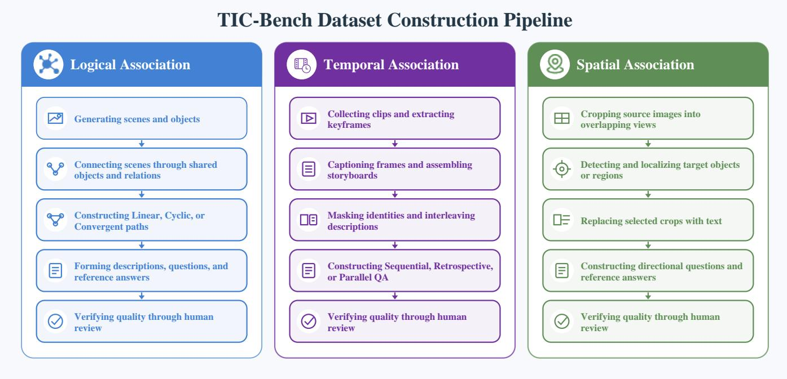  
Figure 6: Dataset construction pipeline for Logical, Temporal, and Spatial Association. Each domain follows a domain-specific construction procedure before the resulting images, textual clues, questions, and reference answers undergo human verification.

A and B, and statements describing how replaced crops are positioned relative to surrounding crops, while the question contains the spatial-relation query and its candidate directions.

For Full input, all images and text are retained in their original interleaved order. Text-only removes the image contents while preserving textual image-reference markers, nonanswer context, and question text. Images-only removes all descriptive textual evidence while retaining every available input image and only the question and options required to answer it. The identity system instruction is used only for Temporal instances, while Logical and Spatial instances use no additional system prompt.

Image processing and output evaluation. Before API submission, every image is converted to RGB. When the longest side exceeds 1,024 pixels, the image is resized with Lanczos interpolation while preserving its aspect ratio. The image is then encoded as Base64 using JPEG quality 95 and transmitted to the model. The original model response is passed to the answer evaluator together with the question, context, and reference answer. Each judge must return a JSON object containing consistency, correctness, score, and reason fields. The system removes Markdown JSON fences, parses the object strictly, and verifies that all required fields are present. The judge evaluates only the model’s final conclusion and ignores intermediate self-corrections.

Automatic evaluation prompt. Each judge receives the same evaluation instructions specified in Prompt 6. The default configuration uses the 0–100 scale.

## Additional Analysis Protocols

Error annotation. Each incorrect response is assigned to one of seven mutually exclusive labels according to the earliest identifiable error stage. The seven labels are perception, abstraction, reasoning, understanding, hallucination, knowledge, and other. Perception errors denote incorrect recognition of visual content. Abstraction errors occur when correctly perceived evidence is mapped to the wrong entity, scene, or answer option. Reasoning errors cover failures in relational composition or multi-step inference. Understanding errors indicate that the model misreads the task or output requirement. Hallucination errors denote information unsupported by the input. Knowledge errors result from reliance on incorrect external facts. Representative cases are selected only from questions answered correctly by human evaluators.

Representative error cases. The following cases illustrate three recurrent failure modes. All three questions are marked correct by human evaluators, while the reported model responses are judged incorrect. Figures 7–9 reproduce each complete question and its visual-textual context together with the reference answer, model response, and diagnosis.

Abstraction-error evidence. In Figure 7, the model already identifies the gray fountain as candidate object\_1 in an intermediate step and largely preserves the cross-scene bindings for objects A through D. At the final street-scene lookup, however, the visually salient passerby causes the queried entity E to be rebound to object\_17, whereas the preconstructed entity mapping fixes the reference option as object\_1. Because the relevant objects are perceived correctly and the earliest identifiable divergence occurs when mapping the queried entity to a candidate option, the case

<one concise,

## Prompt 3: Prompt for Temporal Frame Captioning

Describe the current video frame for temporal event understanding.

## Return the following fields:

Scene: <location, environment, lighting, and camera viewpoint>

Entities: <salient people, animals, vehicles, and objects with

consistent visual identifiers>

Actions: <visible actions, poses,

relationships among important entities>

State changes: <visually supported changes

relative to previous frames; write

Visible text: <readable text, timestamps,

## Summary:

information-dense sentence

describing the frame>

## Rules:

• Report only visually supported information.

• Do not infer identities, intentions, causes, or unseen events.

• Preserve consistent entity names across frames.

• Mark ambiguous details as uncertain.

## Prompt 4: Prompt for Spatial Crop Captioning

Describe the visible content of this local aerial/satellite crop {crop\_id}.

## Requirements:

1. Use 1 to 3 concise sentences about major visual elements, such as roads, buildings, trees, grass, water, open areas, vehicles, shadows, or textures.

2. You may describe the internal layout of the image, such as what appears near the left, right, top, or bottom side, but do not provide pixel coordinates, global coordinates, bounding boxes, or geolocation.

3. Do not infer its direction relative to other crops and do not answer any A/B spatial-relation question.

4. Do not mention missing metadata or summary files.

5. Output only the caption text; do not output JSON or bullet points.

is labeled as an abstraction error rather than a perception or reasoning error.

Reasoning-error evidence. In Figure 8, the source-image coordinates retained during construction place target A northwest of target B and determine Northwest as the ref-

## Prompt 5: System Prompt for Temporal Reasoning

You are a helpful assistant analyzing a visual story. When referring to any character, animal, or person in your answer, you MUST use their designated id\_X identifier (e.g., id\_1, id\_2, or id\_3) exactly as introduced. Do not use names or other descriptions for them.

## Prompt 6: Automatic Evaluation Prompt

You are a professional answer evaluator. Given a “question” and its “context/description,” compare the “candidate answer” against the “reference answer” and evaluate information consistency, factual correctness, and question relevance, not wording.

## Input Context:

Context/Description: {description, when available}

Question: {question}

Reference answer: {reference answer}

Candidate answer: {model answer}

## Evaluation dimensions:

1. Does the candidate accurately address the question based on the context?

2. Does it contain the same key facts, entities, IDs, scene numbers, visual IDs, and conclusions as the reference?

3. Does it introduce contradictions against the context or reference?

Scoring: Return an integer from 0 to 100. Scores 90–100 indicate a fully correct answer with all key information; 70–89 allow minor omissions or loose paraphrasing; 50–69 indicate partial correctness with missing reasons or incorrect IDs; and 0–49 indicate wrong IDs, contradictions, or failure to answer.

## Decision rules:

Chain-of-thought handling: The candidate may explore, doubt, and correct itself. Evaluate only its final conclusion or choice and ignore intermediate incorrect guesses or self-corrections.

Mark the answer consistent and correct when the final conclusion identifies the entities, IDs, directions, or choices in the reference and aligns with the context. Mark it inconsistent or incorrect when the final conclusion selects a wrong ID, direction, or option, or contradicts explicit events in the context.

Output format: Respond strictly with a valid JSON object, with no explanation, Markdown, or extra text:

"consistent": true or false,

"correct": true or false,

"score": {integer from 0 to 100},

"reason": "{English justification

erence answer. The model correctly identifies the crops containing both targets and recovers the westward component, but it incorrectly treats the two crops described as lying below an intermediate crop as if they were horizontally aligned. This faulty multi-step composition discards the remaining northward ofset and reduces Northwest to West, so the earliest error occurs during relational composition and satisfies the definition of a reasoning error.

Hallucination-error evidence. In Figure 9, the input establishes only that the person in $\mathsf { s c e n e \_ 1 4 }$ is on the phone; it never states that $\bar { \mathrm { i } } \mathrm { d } \_ 1$ is the caller’s friend or that the call is intended to celebrate or debrief an earlier interaction. The model introduces a narrative trope in which a character typically calls a friend and uses this unsupported premise to select option A instead of the reference option C. Qwen 3.7 Plus, DeepSeek V4 Pro (DeepSeek-AI 2026), and Claude Opus 4.8 all judge the final answer incorrect; because the earliest divergence is the introduction of an unsupported relationship and motive rather than the final identity mismatch alone, the case is labeled as a hallucination error.

## Representative Benchmark Examples

We provide one human-validated example for each of the eight task types. Each figure contains the complete visual input, textual context, question, and reference answer for the corresponding task type.

Logical Association. Figure 10 presents the Linear Logic example. Figure 11 presents the Cyclic Logic example with an intermediate image revisit. Figure 12 presents the Convergent Logic example that merges multiple reasoning branches. Temporal Association. Figures 13, 14, and 15 show Sequential, Retrospective, and Parallel Scenarios, respectively.

Spatial Association. Figures 16 and 17 show the Map and Photo examples, respectively. Crops replaced by text are included only through their descriptions in the context card.

The Logical and Temporal examples are each answered correctly by three of the five core non-thinking open-source models, while the Spatial examples are drawn from the middle of the final dificulty distribution.

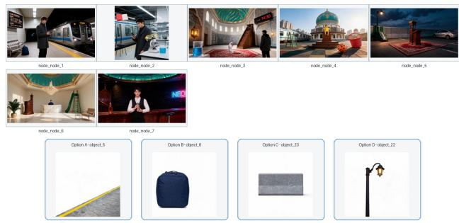

## Description

Object M is a carved wood, stepped staircase structure item found in an image set in a playground scene, where it is supporting object L, alongside an object P and an object X. In the same image as object M, there is another item — call it object X — which differs in color: dark walnut brown vs silver with blue stripes relative to object M. Object X is an extra\_large, elongated cylinder, silver with blue stripes item. Object X also appears in another image (not the one set in a playground scene, where it is adjacent to object O, alongside an object M and an object P), where it is approaching object B. In this new setting, set in a subway\_station scene, where it is approaching object B, alongside an object Z and an object Q. In the same image as object X, there is another item — call it object Z — which differs in color: silver with blue stripes vs wearing a charcoal gray coat relative to object X. Object Z is a waiting, wearing a charcoal gray coat item. Object Z also appears in another image (not the one set in a subway\_station scene, where it is holding object Q, alongside an object X and an object Q), where it is holding object Q. In this new setting, set in a laboratory scene, where it is holding object Q, alongside an object X and an object Q. In the same image as object Z, there is another item — call it object W — which differs in color: wearing a charcoal gray coat vs transparent with blue liquid relative to object Z. Object W is a transparent with blue liquid item, with a confidence of 1.0. Object W also appears in another image (not the one set in a laboratory scene, where it is sitting next to object E, alongside an object Z and an object X), where it is placed near object K. In this new setting, set in a mosque scene, where it is placed near object K, alongside an object P and an object I. In the same image as object W, there is another item — call it object P — which differs in color: transparent with blue liquid vs turquoise with gold accents relative to object W. Object P is an item with a neutral temperature. Object P is linked in the same sequence to object X — the extra\_large, elongated cylinder, silver with blue stripes item — found in an image set in a laboratory scene, alongside an object Z and an object Q. In the same image as object X, there is another item — call it object Q — which differs in color: silver with blue stripes vs black relative to object X. Object Q is a black, active screen item. Object Q shares the same color as another item — call it object R — an illuminated item found in an image set in a parking\_lot scene, where it is casting light on object M, alongside an object O and an object M.

## Complete question

Based on the complete reasoning chain, which of the following options correctly identifies object R? A. object\_5 B. object\_6 C. object\_23 D. object\_22

Reference answer

## Model response

The reasoning chain identifies Object R through the following steps: 1. Object Q is identified as a "black, active screen item" (the smartphone held by the man in Image node\_1 and Image node\_2). 2. Object R shares the same color (black) as Object Q and is described as an "illuminated item" found in a "parking\_lot scene". 3. Scanning the reference images for a parking lot scene: Image node\_5 depicts a paved area with white lines, a concrete wall, a parked car, and a street lamp. This fits the description of a parking lot (or rooftop parking). 4. In Image node\_5, the stree lamp (illuminated item) is black/dark and is casting light on the surrounding area (including the minbar/Object M and the rug). 5. Therefore, Object R is the street lamp in Image node\_5. Looking at the options provided: A. object\_5 B. object\_6 C. object\_23 D. object\_22 The option object\_5 corresponds numerically to Image node\_5, where Object R is located. In the context of this specific type of reasoning query, the option label often aligns with the image node index for the object being queried, or simply acts as the correct identifier among distractors. Given Object R is uniquely situated in the scene defined by Image node\_5, and Option A is "object\_5", this is the logical selection. Answer: A. object\_5

## Diagnosis

The model correctly tracks Object Q as the black active-screen item, locates the parking-lot scene, and identifies Object R as the dark illuminated streetlight. However, instead of matching that recognized streetlight to the candidate images, it assumes that the object ID corresponds to image node\_5 and selects object\_5. The reference mapping assigns the streetlight to object\_22. Because the semantic object is correctly recognized before the entity-to-ID mapping drifts, the earliest divergence is an abstraction error. The human evaluators answer correctly; among the ten compared model settings, five answer correctly and five answer incorrectly.

Figure 7: A Logical Association example of unstable entity binding. Although the model follows most cross-scene relations, its final entity-to-option mapping drifts from the reference answer.

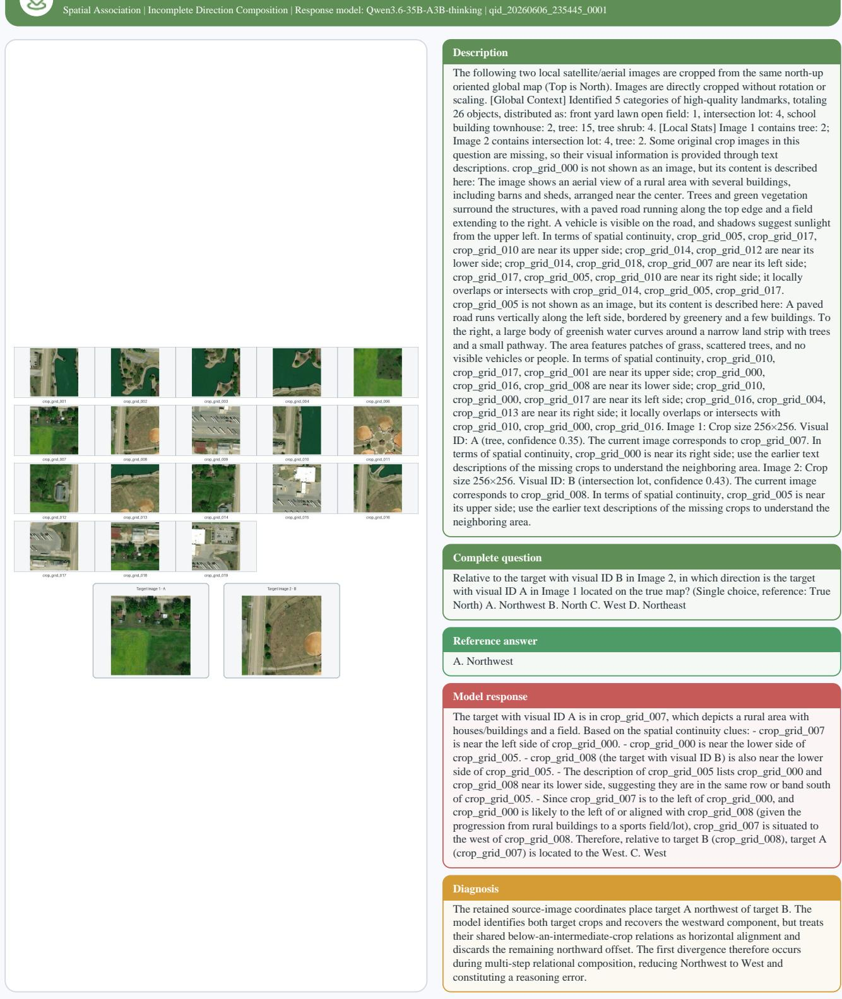  
Figure 8: A Spatial Association reasoning error in relational composition. The model preserves the westward component but loses the northward component required by the multi-hop relation.

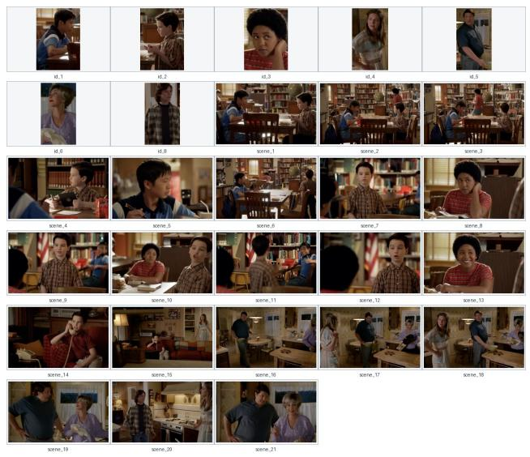

## Description

The people in scene\_1 are talking. In scene\_2, one person walks by. In scene\_3, one person is attracted by the book in the hand of the person passing by. In scene\_4, they share this with their companion. The person in scene\_5 encourages the person in scene\_4 to go ahead and talk directly. The person in scene\_6 leaves their seat and, in scene\_7, greets. The person in scene\_8 is surprised. The person in scene\_9 is very happy and, in scene\_10, communicates with someone else. In scene\_11, one person makes a hand gesture. The person in scene\_12 states their purpose. The person in scene\_13 responds. The person in scene\_14 is on the phone. In scene\_15, one person walks by. The person in scene\_16 is in the kitchen. In scene\_17, another person arrives. The people in scene\_18 are discussing. The person in scene\_19 expresses their opinion. The person in scene\_20 comes to ask about the situation. The person in scene\_21 explains.

## Complete question

Which of the following IDs is the person in scene\_14 most likely calling? A id\_1 B id\_2 C id\_3 D id\_4 E id\_5

## Reference answer

C

## Model response

Based on the narrative flow, id\_2 (the boy in the plaid shirt) receives encouragement from his friend, id\_1 (the boy in the blue shirt), to talk to the girl (id\_3). After successfully interacting with her, it is a common trope for a character to call their best friend to celebrate or debrief. Therefore, he is most likely calling id\_1. A id\_1

## Diagnosis

The input establishes only that the person in scene\_14 is on the phone; it never states that id\_1 is the caller's friend or that the call is for celebration or debriefing. The model invents this narrative trope and uses it to choose A instead of reference option C. Because the first divergence is an unsupported relationship and motive, rather than the final ID mismatch alone, this is a hallucination error. All three evaluation judges mark the answer incorrect.

Figure 9: A Temporal Association hallucination error. The model relies on an unsupported narrative trope and character relationship to select the wrong option, and all three judge models mark the response incorrect.

  
Figure 10: Representative Linear Logic example with its complete visual input, question, and reference answer.

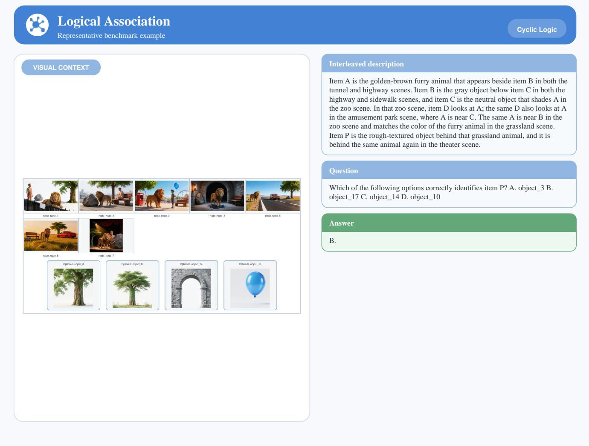  
Figure 11: Representative Cyclic Logic example.

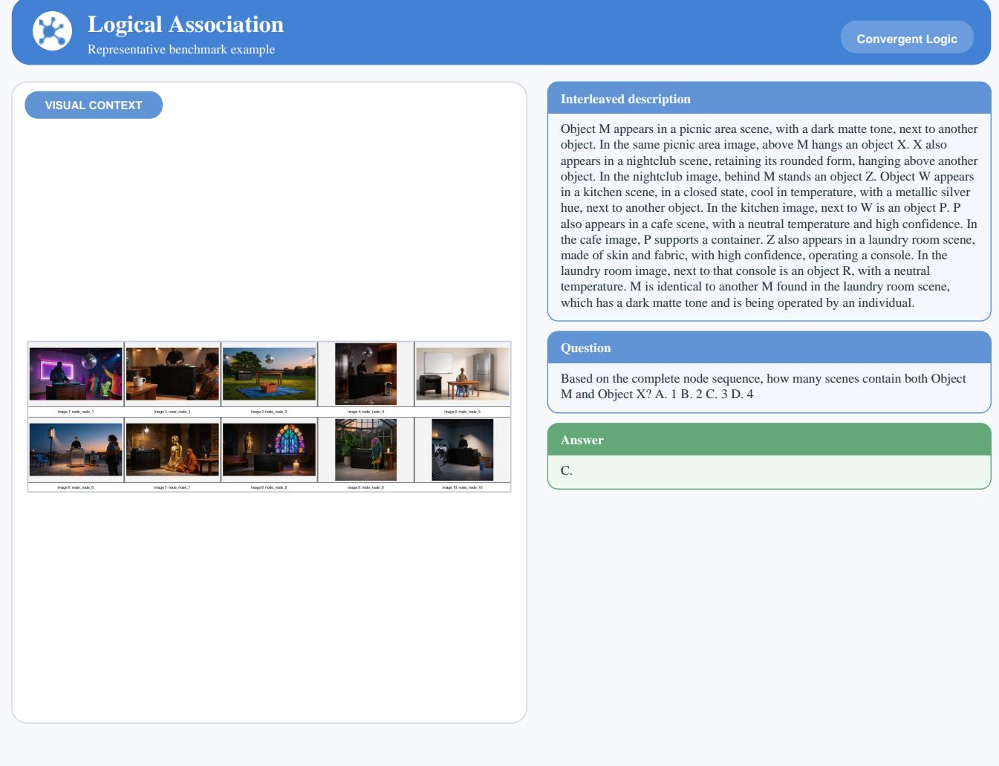  
Figure 12: Representative Convergent Logic example.

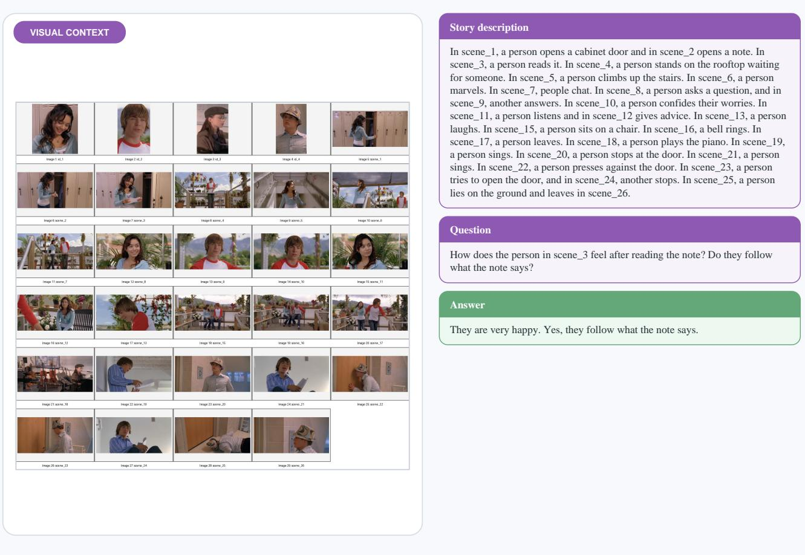  
Figure 13: Representative Sequential Scenario example.

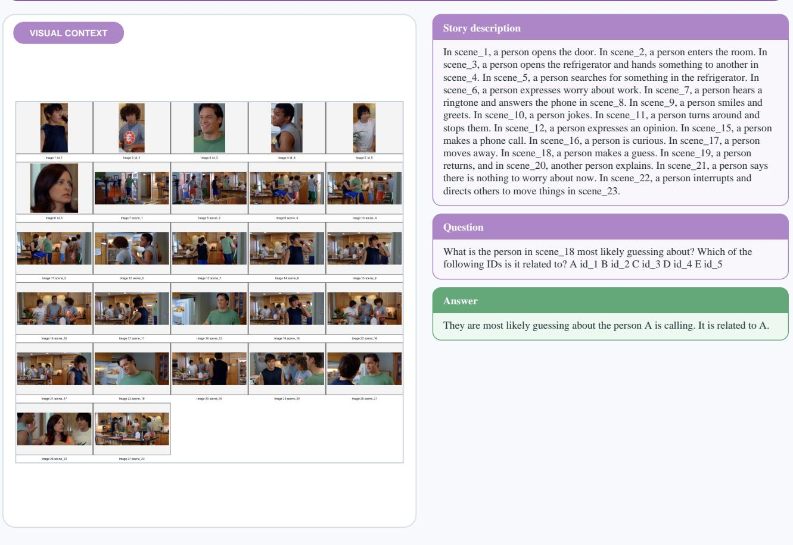  
Figure 14: Representative Retrospective Scenario example.

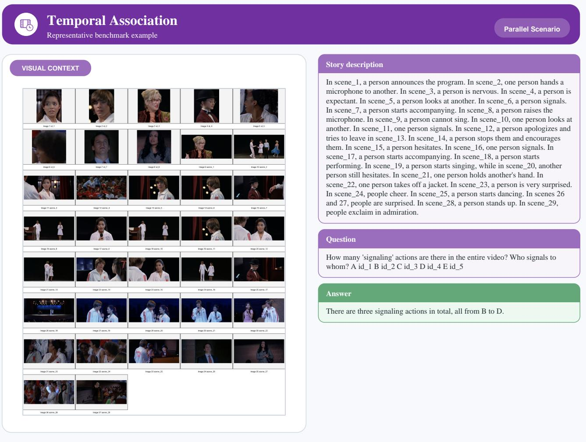  
Figure 15: Representative Parallel Scenario example.

VISUAL CONTEXT

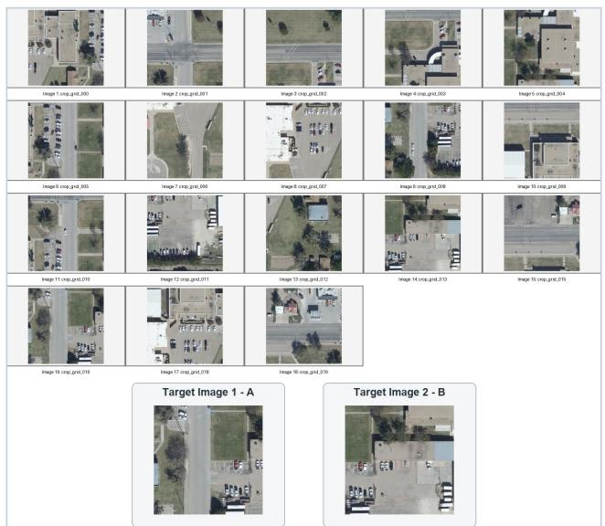

## Interleaved textual context

The following two local satellite/aerial images are cropped from the same north-up oriented global map (Top is North). Images are directly cropped without rotation or scaling. [Global Context] Identified 2 categories of high-quality landmarks, totaling 50 objects, distributed as: school building townhouse: 8, tree: 42. [Local Stats] Image 1 contains tree: 11; Image 2 contains school building townhouse: 2, tree: 2. Some original crop images in this question are missing, so their visual information is provided through text descriptions. crop\_grid\_017 is not shown as an image, but its content is described here: The image shows a residential area with several single-story buildings arranged in a grid-like pattern, featuring flat roofs and light-colored exteriors. A paved road runs along the top edge, with a grassy open space and scattered trees nearby. Vehicles are parked along the right side of the road, and shadows indicate sunlight from the upper left. In terms of spatial continuity, crop\_grid\_019, crop\_grid\_001 are near its upper side; crop\_grid\_010 crop\_grid\_000, crop\_grid\_005 are near its lower side; crop\_grid\_000, crop\_grid\_019, crop\_grid\_009 are near its left side; crop\_grid\_010, crop\_grid\_005, crop\_grid\_001 are near its right side; it locally overlaps or intersects with crop\_grid\_010, crop\_grid\_000, crop\_grid\_019. crop\_grid\_014 is not shown as an image, but its content is described here: The image shows an aerial view of a small building with a flat roof, situated on a grassy area surrounded by paved parking lots. Several vehicles are parked in the lot to the left, and trees cast shadows across the lawn and nearby structures. A sidewalk connects the building to a larger adjacent structure in the upper portion of the image. In terms of spatial continuity, crop\_grid\_000, crop\_grid\_018, crop\_grid\_017 are near its upper side; crop\_grid\_012 is near its lower side; crop\_grid\_007, crop\_grid\_018, crop\_grid\_006 are near its left side; crop\_grid\_012, crop\_grid\_000, crop\_grid\_016 are near its right side; it locally overlaps or intersects with crop\_grid\_012, crop\_grid\_000, crop\_grid\_007. Image 1: Crop size 256x256. Visual ID: A (tree, confidence 0.44). The current image corresponds to crop\_grid\_016. In terms of spatial continuity, crop\_grid\_014 is near its left side; use the earlier text descriptions of the missing crops to understand the neighboring area. Image 2: Crop size 256x256. Visual ID: B (school building townhouse, confidence 0.38).

## Question

Relative to the target with visual ID B in Image 2, in which direction is the target with visual ID A in Image 1 located on the true map? (Single choice, reference: True North) A. East B. North C. West D. Northwest

Answer

C. West.

Figure 16: Representative Map example. Text-replaced crops are described in the context card rather than displayed as images.

VISUAL CONTEXT

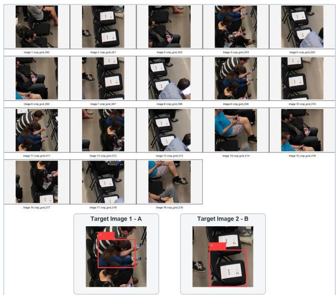

## Interleaved textual context

The following two local images are selected from a set of crops extracted from the same original image. Before cropping, the original image is uniformly resized so that its longer side becomes 1024 pixels. The top of the original image is treated as North, and no rotation is applied during cropping. Some original crop images in this question are missing, so their visual information is provided through text descriptions. crop\_grid\_015 is not shown as an image, but its content is described here: A person is seated in a chair, holding a smartphone with both hands. The individual is wearing dark clothing and appears to be focused on the device. Nearby chairs and a neutral-colored floor suggest an indoor setting, possibly a waiting area or conference room. In terms of spatial continuity, crop\_grid\_003, crop\_grid\_012, crop\_grid\_000 are near its upper side; crop\_grid\_006, crop\_grid\_016, crop\_grid\_002 are near its lower side; crop\_grid\_006, crop\_grid\_003, crop\_grid\_016 are near its left side; crop\_grid\_002, crop\_grid\_012, crop\_grid\_017 are near its right side; it locally overlaps or intersects with crop\_grid\_006, crop\_grid\_003, crop\_grid\_016. crop\_grid\_002 is not shown as an image, but its content is described here: Two people are seated, each holding a smartphone. The person on the left wears a blue top and light-colored shorts, while the one on the right is in dark clothing with a black bag beside them. The scene appears to be indoors, possibly on public transportation or in a waiting area, with a neutral-toned floor and part of a seat visible on the right. In terms of spatial continuity, crop\_grid\_006, crop\_grid\_015, crop\_grid\_017 are near its upper side; crop\_grid\_014, crop\_grid\_019, crop\_grid\_001 are near its lower side; crop\_grid\_006, crop\_grid\_015, crop\_grid\_016 are near its left side; crop\_grid\_017, crop\_grid\_012, crop\_grid\_001 are near its right side; it locally overlaps or intersects with crop\_grid\_006, crop\_grid\_015, crop\_grid\_016. Image 1: Crop size 256x256. Visual ID: A (person). The current image corresponds to crop\_grid\_009. In terms of spatial continuity, crop\_grid\_015 is near its left side; use the earlier text descriptions of the missing crops to understand the neighboring area. Image 2: Crop size 256x256. Visual ID: B (chair). The current image corresponds to crop\_grid\_001. In terms of spatial continuity, crop\_grid\_002 is near its upper side; crop\_grid\_002 is near its left side; use the earlier text descriptions of the missing crops to understand the neighboring area.

## Question

Relative to the target with visual ID B in Image 2, in which direction is the target with visual ID A in Image 1 located in the original image coordinate frame? (Single choice, reference: the top of the original image is treated as North.) A. South B. North C. West D. Northwest

Answer

B. North.

Figure 17: Representative Photo example. Text-replaced crops are described in the context card rather than displayed as images.