# Diffusion-Encoding Gaussian Field for Joint k–q dMRI Reconstruction

Zhibo Chen, Yajuan Huang, Yu Guan, Qiuyun Fan,

Dong Liang, Senior Member, IEEE, and Qiegen Liu, Senior Member, IEEE

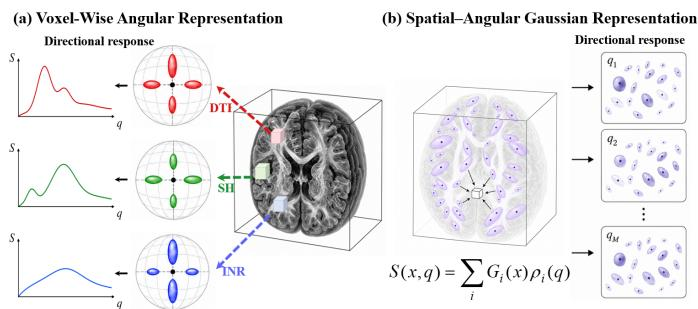  
Fig. 1. Comparison of voxel-centered and primitive-centered spatial–angular dMRI representations. (a) A directional response is independently attached to each fixed voxel, (b) overlapping 3D Gaussian primitives provide shared spatial support and q-conditioned responses whose weighted aggregation yields the queried DWI signal.

## Abstract—

Index Terms—Diffusion MRI, Gaussian splatting, selfsupervised reconstruction, spatial–angular representation.

## I. INTRODUCTION

D IFFUSION magnetic resonance imaging (dMRI) enablesnoninvasive characterization of tissue microstructure and noninvasive characterization of tissue microstructure and white-matter organization [1]–[3]. It requires repeated image acquisitions under different diffusion-encoding directions. Consequently, the acquisition time increases with both the spatial sampling density in k-space and the angular sampling density in q-space. Undersampling k-space shortens each diffusion-weighted acquisition, whereas reducing q-space sampling decreases the number of repeated acquisitions. However, these two forms of undersampling are not independent. Errors introduced by k-space undersampling alter the local signal intensities from which angular responses are estimated, and may therefore be misinterpreted as genuine directional variation when q-space is sparse. The resulting errors can propagate to tensor-derived metrics and orientation estimates, including fractional anisotropy (FA), mean diffusivity (MD), and principal diffusion directions [4]. Joint k–q reconstruction must therefore preserve not only image-domain spatial fidelity, but also the directional relationships required for reliable diffusion quantification.

Existing joint k–q reconstruction methods exploit joint spatial–angular sparsity or incorporate learned q-space priors into measurement-consistent optimization frameworks [5], [6]. More broadly, model-based and self-supervised MRI reconstruction methods combine learned priors with data consistency to reduce their dependence on fully sampled training targets [7], [8]. Learning-based approaches have also addressed q-space acceleration through direct regression, multimodal or attention-based estimation, recurrent architectures, spatioangular convolutions, and generative angular priors [9]–[14].

Despite these advances, most existing formulations couple spatial and angular information only indirectly through regularization or learned features, or process spatial reconstruction and angular completion sequentially. Diffusion-weighted images acquired under different directions share the same spatially aligned anatomy, while their local signal intensities vary with diffusion encoding. Measurements across directions should therefore jointly constrain a common spatial representation, while direction-dependent responses account for genuine diffusion-related signal variation. However, indirect or sequential formulations lack an explicit shared spatial support for integrating complementary measurements across directions during undersampled reconstruction.

Continuous neural fields support representing and querying signals at unobserved directions, but their local spatial support is generally encoded implicitly in network weights or coefficient fields [15]–[18]. In contrast, Gaussian primitives provide explicit, learnable, and spatially localized support [19], [20]. A common set of Gaussian primitives can therefore serve as an explicit anatomical scaffold shared across diffusion directions. However, pairing a shared 3D Gaussian scaffold with a separate angular model still leaves spatial support and directional response decoupled. Because the angular model cannot directly adapt the underlying primitive support, spatial fitting errors may be absorbed as apparent directional variation and propagated to unobserved directions, as illustrated in Fig. 1(a). The diffusion response should therefore be embedded into the Gaussian primitives themselves rather than appended after spatial reconstruction.

To close this gap, we propose a self-supervised diffusionencoding spatial–angular Gaussian field, as illustrated in Fig. 1(b). All diffusion directions share a common set of overlapping 3D Gaussian primitives, with each primitive carrying a continuous q-conditioned response. The signal at each spatial location is synthesized from multiple neighboring primitive responses. This primitive-centered formulation couples local spatial support and directional attenuation within the same explicit units. Each response combines a positivesemidefinite diffusion-tensor attenuation anchor with a regularized even angular correction, balancing physical stability and angular flexibility. To stabilize estimation from sparse joint k–q measurements, discrete primitive responses are first calibrated at the observed directions, while spatial reconstruction discrepancy, sampled k-space inconsistency, and crossdirection angular heterogeneity jointly guide primitive birth and splitting. The calibrated responses are then projected onto a tensor-anchored continuous q-response and jointly refined with the updated Gaussian support. All stages are driven only by sampled k-space measurements from observed directions, and the resulting field is queried for both observed-direction reconstruction and held-out-direction synthesis. The method is evaluated independently on three HCP diffusion shells under multiple combinations of spatial and angular acceleration.

The main contributions of this work are summarized as follows:

• We introduce an explicit dMRI representation with a Gaussian scaffold shared across diffusion directions and a continuous q-conditioned response carried by each primitive. Through one-to-many primitive support and many-to-one response aggregation, the resulting field jointly models shared anatomy and direction-dependent attenuation.

• We develop a dMRI-oriented strategy that jointly adapts Gaussian support and primitive q-responses using observed-direction measurements. Spatial discrepancy, back-projected k-space residuals, and angular heterogeneity guide primitive birth and splitting, after which calibrated responses are projected onto a positive tensoranchored continuous q-response for self-supervised synthesis at unobserved directions.

## II. RELATED WORK

## A. Joint k–q Reconstruction

Diffusion MRI acquisition depends on both k-space and qspace. The former determines image spatial structure, whereas the latter describes signal variation across diffusion directions. Insufficient k-space sampling may produce aliasing artifacts and loss of spatial detail, while sparse diffusion-direction sampling may affect diffusion-tensor fitting, fiber orientation estimation, and microstructural measures such as FA and MD. Accelerated dMRI reconstruction must therefore consider both spatial and directional sampling.

Existing studies have extended compressed-sensing MRI [21] to joint k–q reconstruction. For example, $( k , q ) – \mathrm { C S }$ recovers diffusion images by exploiting joint spatial– angular sparsity [5], whereas qModeL performs model-based reconstruction using a learned q-space prior within a measurement-consistent framework [6]. These methods directly handle undersampled measurements and provide an important foundation for joint k–q dMRI reconstruction. However, most existing approaches represent dMRI as voxelgrid DWI stacks or q-space coefficient fields, in which shared anatomical structure across diffusion directions and local direction-dependent responses are modeled less explicitly.

## B. q-Space Modeling

The dMRI signal varies with the diffusion-gradient direction, making directional relationships in q-space essential for diffusion-signal modeling. Diffusion tensor imaging uses a tensor model to describe direction-dependent signal attenuation and remains one of the most widely used diffusion models [2]. Beyond DTI, Q-ball imaging and regularized sphericalharmonic formulations characterize higher-order angular structure, while Gaussian-process regression supports interpolation of nonuniform or undersampled q-space measurements [22]– [24].

Deep-learning methods have further advanced q-space modeling. Early q-space deep learning directly maps sparse diffusion measurements to microstructural quantities [9], while multimodal and attention-based approaches improve angular super-resolution or accommodate variable q-space sampling strategies [10], [11]. Recurrent convolutional autoencoders model relationships among diffusion directions [12], and spatio-angular convolutions jointly extract spatial and directional features [13]. Spatial–angular representation learning and implicit representations model dMRI as a continuous spatial-directional signal [17], [18], while physics-guided generative priors have also been used for high-angular-resolution diffusion-image synthesis [14]. These studies demonstrate the value of diffusion priors and q-space continuity for recovering complete diffusion signals from sparse directions, and motivate direction-conditioned response modeling.

## C. Gaussian Splatting

Medical image reconstruction depends not only on the reconstruction algorithm, but also on how the image signal is represented. In addition to conventional voxel-grid representations, implicit neural representations such as NeRF and SIREN describe images or scenes as continuous coordinateconditioned functions [15], [25]. NeRP further applies this principle to sparsely sampled medical image reconstruction [26]. These studies show that continuous representations can provide effective priors for medical inverse problems.

In contrast to implicit coordinate networks, 3D Gaussian Splatting represents a three-dimensional field using explicit Gaussian primitives with learnable centers, scales, and appearance attributes, which are optimized through differentiable splatting [19]. Gaussian representations have subsequently been extended to dynamic scene modeling [27] and medical inverse problems, including sparse-view CT, dynamic angiography, 4D CT, and undersampled MRI reconstruction [20], [28]–[30].

For dMRI, different diffusion directions produce directiondependent signal variations under the same anatomical structure. The explicit spatial attributes of Gaussian primitives can therefore describe shared anatomical support, while directionconditioned responses attached to the primitives can model q-space signal variation. This provides the basis for jointly using Gaussian representations for spatial reconstruction and diffusion-direction modeling.

## III. METHODOLOGY

Our method consists of two main components: a diffusionencoding spatial–angular Gaussian field that represents the DWI signal using shared 3D Gaussian primitives with continuous tensor-anchored q-responses (Sec. III-A), and a progressive field construction strategy that performs scaffold initialization, observed-response calibration, adaptive primitive allocation, continuous-response projection, and joint refinement (Sec. III-B).

## A. Diffusion-Encoding Spatial–Angular Gaussian Field

1) Joint $k { \mathrm { - } } q$ Inverse Problem: We consider one fixed diffusion-weighting shell at a time. Let $S ( \mathbf { x } , \mathbf { g } )$ denote the diffusion-weighted signal at spatial coordinate $\mathbf { x } \in \Omega _ { x } \subset \mathbb { R } ^ { 3 }$ and unit diffusion-encoding direction $\textbf { g } \in \ \mathbb { S } ^ { 2 }$ , the k-space measurements from observed diffusion directions are modeled as

$$
\begin{array} { r } { \mathbf { y } _ { \mathbf { g } } = \mathbf { M } _ { \mathbf { g } } \odot \mathcal { F } _ { x y } \left( S ( \cdot , \mathbf { g } ) \right) + \epsilon _ { \mathbf { g } } , \qquad \mathbf { g } \in \mathcal { G } _ { \mathrm { o b s } } , } \end{array}\tag{1}
$$

where $\mathbf { M _ { g } }$ is the direction-dependent sampling mask, $\mathcal { F } _ { x y }$ denotes the slice-wise in-plane Fourier transform, and $\epsilon _ { \mathbf { g } }$ represents noise. Masks may vary across observed directions to provide complementary spatial-frequency measurements.

Our goal is to recover a continuous field $\widehat { S } ( \mathbf { x } , \mathbf { g } )$ from the undersampled measurements of the observed directions, while maintaining consistency with the acquired k-space samples. The estimated field can then be queried at unobserved diffusion directions. The held-out direction set $\mathcal { G } _ { \mathrm { m i s s } }$ is excluded from optimization and used only for retrospective evaluation.

2) Shared Gaussian Support and Primitive-Centered $A g _ { \ l } .$ gregation: All diffusion directions are represented using a common collection of N Gaussian primitives. Primitive i is parameterized by a center $\mu _ { i } .$ , a spatial covariance $\Sigma _ { i } ^ { x }$ , and q-response parameters $\vartheta _ { i }$ . Its spatial contribution is

$$
G _ { i } ( \mathbf { x } ) = \exp \left[ - \frac { 1 } { 2 } ( \mathbf { x } - \pmb { \mu } _ { i } ) ^ { \top } ( \pmb { \Sigma } _ { i } ^ { x } ) ^ { - 1 } ( \mathbf { x } - \pmb { \mu } _ { i } ) \right] .\tag{2}
$$

We use a diagonal spatial covariance in the current implementation, allowing the support of each primitive to adapt independently along the three spatial axes. Let $\rho _ { i } ( \mathbf { g } , \vartheta _ { i } )$ denote the response amplitude of primitive i under direction g, the spatial–angular field is rendered as

$$
\widehat { S } ( \mathbf { x } , \mathbf { g } ) = \sum _ { i = 1 } ^ { N } G _ { i } ( \mathbf { x } ) \rho _ { i } ( \mathbf { g } , \pmb { \vartheta } _ { i } ) .\tag{3}
$$

Eq. (3) defines a primitive-centered representation. At each spatial location, several overlapping primitives jointly determine the signal. Conversely, each primitive contributes to multiple neighboring locations and shares one response function across diffusion directions. The voxel-level response therefore emerges from a spatial mixture of local primitive responses rather than from an independent directional parameter vector attached to each voxel.

3) Tensor-Anchored Continuous Diffusion Response: To prevent an unconstrained angular model from absorbing spatial reconstruction errors, each primitive is assigned a compact response anchored by diffusion-tensor attenuation. The tensor response is

$$
\begin{array} { r } { \rho _ { i } ^ { \mathrm { t e n } } ( \mathbf { g } ) = a _ { i } \exp \left( - b \mathbf { g } ^ { \top } \mathbf { D } _ { i } \mathbf { g } \right) , \qquad \mathbf { D } _ { i } = \kappa _ { D } \mathbf { L } _ { i } \mathbf { L } _ { i } ^ { \top } , } \end{array}\tag{4}
$$

where $a _ { i } > 0$ is a primitive-level reference amplitude, $\kappa _ { D } > 0$ sets the diffusivity scale, and the factorization of $\mathbf { D } _ { i }$ guarantees nonnegative apparent diffusivity.

A single tensor may not fully describe partial-volume effects or departures from ideal tensor behavior. We introduce a regularized second-order even angular correction $\mathbf { r } _ { i } ^ { \top } \phi ( \mathbf { g } )$ where $\phi$ is a normalized real even spherical-harmonic basis up to order two and α controls the correction strength. The response is defined in the softplus latent domain as

$$
\rho _ { i } ( \mathbf { g } , \pmb { \vartheta } _ { i } ) = \mathrm { { s o f t p l u s } } \left[ \mathrm { { s o f t p l u s } } ^ { - 1 } \left( \rho _ { i } ^ { \mathrm { { t e n } } } ( \mathbf { g } ) \right) + \alpha \mathbf { r } _ { i } ^ { \top } \phi ( \mathbf { g } ) \right] .\tag{5}
$$

The tensor provides the dominant attenuation geometry, whereas the even residual models a departure from that anchor. The softplus mapping guarantees a positive response, and the use of a quadratic tensor term together with an even angular basis preserves antipodal symmetry.

The primitive-level tensor does not restrict the signal at a voxel to a single-tensor model. Because Eq. (3) aggregates overlapping primitives, the voxel-level q-space signal is a spatially varying mixture of multiple tensor-anchored responses. The primitive tensors should be interpreted as local attenuation anchors rather than as the voxel-wise tensors used to compute downstream FA and MD maps.

## B. Progressive Field Construction and Optimization

Directly optimizing Gaussian geometry and continuous qresponses from sparse joint k–q measurements is poorly conditioned. A reconstruction mismatch may originate from insufficient spatial support, measurement inconsistency, or genuine directional variation. We therefore increase the representation complexity progressively from a q-independent scaffold, to discrete observed-direction responses and finally to a continuous tensor-anchored field, as illustrated in Fig. 2.

1) Anatomy-Aware Scaffold Initialization: For each observed direction, the zero-filled reconstruction is obtained by inverse Fourier transformation with unmeasured k-space coefficients set to zero. Their direction-averaged volume is

$$
\overline { { S } } ^ { \mathrm { Z F } } ( \mathbf { x } ) = \frac { 1 } { | \mathcal { G } _ { \mathrm { o b s } } | } \sum _ { \mathbf { g } \in \mathcal { G } _ { \mathrm { o b s } } } S _ { \mathbf { g } } ^ { \mathrm { Z F } } ( \mathbf { x } ) .\tag{6}
$$

We first fit a q-independent Gaussian field:

$$
\widehat { S } _ { \mathrm { b a s e } } ( { \bf x } ) = \sum _ { i = 1 } ^ { N _ { 0 } } \overline { { \rho } } _ { i } G _ { i } ( { \bf x } ) ,\tag{7}
$$

where $\overline { { \rho } } _ { i }$ is a direction-independent amplitude. This stage initializes Gaussian centers, spatial extents, and amplitudes before tensor or angular residuals are introduced. The averaged zero-filled image serves only as an observed-data-derived structural reference, not as a fully sampled supervision target.

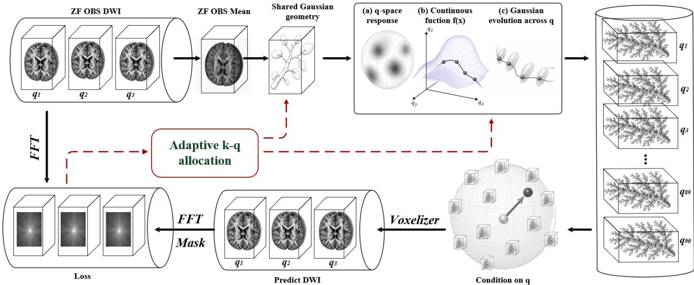  
Fig. 2. Overview of the proposed diffusion-encoding spatial–angular Gaussian framework. A shared Gaussian scaffold with continuous tensor–residua responses is optimized using observed-direction reconstruction and sampled k-space consistency, while fitting residuals guide adaptive primitive allocation.

2) Observed-Response Calibration and Adaptive Allocation: The initial scaffold may provide insufficient support near tissue boundaries, fine structures, or regions with complex observed directional variation. To expose these regions without prematurely imposing a continuous q-response, we temporarily assign an independent positive amplitude $\rho _ { i , { \bf g } } ^ { \mathrm { o b s } }$ to primitive i at each observed direction:

$$
\widehat { S } _ { \mathrm { o b s } } ( \mathbf { x } , \mathbf { g } ) = \sum _ { i = 1 } ^ { N } \rho _ { i , \mathbf { g } } ^ { \mathrm { o b s } } G _ { i } ( \mathbf { x } ) , \qquad \mathbf { g } \in \mathcal { G } _ { \mathrm { o b s } } .\tag{8}
$$

These amplitudes are nonparametric samples of the local responses supported by the current scaffold and do not define signals at held-out directions.

We summarize the local need for additional primitive capacity as

$$
\eta ( \mathbf { x } ) = [ \omega _ { \mathrm { s p a } } \eta _ { \mathrm { s p a } } ( \mathbf { x } ) + \omega _ { \mathrm { m e a s } } \eta _ { \mathrm { m e a s } } ( \mathbf { x } ) + \omega _ { \mathrm { a n g } } \eta _ { \mathrm { a n g } } ( \mathbf { x } ) ] \mathbf { m } ( \mathbf { x } ) ,\tag{9}
$$

where m is the brain mask. The three terms quantify, respectively, the discrepancy between rendered fields and observed zero-filled images, sampled k-space residuals back-projected to image space, and angular variation across observed signals and primitive amplitudes. All terms are computed exclusively from $\mathcal { G } _ { \mathrm { o b s } }$

Primitive capacity is increased through two complementary operations. Voxel birth introduces new primitives at highscore locations with insufficient support, whereas primitive splitting locally refines existing high-score primitives using smaller spatial extents. The observed-direction amplitudes are recalibrated after allocation, and the allocation–calibration process is repeated for several rounds. This strategy concentrates representation capacity in difficult regions without uniformly increasing the primitive number throughout the volume. As illustrated in Fig. 3, the allocation process iteratively identifies under-represented regions and refines the Gaussian support through birth, splitting, and recalibration.

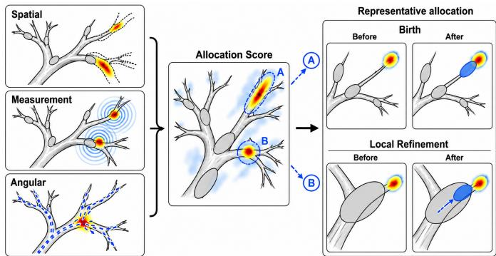  
Fig. 3. Observed-driven adaptive primitive allocation. Spatial discrepancy, back-projected k-space residuals, and angular heterogeneity form an allocation score that guides voxel birth and primitive splitting, followed by observeddirection response recalibration.

3) Observed-to-Continuous Response Projection and Joint Refinement: After adaptive allocation, the calibrated amplitudes provide discrete directional samples for each primitive:

$$
\mathcal { R } _ { i } ^ { \mathrm { o b s } } = \left\{ ( \mathbf { g } , \rho _ { i , \mathbf { g } } ^ { \mathrm { o b s } } ) \ | \ \mathbf { g } \in \mathcal { G } _ { \mathrm { o b s } } \right\} .\tag{10}
$$

We project these samples onto the continuous response family in Eq. (5):

$$
\vartheta _ { i } ^ { ( 0 ) } = \underset { \pmb { \vartheta } _ { i } } { \arg \operatorname* { m i n } } \sum _ { \mathbf { g } \in \mathcal { G } _ { \mathrm { o b s } } } \left| \rho _ { i } ( \mathbf { g } , \pmb { \vartheta } _ { i } ) - \rho _ { i , \mathbf { g } } ^ { \mathrm { o b s } } \right| ^ { 2 } + \beta _ { r } \| \mathbf { r } _ { i } \| _ { 2 } ^ { 2 } .\tag{11}
$$

The reference amplitude is initialized from a robust upper statistic of the observed primitive amplitudes, the tensor is initialized from an isotropic diffusivity estimate, and the angular residual is obtained using a regularized low-order fit. These quantities are used only for initialization and are optimized through the nonlinear response in Eq. (5).

The projection converts flexible but discrete observeddirection amplitudes into a compact, positive, antipodally symmetric function that can be evaluated at arbitrary directions. The response parameters are then jointly refined with conservative updates to the Gaussian centers and spatial extents. A weak primitive-response anchor maintains consistency with the calibrated observed amplitudes while allowing interpolation between observed directions.

4) Self-Supervised Learning Objectives: The progressive levels share an observed-data-only supervision principle but use objectives matched to their representation complexity. The rendered signal is restricted to the brain support before Fourier encoding.

For an observed direction, sampled k-space consistency is defined as

$$
\mathcal { L } _ { k } = \frac { 1 } { \left. \mathcal { G } _ { \mathrm { o b s } } \right. } \sum _ { \mathbf { g } \in \mathcal { G } _ { \mathrm { o b s } } } \frac { \left. \mathbf { M } _ { \mathbf { g } } \odot \left[ \mathcal { F } _ { x y } \left( \mathbf { m } \odot \widehat { S } ( \cdot , \mathbf { g } ) \right) - \mathbf { y } _ { \mathbf { g } } \right] \right. _ { 1 } } { \left. \mathbf { M } _ { \mathbf { g } } \right. _ { 1 } } .\tag{12}
$$

The scaffold initialization minimizes a masked image-domain discrepancy to $\overline { S } ^ { \mathrm { Z F } }$ with weak spatial regularization. The observed-response calibration uses sampled k-space consistency together with an auxiliary zero-filled anchor. The final continuous-field objective is

$$
\begin{array} { r } { \mathcal { L } _ { \mathrm { f i e l d } } = \mathcal { L } _ { k } + \lambda _ { \mathrm { Z F } } \mathcal { L } _ { \mathrm { Z F } } + \lambda _ { \mathrm { T V } } \mathcal { L } _ { \mathrm { T V } } + \lambda _ { \rho } \mathcal { L } _ { \rho } } \\ { + \lambda _ { D } \mathcal { L } _ { D } + \lambda _ { r } \mathcal { L } _ { r } , \qquad } \end{array}\tag{13}
$$

where $\mathcal { L } _ { \mathrm { Z F } }$ weakly anchors the rendered observed directions to their zero-filled reconstructions, ${ \mathcal { L } } _ { \mathrm { T V } }$ regularizes local image variation, and

$$
\mathcal { L } _ { \rho } = \frac { 1 } { N | \mathcal { G } _ { \mathrm { o b s } } | } \sum _ { i = 1 } ^ { N } \sum _ { \mathbf { g } \in \mathcal { G } _ { \mathrm { o b s } } } \left| \rho _ { i } ( \mathbf { g } , \boldsymbol { \vartheta } _ { i } ) - \rho _ { i , \mathbf { g } } ^ { \mathrm { o b s } } \right|\tag{14}
$$

transfers the locally calibrated observed responses to the continuous field. The terms $\mathcal { L } _ { D }$ and $\mathcal { L } _ { r }$ regularize the tensor parameters and angular correction, respectively. Algorithm 1 summarizes the complete subject-specific reconstruction procedure. The optimization proceeds from a q-independent spatial scaffold, through observed-direction response calibration and adaptive primitive allocation, to continuous-response projection and joint field refinement. Only sampled k-space measurements from $\mathcal { G } _ { \mathrm { o b s } }$ are used throughout the procedure.

## IV. EXPERIMENTS

## A. Experimental Setup

1) Dataset: We evaluated the proposed method on retrospectively undersampled diffusion MRI data from the Human Connectome Project (HCP), which provides high-angularresolution acquisitions across multiple diffusion shells [31], [32]. The shells with b-values of 1000, 2000, and 3000 $\mathrm { s / m m ^ { 2 } }$ were evaluated independently. The DWIs were normalized by the mean $b = 0$ image and cropped to the brain mask bounding box with a four-voxel margin. Reconstruction and evaluation were performed within the brain mask using the same preprocessing, crop, and mask for all methods.

Algorithm 1 Progressive Gaussian Field Optimization   
Input: Sampled measurements $\{ \mathbf { y } _ { \mathbf { g } } , \mathbf { M } _ { \mathbf { g } } \} _ { \mathbf { g } \in \mathcal { G } _ { \mathrm { o b s } } } ,$ brain mask m, initial   
primitive number $N _ { 0 } ,$ and allocation rounds $\scriptstyle \mathrm { \hat { R } _ { a l l o c } }$   
Output: Spatial–angular field $\widehat { S } ( \mathbf { x } , \mathbf { g } )$   
1: for all $\mathbf { g } \in \mathcal { G } _ { \mathrm { o b s } }$ do   
2: $S _ { \mathbf { g } } ^ { \mathbf { Z } \tilde { \mathbf { F } } }  \tilde { \mathcal { F } } _ { x y } ^ { - 1 } ( \mathbf { y _ { g } } )$   
3: end for   
4: $\begin{array} { r } { \overline { { S } } ^ { 2 \mathrm { T } } { ^ {  } }  \vert \mathcal { G } _ { \mathrm { o b s } } \vert ^ { - 1 } \sum _ { \mathbf { g } \in \mathcal { G } _ { \mathrm { o b s } } } S _ { \mathbf { g } } ^ { \mathrm { Z F } } } \end{array}$   
5: Initialize $N _ { 0 }$ shared Gaussian primitives from $\overline { S } ^ { \mathrm { Z F } }$   
6: Optimize the q-independent Gaussian scaffold   
7: Initialize observed-direction responses $\{ \rho _ { i , { \bf g } } ^ { \mathrm { o b s } } \}$   
8: for $r = 1$ to $R _ { \mathrm { a l l o c } }$ do   
9: Calibrate $\{ \rho _ { i , { \bf g } } ^ { \mathrm { o b s } } \}$ using sampled k-space consistency   
10: Compute allocation score η   
11: Add primitives by voxel birth and local splitting   
12: Recalibrate observed responses on the updated support   
13: end for   
14: for i = 1 to N do   
15: ${ \mathcal { R } } _ { i } ^ { \mathrm { o b s } } \gets \{ ( \mathbf { g } , \rho _ { i , \mathbf { g } } ^ { \mathrm { o b s } } ) \ | \ \mathbf { g } \in \mathcal { G } _ { \mathrm { o b s } } \}$   
16: Fit $\vartheta _ { i }$ from $\mathcal { R } _ { i } ^ { \mathrm { o b s } }$ using the tensor–residual response   
17: end for   
18: Jointly refine Gaussian support and $\{ \vartheta _ { i } \} _ { i = 1 } ^ { N }$ with $\mathcal { L } _ { \mathrm { f i e l d } }$   
19: return $\begin{array} { r } { \widehat { S } ( \mathbf { x } , \mathbf { g } ) = \sum _ { i = 1 } ^ { N } \widehat { G } _ { i } ( \mathbf { x } ) \rho _ { i } ( \mathbf { \dot { g } } , \mathbf { \boldsymbol { \vartheta } } _ { i } ) } \end{array}$

For each shell, the fully sampled DWI volumes were transformed slice by slice into single-coil-equivalent in-plane k-space. Spatial undersampling was simulated using directiondependent variable-density one-dimensional Cartesian masks with a fully sampled central fraction of 0.08. We evaluated $R _ { k } \in \{ 3 , 4 \}$ with $N _ { \mathrm { o b s } } \in \{ 3 0 , 1 5 , 1 0 \}$ observed directions, corresponding to $R _ { q } = 9 0 / N _ { \mathrm { o b s } } \in \{ 3 , 6 , 9 \}$ . The remaining directions were held out for angular reconstruction evaluation, yielding six joint acceleration configurations per shell. Identical direction splits and k-space masks were used for all methods under each condition.

2) Comparison Methods: The proposed method was compared with six representative baselines covering sequential spatial–angular reconstruction, joint k–q model-based reconstruction, and Gaussian-based decoupled reconstruction. The sequential spatial–angular pipelines included zero-filled reconstruction followed by spherical-harmonic interpolation (ZF+SH) and compressed-sensing reconstruction with totalvariation regularization followed by spherical-harmonic interpolation (CSTV+SH). ZF+SH directly applied inverse Fourier reconstruction to the observed directions before angular interpolation, whereas CSTV+SH first reconstructed each observed DWI using a conventional compressed-sensing MRI formulation and then synthesized the missing directions in the spherical-harmonic domain [21]. The joint k–q model-based methods included JointKQ-CS, which exploits joint spatial– angular sparsity [5], and qModeL-DAE, which incorporates a learned q-space prior into a measurement-consistent reconstruction framework [6]. The Gaussian-based decoupled baselines included 3DGS+SH and 3DGS+PCCNN. Both reconstructed the observed-direction DWIs using an explicit 3D Gaussian representation adapted from Gaussian-based MRI reconstruction [20]. Missing directions were subsequently estimated using spherical-harmonic interpolation or PCCNNbased spatial–angular super-resolution [13], respectively.

All methods were evaluated using the same crop, brain mask, observed directions, held-out directions, and k-space undersampling masks. For subject-specific methods, the heldout directions were excluded from all optimization objectives and were used only for retrospective evaluation.

3) Evaluation Metrics: Missing-direction reconstruction was evaluated using volumetric peak signal-to-noise ratio (PSNR) and structural similarity index measure (SSIM) within the three-dimensional brain mask, with results averaged over all held-out directions. Diffusion tensors were fitted from the completed direction sets using the same procedure for all methods, and the resulting FA and MD maps were evaluated using PSNR and SSIM. Local orientation accuracy was measured by the angular error between the reference and reconstructed principal eigenvectors (PEVs):

$$
e _ { \mathrm { P E V } } ( \mathbf { x } ) = \frac { 1 8 0 } { \pi } \cos ^ { - 1 } \left( \left| \mathbf { v } _ { 1 } ^ { \mathrm { r e f } } ( \mathbf { x } ) ^ { \top } \mathbf { v } _ { 1 } ^ { \mathrm { r e c } } ( \mathbf { x } ) \right| \right) ,\tag{15}
$$

where the absolute inner product removes the sign ambiguity of tensor eigenvectors. Tensor-glyph visualizations were also used to examine local anisotropy and orientation consistency.

4) Implementation Details: The proposed method was implemented in PyTorch and optimized separately for each subject and diffusion shell. The representation was initialized with approximately $1 . 4 \times 1 0 ^ { 5 }$ Gaussian primitives and increased to approximately $2 . 4 \times 1 0 ^ { 5 }$ through adaptive densification. Each primitive contained a learnable three-dimensional center, diagonal spatial covariance, positive-semidefinite diffusion tensor, and regularized second-order even angular residual. The brain mask was applied during rendering and evaluation. All experiments were conducted using an NVIDIA GeForce RTX 4090 GPU and an Intel Xeon CPU. The source code is publicly available at https://github.com/yqx7150/DEGF.

## B. Comparison

1) DWI Reconstruction and Missing-Direction Synthesis: Table I reports missing-direction DWI reconstruction across the three HCP shells and joint k–q acceleration settings. All methods used identical masks and direction splits, and PSNR/SSIM were computed over held-out directions within the brain mask. The proposed method consistently achieves the best missing-direction reconstruction performance across all tested b-values and acceleration settings. The advantage becomes more evident under stronger joint acceleration, such as 15 or 10 observed diffusion directions combined with $R _ { k } = 4$ This indicates that the primitive-level tensor-residual response provides more stable angular generalization than two-stage reconstruction followed by spherical harmonic interpolation or learning-based angular completion.

Fig. 4 presents representative DWI visual comparisons under different diffusion weightings. The zero-filled and compressed-sensing baselines suffer from residual aliasing artifacts and unstable angular interpolation, especially under high acceleration. The two-stage Gaussian baselines improve spatial sharpness but do not fully exploit the shared diffusion response across directions. In contrast, the proposed method better preserves anatomical edges, suppresses undersampling artifacts, and maintains direction-dependent diffusion contrast across different b-values.

2) Downstream Diffusion Metric and Orientation Evaluation: To evaluate whether the reconstructed DWI signals preserve downstream diffusion information, we further computed downstream diffusion tensor metrics from the reconstructed full-direction datasets. For each method, diffusion tensors were fitted using the same estimation protocol, and FA, MD, PEVs, and tensor glyphs were compared with the reference.

Fig. 5 shows representative FA and MD maps together with their absolute-error maps, while Fig. 6 summarizes the corresponding quantitative results across all evaluated settings. The proposed method produces sharper FA structures and more faithful MD contrast than competing methods, particularly in white-matter regions where angular reconstruction errors can propagate into tensor fitting and degrade diffusionmetric estimation. This visual improvement is consistent with the quantitative results, where the proposed method achieves higher FA and MD reconstruction accuracy across the tested acceleration conditions. These findings indicate that improved missing-direction DWI reconstruction is preserved in downstream tensor-derived metrics rather than being limited to image-level fidelity.

Local orientation consistency was further assessed using the PEV angular error in representative white-matter regions according to Eq. (15). As shown in Fig. 7(a), the tensor glyphs reconstructed by the proposed method better preserve the reference orientation patterns. The PEV angular-error maps in Fig. 7(b) further confirm this observation. Baseline methods exhibit larger orientation deviations in white-matter regions, whereas the proposed method maintains lower angular error and more continuous local directional structure. These results demonstrate that the proposed primitive-level diffusion response improves both scalar diffusion metrics and orientationsensitive tensor measurements.

3) Analysis of Gaussian Optimization Steps and Primitive Number: We further investigated the influence of Gaussian optimization steps and the number of Gaussian primitives. Fig. 8 reports the reconstruction performance under different Gaussian optimization steps. The performance improves rapidly during the early optimization stage and then gradually saturates. This trend suggests that the progressive optimization efficiently establishes the shared Gaussian scaffold and refines the diffusion-conditioned response. After sufficient optimization, additional training steps provide only marginal improvement, indicating that the method reaches a stable subject-specific representation.

Fig. 9 evaluates the influence of the final number of Gaussian primitives after adaptive densification. As shown in Fig. 9(a), increasing the primitive budget consistently improves the missing-direction DWI, FA, and MD PSNR, indicating that additional primitives provide more adequate spatial support for anatomical and diffusion-dependent structures. However, the incremental gains in Fig. 9(b) decrease progressively as the primitive budget increases. The improvements from 300k to 350k and from 350k to 400k are smaller than those obtained at earlier allocation stages, indicating diminishing returns at larger representation capacities.

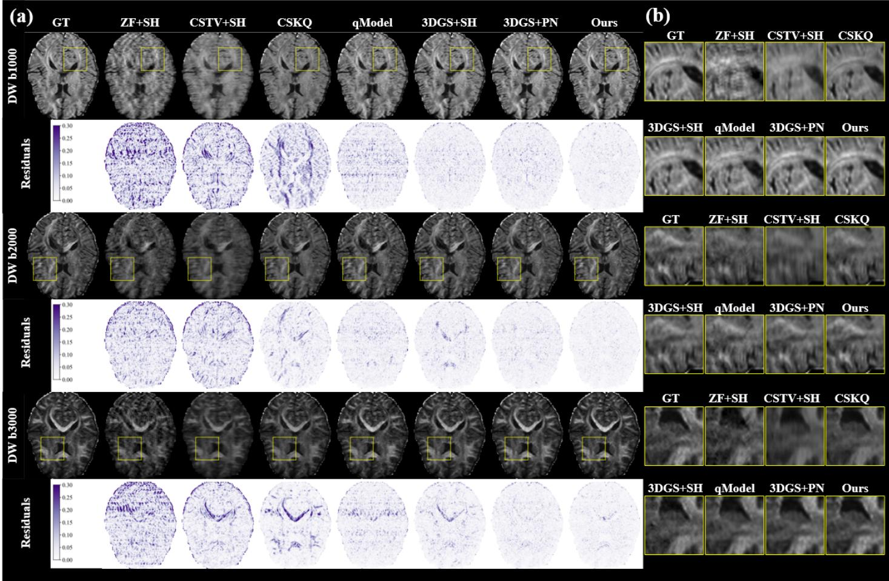  
Fig. 4. Missing-direction DWI reconstruction at $R _ { k } = 3$ with 15 observed directions. (a) Reconstructions and absolute-error maps for the three diffusion shells, (b) enlarged views of the highlighted regions. Columns follow the displayed method order.

TABLE I  
MISSING-DIRECTION DWI RECONSTRUCTION ON HCP DATASET UNDER DIFFERENT SPATIAL AND ANGULAR ACCELERATION SETTINGS.
<table><tr><td>b-value</td><td> $\scriptstyle R _ { k }$ </td><td>Obs.</td><td> $\scriptstyle { R _ { q } }$ </td><td>ZF+SH</td><td>CSTV+SH</td><td>JointKQ-CS</td><td>qModeL-DAE</td><td>3DGS+SH</td><td>3DGS+PCCNN</td><td>Ours</td></tr><tr><td>1000</td><td></td><td>30</td><td>3</td><td>22.92/0.8754</td><td>22.36/0.5944</td><td>30.18/0.9728</td><td>30.51/0.9701</td><td>30.94/0.9752</td><td>30.76/0.9760</td><td>33.59/0.9851</td></tr><tr><td>1000</td><td>33</td><td>15</td><td>6</td><td>19.30/0.7495</td><td>21.99/0.5723</td><td>27.28/0.9583</td><td>27.79/0.9441</td><td>30.24/0.9694</td><td>29.94/0.9695</td><td>32.58/0.9816</td></tr><tr><td>1000</td><td>3</td><td>10</td><td>9</td><td>21.43/0.8491</td><td>21.52/0.5571</td><td>24.90/0.9401</td><td>28.73/0.9545</td><td>29.57/0.9638</td><td>28.95/0.9617</td><td>30.91/0.9733</td></tr><tr><td>1000</td><td>4</td><td>30</td><td>3</td><td>21.47/0.8287</td><td>20.98/0.5225</td><td>28.99/0.9610</td><td>27.51/0.9410</td><td>28.79/0.9572</td><td>28.77/0.9589</td><td>33.16/0.9834</td></tr><tr><td>1000</td><td>4</td><td>15</td><td>6</td><td>18.67/0.7191</td><td>20.83/0.5097</td><td>26.38/0.9414</td><td>25.39/0.9079</td><td>27.89/0.9460</td><td>27.86/0.9472</td><td>31.79/0.9773</td></tr><tr><td>1000</td><td>4</td><td>10</td><td>9</td><td>20.24/0.7994</td><td>20.53/0.4972</td><td>24.22/0.9181</td><td>25.93/0.9171</td><td>26.73/0.9303</td><td>26.67/0.9308</td><td>29.97/0.9651</td></tr><tr><td>2000</td><td></td><td>30</td><td>3</td><td>24.68/0.8809</td><td>23.66/0.5936</td><td>31.01/0.9691</td><td>31.15/0.9658</td><td>30.75/0.9665</td><td>31.41/0.9704</td><td>34.18/0.9813</td></tr><tr><td>2000</td><td></td><td>15</td><td>6</td><td>18.78/0.6693</td><td>22.81/0.5682</td><td>28.69/0.9535</td><td>28.79/0.9429</td><td>30.45/0.9626</td><td>30.98/0.9651</td><td>33.01/0.9762</td></tr><tr><td>2000</td><td>333</td><td>10</td><td>9</td><td>22.15/0.8270</td><td>22.28/0.5431</td><td>25.91/0.9278</td><td>29.07/0.9476</td><td>29.83/0.9573</td><td>29.86/0.9588</td><td>31.00/0.9644</td></tr><tr><td>2000</td><td>4</td><td>30</td><td>3</td><td>23.16/0.8315</td><td>22.40/0.5240</td><td>29.90/0.9580</td><td>28.56/0.9398</td><td>29.14/0.9503</td><td>29.44/0.9516</td><td>33.66/0.9790</td></tr><tr><td>2000</td><td>4</td><td>15</td><td>6</td><td>18.72/0.6572</td><td>21.76/0.5055</td><td>27.73/0.9367</td><td>26.58/0.9085</td><td>28.79/0.9436</td><td>29.05/0.9437</td><td>32.23/0.9712</td></tr><tr><td>2000</td><td>4</td><td>10</td><td>9</td><td>21.29/0.7874</td><td>21.61/0.4950</td><td>25.25/0.9063</td><td>26.77/0.9128</td><td>27.74/0.9295</td><td>27.85/0.9314</td><td>30.42/0.9581</td></tr><tr><td>3000</td><td></td><td>30</td><td>3</td><td>25.47/0.8821</td><td>23.54/0.5887</td><td>32.26/0.9670</td><td>31.75/0.9630</td><td>30.68/0.9568</td><td>32.01/0.9665</td><td>34.36/0.9761</td></tr><tr><td>3000</td><td>33</td><td>15</td><td>6</td><td>20.33/0.6786</td><td>23.05/0.5696</td><td>30.10/0.9528</td><td>28.15/0.9199</td><td>30.49/0.9531</td><td>31.50/0.9607</td><td>33.12/0.9694</td></tr><tr><td>3000</td><td>3</td><td>10</td><td>9</td><td>24.32/0.8472</td><td>22.72/0.5517</td><td>27.21/0.9290</td><td>28.97/0.9332</td><td>29.67/0.9449</td><td>30.32/0.9518</td><td>31.07/0.9546</td></tr><tr><td>3000</td><td>4</td><td>30</td><td>3</td><td>23.99/0.8388</td><td>22.57/0.5257</td><td>31.27/0.9580</td><td>29.48/0.9403</td><td>29.52/0.9424</td><td>30.24/0.9475</td><td>33.89/0.9736</td></tr><tr><td>3000</td><td>4</td><td>15</td><td>6</td><td>18.92/0.6291</td><td>22.24/0.5141</td><td>29.21/0.9395</td><td>26.23/0.8803</td><td>29.23/0.9359</td><td>29.82/0.9404</td><td>32.47/0.9640</td></tr><tr><td>3000</td><td>4</td><td>10</td><td>9</td><td>23.14/0.8046</td><td>22.08/0.5040</td><td>26.54/0.9097</td><td>27.06/0.8993</td><td>28.15/0.9199</td><td>28.54/0.9243</td><td>30.65/0.9484</td></tr></table>

## C. Ablation Study

We conducted two groups of ablation studies to validate the main design choices of the proposed framework. The first group evaluates the primitive-level diffusion response design, including the tensor branch, SH residual, positive-semidefinite tensor constraint, and observed-response calibration. The second group evaluates the optimization and sampling strategy, including densification, geometry refinement, observed-direction selection, and the auxiliary zero-filled anchor.

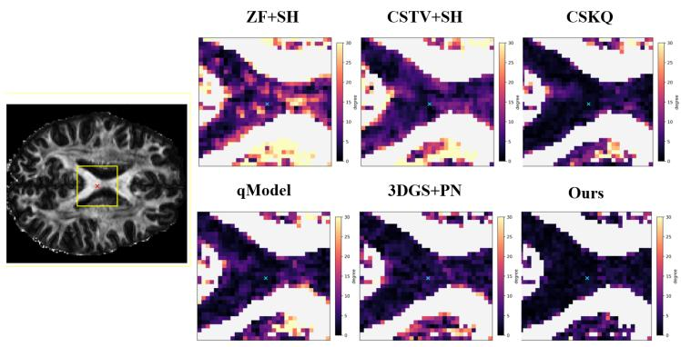

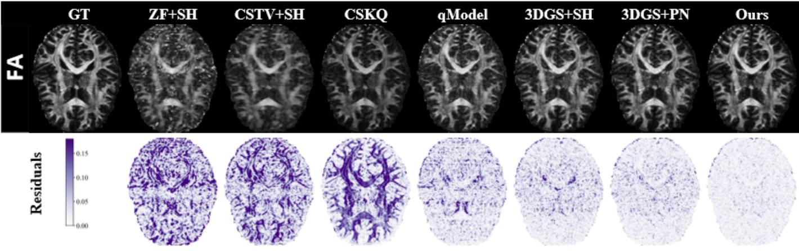

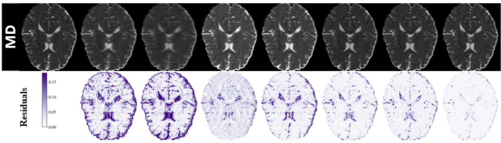  
Fig. 5. FA and MD maps with absolute errors at $R _ { k } = 3$ and 15 observed directions. Rows show FA, FA error, MD, and MD error. Columns follow the displayed method order.

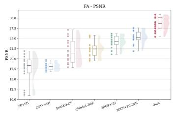  
(a)

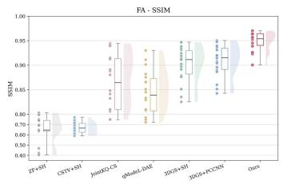  
(b)

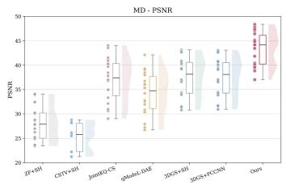  
(c)

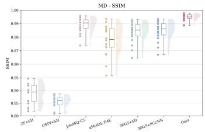  
(d)  
Fig. 6. FA and MD reconstruction accuracy across all HCP joint-acceleration settings. (a) FA PSNR, (b) FA SSIM, (c) MD PSNR, and (d) MD SSIM.

ZF+SH  
CSTV+SH  
CSKQ  
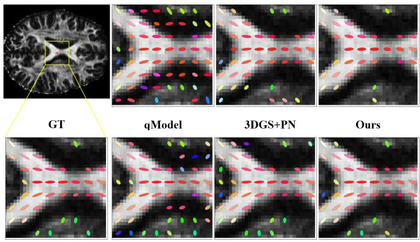  
(a)  
(b)  
Fig. 7. Orientation comparison in a white-matter ROI. (a) Tensor glyphs on FA maps, (b) PEV error maps. Warmer colors indicate larger errors.

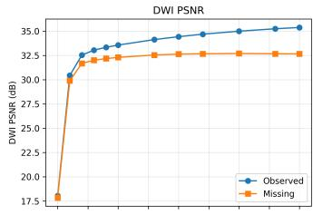

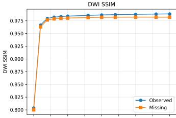

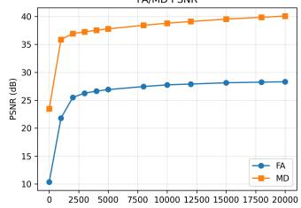

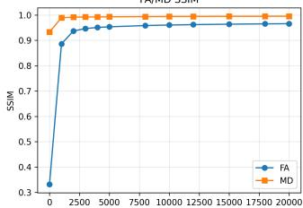

Fig. 8. Effect of optimization steps at $b = 1 0 0 0 \mathrm { \ s / m m ^ { 2 } } , R _ { k } = 3 ,$ with 15 observed directions.  
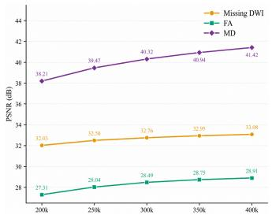  
(a)

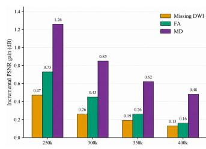  
(b)  
Fig. 9. Effect of the Gaussian primitive budget at $\textit { b } = \ 1 0 0 0 \ \mathrm { s } / \mathrm { m m } ^ { 2 }$ $R _ { k } \ = \ 3 .$ , with 15 observed directions. (a) DWI, FA, and MD PSNR, (b) incremental PSNR gains.

1) Ablation on Primitive Response Design: Table II summarizes the contribution of the primitive-level q-response components. The variant without the tensor branch removes the diffusion-tensor anchor and retains only an unanchored even-SH response, testing whether angular flexibility alone can replace the physics-informed main branch. The variant without the SH residual retains only the tensor-anchored response, testing whether the tensor component alone is sufficiently expressive. The variant without the positive-semidefinite constraint evaluates the benefit of enforcing physically valid diffusion attenuation. The variant without observed-response calibration directly optimizes the continuous tensor–residual response from the undersampled measurements, testing the benefit of progressive response initialization.

The full model achieves the best performance across all metrics. Removing observed-response calibration causes the largest reductions in missing-direction DWI and FA accuracy, indicating that observed-direction calibration provides an important initialization for continuous-response fitting. Removing the tensor branch produces a pronounced degradation and the largest decrease in MD PSNR, showing that the physicsinformed tensor anchor benefits held-out-direction synthesis and downstream diffusion quantification. Removing the SH residual results in smaller but consistent reductions, particularly in MD accuracy, indicating that the residual provides complementary flexibility beyond the tensor response rather than serving as an independent branch. Relaxing the positivesemidefinite constraint also reduces DWI and tensor-derived accuracy, supporting physically valid diffusion attenuation.

TABLE II  
ABLATION OF PRIMITIVE RESPONSE DESIGN AT $b = 1 0 0 0 \mathrm { s / m m ^ { 2 } }$ $R _ { k } = 3 ,$ WITH 15 OBSERVED DIRECTIONS.
<table><tr><td>Variant</td><td>Missing DWI</td><td>FA</td><td>MD</td></tr><tr><td>Full model</td><td>32.58/0.9816</td><td>28.62/0.9646</td><td>40.14/0.9950</td></tr><tr><td>w/o tensor branch</td><td>31.06/0.9731</td><td>27.32/0.9502</td><td>37.71/0.9925</td></tr><tr><td>w/o SH residual</td><td>32.40/0.9812</td><td>28.32/0.9617</td><td>39.04/0.9945</td></tr><tr><td>w/o PSD constraint</td><td>32.07/0.9800</td><td>28.41/0.9624</td><td>39.08/0.9945</td></tr><tr><td>w/o response calibration</td><td>30.85/0.9749</td><td>27.08/0.9511</td><td>37.73/0.9935</td></tr></table>

TABLE III

ABLATION OF OPTIMIZATION AND SAMPLING STRATEGIES AT $b = 1 0 0 0 \mathrm { s / m m ^ { 2 } }$ $R _ { k } = 3 ,$ WITH 15 OBSERVED DIRECTIONS.
<table><tr><td>Variant</td><td>Missing DWI</td><td>FA</td><td>MD</td></tr><tr><td>Full model</td><td>32.58/0.9816</td><td>28.62/0.9646</td><td>40.14/0.9950</td></tr><tr><td>w/o densification</td><td>31.19/0.9770</td><td>26.98/0.9512</td><td>36.28/0.9912</td></tr><tr><td>w/o geometry refinement</td><td>30.20/0.9716</td><td>26.58/0.9444</td><td>34.22/0.9869</td></tr><tr><td>Random observed directions</td><td>31.60/0.9771</td><td>27.19/0.9519</td><td>39.00/0.9941</td></tr><tr><td>w/o auxiliary ZF anchor</td><td>32.36/0.9811</td><td>28.35/0.9623</td><td>39.05/0.9946</td></tr></table>

2) Ablation on Optimization and Sampling Strategy: Table III evaluates adaptive densification, geometry refinement, observed-direction selection, and the auxiliary zero-filled anchor while keeping the complete tensor–residual response fixed. The four corresponding variants respectively remove densification, disable geometry refinement, replace farthestpoint sampling with random direction selection, and remove the per-direction zero-filled losses during both response calibration and final refinement.

The full model achieves the best performance across all metrics. Disabling geometry refinement causes the largest degradation, reducing DWI, FA, and MD PSNR by 2.38, 2.04, and 5.92 dB, respectively, which confirms the importance of jointly refining spatial support and continuous q-responses. Removing densification also reduces all metrics, particularly MD PSNR by 3.86 dB, indicating that the initial scaffold provides insufficient capacity for local diffusion variation. Random direction selection mainly degrades DWI and FA accuracy, supporting the use of farthest-point sampling for more uniform q-space coverage. Removing the auxiliary zerofilled anchor has the smallest effect, suggesting that it acts as an auxiliary regularizer, whereas sampled k-space consistency and scaffold initialization provide the primary reconstruction constraints.

## V. DISCUSSION

The proposed framework differs from dynamic 4D Gaussian Splatting (4DGS), which introduces time-dependent deformation or appearance for evolving scenes. Our representation retains shared spatial 3D Gaussian primitives and conditions each primitive response on the diffusion-encoding direction. For a fixed shell, the direction lies on $\mathbb { S } ^ { 2 }$ and is modeled through a continuous tensor–residual response rather than a Euclidean temporal coordinate. The spatial covariance $\Sigma _ { i } ^ { x }$ and diffusion tensor $\mathbf { D } _ { i }$ also belong to different physical domains: the former defines a primitive’s anatomical support, whereas the latter controls signal attenuation under diffusion gradients. The SH residual complements the tensor anchor by modeling partial-volume effects and departures from ideal single-tensor behavior. Its regularized even-SH formulation adds angular flexibility in the softplus latent domain without replacing the tensor branch with an unconstrained interpolator. Consistent with Table II, the tensor-only and SH-only variants both underperform the complete tensor–residual response.

The current implementation has several limitations. Experiments use processed HCP DWI volumes with retrospective single-coil-equivalent in-plane k-space undersampling rather than raw multi-coil data. A full raw-data implementation requires coil sensitivity estimation, scanner-specific trajectories, and noise modeling. The physical response uses one tensor per Gaussian, which may be limited in complex fiber crossings. Future work can consider multi-tensor, orientation-distribution, or other microstructure-aware responses. The spatial Gaussians use diagonal covariance for robustness and simplicity, while full anisotropic covariance and optimized CUDA splatting may improve efficiency and spatial adaptivity. Finally, the framework is scan-specific and self-supervised, and learned initialization or amortized prediction of Gaussian parameters may reduce optimization time.

## VI. CONCLUSION

We presented a physics-informed diffusion-encoding spatial–angular Gaussian field for self-supervised joint k–q accelerated dMRI reconstruction. The proposed method represents subject-specific anatomy using explicit 3D Gaussian primitives and embeds a positive-semidefinite tensor–residual q-response into each primitive. By combining differentiable Gaussian splatting, diffusion-tensor physics, and k-space data consistency, the framework provides a continuous and interpretable alternative to voxel-grid, image-domain, and black-box implicit representations. The method was optimized using only undersampled k-space measurements from a sparse set of observed directions and supports held-out-direction synthesis by querying the learned q-response. Future work will extend the framework to raw multi-coil acquisitions, multi-shell diffusion encoding, and more expressive microstructural response models.

## REFERENCES R

[1] E. O. Stejskal and J. E. Tanner, “Spin diffusion measurements: Spin echoes in the presence of a time-dependent field gradient,” J. Chem. Phys., vol. 42, no. 1, pp. 288–292, 1965.

[2] P. J. Basser, J. Mattiello, and D. Le Bihan, “MR diffusion tensor spectroscopy and imaging,” Biophys. J., vol. 66, no. 1, pp. 259–267, 1994.

[3] D. Le Bihan, J.-F. Mangin, C. Poupon, C. A. Clark, S. Pappata, N. Molko, and H. Chabriat, “Diffusion tensor imaging: Concepts and applications,” J. Magn. Reson. Imaging, vol. 13, no. 4, pp. 534–546, 2001.

[4] P. J. Basser and C. Pierpaoli, “Microstructural and physiological features of tissues elucidated by quantitative-diffusion-tensor MRI,” J. Magn. Reson. B, vol. 111, no. 3, pp. 209–219, 1996.

[5] E. Schwab, R. Vidal, and N. Charon, “(k, q)-compressed sensing for dMRI with joint spatial–angular sparsity prior,” in Computational Diffusion MRI. Cham, Switzerland: Springer, 2018, pp. 21–35.

[6] M. P. Mani, H. K. Aggarwal, S. Ghosh, and M. Jacob, “Modelbased deep learning for reconstruction of joint k–q under-sampled high resolution diffusion MRI,” in Proc. IEEE Int. Symp. Biomed. Imag. (ISBI), 2020, pp. 913–916.

[7] H. K. Aggarwal, M. P. Mani, and M. Jacob, “MoDL: Model-based deep learning architecture for inverse problems,” IEEE Trans. Med. Imag., vol. 38, no. 2, pp. 394–405, Feb. 2019.

[8] B. Yaman, S. A. H. Hosseini, S. Moeller, J. Ellermann, K. Ugurbil,˘ and M. Akc¸akaya, “Self-supervised learning of physics-guided reconstruction neural networks without fully sampled reference data,” Magn. Reson. Med., vol. 84, no. 6, pp. 3172–3191, 2020.

[9] V. Golkov, A. Dosovitskiy, J. I. Sperl, M. I. Menzel, M. Czisch, P. G. Samann, T. Brox, and D. Cremers, “q-Space deep learning: Twelve-fold¨ shorter and model-free diffusion MRI scans,” IEEE Trans. Med. Imag., vol. 35, no. 5, pp. 1344–1351, May 2016.

[10] Y. Qin, Y. Li, Z. Zhuo, Z. Liu, Y. Liu, and C. Ye, “Multimodal superresolved q-space deep learning,” Med. Image Anal., vol. 71, 2021, Art. no. 102085.

[11] F. Zong, Z. Zhu, J. Zhang, X. Deng, Z. Li, C. Ye, and Y. Liu, “Attentionbased q-space deep learning generalized for accelerated diffusion magnetic resonance imaging,” IEEE J. Biomed. Health Inform., vol. 29, no. 2, pp. 1176–1188, Feb. 2025.

[12] M. Lyon, P. Armitage, and M. A. Alvarez, “Angular super-resolution in´ diffusion MRI with a 3D recurrent convolutional autoencoder,” in Proc. 5th Int. Conf. Medical Imaging with Deep Learning (MIDL), ser. Proc. Mach. Learn. Res., vol. 172, pp. 834–846, 2022.

[13] M. Lyon, P. Armitage, and M. A. Alvarez, “Spatio-angular convolutions´ for super-resolution in diffusion MRI,” in Proc. Adv. Neural Inf. Process. Syst., vol. 36, pp. 12457–12475, 2023.

[14] M. Nan, T. Xiao, R. Wu, S. Yu, Y. Li, H. Zheng, and S. Wang, “Physics-guided diffusion transformer with spherical harmonic posterior sampling for high-fidelity angular super-resolution in diffusion MRI,” 2025, arXiv:2509.07020.

[15] V. Sitzmann, J. N. P. Martel, A. W. Bergman, D. B. Lindell, and G. Wetzstein, “Implicit neural representations with periodic activation functions,” in Proc. Adv. Neural Inf. Process. Syst., vol. 33, pp. 7462– 7473, 2020.

[16] T. Hendriks, A. Vilanova, and M. Chamberland, “Neural spherical harmonics for structurally coherent continuous representation of diffusion MRI signal,” in Computational Diffusion MRI, ser. Lecture Notes in Computer Science, vol. 14328. Cham, Switzerland: Springer, 2023, pp. 1–12.

[17] R. Wu, J. Cheng, C. Li, J. Zou, W. Fan, X. Ma, H. Guo, Y. Liang, and S. Wang, “Spherical harmonics representation learning for highfidelity and generalizable super-resolution in diffusion MRI,” IEEE Trans. Biomed. Eng., vol. 73, no. 4, pp. 1483–1492, Apr. 2026.

[18] Y. Wu, H. Rui, F. Wang, J. Huang, Z. Wang, and G. Yang, “Selfsupervised spatial and zero-shot angular super-resolution by spatialangular implicit representation for rotating-view SNR-efficient diffusion MRI,” 2026, arXiv:2605.02575.

[19] B. Kerbl, G. Kopanas, T. Leimkuhler, and G. Drettakis, “3D Gaussian¨ Splatting for real-time radiance field rendering,” ACM Trans. Graph., vol. 42, no. 4, 2023, Art. no. 139.

[20] T. Peng, R. Zha, Z. Li, X. Liu, and Q. Zou, “Three-dimensional MRI reconstruction with 3D Gaussian representations: Tackling the undersampling problem,” IEEE Trans. Med. Imag., vol. 45, no. 5, pp. 1905–1917, May 2026.

[21] M. Lustig, D. Donoho, and J. M. Pauly, “Sparse MRI: The application of compressed sensing for rapid MR imaging,” Magn. Reson. Med., vol. 58, no. 6, pp. 1182–1195, 2007.

[22] D. S. Tuch, “Q-ball imaging,” Magn. Reson. Med., vol. 52, no. 6, pp. 1358–1372, 2004.

[23] M. Descoteaux, E. Angelino, S. Fitzgibbons, and R. Deriche, “Regularized, fast, and robust analytical Q-ball imaging,” Magn. Reson. Med., vol. 58, no. 3, pp. 497–510, 2007.

[24] J. Sjolund, A. Eklund, E. ¨ Ozarslan, and H. Knutsson, “Gaussian process¨ regression can turn non-uniform and undersampled diffusion MRI data

into diffusion spectrum imaging,” in Proc. IEEE 14th Int. Symp. Biomed. Imag. (ISBI), 2017, pp. 778–782.

[25] B. Mildenhall, P. P. Srinivasan, M. Tancik, J. T. Barron, R. Ramamoorthi, and R. Ng, “NeRF: Representing scenes as neural radiance fields for view synthesis,” in Proc. Eur. Conf. Comput. Vis. (ECCV), 2020, pp. 405–421.

[26] L. Shen, J. M. Pauly, and L. Xing, “NeRP: Implicit neural representation learning with prior embedding for sparsely sampled image reconstruction,” IEEE Trans. Neural Netw. Learn. Syst., vol. 35, no. 1, pp. 770–782, Jan. 2024.

[27] G. Wu, T. Yi, J. Fang, L. Xie, X. Zhang, W. Wei, W. Liu, Q. Tian, and X. Wang, “4D Gaussian Splatting for real-time dynamic scene rendering,” in Proc. IEEE/CVF Conf. Comput. Vis. Pattern Recognit. (CVPR), 2024, pp. 20310–20320.

[28] R. Zha, T. J. Lin, Y. Cai, J. Cao, Y. Zhang, and H. Li, “R2-Gaussian: Rectifying radiative Gaussian Splatting for tomographic reconstruction,” in Proc. Adv. Neural Inf. Process. Syst., vol. 37, pp. 44907–44934, 2024.

[29] Z. Liu, R. Zha, H. Zhao, H. Li, and Z. Cui, “4DRGS: 4D radiative Gaussian Splatting for efficient 3D vessel reconstruction from sparseview dynamic DSA images,” in Information Processing in Medical Imaging, ser. Lecture Notes in Computer Science, vol. 15830. Cham, Switzerland: Springer, 2026, pp. 361–374.

[30] Y. Fu, H. Zhang, W. Cai, H. Xie, L. Kuo, L. Cervino, J. Moran, X. Li, and T. Li, “Dynamic cone beam CT reconstruction via spatiotemporal Gaussian neural representation,” Med. Phys., vol. 52, no. 11, 2025, Art. no. e70127.

[31] D. C. Van Essen et al., “The WU-Minn Human Connectome Project: An overview,” NeuroImage, vol. 80, pp. 62–79, 2013.

[32] M. F. Glasser et al., “The Human Connectome Project’s neuroimaging approach,” Nat. Neurosci., vol. 19, no. 9, pp. 1175–1187, 2016.