# Efficient All-in-One Weather Restoration using Spectral Harmonization

Paula Garrido-Mellado 1\*, Daniel Feijoo 1, Yuning Cui 2, Alvaro Garcia 1, Marcos V. Conde 1

1 Cidaut AI, Fundacion Cidaut, Spain´

2 Technical University of Munich, Germany

{paugar, danfei, marcos.conde}@cidaut.es

## Abstract

Adverse weather conditions such as rain, haze, and snow significantly degrade image quality, posing challenges for both human perception and physical AI. Existing restoration methods require large computational budgets, struggling to process high-resolution images and handle different degradations. In this paper, we present Frequency Reconstruction via Spectral Harmonization, a novel lightweight all-in-one restoration method that explicitly decomposes feature representations into high- and low-frequency components at each scale of a hierarchical encoder-decoder architecture. By combining spectral decomposition with spatial processing through Fourierbased skip connections, FReSH-IR captures complementary frequency information without sacrificing spatial detail. Our approach achieves similar restoration quality with 80% fewer parameters and operations than transformerbased models. Extensive experiments demonstrate that our method offers a great efficiency-performance tradeoff, highlighting its practical applications in constrainedresource systems.

## 1. Introduction

Adverse weather conditions, such as snow, rain, raindrops, and haze, severely degrade visual information, making image restoration an essential task for various applications. To address this issue, researchers have explored methods to remove weather-induced degradations from images [41]. In particular, significant efforts have been made to leverage image-based priors, such as edges and Fourier frequency patterns, as a foundation for restoring degraded images [23, 28, 31].

Early research on adverse weather restoration primarily focused on handling single weather degradations, resulting in models designed specifically for dehazing, deraining, or desnowing. However, this approach is limited in real-world scenarios where multiple weather degradations occur simultaneously, such as the concurrent presence of rain and haze. Moreover, storing multiple models and dynamically selecting the appropriate one is impractical. Despite these advancements, developing a unified model capable of handling diverse degradations or weather conditions remains a major challenge due to the highly variable nature of weatherinduced degradations [26, 41]. This problem is known as All-in-One image restoration (AIO). The complex interactions between different atmospheric conditions lead to unpredictable degradations, making it difficult to design a single framework that generalizes across diverse scenarios.

  
(a)  
(b)  
(c)

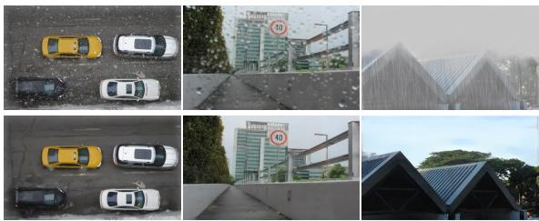  
Figure 1. (Top row) Different approaches for frequency-domain image restoration. a) Global spectral filtering, i.e. convert to frequency domain and process the whole spectrum without separating high/low frequencies [20]. b) Split LF/HF, shared processing: separate high and low frequency components but process them using the same blocks [10]. c) Our approach: split LF/HF, specialized processing: separate and process high and low frequencies using specialized blocks for each. (Bottom row) Restored real-world and synthetic images using our method, FReSH-IR.

To address the challenges posed by adverse weather conditions, several studies have explored image restoration techniques in the frequency domain. AIRFormer [14], a general-purpose AIO model, constructs a frequencyguided transformer encoder by incorporating wavelet-based prior information to enhance feature extraction, leveraging structured frequency priors to improve restoration quality. Fourmer [57], similarly, employs the Fourier transform to disentangle image degradation from content components, utilizing the global nature of the Fourier domain to comprehensively process degradation patterns. AdaIR [10] is designed to identify and mitigate degradation patterns through frequency domain analysis.

These methods demonstrate that operating in the spectral domain can effectively capture weather-related degradation patterns. However, existing frequency-domain restoration approaches either process the spectrum globally or apply identical operations to all components [10, 20, 57], limiting their ability to handle spatially localized artifacts like raindrops or snowflakes. Treating them uniformly limits restoration performance and computational efficiency.

In this work, we present FReSH-IR (Frequency Reconstruction via Spectral Harmonization), a lightweight all-in-one (AIO) weather restoration designed to bridge the gap between restoration quality and computational efficiency. FReSH-IR employs an asymmetric UNet [38] architecture that decomposes features into high and low Fourier frequency components at each scale and processes them through specialized blocks tailored to their characteristics.

FReSH-IR achieves restoration quality competitive with leading AIO methods while requiring 80% fewer parameters, up to 90% fewer MACs, and running with 5× faster inference than top-performing approaches such as SSG-Former [18]. This positions FReSH-IR as the most efficient AIO weather restoration model with the best efficiencyquality trade-off.

## 2. Related Work

## 2.1. Single-task Adverse Weather Removal

The first attempts at removing adverse weather conditions from images involved single-task or task-specific models, which focused on restoring only one type of degradation.

Raindrop Removal. First approaches [50] considered temporal information from videos to restore the occluded areas caused by raindrops. During the machine learning era, CNN and GAN-based approaches later improved performance by learning data-driven degradation priors [11, 36, 47]. The authors of [37] showed significant advancements in this field by introducing edge information. The dataset proposed by [21] comprises both day and night images, including drop-focused and background-focused images.

Dehazing. This task has been widely studied, from the use of CNNs [1] to more complex techniques such as Vision Transformers [39]. In [25], Li et al. considered atmospheric luminosity and transmission maps to restore hazy images. The authors of [7] included a content-guided attention mechanism, and Zhang et al. [53] created a hierarchical density-aware network. In [9], Cui et al. proposed a strong baseline that works in both the spatial and frequency domains.

Deraining. Early methods relied on learning-based approaches [12]. Working in the frequency domain [13, 16, 19] has become a common and effective technique, demonstrating improved visual and quantitative results. Some studies also use Transformers [6, 45], and recently, Mambabased methods [27, 60] have become more popular.

Desnowing. The authors of [4] were among the first to work on this task, including transparency awareness in their network. Another pioneering work is [33], which focused on context-awareness and utilized CNNs. In [54], the authors introduced semantic and geometric priors, and in [5], a dual-tree wavelet transform was used. The authors of [3] presented a Transformer-based method. Lastly, Lai et al. [24] used Multi-Model Optimization and Multimodal Large Language Models to solve this degradation.

## 2.2. All-in-One Image Restoration

Since the specific-task approach involves using several models to solve real-world degradations, which is computationally challenging, the use of a single model to restore all types of degradations has become a powerful research direction. Li et al. [30] proposed the first AIO model for adverse weather. Numerous methodologies in this domain are based on Transformer architectures such as TransWeather, MWFormer, and others [32, 41, 43, 52, 58]. Additionally, some approaches incorporate frequency mining [10], Mixture-of-Experts [34, 42], or histogram-based attention modules [40]. Prompt-based methods are also popular in AIO image restoration [8, 35, 44]. In [59], the authors proposed a new training paradigm and provided a thorough analysis of weather degradations.

## 3. Method

## 3.1. Preliminaries: Frequency Spectrum Analysis

Recent works incorporate frequency information into their models to restore weather degradations using various techniques, such as the Sobel operator [18], the fast Fourier transform (FFT) [10], and average pooling [9]. To determine the most effective approach for isolating weatherinduced degradations, we conduct a systematic comparison of four representative methods for extracting highfrequency components, included in the Supp. Material.

Based on this analysis, we adopt a hybrid strategy for high-frequency selection across the different levels of the network. In early layers, where low-level degradation patterns are most salient, we employ FFT-based decomposition with stricter masks (i.e., high cutoff values) to achieve precise isolation of weather artifacts. As the network deepens, the Fourier masks are progressively relaxed. In the bottleneck of the architecture, we transition to GAP-based extraction, which, despite operating on deep feature representations, retains the ability to capture structural image edges. This property is particularly advantageous for the reconstruction of fine-grained image details in the later stages of the restoration process, where preserving structural information is critical for achieving faithful outputs.

## 3.2. Overall Framework

The proposed FReSH-IR follows a U-shaped CNN-based backbone, as illustrated in Figure 2. Given a corrupted image $I \in \mathbb { R } ^ { 3 \times H \times W }$ , where 3 denotes the number of channels, and H and $W$ denote height and width, respectively. $\mathrm { \ A \ 3 \times 3 }$ convolutional layer first projects the input into shallow feature embeddings of size $C \times H \times W$

These embeddings are processed through a hierarchical encoder that progressively downsamples the features while explicitly decomposing them into low- and high-frequency components at each scale. The low-frequency component is refined through a stack of Residual Blocks, and both components are recombined before downsampling.

At the bottleneck, a Dual-Attention Module (DAM) captures long-range spatial dependencies, which, as shown in [9], is particularly beneficial for homogeneous degradations such as haze, which affects broad spatial regions.

A carefully designed decoder progressively recovers the features, recombining the upsampled features with the corresponding encoder features. Each block processes the high and low components separately, only fusing them during the last block of each level.

## 3.3. Frequency-Aware Encoder

At each encoder level i, the input feature map $\mathbf { F _ { i } }$ is decomposed into its low- and high-frequency components by the Spectral Decomposition Block (SDB) shown in Figure 3 (a), implemented via a smooth Fourier mask based on a given cutoff parameter, following:

$$
M ( r ) = \left\{ \begin{array} { l l } { 0 } & { r \leq r _ { 0 } - 2 . 5 \sigma } \\ { 1 - \exp \left( - \frac { ( r - r _ { 0 } ) ^ { 2 } } { 2 \sigma ^ { 2 } } \right) } & { r \in ( r _ { 0 } \pm 2 . 5 \sigma ) , } \\ { 1 } & { r \geq r _ { 0 } + 2 . 5 \sigma } \end{array} \right.\tag{1}
$$

where $r _ { 0 } = \alpha \sqrt { H ^ { 2 } + W ^ { 2 } } , \sigma = 0 . 1 5 r _ { 0 }$ and α is the cutoff.

Since the lower frequencies concentrate in the middle and the higher frequencies correspond to the spectrum edges, the higher the cutoff ratio, the larger the circle we use to eliminate frequencies from the center, thus, higher frequencies will be kept. To obtain the low-frequencies, we apply the inverse mask. We chose $\alpha = [ 0 . 4 , 0 . 3 2 , 0 . 2 3 , 0 . 1 2 ]$ for each encoder level respectively. Finally, the filtered outputs are $\mathbf { F _ { i } ^ { h } }$ and $\mathbf { F _ { i } ^ { l } }$ . While $\mathbf { F _ { i } ^ { l } }$ captures coarse structural information, $\mathbf { F _ { i } ^ { h } }$ retains fine-grained details and localized degradation patterns.

The low-frequency component is then refined through a stack of Residual Blocks introduced in [2], which perform lightweight attention-based feature enhancement. The refined component is $\hat { \mathbf { F } } _ { i } ^ { l }$

The encoder output at each scale is obtained by summing both components, $\mathbf { F _ { i } ^ { e n c } } \ : = \ : \hat { \mathbf { F } } _ { i } ^ { l } \ : + \ : \mathbf { F _ { i } ^ { h } }$ This design explicitly preserves high-frequency information throughout the encoding process, preventing the loss of fine structural details that are critical for weather artifact removal.

## 3.4. Dual-Attention Module

To enhance the representational capacity of the network, we propose the Dual-Attention Module (DAM), inspired by [9], which enhances responses to important features by processing them through spatial and frequency-domain operations. As shown in Figure 2, given the output of the last encoder level, the DAM processes it sequentially.

First, we apply channel-wise average pooling and max pooling to extract the low-frequency and high-frequency components, respectively. These are concatenated and processed to produce a spatial attention map:

$$
\mathbf { F } _ { \mathrm { e n c } } ^ { \prime } = \operatorname { C o n v } _ { 3 } ( [ \operatorname { A v g P o o l } ( F ) , \operatorname { M a x P o o l } ( F ) ] ) ,\tag{2}
$$

where $[ \cdot , \cdot ]$ denotes concatenation, and $\mathrm { C o n v _ { 3 } }$ is a $3 \times 3$ convolution. The resulting $\mathbf { F _ { e n c } ^ { \prime } } \in \mathbb { R } ^ { 1 \times H \times W }$ identifies key spatial locations.

Simultaneously, the input undergoes channel-wise refinement via depth-wise convolutions. One path uses cascaded $5 \times 5$ and $7 \times 7$ depth-wise dilated convolutions, with dilation factors 2 and 3 respectively (DW1). The other path employs a single $3 \times 3$ depth-wise convolution (DW2). The spatial attention map $\mathbf { F _ { e n c } ^ { \prime } }$ modulates the first path:

$$
\mathbf { F _ { s } } = \mathrm { D W } 1 ( \mathbf { F } ) \otimes \mathrm { T i l e } ( \mathbf { F } _ { \mathrm { e n c } } ^ { \prime } , \mathrm { C } ) + \mathrm { D W } 2 ( \mathbf { F } ) ,\tag{3}
$$

where Tile replicates $\mathbf { F _ { e n c } ^ { \prime } }$ across channels. The output is a spatially enhanced feature map that we will refine by emphasizing HF components, where degraded and sharp images differ the most. At this stage, the network operates on its deepest feature representations, where GAP-based extraction proves most effective in emphasizing structural content. Therefore, we compute the HF component as: $\mathbf { F _ { s } ^ { h } } = \mathbf { F _ { s } } - \mathrm { M e a n } ( \mathbf { F _ { s } } )$

Finally, the output of the DAM is generated by fusing these components via element-wise operations to produce the final refined feature map Fˆ, where perceptually important regions are emphasized.

## 3.5. Spectral Skip Connections

A key contribution of FReSH is the Spectral Harmonization Block (SHB), which replaces standard additive skip connections with a frequency-aware fusion mechanism. At each decoder level, the upsampled feature map X is decomposed in the Fourier domain using the same mask used in the encoder counterpart. The decomposed components are then fused with their corresponding encoder skip features. This frequency-aware fusion enables the decoder to selectively integrate structural LF information and HF detail from the encoder at each scale, rather than naively merging all feature channels.

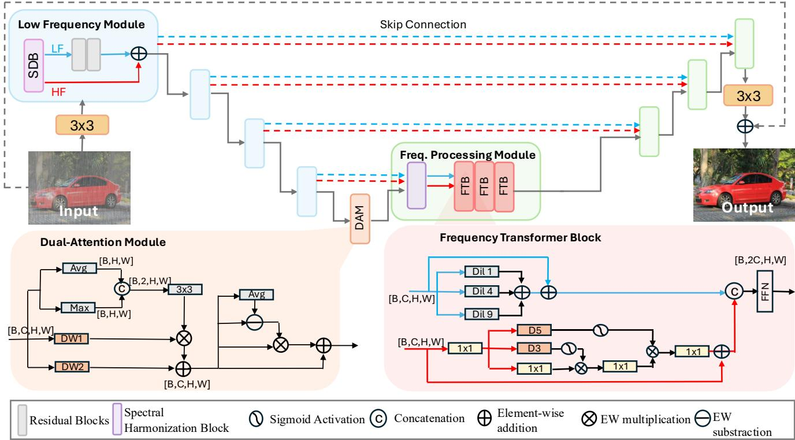

Figure 2. FReSH architecture. The encoder consists of a Spectral Decomposition Block (SDB) and two Residual Blocks. Each encoder block sends the Low Frequencies (blue arrows) and High Frequencies (red arrows) to the same-level decoder block. These spectral skip connections are integrated with the restored features through the Spectral Harmonization Block and fed into the Frequency Transformer Blocks. Finally, the middle blocks integrate the Dual-Attention Module (DAM).  
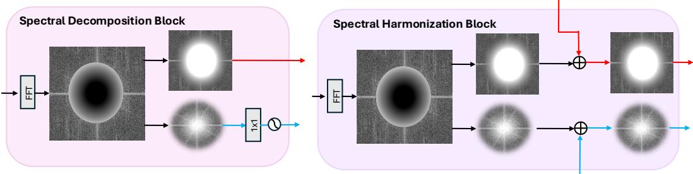  
Figure 3. (a) Spectral Decomposition Block (SDB). The input is converted to the Fourier domain using the FFT. Applying a Gaussian mask we separate the high and low frequency components, processing the latter by a 1 × 1 convolution to refine them before further restoring them in the encoder blocks. (b) Spectral Harmonization Block (SHB). The input is divided into frequency components similar to the SDB. The computed frequencies are summed with the corresponding residual frequencies from the same-level encoder.

## 3.6. Frequency Transformer Blocks (FTBs)

Once the feature map has been processed by the SHM, the individually fused spectral features are sent to the FTB.

Each block processes the LF and HF branches independently before fusing them, which occurs in the final FTB of each level.

The LF branch processes the features through a set of parallel dilated depthwise convolutions, composed of a regular 3 × 3 convolution and two dilated convolutions with factors of 4 and 9, respectively, to capture multi-scale structural information. The HF branch is processed through a simple transformer-based block that captures long-range dependencies within fine-grained features. Both branches are then concatenated and refined through a shared FFN, similar to the FFN used in [2]. As mentioned earlier, when processing the final block of a level, a channel reduction convolution projects the fused features back to the original channel dimension. This approach allows the model to work on the separated frequencies throughout all decoder levels, while preserving the structural integrity of both components until they are fully exploited before being merged back into a unified representation and sent to the next level.

Together, the Frequency-Aware Encoder, Dual-Attention Module, Spectral Skip Connections and Frequency Transformer Blocks form a cohesive pipeline that explicitly models both structural and fine-grained spectral information at every scale, enabling robust and precise restoration.

## 3.7. Regularization and Loss Functions

We use a combination of three complementary losses, each targeting a different aspect of the restoration quality:

$$
\mathcal { L } _ { t o t a l } = \lambda _ { p x } \mathcal { L } _ { p x } + \lambda _ { e n h } \mathcal { L } _ { e n h } + \lambda _ { f r e q } \mathcal { L } _ { f r e q } ,\tag{4}
$$

where $\mathcal { L } _ { p x } , \mathcal { L } _ { e n h }$ , and $\mathcal { L } _ { f r e q }$ are the pixel loss, enhance loss, and Fourier edge loss, respectively. $\lambda _ { p x } , \lambda _ { e n h }$ , and $\lambda _ { f r e q }$ are the corresponding loss weights with values 1, 1, 0.05, respectively. These values were found empirically.

Pixel Loss. The pixel loss provides direct supervision on the final network output by computing the L1 distance between the restored image ˆI and the ground truth $\mathbf { I } _ { g t }$

Enhance Loss. To guide the intermediate representation at the bottleneck, the enhance loss supervises the last encoder output against a downsampled version of the ground truth $\mathbf { I } _ { g t } ^ { \downarrow } = \phi ( \mathbf { I } _ { g t } )$ , where ϕ denotes nearest-neighbor downsampling by a factor of 16. It combines a pixel-level L1 term with a perceptual term computed via a pretrained VGG-19:

$$
\mathcal { L } _ { e n h } = \| \mathbf { F } _ { e n c } - \mathbf { I } _ { g t } ^ { \downarrow } \| _ { 1 } + \mathcal { L } _ { v g g } ( \mathbf { F } _ { e n c } , \mathbf { I } _ { g t } ^ { \downarrow } ) ,\tag{5}
$$

where ${ \bf F } _ { e n c }$ is the last encoder feature map and $\mathcal { L } _ { v g g }$ measures the perceptual distance in the VGG-19 space [55].

Fourier Edge Loss. To explicitly supervise the preservation of HF details, the Fourier edge loss applies the same high-pass spectral mask $M ( r )$ from Equation (1) to a downsampled version of the ground truth, which isolates the HF target $\mathbf { I } _ { g t } ^ { h f }$ and the loss penalizes the deviation of the encoder’s HF prediction $\mathbf { F } _ { e n c } ^ { h f }$ from this target:

$$
\mathcal { L } _ { f r e q } = \| \mathbf { F } _ { e n c } ^ { h f } - \mathbf { I } _ { g t } ^ { h f } \| _ { 2 } ^ { 2 } .\tag{6}
$$

This term acts as a spectral regularizer that prevents the network from suppressing fine details during degradation removal.

Jointly, these three losses ensure that the network is supervised at the pixel, perceptual, and spectral levels simultaneously. During the first 10 epochs, the enhance loss is not used to enforce the model to preserve critical details.

## 4. Experimental Results

## 4.1. Implementation Details

For a fair comparison, we use the standard benchmark for all-in-one multi-weather restoration, following [30]. It is a combination of three datasets: RainDrop [36], Outdoor-Rain [29], and Snow100K [33]. The training set encompasses 1, 069 images from RainDrop, 9, 000 images from Outdoor-Rain, and 9, 000 from Snow100K. RainDrop comprises real raindrop images. Outdoor-Rain contains synthetic images degraded by both fog and rain streaks. Snow100K features synthetic images afflicted by snow. Similarly, we used the RainDrop test dataset [36], Test1 dataset from Outdoor-Rain [29], and Snow100K-L testset [33] for testing. We trained the model for 500 epochs using 384 × 384 crops and a batch size of 16. The initial learning rate was set to $1 e ^ { - 3 }$ and we used the AdamW optimizer with $\beta _ { 1 } , \beta _ { 2 } = 0 . 9$ and a weight decay of $1 e ^ { - 3 }$

## 4.2. Quantitative Results

In Table 1, we provide a comparative analysis of distortion metrics applied to both synthetic and real datasets. Our FReSH-IR uses 52× and 10× fewer parameters than the fastest solutions MWFormer [58] and TransWeather [41], respectively. This results in lower memory requirements, while our overall performance is superior, +1.67dB and +0.08dB. We also improve the most lightweight solution, WGWS [59], by +0.49dB and 2× faster runtime. We acknowledge the work of MOERL [42], however we do not compare against it since the code is not available. Additionally, in Table 2 we include a set of experiments in a real-world benchmark, demonstrating that we achieve competitive results also in real-world scenarios.

## 4.3. Qualitative Results

In this section, we show visual results on both synthetic and real-world benchmarks compared to several all-in-one weather restoration methods such as TransWeather [41], WGWS [59] and Histoformer [40]. Our visual results are comparable to SOTA methods on synthetic (Fig. 4) and realworld benchmarks (Fig. 5) while saving 80% of computational cost against SSGFormer [18]. These results showcase the ability of our model to restore weather degradations while being suitable for on-device deployment. Additional qualitative results are shown in the Supplementary Material.

## 4.4. Downstream tasks

In this section, we include results of the effect of our FReSH-IR on the performance of some downstream tasks such as detection and segmentation. We evaluate two segmenters covering distinct paradigms: FastSAM-s [56] (lightweight, class-agnostic) and SegFormer-B3 [46] (highcapacity, semantic), and YOLO11 [22] for object detection.

<table><tr><td>Method</td><td>Computational Cost</td><td>Snow100K</td><td>OutdoorData</td><td>Raindrop A</td><td>Average</td></tr><tr><td>All-in-One† [30]</td><td>NA</td><td>28.33/0.882</td><td>24.71/0.898</td><td>31.12/0.927</td><td>28.05/0.902</td></tr><tr><td>AWRCP† [49]</td><td>NA</td><td>31.92/0.934</td><td>31.39/0.933</td><td>31.93/0.944</td><td>31.75/0.933</td></tr><tr><td>PromptIR† [35]</td><td>35.59/158.4/52.12</td><td>30.91/0.915</td><td>30.49/0.926</td><td>32.56/0.943</td><td>31.32/0.928</td></tr><tr><td>AdaIR† [10]</td><td>28.78/147.45/58.64</td><td>31.01/0.916</td><td>30.85/0.929</td><td>32.87/0.943</td><td>31.58/0.929</td></tr><tr><td>Restormer† [51]</td><td>26.13/141.24/48.90</td><td>30.36/0.907</td><td>30.03/0.922</td><td>32.18/0.941</td><td>30.86/0.923</td></tr><tr><td>Histoformer† [40]</td><td>16.92/96.99/79.06</td><td>32.16/0.926</td><td>32.08/0.939</td><td>33.06/0.944</td><td>32.43/0.936</td></tr><tr><td>SSGFormer† [18]</td><td>16.65/89.84/59.69</td><td>32.22/0.927</td><td>32.43/0.941</td><td>33.24/0.949</td><td>32.63/0.939</td></tr><tr><td>WGWS† [59]</td><td>2.65/1.53/25.63</td><td>30.16/0.901</td><td>29.32/0.921</td><td>32.38/0.938</td><td>30.62/0.920</td></tr><tr><td>MWFormer [58]</td><td>182.81/10.49/9.43</td><td>30.92/0.908</td><td>30.27/0.912</td><td>31.91/0.927</td><td>31.03/0.916</td></tr><tr><td>Trans Weather† [41]</td><td>38.05/6.14/5.23</td><td>29.31/0.888</td><td>28.83/0.900</td><td>30.17/0.916</td><td>29.44/0.901</td></tr><tr><td>FReSH-IR (Ours)</td><td>3.46/8.32/11.42</td><td>30.75/0.89</td><td>30.84/0.90</td><td>31.74/0.91</td><td>31.11/0.90</td></tr><tr><td>Ours vs. SSGFormer</td><td>↓80%/↓90%/80%</td><td>↓4%</td><td>↓5%</td><td>↓4.5%</td><td>↓4.6%</td></tr></table>

Table 1. Comparison of FReSH-IR with SOTA methods. We report PSNR-Y↑ (dB) / SSIM↑across datasets. The values for † methods are collected from [18]. We also report computational cost based on the parameters (M) / MACs (G) / runtime (ms). MACs and runtime were calculated using 256px x 256px crops. The runtime was averaged over the forward pass of 1000 iterations using an NVIDIA RTX 4090. The bold and underlined represent the best and second-best results, respectively. We highlight the methods capable to process images under 30ms . FReSH-IR offers an optimal trade-off in terms of memory, speed, and performance.

<table><tr><td>Method</td><td>MUSIQ↑</td><td>CLIPIQA+↑</td><td>BRISQUE↓</td><td>NIQE↓</td></tr><tr><td>TransWeather [41]</td><td>60.538</td><td>0.571</td><td>20.019</td><td>3.083</td></tr><tr><td>Histoformer [40]</td><td>62.704</td><td>0.600</td><td>20.443</td><td>2.966</td></tr><tr><td>MWFormer [58]</td><td>57.084</td><td>0.546</td><td>18.733</td><td>3.339</td></tr><tr><td>WGWS [59]</td><td>60.156</td><td>0.573</td><td>20.336</td><td>3.045</td></tr><tr><td>SSGFormer [18]</td><td>62.278</td><td>0.608</td><td>20.134</td><td>2.985</td></tr><tr><td>FReSH-IR (Ours)</td><td>61.034</td><td>0.586</td><td>19.265</td><td>2.908</td></tr></table>

Table 2. Perceptual metrics on the real-world set of Snow100K. Bold and underlined denote the best and second-best results.

In Table 3 we show the improvement of these tasks performance across the Rainy Cityscapes dataset, where applying our restoration method as a preprocessing step yields consistent improvements over the degraded input.

We also provide qualitative results on detection in Figure 6. By comparing the detector’s predictions on degraded images against those obtained after restoring them with our method, we observe clear improvements in both detection confidence and the number of correctly identified objects.

These experiments confirm that FReSH-IR not only restores visual quality but also yields measurable benefits for downstream perception tasks, particularly in safety-critical scenarios such as autonomous driving.

## 5. Discussion

Section 4 results’ demonstrate the performance capabilities of our method. To substantiate these strengths, we provide a series of discussions on the model design and efficiency.

<table><tr><td>Task</td><td>Model / Metric</td><td>Input</td><td>Restored</td><td>Clean</td><td>Rec. Gap</td></tr><tr><td>Segmentation</td><td>SegFormer-B3 FastSAM</td><td>0.531 0.277</td><td>0.551</td><td>0.639</td><td>18%</td></tr><tr><td></td><td></td><td></td><td>0.302</td><td>0.343</td><td>37.3%</td></tr><tr><td>Detection</td><td>mAP[0.5:0.95]</td><td>0.163</td><td>0.176</td><td>0.226</td><td>21%</td></tr><tr><td></td><td>mAP0.5</td><td>0.261</td><td>0.288</td><td>0.361</td><td>26%</td></tr><tr><td></td><td>mAP0.75</td><td>0.165</td><td>0.177</td><td>0.229</td><td>19%</td></tr></table>

Table 3. Downstream task performance before and after restoring the images with FReSH-IR on Rainy Cityscapes.

## 5.1. Efficiency Concerns

FReSH-IR is designed for efficient deployment on edge devices. Although performance is sometimes lower, the efficiency of the proposed network is critical for on-device applications. As shown in Table 1, only MWFormer-L, WGWS, and TransWeather have comparable efficiency, yet each falls short in some indicator: MWFormer-L [58]’s 182.81M parameters, or WGWS [59]’s doubling our runtime. Figure 7 illustrates this comparison. Our design proves efficient in all indicators, making it suitable for edge device deployment. A study on inference times at different resolutions is included in the Supplementary Material.

## 5.2. Ablation Studies

To demonstrate that the FReSH-IR architecture is constructed using components that exhibit optimal performance, we conducted a series of ablation studies on various components, as presented in Table 4. These ablations provide empirical evidence supporting the appropriateness of the preliminaries outlined in Section 3.1, which informed the network’s design. First, by reversing the cutoff

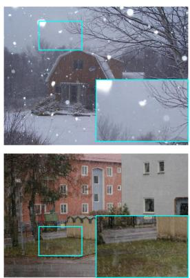

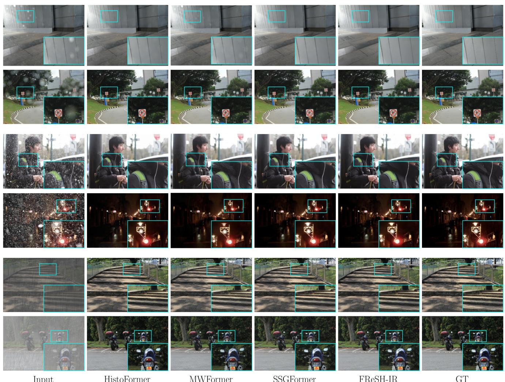  
Input  
HistoFormer  
MWFormer  
SSGFormer  
FReSH-IR

GT  
Figure 4. Qualitative comparison of the all-in-one weather restoration methods. Results, from top to bottom, of the following datasets: RainDrop, Snow100k and OutDoor Rain. Our FReSH-IR provides visual results comparable to SOTA.  
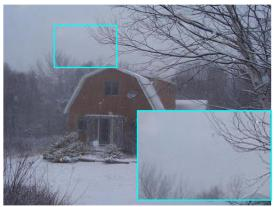

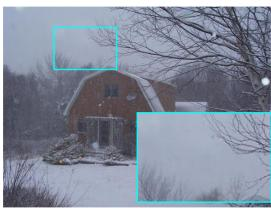

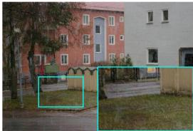  
Input

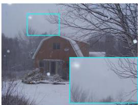  
TransWeather

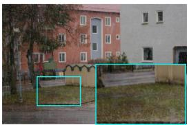  
WGWS

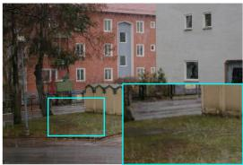  
HistoFormer

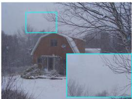

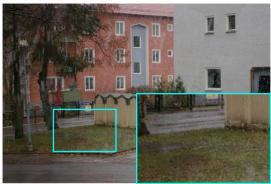  
FReSH-IR

Figure 5. Qualitative comparison of the all-in-one weather restoration methods. Results from RealSnow dataset. Our FReSH-IR provides visual results comparable to SOTA while being notably more efficient.

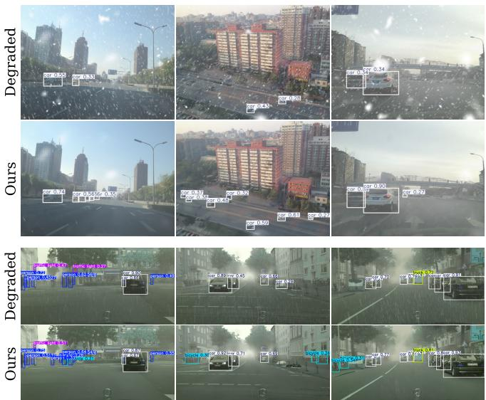

Figure 6. Qualitative comparison on downstream tasks. Results from object detection on the out-of-distribution CSD (top) and Rainy Cityscapes datasets (bottom), before and after restoration. Our method recovers fine details that enable the detector to recognize objects missed in the degraded inputs.  
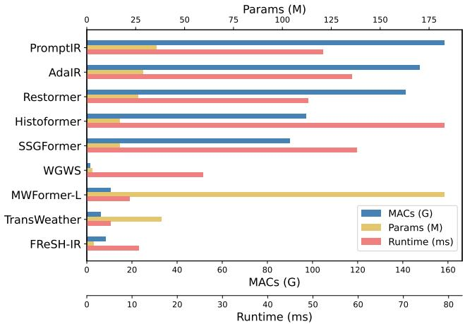  
Figure 7. Efficiency analysis across models. TransWeather is the only comparable method to FReSHIR’s efficiency. However, we improve its average performance by +1.67dB and achieve better perceptual metrics on real-world data.

of the Fourier masks to process higher frequency information at deeper levels, we observed a decline in network performance. This finding indicates that processing HF with downsampled features is not an effective method for image restoration. Instead, our network design prioritizes the restoration of HF at the upper levels of the decoder, as illustrated in the architecture in Figure 2.

We also investigated the effects of the encoder restoring both LF and HF. Our findings indicate that this approach does not yield any improvement, thereby reinforcing our strategy of initially restoring LF in the encoder and HF in the decoder. To demonstrate the efficacy of the dual attention module, we replaced this component with a standard NAFBlock [2], which resulted in decreased performance. This outcome further underscores the significance of the GAP operation as discussed in Section 3.1.

<table><tr><td>Ablation</td><td>PSNR↑</td><td>SSIM↑</td><td>LPIPS↓</td></tr><tr><td>1) ResBlocks process high and low</td><td>24.62</td><td>0.790</td><td>0.234</td></tr><tr><td>2) NAFBlock instead of DAM</td><td>27.53</td><td>0.857</td><td>0.157</td></tr><tr><td>3) Learnable cutoffs</td><td>27.43</td><td>0.867</td><td>0.144</td></tr><tr><td>4) Inverted cutoff values</td><td>27.61</td><td>0.865</td><td>0.148</td></tr><tr><td>FReSH-IR</td><td>28.10</td><td>0.871</td><td>0.140</td></tr></table>

Table 4. Ablation study on the components of FReSH-IR.
<table><tr><td>Loss</td><td>PSNR↑</td><td>SSIM↑</td><td>LPIPS↓</td></tr><tr><td> ${ \mathcal { L } } _ { p x }$ </td><td>27.48</td><td>0.862</td><td>0.155</td></tr><tr><td> $\mathcal { L } _ { p x } + \mathcal { L } _ { f r e q }$ </td><td>28.07</td><td>0.871</td><td>0.142</td></tr><tr><td> $\mathcal { L } _ { p x } + \mathcal { L } _ { e n h } + \mathcal { L } _ { f r e q }$ </td><td>28.10</td><td>0.871</td><td>0.140</td></tr></table>

Table 5. Ablation study on training losses.

In addition to our investigation of the components, we conducted a study on possible loss functions—see Tab. 5. We provide additional studies in the Supp. Material.

## 5.3. Limitations

The performance of the method on real-world scenes is still limited for demanding downstream tasks, such as autonomous driving. This is common among all the methods and can be attributed to the limited availability of realistic training datasets. Compared to other tasks, such as lowlight image enhancement [15, 48], collecting real samples for weather restoration is quite difficult, which remains one of the main challenges in this field. Future work should focus on the creation of these datasets rather than on architectural development.

## 6. Conclusion

We presented FReSH-IR, an efficient all-in-one weather restoration method designed for edge applications. Through the Spectral Harmonization Block and specialized frequency branches, FReSH-IR decomposes and fuses spectral information at each scale, achieving restoration quality competitive with far heavier models at up to 90% lower computational cost in terms of memory, operations, and runtime. This trade-off is not a limitation but a deliberate design decision: frequency-aware architecture can recover most of the quality of state-of-the-art methods at a fraction of the resources. We believe this work provides a practical pathway towards real-world, on-device image restoration, and encourages further research into efficiency-first frameworks that treat deployment constraints as a core design objective.

## References

[1] Bolun Cai, Xiangmin Xu, Kui Jia, Chunmei Qing, and Dacheng Tao. Dehazenet: An end-to-end system for single image haze removal. IEEE TIP, 25(11):5187–5198, 2016. 2

[2] Liangyu Chen, Xiaojie Chu, Xiangyu Zhang, and Jian Sun. Simple baselines for image restoration. In ECCV, pages 17– 33. Springer, 2022. 3, 5, 8

[3] Sixiang Chen, Tian Ye, Yun Liu, Erkang Chen, Jun Shi, and Jingchun Zhou. Snowformer: Scale-aware transformer via context interaction for single image desnowing. arXiv preprint arXiv:2208.09703, 2022. 2

[4] Wei-Ting Chen, Hao-Yu Fang, Jian-Jiun Ding, Cheng-Che Tsai, and Sy-Yen Kuo. Jstasr: Joint size and transparencyaware snow removal algorithm based on modified partial convolution and veiling effect removal. In ECCV, pages 754–770. Springer, 2020. 2

[5] Wei-Ting Chen, Hao-Yu Fang, Cheng-Lin Hsieh, Cheng-Che Tsai, I Chen, Jian-Jiun Ding, Sy-Yen Kuo, et al. All snow removed: Single image desnowing algorithm using hierarchical dual-tree complex wavelet representation and contradict channel loss. In ICCV, pages 4196–4205, 2021. 2, 11

[6] Xiang Chen, Hao Li, Mingqiang Li, and Jinshan Pan. Learning a sparse transformer network for effective image deraining. In CVPR, pages 5896–5905, 2023. 2

[7] Zixuan Chen, Zewei He, and Zhe-Ming Lu. Dea-net: Single image dehazing based on detail-enhanced convolution and content-guided attention. IEEE TIP, 33:1002–1015, 2024. 2

[8] Marcos V Conde, Gregor Geigle, and Radu Timofte. Instructir: High-quality image restoration following human instructions. In ECCV, pages 1–21. Springer, 2024. 2

[9] Yuning Cui, Wenqi Ren, Xiaochun Cao, and Alois Knoll. Focal network for image restoration. In ICCV, pages 13001– 13011, 2023. 2, 3

[10] Yuning Cui, Syed Waqas Zamir, Salman Khan, Alois Knoll, Mubarak Shah, and Fahad Shahbaz Khan. Adair: Adaptive all-in-one image restoration via frequency mining and modulation. In ICLR, pages 57335–57356. International Conference on Learning Representations, ICLR, 2025. 1, 2, 6

[11] David Eigen, Dilip Krishnan, and Rob Fergus. Restoring an image taken through a window covered with dirt or rain. In ICCV, pages 633–640, 2013. 2

[12] Xueyang Fu, Jie Xiao, Yurui Zhu, Aiping Liu, Feng Wu, and Zheng-Jun Zha. Continual image deraining with hypergraph convolutional networks. IEEE TPAMI, 45(8):9534– 9551, 2023. 2

[13] Ning Gao, Xingyu Jiang, Xiuhui Zhang, and Yue Deng. Efficient frequency-domain image deraining with contrastive regularization. In ECCV, pages 240–257. Springer, 2024. 2

[14] Tao Gao, Yuanbo Wen, Kaihao Zhang, Jing Zhang, Ting Chen, Lidong Liu, and Wenhan Luo. Frequency-oriented efficient transformer for all-in-one weather-degraded image restoration. IEEE TCSVT, 34(3):1886–1899, 2023. 1

[15] Jiang Hai, Zhu Xuan, Ren Yang, Yutong Hao, Fengzhu Zou, Fang Lin, and Songchen Han. R2rnet: Low-light image enhancement via real-low to real-normal network. Journal ofVisual Communication and Image Representation, 90: 103712, 2023. 8

[16] Yuhong He, Aiwen Jiang, Lingfang Jiang, Long Peng, Zhifeng Wang, and Lu Wang. Dual-path coupled image de raining network via spatial-frequency interaction. In ICIP, pages 1452–1458. IEEE, 2024. 2

[17] Xiaowei Hu, Chi-Wing Fu, Lei Zhu, and Pheng-Ann Heng. Depth-attentional features for single-image rain removal. In CVPR, 2019. 11

[18] Yuhwan Jeong, Yunseo Yang, Youngho Yoon, and Kuk-Jin Yoon. Robust adverse weather removal via spectral-based spatial grouping. In ICCV, pages 11872–11883, 2025. 2, 5, 6

[19] Kui Jiang, Wenxuan Liu, Zheng Wang, Xian Zhong, Junjun Jiang, and Chia-Wen Lin. Dawn: Direction-aware attention wavelet network for image deraining. In ACM MM, pages 7065–7074, 2023. 2

[20] Xingyu Jiang, Xiuhui Zhang, Ning Gao, and Yue Deng. When fast fourier transform meets transformer for image restoration. In ECCV, pages 381–402. Springer, 2024. 1, 2

[21] Yeying Jin, Xin Li, Jiadong Wang, Yan Zhang, and Malu Zhang. Raindrop clarity: A dual-focused dataset for day and night raindrop removal. In ECCV, pages 1–17. Springer, 2024. 2

[22] Glenn Jocher and Jing Qiu. Ultralytics yolo11, 2024. 5

[23] Li-Wei Kang, Chia-Wen Lin, and Yu-Hsiang Fu. Automatic single-image-based rain streaks removal via image decom position. IEEE TIP, 21(4):1742–1755, 2011. 1

[24] Jianyu Lai, Sixiang Chen, Yunlong Lin, Tian Ye, Yun Liu, Song Fei, Zhaohu Xing, Hongtao Wu, Weiming Wang, and Lei Zhu. Snowmaster: Comprehensive real-world image desnowing via mllm with multi-model feedback optimiza tion. In CVPR, pages 4302–4312, 2025. 2

[25] Boyi Li, Xiulian Peng, Zhangyang Wang, Jizheng Xu, and Dan Feng. Aod-net: All-in-one dehazing network. In ICCV, pages 4770–4778, 2017. 2

[26] Boyun Li, Xiao Liu, Peng Hu, Zhongqin Wu, Jiancheng Lv, and Xi Peng. All-in-one image restoration for unknown cor ruption. In CVPR, pages 17452–17462, 2022. 1

[27] Haibo Li, Zhanshuo Liu, Tuo Zhao, Tingting Zhao, Yarui Chen, and Ning Xie. Ms-rainmamba: Learning multi-scale state space models for single image deraining. In ICASSP, pages 1–5. IEEE, 2025. 2

[28] Junxuan Li, Shaodi You, and Antonio Robles-Kelly. A frequency domain neural network for fast image superresolution. In 2018 International Joint Conference on Neural Networks (IJCNN), pages 1–8. IEEE, 2018. 1

[29] Ruoteng Li, Loong-Fah Cheong, and Robby T Tan. Heavy rain image restoration: Integrating physics model and con ditional adversarial learning. In CVPR, pages 1633–1642, 2019. 5, 11

[30] Ruoteng Li, Robby T Tan, and Loong-Fah Cheong. All in one bad weather removal using architectural search. In CVPR, pages 3175–3185, 2020. 2, 5, 6, 11

[31] Yu Li, Robby T. Tan, Xiaojie Guo, Jiangbo Lu, and Michael S. Brown. Rain streak removal using layer priors. In CVPR, 2016. 1

[32] Jingyun Liang, Jiezhang Cao, Guolei Sun, Kai Zhang, Luc Van Gool, and Radu Timofte. Swinir: Image restoration using swin transformer. In ICCV, pages 1833–1844, 2021. 2

[33] Yun-Fu Liu, Da-Wei Jaw, Shih-Chia Huang, and Jenq-Neng Hwang. Desnownet: Context-aware deep network for snow removal. IEEE TPAMI, 27(6):3064–3073, 2018. 2, 5, 11

[34] Yulin Luo, Rui Zhao, Xiaobao Wei, Jinwei Chen, Yijie Lu, Shenghao Xie, Tianyu Wang, Ruiqin Xiong, Ming Lu, and Shanghang Zhang. Wm-moe: Weather-aware multi-scale mixture-of-experts for blind adverse weather removal. arXiv preprint arXiv:2303.13739, 2023. 2

[35] Vaishnav Potlapalli, Syed Waqas Zamir, Salman H Khan, and Fahad Shahbaz Khan. Promptir: Prompting for all-inone image restoration. 36:71275–71293, 2023. 2, 6

[36] Rui Qian, Robby T Tan, Wenhan Yang, Jiajun Su, and Jiaying Liu. Attentive generative adversarial network for raindrop removal from a single image. In CVPR, pages 2482– 2491, 2018. 2, 5, 11

[37] Yuhui Quan, Shijie Deng, Yixin Chen, and Hui Ji. Deep learning for seeing through window with raindrops. In ICCV, pages 2463–2471, 2019. 2

[38] Olaf Ronneberger, Philipp Fischer, and Thomas Brox. Unet: Convolutional networks for biomedical image segmentation. In International Conference on Medical image computing and computer-assisted intervention, pages 234–241. Springer, 2015. 2

[39] Yuda Song, Zhuqing He, Hui Qian, and Xin Du. Vision transformers for single image dehazing. IEEE TIP, 32:1927– 1941, 2023. 2

[40] Shangquan Sun, Wenqi Ren, Xinwei Gao, Rui Wang, and Xiaochun Cao. Restoring images in adverse weather conditions via histogram transformer. In ECCV, pages 111–129. Springer, 2024. 2, 5, 6

[41] Jeya Maria Jose Valanarasu, Rajeev Yasarla, and Vishal M Patel. Transweather: Transformer-based restoration of images degraded by adverse weather conditions. In CVPR, pages 2353–2363, 2022. 1, 2, 5, 6, 11

[42] Tao Wang, Peiwen Xia, Bo Li, Peng-Tao Jiang, Zhe Kong, Kaihao Zhang, Tong Lu, and Wenhan Luo. Moerl: When mixture-of-experts meet reinforcement learning for adverse weather image restoration. In ICCV, pages 13673–13683, 2025. 2, 5

[43] Zhendong Wang, Xiaodong Cun, Jianmin Bao, Wengang Zhou, Jianzhuang Liu, and Houqiang Li. Uformer: A gen eral u-shaped transformer for image restoration. In CVPR, pages 17683–17693, 2022. 2

[44] Gang Wu, Junjun Jiang, Kui Jiang, Xianming Liu, and Liqiang Nie. Learning dynamic prompts for all-in-one image restoration. IEEE TPAMI, 2025. 2

[45] Jie Xiao, Xueyang Fu, Aiping Liu, Feng Wu, and Zheng-Jun Zha. Image de-raining transformer. IEEE TPAMI, 45(11): 12978–12995, 2022. 2

[46] Enze Xie, Wenhai Wang, Zhiding Yu, Anima Anandkumar, Jose M Alvarez, and Ping Luo. Segformer: Simple and ef-

ficient design for semantic segmentation with transformers. 2021. 5

[47] Xu Yan and Yuan Ren Loke. Raingan: Unsupervised raindrop removal via decomposition and composition. In Proceedings of the IEEE/CVF Winter Conference on Applications of Computer Vision (WACV), pages 14–23, 2022. 2

[48] Wenhan Yang, Wenjing Wang, Haofeng Huang, Shiqi Wang, and Jiaying Liu. Sparse gradient regularized deep retinex network for robust low-light image enhancement. IEEE TIP, 30:2072–2086, 2021. 8

[49] Tian Ye, Sixiang Chen, Jinbin Bai, Jun Shi, Chenghao Xue, Jingxia Jiang, Junjie Yin, Erkang Chen, and Yun Liu. Adverse weather removal with codebook priors. In ICCV, pages 12653–12664, 2023. 6

[50] Shaodi You, Robby T Tan, Rei Kawakami, Yasuhiro Mukaigawa, and Katsushi Ikeuchi. Adherent raindrop modeling, detection and removal in video. IEEE TPAMI, 38(9): 1721–1733, 2015. 2

[51] Syed Waqas Zamir, Aditya Arora, Salman Khan, Munawar Hayat, Fahad Shahbaz Khan, and Ming-Hsuan Yang. Restormer: Efficient transformer for high-resolution image restoration. In CVPR, 2022. 6

[52] Huimin Zeng, Jiacheng Li, Ziqiang Zheng, and Zhiwei Xiong. All-in-one image compression and restoration. In 2025 IEEE/CVF Winter Conference on Applications of Computer Vision (WACV), pages 609–619. IEEE, 2025. 2

[53] Jingang Zhang, Wenqi Ren, Shengdong Zhang, He Zhang, Yunfeng Nie, Zhe Xue, and Xiaochun Cao. Hierarchical density-aware dehazing network. IEEE Transactions on Cy bernetics, 52(10):11187–11199, 2021. 2

[54] Kaihao Zhang, Rongqing Li, Yanjiang Yu, Wenhan Luo, and Changsheng Li. Deep dense multi-scale network for snow removal using semantic and depth priors. IEEE TPAMI, 30: 7419–7431, 2021. 2

[55] Richard Zhang, Phillip Isola, Alexei A Efros, Eli Shechtman, and Oliver Wang. The unreasonable effectiveness of deep features as a perceptual metric. In CVPR, 2018. 5

[56] Xu Zhao, Wenchao Ding, Yongqi An, Yinglong Du, Tao Yu, Min Li, Ming Tang, and Jinqiao Wang. Fast segment anything, 2023. 5

[57] Man Zhou, Jie Huang, Chun-Le Guo, and Chongyi Li. Fourmer: An efficient global modeling paradigm for image restoration. pages 42589–42601. PMLR, 2023. 2

[58] Ruoxi Zhu, Zhengzhong Tu, Jiaming Liu, Alan C Bovik, and Yibo Fan. Mwformer: Multi-weather image restoration using degradation-aware transformers. IEEE TIP, 2024. 2, 5, 6

[59] Yurui Zhu, Tianyu Wang, Xueyang Fu, Xuanyu Yang, Xin Guo, Jifeng Dai, Yu Qiao, and Xiaowei Hu. Learning weather-general and weather-specific features for image restoration under multiple adverse weather conditions. In CVPR, 2023. 2, 5, 6, 11

[60] Zhen Zou, Hu Yu, Jie Huang, and Feng Zhao. Freqmamba: Viewing mamba from a frequency perspective for image deraining. In ACM MM, pages 1905–1914, 2024. 2

## A. Dataset overview

Training dataset. Following previous studies [30, 41], we use the AllWeather set. It contains a subset of 9, 000 images from Outdoor-Rain [29], which encompasses synthetic images with haze and rain-streaks altogether; 1, 069 images from RaindropData [36], containing real raindrop images; and 9, 000 images from the Snow100K [33] training dataset, featuring synthetic images affected by snow.

Rain + Fog test set. For both deraining and dehazing, we use the Test1 subset from Outdoor-Rain [29]. It contains 750 pairs of synthetic images degraded with rain streaks and haze with different intensities and directions.

Raindrop test set. The dataset used for testing de-raindrop is the Raindrop A subset from RaindropData [36]. It contains 58 pairs of real raindrop images with different shapes and intensities.

Snow test set. For desnowing, we use the Snow100K-L test set from Snow100K [33]. It contains 16, 801 pairs of synthetic snow images. We also used the Snow100K realistic subset for the visual results. This test set contains 1, 329 images of realistic snow, without their ground truth.

Downstream task evaluation. To assess the impact of FReSH-IR on downstream perception tasks, we additionally evaluate on two datasets that are not seen during training. Rainy Cityscapes [17] augments the Cityscapes urban driving scenes with synthetic rain, providing 9, 4232 training and 1, 188 test images with semantic segmentation and object detection ground truth. CSD [5] is a synthetic snow benchmark containing 8, 000 training and 2, 000 test images.

## B. Frequency analysis.

This analysis is motivated by the observation that predominant weather artifacts (e.g., snowflakes, raindrops, etc) mainly appear in the high-frequency domain of degraded images. As illustrated in Figure 8 (a), we evaluate each extraction method on the three considered weather degradation types. Our analysis reveals that FFT decomposi tion yields the most precise isolation of weather artifacts, as it captures degradation-related information while suppressing structural edge content from the underlying clean image. While 2D Global Average Pooling (GAP)–simple mean kernel– also demonstrates strong degradation extraction capability, it preserves some clean image edges, which helps maintain fine structural details during the restoration process. Although Sobel filtering captures both degradation patterns and structural details similarly to GAP, the weather artifacts are less visible while producing more pronounced edge responses, resulting in a less favorable trade-off for degradation isolation. Finally, the resampling-based approach fails to provide meaningful information, making it

unsuitable for this purpose.

However, beyond a certain depth, Fourier decomposition loses the ability to capture meaningful information altogether, as shown in Figure 8 (b). This is the moment when we transition to GAP-based extraction, which, despite operating on deep feature representations, retains the ability to capture structural image edges, as illustrated in Figure 8 (b).

## C. Additional efficiency results.

To remark the efficiency potential of our proposal, we include the image runtime study conducted on a 24GB RTX 4090 GPU. We conducted the same study on a 16GB Jetson Orin NX. Both experiments are illustrated on Table 6.

We conclude that (i) only FReSH-IR and WGWS [59] handle resolutions of at least 1440p, and (ii) FReSH-IR demonstrates superior scalability in inference times relative to image resolution compared to other methods. The alternative methods encounter Out-of-Memory (OOM) errors.

## D. Additional ablation studies

To further justify the selection of our FReSH-IR architecture, we conducted additional experimental studies. The results of these studies are presented in Table 7 (a). We attempted to process only the high frequencies on the encoder, but the results showed a significant decrease in performance, demonstrating that restoring low frequencies in the encoder is more effective.

We also performed experiments on the decoder block. First, we replaced our proposed FTB with separate NAF-Blocks for each frequency component. This study showed only a negligible improvement in performance while increasing the computational cost, which reinforces our idea of using specialized branches for the high- and low-frequency components. When processing the highfrequency components with the Restormer Transformer, cost was slightly lower while the restoration performance significantly dropped, demonstrating the potential of our approach. We also tried processing only the high frequencies on the decoder, which resulted in a significant decrease in performance, further supporting our strategy of restoring both components in the decoder.

Additionally, we conducted experiments on the SHB. We changed the skip fusion method from addition to concatenation, slightly increasing the cost but severely degrading performance.

To further support our decision on the cutoff values, we performed an experiment setting the same value for every depth. This experiment showcases the use of different masks in each level, improving the restoration performance.

Moreover, to demonstrate the capabilities of our novel skip-connection mechanism, we substituted our approach with traditional skip-connections.

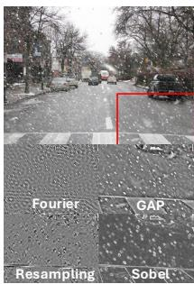

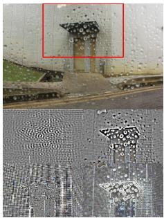  
(a)

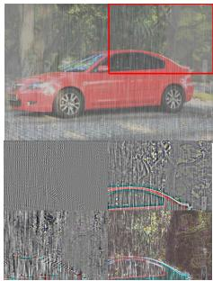

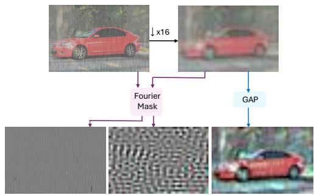  
(b)

Figure 8. (a) Different high-frequency extraction techniques used across three degradations. Top row shows the degraded image with a highlighted region in red. Bottom row shows the extracted high-frequencies (HF) of the indicated region, using four methods. (b) Fourier mask result on the input degraded image and its downsampled version. It also shows the result of applying GAP to the downsampled version of the input. Zoom in for a better view.
<table><tr><td></td><td colspan="5">RTX 4090</td><td colspan="4">Jetson Orin NX</td></tr><tr><td>Method</td><td>360p</td><td>720p</td><td>1080p</td><td>1440p</td><td>2160p</td><td>360p</td><td>720p</td><td>1080p</td><td>1440p</td></tr><tr><td>SSGFormer</td><td>0.400</td><td>O0M</td><td>OOM</td><td>O0M</td><td>00M</td><td>4.413</td><td>00M</td><td>00M</td><td>O0M</td></tr><tr><td>AdaIR</td><td>0.324</td><td>1.294</td><td>3.154</td><td>OOM</td><td>OOM</td><td>2.632</td><td>11.148</td><td>OOM</td><td>OOM</td></tr><tr><td>HistoFormer</td><td>0.453</td><td>1.793</td><td>4.385</td><td>OOM</td><td>OOM</td><td>4.429</td><td>19.371</td><td>OOM</td><td>OOM</td></tr><tr><td>WGWS</td><td>0.094</td><td>0.363</td><td>0.787</td><td>1.369</td><td>3.051</td><td>0.863</td><td>3.371</td><td>8.057</td><td>16.600</td></tr><tr><td>MWFormer</td><td>0.029</td><td>0.155</td><td>0.486</td><td>OOM</td><td>OOM</td><td>0.198</td><td>1.360</td><td>OOM</td><td>OOM</td></tr><tr><td>TransWeather</td><td>0.008</td><td>0.053</td><td>0.190</td><td>OOM</td><td>OOM</td><td>0.085</td><td>0.616</td><td>3.570</td><td>OOM</td></tr><tr><td>FReSH-IR</td><td>0.045</td><td>0.178</td><td>0.394</td><td>0.690</td><td>1.595</td><td>0.458</td><td>1.831</td><td>4.329</td><td>7.913</td></tr></table>

Table 6. Runtime in seconds for different image resolutions, averaged over 100 frames, on different devices. Bold and underlined represent the best and second-best results, respectively.
<table><tr><td>Ablation</td><td>Cost</td><td>PSNR↑</td><td>SSIM↑</td><td>LPIPS↓</td></tr><tr><td>·Encoder processes only highs</td><td>3.46/8.32</td><td>27.27</td><td>0.859</td><td>0.153</td></tr><tr><td>·NAFBlock in the Decoder</td><td>4.02/9.05</td><td>28.20</td><td>0.872</td><td>0.139</td></tr><tr><td>·Restormer block on decoder highs</td><td>3.44/8.21</td><td>25.13</td><td>0.794</td><td>0.233</td></tr><tr><td>·Decoder does not process lows</td><td>3.42/8.06</td><td>25.18</td><td>0.814</td><td>0.193</td></tr><tr><td>·SHB outputs concatenated freqs</td><td>3.65/8.93</td><td>23.39</td><td>0.705</td><td>0.295</td></tr><tr><td>·Same cutoff value</td><td>3.46/8.32</td><td>27.86</td><td>0.868</td><td>0.144</td></tr><tr><td>·Traditional skip-connections</td><td>3.46/8.32</td><td>28.06</td><td>0.871</td><td>0.141</td></tr><tr><td>FReSH-IR</td><td>3.46/8.32</td><td>28.10</td><td>0.871</td><td>0.140</td></tr></table>

<table><tr><td>Channels</td><td>Cost</td><td>PSNR↑</td><td>SSIM↑</td><td>LPIPS↓</td></tr><tr><td>16</td><td>1.57/3.90/11.13</td><td>25.20</td><td>0.814</td><td>0.217</td></tr><tr><td>48</td><td>13.47/31.44/13.40</td><td>26.75</td><td>0.848</td><td>0.168</td></tr><tr><td>24</td><td>3.46/8.32/11.42</td><td>28.10</td><td>0.871</td><td>0.140</td></tr></table>

Table 7. (a) Ablation study of the components of FReSH-IR. Cost: Params (M) / MACs (G). (b) Ablation study on embedding channels. Cost: Params (M) / MACs (G) / Runtime (ms) on RTX 4090.  
against several methods.

Finally, we performed experiments regarding the number of channels. The results of this study, displayed in Table 7 (b), demonstrate that our configuration of 24 channels achieves an optimal balance between performance and computational efficiency.

## E. Qualitative results

In Figure 9 we provide a comparison of visual results in synthetic and real benchmarks. Figure 10 shows additional qualitative results on the realistic subset of real Snow100K

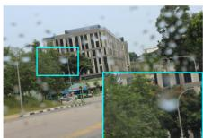

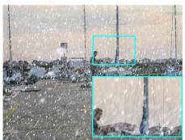

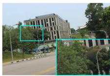

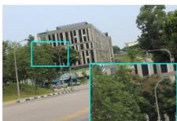

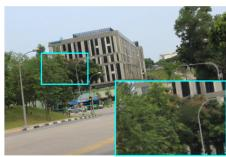

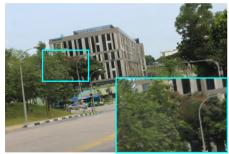

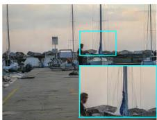

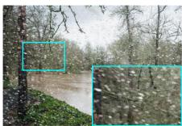

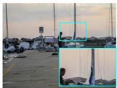

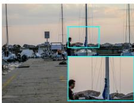

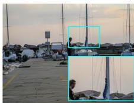

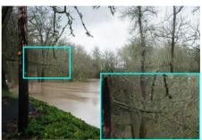

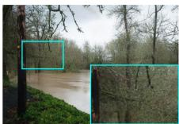

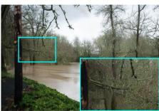

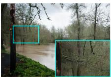

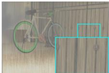

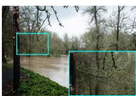

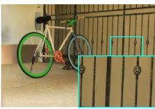

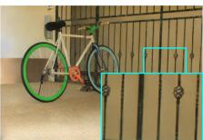

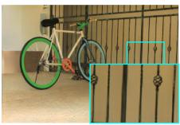

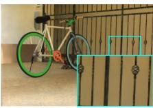

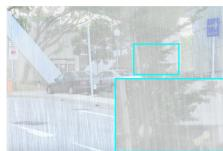  
Input  
HistoFormer

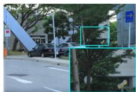

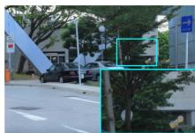  
MWFormer

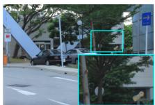  
SSGFormer

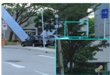

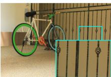

FReSH-IR  
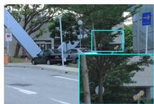  
GT

Figure 9. Additional qualitative results obtained using our FReSH-IR. From top to bottom: RainDrop, Snow100K, OutdoorRain datasets. Our method achieves similar results to state-of-the-art methods at a fraction of their computational cost.  
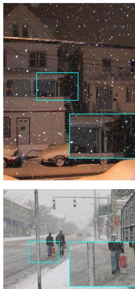  
Input

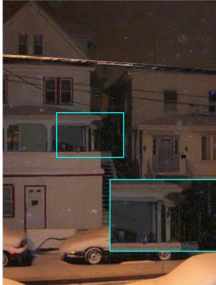

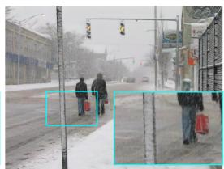  
TransWeather

  
WGWS

  
HistoFormer

  
FReSH-IR

Figure 10. Additional qualitative results from realistic Snow100k.