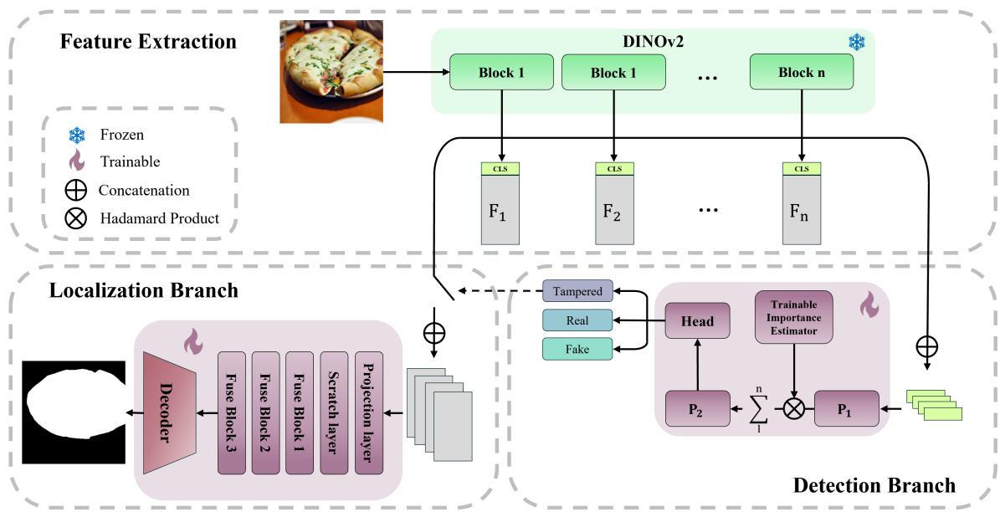
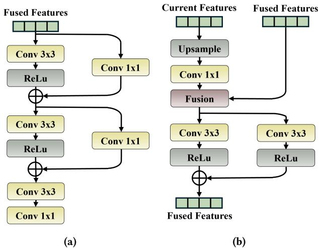
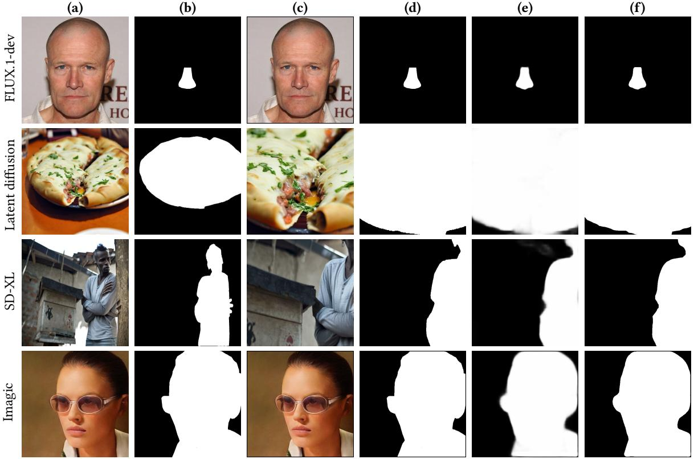
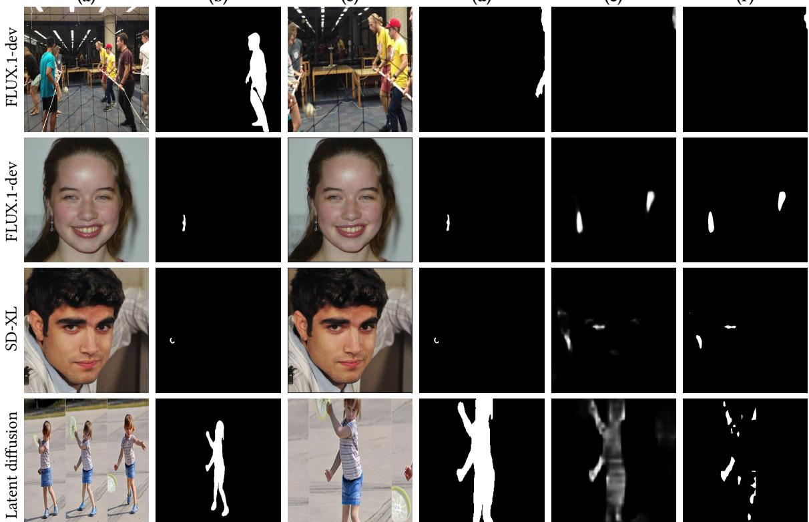

# From Detection to Localization: A Unified Forensics Framework for Fully Synthetic and Tampered Images

Annalisa Gallina✉ University of Padova Padova, Italy annalisa.gallina.1@phd.unipd.it

Marco Fiorucci   
University of Padova   
Padova, Italy   
marco.fiorucci@unipd.it   
Federica Battisti   
University of Padova   
Padova, Italy   
federica.battisti@unipd.it

Marco Brigo University of Padova Padova, Italy marco.brigo@studenti.unipd.it

## Abstract

Lamberto Ballan   
University of Padova   
Padova, Italy   
lamberto.ballan@unipd.it

The rapid advancement of generative models has significantly worsened the problem of manipulated image detection, as these methods are capable of producing highly realistic forgeries, reinforcing the importance of multimedia forensics. Conventional approaches typically frame image manipulation detection as a binary classification task (real vs. generated), which limits the capability to distinguish and localize diferent forms of manipulation. To address these constraints, this work extends an existing detector by introducing a unified multiclass framework (real vs. fully generated vs. tampered). In addition to classifying image authenticity, the framework incorporates a segmentation branch to enable pixel-level localization of tampered regions. The proposed approach outperforms selected recent benchmarks, ofering an eficient solution with improved classification accuracy and higher IoU scores for the localization task. Find the code at https://github.com/anngal01/From-Detection-to-Localization-A-Unified-Forensics-Framework-for-Fully-Syntheticand-Tampered-Images.git

## 1 INTRODUCTION

To mitigate these emerging threats, the research community has intensified its eforts in the domain of visual forensics. Early investigations primarily targeted specific architectural footprints and statistical inconsistencies unique to Generative Adversarial Network (GAN)-generated content [7, 8]. However, the transition

The rapid evolution ofgenerative modeling has significantly changed the ways in which digital content is created and experienced. Powered by large-scale architectures trained on massive open-world datasets, difusion-based models have emerged as the prevailing approach for high-fidelity image synthesis [1], consistently surpassing adversarial methods [2] in terms of quality and diversity. Current frameworks like latent difusion [3], DALL·E 3 [4], and Midjourney [5], enable the seamless generation of photorealistic visuals from textual prompts. While these advancements have empowered creative workflow and augmented the digital content production, they simultaneously challenge the reliability of visual content [6]. The ability to synthesize photorealistic imagery at scale facilitates the proliferation ofmisinformation and identity fraud, necessitating robust deepfake detection and Image Forgery Detection and Localization (IFDL) as the forensic focus shifts from obvious structural artifacts toward subtle, near-imperceptible statistical anomalies.

toward difusion-based synthesis has rendered many legacy techniques inefective, as modern models often lack the upsampling artifacts and checkerboard patterns characteristic of previous generations. Consequently, recent literature has shifted toward exploring high-frequency inconsistencies, noise residuals, and reconstruction errors as robust forensic signatures [9–11]. Furthermore, research has branched into spectral analysis, such as leveraging color distribution irregularities to enhance cross-domain robustness [5], and vision-language alignment, where prompt-tuned models harmonize visual and textual cues to detect semantic inconsistencies [12].

Despite these advancements, existing forensic frameworks remain hindered by critical technical bottlenecks. Most conventional detectors are formulated as closed-set binary classification tasks primarily designed to distinguish between entirely real and fully synthetic content [13, 14]. While recent approaches such as RINE [15] and SPAI [16] have enhanced generalization across disparate architectures, by leveraging intermediate spectral invariants features, they remain predominantly centered on global image level labels. This rigid formulation fails to address modern workflows where authentic images undergo generative tampering, such as difusionbased inpainting, object insertion or scene-elements manipulation. These sophisticated manipulations necessitate a shift towards a multiclass paradigm capable of simultaneous detection and pixel level attribution, a transition recently facilitated by the introduction of new benchmarks [17, 18]. Additionally, while high-performing Large Vision-Language Models (LVLMs) ofer forensic reasoning, their deployment is constrained by heavy computational overhead and a lack of pixel-level precision [17, 19].

In this paper, we propose a unified framework that extends RINE [15] beyond binary classification. By identifying the "proxy token" phenomenon [20] as a bottleneck in CLIP-based models, we adopt DINOv2 [21] to leverage superior spatial consistency through shared frozen representations. The architecture follows a sequential logic: a three-class branch categorizes images as real, fully synthetic, or partially tampered; the latter triggers a lightweight segmentation branch for pixel-level localization. This approach avoids extensive parameter tuning by exploiting the inherent discriminative power of fixed foundation features, significantly optimizing training eficiency. Extensive evaluations on SID-Set [17] and So-Fake-Set [18] confirm that our framework matches or improves state-of-the-art performance, establishing a baseline for the dense forensic localization of diverse image content.

  
Figure 1: Overview of the proposed framework. An input image is processed by a frozen DINOv2 backbone, and features extracted from multiple transformer blocks are shared between two task-specific branches. The detection branch aggregates these representations through a trainable importance estimator to perform image-level classification, while the localization branch combines multi-scale features using a trainable decoder to predict the pixel-level tampering mask.

## 2 RELATED WORKS

As generative models achieve unprecedented photorealism, deepfake detection has shifted from visible imperfections [22, 23] to imperceptible spatial and frequency artifacts [24–26]. Consequently, modern methods must extract subtle statistical irregularities hidden from the human eye.

## Spatial and Frequency Artifacts.

In the spatial domain, pixel-level irregularities, including bound ary blurring, blending inconsistencies, can be captured by training detectors on self-blended images [25]. Nevertheless, as generative architectures achieve higher fidelity and resolution, these spatial cues become increasingly subtle and are often attenuated by stan dard post-processing operations, such as lossy compression, rescaling, or enhancement filters. Consequently, detectors often exhibit a significant performance degradation when evaluated across diverse datasets or previously unseen generative paradigms [27].

Frequency domain analysis ofers a complementary perspective by isolating upsampling-induced spectral anomalies[24, 26], yet these signatures remain strongly architecture-dependent. While GAN-based models, such as ProGAN [28] and StyleGAN2 [29] ex hibit prominent spectral spikes [30], difusion-based frameworks, like Latent Difusion [1], Stable Difusion [3], DALL·E, and Midjourney [5] exhibit attenuated or absent peaks. Consequently, this spectral heterogeneity, paired with low perturbation robustness, limits the transferability of frequency-only forensic frameworks.

Image Deepfake Detection and Localization.

To address the inherent challenges posed by subtle and generatordependent artifacts, many deepfake detection methods employ data-driven classification paradigms, leveraging CNNs or Vision Transformers (ViTs). Many frameworks adopt multimodal fusion strategies, combining spatial textures and frequency-domain descriptors to enhance discriminative power [13, 14]. While models trained on ProGAN [31] may retain intrafamily consistency on related architectures like StyleGAN [32], they often sufer from performance collapse when encountering fundamentally diferent frameworks like Difusion Models [10, 27]. To mitigate these discrepancies, recent works have explored intermediate feature representations to improve robustness across unseen generators. Specifically, RINE [15] demonstrates that representations extracted from intermediate encoder blocks capture more transferable forensic information than final-layer features, which often sufer from generator-specific bias. By leveraging these multi-level representations, the method enhances robustness across both GAN- and difusion-based synthesis. Similarly, SPAI [16] addresses the generalization challenge by adopting the spectral distribution of real images as a universal reference signal. This framework employs a Vision Transformer to reconstruct masked frequency components using exclusively real images. At test time, samples with high reconstruction errors are flagged as out-of-distribution and classified as synthetic, improving detector robustness against novel generation models.

Despite these advances, most deepfake detection approaches remain binary, either distinguishing fully synthetic images from real ones or detecting whether specific regions have been tampered. Even in localization tasks, where pixel-level masks of manipulated areas are available, existing models operate within a two-class framework centered solely on the presence of manipulation [33, 34]. A primary bottleneck in moving beyond binary classification has been the scarcity ofdatasets designed for unified multi-class settings (i.e., encompassing real, fully synthetic, and locally tampered images simultaneously). Existing benchmarks typically isolate synthetic detection from forgery localization, hindering the development of models capable of handling heterogeneous manipulations. Recently, benchmarks such as SID-Set [17] and So-Fake Set [18] have begun to address this limitation by ofering larger, more diverse collections for comprehensive forensic evaluation.

To bridge this gap, we propose a multi-class deepfake detection framework that jointly distinguishes between real, synthetic, and tampered images. Unlike traditional approaches that isolate global generation from local forgery, our architecture classifies these diverse manipulation types within a unified formulation, overcoming the structural constraints of conventional binary detectors.

## Large Vision-Language Models.

Recent advances in LVLM have motivated their application to image deepfake detection and localization tasks. Unlike specialized binary classifiers, LVLMs combine visual perception with linguistic reasoning, enabling a more nuanced analysis of manipulated con tent. General purpose models, such as [35–38], demonstrate robust visual reasoning capabilities and can be adapted for the IFDL task through strategic prompting or supervised fine tuning.

Beyond general architectures, several works introduce task-specific extensions. For instance, LISA [39] integrates a dedicated segmenta tion decoder for fine-grained localization, while SIDA [17] proposes a unified multimodal framework for deepfake detection, localization, and explanation on social media imagery. FakeShield [19] builds upon LLaVA to localize manipulated regions while generating interpretable rationale, and So-Fake-R1 [18] fine-tunes an LVLM via reinforcement learning to enhance forensic reasoning. Yet, despite their promising generalization and reasoning abilities, these approaches sufer from high computational complexity, limit ing their deployment in real-world, latency-sensitive applications.

To address these latency and resource constraints, we move beyond heavy multimodal models in favor of a unified, highly eficient framework. Our architecture jointly handles image-level classification and pixel-level localization, delivering competitive forensic precision at a fraction of the computational cost.

## 3 PROPOSED METHOD

As summarized in Figure 1, the proposed framework consists of a two-branch architecture for joint image-level detection and pixellevel localization of manipulated areas, built upon a shared DINOv2 backbone. Using a common set of frozen representations, the model maintains computational eficiency while jointly capturing global semantic inconsistencies and fine-grained artifacts. The main architectural components are described in the following sections.

## 3.1 Detection Branch

The Detection Branch performs image-level classification and constitutes the first stage of the framework. Its objective is to assign each input image to one of three classes – Real, Tampered, or Fake – based on the representations extracted by the frozen backbone.

Feature Extraction With the rise of large foundation models, features extracted from these networks have become efective content descriptors. In this context, prior work has shown that combining high-level semantic features with low-level image cues improves performance in image forgery detection [15]. However, not all pre-trained models are equally suitable for this task. Models that do not capture fine-grained image content may reduce the ability to detect manipulations, which makes the selection of the backbone crucial for IFDL performance.

As argued in [20], CLIP-based models are trained for imagelevel understanding and often struggle with dense, region-level tasks such as tampering localization. Their attention maps tend to focus on a limited set of "proxy" tokens, overlooking subtle local inconsistencies. As a result, CLIP features lack local discriminability and spatial consistency, which limits their efectiveness in detecting small artifacts.

In contrast, DINOv2 [21] does not exhibit this behavior. Its attention maps remain aligned with the image content, so that when the reference patch changes position, the model continues to focus on semantically related regions. This results in more stable features, with stronger inter-patch correlations and more consistent representations across the image. For these reasons, DINOv2 is a more suitable choice as a frozen backbone.

Specifically, following [15], a batch � of input images is processed by the encoder, producing � CLS tokens of dimension �. These tokens are concatenated and passed through a learnable projection network $( P _ { 1 }$ in Figure 1). To account for the diferent relevance of the extracted features, a Trainable Importance Estimator (TIE) module is used to assign weights to each token. Summation over the second dimension then yields a single feature vector per image, which is further projected by a second network $( P _ { 2 }$ in Figure 1) with the same architecture as �1. The resulting representation is finally fed into the classification head.

Classification Head Given the extracted feature vector $f \in \mathbb { R } ^ { d }$ the classification head computes the final detection probabilities. Unlike most previous approaches, which formulate the problem as binary classification, we address a three-class setting distinguishing among Real, Tampered, and Fake images.

To this end, we employ a lightweight MLP composed of two fully connected layers of size $d \times d ,$ each followed by a ReLU activation, and a final linear layer of size � × 3. The network outputs a threedimensional logit vector, which is converted into class probabilities through a softmax function.

Training Objective Inspired by [15], the loss function used to optimize the detector parameters consists of two components: a Categorical Cross-Entropy loss, denoted as $\mathcal { L } _ { C C E }$ , and a Supervised Contrastive Loss, denoted as $\mathcal { L } _ { C o n t } \ [ 4 0 ]$

The Categorical Cross-Entropy loss is a standard objective for multi-class classification tasks. It measures the discrepancy between the predicted class probabilities and the ground-truth distribution, thereby directly optimizing the IFDL task. It is defined as:

$$
\mathcal { L } _ { C C E } = - \sum _ { i = 1 } ^ { C } y _ { i } \log ( \hat { y } _ { i } )
$$

where $y _ { i }$ denotes the ground-truth probability for class $i , \hat { y } _ { i }$ the predicted probability for class $i ,$ and � the number of classes.

The Supervised Contrastive Loss [40] is introduced to improve the discriminative structure of the learned feature space. Specifically, it encourages feature vectors associated with the same class label to be closer, while pushing apart those corresponding to dif ferent classes. It is defined as:

$$
\mathcal { L } _ { C o n t } = - \sum _ { i = 1 } ^ { b } \frac { 1 } { G ( i ) } \sum _ { g \in G ( i ) } \log \frac { \exp ( \mathbf { z } _ { i } \cdot \mathbf { z } _ { g } / \tau ) } { \sum _ { a \in A ( i ) } \exp ( \mathbf { z } _ { i } \cdot \mathbf { z } _ { a } / \tau ) }
$$

where $A ( i ) = \{ 1 , \ldots , i - 1 , i + 1 , \ldots , b \} , \quad G ( i ) = \{ g \in A ( i ) : y _ { g } =$ $y _ { i } \} ,$ · denotes the dot product and � is the temperature parameter.

The overall loss is defined as a linear combination of the two components:

$$
\mathcal { L } = \mathcal { L } _ { C C E } + \xi \mathcal { L } _ { C o n t }
$$

where � is a tunable hyperparameter controlling the relative contribution of the contrastive term. This combined objective promotes both accurate classification and well-structured latent representations, which in turn enhances the overall model performance.

## 3.2 Localization Branch

The Localization Branch is designed to generate pixel-level binary masks that identify manipulated regions within input images. As illustrated in the bottom-left corner of Figure 1, this module operates conditionally: it is activated only when the image is classified as tampered by the preceding stage. When triggered, the branch leverages the representations learned by the frozen backbone and is organized into three sequential stages: feature extraction, progressive feature fusion, and final mask decoding.

Feature Extraction Multi-scale transformer features are extracted from the frozen backbone to support dense pixel-level prediction. To maintain a lightweight design, we reuse computations from the classification forward pass. Specifically, while CLS tokens are extracted for image-level classification, the patch tokens, commonly discarded in prior approaches, are retained and further processed for localization.

Previous studies [41] have shown that combining patch tokens from intermediate transformer layers significantly benefits dense prediction tasks. Such aggregation enables the joint exploitation of low-level structural information and high-level semantic representations. Accordingly, we extract features from layers {3, 6, 9, 12} of the DINOv2 base model [21]. Since DINOv2 keeps the same patch resolution across all layers, the fine spatial details captured in early representations remain aligned and preserved throughout the network. Because of this, the fine-grained spatial information captured in early layers is not lost as features become more abstract. At the same time, deeper layers still learn higher-level semantic representations, making the features well suited for segmentation.

To recover the spatial structure, the output sequence of token embeddings is reshaped into 2D feature maps that reflect the layout of the original input patches. Each map is then processed with a 1 × 1 convolution to project it into a higher-dimensional embedding space, increasing channel capacity and enhancing representational power. Finally, scratch layers are applied to standardize the channel dimension across feature maps, ensuring compatibility before their subsequent fusion.

  
Figure 2: Illustration of the decoder architecture (a) and the fusion block (b).

Feature Fusion The features extracted from diferent backbone layers encode complementary information, ranging from low-level details to high-level semantic representations. To efectively exploit this hierarchy, we adopt a progressive fusion strategy in which deeper features are gradually upsampled and integrated with shallower feature maps.

The proposed fusion block is illustrated in Figure 2b: before fusion, each feature map is passed through a 1 × 1 convolutional alignment layer to project it into a shared embedding space, ensuring channel-wise semantic consistency. In line with [41], aggregation is performed through element-wise addition rather than concatenation, which maintains dimensional eficiency and avoids introducing additional parameters. The fused features are subsequently refined using a two-stage residual refinement module, enhancing the quality of the final representation.

Since four backbone layers are considered, three successive fusion stages are performed, yielding the final fused feature representation.

Mask Decoding A U-Net–style decoder processes the fused feature representation to produce the final binary segmentation mask, as illustrated in Figure 2a.

The decoder consists of two upsampling stages, each incorporating residual connections to preserve information flow. In the first stage, channel dimensionality is reduced from 256 to 128 via a 1 × 1 convolution followed by GroupNorm [42] and ReLU, while a parallel 1 × 1 convolution provides a residual shortcut on the upsampled input. A second equivalent stage further compresses the representation to 64 channels to limit information loss. Following these upsampling steps, an additional 3 × 3 refinement block enhances spatial definition before a final 1 × 1 convolution that maps the refined features to a single-channel output corresponding to

the binary segmentation mask.

Training Objective Following [17], the adopted loss function to train the Segmentation Branch is a weighted combination of the Dice loss, denoted as $\mathcal { L } _ { D I C E }$ , and the Binary Cross-Entropy (BCE) loss, denoted as $\mathcal { L } _ { B C E } .$

The BCE loss is defined as:

$$
\mathcal { L } _ { B C E } = - \frac { 1 } { n } \sum _ { i = 1 } ^ { n } \left( Y _ { i } \log \hat { Y } _ { i } + \left( 1 - Y _ { i } \right) \log \left( 1 - \hat { Y } _ { i } \right) \right)
$$

where $\hat { Y } _ { i }$ denotes the predicted probability for pixel $i , Y _ { i }$ the corresponding ground-truth label, and � the total number of pixels. It is a standard objective for binary classification and segmentation tasks but, in the presence of severe class imbalance, it may bias the optimization toward the majority class.

Since manipulated pixels typically constitute a minority within an image, we incorporate the Dice loss, which has been shown to be efective for highly imbalanced segmentation problems [46]. It is defined as:

$$
\mathcal { L } _ { \mathrm { { D I C E } } } = 1 - \frac { 2 | \boldsymbol { X } \cap \boldsymbol { Y } | + \epsilon } { | \boldsymbol { X } | + | \boldsymbol { Y } | + \epsilon }
$$

where � represents the predicted mask, � the ground-truth mask, and � a small constant introduced for numerical stability. The Dice loss directly maximizes the overlap between predicted and reference regions, making it particularly sensitive to spatial alignment and region-level consistency.

The overall objective function is given by:

$$
\begin{array} { r } { \mathcal { L } = \mathcal { L } _ { B C E } + \mathcal { L } _ { D I C E } . } \end{array}
$$

By combining these two terms with equal weights, the model jointly enforces accurate pixel-wise classification through BCE and robust region-level agreement through Dice, resulting in more precise and spatially coherent mask predictions.

## 4 EXPERIMENTAL RESULTS

## 4.1 Experimental Setting

Implementation details The proposed system is trained and evaluated on the So-Fake dataset [18], which represents, to the best of our knowledge, the most comprehensive non-binary benchmark for fake image detection and localization. To ensure a fair comparison, we follow the training and test splits defined in the original study.

The architecture is optimized separately for the classification and segmentation tasks. The classification branch is trained on the entire training set, while the segmentation branch is trained exclusively on tampered images, since localizing manipulated regions is not meaningful for pristine or fully synthetic samples.

For the multi-class classification branch, we adopt the ADAM optimizer with a learning rate of $1 \times 1 0 ^ { - 3 }$ and a batch size of 128. Training is limited to three epochs, as additional epochs yield lim ited performance gains. To identify the optimal model configuration, we perform a grid search over the hyperparameters � ∈ {0.2, 0.4} and � ∈ {512, 1024} while fixing the number of projections to 2. The best-performing configuration is obtained with $\xi = 0 . 2$ and $d = 5 1 2$ Unless otherwise specified, feature extraction is performed using DINOv2 pretrained on the LVD-142M dataset [21] as the backbone network.

For the segmentation branch, training is conducted for 5 epochs using a batch size of 128 and a learning rate of $1 \times 1 0 ^ { - 3 }$ , with ADAM as the optimizer.

Preprocessing To comply with the input size requirements of DINOv2 [21], images are center-cropped to 518 × 518. In addition, standard data augmentation techniques are applied during training to improve generalization. Gaussian blur and JPEG compression are applied with probability $p = 0 . 5$ , followed by random horizontal flipping with probability $p = 0 . 5$

## 4.2 Baselines and Evaluation Metrics

We evaluate the performance of the proposed method against several baselines, including CNN-Spot [43], UnivFD [9], FreeAware [14], NPR [44], HIFI-Net [45], TruFor [34], PSCC-Net [33], FakeShield [19], and SIDA [17]. In addition, we consider several LVLMs, namely LLaVA-1.5-13B [35], LISA [39], DeepSeek-VL-7B [36], Qwen2.5-VL-7B [37], InternVL3-8B [38], and So-Fake-R1 [18]. All methods are evaluated on the detection task, while only LLM-based approaches and methods that explicitly support localization are considered for the localization task.

For classification, performance is measured in terms of imagelevel accuracy and F1 score. For segmentation, performance is assessed using Intersection over Union (IoU) and F1 score.

Unless otherwise specified, results for the baselines are taken from [18], where most models are fine-tuned on the So-Fake dataset to ensure a fair comparison. Two exceptions are considered: FakeShield [19], which requires paired image–text inputs and is evaluated using its publicly available checkpoints, and HIFI-Net [45], which is evaluated using pre-trained weights due to the unavailability of the complete training code.

## 4.3 Quantitative Results

Table 1 presents the comparison with state-of-the-art methods on the So-Fake validation set. The proposed method achieves competitive detection performance while significantly improving localization accuracy. Specifically, it obtains an accuracy of 92.4% on the first task, closely matching the top-performing method (So-Fake-R1) and outperforming all the other existing baselines. For the localization task, we evaluate the predicted masks on all tampered images in the validation set, regardless of whether the corresponding image is correctly identified as tampered by the detection branch to decouple localization from detection performance.Under this setting, our method achieves an IoU of 77.8%, surpassing previous methods by a large margin and demonstrating an improved ability to precisely localize manipulated regions.

Cross-dataset evaluation To evaluate the generalization capability of the proposed approach, we evaluated the model trained on So-Fake [18] on SID-Set [17], without any further training or finetuning on the target dataset. Following the protocol in [18], we compare with CnnSpot [43], Gram-Net [47], Fusing [48], UnivFD [9], AntifakePrompt [12], SIDA [17], and So-Fake-R1 [18]. For consistency with [18], we report results only for the Real and Fake classes, without modifying the model’s three-class output. As shown in Table 2, the proposed method achieves the best overall performance, indicating strong cross-dataset generalization. The authors in [18] do not report cross-dataset localization results; nevertheless, our method achieves good performance with an IoU of 72.95 on this setting, further supporting its generalization capabilities.

<table><tr><td rowspan="2">Method</td><td rowspan="2">Year</td><td rowspan="2">Type</td><td colspan="2">Detection</td><td colspan="2">Localization</td></tr><tr><td>Accuracy</td><td>F1</td><td>IoU</td><td>F1</td></tr><tr><td>CnnSpot [43]</td><td>2021</td><td>Detection</td><td>89.6</td><td>87.7</td><td></td><td></td></tr><tr><td>UnivFD [9]</td><td>2023</td><td>Detection</td><td>84.0</td><td>63.8</td><td></td><td></td></tr><tr><td>FreAware [14]</td><td>2024</td><td>Detection</td><td>85.6</td><td>73.1</td><td></td><td></td></tr><tr><td>NPR [44]</td><td>2024</td><td>Detection</td><td>81.8</td><td>61.5</td><td></td><td></td></tr><tr><td>HIFI-Net [45]</td><td>2022</td><td>IFDL</td><td>39.0</td><td>25.2</td><td>12.1</td><td>18.3</td></tr><tr><td>TruFor [34]</td><td>2023</td><td>IFDL</td><td>87.3</td><td>85.9</td><td>47.5</td><td>57.6</td></tr><tr><td>PSCC-Net [33]</td><td>2022</td><td>IFDL</td><td>84.2</td><td>81.1</td><td>46.3</td><td>54.8</td></tr><tr><td>FakeShield [19]</td><td>2024</td><td>LLM</td><td>67.0</td><td>64.1</td><td>33.7</td><td>46.1</td></tr><tr><td>SIDA [17]</td><td>2025</td><td>LLM</td><td>91.9</td><td>91.5</td><td>44.1</td><td>58.9</td></tr><tr><td>LLaVA-1.5-13B [35]</td><td>2024</td><td>LLM</td><td>83.5</td><td>82.9</td><td>29.8</td><td>38.1</td></tr><tr><td>LISA [39]</td><td>2024</td><td>LLM</td><td>87.4</td><td>85.9</td><td>40.5</td><td>47.6</td></tr><tr><td>DeepSeek-VL-7B [36]</td><td>2025</td><td>LLM</td><td>83.7</td><td>81.1</td><td>27.8</td><td>35.4</td></tr><tr><td>Qwen2.5-VL-7B [37]</td><td>2024</td><td>LLM</td><td>91.2</td><td>90.0</td><td>42.7</td><td>50.1</td></tr><tr><td>InternVL3-8B [38]</td><td>2025</td><td>LLM</td><td>87.6</td><td>87.3</td><td>41.1</td><td>48.5</td></tr><tr><td>So-Fake-R1 [18]</td><td>2025</td><td>LLM</td><td>93.2</td><td>92.9</td><td>48.6</td><td>63.9</td></tr><tr><td>Ours</td><td>2026</td><td>IFDL</td><td>92.4</td><td>92.4</td><td>77.8</td><td>83.9</td></tr></table>

Table 1: Performance comparison on So-Fake-Set: best results are highlighted in bold while second best are underlined.

<table><tr><td rowspan="2">Methods</td><td colspan="2">Real</td><td colspan="2">Fake</td><td colspan="2">Overall</td></tr><tr><td>Acc</td><td>F1</td><td>Acc</td><td>F1</td><td>Acc</td><td>F1</td></tr><tr><td>CnnSpot</td><td>89.0</td><td>90.8</td><td>79.4</td><td>76.1</td><td>84.2</td><td>83.5</td></tr><tr><td>Gram-Net</td><td>89.2</td><td>91.7</td><td>93.9</td><td>92.8</td><td>91.6</td><td>92.3</td></tr><tr><td>Fusing</td><td>89.2</td><td>92.7</td><td>57.6</td><td>60.3</td><td>73.4</td><td>76.5</td></tr><tr><td>UnivFD</td><td>68.3</td><td>68.5</td><td>89.5</td><td>94.0</td><td>78.9</td><td>81.3</td></tr><tr><td>AntifakePrompt</td><td>88.9</td><td>89.1</td><td>94.2</td><td>89.2</td><td>91.6</td><td>89.2</td></tr><tr><td>SIDA-7B</td><td>89.1</td><td>91.0</td><td>95.0</td><td>94.8</td><td>92.1</td><td>92.9</td></tr><tr><td>So-Fake-R1</td><td>91.1</td><td>92.9</td><td>95.6</td><td>95.1</td><td>93.4</td><td>94.0</td></tr><tr><td>Ours</td><td>96.0</td><td>96.6</td><td>99.7</td><td>99.7</td><td>97.7</td><td>97.7</td></tr></table>

Table 2: Performance comparison on SID-Set: best results are highlighted underlined.

## 4.4 Qualitative Results

Figure 3 presents qualitative results that illustrate the efectiveness of the proposed method in localizing tampered regions across a diverse set of image types and generative sources. Each row corresponds to images produced by a diferent generation model (i.e. FLUX.1-dev [49], Latent difusion [3], SD-XL [50], Imagic [51]), highlighting the robustness of the proposed approach under varying editing pipelines. It can be observed that the predicted binary masks closely match the ground-truth annotations, accurately capturing the structure and extent of the manipulated regions. The probability maps reveal that the model produces high-confidence responses in tampered areas while maintaining low activation in authentic regions, further confirming its discriminative capabilities.

In contrast, Figure 4 presents more challenging cases in which the proposed method shows some limitations in identifying manipulated regions. From these examples, several trends can be observed. The main issue stems from the aggressive cropping needed to meet the input constraints of DINOv2: when most of the manipulated region falls outside the cropped area, the model may have dificulty detecting the remaining visible portion. Additionally, as can be observed in the two middle rows, when the tampered region is very small, the model tends to highlight a slightly larger surrounding area that still partially overlaps with the ground truth. Finally, the last row presents cases in which the manipulated region is approxi mately localized but the model’s confidence remains relatively low, resulting in less accurate final masks.

## 4.5 Ablation Studies

To assess the efectiveness of DINOv2 as backbone, we compare the results obtained extracting features from it with those obtained using CLIP:ViT-L/14 [52].

To address the mismatch between the input resolutions required by the two models, diferent preprocessing strategies are adopted. For DINOv2, we follow the procedure described in the Preprocessing Section. In contrast, for CLIP, images are first center-cropped to 512 × 512 pixels and then resized to 224 × 224 pixels. These distinct strategies are motivated by the characteristics of the training dataset: aggressively cropping high-resolution images to 224 × 224 pixels can discard relevant fine-grained details, potentially afecting both detection and localization performance.

Table 3 reports the results for the detection task. In both configurations, the model is trained on the SIDA-Set training split and evaluated on the corresponding test split. The results show a clear improvement when using DINOv2, indicating its stronger capability to capture stable and informative local features, and supporting its selection as the backbone architecture.

Figure 3: Visual results of the proposed method on tampered images. (a) Original image; (b) ground-truth mask; (c) and (d) corresponding cropped versions; (e) predicted probability map indicating the likelihood of each pixel being manipulated; (f) predicted binary mask after thresholding.
<table><tr><td>Backbone</td><td>Real</td><td>Fake</td><td>Tampered</td><td>Overall</td></tr><tr><td>CLIP:ViT-L/14</td><td>95.1</td><td>95.9</td><td>69.0</td><td>86.6</td></tr><tr><td>DINOv2</td><td>93.1</td><td>99.8</td><td>93.3</td><td>95.4</td></tr></table>

Table 3: Performance comparison with diferent backbones. Best results are underlined.

## 4.6 Model Complexity and Computational Eficiency

Table 4 compares model complexity and computational eficiency with respect to representative baselines, highlighting the eficiency gains achieved by our approach over LVLM-based methods. We include SIDA (7B version) [17] and the general-purpose LVLMs Qwen2.5-VL-7B [37] and LISA [39]. So-Fake-R1 [18] is not included since its implementation is not available, while methods with significantly lower accuracy than ours are not considered for comparison.

In the comparison, we consider both memory requirements, assessed via total parameter count and model size, and computational eficiency, assessed via inference time. For a fair evaluation, all methods were tested under identical conditions on an NVIDIA L40s GPU, with inference time averaged over 30 randomly sampled images from the SIDA-set (10 per class). To account for initialization efects, a warm-up iteration was performed prior to measurement, and the corresponding inference time was excluded from the reported average. Since the fine-tuned weights on the So-Fake set were not publicly available, we used the original ones. For SIDA [17], we followed the prompting strategy described in the original paper, while for LVLMs we adopted the prompt reported in [18].

As shown in Table 4, our method ofers substantial eficiency gains over LVLM-based methods. It requires approximately 80× fewer parameters (96.9M vs. 7.71B) and is roughly 40× smaller in model size. It also delivers an approximately 16× speedup in inference, lowering the average per-image processing time from 262.61ms to 16.40ms. These results demonstrate the significantly lower computational cost of our approach while preserving the ability to perform both detection and localization.

<table><tr><td>Method</td><td>Parameters ↓</td><td>Model Size (MB) ↓</td><td>Time (ms) ↓</td></tr><tr><td>Qwen2.5-VL</td><td>8.29B</td><td>15816</td><td>1763.58</td></tr><tr><td>LISA</td><td>7.70B</td><td>14727</td><td>652.10</td></tr><tr><td>SIDA</td><td>7.71B</td><td>14744</td><td>262.61</td></tr><tr><td>Ours</td><td>96.9M</td><td>370</td><td>16.40</td></tr></table>

Table 4: Comparison of model complexity and computational eficiency across models. Best results are underlined.

(a)  
(b)  
(c)  
(d)  
(e)  
(f)  
  
Figure 4: Failure cases of the proposed method on tampered images. (a) Original image; (b) ground-truth mask; (c) and (d) corresponding cropped versions; (e) predicted probability map indicating the likelihood of each pixel being manipulated; (f) predicted binary mask after thresholding.

## 5 CONCLUSIONS

In this paper, we propose a unified multiclass framework that advances deepfake detection beyond the constraints of traditional binary setting. By addressing the structural bottlenecks of current architectures, we developed an approach that first distinguishes real images from synthetic and tampered content, subsequently activating a lightweight branch for pixel level localization. This architecture ensures that tampered regions are identified with high precision while maintaining computational eficiency. Extensive evaluations on the SID-Set and So-Fake-Set benchmarks demonstrate that our framework outperforms the state-of-the-art in localization, establishing a new baseline for enhanced speed and accuracy in image forensics.

While our results demonstrate a significant improvement, achieving universal generalization across an evolving landscape of gen erative models remains a primary challenge. Future research will first conduct a deeper ablation study, including reimplementations of competing methods, to better assess the contribution of each component. We will then focus on discrepancy learning in the frequency domain to isolate invariant synthetic fingerprints that persist across diferent generative models, rather than relying on generator-specific artifacts. Targeting such universal signatures is key to establishing robustness in generalized deepfake detection.

ACKNOWLEDGEMENTS. This work was partially supported by the European Union’s Horizon Europe Program under Agreement 101135637 (HEAT Project). The authors thank the University of Padova, Department of Mathematics “T. Levi-Civita”, for providing the computational resources used in this work.

## References

[1] Ho Jonathan, Jain Ajay, and Abbeel Pieter. Denoising difusion probabilistic models. In Proc. ofAdvances in Neural Information Processing Systems (NeurIPS), 2020.

[2] Ian Goodfellow, Jean Pouget-Abadie, Mehdi Mirza, Bing Xu, David Warde-Farley, Sherjil Ozair, Aaron Courville, and Yoshua Bengio. Generative adversarial net works. Commun. ACM, 63(11):139–144, 2020.

[3] Rombach Robin, Blattmann Andreas, Lorenz Dominik, Esser Patrick, and Ommer Bjorn. High-resolution image synthesis with latent difusion models. In Proc. of the IEEE/CVF Conference on Computer Vision and Pattern Recognition (CVPR), 2022.

[4] DALL·E 3, 2023.

[5] Jia Zexi, Huang Chuanwei, Zhu Yeshuang, Fei Hongyan, Duan Xiaoyue, Yuan Zhiqiang, Deng Ying, Zhang Jiapei, Zhang Jinchao, and Zhou Jie. Secret lies in color: Enhancing ai-generated images detection with color distribution analysis. In Proc. of the IEEE/CVF Conference on Computer Vision and Pattern Recognition (CVPR), 2025.

[6] Gan Pei, Jiangning Zhang, Menghan Hu, Zhenyu Zhang, Chengjie Wang, Yunsheng Wu, Guangtao Zhai, Jian Yang, and Dacheng Tao. Deepfake generation and detection: A benchmark and survey. ACM Comput. Surv., 58(11), April 2026.

[7] Zhang Xu, Karaman Svebor, and Chang Shih-Fu. Detecting and simulating artifacts in gan fake images. WIFS2019, 2019.

[8] Chai Lucy, Bau David, Lim Ser-Nam, and Isola Phillip. What makes fake images detectable? understanding properties that generalize. In Proc. of the European Conference on Computer Vision (ECCV), 2020.

[9] Ojha Utkarsh, Li Yuheng, and Jae Lee Yong. Towards universal fake image detectors that generalize across generative models. In Proc. of the IEEE/CVF Conference on Computer Vision and Pattern Recognition (CVPR), 2023.

[10] Zhendong Wang, Jianmin Bao, Wengang Zhou, Weilun Wang, Hezhen Hu, Hong Chen, and Houqiang Li. Dire for difusion-generated image detection. In Proceedings of the IEEE/CVF International Conference on Computer Vision, pages 22445–22455, 2023.

[11] Luo Yunpeng, Du Junlong, Yan Ke, and Ding Shouhong. Latent reconstruction error based method for difusion-generated image detection. In Proc. of the IEEE/CVF Conference on Computer Vision and Pattern Recognition (CVPR), 2024.

[12] You-Ming Chang, Chen Yeh, Wei-Chen Chiu, and Ning Yu. Antifakeprompt: Prompt-tuned vision-language models are fake image detectors. ArXiv, 2023.

[13] Xiao Guo, Xiaohong Liu, Zhiyuan Ren, Steven Grosz, Iacopo Masi, and Xiaoming Liu. Hierarchical fine-grained image forgery detection and localization. In Proc. of the IEEE/CVF Conference on Computer Vision and Pattern Recognition (CVPR), pages 3155–3165, 2023.

[14] Chuangchuang Tan, Yao Zhao, Shikui Wei, Guanghua Gu, Ping Liu, and Yunchao Wei. Frequency-aware deepfake detection: Improving generalizability through frequency space domain learning. In Proceedings of the AAAI Conference on Artificial Intelligence, volume 38, pages 5052–5060, 2024.

[15] Koutlis Christos and Papadopoulos Symeon. Leveraging representations from intermediate encoder-blocks for synthetic image detection. In Proc. ofthe European Conference on Computer Vision (ECCV), 2024.

[16] Dimitrios Karageorgiou, Symeon Papadopoulos, Ioannis Kompatsiaris, and Efs tratios Gavves. Any-resolution ai-generated image detection by spectral learning. In Proceedings of the Computer Vision and Pattern Recognition Conference, pages 18706–18717, 2025.

[17] Huang Zhenglin, Hu Jinwei, Li Xiangtai, He Yiwei, Zhao Xingyu, Peng Bei, Wu Baoyuan, Huang Xiaowei, and Cheng Guangliang. Sida: Social media image deepfake detection, localization and explanation with large multimodal model. In Proc. ofthe IEEE/CVF Conference on Computer Vision and Pattern Recognition (CVPR), 2025.

[18] Zhenglin Huang, Tianxiao Li, Xiangtai Li, Haiquan Wen, Yiwei He, Jiangning Zhang, Hao Fei, Xi Yang, Xiaowei Huang, Bei Peng, and Guangliang Cheng. So-fake: Benchmarking and explaining social media image forgery detection, 2025.

[19] Xu Zhipei, Zhang Xuanyu, Li Runyi, Tang Zecheng, Huang Qing, and Zhang Jian. Fakeshield: Explainable image forgery detection and localization via multi modal large language models. In Proc. of the International Conference on Learning Representations (ICLR), 2025.

[20] Junjie Wang, Bin Chen, Yulin Li, Bin Kang, Yichi Chen, and Zhuotao Tian. Declip: Decoupled learning for open-vocabulary dense perception. In Proc. of the IEEE/CVF Conference on Computer Vision and Pattern Recognition (CVPR), pages 14824–14834, 2025.

[21] Maxime Oquab, Timothée Darcet, Théo Moutakanni, Huy V. Vo, Marc Szafraniec, Vasil Khalidov, Pierre Fernandez, Daniel Haziza, Francisco Massa, Alaaeldin El-Nouby, Mahmoud Assran, Nicolas Ballas, Wojciech Galuba, Russ Howes, Po Yao (Bernie) Huang, Shang-Wen Li, Ishan Misra, Michael G. Rabbat, Vasu Sharma, Gabriel Synnaeve, Hu Xu, Hervé Jégou, Julien Mairal, Patrick Labatut, Armand Joulin, and Piotr Bojanowski. Dinov2: Learning robust visual features without supervision. ArXiv, 2023.

[22] Yuezun Li and Siwei Lyu. Exposing deepfake videos by detecting face warping artifacts. In Proc. ofthe IEEE/CVF Conference on Computer Vision and Pattern Recognition Workshops (CVPRW), 2018.

[23] Falko Matern, Christian Riess, and Marc Stamminger. Exploiting visual artifacts to expose deepfakes and face manipulations. 2019 IEEE Winter Applications of Computer Vision Workshops (WACVW), pages 83–92, 2019.

[24] Joel Frank, Thorsten Eisenhofer, Lea Schönherr, Asja Fischer, Dorothea Kolossa, and Thorsten Holz. Leveraging frequency analysis for deep fake image recogni tion. In Proc. ofthe International Conference on Machine Learning (ICML), pages 3247–3258. PMLR, 2020.

[25] Kaede Shiohara and T. Yamasaki. Detecting deepfakes with self-blended images. In Proc. ofthe IEEE/CVF Conference on Computer Vision and Pattern Recognition (CVPR), pages 18699–18708, 2022.

[26] Chandler Timm C. Doloriel and Ngai-Man Cheung. Frequency masking for universal deepfake detection. ICASSP 2024 - 2024 IEEE International Conference on Acoustics, Speech and Signal Processing (ICASSP), pages 13466–13470, 2024.

[27] Yongqi Yang, Zhihao Qian, Ye Zhu, Olga Russakovsky, and Yu Wu. D3: Scaling up deepfake detection by learning from discrepancy. In Proc. of the IEEE/CVF Conference on Computer Vision and Pattern Recognition (CVPR), 2025

[28] Tero Karras, Timo Aila, Samuli Laine, and Jaakko Lehtinen. Progressive growing of gans for improved quality, stability, and variation. ArXiv, abs/1710.10196, 2017.

[29] Artem Sevastopolsky, Yury Malkov, Nikita Durasov, Luisa Verdoliva, and Matthias Nießner. How to boost face recognition with stylegan? In Proc. ofthe IEEE/CVF International Conference on Computer Vision (ICCV), 2023.

[30] Riccardo Corvi, Davide Cozzolino, Giada Zingarini, Giovanni Poggi, Koki Nagano, and Luisa Verdoliva. On the detection of synthetic images generated by difusion

models. ICASSP 2023 - 2023 IEEE International Conference on Acoustics, Speech and Signal Processing (ICASSP), pages 1–5, 2022.

[31] Hongchang Gao, Jian Pei, and Heng Huang. Progan: Network embedding via proximity generative adversarial network. KDD ’19, page 1308–1316, New York, NY, USA, 2019. Association for Computing Machinery.

[32] Axel Sauer, Tero Karras, Samuli Laine, Andreas Geiger, and Timo Aila. Stylegant: unlocking the power of gans for fast large-scale text-to-image synthesis. In Proceedings ofthe 40th International Conference on Machine Learning, ICML’23. JMLR.org, 2023.

[33] Xiaohong Liu, Yaojie Liu, Jun Chen, and Xiaoming Liu. Pscc-net: Progres sive spatio-channel correlation network for image manipulation detection and localization. IEEE Transactions on Circuits and Systems for Video Technology, 32(11):7505–7517, 2022.

[34] Fabrizio Guillaro, Davide Cozzolino, Avneesh Sud, Nicholas Dufour, and Luisa Verdoliva. Trufor: Leveraging all-round clues for trustworthy image forgery detection and localization. In Proceedings ofthe IEEE/CVF conference on computer vision and pattern recognition, pages 20606–20615, 2023.

[35] Haotian Liu, Chunyuan Li, Qingyang Wu, and Yong Jae Lee. Visual instruction tuning. Advances in neural information processing systems, 36:34892–34916, 2023.

[36] Daya Guo, Dejian Yang, Haowei Zhang, Junxiao Song, Peiyi Wang, Qihao Zhu, Runxin Xu, Ruoyu Zhang, Shirong Ma, Xiao Bi, et al. Deepseek-r1: Incentivizing reasoning capability in llms via reinforcement learning. arXiv preprint arXiv:2501.12948, 2025

[37] Shuai Bai, Keqin Chen, Xuejing Liu, Jialin Wang, Wenbin Ge, Sibo Song, Kai Dang, Peng Wang, Shijie Wang, Jun Tang, Humen Zhong, Yuanzhi Zhu, Mingkun Yang, Zhaohai Li, Jianqiang Wan, Pengfei Wang, Wei Ding, Zheren Fu, Yiheng Xu, Jiabo Ye, Xi Zhang, Tianbao Xie, Zesen Cheng, Hang Zhang, Zhibo Yang, Haiyang Xu, and Junyang Lin. Qwen2.5-vl technical report, 2025.

[38] Jinguo Zhu, Weiyun Wang, Zhe Chen, Zhaoyang Liu, Shenglong Ye, Lixin Gu, Hao Tian, Yuchen Duan, Weijie Su, Jie Shao, et al. Internvl3: Exploring advanced training and test-time recipes for open-source multimodal models. arXiv preprint arXiv:2504.10479, 2025

[39] Xin Lai, Zhuotao Tian, Yukang Chen, Yanwei Li, Yuhui Yuan, Shu Liu, and Jiaya Jia. Lisa: Reasoning segmentation via large language model. In Proc. of the IEEE/CVF Conference on Computer Vision and Pattern Recognition (CVPR), pages 9579–9589, 2024.

[40] Prannay Khosla, Piotr Teterwak, Chen Wang, Aaron Sarna, Yonglong Tian, Phillip Isola, Aaron Maschinot, Ce Liu, and Dilip Krishnan. Supervised contrastive learning. Advances in neural information processing systems, 33:18661–18673, 2020.

[41] René Ranftl, Alexey Bochkovskiy, and Vladlen Koltun. Vision transformers for dense prediction. In Proc. ofthe IEEE/CVF Conference on Computer Vision and Pattern Recognition (CVPR), pages 12179–12188, 2021.

[42] Yuxin Wu and Kaiming He. Group normalization. In Proc. of the European Conference on Computer Vision (ECCV), pages 3–19, 2018.

[43] Sheng-Yu Wang, Oliver Wang, Richard Zhang, Andrew Owens, and Alexei A Efros. Cnn-generated images are surprisingly easy to spot... for now. In Proc. ofthe IEEE/CVF Conference on Computer Vision and Pattern Recognition (CVPR), pages 8695–8704, 2020.

[44] Chuangchuang Tan, Huan Liu, Yao Zhao, Shikui Wei, Guanghua Gu, Ping Liu, and Yunchao Wei. Rethinking the up-sampling operations in cnn-based generative network for generalizable deepfake detection. In 2024 IEEE/CVF Conference on Computer Vision and Pattern Recognition (CVPR), pages 28130–28139, 2024.

[45] Xiao Guo, Xiaohong Liu, Iacopo Masi, and Xiaoming Liu. Language-guided hierarchical fine-grained image forgery detection and localization. International Journal ofComputer Vision, 133(5):2670–2691, 2025.

[46] Qijie Wei, Xirong Li, Weihong Yu, Xiao Zhang, Yongpeng Zhang, Bojie Hu, Bin Mo, Di Gong, Ning Chen, Dayong Ding, et al. Learn to segment retinal lesions and beyond. In 2020 25th International conference on pattern recognition (ICPR), pages 7403–7410. IEEE, 2021.

[47] Zhengzhe Liu, Xiaojuan Qi, and Philip HS Torr. Global texture enhancement for fake face detection in the wild. In Proc. ofthe IEEE/CVF Conference on Computer Vision and Pattern Recognition (CVPR), pages 8060–8069, 2020.

[48] Yan Ju, Shan Jia, Lipeng Ke, Hongfei Xue, Koki Nagano, and Siwei Lyu. Fusing global and local features for generalized ai-synthesized image detection. In 2022 IEEE International Conference on Image Processing (ICIP), pages 3465–3469. IEEE, 2022.

[49] Black Forest Labs, Stephen Batifol, Andreas Blattmann, Frederic Boesel, Saksham Consul, Cyril Diagne, Tim Dockhorn, Jack English, Zion English, Patrick Esser, Sumith Kulal, Kyle Lacey, Yam Levi, Cheng Li, Dominik Lorenz, Jonas Müller, Dustin Podell, Robin Rombach, Harry Saini, Axel Sauer, and Luke Smith. Flux.1 kontext: Flow matching for in-context image generation and editing in latent space, 2025.

[50] Dustin Podell, Zion English, Kyle Lacey, Andreas Blattmann, Tim Dockhorn, Jonas Müller, Joe Penna, and Robin Rombach. Sdxl: Improving latent difusion models for high-resolution image synthesis. In International Conference on Learning Representations, volume 2024, pages 1862–1874, 2024.

[51] Bahjat Kawar, Shiran Zada, Oran Lang, Omer Tov, Huiwen Chang, Tali Dekel, Inbar Mosseri, and Michal Irani. Imagic: Text-based real image editing with difusion models. In Conference on Computer Vision and Pattern Recognition 2023, 2023.

[52] Alec Radford, Jong Wook Kim, Chris Hallacy, Aditya Ramesh, Gabriel Goh, Sandhini Agarwal, Girish Sastry, Amanda Askell, Pamela Mishkin, Jack Clark, et al. Learning transferable visual models from natural language supervision. In Proc. of the International Conference on Machine Learning (ICML), pages 8748– 8763. PmLR, 2021.