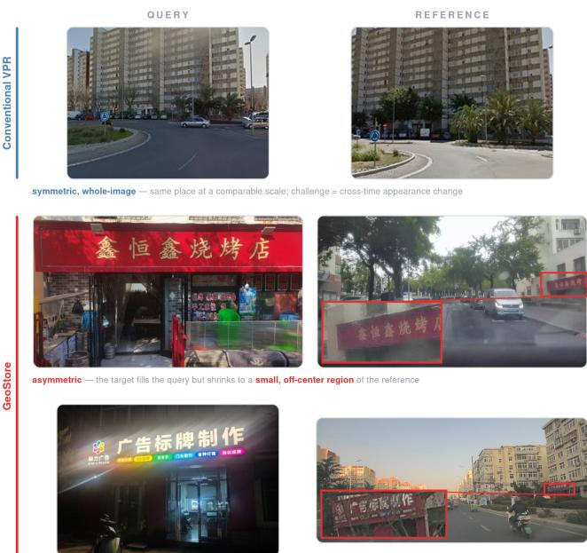
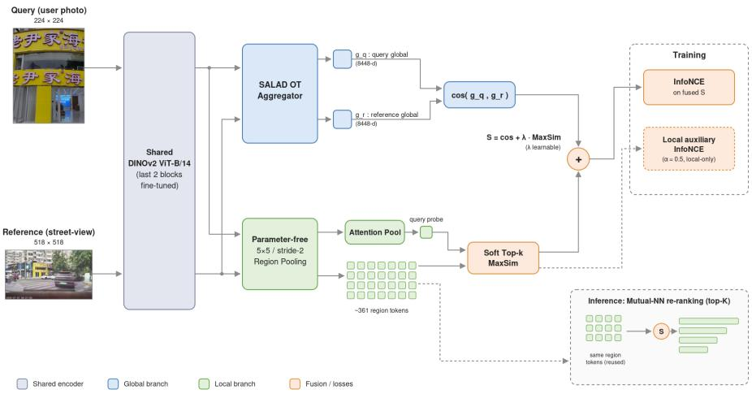
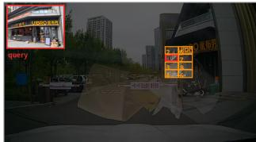
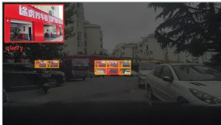
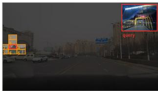
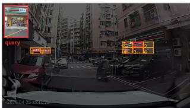

# GEOSTORE: FINDING SMALL STOREFRONTS IN LARGE SCENES—A FINE-GRAINED POI LOCALIZATION BENCHMARK WITH GLOBAL-TO-LOCAL ASYMMETRIC MATCHING

Lu Han∗, Xiting Sun∗, Hao Wang, Zhiqiang Cao, Ruihuan Du†, Ziquan Zeng†, Chunlong Lv

Amap, Alibaba Group, Beijing, China

## ABSTRACT

Point-of-interest (POI) localization—matching a user’s close-up storefront photograph against large-scale geo-tagged street-view imagery—underpins map construction, POI verification, and locationbased services. Its closest existing paradigm, visual place recognition (VPR), assumes symmetric, whole-image matching of the same scene at a comparable scale; POI localization instead must match a close-up query, in which the target fills the frame, against wide references in which the same POI occupies only a small, off-center region among visually similar shops, under a substantial capture-domain gap. We introduce GeoStore, to our knowledge the first benchmark dedicated to this asymmetric, fine-grained, open-set formulation, and show that global-descriptor methods tuned for symmetric VPR are systematically limited on it, since a single global vector dilutes the small target. We further propose GLAM (Global-to-Local Asymmetric Matching), which couples a retrieval-anchoring global descriptor with an asymmetric local pathway: each reference is kept as a compact set of pooled region tokens and matched against a single query probe through a learnable soft late interaction; at inference, the same tokens enable a lightweight mutual-nearest-neighbor re-ranking. GLAM surpasses strong global and two-stage baselines on Recall@1/5/10 and mAP, with ∼5× smaller re-ranking features and ∼two orders of magnitude lower per-pair matching cost than prior local re-ranking. The benchmark and code will be publicly released.

Index Terms— Visual place recognition, POI localization, image retrieval, benchmark, late interaction

## 1. INTRODUCTION

A key problem in map services is point-of-interest (POI) localization: given a close-up photo of a storefront, signboard, or building entrance captured and uploaded by a user, the system must retrieve the same POI from a large-scale geo-tagged vehicle-mounted streetview database. This capability underpins map construction and updating, automatic POI verification, merchant location annotation, and location-based services. Moreover, as camera-equipped intelligent vehicles achieve ever-broader road coverage, maintaining POI status directly from vehicle-mounted imagery is drawing increasing attention.

The closest existing paradigm is visual place recognition (VPR), which determines the location depicted in a query image by retrieving the most similar entries from a database of geo-referenced references. POI localization shares this retrieval formulation but rests on fundamentally different assumptions: it does not presume that query and reference are symmetric in scale, field of view, or scene extent, and it demands instance-level rather than scene-level discrimination. To our knowledge, no existing benchmark captures this asymmetric setting; we therefore introduce GeoStore, a real-world fine-grained POI localization benchmark in which queries are close-up photos uploaded by real users, with the target dominating the frame, whereas references are wide-field street-view images captured by vehiclemounted devices and containing complex backgrounds.

  
Fig. 1. Conventional VPR versus GeoStore. Top: symmetric wholeimage matching (example from GSV-Cities). Middle and bottom: in GeoStore the target storefront fills the close-up query but shrinks to a small, off-center region of the vehicle-mounted reference (red boxes; magnified insets), under a persistent capture-domain gap, e.g., a night close-up against daytime dash-cam footage.

Progress in VPR [1, 2] has long been driven by geo-tagged benchmarks such as Pittsburgh [3], Tokyo 24/7 [4], Nordland [5], SPED [6], Oxford RobotCar [7], SF-XL [8], Mapillary-SLS [9], and GSV-Cities [10], all built around what we call symmetric wholeimage matching (Fig. 1, top): query and reference are drawn from a homogeneous source, depict the same place at a comparable scale with the target occupying most of both frames, and differ mainly in capture time; none of these benchmarks crosses capture domains or evaluates place-level open-set generalization. Under this formulation a single global descriptor matched by cosine similarity is highly effective, which explains the prevalence of global-aggregation methods.

POI localization, however, is fundamentally asymmetric and violates this assumption along three axes (Fig. 1). (i) Scale asymmetry— a small target in a large scene: the target storefront fills most of the query frame, yet occupies only a small, often off-center region of the reference, competing with neighboring shops, signboards, and background clutter. (ii) Fine-grained, open-set matching: adjacent or same-brand shops can be visually nearly identical, and the POIs queried at test time are disjoint from those seen during training. (iii) Capture-domain heterogeneity: query and reference are produced by different devices for different purposes, inducing a persistent domain gap. A single global descriptor, designed to summarize an entire symmetric scene, dilutes the small target and is ill-suited to such fine-grained, cross-domain discrimination.

Existing methods are not designed for this regime. Globaldescriptor pipelines—from NetVLAD [3] and GeM [11] to classification scaled training (CosPlace [8], EigenPlaces [12]), stronger aggregators (MixVPR [13], Conv-AP [10]), and DINOv2-based [14] heads (SALAD [15], BoQ [16], ImAge [17])—compress each image into one vector; we benchmark representative ones under a unified protocol and find them systematically limited on GeoStore (Section 4). Two-stage methods (Patch-NetVLAD [18], TransVPR [19], R2Former [20], DELG [21]), including FoL [22] with its mutualnearest-neighbor re-ranking, recover local evidence only in a costly ColBERT-style [23] second stage whose set-to-set matching is quadratic in token count. GLAM instead keeps only the reference as a token set and collapses the close-up query into a single probe, matching the “small query, large scene” structure at a fraction of the cost.

Unlike one-off curated collections, the reference stream is generated continuously by such vehicles in the course of routine driving, so street-level observations are refreshed at ever shorter intervals, enabling timely detection of the emergence and disappearance of POIs (e.g., shop openings and closures); asymmetric matching between user-uploaded queries and fleet-collected references is thus poised to become an increasingly important primitive for maintaining map freshness.

The main contributions of this work are as follows:

• We formalize asymmetric, fine-grained POI localization as a retrieval problem distinct from conventional symmetric VPR, and introduce GeoStore, the first open-set benchmark dedicated to this setting;

• We propose GLAM (Global-to-Local Asymmetric Matching), which couples a retrieval-anchoring global descriptor with an asymmetric local pathway—compact reference region tokens matched against a single query probe through a learnable soft late interaction—whose tokens further enable a lightweight mutual-nearest-neighbor re-ranking;

• Extensive experiments on GeoStore show that strong globaldescriptor and two-stage VPR methods are systematically limited in this setting, whereas GLAM surpasses them on Recall@1/5/10 at a fraction of the storage and matching cost of prior local re-ranking.

## 2. GEOSTORE BENCHMARK

GeoStore jointly exhibits four properties absent from existing benchmarks: heterogeneous asymmetric sources, a real capture-domain gap, fine-grained open-set recognition, and realistic weather and day–night conditions. This section details its collection, curation, and formal definition.

## 2.1. Data Collection and Curation

GeoStore is built from two independent, real production streams rather than from curated captures. Queries originate from a map service in which real users photograph a storefront, signboard, or building entrance at close range and upload it for POI submission or verification. Users shoot handheld, at short distance and with arbitrary framing, so the target dominates the frame and aspect ratios vary widely. References are drawn from large-scale vehiclemounted street-view collection, in which dashcam-class devices continuously record urban roads and produce wide-field frames. Trained annotators then link each uploaded query to the street-view frames depicting the same POI, and mark hard negatives among neighboring shops. Because both streams come from real deployment, the references naturally span clear, rainy, and foggy weather, daytime, dusk, and low-light night scenes, and exhibit motion blur, windshield reflections, occlusions, heterogeneous viewpoints, and device-quality variation (Fig. 1, bottom).

## 2.2. Overview and Problem Formulation

The curated benchmark contains 1,215 places and 11,133 reference images, split into $9 7 2$ training and 243 test places, disjoint at both the place and the image level. Formally, each place is a tuple $P _ { i } =$ $( q _ { i } , \mathcal { G } _ { i } , y _ { i } )$ , where $q _ { i }$ is the user-uploaded close-up query, $\mathcal { G } _ { i } ~ =$ $\{ g _ { 1 } , \dotsc , g _ { k _ { i } } \}$ the set of vehicle-mounted references depicting the same POI, and $y _ { i }$ a place ID. Training uses the 676 places with at least one annotated positive pair (1,346 query–reference pairs in total). At test time the reference database is the union $\textstyle { \mathcal { D } } = { \bar { \bigcup } } _ { i } { \mathcal { G } } _ { i }$ over all test places; each of the 170 valid test queries is ranked against ${ \mathcal { D } } ,$ and we report Recall@1/5/10 and mAP.

## 3. METHOD: GLAM

A natural response to the asymmetry of GeoStore is to abandon global descriptors altogether and match the query directly against local features of the reference. In practice, we find that neither extreme works: a symmetric global model dilutes the small target (Section 4.2), while a purely local asymmetric matcher is remarkably difficult to train from scratch—the two read-outs start unaligned, so retrieval accuracy is near zero at initialization, and max-style selection over hundreds of regions produces sparse, high-variance gradients. GLAM is therefore designed around this tension (Fig. 2): a global descriptor anchors retrieval, an asymmetric local pathway supplies discriminative region tokens fused by a learnable soft late interaction, and the same tokens are reused as a nearly free re-ranking stage.

## 3.1. Shared Encoder and Global Anchor

Both sides pass through a shared DINOv2 ViT-B/14 backbone [14] whose last two transformer blocks are fine-tuned, yielding a grid of patch features and a class token. The global branch applies a SALAD-style optimal-transport aggregator with a dustbin [15], producing an 8448-d $L _ { 2 }$ -normalized descriptor per image; global similarity is their cosine. We keep this branch not merely as a strong baseline. Because query and reference traverse the same transformation, the branch inherits the backbone’s pretrained similarity structure and retrieves sensibly from the very first epoch, giving the whole model a non-zero starting point; throughout training it acts as a lowvariance anchor that regularizes the otherwise unstable local pathway.

  
Fig. 2. Overview of GLAM. A shared DINOv2 encoder feeds two branches: the global branch (blue) anchors retrieval with a SALAD descriptor, while the local branch (green) keeps the reference as 361 region tokens matched against a single query probe via a soft top-k MaxSim, fused through a learnable λ; at inference the same tokens support mutual-nearest-neighbor re-ranking.

## 3.2. Asymmetric Local Pathway

The local pathway must answer a question the global branch cannot: where in the wide reference is the query’s storefront? From the same patch grid we build region descriptors with a deliberately parameter-free operator—a 5×5 average pooling with stride 2, followed by a single 1×1 projection to $D { = } 2 5 6$ and L2 normalization. A reference at $\mathrm { \bar { 5 } 1 8 ^ { 2 } }$ (a 37×37 grid) thus becomes a compact set of 361 region tokens; the query, whose content is the object, is passed through the same operator and then attention-pooled into a single probe. Two decisions matter here. First, the operator carries essentially no learnable spatial parameters: a learnable region convolution tends to memorize place-specific patterns and consistently underperforms plain averaging (Section 4.3). Second, the read-out is intentionally asymmetric—probe for the query, token set for the reference—mirroring the structure of the task: the query does not need to be searched, the reference does.

## 3.3. Fused Late-Interaction Scoring

The local score is a soft top-k MaxSim [23]: with cosine similarities $s _ { j } ~ = ~ \langle \mathbf { p } , \mathbf { r } _ { j } \rangle$ between the probe p and the reference tokens $\{ \mathbf { r } _ { j } \}$ , the k $( k { = } 8 )$ largest values are aggregated by a softmaxweighted average, MaxSim $\begin{array} { r } { ( \mathbf { p } , \{ \mathbf { r } _ { j } \} ) = \sum _ { j \in \mathcal { T } _ { k } } } \end{array}$ wj sj with $w _ { j } =$ $\textstyle \exp ( \gamma s _ { j } ) / \sum _ { j ^ { \prime } \in \mathcal { T } _ { k } } \exp ( \gamma s _ { j ^ { \prime } } )$ , where $\mathcal { T } _ { k }$ indexes the top-k similarities and $\gamma$ is a learnable inverse temperature. This soft selection reduces to a hard maximum for k=1 and is markedly more stable than a hard maximum over hundreds of regions. The final similarity fuses the two branches,

$$
S ( q , r ) = \langle \mathbf { g } _ { q } , \mathbf { g } _ { r } \rangle + \lambda \cdot \mathrm { M a x } \mathrm { S i m } _ { k } \big ( \mathbf { p } , \{ \mathbf { r } _ { j } \} \big ) ,\tag{1}
$$

with $\lambda = \mathrm { s o f t p l u s } ( \tilde { \lambda } )$ learnable. We initialize λ small so that the global anchor dominates early training; as the region tokens become discriminative, the model raises λ on its own.

## 3.4. Training Objective

We train with an in-batch InfoNCE over the fused similarity matrix, treating each query’s annotated reference as the positive and masking

other same-place pairs:

$$
\mathcal { L } = - \frac { 1 } { B } \sum _ { i = 1 } ^ { B } \log \frac { \exp { \left( S ( q _ { i } , r _ { i } ) / \tau _ { s } \right) } } { \sum _ { j = 1 } ^ { B } \exp { \left( S ( q _ { i } , r _ { j } ) / \tau _ { s } \right) } } + \alpha \mathcal { L } _ { \mathrm { l o c } } ,\tag{2}
$$

where B is the batch size, $\tau _ { s }$ a learnable temperature, and $\mathcal { L } _ { \mathrm { l o c } }$ the same InfoNCE computed on the local-only score $\mathrm { M a x S i m } _ { k } ( \mathbf { p } , \{ \mathbf { r } _ { j } \} )$ with weight $\alpha { = } 0 . 5 .$ The fused term alone under-trains the local pathway: its gradient is dominated by the much stronger global term, and the region tokens remain nearly inert. The auxiliary term is what turns the tokens into stand-alone discriminative features— after training, the local score by itself reaches non-trivial retrieval accuracy—and it is precisely this property that the next component exploits.

## 3.5. Region Tokens as a (Nearly) Free Re-Ranker

Two-stage VPR systems typically train and store a separate localfeature apparatus solely for re-ranking. In GLAM the discriminative region tokens already exist, so a second stage comes at no additional training and no additional features: after stage-1 fused retrieval, the top-K candidates are re-scored by a mutual-nearest-neighbor match count (cosine threshold τ=0.7) between the query’s full set of region tokens—rather than the single stage-1 probe—and each candidate’s reference tokens, and re-ranked. Because the tokens were trained to discriminate places, this simple count sharply improves top-1 precision. The asymmetric design also keeps this stage cheap—the query’s 64 region tokens are matched against only 361 reference tokens per candidate—as quantified in Section 4.4.

## 4. EXPERIMENTS

## 4.1. Setup

All methods share the same backbone (DINOv2 ViT-B/14, last two transformer blocks fine-tuned) and are trained and evaluated under the protocol of Section 2.2, with batch size 64, AdamW (learning rate $1 0 ^ { - 4 }$ , weight decay $1 0 ^ { - 4 } ) .$ , a 10-epoch warmup, milestones at epochs 40/80, and 120 epochs in total. For every method we select one checkpoint by validation R@1 and report all four metrics from that same checkpoint. All evaluations are conducted on GeoStore: the object of study is the asymmetric query-to-reference regime, which symmetric VPR benchmarks by construction do not measure.

Table 1. Main results on GeoStore (open-set test set); all methods follow the protocol of Section 4.1.
<table><tr><td>Method</td><td>R@1 R@5</td><td>R@10</td><td>mAP</td></tr><tr><td>CosPlace [8] BoQ [16]</td><td>4.1 7.1 11.2 20.6</td><td>10.0 26.5</td><td>3.5 12.5</td></tr><tr><td>SelaVPR [24]</td><td>12.9 27.1</td><td>35.9</td><td>15.4</td></tr><tr><td>EDTformer [25] ImAge [17]</td><td>13.5 21.2 14.7</td><td>27.1</td><td>13.1</td></tr><tr><td>SALAD (224) [15]</td><td>27.1 18.8 30.6</td><td>31.2 34.1</td><td>15.2 19.1</td></tr><tr><td>SALAD (518) [15]</td><td>18.2 24.7</td><td>32.4</td><td>17.8</td></tr><tr><td>FoL (stage-1) [22]</td><td>14.1 24.1</td><td></td><td></td></tr><tr><td>FoL (+re-ranking) [22]</td><td>20.0</td><td>31.8 37.6</td><td>15.6</td></tr><tr><td></td><td></td><td>34.7</td><td>20.8</td></tr><tr><td>GLAM (fused, stage-1) GLAM (+re-ranking)</td><td>18.2 25.3 36.5</td><td>37.1 45.3 41.2</td><td>22.5 24.5</td></tr></table>

Table 2. Ablation on the region operator of the local branch (R@1).
<table><tr><td>Region operator</td><td>R@1</td></tr><tr><td>Learnable convolution, 3×3, stride 1</td><td>14.7</td></tr><tr><td>Learnable convolution, 5×5, stride 2</td><td>15.9</td></tr><tr><td>Parameter-free average pooling, 5× 5, stride 2</td><td>18.2</td></tr></table>

## 4.2. Main Results

Table 1 summarizes the comparison. Three observations stand out. First, GLAM’s fused stage-1 already leads all baselines on R@5, R@10, and mAP, confirming that the asymmetric local pathway recovers targets that a single global vector dilutes. Second, under the same mutual-nearest-neighbor re-ranking, GLAM reaches 25.3 R@1 versus 20.0 for FoL and gains more from re-ranking (+7.1 vs. +5.9 R@1), showing that its trained region tokens provide stronger local evidence than FoL’s dense patch features. Third, raising the resolution of the symmetric baseline (SALAD, 224→518) brings no gain: a symmetric global model cannot exploit high-resolution references.

## 4.3. Ablations

(a) Region operator. Table 2 confirms the design choice of Section 3.2: learnable region convolutions overfit place-specific patterns and consistently underperform, whereas the parameter-free average pooling generalizes best.

(b) Soft top-k MaxSim. Table 3 varies the number of aggregated regions k. A hard maximum (k=1) attains the same R@1 but substantially degrades R@5, R@10, and mAP, as relying on a single region renders the score sensitive to spurious matches; aggregating too many regions (k=16) instead dilutes the target with background tokens. We therefore set k=8 in all experiments.

(c) Local token design. Spatial locality is essential for the local pathway: with semantic-cluster tokens (the 64 SALAD cluster descriptors, which carry no spatial layout) the local branch never becomes discriminative—its standalone score attains R@10 ≈ 0— whereas the proposed spatial grid tokens reach a standalone R@10 of 28.8.

## 4.4. Efficiency

Table 4 quantifies the cost of the asymmetric re-ranking design (Section 3.5): GLAM stores 5× less local data per reference and its per-

Table 3. Ablation on the number of regions k in the soft top-k MaxSim (fused stage-1).
<table><tr><td>k</td><td>R@1</td><td>R@5</td><td>R@10</td><td>mAP</td></tr><tr><td>k = 1 (hard maximum)</td><td>18.2</td><td>28.8</td><td>35.9</td><td>19.3</td></tr><tr><td>k = 8 (ours)</td><td>18.2</td><td>37.1</td><td>45.3</td><td>22.5</td></tr><tr><td>k = 16</td><td>17.6</td><td>34.1</td><td>38.2</td><td>19.2</td></tr></table>

<table><tr><td colspan="4">Table 4. Re-ranking cost. Storage is per reference image in fp16.</td></tr><tr><td>Method</td><td>Local feat. / img</td><td>Storage</td><td>Per-pair matching</td></tr><tr><td>FoL [22]</td><td>3600×128</td><td>0.92 MB</td><td>≈1.66 G-MACs</td></tr><tr><td>GLAM</td><td> $\mathbf { 3 6 1 \times 2 5 6 }$ </td><td></td><td>0.18 MB (1/5) ≈5.9 M-MACs (~1/280)</td></tr></table>

pair matching is about two orders of magnitude cheaper than FoL’s dense re-ranking, while delivering higher accuracy (Table 1).

## 4.5. Qualitative Analysis

Although GLAM is trained with retrieval supervision only, the tokens selected by the soft top-k MaxSim concentrate on the queried storefront and form spatially contiguous clusters (Fig. 3), providing direct evidence that the asymmetric probe-to-token interaction performs implicit localization inside the wide reference without any spatial supervision.

## 5. CONCLUSION

We studied point-of-interest localization as an asymmetric retrieval problem in which a close-up storefront query must be matched against wide vehicle-mounted street views, and introduced Geo-Store, the first open-set benchmark dedicated to this setting. On Geo-Store, global-descriptor VPR methods tuned for symmetric matching are systematically limited, whereas the proposed GLAM—a global anchor coupled with an asymmetric local pathway whose region tokens double as a lightweight mutual-nearest-neighbor reranker—achieves the best accuracy at a fraction of the storage and matching cost of dense local re-ranking. Future work includes scaling GeoStore and exploring richer, yet still asymmetric and index-friendly, local interactions.

  
(b)

(a)  

  
(c)  
(d)  
Fig. 3. Top-8 region tokens (numbered boxes; 1 = largest weight) selected by the soft top-k MaxSim when matching each close-up query (red inset) against the dimmed reference, under (a) strong windshield reflections, (b) occlusion by parked vehicles, (c) a day–night gap, and (d) dense street clutter.

## 6. REFERENCES

[1] Stephanie Lowry, Niko Sunderhauf, Paul Newman, John J.¨ Leonard, David Cox, Peter Corke, and Michael J. Milford, “Visual place recognition: A survey,” IEEE Transactions on Robotics, vol. 32, no. 1, pp. 1–19, 2016.

[2] Carlo Masone and Barbara Caputo, “A survey on deep visual place recognition,” IEEE Access, vol. 9, pp. 19516–19547, 2021.

[3] Relja Arandjelovic, Petr Gronat, Akihiko Torii, Tomas Pajdla,´ and Josef Sivic, “NetVLAD: CNN architecture for weakly supervised place recognition,” in Proc. IEEE Conf. Computer Vision and Pattern Recognition (CVPR), 2016, pp. 5297–5307.

[4] Akihiko Torii, Relja Arandjelovic, Josef Sivic, Masatoshi Oku-´ tomi, and Tomas Pajdla, “24/7 place recognition by view synthesis,” in Proc. IEEE Conf. Computer Vision and Pattern Recognition (CVPR), 2015, pp. 1808–1817.

[5] Niko Sunderhauf, Peer Neubert, and Peter Protzel, “Are we¨ there yet? Challenging SeqSLAM on a 3000 km journey across all four seasons,” in Proc. IEEE Int. Conf. Robotics and Automation (ICRA) Workshop on Long-Term Autonomy, 2013.

[6] Zetao Chen, Adam Jacobson, Niko Sunderhauf, Ben Upcroft,¨ Lingqiao Liu, Chunhua Shen, Ian Reid, and Michael Milford, “Deep learning features at scale for visual place recognition,” in Proc. IEEE Int. Conf. Robotics and Automation (ICRA), 2017, pp. 3223–3230.

[7] Will Maddern, Geoffrey Pascoe, Chris Linegar, and Paul Newman, “1 year, 1000 km: The Oxford RobotCar dataset,” The International Journal ofRobotics Research, vol. 36, no. 1, pp. 3–15, 2017.

[8] Gabriele Berton, Carlo Masone, and Barbara Caputo, “Rethinking visual geo-localization for large-scale applications,” in Proc. IEEE/CVF Conf. Computer Vision and Pattern Recognition (CVPR), 2022, pp. 4878–4888.

[9] Frederik Warburg, Søren Hauberg, Manuel Lopez-Antequera,´ Pau Gargallo, Yubin Kuang, and Javier Civera, “Mapillary street-level sequences: A dataset for lifelong place recognition,” in Proc. IEEE/CVF Conf. Computer Vision and Pattern Recognition (CVPR), 2020, pp. 2626–2635.

[10] Amar Ali-bey, Brahim Chaib-draa, and Philippe Giguere,\` “GSV-Cities: Toward appropriate supervised visual place recognition,” Neurocomputing, vol. 513, pp. 194–203, 2022.

[11] Filip Radenovic, Giorgos Tolias, and Ond´ ˇrej Chum, “Finetuning CNN image retrieval with no human annotation,” IEEE Transactions on Pattern Analysis and Machine Intelligence, vol. 41, no. 7, pp. 1655–1668, 2019.

[12] Gabriele Berton, Gabriele Trivigno, Barbara Caputo, and Carlo Masone, “EigenPlaces: Training viewpoint robust models for visual place recognition,” in Proc. IEEE/CVF Int. Conf. Computer Vision (ICCV), 2023, pp. 11080–11090.

[13] Amar Ali-bey, Brahim Chaib-draa, and Philippe Giguere,\` “MixVPR: Feature mixing for visual place recognition,” in Proc. IEEE/CVF Winter Conf. Applications of Computer Vision (WACV), 2023, pp. 2998–3007.

[14] Maxime Oquab, Timothee Darcet, Th´ eo Moutakanni, Huy Vo,´ Marc Szafraniec, Vasil Khalidov, Pierre Fernandez, Daniel Haziza, Francisco Massa, Alaaeldin El-Nouby, et al., “DI-NOv2: Learning robust visual features without supervision,” Transactions on Machine Learning Research, 2024.

[15] Sergio Izquierdo and Javier Civera, “Optimal transport aggregation for visual place recognition,” in Proc. IEEE/CVF Conf. Computer Vision and Pattern Recognition (CVPR), 2024, pp. 17658–17668.

[16] Amar Ali-bey, Brahim Chaib-draa, and Philippe Giguere,\` “BoQ: A place is worth a bag of learnable queries,” in Proc. IEEE/CVF Conf. Computer Vision and Pattern Recognition (CVPR), 2024, pp. 17794–17803.

[17] Feng Lu, Tong Jin, Canming Ye, Yunpeng Liu, Xiangyuan Lan, and Chun Yuan, “Towards implicit aggregation: Robust image representation for place recognition in the transformer era,” in Advances in Neural Information Processing Systems (NeurIPS), 2025.

[18] Stephen Hausler, Sourav Garg, Ming Xu, Michael Milford, and Tobias Fischer, “Patch-NetVLAD: Multi-scale fusion of locally-global descriptors for place recognition,” in Proc. IEEE/CVF Conf. Computer Vision and Pattern Recognition (CVPR), 2021, pp. 14141–14152.

[19] Ruotong Wang, Yanqing Shen, Weiliang Zuo, Sanping Zhou, and Nanning Zheng, “TransVPR: Transformer-based place recognition with multi-level attention aggregation,” in Proc. IEEE/CVF Conf. Computer Vision and Pattern Recognition (CVPR), 2022, pp. 13648–13657.

[20] Sijie Zhu, Linjie Yang, Chen Chen, Mubarak Shah, Xiaohui Shen, and Heng Wang, “R2Former: Unified retrieval and reranking transformer for place recognition,” in Proc. IEEE/CVF Conf. Computer Vision and Pattern Recognition (CVPR), 2023, pp. 19370–19380.

[21] Bingyi Cao, Andre Araujo, and Jack Sim, “Unifying deep local ´ and global features for image search,” in Proc. European Conf. Computer Vision (ECCV), 2020, pp. 726–743.

[22] Changwei Wang, Shunpeng Chen, Yukun Song, Rongtao Xu, Zherui Zhang, Jiguang Zhang, Haoran Yang, Yu Zhang, Kexue Fu, Shide Du, Zhiwei Xu, Longxiang Gao, Li Guo, and Shibiao Xu, “Focus on local: Finding reliable discriminative regions for visual place recognition,” in Proc. AAAI Conf. Artificial Intelligence, 2025, pp. 7536–7544.

[23] Omar Khattab and Matei Zaharia, “ColBERT: Efficient and effective passage search via contextualized late interaction over BERT,” in Proc. ACM SIGIR Conf. Research and Development in Information Retrieval, 2020, pp. 39–48.

[24] Feng Lu, Lijun Zhang, Xiangyuan Lan, Shuting Dong, Yaowei Wang, and Chun Yuan, “Towards seamless adaptation of pretrained models for visual place recognition,” in Proc. Int. Conf. Learning Representations (ICLR), 2024.

[25] Tong Jin, Feng Lu, Shuyu Hu, Chun Yuan, and Yunpeng Liu, “EDTformer: An efficient decoder transformer for visual place recognition,” IEEE Transactions on Circuits and Systems for Video Technology, 2025.