# Genesis: A Generative Engine for Hierarchical Satellite Image Synthesis

Subash Khanal Washington University in St. Louis Missouri, USA

Eric Xing Washington University in St. Louis Missouri, USA

Yangzhi Cui Washington University in St. Louis Missouri, USA

Brian Wei Washington University in St. Louis Missouri, USA

Nathan Jacobs∗ Washington University in St. Louis Missouri, USA

Daniel Cher Washington University in St. Louis Missouri, USA

Srikumar Sastry Washington University in St. Louis Missouri, USA

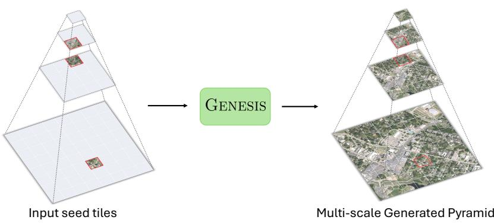  
Figure 1: Given sparse seed tiles (red) at arbitrary positions and zoom levels, Genesis completes the entire pyramid (a uniform quadtree), such that the output preserves the seeds, is seamless across neighboring tiles, and is consistent across zoom levels.

## Abstract

Earth observation is fundamentally multi-scale; geospatial tasks span varied resolutions, and satellite imagery is organized into cascading tile pyramids that nest fine detail within wide coverage. Current generative models of satellite imagery, however, operate along a single axis: they either zoom to enhance a single tile’s resolu tion or pan to extend imagery at a fixed scale. As a result, no existing method produces a complete pyramid that stays consistent across both scale and space, where a high-zoom tile must agree with the coarse context it refines and with the neighbors it meets. Motivated by this gap, we introduce a new task, multi-scale tile completion: given a sparse set ofseed tiles at arbitrary zoom levels and positions, synthesize a complete, uniform quadtree that is globally consistent across both scale and space. We approach this task with Genesis, a generative engine that brings both axes together by composing two specialized operators over the quadtree, a vertical super-resolution

model and a horizontal mask-based outpainting model, producing pyramids that are consistent across zoom levels and seamless across neighboring tiles. Each operator achieves state-of-the-art results on its subtask, and the engine propagates sparse seeds into seamless, multi-resolution maps from any initial configuration. To evaluate the task and benchmark Genesis, we introduce dense500, a fully observed multi-scale pyramid dataset spanning diverse geographic regions, together with a suite of pyramid-level metrics. Code, models, and our dataset are available at https://github.com/mvrl/genesis.

## CCS Concepts

• Computing methodologies → Computer vision; Simulation evaluation.

## Keywords

Generative modeling, super-resolution, outpainting, hierarchical generation, multi-scale generation, satellite image synthesis

## ACM Reference Format:

Subash Khanal, Yangzhi Cui, Daniel Cher, Eric Xing, Brian Wei, Srikumar Sastry, and Nathan Jacobs. 2026. Genesis: A Generative Engine for Hierarchical Satellite Image Synthesis. In The 34th ACM International Conference on Advances in Geographic Information Systems (SIGSPATIAL ’26), November 03–06, 2026, Riverside, CA, USA. ACM, New York, NY, USA, 14 pages. https://doi.org/10.1145/3841645.3843313

## 1 Introduction

Earth observation spans many scales. A task may concern the land cover of an entire continent or the footprint of a single building, and the resolution it demands shifts accordingly. To accommodate this range, satellite imagery is conventionally served as a tile pyramid: a hierarchy of zoom levels in which each tile subdivides into finer children at the level below. A generative model intended to synthesize the Earth’s surface should therefore produce not an isolated image, but a coherent pyramid spanning many resolutions at once.

Existing generative models of satellite imagery address only a single axis of this structure. Outpainting and inpainting methods [24, 36], along with MultiDifusion-style approaches [1, 14, 18] that tile a denoiser to extend an image, operate horizontally, growing content at a fixed zoom level. Super-resolution methods [22, 29, 53] operate vertically, refining a single tile across successive zoom levels. In each case, the other direction is held fixed. Yet generating a complete multi-resolution world requires moving vertically and horizontally at once: keeping a high-zoom tile consistent with the coarse context it refines, and keeping neighbors consistent where they meet. This joint constraint remains an open challenge.

We formalize this problem as multi-scale tile completion. Given a sparse set of seed tiles placed at arbitrary zoom levels and positions, the objective is to reconstruct the complete tile pyramid they imply, populating every tile at every scale subject to two consistency constraints: vertical agreement between a parent and its children, and horizontal continuity between adjacent tiles. Such a capability converts sparse, opportunistic acquisitions into dense, navigable maps, with applications in populating virtual environments for games and simulators [31], exploring hypothetical urban layouts [47], and generating multi-resolution training data for remote sensing [9, 10, 20].

To address this task, we introduce Genesis, a Generative Engine for Hierarchical Satellite Image Synthesis. Genesis decomposes the task into two complementary generative operators defined over the quadtree. A vertical operator performs super-resolution, mapping an �×� tile at zoom � to the 2�×2� mosaic of its four children at �+1. A horizontal operator performs mask-based outpainting, completing a tile from an arbitrary subset of its known quadrants. Together with deterministic downsampling, these operators provide all the tools needed to complete the pyramid: any seed configuration can be propagated to any other tile. Each model attains state-of-the-art performance on its respective subtask, and Genesis composes them to expand a sparse set of seeds into a seamless, multi-resolution map.

Multi-scale tile completion is a new task, and we introduce it together with a benchmark and evaluation protocol to support future research. We release dense500, a fully observed pyramid benchmark spanning multiple geographic regions and zoom levels, together with pyramid-level metrics to quantitatively assess generation quality. We hope this task, benchmark, and evaluation protocol will serve as a foundation for the community to explore multi-scale generative modeling of the physical world.

## Our key contributions are:

• A new task, multi-scale tile completion: generating a complete multi-resolution tile pyramid from a sparse set of seed tiles at arbitrary zoom levels, requiring both vertical consistency across zoom levels and horizontal consistency within a level.

• The Genesis engine: a unified framework that synthesizes a full pyramid from any seed configuration by composing two state-of-the-art satellite image generative models for super-resolution and outpainting.

• A benchmark and evaluation protocol: dense500, a fully observed pyramid benchmark spanning multiple geographic regions and zoom levels, together with pyramid-level metrics to quantitatively assess multi-scale generation quality.

## 2 Related Work

Image generation has progressed rapidly, both in general and for satellite imagery specifically. Building large, coherent scenes for satellite imagery further draws on two spatial operators, superresolution and outpainting, which refine content across scale and extend it across space, respectively. Reaching a wide-area extent at high resolution requires composing the latter across multi-tile regions.

## 2.1 Generative Models of Satellite Imagery

Modern image generation pipelines rest on difusion models [12, 43], which have surpassed earlier GAN-based approaches [8]. Latent difusion [36] made high-resolution synthesis tractable by operating in a compressed VAE space, and subsequent work improved further by exploiting the scaling properties of transformer backbones [28, 33], often joined with flow-based training [23, 25]. Interestingly, recent work [2, 19, 48, 54] shows that stronger fidelity comes from stepping back from the VAE entirely and denoising the image tokens directly in pixel space, avoiding the information bottleneck and reconstruction artifacts that latent-space models introduce. Genesis adopts the JiT (Just image Transformer) [21] structure, which demonstrated this principle with a plain Vision Transformer trained under a flow-matching objective, achieving state-of-the-art generation without a latent tokenizer or large-scale pre-training.

With advancements in general-domain image generation, satellite image generation has followed suit to enable stronger generation with more diverse control. This line of work has explored the inductive biases of overhead imagery that difer from those of natural images in perspective, scale, spectral content, and the metadata available for conditioning, and has accordingly developed conditioning principles suited to the domain. Beyond text-to-image generation [24, 30, 52], these include conditioning on geospatial metadata such as geolocation [41], acquisition time, and groundsampling distance [15]. A more recent thread grounds generation on instance-level semantics, conditioning on spatially localized text through vector geometry or sparse point queries [3, 40, 51]. These works share a focus on the conditioned generation of a single tile. Genesis instead targets the generation of entire scenes, expanding from a handful of seeds to the many tiles that compose a city, consistent across both space and scale.

## 2.2 Super-resolution

Refining a tile across zoom levels corresponds to single-image superresolution (SISR). The field has progressed from early CNN-based mappings [5] through perceptual and adversarial methods [49] to attention-based transformers. SwinIR [22] showed that windowed self-attention captures the long-range dependencies needed for sharp reconstruction and remains a strong perceptual baseline. Difusion-based methods have since pushed perceptual quality further, casting super-resolution as conditional or zero-shot restoration [39, 46, 55]. In the remote-sensing domain, FastDifSR [29] accelerates difusion SR with a lightweight backbone, and ZoomLDM [53], the work closest to our setting, conditions a latent difusion model on zoom level for scale-aware satellite synthesis. Yet all of these methods operate on a single tile in isolation. They add detail one step at a time and provide no mechanism to keep a refined tile consistent with the coarse parent it descends from, or with the neighboring tiles it must seamlessly join.

## 2.3 Outpainting and Multi-tile Generation

Extending content within a fixed zoom level corresponds to image inpainting and outpainting, which hallucinate plausible content for masked or out-of-frame regions conditioned on visible context. The task evolved from GAN-based context encoders [32] and large-mask convolutional methods [44] to difusion-based approaches that ofer markedly higher fidelity [26, 36, 38], and the same machinery has been adapted to complete aerial scenes under text conditioning [24]. These methods complete a single image. Covering a spatial region larger than one tile instead requires piecing multiple tiles together, which tiled and multi-stage difusion strategies [1, 13] achieve by fusing overlapping or stacked generations into seamless larger images. Yet this stitching happens at a single resolution. It maintains horizontal coherence between neighbors but has no notion of the coarser context a tile must refine or the finer detail it must contain, the cross-scale agreement that fuses a stack of tiles into a consistent pyramid.

## 3 Data

We train our models on the Git-10M satellite imagery corpus [24]. Git-10M is a sparsely sampled global tile grid that lacks the fully observed pyramids needed to score multi-scale completion. We therefore introduce dense500, a benchmark of 500 fully observed depth-4 quadtrees released with this work. Both datasets consist of 256×256 tiles sampled in a quadtree structure where finer zooms double the ground resolution.

## 3.1 Git-10M Training Data

Git-10M [24] provides ∼10� satellite tiles at zoom levels 10 through 18 with near-global coverage. Of these, ∼7� carry Web-Mercator coordinates and participate in the quadtree hierarchy; the remainder are not georeferenced and serve only as auxiliary training images. Most georeferenced tiles lack some of their relatives, so we reconstruct the partial hierarchy by linking available parent-to-child pairs.

Evaluation quads are held out whole, so a parent and its four children are always held out together, and any tile within an evaluation subtree is excluded from training, ensuring no test content leaks into the training set. Our spatial test split equally samples urban and non-urban quads, where urban is defined as the tile center lying within a World Urban Areas [7] polygon, enabling evaluation across land-use types, resolutions, and locations worldwide. Details of our dataset splits are provided in Section A.1.

Table 1: The five zoom windows of dense500. Each window slides a four-level span up the pyramid, probing completion from roughly 76 m/px down to 0.6 m/px.
<table><tr><td>Window</td><td>W1</td><td>W2</td><td>W3</td><td>W4</td><td>W5</td></tr><tr><td>Root zoom z</td><td>11</td><td>12</td><td>13</td><td>14</td><td>15</td></tr><tr><td>Leaf zoom z+3</td><td>14</td><td>15</td><td>16</td><td>17</td><td>18</td></tr><tr><td>Root footprint (km)</td><td>18</td><td>9</td><td>4</td><td>2</td><td>1</td></tr><tr><td>Sites</td><td>100</td><td>100</td><td>100</td><td>100</td><td>100</td></tr></table>

## 3.2 The dense500 Benchmark

dense500 comprises 500 fully observed depth-4 quadtrees, each 85 tiles (1+4+16+64 at four consecutive zooms), organized as five zoom windows of 100 geographically distinct sites (Table 1). Because every tile of every site is observed, any seed configuration can be completed, and the result scored against ground truth at every level.

Sites are sampled per window with probability proportional to population density, restricted to urban cells, continent-stratified, and spaced at least 80 km apart. Candidates intersecting any Git-10M location are discarded so the benchmark is disjoint from training. A final filter drops any site whose imagery source shifts across an adjacent zoom pair, most often the satellite-to-aerial transition that occurs at higher zoom levels, as measured by per-level colordistribution distance. Each window is capped at exactly 100 sites. Further details on site selection and filtering are provided in Section A.2. dense500 intentionally emphasizes populated regions, where fine-zoom imagery is densest, and demand is highest; the operator evaluations complement it by covering urban and non-urban tiles equally via the spatial split (Section 3.1).

## 4 Method

Genesis enables the generation of arbitrary geospatial extents given a set of sparse seed tiles. We now formalize this task and describe our method.

## 4.1 Multi-scale Tile Completion

A tile pyramid is a uniform, complete quadtree (Figure 1). A tile � = (�, �, �) at zoom level � is an �×� image; it has a single parent at � − 1 and four children at � + 1 — its 2×2 quadrants, each doubling resolution. Given a set of seed tiles S at arbitrary zoom levels, the task is to fill every remaining tile of a target subtree T so that the result is consistent both vertically (a parent equals the downsampled mosaic of its children) and horizontally (adjacent tiles join seamlessly). We solve this with three operators over the quadtree:

• Super-resolution (vertical, downward). A generative model that maps an �×� tile at � to the stitched 2�×2� mosaic of its four children at � + 1 (Section 4.3).

• Downsample (vertical, upward). The deterministic ÷2 inverse of super-resolution (SR), implemented by bicubic downsampling. A parent is an �×� tile at �, obtained as the downsampled mosaic of its four children at � + 1.

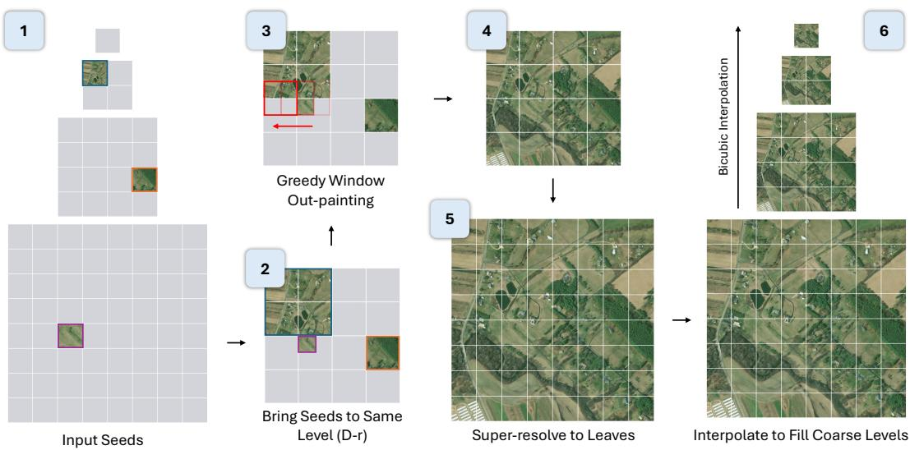  
Figure 2: A high-level overview of the Genesis framework.

• Outpainting (horizontal). A generative model that completes an �×� tile from an arbitrary subset of its known quadrants (Section 4.4).

Section 4.5 and Algorithm 1 specify how these operators are scheduled over the quadtree, and Section 5.4 gives the system-level instantiation.

## 4.2 Pixel-space Generative Transformer

Both operators of Genesis are independently trainedJiT (Just image Transformer) [21] models—each a flow-matching transformer that operates directly in pixel space. In this section, we therefore provide a brief review of JiT before describing how Genesis adapts it to each operator. Throughout, we write � for the flow time, with �=1 corresponding to clean data and �=0 to noise.

Flow matching. Given a clean image � and Gaussian noise $\epsilon \sim$ ${ \cal N } ( 0 , { \bf { I } } )$ , we define the linear interpolation

$$
\begin{array} { r } { \tilde { { \mathbf { x } } } _ { \tau } = \tau { \mathbf { x } } + \left( { 1 - \tau } \right) \epsilon , \qquad \tau \in [ 0 , 1 ] , } \end{array}\tag{1}
$$

so that $\tilde { { \boldsymbol { x } } } _ { \tau }$ recovers the clean image at �=1 and pure noise at �=0.   
The associated target velocity is the time derivative of Equation (1).

$$
\pmb { \upsilon } = \dot { \tilde { \pmb { x } } } _ { \tau } = \pmb { x } - \pmb { \epsilon } .\tag{2}
$$

During training, � is drawn from a logit-normal distribution,

$$
\operatorname { l o g i t } ( \tau ) \sim N ( \mu , \sigma ^ { 2 } ) .\tag{3}
$$

Prediction space and loss space. As Li and He [21] observe, the space in which the network makes its prediction and the space in which the loss is applied can be decoupled. Genesis exploits this with the �-prediction / �-loss combination: the network net� directly predicts the clean image,

$$
\begin{array} { r } { { \boldsymbol { x } } _ { \theta } = \mathrm { n e t } _ { \theta } ( \tilde { \boldsymbol { x } } _ { \tau } , \tau ) , } \end{array}\tag{4}
$$

which is mapped to a velocity prediction through the same interpolation,

$$
\pmb { v } _ { \theta } = \frac { \pmb { x } _ { \theta } - \tilde { \pmb { x } } _ { \tau } } { 1 - \tau } .\tag{5}
$$

The choice of � as the prediction space is what makes training directly in pixels viable: Li and He [21] argue that clean data lie on a low-dimensional manifold, while a noised quantity is distributed across the full high-dimensional space, and show empirically that �- and �-prediction degrade as the dimension grows whereas �- prediction remains efective. Following [21], this prediction is supervised in velocity space, minimizing

$$
\mathcal { L } = \mathbb { E } _ { \tau , x , \epsilon } \left\| v _ { \theta } - v \right\| ^ { 2 } , \qquad v = x - \epsilon ,\tag{6}
$$

which retains a well-behaved regression objective while the network output stays on the image manifold.

Sampling. Generation integrates the learned velocity field as an ordinary diferential equation,

$$
\frac { \mathrm { d } \tilde { { \boldsymbol { x } } } _ { \tau } } { \mathrm { d } \tau } = \boldsymbol { v } _ { \boldsymbol { \theta } } ( \tilde { { \boldsymbol { x } } } _ { \tau } , \tau ) ,\tag{7}
$$

starting from $\tilde { x } _ { 0 } \sim { \cal N } ( 0 , \mathrm { I } )$ at �=0 and ending at the generated image at �=1. We use a first-order Euler discretization with � uniform steps of size $\Delta \tau = 1 / K \mathrm { ; }$

$$
\begin{array} { r } { \tilde { { \mathbf { x } } } _ { \tau + \Delta \tau } = \tilde { { \mathbf { x } } } _ { \tau } + \Delta \tau { \mathbf { \mathscr { v } } } _ { \theta } \big ( \tilde { { \mathbf { x } } } _ { \tau } , \tau \big ) . } \end{array}\tag{8}
$$

## 4.3 Vertical Operator: ×2 Super-resolution

The super-resolution (SR) operator generates the 2�×2� child mosaic of a tile, conditioned on its parent. It follows the pixel-space transformer of Section 4.2, with added parent conditioning.

Conditioning. The parent conditions generation through two token streams: pixel tokens from a patch-embedding of the parent, and semantic tokens from a frozen, satellite-pretrained DINOv3 encoder. Both are injected through cross-attention at every block. The target zoom level � is embedded and added to the AdaLN conditioning vector, $c = \mathrm { e m b } _ { \tau } ( \tau ) + \mathrm { e m b } _ { z } ( z )$ . Conditioning is jointly dropped during training to enable classifier-free guidance. Hyperparameters are detailed in Section 5.2.

Training objective. The clean target � is the 2�×2� mosaic stitched from the observed children. Since seeds may supply only a subset of children, we restrict the velocity loss (Equation (6)) to the observed pixels via a binary mask �. We further add a perceptual LPIPS loss on the directly predicted mosaic $x _ { \theta }$ (Equation (4)), comparing each predicted child quadrant against its ground truth:

$$
{ \mathcal { L } } _ { \mathrm { S R } } = \underbrace { \mathbb { E } \left[ \frac { \sum _ { p } m _ { p } \| v _ { \theta } - v \| _ { p } ^ { 2 } } { \sum _ { p } m _ { p } } \right] } _ { \mathrm { m a s k e d ~ v e l o c i t y } } + \lambda _ { \mathrm { p e r c } } \underbrace { \frac { \mathbb { E } \left[ \tau \sum _ { q } m _ { q } \mathrm { L P I P S } \left( x _ { \theta } ^ { ( q ) } , x ^ { ( q ) } \right) \right] } { \mathbb { E } \left[ \tau \sum _ { q } m _ { q } \right] } } _ { \mathrm { p e r c e p t u a l ~ ( L P I P S ) } } ,\tag{9}
$$

where � indexes the four child quadrants and $m _ { q }$ flags their presence; the LPIPS term is weighted by the flow time $\tau ,$ emphasizing near-clean samples (large �) where $x _ { \theta }$ is reliable. We optimize this objective under a zoom-level curriculum that progresses from coarseto fine-parent pairs (Section 5.1), and ablate the use of DINOv3 semantic features and LPIPS loss in Table 5.

## 4.4 Horizontal Operator: Mask-based Outpainting

The outpainting (OP) operator completes a tile from an arbitrary subset ofits known quadrants. It follows the pixel-space transformer of Section 4.2, with added conditioning on the known content. The region to synthesize is given by a binary mask $h \in \{ 0 , 1 \} ^ { N \times N } ( h { = } 1$ on hole pixels, ℎ=0 on known pixels).

Conditioning. Noise is injected only inside the hole: the known region of �˜� stays clean and Equation (1) is applied to the hole alone. Following standard inpainting practice, we form a sevenchannel context by concatenating this partially noised tile $\tilde { { \boldsymbol { x } } } _ { \tau }$ , the mask ℎ, and the masked clean tile $( 1 - h ) \odot x .$ The context is patch-embedded into tokens and injected through cross-attention at every block, with attention restricted to the known patches so generation is driven only by observed content. The target zoom level � is embedded and added to the AdaLN conditioning vector as in SR (Section 4.3). Instantiation details are given in Section 5.2.

Training objective. OP uses the masked velocity loss (the velocity term of Equation (9)); here ℎ marks the hole, so the objective is evaluated only on the pixels to be synthesized,

$$
\mathcal { L } _ { \mathrm { O P } } = \mathbb { E } \left[ \frac { \sum _ { p } h _ { p } \| \pmb { v } _ { \theta } - \pmb { v } \| _ { p } ^ { 2 } } { \sum _ { p } h _ { p } } \right] .\tag{10}
$$

We train under a quadrant curriculum that grows the hole monotonically. We start with three known quadrants, then two, then one, then a mixture (detailed in Section 5.1).

Inference. The known region is held fixed throughout sampling: after each Euler step (Equation (8)) we reset it to the clean pixels,

$$
\tilde { { \boldsymbol { x } } } _ { \tau } \gets h \odot \tilde { { \boldsymbol { x } } } _ { \tau } + \left( 1 - h \right) \odot { \boldsymbol { x } } ,\tag{11}
$$

so that only the hole is generated while the observed quadrants are preserved exactly.

Algorithm 1: Genesis pyramid completion   
Input: seeds $s ;$ subtree $\mathcal { T }$ with leaf level $z _ { D } ;$ ofset $r ;$   
operators $\operatorname { S R } _ { \theta } , \operatorname { O P } _ { \phi } , \downarrow$   
// 1. bring each seed to the working level $z _ { D - r }$   
foreach $s \in S$ do   
if $z ( s ) < z _ { D - r }$ then $\operatorname { S R } _ { \theta }$ to $z _ { D - r } ;$   
else if $z ( s ) = z _ { D } .$ − then as-is;   
else ↓ to quadrant;   
// 2. maximum coverage outpainting on the   
quadrant grid   
while a tile at $z _ { D - r }$ has known and unknown quadrants do   
$\mathrm { O P } _ { \phi }$ completes the most-known one;   
$\mathbf {  { / } } \mathbf {  { / } } \mathbf {  { 3 } }$ . SR up to the leaves, anchoring leaf seeds   
for $z = z _ { D - r }$ to $z _ { D } - 1$ do level �+1 ← SR� (level �);   
// 4. repair leaf seams with ${ \mathsf { O P } } ,$ worst first   
foreach high-discontinuity seam do $\mathrm { O P } _ { \phi }$ regenerates and   
blends a band;   
// 5. reconcile by downsampling   
for $z = z _ { D } - 1$ to root do non-seed tile ← children $\downarrow ;$   
return $\{ I ( t ) : t \in \mathcal { T } \} ;$   
where �(�) denotes the generated image of tile �.

## 4.5 The Genesis Engine

Genesis composes the three operators to fill a target subtree of depth � from any seed set (Algorithm 1). It concentrates the generative work at a single working level ��−�, chosen � levels above the leaves: this level tiles the whole subtree footprint at one resolution, so once it is complete, � successive SR passes refine it up to the leaves, and downsampling operations fill every coarser level.

The ofset � balances the two generative operators. Outpainting at the working level performs the lateral hallucination that extends the scene beyond the seeds. SR is comparatively cheap, since each pass upsamples an �×� tile to its 2�×2� children at once, and mainly adds high-frequency detail. A coarser level (larger �) shrinks the grid the outpainter must fill and leans more on SR refinement; a finer level (smaller �, e.g. penultimate at �=1) shifts more hallucination onto OP at high resolution.

Seeds are first brought to the working level (step 1): a coarser seed is super-resolved, a finer seed is downsampled into its quadrant, and a seed already at the level is used as-is. The rest of the level is completed by maximum coverage outpainting (step 2; detailed below). SR then refines the completed level up to the leaves with any leaf seeds anchored in place (step 3). Any residual seams between adjacent leaf tiles are then repaired with OP, which regenerates a band across each high-discontinuity boundary and blends it back into the mosaic (step 4). Finally, a deterministic downsampling sweep fills every coarser level so that coarser tiles stay consistent with the leaves (step 5); working-level tiles whose leaves were untouched by seam repair are kept as-is. The result is a complete pyramid that honors every seed and is consistent both vertically and horizontally.

Maximum coverage outpainting. Wherever Genesis applies OP, it greedily uses the maximum available tile coverage as contextual information. We treat the target mosaic as a grid of half-tiles (quad rants) and slide an �×� outpainting window across it at half-tile ofsets, so each window covers a 2×2 block of quadrants and can straddle tile boundaries. Within a window, the known quadrants condition OP, which completes the unknown one(s); we fill the windows with the most known quadrants first, so every completion is anchored on as many sides as possible. Because the windows overlap, each newly completed quadrant becomes context for its neighbors, and content propagates outward from the seeds. Step 2 applies this regime to complete the working level, and the residual seam repair reuses the same windowed OP over leftover tile boundaries.

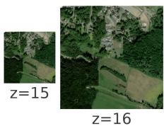

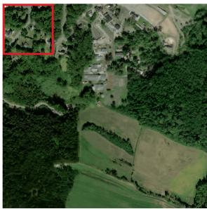

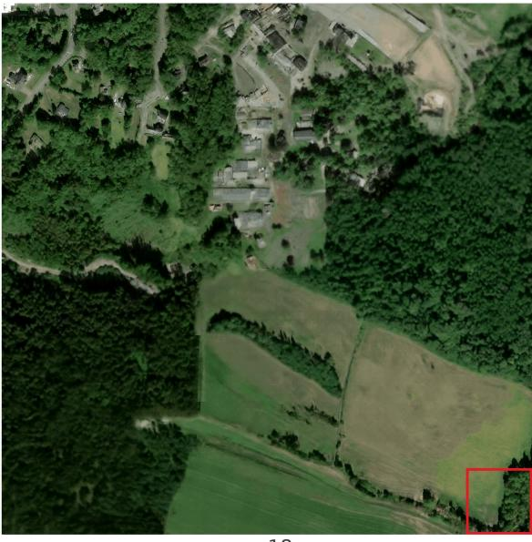  
z=18  
Figure 3: From a set of seed tiles (red), Genesis synthesizes a complete multi-scale pyramid, shown here as a progressive zoom of one site from �=15 to �=18.

## 5 Experimental Details

## 5.1 Backbone and Training

Both operators use a JiT-H or JiT-B backbone, with SR models using a patch size of 32 and OP models using a patch size of 16. Training follows the flow objective of Section 4 with flow time drawn from a logit-normal schedule, $( \mu , \sigma ) \ = \ ( - 0 . 8 , 0 . 8 )$ . Both operators follow a four-stage, easy-to-hard curriculum with stage transitions at 20/40/60% of the step budget (rounded to 5k). SR stages are defined over parent zoom (coarse: parent zoom ≤ 15): (i) coarse-only, (ii) 50/50 coarse/fine, (iii) uniform over all zoom levels, (iv) complete quads only. OP stages are defined over the mask (Figure 4): (i) quad3 (three known quadrants, 25% hole), (ii) quad2 (two known, adjacent or diagonal, 50%), (iii) quad1 (one known, 75%), (iv) a uniform mixture of all regimes. All training hyperparameters are listed in Table 8 (Appendix). For per-operator evaluation, we sample with a 50-step Euler solver and guidance scale 1.0; the multi-scale engine settings are detailed in Section 5.4.

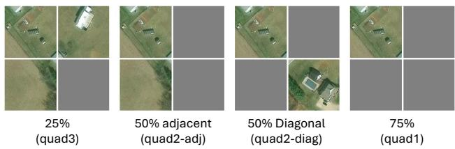  
Figure 4: Single-tile outpainting training and evaluation regimes.

## 5.2 Operator Instantiation

Super-resolution. The semantic stream uses a frozen, satellitepretrained DINOv3 ViT-L [42]; conditioning dropout is $p _ { \mathrm { d r o p } } { = } 0 . 1$ . The main SR benchmark (Table 2) samples from pure noise; a bicubic warm start, which initializes from the parent’s bicubic 2× upsample noised to an intermediate �, is used only for the SR ablation (Table 5, � = 0.5, total steps= 500k) and for the pyramid engine’s SR pass (Section 5.4, � = 0.4). The auxiliary per-quadrant, �-weighted LPIPS loss (Equation (9)) uses weight $\lambda _ { \mathrm { p e r c } } { = } 0 . 5$

Outpainting. Cross-attention is restricted to patches that are more than half known. Conditioning dropout is 0.1, as in SR. The 7-channel context and zoom embedding follow Section 4.4.

## 5.3 Baseline Setup

For SR, we evaluate against strong super-resolution baselines FastDifSR [29], SwinIR [22], and ZoomLDM [53] under the same Git-10M parent-to-child scoring protocol used for Genesis. Each method produces the target child tile at the requested child zoom, scored against the held-out child tile with the metrics in Table 2.

For OP, we compare against SD2-Inpaint and its text-conditioned variant SD2-Inpaint+Text [36], and Text2Earth-Inpaint [24], on the same 256×256 tile masks used for Genesis. All OP methods are scored with the same hole-aware metrics and the boundarydiference (B-dif) measure reported in Table 3.

## 5.4 Pyramid Generation

In this section, we provide the system-level details that were deferred in Section 4.5; remaining hyperparameters are in Table 8.

Seamless super-resolution. The SR pass over the working level (Algorithm 1, step 3) does not super-resolve tiles independently, which would create seams at tile boundaries. Instead, we run a MultiDifusion-style trajectory over the whole stitched mosaic, warm-started at �=0.4 from its bicubic upsample: overlapping 256×256 windows (overlap 32 px) are denoised in parallel, and their per-step velocities are blended across the canvas with a plateau weighting (close to 1 over window interiors, ramping down across overlaps), so the mosaic is upsampled seam-free in a single trajectory. Leaf seeds are re-anchored at every step at the correct noise level.

Maximum coverage outpainting. We use ofset �=1, so the working level is the penultimate level. To complete it (step 2) we treat each 2×2 block of 128×128 quadrants as one 256×256 OP problem. Each round selects a maximal set of cell-disjoint, most-constrained windows so they can be filled in one batched sampler pass, and writes completed tiles back as soon as their four quadrants are resolved.

Seam repair. After the SR pass, we score every internal leaf boundary by its mean pixel discontinuity and, worst-first, repair the top boundaries (Algorithm 1, step 4; threshold 14, up to 64 boundaries) with a greedy OP pass: 256×256 window centered on the seam, with a masked band of width 64 px over the seam. These OP operations repair seams in order of pixel-discontinuity score, so each additional operation further harmonizes the mosaic. The regenerated band is blended back using a soft-edged (blurred) mask, so it transitions smoothly into the surrounding, unchanged pixels.

Reconciliation. A bottom-up downsampling sweep (Algorithm 1, step 5) makes coarser tiles consistent with the leaves by replacing each parent with the downsampled mosaic of its children. We apply this only where needed: a working-level tile is re-derived from its children only if seam repair modified them, and otherwise keeps its original outpainted content, which is sharper than a downsample of the super-resolved leaves.

## 5.5 Evaluation

We evaluate the individual Genesis operators on our Git-10M [24] test splits, and the full pyramid-completion engine under diferent seed conditions on our dense500 benchmark.

Seed protocols. We evaluate three seeding regimes that vary the number and spatial placement of seeds, each applied to all 500 subtrees (1,500 pyramid generations total):

(A) Single seed. One seed per subtree, its level drawn with weight proportional to its tile count (favoring finer, more realistic seeds). A tile is then chosen uniformly at that level, and results are stratified by the drawn level. This protocol tests full-pyramid generation from a single anchor.

(B) Three independent seeds. One seed at each non-root level, none an ancestor or descendant of another. This protocol tests reconciliation of multi-scale anchors at unrelated locations.

(C) Four spatially independent seeds. Two leaf, one intermediate, and one coarse seed, none an ancestor of another. This protocol tests dense leaf anchors under coarse guidance.

Super-resolution. The model generates the child tiles from a parent; results are grouped by child zoom range (�12–15, �16–17, �18). The number of tiles per group is 2470/2003/4096 for the random test split and 3146/2087/4096 for the spatial test split. We report PSNR, SSIM [50], LPIPS [56], DISTS [4], and FID [11] over the full generated tile1.

Outpainting. The model completes masked regions of a 256×256 tile under four regimes (quad3, quad2\_adj, quad2\_diag, quad1; Figure 4), evaluated on both random\_test and spatial\_test (Section A.1). We evaluate 8,192 tiles per split and regime. LPIPS and DISTS are hole-aware, computed only over the synthesized region (decomposed into quadrants when the hole aligns to them); FID is computed on the full composited tile, following standard inpainting practice. We also introduce a boundary-diference metric (B-dif) to evaluate how seamlessly the generated region blends into the surrounding image. B-dif calculates the absolute pixel-value diference between the generated and real pixels within a 4-pixel-wide ring along the hole boundary.

Pyramid generation. On dense500 we report three groups of metrics: image quality (PSNR, SSIM, LPIPS, FID); semantic alignment between the generated and ground-truth regions, both embeddingbased (CLIP-I [34], DINOv3-sat [42]) and captioning-based (Caption); and pyramid consistency, the within- and cross-level reconstruction metrics LR-PSNRbox and xLR-PSNR together with the spectral metric RAPSD [16, 27, 45]. Unlike standard single-image metrics, which score each tile in isolation, the pyramid-consistency metrics score relations between zoom levels: parent-child selfconsistency (LR-PSNRbox), cross-scale fidelity to ground truth (xLR-PSNR), and spectral realism (RAPSD). Our goal is a plausible, seed-consistent pyramid rather than pixel-exact reconstruction, so the distributional, semantic, and consistency metrics are primary; reconstruction metrics are reported for completeness. Further details on the semantic alignment and pyramid-consistency metrics are in Appendix Sections A.4 and A.5.

## 6 Results

## 6.1 Super-resolution

Table 2 reports super-resolution results on both splits, random\_test and spatial\_test, each stratified into three child-zoom groups. Genesis-H is best on every perceptual and distributional metric, holding the lowest LPIPS, DISTS, and FID in all six split/zoom groups. Its FID stays in the 9.2–14.8 range, against 32–47 for SwinIR and 42–70 for ZoomLDM, and its LPIPS is roughly 20% lower than

Table 2: Super-resolution results on Git-10M random\_test and spatial\_test. We report reconstruction (PSNR, SSIM), perceptual (LPIPS, DISTS), and distributional (FID) metrics for each child zoom group. Higher is better for PSNR and SSIM, lower is better for LPIPS, DISTS, and FID.
<table><tr><td>Split</td><td>Model</td><td colspan="5">child z12–15</td><td colspan="4"></td><td colspan="2"></td><td colspan="4">child z18</td></tr><tr><td></td><td></td><td>PSNR ↑</td><td>SSIM ↑</td><td>LPIPS ↓</td><td>DISTS ↓</td><td>FID ↓</td><td>|PSNR ↑</td><td>SSIM ↑</td><td>LPIPS ↓</td><td>DISTS ↓</td><td>FID ↓ | PSNR ↑</td><td></td><td>SSIM ↑</td><td>LPIPS ↓</td><td>DISTS ↓</td><td>FID↓</td></tr><tr><td>random</td><td>Bicubic</td><td>27.59</td><td>0.775</td><td>0.207</td><td>0.167</td><td>31.21</td><td>22.56</td><td>0.632</td><td>0.304</td><td>0.201</td><td>33.51</td><td>22.68</td><td>0.630</td><td>0.298</td><td>0.185</td><td>22.61</td></tr><tr><td>random</td><td>FastDiffSR [29]</td><td>23.78</td><td>0.664</td><td>0.214</td><td>0.211</td><td>40.19</td><td>20.50</td><td>0.553</td><td>0.286</td><td>0.245</td><td>43.79</td><td>20.57</td><td>0.554</td><td>0.274</td><td>0.230</td><td>36.58</td></tr><tr><td>random</td><td>SwinIR [22]</td><td>26.70</td><td>0.760</td><td>0.159</td><td>0.156</td><td>39.22</td><td>22.04</td><td>0.615</td><td>0.244</td><td>0.192</td><td>47.23</td><td>22.14</td><td>0.615</td><td>0.229</td><td>0.179</td><td>32.07</td></tr><tr><td>random</td><td>ZoomLDM [53]</td><td>22.25</td><td>0.535</td><td>0.274</td><td>0.212</td><td>70.10</td><td>19.77</td><td>0.475</td><td>0.279</td><td>0.225</td><td>50.97</td><td>19.73</td><td>0.460</td><td>0.275</td><td>0.224</td><td>42.38</td></tr><tr><td>random</td><td>GENESIS-B</td><td>27.37</td><td>0.767</td><td>0.150</td><td>0.131</td><td>17.16</td><td>22.52</td><td>0.618</td><td>0.233</td><td>0.169</td><td>16.81</td><td>22.57</td><td>0.625</td><td>0.222</td><td>0.160</td><td>10.30</td></tr><tr><td>random</td><td>GENESIS-H</td><td>27.17</td><td>0.762</td><td>0.129</td><td>0.124</td><td>14.54</td><td>22.53</td><td>0.613</td><td>0.199</td><td>0.158</td><td>14.85</td><td>22.41</td><td>0.619</td><td>0.188</td><td>0.151</td><td>9.41</td></tr><tr><td>spatial</td><td>Bicubic</td><td>27.66</td><td>0.774</td><td>0.207</td><td>0.167</td><td>29.40</td><td>22.44</td><td>0.629</td><td>0.305</td><td>0.202</td><td>32.82</td><td>23.05</td><td>0.630</td><td>0.296</td><td>0.184</td><td>22.67</td></tr><tr><td>spatial</td><td>FastDiffSR [29]</td><td>23.83</td><td>0.664</td><td>0.213</td><td>0.210</td><td>37.11</td><td>20.40</td><td>0.550</td><td>0.288</td><td>0.246</td><td>44.66</td><td>20.92</td><td>0.553</td><td>0.273</td><td>0.232</td><td>38.67</td></tr><tr><td>spatial</td><td>SwinIR [22]</td><td>26.78</td><td>0.759</td><td>0.160</td><td>0.156</td><td>37.21</td><td>21.92</td><td>0.612</td><td>0.247</td><td>0.193</td><td>46.79</td><td>22.49</td><td>0.615</td><td>0.232</td><td>0.179</td><td>32.56</td></tr><tr><td>spatial</td><td>ZoomLDM [53]</td><td>22.31</td><td>0.534</td><td>0.276</td><td>0.213</td><td>69.11</td><td>19.69</td><td>0.472</td><td>0.280</td><td>0.226</td><td>51.16</td><td>19.99</td><td>0.460</td><td>0.277</td><td>0.226</td><td>43.45</td></tr><tr><td>spatial</td><td>GENESIS-B</td><td>27.45</td><td>0.768</td><td>0.149</td><td>0.131</td><td>15.61</td><td>22.41</td><td>0.614</td><td>0.234</td><td>0.169</td><td>16.38</td><td>22.91</td><td>0.623</td><td>0.221</td><td>0.160</td><td>10.36</td></tr><tr><td>spatial</td><td>GENESIS-H</td><td>27.25</td><td>0.763</td><td>0.128</td><td>0.124</td><td>13.08</td><td>22.44</td><td>0.609</td><td>0.200</td><td>0.158</td><td>14.75</td><td>22.73</td><td>0.616</td><td>0.186</td><td>0.149</td><td>9.23</td></tr></table>

Table 3: Outpainting results on Git-10M random\_test and spatial\_test. We report LPIPS, DISTS, a boundary diference metric (B-dif), and FID for each mask regime. Lower is better for all metrics.
<table><tr><td>Split</td><td>Model</td><td colspan="4">quad3</td><td colspan="4">quad2_adj</td><td colspan="4">quad2_diag</td><td colspan="4">quad1</td></tr><tr><td></td><td></td><td>LPIPS ↓</td><td>DISTS ↓ B-diff↓</td><td></td><td>FID↓</td><td>LPIPS↓</td><td>DISTS ↓ B-diff ↓</td><td></td><td>FID ↓</td><td>LPIPS↓</td><td>DISTS ↓ B-diff ↓</td><td></td><td>FID↓</td><td>LPIPS ↓</td><td>DISTS ↓ B-diff↓</td><td></td><td>FID ↓</td></tr><tr><td>random</td><td>SD2-Inpaint [36]</td><td>0.398</td><td>0.307</td><td>33.01</td><td>5.65</td><td>0.449</td><td>0.337</td><td>40.37</td><td>15.11</td><td>0.398</td><td>0.306</td><td>32.75</td><td>14.16</td><td>0.469</td><td>0.351</td><td>43.93</td><td>31.90</td></tr><tr><td>random</td><td>SD2-Inpaint+Text [36]</td><td>0.376</td><td>0.297</td><td>32.10</td><td>4.72</td><td>0.422</td><td>0.326</td><td>39.13</td><td>13.70</td><td>0.378</td><td>0.298</td><td>32.04</td><td>12.74</td><td>0.438</td><td>0.340</td><td>42.45</td><td>30.86</td></tr><tr><td>random</td><td>Text2Earth-Inpaint [24]</td><td>0.332</td><td>0.276</td><td>31.91</td><td>3.77</td><td>0.367</td><td>0.297</td><td>36.82</td><td>9.46</td><td>0.334</td><td>0.277</td><td>31.87</td><td>8.95</td><td>0.391</td><td>0.310</td><td>39.64</td><td>19.34</td></tr><tr><td>random</td><td>GENESIS-B</td><td>0.356</td><td>0.293</td><td>31.59</td><td>4.64</td><td>0.391</td><td>0.314</td><td>36.15</td><td>13.82</td><td>0.358</td><td>0.293</td><td>31.55</td><td>14.72</td><td>0.409</td><td>0.327</td><td>38.70</td><td>33.76</td></tr><tr><td>random</td><td>GENESIS-H</td><td>0.326</td><td>0.275</td><td>30.53</td><td>3.23</td><td>0.364</td><td>0.298</td><td>35.20</td><td>8.20</td><td>0.327</td><td>0.275</td><td>30.46</td><td>8.05</td><td>0.385</td><td>0.312</td><td>38.00</td><td>16.99</td></tr><tr><td>spatial</td><td>SD2-Inpaint [36]</td><td>0.396</td><td>0.308</td><td>32.64</td><td>6.01</td><td>0.447</td><td>0.339</td><td>40.28</td><td>16.42</td><td>0.395</td><td>0.307</td><td>32.36</td><td>15.13</td><td>0.468</td><td>0.353</td><td>43.77</td><td>33.91</td></tr><tr><td>spatial</td><td>SD2-Inpaint+Text [36]</td><td>0.372</td><td>0.297</td><td>31.49</td><td>4.85</td><td>0.418</td><td>0.328</td><td>38.76</td><td>14.39</td><td>0.374</td><td>0.298</td><td>31.56</td><td>13.26</td><td>0.434</td><td>0.341</td><td>41.85</td><td>31.26</td></tr><tr><td>spatial</td><td>Text2Earth-Inpaint [24]</td><td>0.328</td><td>0.276</td><td>31.24</td><td>3.73</td><td>0.364</td><td>0.297</td><td>36.29</td><td>9.58</td><td>0.331</td><td>0.277</td><td>31.27</td><td>9.07</td><td>0.386</td><td>0.311</td><td>38.97</td><td>19.91</td></tr><tr><td>spatial</td><td>GENESIS-B</td><td>0.349</td><td>0.291</td><td>30.76</td><td>4.65</td><td>0.384</td><td>0.313</td><td>35.44</td><td>13.89</td><td>0.352</td><td>0.293</td><td>30.85</td><td>14.70</td><td>0.401</td><td>0.325</td><td>37.82</td><td>33.68</td></tr><tr><td>spatial</td><td>GENESIS-H</td><td>0.321</td><td>0.274</td><td>29.89</td><td>3.24</td><td>0.358</td><td>0.297</td><td>34.52</td><td>8.11</td><td>0.321</td><td>0.275</td><td>29.83</td><td>7.90</td><td>0.379</td><td>0.311</td><td>37.10</td><td>17.23</td></tr></table>

Table 4: Evaluation on dense500 under seed protocols A-C (A: 1 seed, hardest; C: 4 seeds, easiest) and their aggregate (All) for the task of multi-scale tile completion.
<table><tr><td></td><td></td><td colspan="4">Image quality</td><td colspan="3">Semantic alignment</td><td colspan="3">Pyramid consistency</td></tr><tr><td>Model</td><td>Protocol</td><td>PSNR↑</td><td>SSIM↑</td><td>LPIPS↓</td><td>FID↓</td><td>CLIP-I↑</td><td>DINOv3-sat ↑ Caption ↑</td><td></td><td> $\mathrm { L R - P S N R } _ { \mathrm { b o x } }$ </td><td>↑ xLR-PSNR↑</td><td>RAPSD↓</td></tr><tr><td>GENESIS-B</td><td>All</td><td>15.99</td><td>0.271</td><td>0.455</td><td>120.1</td><td>0.800</td><td>0.363</td><td>0.783</td><td>35.11</td><td>16.54</td><td>1.121</td></tr><tr><td></td><td>A (1 seed)</td><td>15.65</td><td>0.262</td><td>0.497</td><td>131.7</td><td>0.789</td><td>0.336</td><td>0.777</td><td>35.93</td><td>15.93</td><td>1.795</td></tr><tr><td></td><td>B (3 seeds)</td><td>16.13</td><td>0.274</td><td>0.436</td><td>120.8</td><td>0.805</td><td>0.374</td><td>0.782</td><td>34.70</td><td>16.79</td><td>0.808</td></tr><tr><td></td><td>C (4 seeds)</td><td>16.21</td><td>0.277</td><td>0.431</td><td>122.4</td><td>0.807</td><td>0.380</td><td>0.791</td><td>34.70</td><td>16.90</td><td>0.760</td></tr><tr><td>GENESIS-H All</td><td></td><td>16.95</td><td>0.298</td><td>0.423</td><td>72.0</td><td>0.843</td><td>0.419</td><td>0.820</td><td>37.19</td><td>17.59</td><td>1.281</td></tr><tr><td></td><td>A (1 seed)</td><td>15.96</td><td>0.277</td><td>0.495</td><td>99.4</td><td>0.808</td><td>0.380</td><td>0.793</td><td>37.53</td><td>16.25</td><td>2.001</td></tr><tr><td></td><td>B (3 seeds)</td><td>17.43</td><td>0.308</td><td>0.390</td><td>64.4</td><td>0.858</td><td>0.434</td><td>0.822</td><td>37.05</td><td>18.21</td><td>0.965</td></tr><tr><td></td><td>C (4 seeds)</td><td>17.49</td><td>0.309</td><td>0.383</td><td>62.2</td><td>0.864</td><td>0.444</td><td>0.846</td><td>36.98</td><td>18.30</td><td>0.878</td></tr></table>

SwinIR’s in every group (e.g. 0.129 vs. 0.159 at �12–15). Performance is nearly identical across the two test splits, indicating that quality does not depend on whether the held-out tiles are urbanbalanced or uniformly sampled. Dificulty also varies with scale: reconstruction metrics (PSNR, SSIM) are highest for the coarsest children (�12–15), while FID is consistently lowest at �18, where fine texture dominates, and the perceptual gap to baselines is widest. Bicubic scores highest on PSNR and SSIM almost everywhere, but only because interpolation preserves low-frequency structure; its blurry output is penalized sharply by LPIPS and FID, showing that

2 seeds

1 seed

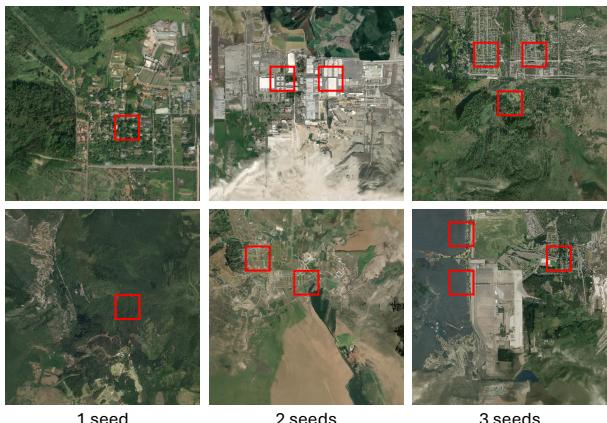  
Figure 5: Genesis outpainting results at zoom level 16 across three sites, each initialized from 1–3 seed tiles (red).

the pixel-fidelity metrics PSNR and SSIM do not reflect perceptual quality. We emphasize that the SR task represents a fundamental operation in hierarchical pyramid generation, which must be performed many times in order to traverse the resolution hierarchy. As such, errors from a weaker operator propagate, and small differences in fidelity and coherence become magnified across scales. Genesis significantly advances super-resolution performance over the second-best baseline, enabling generation across arbitrary hierarchical spans.

Table 5: Super-resolution ablation on val\_spatial with 5000 samples under the bicubic-init SR setting. PSNR and SSIM are higher-is-better; LPIPS, DISTS, and FID are lower-is-better.
<table><tr><td>DINOv3</td><td>LLPIPS</td><td>PSNR ↑ SSIM ↑ LPIPS ↓ 1</td><td></td><td></td><td>DISTS ↓ FID ↓</td></tr><tr><td>x</td><td>x</td><td>24.18</td><td>0.669</td><td>0.231</td><td>0.167 13.46</td></tr><tr><td>√</td><td>x</td><td>24.23</td><td>0.673</td><td>0.223</td><td>0.160 12.74</td></tr><tr><td>x</td><td>√</td><td>24.14</td><td>0.663</td><td>0.212</td><td>0.158 11.12</td></tr><tr><td>√</td><td>√</td><td>24.15</td><td>0.664</td><td>0.204</td><td>0.152 10.30</td></tr></table>

Table 5 ablates the two optional SR components on val\_spatial. Each helps, in complementary ways. DINOv3 conditioning gives small gains across the board and the best PSNR/SSIM, consistent with a semantic prior that stabilizes structure. The LPIPS loss drives the larger perceptual improvement, further reducing FID at a slight cost to PSNR/SSIM. Combining the two yields the best LPIPS, DISTS, and FID while keeping PSNR/SSIM essentially unchanged. Guidance in both generated semantics and perceptual quality enables the strong performance needed for hierarchical consistency and distributional correctness in the pyramid generation task.

## 6.2 Outpainting

Table 3 reports outpainting across both splits and the four mask regimes. Genesis-H attains the lowest FID, LPIPS, and boundary diference (B-dif) in all eight split/regime cells, outperforming SD2-Inpaint, SD2-Inpaint+Text, and Text2Earth-Inpaint on each.

Dificulty scales with hole size: FID rises from about 3.2 at quad3 (25% hole) to 8 at quad2 (50%) and 17 at quad1 (75%), as less context remains to anchor the completion. The B-dif advantage matters most for our setting, since low seam error at the hole boundary is what lets Genesis chain completions into seam-free extents (Figure 3). On DISTS, Genesis-H is on par with the strongest baseline, Text2Earth-Inpaint, matching or slightly beating it in most regimes. As in super-resolution, results are nearly identical across the random\_test and spatial\_test splits. Like super-resolution, outpainting is a fundamental operation needed for lateral pyramid filling. As outpainting must be chained multiple times, it is essential that the underlying model produces distributionally correct, spatially coherent imagery, free of artifacts and seams. Across all metrics, Genesis is consistently state-of-the-art, providing the properties needed for composing multiple outpainting operations. A set of qualitative examples of the outpainting capability of Genesis is shown in Figure 5.

## 6.3 Summary across Regimes

Table 6 aggregates mean FID over all cells (six for SR, eight for OP). On SR, Genesis-H and Genesis-B achieve the two best mean FIDs (12.6 and 14.4), significantly ahead of the next-best baseline, bicubic (28.7), and far ahead of model-based SR approaches SwinIR (39.2), FastDifSR (40.2), and ZoomLDM (54.5). A notable result from this analysis is that no model-based baseline is able to outperform the simple, training-free bicubic upsampling baseline. Intuitively, this indicates that current models are poorly suited to multi-resolution hierarchical synthesis, for which SR more powerful than bicubic upsampling is needed to traverse wide zoom-level ranges.

On OP, Genesis-H is the best (9.1), ahead of Text2Earth-Inpaint (10.5), with the remaining methods clustered higher (15.7–17.3). A single model family thus leads both subtasks, which is what makes composing the two operators into one engine worthwhile.

Table 6: Mean FID across all evaluation regimes.
<table><tr><td>Task</td><td>Method</td><td>Avg. FID ↓</td></tr><tr><td>SR</td><td>GENESIS-H</td><td>12.642</td></tr><tr><td>SR</td><td>GENESIS-B</td><td>14.434</td></tr><tr><td>SR</td><td>Bicubic</td><td>28.703</td></tr><tr><td>SR</td><td>SwinIR [22]</td><td>39.180</td></tr><tr><td>SR</td><td>FastDiffSR [29]</td><td>40.167</td></tr><tr><td>SR</td><td>ZoomLDM [53]</td><td>54.528</td></tr><tr><td>OP</td><td>GENESIS-H</td><td>9.119</td></tr><tr><td>OP</td><td>Text2Earth-Inpaint [24]</td><td>10.477</td></tr><tr><td>OP</td><td>SD2-Inpaint+Text [36]</td><td>15.722</td></tr><tr><td>OP</td><td>GENESIS-B</td><td>16.734</td></tr><tr><td>OP</td><td>SD2-Inpaint [36]</td><td>17.288</td></tr></table>

## 6.4 Full Pyramid Generation

Multi-scale tile completion itself is a new task with no existing end-to-end method or established pipeline of third-party operators to compare against; comparisons with existing methods are therefore conducted on the per-operator subtasks, where Genesis outperforms the compared baselines under identical protocols (Tables 2 and 3), and Table 6 benchmarks the two Genesis model capacities (B and H) as reference points. To evaluate full pyramid generation, we report image-quality, semantic-alignment, and pyramid-consistency metrics on dense500 (Table 4), which spans five zoom windows from roughly 76 to 0.6 m/px (Table 1). Genesis-H improves over Genesis-B on nearly every metric (FID 72.0 vs. 120.1, CLIP-I 0.843 vs. 0.800, DINOv3-sat 0.419 vs. 0.363), trading compute for generative quality.

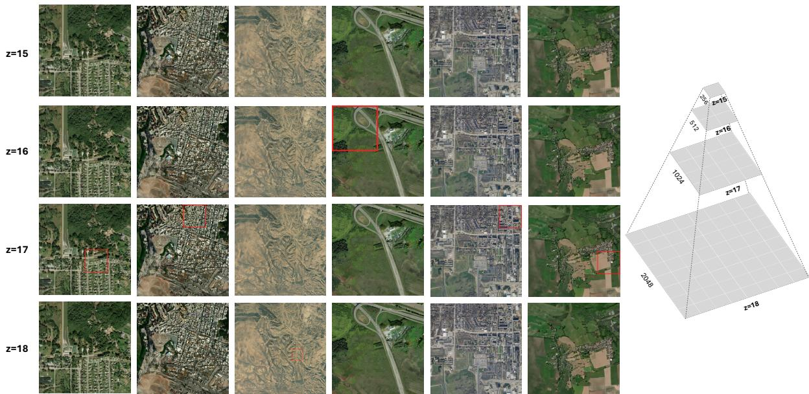  
Figure 6: Genesis pyramid completions across many sites from seed tiles (red). Each column is a distinct site, and each row a zoom level (�=15 to �=18); the schematic (right) shows the underlying quadtree. Outputs are consistent vertically across zoom levels and horizontally within each level.

Across the three seed protocols, denser seeding makes completion easier, as expected. For Genesis-H, FID falls from 99.4 with a single seed (protocol A) to 64.4 and 62.2 with three and four seeds (protocols B and C), and semantic alignment rises (CLIP-I 0.808→ 0.864, Caption 0.793 → 0.846). The two pyramid-consistency metrics tell complementary stories. $\mathrm { L R \mathrm { - P S N R _ { b o x } , } }$ which measures whether a generated parent agrees with its own children, stays high and roughly constant across all protocols, showing that the engine produces internally consistent pyramids regardless of how many seeds it starts from. xLR-PSNR, which compares against ground truth across scales, instead rises with seeding (16.2 → 18.3), indicating that Genesis can efectively utilize increased context to generate more semantically accurate scenes. RAPSD tells the same story from the frequency domain: the spectral distance shrinks steadily as seeding densifies (2.00 with one seed to 0.88 with four for Genesis-H), showing that additional anchors also pull the generated frequency content toward that of real imagery. Figure 3 shows this cross-scale behavior on a single site: zooming from �=15 to �=18.

## 6.5 Qualitative Results

Figure 6 shows multi-resolution completions across many sites and varying seed configurations. Genesis produces spatially and hierarchically consistent imagery, with minimal seams between neighbors, coherent structure across zoom levels, and content that matches the semantics of the given seeds. Failure cases are largely observed at the single-seed extreme (protocol A), where large unseen regions must be hallucinated from a single anchor, and the lack of context causes generations to drift away from the ground-truth semantics. Figure 3, Figure 6, Figure 8, and Figure 9 demonstrate that Genesis cleanly generates semantically and hierarchically consistent imagery across a large span of zoom levels with mixedresolution seeding.

## 7 Conclusion

We introduced multi-scale tile completion, a new generative task that requires synthesizing complete satellite-image pyramids from sparse observations while remaining consistent across both geographic space and zoom levels. To address this task, we proposed Genesis, a generative engine built on two operators we trained for satellite imagery: a vertical super-resolution model and a horizontal mask-based outpainting model. Each achieves state-of-the-art results on its respective subtask, and our algorithm composes them to complete full pyramids from any seed configuration. To evaluate Genesis on this task, we introduced dense500, a fully observed multi-scale pyramid benchmark spanning diverse geographic regions, together with a suite of pyramid-level metrics, and used them to show that Genesis produces pyramids that are realistic, semantically aligned with the seeds, and consistent across scales. Beyond benchmark performance, Genesis turns sparse, opportunistic acquisitions into complete, navigable pyramids, supporting applications such as populating virtual environments, prototyping urban layouts, and generating multi-resolution training data for remote sensing models. We hope that our work will serve as a foundation for future research on multi-scale generative modeling of the Earth.

## References

[1] Omer Bar-Tal, Lior Yariv, Yaron Lipman, and Tali Dekel. 2023. MultiDifusion: fusing difusion paths for controlled image generation. In Proceedings of the 40th International Conference on Machine Learning. 1737–1752.

[2] Shoufa Chen, Chongjian Ge, Shilong Zhang, Peize Sun, and Ping Luo. 2025. Pixelflow: Pixel-space generative models with flow. arXiv preprint arXiv:2504.07963 (2025).

[3] Daniel Cher, Brian Wei, Srikumar Sastry, and Nathan Jacobs. 2026. VectorSynth: Fine-Grained Satellite Image Synthesis with Structured Semantics. In IEEE/CVF Winter Conference on Applications ofComputer Vision (WACV). 7019–7029.

[4] Keyan Ding, Kede Ma, Shiqi Wang, and Eero P Simoncelli. 2020. Image quality assessment: Unifying structure and texture similarity. IEEE transactions on pattern analysis and machine intelligence 44, 5 (2020), 2567–2581.

[5] Chao Dong, Chen Change Loy, Kaiming He, and Xiaoou Tang. 2016. Image Super-Resolution Using Deep Convolutional Networks. IEEE Trans. Pattern Anal. Mach. Intell. 38, 2 (Feb. 2016), 295–307. doi:10.1109/TPAMI.2015.243928

[6] Ricard Durall, Margret Keuper, and Janis Keuper. 2020. Watch your up convolution: Cnn based generative deep neural networks are failing to reproduce spectral distributions. In 2020 IEEE/CVFConference on ComputerVision and Pattern Recognition (CVPR). IEEE, 7887–7896.

[7] Esri. 2024. World Urban Areas. Esri Data and Maps, ArcGIS Hub. https: //hub.arcgis.com/datasets/esri::world-urban-areas.

[8] Ian Goodfellow, Jean Pouget-Abadie, Mehdi Mirza, Bing Xu, David Warde-Farley, Sherjil Ozair, Aaron Courville, and Yoshua Bengio. 2014. Generative Adversarial Nets. In Advances in Neural Information Processing Systems (NeurIPS).

[9] Songtao He, Favyen Bastani, Satvat Jagwani, Mohammad Alizadeh, Hari Balakrishnan, Sanjay Chawla, Mohamed M. Elshrif, Samuel Madden, and Moham mad Amin Sadeghi. 2020. Sat2graph: Road graph extraction through graph-tensor encoding. In European Conference on Computer Vision.

[10] Congrui Hetang, Haoru Xue, Cindy Le, Tianwei Yue, Wenping Wang, and Yihui He. 2024. Segment anything model for road network graph extraction. In 2024 IEEE/CVF Conference on Computer Vision and Pattern Recognition Workshops (CVPRW). IEEE, 2556–2566.

[11] Martin Heusel, Hubert Ramsauer, Thomas Unterthiner, Bernhard Nessler, and Sepp Hochreiter. 2017. Gans trained by a two time-scale update rule converge to a local nash equilibrium. Advances in neural information processing systems 30 (2017).

[12] Jonathan Ho, Ajay Jain, and Pieter Abbeel. 2020. Denoising Difusion Probabilistic Models. In Advances in Neural Information Processing Systems (NeurIPS).

[13] Jonathan Ho, Chitwan Saharia, William Chan, David J Fleet, Mohammad Norouzi, and Tim Salimans. 2022. Cascaded difusion models for high fidelity image generation. Journal ofMachine Learning Research 23, 47 (2022), 1–33.

[14] Álvaro Barbero Jiménez. 2023. Mixture of difusers for scene composition and high resolution image generation. arXiv preprint arXiv:2302.02412 (2023).

[15] Samar Khanna, Patrick Liu, Linqi Zhou, Chenlin Meng, Robin Rombach, Marshall Burke, David B. Lobell, and Stefano Ermon. 2024. DifusionSat: A Generative Foundation Model for Satellite Imagery. In International Conference on Learning Representations (ICLR).

[16] Wei-Sheng Lai, Jia-Bin Huang, Narendra Ahuja, and Ming-Hsuan Yang. 2017. Deep laplacian pyramid networks for fast and accurate super-resolution. In 2017 IEEE conference on computer vision and pattern recognition (CVPR). IEEE, 5835–5843.

[17] Viswadeep Lebakula, Kelly Sims, Andrew Reith, et al. 2025. LandScan Global 30 Arcsecond Annual Global Gridded Population Datasets from 2000 to 2022. Scientific Data 12 (2025), 495. doi:10.1038/s41597-025-04817-z

[18] Yuseung Lee, Kunho Kim, Hyunjin Kim, and Minhyuk Sung. 2023. Syncdifu sion: Coherent montage via synchronized joint difusions. Advances in Neural Information Processing Systems 36 (2023), 50648–50660.

[19] Jiachen Lei, Keli Liu, Julius Berner, Haiming Yu, Hongkai Zheng, Jiahong Wu, and Xiangxiang Chu. 2025. There is no vae: End-to-end pixel-space generative modeling via self-supervised pre-training. arXiv preprint arXiv:2510.12586 (2025)

[20] Ke Li, Gang Wan, Gong Cheng, Liqiu Meng, and Junwei Han. 2020. Object detection in optical remote sensing images: A survey and a new benchmark. ISPRS Journal ofPhotogrammetry and Remote Sensing 159 (2020), 296–307.

[21] Tianhong Li and Kaiming He. 2026. Back to basics: Let denoising generative models denoise. In Proceedings ofthe IEEE/CVF Conference on Computer Vision and Pattern Recognition. 36115–36125.

[22] Jingyun Liang, Jiezhang Cao, Guolei Sun, Kai Zhang, Luc Van Gool, and Radu Timofte. 2021. SwinIR: Image Restoration Using Swin Transformer. In Proceedings of the IEEE/CVF International Conference on Computer Vision Workshops (ICCVW). 1833–1844. doi:10.1109/ICCVW54120.2021.00210

[23] Yaron Lipman, Ricky T. Q. Chen, Heli Ben-Hamu, Maximilian Nickel, and Matthew Le. 2023. Flow Matching for Generative Modeling. In The Eleventh International Conference on Learning Representations. https://openreview.net/ forum?id=PqvMRDCJT9t

[24] Chenyang Liu, Keyan Chen, Rui Zhao, Zhengxia Zou, and Zhenwei Shi. 2025. Text2Earth: Unlocking text-driven remote sensing image generation with a globalscale dataset and a foundation model. IEEE Geoscience and Remote Sensing Magazine 13, 3 (2025), 238–259. doi:10.1109/MGRS.2025.3560455

[25] Xingchao Liu, Chengyue Gong, and Qiang Liu. 2022. Flow Straight and Fast: Learning to Generate and Transfer Data with Rectified Flow. arXiv preprint arXiv:2209.03003 (2022).

[26] Andreas Lugmayr, Martin Danelljan, Andres Romero, Fisher Yu, Radu Timofte, and Luc Van Gool. 2022. RePaint: Inpainting Using Denoising Difusion Probabilistic Models. In IEEE/CVF Conference on Computer Vision and Pattern Recognition (CVPR).

[27] Andreas Lugmayr, Martin Danelljan, Radu Timofte, Kang-wook Kim, Younggeun Kim, Jae-young Lee, Zechao Li, Jinshan Pan, Dongseok Shim, Ki-Ung Song, et al. 2022. NTIRE 2022 challenge on learning the super-resolution space. In 2022 IEEE/CVF Conference on Computer Vision and Pattern Recognition Workshops (CVPRW). IEEE, 785–796.

[28] Nanye Ma, Mark Goldstein, Michael S. Albergo, Nicholas M. Bofi, Eric Vanden-Eijnden, and Saining Xie. 2024. SiT: Exploring Flow and Difusion-Based Genera tive Models with Scalable Interpolant Transformers. In European Conference on Computer Vision (ECCV).

[29] Fanen Meng, Yijun Chen, Haoyu Jing, Laifu Zhang, Yiming Yan, Yingchao Ren, Sensen Wu, Tian Feng, Renyi Liu, and Zhenhong Du. 2024. A Conditional Difusion Model With Fast Sampling Strategy for Remote Sensing Image Super-Resolution. IEEE Transactions on Geoscience and Remote Sensing 62 (2024), 1–16. doi:10.1109/TGRS.2024.3458009

[30] Jiancheng Pan, Shiye Lei, Yuqian Fu, Jiahao Li, Yanxing Liu, Yuze Sun, Xiao He, Long Peng, Xiaomeng Huang, and Bo Zhao. 2025. Earthsynth: Generating informative earth observation with difusion models. arXiv preprint arXiv:2505.12108 (2025).

[31] Emmanouil Panagiotou and Eleni Charou. 2020. Procedural 3D Terrain Generation using Generative Adversarial Networks. arXiv preprint arXiv:2010.06411 (2020).

[32] Deepak Pathak, Philipp Krahenbuhl, Jef Donahue, Trevor Darrell, and Alexei A. Efros. 2016. Context Encoders: Feature Learning by Inpainting. In IEEE/CVF Conference on Computer Vision and Pattern Recognition (CVPR).

[33] William Peebles and Saining Xie. 2023. Scalable Difusion Models with Transformers. In IEEE/CVF International Conference on Computer Vision (ICCV).

[34] Alec Radford, Jong Wook Kim, Chris Hallacy, Aditya Ramesh, Gabriel Goh, Sandhini Agarwal, Girish Sastry, Amanda Askell, Pamela Mishkin, Jack Clark, et al. 2021. Learning transferable visual models from natural language supervision. In International conference on machine learning. PMLR, 8748–8763.

[35] Nils Reimers and Iryna Gurevych. 2019. Sentence-bert: Sentence embeddings using siamese bert-networks. In Proceedings ofthe 2019 conference on empirical methods in natural language processing and the 9th international joint conference on natural language processing (EMNLP-IJCNLP). 3982–3992.

[36] Robin Rombach, Andreas Blattmann, Dominik Lorenz, Patrick Esser, and Björn Ommer. 2022. High-Resolution Image Synthesis with Latent Difusion Models. In Proceedings of the IEEE/CVF Conference on Computer Vision and Pattern Recognition (CVPR). 10684–10695.

[37] Nataniel Ruiz, Yuanzhen Li, Varun Jampani, Yael Pritch, Michael Rubinstein, and Kfir Aberman. 2023. Dreambooth: Fine tuning text-to-image difusion models for subject-driven generation. In Proceedings ofthe IEEE/CVF conference on computer vision and pattern recognition. 22500–22510.

[38] Chitwan Saharia, William Chan, Huiwen Chang, Chris A. Lee, Jonathan Ho, Tim Salimans, David J. Fleet, and Mohammad Norouzi. 2022. Palette: Image-to-Image Difusion Models. In ACM SIGGRAPH.

[39] Chitwan Saharia, Jonathan Ho, William Chan, Tim Salimans, David J. Fleet, and Mohammad Norouzi. 2023. Image Super-Resolution via Iterative Refinement. IEEE Transactions on Pattern Analysis and Machine Intelligence 45, 4 (2023), 4713– 4726.

[40] Srikumar Sastry, Daniel Cher, Brian Wei, Aayush Dhakal, Subash Khanal, Dev Gupta, and Nathan Jacobs. 2026. TerraDiT: Point-Conditioned Difusion Transformer for Satellite Image Synthesis. arXiv:2603.02172 (2026).

[41] Srikumar Sastry, Subash Khanal, Aayush Dhakal, and Nathan Jacobs. 2024. GeoSynth: Contextually-Aware High-Resolution Satellite Image Synthesis. In IEEE/CVF Conference on Computer Vision and Pattern Recognition (CVPR) Workshops.

[42] Oriane Siméoni et al. 2025. Dinov3: Self-supervised learning for vision at unprecedented scale. arXiv preprint arXiv:2508.10104 (2025).

[43] Yang Song, Jascha Sohl-Dickstein, Diederik P. Kingma, Abhishek Kumar, Stefano Ermon, and Ben Poole. 2021. Score-Based Generative Modeling through Stochastic Diferential Equations. In International Conference on Learning Representations (ICLR).

[44] Roman Suvorov, Elizaveta Logacheva, Anton Mashikhin, Anastasia Remizova, Arsenii Ashukha, Aleksei Silvestrov, Naejin Kong, Harshith Goka, Kiwoong Park, and Victor Lempitsky. 2022. Resolution-Robust Large Mask Inpainting with Fourier Convolutions. In IEEE/CVF Winter Conference on Applications of Computer Vision (WACV).

[45] Robert Ulichney. 1987. Digital halftoning. MIT press.

[46] Jianyi Wang, Zongsheng Yue, Shangchen Zhou, Kelvin C. K. Chan, and Chen Change Loy. 2024. Exploiting Difusion Prior for Real-World Image Super-Resolution. International Journal of Computer Vision (IJCV) (2024).

[47] Qingyi Wang, Yuebing Liang, Yunhan Zheng, Kaiyuan Xu, Jinhua Zhao, and Shenhao Wang. 2025. Generative AI for urban planning: Synthesizing satellite imagery via difusion models. Computers, Environment and Urban Systems 122 (2025), 102339.

[48] Shuai Wang, Ziteng Gao, Chenhui Zhu, Weilin Huang, and Limin Wang. 2026. Pixnerd: Pixel neural field difusion. In International Conference on Learning Representations (ICLR).

[49] Xintao Wang, Ke Yu, Shixiang Wu, Jinjin Gu, Yihao Liu, Chao Dong, Yu Qiao, and Chen Change Loy. 2018. ESRGAN: Enhanced Super-Resolution Generative Adversarial Networks. In European Conference on Computer Vision (ECCV) Workshops.

[50] Zhou Wang, Alan C Bovik, Hamid R Sheikh, and Eero P Simoncelli. 2004. Image quality assessment: from error visibility to structural similarity. IEEE transactions on image processing 13, 4 (2004), 600–612.

[51] Brian Wei, Srikumar Sastry, Daniel Cher, Eric Xing, and Nathan Jacobs. 2026. TerraDiT-Ω: Unified Spatial Control for Satellite Image Synthesis with Any Geospatial Primitive. In European Conference on Computer Vision.

[52] Yonghao Xu, Weikang Yu, Pedram Ghamisi, Michael Kopp, and Sepp Hochreiter. 2023. Txt2Img-MHN: Remote Sensing Image Generation from Text Using Modern Hopfield Networks. IEEE Transactions on Image Processing 32 (2023), 5737–5750.

[53] Srikar Yellapragada, Alexandros Graikos, Kostas Triaridis, Prateek Prasanna, Rajarsi Gupta, Joel Saltz, and Dimitris Samaras. 2025. Zoomldm: Latent difusion model for multi-scale image generation. In Proceedings ofthe Computer Vision and Pattern Recognition Conference. 23453–23463.

[54] Yongsheng Yu, Wei Xiong, Weili Nie, Yichen Sheng, Shiqiu Liu, and Jiebo Luo. 2026. Pixeldit: Pixel difusion transformers for image generation. In Proceedings ofthe IEEE/CVF Conference on Computer Vision and Pattern Recognition. 14273– 14282.

[55] Zongsheng Yue, Jianyi Wang, and Chen Change Loy. 2023. ResShift: Eficient Difusion Model for Image Super-resolution by Residual Shifting. In Advances in Neural Information Processing Systems (NeurIPS).

[56] Richard Zhang, Phillip Isola, Alexei A Efros, Eli Shechtman, and Oliver Wang. 2018. The unreasonable efectiveness of deep features as a perceptual metric. In Proceedings of the IEEE conference on computer vision and pattern recognition. 586–595.

## A Appendix

## A.1 Data Splits

Within the georeferenced Git-10M subset, we identify complete quads (parents whose four �+1 children are all present), which form the population for our evaluation splits. We draw four disjoint evaluation sets ofcomplete quads (Table 7): spatial test/val, balanced 50/50 urban/non-urban (urban: tile center within a World Urban Areas polygon [7]), and random test/val, sampled uniformly. The remaining tiles form the training set, which additionally includes partial quads (parents with 1–3 children) used by the masked losses.

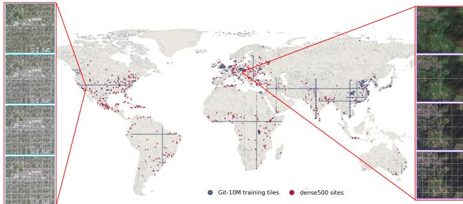  
Figure 7: Geographic coverage. Git-10M training tiles (small dark markers) sample near-globally; sites are shown in red.

Table 7: Data splits over the georeferenced Git-10M subset.
<table><tr><td>Split</td><td>Complete quads</td><td>Tiles</td></tr><tr><td>Train</td><td>362,572</td><td>6,568,890</td></tr><tr><td>Test (spatial)</td><td>10,000</td><td>49,825</td></tr><tr><td>Test (random)</td><td>10,000</td><td>49,826</td></tr><tr><td>Val (spatial)</td><td>5,000</td><td>24,958</td></tr><tr><td>Val (random)</td><td>5,000</td><td>24,969</td></tr></table>

## A.2 dense500 Site Selection and Filtering

Site centers are sampled from the LandScan 2024 [17] population raster, with an urban restriction defined as cells above the 70th percentile of populated cells. Each tile is rejected if it is overzoomed (upsampled from a coarser native resolution, detected by a low Laplacian variance) or flat (e.g. open ocean, detected by a low perchannel standard deviation). A site is kept only if all 85 of its tiles pass, so the published sites contain no upsampled or empty imagery. We observed that the imagery source can change within a single pyramid (satellite vs. aerial layers at fine zooms). This may be due to temporal diferences in source capture. The transition produces a visible discontinuity in color and texture between adjacent levels. To keep this source artifact from confounding a benchmark meant to measure generative fidelity across scale, we aggregate an 8×8×8 RGB color histogram over all tiles at each zoom level and compare adjacent levels with the Bhattacharyya distance and the Pearson correlation of their histograms. A site is rejected if any adjacent pair has a Bhattacharyya distance above 0.25 and a Pearson correlation below 0.875. Sites are resampled until 100 survive for each zoom window condition as listed in Table 1.

## A.3 Metric Details

We provide additional details on our metrics used for the evaluation of generated pyramids.

## A.4 Semantic Alignment

We describe embedding- and captioning-based semantic alignment metrics built on foundation models.

CLIP-I (category level). Following the image-image protocol of DreamBooth [37], we embed the generated and target tiles with a CLIP image encoder and report embedding cosine similarity.

DINOv3-sat (instance level). We also provide embedding similarity metrics from a geospatial foundation model. DINOv3-sat is self-supervised on 493M satellite images [42], and provides strong features for Earth observation data. We report embedding cosine similarity on these features as well.

Caption agreement (scene level). We caption both the synthesized region and the corresponding real region with a vision-language model (Qwen2.5-VL-3B-Instruct), embed the two captions with a sentence encoder (Sentence-BERT, all-MiniLM-L6-v2 [35]), and report the cosine similarity between their representations:

$$
\mathrm { C a p } ( \hat { x } , x ) = \cos \bigl ( \psi ( c ( \hat { x } ) ) , \psi ( c ( x ) ) \bigr ) ,\tag{12}
$$

where �(.) denotes the caption and � (.) the sentence embedding.

## A.5 Pyramid Consistency

A correct pyramid must be internally consistent, producing a cleanly zoomable multi-resolution structure. This implies parent-child consistency, which we measure by the following metrics:

LR-PSNR (intra-scale self-consistency). We measure how well a generated parent agrees with its own generated children, requiring no ground truth:

$$
\mathrm { L R - P S N R } ( p ) \ = \ \mathrm { P S N R } \big ( \hat { p } , \downarrow _ { 2 } M ( \hat { q } ) \big ) ,\tag{13}
$$

where $\hat { p }$ is the generated parent, �ˆ its four generated children (q the ground-truth children), � stitches four child tiles into their mosaic, and $\downarrow _ { 2 }$ denotes 2x downsampling. We report it under box (areaaverage) downsampling, the physically correct quadtree operator. Low LR-PSNR means a parent and its children disagree.

xLR-PSNR (cross-scalefidelity). Self-consistency can be high while both parent and children are jointly wrong. To separate consistency from correctness, we compare the generated child mosaic to the ground-truth child mosaic at the parent’s resolution,

$$
\mathrm { x L R - P S N R } ( p ) \ = \ \mathrm { P S N R } \big ( \ \downarrow _ { 2 } \ M ( \hat { q } ) , \ \downarrow _ { 2 } \ M ( q ) \big ) ,\tag{14}
$$

following the cross-scale LR-PSNR convention [16].

RAPSD spectral distance. We compute the radially-averaged power spectral density (RAPSD) of the generated and ground-truth child mosaics and report the mean absolute log-power diference [6],

$$
\mathrm { R A P S D } ( p ) = \frac { 1 } { | F | } \sum _ { f \in F } \big | \log S _ { \hat { q } } ( f ) - \log S _ { q } ( f ) \big | ,\tag{15}
$$

where $S ( f )$ is azimuthally-averaged power at radial frequency $f .$

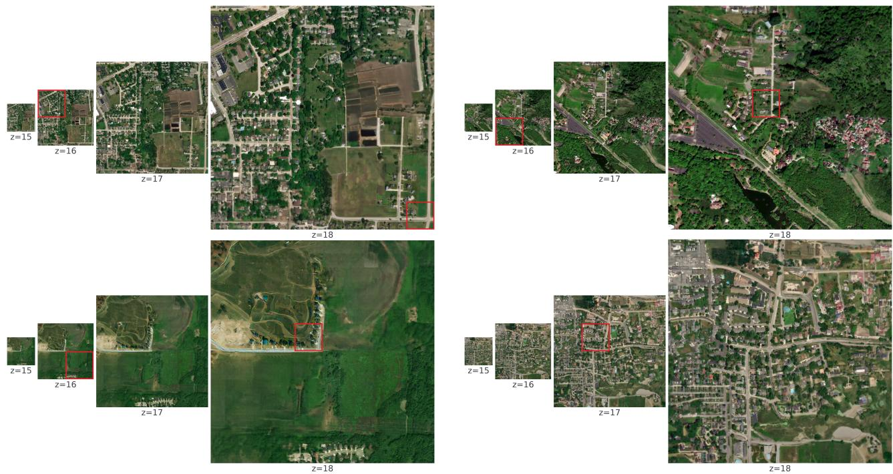  
Figure 8: Examples of 4-level pyramids generated using Genesis, conditioned on seed tiles (red) at diferent zoom levels.

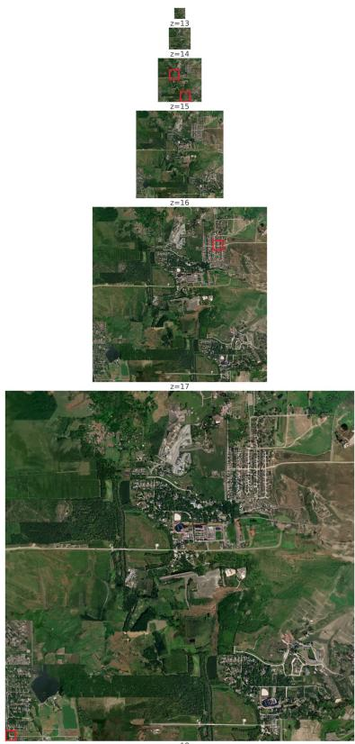  
Figure 9: Example of a 6-level pyramid generated using Genesis, conditioned on seed tiles (red) at diferent zoom levels.

<table><tr><td></td><td>SR</td><td>OP</td></tr><tr><td>Architecture</td><td></td><td></td></tr><tr><td>Backbone</td><td>JrT-B/H</td><td>JrT-B/H</td></tr><tr><td>Patch size</td><td>32</td><td>16</td></tr><tr><td>Input → output</td><td>256→512</td><td>256→256</td></tr><tr><td>Training</td><td></td><td></td></tr><tr><td>Optimizer</td><td>AdamW</td><td></td></tr><tr><td>(β1, β2)</td><td>(0.9,0.999)</td><td>(0.9,0.95)</td></tr><tr><td>Learning rate</td><td>5×10−⁵</td><td>1×10⁻⁵</td></tr><tr><td>Batch size</td><td></td><td></td></tr><tr><td>Grad. clip</td><td>1.0</td><td>0.5</td></tr><tr><td>Precision</td><td colspan="2">bf16-mixed</td></tr><tr><td>Total steps</td><td colspan="2">800k</td></tr><tr><td>EMA decays</td><td colspan="2">0.9999, 0.9996 (eval on 0.9999 weights)</td></tr><tr><td>Noise  $( P _ { \mu } , P _ { \sigma } )$ </td><td colspan="2">(−0.8, 0.8)</td></tr><tr><td>Curric. boundaries</td><td colspan="2">20/40/60% of steps</td></tr><tr><td>Cond. dropout pdrop</td><td colspan="2">0.1</td></tr><tr><td>LPIPS loss weight λperc</td><td colspan="2"></td></tr><tr><td colspan="2">Inference: per-operator evaluation</td><td></td></tr><tr><td>Solver / steps</td><td colspan="2">Euler, 50</td></tr><tr><td>CFG scale</td><td colspan="2">1.0</td></tr><tr><td colspan="2">Inference: multi-scale tile completion</td><td></td></tr><tr><td>Solver / steps</td><td colspan="2">Euler, 50</td></tr><tr><td>CFG scale</td><td colspan="2"></td></tr><tr><td>Window / overlap</td><td>2.5 256, 32 px</td><td>1.0</td></tr><tr><td>Warm-start τ</td><td>0.40</td><td></td></tr></table>

Table 8: Hyperparameters for the two operators, superresolution (SR) and outpainting (OP): architecture, training, and the sampler settings used in each evaluation.