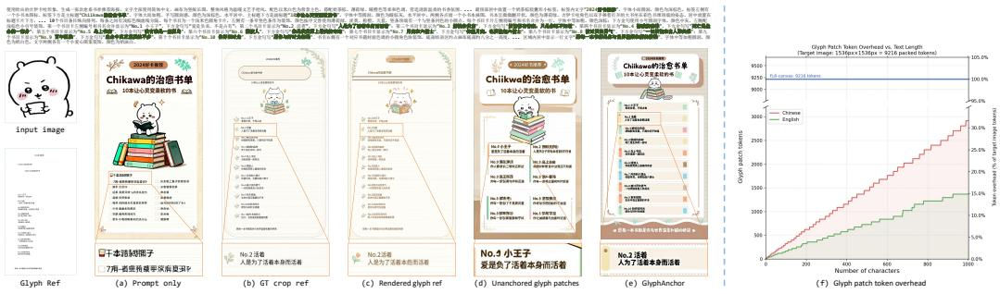
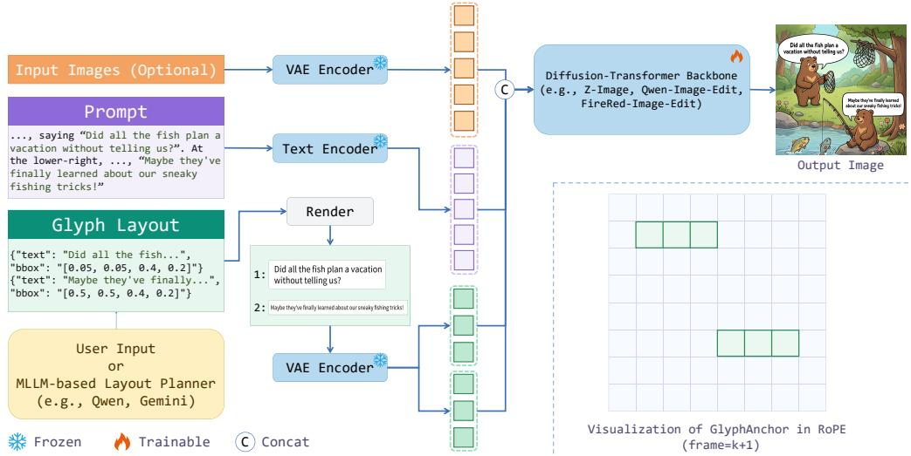
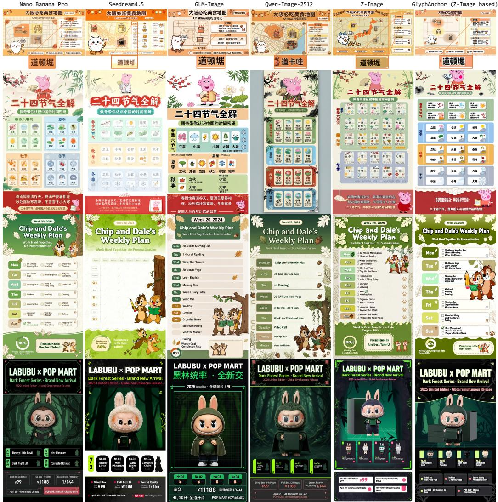
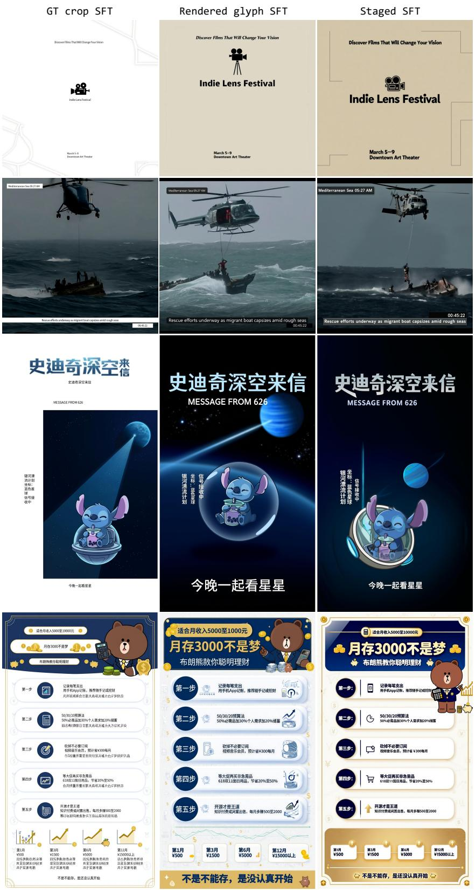

# GlyphAnchor: Enhancing Visual Text Rendering via Position-Anchored Glyph Priors

Qiang Xiang1,2, Shuang Sun2, Binglei Li1,3, Yibo Chen2, Xu Tang2, Yao Hu2, Junping Zhang1∗ 1Fudan University 2Xiaohongshu Inc. 3Shanghai Innovation Institute {qxiang24, blli24}@m.fudan.edu.cn, jpzhang@fudan.edu.cn, {sunshuang1, zhaohaibo, tangshen, xiahou}@xiaohongshu.com

  
Figure 1: Generation results of GlyphAnchor.

## Abstract

Rendering accurate text remains difficult for image generation and editing models, especially when the target contains long, complex, and densely arranged text or rare characters. Existing approaches either improve native text rendering through stronger backbones and data-centric training without explicit glyph priors, or incorporate glyph priors through specialized designs that remain insufficiently accurate and robust under challenging scenarios. We introduce GlyphAnchor, a novel text-rendering enhancement method for both text-to-image and imageediting diffusion transformer models. GlyphAnchor enhances the backbone with lightweight glyph patch conditions whose positions are anchored to the target image through the model’s native positional encoding. We train this capability with staged supervised finetuning and further refine it with text-aware post-training to improve robustness. We also introduce InfoTextBench, a benchmark for evaluating text-rich visual text rendering in both generation and editing settings. Experiments across multiple backbones and benchmarks, including long, complex, and densely

arranged text and rare character scenarios, show that GlyphAnchor consistently improves text fidelity while preserving overall image quality.

## 1 Introduction

Accurate visual text rendering has become a key bottleneck for modern text-to-image and imageediting foundation models. Recent image diffusion models [42, 50, 36, 37, 1] can synthesize high-quality scenes and follow complex instructions, but their text rendering remains less reliable for long, complex, and densely arranged text and rare characters. These errors are especially damaging in posters, notes, infographics and other text-rich applications, where a single missing or wrong character can compromise usability. This challenge arises in both text-to-image and image editing, and it involves three coupled requirements: the model must render the correct character shapes, place each text item at its intended location, and preserve the surrounding style and image quality.

Previous work has made substantial progress along several directions. Glyph-prior methods incorporate rendered glyph images along with masks, glyph-aware encoders, or style controls into generation and editing models [24, 46, 40, 39, 21, 48, 41, 45, 17, 49, 44]. These methods show that explicit glyph information is useful for improving text accuracy. Foundation models and data-centric methods [19, 42, 50, 36, 37, 1] improve native text rendering through stronger backbones, large-scale curated data, or character-aware training. Other methods [6, 7, 32, 30, 53, 31] use layout-guided control, post-hoc correction, attention control, or reward-based optimization to improve text accuracy and repair generated text. Despite these advances, accurate visual text rendering remains difficult for long, complex, and densely arranged text and rare characters.

To address this, we introduce GlyphAnchor, a method that improves visual text rendering with glyph priors. GlyphAnchor organizes glyph priors as compact glyph patch images and anchors each patch to its intended location in the target image through RoPE positions [34]. Unlike methods that rely on custom attention masks, this design leaves the attention pattern unchanged and remains compatible with standard attention acceleration kernels such as FlashAttention [10]. It provides the backbone with explicit character-shape information and spatial cues, while keeping the conditioning mechanism lightweight and easy to adapt to different diffusion-transformer backbones. We train this representation with staged supervised finetuning, which gradually transitions from ground-truth cropped patches to rendered glyph patches that match inference-time inputs. We then apply text-aware DiffusionNFT post-training [52] to improve stability and visual quality in challenging cases.

Experiments show that GlyphAnchor consistently improves the corresponding backbones in challenging text-rendering scenarios, including long, complex, densely arranged text and rare characters. To evaluate text-rich scenarios more directly, we build InfoTextBench, which measures word-level accuracy, phrase hit rate, aesthetics, and prompt following for both image editing and text-to-image settings. On LongTextBench [13], OneIGBench-text [5], CVTG-2K [35], ChineseWord [42], and InfoTextBench, GlyphAnchor consistently improves text accuracy, phrase hit rate, and overall visual quality relative to the corresponding backbones. Our main contributions are listed below.

1. We leverage glyph priors through a position-anchored design that provides glyph guidance with few extra tokens and is easy to adapt across diffusion-transformer backbones.

2. We design a dedicated training recipe for position-anchored glyph priors, including staged supervised finetuning, text-aware rewards for NFT post-training, and train-time glyph augmentation.

3. We build InfoTextBench for text-rich visual text rendering evaluation and show consistent improvements over the corresponding base models on benchmarks covering long, complex, and densely arranged text and rare characters.

## 2 Related Work

Generation and editing with glyph priors. Many works improve visual text rendering by incorporating explicit glyph priors, such as rendered glyph images or glyph-aware text encoders, into the generation backbones. Some methods [24, 46, 40, 39, 25, 23, 43, 29] inject rendered glyph images, masks, positions, or text attributes as auxiliary conditions for generation. Another line [51, 20, 21] improves text rendering by designing character-aware or glyph-aligned text encoders; and Glyph-ByT5-v2 is later adopted by foundation models such as Seedream 2.0 [14] and GLM-Image [47].

More recent work explores inference-time glyph injection: FreeText [49] injects spectral glyph priors at inference time, and GlyphBanana [44] injects glyph templates into the latent space and attention maps through an agentic workflow. For text editing, prior methods [48, 41, 45, 18, 17, 11] improve controllability through structure-style disentanglement, dedicated glyph encoders, or segmentationbased font control.

Foundation models and data-centric methods. Another line emphasizes stronger foundation backbones, large-scale curated data, or character-aware training, without relying on an explicit inference-time glyph condition. Liu et al. [19] argues that character-level text representations are key to improving spelling accuracy. Qwen-Image [42], Z-Image [36], LongCat-Image [37], ERNIE-Image [1], and X-Omni [13] demonstrate that large-scale foundation model training can achieve strong native text rendering and editing without any dedicated glyph module. LeX-Art [50] highlights the importance of data synthesis quality and prompt enhancement for these approaches.

Layout-guided control, post-hoc correction, and RL. Some methods improve text rendering through layout-guided control rather than explicit glyph priors. TextDiffuser [6, 7] first predicts text layouts, converts them into segmentation masks, and conditions the diffusion model on these masks for accurate text placement. DCText [32] and TextCrafter [35] instead localize text regions during inference and handle them with attention mask binding or separate denoising. Type-R [30] focuses on post-hoc correction by automatically detecting and repairing typographic errors in generated images. Other methods [53, 31] optimize rendering quality through structural anomaly quantification or region-level DPO with local glyph-correctness annotations.

GlyphAnchor is complementary to these methods, focusing on how to leverage glyph priors in modern diffusion-transformer backbones.

## 3 Method

To improve text rendering in modern text-to-image and image-editing foundation models, we incorporate explicit glyph priors that provide character-shape guidance beyond prompt tokens. Our goal is to inject these priors into diffusion-transformer backbones in a lightweight and seamless manner while preserving generation quality.

## 3.1 Problem Formulation

We consider both text-to-image and image editing models. The input contains a prompt p and an optional set of input images ${ \mathcal { T } } _ { \mathrm { s r c } } = \{ { \cal I } _ { \mathrm { s r c } } \}$ . The output image should faithfully follow the prompt and render a set of target texts $\boldsymbol { S } = \{ s _ { i } \} _ { i = 1 } ^ { N }$ specified in the prompt. The texts may be short labels, long sentences, dense information blocks, or mixed Chinese, English, and symbols.

## 3.2 Design Rationale

To incorporate glyph priors into the backbone, we consider several design choices. We use FireRed-Image-Edit-1.1, an image-editing model derived from Qwen-Image, as the backbone in this section because it performs better than Qwen-Image-Edit-2511 on the ChineseWord benchmark (Table 2).

As illustrated in Fig. 2 (a), default prompt-only generation struggles to render long and complex text. A straightforward design is to finetune the backbone with full-canvas glyph references, where all target texts are rendered on a blank canvas and fed as an additional input image (bottom left in Fig. 2). Fig. 2 (b) shows that this design can improve text accuracy, but it weakens prompt following and suppresses decorative details, background texture, and overall stylistic fidelity. It is also expensive in token overhead, because a full-canvas glyph reference has the same spatial size as the target image and therefore contributes roughly one extra image frame of visual tokens.

To reduce this overhead and remove the unnecessary blank canvas, we next consider a more compact design that renders each target text as a glyph patch image and feeds these images as standard reference image inputs. Fig. 2 (f) shows that even for long and complex text, glyph patches use far fewer tokens than full-canvas glyph references; for a 1536×1536 target canvas, even 1000 Chinese or English characters occupy only about 31% or 15% of a full image frame, respectively. However, compact glyph patches alone are not sufficient. Without explicit spatial grounding, the model can still miss text items or generate corrupted characters, as illustrated in Fig. 2 (d). We therefore introduce a

  
Figure 2: Design choices for GlyphAnchor, illustrated with FireRed-Image-Edit-1.1 examples.

text layout representation:

$$
\begin{array} { r } { \mathcal { L } = \{ ( s _ { i } , b _ { i } ) \} _ { i = 1 } ^ { N } , \qquad b _ { i } = ( x _ { i } , y _ { i } , w _ { i } , h _ { i } ) , } \end{array}\tag{1}
$$

where $b _ { i }$ is the normalized bounding box of $s _ { i }$ on the target canvas. The layout may be specified by the user or obtained from predefined templates, external layout tools, or an MLLM-based layout planner. Our final design pairs compact glyph patch images with layout anchors, as shown in Fig. 2 (e). The full architecture is illustrated in Fig. 3 and detailed in Sec. 3.3.

Fig. 2 also reveals a train-test mismatch for glyph conditioning. At inference, the target image is unknown, so glyph images must always be rendered from the target texts. During training, by contrast, glyph images can instead be constructed from crops of the target image, which provide stronger supervision and lead to superior text accuracy. However, this creates a train-test gap and biases the model toward copy-paste behaviour, degrading stylization, as reflected in Fig. 2 (b). Training directly with rendered glyph images avoids this gap, but provides weaker supervision and leads to lower text accuracy, as illustrated in Fig. 2 (c). These observations motivate our staged training strategy, as described in Sec. 3.4.

## 3.3 GlyphAnchor

Based on the above design rationale, GlyphAnchor adopts position-anchored glyph priors as follows. For each text item $( s _ { i } , b _ { i } )$ , we construct a glyph condition

$$
c _ { i } = ( g _ { i } , b _ { i } ) , \qquad g _ { i } = E ( G _ { i } ) ,\tag{2}
$$

where $G _ { i }$ is a glyph patch image and $E ( \cdot )$ denotes VAE encoding into latent tokens. During inference, $G _ { i }$ is rendered from $s _ { i }$ using the aspect ratio of $b _ { i } .$ with fixed line height and font size.

GlyphAnchor organizes all glyph patch images in a shared condition frame, which can be viewed as a virtual glyph plane aligned with the target latent grid. Let the target latent grid have size $H \times W$ . For each text item, we map its normalized layout box $b _ { i } = \left( x _ { i } , y _ { i } , w _ { i } , h _ { i } \right)$ to the $H \times W$ grid by scaling it to the target latent resolution and aligning the center of $g _ { i }$ with the box center, thereby obtaining the position IDs of the glyph patch tokens.

At inference, layouts are either specified by the user or planned by an MLLM, followed by postprocessing such as deduplication, overlap adjustment, and text wrapping. The glyph patch tokens are then concatenated with the standard visual token sequence, but their position IDs follow the layout anchors described above rather than the backbone’s default positional assignment. We place the glyph conditions in a virtual glyph plane after the noisy target frame and any optional source-image frames. As shown in Fig. 3, these tokens are then processed jointly by the text-to-image or image-editing backbone. Because many recent diffusion-transformer image generation models [42, 36, 2] use 3D RoPE or its variants, GlyphAnchor can be easily adapted to them by only adding glyph tokens and reassigning their position IDs. For classifier-free guidance, the conditional branch receives the glyph conditions and the unconditional branch omits them.

## 3.4 Staged Supervised Finetuning for GlyphAnchor

We use staged supervised finetuning to adapt the backbone to GlyphAnchor. Let $z _ { t } = ( 1 - \sigma _ { t } ) z _ { 0 } + \sigma _ { t } \epsilon$ denote the noisy image latent at timestep t under the flow-matching schedule, where $\epsilon \sim \mathcal { N } ( 0 , I )$

  
Figure 3: Overview of GlyphAnchor. Prompt, optional source images, and rendered glyph patch images are encoded into tokens and concatenated before a text-to-image or image-editing diffusiontransformer backbone. The resulting glyph patch tokens are placed in an additional condition frame, forming a virtual glyph plane whose coordinates are anchored to the target layout.

and let $v _ { t } = \epsilon - z _ { 0 }$ be the velocity target. Given the noisy target tokens, prompt embedding, optional source-image tokens, and position-anchored glyph patch tokens, the transformer is trained with

$$
\begin{array} { r } { \mathcal { L } _ { \mathrm { s f t } } = \mathbb { E } _ { \epsilon , z _ { 0 } , t , p , \mathcal { T } _ { \mathrm { s r c } } , \{ c _ { i } \} } \left[ \left\| \hat { v } _ { \theta } ( z _ { t } , t , p , \mathcal { T } _ { \mathrm { s r c } } , \{ c _ { i } \} ) - v _ { t } \right\| _ { 2 } ^ { 2 } \right] . } \end{array}\tag{3}
$$

We use three types of glyph conditions during training: ground-truth image crops within $b _ { i } ,$ rendered glyph patch images whose size follows the target box, and rendered glyph patch images with fixed line height and font size. Their sampling ratios are scheduled across training stages. Across stages, the sampling weight gradually shifts from ground-truth crops toward rendered glyph patches. This progression bridges the train-test gap. Ground-truth crops provide stronger supervision but are unavailable at inference, while rendered glyph patch images match inference-time inputs but are harder to learn from directly. During training, we further apply perturbation-based augmentation to the rendered glyph patch images, including random line breaks, resizing, rotation, translation, and dropout. These augmentations prevent the model from overfitting to the exact rendered appearance of glyph patches, while preserving their character-shape and coarse layout cues.

## 3.5 NFT Post-training with Text-Aware Rewards

After supervised finetuning, the model can still suffer from limited stability and a relatively high failure rate on difficult cases. We therefore adopt the DiffusionNFT framework [52] for post-training to improve stability. We further design three text-aware rewards for text correctness, style consistency, and visual fusion.

Text-Layout Consistency Reward. String-level OCR rewards, typically based on Levenshtein edit distance between recognized text and target text, can be exploited. A model may increase OCR accuracy by producing oversized characters that are easier to recognize. Also, the edit-distance objective does not penalize wrong layout in generated images. We therefore score text correctness and spatial consistency jointly. We parse the OCR outputs of the generated image and the ground-truth image into character instances with labels, locations, and scales. The textual term $R _ { \mathrm { t e x t } }$ is computed as one minus the normalized Levenshtein edit distance between the recognized text $s _ { \mathrm { p r e d } }$ and the target text $s _ { \mathrm { t g t } }$ We then form a set M of matched character pairs between characters from the generated image and those from the ground-truth image, where each pair shares the same character label, and compute a spatial term to penalize center displacement and scale mismatch:

$$
R _ { \mathrm { l a y o u t } } = \frac { \gamma _ { \mathrm { c o v } } } { | \mathcal { M } | } \sum _ { i \in \mathcal { M } } \exp ( - \lambda d _ { i } - \alpha \Delta s _ { i } ) , \qquad \gamma _ { \mathrm { c o v } } = \frac { | \mathcal { M } | } { | s _ { \mathrm { t g t } } | } .\tag{4}
$$

Here $\gamma _ { \mathrm { c o v } }$ is a character-level coverage term, $d _ { i }$ is the normalized distance between the i-th matched character pair, and $\Delta { { s } _ { i } }$ measures the difference between their character scales. Then, we define:

$$
R _ { \mathrm { T L C } } = w _ { \mathrm { t e x t } } R _ { \mathrm { t e x t } } + w _ { \mathrm { l a y o u t } } \mathrm { G a t e } ( R _ { \mathrm { t e x t } } ) R _ { \mathrm { l a y o u t } } ,\tag{5}
$$

where $\mathrm { G a t e } ( \cdot )$ is a thresholding function that activates the layout term only when text recognition is sufficiently accurate.

Style and fusion rewards. Text correctness alone is insufficient; the rendered text should also match the intended typography and blend with the surroundings seamlessly. We use $R _ { \mathrm { s t y l e } }$ to measure whether the generated text style matches the target, and $R _ { \mathrm { f u s i o n } }$ to measure whether the text is naturally integrated with local background and visual context. Both rewards are scored by an MLLM judge (Qwen3.5-122B-A10B [27] in our implementation). The final reward is

$$
R = \lambda _ { \mathrm { T L C } } R _ { \mathrm { T L C } } + \lambda _ { \mathrm { s t y l e } } R _ { \mathrm { s t y l e } } + \lambda _ { \mathrm { f u s i o n } } R _ { \mathrm { f u s i o n } } .\tag{6}
$$

## 3.6 Training Data

Our training data is composed of several curated datasets spanning both image editing and text-toimage. It covers a broad range of scenarios, including web-curated text-rich images and templateconstructed images. In total, the final training mixture contains approximately 500K samples. We control the sampling ratios across these sources during training. Overall, web-curated data and template-constructed data are sampled at an approximately balanced ratio, while the overall mixture of image editing and text-to-image data is maintained at roughly 3:1.

## 3.7 InfoTextBench

Although existing benchmarks such as LongTextBench [13] evaluate long-text rendering, they do not adequately cover text-rich scenarios with densely arranged and highly structured content. We therefore build InfoTextBench. InfoTextBench contains 133 samples, with Chinese and English prompt versions for each. Each sample includes a web-collected reference image, manually curated paired image-editing and text-to-image prompts, and an explicit target text list. Both prompts describe the same poster content, with the editing prompt relying on the reference image and the text-to-image prompt describing it explicitly. The prompts are long and detailed, averaging 1065 and 1127 prompt words for image editing and text-to-image, respectively. Each sample contains 19.3 target text items on average, with an average total text length of 204 words, often mixing Chinese, English, and symbols. The content covers diverse text-rich visual layouts across multiple real-world scenarios.

Evaluation protocol. We evaluate generated results along two dimensions: text accuracy and overall visual quality. For text accuracy, we use PaddleOCR [8] and compare the recognized text against the target text list. We report normalized edit distance (NED, defined as 1 minus the normalized Levenshtein edit distance so that higher is better), together with word-level recall, word-level precision, word-level F1, and phrase hit rate. Here, word-level recall measures how much target text is correctly generated, while word-level precision measures how much generated text is correct rather than wrong or extra. We use word-level F1 to summarize them. Phrase hit rate measures the fraction of target phrases found in the generated image, making it more sensitive to multi-block poster content. For overall visual quality, we use an MLLM judge to score aesthetics and prompt following separately, and take their average as the final overall visual quality score.

## 4 Experiments

We evaluate GlyphAnchor on both text-to-image and image-editing backbones across general textrendering benchmarks, ChineseWord for rare characters, and our text-rich InfoTextBench.

## 4.1 Experimental Setup

Implementation details. We implemented GlyphAnchor on three diffusion-transformer backbones: FireRed-Image-Edit-1.1 [38] and Qwen-Image-Edit-2511 [42] for image editing, and Z-Image [36] for text-to-image. For each backbone, we first conduct staged supervised finetuning for two days on 24 H800-80GB GPUs using AdamW [22] with a learning rate of $5 \times 1 0 ^ { - 6 }$ . We then perform NFT post-training for another two days on the same hardware setup, using AdamW with a learning rate of $3 \times 1 0 ^ { - 4 }$ . For NFT, we sample 8 images per prompt and set the number of groups to 12, with $( \lambda _ { \mathrm { T L C } } , \lambda _ { \mathrm { s t y l e } } , \lambda _ { \mathrm { f u s i o n } } ) = ( 0 . 5 , 0 . 2 5 , 0 . 2 5 )$ .

Table 1: Quantitative comparison on LongTextBench, OneIGBench-text, and CVTG-2K.
<table><tr><td rowspan="2">Method</td><td colspan="3">LongTextBench</td><td colspan="3">OneIGBench-text</td><td colspan="3">CVTG-2K</td></tr><tr><td>EN</td><td>ZH</td><td>Avg.</td><td>EN</td><td>ZH</td><td>Avg.</td><td>NED</td><td>CLIP</td><td>WAC</td></tr><tr><td>Closed-source models</td><td></td><td></td><td></td><td></td><td></td><td></td><td></td><td></td><td></td></tr><tr><td>GPT-Image-1 [26]</td><td>0.956</td><td>0.619</td><td>0.788</td><td>0.857</td><td>0.650</td><td>0.754</td><td>0.948</td><td>0.798</td><td>0.857</td></tr><tr><td>Seedream 3.0 [12]</td><td>0.896</td><td>0.878</td><td>0.887</td><td>0.865</td><td>0.928</td><td>0.897</td><td>0.854</td><td>0.782</td><td>0.592</td></tr><tr><td>Seedream 4.0 [28]</td><td>0.921</td><td>0.926</td><td>0.924</td><td>0.981</td><td>0.982</td><td>0.982</td><td>0.922</td><td>0.798</td><td>0.845</td></tr><tr><td>Nano Banana 2.0 [16]</td><td>0.981</td><td>0.949</td><td>0.965</td><td>0.944</td><td>0.983</td><td>0.964</td><td>0.875</td><td>0.737</td><td>0.779</td></tr><tr><td>Open-source baselines</td><td></td><td></td><td></td><td></td><td></td><td></td><td></td><td></td><td></td></tr><tr><td>TextCrafter [35]</td><td></td><td>一</td><td></td><td></td><td>一</td><td></td><td>0.868</td><td>0.787</td><td>0.737</td></tr><tr><td>TextDiffuser-2 [7]</td><td></td><td>一</td><td></td><td></td><td>一</td><td></td><td>0.435</td><td>0.677</td><td>0.233</td></tr><tr><td>AnyText [40]</td><td></td><td></td><td></td><td></td><td></td><td></td><td>0.468</td><td>0.743</td><td>0.180</td></tr><tr><td>Qwen-Image [42]</td><td>0.943</td><td>0.946</td><td>0.945</td><td>0.891</td><td>0.963</td><td>0.927</td><td>0.912</td><td>0.802</td><td>0.829</td></tr><tr><td>Qwen-Image-2512 [42]</td><td>0.956</td><td>0.965</td><td>0.960</td><td>0.988</td><td>0.984</td><td>0.986</td><td>0.929</td><td>0.782</td><td>0.860</td></tr><tr><td>FLUX.2-klein-9B [3]</td><td>0.864</td><td>0.218</td><td>0.541</td><td>0.866</td><td>0.492</td><td>0.679</td><td></td><td></td><td></td></tr><tr><td>Emu3.5 [9]</td><td>0.976</td><td>0.928</td><td>0.952</td><td>0.994</td><td>0.941</td><td>0.968</td><td>0.966</td><td></td><td>0.912</td></tr><tr><td>GLM-Image [47]</td><td>0.952</td><td>0.979</td><td>0.966</td><td>0.969</td><td>0.976</td><td>0.973</td><td>0.956</td><td>0.788</td><td>0.912</td></tr><tr><td>LongCat-Image [37]</td><td>0.871</td><td>0.953</td><td>0.912</td><td>0.965</td><td>0.945</td><td>0.955</td><td>0.936</td><td>0.786</td><td>0.866</td></tr><tr><td>ERNIE-Image [1]</td><td>0.968</td><td>0.959</td><td>0.964</td><td>0.967</td><td>0.898</td><td>0.932</td><td></td><td></td><td></td></tr><tr><td>Z-Image-Turbo [36]</td><td>0.917</td><td>0.926</td><td>0.922</td><td>0.994</td><td>0.982</td><td>0.988</td><td>0.928</td><td>0.805</td><td>0.859</td></tr><tr><td>GlyphAnchor final models</td><td></td><td></td><td></td><td></td><td></td><td></td><td></td><td></td><td></td></tr><tr><td>FireRed-Image-Edit-1.1 [38] + GlyphAnchor</td><td>0.895</td><td>0.898</td><td>0.897</td><td>0.813</td><td>0.937</td><td>0.875</td><td>0.865</td><td>0.785</td><td>0.747</td></tr><tr><td></td><td>0.990</td><td>0.980</td><td>0.985</td><td>0.961</td><td>0.969</td><td>0.965</td><td>0.968</td><td>0.782</td><td>0.917</td></tr><tr><td>Qwen-Image-Edit-2511 [42]</td><td>(+.095)</td><td>(+.082)</td><td>(+.088)</td><td>(+.148)</td><td>(+.032)</td><td>(+.090)</td><td>(+.103)</td><td>(-.003)</td><td>(+.170)</td></tr><tr><td rowspan="4">+ GlyphAnchor</td><td>0.900</td><td>0.924</td><td>0.912</td><td>0.893</td><td>0.963</td><td>0.928</td><td>0.850</td><td>0.774</td><td>0.717</td></tr><tr><td>0.983</td><td>0.984</td><td>0.984</td><td>0.960</td><td>0.975</td><td>0.967</td><td>0.968</td><td>0.801</td><td>0.922</td></tr><tr><td>(+.083)</td><td>(+.060)</td><td>(+.072)</td><td>(+.067)</td><td>(+.012)</td><td>(+.039)</td><td>(+.118)</td><td>(+.027)</td><td>(+.205)</td></tr><tr><td>0.935</td><td>0.936</td><td>0.936</td><td>0.987</td><td>0.988</td><td>0.988</td><td>0.937</td><td>0.797</td><td>0.867</td></tr><tr><td rowspan="3">Z-Image [36] + GlyphAnchor</td><td>0.975</td><td>0.987</td><td>0.981</td><td>0.988</td><td>0.994</td><td>0.991</td><td>0.970</td><td>0.823</td><td>0.924</td></tr><tr><td>(+.040)</td><td>(+.051)</td><td>(+.045)</td><td>(+.001)</td><td>(+.006)</td><td>(+.003)</td><td>(+.033)</td><td>(+.026)</td><td>(+.057)</td></tr><tr><td></td><td></td><td></td><td></td><td></td><td></td><td></td><td></td><td></td></tr></table>

Table 2: Quantitative comparison on ChineseWord.
<table><tr><td>Method</td><td>Level-1</td><td>Level-2</td><td>Level-3</td><td>Total</td></tr><tr><td>Qwen-Image [42]</td><td>0.937</td><td>0.332</td><td>0.026</td><td>0.533</td></tr><tr><td>Qwen-Image-2512 [42]</td><td>0.936</td><td>0.382</td><td>0.039</td><td>0.553</td></tr><tr><td>LongCat-Image [37]</td><td>0.907</td><td>0.714</td><td>0.379</td><td>0.731</td></tr><tr><td>FireRed-Image-Edit-1.1 [38] + GlyphAnchor</td><td>0.926 0.992</td><td>0.411 0.783</td><td>0.067 0.416</td><td>0.565 0.801</td></tr><tr><td>Qwen-Image-Edit-2511 [42] + GlyphAnchor</td><td>(+.066) 0.816 0.987</td><td>(+.372) 0.360</td><td>(+.349) 0.051</td><td>(+.236) 0.496</td></tr><tr><td></td><td>(+.171)</td><td>0.795 (+.435)</td><td>0.438 (+.387)</td><td>0.807 (+.311)</td></tr><tr><td>Z-Image [36]</td><td></td><td></td><td></td><td></td></tr><tr><td></td><td></td><td></td><td></td><td></td></tr><tr><td></td><td>0.852</td><td>0.278</td><td>0.025</td><td>0.476</td></tr><tr><td>+ GlyphAnchor</td><td></td><td></td><td></td><td></td></tr><tr><td></td><td>0.939</td><td>0.377</td><td>0.102</td><td>0.565</td></tr><tr><td></td><td>(+.087)</td><td>(+.099)</td><td>(+.077)</td><td>(+.089)</td></tr></table>

Evaluation setup. The evaluation covers LongTextBench [13], OneIGBench-text [5], CVTG-2K [35], ChineseWord [42], and our InfoTextBench, which together test long, complex, and densely arranged text, as well as rare characters. Since GlyphAnchor requires a layout input, we use Qwen3.5-122B-A10B [27] as the MLLM-based layout planner to generate bounding boxes for the target text items. For ChineseWord, we use the Table of General Standard Chinese Characters [33] as the source vocabulary, which includes 3,500 Level-1 commonly used characters, 3,000 Level-2 characters, and 1,605 Level-3 characters. We evaluate character rendering by generating one image for each target character. For InfoTextBench, we generate four images for each prompt and report the average score over all generated images. All metrics are higher-is-better unless stated otherwise.

## 4.2 Quantitative Results

General text-rendering benchmarks. Table 1 shows that GlyphAnchor consistently improves long text rendering across all three backbones and three evaluated benchmarks. The gains are particularly pronounced for the two editing models, while the already strong Z-Image baseline still benefits on both LongTextBench and CVTG-2K. Notably, Z-Image-based GlyphAnchor achieves the best

Table 3: Quantitative comparison on InfoTextBench.
<table><tr><td>Method</td><td>NED</td><td>Word Recall</td><td>Word Precision</td><td>Word F1</td><td>Phrase Hit</td><td>Overall Visual Quality</td></tr><tr><td>Editing models</td><td></td><td></td><td></td><td></td><td></td><td></td></tr><tr><td>Seedream 4.5 [4]</td><td>0.432</td><td>0.865</td><td>0.699</td><td>0.765</td><td>0.674</td><td>6.360</td></tr><tr><td>Nano Banana Pro [15]</td><td>0.649</td><td>0.978</td><td>0.916</td><td>0.942</td><td>0.928</td><td>9.254</td></tr><tr><td>FLUX.2-dev [2]</td><td>0.226</td><td>0.505</td><td>0.529</td><td>0.505</td><td>0.116</td><td>4.311</td></tr><tr><td>GLM-Image [47]</td><td>0.505</td><td>0.719</td><td>0.938</td><td>0.803</td><td>0.583</td><td>5.787</td></tr><tr><td>LongCat-Image Edit [37]</td><td>0.253</td><td>0.445</td><td>0.704</td><td>0.505</td><td>0.278</td><td>4.477</td></tr><tr><td>FireRed-Image-Edit-1.1 [38] + GlyphAnchor</td><td>0.210</td><td>0.443</td><td>0.463</td><td>0.433</td><td>0.154</td><td>4.608</td></tr><tr><td rowspan="4">Qwen-Image-Edit-2511 [42] + GlyphAnchor</td><td>0.651</td><td>0.950</td><td>0.864</td><td>0.898</td><td>0.713</td><td>6.480</td></tr><tr><td>(+.441)</td><td>(+.507)</td><td>(+.401)</td><td>(+.465)</td><td>(+.559)</td><td>(+1.872)</td></tr><tr><td>0.237</td><td>0.466</td><td>0.543</td><td>0.479</td><td>0.167</td><td>4.603</td></tr><tr><td>0.632</td><td>0.957</td><td>0.817</td><td>0.871</td><td>0.737</td><td>6.704</td></tr><tr><td></td><td>(+.395)</td><td>(+.491)</td><td>(+.274)</td><td>(+.392)</td><td>(+.570)</td><td>(+2.101)</td></tr><tr><td>Text-to-image models</td><td></td><td></td><td></td><td></td><td></td><td></td></tr><tr><td>Qwen-Image [42]</td><td>0.234</td><td>0.421</td><td>0.760</td><td>0.490</td><td>0.248</td><td>4.910</td></tr><tr><td>Qwen-Image-2512 [42]</td><td>0.500</td><td>0.802</td><td>0.794</td><td>0.788</td><td>0.546</td><td>6.344</td></tr><tr><td>LongCat-Image [37]</td><td>0.242</td><td>0.432</td><td>0.740</td><td>0.494</td><td>0.295</td><td>4.474</td></tr><tr><td>Z-Image [36]</td><td>0.566</td><td>0.949</td><td>0.821</td><td>0.872</td><td>0.807</td><td>7.092</td></tr><tr><td>+ GlyphAnchor</td><td>0.710</td><td>0.978</td><td>0.929</td><td>0.950</td><td>0.885</td><td>8.822</td></tr><tr><td></td><td>(+.144)</td><td>(+.029)</td><td>(+.108)</td><td>(+.078)</td><td>(+.078)</td><td>(+1.730)</td></tr></table>

Table 4: Ablation study on the FireRed-Image-Edit-1.1 backbone.
<table><tr><td rowspan="3">Variant</td><td colspan="3">LongTextBench</td><td colspan="6">InfoTextBench</td></tr><tr><td>EN</td><td>ZH</td><td> $\operatorname { A v g } .$ </td><td>NED</td><td>Word Recall</td><td>Word Precision</td><td>Word F1</td><td>Phrase Hit</td><td>Overall Visual Quality</td></tr><tr><td>FireRed-Image-Edit-1.1</td><td>0.895</td><td>0.898</td><td>0.897</td><td>0.210</td><td>0.443</td><td>0.463</td><td>0.433</td><td>0.154</td><td>4.608</td></tr><tr><td>+ default SFT with train data</td><td>0.907</td><td>0.905</td><td>0.906</td><td>0.242</td><td>0.501</td><td>0.537</td><td>0.510</td><td>0.284</td><td>4.931</td></tr><tr><td>+ glyph patch SFT w/o anchor</td><td>0.925</td><td>0.935</td><td>0.930</td><td>0.416</td><td>0.794</td><td>0.701</td><td>0.737</td><td>0.399</td><td>5.012</td></tr><tr><td>+ glyph patch SFT w/ anchor</td><td>0.984</td><td>0.974</td><td>0.979</td><td>0.647</td><td>0.949</td><td>0.856</td><td>0.892</td><td>0.711</td><td>6.395</td></tr><tr><td>+ text-aware NFT</td><td>0.990</td><td>0.980</td><td>0.985</td><td>0.651</td><td>0.950</td><td>0.864</td><td>0.898</td><td>0.713</td><td>6.480</td></tr></table>

CVTG-2K results among all compared methods, indicating that explicit glyph anchoring improves text fidelity while maintaining semantic alignment.

Rare character rendering. Table 2 further shows that GlyphAnchor is especially effective on rare character rendering, where prompts alone are insufficient. Across all backbones, GlyphAnchor improves rendering capability for both common (Level 1) and rare (Level 2 and 3) characters. This pattern supports our central hypothesis: explicit glyph evidence becomes most valuable when the prompt alone cannot reliably specify the glyph structure of the target characters.

Text-rich generation and editing. Table 3 evaluates models on InfoTextBench, a more demanding benchmark where models must render many text items while preserving layout and visual coherence. GlyphAnchor improves both word-level and phrase-level text accuracy, as well as overall visual quality, for both editing and text-to-image models. These results suggest that glyph anchoring helps not only local text correctness but also the practical usability of text-rich images.

## 4.3 Qualitative Results

Fig. 4 presents qualitative comparisons on text-rich cases, where models must render long titles, dense small text, and structured layouts. While closed-source Nano Banana Pro and GlyphAnchor both render these examples well, other baselines still suffer from common text-rendering errors, such as corrupted characters, missing or duplicated words, illegible small text, and incorrect layout. For example, in the third row, Seedream 4.5 fails to follow the prompt-specified layout, GLM-Image also produces an incorrect layout, Qwen-Image-2512 contains missing, incorrect, and corrupted words, and Z-Image omits some words. These comparisons show that GlyphAnchor can produce complete and readable text-rich images.

  
Figure 4: Qualitative comparison on challenging text-rich cases. Best viewed with zoom.

## 4.4 Ablation Study

Table 4 presents an ablation study on the FireRed-Image-Edit-1.1 backbone. All SFT variants are trained for the same number of steps on the same training data. Default SFT on the same training data provides only limited gains over the original backbone. Training with glyph patches but without positional anchoring yields substantially larger gains, confirming the value of explicit glyph conditions. Adding positional anchoring further improves performance across all metrics, with a particularly large gain in phrase hit rate on InfoTextBench, showing that spatial grounding is crucial for making glyph patches an effective auxiliary enhancement for text-rich generation and editing. Finally, text-aware NFT post-training yields an additional consistent boost, producing the best results on both LongTextBench and InfoTextBench. Together, these results show that glyph priors improve text rendering and that positional anchoring is essential for making them reliable.

## 5 Conclusion

We presented GlyphAnchor, a method for enhancing visual text rendering in both text-to-image and image editing using position-anchored glyph priors. GlyphAnchor organizes glyph priors as compact glyph patch images and anchors them to target layouts through the model’s native positional encoding. This provides explicit character-shape information together with spatial cues, while keeping the conditioning mechanism lightweight and easy to adapt across diffusion-transformer backbones. Combined with staged supervised finetuning and text-aware NFT post-training, GlyphAnchor consistently improves the corresponding backbones on long, complex, and densely arranged text and rare character scenarios. We also introduced InfoTextBench to evaluate text-rich visual text rendering. Overall, our results show that GlyphAnchor improves text fidelity while preserving image quality.

Broader Impacts. While our work improves visual text generation, high-fidelity text rendering may increase misuse risks, such as creating forged or misleading posters, advertisements, or documents. We encourage responsible use and further study of safeguards for such systems.

## References

[1] Baidu. ERNIE-Image. https://huggingface.co/baidu/ERNIE-Image, 2026.

[2] Black Forest Labs. FLUX.2-dev. https://huggingface.co/black-forest-labs/FLUX. 2-dev, 2025.

[3] Black Forest Labs. FLUX.2-klein-9B. https://huggingface.co/black-forest-labs/ FLUX.2-klein-9B, 2026.

[4] ByteDance. Seedream 4.5. https://docs.byteplus.com/en/docs/ModelArk/1829186, 2025.

[5] Jingjing Chang, Yixiao Fang, Peng Xing, Shuhan Wu, Wei Cheng, Rui Wang, Xianfang Zeng, Gang Yu, and Hai-Bao Chen. OneIG-Bench: Omni-dimensional nuanced evaluation for image generation, 2025. URL https://arxiv.org/abs/2506.07977.

[6] Jingye Chen, Yupan Huang, Tengchao Lv, Lei Cui, Qifeng Chen, and Furu Wei. TextDiffuser: Diffusion models as text painters. In Advances in Neural Information Processing Systems, 2023.

[7] Jingye Chen, Yupan Huang, Tengchao Lv, Lei Cui, Qifeng Chen, and Furu Wei. TextDiffuser-2: Unleashing the power of language models for text rendering. In Proceedings of the European Conference on Computer Vision, Lecture Notes in Computer Science, pages 386–402. Springer, 2024.

[8] Cheng Cui, Ting Sun, Manhui Lin, Tingquan Gao, Yubo Zhang, Jiaxuan Liu, Xueqing Wang, Zelun Zhang, Changda Zhou, Hongen Liu, Yue Zhang, Wenyu Lv, Kui Huang, Yichao Zhang, Jing Zhang, Jun Zhang, Yi Liu, Dianhai Yu, and Yanjun Ma. PaddleOCR 3.0 Technical Report, 2025. URL https://arxiv.org/abs/2507.05595.

[9] Yufeng Cui, Honghao Chen, Haoge Deng, Xu Huang, Xinghang Li, Jirong Liu, Yang Liu, Zhuoyan Luo, Jinsheng Wang, Wenxuan Wang, Yueze Wang, Chengyuan Wang, Fan Zhang, Yingli Zhao, Ting Pan, Xianduo Li, Zecheng Hao, Wenxuan Ma, Zhuo Chen, Yulong Ao, Tiejun Huang, Zhongyuan Wang, and Xinlong Wang. Emu3.5: Native multimodal models are world learners, 2025. URL https://arxiv.org/abs/2510.26583.

[10] Tri Dao, Daniel Y. Fu, Stefano Ermon, Atri Rudra, and Christopher Ré. FlashAttention: Fast and memory-efficient exact attention with io-awareness. In Advances in Neural Information Processing Systems, 2022.

[11] Zhengyao Fang, Pengyuan Lyu, Jingjing Wu, Chengquan Zhang, Jun Yu, Guangming Lu, and Wenjie Pei. Recognition-Synergistic Scene Text Editing. In Proceedings of the IEEE/CVF Conference on Computer Vision and Pattern Recognition, pages 13104–13113. Computer Vision Foundation / IEEE, 2025.

[12] Yu Gao, Lixue Gong, Qiushan Guo, Xiaoxia Hou, Zhichao Lai, Fanshi Li, Liang Li, Xiaochen Lian, Chao Liao, Liyang Liu, Wei Liu, Yichun Shi, Shiqi Sun, Yu Tian, Zhi Tian, Peng Wang, Rui Wang, Xuanda Wang, Xun Wang, Ye Wang, Guofeng Wu, Jie Wu, Xin Xia, Xuefeng Xiao, Zhonghua Zhai, Xinyu Zhang, Qi Zhang, Yuwei Zhang, Shijia Zhao, Jianchao Yang, and Weilin Huang. Seedream 3.0 technical report, 2025. URL https://arxiv.org/abs/2504.11346.

[13] Zigang Geng, Yibing Wang, Yeyao Ma, Chen Li, Yongming Rao, Shuyang Gu, Zhao Zhong, Qinglin Lu, Han Hu, Xiaosong Zhang, Linus, Di Wang, and Jie Jiang. X-Omni: Reinforcement learning makes discrete autoregressive image generative models great again, 2025. URL https://arxiv.org/abs/2507.22058.

[14] Lixue Gong, Xiaoxia Hou, Fanshi Li, Liang Li, Xiaochen Lian, Fei Liu, Liyang Liu, Wei Liu, Wei Lu, Yichun Shi, Shiqi Sun, Yu Tian, Zhi Tian, Peng Wang, Xun Wang, Ye Wang, Guofeng Wu, Jie Wu, Xin Xia, Xuefeng Xiao, Linjie Yang, Zhonghua Zhai, Xinyu Zhang, Qi Zhang, Yuwei Zhang, Shijia Zhao, Jianchao Yang, and Weilin Huang. Seedream 2.0: A native chinese-english bilingual image generation foundation model, 2025. URL https: //arxiv.org/abs/2503.07703.

[15] Google. Nano banana pro. https://storage.googleapis.com/deepmind-media/ Model-Cards/Gemini-3-Pro-Image-Model-Card.pdf, 2025.

[16] Google. Nano Banana 2. https://blog.google/innovation-and-ai/technology/ai/ nano-banana-2/, 2026.

[17] Bowen Jiang, Yuan Yuan, Xinyi Bai, Zhuoqun Hao, Alyson Yin, Yaojie Hu, Wenyu Liao, Lyle H. Ungar, and Camillo Jose Taylor. ControlText: Unlocking controllable fonts in multilingual text rendering without font annotations. In Proceedings of the Empirical Methods in Natural Language Processing (Findings), pages 25414–25425. Association for Computational Linguistics, 2025.

[18] Rui Lan, Yancheng Bai, Xu Duan, Mingxing Li, Dongyang Jin, Ryan Xu, Dong Nie, Lei Sun, and Xiangxiang Chu. FLUX-Text: A simple and advanced diffusion transformer baseline for scene text editing, 2025. URL https://arxiv.org/abs/2505.03329.

[19] Rosanne Liu, Dan Garrette, Chitwan Saharia, William Chan, Adam Roberts, Sharan Narang, Irina Blok, RJ Mical, Mohammad Norouzi, and Noah Constant. Character-aware models improve visual text rendering. In Proceedings of the Annual Meeting of the Association for Computational Linguistics (Volume 1: Long Papers), pages 16270–16297. Association for Computational Linguistics, 2023.

[20] Zeyu Liu, Weicong Liang, Zhanhao Liang, Chong Luo, Ji Li, Gao Huang, and Yuhui Yuan. Glyph-ByT5: A customized text encoder for accurate visual text rendering. In Proceedings ofthe European Conference on Computer Vision, Lecture Notes in Computer Science, pages 361–377. Springer, 2024.

[21] Zeyu Liu, Weicong Liang, Yiming Zhao, Bohan Chen, Lin Liang, Lijuan Wang, Ji Li, and Yuhui Yuan. Glyph-ByT5-v2: A strong aesthetic baseline for accurate multilingual visual text rendering, 2024. URL https://arxiv.org/abs/2406.10208.

[22] Ilya Loshchilov and Frank Hutter. Decoupled weight decay regularization. In Proceedings of the International Conference on Learning Representations. OpenReview.net, 2019.

[23] Runnan Lu, Yuxuan Zhang, Jiaming Liu, Haofan Wang, and Yiren Song. EasyText: Controllable diffusion transformer for multilingual text rendering. In Proceedings ofthe AAAI Conference on Artificial Intelligence, pages 7565–7573. AAAI Press, 2026.

[24] Jian Ma, Mingjun Zhao, Chen Chen, Ruichen Wang, Di Niu, Haonan Lu, and Xiaodong Lin. GlyphDraw: Seamlessly rendering text with intricate spatial structures in text-to-image generation, 2023. URL https://arxiv.org/abs/2303.17870.

[25] Jian Ma, Yonglin Deng, Chen Chen, Nanyang Du, Haonan Lu, and Zhenyu Yang. GlyphDraw2: Automatic generation of complex glyph posters with diffusion models and large language models, 2025. URL https://arxiv.org/abs/2407.02252.

[26] OpenAI. GPT-Image-1. https://openai.com/zh-Hans-CN/index/ introducing-4o-image-generation/, 2025.

[27] Qwen Team. Qwen3.5: Towards native multimodal agents, February 2026. URL https: //qwen.ai/blog?id=qwen3.5.

[28] Team Seedream, Yunpeng Chen, Yu Gao, Lixue Gong, Meng Guo, Qiushan Guo, Zhiyao Guo, Xiaoxia Hou, Weilin Huang, Yixuan Huang, Xiaowen Jian, Huafeng Kuang, Zhichao Lai, Fanshi Li, Liang Li, Xiaochen Lian, Chao Liao, Liyang Liu, Wei Liu, Yanzuo Lu, Zhengxiong Luo, Tongtong Ou, Guang Shi, Yichun Shi, Shiqi Sun, Yu Tian, Zhi Tian, Peng Wang, Rui Wang, Xun Wang, Ye Wang, Guofeng Wu, Jie Wu, Wenxu Wu, Yonghui Wu, Xin Xia, Xuefeng Xiao, Shuang Xu, Xin Yan, Ceyuan Yang, Jianchao Yang, Zhonghua Zhai, Chenlin Zhang, Heng Zhang, Qi Zhang, Xinyu Zhang, Yuwei Zhang, Shijia Zhao, Wenliang Zhao, and Wenjia Zhu. Seedream 4.0: Toward next-generation multimodal image generation, 2025. URL https://arxiv.org/abs/2509.20427.

[29] Wenda Shi, Yiren Song, Dengming Zhang, Jiaming Liu, and Xingxing Zou. FonTS: Text rendering with typography and style controls. In Proceedings ofthe IEEE/CVF International Conference on Computer Vision, pages 18463–18474, October 2025.

[30] Wataru Shimoda, Naoto Inoue, Daichi Haraguchi, Hayato Mitani, Seiichi Uchida, and Kota Yamaguchi. Type-R: Automatically retouching typos for text-to-image generation. In Proceedings ofthe IEEE/CVF Conference on Computer Vision and Pattern Recognition, pages 2745–2754. Computer Vision Foundation / IEEE, 2025.

[31] Xincheng Shuai, Ziye Li, Henghui Ding, and Dacheng Tao. GlyphPrinter: Region-grouped direct preference optimization for glyph-accurate visual text rendering. In Proceedings ofthe IEEE/CVF Conference on Computer Vision and Pattern Recognition, 2026.

[32] Jaewoo Song, Jooyoung Choi, Kanghyun Baek, Sangyub Lee, Daemin Park, and Sungroh Yoon. DCText: Scheduled attention masking for visual text generation via divide-and-conquer strategy, 2025. URL https://arxiv.org/abs/2512.01302.

[33] State Council of the People’s Republic of China. Circular of the state council on releasing the general standard chinese characters table. https://www.gov.cn/zwgk/2013-08/19/ content\_2469793.htm, 2013. Guo Fa [2013] No. 23. Accessed: 2026-05-05.

[34] Jianlin Su, Murtadha H. M. Ahmed, Yu Lu, Shengfeng Pan, Wen Bo, and Yunfeng Liu. RoFormer: Enhanced transformer with rotary position embedding. Neurocomputing, 568: 127063, 2024.

[35] Ying Tai, Nikai Du, Rui Xie, Zhennan Chen, Qian Wang, Zhengkai Jiang, Kai Zhang, and Jian Yang. Investigating text insulation and attention mechanisms for complex visual text generation, 2026. URL https://arxiv.org/abs/2503.23461.

[36] Image Team, Huanqia Cai, Sihan Cao, Ruoyi Du, Peng Gao, Steven Hoi, Zhaohui Hou, Shijie Huang, Dengyang Jiang, Xin Jin, Liangchen Li, Zhen Li, Zhong-Yu Li, David Liu, Dongyang Liu, Junhan Shi, Qilong Wu, Feng Yu, Chi Zhang, Shifeng Zhang, and Shilin Zhou. Z-Image: An efficient image generation foundation model with single-stream diffusion transformer, 2025. URL https://arxiv.org/abs/2511.22699.

[37] Meituan LongCat Team, Hanghang Ma, Haoxian Tan, Jiale Huang, Junqiang Wu, Jun-Yan He, Lishuai Gao, Songlin Xiao, Xiaoming Wei, Xiaoqi Ma, Xunliang Cai, Yayong Guan, and Jie Hu. LongCat-Image Technical Report, 2025. URL https://arxiv.org/abs/2512.07584.

[38] Super Intelligence Team, Changhao Qiao, Chao Hui, Chen Li, Cunzheng Wang, Dejia Song, Jiale Zhang, Jing Li, Qiang Xiang, Runqi Wang, Shuang Sun, Wei Zhu, Xu Tang, Yao Hu, Yibo Chen, Yuhao Huang, Yuxuan Duan, Zhiyi Chen, and Ziyuan Guo. FireRed-Image-Edit-1.0 Technical Report, 2026. URL https://arxiv.org/abs/2602.13344.

[39] Yuxiang Tuo, Yifeng Geng, and Liefeng Bo. AnyText2: Visual text generation and editing with customizable attributes, 2024. URL https://arxiv.org/abs/2411.15245.

[40] Yuxiang Tuo, Wangmeng Xiang, Jun-Yan He, Yifeng Geng, and Xuansong Xie. AnyText: Multilingual visual text generation and editing. In Proceedings of the International Conference on Learning Representations. OpenReview.net, 2024.

[41] Tong Wang, Ting Liu, Xiaochao Qu, Chengjing Wu, Luoqi Liu, and Xiaolin Hu. GlyphMastero: A glyph encoder for high-fidelity scene text editing. In Proceedings ofthe IEEE/CVF Conference on Computer Vision and Pattern Recognition, pages 28523–28532. Computer Vision Foundation / IEEE, 2025.

[42] Chenfei Wu, Jiahao Li, Jingren Zhou, Junyang Lin, Kaiyuan Gao, Kun Yan, Sheng ming Yin, Shuai Bai, Xiao Xu, Yilei Chen, Yuxiang Chen, Zecheng Tang, Zekai Zhang, Zhengyi Wang, An Yang, Bowen Yu, Chen Cheng, Dayiheng Liu, Deqing Li, Hang Zhang, Hao Meng, Hu Wei, Jingyuan Ni, Kai Chen, Kuan Cao, Liang Peng, Lin Qu, Minggang Wu, Peng Wang, Shuting Yu, Tingkun Wen, Wensen Feng, Xiaoxiao Xu, Yi Wang, Yichang Zhang, Yongqiang Zhu, Yujia Wu, Yuxuan Cai, and Zenan Liu. Qwen-Image Technical Report, 2025. URL https://arxiv.org/abs/2508.02324.

[43] Yu Xie, Jielei Zhang, Pengyu Chen, Weihang Wang, Longwen Gao, Peiyi Li, Qian Qiao, and Zhouhui Lian. TextFlux: An ocr-free dit model for high-fidelity multilingual scene text synthesis, 2026. URL https://arxiv.org/abs/2505.17778.

[44] Zexuan Yan, Jiarui Jin, Yue Ma, Shijian Wang, Jiahui Hu, Wenxiang Jiao, Yuan Lu, and Linfeng Zhang. GlyphBanana: Advancing precise text rendering through agentic workflows, 2026. URL https://arxiv.org/abs/2603.12155.

[45] Zhenyu Yan, Jian Wang, Aoqiang Wang, Yuhan Li, Wenxiang Shang, and Zhu Hangcheng. TextMaster: A unified framework for realistic text editing via glyph-style dual-control. In Proceedings of the IEEE/CVF International Conference on Computer Vision, pages 16112– 16121, October 2025.

[46] Yukang Yang, Dongnan Gui, Yuhui Yuan, Weicong Liang, Haisong Ding, Han Hu, and Kai Chen. GlyphControl: Glyph conditional control for visual text generation. In Advances in Neural Information Processing Systems, 2023.

[47] Z.AI. GLM-Image. https://z.ai/blog/glm-image, 2026.

[48] Weichao Zeng, Yan Shu, Zhenhang Li, Dongbao Yang, and Yu Zhou. TextCtrl: Diffusion-based scene text editing with prior guidance control. In Advances in Neural Information Processing Systems, 2024.

[49] Ruiqiang Zhang, Hengyi Wang, Chang Liu, Guanjie Wang, Zehua Ma, and Weiming Zhang. FreeText: Training-free text rendering in diffusion transformers via attention localization and spectral glyph injection, 2026. URL https://arxiv.org/abs/2601.00535.

[50] Shitian Zhao, Qilong Wu, Xinyue Li, Bo Zhang, Ming Li, Qi Qin, Dongyang Liu, Kaipeng Zhang, Hongsheng Li, Yu Qiao, Peng Gao, Bin Fu, and Zhen Li. LeX-Art: Rethinking text generation via scalable high-quality data synthesis, 2025. URL https://arxiv.org/abs/ 2503.21749.

[51] Yiming Zhao and Zhouhui Lian. UDiffText: A unified framework for high-quality text synthesis in arbitrary images via character-aware diffusion models. In Proceedings of the European Conference on Computer Vision, Lecture Notes in Computer Science, pages 217–233. Springer, 2024.

[52] Kaiwen Zheng, Huayu Chen, Haotian Ye, Haoxiang Wang, Qinsheng Zhang, Kai Jiang, Hang Su, Stefano Ermon, Jun Zhu, and Ming-Yu Liu. DiffusionNFT: Online diffusion reinforcement with forward process. In Proceedings of the International Conference on Learning Representations, 2026.

[53] Hanshen Zhu, Yuliang Liu, Xuecheng Wu, An-Lan Wang, Hao Feng, Dingkang Yang, Chao Feng, Can Huang, Jingqun Tang, and Xiang Bai. TextPecker: Rewarding structural anomaly quantification for enhancing visual text rendering. In Proceedings of the IEEE/CVF Conference on Computer Vision and Pattern Recognition, 2026.

## A Technical appendices and supplementary material

## A.1 Qualitative ablation on positional anchoring

Fig. 5 provides a qualitative comparison of glyph patch SFT with and without positional anchoring on the FireRed-Image-Edit-1.1 backbone. Both GlyphAnchor variants use the same staged SFT strategy, training data, rendered glyph patch images, layout inputs, and inference pipeline. They differ only in whether glyph tokens are assigned position IDs according to their layout anchors. Consistent with the quantitative ablation in Table 4, text accuracy improves progressively from the backbone to glyph patch SFT without anchoring and further to position-anchored glyph patch SFT. Without anchoring, glyph patches are only weakly associated with the target regions, often leading to incomplete text or corrupted characters; positional anchoring instead aligns glyph priors with their target layout, enabling more accurate rendering.

  
Figure 5: Qualitative ablation of positional anchoring. Best viewed with zoom.

## A.2 Qualitative ablation on staged SFT

Fig. 6 qualitatively compares three SFT variants of GlyphAnchor. All variants use FireRed-Image-Edit-1.1 as the backbone, with the same position-anchored glyph prior strategy, training data, layout inputs, and inference pipeline. They differ only in the glyph patch images used during SFT: GT crop SFT uses cropped text regions from the ground-truth target images, rendered glyph SFT uses rendered black-on-white glyph patches, and staged SFT follows our proposed staged supervision strategy. At inference time, all variants are conditioned on rendered glyph patches. GT crop SFT encourages the model to transfer the appearance of the conditioning patches. Since inference uses rendered glyph patches rather than real text crops, this supervision introduces a train–test mismatch, which manifests as white-background copy-paste artifacts. Rendered glyph SFT alleviates this mismatch and improves visual consistency, but remains less faithful to the prompt-specified style. In contrast, staged SFT better preserves the target image style while maintaining comparable text accuracy, yielding the most consistent overall results.

  
Figure 6: Qualitative ablation of staged SFT. Best viewed with zoom.

## A.3 Prompt Templates

## A.3.1 Prompt templates for NFT rewards.

During NFT post-training in Sec. 3.5, we use two MLLM prompt templates for reward computation: one for style consistency and one for visual fusion. The style consistency prompt evaluates whether the generated text style matches the target typography and visual style, while the visual fusion prompt evaluates whether the rendered text is naturally integrated with the local background and surrounding visual context. The Text-Layout Consistency Reward is computed separately from OCR recognition and layout matching, and therefore does not require an MLLM prompt. The two prompt templates are provided below.

## Style consistency reward prompt template.

You are an expert in evaluating visual text style consistency. You are skilled at comparing the style consistency of corresponding text regions across two images. You should focus on typography, font weight, stroke shape, color, outlines, shadows, texture and material, decorative details, layout style, and the overall visual language. Your task is not to evaluate whether the text content is correct, nor to evaluate how naturally the text is fused into the image, but only to assess whether the styles of corresponding text regions are consistent across the two images.

Image A: target reference image (ground-truth image)

Image B: model-generated image

Please evaluate whether the styles of the corresponding text regions are consistent across the two images according to the following prompt. Note that different text regions within the same image may naturally have different styles, which is acceptable. You should focus on the style similarity between corresponding text regions across the two images, rather than requiring all text regions within one image to share the same style.

## Prompt: [PROMPT]

If the prompt is a text removal task, such as deleting, removing, erasing, or wiping out text, this style consistency evaluation is not applicable. In that case, directly reply with 3 and do not provide any explanation.

Please consider the following aspects: typography, font weight, stroke thickness and stroke structure, handwritten vs. printed appearance, color, outlines, shadows, texture and material, decorative details, layout style, and overall visual tone.

Please assign an integer score from 0 to 5 according to the following criteria:

0: The styles of the corresponding text regions are completely inconsistent. The font type, color, or decorative language are clearly incorrect, and the overall result looks like a completely different design system.

1: Only a very small amount of superficial similarity is present, while the overall style is still clearly incorrect. Most key aspects (glyph form, color, outlines, brushwork, decoration) differ substantially.

2: The generated image shows some attempt to imitate the target style, but only some aspects are similar. Noticeable style drift remains, and the consistency between corresponding text regions is weak.

3: The overall style is basically similar, and the main stylistic direction is correct, but there are still differences in several important details, such as stroke characteristics, decorative treatment, color relationships, or typographic tone. 4: The styles are highly similar. Most corresponding text regions are consistent with the target image, with only minor differences that do not affect the overall style judgment.

5: The styles are almost perfectly consistent. The corresponding text regions closely match the target image in typography, stroke language, color treatment, decorative details, and overall visual tone.

Please note: evaluate only text style consistency. Do not evaluate text correctness, and do not evaluate how naturally the text blends with the background.

Please directly reply with a single integer score from 0 to 5.

## Visual fusion reward prompt template.

You are an expert in evaluating visual text fusion in images. You are skilled at comparing the degree of harmony and integration between text and the overall image in a target reference image and a generated image. You can distinguish between real-world images and graphic design images such as posters, covers, or layout-based designs, and evaluate text fusion according to the appropriate visual standard for each case. Your task is not to evaluate whether the text content is correct, nor to evaluate whether the text style is consistent, but to assess whether the text in the generated image achieves the same level of visual fusion as in the target reference image.

Image A: target reference image (ground-truth image)

Image B: model-generated image

Please compare how well the text is integrated with the overall image in the two images, and evaluate whether the generated image reaches the level of fusion shown in the target reference image. Here, “fusion” refers to the degree of coordination between the text and the background, texture, lighting, perspective, edges, clarity, occlusion, surface/material attachment, and overall visual style.

If the prompt is a text removal task, such as deleting, removing, erasing, or wiping out text, this visual fusion evaluation is not applicable. In that case, directly reply with 3 and do not provide any explanation.

Please pay special attention to the following two evaluation standards:   
1. If the image is a real-world scene image (e.g., a photographed scene, a real object surface, a street view, a product   
image, or an environmental image), focus on whether the text looks as if it naturally exists in the scene, and whether   
it is consistent with realistic lighting, perspective, occlusion, material attachment, and edge details.   
2. If the image is a graphic design image, poster, cover, sticker-like image, or layout-based design, focus on whether   
the text is visually coordinated with the design system, and whether it achieves the same level of decoration, layout   
quality, visual balance, and design completeness as the target image. Do not penalize it harshly based on a “must   
look physically real” standard.   
Please assign an integer score from 0 to 5 according to the following criteria:   
0: The text in the generated image is clearly disconnected from the overall image, and its fusion is far worse than   
that in the target reference image. Under either the real-world standard or the design-image standard, it looks very   
unnatural and awkward.   
1: A few local regions may be somewhat acceptable, but the overall result is still clearly uncoordinated. There are   
serious problems with edge quality, spatial attachment, lighting/perspective, or design consistency.   
2: The text shows partial integration with the image, but noticeable awkwardness remains. There is still a large gap   
compared with the target reference image.   
3: The overall fusion is basically acceptable, and the major text regions look reasonably integrated. Compared   
with the target reference image, it reaches a moderate level, although noticeable stiffness or insufficient design   
coordination remains upon closer inspection.   
4: The fusion quality is high. Most text regions are well coordinated with the image, and the overall effect is close to   
that of the target reference image, with only minor shortcomings.   
5: The fusion quality reaches or almost reaches the level of the target reference image. In real-world images, the text   
looks very natural and believable; in design images, it looks highly coordinated and polished.   
Please note: evaluate only visual fusion relative to the target reference image. Do not evaluate text correctness, and   
do not separately evaluate whether the text style is consistent.   
Please directly reply with a single integer score from 0 to 5.

## A.3.2 Prompt templates for InfoTextBench evaluation.

For InfoTextBench in Sec. 3.7, we use an MLLM prompt template to evaluate overall visual quality. The prompt asks the MLLM judge to score two aspects of each generated image: aesthetics and prompt following. The aesthetics score reflects visual and design quality, while the prompt-following score reflects consistency with the input prompt. The final overall visual quality score is obtained by averaging these two scores. The prompt template is provided below.

You are a professional digital artist and graphic designer. Your task is to evaluate an AI-generated image.   
The system will provide two images: Image A: the reference image, when applicable. Image B: the generated image   
based on the reference image.   
Please return your evaluation in the following format (keep the reasoning concise):   
{   
"score": [aesthetic\_score, prompt\_follow\_score],   
"reasoning": ".   
}   
Scoring criteria (0–10):   
The first score (aesthetic, 0–10): Evaluate the overall visual quality of the generated image, including composition   
and layout, color harmony, visual hierarchy, level of detail, and overall stylistic coherence.   
0 = Extremely poor. The image is visually chaotic or severely flawed, with major problems such as broken   
composition, inconsistent or unpleasant colors, weak visual hierarchy, crude details, obvious artifacts, or a generally   
unfinished appearance. It does not meet even a basic visual design standard.   
10 = Excellent. The image demonstrates outstanding visual quality at a highly polished professional level. The   
composition is well balanced, the layout is refined, the colors are harmonious and effective, the visual hierarchy is   
clear, the details are carefully rendered, and the overall style is highly coherent and visually impressive.   
The second score (prompt following, 0–10): Evaluate whether the generated image follows the prompt below,   
including layout structure, text content (whether all required text appears and is correct), style and color scheme, and   
the use of the reference image content.   
0 = Completely fails to follow the prompt. Most key requirements are missing, incorrect, or ignored. The layout, text,   
style, or major visual elements do not match the prompt description in any meaningful way.   
10 = Perfectly follows the prompt. All major and minor requirements are faithfully satisfied, including the intended   
layout, required text content, stylistic description, color design, and visual elements. The generated image closely   
matches the prompt in both content and presentation.   
Generation prompt: <PROMPT>   
Required text list (provided to help judge whether the text is rendered correctly): <TEXTS>