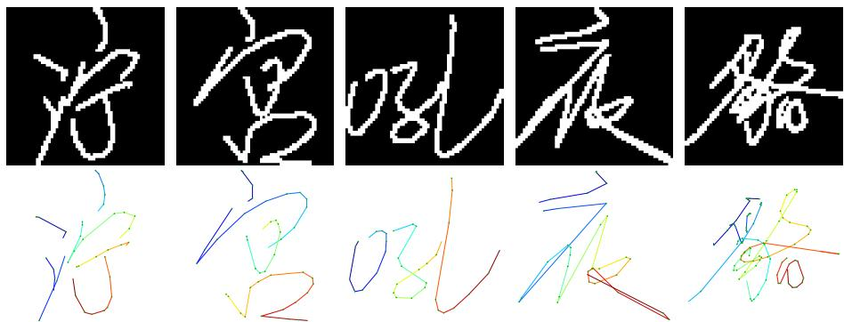
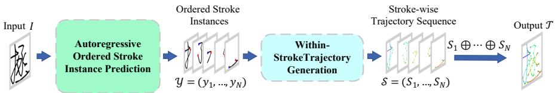
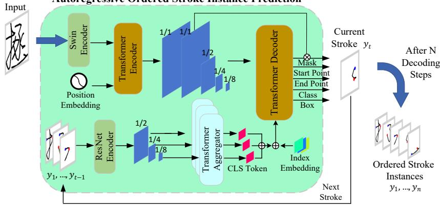
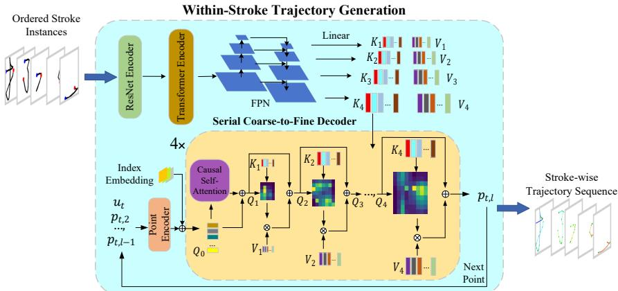
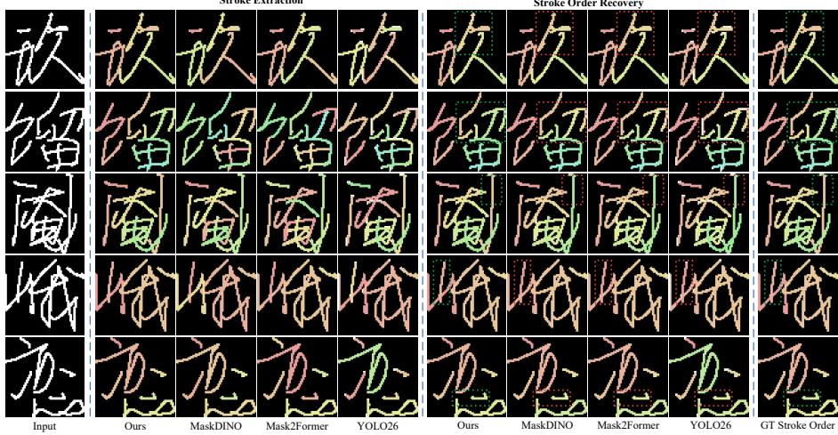
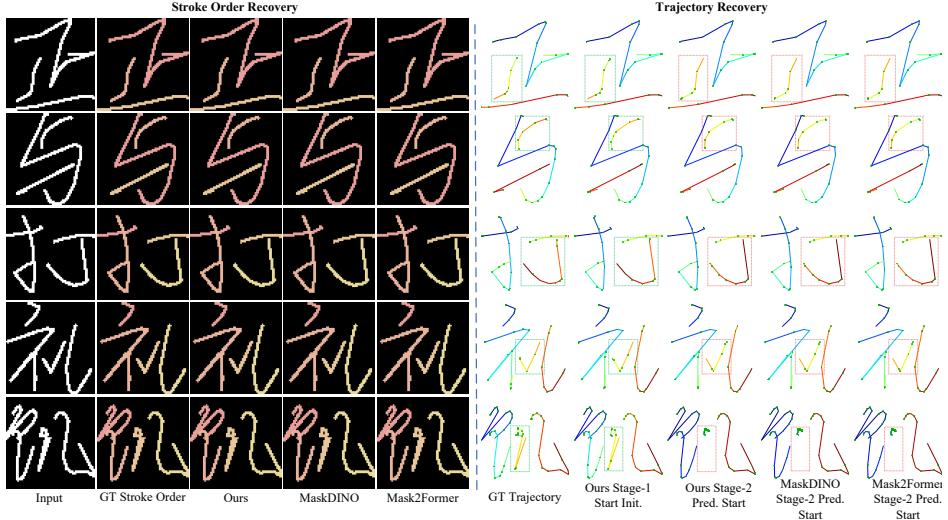

# Handwriting Trajectory Recovery via Autoregressive Ordered Stroke Instance Prediction

En-Guang Wanga,b, Yan-Ming Zhanga,∗, Fei Yina, Cheng-Lin Liua,b,c

aInstitute of Automation, Chinese Academy of Sciences, Beijing, 100190, China bSchool of Information Science and Technology, ShanghaiTech University, Shanghai, 201210, China

cSchool of Artificial Intelligence, University of Chinese Academy of Sciences, Beijing, 100049, China

## Abstract

Handwriting trajectory recovery aims to infer the dynamic writing process hidden behind a static handwritten image. Since ofline handwriting preserves only the final spatial ink pattern, temporal information such as stroke order, writing direction, and pen-tip motion is lost, making recovery inherently ambiguous. Existing learning-based methods often directly predict the complete character trajectory without explicitly exploiting the stroke-level organization of handwriting. We argue that recovering the writing process should follow the writing process itself. Accordingly, we propose a two-stage framework that first recovers ordered stroke instances and then reconstructs continuous within-stroke motion. The first stage integrates stroke extraction and stroke-order recovery through autoregressive ordered stroke prediction, while direction-related structural cues further support within-stroke trajectory generation. Experiments on Chinese handwriting show that the proposed ordered prediction is more efective than post-hoc stroke ordering. Even without trajectory simplification, our full-point model achieves numerically better results than those reported by all compared baselines, while a controlled analysis shows that trajectory sampling density substantially afects measured recovery performance. Additional experiments demonstrate generalization to unseen Chinese character categories and cross-language extensibility to English and Tamil handwriting.

Keywords: Ofline-to-online handwriting trajectory recovery, Handwriting analysis, Writing process recovery, Stroke order recovery, Trajectory reconstruction

  
Figure 1: Examples of ofline handwritten character images (top) and their corresponding online writing trajectories (bottom). Green dots denote trajectory sampling points, and the trajectory color progresses from cool to warm tones as writing time advances.

## 1. Introduction

Handwriting is inherently a dynamic process generated by continuous pen-tip movements, whereas an ofline handwritten image preserves only the final spatial ink pattern produced by this process [1]. Unlike online handwriting, which records pen-tip coordinates and their temporal order, ofline handwriting loses dynamic information such as stroke order, writing direction, and continuous pen tip motion during image formation [1, 2]. Ofline-to-online handwriting trajectory recovery therefore aims not merely to reconstruct the observed character shape, but to infer the underlying writing process that produced the static image. As illustrated in Fig. 1, the ofline image shows only the final ink pattern, whereas the corresponding online trajectory explicitly reveals the pen-tip motion and its temporal evolution.

Inferring this dynamic process from a static image is inherently ambiguous [3, 4]. Diferent stroke orders, starting positions, and writing directions may produce similar or even nearly identical final glyphs [2, 5]. The ambiguity becomes more severe for multi-stroke characters containing intersections, contacts, overlaps, or cursive connections, where local ink appearance may be insuficient to determine stroke ownership and temporal precedence [6, 7]. Consequently, the central challenge is not simply to find a geometric path compatible with the observed image, but to recover the stroke structure, inter-stroke order, and continuous within-stroke pen-tip motion that together constitute the writing process.

Early studies primarily relied on explicit structural reasoning. Skeleton analysis and global optimization were used to recover plausible writing paths from static ink patterns [8, 2], while graph search and hierarchical character structures were further employed for stroke-order recovery in multi-stroke Chinese characters [5, 9]. Deep learning later shifted the problem toward direct trajectory prediction. DED-Net formulated trajectory recovery as end-to-end image-to-sequence generation [10], whereas Cross-VAE modeled the conversion between ofline and online handwriting modalities [3]. Subsequent studies employed attention- or Transformer-based architectures for variable-length and complex trajectory recovery [4, 11]. In parallel, stroke decomposition and ordering explicitly introduced stroke-level structure [6], while stroke segmentation improved stroke parsing from static handwriting images [12, 13].

Despite these advances, a common gap remains. Direct whole-character generation typically treats the complete trajectory as the primary prediction target, leaving stroke instance parsing, inter-stroke ordering, and long-sequence trajectory generation to be resolved implicitly within a character-level decoding process. In contrast, methods that explicitly introduce stroke structure often follow an extract-then-order paradigm, in which stroke elements are first determined and only afterward arranged into a writing sequence [6]. The former does not fully exploit the intrinsic hierarchy of handwriting, whereas the latter treats stroke order as a post-hoc operation that cannot participate in stroke-instance formation. This raises the central question addressed in this work: how can the lost dynamic information be progressively recovered according to the organization of the actual writing process?

We argue that recovering the writing process should follow the writing process itself rather than directly predicting the final trajectory. Handwriting has a natural hierarchy: continuous pen-tip movements form individual strokes, and temporally ordered strokes further compose a complete character [9, 7]. Accordingly, we first recover ordered stroke instances and then recover continuous pen-tip motion within each stroke. Rather than producing an unordered stroke set followed by post-hoc ordering, the first stage conditions instance prediction on the preceding writing state so that each decoding step directly forms the next stroke, integrating stroke extraction and stroke-order recovery within the same prediction process.

To further recover within-stroke motion, the first stage jointly predicts stroke start and end points as direction-aware auxiliary structural cues, with the predicted start point transferred across stages to determine the writing origin of the current stroke. The second stage then reconstructs subsequent pen-tip motion from this initialized writing origin. Finally, the recovered stroke trajectories are concatenated according to their predicted order to form the complete character trajectory.

Extensive experiments validate both the design choices and the overall efectiveness of the proposed framework. On Chinese handwriting, the autoregressive ordered formulation achieves better stroke-order recovery and downstream trajectory recovery than post-hoc ordering pipelines, while the full-point model achieves numerically better results than those reported by all compared baselines across DTW, LDTW, AIoU, and LPIPS. The framework further generalizes to unseen Chinese character categories and extends to English and Tamil handwriting, while controlled experiments reveal the substantial influence of trajectory sampling density on measured recovery performance.

The main contributions of this work are summarized as follows:

• Writing-process-oriented trajectory recovery. We propose a twostage framework that follows the writing process itself, decomposing complete trajectory recovery into ordered stroke instance prediction and withinstroke trajectory generation.

• Autoregressive ordered stroke instance prediction. We reformulate query-based unordered set prediction as autoregressive ordered stroke prediction, jointly modeling stroke extraction and stroke-order recovery during instance formation rather than through post-hoc ordering.

• Direction-aware supervision and start-point initialization. We introduce stroke start/end points as auxiliary structural supervision for ordered stroke prediction and transfer the predicted start point across stages to initialize within-stroke trajectory generation.

• Full-point trajectory recovery and sampling-density analysis. We evaluate complete trajectory recovery while retaining all original trajectory samples and systematically analyze the influence of trajectory sampling density; even without trajectory simplification, our method achieves numerically better results than those reported by all compared baselines.

## 2. Related Work

## 2.1. Ofline-to-Online Handwriting Trajectory Recovery

Ofline-to-online handwriting trajectory recovery has evolved from explicit structure-driven reconstruction to learning-based sequence generation. Early approaches treated writing recovery as structural inference from static handwriting [1]. Jaeger [8] constructed a line graph from a handwriting skeleton and recovered the writing path through global optimization, while Kato and Yasuhara [2] combined graph traversal with heuristic constraints for single-stroke drawing-order recovery. Related work on graph matching [14] and document symbol representation [15] provided general structural tools for reasoning about spatial configurations.

For multi-stroke Chinese characters, recovery further requires reasoning about stroke direction and inter-stroke order. Qiao et al. [5] recovered stroke order through graph search under character-structure constraints. Cao et al. [9] further introduced a hierarchical character representation and recovered writing sequences by estimating stroke directions and precedence relations after structural decomposition. These methods made stroke structure and order explicit, but relied heavily on skeletonization, handcrafted constraints, and staged inference.

Deep learning subsequently shifted the problem toward data-driven trajectory prediction. PTMP [16] iteratively predicted the next pen-tip position, whereas DED-Net [10] formulated trajectory recovery as end-to-end image-to-sequence generation. Cross-VAE [3] learned conversion between ofline and online handwriting through a shared latent space, while Nguyen et al. [4] employed an attention-based encoder–decoder for variable-length Kanji trajectory recovery. PEN-Net [17] further addressed complex handwriting trajectory recovery, and Trajectory Transformer [11] modeled contextual dependencies in long trajectory sequences. More recent approaches include FINet [18], which combines spatial encoding with temporal trajectory decoding, and InkSight [19], which explores vision-language priors for ofline-to-online handwriting conversion.

Although learning-based methods substantially reduce dependence on handcrafted structural rules, many formulations still predict the complete character trajectory as the primary output sequence. As a result, stroke instance recovery, inter-stroke ordering, and within-stroke pen-tip motion remain largely entangled within the overall character-level generation process. This motivates recovering the writing process through explicit stroke-level organization before generating the complete trajectory.

## 2.2. Stroke Decomposition and Ordering for Trajectory Recovery

For multi-stroke handwriting, recovering the spatial stroke structure does not by itself determine the writing process. After decomposition, the resulting strokes or stroke segments form an unordered collection, whereas handwriting is generated in a specific temporal order [9]. Wang’s stroke-analysis study [7] further highlights the importance of stroke structure and ordering in handwritten Chinese character analysis. Consequently, converting decomposed stroke elements into a writing sequence constitutes an explicit ordering problem.

General set-to-sequence studies provide a useful modeling perspective. Order Matters [20] showed that mappings from unordered sets to order-sensitive outputs require dedicated sequence modeling. Pointer Networks [21] introduced an autoregressive attention mechanism that outputs indices of input elements, naturally supporting variable-length permutation problems.

For handwriting trajectory recovery, Wang et al. [6] applied learned ordering prediction to pre-extracted stroke segments. Their framework estimated ordering relations using a convolutional Pointer Network and subsequently recovered the writing order through heuristic search. This work demonstrated the importance of explicitly modeling stroke order, but also represents the typical extract-thenorder paradigm: stroke elements are determined before ordering is performed.

Such a separation limits the interaction between stroke parsing and strokeorder reasoning. Errors introduced during stroke extraction propagate directly to the subsequent ordering stage, while writing history cannot participate in forming the stroke instances themselves. This motivates modeling stroke identity and stroke order within the same prediction process rather than treating ordering only as a post-hoc operation.

## 2.3. Stroke Segmentation and Instance-Level Stroke Parsing

Stroke decomposition provides the spatial units required for structure-aware trajectory recovery. However, intersections, contacts, and overlapping regions make stroke parsing dificult because multiple strokes may share similar local appearance. Stroke-Seg [12] addresses such ambiguity through character-specific priors and multi-label segmentation, although semantic-level outputs do not inherently distinguish repeated stroke instances.

Instance segmentation explicitly represents individual strokes. CCSE [22] formulated Chinese character stroke extraction with a two-stage framework based on Mask R-CNN [23]. More recently, Mo and Wei [13] employed a YOLO-based segmentation framework with coordinate-aware attention and enhanced multiscale feature fusion for fine-grained Chinese stroke segmentation. These studies show that instance-level modeling is useful when individual stroke identities must be preserved.

Related segmentation research has also explored auxiliary geometric cues. Joint semantic segmentation and boundary detection [24] improves spatial representation through boundary supervision, while joint contour-point and semantic prediction [25] introduces explicit geometric points into instance segmentation. Such cues enrich spatial structure, but do not directly represent the writing direction of a handwriting stroke.

Beyond handwriting-specific stroke segmentation, DETR [26] introduced query-based set prediction for generic object detection. Mask2Former [27] extended query-based mask classification to general image segmentation, while MaskDINO [28] unified query-based detection and segmentation with instancemask prediction. These methods were not developed for handwriting stroke extraction; rather, they provide generic query-based formulations in which each query represents an instance-level prediction. Their standard set-prediction formulation, however, is permutation-invariant and does not encode the temporal writing order among the predicted instances.

Therefore, existing stroke segmentation methods mainly recover spatial stroke structure, while conventional query-based instance prediction also remains unordered with respect to the writing process. This gap motivates our autoregressive ordered stroke instance prediction, in which the preceding writing state conditions the formation of the next stroke so that stroke parsing and stroke-order recovery are integrated within the same prediction process.

## 3. Method

## 3.1. Overview

An ofline handwritten image preserves only the final spatial ink pattern, while our goal is to recover the dynamic writing process behind this static observation. We argue that recovering the writing process should follow the writing process itself rather than directly generating the final character trajectory. In actual handwriting, strokes are produced sequentially over time, and each stroke is further formed by continuous pen-tip motion. The writing process therefore exhibits a natural hierarchy between inter-stroke temporal organization and within-stroke motion.

Given an ofline character image $I ,$ the first stage recovers an ordered strokeinstance sequence

$$
\mathcal { Y } = ( y _ { 1 } , y _ { 2 } , \dotsc , y _ { N } ) ,
$$

where N denotes the number of strokes and the t-th stroke instance is represented as

$$
y _ { t } = \left( M _ { t } , B _ { t } , c _ { t } , \mathbf { u } _ { t } , \mathbf { v } _ { t } \right) .
$$

  
Figure 2: Overview of the proposed two-stage ofline-to-online handwriting trajectory recovery framework. The ofline image I is first converted into an ordered stroke-instance sequence ${ \mathcal { V } } ,$ followed by stroke-wise trajectory recovery S and final trajectory concatenation $\tau .$

Here, $M _ { t } , B _ { t } ,$ and $c _ { t }$ denote the stroke mask, bounding box, and stroke-validity confidence, respectively, while $\mathbf { u } _ { t }$ and $\mathbf { v } _ { t }$ denote the stroke start and end points.

The second stage further recovers the continuous pen-tip motion within each ordered stroke. The trajectory of the t-th stroke is represented as

$$
S _ { t } = \left( \mathbf { p } _ { t , 1 } , \mathbf { p } _ { t , 2 } , \ldots , \mathbf { p } _ { t , L _ { t } } \right) ,
$$

where $\mathbf { p } _ { t , l } = ( x _ { t , l } , y _ { t , l } )$ denotes the l-th trajectory point and $L _ { t }$ is the trajectory length. Collectively, the recovered stroke trajectories constitute the ordered stroke-wise trajectory sequence $s$ . The complete character trajectory is then obtained by concatenating them according to the recovered writing order:

$$
\mathcal { T } = \bigoplus _ { t = 1 } ^ { N } S _ { t } ,
$$

where $\oplus$ denotes trajectory concatenation in stroke order. Accordingly, as illustrated in Fig. 2, the overall recovery process can be summarized as

$$
I \longrightarrow y \longrightarrow s \longrightarrow \tau .
$$

The first stage recovers stroke structure and inter-stroke temporal organization through autoregressive ordered stroke instance prediction, whereas the second stage reconstructs continuous within-stroke motion. The two stages are trained independently and are described in detail below. For notation simplicity, recovered quantities are written without a hat; ground-truth annotations are distinguished using the superscript (·)∗.

## 3.2. Autoregressive Ordered Stroke Instance Prediction

Standard query-based instance segmentation formulates target instances as an unordered set and therefore does not explicitly represent the writing order among stroke instances. Directly applying this formulation to trajectory recovery typically requires all strokes to be extracted first and then ordered by an additional model. Consequently, stroke-order reasoning can only be applied to already formed stroke instances and cannot participate in instance formation itself.

In contrast, actual handwriting progresses stroke by stroke according to the current writing state. We therefore reformulate query-based unordered set prediction as autoregressive ordered stroke instance prediction, allowing the preceding writing state to directly condition the formation of the next stroke. The ordered prediction process is factorized as

  
Figure 3: Architecture of autoregressive ordered stroke instance prediction. Previously recovered strokes form the writing history for predicting the current stroke $y _ { t }$ , which is then appended to the history for subsequent decoding.

$$
p ( \mathcal { V } \mid I ) = \prod _ { t = 1 } ^ { N } p \left( y _ { t } \mid I , y _ { < t } \right) ,
$$

where $y _ { < t } = \left( y _ { 1 } , \ldots , y _ { t - 1 } \right)$ denotes the writing history recovered before the t-th decoding step. Therefore, the model does not select the next stroke from an already formed candidate set. Instead, it directly forms $y _ { t }$ conditioned on the complete character image and the preceding writing state, allowing stroke parsing and stroke-order recovery to be jointly modeled during instance formation.

Writing-history encoding. As shown in Fig. 3, the strokes recovered before the t-th decoding step constitute the current writing history. Ground-truth historical strokes are used during training, whereas previously predicted strokes are used during inference.

For the i-th historical stroke, its mask is first processed by a shared ResNet encoder [29] to obtain three-scale spatial features:

$$
F _ { i } ^ { ( k ) } = E _ { \mathrm { s t r } } ^ { ( k ) } ( M _ { i } ) , \qquad k = 1 , 2 , 3 .
$$

At each scale, a Transformer aggregator uses a learnable [CLS] token to aggregate the spatial feature into a stroke-level representation:

$$
h _ { i } ^ { ( k ) } = \mathrm { A g g } _ { k } \left( F _ { i } ^ { ( k ) } , \mathbf { c } _ { \mathrm { c l s } } ^ { ( k ) } \right) , \qquad k = 1 , 2 , 3 .
$$

The three representations are subsequently fused:

$$
z _ { i } = \mathrm { F u s e } \left( h _ { i } ^ { ( 1 ) } , h _ { i } ^ { ( 2 ) } , h _ { i } ^ { ( 3 ) } \right) .
$$

Since stroke appearance alone does not identify its temporal position in the writing history, a stroke-index embedding is further added:

$$
\widetilde { z } _ { i } = z _ { i } + \rho _ { i } ,
$$

where $\rho _ { i }$ denotes the embedding of the i-th writing position. Thus, $\widetilde { z } _ { i }$ encodes both the spatial structure of the historical stroke and its position in the preceding writing sequence.

History-conditioned next-stroke decoding. In parallel, the complete character image is processed by a Swin Encoder [30] and a Transformer Encoder [31] to obtain multi-scale character features:

$$
\begin{array} { r } { \mathcal { F } _ { I } ^ { \mathrm { e n c } } = E _ { \mathrm { i m g } } ( I ) . } \end{array}
$$

At autoregressive step t, the history representations form the query sequence

$$
Q _ { t } ^ { ( 0 ) } = [ \widetilde { z } _ { 0 } , \widetilde { z } _ { 1 } , \dots , \widetilde { z } _ { t - 1 } ] ,
$$

where $\widetilde { z } _ { 0 }$ denotes the initial writing-state token. The Transformer Decoder interacts with the complete character features:

$$
\bar { Q } _ { t } = D _ { \mathrm { d e c } } \left( Q _ { t } ^ { ( 0 ) } , \mathcal { F } _ { I } ^ { \mathrm { e n c } } \right) , \qquad q _ { t } = [ \bar { Q } _ { t } ] _ { \mathrm { l a s t } } .
$$

The history representations describe what has already been recovered, while the complete-character features provide the remaining spatial evidence in the static image. Their interaction enables the decoder to actively retrieve information relevant to the next stroke and form the current stroke representation $q _ { t }$

Stroke-instance and structural-point prediction. The current stroke representation is mapped to task-specific outputs:

$$
\begin{array} { r l r l r l } & { c _ { t } = \sigma ( f _ { \mathrm { c l s } } ( q _ { t } ) ) , } & & { B _ { t } = f _ { \mathrm { b o x } } ( q _ { t } ) , } & & { e _ { t } = f _ { \mathrm { m a s k } } ( q _ { t } ) , } \\ & { M _ { t } = \sigma ( e _ { t } ^ { \top } F _ { I } ^ { \mathrm { m a s k } } ) , } & & { \mathbf { u } _ { t } = f _ { \mathrm { s t a r t } } ( q _ { t } ) , } & & { \mathbf { v } _ { t } = f _ { \mathrm { e n d } } ( q _ { t } ) . } \end{array}
$$

Here, $e _ { t }$ is the mask embedding projected from the current stroke representation, and $F _ { I } ^ { \mathrm { m a s k } }$ is the pixel-level mask feature produced by the pixel decoder. Their interaction produces the mask $M _ { t }$ of the current stroke.

A static stroke mask specifies the spatial region occupied by a stroke but does not explicitly encode its writing direction. We therefore use the first and last points of the ground-truth online trajectory as direction-related structural supervision. For the ground-truth trajectory $S _ { t } ^ { * } = \left( \mathbf { p } _ { t , 1 } ^ { * } , \ldots , \mathbf { p } _ { t , L _ { t } } ^ { * } \right)$ , the startand end-point targets are

$$
\mathbf { u } _ { t } ^ { * } = \mathbf { p } _ { t , 1 } ^ { * } , \qquad \mathbf { v } _ { t } ^ { * } = \mathbf { p } _ { t , L _ { t } } ^ { * } .
$$

Both points provide auxiliary structural supervision for the first stage. The predicted start point $\mathbf { u } _ { t }$ is further transferred to the second stage to initialize within-stroke trajectory generation, whereas the predicted end point $\mathbf { v } _ { t }$ is used only for first-stage supervision.

During inference, each valid predicted stroke is appended to the writing history and conditions the subsequent decoding step. The autoregressive process terminates when the stroke-validity confidence falls below a predefined threshold.

  
Figure 4: Architecture of the start-point-initialized within-stroke trajectory generation model with serial coarse-to-fine multi-scale decoding.

## 3.3. Start-Point-Initialized Within-Stroke Trajectory Generation

The stroke masks recovered by the first stage determine the spatial support of individual strokes but do not determine which endpoint serves as the writing origin. Starting from opposite endpoints of the same static stroke may produce spatially plausible trajectories with opposite writing directions. This ambiguity is particularly important in the second stage because it observes an isolated stroke without the complete-character structure and preceding writing state available in the first stage.

We therefore transfer the start point ${ \bf { u } } _ { t } ,$ inferred by the first stage from the complete character and writing history, to initialize within-stroke trajectory generation. During complete-character inference, the first trajectory point of stroke t is directly initialized as

$$
\mathbf { p } _ { t , 1 } = \mathbf { u } _ { t } .
$$

The second stage consequently focuses on recovering the subsequent continuous pen-tip motion from an explicitly determined writing origin.

Stroke-level multi-scale visual encoding. As shown in Fig. 4, the t-th ordered stroke instance is processed by a ResNet Encoder, a Transformer Encoder, and an FPN [32] to construct four stroke-level visual features from coarse to fine:

$$
\mathcal { F } _ { t } ^ { \mathrm { s t } } = \left\{ F _ { t } ^ { P _ { 5 } } , F _ { t } ^ { P _ { 4 } } , F _ { t } ^ { P _ { 3 } } , F _ { t } ^ { P _ { 2 } } \right\} .
$$

Coarser features provide a larger efective receptive field for capturing the overall stroke geometry and continuation tendency, whereas higher-resolution features provide progressively finer information about local bends, boundaries, and spatial locations.

For subsequent cross-attention, the four feature levels are projected into corresponding key–value pairs:

$$
\begin{array} { r l r } { ( K _ { t } ^ { ( 1 ) } , V _ { t } ^ { ( 1 ) } ) = \phi _ { 1 } ( F _ { t } ^ { P _ { 5 } } ) , } & { { } \quad } & { ( K _ { t } ^ { ( 2 ) } , V _ { t } ^ { ( 2 ) } ) = \phi _ { 2 } ( F _ { t } ^ { P _ { 4 } } ) , } \\ { ( K _ { t } ^ { ( 3 ) } , V _ { t } ^ { ( 3 ) } ) = \phi _ { 3 } ( F _ { t } ^ { P _ { 3 } } ) , } & { { } \quad } & { ( K _ { t } ^ { ( 4 ) } , V _ { t } ^ { ( 4 ) } ) = \phi _ { 4 } ( F _ { t } ^ { P _ { 2 } } ) . } \end{array}
$$

Start-point-conditioned trajectory-history encoding. The second stage is trained independently using ground-truth strokes and trajectories with teacher forcing. During complete-character inference, the start point predicted by the first stage is used as $\mathbf { p } _ { t , 1 }$

To predict the l-th trajectory point, the available trajectory prefix is embedded as

$$
X _ { t , l } = \left[ \mathbf { b } _ { \mathrm { B O S } } + \boldsymbol { \pi } _ { 0 } , E _ { \mathrm { p t } } ( \mathbf { p } _ { t , 1 } ) + \boldsymbol { \pi } _ { 1 } , \dots , E _ { \mathrm { p t } } ( \mathbf { p } _ { t , l - 1 } ) + \boldsymbol { \pi } _ { l - 1 } \right] ,
$$

where bBOS is a learnable sequence-start token, $E _ { \mathrm { p t } } ( \cdot )$ denotes the Point Encoder, and $\pi _ { l }$ denotes the trajectory-index embedding. During training, ground-truth trajectory prefixes are used in the same formulation.

Causal self-attention then models the temporal dependencies within the available trajectory prefix:

$$
Q _ { t , l } ^ { ( 0 ) } = \mathrm { C a u s a l S e l f A t t n } \left( X _ { t , l } \right) .
$$

The causal mask prevents the decoder from accessing future trajectory points. Serial coarse-to-fine trajectory decoding. Rather than fusing all visual scales in parallel, the trajectory query interacts with the four visual feature levels sequentially from coarse to fine. The update at scale m is written as

$$
Q _ { t , l } ^ { ( m ) } = Q _ { t , l } ^ { ( m - 1 ) } + \mathrm { C r o s s A t t n } \left( Q _ { t , l } ^ { ( m - 1 ) } , K _ { t } ^ { ( m ) } , V _ { t } ^ { ( m ) } \right) , \qquad m = 1 , 2 , 3 , 4 .
$$

Here, $m = 1 , 2 , 3 , 4$ correspond to $P _ { 5 } , P _ { 4 } , P _ { 3 } , P _ { 2 }$ , respectively. The first crossattention therefore retrieves coarse structural information from $P _ { 5 }$ ; its updated trajectory representation is then passed to the next interaction with $P _ { 4 }$ , followed by $P _ { 3 }$ and finally $P _ { 2 }$

This serial decoding progressively accumulates multi-scale visual evidence within the same trajectory representation. Coarse-scale features first capture the global stroke geometry and continuation tendency, whereas finer features subsequently refine local bends and precise spatial locations. Since the representation updated at one scale directly serves as the query for the next scale, local point prediction remains conditioned on the global stroke structure captured earlier. For clarity, standard Transformer operations such as normalization and feed-forward layers are omitted from the above formulation. The 4× notation in Fig. 4 indicates that the coarse-to-fine decoder block is stacked for four layers. Trajectory-point prediction and termination. After trajectory-history modeling and coarse-to-fine visual interaction, the representation for predicting the l-th point is obtained from the final decoding state:

$$
r _ { t , l } = \Big [ Q _ { t , l } ^ { ( 4 ) } \Big ] _ { \mathrm { l a s t } } .
$$

The trajectory coordinate and point validity are then predicted as

$$
{ \bf p } _ { t , l } = \sigma \left( f _ { \mathrm { c o o r d } } ( r _ { t , l } ) \right) , \qquad \gamma _ { t , l } = \sigma \left( f _ { \mathrm { v a l i d } } ( r _ { t , l } ) \right) .
$$

Generation of the current stroke terminates when $\gamma _ { t , l }$ falls below a predefined threshold, yielding

$$
S _ { t } = \left( \mathbf { p } _ { t , 1 } , \ldots , \mathbf { p } _ { t , L _ { t } } \right) .
$$

## 3.4. Optimization Objectives

The two stages are optimized independently. The first-stage objective jointly supervises stroke validity, instance masks, bounding boxes, and the start/end structural points:

$$
\begin{array} { r l } & { { \mathcal { L } } _ { \mathrm { s t a g e 1 } } = \lambda _ { \mathrm { c l s } } { \mathcal { L } } _ { \mathrm { c l s } } + \lambda _ { \mathrm { m a s k } } { \mathcal { L } } _ { \mathrm { m a s k } } + \lambda _ { \mathrm { d i c e } } { \mathcal { L } } _ { \mathrm { d i c e } } + \lambda _ { \mathrm { b o x } } { \mathcal { L } } _ { \mathrm { b o x } } } \\ & { \phantom { { \mathcal { L } } } + \lambda _ { \mathrm { g i o u } } { \mathcal { L } } _ { \mathrm { g i o u } } + \lambda _ { \mathrm { s } } { \mathcal { L } } _ { \mathrm { s t a r t } } + \lambda _ { \mathrm { e } } { \mathcal { L } } _ { \mathrm { e n d } } . } \end{array}
$$

Here, $\mathcal { L } _ { \mathrm { c l s } }$ supervises stroke validity; $\mathcal { L } _ { \mathrm { m a s k } }$ and ${ \mathcal { L } } _ { \mathrm { d i c e } }$ supervise instance masks; $\mathcal { L } _ { \mathrm { b o x } }$ and $\mathcal { L } _ { \mathrm { g i o u } }$ supervise bounding boxes; and $\mathcal { L } _ { \mathrm { s t a r t } }$ and $\mathcal { L } _ { \mathrm { e n d } }$ are $L _ { 1 }$ losses for the stroke start and end points. Intermediate Transformer Decoder layers also receive auxiliary supervision.

The second-stage objective jointly supervises trajectory coordinates and trajectory termination:

$$
\mathcal { L } _ { \mathrm { s t a g e 2 } } = \mathcal { L } _ { \mathrm { c o o r d } } + \lambda _ { \mathrm { v a l i d } } \mathcal { L } _ { \mathrm { v a l i d } } .
$$

Here, $\mathcal { L } _ { \mathrm { c o o r d } }$ is an $L _ { 1 }$ loss over valid ground-truth trajectory points, and $\mathcal { L } _ { \mathrm { v a l i d } }$ is a binary cross-entropy loss for point validity. An additional invalid position is appended after the last ground-truth point to learn trajectory termination; this position receives validity supervision only and no coordinate supervision.

## 4. Experiments

## 4.1. Experimental Setup

Datasets. The main experiments are conducted on CASIA-OLHWDB1.1 [33]. Ofline character images are rendered from the original online trajectories. The first stage uses ordered stroke-instance annotations, including stroke masks, bounding boxes, stroke order, and start/end points, whereas the second stage uses individual stroke images and their corresponding within-stroke trajectory sequences.

For unseen-category evaluation, we construct a category-disjoint Chinese test set from CASIA-OLHWDB1.2 containing 3,025 character categories not present in the CASIA-OLHWDB1.1 training set, resulting in 7,900 test samples. We additionally evaluate English handwriting from CASIA-OLHWDB following PEN-Net [17] and Trajectory Transformer [11]. The English character categories are included in training, while the test writers are diferent from the training writers. For Tamil, we use the IWFHR 2006 Online Tamil Handwritten Character

Recognition Competition dataset [34]. Following the settings of PEN-Net and Trajectory Transformer, both stages are fine-tuned on Tamil training data before evaluation.

Trajectory sampling settings. For the main Chinese and English experiments, all trajectory samples in the original online annotations are retained during both training and evaluation without simplification. We refer to this configuration as the full-point trajectory setting. Tamil experiments follow the sampling and preprocessing settings adopted in PEN-Net and Trajectory Transformer.

To examine the influence of trajectory sampling density, we further construct RDP-simplified Chinese data using the Ramer–Douglas–Peucker algorithm [35, 36]. For the complete-pipeline experiment with $\mathrm { R D P } = 3$ , the ofline images and online trajectory targets are constructed consistently from the same simplified trajectories. We further isolate the efect of sampling density in Section 4.3.1 using ground-truth strokes and character-level trajectory evaluation.

Evaluation metrics. We evaluate the recovered writing process at three levels. For stroke instance prediction, Mask AP and Mask $A P _ { 5 0 }$ are reported following the COCO protocol [37]; Mask AP is averaged over IoU thresholds from 0.50 to 0.95 at intervals of 0.05, while Mask $A P _ { 5 0 }$ uses an IoU threshold of 0.50.

Stroke-order recovery is evaluated using strict character-level order accuracy (Order Acc.). A character is counted as correct only when the predicted and ground-truth stroke numbers are equal, all strokes are matched one-to-one at mask IoU $\geq 0 . 5 0$ , and the complete matched sequence exactly follows the groundtruth writing order. Any missed, redundant, split, merged, or incorrectly ordered stroke therefore makes the character incorrect.

For complete trajectory recovery, we use DTW [38], LDTW [17], AIoU [17], and LPIPS [39]. DTW and LDTW measure trajectory alignment, while AIoU and LPIPS evaluate spatial coverage and perceptual glyph similarity, respectively. Higher values are better for Mask AP, Mask $A P _ { 5 0 }$ , Order Acc., and AIoU, whereas lower values are better for DTW, LDTW, and LPIPS.

Implementation details. Experiments are conducted on four NVIDIA RTX A6000 GPUs using Python 3.8.2, PyTorch 1.9.0, and CUDA 11.1. Unless otherwise specified, both stages use Adam with an initial learning rate of $1 \times 1 0 ^ { - 4 }$ and cosine annealing. For the main CASIA experiments, the first and second stages are trained for 500,000 and 991,000 iterations with batch sizes of 64 and 512, respectively.

For the first stage, the loss weights are set to $\lambda _ { \mathrm { c l s } } = 4 , \lambda _ { \mathrm { m a s k } } = \lambda _ { \mathrm { d i c e } } =$ $\lambda _ { \mathrm { b o x } } = \lambda _ { \mathrm { s } } = \lambda _ { \mathrm { e } } = 5 .$ , and $\lambda _ { \mathrm { g i o u } } = 2$ . For the second stage, the coordinate loss uses unit weight and $\lambda _ { \mathrm { v a l i d } } = 0 . 2$ . The first-stage Transformer decoder contains nine layers, while the second-stage serial coarse-to-fine decoder contains four layers. During inference, both the stroke-validity and point-validity thresholds are set to 0.5.

Images are rendered at $6 4 \times 6 4$ resolution. Line widths of 1, 2, and 3 pixels are randomly sampled during training, while a fixed width of 2 pixels is used for CASIA validation and testing.

Table 1: Comparison of stroke extraction, stroke-order recovery, and downstream complete trajectory recovery. Predicted-stroke post-hoc pipelines use the same Transformer Pointer ordering model and the same within-stroke trajectory generator. For the post-hoc pipelines, the writing origin is predicted by the second-stage generator from each isolated stroke.
<table><tr><td rowspan="2">Pipeline</td><td colspan="2">Stroke Extraction / Order Recovery</td><td colspan="4">Complete Trajectory Recovery</td></tr><tr><td> $\mathrm { M a s k } ~ A P _ { 5 0 } ~ \uparrow$ </td><td>Order Acc. (%) ↑</td><td></td><td>AIoU ↑ LPIPS↓</td><td>LDTW↓</td><td>DTW ↓</td></tr><tr><td>GT strokes +  $\mathrm { - \ C o n v { - } P t r { - } N e t }$ </td><td></td><td>73.62</td><td></td><td></td><td></td><td></td></tr><tr><td>GT strokes + Transformer Pointer</td><td></td><td>92.27</td><td></td><td></td><td></td><td></td></tr><tr><td>YOLO26 + Transformer Pointer</td><td>91.63</td><td>52.75</td><td>0.7697</td><td>0.0228</td><td>2.74</td><td>250.27</td></tr><tr><td>Mask2Former + Transformer Pointer</td><td>94.64</td><td>64.25</td><td>0.7941</td><td>0.0152</td><td>2.05</td><td>180.94</td></tr><tr><td>MaskDINO + Transformer Pointer</td><td>94.80</td><td>65.90</td><td>0.7967</td><td>0.0138</td><td>1.93</td><td>155.80</td></tr><tr><td>Ours (joint autoregressive)</td><td>93.21</td><td>67.03</td><td>0.7970</td><td>0.0132</td><td>1.74</td><td>154.65</td></tr></table>

## 4.2. Stroke Extraction and Stroke Order Recovery

We first investigate whether stroke order should be modeled during strokeinstance prediction or imposed afterward on independently extracted stroke instances. To construct conventional extract-then-order pipelines, YOLO26 [40], Mask2Former [27], and MaskDINO [28] are used to extract unordered stroke instances, which are subsequently processed by the same Transformer Pointer ordering model. In contrast, our method directly generates stroke instances in writing order by conditioning each prediction step on the preceding writing state. For reference, Conv-Ptr-Net [6] and Transformer Pointer are additionally evaluated using ground-truth strokes as oracle inputs to isolate their ordering capability from stroke-extraction errors.

As shown in Table 1, the oracle experiment confirms that post-hoc ordering itself can be highly efective when correct stroke instances are available. However, once the input strokes are produced by actual extraction models, missed, redundant, split, or merged instances propagate directly to the subsequent ordering stage. More importantly, higher stroke-extraction accuracy does not necessarily translate into better stroke-order recovery: although MaskDINO and Mask2Former achieve higher Mask $A P _ { 5 0 }$ , our joint autoregressive formulation obtains the highest strict character-level Order Acc. This distinction is also reflected in downstream complete trajectory recovery, where our complete pipeline achieves the best overall performance among the compared systems. At the stroke-order level, these results support modeling stroke identity and temporal order jointly during instance formation rather than treating stroke ordering as an independent operation after unordered extraction.

Figure 5 qualitatively illustrates the same distinction. Similar spatial stroke extraction does not necessarily lead to correct writing order, whereas our method more consistently preserves the temporal organization required for recovering the writing process.

## 4.3. Complete Character Trajectory Recovery

Table 2 compares our method with previously reported results on Chinese complete-character trajectory recovery. The baseline values follow the trajectory sampling and preprocessing settings adopted in their original studies, whereas our main result retains all trajectory samples from the original online annotations. Even without trajectory simplification, the proposed full-point model achieves numerically better results than those reported by all compared baselines across all four evaluation metrics, showing strong complete-trajectory recovery performance under the full-point setting.

  
Figure 5: Qualitative comparison of stroke extraction and stroke-order recovery. The left group compares spatial stroke-instance predictions from diferent models, while the right group compares the corresponding recovered writing orders. Colors in the extraction results distinguish stroke instances only, whereas colors in the order-recovery results are indexed consistently according to writing order. Green and red dashed boxes highlight representative correct and incorrect local stroke-order recovery, respectively.

When the complete pipeline is trained and evaluated with RDP = 3, the sequence-alignment results are further improved. This observation indicates that trajectory sampling density itself can influence the measured recovery performance. We therefore further isolate this factor from stroke extraction and stroke-order recovery errors in Section 4.3.1.

## 4.3.1. Efect of Trajectory Sampling Density

To isolate the influence of trajectory sampling density from first-stage errors, Table 3 evaluates within-stroke trajectory recovery using ground-truth strokes and reassembles the recovered strokes according to the ground-truth writing order before character-level evaluation. As trajectory simplification becomes stronger, all four evaluation metrics improve consistently, confirming that sampling density has a substantial influence on the measured recovery performance.

One possible explanation for this trend lies in both sequence length and target structure. Stronger RDP simplification removes more redundant intermediate samples, thereby shortening the trajectory sequence and reducing the number of points to be predicted. Meanwhile, the retained samples are more concentrated at geometrically informative locations that preserve the main trajectory shape, such as endpoints and local turning regions. These changes may reduce the complexity of the trajectory target and make trajectory generation and alignment easier.

Table 2: Comparison with previously reported results on Chinese complete-character trajectory recovery. Baseline values follow the trajectory sampling and preprocessing settings of their original studies. Both of our settings use the complete two-stage recovery pipeline; full-point retains all original trajectory samples, while $\mathrm { R D P } = 3$ evaluates the influence of trajectory simplification. “–” denotes an unreported result.
<table><tr><td>Method</td><td>AIoU ↑</td><td>LPIPS ↓</td><td> $\mathrm { L D T W } \downarrow$ </td><td> $\mathrm { D T W } \downarrow$ </td></tr><tr><td>Cross-VAE</td><td>0.146</td><td>0.402</td><td>13.64</td><td>1038</td></tr><tr><td>Kanji-Net</td><td>0.326</td><td>0.186</td><td>5.51</td><td>443</td></tr><tr><td>DED-Net</td><td>0.397</td><td>0.136</td><td>4.08</td><td>303</td></tr><tr><td>PEN-Net</td><td>0.450</td><td>0.113</td><td>3.11</td><td>234</td></tr><tr><td>FINet</td><td></td><td></td><td>1.78</td><td>225</td></tr><tr><td>Trajectory Transformer</td><td>0.641</td><td>0.033</td><td>2.33</td><td>160</td></tr><tr><td>Ours (full-point)</td><td>0.797</td><td>0.013</td><td>1.74</td><td>155</td></tr><tr><td>Ours  $\left( \mathrm { R D P } = 3 \right)$ </td><td>0.773</td><td>0.012</td><td>1.52</td><td>89.88</td></tr></table>

Table 3: Efect of trajectory sampling density using ground-truth strokes. Recovered stroke trajectories are concatenated according to the ground-truth writing order and evaluated at the character level.
<table><tr><td rowspan=1 colspan=1>Trajectory settingg Point retention(%) AIoU ↑LPIPS ↓LDTW↓DTW↓</td></tr><tr><td rowspan=1 colspan=1>Full-point                 100.00         0.7735  0.0191    1.622   102.97</td></tr><tr><td rowspan=1 colspan=1> $\mathrm { R D P } = 1$                    86.57         0.7773  0.0178    1.495    81.57</td></tr><tr><td rowspan=1 colspan=1> $\mathrm { R D P } = 2$                    78.11         0.7811  0.0168    1.343    66.07</td></tr><tr><td rowspan=1 colspan=1> $\mathrm { R D P } = 3$                    71.44         0.7851  0.0158    1.247    56.39</td></tr><tr><td rowspan=1 colspan=1> $\mathrm { R D P } = 4$                    63.55         0.7868  0.0149    1.118    44.47</td></tr><tr><td rowspan=1 colspan=1> $\mathrm { R D P } = 5$                    57.31         0.7891  0.0142   1.033    36.53</td></tr></table>

These results show that trajectory simplification can produce more favorable recovery scores. We therefore use full-point recovery as the primary setting, since it retains the complete sampled writing process, while the RDP experiments are used to quantify how trajectory simplification changes the evaluation results.

## 4.4. Start/End Point Supervision and Start-Point Initialization

We investigate two complementary components of the proposed framework: start/end point prediction as auxiliary structural supervision in the first stage, and the transfer of the predicted start point to initialize within-stroke trajectory generation in the second stage. For variants without cross-stage start-point initialization, the writing origin is predicted by the second-stage trajectory generator from the isolated stroke.

Table 4 shows that the two components afect trajectory recovery in diferent ways. Introducing start/end point supervision leaves the aggregate Mask AP essentially unchanged, but improves the sequence-alignment results even though the predicted start point is not provided to the second stage. This suggests that the auxiliary endpoint targets introduce direction-related structural constraints into the shared first-stage representation, producing stroke predictions that are more favorable for subsequent trajectory recovery although the diference is not captured by the overall mask overlap metric. When the predicted start point is further transferred to the second stage, trajectory recovery improves consistently without a corresponding change in Mask AP, demonstrating the additional benefit of explicitly conditioning trajectory generation on the writing origin recovered in the first stage.

Table 4: Ablation study of start/end point supervision and cross-stage start-point initialization. Start/End Sup. denotes auxiliary prediction of stroke start and end points in the first stage, while Start Init. denotes initialization of second-stage trajectory generation using the start point predicted by the first stage.
<table><tr><td>Variant</td><td>Start/End Sup.</td><td>Start Init.</td><td>Mask AP ↑</td><td>AIoU ↑</td><td>LPIPS ↓</td><td>LDTW↓</td><td>DTW↓</td></tr><tr><td>Baseline</td><td>×</td><td>X</td><td>84.989</td><td>0.795</td><td>0.0143</td><td>1.82</td><td>172</td></tr><tr><td>+ Structural Points</td><td>√</td><td>×</td><td>85.079</td><td>0.795</td><td>0.0144</td><td>1.80</td><td>165</td></tr><tr><td>Full Model</td><td>√</td><td>√</td><td>85.079</td><td>0.797</td><td>0.0132</td><td>1.74</td><td>155</td></tr></table>

  
Figure 6: Qualitative comparison of diferent start-point conditions for trajectory recovery under correctly recovered stroke structures and writing orders. Only Ours with Stage-1 Start Init. uses the start point inferred by the first stage from the complete character and preceding writing state. For Ours with Stage-2 Pred. Start and the MaskDINO- and Mask2Former-based pipelines, the writing origin is predicted by the same second-stage trajectory generator from the isolated stroke. Stroke colors encode writing order, while trajectory colors follow the cool-to-warm temporal convention introduced in Fig. 1. Green and red dashed boxes highlight representative correct and incorrect writing-direction recovery, respectively.

Figure 6 further isolates the efect of the start-point source. Even when stroke structure and inter-stroke order are correctly recovered, trajectories whose writing origins are predicted only from isolated strokes can still exhibit similar directional errors. A static stroke mask specifies the spatial support of a stroke but does not determine which endpoint was written first. In contrast, the first-stage start point is inferred using the complete character together with the preceding writing state, providing directional information unavailable to the isolated second-stage generator. Cross-stage start-point initialization therefore helps resolve the writing-origin ambiguity before trajectory decoding: the first stage determines where the stroke starts, while the second stage recovers how the pen subsequently moves.

Table 5: Generalization from seen to unseen Chinese character categories. Avg. strokes and Max. points/stroke characterize the structural complexity of the two evaluation sets.
<table><tr><td>Evaluation set</td><td>Avg. strokes</td><td>Max. points/stroke</td><td>Mask  $\mathrm { A P \uparrow }$ </td><td>Order  $\operatorname { A c c . } \ ( \% ) \uparrow$ </td><td>AIoU ↑</td><td>LPIPS ↓</td><td>LDTW ↓</td><td>DTW↓</td></tr><tr><td>Seen categories</td><td>5.55</td><td>99</td><td>85.079</td><td>67.03</td><td>0.7970</td><td>0.0132</td><td>1.74</td><td>155</td></tr><tr><td>Unseen categories</td><td>7.32</td><td>134</td><td>80.308</td><td>52.06</td><td>0.7954</td><td>0.0153</td><td>1.88</td><td>246</td></tr></table>

## 4.5. Generalization to Unseen Chinese Character Categories

We further evaluate whether the learned writing-process representation can generalize beyond the character categories observed during training. The category-disjoint test set described in Section 4.1 contains only unseen Chinese character categories, while the main validation set is reported for reference.

As shown in Table 5, the unseen-category set contains more strokes per character and longer within-stroke trajectories, making both ordered stroke recovery and complete trajectory reconstruction more challenging. Under this increased structural complexity, the strict character-level Order Acc. decreases, as any stroke extraction or ordering error invalidates the entire character. Nevertheless, the recovered trajectories retain comparable spatial coverage and perceptual consistency, while LDTW exhibits only a moderate degradation. DTW degrades more noticeably on this structurally more complex unseen-category set. These results suggest that the proposed model does not rely solely on character-specific template memorization. Instead, the learned stroke-instance representations, inter-stroke ordering relationships, and within-stroke motion patterns can be recomposed to recover the writing process of previously unseen Chinese character categories.

## 4.6. English and Tamil Handwriting Trajectory Recovery

We further evaluate the cross-language extensibility of the proposed framework on English and Tamil handwriting. These two evaluations represent diferent settings beyond the main Chinese experiments. For English, the character categories are included during training, while the test samples are written by diferent writers; the experiment therefore evaluates whether the same writing-process recovery framework remains efective on another language under the full-point trajectory setting. For Tamil, both stages are fine-tuned on target-language training data, providing a more challenging evaluation of adaptability to a substantially diferent writing system.

Table 6: Comparison with previously reported results on English handwriting trajectory recovery. Our method is evaluated under the full-point trajectory setting on test samples written by writers diferent from those used for training.
<table><tr><td>Method</td><td>AIoU ↑</td><td>LPIPS ↓</td><td>LDTW↓</td><td>DTW↓</td></tr><tr><td>Cross-VAE</td><td>0.238</td><td>0.206</td><td>7.43</td><td>177</td></tr><tr><td>Kanji-Net</td><td>0.356</td><td>0.121</td><td>5.98</td><td>150</td></tr><tr><td>DED-Net</td><td>0.421</td><td>0.089</td><td>4.70</td><td>110</td></tr><tr><td>PEN-Net</td><td>0.461</td><td>0.074</td><td>3.21</td><td>77</td></tr><tr><td>Trajectory Transformer</td><td>0.608</td><td>0.035</td><td>3.06</td><td>74</td></tr><tr><td>Ours</td><td>0.776</td><td>0.015</td><td>1.82</td><td>53</td></tr></table>

Table 7: Comparison with previously reported results on Tamil handwriting trajectory recovery. Both stages of our method are fine-tuned using Tamil training data and follow the Tamil experimental settings adopted in PEN-Net and Trajectory Transformer.
<table><tr><td>Method</td><td>AIoU ↑</td><td>LPIPS ↓</td><td>LDTW↓</td><td>DTW↓</td></tr><tr><td>Cross-VAE</td><td>0.235</td><td>0.228</td><td>4.89</td><td>347</td></tr><tr><td>Kanji-Net</td><td>0.340</td><td>0.163</td><td>3.04</td><td>234</td></tr><tr><td>DED-Net</td><td>0.519</td><td>0.084</td><td>2.00</td><td>130</td></tr><tr><td>PEN-Net</td><td>0.546</td><td>0.074</td><td>1.62</td><td>105</td></tr><tr><td>Trajectory Transformer</td><td>0.637</td><td>0.048</td><td>1.50</td><td>84</td></tr><tr><td>Ours</td><td>0.756</td><td>0.018</td><td>1.43</td><td>81</td></tr></table>

The results of Cross-VAE, Kanji-Net, DED-Net, and PEN-Net are taken from the comparisons reported in PEN-Net [17], while the results of Trajectory Transformer are taken from its corresponding paper [11]. These baseline values follow the sampling and preprocessing settings of their respective studies and are therefore treated as previously reported reference results.

As shown in Table 6, our method achieves numerically better results than those reported by all compared baselines while retaining all original trajectory samples. Although the English character categories are observed during training, the experiment extends trajectory recovery beyond the main Chinese setting and additionally evaluates diferent test writers. The results show that the same formulation can also recover the spatial and temporal organization of English handwriting under the full-point recovery setting.

Table 7 further shows that, after target-language fine-tuning, the same framework can be adapted to Tamil handwriting with substantially diferent glyph structures and writing patterns. Together, the English and Tamil experiments demonstrate cross-language extensibility under two complementary settings: evaluation on English handwriting whose character categories are included during training but whose test writers are diferent, and adaptation to a diferent writing system through target-language fine-tuning. Combined with the unseencategory Chinese results, these findings support that recovering the writing process through stroke instances, inter-stroke order, and within-stroke motion provides a reusable formulation for writing-process recovery beyond a single language or character set. Since English and Tamil use diferent trajectory sampling settings, their absolute DTW and LDTW values are not directly compared across datasets.

## 5. Conclusion

This work approaches ofline-to-online handwriting trajectory recovery from the perspective of recovering the writing process itself. Rather than directly generating a complete character trajectory, we follow the intrinsic hierarchy of handwriting and decompose recovery into autoregressive ordered stroke instance prediction and within-stroke trajectory generation. The first stage reformulates query-based unordered set prediction as autoregressive ordered prediction, allowing stroke extraction and stroke-order recovery to be performed within the same instance-formation process. Start and end points further provide direction-related structural constraints for the first-stage representation, while the predicted start point is transferred across stages to determine the writing origin before subsequent pen-tip motion is generated.

The experiments consistently support this two-stage formulation. Modeling stroke order during instance formation is more efective than post-hoc ordering of independently extracted strokes, while cross-stage start-point initialization further improves complete trajectory recovery by reducing within-stroke writingdirection ambiguity. Even without trajectory simplification, our full-point model achieves numerically better results than those reported by all compared baselines. The controlled sampling-density analysis further demonstrates that trajectory sampling density has a substantial influence on measured recovery performance. In addition, experiments on unseen Chinese character categories and on English and Tamil handwriting demonstrate category-level generalization and crosslanguage extensibility under diferent evaluation settings. Overall, progressively recovering stroke structure, inter-stroke order, writing origin, and within-stroke pen-tip motion provides an efective way to recover the writing process hidden behind static handwriting.

## CRediT authorship contribution statement

En-Guang Wang: Conceptualization, Methodology, Software, Data curation, Investigation, Formal analysis, Validation, Visualization, Writing – original draft; Yan-Ming Zhang: Conceptualization, Methodology, Supervision, Writing – review & editing; Fei Yin: Project administration, Supervision; Cheng-Lin Liu: Supervision, Writing – review & editing.

## Declaration of competing interest

The authors declare that they have no known competing financial interests or personal relationships that could have appeared to influence the work reported in this paper.

## Data availability

The datasets used in this study are available from their respective original sources. The processed data and implementation code are available from the first author upon reasonable request.

Declaration of generative AI and AI-assisted technologies in the manuscript preparation process

During the preparation of this work, the authors used ChatGPT (OpenAI) to assist with language refinement and manuscript organization. After using this tool, the authors reviewed and edited the content as needed and take full responsibility for the content of the publication.

## References

[1] R. Plamondon, S. N. Srihari, On-line and of-line handwriting recognition: A comprehensive survey, IEEE Transactions on Pattern Analysis and Machine Intelligence 22 (1) (2000) 63–84.

[2] Y. Kato, M. Yasuhara, Recovery of drawing order from single-stroke handwriting images, IEEE Transactions on Pattern Analysis and Machine Intelligence 22 (9) (2000) 938–949.

[3] T. Sumi, B. K. Iwana, H. Hayashi, S. Uchida, Modality conversion of handwritten patterns by cross variational autoencoders, in: Proceedings of the International Conference on Document Analysis and Recognition (ICDAR), 2019, pp. 407–412.

[4] H. T. Nguyen, T. Nakamura, C. T. Nguyen, M. Nakagawa, Online trajectory recovery from ofline handwritten Japanese Kanji characters of multiple strokes, in: Proceedings of the 25th International Conference on Pattern Recognition (ICPR), 2020, pp. 8320–8327. doi:10.1109/ICPR48806.2021.9413294.

[5] Y. Qiao, M. Yasuhara, M. Shimada, Stroke order recovery from ofline handwritten Chinese characters using graph search, Pattern Recognition Letters 27 (14) (2006) 1776–1784.

[6] T.-Q. Wang, C.-L. Liu, Handwriting trajectory recovery from of-line multistroke characters by deep ordering prediction and heuristic search, in: Proceedings of the IEEE International Conference on Multimedia and Expo (ICME), 2021, pp. 1–6.

[7] T.-Q. Wang, Stroke analysis methods for handwritten Chinese character images, Ph.D. thesis, University of Chinese Academy of Sciences, Beijing, China, in Chinese (2021).

[8] S. Jaeger, Recovering writing traces in of-line handwriting recognition: Using a global optimization technique, in: Proceedings of the 13th International Conference on Pattern Recognition (ICPR), 1996, pp. 150–154.

[9] Z.-S. Cao, Z.-W. Su, Y.-Z. Wang, A model for recovering writing sequence from ofline handwritten Chinese character image, in: Proceedings of the 2008 International Congress on Image and Signal Processing (CISP), 2008, pp. 298–302.

[10] A. K. Bhunia, A. Bhowmick, A. K. Bhunia, A. Konwer, P. Banerjee, P. P. Roy, U. Pal, Handwriting trajectory recovery using end-to-end deep encoderdecoder network, in: Proceedings of the 24th International Conference on Pattern Recognition (ICPR), 2018, pp. 3639–3644.

[11] J. Lin, Z. Chen, L. Liang, W. Peng, S. Huang, Handwriting trajectory recovery via trajectory transformer with global radical context-aware module, in: Proceedings of the International Conference on Pattern Recognition (ICPR), 2024, pp. 182–195.

[12] X. Gong, Z. Bai, H. Nie, B. Xie, Stroke-Seg: A deep learning-based framework for Chinese stroke segmentation, IET Image Processing 18 (13) (2024) 4341–4355. doi:10.1049/ipr2.13255.

[13] H. Mo, L. Wei, Fine segmentation of Chinese character strokes based on coordinate awareness and enhanced BiFPN, Sensors 24 (11) (2024) 3480. doi:10.3390/s24113480.

[14] H. Bunke, P. S. P. Wang, Graph matching for structural pattern recognition, Pattern Recognition Letters 18 (11–13) (1997) 1151–1157.

[15] L. P. Cordella, M. Vento, Symbol recognition in documents: A collection of techniques and tools, International Journal on Document Analysis and Recognition 3 (2) (2000) 73–84.

[16] B. Zhao, M. Yang, J. Tao, Pen tip motion prediction for handwriting drawing order recovery using deep neural network, in: Proceedings of the 24th International Conference on Pattern Recognition (ICPR), 2018, pp. 704–709.

[17] Z. Chen, D. Yang, J. Liang, X. Liu, Y. Wang, Z. Peng, S. Huang, Complex handwriting trajectory recovery: Evaluation metrics and algorithm, in: Proceedings of the Asian Conference on Computer Vision (ACCV), 2022, pp. 1060–1076.

[18] Y. Zhu, S. Li, H. Wang, F. Wei, FINet: Handwriting trajectory reconstruction of Chinese characters based on the font imitate network, Pattern Recognition 157 (2025) 110949. doi:10.1016/j.patcog.2024.110949.

[19] B. Mitrevski, A. Rak, J. Schnitzler, C. Li, A. Maksai, J. Berent, C. C. Musat, InkSight: Ofline-to-online handwriting conversion by teaching vision-language models to read and write, Transactions on Machine Learning Research (2025).

[20] O. Vinyals, S. Bengio, M. Kudlur, Order matters: Sequence to sequence for sets, in: Proceedings of the International Conference on Learning Representations (ICLR), 2016.

[21] O. Vinyals, M. Fortunato, N. Jaitly, Pointer networks, in: Advances in Neural Information Processing Systems 28, 2015, pp. 2692–2700.

[22] L. Liu, K. Lin, S. Huang, Z. Li, C. Li, Y. Cao, Q. Zhou, Instance segmentation for Chinese character stroke extraction, datasets and benchmarks, arXiv preprint arXiv:2210.13826 (2022).

[23] K. He, G. Gkioxari, P. Dollár, R. Girshick, Mask R-CNN, in: Proceedings of the IEEE International Conference on Computer Vision (ICCV), 2017, pp. 2961–2969.

[24] M. Zhen, J. Wang, L. Zhou, S. Li, T. Shen, J. Shang, T. Fang, L. Quan, Joint semantic segmentation and boundary detection using iterative pyramid contexts, in: Proceedings of the IEEE/CVF Conference on Computer Vision and Pattern Recognition (CVPR), 2020, pp. 13666–13675.

[25] W. Zhang, C. Fu, M. Zhu, L. Cao, M. Tie, C.-W. Sham, Joint object contour points and semantics for instance segmentation, Expert Systems 41 (3) (2024) e13504. doi:10.1111/exsy.13504.

[26] N. Carion, F. Massa, G. Synnaeve, N. Usunier, A. Kirillov, S. Zagoruyko, End-to-end object detection with transformers, in: Proceedings of the European Conference on Computer Vision (ECCV), 2020, pp. 213–229.

[27] B. Cheng, I. Misra, A. G. Schwing, A. Kirillov, R. Girdhar, Masked-attention mask transformer for universal image segmentation, in: Proceedings of the IEEE/CVF Conference on Computer Vision and Pattern Recognition (CVPR), 2022, pp. 1290–1299.

[28] F. Li, H. Zhang, H. Xu, S. Liu, L. Zhang, L. M. Ni, H.-Y. Shum, Mask DINO: Towards a unified transformer-based framework for object detection and segmentation, in: Proceedings of the IEEE/CVF Conference on Computer Vision and Pattern Recognition (CVPR), 2023, pp. 3041–3050.

[29] K. He, X. Zhang, S. Ren, J. Sun, Deep residual learning for image recognition, in: Proceedings of the IEEE Conference on Computer Vision and Pattern Recognition (CVPR), 2016, pp. 770–778.

[30] Z. Liu, Y. Lin, Y. Cao, H. Hu, Y. Wei, Z. Zhang, S. Lin, B. Guo, Swin Transformer: Hierarchical vision transformer using shifted windows, in: Proceedings of the IEEE/CVF International Conference on Computer Vision (ICCV), 2021, pp. 10012–10022.

[31] A. Vaswani, N. Shazeer, N. Parmar, J. Uszkoreit, L. Jones, A. N. Gomez, Ł. Kaiser, I. Polosukhin, Attention is all you need, in: Advances in Neural Information Processing Systems 30, 2017, pp. 5998–6008.

[32] T.-Y. Lin, P. Dollár, R. Girshick, K. He, B. Hariharan, S. Belongie, Feature pyramid networks for object detection, in: Proceedings of the IEEE Conference on Computer Vision and Pattern Recognition (CVPR), 2017, pp. 2117–2125.

[33] C.-L. Liu, F. Yin, D.-H. Wang, Q.-F. Wang, CASIA online and ofline Chinese handwriting databases, in: Proceedings of the 11th International Conference on Document Analysis and Recognition (ICDAR), 2011, pp. 37–41. doi:10.1109/ICDAR.2011.17.

[34] Hewlett-Packard Labs India, IWFHR 2006 online Tamil handwritten character recognition competition dataset, Dataset (2006).

[35] U. Ramer, An iterative procedure for the polygonal approximation of plane curves, Computer Graphics and Image Processing 1 (3) (1972) 244–256. doi:10.1016/S0146-664X(72)80017-0.

[36] D. H. Douglas, T. K. Peucker, Algorithms for the reduction of the number of points required to represent a digitized line or its caricature, Cartographica: The International Journal for Geographic Information and Geovisualization 10 (2) (1973) 112–122. doi:10.3138/FM57-6770-U75U-7727.

[37] T.-Y. Lin, M. Maire, S. J. Belongie, J. Hays, P. Perona, D. Ramanan, P. Dollár, C. L. Zitnick, Microsoft COCO: Common objects in context, in: Proceedings of the European Conference on Computer Vision (ECCV), 2014, pp. 740–755.

[38] H. Sakoe, S. Chiba, Dynamic programming algorithm optimization for spoken word recognition, IEEE Transactions on Acoustics, Speech, and Signal Processing 26 (1) (1978) 43–49.

[39] R. Zhang, P. Isola, A. A. Efros, E. Shechtman, O. Wang, The unreasonable efectiveness of deep features as a perceptual metric, in: Proceedings of the IEEE/CVF Conference on Computer Vision and Pattern Recognition (CVPR), 2018, pp. 586–595.

[40] G. Jocher, J. Qiu, M. Liu, S. Lyu, F. C. Akyon, M. E. Kalfaoglu, Ultralytics YOLO26: Unified real-time end-to-end vision models, arXiv preprint arXiv:2606.03748 (2026).