# If It Moves, Radar Knows: A Physics-Aware Radar Transformer for Class-Agnostic Moving-Object Detection

Yinghao Sun, Shuguang Li∗, Jinliang Shao and Tieshan Li

Abstract— Detectors trained on closed-set annotations can miss rare moving objects outside the training taxonomy. Automotive radar provides category-independent motion evidence through Doppler measurements and is less affected by adverse illumination and weather, but its sparse and noisy returns hinder conventional class-aware 3D box detection. For downstream motion reasoning and collision avoidance, surface location and velocity remain directly useful even when complete box geometry is difficult to recover. We present the Physics-Aware Radar Transformer (PART), a fully sparse radar-only detector that predicts an existence confidence, a representative surface point, and 2D ground-plane velocity for each moving-object hypothesis. Doppler-Aware Query Initialization (DAQI) replaces scene-independent learned queries with inputdependent proposals obtained by clustering radar returns jointly in position and velocity, easing query–object assignment in sparse radar scenes. Physics-Guided Cross-Attention (PGCA) incorporates radial-Doppler consistency and radar cross section (RCS) information into query–point association. Uncertaintyaware supervision randomly masks ground-truth objects and assigns soft existence targets to ambiguous radar-supported queries, reducing reliance on exhaustive annotations. With only 1.1 million parameters, PART achieves a class-agnostic average precision (CA-AP) of 0.8827, a mean average surface translation error (mASTE) of 0.3188 m, and a mean average velocity error (mAVE) of 0.8084 m/s on nuScenes. It further attains 0.9203 recall on rare and safety-relevant categories excluded from the standard evaluation and remains effective at night, in rain, and under severe occlusion. Inspection of apparent false positives further shows that some PART predictions correspond to moving objects absent from the nuScenes annotations. Code and pretrained model weights will be publicly available at https://github.com/sunyinghao-uestc/PART.

## I. INTRODUCTION

Reliable environment perception remains essential for robotics and autonomous driving. Even in emerging endto-end and vision-language-action systems, object detection, semantic segmentation, and occupancy prediction provide interpretable intermediate representations of the surrounding scene [1], [2]. Most existing detectors learn visual appearance or lidar geometry from closed-set annotations. Their reliability therefore depends on how well the training data cover the deployment environment. Rare or unseen moving objects may be suppressed as background, while adverse weather and unusual illumination can degrade sensor observations [3], [4]. Additional data collection and simulation can broaden this coverage, but rare events remain costly to acquire and simulated measurements retain a gap from real sensors [5].

Unlike appearance, motion provides physical evidence shared across semantic categories. Radar is well suited to exploiting this cue because it directly measures radial velocity through the Doppler effect and is less sensitive to illumination and adverse weather than cameras and lidar. It can therefore indicate a moving object without first recognizing its appearance or semantic category. However, sparse returns, limited angular resolution, sidelobe noise, multipath reflections, and the lack of direct tangential-velocity measurements make complete 3D box recovery difficult [6]. For downstream motion reasoning and collision avoidance, a representative surface location and object velocity remain directly useful even when complete box geometry cannot be reliably recovered. These outputs also align with radar sensing: object returns provide evidence around reflecting surfaces, while Doppler measurements constrain object motion. This motivates a class-agnostic moving-object formulation tailored to the physical evidence provided by radar.

We propose the Physics-Aware Radar Transformer (PART), a radar-only detector that grounds object hypotheses in spatial–kinematic coherence, Doppler consistency, and radar cross section (RCS). For each hypothesis, PART predicts an existence confidence, a representative surface point, and a 2D ground-plane velocity. Its uncertaintyaware supervision reduces reliance on exhaustive annotations by preventing plausible radar-supported queries from being forced into the negative class.

Our contributions are fourfold:

• We develop PART, a fully sparse transformer for classagnostic radar-only moving-object detection. It operates directly on sparse radar points without constructing dense bird’s-eye-view (BEV) features. With only 1.1 million parameters, PART provides a compact alternative to existing camera- and lidar-based detectors.

• We propose Doppler-Aware Query Initialization (DAQI), which forms input-dependent object queries from radar clusters coherent in position and velocity. Unlike scene-independent learned queries, these proposals are grounded in the current observations, reducing the burden of learning query–object correspondence from scratch.

• We introduce Physics-Guided Cross-Attention (PGCA), which constrains each proposed 2D velocity using the measured radial Doppler speeds. Point-level RCS and cluster-level RCS statistics are further incorporated into the attention projections, providing motion and scattering evidence for distinguishing object returns from radar noise and multipath reflections.

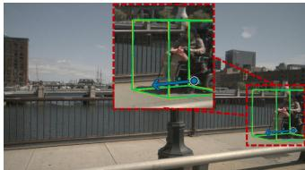

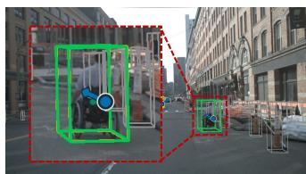

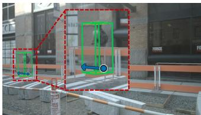

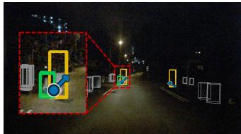

(a) Powered wheelchair user in profile. (b) Powered wheelchair user, frontal (c) Personal-mobility rider behind a (d) Dog-walking pedestrian at night. view. guardrail.  
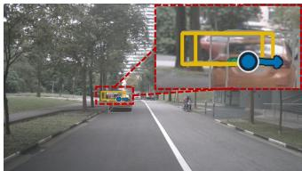

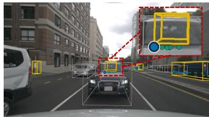

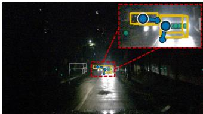

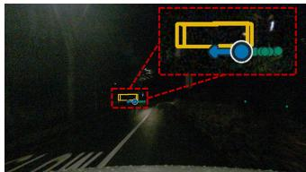

(e) Severely occluded crossing vehicle. (f) Severely occluded moving vehicle. (g) Rainy-night vehicle under head- (h) Occluded crossing vehicle at night. light glare.  
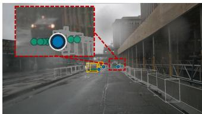

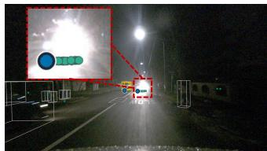

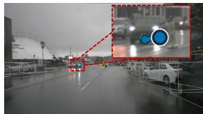

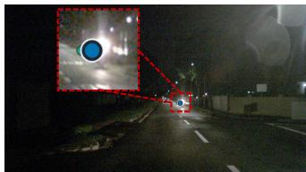  
(i) UNANNOTATED vehicle in rain. (j) UNANNOTATED vehicle under (k) UNANNOTATED oncoming vehi- (l) UNANNOTATED motorcycle unheadlight glare. cle in rain. der headlight glare.  
Fig. 1: Qualitative results of PART in rare-object, adverse-condition, and incomplete-annotation cases. Bright-green, yellow, and gray boxes denote special-category moving objects excluded from the standard nuScenes evaluation, moving ground truth used in our evaluation, and other annotated objects, respectively. Teal markers show moving radar returns; blue markers and arrows show PART predicted surface points and ground-plane velocities, respectively. (a)–(d) present rare and safety-relevant objects; (e)–(h) cover occlusion, low illumination, rain, and headlight glare; and (i)–(l) show moving objects unannotated in nuScenes. These examples illustrate PART’s behavior across rare objects, adverse conditions, and incomplete annotations.

• We devise uncertainty-aware supervision to reduce reliance on exhaustive moving-object annotations. Random ground-truth masking and graded existence targets prevent plausible radar-supported queries from being treated as hard negatives, encouraging object existence to be inferred from physical radar evidence rather than annotation proximity.

Despite its compact design, PART achieves a classagnostic average precision (CA-AP) of 0.8827, a mean average surface translation error (mASTE) of 0.3188 m, and a mean average velocity error (mAVE) of 0.8084 m/s on nuScenes [7]. It further attains 0.9203 recall on rare and safety-relevant categories excluded from the standard nuScenes evaluation and remains effective under adverse weather, low illumination, and severe occlusion. Fig. 1 presents representative detections, including apparent false positives that correspond to moving objects absent from the nuScenes annotations.

## II. RELATED WORK

## A. Radar-Based 3D Object Detection

Most 3D object detectors use lidar [8]–[10], cameras [11]– [13], or their fusion [14]–[16], owing to their accurate geometry, rich appearance, or both. Radar is usually an auxiliary modality that supplies range and Doppler cues [15], [16]. Detection therefore remains dependent on lidar or camera when adverse weather or poor illumination degrades the primary input.

Radar-only 3D detection has received less attention because radar returns are sparse, noisy, and susceptible to multipath reflections. Existing methods adapt lidar-oriented designs using graph neural networks [17] or hybrid grid– point backbones [18]. AttentiveGRU [19] instead aggregates temporally correlated radar features, while RadarDistill [20] transfers lidar features to a radar-only student.

These methods largely retain closed-set 3D box formulations inherited from lidar or depend on lidar supervision, leaving radar’s Doppler geometry and RCS evidence underused for target association. More fundamentally, a finite training taxonomy is unlikely to capture the full diversity of moving objects encountered in real-world driving. Long-tail and previously unseen targets can produce coherent radar clusters, while noise and multipath reflections may generate similar patterns. Conventional closed-set supervision does not explicitly account for this ambiguity, limiting generalization beyond the annotated categories.

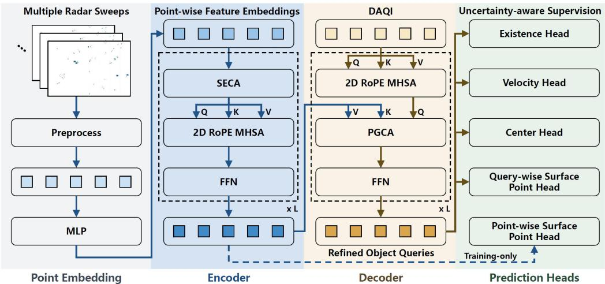  
Fig. 2: Overview of the proposed PART. Blue paths encode radar points, while gold paths initialize and refine DAQI queries.

## B. Transformer-Based 3D Detectors

DETR formulates detection as set prediction with learned queries and bipartite matching, eliminating non-maximum suppression [21]. DETR3D extends this framework to multiview 3D detection [22]. However, scene-independent queries provide limited spatial guidance in sparse 3D scenes.

Lidar transformers adapt attention to sparse representations. Voxel Transformer models interactions between voxels [23], while SST avoids repeated downsampling [24]. CT3D refines proposals from local point features [25], whereas CenterFormer uses heatmap-derived center queries for spatial and temporal aggregation, reducing query optimization difficulty [26]. However, global point attention has quadratic complexity and can be costly for dense lidar inputs [27], [28]. These lidar-oriented designs also omit radar-specific radial-Doppler constraints, while voxelization may fragment the limited returns from one object.

## III. PART

As shown in Fig. 2, PART processes temporally aggregated radar points using a fully sparse encoder without voxelization or dense BEV features. DAQI initializes object queries from position–velocity coherent clusters, and stacked decoder layers refine them through query self-attention and PGCA conditioned on radial Doppler and RCS information. The final queries produce class-agnostic existence, surfacepoint, velocity, and auxiliary center predictions. Training combines point-wise surface supervision with uncertainty aware existence targets.

## A. Point Embedding and Encoder

PART aggregates six sweeps from all five nuScenes radars, compensates for ego motion, and transforms the returns to the current RADAR FRONT frame. Returns with a compensated Doppler-speed magnitude below 0.5 m/s or outside the ±54 m sensing region are removed. After motion filtering, the input contains fewer than 300 radar-point tokens in most nuScenes samples and never exceeds 800, making global point-wise attention computationally practical. Each retained point is represented by 16 features: 2D position, radar cross section (RCS), compensated velocity, six sensorreported uncertainty terms, sweep timestamp, radial speed and direction, and a k-nearest-neighbor density estimate (k = 5). Position and velocity support DAQI, while Doppler and RCS provide physical inputs to PGCA. A three-layer MLP maps each vector to a 128-dimensional embedding.

The encoder stacks three transformer blocks. Each block applies SE-inspired channel attention (SECA) [29], 2D RoPE multi-head self-attention (MHSA) [30], and a feed-forward network (FFN). SECA uses a shared point-wise gating MLP to produce input-dependent channel weights without sweeplevel pooling. RoPE rotates queries and keys using normalized 2D coordinates, thereby encoding relative displacement in the attention scores while leaving values unchanged. Residual connections and layer normalization follow MHSA and the FFN. The encoded point features serve as keys and values for the decoder.

## B. Doppler-Aware Query Initialization (DAQI)

Standard DETR-style detectors use scene-independent learned queries whose correspondence to sparse radar observations must be established entirely during decoding. DAQI instead derives input-dependent queries by applying DBSCAN [31] in the joint $[ x , y , v _ { x } , v _ { y } ]$ space to form clusters of at least three retained radar points with similar positions and ego-compensated velocities. For cluster $\mathcal { C } _ { k } .$ , its centroid and pooled encoder feature initialize the query position and feature:

$$
\mathbf { p } _ { k } = \frac { 1 } { | \mathcal { C } _ { k } | } \sum _ { i \in \mathcal { C } _ { k } } [ x _ { i } , y _ { i } ] ^ { T } , \qquad \mathbf { q } _ { k } ^ { \mathrm { i n i t } } = \frac { 1 } { | \mathcal { C } _ { k } | } \sum _ { i \in \mathcal { C } _ { k } } \mathbf { f } _ { i } ,\tag{1}
$$

where $[ x _ { i } , y _ { i } ] ^ { T }$ and $\mathbf { f } _ { i }$ denote the 2D position and encoded feature of radar point $i ,$ respectively. We deliberately zeroinitialize the final layers of the offset heads, so that their initial position predictions coincide with the cluster centroid pk.

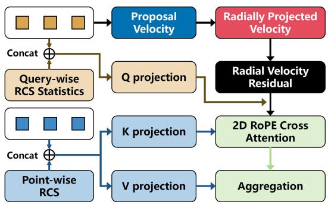  
Fig. 3: Detailed architecture of PGCA.

We use a fixed budget of $K ~ = ~ 1 0 0$ queries. During training, DAQI adds a balanced set of random queries away from DBSCAN proposals and annotated matching regions. At inference, only cluster-derived queries remain. These clusters are proposals rather than confirmed objects, since radar noise and multipath returns may also form coherent groups. PGCA (Section III-C) incorporates Doppler consistency and RCS evidence to help distinguish object returns from such interference.

## C. Physics-Guided Cross-Attention (PGCA)

Each decoder layer first applies 2D RoPE MHSA to the active object queries. Let $\mathbf { q } _ { k }$ denote the resulting feature of query k. PGCA then associates each query with the encoded radar points using feature, Doppler, and RCS evidence. Its detailed architecture is shown in Fig. 3.

Radar measures only the signed component of motion along the sensor line of sight (LOS). As illustrated in Fig. 4, each radar point provides motion evidence only along the radial direction, whereas a query proposes a 2D ground-plane velocity. Let $\mathbf { u } _ { i }$ denote the unit LOS vector from the source radar to point i at its measurement timestamp, rotated into the reference frame, and let $\mathbf { v } _ { i } ^ { \mathrm { p t } }$ denote the ego-compensated ground-plane velocity of the point. For query k, PGCA predicts a ground-plane velocity proposal and computes the discrepancy between their signed radial components:

$$
\begin{array} { r } { \mathbf { v } _ { k } ^ { \mathrm { p r o p } } = g _ { \mathrm { p r o p } } ( \mathbf { q } _ { k } ) , \qquad r _ { k i } = \left| \left( \mathbf { v } _ { k } ^ { \mathrm { p r o p } } - \mathbf { v } _ { i } ^ { \mathrm { p t } } \right) ^ { T } \mathbf { u } _ { i } \right| . } \end{array}\tag{2}
$$

A large residual $r _ { k i }$ indicates Doppler-inconsistent motion and reduces the association between query k and radar point i.

For a cluster-derived query, we retain the cluster-wise RCS mean, standard deviation, minimum, and maximum as ${ \bf \rho } _ { k } = [ \mu _ { k } , \sigma _ { k } , c _ { k } ^ { \mathrm { m i n } } , c _ { k } ^ { \mathrm { m a x } } ] ^ { T }$ . The cluster statistics condition the query projection, while the point RCS $c _ { i }$ conditions the key and value projections:

$$
\begin{array} { r } { \tilde { \mathbf { q } } _ { k } = W _ { Q } [ \mathbf { q } _ { k } ; \boldsymbol { \rho } _ { k } ] , \quad \tilde { \mathbf { k } } _ { i } = W _ { K } [ \mathbf { f } _ { i } ; c _ { i } ] , \quad \tilde { \mathbf { v } } _ { i } = W _ { V } [ \mathbf { f } _ { i } ; c _ { i } ] . } \end{array}\tag{3}
$$

This design allows PGCA to learn RCS compatibility from annotated radar returns without imposing a fixed scattering rule.

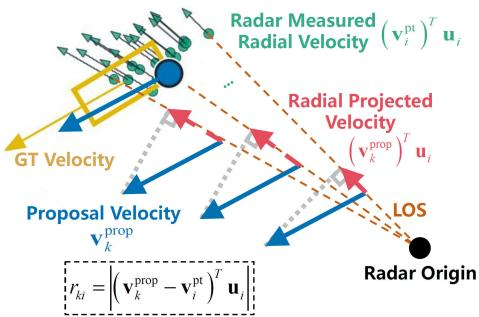  
Fig. 4: Doppler-consistency geometry in PGCA. The 2D query velocity proposal $\mathbf { v } _ { k } ^ { \mathrm { p r o p } }$ and the ego-compensated point velocity $\mathbf { v } _ { i } ^ { \mathrm { p t } }$ are projected onto $\mathbf { u } _ { i } .$ , the unit LOS direction from the source radar to point i at its measurement timestamp. All vectors are expressed in the reference frame. The absolute difference between their signed LOS projections defines the residual $r _ { k i }$ used in cross-attention.

Let $\mathcal { R } ( \mathbf { p } )$ denote the 2D RoPE transformation at position p. For attention head $h ,$ the association weights are

$$
\alpha _ { k i } ^ { h } = \mathrm { s o f t m a x } _ { i } \left( \frac { [ \mathcal { R } ( \mathbf { p } _ { k } ) \tilde { \mathbf { q } } _ { k } ^ { h } ] ^ { T } [ \mathcal { R } ( \mathbf { p } _ { i } ) \tilde { \mathbf { k } } _ { i } ^ { h } ] } { \sqrt { d _ { h } } } - \lambda _ { v } r _ { k i } \right) .\tag{4}
$$

where $d _ { h }$ is the head dimension and $\lambda _ { v }$ is learnable. RCS enters the feature similarity through the conditioned projections, while the second term explicitly penalizes Doppler inconsistency.

The attended radar message is

$$
\mathbf { o } _ { k } ^ { h } = \sum _ { i = 1 } ^ { N } \alpha _ { k i } ^ { h } \tilde { \mathbf { v } } _ { i } ^ { h } , \qquad \mathbf { m } _ { k } = W _ { \mathcal { O } } \left[ \mathbf { o } _ { k } ^ { 1 } \lVert \cdot \cdot \cdot \lVert \mathbf { o } _ { k } ^ { H } \right] ,\tag{5}
$$

where N and H are the numbers of radar points and attention heads, respectively, $W _ { O }$ is the output projection, and ∥ denotes channel-wise concatenation. Finally, mk updates $\mathbf q _ { k }$ through a residual connection and layer normalization, followed by an FFN with a second residual update. The output is passed to the next decoder layer, and the final-layer queries are decoded by the prediction heads.

## D. Prediction Heads and Loss

After $L = 3$ decoder layers, four query-wise heads decode an existence confidence, a surface point, a center, and a ground-plane velocity:

$$
\begin{array} { r l } & { \hat { e } _ { k } = \sigma \Big ( g _ { \mathrm { e x i s t } } \big ( \mathbf { q } _ { k } ^ { ( L ) } \big ) \Big ) , } \\ & { \hat { \mathbf { s } } _ { k } = \mathbf { p } _ { k } + g _ { \mathrm { q } \mathrm { - } \mathrm { s u r f } } \left( \big [ \mathbf { q } _ { k } ^ { ( L ) } ; \mathbf { p } _ { k } \big ] \right) , } \\ & { \hat { \mathbf { c } } _ { k } = \mathbf { p } _ { k } + g _ { \mathrm { c e n t e r } } \left( \big [ \mathbf { q } _ { k } ^ { ( L ) } ; \mathbf { p } _ { k } \big ] \right) , } \\ & { \hat { \mathbf { v } } _ { k } = \mathbf { v } _ { k } ^ { \mathrm { p r o p } , ( L ) } + g _ { \Delta v } \left( \mathbf { m } _ { k } ^ { ( L ) } \right) . } \end{array}\tag{6}
$$

The existence prediction is class-agnostic and indicates whether a query represents a moving object. The surface point is the primary localization output because radar returns commonly originate from object surfaces. The center head is retained for comparison under center-based protocols, while the velocity head refines the final PGCA velocity proposal.

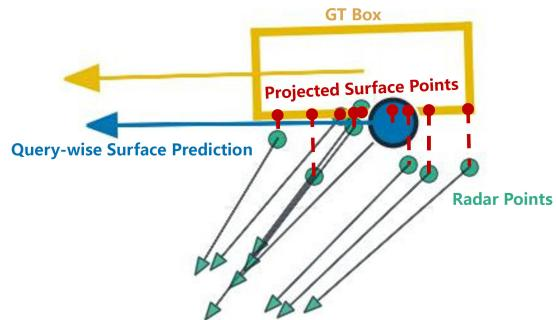  
Fig. 5: Surface-point targets are obtained by projecting radar points and query references onto the nearest location on the ground-truth box perimeter.

We match cluster-derived queries to moving ground-truth boxes using the surface distance

$$
d _ { k j } = \left\| \hat { \mathbf { s } } _ { k } - \Pi _ { B _ { j } } \big ( \hat { \mathbf { s } } _ { k } \big ) \right\| _ { 2 } ,\tag{7}
$$

where $\Pi _ { B _ { j } } ( \cdot )$ projects a point onto the nearest location on the ground-plane perimeter of box $B _ { j }$ . As illustrated in Fig. 5, the same geometric construction is used to define both query-wise and point-wise surface targets. Each box supplies multiple matching slots. Hungarian matching followed by a per-box top-K rule yields the positive query–box pairs $\mathcal { P } ;$ only DBSCAN-initialized queries can become hard positives. For $t \in$ {q-surf, center, vel}, the regression losses share the form

$$
\mathcal { L } _ { t } = \frac { 1 } { | \mathcal { P } | } \sum _ { ( k , j ) \in \mathcal { P } } \left\| \hat { \mathbf { y } } _ { k } ^ { t } - \mathbf { y } _ { k j } ^ { t * } \right\| _ { 1 } ,\tag{8}
$$

with targets ${ \bf y } _ { k j } ^ { \mathrm { q - s u r f * } } = \Pi _ { \mathcal { B } _ { j } } ( \hat { \bf s } _ { k } ) , { \bf y } _ { k j } ^ { \mathrm { c e n t e r * } } = { \bf c } _ { j }$ , and ${ \bf y } _ { k j } ^ { \mathrm { v e l * } } =$ $\mathbf { v } _ { j }$

The final encoder block also includes an auxiliary pointwise surface head. Before embedding, each radar point is associated with the most compatible ground-truth box according to angular, surface, velocity-direction, and radialspeed consistency. Let A denote the set of associated radarpoint–box pairs $( i , j )$ . For each $( i , j ) \in A .$

$$
\begin{array} { c } { \hat { \mathbf { s } } _ { i } ^ { \mathrm { p } } = \mathbf { r } _ { i } + g _ { \mathrm { p - s u r f } } ( \mathbf { f } _ { i } ) , } \\ { \displaystyle { \mathbf { s } _ { i } ^ { \mathrm { p } * } = \Pi _ { \mathcal { B } _ { j } } ( \mathbf { r } _ { i } ) , } } \\ { \displaystyle \mathcal { L } _ { \mathrm { p - s u r f } } = \frac { 1 } { | \mathcal { A } | } \sum _ { \mathcal { A } } \left\| \hat { \mathbf { s } } _ { i } ^ { \mathrm { p } } - { \mathbf { s } _ { i } ^ { \mathrm { p } * } } \right\| _ { 1 } , } \end{array}\tag{9}
$$

where $\mathbf { r } _ { i }$ is the normalized 2D position of radar point i in the reference radar frame. Its predicted offset is embedded and added to the encoder feature, providing local surface geometry for subsequent query decoding.

The complete objective is

$$
\mathcal { L } = \lambda _ { \mathrm { e x i s t } } \mathcal { L } _ { \mathrm { e x i s t } } + \sum _ { t } \lambda _ { t } \mathcal { L } _ { t } + \lambda _ { \mathrm { p - s u r f } } \mathcal { L } _ { \mathrm { p - s u r f } } ,\tag{10}
$$

where the λ terms are scalar loss weights and the summation covers the three query-wise regression terms. The existence loss is defined by the uncertainty-aware supervision described next.

## E. Uncertainty-Aware Supervision

The moving-object distribution in open-road driving has a long tail that cannot be exhaustively represented by a fixed taxonomy or a finite training set. Under conventional binary supervision, an unmatched radar-supported query is treated as a hard negative, even when its motion pattern may correspond to a rare or previously unseen object. To reduce this dependence on annotation coverage, we independently mask each ground-truth box with probability $r _ { \mathrm { m a s k } } = 0 . 5$ during training. This procedure exposes PART to radarsupported object patterns without hard positive labels and encourages the existence head to rely on physical radar evidence rather than the object distribution covered by the training set.

Let $\mathcal { Q } _ { \mathrm { p } }$ contain DBSCAN queries matched to unmasked boxes within the association threshold, and let $\mathcal { Q } _ { \mathrm { m } }$ contain queries matched to masked boxes. We further define $\mathcal { Q } _ { \mathrm { u } }$ as DBSCAN queries containing at least five points that remain unmatched or fall outside the hard-positive threshold. Their existence targets are

$$
y _ { k } = { \left\{ \begin{array} { l l } { 1 , } & { k \in \mathbb { Q } _ { \mathrm { p } } , } \\ { 0 . 7 5 , } & { k \in \mathbb { Q } _ { \mathrm { m } } , } \\ { 0 . 5 , } & { k \in \mathbb { Q } _ { \mathrm { u } } , } \\ { 0 , } & { { \mathrm { o t h e r w i s e } } . } \end{array} \right. }\tag{11}
$$

The target 0.75 retains evidence for a deliberately masked object without enabling regression, while 0.5 preserves the ambiguity between an unannotated object and radar clutter.

We optimize the existence head using sigmoid focal loss with $\gamma = 2 . 0$ and $\alpha = 0 . 2 5$

$$
\mathcal { L } _ { \mathrm { e x i s t } } = \frac { 1 } { \operatorname* { m a x } ( | \mathcal { Q } _ { \mathrm { p } } | , 1 ) } \sum _ { k \in \mathcal { Q } _ { \mathrm { t } } } \mathrm { F L } _ { \gamma , \alpha } ( z _ { k } , y _ { k } ) ,\tag{12}
$$

where $z _ { k } = g _ { \mathrm { e x i s t } } ( \mathbf { q } _ { k } ^ { ( L ) } )$ is the raw existence logit and $\mathcal { Q } _ { \mathrm { t } }$ is the complete set of supervised queries. Only queries in $\mathcal { Q } _ { \mathrm { p } }$ contribute to the query-wise surface, center, and velocity losses.

## IV. EXPERIMENTS

## A. Experimental Protocol and Setup

Dataset and protocol. We evaluate all methods on the official nuScenes validation split under a unified class-agnostic moving-object protocol. The evaluation region is limited to ±54 m in the RADAR FRONT frame. Eligible ground-truth objects have a ground-plane speed above 0.5 m/s; static targets are excluded.

Metrics. Since PART is class-agnostic, all methods follow a unified class-agnostic protocol. CA-AP is computed from the precision–recall curve. For matched true positives, mASTE evaluates radar-facing surface localization: PART measures the distance from its predicted surface point to the ground-truth box perimeter, whereas box-based baselines measure the distance between the predicted and groundtruth keypoints nearest the radar origin, each selected from four BEV corners and four edge centers. The latter jointly captures errors in box center, dimensions, and yaw. mATE and mAVE measure center and ground-plane velocity errors, respectively.

Implementation details. PART is trained for 30 epochs with Adam and a one-cycle schedule, using a batch size of eight per GPU, a peak learning rate of $1 . 2 \times 1 0 ^ { - 3 }$ , and a weight decay of 0.01. Training uses GT sampling, flipping, rotation, and scaling. Sampled objects are radially perturbed, with up to 50% of their returns dropped, while individual points receive radial Gaussian noise with $\sigma = 0 . 5$ m. GT sampling and random GT masking are disabled during the final five epochs.

## B. Comparison with Existing 3D Detectors

Overall comparison. Table I compares PART with representative detectors under the unified class-agnostic protocol. With only 1.1M parameters, PART achieves a CA-AP of 0.8827, within 0.0050 of the best result, and the lowest mASTE of 0.3188 m, outperforming the best fusion result by 0.0406 m. Among radar-input methods, PART improves RadarDistill by 0.1143 CA-AP and reduces mASTE by 58.9%, while using approximately 97% fewer parameters and requiring no lidar supervision. PART also achieves a competitive mAVE of 0.8084 m/s, compared with 0.7499 m/s for RadarDistill. Compared with directly using DAQI proposals, PART improves CA-AP by 0.2051 and reduces mASTE and mAVE by 45.8% and 48.7%, respectively. These gains confirm that the learned encoder and physics-guided decoder effectively refine the initial clustering proposals. Center localization remains less accurate, reflecting the limited center evidence available from sparse radar returns.

TABLE I: Overall comparison with existing 3D detectors.
<table><tr><td>Methods</td><td>Params.</td><td>Mod.1</td><td>CA-AP↑</td><td>mASTE↓</td><td>mAVE↓</td><td>mATE↓</td></tr><tr><td>CenterPoint [9]</td><td>23M</td><td>L</td><td>0.8746</td><td>0.4988</td><td>0.7097</td><td>0.4542</td></tr><tr><td>VoxelNeXT [10]</td><td>31M</td><td>L</td><td>0.8801</td><td>0.4498</td><td>0.6166</td><td>0.4172</td></tr><tr><td>TransFusion-L [32]</td><td>32M</td><td>L</td><td>0.8865</td><td>0.3617</td><td>0.8600</td><td>0.2790</td></tr><tr><td>FCOS3D [11]</td><td>55M</td><td>C</td><td>0.5254</td><td>1.2274</td><td>2.6908</td><td>1.2818</td></tr><tr><td>PGD [12]</td><td>56M</td><td>C</td><td>0.5423</td><td>1.4796</td><td>2.7007</td><td>1.3143</td></tr><tr><td>PETR [13]</td><td>83M</td><td>C</td><td>0.6553</td><td>2.9833</td><td>2.3070</td><td>0.9340</td></tr><tr><td>BEVFusion [14]</td><td>157M</td><td>LC</td><td>0.8877</td><td>0.3594</td><td>0.8138</td><td>0.2772</td></tr><tr><td>LiRaFusion [15]</td><td>23M</td><td>LR</td><td>0.8865</td><td>0.5282</td><td>0.7556</td><td>0.4792</td></tr><tr><td>CRTFusion [16]</td><td>81M</td><td>RC</td><td>0.8612</td><td>0.6699</td><td>0.7711</td><td>0.6206</td></tr><tr><td>DAQI Proposals2</td><td>N/A</td><td>R</td><td>0.6776</td><td>0.5884</td><td>1.5758</td><td>1.7806</td></tr><tr><td>PillarNet-R [33]</td><td>16M</td><td>R</td><td>0.7492</td><td>0.9586</td><td>0.8702</td><td>0.8919</td></tr><tr><td>RadarDistill [20]</td><td>41M</td><td>R(L)3</td><td>0.7684</td><td>0.7764</td><td>0.7499</td><td>0.7587</td></tr><tr><td>PART</td><td>1.1M</td><td>R</td><td>0.8827</td><td>0.3188</td><td>0.8084</td><td>1.4846</td></tr></table>

The best value is shown in bold; the next two best distinct values are underlined. 1 L: lidar; C: camera; R: radar.  
2 DAQI Proposals denotes the non-learned baseline that directly uses the DBSCAN cluster centroids and mean velocities as predictions.  
3 3 RadarDistill uses a lidar teacher during training but requires only radar input at inference.

Robustness under Challenging Conditions. We identify the Night and Rainy subsets from keywords in the official nuScenes scene descriptions; Night+Rainy denotes their intersection. As shown in Table II, PART achieves the highest CA-AP in all three subsets, exceeding the strongest competitor by 1.14, 0.52, and 0.29 percentage points, respectively. Relative to the best radar-input baseline, the margins widen to 7.68, 9.20, and 6.26 percentage points, respectively. PART also obtains the lowest mASTE in Rainy and Night+Rainy, and the lowest mAVE in Night and Night+Rainy; its nighttime mASTE is only 0.0055m above the best result. In Night+Rainy, PART reduces mASTE by 32.4% relative to the next-best method and mAVE by 55.1% relative to the best competing radar-only inference method. These results demonstrate robust surface localization and velocity estimation under low-light and rainy conditions.

Rare and safety-relevant object categories. The standard nuScenes benchmark excludes six categories relevant to moving-object detection: animals, wheelchairs, strollers, personal-mobility users, ambulances, and police vehicles. Due to space constraints, Table III reports four representative categories. Because eligible instances are scarce, we pool the official training and validation splits for this diagnostic analysis. For this table only, PART is retrained with the same standard nuScenes taxonomy as the baselines, without using ground-truth annotations from the excluded categories during training. This simulates real-world conditions in which longtail moving objects lack annotations. Under class-agnostic matching, category-specific false positives are undefined; we therefore report recall and conditional errors.

PART achieves recalls of 95.71%, 95.77%, 80.39%, and 92.31% for police vehicles, wheelchair users, personalmobility users, and animals, surpassing the strongest alternatives by 10.00, 7.69, 33.33, and 30.77 percentage points, respectively. Some lidar- and camera-based detectors retain reasonable recall on geometrically car-like police vehicles, but the gap to PART widens for the other categories, where several learned baselines detect no personal-mobility users or animals. Compared with raw DAQI proposals, PART raises recall from 47.06% to 80.39% for personal mobility and from 61.54% to 92.31% for animals. Conditional ASTE and AVE are not ranked because the large recall gaps across methods result in substantially different detected subsets. Nevertheless, PART attains ASTEs of 0.1142 m and 0.1063 m for wheelchair and personal-mobility users, respectively.

## C. Ablation and Additional Analyses

Component ablation. Table IV evaluates the main components of PART. Removing DAQI causes the largest degradation: CA-AP decreases by 0.2629, while mASTE and mAVE increase by 0.3589 m and 0.4964 m/s, respectively, even with the relaxed score threshold. Special-category recall also falls from 0.9203 to 0.6646. Removing PGCA degrades all metrics, supporting the joint use of radial-Doppler consistency and RCS information in cross-attention. Without uncertainty-aware supervision, CA-AP drops to 0.7948 and special-category recall falls sharply to 0.3899, confirming its importance for generalization beyond the training taxonomy. Finally, removing PWSH leaves CA-AP unchanged but increases mASTE and mAVE and reduces special-category recall, supporting the benefits of auxiliary point-wise geometric supervision.

Unannotated moving objects. During false-positive analysis, we observed that some predictions corresponded to visually identifiable moving objects not annotated in nuScenes. Representative examples are shown in Fig. 1(i)–(l). All quantitative metrics use the unmodified nuScenes annotations; visually apparent but unannotated moving objects therefore remain counted as false positives. Although this observation is qualitative, it suggests that PART can respond to motionconsistent radar evidence beyond the annotated target set, rather than relying solely on the object distribution repre-

TABLE II: Robustness comparison under challenging conditions.
<table><tr><td rowspan="2">Method</td><td rowspan="2">Mod.</td><td colspan="3">Night</td><td colspan="3">Rainy</td><td colspan="3">Night+Rainy</td></tr><tr><td> $\bf \delta \overline { { C A - A P \dagger } }$ </td><td>mASTE↓</td><td>mAVE↓</td><td>CA-AP↑</td><td>mASTE↓</td><td>mAVE↓</td><td>CA-AP↑</td><td>mASTE↓</td><td>mAVE↓</td></tr><tr><td>CenterPoint</td><td>L</td><td>0.8297</td><td>0.3398</td><td>0.7795</td><td>0.8528</td><td>0.5671</td><td>0.6729</td><td>0.8107</td><td>0.3410</td><td>0.7752</td></tr><tr><td>VoxelNeXT</td><td>L</td><td>0.8361</td><td>0.3602</td><td>0.6968</td><td>0.8606</td><td>0.4503</td><td>0.5776</td><td>0.7861</td><td>0.4930</td><td>0.6652</td></tr><tr><td>TransFusion-L</td><td>L</td><td>0.8584</td><td>0.2530</td><td>0.6825</td><td>0.8662</td><td>0.3699</td><td>0.8649</td><td>0.8520</td><td>0.3122</td><td>0.6785</td></tr><tr><td>FCOS3D</td><td>C</td><td>0.5197</td><td>0.6753</td><td>2.0607</td><td>0.5203</td><td>1.3734</td><td>2.6823</td><td>0.4973</td><td>0.6429</td><td>2.3148</td></tr><tr><td>PGD</td><td>C</td><td>0.6035</td><td>0.6951</td><td>2.6314</td><td>0.5114</td><td>1.2124</td><td>2.5529</td><td>0.5704</td><td>0.5634</td><td>1.9414</td></tr><tr><td>PETR</td><td>C</td><td>0.6855</td><td>1.6695</td><td>2.3924</td><td>0.6978</td><td>3.2089</td><td>2.0686</td><td>0.7257</td><td>1.4301</td><td>2.5327</td></tr><tr><td>BEVFusion</td><td>LC</td><td>0.8665</td><td>0.2533</td><td>0.7634</td><td>0.8754</td><td>0.4137</td><td>0.8732</td><td>0.8768</td><td>0.3278</td><td>0.7924</td></tr><tr><td>LiRaFusion</td><td>LR</td><td>0.8816</td><td>0.3382</td><td>0.7499</td><td>0.8864</td><td>0.5756</td><td>0.8066</td><td>0.8793</td><td>0.3007</td><td>0.5332</td></tr><tr><td>CRTFusion</td><td>CR</td><td>0.8683</td><td>0.4730</td><td>0.8821</td><td>0.8480</td><td>0.7055</td><td>1.0037</td><td>0.8863</td><td>0.3864</td><td>1.0296</td></tr><tr><td>DAQI Proposals</td><td>R</td><td>0.7026</td><td>0.4104</td><td>1.2325</td><td>0.6789</td><td>0.7148</td><td>1.6498</td><td>0.6889</td><td>0.4865</td><td>1.2728</td></tr><tr><td>PillarNet-R</td><td>R</td><td>0.8084</td><td>0.6602</td><td>0.9246</td><td>0.7711</td><td>1.0402</td><td>1.0874</td><td>0.8266</td><td>0.6334</td><td>0.6675</td></tr><tr><td>RadarDistill</td><td>R(L)</td><td>0.8162</td><td>0.3763</td><td>0.8175</td><td>0.7996</td><td>0.8528</td><td>0.7877</td><td>0.8164</td><td>0.4360</td><td>2.0693</td></tr><tr><td>PART</td><td>R</td><td>0.8930</td><td>0.2585</td><td>0.4651</td><td>0.8916</td><td>0.2811</td><td>0.7590</td><td>0.8892</td><td>0.2034</td><td>0.2994</td></tr></table>

TABLE III: Comparison on rare and safety-relevant object categories.
<table><tr><td rowspan="2">Method</td><td rowspan="2">Mod.</td><td colspan="3">Police Vehicles  $\overline { { ( N _ { \mathrm { G T } } = 7 0 ) } }$ </td><td colspan="3">Wheelchair  $\overline { { ( N _ { \mathrm { G T } } = 2 6 0 ) } }$ </td><td colspan="3">Personal Mobility  $\overline { { ( N _ { \mathrm { G T } } = 1 0 2 ) } }$ </td><td colspan="3">Animal  $\overline { { ( N _ { \mathrm { G T } } = 1 3 ) } }$ </td></tr><tr><td>Recall↑</td><td>ASTE↓</td><td> $\overline { { \mathbf { A V E \downarrow } } }$ </td><td>Recall↑</td><td>ASTE↓</td><td> $\overline { { \mathbf { A V E \downarrow } } }$ </td><td>Recall↑</td><td>ASTE↓</td><td> $\overline { { \mathbf { A V E \downarrow } } }$ </td><td>Recall↑</td><td>ASTE↓</td><td>AVE↓</td></tr><tr><td>CenterPoint</td><td>L</td><td>0.8286</td><td>0.2633</td><td>0.5565</td><td>0.0346</td><td>0.4032</td><td>0.3574</td><td>0.1863</td><td>0.2331</td><td>0.4617</td><td>0.1538</td><td>0.0979</td><td>0.2048</td></tr><tr><td>VoxelNeXT</td><td>L</td><td>0.8571</td><td>0.2872</td><td>0.6912</td><td>0.0115</td><td>0.3614</td><td>0.4953</td><td>0.1765</td><td>0.1923</td><td>0.3328</td><td>0.0000</td><td>N/A</td><td>N/A</td></tr><tr><td>TransFusion-L</td><td>L</td><td>0.5857</td><td>0.2038</td><td>0.6645</td><td>0.0038</td><td>0.4830</td><td>0.1431</td><td>0.0196</td><td>0.1621</td><td>0.4392</td><td>0.0000</td><td>N/A</td><td>N/A</td></tr><tr><td>FCOS3D</td><td>C</td><td>0.5286</td><td>0.5357</td><td>3.9904</td><td>0.0000</td><td>N/A</td><td>N/A</td><td>0.0588</td><td>0.2053</td><td>3.3621</td><td>0.0000</td><td>N/A</td><td>N/A</td></tr><tr><td>PGD</td><td>C</td><td>0.6143</td><td>0.4390</td><td>3.8758</td><td>0.0038</td><td>0.2099</td><td>1.5279</td><td>0.0392</td><td>0.1553</td><td>3.1449</td><td>0.0000</td><td>N/A</td><td>N/A</td></tr><tr><td>PETR</td><td>C</td><td>0.0000</td><td>N/A</td><td>N/A</td><td>0.0000</td><td>N/A</td><td>N/A</td><td>0.0000</td><td>N/A</td><td>N/A</td><td>0.0000</td><td>N/A</td><td>N/A</td></tr><tr><td>BEVFusion</td><td>LC</td><td>0.6000</td><td>0.3038</td><td>0.6558</td><td>0.0000</td><td>N/A</td><td>N/A</td><td>0.0000</td><td>N/A</td><td>N/A</td><td>0.0000</td><td>N/A</td><td>N/A</td></tr><tr><td>LiRaFusion</td><td>LR</td><td>0.5143</td><td>0.2723</td><td>0.7073</td><td>0.0077</td><td>0.1715</td><td>0.2147</td><td>0.0000</td><td>N/A</td><td>N/A</td><td>0.0000</td><td>N/A</td><td>N/A</td></tr><tr><td>CRTFusion</td><td>CR</td><td>0.6286</td><td>0.5582</td><td>0.7085</td><td>0.0192</td><td>0.2666</td><td>0.4843</td><td>0.1471</td><td>0.1546</td><td>1.6308</td><td>0.0000</td><td>N/A</td><td>N/A</td></tr><tr><td>DAQI Proposals</td><td>R</td><td>0.8571</td><td>0.5975</td><td>2.3529</td><td>0.8808</td><td>0.3043</td><td>0.3735</td><td>0.4706</td><td>0.1331</td><td>1.3884</td><td>0.6154</td><td>0.1305</td><td>0.1662</td></tr><tr><td>PillarNet-R</td><td>R</td><td>0.5588</td><td>0.4506</td><td>0.9424</td><td>0.0115</td><td>0.1633</td><td>0.2811</td><td>0.0000</td><td>N/A</td><td>N/A</td><td>0.0000</td><td>N/A</td><td>N/A</td></tr><tr><td>RadarDistill</td><td>R(L)</td><td>0.7647</td><td>0.3795</td><td>0.7877</td><td>0.0154</td><td>0.2340</td><td>0.4015</td><td>0.0000</td><td>N/A</td><td>N/A</td><td>0.0000</td><td>N/A</td><td>N/A</td></tr><tr><td>PART</td><td>R</td><td>0.9571</td><td>0.2931</td><td>1.0003</td><td>0.9577</td><td>0.1142</td><td>0.2161</td><td>0.8039</td><td>0.1063</td><td>0.6048</td><td>0.9231</td><td>0.2266</td><td>0.1838</td></tr></table>

N denotes the number of eligible ground-truth boxes in each category. Gray cells indicate zero recall despite the presence of ground-truth instances. N/A denotes an undefined error because no true positive is available.

TABLE IV: Component ablation.
<table><tr><td>Exp.</td><td>CA-AP↑</td><td>mASTE↓</td><td>mAVE↓</td><td>Special Recall↑4</td></tr><tr><td>w/o DAQI1</td><td>0.6198</td><td>0.6777</td><td>1.3048</td><td>0.6646</td></tr><tr><td>w/o PGCA</td><td>0.8815</td><td>0.3300</td><td>0.8348</td><td>0.8931</td></tr><tr><td>w/o UAS²</td><td>0.7948</td><td>0.3149</td><td>0.8292</td><td>0.3899</td></tr><tr><td>w/o PWSH3</td><td>0.8827</td><td>0.3607</td><td>0.8325</td><td>0.9182</td></tr><tr><td>FULL</td><td>0.8827</td><td>0.3188</td><td>0.8084</td><td>0.9203</td></tr></table>

1 The w/o DAQI variant produces no valid detections at the standard score threshold 0.5; its fixed-threshold metrics are therefore reported at 0.2. CA-AP is computed over the full confidence sweep.  
2 UAS: Uncertainty-Aware Supervision.  
3 PWSH: Point-Wise Surface Head.  
4 Special recall is evaluated over the rare and safety-relevant object categories.

sented by the training labels.

## V. CONCLUSION

This paper presented PART, a lightweight radar-only transformer for class-agnostic moving-object detection. Instead of predicting semantic categories or complete 3D boxes, PART estimates an existence confidence, a representative surface point, and ground-plane velocity from sparse radar returns. DAQI grounds object queries in spatially and kinematically coherent clusters, while PGCA incorporates radial-Doppler consistency and RCS information into crossattention. Uncertainty-aware supervision further reduces dependence on exhaustive moving-object annotations. With only 1.1 million parameters, PART achieves a CA-AP of 0.8827, an mASTE of 0.3188 m, and an mAVE of 0.8084 m/s on nuScenes. The results also show strong recall for rare and safety-relevant objects and stable performance under nighttime, rain, and severe occlusion. Qualitative analysis further identifies valid detections of moving objects that are unannotated in the dataset.

PART currently requires sufficient radar support and measurable radial motion. Static objects and objects moving mainly in the tangential direction remain outside its present scope, as do semantic classification and complete 3D box estimation. Future work will extend PART toward temporal tracking and broader integration with general-purpose perception systems while retaining radar-only operation.

## ACKNOWLEDGMENT

This work was supported in part by the China Postdoctoral Science Foundation under Grant 2026M791817, by the National Natural Science Foundation of China under Grants 62533006 and 52471376, and by the Center for HPC, University of Electronic Science and Technology of China.

## REFERENCES

[1] J. Mao, S. Shi, X. Wang, and H. Li, “3D Object Detection for Autonomous Driving: A Comprehensive Survey,” International Journal of Computer Vision, vol. 131, no. 8, pp. 1909–1963, 2023.

[2] L. Chen, P. Wu, K. Chitta, B. Jaeger, A. Geiger, and H. Li, “End-to-End Autonomous Driving: Challenges and Frontiers,” IEEE Transactions on Pattern Analysis and Machine Intelligence, vol. 46, no. 12, pp. 10 164–10 183, 2024.

[3] L. Kong, Y. Liu, X. Li, R. Chen, W. Zhang, J. Ren, L. Pan, K. Chen, and Z. Liu, “Robo3D: Towards Robust and Reliable 3D Perception against Corruptions,” in 2023 IEEE/CVF International Conference on Computer Vision (ICCV), October 2023, pp. 19 937–19 949.

[4] N. Gray, M. Moraes, J. Bian, A. Wang, A. Tian, K. Wilson, Y. Huang, H. Xiong, and Z. Guo, “GLARE: A Dataset for Traffic Sign Detection in Sun Glare,” IEEE Transactions on Intelligent Transportation Systems, vol. 24, no. 11, pp. 12 323–12 330, 2023.

[5] L. Wang, G. Yang, L. Yang, X. Zhang, Z. Song, Y. Chen, L. Liu, J. Gao, Z. Li, Q. Yang, J. Li, L. Wang, W. Yu, C. Yang, B. Xu, W. Wang, and H. Liu, “S2R-Bench: A Sim-to-Real Evaluation Benchmark for Autonomous Driving,” Scientific Data, vol. 12, no. 2006, 2025.

[6] B. Yang, R. Guo, M. Liang, S. Casas, and R. Urtasun, “RadarNet: Exploiting Radar for Robust Perception of Dynamic Objects,” in Proceedings of the European Conference on Computer Vision (ECCV), August 2020, pp. 496–512.

[7] H. Caesar, V. Bankiti, A. H. Lang, S. Vora, V. E. Liong, Q. Xu, A. Krishnan, Y. Pan, G. Baldan, and O. Beijbom, “nuScenes: A Multimodal Dataset for Autonomous Driving,” in 2020 IEEE/CVF Conference on Computer Vision and Pattern Recognition (CVPR), June 2020, pp. 11 618–11 628.

[8] S. Shi, L. Jiang, J. Deng, Z. Wang, C. Guo, J. Shi, X. Wang, and H. Li, “PV-RCNN++: Point-Voxel Feature Set Abstraction With Local Vector Representation for 3D Object Detection,” International Journal of Computer Vision, vol. 131, no. 2, pp. 531–551, November 2022.

[9] T. Yin, X. Zhou, and P. Krahenb¨ uhl, “Center-based 3D Object De-¨ tection and Tracking,” in 2021 IEEE/CVF Conference on Computer Vision and Pattern Recognition (CVPR), June 2021, pp. 11 779–11 788.

[10] Y. Chen, J. Liu, X. Zhang, X. Qi, and J. Jia, “VoxelNeXt: Fully Sparse VoxelNet for 3D Object Detection and Tracking,” in Proceedings ofthe IEEE/CVF Conference on Computer Vision and Pattern Recognition, 2023.

[11] T. Wang, X. Zhu, J. Pang, and D. Lin, “FCOS3D: Fully convolutional one-stage monocular 3d object detection,” in Proceedings of the IEEE/CVF International Conference on Computer Vision (ICCV) Workshops, October 2021.

[12] T. Wang, X. Zhu, J. Pang, and D. Lin, “Probabilistic and Geometric Depth: Detecting objects in perspective,” in Conference on Robot Learning (CoRL) 2021, November 2021.

[13] Y. Liu, T. Wang, X. Zhang, and J. Sun, “PETR: Position Embedding Transformation for Multi-view 3D Object Detection,” in Proceedings of the European Conference on Computer Vision (ECCV), October 2022, pp. 531–548.

[14] Z. Liu, H. Tang, A. Amini, X. Yang, H. Mao, D. L. Rus, and S. Han, “BEVFusion: Multi-Task Multi-Sensor Fusion with Unified Bird’s-Eye View Representation,” in 2023 IEEE International Conference on Robotics and Automation (ICRA), May 2023, pp. 2774–2781.

[15] J. Song, L. Zhao, and K. A. Skinner, “LiRaFusion: Deep Adaptive LiDAR-Radar Fusion for 3D Object Detection,” in 2024 IEEE International Conference on Robotics and Automation (ICRA), May 2024, pp. 18 250–18 257.

[16] J. Kim, M. Seong, and J. W. Choi, “CRT-Fusion: Camera, Radar, Temporal Fusion Using Motion Information for 3D Object Detection,” in Advances in Neural Information Processing Systems, vol. 37, December 2024, pp. 108 625–108 648.

[17] P. Svenningsson, F. Fioranelli, and A. Yarovoy, “Radar-PointGNN: Graph Based Object Recognition for Unstructured Radar Point-cloud Data,” in 2021 IEEE Radar Conference, May 2021, pp. 1–6.

[18] M. Ulrich, S. Braun, D. Kohler, D. Niederl¨ ohner, F. Faion, C. Gl¨ aser,¨ and H. Blume, “Improved Orientation Estimation and Detection with Hybrid Object Detection Networks for Automotive Radar,” in 2022 IEEE 25th International Conference on Intelligent Transportation Systems (ITSC), September 2022, pp. 111–117.

[19] L. Saini, M. Meuter, H. Tercan, and T. Meisen, “AttentiveGRU: Recurrent Spatio-Temporal Modeling for Advanced Radar-Based BEV Object Detection,” in 2025 IEEE/CVF Conference on Computer Vision and Pattern Recognition Workshops (CVPRW), June 2025, pp. 2406– 2415.

[20] G. Bang, K. Choi, J. Kim, D. Kum, and J. W. Choi, “RadarDistill: Boosting Radar-based Object Detection Performance via Knowledge Distillation from LiDAR Features,” in 2024 IEEE/CVF Conference on Computer Vision and Pattern Recognition (CVPR), June 2024, pp. 15 491–15 500.

[21] N. Carion, F. Massa, G. Synnaeve, N. Usunier, A. Kirillov, and S. Zagoruyko, “End-to-End Object Detection with Transformers,” in Proceedings ofthe European Conference on Computer Vision (ECCV), August 2020, pp. 213–229.

[22] Y. Wang, V. C. Guizilini, T. Zhang, Y. Wang, H. Zhao, and J. Solomon, “DETR3D: 3D Object Detection from Multi-view Images via 3D-to-2D Queries,” in 5th Conference on Robot Learning (CoRL), November 2021.

[23] J. Mao, Y. Xue, M. Niu, H. Bai, J. Feng, X. Liang, H. Xu, and C. Xu, “Voxel Transformer for 3D Object Detection,” in 2021 IEEE/CVF International Conference on Computer Vision (ICCV), October 2021, pp. 3144–3153.

[24] L. Fan, Z. Pang, T. Zhang, Y.-X. Wang, H. Zhao, F. Wang, N. Wang, and Z. Zhang, “Embracing Single Stride 3D Object Detector with Sparse Transformer,” in 2022 IEEE/CVF Conference on Computer Vision and Pattern Recognition (CVPR), June 2022, pp. 8448–8458.

[25] H. Sheng, S. Cai, Y. Liu, B. Deng, J. Huang, X.-S. Hua, and M.- J. Zhao, “Improving 3D Object Detection with Channel-wise Transformer,” in 2021 IEEE/CVF International Conference on Computer Vision (ICCV), October 2021, pp. 2723–2732.

[26] Z. Zhou, X. Zhao, Y. Wang, P. Wang, and H. Foroosh, “CenterFormer: Center-Based Transformer for 3D Object Detection,” in Proceedings of the European Conference on Computer Vision (ECCV), October 2022, pp. 496–513.

[27] X. Wu, L. Jiang, P.-S. Wang, Z. Liu, X. Liu, Y. Qiao, W. Ouyang, T. He, and H. Zhao, “Point Transformer V3: Simpler, Faster, Stronger,” in 2024 IEEE/CVF Conference on Computer Vision and Pattern Recognition (CVPR), June 2024.

[28] I. Misra, R. Girdhar, and A. Joulin, “An end-to-end transformer model for 3d object detection,” in 2021 IEEE/CVF International Conference on Computer Vision (ICCV), October 2021, pp. 2886–2897.

[29] J. Hu, L. Shen, and G. Sun, “Squeeze-and-Excitation Networks,” in 2018 IEEE/CVF Conference on Computer Vision and Pattern Recognition (CVPR), June 2018, pp. 7132–7141.

[30] B. Heo, S. Park, D. Han, and S. Yun, “Rotary Position Embedding for Vision Transformer,” in Proceedings of the European Conference on Computer Vision (ECCV), September 2024, pp. 289–305.

[31] M. Ester, H.-P. Kriegel, J. Sander, and X. Xu, “A Density-based Algorithm for Discovering Clusters in Large Spatial Databases with Noise,” in Proceedings of the Second International Conference on Knowledge Discovery and Data Mining, 1996, pp. 226–231.

[32] X. Bai, Z. Hu, X. Zhu, Q. Huang, Y. Chen, H. Fu, and C.-L. Tai, “TransFusion: Robust LiDAR-Camera Fusion for 3D Object Detection with Transformers,” in 2022 IEEE/CVF Conference on Computer Vision and Pattern Recognition (CVPR), June 2022, pp. 1080–1089.

[33] G. Shi, R. Li, and C. Ma, “Pillarnet: Real-time and high-performance pillar-based 3d object detection,” in Proceedings of the European Conference on Computer Vision (ECCV), October 2022, p. 35–52.