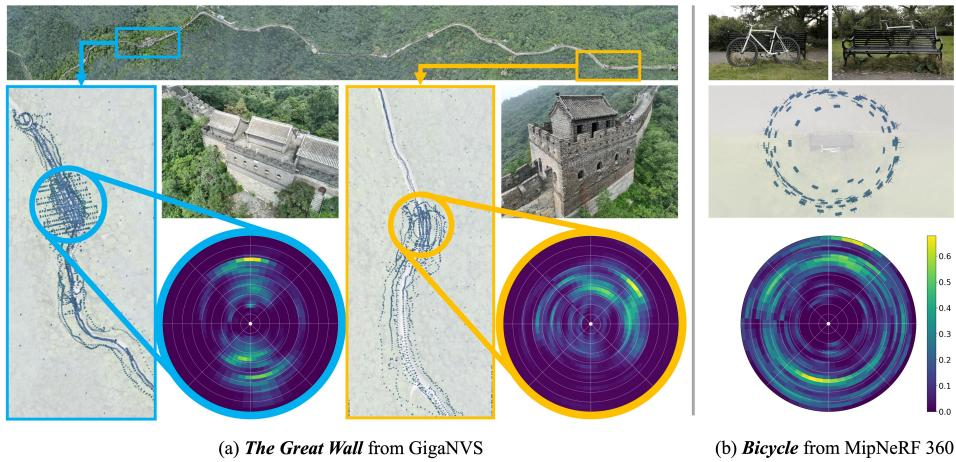
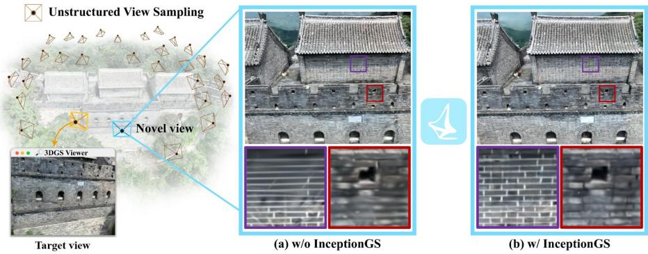
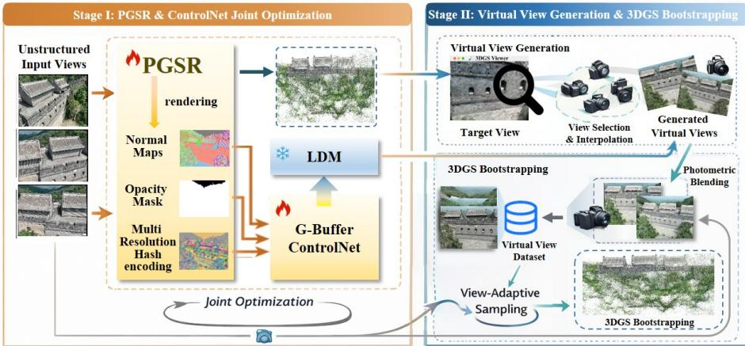
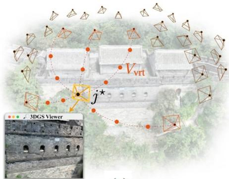
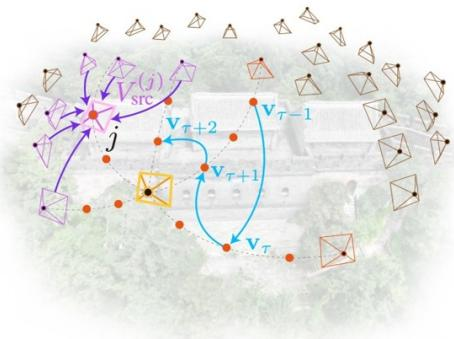
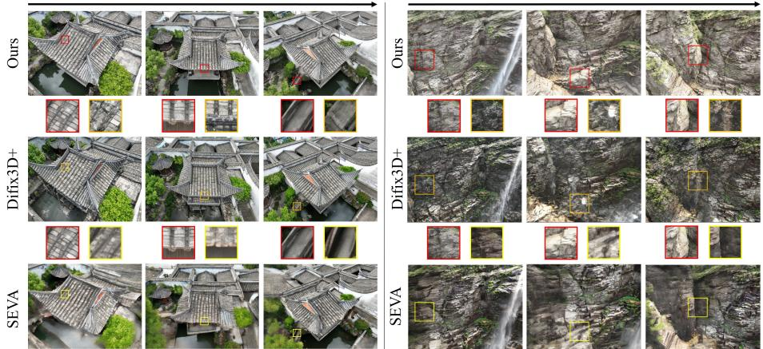
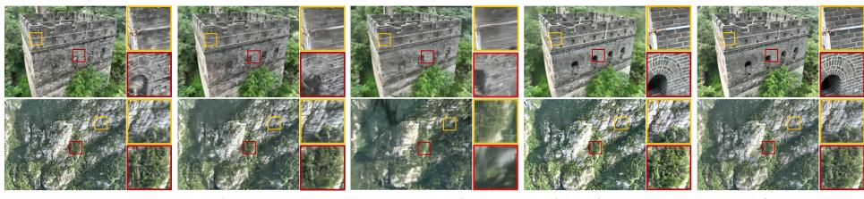
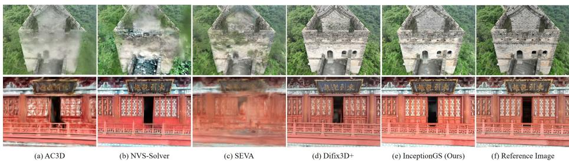
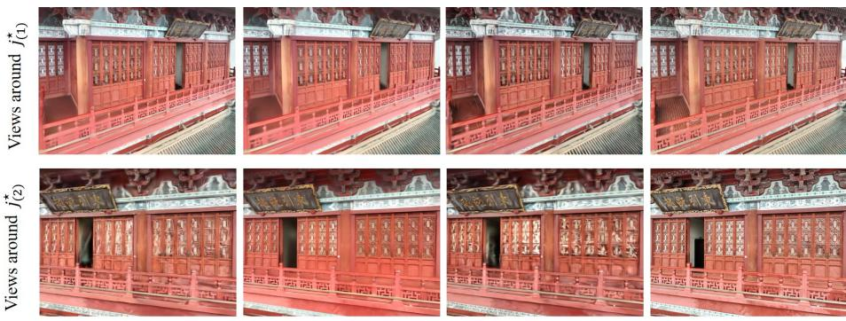

# InceptionGS: Generative Bootstrapping for Large-Scale Gaussian Splatting under Unstructured View Sampling

Tianheng Lu<sup>1⋆</sup> , Guangyu Wang<sup>1⋆</sup> , Ruqi Huang<sup>1B</sup> , and Lu Fang<sup>1B</sup>

<sup>1</sup>Tsinghua University, Beijing 100084, China

Abstract. Achieving truly immersive large-scale scene digitization necessitates consistent and visually pleasing rendering across all possible viewing perspectives. However, collecting multi-view images covering every fine detail of a large-scale scene is prohibitive due to scene complexity, capture cost, negligence, or accessibility constraints. As a result, the sampled views tend to be highly unstructured – the majority of the scene is well covered yet certain regions inevitably lack suficient observations. Existing reconstruction based methods are vulnerable to view scarcity while generation based approaches sufer from generalization, controllability, and 3D consistency issues. To address this challenge, we propose InceptionGS, which bootstraps Gaussian splatting by subtly balancing reconstruction and generation. Starting from an initial Gaussian splatting, InceptionGS reasonably rethinks and repairs problematic regions caused by view scarcity while preserving the quality elsewhere, by softly incorporating scene- and view-adaptive generative priors. Extensive experiments on real-world large-scale scenes demonstrate the superiority and broad applicability of our approach in handling unstructured imagery and boosting high-fidelity Gaussian splatting.

Keywords: Novel View Synthesis · Neural Rendering · 3D Generation

## 1 Introduction

Creating high-quality digital 3D assets of large-scale real-world scenes plays a crucial role in the realms of virtual reality, filmmaking, and gaming. With a onetime multi-view capture, users can efortlessly navigate breathtaking landmarks from the comfort of their home. In such applications, the primary goal is not to reconstruct with absolute precision, but to create controllable, perceptually convincing content grounded in reality. However, delivering truly immersive, lifelike experiences for large-scale scenes remains a hurdle, as it necessitates consistent and visually pleasing rendering across arbitrary viewing directions and scales. In particular, we identify and address the critical challenges as follows.

  
Fig. 1: Comparison of viewpoint distributions. The heatmaps indicate the directional viewing density distributed over the axis-aligned bounding hemisphere of the region of interest, which are approximated by tracing camera rays and accumulating ray-sphere intersections. (a) The unstructured view sampling issue of a real-world large-scale scene from GigaNVS [41], with the camera movements (the bird-eye scatter plot) shaped by the complex scene geometry and the viewing density unevenly distributed. (b) A smallscale scene from MipNeRF360 [3] with near-isotropic viewing density.

First of all, we highlight a practical and pressing issue related to large-scale scene capture, namely unstructured view sampling, which stems from 1) complex camera movements and 2) uneven viewing density. Specifically, unlike smallscale scenes [3,24,27,54] that easily allow for perfectly uniform viewpoint coverage [3, 21, 32], the high-quality digitization of large-scale scenes requires highly irregular capturing trajectories shaped by the scene geometry, which oftentimes involves multiple rounds at varying distances for both global structure and finegrained details. However, due to scene complexity, capture cost, negligence, or accessibility constraints, it is impractical to exhaustively traverse the entire space with all possible view directions. Consequently, the resulting viewpoint density tends to be unevenly distributed – while most of the scene is suficiently observed, certain regions inevitably sufer from view scarcity in an uncontrollable manner. In Figure 1 (a), we visualize the camera distribution of a real-world capture from the GigaNVS dataset [41]. The directional viewing density of the two selected landmarks reveal a high degree of non-uniformity, especially when compared to the near-isotropic density of a small-scale scene from the MipNeRF360 [3] dataset.

Unfortunately, existing reconstruction based and generation based approaches struggle to address this challenge. Reconstruction based novel view synthesis (NVS) methods, such as 3D Gaussian splatting (3DGS) [21] and its extensions [7, 11, 23, 34, 51], optimize the explicit primitive-based 3D representation in a scene-specific manner. Despite the remarkable photo-realism they achieve for in-the-wild scenes, the reconstruction quality drastically deteriorates under large variation from training views, which hinders the sense of immersion, as shown in Figure 2 (a). Although the most efective way to fix these artifacts is additional data collection, it is laborious and often impractical for real-world applications.

  
Fig. 2: We propose InceptionGS to address the unstructured view sampling challenge related to real-world large-scale scene capture. Starting from an initial Gaussian splatting and given a target viewpoint indicating visual artifacts, InceptionGS reasonably rethinks and refines the scene by softly incorporating scene-adaptive generative priors in a view-adaptive manner, enabling robust, high-fidelity Gaussian splatting in the wild.

On the other end of the spectrum, recent advances in generation based NVS [10, 19, 26, 29, 30, 48, 50] have demonstrated compelling results using one or few input views, leveraging strong priors from video [4, 44, 46] or multiview [17, 43, 53] difusion models. They retarget NVS as a feed-forward generation process, leveraging training-free guidance [29, 48] or conditional finetuning [1, 10, 30, 42, 50]. However, these methods have dificulty generalizing to complex large-scale scenes, often leading to structural distortions and appearance hallucinations due to the scarcity of high-quality training data. Besides, these approaches condition the generation either on Plücker embedding [19, 26] or artifact-prone RGB rendering [10, 29, 30, 42, 48, 50], which are hard to ensure precise control and long-term 3D consistency. Therefore, synthesizing complex large-scale scenes purely from a generative perspective remains a non-trivial obstacle.

In light of the above observations, rather than focusing solely on reconstruction or generation, we delve into the intersection of both paradigms, aiming to subtly integrate the strengths of these two extremes to push the boundaries of immersive large-scale scene digitization. Our key insight is that reconstruction could provide meaningful scene-specific clues to customize generation, the adapted generation, in turn, efectively boosts reconstruction by characterizing the underlying statistics. To this end, we introduce InceptionGS, a novel bootstrapping approach exploiting this synergy – with reconstruction and generation mutually “incepted” into each other – to address the unstructured sampling issue of large-scale scenes, as shown in Figure 2. Specifically, we propose to adapt the pretrained generative prior with scene-specific geometric guidance from an initial 3DGS reconstruction. Then, InceptionGS reasonably rethinks and refines the 3DGS field by injecting the scene-adaptive generative prior on a set of virtual viewpoints indicating visual artifacts obtained through view selection and interpolation. This ensures a long-range refinement in 3D space and avoids overfitting to the specified view. In contrast to existing approaches [10,29,30,45,48,50] that conduct generative refinement upon low-quality, artifact-prone RGB renderings, InceptionGS directly learns the scene-specific appearance distribution conditioned on the geometry. This design choice stems from the observation that geometry is strictly 3D consistent while being more robust than appearance given the well-behaved planar regularization [7,16,39]. Moreover, the underlying geometry-appearance correspondence exhibits a strong inductive bias in terms of local recurrence, which can be efectively characterized by convolutional kernels to facilitate generative learning.

Unlike prior works [17, 26, 29, 43, 50] that directly distill the generative prior into a 3D representation, our approach adopts a fundamentally diferent strategy by softly incorporating the prior to better represent reconstructive details. Specifically, we blend the generated images with reliable photometric clues [6,38] and propose a view-space importance sampling scheme to adaptively focus on the most informative views for bootstrapping, thus mitigating the conflicts between reconstruction and generation. Notably, InceptionGS efectively bootstraps 3DGS field without requiring additional resource-intensive real-world data collection, and the refinement can be iterated to repair problematic regions incrementally while preserving the quality of previously well-reconstructed areas.

To demonstrate the eficacy of InceptionGS, we simulate unstructured view sampling by clustering and filtering real-world imagery and establish a novel benchmark primarily based on the challenging GigaNVS dataset [41]. Through extensive quantitative and qualitative evaluations, we demonstrate the state-ofthe-art performance of InceptionGS in handling unstructured sampling, which consistently improves reconstruction fidelity and visual coherence across diverse large-scale scenes. Remarkably, our method efectively reduces the average FID by 32% after bootstrapping and significantly outperforms the top-performing difusion based alternative by 10% in FID, and 14% in LPIPS, underscoring a substantial advancement towards truly immersive large-scale scene digitization. In summary, our main contributions are as follows:

– We identify a practical unstructured view sampling challenge related to realworld large-scale scenes, for which we establish a benchmark to support comprehensive evaluations.

– We introduce InceptionGS to bootstrap large-scale 3DGS by adapting the generic generative prior with on-the-fly, hierarchical geometric signals as conditioning, subtly integrating the strengths of reconstruction and generation.

– We propose photometric blending and view-adaptive sampling to softly inject the adapted generative prior, efectively preserving fine details while mitigating the conflicts between reconstruction and generation.

– We demonstrate significant improvements over reconstruction based and generation based alternatives, both quantitatively and qualitatively.

## 2 Related Work

Reconstruction based NVS. Per-scene optimization approaches [15,21,32,33, 41] encapsulate the scene-specific information using implicit neural networks [32], explicit feature structures [15,21] or hybrid representations [33,41], enabling photorealistic rendering given perfect viewpoint coverage. By pretraining deep neural networks on diverse multi-view data [3,24,27,28,54], generalizable NVS [9,11,14, 36,49] bypasses the costly optimization process and synthesizes novel views from few input views in a feed-forward manner. However, the reconstruction quality drastically deteriorates under large variations in viewpoint or scale, exhibiting excessive blurries and needle-like artifacts once deviating from the training views. Generation based NVS. Benefiting from the rapid advances in difusion models [4, 25, 37, 44, 46, 52], generative NVS [1, 10, 17, 26, 29, 30, 42, 43, 48, 50, 53] approaches have demonstrated strong capabilities in completing unseen regions with plausible content, enabling both object-level [17] and scene-level [26,48,50] generation, even from a single image. A notable trend in recent works bridges video generation with NVS by applying temporal restoration on an initial lowquality estimate obtained via image warping [48], point-cloud rendering [50], or few-view 3DGS reconstruction [10, 29, 30]. Nevertheless, these methods often lead to hallucinations, struggling to generalize to complex large-scale scenes that rarely occur in the training data. Although the rich Internet collections [8,12,13, 27,28,54] can well support the generation of common small-scale scenes [54] with simple camera movements, they fail to fully characterize the diversity, complexity, and uniqueness of real-world sceneries [41] and the scene-dependent capturing trajectories. On the other hand, even the state-of-the-art difusion based scenerepairing model [42] trained on millions of data have dificulty understanding the ever-extending structure of the Great Wall, or the intricate geometry of lintels and cornices in traditional Chinese architectures. Also, it lacks precise control and fails to strictly maintain 3D consistency.

## 3 Methodology

In this section, we present InceptionGS, which aims to address the challenges raised by the unstructured view sampling of large-scale scene capture. Given a set of calibrated multi-view images $\{ \stackrel { \cdot } { \mathcal { T } _ { i } } \in \mathbb { R } ^ { H \times W \times 3 } \} _ { i = 1 } ^ { N }$ , InceptionGS first optimizes a 3DGS field $\left\{ { \mathcal { G } } _ { i } \right\}$ for initialization while simultaneously adapts the generic generative prior with scene-specific geometric features. InceptionGS then refines the 3DGS field by softly incorporating the customized generative prior with reliable photometric clues in a view-adaptive manner, efectively repairing the 3DGS field from a set of candidate virtual viewpoints generated via view selection and interpolation. This process can be iteratively conducted, enabling a self-evolving 3DGS that robustly handles unstructured sampling, without requiring additional real-world data collection. An illustration of the InceptionGS pipeline is shown in Figure 3, and a formal description is outlined in the Appendix.

In the following, we first briefly review the vanilla 3DGS and PGSR approach (Section 3.1). We then detail our design on individual core components, including generative adaptation (Section 3.2), photometric blending (Section 3.3), and the view sampling scheme (Section 3.3).

  
Fig. 3: Overview of the generative bootstrapping pipeline with InceptionGS. Stage I: We perform generative adaptation (Section 3.2) by adapting the generative prior of a pretrained LDM $\epsilon _ { \theta } ( \cdot )$ through G-bufer conditioning, with the guidance of an initial 3DGS optimization. Stage II: Given a target viewpoint $j ^ { \star }$ exhibiting visual artifacts, we generate a set of candidate virtual viewpoints $V _ { \mathrm { v r t } }$ for generative bootstrapping, using view selection and interpolation. During bootstrapping, we enhance the reconstructive details by blending the generative prior with reliable photometric clues (Section 3.3) and we softly inject generative supervision through view-space importance sampling (Section 3.3).

## 3.1 Preliminaries

3DGS [21] explicitly represents the scene as a collection of 3D Gaussian primitives $\left\{ { \mathcal { G } } _ { i } \right\}$ , where each primitive $\mathcal { G } _ { i }$ is parameterized as a 3D Gaussian ellipsoid with centroid $\pmb { \mu } _ { i } \in \mathbb { R } ^ { 3 }$ and covariance matrix $\pmb { \Sigma } _ { i } = \pmb { R } _ { i } \pmb { S } _ { i } \pmb { S } _ { i } ^ { T } \pmb { R } _ { i } ^ { T }$

$$
\begin{array} { r } { \mathcal { G } _ { i } ( { \pmb x } | { \pmb \mu } _ { i } , { \pmb \Sigma } _ { i } ) = e ^ { - \frac { 1 } { 2 } ( { \pmb x } - { \pmb \mu } _ { i } ) ^ { T } { \pmb \Sigma } _ { i } ^ { - 1 } ( { \pmb x } - { \pmb \mu } _ { i } ) } . } \end{array}\tag{1}
$$

To render the RGB image $\mathcal { C } \in \mathbb { R } ^ { H \times W \times 3 }$ from a given viewpoint, 3DGS alphablends the color $c _ { i }$ contributed by each Gaussian primitive $\mathcal { G } _ { i }$ on the ray, in a fast tile-based manner:

$$
\begin{array} { r } { \mathcal { C } = \displaystyle \sum _ { i } T _ { i } \alpha _ { i } \pmb { c } _ { i } , } \end{array}\tag{2}
$$

where $\alpha _ { i }$ is the opacity value contributed by the respective Gaussian primitive $\mathcal { G } _ { i }$ , and $T _ { i }$ is the cumulative opacity.

The 3DGS field $\left\{ \mathcal { G } _ { i } \right\}$ is optimized through diferentiable rendering by minimizing a combination of L1 and SSIM loss:

$$
\begin{array} { r } { \mathcal { L } _ { C } = \lambda _ { 1 } \mathcal { L } _ { 1 } + ( 1 - \lambda _ { 1 } ) \mathcal { L } _ { \mathrm { D - S S I M } } . } \end{array}\tag{3}
$$

To enhance the underlying geometry quality of 3DGS, PGSR [7] draws inspiration from traditional patch-matching MVS [16, 39] and incorporates local planar priors to enable accurate and smooth surface reconstruction. Specifically, it flattens each Gaussian ellipsoid into local planes and applies a variety of auxiliary planar regularizations:

$$
\mathcal { L } _ { G } = \lambda _ { S V } \mathcal { L } _ { S V } + \lambda _ { M V C } \mathcal { L } _ { M V C } + \lambda _ { M V G } \mathcal { L } _ { M V G } ,\tag{4}
$$

where ${ \mathcal { L } } _ { S V }$ denotes the single-view normal smoothness term, which regularizes the alpha-blended planar normal $\begin{array} { r } { \mathcal { N } = \sum _ { i } T _ { i } \alpha _ { i } \pmb { n } _ { i } } \end{array}$ to align with that derived from the local depth gradients. $\mathcal { L } _ { M V C }$ denotes the NCC-based photo-consistency constraint [16, 39], and $\mathcal { L } _ { M V G }$ is the geometric consistency term penalizing the reprojection error [39, 47].

## 3.2 Stage I: generative adaptation

We observe that geometry can be more efectively regularized than appearance due to its inherent 3D consistency and the local planar nature [7, 16, 39], which makes it a reliable condition for appearance generation. Besides, for a 3D scene, there exists intrinsic self-similarity [18] regarding the local correspondence between geometry and appearance. Thus, we can exploit geometric clues to ease the generative learning of the appearance distribution, with shared convolutional kernels applied on surface patches to characterize the internal reoccurring mapping modes. To this end, we repurpose a pretrained text-to-image latent difusion model (LDM) [37] to learn the scene-specific statistics of the geometryappearance correspondence by conditioning it on an additional geometry bufer and conducting data-eficient finetuning via ControlNet [52].

Geometry conditioning. We build upon PGSR [7] due to its superior geometry quality and unbiased rendering. We rasterize the planar normal map $\mathcal { N } \in \dot { \mathbb { R } } ^ { \tilde { H } \times W \times 3 }$ and the foreground opacity mask $\mathcal { O } \in \mathbb { R } ^ { \tilde { H } \times W \times 1 }$ as geometry bufer (G-bufer) to condition appearance generation. To further strengthen controllability and 3D consistency, we introduce a learnable, surface-aware, multiresolution hash feature map $\mathcal { F } \in \mathbb { R } ^ { H \times W \times Z } \left[ 3 3 , 4 1 \right]$ as additional conditioning. The input for the ControlNet is the concatenation of the rasterized bufer $\mathcal { R } ^ { } = ( \mathcal { N } , \mathcal { O } , \mathcal { F } ) \in \mathbb { R } ^ { H \times W \times ( 3 + 1 + Z ) }$ , which is computed on-the-fly from the continuously updating GS model at each gradient descent step, so as to ensure the robustness against varying geometry quality. Please refer to the Appendix for more implementation details.

Adapting generative prior. To better leverage the self-similarity of the geometryappearance correspondence, we employ the G-bufer conditional generative model on local image patches $\hat { \boldsymbol { \mathcal { Z } } } \in \mathbb { R } ^ { s \times s \times 3 }$ , which are randomly sampled from the multiview images $\{ \hat { \mathcal { T } } _ { i } \in \mathbb { R } ^ { H \times W \times 3 } \} _ { i = 1 } ^ { N }$ at each training step. Let $\epsilon _ { \theta } ( \cdot )$ denote the denoising difusion UNet with learnable ControlNet parameters $\theta ,$ the difusion loss can be formulated as:

$$
\mathcal { L } _ { D } = \mathbb { E } _ { t \sim U ( 0 , 1 ) , \epsilon \sim N ( \mathbf { 0 } , \mathbf { 1 } ) } [ | | \epsilon _ { \theta } ( z _ { t } , t , \hat { \mathcal { R } } ) - \epsilon | | _ { 2 } ^ { 2 } ] ,\tag{5}
$$

where ϵ is the sampled random noise, $\hat { \mathcal { R } } \in \mathbb { R } ^ { s \times s \times ( 3 + 1 + Z ) }$ is the local patch of the G-bufer R corresponding to $\hat { \boldsymbol { \mathcal { T } } } .$ . We denote by $z _ { t } = \sqrt { \alpha _ { t } } z _ { 0 } + \sqrt { 1 - \alpha _ { t } } \epsilon$ the noisy latent at timestep t, with $z _ { 0 } = \mathcal { E } ( \hat { \mathcal { T } } )$ being the VAE latent of the corresponding image patch I<sup>ˆ</sup>.

During this stage, we jointly optimize the ControlNet and the 3DGS field at the same time, using a combination of loss functions including the RGB loss $\mathcal { L } _ { C }$ (Eq. 3), the geometry regularization loss $\mathcal { L } _ { G } ~ ( \mathrm { E q . ~ 4 ) }$ , and the difusion loss $\mathcal { L } _ { D }$ (Eq. 5). We use DDIM scheduling in the denoising process and use MultiDifusion [2] to synthesize the full-resolution image by fusing difusion trajectories of the sliding patches. We denote by $\begin{array} { r } { z _ { 0 } ^ { \ast } \sim \mathrm { D D I M } ( z _ { T } , \epsilon _ { \theta } ( \cdot , \cdot , \mathcal { R } ) ) } \end{array}$ the final denoised latent and by ${ \mathcal { T } } ^ { * } = { \mathcal { D } } ( z _ { 0 } ^ { * } )$ the generated image from the VAE decoder.

As will be demonstrated in Section 4.2 and Section 4.3, the proposed sceneadaptive generative model substantially improves the quality and expressivity of appearance generation for fine details, while simultaneously enabling remarkable 3D consistency and controllability without any reliance on temporal modelling, compared to other generative methods [1, 42, 48, 50].

## 3.3 Stage II: bootstrapping Gaussians

So far we have proposed an efective approach to adapt the LDM $\epsilon _ { \theta } ( \cdot )$ for characterizing the scene-specific appearance distribution conditioned on the reconstructed geometry. Then, a straightforward way to enhance the 3DGS field would be sampling a set of unseen viewpoints $V _ { \mathrm { v r t } }$ and supervising the RGB rendering C with the generated appearance $\mathcal { T } ^ { * }$

  
(a)

  
(b)  
Fig. 4: Illustration of 3DGS bootstrapping. (a): Given a target view $j ^ { \star }$ , we generate a set of candidate virtual viewpoints $V _ { \mathrm { v r t } }$ through principled view selection and interpolation. (b): During the bootstrapping stage, reconstructive fidelity is improved by integrating generative priors with reliable photometric evidence. Meanwhile, generative supervision is softly incorporated through view-space importance sampling, enabling stable and geometry-consistent refinement.

Virtual viewpoint generation. As shown in Figure 4 (a), let $j ^ { \star }$ denote a target viewpoint indicating erroneous visual artifacts, we sample a set of candidate virtual viewpoints $V _ { \mathrm { v r t } }$ by firstly selecting the top-K nearest input training views $V _ { \mathrm { s r c } } ^ { ( j ^ { \star } ) } \ [ 3 9 , 4 \dot { 7 } ]$ , considering both camera position and orientation, and then linearly interpolate the camera center and the quaternion [40] between $j ^ { \star }$ and each selected training view $i \in V _ { \mathrm { s r c } } ^ { ( j ^ { \star } ) }$

$$
V _ { \mathrm { v r t } } = \{ \operatorname* { i n t e r p } ( j ^ { \star } , i , l ) | i \in V _ { \mathrm { s r c } } ^ { ( j ^ { \star } ) } , l \in [ 1 , L ] \} ,\tag{6}
$$

where l is the index of the interpolation, and we sample a total of $| V _ { \mathrm { v r t } } | = L K$ candidate virtual viewpoints.

Photometric blending. In practice, we find that the naive approach – namely, directly using the generated appearance $\mathcal { T } ^ { * }$ at virtual viewpoints $V _ { \mathrm { v r t } }$ as pseudo training views – already demonstrates efectiveness in tackling the unstructured view sampling challenge for large-scale scenes. Nevertheless, a remaining issue is that the generated images still have certain domain shifts from the real-captured ones, and the conditional LDM fails to ensure the photometric consistency of high-frequency details encapsulated in the VAE.

To take a step further, we propose to enhance the textural details using photometric clues from the real-captured training views [6], which is illustrated as the purple arrows in Figure 4 (b). Specifically, for each sampled unseen viewpoint $j \in V _ { \mathrm { v r t } }$ , we select the top-K nearest training views $V _ { \mathrm { s r c } } ^ { ( j ) }$ similar to [39, 47]. We then warp the RGB images $\{ \mathcal { T } _ { i } | i \in V _ { \mathrm { s r c } } ^ { ( j ) } \}$ of the selected training views into the viewpoint $j ,$ using the camera intrinsics and extrinsics, and the depth renderings of the initial PGSR reconstruction. We denote by $\{ \mathcal { T } _ { i \to j } | i \in V _ { \mathrm { s r c } } ^ { \overline { { ( j ) } } } \}$ the set of warped RGB images at the unseen viewpoint $j ,$ and by $\{ W _ { i \to j } | i \in V _ { \mathrm { s r c } } ^ { ( j ) } \}$ the corresponding blending weights measuring visibility [38], which are modulated by a threshold parameter $\delta$ to suppress contributions from potentially occluded regions. Leveraging photometric consistency, we perform image-based rendering by a weighted average of the warpings:

$$
\widetilde { \mathcal { T } } _ { j } = \sum _ { i \in V _ { \mathrm { s r c } } ^ { ( j ) } } W _ { i \to j } \mathcal { T } _ { i \to j } .\tag{7}
$$

The image-based rendering $\widetilde { \boldsymbol { \mathcal { T } } } _ { j }$ in Eq. 7 inherits high-quality textural details from the real-world captures when the geometry is well-approximated. However, it is vulnerable to occlusion, intricate geometry, and large viewpoint variation. To address this issue, we set $\delta$ in a conservative way to ensure that only trustworthy evidence from source views is retained in the fusion, and then blend the generated image $\boldsymbol { \mathcal { T } } _ { j } ^ { * }$ only with the most reliable photometric clues:

$$
\begin{array} { r } { \mathcal { T } _ { j } ^ { * }  M \circ \widetilde { \mathcal { T } } _ { j } + ( { \bf 1 } - M ) \circ \mathcal { T } _ { j } ^ { * } , } \end{array}\tag{8}
$$

where M is the binary mask that guides the completion of missing regions with the generative prior. More details about photometric blending can be found in the Appendix.

To refine the 3DGS field, we apply a combination of structural and perceptual loss on each sampled virtual view $j \in V _ { \mathrm { v r t } } ;$

$$
\begin{array} { r } { \left\{ \begin{array} { l l } { \mathcal { L } _ { P } ^ { ( j ) } = \lambda _ { 2 } \mathcal { L } _ { \mathrm { L P I P S } } ( \mathcal { C } _ { j } , \mathbb { Z } _ { j } ^ { * } ) , \qquad \mathrm { ~ i f ~ } \ \mathcal { L } _ { \mathrm { S S I M } } ( \mathcal { C } _ { j } , \mathbb { Z } _ { j } ^ { * } ) \leq \tau , } \\ { \mathcal { L } _ { P } ^ { ( j ) } = \lambda _ { 3 } \mathcal { L } _ { 1 } ( \mathcal { C } _ { j } , \mathbb { Z } _ { j } ^ { * } ) + \lambda _ { 4 } \mathcal { L } _ { \mathrm { S S I M } } ( \mathcal { C } _ { j } , \mathbb { Z } _ { j } ^ { * } ) , \qquad \mathrm { ~ o t h e r w i s e . } } \end{array} \right. } \end{array}\tag{9}
$$

We employ reconstructive supervision in a conservative manner, and once the structural loss $\mathcal { L } _ { \mathrm { S S I M } }$ is below a predefined threshold $\tau _ { : }$ we resort to perceptual supervision $\mathcal { L } _ { \mathrm { L P I P S } }$

View-adaptive sampling. Equipped with the scene-adaptive generative prior and the photometric blending mechanism, InceptionGS could efectively refine the initial 3DGS field at unseen virtual viewpoints. The remaining issue is how we can eficiently sample the set of unseen viewpoints for bootstrapping.

Instead of uniformly injecting the generative prior across $V _ { \mathrm { v r t } } .$ , we propose to sample the most informative virtual view adaptively at each training step based on Langevin Monte Carlo (LMC) importance sampling [5,22]. Intuitively, we hope to strike a better balance between generative appearance regularization and photometric 3DGS reconstruction, thus preventing the over-exposure of the generative supervision from degrading photometric optimization.

To achieve this, we model the loglikelihood of the posterior distribution $\mathcal { P }$ as the L1 distance between the 3DGS rendering and the generated appearance, and parameterize the pose vector $\mathbf { v } \in \mathbb { R } ^ { 7 }$ using the camera center and quaternion, which is steered by the gradient of the posterior distribution P and a stochastic exploration η. We quantize the continuous update of v at each LMC step to be the pose vector of the closest virtual viewpoint in $V _ { \mathrm { v r t } } .$ , so as to efectively constrain the sampling domain and enable eficient pre-caching of the

```latex
Algorithm 1 View-adaptive sampling
${ \mathcal { S } } .$
Require: Initial viewpoint ${ \underset { - } { q } } ,$ 3DGS field {G<sub>i</sub>},
candidate viewpoint set $V _ { \mathrm { v r t } } ,$ pose vector set
$\{ \mathbf { v } _ { j } | j \in V _ { \mathrm { v r t } } \}$ , blended images $\{ \mathcal { T } _ { j } ^ { * } | j \in V _ { \mathrm { v r t } } \}$
view sampling step $T _ { \mathrm { v s } }$
1: Initialize $\mathbf { v } _ { 0 } = \mathbf { v } _ { q }$
2: for $\tau = 0 , \dots , T _ { \mathrm { v s } } ^ { \mathrm { ~ ~ } }$ do \triangleright Iterate over sampling
steps
3: P = exp( $\| \mathcal { C } _ { q } - \mathcal { T } _ { q } ^ { * } \| _ { 1 } )$ \triangleright Get distribution
4: $\mathcal { G } _ { i } = \mathcal { G } _ { i } - \lambda _ { \mathrm { l r } } \nabla \mathcal { G } _ { i } \big ( \mathcal { L } _ { P } ^ { ( q ) } / \mathcal { P }$ ) \triangleright Up date 3DGS
5: Sample η ∈ N(0, 1) \triangleright Exploration noise
6: $\hat { \mathbf { v } } _ { \tau + 1 } \dot { \mathbf { \eta } } = \dot { \mathbf { v } } _ { \tau } + a \dot { \nabla } _ { \mathbf { v } _ { \tau } } \log \mathcal { P } + \dot { b } \pmb { \eta } \triangleright$ LMC step
7: $q = \mathrm { a r g m i n } _ { j \in V _ { \mathrm { v r t } } } | \hat { \mathbf { v } } _ { \tau + 1 } - \mathbf { v } _ { j } |$ \triangleright Nearest
view
8: Update $\mathbf { v } _ { \tau + 1 } = \mathbf { v } _ { q }$
9: end for
10: return {G<sub>i</sub>}
```

generated images. Note that the LMC sampling only depends on the local gradient of $\mathcal { P }$ , and hence induces minimal overhead leveraging the fast backward pass of Gaussian splatting. The proposed view-adaptive sampling is described in Algorithm 1 and an example of view-adaptive sampling update has been provided by the blue arrows in Figure 4 (b).

## 4 Experiments

To demonstrate the efectiveness of InceptionGS, we conduct extensive experiments on challenging real-world large-scale scenes from GigaNVS [41] and smallscale scenes from MipNeRF360 [3]. We first describe the experimental setup for simulating unstructured view sampling and then compare InceptionGS against the state-of-the-art baseline approaches [1, 10, 29, 30, 42, 48, 50] on the task of NVS. We also conduct ablation studies on the key components of our pipeline to validate the eficacy of each design choice, and perform additional sensitivity analyzes under varying severity levels to assess robustness.

## 4.1 Evaluation protocols

Dataset. The GigaNVS dataset [41] consists of seven large-scale sceneries, each containing thousands of high-quality, real-captured multi-view images. The unparalleled scene complexity, along with unstructured viewpoint and scale variations, reveals a high-degree of non-uniformity in view density, making it a suitable testbed for InceptionGS. We also conduct experiments on all publicly available scenes from the MipNeRF360 dataset [3] to demonstrate the broad applicability and robustness of our approach beyond large-scale outdoor settings. Setup. To enable quantitative evaluation, we simulate unstructured view sampling by selectively holding out real-captured images as ground truth for NVS. Specifically, we cluster all viewpoints into six disjoint groups using farthest point sampling based on a hybrid distance metric considering both camera position and orientation. Starting from a random seed, each new cluster centroid is selected to maximize its minimal distance to the previously chosen ones, and the remaining viewpoints are assigned to the nearest centroid. We then randomly select one cluster and hold out 90% of its viewpoints for evaluation, with the centroid of this cluster serving as the target view. During training, only the pose of target view is used as an anchor for pseudo-view generation, indicating the worst reconstructed region. During evaluation, we assess the bootstrapping efect using the images within the target-view cluster as ground truth rather than evaluating only the target view itself. We also uniformly hold out 5% of viewpoints from all other groups to evaluate the quality of well-covered regions, in line with conventional NVS.

Baselines. We first compare against camera-controlled image-to-video(I2V) diffusion approaches, including MVSplat360 [10], GEN3C [35], NVS-Solver [48], ViewCrafter [50] and AC3D [1], multi-view difusion approach Stable Virtual Camera(SEVA) [53] and See3D [31], as well as the single-step scene-inpainting approach Difix3D+ [42], in terms of generative repairing for problematic regions. To adapt these methods to the unstructured sampling setting, we make minimal yet necessary modifications, running video difusion strictly on the same set of candidate virtual views as ours. After obtaining the generated images at all virtual views, we optimize a 3DGS per-scene taking as inputs all realcaptured training views and generated virtual views. The quantitative evaluation is performed on the final 3DGS renderings. We also compare against per-scene optimization based 3DGS extensions, including PGSR [7], 3DGS-MCMC [23], SplatFormer [11] and DropGaussian [34], using all real-captured training views. Please refer to the Appendix for more details.

Metrics. We use PSNR, LPIPS, and Frechet Inception Distance (FID) [20] to evaluate reconstruction precision, visual fidelity, and generation quality.

## 4.2 Comparative results

In the following, we present both quantitative and qualitative results, where the proposed method consistently outperforms state-of-the-art baselines.

Quantitative results. In Table 1, we quantitatively compare against the baselines and report the mean metrics across all test views and scenes. Our method outperforms all compared baselines by a noticeable margin and, remarkably, achieves a 10% reduction in average FID and a 14% reduction in average LPIPS relative to the bestperforming difusion method [42], underscoring the superiority of InceptionGS in bootstrapping problematic regions of large-scale scenes. Note that difusion based methods have difficulty generalizing to unstructured

Table 1: Quantitative comparisons on the GigaNVS [41] and MipNeRF360 [3] dataset under unstructured view sampling.
<table><tr><td></td><td colspan="3">GigaNVS [41] PSNR↑LPIPS↓ FID↓</td><td colspan="3">MipNeRF360 [3] PSNR↑ LPIPS↓ FÍD↓</td></tr><tr><td>MVSplat360 [10]</td><td>13.59</td><td>0.602</td><td>168.62|</td><td>13.94</td><td>0.547</td><td>180.74</td></tr><tr><td>ViewCrafter [50]</td><td>15.01</td><td>0.565</td><td>138.39</td><td>16.18</td><td>0.544</td><td>171.71</td></tr><tr><td>NVS-Solver [48]</td><td>15.54</td><td>0.530</td><td>128.47</td><td>16.90</td><td></td><td>0.546 161.20</td></tr><tr><td>AC3D [1]</td><td>14.67</td><td>0.638</td><td>177.49</td><td>15.72</td><td>0.641</td><td>161.37</td></tr><tr><td>Difix3D+ [42]</td><td>15.86</td><td>0.418</td><td>71.39</td><td>19.08</td><td>0.321</td><td>66.73</td></tr><tr><td>SEVA [53]</td><td>15.37</td><td>0.563</td><td>135.48</td><td>16.83</td><td>0.520</td><td>186.52</td></tr><tr><td>GEN3C [35]</td><td>15.24</td><td>0.517 122.97</td><td></td><td>16.72</td><td>0.473</td><td>3154.57</td></tr><tr><td>See3D [31]</td><td>15.93</td><td>0.488</td><td>103.89</td><td>17.92</td><td>0.437</td><td>122.02</td></tr><tr><td>SplatFormer [11]</td><td>14.28</td><td>0.511</td><td>128.13</td><td>15.88</td><td>0.402</td><td>125.54</td></tr><tr><td>PGSR [7]</td><td>15.96</td><td>0.442</td><td>91.27</td><td>18.85</td><td>0.328</td><td>87.79</td></tr><tr><td>3DGS-MCMC [23]</td><td>16.54</td><td>0.438</td><td>109.92</td><td>18.92</td><td>0.315</td><td>83.59</td></tr><tr><td>DropGaussian [34]</td><td>16.42</td><td>0.562</td><td>141.74</td><td>19.42</td><td>0.356</td><td>87.82</td></tr><tr><td>Ours (w/o FT)</td><td>14.97</td><td>0.610</td><td>176.40|</td><td>17.09</td><td>0.470</td><td>164.67</td></tr><tr><td>Ours (w/o PB)</td><td>16.97</td><td>0.376</td><td>73.35</td><td>20.48</td><td>0.301</td><td>64.89</td></tr><tr><td>Ours (w/o VS)</td><td>16.88</td><td>0.394</td><td>72.89</td><td>20.28</td><td>0.312</td><td>66.59</td></tr><tr><td>Ours (Full)</td><td>17.24</td><td>0.360</td><td>64.42</td><td>20.72</td><td>0.297</td><td>62.78</td></tr></table>

view sampling, primarily due to scene complexity, dramatic variations in pose and scale, and lack of global context in the reference image.

  
Fig. 5: Visual comparisons on camera-controlled generation against Difix3D+ [42] and SEVA [53]. Our scene-adaptive, reconstruction-guided LDM enables significantly superior visual quality, 3D consistency, and controllability.

Qualitative results. In Figure 5, we visualize the raw generation results from our scene-adaptive LDM and the top-performing difusion-based methods [42, 53]. Existing generation approaches are prone to structural or appearance hallucinations in complex large-scale scenes, especially when the camera deviates significantly from the conditioning view. By contrast, our method directly learns the scene-specific geometry-appearance correspondence, enabling 3D consistent, faithful generation grounded on reconstruction, while robustly handling drastic camera movements and scale variations. The visual comparisons of the lifted



  
Fig. 6: Qualitative 3DGS comparisons with generative approaches [1, 42, 48, 53] on GigaNVS [41].  
(a) PGSR  
(b) 3DGS-MCMC  
(c) DropGaussian  
(d) InceptionGS (Ours)  
(e) Reference Image

Fig. 7: Visual demonstrations on the efectiveness of InceptionGS.

3DGS fields are presented in Figure 6. Notably, all difusion based baselines exhibit excessive blurriness, structural distortions, or floating artifacts due to multi-view inconsistent and deteriorated generation results. On the contrary, InceptionGS enables visually pleasing, detail-preserving bootstrapping by softly incorporating the scene-adaptive generative prior. Please refer to the Appendix for more qualitative results.

## 4.3 Ablation study

Efectiveness of InceptionGS. The quantitative ablations for the full generative bootstrapping pipeline is reported in Table 1 (Ours (Full) V.S. PGSR). Remarkably, InceptionGS improves the overall visual quality, reducing the average FID by 32%. The visual comparisons are presented in Figure 7. By applying InceptionGS, the problematic regions are efectively repaired with fine details, demonstrating its capability to handle unstructured view sampling problem without the need for additional labor-intensive real-world data collection.

Ablations on key components. In Table 1, we also conduct ablations on proposed photometric blending (PB), view-adaptive sampling (VS), and finetuning (FT) of the generic generative model. All three components are crucial in boosting performance – while photometric blending can utilize reliable image warping wherever possible to further improve textural details, view-adaptive sampling mitigates the conflicts between reconstructive and generative supervisions and preserves the quality of well-reconstructed regions. Moreover, our adapted LDM, trained with ControlNet-based geometric conditioning, efectively captures scene-specific statistics to enable controllable and spatially consistent novel view synthesis. Note that the primary gain of InceptionGS comes from the scene-adaptive generative model, given the remarkable performance gap between both ablative versions (Ours $( w / o ~ P B )$ and Ours $( w / o \ V S ) )$ and the baselines.

Sensitivity to severity. We further evaluate the robustness of the proposed method to varied levels of severity. Specifically, to simulate a more challenging reconstruction setting, we reduce by 50% the number of input views that observe the held-out region, thereby significantly limiting geometric and photometric cues. As reported in Table 2 on the Room scene

Table 2: Ablation on increased scarcity.
<table><tr><td>#visible views</td><td></td><td></td><td>PSNR↑ SSIM↑ LPIPS↓</td><td>FID↓</td></tr><tr><td>4 (Original setup)</td><td>26.82</td><td>0.822</td><td>0.231</td><td>50.89</td></tr><tr><td>2 (More holes)</td><td>26.60</td><td>0.821</td><td>0.234</td><td>53.35</td></tr></table>

Table 3: Ablation on the number of virtual views injected.
<table><tr><td>#virtual views PSNR↑</td><td></td><td></td><td>SSIM↑ LPIPS↓</td><td>FID↓</td></tr><tr><td>1.5×</td><td>16.30</td><td>0.551</td><td>0.383</td><td>54.12</td></tr><tr><td>1×</td><td>16.28</td><td>0.560</td><td>0.377</td><td>53.79</td></tr><tr><td>0.5×</td><td>16.24</td><td>0.541</td><td>0.389</td><td>53.71</td></tr></table>

from MipNeRF360 dataset, the reconstruction quality exhibits only a marginal degradation. The results indicate that our method is robust to diferent levels of view scarcity and geometry quality. This robustness mainly arises from training ControlNet on inputs rendered on-the-fly from a continuously updated GS model, allowing it to generalize to varied severity efectively. In addition, we adjust the number of virtual viewpoints by 50% to investigate the sensitivity of our framework to diferent levels of generative guidance, with the results on the Lanes-and-Alleys scene from GigaNVS dataset shown in Table 3. Interestingly, the performance remains quite stable across diferent configurations. Such insensitivity indicates that our framework does not rely on a precise tuning of virtual view quantity. The soft injection strategy distributes generative supervision adaptively in the view space, ensuring that additional virtual views do not introduce redundancy, while fewer views still provide suficient guidance. Across both settings, our method maintains stable performance, which indicates our robustness to varied levels of severity.

Demonstrations on iterative bootstrapping. In Table 4, we conduct experiments by iterating our bootstrapping pipeline as mentioned in the beginning of Section 3, where a second round is performed taking both the original images and the repaired rendered images from the first round as input. We investigate two diferent scenarios for the target views: (1) identical target views across both rounds $( j _ { ( 1 ) } ^ { \star } = j _ { ( 2 ) } ^ { \star } )$ , and (2) diferent target views oriented toward separate underobserved regions $( j _ { ( 1 ) } ^ { \star } \neq j _ { ( 2 ) } ^ { \star } )$ . For both scenarios, the evaluation is performed on the same 122 test views comprising views focused on underobserved regions and views uniformly sampled across the entire scene. The metrics are reported on the TW-Pavilion (Day) scene from the GigaNVS dataset.

Table 4: Efects of iterative bootstrapping.
<table><tr><td colspan="5">|PSNR ↑ SSIM ↑ LPIPS ↓ FID ↓</td></tr><tr><td>1st round with  $j _ { ( 1 ) } ^ { \star }$ </td><td>14.53</td><td>0.447</td><td>0.508</td><td>143.93</td></tr><tr><td>2nd round with  $\begin{array} { r } { \dot { j } _ { ( 2 ) } ^ { \star } = \dot { j } _ { ( 1 ) } ^ { \star } } \end{array}$ </td><td>14.66</td><td>0.448</td><td>0.514</td><td>140.79</td></tr><tr><td>2nd round with  $j _ { ( 2 ) } ^ { \star } \neq j _ { ( 1 ) } ^ { \star }$ </td><td>16.28</td><td>0.551</td><td>0.377</td><td>53.79</td></tr></table>

  
(a) 1st Round  
(b) 2nd Round  
(c) PGSR  
(d) Reference Image  
Fig. 8: Qualitative demonstrations of iterative bootstrapping on diferent views targeting separate underobserved regions $( j _ { ( 1 ) } ^ { \star } \neq j _ { ( 2 ) } ^ { \star }$ ).

According to Table 4, the results appear to be stable when identical target views are used for two consecutive rounds. This indicates the efectiveness of our soft blending and sampling strategy, where a single round is generally enough for repairing a specific region and further rounds will not bring negative impacts on reconstruction. When diferent target views are specified, as shown in Figure 8, the results improve after a second round of repairing without deteriorating the quality of previously well-reconstructed areas, thus demonstrating the eficacy of iterative bootstrapping. Due to space limit, more ablation studies can be found in the Appendix.

## 5 Conclusion

We introduce InceptionGS, a novel approach to address the unstructured view sampling challenge related to real-world large-scale scenes. By adapting the generic generative prior with scene-specific geometry-appearance correspondence, InceptionGS can incorporate this reliable prior in a view-adaptive manner and incrementally refine the 3DGS field without requiring additional data collection. Extensive experiments on challenging benchmarks demonstrate the significant superiority of InceptionGS, highlighting its potential in advancing truly immersive large-scale scene digitization.

Limitation & future work. Despite the compelling results, stage I takes approximately 30 minutes with peak VRAM of 30GB, while stage II takes around 25 minutes with peak VRAM below 15GB. For future work, we aim to explore more advanced optimization scheme like test-time training to reduce per-scene overhead and improve scalability.

Acknowledgements. This work is supported in part by Natural Science Foundation of China (NSFC) under contract No. 62125106 and 62427804, in part by Tsinghua University Dushi Program (No.20251080107), in part by the Beijing Outstanding Young Scientist Program under contract No. JWZQ20240101009, in part by the XPLORER PRIZE.

## References

1. Bahmani, S., Skorokhodov, I., Qian, G., Siarohin, A., Menapace, W., Tagliasacchi, A., Lindell, D.B., Tulyakov, S.: Ac3d: Analyzing and improving 3d camera control in video difusion transformers. arXiv preprint arXiv:2411.18673 (2024)

2. Bar-Tal, O., Yariv, L., Lipman, Y., Dekel, T.: Multidifusion: fusing difusion paths for controlled image generation. In: Proceedings of the 40th International Conference on Machine Learning. pp. 1737–1752 (2023)

3. Barron, J.T., Mildenhall, B., Verbin, D., Srinivasan, P.P., Hedman, P.: Mipnerf 360: Unbounded anti-aliased neural radiance fields. In: Proceedings of the IEEE/CVF conference on computer vision and pattern recognition. pp. 5470–5479 (2022)

4. Blattmann, A., Dockhorn, T., Kulal, S., Mendelevitch, D., Kilian, M., Lorenz, D., Levi, Y., English, Z., Voleti, V., Letts, A., et al.: Stable video difusion: Scaling latent video difusion models to large datasets. arXiv preprint arXiv:2311.15127 (2023)

5. Brosse, N., Durmus, A., Moulines, E.: The promises and pitfalls of stochastic gradient langevin dynamics. Advances in Neural Information Processing Systems 31 (2018)

6. Buehler, C., Bosse, M., McMillan, L., Gortler, S., Cohen, M.: Unstructured lumigraph rendering. In: Proceedings of the 28th annual conference on Computer graphics and interactive techniques. pp. 425–432 (2001)

7. Chen, D., Li, H., Ye, W., Wang, Y., Xie, W., Zhai, S., Wang, N., Liu, H., Bao, H., Zhang, G.: Pgsr: Planar-based gaussian splatting for eficient and high-fidelity surface reconstruction. IEEE Transactions on Visualization and Computer Graphics (2024)

8. Chen, T.S., Siarohin, A., Menapace, W., Deyneka, E., Chao, H.w., Jeon, B.E., Fang, Y., Lee, H.Y., Ren, J., Yang, M.H., et al.: Panda-70m: Captioning 70m videos with multiple cross-modality teachers. In: Proceedings of the IEEE/CVF Conference on Computer Vision and Pattern Recognition. pp. 13320–13331 (2024)

9. Chen, Y., Xu, H., Zheng, C., Zhuang, B., Pollefeys, M., Geiger, A., Cham, T.J., Cai, J.: Mvsplat: Eficient 3d gaussian splatting from sparse multi-view images. In: European Conference on Computer Vision. pp. 370–386. Springer (2024)

10. Chen, Y., Zheng, C., Xu, H., Zhuang, B., Vedaldi, A., Cham, T.J., Cai, J.: Mvsplat360: Feed-forward 360 scene synthesis from sparse views. Advances in Neural Information Processing Systems 37, 107064–107086 (2024)

11. Chen, Y., Mihajlovic, M., Chen, X., Wang, Y., Prokudin, S., Tang, S.: Splatformer: Point transformer for robust 3d gaussian splatting. In: International Conference on Learning Representations (ICLR) (2025)

12. Deitke, M., Liu, R., Wallingford, M., Ngo, H., Michel, O., Kusupati, A., Fan, A., Laforte, C., Voleti, V., Gadre, S.Y., et al.: Objaverse-xl: A universe of 10m+ 3d objects. Advances in Neural Information Processing Systems 36, 35799–35813 (2023)

13. Deitke, M., Schwenk, D., Salvador, J., Weihs, L., Michel, O., VanderBilt, E., Schmidt, L., Ehsani, K., Kembhavi, A., Farhadi, A.: Objaverse: A universe of annotated 3d objects. In: Proceedings of the IEEE/CVF conference on computer vision and pattern recognition. pp. 13142–13153 (2023)

14. Flynn, J., Broxton, M., Debevec, P., DuVall, M., Fyfe, G., Overbeck, R., Snavely, N., Tucker, R.: Deepview: View synthesis with learned gradient descent. In: Proceedings of the IEEE/CVF Conference on Computer Vision and Pattern Recognition. pp. 2367–2376 (2019)

15. Fridovich-Keil, S., Yu, A., Tancik, M., Chen, Q., Recht, B., Kanazawa, A.: Plenoxels: Radiance fields without neural networks. In: Proceedings of the IEEE/CVF conference on computer vision and pattern recognition. pp. 5501–5510 (2022)

16. Furukawa, Y., Ponce, J.: Accurate, dense, and robust multiview stereopsis. IEEE transactions on pattern analysis and machine intelligence 32(8), 1362–1376 (2009)

17. Gao, R., Holynski, A., Henzler, P., Brussee, A., Martin Brualla, R., Srinivasan, P., Barron, J., Poole, B.: Cat3d: Create anything in 3d with multi-view difusion models. Advances in Neural Information Processing Systems 37, 75468–75494 (2025)

18. Hanocka, R., Metzer, G., Giryes, R., Cohen-Or, D.: Point2mesh: a self-prior for deformable meshes. ACM Transactions on Graphics (TOG) 39(4), 126–1 (2020)

19. He, H., Xu, Y., Guo, Y., Wetzstein, G., Dai, B., Li, H., Yang, C.: Cameractrl: Enabling camera control for text-to-video generation. arXiv preprint arXiv:2404.02101 (2024)

20. Heusel, M., Ramsauer, H., Unterthiner, T., Nessler, B., Hochreiter, S.: Gans trained by a two time-scale update rule converge to a local nash equilibrium. Advances in neural information processing systems 30 (2017)

21. Kerbl, B., Kopanas, G., Leimkühler, T., Drettakis, G.: 3d gaussian splatting for real-time radiance field rendering. ACM Trans. Graph. 42(4), 139–1 (2023)

22. Kheradmand, S., Rebain, D., Sharma, G., Isack, H., Kar, A., Tagliasacchi, A., Yi, K.M.: Accelerating neural field training via soft mining. In: Proceedings of the IEEE/CVF Conference on Computer Vision and Pattern Recognition. pp. 20071– 20080 (2024)

23. Kheradmand, S., Rebain, D., Sharma, G., Sun, W., Tseng, Y.C., Isack, H., Kar, A., Tagliasacchi, A., Yi, K.M.: 3d gaussian splatting as markov chain monte carlo. Advances in Neural Information Processing Systems 37, 80965–80986 (2024)

24. Knapitsch, A., Park, J., Zhou, Q.Y., Koltun, V.: Tanks and temples: Benchmarking large-scale scene reconstruction. ACM Transactions on Graphics (ToG) 36(4), 1–13 (2017)

25. Kong, W., Tian, Q., Zhang, Z., Min, R., Dai, Z., Zhou, J., Xiong, J., Li, X., Wu, B., Zhang, J., et al.: Hunyuanvideo: A systematic framework for large video generative models. arXiv preprint arXiv:2412.03603 (2024)

26. Liang, H., Cao, J., Goel, V., Qian, G., Korolev, S., Terzopoulos, D., Plataniotis, K.N., Tulyakov, S., Ren, J.: Wonderland: Navigating 3d scenes from a single image. arXiv preprint arXiv:2412.12091 (2024)

27. Ling, L., Sheng, Y., Tu, Z., Zhao, W., Xin, C., Wan, K., Yu, L., Guo, Q., Yu, Z., Lu, Y., et al.: Dl3dv-10k: A large-scale scene dataset for deep learning-based 3d vision. In: Proceedings of the IEEE/CVF Conference on Computer Vision and Pattern Recognition. pp. 22160–22169 (2024)

28. Liu, A., Tucker, R., Jampani, V., Makadia, A., Snavely, N., Kanazawa, A.: Infinite nature: Perpetual view generation of natural scenes from a single image. In: Proceedings of the IEEE/CVF International Conference on Computer Vision. pp. 14458–14467 (2021)

29. Liu, K., Shao, L., Lu, S.: Novel view extrapolation with video difusion priors. arXiv preprint arXiv:2411.14208 (2024)

30. Liu, X., Zhou, C., Huang, S.: 3dgs-enhancer: Enhancing unbounded 3d gaussian splatting with view-consistent 2d difusion priors. Advances in Neural Information Processing Systems 37, 133305–133327 (2025)

31. Ma, B., Gao, H., Deng, H., Luo, Z., Huang, T., Tang, L., Wang, X.: You see it, you got it: Learning 3d creation on pose-free videos at scale. In: IEEE/CVF conference on computer vision and pattern recognition (2025)

32. Mildenhall, B., Srinivasan, P.P., Tancik, M., Barron, J.T., Ramamoorthi, R., Ng, R.: Nerf: Representing scenes as neural radiance fields for view synthesis. Communications of the ACM 65(1), 99–106 (2021)

33. Müller, T., Evans, A., Schied, C., Keller, A.: Instant neural graphics primitives with a multiresolution hash encoding. ACM transactions on graphics (TOG) 41(4), 1–15 (2022)

34. Park, H., Ryu, G., Kim, W.: Dropgaussian: Structural regularization for sparseview gaussian splatting. In: Proceedings of the Computer Vision and Pattern Recognition Conference. pp. 21600–21609 (2025)

35. Ren, X., Shen, T., Huang, J., Ling, H., Lu, Y., Nimier-David, M., Müller, T., Keller, A., Fidler, S., Gao, J.: Gen3c: 3d-informed world-consistent video generation with precise camera control. In: Proceedings of the IEEE/CVF Conference on Computer Vision and Pattern Recognition (2025)

36. Riegler, G., Koltun, V.: Stable view synthesis. In: Proceedings of the IEEE/CVF Conference on Computer Vision and Pattern Recognition. pp. 12216–12225 (2021)

37. Rombach, R., Blattmann, A., Lorenz, D., Esser, P., Ommer, B.: High-resolution image synthesis with latent difusion models. In: Proceedings of the IEEE/CVF conference on computer vision and pattern recognition. pp. 10684–10695 (2022)

38. Rong, X., Huang, J.B., Saraf, A., Kim, C., Kopf, J.: Boosting view synthesis with residual transfer. In: Proceedings of the IEEE/CVF Conference on Computer Vision and Pattern Recognition. pp. 19760–19769 (2022)

39. Schönberger, J.L., Zheng, E., Frahm, J.M., Pollefeys, M.: Pixelwise view selection for unstructured multi-view stereo. In: Computer Vision–ECCV 2016: 14th European Conference, Amsterdam, The Netherlands, October 11-14, 2016, Proceedings, Part III 14. pp. 501–518. Springer (2016)

40. Shoemake, K.: Animating rotation with quaternion curves. In: Proceedings of the 12th annual conference on Computer graphics and interactive techniques. pp. 245– 254 (1985)

41. Wang, G., Zhang, J., Wang, F., Huang, R., Fang, L.: Xscale-nvs: Cross-scale novel view synthesis with hash featurized manifold. In: Proceedings of the IEEE/CVF Conference on Computer Vision and Pattern Recognition. pp. 21029–21039 (2024)

42. Wu, J.Z., Zhang, Y., Turki, H., Ren, X., Gao, J., Shou, M.Z., Fidler, S., Gojcic, Z., Ling, H.: Difix3d+: Improving 3d reconstructions with single-step difusion models. In: Proceedings of the Computer Vision and Pattern Recognition Conference. pp. 26024–26035 (2025)

43. Wu, R., Mildenhall, B., Henzler, P., Park, K., Gao, R., Watson, D., Srinivasan, P.P., Verbin, D., Barron, J.T., Poole, B., et al.: Reconfusion: 3d reconstruction with difusion priors. In: Proceedings of the IEEE/CVF conference on computer vision and pattern recognition. pp. 21551–21561 (2024)

44. Xing, J., Xia, M., Zhang, Y., Chen, H., Yu, W., Liu, H., Liu, G., Wang, X., Shan, Y., Wong, T.T.: Dynamicrafter: Animating open-domain images with video difusion priors. In: European Conference on Computer Vision. pp. 399–417. Springer (2024)

45. Yang, C., Li, S., Fang, J., Liang, R., Xie, L., Zhang, X., Shen, W., Tian, Q.: Gaussianobject: High-quality 3d object reconstruction from four views with gaussian splatting. arXiv preprint arXiv:2402.10259 (2024)

46. Yang, Z., Teng, J., Zheng, W., Ding, M., Huang, S., Xu, J., Yang, Y., Hong, W., Zhang, X., Feng, G., et al.: Cogvideox: Text-to-video difusion models with an expert transformer. arXiv preprint arXiv:2408.06072 (2024)

47. Yao, Y., Luo, Z., Li, S., Fang, T., Quan, L.: Mvsnet: Depth inference for unstructured multi-view stereo. In: Proceedings of the European conference on computer vision (ECCV). pp. 767–783 (2018)

48. You, M., Zhu, Z., Liu, H., Hou, J.: Nvs-solver: Video difusion model as zero-shot novel view synthesizer. arXiv preprint arXiv:2405.15364 (2024)

49. Yu, A., Ye, V., Tancik, M., Kanazawa, A.: pixelnerf: Neural radiance fields from one or few images. In: Proceedings of the IEEE/CVF conference on computer vision and pattern recognition. pp. 4578–4587 (2021)

50. Yu, W., Xing, J., Yuan, L., Hu, W., Li, X., Huang, Z., Gao, X., Wong, T.T., Shan, Y., Tian, Y.: Viewcrafter: Taming video difusion models for high-fidelity novel view synthesis. arXiv preprint arXiv:2409.02048 (2024)

51. Yu, Z., Chen, A., Huang, B., Sattler, T., Geiger, A.: Mip-splatting: Alias-free 3d gaussian splatting. In: Proceedings of the IEEE/CVF conference on computer vision and pattern recognition. pp. 19447–19456 (2024)

52. Zhang, L., Rao, A., Agrawala, M.: Adding conditional control to text-to-image difusion models. In: Proceedings of the IEEE/CVF international conference on computer vision. pp. 3836–3847 (2023)

53. Zhou, J.J., Gao, H., Voleti, V., Vasishta, A., Yao, C.H., Boss, M., Torr, P., Rupprecht, C., Jampani, V.: Stable virtual camera: Generative view synthesis with difusion models. arXiv preprint arXiv:2503.14489 (2025)

54. Zhou, T., Tucker, R., Flynn, J., Fyfe, G., Snavely, N.: Stereo magnification: learning view synthesis using multiplane images. ACM Transactions on Graphics (TOG) 37(4), 1–12 (2018)