# One Editor, Many Edits: A Unified Training-Free Framework for Diverse Video Editing

Adheesh Sunil Juvekar, Onkar Kishor Susladkar, Kiet A. Nguyen, Muntasir Wahed, Nabeel Bashir, Xiaona Zhou, Tianjiao Yu, Vedant Shah, and Ismini Lourentzou

University of Illinois Urbana-Champaign

Source Video

Change to watercolor painting style

Make eyes blue

Add Sunglasses

Change sunglasses to green

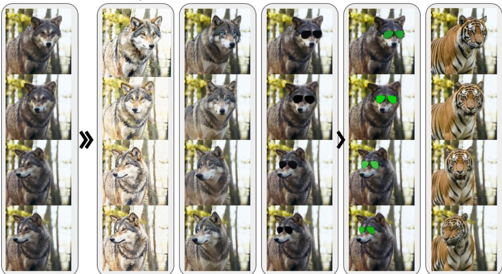  
Figure 1: EditVid enables training-free, temporally consistent video editing across diverse edit types. Our method supports style transfer, attribute change, object insertion, attribute refinement, part-level modification, and subject-guided replacement while preserving temporal consistency.

Abstract. Video editing spans diverse editing paradigms, yet achieving high-quality instruction-guided and subject-guided editing within a single unified framework remains challenging. We introduce EditVid, a training free framework combining sparse causal memory for local coherence, correspondence-based post-attention token injection for long-range identity preservation, and soft latent blending for edit locality. The same framework supports instruction-guided and reference-guided edits, including style transfer, attribute modification, object insertion, part-level editing, and subject replacement. On FiVE, EditVid achieves 78.16 FiVE-Acc, compared with 58.95 for the strongest evaluated training-free baseline, while obtaining competitive results on IVEBench. A user study further shows a 51.8% overall preference for EditVid over 7 competing methods.

## 1. Introduction

Image editing has advanced rapidly with modern multimodal difusion transformers (MM-DiTs) [3, 6, 17, 31, 32, 48], which provide strong instruction following, reference-image conditioning, and high-fidelity manipulation across diverse editing tasks. Extending these capabilities to video, however, requires handling temporal coherence without sacrificing the semantic control and edit diversity of the image model. Naively applying an image editor to each frame independently lacks temporal coupling, producing flicker, identity drift, inconsistent edits, and unintended changes to the background. Dedicated video editing models address these requirements through videospecific training [4, 25, 37, 54, 58], while trainingfree approaches [18, 26, 35, 53] instead reuse pretrained image or video generative priors [8, 33, 34]. This raises a central question whether the rich editing capabilities of a modern image MM-DiT be extended to videos without video-specific training?

Addressing this question requires understanding how temporal information should be introduced into an MM-DiT. Existing image-model-based video editing methods establish useful mechanisms such as cross-frame attention, feature propagation, and correspondence-based reuse [16, 18, 35, 42]. Modern MM-DiTs, however, expose a diferent representation structure where visual and conditioning tokens interact through multimodal transformer blocks, while spatial relationships in attention are encoded through rotary positional embeddings (RoPE) [21, 47]. Consequently, efective temporal coupling in MM-DiTs depends on the choice of representation space and temporal scope of cross-frame interaction, both of which interact with the model’s positional and semantic conditioning.

We find that these choices are fundamentally different for short- and long-range temporal consistency. Consecutive frames retain strong spatial continuity, making adjacent-frame attention states useful for stabilizing local appearance and motion. As temporal distance and spatial displacement increase, however, directly reusing attention states becomes sensitive to the relative geometry encoded by RoPE. This observation motivates a local–global decomposition that uses attention-level memory where geometric continuity is reliable, and correspondence-guided visual feature transfer where long-range identity matters.

Motivated by this distinction, we introduce EditVid, a training-free framework that extends frozen image MM-DiT editors to temporally consistent video editing. At the local level, sparse causal memory exposes each frame to the immediately preceding frame’s key–value states, providing short-range temporal coherence while keeping temporal context bounded. At the global level, EditVid establishes high-confidence, cycle-consistent correspondences between an anchor and subsequent frames and injects matched visual representations after attention. This enables long-range appearance and identity transfer without requiring distant tokens to interact through cross-frame RoPE-modulated attention. Temporal consistency alone is insuficient for reliable editing, as even coherent outputs may alter backgrounds or other instruction-irrelevant content. We therefore derive continuous, timestep-dependent preservation weights from the discrepancy between source and edited trajectories, adaptively retaining source content where preservation is needed while allowing the requested edit to dominate elsewhere. Together, these mechanisms decompose video editing into local temporal coherence, long-range identity preservation, and edit locality, without video-specific training or a separate image-to-video propagation model.

We evaluate EditVid on the FiVE [34] and IVEBench [14] benchmarks, complemented by VLMbased evaluation on a curated set spanning subjectguided and general video editing, as well as a comprehensive user study. Among training-free methods, EditVid achieves the highest FiVE-Acc and competitive performance on IVEBench while maintaining strong video fidelity. Controlled ablations further show that using only the immediately preceding frame as memory outperforms retaining a longer temporal history, while correspondence filtering improves robustness to challenging temporal changes. Our contributions are summarized as follows:

• We introduce EditVid, a training-free framework that supports both instruction-guided and subject-guided video editing, leveraging MM-DiTbased image editors as strong priors across diverse editing settings.

• We identify temporal context as a key factor in MM-DiT representation reuse and develop a RoPEaware local–global design that uses adjacentframe key–value memory for short-range coherence and confidence- and cycle-consistent token transfer for long-range preservation.

• Comprehensive quantitative, human, robustness, and cross-backbone evaluations demonstrate EditVid’s strong performance in temporally consistent video editing without video-specific training.

## 2. Related Work

## 2.1. Training-free Video Editing

Training-free video editing often repurposes textto-image difusion models [41, 44]. These methods invert the source video into noisy latents [46] and edit the resulting trajectory under temporal consistency constraints. Existing approaches can be categorized by the stage at which they intervene. Attention-level methods [16, 18, 24, 42, 52, 53] extend temporal context by appending KV states from neighboring frames using correspondence information [18], optical flow [16], masks [53], etc. These methods typically reuse inversion features during generation through attention fusion [42] or spatio-temporal guidance [52]. At the token level, VidToMe [35] performs local and global token merging to improve consistency. Noise- or latentlevel approaches [15, 28, 38, 50] alter denoising dynamics through latent fusion [38], stochastic rearrangements [28], instance-aware scheduling [50], or spatio-temporal slicing [15]. More recent works [8, 13, 26, 33, 34] operate on videonative generators [20, 27, 29, 49], editing directly in latent or flow spaces through trajectory manipulation [34], context augmentation [13], or sourceconditioned streaming generation [26]. Orthogonal pipelines [30] combine image editors [7, 11, 51] with image-to-video models [12, 43, 57] to obtain temporally consistent edits without per-video optimization.

These works expose a central trade-of: imageprior methods ofer editability but require explicit temporal coupling, while video-prior methods inherit temporal coherence but remain constrained by their underlying generators. As a result, strong image-editing priors remain underexplored for video editing. EditVid addresses this gap through sparse causal memory, correspondence-based token injection, and soft latent blending.

## 2.2. Subject-Guided Generation & Editing

Subject-guided generation has advanced through reference-conditioned generators [25, 39, 45], personalization methods based on optimization or staged tuning [1, 23], and scalable multi-subject conditioning [9]. Training-based subject-guided editing [19, 22, 25, 37] learns subject-aware modules or adapters for identity-preserving replacement and personalized edits, often using learned correspondences [19, 22] or unified instruction–reference architectures [25, 37]. In contrast, training-free approaches avoid training or test-time tuning by transferring subject cues in difusion feature space [10] or propagating edits from key frames with image-to-video models [30].

Although these works show that subject-guided editing benefits from reference cues, existing approaches require learned subject modules, test-time tuning, difusion-feature transfer, or external imageto-video propagation. EditVid instead preserves subject appearance within a training-free framework through correspondence-based token injection from an anchor frame, leveraging the positiondisentangled behavior of MM-DiT visual tokens without optimization.

## 3. Preliminaries

Conditional Flow Matching. Let $\pi _ { 1 } = \mathcal { N } ( 0 , I )$ and $\pi _ { 0 } ( \cdot \mid \mathbf { c } ) = p _ { \mathrm { d a t a } } ( \cdot \mid \mathbf { c } )$ . We define a conditional probability path $\{ \pi _ { t } ( \cdot \mid { \bf c } ) \} _ { t \in [ 0 , 1 ] }$ and learn a conditional vector field

$$
\dot { { \mathbf z } } ( t ) = v _ { \boldsymbol \theta } ( { \mathbf z } ( t ) , t , { \mathbf c } ) , \qquad { \mathbf z } ( 1 ) \sim \pi _ { 1 } ,\tag{1}
$$

whose induced flow $\phi _ { 0  1 } ^ { \mathbf { c } }$ maps ${ \pmb z } ( 1 )$ to ${ \pmb z } ( 0 )$ , i.e., ${ \bf z } ( 0 ) = \phi _ { 0  1 } ^ { \mathrm { c } } ( { \bf z } ( 1 ) )$ , with pushforward $( \phi _ { 0  1 } ^ { \mathbf { c } } ) _ { \# } \pi _ { 1 }$ Given a target velocity ${ \bf u } ( { \bf z } , t , { \bf c } )$ consistent with $\{ \pi _ { t } ( \cdot \mid \mathbf { c } ) \}$ (i.e., satisfying the conditional continuity equation), conditional flow matching minimizes

$$
\begin{array} { r l } & { \mathcal { L } _ { \mathrm { C F M } } ( \theta ) = \mathbb { E } _ { \mathbf { c } } \mathbb { E } _ { t \sim \mathcal { U } [ 0 , 1 ] } \mathbb { E } _ { \mathbf { z } \sim \pi _ { t } ( \cdot | \mathbf { c } ) } } \\ & { \qquad \Big [ \big \| v _ { \theta } ( \mathbf { z } , t , \mathbf { c } ) - \mathbf { u } ( \mathbf { z } , t , \mathbf { c } ) \big \| _ { 2 } ^ { 2 } \Big ] . } \end{array}\tag{2}
$$

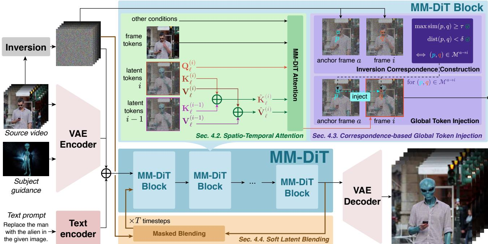  
Figure 2: EditVid overview. Given a source video and optional subject guidance, our training-free framework injects sparse spatio-temporal cues into a frozen MM-DiT. During attention, sparse causal memory reuses selected key–value states from the previous frame, while correspondence-based global token injection preserves subject identity and spatial alignment from an anchor frame. Soft latent blending preserves unedited regions while keeping the edit driven by the target prompt or reference.

In practice, $\mathbf { z } \sim \pi _ { t } ( \cdot \mid \mathbf { c } )$ is obtained by sampling $( \mathbf { z } _ { 0 } , \mathbf { z } _ { 1 } ) \sim q ( \mathbf { z } _ { 0 } , \mathbf { z } _ { 1 } \mid \textbf { c } )$ with ${ \bf z } _ { 0 } \sim p _ { \mathrm { d a t a } } ( \cdot \mathrm { ~  ~ | ~ } { \bf c } ) , { \bf z } _ { 1 } \sim$ $\mathcal { N } ( 0 , I )$ , and setting ${ \bf z } = \psi _ { t } ( { \bf z } _ { 0 } , { \bf z } _ { 1 } ) , { \bf u } = \partial _ { t } \psi _ { t } ( { \bf z } _ { 0 } , { \bf z } _ { 1 } )$ Here, z denotes a flow-matching latent state. In the MM-DiT editor, $\mathbf { Z } ^ { ( i ) }$ denotes the VAE latent grid of frame i, while ${ \pmb x } ^ { ( i ) } ( t )$ denotes visual tokens obtained by packing/projecting the noised VAE latent grid at difusion time t.

Multimodal Difusion Transformers (MM-DiT). We parameterize the conditional velocity field with MM-DiT [17, 40] operating on VAE latent tokens. Given a frame $\mathbf { \boldsymbol { X } } ^ { ( i ) } \in \mathbb { R } ^ { H \times \bar { W } \times 3 } .$ , a frozen autoencoder $\mathcal { E }$ with downsampling factor s produces a VAE latent grid $\mathbf { Z } ^ { ( i ) } = \mathcal { E } ( \bar { \mathbf { X } } ^ { ( i ) } ) \mathbf { \bar { \Psi } } \in \mathbb { R } ^ { \frac { H } { s } \times \frac { W } { s } \times D ^ { \prime } }$ which is noised at difusion time t, packed, and projected into MM-DiT visual tokens $\mathbf { x } ^ { ( i ) } ( t ) \in \mathbb { R } ^ { N _ { v } \times D }$ , where $\begin{array} { r } { N _ { v } \ = \ \frac { H } { s } \frac { W } { s } } \end{array}$ Conditioning inputs (e.g., text, reference images) are encoded as tokens $\mathbf { c } ^ { ( i ) } \in \mathbb { R } ^ { N _ { c } \times D }$

MM-DiT architectures typically process these tokens in two stages. Early double-stream blocks maintain separate visual and conditioning streams with cross-modal interaction, while later single-stream blocks apply self-attention to the concatenated sequence $\hat { \mathbf { h } } _ { \ell - 1 } ^ { ( i ) } ( t ) = [ \mathbf { x } _ { \ell - 1 } ^ { ( i ) } ( t ) ; \mathbf { c } _ { \ell - 1 } ^ { ( i ) } ]$ . At each layer, diffusion time t modulates token features, and positional information is injected through rotary positional embeddings (RoPE) [47]. Given a token at a multi-dimensional coordinate p, RoPE applies a coordinate-dependent rotation matrix $\mathcal { R } ( \mathfrak { p } )$ to its query q and key k:

$$
\widetilde { \mathbf { q } } = \mathcal { R } ( \mathbf { p } ) \mathbf { q } , \qquad \widetilde { \mathbf { k } } = \mathcal { R } ( \mathbf { p } ) \mathbf { k } .\tag{3}
$$

This phase rotation explicitly encodes relative positional geometry into the attention similarity, providing a unified coordinate system across the token streams. Although attention is performed jointly over both streams, the output head predicts velocity updates exclusively for the visual tokens. Thus, the conditioning tokens act purely as semantic context, allowing the transformer to realize the conditional field $v _ { \theta } \big ( \mathbf { x } ^ { ( i ) } ( t ) , t , \mathbf { c } ^ { ( i ) } \big )$ through repeated attention between editable visual tokens and fixed conditioning.

## 4. Methodology

## 4.1. Overview

Let $\mathcal { V } = \{ \mathbf { X } ^ { ( i ) } \} _ { i = 1 } ^ { N }$ denote an input video of N frames, and let $\mathbf { x } ^ { ( i ) } ( t ) \in \mathrm { \bar { \mathbb { R } } } ^ { N _ { v } \times D }$ be the visual latent tokens of frame i at difusion time t. As illustrated in Figure 2, our method performs video editing directly in the visual latent manifold. Temporal interactions are introduced only through the visual latent tokens ${ \pmb x } ^ { ( i ) } ( t )$ , while the conditioning tokens $\mathbf { c } ^ { ( i ) }$ (e.g., text or reference-image embeddings) remain unchanged and serve purely as semantic context.

This separation between editable visual tokens and fixed conditioning tokens is also reflected in the 4D-RoPE parameterization. Each token is assigned a coordinate $\mathbf { p } = ( t _ { p } , h , w , \ell _ { p } )$ , allowing visual latent tokens and conditioning tokens to occupy distinct coordinate slots in the shared attention space. Our temporal module operates exclusively on attention states derived from the visual tokens, leaving the conditioning stream and its positional assignments unchanged. Thus, semantic guidance from text or reference images is preserved, while temporal information is propagated entirely through the editable visual latent tokens.

## 4.2. Spatio-Temporal Attention

To propagate temporal information through the latent stream, we introduce a sparse causal context in visual latent space. For each frame i, we construct a compact latent context

$$
\begin{array} { r } { \mathcal { C } _ { x } ^ { ( i ) } ( t ) = \{ \mathbf { x } ^ { ( i - 1 ) } ( t ) \} , \quad i > 1 , } \end{array}\tag{4}
$$

which contains visual latent tokens from the immediately preceding frame. This previous-frame anchor promotes temporal smoothness by allowing information to propagate causally across frames. The frame-wise latent dynamics thus follow

$$
\frac { d { \mathbf { x } } ^ { ( i ) } ( t ) } { d t } = v _ { \theta } \Big ( { \mathbf { x } } ^ { ( i ) } ( t ) , t , { \mathbf { c } } ^ { ( i ) } , \mathcal { C } _ { x } ^ { ( i ) } ( t ) \Big ) ,\tag{5}
$$

Within the MM-DiT backbone, this temporal context is realized by augmenting the attention context of the current frame with visual latent tokens from the previous frame. Leveraging RoPE, tokens from consecutive frames maintain consistent positional relationships in the attention space, allowing key–value states from the previous frame to serve as temporal context. Since RoPE represents positions through relative phase rotations, tokens with small temporal ofsets remain geometrically compatible in the attention similarity.

Let $\mathbf { Q } _ { \ell } ^ { ( i ) } , \mathbf { K } _ { \ell } ^ { ( i ) }$ , and $\mathbf { V } _ { \boldsymbol { \ell } } ^ { ( i ) }$ denote query, key, and value tensors for frame i at layer ℓ. For $i > 1$ , we form

$$
\widehat { \mathbf { K } } _ { \ell } ^ { ( i ) } = \big [ \mathbf { K } _ { \ell } ^ { ( i ) } ; \mathbf { K } _ { \ell } ^ { ( i - 1 ) } \big ] , \qquad \widehat { \mathbf { V } } _ { \ell } ^ { ( i ) } = \big [ \mathbf { V } _ { \ell } ^ { ( i ) } ; \mathbf { V } _ { \ell } ^ { ( i - 1 ) } \big ] ,\tag{6}
$$

with a no-anchor specialization for $i = 1$ . The updated representation is then

$$
\begin{array} { r } { \mathbf { x } _ { \ell } ^ { ( i ) } ( t ) = \mathrm { A t t n } \left( \mathbf { Q } _ { \ell } ^ { ( i ) } , \widehat { \mathbf { K } } _ { \ell } ^ { ( i ) } , \widehat { \mathbf { V } } _ { \ell } ^ { ( i ) } \right) . } \end{array}\tag{7}
$$

This design introduces a recurrent temporal inductive bias in which each frame inherits motion and edit continuity from its predecessor. Because the temporal context is limited to the immediately preceding frame, the conditioning footprint remains constant with respect to video length. The resulting local temporal dependency can be written as

$$
\begin{array} { l } { { \displaystyle p ( { \mathbf { X } ^ { ( 1 : N ) } } \mid { \mathbf { c } } ) = p ( { \mathbf { X } ^ { ( 1 ) } } \mid { \mathbf { c } ^ { ( 1 ) } } ) } \ ~ } \\ { { \displaystyle ~ \times \prod _ { i = 2 } ^ { N } p \left( { \mathbf { X } ^ { ( i ) } } \mid { \mathbf { X } ^ { ( i - 1 ) } } , { \mathbf { c } ^ { ( i ) } } \right) . } \ } \end{array}\tag{8}
$$

allowing editing to be rolled out to long videos while keeping context and computation limited.

## 4.3. Correspondence-based Token Injection

While causal attention propagates temporal information across frames, it does not explicitly enforce spatial consistency across corresponding regions. To better stabilize object identity and appearance, we introduce correspondence-based global token injection that transfers anchor-frame information to matched spatial locations across the video. The method consists of: (1) inversion-based correspondence construction for reliable anchor-to-frame patch matches, (2) global token injection for temporally aligned feature transfer, and (3) correspondence dropout for robustness to noisy matches.

Inversion correspondence construction. Given the input video $\mathcal { V } = \bar { \{ \mathbf { X } ^ { ( i ) } \} } _ { i = 1 } ^ { N }$ , we first perform inversion and extract token sets $\{ \mathbf { g } _ { p } ^ { ( i ) } \} _ { p = 1 } ^ { N _ { v } }$ from the penultimate double-stream block of the inverted trajectory at a fixed correspondence time $t _ { \mathrm { c o r r } } = 0 . 2 5$ . Let $a = 1$ denote the anchor frame. For each target frame i, we compute a similarity matrix between the anchor frame and frame i:

$$
S _ { p q } ^ { a  i } = \sin \Bigl ( \mathbf { g } _ { p } ^ { ( a ) } , \mathbf { g } _ { q } ^ { ( i ) } \Bigr ) ,\tag{9}
$$

where sim $. ( \cdot , \cdot )$ denotes cosine similarity between patch tokens. To obtain reliable correspondences, we use nearest-neighbor matching with confidence and cycle-consistency constraints. Specifically,

$$
q ^ { * } ( p ) = \arg \operatorname* { m a x } _ { q } { S _ { p q } ^ { a  i } } , \quad p ^ { * } ( q ) = \arg \operatorname* { m a x } _ { p } { S _ { p q } ^ { a  i } } .\tag{10}
$$

and we accept a pair $\left( p , q ^ { * } ( p ) \right)$ into $\mathcal { M } ^ { a  i }$ if

$$
\begin{array} { c } { { ( p , q ^ { * } ( p ) ) \in \mathcal { M } ^ { a  i } \Longleftrightarrow S _ { p q ^ { * } ( p ) } ^ { a  i } \geq \tau , } } \\ { { \| \mathrm { p o s } ( p ) - \mathrm { p o s } ( p ^ { * } ( q ^ { * } ( p ) ) ) \| _ { 2 } < r . } } \end{array}\tag{11}
$$

Here, pos(·) maps a patch index to its 2D spatial coordinate, while τ and r control the similarity threshold and cycle-consistency radius, respectively. This procedure yields a reliable correspondence map $\mathcal { M } ^ { a  i }$ between the anchor frame and each target frame. The same map is reused across all layers where global token injection is applied.

Global token injection. During editing, we use the anchor-to-frame correspondence maps to propagate token information across the full video. Let $\{ \mathbf { h } _ { \ell , t , q } ^ { ( i ) } \} _ { q = 1 } ^ { N _ { v } }$ denote the denoising tokens of frame i at layer ℓ and difusion time t. For each retained correspondence $( p , q ) \in \mathcal { M } ^ { a  i }$ , we replace the targetframe token with the matched anchor token:

$$
\tilde { \mathbf { h } } _ { \ell , t , q } ^ { ( i ) } = \mathbf { h } _ { \ell , t , p } ^ { ( a ) } , \qquad \forall ( p , q ) \in \mathcal { M } ^ { a  i } , \quad \ell \in \mathcal { L } _ { \mathrm { i n j } } .\tag{12}
$$

Unmatched locations retain their original representations, i.e., $\tilde { \mathbf { h } } _ { \ell , t , q } ^ { ( i ) } = \mathbf { h } _ { \ell , t , q } ^ { ( i ) }$ when no valid anchor correspondence maps to location q. This correspondencebased global token injection allows each frame to receive aligned appearance information from the anchor frame, improving temporal consistency under large motion and occlusion.

Correspondence dropout. To improve robustness to imperfect correspondences and prevent over-reliance on a fixed match set, we randomly subsample the valid correspondences following [55]. Specifically, we retain a fraction $1 - p _ { \mathrm { d r o p } }$ of $\mathcal { M } ^ { a  i }$ and apply Eq. (12) only to this subset.

Together with causal attention, global token injection stabilizes object identity and appearance by enforcing sparse, spatially aligned feature propagation across the video.

## 4.4. Soft Latent Blending

In addition to token-level temporal propagation, we apply soft latent blending to preserve unedited regions. Following prior work [2], we blend the edited latent trajectory $\mathbf { x } _ { k } ^ { ( i ) }$ with the source trajectory $\mathbf { x } _ { k } ^ { ( i ) }$ ),src (obtained from inversion) at each discrete denoising step k. To avoid rigidly masking out moving subjects, we compute a soft spatial mask derived from the continuous latent changes.

Specifically, we compute a per-token $L _ { 1 }$ diference map between the edited and source latents. This map is normalized using low and high quantiles and optionally smoothed with a Gaussian filter to yield a soft mask $\hat { m } _ { k } ^ { ( i ) } \in [ 0 , 1 ]$ (more details are provided in Appendix $\mathrm { A } . 3 )$ . The efective preservation weight is defined as $w _ { k , p } ^ { ( i ) } = \alpha \left( 1 - \hat { m } _ { k , p } ^ { ( i ) } \right)$ , where $\alpha \in [ 0 , 1 ]$ controls the blending strength. Finally, we blend the edited and source visual tokens:

$$
\begin{array} { r } { \tilde { \mathbf { x } } _ { k , p } ^ { ( i ) } = \left( 1 - w _ { k , p } ^ { ( i ) } \right) \mathbf { x } _ { k , p } ^ { ( i ) } + w _ { k , p } ^ { ( i ) } \mathbf { x } _ { k , p } ^ { ( i ) , \mathrm { s r c } } . } \end{array}\tag{13}
$$

This softly anchors regions that remain close to the source trajectory, while allowing regions with large latent changes to follow the target edit, efectively preserving background structure in unedited areas.

## 5. Experiments

## 5.1. Experimental Setup

We evaluate EditVid on FiVE [34] and IVEBench [14] following the oficial benchmark protocols, and a curated 50-video set comprising 24 general video-editing examples and 26 subject-guided editing examples. The curated set spans diverse edit types and motion patterns beyond the benchmark-specific examples and is used for our mask-free VLM evaluation and human study. On FiVE, we compare against training-free image- [18, 35, 53, 56], video- [33, 34], and hybridprior [30] methods. On IVEBench and the mask-free VLM evaluation, we additionally compare against training-based video editors [5, 25, 36, 37]. Unless stated otherwise, EditVid uses FLUX.2-Klein-9B with four denoising steps. Additional implementation details are reported in Appendix A.2.

Table 1: Quantitative comparison on FiVE [34] benchmark and metrics. Highlighted values are best within each method section. ∗requires additional depth maps, and †requires additional masks.
<table><tr><td rowspan="2">Method</td><td rowspan="2">Foundation Model</td><td rowspan="2">Subject-guided Edits</td><td colspan="5">FiVE-Acc Metrics [34]</td></tr><tr><td>FiVE-YN ↑</td><td>FiVE-MC ↑</td><td>FiVE-U ↑</td><td>FiVE-∩↑</td><td>FiVE-Acc ↑</td></tr><tr><td>Pyramid-Edit [34]</td><td>Video</td><td>X</td><td>33.67</td><td>54.01</td><td>56.36</td><td>31.31</td><td>43.84</td></tr><tr><td>Wan-Edit [34]</td><td>Video</td><td>X</td><td>41.41</td><td>52.53</td><td>55.72</td><td>38.22</td><td>46.97</td></tr><tr><td>FlowDirector [33]</td><td>Video</td><td>X</td><td>49.16</td><td>68.74</td><td>70.41</td><td>47.49</td><td>58.95</td></tr><tr><td>StreamEdit (SF) [26]</td><td>Video</td><td>X</td><td>43.09</td><td>61.09</td><td>64.11</td><td>40.07</td><td>51.94</td></tr><tr><td>DMT* [56]</td><td>Image</td><td>X</td><td>34.78</td><td>62.06</td><td>62.98</td><td>33.86</td><td>48.42</td></tr><tr><td>VideoGrain† [53]</td><td>Image</td><td>X</td><td>30.50</td><td>43.97</td><td>44.30</td><td>30.17</td><td>37.23</td></tr><tr><td>TokenFlow [18]</td><td>Image</td><td>X</td><td>19.36</td><td>35.51</td><td>36.68</td><td>18.18</td><td>27.43</td></tr><tr><td>VidToMe [35]</td><td>Image</td><td>X</td><td>20.03</td><td>33.50</td><td>36.20</td><td>17.34</td><td>26.77</td></tr><tr><td>AnyV2V [30]</td><td>Hybrid</td><td>√</td><td>30.62</td><td>45.42</td><td>48.96</td><td>27.09</td><td>38.02</td></tr><tr><td>EDITVID (Ours)</td><td>Image</td><td>√</td><td>69.45</td><td>86.87</td><td>88.78</td><td>67.54</td><td>78.16</td></tr></table>

## 5.2. Comparison with State-of-the-Art Methods

Edit correctness on FiVE. Table 1 shows that EditVid achieves the highest overall FiVE-Acc among all training-free methods, improving the strongest prior result from 58.95 to 78.16. The gains are particularly pronounced for the multi-choice, openended, and intersection variants, indicating more reliable execution of fine-grained object-level edits rather than merely stronger low-level source similarity.

Conventional Metrics on FiVE. Table 2 provides complementary diagnostics of source preservation, semantic alignment, perceptual quality, and motion fidelity. Among image/hybrid methods without auxiliary inputs, EditVid achieves the strongest performance across reconstruction, perceptual quality, and semantic-alignment metrics, while remaining competitive in motion fidelity. These results show that EditVid preserves strong low-level fidelity and semantic alignment despite relying only on an image MM-DiT, complementing its superior FiVE-Acc in Table 1, which serves as the primary measure of edit correctness.

Broader video-editing evaluation. We further evaluate EditVid on IVEBench and our curated subjectguided and general video-editing set. As shown in Table 3, EditVid achieves the strongest training-free IVEBench results in Total score, Instruction Compliance, and Video Fidelity, while ranking second overall in Total score and obtaining the best Video

<table><tr><td>EDITVID (Ours) FlowDirector</td><td colspan="4">StreamEdit VidToMe</td><td colspan="2">WANEdit PyramidEdit</td><td colspan="4">TokenFlow AnyV2V</td></tr><tr><td colspan="2">Overall preference</td><td colspan="2"></td><td colspan="2"></td><td colspan="2"></td><td colspan="2"></td></tr><tr><td>51.8</td><td></td><td>9.1</td><td>7.7</td><td>7.7</td><td>6.8</td><td></td><td>7.3</td><td></td><td>3.9</td></tr><tr><td colspan="2">Prompt following</td><td></td><td></td><td></td><td></td><td></td><td></td><td></td><td></td></tr><tr><td colspan="2">53.2</td><td>9.3</td><td></td><td>8.4</td><td>7.0</td><td>6.8</td><td>6.6</td><td>45</td><td>41</td></tr><tr><td colspan="2">Visual quality &amp; temporal consistency</td><td></td><td></td><td></td><td></td><td></td><td></td><td></td><td></td></tr><tr><td colspan="2">49.3</td><td>10.9</td><td>10.5</td><td></td><td>8.4</td><td>6.4</td><td>6.4</td><td>3.9</td><td>4.3</td></tr><tr><td colspan="2">Background preservation</td><td></td><td></td><td></td><td></td><td></td><td></td><td></td><td></td></tr><tr><td colspan="2">50.0</td><td>11.1</td><td>11.4</td><td></td><td>7.7</td><td>6.8</td><td>5.7</td><td>4</td><td>30</td></tr></table>

Figure 3: User Study. Preference share (%) across 22 participants and 20 video examples.

Fidelity across all methods. On the curated VLM evaluation, EditVid leads five of six criteria, including all subject-guided metrics and general-video Prompt Following and Edit Quality, while attaining the secondhighest Background Consistency. Together, these results show that EditVid performs strongly across both instruction-guided and subject-guided editing while preserving video fidelity.

User study. We conduct a blind user study with 22 participants over 20 video examples, comparing EditVid against seven training-free baselines. For each example, method identities are hidden and the outputs are independently randomized. Participants select the best result according to overall preference, prompt following, visual quality and temporal consistency, and background preservation. This yields 440 participant–video evaluations and 1,760 criterionlevel selections. As shown in Figure 3, EditVid receives the highest preference share across all four criteria. These results demonstrate a consistent and substantial human preference for our method across edit accuracy, perceptual quality, temporal coherence, and content preservation.

Table 2: Quantitative comparison on FiVE [34]. Highlighted values are best within each method section. ∗requires additional depth maps and †requires additional masks. Source Videos row shown for reference.
<table><tr><td rowspan="2">Method</td><td rowspan="2">Found. Model</td><td rowspan="2">Subj. Edits</td><td colspan="9">FiVE Traditional Metrics [34]</td></tr><tr><td>Str. Dist.</td><td>PSNR ↑</td><td>LPIPS↓</td><td>MSE↓</td><td>SSIM ↑</td><td>CLIPs↑</td><td> $\mathrm { C L I P } _ { S } ^ { \mathrm { e d i t } } \uparrow$ </td><td>NIQE↓</td><td>MFS ↑</td></tr><tr><td>Source Videos</td><td></td><td></td><td>0</td><td>inf</td><td>0</td><td>0</td><td>100</td><td>24.59</td><td>19.87</td><td>6.33</td><td>93.76</td></tr><tr><td>Pyramid-Edit [34]</td><td>Video</td><td>X</td><td>28.65</td><td>20.84</td><td>276.59</td><td>95.63</td><td>71.72</td><td>26.82</td><td>20.20</td><td>5.48</td><td>80.59</td></tr><tr><td>Wan-Edit [34]</td><td>Video</td><td>x</td><td>12.53</td><td>25.57</td><td>94.61</td><td>41.84</td><td>82.55</td><td>26.39</td><td>21.23</td><td>6.54</td><td>89.43</td></tr><tr><td>FlowDirector [33]</td><td>Video</td><td>X</td><td>21.56</td><td>22.74</td><td>107.09</td><td>65.20</td><td>81.68</td><td>27.93</td><td>22.00</td><td>4.98</td><td>81.22</td></tr><tr><td>StreamEdit (SF)</td><td>Video</td><td>X</td><td>10.27</td><td>28.47</td><td>49.84</td><td>21.88</td><td>87.52</td><td>26.95</td><td>21.73</td><td>4.38</td><td>90.93</td></tr><tr><td>DMT* [56]</td><td>Image</td><td>X</td><td>85.95</td><td>14.71</td><td>404.60</td><td>372.78</td><td>51.64</td><td>26.66</td><td>21.44</td><td>5.24</td><td>82.30</td></tr><tr><td>VideoGrain† [53]</td><td>Image</td><td>X</td><td>12.40</td><td>27.05</td><td>185.21</td><td>25.10</td><td>79.13</td><td>25.69</td><td>20.31</td><td>4.08</td><td>88.57</td></tr><tr><td>TokenFlow [18]</td><td>Image</td><td>X</td><td>35.62</td><td>19.06</td><td>263.61</td><td>138.65</td><td>72.51</td><td>26.46</td><td>21.15</td><td>4.01</td><td>89.00</td></tr><tr><td>VidToMe [35]</td><td>Image</td><td>x</td><td>22.37</td><td>21.15</td><td>263.91</td><td>88.75</td><td>70.69</td><td>26.84</td><td>21.05</td><td>4.68</td><td>90.06</td></tr><tr><td>AnyV2V [30]</td><td>Hybrid</td><td>V</td><td>71.36</td><td>15.90</td><td>348.59</td><td>342.97</td><td>50.77</td><td>24.89</td><td>19.72</td><td>5.04</td><td>60.36</td></tr><tr><td>EDITVID (Ours)</td><td>Image</td><td></td><td>17.10</td><td>25.97</td><td>218.71</td><td>36.37</td><td>83.31</td><td>28.83</td><td>22.40</td><td>4.17</td><td>85.31</td></tr></table>

Table 3: Quantitative evaluation on IVEBench and our curated video-editing set. TF indicates training free methods. IVEBench columns report Total Score, Video Quality, Instruction Compliance, and Video Fidelity. PF, EQ, and BC denote Prompt Following, Edit Quality, and Background Consistency. Highlighted values are best within each method section.
<table><tr><td rowspan="2">Method</td><td rowspan="2">TF</td><td colspan="4">IVEBench</td><td colspan="3">Subject-guided</td><td colspan="3">General Video Editing</td></tr><tr><td>Total</td><td>Quality</td><td>Compliance</td><td>Fidelity</td><td>PF↑</td><td>EQ↑</td><td>BC↑</td><td>PF↑</td><td>EQ↑</td><td>BC↑</td></tr><tr><td>LucyEditDev [36]</td><td>X</td><td>0.6220</td><td>0.8164</td><td>0.3679</td><td>0.6817</td><td>2.019</td><td>3.731</td><td>6.596</td><td>4.667</td><td>6.292</td><td>8.542</td></tr><tr><td>Kiwi-Edit-5B [37]</td><td>X</td><td>0.6936</td><td>0.8101</td><td>0.5182</td><td>0.7524</td><td>3.115</td><td>4.327</td><td>6.596</td><td>8.000</td><td>8.229</td><td>9.458</td></tr><tr><td>Qwen-Video-Edit [5]</td><td>X</td><td>0.6765</td><td>0.7752</td><td>0.5256</td><td>0.7286</td><td>1.865</td><td>2.654</td><td>7.654</td><td>7.812</td><td>7.979</td><td>8.958</td></tr><tr><td>VidToMe [35]</td><td></td><td>0.6297</td><td>0.7826</td><td>0.4010</td><td>0.7056</td><td>4.308</td><td>5.942</td><td>5.923</td><td>3.875</td><td>5.938</td><td>5.250</td></tr><tr><td>WANEdit [34]</td><td></td><td>0.6072</td><td>0.7973</td><td>0.2801</td><td>0.7441</td><td>5.962</td><td>6.654</td><td>8.942</td><td>5.125</td><td>6.625</td><td>8.375</td></tr><tr><td>FlowDirector [33]</td><td></td><td>0.6264</td><td>0.7771</td><td>0.3765</td><td>0.7255</td><td>4.019</td><td>5.865</td><td>8.058</td><td>4.021</td><td>5.521</td><td>6.875</td></tr><tr><td>StreamEdit [26]</td><td></td><td>0.6229</td><td>0.8238</td><td>0.2921</td><td>0.7530</td><td>4.077</td><td>6.673</td><td>8.288</td><td>5.250</td><td>7.000</td><td>9.792</td></tr><tr><td>EDITVID (Ours)</td><td></td><td>0.6847</td><td>0.8114</td><td>0.4587</td><td>0.7839</td><td>7.769</td><td>7.846</td><td>9.558</td><td>9.458</td><td>9.000</td><td>9.500</td></tr></table>

Table 4: Module ablation on a FiVE subset measured by FiVE-Acc and MF-S.
<table><tr><td>Method</td><td>FiVE-YN↑</td><td>FiVE-MC↑</td><td>FiVE-U↑</td><td>FiVE-∩↑</td><td>FiVE-Acc↑</td><td>MF-S×102 ↑</td></tr><tr><td>EDITVID</td><td>73.33</td><td>90.00</td><td>90.00</td><td>73.33</td><td>81.67</td><td>84.88</td></tr><tr><td>w/o latent blending</td><td>70.00</td><td>90.00</td><td>90.00</td><td>70.00</td><td>80.00</td><td>84.59</td></tr><tr><td>w/o spatio-temporal attention</td><td>70.00</td><td>90.00</td><td>90.00</td><td>70.00</td><td>80.00</td><td>84.55</td></tr><tr><td>w/o global token injection</td><td>73.33</td><td>90.00</td><td>90.00</td><td>73.33</td><td>81.67</td><td>84.72</td></tr></table>

## 5.3. Ablation Studies

Component Analysis. We ablate the core components of our approach on 30 videos sampled across all FiVE edit categories. As shown in Table 4, the full model achieves the strongest overall combination of edit correctness and motion fidelity. Removing soft latent blending reduces FiVE-Acc from 81.67 to 80.00, with corresponding drops in FiVE-YN and FiVE-∩, supporting its role in preserving instructionirrelevant source content. Removing spatio-temporal attention yields the same FiVE-Acc drop and the lowest MF-S, confirming the importance of local temporal context for motion consistency. Removing global token injection leaves FiVE-Acc unchanged on this subset but lowers MF-S, suggesting that its contribution is more apparent in temporal consistency than in the aggregate edit score. We examine this efect more directly under challenging temporal changes in Table 6. Temporal scope of attention memory. Table 5 compares diferent temporal contexts while keeping the remaining pipeline unchanged. Restricting attention

Prompt: Change the elephant’s color to blue.

Source

Pyramid-Edit [34] TokenFlow [18]

✗ Pose drift

✗ Edit failure

VidToMe [35]

✗ Edit failure

Wan-Edit [34]

✗ Edit failure

StreamEdit [26] FlowDirector [33]

EditVid

✗ Edit failure  
✗ Pose drift  
✓ Consistent edit  
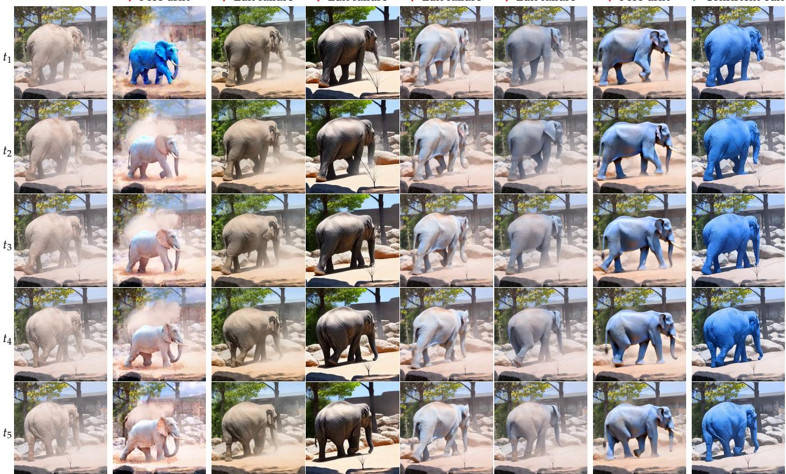  
Figure 4: Training-free video editing comparison. Given the instruction to change the elephant’s color to blue, EditVid consistently applies the requested change while preserving the elephant’s shape, motion, and background. Frames are sampled at evenly spaced temporal positions throughout each video.

Table 5: Efect of temporal scope in spatio- temporal attention on FiVE-Acc and MF-S.
<table><tr><td>Temporal Context</td><td>FiVE-Acc ↑</td><td>MF-S ↑</td><td>Runtime (s/frame) ↓</td><td>Memory (GB) ↓</td></tr><tr><td>No temporal memory</td><td>72.50</td><td>91.39</td><td>3.495</td><td>38.37</td></tr><tr><td>Previous 2 frames</td><td>72.50</td><td>89.76</td><td>4.146</td><td>54.98</td></tr><tr><td>All previous frames</td><td>62.50</td><td>49.81</td><td>5.490</td><td>90.16</td></tr><tr><td>Immediately preceding frame</td><td>77.50</td><td>91.63</td><td>4.096</td><td>44.65</td></tr></table>

memory to the immediately preceding frame provides the strongest balance of edit correctness and motion preservation, reaching 77.50 FiVE-Acc and 91.63 MF-S. Expanding the context to two previous frames does not improve editing accuracy and increases memory consumption, while attending to all previous frames sharply degrades both FiVE-Acc and MF-S. These results motivate separating temporal coupling by range, as adjacent-frame attention-state reuse is efective under strong local geometric continuity, whereas longer-range interactions become increasingly sensitive to RoPE-modulated geometry and are better handled through token injection.

Table 6: Correspondence robustness under chal- lenging temporal changes measured by MF-S.
<table><tr><td>Method</td><td>Viewpoint ↑</td><td>Occlusion ↑</td><td>Non-Rigid ↑</td><td>Structural ↑</td><td>Overall ↑</td></tr><tr><td>w/o Global Injection</td><td>70.97</td><td>64.90</td><td>78.51</td><td>95.26</td><td>75.65</td></tr><tr><td>Unfiltered Injection</td><td>70.92</td><td>64.13</td><td>73.85</td><td>89.55</td><td>72.53</td></tr><tr><td>EDITVID</td><td>71.96</td><td>66.27</td><td>78.96</td><td>94.80</td><td>76.23</td></tr></table>

Robustness of long-range correspondence trans-fer. We further isolate the global component under viewpoint changes, occlusions, non-rigid motion, and structural edits, where long-range identity preservation is more demanding. Table 6 shows that unfiltered anchor injection is consistently less robust than the complete method and can perform worse than removing global injection altogether. Confidence and cycle-consistency filtering are therefore critical: EditVid achieves the strongest overall robustness and the best performance under viewpoint change, occlusion, and non-rigid motion. These results indicate that long-range identity propagation is not obtained by indiscriminate token copying, but depends on selectively transferring correspondences that remain reliable under appearance and geometric change.

## 5.4. Qualitative Results

Figure 4 compares EditVid with training-free baselines on an object-level attribute edit. Notably, FlowDirector and StreamEdit, which achieve strong scores on FiVE traditional metrics, preserve the source video well but apply the requested color change only partially or conservatively across the sequence. This reflects a key limitation of traditional preservation metrics, which can reward conservative edits despite incomplete instruction execution, unlike FiVE-Acc which directly measures edit correctness. In contrast, EditVid consistently produces the intended blue appearance across frames while preserving the elephant’s structure, motion, and surrounding scene. Other image-based baselines exhibit weaker edit strength, unwanted appearance changes, or greater temporal variation. This example highlights EditVid’s ability to balance instruction adherence with strong temporal and source consistency.

## 6. Conclusion

In this work, we introduce EditVid, a unified training-free framework for temporally consistent instruction-guided and subject-guided video editing with frozen image editing MM-DiTs. EditVid combines sparse causal memory for short-range coherence, correspondence-based global token injection for long-range identity preservation, and adaptive latent blending to preserve instruction-irrelevant content. Across FiVE, IVEBench, mask-free VLM evaluation, and human preference studies, EditVid achieves the strongest performance among training-free methods while remaining competitive with recent trainingbased editors. Controlled temporal-scope and robustness studies further support the proposed local– global decomposition. These results establish modern image-editing priors as a strong foundation for diverse training-free video editing.

## References

[1] Rameen Abdal, Or Patashnik, Ivan Skorokhodov, Willi Menapace, Aliaksandr Siarohin, Sergey Tulyakov, Daniel Cohen-Or, and Kfir Aberman. Dynamic concepts personalization from single videos. In ACM SIGGRAPH Conference Papers (SIGGRAPH), 2025.

[2] Omri Avrahami, Ohad Fried, and Dani Lischinski. Blended latent difusion. ACM Transactions on Graphics (TOG), 2023.

[3] Omri Avrahami, Or Patashnik, Ohad Fried, Egor Nemchinov, Kfir Aberman, Dani Lischinski, and Daniel Cohen-Or. Stable Flow: Vital layers for training-free image editing. In IEEE/CVF Conference on Computer Vision and Pattern Recognition (CVPR), 2025.

[4] Qingyan Bai, Qiuyu Wang, Hao Ouyang, Yue Yu, Hanlin Wang, Wen Wang, Ka Leong Cheng, Shuailei Ma, Yanhong Zeng, Zichen Liu, et al. Scaling instruction-based video editing with a high-quality synthetic dataset. In IEEE/CVF Conference on Computer Vision and Pattern Recognition (CVPR), 2026.

[5] Yunpeng Bai, Yossi Gandelsman, Michaël Gharbi, and Qixing Huang. Qwen-Video-Edit: Instructionbased video editing by repurposing an image editing model. arXiv preprint arXiv:2608.14790, 2026.

[6] Black Forest Labs, Stephen Batifol, Andreas Blattmann, Frederic Boesel, Saksham Consul, Cyril Diagne, Tim Dockhorn, Jack English, Zion English, Patrick Esser, et al. FLUX.1 Kontext: Flow matching for in-context image generation and editing in latent space. arXiv preprint arXiv:2506.15742, 2025.

[7] Tim Brooks, Aleksander Holynski, and Alexei A Efros. InstructPix2Pix: Learning to follow image editing instructions. In IEEE/CVF Conference on Computer Vision and Pattern Recognition (CVPR), 2023.

[8] Lingling Cai, Kang Zhao, Hangjie Yuan, Xiang Wang, Yingya Zhang, and Kejie Huang. DFVEdit: Conditional delta flow vector for zero-shot video editing. arXiv preprint arXiv:2506.20967, 2025.

[9] Tsai-Shien Chen, Aliaksandr Siarohin, Willi Menapace, Yuwei Fang, Kwot Sin Lee, Ivan Skorokhodov, Kfir Aberman, Jun-Yan Zhu, Ming-Hsuan Yang, and Sergey Tulyakov. Multi-subject open-set personalization in video generation. In IEEE/CVF Conference on Computer Vision and Pattern Recognition (CVPR), 2025.

[10] Wei Chen, Huidong Liu, Yang Liu, Chien-Chih Wang, Moyan Li, Hongdong Li, and Bryan Wang. Zeroshot customized video editing with difusion feature transfer. In 2025 IEEE/CVF International Conference on Computer Vision Workshops (ICCVW), 2025.

[11] Xi Chen, Lianghua Huang, Yu Liu, Yujun Shen, Deli Zhao, and Hengshuang Zhao. AnyDoor: Zero-shot object-level image customization. In IEEE/CVF Conference on Computer Vision and Pattern Recognition (CVPR), 2024.

[12] Xinyuan Chen, Yaohui Wang, Lingjun Zhang, Shaobin Zhuang, Xin Ma, Jiashuo Yu, Yali Wang, Dahua Lin, Yu Qiao, and Ziwei Liu. SEINE: Short-tolong video difusion model for generative transition and prediction. In International Conference on Learning Representations (ICLR), 2024.

[13] Yiyang Chen, Xuanhua He, Xiujun Ma, and Jack Ma. ContextFlow: Training-free video object editing via adaptive context enrichment. In AAAI Conference on Artificial Intelligence (AAAI), 2026.

[14] Yinan Chen, Jiangning Zhang, Teng Hu, Yuxiang Zeng, Zhucun Xue, Qingdong He, Chengjie Wang, Yong Liu, Xiaobin Hu, and Shuicheng Yan. IVEBench: Modern benchmark suite for instruction-guided video editing assessment. In International Conference on Learning Representations (ICLR), 2026.

[15] Nathaniel Cohen, Vladimir Kulikov, Matan Kleiner, Inbar Huberman-Spiegelglas, and Tomer Michaeli. Slicedit: Zero-shot video editing with text-to-image difusion models using spatio-temporal slices. In International Conference on Machine Learning (ICML), 2024.

[16] Yuren Cong, Mengmeng Xu, Christian Simon, Shoufa Chen, Jiawei Ren, Yanping Xie, Juan-Manuel Perez-Rua, Bodo Rosenhahn, Tao Xiang, and Sen He. FLATTEN: optical flow-guided attention for consistent text-to-video editing. In International Conference on Learning Representations (ICLR), 2024.

[17] Patrick Esser, Sumith Kulal, Andreas Blattmann, Rahim Entezari, Jonas Müller, Harry Saini, Yam Levi, Dominik Lorenz, Axel Sauer, Frederic Boesel, et al. Scaling rectified flow transformers for high-resolution image synthesis. In International Conference on Machine Learning (ICML), 2024.

[18] Michal Geyer, Omer Bar-Tal, Shai Bagon, and Tali Dekel. TokenFlow: Consistent difusion features for consistent video editing. In International Conference on Learning Representations (ICLR), 2024.

[19] Yuchao Gu, Yipin Zhou, Bichen Wu, Licheng Yu, Jia-Wei Liu, Rui Zhao, Jay Zhangjie Wu, David Junhao Zhang, Mike Zheng Shou, and Kevin Tang. VideoSwap: Customized video subject swapping with interactive semantic point correspondence. In IEEE/CVF Conference on Computer Vision and Pattern Recognition (CVPR), 2024.

[20] Yoav HaCohen, Nisan Chiprut, Benny Brazowski, Daniel Shalem, Dudu Moshe, Eitan Richardson, Eran Levin, Guy Shiran, Nir Zabari, Ori Gordon, et al. LTX-Video: Realtime video latent difusion. arXiv preprint arXiv:2501.00103, 2024.

[21] Byeongho Heo, Song Park, Dongyoon Han, and Sangdoo Yun. Rotary position embedding for vision transformer. In European Conference on Computer Vision (ECCV), 2024.

[22] Yi Huang, Wei Xiong, He Zhang, Chaoqi Chen, Jianzhuang Liu, Mingfu Yan, and Shifeng Chen. DIVE: Taming dino for subject-driven video editing. In IEEE/CVF International Conference on Computer Vision (ICCV), 2025.

[23] Yuzhou Huang, Ziyang Yuan, Quande Liu, Qiulin Wang, Xintao Wang, Ruimao Zhang, Pengfei Wan, Di Zhang, and Kun Gai. ConceptMaster: Multiconcept video customization on difusion transformer models without test-time tuning. arXiv preprint arXiv:2501.04698, 2025.

[24] Hyeonho Jeong and Jong Chul Ye. Ground-A-Video: Zero-shot grounded video editing using text-toimage difusion models. In International Conference on Learning Representations (ICLR), 2024.

[25] Zeyinzi Jiang, Zhen Han, Chaojie Mao, Jingfeng Zhang, Yulin Pan, and Yu Liu. VACE: All-in-one video creation and editing. In IEEE/CVF International Conference on Computer Vision (ICCV), 2025.

[26] Guanlong Jiao, Chenyangguang Zhang, Jia Jun Cheng Xian, Zewei Zhang, and Renjie Liao. StreamEdit: Training-free video editing via fewstep streaming video generation. arXiv preprint arXiv:2605.21466, 2026.

[27] Yang Jin, Zhicheng Sun, Ningyuan Li, Kun Xu, Hao Jiang, Nan Zhuang, Quzhe Huang, Yang Song, Yadong Mu, and Zhouchen Lin. Pyramidal flow matching for eficient video generative modeling. In International Conference on Learning Representations (ICLR), 2025.

[28] Ozgur Kara, Bariscan Kurtkaya, Hidir Yesiltepe, James M Rehg, and Pinar Yanardag. RAVE: Randomized noise shufling for fast and consistent video editing with difusion models. In IEEE/CVF Conference on Computer Vision and Pattern Recognition (CVPR), 2024.

[29] Weijie Kong, Qi Tian, Zijian Zhang, Rox Min, Zuozhuo Dai, Jin Zhou, Jiangfeng Xiong, Xin Li, Bo Wu, Jianwei Zhang, et al. HunyuanVideo: A systematic framework for large video generative models. arXiv preprint arXiv:2412.03603, 2024.

[30] Max Ku, Cong Wei, Weiming Ren, Harry Yang, and Wenhu Chen. AnyV2V: A tuning-free framework for any video-to-video editing tasks. Transactions on Machine Learning Research (TMLR), 2024.

[31] Vladimir Kulikov, Matan Kleiner, Inbar Huberman-Spiegelglas, and Tomer Michaeli. FlowEdit: Inversion-free text-based editing using pre-trained flow models. In IEEE/CVF International Conference on Computer Vision (ICCV), 2025.

[32] Black Forest Labs. Flux. https://github.com/ black-forest-labs/flux, 2024.

[33] Guangzhao Li, Yanming Yang, Chenxi Song, Xiaohong Liu, and Chi Zhang. FlowDirector: Trainingfree flow steering for precise text-to-video editing. In IEEE/CVF Conference on Computer Vision and Pattern Recognition (CVPR), 2026.

[34] Minghan Li, Chenxi Xie, Yichen Wu, Lei Zhang, and Mengyu Wang. FiVE-Bench: A fine-grained video editing benchmark for evaluating emerging difusion and rectified flow models. In IEEE/CVF International Conference on Computer Vision (ICCV), 2025.

[35] Xirui Li, Chao Ma, Xiaokang Yang, and Ming-Hsuan Yang. VidToMe: Video token merging for zero-shot video editing. In IEEE/CVF Conference on Computer Vision and Pattern Recognition (CVPR), 2024.

[36] Xinyao Liao, Xianfang Zeng, Ziye Song, Zhoujie Fu, Gang Yu, and Guosheng Lin. In-context learning with unpaired clips for instruction-based video editing. arXiv preprint arXiv:2510.14648, 2025.

[37] Yiqi Lin, Guoqiang Liang, Ziyun Zeng, Zechen Bai, Yanzhe Chen, and Mike Zheng Shou. Kiwi-Edit: Versatile video editing via instruction and reference guidance. arXiv preprint arXiv:2603.02175, 2026.

[38] Tianyi Lu, Xing Zhang, Jiaxi Gu, Renjing Pei, Songcen Xu, Xingjun Ma, Hang Xu, and Zuxuan Wu. Fuse

your latents: Video editing with multi-source latent difusion models. In ACM International Conference on Multimedia (ACM MM), 2024.

[39] Panwang Pan, Jingjing Zhao, Yuchen Lin, Chenguo Lin, Chenxin Li, Hengyu Liu, Tingting Shen, and Yadong Mu. ID-Crafter: Vlm-grounded online rl for compositional multi-subject video generation. In IEEE/CVF Conference on Computer Vision and Pattern Recognition (CVPR), 2026.

[40] William Peebles and Saining Xie. Scalable difusion models with transformers. In IEEE/CVF International Conference on Computer Vision (ICCV), 2023.

[41] Dustin Podell, Zion English, Kyle Lacey, Andreas Blattmann, Tim Dockhorn, Jonas Müller, Joe Penna, and Robin Rombach. SDXL: Improving latent difusion models for high-resolution image synthesis. In International Conference on Learning Representations (ICLR), 2024.

[42] Chenyang Qi, Xiaodong Cun, Yong Zhang, Chenyang Lei, Xintao Wang, Ying Shan, and Qifeng Chen. FateZero: Fusing attentions for zero-shot text-based video editing. In IEEE/CVF International Conference on Computer Vision (ICCV), 2023.

[43] Weiming Ren, Huan Yang, Ge Zhang, Cong Wei, Xinrun Du, Wenhao Huang, and Wenhu Chen. ConsistI2V: Enhancing visual consistency for image-tovideo generation. Transactions on Machine Learning Research (TMLR), 2024.

[44] Robin Rombach, Andreas Blattmann, Dominik Lorenz, Patrick Esser, and Björn Ommer. Highresolution image synthesis with latent difusion models. In IEEE/CVF Conference on Computer Vision and Pattern Recognition (CVPR), 2022.

[45] Shen Sang, Tiancheng Zhi, Tianpei Gu, Jing Liu, and Linjie Luo. Lynx: Towards high-fidelity personalized video generation. In IEEE/CVF Conference on Computer Vision and Pattern Recognition (CVPR), 2026.

[46] Jiaming Song, Chenlin Meng, and Stefano Ermon. Denoising difusion implicit models. In International Conference on Learning Representations (ICLR), 2021.

[47] Jianlin Su, Murtadha Ahmed, Yu Lu, Shengfeng Pan, Wen Bo, and Yunfeng Liu. RoFormer: Enhanced transformer with rotary position embedding. Neurocomputing, 2024.

[48] Onkar Susladkar, Dong-Hwan Jang, Tushar Prakash, Adheesh Juvekar, Vedant Shah, Ayush Barik, Nabeel Bashir, Muntasir Wahed, Ritish Shrirao, and Ismini Lourentzou. RewardFlow: Generate images by optimizing what you reward. IEEE/CVF Conference on Computer Vision and Pattern Recognition (CVPR), 2026.

[49] Team Wan, Ang Wang, Baole Ai, Bin Wen, Chaojie Mao, Chen-Wei Xie, Di Chen, Feiwu Yu, Haiming Zhao, Jianxiao Yang, et al. Wan: Open and advanced large-scale video generative models. arXiv preprint arXiv:2503.20314, 2025.

[50] Samuel Teodoro, Agus Gunawan, Soo Ye Kim, Jihyong Oh, and Munchurl Kim. PRIMEdit: Probability redistribution for instance-aware multi-object video editing with a new benchmark dataset. IEEE Trans. Pattern Anal. Mach. Intell. (TPAMI), 2026.

[51] Qixun Wang, Xu Bai, Haofan Wang, Zekui Qin, Anthony Chen, Huaxia Li, Xu Tang, and Yao Hu. InstantID: Zero-shot identity-preserving generation in seconds. arXiv preprint arXiv:2401.07519, 2024.

[52] Yukun Wang, Longguang Wang, Zhiyuan Ma, Qibin Hu, Kai Xu, and Yulan Guo. VideoDirector: Precise video editing via text-to-video models. In IEEE/CVF Conference on Computer Vision and Pattern Recognition (CVPR), 2025.

[53] Xiangpeng Yang, Linchao Zhu, Hehe Fan, and Yi Yang. VideoGrain: Modulating space-time attention for multi-grained video editing. In International Conference on Learning Representations (ICLR), 2025.

[54] Xiangpeng Yang, Ji Xie, Yiyuan Yang, Yue Ma, Yan Huang, Min Xu, and Qiang Wu. VideoCoF: Unified video editing with temporal reasoner. IEEE/CVF Conference on Computer Vision and Pattern Recognition (CVPR), 2026.

[55] Zebin Yao, Lei Ren, Huixing Jiang, Wei Chen, Xiaojie Wang, Ruifan Li, and Fangxiang Feng. Free-Graftor: Training-free cross-image feature grafting for subject-driven text-to-image generation. arXiv preprint arXiv:2504.15958, 2025.

[56] Danah Yatim, Rafail Fridman, Omer Bar-Tal, Yoni Kasten, and Tali Dekel. Space-time difusion features for zero-shot text-driven motion transfer. In IEEE/CVF Conference on Computer Vision and Pattern Recognition (CVPR), 2024.

[57] Shiwei Zhang, Jiayu Wang, Yingya Zhang, Kang Zhao, Hangjie Yuan, Zhiwu Qin, Xiang Wang, Deli

Zhao, and Jingren Zhou. I2VGen-XL: High-quality image-to-video synthesis via cascaded difusion models. arXiv preprint arXiv:2311.04145, 2023.

[58] Bojia Zi, Penghui Ruan, Marco Chen, Xianbiao Qi, Shaozhe Hao, Shihao Zhao, Youze Huang, Bin Liang, Rong Xiao, and Kam-Fai Wong. Señorita-2M: A high quality instruction-based dataset for general video editing by video specialists. In Advances in Neural Information Processing Systems (NeurIPS), 2025.

## A. Additional Inference Details

## A.1. Algorithm

Algorithm 1 summarizes the test-time inference procedure. We partition the input video into contiguous chunks $\mathcal { V } ^ { ( m ) } = \{ \pmb { X } ^ { ( s _ { m } ) } , . . . , \mathbf { \hat { X } } ^ { ( e _ { m } ) } \}$ , where $s _ { m }$ and $e _ { m }$ denote the start and end frame indices of chunk $m ,$ respectively. For our experiments, we use chunk sizes of $3 6 , 2 4 ,$ or 16, depending on the input video resolution. We use $a = 1$ as the global anchor frame and precompute one correspondence map $\mathcal { M } ^ { a  i }$ per target frame from inversion features extracted at the penultimate double-stream block and correspondence time $t _ { \mathrm { c o r r } } = 0 . 2 5$ . For each chunk, we encode the source frames into source conditioning tokens $\mathbf { y } ^ { ( m ) }$ and initialize noisy visual latent tokens $\mathbf { x } _ { K } ^ { ( m ) }$ , while the text/reference conditioning tokens are computed once and kept fixed. At each denoising step $k ,$ with continuous difusion time $t _ { k } .$ , the model $v _ { \theta }$ is applied jointly to all frames in the current chunk. Sparse causal memory is injected inside $v _ { \theta }$ through previous-frame and cached cross-chunk key–value (KV) context, rather than by processing frames sequentially outside the model.

More specifically, KV augmentation is applied in all layers, $i . e . , \mathcal { L } _ { \mathrm { K V } }$ spans the full set of transformer blocks, so each frame can attend to its immediate predecessor as well as cached temporal memory from the previous chunk. In contrast, correspondence-based global token injection is applied only in a selected subset of vital layers ${ \mathcal { L } } _ { \mathrm { i n j } }$ . The precomputed map $\mathcal { M } ^ { a  i }$ is reused at every injection layer to inject anchorframe denoising tokens into reliable target-frame locations. After each denoising step, the temporal memory is updated for reuse at subsequent chunk boundaries, and after the final step, the edited visual tokens are decoded and reassembled into the output video.

## A.2. Implementation Details

We implement EditVid on top of FLUX.2-Klein-9B [32], using the released model weights, tokenizer/text encoder, and VAE in the Python Difusers library. Unless noted otherwise, inference uses bfloat16, guidance scale 1.0, and 4 denoising steps. We apply temporal attention modifications at all denoising steps {0, 1, 2, 3}. For correspondence-based

Algorithm 1 Inference algorithm with spatio  
temporal attention and correspondence-based global   
token injection   
Require: Video $\boldsymbol { \nu } ~ = ~ \{ \mathbf { X } ^ { ( i ) } \} _ { i = 1 } ^ { N } ,$ , conditioning signal $\mathbf { c } ,$   
model $v _ { \theta } ,$ chunk size $B ,$ denoising steps $K$   
Require: KV-augmentation layers ${ \mathcal { L } } _ { \mathrm { K V } }$ , global-injection   
layers ${ \mathcal { L } } _ { \mathrm { i n j } } ,$ threshold $\tau ,$ locality radius $r ,$ dropout prob   
ability pdrop   
1: Partition V into contiguous chunks $\{ \mathcal { V } ^ { ( m ) } \} _ { m = 1 } ^ { M }$ , where   
$\mathcal { V } ^ { ( m ) } = \{ \mathbf { X } ^ { ( s _ { m } ) } , \dots , \mathbf { X } ^ { ( e _ { m } ) } \}$   
2: Compute conditioning tokens ${ \bf c } _ { e } \gets \mathrm { E n c } _ { c } ( { \bf c } )$   
3: Set anchor index $a \gets 1$   
4: Set correspondence time $t _ { \mathrm { c o r r } }  0 . 2 5$ and correspon  
dence block $\ell _ { \mathrm { c o r r } } \gets$ penultimate double-stream block   
5: Compute inversion token sets $\mathbf { G } ^ { ( i ) } = \{ \mathbf { g } _ { p } ^ { ( i ) } \} _ { p = 1 } ^ { N _ { v } }$ from   
$\left( \ell _ { \mathrm { c o r r } } , t _ { \mathrm { c o r r } } \right) _ { : }$ , for all $i = 1 , \ldots , N$   
6: Construct $\begin{array} { r } { \mathcal { M } ^ { a \right. i } \left. \mathrm { C o r r } ( \mathbf { G } ^ { ( a ) } , \mathbf { G } ^ { ( i ) } ; \tau , r , p _ { \mathrm { d r o p } } ) } \end{array}$ , for   
all i   
7: Initialize temporal memory $s  \emptyset$   
8: for each chunk $\mathcal { \ V } ^ { ( m ) }$ do   
9: Compute source conditioning tokens $\mathbf { y } ^ { ( m ) } \gets$   
Enc (V(m))   
10: Sample initial noisy visual latents ${ \bf x } _ { K } ^ { ( m ) } \sim p ( { \bf x } _ { K } )$   
11: for $\bar { k } = K , \ldots , 1$ do   
12: Set continuous difusion time $t _ { k }$   
13: $\mathcal { C } _ { x , k } ^ { ( m ) } \gets \{ \mathbf { x } _ { k } ^ { ( i - 1 ) } \} _ { i = s _ { m } + 1 } ^ { e _ { m } } \cup \mathcal { S }$   
14: $\mathbf { u } _ { k } ^ { ( m ) } \gets v _ { \theta } ( \mathbf { x } _ { k } ^ { ( m ) } , t _ { k } , \mathbf { c } _ { e } , \mathbf { y } ^ { ( m ) } )$   
with key–value augmentation in all $\ell \in \mathcal { L } _ { \mathrm { K V } }$ using   
${ \mathcal C } _ { x , k } ^ { ( m ) }$   
and correspondence-based global token injection   
in all $\ell \in \mathcal { L } _ { \mathrm { i n j } }$ using precomputed $\mathcal { M } ^ { a  i }$   
15: $\mathbf { x } _ { k - 1 } ^ { ( m ) }  \mathrm { S c h e d u l e r S t e p } ( \mathbf { x } _ { k } ^ { ( m ) } , \mathbf { u } _ { k } ^ { ( m ) } , t _ { k } )$   
16: S ← UpdateMemory(︀x(m) )︀   
17: end for   
18: $\hat { \mathcal { V } } ^ { ( m ) } \gets \mathrm { D e c } _ { x } ( \mathbf { x } _ { 0 } ^ { ( m ) } )$   
19: end for   
20: Reassemble $\hat { \mathcal { V } } = \{ \hat { \mathcal { V } } ^ { ( m ) } \} _ { m = 1 } ^ { M }$   
global token injection, we compute correspon  
dences from the penultimate double-stream block   
at $t _ { \mathrm { c o r r } } = 0 . 2 5$ and replace tokens in the first 12   
MM-DiT blocks identified as vital layers [3]. We   
use confidence threshold $\tau = 0 . 4 ,$ spatial tolerance   
radius $r = 1 . 5 _ { \cdot }$ , and dropout probability $p _ { \mathrm { d r o p } } = 0 . 5$

## A.3. Soft Latent Blending Details

As introduced in $\ S 4 ,$ we apply soft latent blending to preserve unedited regions of the source video without rigidly masking moving subjects. Let $t _ { k }$ denote the continuous difusion time associated with discrete denoising step $k ,$ and write $\mathbf { x } _ { k } ^ { ( i ) } = \mathbf { x } ^ { ( i ) } ( t _ { k } )$ for the edited visual latent tokens of frame i. Let $\mathbf { x } _ { k } ^ { ( i ) }$ ,src denote the corresponding source visual-token trajectory obtained from inversion. We first compute a per-token diference map

$$
d _ { k , p } ^ { ( i ) } = \frac { 1 } { D } \left. \mathbf { x } _ { k , p } ^ { ( i ) } - \mathbf { x } _ { k , p } ^ { ( i ) , \mathrm { s r c } } \right. _ { 1 } ,\tag{14}
$$

where $p$ indexes visual latent tokens and D is the token channel dimension. We normalize this diference map using low and high quantiles:

$$
m _ { k , p } ^ { ( i ) } = \mathrm { c l i p } \left( \frac { d _ { k , p } ^ { ( i ) } - Q _ { \mathrm { l o } } ( d _ { k } ^ { ( i ) } ) } { [ Q _ { \mathrm { h i } } ( d _ { k } ^ { ( i ) } ) - Q _ { \mathrm { l o } } ( d _ { k } ^ { ( i ) } ) ] _ { \epsilon } } , 0 , 1 \right) ^ { \gamma } ,\tag{15}
$$

where $Q _ { \mathrm { l o } }$ and $Q _ { \mathrm { h i } }$ are the low and high quantiles, and $[ a ] _ { \epsilon } : = \operatorname* { m a x } ( a , \epsilon )$ ensures stability. We empirically fix $Q _ { \mathrm { l o } } = Q _ { 0 . 2 5 }$ and $Q _ { \mathrm { h i } } = Q _ { 0 . 6 5 }$ , computing them independently over each frame’s spatial tokens at every blending step. We set $\epsilon = 1 0 ^ { - 6 }$ and $\gamma = 0 . 7$ Gaussian smoothing on the latent grid optionally yields the final mask $\hat { m } _ { k } ^ { ( i ) }$ used for blending weights $w _ { k , p } ^ { ( i ) }$ in the main text.

## B. Additional Experiments

## B.1. FiVE Metrics

For FiVE [34], we report the benchmark’s FiVE-Acc suite in Table 1, which evaluates object-level editing success using VLM-based recognition of the edited object. The suite includes binary yes/no accuracy (FiVE-YN), multi-choice accuracy (FiVE-MC), openended accuracy (FiVE-U), their intersection (FiVE-∩), and the overall FiVE-Acc score.

We also report FiVE’s conventional automatic metrics as complementary diagnostics in Table 2. Following FiVE-Bench [34], these metrics are organized into structure preservation (Structure Dist.), background preservation (PSNR, LPIPS, MSE, and SSIM computed outside the editing mask), edit prompt–image consistency $( \mathrm { C L I P } _ { S }$ on full images and CLIPedit on masked images), image quality assessment (NIQE), and temporal consistency (MF-S). Since these metrics measure diferent aspects of preservation, alignment, quality, and temporal stability, we use them alongside FiVE-Acc rather than as the sole measure of edit correctness.

For readability, Table 2 follows FiVE’s scaled reporting convention. Structure distance and LPIPS are reported after multiplication by $1 0 ^ { 3 }$ , MSE after multiplication by $1 0 ^ { 4 } { \mathrm { ; } }$ , and SSIM and MF-S after multiplication by $1 0 ^ { 2 }$ . CLIPS and $\mathrm { C L I P } _ { S } ^ { \mathrm { e d i t } }$ are also reported on a $1 0 ^ { 2 } .$ -scaled score. PSNR is reported in dB, and NIQE is reported in its original scale. Thus, raw values can be recovered by dividing the scaled columns by their corresponding factors.

## B.2. Evaluation on Diverse Edits

Mask-free VLM Evaluation Setup. The mask-free VLM results in Table 3 demonstrate the strong performance of EditVid on our curated evaluation set. The set contains 24 general video-editing examples that cover part-, instance-, and class-level modifications, style and attribute changes, and other diverse edits. In addition, it includes 26 subject-guided examples that require preservation of a reference identity. For the VLM evaluation, we use Qwen3.6-27B-FP8 as the evaluator. It receives eight source frames and eight edited frames sampled approximately uniformly at corresponding frame indices over their common temporal extent, together with the edit instruction and, when applicable, the reference image. The VLM evaluates prompt following, edit quality, and background consistency of the edits without edit masks. The evaluation prompt is provided in Figure 5. Evaluation on Additional Metrics. We report evaluation results on additional automatic metrics in Tables 7 and 8, providing complementary evidence beyond VLM judgments. CLIP-T measures target-text alignment, whereas CLIP-Dir evaluates whether the source-to-output visual change agrees with the requested textual change. Warp-Err measures temporal consistency, and BRISQUE provides a no-reference assessment sensitive to noise, blur, and other visual distortions, with lower values indicating better perceptual quality. PickScore estimates humanaligned preference for the edited output. We also extend PickScore with a diagnostic directional variant, PickScore-Dir, computed analogously to CLIP-Dir using PickScore’s image and text embeddings to measure alignment with the requested edit direction. For subject-guided editing, DINO-Ref additionally measures reference-subject fidelity.

Table 7: Comparison on general video editing on our curated subset. For trained methods, the best value is highlighted as best . For training-free methods, the best and second-best values are highlighted.
<table><tr><td rowspan=1 colspan=7>Training-  CLIP-T CLIP-Dir Warp-Err BRISQUE PickScore PickScore-Dir*Methodfree        ↑         ↑                          ↓            ↑                ↑</td></tr><tr><td rowspan=1 colspan=1>LucyEdit-Dev [36]          X</td><td rowspan=1 colspan=1>32.33</td><td rowspan=1 colspan=1>0.105</td><td rowspan=1 colspan=1>0.56</td><td rowspan=1 colspan=1>31.38</td><td rowspan=1 colspan=2>20.57           0.146</td></tr><tr><td rowspan=1 colspan=1>Kiwi-Edit [37]               X</td><td rowspan=1 colspan=1>32.10</td><td rowspan=1 colspan=1>0.138</td><td rowspan=1 colspan=1>0.61</td><td rowspan=1 colspan=1>18.18</td><td rowspan=1 colspan=2>20.45          0.197</td></tr><tr><td rowspan=1 colspan=1>Qwen-Video-Edit [5]       X</td><td rowspan=1 colspan=1>32.01</td><td rowspan=1 colspan=1>0.144</td><td rowspan=1 colspan=1>0.64</td><td rowspan=1 colspan=1>26.56</td><td rowspan=1 colspan=2>20.85          0.205</td></tr><tr><td rowspan=1 colspan=1>Pyramid-Edit [34]</td><td rowspan=1 colspan=1>32.59</td><td rowspan=1 colspan=1>0.071</td><td rowspan=1 colspan=1>0.61</td><td rowspan=1 colspan=1>38.48</td><td rowspan=1 colspan=1>20.07</td><td rowspan=1 colspan=1>0.120</td></tr><tr><td rowspan=1 colspan=1>VidToMe [35]</td><td rowspan=1 colspan=1>33.10</td><td rowspan=1 colspan=1>0.089</td><td rowspan=1 colspan=1>0.62</td><td rowspan=1 colspan=1>28.21</td><td rowspan=1 colspan=1>20.60</td><td rowspan=1 colspan=1>0.134</td></tr><tr><td rowspan=1 colspan=1>Wan-Edit [34]</td><td rowspan=1 colspan=1>32.40</td><td rowspan=1 colspan=1>0.061</td><td rowspan=1 colspan=1>0.57</td><td rowspan=1 colspan=1>26.92</td><td rowspan=1 colspan=1>20.99</td><td rowspan=1 colspan=1>0.096</td></tr><tr><td rowspan=1 colspan=1>StreamEdit [26]</td><td rowspan=1 colspan=1>31.94</td><td rowspan=1 colspan=1>0.067</td><td rowspan=1 colspan=1>0.58</td><td rowspan=1 colspan=1>32.55</td><td rowspan=1 colspan=1>20.83</td><td rowspan=1 colspan=1>0.103</td></tr><tr><td rowspan=1 colspan=1>FlowDirector [33]</td><td rowspan=1 colspan=1>32.45</td><td rowspan=1 colspan=1>0.083</td><td rowspan=1 colspan=1>0.58</td><td rowspan=1 colspan=1>25.54</td><td rowspan=1 colspan=1>20.87</td><td rowspan=1 colspan=1>0.123</td></tr><tr><td rowspan=1 colspan=1>EDITVID (Ours)</td><td rowspan=1 colspan=1>32.83</td><td rowspan=1 colspan=1>0.201</td><td rowspan=1 colspan=1>0.53</td><td rowspan=1 colspan=1>20.38</td><td rowspan=1 colspan=1>20.92</td><td rowspan=1 colspan=1>0.280</td></tr></table>

Table 8: Comparison on subject-guided editing on our curated subset. For trained methods, the best value is highlighted as best . For training-free methods, the best and second-best values are highlighted.
<table><tr><td>Method</td><td>Training- free</td><td>DINO-Ref ↑</td><td>CLIP-T ↑</td><td>CLIP-Dir ↑</td><td>Warp-Err ↓</td><td>BRISQUE ↓</td><td>PickScore ↑</td><td>PickScore-Dir* ↑</td></tr><tr><td>LucyEdit-Dev [36]</td><td>X</td><td>0.196</td><td>29.18</td><td>0.084</td><td>0.68</td><td>35.29</td><td>19.64</td><td>0.145</td></tr><tr><td>Kiwi-Edit [37]</td><td>X</td><td>0.203</td><td>28.83</td><td>0.099</td><td>0.65</td><td>21.37</td><td>19.61</td><td>0.175</td></tr><tr><td>Qwen-Video-Edit [5]</td><td>X</td><td>0.125</td><td>27.72</td><td>0.009</td><td>0.68</td><td>26.42</td><td>19.93</td><td>0.029</td></tr><tr><td>Pyramid-Edit† [34]</td><td>√</td><td>0.223</td><td>30.53</td><td>0.133</td><td>0.72</td><td>38.75</td><td>19.68</td><td>0.204</td></tr><tr><td>VidToMe [35]</td><td></td><td>0.246</td><td>30.98</td><td>0.117</td><td>0.71</td><td>33.08</td><td>19.97</td><td>0.185</td></tr><tr><td>Wan-Edit [34]</td><td></td><td>0.265</td><td>30.31</td><td>0.126</td><td>0.66</td><td>27.72</td><td>20.48</td><td>0.214</td></tr><tr><td>StreamEdit [26]</td><td></td><td>0.270</td><td>30.37</td><td>0.162</td><td>0.69</td><td>32.23</td><td>20.42</td><td>0.253</td></tr><tr><td>FlowDirector [33]</td><td></td><td>0.338</td><td>31.08</td><td>0.185</td><td>0.68</td><td>25.66</td><td>20.49</td><td>0.281</td></tr><tr><td>EDITVID (Ours)</td><td></td><td>0.364</td><td>30.65</td><td>0.190</td><td>0.65</td><td>22.52</td><td>20.59</td><td>0.286</td></tr></table>

Among training-free methods on general video editing, EditVid achieves the best CLIP-Dir, Warp-Err, BRISQUE, and PickScore-Dir, while ranking second on CLIP-T and PickScore. The best BRISQUE and Warp-Err results indicate that its stronger edits maintain both perceptual quality and temporal consistency, while the direction-sensitive metrics show improved alignment with the requested transformation. On subject-guided editing, EditVid leads training-free methods on six of seven metrics, obtaining the best DINO-Ref, CLIP-Dir, Warp-Err, BRISQUE, PickScore, and PickScore-Dir. In particular, the strong DINO-Ref and BRISQUE scores indicate improved reference-subject fidelity together with higher perceptual quality. Across both settings, EditVid also outperforms the best evaluated trainingbased methods on 10 of the 13 reported metrics and matches the best training-based subject-guided Warp-Err. These results demonstrate that its advantages extend beyond VLM evaluation to edit alignment, temporal consistency, perceptual quality, human-aligned preference, and reference-subject preservation.

## B.3. Performance Profiling

We further analyze the trade-of between runtime, GPU memory, and editing quality in Figure 6. The x-axis reports inference time in seconds per frame, the y-axis reports FiVE-Acc [34], and bubble size indicates peak GPU memory consumption. EditVid achieves the highest FiVE-Acc (78.16) at 3.15 seconds per frame, substantially outperforming the baselines, whose FiVE-Acc ranges from 26.77 to 58.95. Notably, EditVid is considerably faster than AnyV2V [30], the only compared baseline supporting both textguided and subject-guided editing, and FlowDirector, the strongest baseline in terms of FiVE-Acc. Overall, EditVid provides a favorable trade-of between editing accuracy, runtime, and memory consumption. All runtime and memory measurements are obtained on a single NVIDIA H200 GPU.

You are a strict expert evaluator of video editing systems.   
You are given:   
1. SOURCE VIDEO FRAMES sampled in chronological order.   
2. EDITED VIDEO FRAMES sampled at matching timestamps and in the same order.   
3. EDIT INSTRUCTION.   
4. For subject-guided editing only, a REFERENCE IMAGE defining the desired subject   
identity/appearance.   
Evaluate the entire edited video, not a single frame. Score each criterion from 1.0 to 10.0:   
- prompt\_following: How completely and accurately the edited video follows the edit instruction.   
Penalize missing, partial, incorrect, misplaced, or temporally inconsistent edits. For subject-guided   
editing, also judge whether the edited subject matches the identity and visual appearance in the   
reference image across the video.   
- edit\_quality: Visual quality and realism of the intended edit, including clean boundaries, plausible   
geometry, lighting, texture, compositing, temporal stability, and absence of flicker, deformation,   
duplication, or artifacts. Judge the edit itself rather than unrelated source-video quality.   
- background\_consistency: Preservation of all regions and details that the instruction does not ask to   
change, compared with the source frames. Penalize changes to background, camera, layout, pose, scale,   
unrelated objects, colors, lighting, or framing. Do not penalize changes strictly necessary for the   
requested edit.   
Use the full 1–10 range. A score of 10 means essentially perfect; 5 means materially flawed but   
recognizable; 1 means complete failure.   
Return ONLY one valid JSON object with exactly this schema:   
{   
"prompt\_following": {"score": 0.0, "reason": "brief evidence"},   
"edit\_quality": {"score": 0.0, "reason": "brief evidence"},   
"background\_consistency": {"score": 0.0, "reason": "brief evidence"},   
"overall\_reason": "brief summary"   
}  
Figure 5: Mask-free VLM evaluator prompt used for all VLM-based evaluations reported in Table 3.

## B.4. Cross-backbone generalization

To test the backbone generalization, we instantiate the same training-free framework on FLUX.1-Kontext and evaluate it on the 24-video instruction-guided editing subset. As shown in Table 9, the FLUX.1- Kontext variant achieves strong mask-free VLM scores of 8.125 PF, 8.000 EQ, and 9.042 BC. Although FLUX.2-Klein-9B remains stronger across all three criteria, results show that the proposed temporal design transfers to a diferent image-editing MM-DiT.

Table 9: Cross-backbone evaluation on the video editing subset using our mask-free VLM evaluation. Both variants use the same training-free temporal framework. Best values are in bold.
<table><tr><td>Backbone</td><td>PF↑</td><td>EQ↑</td><td>BC↑</td></tr><tr><td>EDITVID-FLUX.1-Kontext</td><td>8.125</td><td>8.000</td><td>9.042</td></tr><tr><td>EDITV1D-FLUX.2-Klein-9B</td><td>9.458</td><td>9.000</td><td>9.500</td></tr></table>

## C. Additional Qualitative Results

We provide additional qualitative comparisons covering global style transfer, object-level material and appearance edits, localized part-level modifications, and subject-guided identity replacement. Figure 7 demonstrates global style transfer, where the challenge is to apply a strong appearance change while preserving the source geometry and motion. Figures 8 and 9 evaluate stronger object-level transformations that substantially change material or appearance while the edited subject undergoes nonrigid motion and large pose variation. Figures 10 and 11 examine localized edits in which only a small semantic attribute should change while the remaining subject appearance is preserved. Finally, Figures 12 and 13 evaluate subject-guided replacement, requiring reference-identity transfer while retaining the source trajectory, pose evolution, and scene interaction.

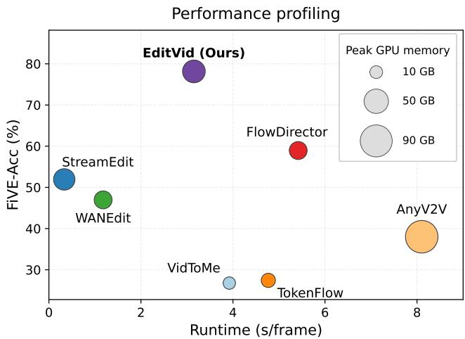  
Figure 6: Performance profiling. The x-axis shows runtime in seconds per frame, the y-axis shows FiVE-Accuracy. Bubble size indicates GPU memory usage.

Across these settings, the qualitative results reveal a consistent trade-of among existing methods. Several preservation-oriented baselines such as FlowDirector, StreamEdit, and Wan-Edit retain the source video well but under-apply the requested transformation, particularly in Figures 8 to 11. Conversely, methods that produce stronger edits can introduce substantial deviations in object geometry, pose, or surrounding content; this behavior is especially apparent for Pyramid-Edit across multiple examples. The global-style result in Figure 7 further shows that strong, faithful stylization remains challenging for existing baselines. The subject-guided examples in Figures 12 and 13 further highlight a key limitation of existing baselines, which generally lack efective reference-identity-guided video editing capability. In contrast, EditVid consistently performs the requested edit while retaining the source motion, pose, and scene structure across both text-guided and subject-guided settings.

## D. Limitations

EditVid is designed for appearance-focused spatial video editing with improved temporal consistency, rather than explicit motion manipulation. Consequently, edits that require changing object dynamics, such as speed, trajectory, or motion direction, are outside the primary scope of the current framework. In addition, our method relies on previous-frame KV context and anchor-to-frame correspondences, which are most efective when temporal associations remain suficiently reliable. Performance may therefore become less stable under severe occlusion or very large appearance changes that substantially weaken correspondence quality. Addressing explicit motion control and stronger long-range temporal reasoning is an important direction for future work.

## E. Broader Impacts

Our training-free framework can broaden access to high-quality video editing by reducing the need for task-specific training, large compute budgets, and specialized pipelines, benefiting research, education, accessibility, and creative media workflows. As a practical safeguard against misuse, we will release code under the MIT License for reproducibility and open research, accompanied by responsible-use guidelines that explicitly discourage deceptive, non-consensual, or harmful applications. These measures should be complemented by continued research on provenance, watermarking, and detection methods beyond temporal inconsistency.

Prompt: Change the video to Ghibli art style.

Source  
EditVid (Ours)  
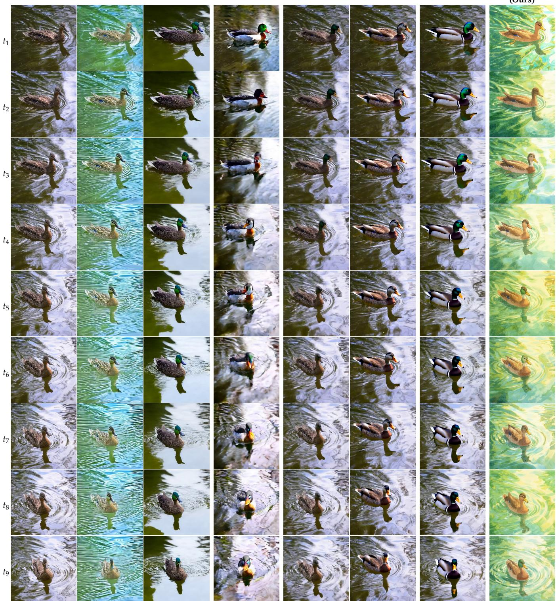  
Figure 7: Global style-transfer comparison. Given the instruction to change the mallard duck video to Ghibli art style, EditVid applies a consistent stylization while preserving the duck’s pose, motion, and surrounding scene. Most baselines either remain close to the source appearance or introduce substantial structural changes; AnyV2V produces a stronger stylization but relies on an external image editor. Frames are sampled at uniformly spaced temporal positions throughout each video.

Prompt: Change the material of the butterfly from a living creature to glass.

Source  
EditVid (Ours)  
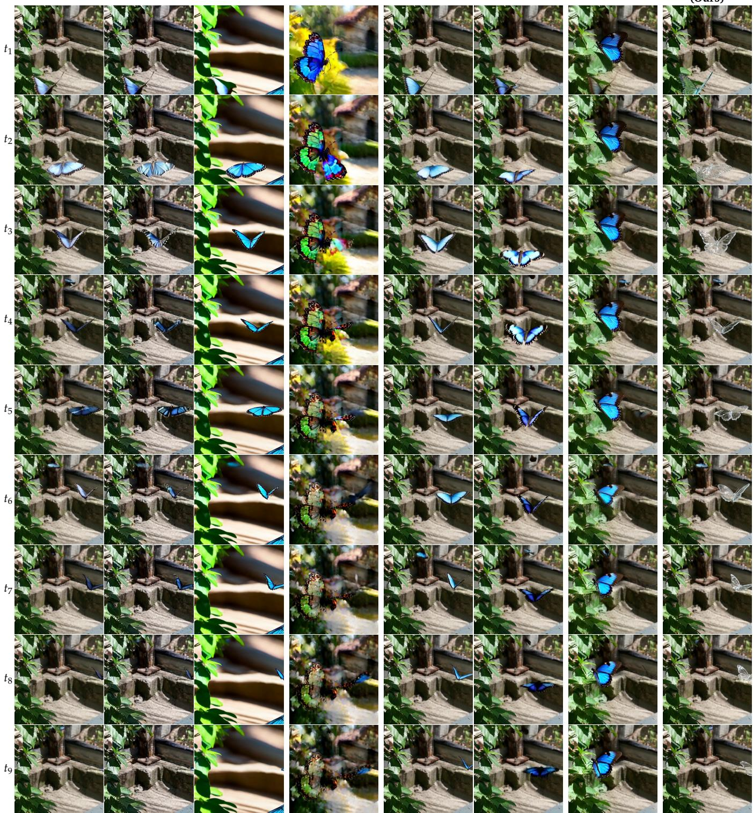  
Figure 8: Object-level material editing. Given the instruction to change the butterfly material from a living creature to glass, EditVid produces a clear glass appearance while preserving the butterfly’s shape, motion, and surrounding scene. Most competing methods largely retain the original appearance or introduce unrelated changes rather than realizing the requested material transformation. Frames are sampled at uniformly spaced temporal positions throughout each video.

Prompt: Change the breakdancer to a holographic breakdancer.  
Source  
AnyV2V [30]  
EditVid (Ours)  
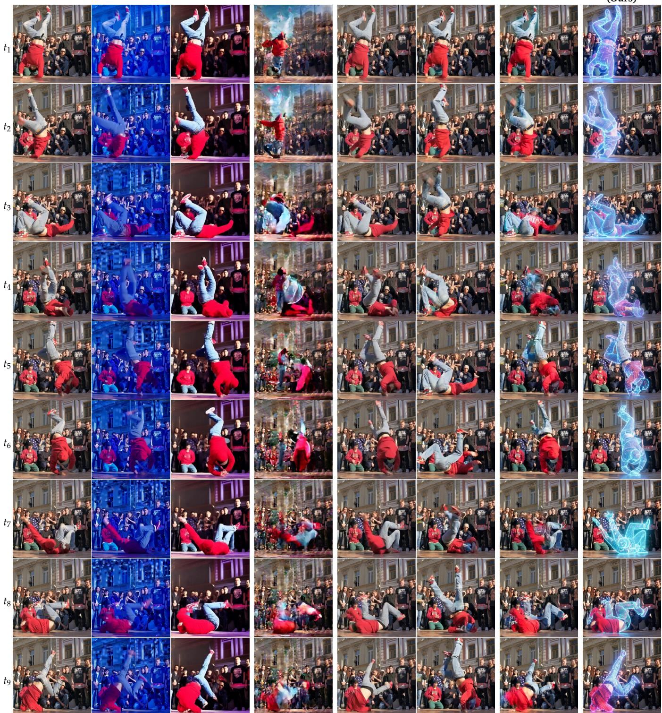  
Figure 9: Object-level appearance editing. Given the instruction to change the breakdancer into a holographic breakdancer, EditVid applies the requested holographic appearance throughout the sequence while preserving the dancer’s highly varying pose and motion. Several baselines either under-apply the edit or introduce broader changes to the subject and surrounding scene. Frames are sampled at uniformly spaced temporal positions throughout each video.

Source

Prompt: Make the wolf’s eyes blue.

VidToMe [35]

Pyramid-Edit [34]

StreamEdit [26]

Wan-Edit [34]

FlowDirector [33]

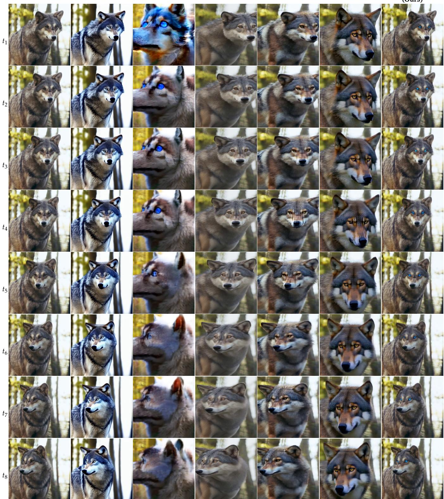  
Figure 10: Localized part-level editing. Given the instruction to make the wolf’s eyes blue, EditVid localizes the edit to the eyes while preserving the wolf’s identity, facial structure, and motion across frames. Several baselines either fail to apply the edit consistently or alter broader aspects of the subject’s appearance. Frames are sampled at uniformly spaced temporal positions throughout each video.

Prompt: Change the person’s hair color to white while keeping the hairstyle exactly the same.

VidToMe [35] Pyramid-Edit [34] StreamEdit [26]  
Source  
Wan-Edit [34]  
FlowDirector [33]  
EditVid (Ours)  
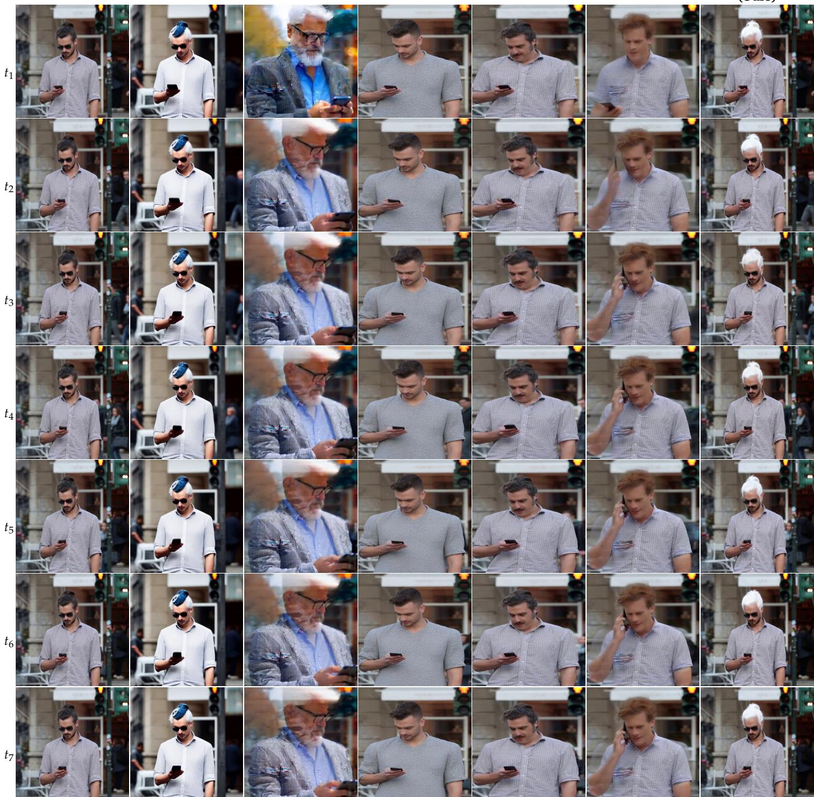  
Figure 11: Localized attribute editing. Given the instruction to change the person’s hair color to white while keeping the hairstyle unchanged, EditVid consistently changes the hair color while preserving the hairstyle, clothing, pose, and surrounding scene. Several competing methods either make only weak changes or alter other aspects of the subject. Frames are sampled at uniformly spaced temporal positions throughout each video.

Prompt: Change the dog in the image to the lion shown in the reference image.

Ref.

Source AnyV2V [30] VidToMe [35] Pyramid-Edit [34]StreamEdit [26] Wan-Edit [34] FlowDirector [33]

EditVid (Ours)  
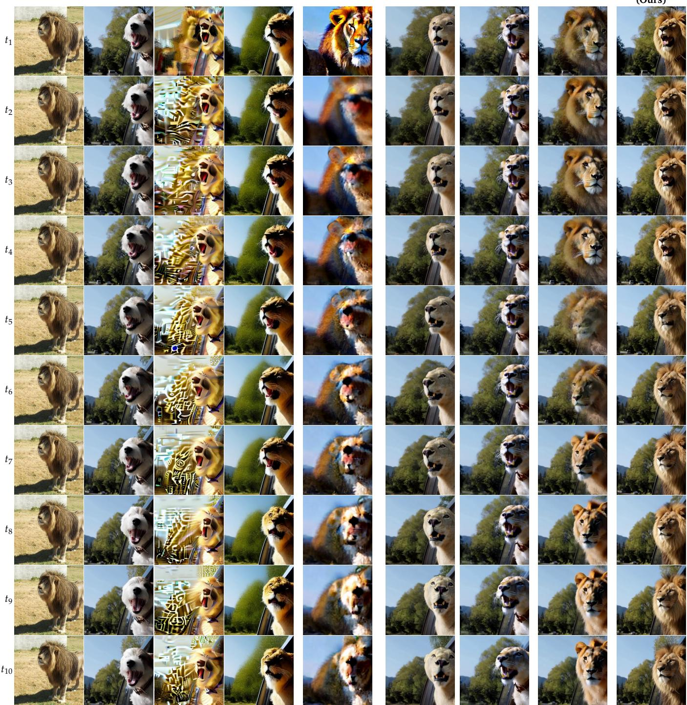  
Figure 12: Subject-guided identity replacement. Given the instruction to change the dog into the lion shown in the reference image, EditVid transfers the lion’s characteristic appearance while preserving the source pose, scale, motion, and scene structure. Several competing methods either retain substantial source-dog appearance, show weak correspondence to the reference, or introduce geometric and background changes. Frames are sampled at uniformly spaced temporal positions throughout each video.

Prompt: Replace only the swan with the polar bear from the reference image.

Ref.  
Source AnyV2V [30] VidToMe [35] Pyramid-Edit [34]StreamEdit [26] Wan-Edit [34] FlowDirector [33]  
EditVid (Ours)  
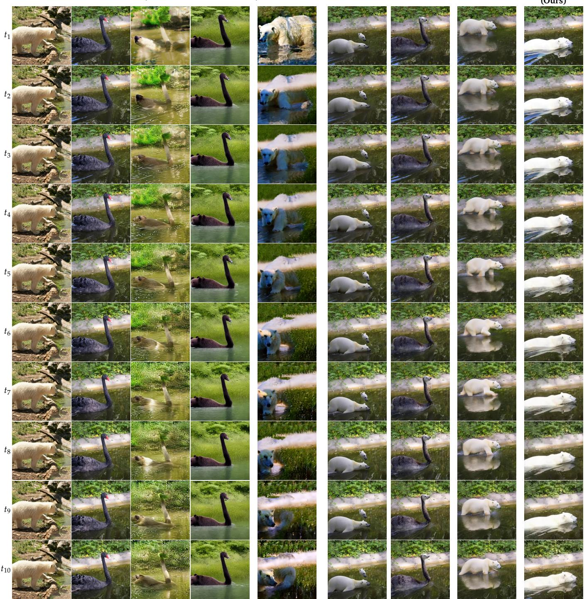  
Figure 13: Subject-guided editing under large semantic change. Given the instruction to replace the source subject with the polar bear shown in the reference image, EditVid maintains a coherent polar-bear appearance while preserving the source trajectory, motion, and interaction with the surrounding water. Competing methods more often exhibit incomplete identity transfer, geometric deformation, or temporal inconsistency. Frames are sampled at uniformly spaced temporal positions throughout each video.