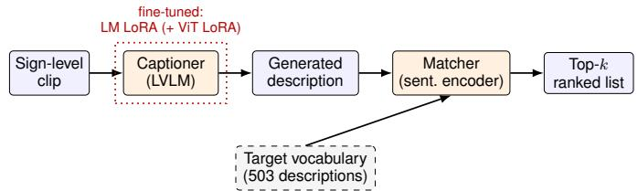
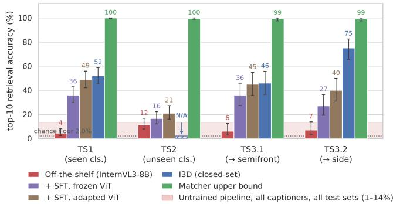

# A Reverse Sign Language Dictionary: Open-Vocabulary Sign Recognition from Continuous Signing via Video Captioning and Description Retrieval

Santiago Poveda-Gutierrez´

Grad. School of IST

Hideki Nakayama

The University of Tokyo

Tokyo, Japan

santiago@nlab.ci.i.u-tokyo.ac.jp

Grad. School of IST

The University of Tokyo

Tokyo, Japan

nakayama@ci.i.u-tokyo.ac.jp

Mayumi Bono

Information and Society Research Division

National Institute of Informatics

Tokyo, Japan

bono@nii.ac.jp

Abstract—Isolated Sign Language Recognition (ISLR) is conventionally cast as closed-set classification over gloss labels, which cannot generalize to signs unseen in training and ties every deployment to a gloss-annotated lexicon. We instead recognize signs extracted from continuous signing by (1) captioning a sign-level clip into a free-form procedural description of the articulation with an open-weight vision–language model, and (2) retrieving the closest entry from a vocabulary of target descriptions with a multilingual sentence encoder: a reverse sign language dictionary that needs no gloss supervision and admits an open vocabulary. On 1,300 sign-level segments from a Japanese Sign Language (JSL) dialogue corpus annotated with procedural descriptions (against a 2% top-10 chance floor over the 503- entry target vocabulary), fine-tuning the captioner substantially improves seen-class retrieval: language and vision tower finetuning raises top-10 retrieval on seen classes from 4.5% (untrained) to 49%, becoming statistically indistinguishable from a standard supervised closed-set classifier (I3D) on two of the three test sets where a closed-set classifier can be evaluated at all. More importantly, unseen-class retrieval also improves significantly over the untrained pipeline (11.5%→21.0% top-10, p = 0.0094), a regime in which the closed-set classifier cannot participate. A matcher-side empirical upper-bound analysis shows the sentence encoder already recovers close to 100% of paraphrased gold descriptions, locating a gap in captioning quality that we aim to address in future work. To our knowledge this is the first description-based, open-vocabulary sign lookup from continuous signing without gloss supervision, and the first for JSL.

Index Terms—sign language recognition, open-vocabulary retrieval, multimodal communication, vision-language models, accessibility, cross-lingual generalization

## I. INTRODUCTION

Signed languages are complete natural languages, and ISLR underpins accessibility tools such as sign-language dictionaries, where lookup means finding the meaning of a sign one just saw. Yet most ISLR research assumes isolated, deliberately produced clips and a fixed gloss inventory. Naturally occurring signing, on the contrary, is continuous (coarticulated, fast, ≈0.5 s/sign on average in our corpus), and the lexicon is never fully covered by training.

Recognizing signs within continuous signing exists in the literature as sign spotting [1], [2], but it is gloss-supervised and closed-vocabulary. Zero-shot recognition from textual sign descriptions has been studied for isolated, dictionary-style productions [3], and dictionary-retrieval framings of ISLR [4], [5] are the closest neighbors of our pipeline. To our knowledge, however, no prior method performs description-based, openvocabulary sign lookup from continuous signing without gloss supervision, and none of the sign-spotting literature targets JSL. Our research questions are deliberately basic: can this concept work in practice?, and can it be trained while still retrieving signs never seen in training? We contribute (1) a modular captioning + retrieval pipeline for open-vocabulary ISLR from continuous signing; (2) an evaluation protocol with zero-shot unseen-class and view-generalization splits against a closed-set baseline and a matcher upper bound; and (3) a controlled fine-tuning study across two regimes (captioner SFT with the vision tower frozen or also adapted), showing that adapting the vision tower yields the larger improvement and also moves unseen-class retrieval significantly above the untrained baseline.

## II. METHOD

## A. Pipeline

Given a sign-level clip, an open-weight large vision– language model (LVLM; InternVL3, 8B [6]) is prompted to produce a procedural description: how the sign is performed (e.g., hand shape, location, movement). The produced description is embedded by a multilingual sentence encoder (BGE-M3 [7]) and scored by cosine similarity against the precomputed target vocabulary, returning sorted top-k entries (Fig. 1). Both stages are swappable modules behind a common interface; captioning and matching are performed in Japanese throughout this paper (§II-B), the language of the ground-truth descriptions.

  
Fig. 1. The pipeline. Both stages are swappable; fine-tuning (§II-C) updates the captioner’s language-model adapters and, in the vision-adapted regime, a low-rank adapter on its vision tower as well. The matcher and vocabulary are untouched throughout the results reported here.

## B. Data and evaluation protocol

We use a subset of the JSL dialogue corpus [8] whose signlevel segments are annotated with Relevant Annotation [9]: free-form Japanese descriptions of how each sign is articulated in conversation, which often differ from its dictionary citation form. It comprises 1,300 segments, 5 signers (2 prefectures), semi-frontal and side views, and 503 unique descriptions. The two active-signer single-view crops of each segment are used for testing. Each query has exactly one gold description; we report top-k retrieval accuracy $( k = 1 , 5 , 1 0 )$ against the full vocabulary, with Wilson 95% CIs. Out of the corpus, we define four test sets: TS1 (unseen segments, seen classes); TS2 (singleton descriptions, zero training segments, inaccessible to closed-set classifiers); TS3.1/TS3.2 (view generalization, semi-frontal↔side, sharing the same 100 descriptions/segments so class difficulty is not a confound). We compare against a supervised closed-set classifier (I3D, an Inflated 3D ConvNet [10], initialized on Kinetics, a large actionrecognition video dataset, and fine-tuned per test set [11]; a standard closed-set reference point) and a matcher upper bound: an LLM produces three types of paraphrases for each gold description (lexical, structural, and free-form rewrites, the last closest to how a real caption could read), which are fed to the matcher directly, isolating matcher error from captioning error.

## C. Fine-tuning: two regimes

Both regimes fine-tune InternVL3-8B with LoRA [12] via LLaMA-Factory [13]. In both, we use one uninterrupted 9- epoch cosine schedule, per-test-set training pools with the same train/test exclusion rules, and identical prompts/decoding to the off-the-shelf pipeline. Regime A (frozen vision tower) trains only the language model’s LoRA adapters and the multimodal projector. Regime B (vision-adapted) additionally adds the vision transformer (ViT)’s linear layers to the LoRA target set. Each test set’s A/B pair is a matched control (regime A and B are otherwise identical runs, so any difference between them isolates one variable): identical data, schedule, and seed, differing only in whether the vision tower is adapted.

## III. RESULTS

A. Vision-adapted fine-tuning matches I3D at top-5/top-10, beats it at top-1, and improves unseen-class retrieval

Table I and Fig. 2 illustrate the results: each step (offthe-shelf→frozen-ViT SFT→vision-adapted SFT) improves retrieval on every test set, seen and unseen alike. Table I itself reports only point estimates and Wilson CIs; every p-value in this section, starting here, is instead from a separate paired exact McNemar test on the same items, comparing two of the table’s accuracy figures at a time. On TS1, adapting the vision tower adds +13.0pp top-10 over the frozen-ViT control $( p = 8 . 6 \times 1 0 ^ { - 4 } )$ , +44.5pp over untrained $( p = 2 . 4 \times 1 0 ^ { - 2 2 } )$ . The rest of this section reports three further findings against I3D and the untrained pipeline.

  
Fig. 2. Top-10 accuracy comparison, error bars represent Wilson 95% CIs. Left to right per test set: our three regimes, I3D (closed-set; N/A on TS2), and the matcher upper bound (retrieval average over the three paraphrase types defined in §II-B). The untrained band is the global min–max top-10 accuracy pooled across test sets over every open-weight LVLM we screened off-the-shelf as a captioner (InternVL3-8B, used elsewhere in this paper, plus several other open-weight vision-language models) in this same Japanese matching configuration. See §III-A for the per-test-set comparison this figure summarizes.

Top-5/top-10 retrieval is now comparable to I3D on two of three eligible test sets. On TS1, top-5/top-10 are a statistical draw $( p = 0 . 9 0 , p = 0 . 5 5 )$ . TS3.1 goes further: the pipeline leads or draws every cell (top-5 p = 0.073, top-10 p = 1.0). TS3.2 reverses it: I3D keeps a significant lead at top-5/top-10 $( p = 0 . 0 0 0 2 5 , p = 1 . 2 { \times } 1 0 ^ { - 6 } )$ . We ruled out train/test leakage as the cause, and the training-pool composition is structurally symmetric between TS3.1 and TS3.2, so it could not explain an asymmetry between them. We do not yet have an explanation for why this specific test direction (predicting the side view) favors the closed-set classifier; it may be a particularity of this I3D instantiation.

Top-1 accuracy is higher than I3D on every eligible test set. The pipeline leads I3D at top-1 on TS1 (29.0 vs. 15.5, $p = 6 . 6 \times 1 0 ^ { - 5 } )$ , TS3.1 (34.0 vs. 12.0, $p = 2 . 7 \times 1 0 ^ { - 5 } )$ , and TS3.2 (27.0 vs. 14.0, $p = 0 . 0 2 9 )$ alike, including on the one test set where I3D wins at top-5/top-10. A closed-set classifier cannot appear in a TS2 row at all: it has no output unit for a class with zero training segments, so it is confined to the chance floor by construction there.

Training improves unseen-class retrieval. Frozen-ViT SFT alone leaves TS2 statistically flat relative to untrained. With the vision tower adapted, TS2 top-10 improves significantly over untrained $( 1 1 . 5 \%  2 1 . 0 \% , p = 0 . 0 0 9 4 )$ . Stated precisely: the gain is significant against untrained; against the frozen-ViT matched control it is directionally positive but not significant at $n = 2 0 0 ( + 4 . 5 \mathrm { p p } , p = 0 . 1 2 2 )$ , so its attribution to the vision tower specifically remains directional.

TABLE I  
RETRIEVAL ACCURACY (%) BY TRAINING REGIME, WITH REFERENCE POINTS, ALL INTERNVL3-8B/JA UNLESS NOTED (WILSON 95% CIS IN BRACKETS). CEILING IS THE MATCHER UPPER BOUND (§II-B), AVERAGED OVER THE THREE PARAPHRASE TYPES. BOLD: THE BEST OF THE FOUR COMPETING METHODS (OFF-THE-SHELF, +SFT FROZEN VIT, +SFT ADAPTED VIT, I3D) PER ROW. CHANCE FLOOR: TOP-1/5/10 0.2/1.0/2.0% RESPECTIVELY (503-ENTRY VOCABULARY) AT EVERY n BELOW.
<table><tr><td>Test set (n)</td><td>k</td><td>Off-the-shelf</td><td>+SFT (frozen ViT)</td><td>+SFT (adapted ViT)</td><td>I3D</td><td>Ceiling</td></tr><tr><td rowspan="3">TS1, seen (200)</td><td></td><td>0.5 [0.1, 2.8]</td><td>18.5 [13.7, 24.5]</td><td>29.0 [23.2, 35.6]</td><td>15.5 [11.1, 21.2]</td><td>89.7[87.0, 91.9]</td></tr><tr><td>15</td><td>3.5 [1.7,7.1]</td><td>28.5 [22.7, 35.1]</td><td>40.0 [33.5, 46.9]</td><td>39.0 [32.5, 45.9]</td><td>98.7[97.4,99.3]</td></tr><tr><td>10</td><td>4.5 [2.4, 8.3]</td><td>36.0[29.7,42.9]</td><td>49.0[42.2, 55.9]</td><td>52.0 [45.1, 58.8]</td><td>100.0 [99.4, 100.0]</td></tr><tr><td rowspan="3">TS2, unseen (200)</td><td></td><td>2.5 [1.1, 5.7]</td><td>0.0 [0.0, 1.9]</td><td>0.0 [0.0, 1.9]</td><td>N/A</td><td>92.0 [89.6, 93.9]</td></tr><tr><td>15</td><td>7.5 [4.6, 12.0]</td><td>10.5 [7.0, 15.5]</td><td>13.5 [9.5, 18.9]</td><td>N/A</td><td>98.7[97.4, 99.3]</td></tr><tr><td>10</td><td>11.5[7.8, 16.7]</td><td>16.5 [12.0, 22.3]</td><td>21.0[15.9, 27.2]</td><td>N/A</td><td>99.7 [98.8, 99.9]</td></tr><tr><td rowspan="3">TS3.1, →semifr. (100)</td><td>1</td><td>0.0 [0.0, 3.7]</td><td>19.0[12.5,27.8]</td><td>34.0 [25.5, 43.7]</td><td>12.0 [7.0, 19.8]</td><td>90.7 [86.8, 93.5]</td></tr><tr><td>5</td><td>6.0 [2.8, 12.5]</td><td>29.0 [21.0, 38.5]</td><td>39.0 [30.0, 48.8]</td><td>27.0[19.3, 36.4]</td><td>97.7 [95.3, 98.9]</td></tr><tr><td>10</td><td>6.0 [2.8, 12.5]</td><td>36.0 [27.3, 45.8]</td><td>45.0[35.6, 54.8]</td><td>46.0 [36.6, 55.7]</td><td>99.3 [97.6, 99.8]</td></tr><tr><td rowspan="3">TS3.2, →side (100)</td><td>1</td><td>1.0 [0.2, 5.5]</td><td>16.0[10.1, 24.4]</td><td>27.0 [19.3, 36.4]</td><td>14.0 [8.5, 22.1]</td><td>90.7 [86.8, 93.5]</td></tr><tr><td>5</td><td>6.0 [2.8, 12.5]</td><td>22.0[15.0, 31.1]</td><td>36.0[27.3, 45.8]</td><td>61.0 [51.2, 70.0]</td><td>97.7 [95.3, 98.9]</td></tr><tr><td>10</td><td>7.0 [3.4, 13.7]</td><td>27.0[19.3, 36.4]</td><td>40.0[30.9,49.8]</td><td>75.0 [65.7, 82.5]</td><td>99.3 [97.6, 99.8]</td></tr></table>

## B. Why LoRA-on-ViT instead of full ViT fine-tuning

We conducted an ablation that rules out “more visual parameters is simply better” at this data scale, not in general: a full fine-tune of the entire vision tower at the same learning rate collapses the model (one distinct caption across 200 clips at epoch 1). A 2×2 (LoRA-on-ViT vs. full ViT × two learning rates) shows that capacity helps at matched learning rate (+9.0pp, p = 0.025), but the lower learning rate a full finetune needs costs more than that gain $( - 1 5 . 0 \mathrm { p p } , p = 1 . 0 { \times } 1 0 ^ { - 4 } )$ since it also slows the language model’s own adapters. LoRAon-ViT at a moderate, matched learning rate remains the best recipe at this data scale (≈800 unique training segments), evidence for a data-limited ceiling, motivating the large-scale masked video pre-training proposed under “Longer-horizon” below (§IV).

The matcher is not the limiting factor: paraphrasing the gold description recovers it 90–100% of the time (Table I’s Ceiling column), so the remaining gap sits concretely in what the captioner sees and says, not in retrieval.

## IV. LIMITATIONS AND FUTURE WORK

Limitations. Each configuration is trained once (a single random seed), so we cannot yet separate a genuine training effect from ordinary run-to-run variance. Sample sizes are modest (n = 100–200): across Table I’s 36 cells the average Wilson CI half-width is ±5.7pp, which bounds how small an effect this design can resolve in general, including the TS2 arm-vscontrol comparison above. All 5 signers appear in both training and test. Held-out test segments, TS2’s singletons included, are drawn from longer recording sessions that also contain training segments (of other classes), so some trained accuracy on any test set may partly reflect that shared context (signer, clothing, background) rather than only sign recognition transferring. The corpus remains small and single-language.

Separately, the fine-tuned captioner’s output collapses toward its own training vocabulary: on TS1, over 90% of its generated captions are near-verbatim copies of a training-set target description, versus 0% before fine-tuning, and this rate is statistically unchanged whether or not the vision tower is adapted. We read this as a signature of overfitting at the current data scale (a few hundred to a few thousand training clips per test set) rather than a property of vision-tower adaptation specifically, and interpret it as a further argument for the largescale pre-training proposed below.

This also explains an apparent tension in §III-A above: training raises TS2 top-5/top-10 while top-1 stays at 0.0% for both regimes (Table I). Since TS2 classes have zero training segments of their own, a verbatim copy of a training-set description can never be the exact gold string, so top-1 is structurally 0% once the captioner is collapsing onto that vocabulary. Top-5/top-10 still improve because the collapsed captions the model reaches for are semantically close to the true gold, close enough for the matcher to place the gold in the shortlist, which is itself evidence that visual understanding is happening as well.

Planned next. (1) A cross-lingual test set, testing whether the open-vocabulary property transfers across languages as well as across classes. (2) A CLIP-style contrastive video-text baseline, to test whether a different architecture generalizes as well to unseen sentence formats and target dictionaries.

Longer-horizon. Large-scale masked video pre-training of the vision tower before captioner SFT, directly motivated by §III-B; paraphrase-augmented SFT training targets, to address the output-space collapse; a video-aware reranker and paraphrase-aware matcher.

## ACKNOWLEDGMENTS

We thank Kazuyoshi Yoshii, Tatsuya Kawahara, Junwen Mo, and Duc Minh Vo for valuable discussions on the pipeline and evaluation protocol, and the Deaf annotators for their time and expertise.

Funding: This work was supported by JSPS KAKENHI Grant Numbers 22B102 and 22H05014, by the Japan Science and Technology Agency (JST) under the Adopting Sustainable Partnerships for Innovative Research Ecosystem (ASPIRE) program, Grant Number JPMJAP25B3, and by the Mitsubishi Zaidan Foundation, project ID 202420002, “Understanding Minority Languages and Communication Using Artificial Intelligence Technology.”

## REFERENCES

[1] L. Momeni, G. Varol, S. Albanie, T. Afouras, and A. Zisserman, “Watch, read and lookup: Learning to spot signs from multiple supervisors,” in Proceedings of the Asian Conference on Computer Vision (ACCV), 2020.

[2] S. Albanie, G. Varol, L. Momeni, T. Afouras, J. S. Chung, N. Fox, and A. Zisserman, “BSL-1K: Scaling up co-articulated sign language recognition using mouthing cues,” in Proceedings of the European Conference on Computer Vision (ECCV), 2020, pp. 35–53.

[3] Y. C. Bilge, R. G. Cinbis, and N. Ikizler-Cinbis, “Towards zero-shot sign language recognition,” IEEE Transactions on Pattern Analysis and Machine Intelligence, vol. 45, no. 1, pp. 1217–1232, 2022.

[4] A. Desai, L. Berger, F. Minakov, N. Milano, C. Singh, K. Pumphrey, R. Ladner, H. Daume III, A. X. Lu, N. Caselli´ et al., “ASL Citizen: A community-sourced dataset for advancing isolated sign language recognition,” in Advances in Neural Information Processing Systems (NeurIPS), vol. 36, 2023, pp. 76 893–76 907.

[5] Z. Jiang, G. Sant, A. Moryossef, M. Muller, R. Sennrich, and S. Ebling,¨ “SignCLIP: Connecting text and sign language by contrastive learning,” in Proceedings of the Conference on Empirical Methods in Natural Language Processing (EMNLP), 2024, pp. 9171–9193.

[6] J. Zhu, W. Wang, Z. Chen, Z. Liu, S. Ye, L. Gu, H. Tian, Y. Duan, W. Su, J. Shao et al., “InternVL3: Exploring advanced training and test-time recipes for open-source multimodal models,” arXiv preprint arXiv:2504.10479, 2025.

[7] J. Chen, S. Xiao, P. Zhang, K. Luo, D. Lian, and Z. Liu, “M3- Embedding: Multi-linguality, multi-functionality, multi-granularity text embeddings through self-knowledge distillation,” in Findings of the Association for Computational Linguistics: ACL 2024, 2024, pp. 2318– 2335.

[8] M. Bono, K. Kikuchi, P. Cibulka, and Y. Osugi, “A colloquial corpus of Japanese Sign Language: Linguistic resources for observing sign language conversations,” in Proceedings of the Language Resources and Evaluation Conference (LREC), 2014, pp. 1898–1904.

[9] M. Bono and M. Sunaga, “A proposal for an annotation method of bodily actions based on participants’ understanding,” in Proceedings of the Special Interest Group on Spoken Language Understanding and Dialogue (SIG-SLUD). The Japanese Society for Artificial Intelligence, 2016, SIG-SLUD-B503-02, 7–12. In Japanese.

[10] J. Carreira and A. Zisserman, “Quo vadis, action recognition? a new model and the Kinetics dataset,” in Proceedings of the IEEE Conference on Computer Vision and Pattern Recognition (CVPR), 2017, pp. 6299– 6308.

[11] D. Li, C. Rodriguez, X. Yu, and H. Li, “Word-level deep sign language recognition from video: A new large-scale dataset and methods comparison,” in Proceedings of the IEEE/CVF Winter Conference on Applications of Computer Vision (WACV), 2020, pp. 1459–1469.

[12] E. J. Hu, Y. Shen, P. Wallis, Z. Allen-Zhu, Y. Li, S. Wang, L. Wang, and W. Chen, “LoRA: Low-rank adaptation of large language models,” in Proceedings of the International Conference on Learning Representations (ICLR), 2022.

[13] Y. Zheng, R. Zhang, J. Zhang, Y. Ye, Z. Luo, Z. Feng, and Y. Ma, “LlamaFactory: Unified efficient fine-tuning of 100+ language models,” in Proceedings ofthe Annual Meeting ofthe Associationfor Computational Linguistics: System Demonstrations (ACL), 2024.